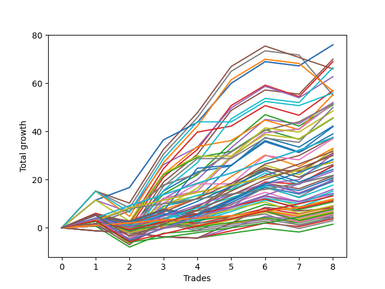

# Short Wallace Betterrerer 020 
- Symbol: ES
- Date Range: 3/19/22 - 5/22/22
- Trading Period: 7:20-12:30
- Number of Trades: 4


| Name | Win Percent | Profit | Avg Profit / Trade |     | Name | Win Percent | Profit | Avg Profit / Trade |
| ---- | ----------- | ------ | ------------------ | --- | ---- | ----------- | ------ | ------------------ |
| Sorted By <br> Profit | | | | | Sorted By <br> Win Percentage ||||
| Five | 75.00 | 29750.00 | 7437.50 |     | Four | 100.00 | 26375.00 | 6593.75 |
| Four | 100.00 | 26375.00 | 6593.75 |     | Five | 75.00 | 29750.00 | 7437.50 |
| Thirty-Six | 75.00 | 25000.00 | 6250.00 |     | Thirty-Six | 75.00 | 25000.00 | 6250.00 |
| Three | 75.00 | 15750.00 | 3937.50 |     | Three | 75.00 | 15750.00 | 3937.50 |
| Sixteen | 75.00 | 15125.00 | 3781.25 |     | Sixteen | 75.00 | 15125.00 | 3781.25 |
| Twenty-Two | 75.00 | 14125.00 | 3531.25 |     | Twenty-Two | 75.00 | 14125.00 | 3531.25 |
| Twenty-Three | 75.00 | 8375.00 | 2093.75 |     | Twenty-Three | 75.00 | 8375.00 | 2093.75 |
| Fourteen | 75.00 | 8125.00 | 2031.25 |     | Fourteen | 75.00 | 8125.00 | 2031.25 |
| Two | 75.00 | 7875.00 | 1968.75 |     | Two | 75.00 | 7875.00 | 1968.75 |
| Twenty | 75.00 | 7125.00 | 1781.25 |     | Twenty | 75.00 | 7125.00 | 1781.25 |
| Seventeen | 75.00 | 4750.00 | 1187.50 |     | Seventeen | 75.00 | 4750.00 | 1187.50 |
| Thirteen | 75.00 | 4750.00 | 1187.50 |     | Thirteen | 75.00 | 4750.00 | 1187.50 |
| One | 75.00 | 4750.00 | 1187.50 |     | One | 75.00 | 4750.00 | 1187.50 |
| Twelve | 75.00 | 4500.00 | 1125.00 |     | Twelve | 75.00 | 4500.00 | 1125.00 |
| Eight | 50.00 | 4375.00 | 1093.75 |     | Thirty-Five | 75.00 | 4125.00 | 1031.25 |
| Thirty-Five | 75.00 | 4125.00 | 1031.25 |     | Nineteen | 75.00 | 4125.00 | 1031.25 |
| Nineteen | 75.00 | 4125.00 | 1031.25 |     | Twenty-One | 75.00 | 3875.00 | 968.75 |
| Twenty-One | 75.00 | 3875.00 | 968.75 |     | Thirty-Four | 75.00 | 3750.00 | 937.50 |
| Thirty-Four | 75.00 | 3750.00 | 937.50 |     | Fifteen | 75.00 | 3750.00 | 937.50 |
| Fifteen | 75.00 | 3750.00 | 937.50 |     | Eighteen | 75.00 | 3500.00 | 875.00 |
| Eighteen | 75.00 | 3500.00 | 875.00 |     | Thirty-Three | 75.00 | 625.00 | 156.25 |
| Seven | 50.00 | 2250.00 | 562.50 |     | Thirty-Two | 75.00 | 625.00 | 156.25 |
| Six | 50.00 | 1375.00 | 343.75 |     | Thirty-One | 75.00 | 625.00 | 156.25 |
| Eleven | 25.00 | 1000.00 | 250.00 |     | Thirty | 75.00 | 625.00 | 156.25 |
| Nine | 25.00 | 1000.00 | 250.00 |     | Twenty-Nine | 75.00 | 625.00 | 156.25 |
| Thirty-Three | 75.00 | 625.00 | 156.25 |     | Twenty-Eight | 75.00 | 625.00 | 156.25 |
| Thirty-Two | 75.00 | 625.00 | 156.25 |     | Twenty-Seven | 75.00 | 625.00 | 156.25 |
| Thirty-One | 75.00 | 625.00 | 156.25 |     | Twenty-Six | 75.00 | 625.00 | 156.25 |
| Thirty | 75.00 | 625.00 | 156.25 |     | Twenty-Five | 75.00 | 625.00 | 156.25 |
| Twenty-Nine | 75.00 | 625.00 | 156.25 |     | Twenty-Four | 75.00 | 625.00 | 156.25 |
| Twenty-Eight | 75.00 | 625.00 | 156.25 |     | Eight | 50.00 | 4375.00 | 1093.75 |
| Twenty-Seven | 75.00 | 625.00 | 156.25 |     | Seven | 50.00 | 2250.00 | 562.50 |
| Twenty-Six | 75.00 | 625.00 | 156.25 |     | Six | 50.00 | 1375.00 | 343.75 |
| Twenty-Five | 75.00 | 625.00 | 156.25 |     | Eleven | 25.00 | 1000.00 | 250.00 |
| Twenty-Four | 75.00 | 625.00 | 156.25 |     | Nine | 25.00 | 1000.00 | 250.00 |
| Ten | 25.00 | 250.00 | 62.50 |     | Ten | 25.00 | 250.00 | 62.50 |

### Test One
* Sell when price hits the middle line of the 20p bollinger
* No Stoploss
* Results:
```
Total Trades: 4
Percent Up: 25.00
Percent Down: 75.00
Total Points Moved Down: 9.50
Potential Profit: 4750.00
Total Points Ups: 2.50 Count Ups: 1
Total Points Downs: 12.00 Count Downs: 3
```

<details><summary>Trades</summary>

<code>In: 2022-03-25 11:57:00		Out: 2022-03-25 11:57:20		Total Position Time: 00:20		Total Move Down: 0.75		Total to Date: -0.75</code> <br />
<code>In: 2022-04-06 10:36:00		Out: 2022-04-06 10:47:15		Total Position Time: 11:15		Total Move Down: -2.50		Total to Date: 1.75</code> <br />
<code>In: 2022-05-24 09:18:00		Out: 2022-05-24 09:21:30		Total Position Time: 03:30		Total Move Down: 5.00		Total to Date: -3.25</code> <br />
<code>In: 2022-06-10 12:29:00		Out: 2022-06-10 12:30:30		Total Position Time: 01:30		Total Move Down: 6.25		Total to Date: -9.50</code> <br />


</details>

### Test Two
* Sell when the price hits the lower line of the 20p 1std bollinger
* No Stoploss
* Results:
```
Total Trades: 4
Percent Up: 25.00
Percent Down: 75.00
Total Points Moved Down: 15.75
Potential Profit: 7875.00
Total Points Ups: 3.50 Count Ups: 1
Total Points Downs: 19.25 Count Downs: 3
```

<details><summary>Trades</summary>

<code>In: 2022-03-25 11:57:00		Out: 2022-03-25 12:00:50		Total Position Time: 03:50		Total Move Down: 2.75		Total to Date: -2.75</code> <br />
<code>In: 2022-04-06 10:36:00		Out: 2022-04-06 10:56:55		Total Position Time: 20:55		Total Move Down: -3.50		Total to Date: 0.75</code> <br />
<code>In: 2022-05-24 09:18:00		Out: 2022-05-24 09:29:00		Total Position Time: 11:00		Total Move Down: 6.25		Total to Date: -5.50</code> <br />
<code>In: 2022-06-10 12:29:00		Out: 2022-06-10 12:35:55		Total Position Time: 06:55		Total Move Down: 10.25		Total to Date: -15.75</code> <br />


</details>

### Test Three
* Sell when the price hits the lower line of the 20p 2std bollinger
* No Stoploss
* Results:
```
Total Trades: 4
Percent Up: 25.00
Percent Down: 75.00
Total Points Moved Down: 31.50
Potential Profit: 15750.00
Total Points Ups: 1.75 Count Ups: 1
Total Points Downs: 33.25 Count Downs: 3
```

<details><summary>Trades</summary>

<code>In: 2022-03-25 11:57:00		Out: 2022-03-25 12:01:50		Total Position Time: 04:50		Total Move Down: 4.75		Total to Date: -4.75</code> <br />
<code>In: 2022-04-06 10:36:00		Out: 2022-04-06 10:58:00		Total Position Time: 22:00		Total Move Down: -1.75		Total to Date: -3.00</code> <br />
<code>In: 2022-05-24 09:18:00		Out: 2022-05-24 09:32:35		Total Position Time: 14:35		Total Move Down: 13.25		Total to Date: -16.25</code> <br />
<code>In: 2022-06-10 12:29:00		Out: 2022-06-10 12:43:25		Total Position Time: 14:25		Total Move Down: 15.25		Total to Date: -31.50</code> <br />


</details>

### Test Four
* Sell when the price hits the middle line of the 1std VWAP
* No Stoploss
* Results:
```
Total Trades: 4
Percent Up: 0.00
Percent Down: 100.00
Total Points Moved Down: 52.75
Potential Profit: 26375.00
Total Points Ups: 0.00 Count Ups: 0
Total Points Downs: 52.75 Count Downs: 4
```

<details><summary>Trades</summary>

<code>In: 2022-03-25 11:57:00		Out: 2022-03-25 12:20:30		Total Position Time: 23:30		Total Move Down: 11.50		Total to Date: -11.50</code> <br />
<code>In: 2022-04-06 10:36:00		Out: 2022-04-06 11:00:10		Total Position Time: 24:10		Total Move Down: 5.25		Total to Date: -16.75</code> <br />
<code>In: 2022-05-24 09:18:00		Out: 2022-05-24 09:36:45		Total Position Time: 18:45		Total Move Down: 19.75		Total to Date: -36.50</code> <br />
<code>In: 2022-06-10 12:29:00		Out: 2022-06-10 12:44:00		Total Position Time: 15:00		Total Move Down: 16.25		Total to Date: -52.75</code> <br />


</details>

### Test Five
* Sell when the price hits the lower line of the 1std VWAP
* No Stoploss
* Results:
```
Total Trades: 4
Percent Up: 25.00
Percent Down: 75.00
Total Points Moved Down: 59.50
Potential Profit: 29750.00
Total Points Ups: 7.00 Count Ups: 1
Total Points Downs: 66.50 Count Downs: 3
```

<details><summary>Trades</summary>

<code>In: 2022-03-25 11:57:00		Out: 2022-03-25 12:26:55		Total Position Time: 29:55		Total Move Down: 15.25		Total to Date: -15.25</code> <br />
<code>In: 2022-04-06 10:36:00		Out: 2022-04-06 11:05:55		Total Position Time: 29:55		Total Move Down: -7.00		Total to Date: -8.25</code> <br />
<code>In: 2022-05-24 09:18:00		Out: 2022-05-24 09:47:55		Total Position Time: 29:55		Total Move Down: 22.25		Total to Date: -30.50</code> <br />
<code>In: 2022-06-10 12:29:00		Out: 2022-06-10 12:58:55		Total Position Time: 29:55		Total Move Down: 29.00		Total to Date: -59.50</code> <br />


</details>

### Test Six
* Sell when the price hits the middle line of the 20p bollinger
* Stoploss is -2 points
* Results:
```
Total Trades: 4
Percent Up: 50.00
Percent Down: 50.00
Total Points Moved Down: 2.75
Potential Profit: 1375.00
Total Points Ups: 4.25 Count Ups: 2
Total Points Downs: 7.00 Count Downs: 2
```

<details><summary>Trades</summary>

<code>In: 2022-03-25 11:57:00		Out: 2022-03-25 11:57:20		Total Position Time: 00:20		Total Move Down: 0.75		Total to Date: -0.75</code> <br />
<code>In: 2022-04-06 10:36:00		Out: 2022-04-06 10:38:00		Total Position Time: 02:00		Total Move Down: -2.50		Total to Date: 1.75</code> <br />
<code>In: 2022-05-24 09:18:00		Out: 2022-05-24 09:18:20		Total Position Time: 00:20		Total Move Down: -1.75		Total to Date: 3.50</code> <br />
<code>In: 2022-06-10 12:29:00		Out: 2022-06-10 12:30:30		Total Position Time: 01:30		Total Move Down: 6.25		Total to Date: -2.75</code> <br />


</details>

### Test Seven
* Sell when the price hits the middle line of the 20p bollinger
* Trailing Stop is -2 points
* Results:
```
Total Trades: 4
Percent Up: 50.00
Percent Down: 50.00
Total Points Moved Down: 4.50
Potential Profit: 2250.00
Total Points Ups: 2.50 Count Ups: 2
Total Points Downs: 7.00 Count Downs: 2
```

<details><summary>Trades</summary>

<code>In: 2022-03-25 11:57:00		Out: 2022-03-25 11:57:20		Total Position Time: 00:20		Total Move Down: 0.75		Total to Date: -0.75</code> <br />
<code>In: 2022-04-06 10:36:00		Out: 2022-04-06 10:36:35		Total Position Time: 00:35		Total Move Down: -0.75		Total to Date: -0.00</code> <br />
<code>In: 2022-05-24 09:18:00		Out: 2022-05-24 09:18:20		Total Position Time: 00:20		Total Move Down: -1.75		Total to Date: 1.75</code> <br />
<code>In: 2022-06-10 12:29:00		Out: 2022-06-10 12:30:30		Total Position Time: 01:30		Total Move Down: 6.25		Total to Date: -4.50</code> <br />


</details>

### Test Eight
* Sell when the price hits the lower line of the 20p 1std bollinger
* Stoploss is -2 points
* Results:
```
Total Trades: 4
Percent Up: 50.00
Percent Down: 50.00
Total Points Moved Down: 8.75
Potential Profit: 4375.00
Total Points Ups: 4.25 Count Ups: 2
Total Points Downs: 13.00 Count Downs: 2
```

<details><summary>Trades</summary>

<code>In: 2022-03-25 11:57:00		Out: 2022-03-25 12:00:50		Total Position Time: 03:50		Total Move Down: 2.75		Total to Date: -2.75</code> <br />
<code>In: 2022-04-06 10:36:00		Out: 2022-04-06 10:38:00		Total Position Time: 02:00		Total Move Down: -2.50		Total to Date: -0.25</code> <br />
<code>In: 2022-05-24 09:18:00		Out: 2022-05-24 09:18:20		Total Position Time: 00:20		Total Move Down: -1.75		Total to Date: 1.50</code> <br />
<code>In: 2022-06-10 12:29:00		Out: 2022-06-10 12:35:55		Total Position Time: 06:55		Total Move Down: 10.25		Total to Date: -8.75</code> <br />


</details>

### Test Nine
* Sell when the price hits the lower line of the 20p 1std bollinger
* Trailing Stop is -2 points
* Results:
```
Total Trades: 4
Percent Up: 75.00
Percent Down: 25.00
Total Points Moved Down: 2.00
Potential Profit: 1000.00
Total Points Ups: 3.75 Count Ups: 3
Total Points Downs: 5.75 Count Downs: 1
```

<details><summary>Trades</summary>

<code>In: 2022-03-25 11:57:00		Out: 2022-03-25 11:59:40		Total Position Time: 02:40		Total Move Down: -1.25		Total to Date: 1.25</code> <br />
<code>In: 2022-04-06 10:36:00		Out: 2022-04-06 10:36:35		Total Position Time: 00:35		Total Move Down: -0.75		Total to Date: 2.00</code> <br />
<code>In: 2022-05-24 09:18:00		Out: 2022-05-24 09:18:20		Total Position Time: 00:20		Total Move Down: -1.75		Total to Date: 3.75</code> <br />
<code>In: 2022-06-10 12:29:00		Out: 2022-06-10 12:31:15		Total Position Time: 02:15		Total Move Down: 5.75		Total to Date: -2.00</code> <br />


</details>

### Test Ten
* Sell when the price hits the lower line of the 20p 2std bollinger
* Stoploss is -2 points
* Results:
```
Total Trades: 4
Percent Up: 75.00
Percent Down: 25.00
Total Points Moved Down: 0.50
Potential Profit: 250.00
Total Points Ups: 4.25 Count Ups: 3
Total Points Downs: 4.75 Count Downs: 1
```

<details><summary>Trades</summary>

<code>In: 2022-03-25 11:57:00		Out: 2022-03-25 12:01:50		Total Position Time: 04:50		Total Move Down: 4.75		Total to Date: -4.75</code> <br />
<code>In: 2022-04-06 10:36:00		Out: 2022-04-06 10:38:00		Total Position Time: 02:00		Total Move Down: -2.50		Total to Date: -2.25</code> <br />
<code>In: 2022-05-24 09:18:00		Out: 2022-05-24 09:18:20		Total Position Time: 00:20		Total Move Down: -1.75		Total to Date: -0.50</code> <br />
<code>In: 2022-06-10 12:29:00		Out: 2022-06-10 12:37:20		Total Position Time: 08:20		Total Move Down: -0.00		Total to Date: -0.50</code> <br />


</details>

### Test Eleven
* Sell when the price hits the lower line of the 20p 2std bollinger
* Trailing Stop is -2 points
* Results:
```
Total Trades: 4
Percent Up: 75.00
Percent Down: 25.00
Total Points Moved Down: 2.00
Potential Profit: 1000.00
Total Points Ups: 3.75 Count Ups: 3
Total Points Downs: 5.75 Count Downs: 1
```

<details><summary>Trades</summary>

<code>In: 2022-03-25 11:57:00		Out: 2022-03-25 11:59:40		Total Position Time: 02:40		Total Move Down: -1.25		Total to Date: 1.25</code> <br />
<code>In: 2022-04-06 10:36:00		Out: 2022-04-06 10:36:35		Total Position Time: 00:35		Total Move Down: -0.75		Total to Date: 2.00</code> <br />
<code>In: 2022-05-24 09:18:00		Out: 2022-05-24 09:18:20		Total Position Time: 00:20		Total Move Down: -1.75		Total to Date: 3.75</code> <br />
<code>In: 2022-06-10 12:29:00		Out: 2022-06-10 12:31:15		Total Position Time: 02:15		Total Move Down: 5.75		Total to Date: -2.00</code> <br />


</details>

### Test Twelve
* Sell when the price hits the middle line of the 20p bollinger
* Stoploss is -3 points
* Results:
```
Total Trades: 4
Percent Up: 25.00
Percent Down: 75.00
Total Points Moved Down: 9.00
Potential Profit: 4500.00
Total Points Ups: 3.00 Count Ups: 1
Total Points Downs: 12.00 Count Downs: 3
```

<details><summary>Trades</summary>

<code>In: 2022-03-25 11:57:00		Out: 2022-03-25 11:57:20		Total Position Time: 00:20		Total Move Down: 0.75		Total to Date: -0.75</code> <br />
<code>In: 2022-04-06 10:36:00		Out: 2022-04-06 10:38:15		Total Position Time: 02:15		Total Move Down: -3.00		Total to Date: 2.25</code> <br />
<code>In: 2022-05-24 09:18:00		Out: 2022-05-24 09:21:30		Total Position Time: 03:30		Total Move Down: 5.00		Total to Date: -2.75</code> <br />
<code>In: 2022-06-10 12:29:00		Out: 2022-06-10 12:30:30		Total Position Time: 01:30		Total Move Down: 6.25		Total to Date: -9.00</code> <br />


</details>

### Test Thirteen
* Sell when the price hits the middle line of the 20p bollinger
* Trailing Stop is -3 points
* Results:
```
Total Trades: 4
Percent Up: 25.00
Percent Down: 75.00
Total Points Moved Down: 9.50
Potential Profit: 4750.00
Total Points Ups: 2.50 Count Ups: 1
Total Points Downs: 12.00 Count Downs: 3
```

<details><summary>Trades</summary>

<code>In: 2022-03-25 11:57:00		Out: 2022-03-25 11:57:20		Total Position Time: 00:20		Total Move Down: 0.75		Total to Date: -0.75</code> <br />
<code>In: 2022-04-06 10:36:00		Out: 2022-04-06 10:38:00		Total Position Time: 02:00		Total Move Down: -2.50		Total to Date: 1.75</code> <br />
<code>In: 2022-05-24 09:18:00		Out: 2022-05-24 09:21:30		Total Position Time: 03:30		Total Move Down: 5.00		Total to Date: -3.25</code> <br />
<code>In: 2022-06-10 12:29:00		Out: 2022-06-10 12:30:30		Total Position Time: 01:30		Total Move Down: 6.25		Total to Date: -9.50</code> <br />


</details>

### Test Fourteen
* Sell when the price hits the lower line of the 20p 1std bollinger
* Stoploss is -3 points
* Results:
```
Total Trades: 4
Percent Up: 25.00
Percent Down: 75.00
Total Points Moved Down: 16.25
Potential Profit: 8125.00
Total Points Ups: 3.00 Count Ups: 1
Total Points Downs: 19.25 Count Downs: 3
```

<details><summary>Trades</summary>

<code>In: 2022-03-25 11:57:00		Out: 2022-03-25 12:00:50		Total Position Time: 03:50		Total Move Down: 2.75		Total to Date: -2.75</code> <br />
<code>In: 2022-04-06 10:36:00		Out: 2022-04-06 10:38:15		Total Position Time: 02:15		Total Move Down: -3.00		Total to Date: 0.25</code> <br />
<code>In: 2022-05-24 09:18:00		Out: 2022-05-24 09:29:00		Total Position Time: 11:00		Total Move Down: 6.25		Total to Date: -6.00</code> <br />
<code>In: 2022-06-10 12:29:00		Out: 2022-06-10 12:35:55		Total Position Time: 06:55		Total Move Down: 10.25		Total to Date: -16.25</code> <br />


</details>

### Test Fifteen
* Sell when the price hits the lower line of the 20p 1std bollinger
* Trailing Stop is -3 points
* Results:
```
Total Trades: 4
Percent Up: 25.00
Percent Down: 75.00
Total Points Moved Down: 7.50
Potential Profit: 3750.00
Total Points Ups: 2.50 Count Ups: 1
Total Points Downs: 10.00 Count Downs: 3
```

<details><summary>Trades</summary>

<code>In: 2022-03-25 11:57:00		Out: 2022-03-25 12:00:50		Total Position Time: 03:50		Total Move Down: 2.75		Total to Date: -2.75</code> <br />
<code>In: 2022-04-06 10:36:00		Out: 2022-04-06 10:38:00		Total Position Time: 02:00		Total Move Down: -2.50		Total to Date: -0.25</code> <br />
<code>In: 2022-05-24 09:18:00		Out: 2022-05-24 09:25:20		Total Position Time: 07:20		Total Move Down: 2.75		Total to Date: -3.00</code> <br />
<code>In: 2022-06-10 12:29:00		Out: 2022-06-10 12:31:20		Total Position Time: 02:20		Total Move Down: 4.50		Total to Date: -7.50</code> <br />


</details>

### Test Sixteen
* Sell when the price hits the lower line of the 20p 2std bollinger
* Stoploss is -3 points
* Results:
```
Total Trades: 4
Percent Up: 25.00
Percent Down: 75.00
Total Points Moved Down: 30.25
Potential Profit: 15125.00
Total Points Ups: 3.00 Count Ups: 1
Total Points Downs: 33.25 Count Downs: 3
```

<details><summary>Trades</summary>

<code>In: 2022-03-25 11:57:00		Out: 2022-03-25 12:01:50		Total Position Time: 04:50		Total Move Down: 4.75		Total to Date: -4.75</code> <br />
<code>In: 2022-04-06 10:36:00		Out: 2022-04-06 10:38:15		Total Position Time: 02:15		Total Move Down: -3.00		Total to Date: -1.75</code> <br />
<code>In: 2022-05-24 09:18:00		Out: 2022-05-24 09:32:35		Total Position Time: 14:35		Total Move Down: 13.25		Total to Date: -15.00</code> <br />
<code>In: 2022-06-10 12:29:00		Out: 2022-06-10 12:43:25		Total Position Time: 14:25		Total Move Down: 15.25		Total to Date: -30.25</code> <br />


</details>

### Test Seventeen
* Sell when the price hits the lower line of the 20p 2std bollinger
* Trailing Stop is -3 points
* Results:
```
Total Trades: 4
Percent Up: 25.00
Percent Down: 75.00
Total Points Moved Down: 9.50
Potential Profit: 4750.00
Total Points Ups: 2.50 Count Ups: 1
Total Points Downs: 12.00 Count Downs: 3
```

<details><summary>Trades</summary>

<code>In: 2022-03-25 11:57:00		Out: 2022-03-25 12:01:50		Total Position Time: 04:50		Total Move Down: 4.75		Total to Date: -4.75</code> <br />
<code>In: 2022-04-06 10:36:00		Out: 2022-04-06 10:38:00		Total Position Time: 02:00		Total Move Down: -2.50		Total to Date: -2.25</code> <br />
<code>In: 2022-05-24 09:18:00		Out: 2022-05-24 09:25:20		Total Position Time: 07:20		Total Move Down: 2.75		Total to Date: -5.00</code> <br />
<code>In: 2022-06-10 12:29:00		Out: 2022-06-10 12:31:20		Total Position Time: 02:20		Total Move Down: 4.50		Total to Date: -9.50</code> <br />


</details>

### Test Eighteen
* Sell when the price hits the middle line of the 20p bollinger
* Stoploss is -5 points
* Results:
```
Total Trades: 4
Percent Up: 25.00
Percent Down: 75.00
Total Points Moved Down: 7.00
Potential Profit: 3500.00
Total Points Ups: 5.00 Count Ups: 1
Total Points Downs: 12.00 Count Downs: 3
```

<details><summary>Trades</summary>

<code>In: 2022-03-25 11:57:00		Out: 2022-03-25 11:57:20		Total Position Time: 00:20		Total Move Down: 0.75		Total to Date: -0.75</code> <br />
<code>In: 2022-04-06 10:36:00		Out: 2022-04-06 10:40:35		Total Position Time: 04:35		Total Move Down: -5.00		Total to Date: 4.25</code> <br />
<code>In: 2022-05-24 09:18:00		Out: 2022-05-24 09:21:30		Total Position Time: 03:30		Total Move Down: 5.00		Total to Date: -0.75</code> <br />
<code>In: 2022-06-10 12:29:00		Out: 2022-06-10 12:30:30		Total Position Time: 01:30		Total Move Down: 6.25		Total to Date: -7.00</code> <br />


</details>

### Test Nineteen
* Sell when the price hits the middle line of the 20p bollinger
* Trailing Stop is -5 points
* Results:
```
Total Trades: 4
Percent Up: 25.00
Percent Down: 75.00
Total Points Moved Down: 8.25
Potential Profit: 4125.00
Total Points Ups: 3.75 Count Ups: 1
Total Points Downs: 12.00 Count Downs: 3
```

<details><summary>Trades</summary>

<code>In: 2022-03-25 11:57:00		Out: 2022-03-25 11:57:20		Total Position Time: 00:20		Total Move Down: 0.75		Total to Date: -0.75</code> <br />
<code>In: 2022-04-06 10:36:00		Out: 2022-04-06 10:39:20		Total Position Time: 03:20		Total Move Down: -3.75		Total to Date: 3.00</code> <br />
<code>In: 2022-05-24 09:18:00		Out: 2022-05-24 09:21:30		Total Position Time: 03:30		Total Move Down: 5.00		Total to Date: -2.00</code> <br />
<code>In: 2022-06-10 12:29:00		Out: 2022-06-10 12:30:30		Total Position Time: 01:30		Total Move Down: 6.25		Total to Date: -8.25</code> <br />


</details>

### Test Twenty
* Sell when the price hits the lower line of the 20p 1std bollinger
* Stoploss is -5 points
* Results:
```
Total Trades: 4
Percent Up: 25.00
Percent Down: 75.00
Total Points Moved Down: 14.25
Potential Profit: 7125.00
Total Points Ups: 5.00 Count Ups: 1
Total Points Downs: 19.25 Count Downs: 3
```

<details><summary>Trades</summary>

<code>In: 2022-03-25 11:57:00		Out: 2022-03-25 12:00:50		Total Position Time: 03:50		Total Move Down: 2.75		Total to Date: -2.75</code> <br />
<code>In: 2022-04-06 10:36:00		Out: 2022-04-06 10:40:35		Total Position Time: 04:35		Total Move Down: -5.00		Total to Date: 2.25</code> <br />
<code>In: 2022-05-24 09:18:00		Out: 2022-05-24 09:29:00		Total Position Time: 11:00		Total Move Down: 6.25		Total to Date: -4.00</code> <br />
<code>In: 2022-06-10 12:29:00		Out: 2022-06-10 12:35:55		Total Position Time: 06:55		Total Move Down: 10.25		Total to Date: -14.25</code> <br />


</details>

### Test Twenty-One
* Sell when the price hits the lower line of the 20p 1std bollinger
* Trailing Stop is -5 points
* Results:
```
Total Trades: 4
Percent Up: 25.00
Percent Down: 75.00
Total Points Moved Down: 7.75
Potential Profit: 3875.00
Total Points Ups: 3.75 Count Ups: 1
Total Points Downs: 11.50 Count Downs: 3
```

<details><summary>Trades</summary>

<code>In: 2022-03-25 11:57:00		Out: 2022-03-25 12:00:50		Total Position Time: 03:50		Total Move Down: 2.75		Total to Date: -2.75</code> <br />
<code>In: 2022-04-06 10:36:00		Out: 2022-04-06 10:39:20		Total Position Time: 03:20		Total Move Down: -3.75		Total to Date: 1.00</code> <br />
<code>In: 2022-05-24 09:18:00		Out: 2022-05-24 09:29:00		Total Position Time: 11:00		Total Move Down: 6.25		Total to Date: -5.25</code> <br />
<code>In: 2022-06-10 12:29:00		Out: 2022-06-10 12:31:30		Total Position Time: 02:30		Total Move Down: 2.50		Total to Date: -7.75</code> <br />


</details>

### Test Twenty-Two
* Sell when the price hits the lower line of the 20p 2std bollinger
* Stoploss is -5 points
* Results:
```
Total Trades: 4
Percent Up: 25.00
Percent Down: 75.00
Total Points Moved Down: 28.25
Potential Profit: 14125.00
Total Points Ups: 5.00 Count Ups: 1
Total Points Downs: 33.25 Count Downs: 3
```

<details><summary>Trades</summary>

<code>In: 2022-03-25 11:57:00		Out: 2022-03-25 12:01:50		Total Position Time: 04:50		Total Move Down: 4.75		Total to Date: -4.75</code> <br />
<code>In: 2022-04-06 10:36:00		Out: 2022-04-06 10:40:35		Total Position Time: 04:35		Total Move Down: -5.00		Total to Date: 0.25</code> <br />
<code>In: 2022-05-24 09:18:00		Out: 2022-05-24 09:32:35		Total Position Time: 14:35		Total Move Down: 13.25		Total to Date: -13.00</code> <br />
<code>In: 2022-06-10 12:29:00		Out: 2022-06-10 12:43:25		Total Position Time: 14:25		Total Move Down: 15.25		Total to Date: -28.25</code> <br />


</details>

### Test Twenty-Three
* Sell when the price hits the lower line of the 20p 2std bollinger
* Trailing Stop is -5 points
* Results:
```
Total Trades: 4
Percent Up: 25.00
Percent Down: 75.00
Total Points Moved Down: 16.75
Potential Profit: 8375.00
Total Points Ups: 3.75 Count Ups: 1
Total Points Downs: 20.50 Count Downs: 3
```

<details><summary>Trades</summary>

<code>In: 2022-03-25 11:57:00		Out: 2022-03-25 12:01:50		Total Position Time: 04:50		Total Move Down: 4.75		Total to Date: -4.75</code> <br />
<code>In: 2022-04-06 10:36:00		Out: 2022-04-06 10:39:20		Total Position Time: 03:20		Total Move Down: -3.75		Total to Date: -1.00</code> <br />
<code>In: 2022-05-24 09:18:00		Out: 2022-05-24 09:32:35		Total Position Time: 14:35		Total Move Down: 13.25		Total to Date: -14.25</code> <br />
<code>In: 2022-06-10 12:29:00		Out: 2022-06-10 12:31:30		Total Position Time: 02:30		Total Move Down: 2.50		Total to Date: -16.75</code> <br />


</details>

### Test Twenty-Four
* Sell when the price hits the middle line of the 20p bollinger
* Stoploss is 10 points
* Results:
```
Total Trades: 4
Percent Up: 25.00
Percent Down: 75.00
Total Points Moved Down: 1.25
Potential Profit: 625.00
Total Points Ups: 1.00 Count Ups: 1
Total Points Downs: 2.25 Count Downs: 3
```

<details><summary>Trades</summary>

<code>In: 2022-03-25 11:57:00		Out: 2022-03-25 11:57:10		Total Position Time: 00:10		Total Move Down: 0.25		Total to Date: -0.25</code> <br />
<code>In: 2022-04-06 10:36:00		Out: 2022-04-06 10:36:10		Total Position Time: 00:10		Total Move Down: 1.00		Total to Date: -1.25</code> <br />
<code>In: 2022-05-24 09:18:00		Out: 2022-05-24 09:18:10		Total Position Time: 00:10		Total Move Down: -1.00		Total to Date: -0.25</code> <br />
<code>In: 2022-06-10 12:29:00		Out: 2022-06-10 12:29:10		Total Position Time: 00:10		Total Move Down: 1.00		Total to Date: -1.25</code> <br />


</details>

### Test Twenty-Five
* Sell when the price hits the middle line of the 20p bollinger
* Trailing Stop is 10 points
* Results:
```
Total Trades: 4
Percent Up: 25.00
Percent Down: 75.00
Total Points Moved Down: 1.25
Potential Profit: 625.00
Total Points Ups: 1.00 Count Ups: 1
Total Points Downs: 2.25 Count Downs: 3
```

<details><summary>Trades</summary>

<code>In: 2022-03-25 11:57:00		Out: 2022-03-25 11:57:10		Total Position Time: 00:10		Total Move Down: 0.25		Total to Date: -0.25</code> <br />
<code>In: 2022-04-06 10:36:00		Out: 2022-04-06 10:36:10		Total Position Time: 00:10		Total Move Down: 1.00		Total to Date: -1.25</code> <br />
<code>In: 2022-05-24 09:18:00		Out: 2022-05-24 09:18:10		Total Position Time: 00:10		Total Move Down: -1.00		Total to Date: -0.25</code> <br />
<code>In: 2022-06-10 12:29:00		Out: 2022-06-10 12:29:10		Total Position Time: 00:10		Total Move Down: 1.00		Total to Date: -1.25</code> <br />


</details>

### Test Twenty-Six
* Sell when the price hits the lower line of the 20p 1std bollinger
* Stoploss is 10 points
* Results:
```
Total Trades: 4
Percent Up: 25.00
Percent Down: 75.00
Total Points Moved Down: 1.25
Potential Profit: 625.00
Total Points Ups: 1.00 Count Ups: 1
Total Points Downs: 2.25 Count Downs: 3
```

<details><summary>Trades</summary>

<code>In: 2022-03-25 11:57:00		Out: 2022-03-25 11:57:10		Total Position Time: 00:10		Total Move Down: 0.25		Total to Date: -0.25</code> <br />
<code>In: 2022-04-06 10:36:00		Out: 2022-04-06 10:36:10		Total Position Time: 00:10		Total Move Down: 1.00		Total to Date: -1.25</code> <br />
<code>In: 2022-05-24 09:18:00		Out: 2022-05-24 09:18:10		Total Position Time: 00:10		Total Move Down: -1.00		Total to Date: -0.25</code> <br />
<code>In: 2022-06-10 12:29:00		Out: 2022-06-10 12:29:10		Total Position Time: 00:10		Total Move Down: 1.00		Total to Date: -1.25</code> <br />


</details>

### Test Twenty-Seven
* Sell when the price hits the lower line of the 20p 1std bollinger
* Trailing Stop is 10 points
* Results:
```
Total Trades: 4
Percent Up: 25.00
Percent Down: 75.00
Total Points Moved Down: 1.25
Potential Profit: 625.00
Total Points Ups: 1.00 Count Ups: 1
Total Points Downs: 2.25 Count Downs: 3
```

<details><summary>Trades</summary>

<code>In: 2022-03-25 11:57:00		Out: 2022-03-25 11:57:10		Total Position Time: 00:10		Total Move Down: 0.25		Total to Date: -0.25</code> <br />
<code>In: 2022-04-06 10:36:00		Out: 2022-04-06 10:36:10		Total Position Time: 00:10		Total Move Down: 1.00		Total to Date: -1.25</code> <br />
<code>In: 2022-05-24 09:18:00		Out: 2022-05-24 09:18:10		Total Position Time: 00:10		Total Move Down: -1.00		Total to Date: -0.25</code> <br />
<code>In: 2022-06-10 12:29:00		Out: 2022-06-10 12:29:10		Total Position Time: 00:10		Total Move Down: 1.00		Total to Date: -1.25</code> <br />


</details>

### Test Twenty-Eight
* Sell when the price hits the lower line of the 20p 2std bollinger
* Stoploss is 10 points
* Results:
```
Total Trades: 4
Percent Up: 25.00
Percent Down: 75.00
Total Points Moved Down: 1.25
Potential Profit: 625.00
Total Points Ups: 1.00 Count Ups: 1
Total Points Downs: 2.25 Count Downs: 3
```

<details><summary>Trades</summary>

<code>In: 2022-03-25 11:57:00		Out: 2022-03-25 11:57:10		Total Position Time: 00:10		Total Move Down: 0.25		Total to Date: -0.25</code> <br />
<code>In: 2022-04-06 10:36:00		Out: 2022-04-06 10:36:10		Total Position Time: 00:10		Total Move Down: 1.00		Total to Date: -1.25</code> <br />
<code>In: 2022-05-24 09:18:00		Out: 2022-05-24 09:18:10		Total Position Time: 00:10		Total Move Down: -1.00		Total to Date: -0.25</code> <br />
<code>In: 2022-06-10 12:29:00		Out: 2022-06-10 12:29:10		Total Position Time: 00:10		Total Move Down: 1.00		Total to Date: -1.25</code> <br />


</details>

### Test Twenty-Nine
* Sell when the price hits the lower line of the 20p 2std bollinger
* Trailing Stop is 10 points
* Results:
```
Total Trades: 4
Percent Up: 25.00
Percent Down: 75.00
Total Points Moved Down: 1.25
Potential Profit: 625.00
Total Points Ups: 1.00 Count Ups: 1
Total Points Downs: 2.25 Count Downs: 3
```

<details><summary>Trades</summary>

<code>In: 2022-03-25 11:57:00		Out: 2022-03-25 11:57:10		Total Position Time: 00:10		Total Move Down: 0.25		Total to Date: -0.25</code> <br />
<code>In: 2022-04-06 10:36:00		Out: 2022-04-06 10:36:10		Total Position Time: 00:10		Total Move Down: 1.00		Total to Date: -1.25</code> <br />
<code>In: 2022-05-24 09:18:00		Out: 2022-05-24 09:18:10		Total Position Time: 00:10		Total Move Down: -1.00		Total to Date: -0.25</code> <br />
<code>In: 2022-06-10 12:29:00		Out: 2022-06-10 12:29:10		Total Position Time: 00:10		Total Move Down: 1.00		Total to Date: -1.25</code> <br />


</details>

### Test Thirty
* Sell when the price hits the middle line of the 1std VWAP
* Stoploss is 10 points
* Results:
```
Total Trades: 4
Percent Up: 25.00
Percent Down: 75.00
Total Points Moved Down: 1.25
Potential Profit: 625.00
Total Points Ups: 1.00 Count Ups: 1
Total Points Downs: 2.25 Count Downs: 3
```

<details><summary>Trades</summary>

<code>In: 2022-03-25 11:57:00		Out: 2022-03-25 11:57:10		Total Position Time: 00:10		Total Move Down: 0.25		Total to Date: -0.25</code> <br />
<code>In: 2022-04-06 10:36:00		Out: 2022-04-06 10:36:10		Total Position Time: 00:10		Total Move Down: 1.00		Total to Date: -1.25</code> <br />
<code>In: 2022-05-24 09:18:00		Out: 2022-05-24 09:18:10		Total Position Time: 00:10		Total Move Down: -1.00		Total to Date: -0.25</code> <br />
<code>In: 2022-06-10 12:29:00		Out: 2022-06-10 12:29:10		Total Position Time: 00:10		Total Move Down: 1.00		Total to Date: -1.25</code> <br />


</details>

### Test Thirty-One
* Sell when the price hits the middle line of the 1std VWAP
* Trailing Stop is 10 points
* Results:
```
Total Trades: 4
Percent Up: 25.00
Percent Down: 75.00
Total Points Moved Down: 1.25
Potential Profit: 625.00
Total Points Ups: 1.00 Count Ups: 1
Total Points Downs: 2.25 Count Downs: 3
```

<details><summary>Trades</summary>

<code>In: 2022-03-25 11:57:00		Out: 2022-03-25 11:57:10		Total Position Time: 00:10		Total Move Down: 0.25		Total to Date: -0.25</code> <br />
<code>In: 2022-04-06 10:36:00		Out: 2022-04-06 10:36:10		Total Position Time: 00:10		Total Move Down: 1.00		Total to Date: -1.25</code> <br />
<code>In: 2022-05-24 09:18:00		Out: 2022-05-24 09:18:10		Total Position Time: 00:10		Total Move Down: -1.00		Total to Date: -0.25</code> <br />
<code>In: 2022-06-10 12:29:00		Out: 2022-06-10 12:29:10		Total Position Time: 00:10		Total Move Down: 1.00		Total to Date: -1.25</code> <br />


</details>

### Test Thirty-Two
* Sell when the price hits the lower line of the 1std VWAP
* Stoploss is 10 points
* Results:
```
Total Trades: 4
Percent Up: 25.00
Percent Down: 75.00
Total Points Moved Down: 1.25
Potential Profit: 625.00
Total Points Ups: 1.00 Count Ups: 1
Total Points Downs: 2.25 Count Downs: 3
```

<details><summary>Trades</summary>

<code>In: 2022-03-25 11:57:00		Out: 2022-03-25 11:57:10		Total Position Time: 00:10		Total Move Down: 0.25		Total to Date: -0.25</code> <br />
<code>In: 2022-04-06 10:36:00		Out: 2022-04-06 10:36:10		Total Position Time: 00:10		Total Move Down: 1.00		Total to Date: -1.25</code> <br />
<code>In: 2022-05-24 09:18:00		Out: 2022-05-24 09:18:10		Total Position Time: 00:10		Total Move Down: -1.00		Total to Date: -0.25</code> <br />
<code>In: 2022-06-10 12:29:00		Out: 2022-06-10 12:29:10		Total Position Time: 00:10		Total Move Down: 1.00		Total to Date: -1.25</code> <br />


</details>

### Test Thirty-Three
* Sell when the price hits the lower line of the 1std VWAP
* Trailing Stop is 10 points
* Results:
```
Total Trades: 4
Percent Up: 25.00
Percent Down: 75.00
Total Points Moved Down: 1.25
Potential Profit: 625.00
Total Points Ups: 1.00 Count Ups: 1
Total Points Downs: 2.25 Count Downs: 3
```

<details><summary>Trades</summary>

<code>In: 2022-03-25 11:57:00		Out: 2022-03-25 11:57:10		Total Position Time: 00:10		Total Move Down: 0.25		Total to Date: -0.25</code> <br />
<code>In: 2022-04-06 10:36:00		Out: 2022-04-06 10:36:10		Total Position Time: 00:10		Total Move Down: 1.00		Total to Date: -1.25</code> <br />
<code>In: 2022-05-24 09:18:00		Out: 2022-05-24 09:18:10		Total Position Time: 00:10		Total Move Down: -1.00		Total to Date: -0.25</code> <br />
<code>In: 2022-06-10 12:29:00		Out: 2022-06-10 12:29:10		Total Position Time: 00:10		Total Move Down: 1.00		Total to Date: -1.25</code> <br />


</details>

### Test Thirty-Four
* Sell when the linear regression slope is positive
* No Stoploss
* Results:
```
Total Trades: 4
Percent Up: 25.00
Percent Down: 75.00
Total Points Moved Down: 7.50
Potential Profit: 3750.00
Total Points Ups: 0.50 Count Ups: 1
Total Points Downs: 8.00 Count Downs: 3
```

<details><summary>Trades</summary>

<code>In: 2022-03-25 11:57:00		Out: 2022-03-25 12:12:05		Total Position Time: 15:05		Total Move Down: 5.50		Total to Date: -5.50</code> <br />
<code>In: 2022-04-06 10:36:00		Out: 2022-04-06 10:37:05		Total Position Time: 01:05		Total Move Down: 0.50		Total to Date: -6.00</code> <br />
<code>In: 2022-05-24 09:18:00		Out: 2022-05-24 09:19:05		Total Position Time: 01:05		Total Move Down: -0.50		Total to Date: -5.50</code> <br />
<code>In: 2022-06-10 12:29:00		Out: 2022-06-10 12:30:05		Total Position Time: 01:05		Total Move Down: 2.00		Total to Date: -7.50</code> <br />


</details>

### Test Thirty-Five
* Sell when the linear regression slope changes to positive
* No Stoploss
* Results:
```
Total Trades: 4
Percent Up: 25.00
Percent Down: 75.00
Total Points Moved Down: 8.25
Potential Profit: 4125.00
Total Points Ups: 6.75 Count Ups: 1
Total Points Downs: 15.00 Count Downs: 3
```

<details><summary>Trades</summary>

<code>In: 2022-03-25 11:57:00		Out: 2022-03-25 12:12:05		Total Position Time: 15:05		Total Move Down: 5.50		Total to Date: -5.50</code> <br />
<code>In: 2022-04-06 10:36:00		Out: 2022-04-06 10:50:05		Total Position Time: 14:05		Total Move Down: -6.75		Total to Date: 1.25</code> <br />
<code>In: 2022-05-24 09:18:00		Out: 2022-05-24 09:30:05		Total Position Time: 12:05		Total Move Down: 8.25		Total to Date: -7.00</code> <br />
<code>In: 2022-06-10 12:29:00		Out: 2022-06-10 12:39:05		Total Position Time: 10:05		Total Move Down: 1.25		Total to Date: -8.25</code> <br />


</details>

### Test Thirty-Six
* Sell when the linear regression slope changes to positive
* No Stoploss
* Results:
```
Total Trades: 4
Percent Up: 25.00
Percent Down: 75.00
Total Points Moved Down: 50.00
Potential Profit: 25000.00
Total Points Ups: 7.00 Count Ups: 1
Total Points Downs: 57.00 Count Downs: 3
```

<details><summary>Trades</summary>

<code>In: 2022-03-25 11:57:00		Out: 2022-03-25 12:05:05		Total Position Time: 08:05		Total Move Down: 5.75		Total to Date: -5.75</code> <br />
<code>In: 2022-04-06 10:36:00		Out: 2022-04-06 11:05:55		Total Position Time: 29:55		Total Move Down: -7.00		Total to Date: 1.25</code> <br />
<code>In: 2022-05-24 09:18:00		Out: 2022-05-24 09:47:55		Total Position Time: 29:55		Total Move Down: 22.25		Total to Date: -21.00</code> <br />
<code>In: 2022-06-10 12:29:00		Out: 2022-06-10 12:58:55		Total Position Time: 29:55		Total Move Down: 29.00		Total to Date: -50.00</code> <br />


</details>