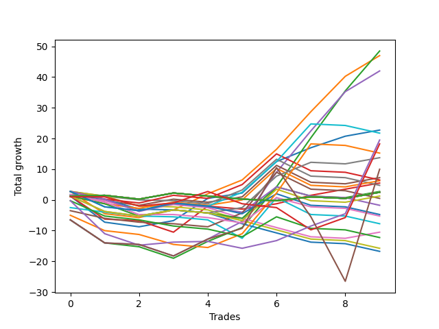

# Short Wallace Doodle 010 
- Symbol: ES
- Date Range: 03/18/2022 - 07/15/2022
- Trading Period: 7:20-12:30
- Number of Trades: 11



| Name | Win Percent | Profit | Avg Profit / Trade | Avg Time / Trade |      | Name | Win Percent | Profit | Avg Profit / Trade | Avg Time / Trade |
| ---- | ----------- | ------ | ------------------ | ---------------- | ---- | ---- | ----------- | ------ | ------------------ | ---------------- |
| Sorted By <br> Profit | | | | | | Sorted By <br> Win Percentage ||||
| Four | 81.82 | 34375.00 | 3125.00 | 16:23 |     | Four | 81.82 | 34375.00 | 3125.00 | 16:23 |
| Sixty | 81.82 | 33000.00 | 3000.00 | 14:57 |     | Sixty | 81.82 | 33000.00 | 3000.00 | 14:57 |
| Five | 63.64 | 30000.00 | 2727.27 | 22:11 |     | One | 81.82 | 22125.00 | 2011.36 | 10:14 |
| Sixty-One | 63.64 | 28625.00 | 2602.27 | 20:45 |     | Fifty-Seven | 81.82 | 20625.00 | 1875.00 | 09:00 |
| Seven | 63.64 | 25125.00 | 2284.09 | 20:18 |     | Three | 81.82 | 20375.00 | 1852.27 | 14:16 |
| Sixty-Three | 63.64 | 23750.00 | 2159.09 | 18:51 |     | Fifty-Nine | 81.82 | 19000.00 | 1727.27 | 12:50 |
| One | 81.82 | 22125.00 | 2011.36 | 10:14 |     | Zero | 81.82 | 12750.00 | 1159.09 | 06:56 |
| Fifty-Seven | 81.82 | 20625.00 | 1875.00 | 09:00 |     | Eighty-Three | 81.82 | 11875.00 | 1079.55 | 09:06 |
| Three | 81.82 | 20375.00 | 1852.27 | 14:16 |     | Fifty-Six | 81.82 | 11625.00 | 1056.82 | 05:50 |
| Two | 63.64 | 20375.00 | 1852.27 | 18:24 |     | One Hundred Twenty-Three | 81.82 | 10500.00 | 954.55 | 07:40 |
| Fifty-Nine | 81.82 | 19000.00 | 1727.27 | 12:50 |     | Eighty-Two | 81.82 | 5375.00 | 488.64 | 06:35 |
| Fifty-Eight | 63.64 | 19000.00 | 1727.27 | 16:57 |     | One Hundred Eleven | 81.82 | 4250.00 | 386.36 | 04:00 |
| Eighty-Five | 63.64 | 14250.00 | 1295.45 | 14:46 |     | One Hundred Twenty-Two | 81.82 | 4000.00 | 363.64 | 05:09 |
| Forty-Four | 54.55 | 14000.00 | 1272.73 | 11:32 |     | Eighty-One | 81.82 | 3000.00 | 272.73 | 06:15 |
| One Hundred Twenty-Five | 63.64 | 12875.00 | 1170.45 | 13:20 |     | One Hundred Twenty-One | 81.82 | 1625.00 | 147.73 | 04:48 |
| Zero | 81.82 | 12750.00 | 1159.09 | 06:56 |     | Eighty-Four | 72.73 | 11875.00 | 1079.55 | 11:35 |
| Eighty-Three | 81.82 | 11875.00 | 1079.55 | 09:06 |     | One Hundred Twenty-Four | 72.73 | 10500.00 | 954.55 | 10:09 |
| Eighty-Four | 72.73 | 11875.00 | 1079.55 | 11:35 |     | Sixty-Four | 72.73 | 10000.00 | 909.09 | 05:38 |
| Twenty-Eight | 45.45 | 11750.00 | 1068.18 | 07:21 |     | Forty | 72.73 | 9250.00 | 840.91 | 04:52 |
| Fifty-Six | 81.82 | 11625.00 | 1056.82 | 05:50 |     | One Hundred Thirteen | 72.73 | 9000.00 | 818.18 | 06:42 |
| Forty-Five | 36.36 | 11500.00 | 1045.45 | 15:57 |     | One Hundred Twenty-Eight | 72.73 | 8875.00 | 806.82 | 07:28 |
| One Hundred Twenty-Three | 81.82 | 10500.00 | 954.55 | 07:40 |     | One Hundred Twenty-Seven | 72.73 | 3250.00 | 295.45 | 04:58 |
| One Hundred Twenty-Four | 72.73 | 10500.00 | 954.55 | 10:09 |     | One Hundred Twelve | 72.73 | 2750.00 | 250.00 | 04:15 |
| Forty-One | 63.64 | 10250.00 | 931.82 | 07:37 |     | One Hundred One | 72.73 | 1000.00 | 90.91 | 00:55 |
| Sixty-Four | 72.73 | 10000.00 | 909.09 | 05:38 |     | One Hundred Twenty-Six | 72.73 | 875.00 | 79.55 | 04:37 |
| Sixty-Eight | 54.55 | 9375.00 | 852.27 | 10:54 |     | Five | 63.64 | 30000.00 | 2727.27 | 22:11 |
| Forty | 72.73 | 9250.00 | 840.91 | 04:52 |     | Sixty-One | 63.64 | 28625.00 | 2602.27 | 20:45 |
| Seventy-Three | 54.55 | 9125.00 | 829.55 | 08:32 |     | Seven | 63.64 | 25125.00 | 2284.09 | 20:18 |
| One Hundred Thirteen | 72.73 | 9000.00 | 818.18 | 06:42 |     | Sixty-Three | 63.64 | 23750.00 | 2159.09 | 18:51 |
| One Hundred Twenty-Eight | 72.73 | 8875.00 | 806.82 | 07:28 |     | Two | 63.64 | 20375.00 | 1852.27 | 18:24 |
| One Hundred Twenty-Nine | 63.64 | 8875.00 | 806.82 | 09:57 |     | Fifty-Eight | 63.64 | 19000.00 | 1727.27 | 16:57 |
| Twenty-Nine | 27.27 | 8875.00 | 806.82 | 09:42 |     | Eighty-Five | 63.64 | 14250.00 | 1295.45 | 14:46 |
| Sixty-Five | 63.64 | 8750.00 | 795.45 | 07:36 |     | One Hundred Twenty-Five | 63.64 | 12875.00 | 1170.45 | 13:20 |
| One Hundred Fourteen | 63.64 | 8125.00 | 738.64 | 09:10 |     | Forty-One | 63.64 | 10250.00 | 931.82 | 07:37 |
| Twenty-Four | 63.64 | 7875.00 | 715.91 | 02:41 |     | One Hundred Twenty-Nine | 63.64 | 8875.00 | 806.82 | 09:57 |
| Six | 63.64 | 6875.00 | 625.00 | 11:39 |     | Sixty-Five | 63.64 | 8750.00 | 795.45 | 07:36 |
| twenty-Seven | 54.55 | 6750.00 | 613.64 | 05:46 |     | One Hundred Fourteen | 63.64 | 8125.00 | 738.64 | 09:10 |
| Forty-Seven | 36.36 | 6750.00 | 613.64 | 15:03 |     | Twenty-Four | 63.64 | 7875.00 | 715.91 | 02:41 |
| Thirty-One | 27.27 | 5750.00 | 522.73 | 08:49 |     | Six | 63.64 | 6875.00 | 625.00 | 11:39 |
| Sixty-Two | 63.64 | 5500.00 | 500.00 | 10:13 |     | Sixty-Two | 63.64 | 5500.00 | 500.00 | 10:13 |
| Eighty-Two | 81.82 | 5375.00 | 488.64 | 06:35 |     | One Hundred Sixteen | 63.64 | 2000.00 | 181.82 | 03:57 |
| Thirty | 54.55 | 5000.00 | 454.55 | 05:22 |     | One Hundred Six | 63.64 | 1500.00 | 136.36 | 01:12 |
| Seventy | 54.55 | 4750.00 | 431.82 | 10:01 |     | Forty-Four | 54.55 | 14000.00 | 1272.73 | 11:32 |
| Sixty-Nine | 36.36 | 4750.00 | 431.82 | 14:48 |     | Sixty-Eight | 54.55 | 9375.00 | 852.27 | 10:54 |
| Forty-Three | 54.55 | 4375.00 | 397.73 | 09:53 |     | Seventy-Three | 54.55 | 9125.00 | 829.55 | 08:32 |
| One Hundred Eleven | 81.82 | 4250.00 | 386.36 | 04:00 |     | twenty-Seven | 54.55 | 6750.00 | 613.64 | 05:46 |
| One Hundred Twenty-Two | 81.82 | 4000.00 | 363.64 | 05:09 |     | Thirty | 54.55 | 5000.00 | 454.55 | 05:22 |
| Forty-Six | 54.55 | 4000.00 | 363.64 | 09:15 |     | Seventy | 54.55 | 4750.00 | 431.82 | 10:01 |
| One Hundred Thirty | 45.45 | 3750.00 | 340.91 | 12:24 |     | Forty-Three | 54.55 | 4375.00 | 397.73 | 09:53 |
| Twenty-Five | 45.45 | 3750.00 | 340.91 | 04:51 |     | Forty-Six | 54.55 | 4000.00 | 363.64 | 09:15 |
| Forty-Two | 36.36 | 3625.00 | 329.55 | 13:13 |     | Sixty-Seven | 54.55 | 2750.00 | 250.00 | 09:52 |
| One Hundred Fifteen | 45.45 | 3375.00 | 306.82 | 11:14 |     | One Hundred Three | 54.55 | 2000.00 | 181.82 | 03:06 |
| One Hundred Twenty-Seven | 72.73 | 3250.00 | 295.45 | 04:58 |     | Ninety-One | 54.55 | -500.00 | -45.45 | 00:40 |
| Eighty-One | 81.82 | 3000.00 | 272.73 | 06:15 |     | One Hundred Two | 54.55 | -1250.00 | -113.64 | 01:06 |
| One Hundred Twelve | 72.73 | 2750.00 | 250.00 | 04:15 |     | Twenty-Eight | 45.45 | 11750.00 | 1068.18 | 07:21 |
| Sixty-Seven | 54.55 | 2750.00 | 250.00 | 09:52 |     | One Hundred Thirty | 45.45 | 3750.00 | 340.91 | 12:24 |
| One Hundred Sixteen | 63.64 | 2000.00 | 181.82 | 03:57 |     | Twenty-Five | 45.45 | 3750.00 | 340.91 | 04:51 |
| One Hundred Three | 54.55 | 2000.00 | 181.82 | 03:06 |     | One Hundred Fifteen | 45.45 | 3375.00 | 306.82 | 11:14 |
| Eight | 45.45 | 2000.00 | 181.82 | 01:02 |     | Eight | 45.45 | 2000.00 | 181.82 | 01:02 |
| Seventy-One | 36.36 | 1875.00 | 170.45 | 14:47 |     | Forty-Eight | 45.45 | 1125.00 | 102.27 | 04:12 |
| One Hundred Twenty-One | 81.82 | 1625.00 | 147.73 | 04:48 |     | One Hundred Four | 45.45 | 500.00 | 45.45 | 04:17 |
| One Hundred Five | 36.36 | 1625.00 | 147.73 | 05:09 |     | Fifty-One | 45.45 | -0.00 | -0.00 | 07:11 |
| One Hundred Six | 63.64 | 1500.00 | 136.36 | 01:12 |     | One Hundred Seventeen | 45.45 | -1375.00 | -125.00 | 04:08 |
| Forty-Eight | 45.45 | 1125.00 | 102.27 | 04:12 |     | One Hundred Seven | 45.45 | -1500.00 | -136.36 | 01:22 |
| Thirty-Two | 36.36 | 1125.00 | 102.27 | 02:05 |     | Ninety-Six | 45.45 | -2750.00 | -250.00 | 00:27 |
| One Hundred One | 72.73 | 1000.00 | 90.91 | 00:55 |     | Forty-Five | 36.36 | 11500.00 | 1045.45 | 15:57 |
| One Hundred Twenty-Six | 72.73 | 875.00 | 79.55 | 04:37 |     | Forty-Seven | 36.36 | 6750.00 | 613.64 | 15:03 |
| Twenty-Six | 27.27 | 875.00 | 79.55 | 07:08 |     | Sixty-Nine | 36.36 | 4750.00 | 431.82 | 14:48 |
| Sixty-Six | 36.36 | 625.00 | 56.82 | 13:17 |     | Forty-Two | 36.36 | 3625.00 | 329.55 | 13:13 |
| One Hundred Four | 45.45 | 500.00 | 45.45 | 04:17 |     | Seventy-One | 36.36 | 1875.00 | 170.45 | 14:47 |
| Thirty-Five | 36.36 | 375.00 | 34.09 | 02:51 |     | One Hundred Five | 36.36 | 1625.00 | 147.73 | 05:09 |
| Fifty-One | 45.45 | -0.00 | -0.00 | 07:11 |     | Thirty-Two | 36.36 | 1125.00 | 102.27 | 02:05 |
| Twelve | 27.27 | -0.00 | -0.00 | 02:26 |     | Sixty-Six | 36.36 | 625.00 | 56.82 | 13:17 |
| Thirty-Six | 27.27 | -250.00 | -22.73 | 03:22 |     | Thirty-Five | 36.36 | 375.00 | 34.09 | 02:51 |
| Ninety-One | 54.55 | -500.00 | -45.45 | 00:40 |     | Fourteen | 36.36 | -500.00 | -45.45 | 02:28 |
| Fourteen | 36.36 | -500.00 | -45.45 | 02:28 |     | Fifty-Two | 36.36 | -625.00 | -56.82 | 07:41 |
| Fifty-Two | 36.36 | -625.00 | -56.82 | 07:41 |     | Forty-Nine | 36.36 | -875.00 | -79.55 | 05:17 |
| Forty-Nine | 36.36 | -875.00 | -79.55 | 05:17 |     | Eleven | 36.36 | -875.00 | -79.55 | 01:55 |
| Eleven | 36.36 | -875.00 | -79.55 | 01:55 |     | Ninety-Three | 36.36 | -1500.00 | -136.36 | 01:37 |
| Thirty-Three | 27.27 | -1125.00 | -102.27 | 02:55 |     | One Hundred Eighteen | 36.36 | -1875.00 | -170.45 | 06:15 |
| One Hundred Two | 54.55 | -1250.00 | -113.64 | 01:06 |     | Ninety-Two | 36.36 | -3500.00 | -318.18 | 00:49 |
| One Hundred Seventeen | 45.45 | -1375.00 | -125.00 | 04:08 |     | Fifty-Four | 36.36 | -3875.00 | -352.27 | 07:01 |
| One Hundred Seven | 45.45 | -1500.00 | -136.36 | 01:22 |     | Sixten | 36.36 | -4875.00 | -443.18 | 00:33 |
| Ninety-Three | 36.36 | -1500.00 | -136.36 | 01:37 |     | Twenty-Nine | 27.27 | 8875.00 | 806.82 | 09:42 |
| One Hundred Eighteen | 36.36 | -1875.00 | -170.45 | 06:15 |     | Thirty-One | 27.27 | 5750.00 | 522.73 | 08:49 |
| Nine | 27.27 | -2375.00 | -215.91 | 01:59 |     | Twenty-Six | 27.27 | 875.00 | 79.55 | 07:08 |
| Ninety-Five | 18.18 | -2375.00 | -215.91 | 03:18 |     | Twelve | 27.27 | -0.00 | -0.00 | 02:26 |
| Ninety-Six | 45.45 | -2750.00 | -250.00 | 00:27 |     | Thirty-Six | 27.27 | -250.00 | -22.73 | 03:22 |
| One Hundred Ninteen | 27.27 | -2875.00 | -261.36 | 07:21 |     | Thirty-Three | 27.27 | -1125.00 | -102.27 | 02:55 |
| Thirty-Nine | 18.18 | -2875.00 | -261.36 | 03:53 |     | Nine | 27.27 | -2375.00 | -215.91 | 01:59 |
| Thirty-Seven | 18.18 | -2875.00 | -261.36 | 03:53 |     | One Hundred Ninteen | 27.27 | -2875.00 | -261.36 | 07:21 |
| Thirty-Four | 18.18 | -2875.00 | -261.36 | 03:53 |     | Ninety-Four | 27.27 | -3250.00 | -295.45 | 02:40 |
| Ninety-Four | 27.27 | -3250.00 | -295.45 | 02:40 |     | One Hundred Eight | 27.27 | -3375.00 | -306.82 | 02:45 |
| One Hundred Eight | 27.27 | -3375.00 | -306.82 | 02:45 |     | Thirty-Eight | 27.27 | -3750.00 | -340.91 | 02:21 |
| Ninety-Two | 36.36 | -3500.00 | -318.18 | 00:49 |     | Twenty-Two | 27.27 | -4750.00 | -431.82 | 00:45 |
| Thirteen | 9.09 | -3500.00 | -318.18 | 03:42 |     | Ninety-Seven | 27.27 | -5750.00 | -522.73 | 00:36 |
| Thirty-Eight | 27.27 | -3750.00 | -340.91 | 02:21 |     | Nineteen | 27.27 | -5750.00 | -522.73 | 00:51 |
| Fifty-Four | 36.36 | -3875.00 | -352.27 | 07:01 |     | Ninety-Five | 18.18 | -2375.00 | -215.91 | 03:18 |
| One Hundred Nine | 18.18 | -3875.00 | -352.27 | 03:23 |     | Thirty-Nine | 18.18 | -2875.00 | -261.36 | 03:53 |
| One Hundred Twenty | 18.18 | -4000.00 | -363.64 | 07:46 |     | Thirty-Seven | 18.18 | -2875.00 | -261.36 | 03:53 |
| Fifty | 18.18 | -4375.00 | -397.73 | 07:47 |     | Thirty-Four | 18.18 | -2875.00 | -261.36 | 03:53 |
| One Hundred Ten | 18.18 | -4500.00 | -409.09 | 03:40 |     | One Hundred Nine | 18.18 | -3875.00 | -352.27 | 03:23 |
| Twenty-Two | 27.27 | -4750.00 | -431.82 | 00:45 |     | One Hundred Twenty | 18.18 | -4000.00 | -363.64 | 07:46 |
| Fifteen | 9.09 | -4750.00 | -431.82 | 03:41 |     | Fifty | 18.18 | -4375.00 | -397.73 | 07:47 |
| Sixten | 36.36 | -4875.00 | -443.18 | 00:33 |     | One Hundred Ten | 18.18 | -4500.00 | -409.09 | 03:40 |
| Fifty-Five | 18.18 | -5250.00 | -477.27 | 08:41 |     | Fifty-Five | 18.18 | -5250.00 | -477.27 | 08:41 |
| Fifty-Three | 18.18 | -5250.00 | -477.27 | 08:41 |     | Fifty-Three | 18.18 | -5250.00 | -477.27 | 08:41 |
| Ten | 9.09 | -5375.00 | -488.64 | 03:41 |     | Ninety-Eight | 18.18 | -7500.00 | -681.82 | 00:53 |
| Ninety-Seven | 27.27 | -5750.00 | -522.73 | 00:36 |     | Seventeen | 18.18 | -7500.00 | -681.82 | 00:53 |
| Nineteen | 27.27 | -5750.00 | -522.73 | 00:51 |     | One Hundred | 18.18 | -8000.00 | -727.27 | 01:03 |
| Ninety-Eight | 18.18 | -7500.00 | -681.82 | 00:53 |     | Ninety-Nine | 18.18 | -8000.00 | -727.27 | 01:03 |
| Seventeen | 18.18 | -7500.00 | -681.82 | 00:53 |     | Twenty-Three | 18.18 | -8000.00 | -727.27 | 01:03 |
| One Hundred | 18.18 | -8000.00 | -727.27 | 01:03 |     | Twenty-One | 18.18 | -8000.00 | -727.27 | 01:03 |
| Ninety-Nine | 18.18 | -8000.00 | -727.27 | 01:03 |     | Twenty | 18.18 | -8000.00 | -727.27 | 01:03 |
| Twenty-Three | 18.18 | -8000.00 | -727.27 | 01:03 |     | Eighteen | 18.18 | -8000.00 | -727.27 | 01:03 |
| Twenty-One | 18.18 | -8000.00 | -727.27 | 01:03 |     | Thirteen | 9.09 | -3500.00 | -318.18 | 03:42 |
| Twenty | 18.18 | -8000.00 | -727.27 | 01:03 |     | Fifteen | 9.09 | -4750.00 | -431.82 | 03:41 |
| Eighteen | 18.18 | -8000.00 | -727.27 | 01:03 |     | Ten | 9.09 | -5375.00 | -488.64 | 03:41 |

## NO STOPLOSS

### Test Zero
* Sell when price hits the middle line of the 20p bollinger
* No Stoploss
* Results:
```
Total Trades: 11
Percent Up: 18.18
Percent Down: 81.82
Total Points Moved Down: 25.50
Potential Profit: 12750.00
Total Points Ups: 9.50 Count Ups: 2
Total Points Downs: 35.00 Count Downs: 9
```

<details><summary>Trades</summary>

<code>In: 2022-03-25 10:22:00		Out: 2022-03-25 10:22:10		Total Position Time: 00:10		Total Move Down: 1.25		Total to Date: 1.25</code> <br />
<code>In: 2022-03-25 10:52:00		Out: 2022-03-25 11:18:15		Total Position Time: 26:15		Total Move Down: -8.00		Total to Date: -6.75</code> <br />
<code>In: 2022-03-28 10:27:00		Out: 2022-03-28 10:42:15		Total Position Time: 15:15		Total Move Down: -1.50		Total to Date: -8.25</code> <br />
<code>In: 2022-03-28 11:12:00		Out: 2022-03-28 11:12:10		Total Position Time: 00:10		Total Move Down: 2.00		Total to Date: -6.25</code> <br />
<code>In: 2022-04-25 09:27:00		Out: 2022-04-25 09:31:10		Total Position Time: 04:10		Total Move Down: 8.50		Total to Date: 2.25</code> <br />
<code>In: 2022-04-26 11:23:00		Out: 2022-04-26 11:32:10		Total Position Time: 09:10		Total Move Down: 1.75		Total to Date: 4.00</code> <br />
<code>In: 2022-05-02 09:23:00		Out: 2022-05-02 09:27:15		Total Position Time: 04:15		Total Move Down: 10.25		Total to Date: 14.25</code> <br />
<code>In: 2022-05-25 11:04:00		Out: 2022-05-25 11:06:25		Total Position Time: 02:25		Total Move Down: 4.50		Total to Date: 18.75</code> <br />
<code>In: 2022-05-25 11:06:00		Out: 2022-05-25 11:06:25		Total Position Time: 00:25		Total Move Down: 3.75		Total to Date: 22.50</code> <br />
<code>In: 2022-06-15 11:02:00		Out: 2022-06-15 11:02:10		Total Position Time: 00:10		Total Move Down: 2.00		Total to Date: 24.50</code> <br />
<code>In: 2022-06-29 11:06:00		Out: 2022-06-29 11:20:00		Total Position Time: 14:00		Total Move Down: 1.00		Total to Date: 25.50</code> <br />


</details>

### Test One
* Sell when the price hits the upper line of the 20p 1std bollinger
* No Stoploss
* Results:
```
Total Trades: 11
Percent Up: 18.18
Percent Down: 81.82
Total Points Moved Down: 44.25
Potential Profit: 22125.00
Total Points Ups: 8.50 Count Ups: 2
Total Points Downs: 52.75 Count Downs: 9
```

<details><summary>Trades</summary>

<code>In: 2022-03-25 10:22:00		Out: 2022-03-25 10:23:25		Total Position Time: 01:25		Total Move Down: 2.75		Total to Date: 2.75</code> <br />
<code>In: 2022-03-25 10:52:00		Out: 2022-03-25 11:19:35		Total Position Time: 27:35		Total Move Down: -7.25		Total to Date: -4.50</code> <br />
<code>In: 2022-03-28 10:27:00		Out: 2022-03-28 10:44:05		Total Position Time: 17:05		Total Move Down: -1.25		Total to Date: -5.75</code> <br />
<code>In: 2022-03-28 11:12:00		Out: 2022-03-28 11:19:35		Total Position Time: 07:35		Total Move Down: 2.50		Total to Date: -3.25</code> <br />
<code>In: 2022-04-25 09:27:00		Out: 2022-04-25 09:42:45		Total Position Time: 15:45		Total Move Down: 6.00		Total to Date: 2.75</code> <br />
<code>In: 2022-04-26 11:23:00		Out: 2022-04-26 11:34:15		Total Position Time: 11:15		Total Move Down: 4.00		Total to Date: 6.75</code> <br />
<code>In: 2022-05-02 09:23:00		Out: 2022-05-02 09:36:10		Total Position Time: 13:10		Total Move Down: 10.00		Total to Date: 16.75</code> <br />
<code>In: 2022-05-25 11:04:00		Out: 2022-05-25 11:06:35		Total Position Time: 02:35		Total Move Down: 9.25		Total to Date: 26.00</code> <br />
<code>In: 2022-05-25 11:06:00		Out: 2022-05-25 11:06:35		Total Position Time: 00:35		Total Move Down: 8.50		Total to Date: 34.50</code> <br />
<code>In: 2022-06-15 11:02:00		Out: 2022-06-15 11:03:00		Total Position Time: 01:00		Total Move Down: 6.75		Total to Date: 41.25</code> <br />
<code>In: 2022-06-29 11:06:00		Out: 2022-06-29 11:20:35		Total Position Time: 14:35		Total Move Down: 3.00		Total to Date: 44.25</code> <br />


</details>

### Test Two
* Sell when the price hits the upper line of the 20p 2std bollinger
* No Stoploss
* Results:
```
Total Trades: 11
Percent Up: 36.36
Percent Down: 63.64
Total Points Moved Down: 40.75
Potential Profit: 20375.00
Total Points Ups: 19.00 Count Ups: 4
Total Points Downs: 59.75 Count Downs: 7
```

<details><summary>Trades</summary>

<code>In: 2022-03-25 10:22:00		Out: 2022-03-25 10:51:55		Total Position Time: 29:55		Total Move Down: -6.50		Total to Date: -6.50</code> <br />
<code>In: 2022-03-25 10:52:00		Out: 2022-03-25 11:21:55		Total Position Time: 29:55		Total Move Down: -7.50		Total to Date: -14.00</code> <br />
<code>In: 2022-03-28 10:27:00		Out: 2022-03-28 10:55:10		Total Position Time: 28:10		Total Move Down: -1.25		Total to Date: -15.25</code> <br />
<code>In: 2022-03-28 11:12:00		Out: 2022-03-28 11:41:55		Total Position Time: 29:55		Total Move Down: -3.75		Total to Date: -19.00</code> <br />
<code>In: 2022-04-25 09:27:00		Out: 2022-04-25 09:56:55		Total Position Time: 29:55		Total Move Down: 5.50		Total to Date: -13.50</code> <br />
<code>In: 2022-04-26 11:23:00		Out: 2022-04-26 11:41:25		Total Position Time: 18:25		Total Move Down: 3.75		Total to Date: -9.75</code> <br />
<code>In: 2022-05-02 09:23:00		Out: 2022-05-02 09:39:35		Total Position Time: 16:35		Total Move Down: 12.25		Total to Date: 2.50</code> <br />
<code>In: 2022-05-25 11:04:00		Out: 2022-05-25 11:06:40		Total Position Time: 02:40		Total Move Down: 12.25		Total to Date: 14.75</code> <br />
<code>In: 2022-05-25 11:06:00		Out: 2022-05-25 11:06:40		Total Position Time: 00:40		Total Move Down: 11.50		Total to Date: 26.25</code> <br />
<code>In: 2022-06-15 11:02:00		Out: 2022-06-15 11:03:10		Total Position Time: 01:10		Total Move Down: 11.00		Total to Date: 37.25</code> <br />
<code>In: 2022-06-29 11:06:00		Out: 2022-06-29 11:21:05		Total Position Time: 15:05		Total Move Down: 3.50		Total to Date: 40.75</code> <br />


</details>

### Test Three
* Sell when price hits the middle line of the 50p bollinger
* No Stoploss
* Results:
```
Total Trades: 11
Percent Up: 18.18
Percent Down: 81.82
Total Points Moved Down: 40.75
Potential Profit: 20375.00
Total Points Ups: 8.00 Count Ups: 2
Total Points Downs: 48.75 Count Downs: 9
```

<details><summary>Trades</summary>

<code>In: 2022-03-25 10:22:00		Out: 2022-03-25 10:23:10		Total Position Time: 01:10		Total Move Down: 1.75		Total to Date: 1.75</code> <br />
<code>In: 2022-03-25 10:52:00		Out: 2022-03-25 11:21:55		Total Position Time: 29:55		Total Move Down: -7.50		Total to Date: -5.75</code> <br />
<code>In: 2022-03-28 10:27:00		Out: 2022-03-28 10:56:55		Total Position Time: 29:55		Total Move Down: -0.50		Total to Date: -6.25</code> <br />
<code>In: 2022-03-28 11:12:00		Out: 2022-03-28 11:19:20		Total Position Time: 07:20		Total Move Down: 2.00		Total to Date: -4.25</code> <br />
<code>In: 2022-04-25 09:27:00		Out: 2022-04-25 09:55:25		Total Position Time: 28:25		Total Move Down: 4.75		Total to Date: 0.50</code> <br />
<code>In: 2022-04-26 11:23:00		Out: 2022-04-26 11:41:30		Total Position Time: 18:30		Total Move Down: 4.50		Total to Date: 5.00</code> <br />
<code>In: 2022-05-02 09:23:00		Out: 2022-05-02 09:36:20		Total Position Time: 13:20		Total Move Down: 10.00		Total to Date: 15.00</code> <br />
<code>In: 2022-05-25 11:04:00		Out: 2022-05-25 11:06:35		Total Position Time: 02:35		Total Move Down: 9.25		Total to Date: 24.25</code> <br />
<code>In: 2022-05-25 11:06:00		Out: 2022-05-25 11:06:35		Total Position Time: 00:35		Total Move Down: 8.50		Total to Date: 32.75</code> <br />
<code>In: 2022-06-15 11:02:00		Out: 2022-06-15 11:02:10		Total Position Time: 00:10		Total Move Down: 2.00		Total to Date: 34.75</code> <br />
<code>In: 2022-06-29 11:06:00		Out: 2022-06-29 11:31:05		Total Position Time: 25:05		Total Move Down: 6.00		Total to Date: 40.75</code> <br />


</details>

### Test Four
* Sell when the price hits the upper line of the 50p 1std bollinger
* No Stoploss
* Results:
```
Total Trades: 11
Percent Up: 18.18
Percent Down: 81.82
Total Points Moved Down: 68.75
Potential Profit: 34375.00
Total Points Ups: 8.00 Count Ups: 2
Total Points Downs: 76.75 Count Downs: 9
```

<details><summary>Trades</summary>

<code>In: 2022-03-25 10:22:00		Out: 2022-03-25 10:27:20		Total Position Time: 05:20		Total Move Down: 4.25		Total to Date: 4.25</code> <br />
<code>In: 2022-03-25 10:52:00		Out: 2022-03-25 11:21:55		Total Position Time: 29:55		Total Move Down: -7.50		Total to Date: -3.25</code> <br />
<code>In: 2022-03-28 10:27:00		Out: 2022-03-28 10:56:55		Total Position Time: 29:55		Total Move Down: -0.50		Total to Date: -3.75</code> <br />
<code>In: 2022-03-28 11:12:00		Out: 2022-03-28 11:20:40		Total Position Time: 08:40		Total Move Down: 2.75		Total to Date: -1.00</code> <br />
<code>In: 2022-04-25 09:27:00		Out: 2022-04-25 09:56:55		Total Position Time: 29:55		Total Move Down: 5.50		Total to Date: 4.50</code> <br />
<code>In: 2022-04-26 11:23:00		Out: 2022-04-26 11:45:05		Total Position Time: 22:05		Total Move Down: 9.50		Total to Date: 14.00</code> <br />
<code>In: 2022-05-02 09:23:00		Out: 2022-05-02 09:43:15		Total Position Time: 20:15		Total Move Down: 16.00		Total to Date: 30.00</code> <br />
<code>In: 2022-05-25 11:04:00		Out: 2022-05-25 11:06:40		Total Position Time: 02:40		Total Move Down: 12.25		Total to Date: 42.25</code> <br />
<code>In: 2022-05-25 11:06:00		Out: 2022-05-25 11:06:40		Total Position Time: 00:40		Total Move Down: 11.50		Total to Date: 53.75</code> <br />
<code>In: 2022-06-15 11:02:00		Out: 2022-06-15 11:03:00		Total Position Time: 01:00		Total Move Down: 6.75		Total to Date: 60.50</code> <br />
<code>In: 2022-06-29 11:06:00		Out: 2022-06-29 11:35:55		Total Position Time: 29:55		Total Move Down: 8.25		Total to Date: 68.75</code> <br />


</details>

### Test Five
* Sell when the price hits the upper line of the 50p 2std bollinger
* No Stoploss
* Results:
```
Total Trades: 11
Percent Up: 36.36
Percent Down: 63.64
Total Points Moved Down: 60.00
Potential Profit: 30000.00
Total Points Ups: 18.25 Count Ups: 4
Total Points Downs: 78.25 Count Downs: 7
```

<details><summary>Trades</summary>

<code>In: 2022-03-25 10:22:00		Out: 2022-03-25 10:51:55		Total Position Time: 29:55		Total Move Down: -6.50		Total to Date: -6.50</code> <br />
<code>In: 2022-03-25 10:52:00		Out: 2022-03-25 11:21:55		Total Position Time: 29:55		Total Move Down: -7.50		Total to Date: -14.00</code> <br />
<code>In: 2022-03-28 10:27:00		Out: 2022-03-28 10:56:55		Total Position Time: 29:55		Total Move Down: -0.50		Total to Date: -14.50</code> <br />
<code>In: 2022-03-28 11:12:00		Out: 2022-03-28 11:41:55		Total Position Time: 29:55		Total Move Down: -3.75		Total to Date: -18.25</code> <br />
<code>In: 2022-04-25 09:27:00		Out: 2022-04-25 09:56:55		Total Position Time: 29:55		Total Move Down: 5.50		Total to Date: -12.75</code> <br />
<code>In: 2022-04-26 11:23:00		Out: 2022-04-26 11:52:55		Total Position Time: 29:55		Total Move Down: 3.50		Total to Date: -9.25</code> <br />
<code>In: 2022-05-02 09:23:00		Out: 2022-05-02 09:52:55		Total Position Time: 29:55		Total Move Down: 19.75		Total to Date: 10.50</code> <br />
<code>In: 2022-05-25 11:04:00		Out: 2022-05-25 11:06:50		Total Position Time: 02:50		Total Move Down: 16.00		Total to Date: 26.50</code> <br />
<code>In: 2022-05-25 11:06:00		Out: 2022-05-25 11:06:50		Total Position Time: 00:50		Total Move Down: 15.25		Total to Date: 41.75</code> <br />
<code>In: 2022-06-15 11:02:00		Out: 2022-06-15 11:03:05		Total Position Time: 01:05		Total Move Down: 10.00		Total to Date: 51.75</code> <br />
<code>In: 2022-06-29 11:06:00		Out: 2022-06-29 11:35:55		Total Position Time: 29:55		Total Move Down: 8.25		Total to Date: 60.00</code> <br />


</details>

### Test Six
* Sell when the price hits the middle line of the 1std VWAP
* No Stoploss
* Results:
```
Total Trades: 11
Percent Up: 36.36
Percent Down: 63.64
Total Points Moved Down: 13.75
Potential Profit: 6875.00
Total Points Ups: 12.75 Count Ups: 4
Total Points Downs: 26.50 Count Downs: 7
```

<details><summary>Trades</summary>

<code>In: 2022-03-25 10:22:00		Out: 2022-03-25 10:22:10		Total Position Time: 00:10		Total Move Down: 1.25		Total to Date: 1.25</code> <br />
<code>In: 2022-03-25 10:52:00		Out: 2022-03-25 11:21:55		Total Position Time: 29:55		Total Move Down: -7.50		Total to Date: -6.25</code> <br />
<code>In: 2022-03-28 10:27:00		Out: 2022-03-28 10:56:55		Total Position Time: 29:55		Total Move Down: -0.50		Total to Date: -6.75</code> <br />
<code>In: 2022-03-28 11:12:00		Out: 2022-03-28 11:41:55		Total Position Time: 29:55		Total Move Down: -3.75		Total to Date: -10.50</code> <br />
<code>In: 2022-04-25 09:27:00		Out: 2022-04-25 09:31:10		Total Position Time: 04:10		Total Move Down: 8.50		Total to Date: -2.00</code> <br />
<code>In: 2022-04-26 11:23:00		Out: 2022-04-26 11:23:10		Total Position Time: 00:10		Total Move Down: -1.00		Total to Date: -3.00</code> <br />
<code>In: 2022-05-02 09:23:00		Out: 2022-05-02 09:24:15		Total Position Time: 01:15		Total Move Down: 1.75		Total to Date: -1.25</code> <br />
<code>In: 2022-05-25 11:04:00		Out: 2022-05-25 11:06:20		Total Position Time: 02:20		Total Move Down: 2.75		Total to Date: 1.50</code> <br />
<code>In: 2022-05-25 11:06:00		Out: 2022-05-25 11:06:20		Total Position Time: 00:20		Total Move Down: 2.00		Total to Date: 3.50</code> <br />
<code>In: 2022-06-15 11:02:00		Out: 2022-06-15 11:02:10		Total Position Time: 00:10		Total Move Down: 2.00		Total to Date: 5.50</code> <br />
<code>In: 2022-06-29 11:06:00		Out: 2022-06-29 11:35:55		Total Position Time: 29:55		Total Move Down: 8.25		Total to Date: 13.75</code> <br />


</details>

### Test Seven
* Sell when the price hits the upper line of the 1std VWAP
* No Stoploss
* Results:
```
Total Trades: 11
Percent Up: 36.36
Percent Down: 63.64
Total Points Moved Down: 50.25
Potential Profit: 25125.00
Total Points Ups: 18.25 Count Ups: 4
Total Points Downs: 68.50 Count Downs: 7
```

<details><summary>Trades</summary>

<code>In: 2022-03-25 10:22:00		Out: 2022-03-25 10:51:55		Total Position Time: 29:55		Total Move Down: -6.50		Total to Date: -6.50</code> <br />
<code>In: 2022-03-25 10:52:00		Out: 2022-03-25 11:21:55		Total Position Time: 29:55		Total Move Down: -7.50		Total to Date: -14.00</code> <br />
<code>In: 2022-03-28 10:27:00		Out: 2022-03-28 10:56:55		Total Position Time: 29:55		Total Move Down: -0.50		Total to Date: -14.50</code> <br />
<code>In: 2022-03-28 11:12:00		Out: 2022-03-28 11:41:55		Total Position Time: 29:55		Total Move Down: -3.75		Total to Date: -18.25</code> <br />
<code>In: 2022-04-25 09:27:00		Out: 2022-04-25 09:56:55		Total Position Time: 29:55		Total Move Down: 5.50		Total to Date: -12.75</code> <br />
<code>In: 2022-04-26 11:23:00		Out: 2022-04-26 11:42:05		Total Position Time: 19:05		Total Move Down: 5.75		Total to Date: -7.00</code> <br />
<code>In: 2022-05-02 09:23:00		Out: 2022-05-02 09:43:15		Total Position Time: 20:15		Total Move Down: 16.00		Total to Date: 9.00</code> <br />
<code>In: 2022-05-25 11:04:00		Out: 2022-05-25 11:06:45		Total Position Time: 02:45		Total Move Down: 13.50		Total to Date: 22.50</code> <br />
<code>In: 2022-05-25 11:06:00		Out: 2022-05-25 11:06:45		Total Position Time: 00:45		Total Move Down: 12.75		Total to Date: 35.25</code> <br />
<code>In: 2022-06-15 11:02:00		Out: 2022-06-15 11:03:00		Total Position Time: 01:00		Total Move Down: 6.75		Total to Date: 42.00</code> <br />
<code>In: 2022-06-29 11:06:00		Out: 2022-06-29 11:35:55		Total Position Time: 29:55		Total Move Down: 8.25		Total to Date: 50.25</code> <br />


</details>

## STOPLOSS OF 2

### Test Eight
* Sell when price hits the middle line of the 20p bollinger
* Stoploss is -2 points
* Results:
```
Total Trades: 11
Percent Up: 54.55
Percent Down: 45.45
Total Points Moved Down: 4.00
Potential Profit: 2000.00
Total Points Ups: 13.50 Count Ups: 6
Total Points Downs: 17.50 Count Downs: 5
```

<details><summary>Trades</summary>

<code>In: 2022-03-25 10:22:00		Out: 2022-03-25 10:22:10		Total Position Time: 00:10		Total Move Down: 1.25		Total to Date: 1.25</code> <br />
<code>In: 2022-03-25 10:52:00		Out: 2022-03-25 10:55:50		Total Position Time: 03:50		Total Move Down: -2.50		Total to Date: -1.25</code> <br />
<code>In: 2022-03-28 10:27:00		Out: 2022-03-28 10:27:35		Total Position Time: 00:35		Total Move Down: -2.50		Total to Date: -3.75</code> <br />
<code>In: 2022-03-28 11:12:00		Out: 2022-03-28 11:12:10		Total Position Time: 00:10		Total Move Down: 2.00		Total to Date: -1.75</code> <br />
<code>In: 2022-04-25 09:27:00		Out: 2022-04-25 09:31:10		Total Position Time: 04:10		Total Move Down: 8.50		Total to Date: 6.75</code> <br />
<code>In: 2022-04-26 11:23:00		Out: 2022-04-26 11:23:20		Total Position Time: 00:20		Total Move Down: -1.75		Total to Date: 5.00</code> <br />
<code>In: 2022-05-02 09:23:00		Out: 2022-05-02 09:23:40		Total Position Time: 00:40		Total Move Down: -1.75		Total to Date: 3.25</code> <br />
<code>In: 2022-05-25 11:04:00		Out: 2022-05-25 11:04:20		Total Position Time: 00:20		Total Move Down: -3.00		Total to Date: 0.25</code> <br />
<code>In: 2022-05-25 11:06:00		Out: 2022-05-25 11:06:25		Total Position Time: 00:25		Total Move Down: 3.75		Total to Date: 4.00</code> <br />
<code>In: 2022-06-15 11:02:00		Out: 2022-06-15 11:02:10		Total Position Time: 00:10		Total Move Down: 2.00		Total to Date: 6.00</code> <br />
<code>In: 2022-06-29 11:06:00		Out: 2022-06-29 11:06:35		Total Position Time: 00:35		Total Move Down: -2.00		Total to Date: 4.00</code> <br />


</details>

### Test Nine
* Sell when the price hits the upper line of the 20p 1std bollinger
* Stoploss is -2 points
* Results:
```
Total Trades: 11
Percent Up: 72.73
Percent Down: 27.27
Total Points Moved Down: -4.75
Potential Profit: -2375.00
Total Points Ups: 18.50 Count Ups: 8
Total Points Downs: 13.75 Count Downs: 3
```

<details><summary>Trades</summary>

<code>In: 2022-03-25 10:22:00		Out: 2022-03-25 10:23:25		Total Position Time: 01:25		Total Move Down: 2.75		Total to Date: 2.75</code> <br />
<code>In: 2022-03-25 10:52:00		Out: 2022-03-25 10:55:50		Total Position Time: 03:50		Total Move Down: -2.50		Total to Date: 0.25</code> <br />
<code>In: 2022-03-28 10:27:00		Out: 2022-03-28 10:27:35		Total Position Time: 00:35		Total Move Down: -2.50		Total to Date: -2.25</code> <br />
<code>In: 2022-03-28 11:12:00		Out: 2022-03-28 11:19:35		Total Position Time: 07:35		Total Move Down: 2.50		Total to Date: 0.25</code> <br />
<code>In: 2022-04-25 09:27:00		Out: 2022-04-25 09:32:40		Total Position Time: 05:40		Total Move Down: -2.50		Total to Date: -2.25</code> <br />
<code>In: 2022-04-26 11:23:00		Out: 2022-04-26 11:23:20		Total Position Time: 00:20		Total Move Down: -1.75		Total to Date: -4.00</code> <br />
<code>In: 2022-05-02 09:23:00		Out: 2022-05-02 09:23:40		Total Position Time: 00:40		Total Move Down: -1.75		Total to Date: -5.75</code> <br />
<code>In: 2022-05-25 11:04:00		Out: 2022-05-25 11:04:20		Total Position Time: 00:20		Total Move Down: -3.00		Total to Date: -8.75</code> <br />
<code>In: 2022-05-25 11:06:00		Out: 2022-05-25 11:06:35		Total Position Time: 00:35		Total Move Down: 8.50		Total to Date: -0.25</code> <br />
<code>In: 2022-06-15 11:02:00		Out: 2022-06-15 11:02:15		Total Position Time: 00:15		Total Move Down: -2.50		Total to Date: -2.75</code> <br />
<code>In: 2022-06-29 11:06:00		Out: 2022-06-29 11:06:35		Total Position Time: 00:35		Total Move Down: -2.00		Total to Date: -4.75</code> <br />


</details>

### Test Ten
* Sell when the price hits the upper line of the 20p 2std bollinger
* Stoploss is -2 points
* Results:
```
Total Trades: 11
Percent Up: 90.91
Percent Down: 9.09
Total Points Moved Down: -10.75
Potential Profit: -5375.00
Total Points Ups: 22.25 Count Ups: 10
Total Points Downs: 11.50 Count Downs: 1
```

<details><summary>Trades</summary>

<code>In: 2022-03-25 10:22:00		Out: 2022-03-25 10:33:25		Total Position Time: 11:25		Total Move Down: -1.75		Total to Date: -1.75</code> <br />
<code>In: 2022-03-25 10:52:00		Out: 2022-03-25 10:55:50		Total Position Time: 03:50		Total Move Down: -2.50		Total to Date: -4.25</code> <br />
<code>In: 2022-03-28 10:27:00		Out: 2022-03-28 10:27:35		Total Position Time: 00:35		Total Move Down: -2.50		Total to Date: -6.75</code> <br />
<code>In: 2022-03-28 11:12:00		Out: 2022-03-28 11:28:15		Total Position Time: 16:15		Total Move Down: -2.00		Total to Date: -8.75</code> <br />
<code>In: 2022-04-25 09:27:00		Out: 2022-04-25 09:32:40		Total Position Time: 05:40		Total Move Down: -2.50		Total to Date: -11.25</code> <br />
<code>In: 2022-04-26 11:23:00		Out: 2022-04-26 11:23:20		Total Position Time: 00:20		Total Move Down: -1.75		Total to Date: -13.00</code> <br />
<code>In: 2022-05-02 09:23:00		Out: 2022-05-02 09:23:40		Total Position Time: 00:40		Total Move Down: -1.75		Total to Date: -14.75</code> <br />
<code>In: 2022-05-25 11:04:00		Out: 2022-05-25 11:04:20		Total Position Time: 00:20		Total Move Down: -3.00		Total to Date: -17.75</code> <br />
<code>In: 2022-05-25 11:06:00		Out: 2022-05-25 11:06:40		Total Position Time: 00:40		Total Move Down: 11.50		Total to Date: -6.25</code> <br />
<code>In: 2022-06-15 11:02:00		Out: 2022-06-15 11:02:15		Total Position Time: 00:15		Total Move Down: -2.50		Total to Date: -8.75</code> <br />
<code>In: 2022-06-29 11:06:00		Out: 2022-06-29 11:06:35		Total Position Time: 00:35		Total Move Down: -2.00		Total to Date: -10.75</code> <br />


</details>

### Test Eleven
* Sell when price hits the middle line of the 50p bollinger
* Stoploss is -2 points
* Results:
```
Total Trades: 11
Percent Up: 63.64
Percent Down: 36.36
Total Points Moved Down: -1.75
Potential Profit: -875.00
Total Points Ups: 16.00 Count Ups: 7
Total Points Downs: 14.25 Count Downs: 4
```

<details><summary>Trades</summary>

<code>In: 2022-03-25 10:22:00		Out: 2022-03-25 10:23:10		Total Position Time: 01:10		Total Move Down: 1.75		Total to Date: 1.75</code> <br />
<code>In: 2022-03-25 10:52:00		Out: 2022-03-25 10:55:50		Total Position Time: 03:50		Total Move Down: -2.50		Total to Date: -0.75</code> <br />
<code>In: 2022-03-28 10:27:00		Out: 2022-03-28 10:27:35		Total Position Time: 00:35		Total Move Down: -2.50		Total to Date: -3.25</code> <br />
<code>In: 2022-03-28 11:12:00		Out: 2022-03-28 11:19:20		Total Position Time: 07:20		Total Move Down: 2.00		Total to Date: -1.25</code> <br />
<code>In: 2022-04-25 09:27:00		Out: 2022-04-25 09:32:40		Total Position Time: 05:40		Total Move Down: -2.50		Total to Date: -3.75</code> <br />
<code>In: 2022-04-26 11:23:00		Out: 2022-04-26 11:23:20		Total Position Time: 00:20		Total Move Down: -1.75		Total to Date: -5.50</code> <br />
<code>In: 2022-05-02 09:23:00		Out: 2022-05-02 09:23:40		Total Position Time: 00:40		Total Move Down: -1.75		Total to Date: -7.25</code> <br />
<code>In: 2022-05-25 11:04:00		Out: 2022-05-25 11:04:20		Total Position Time: 00:20		Total Move Down: -3.00		Total to Date: -10.25</code> <br />
<code>In: 2022-05-25 11:06:00		Out: 2022-05-25 11:06:35		Total Position Time: 00:35		Total Move Down: 8.50		Total to Date: -1.75</code> <br />
<code>In: 2022-06-15 11:02:00		Out: 2022-06-15 11:02:10		Total Position Time: 00:10		Total Move Down: 2.00		Total to Date: 0.25</code> <br />
<code>In: 2022-06-29 11:06:00		Out: 2022-06-29 11:06:35		Total Position Time: 00:35		Total Move Down: -2.00		Total to Date: -1.75</code> <br />


</details>

### Test Twelve
* Sell when the price hits the upper line of the 50p 1std bollinger
* Stoploss is -2 points
* Results:
```
Total Trades: 11
Percent Up: 72.73
Percent Down: 27.27
Total Points Moved Down: -0.00
Potential Profit: -0.00
Total Points Ups: 18.50 Count Ups: 8
Total Points Downs: 18.50 Count Downs: 3
```

<details><summary>Trades</summary>

<code>In: 2022-03-25 10:22:00		Out: 2022-03-25 10:27:20		Total Position Time: 05:20		Total Move Down: 4.25		Total to Date: 4.25</code> <br />
<code>In: 2022-03-25 10:52:00		Out: 2022-03-25 10:55:50		Total Position Time: 03:50		Total Move Down: -2.50		Total to Date: 1.75</code> <br />
<code>In: 2022-03-28 10:27:00		Out: 2022-03-28 10:27:35		Total Position Time: 00:35		Total Move Down: -2.50		Total to Date: -0.75</code> <br />
<code>In: 2022-03-28 11:12:00		Out: 2022-03-28 11:20:40		Total Position Time: 08:40		Total Move Down: 2.75		Total to Date: 2.00</code> <br />
<code>In: 2022-04-25 09:27:00		Out: 2022-04-25 09:32:40		Total Position Time: 05:40		Total Move Down: -2.50		Total to Date: -0.50</code> <br />
<code>In: 2022-04-26 11:23:00		Out: 2022-04-26 11:23:20		Total Position Time: 00:20		Total Move Down: -1.75		Total to Date: -2.25</code> <br />
<code>In: 2022-05-02 09:23:00		Out: 2022-05-02 09:23:40		Total Position Time: 00:40		Total Move Down: -1.75		Total to Date: -4.00</code> <br />
<code>In: 2022-05-25 11:04:00		Out: 2022-05-25 11:04:20		Total Position Time: 00:20		Total Move Down: -3.00		Total to Date: -7.00</code> <br />
<code>In: 2022-05-25 11:06:00		Out: 2022-05-25 11:06:40		Total Position Time: 00:40		Total Move Down: 11.50		Total to Date: 4.50</code> <br />
<code>In: 2022-06-15 11:02:00		Out: 2022-06-15 11:02:15		Total Position Time: 00:15		Total Move Down: -2.50		Total to Date: 2.00</code> <br />
<code>In: 2022-06-29 11:06:00		Out: 2022-06-29 11:06:35		Total Position Time: 00:35		Total Move Down: -2.00		Total to Date: 0.00</code> <br />


</details>

### Test Thirteen
* Sell when the price hits the upper line of the 50p 2std bollinger
* Stoploss is -2 points
* Results:
```
Total Trades: 11
Percent Up: 90.91
Percent Down: 9.09
Total Points Moved Down: -7.00
Potential Profit: -3500.00
Total Points Ups: 22.25 Count Ups: 10
Total Points Downs: 15.25 Count Downs: 1
```

<details><summary>Trades</summary>

<code>In: 2022-03-25 10:22:00		Out: 2022-03-25 10:33:25		Total Position Time: 11:25		Total Move Down: -1.75		Total to Date: -1.75</code> <br />
<code>In: 2022-03-25 10:52:00		Out: 2022-03-25 10:55:50		Total Position Time: 03:50		Total Move Down: -2.50		Total to Date: -4.25</code> <br />
<code>In: 2022-03-28 10:27:00		Out: 2022-03-28 10:27:35		Total Position Time: 00:35		Total Move Down: -2.50		Total to Date: -6.75</code> <br />
<code>In: 2022-03-28 11:12:00		Out: 2022-03-28 11:28:15		Total Position Time: 16:15		Total Move Down: -2.00		Total to Date: -8.75</code> <br />
<code>In: 2022-04-25 09:27:00		Out: 2022-04-25 09:32:40		Total Position Time: 05:40		Total Move Down: -2.50		Total to Date: -11.25</code> <br />
<code>In: 2022-04-26 11:23:00		Out: 2022-04-26 11:23:20		Total Position Time: 00:20		Total Move Down: -1.75		Total to Date: -13.00</code> <br />
<code>In: 2022-05-02 09:23:00		Out: 2022-05-02 09:23:40		Total Position Time: 00:40		Total Move Down: -1.75		Total to Date: -14.75</code> <br />
<code>In: 2022-05-25 11:04:00		Out: 2022-05-25 11:04:20		Total Position Time: 00:20		Total Move Down: -3.00		Total to Date: -17.75</code> <br />
<code>In: 2022-05-25 11:06:00		Out: 2022-05-25 11:06:50		Total Position Time: 00:50		Total Move Down: 15.25		Total to Date: -2.50</code> <br />
<code>In: 2022-06-15 11:02:00		Out: 2022-06-15 11:02:15		Total Position Time: 00:15		Total Move Down: -2.50		Total to Date: -5.00</code> <br />
<code>In: 2022-06-29 11:06:00		Out: 2022-06-29 11:06:35		Total Position Time: 00:35		Total Move Down: -2.00		Total to Date: -7.00</code> <br />


</details>

### Test Fourteen
* Sell when the price hits the middle line of the 1std VWAP
* Stoploss is -2 points
* Results:
```
Total Trades: 11
Percent Up: 63.64
Percent Down: 36.36
Total Points Moved Down: -1.00
Potential Profit: -500.00
Total Points Ups: 14.75 Count Ups: 7
Total Points Downs: 13.75 Count Downs: 4
```

<details><summary>Trades</summary>

<code>In: 2022-03-25 10:22:00		Out: 2022-03-25 10:22:10		Total Position Time: 00:10		Total Move Down: 1.25		Total to Date: 1.25</code> <br />
<code>In: 2022-03-25 10:52:00		Out: 2022-03-25 10:55:50		Total Position Time: 03:50		Total Move Down: -2.50		Total to Date: -1.25</code> <br />
<code>In: 2022-03-28 10:27:00		Out: 2022-03-28 10:27:35		Total Position Time: 00:35		Total Move Down: -2.50		Total to Date: -3.75</code> <br />
<code>In: 2022-03-28 11:12:00		Out: 2022-03-28 11:28:15		Total Position Time: 16:15		Total Move Down: -2.00		Total to Date: -5.75</code> <br />
<code>In: 2022-04-25 09:27:00		Out: 2022-04-25 09:31:10		Total Position Time: 04:10		Total Move Down: 8.50		Total to Date: 2.75</code> <br />
<code>In: 2022-04-26 11:23:00		Out: 2022-04-26 11:23:10		Total Position Time: 00:10		Total Move Down: -1.00		Total to Date: 1.75</code> <br />
<code>In: 2022-05-02 09:23:00		Out: 2022-05-02 09:23:40		Total Position Time: 00:40		Total Move Down: -1.75		Total to Date: 0.00</code> <br />
<code>In: 2022-05-25 11:04:00		Out: 2022-05-25 11:04:20		Total Position Time: 00:20		Total Move Down: -3.00		Total to Date: -3.00</code> <br />
<code>In: 2022-05-25 11:06:00		Out: 2022-05-25 11:06:20		Total Position Time: 00:20		Total Move Down: 2.00		Total to Date: -1.00</code> <br />
<code>In: 2022-06-15 11:02:00		Out: 2022-06-15 11:02:10		Total Position Time: 00:10		Total Move Down: 2.00		Total to Date: 1.00</code> <br />
<code>In: 2022-06-29 11:06:00		Out: 2022-06-29 11:06:35		Total Position Time: 00:35		Total Move Down: -2.00		Total to Date: -1.00</code> <br />


</details>

### Test Fifteen
* Sell when the price hits the upper line of the 1std VWAP
* Stoploss is -2 points
* Results:
```
Total Trades: 11
Percent Up: 90.91
Percent Down: 9.09
Total Points Moved Down: -9.50
Potential Profit: -4750.00
Total Points Ups: 22.25 Count Ups: 10
Total Points Downs: 12.75 Count Downs: 1
```

<details><summary>Trades</summary>

<code>In: 2022-03-25 10:22:00		Out: 2022-03-25 10:33:25		Total Position Time: 11:25		Total Move Down: -1.75		Total to Date: -1.75</code> <br />
<code>In: 2022-03-25 10:52:00		Out: 2022-03-25 10:55:50		Total Position Time: 03:50		Total Move Down: -2.50		Total to Date: -4.25</code> <br />
<code>In: 2022-03-28 10:27:00		Out: 2022-03-28 10:27:35		Total Position Time: 00:35		Total Move Down: -2.50		Total to Date: -6.75</code> <br />
<code>In: 2022-03-28 11:12:00		Out: 2022-03-28 11:28:15		Total Position Time: 16:15		Total Move Down: -2.00		Total to Date: -8.75</code> <br />
<code>In: 2022-04-25 09:27:00		Out: 2022-04-25 09:32:40		Total Position Time: 05:40		Total Move Down: -2.50		Total to Date: -11.25</code> <br />
<code>In: 2022-04-26 11:23:00		Out: 2022-04-26 11:23:20		Total Position Time: 00:20		Total Move Down: -1.75		Total to Date: -13.00</code> <br />
<code>In: 2022-05-02 09:23:00		Out: 2022-05-02 09:23:40		Total Position Time: 00:40		Total Move Down: -1.75		Total to Date: -14.75</code> <br />
<code>In: 2022-05-25 11:04:00		Out: 2022-05-25 11:04:20		Total Position Time: 00:20		Total Move Down: -3.00		Total to Date: -17.75</code> <br />
<code>In: 2022-05-25 11:06:00		Out: 2022-05-25 11:06:45		Total Position Time: 00:45		Total Move Down: 12.75		Total to Date: -5.00</code> <br />
<code>In: 2022-06-15 11:02:00		Out: 2022-06-15 11:02:15		Total Position Time: 00:15		Total Move Down: -2.50		Total to Date: -7.50</code> <br />
<code>In: 2022-06-29 11:06:00		Out: 2022-06-29 11:06:35		Total Position Time: 00:35		Total Move Down: -2.00		Total to Date: -9.50</code> <br />


</details>

## TRAIL STOP OF 2

### Test Sixten
* Sell when price hits the middle line of the 20p bollinger
* Trailing Stop is -2 points
* Results:
```
Total Trades: 11
Percent Up: 63.64
Percent Down: 36.36
Total Points Moved Down: -9.75
Potential Profit: -4875.00
Total Points Ups: 15.75 Count Ups: 7
Total Points Downs: 6.00 Count Downs: 4
```

<details><summary>Trades</summary>

<code>In: 2022-03-25 10:22:00		Out: 2022-03-25 10:22:10		Total Position Time: 00:10		Total Move Down: 1.25		Total to Date: 1.25</code> <br />
<code>In: 2022-03-25 10:52:00		Out: 2022-03-25 10:52:25		Total Position Time: 00:25		Total Move Down: -1.50		Total to Date: -0.25</code> <br />
<code>In: 2022-03-28 10:27:00		Out: 2022-03-28 10:27:40		Total Position Time: 00:40		Total Move Down: -3.25		Total to Date: -3.50</code> <br />
<code>In: 2022-03-28 11:12:00		Out: 2022-03-28 11:12:10		Total Position Time: 00:10		Total Move Down: 2.00		Total to Date: -1.50</code> <br />
<code>In: 2022-04-25 09:27:00		Out: 2022-04-25 09:27:10		Total Position Time: 00:10		Total Move Down: -1.00		Total to Date: -2.50</code> <br />
<code>In: 2022-04-26 11:23:00		Out: 2022-04-26 11:23:25		Total Position Time: 00:25		Total Move Down: -3.50		Total to Date: -6.00</code> <br />
<code>In: 2022-05-02 09:23:00		Out: 2022-05-02 09:23:45		Total Position Time: 00:45		Total Move Down: -3.00		Total to Date: -9.00</code> <br />
<code>In: 2022-05-25 11:04:00		Out: 2022-05-25 11:04:20		Total Position Time: 00:20		Total Move Down: -3.00		Total to Date: -12.00</code> <br />
<code>In: 2022-05-25 11:06:00		Out: 2022-05-25 11:06:10		Total Position Time: 00:10		Total Move Down: -0.50		Total to Date: -12.50</code> <br />
<code>In: 2022-06-15 11:02:00		Out: 2022-06-15 11:02:10		Total Position Time: 00:10		Total Move Down: 2.00		Total to Date: -10.50</code> <br />
<code>In: 2022-06-29 11:06:00		Out: 2022-06-29 11:08:40		Total Position Time: 02:40		Total Move Down: 0.75		Total to Date: -9.75</code> <br />


</details>

### Test Seventeen
* Sell when the price hits the upper line of the 20p 1std bollinger
* Trailing Stop is -2 points
* Results:
```
Total Trades: 11
Percent Up: 81.82
Percent Down: 18.18
Total Points Moved Down: -15.00
Potential Profit: -7500.00
Total Points Ups: 18.50 Count Ups: 9
Total Points Downs: 3.50 Count Downs: 2
```

<details><summary>Trades</summary>

<code>In: 2022-03-25 10:22:00		Out: 2022-03-25 10:23:25		Total Position Time: 01:25		Total Move Down: 2.75		Total to Date: 2.75</code> <br />
<code>In: 2022-03-25 10:52:00		Out: 2022-03-25 10:52:25		Total Position Time: 00:25		Total Move Down: -1.50		Total to Date: 1.25</code> <br />
<code>In: 2022-03-28 10:27:00		Out: 2022-03-28 10:27:40		Total Position Time: 00:40		Total Move Down: -3.25		Total to Date: -2.00</code> <br />
<code>In: 2022-03-28 11:12:00		Out: 2022-03-28 11:14:35		Total Position Time: 02:35		Total Move Down: -0.25		Total to Date: -2.25</code> <br />
<code>In: 2022-04-25 09:27:00		Out: 2022-04-25 09:27:10		Total Position Time: 00:10		Total Move Down: -1.00		Total to Date: -3.25</code> <br />
<code>In: 2022-04-26 11:23:00		Out: 2022-04-26 11:23:25		Total Position Time: 00:25		Total Move Down: -3.50		Total to Date: -6.75</code> <br />
<code>In: 2022-05-02 09:23:00		Out: 2022-05-02 09:23:45		Total Position Time: 00:45		Total Move Down: -3.00		Total to Date: -9.75</code> <br />
<code>In: 2022-05-25 11:04:00		Out: 2022-05-25 11:04:20		Total Position Time: 00:20		Total Move Down: -3.00		Total to Date: -12.75</code> <br />
<code>In: 2022-05-25 11:06:00		Out: 2022-05-25 11:06:10		Total Position Time: 00:10		Total Move Down: -0.50		Total to Date: -13.25</code> <br />
<code>In: 2022-06-15 11:02:00		Out: 2022-06-15 11:02:15		Total Position Time: 00:15		Total Move Down: -2.50		Total to Date: -15.75</code> <br />
<code>In: 2022-06-29 11:06:00		Out: 2022-06-29 11:08:40		Total Position Time: 02:40		Total Move Down: 0.75		Total to Date: -15.00</code> <br />


</details>

### Test Eighteen
* Sell when the price hits the upper line of the 20p 2std bollinger
* Trailing Stop is -2 points
* Results:
```
Total Trades: 11
Percent Up: 81.82
Percent Down: 18.18
Total Points Moved Down: -16.00
Potential Profit: -8000.00
Total Points Ups: 18.50 Count Ups: 9
Total Points Downs: 2.50 Count Downs: 2
```

<details><summary>Trades</summary>

<code>In: 2022-03-25 10:22:00		Out: 2022-03-25 10:25:10		Total Position Time: 03:10		Total Move Down: 1.75		Total to Date: 1.75</code> <br />
<code>In: 2022-03-25 10:52:00		Out: 2022-03-25 10:52:25		Total Position Time: 00:25		Total Move Down: -1.50		Total to Date: 0.25</code> <br />
<code>In: 2022-03-28 10:27:00		Out: 2022-03-28 10:27:40		Total Position Time: 00:40		Total Move Down: -3.25		Total to Date: -3.00</code> <br />
<code>In: 2022-03-28 11:12:00		Out: 2022-03-28 11:14:35		Total Position Time: 02:35		Total Move Down: -0.25		Total to Date: -3.25</code> <br />
<code>In: 2022-04-25 09:27:00		Out: 2022-04-25 09:27:10		Total Position Time: 00:10		Total Move Down: -1.00		Total to Date: -4.25</code> <br />
<code>In: 2022-04-26 11:23:00		Out: 2022-04-26 11:23:25		Total Position Time: 00:25		Total Move Down: -3.50		Total to Date: -7.75</code> <br />
<code>In: 2022-05-02 09:23:00		Out: 2022-05-02 09:23:45		Total Position Time: 00:45		Total Move Down: -3.00		Total to Date: -10.75</code> <br />
<code>In: 2022-05-25 11:04:00		Out: 2022-05-25 11:04:20		Total Position Time: 00:20		Total Move Down: -3.00		Total to Date: -13.75</code> <br />
<code>In: 2022-05-25 11:06:00		Out: 2022-05-25 11:06:10		Total Position Time: 00:10		Total Move Down: -0.50		Total to Date: -14.25</code> <br />
<code>In: 2022-06-15 11:02:00		Out: 2022-06-15 11:02:15		Total Position Time: 00:15		Total Move Down: -2.50		Total to Date: -16.75</code> <br />
<code>In: 2022-06-29 11:06:00		Out: 2022-06-29 11:08:40		Total Position Time: 02:40		Total Move Down: 0.75		Total to Date: -16.00</code> <br />


</details>

### Test Nineteen
* Sell when price hits the middle line of the 50p bollinger
* Trailing Stop is -2 points
* Results:
```
Total Trades: 11
Percent Up: 72.73
Percent Down: 27.27
Total Points Moved Down: -11.50
Potential Profit: -5750.00
Total Points Ups: 16.00 Count Ups: 8
Total Points Downs: 4.50 Count Downs: 3
```

<details><summary>Trades</summary>

<code>In: 2022-03-25 10:22:00		Out: 2022-03-25 10:23:10		Total Position Time: 01:10		Total Move Down: 1.75		Total to Date: 1.75</code> <br />
<code>In: 2022-03-25 10:52:00		Out: 2022-03-25 10:52:25		Total Position Time: 00:25		Total Move Down: -1.50		Total to Date: 0.25</code> <br />
<code>In: 2022-03-28 10:27:00		Out: 2022-03-28 10:27:40		Total Position Time: 00:40		Total Move Down: -3.25		Total to Date: -3.00</code> <br />
<code>In: 2022-03-28 11:12:00		Out: 2022-03-28 11:14:35		Total Position Time: 02:35		Total Move Down: -0.25		Total to Date: -3.25</code> <br />
<code>In: 2022-04-25 09:27:00		Out: 2022-04-25 09:27:10		Total Position Time: 00:10		Total Move Down: -1.00		Total to Date: -4.25</code> <br />
<code>In: 2022-04-26 11:23:00		Out: 2022-04-26 11:23:25		Total Position Time: 00:25		Total Move Down: -3.50		Total to Date: -7.75</code> <br />
<code>In: 2022-05-02 09:23:00		Out: 2022-05-02 09:23:45		Total Position Time: 00:45		Total Move Down: -3.00		Total to Date: -10.75</code> <br />
<code>In: 2022-05-25 11:04:00		Out: 2022-05-25 11:04:20		Total Position Time: 00:20		Total Move Down: -3.00		Total to Date: -13.75</code> <br />
<code>In: 2022-05-25 11:06:00		Out: 2022-05-25 11:06:10		Total Position Time: 00:10		Total Move Down: -0.50		Total to Date: -14.25</code> <br />
<code>In: 2022-06-15 11:02:00		Out: 2022-06-15 11:02:10		Total Position Time: 00:10		Total Move Down: 2.00		Total to Date: -12.25</code> <br />
<code>In: 2022-06-29 11:06:00		Out: 2022-06-29 11:08:40		Total Position Time: 02:40		Total Move Down: 0.75		Total to Date: -11.50</code> <br />


</details>

### Test Twenty
* Sell when the price hits the upper line of the 50p 1std bollinger
* Trailing Stop is -2 points
* Results:
```
Total Trades: 11
Percent Up: 81.82
Percent Down: 18.18
Total Points Moved Down: -16.00
Potential Profit: -8000.00
Total Points Ups: 18.50 Count Ups: 9
Total Points Downs: 2.50 Count Downs: 2
```

<details><summary>Trades</summary>

<code>In: 2022-03-25 10:22:00		Out: 2022-03-25 10:25:10		Total Position Time: 03:10		Total Move Down: 1.75		Total to Date: 1.75</code> <br />
<code>In: 2022-03-25 10:52:00		Out: 2022-03-25 10:52:25		Total Position Time: 00:25		Total Move Down: -1.50		Total to Date: 0.25</code> <br />
<code>In: 2022-03-28 10:27:00		Out: 2022-03-28 10:27:40		Total Position Time: 00:40		Total Move Down: -3.25		Total to Date: -3.00</code> <br />
<code>In: 2022-03-28 11:12:00		Out: 2022-03-28 11:14:35		Total Position Time: 02:35		Total Move Down: -0.25		Total to Date: -3.25</code> <br />
<code>In: 2022-04-25 09:27:00		Out: 2022-04-25 09:27:10		Total Position Time: 00:10		Total Move Down: -1.00		Total to Date: -4.25</code> <br />
<code>In: 2022-04-26 11:23:00		Out: 2022-04-26 11:23:25		Total Position Time: 00:25		Total Move Down: -3.50		Total to Date: -7.75</code> <br />
<code>In: 2022-05-02 09:23:00		Out: 2022-05-02 09:23:45		Total Position Time: 00:45		Total Move Down: -3.00		Total to Date: -10.75</code> <br />
<code>In: 2022-05-25 11:04:00		Out: 2022-05-25 11:04:20		Total Position Time: 00:20		Total Move Down: -3.00		Total to Date: -13.75</code> <br />
<code>In: 2022-05-25 11:06:00		Out: 2022-05-25 11:06:10		Total Position Time: 00:10		Total Move Down: -0.50		Total to Date: -14.25</code> <br />
<code>In: 2022-06-15 11:02:00		Out: 2022-06-15 11:02:15		Total Position Time: 00:15		Total Move Down: -2.50		Total to Date: -16.75</code> <br />
<code>In: 2022-06-29 11:06:00		Out: 2022-06-29 11:08:40		Total Position Time: 02:40		Total Move Down: 0.75		Total to Date: -16.00</code> <br />


</details>

### Test Twenty-One
* Sell when the price hits the upper line of the 50p 2std bollinger
* Trailing Stop is -2 points
* Results:
```
Total Trades: 11
Percent Up: 81.82
Percent Down: 18.18
Total Points Moved Down: -16.00
Potential Profit: -8000.00
Total Points Ups: 18.50 Count Ups: 9
Total Points Downs: 2.50 Count Downs: 2
```

<details><summary>Trades</summary>

<code>In: 2022-03-25 10:22:00		Out: 2022-03-25 10:25:10		Total Position Time: 03:10		Total Move Down: 1.75		Total to Date: 1.75</code> <br />
<code>In: 2022-03-25 10:52:00		Out: 2022-03-25 10:52:25		Total Position Time: 00:25		Total Move Down: -1.50		Total to Date: 0.25</code> <br />
<code>In: 2022-03-28 10:27:00		Out: 2022-03-28 10:27:40		Total Position Time: 00:40		Total Move Down: -3.25		Total to Date: -3.00</code> <br />
<code>In: 2022-03-28 11:12:00		Out: 2022-03-28 11:14:35		Total Position Time: 02:35		Total Move Down: -0.25		Total to Date: -3.25</code> <br />
<code>In: 2022-04-25 09:27:00		Out: 2022-04-25 09:27:10		Total Position Time: 00:10		Total Move Down: -1.00		Total to Date: -4.25</code> <br />
<code>In: 2022-04-26 11:23:00		Out: 2022-04-26 11:23:25		Total Position Time: 00:25		Total Move Down: -3.50		Total to Date: -7.75</code> <br />
<code>In: 2022-05-02 09:23:00		Out: 2022-05-02 09:23:45		Total Position Time: 00:45		Total Move Down: -3.00		Total to Date: -10.75</code> <br />
<code>In: 2022-05-25 11:04:00		Out: 2022-05-25 11:04:20		Total Position Time: 00:20		Total Move Down: -3.00		Total to Date: -13.75</code> <br />
<code>In: 2022-05-25 11:06:00		Out: 2022-05-25 11:06:10		Total Position Time: 00:10		Total Move Down: -0.50		Total to Date: -14.25</code> <br />
<code>In: 2022-06-15 11:02:00		Out: 2022-06-15 11:02:15		Total Position Time: 00:15		Total Move Down: -2.50		Total to Date: -16.75</code> <br />
<code>In: 2022-06-29 11:06:00		Out: 2022-06-29 11:08:40		Total Position Time: 02:40		Total Move Down: 0.75		Total to Date: -16.00</code> <br />


</details>

### Test Twenty-Two
* Sell when the price hits the middle line of the 1std VWAP
* Trailing Stop is -2 points
* Results:
```
Total Trades: 11
Percent Up: 72.73
Percent Down: 27.27
Total Points Moved Down: -9.50
Potential Profit: -4750.00
Total Points Ups: 13.50 Count Ups: 8
Total Points Downs: 4.00 Count Downs: 3
```

<details><summary>Trades</summary>

<code>In: 2022-03-25 10:22:00		Out: 2022-03-25 10:22:10		Total Position Time: 00:10		Total Move Down: 1.25		Total to Date: 1.25</code> <br />
<code>In: 2022-03-25 10:52:00		Out: 2022-03-25 10:52:25		Total Position Time: 00:25		Total Move Down: -1.50		Total to Date: -0.25</code> <br />
<code>In: 2022-03-28 10:27:00		Out: 2022-03-28 10:27:40		Total Position Time: 00:40		Total Move Down: -3.25		Total to Date: -3.50</code> <br />
<code>In: 2022-03-28 11:12:00		Out: 2022-03-28 11:14:35		Total Position Time: 02:35		Total Move Down: -0.25		Total to Date: -3.75</code> <br />
<code>In: 2022-04-25 09:27:00		Out: 2022-04-25 09:27:10		Total Position Time: 00:10		Total Move Down: -1.00		Total to Date: -4.75</code> <br />
<code>In: 2022-04-26 11:23:00		Out: 2022-04-26 11:23:10		Total Position Time: 00:10		Total Move Down: -1.00		Total to Date: -5.75</code> <br />
<code>In: 2022-05-02 09:23:00		Out: 2022-05-02 09:23:45		Total Position Time: 00:45		Total Move Down: -3.00		Total to Date: -8.75</code> <br />
<code>In: 2022-05-25 11:04:00		Out: 2022-05-25 11:04:20		Total Position Time: 00:20		Total Move Down: -3.00		Total to Date: -11.75</code> <br />
<code>In: 2022-05-25 11:06:00		Out: 2022-05-25 11:06:10		Total Position Time: 00:10		Total Move Down: -0.50		Total to Date: -12.25</code> <br />
<code>In: 2022-06-15 11:02:00		Out: 2022-06-15 11:02:10		Total Position Time: 00:10		Total Move Down: 2.00		Total to Date: -10.25</code> <br />
<code>In: 2022-06-29 11:06:00		Out: 2022-06-29 11:08:40		Total Position Time: 02:40		Total Move Down: 0.75		Total to Date: -9.50</code> <br />


</details>

### Test Twenty-Three
* Sell when the price hits the upper line of the 1std VWAP
* Trailing Stop is -2 points
* Results:
```
Total Trades: 11
Percent Up: 81.82
Percent Down: 18.18
Total Points Moved Down: -16.00
Potential Profit: -8000.00
Total Points Ups: 18.50 Count Ups: 9
Total Points Downs: 2.50 Count Downs: 2
```

<details><summary>Trades</summary>

<code>In: 2022-03-25 10:22:00		Out: 2022-03-25 10:25:10		Total Position Time: 03:10		Total Move Down: 1.75		Total to Date: 1.75</code> <br />
<code>In: 2022-03-25 10:52:00		Out: 2022-03-25 10:52:25		Total Position Time: 00:25		Total Move Down: -1.50		Total to Date: 0.25</code> <br />
<code>In: 2022-03-28 10:27:00		Out: 2022-03-28 10:27:40		Total Position Time: 00:40		Total Move Down: -3.25		Total to Date: -3.00</code> <br />
<code>In: 2022-03-28 11:12:00		Out: 2022-03-28 11:14:35		Total Position Time: 02:35		Total Move Down: -0.25		Total to Date: -3.25</code> <br />
<code>In: 2022-04-25 09:27:00		Out: 2022-04-25 09:27:10		Total Position Time: 00:10		Total Move Down: -1.00		Total to Date: -4.25</code> <br />
<code>In: 2022-04-26 11:23:00		Out: 2022-04-26 11:23:25		Total Position Time: 00:25		Total Move Down: -3.50		Total to Date: -7.75</code> <br />
<code>In: 2022-05-02 09:23:00		Out: 2022-05-02 09:23:45		Total Position Time: 00:45		Total Move Down: -3.00		Total to Date: -10.75</code> <br />
<code>In: 2022-05-25 11:04:00		Out: 2022-05-25 11:04:20		Total Position Time: 00:20		Total Move Down: -3.00		Total to Date: -13.75</code> <br />
<code>In: 2022-05-25 11:06:00		Out: 2022-05-25 11:06:10		Total Position Time: 00:10		Total Move Down: -0.50		Total to Date: -14.25</code> <br />
<code>In: 2022-06-15 11:02:00		Out: 2022-06-15 11:02:15		Total Position Time: 00:15		Total Move Down: -2.50		Total to Date: -16.75</code> <br />
<code>In: 2022-06-29 11:06:00		Out: 2022-06-29 11:08:40		Total Position Time: 02:40		Total Move Down: 0.75		Total to Date: -16.00</code> <br />


</details>

## STOPLOSS OF 3

### Test Twenty-Four
* Sell when price hits the middle line of the 20p bollinger
* Stoploss is -3 points
* Results:
```
Total Trades: 11
Percent Up: 36.36
Percent Down: 63.64
Total Points Moved Down: 15.75
Potential Profit: 7875.00
Total Points Ups: 13.00 Count Ups: 4
Total Points Downs: 28.75 Count Downs: 7
```

<details><summary>Trades</summary>

<code>In: 2022-03-25 10:22:00		Out: 2022-03-25 10:22:10		Total Position Time: 00:10		Total Move Down: 1.25		Total to Date: 1.25</code> <br />
<code>In: 2022-03-25 10:52:00		Out: 2022-03-25 10:56:40		Total Position Time: 04:40		Total Move Down: -3.25		Total to Date: -2.00</code> <br />
<code>In: 2022-03-28 10:27:00		Out: 2022-03-28 10:27:40		Total Position Time: 00:40		Total Move Down: -3.25		Total to Date: -5.25</code> <br />
<code>In: 2022-03-28 11:12:00		Out: 2022-03-28 11:12:10		Total Position Time: 00:10		Total Move Down: 2.00		Total to Date: -3.25</code> <br />
<code>In: 2022-04-25 09:27:00		Out: 2022-04-25 09:31:10		Total Position Time: 04:10		Total Move Down: 8.50		Total to Date: 5.25</code> <br />
<code>In: 2022-04-26 11:23:00		Out: 2022-04-26 11:23:25		Total Position Time: 00:25		Total Move Down: -3.50		Total to Date: 1.75</code> <br />
<code>In: 2022-05-02 09:23:00		Out: 2022-05-02 09:27:15		Total Position Time: 04:15		Total Move Down: 10.25		Total to Date: 12.00</code> <br />
<code>In: 2022-05-25 11:04:00		Out: 2022-05-25 11:04:30		Total Position Time: 00:30		Total Move Down: -3.00		Total to Date: 9.00</code> <br />
<code>In: 2022-05-25 11:06:00		Out: 2022-05-25 11:06:25		Total Position Time: 00:25		Total Move Down: 3.75		Total to Date: 12.75</code> <br />
<code>In: 2022-06-15 11:02:00		Out: 2022-06-15 11:02:10		Total Position Time: 00:10		Total Move Down: 2.00		Total to Date: 14.75</code> <br />
<code>In: 2022-06-29 11:06:00		Out: 2022-06-29 11:20:00		Total Position Time: 14:00		Total Move Down: 1.00		Total to Date: 15.75</code> <br />


</details>

### Test Twenty-Five
* Sell when the price hits the upper line of the 20p 1std bollinger
* Stoploss is -3 points
* Results:
```
Total Trades: 11
Percent Up: 54.55
Percent Down: 45.45
Total Points Moved Down: 7.50
Potential Profit: 3750.00
Total Points Ups: 19.25 Count Ups: 6
Total Points Downs: 26.75 Count Downs: 5
```

<details><summary>Trades</summary>

<code>In: 2022-03-25 10:22:00		Out: 2022-03-25 10:23:25		Total Position Time: 01:25		Total Move Down: 2.75		Total to Date: 2.75</code> <br />
<code>In: 2022-03-25 10:52:00		Out: 2022-03-25 10:56:40		Total Position Time: 04:40		Total Move Down: -3.25		Total to Date: -0.50</code> <br />
<code>In: 2022-03-28 10:27:00		Out: 2022-03-28 10:27:40		Total Position Time: 00:40		Total Move Down: -3.25		Total to Date: -3.75</code> <br />
<code>In: 2022-03-28 11:12:00		Out: 2022-03-28 11:19:35		Total Position Time: 07:35		Total Move Down: 2.50		Total to Date: -1.25</code> <br />
<code>In: 2022-04-25 09:27:00		Out: 2022-04-25 09:36:35		Total Position Time: 09:35		Total Move Down: -3.75		Total to Date: -5.00</code> <br />
<code>In: 2022-04-26 11:23:00		Out: 2022-04-26 11:23:25		Total Position Time: 00:25		Total Move Down: -3.50		Total to Date: -8.50</code> <br />
<code>In: 2022-05-02 09:23:00		Out: 2022-05-02 09:36:10		Total Position Time: 13:10		Total Move Down: 10.00		Total to Date: 1.50</code> <br />
<code>In: 2022-05-25 11:04:00		Out: 2022-05-25 11:04:30		Total Position Time: 00:30		Total Move Down: -3.00		Total to Date: -1.50</code> <br />
<code>In: 2022-05-25 11:06:00		Out: 2022-05-25 11:06:35		Total Position Time: 00:35		Total Move Down: 8.50		Total to Date: 7.00</code> <br />
<code>In: 2022-06-15 11:02:00		Out: 2022-06-15 11:02:15		Total Position Time: 00:15		Total Move Down: -2.50		Total to Date: 4.50</code> <br />
<code>In: 2022-06-29 11:06:00		Out: 2022-06-29 11:20:35		Total Position Time: 14:35		Total Move Down: 3.00		Total to Date: 7.50</code> <br />


</details>

### Test Twenty-Six
* Sell when the price hits the upper line of the 20p 2std bollinger
* Stoploss is -3 points
* Results:
```
Total Trades: 11
Percent Up: 72.73
Percent Down: 27.27
Total Points Moved Down: 1.75
Potential Profit: 875.00
Total Points Ups: 25.50 Count Ups: 8
Total Points Downs: 27.25 Count Downs: 3
```

<details><summary>Trades</summary>

<code>In: 2022-03-25 10:22:00		Out: 2022-03-25 10:35:00		Total Position Time: 13:00		Total Move Down: -3.00		Total to Date: -3.00</code> <br />
<code>In: 2022-03-25 10:52:00		Out: 2022-03-25 10:56:40		Total Position Time: 04:40		Total Move Down: -3.25		Total to Date: -6.25</code> <br />
<code>In: 2022-03-28 10:27:00		Out: 2022-03-28 10:27:40		Total Position Time: 00:40		Total Move Down: -3.25		Total to Date: -9.50</code> <br />
<code>In: 2022-03-28 11:12:00		Out: 2022-03-28 11:29:05		Total Position Time: 17:05		Total Move Down: -3.25		Total to Date: -12.75</code> <br />
<code>In: 2022-04-25 09:27:00		Out: 2022-04-25 09:36:35		Total Position Time: 09:35		Total Move Down: -3.75		Total to Date: -16.50</code> <br />
<code>In: 2022-04-26 11:23:00		Out: 2022-04-26 11:23:25		Total Position Time: 00:25		Total Move Down: -3.50		Total to Date: -20.00</code> <br />
<code>In: 2022-05-02 09:23:00		Out: 2022-05-02 09:39:35		Total Position Time: 16:35		Total Move Down: 12.25		Total to Date: -7.75</code> <br />
<code>In: 2022-05-25 11:04:00		Out: 2022-05-25 11:04:30		Total Position Time: 00:30		Total Move Down: -3.00		Total to Date: -10.75</code> <br />
<code>In: 2022-05-25 11:06:00		Out: 2022-05-25 11:06:40		Total Position Time: 00:40		Total Move Down: 11.50		Total to Date: 0.75</code> <br />
<code>In: 2022-06-15 11:02:00		Out: 2022-06-15 11:02:15		Total Position Time: 00:15		Total Move Down: -2.50		Total to Date: -1.75</code> <br />
<code>In: 2022-06-29 11:06:00		Out: 2022-06-29 11:21:05		Total Position Time: 15:05		Total Move Down: 3.50		Total to Date: 1.75</code> <br />


</details>

### Test twenty-Seven
* Sell when price hits the middle line of the 50p bollinger
* Stoploss is -3 points
* Results:
```
Total Trades: 11
Percent Up: 45.45
Percent Down: 54.55
Total Points Moved Down: 13.50
Potential Profit: 6750.00
Total Points Ups: 16.75 Count Ups: 5
Total Points Downs: 30.25 Count Downs: 6
```

<details><summary>Trades</summary>

<code>In: 2022-03-25 10:22:00		Out: 2022-03-25 10:23:10		Total Position Time: 01:10		Total Move Down: 1.75		Total to Date: 1.75</code> <br />
<code>In: 2022-03-25 10:52:00		Out: 2022-03-25 10:56:40		Total Position Time: 04:40		Total Move Down: -3.25		Total to Date: -1.50</code> <br />
<code>In: 2022-03-28 10:27:00		Out: 2022-03-28 10:27:40		Total Position Time: 00:40		Total Move Down: -3.25		Total to Date: -4.75</code> <br />
<code>In: 2022-03-28 11:12:00		Out: 2022-03-28 11:19:20		Total Position Time: 07:20		Total Move Down: 2.00		Total to Date: -2.75</code> <br />
<code>In: 2022-04-25 09:27:00		Out: 2022-04-25 09:36:35		Total Position Time: 09:35		Total Move Down: -3.75		Total to Date: -6.50</code> <br />
<code>In: 2022-04-26 11:23:00		Out: 2022-04-26 11:23:25		Total Position Time: 00:25		Total Move Down: -3.50		Total to Date: -10.00</code> <br />
<code>In: 2022-05-02 09:23:00		Out: 2022-05-02 09:36:20		Total Position Time: 13:20		Total Move Down: 10.00		Total to Date: 0.00</code> <br />
<code>In: 2022-05-25 11:04:00		Out: 2022-05-25 11:04:30		Total Position Time: 00:30		Total Move Down: -3.00		Total to Date: -3.00</code> <br />
<code>In: 2022-05-25 11:06:00		Out: 2022-05-25 11:06:35		Total Position Time: 00:35		Total Move Down: 8.50		Total to Date: 5.50</code> <br />
<code>In: 2022-06-15 11:02:00		Out: 2022-06-15 11:02:10		Total Position Time: 00:10		Total Move Down: 2.00		Total to Date: 7.50</code> <br />
<code>In: 2022-06-29 11:06:00		Out: 2022-06-29 11:31:05		Total Position Time: 25:05		Total Move Down: 6.00		Total to Date: 13.50</code> <br />


</details>

### Test Twenty-Eight
* Sell when the price hits the upper line of the 50p 1std bollinger
* Stoploss is -3 points
* Results:
```
Total Trades: 11
Percent Up: 54.55
Percent Down: 45.45
Total Points Moved Down: 23.50
Potential Profit: 11750.00
Total Points Ups: 19.25 Count Ups: 6
Total Points Downs: 42.75 Count Downs: 5
```

<details><summary>Trades</summary>

<code>In: 2022-03-25 10:22:00		Out: 2022-03-25 10:27:20		Total Position Time: 05:20		Total Move Down: 4.25		Total to Date: 4.25</code> <br />
<code>In: 2022-03-25 10:52:00		Out: 2022-03-25 10:56:40		Total Position Time: 04:40		Total Move Down: -3.25		Total to Date: 1.00</code> <br />
<code>In: 2022-03-28 10:27:00		Out: 2022-03-28 10:27:40		Total Position Time: 00:40		Total Move Down: -3.25		Total to Date: -2.25</code> <br />
<code>In: 2022-03-28 11:12:00		Out: 2022-03-28 11:20:40		Total Position Time: 08:40		Total Move Down: 2.75		Total to Date: 0.50</code> <br />
<code>In: 2022-04-25 09:27:00		Out: 2022-04-25 09:36:35		Total Position Time: 09:35		Total Move Down: -3.75		Total to Date: -3.25</code> <br />
<code>In: 2022-04-26 11:23:00		Out: 2022-04-26 11:23:25		Total Position Time: 00:25		Total Move Down: -3.50		Total to Date: -6.75</code> <br />
<code>In: 2022-05-02 09:23:00		Out: 2022-05-02 09:43:15		Total Position Time: 20:15		Total Move Down: 16.00		Total to Date: 9.25</code> <br />
<code>In: 2022-05-25 11:04:00		Out: 2022-05-25 11:04:30		Total Position Time: 00:30		Total Move Down: -3.00		Total to Date: 6.25</code> <br />
<code>In: 2022-05-25 11:06:00		Out: 2022-05-25 11:06:40		Total Position Time: 00:40		Total Move Down: 11.50		Total to Date: 17.75</code> <br />
<code>In: 2022-06-15 11:02:00		Out: 2022-06-15 11:02:15		Total Position Time: 00:15		Total Move Down: -2.50		Total to Date: 15.25</code> <br />
<code>In: 2022-06-29 11:06:00		Out: 2022-06-29 11:35:55		Total Position Time: 29:55		Total Move Down: 8.25		Total to Date: 23.50</code> <br />


</details>

### Test Twenty-Nine
* Sell when the price hits the upper line of the 50p 2std bollinger
* Stoploss is -3 points
* Results:
```
Total Trades: 11
Percent Up: 72.73
Percent Down: 27.27
Total Points Moved Down: 17.75
Potential Profit: 8875.00
Total Points Ups: 25.50 Count Ups: 8
Total Points Downs: 43.25 Count Downs: 3
```

<details><summary>Trades</summary>

<code>In: 2022-03-25 10:22:00		Out: 2022-03-25 10:35:00		Total Position Time: 13:00		Total Move Down: -3.00		Total to Date: -3.00</code> <br />
<code>In: 2022-03-25 10:52:00		Out: 2022-03-25 10:56:40		Total Position Time: 04:40		Total Move Down: -3.25		Total to Date: -6.25</code> <br />
<code>In: 2022-03-28 10:27:00		Out: 2022-03-28 10:27:40		Total Position Time: 00:40		Total Move Down: -3.25		Total to Date: -9.50</code> <br />
<code>In: 2022-03-28 11:12:00		Out: 2022-03-28 11:29:05		Total Position Time: 17:05		Total Move Down: -3.25		Total to Date: -12.75</code> <br />
<code>In: 2022-04-25 09:27:00		Out: 2022-04-25 09:36:35		Total Position Time: 09:35		Total Move Down: -3.75		Total to Date: -16.50</code> <br />
<code>In: 2022-04-26 11:23:00		Out: 2022-04-26 11:23:25		Total Position Time: 00:25		Total Move Down: -3.50		Total to Date: -20.00</code> <br />
<code>In: 2022-05-02 09:23:00		Out: 2022-05-02 09:52:55		Total Position Time: 29:55		Total Move Down: 19.75		Total to Date: -0.25</code> <br />
<code>In: 2022-05-25 11:04:00		Out: 2022-05-25 11:04:30		Total Position Time: 00:30		Total Move Down: -3.00		Total to Date: -3.25</code> <br />
<code>In: 2022-05-25 11:06:00		Out: 2022-05-25 11:06:50		Total Position Time: 00:50		Total Move Down: 15.25		Total to Date: 12.00</code> <br />
<code>In: 2022-06-15 11:02:00		Out: 2022-06-15 11:02:15		Total Position Time: 00:15		Total Move Down: -2.50		Total to Date: 9.50</code> <br />
<code>In: 2022-06-29 11:06:00		Out: 2022-06-29 11:35:55		Total Position Time: 29:55		Total Move Down: 8.25		Total to Date: 17.75</code> <br />


</details>

### Test Thirty
* Sell when the price hits the middle line of the 1std VWAP
* Stoploss is -3 points
* Results:
```
Total Trades: 11
Percent Up: 45.45
Percent Down: 54.55
Total Points Moved Down: 10.00
Potential Profit: 5000.00
Total Points Ups: 13.75 Count Ups: 5
Total Points Downs: 23.75 Count Downs: 6
```

<details><summary>Trades</summary>

<code>In: 2022-03-25 10:22:00		Out: 2022-03-25 10:22:10		Total Position Time: 00:10		Total Move Down: 1.25		Total to Date: 1.25</code> <br />
<code>In: 2022-03-25 10:52:00		Out: 2022-03-25 10:56:40		Total Position Time: 04:40		Total Move Down: -3.25		Total to Date: -2.00</code> <br />
<code>In: 2022-03-28 10:27:00		Out: 2022-03-28 10:27:40		Total Position Time: 00:40		Total Move Down: -3.25		Total to Date: -5.25</code> <br />
<code>In: 2022-03-28 11:12:00		Out: 2022-03-28 11:29:05		Total Position Time: 17:05		Total Move Down: -3.25		Total to Date: -8.50</code> <br />
<code>In: 2022-04-25 09:27:00		Out: 2022-04-25 09:31:10		Total Position Time: 04:10		Total Move Down: 8.50		Total to Date: 0.00</code> <br />
<code>In: 2022-04-26 11:23:00		Out: 2022-04-26 11:23:10		Total Position Time: 00:10		Total Move Down: -1.00		Total to Date: -1.00</code> <br />
<code>In: 2022-05-02 09:23:00		Out: 2022-05-02 09:24:15		Total Position Time: 01:15		Total Move Down: 1.75		Total to Date: 0.75</code> <br />
<code>In: 2022-05-25 11:04:00		Out: 2022-05-25 11:04:30		Total Position Time: 00:30		Total Move Down: -3.00		Total to Date: -2.25</code> <br />
<code>In: 2022-05-25 11:06:00		Out: 2022-05-25 11:06:20		Total Position Time: 00:20		Total Move Down: 2.00		Total to Date: -0.25</code> <br />
<code>In: 2022-06-15 11:02:00		Out: 2022-06-15 11:02:10		Total Position Time: 00:10		Total Move Down: 2.00		Total to Date: 1.75</code> <br />
<code>In: 2022-06-29 11:06:00		Out: 2022-06-29 11:35:55		Total Position Time: 29:55		Total Move Down: 8.25		Total to Date: 10.00</code> <br />


</details>

### Test Thirty-One
* Sell when the price hits the upper line of the 1std VWAP
* Stoploss is -3 points
* Results:
```
Total Trades: 11
Percent Up: 72.73
Percent Down: 27.27
Total Points Moved Down: 11.50
Potential Profit: 5750.00
Total Points Ups: 25.50 Count Ups: 8
Total Points Downs: 37.00 Count Downs: 3
```

<details><summary>Trades</summary>

<code>In: 2022-03-25 10:22:00		Out: 2022-03-25 10:35:00		Total Position Time: 13:00		Total Move Down: -3.00		Total to Date: -3.00</code> <br />
<code>In: 2022-03-25 10:52:00		Out: 2022-03-25 10:56:40		Total Position Time: 04:40		Total Move Down: -3.25		Total to Date: -6.25</code> <br />
<code>In: 2022-03-28 10:27:00		Out: 2022-03-28 10:27:40		Total Position Time: 00:40		Total Move Down: -3.25		Total to Date: -9.50</code> <br />
<code>In: 2022-03-28 11:12:00		Out: 2022-03-28 11:29:05		Total Position Time: 17:05		Total Move Down: -3.25		Total to Date: -12.75</code> <br />
<code>In: 2022-04-25 09:27:00		Out: 2022-04-25 09:36:35		Total Position Time: 09:35		Total Move Down: -3.75		Total to Date: -16.50</code> <br />
<code>In: 2022-04-26 11:23:00		Out: 2022-04-26 11:23:25		Total Position Time: 00:25		Total Move Down: -3.50		Total to Date: -20.00</code> <br />
<code>In: 2022-05-02 09:23:00		Out: 2022-05-02 09:43:15		Total Position Time: 20:15		Total Move Down: 16.00		Total to Date: -4.00</code> <br />
<code>In: 2022-05-25 11:04:00		Out: 2022-05-25 11:04:30		Total Position Time: 00:30		Total Move Down: -3.00		Total to Date: -7.00</code> <br />
<code>In: 2022-05-25 11:06:00		Out: 2022-05-25 11:06:45		Total Position Time: 00:45		Total Move Down: 12.75		Total to Date: 5.75</code> <br />
<code>In: 2022-06-15 11:02:00		Out: 2022-06-15 11:02:15		Total Position Time: 00:15		Total Move Down: -2.50		Total to Date: 3.25</code> <br />
<code>In: 2022-06-29 11:06:00		Out: 2022-06-29 11:35:55		Total Position Time: 29:55		Total Move Down: 8.25		Total to Date: 11.50</code> <br />


</details>

## TRAIL STOP OF 3

### Test Thirty-Two
* Sell when price hits the middle line of the 20p bollinger
* Trailing Stop is -3 points
* Results:
```
Total Trades: 11
Percent Up: 63.64
Percent Down: 36.36
Total Points Moved Down: 2.25
Potential Profit: 1125.00
Total Points Ups: 13.25 Count Ups: 7
Total Points Downs: 15.50 Count Downs: 4
```

<details><summary>Trades</summary>

<code>In: 2022-03-25 10:22:00		Out: 2022-03-25 10:22:10		Total Position Time: 00:10		Total Move Down: 1.25		Total to Date: 1.25</code> <br />
<code>In: 2022-03-25 10:52:00		Out: 2022-03-25 10:56:05		Total Position Time: 04:05		Total Move Down: -2.50		Total to Date: -1.25</code> <br />
<code>In: 2022-03-28 10:27:00		Out: 2022-03-28 10:27:50		Total Position Time: 00:50		Total Move Down: -4.00		Total to Date: -5.25</code> <br />
<code>In: 2022-03-28 11:12:00		Out: 2022-03-28 11:12:10		Total Position Time: 00:10		Total Move Down: 2.00		Total to Date: -3.25</code> <br />
<code>In: 2022-04-25 09:27:00		Out: 2022-04-25 09:27:10		Total Position Time: 00:10		Total Move Down: -1.00		Total to Date: -4.25</code> <br />
<code>In: 2022-04-26 11:23:00		Out: 2022-04-26 11:28:55		Total Position Time: 05:55		Total Move Down: -1.75		Total to Date: -6.00</code> <br />
<code>In: 2022-05-02 09:23:00		Out: 2022-05-02 09:27:15		Total Position Time: 04:15		Total Move Down: 10.25		Total to Date: 4.25</code> <br />
<code>In: 2022-05-25 11:04:00		Out: 2022-05-25 11:04:20		Total Position Time: 00:20		Total Move Down: -3.00		Total to Date: 1.25</code> <br />
<code>In: 2022-05-25 11:06:00		Out: 2022-05-25 11:06:10		Total Position Time: 00:10		Total Move Down: -0.50		Total to Date: 0.75</code> <br />
<code>In: 2022-06-15 11:02:00		Out: 2022-06-15 11:02:10		Total Position Time: 00:10		Total Move Down: 2.00		Total to Date: 2.75</code> <br />
<code>In: 2022-06-29 11:06:00		Out: 2022-06-29 11:12:45		Total Position Time: 06:45		Total Move Down: -0.50		Total to Date: 2.25</code> <br />


</details>

### Test Thirty-Three
* Sell when the price hits the upper line of the 20p 1std bollinger
* Trailing Stop is -3 points
* Results:
```
Total Trades: 11
Percent Up: 72.73
Percent Down: 27.27
Total Points Moved Down: -2.25
Potential Profit: -1125.00
Total Points Ups: 15.75 Count Ups: 8
Total Points Downs: 13.50 Count Downs: 3
```

<details><summary>Trades</summary>

<code>In: 2022-03-25 10:22:00		Out: 2022-03-25 10:23:25		Total Position Time: 01:25		Total Move Down: 2.75		Total to Date: 2.75</code> <br />
<code>In: 2022-03-25 10:52:00		Out: 2022-03-25 10:56:05		Total Position Time: 04:05		Total Move Down: -2.50		Total to Date: 0.25</code> <br />
<code>In: 2022-03-28 10:27:00		Out: 2022-03-28 10:27:50		Total Position Time: 00:50		Total Move Down: -4.00		Total to Date: -3.75</code> <br />
<code>In: 2022-03-28 11:12:00		Out: 2022-03-28 11:19:35		Total Position Time: 07:35		Total Move Down: 2.50		Total to Date: -1.25</code> <br />
<code>In: 2022-04-25 09:27:00		Out: 2022-04-25 09:27:10		Total Position Time: 00:10		Total Move Down: -1.00		Total to Date: -2.25</code> <br />
<code>In: 2022-04-26 11:23:00		Out: 2022-04-26 11:28:55		Total Position Time: 05:55		Total Move Down: -1.75		Total to Date: -4.00</code> <br />
<code>In: 2022-05-02 09:23:00		Out: 2022-05-02 09:27:35		Total Position Time: 04:35		Total Move Down: 8.25		Total to Date: 4.25</code> <br />
<code>In: 2022-05-25 11:04:00		Out: 2022-05-25 11:04:20		Total Position Time: 00:20		Total Move Down: -3.00		Total to Date: 1.25</code> <br />
<code>In: 2022-05-25 11:06:00		Out: 2022-05-25 11:06:10		Total Position Time: 00:10		Total Move Down: -0.50		Total to Date: 0.75</code> <br />
<code>In: 2022-06-15 11:02:00		Out: 2022-06-15 11:02:15		Total Position Time: 00:15		Total Move Down: -2.50		Total to Date: -1.75</code> <br />
<code>In: 2022-06-29 11:06:00		Out: 2022-06-29 11:12:45		Total Position Time: 06:45		Total Move Down: -0.50		Total to Date: -2.25</code> <br />


</details>

### Test Thirty-Four
* Sell when the price hits the upper line of the 20p 2std bollinger
* Trailing Stop is -3 points
* Results:
```
Total Trades: 11
Percent Up: 81.82
Percent Down: 18.18
Total Points Moved Down: -5.75
Potential Profit: -2875.00
Total Points Ups: 15.75 Count Ups: 9
Total Points Downs: 10.00 Count Downs: 2
```

<details><summary>Trades</summary>

<code>In: 2022-03-25 10:22:00		Out: 2022-03-25 10:29:55		Total Position Time: 07:55		Total Move Down: 1.75		Total to Date: 1.75</code> <br />
<code>In: 2022-03-25 10:52:00		Out: 2022-03-25 10:56:05		Total Position Time: 04:05		Total Move Down: -2.50		Total to Date: -0.75</code> <br />
<code>In: 2022-03-28 10:27:00		Out: 2022-03-28 10:27:50		Total Position Time: 00:50		Total Move Down: -4.00		Total to Date: -4.75</code> <br />
<code>In: 2022-03-28 11:12:00		Out: 2022-03-28 11:23:50		Total Position Time: 11:50		Total Move Down: -0.00		Total to Date: -4.75</code> <br />
<code>In: 2022-04-25 09:27:00		Out: 2022-04-25 09:27:10		Total Position Time: 00:10		Total Move Down: -1.00		Total to Date: -5.75</code> <br />
<code>In: 2022-04-26 11:23:00		Out: 2022-04-26 11:28:55		Total Position Time: 05:55		Total Move Down: -1.75		Total to Date: -7.50</code> <br />
<code>In: 2022-05-02 09:23:00		Out: 2022-05-02 09:27:35		Total Position Time: 04:35		Total Move Down: 8.25		Total to Date: 0.75</code> <br />
<code>In: 2022-05-25 11:04:00		Out: 2022-05-25 11:04:20		Total Position Time: 00:20		Total Move Down: -3.00		Total to Date: -2.25</code> <br />
<code>In: 2022-05-25 11:06:00		Out: 2022-05-25 11:06:10		Total Position Time: 00:10		Total Move Down: -0.50		Total to Date: -2.75</code> <br />
<code>In: 2022-06-15 11:02:00		Out: 2022-06-15 11:02:15		Total Position Time: 00:15		Total Move Down: -2.50		Total to Date: -5.25</code> <br />
<code>In: 2022-06-29 11:06:00		Out: 2022-06-29 11:12:45		Total Position Time: 06:45		Total Move Down: -0.50		Total to Date: -5.75</code> <br />


</details>

### Test Thirty-Five
* Sell when price hits the middle line of the 50p bollinger
* Trailing Stop is -3 points
* Results:
```
Total Trades: 11
Percent Up: 63.64
Percent Down: 36.36
Total Points Moved Down: 0.75
Potential Profit: 375.00
Total Points Ups: 13.25 Count Ups: 7
Total Points Downs: 14.00 Count Downs: 4
```

<details><summary>Trades</summary>

<code>In: 2022-03-25 10:22:00		Out: 2022-03-25 10:23:10		Total Position Time: 01:10		Total Move Down: 1.75		Total to Date: 1.75</code> <br />
<code>In: 2022-03-25 10:52:00		Out: 2022-03-25 10:56:05		Total Position Time: 04:05		Total Move Down: -2.50		Total to Date: -0.75</code> <br />
<code>In: 2022-03-28 10:27:00		Out: 2022-03-28 10:27:50		Total Position Time: 00:50		Total Move Down: -4.00		Total to Date: -4.75</code> <br />
<code>In: 2022-03-28 11:12:00		Out: 2022-03-28 11:19:20		Total Position Time: 07:20		Total Move Down: 2.00		Total to Date: -2.75</code> <br />
<code>In: 2022-04-25 09:27:00		Out: 2022-04-25 09:27:10		Total Position Time: 00:10		Total Move Down: -1.00		Total to Date: -3.75</code> <br />
<code>In: 2022-04-26 11:23:00		Out: 2022-04-26 11:28:55		Total Position Time: 05:55		Total Move Down: -1.75		Total to Date: -5.50</code> <br />
<code>In: 2022-05-02 09:23:00		Out: 2022-05-02 09:27:35		Total Position Time: 04:35		Total Move Down: 8.25		Total to Date: 2.75</code> <br />
<code>In: 2022-05-25 11:04:00		Out: 2022-05-25 11:04:20		Total Position Time: 00:20		Total Move Down: -3.00		Total to Date: -0.25</code> <br />
<code>In: 2022-05-25 11:06:00		Out: 2022-05-25 11:06:10		Total Position Time: 00:10		Total Move Down: -0.50		Total to Date: -0.75</code> <br />
<code>In: 2022-06-15 11:02:00		Out: 2022-06-15 11:02:10		Total Position Time: 00:10		Total Move Down: 2.00		Total to Date: 1.25</code> <br />
<code>In: 2022-06-29 11:06:00		Out: 2022-06-29 11:12:45		Total Position Time: 06:45		Total Move Down: -0.50		Total to Date: 0.75</code> <br />


</details>

### Test Thirty-Six
* Sell when the price hits the upper line of the 50p 1std bollinger
* Trailing Stop is -3 points
* Results:
```
Total Trades: 11
Percent Up: 72.73
Percent Down: 27.27
Total Points Moved Down: -0.50
Potential Profit: -250.00
Total Points Ups: 15.75 Count Ups: 8
Total Points Downs: 15.25 Count Downs: 3
```

<details><summary>Trades</summary>

<code>In: 2022-03-25 10:22:00		Out: 2022-03-25 10:27:20		Total Position Time: 05:20		Total Move Down: 4.25		Total to Date: 4.25</code> <br />
<code>In: 2022-03-25 10:52:00		Out: 2022-03-25 10:56:05		Total Position Time: 04:05		Total Move Down: -2.50		Total to Date: 1.75</code> <br />
<code>In: 2022-03-28 10:27:00		Out: 2022-03-28 10:27:50		Total Position Time: 00:50		Total Move Down: -4.00		Total to Date: -2.25</code> <br />
<code>In: 2022-03-28 11:12:00		Out: 2022-03-28 11:20:40		Total Position Time: 08:40		Total Move Down: 2.75		Total to Date: 0.50</code> <br />
<code>In: 2022-04-25 09:27:00		Out: 2022-04-25 09:27:10		Total Position Time: 00:10		Total Move Down: -1.00		Total to Date: -0.50</code> <br />
<code>In: 2022-04-26 11:23:00		Out: 2022-04-26 11:28:55		Total Position Time: 05:55		Total Move Down: -1.75		Total to Date: -2.25</code> <br />
<code>In: 2022-05-02 09:23:00		Out: 2022-05-02 09:27:35		Total Position Time: 04:35		Total Move Down: 8.25		Total to Date: 6.00</code> <br />
<code>In: 2022-05-25 11:04:00		Out: 2022-05-25 11:04:20		Total Position Time: 00:20		Total Move Down: -3.00		Total to Date: 3.00</code> <br />
<code>In: 2022-05-25 11:06:00		Out: 2022-05-25 11:06:10		Total Position Time: 00:10		Total Move Down: -0.50		Total to Date: 2.50</code> <br />
<code>In: 2022-06-15 11:02:00		Out: 2022-06-15 11:02:15		Total Position Time: 00:15		Total Move Down: -2.50		Total to Date: 0.00</code> <br />
<code>In: 2022-06-29 11:06:00		Out: 2022-06-29 11:12:45		Total Position Time: 06:45		Total Move Down: -0.50		Total to Date: -0.50</code> <br />


</details>

### Test Thirty-Seven
* Sell when the price hits the upper line of the 50p 2std bollinger
* Trailing Stop is -3 points
* Results:
```
Total Trades: 11
Percent Up: 81.82
Percent Down: 18.18
Total Points Moved Down: -5.75
Potential Profit: -2875.00
Total Points Ups: 15.75 Count Ups: 9
Total Points Downs: 10.00 Count Downs: 2
```

<details><summary>Trades</summary>

<code>In: 2022-03-25 10:22:00		Out: 2022-03-25 10:29:55		Total Position Time: 07:55		Total Move Down: 1.75		Total to Date: 1.75</code> <br />
<code>In: 2022-03-25 10:52:00		Out: 2022-03-25 10:56:05		Total Position Time: 04:05		Total Move Down: -2.50		Total to Date: -0.75</code> <br />
<code>In: 2022-03-28 10:27:00		Out: 2022-03-28 10:27:50		Total Position Time: 00:50		Total Move Down: -4.00		Total to Date: -4.75</code> <br />
<code>In: 2022-03-28 11:12:00		Out: 2022-03-28 11:23:50		Total Position Time: 11:50		Total Move Down: -0.00		Total to Date: -4.75</code> <br />
<code>In: 2022-04-25 09:27:00		Out: 2022-04-25 09:27:10		Total Position Time: 00:10		Total Move Down: -1.00		Total to Date: -5.75</code> <br />
<code>In: 2022-04-26 11:23:00		Out: 2022-04-26 11:28:55		Total Position Time: 05:55		Total Move Down: -1.75		Total to Date: -7.50</code> <br />
<code>In: 2022-05-02 09:23:00		Out: 2022-05-02 09:27:35		Total Position Time: 04:35		Total Move Down: 8.25		Total to Date: 0.75</code> <br />
<code>In: 2022-05-25 11:04:00		Out: 2022-05-25 11:04:20		Total Position Time: 00:20		Total Move Down: -3.00		Total to Date: -2.25</code> <br />
<code>In: 2022-05-25 11:06:00		Out: 2022-05-25 11:06:10		Total Position Time: 00:10		Total Move Down: -0.50		Total to Date: -2.75</code> <br />
<code>In: 2022-06-15 11:02:00		Out: 2022-06-15 11:02:15		Total Position Time: 00:15		Total Move Down: -2.50		Total to Date: -5.25</code> <br />
<code>In: 2022-06-29 11:06:00		Out: 2022-06-29 11:12:45		Total Position Time: 06:45		Total Move Down: -0.50		Total to Date: -5.75</code> <br />


</details>

### Test Thirty-Eight
* Sell when the price hits the middle line of the 1std VWAP
* Trailing Stop is -3 points
* Results:
```
Total Trades: 11
Percent Up: 72.73
Percent Down: 27.27
Total Points Moved Down: -7.50
Potential Profit: -3750.00
Total Points Ups: 12.50 Count Ups: 8
Total Points Downs: 5.00 Count Downs: 3
```

<details><summary>Trades</summary>

<code>In: 2022-03-25 10:22:00		Out: 2022-03-25 10:22:10		Total Position Time: 00:10		Total Move Down: 1.25		Total to Date: 1.25</code> <br />
<code>In: 2022-03-25 10:52:00		Out: 2022-03-25 10:56:05		Total Position Time: 04:05		Total Move Down: -2.50		Total to Date: -1.25</code> <br />
<code>In: 2022-03-28 10:27:00		Out: 2022-03-28 10:27:50		Total Position Time: 00:50		Total Move Down: -4.00		Total to Date: -5.25</code> <br />
<code>In: 2022-03-28 11:12:00		Out: 2022-03-28 11:23:50		Total Position Time: 11:50		Total Move Down: -0.00		Total to Date: -5.25</code> <br />
<code>In: 2022-04-25 09:27:00		Out: 2022-04-25 09:27:10		Total Position Time: 00:10		Total Move Down: -1.00		Total to Date: -6.25</code> <br />
<code>In: 2022-04-26 11:23:00		Out: 2022-04-26 11:23:10		Total Position Time: 00:10		Total Move Down: -1.00		Total to Date: -7.25</code> <br />
<code>In: 2022-05-02 09:23:00		Out: 2022-05-02 09:24:15		Total Position Time: 01:15		Total Move Down: 1.75		Total to Date: -5.50</code> <br />
<code>In: 2022-05-25 11:04:00		Out: 2022-05-25 11:04:20		Total Position Time: 00:20		Total Move Down: -3.00		Total to Date: -8.50</code> <br />
<code>In: 2022-05-25 11:06:00		Out: 2022-05-25 11:06:10		Total Position Time: 00:10		Total Move Down: -0.50		Total to Date: -9.00</code> <br />
<code>In: 2022-06-15 11:02:00		Out: 2022-06-15 11:02:10		Total Position Time: 00:10		Total Move Down: 2.00		Total to Date: -7.00</code> <br />
<code>In: 2022-06-29 11:06:00		Out: 2022-06-29 11:12:45		Total Position Time: 06:45		Total Move Down: -0.50		Total to Date: -7.50</code> <br />


</details>

### Test Thirty-Nine
* Sell when the price hits the upper line of the 1std VWAP
* Trailing Stop is -3 points
* Results:
```
Total Trades: 11
Percent Up: 81.82
Percent Down: 18.18
Total Points Moved Down: -5.75
Potential Profit: -2875.00
Total Points Ups: 15.75 Count Ups: 9
Total Points Downs: 10.00 Count Downs: 2
```

<details><summary>Trades</summary>

<code>In: 2022-03-25 10:22:00		Out: 2022-03-25 10:29:55		Total Position Time: 07:55		Total Move Down: 1.75		Total to Date: 1.75</code> <br />
<code>In: 2022-03-25 10:52:00		Out: 2022-03-25 10:56:05		Total Position Time: 04:05		Total Move Down: -2.50		Total to Date: -0.75</code> <br />
<code>In: 2022-03-28 10:27:00		Out: 2022-03-28 10:27:50		Total Position Time: 00:50		Total Move Down: -4.00		Total to Date: -4.75</code> <br />
<code>In: 2022-03-28 11:12:00		Out: 2022-03-28 11:23:50		Total Position Time: 11:50		Total Move Down: -0.00		Total to Date: -4.75</code> <br />
<code>In: 2022-04-25 09:27:00		Out: 2022-04-25 09:27:10		Total Position Time: 00:10		Total Move Down: -1.00		Total to Date: -5.75</code> <br />
<code>In: 2022-04-26 11:23:00		Out: 2022-04-26 11:28:55		Total Position Time: 05:55		Total Move Down: -1.75		Total to Date: -7.50</code> <br />
<code>In: 2022-05-02 09:23:00		Out: 2022-05-02 09:27:35		Total Position Time: 04:35		Total Move Down: 8.25		Total to Date: 0.75</code> <br />
<code>In: 2022-05-25 11:04:00		Out: 2022-05-25 11:04:20		Total Position Time: 00:20		Total Move Down: -3.00		Total to Date: -2.25</code> <br />
<code>In: 2022-05-25 11:06:00		Out: 2022-05-25 11:06:10		Total Position Time: 00:10		Total Move Down: -0.50		Total to Date: -2.75</code> <br />
<code>In: 2022-06-15 11:02:00		Out: 2022-06-15 11:02:15		Total Position Time: 00:15		Total Move Down: -2.50		Total to Date: -5.25</code> <br />
<code>In: 2022-06-29 11:06:00		Out: 2022-06-29 11:12:45		Total Position Time: 06:45		Total Move Down: -0.50		Total to Date: -5.75</code> <br />


</details>

## STOPLOSS OF 5

### Test Forty
* Sell when price hits the middle line of the 20p bollinger
* Stoploss is -5 points
* Results:
```
Total Trades: 11
Percent Up: 27.27
Percent Down: 72.73
Total Points Moved Down: 18.50
Potential Profit: 9250.00
Total Points Ups: 12.00 Count Ups: 3
Total Points Downs: 30.50 Count Downs: 8
```

<details><summary>Trades</summary>

<code>In: 2022-03-25 10:22:00		Out: 2022-03-25 10:22:10		Total Position Time: 00:10		Total Move Down: 1.25		Total to Date: 1.25</code> <br />
<code>In: 2022-03-25 10:52:00		Out: 2022-03-25 10:57:10		Total Position Time: 05:10		Total Move Down: -5.00		Total to Date: -3.75</code> <br />
<code>In: 2022-03-28 10:27:00		Out: 2022-03-28 10:42:15		Total Position Time: 15:15		Total Move Down: -1.50		Total to Date: -5.25</code> <br />
<code>In: 2022-03-28 11:12:00		Out: 2022-03-28 11:12:10		Total Position Time: 00:10		Total Move Down: 2.00		Total to Date: -3.25</code> <br />
<code>In: 2022-04-25 09:27:00		Out: 2022-04-25 09:31:10		Total Position Time: 04:10		Total Move Down: 8.50		Total to Date: 5.25</code> <br />
<code>In: 2022-04-26 11:23:00		Out: 2022-04-26 11:32:10		Total Position Time: 09:10		Total Move Down: 1.75		Total to Date: 7.00</code> <br />
<code>In: 2022-05-02 09:23:00		Out: 2022-05-02 09:27:15		Total Position Time: 04:15		Total Move Down: 10.25		Total to Date: 17.25</code> <br />
<code>In: 2022-05-25 11:04:00		Out: 2022-05-25 11:04:40		Total Position Time: 00:40		Total Move Down: -5.50		Total to Date: 11.75</code> <br />
<code>In: 2022-05-25 11:06:00		Out: 2022-05-25 11:06:25		Total Position Time: 00:25		Total Move Down: 3.75		Total to Date: 15.50</code> <br />
<code>In: 2022-06-15 11:02:00		Out: 2022-06-15 11:02:10		Total Position Time: 00:10		Total Move Down: 2.00		Total to Date: 17.50</code> <br />
<code>In: 2022-06-29 11:06:00		Out: 2022-06-29 11:20:00		Total Position Time: 14:00		Total Move Down: 1.00		Total to Date: 18.50</code> <br />


</details>

### Test Forty-One
* Sell when the price hits the upper line of the 20p 1std bollinger
* Stoploss is -5 points
* Results:
```
Total Trades: 11
Percent Up: 36.36
Percent Down: 63.64
Total Points Moved Down: 20.50
Potential Profit: 10250.00
Total Points Ups: 17.00 Count Ups: 4
Total Points Downs: 37.50 Count Downs: 7
```

<details><summary>Trades</summary>

<code>In: 2022-03-25 10:22:00		Out: 2022-03-25 10:23:25		Total Position Time: 01:25		Total Move Down: 2.75		Total to Date: 2.75</code> <br />
<code>In: 2022-03-25 10:52:00		Out: 2022-03-25 10:57:10		Total Position Time: 05:10		Total Move Down: -5.00		Total to Date: -2.25</code> <br />
<code>In: 2022-03-28 10:27:00		Out: 2022-03-28 10:44:05		Total Position Time: 17:05		Total Move Down: -1.25		Total to Date: -3.50</code> <br />
<code>In: 2022-03-28 11:12:00		Out: 2022-03-28 11:19:35		Total Position Time: 07:35		Total Move Down: 2.50		Total to Date: -1.00</code> <br />
<code>In: 2022-04-25 09:27:00		Out: 2022-04-25 09:38:20		Total Position Time: 11:20		Total Move Down: -5.25		Total to Date: -6.25</code> <br />
<code>In: 2022-04-26 11:23:00		Out: 2022-04-26 11:34:15		Total Position Time: 11:15		Total Move Down: 4.00		Total to Date: -2.25</code> <br />
<code>In: 2022-05-02 09:23:00		Out: 2022-05-02 09:36:10		Total Position Time: 13:10		Total Move Down: 10.00		Total to Date: 7.75</code> <br />
<code>In: 2022-05-25 11:04:00		Out: 2022-05-25 11:04:40		Total Position Time: 00:40		Total Move Down: -5.50		Total to Date: 2.25</code> <br />
<code>In: 2022-05-25 11:06:00		Out: 2022-05-25 11:06:35		Total Position Time: 00:35		Total Move Down: 8.50		Total to Date: 10.75</code> <br />
<code>In: 2022-06-15 11:02:00		Out: 2022-06-15 11:03:00		Total Position Time: 01:00		Total Move Down: 6.75		Total to Date: 17.50</code> <br />
<code>In: 2022-06-29 11:06:00		Out: 2022-06-29 11:20:35		Total Position Time: 14:35		Total Move Down: 3.00		Total to Date: 20.50</code> <br />


</details>

### Test Forty-Two
* Sell when the price hits the upper line of the 20p 2std bollinger
* Stoploss is -5 points
* Results:
```
Total Trades: 11
Percent Up: 63.64
Percent Down: 36.36
Total Points Moved Down: 7.25
Potential Profit: 3625.00
Total Points Ups: 31.00 Count Ups: 7
Total Points Downs: 38.25 Count Downs: 4
```

<details><summary>Trades</summary>

<code>In: 2022-03-25 10:22:00		Out: 2022-03-25 10:44:45		Total Position Time: 22:45		Total Move Down: -5.00		Total to Date: -5.00</code> <br />
<code>In: 2022-03-25 10:52:00		Out: 2022-03-25 10:57:10		Total Position Time: 05:10		Total Move Down: -5.00		Total to Date: -10.00</code> <br />
<code>In: 2022-03-28 10:27:00		Out: 2022-03-28 10:55:10		Total Position Time: 28:10		Total Move Down: -1.25		Total to Date: -11.25</code> <br />
<code>In: 2022-03-28 11:12:00		Out: 2022-03-28 11:41:55		Total Position Time: 29:55		Total Move Down: -3.75		Total to Date: -15.00</code> <br />
<code>In: 2022-04-25 09:27:00		Out: 2022-04-25 09:38:20		Total Position Time: 11:20		Total Move Down: -5.25		Total to Date: -20.25</code> <br />
<code>In: 2022-04-26 11:23:00		Out: 2022-04-26 11:37:00		Total Position Time: 14:00		Total Move Down: -5.25		Total to Date: -25.50</code> <br />
<code>In: 2022-05-02 09:23:00		Out: 2022-05-02 09:39:35		Total Position Time: 16:35		Total Move Down: 12.25		Total to Date: -13.25</code> <br />
<code>In: 2022-05-25 11:04:00		Out: 2022-05-25 11:04:40		Total Position Time: 00:40		Total Move Down: -5.50		Total to Date: -18.75</code> <br />
<code>In: 2022-05-25 11:06:00		Out: 2022-05-25 11:06:40		Total Position Time: 00:40		Total Move Down: 11.50		Total to Date: -7.25</code> <br />
<code>In: 2022-06-15 11:02:00		Out: 2022-06-15 11:03:10		Total Position Time: 01:10		Total Move Down: 11.00		Total to Date: 3.75</code> <br />
<code>In: 2022-06-29 11:06:00		Out: 2022-06-29 11:21:05		Total Position Time: 15:05		Total Move Down: 3.50		Total to Date: 7.25</code> <br />


</details>

### Test Forty-Three
* Sell when price hits the middle line of the 50p bollinger
* Stoploss is -5 points
* Results:
```
Total Trades: 11
Percent Up: 45.45
Percent Down: 54.55
Total Points Moved Down: 8.75
Potential Profit: 4375.00
Total Points Ups: 21.50 Count Ups: 5
Total Points Downs: 30.25 Count Downs: 6
```

<details><summary>Trades</summary>

<code>In: 2022-03-25 10:22:00		Out: 2022-03-25 10:23:10		Total Position Time: 01:10		Total Move Down: 1.75		Total to Date: 1.75</code> <br />
<code>In: 2022-03-25 10:52:00		Out: 2022-03-25 10:57:10		Total Position Time: 05:10		Total Move Down: -5.00		Total to Date: -3.25</code> <br />
<code>In: 2022-03-28 10:27:00		Out: 2022-03-28 10:56:55		Total Position Time: 29:55		Total Move Down: -0.50		Total to Date: -3.75</code> <br />
<code>In: 2022-03-28 11:12:00		Out: 2022-03-28 11:19:20		Total Position Time: 07:20		Total Move Down: 2.00		Total to Date: -1.75</code> <br />
<code>In: 2022-04-25 09:27:00		Out: 2022-04-25 09:38:20		Total Position Time: 11:20		Total Move Down: -5.25		Total to Date: -7.00</code> <br />
<code>In: 2022-04-26 11:23:00		Out: 2022-04-26 11:37:00		Total Position Time: 14:00		Total Move Down: -5.25		Total to Date: -12.25</code> <br />
<code>In: 2022-05-02 09:23:00		Out: 2022-05-02 09:36:20		Total Position Time: 13:20		Total Move Down: 10.00		Total to Date: -2.25</code> <br />
<code>In: 2022-05-25 11:04:00		Out: 2022-05-25 11:04:40		Total Position Time: 00:40		Total Move Down: -5.50		Total to Date: -7.75</code> <br />
<code>In: 2022-05-25 11:06:00		Out: 2022-05-25 11:06:35		Total Position Time: 00:35		Total Move Down: 8.50		Total to Date: 0.75</code> <br />
<code>In: 2022-06-15 11:02:00		Out: 2022-06-15 11:02:10		Total Position Time: 00:10		Total Move Down: 2.00		Total to Date: 2.75</code> <br />
<code>In: 2022-06-29 11:06:00		Out: 2022-06-29 11:31:05		Total Position Time: 25:05		Total Move Down: 6.00		Total to Date: 8.75</code> <br />


</details>

### Test Forty-Four
* Sell when the price hits the upper line of the 50p 1std bollinger
* Stoploss is -5 points
* Results:
```
Total Trades: 11
Percent Up: 45.45
Percent Down: 54.55
Total Points Moved Down: 28.00
Potential Profit: 14000.00
Total Points Ups: 21.50 Count Ups: 5
Total Points Downs: 49.50 Count Downs: 6
```

<details><summary>Trades</summary>

<code>In: 2022-03-25 10:22:00		Out: 2022-03-25 10:27:20		Total Position Time: 05:20		Total Move Down: 4.25		Total to Date: 4.25</code> <br />
<code>In: 2022-03-25 10:52:00		Out: 2022-03-25 10:57:10		Total Position Time: 05:10		Total Move Down: -5.00		Total to Date: -0.75</code> <br />
<code>In: 2022-03-28 10:27:00		Out: 2022-03-28 10:56:55		Total Position Time: 29:55		Total Move Down: -0.50		Total to Date: -1.25</code> <br />
<code>In: 2022-03-28 11:12:00		Out: 2022-03-28 11:20:40		Total Position Time: 08:40		Total Move Down: 2.75		Total to Date: 1.50</code> <br />
<code>In: 2022-04-25 09:27:00		Out: 2022-04-25 09:38:20		Total Position Time: 11:20		Total Move Down: -5.25		Total to Date: -3.75</code> <br />
<code>In: 2022-04-26 11:23:00		Out: 2022-04-26 11:37:00		Total Position Time: 14:00		Total Move Down: -5.25		Total to Date: -9.00</code> <br />
<code>In: 2022-05-02 09:23:00		Out: 2022-05-02 09:43:15		Total Position Time: 20:15		Total Move Down: 16.00		Total to Date: 7.00</code> <br />
<code>In: 2022-05-25 11:04:00		Out: 2022-05-25 11:04:40		Total Position Time: 00:40		Total Move Down: -5.50		Total to Date: 1.50</code> <br />
<code>In: 2022-05-25 11:06:00		Out: 2022-05-25 11:06:40		Total Position Time: 00:40		Total Move Down: 11.50		Total to Date: 13.00</code> <br />
<code>In: 2022-06-15 11:02:00		Out: 2022-06-15 11:03:00		Total Position Time: 01:00		Total Move Down: 6.75		Total to Date: 19.75</code> <br />
<code>In: 2022-06-29 11:06:00		Out: 2022-06-29 11:35:55		Total Position Time: 29:55		Total Move Down: 8.25		Total to Date: 28.00</code> <br />


</details>

### Test Forty-Five
* Sell when the price hits the upper line of the 50p 2std bollinger
* Stoploss is -5 points
* Results:
```
Total Trades: 11
Percent Up: 63.64
Percent Down: 36.36
Total Points Moved Down: 23.00
Potential Profit: 11500.00
Total Points Ups: 30.25 Count Ups: 7
Total Points Downs: 53.25 Count Downs: 4
```

<details><summary>Trades</summary>

<code>In: 2022-03-25 10:22:00		Out: 2022-03-25 10:44:45		Total Position Time: 22:45		Total Move Down: -5.00		Total to Date: -5.00</code> <br />
<code>In: 2022-03-25 10:52:00		Out: 2022-03-25 10:57:10		Total Position Time: 05:10		Total Move Down: -5.00		Total to Date: -10.00</code> <br />
<code>In: 2022-03-28 10:27:00		Out: 2022-03-28 10:56:55		Total Position Time: 29:55		Total Move Down: -0.50		Total to Date: -10.50</code> <br />
<code>In: 2022-03-28 11:12:00		Out: 2022-03-28 11:41:55		Total Position Time: 29:55		Total Move Down: -3.75		Total to Date: -14.25</code> <br />
<code>In: 2022-04-25 09:27:00		Out: 2022-04-25 09:38:20		Total Position Time: 11:20		Total Move Down: -5.25		Total to Date: -19.50</code> <br />
<code>In: 2022-04-26 11:23:00		Out: 2022-04-26 11:37:00		Total Position Time: 14:00		Total Move Down: -5.25		Total to Date: -24.75</code> <br />
<code>In: 2022-05-02 09:23:00		Out: 2022-05-02 09:52:55		Total Position Time: 29:55		Total Move Down: 19.75		Total to Date: -5.00</code> <br />
<code>In: 2022-05-25 11:04:00		Out: 2022-05-25 11:04:40		Total Position Time: 00:40		Total Move Down: -5.50		Total to Date: -10.50</code> <br />
<code>In: 2022-05-25 11:06:00		Out: 2022-05-25 11:06:50		Total Position Time: 00:50		Total Move Down: 15.25		Total to Date: 4.75</code> <br />
<code>In: 2022-06-15 11:02:00		Out: 2022-06-15 11:03:05		Total Position Time: 01:05		Total Move Down: 10.00		Total to Date: 14.75</code> <br />
<code>In: 2022-06-29 11:06:00		Out: 2022-06-29 11:35:55		Total Position Time: 29:55		Total Move Down: 8.25		Total to Date: 23.00</code> <br />


</details>

### Test Forty-Six
* Sell when the price hits the middle line of the 1std VWAP
* Stoploss is -5 points
* Results:
```
Total Trades: 11
Percent Up: 45.45
Percent Down: 54.55
Total Points Moved Down: 8.00
Potential Profit: 4000.00
Total Points Ups: 15.75 Count Ups: 5
Total Points Downs: 23.75 Count Downs: 6
```

<details><summary>Trades</summary>

<code>In: 2022-03-25 10:22:00		Out: 2022-03-25 10:22:10		Total Position Time: 00:10		Total Move Down: 1.25		Total to Date: 1.25</code> <br />
<code>In: 2022-03-25 10:52:00		Out: 2022-03-25 10:57:10		Total Position Time: 05:10		Total Move Down: -5.00		Total to Date: -3.75</code> <br />
<code>In: 2022-03-28 10:27:00		Out: 2022-03-28 10:56:55		Total Position Time: 29:55		Total Move Down: -0.50		Total to Date: -4.25</code> <br />
<code>In: 2022-03-28 11:12:00		Out: 2022-03-28 11:41:55		Total Position Time: 29:55		Total Move Down: -3.75		Total to Date: -8.00</code> <br />
<code>In: 2022-04-25 09:27:00		Out: 2022-04-25 09:31:10		Total Position Time: 04:10		Total Move Down: 8.50		Total to Date: 0.50</code> <br />
<code>In: 2022-04-26 11:23:00		Out: 2022-04-26 11:23:10		Total Position Time: 00:10		Total Move Down: -1.00		Total to Date: -0.50</code> <br />
<code>In: 2022-05-02 09:23:00		Out: 2022-05-02 09:24:15		Total Position Time: 01:15		Total Move Down: 1.75		Total to Date: 1.25</code> <br />
<code>In: 2022-05-25 11:04:00		Out: 2022-05-25 11:04:40		Total Position Time: 00:40		Total Move Down: -5.50		Total to Date: -4.25</code> <br />
<code>In: 2022-05-25 11:06:00		Out: 2022-05-25 11:06:20		Total Position Time: 00:20		Total Move Down: 2.00		Total to Date: -2.25</code> <br />
<code>In: 2022-06-15 11:02:00		Out: 2022-06-15 11:02:10		Total Position Time: 00:10		Total Move Down: 2.00		Total to Date: -0.25</code> <br />
<code>In: 2022-06-29 11:06:00		Out: 2022-06-29 11:35:55		Total Position Time: 29:55		Total Move Down: 8.25		Total to Date: 8.00</code> <br />


</details>

### Test Forty-Seven
* Sell when the price hits the upper line of the 1std VWAP
* Stoploss is -5 points
* Results:
```
Total Trades: 11
Percent Up: 63.64
Percent Down: 36.36
Total Points Moved Down: 13.50
Potential Profit: 6750.00
Total Points Ups: 30.25 Count Ups: 7
Total Points Downs: 43.75 Count Downs: 4
```

<details><summary>Trades</summary>

<code>In: 2022-03-25 10:22:00		Out: 2022-03-25 10:44:45		Total Position Time: 22:45		Total Move Down: -5.00		Total to Date: -5.00</code> <br />
<code>In: 2022-03-25 10:52:00		Out: 2022-03-25 10:57:10		Total Position Time: 05:10		Total Move Down: -5.00		Total to Date: -10.00</code> <br />
<code>In: 2022-03-28 10:27:00		Out: 2022-03-28 10:56:55		Total Position Time: 29:55		Total Move Down: -0.50		Total to Date: -10.50</code> <br />
<code>In: 2022-03-28 11:12:00		Out: 2022-03-28 11:41:55		Total Position Time: 29:55		Total Move Down: -3.75		Total to Date: -14.25</code> <br />
<code>In: 2022-04-25 09:27:00		Out: 2022-04-25 09:38:20		Total Position Time: 11:20		Total Move Down: -5.25		Total to Date: -19.50</code> <br />
<code>In: 2022-04-26 11:23:00		Out: 2022-04-26 11:37:00		Total Position Time: 14:00		Total Move Down: -5.25		Total to Date: -24.75</code> <br />
<code>In: 2022-05-02 09:23:00		Out: 2022-05-02 09:43:15		Total Position Time: 20:15		Total Move Down: 16.00		Total to Date: -8.75</code> <br />
<code>In: 2022-05-25 11:04:00		Out: 2022-05-25 11:04:40		Total Position Time: 00:40		Total Move Down: -5.50		Total to Date: -14.25</code> <br />
<code>In: 2022-05-25 11:06:00		Out: 2022-05-25 11:06:45		Total Position Time: 00:45		Total Move Down: 12.75		Total to Date: -1.50</code> <br />
<code>In: 2022-06-15 11:02:00		Out: 2022-06-15 11:03:00		Total Position Time: 01:00		Total Move Down: 6.75		Total to Date: 5.25</code> <br />
<code>In: 2022-06-29 11:06:00		Out: 2022-06-29 11:35:55		Total Position Time: 29:55		Total Move Down: 8.25		Total to Date: 13.50</code> <br />


</details>

## TRAIL STOP OF 5

### Test Forty-Eight
* Sell when price hits the middle line of the 20p bollinger
* Trailing Stop is -5 points
* Results:
```
Total Trades: 11
Percent Up: 54.55
Percent Down: 45.45
Total Points Moved Down: 2.25
Potential Profit: 1125.00
Total Points Ups: 14.25 Count Ups: 6
Total Points Downs: 16.50 Count Downs: 5
```

<details><summary>Trades</summary>

<code>In: 2022-03-25 10:22:00		Out: 2022-03-25 10:22:10		Total Position Time: 00:10		Total Move Down: 1.25		Total to Date: 1.25</code> <br />
<code>In: 2022-03-25 10:52:00		Out: 2022-03-25 10:57:10		Total Position Time: 05:10		Total Move Down: -5.00		Total to Date: -3.75</code> <br />
<code>In: 2022-03-28 10:27:00		Out: 2022-03-28 10:42:15		Total Position Time: 15:15		Total Move Down: -1.50		Total to Date: -5.25</code> <br />
<code>In: 2022-03-28 11:12:00		Out: 2022-03-28 11:12:10		Total Position Time: 00:10		Total Move Down: 2.00		Total to Date: -3.25</code> <br />
<code>In: 2022-04-25 09:27:00		Out: 2022-04-25 09:27:10		Total Position Time: 00:10		Total Move Down: -1.00		Total to Date: -4.25</code> <br />
<code>In: 2022-04-26 11:23:00		Out: 2022-04-26 11:29:15		Total Position Time: 06:15		Total Move Down: -2.50		Total to Date: -6.75</code> <br />
<code>In: 2022-05-02 09:23:00		Out: 2022-05-02 09:27:15		Total Position Time: 04:15		Total Move Down: 10.25		Total to Date: 3.50</code> <br />
<code>In: 2022-05-25 11:04:00		Out: 2022-05-25 11:04:35		Total Position Time: 00:35		Total Move Down: -3.75		Total to Date: -0.25</code> <br />
<code>In: 2022-05-25 11:06:00		Out: 2022-05-25 11:06:10		Total Position Time: 00:10		Total Move Down: -0.50		Total to Date: -0.75</code> <br />
<code>In: 2022-06-15 11:02:00		Out: 2022-06-15 11:02:10		Total Position Time: 00:10		Total Move Down: 2.00		Total to Date: 1.25</code> <br />
<code>In: 2022-06-29 11:06:00		Out: 2022-06-29 11:20:00		Total Position Time: 14:00		Total Move Down: 1.00		Total to Date: 2.25</code> <br />


</details>

### Test Forty-Nine
* Sell when the price hits the upper line of the 20p 1std bollinger
* Trailing Stop is -5 points
* Results:
```
Total Trades: 11
Percent Up: 63.64
Percent Down: 36.36
Total Points Moved Down: -1.75
Potential Profit: -875.00
Total Points Ups: 16.50 Count Ups: 7
Total Points Downs: 14.75 Count Downs: 4
```

<details><summary>Trades</summary>

<code>In: 2022-03-25 10:22:00		Out: 2022-03-25 10:23:25		Total Position Time: 01:25		Total Move Down: 2.75		Total to Date: 2.75</code> <br />
<code>In: 2022-03-25 10:52:00		Out: 2022-03-25 10:57:10		Total Position Time: 05:10		Total Move Down: -5.00		Total to Date: -2.25</code> <br />
<code>In: 2022-03-28 10:27:00		Out: 2022-03-28 10:44:05		Total Position Time: 17:05		Total Move Down: -1.25		Total to Date: -3.50</code> <br />
<code>In: 2022-03-28 11:12:00		Out: 2022-03-28 11:19:35		Total Position Time: 07:35		Total Move Down: 2.50		Total to Date: -1.00</code> <br />
<code>In: 2022-04-25 09:27:00		Out: 2022-04-25 09:27:10		Total Position Time: 00:10		Total Move Down: -1.00		Total to Date: -2.00</code> <br />
<code>In: 2022-04-26 11:23:00		Out: 2022-04-26 11:29:15		Total Position Time: 06:15		Total Move Down: -2.50		Total to Date: -4.50</code> <br />
<code>In: 2022-05-02 09:23:00		Out: 2022-05-02 09:27:55		Total Position Time: 04:55		Total Move Down: 6.50		Total to Date: 2.00</code> <br />
<code>In: 2022-05-25 11:04:00		Out: 2022-05-25 11:04:35		Total Position Time: 00:35		Total Move Down: -3.75		Total to Date: -1.75</code> <br />
<code>In: 2022-05-25 11:06:00		Out: 2022-05-25 11:06:10		Total Position Time: 00:10		Total Move Down: -0.50		Total to Date: -2.25</code> <br />
<code>In: 2022-06-15 11:02:00		Out: 2022-06-15 11:02:15		Total Position Time: 00:15		Total Move Down: -2.50		Total to Date: -4.75</code> <br />
<code>In: 2022-06-29 11:06:00		Out: 2022-06-29 11:20:35		Total Position Time: 14:35		Total Move Down: 3.00		Total to Date: -1.75</code> <br />


</details>

### Test Fifty
* Sell when the price hits the upper line of the 20p 2std bollinger
* Trailing Stop is -5 points
* Results:
```
Total Trades: 11
Percent Up: 81.82
Percent Down: 18.18
Total Points Moved Down: -8.75
Potential Profit: -4375.00
Total Points Ups: 18.75 Count Ups: 9
Total Points Downs: 10.00 Count Downs: 2
```

<details><summary>Trades</summary>

<code>In: 2022-03-25 10:22:00		Out: 2022-03-25 10:30:40		Total Position Time: 08:40		Total Move Down: -0.25		Total to Date: -0.25</code> <br />
<code>In: 2022-03-25 10:52:00		Out: 2022-03-25 10:57:10		Total Position Time: 05:10		Total Move Down: -5.00		Total to Date: -5.25</code> <br />
<code>In: 2022-03-28 10:27:00		Out: 2022-03-28 10:55:10		Total Position Time: 28:10		Total Move Down: -1.25		Total to Date: -6.50</code> <br />
<code>In: 2022-03-28 11:12:00		Out: 2022-03-28 11:28:15		Total Position Time: 16:15		Total Move Down: -2.00		Total to Date: -8.50</code> <br />
<code>In: 2022-04-25 09:27:00		Out: 2022-04-25 09:27:10		Total Position Time: 00:10		Total Move Down: -1.00		Total to Date: -9.50</code> <br />
<code>In: 2022-04-26 11:23:00		Out: 2022-04-26 11:29:15		Total Position Time: 06:15		Total Move Down: -2.50		Total to Date: -12.00</code> <br />
<code>In: 2022-05-02 09:23:00		Out: 2022-05-02 09:27:55		Total Position Time: 04:55		Total Move Down: 6.50		Total to Date: -5.50</code> <br />
<code>In: 2022-05-25 11:04:00		Out: 2022-05-25 11:04:35		Total Position Time: 00:35		Total Move Down: -3.75		Total to Date: -9.25</code> <br />
<code>In: 2022-05-25 11:06:00		Out: 2022-05-25 11:06:10		Total Position Time: 00:10		Total Move Down: -0.50		Total to Date: -9.75</code> <br />
<code>In: 2022-06-15 11:02:00		Out: 2022-06-15 11:02:15		Total Position Time: 00:15		Total Move Down: -2.50		Total to Date: -12.25</code> <br />
<code>In: 2022-06-29 11:06:00		Out: 2022-06-29 11:21:05		Total Position Time: 15:05		Total Move Down: 3.50		Total to Date: -8.75</code> <br />


</details>

### Test Fifty-One
* Sell when price hits the middle line of the 50p bollinger
* Trailing Stop is -5 points
* Results:
```
Total Trades: 11
Percent Up: 54.55
Percent Down: 45.45
Total Points Moved Down: -0.00
Potential Profit: -0.00
Total Points Ups: 13.25 Count Ups: 6
Total Points Downs: 13.25 Count Downs: 5
```

<details><summary>Trades</summary>

<code>In: 2022-03-25 10:22:00		Out: 2022-03-25 10:23:10		Total Position Time: 01:10		Total Move Down: 1.75		Total to Date: 1.75</code> <br />
<code>In: 2022-03-25 10:52:00		Out: 2022-03-25 10:57:10		Total Position Time: 05:10		Total Move Down: -5.00		Total to Date: -3.25</code> <br />
<code>In: 2022-03-28 10:27:00		Out: 2022-03-28 10:56:55		Total Position Time: 29:55		Total Move Down: -0.50		Total to Date: -3.75</code> <br />
<code>In: 2022-03-28 11:12:00		Out: 2022-03-28 11:19:20		Total Position Time: 07:20		Total Move Down: 2.00		Total to Date: -1.75</code> <br />
<code>In: 2022-04-25 09:27:00		Out: 2022-04-25 09:27:10		Total Position Time: 00:10		Total Move Down: -1.00		Total to Date: -2.75</code> <br />
<code>In: 2022-04-26 11:23:00		Out: 2022-04-26 11:29:15		Total Position Time: 06:15		Total Move Down: -2.50		Total to Date: -5.25</code> <br />
<code>In: 2022-05-02 09:23:00		Out: 2022-05-02 09:27:55		Total Position Time: 04:55		Total Move Down: 6.50		Total to Date: 1.25</code> <br />
<code>In: 2022-05-25 11:04:00		Out: 2022-05-25 11:04:35		Total Position Time: 00:35		Total Move Down: -3.75		Total to Date: -2.50</code> <br />
<code>In: 2022-05-25 11:06:00		Out: 2022-05-25 11:06:10		Total Position Time: 00:10		Total Move Down: -0.50		Total to Date: -3.00</code> <br />
<code>In: 2022-06-15 11:02:00		Out: 2022-06-15 11:02:10		Total Position Time: 00:10		Total Move Down: 2.00		Total to Date: -1.00</code> <br />
<code>In: 2022-06-29 11:06:00		Out: 2022-06-29 11:29:15		Total Position Time: 23:15		Total Move Down: 1.00		Total to Date: 0.00</code> <br />


</details>

### Test Fifty-Two
* Sell when the price hits the upper line of the 50p 1std bollinger
* Trailing Stop is -5 points
* Results:
```
Total Trades: 11
Percent Up: 63.64
Percent Down: 36.36
Total Points Moved Down: -1.25
Potential Profit: -625.00
Total Points Ups: 15.75 Count Ups: 7
Total Points Downs: 14.50 Count Downs: 4
```

<details><summary>Trades</summary>

<code>In: 2022-03-25 10:22:00		Out: 2022-03-25 10:27:20		Total Position Time: 05:20		Total Move Down: 4.25		Total to Date: 4.25</code> <br />
<code>In: 2022-03-25 10:52:00		Out: 2022-03-25 10:57:10		Total Position Time: 05:10		Total Move Down: -5.00		Total to Date: -0.75</code> <br />
<code>In: 2022-03-28 10:27:00		Out: 2022-03-28 10:56:55		Total Position Time: 29:55		Total Move Down: -0.50		Total to Date: -1.25</code> <br />
<code>In: 2022-03-28 11:12:00		Out: 2022-03-28 11:20:40		Total Position Time: 08:40		Total Move Down: 2.75		Total to Date: 1.50</code> <br />
<code>In: 2022-04-25 09:27:00		Out: 2022-04-25 09:27:10		Total Position Time: 00:10		Total Move Down: -1.00		Total to Date: 0.50</code> <br />
<code>In: 2022-04-26 11:23:00		Out: 2022-04-26 11:29:15		Total Position Time: 06:15		Total Move Down: -2.50		Total to Date: -2.00</code> <br />
<code>In: 2022-05-02 09:23:00		Out: 2022-05-02 09:27:55		Total Position Time: 04:55		Total Move Down: 6.50		Total to Date: 4.50</code> <br />
<code>In: 2022-05-25 11:04:00		Out: 2022-05-25 11:04:35		Total Position Time: 00:35		Total Move Down: -3.75		Total to Date: 0.75</code> <br />
<code>In: 2022-05-25 11:06:00		Out: 2022-05-25 11:06:10		Total Position Time: 00:10		Total Move Down: -0.50		Total to Date: 0.25</code> <br />
<code>In: 2022-06-15 11:02:00		Out: 2022-06-15 11:02:15		Total Position Time: 00:15		Total Move Down: -2.50		Total to Date: -2.25</code> <br />
<code>In: 2022-06-29 11:06:00		Out: 2022-06-29 11:29:15		Total Position Time: 23:15		Total Move Down: 1.00		Total to Date: -1.25</code> <br />


</details>

### Test Fifty-Three
* Sell when the price hits the upper line of the 50p 2std bollinger
* Trailing Stop is -5 points
* Results:
```
Total Trades: 11
Percent Up: 81.82
Percent Down: 18.18
Total Points Moved Down: -10.50
Potential Profit: -5250.00
Total Points Ups: 18.00 Count Ups: 9
Total Points Downs: 7.50 Count Downs: 2
```

<details><summary>Trades</summary>

<code>In: 2022-03-25 10:22:00		Out: 2022-03-25 10:30:40		Total Position Time: 08:40		Total Move Down: -0.25		Total to Date: -0.25</code> <br />
<code>In: 2022-03-25 10:52:00		Out: 2022-03-25 10:57:10		Total Position Time: 05:10		Total Move Down: -5.00		Total to Date: -5.25</code> <br />
<code>In: 2022-03-28 10:27:00		Out: 2022-03-28 10:56:55		Total Position Time: 29:55		Total Move Down: -0.50		Total to Date: -5.75</code> <br />
<code>In: 2022-03-28 11:12:00		Out: 2022-03-28 11:28:15		Total Position Time: 16:15		Total Move Down: -2.00		Total to Date: -7.75</code> <br />
<code>In: 2022-04-25 09:27:00		Out: 2022-04-25 09:27:10		Total Position Time: 00:10		Total Move Down: -1.00		Total to Date: -8.75</code> <br />
<code>In: 2022-04-26 11:23:00		Out: 2022-04-26 11:29:15		Total Position Time: 06:15		Total Move Down: -2.50		Total to Date: -11.25</code> <br />
<code>In: 2022-05-02 09:23:00		Out: 2022-05-02 09:27:55		Total Position Time: 04:55		Total Move Down: 6.50		Total to Date: -4.75</code> <br />
<code>In: 2022-05-25 11:04:00		Out: 2022-05-25 11:04:35		Total Position Time: 00:35		Total Move Down: -3.75		Total to Date: -8.50</code> <br />
<code>In: 2022-05-25 11:06:00		Out: 2022-05-25 11:06:10		Total Position Time: 00:10		Total Move Down: -0.50		Total to Date: -9.00</code> <br />
<code>In: 2022-06-15 11:02:00		Out: 2022-06-15 11:02:15		Total Position Time: 00:15		Total Move Down: -2.50		Total to Date: -11.50</code> <br />
<code>In: 2022-06-29 11:06:00		Out: 2022-06-29 11:29:15		Total Position Time: 23:15		Total Move Down: 1.00		Total to Date: -10.50</code> <br />


</details>

### Test Fifty-Four
* Sell when the price hits the middle line of the 1std VWAP
* Trailing Stop is -5 points
* Results:
```
Total Trades: 11
Percent Up: 63.64
Percent Down: 36.36
Total Points Moved Down: -7.75
Potential Profit: -3875.00
Total Points Ups: 13.75 Count Ups: 7
Total Points Downs: 6.00 Count Downs: 4
```

<details><summary>Trades</summary>

<code>In: 2022-03-25 10:22:00		Out: 2022-03-25 10:22:10		Total Position Time: 00:10		Total Move Down: 1.25		Total to Date: 1.25</code> <br />
<code>In: 2022-03-25 10:52:00		Out: 2022-03-25 10:57:10		Total Position Time: 05:10		Total Move Down: -5.00		Total to Date: -3.75</code> <br />
<code>In: 2022-03-28 10:27:00		Out: 2022-03-28 10:56:55		Total Position Time: 29:55		Total Move Down: -0.50		Total to Date: -4.25</code> <br />
<code>In: 2022-03-28 11:12:00		Out: 2022-03-28 11:28:15		Total Position Time: 16:15		Total Move Down: -2.00		Total to Date: -6.25</code> <br />
<code>In: 2022-04-25 09:27:00		Out: 2022-04-25 09:27:10		Total Position Time: 00:10		Total Move Down: -1.00		Total to Date: -7.25</code> <br />
<code>In: 2022-04-26 11:23:00		Out: 2022-04-26 11:23:10		Total Position Time: 00:10		Total Move Down: -1.00		Total to Date: -8.25</code> <br />
<code>In: 2022-05-02 09:23:00		Out: 2022-05-02 09:24:15		Total Position Time: 01:15		Total Move Down: 1.75		Total to Date: -6.50</code> <br />
<code>In: 2022-05-25 11:04:00		Out: 2022-05-25 11:04:35		Total Position Time: 00:35		Total Move Down: -3.75		Total to Date: -10.25</code> <br />
<code>In: 2022-05-25 11:06:00		Out: 2022-05-25 11:06:10		Total Position Time: 00:10		Total Move Down: -0.50		Total to Date: -10.75</code> <br />
<code>In: 2022-06-15 11:02:00		Out: 2022-06-15 11:02:10		Total Position Time: 00:10		Total Move Down: 2.00		Total to Date: -8.75</code> <br />
<code>In: 2022-06-29 11:06:00		Out: 2022-06-29 11:29:15		Total Position Time: 23:15		Total Move Down: 1.00		Total to Date: -7.75</code> <br />


</details>

### Test Fifty-Five
* Sell when the price hits the upper line of the 1std VWAP
* Trailing Stop is -5 points
* Results:
```
Total Trades: 11
Percent Up: 81.82
Percent Down: 18.18
Total Points Moved Down: -10.50
Potential Profit: -5250.00
Total Points Ups: 18.00 Count Ups: 9
Total Points Downs: 7.50 Count Downs: 2
```

<details><summary>Trades</summary>

<code>In: 2022-03-25 10:22:00		Out: 2022-03-25 10:30:40		Total Position Time: 08:40		Total Move Down: -0.25		Total to Date: -0.25</code> <br />
<code>In: 2022-03-25 10:52:00		Out: 2022-03-25 10:57:10		Total Position Time: 05:10		Total Move Down: -5.00		Total to Date: -5.25</code> <br />
<code>In: 2022-03-28 10:27:00		Out: 2022-03-28 10:56:55		Total Position Time: 29:55		Total Move Down: -0.50		Total to Date: -5.75</code> <br />
<code>In: 2022-03-28 11:12:00		Out: 2022-03-28 11:28:15		Total Position Time: 16:15		Total Move Down: -2.00		Total to Date: -7.75</code> <br />
<code>In: 2022-04-25 09:27:00		Out: 2022-04-25 09:27:10		Total Position Time: 00:10		Total Move Down: -1.00		Total to Date: -8.75</code> <br />
<code>In: 2022-04-26 11:23:00		Out: 2022-04-26 11:29:15		Total Position Time: 06:15		Total Move Down: -2.50		Total to Date: -11.25</code> <br />
<code>In: 2022-05-02 09:23:00		Out: 2022-05-02 09:27:55		Total Position Time: 04:55		Total Move Down: 6.50		Total to Date: -4.75</code> <br />
<code>In: 2022-05-25 11:04:00		Out: 2022-05-25 11:04:35		Total Position Time: 00:35		Total Move Down: -3.75		Total to Date: -8.50</code> <br />
<code>In: 2022-05-25 11:06:00		Out: 2022-05-25 11:06:10		Total Position Time: 00:10		Total Move Down: -0.50		Total to Date: -9.00</code> <br />
<code>In: 2022-06-15 11:02:00		Out: 2022-06-15 11:02:15		Total Position Time: 00:15		Total Move Down: -2.50		Total to Date: -11.50</code> <br />
<code>In: 2022-06-29 11:06:00		Out: 2022-06-29 11:29:15		Total Position Time: 23:15		Total Move Down: 1.00		Total to Date: -10.50</code> <br />


</details>

## STOPLOSS OF 10

### Test Fifty-Six
* Sell when price hits the middle line of the 20p bollinger
* Stoploss is -10 points
* Results:
```
Total Trades: 11
Percent Up: 18.18
Percent Down: 81.82
Total Points Moved Down: 23.25
Potential Profit: 11625.00
Total Points Ups: 11.75 Count Ups: 2
Total Points Downs: 35.00 Count Downs: 9
```

<details><summary>Trades</summary>

<code>In: 2022-03-25 10:22:00		Out: 2022-03-25 10:22:10		Total Position Time: 00:10		Total Move Down: 1.25		Total to Date: 1.25</code> <br />
<code>In: 2022-03-25 10:52:00		Out: 2022-03-25 11:06:05		Total Position Time: 14:05		Total Move Down: -10.25		Total to Date: -9.00</code> <br />
<code>In: 2022-03-28 10:27:00		Out: 2022-03-28 10:42:15		Total Position Time: 15:15		Total Move Down: -1.50		Total to Date: -10.50</code> <br />
<code>In: 2022-03-28 11:12:00		Out: 2022-03-28 11:12:10		Total Position Time: 00:10		Total Move Down: 2.00		Total to Date: -8.50</code> <br />
<code>In: 2022-04-25 09:27:00		Out: 2022-04-25 09:31:10		Total Position Time: 04:10		Total Move Down: 8.50		Total to Date: 0.00</code> <br />
<code>In: 2022-04-26 11:23:00		Out: 2022-04-26 11:32:10		Total Position Time: 09:10		Total Move Down: 1.75		Total to Date: 1.75</code> <br />
<code>In: 2022-05-02 09:23:00		Out: 2022-05-02 09:27:15		Total Position Time: 04:15		Total Move Down: 10.25		Total to Date: 12.00</code> <br />
<code>In: 2022-05-25 11:04:00		Out: 2022-05-25 11:06:25		Total Position Time: 02:25		Total Move Down: 4.50		Total to Date: 16.50</code> <br />
<code>In: 2022-05-25 11:06:00		Out: 2022-05-25 11:06:25		Total Position Time: 00:25		Total Move Down: 3.75		Total to Date: 20.25</code> <br />
<code>In: 2022-06-15 11:02:00		Out: 2022-06-15 11:02:10		Total Position Time: 00:10		Total Move Down: 2.00		Total to Date: 22.25</code> <br />
<code>In: 2022-06-29 11:06:00		Out: 2022-06-29 11:20:00		Total Position Time: 14:00		Total Move Down: 1.00		Total to Date: 23.25</code> <br />


</details>

### Test Fifty-Seven
* Sell when the price hits the upper line of the 20p 1std bollinger
* Stoploss is -10 points
* Results:
```
Total Trades: 11
Percent Up: 18.18
Percent Down: 81.82
Total Points Moved Down: 41.25
Potential Profit: 20625.00
Total Points Ups: 11.50 Count Ups: 2
Total Points Downs: 52.75 Count Downs: 9
```

<details><summary>Trades</summary>

<code>In: 2022-03-25 10:22:00		Out: 2022-03-25 10:23:25		Total Position Time: 01:25		Total Move Down: 2.75		Total to Date: 2.75</code> <br />
<code>In: 2022-03-25 10:52:00		Out: 2022-03-25 11:06:05		Total Position Time: 14:05		Total Move Down: -10.25		Total to Date: -7.50</code> <br />
<code>In: 2022-03-28 10:27:00		Out: 2022-03-28 10:44:05		Total Position Time: 17:05		Total Move Down: -1.25		Total to Date: -8.75</code> <br />
<code>In: 2022-03-28 11:12:00		Out: 2022-03-28 11:19:35		Total Position Time: 07:35		Total Move Down: 2.50		Total to Date: -6.25</code> <br />
<code>In: 2022-04-25 09:27:00		Out: 2022-04-25 09:42:45		Total Position Time: 15:45		Total Move Down: 6.00		Total to Date: -0.25</code> <br />
<code>In: 2022-04-26 11:23:00		Out: 2022-04-26 11:34:15		Total Position Time: 11:15		Total Move Down: 4.00		Total to Date: 3.75</code> <br />
<code>In: 2022-05-02 09:23:00		Out: 2022-05-02 09:36:10		Total Position Time: 13:10		Total Move Down: 10.00		Total to Date: 13.75</code> <br />
<code>In: 2022-05-25 11:04:00		Out: 2022-05-25 11:06:35		Total Position Time: 02:35		Total Move Down: 9.25		Total to Date: 23.00</code> <br />
<code>In: 2022-05-25 11:06:00		Out: 2022-05-25 11:06:35		Total Position Time: 00:35		Total Move Down: 8.50		Total to Date: 31.50</code> <br />
<code>In: 2022-06-15 11:02:00		Out: 2022-06-15 11:03:00		Total Position Time: 01:00		Total Move Down: 6.75		Total to Date: 38.25</code> <br />
<code>In: 2022-06-29 11:06:00		Out: 2022-06-29 11:20:35		Total Position Time: 14:35		Total Move Down: 3.00		Total to Date: 41.25</code> <br />


</details>

### Test Fifty-Eight
* Sell when the price hits the upper line of the 20p 2std bollinger
* Stoploss is -10 points
* Results:
```
Total Trades: 11
Percent Up: 36.36
Percent Down: 63.64
Total Points Moved Down: 38.00
Potential Profit: 19000.00
Total Points Ups: 21.75 Count Ups: 4
Total Points Downs: 59.75 Count Downs: 7
```

<details><summary>Trades</summary>

<code>In: 2022-03-25 10:22:00		Out: 2022-03-25 10:51:55		Total Position Time: 29:55		Total Move Down: -6.50		Total to Date: -6.50</code> <br />
<code>In: 2022-03-25 10:52:00		Out: 2022-03-25 11:06:05		Total Position Time: 14:05		Total Move Down: -10.25		Total to Date: -16.75</code> <br />
<code>In: 2022-03-28 10:27:00		Out: 2022-03-28 10:55:10		Total Position Time: 28:10		Total Move Down: -1.25		Total to Date: -18.00</code> <br />
<code>In: 2022-03-28 11:12:00		Out: 2022-03-28 11:41:55		Total Position Time: 29:55		Total Move Down: -3.75		Total to Date: -21.75</code> <br />
<code>In: 2022-04-25 09:27:00		Out: 2022-04-25 09:56:55		Total Position Time: 29:55		Total Move Down: 5.50		Total to Date: -16.25</code> <br />
<code>In: 2022-04-26 11:23:00		Out: 2022-04-26 11:41:25		Total Position Time: 18:25		Total Move Down: 3.75		Total to Date: -12.50</code> <br />
<code>In: 2022-05-02 09:23:00		Out: 2022-05-02 09:39:35		Total Position Time: 16:35		Total Move Down: 12.25		Total to Date: -0.25</code> <br />
<code>In: 2022-05-25 11:04:00		Out: 2022-05-25 11:06:40		Total Position Time: 02:40		Total Move Down: 12.25		Total to Date: 12.00</code> <br />
<code>In: 2022-05-25 11:06:00		Out: 2022-05-25 11:06:40		Total Position Time: 00:40		Total Move Down: 11.50		Total to Date: 23.50</code> <br />
<code>In: 2022-06-15 11:02:00		Out: 2022-06-15 11:03:10		Total Position Time: 01:10		Total Move Down: 11.00		Total to Date: 34.50</code> <br />
<code>In: 2022-06-29 11:06:00		Out: 2022-06-29 11:21:05		Total Position Time: 15:05		Total Move Down: 3.50		Total to Date: 38.00</code> <br />


</details>

### Test Fifty-Nine
* Sell when price hits the middle line of the 50p bollinger
* Stoploss is -10 points
* Results:
```
Total Trades: 11
Percent Up: 18.18
Percent Down: 81.82
Total Points Moved Down: 38.00
Potential Profit: 19000.00
Total Points Ups: 10.75 Count Ups: 2
Total Points Downs: 48.75 Count Downs: 9
```

<details><summary>Trades</summary>

<code>In: 2022-03-25 10:22:00		Out: 2022-03-25 10:23:10		Total Position Time: 01:10		Total Move Down: 1.75		Total to Date: 1.75</code> <br />
<code>In: 2022-03-25 10:52:00		Out: 2022-03-25 11:06:05		Total Position Time: 14:05		Total Move Down: -10.25		Total to Date: -8.50</code> <br />
<code>In: 2022-03-28 10:27:00		Out: 2022-03-28 10:56:55		Total Position Time: 29:55		Total Move Down: -0.50		Total to Date: -9.00</code> <br />
<code>In: 2022-03-28 11:12:00		Out: 2022-03-28 11:19:20		Total Position Time: 07:20		Total Move Down: 2.00		Total to Date: -7.00</code> <br />
<code>In: 2022-04-25 09:27:00		Out: 2022-04-25 09:55:25		Total Position Time: 28:25		Total Move Down: 4.75		Total to Date: -2.25</code> <br />
<code>In: 2022-04-26 11:23:00		Out: 2022-04-26 11:41:30		Total Position Time: 18:30		Total Move Down: 4.50		Total to Date: 2.25</code> <br />
<code>In: 2022-05-02 09:23:00		Out: 2022-05-02 09:36:20		Total Position Time: 13:20		Total Move Down: 10.00		Total to Date: 12.25</code> <br />
<code>In: 2022-05-25 11:04:00		Out: 2022-05-25 11:06:35		Total Position Time: 02:35		Total Move Down: 9.25		Total to Date: 21.50</code> <br />
<code>In: 2022-05-25 11:06:00		Out: 2022-05-25 11:06:35		Total Position Time: 00:35		Total Move Down: 8.50		Total to Date: 30.00</code> <br />
<code>In: 2022-06-15 11:02:00		Out: 2022-06-15 11:02:10		Total Position Time: 00:10		Total Move Down: 2.00		Total to Date: 32.00</code> <br />
<code>In: 2022-06-29 11:06:00		Out: 2022-06-29 11:31:05		Total Position Time: 25:05		Total Move Down: 6.00		Total to Date: 38.00</code> <br />


</details>

### Test Sixty
* Sell when the price hits the upper line of the 50p 1std bollinger
* Stoploss is -10 points
* Results:
```
Total Trades: 11
Percent Up: 18.18
Percent Down: 81.82
Total Points Moved Down: 66.00
Potential Profit: 33000.00
Total Points Ups: 10.75 Count Ups: 2
Total Points Downs: 76.75 Count Downs: 9
```

<details><summary>Trades</summary>

<code>In: 2022-03-25 10:22:00		Out: 2022-03-25 10:27:20		Total Position Time: 05:20		Total Move Down: 4.25		Total to Date: 4.25</code> <br />
<code>In: 2022-03-25 10:52:00		Out: 2022-03-25 11:06:05		Total Position Time: 14:05		Total Move Down: -10.25		Total to Date: -6.00</code> <br />
<code>In: 2022-03-28 10:27:00		Out: 2022-03-28 10:56:55		Total Position Time: 29:55		Total Move Down: -0.50		Total to Date: -6.50</code> <br />
<code>In: 2022-03-28 11:12:00		Out: 2022-03-28 11:20:40		Total Position Time: 08:40		Total Move Down: 2.75		Total to Date: -3.75</code> <br />
<code>In: 2022-04-25 09:27:00		Out: 2022-04-25 09:56:55		Total Position Time: 29:55		Total Move Down: 5.50		Total to Date: 1.75</code> <br />
<code>In: 2022-04-26 11:23:00		Out: 2022-04-26 11:45:05		Total Position Time: 22:05		Total Move Down: 9.50		Total to Date: 11.25</code> <br />
<code>In: 2022-05-02 09:23:00		Out: 2022-05-02 09:43:15		Total Position Time: 20:15		Total Move Down: 16.00		Total to Date: 27.25</code> <br />
<code>In: 2022-05-25 11:04:00		Out: 2022-05-25 11:06:40		Total Position Time: 02:40		Total Move Down: 12.25		Total to Date: 39.50</code> <br />
<code>In: 2022-05-25 11:06:00		Out: 2022-05-25 11:06:40		Total Position Time: 00:40		Total Move Down: 11.50		Total to Date: 51.00</code> <br />
<code>In: 2022-06-15 11:02:00		Out: 2022-06-15 11:03:00		Total Position Time: 01:00		Total Move Down: 6.75		Total to Date: 57.75</code> <br />
<code>In: 2022-06-29 11:06:00		Out: 2022-06-29 11:35:55		Total Position Time: 29:55		Total Move Down: 8.25		Total to Date: 66.00</code> <br />


</details>

### Test Sixty-One
* Sell when the price hits the upper line of the 50p 2std bollinger
* Stoploss is -10 points
* Results:
```
Total Trades: 11
Percent Up: 36.36
Percent Down: 63.64
Total Points Moved Down: 57.25
Potential Profit: 28625.00
Total Points Ups: 21.00 Count Ups: 4
Total Points Downs: 78.25 Count Downs: 7
```

<details><summary>Trades</summary>

<code>In: 2022-03-25 10:22:00		Out: 2022-03-25 10:51:55		Total Position Time: 29:55		Total Move Down: -6.50		Total to Date: -6.50</code> <br />
<code>In: 2022-03-25 10:52:00		Out: 2022-03-25 11:06:05		Total Position Time: 14:05		Total Move Down: -10.25		Total to Date: -16.75</code> <br />
<code>In: 2022-03-28 10:27:00		Out: 2022-03-28 10:56:55		Total Position Time: 29:55		Total Move Down: -0.50		Total to Date: -17.25</code> <br />
<code>In: 2022-03-28 11:12:00		Out: 2022-03-28 11:41:55		Total Position Time: 29:55		Total Move Down: -3.75		Total to Date: -21.00</code> <br />
<code>In: 2022-04-25 09:27:00		Out: 2022-04-25 09:56:55		Total Position Time: 29:55		Total Move Down: 5.50		Total to Date: -15.50</code> <br />
<code>In: 2022-04-26 11:23:00		Out: 2022-04-26 11:52:55		Total Position Time: 29:55		Total Move Down: 3.50		Total to Date: -12.00</code> <br />
<code>In: 2022-05-02 09:23:00		Out: 2022-05-02 09:52:55		Total Position Time: 29:55		Total Move Down: 19.75		Total to Date: 7.75</code> <br />
<code>In: 2022-05-25 11:04:00		Out: 2022-05-25 11:06:50		Total Position Time: 02:50		Total Move Down: 16.00		Total to Date: 23.75</code> <br />
<code>In: 2022-05-25 11:06:00		Out: 2022-05-25 11:06:50		Total Position Time: 00:50		Total Move Down: 15.25		Total to Date: 39.00</code> <br />
<code>In: 2022-06-15 11:02:00		Out: 2022-06-15 11:03:05		Total Position Time: 01:05		Total Move Down: 10.00		Total to Date: 49.00</code> <br />
<code>In: 2022-06-29 11:06:00		Out: 2022-06-29 11:35:55		Total Position Time: 29:55		Total Move Down: 8.25		Total to Date: 57.25</code> <br />


</details>

### Test Sixty-Two
* Sell when the price hits the middle line of the 1std VWAP
* Stoploss is -10 points
* Results:
```
Total Trades: 11
Percent Up: 36.36
Percent Down: 63.64
Total Points Moved Down: 11.00
Potential Profit: 5500.00
Total Points Ups: 15.50 Count Ups: 4
Total Points Downs: 26.50 Count Downs: 7
```

<details><summary>Trades</summary>

<code>In: 2022-03-25 10:22:00		Out: 2022-03-25 10:22:10		Total Position Time: 00:10		Total Move Down: 1.25		Total to Date: 1.25</code> <br />
<code>In: 2022-03-25 10:52:00		Out: 2022-03-25 11:06:05		Total Position Time: 14:05		Total Move Down: -10.25		Total to Date: -9.00</code> <br />
<code>In: 2022-03-28 10:27:00		Out: 2022-03-28 10:56:55		Total Position Time: 29:55		Total Move Down: -0.50		Total to Date: -9.50</code> <br />
<code>In: 2022-03-28 11:12:00		Out: 2022-03-28 11:41:55		Total Position Time: 29:55		Total Move Down: -3.75		Total to Date: -13.25</code> <br />
<code>In: 2022-04-25 09:27:00		Out: 2022-04-25 09:31:10		Total Position Time: 04:10		Total Move Down: 8.50		Total to Date: -4.75</code> <br />
<code>In: 2022-04-26 11:23:00		Out: 2022-04-26 11:23:10		Total Position Time: 00:10		Total Move Down: -1.00		Total to Date: -5.75</code> <br />
<code>In: 2022-05-02 09:23:00		Out: 2022-05-02 09:24:15		Total Position Time: 01:15		Total Move Down: 1.75		Total to Date: -4.00</code> <br />
<code>In: 2022-05-25 11:04:00		Out: 2022-05-25 11:06:20		Total Position Time: 02:20		Total Move Down: 2.75		Total to Date: -1.25</code> <br />
<code>In: 2022-05-25 11:06:00		Out: 2022-05-25 11:06:20		Total Position Time: 00:20		Total Move Down: 2.00		Total to Date: 0.75</code> <br />
<code>In: 2022-06-15 11:02:00		Out: 2022-06-15 11:02:10		Total Position Time: 00:10		Total Move Down: 2.00		Total to Date: 2.75</code> <br />
<code>In: 2022-06-29 11:06:00		Out: 2022-06-29 11:35:55		Total Position Time: 29:55		Total Move Down: 8.25		Total to Date: 11.00</code> <br />


</details>

### Test Sixty-Three
* Sell when the price hits the upper line of the 1std VWAP
* Stoploss is -10 points
* Results:
```
Total Trades: 11
Percent Up: 36.36
Percent Down: 63.64
Total Points Moved Down: 47.50
Potential Profit: 23750.00
Total Points Ups: 21.00 Count Ups: 4
Total Points Downs: 68.50 Count Downs: 7
```

<details><summary>Trades</summary>

<code>In: 2022-03-25 10:22:00		Out: 2022-03-25 10:51:55		Total Position Time: 29:55		Total Move Down: -6.50		Total to Date: -6.50</code> <br />
<code>In: 2022-03-25 10:52:00		Out: 2022-03-25 11:06:05		Total Position Time: 14:05		Total Move Down: -10.25		Total to Date: -16.75</code> <br />
<code>In: 2022-03-28 10:27:00		Out: 2022-03-28 10:56:55		Total Position Time: 29:55		Total Move Down: -0.50		Total to Date: -17.25</code> <br />
<code>In: 2022-03-28 11:12:00		Out: 2022-03-28 11:41:55		Total Position Time: 29:55		Total Move Down: -3.75		Total to Date: -21.00</code> <br />
<code>In: 2022-04-25 09:27:00		Out: 2022-04-25 09:56:55		Total Position Time: 29:55		Total Move Down: 5.50		Total to Date: -15.50</code> <br />
<code>In: 2022-04-26 11:23:00		Out: 2022-04-26 11:42:05		Total Position Time: 19:05		Total Move Down: 5.75		Total to Date: -9.75</code> <br />
<code>In: 2022-05-02 09:23:00		Out: 2022-05-02 09:43:15		Total Position Time: 20:15		Total Move Down: 16.00		Total to Date: 6.25</code> <br />
<code>In: 2022-05-25 11:04:00		Out: 2022-05-25 11:06:45		Total Position Time: 02:45		Total Move Down: 13.50		Total to Date: 19.75</code> <br />
<code>In: 2022-05-25 11:06:00		Out: 2022-05-25 11:06:45		Total Position Time: 00:45		Total Move Down: 12.75		Total to Date: 32.50</code> <br />
<code>In: 2022-06-15 11:02:00		Out: 2022-06-15 11:03:00		Total Position Time: 01:00		Total Move Down: 6.75		Total to Date: 39.25</code> <br />
<code>In: 2022-06-29 11:06:00		Out: 2022-06-29 11:35:55		Total Position Time: 29:55		Total Move Down: 8.25		Total to Date: 47.50</code> <br />


</details>

## TRAIL STOP OF 10

### Test Sixty-Four
* Sell when price hits the middle line of the 20p bollinger
* Trailing Stop is -10 points
* Results:
```
Total Trades: 11
Percent Up: 27.27
Percent Down: 72.73
Total Points Moved Down: 20.00
Potential Profit: 10000.00
Total Points Ups: 11.25 Count Ups: 3
Total Points Downs: 31.25 Count Downs: 8
```

<details><summary>Trades</summary>

<code>In: 2022-03-25 10:22:00		Out: 2022-03-25 10:22:10		Total Position Time: 00:10		Total Move Down: 1.25		Total to Date: 1.25</code> <br />
<code>In: 2022-03-25 10:52:00		Out: 2022-03-25 11:04:10		Total Position Time: 12:10		Total Move Down: -9.25		Total to Date: -8.00</code> <br />
<code>In: 2022-03-28 10:27:00		Out: 2022-03-28 10:42:15		Total Position Time: 15:15		Total Move Down: -1.50		Total to Date: -9.50</code> <br />
<code>In: 2022-03-28 11:12:00		Out: 2022-03-28 11:12:10		Total Position Time: 00:10		Total Move Down: 2.00		Total to Date: -7.50</code> <br />
<code>In: 2022-04-25 09:27:00		Out: 2022-04-25 09:31:10		Total Position Time: 04:10		Total Move Down: 8.50		Total to Date: 1.00</code> <br />
<code>In: 2022-04-26 11:23:00		Out: 2022-04-26 11:32:10		Total Position Time: 09:10		Total Move Down: 1.75		Total to Date: 2.75</code> <br />
<code>In: 2022-05-02 09:23:00		Out: 2022-05-02 09:27:15		Total Position Time: 04:15		Total Move Down: 10.25		Total to Date: 13.00</code> <br />
<code>In: 2022-05-25 11:04:00		Out: 2022-05-25 11:06:25		Total Position Time: 02:25		Total Move Down: 4.50		Total to Date: 17.50</code> <br />
<code>In: 2022-05-25 11:06:00		Out: 2022-05-25 11:06:10		Total Position Time: 00:10		Total Move Down: -0.50		Total to Date: 17.00</code> <br />
<code>In: 2022-06-15 11:02:00		Out: 2022-06-15 11:02:10		Total Position Time: 00:10		Total Move Down: 2.00		Total to Date: 19.00</code> <br />
<code>In: 2022-06-29 11:06:00		Out: 2022-06-29 11:20:00		Total Position Time: 14:00		Total Move Down: 1.00		Total to Date: 20.00</code> <br />


</details>

### Test Sixty-Five
* Sell when the price hits the upper line of the 20p 1std bollinger
* Trailing Stop is -10 points
* Results:
```
Total Trades: 11
Percent Up: 36.36
Percent Down: 63.64
Total Points Moved Down: 17.50
Potential Profit: 8750.00
Total Points Ups: 12.25 Count Ups: 4
Total Points Downs: 29.75 Count Downs: 7
```

<details><summary>Trades</summary>

<code>In: 2022-03-25 10:22:00		Out: 2022-03-25 10:23:25		Total Position Time: 01:25		Total Move Down: 2.75		Total to Date: 2.75</code> <br />
<code>In: 2022-03-25 10:52:00		Out: 2022-03-25 11:04:10		Total Position Time: 12:10		Total Move Down: -9.25		Total to Date: -6.50</code> <br />
<code>In: 2022-03-28 10:27:00		Out: 2022-03-28 10:44:05		Total Position Time: 17:05		Total Move Down: -1.25		Total to Date: -7.75</code> <br />
<code>In: 2022-03-28 11:12:00		Out: 2022-03-28 11:19:35		Total Position Time: 07:35		Total Move Down: 2.50		Total to Date: -5.25</code> <br />
<code>In: 2022-04-25 09:27:00		Out: 2022-04-25 09:32:30		Total Position Time: 05:30		Total Move Down: -1.25		Total to Date: -6.50</code> <br />
<code>In: 2022-04-26 11:23:00		Out: 2022-04-26 11:34:15		Total Position Time: 11:15		Total Move Down: 4.00		Total to Date: -2.50</code> <br />
<code>In: 2022-05-02 09:23:00		Out: 2022-05-02 09:33:20		Total Position Time: 10:20		Total Move Down: 1.50		Total to Date: -1.00</code> <br />
<code>In: 2022-05-25 11:04:00		Out: 2022-05-25 11:06:35		Total Position Time: 02:35		Total Move Down: 9.25		Total to Date: 8.25</code> <br />
<code>In: 2022-05-25 11:06:00		Out: 2022-05-25 11:06:10		Total Position Time: 00:10		Total Move Down: -0.50		Total to Date: 7.75</code> <br />
<code>In: 2022-06-15 11:02:00		Out: 2022-06-15 11:03:00		Total Position Time: 01:00		Total Move Down: 6.75		Total to Date: 14.50</code> <br />
<code>In: 2022-06-29 11:06:00		Out: 2022-06-29 11:20:35		Total Position Time: 14:35		Total Move Down: 3.00		Total to Date: 17.50</code> <br />


</details>

### Test Sixty-Six
* Sell when the price hits the upper line of the 20p 2std bollinger
* Trailing Stop is -10 points
* Results:
```
Total Trades: 11
Percent Up: 63.64
Percent Down: 36.36
Total Points Moved Down: 1.25
Potential Profit: 625.00
Total Points Ups: 27.00 Count Ups: 7
Total Points Downs: 28.25 Count Downs: 4
```

<details><summary>Trades</summary>

<code>In: 2022-03-25 10:22:00		Out: 2022-03-25 10:48:50		Total Position Time: 26:50		Total Move Down: -5.50		Total to Date: -5.50</code> <br />
<code>In: 2022-03-25 10:52:00		Out: 2022-03-25 11:04:10		Total Position Time: 12:10		Total Move Down: -9.25		Total to Date: -14.75</code> <br />
<code>In: 2022-03-28 10:27:00		Out: 2022-03-28 10:55:10		Total Position Time: 28:10		Total Move Down: -1.25		Total to Date: -16.00</code> <br />
<code>In: 2022-03-28 11:12:00		Out: 2022-03-28 11:41:55		Total Position Time: 29:55		Total Move Down: -3.75		Total to Date: -19.75</code> <br />
<code>In: 2022-04-25 09:27:00		Out: 2022-04-25 09:32:30		Total Position Time: 05:30		Total Move Down: -1.25		Total to Date: -21.00</code> <br />
<code>In: 2022-04-26 11:23:00		Out: 2022-04-26 11:37:15		Total Position Time: 14:15		Total Move Down: -5.50		Total to Date: -26.50</code> <br />
<code>In: 2022-05-02 09:23:00		Out: 2022-05-02 09:33:20		Total Position Time: 10:20		Total Move Down: 1.50		Total to Date: -25.00</code> <br />
<code>In: 2022-05-25 11:04:00		Out: 2022-05-25 11:06:40		Total Position Time: 02:40		Total Move Down: 12.25		Total to Date: -12.75</code> <br />
<code>In: 2022-05-25 11:06:00		Out: 2022-05-25 11:06:10		Total Position Time: 00:10		Total Move Down: -0.50		Total to Date: -13.25</code> <br />
<code>In: 2022-06-15 11:02:00		Out: 2022-06-15 11:03:10		Total Position Time: 01:10		Total Move Down: 11.00		Total to Date: -2.25</code> <br />
<code>In: 2022-06-29 11:06:00		Out: 2022-06-29 11:21:05		Total Position Time: 15:05		Total Move Down: 3.50		Total to Date: 1.25</code> <br />


</details>

### Test Sixty-Seven
* Sell when price hits the middle line of the 50p bollinger
* Trailing Stop is -10 points
* Results:
```
Total Trades: 11
Percent Up: 45.45
Percent Down: 54.55
Total Points Moved Down: 5.50
Potential Profit: 2750.00
Total Points Ups: 17.00 Count Ups: 5
Total Points Downs: 22.50 Count Downs: 6
```

<details><summary>Trades</summary>

<code>In: 2022-03-25 10:22:00		Out: 2022-03-25 10:23:10		Total Position Time: 01:10		Total Move Down: 1.75		Total to Date: 1.75</code> <br />
<code>In: 2022-03-25 10:52:00		Out: 2022-03-25 11:04:10		Total Position Time: 12:10		Total Move Down: -9.25		Total to Date: -7.50</code> <br />
<code>In: 2022-03-28 10:27:00		Out: 2022-03-28 10:56:55		Total Position Time: 29:55		Total Move Down: -0.50		Total to Date: -8.00</code> <br />
<code>In: 2022-03-28 11:12:00		Out: 2022-03-28 11:19:20		Total Position Time: 07:20		Total Move Down: 2.00		Total to Date: -6.00</code> <br />
<code>In: 2022-04-25 09:27:00		Out: 2022-04-25 09:32:30		Total Position Time: 05:30		Total Move Down: -1.25		Total to Date: -7.25</code> <br />
<code>In: 2022-04-26 11:23:00		Out: 2022-04-26 11:37:15		Total Position Time: 14:15		Total Move Down: -5.50		Total to Date: -12.75</code> <br />
<code>In: 2022-05-02 09:23:00		Out: 2022-05-02 09:33:20		Total Position Time: 10:20		Total Move Down: 1.50		Total to Date: -11.25</code> <br />
<code>In: 2022-05-25 11:04:00		Out: 2022-05-25 11:06:35		Total Position Time: 02:35		Total Move Down: 9.25		Total to Date: -2.00</code> <br />
<code>In: 2022-05-25 11:06:00		Out: 2022-05-25 11:06:10		Total Position Time: 00:10		Total Move Down: -0.50		Total to Date: -2.50</code> <br />
<code>In: 2022-06-15 11:02:00		Out: 2022-06-15 11:02:10		Total Position Time: 00:10		Total Move Down: 2.00		Total to Date: -0.50</code> <br />
<code>In: 2022-06-29 11:06:00		Out: 2022-06-29 11:31:05		Total Position Time: 25:05		Total Move Down: 6.00		Total to Date: 5.50</code> <br />


</details>

### Test Sixty-Eight
* Sell when the price hits the upper line of the 50p 1std bollinger
* Trailing Stop is -10 points
* Results:
```
Total Trades: 11
Percent Up: 45.45
Percent Down: 54.55
Total Points Moved Down: 18.75
Potential Profit: 9375.00
Total Points Ups: 17.00 Count Ups: 5
Total Points Downs: 35.75 Count Downs: 6
```

<details><summary>Trades</summary>

<code>In: 2022-03-25 10:22:00		Out: 2022-03-25 10:27:20		Total Position Time: 05:20		Total Move Down: 4.25		Total to Date: 4.25</code> <br />
<code>In: 2022-03-25 10:52:00		Out: 2022-03-25 11:04:10		Total Position Time: 12:10		Total Move Down: -9.25		Total to Date: -5.00</code> <br />
<code>In: 2022-03-28 10:27:00		Out: 2022-03-28 10:56:55		Total Position Time: 29:55		Total Move Down: -0.50		Total to Date: -5.50</code> <br />
<code>In: 2022-03-28 11:12:00		Out: 2022-03-28 11:20:40		Total Position Time: 08:40		Total Move Down: 2.75		Total to Date: -2.75</code> <br />
<code>In: 2022-04-25 09:27:00		Out: 2022-04-25 09:32:30		Total Position Time: 05:30		Total Move Down: -1.25		Total to Date: -4.00</code> <br />
<code>In: 2022-04-26 11:23:00		Out: 2022-04-26 11:37:15		Total Position Time: 14:15		Total Move Down: -5.50		Total to Date: -9.50</code> <br />
<code>In: 2022-05-02 09:23:00		Out: 2022-05-02 09:33:20		Total Position Time: 10:20		Total Move Down: 1.50		Total to Date: -8.00</code> <br />
<code>In: 2022-05-25 11:04:00		Out: 2022-05-25 11:06:40		Total Position Time: 02:40		Total Move Down: 12.25		Total to Date: 4.25</code> <br />
<code>In: 2022-05-25 11:06:00		Out: 2022-05-25 11:06:10		Total Position Time: 00:10		Total Move Down: -0.50		Total to Date: 3.75</code> <br />
<code>In: 2022-06-15 11:02:00		Out: 2022-06-15 11:03:00		Total Position Time: 01:00		Total Move Down: 6.75		Total to Date: 10.50</code> <br />
<code>In: 2022-06-29 11:06:00		Out: 2022-06-29 11:35:55		Total Position Time: 29:55		Total Move Down: 8.25		Total to Date: 18.75</code> <br />


</details>

### Test Sixty-Nine
* Sell when the price hits the upper line of the 50p 2std bollinger
* Trailing Stop is -10 points
* Results:
```
Total Trades: 11
Percent Up: 63.64
Percent Down: 36.36
Total Points Moved Down: 9.50
Potential Profit: 4750.00
Total Points Ups: 26.25 Count Ups: 7
Total Points Downs: 35.75 Count Downs: 4
```

<details><summary>Trades</summary>

<code>In: 2022-03-25 10:22:00		Out: 2022-03-25 10:48:50		Total Position Time: 26:50		Total Move Down: -5.50		Total to Date: -5.50</code> <br />
<code>In: 2022-03-25 10:52:00		Out: 2022-03-25 11:04:10		Total Position Time: 12:10		Total Move Down: -9.25		Total to Date: -14.75</code> <br />
<code>In: 2022-03-28 10:27:00		Out: 2022-03-28 10:56:55		Total Position Time: 29:55		Total Move Down: -0.50		Total to Date: -15.25</code> <br />
<code>In: 2022-03-28 11:12:00		Out: 2022-03-28 11:41:55		Total Position Time: 29:55		Total Move Down: -3.75		Total to Date: -19.00</code> <br />
<code>In: 2022-04-25 09:27:00		Out: 2022-04-25 09:32:30		Total Position Time: 05:30		Total Move Down: -1.25		Total to Date: -20.25</code> <br />
<code>In: 2022-04-26 11:23:00		Out: 2022-04-26 11:37:15		Total Position Time: 14:15		Total Move Down: -5.50		Total to Date: -25.75</code> <br />
<code>In: 2022-05-02 09:23:00		Out: 2022-05-02 09:33:20		Total Position Time: 10:20		Total Move Down: 1.50		Total to Date: -24.25</code> <br />
<code>In: 2022-05-25 11:04:00		Out: 2022-05-25 11:06:50		Total Position Time: 02:50		Total Move Down: 16.00		Total to Date: -8.25</code> <br />
<code>In: 2022-05-25 11:06:00		Out: 2022-05-25 11:06:10		Total Position Time: 00:10		Total Move Down: -0.50		Total to Date: -8.75</code> <br />
<code>In: 2022-06-15 11:02:00		Out: 2022-06-15 11:03:05		Total Position Time: 01:05		Total Move Down: 10.00		Total to Date: 1.25</code> <br />
<code>In: 2022-06-29 11:06:00		Out: 2022-06-29 11:35:55		Total Position Time: 29:55		Total Move Down: 8.25		Total to Date: 9.50</code> <br />


</details>

### Test Seventy
* Sell when the price hits the middle line of the 1std VWAP
* Trailing Stop is -10 points
* Results:
```
Total Trades: 11
Percent Up: 45.45
Percent Down: 54.55
Total Points Moved Down: 9.50
Potential Profit: 4750.00
Total Points Ups: 15.00 Count Ups: 5
Total Points Downs: 24.50 Count Downs: 6
```

<details><summary>Trades</summary>

<code>In: 2022-03-25 10:22:00		Out: 2022-03-25 10:22:10		Total Position Time: 00:10		Total Move Down: 1.25		Total to Date: 1.25</code> <br />
<code>In: 2022-03-25 10:52:00		Out: 2022-03-25 11:04:10		Total Position Time: 12:10		Total Move Down: -9.25		Total to Date: -8.00</code> <br />
<code>In: 2022-03-28 10:27:00		Out: 2022-03-28 10:56:55		Total Position Time: 29:55		Total Move Down: -0.50		Total to Date: -8.50</code> <br />
<code>In: 2022-03-28 11:12:00		Out: 2022-03-28 11:41:55		Total Position Time: 29:55		Total Move Down: -3.75		Total to Date: -12.25</code> <br />
<code>In: 2022-04-25 09:27:00		Out: 2022-04-25 09:31:10		Total Position Time: 04:10		Total Move Down: 8.50		Total to Date: -3.75</code> <br />
<code>In: 2022-04-26 11:23:00		Out: 2022-04-26 11:23:10		Total Position Time: 00:10		Total Move Down: -1.00		Total to Date: -4.75</code> <br />
<code>In: 2022-05-02 09:23:00		Out: 2022-05-02 09:24:15		Total Position Time: 01:15		Total Move Down: 1.75		Total to Date: -3.00</code> <br />
<code>In: 2022-05-25 11:04:00		Out: 2022-05-25 11:06:20		Total Position Time: 02:20		Total Move Down: 2.75		Total to Date: -0.25</code> <br />
<code>In: 2022-05-25 11:06:00		Out: 2022-05-25 11:06:10		Total Position Time: 00:10		Total Move Down: -0.50		Total to Date: -0.75</code> <br />
<code>In: 2022-06-15 11:02:00		Out: 2022-06-15 11:02:10		Total Position Time: 00:10		Total Move Down: 2.00		Total to Date: 1.25</code> <br />
<code>In: 2022-06-29 11:06:00		Out: 2022-06-29 11:35:55		Total Position Time: 29:55		Total Move Down: 8.25		Total to Date: 9.50</code> <br />


</details>

### Test Seventy-One
* Sell when the price hits the upper line of the 1std VWAP
* Trailing Stop is -10 points
* Results:
```
Total Trades: 11
Percent Up: 63.64
Percent Down: 36.36
Total Points Moved Down: 3.75
Potential Profit: 1875.00
Total Points Ups: 26.25 Count Ups: 7
Total Points Downs: 30.00 Count Downs: 4
```

<details><summary>Trades</summary>

<code>In: 2022-03-25 10:22:00		Out: 2022-03-25 10:48:50		Total Position Time: 26:50		Total Move Down: -5.50		Total to Date: -5.50</code> <br />
<code>In: 2022-03-25 10:52:00		Out: 2022-03-25 11:04:10		Total Position Time: 12:10		Total Move Down: -9.25		Total to Date: -14.75</code> <br />
<code>In: 2022-03-28 10:27:00		Out: 2022-03-28 10:56:55		Total Position Time: 29:55		Total Move Down: -0.50		Total to Date: -15.25</code> <br />
<code>In: 2022-03-28 11:12:00		Out: 2022-03-28 11:41:55		Total Position Time: 29:55		Total Move Down: -3.75		Total to Date: -19.00</code> <br />
<code>In: 2022-04-25 09:27:00		Out: 2022-04-25 09:32:30		Total Position Time: 05:30		Total Move Down: -1.25		Total to Date: -20.25</code> <br />
<code>In: 2022-04-26 11:23:00		Out: 2022-04-26 11:37:15		Total Position Time: 14:15		Total Move Down: -5.50		Total to Date: -25.75</code> <br />
<code>In: 2022-05-02 09:23:00		Out: 2022-05-02 09:33:20		Total Position Time: 10:20		Total Move Down: 1.50		Total to Date: -24.25</code> <br />
<code>In: 2022-05-25 11:04:00		Out: 2022-05-25 11:06:45		Total Position Time: 02:45		Total Move Down: 13.50		Total to Date: -10.75</code> <br />
<code>In: 2022-05-25 11:06:00		Out: 2022-05-25 11:06:10		Total Position Time: 00:10		Total Move Down: -0.50		Total to Date: -11.25</code> <br />
<code>In: 2022-06-15 11:02:00		Out: 2022-06-15 11:03:00		Total Position Time: 01:00		Total Move Down: 6.75		Total to Date: -4.50</code> <br />
<code>In: 2022-06-29 11:06:00		Out: 2022-06-29 11:35:55		Total Position Time: 29:55		Total Move Down: 8.25		Total to Date: 3.75</code> <br />


</details>

## SPECIAL EXIT CONDITIONS 

### Test Seventy-Three
* Sell when the linear regression slope changes to negative
* No Stoploss
* Results:
```
Total Trades: 11
Percent Up: 45.45
Percent Down: 54.55
Total Points Moved Down: 18.25
Potential Profit: 9125.00
Total Points Ups: 18.25 Count Ups: 5
Total Points Downs: 36.50 Count Downs: 6
```

<details><summary>Trades</summary>

<code>In: 2022-03-25 10:22:00		Out: 2022-03-25 10:31:05		Total Position Time: 09:05		Total Move Down: -0.25		Total to Date: -0.25</code> <br />
<code>In: 2022-03-25 10:52:00		Out: 2022-03-25 11:10:05		Total Position Time: 18:05		Total Move Down: -10.75		Total to Date: -11.00</code> <br />
<code>In: 2022-03-28 10:27:00		Out: 2022-03-28 10:36:05		Total Position Time: 09:05		Total Move Down: -3.75		Total to Date: -14.75</code> <br />
<code>In: 2022-03-28 11:12:00		Out: 2022-03-28 11:14:05		Total Position Time: 02:05		Total Move Down: 1.00		Total to Date: -13.75</code> <br />
<code>In: 2022-04-25 09:27:00		Out: 2022-04-25 09:33:05		Total Position Time: 06:05		Total Move Down: 0.25		Total to Date: -13.50</code> <br />
<code>In: 2022-04-26 11:23:00		Out: 2022-04-26 11:29:05		Total Position Time: 06:05		Total Move Down: -2.25		Total to Date: -15.75</code> <br />
<code>In: 2022-05-02 09:23:00		Out: 2022-05-02 09:34:05		Total Position Time: 11:05		Total Move Down: 2.50		Total to Date: -13.25</code> <br />
<code>In: 2022-05-25 11:04:00		Out: 2022-05-25 11:11:05		Total Position Time: 07:05		Total Move Down: 4.75		Total to Date: -8.50</code> <br />
<code>In: 2022-05-25 11:06:00		Out: 2022-05-25 11:11:05		Total Position Time: 05:05		Total Move Down: 4.00		Total to Date: -4.50</code> <br />
<code>In: 2022-06-15 11:02:00		Out: 2022-06-15 11:12:05		Total Position Time: 10:05		Total Move Down: 24.00		Total to Date: 19.50</code> <br />
<code>In: 2022-06-29 11:06:00		Out: 2022-06-29 11:16:05		Total Position Time: 10:05		Total Move Down: -1.25		Total to Date: 18.25</code> <br />


</details>

## TAKE PROFIT

### Test Eighty-One
* Take Profit of 1 Point
* No Stoploss
* Results:
```
Total Trades: 11
Percent Up: 18.18
Percent Down: 81.82
Total Points Moved Down: 6.00
Potential Profit: 3000.00
Total Points Ups: 8.00 Count Ups: 2
Total Points Downs: 14.00 Count Downs: 9
```

<details><summary>Trades</summary>

<code>In: 2022-03-25 10:22:00		Out: 2022-03-25 10:22:10		Total Position Time: 00:10		Total Move Down: 1.25		Total to Date: 1.25</code> <br />
<code>In: 2022-03-25 10:52:00		Out: 2022-03-25 11:21:55		Total Position Time: 29:55		Total Move Down: -7.50		Total to Date: -6.25</code> <br />
<code>In: 2022-03-28 10:27:00		Out: 2022-03-28 10:56:55		Total Position Time: 29:55		Total Move Down: -0.50		Total to Date: -6.75</code> <br />
<code>In: 2022-03-28 11:12:00		Out: 2022-03-28 11:12:10		Total Position Time: 00:10		Total Move Down: 2.00		Total to Date: -4.75</code> <br />
<code>In: 2022-04-25 09:27:00		Out: 2022-04-25 09:27:30		Total Position Time: 00:30		Total Move Down: 1.00		Total to Date: -3.75</code> <br />
<code>In: 2022-04-26 11:23:00		Out: 2022-04-26 11:27:25		Total Position Time: 04:25		Total Move Down: 2.00		Total to Date: -1.75</code> <br />
<code>In: 2022-05-02 09:23:00		Out: 2022-05-02 09:24:15		Total Position Time: 01:15		Total Move Down: 1.75		Total to Date: 0.00</code> <br />
<code>In: 2022-05-25 11:04:00		Out: 2022-05-25 11:04:10		Total Position Time: 00:10		Total Move Down: 1.25		Total to Date: 1.25</code> <br />
<code>In: 2022-05-25 11:06:00		Out: 2022-05-25 11:06:20		Total Position Time: 00:20		Total Move Down: 2.00		Total to Date: 3.25</code> <br />
<code>In: 2022-06-15 11:02:00		Out: 2022-06-15 11:02:10		Total Position Time: 00:10		Total Move Down: 2.00		Total to Date: 5.25</code> <br />
<code>In: 2022-06-29 11:06:00		Out: 2022-06-29 11:07:45		Total Position Time: 01:45		Total Move Down: 0.75		Total to Date: 6.00</code> <br />


</details>

### Test Eighty-Two
* Take Profit of 2 Point
* No Stoploss
* Results:
```
Total Trades: 11
Percent Up: 18.18
Percent Down: 81.82
Total Points Moved Down: 10.75
Potential Profit: 5375.00
Total Points Ups: 8.00 Count Ups: 2
Total Points Downs: 18.75 Count Downs: 9
```

<details><summary>Trades</summary>

<code>In: 2022-03-25 10:22:00		Out: 2022-03-25 10:23:15		Total Position Time: 01:15		Total Move Down: 2.50		Total to Date: 2.50</code> <br />
<code>In: 2022-03-25 10:52:00		Out: 2022-03-25 11:21:55		Total Position Time: 29:55		Total Move Down: -7.50		Total to Date: -5.00</code> <br />
<code>In: 2022-03-28 10:27:00		Out: 2022-03-28 10:56:55		Total Position Time: 29:55		Total Move Down: -0.50		Total to Date: -5.50</code> <br />
<code>In: 2022-03-28 11:12:00		Out: 2022-03-28 11:12:10		Total Position Time: 00:10		Total Move Down: 2.00		Total to Date: -3.50</code> <br />
<code>In: 2022-04-25 09:27:00		Out: 2022-04-25 09:27:40		Total Position Time: 00:40		Total Move Down: 2.50		Total to Date: -1.00</code> <br />
<code>In: 2022-04-26 11:23:00		Out: 2022-04-26 11:27:30		Total Position Time: 04:30		Total Move Down: 2.00		Total to Date: 1.00</code> <br />
<code>In: 2022-05-02 09:23:00		Out: 2022-05-02 09:24:15		Total Position Time: 01:15		Total Move Down: 1.75		Total to Date: 2.75</code> <br />
<code>In: 2022-05-25 11:04:00		Out: 2022-05-25 11:05:45		Total Position Time: 01:45		Total Move Down: 2.25		Total to Date: 5.00</code> <br />
<code>In: 2022-05-25 11:06:00		Out: 2022-05-25 11:06:20		Total Position Time: 00:20		Total Move Down: 2.00		Total to Date: 7.00</code> <br />
<code>In: 2022-06-15 11:02:00		Out: 2022-06-15 11:02:45		Total Position Time: 00:45		Total Move Down: 1.50		Total to Date: 8.50</code> <br />
<code>In: 2022-06-29 11:06:00		Out: 2022-06-29 11:08:05		Total Position Time: 02:05		Total Move Down: 2.25		Total to Date: 10.75</code> <br />


</details>

### Test Eighty-Three
* Take Profit of 3 Point
* No Stoploss
* Results:
```
Total Trades: 11
Percent Up: 18.18
Percent Down: 81.82
Total Points Moved Down: 23.75
Potential Profit: 11875.00
Total Points Ups: 8.00 Count Ups: 2
Total Points Downs: 31.75 Count Downs: 9
```

<details><summary>Trades</summary>

<code>In: 2022-03-25 10:22:00		Out: 2022-03-25 10:23:25		Total Position Time: 01:25		Total Move Down: 2.75		Total to Date: 2.75</code> <br />
<code>In: 2022-03-25 10:52:00		Out: 2022-03-25 11:21:55		Total Position Time: 29:55		Total Move Down: -7.50		Total to Date: -4.75</code> <br />
<code>In: 2022-03-28 10:27:00		Out: 2022-03-28 10:56:55		Total Position Time: 29:55		Total Move Down: -0.50		Total to Date: -5.25</code> <br />
<code>In: 2022-03-28 11:12:00		Out: 2022-03-28 11:20:40		Total Position Time: 08:40		Total Move Down: 2.75		Total to Date: -2.50</code> <br />
<code>In: 2022-04-25 09:27:00		Out: 2022-04-25 09:27:50		Total Position Time: 00:50		Total Move Down: 3.75		Total to Date: 1.25</code> <br />
<code>In: 2022-04-26 11:23:00		Out: 2022-04-26 11:32:20		Total Position Time: 09:20		Total Move Down: 2.75		Total to Date: 4.00</code> <br />
<code>In: 2022-05-02 09:23:00		Out: 2022-05-02 09:24:45		Total Position Time: 01:45		Total Move Down: 3.50		Total to Date: 7.50</code> <br />
<code>In: 2022-05-25 11:04:00		Out: 2022-05-25 11:06:20		Total Position Time: 02:20		Total Move Down: 2.75		Total to Date: 10.25</code> <br />
<code>In: 2022-05-25 11:06:00		Out: 2022-05-25 11:06:25		Total Position Time: 00:25		Total Move Down: 3.75		Total to Date: 14.00</code> <br />
<code>In: 2022-06-15 11:02:00		Out: 2022-06-15 11:03:00		Total Position Time: 01:00		Total Move Down: 6.75		Total to Date: 20.75</code> <br />
<code>In: 2022-06-29 11:06:00		Out: 2022-06-29 11:20:35		Total Position Time: 14:35		Total Move Down: 3.00		Total to Date: 23.75</code> <br />


</details>

### Test Eighty-Four
* Take Profit of 4 Point
* No Stoploss
* Results:
```
Total Trades: 11
Percent Up: 27.27
Percent Down: 72.73
Total Points Moved Down: 23.75
Potential Profit: 11875.00
Total Points Ups: 11.75 Count Ups: 3
Total Points Downs: 35.50 Count Downs: 8
```

<details><summary>Trades</summary>

<code>In: 2022-03-25 10:22:00		Out: 2022-03-25 10:27:05		Total Position Time: 05:05		Total Move Down: 3.75		Total to Date: 3.75</code> <br />
<code>In: 2022-03-25 10:52:00		Out: 2022-03-25 11:21:55		Total Position Time: 29:55		Total Move Down: -7.50		Total to Date: -3.75</code> <br />
<code>In: 2022-03-28 10:27:00		Out: 2022-03-28 10:56:55		Total Position Time: 29:55		Total Move Down: -0.50		Total to Date: -4.25</code> <br />
<code>In: 2022-03-28 11:12:00		Out: 2022-03-28 11:41:55		Total Position Time: 29:55		Total Move Down: -3.75		Total to Date: -8.00</code> <br />
<code>In: 2022-04-25 09:27:00		Out: 2022-04-25 09:28:00		Total Position Time: 01:00		Total Move Down: 4.00		Total to Date: -4.00</code> <br />
<code>In: 2022-04-26 11:23:00		Out: 2022-04-26 11:33:45		Total Position Time: 10:45		Total Move Down: 4.50		Total to Date: 0.50</code> <br />
<code>In: 2022-05-02 09:23:00		Out: 2022-05-02 09:24:55		Total Position Time: 01:55		Total Move Down: 4.25		Total to Date: 4.75</code> <br />
<code>In: 2022-05-25 11:04:00		Out: 2022-05-25 11:06:25		Total Position Time: 02:25		Total Move Down: 4.50		Total to Date: 9.25</code> <br />
<code>In: 2022-05-25 11:06:00		Out: 2022-05-25 11:06:25		Total Position Time: 00:25		Total Move Down: 3.75		Total to Date: 13.00</code> <br />
<code>In: 2022-06-15 11:02:00		Out: 2022-06-15 11:03:00		Total Position Time: 01:00		Total Move Down: 6.75		Total to Date: 19.75</code> <br />
<code>In: 2022-06-29 11:06:00		Out: 2022-06-29 11:21:10		Total Position Time: 15:10		Total Move Down: 4.00		Total to Date: 23.75</code> <br />


</details>

### Test Eighty-Five
* Take Profit of 5 Point
* No Stoploss
* Results:
```
Total Trades: 11
Percent Up: 36.36
Percent Down: 63.64
Total Points Moved Down: 28.50
Potential Profit: 14250.00
Total Points Ups: 18.25 Count Ups: 4
Total Points Downs: 46.75 Count Downs: 7
```

<details><summary>Trades</summary>

<code>In: 2022-03-25 10:22:00		Out: 2022-03-25 10:51:55		Total Position Time: 29:55		Total Move Down: -6.50		Total to Date: -6.50</code> <br />
<code>In: 2022-03-25 10:52:00		Out: 2022-03-25 11:21:55		Total Position Time: 29:55		Total Move Down: -7.50		Total to Date: -14.00</code> <br />
<code>In: 2022-03-28 10:27:00		Out: 2022-03-28 10:56:55		Total Position Time: 29:55		Total Move Down: -0.50		Total to Date: -14.50</code> <br />
<code>In: 2022-03-28 11:12:00		Out: 2022-03-28 11:41:55		Total Position Time: 29:55		Total Move Down: -3.75		Total to Date: -18.25</code> <br />
<code>In: 2022-04-25 09:27:00		Out: 2022-04-25 09:28:30		Total Position Time: 01:30		Total Move Down: 6.50		Total to Date: -11.75</code> <br />
<code>In: 2022-04-26 11:23:00		Out: 2022-04-26 11:42:05		Total Position Time: 19:05		Total Move Down: 5.75		Total to Date: -6.00</code> <br />
<code>In: 2022-05-02 09:23:00		Out: 2022-05-02 09:25:10		Total Position Time: 02:10		Total Move Down: 5.00		Total to Date: -1.00</code> <br />
<code>In: 2022-05-25 11:04:00		Out: 2022-05-25 11:06:35		Total Position Time: 02:35		Total Move Down: 9.25		Total to Date: 8.25</code> <br />
<code>In: 2022-05-25 11:06:00		Out: 2022-05-25 11:06:35		Total Position Time: 00:35		Total Move Down: 8.50		Total to Date: 16.75</code> <br />
<code>In: 2022-06-15 11:02:00		Out: 2022-06-15 11:03:00		Total Position Time: 01:00		Total Move Down: 6.75		Total to Date: 23.50</code> <br />
<code>In: 2022-06-29 11:06:00		Out: 2022-06-29 11:21:55		Total Position Time: 15:55		Total Move Down: 5.00		Total to Date: 28.50</code> <br />


</details>

## TAKE PROFIT Stoploss of Two

### Test Ninety-One
* Take Profit of 1 Point
* Stoploss is -2 points
* Results:
```
Total Trades: 11
Percent Up: 45.45
Percent Down: 54.55
Total Points Moved Down: -1.00
Potential Profit: -500.00
Total Points Ups: 10.50 Count Ups: 5
Total Points Downs: 9.50 Count Downs: 6
```

<details><summary>Trades</summary>

<code>In: 2022-03-25 10:22:00		Out: 2022-03-25 10:22:10		Total Position Time: 00:10		Total Move Down: 1.25		Total to Date: 1.25</code> <br />
<code>In: 2022-03-25 10:52:00		Out: 2022-03-25 10:55:50		Total Position Time: 03:50		Total Move Down: -2.50		Total to Date: -1.25</code> <br />
<code>In: 2022-03-28 10:27:00		Out: 2022-03-28 10:27:35		Total Position Time: 00:35		Total Move Down: -2.50		Total to Date: -3.75</code> <br />
<code>In: 2022-03-28 11:12:00		Out: 2022-03-28 11:12:10		Total Position Time: 00:10		Total Move Down: 2.00		Total to Date: -1.75</code> <br />
<code>In: 2022-04-25 09:27:00		Out: 2022-04-25 09:27:30		Total Position Time: 00:30		Total Move Down: 1.00		Total to Date: -0.75</code> <br />
<code>In: 2022-04-26 11:23:00		Out: 2022-04-26 11:23:20		Total Position Time: 00:20		Total Move Down: -1.75		Total to Date: -2.50</code> <br />
<code>In: 2022-05-02 09:23:00		Out: 2022-05-02 09:23:40		Total Position Time: 00:40		Total Move Down: -1.75		Total to Date: -4.25</code> <br />
<code>In: 2022-05-25 11:04:00		Out: 2022-05-25 11:04:10		Total Position Time: 00:10		Total Move Down: 1.25		Total to Date: -3.00</code> <br />
<code>In: 2022-05-25 11:06:00		Out: 2022-05-25 11:06:20		Total Position Time: 00:20		Total Move Down: 2.00		Total to Date: -1.00</code> <br />
<code>In: 2022-06-15 11:02:00		Out: 2022-06-15 11:02:10		Total Position Time: 00:10		Total Move Down: 2.00		Total to Date: 1.00</code> <br />
<code>In: 2022-06-29 11:06:00		Out: 2022-06-29 11:06:35		Total Position Time: 00:35		Total Move Down: -2.00		Total to Date: -1.00</code> <br />


</details>

### Test Ninety-Two
* Take Profit of 2 Point
* Stoploss is -2 points
* Results:
```
Total Trades: 11
Percent Up: 63.64
Percent Down: 36.36
Total Points Moved Down: -7.00
Potential Profit: -3500.00
Total Points Ups: 16.00 Count Ups: 7
Total Points Downs: 9.00 Count Downs: 4
```

<details><summary>Trades</summary>

<code>In: 2022-03-25 10:22:00		Out: 2022-03-25 10:23:15		Total Position Time: 01:15		Total Move Down: 2.50		Total to Date: 2.50</code> <br />
<code>In: 2022-03-25 10:52:00		Out: 2022-03-25 10:55:50		Total Position Time: 03:50		Total Move Down: -2.50		Total to Date: 0.00</code> <br />
<code>In: 2022-03-28 10:27:00		Out: 2022-03-28 10:27:35		Total Position Time: 00:35		Total Move Down: -2.50		Total to Date: -2.50</code> <br />
<code>In: 2022-03-28 11:12:00		Out: 2022-03-28 11:12:10		Total Position Time: 00:10		Total Move Down: 2.00		Total to Date: -0.50</code> <br />
<code>In: 2022-04-25 09:27:00		Out: 2022-04-25 09:27:40		Total Position Time: 00:40		Total Move Down: 2.50		Total to Date: 2.00</code> <br />
<code>In: 2022-04-26 11:23:00		Out: 2022-04-26 11:23:20		Total Position Time: 00:20		Total Move Down: -1.75		Total to Date: 0.25</code> <br />
<code>In: 2022-05-02 09:23:00		Out: 2022-05-02 09:23:40		Total Position Time: 00:40		Total Move Down: -1.75		Total to Date: -1.50</code> <br />
<code>In: 2022-05-25 11:04:00		Out: 2022-05-25 11:04:20		Total Position Time: 00:20		Total Move Down: -3.00		Total to Date: -4.50</code> <br />
<code>In: 2022-05-25 11:06:00		Out: 2022-05-25 11:06:20		Total Position Time: 00:20		Total Move Down: 2.00		Total to Date: -2.50</code> <br />
<code>In: 2022-06-15 11:02:00		Out: 2022-06-15 11:02:15		Total Position Time: 00:15		Total Move Down: -2.50		Total to Date: -5.00</code> <br />
<code>In: 2022-06-29 11:06:00		Out: 2022-06-29 11:06:35		Total Position Time: 00:35		Total Move Down: -2.00		Total to Date: -7.00</code> <br />


</details>

### Test Ninety-Three
* Take Profit of 3 Point
* Stoploss is -2 points
* Results:
```
Total Trades: 11
Percent Up: 63.64
Percent Down: 36.36
Total Points Moved Down: -3.00
Potential Profit: -1500.00
Total Points Ups: 16.00 Count Ups: 7
Total Points Downs: 13.00 Count Downs: 4
```

<details><summary>Trades</summary>

<code>In: 2022-03-25 10:22:00		Out: 2022-03-25 10:23:25		Total Position Time: 01:25		Total Move Down: 2.75		Total to Date: 2.75</code> <br />
<code>In: 2022-03-25 10:52:00		Out: 2022-03-25 10:55:50		Total Position Time: 03:50		Total Move Down: -2.50		Total to Date: 0.25</code> <br />
<code>In: 2022-03-28 10:27:00		Out: 2022-03-28 10:27:35		Total Position Time: 00:35		Total Move Down: -2.50		Total to Date: -2.25</code> <br />
<code>In: 2022-03-28 11:12:00		Out: 2022-03-28 11:20:40		Total Position Time: 08:40		Total Move Down: 2.75		Total to Date: 0.50</code> <br />
<code>In: 2022-04-25 09:27:00		Out: 2022-04-25 09:27:50		Total Position Time: 00:50		Total Move Down: 3.75		Total to Date: 4.25</code> <br />
<code>In: 2022-04-26 11:23:00		Out: 2022-04-26 11:23:20		Total Position Time: 00:20		Total Move Down: -1.75		Total to Date: 2.50</code> <br />
<code>In: 2022-05-02 09:23:00		Out: 2022-05-02 09:23:40		Total Position Time: 00:40		Total Move Down: -1.75		Total to Date: 0.75</code> <br />
<code>In: 2022-05-25 11:04:00		Out: 2022-05-25 11:04:20		Total Position Time: 00:20		Total Move Down: -3.00		Total to Date: -2.25</code> <br />
<code>In: 2022-05-25 11:06:00		Out: 2022-05-25 11:06:25		Total Position Time: 00:25		Total Move Down: 3.75		Total to Date: 1.50</code> <br />
<code>In: 2022-06-15 11:02:00		Out: 2022-06-15 11:02:15		Total Position Time: 00:15		Total Move Down: -2.50		Total to Date: -1.00</code> <br />
<code>In: 2022-06-29 11:06:00		Out: 2022-06-29 11:06:35		Total Position Time: 00:35		Total Move Down: -2.00		Total to Date: -3.00</code> <br />


</details>

### Test Ninety-Four
* Take Profit of 4 Point
* Stoploss is -2 points
* Results:
```
Total Trades: 11
Percent Up: 72.73
Percent Down: 27.27
Total Points Moved Down: -6.50
Potential Profit: -3250.00
Total Points Ups: 18.00 Count Ups: 8
Total Points Downs: 11.50 Count Downs: 3
```

<details><summary>Trades</summary>

<code>In: 2022-03-25 10:22:00		Out: 2022-03-25 10:27:05		Total Position Time: 05:05		Total Move Down: 3.75		Total to Date: 3.75</code> <br />
<code>In: 2022-03-25 10:52:00		Out: 2022-03-25 10:55:50		Total Position Time: 03:50		Total Move Down: -2.50		Total to Date: 1.25</code> <br />
<code>In: 2022-03-28 10:27:00		Out: 2022-03-28 10:27:35		Total Position Time: 00:35		Total Move Down: -2.50		Total to Date: -1.25</code> <br />
<code>In: 2022-03-28 11:12:00		Out: 2022-03-28 11:28:15		Total Position Time: 16:15		Total Move Down: -2.00		Total to Date: -3.25</code> <br />
<code>In: 2022-04-25 09:27:00		Out: 2022-04-25 09:28:00		Total Position Time: 01:00		Total Move Down: 4.00		Total to Date: 0.75</code> <br />
<code>In: 2022-04-26 11:23:00		Out: 2022-04-26 11:23:20		Total Position Time: 00:20		Total Move Down: -1.75		Total to Date: -1.00</code> <br />
<code>In: 2022-05-02 09:23:00		Out: 2022-05-02 09:23:40		Total Position Time: 00:40		Total Move Down: -1.75		Total to Date: -2.75</code> <br />
<code>In: 2022-05-25 11:04:00		Out: 2022-05-25 11:04:20		Total Position Time: 00:20		Total Move Down: -3.00		Total to Date: -5.75</code> <br />
<code>In: 2022-05-25 11:06:00		Out: 2022-05-25 11:06:25		Total Position Time: 00:25		Total Move Down: 3.75		Total to Date: -2.00</code> <br />
<code>In: 2022-06-15 11:02:00		Out: 2022-06-15 11:02:15		Total Position Time: 00:15		Total Move Down: -2.50		Total to Date: -4.50</code> <br />
<code>In: 2022-06-29 11:06:00		Out: 2022-06-29 11:06:35		Total Position Time: 00:35		Total Move Down: -2.00		Total to Date: -6.50</code> <br />


</details>

### Test Ninety-Five
* Take Profit of 5 Point
* Stoploss is -2 points
* Results:
```
Total Trades: 11
Percent Up: 81.82
Percent Down: 18.18
Total Points Moved Down: -4.75
Potential Profit: -2375.00
Total Points Ups: 19.75 Count Ups: 9
Total Points Downs: 15.00 Count Downs: 2
```

<details><summary>Trades</summary>

<code>In: 2022-03-25 10:22:00		Out: 2022-03-25 10:33:25		Total Position Time: 11:25		Total Move Down: -1.75		Total to Date: -1.75</code> <br />
<code>In: 2022-03-25 10:52:00		Out: 2022-03-25 10:55:50		Total Position Time: 03:50		Total Move Down: -2.50		Total to Date: -4.25</code> <br />
<code>In: 2022-03-28 10:27:00		Out: 2022-03-28 10:27:35		Total Position Time: 00:35		Total Move Down: -2.50		Total to Date: -6.75</code> <br />
<code>In: 2022-03-28 11:12:00		Out: 2022-03-28 11:28:15		Total Position Time: 16:15		Total Move Down: -2.00		Total to Date: -8.75</code> <br />
<code>In: 2022-04-25 09:27:00		Out: 2022-04-25 09:28:30		Total Position Time: 01:30		Total Move Down: 6.50		Total to Date: -2.25</code> <br />
<code>In: 2022-04-26 11:23:00		Out: 2022-04-26 11:23:20		Total Position Time: 00:20		Total Move Down: -1.75		Total to Date: -4.00</code> <br />
<code>In: 2022-05-02 09:23:00		Out: 2022-05-02 09:23:40		Total Position Time: 00:40		Total Move Down: -1.75		Total to Date: -5.75</code> <br />
<code>In: 2022-05-25 11:04:00		Out: 2022-05-25 11:04:20		Total Position Time: 00:20		Total Move Down: -3.00		Total to Date: -8.75</code> <br />
<code>In: 2022-05-25 11:06:00		Out: 2022-05-25 11:06:35		Total Position Time: 00:35		Total Move Down: 8.50		Total to Date: -0.25</code> <br />
<code>In: 2022-06-15 11:02:00		Out: 2022-06-15 11:02:15		Total Position Time: 00:15		Total Move Down: -2.50		Total to Date: -2.75</code> <br />
<code>In: 2022-06-29 11:06:00		Out: 2022-06-29 11:06:35		Total Position Time: 00:35		Total Move Down: -2.00		Total to Date: -4.75</code> <br />


</details>

## TAKE PROFIT Trailstop of Two

### Test Ninety-Six
* Take Profit of 1 Point
* Trailing stop is -2 points
* Results:
```
Total Trades: 11
Percent Up: 54.55
Percent Down: 45.45
Total Points Moved Down: -5.50
Potential Profit: -2750.00
Total Points Ups: 12.75 Count Ups: 6
Total Points Downs: 7.25 Count Downs: 5
```

<details><summary>Trades</summary>

<code>In: 2022-03-25 10:22:00		Out: 2022-03-25 10:22:10		Total Position Time: 00:10		Total Move Down: 1.25		Total to Date: 1.25</code> <br />
<code>In: 2022-03-25 10:52:00		Out: 2022-03-25 10:52:25		Total Position Time: 00:25		Total Move Down: -1.50		Total to Date: -0.25</code> <br />
<code>In: 2022-03-28 10:27:00		Out: 2022-03-28 10:27:40		Total Position Time: 00:40		Total Move Down: -3.25		Total to Date: -3.50</code> <br />
<code>In: 2022-03-28 11:12:00		Out: 2022-03-28 11:12:10		Total Position Time: 00:10		Total Move Down: 2.00		Total to Date: -1.50</code> <br />
<code>In: 2022-04-25 09:27:00		Out: 2022-04-25 09:27:10		Total Position Time: 00:10		Total Move Down: -1.00		Total to Date: -2.50</code> <br />
<code>In: 2022-04-26 11:23:00		Out: 2022-04-26 11:23:25		Total Position Time: 00:25		Total Move Down: -3.50		Total to Date: -6.00</code> <br />
<code>In: 2022-05-02 09:23:00		Out: 2022-05-02 09:23:45		Total Position Time: 00:45		Total Move Down: -3.00		Total to Date: -9.00</code> <br />
<code>In: 2022-05-25 11:04:00		Out: 2022-05-25 11:04:10		Total Position Time: 00:10		Total Move Down: 1.25		Total to Date: -7.75</code> <br />
<code>In: 2022-05-25 11:06:00		Out: 2022-05-25 11:06:10		Total Position Time: 00:10		Total Move Down: -0.50		Total to Date: -8.25</code> <br />
<code>In: 2022-06-15 11:02:00		Out: 2022-06-15 11:02:10		Total Position Time: 00:10		Total Move Down: 2.00		Total to Date: -6.25</code> <br />
<code>In: 2022-06-29 11:06:00		Out: 2022-06-29 11:07:45		Total Position Time: 01:45		Total Move Down: 0.75		Total to Date: -5.50</code> <br />


</details>

### Test Ninety-Seven
* Take Profit of 2 Point
* Trailing stop is -2 points
* Results:
```
Total Trades: 11
Percent Up: 72.73
Percent Down: 27.27
Total Points Moved Down: -11.50
Potential Profit: -5750.00
Total Points Ups: 18.25 Count Ups: 8
Total Points Downs: 6.75 Count Downs: 3
```

<details><summary>Trades</summary>

<code>In: 2022-03-25 10:22:00		Out: 2022-03-25 10:23:15		Total Position Time: 01:15		Total Move Down: 2.50		Total to Date: 2.50</code> <br />
<code>In: 2022-03-25 10:52:00		Out: 2022-03-25 10:52:25		Total Position Time: 00:25		Total Move Down: -1.50		Total to Date: 1.00</code> <br />
<code>In: 2022-03-28 10:27:00		Out: 2022-03-28 10:27:40		Total Position Time: 00:40		Total Move Down: -3.25		Total to Date: -2.25</code> <br />
<code>In: 2022-03-28 11:12:00		Out: 2022-03-28 11:12:10		Total Position Time: 00:10		Total Move Down: 2.00		Total to Date: -0.25</code> <br />
<code>In: 2022-04-25 09:27:00		Out: 2022-04-25 09:27:10		Total Position Time: 00:10		Total Move Down: -1.00		Total to Date: -1.25</code> <br />
<code>In: 2022-04-26 11:23:00		Out: 2022-04-26 11:23:25		Total Position Time: 00:25		Total Move Down: -3.50		Total to Date: -4.75</code> <br />
<code>In: 2022-05-02 09:23:00		Out: 2022-05-02 09:23:45		Total Position Time: 00:45		Total Move Down: -3.00		Total to Date: -7.75</code> <br />
<code>In: 2022-05-25 11:04:00		Out: 2022-05-25 11:04:20		Total Position Time: 00:20		Total Move Down: -3.00		Total to Date: -10.75</code> <br />
<code>In: 2022-05-25 11:06:00		Out: 2022-05-25 11:06:10		Total Position Time: 00:10		Total Move Down: -0.50		Total to Date: -11.25</code> <br />
<code>In: 2022-06-15 11:02:00		Out: 2022-06-15 11:02:15		Total Position Time: 00:15		Total Move Down: -2.50		Total to Date: -13.75</code> <br />
<code>In: 2022-06-29 11:06:00		Out: 2022-06-29 11:08:05		Total Position Time: 02:05		Total Move Down: 2.25		Total to Date: -11.50</code> <br />


</details>

### Test Ninety-Eight
* Take Profit of 3 Point
* Trailing stop is -2 points
* Results:
```
Total Trades: 11
Percent Up: 81.82
Percent Down: 18.18
Total Points Moved Down: -15.00
Potential Profit: -7500.00
Total Points Ups: 18.50 Count Ups: 9
Total Points Downs: 3.50 Count Downs: 2
```

<details><summary>Trades</summary>

<code>In: 2022-03-25 10:22:00		Out: 2022-03-25 10:23:25		Total Position Time: 01:25		Total Move Down: 2.75		Total to Date: 2.75</code> <br />
<code>In: 2022-03-25 10:52:00		Out: 2022-03-25 10:52:25		Total Position Time: 00:25		Total Move Down: -1.50		Total to Date: 1.25</code> <br />
<code>In: 2022-03-28 10:27:00		Out: 2022-03-28 10:27:40		Total Position Time: 00:40		Total Move Down: -3.25		Total to Date: -2.00</code> <br />
<code>In: 2022-03-28 11:12:00		Out: 2022-03-28 11:14:35		Total Position Time: 02:35		Total Move Down: -0.25		Total to Date: -2.25</code> <br />
<code>In: 2022-04-25 09:27:00		Out: 2022-04-25 09:27:10		Total Position Time: 00:10		Total Move Down: -1.00		Total to Date: -3.25</code> <br />
<code>In: 2022-04-26 11:23:00		Out: 2022-04-26 11:23:25		Total Position Time: 00:25		Total Move Down: -3.50		Total to Date: -6.75</code> <br />
<code>In: 2022-05-02 09:23:00		Out: 2022-05-02 09:23:45		Total Position Time: 00:45		Total Move Down: -3.00		Total to Date: -9.75</code> <br />
<code>In: 2022-05-25 11:04:00		Out: 2022-05-25 11:04:20		Total Position Time: 00:20		Total Move Down: -3.00		Total to Date: -12.75</code> <br />
<code>In: 2022-05-25 11:06:00		Out: 2022-05-25 11:06:10		Total Position Time: 00:10		Total Move Down: -0.50		Total to Date: -13.25</code> <br />
<code>In: 2022-06-15 11:02:00		Out: 2022-06-15 11:02:15		Total Position Time: 00:15		Total Move Down: -2.50		Total to Date: -15.75</code> <br />
<code>In: 2022-06-29 11:06:00		Out: 2022-06-29 11:08:40		Total Position Time: 02:40		Total Move Down: 0.75		Total to Date: -15.00</code> <br />


</details>

### Test Ninety-Nine
* Take Profit of 4 Point
* Trailing stop is -2 points
* Results:
```
Total Trades: 11
Percent Up: 81.82
Percent Down: 18.18
Total Points Moved Down: -16.00
Potential Profit: -8000.00
Total Points Ups: 18.50 Count Ups: 9
Total Points Downs: 2.50 Count Downs: 2
```

<details><summary>Trades</summary>

<code>In: 2022-03-25 10:22:00		Out: 2022-03-25 10:25:10		Total Position Time: 03:10		Total Move Down: 1.75		Total to Date: 1.75</code> <br />
<code>In: 2022-03-25 10:52:00		Out: 2022-03-25 10:52:25		Total Position Time: 00:25		Total Move Down: -1.50		Total to Date: 0.25</code> <br />
<code>In: 2022-03-28 10:27:00		Out: 2022-03-28 10:27:40		Total Position Time: 00:40		Total Move Down: -3.25		Total to Date: -3.00</code> <br />
<code>In: 2022-03-28 11:12:00		Out: 2022-03-28 11:14:35		Total Position Time: 02:35		Total Move Down: -0.25		Total to Date: -3.25</code> <br />
<code>In: 2022-04-25 09:27:00		Out: 2022-04-25 09:27:10		Total Position Time: 00:10		Total Move Down: -1.00		Total to Date: -4.25</code> <br />
<code>In: 2022-04-26 11:23:00		Out: 2022-04-26 11:23:25		Total Position Time: 00:25		Total Move Down: -3.50		Total to Date: -7.75</code> <br />
<code>In: 2022-05-02 09:23:00		Out: 2022-05-02 09:23:45		Total Position Time: 00:45		Total Move Down: -3.00		Total to Date: -10.75</code> <br />
<code>In: 2022-05-25 11:04:00		Out: 2022-05-25 11:04:20		Total Position Time: 00:20		Total Move Down: -3.00		Total to Date: -13.75</code> <br />
<code>In: 2022-05-25 11:06:00		Out: 2022-05-25 11:06:10		Total Position Time: 00:10		Total Move Down: -0.50		Total to Date: -14.25</code> <br />
<code>In: 2022-06-15 11:02:00		Out: 2022-06-15 11:02:15		Total Position Time: 00:15		Total Move Down: -2.50		Total to Date: -16.75</code> <br />
<code>In: 2022-06-29 11:06:00		Out: 2022-06-29 11:08:40		Total Position Time: 02:40		Total Move Down: 0.75		Total to Date: -16.00</code> <br />


</details>

### Test One Hundred
* Take Profit of 5 Point
* Trailing stop is -2 points
* Results:
```
Total Trades: 11
Percent Up: 81.82
Percent Down: 18.18
Total Points Moved Down: -16.00
Potential Profit: -8000.00
Total Points Ups: 18.50 Count Ups: 9
Total Points Downs: 2.50 Count Downs: 2
```

<details><summary>Trades</summary>

<code>In: 2022-03-25 10:22:00		Out: 2022-03-25 10:25:10		Total Position Time: 03:10		Total Move Down: 1.75		Total to Date: 1.75</code> <br />
<code>In: 2022-03-25 10:52:00		Out: 2022-03-25 10:52:25		Total Position Time: 00:25		Total Move Down: -1.50		Total to Date: 0.25</code> <br />
<code>In: 2022-03-28 10:27:00		Out: 2022-03-28 10:27:40		Total Position Time: 00:40		Total Move Down: -3.25		Total to Date: -3.00</code> <br />
<code>In: 2022-03-28 11:12:00		Out: 2022-03-28 11:14:35		Total Position Time: 02:35		Total Move Down: -0.25		Total to Date: -3.25</code> <br />
<code>In: 2022-04-25 09:27:00		Out: 2022-04-25 09:27:10		Total Position Time: 00:10		Total Move Down: -1.00		Total to Date: -4.25</code> <br />
<code>In: 2022-04-26 11:23:00		Out: 2022-04-26 11:23:25		Total Position Time: 00:25		Total Move Down: -3.50		Total to Date: -7.75</code> <br />
<code>In: 2022-05-02 09:23:00		Out: 2022-05-02 09:23:45		Total Position Time: 00:45		Total Move Down: -3.00		Total to Date: -10.75</code> <br />
<code>In: 2022-05-25 11:04:00		Out: 2022-05-25 11:04:20		Total Position Time: 00:20		Total Move Down: -3.00		Total to Date: -13.75</code> <br />
<code>In: 2022-05-25 11:06:00		Out: 2022-05-25 11:06:10		Total Position Time: 00:10		Total Move Down: -0.50		Total to Date: -14.25</code> <br />
<code>In: 2022-06-15 11:02:00		Out: 2022-06-15 11:02:15		Total Position Time: 00:15		Total Move Down: -2.50		Total to Date: -16.75</code> <br />
<code>In: 2022-06-29 11:06:00		Out: 2022-06-29 11:08:40		Total Position Time: 02:40		Total Move Down: 0.75		Total to Date: -16.00</code> <br />


</details>

## TAKE PROFIT Stoploss of Three

### Test One Hundred One
* Take Profit of 1 Point
* Stoploss is -3 points
* Results:
```
Total Trades: 11
Percent Up: 27.27
Percent Down: 72.73
Total Points Moved Down: 2.00
Potential Profit: 1000.00
Total Points Ups: 10.00 Count Ups: 3
Total Points Downs: 12.00 Count Downs: 8
```

<details><summary>Trades</summary>

<code>In: 2022-03-25 10:22:00		Out: 2022-03-25 10:22:10		Total Position Time: 00:10		Total Move Down: 1.25		Total to Date: 1.25</code> <br />
<code>In: 2022-03-25 10:52:00		Out: 2022-03-25 10:56:40		Total Position Time: 04:40		Total Move Down: -3.25		Total to Date: -2.00</code> <br />
<code>In: 2022-03-28 10:27:00		Out: 2022-03-28 10:27:40		Total Position Time: 00:40		Total Move Down: -3.25		Total to Date: -5.25</code> <br />
<code>In: 2022-03-28 11:12:00		Out: 2022-03-28 11:12:10		Total Position Time: 00:10		Total Move Down: 2.00		Total to Date: -3.25</code> <br />
<code>In: 2022-04-25 09:27:00		Out: 2022-04-25 09:27:30		Total Position Time: 00:30		Total Move Down: 1.00		Total to Date: -2.25</code> <br />
<code>In: 2022-04-26 11:23:00		Out: 2022-04-26 11:23:25		Total Position Time: 00:25		Total Move Down: -3.50		Total to Date: -5.75</code> <br />
<code>In: 2022-05-02 09:23:00		Out: 2022-05-02 09:24:15		Total Position Time: 01:15		Total Move Down: 1.75		Total to Date: -4.00</code> <br />
<code>In: 2022-05-25 11:04:00		Out: 2022-05-25 11:04:10		Total Position Time: 00:10		Total Move Down: 1.25		Total to Date: -2.75</code> <br />
<code>In: 2022-05-25 11:06:00		Out: 2022-05-25 11:06:20		Total Position Time: 00:20		Total Move Down: 2.00		Total to Date: -0.75</code> <br />
<code>In: 2022-06-15 11:02:00		Out: 2022-06-15 11:02:10		Total Position Time: 00:10		Total Move Down: 2.00		Total to Date: 1.25</code> <br />
<code>In: 2022-06-29 11:06:00		Out: 2022-06-29 11:07:45		Total Position Time: 01:45		Total Move Down: 0.75		Total to Date: 2.00</code> <br />


</details>

### Test One Hundred Two
* Take Profit of 2 Point
* Stoploss is -3 points
* Results:
```
Total Trades: 11
Percent Up: 45.45
Percent Down: 54.55
Total Points Moved Down: -2.50
Potential Profit: -1250.00
Total Points Ups: 15.50 Count Ups: 5
Total Points Downs: 13.00 Count Downs: 6
```

<details><summary>Trades</summary>

<code>In: 2022-03-25 10:22:00		Out: 2022-03-25 10:23:15		Total Position Time: 01:15		Total Move Down: 2.50		Total to Date: 2.50</code> <br />
<code>In: 2022-03-25 10:52:00		Out: 2022-03-25 10:56:40		Total Position Time: 04:40		Total Move Down: -3.25		Total to Date: -0.75</code> <br />
<code>In: 2022-03-28 10:27:00		Out: 2022-03-28 10:27:40		Total Position Time: 00:40		Total Move Down: -3.25		Total to Date: -4.00</code> <br />
<code>In: 2022-03-28 11:12:00		Out: 2022-03-28 11:12:10		Total Position Time: 00:10		Total Move Down: 2.00		Total to Date: -2.00</code> <br />
<code>In: 2022-04-25 09:27:00		Out: 2022-04-25 09:27:40		Total Position Time: 00:40		Total Move Down: 2.50		Total to Date: 0.50</code> <br />
<code>In: 2022-04-26 11:23:00		Out: 2022-04-26 11:23:25		Total Position Time: 00:25		Total Move Down: -3.50		Total to Date: -3.00</code> <br />
<code>In: 2022-05-02 09:23:00		Out: 2022-05-02 09:24:15		Total Position Time: 01:15		Total Move Down: 1.75		Total to Date: -1.25</code> <br />
<code>In: 2022-05-25 11:04:00		Out: 2022-05-25 11:04:30		Total Position Time: 00:30		Total Move Down: -3.00		Total to Date: -4.25</code> <br />
<code>In: 2022-05-25 11:06:00		Out: 2022-05-25 11:06:20		Total Position Time: 00:20		Total Move Down: 2.00		Total to Date: -2.25</code> <br />
<code>In: 2022-06-15 11:02:00		Out: 2022-06-15 11:02:15		Total Position Time: 00:15		Total Move Down: -2.50		Total to Date: -4.75</code> <br />
<code>In: 2022-06-29 11:06:00		Out: 2022-06-29 11:08:05		Total Position Time: 02:05		Total Move Down: 2.25		Total to Date: -2.50</code> <br />


</details>

### Test One Hundred Three
* Take Profit of 3 Point
* Stoploss is -3 points
* Results:
```
Total Trades: 11
Percent Up: 45.45
Percent Down: 54.55
Total Points Moved Down: 4.00
Potential Profit: 2000.00
Total Points Ups: 15.50 Count Ups: 5
Total Points Downs: 19.50 Count Downs: 6
```

<details><summary>Trades</summary>

<code>In: 2022-03-25 10:22:00		Out: 2022-03-25 10:23:25		Total Position Time: 01:25		Total Move Down: 2.75		Total to Date: 2.75</code> <br />
<code>In: 2022-03-25 10:52:00		Out: 2022-03-25 10:56:40		Total Position Time: 04:40		Total Move Down: -3.25		Total to Date: -0.50</code> <br />
<code>In: 2022-03-28 10:27:00		Out: 2022-03-28 10:27:40		Total Position Time: 00:40		Total Move Down: -3.25		Total to Date: -3.75</code> <br />
<code>In: 2022-03-28 11:12:00		Out: 2022-03-28 11:20:40		Total Position Time: 08:40		Total Move Down: 2.75		Total to Date: -1.00</code> <br />
<code>In: 2022-04-25 09:27:00		Out: 2022-04-25 09:27:50		Total Position Time: 00:50		Total Move Down: 3.75		Total to Date: 2.75</code> <br />
<code>In: 2022-04-26 11:23:00		Out: 2022-04-26 11:23:25		Total Position Time: 00:25		Total Move Down: -3.50		Total to Date: -0.75</code> <br />
<code>In: 2022-05-02 09:23:00		Out: 2022-05-02 09:24:45		Total Position Time: 01:45		Total Move Down: 3.50		Total to Date: 2.75</code> <br />
<code>In: 2022-05-25 11:04:00		Out: 2022-05-25 11:04:30		Total Position Time: 00:30		Total Move Down: -3.00		Total to Date: -0.25</code> <br />
<code>In: 2022-05-25 11:06:00		Out: 2022-05-25 11:06:25		Total Position Time: 00:25		Total Move Down: 3.75		Total to Date: 3.50</code> <br />
<code>In: 2022-06-15 11:02:00		Out: 2022-06-15 11:02:15		Total Position Time: 00:15		Total Move Down: -2.50		Total to Date: 1.00</code> <br />
<code>In: 2022-06-29 11:06:00		Out: 2022-06-29 11:20:35		Total Position Time: 14:35		Total Move Down: 3.00		Total to Date: 4.00</code> <br />


</details>

### Test One Hundred Four
* Take Profit of 4 Point
* Stoploss is -3 points
* Results:
```
Total Trades: 11
Percent Up: 54.55
Percent Down: 45.45
Total Points Moved Down: 1.00
Potential Profit: 500.00
Total Points Ups: 18.75 Count Ups: 6
Total Points Downs: 19.75 Count Downs: 5
```

<details><summary>Trades</summary>

<code>In: 2022-03-25 10:22:00		Out: 2022-03-25 10:27:05		Total Position Time: 05:05		Total Move Down: 3.75		Total to Date: 3.75</code> <br />
<code>In: 2022-03-25 10:52:00		Out: 2022-03-25 10:56:40		Total Position Time: 04:40		Total Move Down: -3.25		Total to Date: 0.50</code> <br />
<code>In: 2022-03-28 10:27:00		Out: 2022-03-28 10:27:40		Total Position Time: 00:40		Total Move Down: -3.25		Total to Date: -2.75</code> <br />
<code>In: 2022-03-28 11:12:00		Out: 2022-03-28 11:29:05		Total Position Time: 17:05		Total Move Down: -3.25		Total to Date: -6.00</code> <br />
<code>In: 2022-04-25 09:27:00		Out: 2022-04-25 09:28:00		Total Position Time: 01:00		Total Move Down: 4.00		Total to Date: -2.00</code> <br />
<code>In: 2022-04-26 11:23:00		Out: 2022-04-26 11:23:25		Total Position Time: 00:25		Total Move Down: -3.50		Total to Date: -5.50</code> <br />
<code>In: 2022-05-02 09:23:00		Out: 2022-05-02 09:24:55		Total Position Time: 01:55		Total Move Down: 4.25		Total to Date: -1.25</code> <br />
<code>In: 2022-05-25 11:04:00		Out: 2022-05-25 11:04:30		Total Position Time: 00:30		Total Move Down: -3.00		Total to Date: -4.25</code> <br />
<code>In: 2022-05-25 11:06:00		Out: 2022-05-25 11:06:25		Total Position Time: 00:25		Total Move Down: 3.75		Total to Date: -0.50</code> <br />
<code>In: 2022-06-15 11:02:00		Out: 2022-06-15 11:02:15		Total Position Time: 00:15		Total Move Down: -2.50		Total to Date: -3.00</code> <br />
<code>In: 2022-06-29 11:06:00		Out: 2022-06-29 11:21:10		Total Position Time: 15:10		Total Move Down: 4.00		Total to Date: 1.00</code> <br />


</details>

### Test One Hundred Five
* Take Profit of 5 Point
* Stoploss is -3 points
* Results:
```
Total Trades: 11
Percent Up: 63.64
Percent Down: 36.36
Total Points Moved Down: 3.25
Potential Profit: 1625.00
Total Points Ups: 21.75 Count Ups: 7
Total Points Downs: 25.00 Count Downs: 4
```

<details><summary>Trades</summary>

<code>In: 2022-03-25 10:22:00		Out: 2022-03-25 10:35:00		Total Position Time: 13:00		Total Move Down: -3.00		Total to Date: -3.00</code> <br />
<code>In: 2022-03-25 10:52:00		Out: 2022-03-25 10:56:40		Total Position Time: 04:40		Total Move Down: -3.25		Total to Date: -6.25</code> <br />
<code>In: 2022-03-28 10:27:00		Out: 2022-03-28 10:27:40		Total Position Time: 00:40		Total Move Down: -3.25		Total to Date: -9.50</code> <br />
<code>In: 2022-03-28 11:12:00		Out: 2022-03-28 11:29:05		Total Position Time: 17:05		Total Move Down: -3.25		Total to Date: -12.75</code> <br />
<code>In: 2022-04-25 09:27:00		Out: 2022-04-25 09:28:30		Total Position Time: 01:30		Total Move Down: 6.50		Total to Date: -6.25</code> <br />
<code>In: 2022-04-26 11:23:00		Out: 2022-04-26 11:23:25		Total Position Time: 00:25		Total Move Down: -3.50		Total to Date: -9.75</code> <br />
<code>In: 2022-05-02 09:23:00		Out: 2022-05-02 09:25:10		Total Position Time: 02:10		Total Move Down: 5.00		Total to Date: -4.75</code> <br />
<code>In: 2022-05-25 11:04:00		Out: 2022-05-25 11:04:30		Total Position Time: 00:30		Total Move Down: -3.00		Total to Date: -7.75</code> <br />
<code>In: 2022-05-25 11:06:00		Out: 2022-05-25 11:06:35		Total Position Time: 00:35		Total Move Down: 8.50		Total to Date: 0.75</code> <br />
<code>In: 2022-06-15 11:02:00		Out: 2022-06-15 11:02:15		Total Position Time: 00:15		Total Move Down: -2.50		Total to Date: -1.75</code> <br />
<code>In: 2022-06-29 11:06:00		Out: 2022-06-29 11:21:55		Total Position Time: 15:55		Total Move Down: 5.00		Total to Date: 3.25</code> <br />


</details>

## TAKE PROFIT Trailstop of Three

### Test One Hundred Six
* Take Profit of 1 Point
* Trailing stop is -3 points
* Results:
```
Total Trades: 11
Percent Up: 36.36
Percent Down: 63.64
Total Points Moved Down: 3.00
Potential Profit: 1500.00
Total Points Ups: 8.00 Count Ups: 4
Total Points Downs: 11.00 Count Downs: 7
```

<details><summary>Trades</summary>

<code>In: 2022-03-25 10:22:00		Out: 2022-03-25 10:22:10		Total Position Time: 00:10		Total Move Down: 1.25		Total to Date: 1.25</code> <br />
<code>In: 2022-03-25 10:52:00		Out: 2022-03-25 10:56:05		Total Position Time: 04:05		Total Move Down: -2.50		Total to Date: -1.25</code> <br />
<code>In: 2022-03-28 10:27:00		Out: 2022-03-28 10:27:50		Total Position Time: 00:50		Total Move Down: -4.00		Total to Date: -5.25</code> <br />
<code>In: 2022-03-28 11:12:00		Out: 2022-03-28 11:12:10		Total Position Time: 00:10		Total Move Down: 2.00		Total to Date: -3.25</code> <br />
<code>In: 2022-04-25 09:27:00		Out: 2022-04-25 09:27:10		Total Position Time: 00:10		Total Move Down: -1.00		Total to Date: -4.25</code> <br />
<code>In: 2022-04-26 11:23:00		Out: 2022-04-26 11:27:25		Total Position Time: 04:25		Total Move Down: 2.00		Total to Date: -2.25</code> <br />
<code>In: 2022-05-02 09:23:00		Out: 2022-05-02 09:24:15		Total Position Time: 01:15		Total Move Down: 1.75		Total to Date: -0.50</code> <br />
<code>In: 2022-05-25 11:04:00		Out: 2022-05-25 11:04:10		Total Position Time: 00:10		Total Move Down: 1.25		Total to Date: 0.75</code> <br />
<code>In: 2022-05-25 11:06:00		Out: 2022-05-25 11:06:10		Total Position Time: 00:10		Total Move Down: -0.50		Total to Date: 0.25</code> <br />
<code>In: 2022-06-15 11:02:00		Out: 2022-06-15 11:02:10		Total Position Time: 00:10		Total Move Down: 2.00		Total to Date: 2.25</code> <br />
<code>In: 2022-06-29 11:06:00		Out: 2022-06-29 11:07:45		Total Position Time: 01:45		Total Move Down: 0.75		Total to Date: 3.00</code> <br />


</details>

### Test One Hundred Seven
* Take Profit of 2 Point
* Trailing stop is -3 points
* Results:
```
Total Trades: 11
Percent Up: 54.55
Percent Down: 45.45
Total Points Moved Down: -3.00
Potential Profit: -1500.00
Total Points Ups: 13.50 Count Ups: 6
Total Points Downs: 10.50 Count Downs: 5
```

<details><summary>Trades</summary>

<code>In: 2022-03-25 10:22:00		Out: 2022-03-25 10:23:15		Total Position Time: 01:15		Total Move Down: 2.50		Total to Date: 2.50</code> <br />
<code>In: 2022-03-25 10:52:00		Out: 2022-03-25 10:56:05		Total Position Time: 04:05		Total Move Down: -2.50		Total to Date: 0.00</code> <br />
<code>In: 2022-03-28 10:27:00		Out: 2022-03-28 10:27:50		Total Position Time: 00:50		Total Move Down: -4.00		Total to Date: -4.00</code> <br />
<code>In: 2022-03-28 11:12:00		Out: 2022-03-28 11:12:10		Total Position Time: 00:10		Total Move Down: 2.00		Total to Date: -2.00</code> <br />
<code>In: 2022-04-25 09:27:00		Out: 2022-04-25 09:27:10		Total Position Time: 00:10		Total Move Down: -1.00		Total to Date: -3.00</code> <br />
<code>In: 2022-04-26 11:23:00		Out: 2022-04-26 11:27:30		Total Position Time: 04:30		Total Move Down: 2.00		Total to Date: -1.00</code> <br />
<code>In: 2022-05-02 09:23:00		Out: 2022-05-02 09:24:15		Total Position Time: 01:15		Total Move Down: 1.75		Total to Date: 0.75</code> <br />
<code>In: 2022-05-25 11:04:00		Out: 2022-05-25 11:04:20		Total Position Time: 00:20		Total Move Down: -3.00		Total to Date: -2.25</code> <br />
<code>In: 2022-05-25 11:06:00		Out: 2022-05-25 11:06:10		Total Position Time: 00:10		Total Move Down: -0.50		Total to Date: -2.75</code> <br />
<code>In: 2022-06-15 11:02:00		Out: 2022-06-15 11:02:15		Total Position Time: 00:15		Total Move Down: -2.50		Total to Date: -5.25</code> <br />
<code>In: 2022-06-29 11:06:00		Out: 2022-06-29 11:08:05		Total Position Time: 02:05		Total Move Down: 2.25		Total to Date: -3.00</code> <br />


</details>

### Test One Hundred Eight
* Take Profit of 3 Point
* Trailing stop is -3 points
* Results:
```
Total Trades: 11
Percent Up: 72.73
Percent Down: 27.27
Total Points Moved Down: -6.75
Potential Profit: -3375.00
Total Points Ups: 15.75 Count Ups: 8
Total Points Downs: 9.00 Count Downs: 3
```

<details><summary>Trades</summary>

<code>In: 2022-03-25 10:22:00		Out: 2022-03-25 10:23:25		Total Position Time: 01:25		Total Move Down: 2.75		Total to Date: 2.75</code> <br />
<code>In: 2022-03-25 10:52:00		Out: 2022-03-25 10:56:05		Total Position Time: 04:05		Total Move Down: -2.50		Total to Date: 0.25</code> <br />
<code>In: 2022-03-28 10:27:00		Out: 2022-03-28 10:27:50		Total Position Time: 00:50		Total Move Down: -4.00		Total to Date: -3.75</code> <br />
<code>In: 2022-03-28 11:12:00		Out: 2022-03-28 11:20:40		Total Position Time: 08:40		Total Move Down: 2.75		Total to Date: -1.00</code> <br />
<code>In: 2022-04-25 09:27:00		Out: 2022-04-25 09:27:10		Total Position Time: 00:10		Total Move Down: -1.00		Total to Date: -2.00</code> <br />
<code>In: 2022-04-26 11:23:00		Out: 2022-04-26 11:28:55		Total Position Time: 05:55		Total Move Down: -1.75		Total to Date: -3.75</code> <br />
<code>In: 2022-05-02 09:23:00		Out: 2022-05-02 09:24:45		Total Position Time: 01:45		Total Move Down: 3.50		Total to Date: -0.25</code> <br />
<code>In: 2022-05-25 11:04:00		Out: 2022-05-25 11:04:20		Total Position Time: 00:20		Total Move Down: -3.00		Total to Date: -3.25</code> <br />
<code>In: 2022-05-25 11:06:00		Out: 2022-05-25 11:06:10		Total Position Time: 00:10		Total Move Down: -0.50		Total to Date: -3.75</code> <br />
<code>In: 2022-06-15 11:02:00		Out: 2022-06-15 11:02:15		Total Position Time: 00:15		Total Move Down: -2.50		Total to Date: -6.25</code> <br />
<code>In: 2022-06-29 11:06:00		Out: 2022-06-29 11:12:45		Total Position Time: 06:45		Total Move Down: -0.50		Total to Date: -6.75</code> <br />


</details>

### Test One Hundred Nine
* Take Profit of 4 Point
* Trailing stop is -3 points
* Results:
```
Total Trades: 11
Percent Up: 81.82
Percent Down: 18.18
Total Points Moved Down: -7.75
Potential Profit: -3875.00
Total Points Ups: 15.75 Count Ups: 9
Total Points Downs: 8.00 Count Downs: 2
```

<details><summary>Trades</summary>

<code>In: 2022-03-25 10:22:00		Out: 2022-03-25 10:27:05		Total Position Time: 05:05		Total Move Down: 3.75		Total to Date: 3.75</code> <br />
<code>In: 2022-03-25 10:52:00		Out: 2022-03-25 10:56:05		Total Position Time: 04:05		Total Move Down: -2.50		Total to Date: 1.25</code> <br />
<code>In: 2022-03-28 10:27:00		Out: 2022-03-28 10:27:50		Total Position Time: 00:50		Total Move Down: -4.00		Total to Date: -2.75</code> <br />
<code>In: 2022-03-28 11:12:00		Out: 2022-03-28 11:23:50		Total Position Time: 11:50		Total Move Down: -0.00		Total to Date: -2.75</code> <br />
<code>In: 2022-04-25 09:27:00		Out: 2022-04-25 09:27:10		Total Position Time: 00:10		Total Move Down: -1.00		Total to Date: -3.75</code> <br />
<code>In: 2022-04-26 11:23:00		Out: 2022-04-26 11:28:55		Total Position Time: 05:55		Total Move Down: -1.75		Total to Date: -5.50</code> <br />
<code>In: 2022-05-02 09:23:00		Out: 2022-05-02 09:24:55		Total Position Time: 01:55		Total Move Down: 4.25		Total to Date: -1.25</code> <br />
<code>In: 2022-05-25 11:04:00		Out: 2022-05-25 11:04:20		Total Position Time: 00:20		Total Move Down: -3.00		Total to Date: -4.25</code> <br />
<code>In: 2022-05-25 11:06:00		Out: 2022-05-25 11:06:10		Total Position Time: 00:10		Total Move Down: -0.50		Total to Date: -4.75</code> <br />
<code>In: 2022-06-15 11:02:00		Out: 2022-06-15 11:02:15		Total Position Time: 00:15		Total Move Down: -2.50		Total to Date: -7.25</code> <br />
<code>In: 2022-06-29 11:06:00		Out: 2022-06-29 11:12:45		Total Position Time: 06:45		Total Move Down: -0.50		Total to Date: -7.75</code> <br />


</details>

### Test One Hundred Ten
* Take Profit of 5 Point
* Trailing stop is -3 points
* Results:
```
Total Trades: 11
Percent Up: 81.82
Percent Down: 18.18
Total Points Moved Down: -9.00
Potential Profit: -4500.00
Total Points Ups: 15.75 Count Ups: 9
Total Points Downs: 6.75 Count Downs: 2
```

<details><summary>Trades</summary>

<code>In: 2022-03-25 10:22:00		Out: 2022-03-25 10:29:55		Total Position Time: 07:55		Total Move Down: 1.75		Total to Date: 1.75</code> <br />
<code>In: 2022-03-25 10:52:00		Out: 2022-03-25 10:56:05		Total Position Time: 04:05		Total Move Down: -2.50		Total to Date: -0.75</code> <br />
<code>In: 2022-03-28 10:27:00		Out: 2022-03-28 10:27:50		Total Position Time: 00:50		Total Move Down: -4.00		Total to Date: -4.75</code> <br />
<code>In: 2022-03-28 11:12:00		Out: 2022-03-28 11:23:50		Total Position Time: 11:50		Total Move Down: -0.00		Total to Date: -4.75</code> <br />
<code>In: 2022-04-25 09:27:00		Out: 2022-04-25 09:27:10		Total Position Time: 00:10		Total Move Down: -1.00		Total to Date: -5.75</code> <br />
<code>In: 2022-04-26 11:23:00		Out: 2022-04-26 11:28:55		Total Position Time: 05:55		Total Move Down: -1.75		Total to Date: -7.50</code> <br />
<code>In: 2022-05-02 09:23:00		Out: 2022-05-02 09:25:10		Total Position Time: 02:10		Total Move Down: 5.00		Total to Date: -2.50</code> <br />
<code>In: 2022-05-25 11:04:00		Out: 2022-05-25 11:04:20		Total Position Time: 00:20		Total Move Down: -3.00		Total to Date: -5.50</code> <br />
<code>In: 2022-05-25 11:06:00		Out: 2022-05-25 11:06:10		Total Position Time: 00:10		Total Move Down: -0.50		Total to Date: -6.00</code> <br />
<code>In: 2022-06-15 11:02:00		Out: 2022-06-15 11:02:15		Total Position Time: 00:15		Total Move Down: -2.50		Total to Date: -8.50</code> <br />
<code>In: 2022-06-29 11:06:00		Out: 2022-06-29 11:12:45		Total Position Time: 06:45		Total Move Down: -0.50		Total to Date: -9.00</code> <br />


</details>

## TAKE PROFIT Stoploss of Five

### Test One Hundred Eleven
* Take Profit of 1 Point
* Stoploss is -5 points
* Results:
```
Total Trades: 11
Percent Up: 18.18
Percent Down: 81.82
Total Points Moved Down: 8.50
Potential Profit: 4250.00
Total Points Ups: 5.50 Count Ups: 2
Total Points Downs: 14.00 Count Downs: 9
```

<details><summary>Trades</summary>

<code>In: 2022-03-25 10:22:00		Out: 2022-03-25 10:22:10		Total Position Time: 00:10		Total Move Down: 1.25		Total to Date: 1.25</code> <br />
<code>In: 2022-03-25 10:52:00		Out: 2022-03-25 10:57:10		Total Position Time: 05:10		Total Move Down: -5.00		Total to Date: -3.75</code> <br />
<code>In: 2022-03-28 10:27:00		Out: 2022-03-28 10:56:55		Total Position Time: 29:55		Total Move Down: -0.50		Total to Date: -4.25</code> <br />
<code>In: 2022-03-28 11:12:00		Out: 2022-03-28 11:12:10		Total Position Time: 00:10		Total Move Down: 2.00		Total to Date: -2.25</code> <br />
<code>In: 2022-04-25 09:27:00		Out: 2022-04-25 09:27:30		Total Position Time: 00:30		Total Move Down: 1.00		Total to Date: -1.25</code> <br />
<code>In: 2022-04-26 11:23:00		Out: 2022-04-26 11:27:25		Total Position Time: 04:25		Total Move Down: 2.00		Total to Date: 0.75</code> <br />
<code>In: 2022-05-02 09:23:00		Out: 2022-05-02 09:24:15		Total Position Time: 01:15		Total Move Down: 1.75		Total to Date: 2.50</code> <br />
<code>In: 2022-05-25 11:04:00		Out: 2022-05-25 11:04:10		Total Position Time: 00:10		Total Move Down: 1.25		Total to Date: 3.75</code> <br />
<code>In: 2022-05-25 11:06:00		Out: 2022-05-25 11:06:20		Total Position Time: 00:20		Total Move Down: 2.00		Total to Date: 5.75</code> <br />
<code>In: 2022-06-15 11:02:00		Out: 2022-06-15 11:02:10		Total Position Time: 00:10		Total Move Down: 2.00		Total to Date: 7.75</code> <br />
<code>In: 2022-06-29 11:06:00		Out: 2022-06-29 11:07:45		Total Position Time: 01:45		Total Move Down: 0.75		Total to Date: 8.50</code> <br />


</details>

### Test One Hundred Twelve
* Take Profit of 2 Point
* Stoploss is -5 points
* Results:
```
Total Trades: 11
Percent Up: 27.27
Percent Down: 72.73
Total Points Moved Down: 5.50
Potential Profit: 2750.00
Total Points Ups: 11.00 Count Ups: 3
Total Points Downs: 16.50 Count Downs: 8
```

<details><summary>Trades</summary>

<code>In: 2022-03-25 10:22:00		Out: 2022-03-25 10:23:15		Total Position Time: 01:15		Total Move Down: 2.50		Total to Date: 2.50</code> <br />
<code>In: 2022-03-25 10:52:00		Out: 2022-03-25 10:57:10		Total Position Time: 05:10		Total Move Down: -5.00		Total to Date: -2.50</code> <br />
<code>In: 2022-03-28 10:27:00		Out: 2022-03-28 10:56:55		Total Position Time: 29:55		Total Move Down: -0.50		Total to Date: -3.00</code> <br />
<code>In: 2022-03-28 11:12:00		Out: 2022-03-28 11:12:10		Total Position Time: 00:10		Total Move Down: 2.00		Total to Date: -1.00</code> <br />
<code>In: 2022-04-25 09:27:00		Out: 2022-04-25 09:27:40		Total Position Time: 00:40		Total Move Down: 2.50		Total to Date: 1.50</code> <br />
<code>In: 2022-04-26 11:23:00		Out: 2022-04-26 11:27:30		Total Position Time: 04:30		Total Move Down: 2.00		Total to Date: 3.50</code> <br />
<code>In: 2022-05-02 09:23:00		Out: 2022-05-02 09:24:15		Total Position Time: 01:15		Total Move Down: 1.75		Total to Date: 5.25</code> <br />
<code>In: 2022-05-25 11:04:00		Out: 2022-05-25 11:04:40		Total Position Time: 00:40		Total Move Down: -5.50		Total to Date: -0.25</code> <br />
<code>In: 2022-05-25 11:06:00		Out: 2022-05-25 11:06:20		Total Position Time: 00:20		Total Move Down: 2.00		Total to Date: 1.75</code> <br />
<code>In: 2022-06-15 11:02:00		Out: 2022-06-15 11:02:45		Total Position Time: 00:45		Total Move Down: 1.50		Total to Date: 3.25</code> <br />
<code>In: 2022-06-29 11:06:00		Out: 2022-06-29 11:08:05		Total Position Time: 02:05		Total Move Down: 2.25		Total to Date: 5.50</code> <br />


</details>

### Test One Hundred Thirteen
* Take Profit of 3 Point
* Stoploss is -5 points
* Results:
```
Total Trades: 11
Percent Up: 27.27
Percent Down: 72.73
Total Points Moved Down: 18.00
Potential Profit: 9000.00
Total Points Ups: 11.00 Count Ups: 3
Total Points Downs: 29.00 Count Downs: 8
```

<details><summary>Trades</summary>

<code>In: 2022-03-25 10:22:00		Out: 2022-03-25 10:23:25		Total Position Time: 01:25		Total Move Down: 2.75		Total to Date: 2.75</code> <br />
<code>In: 2022-03-25 10:52:00		Out: 2022-03-25 10:57:10		Total Position Time: 05:10		Total Move Down: -5.00		Total to Date: -2.25</code> <br />
<code>In: 2022-03-28 10:27:00		Out: 2022-03-28 10:56:55		Total Position Time: 29:55		Total Move Down: -0.50		Total to Date: -2.75</code> <br />
<code>In: 2022-03-28 11:12:00		Out: 2022-03-28 11:20:40		Total Position Time: 08:40		Total Move Down: 2.75		Total to Date: 0.00</code> <br />
<code>In: 2022-04-25 09:27:00		Out: 2022-04-25 09:27:50		Total Position Time: 00:50		Total Move Down: 3.75		Total to Date: 3.75</code> <br />
<code>In: 2022-04-26 11:23:00		Out: 2022-04-26 11:32:20		Total Position Time: 09:20		Total Move Down: 2.75		Total to Date: 6.50</code> <br />
<code>In: 2022-05-02 09:23:00		Out: 2022-05-02 09:24:45		Total Position Time: 01:45		Total Move Down: 3.50		Total to Date: 10.00</code> <br />
<code>In: 2022-05-25 11:04:00		Out: 2022-05-25 11:04:40		Total Position Time: 00:40		Total Move Down: -5.50		Total to Date: 4.50</code> <br />
<code>In: 2022-05-25 11:06:00		Out: 2022-05-25 11:06:25		Total Position Time: 00:25		Total Move Down: 3.75		Total to Date: 8.25</code> <br />
<code>In: 2022-06-15 11:02:00		Out: 2022-06-15 11:03:00		Total Position Time: 01:00		Total Move Down: 6.75		Total to Date: 15.00</code> <br />
<code>In: 2022-06-29 11:06:00		Out: 2022-06-29 11:20:35		Total Position Time: 14:35		Total Move Down: 3.00		Total to Date: 18.00</code> <br />


</details>

### Test One Hundred Fourteen
* Take Profit of 4 Point
* Stoploss is -5 points
* Results:
```
Total Trades: 11
Percent Up: 36.36
Percent Down: 63.64
Total Points Moved Down: 16.25
Potential Profit: 8125.00
Total Points Ups: 14.75 Count Ups: 4
Total Points Downs: 31.00 Count Downs: 7
```

<details><summary>Trades</summary>

<code>In: 2022-03-25 10:22:00		Out: 2022-03-25 10:27:05		Total Position Time: 05:05		Total Move Down: 3.75		Total to Date: 3.75</code> <br />
<code>In: 2022-03-25 10:52:00		Out: 2022-03-25 10:57:10		Total Position Time: 05:10		Total Move Down: -5.00		Total to Date: -1.25</code> <br />
<code>In: 2022-03-28 10:27:00		Out: 2022-03-28 10:56:55		Total Position Time: 29:55		Total Move Down: -0.50		Total to Date: -1.75</code> <br />
<code>In: 2022-03-28 11:12:00		Out: 2022-03-28 11:41:55		Total Position Time: 29:55		Total Move Down: -3.75		Total to Date: -5.50</code> <br />
<code>In: 2022-04-25 09:27:00		Out: 2022-04-25 09:28:00		Total Position Time: 01:00		Total Move Down: 4.00		Total to Date: -1.50</code> <br />
<code>In: 2022-04-26 11:23:00		Out: 2022-04-26 11:33:45		Total Position Time: 10:45		Total Move Down: 4.50		Total to Date: 3.00</code> <br />
<code>In: 2022-05-02 09:23:00		Out: 2022-05-02 09:24:55		Total Position Time: 01:55		Total Move Down: 4.25		Total to Date: 7.25</code> <br />
<code>In: 2022-05-25 11:04:00		Out: 2022-05-25 11:04:40		Total Position Time: 00:40		Total Move Down: -5.50		Total to Date: 1.75</code> <br />
<code>In: 2022-05-25 11:06:00		Out: 2022-05-25 11:06:25		Total Position Time: 00:25		Total Move Down: 3.75		Total to Date: 5.50</code> <br />
<code>In: 2022-06-15 11:02:00		Out: 2022-06-15 11:03:00		Total Position Time: 01:00		Total Move Down: 6.75		Total to Date: 12.25</code> <br />
<code>In: 2022-06-29 11:06:00		Out: 2022-06-29 11:21:10		Total Position Time: 15:10		Total Move Down: 4.00		Total to Date: 16.25</code> <br />


</details>

### Test One Hundred Fifteen
* Take Profit of 5 Point
* Stoploss is -5 points
* Results:
```
Total Trades: 11
Percent Up: 54.55
Percent Down: 45.45
Total Points Moved Down: 6.75
Potential Profit: 3375.00
Total Points Ups: 25.00 Count Ups: 6
Total Points Downs: 31.75 Count Downs: 5
```

<details><summary>Trades</summary>

<code>In: 2022-03-25 10:22:00		Out: 2022-03-25 10:44:45		Total Position Time: 22:45		Total Move Down: -5.00		Total to Date: -5.00</code> <br />
<code>In: 2022-03-25 10:52:00		Out: 2022-03-25 10:57:10		Total Position Time: 05:10		Total Move Down: -5.00		Total to Date: -10.00</code> <br />
<code>In: 2022-03-28 10:27:00		Out: 2022-03-28 10:56:55		Total Position Time: 29:55		Total Move Down: -0.50		Total to Date: -10.50</code> <br />
<code>In: 2022-03-28 11:12:00		Out: 2022-03-28 11:41:55		Total Position Time: 29:55		Total Move Down: -3.75		Total to Date: -14.25</code> <br />
<code>In: 2022-04-25 09:27:00		Out: 2022-04-25 09:28:30		Total Position Time: 01:30		Total Move Down: 6.50		Total to Date: -7.75</code> <br />
<code>In: 2022-04-26 11:23:00		Out: 2022-04-26 11:37:00		Total Position Time: 14:00		Total Move Down: -5.25		Total to Date: -13.00</code> <br />
<code>In: 2022-05-02 09:23:00		Out: 2022-05-02 09:25:10		Total Position Time: 02:10		Total Move Down: 5.00		Total to Date: -8.00</code> <br />
<code>In: 2022-05-25 11:04:00		Out: 2022-05-25 11:04:40		Total Position Time: 00:40		Total Move Down: -5.50		Total to Date: -13.50</code> <br />
<code>In: 2022-05-25 11:06:00		Out: 2022-05-25 11:06:35		Total Position Time: 00:35		Total Move Down: 8.50		Total to Date: -5.00</code> <br />
<code>In: 2022-06-15 11:02:00		Out: 2022-06-15 11:03:00		Total Position Time: 01:00		Total Move Down: 6.75		Total to Date: 1.75</code> <br />
<code>In: 2022-06-29 11:06:00		Out: 2022-06-29 11:21:55		Total Position Time: 15:55		Total Move Down: 5.00		Total to Date: 6.75</code> <br />


</details>

## TAKE PROFIT Trailstop of Five

### Test One Hundred Sixteen
* Take Profit of 1 Point
* Trailing stop is -5 points
* Results:
```
Total Trades: 11
Percent Up: 36.36
Percent Down: 63.64
Total Points Moved Down: 4.00
Potential Profit: 2000.00
Total Points Ups: 7.00 Count Ups: 4
Total Points Downs: 11.00 Count Downs: 7
```

<details><summary>Trades</summary>

<code>In: 2022-03-25 10:22:00		Out: 2022-03-25 10:22:10		Total Position Time: 00:10		Total Move Down: 1.25		Total to Date: 1.25</code> <br />
<code>In: 2022-03-25 10:52:00		Out: 2022-03-25 10:57:10		Total Position Time: 05:10		Total Move Down: -5.00		Total to Date: -3.75</code> <br />
<code>In: 2022-03-28 10:27:00		Out: 2022-03-28 10:56:55		Total Position Time: 29:55		Total Move Down: -0.50		Total to Date: -4.25</code> <br />
<code>In: 2022-03-28 11:12:00		Out: 2022-03-28 11:12:10		Total Position Time: 00:10		Total Move Down: 2.00		Total to Date: -2.25</code> <br />
<code>In: 2022-04-25 09:27:00		Out: 2022-04-25 09:27:10		Total Position Time: 00:10		Total Move Down: -1.00		Total to Date: -3.25</code> <br />
<code>In: 2022-04-26 11:23:00		Out: 2022-04-26 11:27:25		Total Position Time: 04:25		Total Move Down: 2.00		Total to Date: -1.25</code> <br />
<code>In: 2022-05-02 09:23:00		Out: 2022-05-02 09:24:15		Total Position Time: 01:15		Total Move Down: 1.75		Total to Date: 0.50</code> <br />
<code>In: 2022-05-25 11:04:00		Out: 2022-05-25 11:04:10		Total Position Time: 00:10		Total Move Down: 1.25		Total to Date: 1.75</code> <br />
<code>In: 2022-05-25 11:06:00		Out: 2022-05-25 11:06:10		Total Position Time: 00:10		Total Move Down: -0.50		Total to Date: 1.25</code> <br />
<code>In: 2022-06-15 11:02:00		Out: 2022-06-15 11:02:10		Total Position Time: 00:10		Total Move Down: 2.00		Total to Date: 3.25</code> <br />
<code>In: 2022-06-29 11:06:00		Out: 2022-06-29 11:07:45		Total Position Time: 01:45		Total Move Down: 0.75		Total to Date: 4.00</code> <br />


</details>

### Test One Hundred Seventeen
* Take Profit of 2 Point
* Trailing stop is -5 points
* Results:
```
Total Trades: 11
Percent Up: 54.55
Percent Down: 45.45
Total Points Moved Down: -2.75
Potential Profit: -1375.00
Total Points Ups: 13.25 Count Ups: 6
Total Points Downs: 10.50 Count Downs: 5
```

<details><summary>Trades</summary>

<code>In: 2022-03-25 10:22:00		Out: 2022-03-25 10:23:15		Total Position Time: 01:15		Total Move Down: 2.50		Total to Date: 2.50</code> <br />
<code>In: 2022-03-25 10:52:00		Out: 2022-03-25 10:57:10		Total Position Time: 05:10		Total Move Down: -5.00		Total to Date: -2.50</code> <br />
<code>In: 2022-03-28 10:27:00		Out: 2022-03-28 10:56:55		Total Position Time: 29:55		Total Move Down: -0.50		Total to Date: -3.00</code> <br />
<code>In: 2022-03-28 11:12:00		Out: 2022-03-28 11:12:10		Total Position Time: 00:10		Total Move Down: 2.00		Total to Date: -1.00</code> <br />
<code>In: 2022-04-25 09:27:00		Out: 2022-04-25 09:27:10		Total Position Time: 00:10		Total Move Down: -1.00		Total to Date: -2.00</code> <br />
<code>In: 2022-04-26 11:23:00		Out: 2022-04-26 11:27:30		Total Position Time: 04:30		Total Move Down: 2.00		Total to Date: 0.00</code> <br />
<code>In: 2022-05-02 09:23:00		Out: 2022-05-02 09:24:15		Total Position Time: 01:15		Total Move Down: 1.75		Total to Date: 1.75</code> <br />
<code>In: 2022-05-25 11:04:00		Out: 2022-05-25 11:04:35		Total Position Time: 00:35		Total Move Down: -3.75		Total to Date: -2.00</code> <br />
<code>In: 2022-05-25 11:06:00		Out: 2022-05-25 11:06:10		Total Position Time: 00:10		Total Move Down: -0.50		Total to Date: -2.50</code> <br />
<code>In: 2022-06-15 11:02:00		Out: 2022-06-15 11:02:15		Total Position Time: 00:15		Total Move Down: -2.50		Total to Date: -5.00</code> <br />
<code>In: 2022-06-29 11:06:00		Out: 2022-06-29 11:08:05		Total Position Time: 02:05		Total Move Down: 2.25		Total to Date: -2.75</code> <br />


</details>

### Test One Hundred Eighteen
* Take Profit of 3 Point
* Trailing stop is -5 points
* Results:
```
Total Trades: 11
Percent Up: 63.64
Percent Down: 36.36
Total Points Moved Down: -3.75
Potential Profit: -1875.00
Total Points Ups: 15.75 Count Ups: 7
Total Points Downs: 12.00 Count Downs: 4
```

<details><summary>Trades</summary>

<code>In: 2022-03-25 10:22:00		Out: 2022-03-25 10:23:25		Total Position Time: 01:25		Total Move Down: 2.75		Total to Date: 2.75</code> <br />
<code>In: 2022-03-25 10:52:00		Out: 2022-03-25 10:57:10		Total Position Time: 05:10		Total Move Down: -5.00		Total to Date: -2.25</code> <br />
<code>In: 2022-03-28 10:27:00		Out: 2022-03-28 10:56:55		Total Position Time: 29:55		Total Move Down: -0.50		Total to Date: -2.75</code> <br />
<code>In: 2022-03-28 11:12:00		Out: 2022-03-28 11:20:40		Total Position Time: 08:40		Total Move Down: 2.75		Total to Date: 0.00</code> <br />
<code>In: 2022-04-25 09:27:00		Out: 2022-04-25 09:27:10		Total Position Time: 00:10		Total Move Down: -1.00		Total to Date: -1.00</code> <br />
<code>In: 2022-04-26 11:23:00		Out: 2022-04-26 11:29:15		Total Position Time: 06:15		Total Move Down: -2.50		Total to Date: -3.50</code> <br />
<code>In: 2022-05-02 09:23:00		Out: 2022-05-02 09:24:45		Total Position Time: 01:45		Total Move Down: 3.50		Total to Date: 0.00</code> <br />
<code>In: 2022-05-25 11:04:00		Out: 2022-05-25 11:04:35		Total Position Time: 00:35		Total Move Down: -3.75		Total to Date: -3.75</code> <br />
<code>In: 2022-05-25 11:06:00		Out: 2022-05-25 11:06:10		Total Position Time: 00:10		Total Move Down: -0.50		Total to Date: -4.25</code> <br />
<code>In: 2022-06-15 11:02:00		Out: 2022-06-15 11:02:15		Total Position Time: 00:15		Total Move Down: -2.50		Total to Date: -6.75</code> <br />
<code>In: 2022-06-29 11:06:00		Out: 2022-06-29 11:20:35		Total Position Time: 14:35		Total Move Down: 3.00		Total to Date: -3.75</code> <br />


</details>

### Test One Hundred Ninteen
* Take Profit of 4 Point
* Trailing stop is -5 points
* Results:
```
Total Trades: 11
Percent Up: 72.73
Percent Down: 27.27
Total Points Moved Down: -5.75
Potential Profit: -2875.00
Total Points Ups: 17.75 Count Ups: 8
Total Points Downs: 12.00 Count Downs: 3
```

<details><summary>Trades</summary>

<code>In: 2022-03-25 10:22:00		Out: 2022-03-25 10:27:05		Total Position Time: 05:05		Total Move Down: 3.75		Total to Date: 3.75</code> <br />
<code>In: 2022-03-25 10:52:00		Out: 2022-03-25 10:57:10		Total Position Time: 05:10		Total Move Down: -5.00		Total to Date: -1.25</code> <br />
<code>In: 2022-03-28 10:27:00		Out: 2022-03-28 10:56:55		Total Position Time: 29:55		Total Move Down: -0.50		Total to Date: -1.75</code> <br />
<code>In: 2022-03-28 11:12:00		Out: 2022-03-28 11:28:15		Total Position Time: 16:15		Total Move Down: -2.00		Total to Date: -3.75</code> <br />
<code>In: 2022-04-25 09:27:00		Out: 2022-04-25 09:27:10		Total Position Time: 00:10		Total Move Down: -1.00		Total to Date: -4.75</code> <br />
<code>In: 2022-04-26 11:23:00		Out: 2022-04-26 11:29:15		Total Position Time: 06:15		Total Move Down: -2.50		Total to Date: -7.25</code> <br />
<code>In: 2022-05-02 09:23:00		Out: 2022-05-02 09:24:55		Total Position Time: 01:55		Total Move Down: 4.25		Total to Date: -3.00</code> <br />
<code>In: 2022-05-25 11:04:00		Out: 2022-05-25 11:04:35		Total Position Time: 00:35		Total Move Down: -3.75		Total to Date: -6.75</code> <br />
<code>In: 2022-05-25 11:06:00		Out: 2022-05-25 11:06:10		Total Position Time: 00:10		Total Move Down: -0.50		Total to Date: -7.25</code> <br />
<code>In: 2022-06-15 11:02:00		Out: 2022-06-15 11:02:15		Total Position Time: 00:15		Total Move Down: -2.50		Total to Date: -9.75</code> <br />
<code>In: 2022-06-29 11:06:00		Out: 2022-06-29 11:21:10		Total Position Time: 15:10		Total Move Down: 4.00		Total to Date: -5.75</code> <br />


</details>

### Test One Hundred Twenty
* Take Profit of 5 Point
* Trailing stop is -5 points
* Results:
```
Total Trades: 11
Percent Up: 81.82
Percent Down: 18.18
Total Points Moved Down: -8.00
Potential Profit: -4000.00
Total Points Ups: 18.00 Count Ups: 9
Total Points Downs: 10.00 Count Downs: 2
```

<details><summary>Trades</summary>

<code>In: 2022-03-25 10:22:00		Out: 2022-03-25 10:30:40		Total Position Time: 08:40		Total Move Down: -0.25		Total to Date: -0.25</code> <br />
<code>In: 2022-03-25 10:52:00		Out: 2022-03-25 10:57:10		Total Position Time: 05:10		Total Move Down: -5.00		Total to Date: -5.25</code> <br />
<code>In: 2022-03-28 10:27:00		Out: 2022-03-28 10:56:55		Total Position Time: 29:55		Total Move Down: -0.50		Total to Date: -5.75</code> <br />
<code>In: 2022-03-28 11:12:00		Out: 2022-03-28 11:28:15		Total Position Time: 16:15		Total Move Down: -2.00		Total to Date: -7.75</code> <br />
<code>In: 2022-04-25 09:27:00		Out: 2022-04-25 09:27:10		Total Position Time: 00:10		Total Move Down: -1.00		Total to Date: -8.75</code> <br />
<code>In: 2022-04-26 11:23:00		Out: 2022-04-26 11:29:15		Total Position Time: 06:15		Total Move Down: -2.50		Total to Date: -11.25</code> <br />
<code>In: 2022-05-02 09:23:00		Out: 2022-05-02 09:25:10		Total Position Time: 02:10		Total Move Down: 5.00		Total to Date: -6.25</code> <br />
<code>In: 2022-05-25 11:04:00		Out: 2022-05-25 11:04:35		Total Position Time: 00:35		Total Move Down: -3.75		Total to Date: -10.00</code> <br />
<code>In: 2022-05-25 11:06:00		Out: 2022-05-25 11:06:10		Total Position Time: 00:10		Total Move Down: -0.50		Total to Date: -10.50</code> <br />
<code>In: 2022-06-15 11:02:00		Out: 2022-06-15 11:02:15		Total Position Time: 00:15		Total Move Down: -2.50		Total to Date: -13.00</code> <br />
<code>In: 2022-06-29 11:06:00		Out: 2022-06-29 11:21:55		Total Position Time: 15:55		Total Move Down: 5.00		Total to Date: -8.00</code> <br />


</details>

## TAKE PROFIT Stoploss of Ten

### Test One Hundred Twenty-One
* Take Profit of 1 Point
* Stoploss is -10 points
* Results:
```
Total Trades: 11
Percent Up: 18.18
Percent Down: 81.82
Total Points Moved Down: 3.25
Potential Profit: 1625.00
Total Points Ups: 10.75 Count Ups: 2
Total Points Downs: 14.00 Count Downs: 9
```

<details><summary>Trades</summary>

<code>In: 2022-03-25 10:22:00		Out: 2022-03-25 10:22:10		Total Position Time: 00:10		Total Move Down: 1.25		Total to Date: 1.25</code> <br />
<code>In: 2022-03-25 10:52:00		Out: 2022-03-25 11:06:05		Total Position Time: 14:05		Total Move Down: -10.25		Total to Date: -9.00</code> <br />
<code>In: 2022-03-28 10:27:00		Out: 2022-03-28 10:56:55		Total Position Time: 29:55		Total Move Down: -0.50		Total to Date: -9.50</code> <br />
<code>In: 2022-03-28 11:12:00		Out: 2022-03-28 11:12:10		Total Position Time: 00:10		Total Move Down: 2.00		Total to Date: -7.50</code> <br />
<code>In: 2022-04-25 09:27:00		Out: 2022-04-25 09:27:30		Total Position Time: 00:30		Total Move Down: 1.00		Total to Date: -6.50</code> <br />
<code>In: 2022-04-26 11:23:00		Out: 2022-04-26 11:27:25		Total Position Time: 04:25		Total Move Down: 2.00		Total to Date: -4.50</code> <br />
<code>In: 2022-05-02 09:23:00		Out: 2022-05-02 09:24:15		Total Position Time: 01:15		Total Move Down: 1.75		Total to Date: -2.75</code> <br />
<code>In: 2022-05-25 11:04:00		Out: 2022-05-25 11:04:10		Total Position Time: 00:10		Total Move Down: 1.25		Total to Date: -1.50</code> <br />
<code>In: 2022-05-25 11:06:00		Out: 2022-05-25 11:06:20		Total Position Time: 00:20		Total Move Down: 2.00		Total to Date: 0.50</code> <br />
<code>In: 2022-06-15 11:02:00		Out: 2022-06-15 11:02:10		Total Position Time: 00:10		Total Move Down: 2.00		Total to Date: 2.50</code> <br />
<code>In: 2022-06-29 11:06:00		Out: 2022-06-29 11:07:45		Total Position Time: 01:45		Total Move Down: 0.75		Total to Date: 3.25</code> <br />


</details>

### Test One Hundred Twenty-Two
* Take Profit of 2 Point
* Stoploss is -10 points
* Results:
```
Total Trades: 11
Percent Up: 18.18
Percent Down: 81.82
Total Points Moved Down: 8.00
Potential Profit: 4000.00
Total Points Ups: 10.75 Count Ups: 2
Total Points Downs: 18.75 Count Downs: 9
```

<details><summary>Trades</summary>

<code>In: 2022-03-25 10:22:00		Out: 2022-03-25 10:23:15		Total Position Time: 01:15		Total Move Down: 2.50		Total to Date: 2.50</code> <br />
<code>In: 2022-03-25 10:52:00		Out: 2022-03-25 11:06:05		Total Position Time: 14:05		Total Move Down: -10.25		Total to Date: -7.75</code> <br />
<code>In: 2022-03-28 10:27:00		Out: 2022-03-28 10:56:55		Total Position Time: 29:55		Total Move Down: -0.50		Total to Date: -8.25</code> <br />
<code>In: 2022-03-28 11:12:00		Out: 2022-03-28 11:12:10		Total Position Time: 00:10		Total Move Down: 2.00		Total to Date: -6.25</code> <br />
<code>In: 2022-04-25 09:27:00		Out: 2022-04-25 09:27:40		Total Position Time: 00:40		Total Move Down: 2.50		Total to Date: -3.75</code> <br />
<code>In: 2022-04-26 11:23:00		Out: 2022-04-26 11:27:30		Total Position Time: 04:30		Total Move Down: 2.00		Total to Date: -1.75</code> <br />
<code>In: 2022-05-02 09:23:00		Out: 2022-05-02 09:24:15		Total Position Time: 01:15		Total Move Down: 1.75		Total to Date: 0.00</code> <br />
<code>In: 2022-05-25 11:04:00		Out: 2022-05-25 11:05:45		Total Position Time: 01:45		Total Move Down: 2.25		Total to Date: 2.25</code> <br />
<code>In: 2022-05-25 11:06:00		Out: 2022-05-25 11:06:20		Total Position Time: 00:20		Total Move Down: 2.00		Total to Date: 4.25</code> <br />
<code>In: 2022-06-15 11:02:00		Out: 2022-06-15 11:02:45		Total Position Time: 00:45		Total Move Down: 1.50		Total to Date: 5.75</code> <br />
<code>In: 2022-06-29 11:06:00		Out: 2022-06-29 11:08:05		Total Position Time: 02:05		Total Move Down: 2.25		Total to Date: 8.00</code> <br />


</details>

### Test One Hundred Twenty-Three
* Take Profit of 3 Point
* Stoploss is -10 points
* Results:
```
Total Trades: 11
Percent Up: 18.18
Percent Down: 81.82
Total Points Moved Down: 21.00
Potential Profit: 10500.00
Total Points Ups: 10.75 Count Ups: 2
Total Points Downs: 31.75 Count Downs: 9
```

<details><summary>Trades</summary>

<code>In: 2022-03-25 10:22:00		Out: 2022-03-25 10:23:25		Total Position Time: 01:25		Total Move Down: 2.75		Total to Date: 2.75</code> <br />
<code>In: 2022-03-25 10:52:00		Out: 2022-03-25 11:06:05		Total Position Time: 14:05		Total Move Down: -10.25		Total to Date: -7.50</code> <br />
<code>In: 2022-03-28 10:27:00		Out: 2022-03-28 10:56:55		Total Position Time: 29:55		Total Move Down: -0.50		Total to Date: -8.00</code> <br />
<code>In: 2022-03-28 11:12:00		Out: 2022-03-28 11:20:40		Total Position Time: 08:40		Total Move Down: 2.75		Total to Date: -5.25</code> <br />
<code>In: 2022-04-25 09:27:00		Out: 2022-04-25 09:27:50		Total Position Time: 00:50		Total Move Down: 3.75		Total to Date: -1.50</code> <br />
<code>In: 2022-04-26 11:23:00		Out: 2022-04-26 11:32:20		Total Position Time: 09:20		Total Move Down: 2.75		Total to Date: 1.25</code> <br />
<code>In: 2022-05-02 09:23:00		Out: 2022-05-02 09:24:45		Total Position Time: 01:45		Total Move Down: 3.50		Total to Date: 4.75</code> <br />
<code>In: 2022-05-25 11:04:00		Out: 2022-05-25 11:06:20		Total Position Time: 02:20		Total Move Down: 2.75		Total to Date: 7.50</code> <br />
<code>In: 2022-05-25 11:06:00		Out: 2022-05-25 11:06:25		Total Position Time: 00:25		Total Move Down: 3.75		Total to Date: 11.25</code> <br />
<code>In: 2022-06-15 11:02:00		Out: 2022-06-15 11:03:00		Total Position Time: 01:00		Total Move Down: 6.75		Total to Date: 18.00</code> <br />
<code>In: 2022-06-29 11:06:00		Out: 2022-06-29 11:20:35		Total Position Time: 14:35		Total Move Down: 3.00		Total to Date: 21.00</code> <br />


</details>

### Test One Hundred Twenty-Four
* Take Profit of 4 Point
* Stoploss is -10 points
* Results:
```
Total Trades: 11
Percent Up: 27.27
Percent Down: 72.73
Total Points Moved Down: 21.00
Potential Profit: 10500.00
Total Points Ups: 14.50 Count Ups: 3
Total Points Downs: 35.50 Count Downs: 8
```

<details><summary>Trades</summary>

<code>In: 2022-03-25 10:22:00		Out: 2022-03-25 10:27:05		Total Position Time: 05:05		Total Move Down: 3.75		Total to Date: 3.75</code> <br />
<code>In: 2022-03-25 10:52:00		Out: 2022-03-25 11:06:05		Total Position Time: 14:05		Total Move Down: -10.25		Total to Date: -6.50</code> <br />
<code>In: 2022-03-28 10:27:00		Out: 2022-03-28 10:56:55		Total Position Time: 29:55		Total Move Down: -0.50		Total to Date: -7.00</code> <br />
<code>In: 2022-03-28 11:12:00		Out: 2022-03-28 11:41:55		Total Position Time: 29:55		Total Move Down: -3.75		Total to Date: -10.75</code> <br />
<code>In: 2022-04-25 09:27:00		Out: 2022-04-25 09:28:00		Total Position Time: 01:00		Total Move Down: 4.00		Total to Date: -6.75</code> <br />
<code>In: 2022-04-26 11:23:00		Out: 2022-04-26 11:33:45		Total Position Time: 10:45		Total Move Down: 4.50		Total to Date: -2.25</code> <br />
<code>In: 2022-05-02 09:23:00		Out: 2022-05-02 09:24:55		Total Position Time: 01:55		Total Move Down: 4.25		Total to Date: 2.00</code> <br />
<code>In: 2022-05-25 11:04:00		Out: 2022-05-25 11:06:25		Total Position Time: 02:25		Total Move Down: 4.50		Total to Date: 6.50</code> <br />
<code>In: 2022-05-25 11:06:00		Out: 2022-05-25 11:06:25		Total Position Time: 00:25		Total Move Down: 3.75		Total to Date: 10.25</code> <br />
<code>In: 2022-06-15 11:02:00		Out: 2022-06-15 11:03:00		Total Position Time: 01:00		Total Move Down: 6.75		Total to Date: 17.00</code> <br />
<code>In: 2022-06-29 11:06:00		Out: 2022-06-29 11:21:10		Total Position Time: 15:10		Total Move Down: 4.00		Total to Date: 21.00</code> <br />


</details>

### Test One Hundred Twenty-Five
* Take Profit of 5 Point
* Stoploss is -10 points
* Results:
```
Total Trades: 11
Percent Up: 36.36
Percent Down: 63.64
Total Points Moved Down: 25.75
Potential Profit: 12875.00
Total Points Ups: 21.00 Count Ups: 4
Total Points Downs: 46.75 Count Downs: 7
```

<details><summary>Trades</summary>

<code>In: 2022-03-25 10:22:00		Out: 2022-03-25 10:51:55		Total Position Time: 29:55		Total Move Down: -6.50		Total to Date: -6.50</code> <br />
<code>In: 2022-03-25 10:52:00		Out: 2022-03-25 11:06:05		Total Position Time: 14:05		Total Move Down: -10.25		Total to Date: -16.75</code> <br />
<code>In: 2022-03-28 10:27:00		Out: 2022-03-28 10:56:55		Total Position Time: 29:55		Total Move Down: -0.50		Total to Date: -17.25</code> <br />
<code>In: 2022-03-28 11:12:00		Out: 2022-03-28 11:41:55		Total Position Time: 29:55		Total Move Down: -3.75		Total to Date: -21.00</code> <br />
<code>In: 2022-04-25 09:27:00		Out: 2022-04-25 09:28:30		Total Position Time: 01:30		Total Move Down: 6.50		Total to Date: -14.50</code> <br />
<code>In: 2022-04-26 11:23:00		Out: 2022-04-26 11:42:05		Total Position Time: 19:05		Total Move Down: 5.75		Total to Date: -8.75</code> <br />
<code>In: 2022-05-02 09:23:00		Out: 2022-05-02 09:25:10		Total Position Time: 02:10		Total Move Down: 5.00		Total to Date: -3.75</code> <br />
<code>In: 2022-05-25 11:04:00		Out: 2022-05-25 11:06:35		Total Position Time: 02:35		Total Move Down: 9.25		Total to Date: 5.50</code> <br />
<code>In: 2022-05-25 11:06:00		Out: 2022-05-25 11:06:35		Total Position Time: 00:35		Total Move Down: 8.50		Total to Date: 14.00</code> <br />
<code>In: 2022-06-15 11:02:00		Out: 2022-06-15 11:03:00		Total Position Time: 01:00		Total Move Down: 6.75		Total to Date: 20.75</code> <br />
<code>In: 2022-06-29 11:06:00		Out: 2022-06-29 11:21:55		Total Position Time: 15:55		Total Move Down: 5.00		Total to Date: 25.75</code> <br />


</details>

## TAKE PROFIT Trailstop of Ten

### Test One Hundred Twenty-Six
* Take Profit of 1 Point
* Trailing stop is -10 points
* Results:
```
Total Trades: 11
Percent Up: 27.27
Percent Down: 72.73
Total Points Moved Down: 1.75
Potential Profit: 875.00
Total Points Ups: 10.25 Count Ups: 3
Total Points Downs: 12.00 Count Downs: 8
```

<details><summary>Trades</summary>

<code>In: 2022-03-25 10:22:00		Out: 2022-03-25 10:22:10		Total Position Time: 00:10		Total Move Down: 1.25		Total to Date: 1.25</code> <br />
<code>In: 2022-03-25 10:52:00		Out: 2022-03-25 11:04:10		Total Position Time: 12:10		Total Move Down: -9.25		Total to Date: -8.00</code> <br />
<code>In: 2022-03-28 10:27:00		Out: 2022-03-28 10:56:55		Total Position Time: 29:55		Total Move Down: -0.50		Total to Date: -8.50</code> <br />
<code>In: 2022-03-28 11:12:00		Out: 2022-03-28 11:12:10		Total Position Time: 00:10		Total Move Down: 2.00		Total to Date: -6.50</code> <br />
<code>In: 2022-04-25 09:27:00		Out: 2022-04-25 09:27:30		Total Position Time: 00:30		Total Move Down: 1.00		Total to Date: -5.50</code> <br />
<code>In: 2022-04-26 11:23:00		Out: 2022-04-26 11:27:25		Total Position Time: 04:25		Total Move Down: 2.00		Total to Date: -3.50</code> <br />
<code>In: 2022-05-02 09:23:00		Out: 2022-05-02 09:24:15		Total Position Time: 01:15		Total Move Down: 1.75		Total to Date: -1.75</code> <br />
<code>In: 2022-05-25 11:04:00		Out: 2022-05-25 11:04:10		Total Position Time: 00:10		Total Move Down: 1.25		Total to Date: -0.50</code> <br />
<code>In: 2022-05-25 11:06:00		Out: 2022-05-25 11:06:10		Total Position Time: 00:10		Total Move Down: -0.50		Total to Date: -1.00</code> <br />
<code>In: 2022-06-15 11:02:00		Out: 2022-06-15 11:02:10		Total Position Time: 00:10		Total Move Down: 2.00		Total to Date: 1.00</code> <br />
<code>In: 2022-06-29 11:06:00		Out: 2022-06-29 11:07:45		Total Position Time: 01:45		Total Move Down: 0.75		Total to Date: 1.75</code> <br />


</details>

### Test One Hundred Twenty-Seven
* Take Profit of 2 Point
* Trailing stop is -10 points
* Results:
```
Total Trades: 11
Percent Up: 27.27
Percent Down: 72.73
Total Points Moved Down: 6.50
Potential Profit: 3250.00
Total Points Ups: 10.25 Count Ups: 3
Total Points Downs: 16.75 Count Downs: 8
```

<details><summary>Trades</summary>

<code>In: 2022-03-25 10:22:00		Out: 2022-03-25 10:23:15		Total Position Time: 01:15		Total Move Down: 2.50		Total to Date: 2.50</code> <br />
<code>In: 2022-03-25 10:52:00		Out: 2022-03-25 11:04:10		Total Position Time: 12:10		Total Move Down: -9.25		Total to Date: -6.75</code> <br />
<code>In: 2022-03-28 10:27:00		Out: 2022-03-28 10:56:55		Total Position Time: 29:55		Total Move Down: -0.50		Total to Date: -7.25</code> <br />
<code>In: 2022-03-28 11:12:00		Out: 2022-03-28 11:12:10		Total Position Time: 00:10		Total Move Down: 2.00		Total to Date: -5.25</code> <br />
<code>In: 2022-04-25 09:27:00		Out: 2022-04-25 09:27:40		Total Position Time: 00:40		Total Move Down: 2.50		Total to Date: -2.75</code> <br />
<code>In: 2022-04-26 11:23:00		Out: 2022-04-26 11:27:30		Total Position Time: 04:30		Total Move Down: 2.00		Total to Date: -0.75</code> <br />
<code>In: 2022-05-02 09:23:00		Out: 2022-05-02 09:24:15		Total Position Time: 01:15		Total Move Down: 1.75		Total to Date: 1.00</code> <br />
<code>In: 2022-05-25 11:04:00		Out: 2022-05-25 11:05:45		Total Position Time: 01:45		Total Move Down: 2.25		Total to Date: 3.25</code> <br />
<code>In: 2022-05-25 11:06:00		Out: 2022-05-25 11:06:10		Total Position Time: 00:10		Total Move Down: -0.50		Total to Date: 2.75</code> <br />
<code>In: 2022-06-15 11:02:00		Out: 2022-06-15 11:02:45		Total Position Time: 00:45		Total Move Down: 1.50		Total to Date: 4.25</code> <br />
<code>In: 2022-06-29 11:06:00		Out: 2022-06-29 11:08:05		Total Position Time: 02:05		Total Move Down: 2.25		Total to Date: 6.50</code> <br />


</details>

### Test One Hundred Twenty-Eight
* Take Profit of 3 Point
* Trailing stop is -10 points
* Results:
```
Total Trades: 11
Percent Up: 27.27
Percent Down: 72.73
Total Points Moved Down: 17.75
Potential Profit: 8875.00
Total Points Ups: 10.25 Count Ups: 3
Total Points Downs: 28.00 Count Downs: 8
```

<details><summary>Trades</summary>

<code>In: 2022-03-25 10:22:00		Out: 2022-03-25 10:23:25		Total Position Time: 01:25		Total Move Down: 2.75		Total to Date: 2.75</code> <br />
<code>In: 2022-03-25 10:52:00		Out: 2022-03-25 11:04:10		Total Position Time: 12:10		Total Move Down: -9.25		Total to Date: -6.50</code> <br />
<code>In: 2022-03-28 10:27:00		Out: 2022-03-28 10:56:55		Total Position Time: 29:55		Total Move Down: -0.50		Total to Date: -7.00</code> <br />
<code>In: 2022-03-28 11:12:00		Out: 2022-03-28 11:20:40		Total Position Time: 08:40		Total Move Down: 2.75		Total to Date: -4.25</code> <br />
<code>In: 2022-04-25 09:27:00		Out: 2022-04-25 09:27:50		Total Position Time: 00:50		Total Move Down: 3.75		Total to Date: -0.50</code> <br />
<code>In: 2022-04-26 11:23:00		Out: 2022-04-26 11:32:20		Total Position Time: 09:20		Total Move Down: 2.75		Total to Date: 2.25</code> <br />
<code>In: 2022-05-02 09:23:00		Out: 2022-05-02 09:24:45		Total Position Time: 01:45		Total Move Down: 3.50		Total to Date: 5.75</code> <br />
<code>In: 2022-05-25 11:04:00		Out: 2022-05-25 11:06:20		Total Position Time: 02:20		Total Move Down: 2.75		Total to Date: 8.50</code> <br />
<code>In: 2022-05-25 11:06:00		Out: 2022-05-25 11:06:10		Total Position Time: 00:10		Total Move Down: -0.50		Total to Date: 8.00</code> <br />
<code>In: 2022-06-15 11:02:00		Out: 2022-06-15 11:03:00		Total Position Time: 01:00		Total Move Down: 6.75		Total to Date: 14.75</code> <br />
<code>In: 2022-06-29 11:06:00		Out: 2022-06-29 11:20:35		Total Position Time: 14:35		Total Move Down: 3.00		Total to Date: 17.75</code> <br />


</details>

### Test One Hundred Twenty-Nine
* Take Profit of 4 Point
* Trailing stop is -10 points
* Results:
```
Total Trades: 11
Percent Up: 36.36
Percent Down: 63.64
Total Points Moved Down: 17.75
Potential Profit: 8875.00
Total Points Ups: 14.00 Count Ups: 4
Total Points Downs: 31.75 Count Downs: 7
```

<details><summary>Trades</summary>

<code>In: 2022-03-25 10:22:00		Out: 2022-03-25 10:27:05		Total Position Time: 05:05		Total Move Down: 3.75		Total to Date: 3.75</code> <br />
<code>In: 2022-03-25 10:52:00		Out: 2022-03-25 11:04:10		Total Position Time: 12:10		Total Move Down: -9.25		Total to Date: -5.50</code> <br />
<code>In: 2022-03-28 10:27:00		Out: 2022-03-28 10:56:55		Total Position Time: 29:55		Total Move Down: -0.50		Total to Date: -6.00</code> <br />
<code>In: 2022-03-28 11:12:00		Out: 2022-03-28 11:41:55		Total Position Time: 29:55		Total Move Down: -3.75		Total to Date: -9.75</code> <br />
<code>In: 2022-04-25 09:27:00		Out: 2022-04-25 09:28:00		Total Position Time: 01:00		Total Move Down: 4.00		Total to Date: -5.75</code> <br />
<code>In: 2022-04-26 11:23:00		Out: 2022-04-26 11:33:45		Total Position Time: 10:45		Total Move Down: 4.50		Total to Date: -1.25</code> <br />
<code>In: 2022-05-02 09:23:00		Out: 2022-05-02 09:24:55		Total Position Time: 01:55		Total Move Down: 4.25		Total to Date: 3.00</code> <br />
<code>In: 2022-05-25 11:04:00		Out: 2022-05-25 11:06:25		Total Position Time: 02:25		Total Move Down: 4.50		Total to Date: 7.50</code> <br />
<code>In: 2022-05-25 11:06:00		Out: 2022-05-25 11:06:10		Total Position Time: 00:10		Total Move Down: -0.50		Total to Date: 7.00</code> <br />
<code>In: 2022-06-15 11:02:00		Out: 2022-06-15 11:03:00		Total Position Time: 01:00		Total Move Down: 6.75		Total to Date: 13.75</code> <br />
<code>In: 2022-06-29 11:06:00		Out: 2022-06-29 11:21:10		Total Position Time: 15:10		Total Move Down: 4.00		Total to Date: 17.75</code> <br />


</details>

### Test One Hundred Thirty
* Take Profit of 5 Point
* Trailing stop is -10 points
* Results:
```
Total Trades: 11
Percent Up: 54.55
Percent Down: 45.45
Total Points Moved Down: 7.50
Potential Profit: 3750.00
Total Points Ups: 25.00 Count Ups: 6
Total Points Downs: 32.50 Count Downs: 5
```

<details><summary>Trades</summary>

<code>In: 2022-03-25 10:22:00		Out: 2022-03-25 10:48:50		Total Position Time: 26:50		Total Move Down: -5.50		Total to Date: -5.50</code> <br />
<code>In: 2022-03-25 10:52:00		Out: 2022-03-25 11:04:10		Total Position Time: 12:10		Total Move Down: -9.25		Total to Date: -14.75</code> <br />
<code>In: 2022-03-28 10:27:00		Out: 2022-03-28 10:56:55		Total Position Time: 29:55		Total Move Down: -0.50		Total to Date: -15.25</code> <br />
<code>In: 2022-03-28 11:12:00		Out: 2022-03-28 11:41:55		Total Position Time: 29:55		Total Move Down: -3.75		Total to Date: -19.00</code> <br />
<code>In: 2022-04-25 09:27:00		Out: 2022-04-25 09:28:30		Total Position Time: 01:30		Total Move Down: 6.50		Total to Date: -12.50</code> <br />
<code>In: 2022-04-26 11:23:00		Out: 2022-04-26 11:37:15		Total Position Time: 14:15		Total Move Down: -5.50		Total to Date: -18.00</code> <br />
<code>In: 2022-05-02 09:23:00		Out: 2022-05-02 09:25:10		Total Position Time: 02:10		Total Move Down: 5.00		Total to Date: -13.00</code> <br />
<code>In: 2022-05-25 11:04:00		Out: 2022-05-25 11:06:35		Total Position Time: 02:35		Total Move Down: 9.25		Total to Date: -3.75</code> <br />
<code>In: 2022-05-25 11:06:00		Out: 2022-05-25 11:06:10		Total Position Time: 00:10		Total Move Down: -0.50		Total to Date: -4.25</code> <br />
<code>In: 2022-06-15 11:02:00		Out: 2022-06-15 11:03:00		Total Position Time: 01:00		Total Move Down: 6.75		Total to Date: 2.50</code> <br />
<code>In: 2022-06-29 11:06:00		Out: 2022-06-29 11:21:55		Total Position Time: 15:55		Total Move Down: 5.00		Total to Date: 7.50</code> <br />


</details>