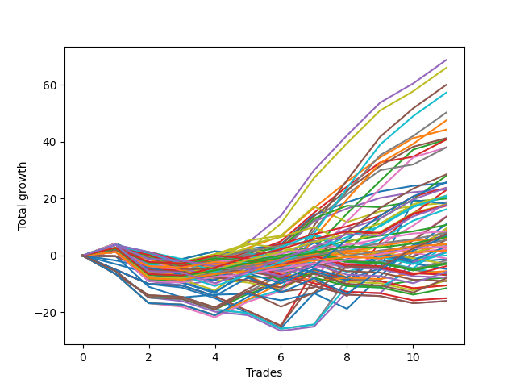

# Short Wallace Doodle 010 
- Symbol: ES
- Date Range: 03/18/2022 - 06/24/2022
- Trading Period: 7:20-12:30
- Number of Trades: 10



| Name | Win Percent | Profit | Avg Profit / Trade |     | Name | Win Percent | Profit | Avg Profit / Trade |
| ---- | ----------- | ------ | ------------------ | --- | ---- | ----------- | ------ | ------------------ |
| Sorted By <br> Profit | | | | | Sorted By <br> Win Percentage ||||
| Four | 80.00 | 30125.00 | 3012.50 |     | Four | 80.00 | 30125.00 | 3012.50 |
| Five | 60.00 | 26375.00 | 2637.50 |     | One | 80.00 | 23500.00 | 2350.00 |
| Two | 60.00 | 24250.00 | 2425.00 |     | Three | 80.00 | 17250.00 | 1725.00 |
| One | 80.00 | 23500.00 | 2350.00 |     | Zero | 80.00 | 11375.00 | 1137.50 |
| Seventy-One | 60.00 | 21000.00 | 2100.00 |     | Sixty-Four | 70.00 | 8875.00 | 887.50 |
| Fifty-Five | 60.00 | 21000.00 | 2100.00 |     | Fifty-Six | 70.00 | 8875.00 | 887.50 |
| Thirty-Nine | 60.00 | 21000.00 | 2100.00 |     | Five | 60.00 | 26375.00 | 2637.50 |
| Twenty-Three | 60.00 | 21000.00 | 2100.00 |     | Two | 60.00 | 24250.00 | 2425.00 |
| Seven | 60.00 | 21000.00 | 2100.00 |     | Seventy-One | 60.00 | 21000.00 | 2100.00 |
| Sixty-Three | 60.00 | 19625.00 | 1962.50 |     | Fifty-Five | 60.00 | 21000.00 | 2100.00 |
| Sixty | 60.00 | 17500.00 | 1750.00 |     | Thirty-Nine | 60.00 | 21000.00 | 2100.00 |
| Forty-Four | 50.00 | 17500.00 | 1750.00 |     | Twenty-Three | 60.00 | 21000.00 | 2100.00 |
| Three | 80.00 | 17250.00 | 1725.00 |     | Seven | 60.00 | 21000.00 | 2100.00 |
| Sixty-One | 40.00 | 11875.00 | 1187.50 |     | Sixty-Three | 60.00 | 19625.00 | 1962.50 |
| Zero | 80.00 | 11375.00 | 1137.50 |     | Sixty | 60.00 | 17500.00 | 1750.00 |
| Forty-Three | 60.00 | 11250.00 | 1125.00 |     | Forty-Three | 60.00 | 11250.00 | 1125.00 |
| Fifty-Seven | 60.00 | 10875.00 | 1087.50 |     | Fifty-Seven | 60.00 | 10875.00 | 1087.50 |
| Forty-One | 50.00 | 10875.00 | 1087.50 |     | Seventy-Three | 60.00 | 9750.00 | 975.00 |
| Forty-Five | 30.00 | 10750.00 | 1075.00 |     | Sixty-Five | 60.00 | 9000.00 | 900.00 |
| Twenty-Eight | 40.00 | 9875.00 | 987.50 |     | Forty | 60.00 | 6875.00 | 687.50 |
| Seventy-Three | 60.00 | 9750.00 | 975.00 |     | Fifty-Nine | 60.00 | 6625.00 | 662.50 |
| Fifty-Eight | 40.00 | 9750.00 | 975.00 |     | Seventy | 60.00 | 2750.00 | 275.00 |
| Seventy-Two | 50.00 | 9125.00 | 912.50 |     | Fifty-Four | 60.00 | 2750.00 | 275.00 |
| Sixty-Five | 60.00 | 9000.00 | 900.00 |     | Thirty-Eight | 60.00 | 2750.00 | 275.00 |
| Sixty-Four | 70.00 | 8875.00 | 887.50 |     | Twenty-Two | 60.00 | 2750.00 | 275.00 |
| Fifty-Six | 70.00 | 8875.00 | 887.50 |     | Six | 60.00 | 2750.00 | 275.00 |
| Forty-Two | 30.00 | 7625.00 | 762.50 |     | Sixty-Two | 60.00 | 1375.00 | 137.50 |
| Forty | 60.00 | 6875.00 | 687.50 |     | Forty-Four | 50.00 | 17500.00 | 1750.00 |
| Fifty-Nine | 60.00 | 6625.00 | 662.50 |     | Forty-One | 50.00 | 10875.00 | 1087.50 |
| Sixty-Eight | 50.00 | 5250.00 | 525.00 |     | Seventy-Two | 50.00 | 9125.00 | 912.50 |
| twenty-Seven | 50.00 | 5125.00 | 512.50 |     | Sixty-Eight | 50.00 | 5250.00 | 525.00 |
| Seventy-Five | 50.00 | 5000.00 | 500.00 |     | twenty-Seven | 50.00 | 5125.00 | 512.50 |
| Seventy-Four | 40.00 | 5000.00 | 500.00 |     | Seventy-Five | 50.00 | 5000.00 | 500.00 |
| Eight | 50.00 | 3625.00 | 362.50 |     | Eight | 50.00 | 3625.00 | 362.50 |
| Twenty-Nine | 20.00 | 3375.00 | 337.50 |     | Twenty-Four | 50.00 | 3125.00 | 312.50 |
| Twenty-Five | 40.00 | 3250.00 | 325.00 |     | Thirty | 50.00 | 875.00 | 87.50 |
| Twenty-Four | 50.00 | 3125.00 | 312.50 |     | Forty-Six | 50.00 | -125.00 | -12.50 |
| Seventy | 60.00 | 2750.00 | 275.00 |     | Sixty-Seven | 50.00 | -250.00 | -25.00 |
| Fifty-Four | 60.00 | 2750.00 | 275.00 |     | Sixty-One | 40.00 | 11875.00 | 1187.50 |
| Thirty-Eight | 60.00 | 2750.00 | 275.00 |     | Twenty-Eight | 40.00 | 9875.00 | 987.50 |
| Twenty-Two | 60.00 | 2750.00 | 275.00 |     | Fifty-Eight | 40.00 | 9750.00 | 975.00 |
| Six | 60.00 | 2750.00 | 275.00 |     | Seventy-Four | 40.00 | 5000.00 | 500.00 |
| Forty-Seven | 30.00 | 2625.00 | 262.50 |     | Twenty-Five | 40.00 | 3250.00 | 325.00 |
| Nine | 30.00 | 2375.00 | 237.50 |     | Thirty-Two | 40.00 | 1375.00 | 137.50 |
| Sixty-Six | 30.00 | 1750.00 | 175.00 |     | Forty-Eight | 40.00 | 625.00 | 62.50 |
| Thirty-One | 20.00 | 1625.00 | 162.50 |     | Thirty-Five | 40.00 | 625.00 | 62.50 |
| Sixty-Two | 60.00 | 1375.00 | 137.50 |     | Fourteen | 40.00 | 500.00 | 50.00 |
| Thirty-Two | 40.00 | 1375.00 | 137.50 |     | Fifty-One | 40.00 | -500.00 | -50.00 |
| Twelve | 20.00 | 1250.00 | 125.00 |     | Forty-Five | 30.00 | 10750.00 | 1075.00 |
| Sixty-Nine | 30.00 | 1125.00 | 112.50 |     | Forty-Two | 30.00 | 7625.00 | 762.50 |
| Thirty | 50.00 | 875.00 | 87.50 |     | Forty-Seven | 30.00 | 2625.00 | 262.50 |
| Forty-Eight | 40.00 | 625.00 | 62.50 |     | Nine | 30.00 | 2375.00 | 237.50 |
| Thirty-Five | 40.00 | 625.00 | 62.50 |     | Sixty-Six | 30.00 | 1750.00 | 175.00 |
| Fourteen | 40.00 | 500.00 | 50.00 |     | Sixty-Nine | 30.00 | 1125.00 | 112.50 |
| Twenty-Six | 20.00 | 250.00 | 25.00 |     | Thirty-Six | 30.00 | -0.00 | -0.00 |
| Thirty-Six | 30.00 | -0.00 | -0.00 |     | Eleven | 30.00 | -750.00 | -75.00 |
| Forty-Six | 50.00 | -125.00 | -12.50 |     | Thirty-Three | 30.00 | -875.00 | -87.50 |
| Sixty-Seven | 50.00 | -250.00 | -25.00 |     | Fifty-Two | 30.00 | -1125.00 | -112.50 |
| Thirteen | 10.00 | -250.00 | -25.00 |     | Forty-Nine | 30.00 | -2375.00 | -237.50 |
| Fifty-One | 40.00 | -500.00 | -50.00 |     | Sixten | 30.00 | -5250.00 | -525.00 |
| Eleven | 30.00 | -750.00 | -75.00 |     | Twenty-Nine | 20.00 | 3375.00 | 337.50 |
| Thirty-Three | 30.00 | -875.00 | -87.50 |     | Thirty-One | 20.00 | 1625.00 | 162.50 |
| Fifty-Two | 30.00 | -1125.00 | -112.50 |     | Twelve | 20.00 | 1250.00 | 125.00 |
| Forty-Nine | 30.00 | -2375.00 | -237.50 |     | Twenty-Six | 20.00 | 250.00 | 25.00 |
| Thirty-Seven | 20.00 | -2625.00 | -262.50 |     | Thirty-Seven | 20.00 | -2625.00 | -262.50 |
| Thirty-Four | 20.00 | -2625.00 | -262.50 |     | Thirty-Four | 20.00 | -2625.00 | -262.50 |
| Fifteen | 10.00 | -3750.00 | -375.00 |     | Nineteen | 20.00 | -6125.00 | -612.50 |
| Ten | 10.00 | -3875.00 | -387.50 |     | Thirteen | 10.00 | -250.00 | -25.00 |
| Sixten | 30.00 | -5250.00 | -525.00 |     | Fifteen | 10.00 | -3750.00 | -375.00 |
| Fifty-Three | 10.00 | -5750.00 | -575.00 |     | Ten | 10.00 | -3875.00 | -387.50 |
| Nineteen | 20.00 | -6125.00 | -612.50 |     | Fifty-Three | 10.00 | -5750.00 | -575.00 |
| Fifty | 10.00 | -6125.00 | -612.50 |     | Fifty | 10.00 | -6125.00 | -612.50 |
| Seventeen | 10.00 | -7875.00 | -787.50 |     | Seventeen | 10.00 | -7875.00 | -787.50 |
| Twenty-One | 10.00 | -8375.00 | -837.50 |     | Twenty-One | 10.00 | -8375.00 | -837.50 |
| Twenty | 10.00 | -8375.00 | -837.50 |     | Twenty | 10.00 | -8375.00 | -837.50 |
| Eighteen | 10.00 | -8375.00 | -837.50 |     | Eighteen | 10.00 | -8375.00 | -837.50 |

## NO STOPLOSS

### Test Zero
* Sell when price hits the middle line of the 20p bollinger
* No Stoploss
* Results:
```
Total Trades: 10
Percent Up: 20.00
Percent Down: 80.00
Total Points Moved Down: 22.75
Potential Profit: 11375.00
Total Points Ups: 10.00 Count Ups: 2
Total Points Downs: 32.75 Count Downs: 8
```

<details><summary>Trades</summary>

<code>In: 2022-03-25 10:22:00		Out: 2022-03-25 10:22:10		Total Position Time: 00:10		Total Move Down: 1.25		Total to Date: 1.25</code> <br />
<code>In: 2022-03-25 10:52:00		Out: 2022-03-25 11:17:40		Total Position Time: 25:40		Total Move Down: -8.50		Total to Date: -7.25</code> <br />
<code>In: 2022-03-28 10:27:00		Out: 2022-03-28 10:42:15		Total Position Time: 15:15		Total Move Down: -1.50		Total to Date: -8.75</code> <br />
<code>In: 2022-03-28 11:12:00		Out: 2022-03-28 11:12:10		Total Position Time: 00:10		Total Move Down: 2.00		Total to Date: -6.75</code> <br />
<code>In: 2022-04-25 09:27:00		Out: 2022-04-25 09:31:05		Total Position Time: 04:05		Total Move Down: 7.25		Total to Date: 0.50</code> <br />
<code>In: 2022-04-26 11:23:00		Out: 2022-04-26 11:31:35		Total Position Time: 08:35		Total Move Down: 1.75		Total to Date: 2.25</code> <br />
<code>In: 2022-05-02 09:23:00		Out: 2022-05-02 09:27:15		Total Position Time: 04:15		Total Move Down: 10.25		Total to Date: 12.50</code> <br />
<code>In: 2022-05-25 11:04:00		Out: 2022-05-25 11:06:25		Total Position Time: 02:25		Total Move Down: 4.50		Total to Date: 17.00</code> <br />
<code>In: 2022-05-25 11:06:00		Out: 2022-05-25 11:06:25		Total Position Time: 00:25		Total Move Down: 3.75		Total to Date: 20.75</code> <br />
<code>In: 2022-06-15 11:02:00		Out: 2022-06-15 11:02:10		Total Position Time: 00:10		Total Move Down: 2.00		Total to Date: 22.75</code> <br />


</details>

### Test One
* Sell when the price hits the upper line of the 20p 1std bollinger
* No Stoploss
* Results:
```
Total Trades: 10
Percent Up: 20.00
Percent Down: 80.00
Total Points Moved Down: 47.00
Potential Profit: 23500.00
Total Points Ups: 8.50 Count Ups: 2
Total Points Downs: 55.50 Count Downs: 8
```

<details><summary>Trades</summary>

<code>In: 2022-03-25 10:22:00		Out: 2022-03-25 10:23:25		Total Position Time: 01:25		Total Move Down: 2.75		Total to Date: 2.75</code> <br />
<code>In: 2022-03-25 10:52:00		Out: 2022-03-25 11:19:35		Total Position Time: 27:35		Total Move Down: -7.25		Total to Date: -4.50</code> <br />
<code>In: 2022-03-28 10:27:00		Out: 2022-03-28 10:44:05		Total Position Time: 17:05		Total Move Down: -1.25		Total to Date: -5.75</code> <br />
<code>In: 2022-03-28 11:12:00		Out: 2022-03-28 11:19:35		Total Position Time: 07:35		Total Move Down: 2.50		Total to Date: -3.25</code> <br />
<code>In: 2022-04-25 09:27:00		Out: 2022-04-25 09:42:40		Total Position Time: 15:40		Total Move Down: 5.25		Total to Date: 2.00</code> <br />
<code>In: 2022-04-26 11:23:00		Out: 2022-04-26 11:33:45		Total Position Time: 10:45		Total Move Down: 4.50		Total to Date: 6.50</code> <br />
<code>In: 2022-05-02 09:23:00		Out: 2022-05-02 09:36:10		Total Position Time: 13:10		Total Move Down: 10.00		Total to Date: 16.50</code> <br />
<code>In: 2022-05-25 11:04:00		Out: 2022-05-25 11:06:40		Total Position Time: 02:40		Total Move Down: 12.25		Total to Date: 28.75</code> <br />
<code>In: 2022-05-25 11:06:00		Out: 2022-05-25 11:06:40		Total Position Time: 00:40		Total Move Down: 11.50		Total to Date: 40.25</code> <br />
<code>In: 2022-06-15 11:02:00		Out: 2022-06-15 11:03:00		Total Position Time: 01:00		Total Move Down: 6.75		Total to Date: 47.00</code> <br />


</details>

### Test Two
* Sell when the price hits the upper line of the 20p 2std bollinger
* No Stoploss
* Results:
```
Total Trades: 10
Percent Up: 40.00
Percent Down: 60.00
Total Points Moved Down: 48.50
Potential Profit: 24250.00
Total Points Ups: 19.00 Count Ups: 4
Total Points Downs: 67.50 Count Downs: 6
```

<details><summary>Trades</summary>

<code>In: 2022-03-25 10:22:00		Out: 2022-03-25 10:51:55		Total Position Time: 29:55		Total Move Down: -6.50		Total to Date: -6.50</code> <br />
<code>In: 2022-03-25 10:52:00		Out: 2022-03-25 11:21:55		Total Position Time: 29:55		Total Move Down: -7.50		Total to Date: -14.00</code> <br />
<code>In: 2022-03-28 10:27:00		Out: 2022-03-28 10:55:10		Total Position Time: 28:10		Total Move Down: -1.25		Total to Date: -15.25</code> <br />
<code>In: 2022-03-28 11:12:00		Out: 2022-03-28 11:41:55		Total Position Time: 29:55		Total Move Down: -3.75		Total to Date: -19.00</code> <br />
<code>In: 2022-04-25 09:27:00		Out: 2022-04-25 09:56:55		Total Position Time: 29:55		Total Move Down: 5.50		Total to Date: -13.50</code> <br />
<code>In: 2022-04-26 11:23:00		Out: 2022-04-26 11:41:30		Total Position Time: 18:30		Total Move Down: 4.50		Total to Date: -9.00</code> <br />
<code>In: 2022-05-02 09:23:00		Out: 2022-05-02 09:39:55		Total Position Time: 16:55		Total Move Down: 13.25		Total to Date: 4.25</code> <br />
<code>In: 2022-05-25 11:04:00		Out: 2022-05-25 11:06:50		Total Position Time: 02:50		Total Move Down: 16.00		Total to Date: 20.25</code> <br />
<code>In: 2022-05-25 11:06:00		Out: 2022-05-25 11:06:50		Total Position Time: 00:50		Total Move Down: 15.25		Total to Date: 35.50</code> <br />
<code>In: 2022-06-15 11:02:00		Out: 2022-06-15 11:03:15		Total Position Time: 01:15		Total Move Down: 13.00		Total to Date: 48.50</code> <br />


</details>

### Test Three
* Sell when price hits the middle line of the 50p bollinger
* No Stoploss
* Results:
```
Total Trades: 10
Percent Up: 20.00
Percent Down: 80.00
Total Points Moved Down: 34.50
Potential Profit: 17250.00
Total Points Ups: 8.00 Count Ups: 2
Total Points Downs: 42.50 Count Downs: 8
```

<details><summary>Trades</summary>

<code>In: 2022-03-25 10:22:00		Out: 2022-03-25 10:23:10		Total Position Time: 01:10		Total Move Down: 1.75		Total to Date: 1.75</code> <br />
<code>In: 2022-03-25 10:52:00		Out: 2022-03-25 11:21:55		Total Position Time: 29:55		Total Move Down: -7.50		Total to Date: -5.75</code> <br />
<code>In: 2022-03-28 10:27:00		Out: 2022-03-28 10:56:55		Total Position Time: 29:55		Total Move Down: -0.50		Total to Date: -6.25</code> <br />
<code>In: 2022-03-28 11:12:00		Out: 2022-03-28 11:19:20		Total Position Time: 07:20		Total Move Down: 2.00		Total to Date: -4.25</code> <br />
<code>In: 2022-04-25 09:27:00		Out: 2022-04-25 09:55:10		Total Position Time: 28:10		Total Move Down: 4.50		Total to Date: 0.25</code> <br />
<code>In: 2022-04-26 11:23:00		Out: 2022-04-26 11:41:30		Total Position Time: 18:30		Total Move Down: 4.50		Total to Date: 4.75</code> <br />
<code>In: 2022-05-02 09:23:00		Out: 2022-05-02 09:36:20		Total Position Time: 13:20		Total Move Down: 10.00		Total to Date: 14.75</code> <br />
<code>In: 2022-05-25 11:04:00		Out: 2022-05-25 11:06:35		Total Position Time: 02:35		Total Move Down: 9.25		Total to Date: 24.00</code> <br />
<code>In: 2022-05-25 11:06:00		Out: 2022-05-25 11:06:35		Total Position Time: 00:35		Total Move Down: 8.50		Total to Date: 32.50</code> <br />
<code>In: 2022-06-15 11:02:00		Out: 2022-06-15 11:02:10		Total Position Time: 00:10		Total Move Down: 2.00		Total to Date: 34.50</code> <br />


</details>

### Test Four
* Sell when the price hits the upper line of the 50p 1std bollinger
* No Stoploss
* Results:
```
Total Trades: 10
Percent Up: 20.00
Percent Down: 80.00
Total Points Moved Down: 60.25
Potential Profit: 30125.00
Total Points Ups: 8.00 Count Ups: 2
Total Points Downs: 68.25 Count Downs: 8
```

<details><summary>Trades</summary>

<code>In: 2022-03-25 10:22:00		Out: 2022-03-25 10:27:20		Total Position Time: 05:20		Total Move Down: 4.25		Total to Date: 4.25</code> <br />
<code>In: 2022-03-25 10:52:00		Out: 2022-03-25 11:21:55		Total Position Time: 29:55		Total Move Down: -7.50		Total to Date: -3.25</code> <br />
<code>In: 2022-03-28 10:27:00		Out: 2022-03-28 10:56:55		Total Position Time: 29:55		Total Move Down: -0.50		Total to Date: -3.75</code> <br />
<code>In: 2022-03-28 11:12:00		Out: 2022-03-28 11:20:40		Total Position Time: 08:40		Total Move Down: 2.75		Total to Date: -1.00</code> <br />
<code>In: 2022-04-25 09:27:00		Out: 2022-04-25 09:56:55		Total Position Time: 29:55		Total Move Down: 5.50		Total to Date: 4.50</code> <br />
<code>In: 2022-04-26 11:23:00		Out: 2022-04-26 11:45:00		Total Position Time: 22:00		Total Move Down: 9.25		Total to Date: 13.75</code> <br />
<code>In: 2022-05-02 09:23:00		Out: 2022-05-02 09:43:40		Total Position Time: 20:40		Total Move Down: 16.00		Total to Date: 29.75</code> <br />
<code>In: 2022-05-25 11:04:00		Out: 2022-05-25 11:06:40		Total Position Time: 02:40		Total Move Down: 12.25		Total to Date: 42.00</code> <br />
<code>In: 2022-05-25 11:06:00		Out: 2022-05-25 11:06:40		Total Position Time: 00:40		Total Move Down: 11.50		Total to Date: 53.50</code> <br />
<code>In: 2022-06-15 11:02:00		Out: 2022-06-15 11:03:00		Total Position Time: 01:00		Total Move Down: 6.75		Total to Date: 60.25</code> <br />


</details>

### Test Five
* Sell when the price hits the upper line of the 50p 2std bollinger
* No Stoploss
* Results:
```
Total Trades: 10
Percent Up: 40.00
Percent Down: 60.00
Total Points Moved Down: 52.75
Potential Profit: 26375.00
Total Points Ups: 18.25 Count Ups: 4
Total Points Downs: 71.00 Count Downs: 6
```

<details><summary>Trades</summary>

<code>In: 2022-03-25 10:22:00		Out: 2022-03-25 10:51:55		Total Position Time: 29:55		Total Move Down: -6.50		Total to Date: -6.50</code> <br />
<code>In: 2022-03-25 10:52:00		Out: 2022-03-25 11:21:55		Total Position Time: 29:55		Total Move Down: -7.50		Total to Date: -14.00</code> <br />
<code>In: 2022-03-28 10:27:00		Out: 2022-03-28 10:56:55		Total Position Time: 29:55		Total Move Down: -0.50		Total to Date: -14.50</code> <br />
<code>In: 2022-03-28 11:12:00		Out: 2022-03-28 11:41:55		Total Position Time: 29:55		Total Move Down: -3.75		Total to Date: -18.25</code> <br />
<code>In: 2022-04-25 09:27:00		Out: 2022-04-25 09:56:55		Total Position Time: 29:55		Total Move Down: 5.50		Total to Date: -12.75</code> <br />
<code>In: 2022-04-26 11:23:00		Out: 2022-04-26 11:52:55		Total Position Time: 29:55		Total Move Down: 3.50		Total to Date: -9.25</code> <br />
<code>In: 2022-05-02 09:23:00		Out: 2022-05-02 09:52:55		Total Position Time: 29:55		Total Move Down: 19.75		Total to Date: 10.50</code> <br />
<code>In: 2022-05-25 11:04:00		Out: 2022-05-25 11:06:50		Total Position Time: 02:50		Total Move Down: 16.00		Total to Date: 26.50</code> <br />
<code>In: 2022-05-25 11:06:00		Out: 2022-05-25 11:06:50		Total Position Time: 00:50		Total Move Down: 15.25		Total to Date: 41.75</code> <br />
<code>In: 2022-06-15 11:02:00		Out: 2022-06-15 11:03:10		Total Position Time: 01:10		Total Move Down: 11.00		Total to Date: 52.75</code> <br />


</details>

### Test Six
* Sell when the price hits the middle line of the 1std VWAP
* No Stoploss
* Results:
```
Total Trades: 10
Percent Up: 40.00
Percent Down: 60.00
Total Points Moved Down: 5.50
Potential Profit: 2750.00
Total Points Ups: 12.75 Count Ups: 4
Total Points Downs: 18.25 Count Downs: 6
```

<details><summary>Trades</summary>

<code>In: 2022-03-25 10:22:00		Out: 2022-03-25 10:22:10		Total Position Time: 00:10		Total Move Down: 1.25		Total to Date: 1.25</code> <br />
<code>In: 2022-03-25 10:52:00		Out: 2022-03-25 11:21:55		Total Position Time: 29:55		Total Move Down: -7.50		Total to Date: -6.25</code> <br />
<code>In: 2022-03-28 10:27:00		Out: 2022-03-28 10:56:55		Total Position Time: 29:55		Total Move Down: -0.50		Total to Date: -6.75</code> <br />
<code>In: 2022-03-28 11:12:00		Out: 2022-03-28 11:41:55		Total Position Time: 29:55		Total Move Down: -3.75		Total to Date: -10.50</code> <br />
<code>In: 2022-04-25 09:27:00		Out: 2022-04-25 09:31:10		Total Position Time: 04:10		Total Move Down: 8.50		Total to Date: -2.00</code> <br />
<code>In: 2022-04-26 11:23:00		Out: 2022-04-26 11:23:10		Total Position Time: 00:10		Total Move Down: -1.00		Total to Date: -3.00</code> <br />
<code>In: 2022-05-02 09:23:00		Out: 2022-05-02 09:24:15		Total Position Time: 01:15		Total Move Down: 1.75		Total to Date: -1.25</code> <br />
<code>In: 2022-05-25 11:04:00		Out: 2022-05-25 11:06:20		Total Position Time: 02:20		Total Move Down: 2.75		Total to Date: 1.50</code> <br />
<code>In: 2022-05-25 11:06:00		Out: 2022-05-25 11:06:20		Total Position Time: 00:20		Total Move Down: 2.00		Total to Date: 3.50</code> <br />
<code>In: 2022-06-15 11:02:00		Out: 2022-06-15 11:02:10		Total Position Time: 00:10		Total Move Down: 2.00		Total to Date: 5.50</code> <br />


</details>

### Test Seven
* Sell when the price hits the upper line of the 1std VWAP
* No Stoploss
* Results:
```
Total Trades: 10
Percent Up: 40.00
Percent Down: 60.00
Total Points Moved Down: 42.00
Potential Profit: 21000.00
Total Points Ups: 18.25 Count Ups: 4
Total Points Downs: 60.25 Count Downs: 6
```

<details><summary>Trades</summary>

<code>In: 2022-03-25 10:22:00		Out: 2022-03-25 10:51:55		Total Position Time: 29:55		Total Move Down: -6.50		Total to Date: -6.50</code> <br />
<code>In: 2022-03-25 10:52:00		Out: 2022-03-25 11:21:55		Total Position Time: 29:55		Total Move Down: -7.50		Total to Date: -14.00</code> <br />
<code>In: 2022-03-28 10:27:00		Out: 2022-03-28 10:56:55		Total Position Time: 29:55		Total Move Down: -0.50		Total to Date: -14.50</code> <br />
<code>In: 2022-03-28 11:12:00		Out: 2022-03-28 11:41:55		Total Position Time: 29:55		Total Move Down: -3.75		Total to Date: -18.25</code> <br />
<code>In: 2022-04-25 09:27:00		Out: 2022-04-25 09:56:55		Total Position Time: 29:55		Total Move Down: 5.50		Total to Date: -12.75</code> <br />
<code>In: 2022-04-26 11:23:00		Out: 2022-04-26 11:42:05		Total Position Time: 19:05		Total Move Down: 5.75		Total to Date: -7.00</code> <br />
<code>In: 2022-05-02 09:23:00		Out: 2022-05-02 09:43:15		Total Position Time: 20:15		Total Move Down: 16.00		Total to Date: 9.00</code> <br />
<code>In: 2022-05-25 11:04:00		Out: 2022-05-25 11:06:45		Total Position Time: 02:45		Total Move Down: 13.50		Total to Date: 22.50</code> <br />
<code>In: 2022-05-25 11:06:00		Out: 2022-05-25 11:06:45		Total Position Time: 00:45		Total Move Down: 12.75		Total to Date: 35.25</code> <br />
<code>In: 2022-06-15 11:02:00		Out: 2022-06-15 11:03:00		Total Position Time: 01:00		Total Move Down: 6.75		Total to Date: 42.00</code> <br />


</details>

## STOPLOSS OF 2

### Test Eight
* Sell when price hits the middle line of the 20p bollinger
* Stoploss is -2 points
* Results:
```
Total Trades: 10
Percent Up: 50.00
Percent Down: 50.00
Total Points Moved Down: 7.25
Potential Profit: 3625.00
Total Points Ups: 10.00 Count Ups: 5
Total Points Downs: 17.25 Count Downs: 5
```

<details><summary>Trades</summary>

<code>In: 2022-03-25 10:22:00		Out: 2022-03-25 10:22:10		Total Position Time: 00:10		Total Move Down: 1.25		Total to Date: 1.25</code> <br />
<code>In: 2022-03-25 10:52:00		Out: 2022-03-25 10:52:25		Total Position Time: 00:25		Total Move Down: -1.50		Total to Date: -0.25</code> <br />
<code>In: 2022-03-28 10:27:00		Out: 2022-03-28 10:42:15		Total Position Time: 15:15		Total Move Down: -1.50		Total to Date: -1.75</code> <br />
<code>In: 2022-03-28 11:12:00		Out: 2022-03-28 11:12:10		Total Position Time: 00:10		Total Move Down: 2.00		Total to Date: 0.25</code> <br />
<code>In: 2022-04-25 09:27:00		Out: 2022-04-25 09:27:10		Total Position Time: 00:10		Total Move Down: -1.00		Total to Date: -0.75</code> <br />
<code>In: 2022-04-26 11:23:00		Out: 2022-04-26 11:31:35		Total Position Time: 08:35		Total Move Down: 1.75		Total to Date: 1.00</code> <br />
<code>In: 2022-05-02 09:23:00		Out: 2022-05-02 09:27:15		Total Position Time: 04:15		Total Move Down: 10.25		Total to Date: 11.25</code> <br />
<code>In: 2022-05-25 11:04:00		Out: 2022-05-25 11:04:40		Total Position Time: 00:40		Total Move Down: -5.50		Total to Date: 5.75</code> <br />
<code>In: 2022-05-25 11:06:00		Out: 2022-05-25 11:06:10		Total Position Time: 00:10		Total Move Down: -0.50		Total to Date: 5.25</code> <br />
<code>In: 2022-06-15 11:02:00		Out: 2022-06-15 11:02:10		Total Position Time: 00:10		Total Move Down: 2.00		Total to Date: 7.25</code> <br />


</details>

### Test Nine
* Sell when the price hits the upper line of the 20p 1std bollinger
* Stoploss is -2 points
* Results:
```
Total Trades: 10
Percent Up: 70.00
Percent Down: 30.00
Total Points Moved Down: 4.75
Potential Profit: 2375.00
Total Points Ups: 12.50 Count Ups: 7
Total Points Downs: 17.25 Count Downs: 3
```

<details><summary>Trades</summary>

<code>In: 2022-03-25 10:22:00		Out: 2022-03-25 10:23:25		Total Position Time: 01:25		Total Move Down: 2.75		Total to Date: 2.75</code> <br />
<code>In: 2022-03-25 10:52:00		Out: 2022-03-25 10:52:25		Total Position Time: 00:25		Total Move Down: -1.50		Total to Date: 1.25</code> <br />
<code>In: 2022-03-28 10:27:00		Out: 2022-03-28 10:44:05		Total Position Time: 17:05		Total Move Down: -1.25		Total to Date: 0.00</code> <br />
<code>In: 2022-03-28 11:12:00		Out: 2022-03-28 11:14:35		Total Position Time: 02:35		Total Move Down: -0.25		Total to Date: -0.25</code> <br />
<code>In: 2022-04-25 09:27:00		Out: 2022-04-25 09:27:10		Total Position Time: 00:10		Total Move Down: -1.00		Total to Date: -1.25</code> <br />
<code>In: 2022-04-26 11:23:00		Out: 2022-04-26 11:33:45		Total Position Time: 10:45		Total Move Down: 4.50		Total to Date: 3.25</code> <br />
<code>In: 2022-05-02 09:23:00		Out: 2022-05-02 09:36:10		Total Position Time: 13:10		Total Move Down: 10.00		Total to Date: 13.25</code> <br />
<code>In: 2022-05-25 11:04:00		Out: 2022-05-25 11:04:40		Total Position Time: 00:40		Total Move Down: -5.50		Total to Date: 7.75</code> <br />
<code>In: 2022-05-25 11:06:00		Out: 2022-05-25 11:06:10		Total Position Time: 00:10		Total Move Down: -0.50		Total to Date: 7.25</code> <br />
<code>In: 2022-06-15 11:02:00		Out: 2022-06-15 11:02:15		Total Position Time: 00:15		Total Move Down: -2.50		Total to Date: 4.75</code> <br />


</details>

### Test Ten
* Sell when the price hits the upper line of the 20p 2std bollinger
* Stoploss is -2 points
* Results:
```
Total Trades: 10
Percent Up: 90.00
Percent Down: 10.00
Total Points Moved Down: -7.75
Potential Profit: -3875.00
Total Points Ups: 21.00 Count Ups: 9
Total Points Downs: 13.25 Count Downs: 1
```

<details><summary>Trades</summary>

<code>In: 2022-03-25 10:22:00		Out: 2022-03-25 10:34:15		Total Position Time: 12:15		Total Move Down: -2.50		Total to Date: -2.50</code> <br />
<code>In: 2022-03-25 10:52:00		Out: 2022-03-25 10:52:25		Total Position Time: 00:25		Total Move Down: -1.50		Total to Date: -4.00</code> <br />
<code>In: 2022-03-28 10:27:00		Out: 2022-03-28 10:55:10		Total Position Time: 28:10		Total Move Down: -1.25		Total to Date: -5.25</code> <br />
<code>In: 2022-03-28 11:12:00		Out: 2022-03-28 11:14:35		Total Position Time: 02:35		Total Move Down: -0.25		Total to Date: -5.50</code> <br />
<code>In: 2022-04-25 09:27:00		Out: 2022-04-25 09:27:10		Total Position Time: 00:10		Total Move Down: -1.00		Total to Date: -6.50</code> <br />
<code>In: 2022-04-26 11:23:00		Out: 2022-04-26 11:37:35		Total Position Time: 14:35		Total Move Down: -6.00		Total to Date: -12.50</code> <br />
<code>In: 2022-05-02 09:23:00		Out: 2022-05-02 09:39:55		Total Position Time: 16:55		Total Move Down: 13.25		Total to Date: 0.75</code> <br />
<code>In: 2022-05-25 11:04:00		Out: 2022-05-25 11:04:40		Total Position Time: 00:40		Total Move Down: -5.50		Total to Date: -4.75</code> <br />
<code>In: 2022-05-25 11:06:00		Out: 2022-05-25 11:06:10		Total Position Time: 00:10		Total Move Down: -0.50		Total to Date: -5.25</code> <br />
<code>In: 2022-06-15 11:02:00		Out: 2022-06-15 11:02:15		Total Position Time: 00:15		Total Move Down: -2.50		Total to Date: -7.75</code> <br />


</details>

### Test Eleven
* Sell when price hits the middle line of the 50p bollinger
* Stoploss is -2 points
* Results:
```
Total Trades: 10
Percent Up: 70.00
Percent Down: 30.00
Total Points Moved Down: -1.50
Potential Profit: -750.00
Total Points Ups: 15.25 Count Ups: 7
Total Points Downs: 13.75 Count Downs: 3
```

<details><summary>Trades</summary>

<code>In: 2022-03-25 10:22:00		Out: 2022-03-25 10:23:10		Total Position Time: 01:10		Total Move Down: 1.75		Total to Date: 1.75</code> <br />
<code>In: 2022-03-25 10:52:00		Out: 2022-03-25 10:52:25		Total Position Time: 00:25		Total Move Down: -1.50		Total to Date: 0.25</code> <br />
<code>In: 2022-03-28 10:27:00		Out: 2022-03-28 10:56:55		Total Position Time: 29:55		Total Move Down: -0.50		Total to Date: -0.25</code> <br />
<code>In: 2022-03-28 11:12:00		Out: 2022-03-28 11:14:35		Total Position Time: 02:35		Total Move Down: -0.25		Total to Date: -0.50</code> <br />
<code>In: 2022-04-25 09:27:00		Out: 2022-04-25 09:27:10		Total Position Time: 00:10		Total Move Down: -1.00		Total to Date: -1.50</code> <br />
<code>In: 2022-04-26 11:23:00		Out: 2022-04-26 11:37:35		Total Position Time: 14:35		Total Move Down: -6.00		Total to Date: -7.50</code> <br />
<code>In: 2022-05-02 09:23:00		Out: 2022-05-02 09:36:20		Total Position Time: 13:20		Total Move Down: 10.00		Total to Date: 2.50</code> <br />
<code>In: 2022-05-25 11:04:00		Out: 2022-05-25 11:04:40		Total Position Time: 00:40		Total Move Down: -5.50		Total to Date: -3.00</code> <br />
<code>In: 2022-05-25 11:06:00		Out: 2022-05-25 11:06:10		Total Position Time: 00:10		Total Move Down: -0.50		Total to Date: -3.50</code> <br />
<code>In: 2022-06-15 11:02:00		Out: 2022-06-15 11:02:10		Total Position Time: 00:10		Total Move Down: 2.00		Total to Date: -1.50</code> <br />


</details>

### Test Twelve
* Sell when the price hits the upper line of the 50p 1std bollinger
* Stoploss is -2 points
* Results:
```
Total Trades: 10
Percent Up: 80.00
Percent Down: 20.00
Total Points Moved Down: 2.50
Potential Profit: 1250.00
Total Points Ups: 17.75 Count Ups: 8
Total Points Downs: 20.25 Count Downs: 2
```

<details><summary>Trades</summary>

<code>In: 2022-03-25 10:22:00		Out: 2022-03-25 10:27:20		Total Position Time: 05:20		Total Move Down: 4.25		Total to Date: 4.25</code> <br />
<code>In: 2022-03-25 10:52:00		Out: 2022-03-25 10:52:25		Total Position Time: 00:25		Total Move Down: -1.50		Total to Date: 2.75</code> <br />
<code>In: 2022-03-28 10:27:00		Out: 2022-03-28 10:56:55		Total Position Time: 29:55		Total Move Down: -0.50		Total to Date: 2.25</code> <br />
<code>In: 2022-03-28 11:12:00		Out: 2022-03-28 11:14:35		Total Position Time: 02:35		Total Move Down: -0.25		Total to Date: 2.00</code> <br />
<code>In: 2022-04-25 09:27:00		Out: 2022-04-25 09:27:10		Total Position Time: 00:10		Total Move Down: -1.00		Total to Date: 1.00</code> <br />
<code>In: 2022-04-26 11:23:00		Out: 2022-04-26 11:37:35		Total Position Time: 14:35		Total Move Down: -6.00		Total to Date: -5.00</code> <br />
<code>In: 2022-05-02 09:23:00		Out: 2022-05-02 09:43:40		Total Position Time: 20:40		Total Move Down: 16.00		Total to Date: 11.00</code> <br />
<code>In: 2022-05-25 11:04:00		Out: 2022-05-25 11:04:40		Total Position Time: 00:40		Total Move Down: -5.50		Total to Date: 5.50</code> <br />
<code>In: 2022-05-25 11:06:00		Out: 2022-05-25 11:06:10		Total Position Time: 00:10		Total Move Down: -0.50		Total to Date: 5.00</code> <br />
<code>In: 2022-06-15 11:02:00		Out: 2022-06-15 11:02:15		Total Position Time: 00:15		Total Move Down: -2.50		Total to Date: 2.50</code> <br />


</details>

### Test Thirteen
* Sell when the price hits the upper line of the 50p 2std bollinger
* Stoploss is -2 points
* Results:
```
Total Trades: 10
Percent Up: 90.00
Percent Down: 10.00
Total Points Moved Down: -0.50
Potential Profit: -250.00
Total Points Ups: 20.25 Count Ups: 9
Total Points Downs: 19.75 Count Downs: 1
```

<details><summary>Trades</summary>

<code>In: 2022-03-25 10:22:00		Out: 2022-03-25 10:34:15		Total Position Time: 12:15		Total Move Down: -2.50		Total to Date: -2.50</code> <br />
<code>In: 2022-03-25 10:52:00		Out: 2022-03-25 10:52:25		Total Position Time: 00:25		Total Move Down: -1.50		Total to Date: -4.00</code> <br />
<code>In: 2022-03-28 10:27:00		Out: 2022-03-28 10:56:55		Total Position Time: 29:55		Total Move Down: -0.50		Total to Date: -4.50</code> <br />
<code>In: 2022-03-28 11:12:00		Out: 2022-03-28 11:14:35		Total Position Time: 02:35		Total Move Down: -0.25		Total to Date: -4.75</code> <br />
<code>In: 2022-04-25 09:27:00		Out: 2022-04-25 09:27:10		Total Position Time: 00:10		Total Move Down: -1.00		Total to Date: -5.75</code> <br />
<code>In: 2022-04-26 11:23:00		Out: 2022-04-26 11:37:35		Total Position Time: 14:35		Total Move Down: -6.00		Total to Date: -11.75</code> <br />
<code>In: 2022-05-02 09:23:00		Out: 2022-05-02 09:52:55		Total Position Time: 29:55		Total Move Down: 19.75		Total to Date: 8.00</code> <br />
<code>In: 2022-05-25 11:04:00		Out: 2022-05-25 11:04:40		Total Position Time: 00:40		Total Move Down: -5.50		Total to Date: 2.50</code> <br />
<code>In: 2022-05-25 11:06:00		Out: 2022-05-25 11:06:10		Total Position Time: 00:10		Total Move Down: -0.50		Total to Date: 2.00</code> <br />
<code>In: 2022-06-15 11:02:00		Out: 2022-06-15 11:02:15		Total Position Time: 00:15		Total Move Down: -2.50		Total to Date: -0.50</code> <br />


</details>

### Test Fourteen
* Sell when the price hits the middle line of the 1std VWAP
* Stoploss is -2 points
* Results:
```
Total Trades: 10
Percent Up: 60.00
Percent Down: 40.00
Total Points Moved Down: 1.00
Potential Profit: 500.00
Total Points Ups: 12.75 Count Ups: 6
Total Points Downs: 13.75 Count Downs: 4
```

<details><summary>Trades</summary>

<code>In: 2022-03-25 10:22:00		Out: 2022-03-25 10:22:10		Total Position Time: 00:10		Total Move Down: 1.25		Total to Date: 1.25</code> <br />
<code>In: 2022-03-25 10:52:00		Out: 2022-03-25 10:55:50		Total Position Time: 03:50		Total Move Down: -2.50		Total to Date: -1.25</code> <br />
<code>In: 2022-03-28 10:27:00		Out: 2022-03-28 10:27:35		Total Position Time: 00:35		Total Move Down: -2.50		Total to Date: -3.75</code> <br />
<code>In: 2022-03-28 11:12:00		Out: 2022-03-28 11:28:15		Total Position Time: 16:15		Total Move Down: -2.00		Total to Date: -5.75</code> <br />
<code>In: 2022-04-25 09:27:00		Out: 2022-04-25 09:31:10		Total Position Time: 04:10		Total Move Down: 8.50		Total to Date: 2.75</code> <br />
<code>In: 2022-04-26 11:23:00		Out: 2022-04-26 11:23:10		Total Position Time: 00:10		Total Move Down: -1.00		Total to Date: 1.75</code> <br />
<code>In: 2022-05-02 09:23:00		Out: 2022-05-02 09:23:40		Total Position Time: 00:40		Total Move Down: -1.75		Total to Date: 0.00</code> <br />
<code>In: 2022-05-25 11:04:00		Out: 2022-05-25 11:04:20		Total Position Time: 00:20		Total Move Down: -3.00		Total to Date: -3.00</code> <br />
<code>In: 2022-05-25 11:06:00		Out: 2022-05-25 11:06:20		Total Position Time: 00:20		Total Move Down: 2.00		Total to Date: -1.00</code> <br />
<code>In: 2022-06-15 11:02:00		Out: 2022-06-15 11:02:10		Total Position Time: 00:10		Total Move Down: 2.00		Total to Date: 1.00</code> <br />


</details>

### Test Fifteen
* Sell when the price hits the upper line of the 1std VWAP
* Stoploss is -2 points
* Results:
```
Total Trades: 10
Percent Up: 90.00
Percent Down: 10.00
Total Points Moved Down: -7.50
Potential Profit: -3750.00
Total Points Ups: 20.25 Count Ups: 9
Total Points Downs: 12.75 Count Downs: 1
```

<details><summary>Trades</summary>

<code>In: 2022-03-25 10:22:00		Out: 2022-03-25 10:33:25		Total Position Time: 11:25		Total Move Down: -1.75		Total to Date: -1.75</code> <br />
<code>In: 2022-03-25 10:52:00		Out: 2022-03-25 10:55:50		Total Position Time: 03:50		Total Move Down: -2.50		Total to Date: -4.25</code> <br />
<code>In: 2022-03-28 10:27:00		Out: 2022-03-28 10:27:35		Total Position Time: 00:35		Total Move Down: -2.50		Total to Date: -6.75</code> <br />
<code>In: 2022-03-28 11:12:00		Out: 2022-03-28 11:28:15		Total Position Time: 16:15		Total Move Down: -2.00		Total to Date: -8.75</code> <br />
<code>In: 2022-04-25 09:27:00		Out: 2022-04-25 09:32:40		Total Position Time: 05:40		Total Move Down: -2.50		Total to Date: -11.25</code> <br />
<code>In: 2022-04-26 11:23:00		Out: 2022-04-26 11:23:20		Total Position Time: 00:20		Total Move Down: -1.75		Total to Date: -13.00</code> <br />
<code>In: 2022-05-02 09:23:00		Out: 2022-05-02 09:23:40		Total Position Time: 00:40		Total Move Down: -1.75		Total to Date: -14.75</code> <br />
<code>In: 2022-05-25 11:04:00		Out: 2022-05-25 11:04:20		Total Position Time: 00:20		Total Move Down: -3.00		Total to Date: -17.75</code> <br />
<code>In: 2022-05-25 11:06:00		Out: 2022-05-25 11:06:45		Total Position Time: 00:45		Total Move Down: 12.75		Total to Date: -5.00</code> <br />
<code>In: 2022-06-15 11:02:00		Out: 2022-06-15 11:02:15		Total Position Time: 00:15		Total Move Down: -2.50		Total to Date: -7.50</code> <br />


</details>

## TRAIL STOP OF 2

### Test Sixten
* Sell when price hits the middle line of the 20p bollinger
* Trailing Stop is -2 points
* Results:
```
Total Trades: 10
Percent Up: 70.00
Percent Down: 30.00
Total Points Moved Down: -10.50
Potential Profit: -5250.00
Total Points Ups: 15.75 Count Ups: 7
Total Points Downs: 5.25 Count Downs: 3
```

<details><summary>Trades</summary>

<code>In: 2022-03-25 10:22:00		Out: 2022-03-25 10:22:10		Total Position Time: 00:10		Total Move Down: 1.25		Total to Date: 1.25</code> <br />
<code>In: 2022-03-25 10:52:00		Out: 2022-03-25 10:52:25		Total Position Time: 00:25		Total Move Down: -1.50		Total to Date: -0.25</code> <br />
<code>In: 2022-03-28 10:27:00		Out: 2022-03-28 10:27:40		Total Position Time: 00:40		Total Move Down: -3.25		Total to Date: -3.50</code> <br />
<code>In: 2022-03-28 11:12:00		Out: 2022-03-28 11:12:10		Total Position Time: 00:10		Total Move Down: 2.00		Total to Date: -1.50</code> <br />
<code>In: 2022-04-25 09:27:00		Out: 2022-04-25 09:27:10		Total Position Time: 00:10		Total Move Down: -1.00		Total to Date: -2.50</code> <br />
<code>In: 2022-04-26 11:23:00		Out: 2022-04-26 11:23:25		Total Position Time: 00:25		Total Move Down: -3.50		Total to Date: -6.00</code> <br />
<code>In: 2022-05-02 09:23:00		Out: 2022-05-02 09:23:45		Total Position Time: 00:45		Total Move Down: -3.00		Total to Date: -9.00</code> <br />
<code>In: 2022-05-25 11:04:00		Out: 2022-05-25 11:04:20		Total Position Time: 00:20		Total Move Down: -3.00		Total to Date: -12.00</code> <br />
<code>In: 2022-05-25 11:06:00		Out: 2022-05-25 11:06:10		Total Position Time: 00:10		Total Move Down: -0.50		Total to Date: -12.50</code> <br />
<code>In: 2022-06-15 11:02:00		Out: 2022-06-15 11:02:10		Total Position Time: 00:10		Total Move Down: 2.00		Total to Date: -10.50</code> <br />


</details>

### Test Seventeen
* Sell when the price hits the upper line of the 20p 1std bollinger
* Trailing Stop is -2 points
* Results:
```
Total Trades: 10
Percent Up: 90.00
Percent Down: 10.00
Total Points Moved Down: -15.75
Potential Profit: -7875.00
Total Points Ups: 18.50 Count Ups: 9
Total Points Downs: 2.75 Count Downs: 1
```

<details><summary>Trades</summary>

<code>In: 2022-03-25 10:22:00		Out: 2022-03-25 10:23:25		Total Position Time: 01:25		Total Move Down: 2.75		Total to Date: 2.75</code> <br />
<code>In: 2022-03-25 10:52:00		Out: 2022-03-25 10:52:25		Total Position Time: 00:25		Total Move Down: -1.50		Total to Date: 1.25</code> <br />
<code>In: 2022-03-28 10:27:00		Out: 2022-03-28 10:27:40		Total Position Time: 00:40		Total Move Down: -3.25		Total to Date: -2.00</code> <br />
<code>In: 2022-03-28 11:12:00		Out: 2022-03-28 11:14:35		Total Position Time: 02:35		Total Move Down: -0.25		Total to Date: -2.25</code> <br />
<code>In: 2022-04-25 09:27:00		Out: 2022-04-25 09:27:10		Total Position Time: 00:10		Total Move Down: -1.00		Total to Date: -3.25</code> <br />
<code>In: 2022-04-26 11:23:00		Out: 2022-04-26 11:23:25		Total Position Time: 00:25		Total Move Down: -3.50		Total to Date: -6.75</code> <br />
<code>In: 2022-05-02 09:23:00		Out: 2022-05-02 09:23:45		Total Position Time: 00:45		Total Move Down: -3.00		Total to Date: -9.75</code> <br />
<code>In: 2022-05-25 11:04:00		Out: 2022-05-25 11:04:20		Total Position Time: 00:20		Total Move Down: -3.00		Total to Date: -12.75</code> <br />
<code>In: 2022-05-25 11:06:00		Out: 2022-05-25 11:06:10		Total Position Time: 00:10		Total Move Down: -0.50		Total to Date: -13.25</code> <br />
<code>In: 2022-06-15 11:02:00		Out: 2022-06-15 11:02:15		Total Position Time: 00:15		Total Move Down: -2.50		Total to Date: -15.75</code> <br />


</details>

### Test Eighteen
* Sell when the price hits the upper line of the 20p 2std bollinger
* Trailing Stop is -2 points
* Results:
```
Total Trades: 10
Percent Up: 90.00
Percent Down: 10.00
Total Points Moved Down: -16.75
Potential Profit: -8375.00
Total Points Ups: 18.50 Count Ups: 9
Total Points Downs: 1.75 Count Downs: 1
```

<details><summary>Trades</summary>

<code>In: 2022-03-25 10:22:00		Out: 2022-03-25 10:25:10		Total Position Time: 03:10		Total Move Down: 1.75		Total to Date: 1.75</code> <br />
<code>In: 2022-03-25 10:52:00		Out: 2022-03-25 10:52:25		Total Position Time: 00:25		Total Move Down: -1.50		Total to Date: 0.25</code> <br />
<code>In: 2022-03-28 10:27:00		Out: 2022-03-28 10:27:40		Total Position Time: 00:40		Total Move Down: -3.25		Total to Date: -3.00</code> <br />
<code>In: 2022-03-28 11:12:00		Out: 2022-03-28 11:14:35		Total Position Time: 02:35		Total Move Down: -0.25		Total to Date: -3.25</code> <br />
<code>In: 2022-04-25 09:27:00		Out: 2022-04-25 09:27:10		Total Position Time: 00:10		Total Move Down: -1.00		Total to Date: -4.25</code> <br />
<code>In: 2022-04-26 11:23:00		Out: 2022-04-26 11:23:25		Total Position Time: 00:25		Total Move Down: -3.50		Total to Date: -7.75</code> <br />
<code>In: 2022-05-02 09:23:00		Out: 2022-05-02 09:23:45		Total Position Time: 00:45		Total Move Down: -3.00		Total to Date: -10.75</code> <br />
<code>In: 2022-05-25 11:04:00		Out: 2022-05-25 11:04:20		Total Position Time: 00:20		Total Move Down: -3.00		Total to Date: -13.75</code> <br />
<code>In: 2022-05-25 11:06:00		Out: 2022-05-25 11:06:10		Total Position Time: 00:10		Total Move Down: -0.50		Total to Date: -14.25</code> <br />
<code>In: 2022-06-15 11:02:00		Out: 2022-06-15 11:02:15		Total Position Time: 00:15		Total Move Down: -2.50		Total to Date: -16.75</code> <br />


</details>

### Test Nineteen
* Sell when price hits the middle line of the 50p bollinger
* Trailing Stop is -2 points
* Results:
```
Total Trades: 10
Percent Up: 80.00
Percent Down: 20.00
Total Points Moved Down: -12.25
Potential Profit: -6125.00
Total Points Ups: 16.00 Count Ups: 8
Total Points Downs: 3.75 Count Downs: 2
```

<details><summary>Trades</summary>

<code>In: 2022-03-25 10:22:00		Out: 2022-03-25 10:23:10		Total Position Time: 01:10		Total Move Down: 1.75		Total to Date: 1.75</code> <br />
<code>In: 2022-03-25 10:52:00		Out: 2022-03-25 10:52:25		Total Position Time: 00:25		Total Move Down: -1.50		Total to Date: 0.25</code> <br />
<code>In: 2022-03-28 10:27:00		Out: 2022-03-28 10:27:40		Total Position Time: 00:40		Total Move Down: -3.25		Total to Date: -3.00</code> <br />
<code>In: 2022-03-28 11:12:00		Out: 2022-03-28 11:14:35		Total Position Time: 02:35		Total Move Down: -0.25		Total to Date: -3.25</code> <br />
<code>In: 2022-04-25 09:27:00		Out: 2022-04-25 09:27:10		Total Position Time: 00:10		Total Move Down: -1.00		Total to Date: -4.25</code> <br />
<code>In: 2022-04-26 11:23:00		Out: 2022-04-26 11:23:25		Total Position Time: 00:25		Total Move Down: -3.50		Total to Date: -7.75</code> <br />
<code>In: 2022-05-02 09:23:00		Out: 2022-05-02 09:23:45		Total Position Time: 00:45		Total Move Down: -3.00		Total to Date: -10.75</code> <br />
<code>In: 2022-05-25 11:04:00		Out: 2022-05-25 11:04:20		Total Position Time: 00:20		Total Move Down: -3.00		Total to Date: -13.75</code> <br />
<code>In: 2022-05-25 11:06:00		Out: 2022-05-25 11:06:10		Total Position Time: 00:10		Total Move Down: -0.50		Total to Date: -14.25</code> <br />
<code>In: 2022-06-15 11:02:00		Out: 2022-06-15 11:02:10		Total Position Time: 00:10		Total Move Down: 2.00		Total to Date: -12.25</code> <br />


</details>

### Test Twenty
* Sell when the price hits the upper line of the 50p 1std bollinger
* Trailing Stop is -2 points
* Results:
```
Total Trades: 10
Percent Up: 90.00
Percent Down: 10.00
Total Points Moved Down: -16.75
Potential Profit: -8375.00
Total Points Ups: 18.50 Count Ups: 9
Total Points Downs: 1.75 Count Downs: 1
```

<details><summary>Trades</summary>

<code>In: 2022-03-25 10:22:00		Out: 2022-03-25 10:25:10		Total Position Time: 03:10		Total Move Down: 1.75		Total to Date: 1.75</code> <br />
<code>In: 2022-03-25 10:52:00		Out: 2022-03-25 10:52:25		Total Position Time: 00:25		Total Move Down: -1.50		Total to Date: 0.25</code> <br />
<code>In: 2022-03-28 10:27:00		Out: 2022-03-28 10:27:40		Total Position Time: 00:40		Total Move Down: -3.25		Total to Date: -3.00</code> <br />
<code>In: 2022-03-28 11:12:00		Out: 2022-03-28 11:14:35		Total Position Time: 02:35		Total Move Down: -0.25		Total to Date: -3.25</code> <br />
<code>In: 2022-04-25 09:27:00		Out: 2022-04-25 09:27:10		Total Position Time: 00:10		Total Move Down: -1.00		Total to Date: -4.25</code> <br />
<code>In: 2022-04-26 11:23:00		Out: 2022-04-26 11:23:25		Total Position Time: 00:25		Total Move Down: -3.50		Total to Date: -7.75</code> <br />
<code>In: 2022-05-02 09:23:00		Out: 2022-05-02 09:23:45		Total Position Time: 00:45		Total Move Down: -3.00		Total to Date: -10.75</code> <br />
<code>In: 2022-05-25 11:04:00		Out: 2022-05-25 11:04:20		Total Position Time: 00:20		Total Move Down: -3.00		Total to Date: -13.75</code> <br />
<code>In: 2022-05-25 11:06:00		Out: 2022-05-25 11:06:10		Total Position Time: 00:10		Total Move Down: -0.50		Total to Date: -14.25</code> <br />
<code>In: 2022-06-15 11:02:00		Out: 2022-06-15 11:02:15		Total Position Time: 00:15		Total Move Down: -2.50		Total to Date: -16.75</code> <br />


</details>

### Test Twenty-One
* Sell when the price hits the upper line of the 50p 2std bollinger
* Trailing Stop is -2 points
* Results:
```
Total Trades: 10
Percent Up: 90.00
Percent Down: 10.00
Total Points Moved Down: -16.75
Potential Profit: -8375.00
Total Points Ups: 18.50 Count Ups: 9
Total Points Downs: 1.75 Count Downs: 1
```

<details><summary>Trades</summary>

<code>In: 2022-03-25 10:22:00		Out: 2022-03-25 10:25:10		Total Position Time: 03:10		Total Move Down: 1.75		Total to Date: 1.75</code> <br />
<code>In: 2022-03-25 10:52:00		Out: 2022-03-25 10:52:25		Total Position Time: 00:25		Total Move Down: -1.50		Total to Date: 0.25</code> <br />
<code>In: 2022-03-28 10:27:00		Out: 2022-03-28 10:27:40		Total Position Time: 00:40		Total Move Down: -3.25		Total to Date: -3.00</code> <br />
<code>In: 2022-03-28 11:12:00		Out: 2022-03-28 11:14:35		Total Position Time: 02:35		Total Move Down: -0.25		Total to Date: -3.25</code> <br />
<code>In: 2022-04-25 09:27:00		Out: 2022-04-25 09:27:10		Total Position Time: 00:10		Total Move Down: -1.00		Total to Date: -4.25</code> <br />
<code>In: 2022-04-26 11:23:00		Out: 2022-04-26 11:23:25		Total Position Time: 00:25		Total Move Down: -3.50		Total to Date: -7.75</code> <br />
<code>In: 2022-05-02 09:23:00		Out: 2022-05-02 09:23:45		Total Position Time: 00:45		Total Move Down: -3.00		Total to Date: -10.75</code> <br />
<code>In: 2022-05-25 11:04:00		Out: 2022-05-25 11:04:20		Total Position Time: 00:20		Total Move Down: -3.00		Total to Date: -13.75</code> <br />
<code>In: 2022-05-25 11:06:00		Out: 2022-05-25 11:06:10		Total Position Time: 00:10		Total Move Down: -0.50		Total to Date: -14.25</code> <br />
<code>In: 2022-06-15 11:02:00		Out: 2022-06-15 11:02:15		Total Position Time: 00:15		Total Move Down: -2.50		Total to Date: -16.75</code> <br />


</details>

### Test Twenty-Two
* Sell when the price hits the middle line of the 1std VWAP
* Trailing Stop is -2 points
* Results:
```
Total Trades: 10
Percent Up: 40.00
Percent Down: 60.00
Total Points Moved Down: 5.50
Potential Profit: 2750.00
Total Points Ups: 12.75 Count Ups: 4
Total Points Downs: 18.25 Count Downs: 6
```

<details><summary>Trades</summary>

<code>In: 2022-03-25 10:22:00		Out: 2022-03-25 10:22:10		Total Position Time: 00:10		Total Move Down: 1.25		Total to Date: 1.25</code> <br />
<code>In: 2022-03-25 10:52:00		Out: 2022-03-25 11:21:55		Total Position Time: 29:55		Total Move Down: -7.50		Total to Date: -6.25</code> <br />
<code>In: 2022-03-28 10:27:00		Out: 2022-03-28 10:56:55		Total Position Time: 29:55		Total Move Down: -0.50		Total to Date: -6.75</code> <br />
<code>In: 2022-03-28 11:12:00		Out: 2022-03-28 11:41:55		Total Position Time: 29:55		Total Move Down: -3.75		Total to Date: -10.50</code> <br />
<code>In: 2022-04-25 09:27:00		Out: 2022-04-25 09:31:10		Total Position Time: 04:10		Total Move Down: 8.50		Total to Date: -2.00</code> <br />
<code>In: 2022-04-26 11:23:00		Out: 2022-04-26 11:23:10		Total Position Time: 00:10		Total Move Down: -1.00		Total to Date: -3.00</code> <br />
<code>In: 2022-05-02 09:23:00		Out: 2022-05-02 09:24:15		Total Position Time: 01:15		Total Move Down: 1.75		Total to Date: -1.25</code> <br />
<code>In: 2022-05-25 11:04:00		Out: 2022-05-25 11:06:20		Total Position Time: 02:20		Total Move Down: 2.75		Total to Date: 1.50</code> <br />
<code>In: 2022-05-25 11:06:00		Out: 2022-05-25 11:06:20		Total Position Time: 00:20		Total Move Down: 2.00		Total to Date: 3.50</code> <br />
<code>In: 2022-06-15 11:02:00		Out: 2022-06-15 11:02:10		Total Position Time: 00:10		Total Move Down: 2.00		Total to Date: 5.50</code> <br />


</details>

### Test Twenty-Three
* Sell when the price hits the upper line of the 1std VWAP
* Trailing Stop is -2 points
* Results:
```
Total Trades: 10
Percent Up: 40.00
Percent Down: 60.00
Total Points Moved Down: 42.00
Potential Profit: 21000.00
Total Points Ups: 18.25 Count Ups: 4
Total Points Downs: 60.25 Count Downs: 6
```

<details><summary>Trades</summary>

<code>In: 2022-03-25 10:22:00		Out: 2022-03-25 10:51:55		Total Position Time: 29:55		Total Move Down: -6.50		Total to Date: -6.50</code> <br />
<code>In: 2022-03-25 10:52:00		Out: 2022-03-25 11:21:55		Total Position Time: 29:55		Total Move Down: -7.50		Total to Date: -14.00</code> <br />
<code>In: 2022-03-28 10:27:00		Out: 2022-03-28 10:56:55		Total Position Time: 29:55		Total Move Down: -0.50		Total to Date: -14.50</code> <br />
<code>In: 2022-03-28 11:12:00		Out: 2022-03-28 11:41:55		Total Position Time: 29:55		Total Move Down: -3.75		Total to Date: -18.25</code> <br />
<code>In: 2022-04-25 09:27:00		Out: 2022-04-25 09:56:55		Total Position Time: 29:55		Total Move Down: 5.50		Total to Date: -12.75</code> <br />
<code>In: 2022-04-26 11:23:00		Out: 2022-04-26 11:42:05		Total Position Time: 19:05		Total Move Down: 5.75		Total to Date: -7.00</code> <br />
<code>In: 2022-05-02 09:23:00		Out: 2022-05-02 09:43:15		Total Position Time: 20:15		Total Move Down: 16.00		Total to Date: 9.00</code> <br />
<code>In: 2022-05-25 11:04:00		Out: 2022-05-25 11:06:45		Total Position Time: 02:45		Total Move Down: 13.50		Total to Date: 22.50</code> <br />
<code>In: 2022-05-25 11:06:00		Out: 2022-05-25 11:06:45		Total Position Time: 00:45		Total Move Down: 12.75		Total to Date: 35.25</code> <br />
<code>In: 2022-06-15 11:02:00		Out: 2022-06-15 11:03:00		Total Position Time: 01:00		Total Move Down: 6.75		Total to Date: 42.00</code> <br />


</details>

## STOPLOSS OF 3

### Test Twenty-Four
* Sell when price hits the middle line of the 20p bollinger
* Stoploss is -3 points
* Results:
```
Total Trades: 10
Percent Up: 50.00
Percent Down: 50.00
Total Points Moved Down: 6.25
Potential Profit: 3125.00
Total Points Ups: 11.00 Count Ups: 5
Total Points Downs: 17.25 Count Downs: 5
```

<details><summary>Trades</summary>

<code>In: 2022-03-25 10:22:00		Out: 2022-03-25 10:22:10		Total Position Time: 00:10		Total Move Down: 1.25		Total to Date: 1.25</code> <br />
<code>In: 2022-03-25 10:52:00		Out: 2022-03-25 10:56:05		Total Position Time: 04:05		Total Move Down: -2.50		Total to Date: -1.25</code> <br />
<code>In: 2022-03-28 10:27:00		Out: 2022-03-28 10:42:15		Total Position Time: 15:15		Total Move Down: -1.50		Total to Date: -2.75</code> <br />
<code>In: 2022-03-28 11:12:00		Out: 2022-03-28 11:12:10		Total Position Time: 00:10		Total Move Down: 2.00		Total to Date: -0.75</code> <br />
<code>In: 2022-04-25 09:27:00		Out: 2022-04-25 09:27:10		Total Position Time: 00:10		Total Move Down: -1.00		Total to Date: -1.75</code> <br />
<code>In: 2022-04-26 11:23:00		Out: 2022-04-26 11:31:35		Total Position Time: 08:35		Total Move Down: 1.75		Total to Date: 0.00</code> <br />
<code>In: 2022-05-02 09:23:00		Out: 2022-05-02 09:27:15		Total Position Time: 04:15		Total Move Down: 10.25		Total to Date: 10.25</code> <br />
<code>In: 2022-05-25 11:04:00		Out: 2022-05-25 11:04:40		Total Position Time: 00:40		Total Move Down: -5.50		Total to Date: 4.75</code> <br />
<code>In: 2022-05-25 11:06:00		Out: 2022-05-25 11:06:10		Total Position Time: 00:10		Total Move Down: -0.50		Total to Date: 4.25</code> <br />
<code>In: 2022-06-15 11:02:00		Out: 2022-06-15 11:02:10		Total Position Time: 00:10		Total Move Down: 2.00		Total to Date: 6.25</code> <br />


</details>

### Test Twenty-Five
* Sell when the price hits the upper line of the 20p 1std bollinger
* Stoploss is -3 points
* Results:
```
Total Trades: 10
Percent Up: 60.00
Percent Down: 40.00
Total Points Moved Down: 6.50
Potential Profit: 3250.00
Total Points Ups: 13.25 Count Ups: 6
Total Points Downs: 19.75 Count Downs: 4
```

<details><summary>Trades</summary>

<code>In: 2022-03-25 10:22:00		Out: 2022-03-25 10:23:25		Total Position Time: 01:25		Total Move Down: 2.75		Total to Date: 2.75</code> <br />
<code>In: 2022-03-25 10:52:00		Out: 2022-03-25 10:56:05		Total Position Time: 04:05		Total Move Down: -2.50		Total to Date: 0.25</code> <br />
<code>In: 2022-03-28 10:27:00		Out: 2022-03-28 10:44:05		Total Position Time: 17:05		Total Move Down: -1.25		Total to Date: -1.00</code> <br />
<code>In: 2022-03-28 11:12:00		Out: 2022-03-28 11:19:35		Total Position Time: 07:35		Total Move Down: 2.50		Total to Date: 1.50</code> <br />
<code>In: 2022-04-25 09:27:00		Out: 2022-04-25 09:27:10		Total Position Time: 00:10		Total Move Down: -1.00		Total to Date: 0.50</code> <br />
<code>In: 2022-04-26 11:23:00		Out: 2022-04-26 11:33:45		Total Position Time: 10:45		Total Move Down: 4.50		Total to Date: 5.00</code> <br />
<code>In: 2022-05-02 09:23:00		Out: 2022-05-02 09:36:10		Total Position Time: 13:10		Total Move Down: 10.00		Total to Date: 15.00</code> <br />
<code>In: 2022-05-25 11:04:00		Out: 2022-05-25 11:04:40		Total Position Time: 00:40		Total Move Down: -5.50		Total to Date: 9.50</code> <br />
<code>In: 2022-05-25 11:06:00		Out: 2022-05-25 11:06:10		Total Position Time: 00:10		Total Move Down: -0.50		Total to Date: 9.00</code> <br />
<code>In: 2022-06-15 11:02:00		Out: 2022-06-15 11:02:15		Total Position Time: 00:15		Total Move Down: -2.50		Total to Date: 6.50</code> <br />


</details>

### Test Twenty-Six
* Sell when the price hits the upper line of the 20p 2std bollinger
* Stoploss is -3 points
* Results:
```
Total Trades: 10
Percent Up: 80.00
Percent Down: 20.00
Total Points Moved Down: 0.50
Potential Profit: 250.00
Total Points Ups: 17.25 Count Ups: 8
Total Points Downs: 17.75 Count Downs: 2
```

<details><summary>Trades</summary>

<code>In: 2022-03-25 10:22:00		Out: 2022-03-25 10:37:05		Total Position Time: 15:05		Total Move Down: -3.50		Total to Date: -3.50</code> <br />
<code>In: 2022-03-25 10:52:00		Out: 2022-03-25 10:56:05		Total Position Time: 04:05		Total Move Down: -2.50		Total to Date: -6.00</code> <br />
<code>In: 2022-03-28 10:27:00		Out: 2022-03-28 10:55:10		Total Position Time: 28:10		Total Move Down: -1.25		Total to Date: -7.25</code> <br />
<code>In: 2022-03-28 11:12:00		Out: 2022-03-28 11:24:10		Total Position Time: 12:10		Total Move Down: -0.50		Total to Date: -7.75</code> <br />
<code>In: 2022-04-25 09:27:00		Out: 2022-04-25 09:27:10		Total Position Time: 00:10		Total Move Down: -1.00		Total to Date: -8.75</code> <br />
<code>In: 2022-04-26 11:23:00		Out: 2022-04-26 11:41:30		Total Position Time: 18:30		Total Move Down: 4.50		Total to Date: -4.25</code> <br />
<code>In: 2022-05-02 09:23:00		Out: 2022-05-02 09:39:55		Total Position Time: 16:55		Total Move Down: 13.25		Total to Date: 9.00</code> <br />
<code>In: 2022-05-25 11:04:00		Out: 2022-05-25 11:04:40		Total Position Time: 00:40		Total Move Down: -5.50		Total to Date: 3.50</code> <br />
<code>In: 2022-05-25 11:06:00		Out: 2022-05-25 11:06:10		Total Position Time: 00:10		Total Move Down: -0.50		Total to Date: 3.00</code> <br />
<code>In: 2022-06-15 11:02:00		Out: 2022-06-15 11:02:15		Total Position Time: 00:15		Total Move Down: -2.50		Total to Date: 0.50</code> <br />


</details>

### Test twenty-Seven
* Sell when price hits the middle line of the 50p bollinger
* Stoploss is -3 points
* Results:
```
Total Trades: 10
Percent Up: 50.00
Percent Down: 50.00
Total Points Moved Down: 10.25
Potential Profit: 5125.00
Total Points Ups: 10.00 Count Ups: 5
Total Points Downs: 20.25 Count Downs: 5
```

<details><summary>Trades</summary>

<code>In: 2022-03-25 10:22:00		Out: 2022-03-25 10:23:10		Total Position Time: 01:10		Total Move Down: 1.75		Total to Date: 1.75</code> <br />
<code>In: 2022-03-25 10:52:00		Out: 2022-03-25 10:56:05		Total Position Time: 04:05		Total Move Down: -2.50		Total to Date: -0.75</code> <br />
<code>In: 2022-03-28 10:27:00		Out: 2022-03-28 10:56:55		Total Position Time: 29:55		Total Move Down: -0.50		Total to Date: -1.25</code> <br />
<code>In: 2022-03-28 11:12:00		Out: 2022-03-28 11:19:20		Total Position Time: 07:20		Total Move Down: 2.00		Total to Date: 0.75</code> <br />
<code>In: 2022-04-25 09:27:00		Out: 2022-04-25 09:27:10		Total Position Time: 00:10		Total Move Down: -1.00		Total to Date: -0.25</code> <br />
<code>In: 2022-04-26 11:23:00		Out: 2022-04-26 11:41:30		Total Position Time: 18:30		Total Move Down: 4.50		Total to Date: 4.25</code> <br />
<code>In: 2022-05-02 09:23:00		Out: 2022-05-02 09:36:20		Total Position Time: 13:20		Total Move Down: 10.00		Total to Date: 14.25</code> <br />
<code>In: 2022-05-25 11:04:00		Out: 2022-05-25 11:04:40		Total Position Time: 00:40		Total Move Down: -5.50		Total to Date: 8.75</code> <br />
<code>In: 2022-05-25 11:06:00		Out: 2022-05-25 11:06:10		Total Position Time: 00:10		Total Move Down: -0.50		Total to Date: 8.25</code> <br />
<code>In: 2022-06-15 11:02:00		Out: 2022-06-15 11:02:10		Total Position Time: 00:10		Total Move Down: 2.00		Total to Date: 10.25</code> <br />


</details>

### Test Twenty-Eight
* Sell when the price hits the upper line of the 50p 1std bollinger
* Stoploss is -3 points
* Results:
```
Total Trades: 10
Percent Up: 60.00
Percent Down: 40.00
Total Points Moved Down: 19.75
Potential Profit: 9875.00
Total Points Ups: 12.50 Count Ups: 6
Total Points Downs: 32.25 Count Downs: 4
```

<details><summary>Trades</summary>

<code>In: 2022-03-25 10:22:00		Out: 2022-03-25 10:27:20		Total Position Time: 05:20		Total Move Down: 4.25		Total to Date: 4.25</code> <br />
<code>In: 2022-03-25 10:52:00		Out: 2022-03-25 10:56:05		Total Position Time: 04:05		Total Move Down: -2.50		Total to Date: 1.75</code> <br />
<code>In: 2022-03-28 10:27:00		Out: 2022-03-28 10:56:55		Total Position Time: 29:55		Total Move Down: -0.50		Total to Date: 1.25</code> <br />
<code>In: 2022-03-28 11:12:00		Out: 2022-03-28 11:20:40		Total Position Time: 08:40		Total Move Down: 2.75		Total to Date: 4.00</code> <br />
<code>In: 2022-04-25 09:27:00		Out: 2022-04-25 09:27:10		Total Position Time: 00:10		Total Move Down: -1.00		Total to Date: 3.00</code> <br />
<code>In: 2022-04-26 11:23:00		Out: 2022-04-26 11:45:00		Total Position Time: 22:00		Total Move Down: 9.25		Total to Date: 12.25</code> <br />
<code>In: 2022-05-02 09:23:00		Out: 2022-05-02 09:43:40		Total Position Time: 20:40		Total Move Down: 16.00		Total to Date: 28.25</code> <br />
<code>In: 2022-05-25 11:04:00		Out: 2022-05-25 11:04:40		Total Position Time: 00:40		Total Move Down: -5.50		Total to Date: 22.75</code> <br />
<code>In: 2022-05-25 11:06:00		Out: 2022-05-25 11:06:10		Total Position Time: 00:10		Total Move Down: -0.50		Total to Date: 22.25</code> <br />
<code>In: 2022-06-15 11:02:00		Out: 2022-06-15 11:02:15		Total Position Time: 00:15		Total Move Down: -2.50		Total to Date: 19.75</code> <br />


</details>

### Test Twenty-Nine
* Sell when the price hits the upper line of the 50p 2std bollinger
* Stoploss is -3 points
* Results:
```
Total Trades: 10
Percent Up: 80.00
Percent Down: 20.00
Total Points Moved Down: 6.75
Potential Profit: 3375.00
Total Points Ups: 16.50 Count Ups: 8
Total Points Downs: 23.25 Count Downs: 2
```

<details><summary>Trades</summary>

<code>In: 2022-03-25 10:22:00		Out: 2022-03-25 10:37:05		Total Position Time: 15:05		Total Move Down: -3.50		Total to Date: -3.50</code> <br />
<code>In: 2022-03-25 10:52:00		Out: 2022-03-25 10:56:05		Total Position Time: 04:05		Total Move Down: -2.50		Total to Date: -6.00</code> <br />
<code>In: 2022-03-28 10:27:00		Out: 2022-03-28 10:56:55		Total Position Time: 29:55		Total Move Down: -0.50		Total to Date: -6.50</code> <br />
<code>In: 2022-03-28 11:12:00		Out: 2022-03-28 11:24:10		Total Position Time: 12:10		Total Move Down: -0.50		Total to Date: -7.00</code> <br />
<code>In: 2022-04-25 09:27:00		Out: 2022-04-25 09:27:10		Total Position Time: 00:10		Total Move Down: -1.00		Total to Date: -8.00</code> <br />
<code>In: 2022-04-26 11:23:00		Out: 2022-04-26 11:52:55		Total Position Time: 29:55		Total Move Down: 3.50		Total to Date: -4.50</code> <br />
<code>In: 2022-05-02 09:23:00		Out: 2022-05-02 09:52:55		Total Position Time: 29:55		Total Move Down: 19.75		Total to Date: 15.25</code> <br />
<code>In: 2022-05-25 11:04:00		Out: 2022-05-25 11:04:40		Total Position Time: 00:40		Total Move Down: -5.50		Total to Date: 9.75</code> <br />
<code>In: 2022-05-25 11:06:00		Out: 2022-05-25 11:06:10		Total Position Time: 00:10		Total Move Down: -0.50		Total to Date: 9.25</code> <br />
<code>In: 2022-06-15 11:02:00		Out: 2022-06-15 11:02:15		Total Position Time: 00:15		Total Move Down: -2.50		Total to Date: 6.75</code> <br />


</details>

### Test Thirty
* Sell when the price hits the middle line of the 1std VWAP
* Stoploss is -3 points
* Results:
```
Total Trades: 10
Percent Up: 50.00
Percent Down: 50.00
Total Points Moved Down: 1.75
Potential Profit: 875.00
Total Points Ups: 13.75 Count Ups: 5
Total Points Downs: 15.50 Count Downs: 5
```

<details><summary>Trades</summary>

<code>In: 2022-03-25 10:22:00		Out: 2022-03-25 10:22:10		Total Position Time: 00:10		Total Move Down: 1.25		Total to Date: 1.25</code> <br />
<code>In: 2022-03-25 10:52:00		Out: 2022-03-25 10:56:40		Total Position Time: 04:40		Total Move Down: -3.25		Total to Date: -2.00</code> <br />
<code>In: 2022-03-28 10:27:00		Out: 2022-03-28 10:27:40		Total Position Time: 00:40		Total Move Down: -3.25		Total to Date: -5.25</code> <br />
<code>In: 2022-03-28 11:12:00		Out: 2022-03-28 11:29:05		Total Position Time: 17:05		Total Move Down: -3.25		Total to Date: -8.50</code> <br />
<code>In: 2022-04-25 09:27:00		Out: 2022-04-25 09:31:10		Total Position Time: 04:10		Total Move Down: 8.50		Total to Date: 0.00</code> <br />
<code>In: 2022-04-26 11:23:00		Out: 2022-04-26 11:23:10		Total Position Time: 00:10		Total Move Down: -1.00		Total to Date: -1.00</code> <br />
<code>In: 2022-05-02 09:23:00		Out: 2022-05-02 09:24:15		Total Position Time: 01:15		Total Move Down: 1.75		Total to Date: 0.75</code> <br />
<code>In: 2022-05-25 11:04:00		Out: 2022-05-25 11:04:30		Total Position Time: 00:30		Total Move Down: -3.00		Total to Date: -2.25</code> <br />
<code>In: 2022-05-25 11:06:00		Out: 2022-05-25 11:06:20		Total Position Time: 00:20		Total Move Down: 2.00		Total to Date: -0.25</code> <br />
<code>In: 2022-06-15 11:02:00		Out: 2022-06-15 11:02:10		Total Position Time: 00:10		Total Move Down: 2.00		Total to Date: 1.75</code> <br />


</details>

### Test Thirty-One
* Sell when the price hits the upper line of the 1std VWAP
* Stoploss is -3 points
* Results:
```
Total Trades: 10
Percent Up: 80.00
Percent Down: 20.00
Total Points Moved Down: 3.25
Potential Profit: 1625.00
Total Points Ups: 25.50 Count Ups: 8
Total Points Downs: 28.75 Count Downs: 2
```

<details><summary>Trades</summary>

<code>In: 2022-03-25 10:22:00		Out: 2022-03-25 10:35:00		Total Position Time: 13:00		Total Move Down: -3.00		Total to Date: -3.00</code> <br />
<code>In: 2022-03-25 10:52:00		Out: 2022-03-25 10:56:40		Total Position Time: 04:40		Total Move Down: -3.25		Total to Date: -6.25</code> <br />
<code>In: 2022-03-28 10:27:00		Out: 2022-03-28 10:27:40		Total Position Time: 00:40		Total Move Down: -3.25		Total to Date: -9.50</code> <br />
<code>In: 2022-03-28 11:12:00		Out: 2022-03-28 11:29:05		Total Position Time: 17:05		Total Move Down: -3.25		Total to Date: -12.75</code> <br />
<code>In: 2022-04-25 09:27:00		Out: 2022-04-25 09:36:35		Total Position Time: 09:35		Total Move Down: -3.75		Total to Date: -16.50</code> <br />
<code>In: 2022-04-26 11:23:00		Out: 2022-04-26 11:23:25		Total Position Time: 00:25		Total Move Down: -3.50		Total to Date: -20.00</code> <br />
<code>In: 2022-05-02 09:23:00		Out: 2022-05-02 09:43:15		Total Position Time: 20:15		Total Move Down: 16.00		Total to Date: -4.00</code> <br />
<code>In: 2022-05-25 11:04:00		Out: 2022-05-25 11:04:30		Total Position Time: 00:30		Total Move Down: -3.00		Total to Date: -7.00</code> <br />
<code>In: 2022-05-25 11:06:00		Out: 2022-05-25 11:06:45		Total Position Time: 00:45		Total Move Down: 12.75		Total to Date: 5.75</code> <br />
<code>In: 2022-06-15 11:02:00		Out: 2022-06-15 11:02:15		Total Position Time: 00:15		Total Move Down: -2.50		Total to Date: 3.25</code> <br />


</details>

## TRAIL STOP OF 3

### Test Thirty-Two
* Sell when price hits the middle line of the 20p bollinger
* Trailing Stop is -3 points
* Results:
```
Total Trades: 10
Percent Up: 60.00
Percent Down: 40.00
Total Points Moved Down: 2.75
Potential Profit: 1375.00
Total Points Ups: 12.75 Count Ups: 6
Total Points Downs: 15.50 Count Downs: 4
```

<details><summary>Trades</summary>

<code>In: 2022-03-25 10:22:00		Out: 2022-03-25 10:22:10		Total Position Time: 00:10		Total Move Down: 1.25		Total to Date: 1.25</code> <br />
<code>In: 2022-03-25 10:52:00		Out: 2022-03-25 10:56:05		Total Position Time: 04:05		Total Move Down: -2.50		Total to Date: -1.25</code> <br />
<code>In: 2022-03-28 10:27:00		Out: 2022-03-28 10:27:50		Total Position Time: 00:50		Total Move Down: -4.00		Total to Date: -5.25</code> <br />
<code>In: 2022-03-28 11:12:00		Out: 2022-03-28 11:12:10		Total Position Time: 00:10		Total Move Down: 2.00		Total to Date: -3.25</code> <br />
<code>In: 2022-04-25 09:27:00		Out: 2022-04-25 09:27:10		Total Position Time: 00:10		Total Move Down: -1.00		Total to Date: -4.25</code> <br />
<code>In: 2022-04-26 11:23:00		Out: 2022-04-26 11:28:55		Total Position Time: 05:55		Total Move Down: -1.75		Total to Date: -6.00</code> <br />
<code>In: 2022-05-02 09:23:00		Out: 2022-05-02 09:27:15		Total Position Time: 04:15		Total Move Down: 10.25		Total to Date: 4.25</code> <br />
<code>In: 2022-05-25 11:04:00		Out: 2022-05-25 11:04:20		Total Position Time: 00:20		Total Move Down: -3.00		Total to Date: 1.25</code> <br />
<code>In: 2022-05-25 11:06:00		Out: 2022-05-25 11:06:10		Total Position Time: 00:10		Total Move Down: -0.50		Total to Date: 0.75</code> <br />
<code>In: 2022-06-15 11:02:00		Out: 2022-06-15 11:02:10		Total Position Time: 00:10		Total Move Down: 2.00		Total to Date: 2.75</code> <br />


</details>

### Test Thirty-Three
* Sell when the price hits the upper line of the 20p 1std bollinger
* Trailing Stop is -3 points
* Results:
```
Total Trades: 10
Percent Up: 70.00
Percent Down: 30.00
Total Points Moved Down: -1.75
Potential Profit: -875.00
Total Points Ups: 15.25 Count Ups: 7
Total Points Downs: 13.50 Count Downs: 3
```

<details><summary>Trades</summary>

<code>In: 2022-03-25 10:22:00		Out: 2022-03-25 10:23:25		Total Position Time: 01:25		Total Move Down: 2.75		Total to Date: 2.75</code> <br />
<code>In: 2022-03-25 10:52:00		Out: 2022-03-25 10:56:05		Total Position Time: 04:05		Total Move Down: -2.50		Total to Date: 0.25</code> <br />
<code>In: 2022-03-28 10:27:00		Out: 2022-03-28 10:27:50		Total Position Time: 00:50		Total Move Down: -4.00		Total to Date: -3.75</code> <br />
<code>In: 2022-03-28 11:12:00		Out: 2022-03-28 11:19:35		Total Position Time: 07:35		Total Move Down: 2.50		Total to Date: -1.25</code> <br />
<code>In: 2022-04-25 09:27:00		Out: 2022-04-25 09:27:10		Total Position Time: 00:10		Total Move Down: -1.00		Total to Date: -2.25</code> <br />
<code>In: 2022-04-26 11:23:00		Out: 2022-04-26 11:28:55		Total Position Time: 05:55		Total Move Down: -1.75		Total to Date: -4.00</code> <br />
<code>In: 2022-05-02 09:23:00		Out: 2022-05-02 09:27:35		Total Position Time: 04:35		Total Move Down: 8.25		Total to Date: 4.25</code> <br />
<code>In: 2022-05-25 11:04:00		Out: 2022-05-25 11:04:20		Total Position Time: 00:20		Total Move Down: -3.00		Total to Date: 1.25</code> <br />
<code>In: 2022-05-25 11:06:00		Out: 2022-05-25 11:06:10		Total Position Time: 00:10		Total Move Down: -0.50		Total to Date: 0.75</code> <br />
<code>In: 2022-06-15 11:02:00		Out: 2022-06-15 11:02:15		Total Position Time: 00:15		Total Move Down: -2.50		Total to Date: -1.75</code> <br />


</details>

### Test Thirty-Four
* Sell when the price hits the upper line of the 20p 2std bollinger
* Trailing Stop is -3 points
* Results:
```
Total Trades: 10
Percent Up: 80.00
Percent Down: 20.00
Total Points Moved Down: -5.25
Potential Profit: -2625.00
Total Points Ups: 15.25 Count Ups: 8
Total Points Downs: 10.00 Count Downs: 2
```

<details><summary>Trades</summary>

<code>In: 2022-03-25 10:22:00		Out: 2022-03-25 10:29:55		Total Position Time: 07:55		Total Move Down: 1.75		Total to Date: 1.75</code> <br />
<code>In: 2022-03-25 10:52:00		Out: 2022-03-25 10:56:05		Total Position Time: 04:05		Total Move Down: -2.50		Total to Date: -0.75</code> <br />
<code>In: 2022-03-28 10:27:00		Out: 2022-03-28 10:27:50		Total Position Time: 00:50		Total Move Down: -4.00		Total to Date: -4.75</code> <br />
<code>In: 2022-03-28 11:12:00		Out: 2022-03-28 11:23:50		Total Position Time: 11:50		Total Move Down: -0.00		Total to Date: -4.75</code> <br />
<code>In: 2022-04-25 09:27:00		Out: 2022-04-25 09:27:10		Total Position Time: 00:10		Total Move Down: -1.00		Total to Date: -5.75</code> <br />
<code>In: 2022-04-26 11:23:00		Out: 2022-04-26 11:28:55		Total Position Time: 05:55		Total Move Down: -1.75		Total to Date: -7.50</code> <br />
<code>In: 2022-05-02 09:23:00		Out: 2022-05-02 09:27:35		Total Position Time: 04:35		Total Move Down: 8.25		Total to Date: 0.75</code> <br />
<code>In: 2022-05-25 11:04:00		Out: 2022-05-25 11:04:20		Total Position Time: 00:20		Total Move Down: -3.00		Total to Date: -2.25</code> <br />
<code>In: 2022-05-25 11:06:00		Out: 2022-05-25 11:06:10		Total Position Time: 00:10		Total Move Down: -0.50		Total to Date: -2.75</code> <br />
<code>In: 2022-06-15 11:02:00		Out: 2022-06-15 11:02:15		Total Position Time: 00:15		Total Move Down: -2.50		Total to Date: -5.25</code> <br />


</details>

### Test Thirty-Five
* Sell when price hits the middle line of the 50p bollinger
* Trailing Stop is -3 points
* Results:
```
Total Trades: 10
Percent Up: 60.00
Percent Down: 40.00
Total Points Moved Down: 1.25
Potential Profit: 625.00
Total Points Ups: 12.75 Count Ups: 6
Total Points Downs: 14.00 Count Downs: 4
```

<details><summary>Trades</summary>

<code>In: 2022-03-25 10:22:00		Out: 2022-03-25 10:23:10		Total Position Time: 01:10		Total Move Down: 1.75		Total to Date: 1.75</code> <br />
<code>In: 2022-03-25 10:52:00		Out: 2022-03-25 10:56:05		Total Position Time: 04:05		Total Move Down: -2.50		Total to Date: -0.75</code> <br />
<code>In: 2022-03-28 10:27:00		Out: 2022-03-28 10:27:50		Total Position Time: 00:50		Total Move Down: -4.00		Total to Date: -4.75</code> <br />
<code>In: 2022-03-28 11:12:00		Out: 2022-03-28 11:19:20		Total Position Time: 07:20		Total Move Down: 2.00		Total to Date: -2.75</code> <br />
<code>In: 2022-04-25 09:27:00		Out: 2022-04-25 09:27:10		Total Position Time: 00:10		Total Move Down: -1.00		Total to Date: -3.75</code> <br />
<code>In: 2022-04-26 11:23:00		Out: 2022-04-26 11:28:55		Total Position Time: 05:55		Total Move Down: -1.75		Total to Date: -5.50</code> <br />
<code>In: 2022-05-02 09:23:00		Out: 2022-05-02 09:27:35		Total Position Time: 04:35		Total Move Down: 8.25		Total to Date: 2.75</code> <br />
<code>In: 2022-05-25 11:04:00		Out: 2022-05-25 11:04:20		Total Position Time: 00:20		Total Move Down: -3.00		Total to Date: -0.25</code> <br />
<code>In: 2022-05-25 11:06:00		Out: 2022-05-25 11:06:10		Total Position Time: 00:10		Total Move Down: -0.50		Total to Date: -0.75</code> <br />
<code>In: 2022-06-15 11:02:00		Out: 2022-06-15 11:02:10		Total Position Time: 00:10		Total Move Down: 2.00		Total to Date: 1.25</code> <br />


</details>

### Test Thirty-Six
* Sell when the price hits the upper line of the 50p 1std bollinger
* Trailing Stop is -3 points
* Results:
```
Total Trades: 10
Percent Up: 70.00
Percent Down: 30.00
Total Points Moved Down: -0.00
Potential Profit: -0.00
Total Points Ups: 15.25 Count Ups: 7
Total Points Downs: 15.25 Count Downs: 3
```

<details><summary>Trades</summary>

<code>In: 2022-03-25 10:22:00		Out: 2022-03-25 10:27:20		Total Position Time: 05:20		Total Move Down: 4.25		Total to Date: 4.25</code> <br />
<code>In: 2022-03-25 10:52:00		Out: 2022-03-25 10:56:05		Total Position Time: 04:05		Total Move Down: -2.50		Total to Date: 1.75</code> <br />
<code>In: 2022-03-28 10:27:00		Out: 2022-03-28 10:27:50		Total Position Time: 00:50		Total Move Down: -4.00		Total to Date: -2.25</code> <br />
<code>In: 2022-03-28 11:12:00		Out: 2022-03-28 11:20:40		Total Position Time: 08:40		Total Move Down: 2.75		Total to Date: 0.50</code> <br />
<code>In: 2022-04-25 09:27:00		Out: 2022-04-25 09:27:10		Total Position Time: 00:10		Total Move Down: -1.00		Total to Date: -0.50</code> <br />
<code>In: 2022-04-26 11:23:00		Out: 2022-04-26 11:28:55		Total Position Time: 05:55		Total Move Down: -1.75		Total to Date: -2.25</code> <br />
<code>In: 2022-05-02 09:23:00		Out: 2022-05-02 09:27:35		Total Position Time: 04:35		Total Move Down: 8.25		Total to Date: 6.00</code> <br />
<code>In: 2022-05-25 11:04:00		Out: 2022-05-25 11:04:20		Total Position Time: 00:20		Total Move Down: -3.00		Total to Date: 3.00</code> <br />
<code>In: 2022-05-25 11:06:00		Out: 2022-05-25 11:06:10		Total Position Time: 00:10		Total Move Down: -0.50		Total to Date: 2.50</code> <br />
<code>In: 2022-06-15 11:02:00		Out: 2022-06-15 11:02:15		Total Position Time: 00:15		Total Move Down: -2.50		Total to Date: 0.00</code> <br />


</details>

### Test Thirty-Seven
* Sell when the price hits the upper line of the 50p 2std bollinger
* Trailing Stop is -3 points
* Results:
```
Total Trades: 10
Percent Up: 80.00
Percent Down: 20.00
Total Points Moved Down: -5.25
Potential Profit: -2625.00
Total Points Ups: 15.25 Count Ups: 8
Total Points Downs: 10.00 Count Downs: 2
```

<details><summary>Trades</summary>

<code>In: 2022-03-25 10:22:00		Out: 2022-03-25 10:29:55		Total Position Time: 07:55		Total Move Down: 1.75		Total to Date: 1.75</code> <br />
<code>In: 2022-03-25 10:52:00		Out: 2022-03-25 10:56:05		Total Position Time: 04:05		Total Move Down: -2.50		Total to Date: -0.75</code> <br />
<code>In: 2022-03-28 10:27:00		Out: 2022-03-28 10:27:50		Total Position Time: 00:50		Total Move Down: -4.00		Total to Date: -4.75</code> <br />
<code>In: 2022-03-28 11:12:00		Out: 2022-03-28 11:23:50		Total Position Time: 11:50		Total Move Down: -0.00		Total to Date: -4.75</code> <br />
<code>In: 2022-04-25 09:27:00		Out: 2022-04-25 09:27:10		Total Position Time: 00:10		Total Move Down: -1.00		Total to Date: -5.75</code> <br />
<code>In: 2022-04-26 11:23:00		Out: 2022-04-26 11:28:55		Total Position Time: 05:55		Total Move Down: -1.75		Total to Date: -7.50</code> <br />
<code>In: 2022-05-02 09:23:00		Out: 2022-05-02 09:27:35		Total Position Time: 04:35		Total Move Down: 8.25		Total to Date: 0.75</code> <br />
<code>In: 2022-05-25 11:04:00		Out: 2022-05-25 11:04:20		Total Position Time: 00:20		Total Move Down: -3.00		Total to Date: -2.25</code> <br />
<code>In: 2022-05-25 11:06:00		Out: 2022-05-25 11:06:10		Total Position Time: 00:10		Total Move Down: -0.50		Total to Date: -2.75</code> <br />
<code>In: 2022-06-15 11:02:00		Out: 2022-06-15 11:02:15		Total Position Time: 00:15		Total Move Down: -2.50		Total to Date: -5.25</code> <br />


</details>

### Test Thirty-Eight
* Sell when the price hits the middle line of the 1std VWAP
* Trailing Stop is -3 points
* Results:
```
Total Trades: 10
Percent Up: 40.00
Percent Down: 60.00
Total Points Moved Down: 5.50
Potential Profit: 2750.00
Total Points Ups: 12.75 Count Ups: 4
Total Points Downs: 18.25 Count Downs: 6
```

<details><summary>Trades</summary>

<code>In: 2022-03-25 10:22:00		Out: 2022-03-25 10:22:10		Total Position Time: 00:10		Total Move Down: 1.25		Total to Date: 1.25</code> <br />
<code>In: 2022-03-25 10:52:00		Out: 2022-03-25 11:21:55		Total Position Time: 29:55		Total Move Down: -7.50		Total to Date: -6.25</code> <br />
<code>In: 2022-03-28 10:27:00		Out: 2022-03-28 10:56:55		Total Position Time: 29:55		Total Move Down: -0.50		Total to Date: -6.75</code> <br />
<code>In: 2022-03-28 11:12:00		Out: 2022-03-28 11:41:55		Total Position Time: 29:55		Total Move Down: -3.75		Total to Date: -10.50</code> <br />
<code>In: 2022-04-25 09:27:00		Out: 2022-04-25 09:31:10		Total Position Time: 04:10		Total Move Down: 8.50		Total to Date: -2.00</code> <br />
<code>In: 2022-04-26 11:23:00		Out: 2022-04-26 11:23:10		Total Position Time: 00:10		Total Move Down: -1.00		Total to Date: -3.00</code> <br />
<code>In: 2022-05-02 09:23:00		Out: 2022-05-02 09:24:15		Total Position Time: 01:15		Total Move Down: 1.75		Total to Date: -1.25</code> <br />
<code>In: 2022-05-25 11:04:00		Out: 2022-05-25 11:06:20		Total Position Time: 02:20		Total Move Down: 2.75		Total to Date: 1.50</code> <br />
<code>In: 2022-05-25 11:06:00		Out: 2022-05-25 11:06:20		Total Position Time: 00:20		Total Move Down: 2.00		Total to Date: 3.50</code> <br />
<code>In: 2022-06-15 11:02:00		Out: 2022-06-15 11:02:10		Total Position Time: 00:10		Total Move Down: 2.00		Total to Date: 5.50</code> <br />


</details>

### Test Thirty-Nine
* Sell when the price hits the upper line of the 1std VWAP
* Trailing Stop is -3 points
* Results:
```
Total Trades: 10
Percent Up: 40.00
Percent Down: 60.00
Total Points Moved Down: 42.00
Potential Profit: 21000.00
Total Points Ups: 18.25 Count Ups: 4
Total Points Downs: 60.25 Count Downs: 6
```

<details><summary>Trades</summary>

<code>In: 2022-03-25 10:22:00		Out: 2022-03-25 10:51:55		Total Position Time: 29:55		Total Move Down: -6.50		Total to Date: -6.50</code> <br />
<code>In: 2022-03-25 10:52:00		Out: 2022-03-25 11:21:55		Total Position Time: 29:55		Total Move Down: -7.50		Total to Date: -14.00</code> <br />
<code>In: 2022-03-28 10:27:00		Out: 2022-03-28 10:56:55		Total Position Time: 29:55		Total Move Down: -0.50		Total to Date: -14.50</code> <br />
<code>In: 2022-03-28 11:12:00		Out: 2022-03-28 11:41:55		Total Position Time: 29:55		Total Move Down: -3.75		Total to Date: -18.25</code> <br />
<code>In: 2022-04-25 09:27:00		Out: 2022-04-25 09:56:55		Total Position Time: 29:55		Total Move Down: 5.50		Total to Date: -12.75</code> <br />
<code>In: 2022-04-26 11:23:00		Out: 2022-04-26 11:42:05		Total Position Time: 19:05		Total Move Down: 5.75		Total to Date: -7.00</code> <br />
<code>In: 2022-05-02 09:23:00		Out: 2022-05-02 09:43:15		Total Position Time: 20:15		Total Move Down: 16.00		Total to Date: 9.00</code> <br />
<code>In: 2022-05-25 11:04:00		Out: 2022-05-25 11:06:45		Total Position Time: 02:45		Total Move Down: 13.50		Total to Date: 22.50</code> <br />
<code>In: 2022-05-25 11:06:00		Out: 2022-05-25 11:06:45		Total Position Time: 00:45		Total Move Down: 12.75		Total to Date: 35.25</code> <br />
<code>In: 2022-06-15 11:02:00		Out: 2022-06-15 11:03:00		Total Position Time: 01:00		Total Move Down: 6.75		Total to Date: 42.00</code> <br />


</details>

## STOPLOSS OF 5

### Test Forty
* Sell when price hits the middle line of the 20p bollinger
* Stoploss is -5 points
* Results:
```
Total Trades: 10
Percent Up: 40.00
Percent Down: 60.00
Total Points Moved Down: 13.75
Potential Profit: 6875.00
Total Points Ups: 8.00 Count Ups: 4
Total Points Downs: 21.75 Count Downs: 6
```

<details><summary>Trades</summary>

<code>In: 2022-03-25 10:22:00		Out: 2022-03-25 10:22:10		Total Position Time: 00:10		Total Move Down: 1.25		Total to Date: 1.25</code> <br />
<code>In: 2022-03-25 10:52:00		Out: 2022-03-25 10:57:10		Total Position Time: 05:10		Total Move Down: -5.00		Total to Date: -3.75</code> <br />
<code>In: 2022-03-28 10:27:00		Out: 2022-03-28 10:42:15		Total Position Time: 15:15		Total Move Down: -1.50		Total to Date: -5.25</code> <br />
<code>In: 2022-03-28 11:12:00		Out: 2022-03-28 11:12:10		Total Position Time: 00:10		Total Move Down: 2.00		Total to Date: -3.25</code> <br />
<code>In: 2022-04-25 09:27:00		Out: 2022-04-25 09:27:10		Total Position Time: 00:10		Total Move Down: -1.00		Total to Date: -4.25</code> <br />
<code>In: 2022-04-26 11:23:00		Out: 2022-04-26 11:31:35		Total Position Time: 08:35		Total Move Down: 1.75		Total to Date: -2.50</code> <br />
<code>In: 2022-05-02 09:23:00		Out: 2022-05-02 09:27:15		Total Position Time: 04:15		Total Move Down: 10.25		Total to Date: 7.75</code> <br />
<code>In: 2022-05-25 11:04:00		Out: 2022-05-25 11:06:25		Total Position Time: 02:25		Total Move Down: 4.50		Total to Date: 12.25</code> <br />
<code>In: 2022-05-25 11:06:00		Out: 2022-05-25 11:06:10		Total Position Time: 00:10		Total Move Down: -0.50		Total to Date: 11.75</code> <br />
<code>In: 2022-06-15 11:02:00		Out: 2022-06-15 11:02:10		Total Position Time: 00:10		Total Move Down: 2.00		Total to Date: 13.75</code> <br />


</details>

### Test Forty-One
* Sell when the price hits the upper line of the 20p 1std bollinger
* Stoploss is -5 points
* Results:
```
Total Trades: 10
Percent Up: 50.00
Percent Down: 50.00
Total Points Moved Down: 21.75
Potential Profit: 10875.00
Total Points Ups: 10.25 Count Ups: 5
Total Points Downs: 32.00 Count Downs: 5
```

<details><summary>Trades</summary>

<code>In: 2022-03-25 10:22:00		Out: 2022-03-25 10:23:25		Total Position Time: 01:25		Total Move Down: 2.75		Total to Date: 2.75</code> <br />
<code>In: 2022-03-25 10:52:00		Out: 2022-03-25 10:57:10		Total Position Time: 05:10		Total Move Down: -5.00		Total to Date: -2.25</code> <br />
<code>In: 2022-03-28 10:27:00		Out: 2022-03-28 10:44:05		Total Position Time: 17:05		Total Move Down: -1.25		Total to Date: -3.50</code> <br />
<code>In: 2022-03-28 11:12:00		Out: 2022-03-28 11:19:35		Total Position Time: 07:35		Total Move Down: 2.50		Total to Date: -1.00</code> <br />
<code>In: 2022-04-25 09:27:00		Out: 2022-04-25 09:27:10		Total Position Time: 00:10		Total Move Down: -1.00		Total to Date: -2.00</code> <br />
<code>In: 2022-04-26 11:23:00		Out: 2022-04-26 11:33:45		Total Position Time: 10:45		Total Move Down: 4.50		Total to Date: 2.50</code> <br />
<code>In: 2022-05-02 09:23:00		Out: 2022-05-02 09:36:10		Total Position Time: 13:10		Total Move Down: 10.00		Total to Date: 12.50</code> <br />
<code>In: 2022-05-25 11:04:00		Out: 2022-05-25 11:06:40		Total Position Time: 02:40		Total Move Down: 12.25		Total to Date: 24.75</code> <br />
<code>In: 2022-05-25 11:06:00		Out: 2022-05-25 11:06:10		Total Position Time: 00:10		Total Move Down: -0.50		Total to Date: 24.25</code> <br />
<code>In: 2022-06-15 11:02:00		Out: 2022-06-15 11:02:15		Total Position Time: 00:15		Total Move Down: -2.50		Total to Date: 21.75</code> <br />


</details>

### Test Forty-Two
* Sell when the price hits the upper line of the 20p 2std bollinger
* Stoploss is -5 points
* Results:
```
Total Trades: 10
Percent Up: 70.00
Percent Down: 30.00
Total Points Moved Down: 15.25
Potential Profit: 7625.00
Total Points Ups: 18.50 Count Ups: 7
Total Points Downs: 33.75 Count Downs: 3
```

<details><summary>Trades</summary>

<code>In: 2022-03-25 10:22:00		Out: 2022-03-25 10:48:05		Total Position Time: 26:05		Total Move Down: -5.00		Total to Date: -5.00</code> <br />
<code>In: 2022-03-25 10:52:00		Out: 2022-03-25 10:57:10		Total Position Time: 05:10		Total Move Down: -5.00		Total to Date: -10.00</code> <br />
<code>In: 2022-03-28 10:27:00		Out: 2022-03-28 10:55:10		Total Position Time: 28:10		Total Move Down: -1.25		Total to Date: -11.25</code> <br />
<code>In: 2022-03-28 11:12:00		Out: 2022-03-28 11:29:05		Total Position Time: 17:05		Total Move Down: -3.25		Total to Date: -14.50</code> <br />
<code>In: 2022-04-25 09:27:00		Out: 2022-04-25 09:27:10		Total Position Time: 00:10		Total Move Down: -1.00		Total to Date: -15.50</code> <br />
<code>In: 2022-04-26 11:23:00		Out: 2022-04-26 11:41:30		Total Position Time: 18:30		Total Move Down: 4.50		Total to Date: -11.00</code> <br />
<code>In: 2022-05-02 09:23:00		Out: 2022-05-02 09:39:55		Total Position Time: 16:55		Total Move Down: 13.25		Total to Date: 2.25</code> <br />
<code>In: 2022-05-25 11:04:00		Out: 2022-05-25 11:06:50		Total Position Time: 02:50		Total Move Down: 16.00		Total to Date: 18.25</code> <br />
<code>In: 2022-05-25 11:06:00		Out: 2022-05-25 11:06:10		Total Position Time: 00:10		Total Move Down: -0.50		Total to Date: 17.75</code> <br />
<code>In: 2022-06-15 11:02:00		Out: 2022-06-15 11:02:15		Total Position Time: 00:15		Total Move Down: -2.50		Total to Date: 15.25</code> <br />


</details>

### Test Forty-Three
* Sell when price hits the middle line of the 50p bollinger
* Stoploss is -5 points
* Results:
```
Total Trades: 10
Percent Up: 40.00
Percent Down: 60.00
Total Points Moved Down: 22.50
Potential Profit: 11250.00
Total Points Ups: 7.00 Count Ups: 4
Total Points Downs: 29.50 Count Downs: 6
```

<details><summary>Trades</summary>

<code>In: 2022-03-25 10:22:00		Out: 2022-03-25 10:23:10		Total Position Time: 01:10		Total Move Down: 1.75		Total to Date: 1.75</code> <br />
<code>In: 2022-03-25 10:52:00		Out: 2022-03-25 10:57:10		Total Position Time: 05:10		Total Move Down: -5.00		Total to Date: -3.25</code> <br />
<code>In: 2022-03-28 10:27:00		Out: 2022-03-28 10:56:55		Total Position Time: 29:55		Total Move Down: -0.50		Total to Date: -3.75</code> <br />
<code>In: 2022-03-28 11:12:00		Out: 2022-03-28 11:19:20		Total Position Time: 07:20		Total Move Down: 2.00		Total to Date: -1.75</code> <br />
<code>In: 2022-04-25 09:27:00		Out: 2022-04-25 09:27:10		Total Position Time: 00:10		Total Move Down: -1.00		Total to Date: -2.75</code> <br />
<code>In: 2022-04-26 11:23:00		Out: 2022-04-26 11:41:30		Total Position Time: 18:30		Total Move Down: 4.50		Total to Date: 1.75</code> <br />
<code>In: 2022-05-02 09:23:00		Out: 2022-05-02 09:36:20		Total Position Time: 13:20		Total Move Down: 10.00		Total to Date: 11.75</code> <br />
<code>In: 2022-05-25 11:04:00		Out: 2022-05-25 11:06:35		Total Position Time: 02:35		Total Move Down: 9.25		Total to Date: 21.00</code> <br />
<code>In: 2022-05-25 11:06:00		Out: 2022-05-25 11:06:10		Total Position Time: 00:10		Total Move Down: -0.50		Total to Date: 20.50</code> <br />
<code>In: 2022-06-15 11:02:00		Out: 2022-06-15 11:02:10		Total Position Time: 00:10		Total Move Down: 2.00		Total to Date: 22.50</code> <br />


</details>

### Test Forty-Four
* Sell when the price hits the upper line of the 50p 1std bollinger
* Stoploss is -5 points
* Results:
```
Total Trades: 10
Percent Up: 50.00
Percent Down: 50.00
Total Points Moved Down: 35.00
Potential Profit: 17500.00
Total Points Ups: 9.50 Count Ups: 5
Total Points Downs: 44.50 Count Downs: 5
```

<details><summary>Trades</summary>

<code>In: 2022-03-25 10:22:00		Out: 2022-03-25 10:27:20		Total Position Time: 05:20		Total Move Down: 4.25		Total to Date: 4.25</code> <br />
<code>In: 2022-03-25 10:52:00		Out: 2022-03-25 10:57:10		Total Position Time: 05:10		Total Move Down: -5.00		Total to Date: -0.75</code> <br />
<code>In: 2022-03-28 10:27:00		Out: 2022-03-28 10:56:55		Total Position Time: 29:55		Total Move Down: -0.50		Total to Date: -1.25</code> <br />
<code>In: 2022-03-28 11:12:00		Out: 2022-03-28 11:20:40		Total Position Time: 08:40		Total Move Down: 2.75		Total to Date: 1.50</code> <br />
<code>In: 2022-04-25 09:27:00		Out: 2022-04-25 09:27:10		Total Position Time: 00:10		Total Move Down: -1.00		Total to Date: 0.50</code> <br />
<code>In: 2022-04-26 11:23:00		Out: 2022-04-26 11:45:00		Total Position Time: 22:00		Total Move Down: 9.25		Total to Date: 9.75</code> <br />
<code>In: 2022-05-02 09:23:00		Out: 2022-05-02 09:43:40		Total Position Time: 20:40		Total Move Down: 16.00		Total to Date: 25.75</code> <br />
<code>In: 2022-05-25 11:04:00		Out: 2022-05-25 11:06:40		Total Position Time: 02:40		Total Move Down: 12.25		Total to Date: 38.00</code> <br />
<code>In: 2022-05-25 11:06:00		Out: 2022-05-25 11:06:10		Total Position Time: 00:10		Total Move Down: -0.50		Total to Date: 37.50</code> <br />
<code>In: 2022-06-15 11:02:00		Out: 2022-06-15 11:02:15		Total Position Time: 00:15		Total Move Down: -2.50		Total to Date: 35.00</code> <br />


</details>

### Test Forty-Five
* Sell when the price hits the upper line of the 50p 2std bollinger
* Stoploss is -5 points
* Results:
```
Total Trades: 10
Percent Up: 70.00
Percent Down: 30.00
Total Points Moved Down: 21.50
Potential Profit: 10750.00
Total Points Ups: 17.75 Count Ups: 7
Total Points Downs: 39.25 Count Downs: 3
```

<details><summary>Trades</summary>

<code>In: 2022-03-25 10:22:00		Out: 2022-03-25 10:48:05		Total Position Time: 26:05		Total Move Down: -5.00		Total to Date: -5.00</code> <br />
<code>In: 2022-03-25 10:52:00		Out: 2022-03-25 10:57:10		Total Position Time: 05:10		Total Move Down: -5.00		Total to Date: -10.00</code> <br />
<code>In: 2022-03-28 10:27:00		Out: 2022-03-28 10:56:55		Total Position Time: 29:55		Total Move Down: -0.50		Total to Date: -10.50</code> <br />
<code>In: 2022-03-28 11:12:00		Out: 2022-03-28 11:29:05		Total Position Time: 17:05		Total Move Down: -3.25		Total to Date: -13.75</code> <br />
<code>In: 2022-04-25 09:27:00		Out: 2022-04-25 09:27:10		Total Position Time: 00:10		Total Move Down: -1.00		Total to Date: -14.75</code> <br />
<code>In: 2022-04-26 11:23:00		Out: 2022-04-26 11:52:55		Total Position Time: 29:55		Total Move Down: 3.50		Total to Date: -11.25</code> <br />
<code>In: 2022-05-02 09:23:00		Out: 2022-05-02 09:52:55		Total Position Time: 29:55		Total Move Down: 19.75		Total to Date: 8.50</code> <br />
<code>In: 2022-05-25 11:04:00		Out: 2022-05-25 11:06:50		Total Position Time: 02:50		Total Move Down: 16.00		Total to Date: 24.50</code> <br />
<code>In: 2022-05-25 11:06:00		Out: 2022-05-25 11:06:10		Total Position Time: 00:10		Total Move Down: -0.50		Total to Date: 24.00</code> <br />
<code>In: 2022-06-15 11:02:00		Out: 2022-06-15 11:02:15		Total Position Time: 00:15		Total Move Down: -2.50		Total to Date: 21.50</code> <br />


</details>

### Test Forty-Six
* Sell when the price hits the middle line of the 1std VWAP
* Stoploss is -5 points
* Results:
```
Total Trades: 10
Percent Up: 50.00
Percent Down: 50.00
Total Points Moved Down: -0.25
Potential Profit: -125.00
Total Points Ups: 15.75 Count Ups: 5
Total Points Downs: 15.50 Count Downs: 5
```

<details><summary>Trades</summary>

<code>In: 2022-03-25 10:22:00		Out: 2022-03-25 10:22:10		Total Position Time: 00:10		Total Move Down: 1.25		Total to Date: 1.25</code> <br />
<code>In: 2022-03-25 10:52:00		Out: 2022-03-25 10:57:10		Total Position Time: 05:10		Total Move Down: -5.00		Total to Date: -3.75</code> <br />
<code>In: 2022-03-28 10:27:00		Out: 2022-03-28 10:56:55		Total Position Time: 29:55		Total Move Down: -0.50		Total to Date: -4.25</code> <br />
<code>In: 2022-03-28 11:12:00		Out: 2022-03-28 11:41:55		Total Position Time: 29:55		Total Move Down: -3.75		Total to Date: -8.00</code> <br />
<code>In: 2022-04-25 09:27:00		Out: 2022-04-25 09:31:10		Total Position Time: 04:10		Total Move Down: 8.50		Total to Date: 0.50</code> <br />
<code>In: 2022-04-26 11:23:00		Out: 2022-04-26 11:23:10		Total Position Time: 00:10		Total Move Down: -1.00		Total to Date: -0.50</code> <br />
<code>In: 2022-05-02 09:23:00		Out: 2022-05-02 09:24:15		Total Position Time: 01:15		Total Move Down: 1.75		Total to Date: 1.25</code> <br />
<code>In: 2022-05-25 11:04:00		Out: 2022-05-25 11:04:40		Total Position Time: 00:40		Total Move Down: -5.50		Total to Date: -4.25</code> <br />
<code>In: 2022-05-25 11:06:00		Out: 2022-05-25 11:06:20		Total Position Time: 00:20		Total Move Down: 2.00		Total to Date: -2.25</code> <br />
<code>In: 2022-06-15 11:02:00		Out: 2022-06-15 11:02:10		Total Position Time: 00:10		Total Move Down: 2.00		Total to Date: -0.25</code> <br />


</details>

### Test Forty-Seven
* Sell when the price hits the upper line of the 1std VWAP
* Stoploss is -5 points
* Results:
```
Total Trades: 10
Percent Up: 70.00
Percent Down: 30.00
Total Points Moved Down: 5.25
Potential Profit: 2625.00
Total Points Ups: 30.25 Count Ups: 7
Total Points Downs: 35.50 Count Downs: 3
```

<details><summary>Trades</summary>

<code>In: 2022-03-25 10:22:00		Out: 2022-03-25 10:44:45		Total Position Time: 22:45		Total Move Down: -5.00		Total to Date: -5.00</code> <br />
<code>In: 2022-03-25 10:52:00		Out: 2022-03-25 10:57:10		Total Position Time: 05:10		Total Move Down: -5.00		Total to Date: -10.00</code> <br />
<code>In: 2022-03-28 10:27:00		Out: 2022-03-28 10:56:55		Total Position Time: 29:55		Total Move Down: -0.50		Total to Date: -10.50</code> <br />
<code>In: 2022-03-28 11:12:00		Out: 2022-03-28 11:41:55		Total Position Time: 29:55		Total Move Down: -3.75		Total to Date: -14.25</code> <br />
<code>In: 2022-04-25 09:27:00		Out: 2022-04-25 09:38:20		Total Position Time: 11:20		Total Move Down: -5.25		Total to Date: -19.50</code> <br />
<code>In: 2022-04-26 11:23:00		Out: 2022-04-26 11:37:00		Total Position Time: 14:00		Total Move Down: -5.25		Total to Date: -24.75</code> <br />
<code>In: 2022-05-02 09:23:00		Out: 2022-05-02 09:43:15		Total Position Time: 20:15		Total Move Down: 16.00		Total to Date: -8.75</code> <br />
<code>In: 2022-05-25 11:04:00		Out: 2022-05-25 11:04:40		Total Position Time: 00:40		Total Move Down: -5.50		Total to Date: -14.25</code> <br />
<code>In: 2022-05-25 11:06:00		Out: 2022-05-25 11:06:45		Total Position Time: 00:45		Total Move Down: 12.75		Total to Date: -1.50</code> <br />
<code>In: 2022-06-15 11:02:00		Out: 2022-06-15 11:03:00		Total Position Time: 01:00		Total Move Down: 6.75		Total to Date: 5.25</code> <br />


</details>

## TRAIL STOP OF 5

### Test Forty-Eight
* Sell when price hits the middle line of the 20p bollinger
* Trailing Stop is -5 points
* Results:
```
Total Trades: 10
Percent Up: 60.00
Percent Down: 40.00
Total Points Moved Down: 1.25
Potential Profit: 625.00
Total Points Ups: 14.25 Count Ups: 6
Total Points Downs: 15.50 Count Downs: 4
```

<details><summary>Trades</summary>

<code>In: 2022-03-25 10:22:00		Out: 2022-03-25 10:22:10		Total Position Time: 00:10		Total Move Down: 1.25		Total to Date: 1.25</code> <br />
<code>In: 2022-03-25 10:52:00		Out: 2022-03-25 10:57:10		Total Position Time: 05:10		Total Move Down: -5.00		Total to Date: -3.75</code> <br />
<code>In: 2022-03-28 10:27:00		Out: 2022-03-28 10:42:15		Total Position Time: 15:15		Total Move Down: -1.50		Total to Date: -5.25</code> <br />
<code>In: 2022-03-28 11:12:00		Out: 2022-03-28 11:12:10		Total Position Time: 00:10		Total Move Down: 2.00		Total to Date: -3.25</code> <br />
<code>In: 2022-04-25 09:27:00		Out: 2022-04-25 09:27:10		Total Position Time: 00:10		Total Move Down: -1.00		Total to Date: -4.25</code> <br />
<code>In: 2022-04-26 11:23:00		Out: 2022-04-26 11:29:15		Total Position Time: 06:15		Total Move Down: -2.50		Total to Date: -6.75</code> <br />
<code>In: 2022-05-02 09:23:00		Out: 2022-05-02 09:27:15		Total Position Time: 04:15		Total Move Down: 10.25		Total to Date: 3.50</code> <br />
<code>In: 2022-05-25 11:04:00		Out: 2022-05-25 11:04:35		Total Position Time: 00:35		Total Move Down: -3.75		Total to Date: -0.25</code> <br />
<code>In: 2022-05-25 11:06:00		Out: 2022-05-25 11:06:10		Total Position Time: 00:10		Total Move Down: -0.50		Total to Date: -0.75</code> <br />
<code>In: 2022-06-15 11:02:00		Out: 2022-06-15 11:02:10		Total Position Time: 00:10		Total Move Down: 2.00		Total to Date: 1.25</code> <br />


</details>

### Test Forty-Nine
* Sell when the price hits the upper line of the 20p 1std bollinger
* Trailing Stop is -5 points
* Results:
```
Total Trades: 10
Percent Up: 70.00
Percent Down: 30.00
Total Points Moved Down: -4.75
Potential Profit: -2375.00
Total Points Ups: 16.50 Count Ups: 7
Total Points Downs: 11.75 Count Downs: 3
```

<details><summary>Trades</summary>

<code>In: 2022-03-25 10:22:00		Out: 2022-03-25 10:23:25		Total Position Time: 01:25		Total Move Down: 2.75		Total to Date: 2.75</code> <br />
<code>In: 2022-03-25 10:52:00		Out: 2022-03-25 10:57:10		Total Position Time: 05:10		Total Move Down: -5.00		Total to Date: -2.25</code> <br />
<code>In: 2022-03-28 10:27:00		Out: 2022-03-28 10:44:05		Total Position Time: 17:05		Total Move Down: -1.25		Total to Date: -3.50</code> <br />
<code>In: 2022-03-28 11:12:00		Out: 2022-03-28 11:19:35		Total Position Time: 07:35		Total Move Down: 2.50		Total to Date: -1.00</code> <br />
<code>In: 2022-04-25 09:27:00		Out: 2022-04-25 09:27:10		Total Position Time: 00:10		Total Move Down: -1.00		Total to Date: -2.00</code> <br />
<code>In: 2022-04-26 11:23:00		Out: 2022-04-26 11:29:15		Total Position Time: 06:15		Total Move Down: -2.50		Total to Date: -4.50</code> <br />
<code>In: 2022-05-02 09:23:00		Out: 2022-05-02 09:27:55		Total Position Time: 04:55		Total Move Down: 6.50		Total to Date: 2.00</code> <br />
<code>In: 2022-05-25 11:04:00		Out: 2022-05-25 11:04:35		Total Position Time: 00:35		Total Move Down: -3.75		Total to Date: -1.75</code> <br />
<code>In: 2022-05-25 11:06:00		Out: 2022-05-25 11:06:10		Total Position Time: 00:10		Total Move Down: -0.50		Total to Date: -2.25</code> <br />
<code>In: 2022-06-15 11:02:00		Out: 2022-06-15 11:02:15		Total Position Time: 00:15		Total Move Down: -2.50		Total to Date: -4.75</code> <br />


</details>

### Test Fifty
* Sell when the price hits the upper line of the 20p 2std bollinger
* Trailing Stop is -5 points
* Results:
```
Total Trades: 10
Percent Up: 90.00
Percent Down: 10.00
Total Points Moved Down: -12.25
Potential Profit: -6125.00
Total Points Ups: 18.75 Count Ups: 9
Total Points Downs: 6.50 Count Downs: 1
```

<details><summary>Trades</summary>

<code>In: 2022-03-25 10:22:00		Out: 2022-03-25 10:30:40		Total Position Time: 08:40		Total Move Down: -0.25		Total to Date: -0.25</code> <br />
<code>In: 2022-03-25 10:52:00		Out: 2022-03-25 10:57:10		Total Position Time: 05:10		Total Move Down: -5.00		Total to Date: -5.25</code> <br />
<code>In: 2022-03-28 10:27:00		Out: 2022-03-28 10:55:10		Total Position Time: 28:10		Total Move Down: -1.25		Total to Date: -6.50</code> <br />
<code>In: 2022-03-28 11:12:00		Out: 2022-03-28 11:28:15		Total Position Time: 16:15		Total Move Down: -2.00		Total to Date: -8.50</code> <br />
<code>In: 2022-04-25 09:27:00		Out: 2022-04-25 09:27:10		Total Position Time: 00:10		Total Move Down: -1.00		Total to Date: -9.50</code> <br />
<code>In: 2022-04-26 11:23:00		Out: 2022-04-26 11:29:15		Total Position Time: 06:15		Total Move Down: -2.50		Total to Date: -12.00</code> <br />
<code>In: 2022-05-02 09:23:00		Out: 2022-05-02 09:27:55		Total Position Time: 04:55		Total Move Down: 6.50		Total to Date: -5.50</code> <br />
<code>In: 2022-05-25 11:04:00		Out: 2022-05-25 11:04:35		Total Position Time: 00:35		Total Move Down: -3.75		Total to Date: -9.25</code> <br />
<code>In: 2022-05-25 11:06:00		Out: 2022-05-25 11:06:10		Total Position Time: 00:10		Total Move Down: -0.50		Total to Date: -9.75</code> <br />
<code>In: 2022-06-15 11:02:00		Out: 2022-06-15 11:02:15		Total Position Time: 00:15		Total Move Down: -2.50		Total to Date: -12.25</code> <br />


</details>

### Test Fifty-One
* Sell when price hits the middle line of the 50p bollinger
* Trailing Stop is -5 points
* Results:
```
Total Trades: 10
Percent Up: 60.00
Percent Down: 40.00
Total Points Moved Down: -1.00
Potential Profit: -500.00
Total Points Ups: 13.25 Count Ups: 6
Total Points Downs: 12.25 Count Downs: 4
```

<details><summary>Trades</summary>

<code>In: 2022-03-25 10:22:00		Out: 2022-03-25 10:23:10		Total Position Time: 01:10		Total Move Down: 1.75		Total to Date: 1.75</code> <br />
<code>In: 2022-03-25 10:52:00		Out: 2022-03-25 10:57:10		Total Position Time: 05:10		Total Move Down: -5.00		Total to Date: -3.25</code> <br />
<code>In: 2022-03-28 10:27:00		Out: 2022-03-28 10:56:55		Total Position Time: 29:55		Total Move Down: -0.50		Total to Date: -3.75</code> <br />
<code>In: 2022-03-28 11:12:00		Out: 2022-03-28 11:19:20		Total Position Time: 07:20		Total Move Down: 2.00		Total to Date: -1.75</code> <br />
<code>In: 2022-04-25 09:27:00		Out: 2022-04-25 09:27:10		Total Position Time: 00:10		Total Move Down: -1.00		Total to Date: -2.75</code> <br />
<code>In: 2022-04-26 11:23:00		Out: 2022-04-26 11:29:15		Total Position Time: 06:15		Total Move Down: -2.50		Total to Date: -5.25</code> <br />
<code>In: 2022-05-02 09:23:00		Out: 2022-05-02 09:27:55		Total Position Time: 04:55		Total Move Down: 6.50		Total to Date: 1.25</code> <br />
<code>In: 2022-05-25 11:04:00		Out: 2022-05-25 11:04:35		Total Position Time: 00:35		Total Move Down: -3.75		Total to Date: -2.50</code> <br />
<code>In: 2022-05-25 11:06:00		Out: 2022-05-25 11:06:10		Total Position Time: 00:10		Total Move Down: -0.50		Total to Date: -3.00</code> <br />
<code>In: 2022-06-15 11:02:00		Out: 2022-06-15 11:02:10		Total Position Time: 00:10		Total Move Down: 2.00		Total to Date: -1.00</code> <br />


</details>

### Test Fifty-Two
* Sell when the price hits the upper line of the 50p 1std bollinger
* Trailing Stop is -5 points
* Results:
```
Total Trades: 10
Percent Up: 70.00
Percent Down: 30.00
Total Points Moved Down: -2.25
Potential Profit: -1125.00
Total Points Ups: 15.75 Count Ups: 7
Total Points Downs: 13.50 Count Downs: 3
```

<details><summary>Trades</summary>

<code>In: 2022-03-25 10:22:00		Out: 2022-03-25 10:27:20		Total Position Time: 05:20		Total Move Down: 4.25		Total to Date: 4.25</code> <br />
<code>In: 2022-03-25 10:52:00		Out: 2022-03-25 10:57:10		Total Position Time: 05:10		Total Move Down: -5.00		Total to Date: -0.75</code> <br />
<code>In: 2022-03-28 10:27:00		Out: 2022-03-28 10:56:55		Total Position Time: 29:55		Total Move Down: -0.50		Total to Date: -1.25</code> <br />
<code>In: 2022-03-28 11:12:00		Out: 2022-03-28 11:20:40		Total Position Time: 08:40		Total Move Down: 2.75		Total to Date: 1.50</code> <br />
<code>In: 2022-04-25 09:27:00		Out: 2022-04-25 09:27:10		Total Position Time: 00:10		Total Move Down: -1.00		Total to Date: 0.50</code> <br />
<code>In: 2022-04-26 11:23:00		Out: 2022-04-26 11:29:15		Total Position Time: 06:15		Total Move Down: -2.50		Total to Date: -2.00</code> <br />
<code>In: 2022-05-02 09:23:00		Out: 2022-05-02 09:27:55		Total Position Time: 04:55		Total Move Down: 6.50		Total to Date: 4.50</code> <br />
<code>In: 2022-05-25 11:04:00		Out: 2022-05-25 11:04:35		Total Position Time: 00:35		Total Move Down: -3.75		Total to Date: 0.75</code> <br />
<code>In: 2022-05-25 11:06:00		Out: 2022-05-25 11:06:10		Total Position Time: 00:10		Total Move Down: -0.50		Total to Date: 0.25</code> <br />
<code>In: 2022-06-15 11:02:00		Out: 2022-06-15 11:02:15		Total Position Time: 00:15		Total Move Down: -2.50		Total to Date: -2.25</code> <br />


</details>

### Test Fifty-Three
* Sell when the price hits the upper line of the 50p 2std bollinger
* Trailing Stop is -5 points
* Results:
```
Total Trades: 10
Percent Up: 90.00
Percent Down: 10.00
Total Points Moved Down: -11.50
Potential Profit: -5750.00
Total Points Ups: 18.00 Count Ups: 9
Total Points Downs: 6.50 Count Downs: 1
```

<details><summary>Trades</summary>

<code>In: 2022-03-25 10:22:00		Out: 2022-03-25 10:30:40		Total Position Time: 08:40		Total Move Down: -0.25		Total to Date: -0.25</code> <br />
<code>In: 2022-03-25 10:52:00		Out: 2022-03-25 10:57:10		Total Position Time: 05:10		Total Move Down: -5.00		Total to Date: -5.25</code> <br />
<code>In: 2022-03-28 10:27:00		Out: 2022-03-28 10:56:55		Total Position Time: 29:55		Total Move Down: -0.50		Total to Date: -5.75</code> <br />
<code>In: 2022-03-28 11:12:00		Out: 2022-03-28 11:28:15		Total Position Time: 16:15		Total Move Down: -2.00		Total to Date: -7.75</code> <br />
<code>In: 2022-04-25 09:27:00		Out: 2022-04-25 09:27:10		Total Position Time: 00:10		Total Move Down: -1.00		Total to Date: -8.75</code> <br />
<code>In: 2022-04-26 11:23:00		Out: 2022-04-26 11:29:15		Total Position Time: 06:15		Total Move Down: -2.50		Total to Date: -11.25</code> <br />
<code>In: 2022-05-02 09:23:00		Out: 2022-05-02 09:27:55		Total Position Time: 04:55		Total Move Down: 6.50		Total to Date: -4.75</code> <br />
<code>In: 2022-05-25 11:04:00		Out: 2022-05-25 11:04:35		Total Position Time: 00:35		Total Move Down: -3.75		Total to Date: -8.50</code> <br />
<code>In: 2022-05-25 11:06:00		Out: 2022-05-25 11:06:10		Total Position Time: 00:10		Total Move Down: -0.50		Total to Date: -9.00</code> <br />
<code>In: 2022-06-15 11:02:00		Out: 2022-06-15 11:02:15		Total Position Time: 00:15		Total Move Down: -2.50		Total to Date: -11.50</code> <br />


</details>

### Test Fifty-Four
* Sell when the price hits the middle line of the 1std VWAP
* Trailing Stop is -5 points
* Results:
```
Total Trades: 10
Percent Up: 40.00
Percent Down: 60.00
Total Points Moved Down: 5.50
Potential Profit: 2750.00
Total Points Ups: 12.75 Count Ups: 4
Total Points Downs: 18.25 Count Downs: 6
```

<details><summary>Trades</summary>

<code>In: 2022-03-25 10:22:00		Out: 2022-03-25 10:22:10		Total Position Time: 00:10		Total Move Down: 1.25		Total to Date: 1.25</code> <br />
<code>In: 2022-03-25 10:52:00		Out: 2022-03-25 11:21:55		Total Position Time: 29:55		Total Move Down: -7.50		Total to Date: -6.25</code> <br />
<code>In: 2022-03-28 10:27:00		Out: 2022-03-28 10:56:55		Total Position Time: 29:55		Total Move Down: -0.50		Total to Date: -6.75</code> <br />
<code>In: 2022-03-28 11:12:00		Out: 2022-03-28 11:41:55		Total Position Time: 29:55		Total Move Down: -3.75		Total to Date: -10.50</code> <br />
<code>In: 2022-04-25 09:27:00		Out: 2022-04-25 09:31:10		Total Position Time: 04:10		Total Move Down: 8.50		Total to Date: -2.00</code> <br />
<code>In: 2022-04-26 11:23:00		Out: 2022-04-26 11:23:10		Total Position Time: 00:10		Total Move Down: -1.00		Total to Date: -3.00</code> <br />
<code>In: 2022-05-02 09:23:00		Out: 2022-05-02 09:24:15		Total Position Time: 01:15		Total Move Down: 1.75		Total to Date: -1.25</code> <br />
<code>In: 2022-05-25 11:04:00		Out: 2022-05-25 11:06:20		Total Position Time: 02:20		Total Move Down: 2.75		Total to Date: 1.50</code> <br />
<code>In: 2022-05-25 11:06:00		Out: 2022-05-25 11:06:20		Total Position Time: 00:20		Total Move Down: 2.00		Total to Date: 3.50</code> <br />
<code>In: 2022-06-15 11:02:00		Out: 2022-06-15 11:02:10		Total Position Time: 00:10		Total Move Down: 2.00		Total to Date: 5.50</code> <br />


</details>

### Test Fifty-Five
* Sell when the price hits the upper line of the 1std VWAP
* Trailing Stop is -5 points
* Results:
```
Total Trades: 10
Percent Up: 40.00
Percent Down: 60.00
Total Points Moved Down: 42.00
Potential Profit: 21000.00
Total Points Ups: 18.25 Count Ups: 4
Total Points Downs: 60.25 Count Downs: 6
```

<details><summary>Trades</summary>

<code>In: 2022-03-25 10:22:00		Out: 2022-03-25 10:51:55		Total Position Time: 29:55		Total Move Down: -6.50		Total to Date: -6.50</code> <br />
<code>In: 2022-03-25 10:52:00		Out: 2022-03-25 11:21:55		Total Position Time: 29:55		Total Move Down: -7.50		Total to Date: -14.00</code> <br />
<code>In: 2022-03-28 10:27:00		Out: 2022-03-28 10:56:55		Total Position Time: 29:55		Total Move Down: -0.50		Total to Date: -14.50</code> <br />
<code>In: 2022-03-28 11:12:00		Out: 2022-03-28 11:41:55		Total Position Time: 29:55		Total Move Down: -3.75		Total to Date: -18.25</code> <br />
<code>In: 2022-04-25 09:27:00		Out: 2022-04-25 09:56:55		Total Position Time: 29:55		Total Move Down: 5.50		Total to Date: -12.75</code> <br />
<code>In: 2022-04-26 11:23:00		Out: 2022-04-26 11:42:05		Total Position Time: 19:05		Total Move Down: 5.75		Total to Date: -7.00</code> <br />
<code>In: 2022-05-02 09:23:00		Out: 2022-05-02 09:43:15		Total Position Time: 20:15		Total Move Down: 16.00		Total to Date: 9.00</code> <br />
<code>In: 2022-05-25 11:04:00		Out: 2022-05-25 11:06:45		Total Position Time: 02:45		Total Move Down: 13.50		Total to Date: 22.50</code> <br />
<code>In: 2022-05-25 11:06:00		Out: 2022-05-25 11:06:45		Total Position Time: 00:45		Total Move Down: 12.75		Total to Date: 35.25</code> <br />
<code>In: 2022-06-15 11:02:00		Out: 2022-06-15 11:03:00		Total Position Time: 01:00		Total Move Down: 6.75		Total to Date: 42.00</code> <br />


</details>

## STOPLOSS OF 10

### Test Fifty-Six
* Sell when price hits the middle line of the 20p bollinger
* Stoploss is -10 points
* Results:
```
Total Trades: 10
Percent Up: 30.00
Percent Down: 70.00
Total Points Moved Down: 17.75
Potential Profit: 8875.00
Total Points Ups: 11.25 Count Ups: 3
Total Points Downs: 29.00 Count Downs: 7
```

<details><summary>Trades</summary>

<code>In: 2022-03-25 10:22:00		Out: 2022-03-25 10:22:10		Total Position Time: 00:10		Total Move Down: 1.25		Total to Date: 1.25</code> <br />
<code>In: 2022-03-25 10:52:00		Out: 2022-03-25 11:04:10		Total Position Time: 12:10		Total Move Down: -9.25		Total to Date: -8.00</code> <br />
<code>In: 2022-03-28 10:27:00		Out: 2022-03-28 10:42:15		Total Position Time: 15:15		Total Move Down: -1.50		Total to Date: -9.50</code> <br />
<code>In: 2022-03-28 11:12:00		Out: 2022-03-28 11:12:10		Total Position Time: 00:10		Total Move Down: 2.00		Total to Date: -7.50</code> <br />
<code>In: 2022-04-25 09:27:00		Out: 2022-04-25 09:31:05		Total Position Time: 04:05		Total Move Down: 7.25		Total to Date: -0.25</code> <br />
<code>In: 2022-04-26 11:23:00		Out: 2022-04-26 11:31:35		Total Position Time: 08:35		Total Move Down: 1.75		Total to Date: 1.50</code> <br />
<code>In: 2022-05-02 09:23:00		Out: 2022-05-02 09:27:15		Total Position Time: 04:15		Total Move Down: 10.25		Total to Date: 11.75</code> <br />
<code>In: 2022-05-25 11:04:00		Out: 2022-05-25 11:06:25		Total Position Time: 02:25		Total Move Down: 4.50		Total to Date: 16.25</code> <br />
<code>In: 2022-05-25 11:06:00		Out: 2022-05-25 11:06:10		Total Position Time: 00:10		Total Move Down: -0.50		Total to Date: 15.75</code> <br />
<code>In: 2022-06-15 11:02:00		Out: 2022-06-15 11:02:10		Total Position Time: 00:10		Total Move Down: 2.00		Total to Date: 17.75</code> <br />


</details>

### Test Fifty-Seven
* Sell when the price hits the upper line of the 20p 1std bollinger
* Stoploss is -10 points
* Results:
```
Total Trades: 10
Percent Up: 40.00
Percent Down: 60.00
Total Points Moved Down: 21.75
Potential Profit: 10875.00
Total Points Ups: 17.00 Count Ups: 4
Total Points Downs: 38.75 Count Downs: 6
```

<details><summary>Trades</summary>

<code>In: 2022-03-25 10:22:00		Out: 2022-03-25 10:23:25		Total Position Time: 01:25		Total Move Down: 2.75		Total to Date: 2.75</code> <br />
<code>In: 2022-03-25 10:52:00		Out: 2022-03-25 11:04:10		Total Position Time: 12:10		Total Move Down: -9.25		Total to Date: -6.50</code> <br />
<code>In: 2022-03-28 10:27:00		Out: 2022-03-28 10:44:05		Total Position Time: 17:05		Total Move Down: -1.25		Total to Date: -7.75</code> <br />
<code>In: 2022-03-28 11:12:00		Out: 2022-03-28 11:19:35		Total Position Time: 07:35		Total Move Down: 2.50		Total to Date: -5.25</code> <br />
<code>In: 2022-04-25 09:27:00		Out: 2022-04-25 09:38:50		Total Position Time: 11:50		Total Move Down: -6.00		Total to Date: -11.25</code> <br />
<code>In: 2022-04-26 11:23:00		Out: 2022-04-26 11:33:45		Total Position Time: 10:45		Total Move Down: 4.50		Total to Date: -6.75</code> <br />
<code>In: 2022-05-02 09:23:00		Out: 2022-05-02 09:36:10		Total Position Time: 13:10		Total Move Down: 10.00		Total to Date: 3.25</code> <br />
<code>In: 2022-05-25 11:04:00		Out: 2022-05-25 11:06:40		Total Position Time: 02:40		Total Move Down: 12.25		Total to Date: 15.50</code> <br />
<code>In: 2022-05-25 11:06:00		Out: 2022-05-25 11:06:10		Total Position Time: 00:10		Total Move Down: -0.50		Total to Date: 15.00</code> <br />
<code>In: 2022-06-15 11:02:00		Out: 2022-06-15 11:03:00		Total Position Time: 01:00		Total Move Down: 6.75		Total to Date: 21.75</code> <br />


</details>

### Test Fifty-Eight
* Sell when the price hits the upper line of the 20p 2std bollinger
* Stoploss is -10 points
* Results:
```
Total Trades: 10
Percent Up: 60.00
Percent Down: 40.00
Total Points Moved Down: 19.50
Potential Profit: 9750.00
Total Points Ups: 27.25 Count Ups: 6
Total Points Downs: 46.75 Count Downs: 4
```

<details><summary>Trades</summary>

<code>In: 2022-03-25 10:22:00		Out: 2022-03-25 10:51:55		Total Position Time: 29:55		Total Move Down: -6.50		Total to Date: -6.50</code> <br />
<code>In: 2022-03-25 10:52:00		Out: 2022-03-25 11:04:10		Total Position Time: 12:10		Total Move Down: -9.25		Total to Date: -15.75</code> <br />
<code>In: 2022-03-28 10:27:00		Out: 2022-03-28 10:55:10		Total Position Time: 28:10		Total Move Down: -1.25		Total to Date: -17.00</code> <br />
<code>In: 2022-03-28 11:12:00		Out: 2022-03-28 11:41:55		Total Position Time: 29:55		Total Move Down: -3.75		Total to Date: -20.75</code> <br />
<code>In: 2022-04-25 09:27:00		Out: 2022-04-25 09:38:50		Total Position Time: 11:50		Total Move Down: -6.00		Total to Date: -26.75</code> <br />
<code>In: 2022-04-26 11:23:00		Out: 2022-04-26 11:41:30		Total Position Time: 18:30		Total Move Down: 4.50		Total to Date: -22.25</code> <br />
<code>In: 2022-05-02 09:23:00		Out: 2022-05-02 09:39:55		Total Position Time: 16:55		Total Move Down: 13.25		Total to Date: -9.00</code> <br />
<code>In: 2022-05-25 11:04:00		Out: 2022-05-25 11:06:50		Total Position Time: 02:50		Total Move Down: 16.00		Total to Date: 7.00</code> <br />
<code>In: 2022-05-25 11:06:00		Out: 2022-05-25 11:06:10		Total Position Time: 00:10		Total Move Down: -0.50		Total to Date: 6.50</code> <br />
<code>In: 2022-06-15 11:02:00		Out: 2022-06-15 11:03:15		Total Position Time: 01:15		Total Move Down: 13.00		Total to Date: 19.50</code> <br />


</details>

### Test Fifty-Nine
* Sell when price hits the middle line of the 50p bollinger
* Stoploss is -10 points
* Results:
```
Total Trades: 10
Percent Up: 40.00
Percent Down: 60.00
Total Points Moved Down: 13.25
Potential Profit: 6625.00
Total Points Ups: 16.25 Count Ups: 4
Total Points Downs: 29.50 Count Downs: 6
```

<details><summary>Trades</summary>

<code>In: 2022-03-25 10:22:00		Out: 2022-03-25 10:23:10		Total Position Time: 01:10		Total Move Down: 1.75		Total to Date: 1.75</code> <br />
<code>In: 2022-03-25 10:52:00		Out: 2022-03-25 11:04:10		Total Position Time: 12:10		Total Move Down: -9.25		Total to Date: -7.50</code> <br />
<code>In: 2022-03-28 10:27:00		Out: 2022-03-28 10:56:55		Total Position Time: 29:55		Total Move Down: -0.50		Total to Date: -8.00</code> <br />
<code>In: 2022-03-28 11:12:00		Out: 2022-03-28 11:19:20		Total Position Time: 07:20		Total Move Down: 2.00		Total to Date: -6.00</code> <br />
<code>In: 2022-04-25 09:27:00		Out: 2022-04-25 09:38:50		Total Position Time: 11:50		Total Move Down: -6.00		Total to Date: -12.00</code> <br />
<code>In: 2022-04-26 11:23:00		Out: 2022-04-26 11:41:30		Total Position Time: 18:30		Total Move Down: 4.50		Total to Date: -7.50</code> <br />
<code>In: 2022-05-02 09:23:00		Out: 2022-05-02 09:36:20		Total Position Time: 13:20		Total Move Down: 10.00		Total to Date: 2.50</code> <br />
<code>In: 2022-05-25 11:04:00		Out: 2022-05-25 11:06:35		Total Position Time: 02:35		Total Move Down: 9.25		Total to Date: 11.75</code> <br />
<code>In: 2022-05-25 11:06:00		Out: 2022-05-25 11:06:10		Total Position Time: 00:10		Total Move Down: -0.50		Total to Date: 11.25</code> <br />
<code>In: 2022-06-15 11:02:00		Out: 2022-06-15 11:02:10		Total Position Time: 00:10		Total Move Down: 2.00		Total to Date: 13.25</code> <br />


</details>

### Test Sixty
* Sell when the price hits the upper line of the 50p 1std bollinger
* Stoploss is -10 points
* Results:
```
Total Trades: 10
Percent Up: 40.00
Percent Down: 60.00
Total Points Moved Down: 35.00
Potential Profit: 17500.00
Total Points Ups: 16.25 Count Ups: 4
Total Points Downs: 51.25 Count Downs: 6
```

<details><summary>Trades</summary>

<code>In: 2022-03-25 10:22:00		Out: 2022-03-25 10:27:20		Total Position Time: 05:20		Total Move Down: 4.25		Total to Date: 4.25</code> <br />
<code>In: 2022-03-25 10:52:00		Out: 2022-03-25 11:04:10		Total Position Time: 12:10		Total Move Down: -9.25		Total to Date: -5.00</code> <br />
<code>In: 2022-03-28 10:27:00		Out: 2022-03-28 10:56:55		Total Position Time: 29:55		Total Move Down: -0.50		Total to Date: -5.50</code> <br />
<code>In: 2022-03-28 11:12:00		Out: 2022-03-28 11:20:40		Total Position Time: 08:40		Total Move Down: 2.75		Total to Date: -2.75</code> <br />
<code>In: 2022-04-25 09:27:00		Out: 2022-04-25 09:38:50		Total Position Time: 11:50		Total Move Down: -6.00		Total to Date: -8.75</code> <br />
<code>In: 2022-04-26 11:23:00		Out: 2022-04-26 11:45:00		Total Position Time: 22:00		Total Move Down: 9.25		Total to Date: 0.50</code> <br />
<code>In: 2022-05-02 09:23:00		Out: 2022-05-02 09:43:40		Total Position Time: 20:40		Total Move Down: 16.00		Total to Date: 16.50</code> <br />
<code>In: 2022-05-25 11:04:00		Out: 2022-05-25 11:06:40		Total Position Time: 02:40		Total Move Down: 12.25		Total to Date: 28.75</code> <br />
<code>In: 2022-05-25 11:06:00		Out: 2022-05-25 11:06:10		Total Position Time: 00:10		Total Move Down: -0.50		Total to Date: 28.25</code> <br />
<code>In: 2022-06-15 11:02:00		Out: 2022-06-15 11:03:00		Total Position Time: 01:00		Total Move Down: 6.75		Total to Date: 35.00</code> <br />


</details>

### Test Sixty-One
* Sell when the price hits the upper line of the 50p 2std bollinger
* Stoploss is -10 points
* Results:
```
Total Trades: 10
Percent Up: 60.00
Percent Down: 40.00
Total Points Moved Down: 23.75
Potential Profit: 11875.00
Total Points Ups: 26.50 Count Ups: 6
Total Points Downs: 50.25 Count Downs: 4
```

<details><summary>Trades</summary>

<code>In: 2022-03-25 10:22:00		Out: 2022-03-25 10:51:55		Total Position Time: 29:55		Total Move Down: -6.50		Total to Date: -6.50</code> <br />
<code>In: 2022-03-25 10:52:00		Out: 2022-03-25 11:04:10		Total Position Time: 12:10		Total Move Down: -9.25		Total to Date: -15.75</code> <br />
<code>In: 2022-03-28 10:27:00		Out: 2022-03-28 10:56:55		Total Position Time: 29:55		Total Move Down: -0.50		Total to Date: -16.25</code> <br />
<code>In: 2022-03-28 11:12:00		Out: 2022-03-28 11:41:55		Total Position Time: 29:55		Total Move Down: -3.75		Total to Date: -20.00</code> <br />
<code>In: 2022-04-25 09:27:00		Out: 2022-04-25 09:38:50		Total Position Time: 11:50		Total Move Down: -6.00		Total to Date: -26.00</code> <br />
<code>In: 2022-04-26 11:23:00		Out: 2022-04-26 11:52:55		Total Position Time: 29:55		Total Move Down: 3.50		Total to Date: -22.50</code> <br />
<code>In: 2022-05-02 09:23:00		Out: 2022-05-02 09:52:55		Total Position Time: 29:55		Total Move Down: 19.75		Total to Date: -2.75</code> <br />
<code>In: 2022-05-25 11:04:00		Out: 2022-05-25 11:06:50		Total Position Time: 02:50		Total Move Down: 16.00		Total to Date: 13.25</code> <br />
<code>In: 2022-05-25 11:06:00		Out: 2022-05-25 11:06:10		Total Position Time: 00:10		Total Move Down: -0.50		Total to Date: 12.75</code> <br />
<code>In: 2022-06-15 11:02:00		Out: 2022-06-15 11:03:10		Total Position Time: 01:10		Total Move Down: 11.00		Total to Date: 23.75</code> <br />


</details>

### Test Sixty-Two
* Sell when the price hits the middle line of the 1std VWAP
* Stoploss is -10 points
* Results:
```
Total Trades: 10
Percent Up: 40.00
Percent Down: 60.00
Total Points Moved Down: 2.75
Potential Profit: 1375.00
Total Points Ups: 15.50 Count Ups: 4
Total Points Downs: 18.25 Count Downs: 6
```

<details><summary>Trades</summary>

<code>In: 2022-03-25 10:22:00		Out: 2022-03-25 10:22:10		Total Position Time: 00:10		Total Move Down: 1.25		Total to Date: 1.25</code> <br />
<code>In: 2022-03-25 10:52:00		Out: 2022-03-25 11:06:05		Total Position Time: 14:05		Total Move Down: -10.25		Total to Date: -9.00</code> <br />
<code>In: 2022-03-28 10:27:00		Out: 2022-03-28 10:56:55		Total Position Time: 29:55		Total Move Down: -0.50		Total to Date: -9.50</code> <br />
<code>In: 2022-03-28 11:12:00		Out: 2022-03-28 11:41:55		Total Position Time: 29:55		Total Move Down: -3.75		Total to Date: -13.25</code> <br />
<code>In: 2022-04-25 09:27:00		Out: 2022-04-25 09:31:10		Total Position Time: 04:10		Total Move Down: 8.50		Total to Date: -4.75</code> <br />
<code>In: 2022-04-26 11:23:00		Out: 2022-04-26 11:23:10		Total Position Time: 00:10		Total Move Down: -1.00		Total to Date: -5.75</code> <br />
<code>In: 2022-05-02 09:23:00		Out: 2022-05-02 09:24:15		Total Position Time: 01:15		Total Move Down: 1.75		Total to Date: -4.00</code> <br />
<code>In: 2022-05-25 11:04:00		Out: 2022-05-25 11:06:20		Total Position Time: 02:20		Total Move Down: 2.75		Total to Date: -1.25</code> <br />
<code>In: 2022-05-25 11:06:00		Out: 2022-05-25 11:06:20		Total Position Time: 00:20		Total Move Down: 2.00		Total to Date: 0.75</code> <br />
<code>In: 2022-06-15 11:02:00		Out: 2022-06-15 11:02:10		Total Position Time: 00:10		Total Move Down: 2.00		Total to Date: 2.75</code> <br />


</details>

### Test Sixty-Three
* Sell when the price hits the upper line of the 1std VWAP
* Stoploss is -10 points
* Results:
```
Total Trades: 10
Percent Up: 40.00
Percent Down: 60.00
Total Points Moved Down: 39.25
Potential Profit: 19625.00
Total Points Ups: 21.00 Count Ups: 4
Total Points Downs: 60.25 Count Downs: 6
```

<details><summary>Trades</summary>

<code>In: 2022-03-25 10:22:00		Out: 2022-03-25 10:51:55		Total Position Time: 29:55		Total Move Down: -6.50		Total to Date: -6.50</code> <br />
<code>In: 2022-03-25 10:52:00		Out: 2022-03-25 11:06:05		Total Position Time: 14:05		Total Move Down: -10.25		Total to Date: -16.75</code> <br />
<code>In: 2022-03-28 10:27:00		Out: 2022-03-28 10:56:55		Total Position Time: 29:55		Total Move Down: -0.50		Total to Date: -17.25</code> <br />
<code>In: 2022-03-28 11:12:00		Out: 2022-03-28 11:41:55		Total Position Time: 29:55		Total Move Down: -3.75		Total to Date: -21.00</code> <br />
<code>In: 2022-04-25 09:27:00		Out: 2022-04-25 09:56:55		Total Position Time: 29:55		Total Move Down: 5.50		Total to Date: -15.50</code> <br />
<code>In: 2022-04-26 11:23:00		Out: 2022-04-26 11:42:05		Total Position Time: 19:05		Total Move Down: 5.75		Total to Date: -9.75</code> <br />
<code>In: 2022-05-02 09:23:00		Out: 2022-05-02 09:43:15		Total Position Time: 20:15		Total Move Down: 16.00		Total to Date: 6.25</code> <br />
<code>In: 2022-05-25 11:04:00		Out: 2022-05-25 11:06:45		Total Position Time: 02:45		Total Move Down: 13.50		Total to Date: 19.75</code> <br />
<code>In: 2022-05-25 11:06:00		Out: 2022-05-25 11:06:45		Total Position Time: 00:45		Total Move Down: 12.75		Total to Date: 32.50</code> <br />
<code>In: 2022-06-15 11:02:00		Out: 2022-06-15 11:03:00		Total Position Time: 01:00		Total Move Down: 6.75		Total to Date: 39.25</code> <br />


</details>

## TRAIL STOP OF 10

### Test Sixty-Four
* Sell when price hits the middle line of the 20p bollinger
* Trailing Stop is -10 points
* Results:
```
Total Trades: 10
Percent Up: 30.00
Percent Down: 70.00
Total Points Moved Down: 17.75
Potential Profit: 8875.00
Total Points Ups: 11.25 Count Ups: 3
Total Points Downs: 29.00 Count Downs: 7
```

<details><summary>Trades</summary>

<code>In: 2022-03-25 10:22:00		Out: 2022-03-25 10:22:10		Total Position Time: 00:10		Total Move Down: 1.25		Total to Date: 1.25</code> <br />
<code>In: 2022-03-25 10:52:00		Out: 2022-03-25 11:04:10		Total Position Time: 12:10		Total Move Down: -9.25		Total to Date: -8.00</code> <br />
<code>In: 2022-03-28 10:27:00		Out: 2022-03-28 10:42:15		Total Position Time: 15:15		Total Move Down: -1.50		Total to Date: -9.50</code> <br />
<code>In: 2022-03-28 11:12:00		Out: 2022-03-28 11:12:10		Total Position Time: 00:10		Total Move Down: 2.00		Total to Date: -7.50</code> <br />
<code>In: 2022-04-25 09:27:00		Out: 2022-04-25 09:31:05		Total Position Time: 04:05		Total Move Down: 7.25		Total to Date: -0.25</code> <br />
<code>In: 2022-04-26 11:23:00		Out: 2022-04-26 11:31:35		Total Position Time: 08:35		Total Move Down: 1.75		Total to Date: 1.50</code> <br />
<code>In: 2022-05-02 09:23:00		Out: 2022-05-02 09:27:15		Total Position Time: 04:15		Total Move Down: 10.25		Total to Date: 11.75</code> <br />
<code>In: 2022-05-25 11:04:00		Out: 2022-05-25 11:06:25		Total Position Time: 02:25		Total Move Down: 4.50		Total to Date: 16.25</code> <br />
<code>In: 2022-05-25 11:06:00		Out: 2022-05-25 11:06:10		Total Position Time: 00:10		Total Move Down: -0.50		Total to Date: 15.75</code> <br />
<code>In: 2022-06-15 11:02:00		Out: 2022-06-15 11:02:10		Total Position Time: 00:10		Total Move Down: 2.00		Total to Date: 17.75</code> <br />


</details>

### Test Sixty-Five
* Sell when the price hits the upper line of the 20p 1std bollinger
* Trailing Stop is -10 points
* Results:
```
Total Trades: 10
Percent Up: 40.00
Percent Down: 60.00
Total Points Moved Down: 18.00
Potential Profit: 9000.00
Total Points Ups: 12.25 Count Ups: 4
Total Points Downs: 30.25 Count Downs: 6
```

<details><summary>Trades</summary>

<code>In: 2022-03-25 10:22:00		Out: 2022-03-25 10:23:25		Total Position Time: 01:25		Total Move Down: 2.75		Total to Date: 2.75</code> <br />
<code>In: 2022-03-25 10:52:00		Out: 2022-03-25 11:04:10		Total Position Time: 12:10		Total Move Down: -9.25		Total to Date: -6.50</code> <br />
<code>In: 2022-03-28 10:27:00		Out: 2022-03-28 10:44:05		Total Position Time: 17:05		Total Move Down: -1.25		Total to Date: -7.75</code> <br />
<code>In: 2022-03-28 11:12:00		Out: 2022-03-28 11:19:35		Total Position Time: 07:35		Total Move Down: 2.50		Total to Date: -5.25</code> <br />
<code>In: 2022-04-25 09:27:00		Out: 2022-04-25 09:32:30		Total Position Time: 05:30		Total Move Down: -1.25		Total to Date: -6.50</code> <br />
<code>In: 2022-04-26 11:23:00		Out: 2022-04-26 11:33:45		Total Position Time: 10:45		Total Move Down: 4.50		Total to Date: -2.00</code> <br />
<code>In: 2022-05-02 09:23:00		Out: 2022-05-02 09:33:20		Total Position Time: 10:20		Total Move Down: 1.50		Total to Date: -0.50</code> <br />
<code>In: 2022-05-25 11:04:00		Out: 2022-05-25 11:06:40		Total Position Time: 02:40		Total Move Down: 12.25		Total to Date: 11.75</code> <br />
<code>In: 2022-05-25 11:06:00		Out: 2022-05-25 11:06:10		Total Position Time: 00:10		Total Move Down: -0.50		Total to Date: 11.25</code> <br />
<code>In: 2022-06-15 11:02:00		Out: 2022-06-15 11:03:00		Total Position Time: 01:00		Total Move Down: 6.75		Total to Date: 18.00</code> <br />


</details>

### Test Sixty-Six
* Sell when the price hits the upper line of the 20p 2std bollinger
* Trailing Stop is -10 points
* Results:
```
Total Trades: 10
Percent Up: 70.00
Percent Down: 30.00
Total Points Moved Down: 3.50
Potential Profit: 1750.00
Total Points Ups: 27.00 Count Ups: 7
Total Points Downs: 30.50 Count Downs: 3
```

<details><summary>Trades</summary>

<code>In: 2022-03-25 10:22:00		Out: 2022-03-25 10:48:50		Total Position Time: 26:50		Total Move Down: -5.50		Total to Date: -5.50</code> <br />
<code>In: 2022-03-25 10:52:00		Out: 2022-03-25 11:04:10		Total Position Time: 12:10		Total Move Down: -9.25		Total to Date: -14.75</code> <br />
<code>In: 2022-03-28 10:27:00		Out: 2022-03-28 10:55:10		Total Position Time: 28:10		Total Move Down: -1.25		Total to Date: -16.00</code> <br />
<code>In: 2022-03-28 11:12:00		Out: 2022-03-28 11:41:55		Total Position Time: 29:55		Total Move Down: -3.75		Total to Date: -19.75</code> <br />
<code>In: 2022-04-25 09:27:00		Out: 2022-04-25 09:32:30		Total Position Time: 05:30		Total Move Down: -1.25		Total to Date: -21.00</code> <br />
<code>In: 2022-04-26 11:23:00		Out: 2022-04-26 11:37:15		Total Position Time: 14:15		Total Move Down: -5.50		Total to Date: -26.50</code> <br />
<code>In: 2022-05-02 09:23:00		Out: 2022-05-02 09:33:20		Total Position Time: 10:20		Total Move Down: 1.50		Total to Date: -25.00</code> <br />
<code>In: 2022-05-25 11:04:00		Out: 2022-05-25 11:06:50		Total Position Time: 02:50		Total Move Down: 16.00		Total to Date: -9.00</code> <br />
<code>In: 2022-05-25 11:06:00		Out: 2022-05-25 11:06:10		Total Position Time: 00:10		Total Move Down: -0.50		Total to Date: -9.50</code> <br />
<code>In: 2022-06-15 11:02:00		Out: 2022-06-15 11:03:15		Total Position Time: 01:15		Total Move Down: 13.00		Total to Date: 3.50</code> <br />


</details>

### Test Sixty-Seven
* Sell when price hits the middle line of the 50p bollinger
* Trailing Stop is -10 points
* Results:
```
Total Trades: 10
Percent Up: 50.00
Percent Down: 50.00
Total Points Moved Down: -0.50
Potential Profit: -250.00
Total Points Ups: 17.00 Count Ups: 5
Total Points Downs: 16.50 Count Downs: 5
```

<details><summary>Trades</summary>

<code>In: 2022-03-25 10:22:00		Out: 2022-03-25 10:23:10		Total Position Time: 01:10		Total Move Down: 1.75		Total to Date: 1.75</code> <br />
<code>In: 2022-03-25 10:52:00		Out: 2022-03-25 11:04:10		Total Position Time: 12:10		Total Move Down: -9.25		Total to Date: -7.50</code> <br />
<code>In: 2022-03-28 10:27:00		Out: 2022-03-28 10:56:55		Total Position Time: 29:55		Total Move Down: -0.50		Total to Date: -8.00</code> <br />
<code>In: 2022-03-28 11:12:00		Out: 2022-03-28 11:19:20		Total Position Time: 07:20		Total Move Down: 2.00		Total to Date: -6.00</code> <br />
<code>In: 2022-04-25 09:27:00		Out: 2022-04-25 09:32:30		Total Position Time: 05:30		Total Move Down: -1.25		Total to Date: -7.25</code> <br />
<code>In: 2022-04-26 11:23:00		Out: 2022-04-26 11:37:15		Total Position Time: 14:15		Total Move Down: -5.50		Total to Date: -12.75</code> <br />
<code>In: 2022-05-02 09:23:00		Out: 2022-05-02 09:33:20		Total Position Time: 10:20		Total Move Down: 1.50		Total to Date: -11.25</code> <br />
<code>In: 2022-05-25 11:04:00		Out: 2022-05-25 11:06:35		Total Position Time: 02:35		Total Move Down: 9.25		Total to Date: -2.00</code> <br />
<code>In: 2022-05-25 11:06:00		Out: 2022-05-25 11:06:10		Total Position Time: 00:10		Total Move Down: -0.50		Total to Date: -2.50</code> <br />
<code>In: 2022-06-15 11:02:00		Out: 2022-06-15 11:02:10		Total Position Time: 00:10		Total Move Down: 2.00		Total to Date: -0.50</code> <br />


</details>

### Test Sixty-Eight
* Sell when the price hits the upper line of the 50p 1std bollinger
* Trailing Stop is -10 points
* Results:
```
Total Trades: 10
Percent Up: 50.00
Percent Down: 50.00
Total Points Moved Down: 10.50
Potential Profit: 5250.00
Total Points Ups: 17.00 Count Ups: 5
Total Points Downs: 27.50 Count Downs: 5
```

<details><summary>Trades</summary>

<code>In: 2022-03-25 10:22:00		Out: 2022-03-25 10:27:20		Total Position Time: 05:20		Total Move Down: 4.25		Total to Date: 4.25</code> <br />
<code>In: 2022-03-25 10:52:00		Out: 2022-03-25 11:04:10		Total Position Time: 12:10		Total Move Down: -9.25		Total to Date: -5.00</code> <br />
<code>In: 2022-03-28 10:27:00		Out: 2022-03-28 10:56:55		Total Position Time: 29:55		Total Move Down: -0.50		Total to Date: -5.50</code> <br />
<code>In: 2022-03-28 11:12:00		Out: 2022-03-28 11:20:40		Total Position Time: 08:40		Total Move Down: 2.75		Total to Date: -2.75</code> <br />
<code>In: 2022-04-25 09:27:00		Out: 2022-04-25 09:32:30		Total Position Time: 05:30		Total Move Down: -1.25		Total to Date: -4.00</code> <br />
<code>In: 2022-04-26 11:23:00		Out: 2022-04-26 11:37:15		Total Position Time: 14:15		Total Move Down: -5.50		Total to Date: -9.50</code> <br />
<code>In: 2022-05-02 09:23:00		Out: 2022-05-02 09:33:20		Total Position Time: 10:20		Total Move Down: 1.50		Total to Date: -8.00</code> <br />
<code>In: 2022-05-25 11:04:00		Out: 2022-05-25 11:06:40		Total Position Time: 02:40		Total Move Down: 12.25		Total to Date: 4.25</code> <br />
<code>In: 2022-05-25 11:06:00		Out: 2022-05-25 11:06:10		Total Position Time: 00:10		Total Move Down: -0.50		Total to Date: 3.75</code> <br />
<code>In: 2022-06-15 11:02:00		Out: 2022-06-15 11:03:00		Total Position Time: 01:00		Total Move Down: 6.75		Total to Date: 10.50</code> <br />


</details>

### Test Sixty-Nine
* Sell when the price hits the upper line of the 50p 2std bollinger
* Trailing Stop is -10 points
* Results:
```
Total Trades: 10
Percent Up: 70.00
Percent Down: 30.00
Total Points Moved Down: 2.25
Potential Profit: 1125.00
Total Points Ups: 26.25 Count Ups: 7
Total Points Downs: 28.50 Count Downs: 3
```

<details><summary>Trades</summary>

<code>In: 2022-03-25 10:22:00		Out: 2022-03-25 10:48:50		Total Position Time: 26:50		Total Move Down: -5.50		Total to Date: -5.50</code> <br />
<code>In: 2022-03-25 10:52:00		Out: 2022-03-25 11:04:10		Total Position Time: 12:10		Total Move Down: -9.25		Total to Date: -14.75</code> <br />
<code>In: 2022-03-28 10:27:00		Out: 2022-03-28 10:56:55		Total Position Time: 29:55		Total Move Down: -0.50		Total to Date: -15.25</code> <br />
<code>In: 2022-03-28 11:12:00		Out: 2022-03-28 11:41:55		Total Position Time: 29:55		Total Move Down: -3.75		Total to Date: -19.00</code> <br />
<code>In: 2022-04-25 09:27:00		Out: 2022-04-25 09:32:30		Total Position Time: 05:30		Total Move Down: -1.25		Total to Date: -20.25</code> <br />
<code>In: 2022-04-26 11:23:00		Out: 2022-04-26 11:37:15		Total Position Time: 14:15		Total Move Down: -5.50		Total to Date: -25.75</code> <br />
<code>In: 2022-05-02 09:23:00		Out: 2022-05-02 09:33:20		Total Position Time: 10:20		Total Move Down: 1.50		Total to Date: -24.25</code> <br />
<code>In: 2022-05-25 11:04:00		Out: 2022-05-25 11:06:50		Total Position Time: 02:50		Total Move Down: 16.00		Total to Date: -8.25</code> <br />
<code>In: 2022-05-25 11:06:00		Out: 2022-05-25 11:06:10		Total Position Time: 00:10		Total Move Down: -0.50		Total to Date: -8.75</code> <br />
<code>In: 2022-06-15 11:02:00		Out: 2022-06-15 11:03:10		Total Position Time: 01:10		Total Move Down: 11.00		Total to Date: 2.25</code> <br />


</details>

### Test Seventy
* Sell when the price hits the middle line of the 1std VWAP
* Trailing Stop is -10 points
* Results:
```
Total Trades: 10
Percent Up: 40.00
Percent Down: 60.00
Total Points Moved Down: 5.50
Potential Profit: 2750.00
Total Points Ups: 12.75 Count Ups: 4
Total Points Downs: 18.25 Count Downs: 6
```

<details><summary>Trades</summary>

<code>In: 2022-03-25 10:22:00		Out: 2022-03-25 10:22:10		Total Position Time: 00:10		Total Move Down: 1.25		Total to Date: 1.25</code> <br />
<code>In: 2022-03-25 10:52:00		Out: 2022-03-25 11:21:55		Total Position Time: 29:55		Total Move Down: -7.50		Total to Date: -6.25</code> <br />
<code>In: 2022-03-28 10:27:00		Out: 2022-03-28 10:56:55		Total Position Time: 29:55		Total Move Down: -0.50		Total to Date: -6.75</code> <br />
<code>In: 2022-03-28 11:12:00		Out: 2022-03-28 11:41:55		Total Position Time: 29:55		Total Move Down: -3.75		Total to Date: -10.50</code> <br />
<code>In: 2022-04-25 09:27:00		Out: 2022-04-25 09:31:10		Total Position Time: 04:10		Total Move Down: 8.50		Total to Date: -2.00</code> <br />
<code>In: 2022-04-26 11:23:00		Out: 2022-04-26 11:23:10		Total Position Time: 00:10		Total Move Down: -1.00		Total to Date: -3.00</code> <br />
<code>In: 2022-05-02 09:23:00		Out: 2022-05-02 09:24:15		Total Position Time: 01:15		Total Move Down: 1.75		Total to Date: -1.25</code> <br />
<code>In: 2022-05-25 11:04:00		Out: 2022-05-25 11:06:20		Total Position Time: 02:20		Total Move Down: 2.75		Total to Date: 1.50</code> <br />
<code>In: 2022-05-25 11:06:00		Out: 2022-05-25 11:06:20		Total Position Time: 00:20		Total Move Down: 2.00		Total to Date: 3.50</code> <br />
<code>In: 2022-06-15 11:02:00		Out: 2022-06-15 11:02:10		Total Position Time: 00:10		Total Move Down: 2.00		Total to Date: 5.50</code> <br />


</details>

### Test Seventy-One
* Sell when the price hits the upper line of the 1std VWAP
* Trailing Stop is -10 points
* Results:
```
Total Trades: 10
Percent Up: 40.00
Percent Down: 60.00
Total Points Moved Down: 42.00
Potential Profit: 21000.00
Total Points Ups: 18.25 Count Ups: 4
Total Points Downs: 60.25 Count Downs: 6
```

<details><summary>Trades</summary>

<code>In: 2022-03-25 10:22:00		Out: 2022-03-25 10:51:55		Total Position Time: 29:55		Total Move Down: -6.50		Total to Date: -6.50</code> <br />
<code>In: 2022-03-25 10:52:00		Out: 2022-03-25 11:21:55		Total Position Time: 29:55		Total Move Down: -7.50		Total to Date: -14.00</code> <br />
<code>In: 2022-03-28 10:27:00		Out: 2022-03-28 10:56:55		Total Position Time: 29:55		Total Move Down: -0.50		Total to Date: -14.50</code> <br />
<code>In: 2022-03-28 11:12:00		Out: 2022-03-28 11:41:55		Total Position Time: 29:55		Total Move Down: -3.75		Total to Date: -18.25</code> <br />
<code>In: 2022-04-25 09:27:00		Out: 2022-04-25 09:56:55		Total Position Time: 29:55		Total Move Down: 5.50		Total to Date: -12.75</code> <br />
<code>In: 2022-04-26 11:23:00		Out: 2022-04-26 11:42:05		Total Position Time: 19:05		Total Move Down: 5.75		Total to Date: -7.00</code> <br />
<code>In: 2022-05-02 09:23:00		Out: 2022-05-02 09:43:15		Total Position Time: 20:15		Total Move Down: 16.00		Total to Date: 9.00</code> <br />
<code>In: 2022-05-25 11:04:00		Out: 2022-05-25 11:06:45		Total Position Time: 02:45		Total Move Down: 13.50		Total to Date: 22.50</code> <br />
<code>In: 2022-05-25 11:06:00		Out: 2022-05-25 11:06:45		Total Position Time: 00:45		Total Move Down: 12.75		Total to Date: 35.25</code> <br />
<code>In: 2022-06-15 11:02:00		Out: 2022-06-15 11:03:00		Total Position Time: 01:00		Total Move Down: 6.75		Total to Date: 42.00</code> <br />


</details>

## SPECIAL EXIT CONDITIONS 

### Test Seventy-Two
* Sell when the linear regression slope is negative
* No Stoploss
* Results:
```
Total Trades: 10
Percent Up: 50.00
Percent Down: 50.00
Total Points Moved Down: 18.25
Potential Profit: 9125.00
Total Points Ups: 15.50 Count Ups: 5
Total Points Downs: 33.75 Count Downs: 5
```

<details><summary>Trades</summary>

<code>In: 2022-03-25 10:22:00		Out: 2022-03-25 10:23:05		Total Position Time: 01:05		Total Move Down: 1.00		Total to Date: 1.00</code> <br />
<code>In: 2022-03-25 10:52:00		Out: 2022-03-25 10:53:05		Total Position Time: 01:05		Total Move Down: -0.00		Total to Date: 1.00</code> <br />
<code>In: 2022-03-28 10:27:00		Out: 2022-03-28 10:28:05		Total Position Time: 01:05		Total Move Down: -3.00		Total to Date: -2.00</code> <br />
<code>In: 2022-03-28 11:12:00		Out: 2022-03-28 11:14:05		Total Position Time: 02:05		Total Move Down: 1.00		Total to Date: -1.00</code> <br />
<code>In: 2022-04-25 09:27:00		Out: 2022-04-25 09:28:05		Total Position Time: 01:05		Total Move Down: 3.75		Total to Date: 2.75</code> <br />
<code>In: 2022-04-26 11:23:00		Out: 2022-04-26 11:24:05		Total Position Time: 01:05		Total Move Down: -4.00		Total to Date: -1.25</code> <br />
<code>In: 2022-05-02 09:23:00		Out: 2022-05-02 09:24:05		Total Position Time: 01:05		Total Move Down: -1.25		Total to Date: -2.50</code> <br />
<code>In: 2022-05-25 11:04:00		Out: 2022-05-25 11:05:05		Total Position Time: 01:05		Total Move Down: -7.25		Total to Date: -9.75</code> <br />
<code>In: 2022-05-25 11:06:00		Out: 2022-05-25 11:11:05		Total Position Time: 05:05		Total Move Down: 4.00		Total to Date: -5.75</code> <br />
<code>In: 2022-06-15 11:02:00		Out: 2022-06-15 11:12:05		Total Position Time: 10:05		Total Move Down: 24.00		Total to Date: 18.25</code> <br />


</details>

### Test Seventy-Three
* Sell when the linear regression slope changes to negative
* No Stoploss
* Results:
```
Total Trades: 10
Percent Up: 40.00
Percent Down: 60.00
Total Points Moved Down: 19.50
Potential Profit: 9750.00
Total Points Ups: 17.00 Count Ups: 4
Total Points Downs: 36.50 Count Downs: 6
```

<details><summary>Trades</summary>

<code>In: 2022-03-25 10:22:00		Out: 2022-03-25 10:31:05		Total Position Time: 09:05		Total Move Down: -0.25		Total to Date: -0.25</code> <br />
<code>In: 2022-03-25 10:52:00		Out: 2022-03-25 11:10:05		Total Position Time: 18:05		Total Move Down: -10.75		Total to Date: -11.00</code> <br />
<code>In: 2022-03-28 10:27:00		Out: 2022-03-28 10:36:05		Total Position Time: 09:05		Total Move Down: -3.75		Total to Date: -14.75</code> <br />
<code>In: 2022-03-28 11:12:00		Out: 2022-03-28 11:14:05		Total Position Time: 02:05		Total Move Down: 1.00		Total to Date: -13.75</code> <br />
<code>In: 2022-04-25 09:27:00		Out: 2022-04-25 09:33:05		Total Position Time: 06:05		Total Move Down: 0.25		Total to Date: -13.50</code> <br />
<code>In: 2022-04-26 11:23:00		Out: 2022-04-26 11:29:05		Total Position Time: 06:05		Total Move Down: -2.25		Total to Date: -15.75</code> <br />
<code>In: 2022-05-02 09:23:00		Out: 2022-05-02 09:34:05		Total Position Time: 11:05		Total Move Down: 2.50		Total to Date: -13.25</code> <br />
<code>In: 2022-05-25 11:04:00		Out: 2022-05-25 11:11:05		Total Position Time: 07:05		Total Move Down: 4.75		Total to Date: -8.50</code> <br />
<code>In: 2022-05-25 11:06:00		Out: 2022-05-25 11:11:05		Total Position Time: 05:05		Total Move Down: 4.00		Total to Date: -4.50</code> <br />
<code>In: 2022-06-15 11:02:00		Out: 2022-06-15 11:12:05		Total Position Time: 10:05		Total Move Down: 24.00		Total to Date: 19.50</code> <br />


</details>

### Test Seventy-Four
* Sell when the bias changes to negative
* No Stoploss
* Results:
```
Total Trades: 10
Percent Up: 60.00
Percent Down: 40.00
Total Points Moved Down: 10.00
Potential Profit: 5000.00
Total Points Ups: 55.25 Count Ups: 6
Total Points Downs: 65.25 Count Downs: 4
```

<details><summary>Trades</summary>

<code>In: 2022-03-25 10:22:00		Out: 2022-03-25 10:51:55		Total Position Time: 29:55		Total Move Down: -6.50		Total to Date: -6.50</code> <br />
<code>In: 2022-03-25 10:52:00		Out: 2022-03-25 11:21:55		Total Position Time: 29:55		Total Move Down: -7.50		Total to Date: -14.00</code> <br />
<code>In: 2022-03-28 10:27:00		Out: 2022-03-28 10:56:55		Total Position Time: 29:55		Total Move Down: -0.50		Total to Date: -14.50</code> <br />
<code>In: 2022-03-28 11:12:00		Out: 2022-03-28 11:41:55		Total Position Time: 29:55		Total Move Down: -3.75		Total to Date: -18.25</code> <br />
<code>In: 2022-04-25 09:27:00		Out: 2022-04-25 09:56:55		Total Position Time: 29:55		Total Move Down: 5.50		Total to Date: -12.75</code> <br />
<code>In: 2022-04-26 11:23:00		Out: 2022-04-26 11:52:55		Total Position Time: 29:55		Total Move Down: 3.50		Total to Date: -9.25</code> <br />
<code>In: 2022-05-02 09:23:00		Out: 2022-05-02 09:52:55		Total Position Time: 29:55		Total Move Down: 19.75		Total to Date: 10.50</code> <br />
<code>In: 2022-05-25 11:04:00		Out: 2022-05-25 11:33:55		Total Position Time: 29:55		Total Move Down: -16.00		Total to Date: -5.50</code> <br />
<code>In: 2022-05-25 11:06:00		Out: 2022-05-25 11:35:55		Total Position Time: 29:55		Total Move Down: -21.00		Total to Date: -26.50</code> <br />
<code>In: 2022-06-15 11:02:00		Out: 2022-06-15 11:31:55		Total Position Time: 29:55		Total Move Down: 36.50		Total to Date: 10.00</code> <br />


</details>

### Test Seventy-Five
* Sell when the STDEV slope changes to negative
* No Stoploss
* Results:
```
Total Trades: 10
Percent Up: 50.00
Percent Down: 50.00
Total Points Moved Down: 10.00
Potential Profit: 5000.00
Total Points Ups: 12.25 Count Ups: 5
Total Points Downs: 22.25 Count Downs: 5
```

<details><summary>Trades</summary>

<code>In: 2022-03-25 10:22:00		Out: 2022-03-25 10:31:05		Total Position Time: 09:05		Total Move Down: -0.25		Total to Date: -0.25</code> <br />
<code>In: 2022-03-25 10:52:00		Out: 2022-03-25 11:21:55		Total Position Time: 29:55		Total Move Down: -7.50		Total to Date: -7.75</code> <br />
<code>In: 2022-03-28 10:27:00		Out: 2022-03-28 10:56:55		Total Position Time: 29:55		Total Move Down: -0.50		Total to Date: -8.25</code> <br />
<code>In: 2022-03-28 11:12:00		Out: 2022-03-28 11:41:55		Total Position Time: 29:55		Total Move Down: -3.75		Total to Date: -12.00</code> <br />
<code>In: 2022-04-25 09:27:00		Out: 2022-04-25 09:56:55		Total Position Time: 29:55		Total Move Down: 5.50		Total to Date: -6.50</code> <br />
<code>In: 2022-04-26 11:23:00		Out: 2022-04-26 11:35:05		Total Position Time: 12:05		Total Move Down: -0.25		Total to Date: -6.75</code> <br />
<code>In: 2022-05-02 09:23:00		Out: 2022-05-02 09:30:05		Total Position Time: 07:05		Total Move Down: 4.50		Total to Date: -2.25</code> <br />
<code>In: 2022-05-25 11:04:00		Out: 2022-05-25 11:11:05		Total Position Time: 07:05		Total Move Down: 4.75		Total to Date: 2.50</code> <br />
<code>In: 2022-05-25 11:06:00		Out: 2022-05-25 11:11:05		Total Position Time: 05:05		Total Move Down: 4.00		Total to Date: 6.50</code> <br />
<code>In: 2022-06-15 11:02:00		Out: 2022-06-15 11:17:05		Total Position Time: 15:05		Total Move Down: 3.50		Total to Date: 10.00</code> <br />


</details>