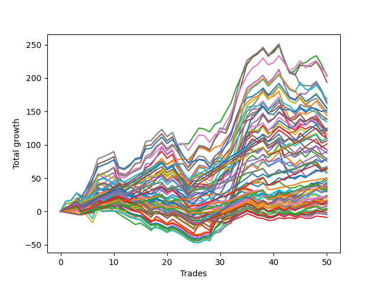

# Short Wallace Doodle 011 
- Symbol: ES
- Date Range: 3/19/22 - 5/22/22
- Trading Period: 7:20-12:30
- Number of Trades: 39



| Name | Win Percent | Profit | Avg Profit / Trade |     | Name | Win Percent | Profit | Avg Profit / Trade |
| ---- | ----------- | ------ | ------------------ | --- | ---- | ----------- | ------ | ------------------ |
| Sorted By <br> Profit | | | | | Sorted By <br> Win Percentage ||||
| Two | 82.05 | 123500.00 | 3166.67 |     | One | 84.62 | 83125.00 | 2131.41 |
| Fifty-Eight | 82.05 | 114750.00 | 2942.31 |     | Fifty-Seven | 84.62 | 76250.00 | 1955.13 |
| Seventy-One | 69.23 | 109000.00 | 2794.87 |     | Two | 82.05 | 123500.00 | 3166.67 |
| Fifty-Five | 69.23 | 109000.00 | 2794.87 |     | Fifty-Eight | 82.05 | 114750.00 | 2942.31 |
| Thirty-Nine | 69.23 | 109000.00 | 2794.87 |     | Sixty | 74.36 | 92375.00 | 2368.59 |
| Twenty-Three | 69.23 | 109000.00 | 2794.87 |     | Four | 74.36 | 90375.00 | 2317.31 |
| Seven | 69.23 | 109000.00 | 2794.87 |     | Sixty-Two | 74.36 | 81250.00 | 2083.33 |
| Five | 69.23 | 103375.00 | 2650.64 |     | Seventy | 74.36 | 69250.00 | 1775.64 |
| Sixty | 74.36 | 92375.00 | 2368.59 |     | Fifty-Four | 74.36 | 69250.00 | 1775.64 |
| Four | 74.36 | 90375.00 | 2317.31 |     | Thirty-Eight | 74.36 | 69250.00 | 1775.64 |
| Sixty-Three | 64.10 | 88375.00 | 2266.03 |     | Twenty-Two | 74.36 | 69250.00 | 1775.64 |
| Sixty-Six | 71.79 | 85000.00 | 2179.49 |     | Six | 74.36 | 69250.00 | 1775.64 |
| One | 84.62 | 83125.00 | 2131.41 |     | Fifty-Nine | 74.36 | 66875.00 | 1714.74 |
| Sixty-Two | 74.36 | 81250.00 | 2083.33 |     | Three | 74.36 | 64875.00 | 1663.46 |
| Forty-Two | 58.97 | 80000.00 | 2051.28 |     | Sixty-Five | 74.36 | 54125.00 | 1387.82 |
| Fifty-Seven | 84.62 | 76250.00 | 1955.13 |     | Sixty-Six | 71.79 | 85000.00 | 2179.49 |
| Sixty-One | 64.10 | 75250.00 | 1929.49 |     | Seventy-One | 69.23 | 109000.00 | 2794.87 |
| Sixty-Nine | 56.41 | 70125.00 | 1798.08 |     | Fifty-Five | 69.23 | 109000.00 | 2794.87 |
| Seventy | 74.36 | 69250.00 | 1775.64 |     | Thirty-Nine | 69.23 | 109000.00 | 2794.87 |
| Fifty-Four | 74.36 | 69250.00 | 1775.64 |     | Twenty-Three | 69.23 | 109000.00 | 2794.87 |
| Thirty-Eight | 74.36 | 69250.00 | 1775.64 |     | Seven | 69.23 | 109000.00 | 2794.87 |
| Twenty-Two | 74.36 | 69250.00 | 1775.64 |     | Five | 69.23 | 103375.00 | 2650.64 |
| Six | 74.36 | 69250.00 | 1775.64 |     | Zero | 69.23 | 33250.00 | 852.56 |
| Fifty-Nine | 74.36 | 66875.00 | 1714.74 |     | Fifty-Six | 69.23 | 26250.00 | 673.08 |
| Sixty-Eight | 56.41 | 66250.00 | 1698.72 |     | Sixty-Three | 64.10 | 88375.00 | 2266.03 |
| Forty-Four | 46.15 | 65625.00 | 1682.69 |     | Sixty-One | 64.10 | 75250.00 | 1929.49 |
| Three | 74.36 | 64875.00 | 1663.46 |     | Sixty-Seven | 64.10 | 62125.00 | 1592.95 |
| Sixty-Seven | 64.10 | 62125.00 | 1592.95 |     | Sixty-Four | 64.10 | 12250.00 | 314.10 |
| Forty-Five | 38.46 | 55250.00 | 1416.67 |     | Forty | 61.54 | 9250.00 | 237.18 |
| Sixty-Five | 74.36 | 54125.00 | 1387.82 |     | Forty-Two | 58.97 | 80000.00 | 2051.28 |
| Twenty-Eight | 41.03 | 52750.00 | 1352.56 |     | Forty-One | 58.97 | 39750.00 | 1019.23 |
| Forty-Seven | 38.46 | 49750.00 | 1275.64 |     | Sixty-Nine | 56.41 | 70125.00 | 1798.08 |
| Forty-Three | 51.28 | 48000.00 | 1230.77 |     | Sixty-Eight | 56.41 | 66250.00 | 1698.72 |
| Twenty-Six | 46.15 | 47125.00 | 1208.33 |     | Seventy-Five | 53.85 | 10875.00 | 278.85 |
| Thirty-One | 25.64 | 46250.00 | 1185.90 |     | Seventy-Four | 53.85 | 10875.00 | 278.85 |
| Fifteen | 20.51 | 44125.00 | 1131.41 |     | Seventy-Three | 53.85 | 10875.00 | 278.85 |
| Twenty-Nine | 33.33 | 40375.00 | 1035.26 |     | Forty-Three | 51.28 | 48000.00 | 1230.77 |
| Forty-One | 58.97 | 39750.00 | 1019.23 |     | Twenty-Four | 51.28 | 6000.00 | 153.85 |
| Forty-Six | 46.15 | 39500.00 | 1012.82 |     | Forty-Eight | 48.72 | -1000.00 | -25.64 |
| twenty-Seven | 43.59 | 37625.00 | 964.74 |     | Forty-Four | 46.15 | 65625.00 | 1682.69 |
| Thirty | 33.33 | 35500.00 | 910.26 |     | Twenty-Six | 46.15 | 47125.00 | 1208.33 |
| Seventy-Two | 17.95 | 34750.00 | 891.03 |     | Forty-Six | 46.15 | 39500.00 | 1012.82 |
| Zero | 69.23 | 33250.00 | 852.56 |     | Twenty-Five | 46.15 | 21375.00 | 548.08 |
| Twelve | 33.33 | 32625.00 | 836.54 |     | Eight | 46.15 | 5375.00 | 137.82 |
| Fourteen | 25.64 | 30875.00 | 791.67 |     | twenty-Seven | 43.59 | 37625.00 | 964.74 |
| Ten | 35.90 | 30250.00 | 775.64 |     | Twenty-Eight | 41.03 | 52750.00 | 1352.56 |
| Eleven | 38.46 | 28500.00 | 730.77 |     | Fifty-One | 41.03 | 2500.00 | 64.10 |
| Thirteen | 28.21 | 28125.00 | 721.15 |     | Thirty-Two | 41.03 | 1250.00 | 32.05 |
| Fifty-Six | 69.23 | 26250.00 | 673.08 |     | Forty-Five | 38.46 | 55250.00 | 1416.67 |
| Twenty-Five | 46.15 | 21375.00 | 548.08 |     | Forty-Seven | 38.46 | 49750.00 | 1275.64 |
| Nine | 38.46 | 16000.00 | 410.26 |     | Eleven | 38.46 | 28500.00 | 730.77 |
| Sixty-Four | 64.10 | 12250.00 | 314.10 |     | Nine | 38.46 | 16000.00 | 410.26 |
| Seventy-Five | 53.85 | 10875.00 | 278.85 |     | Fifty-Three | 38.46 | 7375.00 | 189.10 |
| Seventy-Four | 53.85 | 10875.00 | 278.85 |     | Fifty-Two | 38.46 | 5625.00 | 144.23 |
| Seventy-Three | 53.85 | 10875.00 | 278.85 |     | Fifty | 38.46 | 1625.00 | 41.67 |
| Forty | 61.54 | 9250.00 | 237.18 |     | Forty-Nine | 38.46 | -2000.00 | -51.28 |
| Fifty-Three | 38.46 | 7375.00 | 189.10 |     | Thirty-Five | 38.46 | -2625.00 | -67.31 |
| Twenty-Four | 51.28 | 6000.00 | 153.85 |     | Ten | 35.90 | 30250.00 | 775.64 |
| Fifty-Two | 38.46 | 5625.00 | 144.23 |     | Sixten | 35.90 | 1625.00 | 41.67 |
| Eight | 46.15 | 5375.00 | 137.82 |     | Thirty-Seven | 35.90 | -2625.00 | -67.31 |
| Fifty-One | 41.03 | 2500.00 | 64.10 |     | Thirty-Three | 35.90 | -2875.00 | -73.72 |
| Fifty | 38.46 | 1625.00 | 41.67 |     | Thirty-Four | 35.90 | -3375.00 | -86.54 |
| Sixten | 35.90 | 1625.00 | 41.67 |     | Thirty-Six | 35.90 | -3875.00 | -99.36 |
| Thirty-Two | 41.03 | 1250.00 | 32.05 |     | Twenty-Nine | 33.33 | 40375.00 | 1035.26 |
| Forty-Eight | 48.72 | -1000.00 | -25.64 |     | Thirty | 33.33 | 35500.00 | 910.26 |
| Nineteen | 33.33 | -1625.00 | -41.67 |     | Twelve | 33.33 | 32625.00 | 836.54 |
| Forty-Nine | 38.46 | -2000.00 | -51.28 |     | Nineteen | 33.33 | -1625.00 | -41.67 |
| Thirty-Five | 38.46 | -2625.00 | -67.31 |     | Twenty-One | 30.77 | -3875.00 | -99.36 |
| Thirty-Seven | 35.90 | -2625.00 | -67.31 |     | Twenty | 30.77 | -3875.00 | -99.36 |
| Thirty-Three | 35.90 | -2875.00 | -73.72 |     | Eighteen | 30.77 | -3875.00 | -99.36 |
| Thirty-Four | 35.90 | -3375.00 | -86.54 |     | Seventeen | 30.77 | -3875.00 | -99.36 |
| Thirty-Six | 35.90 | -3875.00 | -99.36 |     | Thirteen | 28.21 | 28125.00 | 721.15 |
| Twenty-One | 30.77 | -3875.00 | -99.36 |     | Thirty-One | 25.64 | 46250.00 | 1185.90 |
| Twenty | 30.77 | -3875.00 | -99.36 |     | Fourteen | 25.64 | 30875.00 | 791.67 |
| Eighteen | 30.77 | -3875.00 | -99.36 |     | Fifteen | 20.51 | 44125.00 | 1131.41 |
| Seventeen | 30.77 | -3875.00 | -99.36 |     | Seventy-Two | 17.95 | 34750.00 | 891.03 |

## NO STOPLOSS

### Test Zero
* Sell when price hits the middle line of the 20p bollinger
* No Stoploss
* Results:
```
Total Trades: 39
Percent Up: 30.77
Percent Down: 69.23
Total Points Moved Down: 66.50
Potential Profit: 33250.00
Total Points Ups: 46.25 Count Ups: 12
Total Points Downs: 112.75 Count Downs: 27
```

<details><summary>Trades</summary>

<code>In: 2022-03-25 11:57:00		Out: 2022-03-25 11:57:20		Total Position Time: 00:20		Total Move Down: 0.75		Total to Date: 0.75</code> <br />
<code>In: 2022-03-28 11:32:00		Out: 2022-03-28 12:01:55		Total Position Time: 29:55		Total Move Down: -12.00		Total to Date: -11.25</code> <br />
<code>In: 2022-04-01 11:34:00		Out: 2022-04-01 11:42:20		Total Position Time: 08:20		Total Move Down: 2.50		Total to Date: -8.75</code> <br />
<code>In: 2022-04-06 08:53:00		Out: 2022-04-06 09:00:40		Total Position Time: 07:40		Total Move Down: 2.50		Total to Date: -6.25</code> <br />
<code>In: 2022-04-06 10:36:00		Out: 2022-04-06 10:47:15		Total Position Time: 11:15		Total Move Down: -2.50		Total to Date: -8.75</code> <br />
<code>In: 2022-04-06 10:43:00		Out: 2022-04-06 10:47:15		Total Position Time: 04:15		Total Move Down: 5.00		Total to Date: -3.75</code> <br />
<code>In: 2022-04-06 10:45:00		Out: 2022-04-06 10:47:15		Total Position Time: 02:15		Total Move Down: 4.75		Total to Date: 1.00</code> <br />
<code>In: 2022-04-06 11:05:00		Out: 2022-04-06 11:05:40		Total Position Time: 00:40		Total Move Down: 7.75		Total to Date: 8.75</code> <br />
<code>In: 2022-04-07 10:22:00		Out: 2022-04-07 10:36:05		Total Position Time: 14:05		Total Move Down: -0.75		Total to Date: 8.00</code> <br />
<code>In: 2022-04-07 11:03:00		Out: 2022-04-07 11:15:15		Total Position Time: 12:15		Total Move Down: 2.50		Total to Date: 10.50</code> <br />
<code>In: 2022-04-07 11:04:00		Out: 2022-04-07 11:15:15		Total Position Time: 11:15		Total Move Down: 1.75		Total to Date: 12.25</code> <br />
<code>In: 2022-04-08 07:33:00		Out: 2022-04-08 07:44:35		Total Position Time: 11:35		Total Move Down: 3.25		Total to Date: 15.50</code> <br />
<code>In: 2022-04-18 10:38:00		Out: 2022-04-18 10:59:30		Total Position Time: 21:30		Total Move Down: -2.00		Total to Date: 13.50</code> <br />
<code>In: 2022-04-20 07:40:00		Out: 2022-04-20 08:00:20		Total Position Time: 20:20		Total Move Down: -2.75		Total to Date: 10.75</code> <br />
<code>In: 2022-04-20 07:43:00		Out: 2022-04-20 08:00:20		Total Position Time: 17:20		Total Move Down: -1.25		Total to Date: 9.50</code> <br />
<code>In: 2022-04-20 09:54:00		Out: 2022-04-20 09:59:05		Total Position Time: 05:05		Total Move Down: 2.75		Total to Date: 12.25</code> <br />
<code>In: 2022-04-25 07:34:00		Out: 2022-04-25 07:40:20		Total Position Time: 06:20		Total Move Down: 6.50		Total to Date: 18.75</code> <br />
<code>In: 2022-04-25 10:14:00		Out: 2022-04-25 10:26:25		Total Position Time: 12:25		Total Move Down: -0.50		Total to Date: 18.25</code> <br />
<code>In: 2022-04-25 10:17:00		Out: 2022-04-25 10:26:25		Total Position Time: 09:25		Total Move Down: 6.00		Total to Date: 24.25</code> <br />
<code>In: 2022-04-27 08:34:00		Out: 2022-04-27 08:45:05		Total Position Time: 11:05		Total Move Down: 1.25		Total to Date: 25.50</code> <br />
<code>In: 2022-05-04 09:25:00		Out: 2022-05-04 09:45:25		Total Position Time: 20:25		Total Move Down: -5.25		Total to Date: 20.25</code> <br />
<code>In: 2022-05-17 08:36:00		Out: 2022-05-17 08:43:35		Total Position Time: 07:35		Total Move Down: 4.25		Total to Date: 24.50</code> <br />
<code>In: 2022-05-24 10:43:00		Out: 2022-05-24 10:58:25		Total Position Time: 15:25		Total Move Down: -2.00		Total to Date: 22.50</code> <br />
<code>In: 2022-05-24 10:44:00		Out: 2022-05-24 10:58:25		Total Position Time: 14:25		Total Move Down: -2.75		Total to Date: 19.75</code> <br />
<code>In: 2022-05-24 10:48:00		Out: 2022-05-24 10:58:25		Total Position Time: 10:25		Total Move Down: -4.25		Total to Date: 15.50</code> <br />
<code>In: 2022-05-25 11:04:00		Out: 2022-05-25 11:06:25		Total Position Time: 02:25		Total Move Down: 4.50		Total to Date: 20.00</code> <br />
<code>In: 2022-05-31 07:23:00		Out: 2022-05-31 07:36:40		Total Position Time: 13:40		Total Move Down: 4.50		Total to Date: 24.50</code> <br />
<code>In: 2022-05-31 07:24:00		Out: 2022-05-31 07:36:40		Total Position Time: 12:40		Total Move Down: 1.50		Total to Date: 26.00</code> <br />
<code>In: 2022-06-03 10:06:00		Out: 2022-06-03 10:13:15		Total Position Time: 07:15		Total Move Down: 3.75		Total to Date: 29.75</code> <br />
<code>In: 2022-06-09 10:08:00		Out: 2022-06-09 10:16:10		Total Position Time: 08:10		Total Move Down: 0.50		Total to Date: 30.25</code> <br />
<code>In: 2022-06-10 12:00:00		Out: 2022-06-10 12:03:25		Total Position Time: 03:25		Total Move Down: 6.25		Total to Date: 36.50</code> <br />
<code>In: 2022-06-10 12:29:00		Out: 2022-06-10 12:30:30		Total Position Time: 01:30		Total Move Down: 6.25		Total to Date: 42.75</code> <br />
<code>In: 2022-06-13 09:40:00		Out: 2022-06-13 09:43:15		Total Position Time: 03:15		Total Move Down: 12.00		Total to Date: 54.75</code> <br />
<code>In: 2022-06-13 09:41:00		Out: 2022-06-13 09:43:15		Total Position Time: 02:15		Total Move Down: 7.75		Total to Date: 62.50</code> <br />
<code>In: 2022-06-14 10:21:00		Out: 2022-06-14 10:25:20		Total Position Time: 04:20		Total Move Down: 6.25		Total to Date: 68.75</code> <br />
<code>In: 2022-06-15 11:02:00		Out: 2022-06-15 11:02:10		Total Position Time: 00:10		Total Move Down: 2.00		Total to Date: 70.75</code> <br />
<code>In: 2022-06-17 10:11:00		Out: 2022-06-17 10:22:05		Total Position Time: 11:05		Total Move Down: 0.50		Total to Date: 71.25</code> <br />
<code>In: 2022-06-17 10:14:00		Out: 2022-06-17 10:22:05		Total Position Time: 08:05		Total Move Down: 5.50		Total to Date: 76.75</code> <br />
<code>In: 2022-06-23 12:30:00		Out: 2022-06-23 12:54:05		Total Position Time: 24:05		Total Move Down: -10.25		Total to Date: 66.50</code> <br />


</details>

### Test One
* Sell when the price hits the upper line of the 20p 1std bollinger
* No Stoploss
* Results:
```
Total Trades: 39
Percent Up: 15.38
Percent Down: 84.62
Total Points Moved Down: 166.25
Potential Profit: 83125.00
Total Points Ups: 34.25 Count Ups: 6
Total Points Downs: 200.50 Count Downs: 33
```

<details><summary>Trades</summary>

<code>In: 2022-03-25 11:57:00		Out: 2022-03-25 12:00:50		Total Position Time: 03:50		Total Move Down: 2.75		Total to Date: 2.75</code> <br />
<code>In: 2022-03-28 11:32:00		Out: 2022-03-28 12:01:55		Total Position Time: 29:55		Total Move Down: -12.00		Total to Date: -9.25</code> <br />
<code>In: 2022-04-01 11:34:00		Out: 2022-04-01 11:50:15		Total Position Time: 16:15		Total Move Down: 3.25		Total to Date: -6.00</code> <br />
<code>In: 2022-04-06 08:53:00		Out: 2022-04-06 09:04:20		Total Position Time: 11:20		Total Move Down: 3.25		Total to Date: -2.75</code> <br />
<code>In: 2022-04-06 10:36:00		Out: 2022-04-06 10:56:55		Total Position Time: 20:55		Total Move Down: -3.50		Total to Date: -6.25</code> <br />
<code>In: 2022-04-06 10:43:00		Out: 2022-04-06 10:56:55		Total Position Time: 13:55		Total Move Down: 4.00		Total to Date: -2.25</code> <br />
<code>In: 2022-04-06 10:45:00		Out: 2022-04-06 10:56:55		Total Position Time: 11:55		Total Move Down: 3.75		Total to Date: 1.50</code> <br />
<code>In: 2022-04-06 11:05:00		Out: 2022-04-06 11:07:20		Total Position Time: 02:20		Total Move Down: 12.50		Total to Date: 14.00</code> <br />
<code>In: 2022-04-07 10:22:00		Out: 2022-04-07 10:39:55		Total Position Time: 17:55		Total Move Down: 1.25		Total to Date: 15.25</code> <br />
<code>In: 2022-04-07 11:03:00		Out: 2022-04-07 11:16:10		Total Position Time: 13:10		Total Move Down: 4.00		Total to Date: 19.25</code> <br />
<code>In: 2022-04-07 11:04:00		Out: 2022-04-07 11:16:10		Total Position Time: 12:10		Total Move Down: 3.25		Total to Date: 22.50</code> <br />
<code>In: 2022-04-08 07:33:00		Out: 2022-04-08 07:45:55		Total Position Time: 12:55		Total Move Down: 4.50		Total to Date: 27.00</code> <br />
<code>In: 2022-04-18 10:38:00		Out: 2022-04-18 11:06:35		Total Position Time: 28:35		Total Move Down: -1.75		Total to Date: 25.25</code> <br />
<code>In: 2022-04-20 07:40:00		Out: 2022-04-20 08:00:40		Total Position Time: 20:40		Total Move Down: 0.25		Total to Date: 25.50</code> <br />
<code>In: 2022-04-20 07:43:00		Out: 2022-04-20 08:00:40		Total Position Time: 17:40		Total Move Down: 1.75		Total to Date: 27.25</code> <br />
<code>In: 2022-04-20 09:54:00		Out: 2022-04-20 10:08:15		Total Position Time: 14:15		Total Move Down: 4.25		Total to Date: 31.50</code> <br />
<code>In: 2022-04-25 07:34:00		Out: 2022-04-25 07:42:30		Total Position Time: 08:30		Total Move Down: 12.25		Total to Date: 43.75</code> <br />
<code>In: 2022-04-25 10:14:00		Out: 2022-04-25 10:27:10		Total Position Time: 13:10		Total Move Down: 3.25		Total to Date: 47.00</code> <br />
<code>In: 2022-04-25 10:17:00		Out: 2022-04-25 10:27:10		Total Position Time: 10:10		Total Move Down: 9.75		Total to Date: 56.75</code> <br />
<code>In: 2022-04-27 08:34:00		Out: 2022-04-27 08:48:05		Total Position Time: 14:05		Total Move Down: 3.75		Total to Date: 60.50</code> <br />
<code>In: 2022-05-04 09:25:00		Out: 2022-05-04 09:46:30		Total Position Time: 21:30		Total Move Down: -3.00		Total to Date: 57.50</code> <br />
<code>In: 2022-05-17 08:36:00		Out: 2022-05-17 08:47:15		Total Position Time: 11:15		Total Move Down: 6.00		Total to Date: 63.50</code> <br />
<code>In: 2022-05-24 10:43:00		Out: 2022-05-24 11:01:40		Total Position Time: 18:40		Total Move Down: 1.25		Total to Date: 64.75</code> <br />
<code>In: 2022-05-24 10:44:00		Out: 2022-05-24 11:01:40		Total Position Time: 17:40		Total Move Down: 0.50		Total to Date: 65.25</code> <br />
<code>In: 2022-05-24 10:48:00		Out: 2022-05-24 11:01:40		Total Position Time: 13:40		Total Move Down: -1.00		Total to Date: 64.25</code> <br />
<code>In: 2022-05-25 11:04:00		Out: 2022-05-25 11:06:40		Total Position Time: 02:40		Total Move Down: 12.25		Total to Date: 76.50</code> <br />
<code>In: 2022-05-31 07:23:00		Out: 2022-05-31 07:38:00		Total Position Time: 15:00		Total Move Down: 8.25		Total to Date: 84.75</code> <br />
<code>In: 2022-05-31 07:24:00		Out: 2022-05-31 07:38:00		Total Position Time: 14:00		Total Move Down: 5.25		Total to Date: 90.00</code> <br />
<code>In: 2022-06-03 10:06:00		Out: 2022-06-03 10:15:05		Total Position Time: 09:05		Total Move Down: 7.00		Total to Date: 97.00</code> <br />
<code>In: 2022-06-09 10:08:00		Out: 2022-06-09 10:18:10		Total Position Time: 10:10		Total Move Down: 1.75		Total to Date: 98.75</code> <br />
<code>In: 2022-06-10 12:00:00		Out: 2022-06-10 12:04:20		Total Position Time: 04:20		Total Move Down: 10.00		Total to Date: 108.75</code> <br />
<code>In: 2022-06-10 12:29:00		Out: 2022-06-10 12:35:55		Total Position Time: 06:55		Total Move Down: 10.25		Total to Date: 119.00</code> <br />
<code>In: 2022-06-13 09:40:00		Out: 2022-06-13 09:47:55		Total Position Time: 07:55		Total Move Down: 19.00		Total to Date: 138.00</code> <br />
<code>In: 2022-06-13 09:41:00		Out: 2022-06-13 09:47:55		Total Position Time: 06:55		Total Move Down: 14.75		Total to Date: 152.75</code> <br />
<code>In: 2022-06-14 10:21:00		Out: 2022-06-14 10:28:55		Total Position Time: 07:55		Total Move Down: 10.25		Total to Date: 163.00</code> <br />
<code>In: 2022-06-15 11:02:00		Out: 2022-06-15 11:03:00		Total Position Time: 01:00		Total Move Down: 6.75		Total to Date: 169.75</code> <br />
<code>In: 2022-06-17 10:11:00		Out: 2022-06-17 10:26:05		Total Position Time: 15:05		Total Move Down: 2.25		Total to Date: 172.00</code> <br />
<code>In: 2022-06-17 10:14:00		Out: 2022-06-17 10:26:05		Total Position Time: 12:05		Total Move Down: 7.25		Total to Date: 179.25</code> <br />
<code>In: 2022-06-23 12:30:00		Out: 2022-06-23 12:59:55		Total Position Time: 29:55		Total Move Down: -13.00		Total to Date: 166.25</code> <br />


</details>

### Test Two
* Sell when the price hits the upper line of the 20p 2std bollinger
* No Stoploss
* Results:
```
Total Trades: 39
Percent Up: 17.95
Percent Down: 82.05
Total Points Moved Down: 247.00
Potential Profit: 123500.00
Total Points Ups: 45.25 Count Ups: 7
Total Points Downs: 292.25 Count Downs: 32
```

<details><summary>Trades</summary>

<code>In: 2022-03-25 11:57:00		Out: 2022-03-25 12:01:50		Total Position Time: 04:50		Total Move Down: 4.75		Total to Date: 4.75</code> <br />
<code>In: 2022-03-28 11:32:00		Out: 2022-03-28 12:01:55		Total Position Time: 29:55		Total Move Down: -12.00		Total to Date: -7.25</code> <br />
<code>In: 2022-04-01 11:34:00		Out: 2022-04-01 11:50:55		Total Position Time: 16:55		Total Move Down: 4.25		Total to Date: -3.00</code> <br />
<code>In: 2022-04-06 08:53:00		Out: 2022-04-06 09:11:00		Total Position Time: 18:00		Total Move Down: 4.25		Total to Date: 1.25</code> <br />
<code>In: 2022-04-06 10:36:00		Out: 2022-04-06 10:58:00		Total Position Time: 22:00		Total Move Down: -1.75		Total to Date: -0.50</code> <br />
<code>In: 2022-04-06 10:43:00		Out: 2022-04-06 10:58:00		Total Position Time: 15:00		Total Move Down: 5.75		Total to Date: 5.25</code> <br />
<code>In: 2022-04-06 10:45:00		Out: 2022-04-06 10:58:00		Total Position Time: 13:00		Total Move Down: 5.50		Total to Date: 10.75</code> <br />
<code>In: 2022-04-06 11:05:00		Out: 2022-04-06 11:08:20		Total Position Time: 03:20		Total Move Down: 18.50		Total to Date: 29.25</code> <br />
<code>In: 2022-04-07 10:22:00		Out: 2022-04-07 10:45:15		Total Position Time: 23:15		Total Move Down: 2.00		Total to Date: 31.25</code> <br />
<code>In: 2022-04-07 11:03:00		Out: 2022-04-07 11:18:40		Total Position Time: 15:40		Total Move Down: 7.00		Total to Date: 38.25</code> <br />
<code>In: 2022-04-07 11:04:00		Out: 2022-04-07 11:18:40		Total Position Time: 14:40		Total Move Down: 6.25		Total to Date: 44.50</code> <br />
<code>In: 2022-04-08 07:33:00		Out: 2022-04-08 07:49:20		Total Position Time: 16:20		Total Move Down: 5.25		Total to Date: 49.75</code> <br />
<code>In: 2022-04-18 10:38:00		Out: 2022-04-18 11:07:55		Total Position Time: 29:55		Total Move Down: -2.00		Total to Date: 47.75</code> <br />
<code>In: 2022-04-20 07:40:00		Out: 2022-04-20 08:01:10		Total Position Time: 21:10		Total Move Down: 3.25		Total to Date: 51.00</code> <br />
<code>In: 2022-04-20 07:43:00		Out: 2022-04-20 08:01:10		Total Position Time: 18:10		Total Move Down: 4.75		Total to Date: 55.75</code> <br />
<code>In: 2022-04-20 09:54:00		Out: 2022-04-20 10:08:15		Total Position Time: 14:15		Total Move Down: 4.25		Total to Date: 60.00</code> <br />
<code>In: 2022-04-25 07:34:00		Out: 2022-04-25 07:58:35		Total Position Time: 24:35		Total Move Down: 27.00		Total to Date: 87.00</code> <br />
<code>In: 2022-04-25 10:14:00		Out: 2022-04-25 10:28:20		Total Position Time: 14:20		Total Move Down: 4.75		Total to Date: 91.75</code> <br />
<code>In: 2022-04-25 10:17:00		Out: 2022-04-25 10:28:20		Total Position Time: 11:20		Total Move Down: 11.25		Total to Date: 103.00</code> <br />
<code>In: 2022-04-27 08:34:00		Out: 2022-04-27 08:48:10		Total Position Time: 14:10		Total Move Down: 5.25		Total to Date: 108.25</code> <br />
<code>In: 2022-05-04 09:25:00		Out: 2022-05-04 09:54:55		Total Position Time: 29:55		Total Move Down: -10.75		Total to Date: 97.50</code> <br />
<code>In: 2022-05-17 08:36:00		Out: 2022-05-17 08:48:15		Total Position Time: 12:15		Total Move Down: 7.25		Total to Date: 104.75</code> <br />
<code>In: 2022-05-24 10:43:00		Out: 2022-05-24 11:05:00		Total Position Time: 22:00		Total Move Down: 3.75		Total to Date: 108.50</code> <br />
<code>In: 2022-05-24 10:44:00		Out: 2022-05-24 11:05:00		Total Position Time: 21:00		Total Move Down: 3.00		Total to Date: 111.50</code> <br />
<code>In: 2022-05-24 10:48:00		Out: 2022-05-24 11:05:00		Total Position Time: 17:00		Total Move Down: 1.50		Total to Date: 113.00</code> <br />
<code>In: 2022-05-25 11:04:00		Out: 2022-05-25 11:06:50		Total Position Time: 02:50		Total Move Down: 16.00		Total to Date: 129.00</code> <br />
<code>In: 2022-05-31 07:23:00		Out: 2022-05-31 07:52:55		Total Position Time: 29:55		Total Move Down: -1.50		Total to Date: 127.50</code> <br />
<code>In: 2022-05-31 07:24:00		Out: 2022-05-31 07:53:55		Total Position Time: 29:55		Total Move Down: -4.25		Total to Date: 123.25</code> <br />
<code>In: 2022-06-03 10:06:00		Out: 2022-06-03 10:18:00		Total Position Time: 12:00		Total Move Down: 12.50		Total to Date: 135.75</code> <br />
<code>In: 2022-06-09 10:08:00		Out: 2022-06-09 10:18:55		Total Position Time: 10:55		Total Move Down: 3.25		Total to Date: 139.00</code> <br />
<code>In: 2022-06-10 12:00:00		Out: 2022-06-10 12:06:05		Total Position Time: 06:05		Total Move Down: 14.50		Total to Date: 153.50</code> <br />
<code>In: 2022-06-10 12:29:00		Out: 2022-06-10 12:43:25		Total Position Time: 14:25		Total Move Down: 15.25		Total to Date: 168.75</code> <br />
<code>In: 2022-06-13 09:40:00		Out: 2022-06-13 09:54:45		Total Position Time: 14:45		Total Move Down: 24.75		Total to Date: 193.50</code> <br />
<code>In: 2022-06-13 09:41:00		Out: 2022-06-13 09:54:45		Total Position Time: 13:45		Total Move Down: 20.50		Total to Date: 214.00</code> <br />
<code>In: 2022-06-14 10:21:00		Out: 2022-06-14 10:31:10		Total Position Time: 10:10		Total Move Down: 16.00		Total to Date: 230.00</code> <br />
<code>In: 2022-06-15 11:02:00		Out: 2022-06-15 11:03:15		Total Position Time: 01:15		Total Move Down: 13.00		Total to Date: 243.00</code> <br />
<code>In: 2022-06-17 10:11:00		Out: 2022-06-17 10:27:15		Total Position Time: 16:15		Total Move Down: 6.00		Total to Date: 249.00</code> <br />
<code>In: 2022-06-17 10:14:00		Out: 2022-06-17 10:27:15		Total Position Time: 13:15		Total Move Down: 11.00		Total to Date: 260.00</code> <br />
<code>In: 2022-06-23 12:30:00		Out: 2022-06-23 12:59:55		Total Position Time: 29:55		Total Move Down: -13.00		Total to Date: 247.00</code> <br />


</details>

### Test Three
* Sell when price hits the middle line of the 50p bollinger
* No Stoploss
* Results:
```
Total Trades: 39
Percent Up: 25.64
Percent Down: 74.36
Total Points Moved Down: 129.75
Potential Profit: 64875.00
Total Points Ups: 114.25 Count Ups: 10
Total Points Downs: 244.00 Count Downs: 29
```

<details><summary>Trades</summary>

<code>In: 2022-03-25 11:57:00		Out: 2022-03-25 12:00:45		Total Position Time: 03:45		Total Move Down: 1.75		Total to Date: 1.75</code> <br />
<code>In: 2022-03-28 11:32:00		Out: 2022-03-28 12:01:55		Total Position Time: 29:55		Total Move Down: -12.00		Total to Date: -10.25</code> <br />
<code>In: 2022-04-01 11:34:00		Out: 2022-04-01 11:54:05		Total Position Time: 20:05		Total Move Down: 4.75		Total to Date: -5.50</code> <br />
<code>In: 2022-04-06 08:53:00		Out: 2022-04-06 09:11:35		Total Position Time: 18:35		Total Move Down: 4.50		Total to Date: -1.00</code> <br />
<code>In: 2022-04-06 10:36:00		Out: 2022-04-06 11:00:10		Total Position Time: 24:10		Total Move Down: 5.25		Total to Date: 4.25</code> <br />
<code>In: 2022-04-06 10:43:00		Out: 2022-04-06 11:00:10		Total Position Time: 17:10		Total Move Down: 12.75		Total to Date: 17.00</code> <br />
<code>In: 2022-04-06 10:45:00		Out: 2022-04-06 11:00:10		Total Position Time: 15:10		Total Move Down: 12.50		Total to Date: 29.50</code> <br />
<code>In: 2022-04-06 11:05:00		Out: 2022-04-06 11:07:20		Total Position Time: 02:20		Total Move Down: 12.50		Total to Date: 42.00</code> <br />
<code>In: 2022-04-07 10:22:00		Out: 2022-04-07 10:51:55		Total Position Time: 29:55		Total Move Down: 3.00		Total to Date: 45.00</code> <br />
<code>In: 2022-04-07 11:03:00		Out: 2022-04-07 11:32:55		Total Position Time: 29:55		Total Move Down: 3.50		Total to Date: 48.50</code> <br />
<code>In: 2022-04-07 11:04:00		Out: 2022-04-07 11:33:40		Total Position Time: 29:40		Total Move Down: 5.50		Total to Date: 54.00</code> <br />
<code>In: 2022-04-08 07:33:00		Out: 2022-04-08 08:02:55		Total Position Time: 29:55		Total Move Down: -25.00		Total to Date: 29.00</code> <br />
<code>In: 2022-04-18 10:38:00		Out: 2022-04-18 11:07:55		Total Position Time: 29:55		Total Move Down: -2.00		Total to Date: 27.00</code> <br />
<code>In: 2022-04-20 07:40:00		Out: 2022-04-20 08:02:45		Total Position Time: 22:45		Total Move Down: 3.00		Total to Date: 30.00</code> <br />
<code>In: 2022-04-20 07:43:00		Out: 2022-04-20 08:02:45		Total Position Time: 19:45		Total Move Down: 4.50		Total to Date: 34.50</code> <br />
<code>In: 2022-04-20 09:54:00		Out: 2022-04-20 10:19:10		Total Position Time: 25:10		Total Move Down: 3.00		Total to Date: 37.50</code> <br />
<code>In: 2022-04-25 07:34:00		Out: 2022-04-25 07:52:05		Total Position Time: 18:05		Total Move Down: 15.50		Total to Date: 53.00</code> <br />
<code>In: 2022-04-25 10:14:00		Out: 2022-04-25 10:28:20		Total Position Time: 14:20		Total Move Down: 4.75		Total to Date: 57.75</code> <br />
<code>In: 2022-04-25 10:17:00		Out: 2022-04-25 10:28:20		Total Position Time: 11:20		Total Move Down: 11.25		Total to Date: 69.00</code> <br />
<code>In: 2022-04-27 08:34:00		Out: 2022-04-27 08:53:05		Total Position Time: 19:05		Total Move Down: 8.75		Total to Date: 77.75</code> <br />
<code>In: 2022-05-04 09:25:00		Out: 2022-05-04 09:54:55		Total Position Time: 29:55		Total Move Down: -10.75		Total to Date: 67.00</code> <br />
<code>In: 2022-05-17 08:36:00		Out: 2022-05-17 09:02:20		Total Position Time: 26:20		Total Move Down: 6.50		Total to Date: 73.50</code> <br />
<code>In: 2022-05-24 10:43:00		Out: 2022-05-24 11:12:55		Total Position Time: 29:55		Total Move Down: -19.50		Total to Date: 54.00</code> <br />
<code>In: 2022-05-24 10:44:00		Out: 2022-05-24 11:13:55		Total Position Time: 29:55		Total Move Down: -15.75		Total to Date: 38.25</code> <br />
<code>In: 2022-05-24 10:48:00		Out: 2022-05-24 11:17:55		Total Position Time: 29:55		Total Move Down: -10.50		Total to Date: 27.75</code> <br />
<code>In: 2022-05-25 11:04:00		Out: 2022-05-25 11:06:35		Total Position Time: 02:35		Total Move Down: 9.25		Total to Date: 37.00</code> <br />
<code>In: 2022-05-31 07:23:00		Out: 2022-05-31 07:52:55		Total Position Time: 29:55		Total Move Down: -1.50		Total to Date: 35.50</code> <br />
<code>In: 2022-05-31 07:24:00		Out: 2022-05-31 07:53:55		Total Position Time: 29:55		Total Move Down: -4.25		Total to Date: 31.25</code> <br />
<code>In: 2022-06-03 10:06:00		Out: 2022-06-03 10:17:55		Total Position Time: 11:55		Total Move Down: 12.00		Total to Date: 43.25</code> <br />
<code>In: 2022-06-09 10:08:00		Out: 2022-06-09 10:22:05		Total Position Time: 14:05		Total Move Down: 4.75		Total to Date: 48.00</code> <br />
<code>In: 2022-06-10 12:00:00		Out: 2022-06-10 12:03:40		Total Position Time: 03:40		Total Move Down: 9.50		Total to Date: 57.50</code> <br />
<code>In: 2022-06-10 12:29:00		Out: 2022-06-10 12:33:40		Total Position Time: 04:40		Total Move Down: 9.00		Total to Date: 66.50</code> <br />
<code>In: 2022-06-13 09:40:00		Out: 2022-06-13 09:47:55		Total Position Time: 07:55		Total Move Down: 19.00		Total to Date: 85.50</code> <br />
<code>In: 2022-06-13 09:41:00		Out: 2022-06-13 09:47:55		Total Position Time: 06:55		Total Move Down: 14.75		Total to Date: 100.25</code> <br />
<code>In: 2022-06-14 10:21:00		Out: 2022-06-14 10:30:05		Total Position Time: 09:05		Total Move Down: 15.50		Total to Date: 115.75</code> <br />
<code>In: 2022-06-15 11:02:00		Out: 2022-06-15 11:02:10		Total Position Time: 00:10		Total Move Down: 2.00		Total to Date: 117.75</code> <br />
<code>In: 2022-06-17 10:11:00		Out: 2022-06-17 10:32:25		Total Position Time: 21:25		Total Move Down: 10.00		Total to Date: 127.75</code> <br />
<code>In: 2022-06-17 10:14:00		Out: 2022-06-17 10:32:25		Total Position Time: 18:25		Total Move Down: 15.00		Total to Date: 142.75</code> <br />
<code>In: 2022-06-23 12:30:00		Out: 2022-06-23 12:59:55		Total Position Time: 29:55		Total Move Down: -13.00		Total to Date: 129.75</code> <br />


</details>

### Test Four
* Sell when the price hits the upper line of the 50p 1std bollinger
* No Stoploss
* Results:
```
Total Trades: 39
Percent Up: 25.64
Percent Down: 74.36
Total Points Moved Down: 180.75
Potential Profit: 90375.00
Total Points Ups: 114.25 Count Ups: 10
Total Points Downs: 295.00 Count Downs: 29
```

<details><summary>Trades</summary>

<code>In: 2022-03-25 11:57:00		Out: 2022-03-25 12:01:40		Total Position Time: 04:40		Total Move Down: 3.75		Total to Date: 3.75</code> <br />
<code>In: 2022-03-28 11:32:00		Out: 2022-03-28 12:01:55		Total Position Time: 29:55		Total Move Down: -12.00		Total to Date: -8.25</code> <br />
<code>In: 2022-04-01 11:34:00		Out: 2022-04-01 12:03:55		Total Position Time: 29:55		Total Move Down: 1.50		Total to Date: -6.75</code> <br />
<code>In: 2022-04-06 08:53:00		Out: 2022-04-06 09:15:00		Total Position Time: 22:00		Total Move Down: 8.75		Total to Date: 2.00</code> <br />
<code>In: 2022-04-06 10:36:00		Out: 2022-04-06 11:00:10		Total Position Time: 24:10		Total Move Down: 5.25		Total to Date: 7.25</code> <br />
<code>In: 2022-04-06 10:43:00		Out: 2022-04-06 11:00:10		Total Position Time: 17:10		Total Move Down: 12.75		Total to Date: 20.00</code> <br />
<code>In: 2022-04-06 10:45:00		Out: 2022-04-06 11:00:10		Total Position Time: 15:10		Total Move Down: 12.50		Total to Date: 32.50</code> <br />
<code>In: 2022-04-06 11:05:00		Out: 2022-04-06 11:08:10		Total Position Time: 03:10		Total Move Down: 18.50		Total to Date: 51.00</code> <br />
<code>In: 2022-04-07 10:22:00		Out: 2022-04-07 10:51:55		Total Position Time: 29:55		Total Move Down: 3.00		Total to Date: 54.00</code> <br />
<code>In: 2022-04-07 11:03:00		Out: 2022-04-07 11:32:55		Total Position Time: 29:55		Total Move Down: 3.50		Total to Date: 57.50</code> <br />
<code>In: 2022-04-07 11:04:00		Out: 2022-04-07 11:33:55		Total Position Time: 29:55		Total Move Down: 4.25		Total to Date: 61.75</code> <br />
<code>In: 2022-04-08 07:33:00		Out: 2022-04-08 08:02:55		Total Position Time: 29:55		Total Move Down: -25.00		Total to Date: 36.75</code> <br />
<code>In: 2022-04-18 10:38:00		Out: 2022-04-18 11:07:55		Total Position Time: 29:55		Total Move Down: -2.00		Total to Date: 34.75</code> <br />
<code>In: 2022-04-20 07:40:00		Out: 2022-04-20 08:09:55		Total Position Time: 29:55		Total Move Down: 5.25		Total to Date: 40.00</code> <br />
<code>In: 2022-04-20 07:43:00		Out: 2022-04-20 08:10:45		Total Position Time: 27:45		Total Move Down: 8.50		Total to Date: 48.50</code> <br />
<code>In: 2022-04-20 09:54:00		Out: 2022-04-20 10:23:55		Total Position Time: 29:55		Total Move Down: 2.00		Total to Date: 50.50</code> <br />
<code>In: 2022-04-25 07:34:00		Out: 2022-04-25 07:58:15		Total Position Time: 24:15		Total Move Down: 24.25		Total to Date: 74.75</code> <br />
<code>In: 2022-04-25 10:14:00		Out: 2022-04-25 10:43:55		Total Position Time: 29:55		Total Move Down: 1.25		Total to Date: 76.00</code> <br />
<code>In: 2022-04-25 10:17:00		Out: 2022-04-25 10:46:55		Total Position Time: 29:55		Total Move Down: 9.25		Total to Date: 85.25</code> <br />
<code>In: 2022-04-27 08:34:00		Out: 2022-04-27 09:01:45		Total Position Time: 27:45		Total Move Down: 14.25		Total to Date: 99.50</code> <br />
<code>In: 2022-05-04 09:25:00		Out: 2022-05-04 09:54:55		Total Position Time: 29:55		Total Move Down: -10.75		Total to Date: 88.75</code> <br />
<code>In: 2022-05-17 08:36:00		Out: 2022-05-17 09:05:55		Total Position Time: 29:55		Total Move Down: 6.25		Total to Date: 95.00</code> <br />
<code>In: 2022-05-24 10:43:00		Out: 2022-05-24 11:12:55		Total Position Time: 29:55		Total Move Down: -19.50		Total to Date: 75.50</code> <br />
<code>In: 2022-05-24 10:44:00		Out: 2022-05-24 11:13:55		Total Position Time: 29:55		Total Move Down: -15.75		Total to Date: 59.75</code> <br />
<code>In: 2022-05-24 10:48:00		Out: 2022-05-24 11:17:55		Total Position Time: 29:55		Total Move Down: -10.50		Total to Date: 49.25</code> <br />
<code>In: 2022-05-25 11:04:00		Out: 2022-05-25 11:06:40		Total Position Time: 02:40		Total Move Down: 12.25		Total to Date: 61.50</code> <br />
<code>In: 2022-05-31 07:23:00		Out: 2022-05-31 07:52:55		Total Position Time: 29:55		Total Move Down: -1.50		Total to Date: 60.00</code> <br />
<code>In: 2022-05-31 07:24:00		Out: 2022-05-31 07:53:55		Total Position Time: 29:55		Total Move Down: -4.25		Total to Date: 55.75</code> <br />
<code>In: 2022-06-03 10:06:00		Out: 2022-06-03 10:19:00		Total Position Time: 13:00		Total Move Down: 17.75		Total to Date: 73.50</code> <br />
<code>In: 2022-06-09 10:08:00		Out: 2022-06-09 10:23:50		Total Position Time: 15:50		Total Move Down: 8.00		Total to Date: 81.50</code> <br />
<code>In: 2022-06-10 12:00:00		Out: 2022-06-10 12:05:35		Total Position Time: 05:35		Total Move Down: 13.50		Total to Date: 95.00</code> <br />
<code>In: 2022-06-10 12:29:00		Out: 2022-06-10 12:42:40		Total Position Time: 13:40		Total Move Down: 13.25		Total to Date: 108.25</code> <br />
<code>In: 2022-06-13 09:40:00		Out: 2022-06-13 09:54:40		Total Position Time: 14:40		Total Move Down: 23.75		Total to Date: 132.00</code> <br />
<code>In: 2022-06-13 09:41:00		Out: 2022-06-13 09:54:40		Total Position Time: 13:40		Total Move Down: 19.50		Total to Date: 151.50</code> <br />
<code>In: 2022-06-14 10:21:00		Out: 2022-06-14 10:36:10		Total Position Time: 15:10		Total Move Down: 23.00		Total to Date: 174.50</code> <br />
<code>In: 2022-06-15 11:02:00		Out: 2022-06-15 11:03:00		Total Position Time: 01:00		Total Move Down: 6.75		Total to Date: 181.25</code> <br />
<code>In: 2022-06-17 10:11:00		Out: 2022-06-17 10:40:55		Total Position Time: 29:55		Total Move Down: 5.25		Total to Date: 186.50</code> <br />
<code>In: 2022-06-17 10:14:00		Out: 2022-06-17 10:43:55		Total Position Time: 29:55		Total Move Down: 7.25		Total to Date: 193.75</code> <br />
<code>In: 2022-06-23 12:30:00		Out: 2022-06-23 12:59:55		Total Position Time: 29:55		Total Move Down: -13.00		Total to Date: 180.75</code> <br />


</details>

### Test Five
* Sell when the price hits the upper line of the 50p 2std bollinger
* No Stoploss
* Results:
```
Total Trades: 39
Percent Up: 30.77
Percent Down: 69.23
Total Points Moved Down: 206.75
Potential Profit: 103375.00
Total Points Ups: 124.00 Count Ups: 12
Total Points Downs: 330.75 Count Downs: 27
```

<details><summary>Trades</summary>

<code>In: 2022-03-25 11:57:00		Out: 2022-03-25 12:02:00		Total Position Time: 05:00		Total Move Down: 6.25		Total to Date: 6.25</code> <br />
<code>In: 2022-03-28 11:32:00		Out: 2022-03-28 12:01:55		Total Position Time: 29:55		Total Move Down: -12.00		Total to Date: -5.75</code> <br />
<code>In: 2022-04-01 11:34:00		Out: 2022-04-01 12:03:55		Total Position Time: 29:55		Total Move Down: 1.50		Total to Date: -4.25</code> <br />
<code>In: 2022-04-06 08:53:00		Out: 2022-04-06 09:20:25		Total Position Time: 27:25		Total Move Down: 13.25		Total to Date: 9.00</code> <br />
<code>In: 2022-04-06 10:36:00		Out: 2022-04-06 11:05:55		Total Position Time: 29:55		Total Move Down: -7.00		Total to Date: 2.00</code> <br />
<code>In: 2022-04-06 10:43:00		Out: 2022-04-06 11:09:40		Total Position Time: 26:40		Total Move Down: 17.00		Total to Date: 19.00</code> <br />
<code>In: 2022-04-06 10:45:00		Out: 2022-04-06 11:09:40		Total Position Time: 24:40		Total Move Down: 16.75		Total to Date: 35.75</code> <br />
<code>In: 2022-04-06 11:05:00		Out: 2022-04-06 11:09:40		Total Position Time: 04:40		Total Move Down: 24.50		Total to Date: 60.25</code> <br />
<code>In: 2022-04-07 10:22:00		Out: 2022-04-07 10:51:55		Total Position Time: 29:55		Total Move Down: 3.00		Total to Date: 63.25</code> <br />
<code>In: 2022-04-07 11:03:00		Out: 2022-04-07 11:32:55		Total Position Time: 29:55		Total Move Down: 3.50		Total to Date: 66.75</code> <br />
<code>In: 2022-04-07 11:04:00		Out: 2022-04-07 11:33:55		Total Position Time: 29:55		Total Move Down: 4.25		Total to Date: 71.00</code> <br />
<code>In: 2022-04-08 07:33:00		Out: 2022-04-08 08:02:55		Total Position Time: 29:55		Total Move Down: -25.00		Total to Date: 46.00</code> <br />
<code>In: 2022-04-18 10:38:00		Out: 2022-04-18 11:07:55		Total Position Time: 29:55		Total Move Down: -2.00		Total to Date: 44.00</code> <br />
<code>In: 2022-04-20 07:40:00		Out: 2022-04-20 08:09:55		Total Position Time: 29:55		Total Move Down: 5.25		Total to Date: 49.25</code> <br />
<code>In: 2022-04-20 07:43:00		Out: 2022-04-20 08:12:55		Total Position Time: 29:55		Total Move Down: 11.25		Total to Date: 60.50</code> <br />
<code>In: 2022-04-20 09:54:00		Out: 2022-04-20 10:23:55		Total Position Time: 29:55		Total Move Down: 2.00		Total to Date: 62.50</code> <br />
<code>In: 2022-04-25 07:34:00		Out: 2022-04-25 08:03:55		Total Position Time: 29:55		Total Move Down: 25.00		Total to Date: 87.50</code> <br />
<code>In: 2022-04-25 10:14:00		Out: 2022-04-25 10:43:55		Total Position Time: 29:55		Total Move Down: 1.25		Total to Date: 88.75</code> <br />
<code>In: 2022-04-25 10:17:00		Out: 2022-04-25 10:46:55		Total Position Time: 29:55		Total Move Down: 9.25		Total to Date: 98.00</code> <br />
<code>In: 2022-04-27 08:34:00		Out: 2022-04-27 09:03:55		Total Position Time: 29:55		Total Move Down: 7.50		Total to Date: 105.50</code> <br />
<code>In: 2022-05-04 09:25:00		Out: 2022-05-04 09:54:55		Total Position Time: 29:55		Total Move Down: -10.75		Total to Date: 94.75</code> <br />
<code>In: 2022-05-17 08:36:00		Out: 2022-05-17 09:05:55		Total Position Time: 29:55		Total Move Down: 6.25		Total to Date: 101.00</code> <br />
<code>In: 2022-05-24 10:43:00		Out: 2022-05-24 11:12:55		Total Position Time: 29:55		Total Move Down: -19.50		Total to Date: 81.50</code> <br />
<code>In: 2022-05-24 10:44:00		Out: 2022-05-24 11:13:55		Total Position Time: 29:55		Total Move Down: -15.75		Total to Date: 65.75</code> <br />
<code>In: 2022-05-24 10:48:00		Out: 2022-05-24 11:17:55		Total Position Time: 29:55		Total Move Down: -10.50		Total to Date: 55.25</code> <br />
<code>In: 2022-05-25 11:04:00		Out: 2022-05-25 11:06:50		Total Position Time: 02:50		Total Move Down: 16.00		Total to Date: 71.25</code> <br />
<code>In: 2022-05-31 07:23:00		Out: 2022-05-31 07:52:55		Total Position Time: 29:55		Total Move Down: -1.50		Total to Date: 69.75</code> <br />
<code>In: 2022-05-31 07:24:00		Out: 2022-05-31 07:53:55		Total Position Time: 29:55		Total Move Down: -4.25		Total to Date: 65.50</code> <br />
<code>In: 2022-06-03 10:06:00		Out: 2022-06-03 10:35:55		Total Position Time: 29:55		Total Move Down: 16.75		Total to Date: 82.25</code> <br />
<code>In: 2022-06-09 10:08:00		Out: 2022-06-09 10:27:35		Total Position Time: 19:35		Total Move Down: 11.75		Total to Date: 94.00</code> <br />
<code>In: 2022-06-10 12:00:00		Out: 2022-06-10 12:29:55		Total Position Time: 29:55		Total Move Down: -2.75		Total to Date: 91.25</code> <br />
<code>In: 2022-06-10 12:29:00		Out: 2022-06-10 12:45:50		Total Position Time: 16:50		Total Move Down: 19.25		Total to Date: 110.50</code> <br />
<code>In: 2022-06-13 09:40:00		Out: 2022-06-13 09:58:15		Total Position Time: 18:15		Total Move Down: 30.25		Total to Date: 140.75</code> <br />
<code>In: 2022-06-13 09:41:00		Out: 2022-06-13 09:58:15		Total Position Time: 17:15		Total Move Down: 26.00		Total to Date: 166.75</code> <br />
<code>In: 2022-06-14 10:21:00		Out: 2022-06-14 10:42:45		Total Position Time: 21:45		Total Move Down: 29.50		Total to Date: 196.25</code> <br />
<code>In: 2022-06-15 11:02:00		Out: 2022-06-15 11:03:10		Total Position Time: 01:10		Total Move Down: 11.00		Total to Date: 207.25</code> <br />
<code>In: 2022-06-17 10:11:00		Out: 2022-06-17 10:40:55		Total Position Time: 29:55		Total Move Down: 5.25		Total to Date: 212.50</code> <br />
<code>In: 2022-06-17 10:14:00		Out: 2022-06-17 10:43:55		Total Position Time: 29:55		Total Move Down: 7.25		Total to Date: 219.75</code> <br />
<code>In: 2022-06-23 12:30:00		Out: 2022-06-23 12:59:55		Total Position Time: 29:55		Total Move Down: -13.00		Total to Date: 206.75</code> <br />


</details>

### Test Six
* Sell when the price hits the middle line of the 1std VWAP
* No Stoploss
* Results:
```
Total Trades: 39
Percent Up: 25.64
Percent Down: 74.36
Total Points Moved Down: 138.50
Potential Profit: 69250.00
Total Points Ups: 114.25 Count Ups: 10
Total Points Downs: 252.75 Count Downs: 29
```

<details><summary>Trades</summary>

<code>In: 2022-03-25 11:57:00		Out: 2022-03-25 12:20:30		Total Position Time: 23:30		Total Move Down: 11.50		Total to Date: 11.50</code> <br />
<code>In: 2022-03-28 11:32:00		Out: 2022-03-28 12:01:55		Total Position Time: 29:55		Total Move Down: -12.00		Total to Date: -0.50</code> <br />
<code>In: 2022-04-01 11:34:00		Out: 2022-04-01 12:03:55		Total Position Time: 29:55		Total Move Down: 1.50		Total to Date: 1.00</code> <br />
<code>In: 2022-04-06 08:53:00		Out: 2022-04-06 09:11:35		Total Position Time: 18:35		Total Move Down: 4.50		Total to Date: 5.50</code> <br />
<code>In: 2022-04-06 10:36:00		Out: 2022-04-06 11:00:10		Total Position Time: 24:10		Total Move Down: 5.25		Total to Date: 10.75</code> <br />
<code>In: 2022-04-06 10:43:00		Out: 2022-04-06 11:00:10		Total Position Time: 17:10		Total Move Down: 12.75		Total to Date: 23.50</code> <br />
<code>In: 2022-04-06 10:45:00		Out: 2022-04-06 11:00:10		Total Position Time: 15:10		Total Move Down: 12.50		Total to Date: 36.00</code> <br />
<code>In: 2022-04-06 11:05:00		Out: 2022-04-06 11:08:10		Total Position Time: 03:10		Total Move Down: 18.50		Total to Date: 54.50</code> <br />
<code>In: 2022-04-07 10:22:00		Out: 2022-04-07 10:51:55		Total Position Time: 29:55		Total Move Down: 3.00		Total to Date: 57.50</code> <br />
<code>In: 2022-04-07 11:03:00		Out: 2022-04-07 11:32:55		Total Position Time: 29:55		Total Move Down: 3.50		Total to Date: 61.00</code> <br />
<code>In: 2022-04-07 11:04:00		Out: 2022-04-07 11:33:55		Total Position Time: 29:55		Total Move Down: 4.25		Total to Date: 65.25</code> <br />
<code>In: 2022-04-08 07:33:00		Out: 2022-04-08 08:02:55		Total Position Time: 29:55		Total Move Down: -25.00		Total to Date: 40.25</code> <br />
<code>In: 2022-04-18 10:38:00		Out: 2022-04-18 11:07:55		Total Position Time: 29:55		Total Move Down: -2.00		Total to Date: 38.25</code> <br />
<code>In: 2022-04-20 07:40:00		Out: 2022-04-20 08:08:10		Total Position Time: 28:10		Total Move Down: 6.00		Total to Date: 44.25</code> <br />
<code>In: 2022-04-20 07:43:00		Out: 2022-04-20 08:08:10		Total Position Time: 25:10		Total Move Down: 7.50		Total to Date: 51.75</code> <br />
<code>In: 2022-04-20 09:54:00		Out: 2022-04-20 10:23:55		Total Position Time: 29:55		Total Move Down: 2.00		Total to Date: 53.75</code> <br />
<code>In: 2022-04-25 07:34:00		Out: 2022-04-25 07:43:25		Total Position Time: 09:25		Total Move Down: 13.75		Total to Date: 67.50</code> <br />
<code>In: 2022-04-25 10:14:00		Out: 2022-04-25 10:43:55		Total Position Time: 29:55		Total Move Down: 1.25		Total to Date: 68.75</code> <br />
<code>In: 2022-04-25 10:17:00		Out: 2022-04-25 10:46:55		Total Position Time: 29:55		Total Move Down: 9.25		Total to Date: 78.00</code> <br />
<code>In: 2022-04-27 08:34:00		Out: 2022-04-27 09:03:55		Total Position Time: 29:55		Total Move Down: 7.50		Total to Date: 85.50</code> <br />
<code>In: 2022-05-04 09:25:00		Out: 2022-05-04 09:54:55		Total Position Time: 29:55		Total Move Down: -10.75		Total to Date: 74.75</code> <br />
<code>In: 2022-05-17 08:36:00		Out: 2022-05-17 09:05:55		Total Position Time: 29:55		Total Move Down: 6.25		Total to Date: 81.00</code> <br />
<code>In: 2022-05-24 10:43:00		Out: 2022-05-24 11:12:55		Total Position Time: 29:55		Total Move Down: -19.50		Total to Date: 61.50</code> <br />
<code>In: 2022-05-24 10:44:00		Out: 2022-05-24 11:13:55		Total Position Time: 29:55		Total Move Down: -15.75		Total to Date: 45.75</code> <br />
<code>In: 2022-05-24 10:48:00		Out: 2022-05-24 11:17:55		Total Position Time: 29:55		Total Move Down: -10.50		Total to Date: 35.25</code> <br />
<code>In: 2022-05-25 11:04:00		Out: 2022-05-25 11:06:20		Total Position Time: 02:20		Total Move Down: 2.75		Total to Date: 38.00</code> <br />
<code>In: 2022-05-31 07:23:00		Out: 2022-05-31 07:52:55		Total Position Time: 29:55		Total Move Down: -1.50		Total to Date: 36.50</code> <br />
<code>In: 2022-05-31 07:24:00		Out: 2022-05-31 07:53:55		Total Position Time: 29:55		Total Move Down: -4.25		Total to Date: 32.25</code> <br />
<code>In: 2022-06-03 10:06:00		Out: 2022-06-03 10:17:55		Total Position Time: 11:55		Total Move Down: 12.00		Total to Date: 44.25</code> <br />
<code>In: 2022-06-09 10:08:00		Out: 2022-06-09 10:23:45		Total Position Time: 15:45		Total Move Down: 7.25		Total to Date: 51.50</code> <br />
<code>In: 2022-06-10 12:00:00		Out: 2022-06-10 12:05:30		Total Position Time: 05:30		Total Move Down: 13.50		Total to Date: 65.00</code> <br />
<code>In: 2022-06-10 12:29:00		Out: 2022-06-10 12:44:00		Total Position Time: 15:00		Total Move Down: 16.25		Total to Date: 81.25</code> <br />
<code>In: 2022-06-13 09:40:00		Out: 2022-06-13 09:55:05		Total Position Time: 15:05		Total Move Down: 25.00		Total to Date: 106.25</code> <br />
<code>In: 2022-06-13 09:41:00		Out: 2022-06-13 09:55:05		Total Position Time: 14:05		Total Move Down: 20.75		Total to Date: 127.00</code> <br />
<code>In: 2022-06-14 10:21:00		Out: 2022-06-14 10:26:55		Total Position Time: 05:55		Total Move Down: 10.00		Total to Date: 137.00</code> <br />
<code>In: 2022-06-15 11:02:00		Out: 2022-06-15 11:02:10		Total Position Time: 00:10		Total Move Down: 2.00		Total to Date: 139.00</code> <br />
<code>In: 2022-06-17 10:11:00		Out: 2022-06-17 10:40:55		Total Position Time: 29:55		Total Move Down: 5.25		Total to Date: 144.25</code> <br />
<code>In: 2022-06-17 10:14:00		Out: 2022-06-17 10:43:55		Total Position Time: 29:55		Total Move Down: 7.25		Total to Date: 151.50</code> <br />
<code>In: 2022-06-23 12:30:00		Out: 2022-06-23 12:59:55		Total Position Time: 29:55		Total Move Down: -13.00		Total to Date: 138.50</code> <br />


</details>

### Test Seven
* Sell when the price hits the upper line of the 1std VWAP
* No Stoploss
* Results:
```
Total Trades: 39
Percent Up: 30.77
Percent Down: 69.23
Total Points Moved Down: 218.00
Potential Profit: 109000.00
Total Points Ups: 124.00 Count Ups: 12
Total Points Downs: 342.00 Count Downs: 27
```

<details><summary>Trades</summary>

<code>In: 2022-03-25 11:57:00		Out: 2022-03-25 12:26:55		Total Position Time: 29:55		Total Move Down: 15.25		Total to Date: 15.25</code> <br />
<code>In: 2022-03-28 11:32:00		Out: 2022-03-28 12:01:55		Total Position Time: 29:55		Total Move Down: -12.00		Total to Date: 3.25</code> <br />
<code>In: 2022-04-01 11:34:00		Out: 2022-04-01 12:03:55		Total Position Time: 29:55		Total Move Down: 1.50		Total to Date: 4.75</code> <br />
<code>In: 2022-04-06 08:53:00		Out: 2022-04-06 09:16:05		Total Position Time: 23:05		Total Move Down: 11.00		Total to Date: 15.75</code> <br />
<code>In: 2022-04-06 10:36:00		Out: 2022-04-06 11:05:55		Total Position Time: 29:55		Total Move Down: -7.00		Total to Date: 8.75</code> <br />
<code>In: 2022-04-06 10:43:00		Out: 2022-04-06 11:09:40		Total Position Time: 26:40		Total Move Down: 17.00		Total to Date: 25.75</code> <br />
<code>In: 2022-04-06 10:45:00		Out: 2022-04-06 11:09:40		Total Position Time: 24:40		Total Move Down: 16.75		Total to Date: 42.50</code> <br />
<code>In: 2022-04-06 11:05:00		Out: 2022-04-06 11:09:40		Total Position Time: 04:40		Total Move Down: 24.50		Total to Date: 67.00</code> <br />
<code>In: 2022-04-07 10:22:00		Out: 2022-04-07 10:51:55		Total Position Time: 29:55		Total Move Down: 3.00		Total to Date: 70.00</code> <br />
<code>In: 2022-04-07 11:03:00		Out: 2022-04-07 11:32:55		Total Position Time: 29:55		Total Move Down: 3.50		Total to Date: 73.50</code> <br />
<code>In: 2022-04-07 11:04:00		Out: 2022-04-07 11:33:55		Total Position Time: 29:55		Total Move Down: 4.25		Total to Date: 77.75</code> <br />
<code>In: 2022-04-08 07:33:00		Out: 2022-04-08 08:02:55		Total Position Time: 29:55		Total Move Down: -25.00		Total to Date: 52.75</code> <br />
<code>In: 2022-04-18 10:38:00		Out: 2022-04-18 11:07:55		Total Position Time: 29:55		Total Move Down: -2.00		Total to Date: 50.75</code> <br />
<code>In: 2022-04-20 07:40:00		Out: 2022-04-20 08:09:55		Total Position Time: 29:55		Total Move Down: 5.25		Total to Date: 56.00</code> <br />
<code>In: 2022-04-20 07:43:00		Out: 2022-04-20 08:12:55		Total Position Time: 29:55		Total Move Down: 11.25		Total to Date: 67.25</code> <br />
<code>In: 2022-04-20 09:54:00		Out: 2022-04-20 10:23:55		Total Position Time: 29:55		Total Move Down: 2.00		Total to Date: 69.25</code> <br />
<code>In: 2022-04-25 07:34:00		Out: 2022-04-25 07:58:15		Total Position Time: 24:15		Total Move Down: 24.25		Total to Date: 93.50</code> <br />
<code>In: 2022-04-25 10:14:00		Out: 2022-04-25 10:43:55		Total Position Time: 29:55		Total Move Down: 1.25		Total to Date: 94.75</code> <br />
<code>In: 2022-04-25 10:17:00		Out: 2022-04-25 10:46:55		Total Position Time: 29:55		Total Move Down: 9.25		Total to Date: 104.00</code> <br />
<code>In: 2022-04-27 08:34:00		Out: 2022-04-27 09:03:55		Total Position Time: 29:55		Total Move Down: 7.50		Total to Date: 111.50</code> <br />
<code>In: 2022-05-04 09:25:00		Out: 2022-05-04 09:54:55		Total Position Time: 29:55		Total Move Down: -10.75		Total to Date: 100.75</code> <br />
<code>In: 2022-05-17 08:36:00		Out: 2022-05-17 09:05:55		Total Position Time: 29:55		Total Move Down: 6.25		Total to Date: 107.00</code> <br />
<code>In: 2022-05-24 10:43:00		Out: 2022-05-24 11:12:55		Total Position Time: 29:55		Total Move Down: -19.50		Total to Date: 87.50</code> <br />
<code>In: 2022-05-24 10:44:00		Out: 2022-05-24 11:13:55		Total Position Time: 29:55		Total Move Down: -15.75		Total to Date: 71.75</code> <br />
<code>In: 2022-05-24 10:48:00		Out: 2022-05-24 11:17:55		Total Position Time: 29:55		Total Move Down: -10.50		Total to Date: 61.25</code> <br />
<code>In: 2022-05-25 11:04:00		Out: 2022-05-25 11:06:45		Total Position Time: 02:45		Total Move Down: 13.50		Total to Date: 74.75</code> <br />
<code>In: 2022-05-31 07:23:00		Out: 2022-05-31 07:52:55		Total Position Time: 29:55		Total Move Down: -1.50		Total to Date: 73.25</code> <br />
<code>In: 2022-05-31 07:24:00		Out: 2022-05-31 07:53:55		Total Position Time: 29:55		Total Move Down: -4.25		Total to Date: 69.00</code> <br />
<code>In: 2022-06-03 10:06:00		Out: 2022-06-03 10:35:55		Total Position Time: 29:55		Total Move Down: 16.75		Total to Date: 85.75</code> <br />
<code>In: 2022-06-09 10:08:00		Out: 2022-06-09 10:30:30		Total Position Time: 22:30		Total Move Down: 15.25		Total to Date: 101.00</code> <br />
<code>In: 2022-06-10 12:00:00		Out: 2022-06-10 12:29:55		Total Position Time: 29:55		Total Move Down: -2.75		Total to Date: 98.25</code> <br />
<code>In: 2022-06-10 12:29:00		Out: 2022-06-10 12:58:55		Total Position Time: 29:55		Total Move Down: 29.00		Total to Date: 127.25</code> <br />
<code>In: 2022-06-13 09:40:00		Out: 2022-06-13 10:09:55		Total Position Time: 29:55		Total Move Down: 33.50		Total to Date: 160.75</code> <br />
<code>In: 2022-06-13 09:41:00		Out: 2022-06-13 10:10:55		Total Position Time: 29:55		Total Move Down: 30.00		Total to Date: 190.75</code> <br />
<code>In: 2022-06-14 10:21:00		Out: 2022-06-14 10:35:55		Total Position Time: 14:55		Total Move Down: 21.00		Total to Date: 211.75</code> <br />
<code>In: 2022-06-15 11:02:00		Out: 2022-06-15 11:03:00		Total Position Time: 01:00		Total Move Down: 6.75		Total to Date: 218.50</code> <br />
<code>In: 2022-06-17 10:11:00		Out: 2022-06-17 10:40:55		Total Position Time: 29:55		Total Move Down: 5.25		Total to Date: 223.75</code> <br />
<code>In: 2022-06-17 10:14:00		Out: 2022-06-17 10:43:55		Total Position Time: 29:55		Total Move Down: 7.25		Total to Date: 231.00</code> <br />
<code>In: 2022-06-23 12:30:00		Out: 2022-06-23 12:59:55		Total Position Time: 29:55		Total Move Down: -13.00		Total to Date: 218.00</code> <br />


</details>

## STOPLOSS OF 2

### Test Eight
* Sell when price hits the middle line of the 20p bollinger
* Stoploss is -2 points
* Results:
```
Total Trades: 39
Percent Up: 53.85
Percent Down: 46.15
Total Points Moved Down: 10.75
Potential Profit: 5375.00
Total Points Ups: 69.50 Count Ups: 21
Total Points Downs: 80.25 Count Downs: 18
```

<details><summary>Trades</summary>

<code>In: 2022-03-25 11:57:00		Out: 2022-03-25 11:57:20		Total Position Time: 00:20		Total Move Down: 0.75		Total to Date: 0.75</code> <br />
<code>In: 2022-03-28 11:32:00		Out: 2022-03-28 11:44:05		Total Position Time: 12:05		Total Move Down: -3.25		Total to Date: -2.50</code> <br />
<code>In: 2022-04-01 11:34:00		Out: 2022-04-01 11:42:20		Total Position Time: 08:20		Total Move Down: 2.50		Total to Date: 0.00</code> <br />
<code>In: 2022-04-06 08:53:00		Out: 2022-04-06 09:00:40		Total Position Time: 07:40		Total Move Down: 2.50		Total to Date: 2.50</code> <br />
<code>In: 2022-04-06 10:36:00		Out: 2022-04-06 10:38:00		Total Position Time: 02:00		Total Move Down: -2.50		Total to Date: 0.00</code> <br />
<code>In: 2022-04-06 10:43:00		Out: 2022-04-06 10:47:15		Total Position Time: 04:15		Total Move Down: 5.00		Total to Date: 5.00</code> <br />
<code>In: 2022-04-06 10:45:00		Out: 2022-04-06 10:47:15		Total Position Time: 02:15		Total Move Down: 4.75		Total to Date: 9.75</code> <br />
<code>In: 2022-04-06 11:05:00		Out: 2022-04-06 11:05:10		Total Position Time: 00:10		Total Move Down: 4.00		Total to Date: 13.75</code> <br />
<code>In: 2022-04-07 10:22:00		Out: 2022-04-07 10:26:35		Total Position Time: 04:35		Total Move Down: -1.75		Total to Date: 12.00</code> <br />
<code>In: 2022-04-07 11:03:00		Out: 2022-04-07 11:14:15		Total Position Time: 11:15		Total Move Down: -1.25		Total to Date: 10.75</code> <br />
<code>In: 2022-04-07 11:04:00		Out: 2022-04-07 11:14:15		Total Position Time: 10:15		Total Move Down: -2.00		Total to Date: 8.75</code> <br />
<code>In: 2022-04-08 07:33:00		Out: 2022-04-08 07:44:35		Total Position Time: 11:35		Total Move Down: 3.25		Total to Date: 12.00</code> <br />
<code>In: 2022-04-18 10:38:00		Out: 2022-04-18 10:39:15		Total Position Time: 01:15		Total Move Down: -1.50		Total to Date: 10.50</code> <br />
<code>In: 2022-04-20 07:40:00		Out: 2022-04-20 07:41:25		Total Position Time: 01:25		Total Move Down: -4.25		Total to Date: 6.25</code> <br />
<code>In: 2022-04-20 07:43:00		Out: 2022-04-20 07:51:45		Total Position Time: 08:45		Total Move Down: -2.50		Total to Date: 3.75</code> <br />
<code>In: 2022-04-20 09:54:00		Out: 2022-04-20 09:59:05		Total Position Time: 05:05		Total Move Down: 2.75		Total to Date: 6.50</code> <br />
<code>In: 2022-04-25 07:34:00		Out: 2022-04-25 07:37:30		Total Position Time: 03:30		Total Move Down: -8.75		Total to Date: -2.25</code> <br />
<code>In: 2022-04-25 10:14:00		Out: 2022-04-25 10:15:15		Total Position Time: 01:15		Total Move Down: -6.00		Total to Date: -8.25</code> <br />
<code>In: 2022-04-25 10:17:00		Out: 2022-04-25 10:17:10		Total Position Time: 00:10		Total Move Down: -0.00		Total to Date: -8.25</code> <br />
<code>In: 2022-04-27 08:34:00		Out: 2022-04-27 08:43:05		Total Position Time: 09:05		Total Move Down: -5.25		Total to Date: -13.50</code> <br />
<code>In: 2022-05-04 09:25:00		Out: 2022-05-04 09:26:25		Total Position Time: 01:25		Total Move Down: -1.75		Total to Date: -15.25</code> <br />
<code>In: 2022-05-17 08:36:00		Out: 2022-05-17 08:43:35		Total Position Time: 07:35		Total Move Down: 4.25		Total to Date: -11.00</code> <br />
<code>In: 2022-05-24 10:43:00		Out: 2022-05-24 10:45:20		Total Position Time: 02:20		Total Move Down: -1.00		Total to Date: -12.00</code> <br />
<code>In: 2022-05-24 10:44:00		Out: 2022-05-24 10:45:40		Total Position Time: 01:40		Total Move Down: -3.25		Total to Date: -15.25</code> <br />
<code>In: 2022-05-24 10:48:00		Out: 2022-05-24 10:49:30		Total Position Time: 01:30		Total Move Down: -4.25		Total to Date: -19.50</code> <br />
<code>In: 2022-05-25 11:04:00		Out: 2022-05-25 11:04:40		Total Position Time: 00:40		Total Move Down: -5.50		Total to Date: -25.00</code> <br />
<code>In: 2022-05-31 07:23:00		Out: 2022-05-31 07:23:10		Total Position Time: 00:10		Total Move Down: 0.75		Total to Date: -24.25</code> <br />
<code>In: 2022-05-31 07:24:00		Out: 2022-05-31 07:28:15		Total Position Time: 04:15		Total Move Down: -1.00		Total to Date: -25.25</code> <br />
<code>In: 2022-06-03 10:06:00		Out: 2022-06-03 10:13:15		Total Position Time: 07:15		Total Move Down: 3.75		Total to Date: -21.50</code> <br />
<code>In: 2022-06-09 10:08:00		Out: 2022-06-09 10:12:05		Total Position Time: 04:05		Total Move Down: -2.75		Total to Date: -24.25</code> <br />
<code>In: 2022-06-10 12:00:00		Out: 2022-06-10 12:03:25		Total Position Time: 03:25		Total Move Down: 6.25		Total to Date: -18.00</code> <br />
<code>In: 2022-06-10 12:29:00		Out: 2022-06-10 12:30:30		Total Position Time: 01:30		Total Move Down: 6.25		Total to Date: -11.75</code> <br />
<code>In: 2022-06-13 09:40:00		Out: 2022-06-13 09:43:15		Total Position Time: 03:15		Total Move Down: 12.00		Total to Date: 0.25</code> <br />
<code>In: 2022-06-13 09:41:00		Out: 2022-06-13 09:43:15		Total Position Time: 02:15		Total Move Down: 7.75		Total to Date: 8.00</code> <br />
<code>In: 2022-06-14 10:21:00		Out: 2022-06-14 10:25:20		Total Position Time: 04:20		Total Move Down: 6.25		Total to Date: 14.25</code> <br />
<code>In: 2022-06-15 11:02:00		Out: 2022-06-15 11:02:10		Total Position Time: 00:10		Total Move Down: 2.00		Total to Date: 16.25</code> <br />
<code>In: 2022-06-17 10:11:00		Out: 2022-06-17 10:12:10		Total Position Time: 01:10		Total Move Down: -5.75		Total to Date: 10.50</code> <br />
<code>In: 2022-06-17 10:14:00		Out: 2022-06-17 10:22:05		Total Position Time: 08:05		Total Move Down: 5.50		Total to Date: 16.00</code> <br />
<code>In: 2022-06-23 12:30:00		Out: 2022-06-23 12:32:05		Total Position Time: 02:05		Total Move Down: -5.25		Total to Date: 10.75</code> <br />


</details>

### Test Nine
* Sell when the price hits the upper line of the 20p 1std bollinger
* Stoploss is -2 points
* Results:
```
Total Trades: 39
Percent Up: 61.54
Percent Down: 38.46
Total Points Moved Down: 32.00
Potential Profit: 16000.00
Total Points Ups: 75.00 Count Ups: 24
Total Points Downs: 107.00 Count Downs: 15
```

<details><summary>Trades</summary>

<code>In: 2022-03-25 11:57:00		Out: 2022-03-25 12:00:50		Total Position Time: 03:50		Total Move Down: 2.75		Total to Date: 2.75</code> <br />
<code>In: 2022-03-28 11:32:00		Out: 2022-03-28 11:44:05		Total Position Time: 12:05		Total Move Down: -3.25		Total to Date: -0.50</code> <br />
<code>In: 2022-04-01 11:34:00		Out: 2022-04-01 11:50:15		Total Position Time: 16:15		Total Move Down: 3.25		Total to Date: 2.75</code> <br />
<code>In: 2022-04-06 08:53:00		Out: 2022-04-06 09:04:20		Total Position Time: 11:20		Total Move Down: 3.25		Total to Date: 6.00</code> <br />
<code>In: 2022-04-06 10:36:00		Out: 2022-04-06 10:38:00		Total Position Time: 02:00		Total Move Down: -2.50		Total to Date: 3.50</code> <br />
<code>In: 2022-04-06 10:43:00		Out: 2022-04-06 10:56:55		Total Position Time: 13:55		Total Move Down: 4.00		Total to Date: 7.50</code> <br />
<code>In: 2022-04-06 10:45:00		Out: 2022-04-06 10:52:50		Total Position Time: 07:50		Total Move Down: -1.75		Total to Date: 5.75</code> <br />
<code>In: 2022-04-06 11:05:00		Out: 2022-04-06 11:05:10		Total Position Time: 00:10		Total Move Down: 4.00		Total to Date: 9.75</code> <br />
<code>In: 2022-04-07 10:22:00		Out: 2022-04-07 10:26:35		Total Position Time: 04:35		Total Move Down: -1.75		Total to Date: 8.00</code> <br />
<code>In: 2022-04-07 11:03:00		Out: 2022-04-07 11:14:15		Total Position Time: 11:15		Total Move Down: -1.25		Total to Date: 6.75</code> <br />
<code>In: 2022-04-07 11:04:00		Out: 2022-04-07 11:14:15		Total Position Time: 10:15		Total Move Down: -2.00		Total to Date: 4.75</code> <br />
<code>In: 2022-04-08 07:33:00		Out: 2022-04-08 07:45:55		Total Position Time: 12:55		Total Move Down: 4.50		Total to Date: 9.25</code> <br />
<code>In: 2022-04-18 10:38:00		Out: 2022-04-18 10:39:15		Total Position Time: 01:15		Total Move Down: -1.50		Total to Date: 7.75</code> <br />
<code>In: 2022-04-20 07:40:00		Out: 2022-04-20 07:41:25		Total Position Time: 01:25		Total Move Down: -4.25		Total to Date: 3.50</code> <br />
<code>In: 2022-04-20 07:43:00		Out: 2022-04-20 07:51:45		Total Position Time: 08:45		Total Move Down: -2.50		Total to Date: 1.00</code> <br />
<code>In: 2022-04-20 09:54:00		Out: 2022-04-20 10:04:00		Total Position Time: 10:00		Total Move Down: -1.25		Total to Date: -0.25</code> <br />
<code>In: 2022-04-25 07:34:00		Out: 2022-04-25 07:37:30		Total Position Time: 03:30		Total Move Down: -8.75		Total to Date: -9.00</code> <br />
<code>In: 2022-04-25 10:14:00		Out: 2022-04-25 10:15:15		Total Position Time: 01:15		Total Move Down: -6.00		Total to Date: -15.00</code> <br />
<code>In: 2022-04-25 10:17:00		Out: 2022-04-25 10:17:10		Total Position Time: 00:10		Total Move Down: -0.00		Total to Date: -15.00</code> <br />
<code>In: 2022-04-27 08:34:00		Out: 2022-04-27 08:43:05		Total Position Time: 09:05		Total Move Down: -5.25		Total to Date: -20.25</code> <br />
<code>In: 2022-05-04 09:25:00		Out: 2022-05-04 09:26:25		Total Position Time: 01:25		Total Move Down: -1.75		Total to Date: -22.00</code> <br />
<code>In: 2022-05-17 08:36:00		Out: 2022-05-17 08:47:15		Total Position Time: 11:15		Total Move Down: 6.00		Total to Date: -16.00</code> <br />
<code>In: 2022-05-24 10:43:00		Out: 2022-05-24 10:45:20		Total Position Time: 02:20		Total Move Down: -1.00		Total to Date: -17.00</code> <br />
<code>In: 2022-05-24 10:44:00		Out: 2022-05-24 10:45:40		Total Position Time: 01:40		Total Move Down: -3.25		Total to Date: -20.25</code> <br />
<code>In: 2022-05-24 10:48:00		Out: 2022-05-24 10:49:30		Total Position Time: 01:30		Total Move Down: -4.25		Total to Date: -24.50</code> <br />
<code>In: 2022-05-25 11:04:00		Out: 2022-05-25 11:04:40		Total Position Time: 00:40		Total Move Down: -5.50		Total to Date: -30.00</code> <br />
<code>In: 2022-05-31 07:23:00		Out: 2022-05-31 07:23:10		Total Position Time: 00:10		Total Move Down: 0.75		Total to Date: -29.25</code> <br />
<code>In: 2022-05-31 07:24:00		Out: 2022-05-31 07:28:15		Total Position Time: 04:15		Total Move Down: -1.00		Total to Date: -30.25</code> <br />
<code>In: 2022-06-03 10:06:00		Out: 2022-06-03 10:15:05		Total Position Time: 09:05		Total Move Down: 7.00		Total to Date: -23.25</code> <br />
<code>In: 2022-06-09 10:08:00		Out: 2022-06-09 10:12:05		Total Position Time: 04:05		Total Move Down: -2.75		Total to Date: -26.00</code> <br />
<code>In: 2022-06-10 12:00:00		Out: 2022-06-10 12:04:20		Total Position Time: 04:20		Total Move Down: 10.00		Total to Date: -16.00</code> <br />
<code>In: 2022-06-10 12:29:00		Out: 2022-06-10 12:35:55		Total Position Time: 06:55		Total Move Down: 10.25		Total to Date: -5.75</code> <br />
<code>In: 2022-06-13 09:40:00		Out: 2022-06-13 09:47:55		Total Position Time: 07:55		Total Move Down: 19.00		Total to Date: 13.25</code> <br />
<code>In: 2022-06-13 09:41:00		Out: 2022-06-13 09:47:55		Total Position Time: 06:55		Total Move Down: 14.75		Total to Date: 28.00</code> <br />
<code>In: 2022-06-14 10:21:00		Out: 2022-06-14 10:28:55		Total Position Time: 07:55		Total Move Down: 10.25		Total to Date: 38.25</code> <br />
<code>In: 2022-06-15 11:02:00		Out: 2022-06-15 11:02:15		Total Position Time: 00:15		Total Move Down: -2.50		Total to Date: 35.75</code> <br />
<code>In: 2022-06-17 10:11:00		Out: 2022-06-17 10:12:10		Total Position Time: 01:10		Total Move Down: -5.75		Total to Date: 30.00</code> <br />
<code>In: 2022-06-17 10:14:00		Out: 2022-06-17 10:26:05		Total Position Time: 12:05		Total Move Down: 7.25		Total to Date: 37.25</code> <br />
<code>In: 2022-06-23 12:30:00		Out: 2022-06-23 12:32:05		Total Position Time: 02:05		Total Move Down: -5.25		Total to Date: 32.00</code> <br />


</details>

### Test Ten
* Sell when the price hits the upper line of the 20p 2std bollinger
* Stoploss is -2 points
* Results:
```
Total Trades: 39
Percent Up: 64.10
Percent Down: 35.90
Total Points Moved Down: 60.50
Potential Profit: 30250.00
Total Points Ups: 75.00 Count Ups: 25
Total Points Downs: 135.50 Count Downs: 14
```

<details><summary>Trades</summary>

<code>In: 2022-03-25 11:57:00		Out: 2022-03-25 12:01:50		Total Position Time: 04:50		Total Move Down: 4.75		Total to Date: 4.75</code> <br />
<code>In: 2022-03-28 11:32:00		Out: 2022-03-28 11:44:05		Total Position Time: 12:05		Total Move Down: -3.25		Total to Date: 1.50</code> <br />
<code>In: 2022-04-01 11:34:00		Out: 2022-04-01 11:50:55		Total Position Time: 16:55		Total Move Down: 4.25		Total to Date: 5.75</code> <br />
<code>In: 2022-04-06 08:53:00		Out: 2022-04-06 09:11:00		Total Position Time: 18:00		Total Move Down: 4.25		Total to Date: 10.00</code> <br />
<code>In: 2022-04-06 10:36:00		Out: 2022-04-06 10:38:00		Total Position Time: 02:00		Total Move Down: -2.50		Total to Date: 7.50</code> <br />
<code>In: 2022-04-06 10:43:00		Out: 2022-04-06 10:58:00		Total Position Time: 15:00		Total Move Down: 5.75		Total to Date: 13.25</code> <br />
<code>In: 2022-04-06 10:45:00		Out: 2022-04-06 10:52:50		Total Position Time: 07:50		Total Move Down: -1.75		Total to Date: 11.50</code> <br />
<code>In: 2022-04-06 11:05:00		Out: 2022-04-06 11:05:10		Total Position Time: 00:10		Total Move Down: 4.00		Total to Date: 15.50</code> <br />
<code>In: 2022-04-07 10:22:00		Out: 2022-04-07 10:26:35		Total Position Time: 04:35		Total Move Down: -1.75		Total to Date: 13.75</code> <br />
<code>In: 2022-04-07 11:03:00		Out: 2022-04-07 11:14:15		Total Position Time: 11:15		Total Move Down: -1.25		Total to Date: 12.50</code> <br />
<code>In: 2022-04-07 11:04:00		Out: 2022-04-07 11:14:15		Total Position Time: 10:15		Total Move Down: -2.00		Total to Date: 10.50</code> <br />
<code>In: 2022-04-08 07:33:00		Out: 2022-04-08 07:49:20		Total Position Time: 16:20		Total Move Down: 5.25		Total to Date: 15.75</code> <br />
<code>In: 2022-04-18 10:38:00		Out: 2022-04-18 10:39:15		Total Position Time: 01:15		Total Move Down: -1.50		Total to Date: 14.25</code> <br />
<code>In: 2022-04-20 07:40:00		Out: 2022-04-20 07:41:25		Total Position Time: 01:25		Total Move Down: -4.25		Total to Date: 10.00</code> <br />
<code>In: 2022-04-20 07:43:00		Out: 2022-04-20 07:51:45		Total Position Time: 08:45		Total Move Down: -2.50		Total to Date: 7.50</code> <br />
<code>In: 2022-04-20 09:54:00		Out: 2022-04-20 10:04:00		Total Position Time: 10:00		Total Move Down: -1.25		Total to Date: 6.25</code> <br />
<code>In: 2022-04-25 07:34:00		Out: 2022-04-25 07:37:30		Total Position Time: 03:30		Total Move Down: -8.75		Total to Date: -2.50</code> <br />
<code>In: 2022-04-25 10:14:00		Out: 2022-04-25 10:15:15		Total Position Time: 01:15		Total Move Down: -6.00		Total to Date: -8.50</code> <br />
<code>In: 2022-04-25 10:17:00		Out: 2022-04-25 10:17:10		Total Position Time: 00:10		Total Move Down: -0.00		Total to Date: -8.50</code> <br />
<code>In: 2022-04-27 08:34:00		Out: 2022-04-27 08:43:05		Total Position Time: 09:05		Total Move Down: -5.25		Total to Date: -13.75</code> <br />
<code>In: 2022-05-04 09:25:00		Out: 2022-05-04 09:26:25		Total Position Time: 01:25		Total Move Down: -1.75		Total to Date: -15.50</code> <br />
<code>In: 2022-05-17 08:36:00		Out: 2022-05-17 08:48:15		Total Position Time: 12:15		Total Move Down: 7.25		Total to Date: -8.25</code> <br />
<code>In: 2022-05-24 10:43:00		Out: 2022-05-24 10:45:20		Total Position Time: 02:20		Total Move Down: -1.00		Total to Date: -9.25</code> <br />
<code>In: 2022-05-24 10:44:00		Out: 2022-05-24 10:45:40		Total Position Time: 01:40		Total Move Down: -3.25		Total to Date: -12.50</code> <br />
<code>In: 2022-05-24 10:48:00		Out: 2022-05-24 10:49:30		Total Position Time: 01:30		Total Move Down: -4.25		Total to Date: -16.75</code> <br />
<code>In: 2022-05-25 11:04:00		Out: 2022-05-25 11:04:40		Total Position Time: 00:40		Total Move Down: -5.50		Total to Date: -22.25</code> <br />
<code>In: 2022-05-31 07:23:00		Out: 2022-05-31 07:23:10		Total Position Time: 00:10		Total Move Down: 0.75		Total to Date: -21.50</code> <br />
<code>In: 2022-05-31 07:24:00		Out: 2022-05-31 07:28:15		Total Position Time: 04:15		Total Move Down: -1.00		Total to Date: -22.50</code> <br />
<code>In: 2022-06-03 10:06:00		Out: 2022-06-03 10:18:00		Total Position Time: 12:00		Total Move Down: 12.50		Total to Date: -10.00</code> <br />
<code>In: 2022-06-09 10:08:00		Out: 2022-06-09 10:12:05		Total Position Time: 04:05		Total Move Down: -2.75		Total to Date: -12.75</code> <br />
<code>In: 2022-06-10 12:00:00		Out: 2022-06-10 12:06:05		Total Position Time: 06:05		Total Move Down: 14.50		Total to Date: 1.75</code> <br />
<code>In: 2022-06-10 12:29:00		Out: 2022-06-10 12:37:20		Total Position Time: 08:20		Total Move Down: -0.00		Total to Date: 1.75</code> <br />
<code>In: 2022-06-13 09:40:00		Out: 2022-06-13 09:54:45		Total Position Time: 14:45		Total Move Down: 24.75		Total to Date: 26.50</code> <br />
<code>In: 2022-06-13 09:41:00		Out: 2022-06-13 09:54:45		Total Position Time: 13:45		Total Move Down: 20.50		Total to Date: 47.00</code> <br />
<code>In: 2022-06-14 10:21:00		Out: 2022-06-14 10:31:10		Total Position Time: 10:10		Total Move Down: 16.00		Total to Date: 63.00</code> <br />
<code>In: 2022-06-15 11:02:00		Out: 2022-06-15 11:02:15		Total Position Time: 00:15		Total Move Down: -2.50		Total to Date: 60.50</code> <br />
<code>In: 2022-06-17 10:11:00		Out: 2022-06-17 10:12:10		Total Position Time: 01:10		Total Move Down: -5.75		Total to Date: 54.75</code> <br />
<code>In: 2022-06-17 10:14:00		Out: 2022-06-17 10:27:15		Total Position Time: 13:15		Total Move Down: 11.00		Total to Date: 65.75</code> <br />
<code>In: 2022-06-23 12:30:00		Out: 2022-06-23 12:32:05		Total Position Time: 02:05		Total Move Down: -5.25		Total to Date: 60.50</code> <br />


</details>

### Test Eleven
* Sell when price hits the middle line of the 50p bollinger
* Stoploss is -2 points
* Results:
```
Total Trades: 39
Percent Up: 61.54
Percent Down: 38.46
Total Points Moved Down: 57.00
Potential Profit: 28500.00
Total Points Ups: 74.75 Count Ups: 24
Total Points Downs: 131.75 Count Downs: 15
```

<details><summary>Trades</summary>

<code>In: 2022-03-25 11:57:00		Out: 2022-03-25 12:00:45		Total Position Time: 03:45		Total Move Down: 1.75		Total to Date: 1.75</code> <br />
<code>In: 2022-03-28 11:32:00		Out: 2022-03-28 11:44:05		Total Position Time: 12:05		Total Move Down: -3.25		Total to Date: -1.50</code> <br />
<code>In: 2022-04-01 11:34:00		Out: 2022-04-01 11:54:05		Total Position Time: 20:05		Total Move Down: 4.75		Total to Date: 3.25</code> <br />
<code>In: 2022-04-06 08:53:00		Out: 2022-04-06 09:11:35		Total Position Time: 18:35		Total Move Down: 4.50		Total to Date: 7.75</code> <br />
<code>In: 2022-04-06 10:36:00		Out: 2022-04-06 10:38:00		Total Position Time: 02:00		Total Move Down: -2.50		Total to Date: 5.25</code> <br />
<code>In: 2022-04-06 10:43:00		Out: 2022-04-06 11:00:10		Total Position Time: 17:10		Total Move Down: 12.75		Total to Date: 18.00</code> <br />
<code>In: 2022-04-06 10:45:00		Out: 2022-04-06 10:52:50		Total Position Time: 07:50		Total Move Down: -1.75		Total to Date: 16.25</code> <br />
<code>In: 2022-04-06 11:05:00		Out: 2022-04-06 11:05:10		Total Position Time: 00:10		Total Move Down: 4.00		Total to Date: 20.25</code> <br />
<code>In: 2022-04-07 10:22:00		Out: 2022-04-07 10:26:35		Total Position Time: 04:35		Total Move Down: -1.75		Total to Date: 18.50</code> <br />
<code>In: 2022-04-07 11:03:00		Out: 2022-04-07 11:14:15		Total Position Time: 11:15		Total Move Down: -1.25		Total to Date: 17.25</code> <br />
<code>In: 2022-04-07 11:04:00		Out: 2022-04-07 11:14:15		Total Position Time: 10:15		Total Move Down: -2.00		Total to Date: 15.25</code> <br />
<code>In: 2022-04-08 07:33:00		Out: 2022-04-08 07:51:25		Total Position Time: 18:25		Total Move Down: -2.25		Total to Date: 13.00</code> <br />
<code>In: 2022-04-18 10:38:00		Out: 2022-04-18 10:39:15		Total Position Time: 01:15		Total Move Down: -1.50		Total to Date: 11.50</code> <br />
<code>In: 2022-04-20 07:40:00		Out: 2022-04-20 07:41:25		Total Position Time: 01:25		Total Move Down: -4.25		Total to Date: 7.25</code> <br />
<code>In: 2022-04-20 07:43:00		Out: 2022-04-20 07:51:45		Total Position Time: 08:45		Total Move Down: -2.50		Total to Date: 4.75</code> <br />
<code>In: 2022-04-20 09:54:00		Out: 2022-04-20 10:04:00		Total Position Time: 10:00		Total Move Down: -1.25		Total to Date: 3.50</code> <br />
<code>In: 2022-04-25 07:34:00		Out: 2022-04-25 07:37:30		Total Position Time: 03:30		Total Move Down: -8.75		Total to Date: -5.25</code> <br />
<code>In: 2022-04-25 10:14:00		Out: 2022-04-25 10:15:15		Total Position Time: 01:15		Total Move Down: -6.00		Total to Date: -11.25</code> <br />
<code>In: 2022-04-25 10:17:00		Out: 2022-04-25 10:17:10		Total Position Time: 00:10		Total Move Down: -0.00		Total to Date: -11.25</code> <br />
<code>In: 2022-04-27 08:34:00		Out: 2022-04-27 08:43:05		Total Position Time: 09:05		Total Move Down: -5.25		Total to Date: -16.50</code> <br />
<code>In: 2022-05-04 09:25:00		Out: 2022-05-04 09:26:25		Total Position Time: 01:25		Total Move Down: -1.75		Total to Date: -18.25</code> <br />
<code>In: 2022-05-17 08:36:00		Out: 2022-05-17 09:02:20		Total Position Time: 26:20		Total Move Down: 6.50		Total to Date: -11.75</code> <br />
<code>In: 2022-05-24 10:43:00		Out: 2022-05-24 10:45:20		Total Position Time: 02:20		Total Move Down: -1.00		Total to Date: -12.75</code> <br />
<code>In: 2022-05-24 10:44:00		Out: 2022-05-24 10:45:40		Total Position Time: 01:40		Total Move Down: -3.25		Total to Date: -16.00</code> <br />
<code>In: 2022-05-24 10:48:00		Out: 2022-05-24 10:49:30		Total Position Time: 01:30		Total Move Down: -4.25		Total to Date: -20.25</code> <br />
<code>In: 2022-05-25 11:04:00		Out: 2022-05-25 11:04:40		Total Position Time: 00:40		Total Move Down: -5.50		Total to Date: -25.75</code> <br />
<code>In: 2022-05-31 07:23:00		Out: 2022-05-31 07:23:10		Total Position Time: 00:10		Total Move Down: 0.75		Total to Date: -25.00</code> <br />
<code>In: 2022-05-31 07:24:00		Out: 2022-05-31 07:28:15		Total Position Time: 04:15		Total Move Down: -1.00		Total to Date: -26.00</code> <br />
<code>In: 2022-06-03 10:06:00		Out: 2022-06-03 10:17:55		Total Position Time: 11:55		Total Move Down: 12.00		Total to Date: -14.00</code> <br />
<code>In: 2022-06-09 10:08:00		Out: 2022-06-09 10:12:05		Total Position Time: 04:05		Total Move Down: -2.75		Total to Date: -16.75</code> <br />
<code>In: 2022-06-10 12:00:00		Out: 2022-06-10 12:03:40		Total Position Time: 03:40		Total Move Down: 9.50		Total to Date: -7.25</code> <br />
<code>In: 2022-06-10 12:29:00		Out: 2022-06-10 12:33:40		Total Position Time: 04:40		Total Move Down: 9.00		Total to Date: 1.75</code> <br />
<code>In: 2022-06-13 09:40:00		Out: 2022-06-13 09:47:55		Total Position Time: 07:55		Total Move Down: 19.00		Total to Date: 20.75</code> <br />
<code>In: 2022-06-13 09:41:00		Out: 2022-06-13 09:47:55		Total Position Time: 06:55		Total Move Down: 14.75		Total to Date: 35.50</code> <br />
<code>In: 2022-06-14 10:21:00		Out: 2022-06-14 10:30:05		Total Position Time: 09:05		Total Move Down: 15.50		Total to Date: 51.00</code> <br />
<code>In: 2022-06-15 11:02:00		Out: 2022-06-15 11:02:10		Total Position Time: 00:10		Total Move Down: 2.00		Total to Date: 53.00</code> <br />
<code>In: 2022-06-17 10:11:00		Out: 2022-06-17 10:12:10		Total Position Time: 01:10		Total Move Down: -5.75		Total to Date: 47.25</code> <br />
<code>In: 2022-06-17 10:14:00		Out: 2022-06-17 10:32:25		Total Position Time: 18:25		Total Move Down: 15.00		Total to Date: 62.25</code> <br />
<code>In: 2022-06-23 12:30:00		Out: 2022-06-23 12:32:05		Total Position Time: 02:05		Total Move Down: -5.25		Total to Date: 57.00</code> <br />


</details>

### Test Twelve
* Sell when the price hits the upper line of the 50p 1std bollinger
* Stoploss is -2 points
* Results:
```
Total Trades: 39
Percent Up: 66.67
Percent Down: 33.33
Total Points Moved Down: 65.25
Potential Profit: 32625.00
Total Points Ups: 77.25 Count Ups: 26
Total Points Downs: 142.50 Count Downs: 13
```

<details><summary>Trades</summary>

<code>In: 2022-03-25 11:57:00		Out: 2022-03-25 12:01:40		Total Position Time: 04:40		Total Move Down: 3.75		Total to Date: 3.75</code> <br />
<code>In: 2022-03-28 11:32:00		Out: 2022-03-28 11:44:05		Total Position Time: 12:05		Total Move Down: -3.25		Total to Date: 0.50</code> <br />
<code>In: 2022-04-01 11:34:00		Out: 2022-04-01 12:03:55		Total Position Time: 29:55		Total Move Down: 1.50		Total to Date: 2.00</code> <br />
<code>In: 2022-04-06 08:53:00		Out: 2022-04-06 09:15:00		Total Position Time: 22:00		Total Move Down: 8.75		Total to Date: 10.75</code> <br />
<code>In: 2022-04-06 10:36:00		Out: 2022-04-06 10:38:00		Total Position Time: 02:00		Total Move Down: -2.50		Total to Date: 8.25</code> <br />
<code>In: 2022-04-06 10:43:00		Out: 2022-04-06 11:00:10		Total Position Time: 17:10		Total Move Down: 12.75		Total to Date: 21.00</code> <br />
<code>In: 2022-04-06 10:45:00		Out: 2022-04-06 10:52:50		Total Position Time: 07:50		Total Move Down: -1.75		Total to Date: 19.25</code> <br />
<code>In: 2022-04-06 11:05:00		Out: 2022-04-06 11:05:10		Total Position Time: 00:10		Total Move Down: 4.00		Total to Date: 23.25</code> <br />
<code>In: 2022-04-07 10:22:00		Out: 2022-04-07 10:26:35		Total Position Time: 04:35		Total Move Down: -1.75		Total to Date: 21.50</code> <br />
<code>In: 2022-04-07 11:03:00		Out: 2022-04-07 11:14:15		Total Position Time: 11:15		Total Move Down: -1.25		Total to Date: 20.25</code> <br />
<code>In: 2022-04-07 11:04:00		Out: 2022-04-07 11:14:15		Total Position Time: 10:15		Total Move Down: -2.00		Total to Date: 18.25</code> <br />
<code>In: 2022-04-08 07:33:00		Out: 2022-04-08 07:51:25		Total Position Time: 18:25		Total Move Down: -2.25		Total to Date: 16.00</code> <br />
<code>In: 2022-04-18 10:38:00		Out: 2022-04-18 10:39:15		Total Position Time: 01:15		Total Move Down: -1.50		Total to Date: 14.50</code> <br />
<code>In: 2022-04-20 07:40:00		Out: 2022-04-20 07:41:25		Total Position Time: 01:25		Total Move Down: -4.25		Total to Date: 10.25</code> <br />
<code>In: 2022-04-20 07:43:00		Out: 2022-04-20 07:51:45		Total Position Time: 08:45		Total Move Down: -2.50		Total to Date: 7.75</code> <br />
<code>In: 2022-04-20 09:54:00		Out: 2022-04-20 10:04:00		Total Position Time: 10:00		Total Move Down: -1.25		Total to Date: 6.50</code> <br />
<code>In: 2022-04-25 07:34:00		Out: 2022-04-25 07:37:30		Total Position Time: 03:30		Total Move Down: -8.75		Total to Date: -2.25</code> <br />
<code>In: 2022-04-25 10:14:00		Out: 2022-04-25 10:15:15		Total Position Time: 01:15		Total Move Down: -6.00		Total to Date: -8.25</code> <br />
<code>In: 2022-04-25 10:17:00		Out: 2022-04-25 10:17:10		Total Position Time: 00:10		Total Move Down: -0.00		Total to Date: -8.25</code> <br />
<code>In: 2022-04-27 08:34:00		Out: 2022-04-27 08:43:05		Total Position Time: 09:05		Total Move Down: -5.25		Total to Date: -13.50</code> <br />
<code>In: 2022-05-04 09:25:00		Out: 2022-05-04 09:26:25		Total Position Time: 01:25		Total Move Down: -1.75		Total to Date: -15.25</code> <br />
<code>In: 2022-05-17 08:36:00		Out: 2022-05-17 09:05:55		Total Position Time: 29:55		Total Move Down: 6.25		Total to Date: -9.00</code> <br />
<code>In: 2022-05-24 10:43:00		Out: 2022-05-24 10:45:20		Total Position Time: 02:20		Total Move Down: -1.00		Total to Date: -10.00</code> <br />
<code>In: 2022-05-24 10:44:00		Out: 2022-05-24 10:45:40		Total Position Time: 01:40		Total Move Down: -3.25		Total to Date: -13.25</code> <br />
<code>In: 2022-05-24 10:48:00		Out: 2022-05-24 10:49:30		Total Position Time: 01:30		Total Move Down: -4.25		Total to Date: -17.50</code> <br />
<code>In: 2022-05-25 11:04:00		Out: 2022-05-25 11:04:40		Total Position Time: 00:40		Total Move Down: -5.50		Total to Date: -23.00</code> <br />
<code>In: 2022-05-31 07:23:00		Out: 2022-05-31 07:23:10		Total Position Time: 00:10		Total Move Down: 0.75		Total to Date: -22.25</code> <br />
<code>In: 2022-05-31 07:24:00		Out: 2022-05-31 07:28:15		Total Position Time: 04:15		Total Move Down: -1.00		Total to Date: -23.25</code> <br />
<code>In: 2022-06-03 10:06:00		Out: 2022-06-03 10:19:00		Total Position Time: 13:00		Total Move Down: 17.75		Total to Date: -5.50</code> <br />
<code>In: 2022-06-09 10:08:00		Out: 2022-06-09 10:12:05		Total Position Time: 04:05		Total Move Down: -2.75		Total to Date: -8.25</code> <br />
<code>In: 2022-06-10 12:00:00		Out: 2022-06-10 12:05:35		Total Position Time: 05:35		Total Move Down: 13.50		Total to Date: 5.25</code> <br />
<code>In: 2022-06-10 12:29:00		Out: 2022-06-10 12:37:20		Total Position Time: 08:20		Total Move Down: -0.00		Total to Date: 5.25</code> <br />
<code>In: 2022-06-13 09:40:00		Out: 2022-06-13 09:54:40		Total Position Time: 14:40		Total Move Down: 23.75		Total to Date: 29.00</code> <br />
<code>In: 2022-06-13 09:41:00		Out: 2022-06-13 09:54:40		Total Position Time: 13:40		Total Move Down: 19.50		Total to Date: 48.50</code> <br />
<code>In: 2022-06-14 10:21:00		Out: 2022-06-14 10:36:10		Total Position Time: 15:10		Total Move Down: 23.00		Total to Date: 71.50</code> <br />
<code>In: 2022-06-15 11:02:00		Out: 2022-06-15 11:02:15		Total Position Time: 00:15		Total Move Down: -2.50		Total to Date: 69.00</code> <br />
<code>In: 2022-06-17 10:11:00		Out: 2022-06-17 10:12:10		Total Position Time: 01:10		Total Move Down: -5.75		Total to Date: 63.25</code> <br />
<code>In: 2022-06-17 10:14:00		Out: 2022-06-17 10:43:55		Total Position Time: 29:55		Total Move Down: 7.25		Total to Date: 70.50</code> <br />
<code>In: 2022-06-23 12:30:00		Out: 2022-06-23 12:32:05		Total Position Time: 02:05		Total Move Down: -5.25		Total to Date: 65.25</code> <br />


</details>

### Test Thirteen
* Sell when the price hits the upper line of the 50p 2std bollinger
* Stoploss is -2 points
* Results:
```
Total Trades: 39
Percent Up: 71.79
Percent Down: 28.21
Total Points Moved Down: 56.25
Potential Profit: 28125.00
Total Points Ups: 85.50 Count Ups: 28
Total Points Downs: 141.75 Count Downs: 11
```

<details><summary>Trades</summary>

<code>In: 2022-03-25 11:57:00		Out: 2022-03-25 12:02:00		Total Position Time: 05:00		Total Move Down: 6.25		Total to Date: 6.25</code> <br />
<code>In: 2022-03-28 11:32:00		Out: 2022-03-28 11:44:05		Total Position Time: 12:05		Total Move Down: -3.25		Total to Date: 3.00</code> <br />
<code>In: 2022-04-01 11:34:00		Out: 2022-04-01 12:03:55		Total Position Time: 29:55		Total Move Down: 1.50		Total to Date: 4.50</code> <br />
<code>In: 2022-04-06 08:53:00		Out: 2022-04-06 09:20:25		Total Position Time: 27:25		Total Move Down: 13.25		Total to Date: 17.75</code> <br />
<code>In: 2022-04-06 10:36:00		Out: 2022-04-06 10:38:00		Total Position Time: 02:00		Total Move Down: -2.50		Total to Date: 15.25</code> <br />
<code>In: 2022-04-06 10:43:00		Out: 2022-04-06 11:00:55		Total Position Time: 17:55		Total Move Down: -3.00		Total to Date: 12.25</code> <br />
<code>In: 2022-04-06 10:45:00		Out: 2022-04-06 10:52:50		Total Position Time: 07:50		Total Move Down: -1.75		Total to Date: 10.50</code> <br />
<code>In: 2022-04-06 11:05:00		Out: 2022-04-06 11:05:10		Total Position Time: 00:10		Total Move Down: 4.00		Total to Date: 14.50</code> <br />
<code>In: 2022-04-07 10:22:00		Out: 2022-04-07 10:26:35		Total Position Time: 04:35		Total Move Down: -1.75		Total to Date: 12.75</code> <br />
<code>In: 2022-04-07 11:03:00		Out: 2022-04-07 11:14:15		Total Position Time: 11:15		Total Move Down: -1.25		Total to Date: 11.50</code> <br />
<code>In: 2022-04-07 11:04:00		Out: 2022-04-07 11:14:15		Total Position Time: 10:15		Total Move Down: -2.00		Total to Date: 9.50</code> <br />
<code>In: 2022-04-08 07:33:00		Out: 2022-04-08 07:51:25		Total Position Time: 18:25		Total Move Down: -2.25		Total to Date: 7.25</code> <br />
<code>In: 2022-04-18 10:38:00		Out: 2022-04-18 10:39:15		Total Position Time: 01:15		Total Move Down: -1.50		Total to Date: 5.75</code> <br />
<code>In: 2022-04-20 07:40:00		Out: 2022-04-20 07:41:25		Total Position Time: 01:25		Total Move Down: -4.25		Total to Date: 1.50</code> <br />
<code>In: 2022-04-20 07:43:00		Out: 2022-04-20 07:51:45		Total Position Time: 08:45		Total Move Down: -2.50		Total to Date: -1.00</code> <br />
<code>In: 2022-04-20 09:54:00		Out: 2022-04-20 10:04:00		Total Position Time: 10:00		Total Move Down: -1.25		Total to Date: -2.25</code> <br />
<code>In: 2022-04-25 07:34:00		Out: 2022-04-25 07:37:30		Total Position Time: 03:30		Total Move Down: -8.75		Total to Date: -11.00</code> <br />
<code>In: 2022-04-25 10:14:00		Out: 2022-04-25 10:15:15		Total Position Time: 01:15		Total Move Down: -6.00		Total to Date: -17.00</code> <br />
<code>In: 2022-04-25 10:17:00		Out: 2022-04-25 10:17:10		Total Position Time: 00:10		Total Move Down: -0.00		Total to Date: -17.00</code> <br />
<code>In: 2022-04-27 08:34:00		Out: 2022-04-27 08:43:05		Total Position Time: 09:05		Total Move Down: -5.25		Total to Date: -22.25</code> <br />
<code>In: 2022-05-04 09:25:00		Out: 2022-05-04 09:26:25		Total Position Time: 01:25		Total Move Down: -1.75		Total to Date: -24.00</code> <br />
<code>In: 2022-05-17 08:36:00		Out: 2022-05-17 09:05:55		Total Position Time: 29:55		Total Move Down: 6.25		Total to Date: -17.75</code> <br />
<code>In: 2022-05-24 10:43:00		Out: 2022-05-24 10:45:20		Total Position Time: 02:20		Total Move Down: -1.00		Total to Date: -18.75</code> <br />
<code>In: 2022-05-24 10:44:00		Out: 2022-05-24 10:45:40		Total Position Time: 01:40		Total Move Down: -3.25		Total to Date: -22.00</code> <br />
<code>In: 2022-05-24 10:48:00		Out: 2022-05-24 10:49:30		Total Position Time: 01:30		Total Move Down: -4.25		Total to Date: -26.25</code> <br />
<code>In: 2022-05-25 11:04:00		Out: 2022-05-25 11:04:40		Total Position Time: 00:40		Total Move Down: -5.50		Total to Date: -31.75</code> <br />
<code>In: 2022-05-31 07:23:00		Out: 2022-05-31 07:23:10		Total Position Time: 00:10		Total Move Down: 0.75		Total to Date: -31.00</code> <br />
<code>In: 2022-05-31 07:24:00		Out: 2022-05-31 07:28:15		Total Position Time: 04:15		Total Move Down: -1.00		Total to Date: -32.00</code> <br />
<code>In: 2022-06-03 10:06:00		Out: 2022-06-03 10:35:55		Total Position Time: 29:55		Total Move Down: 16.75		Total to Date: -15.25</code> <br />
<code>In: 2022-06-09 10:08:00		Out: 2022-06-09 10:12:05		Total Position Time: 04:05		Total Move Down: -2.75		Total to Date: -18.00</code> <br />
<code>In: 2022-06-10 12:00:00		Out: 2022-06-10 12:25:35		Total Position Time: 25:35		Total Move Down: -5.25		Total to Date: -23.25</code> <br />
<code>In: 2022-06-10 12:29:00		Out: 2022-06-10 12:37:20		Total Position Time: 08:20		Total Move Down: -0.00		Total to Date: -23.25</code> <br />
<code>In: 2022-06-13 09:40:00		Out: 2022-06-13 09:58:15		Total Position Time: 18:15		Total Move Down: 30.25		Total to Date: 7.00</code> <br />
<code>In: 2022-06-13 09:41:00		Out: 2022-06-13 09:58:15		Total Position Time: 17:15		Total Move Down: 26.00		Total to Date: 33.00</code> <br />
<code>In: 2022-06-14 10:21:00		Out: 2022-06-14 10:42:45		Total Position Time: 21:45		Total Move Down: 29.50		Total to Date: 62.50</code> <br />
<code>In: 2022-06-15 11:02:00		Out: 2022-06-15 11:02:15		Total Position Time: 00:15		Total Move Down: -2.50		Total to Date: 60.00</code> <br />
<code>In: 2022-06-17 10:11:00		Out: 2022-06-17 10:12:10		Total Position Time: 01:10		Total Move Down: -5.75		Total to Date: 54.25</code> <br />
<code>In: 2022-06-17 10:14:00		Out: 2022-06-17 10:43:55		Total Position Time: 29:55		Total Move Down: 7.25		Total to Date: 61.50</code> <br />
<code>In: 2022-06-23 12:30:00		Out: 2022-06-23 12:32:05		Total Position Time: 02:05		Total Move Down: -5.25		Total to Date: 56.25</code> <br />


</details>

### Test Fourteen
* Sell when the price hits the middle line of the 1std VWAP
* Stoploss is -2 points
* Results:
```
Total Trades: 39
Percent Up: 74.36
Percent Down: 25.64
Total Points Moved Down: 61.75
Potential Profit: 30875.00
Total Points Ups: 66.00 Count Ups: 29
Total Points Downs: 127.75 Count Downs: 10
```

<details><summary>Trades</summary>

<code>In: 2022-03-25 11:57:00		Out: 2022-03-25 12:20:30		Total Position Time: 23:30		Total Move Down: 11.50		Total to Date: 11.50</code> <br />
<code>In: 2022-03-28 11:32:00		Out: 2022-03-28 11:40:50		Total Position Time: 08:50		Total Move Down: -2.00		Total to Date: 9.50</code> <br />
<code>In: 2022-04-01 11:34:00		Out: 2022-04-01 11:35:15		Total Position Time: 01:15		Total Move Down: -1.75		Total to Date: 7.75</code> <br />
<code>In: 2022-04-06 08:53:00		Out: 2022-04-06 09:11:35		Total Position Time: 18:35		Total Move Down: 4.50		Total to Date: 12.25</code> <br />
<code>In: 2022-04-06 10:36:00		Out: 2022-04-06 10:38:00		Total Position Time: 02:00		Total Move Down: -2.50		Total to Date: 9.75</code> <br />
<code>In: 2022-04-06 10:43:00		Out: 2022-04-06 11:00:10		Total Position Time: 17:10		Total Move Down: 12.75		Total to Date: 22.50</code> <br />
<code>In: 2022-04-06 10:45:00		Out: 2022-04-06 10:52:50		Total Position Time: 07:50		Total Move Down: -1.75		Total to Date: 20.75</code> <br />
<code>In: 2022-04-06 11:05:00		Out: 2022-04-06 11:08:10		Total Position Time: 03:10		Total Move Down: 18.50		Total to Date: 39.25</code> <br />
<code>In: 2022-04-07 10:22:00		Out: 2022-04-07 10:28:10		Total Position Time: 06:10		Total Move Down: -2.25		Total to Date: 37.00</code> <br />
<code>In: 2022-04-07 11:03:00		Out: 2022-04-07 11:26:10		Total Position Time: 23:10		Total Move Down: -2.75		Total to Date: 34.25</code> <br />
<code>In: 2022-04-07 11:04:00		Out: 2022-04-07 11:14:15		Total Position Time: 10:15		Total Move Down: -2.00		Total to Date: 32.25</code> <br />
<code>In: 2022-04-08 07:33:00		Out: 2022-04-08 07:51:25		Total Position Time: 18:25		Total Move Down: -2.25		Total to Date: 30.00</code> <br />
<code>In: 2022-04-18 10:38:00		Out: 2022-04-18 10:40:05		Total Position Time: 02:05		Total Move Down: -2.25		Total to Date: 27.75</code> <br />
<code>In: 2022-04-20 07:40:00		Out: 2022-04-20 07:41:15		Total Position Time: 01:15		Total Move Down: -2.00		Total to Date: 25.75</code> <br />
<code>In: 2022-04-20 07:43:00		Out: 2022-04-20 07:51:45		Total Position Time: 08:45		Total Move Down: -2.50		Total to Date: 23.25</code> <br />
<code>In: 2022-04-20 09:54:00		Out: 2022-04-20 10:04:15		Total Position Time: 10:15		Total Move Down: -2.50		Total to Date: 20.75</code> <br />
<code>In: 2022-04-25 07:34:00		Out: 2022-04-25 07:34:15		Total Position Time: 00:15		Total Move Down: -2.50		Total to Date: 18.25</code> <br />
<code>In: 2022-04-25 10:14:00		Out: 2022-04-25 10:14:50		Total Position Time: 00:50		Total Move Down: -2.00		Total to Date: 16.25</code> <br />
<code>In: 2022-04-25 10:17:00		Out: 2022-04-25 10:46:55		Total Position Time: 29:55		Total Move Down: 9.25		Total to Date: 25.50</code> <br />
<code>In: 2022-04-27 08:34:00		Out: 2022-04-27 08:34:55		Total Position Time: 00:55		Total Move Down: -3.00		Total to Date: 22.50</code> <br />
<code>In: 2022-05-04 09:25:00		Out: 2022-05-04 09:26:25		Total Position Time: 01:25		Total Move Down: -1.75		Total to Date: 20.75</code> <br />
<code>In: 2022-05-17 08:36:00		Out: 2022-05-17 08:38:10		Total Position Time: 02:10		Total Move Down: -2.00		Total to Date: 18.75</code> <br />
<code>In: 2022-05-24 10:43:00		Out: 2022-05-24 10:45:40		Total Position Time: 02:40		Total Move Down: -2.50		Total to Date: 16.25</code> <br />
<code>In: 2022-05-24 10:44:00		Out: 2022-05-24 10:45:20		Total Position Time: 01:20		Total Move Down: -1.75		Total to Date: 14.50</code> <br />
<code>In: 2022-05-24 10:48:00		Out: 2022-05-24 10:49:05		Total Position Time: 01:05		Total Move Down: -2.50		Total to Date: 12.00</code> <br />
<code>In: 2022-05-25 11:04:00		Out: 2022-05-25 11:04:20		Total Position Time: 00:20		Total Move Down: -3.00		Total to Date: 9.00</code> <br />
<code>In: 2022-05-31 07:23:00		Out: 2022-05-31 07:31:25		Total Position Time: 08:25		Total Move Down: -2.00		Total to Date: 7.00</code> <br />
<code>In: 2022-05-31 07:24:00		Out: 2022-05-31 07:31:15		Total Position Time: 07:15		Total Move Down: -2.50		Total to Date: 4.50</code> <br />
<code>In: 2022-06-03 10:06:00		Out: 2022-06-03 10:06:55		Total Position Time: 00:55		Total Move Down: -2.50		Total to Date: 2.00</code> <br />
<code>In: 2022-06-09 10:08:00		Out: 2022-06-09 10:12:05		Total Position Time: 04:05		Total Move Down: -2.75		Total to Date: -0.75</code> <br />
<code>In: 2022-06-10 12:00:00		Out: 2022-06-10 12:00:25		Total Position Time: 00:25		Total Move Down: -2.00		Total to Date: -2.75</code> <br />
<code>In: 2022-06-10 12:29:00		Out: 2022-06-10 12:44:00		Total Position Time: 15:00		Total Move Down: 16.25		Total to Date: 13.50</code> <br />
<code>In: 2022-06-13 09:40:00		Out: 2022-06-13 09:55:05		Total Position Time: 15:05		Total Move Down: 25.00		Total to Date: 38.50</code> <br />
<code>In: 2022-06-13 09:41:00		Out: 2022-06-13 09:55:05		Total Position Time: 14:05		Total Move Down: 20.75		Total to Date: 59.25</code> <br />
<code>In: 2022-06-14 10:21:00		Out: 2022-06-14 10:23:45		Total Position Time: 02:45		Total Move Down: -1.75		Total to Date: 57.50</code> <br />
<code>In: 2022-06-15 11:02:00		Out: 2022-06-15 11:02:10		Total Position Time: 00:10		Total Move Down: 2.00		Total to Date: 59.50</code> <br />
<code>In: 2022-06-17 10:11:00		Out: 2022-06-17 10:11:15		Total Position Time: 00:15		Total Move Down: -2.50		Total to Date: 57.00</code> <br />
<code>In: 2022-06-17 10:14:00		Out: 2022-06-17 10:43:55		Total Position Time: 29:55		Total Move Down: 7.25		Total to Date: 64.25</code> <br />
<code>In: 2022-06-23 12:30:00		Out: 2022-06-23 12:30:20		Total Position Time: 00:20		Total Move Down: -2.50		Total to Date: 61.75</code> <br />


</details>

### Test Fifteen
* Sell when the price hits the upper line of the 1std VWAP
* Stoploss is -2 points
* Results:
```
Total Trades: 39
Percent Up: 79.49
Percent Down: 20.51
Total Points Moved Down: 88.25
Potential Profit: 44125.00
Total Points Ups: 71.50 Count Ups: 31
Total Points Downs: 159.75 Count Downs: 8
```

<details><summary>Trades</summary>

<code>In: 2022-03-25 11:57:00		Out: 2022-03-25 12:26:55		Total Position Time: 29:55		Total Move Down: 15.25		Total to Date: 15.25</code> <br />
<code>In: 2022-03-28 11:32:00		Out: 2022-03-28 11:40:50		Total Position Time: 08:50		Total Move Down: -2.00		Total to Date: 13.25</code> <br />
<code>In: 2022-04-01 11:34:00		Out: 2022-04-01 11:35:15		Total Position Time: 01:15		Total Move Down: -1.75		Total to Date: 11.50</code> <br />
<code>In: 2022-04-06 08:53:00		Out: 2022-04-06 09:16:05		Total Position Time: 23:05		Total Move Down: 11.00		Total to Date: 22.50</code> <br />
<code>In: 2022-04-06 10:36:00		Out: 2022-04-06 10:38:00		Total Position Time: 02:00		Total Move Down: -2.50		Total to Date: 20.00</code> <br />
<code>In: 2022-04-06 10:43:00		Out: 2022-04-06 11:00:55		Total Position Time: 17:55		Total Move Down: -3.00		Total to Date: 17.00</code> <br />
<code>In: 2022-04-06 10:45:00		Out: 2022-04-06 10:52:50		Total Position Time: 07:50		Total Move Down: -1.75		Total to Date: 15.25</code> <br />
<code>In: 2022-04-06 11:05:00		Out: 2022-04-06 11:09:40		Total Position Time: 04:40		Total Move Down: 24.50		Total to Date: 39.75</code> <br />
<code>In: 2022-04-07 10:22:00		Out: 2022-04-07 10:28:10		Total Position Time: 06:10		Total Move Down: -2.25		Total to Date: 37.50</code> <br />
<code>In: 2022-04-07 11:03:00		Out: 2022-04-07 11:26:10		Total Position Time: 23:10		Total Move Down: -2.75		Total to Date: 34.75</code> <br />
<code>In: 2022-04-07 11:04:00		Out: 2022-04-07 11:14:15		Total Position Time: 10:15		Total Move Down: -2.00		Total to Date: 32.75</code> <br />
<code>In: 2022-04-08 07:33:00		Out: 2022-04-08 07:51:25		Total Position Time: 18:25		Total Move Down: -2.25		Total to Date: 30.50</code> <br />
<code>In: 2022-04-18 10:38:00		Out: 2022-04-18 10:40:05		Total Position Time: 02:05		Total Move Down: -2.25		Total to Date: 28.25</code> <br />
<code>In: 2022-04-20 07:40:00		Out: 2022-04-20 07:41:15		Total Position Time: 01:15		Total Move Down: -2.00		Total to Date: 26.25</code> <br />
<code>In: 2022-04-20 07:43:00		Out: 2022-04-20 07:51:45		Total Position Time: 08:45		Total Move Down: -2.50		Total to Date: 23.75</code> <br />
<code>In: 2022-04-20 09:54:00		Out: 2022-04-20 10:04:15		Total Position Time: 10:15		Total Move Down: -2.50		Total to Date: 21.25</code> <br />
<code>In: 2022-04-25 07:34:00		Out: 2022-04-25 07:34:15		Total Position Time: 00:15		Total Move Down: -2.50		Total to Date: 18.75</code> <br />
<code>In: 2022-04-25 10:14:00		Out: 2022-04-25 10:14:50		Total Position Time: 00:50		Total Move Down: -2.00		Total to Date: 16.75</code> <br />
<code>In: 2022-04-25 10:17:00		Out: 2022-04-25 10:46:55		Total Position Time: 29:55		Total Move Down: 9.25		Total to Date: 26.00</code> <br />
<code>In: 2022-04-27 08:34:00		Out: 2022-04-27 08:34:55		Total Position Time: 00:55		Total Move Down: -3.00		Total to Date: 23.00</code> <br />
<code>In: 2022-05-04 09:25:00		Out: 2022-05-04 09:26:25		Total Position Time: 01:25		Total Move Down: -1.75		Total to Date: 21.25</code> <br />
<code>In: 2022-05-17 08:36:00		Out: 2022-05-17 08:38:10		Total Position Time: 02:10		Total Move Down: -2.00		Total to Date: 19.25</code> <br />
<code>In: 2022-05-24 10:43:00		Out: 2022-05-24 10:45:40		Total Position Time: 02:40		Total Move Down: -2.50		Total to Date: 16.75</code> <br />
<code>In: 2022-05-24 10:44:00		Out: 2022-05-24 10:45:20		Total Position Time: 01:20		Total Move Down: -1.75		Total to Date: 15.00</code> <br />
<code>In: 2022-05-24 10:48:00		Out: 2022-05-24 10:49:05		Total Position Time: 01:05		Total Move Down: -2.50		Total to Date: 12.50</code> <br />
<code>In: 2022-05-25 11:04:00		Out: 2022-05-25 11:04:20		Total Position Time: 00:20		Total Move Down: -3.00		Total to Date: 9.50</code> <br />
<code>In: 2022-05-31 07:23:00		Out: 2022-05-31 07:31:25		Total Position Time: 08:25		Total Move Down: -2.00		Total to Date: 7.50</code> <br />
<code>In: 2022-05-31 07:24:00		Out: 2022-05-31 07:31:15		Total Position Time: 07:15		Total Move Down: -2.50		Total to Date: 5.00</code> <br />
<code>In: 2022-06-03 10:06:00		Out: 2022-06-03 10:06:55		Total Position Time: 00:55		Total Move Down: -2.50		Total to Date: 2.50</code> <br />
<code>In: 2022-06-09 10:08:00		Out: 2022-06-09 10:12:05		Total Position Time: 04:05		Total Move Down: -2.75		Total to Date: -0.25</code> <br />
<code>In: 2022-06-10 12:00:00		Out: 2022-06-10 12:00:25		Total Position Time: 00:25		Total Move Down: -2.00		Total to Date: -2.25</code> <br />
<code>In: 2022-06-10 12:29:00		Out: 2022-06-10 12:58:55		Total Position Time: 29:55		Total Move Down: 29.00		Total to Date: 26.75</code> <br />
<code>In: 2022-06-13 09:40:00		Out: 2022-06-13 10:09:55		Total Position Time: 29:55		Total Move Down: 33.50		Total to Date: 60.25</code> <br />
<code>In: 2022-06-13 09:41:00		Out: 2022-06-13 10:10:55		Total Position Time: 29:55		Total Move Down: 30.00		Total to Date: 90.25</code> <br />
<code>In: 2022-06-14 10:21:00		Out: 2022-06-14 10:23:45		Total Position Time: 02:45		Total Move Down: -1.75		Total to Date: 88.50</code> <br />
<code>In: 2022-06-15 11:02:00		Out: 2022-06-15 11:02:15		Total Position Time: 00:15		Total Move Down: -2.50		Total to Date: 86.00</code> <br />
<code>In: 2022-06-17 10:11:00		Out: 2022-06-17 10:11:15		Total Position Time: 00:15		Total Move Down: -2.50		Total to Date: 83.50</code> <br />
<code>In: 2022-06-17 10:14:00		Out: 2022-06-17 10:43:55		Total Position Time: 29:55		Total Move Down: 7.25		Total to Date: 90.75</code> <br />
<code>In: 2022-06-23 12:30:00		Out: 2022-06-23 12:30:20		Total Position Time: 00:20		Total Move Down: -2.50		Total to Date: 88.25</code> <br />


</details>

## TRAIL STOP OF 2

### Test Sixten
* Sell when price hits the middle line of the 20p bollinger
* Trailing Stop is -2 points
* Results:
```
Total Trades: 39
Percent Up: 64.10
Percent Down: 35.90
Total Points Moved Down: 3.25
Potential Profit: 1625.00
Total Points Ups: 40.00 Count Ups: 25
Total Points Downs: 43.25 Count Downs: 14
```

<details><summary>Trades</summary>

<code>In: 2022-03-25 11:57:00		Out: 2022-03-25 11:57:20		Total Position Time: 00:20		Total Move Down: 0.75		Total to Date: 0.75</code> <br />
<code>In: 2022-03-28 11:32:00		Out: 2022-03-28 11:40:40		Total Position Time: 08:40		Total Move Down: -1.25		Total to Date: -0.50</code> <br />
<code>In: 2022-04-01 11:34:00		Out: 2022-04-01 11:34:55		Total Position Time: 00:55		Total Move Down: -1.50		Total to Date: -2.00</code> <br />
<code>In: 2022-04-06 08:53:00		Out: 2022-04-06 08:53:30		Total Position Time: 00:30		Total Move Down: -1.50		Total to Date: -3.50</code> <br />
<code>In: 2022-04-06 10:36:00		Out: 2022-04-06 10:36:35		Total Position Time: 00:35		Total Move Down: -0.75		Total to Date: -4.25</code> <br />
<code>In: 2022-04-06 10:43:00		Out: 2022-04-06 10:47:15		Total Position Time: 04:15		Total Move Down: 5.00		Total to Date: 0.75</code> <br />
<code>In: 2022-04-06 10:45:00		Out: 2022-04-06 10:47:15		Total Position Time: 02:15		Total Move Down: 4.75		Total to Date: 5.50</code> <br />
<code>In: 2022-04-06 11:05:00		Out: 2022-04-06 11:05:10		Total Position Time: 00:10		Total Move Down: 4.00		Total to Date: 9.50</code> <br />
<code>In: 2022-04-07 10:22:00		Out: 2022-04-07 10:26:05		Total Position Time: 04:05		Total Move Down: -0.00		Total to Date: 9.50</code> <br />
<code>In: 2022-04-07 11:03:00		Out: 2022-04-07 11:05:20		Total Position Time: 02:20		Total Move Down: 1.25		Total to Date: 10.75</code> <br />
<code>In: 2022-04-07 11:04:00		Out: 2022-04-07 11:05:20		Total Position Time: 01:20		Total Move Down: 0.50		Total to Date: 11.25</code> <br />
<code>In: 2022-04-08 07:33:00		Out: 2022-04-08 07:34:00		Total Position Time: 01:00		Total Move Down: -0.00		Total to Date: 11.25</code> <br />
<code>In: 2022-04-18 10:38:00		Out: 2022-04-18 10:39:15		Total Position Time: 01:15		Total Move Down: -1.50		Total to Date: 9.75</code> <br />
<code>In: 2022-04-20 07:40:00		Out: 2022-04-20 07:41:20		Total Position Time: 01:20		Total Move Down: -3.00		Total to Date: 6.75</code> <br />
<code>In: 2022-04-20 07:43:00		Out: 2022-04-20 07:45:30		Total Position Time: 02:30		Total Move Down: -1.50		Total to Date: 5.25</code> <br />
<code>In: 2022-04-20 09:54:00		Out: 2022-04-20 09:56:10		Total Position Time: 02:10		Total Move Down: -0.75		Total to Date: 4.50</code> <br />
<code>In: 2022-04-25 07:34:00		Out: 2022-04-25 07:34:20		Total Position Time: 00:20		Total Move Down: -3.25		Total to Date: 1.25</code> <br />
<code>In: 2022-04-25 10:14:00		Out: 2022-04-25 10:14:50		Total Position Time: 00:50		Total Move Down: -2.00		Total to Date: -0.75</code> <br />
<code>In: 2022-04-25 10:17:00		Out: 2022-04-25 10:17:10		Total Position Time: 00:10		Total Move Down: -0.00		Total to Date: -0.75</code> <br />
<code>In: 2022-04-27 08:34:00		Out: 2022-04-27 08:34:35		Total Position Time: 00:35		Total Move Down: 0.25		Total to Date: -0.50</code> <br />
<code>In: 2022-05-04 09:25:00		Out: 2022-05-04 09:26:25		Total Position Time: 01:25		Total Move Down: -1.75		Total to Date: -2.25</code> <br />
<code>In: 2022-05-17 08:36:00		Out: 2022-05-17 08:38:00		Total Position Time: 02:00		Total Move Down: -0.50		Total to Date: -2.75</code> <br />
<code>In: 2022-05-24 10:43:00		Out: 2022-05-24 10:44:20		Total Position Time: 01:20		Total Move Down: -1.00		Total to Date: -3.75</code> <br />
<code>In: 2022-05-24 10:44:00		Out: 2022-05-24 10:44:20		Total Position Time: 00:20		Total Move Down: -1.75		Total to Date: -5.50</code> <br />
<code>In: 2022-05-24 10:48:00		Out: 2022-05-24 10:49:05		Total Position Time: 01:05		Total Move Down: -2.50		Total to Date: -8.00</code> <br />
<code>In: 2022-05-25 11:04:00		Out: 2022-05-25 11:04:20		Total Position Time: 00:20		Total Move Down: -3.00		Total to Date: -11.00</code> <br />
<code>In: 2022-05-31 07:23:00		Out: 2022-05-31 07:23:10		Total Position Time: 00:10		Total Move Down: 0.75		Total to Date: -10.25</code> <br />
<code>In: 2022-05-31 07:24:00		Out: 2022-05-31 07:24:35		Total Position Time: 00:35		Total Move Down: 0.50		Total to Date: -9.75</code> <br />
<code>In: 2022-06-03 10:06:00		Out: 2022-06-03 10:06:55		Total Position Time: 00:55		Total Move Down: -2.50		Total to Date: -12.25</code> <br />
<code>In: 2022-06-09 10:08:00		Out: 2022-06-09 10:10:55		Total Position Time: 02:55		Total Move Down: -0.50		Total to Date: -12.75</code> <br />
<code>In: 2022-06-10 12:00:00		Out: 2022-06-10 12:00:25		Total Position Time: 00:25		Total Move Down: -2.00		Total to Date: -14.75</code> <br />
<code>In: 2022-06-10 12:29:00		Out: 2022-06-10 12:30:30		Total Position Time: 01:30		Total Move Down: 6.25		Total to Date: -8.50</code> <br />
<code>In: 2022-06-13 09:40:00		Out: 2022-06-13 09:43:00		Total Position Time: 03:00		Total Move Down: 9.75		Total to Date: 1.25</code> <br />
<code>In: 2022-06-13 09:41:00		Out: 2022-06-13 09:43:00		Total Position Time: 02:00		Total Move Down: 5.50		Total to Date: 6.75</code> <br />
<code>In: 2022-06-14 10:21:00		Out: 2022-06-14 10:21:40		Total Position Time: 00:40		Total Move Down: 2.00		Total to Date: 8.75</code> <br />
<code>In: 2022-06-15 11:02:00		Out: 2022-06-15 11:02:10		Total Position Time: 00:10		Total Move Down: 2.00		Total to Date: 10.75</code> <br />
<code>In: 2022-06-17 10:11:00		Out: 2022-06-17 10:11:20		Total Position Time: 00:20		Total Move Down: -3.50		Total to Date: 7.25</code> <br />
<code>In: 2022-06-17 10:14:00		Out: 2022-06-17 10:14:30		Total Position Time: 00:30		Total Move Down: -1.00		Total to Date: 6.25</code> <br />
<code>In: 2022-06-23 12:30:00		Out: 2022-06-23 12:31:00		Total Position Time: 01:00		Total Move Down: -3.00		Total to Date: 3.25</code> <br />


</details>

### Test Seventeen
* Sell when the price hits the upper line of the 20p 1std bollinger
* Trailing Stop is -2 points
* Results:
```
Total Trades: 39
Percent Up: 69.23
Percent Down: 30.77
Total Points Moved Down: -7.75
Potential Profit: -3875.00
Total Points Ups: 43.75 Count Ups: 27
Total Points Downs: 36.00 Count Downs: 12
```

<details><summary>Trades</summary>

<code>In: 2022-03-25 11:57:00		Out: 2022-03-25 11:59:40		Total Position Time: 02:40		Total Move Down: -1.25		Total to Date: -1.25</code> <br />
<code>In: 2022-03-28 11:32:00		Out: 2022-03-28 11:40:40		Total Position Time: 08:40		Total Move Down: -1.25		Total to Date: -2.50</code> <br />
<code>In: 2022-04-01 11:34:00		Out: 2022-04-01 11:34:55		Total Position Time: 00:55		Total Move Down: -1.50		Total to Date: -4.00</code> <br />
<code>In: 2022-04-06 08:53:00		Out: 2022-04-06 08:53:30		Total Position Time: 00:30		Total Move Down: -1.50		Total to Date: -5.50</code> <br />
<code>In: 2022-04-06 10:36:00		Out: 2022-04-06 10:36:35		Total Position Time: 00:35		Total Move Down: -0.75		Total to Date: -6.25</code> <br />
<code>In: 2022-04-06 10:43:00		Out: 2022-04-06 10:47:50		Total Position Time: 04:50		Total Move Down: 3.00		Total to Date: -3.25</code> <br />
<code>In: 2022-04-06 10:45:00		Out: 2022-04-06 10:47:50		Total Position Time: 02:50		Total Move Down: 2.75		Total to Date: -0.50</code> <br />
<code>In: 2022-04-06 11:05:00		Out: 2022-04-06 11:05:10		Total Position Time: 00:10		Total Move Down: 4.00		Total to Date: 3.50</code> <br />
<code>In: 2022-04-07 10:22:00		Out: 2022-04-07 10:26:05		Total Position Time: 04:05		Total Move Down: -0.00		Total to Date: 3.50</code> <br />
<code>In: 2022-04-07 11:03:00		Out: 2022-04-07 11:05:20		Total Position Time: 02:20		Total Move Down: 1.25		Total to Date: 4.75</code> <br />
<code>In: 2022-04-07 11:04:00		Out: 2022-04-07 11:05:20		Total Position Time: 01:20		Total Move Down: 0.50		Total to Date: 5.25</code> <br />
<code>In: 2022-04-08 07:33:00		Out: 2022-04-08 07:34:00		Total Position Time: 01:00		Total Move Down: -0.00		Total to Date: 5.25</code> <br />
<code>In: 2022-04-18 10:38:00		Out: 2022-04-18 10:39:15		Total Position Time: 01:15		Total Move Down: -1.50		Total to Date: 3.75</code> <br />
<code>In: 2022-04-20 07:40:00		Out: 2022-04-20 07:41:20		Total Position Time: 01:20		Total Move Down: -3.00		Total to Date: 0.75</code> <br />
<code>In: 2022-04-20 07:43:00		Out: 2022-04-20 07:45:30		Total Position Time: 02:30		Total Move Down: -1.50		Total to Date: -0.75</code> <br />
<code>In: 2022-04-20 09:54:00		Out: 2022-04-20 09:56:10		Total Position Time: 02:10		Total Move Down: -0.75		Total to Date: -1.50</code> <br />
<code>In: 2022-04-25 07:34:00		Out: 2022-04-25 07:34:20		Total Position Time: 00:20		Total Move Down: -3.25		Total to Date: -4.75</code> <br />
<code>In: 2022-04-25 10:14:00		Out: 2022-04-25 10:14:50		Total Position Time: 00:50		Total Move Down: -2.00		Total to Date: -6.75</code> <br />
<code>In: 2022-04-25 10:17:00		Out: 2022-04-25 10:17:10		Total Position Time: 00:10		Total Move Down: -0.00		Total to Date: -6.75</code> <br />
<code>In: 2022-04-27 08:34:00		Out: 2022-04-27 08:34:35		Total Position Time: 00:35		Total Move Down: 0.25		Total to Date: -6.50</code> <br />
<code>In: 2022-05-04 09:25:00		Out: 2022-05-04 09:26:25		Total Position Time: 01:25		Total Move Down: -1.75		Total to Date: -8.25</code> <br />
<code>In: 2022-05-17 08:36:00		Out: 2022-05-17 08:38:00		Total Position Time: 02:00		Total Move Down: -0.50		Total to Date: -8.75</code> <br />
<code>In: 2022-05-24 10:43:00		Out: 2022-05-24 10:44:20		Total Position Time: 01:20		Total Move Down: -1.00		Total to Date: -9.75</code> <br />
<code>In: 2022-05-24 10:44:00		Out: 2022-05-24 10:44:20		Total Position Time: 00:20		Total Move Down: -1.75		Total to Date: -11.50</code> <br />
<code>In: 2022-05-24 10:48:00		Out: 2022-05-24 10:49:05		Total Position Time: 01:05		Total Move Down: -2.50		Total to Date: -14.00</code> <br />
<code>In: 2022-05-25 11:04:00		Out: 2022-05-25 11:04:20		Total Position Time: 00:20		Total Move Down: -3.00		Total to Date: -17.00</code> <br />
<code>In: 2022-05-31 07:23:00		Out: 2022-05-31 07:23:10		Total Position Time: 00:10		Total Move Down: 0.75		Total to Date: -16.25</code> <br />
<code>In: 2022-05-31 07:24:00		Out: 2022-05-31 07:24:35		Total Position Time: 00:35		Total Move Down: 0.50		Total to Date: -15.75</code> <br />
<code>In: 2022-06-03 10:06:00		Out: 2022-06-03 10:06:55		Total Position Time: 00:55		Total Move Down: -2.50		Total to Date: -18.25</code> <br />
<code>In: 2022-06-09 10:08:00		Out: 2022-06-09 10:10:55		Total Position Time: 02:55		Total Move Down: -0.50		Total to Date: -18.75</code> <br />
<code>In: 2022-06-10 12:00:00		Out: 2022-06-10 12:00:25		Total Position Time: 00:25		Total Move Down: -2.00		Total to Date: -20.75</code> <br />
<code>In: 2022-06-10 12:29:00		Out: 2022-06-10 12:31:15		Total Position Time: 02:15		Total Move Down: 5.75		Total to Date: -15.00</code> <br />
<code>In: 2022-06-13 09:40:00		Out: 2022-06-13 09:43:00		Total Position Time: 03:00		Total Move Down: 9.75		Total to Date: -5.25</code> <br />
<code>In: 2022-06-13 09:41:00		Out: 2022-06-13 09:43:00		Total Position Time: 02:00		Total Move Down: 5.50		Total to Date: 0.25</code> <br />
<code>In: 2022-06-14 10:21:00		Out: 2022-06-14 10:21:40		Total Position Time: 00:40		Total Move Down: 2.00		Total to Date: 2.25</code> <br />
<code>In: 2022-06-15 11:02:00		Out: 2022-06-15 11:02:15		Total Position Time: 00:15		Total Move Down: -2.50		Total to Date: -0.25</code> <br />
<code>In: 2022-06-17 10:11:00		Out: 2022-06-17 10:11:20		Total Position Time: 00:20		Total Move Down: -3.50		Total to Date: -3.75</code> <br />
<code>In: 2022-06-17 10:14:00		Out: 2022-06-17 10:14:30		Total Position Time: 00:30		Total Move Down: -1.00		Total to Date: -4.75</code> <br />
<code>In: 2022-06-23 12:30:00		Out: 2022-06-23 12:31:00		Total Position Time: 01:00		Total Move Down: -3.00		Total to Date: -7.75</code> <br />


</details>

### Test Eighteen
* Sell when the price hits the upper line of the 20p 2std bollinger
* Trailing Stop is -2 points
* Results:
```
Total Trades: 39
Percent Up: 69.23
Percent Down: 30.77
Total Points Moved Down: -7.75
Potential Profit: -3875.00
Total Points Ups: 43.75 Count Ups: 27
Total Points Downs: 36.00 Count Downs: 12
```

<details><summary>Trades</summary>

<code>In: 2022-03-25 11:57:00		Out: 2022-03-25 11:59:40		Total Position Time: 02:40		Total Move Down: -1.25		Total to Date: -1.25</code> <br />
<code>In: 2022-03-28 11:32:00		Out: 2022-03-28 11:40:40		Total Position Time: 08:40		Total Move Down: -1.25		Total to Date: -2.50</code> <br />
<code>In: 2022-04-01 11:34:00		Out: 2022-04-01 11:34:55		Total Position Time: 00:55		Total Move Down: -1.50		Total to Date: -4.00</code> <br />
<code>In: 2022-04-06 08:53:00		Out: 2022-04-06 08:53:30		Total Position Time: 00:30		Total Move Down: -1.50		Total to Date: -5.50</code> <br />
<code>In: 2022-04-06 10:36:00		Out: 2022-04-06 10:36:35		Total Position Time: 00:35		Total Move Down: -0.75		Total to Date: -6.25</code> <br />
<code>In: 2022-04-06 10:43:00		Out: 2022-04-06 10:47:50		Total Position Time: 04:50		Total Move Down: 3.00		Total to Date: -3.25</code> <br />
<code>In: 2022-04-06 10:45:00		Out: 2022-04-06 10:47:50		Total Position Time: 02:50		Total Move Down: 2.75		Total to Date: -0.50</code> <br />
<code>In: 2022-04-06 11:05:00		Out: 2022-04-06 11:05:10		Total Position Time: 00:10		Total Move Down: 4.00		Total to Date: 3.50</code> <br />
<code>In: 2022-04-07 10:22:00		Out: 2022-04-07 10:26:05		Total Position Time: 04:05		Total Move Down: -0.00		Total to Date: 3.50</code> <br />
<code>In: 2022-04-07 11:03:00		Out: 2022-04-07 11:05:20		Total Position Time: 02:20		Total Move Down: 1.25		Total to Date: 4.75</code> <br />
<code>In: 2022-04-07 11:04:00		Out: 2022-04-07 11:05:20		Total Position Time: 01:20		Total Move Down: 0.50		Total to Date: 5.25</code> <br />
<code>In: 2022-04-08 07:33:00		Out: 2022-04-08 07:34:00		Total Position Time: 01:00		Total Move Down: -0.00		Total to Date: 5.25</code> <br />
<code>In: 2022-04-18 10:38:00		Out: 2022-04-18 10:39:15		Total Position Time: 01:15		Total Move Down: -1.50		Total to Date: 3.75</code> <br />
<code>In: 2022-04-20 07:40:00		Out: 2022-04-20 07:41:20		Total Position Time: 01:20		Total Move Down: -3.00		Total to Date: 0.75</code> <br />
<code>In: 2022-04-20 07:43:00		Out: 2022-04-20 07:45:30		Total Position Time: 02:30		Total Move Down: -1.50		Total to Date: -0.75</code> <br />
<code>In: 2022-04-20 09:54:00		Out: 2022-04-20 09:56:10		Total Position Time: 02:10		Total Move Down: -0.75		Total to Date: -1.50</code> <br />
<code>In: 2022-04-25 07:34:00		Out: 2022-04-25 07:34:20		Total Position Time: 00:20		Total Move Down: -3.25		Total to Date: -4.75</code> <br />
<code>In: 2022-04-25 10:14:00		Out: 2022-04-25 10:14:50		Total Position Time: 00:50		Total Move Down: -2.00		Total to Date: -6.75</code> <br />
<code>In: 2022-04-25 10:17:00		Out: 2022-04-25 10:17:10		Total Position Time: 00:10		Total Move Down: -0.00		Total to Date: -6.75</code> <br />
<code>In: 2022-04-27 08:34:00		Out: 2022-04-27 08:34:35		Total Position Time: 00:35		Total Move Down: 0.25		Total to Date: -6.50</code> <br />
<code>In: 2022-05-04 09:25:00		Out: 2022-05-04 09:26:25		Total Position Time: 01:25		Total Move Down: -1.75		Total to Date: -8.25</code> <br />
<code>In: 2022-05-17 08:36:00		Out: 2022-05-17 08:38:00		Total Position Time: 02:00		Total Move Down: -0.50		Total to Date: -8.75</code> <br />
<code>In: 2022-05-24 10:43:00		Out: 2022-05-24 10:44:20		Total Position Time: 01:20		Total Move Down: -1.00		Total to Date: -9.75</code> <br />
<code>In: 2022-05-24 10:44:00		Out: 2022-05-24 10:44:20		Total Position Time: 00:20		Total Move Down: -1.75		Total to Date: -11.50</code> <br />
<code>In: 2022-05-24 10:48:00		Out: 2022-05-24 10:49:05		Total Position Time: 01:05		Total Move Down: -2.50		Total to Date: -14.00</code> <br />
<code>In: 2022-05-25 11:04:00		Out: 2022-05-25 11:04:20		Total Position Time: 00:20		Total Move Down: -3.00		Total to Date: -17.00</code> <br />
<code>In: 2022-05-31 07:23:00		Out: 2022-05-31 07:23:10		Total Position Time: 00:10		Total Move Down: 0.75		Total to Date: -16.25</code> <br />
<code>In: 2022-05-31 07:24:00		Out: 2022-05-31 07:24:35		Total Position Time: 00:35		Total Move Down: 0.50		Total to Date: -15.75</code> <br />
<code>In: 2022-06-03 10:06:00		Out: 2022-06-03 10:06:55		Total Position Time: 00:55		Total Move Down: -2.50		Total to Date: -18.25</code> <br />
<code>In: 2022-06-09 10:08:00		Out: 2022-06-09 10:10:55		Total Position Time: 02:55		Total Move Down: -0.50		Total to Date: -18.75</code> <br />
<code>In: 2022-06-10 12:00:00		Out: 2022-06-10 12:00:25		Total Position Time: 00:25		Total Move Down: -2.00		Total to Date: -20.75</code> <br />
<code>In: 2022-06-10 12:29:00		Out: 2022-06-10 12:31:15		Total Position Time: 02:15		Total Move Down: 5.75		Total to Date: -15.00</code> <br />
<code>In: 2022-06-13 09:40:00		Out: 2022-06-13 09:43:00		Total Position Time: 03:00		Total Move Down: 9.75		Total to Date: -5.25</code> <br />
<code>In: 2022-06-13 09:41:00		Out: 2022-06-13 09:43:00		Total Position Time: 02:00		Total Move Down: 5.50		Total to Date: 0.25</code> <br />
<code>In: 2022-06-14 10:21:00		Out: 2022-06-14 10:21:40		Total Position Time: 00:40		Total Move Down: 2.00		Total to Date: 2.25</code> <br />
<code>In: 2022-06-15 11:02:00		Out: 2022-06-15 11:02:15		Total Position Time: 00:15		Total Move Down: -2.50		Total to Date: -0.25</code> <br />
<code>In: 2022-06-17 10:11:00		Out: 2022-06-17 10:11:20		Total Position Time: 00:20		Total Move Down: -3.50		Total to Date: -3.75</code> <br />
<code>In: 2022-06-17 10:14:00		Out: 2022-06-17 10:14:30		Total Position Time: 00:30		Total Move Down: -1.00		Total to Date: -4.75</code> <br />
<code>In: 2022-06-23 12:30:00		Out: 2022-06-23 12:31:00		Total Position Time: 01:00		Total Move Down: -3.00		Total to Date: -7.75</code> <br />


</details>

### Test Nineteen
* Sell when price hits the middle line of the 50p bollinger
* Trailing Stop is -2 points
* Results:
```
Total Trades: 39
Percent Up: 66.67
Percent Down: 33.33
Total Points Moved Down: -3.25
Potential Profit: -1625.00
Total Points Ups: 41.25 Count Ups: 26
Total Points Downs: 38.00 Count Downs: 13
```

<details><summary>Trades</summary>

<code>In: 2022-03-25 11:57:00		Out: 2022-03-25 11:59:40		Total Position Time: 02:40		Total Move Down: -1.25		Total to Date: -1.25</code> <br />
<code>In: 2022-03-28 11:32:00		Out: 2022-03-28 11:40:40		Total Position Time: 08:40		Total Move Down: -1.25		Total to Date: -2.50</code> <br />
<code>In: 2022-04-01 11:34:00		Out: 2022-04-01 11:34:55		Total Position Time: 00:55		Total Move Down: -1.50		Total to Date: -4.00</code> <br />
<code>In: 2022-04-06 08:53:00		Out: 2022-04-06 08:53:30		Total Position Time: 00:30		Total Move Down: -1.50		Total to Date: -5.50</code> <br />
<code>In: 2022-04-06 10:36:00		Out: 2022-04-06 10:36:35		Total Position Time: 00:35		Total Move Down: -0.75		Total to Date: -6.25</code> <br />
<code>In: 2022-04-06 10:43:00		Out: 2022-04-06 10:47:50		Total Position Time: 04:50		Total Move Down: 3.00		Total to Date: -3.25</code> <br />
<code>In: 2022-04-06 10:45:00		Out: 2022-04-06 10:47:50		Total Position Time: 02:50		Total Move Down: 2.75		Total to Date: -0.50</code> <br />
<code>In: 2022-04-06 11:05:00		Out: 2022-04-06 11:05:10		Total Position Time: 00:10		Total Move Down: 4.00		Total to Date: 3.50</code> <br />
<code>In: 2022-04-07 10:22:00		Out: 2022-04-07 10:26:05		Total Position Time: 04:05		Total Move Down: -0.00		Total to Date: 3.50</code> <br />
<code>In: 2022-04-07 11:03:00		Out: 2022-04-07 11:05:20		Total Position Time: 02:20		Total Move Down: 1.25		Total to Date: 4.75</code> <br />
<code>In: 2022-04-07 11:04:00		Out: 2022-04-07 11:05:20		Total Position Time: 01:20		Total Move Down: 0.50		Total to Date: 5.25</code> <br />
<code>In: 2022-04-08 07:33:00		Out: 2022-04-08 07:34:00		Total Position Time: 01:00		Total Move Down: -0.00		Total to Date: 5.25</code> <br />
<code>In: 2022-04-18 10:38:00		Out: 2022-04-18 10:39:15		Total Position Time: 01:15		Total Move Down: -1.50		Total to Date: 3.75</code> <br />
<code>In: 2022-04-20 07:40:00		Out: 2022-04-20 07:41:20		Total Position Time: 01:20		Total Move Down: -3.00		Total to Date: 0.75</code> <br />
<code>In: 2022-04-20 07:43:00		Out: 2022-04-20 07:45:30		Total Position Time: 02:30		Total Move Down: -1.50		Total to Date: -0.75</code> <br />
<code>In: 2022-04-20 09:54:00		Out: 2022-04-20 09:56:10		Total Position Time: 02:10		Total Move Down: -0.75		Total to Date: -1.50</code> <br />
<code>In: 2022-04-25 07:34:00		Out: 2022-04-25 07:34:20		Total Position Time: 00:20		Total Move Down: -3.25		Total to Date: -4.75</code> <br />
<code>In: 2022-04-25 10:14:00		Out: 2022-04-25 10:14:50		Total Position Time: 00:50		Total Move Down: -2.00		Total to Date: -6.75</code> <br />
<code>In: 2022-04-25 10:17:00		Out: 2022-04-25 10:17:10		Total Position Time: 00:10		Total Move Down: -0.00		Total to Date: -6.75</code> <br />
<code>In: 2022-04-27 08:34:00		Out: 2022-04-27 08:34:35		Total Position Time: 00:35		Total Move Down: 0.25		Total to Date: -6.50</code> <br />
<code>In: 2022-05-04 09:25:00		Out: 2022-05-04 09:26:25		Total Position Time: 01:25		Total Move Down: -1.75		Total to Date: -8.25</code> <br />
<code>In: 2022-05-17 08:36:00		Out: 2022-05-17 08:38:00		Total Position Time: 02:00		Total Move Down: -0.50		Total to Date: -8.75</code> <br />
<code>In: 2022-05-24 10:43:00		Out: 2022-05-24 10:44:20		Total Position Time: 01:20		Total Move Down: -1.00		Total to Date: -9.75</code> <br />
<code>In: 2022-05-24 10:44:00		Out: 2022-05-24 10:44:20		Total Position Time: 00:20		Total Move Down: -1.75		Total to Date: -11.50</code> <br />
<code>In: 2022-05-24 10:48:00		Out: 2022-05-24 10:49:05		Total Position Time: 01:05		Total Move Down: -2.50		Total to Date: -14.00</code> <br />
<code>In: 2022-05-25 11:04:00		Out: 2022-05-25 11:04:20		Total Position Time: 00:20		Total Move Down: -3.00		Total to Date: -17.00</code> <br />
<code>In: 2022-05-31 07:23:00		Out: 2022-05-31 07:23:10		Total Position Time: 00:10		Total Move Down: 0.75		Total to Date: -16.25</code> <br />
<code>In: 2022-05-31 07:24:00		Out: 2022-05-31 07:24:35		Total Position Time: 00:35		Total Move Down: 0.50		Total to Date: -15.75</code> <br />
<code>In: 2022-06-03 10:06:00		Out: 2022-06-03 10:06:55		Total Position Time: 00:55		Total Move Down: -2.50		Total to Date: -18.25</code> <br />
<code>In: 2022-06-09 10:08:00		Out: 2022-06-09 10:10:55		Total Position Time: 02:55		Total Move Down: -0.50		Total to Date: -18.75</code> <br />
<code>In: 2022-06-10 12:00:00		Out: 2022-06-10 12:00:25		Total Position Time: 00:25		Total Move Down: -2.00		Total to Date: -20.75</code> <br />
<code>In: 2022-06-10 12:29:00		Out: 2022-06-10 12:31:15		Total Position Time: 02:15		Total Move Down: 5.75		Total to Date: -15.00</code> <br />
<code>In: 2022-06-13 09:40:00		Out: 2022-06-13 09:43:00		Total Position Time: 03:00		Total Move Down: 9.75		Total to Date: -5.25</code> <br />
<code>In: 2022-06-13 09:41:00		Out: 2022-06-13 09:43:00		Total Position Time: 02:00		Total Move Down: 5.50		Total to Date: 0.25</code> <br />
<code>In: 2022-06-14 10:21:00		Out: 2022-06-14 10:21:40		Total Position Time: 00:40		Total Move Down: 2.00		Total to Date: 2.25</code> <br />
<code>In: 2022-06-15 11:02:00		Out: 2022-06-15 11:02:10		Total Position Time: 00:10		Total Move Down: 2.00		Total to Date: 4.25</code> <br />
<code>In: 2022-06-17 10:11:00		Out: 2022-06-17 10:11:20		Total Position Time: 00:20		Total Move Down: -3.50		Total to Date: 0.75</code> <br />
<code>In: 2022-06-17 10:14:00		Out: 2022-06-17 10:14:30		Total Position Time: 00:30		Total Move Down: -1.00		Total to Date: -0.25</code> <br />
<code>In: 2022-06-23 12:30:00		Out: 2022-06-23 12:31:00		Total Position Time: 01:00		Total Move Down: -3.00		Total to Date: -3.25</code> <br />


</details>

### Test Twenty
* Sell when the price hits the upper line of the 50p 1std bollinger
* Trailing Stop is -2 points
* Results:
```
Total Trades: 39
Percent Up: 69.23
Percent Down: 30.77
Total Points Moved Down: -7.75
Potential Profit: -3875.00
Total Points Ups: 43.75 Count Ups: 27
Total Points Downs: 36.00 Count Downs: 12
```

<details><summary>Trades</summary>

<code>In: 2022-03-25 11:57:00		Out: 2022-03-25 11:59:40		Total Position Time: 02:40		Total Move Down: -1.25		Total to Date: -1.25</code> <br />
<code>In: 2022-03-28 11:32:00		Out: 2022-03-28 11:40:40		Total Position Time: 08:40		Total Move Down: -1.25		Total to Date: -2.50</code> <br />
<code>In: 2022-04-01 11:34:00		Out: 2022-04-01 11:34:55		Total Position Time: 00:55		Total Move Down: -1.50		Total to Date: -4.00</code> <br />
<code>In: 2022-04-06 08:53:00		Out: 2022-04-06 08:53:30		Total Position Time: 00:30		Total Move Down: -1.50		Total to Date: -5.50</code> <br />
<code>In: 2022-04-06 10:36:00		Out: 2022-04-06 10:36:35		Total Position Time: 00:35		Total Move Down: -0.75		Total to Date: -6.25</code> <br />
<code>In: 2022-04-06 10:43:00		Out: 2022-04-06 10:47:50		Total Position Time: 04:50		Total Move Down: 3.00		Total to Date: -3.25</code> <br />
<code>In: 2022-04-06 10:45:00		Out: 2022-04-06 10:47:50		Total Position Time: 02:50		Total Move Down: 2.75		Total to Date: -0.50</code> <br />
<code>In: 2022-04-06 11:05:00		Out: 2022-04-06 11:05:10		Total Position Time: 00:10		Total Move Down: 4.00		Total to Date: 3.50</code> <br />
<code>In: 2022-04-07 10:22:00		Out: 2022-04-07 10:26:05		Total Position Time: 04:05		Total Move Down: -0.00		Total to Date: 3.50</code> <br />
<code>In: 2022-04-07 11:03:00		Out: 2022-04-07 11:05:20		Total Position Time: 02:20		Total Move Down: 1.25		Total to Date: 4.75</code> <br />
<code>In: 2022-04-07 11:04:00		Out: 2022-04-07 11:05:20		Total Position Time: 01:20		Total Move Down: 0.50		Total to Date: 5.25</code> <br />
<code>In: 2022-04-08 07:33:00		Out: 2022-04-08 07:34:00		Total Position Time: 01:00		Total Move Down: -0.00		Total to Date: 5.25</code> <br />
<code>In: 2022-04-18 10:38:00		Out: 2022-04-18 10:39:15		Total Position Time: 01:15		Total Move Down: -1.50		Total to Date: 3.75</code> <br />
<code>In: 2022-04-20 07:40:00		Out: 2022-04-20 07:41:20		Total Position Time: 01:20		Total Move Down: -3.00		Total to Date: 0.75</code> <br />
<code>In: 2022-04-20 07:43:00		Out: 2022-04-20 07:45:30		Total Position Time: 02:30		Total Move Down: -1.50		Total to Date: -0.75</code> <br />
<code>In: 2022-04-20 09:54:00		Out: 2022-04-20 09:56:10		Total Position Time: 02:10		Total Move Down: -0.75		Total to Date: -1.50</code> <br />
<code>In: 2022-04-25 07:34:00		Out: 2022-04-25 07:34:20		Total Position Time: 00:20		Total Move Down: -3.25		Total to Date: -4.75</code> <br />
<code>In: 2022-04-25 10:14:00		Out: 2022-04-25 10:14:50		Total Position Time: 00:50		Total Move Down: -2.00		Total to Date: -6.75</code> <br />
<code>In: 2022-04-25 10:17:00		Out: 2022-04-25 10:17:10		Total Position Time: 00:10		Total Move Down: -0.00		Total to Date: -6.75</code> <br />
<code>In: 2022-04-27 08:34:00		Out: 2022-04-27 08:34:35		Total Position Time: 00:35		Total Move Down: 0.25		Total to Date: -6.50</code> <br />
<code>In: 2022-05-04 09:25:00		Out: 2022-05-04 09:26:25		Total Position Time: 01:25		Total Move Down: -1.75		Total to Date: -8.25</code> <br />
<code>In: 2022-05-17 08:36:00		Out: 2022-05-17 08:38:00		Total Position Time: 02:00		Total Move Down: -0.50		Total to Date: -8.75</code> <br />
<code>In: 2022-05-24 10:43:00		Out: 2022-05-24 10:44:20		Total Position Time: 01:20		Total Move Down: -1.00		Total to Date: -9.75</code> <br />
<code>In: 2022-05-24 10:44:00		Out: 2022-05-24 10:44:20		Total Position Time: 00:20		Total Move Down: -1.75		Total to Date: -11.50</code> <br />
<code>In: 2022-05-24 10:48:00		Out: 2022-05-24 10:49:05		Total Position Time: 01:05		Total Move Down: -2.50		Total to Date: -14.00</code> <br />
<code>In: 2022-05-25 11:04:00		Out: 2022-05-25 11:04:20		Total Position Time: 00:20		Total Move Down: -3.00		Total to Date: -17.00</code> <br />
<code>In: 2022-05-31 07:23:00		Out: 2022-05-31 07:23:10		Total Position Time: 00:10		Total Move Down: 0.75		Total to Date: -16.25</code> <br />
<code>In: 2022-05-31 07:24:00		Out: 2022-05-31 07:24:35		Total Position Time: 00:35		Total Move Down: 0.50		Total to Date: -15.75</code> <br />
<code>In: 2022-06-03 10:06:00		Out: 2022-06-03 10:06:55		Total Position Time: 00:55		Total Move Down: -2.50		Total to Date: -18.25</code> <br />
<code>In: 2022-06-09 10:08:00		Out: 2022-06-09 10:10:55		Total Position Time: 02:55		Total Move Down: -0.50		Total to Date: -18.75</code> <br />
<code>In: 2022-06-10 12:00:00		Out: 2022-06-10 12:00:25		Total Position Time: 00:25		Total Move Down: -2.00		Total to Date: -20.75</code> <br />
<code>In: 2022-06-10 12:29:00		Out: 2022-06-10 12:31:15		Total Position Time: 02:15		Total Move Down: 5.75		Total to Date: -15.00</code> <br />
<code>In: 2022-06-13 09:40:00		Out: 2022-06-13 09:43:00		Total Position Time: 03:00		Total Move Down: 9.75		Total to Date: -5.25</code> <br />
<code>In: 2022-06-13 09:41:00		Out: 2022-06-13 09:43:00		Total Position Time: 02:00		Total Move Down: 5.50		Total to Date: 0.25</code> <br />
<code>In: 2022-06-14 10:21:00		Out: 2022-06-14 10:21:40		Total Position Time: 00:40		Total Move Down: 2.00		Total to Date: 2.25</code> <br />
<code>In: 2022-06-15 11:02:00		Out: 2022-06-15 11:02:15		Total Position Time: 00:15		Total Move Down: -2.50		Total to Date: -0.25</code> <br />
<code>In: 2022-06-17 10:11:00		Out: 2022-06-17 10:11:20		Total Position Time: 00:20		Total Move Down: -3.50		Total to Date: -3.75</code> <br />
<code>In: 2022-06-17 10:14:00		Out: 2022-06-17 10:14:30		Total Position Time: 00:30		Total Move Down: -1.00		Total to Date: -4.75</code> <br />
<code>In: 2022-06-23 12:30:00		Out: 2022-06-23 12:31:00		Total Position Time: 01:00		Total Move Down: -3.00		Total to Date: -7.75</code> <br />


</details>

### Test Twenty-One
* Sell when the price hits the upper line of the 50p 2std bollinger
* Trailing Stop is -2 points
* Results:
```
Total Trades: 39
Percent Up: 69.23
Percent Down: 30.77
Total Points Moved Down: -7.75
Potential Profit: -3875.00
Total Points Ups: 43.75 Count Ups: 27
Total Points Downs: 36.00 Count Downs: 12
```

<details><summary>Trades</summary>

<code>In: 2022-03-25 11:57:00		Out: 2022-03-25 11:59:40		Total Position Time: 02:40		Total Move Down: -1.25		Total to Date: -1.25</code> <br />
<code>In: 2022-03-28 11:32:00		Out: 2022-03-28 11:40:40		Total Position Time: 08:40		Total Move Down: -1.25		Total to Date: -2.50</code> <br />
<code>In: 2022-04-01 11:34:00		Out: 2022-04-01 11:34:55		Total Position Time: 00:55		Total Move Down: -1.50		Total to Date: -4.00</code> <br />
<code>In: 2022-04-06 08:53:00		Out: 2022-04-06 08:53:30		Total Position Time: 00:30		Total Move Down: -1.50		Total to Date: -5.50</code> <br />
<code>In: 2022-04-06 10:36:00		Out: 2022-04-06 10:36:35		Total Position Time: 00:35		Total Move Down: -0.75		Total to Date: -6.25</code> <br />
<code>In: 2022-04-06 10:43:00		Out: 2022-04-06 10:47:50		Total Position Time: 04:50		Total Move Down: 3.00		Total to Date: -3.25</code> <br />
<code>In: 2022-04-06 10:45:00		Out: 2022-04-06 10:47:50		Total Position Time: 02:50		Total Move Down: 2.75		Total to Date: -0.50</code> <br />
<code>In: 2022-04-06 11:05:00		Out: 2022-04-06 11:05:10		Total Position Time: 00:10		Total Move Down: 4.00		Total to Date: 3.50</code> <br />
<code>In: 2022-04-07 10:22:00		Out: 2022-04-07 10:26:05		Total Position Time: 04:05		Total Move Down: -0.00		Total to Date: 3.50</code> <br />
<code>In: 2022-04-07 11:03:00		Out: 2022-04-07 11:05:20		Total Position Time: 02:20		Total Move Down: 1.25		Total to Date: 4.75</code> <br />
<code>In: 2022-04-07 11:04:00		Out: 2022-04-07 11:05:20		Total Position Time: 01:20		Total Move Down: 0.50		Total to Date: 5.25</code> <br />
<code>In: 2022-04-08 07:33:00		Out: 2022-04-08 07:34:00		Total Position Time: 01:00		Total Move Down: -0.00		Total to Date: 5.25</code> <br />
<code>In: 2022-04-18 10:38:00		Out: 2022-04-18 10:39:15		Total Position Time: 01:15		Total Move Down: -1.50		Total to Date: 3.75</code> <br />
<code>In: 2022-04-20 07:40:00		Out: 2022-04-20 07:41:20		Total Position Time: 01:20		Total Move Down: -3.00		Total to Date: 0.75</code> <br />
<code>In: 2022-04-20 07:43:00		Out: 2022-04-20 07:45:30		Total Position Time: 02:30		Total Move Down: -1.50		Total to Date: -0.75</code> <br />
<code>In: 2022-04-20 09:54:00		Out: 2022-04-20 09:56:10		Total Position Time: 02:10		Total Move Down: -0.75		Total to Date: -1.50</code> <br />
<code>In: 2022-04-25 07:34:00		Out: 2022-04-25 07:34:20		Total Position Time: 00:20		Total Move Down: -3.25		Total to Date: -4.75</code> <br />
<code>In: 2022-04-25 10:14:00		Out: 2022-04-25 10:14:50		Total Position Time: 00:50		Total Move Down: -2.00		Total to Date: -6.75</code> <br />
<code>In: 2022-04-25 10:17:00		Out: 2022-04-25 10:17:10		Total Position Time: 00:10		Total Move Down: -0.00		Total to Date: -6.75</code> <br />
<code>In: 2022-04-27 08:34:00		Out: 2022-04-27 08:34:35		Total Position Time: 00:35		Total Move Down: 0.25		Total to Date: -6.50</code> <br />
<code>In: 2022-05-04 09:25:00		Out: 2022-05-04 09:26:25		Total Position Time: 01:25		Total Move Down: -1.75		Total to Date: -8.25</code> <br />
<code>In: 2022-05-17 08:36:00		Out: 2022-05-17 08:38:00		Total Position Time: 02:00		Total Move Down: -0.50		Total to Date: -8.75</code> <br />
<code>In: 2022-05-24 10:43:00		Out: 2022-05-24 10:44:20		Total Position Time: 01:20		Total Move Down: -1.00		Total to Date: -9.75</code> <br />
<code>In: 2022-05-24 10:44:00		Out: 2022-05-24 10:44:20		Total Position Time: 00:20		Total Move Down: -1.75		Total to Date: -11.50</code> <br />
<code>In: 2022-05-24 10:48:00		Out: 2022-05-24 10:49:05		Total Position Time: 01:05		Total Move Down: -2.50		Total to Date: -14.00</code> <br />
<code>In: 2022-05-25 11:04:00		Out: 2022-05-25 11:04:20		Total Position Time: 00:20		Total Move Down: -3.00		Total to Date: -17.00</code> <br />
<code>In: 2022-05-31 07:23:00		Out: 2022-05-31 07:23:10		Total Position Time: 00:10		Total Move Down: 0.75		Total to Date: -16.25</code> <br />
<code>In: 2022-05-31 07:24:00		Out: 2022-05-31 07:24:35		Total Position Time: 00:35		Total Move Down: 0.50		Total to Date: -15.75</code> <br />
<code>In: 2022-06-03 10:06:00		Out: 2022-06-03 10:06:55		Total Position Time: 00:55		Total Move Down: -2.50		Total to Date: -18.25</code> <br />
<code>In: 2022-06-09 10:08:00		Out: 2022-06-09 10:10:55		Total Position Time: 02:55		Total Move Down: -0.50		Total to Date: -18.75</code> <br />
<code>In: 2022-06-10 12:00:00		Out: 2022-06-10 12:00:25		Total Position Time: 00:25		Total Move Down: -2.00		Total to Date: -20.75</code> <br />
<code>In: 2022-06-10 12:29:00		Out: 2022-06-10 12:31:15		Total Position Time: 02:15		Total Move Down: 5.75		Total to Date: -15.00</code> <br />
<code>In: 2022-06-13 09:40:00		Out: 2022-06-13 09:43:00		Total Position Time: 03:00		Total Move Down: 9.75		Total to Date: -5.25</code> <br />
<code>In: 2022-06-13 09:41:00		Out: 2022-06-13 09:43:00		Total Position Time: 02:00		Total Move Down: 5.50		Total to Date: 0.25</code> <br />
<code>In: 2022-06-14 10:21:00		Out: 2022-06-14 10:21:40		Total Position Time: 00:40		Total Move Down: 2.00		Total to Date: 2.25</code> <br />
<code>In: 2022-06-15 11:02:00		Out: 2022-06-15 11:02:15		Total Position Time: 00:15		Total Move Down: -2.50		Total to Date: -0.25</code> <br />
<code>In: 2022-06-17 10:11:00		Out: 2022-06-17 10:11:20		Total Position Time: 00:20		Total Move Down: -3.50		Total to Date: -3.75</code> <br />
<code>In: 2022-06-17 10:14:00		Out: 2022-06-17 10:14:30		Total Position Time: 00:30		Total Move Down: -1.00		Total to Date: -4.75</code> <br />
<code>In: 2022-06-23 12:30:00		Out: 2022-06-23 12:31:00		Total Position Time: 01:00		Total Move Down: -3.00		Total to Date: -7.75</code> <br />


</details>

### Test Twenty-Two
* Sell when the price hits the middle line of the 1std VWAP
* Trailing Stop is -2 points
* Results:
```
Total Trades: 39
Percent Up: 25.64
Percent Down: 74.36
Total Points Moved Down: 138.50
Potential Profit: 69250.00
Total Points Ups: 114.25 Count Ups: 10
Total Points Downs: 252.75 Count Downs: 29
```

<details><summary>Trades</summary>

<code>In: 2022-03-25 11:57:00		Out: 2022-03-25 12:20:30		Total Position Time: 23:30		Total Move Down: 11.50		Total to Date: 11.50</code> <br />
<code>In: 2022-03-28 11:32:00		Out: 2022-03-28 12:01:55		Total Position Time: 29:55		Total Move Down: -12.00		Total to Date: -0.50</code> <br />
<code>In: 2022-04-01 11:34:00		Out: 2022-04-01 12:03:55		Total Position Time: 29:55		Total Move Down: 1.50		Total to Date: 1.00</code> <br />
<code>In: 2022-04-06 08:53:00		Out: 2022-04-06 09:11:35		Total Position Time: 18:35		Total Move Down: 4.50		Total to Date: 5.50</code> <br />
<code>In: 2022-04-06 10:36:00		Out: 2022-04-06 11:00:10		Total Position Time: 24:10		Total Move Down: 5.25		Total to Date: 10.75</code> <br />
<code>In: 2022-04-06 10:43:00		Out: 2022-04-06 11:00:10		Total Position Time: 17:10		Total Move Down: 12.75		Total to Date: 23.50</code> <br />
<code>In: 2022-04-06 10:45:00		Out: 2022-04-06 11:00:10		Total Position Time: 15:10		Total Move Down: 12.50		Total to Date: 36.00</code> <br />
<code>In: 2022-04-06 11:05:00		Out: 2022-04-06 11:08:10		Total Position Time: 03:10		Total Move Down: 18.50		Total to Date: 54.50</code> <br />
<code>In: 2022-04-07 10:22:00		Out: 2022-04-07 10:51:55		Total Position Time: 29:55		Total Move Down: 3.00		Total to Date: 57.50</code> <br />
<code>In: 2022-04-07 11:03:00		Out: 2022-04-07 11:32:55		Total Position Time: 29:55		Total Move Down: 3.50		Total to Date: 61.00</code> <br />
<code>In: 2022-04-07 11:04:00		Out: 2022-04-07 11:33:55		Total Position Time: 29:55		Total Move Down: 4.25		Total to Date: 65.25</code> <br />
<code>In: 2022-04-08 07:33:00		Out: 2022-04-08 08:02:55		Total Position Time: 29:55		Total Move Down: -25.00		Total to Date: 40.25</code> <br />
<code>In: 2022-04-18 10:38:00		Out: 2022-04-18 11:07:55		Total Position Time: 29:55		Total Move Down: -2.00		Total to Date: 38.25</code> <br />
<code>In: 2022-04-20 07:40:00		Out: 2022-04-20 08:08:10		Total Position Time: 28:10		Total Move Down: 6.00		Total to Date: 44.25</code> <br />
<code>In: 2022-04-20 07:43:00		Out: 2022-04-20 08:08:10		Total Position Time: 25:10		Total Move Down: 7.50		Total to Date: 51.75</code> <br />
<code>In: 2022-04-20 09:54:00		Out: 2022-04-20 10:23:55		Total Position Time: 29:55		Total Move Down: 2.00		Total to Date: 53.75</code> <br />
<code>In: 2022-04-25 07:34:00		Out: 2022-04-25 07:43:25		Total Position Time: 09:25		Total Move Down: 13.75		Total to Date: 67.50</code> <br />
<code>In: 2022-04-25 10:14:00		Out: 2022-04-25 10:43:55		Total Position Time: 29:55		Total Move Down: 1.25		Total to Date: 68.75</code> <br />
<code>In: 2022-04-25 10:17:00		Out: 2022-04-25 10:46:55		Total Position Time: 29:55		Total Move Down: 9.25		Total to Date: 78.00</code> <br />
<code>In: 2022-04-27 08:34:00		Out: 2022-04-27 09:03:55		Total Position Time: 29:55		Total Move Down: 7.50		Total to Date: 85.50</code> <br />
<code>In: 2022-05-04 09:25:00		Out: 2022-05-04 09:54:55		Total Position Time: 29:55		Total Move Down: -10.75		Total to Date: 74.75</code> <br />
<code>In: 2022-05-17 08:36:00		Out: 2022-05-17 09:05:55		Total Position Time: 29:55		Total Move Down: 6.25		Total to Date: 81.00</code> <br />
<code>In: 2022-05-24 10:43:00		Out: 2022-05-24 11:12:55		Total Position Time: 29:55		Total Move Down: -19.50		Total to Date: 61.50</code> <br />
<code>In: 2022-05-24 10:44:00		Out: 2022-05-24 11:13:55		Total Position Time: 29:55		Total Move Down: -15.75		Total to Date: 45.75</code> <br />
<code>In: 2022-05-24 10:48:00		Out: 2022-05-24 11:17:55		Total Position Time: 29:55		Total Move Down: -10.50		Total to Date: 35.25</code> <br />
<code>In: 2022-05-25 11:04:00		Out: 2022-05-25 11:06:20		Total Position Time: 02:20		Total Move Down: 2.75		Total to Date: 38.00</code> <br />
<code>In: 2022-05-31 07:23:00		Out: 2022-05-31 07:52:55		Total Position Time: 29:55		Total Move Down: -1.50		Total to Date: 36.50</code> <br />
<code>In: 2022-05-31 07:24:00		Out: 2022-05-31 07:53:55		Total Position Time: 29:55		Total Move Down: -4.25		Total to Date: 32.25</code> <br />
<code>In: 2022-06-03 10:06:00		Out: 2022-06-03 10:17:55		Total Position Time: 11:55		Total Move Down: 12.00		Total to Date: 44.25</code> <br />
<code>In: 2022-06-09 10:08:00		Out: 2022-06-09 10:23:45		Total Position Time: 15:45		Total Move Down: 7.25		Total to Date: 51.50</code> <br />
<code>In: 2022-06-10 12:00:00		Out: 2022-06-10 12:05:30		Total Position Time: 05:30		Total Move Down: 13.50		Total to Date: 65.00</code> <br />
<code>In: 2022-06-10 12:29:00		Out: 2022-06-10 12:44:00		Total Position Time: 15:00		Total Move Down: 16.25		Total to Date: 81.25</code> <br />
<code>In: 2022-06-13 09:40:00		Out: 2022-06-13 09:55:05		Total Position Time: 15:05		Total Move Down: 25.00		Total to Date: 106.25</code> <br />
<code>In: 2022-06-13 09:41:00		Out: 2022-06-13 09:55:05		Total Position Time: 14:05		Total Move Down: 20.75		Total to Date: 127.00</code> <br />
<code>In: 2022-06-14 10:21:00		Out: 2022-06-14 10:26:55		Total Position Time: 05:55		Total Move Down: 10.00		Total to Date: 137.00</code> <br />
<code>In: 2022-06-15 11:02:00		Out: 2022-06-15 11:02:10		Total Position Time: 00:10		Total Move Down: 2.00		Total to Date: 139.00</code> <br />
<code>In: 2022-06-17 10:11:00		Out: 2022-06-17 10:40:55		Total Position Time: 29:55		Total Move Down: 5.25		Total to Date: 144.25</code> <br />
<code>In: 2022-06-17 10:14:00		Out: 2022-06-17 10:43:55		Total Position Time: 29:55		Total Move Down: 7.25		Total to Date: 151.50</code> <br />
<code>In: 2022-06-23 12:30:00		Out: 2022-06-23 12:59:55		Total Position Time: 29:55		Total Move Down: -13.00		Total to Date: 138.50</code> <br />


</details>

### Test Twenty-Three
* Sell when the price hits the upper line of the 1std VWAP
* Trailing Stop is -2 points
* Results:
```
Total Trades: 39
Percent Up: 30.77
Percent Down: 69.23
Total Points Moved Down: 218.00
Potential Profit: 109000.00
Total Points Ups: 124.00 Count Ups: 12
Total Points Downs: 342.00 Count Downs: 27
```

<details><summary>Trades</summary>

<code>In: 2022-03-25 11:57:00		Out: 2022-03-25 12:26:55		Total Position Time: 29:55		Total Move Down: 15.25		Total to Date: 15.25</code> <br />
<code>In: 2022-03-28 11:32:00		Out: 2022-03-28 12:01:55		Total Position Time: 29:55		Total Move Down: -12.00		Total to Date: 3.25</code> <br />
<code>In: 2022-04-01 11:34:00		Out: 2022-04-01 12:03:55		Total Position Time: 29:55		Total Move Down: 1.50		Total to Date: 4.75</code> <br />
<code>In: 2022-04-06 08:53:00		Out: 2022-04-06 09:16:05		Total Position Time: 23:05		Total Move Down: 11.00		Total to Date: 15.75</code> <br />
<code>In: 2022-04-06 10:36:00		Out: 2022-04-06 11:05:55		Total Position Time: 29:55		Total Move Down: -7.00		Total to Date: 8.75</code> <br />
<code>In: 2022-04-06 10:43:00		Out: 2022-04-06 11:09:40		Total Position Time: 26:40		Total Move Down: 17.00		Total to Date: 25.75</code> <br />
<code>In: 2022-04-06 10:45:00		Out: 2022-04-06 11:09:40		Total Position Time: 24:40		Total Move Down: 16.75		Total to Date: 42.50</code> <br />
<code>In: 2022-04-06 11:05:00		Out: 2022-04-06 11:09:40		Total Position Time: 04:40		Total Move Down: 24.50		Total to Date: 67.00</code> <br />
<code>In: 2022-04-07 10:22:00		Out: 2022-04-07 10:51:55		Total Position Time: 29:55		Total Move Down: 3.00		Total to Date: 70.00</code> <br />
<code>In: 2022-04-07 11:03:00		Out: 2022-04-07 11:32:55		Total Position Time: 29:55		Total Move Down: 3.50		Total to Date: 73.50</code> <br />
<code>In: 2022-04-07 11:04:00		Out: 2022-04-07 11:33:55		Total Position Time: 29:55		Total Move Down: 4.25		Total to Date: 77.75</code> <br />
<code>In: 2022-04-08 07:33:00		Out: 2022-04-08 08:02:55		Total Position Time: 29:55		Total Move Down: -25.00		Total to Date: 52.75</code> <br />
<code>In: 2022-04-18 10:38:00		Out: 2022-04-18 11:07:55		Total Position Time: 29:55		Total Move Down: -2.00		Total to Date: 50.75</code> <br />
<code>In: 2022-04-20 07:40:00		Out: 2022-04-20 08:09:55		Total Position Time: 29:55		Total Move Down: 5.25		Total to Date: 56.00</code> <br />
<code>In: 2022-04-20 07:43:00		Out: 2022-04-20 08:12:55		Total Position Time: 29:55		Total Move Down: 11.25		Total to Date: 67.25</code> <br />
<code>In: 2022-04-20 09:54:00		Out: 2022-04-20 10:23:55		Total Position Time: 29:55		Total Move Down: 2.00		Total to Date: 69.25</code> <br />
<code>In: 2022-04-25 07:34:00		Out: 2022-04-25 07:58:15		Total Position Time: 24:15		Total Move Down: 24.25		Total to Date: 93.50</code> <br />
<code>In: 2022-04-25 10:14:00		Out: 2022-04-25 10:43:55		Total Position Time: 29:55		Total Move Down: 1.25		Total to Date: 94.75</code> <br />
<code>In: 2022-04-25 10:17:00		Out: 2022-04-25 10:46:55		Total Position Time: 29:55		Total Move Down: 9.25		Total to Date: 104.00</code> <br />
<code>In: 2022-04-27 08:34:00		Out: 2022-04-27 09:03:55		Total Position Time: 29:55		Total Move Down: 7.50		Total to Date: 111.50</code> <br />
<code>In: 2022-05-04 09:25:00		Out: 2022-05-04 09:54:55		Total Position Time: 29:55		Total Move Down: -10.75		Total to Date: 100.75</code> <br />
<code>In: 2022-05-17 08:36:00		Out: 2022-05-17 09:05:55		Total Position Time: 29:55		Total Move Down: 6.25		Total to Date: 107.00</code> <br />
<code>In: 2022-05-24 10:43:00		Out: 2022-05-24 11:12:55		Total Position Time: 29:55		Total Move Down: -19.50		Total to Date: 87.50</code> <br />
<code>In: 2022-05-24 10:44:00		Out: 2022-05-24 11:13:55		Total Position Time: 29:55		Total Move Down: -15.75		Total to Date: 71.75</code> <br />
<code>In: 2022-05-24 10:48:00		Out: 2022-05-24 11:17:55		Total Position Time: 29:55		Total Move Down: -10.50		Total to Date: 61.25</code> <br />
<code>In: 2022-05-25 11:04:00		Out: 2022-05-25 11:06:45		Total Position Time: 02:45		Total Move Down: 13.50		Total to Date: 74.75</code> <br />
<code>In: 2022-05-31 07:23:00		Out: 2022-05-31 07:52:55		Total Position Time: 29:55		Total Move Down: -1.50		Total to Date: 73.25</code> <br />
<code>In: 2022-05-31 07:24:00		Out: 2022-05-31 07:53:55		Total Position Time: 29:55		Total Move Down: -4.25		Total to Date: 69.00</code> <br />
<code>In: 2022-06-03 10:06:00		Out: 2022-06-03 10:35:55		Total Position Time: 29:55		Total Move Down: 16.75		Total to Date: 85.75</code> <br />
<code>In: 2022-06-09 10:08:00		Out: 2022-06-09 10:30:30		Total Position Time: 22:30		Total Move Down: 15.25		Total to Date: 101.00</code> <br />
<code>In: 2022-06-10 12:00:00		Out: 2022-06-10 12:29:55		Total Position Time: 29:55		Total Move Down: -2.75		Total to Date: 98.25</code> <br />
<code>In: 2022-06-10 12:29:00		Out: 2022-06-10 12:58:55		Total Position Time: 29:55		Total Move Down: 29.00		Total to Date: 127.25</code> <br />
<code>In: 2022-06-13 09:40:00		Out: 2022-06-13 10:09:55		Total Position Time: 29:55		Total Move Down: 33.50		Total to Date: 160.75</code> <br />
<code>In: 2022-06-13 09:41:00		Out: 2022-06-13 10:10:55		Total Position Time: 29:55		Total Move Down: 30.00		Total to Date: 190.75</code> <br />
<code>In: 2022-06-14 10:21:00		Out: 2022-06-14 10:35:55		Total Position Time: 14:55		Total Move Down: 21.00		Total to Date: 211.75</code> <br />
<code>In: 2022-06-15 11:02:00		Out: 2022-06-15 11:03:00		Total Position Time: 01:00		Total Move Down: 6.75		Total to Date: 218.50</code> <br />
<code>In: 2022-06-17 10:11:00		Out: 2022-06-17 10:40:55		Total Position Time: 29:55		Total Move Down: 5.25		Total to Date: 223.75</code> <br />
<code>In: 2022-06-17 10:14:00		Out: 2022-06-17 10:43:55		Total Position Time: 29:55		Total Move Down: 7.25		Total to Date: 231.00</code> <br />
<code>In: 2022-06-23 12:30:00		Out: 2022-06-23 12:59:55		Total Position Time: 29:55		Total Move Down: -13.00		Total to Date: 218.00</code> <br />


</details>

## STOPLOSS OF 3

### Test Twenty-Four
* Sell when price hits the middle line of the 20p bollinger
* Stoploss is -3 points
* Results:
```
Total Trades: 39
Percent Up: 48.72
Percent Down: 51.28
Total Points Moved Down: 12.00
Potential Profit: 6000.00
Total Points Ups: 71.75 Count Ups: 19
Total Points Downs: 83.75 Count Downs: 20
```

<details><summary>Trades</summary>

<code>In: 2022-03-25 11:57:00		Out: 2022-03-25 11:57:20		Total Position Time: 00:20		Total Move Down: 0.75		Total to Date: 0.75</code> <br />
<code>In: 2022-03-28 11:32:00		Out: 2022-03-28 11:44:30		Total Position Time: 12:30		Total Move Down: -4.25		Total to Date: -3.50</code> <br />
<code>In: 2022-04-01 11:34:00		Out: 2022-04-01 11:42:20		Total Position Time: 08:20		Total Move Down: 2.50		Total to Date: -1.00</code> <br />
<code>In: 2022-04-06 08:53:00		Out: 2022-04-06 09:00:40		Total Position Time: 07:40		Total Move Down: 2.50		Total to Date: 1.50</code> <br />
<code>In: 2022-04-06 10:36:00		Out: 2022-04-06 10:38:15		Total Position Time: 02:15		Total Move Down: -3.00		Total to Date: -1.50</code> <br />
<code>In: 2022-04-06 10:43:00		Out: 2022-04-06 10:47:15		Total Position Time: 04:15		Total Move Down: 5.00		Total to Date: 3.50</code> <br />
<code>In: 2022-04-06 10:45:00		Out: 2022-04-06 10:47:15		Total Position Time: 02:15		Total Move Down: 4.75		Total to Date: 8.25</code> <br />
<code>In: 2022-04-06 11:05:00		Out: 2022-04-06 11:05:10		Total Position Time: 00:10		Total Move Down: 4.00		Total to Date: 12.25</code> <br />
<code>In: 2022-04-07 10:22:00		Out: 2022-04-07 10:28:15		Total Position Time: 06:15		Total Move Down: -2.75		Total to Date: 9.50</code> <br />
<code>In: 2022-04-07 11:03:00		Out: 2022-04-07 11:15:15		Total Position Time: 12:15		Total Move Down: 2.50		Total to Date: 12.00</code> <br />
<code>In: 2022-04-07 11:04:00		Out: 2022-04-07 11:14:15		Total Position Time: 10:15		Total Move Down: -2.00		Total to Date: 10.00</code> <br />
<code>In: 2022-04-08 07:33:00		Out: 2022-04-08 07:44:35		Total Position Time: 11:35		Total Move Down: 3.25		Total to Date: 13.25</code> <br />
<code>In: 2022-04-18 10:38:00		Out: 2022-04-18 10:40:05		Total Position Time: 02:05		Total Move Down: -2.25		Total to Date: 11.00</code> <br />
<code>In: 2022-04-20 07:40:00		Out: 2022-04-20 07:52:10		Total Position Time: 12:10		Total Move Down: -5.00		Total to Date: 6.00</code> <br />
<code>In: 2022-04-20 07:43:00		Out: 2022-04-20 07:52:05		Total Position Time: 09:05		Total Move Down: -2.50		Total to Date: 3.50</code> <br />
<code>In: 2022-04-20 09:54:00		Out: 2022-04-20 09:59:05		Total Position Time: 05:05		Total Move Down: 2.75		Total to Date: 6.25</code> <br />
<code>In: 2022-04-25 07:34:00		Out: 2022-04-25 07:37:35		Total Position Time: 03:35		Total Move Down: -9.25		Total to Date: -3.00</code> <br />
<code>In: 2022-04-25 10:14:00		Out: 2022-04-25 10:15:15		Total Position Time: 01:15		Total Move Down: -6.00		Total to Date: -9.00</code> <br />
<code>In: 2022-04-25 10:17:00		Out: 2022-04-25 10:17:10		Total Position Time: 00:10		Total Move Down: -0.00		Total to Date: -9.00</code> <br />
<code>In: 2022-04-27 08:34:00		Out: 2022-04-27 08:45:05		Total Position Time: 11:05		Total Move Down: 1.25		Total to Date: -7.75</code> <br />
<code>In: 2022-05-04 09:25:00		Out: 2022-05-04 09:27:05		Total Position Time: 02:05		Total Move Down: -2.75		Total to Date: -10.50</code> <br />
<code>In: 2022-05-17 08:36:00		Out: 2022-05-17 08:43:35		Total Position Time: 07:35		Total Move Down: 4.25		Total to Date: -6.25</code> <br />
<code>In: 2022-05-24 10:43:00		Out: 2022-05-24 10:45:40		Total Position Time: 02:40		Total Move Down: -2.50		Total to Date: -8.75</code> <br />
<code>In: 2022-05-24 10:44:00		Out: 2022-05-24 10:46:00		Total Position Time: 02:00		Total Move Down: -4.25		Total to Date: -13.00</code> <br />
<code>In: 2022-05-24 10:48:00		Out: 2022-05-24 10:50:00		Total Position Time: 02:00		Total Move Down: -4.50		Total to Date: -17.50</code> <br />
<code>In: 2022-05-25 11:04:00		Out: 2022-05-25 11:04:40		Total Position Time: 00:40		Total Move Down: -5.50		Total to Date: -23.00</code> <br />
<code>In: 2022-05-31 07:23:00		Out: 2022-05-31 07:31:20		Total Position Time: 08:20		Total Move Down: -0.25		Total to Date: -23.25</code> <br />
<code>In: 2022-05-31 07:24:00		Out: 2022-05-31 07:31:15		Total Position Time: 07:15		Total Move Down: -2.50		Total to Date: -25.75</code> <br />
<code>In: 2022-06-03 10:06:00		Out: 2022-06-03 10:13:15		Total Position Time: 07:15		Total Move Down: 3.75		Total to Date: -22.00</code> <br />
<code>In: 2022-06-09 10:08:00		Out: 2022-06-09 10:16:10		Total Position Time: 08:10		Total Move Down: 0.50		Total to Date: -21.50</code> <br />
<code>In: 2022-06-10 12:00:00		Out: 2022-06-10 12:03:25		Total Position Time: 03:25		Total Move Down: 6.25		Total to Date: -15.25</code> <br />
<code>In: 2022-06-10 12:29:00		Out: 2022-06-10 12:30:30		Total Position Time: 01:30		Total Move Down: 6.25		Total to Date: -9.00</code> <br />
<code>In: 2022-06-13 09:40:00		Out: 2022-06-13 09:43:15		Total Position Time: 03:15		Total Move Down: 12.00		Total to Date: 3.00</code> <br />
<code>In: 2022-06-13 09:41:00		Out: 2022-06-13 09:43:15		Total Position Time: 02:15		Total Move Down: 7.75		Total to Date: 10.75</code> <br />
<code>In: 2022-06-14 10:21:00		Out: 2022-06-14 10:25:20		Total Position Time: 04:20		Total Move Down: 6.25		Total to Date: 17.00</code> <br />
<code>In: 2022-06-15 11:02:00		Out: 2022-06-15 11:02:10		Total Position Time: 00:10		Total Move Down: 2.00		Total to Date: 19.00</code> <br />
<code>In: 2022-06-17 10:11:00		Out: 2022-06-17 10:12:20		Total Position Time: 01:20		Total Move Down: -6.50		Total to Date: 12.50</code> <br />
<code>In: 2022-06-17 10:14:00		Out: 2022-06-17 10:22:05		Total Position Time: 08:05		Total Move Down: 5.50		Total to Date: 18.00</code> <br />
<code>In: 2022-06-23 12:30:00		Out: 2022-06-23 12:32:40		Total Position Time: 02:40		Total Move Down: -6.00		Total to Date: 12.00</code> <br />


</details>

### Test Twenty-Five
* Sell when the price hits the upper line of the 20p 1std bollinger
* Stoploss is -3 points
* Results:
```
Total Trades: 39
Percent Up: 53.85
Percent Down: 46.15
Total Points Moved Down: 42.75
Potential Profit: 21375.00
Total Points Ups: 76.75 Count Ups: 21
Total Points Downs: 119.50 Count Downs: 18
```

<details><summary>Trades</summary>

<code>In: 2022-03-25 11:57:00		Out: 2022-03-25 12:00:50		Total Position Time: 03:50		Total Move Down: 2.75		Total to Date: 2.75</code> <br />
<code>In: 2022-03-28 11:32:00		Out: 2022-03-28 11:44:30		Total Position Time: 12:30		Total Move Down: -4.25		Total to Date: -1.50</code> <br />
<code>In: 2022-04-01 11:34:00		Out: 2022-04-01 11:50:15		Total Position Time: 16:15		Total Move Down: 3.25		Total to Date: 1.75</code> <br />
<code>In: 2022-04-06 08:53:00		Out: 2022-04-06 09:04:20		Total Position Time: 11:20		Total Move Down: 3.25		Total to Date: 5.00</code> <br />
<code>In: 2022-04-06 10:36:00		Out: 2022-04-06 10:38:15		Total Position Time: 02:15		Total Move Down: -3.00		Total to Date: 2.00</code> <br />
<code>In: 2022-04-06 10:43:00		Out: 2022-04-06 10:56:55		Total Position Time: 13:55		Total Move Down: 4.00		Total to Date: 6.00</code> <br />
<code>In: 2022-04-06 10:45:00		Out: 2022-04-06 10:56:55		Total Position Time: 11:55		Total Move Down: 3.75		Total to Date: 9.75</code> <br />
<code>In: 2022-04-06 11:05:00		Out: 2022-04-06 11:05:10		Total Position Time: 00:10		Total Move Down: 4.00		Total to Date: 13.75</code> <br />
<code>In: 2022-04-07 10:22:00		Out: 2022-04-07 10:28:15		Total Position Time: 06:15		Total Move Down: -2.75		Total to Date: 11.00</code> <br />
<code>In: 2022-04-07 11:03:00		Out: 2022-04-07 11:16:10		Total Position Time: 13:10		Total Move Down: 4.00		Total to Date: 15.00</code> <br />
<code>In: 2022-04-07 11:04:00		Out: 2022-04-07 11:14:15		Total Position Time: 10:15		Total Move Down: -2.00		Total to Date: 13.00</code> <br />
<code>In: 2022-04-08 07:33:00		Out: 2022-04-08 07:45:55		Total Position Time: 12:55		Total Move Down: 4.50		Total to Date: 17.50</code> <br />
<code>In: 2022-04-18 10:38:00		Out: 2022-04-18 10:40:05		Total Position Time: 02:05		Total Move Down: -2.25		Total to Date: 15.25</code> <br />
<code>In: 2022-04-20 07:40:00		Out: 2022-04-20 07:52:10		Total Position Time: 12:10		Total Move Down: -5.00		Total to Date: 10.25</code> <br />
<code>In: 2022-04-20 07:43:00		Out: 2022-04-20 07:52:05		Total Position Time: 09:05		Total Move Down: -2.50		Total to Date: 7.75</code> <br />
<code>In: 2022-04-20 09:54:00		Out: 2022-04-20 10:04:15		Total Position Time: 10:15		Total Move Down: -2.50		Total to Date: 5.25</code> <br />
<code>In: 2022-04-25 07:34:00		Out: 2022-04-25 07:37:35		Total Position Time: 03:35		Total Move Down: -9.25		Total to Date: -4.00</code> <br />
<code>In: 2022-04-25 10:14:00		Out: 2022-04-25 10:15:15		Total Position Time: 01:15		Total Move Down: -6.00		Total to Date: -10.00</code> <br />
<code>In: 2022-04-25 10:17:00		Out: 2022-04-25 10:17:10		Total Position Time: 00:10		Total Move Down: -0.00		Total to Date: -10.00</code> <br />
<code>In: 2022-04-27 08:34:00		Out: 2022-04-27 08:48:05		Total Position Time: 14:05		Total Move Down: 3.75		Total to Date: -6.25</code> <br />
<code>In: 2022-05-04 09:25:00		Out: 2022-05-04 09:27:05		Total Position Time: 02:05		Total Move Down: -2.75		Total to Date: -9.00</code> <br />
<code>In: 2022-05-17 08:36:00		Out: 2022-05-17 08:47:15		Total Position Time: 11:15		Total Move Down: 6.00		Total to Date: -3.00</code> <br />
<code>In: 2022-05-24 10:43:00		Out: 2022-05-24 10:45:40		Total Position Time: 02:40		Total Move Down: -2.50		Total to Date: -5.50</code> <br />
<code>In: 2022-05-24 10:44:00		Out: 2022-05-24 10:46:00		Total Position Time: 02:00		Total Move Down: -4.25		Total to Date: -9.75</code> <br />
<code>In: 2022-05-24 10:48:00		Out: 2022-05-24 10:50:00		Total Position Time: 02:00		Total Move Down: -4.50		Total to Date: -14.25</code> <br />
<code>In: 2022-05-25 11:04:00		Out: 2022-05-25 11:04:40		Total Position Time: 00:40		Total Move Down: -5.50		Total to Date: -19.75</code> <br />
<code>In: 2022-05-31 07:23:00		Out: 2022-05-31 07:31:20		Total Position Time: 08:20		Total Move Down: -0.25		Total to Date: -20.00</code> <br />
<code>In: 2022-05-31 07:24:00		Out: 2022-05-31 07:31:15		Total Position Time: 07:15		Total Move Down: -2.50		Total to Date: -22.50</code> <br />
<code>In: 2022-06-03 10:06:00		Out: 2022-06-03 10:15:05		Total Position Time: 09:05		Total Move Down: 7.00		Total to Date: -15.50</code> <br />
<code>In: 2022-06-09 10:08:00		Out: 2022-06-09 10:18:10		Total Position Time: 10:10		Total Move Down: 1.75		Total to Date: -13.75</code> <br />
<code>In: 2022-06-10 12:00:00		Out: 2022-06-10 12:04:20		Total Position Time: 04:20		Total Move Down: 10.00		Total to Date: -3.75</code> <br />
<code>In: 2022-06-10 12:29:00		Out: 2022-06-10 12:35:55		Total Position Time: 06:55		Total Move Down: 10.25		Total to Date: 6.50</code> <br />
<code>In: 2022-06-13 09:40:00		Out: 2022-06-13 09:47:55		Total Position Time: 07:55		Total Move Down: 19.00		Total to Date: 25.50</code> <br />
<code>In: 2022-06-13 09:41:00		Out: 2022-06-13 09:47:55		Total Position Time: 06:55		Total Move Down: 14.75		Total to Date: 40.25</code> <br />
<code>In: 2022-06-14 10:21:00		Out: 2022-06-14 10:28:55		Total Position Time: 07:55		Total Move Down: 10.25		Total to Date: 50.50</code> <br />
<code>In: 2022-06-15 11:02:00		Out: 2022-06-15 11:02:15		Total Position Time: 00:15		Total Move Down: -2.50		Total to Date: 48.00</code> <br />
<code>In: 2022-06-17 10:11:00		Out: 2022-06-17 10:12:20		Total Position Time: 01:20		Total Move Down: -6.50		Total to Date: 41.50</code> <br />
<code>In: 2022-06-17 10:14:00		Out: 2022-06-17 10:26:05		Total Position Time: 12:05		Total Move Down: 7.25		Total to Date: 48.75</code> <br />
<code>In: 2022-06-23 12:30:00		Out: 2022-06-23 12:32:40		Total Position Time: 02:40		Total Move Down: -6.00		Total to Date: 42.75</code> <br />


</details>

### Test Twenty-Six
* Sell when the price hits the upper line of the 20p 2std bollinger
* Stoploss is -3 points
* Results:
```
Total Trades: 39
Percent Up: 53.85
Percent Down: 46.15
Total Points Moved Down: 94.25
Potential Profit: 47125.00
Total Points Ups: 76.75 Count Ups: 21
Total Points Downs: 171.00 Count Downs: 18
```

<details><summary>Trades</summary>

<code>In: 2022-03-25 11:57:00		Out: 2022-03-25 12:01:50		Total Position Time: 04:50		Total Move Down: 4.75		Total to Date: 4.75</code> <br />
<code>In: 2022-03-28 11:32:00		Out: 2022-03-28 11:44:30		Total Position Time: 12:30		Total Move Down: -4.25		Total to Date: 0.50</code> <br />
<code>In: 2022-04-01 11:34:00		Out: 2022-04-01 11:50:55		Total Position Time: 16:55		Total Move Down: 4.25		Total to Date: 4.75</code> <br />
<code>In: 2022-04-06 08:53:00		Out: 2022-04-06 09:11:00		Total Position Time: 18:00		Total Move Down: 4.25		Total to Date: 9.00</code> <br />
<code>In: 2022-04-06 10:36:00		Out: 2022-04-06 10:38:15		Total Position Time: 02:15		Total Move Down: -3.00		Total to Date: 6.00</code> <br />
<code>In: 2022-04-06 10:43:00		Out: 2022-04-06 10:58:00		Total Position Time: 15:00		Total Move Down: 5.75		Total to Date: 11.75</code> <br />
<code>In: 2022-04-06 10:45:00		Out: 2022-04-06 10:58:00		Total Position Time: 13:00		Total Move Down: 5.50		Total to Date: 17.25</code> <br />
<code>In: 2022-04-06 11:05:00		Out: 2022-04-06 11:05:10		Total Position Time: 00:10		Total Move Down: 4.00		Total to Date: 21.25</code> <br />
<code>In: 2022-04-07 10:22:00		Out: 2022-04-07 10:28:15		Total Position Time: 06:15		Total Move Down: -2.75		Total to Date: 18.50</code> <br />
<code>In: 2022-04-07 11:03:00		Out: 2022-04-07 11:18:40		Total Position Time: 15:40		Total Move Down: 7.00		Total to Date: 25.50</code> <br />
<code>In: 2022-04-07 11:04:00		Out: 2022-04-07 11:14:15		Total Position Time: 10:15		Total Move Down: -2.00		Total to Date: 23.50</code> <br />
<code>In: 2022-04-08 07:33:00		Out: 2022-04-08 07:49:20		Total Position Time: 16:20		Total Move Down: 5.25		Total to Date: 28.75</code> <br />
<code>In: 2022-04-18 10:38:00		Out: 2022-04-18 10:40:05		Total Position Time: 02:05		Total Move Down: -2.25		Total to Date: 26.50</code> <br />
<code>In: 2022-04-20 07:40:00		Out: 2022-04-20 07:52:10		Total Position Time: 12:10		Total Move Down: -5.00		Total to Date: 21.50</code> <br />
<code>In: 2022-04-20 07:43:00		Out: 2022-04-20 07:52:05		Total Position Time: 09:05		Total Move Down: -2.50		Total to Date: 19.00</code> <br />
<code>In: 2022-04-20 09:54:00		Out: 2022-04-20 10:04:15		Total Position Time: 10:15		Total Move Down: -2.50		Total to Date: 16.50</code> <br />
<code>In: 2022-04-25 07:34:00		Out: 2022-04-25 07:37:35		Total Position Time: 03:35		Total Move Down: -9.25		Total to Date: 7.25</code> <br />
<code>In: 2022-04-25 10:14:00		Out: 2022-04-25 10:15:15		Total Position Time: 01:15		Total Move Down: -6.00		Total to Date: 1.25</code> <br />
<code>In: 2022-04-25 10:17:00		Out: 2022-04-25 10:17:10		Total Position Time: 00:10		Total Move Down: -0.00		Total to Date: 1.25</code> <br />
<code>In: 2022-04-27 08:34:00		Out: 2022-04-27 08:48:10		Total Position Time: 14:10		Total Move Down: 5.25		Total to Date: 6.50</code> <br />
<code>In: 2022-05-04 09:25:00		Out: 2022-05-04 09:27:05		Total Position Time: 02:05		Total Move Down: -2.75		Total to Date: 3.75</code> <br />
<code>In: 2022-05-17 08:36:00		Out: 2022-05-17 08:48:15		Total Position Time: 12:15		Total Move Down: 7.25		Total to Date: 11.00</code> <br />
<code>In: 2022-05-24 10:43:00		Out: 2022-05-24 10:45:40		Total Position Time: 02:40		Total Move Down: -2.50		Total to Date: 8.50</code> <br />
<code>In: 2022-05-24 10:44:00		Out: 2022-05-24 10:46:00		Total Position Time: 02:00		Total Move Down: -4.25		Total to Date: 4.25</code> <br />
<code>In: 2022-05-24 10:48:00		Out: 2022-05-24 10:50:00		Total Position Time: 02:00		Total Move Down: -4.50		Total to Date: -0.25</code> <br />
<code>In: 2022-05-25 11:04:00		Out: 2022-05-25 11:04:40		Total Position Time: 00:40		Total Move Down: -5.50		Total to Date: -5.75</code> <br />
<code>In: 2022-05-31 07:23:00		Out: 2022-05-31 07:31:20		Total Position Time: 08:20		Total Move Down: -0.25		Total to Date: -6.00</code> <br />
<code>In: 2022-05-31 07:24:00		Out: 2022-05-31 07:31:15		Total Position Time: 07:15		Total Move Down: -2.50		Total to Date: -8.50</code> <br />
<code>In: 2022-06-03 10:06:00		Out: 2022-06-03 10:18:00		Total Position Time: 12:00		Total Move Down: 12.50		Total to Date: 4.00</code> <br />
<code>In: 2022-06-09 10:08:00		Out: 2022-06-09 10:18:55		Total Position Time: 10:55		Total Move Down: 3.25		Total to Date: 7.25</code> <br />
<code>In: 2022-06-10 12:00:00		Out: 2022-06-10 12:06:05		Total Position Time: 06:05		Total Move Down: 14.50		Total to Date: 21.75</code> <br />
<code>In: 2022-06-10 12:29:00		Out: 2022-06-10 12:43:25		Total Position Time: 14:25		Total Move Down: 15.25		Total to Date: 37.00</code> <br />
<code>In: 2022-06-13 09:40:00		Out: 2022-06-13 09:54:45		Total Position Time: 14:45		Total Move Down: 24.75		Total to Date: 61.75</code> <br />
<code>In: 2022-06-13 09:41:00		Out: 2022-06-13 09:54:45		Total Position Time: 13:45		Total Move Down: 20.50		Total to Date: 82.25</code> <br />
<code>In: 2022-06-14 10:21:00		Out: 2022-06-14 10:31:10		Total Position Time: 10:10		Total Move Down: 16.00		Total to Date: 98.25</code> <br />
<code>In: 2022-06-15 11:02:00		Out: 2022-06-15 11:02:15		Total Position Time: 00:15		Total Move Down: -2.50		Total to Date: 95.75</code> <br />
<code>In: 2022-06-17 10:11:00		Out: 2022-06-17 10:12:20		Total Position Time: 01:20		Total Move Down: -6.50		Total to Date: 89.25</code> <br />
<code>In: 2022-06-17 10:14:00		Out: 2022-06-17 10:27:15		Total Position Time: 13:15		Total Move Down: 11.00		Total to Date: 100.25</code> <br />
<code>In: 2022-06-23 12:30:00		Out: 2022-06-23 12:32:40		Total Position Time: 02:40		Total Move Down: -6.00		Total to Date: 94.25</code> <br />


</details>

### Test twenty-Seven
* Sell when price hits the middle line of the 50p bollinger
* Stoploss is -3 points
* Results:
```
Total Trades: 39
Percent Up: 56.41
Percent Down: 43.59
Total Points Moved Down: 75.25
Potential Profit: 37625.00
Total Points Ups: 81.75 Count Ups: 22
Total Points Downs: 157.00 Count Downs: 17
```

<details><summary>Trades</summary>

<code>In: 2022-03-25 11:57:00		Out: 2022-03-25 12:00:45		Total Position Time: 03:45		Total Move Down: 1.75		Total to Date: 1.75</code> <br />
<code>In: 2022-03-28 11:32:00		Out: 2022-03-28 11:44:30		Total Position Time: 12:30		Total Move Down: -4.25		Total to Date: -2.50</code> <br />
<code>In: 2022-04-01 11:34:00		Out: 2022-04-01 11:54:05		Total Position Time: 20:05		Total Move Down: 4.75		Total to Date: 2.25</code> <br />
<code>In: 2022-04-06 08:53:00		Out: 2022-04-06 09:11:35		Total Position Time: 18:35		Total Move Down: 4.50		Total to Date: 6.75</code> <br />
<code>In: 2022-04-06 10:36:00		Out: 2022-04-06 10:38:15		Total Position Time: 02:15		Total Move Down: -3.00		Total to Date: 3.75</code> <br />
<code>In: 2022-04-06 10:43:00		Out: 2022-04-06 11:00:10		Total Position Time: 17:10		Total Move Down: 12.75		Total to Date: 16.50</code> <br />
<code>In: 2022-04-06 10:45:00		Out: 2022-04-06 11:00:10		Total Position Time: 15:10		Total Move Down: 12.50		Total to Date: 29.00</code> <br />
<code>In: 2022-04-06 11:05:00		Out: 2022-04-06 11:05:10		Total Position Time: 00:10		Total Move Down: 4.00		Total to Date: 33.00</code> <br />
<code>In: 2022-04-07 10:22:00		Out: 2022-04-07 10:28:15		Total Position Time: 06:15		Total Move Down: -2.75		Total to Date: 30.25</code> <br />
<code>In: 2022-04-07 11:03:00		Out: 2022-04-07 11:26:10		Total Position Time: 23:10		Total Move Down: -2.75		Total to Date: 27.50</code> <br />
<code>In: 2022-04-07 11:04:00		Out: 2022-04-07 11:14:15		Total Position Time: 10:15		Total Move Down: -2.00		Total to Date: 25.50</code> <br />
<code>In: 2022-04-08 07:33:00		Out: 2022-04-08 07:51:40		Total Position Time: 18:40		Total Move Down: -4.75		Total to Date: 20.75</code> <br />
<code>In: 2022-04-18 10:38:00		Out: 2022-04-18 10:40:05		Total Position Time: 02:05		Total Move Down: -2.25		Total to Date: 18.50</code> <br />
<code>In: 2022-04-20 07:40:00		Out: 2022-04-20 07:52:10		Total Position Time: 12:10		Total Move Down: -5.00		Total to Date: 13.50</code> <br />
<code>In: 2022-04-20 07:43:00		Out: 2022-04-20 07:52:05		Total Position Time: 09:05		Total Move Down: -2.50		Total to Date: 11.00</code> <br />
<code>In: 2022-04-20 09:54:00		Out: 2022-04-20 10:04:15		Total Position Time: 10:15		Total Move Down: -2.50		Total to Date: 8.50</code> <br />
<code>In: 2022-04-25 07:34:00		Out: 2022-04-25 07:37:35		Total Position Time: 03:35		Total Move Down: -9.25		Total to Date: -0.75</code> <br />
<code>In: 2022-04-25 10:14:00		Out: 2022-04-25 10:15:15		Total Position Time: 01:15		Total Move Down: -6.00		Total to Date: -6.75</code> <br />
<code>In: 2022-04-25 10:17:00		Out: 2022-04-25 10:17:10		Total Position Time: 00:10		Total Move Down: -0.00		Total to Date: -6.75</code> <br />
<code>In: 2022-04-27 08:34:00		Out: 2022-04-27 08:53:05		Total Position Time: 19:05		Total Move Down: 8.75		Total to Date: 2.00</code> <br />
<code>In: 2022-05-04 09:25:00		Out: 2022-05-04 09:27:05		Total Position Time: 02:05		Total Move Down: -2.75		Total to Date: -0.75</code> <br />
<code>In: 2022-05-17 08:36:00		Out: 2022-05-17 09:02:20		Total Position Time: 26:20		Total Move Down: 6.50		Total to Date: 5.75</code> <br />
<code>In: 2022-05-24 10:43:00		Out: 2022-05-24 10:45:40		Total Position Time: 02:40		Total Move Down: -2.50		Total to Date: 3.25</code> <br />
<code>In: 2022-05-24 10:44:00		Out: 2022-05-24 10:46:00		Total Position Time: 02:00		Total Move Down: -4.25		Total to Date: -1.00</code> <br />
<code>In: 2022-05-24 10:48:00		Out: 2022-05-24 10:50:00		Total Position Time: 02:00		Total Move Down: -4.50		Total to Date: -5.50</code> <br />
<code>In: 2022-05-25 11:04:00		Out: 2022-05-25 11:04:40		Total Position Time: 00:40		Total Move Down: -5.50		Total to Date: -11.00</code> <br />
<code>In: 2022-05-31 07:23:00		Out: 2022-05-31 07:31:20		Total Position Time: 08:20		Total Move Down: -0.25		Total to Date: -11.25</code> <br />
<code>In: 2022-05-31 07:24:00		Out: 2022-05-31 07:31:15		Total Position Time: 07:15		Total Move Down: -2.50		Total to Date: -13.75</code> <br />
<code>In: 2022-06-03 10:06:00		Out: 2022-06-03 10:17:55		Total Position Time: 11:55		Total Move Down: 12.00		Total to Date: -1.75</code> <br />
<code>In: 2022-06-09 10:08:00		Out: 2022-06-09 10:22:05		Total Position Time: 14:05		Total Move Down: 4.75		Total to Date: 3.00</code> <br />
<code>In: 2022-06-10 12:00:00		Out: 2022-06-10 12:03:40		Total Position Time: 03:40		Total Move Down: 9.50		Total to Date: 12.50</code> <br />
<code>In: 2022-06-10 12:29:00		Out: 2022-06-10 12:33:40		Total Position Time: 04:40		Total Move Down: 9.00		Total to Date: 21.50</code> <br />
<code>In: 2022-06-13 09:40:00		Out: 2022-06-13 09:47:55		Total Position Time: 07:55		Total Move Down: 19.00		Total to Date: 40.50</code> <br />
<code>In: 2022-06-13 09:41:00		Out: 2022-06-13 09:47:55		Total Position Time: 06:55		Total Move Down: 14.75		Total to Date: 55.25</code> <br />
<code>In: 2022-06-14 10:21:00		Out: 2022-06-14 10:30:05		Total Position Time: 09:05		Total Move Down: 15.50		Total to Date: 70.75</code> <br />
<code>In: 2022-06-15 11:02:00		Out: 2022-06-15 11:02:10		Total Position Time: 00:10		Total Move Down: 2.00		Total to Date: 72.75</code> <br />
<code>In: 2022-06-17 10:11:00		Out: 2022-06-17 10:12:20		Total Position Time: 01:20		Total Move Down: -6.50		Total to Date: 66.25</code> <br />
<code>In: 2022-06-17 10:14:00		Out: 2022-06-17 10:32:25		Total Position Time: 18:25		Total Move Down: 15.00		Total to Date: 81.25</code> <br />
<code>In: 2022-06-23 12:30:00		Out: 2022-06-23 12:32:40		Total Position Time: 02:40		Total Move Down: -6.00		Total to Date: 75.25</code> <br />


</details>

### Test Twenty-Eight
* Sell when the price hits the upper line of the 50p 1std bollinger
* Stoploss is -3 points
* Results:
```
Total Trades: 39
Percent Up: 58.97
Percent Down: 41.03
Total Points Moved Down: 105.50
Potential Profit: 52750.00
Total Points Ups: 84.25 Count Ups: 23
Total Points Downs: 189.75 Count Downs: 16
```

<details><summary>Trades</summary>

<code>In: 2022-03-25 11:57:00		Out: 2022-03-25 12:01:40		Total Position Time: 04:40		Total Move Down: 3.75		Total to Date: 3.75</code> <br />
<code>In: 2022-03-28 11:32:00		Out: 2022-03-28 11:44:30		Total Position Time: 12:30		Total Move Down: -4.25		Total to Date: -0.50</code> <br />
<code>In: 2022-04-01 11:34:00		Out: 2022-04-01 12:03:55		Total Position Time: 29:55		Total Move Down: 1.50		Total to Date: 1.00</code> <br />
<code>In: 2022-04-06 08:53:00		Out: 2022-04-06 09:15:00		Total Position Time: 22:00		Total Move Down: 8.75		Total to Date: 9.75</code> <br />
<code>In: 2022-04-06 10:36:00		Out: 2022-04-06 10:38:15		Total Position Time: 02:15		Total Move Down: -3.00		Total to Date: 6.75</code> <br />
<code>In: 2022-04-06 10:43:00		Out: 2022-04-06 11:00:10		Total Position Time: 17:10		Total Move Down: 12.75		Total to Date: 19.50</code> <br />
<code>In: 2022-04-06 10:45:00		Out: 2022-04-06 11:00:10		Total Position Time: 15:10		Total Move Down: 12.50		Total to Date: 32.00</code> <br />
<code>In: 2022-04-06 11:05:00		Out: 2022-04-06 11:05:10		Total Position Time: 00:10		Total Move Down: 4.00		Total to Date: 36.00</code> <br />
<code>In: 2022-04-07 10:22:00		Out: 2022-04-07 10:28:15		Total Position Time: 06:15		Total Move Down: -2.75		Total to Date: 33.25</code> <br />
<code>In: 2022-04-07 11:03:00		Out: 2022-04-07 11:26:10		Total Position Time: 23:10		Total Move Down: -2.75		Total to Date: 30.50</code> <br />
<code>In: 2022-04-07 11:04:00		Out: 2022-04-07 11:14:15		Total Position Time: 10:15		Total Move Down: -2.00		Total to Date: 28.50</code> <br />
<code>In: 2022-04-08 07:33:00		Out: 2022-04-08 07:51:40		Total Position Time: 18:40		Total Move Down: -4.75		Total to Date: 23.75</code> <br />
<code>In: 2022-04-18 10:38:00		Out: 2022-04-18 10:40:05		Total Position Time: 02:05		Total Move Down: -2.25		Total to Date: 21.50</code> <br />
<code>In: 2022-04-20 07:40:00		Out: 2022-04-20 07:52:10		Total Position Time: 12:10		Total Move Down: -5.00		Total to Date: 16.50</code> <br />
<code>In: 2022-04-20 07:43:00		Out: 2022-04-20 07:52:05		Total Position Time: 09:05		Total Move Down: -2.50		Total to Date: 14.00</code> <br />
<code>In: 2022-04-20 09:54:00		Out: 2022-04-20 10:04:15		Total Position Time: 10:15		Total Move Down: -2.50		Total to Date: 11.50</code> <br />
<code>In: 2022-04-25 07:34:00		Out: 2022-04-25 07:37:35		Total Position Time: 03:35		Total Move Down: -9.25		Total to Date: 2.25</code> <br />
<code>In: 2022-04-25 10:14:00		Out: 2022-04-25 10:15:15		Total Position Time: 01:15		Total Move Down: -6.00		Total to Date: -3.75</code> <br />
<code>In: 2022-04-25 10:17:00		Out: 2022-04-25 10:17:10		Total Position Time: 00:10		Total Move Down: -0.00		Total to Date: -3.75</code> <br />
<code>In: 2022-04-27 08:34:00		Out: 2022-04-27 09:01:45		Total Position Time: 27:45		Total Move Down: 14.25		Total to Date: 10.50</code> <br />
<code>In: 2022-05-04 09:25:00		Out: 2022-05-04 09:27:05		Total Position Time: 02:05		Total Move Down: -2.75		Total to Date: 7.75</code> <br />
<code>In: 2022-05-17 08:36:00		Out: 2022-05-17 09:05:55		Total Position Time: 29:55		Total Move Down: 6.25		Total to Date: 14.00</code> <br />
<code>In: 2022-05-24 10:43:00		Out: 2022-05-24 10:45:40		Total Position Time: 02:40		Total Move Down: -2.50		Total to Date: 11.50</code> <br />
<code>In: 2022-05-24 10:44:00		Out: 2022-05-24 10:46:00		Total Position Time: 02:00		Total Move Down: -4.25		Total to Date: 7.25</code> <br />
<code>In: 2022-05-24 10:48:00		Out: 2022-05-24 10:50:00		Total Position Time: 02:00		Total Move Down: -4.50		Total to Date: 2.75</code> <br />
<code>In: 2022-05-25 11:04:00		Out: 2022-05-25 11:04:40		Total Position Time: 00:40		Total Move Down: -5.50		Total to Date: -2.75</code> <br />
<code>In: 2022-05-31 07:23:00		Out: 2022-05-31 07:31:20		Total Position Time: 08:20		Total Move Down: -0.25		Total to Date: -3.00</code> <br />
<code>In: 2022-05-31 07:24:00		Out: 2022-05-31 07:31:15		Total Position Time: 07:15		Total Move Down: -2.50		Total to Date: -5.50</code> <br />
<code>In: 2022-06-03 10:06:00		Out: 2022-06-03 10:19:00		Total Position Time: 13:00		Total Move Down: 17.75		Total to Date: 12.25</code> <br />
<code>In: 2022-06-09 10:08:00		Out: 2022-06-09 10:23:50		Total Position Time: 15:50		Total Move Down: 8.00		Total to Date: 20.25</code> <br />
<code>In: 2022-06-10 12:00:00		Out: 2022-06-10 12:05:35		Total Position Time: 05:35		Total Move Down: 13.50		Total to Date: 33.75</code> <br />
<code>In: 2022-06-10 12:29:00		Out: 2022-06-10 12:42:40		Total Position Time: 13:40		Total Move Down: 13.25		Total to Date: 47.00</code> <br />
<code>In: 2022-06-13 09:40:00		Out: 2022-06-13 09:54:40		Total Position Time: 14:40		Total Move Down: 23.75		Total to Date: 70.75</code> <br />
<code>In: 2022-06-13 09:41:00		Out: 2022-06-13 09:54:40		Total Position Time: 13:40		Total Move Down: 19.50		Total to Date: 90.25</code> <br />
<code>In: 2022-06-14 10:21:00		Out: 2022-06-14 10:36:10		Total Position Time: 15:10		Total Move Down: 23.00		Total to Date: 113.25</code> <br />
<code>In: 2022-06-15 11:02:00		Out: 2022-06-15 11:02:15		Total Position Time: 00:15		Total Move Down: -2.50		Total to Date: 110.75</code> <br />
<code>In: 2022-06-17 10:11:00		Out: 2022-06-17 10:12:20		Total Position Time: 01:20		Total Move Down: -6.50		Total to Date: 104.25</code> <br />
<code>In: 2022-06-17 10:14:00		Out: 2022-06-17 10:43:55		Total Position Time: 29:55		Total Move Down: 7.25		Total to Date: 111.50</code> <br />
<code>In: 2022-06-23 12:30:00		Out: 2022-06-23 12:32:40		Total Position Time: 02:40		Total Move Down: -6.00		Total to Date: 105.50</code> <br />


</details>

### Test Twenty-Nine
* Sell when the price hits the upper line of the 50p 2std bollinger
* Stoploss is -3 points
* Results:
```
Total Trades: 39
Percent Up: 66.67
Percent Down: 33.33
Total Points Moved Down: 80.75
Potential Profit: 40375.00
Total Points Ups: 98.75 Count Ups: 26
Total Points Downs: 179.50 Count Downs: 13
```

<details><summary>Trades</summary>

<code>In: 2022-03-25 11:57:00		Out: 2022-03-25 12:02:00		Total Position Time: 05:00		Total Move Down: 6.25		Total to Date: 6.25</code> <br />
<code>In: 2022-03-28 11:32:00		Out: 2022-03-28 11:44:30		Total Position Time: 12:30		Total Move Down: -4.25		Total to Date: 2.00</code> <br />
<code>In: 2022-04-01 11:34:00		Out: 2022-04-01 12:03:55		Total Position Time: 29:55		Total Move Down: 1.50		Total to Date: 3.50</code> <br />
<code>In: 2022-04-06 08:53:00		Out: 2022-04-06 09:20:25		Total Position Time: 27:25		Total Move Down: 13.25		Total to Date: 16.75</code> <br />
<code>In: 2022-04-06 10:36:00		Out: 2022-04-06 10:38:15		Total Position Time: 02:15		Total Move Down: -3.00		Total to Date: 13.75</code> <br />
<code>In: 2022-04-06 10:43:00		Out: 2022-04-06 11:01:40		Total Position Time: 18:40		Total Move Down: -4.75		Total to Date: 9.00</code> <br />
<code>In: 2022-04-06 10:45:00		Out: 2022-04-06 11:00:55		Total Position Time: 15:55		Total Move Down: -3.25		Total to Date: 5.75</code> <br />
<code>In: 2022-04-06 11:05:00		Out: 2022-04-06 11:05:10		Total Position Time: 00:10		Total Move Down: 4.00		Total to Date: 9.75</code> <br />
<code>In: 2022-04-07 10:22:00		Out: 2022-04-07 10:28:15		Total Position Time: 06:15		Total Move Down: -2.75		Total to Date: 7.00</code> <br />
<code>In: 2022-04-07 11:03:00		Out: 2022-04-07 11:26:10		Total Position Time: 23:10		Total Move Down: -2.75		Total to Date: 4.25</code> <br />
<code>In: 2022-04-07 11:04:00		Out: 2022-04-07 11:14:15		Total Position Time: 10:15		Total Move Down: -2.00		Total to Date: 2.25</code> <br />
<code>In: 2022-04-08 07:33:00		Out: 2022-04-08 07:51:40		Total Position Time: 18:40		Total Move Down: -4.75		Total to Date: -2.50</code> <br />
<code>In: 2022-04-18 10:38:00		Out: 2022-04-18 10:40:05		Total Position Time: 02:05		Total Move Down: -2.25		Total to Date: -4.75</code> <br />
<code>In: 2022-04-20 07:40:00		Out: 2022-04-20 07:52:10		Total Position Time: 12:10		Total Move Down: -5.00		Total to Date: -9.75</code> <br />
<code>In: 2022-04-20 07:43:00		Out: 2022-04-20 07:52:05		Total Position Time: 09:05		Total Move Down: -2.50		Total to Date: -12.25</code> <br />
<code>In: 2022-04-20 09:54:00		Out: 2022-04-20 10:04:15		Total Position Time: 10:15		Total Move Down: -2.50		Total to Date: -14.75</code> <br />
<code>In: 2022-04-25 07:34:00		Out: 2022-04-25 07:37:35		Total Position Time: 03:35		Total Move Down: -9.25		Total to Date: -24.00</code> <br />
<code>In: 2022-04-25 10:14:00		Out: 2022-04-25 10:15:15		Total Position Time: 01:15		Total Move Down: -6.00		Total to Date: -30.00</code> <br />
<code>In: 2022-04-25 10:17:00		Out: 2022-04-25 10:17:10		Total Position Time: 00:10		Total Move Down: -0.00		Total to Date: -30.00</code> <br />
<code>In: 2022-04-27 08:34:00		Out: 2022-04-27 09:03:55		Total Position Time: 29:55		Total Move Down: 7.50		Total to Date: -22.50</code> <br />
<code>In: 2022-05-04 09:25:00		Out: 2022-05-04 09:27:05		Total Position Time: 02:05		Total Move Down: -2.75		Total to Date: -25.25</code> <br />
<code>In: 2022-05-17 08:36:00		Out: 2022-05-17 09:05:55		Total Position Time: 29:55		Total Move Down: 6.25		Total to Date: -19.00</code> <br />
<code>In: 2022-05-24 10:43:00		Out: 2022-05-24 10:45:40		Total Position Time: 02:40		Total Move Down: -2.50		Total to Date: -21.50</code> <br />
<code>In: 2022-05-24 10:44:00		Out: 2022-05-24 10:46:00		Total Position Time: 02:00		Total Move Down: -4.25		Total to Date: -25.75</code> <br />
<code>In: 2022-05-24 10:48:00		Out: 2022-05-24 10:50:00		Total Position Time: 02:00		Total Move Down: -4.50		Total to Date: -30.25</code> <br />
<code>In: 2022-05-25 11:04:00		Out: 2022-05-25 11:04:40		Total Position Time: 00:40		Total Move Down: -5.50		Total to Date: -35.75</code> <br />
<code>In: 2022-05-31 07:23:00		Out: 2022-05-31 07:31:20		Total Position Time: 08:20		Total Move Down: -0.25		Total to Date: -36.00</code> <br />
<code>In: 2022-05-31 07:24:00		Out: 2022-05-31 07:31:15		Total Position Time: 07:15		Total Move Down: -2.50		Total to Date: -38.50</code> <br />
<code>In: 2022-06-03 10:06:00		Out: 2022-06-03 10:35:55		Total Position Time: 29:55		Total Move Down: 16.75		Total to Date: -21.75</code> <br />
<code>In: 2022-06-09 10:08:00		Out: 2022-06-09 10:27:35		Total Position Time: 19:35		Total Move Down: 11.75		Total to Date: -10.00</code> <br />
<code>In: 2022-06-10 12:00:00		Out: 2022-06-10 12:26:05		Total Position Time: 26:05		Total Move Down: -6.50		Total to Date: -16.50</code> <br />
<code>In: 2022-06-10 12:29:00		Out: 2022-06-10 12:45:50		Total Position Time: 16:50		Total Move Down: 19.25		Total to Date: 2.75</code> <br />
<code>In: 2022-06-13 09:40:00		Out: 2022-06-13 09:58:15		Total Position Time: 18:15		Total Move Down: 30.25		Total to Date: 33.00</code> <br />
<code>In: 2022-06-13 09:41:00		Out: 2022-06-13 09:58:15		Total Position Time: 17:15		Total Move Down: 26.00		Total to Date: 59.00</code> <br />
<code>In: 2022-06-14 10:21:00		Out: 2022-06-14 10:42:45		Total Position Time: 21:45		Total Move Down: 29.50		Total to Date: 88.50</code> <br />
<code>In: 2022-06-15 11:02:00		Out: 2022-06-15 11:02:15		Total Position Time: 00:15		Total Move Down: -2.50		Total to Date: 86.00</code> <br />
<code>In: 2022-06-17 10:11:00		Out: 2022-06-17 10:12:20		Total Position Time: 01:20		Total Move Down: -6.50		Total to Date: 79.50</code> <br />
<code>In: 2022-06-17 10:14:00		Out: 2022-06-17 10:43:55		Total Position Time: 29:55		Total Move Down: 7.25		Total to Date: 86.75</code> <br />
<code>In: 2022-06-23 12:30:00		Out: 2022-06-23 12:32:40		Total Position Time: 02:40		Total Move Down: -6.00		Total to Date: 80.75</code> <br />


</details>

### Test Thirty
* Sell when the price hits the middle line of the 1std VWAP
* Stoploss is -3 points
* Results:
```
Total Trades: 39
Percent Up: 66.67
Percent Down: 33.33
Total Points Moved Down: 71.00
Potential Profit: 35500.00
Total Points Ups: 85.50 Count Ups: 26
Total Points Downs: 156.50 Count Downs: 13
```

<details><summary>Trades</summary>

<code>In: 2022-03-25 11:57:00		Out: 2022-03-25 12:20:30		Total Position Time: 23:30		Total Move Down: 11.50		Total to Date: 11.50</code> <br />
<code>In: 2022-03-28 11:32:00		Out: 2022-03-28 11:44:00		Total Position Time: 12:00		Total Move Down: -3.00		Total to Date: 8.50</code> <br />
<code>In: 2022-04-01 11:34:00		Out: 2022-04-01 11:45:40		Total Position Time: 11:40		Total Move Down: -3.25		Total to Date: 5.25</code> <br />
<code>In: 2022-04-06 08:53:00		Out: 2022-04-06 09:11:35		Total Position Time: 18:35		Total Move Down: 4.50		Total to Date: 9.75</code> <br />
<code>In: 2022-04-06 10:36:00		Out: 2022-04-06 10:38:15		Total Position Time: 02:15		Total Move Down: -3.00		Total to Date: 6.75</code> <br />
<code>In: 2022-04-06 10:43:00		Out: 2022-04-06 11:00:10		Total Position Time: 17:10		Total Move Down: 12.75		Total to Date: 19.50</code> <br />
<code>In: 2022-04-06 10:45:00		Out: 2022-04-06 11:00:10		Total Position Time: 15:10		Total Move Down: 12.50		Total to Date: 32.00</code> <br />
<code>In: 2022-04-06 11:05:00		Out: 2022-04-06 11:08:10		Total Position Time: 03:10		Total Move Down: 18.50		Total to Date: 50.50</code> <br />
<code>In: 2022-04-07 10:22:00		Out: 2022-04-07 10:28:20		Total Position Time: 06:20		Total Move Down: -3.25		Total to Date: 47.25</code> <br />
<code>In: 2022-04-07 11:03:00		Out: 2022-04-07 11:26:15		Total Position Time: 23:15		Total Move Down: -4.00		Total to Date: 43.25</code> <br />
<code>In: 2022-04-07 11:04:00		Out: 2022-04-07 11:26:10		Total Position Time: 22:10		Total Move Down: -3.50		Total to Date: 39.75</code> <br />
<code>In: 2022-04-08 07:33:00		Out: 2022-04-08 07:51:40		Total Position Time: 18:40		Total Move Down: -4.75		Total to Date: 35.00</code> <br />
<code>In: 2022-04-18 10:38:00		Out: 2022-04-18 10:40:50		Total Position Time: 02:50		Total Move Down: -3.00		Total to Date: 32.00</code> <br />
<code>In: 2022-04-20 07:40:00		Out: 2022-04-20 07:41:20		Total Position Time: 01:20		Total Move Down: -3.00		Total to Date: 29.00</code> <br />
<code>In: 2022-04-20 07:43:00		Out: 2022-04-20 07:52:10		Total Position Time: 09:10		Total Move Down: -3.50		Total to Date: 25.50</code> <br />
<code>In: 2022-04-20 09:54:00		Out: 2022-04-20 10:14:20		Total Position Time: 20:20		Total Move Down: -3.00		Total to Date: 22.50</code> <br />
<code>In: 2022-04-25 07:34:00		Out: 2022-04-25 07:34:20		Total Position Time: 00:20		Total Move Down: -3.25		Total to Date: 19.25</code> <br />
<code>In: 2022-04-25 10:14:00		Out: 2022-04-25 10:15:10		Total Position Time: 01:10		Total Move Down: -3.25		Total to Date: 16.00</code> <br />
<code>In: 2022-04-25 10:17:00		Out: 2022-04-25 10:46:55		Total Position Time: 29:55		Total Move Down: 9.25		Total to Date: 25.25</code> <br />
<code>In: 2022-04-27 08:34:00		Out: 2022-04-27 08:34:55		Total Position Time: 00:55		Total Move Down: -3.00		Total to Date: 22.25</code> <br />
<code>In: 2022-05-04 09:25:00		Out: 2022-05-04 09:27:20		Total Position Time: 02:20		Total Move Down: -3.50		Total to Date: 18.75</code> <br />
<code>In: 2022-05-17 08:36:00		Out: 2022-05-17 09:05:55		Total Position Time: 29:55		Total Move Down: 6.25		Total to Date: 25.00</code> <br />
<code>In: 2022-05-24 10:43:00		Out: 2022-05-24 10:46:00		Total Position Time: 03:00		Total Move Down: -3.50		Total to Date: 21.50</code> <br />
<code>In: 2022-05-24 10:44:00		Out: 2022-05-24 10:45:40		Total Position Time: 01:40		Total Move Down: -3.25		Total to Date: 18.25</code> <br />
<code>In: 2022-05-24 10:48:00		Out: 2022-05-24 10:49:10		Total Position Time: 01:10		Total Move Down: -3.25		Total to Date: 15.00</code> <br />
<code>In: 2022-05-25 11:04:00		Out: 2022-05-25 11:04:30		Total Position Time: 00:30		Total Move Down: -3.00		Total to Date: 12.00</code> <br />
<code>In: 2022-05-31 07:23:00		Out: 2022-05-31 07:43:35		Total Position Time: 20:35		Total Move Down: -3.25		Total to Date: 8.75</code> <br />
<code>In: 2022-05-31 07:24:00		Out: 2022-05-31 07:31:20		Total Position Time: 07:20		Total Move Down: -3.25		Total to Date: 5.50</code> <br />
<code>In: 2022-06-03 10:06:00		Out: 2022-06-03 10:07:05		Total Position Time: 01:05		Total Move Down: -3.25		Total to Date: 2.25</code> <br />
<code>In: 2022-06-09 10:08:00		Out: 2022-06-09 10:12:10		Total Position Time: 04:10		Total Move Down: -3.00		Total to Date: -0.75</code> <br />
<code>In: 2022-06-10 12:00:00		Out: 2022-06-10 12:00:45		Total Position Time: 00:45		Total Move Down: -3.00		Total to Date: -3.75</code> <br />
<code>In: 2022-06-10 12:29:00		Out: 2022-06-10 12:44:00		Total Position Time: 15:00		Total Move Down: 16.25		Total to Date: 12.50</code> <br />
<code>In: 2022-06-13 09:40:00		Out: 2022-06-13 09:55:05		Total Position Time: 15:05		Total Move Down: 25.00		Total to Date: 37.50</code> <br />
<code>In: 2022-06-13 09:41:00		Out: 2022-06-13 09:55:05		Total Position Time: 14:05		Total Move Down: 20.75		Total to Date: 58.25</code> <br />
<code>In: 2022-06-14 10:21:00		Out: 2022-06-14 10:26:55		Total Position Time: 05:55		Total Move Down: 10.00		Total to Date: 68.25</code> <br />
<code>In: 2022-06-15 11:02:00		Out: 2022-06-15 11:02:10		Total Position Time: 00:10		Total Move Down: 2.00		Total to Date: 70.25</code> <br />
<code>In: 2022-06-17 10:11:00		Out: 2022-06-17 10:11:20		Total Position Time: 00:20		Total Move Down: -3.50		Total to Date: 66.75</code> <br />
<code>In: 2022-06-17 10:14:00		Out: 2022-06-17 10:43:55		Total Position Time: 29:55		Total Move Down: 7.25		Total to Date: 74.00</code> <br />
<code>In: 2022-06-23 12:30:00		Out: 2022-06-23 12:31:00		Total Position Time: 01:00		Total Move Down: -3.00		Total to Date: 71.00</code> <br />


</details>

### Test Thirty-One
* Sell when the price hits the upper line of the 1std VWAP
* Stoploss is -3 points
* Results:
```
Total Trades: 39
Percent Up: 74.36
Percent Down: 25.64
Total Points Moved Down: 92.50
Potential Profit: 46250.00
Total Points Ups: 94.50 Count Ups: 29
Total Points Downs: 187.00 Count Downs: 10
```

<details><summary>Trades</summary>

<code>In: 2022-03-25 11:57:00		Out: 2022-03-25 12:26:55		Total Position Time: 29:55		Total Move Down: 15.25		Total to Date: 15.25</code> <br />
<code>In: 2022-03-28 11:32:00		Out: 2022-03-28 11:44:00		Total Position Time: 12:00		Total Move Down: -3.00		Total to Date: 12.25</code> <br />
<code>In: 2022-04-01 11:34:00		Out: 2022-04-01 11:45:40		Total Position Time: 11:40		Total Move Down: -3.25		Total to Date: 9.00</code> <br />
<code>In: 2022-04-06 08:53:00		Out: 2022-04-06 09:16:05		Total Position Time: 23:05		Total Move Down: 11.00		Total to Date: 20.00</code> <br />
<code>In: 2022-04-06 10:36:00		Out: 2022-04-06 10:38:15		Total Position Time: 02:15		Total Move Down: -3.00		Total to Date: 17.00</code> <br />
<code>In: 2022-04-06 10:43:00		Out: 2022-04-06 11:01:30		Total Position Time: 18:30		Total Move Down: -3.25		Total to Date: 13.75</code> <br />
<code>In: 2022-04-06 10:45:00		Out: 2022-04-06 11:00:55		Total Position Time: 15:55		Total Move Down: -3.25		Total to Date: 10.50</code> <br />
<code>In: 2022-04-06 11:05:00		Out: 2022-04-06 11:09:40		Total Position Time: 04:40		Total Move Down: 24.50		Total to Date: 35.00</code> <br />
<code>In: 2022-04-07 10:22:00		Out: 2022-04-07 10:28:20		Total Position Time: 06:20		Total Move Down: -3.25		Total to Date: 31.75</code> <br />
<code>In: 2022-04-07 11:03:00		Out: 2022-04-07 11:26:15		Total Position Time: 23:15		Total Move Down: -4.00		Total to Date: 27.75</code> <br />
<code>In: 2022-04-07 11:04:00		Out: 2022-04-07 11:26:10		Total Position Time: 22:10		Total Move Down: -3.50		Total to Date: 24.25</code> <br />
<code>In: 2022-04-08 07:33:00		Out: 2022-04-08 07:51:40		Total Position Time: 18:40		Total Move Down: -4.75		Total to Date: 19.50</code> <br />
<code>In: 2022-04-18 10:38:00		Out: 2022-04-18 10:40:50		Total Position Time: 02:50		Total Move Down: -3.00		Total to Date: 16.50</code> <br />
<code>In: 2022-04-20 07:40:00		Out: 2022-04-20 07:41:20		Total Position Time: 01:20		Total Move Down: -3.00		Total to Date: 13.50</code> <br />
<code>In: 2022-04-20 07:43:00		Out: 2022-04-20 07:52:10		Total Position Time: 09:10		Total Move Down: -3.50		Total to Date: 10.00</code> <br />
<code>In: 2022-04-20 09:54:00		Out: 2022-04-20 10:14:20		Total Position Time: 20:20		Total Move Down: -3.00		Total to Date: 7.00</code> <br />
<code>In: 2022-04-25 07:34:00		Out: 2022-04-25 07:34:20		Total Position Time: 00:20		Total Move Down: -3.25		Total to Date: 3.75</code> <br />
<code>In: 2022-04-25 10:14:00		Out: 2022-04-25 10:15:10		Total Position Time: 01:10		Total Move Down: -3.25		Total to Date: 0.50</code> <br />
<code>In: 2022-04-25 10:17:00		Out: 2022-04-25 10:46:55		Total Position Time: 29:55		Total Move Down: 9.25		Total to Date: 9.75</code> <br />
<code>In: 2022-04-27 08:34:00		Out: 2022-04-27 08:34:55		Total Position Time: 00:55		Total Move Down: -3.00		Total to Date: 6.75</code> <br />
<code>In: 2022-05-04 09:25:00		Out: 2022-05-04 09:27:20		Total Position Time: 02:20		Total Move Down: -3.50		Total to Date: 3.25</code> <br />
<code>In: 2022-05-17 08:36:00		Out: 2022-05-17 09:05:55		Total Position Time: 29:55		Total Move Down: 6.25		Total to Date: 9.50</code> <br />
<code>In: 2022-05-24 10:43:00		Out: 2022-05-24 10:46:00		Total Position Time: 03:00		Total Move Down: -3.50		Total to Date: 6.00</code> <br />
<code>In: 2022-05-24 10:44:00		Out: 2022-05-24 10:45:40		Total Position Time: 01:40		Total Move Down: -3.25		Total to Date: 2.75</code> <br />
<code>In: 2022-05-24 10:48:00		Out: 2022-05-24 10:49:10		Total Position Time: 01:10		Total Move Down: -3.25		Total to Date: -0.50</code> <br />
<code>In: 2022-05-25 11:04:00		Out: 2022-05-25 11:04:30		Total Position Time: 00:30		Total Move Down: -3.00		Total to Date: -3.50</code> <br />
<code>In: 2022-05-31 07:23:00		Out: 2022-05-31 07:43:35		Total Position Time: 20:35		Total Move Down: -3.25		Total to Date: -6.75</code> <br />
<code>In: 2022-05-31 07:24:00		Out: 2022-05-31 07:31:20		Total Position Time: 07:20		Total Move Down: -3.25		Total to Date: -10.00</code> <br />
<code>In: 2022-06-03 10:06:00		Out: 2022-06-03 10:07:05		Total Position Time: 01:05		Total Move Down: -3.25		Total to Date: -13.25</code> <br />
<code>In: 2022-06-09 10:08:00		Out: 2022-06-09 10:12:10		Total Position Time: 04:10		Total Move Down: -3.00		Total to Date: -16.25</code> <br />
<code>In: 2022-06-10 12:00:00		Out: 2022-06-10 12:00:45		Total Position Time: 00:45		Total Move Down: -3.00		Total to Date: -19.25</code> <br />
<code>In: 2022-06-10 12:29:00		Out: 2022-06-10 12:58:55		Total Position Time: 29:55		Total Move Down: 29.00		Total to Date: 9.75</code> <br />
<code>In: 2022-06-13 09:40:00		Out: 2022-06-13 10:09:55		Total Position Time: 29:55		Total Move Down: 33.50		Total to Date: 43.25</code> <br />
<code>In: 2022-06-13 09:41:00		Out: 2022-06-13 10:10:55		Total Position Time: 29:55		Total Move Down: 30.00		Total to Date: 73.25</code> <br />
<code>In: 2022-06-14 10:21:00		Out: 2022-06-14 10:35:55		Total Position Time: 14:55		Total Move Down: 21.00		Total to Date: 94.25</code> <br />
<code>In: 2022-06-15 11:02:00		Out: 2022-06-15 11:02:15		Total Position Time: 00:15		Total Move Down: -2.50		Total to Date: 91.75</code> <br />
<code>In: 2022-06-17 10:11:00		Out: 2022-06-17 10:11:20		Total Position Time: 00:20		Total Move Down: -3.50		Total to Date: 88.25</code> <br />
<code>In: 2022-06-17 10:14:00		Out: 2022-06-17 10:43:55		Total Position Time: 29:55		Total Move Down: 7.25		Total to Date: 95.50</code> <br />
<code>In: 2022-06-23 12:30:00		Out: 2022-06-23 12:31:00		Total Position Time: 01:00		Total Move Down: -3.00		Total to Date: 92.50</code> <br />


</details>

## TRAIL STOP OF 3

### Test Thirty-Two
* Sell when price hits the middle line of the 20p bollinger
* Trailing Stop is -3 points
* Results:
```
Total Trades: 39
Percent Up: 58.97
Percent Down: 41.03
Total Points Moved Down: 2.50
Potential Profit: 1250.00
Total Points Ups: 58.00 Count Ups: 23
Total Points Downs: 60.50 Count Downs: 16
```

<details><summary>Trades</summary>

<code>In: 2022-03-25 11:57:00		Out: 2022-03-25 11:57:20		Total Position Time: 00:20		Total Move Down: 0.75		Total to Date: 0.75</code> <br />
<code>In: 2022-03-28 11:32:00		Out: 2022-03-28 11:41:10		Total Position Time: 09:10		Total Move Down: -2.25		Total to Date: -1.50</code> <br />
<code>In: 2022-04-01 11:34:00		Out: 2022-04-01 11:40:35		Total Position Time: 06:35		Total Move Down: 1.00		Total to Date: -0.50</code> <br />
<code>In: 2022-04-06 08:53:00		Out: 2022-04-06 09:00:40		Total Position Time: 07:40		Total Move Down: 2.50		Total to Date: 2.00</code> <br />
<code>In: 2022-04-06 10:36:00		Out: 2022-04-06 10:38:00		Total Position Time: 02:00		Total Move Down: -2.50		Total to Date: -0.50</code> <br />
<code>In: 2022-04-06 10:43:00		Out: 2022-04-06 10:47:15		Total Position Time: 04:15		Total Move Down: 5.00		Total to Date: 4.50</code> <br />
<code>In: 2022-04-06 10:45:00		Out: 2022-04-06 10:47:15		Total Position Time: 02:15		Total Move Down: 4.75		Total to Date: 9.25</code> <br />
<code>In: 2022-04-06 11:05:00		Out: 2022-04-06 11:05:10		Total Position Time: 00:10		Total Move Down: 4.00		Total to Date: 13.25</code> <br />
<code>In: 2022-04-07 10:22:00		Out: 2022-04-07 10:26:30		Total Position Time: 04:30		Total Move Down: -1.00		Total to Date: 12.25</code> <br />
<code>In: 2022-04-07 11:03:00		Out: 2022-04-07 11:09:10		Total Position Time: 06:10		Total Move Down: 2.25		Total to Date: 14.50</code> <br />
<code>In: 2022-04-07 11:04:00		Out: 2022-04-07 11:09:10		Total Position Time: 05:10		Total Move Down: 1.50		Total to Date: 16.00</code> <br />
<code>In: 2022-04-08 07:33:00		Out: 2022-04-08 07:34:05		Total Position Time: 01:05		Total Move Down: -1.25		Total to Date: 14.75</code> <br />
<code>In: 2022-04-18 10:38:00		Out: 2022-04-18 10:40:05		Total Position Time: 02:05		Total Move Down: -2.25		Total to Date: 12.50</code> <br />
<code>In: 2022-04-20 07:40:00		Out: 2022-04-20 07:41:25		Total Position Time: 01:25		Total Move Down: -4.25		Total to Date: 8.25</code> <br />
<code>In: 2022-04-20 07:43:00		Out: 2022-04-20 07:51:05		Total Position Time: 08:05		Total Move Down: -1.25		Total to Date: 7.00</code> <br />
<code>In: 2022-04-20 09:54:00		Out: 2022-04-20 09:59:05		Total Position Time: 05:05		Total Move Down: 2.75		Total to Date: 9.75</code> <br />
<code>In: 2022-04-25 07:34:00		Out: 2022-04-25 07:34:25		Total Position Time: 00:25		Total Move Down: -5.00		Total to Date: 4.75</code> <br />
<code>In: 2022-04-25 10:14:00		Out: 2022-04-25 10:15:10		Total Position Time: 01:10		Total Move Down: -3.25		Total to Date: 1.50</code> <br />
<code>In: 2022-04-25 10:17:00		Out: 2022-04-25 10:17:10		Total Position Time: 00:10		Total Move Down: -0.00		Total to Date: 1.50</code> <br />
<code>In: 2022-04-27 08:34:00		Out: 2022-04-27 08:34:40		Total Position Time: 00:40		Total Move Down: -0.75		Total to Date: 0.75</code> <br />
<code>In: 2022-05-04 09:25:00		Out: 2022-05-04 09:26:35		Total Position Time: 01:35		Total Move Down: -2.25		Total to Date: -1.50</code> <br />
<code>In: 2022-05-17 08:36:00		Out: 2022-05-17 08:38:10		Total Position Time: 02:10		Total Move Down: -2.00		Total to Date: -3.50</code> <br />
<code>In: 2022-05-24 10:43:00		Out: 2022-05-24 10:45:40		Total Position Time: 02:40		Total Move Down: -2.50		Total to Date: -6.00</code> <br />
<code>In: 2022-05-24 10:44:00		Out: 2022-05-24 10:45:40		Total Position Time: 01:40		Total Move Down: -3.25		Total to Date: -9.25</code> <br />
<code>In: 2022-05-24 10:48:00		Out: 2022-05-24 10:49:15		Total Position Time: 01:15		Total Move Down: -3.00		Total to Date: -12.25</code> <br />
<code>In: 2022-05-25 11:04:00		Out: 2022-05-25 11:04:20		Total Position Time: 00:20		Total Move Down: -3.00		Total to Date: -15.25</code> <br />
<code>In: 2022-05-31 07:23:00		Out: 2022-05-31 07:27:05		Total Position Time: 04:05		Total Move Down: 4.50		Total to Date: -10.75</code> <br />
<code>In: 2022-05-31 07:24:00		Out: 2022-05-31 07:27:05		Total Position Time: 03:05		Total Move Down: 1.50		Total to Date: -9.25</code> <br />
<code>In: 2022-06-03 10:06:00		Out: 2022-06-03 10:07:05		Total Position Time: 01:05		Total Move Down: -3.25		Total to Date: -12.50</code> <br />
<code>In: 2022-06-09 10:08:00		Out: 2022-06-09 10:12:00		Total Position Time: 04:00		Total Move Down: -2.00		Total to Date: -14.50</code> <br />
<code>In: 2022-06-10 12:00:00		Out: 2022-06-10 12:00:45		Total Position Time: 00:45		Total Move Down: -3.00		Total to Date: -17.50</code> <br />
<code>In: 2022-06-10 12:29:00		Out: 2022-06-10 12:30:30		Total Position Time: 01:30		Total Move Down: 6.25		Total to Date: -11.25</code> <br />
<code>In: 2022-06-13 09:40:00		Out: 2022-06-13 09:43:15		Total Position Time: 03:15		Total Move Down: 12.00		Total to Date: 0.75</code> <br />
<code>In: 2022-06-13 09:41:00		Out: 2022-06-13 09:43:15		Total Position Time: 02:15		Total Move Down: 7.75		Total to Date: 8.50</code> <br />
<code>In: 2022-06-14 10:21:00		Out: 2022-06-14 10:22:30		Total Position Time: 01:30		Total Move Down: -0.00		Total to Date: 8.50</code> <br />
<code>In: 2022-06-15 11:02:00		Out: 2022-06-15 11:02:10		Total Position Time: 00:10		Total Move Down: 2.00		Total to Date: 10.50</code> <br />
<code>In: 2022-06-17 10:11:00		Out: 2022-06-17 10:12:10		Total Position Time: 01:10		Total Move Down: -5.75		Total to Date: 4.75</code> <br />
<code>In: 2022-06-17 10:14:00		Out: 2022-06-17 10:17:00		Total Position Time: 03:00		Total Move Down: 2.00		Total to Date: 6.75</code> <br />
<code>In: 2022-06-23 12:30:00		Out: 2022-06-23 12:31:15		Total Position Time: 01:15		Total Move Down: -4.25		Total to Date: 2.50</code> <br />


</details>

### Test Thirty-Three
* Sell when the price hits the upper line of the 20p 1std bollinger
* Trailing Stop is -3 points
* Results:
```
Total Trades: 39
Percent Up: 64.10
Percent Down: 35.90
Total Points Moved Down: -5.75
Potential Profit: -2875.00
Total Points Ups: 60.50 Count Ups: 25
Total Points Downs: 54.75 Count Downs: 14
```

<details><summary>Trades</summary>

<code>In: 2022-03-25 11:57:00		Out: 2022-03-25 12:00:50		Total Position Time: 03:50		Total Move Down: 2.75		Total to Date: 2.75</code> <br />
<code>In: 2022-03-28 11:32:00		Out: 2022-03-28 11:41:10		Total Position Time: 09:10		Total Move Down: -2.25		Total to Date: 0.50</code> <br />
<code>In: 2022-04-01 11:34:00		Out: 2022-04-01 11:40:35		Total Position Time: 06:35		Total Move Down: 1.00		Total to Date: 1.50</code> <br />
<code>In: 2022-04-06 08:53:00		Out: 2022-04-06 09:04:20		Total Position Time: 11:20		Total Move Down: 3.25		Total to Date: 4.75</code> <br />
<code>In: 2022-04-06 10:36:00		Out: 2022-04-06 10:38:00		Total Position Time: 02:00		Total Move Down: -2.50		Total to Date: 2.25</code> <br />
<code>In: 2022-04-06 10:43:00		Out: 2022-04-06 10:49:00		Total Position Time: 06:00		Total Move Down: 2.00		Total to Date: 4.25</code> <br />
<code>In: 2022-04-06 10:45:00		Out: 2022-04-06 10:49:00		Total Position Time: 04:00		Total Move Down: 1.75		Total to Date: 6.00</code> <br />
<code>In: 2022-04-06 11:05:00		Out: 2022-04-06 11:05:10		Total Position Time: 00:10		Total Move Down: 4.00		Total to Date: 10.00</code> <br />
<code>In: 2022-04-07 10:22:00		Out: 2022-04-07 10:26:30		Total Position Time: 04:30		Total Move Down: -1.00		Total to Date: 9.00</code> <br />
<code>In: 2022-04-07 11:03:00		Out: 2022-04-07 11:09:10		Total Position Time: 06:10		Total Move Down: 2.25		Total to Date: 11.25</code> <br />
<code>In: 2022-04-07 11:04:00		Out: 2022-04-07 11:09:10		Total Position Time: 05:10		Total Move Down: 1.50		Total to Date: 12.75</code> <br />
<code>In: 2022-04-08 07:33:00		Out: 2022-04-08 07:34:05		Total Position Time: 01:05		Total Move Down: -1.25		Total to Date: 11.50</code> <br />
<code>In: 2022-04-18 10:38:00		Out: 2022-04-18 10:40:05		Total Position Time: 02:05		Total Move Down: -2.25		Total to Date: 9.25</code> <br />
<code>In: 2022-04-20 07:40:00		Out: 2022-04-20 07:41:25		Total Position Time: 01:25		Total Move Down: -4.25		Total to Date: 5.00</code> <br />
<code>In: 2022-04-20 07:43:00		Out: 2022-04-20 07:51:05		Total Position Time: 08:05		Total Move Down: -1.25		Total to Date: 3.75</code> <br />
<code>In: 2022-04-20 09:54:00		Out: 2022-04-20 10:01:00		Total Position Time: 07:00		Total Move Down: -0.00		Total to Date: 3.75</code> <br />
<code>In: 2022-04-25 07:34:00		Out: 2022-04-25 07:34:25		Total Position Time: 00:25		Total Move Down: -5.00		Total to Date: -1.25</code> <br />
<code>In: 2022-04-25 10:14:00		Out: 2022-04-25 10:15:10		Total Position Time: 01:10		Total Move Down: -3.25		Total to Date: -4.50</code> <br />
<code>In: 2022-04-25 10:17:00		Out: 2022-04-25 10:17:10		Total Position Time: 00:10		Total Move Down: -0.00		Total to Date: -4.50</code> <br />
<code>In: 2022-04-27 08:34:00		Out: 2022-04-27 08:34:40		Total Position Time: 00:40		Total Move Down: -0.75		Total to Date: -5.25</code> <br />
<code>In: 2022-05-04 09:25:00		Out: 2022-05-04 09:26:35		Total Position Time: 01:35		Total Move Down: -2.25		Total to Date: -7.50</code> <br />
<code>In: 2022-05-17 08:36:00		Out: 2022-05-17 08:38:10		Total Position Time: 02:10		Total Move Down: -2.00		Total to Date: -9.50</code> <br />
<code>In: 2022-05-24 10:43:00		Out: 2022-05-24 10:45:40		Total Position Time: 02:40		Total Move Down: -2.50		Total to Date: -12.00</code> <br />
<code>In: 2022-05-24 10:44:00		Out: 2022-05-24 10:45:40		Total Position Time: 01:40		Total Move Down: -3.25		Total to Date: -15.25</code> <br />
<code>In: 2022-05-24 10:48:00		Out: 2022-05-24 10:49:15		Total Position Time: 01:15		Total Move Down: -3.00		Total to Date: -18.25</code> <br />
<code>In: 2022-05-25 11:04:00		Out: 2022-05-25 11:04:20		Total Position Time: 00:20		Total Move Down: -3.00		Total to Date: -21.25</code> <br />
<code>In: 2022-05-31 07:23:00		Out: 2022-05-31 07:27:05		Total Position Time: 04:05		Total Move Down: 4.50		Total to Date: -16.75</code> <br />
<code>In: 2022-05-31 07:24:00		Out: 2022-05-31 07:27:05		Total Position Time: 03:05		Total Move Down: 1.50		Total to Date: -15.25</code> <br />
<code>In: 2022-06-03 10:06:00		Out: 2022-06-03 10:07:05		Total Position Time: 01:05		Total Move Down: -3.25		Total to Date: -18.50</code> <br />
<code>In: 2022-06-09 10:08:00		Out: 2022-06-09 10:12:00		Total Position Time: 04:00		Total Move Down: -2.00		Total to Date: -20.50</code> <br />
<code>In: 2022-06-10 12:00:00		Out: 2022-06-10 12:00:45		Total Position Time: 00:45		Total Move Down: -3.00		Total to Date: -23.50</code> <br />
<code>In: 2022-06-10 12:29:00		Out: 2022-06-10 12:31:20		Total Position Time: 02:20		Total Move Down: 4.50		Total to Date: -19.00</code> <br />
<code>In: 2022-06-13 09:40:00		Out: 2022-06-13 09:46:10		Total Position Time: 06:10		Total Move Down: 14.00		Total to Date: -5.00</code> <br />
<code>In: 2022-06-13 09:41:00		Out: 2022-06-13 09:46:10		Total Position Time: 05:10		Total Move Down: 9.75		Total to Date: 4.75</code> <br />
<code>In: 2022-06-14 10:21:00		Out: 2022-06-14 10:22:30		Total Position Time: 01:30		Total Move Down: -0.00		Total to Date: 4.75</code> <br />
<code>In: 2022-06-15 11:02:00		Out: 2022-06-15 11:02:15		Total Position Time: 00:15		Total Move Down: -2.50		Total to Date: 2.25</code> <br />
<code>In: 2022-06-17 10:11:00		Out: 2022-06-17 10:12:10		Total Position Time: 01:10		Total Move Down: -5.75		Total to Date: -3.50</code> <br />
<code>In: 2022-06-17 10:14:00		Out: 2022-06-17 10:17:00		Total Position Time: 03:00		Total Move Down: 2.00		Total to Date: -1.50</code> <br />
<code>In: 2022-06-23 12:30:00		Out: 2022-06-23 12:31:15		Total Position Time: 01:15		Total Move Down: -4.25		Total to Date: -5.75</code> <br />


</details>

### Test Thirty-Four
* Sell when the price hits the upper line of the 20p 2std bollinger
* Trailing Stop is -3 points
* Results:
```
Total Trades: 39
Percent Up: 64.10
Percent Down: 35.90
Total Points Moved Down: -6.75
Potential Profit: -3375.00
Total Points Ups: 60.50 Count Ups: 25
Total Points Downs: 53.75 Count Downs: 14
```

<details><summary>Trades</summary>

<code>In: 2022-03-25 11:57:00		Out: 2022-03-25 12:01:50		Total Position Time: 04:50		Total Move Down: 4.75		Total to Date: 4.75</code> <br />
<code>In: 2022-03-28 11:32:00		Out: 2022-03-28 11:41:10		Total Position Time: 09:10		Total Move Down: -2.25		Total to Date: 2.50</code> <br />
<code>In: 2022-04-01 11:34:00		Out: 2022-04-01 11:40:35		Total Position Time: 06:35		Total Move Down: 1.00		Total to Date: 3.50</code> <br />
<code>In: 2022-04-06 08:53:00		Out: 2022-04-06 09:06:05		Total Position Time: 13:05		Total Move Down: 0.25		Total to Date: 3.75</code> <br />
<code>In: 2022-04-06 10:36:00		Out: 2022-04-06 10:38:00		Total Position Time: 02:00		Total Move Down: -2.50		Total to Date: 1.25</code> <br />
<code>In: 2022-04-06 10:43:00		Out: 2022-04-06 10:49:00		Total Position Time: 06:00		Total Move Down: 2.00		Total to Date: 3.25</code> <br />
<code>In: 2022-04-06 10:45:00		Out: 2022-04-06 10:49:00		Total Position Time: 04:00		Total Move Down: 1.75		Total to Date: 5.00</code> <br />
<code>In: 2022-04-06 11:05:00		Out: 2022-04-06 11:05:10		Total Position Time: 00:10		Total Move Down: 4.00		Total to Date: 9.00</code> <br />
<code>In: 2022-04-07 10:22:00		Out: 2022-04-07 10:26:30		Total Position Time: 04:30		Total Move Down: -1.00		Total to Date: 8.00</code> <br />
<code>In: 2022-04-07 11:03:00		Out: 2022-04-07 11:09:10		Total Position Time: 06:10		Total Move Down: 2.25		Total to Date: 10.25</code> <br />
<code>In: 2022-04-07 11:04:00		Out: 2022-04-07 11:09:10		Total Position Time: 05:10		Total Move Down: 1.50		Total to Date: 11.75</code> <br />
<code>In: 2022-04-08 07:33:00		Out: 2022-04-08 07:34:05		Total Position Time: 01:05		Total Move Down: -1.25		Total to Date: 10.50</code> <br />
<code>In: 2022-04-18 10:38:00		Out: 2022-04-18 10:40:05		Total Position Time: 02:05		Total Move Down: -2.25		Total to Date: 8.25</code> <br />
<code>In: 2022-04-20 07:40:00		Out: 2022-04-20 07:41:25		Total Position Time: 01:25		Total Move Down: -4.25		Total to Date: 4.00</code> <br />
<code>In: 2022-04-20 07:43:00		Out: 2022-04-20 07:51:05		Total Position Time: 08:05		Total Move Down: -1.25		Total to Date: 2.75</code> <br />
<code>In: 2022-04-20 09:54:00		Out: 2022-04-20 10:01:00		Total Position Time: 07:00		Total Move Down: -0.00		Total to Date: 2.75</code> <br />
<code>In: 2022-04-25 07:34:00		Out: 2022-04-25 07:34:25		Total Position Time: 00:25		Total Move Down: -5.00		Total to Date: -2.25</code> <br />
<code>In: 2022-04-25 10:14:00		Out: 2022-04-25 10:15:10		Total Position Time: 01:10		Total Move Down: -3.25		Total to Date: -5.50</code> <br />
<code>In: 2022-04-25 10:17:00		Out: 2022-04-25 10:17:10		Total Position Time: 00:10		Total Move Down: -0.00		Total to Date: -5.50</code> <br />
<code>In: 2022-04-27 08:34:00		Out: 2022-04-27 08:34:40		Total Position Time: 00:40		Total Move Down: -0.75		Total to Date: -6.25</code> <br />
<code>In: 2022-05-04 09:25:00		Out: 2022-05-04 09:26:35		Total Position Time: 01:35		Total Move Down: -2.25		Total to Date: -8.50</code> <br />
<code>In: 2022-05-17 08:36:00		Out: 2022-05-17 08:38:10		Total Position Time: 02:10		Total Move Down: -2.00		Total to Date: -10.50</code> <br />
<code>In: 2022-05-24 10:43:00		Out: 2022-05-24 10:45:40		Total Position Time: 02:40		Total Move Down: -2.50		Total to Date: -13.00</code> <br />
<code>In: 2022-05-24 10:44:00		Out: 2022-05-24 10:45:40		Total Position Time: 01:40		Total Move Down: -3.25		Total to Date: -16.25</code> <br />
<code>In: 2022-05-24 10:48:00		Out: 2022-05-24 10:49:15		Total Position Time: 01:15		Total Move Down: -3.00		Total to Date: -19.25</code> <br />
<code>In: 2022-05-25 11:04:00		Out: 2022-05-25 11:04:20		Total Position Time: 00:20		Total Move Down: -3.00		Total to Date: -22.25</code> <br />
<code>In: 2022-05-31 07:23:00		Out: 2022-05-31 07:27:05		Total Position Time: 04:05		Total Move Down: 4.50		Total to Date: -17.75</code> <br />
<code>In: 2022-05-31 07:24:00		Out: 2022-05-31 07:27:05		Total Position Time: 03:05		Total Move Down: 1.50		Total to Date: -16.25</code> <br />
<code>In: 2022-06-03 10:06:00		Out: 2022-06-03 10:07:05		Total Position Time: 01:05		Total Move Down: -3.25		Total to Date: -19.50</code> <br />
<code>In: 2022-06-09 10:08:00		Out: 2022-06-09 10:12:00		Total Position Time: 04:00		Total Move Down: -2.00		Total to Date: -21.50</code> <br />
<code>In: 2022-06-10 12:00:00		Out: 2022-06-10 12:00:45		Total Position Time: 00:45		Total Move Down: -3.00		Total to Date: -24.50</code> <br />
<code>In: 2022-06-10 12:29:00		Out: 2022-06-10 12:31:20		Total Position Time: 02:20		Total Move Down: 4.50		Total to Date: -20.00</code> <br />
<code>In: 2022-06-13 09:40:00		Out: 2022-06-13 09:46:10		Total Position Time: 06:10		Total Move Down: 14.00		Total to Date: -6.00</code> <br />
<code>In: 2022-06-13 09:41:00		Out: 2022-06-13 09:46:10		Total Position Time: 05:10		Total Move Down: 9.75		Total to Date: 3.75</code> <br />
<code>In: 2022-06-14 10:21:00		Out: 2022-06-14 10:22:30		Total Position Time: 01:30		Total Move Down: -0.00		Total to Date: 3.75</code> <br />
<code>In: 2022-06-15 11:02:00		Out: 2022-06-15 11:02:15		Total Position Time: 00:15		Total Move Down: -2.50		Total to Date: 1.25</code> <br />
<code>In: 2022-06-17 10:11:00		Out: 2022-06-17 10:12:10		Total Position Time: 01:10		Total Move Down: -5.75		Total to Date: -4.50</code> <br />
<code>In: 2022-06-17 10:14:00		Out: 2022-06-17 10:17:00		Total Position Time: 03:00		Total Move Down: 2.00		Total to Date: -2.50</code> <br />
<code>In: 2022-06-23 12:30:00		Out: 2022-06-23 12:31:15		Total Position Time: 01:15		Total Move Down: -4.25		Total to Date: -6.75</code> <br />


</details>

### Test Thirty-Five
* Sell when price hits the middle line of the 50p bollinger
* Trailing Stop is -3 points
* Results:
```
Total Trades: 39
Percent Up: 61.54
Percent Down: 38.46
Total Points Moved Down: -5.25
Potential Profit: -2625.00
Total Points Ups: 58.00 Count Ups: 24
Total Points Downs: 52.75 Count Downs: 15
```

<details><summary>Trades</summary>

<code>In: 2022-03-25 11:57:00		Out: 2022-03-25 12:00:45		Total Position Time: 03:45		Total Move Down: 1.75		Total to Date: 1.75</code> <br />
<code>In: 2022-03-28 11:32:00		Out: 2022-03-28 11:41:10		Total Position Time: 09:10		Total Move Down: -2.25		Total to Date: -0.50</code> <br />
<code>In: 2022-04-01 11:34:00		Out: 2022-04-01 11:40:35		Total Position Time: 06:35		Total Move Down: 1.00		Total to Date: 0.50</code> <br />
<code>In: 2022-04-06 08:53:00		Out: 2022-04-06 09:06:05		Total Position Time: 13:05		Total Move Down: 0.25		Total to Date: 0.75</code> <br />
<code>In: 2022-04-06 10:36:00		Out: 2022-04-06 10:38:00		Total Position Time: 02:00		Total Move Down: -2.50		Total to Date: -1.75</code> <br />
<code>In: 2022-04-06 10:43:00		Out: 2022-04-06 10:49:00		Total Position Time: 06:00		Total Move Down: 2.00		Total to Date: 0.25</code> <br />
<code>In: 2022-04-06 10:45:00		Out: 2022-04-06 10:49:00		Total Position Time: 04:00		Total Move Down: 1.75		Total to Date: 2.00</code> <br />
<code>In: 2022-04-06 11:05:00		Out: 2022-04-06 11:05:10		Total Position Time: 00:10		Total Move Down: 4.00		Total to Date: 6.00</code> <br />
<code>In: 2022-04-07 10:22:00		Out: 2022-04-07 10:26:30		Total Position Time: 04:30		Total Move Down: -1.00		Total to Date: 5.00</code> <br />
<code>In: 2022-04-07 11:03:00		Out: 2022-04-07 11:09:10		Total Position Time: 06:10		Total Move Down: 2.25		Total to Date: 7.25</code> <br />
<code>In: 2022-04-07 11:04:00		Out: 2022-04-07 11:09:10		Total Position Time: 05:10		Total Move Down: 1.50		Total to Date: 8.75</code> <br />
<code>In: 2022-04-08 07:33:00		Out: 2022-04-08 07:34:05		Total Position Time: 01:05		Total Move Down: -1.25		Total to Date: 7.50</code> <br />
<code>In: 2022-04-18 10:38:00		Out: 2022-04-18 10:40:05		Total Position Time: 02:05		Total Move Down: -2.25		Total to Date: 5.25</code> <br />
<code>In: 2022-04-20 07:40:00		Out: 2022-04-20 07:41:25		Total Position Time: 01:25		Total Move Down: -4.25		Total to Date: 1.00</code> <br />
<code>In: 2022-04-20 07:43:00		Out: 2022-04-20 07:51:05		Total Position Time: 08:05		Total Move Down: -1.25		Total to Date: -0.25</code> <br />
<code>In: 2022-04-20 09:54:00		Out: 2022-04-20 10:01:00		Total Position Time: 07:00		Total Move Down: -0.00		Total to Date: -0.25</code> <br />
<code>In: 2022-04-25 07:34:00		Out: 2022-04-25 07:34:25		Total Position Time: 00:25		Total Move Down: -5.00		Total to Date: -5.25</code> <br />
<code>In: 2022-04-25 10:14:00		Out: 2022-04-25 10:15:10		Total Position Time: 01:10		Total Move Down: -3.25		Total to Date: -8.50</code> <br />
<code>In: 2022-04-25 10:17:00		Out: 2022-04-25 10:17:10		Total Position Time: 00:10		Total Move Down: -0.00		Total to Date: -8.50</code> <br />
<code>In: 2022-04-27 08:34:00		Out: 2022-04-27 08:34:40		Total Position Time: 00:40		Total Move Down: -0.75		Total to Date: -9.25</code> <br />
<code>In: 2022-05-04 09:25:00		Out: 2022-05-04 09:26:35		Total Position Time: 01:35		Total Move Down: -2.25		Total to Date: -11.50</code> <br />
<code>In: 2022-05-17 08:36:00		Out: 2022-05-17 08:38:10		Total Position Time: 02:10		Total Move Down: -2.00		Total to Date: -13.50</code> <br />
<code>In: 2022-05-24 10:43:00		Out: 2022-05-24 10:45:40		Total Position Time: 02:40		Total Move Down: -2.50		Total to Date: -16.00</code> <br />
<code>In: 2022-05-24 10:44:00		Out: 2022-05-24 10:45:40		Total Position Time: 01:40		Total Move Down: -3.25		Total to Date: -19.25</code> <br />
<code>In: 2022-05-24 10:48:00		Out: 2022-05-24 10:49:15		Total Position Time: 01:15		Total Move Down: -3.00		Total to Date: -22.25</code> <br />
<code>In: 2022-05-25 11:04:00		Out: 2022-05-25 11:04:20		Total Position Time: 00:20		Total Move Down: -3.00		Total to Date: -25.25</code> <br />
<code>In: 2022-05-31 07:23:00		Out: 2022-05-31 07:27:05		Total Position Time: 04:05		Total Move Down: 4.50		Total to Date: -20.75</code> <br />
<code>In: 2022-05-31 07:24:00		Out: 2022-05-31 07:27:05		Total Position Time: 03:05		Total Move Down: 1.50		Total to Date: -19.25</code> <br />
<code>In: 2022-06-03 10:06:00		Out: 2022-06-03 10:07:05		Total Position Time: 01:05		Total Move Down: -3.25		Total to Date: -22.50</code> <br />
<code>In: 2022-06-09 10:08:00		Out: 2022-06-09 10:12:00		Total Position Time: 04:00		Total Move Down: -2.00		Total to Date: -24.50</code> <br />
<code>In: 2022-06-10 12:00:00		Out: 2022-06-10 12:00:45		Total Position Time: 00:45		Total Move Down: -3.00		Total to Date: -27.50</code> <br />
<code>In: 2022-06-10 12:29:00		Out: 2022-06-10 12:31:20		Total Position Time: 02:20		Total Move Down: 4.50		Total to Date: -23.00</code> <br />
<code>In: 2022-06-13 09:40:00		Out: 2022-06-13 09:46:10		Total Position Time: 06:10		Total Move Down: 14.00		Total to Date: -9.00</code> <br />
<code>In: 2022-06-13 09:41:00		Out: 2022-06-13 09:46:10		Total Position Time: 05:10		Total Move Down: 9.75		Total to Date: 0.75</code> <br />
<code>In: 2022-06-14 10:21:00		Out: 2022-06-14 10:22:30		Total Position Time: 01:30		Total Move Down: -0.00		Total to Date: 0.75</code> <br />
<code>In: 2022-06-15 11:02:00		Out: 2022-06-15 11:02:10		Total Position Time: 00:10		Total Move Down: 2.00		Total to Date: 2.75</code> <br />
<code>In: 2022-06-17 10:11:00		Out: 2022-06-17 10:12:10		Total Position Time: 01:10		Total Move Down: -5.75		Total to Date: -3.00</code> <br />
<code>In: 2022-06-17 10:14:00		Out: 2022-06-17 10:17:00		Total Position Time: 03:00		Total Move Down: 2.00		Total to Date: -1.00</code> <br />
<code>In: 2022-06-23 12:30:00		Out: 2022-06-23 12:31:15		Total Position Time: 01:15		Total Move Down: -4.25		Total to Date: -5.25</code> <br />


</details>

### Test Thirty-Six
* Sell when the price hits the upper line of the 50p 1std bollinger
* Trailing Stop is -3 points
* Results:
```
Total Trades: 39
Percent Up: 64.10
Percent Down: 35.90
Total Points Moved Down: -7.75
Potential Profit: -3875.00
Total Points Ups: 60.50 Count Ups: 25
Total Points Downs: 52.75 Count Downs: 14
```

<details><summary>Trades</summary>

<code>In: 2022-03-25 11:57:00		Out: 2022-03-25 12:01:40		Total Position Time: 04:40		Total Move Down: 3.75		Total to Date: 3.75</code> <br />
<code>In: 2022-03-28 11:32:00		Out: 2022-03-28 11:41:10		Total Position Time: 09:10		Total Move Down: -2.25		Total to Date: 1.50</code> <br />
<code>In: 2022-04-01 11:34:00		Out: 2022-04-01 11:40:35		Total Position Time: 06:35		Total Move Down: 1.00		Total to Date: 2.50</code> <br />
<code>In: 2022-04-06 08:53:00		Out: 2022-04-06 09:06:05		Total Position Time: 13:05		Total Move Down: 0.25		Total to Date: 2.75</code> <br />
<code>In: 2022-04-06 10:36:00		Out: 2022-04-06 10:38:00		Total Position Time: 02:00		Total Move Down: -2.50		Total to Date: 0.25</code> <br />
<code>In: 2022-04-06 10:43:00		Out: 2022-04-06 10:49:00		Total Position Time: 06:00		Total Move Down: 2.00		Total to Date: 2.25</code> <br />
<code>In: 2022-04-06 10:45:00		Out: 2022-04-06 10:49:00		Total Position Time: 04:00		Total Move Down: 1.75		Total to Date: 4.00</code> <br />
<code>In: 2022-04-06 11:05:00		Out: 2022-04-06 11:05:10		Total Position Time: 00:10		Total Move Down: 4.00		Total to Date: 8.00</code> <br />
<code>In: 2022-04-07 10:22:00		Out: 2022-04-07 10:26:30		Total Position Time: 04:30		Total Move Down: -1.00		Total to Date: 7.00</code> <br />
<code>In: 2022-04-07 11:03:00		Out: 2022-04-07 11:09:10		Total Position Time: 06:10		Total Move Down: 2.25		Total to Date: 9.25</code> <br />
<code>In: 2022-04-07 11:04:00		Out: 2022-04-07 11:09:10		Total Position Time: 05:10		Total Move Down: 1.50		Total to Date: 10.75</code> <br />
<code>In: 2022-04-08 07:33:00		Out: 2022-04-08 07:34:05		Total Position Time: 01:05		Total Move Down: -1.25		Total to Date: 9.50</code> <br />
<code>In: 2022-04-18 10:38:00		Out: 2022-04-18 10:40:05		Total Position Time: 02:05		Total Move Down: -2.25		Total to Date: 7.25</code> <br />
<code>In: 2022-04-20 07:40:00		Out: 2022-04-20 07:41:25		Total Position Time: 01:25		Total Move Down: -4.25		Total to Date: 3.00</code> <br />
<code>In: 2022-04-20 07:43:00		Out: 2022-04-20 07:51:05		Total Position Time: 08:05		Total Move Down: -1.25		Total to Date: 1.75</code> <br />
<code>In: 2022-04-20 09:54:00		Out: 2022-04-20 10:01:00		Total Position Time: 07:00		Total Move Down: -0.00		Total to Date: 1.75</code> <br />
<code>In: 2022-04-25 07:34:00		Out: 2022-04-25 07:34:25		Total Position Time: 00:25		Total Move Down: -5.00		Total to Date: -3.25</code> <br />
<code>In: 2022-04-25 10:14:00		Out: 2022-04-25 10:15:10		Total Position Time: 01:10		Total Move Down: -3.25		Total to Date: -6.50</code> <br />
<code>In: 2022-04-25 10:17:00		Out: 2022-04-25 10:17:10		Total Position Time: 00:10		Total Move Down: -0.00		Total to Date: -6.50</code> <br />
<code>In: 2022-04-27 08:34:00		Out: 2022-04-27 08:34:40		Total Position Time: 00:40		Total Move Down: -0.75		Total to Date: -7.25</code> <br />
<code>In: 2022-05-04 09:25:00		Out: 2022-05-04 09:26:35		Total Position Time: 01:35		Total Move Down: -2.25		Total to Date: -9.50</code> <br />
<code>In: 2022-05-17 08:36:00		Out: 2022-05-17 08:38:10		Total Position Time: 02:10		Total Move Down: -2.00		Total to Date: -11.50</code> <br />
<code>In: 2022-05-24 10:43:00		Out: 2022-05-24 10:45:40		Total Position Time: 02:40		Total Move Down: -2.50		Total to Date: -14.00</code> <br />
<code>In: 2022-05-24 10:44:00		Out: 2022-05-24 10:45:40		Total Position Time: 01:40		Total Move Down: -3.25		Total to Date: -17.25</code> <br />
<code>In: 2022-05-24 10:48:00		Out: 2022-05-24 10:49:15		Total Position Time: 01:15		Total Move Down: -3.00		Total to Date: -20.25</code> <br />
<code>In: 2022-05-25 11:04:00		Out: 2022-05-25 11:04:20		Total Position Time: 00:20		Total Move Down: -3.00		Total to Date: -23.25</code> <br />
<code>In: 2022-05-31 07:23:00		Out: 2022-05-31 07:27:05		Total Position Time: 04:05		Total Move Down: 4.50		Total to Date: -18.75</code> <br />
<code>In: 2022-05-31 07:24:00		Out: 2022-05-31 07:27:05		Total Position Time: 03:05		Total Move Down: 1.50		Total to Date: -17.25</code> <br />
<code>In: 2022-06-03 10:06:00		Out: 2022-06-03 10:07:05		Total Position Time: 01:05		Total Move Down: -3.25		Total to Date: -20.50</code> <br />
<code>In: 2022-06-09 10:08:00		Out: 2022-06-09 10:12:00		Total Position Time: 04:00		Total Move Down: -2.00		Total to Date: -22.50</code> <br />
<code>In: 2022-06-10 12:00:00		Out: 2022-06-10 12:00:45		Total Position Time: 00:45		Total Move Down: -3.00		Total to Date: -25.50</code> <br />
<code>In: 2022-06-10 12:29:00		Out: 2022-06-10 12:31:20		Total Position Time: 02:20		Total Move Down: 4.50		Total to Date: -21.00</code> <br />
<code>In: 2022-06-13 09:40:00		Out: 2022-06-13 09:46:10		Total Position Time: 06:10		Total Move Down: 14.00		Total to Date: -7.00</code> <br />
<code>In: 2022-06-13 09:41:00		Out: 2022-06-13 09:46:10		Total Position Time: 05:10		Total Move Down: 9.75		Total to Date: 2.75</code> <br />
<code>In: 2022-06-14 10:21:00		Out: 2022-06-14 10:22:30		Total Position Time: 01:30		Total Move Down: -0.00		Total to Date: 2.75</code> <br />
<code>In: 2022-06-15 11:02:00		Out: 2022-06-15 11:02:15		Total Position Time: 00:15		Total Move Down: -2.50		Total to Date: 0.25</code> <br />
<code>In: 2022-06-17 10:11:00		Out: 2022-06-17 10:12:10		Total Position Time: 01:10		Total Move Down: -5.75		Total to Date: -5.50</code> <br />
<code>In: 2022-06-17 10:14:00		Out: 2022-06-17 10:17:00		Total Position Time: 03:00		Total Move Down: 2.00		Total to Date: -3.50</code> <br />
<code>In: 2022-06-23 12:30:00		Out: 2022-06-23 12:31:15		Total Position Time: 01:15		Total Move Down: -4.25		Total to Date: -7.75</code> <br />


</details>

### Test Thirty-Seven
* Sell when the price hits the upper line of the 50p 2std bollinger
* Trailing Stop is -3 points
* Results:
```
Total Trades: 39
Percent Up: 64.10
Percent Down: 35.90
Total Points Moved Down: -5.25
Potential Profit: -2625.00
Total Points Ups: 60.50 Count Ups: 25
Total Points Downs: 55.25 Count Downs: 14
```

<details><summary>Trades</summary>

<code>In: 2022-03-25 11:57:00		Out: 2022-03-25 12:02:00		Total Position Time: 05:00		Total Move Down: 6.25		Total to Date: 6.25</code> <br />
<code>In: 2022-03-28 11:32:00		Out: 2022-03-28 11:41:10		Total Position Time: 09:10		Total Move Down: -2.25		Total to Date: 4.00</code> <br />
<code>In: 2022-04-01 11:34:00		Out: 2022-04-01 11:40:35		Total Position Time: 06:35		Total Move Down: 1.00		Total to Date: 5.00</code> <br />
<code>In: 2022-04-06 08:53:00		Out: 2022-04-06 09:06:05		Total Position Time: 13:05		Total Move Down: 0.25		Total to Date: 5.25</code> <br />
<code>In: 2022-04-06 10:36:00		Out: 2022-04-06 10:38:00		Total Position Time: 02:00		Total Move Down: -2.50		Total to Date: 2.75</code> <br />
<code>In: 2022-04-06 10:43:00		Out: 2022-04-06 10:49:00		Total Position Time: 06:00		Total Move Down: 2.00		Total to Date: 4.75</code> <br />
<code>In: 2022-04-06 10:45:00		Out: 2022-04-06 10:49:00		Total Position Time: 04:00		Total Move Down: 1.75		Total to Date: 6.50</code> <br />
<code>In: 2022-04-06 11:05:00		Out: 2022-04-06 11:05:10		Total Position Time: 00:10		Total Move Down: 4.00		Total to Date: 10.50</code> <br />
<code>In: 2022-04-07 10:22:00		Out: 2022-04-07 10:26:30		Total Position Time: 04:30		Total Move Down: -1.00		Total to Date: 9.50</code> <br />
<code>In: 2022-04-07 11:03:00		Out: 2022-04-07 11:09:10		Total Position Time: 06:10		Total Move Down: 2.25		Total to Date: 11.75</code> <br />
<code>In: 2022-04-07 11:04:00		Out: 2022-04-07 11:09:10		Total Position Time: 05:10		Total Move Down: 1.50		Total to Date: 13.25</code> <br />
<code>In: 2022-04-08 07:33:00		Out: 2022-04-08 07:34:05		Total Position Time: 01:05		Total Move Down: -1.25		Total to Date: 12.00</code> <br />
<code>In: 2022-04-18 10:38:00		Out: 2022-04-18 10:40:05		Total Position Time: 02:05		Total Move Down: -2.25		Total to Date: 9.75</code> <br />
<code>In: 2022-04-20 07:40:00		Out: 2022-04-20 07:41:25		Total Position Time: 01:25		Total Move Down: -4.25		Total to Date: 5.50</code> <br />
<code>In: 2022-04-20 07:43:00		Out: 2022-04-20 07:51:05		Total Position Time: 08:05		Total Move Down: -1.25		Total to Date: 4.25</code> <br />
<code>In: 2022-04-20 09:54:00		Out: 2022-04-20 10:01:00		Total Position Time: 07:00		Total Move Down: -0.00		Total to Date: 4.25</code> <br />
<code>In: 2022-04-25 07:34:00		Out: 2022-04-25 07:34:25		Total Position Time: 00:25		Total Move Down: -5.00		Total to Date: -0.75</code> <br />
<code>In: 2022-04-25 10:14:00		Out: 2022-04-25 10:15:10		Total Position Time: 01:10		Total Move Down: -3.25		Total to Date: -4.00</code> <br />
<code>In: 2022-04-25 10:17:00		Out: 2022-04-25 10:17:10		Total Position Time: 00:10		Total Move Down: -0.00		Total to Date: -4.00</code> <br />
<code>In: 2022-04-27 08:34:00		Out: 2022-04-27 08:34:40		Total Position Time: 00:40		Total Move Down: -0.75		Total to Date: -4.75</code> <br />
<code>In: 2022-05-04 09:25:00		Out: 2022-05-04 09:26:35		Total Position Time: 01:35		Total Move Down: -2.25		Total to Date: -7.00</code> <br />
<code>In: 2022-05-17 08:36:00		Out: 2022-05-17 08:38:10		Total Position Time: 02:10		Total Move Down: -2.00		Total to Date: -9.00</code> <br />
<code>In: 2022-05-24 10:43:00		Out: 2022-05-24 10:45:40		Total Position Time: 02:40		Total Move Down: -2.50		Total to Date: -11.50</code> <br />
<code>In: 2022-05-24 10:44:00		Out: 2022-05-24 10:45:40		Total Position Time: 01:40		Total Move Down: -3.25		Total to Date: -14.75</code> <br />
<code>In: 2022-05-24 10:48:00		Out: 2022-05-24 10:49:15		Total Position Time: 01:15		Total Move Down: -3.00		Total to Date: -17.75</code> <br />
<code>In: 2022-05-25 11:04:00		Out: 2022-05-25 11:04:20		Total Position Time: 00:20		Total Move Down: -3.00		Total to Date: -20.75</code> <br />
<code>In: 2022-05-31 07:23:00		Out: 2022-05-31 07:27:05		Total Position Time: 04:05		Total Move Down: 4.50		Total to Date: -16.25</code> <br />
<code>In: 2022-05-31 07:24:00		Out: 2022-05-31 07:27:05		Total Position Time: 03:05		Total Move Down: 1.50		Total to Date: -14.75</code> <br />
<code>In: 2022-06-03 10:06:00		Out: 2022-06-03 10:07:05		Total Position Time: 01:05		Total Move Down: -3.25		Total to Date: -18.00</code> <br />
<code>In: 2022-06-09 10:08:00		Out: 2022-06-09 10:12:00		Total Position Time: 04:00		Total Move Down: -2.00		Total to Date: -20.00</code> <br />
<code>In: 2022-06-10 12:00:00		Out: 2022-06-10 12:00:45		Total Position Time: 00:45		Total Move Down: -3.00		Total to Date: -23.00</code> <br />
<code>In: 2022-06-10 12:29:00		Out: 2022-06-10 12:31:20		Total Position Time: 02:20		Total Move Down: 4.50		Total to Date: -18.50</code> <br />
<code>In: 2022-06-13 09:40:00		Out: 2022-06-13 09:46:10		Total Position Time: 06:10		Total Move Down: 14.00		Total to Date: -4.50</code> <br />
<code>In: 2022-06-13 09:41:00		Out: 2022-06-13 09:46:10		Total Position Time: 05:10		Total Move Down: 9.75		Total to Date: 5.25</code> <br />
<code>In: 2022-06-14 10:21:00		Out: 2022-06-14 10:22:30		Total Position Time: 01:30		Total Move Down: -0.00		Total to Date: 5.25</code> <br />
<code>In: 2022-06-15 11:02:00		Out: 2022-06-15 11:02:15		Total Position Time: 00:15		Total Move Down: -2.50		Total to Date: 2.75</code> <br />
<code>In: 2022-06-17 10:11:00		Out: 2022-06-17 10:12:10		Total Position Time: 01:10		Total Move Down: -5.75		Total to Date: -3.00</code> <br />
<code>In: 2022-06-17 10:14:00		Out: 2022-06-17 10:17:00		Total Position Time: 03:00		Total Move Down: 2.00		Total to Date: -1.00</code> <br />
<code>In: 2022-06-23 12:30:00		Out: 2022-06-23 12:31:15		Total Position Time: 01:15		Total Move Down: -4.25		Total to Date: -5.25</code> <br />


</details>

### Test Thirty-Eight
* Sell when the price hits the middle line of the 1std VWAP
* Trailing Stop is -3 points
* Results:
```
Total Trades: 39
Percent Up: 25.64
Percent Down: 74.36
Total Points Moved Down: 138.50
Potential Profit: 69250.00
Total Points Ups: 114.25 Count Ups: 10
Total Points Downs: 252.75 Count Downs: 29
```

<details><summary>Trades</summary>

<code>In: 2022-03-25 11:57:00		Out: 2022-03-25 12:20:30		Total Position Time: 23:30		Total Move Down: 11.50		Total to Date: 11.50</code> <br />
<code>In: 2022-03-28 11:32:00		Out: 2022-03-28 12:01:55		Total Position Time: 29:55		Total Move Down: -12.00		Total to Date: -0.50</code> <br />
<code>In: 2022-04-01 11:34:00		Out: 2022-04-01 12:03:55		Total Position Time: 29:55		Total Move Down: 1.50		Total to Date: 1.00</code> <br />
<code>In: 2022-04-06 08:53:00		Out: 2022-04-06 09:11:35		Total Position Time: 18:35		Total Move Down: 4.50		Total to Date: 5.50</code> <br />
<code>In: 2022-04-06 10:36:00		Out: 2022-04-06 11:00:10		Total Position Time: 24:10		Total Move Down: 5.25		Total to Date: 10.75</code> <br />
<code>In: 2022-04-06 10:43:00		Out: 2022-04-06 11:00:10		Total Position Time: 17:10		Total Move Down: 12.75		Total to Date: 23.50</code> <br />
<code>In: 2022-04-06 10:45:00		Out: 2022-04-06 11:00:10		Total Position Time: 15:10		Total Move Down: 12.50		Total to Date: 36.00</code> <br />
<code>In: 2022-04-06 11:05:00		Out: 2022-04-06 11:08:10		Total Position Time: 03:10		Total Move Down: 18.50		Total to Date: 54.50</code> <br />
<code>In: 2022-04-07 10:22:00		Out: 2022-04-07 10:51:55		Total Position Time: 29:55		Total Move Down: 3.00		Total to Date: 57.50</code> <br />
<code>In: 2022-04-07 11:03:00		Out: 2022-04-07 11:32:55		Total Position Time: 29:55		Total Move Down: 3.50		Total to Date: 61.00</code> <br />
<code>In: 2022-04-07 11:04:00		Out: 2022-04-07 11:33:55		Total Position Time: 29:55		Total Move Down: 4.25		Total to Date: 65.25</code> <br />
<code>In: 2022-04-08 07:33:00		Out: 2022-04-08 08:02:55		Total Position Time: 29:55		Total Move Down: -25.00		Total to Date: 40.25</code> <br />
<code>In: 2022-04-18 10:38:00		Out: 2022-04-18 11:07:55		Total Position Time: 29:55		Total Move Down: -2.00		Total to Date: 38.25</code> <br />
<code>In: 2022-04-20 07:40:00		Out: 2022-04-20 08:08:10		Total Position Time: 28:10		Total Move Down: 6.00		Total to Date: 44.25</code> <br />
<code>In: 2022-04-20 07:43:00		Out: 2022-04-20 08:08:10		Total Position Time: 25:10		Total Move Down: 7.50		Total to Date: 51.75</code> <br />
<code>In: 2022-04-20 09:54:00		Out: 2022-04-20 10:23:55		Total Position Time: 29:55		Total Move Down: 2.00		Total to Date: 53.75</code> <br />
<code>In: 2022-04-25 07:34:00		Out: 2022-04-25 07:43:25		Total Position Time: 09:25		Total Move Down: 13.75		Total to Date: 67.50</code> <br />
<code>In: 2022-04-25 10:14:00		Out: 2022-04-25 10:43:55		Total Position Time: 29:55		Total Move Down: 1.25		Total to Date: 68.75</code> <br />
<code>In: 2022-04-25 10:17:00		Out: 2022-04-25 10:46:55		Total Position Time: 29:55		Total Move Down: 9.25		Total to Date: 78.00</code> <br />
<code>In: 2022-04-27 08:34:00		Out: 2022-04-27 09:03:55		Total Position Time: 29:55		Total Move Down: 7.50		Total to Date: 85.50</code> <br />
<code>In: 2022-05-04 09:25:00		Out: 2022-05-04 09:54:55		Total Position Time: 29:55		Total Move Down: -10.75		Total to Date: 74.75</code> <br />
<code>In: 2022-05-17 08:36:00		Out: 2022-05-17 09:05:55		Total Position Time: 29:55		Total Move Down: 6.25		Total to Date: 81.00</code> <br />
<code>In: 2022-05-24 10:43:00		Out: 2022-05-24 11:12:55		Total Position Time: 29:55		Total Move Down: -19.50		Total to Date: 61.50</code> <br />
<code>In: 2022-05-24 10:44:00		Out: 2022-05-24 11:13:55		Total Position Time: 29:55		Total Move Down: -15.75		Total to Date: 45.75</code> <br />
<code>In: 2022-05-24 10:48:00		Out: 2022-05-24 11:17:55		Total Position Time: 29:55		Total Move Down: -10.50		Total to Date: 35.25</code> <br />
<code>In: 2022-05-25 11:04:00		Out: 2022-05-25 11:06:20		Total Position Time: 02:20		Total Move Down: 2.75		Total to Date: 38.00</code> <br />
<code>In: 2022-05-31 07:23:00		Out: 2022-05-31 07:52:55		Total Position Time: 29:55		Total Move Down: -1.50		Total to Date: 36.50</code> <br />
<code>In: 2022-05-31 07:24:00		Out: 2022-05-31 07:53:55		Total Position Time: 29:55		Total Move Down: -4.25		Total to Date: 32.25</code> <br />
<code>In: 2022-06-03 10:06:00		Out: 2022-06-03 10:17:55		Total Position Time: 11:55		Total Move Down: 12.00		Total to Date: 44.25</code> <br />
<code>In: 2022-06-09 10:08:00		Out: 2022-06-09 10:23:45		Total Position Time: 15:45		Total Move Down: 7.25		Total to Date: 51.50</code> <br />
<code>In: 2022-06-10 12:00:00		Out: 2022-06-10 12:05:30		Total Position Time: 05:30		Total Move Down: 13.50		Total to Date: 65.00</code> <br />
<code>In: 2022-06-10 12:29:00		Out: 2022-06-10 12:44:00		Total Position Time: 15:00		Total Move Down: 16.25		Total to Date: 81.25</code> <br />
<code>In: 2022-06-13 09:40:00		Out: 2022-06-13 09:55:05		Total Position Time: 15:05		Total Move Down: 25.00		Total to Date: 106.25</code> <br />
<code>In: 2022-06-13 09:41:00		Out: 2022-06-13 09:55:05		Total Position Time: 14:05		Total Move Down: 20.75		Total to Date: 127.00</code> <br />
<code>In: 2022-06-14 10:21:00		Out: 2022-06-14 10:26:55		Total Position Time: 05:55		Total Move Down: 10.00		Total to Date: 137.00</code> <br />
<code>In: 2022-06-15 11:02:00		Out: 2022-06-15 11:02:10		Total Position Time: 00:10		Total Move Down: 2.00		Total to Date: 139.00</code> <br />
<code>In: 2022-06-17 10:11:00		Out: 2022-06-17 10:40:55		Total Position Time: 29:55		Total Move Down: 5.25		Total to Date: 144.25</code> <br />
<code>In: 2022-06-17 10:14:00		Out: 2022-06-17 10:43:55		Total Position Time: 29:55		Total Move Down: 7.25		Total to Date: 151.50</code> <br />
<code>In: 2022-06-23 12:30:00		Out: 2022-06-23 12:59:55		Total Position Time: 29:55		Total Move Down: -13.00		Total to Date: 138.50</code> <br />


</details>

### Test Thirty-Nine
* Sell when the price hits the upper line of the 1std VWAP
* Trailing Stop is -3 points
* Results:
```
Total Trades: 39
Percent Up: 30.77
Percent Down: 69.23
Total Points Moved Down: 218.00
Potential Profit: 109000.00
Total Points Ups: 124.00 Count Ups: 12
Total Points Downs: 342.00 Count Downs: 27
```

<details><summary>Trades</summary>

<code>In: 2022-03-25 11:57:00		Out: 2022-03-25 12:26:55		Total Position Time: 29:55		Total Move Down: 15.25		Total to Date: 15.25</code> <br />
<code>In: 2022-03-28 11:32:00		Out: 2022-03-28 12:01:55		Total Position Time: 29:55		Total Move Down: -12.00		Total to Date: 3.25</code> <br />
<code>In: 2022-04-01 11:34:00		Out: 2022-04-01 12:03:55		Total Position Time: 29:55		Total Move Down: 1.50		Total to Date: 4.75</code> <br />
<code>In: 2022-04-06 08:53:00		Out: 2022-04-06 09:16:05		Total Position Time: 23:05		Total Move Down: 11.00		Total to Date: 15.75</code> <br />
<code>In: 2022-04-06 10:36:00		Out: 2022-04-06 11:05:55		Total Position Time: 29:55		Total Move Down: -7.00		Total to Date: 8.75</code> <br />
<code>In: 2022-04-06 10:43:00		Out: 2022-04-06 11:09:40		Total Position Time: 26:40		Total Move Down: 17.00		Total to Date: 25.75</code> <br />
<code>In: 2022-04-06 10:45:00		Out: 2022-04-06 11:09:40		Total Position Time: 24:40		Total Move Down: 16.75		Total to Date: 42.50</code> <br />
<code>In: 2022-04-06 11:05:00		Out: 2022-04-06 11:09:40		Total Position Time: 04:40		Total Move Down: 24.50		Total to Date: 67.00</code> <br />
<code>In: 2022-04-07 10:22:00		Out: 2022-04-07 10:51:55		Total Position Time: 29:55		Total Move Down: 3.00		Total to Date: 70.00</code> <br />
<code>In: 2022-04-07 11:03:00		Out: 2022-04-07 11:32:55		Total Position Time: 29:55		Total Move Down: 3.50		Total to Date: 73.50</code> <br />
<code>In: 2022-04-07 11:04:00		Out: 2022-04-07 11:33:55		Total Position Time: 29:55		Total Move Down: 4.25		Total to Date: 77.75</code> <br />
<code>In: 2022-04-08 07:33:00		Out: 2022-04-08 08:02:55		Total Position Time: 29:55		Total Move Down: -25.00		Total to Date: 52.75</code> <br />
<code>In: 2022-04-18 10:38:00		Out: 2022-04-18 11:07:55		Total Position Time: 29:55		Total Move Down: -2.00		Total to Date: 50.75</code> <br />
<code>In: 2022-04-20 07:40:00		Out: 2022-04-20 08:09:55		Total Position Time: 29:55		Total Move Down: 5.25		Total to Date: 56.00</code> <br />
<code>In: 2022-04-20 07:43:00		Out: 2022-04-20 08:12:55		Total Position Time: 29:55		Total Move Down: 11.25		Total to Date: 67.25</code> <br />
<code>In: 2022-04-20 09:54:00		Out: 2022-04-20 10:23:55		Total Position Time: 29:55		Total Move Down: 2.00		Total to Date: 69.25</code> <br />
<code>In: 2022-04-25 07:34:00		Out: 2022-04-25 07:58:15		Total Position Time: 24:15		Total Move Down: 24.25		Total to Date: 93.50</code> <br />
<code>In: 2022-04-25 10:14:00		Out: 2022-04-25 10:43:55		Total Position Time: 29:55		Total Move Down: 1.25		Total to Date: 94.75</code> <br />
<code>In: 2022-04-25 10:17:00		Out: 2022-04-25 10:46:55		Total Position Time: 29:55		Total Move Down: 9.25		Total to Date: 104.00</code> <br />
<code>In: 2022-04-27 08:34:00		Out: 2022-04-27 09:03:55		Total Position Time: 29:55		Total Move Down: 7.50		Total to Date: 111.50</code> <br />
<code>In: 2022-05-04 09:25:00		Out: 2022-05-04 09:54:55		Total Position Time: 29:55		Total Move Down: -10.75		Total to Date: 100.75</code> <br />
<code>In: 2022-05-17 08:36:00		Out: 2022-05-17 09:05:55		Total Position Time: 29:55		Total Move Down: 6.25		Total to Date: 107.00</code> <br />
<code>In: 2022-05-24 10:43:00		Out: 2022-05-24 11:12:55		Total Position Time: 29:55		Total Move Down: -19.50		Total to Date: 87.50</code> <br />
<code>In: 2022-05-24 10:44:00		Out: 2022-05-24 11:13:55		Total Position Time: 29:55		Total Move Down: -15.75		Total to Date: 71.75</code> <br />
<code>In: 2022-05-24 10:48:00		Out: 2022-05-24 11:17:55		Total Position Time: 29:55		Total Move Down: -10.50		Total to Date: 61.25</code> <br />
<code>In: 2022-05-25 11:04:00		Out: 2022-05-25 11:06:45		Total Position Time: 02:45		Total Move Down: 13.50		Total to Date: 74.75</code> <br />
<code>In: 2022-05-31 07:23:00		Out: 2022-05-31 07:52:55		Total Position Time: 29:55		Total Move Down: -1.50		Total to Date: 73.25</code> <br />
<code>In: 2022-05-31 07:24:00		Out: 2022-05-31 07:53:55		Total Position Time: 29:55		Total Move Down: -4.25		Total to Date: 69.00</code> <br />
<code>In: 2022-06-03 10:06:00		Out: 2022-06-03 10:35:55		Total Position Time: 29:55		Total Move Down: 16.75		Total to Date: 85.75</code> <br />
<code>In: 2022-06-09 10:08:00		Out: 2022-06-09 10:30:30		Total Position Time: 22:30		Total Move Down: 15.25		Total to Date: 101.00</code> <br />
<code>In: 2022-06-10 12:00:00		Out: 2022-06-10 12:29:55		Total Position Time: 29:55		Total Move Down: -2.75		Total to Date: 98.25</code> <br />
<code>In: 2022-06-10 12:29:00		Out: 2022-06-10 12:58:55		Total Position Time: 29:55		Total Move Down: 29.00		Total to Date: 127.25</code> <br />
<code>In: 2022-06-13 09:40:00		Out: 2022-06-13 10:09:55		Total Position Time: 29:55		Total Move Down: 33.50		Total to Date: 160.75</code> <br />
<code>In: 2022-06-13 09:41:00		Out: 2022-06-13 10:10:55		Total Position Time: 29:55		Total Move Down: 30.00		Total to Date: 190.75</code> <br />
<code>In: 2022-06-14 10:21:00		Out: 2022-06-14 10:35:55		Total Position Time: 14:55		Total Move Down: 21.00		Total to Date: 211.75</code> <br />
<code>In: 2022-06-15 11:02:00		Out: 2022-06-15 11:03:00		Total Position Time: 01:00		Total Move Down: 6.75		Total to Date: 218.50</code> <br />
<code>In: 2022-06-17 10:11:00		Out: 2022-06-17 10:40:55		Total Position Time: 29:55		Total Move Down: 5.25		Total to Date: 223.75</code> <br />
<code>In: 2022-06-17 10:14:00		Out: 2022-06-17 10:43:55		Total Position Time: 29:55		Total Move Down: 7.25		Total to Date: 231.00</code> <br />
<code>In: 2022-06-23 12:30:00		Out: 2022-06-23 12:59:55		Total Position Time: 29:55		Total Move Down: -13.00		Total to Date: 218.00</code> <br />


</details>

## STOPLOSS OF 5

### Test Forty
* Sell when price hits the middle line of the 20p bollinger
* Stoploss is -5 points
* Results:
```
Total Trades: 39
Percent Up: 38.46
Percent Down: 61.54
Total Points Moved Down: 18.50
Potential Profit: 9250.00
Total Points Ups: 87.75 Count Ups: 15
Total Points Downs: 106.25 Count Downs: 24
```

<details><summary>Trades</summary>

<code>In: 2022-03-25 11:57:00		Out: 2022-03-25 11:57:20		Total Position Time: 00:20		Total Move Down: 0.75		Total to Date: 0.75</code> <br />
<code>In: 2022-03-28 11:32:00		Out: 2022-03-28 11:44:35		Total Position Time: 12:35		Total Move Down: -8.25		Total to Date: -7.50</code> <br />
<code>In: 2022-04-01 11:34:00		Out: 2022-04-01 11:42:20		Total Position Time: 08:20		Total Move Down: 2.50		Total to Date: -5.00</code> <br />
<code>In: 2022-04-06 08:53:00		Out: 2022-04-06 09:00:40		Total Position Time: 07:40		Total Move Down: 2.50		Total to Date: -2.50</code> <br />
<code>In: 2022-04-06 10:36:00		Out: 2022-04-06 10:40:35		Total Position Time: 04:35		Total Move Down: -5.00		Total to Date: -7.50</code> <br />
<code>In: 2022-04-06 10:43:00		Out: 2022-04-06 10:47:15		Total Position Time: 04:15		Total Move Down: 5.00		Total to Date: -2.50</code> <br />
<code>In: 2022-04-06 10:45:00		Out: 2022-04-06 10:47:15		Total Position Time: 02:15		Total Move Down: 4.75		Total to Date: 2.25</code> <br />
<code>In: 2022-04-06 11:05:00		Out: 2022-04-06 11:05:40		Total Position Time: 00:40		Total Move Down: 7.75		Total to Date: 10.00</code> <br />
<code>In: 2022-04-07 10:22:00		Out: 2022-04-07 10:28:35		Total Position Time: 06:35		Total Move Down: -4.25		Total to Date: 5.75</code> <br />
<code>In: 2022-04-07 11:03:00		Out: 2022-04-07 11:15:15		Total Position Time: 12:15		Total Move Down: 2.50		Total to Date: 8.25</code> <br />
<code>In: 2022-04-07 11:04:00		Out: 2022-04-07 11:15:15		Total Position Time: 11:15		Total Move Down: 1.75		Total to Date: 10.00</code> <br />
<code>In: 2022-04-08 07:33:00		Out: 2022-04-08 07:44:35		Total Position Time: 11:35		Total Move Down: 3.25		Total to Date: 13.25</code> <br />
<code>In: 2022-04-18 10:38:00		Out: 2022-04-18 10:49:15		Total Position Time: 11:15		Total Move Down: -5.00		Total to Date: 8.25</code> <br />
<code>In: 2022-04-20 07:40:00		Out: 2022-04-20 07:55:25		Total Position Time: 15:25		Total Move Down: -7.00		Total to Date: 1.25</code> <br />
<code>In: 2022-04-20 07:43:00		Out: 2022-04-20 07:52:50		Total Position Time: 09:50		Total Move Down: -4.50		Total to Date: -3.25</code> <br />
<code>In: 2022-04-20 09:54:00		Out: 2022-04-20 09:59:05		Total Position Time: 05:05		Total Move Down: 2.75		Total to Date: -0.50</code> <br />
<code>In: 2022-04-25 07:34:00		Out: 2022-04-25 07:40:20		Total Position Time: 06:20		Total Move Down: 6.50		Total to Date: 6.00</code> <br />
<code>In: 2022-04-25 10:14:00		Out: 2022-04-25 10:16:00		Total Position Time: 02:00		Total Move Down: -8.00		Total to Date: -2.00</code> <br />
<code>In: 2022-04-25 10:17:00		Out: 2022-04-25 10:26:25		Total Position Time: 09:25		Total Move Down: 6.00		Total to Date: 4.00</code> <br />
<code>In: 2022-04-27 08:34:00		Out: 2022-04-27 08:45:05		Total Position Time: 11:05		Total Move Down: 1.25		Total to Date: 5.25</code> <br />
<code>In: 2022-05-04 09:25:00		Out: 2022-05-04 09:28:25		Total Position Time: 03:25		Total Move Down: -4.75		Total to Date: 0.50</code> <br />
<code>In: 2022-05-17 08:36:00		Out: 2022-05-17 08:43:35		Total Position Time: 07:35		Total Move Down: 4.25		Total to Date: 4.75</code> <br />
<code>In: 2022-05-24 10:43:00		Out: 2022-05-24 10:46:10		Total Position Time: 03:10		Total Move Down: -4.75		Total to Date: 0.00</code> <br />
<code>In: 2022-05-24 10:44:00		Out: 2022-05-24 10:46:15		Total Position Time: 02:15		Total Move Down: -6.00		Total to Date: -6.00</code> <br />
<code>In: 2022-05-24 10:48:00		Out: 2022-05-24 10:51:25		Total Position Time: 03:25		Total Move Down: -6.25		Total to Date: -12.25</code> <br />
<code>In: 2022-05-25 11:04:00		Out: 2022-05-25 11:06:25		Total Position Time: 02:25		Total Move Down: 4.50		Total to Date: -7.75</code> <br />
<code>In: 2022-05-31 07:23:00		Out: 2022-05-31 07:31:25		Total Position Time: 08:25		Total Move Down: -2.00		Total to Date: -9.75</code> <br />
<code>In: 2022-05-31 07:24:00		Out: 2022-05-31 07:31:25		Total Position Time: 07:25		Total Move Down: -5.00		Total to Date: -14.75</code> <br />
<code>In: 2022-06-03 10:06:00		Out: 2022-06-03 10:13:15		Total Position Time: 07:15		Total Move Down: 3.75		Total to Date: -11.00</code> <br />
<code>In: 2022-06-09 10:08:00		Out: 2022-06-09 10:16:10		Total Position Time: 08:10		Total Move Down: 0.50		Total to Date: -10.50</code> <br />
<code>In: 2022-06-10 12:00:00		Out: 2022-06-10 12:03:25		Total Position Time: 03:25		Total Move Down: 6.25		Total to Date: -4.25</code> <br />
<code>In: 2022-06-10 12:29:00		Out: 2022-06-10 12:30:30		Total Position Time: 01:30		Total Move Down: 6.25		Total to Date: 2.00</code> <br />
<code>In: 2022-06-13 09:40:00		Out: 2022-06-13 09:43:15		Total Position Time: 03:15		Total Move Down: 12.00		Total to Date: 14.00</code> <br />
<code>In: 2022-06-13 09:41:00		Out: 2022-06-13 09:43:15		Total Position Time: 02:15		Total Move Down: 7.75		Total to Date: 21.75</code> <br />
<code>In: 2022-06-14 10:21:00		Out: 2022-06-14 10:25:20		Total Position Time: 04:20		Total Move Down: 6.25		Total to Date: 28.00</code> <br />
<code>In: 2022-06-15 11:02:00		Out: 2022-06-15 11:02:10		Total Position Time: 00:10		Total Move Down: 2.00		Total to Date: 30.00</code> <br />
<code>In: 2022-06-17 10:11:00		Out: 2022-06-17 10:12:30		Total Position Time: 01:30		Total Move Down: -8.75		Total to Date: 21.25</code> <br />
<code>In: 2022-06-17 10:14:00		Out: 2022-06-17 10:22:05		Total Position Time: 08:05		Total Move Down: 5.50		Total to Date: 26.75</code> <br />
<code>In: 2022-06-23 12:30:00		Out: 2022-06-23 12:33:15		Total Position Time: 03:15		Total Move Down: -8.25		Total to Date: 18.50</code> <br />


</details>

### Test Forty-One
* Sell when the price hits the upper line of the 20p 1std bollinger
* Stoploss is -5 points
* Results:
```
Total Trades: 39
Percent Up: 41.03
Percent Down: 58.97
Total Points Moved Down: 79.50
Potential Profit: 39750.00
Total Points Ups: 90.25 Count Ups: 16
Total Points Downs: 169.75 Count Downs: 23
```

<details><summary>Trades</summary>

<code>In: 2022-03-25 11:57:00		Out: 2022-03-25 12:00:50		Total Position Time: 03:50		Total Move Down: 2.75		Total to Date: 2.75</code> <br />
<code>In: 2022-03-28 11:32:00		Out: 2022-03-28 11:44:35		Total Position Time: 12:35		Total Move Down: -8.25		Total to Date: -5.50</code> <br />
<code>In: 2022-04-01 11:34:00		Out: 2022-04-01 11:50:15		Total Position Time: 16:15		Total Move Down: 3.25		Total to Date: -2.25</code> <br />
<code>In: 2022-04-06 08:53:00		Out: 2022-04-06 09:04:20		Total Position Time: 11:20		Total Move Down: 3.25		Total to Date: 1.00</code> <br />
<code>In: 2022-04-06 10:36:00		Out: 2022-04-06 10:40:35		Total Position Time: 04:35		Total Move Down: -5.00		Total to Date: -4.00</code> <br />
<code>In: 2022-04-06 10:43:00		Out: 2022-04-06 10:56:55		Total Position Time: 13:55		Total Move Down: 4.00		Total to Date: 0.00</code> <br />
<code>In: 2022-04-06 10:45:00		Out: 2022-04-06 10:56:55		Total Position Time: 11:55		Total Move Down: 3.75		Total to Date: 3.75</code> <br />
<code>In: 2022-04-06 11:05:00		Out: 2022-04-06 11:07:20		Total Position Time: 02:20		Total Move Down: 12.50		Total to Date: 16.25</code> <br />
<code>In: 2022-04-07 10:22:00		Out: 2022-04-07 10:28:35		Total Position Time: 06:35		Total Move Down: -4.25		Total to Date: 12.00</code> <br />
<code>In: 2022-04-07 11:03:00		Out: 2022-04-07 11:16:10		Total Position Time: 13:10		Total Move Down: 4.00		Total to Date: 16.00</code> <br />
<code>In: 2022-04-07 11:04:00		Out: 2022-04-07 11:16:10		Total Position Time: 12:10		Total Move Down: 3.25		Total to Date: 19.25</code> <br />
<code>In: 2022-04-08 07:33:00		Out: 2022-04-08 07:45:55		Total Position Time: 12:55		Total Move Down: 4.50		Total to Date: 23.75</code> <br />
<code>In: 2022-04-18 10:38:00		Out: 2022-04-18 10:49:15		Total Position Time: 11:15		Total Move Down: -5.00		Total to Date: 18.75</code> <br />
<code>In: 2022-04-20 07:40:00		Out: 2022-04-20 07:55:25		Total Position Time: 15:25		Total Move Down: -7.00		Total to Date: 11.75</code> <br />
<code>In: 2022-04-20 07:43:00		Out: 2022-04-20 07:52:50		Total Position Time: 09:50		Total Move Down: -4.50		Total to Date: 7.25</code> <br />
<code>In: 2022-04-20 09:54:00		Out: 2022-04-20 10:08:15		Total Position Time: 14:15		Total Move Down: 4.25		Total to Date: 11.50</code> <br />
<code>In: 2022-04-25 07:34:00		Out: 2022-04-25 07:42:30		Total Position Time: 08:30		Total Move Down: 12.25		Total to Date: 23.75</code> <br />
<code>In: 2022-04-25 10:14:00		Out: 2022-04-25 10:16:00		Total Position Time: 02:00		Total Move Down: -8.00		Total to Date: 15.75</code> <br />
<code>In: 2022-04-25 10:17:00		Out: 2022-04-25 10:27:10		Total Position Time: 10:10		Total Move Down: 9.75		Total to Date: 25.50</code> <br />
<code>In: 2022-04-27 08:34:00		Out: 2022-04-27 08:48:05		Total Position Time: 14:05		Total Move Down: 3.75		Total to Date: 29.25</code> <br />
<code>In: 2022-05-04 09:25:00		Out: 2022-05-04 09:28:25		Total Position Time: 03:25		Total Move Down: -4.75		Total to Date: 24.50</code> <br />
<code>In: 2022-05-17 08:36:00		Out: 2022-05-17 08:47:15		Total Position Time: 11:15		Total Move Down: 6.00		Total to Date: 30.50</code> <br />
<code>In: 2022-05-24 10:43:00		Out: 2022-05-24 10:46:10		Total Position Time: 03:10		Total Move Down: -4.75		Total to Date: 25.75</code> <br />
<code>In: 2022-05-24 10:44:00		Out: 2022-05-24 10:46:15		Total Position Time: 02:15		Total Move Down: -6.00		Total to Date: 19.75</code> <br />
<code>In: 2022-05-24 10:48:00		Out: 2022-05-24 10:51:25		Total Position Time: 03:25		Total Move Down: -6.25		Total to Date: 13.50</code> <br />
<code>In: 2022-05-25 11:04:00		Out: 2022-05-25 11:06:40		Total Position Time: 02:40		Total Move Down: 12.25		Total to Date: 25.75</code> <br />
<code>In: 2022-05-31 07:23:00		Out: 2022-05-31 07:31:25		Total Position Time: 08:25		Total Move Down: -2.00		Total to Date: 23.75</code> <br />
<code>In: 2022-05-31 07:24:00		Out: 2022-05-31 07:31:25		Total Position Time: 07:25		Total Move Down: -5.00		Total to Date: 18.75</code> <br />
<code>In: 2022-06-03 10:06:00		Out: 2022-06-03 10:15:05		Total Position Time: 09:05		Total Move Down: 7.00		Total to Date: 25.75</code> <br />
<code>In: 2022-06-09 10:08:00		Out: 2022-06-09 10:18:10		Total Position Time: 10:10		Total Move Down: 1.75		Total to Date: 27.50</code> <br />
<code>In: 2022-06-10 12:00:00		Out: 2022-06-10 12:04:20		Total Position Time: 04:20		Total Move Down: 10.00		Total to Date: 37.50</code> <br />
<code>In: 2022-06-10 12:29:00		Out: 2022-06-10 12:35:55		Total Position Time: 06:55		Total Move Down: 10.25		Total to Date: 47.75</code> <br />
<code>In: 2022-06-13 09:40:00		Out: 2022-06-13 09:47:55		Total Position Time: 07:55		Total Move Down: 19.00		Total to Date: 66.75</code> <br />
<code>In: 2022-06-13 09:41:00		Out: 2022-06-13 09:47:55		Total Position Time: 06:55		Total Move Down: 14.75		Total to Date: 81.50</code> <br />
<code>In: 2022-06-14 10:21:00		Out: 2022-06-14 10:28:55		Total Position Time: 07:55		Total Move Down: 10.25		Total to Date: 91.75</code> <br />
<code>In: 2022-06-15 11:02:00		Out: 2022-06-15 11:02:15		Total Position Time: 00:15		Total Move Down: -2.50		Total to Date: 89.25</code> <br />
<code>In: 2022-06-17 10:11:00		Out: 2022-06-17 10:12:30		Total Position Time: 01:30		Total Move Down: -8.75		Total to Date: 80.50</code> <br />
<code>In: 2022-06-17 10:14:00		Out: 2022-06-17 10:26:05		Total Position Time: 12:05		Total Move Down: 7.25		Total to Date: 87.75</code> <br />
<code>In: 2022-06-23 12:30:00		Out: 2022-06-23 12:33:15		Total Position Time: 03:15		Total Move Down: -8.25		Total to Date: 79.50</code> <br />


</details>

### Test Forty-Two
* Sell when the price hits the upper line of the 20p 2std bollinger
* Stoploss is -5 points
* Results:
```
Total Trades: 39
Percent Up: 41.03
Percent Down: 58.97
Total Points Moved Down: 160.00
Potential Profit: 80000.00
Total Points Ups: 90.25 Count Ups: 16
Total Points Downs: 250.25 Count Downs: 23
```

<details><summary>Trades</summary>

<code>In: 2022-03-25 11:57:00		Out: 2022-03-25 12:01:50		Total Position Time: 04:50		Total Move Down: 4.75		Total to Date: 4.75</code> <br />
<code>In: 2022-03-28 11:32:00		Out: 2022-03-28 11:44:35		Total Position Time: 12:35		Total Move Down: -8.25		Total to Date: -3.50</code> <br />
<code>In: 2022-04-01 11:34:00		Out: 2022-04-01 11:50:55		Total Position Time: 16:55		Total Move Down: 4.25		Total to Date: 0.75</code> <br />
<code>In: 2022-04-06 08:53:00		Out: 2022-04-06 09:11:00		Total Position Time: 18:00		Total Move Down: 4.25		Total to Date: 5.00</code> <br />
<code>In: 2022-04-06 10:36:00		Out: 2022-04-06 10:40:35		Total Position Time: 04:35		Total Move Down: -5.00		Total to Date: 0.00</code> <br />
<code>In: 2022-04-06 10:43:00		Out: 2022-04-06 10:58:00		Total Position Time: 15:00		Total Move Down: 5.75		Total to Date: 5.75</code> <br />
<code>In: 2022-04-06 10:45:00		Out: 2022-04-06 10:58:00		Total Position Time: 13:00		Total Move Down: 5.50		Total to Date: 11.25</code> <br />
<code>In: 2022-04-06 11:05:00		Out: 2022-04-06 11:08:20		Total Position Time: 03:20		Total Move Down: 18.50		Total to Date: 29.75</code> <br />
<code>In: 2022-04-07 10:22:00		Out: 2022-04-07 10:28:35		Total Position Time: 06:35		Total Move Down: -4.25		Total to Date: 25.50</code> <br />
<code>In: 2022-04-07 11:03:00		Out: 2022-04-07 11:18:40		Total Position Time: 15:40		Total Move Down: 7.00		Total to Date: 32.50</code> <br />
<code>In: 2022-04-07 11:04:00		Out: 2022-04-07 11:18:40		Total Position Time: 14:40		Total Move Down: 6.25		Total to Date: 38.75</code> <br />
<code>In: 2022-04-08 07:33:00		Out: 2022-04-08 07:49:20		Total Position Time: 16:20		Total Move Down: 5.25		Total to Date: 44.00</code> <br />
<code>In: 2022-04-18 10:38:00		Out: 2022-04-18 10:49:15		Total Position Time: 11:15		Total Move Down: -5.00		Total to Date: 39.00</code> <br />
<code>In: 2022-04-20 07:40:00		Out: 2022-04-20 07:55:25		Total Position Time: 15:25		Total Move Down: -7.00		Total to Date: 32.00</code> <br />
<code>In: 2022-04-20 07:43:00		Out: 2022-04-20 07:52:50		Total Position Time: 09:50		Total Move Down: -4.50		Total to Date: 27.50</code> <br />
<code>In: 2022-04-20 09:54:00		Out: 2022-04-20 10:08:15		Total Position Time: 14:15		Total Move Down: 4.25		Total to Date: 31.75</code> <br />
<code>In: 2022-04-25 07:34:00		Out: 2022-04-25 07:58:35		Total Position Time: 24:35		Total Move Down: 27.00		Total to Date: 58.75</code> <br />
<code>In: 2022-04-25 10:14:00		Out: 2022-04-25 10:16:00		Total Position Time: 02:00		Total Move Down: -8.00		Total to Date: 50.75</code> <br />
<code>In: 2022-04-25 10:17:00		Out: 2022-04-25 10:28:20		Total Position Time: 11:20		Total Move Down: 11.25		Total to Date: 62.00</code> <br />
<code>In: 2022-04-27 08:34:00		Out: 2022-04-27 08:48:10		Total Position Time: 14:10		Total Move Down: 5.25		Total to Date: 67.25</code> <br />
<code>In: 2022-05-04 09:25:00		Out: 2022-05-04 09:28:25		Total Position Time: 03:25		Total Move Down: -4.75		Total to Date: 62.50</code> <br />
<code>In: 2022-05-17 08:36:00		Out: 2022-05-17 08:48:15		Total Position Time: 12:15		Total Move Down: 7.25		Total to Date: 69.75</code> <br />
<code>In: 2022-05-24 10:43:00		Out: 2022-05-24 10:46:10		Total Position Time: 03:10		Total Move Down: -4.75		Total to Date: 65.00</code> <br />
<code>In: 2022-05-24 10:44:00		Out: 2022-05-24 10:46:15		Total Position Time: 02:15		Total Move Down: -6.00		Total to Date: 59.00</code> <br />
<code>In: 2022-05-24 10:48:00		Out: 2022-05-24 10:51:25		Total Position Time: 03:25		Total Move Down: -6.25		Total to Date: 52.75</code> <br />
<code>In: 2022-05-25 11:04:00		Out: 2022-05-25 11:06:50		Total Position Time: 02:50		Total Move Down: 16.00		Total to Date: 68.75</code> <br />
<code>In: 2022-05-31 07:23:00		Out: 2022-05-31 07:31:25		Total Position Time: 08:25		Total Move Down: -2.00		Total to Date: 66.75</code> <br />
<code>In: 2022-05-31 07:24:00		Out: 2022-05-31 07:31:25		Total Position Time: 07:25		Total Move Down: -5.00		Total to Date: 61.75</code> <br />
<code>In: 2022-06-03 10:06:00		Out: 2022-06-03 10:18:00		Total Position Time: 12:00		Total Move Down: 12.50		Total to Date: 74.25</code> <br />
<code>In: 2022-06-09 10:08:00		Out: 2022-06-09 10:18:55		Total Position Time: 10:55		Total Move Down: 3.25		Total to Date: 77.50</code> <br />
<code>In: 2022-06-10 12:00:00		Out: 2022-06-10 12:06:05		Total Position Time: 06:05		Total Move Down: 14.50		Total to Date: 92.00</code> <br />
<code>In: 2022-06-10 12:29:00		Out: 2022-06-10 12:43:25		Total Position Time: 14:25		Total Move Down: 15.25		Total to Date: 107.25</code> <br />
<code>In: 2022-06-13 09:40:00		Out: 2022-06-13 09:54:45		Total Position Time: 14:45		Total Move Down: 24.75		Total to Date: 132.00</code> <br />
<code>In: 2022-06-13 09:41:00		Out: 2022-06-13 09:54:45		Total Position Time: 13:45		Total Move Down: 20.50		Total to Date: 152.50</code> <br />
<code>In: 2022-06-14 10:21:00		Out: 2022-06-14 10:31:10		Total Position Time: 10:10		Total Move Down: 16.00		Total to Date: 168.50</code> <br />
<code>In: 2022-06-15 11:02:00		Out: 2022-06-15 11:02:15		Total Position Time: 00:15		Total Move Down: -2.50		Total to Date: 166.00</code> <br />
<code>In: 2022-06-17 10:11:00		Out: 2022-06-17 10:12:30		Total Position Time: 01:30		Total Move Down: -8.75		Total to Date: 157.25</code> <br />
<code>In: 2022-06-17 10:14:00		Out: 2022-06-17 10:27:15		Total Position Time: 13:15		Total Move Down: 11.00		Total to Date: 168.25</code> <br />
<code>In: 2022-06-23 12:30:00		Out: 2022-06-23 12:33:15		Total Position Time: 03:15		Total Move Down: -8.25		Total to Date: 160.00</code> <br />


</details>

### Test Forty-Three
* Sell when price hits the middle line of the 50p bollinger
* Stoploss is -5 points
* Results:
```
Total Trades: 39
Percent Up: 48.72
Percent Down: 51.28
Total Points Moved Down: 96.00
Potential Profit: 48000.00
Total Points Ups: 105.50 Count Ups: 19
Total Points Downs: 201.50 Count Downs: 20
```

<details><summary>Trades</summary>

<code>In: 2022-03-25 11:57:00		Out: 2022-03-25 12:00:45		Total Position Time: 03:45		Total Move Down: 1.75		Total to Date: 1.75</code> <br />
<code>In: 2022-03-28 11:32:00		Out: 2022-03-28 11:44:35		Total Position Time: 12:35		Total Move Down: -8.25		Total to Date: -6.50</code> <br />
<code>In: 2022-04-01 11:34:00		Out: 2022-04-01 11:54:05		Total Position Time: 20:05		Total Move Down: 4.75		Total to Date: -1.75</code> <br />
<code>In: 2022-04-06 08:53:00		Out: 2022-04-06 09:11:35		Total Position Time: 18:35		Total Move Down: 4.50		Total to Date: 2.75</code> <br />
<code>In: 2022-04-06 10:36:00		Out: 2022-04-06 10:40:35		Total Position Time: 04:35		Total Move Down: -5.00		Total to Date: -2.25</code> <br />
<code>In: 2022-04-06 10:43:00		Out: 2022-04-06 11:00:10		Total Position Time: 17:10		Total Move Down: 12.75		Total to Date: 10.50</code> <br />
<code>In: 2022-04-06 10:45:00		Out: 2022-04-06 11:00:10		Total Position Time: 15:10		Total Move Down: 12.50		Total to Date: 23.00</code> <br />
<code>In: 2022-04-06 11:05:00		Out: 2022-04-06 11:07:20		Total Position Time: 02:20		Total Move Down: 12.50		Total to Date: 35.50</code> <br />
<code>In: 2022-04-07 10:22:00		Out: 2022-04-07 10:28:35		Total Position Time: 06:35		Total Move Down: -4.25		Total to Date: 31.25</code> <br />
<code>In: 2022-04-07 11:03:00		Out: 2022-04-07 11:26:15		Total Position Time: 23:15		Total Move Down: -4.00		Total to Date: 27.25</code> <br />
<code>In: 2022-04-07 11:04:00		Out: 2022-04-07 11:26:15		Total Position Time: 22:15		Total Move Down: -4.75		Total to Date: 22.50</code> <br />
<code>In: 2022-04-08 07:33:00		Out: 2022-04-08 07:51:45		Total Position Time: 18:45		Total Move Down: -5.25		Total to Date: 17.25</code> <br />
<code>In: 2022-04-18 10:38:00		Out: 2022-04-18 10:49:15		Total Position Time: 11:15		Total Move Down: -5.00		Total to Date: 12.25</code> <br />
<code>In: 2022-04-20 07:40:00		Out: 2022-04-20 07:55:25		Total Position Time: 15:25		Total Move Down: -7.00		Total to Date: 5.25</code> <br />
<code>In: 2022-04-20 07:43:00		Out: 2022-04-20 07:52:50		Total Position Time: 09:50		Total Move Down: -4.50		Total to Date: 0.75</code> <br />
<code>In: 2022-04-20 09:54:00		Out: 2022-04-20 10:16:00		Total Position Time: 22:00		Total Move Down: -3.75		Total to Date: -3.00</code> <br />
<code>In: 2022-04-25 07:34:00		Out: 2022-04-25 07:52:05		Total Position Time: 18:05		Total Move Down: 15.50		Total to Date: 12.50</code> <br />
<code>In: 2022-04-25 10:14:00		Out: 2022-04-25 10:16:00		Total Position Time: 02:00		Total Move Down: -8.00		Total to Date: 4.50</code> <br />
<code>In: 2022-04-25 10:17:00		Out: 2022-04-25 10:28:20		Total Position Time: 11:20		Total Move Down: 11.25		Total to Date: 15.75</code> <br />
<code>In: 2022-04-27 08:34:00		Out: 2022-04-27 08:53:05		Total Position Time: 19:05		Total Move Down: 8.75		Total to Date: 24.50</code> <br />
<code>In: 2022-05-04 09:25:00		Out: 2022-05-04 09:28:25		Total Position Time: 03:25		Total Move Down: -4.75		Total to Date: 19.75</code> <br />
<code>In: 2022-05-17 08:36:00		Out: 2022-05-17 09:02:20		Total Position Time: 26:20		Total Move Down: 6.50		Total to Date: 26.25</code> <br />
<code>In: 2022-05-24 10:43:00		Out: 2022-05-24 10:46:10		Total Position Time: 03:10		Total Move Down: -4.75		Total to Date: 21.50</code> <br />
<code>In: 2022-05-24 10:44:00		Out: 2022-05-24 10:46:15		Total Position Time: 02:15		Total Move Down: -6.00		Total to Date: 15.50</code> <br />
<code>In: 2022-05-24 10:48:00		Out: 2022-05-24 10:51:25		Total Position Time: 03:25		Total Move Down: -6.25		Total to Date: 9.25</code> <br />
<code>In: 2022-05-25 11:04:00		Out: 2022-05-25 11:06:35		Total Position Time: 02:35		Total Move Down: 9.25		Total to Date: 18.50</code> <br />
<code>In: 2022-05-31 07:23:00		Out: 2022-05-31 07:31:25		Total Position Time: 08:25		Total Move Down: -2.00		Total to Date: 16.50</code> <br />
<code>In: 2022-05-31 07:24:00		Out: 2022-05-31 07:31:25		Total Position Time: 07:25		Total Move Down: -5.00		Total to Date: 11.50</code> <br />
<code>In: 2022-06-03 10:06:00		Out: 2022-06-03 10:17:55		Total Position Time: 11:55		Total Move Down: 12.00		Total to Date: 23.50</code> <br />
<code>In: 2022-06-09 10:08:00		Out: 2022-06-09 10:22:05		Total Position Time: 14:05		Total Move Down: 4.75		Total to Date: 28.25</code> <br />
<code>In: 2022-06-10 12:00:00		Out: 2022-06-10 12:03:40		Total Position Time: 03:40		Total Move Down: 9.50		Total to Date: 37.75</code> <br />
<code>In: 2022-06-10 12:29:00		Out: 2022-06-10 12:33:40		Total Position Time: 04:40		Total Move Down: 9.00		Total to Date: 46.75</code> <br />
<code>In: 2022-06-13 09:40:00		Out: 2022-06-13 09:47:55		Total Position Time: 07:55		Total Move Down: 19.00		Total to Date: 65.75</code> <br />
<code>In: 2022-06-13 09:41:00		Out: 2022-06-13 09:47:55		Total Position Time: 06:55		Total Move Down: 14.75		Total to Date: 80.50</code> <br />
<code>In: 2022-06-14 10:21:00		Out: 2022-06-14 10:30:05		Total Position Time: 09:05		Total Move Down: 15.50		Total to Date: 96.00</code> <br />
<code>In: 2022-06-15 11:02:00		Out: 2022-06-15 11:02:10		Total Position Time: 00:10		Total Move Down: 2.00		Total to Date: 98.00</code> <br />
<code>In: 2022-06-17 10:11:00		Out: 2022-06-17 10:12:30		Total Position Time: 01:30		Total Move Down: -8.75		Total to Date: 89.25</code> <br />
<code>In: 2022-06-17 10:14:00		Out: 2022-06-17 10:32:25		Total Position Time: 18:25		Total Move Down: 15.00		Total to Date: 104.25</code> <br />
<code>In: 2022-06-23 12:30:00		Out: 2022-06-23 12:33:15		Total Position Time: 03:15		Total Move Down: -8.25		Total to Date: 96.00</code> <br />


</details>

### Test Forty-Four
* Sell when the price hits the upper line of the 50p 1std bollinger
* Stoploss is -5 points
* Results:
```
Total Trades: 39
Percent Up: 53.85
Percent Down: 46.15
Total Points Moved Down: 131.25
Potential Profit: 65625.00
Total Points Ups: 109.50 Count Ups: 21
Total Points Downs: 240.75 Count Downs: 18
```

<details><summary>Trades</summary>

<code>In: 2022-03-25 11:57:00		Out: 2022-03-25 12:01:40		Total Position Time: 04:40		Total Move Down: 3.75		Total to Date: 3.75</code> <br />
<code>In: 2022-03-28 11:32:00		Out: 2022-03-28 11:44:35		Total Position Time: 12:35		Total Move Down: -8.25		Total to Date: -4.50</code> <br />
<code>In: 2022-04-01 11:34:00		Out: 2022-04-01 12:03:55		Total Position Time: 29:55		Total Move Down: 1.50		Total to Date: -3.00</code> <br />
<code>In: 2022-04-06 08:53:00		Out: 2022-04-06 09:15:00		Total Position Time: 22:00		Total Move Down: 8.75		Total to Date: 5.75</code> <br />
<code>In: 2022-04-06 10:36:00		Out: 2022-04-06 10:40:35		Total Position Time: 04:35		Total Move Down: -5.00		Total to Date: 0.75</code> <br />
<code>In: 2022-04-06 10:43:00		Out: 2022-04-06 11:00:10		Total Position Time: 17:10		Total Move Down: 12.75		Total to Date: 13.50</code> <br />
<code>In: 2022-04-06 10:45:00		Out: 2022-04-06 11:00:10		Total Position Time: 15:10		Total Move Down: 12.50		Total to Date: 26.00</code> <br />
<code>In: 2022-04-06 11:05:00		Out: 2022-04-06 11:08:10		Total Position Time: 03:10		Total Move Down: 18.50		Total to Date: 44.50</code> <br />
<code>In: 2022-04-07 10:22:00		Out: 2022-04-07 10:28:35		Total Position Time: 06:35		Total Move Down: -4.25		Total to Date: 40.25</code> <br />
<code>In: 2022-04-07 11:03:00		Out: 2022-04-07 11:26:15		Total Position Time: 23:15		Total Move Down: -4.00		Total to Date: 36.25</code> <br />
<code>In: 2022-04-07 11:04:00		Out: 2022-04-07 11:26:15		Total Position Time: 22:15		Total Move Down: -4.75		Total to Date: 31.50</code> <br />
<code>In: 2022-04-08 07:33:00		Out: 2022-04-08 07:51:45		Total Position Time: 18:45		Total Move Down: -5.25		Total to Date: 26.25</code> <br />
<code>In: 2022-04-18 10:38:00		Out: 2022-04-18 10:49:15		Total Position Time: 11:15		Total Move Down: -5.00		Total to Date: 21.25</code> <br />
<code>In: 2022-04-20 07:40:00		Out: 2022-04-20 07:55:25		Total Position Time: 15:25		Total Move Down: -7.00		Total to Date: 14.25</code> <br />
<code>In: 2022-04-20 07:43:00		Out: 2022-04-20 07:52:50		Total Position Time: 09:50		Total Move Down: -4.50		Total to Date: 9.75</code> <br />
<code>In: 2022-04-20 09:54:00		Out: 2022-04-20 10:16:00		Total Position Time: 22:00		Total Move Down: -3.75		Total to Date: 6.00</code> <br />
<code>In: 2022-04-25 07:34:00		Out: 2022-04-25 07:58:15		Total Position Time: 24:15		Total Move Down: 24.25		Total to Date: 30.25</code> <br />
<code>In: 2022-04-25 10:14:00		Out: 2022-04-25 10:16:00		Total Position Time: 02:00		Total Move Down: -8.00		Total to Date: 22.25</code> <br />
<code>In: 2022-04-25 10:17:00		Out: 2022-04-25 10:30:35		Total Position Time: 13:35		Total Move Down: -1.50		Total to Date: 20.75</code> <br />
<code>In: 2022-04-27 08:34:00		Out: 2022-04-27 09:01:45		Total Position Time: 27:45		Total Move Down: 14.25		Total to Date: 35.00</code> <br />
<code>In: 2022-05-04 09:25:00		Out: 2022-05-04 09:28:25		Total Position Time: 03:25		Total Move Down: -4.75		Total to Date: 30.25</code> <br />
<code>In: 2022-05-17 08:36:00		Out: 2022-05-17 09:05:55		Total Position Time: 29:55		Total Move Down: 6.25		Total to Date: 36.50</code> <br />
<code>In: 2022-05-24 10:43:00		Out: 2022-05-24 10:46:10		Total Position Time: 03:10		Total Move Down: -4.75		Total to Date: 31.75</code> <br />
<code>In: 2022-05-24 10:44:00		Out: 2022-05-24 10:46:15		Total Position Time: 02:15		Total Move Down: -6.00		Total to Date: 25.75</code> <br />
<code>In: 2022-05-24 10:48:00		Out: 2022-05-24 10:51:25		Total Position Time: 03:25		Total Move Down: -6.25		Total to Date: 19.50</code> <br />
<code>In: 2022-05-25 11:04:00		Out: 2022-05-25 11:06:40		Total Position Time: 02:40		Total Move Down: 12.25		Total to Date: 31.75</code> <br />
<code>In: 2022-05-31 07:23:00		Out: 2022-05-31 07:31:25		Total Position Time: 08:25		Total Move Down: -2.00		Total to Date: 29.75</code> <br />
<code>In: 2022-05-31 07:24:00		Out: 2022-05-31 07:31:25		Total Position Time: 07:25		Total Move Down: -5.00		Total to Date: 24.75</code> <br />
<code>In: 2022-06-03 10:06:00		Out: 2022-06-03 10:19:00		Total Position Time: 13:00		Total Move Down: 17.75		Total to Date: 42.50</code> <br />
<code>In: 2022-06-09 10:08:00		Out: 2022-06-09 10:23:50		Total Position Time: 15:50		Total Move Down: 8.00		Total to Date: 50.50</code> <br />
<code>In: 2022-06-10 12:00:00		Out: 2022-06-10 12:05:35		Total Position Time: 05:35		Total Move Down: 13.50		Total to Date: 64.00</code> <br />
<code>In: 2022-06-10 12:29:00		Out: 2022-06-10 12:42:40		Total Position Time: 13:40		Total Move Down: 13.25		Total to Date: 77.25</code> <br />
<code>In: 2022-06-13 09:40:00		Out: 2022-06-13 09:54:40		Total Position Time: 14:40		Total Move Down: 23.75		Total to Date: 101.00</code> <br />
<code>In: 2022-06-13 09:41:00		Out: 2022-06-13 09:54:40		Total Position Time: 13:40		Total Move Down: 19.50		Total to Date: 120.50</code> <br />
<code>In: 2022-06-14 10:21:00		Out: 2022-06-14 10:36:10		Total Position Time: 15:10		Total Move Down: 23.00		Total to Date: 143.50</code> <br />
<code>In: 2022-06-15 11:02:00		Out: 2022-06-15 11:02:15		Total Position Time: 00:15		Total Move Down: -2.50		Total to Date: 141.00</code> <br />
<code>In: 2022-06-17 10:11:00		Out: 2022-06-17 10:12:30		Total Position Time: 01:30		Total Move Down: -8.75		Total to Date: 132.25</code> <br />
<code>In: 2022-06-17 10:14:00		Out: 2022-06-17 10:43:55		Total Position Time: 29:55		Total Move Down: 7.25		Total to Date: 139.50</code> <br />
<code>In: 2022-06-23 12:30:00		Out: 2022-06-23 12:33:15		Total Position Time: 03:15		Total Move Down: -8.25		Total to Date: 131.25</code> <br />


</details>

### Test Forty-Five
* Sell when the price hits the upper line of the 50p 2std bollinger
* Stoploss is -5 points
* Results:
```
Total Trades: 39
Percent Up: 61.54
Percent Down: 38.46
Total Points Moved Down: 110.50
Potential Profit: 55250.00
Total Points Ups: 130.50 Count Ups: 24
Total Points Downs: 241.00 Count Downs: 15
```

<details><summary>Trades</summary>

<code>In: 2022-03-25 11:57:00		Out: 2022-03-25 12:02:00		Total Position Time: 05:00		Total Move Down: 6.25		Total to Date: 6.25</code> <br />
<code>In: 2022-03-28 11:32:00		Out: 2022-03-28 11:44:35		Total Position Time: 12:35		Total Move Down: -8.25		Total to Date: -2.00</code> <br />
<code>In: 2022-04-01 11:34:00		Out: 2022-04-01 12:03:55		Total Position Time: 29:55		Total Move Down: 1.50		Total to Date: -0.50</code> <br />
<code>In: 2022-04-06 08:53:00		Out: 2022-04-06 09:20:25		Total Position Time: 27:25		Total Move Down: 13.25		Total to Date: 12.75</code> <br />
<code>In: 2022-04-06 10:36:00		Out: 2022-04-06 10:40:35		Total Position Time: 04:35		Total Move Down: -5.00		Total to Date: 7.75</code> <br />
<code>In: 2022-04-06 10:43:00		Out: 2022-04-06 11:02:00		Total Position Time: 19:00		Total Move Down: -7.50		Total to Date: 0.25</code> <br />
<code>In: 2022-04-06 10:45:00		Out: 2022-04-06 11:01:40		Total Position Time: 16:40		Total Move Down: -5.00		Total to Date: -4.75</code> <br />
<code>In: 2022-04-06 11:05:00		Out: 2022-04-06 11:09:40		Total Position Time: 04:40		Total Move Down: 24.50		Total to Date: 19.75</code> <br />
<code>In: 2022-04-07 10:22:00		Out: 2022-04-07 10:28:35		Total Position Time: 06:35		Total Move Down: -4.25		Total to Date: 15.50</code> <br />
<code>In: 2022-04-07 11:03:00		Out: 2022-04-07 11:26:15		Total Position Time: 23:15		Total Move Down: -4.00		Total to Date: 11.50</code> <br />
<code>In: 2022-04-07 11:04:00		Out: 2022-04-07 11:26:15		Total Position Time: 22:15		Total Move Down: -4.75		Total to Date: 6.75</code> <br />
<code>In: 2022-04-08 07:33:00		Out: 2022-04-08 07:51:45		Total Position Time: 18:45		Total Move Down: -5.25		Total to Date: 1.50</code> <br />
<code>In: 2022-04-18 10:38:00		Out: 2022-04-18 10:49:15		Total Position Time: 11:15		Total Move Down: -5.00		Total to Date: -3.50</code> <br />
<code>In: 2022-04-20 07:40:00		Out: 2022-04-20 07:55:25		Total Position Time: 15:25		Total Move Down: -7.00		Total to Date: -10.50</code> <br />
<code>In: 2022-04-20 07:43:00		Out: 2022-04-20 07:52:50		Total Position Time: 09:50		Total Move Down: -4.50		Total to Date: -15.00</code> <br />
<code>In: 2022-04-20 09:54:00		Out: 2022-04-20 10:16:00		Total Position Time: 22:00		Total Move Down: -3.75		Total to Date: -18.75</code> <br />
<code>In: 2022-04-25 07:34:00		Out: 2022-04-25 08:03:55		Total Position Time: 29:55		Total Move Down: 25.00		Total to Date: 6.25</code> <br />
<code>In: 2022-04-25 10:14:00		Out: 2022-04-25 10:16:00		Total Position Time: 02:00		Total Move Down: -8.00		Total to Date: -1.75</code> <br />
<code>In: 2022-04-25 10:17:00		Out: 2022-04-25 10:30:35		Total Position Time: 13:35		Total Move Down: -1.50		Total to Date: -3.25</code> <br />
<code>In: 2022-04-27 08:34:00		Out: 2022-04-27 09:03:55		Total Position Time: 29:55		Total Move Down: 7.50		Total to Date: 4.25</code> <br />
<code>In: 2022-05-04 09:25:00		Out: 2022-05-04 09:28:25		Total Position Time: 03:25		Total Move Down: -4.75		Total to Date: -0.50</code> <br />
<code>In: 2022-05-17 08:36:00		Out: 2022-05-17 09:05:55		Total Position Time: 29:55		Total Move Down: 6.25		Total to Date: 5.75</code> <br />
<code>In: 2022-05-24 10:43:00		Out: 2022-05-24 10:46:10		Total Position Time: 03:10		Total Move Down: -4.75		Total to Date: 1.00</code> <br />
<code>In: 2022-05-24 10:44:00		Out: 2022-05-24 10:46:15		Total Position Time: 02:15		Total Move Down: -6.00		Total to Date: -5.00</code> <br />
<code>In: 2022-05-24 10:48:00		Out: 2022-05-24 10:51:25		Total Position Time: 03:25		Total Move Down: -6.25		Total to Date: -11.25</code> <br />
<code>In: 2022-05-25 11:04:00		Out: 2022-05-25 11:06:50		Total Position Time: 02:50		Total Move Down: 16.00		Total to Date: 4.75</code> <br />
<code>In: 2022-05-31 07:23:00		Out: 2022-05-31 07:31:25		Total Position Time: 08:25		Total Move Down: -2.00		Total to Date: 2.75</code> <br />
<code>In: 2022-05-31 07:24:00		Out: 2022-05-31 07:31:25		Total Position Time: 07:25		Total Move Down: -5.00		Total to Date: -2.25</code> <br />
<code>In: 2022-06-03 10:06:00		Out: 2022-06-03 10:35:55		Total Position Time: 29:55		Total Move Down: 16.75		Total to Date: 14.50</code> <br />
<code>In: 2022-06-09 10:08:00		Out: 2022-06-09 10:27:35		Total Position Time: 19:35		Total Move Down: 11.75		Total to Date: 26.25</code> <br />
<code>In: 2022-06-10 12:00:00		Out: 2022-06-10 12:27:00		Total Position Time: 27:00		Total Move Down: -8.50		Total to Date: 17.75</code> <br />
<code>In: 2022-06-10 12:29:00		Out: 2022-06-10 12:45:50		Total Position Time: 16:50		Total Move Down: 19.25		Total to Date: 37.00</code> <br />
<code>In: 2022-06-13 09:40:00		Out: 2022-06-13 09:58:15		Total Position Time: 18:15		Total Move Down: 30.25		Total to Date: 67.25</code> <br />
<code>In: 2022-06-13 09:41:00		Out: 2022-06-13 09:58:15		Total Position Time: 17:15		Total Move Down: 26.00		Total to Date: 93.25</code> <br />
<code>In: 2022-06-14 10:21:00		Out: 2022-06-14 10:42:45		Total Position Time: 21:45		Total Move Down: 29.50		Total to Date: 122.75</code> <br />
<code>In: 2022-06-15 11:02:00		Out: 2022-06-15 11:02:15		Total Position Time: 00:15		Total Move Down: -2.50		Total to Date: 120.25</code> <br />
<code>In: 2022-06-17 10:11:00		Out: 2022-06-17 10:12:30		Total Position Time: 01:30		Total Move Down: -8.75		Total to Date: 111.50</code> <br />
<code>In: 2022-06-17 10:14:00		Out: 2022-06-17 10:43:55		Total Position Time: 29:55		Total Move Down: 7.25		Total to Date: 118.75</code> <br />
<code>In: 2022-06-23 12:30:00		Out: 2022-06-23 12:33:15		Total Position Time: 03:15		Total Move Down: -8.25		Total to Date: 110.50</code> <br />


</details>

### Test Forty-Six
* Sell when the price hits the middle line of the 1std VWAP
* Stoploss is -5 points
* Results:
```
Total Trades: 39
Percent Up: 53.85
Percent Down: 46.15
Total Points Moved Down: 79.00
Potential Profit: 39500.00
Total Points Ups: 113.75 Count Ups: 21
Total Points Downs: 192.75 Count Downs: 18
```

<details><summary>Trades</summary>

<code>In: 2022-03-25 11:57:00		Out: 2022-03-25 12:20:30		Total Position Time: 23:30		Total Move Down: 11.50		Total to Date: 11.50</code> <br />
<code>In: 2022-03-28 11:32:00		Out: 2022-03-28 11:44:35		Total Position Time: 12:35		Total Move Down: -8.25		Total to Date: 3.25</code> <br />
<code>In: 2022-04-01 11:34:00		Out: 2022-04-01 12:03:55		Total Position Time: 29:55		Total Move Down: 1.50		Total to Date: 4.75</code> <br />
<code>In: 2022-04-06 08:53:00		Out: 2022-04-06 09:11:35		Total Position Time: 18:35		Total Move Down: 4.50		Total to Date: 9.25</code> <br />
<code>In: 2022-04-06 10:36:00		Out: 2022-04-06 10:40:35		Total Position Time: 04:35		Total Move Down: -5.00		Total to Date: 4.25</code> <br />
<code>In: 2022-04-06 10:43:00		Out: 2022-04-06 11:00:10		Total Position Time: 17:10		Total Move Down: 12.75		Total to Date: 17.00</code> <br />
<code>In: 2022-04-06 10:45:00		Out: 2022-04-06 11:00:10		Total Position Time: 15:10		Total Move Down: 12.50		Total to Date: 29.50</code> <br />
<code>In: 2022-04-06 11:05:00		Out: 2022-04-06 11:08:10		Total Position Time: 03:10		Total Move Down: 18.50		Total to Date: 48.00</code> <br />
<code>In: 2022-04-07 10:22:00		Out: 2022-04-07 10:28:45		Total Position Time: 06:45		Total Move Down: -4.75		Total to Date: 43.25</code> <br />
<code>In: 2022-04-07 11:03:00		Out: 2022-04-07 11:27:05		Total Position Time: 24:05		Total Move Down: -5.00		Total to Date: 38.25</code> <br />
<code>In: 2022-04-07 11:04:00		Out: 2022-04-07 11:27:05		Total Position Time: 23:05		Total Move Down: -5.75		Total to Date: 32.50</code> <br />
<code>In: 2022-04-08 07:33:00		Out: 2022-04-08 07:51:45		Total Position Time: 18:45		Total Move Down: -5.25		Total to Date: 27.25</code> <br />
<code>In: 2022-04-18 10:38:00		Out: 2022-04-18 10:49:15		Total Position Time: 11:15		Total Move Down: -5.00		Total to Date: 22.25</code> <br />
<code>In: 2022-04-20 07:40:00		Out: 2022-04-20 07:52:10		Total Position Time: 12:10		Total Move Down: -5.00		Total to Date: 17.25</code> <br />
<code>In: 2022-04-20 07:43:00		Out: 2022-04-20 07:55:25		Total Position Time: 12:25		Total Move Down: -5.50		Total to Date: 11.75</code> <br />
<code>In: 2022-04-20 09:54:00		Out: 2022-04-20 10:23:55		Total Position Time: 29:55		Total Move Down: 2.00		Total to Date: 13.75</code> <br />
<code>In: 2022-04-25 07:34:00		Out: 2022-04-25 07:34:25		Total Position Time: 00:25		Total Move Down: -5.00		Total to Date: 8.75</code> <br />
<code>In: 2022-04-25 10:14:00		Out: 2022-04-25 10:15:15		Total Position Time: 01:15		Total Move Down: -6.00		Total to Date: 2.75</code> <br />
<code>In: 2022-04-25 10:17:00		Out: 2022-04-25 10:46:55		Total Position Time: 29:55		Total Move Down: 9.25		Total to Date: 12.00</code> <br />
<code>In: 2022-04-27 08:34:00		Out: 2022-04-27 08:43:05		Total Position Time: 09:05		Total Move Down: -5.25		Total to Date: 6.75</code> <br />
<code>In: 2022-05-04 09:25:00		Out: 2022-05-04 09:30:05		Total Position Time: 05:05		Total Move Down: -5.50		Total to Date: 1.25</code> <br />
<code>In: 2022-05-17 08:36:00		Out: 2022-05-17 09:05:55		Total Position Time: 29:55		Total Move Down: 6.25		Total to Date: 7.50</code> <br />
<code>In: 2022-05-24 10:43:00		Out: 2022-05-24 10:46:15		Total Position Time: 03:15		Total Move Down: -5.25		Total to Date: 2.25</code> <br />
<code>In: 2022-05-24 10:44:00		Out: 2022-05-24 10:46:10		Total Position Time: 02:10		Total Move Down: -5.50		Total to Date: -3.25</code> <br />
<code>In: 2022-05-24 10:48:00		Out: 2022-05-24 10:51:20		Total Position Time: 03:20		Total Move Down: -5.00		Total to Date: -8.25</code> <br />
<code>In: 2022-05-25 11:04:00		Out: 2022-05-25 11:04:40		Total Position Time: 00:40		Total Move Down: -5.50		Total to Date: -13.75</code> <br />
<code>In: 2022-05-31 07:23:00		Out: 2022-05-31 07:46:50		Total Position Time: 23:50		Total Move Down: -5.50		Total to Date: -19.25</code> <br />
<code>In: 2022-05-31 07:24:00		Out: 2022-05-31 07:31:25		Total Position Time: 07:25		Total Move Down: -5.00		Total to Date: -24.25</code> <br />
<code>In: 2022-06-03 10:06:00		Out: 2022-06-03 10:17:55		Total Position Time: 11:55		Total Move Down: 12.00		Total to Date: -12.25</code> <br />
<code>In: 2022-06-09 10:08:00		Out: 2022-06-09 10:23:45		Total Position Time: 15:45		Total Move Down: 7.25		Total to Date: -5.00</code> <br />
<code>In: 2022-06-10 12:00:00		Out: 2022-06-10 12:05:30		Total Position Time: 05:30		Total Move Down: 13.50		Total to Date: 8.50</code> <br />
<code>In: 2022-06-10 12:29:00		Out: 2022-06-10 12:44:00		Total Position Time: 15:00		Total Move Down: 16.25		Total to Date: 24.75</code> <br />
<code>In: 2022-06-13 09:40:00		Out: 2022-06-13 09:55:05		Total Position Time: 15:05		Total Move Down: 25.00		Total to Date: 49.75</code> <br />
<code>In: 2022-06-13 09:41:00		Out: 2022-06-13 09:55:05		Total Position Time: 14:05		Total Move Down: 20.75		Total to Date: 70.50</code> <br />
<code>In: 2022-06-14 10:21:00		Out: 2022-06-14 10:26:55		Total Position Time: 05:55		Total Move Down: 10.00		Total to Date: 80.50</code> <br />
<code>In: 2022-06-15 11:02:00		Out: 2022-06-15 11:02:10		Total Position Time: 00:10		Total Move Down: 2.00		Total to Date: 82.50</code> <br />
<code>In: 2022-06-17 10:11:00		Out: 2022-06-17 10:12:10		Total Position Time: 01:10		Total Move Down: -5.75		Total to Date: 76.75</code> <br />
<code>In: 2022-06-17 10:14:00		Out: 2022-06-17 10:43:55		Total Position Time: 29:55		Total Move Down: 7.25		Total to Date: 84.00</code> <br />
<code>In: 2022-06-23 12:30:00		Out: 2022-06-23 12:31:35		Total Position Time: 01:35		Total Move Down: -5.00		Total to Date: 79.00</code> <br />


</details>

### Test Forty-Seven
* Sell when the price hits the upper line of the 1std VWAP
* Stoploss is -5 points
* Results:
```
Total Trades: 39
Percent Up: 61.54
Percent Down: 38.46
Total Points Moved Down: 99.50
Potential Profit: 49750.00
Total Points Ups: 129.75 Count Ups: 24
Total Points Downs: 229.25 Count Downs: 15
```

<details><summary>Trades</summary>

<code>In: 2022-03-25 11:57:00		Out: 2022-03-25 12:26:55		Total Position Time: 29:55		Total Move Down: 15.25		Total to Date: 15.25</code> <br />
<code>In: 2022-03-28 11:32:00		Out: 2022-03-28 11:44:35		Total Position Time: 12:35		Total Move Down: -8.25		Total to Date: 7.00</code> <br />
<code>In: 2022-04-01 11:34:00		Out: 2022-04-01 12:03:55		Total Position Time: 29:55		Total Move Down: 1.50		Total to Date: 8.50</code> <br />
<code>In: 2022-04-06 08:53:00		Out: 2022-04-06 09:16:05		Total Position Time: 23:05		Total Move Down: 11.00		Total to Date: 19.50</code> <br />
<code>In: 2022-04-06 10:36:00		Out: 2022-04-06 10:40:35		Total Position Time: 04:35		Total Move Down: -5.00		Total to Date: 14.50</code> <br />
<code>In: 2022-04-06 10:43:00		Out: 2022-04-06 11:01:45		Total Position Time: 18:45		Total Move Down: -5.25		Total to Date: 9.25</code> <br />
<code>In: 2022-04-06 10:45:00		Out: 2022-04-06 11:01:45		Total Position Time: 16:45		Total Move Down: -5.50		Total to Date: 3.75</code> <br />
<code>In: 2022-04-06 11:05:00		Out: 2022-04-06 11:09:40		Total Position Time: 04:40		Total Move Down: 24.50		Total to Date: 28.25</code> <br />
<code>In: 2022-04-07 10:22:00		Out: 2022-04-07 10:28:45		Total Position Time: 06:45		Total Move Down: -4.75		Total to Date: 23.50</code> <br />
<code>In: 2022-04-07 11:03:00		Out: 2022-04-07 11:27:05		Total Position Time: 24:05		Total Move Down: -5.00		Total to Date: 18.50</code> <br />
<code>In: 2022-04-07 11:04:00		Out: 2022-04-07 11:27:05		Total Position Time: 23:05		Total Move Down: -5.75		Total to Date: 12.75</code> <br />
<code>In: 2022-04-08 07:33:00		Out: 2022-04-08 07:51:45		Total Position Time: 18:45		Total Move Down: -5.25		Total to Date: 7.50</code> <br />
<code>In: 2022-04-18 10:38:00		Out: 2022-04-18 10:49:15		Total Position Time: 11:15		Total Move Down: -5.00		Total to Date: 2.50</code> <br />
<code>In: 2022-04-20 07:40:00		Out: 2022-04-20 07:52:10		Total Position Time: 12:10		Total Move Down: -5.00		Total to Date: -2.50</code> <br />
<code>In: 2022-04-20 07:43:00		Out: 2022-04-20 07:55:25		Total Position Time: 12:25		Total Move Down: -5.50		Total to Date: -8.00</code> <br />
<code>In: 2022-04-20 09:54:00		Out: 2022-04-20 10:23:55		Total Position Time: 29:55		Total Move Down: 2.00		Total to Date: -6.00</code> <br />
<code>In: 2022-04-25 07:34:00		Out: 2022-04-25 07:34:25		Total Position Time: 00:25		Total Move Down: -5.00		Total to Date: -11.00</code> <br />
<code>In: 2022-04-25 10:14:00		Out: 2022-04-25 10:15:15		Total Position Time: 01:15		Total Move Down: -6.00		Total to Date: -17.00</code> <br />
<code>In: 2022-04-25 10:17:00		Out: 2022-04-25 10:46:55		Total Position Time: 29:55		Total Move Down: 9.25		Total to Date: -7.75</code> <br />
<code>In: 2022-04-27 08:34:00		Out: 2022-04-27 08:43:05		Total Position Time: 09:05		Total Move Down: -5.25		Total to Date: -13.00</code> <br />
<code>In: 2022-05-04 09:25:00		Out: 2022-05-04 09:30:05		Total Position Time: 05:05		Total Move Down: -5.50		Total to Date: -18.50</code> <br />
<code>In: 2022-05-17 08:36:00		Out: 2022-05-17 09:05:55		Total Position Time: 29:55		Total Move Down: 6.25		Total to Date: -12.25</code> <br />
<code>In: 2022-05-24 10:43:00		Out: 2022-05-24 10:46:15		Total Position Time: 03:15		Total Move Down: -5.25		Total to Date: -17.50</code> <br />
<code>In: 2022-05-24 10:44:00		Out: 2022-05-24 10:46:10		Total Position Time: 02:10		Total Move Down: -5.50		Total to Date: -23.00</code> <br />
<code>In: 2022-05-24 10:48:00		Out: 2022-05-24 10:51:20		Total Position Time: 03:20		Total Move Down: -5.00		Total to Date: -28.00</code> <br />
<code>In: 2022-05-25 11:04:00		Out: 2022-05-25 11:04:40		Total Position Time: 00:40		Total Move Down: -5.50		Total to Date: -33.50</code> <br />
<code>In: 2022-05-31 07:23:00		Out: 2022-05-31 07:46:50		Total Position Time: 23:50		Total Move Down: -5.50		Total to Date: -39.00</code> <br />
<code>In: 2022-05-31 07:24:00		Out: 2022-05-31 07:31:25		Total Position Time: 07:25		Total Move Down: -5.00		Total to Date: -44.00</code> <br />
<code>In: 2022-06-03 10:06:00		Out: 2022-06-03 10:35:55		Total Position Time: 29:55		Total Move Down: 16.75		Total to Date: -27.25</code> <br />
<code>In: 2022-06-09 10:08:00		Out: 2022-06-09 10:30:30		Total Position Time: 22:30		Total Move Down: 15.25		Total to Date: -12.00</code> <br />
<code>In: 2022-06-10 12:00:00		Out: 2022-06-10 12:25:35		Total Position Time: 25:35		Total Move Down: -5.25		Total to Date: -17.25</code> <br />
<code>In: 2022-06-10 12:29:00		Out: 2022-06-10 12:58:55		Total Position Time: 29:55		Total Move Down: 29.00		Total to Date: 11.75</code> <br />
<code>In: 2022-06-13 09:40:00		Out: 2022-06-13 10:09:55		Total Position Time: 29:55		Total Move Down: 33.50		Total to Date: 45.25</code> <br />
<code>In: 2022-06-13 09:41:00		Out: 2022-06-13 10:10:55		Total Position Time: 29:55		Total Move Down: 30.00		Total to Date: 75.25</code> <br />
<code>In: 2022-06-14 10:21:00		Out: 2022-06-14 10:35:55		Total Position Time: 14:55		Total Move Down: 21.00		Total to Date: 96.25</code> <br />
<code>In: 2022-06-15 11:02:00		Out: 2022-06-15 11:03:00		Total Position Time: 01:00		Total Move Down: 6.75		Total to Date: 103.00</code> <br />
<code>In: 2022-06-17 10:11:00		Out: 2022-06-17 10:12:10		Total Position Time: 01:10		Total Move Down: -5.75		Total to Date: 97.25</code> <br />
<code>In: 2022-06-17 10:14:00		Out: 2022-06-17 10:43:55		Total Position Time: 29:55		Total Move Down: 7.25		Total to Date: 104.50</code> <br />
<code>In: 2022-06-23 12:30:00		Out: 2022-06-23 12:31:35		Total Position Time: 01:35		Total Move Down: -5.00		Total to Date: 99.50</code> <br />


</details>

## TRAIL STOP OF 5

### Test Forty-Eight
* Sell when price hits the middle line of the 20p bollinger
* Trailing Stop is -5 points
* Results:
```
Total Trades: 39
Percent Up: 51.28
Percent Down: 48.72
Total Points Moved Down: -2.00
Potential Profit: -1000.00
Total Points Ups: 75.50 Count Ups: 20
Total Points Downs: 73.50 Count Downs: 19
```

<details><summary>Trades</summary>

<code>In: 2022-03-25 11:57:00		Out: 2022-03-25 11:57:20		Total Position Time: 00:20		Total Move Down: 0.75		Total to Date: 0.75</code> <br />
<code>In: 2022-03-28 11:32:00		Out: 2022-03-28 11:44:30		Total Position Time: 12:30		Total Move Down: -4.25		Total to Date: -3.50</code> <br />
<code>In: 2022-04-01 11:34:00		Out: 2022-04-01 11:41:10		Total Position Time: 07:10		Total Move Down: -0.75		Total to Date: -4.25</code> <br />
<code>In: 2022-04-06 08:53:00		Out: 2022-04-06 09:00:40		Total Position Time: 07:40		Total Move Down: 2.50		Total to Date: -1.75</code> <br />
<code>In: 2022-04-06 10:36:00		Out: 2022-04-06 10:39:20		Total Position Time: 03:20		Total Move Down: -3.75		Total to Date: -5.50</code> <br />
<code>In: 2022-04-06 10:43:00		Out: 2022-04-06 10:47:15		Total Position Time: 04:15		Total Move Down: 5.00		Total to Date: -0.50</code> <br />
<code>In: 2022-04-06 10:45:00		Out: 2022-04-06 10:47:15		Total Position Time: 02:15		Total Move Down: 4.75		Total to Date: 4.25</code> <br />
<code>In: 2022-04-06 11:05:00		Out: 2022-04-06 11:05:40		Total Position Time: 00:40		Total Move Down: 7.75		Total to Date: 12.00</code> <br />
<code>In: 2022-04-07 10:22:00		Out: 2022-04-07 10:28:20		Total Position Time: 06:20		Total Move Down: -3.25		Total to Date: 8.75</code> <br />
<code>In: 2022-04-07 11:03:00		Out: 2022-04-07 11:09:45		Total Position Time: 06:45		Total Move Down: 0.75		Total to Date: 9.50</code> <br />
<code>In: 2022-04-07 11:04:00		Out: 2022-04-07 11:09:45		Total Position Time: 05:45		Total Move Down: -0.00		Total to Date: 9.50</code> <br />
<code>In: 2022-04-08 07:33:00		Out: 2022-04-08 07:40:50		Total Position Time: 07:50		Total Move Down: -1.25		Total to Date: 8.25</code> <br />
<code>In: 2022-04-18 10:38:00		Out: 2022-04-18 10:49:10		Total Position Time: 11:10		Total Move Down: -3.75		Total to Date: 4.50</code> <br />
<code>In: 2022-04-20 07:40:00		Out: 2022-04-20 07:51:45		Total Position Time: 11:45		Total Move Down: -4.00		Total to Date: 0.50</code> <br />
<code>In: 2022-04-20 07:43:00		Out: 2022-04-20 07:51:45		Total Position Time: 08:45		Total Move Down: -2.50		Total to Date: -2.00</code> <br />
<code>In: 2022-04-20 09:54:00		Out: 2022-04-20 09:59:05		Total Position Time: 05:05		Total Move Down: 2.75		Total to Date: 0.75</code> <br />
<code>In: 2022-04-25 07:34:00		Out: 2022-04-25 07:34:55		Total Position Time: 00:55		Total Move Down: -7.00		Total to Date: -6.25</code> <br />
<code>In: 2022-04-25 10:14:00		Out: 2022-04-25 10:15:15		Total Position Time: 01:15		Total Move Down: -6.00		Total to Date: -12.25</code> <br />
<code>In: 2022-04-25 10:17:00		Out: 2022-04-25 10:25:05		Total Position Time: 08:05		Total Move Down: 1.75		Total to Date: -10.50</code> <br />
<code>In: 2022-04-27 08:34:00		Out: 2022-04-27 08:34:55		Total Position Time: 00:55		Total Move Down: -3.00		Total to Date: -13.50</code> <br />
<code>In: 2022-05-04 09:25:00		Out: 2022-05-04 09:28:20		Total Position Time: 03:20		Total Move Down: -4.50		Total to Date: -18.00</code> <br />
<code>In: 2022-05-17 08:36:00		Out: 2022-05-17 08:43:35		Total Position Time: 07:35		Total Move Down: 4.25		Total to Date: -13.75</code> <br />
<code>In: 2022-05-24 10:43:00		Out: 2022-05-24 10:46:00		Total Position Time: 03:00		Total Move Down: -3.50		Total to Date: -17.25</code> <br />
<code>In: 2022-05-24 10:44:00		Out: 2022-05-24 10:46:05		Total Position Time: 02:05		Total Move Down: -4.50		Total to Date: -21.75</code> <br />
<code>In: 2022-05-24 10:48:00		Out: 2022-05-24 10:51:25		Total Position Time: 03:25		Total Move Down: -6.25		Total to Date: -28.00</code> <br />
<code>In: 2022-05-25 11:04:00		Out: 2022-05-25 11:04:35		Total Position Time: 00:35		Total Move Down: -3.75		Total to Date: -31.75</code> <br />
<code>In: 2022-05-31 07:23:00		Out: 2022-05-31 07:28:05		Total Position Time: 05:05		Total Move Down: 3.75		Total to Date: -28.00</code> <br />
<code>In: 2022-05-31 07:24:00		Out: 2022-05-31 07:28:05		Total Position Time: 04:05		Total Move Down: 0.75		Total to Date: -27.25</code> <br />
<code>In: 2022-06-03 10:06:00		Out: 2022-06-03 10:13:15		Total Position Time: 07:15		Total Move Down: 3.75		Total to Date: -23.50</code> <br />
<code>In: 2022-06-09 10:08:00		Out: 2022-06-09 10:16:10		Total Position Time: 08:10		Total Move Down: 0.50		Total to Date: -23.00</code> <br />
<code>In: 2022-06-10 12:00:00		Out: 2022-06-10 12:03:25		Total Position Time: 03:25		Total Move Down: 6.25		Total to Date: -16.75</code> <br />
<code>In: 2022-06-10 12:29:00		Out: 2022-06-10 12:30:30		Total Position Time: 01:30		Total Move Down: 6.25		Total to Date: -10.50</code> <br />
<code>In: 2022-06-13 09:40:00		Out: 2022-06-13 09:43:15		Total Position Time: 03:15		Total Move Down: 12.00		Total to Date: 1.50</code> <br />
<code>In: 2022-06-13 09:41:00		Out: 2022-06-13 09:43:15		Total Position Time: 02:15		Total Move Down: 7.75		Total to Date: 9.25</code> <br />
<code>In: 2022-06-14 10:21:00		Out: 2022-06-14 10:22:55		Total Position Time: 01:55		Total Move Down: -1.00		Total to Date: 8.25</code> <br />
<code>In: 2022-06-15 11:02:00		Out: 2022-06-15 11:02:10		Total Position Time: 00:10		Total Move Down: 2.00		Total to Date: 10.25</code> <br />
<code>In: 2022-06-17 10:11:00		Out: 2022-06-17 10:12:20		Total Position Time: 01:20		Total Move Down: -6.50		Total to Date: 3.75</code> <br />
<code>In: 2022-06-17 10:14:00		Out: 2022-06-17 10:17:55		Total Position Time: 03:55		Total Move Down: 0.25		Total to Date: 4.00</code> <br />
<code>In: 2022-06-23 12:30:00		Out: 2022-06-23 12:32:40		Total Position Time: 02:40		Total Move Down: -6.00		Total to Date: -2.00</code> <br />


</details>

### Test Forty-Nine
* Sell when the price hits the upper line of the 20p 1std bollinger
* Trailing Stop is -5 points
* Results:
```
Total Trades: 39
Percent Up: 61.54
Percent Down: 38.46
Total Points Moved Down: -4.00
Potential Profit: -2000.00
Total Points Ups: 81.50 Count Ups: 24
Total Points Downs: 77.50 Count Downs: 15
```

<details><summary>Trades</summary>

<code>In: 2022-03-25 11:57:00		Out: 2022-03-25 12:00:50		Total Position Time: 03:50		Total Move Down: 2.75		Total to Date: 2.75</code> <br />
<code>In: 2022-03-28 11:32:00		Out: 2022-03-28 11:44:30		Total Position Time: 12:30		Total Move Down: -4.25		Total to Date: -1.50</code> <br />
<code>In: 2022-04-01 11:34:00		Out: 2022-04-01 11:41:10		Total Position Time: 07:10		Total Move Down: -0.75		Total to Date: -2.25</code> <br />
<code>In: 2022-04-06 08:53:00		Out: 2022-04-06 09:04:20		Total Position Time: 11:20		Total Move Down: 3.25		Total to Date: 1.00</code> <br />
<code>In: 2022-04-06 10:36:00		Out: 2022-04-06 10:39:20		Total Position Time: 03:20		Total Move Down: -3.75		Total to Date: -2.75</code> <br />
<code>In: 2022-04-06 10:43:00		Out: 2022-04-06 10:49:50		Total Position Time: 06:50		Total Move Down: -0.75		Total to Date: -3.50</code> <br />
<code>In: 2022-04-06 10:45:00		Out: 2022-04-06 10:49:50		Total Position Time: 04:50		Total Move Down: -1.00		Total to Date: -4.50</code> <br />
<code>In: 2022-04-06 11:05:00		Out: 2022-04-06 11:06:30		Total Position Time: 01:30		Total Move Down: 3.25		Total to Date: -1.25</code> <br />
<code>In: 2022-04-07 10:22:00		Out: 2022-04-07 10:28:20		Total Position Time: 06:20		Total Move Down: -3.25		Total to Date: -4.50</code> <br />
<code>In: 2022-04-07 11:03:00		Out: 2022-04-07 11:09:45		Total Position Time: 06:45		Total Move Down: 0.75		Total to Date: -3.75</code> <br />
<code>In: 2022-04-07 11:04:00		Out: 2022-04-07 11:09:45		Total Position Time: 05:45		Total Move Down: -0.00		Total to Date: -3.75</code> <br />
<code>In: 2022-04-08 07:33:00		Out: 2022-04-08 07:40:50		Total Position Time: 07:50		Total Move Down: -1.25		Total to Date: -5.00</code> <br />
<code>In: 2022-04-18 10:38:00		Out: 2022-04-18 10:49:10		Total Position Time: 11:10		Total Move Down: -3.75		Total to Date: -8.75</code> <br />
<code>In: 2022-04-20 07:40:00		Out: 2022-04-20 07:51:45		Total Position Time: 11:45		Total Move Down: -4.00		Total to Date: -12.75</code> <br />
<code>In: 2022-04-20 07:43:00		Out: 2022-04-20 07:51:45		Total Position Time: 08:45		Total Move Down: -2.50		Total to Date: -15.25</code> <br />
<code>In: 2022-04-20 09:54:00		Out: 2022-04-20 10:04:10		Total Position Time: 10:10		Total Move Down: -1.75		Total to Date: -17.00</code> <br />
<code>In: 2022-04-25 07:34:00		Out: 2022-04-25 07:34:55		Total Position Time: 00:55		Total Move Down: -7.00		Total to Date: -24.00</code> <br />
<code>In: 2022-04-25 10:14:00		Out: 2022-04-25 10:15:15		Total Position Time: 01:15		Total Move Down: -6.00		Total to Date: -30.00</code> <br />
<code>In: 2022-04-25 10:17:00		Out: 2022-04-25 10:25:05		Total Position Time: 08:05		Total Move Down: 1.75		Total to Date: -28.25</code> <br />
<code>In: 2022-04-27 08:34:00		Out: 2022-04-27 08:34:55		Total Position Time: 00:55		Total Move Down: -3.00		Total to Date: -31.25</code> <br />
<code>In: 2022-05-04 09:25:00		Out: 2022-05-04 09:28:20		Total Position Time: 03:20		Total Move Down: -4.50		Total to Date: -35.75</code> <br />
<code>In: 2022-05-17 08:36:00		Out: 2022-05-17 08:47:15		Total Position Time: 11:15		Total Move Down: 6.00		Total to Date: -29.75</code> <br />
<code>In: 2022-05-24 10:43:00		Out: 2022-05-24 10:46:00		Total Position Time: 03:00		Total Move Down: -3.50		Total to Date: -33.25</code> <br />
<code>In: 2022-05-24 10:44:00		Out: 2022-05-24 10:46:05		Total Position Time: 02:05		Total Move Down: -4.50		Total to Date: -37.75</code> <br />
<code>In: 2022-05-24 10:48:00		Out: 2022-05-24 10:51:25		Total Position Time: 03:25		Total Move Down: -6.25		Total to Date: -44.00</code> <br />
<code>In: 2022-05-25 11:04:00		Out: 2022-05-25 11:04:35		Total Position Time: 00:35		Total Move Down: -3.75		Total to Date: -47.75</code> <br />
<code>In: 2022-05-31 07:23:00		Out: 2022-05-31 07:28:05		Total Position Time: 05:05		Total Move Down: 3.75		Total to Date: -44.00</code> <br />
<code>In: 2022-05-31 07:24:00		Out: 2022-05-31 07:28:05		Total Position Time: 04:05		Total Move Down: 0.75		Total to Date: -43.25</code> <br />
<code>In: 2022-06-03 10:06:00		Out: 2022-06-03 10:15:05		Total Position Time: 09:05		Total Move Down: 7.00		Total to Date: -36.25</code> <br />
<code>In: 2022-06-09 10:08:00		Out: 2022-06-09 10:18:10		Total Position Time: 10:10		Total Move Down: 1.75		Total to Date: -34.50</code> <br />
<code>In: 2022-06-10 12:00:00		Out: 2022-06-10 12:04:20		Total Position Time: 04:20		Total Move Down: 10.00		Total to Date: -24.50</code> <br />
<code>In: 2022-06-10 12:29:00		Out: 2022-06-10 12:31:30		Total Position Time: 02:30		Total Move Down: 2.50		Total to Date: -22.00</code> <br />
<code>In: 2022-06-13 09:40:00		Out: 2022-06-13 09:47:55		Total Position Time: 07:55		Total Move Down: 19.00		Total to Date: -3.00</code> <br />
<code>In: 2022-06-13 09:41:00		Out: 2022-06-13 09:47:55		Total Position Time: 06:55		Total Move Down: 14.75		Total to Date: 11.75</code> <br />
<code>In: 2022-06-14 10:21:00		Out: 2022-06-14 10:22:55		Total Position Time: 01:55		Total Move Down: -1.00		Total to Date: 10.75</code> <br />
<code>In: 2022-06-15 11:02:00		Out: 2022-06-15 11:02:15		Total Position Time: 00:15		Total Move Down: -2.50		Total to Date: 8.25</code> <br />
<code>In: 2022-06-17 10:11:00		Out: 2022-06-17 10:12:20		Total Position Time: 01:20		Total Move Down: -6.50		Total to Date: 1.75</code> <br />
<code>In: 2022-06-17 10:14:00		Out: 2022-06-17 10:17:55		Total Position Time: 03:55		Total Move Down: 0.25		Total to Date: 2.00</code> <br />
<code>In: 2022-06-23 12:30:00		Out: 2022-06-23 12:32:40		Total Position Time: 02:40		Total Move Down: -6.00		Total to Date: -4.00</code> <br />


</details>

### Test Fifty
* Sell when the price hits the upper line of the 20p 2std bollinger
* Trailing Stop is -5 points
* Results:
```
Total Trades: 39
Percent Up: 61.54
Percent Down: 38.46
Total Points Moved Down: 3.25
Potential Profit: 1625.00
Total Points Ups: 81.50 Count Ups: 24
Total Points Downs: 84.75 Count Downs: 15
```

<details><summary>Trades</summary>

<code>In: 2022-03-25 11:57:00		Out: 2022-03-25 12:01:50		Total Position Time: 04:50		Total Move Down: 4.75		Total to Date: 4.75</code> <br />
<code>In: 2022-03-28 11:32:00		Out: 2022-03-28 11:44:30		Total Position Time: 12:30		Total Move Down: -4.25		Total to Date: 0.50</code> <br />
<code>In: 2022-04-01 11:34:00		Out: 2022-04-01 11:41:10		Total Position Time: 07:10		Total Move Down: -0.75		Total to Date: -0.25</code> <br />
<code>In: 2022-04-06 08:53:00		Out: 2022-04-06 09:11:00		Total Position Time: 18:00		Total Move Down: 4.25		Total to Date: 4.00</code> <br />
<code>In: 2022-04-06 10:36:00		Out: 2022-04-06 10:39:20		Total Position Time: 03:20		Total Move Down: -3.75		Total to Date: 0.25</code> <br />
<code>In: 2022-04-06 10:43:00		Out: 2022-04-06 10:49:50		Total Position Time: 06:50		Total Move Down: -0.75		Total to Date: -0.50</code> <br />
<code>In: 2022-04-06 10:45:00		Out: 2022-04-06 10:49:50		Total Position Time: 04:50		Total Move Down: -1.00		Total to Date: -1.50</code> <br />
<code>In: 2022-04-06 11:05:00		Out: 2022-04-06 11:06:30		Total Position Time: 01:30		Total Move Down: 3.25		Total to Date: 1.75</code> <br />
<code>In: 2022-04-07 10:22:00		Out: 2022-04-07 10:28:20		Total Position Time: 06:20		Total Move Down: -3.25		Total to Date: -1.50</code> <br />
<code>In: 2022-04-07 11:03:00		Out: 2022-04-07 11:09:45		Total Position Time: 06:45		Total Move Down: 0.75		Total to Date: -0.75</code> <br />
<code>In: 2022-04-07 11:04:00		Out: 2022-04-07 11:09:45		Total Position Time: 05:45		Total Move Down: -0.00		Total to Date: -0.75</code> <br />
<code>In: 2022-04-08 07:33:00		Out: 2022-04-08 07:40:50		Total Position Time: 07:50		Total Move Down: -1.25		Total to Date: -2.00</code> <br />
<code>In: 2022-04-18 10:38:00		Out: 2022-04-18 10:49:10		Total Position Time: 11:10		Total Move Down: -3.75		Total to Date: -5.75</code> <br />
<code>In: 2022-04-20 07:40:00		Out: 2022-04-20 07:51:45		Total Position Time: 11:45		Total Move Down: -4.00		Total to Date: -9.75</code> <br />
<code>In: 2022-04-20 07:43:00		Out: 2022-04-20 07:51:45		Total Position Time: 08:45		Total Move Down: -2.50		Total to Date: -12.25</code> <br />
<code>In: 2022-04-20 09:54:00		Out: 2022-04-20 10:04:10		Total Position Time: 10:10		Total Move Down: -1.75		Total to Date: -14.00</code> <br />
<code>In: 2022-04-25 07:34:00		Out: 2022-04-25 07:34:55		Total Position Time: 00:55		Total Move Down: -7.00		Total to Date: -21.00</code> <br />
<code>In: 2022-04-25 10:14:00		Out: 2022-04-25 10:15:15		Total Position Time: 01:15		Total Move Down: -6.00		Total to Date: -27.00</code> <br />
<code>In: 2022-04-25 10:17:00		Out: 2022-04-25 10:25:05		Total Position Time: 08:05		Total Move Down: 1.75		Total to Date: -25.25</code> <br />
<code>In: 2022-04-27 08:34:00		Out: 2022-04-27 08:34:55		Total Position Time: 00:55		Total Move Down: -3.00		Total to Date: -28.25</code> <br />
<code>In: 2022-05-04 09:25:00		Out: 2022-05-04 09:28:20		Total Position Time: 03:20		Total Move Down: -4.50		Total to Date: -32.75</code> <br />
<code>In: 2022-05-17 08:36:00		Out: 2022-05-17 08:48:15		Total Position Time: 12:15		Total Move Down: 7.25		Total to Date: -25.50</code> <br />
<code>In: 2022-05-24 10:43:00		Out: 2022-05-24 10:46:00		Total Position Time: 03:00		Total Move Down: -3.50		Total to Date: -29.00</code> <br />
<code>In: 2022-05-24 10:44:00		Out: 2022-05-24 10:46:05		Total Position Time: 02:05		Total Move Down: -4.50		Total to Date: -33.50</code> <br />
<code>In: 2022-05-24 10:48:00		Out: 2022-05-24 10:51:25		Total Position Time: 03:25		Total Move Down: -6.25		Total to Date: -39.75</code> <br />
<code>In: 2022-05-25 11:04:00		Out: 2022-05-25 11:04:35		Total Position Time: 00:35		Total Move Down: -3.75		Total to Date: -43.50</code> <br />
<code>In: 2022-05-31 07:23:00		Out: 2022-05-31 07:28:05		Total Position Time: 05:05		Total Move Down: 3.75		Total to Date: -39.75</code> <br />
<code>In: 2022-05-31 07:24:00		Out: 2022-05-31 07:28:05		Total Position Time: 04:05		Total Move Down: 0.75		Total to Date: -39.00</code> <br />
<code>In: 2022-06-03 10:06:00		Out: 2022-06-03 10:18:00		Total Position Time: 12:00		Total Move Down: 12.50		Total to Date: -26.50</code> <br />
<code>In: 2022-06-09 10:08:00		Out: 2022-06-09 10:18:55		Total Position Time: 10:55		Total Move Down: 3.25		Total to Date: -23.25</code> <br />
<code>In: 2022-06-10 12:00:00		Out: 2022-06-10 12:06:05		Total Position Time: 06:05		Total Move Down: 14.50		Total to Date: -8.75</code> <br />
<code>In: 2022-06-10 12:29:00		Out: 2022-06-10 12:31:30		Total Position Time: 02:30		Total Move Down: 2.50		Total to Date: -6.25</code> <br />
<code>In: 2022-06-13 09:40:00		Out: 2022-06-13 09:53:00		Total Position Time: 13:00		Total Move Down: 14.75		Total to Date: 8.50</code> <br />
<code>In: 2022-06-13 09:41:00		Out: 2022-06-13 09:53:00		Total Position Time: 12:00		Total Move Down: 10.50		Total to Date: 19.00</code> <br />
<code>In: 2022-06-14 10:21:00		Out: 2022-06-14 10:22:55		Total Position Time: 01:55		Total Move Down: -1.00		Total to Date: 18.00</code> <br />
<code>In: 2022-06-15 11:02:00		Out: 2022-06-15 11:02:15		Total Position Time: 00:15		Total Move Down: -2.50		Total to Date: 15.50</code> <br />
<code>In: 2022-06-17 10:11:00		Out: 2022-06-17 10:12:20		Total Position Time: 01:20		Total Move Down: -6.50		Total to Date: 9.00</code> <br />
<code>In: 2022-06-17 10:14:00		Out: 2022-06-17 10:17:55		Total Position Time: 03:55		Total Move Down: 0.25		Total to Date: 9.25</code> <br />
<code>In: 2022-06-23 12:30:00		Out: 2022-06-23 12:32:40		Total Position Time: 02:40		Total Move Down: -6.00		Total to Date: 3.25</code> <br />


</details>

### Test Fifty-One
* Sell when price hits the middle line of the 50p bollinger
* Trailing Stop is -5 points
* Results:
```
Total Trades: 39
Percent Up: 58.97
Percent Down: 41.03
Total Points Moved Down: 5.00
Potential Profit: 2500.00
Total Points Ups: 79.00 Count Ups: 23
Total Points Downs: 84.00 Count Downs: 16
```

<details><summary>Trades</summary>

<code>In: 2022-03-25 11:57:00		Out: 2022-03-25 12:00:45		Total Position Time: 03:45		Total Move Down: 1.75		Total to Date: 1.75</code> <br />
<code>In: 2022-03-28 11:32:00		Out: 2022-03-28 11:44:30		Total Position Time: 12:30		Total Move Down: -4.25		Total to Date: -2.50</code> <br />
<code>In: 2022-04-01 11:34:00		Out: 2022-04-01 11:41:10		Total Position Time: 07:10		Total Move Down: -0.75		Total to Date: -3.25</code> <br />
<code>In: 2022-04-06 08:53:00		Out: 2022-04-06 09:11:35		Total Position Time: 18:35		Total Move Down: 4.50		Total to Date: 1.25</code> <br />
<code>In: 2022-04-06 10:36:00		Out: 2022-04-06 10:39:20		Total Position Time: 03:20		Total Move Down: -3.75		Total to Date: -2.50</code> <br />
<code>In: 2022-04-06 10:43:00		Out: 2022-04-06 10:49:50		Total Position Time: 06:50		Total Move Down: -0.75		Total to Date: -3.25</code> <br />
<code>In: 2022-04-06 10:45:00		Out: 2022-04-06 10:49:50		Total Position Time: 04:50		Total Move Down: -1.00		Total to Date: -4.25</code> <br />
<code>In: 2022-04-06 11:05:00		Out: 2022-04-06 11:06:30		Total Position Time: 01:30		Total Move Down: 3.25		Total to Date: -1.00</code> <br />
<code>In: 2022-04-07 10:22:00		Out: 2022-04-07 10:28:20		Total Position Time: 06:20		Total Move Down: -3.25		Total to Date: -4.25</code> <br />
<code>In: 2022-04-07 11:03:00		Out: 2022-04-07 11:09:45		Total Position Time: 06:45		Total Move Down: 0.75		Total to Date: -3.50</code> <br />
<code>In: 2022-04-07 11:04:00		Out: 2022-04-07 11:09:45		Total Position Time: 05:45		Total Move Down: -0.00		Total to Date: -3.50</code> <br />
<code>In: 2022-04-08 07:33:00		Out: 2022-04-08 07:40:50		Total Position Time: 07:50		Total Move Down: -1.25		Total to Date: -4.75</code> <br />
<code>In: 2022-04-18 10:38:00		Out: 2022-04-18 10:49:10		Total Position Time: 11:10		Total Move Down: -3.75		Total to Date: -8.50</code> <br />
<code>In: 2022-04-20 07:40:00		Out: 2022-04-20 07:51:45		Total Position Time: 11:45		Total Move Down: -4.00		Total to Date: -12.50</code> <br />
<code>In: 2022-04-20 07:43:00		Out: 2022-04-20 07:51:45		Total Position Time: 08:45		Total Move Down: -2.50		Total to Date: -15.00</code> <br />
<code>In: 2022-04-20 09:54:00		Out: 2022-04-20 10:04:10		Total Position Time: 10:10		Total Move Down: -1.75		Total to Date: -16.75</code> <br />
<code>In: 2022-04-25 07:34:00		Out: 2022-04-25 07:34:55		Total Position Time: 00:55		Total Move Down: -7.00		Total to Date: -23.75</code> <br />
<code>In: 2022-04-25 10:14:00		Out: 2022-04-25 10:15:15		Total Position Time: 01:15		Total Move Down: -6.00		Total to Date: -29.75</code> <br />
<code>In: 2022-04-25 10:17:00		Out: 2022-04-25 10:25:05		Total Position Time: 08:05		Total Move Down: 1.75		Total to Date: -28.00</code> <br />
<code>In: 2022-04-27 08:34:00		Out: 2022-04-27 08:34:55		Total Position Time: 00:55		Total Move Down: -3.00		Total to Date: -31.00</code> <br />
<code>In: 2022-05-04 09:25:00		Out: 2022-05-04 09:28:20		Total Position Time: 03:20		Total Move Down: -4.50		Total to Date: -35.50</code> <br />
<code>In: 2022-05-17 08:36:00		Out: 2022-05-17 08:51:50		Total Position Time: 15:50		Total Move Down: 2.75		Total to Date: -32.75</code> <br />
<code>In: 2022-05-24 10:43:00		Out: 2022-05-24 10:46:00		Total Position Time: 03:00		Total Move Down: -3.50		Total to Date: -36.25</code> <br />
<code>In: 2022-05-24 10:44:00		Out: 2022-05-24 10:46:05		Total Position Time: 02:05		Total Move Down: -4.50		Total to Date: -40.75</code> <br />
<code>In: 2022-05-24 10:48:00		Out: 2022-05-24 10:51:25		Total Position Time: 03:25		Total Move Down: -6.25		Total to Date: -47.00</code> <br />
<code>In: 2022-05-25 11:04:00		Out: 2022-05-25 11:04:35		Total Position Time: 00:35		Total Move Down: -3.75		Total to Date: -50.75</code> <br />
<code>In: 2022-05-31 07:23:00		Out: 2022-05-31 07:28:05		Total Position Time: 05:05		Total Move Down: 3.75		Total to Date: -47.00</code> <br />
<code>In: 2022-05-31 07:24:00		Out: 2022-05-31 07:28:05		Total Position Time: 04:05		Total Move Down: 0.75		Total to Date: -46.25</code> <br />
<code>In: 2022-06-03 10:06:00		Out: 2022-06-03 10:17:55		Total Position Time: 11:55		Total Move Down: 12.00		Total to Date: -34.25</code> <br />
<code>In: 2022-06-09 10:08:00		Out: 2022-06-09 10:22:05		Total Position Time: 14:05		Total Move Down: 4.75		Total to Date: -29.50</code> <br />
<code>In: 2022-06-10 12:00:00		Out: 2022-06-10 12:03:40		Total Position Time: 03:40		Total Move Down: 9.50		Total to Date: -20.00</code> <br />
<code>In: 2022-06-10 12:29:00		Out: 2022-06-10 12:31:30		Total Position Time: 02:30		Total Move Down: 2.50		Total to Date: -17.50</code> <br />
<code>In: 2022-06-13 09:40:00		Out: 2022-06-13 09:47:55		Total Position Time: 07:55		Total Move Down: 19.00		Total to Date: 1.50</code> <br />
<code>In: 2022-06-13 09:41:00		Out: 2022-06-13 09:47:55		Total Position Time: 06:55		Total Move Down: 14.75		Total to Date: 16.25</code> <br />
<code>In: 2022-06-14 10:21:00		Out: 2022-06-14 10:22:55		Total Position Time: 01:55		Total Move Down: -1.00		Total to Date: 15.25</code> <br />
<code>In: 2022-06-15 11:02:00		Out: 2022-06-15 11:02:10		Total Position Time: 00:10		Total Move Down: 2.00		Total to Date: 17.25</code> <br />
<code>In: 2022-06-17 10:11:00		Out: 2022-06-17 10:12:20		Total Position Time: 01:20		Total Move Down: -6.50		Total to Date: 10.75</code> <br />
<code>In: 2022-06-17 10:14:00		Out: 2022-06-17 10:17:55		Total Position Time: 03:55		Total Move Down: 0.25		Total to Date: 11.00</code> <br />
<code>In: 2022-06-23 12:30:00		Out: 2022-06-23 12:32:40		Total Position Time: 02:40		Total Move Down: -6.00		Total to Date: 5.00</code> <br />


</details>

### Test Fifty-Two
* Sell when the price hits the upper line of the 50p 1std bollinger
* Trailing Stop is -5 points
* Results:
```
Total Trades: 39
Percent Up: 61.54
Percent Down: 38.46
Total Points Moved Down: 11.25
Potential Profit: 5625.00
Total Points Ups: 81.50 Count Ups: 24
Total Points Downs: 92.75 Count Downs: 15
```

<details><summary>Trades</summary>

<code>In: 2022-03-25 11:57:00		Out: 2022-03-25 12:01:40		Total Position Time: 04:40		Total Move Down: 3.75		Total to Date: 3.75</code> <br />
<code>In: 2022-03-28 11:32:00		Out: 2022-03-28 11:44:30		Total Position Time: 12:30		Total Move Down: -4.25		Total to Date: -0.50</code> <br />
<code>In: 2022-04-01 11:34:00		Out: 2022-04-01 11:41:10		Total Position Time: 07:10		Total Move Down: -0.75		Total to Date: -1.25</code> <br />
<code>In: 2022-04-06 08:53:00		Out: 2022-04-06 09:15:00		Total Position Time: 22:00		Total Move Down: 8.75		Total to Date: 7.50</code> <br />
<code>In: 2022-04-06 10:36:00		Out: 2022-04-06 10:39:20		Total Position Time: 03:20		Total Move Down: -3.75		Total to Date: 3.75</code> <br />
<code>In: 2022-04-06 10:43:00		Out: 2022-04-06 10:49:50		Total Position Time: 06:50		Total Move Down: -0.75		Total to Date: 3.00</code> <br />
<code>In: 2022-04-06 10:45:00		Out: 2022-04-06 10:49:50		Total Position Time: 04:50		Total Move Down: -1.00		Total to Date: 2.00</code> <br />
<code>In: 2022-04-06 11:05:00		Out: 2022-04-06 11:06:30		Total Position Time: 01:30		Total Move Down: 3.25		Total to Date: 5.25</code> <br />
<code>In: 2022-04-07 10:22:00		Out: 2022-04-07 10:28:20		Total Position Time: 06:20		Total Move Down: -3.25		Total to Date: 2.00</code> <br />
<code>In: 2022-04-07 11:03:00		Out: 2022-04-07 11:09:45		Total Position Time: 06:45		Total Move Down: 0.75		Total to Date: 2.75</code> <br />
<code>In: 2022-04-07 11:04:00		Out: 2022-04-07 11:09:45		Total Position Time: 05:45		Total Move Down: -0.00		Total to Date: 2.75</code> <br />
<code>In: 2022-04-08 07:33:00		Out: 2022-04-08 07:40:50		Total Position Time: 07:50		Total Move Down: -1.25		Total to Date: 1.50</code> <br />
<code>In: 2022-04-18 10:38:00		Out: 2022-04-18 10:49:10		Total Position Time: 11:10		Total Move Down: -3.75		Total to Date: -2.25</code> <br />
<code>In: 2022-04-20 07:40:00		Out: 2022-04-20 07:51:45		Total Position Time: 11:45		Total Move Down: -4.00		Total to Date: -6.25</code> <br />
<code>In: 2022-04-20 07:43:00		Out: 2022-04-20 07:51:45		Total Position Time: 08:45		Total Move Down: -2.50		Total to Date: -8.75</code> <br />
<code>In: 2022-04-20 09:54:00		Out: 2022-04-20 10:04:10		Total Position Time: 10:10		Total Move Down: -1.75		Total to Date: -10.50</code> <br />
<code>In: 2022-04-25 07:34:00		Out: 2022-04-25 07:34:55		Total Position Time: 00:55		Total Move Down: -7.00		Total to Date: -17.50</code> <br />
<code>In: 2022-04-25 10:14:00		Out: 2022-04-25 10:15:15		Total Position Time: 01:15		Total Move Down: -6.00		Total to Date: -23.50</code> <br />
<code>In: 2022-04-25 10:17:00		Out: 2022-04-25 10:25:05		Total Position Time: 08:05		Total Move Down: 1.75		Total to Date: -21.75</code> <br />
<code>In: 2022-04-27 08:34:00		Out: 2022-04-27 08:34:55		Total Position Time: 00:55		Total Move Down: -3.00		Total to Date: -24.75</code> <br />
<code>In: 2022-05-04 09:25:00		Out: 2022-05-04 09:28:20		Total Position Time: 03:20		Total Move Down: -4.50		Total to Date: -29.25</code> <br />
<code>In: 2022-05-17 08:36:00		Out: 2022-05-17 08:51:50		Total Position Time: 15:50		Total Move Down: 2.75		Total to Date: -26.50</code> <br />
<code>In: 2022-05-24 10:43:00		Out: 2022-05-24 10:46:00		Total Position Time: 03:00		Total Move Down: -3.50		Total to Date: -30.00</code> <br />
<code>In: 2022-05-24 10:44:00		Out: 2022-05-24 10:46:05		Total Position Time: 02:05		Total Move Down: -4.50		Total to Date: -34.50</code> <br />
<code>In: 2022-05-24 10:48:00		Out: 2022-05-24 10:51:25		Total Position Time: 03:25		Total Move Down: -6.25		Total to Date: -40.75</code> <br />
<code>In: 2022-05-25 11:04:00		Out: 2022-05-25 11:04:35		Total Position Time: 00:35		Total Move Down: -3.75		Total to Date: -44.50</code> <br />
<code>In: 2022-05-31 07:23:00		Out: 2022-05-31 07:28:05		Total Position Time: 05:05		Total Move Down: 3.75		Total to Date: -40.75</code> <br />
<code>In: 2022-05-31 07:24:00		Out: 2022-05-31 07:28:05		Total Position Time: 04:05		Total Move Down: 0.75		Total to Date: -40.00</code> <br />
<code>In: 2022-06-03 10:06:00		Out: 2022-06-03 10:19:00		Total Position Time: 13:00		Total Move Down: 17.75		Total to Date: -22.25</code> <br />
<code>In: 2022-06-09 10:08:00		Out: 2022-06-09 10:23:50		Total Position Time: 15:50		Total Move Down: 8.00		Total to Date: -14.25</code> <br />
<code>In: 2022-06-10 12:00:00		Out: 2022-06-10 12:05:35		Total Position Time: 05:35		Total Move Down: 13.50		Total to Date: -0.75</code> <br />
<code>In: 2022-06-10 12:29:00		Out: 2022-06-10 12:31:30		Total Position Time: 02:30		Total Move Down: 2.50		Total to Date: 1.75</code> <br />
<code>In: 2022-06-13 09:40:00		Out: 2022-06-13 09:53:00		Total Position Time: 13:00		Total Move Down: 14.75		Total to Date: 16.50</code> <br />
<code>In: 2022-06-13 09:41:00		Out: 2022-06-13 09:53:00		Total Position Time: 12:00		Total Move Down: 10.50		Total to Date: 27.00</code> <br />
<code>In: 2022-06-14 10:21:00		Out: 2022-06-14 10:22:55		Total Position Time: 01:55		Total Move Down: -1.00		Total to Date: 26.00</code> <br />
<code>In: 2022-06-15 11:02:00		Out: 2022-06-15 11:02:15		Total Position Time: 00:15		Total Move Down: -2.50		Total to Date: 23.50</code> <br />
<code>In: 2022-06-17 10:11:00		Out: 2022-06-17 10:12:20		Total Position Time: 01:20		Total Move Down: -6.50		Total to Date: 17.00</code> <br />
<code>In: 2022-06-17 10:14:00		Out: 2022-06-17 10:17:55		Total Position Time: 03:55		Total Move Down: 0.25		Total to Date: 17.25</code> <br />
<code>In: 2022-06-23 12:30:00		Out: 2022-06-23 12:32:40		Total Position Time: 02:40		Total Move Down: -6.00		Total to Date: 11.25</code> <br />


</details>

### Test Fifty-Three
* Sell when the price hits the upper line of the 50p 2std bollinger
* Trailing Stop is -5 points
* Results:
```
Total Trades: 39
Percent Up: 61.54
Percent Down: 38.46
Total Points Moved Down: 14.75
Potential Profit: 7375.00
Total Points Ups: 81.50 Count Ups: 24
Total Points Downs: 96.25 Count Downs: 15
```

<details><summary>Trades</summary>

<code>In: 2022-03-25 11:57:00		Out: 2022-03-25 12:02:00		Total Position Time: 05:00		Total Move Down: 6.25		Total to Date: 6.25</code> <br />
<code>In: 2022-03-28 11:32:00		Out: 2022-03-28 11:44:30		Total Position Time: 12:30		Total Move Down: -4.25		Total to Date: 2.00</code> <br />
<code>In: 2022-04-01 11:34:00		Out: 2022-04-01 11:41:10		Total Position Time: 07:10		Total Move Down: -0.75		Total to Date: 1.25</code> <br />
<code>In: 2022-04-06 08:53:00		Out: 2022-04-06 09:20:25		Total Position Time: 27:25		Total Move Down: 13.25		Total to Date: 14.50</code> <br />
<code>In: 2022-04-06 10:36:00		Out: 2022-04-06 10:39:20		Total Position Time: 03:20		Total Move Down: -3.75		Total to Date: 10.75</code> <br />
<code>In: 2022-04-06 10:43:00		Out: 2022-04-06 10:49:50		Total Position Time: 06:50		Total Move Down: -0.75		Total to Date: 10.00</code> <br />
<code>In: 2022-04-06 10:45:00		Out: 2022-04-06 10:49:50		Total Position Time: 04:50		Total Move Down: -1.00		Total to Date: 9.00</code> <br />
<code>In: 2022-04-06 11:05:00		Out: 2022-04-06 11:06:30		Total Position Time: 01:30		Total Move Down: 3.25		Total to Date: 12.25</code> <br />
<code>In: 2022-04-07 10:22:00		Out: 2022-04-07 10:28:20		Total Position Time: 06:20		Total Move Down: -3.25		Total to Date: 9.00</code> <br />
<code>In: 2022-04-07 11:03:00		Out: 2022-04-07 11:09:45		Total Position Time: 06:45		Total Move Down: 0.75		Total to Date: 9.75</code> <br />
<code>In: 2022-04-07 11:04:00		Out: 2022-04-07 11:09:45		Total Position Time: 05:45		Total Move Down: -0.00		Total to Date: 9.75</code> <br />
<code>In: 2022-04-08 07:33:00		Out: 2022-04-08 07:40:50		Total Position Time: 07:50		Total Move Down: -1.25		Total to Date: 8.50</code> <br />
<code>In: 2022-04-18 10:38:00		Out: 2022-04-18 10:49:10		Total Position Time: 11:10		Total Move Down: -3.75		Total to Date: 4.75</code> <br />
<code>In: 2022-04-20 07:40:00		Out: 2022-04-20 07:51:45		Total Position Time: 11:45		Total Move Down: -4.00		Total to Date: 0.75</code> <br />
<code>In: 2022-04-20 07:43:00		Out: 2022-04-20 07:51:45		Total Position Time: 08:45		Total Move Down: -2.50		Total to Date: -1.75</code> <br />
<code>In: 2022-04-20 09:54:00		Out: 2022-04-20 10:04:10		Total Position Time: 10:10		Total Move Down: -1.75		Total to Date: -3.50</code> <br />
<code>In: 2022-04-25 07:34:00		Out: 2022-04-25 07:34:55		Total Position Time: 00:55		Total Move Down: -7.00		Total to Date: -10.50</code> <br />
<code>In: 2022-04-25 10:14:00		Out: 2022-04-25 10:15:15		Total Position Time: 01:15		Total Move Down: -6.00		Total to Date: -16.50</code> <br />
<code>In: 2022-04-25 10:17:00		Out: 2022-04-25 10:25:05		Total Position Time: 08:05		Total Move Down: 1.75		Total to Date: -14.75</code> <br />
<code>In: 2022-04-27 08:34:00		Out: 2022-04-27 08:34:55		Total Position Time: 00:55		Total Move Down: -3.00		Total to Date: -17.75</code> <br />
<code>In: 2022-05-04 09:25:00		Out: 2022-05-04 09:28:20		Total Position Time: 03:20		Total Move Down: -4.50		Total to Date: -22.25</code> <br />
<code>In: 2022-05-17 08:36:00		Out: 2022-05-17 08:51:50		Total Position Time: 15:50		Total Move Down: 2.75		Total to Date: -19.50</code> <br />
<code>In: 2022-05-24 10:43:00		Out: 2022-05-24 10:46:00		Total Position Time: 03:00		Total Move Down: -3.50		Total to Date: -23.00</code> <br />
<code>In: 2022-05-24 10:44:00		Out: 2022-05-24 10:46:05		Total Position Time: 02:05		Total Move Down: -4.50		Total to Date: -27.50</code> <br />
<code>In: 2022-05-24 10:48:00		Out: 2022-05-24 10:51:25		Total Position Time: 03:25		Total Move Down: -6.25		Total to Date: -33.75</code> <br />
<code>In: 2022-05-25 11:04:00		Out: 2022-05-25 11:04:35		Total Position Time: 00:35		Total Move Down: -3.75		Total to Date: -37.50</code> <br />
<code>In: 2022-05-31 07:23:00		Out: 2022-05-31 07:28:05		Total Position Time: 05:05		Total Move Down: 3.75		Total to Date: -33.75</code> <br />
<code>In: 2022-05-31 07:24:00		Out: 2022-05-31 07:28:05		Total Position Time: 04:05		Total Move Down: 0.75		Total to Date: -33.00</code> <br />
<code>In: 2022-06-03 10:06:00		Out: 2022-06-03 10:22:55		Total Position Time: 16:55		Total Move Down: 14.75		Total to Date: -18.25</code> <br />
<code>In: 2022-06-09 10:08:00		Out: 2022-06-09 10:27:35		Total Position Time: 19:35		Total Move Down: 11.75		Total to Date: -6.50</code> <br />
<code>In: 2022-06-10 12:00:00		Out: 2022-06-10 12:07:45		Total Position Time: 07:45		Total Move Down: 9.25		Total to Date: 2.75</code> <br />
<code>In: 2022-06-10 12:29:00		Out: 2022-06-10 12:31:30		Total Position Time: 02:30		Total Move Down: 2.50		Total to Date: 5.25</code> <br />
<code>In: 2022-06-13 09:40:00		Out: 2022-06-13 09:53:00		Total Position Time: 13:00		Total Move Down: 14.75		Total to Date: 20.00</code> <br />
<code>In: 2022-06-13 09:41:00		Out: 2022-06-13 09:53:00		Total Position Time: 12:00		Total Move Down: 10.50		Total to Date: 30.50</code> <br />
<code>In: 2022-06-14 10:21:00		Out: 2022-06-14 10:22:55		Total Position Time: 01:55		Total Move Down: -1.00		Total to Date: 29.50</code> <br />
<code>In: 2022-06-15 11:02:00		Out: 2022-06-15 11:02:15		Total Position Time: 00:15		Total Move Down: -2.50		Total to Date: 27.00</code> <br />
<code>In: 2022-06-17 10:11:00		Out: 2022-06-17 10:12:20		Total Position Time: 01:20		Total Move Down: -6.50		Total to Date: 20.50</code> <br />
<code>In: 2022-06-17 10:14:00		Out: 2022-06-17 10:17:55		Total Position Time: 03:55		Total Move Down: 0.25		Total to Date: 20.75</code> <br />
<code>In: 2022-06-23 12:30:00		Out: 2022-06-23 12:32:40		Total Position Time: 02:40		Total Move Down: -6.00		Total to Date: 14.75</code> <br />


</details>

### Test Fifty-Four
* Sell when the price hits the middle line of the 1std VWAP
* Trailing Stop is -5 points
* Results:
```
Total Trades: 39
Percent Up: 25.64
Percent Down: 74.36
Total Points Moved Down: 138.50
Potential Profit: 69250.00
Total Points Ups: 114.25 Count Ups: 10
Total Points Downs: 252.75 Count Downs: 29
```

<details><summary>Trades</summary>

<code>In: 2022-03-25 11:57:00		Out: 2022-03-25 12:20:30		Total Position Time: 23:30		Total Move Down: 11.50		Total to Date: 11.50</code> <br />
<code>In: 2022-03-28 11:32:00		Out: 2022-03-28 12:01:55		Total Position Time: 29:55		Total Move Down: -12.00		Total to Date: -0.50</code> <br />
<code>In: 2022-04-01 11:34:00		Out: 2022-04-01 12:03:55		Total Position Time: 29:55		Total Move Down: 1.50		Total to Date: 1.00</code> <br />
<code>In: 2022-04-06 08:53:00		Out: 2022-04-06 09:11:35		Total Position Time: 18:35		Total Move Down: 4.50		Total to Date: 5.50</code> <br />
<code>In: 2022-04-06 10:36:00		Out: 2022-04-06 11:00:10		Total Position Time: 24:10		Total Move Down: 5.25		Total to Date: 10.75</code> <br />
<code>In: 2022-04-06 10:43:00		Out: 2022-04-06 11:00:10		Total Position Time: 17:10		Total Move Down: 12.75		Total to Date: 23.50</code> <br />
<code>In: 2022-04-06 10:45:00		Out: 2022-04-06 11:00:10		Total Position Time: 15:10		Total Move Down: 12.50		Total to Date: 36.00</code> <br />
<code>In: 2022-04-06 11:05:00		Out: 2022-04-06 11:08:10		Total Position Time: 03:10		Total Move Down: 18.50		Total to Date: 54.50</code> <br />
<code>In: 2022-04-07 10:22:00		Out: 2022-04-07 10:51:55		Total Position Time: 29:55		Total Move Down: 3.00		Total to Date: 57.50</code> <br />
<code>In: 2022-04-07 11:03:00		Out: 2022-04-07 11:32:55		Total Position Time: 29:55		Total Move Down: 3.50		Total to Date: 61.00</code> <br />
<code>In: 2022-04-07 11:04:00		Out: 2022-04-07 11:33:55		Total Position Time: 29:55		Total Move Down: 4.25		Total to Date: 65.25</code> <br />
<code>In: 2022-04-08 07:33:00		Out: 2022-04-08 08:02:55		Total Position Time: 29:55		Total Move Down: -25.00		Total to Date: 40.25</code> <br />
<code>In: 2022-04-18 10:38:00		Out: 2022-04-18 11:07:55		Total Position Time: 29:55		Total Move Down: -2.00		Total to Date: 38.25</code> <br />
<code>In: 2022-04-20 07:40:00		Out: 2022-04-20 08:08:10		Total Position Time: 28:10		Total Move Down: 6.00		Total to Date: 44.25</code> <br />
<code>In: 2022-04-20 07:43:00		Out: 2022-04-20 08:08:10		Total Position Time: 25:10		Total Move Down: 7.50		Total to Date: 51.75</code> <br />
<code>In: 2022-04-20 09:54:00		Out: 2022-04-20 10:23:55		Total Position Time: 29:55		Total Move Down: 2.00		Total to Date: 53.75</code> <br />
<code>In: 2022-04-25 07:34:00		Out: 2022-04-25 07:43:25		Total Position Time: 09:25		Total Move Down: 13.75		Total to Date: 67.50</code> <br />
<code>In: 2022-04-25 10:14:00		Out: 2022-04-25 10:43:55		Total Position Time: 29:55		Total Move Down: 1.25		Total to Date: 68.75</code> <br />
<code>In: 2022-04-25 10:17:00		Out: 2022-04-25 10:46:55		Total Position Time: 29:55		Total Move Down: 9.25		Total to Date: 78.00</code> <br />
<code>In: 2022-04-27 08:34:00		Out: 2022-04-27 09:03:55		Total Position Time: 29:55		Total Move Down: 7.50		Total to Date: 85.50</code> <br />
<code>In: 2022-05-04 09:25:00		Out: 2022-05-04 09:54:55		Total Position Time: 29:55		Total Move Down: -10.75		Total to Date: 74.75</code> <br />
<code>In: 2022-05-17 08:36:00		Out: 2022-05-17 09:05:55		Total Position Time: 29:55		Total Move Down: 6.25		Total to Date: 81.00</code> <br />
<code>In: 2022-05-24 10:43:00		Out: 2022-05-24 11:12:55		Total Position Time: 29:55		Total Move Down: -19.50		Total to Date: 61.50</code> <br />
<code>In: 2022-05-24 10:44:00		Out: 2022-05-24 11:13:55		Total Position Time: 29:55		Total Move Down: -15.75		Total to Date: 45.75</code> <br />
<code>In: 2022-05-24 10:48:00		Out: 2022-05-24 11:17:55		Total Position Time: 29:55		Total Move Down: -10.50		Total to Date: 35.25</code> <br />
<code>In: 2022-05-25 11:04:00		Out: 2022-05-25 11:06:20		Total Position Time: 02:20		Total Move Down: 2.75		Total to Date: 38.00</code> <br />
<code>In: 2022-05-31 07:23:00		Out: 2022-05-31 07:52:55		Total Position Time: 29:55		Total Move Down: -1.50		Total to Date: 36.50</code> <br />
<code>In: 2022-05-31 07:24:00		Out: 2022-05-31 07:53:55		Total Position Time: 29:55		Total Move Down: -4.25		Total to Date: 32.25</code> <br />
<code>In: 2022-06-03 10:06:00		Out: 2022-06-03 10:17:55		Total Position Time: 11:55		Total Move Down: 12.00		Total to Date: 44.25</code> <br />
<code>In: 2022-06-09 10:08:00		Out: 2022-06-09 10:23:45		Total Position Time: 15:45		Total Move Down: 7.25		Total to Date: 51.50</code> <br />
<code>In: 2022-06-10 12:00:00		Out: 2022-06-10 12:05:30		Total Position Time: 05:30		Total Move Down: 13.50		Total to Date: 65.00</code> <br />
<code>In: 2022-06-10 12:29:00		Out: 2022-06-10 12:44:00		Total Position Time: 15:00		Total Move Down: 16.25		Total to Date: 81.25</code> <br />
<code>In: 2022-06-13 09:40:00		Out: 2022-06-13 09:55:05		Total Position Time: 15:05		Total Move Down: 25.00		Total to Date: 106.25</code> <br />
<code>In: 2022-06-13 09:41:00		Out: 2022-06-13 09:55:05		Total Position Time: 14:05		Total Move Down: 20.75		Total to Date: 127.00</code> <br />
<code>In: 2022-06-14 10:21:00		Out: 2022-06-14 10:26:55		Total Position Time: 05:55		Total Move Down: 10.00		Total to Date: 137.00</code> <br />
<code>In: 2022-06-15 11:02:00		Out: 2022-06-15 11:02:10		Total Position Time: 00:10		Total Move Down: 2.00		Total to Date: 139.00</code> <br />
<code>In: 2022-06-17 10:11:00		Out: 2022-06-17 10:40:55		Total Position Time: 29:55		Total Move Down: 5.25		Total to Date: 144.25</code> <br />
<code>In: 2022-06-17 10:14:00		Out: 2022-06-17 10:43:55		Total Position Time: 29:55		Total Move Down: 7.25		Total to Date: 151.50</code> <br />
<code>In: 2022-06-23 12:30:00		Out: 2022-06-23 12:59:55		Total Position Time: 29:55		Total Move Down: -13.00		Total to Date: 138.50</code> <br />


</details>

### Test Fifty-Five
* Sell when the price hits the upper line of the 1std VWAP
* Trailing Stop is -5 points
* Results:
```
Total Trades: 39
Percent Up: 30.77
Percent Down: 69.23
Total Points Moved Down: 218.00
Potential Profit: 109000.00
Total Points Ups: 124.00 Count Ups: 12
Total Points Downs: 342.00 Count Downs: 27
```

<details><summary>Trades</summary>

<code>In: 2022-03-25 11:57:00		Out: 2022-03-25 12:26:55		Total Position Time: 29:55		Total Move Down: 15.25		Total to Date: 15.25</code> <br />
<code>In: 2022-03-28 11:32:00		Out: 2022-03-28 12:01:55		Total Position Time: 29:55		Total Move Down: -12.00		Total to Date: 3.25</code> <br />
<code>In: 2022-04-01 11:34:00		Out: 2022-04-01 12:03:55		Total Position Time: 29:55		Total Move Down: 1.50		Total to Date: 4.75</code> <br />
<code>In: 2022-04-06 08:53:00		Out: 2022-04-06 09:16:05		Total Position Time: 23:05		Total Move Down: 11.00		Total to Date: 15.75</code> <br />
<code>In: 2022-04-06 10:36:00		Out: 2022-04-06 11:05:55		Total Position Time: 29:55		Total Move Down: -7.00		Total to Date: 8.75</code> <br />
<code>In: 2022-04-06 10:43:00		Out: 2022-04-06 11:09:40		Total Position Time: 26:40		Total Move Down: 17.00		Total to Date: 25.75</code> <br />
<code>In: 2022-04-06 10:45:00		Out: 2022-04-06 11:09:40		Total Position Time: 24:40		Total Move Down: 16.75		Total to Date: 42.50</code> <br />
<code>In: 2022-04-06 11:05:00		Out: 2022-04-06 11:09:40		Total Position Time: 04:40		Total Move Down: 24.50		Total to Date: 67.00</code> <br />
<code>In: 2022-04-07 10:22:00		Out: 2022-04-07 10:51:55		Total Position Time: 29:55		Total Move Down: 3.00		Total to Date: 70.00</code> <br />
<code>In: 2022-04-07 11:03:00		Out: 2022-04-07 11:32:55		Total Position Time: 29:55		Total Move Down: 3.50		Total to Date: 73.50</code> <br />
<code>In: 2022-04-07 11:04:00		Out: 2022-04-07 11:33:55		Total Position Time: 29:55		Total Move Down: 4.25		Total to Date: 77.75</code> <br />
<code>In: 2022-04-08 07:33:00		Out: 2022-04-08 08:02:55		Total Position Time: 29:55		Total Move Down: -25.00		Total to Date: 52.75</code> <br />
<code>In: 2022-04-18 10:38:00		Out: 2022-04-18 11:07:55		Total Position Time: 29:55		Total Move Down: -2.00		Total to Date: 50.75</code> <br />
<code>In: 2022-04-20 07:40:00		Out: 2022-04-20 08:09:55		Total Position Time: 29:55		Total Move Down: 5.25		Total to Date: 56.00</code> <br />
<code>In: 2022-04-20 07:43:00		Out: 2022-04-20 08:12:55		Total Position Time: 29:55		Total Move Down: 11.25		Total to Date: 67.25</code> <br />
<code>In: 2022-04-20 09:54:00		Out: 2022-04-20 10:23:55		Total Position Time: 29:55		Total Move Down: 2.00		Total to Date: 69.25</code> <br />
<code>In: 2022-04-25 07:34:00		Out: 2022-04-25 07:58:15		Total Position Time: 24:15		Total Move Down: 24.25		Total to Date: 93.50</code> <br />
<code>In: 2022-04-25 10:14:00		Out: 2022-04-25 10:43:55		Total Position Time: 29:55		Total Move Down: 1.25		Total to Date: 94.75</code> <br />
<code>In: 2022-04-25 10:17:00		Out: 2022-04-25 10:46:55		Total Position Time: 29:55		Total Move Down: 9.25		Total to Date: 104.00</code> <br />
<code>In: 2022-04-27 08:34:00		Out: 2022-04-27 09:03:55		Total Position Time: 29:55		Total Move Down: 7.50		Total to Date: 111.50</code> <br />
<code>In: 2022-05-04 09:25:00		Out: 2022-05-04 09:54:55		Total Position Time: 29:55		Total Move Down: -10.75		Total to Date: 100.75</code> <br />
<code>In: 2022-05-17 08:36:00		Out: 2022-05-17 09:05:55		Total Position Time: 29:55		Total Move Down: 6.25		Total to Date: 107.00</code> <br />
<code>In: 2022-05-24 10:43:00		Out: 2022-05-24 11:12:55		Total Position Time: 29:55		Total Move Down: -19.50		Total to Date: 87.50</code> <br />
<code>In: 2022-05-24 10:44:00		Out: 2022-05-24 11:13:55		Total Position Time: 29:55		Total Move Down: -15.75		Total to Date: 71.75</code> <br />
<code>In: 2022-05-24 10:48:00		Out: 2022-05-24 11:17:55		Total Position Time: 29:55		Total Move Down: -10.50		Total to Date: 61.25</code> <br />
<code>In: 2022-05-25 11:04:00		Out: 2022-05-25 11:06:45		Total Position Time: 02:45		Total Move Down: 13.50		Total to Date: 74.75</code> <br />
<code>In: 2022-05-31 07:23:00		Out: 2022-05-31 07:52:55		Total Position Time: 29:55		Total Move Down: -1.50		Total to Date: 73.25</code> <br />
<code>In: 2022-05-31 07:24:00		Out: 2022-05-31 07:53:55		Total Position Time: 29:55		Total Move Down: -4.25		Total to Date: 69.00</code> <br />
<code>In: 2022-06-03 10:06:00		Out: 2022-06-03 10:35:55		Total Position Time: 29:55		Total Move Down: 16.75		Total to Date: 85.75</code> <br />
<code>In: 2022-06-09 10:08:00		Out: 2022-06-09 10:30:30		Total Position Time: 22:30		Total Move Down: 15.25		Total to Date: 101.00</code> <br />
<code>In: 2022-06-10 12:00:00		Out: 2022-06-10 12:29:55		Total Position Time: 29:55		Total Move Down: -2.75		Total to Date: 98.25</code> <br />
<code>In: 2022-06-10 12:29:00		Out: 2022-06-10 12:58:55		Total Position Time: 29:55		Total Move Down: 29.00		Total to Date: 127.25</code> <br />
<code>In: 2022-06-13 09:40:00		Out: 2022-06-13 10:09:55		Total Position Time: 29:55		Total Move Down: 33.50		Total to Date: 160.75</code> <br />
<code>In: 2022-06-13 09:41:00		Out: 2022-06-13 10:10:55		Total Position Time: 29:55		Total Move Down: 30.00		Total to Date: 190.75</code> <br />
<code>In: 2022-06-14 10:21:00		Out: 2022-06-14 10:35:55		Total Position Time: 14:55		Total Move Down: 21.00		Total to Date: 211.75</code> <br />
<code>In: 2022-06-15 11:02:00		Out: 2022-06-15 11:03:00		Total Position Time: 01:00		Total Move Down: 6.75		Total to Date: 218.50</code> <br />
<code>In: 2022-06-17 10:11:00		Out: 2022-06-17 10:40:55		Total Position Time: 29:55		Total Move Down: 5.25		Total to Date: 223.75</code> <br />
<code>In: 2022-06-17 10:14:00		Out: 2022-06-17 10:43:55		Total Position Time: 29:55		Total Move Down: 7.25		Total to Date: 231.00</code> <br />
<code>In: 2022-06-23 12:30:00		Out: 2022-06-23 12:59:55		Total Position Time: 29:55		Total Move Down: -13.00		Total to Date: 218.00</code> <br />


</details>

## STOPLOSS OF 10

### Test Fifty-Six
* Sell when price hits the middle line of the 20p bollinger
* Stoploss is -10 points
* Results:
```
Total Trades: 39
Percent Up: 30.77
Percent Down: 69.23
Total Points Moved Down: 52.50
Potential Profit: 26250.00
Total Points Ups: 60.25 Count Ups: 12
Total Points Downs: 112.75 Count Downs: 27
```

<details><summary>Trades</summary>

<code>In: 2022-03-25 11:57:00		Out: 2022-03-25 11:57:20		Total Position Time: 00:20		Total Move Down: 0.75		Total to Date: 0.75</code> <br />
<code>In: 2022-03-28 11:32:00		Out: 2022-03-28 11:55:50		Total Position Time: 23:50		Total Move Down: -11.75		Total to Date: -11.00</code> <br />
<code>In: 2022-04-01 11:34:00		Out: 2022-04-01 11:42:20		Total Position Time: 08:20		Total Move Down: 2.50		Total to Date: -8.50</code> <br />
<code>In: 2022-04-06 08:53:00		Out: 2022-04-06 09:00:40		Total Position Time: 07:40		Total Move Down: 2.50		Total to Date: -6.00</code> <br />
<code>In: 2022-04-06 10:36:00		Out: 2022-04-06 10:47:15		Total Position Time: 11:15		Total Move Down: -2.50		Total to Date: -8.50</code> <br />
<code>In: 2022-04-06 10:43:00		Out: 2022-04-06 10:47:15		Total Position Time: 04:15		Total Move Down: 5.00		Total to Date: -3.50</code> <br />
<code>In: 2022-04-06 10:45:00		Out: 2022-04-06 10:47:15		Total Position Time: 02:15		Total Move Down: 4.75		Total to Date: 1.25</code> <br />
<code>In: 2022-04-06 11:05:00		Out: 2022-04-06 11:05:40		Total Position Time: 00:40		Total Move Down: 7.75		Total to Date: 9.00</code> <br />
<code>In: 2022-04-07 10:22:00		Out: 2022-04-07 10:36:05		Total Position Time: 14:05		Total Move Down: -0.75		Total to Date: 8.25</code> <br />
<code>In: 2022-04-07 11:03:00		Out: 2022-04-07 11:15:15		Total Position Time: 12:15		Total Move Down: 2.50		Total to Date: 10.75</code> <br />
<code>In: 2022-04-07 11:04:00		Out: 2022-04-07 11:15:15		Total Position Time: 11:15		Total Move Down: 1.75		Total to Date: 12.50</code> <br />
<code>In: 2022-04-08 07:33:00		Out: 2022-04-08 07:44:35		Total Position Time: 11:35		Total Move Down: 3.25		Total to Date: 15.75</code> <br />
<code>In: 2022-04-18 10:38:00		Out: 2022-04-18 10:55:55		Total Position Time: 17:55		Total Move Down: -8.75		Total to Date: 7.00</code> <br />
<code>In: 2022-04-20 07:40:00		Out: 2022-04-20 08:00:20		Total Position Time: 20:20		Total Move Down: -2.75		Total to Date: 4.25</code> <br />
<code>In: 2022-04-20 07:43:00		Out: 2022-04-20 08:00:20		Total Position Time: 17:20		Total Move Down: -1.25		Total to Date: 3.00</code> <br />
<code>In: 2022-04-20 09:54:00		Out: 2022-04-20 09:59:05		Total Position Time: 05:05		Total Move Down: 2.75		Total to Date: 5.75</code> <br />
<code>In: 2022-04-25 07:34:00		Out: 2022-04-25 07:40:20		Total Position Time: 06:20		Total Move Down: 6.50		Total to Date: 12.25</code> <br />
<code>In: 2022-04-25 10:14:00		Out: 2022-04-25 10:26:25		Total Position Time: 12:25		Total Move Down: -0.50		Total to Date: 11.75</code> <br />
<code>In: 2022-04-25 10:17:00		Out: 2022-04-25 10:26:25		Total Position Time: 09:25		Total Move Down: 6.00		Total to Date: 17.75</code> <br />
<code>In: 2022-04-27 08:34:00		Out: 2022-04-27 08:45:05		Total Position Time: 11:05		Total Move Down: 1.25		Total to Date: 19.00</code> <br />
<code>In: 2022-05-04 09:25:00		Out: 2022-05-04 09:39:50		Total Position Time: 14:50		Total Move Down: -9.75		Total to Date: 9.25</code> <br />
<code>In: 2022-05-17 08:36:00		Out: 2022-05-17 08:43:35		Total Position Time: 07:35		Total Move Down: 4.25		Total to Date: 13.50</code> <br />
<code>In: 2022-05-24 10:43:00		Out: 2022-05-24 10:58:25		Total Position Time: 15:25		Total Move Down: -2.00		Total to Date: 11.50</code> <br />
<code>In: 2022-05-24 10:44:00		Out: 2022-05-24 10:58:25		Total Position Time: 14:25		Total Move Down: -2.75		Total to Date: 8.75</code> <br />
<code>In: 2022-05-24 10:48:00		Out: 2022-05-24 10:58:25		Total Position Time: 10:25		Total Move Down: -4.25		Total to Date: 4.50</code> <br />
<code>In: 2022-05-25 11:04:00		Out: 2022-05-25 11:06:25		Total Position Time: 02:25		Total Move Down: 4.50		Total to Date: 9.00</code> <br />
<code>In: 2022-05-31 07:23:00		Out: 2022-05-31 07:36:40		Total Position Time: 13:40		Total Move Down: 4.50		Total to Date: 13.50</code> <br />
<code>In: 2022-05-31 07:24:00		Out: 2022-05-31 07:36:40		Total Position Time: 12:40		Total Move Down: 1.50		Total to Date: 15.00</code> <br />
<code>In: 2022-06-03 10:06:00		Out: 2022-06-03 10:13:15		Total Position Time: 07:15		Total Move Down: 3.75		Total to Date: 18.75</code> <br />
<code>In: 2022-06-09 10:08:00		Out: 2022-06-09 10:16:10		Total Position Time: 08:10		Total Move Down: 0.50		Total to Date: 19.25</code> <br />
<code>In: 2022-06-10 12:00:00		Out: 2022-06-10 12:03:25		Total Position Time: 03:25		Total Move Down: 6.25		Total to Date: 25.50</code> <br />
<code>In: 2022-06-10 12:29:00		Out: 2022-06-10 12:30:30		Total Position Time: 01:30		Total Move Down: 6.25		Total to Date: 31.75</code> <br />
<code>In: 2022-06-13 09:40:00		Out: 2022-06-13 09:43:15		Total Position Time: 03:15		Total Move Down: 12.00		Total to Date: 43.75</code> <br />
<code>In: 2022-06-13 09:41:00		Out: 2022-06-13 09:43:15		Total Position Time: 02:15		Total Move Down: 7.75		Total to Date: 51.50</code> <br />
<code>In: 2022-06-14 10:21:00		Out: 2022-06-14 10:25:20		Total Position Time: 04:20		Total Move Down: 6.25		Total to Date: 57.75</code> <br />
<code>In: 2022-06-15 11:02:00		Out: 2022-06-15 11:02:10		Total Position Time: 00:10		Total Move Down: 2.00		Total to Date: 59.75</code> <br />
<code>In: 2022-06-17 10:11:00		Out: 2022-06-17 10:22:05		Total Position Time: 11:05		Total Move Down: 0.50		Total to Date: 60.25</code> <br />
<code>In: 2022-06-17 10:14:00		Out: 2022-06-17 10:22:05		Total Position Time: 08:05		Total Move Down: 5.50		Total to Date: 65.75</code> <br />
<code>In: 2022-06-23 12:30:00		Out: 2022-06-23 12:46:20		Total Position Time: 16:20		Total Move Down: -13.25		Total to Date: 52.50</code> <br />


</details>

### Test Fifty-Seven
* Sell when the price hits the upper line of the 20p 1std bollinger
* Stoploss is -10 points
* Results:
```
Total Trades: 39
Percent Up: 15.38
Percent Down: 84.62
Total Points Moved Down: 152.50
Potential Profit: 76250.00
Total Points Ups: 48.00 Count Ups: 6
Total Points Downs: 200.50 Count Downs: 33
```

<details><summary>Trades</summary>

<code>In: 2022-03-25 11:57:00		Out: 2022-03-25 12:00:50		Total Position Time: 03:50		Total Move Down: 2.75		Total to Date: 2.75</code> <br />
<code>In: 2022-03-28 11:32:00		Out: 2022-03-28 11:55:50		Total Position Time: 23:50		Total Move Down: -11.75		Total to Date: -9.00</code> <br />
<code>In: 2022-04-01 11:34:00		Out: 2022-04-01 11:50:15		Total Position Time: 16:15		Total Move Down: 3.25		Total to Date: -5.75</code> <br />
<code>In: 2022-04-06 08:53:00		Out: 2022-04-06 09:04:20		Total Position Time: 11:20		Total Move Down: 3.25		Total to Date: -2.50</code> <br />
<code>In: 2022-04-06 10:36:00		Out: 2022-04-06 10:56:55		Total Position Time: 20:55		Total Move Down: -3.50		Total to Date: -6.00</code> <br />
<code>In: 2022-04-06 10:43:00		Out: 2022-04-06 10:56:55		Total Position Time: 13:55		Total Move Down: 4.00		Total to Date: -2.00</code> <br />
<code>In: 2022-04-06 10:45:00		Out: 2022-04-06 10:56:55		Total Position Time: 11:55		Total Move Down: 3.75		Total to Date: 1.75</code> <br />
<code>In: 2022-04-06 11:05:00		Out: 2022-04-06 11:07:20		Total Position Time: 02:20		Total Move Down: 12.50		Total to Date: 14.25</code> <br />
<code>In: 2022-04-07 10:22:00		Out: 2022-04-07 10:39:55		Total Position Time: 17:55		Total Move Down: 1.25		Total to Date: 15.50</code> <br />
<code>In: 2022-04-07 11:03:00		Out: 2022-04-07 11:16:10		Total Position Time: 13:10		Total Move Down: 4.00		Total to Date: 19.50</code> <br />
<code>In: 2022-04-07 11:04:00		Out: 2022-04-07 11:16:10		Total Position Time: 12:10		Total Move Down: 3.25		Total to Date: 22.75</code> <br />
<code>In: 2022-04-08 07:33:00		Out: 2022-04-08 07:45:55		Total Position Time: 12:55		Total Move Down: 4.50		Total to Date: 27.25</code> <br />
<code>In: 2022-04-18 10:38:00		Out: 2022-04-18 10:55:55		Total Position Time: 17:55		Total Move Down: -8.75		Total to Date: 18.50</code> <br />
<code>In: 2022-04-20 07:40:00		Out: 2022-04-20 08:00:40		Total Position Time: 20:40		Total Move Down: 0.25		Total to Date: 18.75</code> <br />
<code>In: 2022-04-20 07:43:00		Out: 2022-04-20 08:00:40		Total Position Time: 17:40		Total Move Down: 1.75		Total to Date: 20.50</code> <br />
<code>In: 2022-04-20 09:54:00		Out: 2022-04-20 10:08:15		Total Position Time: 14:15		Total Move Down: 4.25		Total to Date: 24.75</code> <br />
<code>In: 2022-04-25 07:34:00		Out: 2022-04-25 07:42:30		Total Position Time: 08:30		Total Move Down: 12.25		Total to Date: 37.00</code> <br />
<code>In: 2022-04-25 10:14:00		Out: 2022-04-25 10:27:10		Total Position Time: 13:10		Total Move Down: 3.25		Total to Date: 40.25</code> <br />
<code>In: 2022-04-25 10:17:00		Out: 2022-04-25 10:27:10		Total Position Time: 10:10		Total Move Down: 9.75		Total to Date: 50.00</code> <br />
<code>In: 2022-04-27 08:34:00		Out: 2022-04-27 08:48:05		Total Position Time: 14:05		Total Move Down: 3.75		Total to Date: 53.75</code> <br />
<code>In: 2022-05-04 09:25:00		Out: 2022-05-04 09:39:50		Total Position Time: 14:50		Total Move Down: -9.75		Total to Date: 44.00</code> <br />
<code>In: 2022-05-17 08:36:00		Out: 2022-05-17 08:47:15		Total Position Time: 11:15		Total Move Down: 6.00		Total to Date: 50.00</code> <br />
<code>In: 2022-05-24 10:43:00		Out: 2022-05-24 11:01:40		Total Position Time: 18:40		Total Move Down: 1.25		Total to Date: 51.25</code> <br />
<code>In: 2022-05-24 10:44:00		Out: 2022-05-24 11:01:40		Total Position Time: 17:40		Total Move Down: 0.50		Total to Date: 51.75</code> <br />
<code>In: 2022-05-24 10:48:00		Out: 2022-05-24 11:01:40		Total Position Time: 13:40		Total Move Down: -1.00		Total to Date: 50.75</code> <br />
<code>In: 2022-05-25 11:04:00		Out: 2022-05-25 11:06:40		Total Position Time: 02:40		Total Move Down: 12.25		Total to Date: 63.00</code> <br />
<code>In: 2022-05-31 07:23:00		Out: 2022-05-31 07:38:00		Total Position Time: 15:00		Total Move Down: 8.25		Total to Date: 71.25</code> <br />
<code>In: 2022-05-31 07:24:00		Out: 2022-05-31 07:38:00		Total Position Time: 14:00		Total Move Down: 5.25		Total to Date: 76.50</code> <br />
<code>In: 2022-06-03 10:06:00		Out: 2022-06-03 10:15:05		Total Position Time: 09:05		Total Move Down: 7.00		Total to Date: 83.50</code> <br />
<code>In: 2022-06-09 10:08:00		Out: 2022-06-09 10:18:10		Total Position Time: 10:10		Total Move Down: 1.75		Total to Date: 85.25</code> <br />
<code>In: 2022-06-10 12:00:00		Out: 2022-06-10 12:04:20		Total Position Time: 04:20		Total Move Down: 10.00		Total to Date: 95.25</code> <br />
<code>In: 2022-06-10 12:29:00		Out: 2022-06-10 12:35:55		Total Position Time: 06:55		Total Move Down: 10.25		Total to Date: 105.50</code> <br />
<code>In: 2022-06-13 09:40:00		Out: 2022-06-13 09:47:55		Total Position Time: 07:55		Total Move Down: 19.00		Total to Date: 124.50</code> <br />
<code>In: 2022-06-13 09:41:00		Out: 2022-06-13 09:47:55		Total Position Time: 06:55		Total Move Down: 14.75		Total to Date: 139.25</code> <br />
<code>In: 2022-06-14 10:21:00		Out: 2022-06-14 10:28:55		Total Position Time: 07:55		Total Move Down: 10.25		Total to Date: 149.50</code> <br />
<code>In: 2022-06-15 11:02:00		Out: 2022-06-15 11:03:00		Total Position Time: 01:00		Total Move Down: 6.75		Total to Date: 156.25</code> <br />
<code>In: 2022-06-17 10:11:00		Out: 2022-06-17 10:26:05		Total Position Time: 15:05		Total Move Down: 2.25		Total to Date: 158.50</code> <br />
<code>In: 2022-06-17 10:14:00		Out: 2022-06-17 10:26:05		Total Position Time: 12:05		Total Move Down: 7.25		Total to Date: 165.75</code> <br />
<code>In: 2022-06-23 12:30:00		Out: 2022-06-23 12:46:20		Total Position Time: 16:20		Total Move Down: -13.25		Total to Date: 152.50</code> <br />


</details>

### Test Fifty-Eight
* Sell when the price hits the upper line of the 20p 2std bollinger
* Stoploss is -10 points
* Results:
```
Total Trades: 39
Percent Up: 17.95
Percent Down: 82.05
Total Points Moved Down: 229.50
Potential Profit: 114750.00
Total Points Ups: 62.75 Count Ups: 7
Total Points Downs: 292.25 Count Downs: 32
```

<details><summary>Trades</summary>

<code>In: 2022-03-25 11:57:00		Out: 2022-03-25 12:01:50		Total Position Time: 04:50		Total Move Down: 4.75		Total to Date: 4.75</code> <br />
<code>In: 2022-03-28 11:32:00		Out: 2022-03-28 11:55:50		Total Position Time: 23:50		Total Move Down: -11.75		Total to Date: -7.00</code> <br />
<code>In: 2022-04-01 11:34:00		Out: 2022-04-01 11:50:55		Total Position Time: 16:55		Total Move Down: 4.25		Total to Date: -2.75</code> <br />
<code>In: 2022-04-06 08:53:00		Out: 2022-04-06 09:11:00		Total Position Time: 18:00		Total Move Down: 4.25		Total to Date: 1.50</code> <br />
<code>In: 2022-04-06 10:36:00		Out: 2022-04-06 10:58:00		Total Position Time: 22:00		Total Move Down: -1.75		Total to Date: -0.25</code> <br />
<code>In: 2022-04-06 10:43:00		Out: 2022-04-06 10:58:00		Total Position Time: 15:00		Total Move Down: 5.75		Total to Date: 5.50</code> <br />
<code>In: 2022-04-06 10:45:00		Out: 2022-04-06 10:58:00		Total Position Time: 13:00		Total Move Down: 5.50		Total to Date: 11.00</code> <br />
<code>In: 2022-04-06 11:05:00		Out: 2022-04-06 11:08:20		Total Position Time: 03:20		Total Move Down: 18.50		Total to Date: 29.50</code> <br />
<code>In: 2022-04-07 10:22:00		Out: 2022-04-07 10:45:15		Total Position Time: 23:15		Total Move Down: 2.00		Total to Date: 31.50</code> <br />
<code>In: 2022-04-07 11:03:00		Out: 2022-04-07 11:18:40		Total Position Time: 15:40		Total Move Down: 7.00		Total to Date: 38.50</code> <br />
<code>In: 2022-04-07 11:04:00		Out: 2022-04-07 11:18:40		Total Position Time: 14:40		Total Move Down: 6.25		Total to Date: 44.75</code> <br />
<code>In: 2022-04-08 07:33:00		Out: 2022-04-08 07:49:20		Total Position Time: 16:20		Total Move Down: 5.25		Total to Date: 50.00</code> <br />
<code>In: 2022-04-18 10:38:00		Out: 2022-04-18 10:55:55		Total Position Time: 17:55		Total Move Down: -8.75		Total to Date: 41.25</code> <br />
<code>In: 2022-04-20 07:40:00		Out: 2022-04-20 08:01:10		Total Position Time: 21:10		Total Move Down: 3.25		Total to Date: 44.50</code> <br />
<code>In: 2022-04-20 07:43:00		Out: 2022-04-20 08:01:10		Total Position Time: 18:10		Total Move Down: 4.75		Total to Date: 49.25</code> <br />
<code>In: 2022-04-20 09:54:00		Out: 2022-04-20 10:08:15		Total Position Time: 14:15		Total Move Down: 4.25		Total to Date: 53.50</code> <br />
<code>In: 2022-04-25 07:34:00		Out: 2022-04-25 07:58:35		Total Position Time: 24:35		Total Move Down: 27.00		Total to Date: 80.50</code> <br />
<code>In: 2022-04-25 10:14:00		Out: 2022-04-25 10:28:20		Total Position Time: 14:20		Total Move Down: 4.75		Total to Date: 85.25</code> <br />
<code>In: 2022-04-25 10:17:00		Out: 2022-04-25 10:28:20		Total Position Time: 11:20		Total Move Down: 11.25		Total to Date: 96.50</code> <br />
<code>In: 2022-04-27 08:34:00		Out: 2022-04-27 08:48:10		Total Position Time: 14:10		Total Move Down: 5.25		Total to Date: 101.75</code> <br />
<code>In: 2022-05-04 09:25:00		Out: 2022-05-04 09:39:50		Total Position Time: 14:50		Total Move Down: -9.75		Total to Date: 92.00</code> <br />
<code>In: 2022-05-17 08:36:00		Out: 2022-05-17 08:48:15		Total Position Time: 12:15		Total Move Down: 7.25		Total to Date: 99.25</code> <br />
<code>In: 2022-05-24 10:43:00		Out: 2022-05-24 11:05:00		Total Position Time: 22:00		Total Move Down: 3.75		Total to Date: 103.00</code> <br />
<code>In: 2022-05-24 10:44:00		Out: 2022-05-24 11:05:00		Total Position Time: 21:00		Total Move Down: 3.00		Total to Date: 106.00</code> <br />
<code>In: 2022-05-24 10:48:00		Out: 2022-05-24 11:05:00		Total Position Time: 17:00		Total Move Down: 1.50		Total to Date: 107.50</code> <br />
<code>In: 2022-05-25 11:04:00		Out: 2022-05-25 11:06:50		Total Position Time: 02:50		Total Move Down: 16.00		Total to Date: 123.50</code> <br />
<code>In: 2022-05-31 07:23:00		Out: 2022-05-31 07:46:55		Total Position Time: 23:55		Total Move Down: -7.25		Total to Date: 116.25</code> <br />
<code>In: 2022-05-31 07:24:00		Out: 2022-05-31 07:46:55		Total Position Time: 22:55		Total Move Down: -10.25		Total to Date: 106.00</code> <br />
<code>In: 2022-06-03 10:06:00		Out: 2022-06-03 10:18:00		Total Position Time: 12:00		Total Move Down: 12.50		Total to Date: 118.50</code> <br />
<code>In: 2022-06-09 10:08:00		Out: 2022-06-09 10:18:55		Total Position Time: 10:55		Total Move Down: 3.25		Total to Date: 121.75</code> <br />
<code>In: 2022-06-10 12:00:00		Out: 2022-06-10 12:06:05		Total Position Time: 06:05		Total Move Down: 14.50		Total to Date: 136.25</code> <br />
<code>In: 2022-06-10 12:29:00		Out: 2022-06-10 12:43:25		Total Position Time: 14:25		Total Move Down: 15.25		Total to Date: 151.50</code> <br />
<code>In: 2022-06-13 09:40:00		Out: 2022-06-13 09:54:45		Total Position Time: 14:45		Total Move Down: 24.75		Total to Date: 176.25</code> <br />
<code>In: 2022-06-13 09:41:00		Out: 2022-06-13 09:54:45		Total Position Time: 13:45		Total Move Down: 20.50		Total to Date: 196.75</code> <br />
<code>In: 2022-06-14 10:21:00		Out: 2022-06-14 10:31:10		Total Position Time: 10:10		Total Move Down: 16.00		Total to Date: 212.75</code> <br />
<code>In: 2022-06-15 11:02:00		Out: 2022-06-15 11:03:15		Total Position Time: 01:15		Total Move Down: 13.00		Total to Date: 225.75</code> <br />
<code>In: 2022-06-17 10:11:00		Out: 2022-06-17 10:27:15		Total Position Time: 16:15		Total Move Down: 6.00		Total to Date: 231.75</code> <br />
<code>In: 2022-06-17 10:14:00		Out: 2022-06-17 10:27:15		Total Position Time: 13:15		Total Move Down: 11.00		Total to Date: 242.75</code> <br />
<code>In: 2022-06-23 12:30:00		Out: 2022-06-23 12:46:20		Total Position Time: 16:20		Total Move Down: -13.25		Total to Date: 229.50</code> <br />


</details>

### Test Fifty-Nine
* Sell when price hits the middle line of the 50p bollinger
* Stoploss is -10 points
* Results:
```
Total Trades: 39
Percent Up: 25.64
Percent Down: 74.36
Total Points Moved Down: 133.75
Potential Profit: 66875.00
Total Points Ups: 110.25 Count Ups: 10
Total Points Downs: 244.00 Count Downs: 29
```

<details><summary>Trades</summary>

<code>In: 2022-03-25 11:57:00		Out: 2022-03-25 12:00:45		Total Position Time: 03:45		Total Move Down: 1.75		Total to Date: 1.75</code> <br />
<code>In: 2022-03-28 11:32:00		Out: 2022-03-28 11:55:50		Total Position Time: 23:50		Total Move Down: -11.75		Total to Date: -10.00</code> <br />
<code>In: 2022-04-01 11:34:00		Out: 2022-04-01 11:54:05		Total Position Time: 20:05		Total Move Down: 4.75		Total to Date: -5.25</code> <br />
<code>In: 2022-04-06 08:53:00		Out: 2022-04-06 09:11:35		Total Position Time: 18:35		Total Move Down: 4.50		Total to Date: -0.75</code> <br />
<code>In: 2022-04-06 10:36:00		Out: 2022-04-06 11:00:10		Total Position Time: 24:10		Total Move Down: 5.25		Total to Date: 4.50</code> <br />
<code>In: 2022-04-06 10:43:00		Out: 2022-04-06 11:00:10		Total Position Time: 17:10		Total Move Down: 12.75		Total to Date: 17.25</code> <br />
<code>In: 2022-04-06 10:45:00		Out: 2022-04-06 11:00:10		Total Position Time: 15:10		Total Move Down: 12.50		Total to Date: 29.75</code> <br />
<code>In: 2022-04-06 11:05:00		Out: 2022-04-06 11:07:20		Total Position Time: 02:20		Total Move Down: 12.50		Total to Date: 42.25</code> <br />
<code>In: 2022-04-07 10:22:00		Out: 2022-04-07 10:51:55		Total Position Time: 29:55		Total Move Down: 3.00		Total to Date: 45.25</code> <br />
<code>In: 2022-04-07 11:03:00		Out: 2022-04-07 11:32:55		Total Position Time: 29:55		Total Move Down: 3.50		Total to Date: 48.75</code> <br />
<code>In: 2022-04-07 11:04:00		Out: 2022-04-07 11:33:40		Total Position Time: 29:40		Total Move Down: 5.50		Total to Date: 54.25</code> <br />
<code>In: 2022-04-08 07:33:00		Out: 2022-04-08 07:52:20		Total Position Time: 19:20		Total Move Down: -11.00		Total to Date: 43.25</code> <br />
<code>In: 2022-04-18 10:38:00		Out: 2022-04-18 10:55:55		Total Position Time: 17:55		Total Move Down: -8.75		Total to Date: 34.50</code> <br />
<code>In: 2022-04-20 07:40:00		Out: 2022-04-20 08:02:45		Total Position Time: 22:45		Total Move Down: 3.00		Total to Date: 37.50</code> <br />
<code>In: 2022-04-20 07:43:00		Out: 2022-04-20 08:02:45		Total Position Time: 19:45		Total Move Down: 4.50		Total to Date: 42.00</code> <br />
<code>In: 2022-04-20 09:54:00		Out: 2022-04-20 10:19:10		Total Position Time: 25:10		Total Move Down: 3.00		Total to Date: 45.00</code> <br />
<code>In: 2022-04-25 07:34:00		Out: 2022-04-25 07:52:05		Total Position Time: 18:05		Total Move Down: 15.50		Total to Date: 60.50</code> <br />
<code>In: 2022-04-25 10:14:00		Out: 2022-04-25 10:28:20		Total Position Time: 14:20		Total Move Down: 4.75		Total to Date: 65.25</code> <br />
<code>In: 2022-04-25 10:17:00		Out: 2022-04-25 10:28:20		Total Position Time: 11:20		Total Move Down: 11.25		Total to Date: 76.50</code> <br />
<code>In: 2022-04-27 08:34:00		Out: 2022-04-27 08:53:05		Total Position Time: 19:05		Total Move Down: 8.75		Total to Date: 85.25</code> <br />
<code>In: 2022-05-04 09:25:00		Out: 2022-05-04 09:39:50		Total Position Time: 14:50		Total Move Down: -9.75		Total to Date: 75.50</code> <br />
<code>In: 2022-05-17 08:36:00		Out: 2022-05-17 09:02:20		Total Position Time: 26:20		Total Move Down: 6.50		Total to Date: 82.00</code> <br />
<code>In: 2022-05-24 10:43:00		Out: 2022-05-24 11:09:30		Total Position Time: 26:30		Total Move Down: -11.75		Total to Date: 70.25</code> <br />
<code>In: 2022-05-24 10:44:00		Out: 2022-05-24 11:09:30		Total Position Time: 25:30		Total Move Down: -12.50		Total to Date: 57.75</code> <br />
<code>In: 2022-05-24 10:48:00		Out: 2022-05-24 11:09:30		Total Position Time: 21:30		Total Move Down: -14.00		Total to Date: 43.75</code> <br />
<code>In: 2022-05-25 11:04:00		Out: 2022-05-25 11:06:35		Total Position Time: 02:35		Total Move Down: 9.25		Total to Date: 53.00</code> <br />
<code>In: 2022-05-31 07:23:00		Out: 2022-05-31 07:46:55		Total Position Time: 23:55		Total Move Down: -7.25		Total to Date: 45.75</code> <br />
<code>In: 2022-05-31 07:24:00		Out: 2022-05-31 07:46:55		Total Position Time: 22:55		Total Move Down: -10.25		Total to Date: 35.50</code> <br />
<code>In: 2022-06-03 10:06:00		Out: 2022-06-03 10:17:55		Total Position Time: 11:55		Total Move Down: 12.00		Total to Date: 47.50</code> <br />
<code>In: 2022-06-09 10:08:00		Out: 2022-06-09 10:22:05		Total Position Time: 14:05		Total Move Down: 4.75		Total to Date: 52.25</code> <br />
<code>In: 2022-06-10 12:00:00		Out: 2022-06-10 12:03:40		Total Position Time: 03:40		Total Move Down: 9.50		Total to Date: 61.75</code> <br />
<code>In: 2022-06-10 12:29:00		Out: 2022-06-10 12:33:40		Total Position Time: 04:40		Total Move Down: 9.00		Total to Date: 70.75</code> <br />
<code>In: 2022-06-13 09:40:00		Out: 2022-06-13 09:47:55		Total Position Time: 07:55		Total Move Down: 19.00		Total to Date: 89.75</code> <br />
<code>In: 2022-06-13 09:41:00		Out: 2022-06-13 09:47:55		Total Position Time: 06:55		Total Move Down: 14.75		Total to Date: 104.50</code> <br />
<code>In: 2022-06-14 10:21:00		Out: 2022-06-14 10:30:05		Total Position Time: 09:05		Total Move Down: 15.50		Total to Date: 120.00</code> <br />
<code>In: 2022-06-15 11:02:00		Out: 2022-06-15 11:02:10		Total Position Time: 00:10		Total Move Down: 2.00		Total to Date: 122.00</code> <br />
<code>In: 2022-06-17 10:11:00		Out: 2022-06-17 10:32:25		Total Position Time: 21:25		Total Move Down: 10.00		Total to Date: 132.00</code> <br />
<code>In: 2022-06-17 10:14:00		Out: 2022-06-17 10:32:25		Total Position Time: 18:25		Total Move Down: 15.00		Total to Date: 147.00</code> <br />
<code>In: 2022-06-23 12:30:00		Out: 2022-06-23 12:46:20		Total Position Time: 16:20		Total Move Down: -13.25		Total to Date: 133.75</code> <br />


</details>

### Test Sixty
* Sell when the price hits the upper line of the 50p 1std bollinger
* Stoploss is -10 points
* Results:
```
Total Trades: 39
Percent Up: 25.64
Percent Down: 74.36
Total Points Moved Down: 184.75
Potential Profit: 92375.00
Total Points Ups: 110.25 Count Ups: 10
Total Points Downs: 295.00 Count Downs: 29
```

<details><summary>Trades</summary>

<code>In: 2022-03-25 11:57:00		Out: 2022-03-25 12:01:40		Total Position Time: 04:40		Total Move Down: 3.75		Total to Date: 3.75</code> <br />
<code>In: 2022-03-28 11:32:00		Out: 2022-03-28 11:55:50		Total Position Time: 23:50		Total Move Down: -11.75		Total to Date: -8.00</code> <br />
<code>In: 2022-04-01 11:34:00		Out: 2022-04-01 12:03:55		Total Position Time: 29:55		Total Move Down: 1.50		Total to Date: -6.50</code> <br />
<code>In: 2022-04-06 08:53:00		Out: 2022-04-06 09:15:00		Total Position Time: 22:00		Total Move Down: 8.75		Total to Date: 2.25</code> <br />
<code>In: 2022-04-06 10:36:00		Out: 2022-04-06 11:00:10		Total Position Time: 24:10		Total Move Down: 5.25		Total to Date: 7.50</code> <br />
<code>In: 2022-04-06 10:43:00		Out: 2022-04-06 11:00:10		Total Position Time: 17:10		Total Move Down: 12.75		Total to Date: 20.25</code> <br />
<code>In: 2022-04-06 10:45:00		Out: 2022-04-06 11:00:10		Total Position Time: 15:10		Total Move Down: 12.50		Total to Date: 32.75</code> <br />
<code>In: 2022-04-06 11:05:00		Out: 2022-04-06 11:08:10		Total Position Time: 03:10		Total Move Down: 18.50		Total to Date: 51.25</code> <br />
<code>In: 2022-04-07 10:22:00		Out: 2022-04-07 10:51:55		Total Position Time: 29:55		Total Move Down: 3.00		Total to Date: 54.25</code> <br />
<code>In: 2022-04-07 11:03:00		Out: 2022-04-07 11:32:55		Total Position Time: 29:55		Total Move Down: 3.50		Total to Date: 57.75</code> <br />
<code>In: 2022-04-07 11:04:00		Out: 2022-04-07 11:33:55		Total Position Time: 29:55		Total Move Down: 4.25		Total to Date: 62.00</code> <br />
<code>In: 2022-04-08 07:33:00		Out: 2022-04-08 07:52:20		Total Position Time: 19:20		Total Move Down: -11.00		Total to Date: 51.00</code> <br />
<code>In: 2022-04-18 10:38:00		Out: 2022-04-18 10:55:55		Total Position Time: 17:55		Total Move Down: -8.75		Total to Date: 42.25</code> <br />
<code>In: 2022-04-20 07:40:00		Out: 2022-04-20 08:09:55		Total Position Time: 29:55		Total Move Down: 5.25		Total to Date: 47.50</code> <br />
<code>In: 2022-04-20 07:43:00		Out: 2022-04-20 08:10:45		Total Position Time: 27:45		Total Move Down: 8.50		Total to Date: 56.00</code> <br />
<code>In: 2022-04-20 09:54:00		Out: 2022-04-20 10:23:55		Total Position Time: 29:55		Total Move Down: 2.00		Total to Date: 58.00</code> <br />
<code>In: 2022-04-25 07:34:00		Out: 2022-04-25 07:58:15		Total Position Time: 24:15		Total Move Down: 24.25		Total to Date: 82.25</code> <br />
<code>In: 2022-04-25 10:14:00		Out: 2022-04-25 10:43:55		Total Position Time: 29:55		Total Move Down: 1.25		Total to Date: 83.50</code> <br />
<code>In: 2022-04-25 10:17:00		Out: 2022-04-25 10:46:55		Total Position Time: 29:55		Total Move Down: 9.25		Total to Date: 92.75</code> <br />
<code>In: 2022-04-27 08:34:00		Out: 2022-04-27 09:01:45		Total Position Time: 27:45		Total Move Down: 14.25		Total to Date: 107.00</code> <br />
<code>In: 2022-05-04 09:25:00		Out: 2022-05-04 09:39:50		Total Position Time: 14:50		Total Move Down: -9.75		Total to Date: 97.25</code> <br />
<code>In: 2022-05-17 08:36:00		Out: 2022-05-17 09:05:55		Total Position Time: 29:55		Total Move Down: 6.25		Total to Date: 103.50</code> <br />
<code>In: 2022-05-24 10:43:00		Out: 2022-05-24 11:09:30		Total Position Time: 26:30		Total Move Down: -11.75		Total to Date: 91.75</code> <br />
<code>In: 2022-05-24 10:44:00		Out: 2022-05-24 11:09:30		Total Position Time: 25:30		Total Move Down: -12.50		Total to Date: 79.25</code> <br />
<code>In: 2022-05-24 10:48:00		Out: 2022-05-24 11:09:30		Total Position Time: 21:30		Total Move Down: -14.00		Total to Date: 65.25</code> <br />
<code>In: 2022-05-25 11:04:00		Out: 2022-05-25 11:06:40		Total Position Time: 02:40		Total Move Down: 12.25		Total to Date: 77.50</code> <br />
<code>In: 2022-05-31 07:23:00		Out: 2022-05-31 07:46:55		Total Position Time: 23:55		Total Move Down: -7.25		Total to Date: 70.25</code> <br />
<code>In: 2022-05-31 07:24:00		Out: 2022-05-31 07:46:55		Total Position Time: 22:55		Total Move Down: -10.25		Total to Date: 60.00</code> <br />
<code>In: 2022-06-03 10:06:00		Out: 2022-06-03 10:19:00		Total Position Time: 13:00		Total Move Down: 17.75		Total to Date: 77.75</code> <br />
<code>In: 2022-06-09 10:08:00		Out: 2022-06-09 10:23:50		Total Position Time: 15:50		Total Move Down: 8.00		Total to Date: 85.75</code> <br />
<code>In: 2022-06-10 12:00:00		Out: 2022-06-10 12:05:35		Total Position Time: 05:35		Total Move Down: 13.50		Total to Date: 99.25</code> <br />
<code>In: 2022-06-10 12:29:00		Out: 2022-06-10 12:42:40		Total Position Time: 13:40		Total Move Down: 13.25		Total to Date: 112.50</code> <br />
<code>In: 2022-06-13 09:40:00		Out: 2022-06-13 09:54:40		Total Position Time: 14:40		Total Move Down: 23.75		Total to Date: 136.25</code> <br />
<code>In: 2022-06-13 09:41:00		Out: 2022-06-13 09:54:40		Total Position Time: 13:40		Total Move Down: 19.50		Total to Date: 155.75</code> <br />
<code>In: 2022-06-14 10:21:00		Out: 2022-06-14 10:36:10		Total Position Time: 15:10		Total Move Down: 23.00		Total to Date: 178.75</code> <br />
<code>In: 2022-06-15 11:02:00		Out: 2022-06-15 11:03:00		Total Position Time: 01:00		Total Move Down: 6.75		Total to Date: 185.50</code> <br />
<code>In: 2022-06-17 10:11:00		Out: 2022-06-17 10:40:55		Total Position Time: 29:55		Total Move Down: 5.25		Total to Date: 190.75</code> <br />
<code>In: 2022-06-17 10:14:00		Out: 2022-06-17 10:43:55		Total Position Time: 29:55		Total Move Down: 7.25		Total to Date: 198.00</code> <br />
<code>In: 2022-06-23 12:30:00		Out: 2022-06-23 12:46:20		Total Position Time: 16:20		Total Move Down: -13.25		Total to Date: 184.75</code> <br />


</details>

### Test Sixty-One
* Sell when the price hits the upper line of the 50p 2std bollinger
* Stoploss is -10 points
* Results:
```
Total Trades: 39
Percent Up: 35.90
Percent Down: 64.10
Total Points Moved Down: 150.50
Potential Profit: 75250.00
Total Points Ups: 146.50 Count Ups: 14
Total Points Downs: 297.00 Count Downs: 25
```

<details><summary>Trades</summary>

<code>In: 2022-03-25 11:57:00		Out: 2022-03-25 12:02:00		Total Position Time: 05:00		Total Move Down: 6.25		Total to Date: 6.25</code> <br />
<code>In: 2022-03-28 11:32:00		Out: 2022-03-28 11:55:50		Total Position Time: 23:50		Total Move Down: -11.75		Total to Date: -5.50</code> <br />
<code>In: 2022-04-01 11:34:00		Out: 2022-04-01 12:03:55		Total Position Time: 29:55		Total Move Down: 1.50		Total to Date: -4.00</code> <br />
<code>In: 2022-04-06 08:53:00		Out: 2022-04-06 09:20:25		Total Position Time: 27:25		Total Move Down: 13.25		Total to Date: 9.25</code> <br />
<code>In: 2022-04-06 10:36:00		Out: 2022-04-06 11:00:55		Total Position Time: 24:55		Total Move Down: -10.50		Total to Date: -1.25</code> <br />
<code>In: 2022-04-06 10:43:00		Out: 2022-04-06 11:02:10		Total Position Time: 19:10		Total Move Down: -12.75		Total to Date: -14.00</code> <br />
<code>In: 2022-04-06 10:45:00		Out: 2022-04-06 11:02:05		Total Position Time: 17:05		Total Move Down: -10.25		Total to Date: -24.25</code> <br />
<code>In: 2022-04-06 11:05:00		Out: 2022-04-06 11:09:40		Total Position Time: 04:40		Total Move Down: 24.50		Total to Date: 0.25</code> <br />
<code>In: 2022-04-07 10:22:00		Out: 2022-04-07 10:51:55		Total Position Time: 29:55		Total Move Down: 3.00		Total to Date: 3.25</code> <br />
<code>In: 2022-04-07 11:03:00		Out: 2022-04-07 11:32:55		Total Position Time: 29:55		Total Move Down: 3.50		Total to Date: 6.75</code> <br />
<code>In: 2022-04-07 11:04:00		Out: 2022-04-07 11:33:55		Total Position Time: 29:55		Total Move Down: 4.25		Total to Date: 11.00</code> <br />
<code>In: 2022-04-08 07:33:00		Out: 2022-04-08 07:52:20		Total Position Time: 19:20		Total Move Down: -11.00		Total to Date: 0.00</code> <br />
<code>In: 2022-04-18 10:38:00		Out: 2022-04-18 10:55:55		Total Position Time: 17:55		Total Move Down: -8.75		Total to Date: -8.75</code> <br />
<code>In: 2022-04-20 07:40:00		Out: 2022-04-20 08:09:55		Total Position Time: 29:55		Total Move Down: 5.25		Total to Date: -3.50</code> <br />
<code>In: 2022-04-20 07:43:00		Out: 2022-04-20 08:12:55		Total Position Time: 29:55		Total Move Down: 11.25		Total to Date: 7.75</code> <br />
<code>In: 2022-04-20 09:54:00		Out: 2022-04-20 10:23:55		Total Position Time: 29:55		Total Move Down: 2.00		Total to Date: 9.75</code> <br />
<code>In: 2022-04-25 07:34:00		Out: 2022-04-25 08:03:55		Total Position Time: 29:55		Total Move Down: 25.00		Total to Date: 34.75</code> <br />
<code>In: 2022-04-25 10:14:00		Out: 2022-04-25 10:43:55		Total Position Time: 29:55		Total Move Down: 1.25		Total to Date: 36.00</code> <br />
<code>In: 2022-04-25 10:17:00		Out: 2022-04-25 10:46:55		Total Position Time: 29:55		Total Move Down: 9.25		Total to Date: 45.25</code> <br />
<code>In: 2022-04-27 08:34:00		Out: 2022-04-27 09:03:55		Total Position Time: 29:55		Total Move Down: 7.50		Total to Date: 52.75</code> <br />
<code>In: 2022-05-04 09:25:00		Out: 2022-05-04 09:39:50		Total Position Time: 14:50		Total Move Down: -9.75		Total to Date: 43.00</code> <br />
<code>In: 2022-05-17 08:36:00		Out: 2022-05-17 09:05:55		Total Position Time: 29:55		Total Move Down: 6.25		Total to Date: 49.25</code> <br />
<code>In: 2022-05-24 10:43:00		Out: 2022-05-24 11:09:30		Total Position Time: 26:30		Total Move Down: -11.75		Total to Date: 37.50</code> <br />
<code>In: 2022-05-24 10:44:00		Out: 2022-05-24 11:09:30		Total Position Time: 25:30		Total Move Down: -12.50		Total to Date: 25.00</code> <br />
<code>In: 2022-05-24 10:48:00		Out: 2022-05-24 11:09:30		Total Position Time: 21:30		Total Move Down: -14.00		Total to Date: 11.00</code> <br />
<code>In: 2022-05-25 11:04:00		Out: 2022-05-25 11:06:50		Total Position Time: 02:50		Total Move Down: 16.00		Total to Date: 27.00</code> <br />
<code>In: 2022-05-31 07:23:00		Out: 2022-05-31 07:46:55		Total Position Time: 23:55		Total Move Down: -7.25		Total to Date: 19.75</code> <br />
<code>In: 2022-05-31 07:24:00		Out: 2022-05-31 07:46:55		Total Position Time: 22:55		Total Move Down: -10.25		Total to Date: 9.50</code> <br />
<code>In: 2022-06-03 10:06:00		Out: 2022-06-03 10:35:55		Total Position Time: 29:55		Total Move Down: 16.75		Total to Date: 26.25</code> <br />
<code>In: 2022-06-09 10:08:00		Out: 2022-06-09 10:27:35		Total Position Time: 19:35		Total Move Down: 11.75		Total to Date: 38.00</code> <br />
<code>In: 2022-06-10 12:00:00		Out: 2022-06-10 12:29:55		Total Position Time: 29:55		Total Move Down: -2.75		Total to Date: 35.25</code> <br />
<code>In: 2022-06-10 12:29:00		Out: 2022-06-10 12:45:50		Total Position Time: 16:50		Total Move Down: 19.25		Total to Date: 54.50</code> <br />
<code>In: 2022-06-13 09:40:00		Out: 2022-06-13 09:58:15		Total Position Time: 18:15		Total Move Down: 30.25		Total to Date: 84.75</code> <br />
<code>In: 2022-06-13 09:41:00		Out: 2022-06-13 09:58:15		Total Position Time: 17:15		Total Move Down: 26.00		Total to Date: 110.75</code> <br />
<code>In: 2022-06-14 10:21:00		Out: 2022-06-14 10:42:45		Total Position Time: 21:45		Total Move Down: 29.50		Total to Date: 140.25</code> <br />
<code>In: 2022-06-15 11:02:00		Out: 2022-06-15 11:03:10		Total Position Time: 01:10		Total Move Down: 11.00		Total to Date: 151.25</code> <br />
<code>In: 2022-06-17 10:11:00		Out: 2022-06-17 10:40:55		Total Position Time: 29:55		Total Move Down: 5.25		Total to Date: 156.50</code> <br />
<code>In: 2022-06-17 10:14:00		Out: 2022-06-17 10:43:55		Total Position Time: 29:55		Total Move Down: 7.25		Total to Date: 163.75</code> <br />
<code>In: 2022-06-23 12:30:00		Out: 2022-06-23 12:46:20		Total Position Time: 16:20		Total Move Down: -13.25		Total to Date: 150.50</code> <br />


</details>

### Test Sixty-Two
* Sell when the price hits the middle line of the 1std VWAP
* Stoploss is -10 points
* Results:
```
Total Trades: 39
Percent Up: 25.64
Percent Down: 74.36
Total Points Moved Down: 162.50
Potential Profit: 81250.00
Total Points Ups: 90.25 Count Ups: 10
Total Points Downs: 252.75 Count Downs: 29
```

<details><summary>Trades</summary>

<code>In: 2022-03-25 11:57:00		Out: 2022-03-25 12:20:30		Total Position Time: 23:30		Total Move Down: 11.50		Total to Date: 11.50</code> <br />
<code>In: 2022-03-28 11:32:00		Out: 2022-03-28 11:51:55		Total Position Time: 19:55		Total Move Down: -10.25		Total to Date: 1.25</code> <br />
<code>In: 2022-04-01 11:34:00		Out: 2022-04-01 12:03:55		Total Position Time: 29:55		Total Move Down: 1.50		Total to Date: 2.75</code> <br />
<code>In: 2022-04-06 08:53:00		Out: 2022-04-06 09:11:35		Total Position Time: 18:35		Total Move Down: 4.50		Total to Date: 7.25</code> <br />
<code>In: 2022-04-06 10:36:00		Out: 2022-04-06 11:00:10		Total Position Time: 24:10		Total Move Down: 5.25		Total to Date: 12.50</code> <br />
<code>In: 2022-04-06 10:43:00		Out: 2022-04-06 11:00:10		Total Position Time: 17:10		Total Move Down: 12.75		Total to Date: 25.25</code> <br />
<code>In: 2022-04-06 10:45:00		Out: 2022-04-06 11:00:10		Total Position Time: 15:10		Total Move Down: 12.50		Total to Date: 37.75</code> <br />
<code>In: 2022-04-06 11:05:00		Out: 2022-04-06 11:08:10		Total Position Time: 03:10		Total Move Down: 18.50		Total to Date: 56.25</code> <br />
<code>In: 2022-04-07 10:22:00		Out: 2022-04-07 10:51:55		Total Position Time: 29:55		Total Move Down: 3.00		Total to Date: 59.25</code> <br />
<code>In: 2022-04-07 11:03:00		Out: 2022-04-07 11:32:55		Total Position Time: 29:55		Total Move Down: 3.50		Total to Date: 62.75</code> <br />
<code>In: 2022-04-07 11:04:00		Out: 2022-04-07 11:33:55		Total Position Time: 29:55		Total Move Down: 4.25		Total to Date: 67.00</code> <br />
<code>In: 2022-04-08 07:33:00		Out: 2022-04-08 07:52:20		Total Position Time: 19:20		Total Move Down: -11.00		Total to Date: 56.00</code> <br />
<code>In: 2022-04-18 10:38:00		Out: 2022-04-18 11:07:55		Total Position Time: 29:55		Total Move Down: -2.00		Total to Date: 54.00</code> <br />
<code>In: 2022-04-20 07:40:00		Out: 2022-04-20 08:08:10		Total Position Time: 28:10		Total Move Down: 6.00		Total to Date: 60.00</code> <br />
<code>In: 2022-04-20 07:43:00		Out: 2022-04-20 08:08:10		Total Position Time: 25:10		Total Move Down: 7.50		Total to Date: 67.50</code> <br />
<code>In: 2022-04-20 09:54:00		Out: 2022-04-20 10:23:55		Total Position Time: 29:55		Total Move Down: 2.00		Total to Date: 69.50</code> <br />
<code>In: 2022-04-25 07:34:00		Out: 2022-04-25 07:43:25		Total Position Time: 09:25		Total Move Down: 13.75		Total to Date: 83.25</code> <br />
<code>In: 2022-04-25 10:14:00		Out: 2022-04-25 10:43:55		Total Position Time: 29:55		Total Move Down: 1.25		Total to Date: 84.50</code> <br />
<code>In: 2022-04-25 10:17:00		Out: 2022-04-25 10:46:55		Total Position Time: 29:55		Total Move Down: 9.25		Total to Date: 93.75</code> <br />
<code>In: 2022-04-27 08:34:00		Out: 2022-04-27 09:03:55		Total Position Time: 29:55		Total Move Down: 7.50		Total to Date: 101.25</code> <br />
<code>In: 2022-05-04 09:25:00		Out: 2022-05-04 09:39:55		Total Position Time: 14:55		Total Move Down: -9.75		Total to Date: 91.50</code> <br />
<code>In: 2022-05-17 08:36:00		Out: 2022-05-17 09:05:55		Total Position Time: 29:55		Total Move Down: 6.25		Total to Date: 97.75</code> <br />
<code>In: 2022-05-24 10:43:00		Out: 2022-05-24 11:09:30		Total Position Time: 26:30		Total Move Down: -11.75		Total to Date: 86.00</code> <br />
<code>In: 2022-05-24 10:44:00		Out: 2022-05-24 11:09:30		Total Position Time: 25:30		Total Move Down: -12.50		Total to Date: 73.50</code> <br />
<code>In: 2022-05-24 10:48:00		Out: 2022-05-24 10:56:05		Total Position Time: 08:05		Total Move Down: -11.00		Total to Date: 62.50</code> <br />
<code>In: 2022-05-25 11:04:00		Out: 2022-05-25 11:06:20		Total Position Time: 02:20		Total Move Down: 2.75		Total to Date: 65.25</code> <br />
<code>In: 2022-05-31 07:23:00		Out: 2022-05-31 07:52:55		Total Position Time: 29:55		Total Move Down: -1.50		Total to Date: 63.75</code> <br />
<code>In: 2022-05-31 07:24:00		Out: 2022-05-31 07:46:55		Total Position Time: 22:55		Total Move Down: -10.25		Total to Date: 53.50</code> <br />
<code>In: 2022-06-03 10:06:00		Out: 2022-06-03 10:17:55		Total Position Time: 11:55		Total Move Down: 12.00		Total to Date: 65.50</code> <br />
<code>In: 2022-06-09 10:08:00		Out: 2022-06-09 10:23:45		Total Position Time: 15:45		Total Move Down: 7.25		Total to Date: 72.75</code> <br />
<code>In: 2022-06-10 12:00:00		Out: 2022-06-10 12:05:30		Total Position Time: 05:30		Total Move Down: 13.50		Total to Date: 86.25</code> <br />
<code>In: 2022-06-10 12:29:00		Out: 2022-06-10 12:44:00		Total Position Time: 15:00		Total Move Down: 16.25		Total to Date: 102.50</code> <br />
<code>In: 2022-06-13 09:40:00		Out: 2022-06-13 09:55:05		Total Position Time: 15:05		Total Move Down: 25.00		Total to Date: 127.50</code> <br />
<code>In: 2022-06-13 09:41:00		Out: 2022-06-13 09:55:05		Total Position Time: 14:05		Total Move Down: 20.75		Total to Date: 148.25</code> <br />
<code>In: 2022-06-14 10:21:00		Out: 2022-06-14 10:26:55		Total Position Time: 05:55		Total Move Down: 10.00		Total to Date: 158.25</code> <br />
<code>In: 2022-06-15 11:02:00		Out: 2022-06-15 11:02:10		Total Position Time: 00:10		Total Move Down: 2.00		Total to Date: 160.25</code> <br />
<code>In: 2022-06-17 10:11:00		Out: 2022-06-17 10:40:55		Total Position Time: 29:55		Total Move Down: 5.25		Total to Date: 165.50</code> <br />
<code>In: 2022-06-17 10:14:00		Out: 2022-06-17 10:43:55		Total Position Time: 29:55		Total Move Down: 7.25		Total to Date: 172.75</code> <br />
<code>In: 2022-06-23 12:30:00		Out: 2022-06-23 12:33:40		Total Position Time: 03:40		Total Move Down: -10.25		Total to Date: 162.50</code> <br />


</details>

### Test Sixty-Three
* Sell when the price hits the upper line of the 1std VWAP
* Stoploss is -10 points
* Results:
```
Total Trades: 39
Percent Up: 35.90
Percent Down: 64.10
Total Points Moved Down: 176.75
Potential Profit: 88375.00
Total Points Ups: 131.50 Count Ups: 14
Total Points Downs: 308.25 Count Downs: 25
```

<details><summary>Trades</summary>

<code>In: 2022-03-25 11:57:00		Out: 2022-03-25 12:26:55		Total Position Time: 29:55		Total Move Down: 15.25		Total to Date: 15.25</code> <br />
<code>In: 2022-03-28 11:32:00		Out: 2022-03-28 11:51:55		Total Position Time: 19:55		Total Move Down: -10.25		Total to Date: 5.00</code> <br />
<code>In: 2022-04-01 11:34:00		Out: 2022-04-01 12:03:55		Total Position Time: 29:55		Total Move Down: 1.50		Total to Date: 6.50</code> <br />
<code>In: 2022-04-06 08:53:00		Out: 2022-04-06 09:16:05		Total Position Time: 23:05		Total Move Down: 11.00		Total to Date: 17.50</code> <br />
<code>In: 2022-04-06 10:36:00		Out: 2022-04-06 11:00:55		Total Position Time: 24:55		Total Move Down: -10.50		Total to Date: 7.00</code> <br />
<code>In: 2022-04-06 10:43:00		Out: 2022-04-06 11:02:05		Total Position Time: 19:05		Total Move Down: -10.00		Total to Date: -3.00</code> <br />
<code>In: 2022-04-06 10:45:00		Out: 2022-04-06 11:02:05		Total Position Time: 17:05		Total Move Down: -10.25		Total to Date: -13.25</code> <br />
<code>In: 2022-04-06 11:05:00		Out: 2022-04-06 11:09:40		Total Position Time: 04:40		Total Move Down: 24.50		Total to Date: 11.25</code> <br />
<code>In: 2022-04-07 10:22:00		Out: 2022-04-07 10:51:55		Total Position Time: 29:55		Total Move Down: 3.00		Total to Date: 14.25</code> <br />
<code>In: 2022-04-07 11:03:00		Out: 2022-04-07 11:32:55		Total Position Time: 29:55		Total Move Down: 3.50		Total to Date: 17.75</code> <br />
<code>In: 2022-04-07 11:04:00		Out: 2022-04-07 11:33:55		Total Position Time: 29:55		Total Move Down: 4.25		Total to Date: 22.00</code> <br />
<code>In: 2022-04-08 07:33:00		Out: 2022-04-08 07:52:20		Total Position Time: 19:20		Total Move Down: -11.00		Total to Date: 11.00</code> <br />
<code>In: 2022-04-18 10:38:00		Out: 2022-04-18 11:07:55		Total Position Time: 29:55		Total Move Down: -2.00		Total to Date: 9.00</code> <br />
<code>In: 2022-04-20 07:40:00		Out: 2022-04-20 08:09:55		Total Position Time: 29:55		Total Move Down: 5.25		Total to Date: 14.25</code> <br />
<code>In: 2022-04-20 07:43:00		Out: 2022-04-20 08:12:55		Total Position Time: 29:55		Total Move Down: 11.25		Total to Date: 25.50</code> <br />
<code>In: 2022-04-20 09:54:00		Out: 2022-04-20 10:23:55		Total Position Time: 29:55		Total Move Down: 2.00		Total to Date: 27.50</code> <br />
<code>In: 2022-04-25 07:34:00		Out: 2022-04-25 07:58:15		Total Position Time: 24:15		Total Move Down: 24.25		Total to Date: 51.75</code> <br />
<code>In: 2022-04-25 10:14:00		Out: 2022-04-25 10:43:55		Total Position Time: 29:55		Total Move Down: 1.25		Total to Date: 53.00</code> <br />
<code>In: 2022-04-25 10:17:00		Out: 2022-04-25 10:46:55		Total Position Time: 29:55		Total Move Down: 9.25		Total to Date: 62.25</code> <br />
<code>In: 2022-04-27 08:34:00		Out: 2022-04-27 09:03:55		Total Position Time: 29:55		Total Move Down: 7.50		Total to Date: 69.75</code> <br />
<code>In: 2022-05-04 09:25:00		Out: 2022-05-04 09:39:55		Total Position Time: 14:55		Total Move Down: -9.75		Total to Date: 60.00</code> <br />
<code>In: 2022-05-17 08:36:00		Out: 2022-05-17 09:05:55		Total Position Time: 29:55		Total Move Down: 6.25		Total to Date: 66.25</code> <br />
<code>In: 2022-05-24 10:43:00		Out: 2022-05-24 11:09:30		Total Position Time: 26:30		Total Move Down: -11.75		Total to Date: 54.50</code> <br />
<code>In: 2022-05-24 10:44:00		Out: 2022-05-24 11:09:30		Total Position Time: 25:30		Total Move Down: -12.50		Total to Date: 42.00</code> <br />
<code>In: 2022-05-24 10:48:00		Out: 2022-05-24 10:56:05		Total Position Time: 08:05		Total Move Down: -11.00		Total to Date: 31.00</code> <br />
<code>In: 2022-05-25 11:04:00		Out: 2022-05-25 11:06:45		Total Position Time: 02:45		Total Move Down: 13.50		Total to Date: 44.50</code> <br />
<code>In: 2022-05-31 07:23:00		Out: 2022-05-31 07:52:55		Total Position Time: 29:55		Total Move Down: -1.50		Total to Date: 43.00</code> <br />
<code>In: 2022-05-31 07:24:00		Out: 2022-05-31 07:46:55		Total Position Time: 22:55		Total Move Down: -10.25		Total to Date: 32.75</code> <br />
<code>In: 2022-06-03 10:06:00		Out: 2022-06-03 10:35:55		Total Position Time: 29:55		Total Move Down: 16.75		Total to Date: 49.50</code> <br />
<code>In: 2022-06-09 10:08:00		Out: 2022-06-09 10:30:30		Total Position Time: 22:30		Total Move Down: 15.25		Total to Date: 64.75</code> <br />
<code>In: 2022-06-10 12:00:00		Out: 2022-06-10 12:28:00		Total Position Time: 28:00		Total Move Down: -10.50		Total to Date: 54.25</code> <br />
<code>In: 2022-06-10 12:29:00		Out: 2022-06-10 12:58:55		Total Position Time: 29:55		Total Move Down: 29.00		Total to Date: 83.25</code> <br />
<code>In: 2022-06-13 09:40:00		Out: 2022-06-13 10:09:55		Total Position Time: 29:55		Total Move Down: 33.50		Total to Date: 116.75</code> <br />
<code>In: 2022-06-13 09:41:00		Out: 2022-06-13 10:10:55		Total Position Time: 29:55		Total Move Down: 30.00		Total to Date: 146.75</code> <br />
<code>In: 2022-06-14 10:21:00		Out: 2022-06-14 10:35:55		Total Position Time: 14:55		Total Move Down: 21.00		Total to Date: 167.75</code> <br />
<code>In: 2022-06-15 11:02:00		Out: 2022-06-15 11:03:00		Total Position Time: 01:00		Total Move Down: 6.75		Total to Date: 174.50</code> <br />
<code>In: 2022-06-17 10:11:00		Out: 2022-06-17 10:40:55		Total Position Time: 29:55		Total Move Down: 5.25		Total to Date: 179.75</code> <br />
<code>In: 2022-06-17 10:14:00		Out: 2022-06-17 10:43:55		Total Position Time: 29:55		Total Move Down: 7.25		Total to Date: 187.00</code> <br />
<code>In: 2022-06-23 12:30:00		Out: 2022-06-23 12:33:40		Total Position Time: 03:40		Total Move Down: -10.25		Total to Date: 176.75</code> <br />


</details>

## TRAIL STOP OF 10

### Test Sixty-Four
* Sell when price hits the middle line of the 20p bollinger
* Trailing Stop is -10 points
* Results:
```
Total Trades: 39
Percent Up: 35.90
Percent Down: 64.10
Total Points Moved Down: 24.50
Potential Profit: 12250.00
Total Points Ups: 82.25 Count Ups: 14
Total Points Downs: 106.75 Count Downs: 25
```

<details><summary>Trades</summary>

<code>In: 2022-03-25 11:57:00		Out: 2022-03-25 11:57:20		Total Position Time: 00:20		Total Move Down: 0.75		Total to Date: 0.75</code> <br />
<code>In: 2022-03-28 11:32:00		Out: 2022-03-28 11:51:25		Total Position Time: 19:25		Total Move Down: -9.25		Total to Date: -8.50</code> <br />
<code>In: 2022-04-01 11:34:00		Out: 2022-04-01 11:42:20		Total Position Time: 08:20		Total Move Down: 2.50		Total to Date: -6.00</code> <br />
<code>In: 2022-04-06 08:53:00		Out: 2022-04-06 09:00:40		Total Position Time: 07:40		Total Move Down: 2.50		Total to Date: -3.50</code> <br />
<code>In: 2022-04-06 10:36:00		Out: 2022-04-06 10:43:30		Total Position Time: 07:30		Total Move Down: -8.75		Total to Date: -12.25</code> <br />
<code>In: 2022-04-06 10:43:00		Out: 2022-04-06 10:47:15		Total Position Time: 04:15		Total Move Down: 5.00		Total to Date: -7.25</code> <br />
<code>In: 2022-04-06 10:45:00		Out: 2022-04-06 10:47:15		Total Position Time: 02:15		Total Move Down: 4.75		Total to Date: -2.50</code> <br />
<code>In: 2022-04-06 11:05:00		Out: 2022-04-06 11:05:40		Total Position Time: 00:40		Total Move Down: 7.75		Total to Date: 5.25</code> <br />
<code>In: 2022-04-07 10:22:00		Out: 2022-04-07 10:36:05		Total Position Time: 14:05		Total Move Down: -0.75		Total to Date: 4.50</code> <br />
<code>In: 2022-04-07 11:03:00		Out: 2022-04-07 11:15:15		Total Position Time: 12:15		Total Move Down: 2.50		Total to Date: 7.00</code> <br />
<code>In: 2022-04-07 11:04:00		Out: 2022-04-07 11:15:15		Total Position Time: 11:15		Total Move Down: 1.75		Total to Date: 8.75</code> <br />
<code>In: 2022-04-08 07:33:00		Out: 2022-04-08 07:44:35		Total Position Time: 11:35		Total Move Down: 3.25		Total to Date: 12.00</code> <br />
<code>In: 2022-04-18 10:38:00		Out: 2022-04-18 10:55:55		Total Position Time: 17:55		Total Move Down: -8.75		Total to Date: 3.25</code> <br />
<code>In: 2022-04-20 07:40:00		Out: 2022-04-20 08:00:20		Total Position Time: 20:20		Total Move Down: -2.75		Total to Date: 0.50</code> <br />
<code>In: 2022-04-20 07:43:00		Out: 2022-04-20 08:00:20		Total Position Time: 17:20		Total Move Down: -1.25		Total to Date: -0.75</code> <br />
<code>In: 2022-04-20 09:54:00		Out: 2022-04-20 09:59:05		Total Position Time: 05:05		Total Move Down: 2.75		Total to Date: 2.00</code> <br />
<code>In: 2022-04-25 07:34:00		Out: 2022-04-25 07:40:20		Total Position Time: 06:20		Total Move Down: 6.50		Total to Date: 8.50</code> <br />
<code>In: 2022-04-25 10:14:00		Out: 2022-04-25 10:26:25		Total Position Time: 12:25		Total Move Down: -0.50		Total to Date: 8.00</code> <br />
<code>In: 2022-04-25 10:17:00		Out: 2022-04-25 10:26:25		Total Position Time: 09:25		Total Move Down: 6.00		Total to Date: 14.00</code> <br />
<code>In: 2022-04-27 08:34:00		Out: 2022-04-27 08:45:05		Total Position Time: 11:05		Total Move Down: 1.25		Total to Date: 15.25</code> <br />
<code>In: 2022-05-04 09:25:00		Out: 2022-05-04 09:39:20		Total Position Time: 14:20		Total Move Down: -9.00		Total to Date: 6.25</code> <br />
<code>In: 2022-05-17 08:36:00		Out: 2022-05-17 08:43:35		Total Position Time: 07:35		Total Move Down: 4.25		Total to Date: 10.50</code> <br />
<code>In: 2022-05-24 10:43:00		Out: 2022-05-24 10:56:00		Total Position Time: 13:00		Total Move Down: -7.25		Total to Date: 3.25</code> <br />
<code>In: 2022-05-24 10:44:00		Out: 2022-05-24 10:56:00		Total Position Time: 12:00		Total Move Down: -8.00		Total to Date: -4.75</code> <br />
<code>In: 2022-05-24 10:48:00		Out: 2022-05-24 10:56:05		Total Position Time: 08:05		Total Move Down: -11.00		Total to Date: -15.75</code> <br />
<code>In: 2022-05-25 11:04:00		Out: 2022-05-25 11:06:25		Total Position Time: 02:25		Total Move Down: 4.50		Total to Date: -11.25</code> <br />
<code>In: 2022-05-31 07:23:00		Out: 2022-05-31 07:31:20		Total Position Time: 08:20		Total Move Down: -0.25		Total to Date: -11.50</code> <br />
<code>In: 2022-05-31 07:24:00		Out: 2022-05-31 07:31:20		Total Position Time: 07:20		Total Move Down: -3.25		Total to Date: -14.75</code> <br />
<code>In: 2022-06-03 10:06:00		Out: 2022-06-03 10:13:15		Total Position Time: 07:15		Total Move Down: 3.75		Total to Date: -11.00</code> <br />
<code>In: 2022-06-09 10:08:00		Out: 2022-06-09 10:16:10		Total Position Time: 08:10		Total Move Down: 0.50		Total to Date: -10.50</code> <br />
<code>In: 2022-06-10 12:00:00		Out: 2022-06-10 12:03:25		Total Position Time: 03:25		Total Move Down: 6.25		Total to Date: -4.25</code> <br />
<code>In: 2022-06-10 12:29:00		Out: 2022-06-10 12:30:30		Total Position Time: 01:30		Total Move Down: 6.25		Total to Date: 2.00</code> <br />
<code>In: 2022-06-13 09:40:00		Out: 2022-06-13 09:43:15		Total Position Time: 03:15		Total Move Down: 12.00		Total to Date: 14.00</code> <br />
<code>In: 2022-06-13 09:41:00		Out: 2022-06-13 09:43:15		Total Position Time: 02:15		Total Move Down: 7.75		Total to Date: 21.75</code> <br />
<code>In: 2022-06-14 10:21:00		Out: 2022-06-14 10:25:20		Total Position Time: 04:20		Total Move Down: 6.25		Total to Date: 28.00</code> <br />
<code>In: 2022-06-15 11:02:00		Out: 2022-06-15 11:02:10		Total Position Time: 00:10		Total Move Down: 2.00		Total to Date: 30.00</code> <br />
<code>In: 2022-06-17 10:11:00		Out: 2022-06-17 10:22:05		Total Position Time: 11:05		Total Move Down: 0.50		Total to Date: 30.50</code> <br />
<code>In: 2022-06-17 10:14:00		Out: 2022-06-17 10:22:05		Total Position Time: 08:05		Total Move Down: 5.50		Total to Date: 36.00</code> <br />
<code>In: 2022-06-23 12:30:00		Out: 2022-06-23 12:34:15		Total Position Time: 04:15		Total Move Down: -11.50		Total to Date: 24.50</code> <br />


</details>

### Test Sixty-Five
* Sell when the price hits the upper line of the 20p 1std bollinger
* Trailing Stop is -10 points
* Results:
```
Total Trades: 39
Percent Up: 25.64
Percent Down: 74.36
Total Points Moved Down: 108.25
Potential Profit: 54125.00
Total Points Ups: 77.00 Count Ups: 10
Total Points Downs: 185.25 Count Downs: 29
```

<details><summary>Trades</summary>

<code>In: 2022-03-25 11:57:00		Out: 2022-03-25 12:00:50		Total Position Time: 03:50		Total Move Down: 2.75		Total to Date: 2.75</code> <br />
<code>In: 2022-03-28 11:32:00		Out: 2022-03-28 11:51:25		Total Position Time: 19:25		Total Move Down: -9.25		Total to Date: -6.50</code> <br />
<code>In: 2022-04-01 11:34:00		Out: 2022-04-01 11:50:15		Total Position Time: 16:15		Total Move Down: 3.25		Total to Date: -3.25</code> <br />
<code>In: 2022-04-06 08:53:00		Out: 2022-04-06 09:04:20		Total Position Time: 11:20		Total Move Down: 3.25		Total to Date: 0.00</code> <br />
<code>In: 2022-04-06 10:36:00		Out: 2022-04-06 10:43:30		Total Position Time: 07:30		Total Move Down: -8.75		Total to Date: -8.75</code> <br />
<code>In: 2022-04-06 10:43:00		Out: 2022-04-06 10:56:55		Total Position Time: 13:55		Total Move Down: 4.00		Total to Date: -4.75</code> <br />
<code>In: 2022-04-06 10:45:00		Out: 2022-04-06 10:56:55		Total Position Time: 11:55		Total Move Down: 3.75		Total to Date: -1.00</code> <br />
<code>In: 2022-04-06 11:05:00		Out: 2022-04-06 11:07:20		Total Position Time: 02:20		Total Move Down: 12.50		Total to Date: 11.50</code> <br />
<code>In: 2022-04-07 10:22:00		Out: 2022-04-07 10:39:55		Total Position Time: 17:55		Total Move Down: 1.25		Total to Date: 12.75</code> <br />
<code>In: 2022-04-07 11:03:00		Out: 2022-04-07 11:16:10		Total Position Time: 13:10		Total Move Down: 4.00		Total to Date: 16.75</code> <br />
<code>In: 2022-04-07 11:04:00		Out: 2022-04-07 11:16:10		Total Position Time: 12:10		Total Move Down: 3.25		Total to Date: 20.00</code> <br />
<code>In: 2022-04-08 07:33:00		Out: 2022-04-08 07:45:55		Total Position Time: 12:55		Total Move Down: 4.50		Total to Date: 24.50</code> <br />
<code>In: 2022-04-18 10:38:00		Out: 2022-04-18 10:55:55		Total Position Time: 17:55		Total Move Down: -8.75		Total to Date: 15.75</code> <br />
<code>In: 2022-04-20 07:40:00		Out: 2022-04-20 08:00:40		Total Position Time: 20:40		Total Move Down: 0.25		Total to Date: 16.00</code> <br />
<code>In: 2022-04-20 07:43:00		Out: 2022-04-20 08:00:40		Total Position Time: 17:40		Total Move Down: 1.75		Total to Date: 17.75</code> <br />
<code>In: 2022-04-20 09:54:00		Out: 2022-04-20 10:08:15		Total Position Time: 14:15		Total Move Down: 4.25		Total to Date: 22.00</code> <br />
<code>In: 2022-04-25 07:34:00		Out: 2022-04-25 07:42:30		Total Position Time: 08:30		Total Move Down: 12.25		Total to Date: 34.25</code> <br />
<code>In: 2022-04-25 10:14:00		Out: 2022-04-25 10:27:10		Total Position Time: 13:10		Total Move Down: 3.25		Total to Date: 37.50</code> <br />
<code>In: 2022-04-25 10:17:00		Out: 2022-04-25 10:27:10		Total Position Time: 10:10		Total Move Down: 9.75		Total to Date: 47.25</code> <br />
<code>In: 2022-04-27 08:34:00		Out: 2022-04-27 08:48:05		Total Position Time: 14:05		Total Move Down: 3.75		Total to Date: 51.00</code> <br />
<code>In: 2022-05-04 09:25:00		Out: 2022-05-04 09:39:20		Total Position Time: 14:20		Total Move Down: -9.00		Total to Date: 42.00</code> <br />
<code>In: 2022-05-17 08:36:00		Out: 2022-05-17 08:47:15		Total Position Time: 11:15		Total Move Down: 6.00		Total to Date: 48.00</code> <br />
<code>In: 2022-05-24 10:43:00		Out: 2022-05-24 10:56:00		Total Position Time: 13:00		Total Move Down: -7.25		Total to Date: 40.75</code> <br />
<code>In: 2022-05-24 10:44:00		Out: 2022-05-24 10:56:00		Total Position Time: 12:00		Total Move Down: -8.00		Total to Date: 32.75</code> <br />
<code>In: 2022-05-24 10:48:00		Out: 2022-05-24 10:56:05		Total Position Time: 08:05		Total Move Down: -11.00		Total to Date: 21.75</code> <br />
<code>In: 2022-05-25 11:04:00		Out: 2022-05-25 11:06:40		Total Position Time: 02:40		Total Move Down: 12.25		Total to Date: 34.00</code> <br />
<code>In: 2022-05-31 07:23:00		Out: 2022-05-31 07:31:20		Total Position Time: 08:20		Total Move Down: -0.25		Total to Date: 33.75</code> <br />
<code>In: 2022-05-31 07:24:00		Out: 2022-05-31 07:31:20		Total Position Time: 07:20		Total Move Down: -3.25		Total to Date: 30.50</code> <br />
<code>In: 2022-06-03 10:06:00		Out: 2022-06-03 10:15:05		Total Position Time: 09:05		Total Move Down: 7.00		Total to Date: 37.50</code> <br />
<code>In: 2022-06-09 10:08:00		Out: 2022-06-09 10:18:10		Total Position Time: 10:10		Total Move Down: 1.75		Total to Date: 39.25</code> <br />
<code>In: 2022-06-10 12:00:00		Out: 2022-06-10 12:04:20		Total Position Time: 04:20		Total Move Down: 10.00		Total to Date: 49.25</code> <br />
<code>In: 2022-06-10 12:29:00		Out: 2022-06-10 12:35:55		Total Position Time: 06:55		Total Move Down: 10.25		Total to Date: 59.50</code> <br />
<code>In: 2022-06-13 09:40:00		Out: 2022-06-13 09:47:55		Total Position Time: 07:55		Total Move Down: 19.00		Total to Date: 78.50</code> <br />
<code>In: 2022-06-13 09:41:00		Out: 2022-06-13 09:47:55		Total Position Time: 06:55		Total Move Down: 14.75		Total to Date: 93.25</code> <br />
<code>In: 2022-06-14 10:21:00		Out: 2022-06-14 10:28:55		Total Position Time: 07:55		Total Move Down: 10.25		Total to Date: 103.50</code> <br />
<code>In: 2022-06-15 11:02:00		Out: 2022-06-15 11:03:00		Total Position Time: 01:00		Total Move Down: 6.75		Total to Date: 110.25</code> <br />
<code>In: 2022-06-17 10:11:00		Out: 2022-06-17 10:26:05		Total Position Time: 15:05		Total Move Down: 2.25		Total to Date: 112.50</code> <br />
<code>In: 2022-06-17 10:14:00		Out: 2022-06-17 10:26:05		Total Position Time: 12:05		Total Move Down: 7.25		Total to Date: 119.75</code> <br />
<code>In: 2022-06-23 12:30:00		Out: 2022-06-23 12:34:15		Total Position Time: 04:15		Total Move Down: -11.50		Total to Date: 108.25</code> <br />


</details>

### Test Sixty-Six
* Sell when the price hits the upper line of the 20p 2std bollinger
* Trailing Stop is -10 points
* Results:
```
Total Trades: 39
Percent Up: 28.21
Percent Down: 71.79
Total Points Moved Down: 170.00
Potential Profit: 85000.00
Total Points Ups: 77.00 Count Ups: 11
Total Points Downs: 247.00 Count Downs: 28
```

<details><summary>Trades</summary>

<code>In: 2022-03-25 11:57:00		Out: 2022-03-25 12:01:50		Total Position Time: 04:50		Total Move Down: 4.75		Total to Date: 4.75</code> <br />
<code>In: 2022-03-28 11:32:00		Out: 2022-03-28 11:51:25		Total Position Time: 19:25		Total Move Down: -9.25		Total to Date: -4.50</code> <br />
<code>In: 2022-04-01 11:34:00		Out: 2022-04-01 11:50:55		Total Position Time: 16:55		Total Move Down: 4.25		Total to Date: -0.25</code> <br />
<code>In: 2022-04-06 08:53:00		Out: 2022-04-06 09:11:00		Total Position Time: 18:00		Total Move Down: 4.25		Total to Date: 4.00</code> <br />
<code>In: 2022-04-06 10:36:00		Out: 2022-04-06 10:43:30		Total Position Time: 07:30		Total Move Down: -8.75		Total to Date: -4.75</code> <br />
<code>In: 2022-04-06 10:43:00		Out: 2022-04-06 10:58:00		Total Position Time: 15:00		Total Move Down: 5.75		Total to Date: 1.00</code> <br />
<code>In: 2022-04-06 10:45:00		Out: 2022-04-06 10:58:00		Total Position Time: 13:00		Total Move Down: 5.50		Total to Date: 6.50</code> <br />
<code>In: 2022-04-06 11:05:00		Out: 2022-04-06 11:08:20		Total Position Time: 03:20		Total Move Down: 18.50		Total to Date: 25.00</code> <br />
<code>In: 2022-04-07 10:22:00		Out: 2022-04-07 10:45:15		Total Position Time: 23:15		Total Move Down: 2.00		Total to Date: 27.00</code> <br />
<code>In: 2022-04-07 11:03:00		Out: 2022-04-07 11:18:40		Total Position Time: 15:40		Total Move Down: 7.00		Total to Date: 34.00</code> <br />
<code>In: 2022-04-07 11:04:00		Out: 2022-04-07 11:18:40		Total Position Time: 14:40		Total Move Down: 6.25		Total to Date: 40.25</code> <br />
<code>In: 2022-04-08 07:33:00		Out: 2022-04-08 07:49:20		Total Position Time: 16:20		Total Move Down: 5.25		Total to Date: 45.50</code> <br />
<code>In: 2022-04-18 10:38:00		Out: 2022-04-18 10:55:55		Total Position Time: 17:55		Total Move Down: -8.75		Total to Date: 36.75</code> <br />
<code>In: 2022-04-20 07:40:00		Out: 2022-04-20 08:01:10		Total Position Time: 21:10		Total Move Down: 3.25		Total to Date: 40.00</code> <br />
<code>In: 2022-04-20 07:43:00		Out: 2022-04-20 08:01:10		Total Position Time: 18:10		Total Move Down: 4.75		Total to Date: 44.75</code> <br />
<code>In: 2022-04-20 09:54:00		Out: 2022-04-20 10:08:15		Total Position Time: 14:15		Total Move Down: 4.25		Total to Date: 49.00</code> <br />
<code>In: 2022-04-25 07:34:00		Out: 2022-04-25 07:47:40		Total Position Time: 13:40		Total Move Down: 5.25		Total to Date: 54.25</code> <br />
<code>In: 2022-04-25 10:14:00		Out: 2022-04-25 10:28:20		Total Position Time: 14:20		Total Move Down: 4.75		Total to Date: 59.00</code> <br />
<code>In: 2022-04-25 10:17:00		Out: 2022-04-25 10:28:20		Total Position Time: 11:20		Total Move Down: 11.25		Total to Date: 70.25</code> <br />
<code>In: 2022-04-27 08:34:00		Out: 2022-04-27 08:48:10		Total Position Time: 14:10		Total Move Down: 5.25		Total to Date: 75.50</code> <br />
<code>In: 2022-05-04 09:25:00		Out: 2022-05-04 09:39:20		Total Position Time: 14:20		Total Move Down: -9.00		Total to Date: 66.50</code> <br />
<code>In: 2022-05-17 08:36:00		Out: 2022-05-17 08:48:15		Total Position Time: 12:15		Total Move Down: 7.25		Total to Date: 73.75</code> <br />
<code>In: 2022-05-24 10:43:00		Out: 2022-05-24 10:56:00		Total Position Time: 13:00		Total Move Down: -7.25		Total to Date: 66.50</code> <br />
<code>In: 2022-05-24 10:44:00		Out: 2022-05-24 10:56:00		Total Position Time: 12:00		Total Move Down: -8.00		Total to Date: 58.50</code> <br />
<code>In: 2022-05-24 10:48:00		Out: 2022-05-24 10:56:05		Total Position Time: 08:05		Total Move Down: -11.00		Total to Date: 47.50</code> <br />
<code>In: 2022-05-25 11:04:00		Out: 2022-05-25 11:06:50		Total Position Time: 02:50		Total Move Down: 16.00		Total to Date: 63.50</code> <br />
<code>In: 2022-05-31 07:23:00		Out: 2022-05-31 07:31:20		Total Position Time: 08:20		Total Move Down: -0.25		Total to Date: 63.25</code> <br />
<code>In: 2022-05-31 07:24:00		Out: 2022-05-31 07:31:20		Total Position Time: 07:20		Total Move Down: -3.25		Total to Date: 60.00</code> <br />
<code>In: 2022-06-03 10:06:00		Out: 2022-06-03 10:18:00		Total Position Time: 12:00		Total Move Down: 12.50		Total to Date: 72.50</code> <br />
<code>In: 2022-06-09 10:08:00		Out: 2022-06-09 10:18:55		Total Position Time: 10:55		Total Move Down: 3.25		Total to Date: 75.75</code> <br />
<code>In: 2022-06-10 12:00:00		Out: 2022-06-10 12:06:05		Total Position Time: 06:05		Total Move Down: 14.50		Total to Date: 90.25</code> <br />
<code>In: 2022-06-10 12:29:00		Out: 2022-06-10 12:37:20		Total Position Time: 08:20		Total Move Down: -0.00		Total to Date: 90.25</code> <br />
<code>In: 2022-06-13 09:40:00		Out: 2022-06-13 09:54:45		Total Position Time: 14:45		Total Move Down: 24.75		Total to Date: 115.00</code> <br />
<code>In: 2022-06-13 09:41:00		Out: 2022-06-13 09:54:45		Total Position Time: 13:45		Total Move Down: 20.50		Total to Date: 135.50</code> <br />
<code>In: 2022-06-14 10:21:00		Out: 2022-06-14 10:31:10		Total Position Time: 10:10		Total Move Down: 16.00		Total to Date: 151.50</code> <br />
<code>In: 2022-06-15 11:02:00		Out: 2022-06-15 11:03:15		Total Position Time: 01:15		Total Move Down: 13.00		Total to Date: 164.50</code> <br />
<code>In: 2022-06-17 10:11:00		Out: 2022-06-17 10:27:15		Total Position Time: 16:15		Total Move Down: 6.00		Total to Date: 170.50</code> <br />
<code>In: 2022-06-17 10:14:00		Out: 2022-06-17 10:27:15		Total Position Time: 13:15		Total Move Down: 11.00		Total to Date: 181.50</code> <br />
<code>In: 2022-06-23 12:30:00		Out: 2022-06-23 12:34:15		Total Position Time: 04:15		Total Move Down: -11.50		Total to Date: 170.00</code> <br />


</details>

### Test Sixty-Seven
* Sell when price hits the middle line of the 50p bollinger
* Trailing Stop is -10 points
* Results:
```
Total Trades: 39
Percent Up: 35.90
Percent Down: 64.10
Total Points Moved Down: 124.25
Potential Profit: 62125.00
Total Points Ups: 92.25 Count Ups: 14
Total Points Downs: 216.50 Count Downs: 25
```

<details><summary>Trades</summary>

<code>In: 2022-03-25 11:57:00		Out: 2022-03-25 12:00:45		Total Position Time: 03:45		Total Move Down: 1.75		Total to Date: 1.75</code> <br />
<code>In: 2022-03-28 11:32:00		Out: 2022-03-28 11:51:25		Total Position Time: 19:25		Total Move Down: -9.25		Total to Date: -7.50</code> <br />
<code>In: 2022-04-01 11:34:00		Out: 2022-04-01 11:54:05		Total Position Time: 20:05		Total Move Down: 4.75		Total to Date: -2.75</code> <br />
<code>In: 2022-04-06 08:53:00		Out: 2022-04-06 09:11:35		Total Position Time: 18:35		Total Move Down: 4.50		Total to Date: 1.75</code> <br />
<code>In: 2022-04-06 10:36:00		Out: 2022-04-06 10:43:30		Total Position Time: 07:30		Total Move Down: -8.75		Total to Date: -7.00</code> <br />
<code>In: 2022-04-06 10:43:00		Out: 2022-04-06 11:00:10		Total Position Time: 17:10		Total Move Down: 12.75		Total to Date: 5.75</code> <br />
<code>In: 2022-04-06 10:45:00		Out: 2022-04-06 11:00:10		Total Position Time: 15:10		Total Move Down: 12.50		Total to Date: 18.25</code> <br />
<code>In: 2022-04-06 11:05:00		Out: 2022-04-06 11:07:20		Total Position Time: 02:20		Total Move Down: 12.50		Total to Date: 30.75</code> <br />
<code>In: 2022-04-07 10:22:00		Out: 2022-04-07 10:51:55		Total Position Time: 29:55		Total Move Down: 3.00		Total to Date: 33.75</code> <br />
<code>In: 2022-04-07 11:03:00		Out: 2022-04-07 11:26:10		Total Position Time: 23:10		Total Move Down: -2.75		Total to Date: 31.00</code> <br />
<code>In: 2022-04-07 11:04:00		Out: 2022-04-07 11:26:10		Total Position Time: 22:10		Total Move Down: -3.50		Total to Date: 27.50</code> <br />
<code>In: 2022-04-08 07:33:00		Out: 2022-04-08 07:51:40		Total Position Time: 18:40		Total Move Down: -4.75		Total to Date: 22.75</code> <br />
<code>In: 2022-04-18 10:38:00		Out: 2022-04-18 10:55:55		Total Position Time: 17:55		Total Move Down: -8.75		Total to Date: 14.00</code> <br />
<code>In: 2022-04-20 07:40:00		Out: 2022-04-20 08:02:45		Total Position Time: 22:45		Total Move Down: 3.00		Total to Date: 17.00</code> <br />
<code>In: 2022-04-20 07:43:00		Out: 2022-04-20 08:02:45		Total Position Time: 19:45		Total Move Down: 4.50		Total to Date: 21.50</code> <br />
<code>In: 2022-04-20 09:54:00		Out: 2022-04-20 10:16:40		Total Position Time: 22:40		Total Move Down: -4.25		Total to Date: 17.25</code> <br />
<code>In: 2022-04-25 07:34:00		Out: 2022-04-25 07:47:40		Total Position Time: 13:40		Total Move Down: 5.25		Total to Date: 22.50</code> <br />
<code>In: 2022-04-25 10:14:00		Out: 2022-04-25 10:28:20		Total Position Time: 14:20		Total Move Down: 4.75		Total to Date: 27.25</code> <br />
<code>In: 2022-04-25 10:17:00		Out: 2022-04-25 10:28:20		Total Position Time: 11:20		Total Move Down: 11.25		Total to Date: 38.50</code> <br />
<code>In: 2022-04-27 08:34:00		Out: 2022-04-27 08:53:05		Total Position Time: 19:05		Total Move Down: 8.75		Total to Date: 47.25</code> <br />
<code>In: 2022-05-04 09:25:00		Out: 2022-05-04 09:39:20		Total Position Time: 14:20		Total Move Down: -9.00		Total to Date: 38.25</code> <br />
<code>In: 2022-05-17 08:36:00		Out: 2022-05-17 09:02:20		Total Position Time: 26:20		Total Move Down: 6.50		Total to Date: 44.75</code> <br />
<code>In: 2022-05-24 10:43:00		Out: 2022-05-24 10:56:00		Total Position Time: 13:00		Total Move Down: -7.25		Total to Date: 37.50</code> <br />
<code>In: 2022-05-24 10:44:00		Out: 2022-05-24 10:56:00		Total Position Time: 12:00		Total Move Down: -8.00		Total to Date: 29.50</code> <br />
<code>In: 2022-05-24 10:48:00		Out: 2022-05-24 10:56:05		Total Position Time: 08:05		Total Move Down: -11.00		Total to Date: 18.50</code> <br />
<code>In: 2022-05-25 11:04:00		Out: 2022-05-25 11:06:35		Total Position Time: 02:35		Total Move Down: 9.25		Total to Date: 27.75</code> <br />
<code>In: 2022-05-31 07:23:00		Out: 2022-05-31 07:31:20		Total Position Time: 08:20		Total Move Down: -0.25		Total to Date: 27.50</code> <br />
<code>In: 2022-05-31 07:24:00		Out: 2022-05-31 07:31:20		Total Position Time: 07:20		Total Move Down: -3.25		Total to Date: 24.25</code> <br />
<code>In: 2022-06-03 10:06:00		Out: 2022-06-03 10:17:55		Total Position Time: 11:55		Total Move Down: 12.00		Total to Date: 36.25</code> <br />
<code>In: 2022-06-09 10:08:00		Out: 2022-06-09 10:22:05		Total Position Time: 14:05		Total Move Down: 4.75		Total to Date: 41.00</code> <br />
<code>In: 2022-06-10 12:00:00		Out: 2022-06-10 12:03:40		Total Position Time: 03:40		Total Move Down: 9.50		Total to Date: 50.50</code> <br />
<code>In: 2022-06-10 12:29:00		Out: 2022-06-10 12:33:40		Total Position Time: 04:40		Total Move Down: 9.00		Total to Date: 59.50</code> <br />
<code>In: 2022-06-13 09:40:00		Out: 2022-06-13 09:47:55		Total Position Time: 07:55		Total Move Down: 19.00		Total to Date: 78.50</code> <br />
<code>In: 2022-06-13 09:41:00		Out: 2022-06-13 09:47:55		Total Position Time: 06:55		Total Move Down: 14.75		Total to Date: 93.25</code> <br />
<code>In: 2022-06-14 10:21:00		Out: 2022-06-14 10:30:05		Total Position Time: 09:05		Total Move Down: 15.50		Total to Date: 108.75</code> <br />
<code>In: 2022-06-15 11:02:00		Out: 2022-06-15 11:02:10		Total Position Time: 00:10		Total Move Down: 2.00		Total to Date: 110.75</code> <br />
<code>In: 2022-06-17 10:11:00		Out: 2022-06-17 10:32:25		Total Position Time: 21:25		Total Move Down: 10.00		Total to Date: 120.75</code> <br />
<code>In: 2022-06-17 10:14:00		Out: 2022-06-17 10:32:25		Total Position Time: 18:25		Total Move Down: 15.00		Total to Date: 135.75</code> <br />
<code>In: 2022-06-23 12:30:00		Out: 2022-06-23 12:34:15		Total Position Time: 04:15		Total Move Down: -11.50		Total to Date: 124.25</code> <br />


</details>

### Test Sixty-Eight
* Sell when the price hits the upper line of the 50p 1std bollinger
* Trailing Stop is -10 points
* Results:
```
Total Trades: 39
Percent Up: 43.59
Percent Down: 56.41
Total Points Moved Down: 132.50
Potential Profit: 66250.00
Total Points Ups: 98.00 Count Ups: 17
Total Points Downs: 230.50 Count Downs: 22
```

<details><summary>Trades</summary>

<code>In: 2022-03-25 11:57:00		Out: 2022-03-25 12:01:40		Total Position Time: 04:40		Total Move Down: 3.75		Total to Date: 3.75</code> <br />
<code>In: 2022-03-28 11:32:00		Out: 2022-03-28 11:51:25		Total Position Time: 19:25		Total Move Down: -9.25		Total to Date: -5.50</code> <br />
<code>In: 2022-04-01 11:34:00		Out: 2022-04-01 12:03:55		Total Position Time: 29:55		Total Move Down: 1.50		Total to Date: -4.00</code> <br />
<code>In: 2022-04-06 08:53:00		Out: 2022-04-06 09:15:00		Total Position Time: 22:00		Total Move Down: 8.75		Total to Date: 4.75</code> <br />
<code>In: 2022-04-06 10:36:00		Out: 2022-04-06 10:43:30		Total Position Time: 07:30		Total Move Down: -8.75		Total to Date: -4.00</code> <br />
<code>In: 2022-04-06 10:43:00		Out: 2022-04-06 11:00:10		Total Position Time: 17:10		Total Move Down: 12.75		Total to Date: 8.75</code> <br />
<code>In: 2022-04-06 10:45:00		Out: 2022-04-06 11:00:10		Total Position Time: 15:10		Total Move Down: 12.50		Total to Date: 21.25</code> <br />
<code>In: 2022-04-06 11:05:00		Out: 2022-04-06 11:08:10		Total Position Time: 03:10		Total Move Down: 18.50		Total to Date: 39.75</code> <br />
<code>In: 2022-04-07 10:22:00		Out: 2022-04-07 10:51:55		Total Position Time: 29:55		Total Move Down: 3.00		Total to Date: 42.75</code> <br />
<code>In: 2022-04-07 11:03:00		Out: 2022-04-07 11:26:10		Total Position Time: 23:10		Total Move Down: -2.75		Total to Date: 40.00</code> <br />
<code>In: 2022-04-07 11:04:00		Out: 2022-04-07 11:26:10		Total Position Time: 22:10		Total Move Down: -3.50		Total to Date: 36.50</code> <br />
<code>In: 2022-04-08 07:33:00		Out: 2022-04-08 07:51:40		Total Position Time: 18:40		Total Move Down: -4.75		Total to Date: 31.75</code> <br />
<code>In: 2022-04-18 10:38:00		Out: 2022-04-18 10:55:55		Total Position Time: 17:55		Total Move Down: -8.75		Total to Date: 23.00</code> <br />
<code>In: 2022-04-20 07:40:00		Out: 2022-04-20 08:09:55		Total Position Time: 29:55		Total Move Down: 5.25		Total to Date: 28.25</code> <br />
<code>In: 2022-04-20 07:43:00		Out: 2022-04-20 08:10:45		Total Position Time: 27:45		Total Move Down: 8.50		Total to Date: 36.75</code> <br />
<code>In: 2022-04-20 09:54:00		Out: 2022-04-20 10:16:40		Total Position Time: 22:40		Total Move Down: -4.25		Total to Date: 32.50</code> <br />
<code>In: 2022-04-25 07:34:00		Out: 2022-04-25 07:47:40		Total Position Time: 13:40		Total Move Down: 5.25		Total to Date: 37.75</code> <br />
<code>In: 2022-04-25 10:14:00		Out: 2022-04-25 10:30:25		Total Position Time: 16:25		Total Move Down: -5.75		Total to Date: 32.00</code> <br />
<code>In: 2022-04-25 10:17:00		Out: 2022-04-25 10:30:25		Total Position Time: 13:25		Total Move Down: 0.75		Total to Date: 32.75</code> <br />
<code>In: 2022-04-27 08:34:00		Out: 2022-04-27 09:01:45		Total Position Time: 27:45		Total Move Down: 14.25		Total to Date: 47.00</code> <br />
<code>In: 2022-05-04 09:25:00		Out: 2022-05-04 09:39:20		Total Position Time: 14:20		Total Move Down: -9.00		Total to Date: 38.00</code> <br />
<code>In: 2022-05-17 08:36:00		Out: 2022-05-17 09:05:55		Total Position Time: 29:55		Total Move Down: 6.25		Total to Date: 44.25</code> <br />
<code>In: 2022-05-24 10:43:00		Out: 2022-05-24 10:56:00		Total Position Time: 13:00		Total Move Down: -7.25		Total to Date: 37.00</code> <br />
<code>In: 2022-05-24 10:44:00		Out: 2022-05-24 10:56:00		Total Position Time: 12:00		Total Move Down: -8.00		Total to Date: 29.00</code> <br />
<code>In: 2022-05-24 10:48:00		Out: 2022-05-24 10:56:05		Total Position Time: 08:05		Total Move Down: -11.00		Total to Date: 18.00</code> <br />
<code>In: 2022-05-25 11:04:00		Out: 2022-05-25 11:06:40		Total Position Time: 02:40		Total Move Down: 12.25		Total to Date: 30.25</code> <br />
<code>In: 2022-05-31 07:23:00		Out: 2022-05-31 07:31:20		Total Position Time: 08:20		Total Move Down: -0.25		Total to Date: 30.00</code> <br />
<code>In: 2022-05-31 07:24:00		Out: 2022-05-31 07:31:20		Total Position Time: 07:20		Total Move Down: -3.25		Total to Date: 26.75</code> <br />
<code>In: 2022-06-03 10:06:00		Out: 2022-06-03 10:19:00		Total Position Time: 13:00		Total Move Down: 17.75		Total to Date: 44.50</code> <br />
<code>In: 2022-06-09 10:08:00		Out: 2022-06-09 10:23:50		Total Position Time: 15:50		Total Move Down: 8.00		Total to Date: 52.50</code> <br />
<code>In: 2022-06-10 12:00:00		Out: 2022-06-10 12:05:35		Total Position Time: 05:35		Total Move Down: 13.50		Total to Date: 66.00</code> <br />
<code>In: 2022-06-10 12:29:00		Out: 2022-06-10 12:37:20		Total Position Time: 08:20		Total Move Down: -0.00		Total to Date: 66.00</code> <br />
<code>In: 2022-06-13 09:40:00		Out: 2022-06-13 09:54:40		Total Position Time: 14:40		Total Move Down: 23.75		Total to Date: 89.75</code> <br />
<code>In: 2022-06-13 09:41:00		Out: 2022-06-13 09:54:40		Total Position Time: 13:40		Total Move Down: 19.50		Total to Date: 109.25</code> <br />
<code>In: 2022-06-14 10:21:00		Out: 2022-06-14 10:36:10		Total Position Time: 15:10		Total Move Down: 23.00		Total to Date: 132.25</code> <br />
<code>In: 2022-06-15 11:02:00		Out: 2022-06-15 11:03:00		Total Position Time: 01:00		Total Move Down: 6.75		Total to Date: 139.00</code> <br />
<code>In: 2022-06-17 10:11:00		Out: 2022-06-17 10:37:00		Total Position Time: 26:00		Total Move Down: -0.00		Total to Date: 139.00</code> <br />
<code>In: 2022-06-17 10:14:00		Out: 2022-06-17 10:37:00		Total Position Time: 23:00		Total Move Down: 5.00		Total to Date: 144.00</code> <br />
<code>In: 2022-06-23 12:30:00		Out: 2022-06-23 12:34:15		Total Position Time: 04:15		Total Move Down: -11.50		Total to Date: 132.50</code> <br />


</details>

### Test Sixty-Nine
* Sell when the price hits the upper line of the 50p 2std bollinger
* Trailing Stop is -10 points
* Results:
```
Total Trades: 39
Percent Up: 43.59
Percent Down: 56.41
Total Points Moved Down: 140.25
Potential Profit: 70125.00
Total Points Ups: 98.00 Count Ups: 17
Total Points Downs: 238.25 Count Downs: 22
```

<details><summary>Trades</summary>

<code>In: 2022-03-25 11:57:00		Out: 2022-03-25 12:02:00		Total Position Time: 05:00		Total Move Down: 6.25		Total to Date: 6.25</code> <br />
<code>In: 2022-03-28 11:32:00		Out: 2022-03-28 11:51:25		Total Position Time: 19:25		Total Move Down: -9.25		Total to Date: -3.00</code> <br />
<code>In: 2022-04-01 11:34:00		Out: 2022-04-01 12:03:55		Total Position Time: 29:55		Total Move Down: 1.50		Total to Date: -1.50</code> <br />
<code>In: 2022-04-06 08:53:00		Out: 2022-04-06 09:20:25		Total Position Time: 27:25		Total Move Down: 13.25		Total to Date: 11.75</code> <br />
<code>In: 2022-04-06 10:36:00		Out: 2022-04-06 10:43:30		Total Position Time: 07:30		Total Move Down: -8.75		Total to Date: 3.00</code> <br />
<code>In: 2022-04-06 10:43:00		Out: 2022-04-06 11:00:25		Total Position Time: 17:25		Total Move Down: 1.50		Total to Date: 4.50</code> <br />
<code>In: 2022-04-06 10:45:00		Out: 2022-04-06 11:00:25		Total Position Time: 15:25		Total Move Down: 1.25		Total to Date: 5.75</code> <br />
<code>In: 2022-04-06 11:05:00		Out: 2022-04-06 11:09:40		Total Position Time: 04:40		Total Move Down: 24.50		Total to Date: 30.25</code> <br />
<code>In: 2022-04-07 10:22:00		Out: 2022-04-07 10:51:55		Total Position Time: 29:55		Total Move Down: 3.00		Total to Date: 33.25</code> <br />
<code>In: 2022-04-07 11:03:00		Out: 2022-04-07 11:26:10		Total Position Time: 23:10		Total Move Down: -2.75		Total to Date: 30.50</code> <br />
<code>In: 2022-04-07 11:04:00		Out: 2022-04-07 11:26:10		Total Position Time: 22:10		Total Move Down: -3.50		Total to Date: 27.00</code> <br />
<code>In: 2022-04-08 07:33:00		Out: 2022-04-08 07:51:40		Total Position Time: 18:40		Total Move Down: -4.75		Total to Date: 22.25</code> <br />
<code>In: 2022-04-18 10:38:00		Out: 2022-04-18 10:55:55		Total Position Time: 17:55		Total Move Down: -8.75		Total to Date: 13.50</code> <br />
<code>In: 2022-04-20 07:40:00		Out: 2022-04-20 08:09:55		Total Position Time: 29:55		Total Move Down: 5.25		Total to Date: 18.75</code> <br />
<code>In: 2022-04-20 07:43:00		Out: 2022-04-20 08:12:55		Total Position Time: 29:55		Total Move Down: 11.25		Total to Date: 30.00</code> <br />
<code>In: 2022-04-20 09:54:00		Out: 2022-04-20 10:16:40		Total Position Time: 22:40		Total Move Down: -4.25		Total to Date: 25.75</code> <br />
<code>In: 2022-04-25 07:34:00		Out: 2022-04-25 07:47:40		Total Position Time: 13:40		Total Move Down: 5.25		Total to Date: 31.00</code> <br />
<code>In: 2022-04-25 10:14:00		Out: 2022-04-25 10:30:25		Total Position Time: 16:25		Total Move Down: -5.75		Total to Date: 25.25</code> <br />
<code>In: 2022-04-25 10:17:00		Out: 2022-04-25 10:30:25		Total Position Time: 13:25		Total Move Down: 0.75		Total to Date: 26.00</code> <br />
<code>In: 2022-04-27 08:34:00		Out: 2022-04-27 09:03:55		Total Position Time: 29:55		Total Move Down: 7.50		Total to Date: 33.50</code> <br />
<code>In: 2022-05-04 09:25:00		Out: 2022-05-04 09:39:20		Total Position Time: 14:20		Total Move Down: -9.00		Total to Date: 24.50</code> <br />
<code>In: 2022-05-17 08:36:00		Out: 2022-05-17 09:05:55		Total Position Time: 29:55		Total Move Down: 6.25		Total to Date: 30.75</code> <br />
<code>In: 2022-05-24 10:43:00		Out: 2022-05-24 10:56:00		Total Position Time: 13:00		Total Move Down: -7.25		Total to Date: 23.50</code> <br />
<code>In: 2022-05-24 10:44:00		Out: 2022-05-24 10:56:00		Total Position Time: 12:00		Total Move Down: -8.00		Total to Date: 15.50</code> <br />
<code>In: 2022-05-24 10:48:00		Out: 2022-05-24 10:56:05		Total Position Time: 08:05		Total Move Down: -11.00		Total to Date: 4.50</code> <br />
<code>In: 2022-05-25 11:04:00		Out: 2022-05-25 11:06:50		Total Position Time: 02:50		Total Move Down: 16.00		Total to Date: 20.50</code> <br />
<code>In: 2022-05-31 07:23:00		Out: 2022-05-31 07:31:20		Total Position Time: 08:20		Total Move Down: -0.25		Total to Date: 20.25</code> <br />
<code>In: 2022-05-31 07:24:00		Out: 2022-05-31 07:31:20		Total Position Time: 07:20		Total Move Down: -3.25		Total to Date: 17.00</code> <br />
<code>In: 2022-06-03 10:06:00		Out: 2022-06-03 10:35:55		Total Position Time: 29:55		Total Move Down: 16.75		Total to Date: 33.75</code> <br />
<code>In: 2022-06-09 10:08:00		Out: 2022-06-09 10:27:35		Total Position Time: 19:35		Total Move Down: 11.75		Total to Date: 45.50</code> <br />
<code>In: 2022-06-10 12:00:00		Out: 2022-06-10 12:13:20		Total Position Time: 13:20		Total Move Down: 4.50		Total to Date: 50.00</code> <br />
<code>In: 2022-06-10 12:29:00		Out: 2022-06-10 12:37:20		Total Position Time: 08:20		Total Move Down: -0.00		Total to Date: 50.00</code> <br />
<code>In: 2022-06-13 09:40:00		Out: 2022-06-13 09:58:15		Total Position Time: 18:15		Total Move Down: 30.25		Total to Date: 80.25</code> <br />
<code>In: 2022-06-13 09:41:00		Out: 2022-06-13 09:58:15		Total Position Time: 17:15		Total Move Down: 26.00		Total to Date: 106.25</code> <br />
<code>In: 2022-06-14 10:21:00		Out: 2022-06-14 10:42:45		Total Position Time: 21:45		Total Move Down: 29.50		Total to Date: 135.75</code> <br />
<code>In: 2022-06-15 11:02:00		Out: 2022-06-15 11:03:10		Total Position Time: 01:10		Total Move Down: 11.00		Total to Date: 146.75</code> <br />
<code>In: 2022-06-17 10:11:00		Out: 2022-06-17 10:37:00		Total Position Time: 26:00		Total Move Down: -0.00		Total to Date: 146.75</code> <br />
<code>In: 2022-06-17 10:14:00		Out: 2022-06-17 10:37:00		Total Position Time: 23:00		Total Move Down: 5.00		Total to Date: 151.75</code> <br />
<code>In: 2022-06-23 12:30:00		Out: 2022-06-23 12:34:15		Total Position Time: 04:15		Total Move Down: -11.50		Total to Date: 140.25</code> <br />


</details>

### Test Seventy
* Sell when the price hits the middle line of the 1std VWAP
* Trailing Stop is -10 points
* Results:
```
Total Trades: 39
Percent Up: 25.64
Percent Down: 74.36
Total Points Moved Down: 138.50
Potential Profit: 69250.00
Total Points Ups: 114.25 Count Ups: 10
Total Points Downs: 252.75 Count Downs: 29
```

<details><summary>Trades</summary>

<code>In: 2022-03-25 11:57:00		Out: 2022-03-25 12:20:30		Total Position Time: 23:30		Total Move Down: 11.50		Total to Date: 11.50</code> <br />
<code>In: 2022-03-28 11:32:00		Out: 2022-03-28 12:01:55		Total Position Time: 29:55		Total Move Down: -12.00		Total to Date: -0.50</code> <br />
<code>In: 2022-04-01 11:34:00		Out: 2022-04-01 12:03:55		Total Position Time: 29:55		Total Move Down: 1.50		Total to Date: 1.00</code> <br />
<code>In: 2022-04-06 08:53:00		Out: 2022-04-06 09:11:35		Total Position Time: 18:35		Total Move Down: 4.50		Total to Date: 5.50</code> <br />
<code>In: 2022-04-06 10:36:00		Out: 2022-04-06 11:00:10		Total Position Time: 24:10		Total Move Down: 5.25		Total to Date: 10.75</code> <br />
<code>In: 2022-04-06 10:43:00		Out: 2022-04-06 11:00:10		Total Position Time: 17:10		Total Move Down: 12.75		Total to Date: 23.50</code> <br />
<code>In: 2022-04-06 10:45:00		Out: 2022-04-06 11:00:10		Total Position Time: 15:10		Total Move Down: 12.50		Total to Date: 36.00</code> <br />
<code>In: 2022-04-06 11:05:00		Out: 2022-04-06 11:08:10		Total Position Time: 03:10		Total Move Down: 18.50		Total to Date: 54.50</code> <br />
<code>In: 2022-04-07 10:22:00		Out: 2022-04-07 10:51:55		Total Position Time: 29:55		Total Move Down: 3.00		Total to Date: 57.50</code> <br />
<code>In: 2022-04-07 11:03:00		Out: 2022-04-07 11:32:55		Total Position Time: 29:55		Total Move Down: 3.50		Total to Date: 61.00</code> <br />
<code>In: 2022-04-07 11:04:00		Out: 2022-04-07 11:33:55		Total Position Time: 29:55		Total Move Down: 4.25		Total to Date: 65.25</code> <br />
<code>In: 2022-04-08 07:33:00		Out: 2022-04-08 08:02:55		Total Position Time: 29:55		Total Move Down: -25.00		Total to Date: 40.25</code> <br />
<code>In: 2022-04-18 10:38:00		Out: 2022-04-18 11:07:55		Total Position Time: 29:55		Total Move Down: -2.00		Total to Date: 38.25</code> <br />
<code>In: 2022-04-20 07:40:00		Out: 2022-04-20 08:08:10		Total Position Time: 28:10		Total Move Down: 6.00		Total to Date: 44.25</code> <br />
<code>In: 2022-04-20 07:43:00		Out: 2022-04-20 08:08:10		Total Position Time: 25:10		Total Move Down: 7.50		Total to Date: 51.75</code> <br />
<code>In: 2022-04-20 09:54:00		Out: 2022-04-20 10:23:55		Total Position Time: 29:55		Total Move Down: 2.00		Total to Date: 53.75</code> <br />
<code>In: 2022-04-25 07:34:00		Out: 2022-04-25 07:43:25		Total Position Time: 09:25		Total Move Down: 13.75		Total to Date: 67.50</code> <br />
<code>In: 2022-04-25 10:14:00		Out: 2022-04-25 10:43:55		Total Position Time: 29:55		Total Move Down: 1.25		Total to Date: 68.75</code> <br />
<code>In: 2022-04-25 10:17:00		Out: 2022-04-25 10:46:55		Total Position Time: 29:55		Total Move Down: 9.25		Total to Date: 78.00</code> <br />
<code>In: 2022-04-27 08:34:00		Out: 2022-04-27 09:03:55		Total Position Time: 29:55		Total Move Down: 7.50		Total to Date: 85.50</code> <br />
<code>In: 2022-05-04 09:25:00		Out: 2022-05-04 09:54:55		Total Position Time: 29:55		Total Move Down: -10.75		Total to Date: 74.75</code> <br />
<code>In: 2022-05-17 08:36:00		Out: 2022-05-17 09:05:55		Total Position Time: 29:55		Total Move Down: 6.25		Total to Date: 81.00</code> <br />
<code>In: 2022-05-24 10:43:00		Out: 2022-05-24 11:12:55		Total Position Time: 29:55		Total Move Down: -19.50		Total to Date: 61.50</code> <br />
<code>In: 2022-05-24 10:44:00		Out: 2022-05-24 11:13:55		Total Position Time: 29:55		Total Move Down: -15.75		Total to Date: 45.75</code> <br />
<code>In: 2022-05-24 10:48:00		Out: 2022-05-24 11:17:55		Total Position Time: 29:55		Total Move Down: -10.50		Total to Date: 35.25</code> <br />
<code>In: 2022-05-25 11:04:00		Out: 2022-05-25 11:06:20		Total Position Time: 02:20		Total Move Down: 2.75		Total to Date: 38.00</code> <br />
<code>In: 2022-05-31 07:23:00		Out: 2022-05-31 07:52:55		Total Position Time: 29:55		Total Move Down: -1.50		Total to Date: 36.50</code> <br />
<code>In: 2022-05-31 07:24:00		Out: 2022-05-31 07:53:55		Total Position Time: 29:55		Total Move Down: -4.25		Total to Date: 32.25</code> <br />
<code>In: 2022-06-03 10:06:00		Out: 2022-06-03 10:17:55		Total Position Time: 11:55		Total Move Down: 12.00		Total to Date: 44.25</code> <br />
<code>In: 2022-06-09 10:08:00		Out: 2022-06-09 10:23:45		Total Position Time: 15:45		Total Move Down: 7.25		Total to Date: 51.50</code> <br />
<code>In: 2022-06-10 12:00:00		Out: 2022-06-10 12:05:30		Total Position Time: 05:30		Total Move Down: 13.50		Total to Date: 65.00</code> <br />
<code>In: 2022-06-10 12:29:00		Out: 2022-06-10 12:44:00		Total Position Time: 15:00		Total Move Down: 16.25		Total to Date: 81.25</code> <br />
<code>In: 2022-06-13 09:40:00		Out: 2022-06-13 09:55:05		Total Position Time: 15:05		Total Move Down: 25.00		Total to Date: 106.25</code> <br />
<code>In: 2022-06-13 09:41:00		Out: 2022-06-13 09:55:05		Total Position Time: 14:05		Total Move Down: 20.75		Total to Date: 127.00</code> <br />
<code>In: 2022-06-14 10:21:00		Out: 2022-06-14 10:26:55		Total Position Time: 05:55		Total Move Down: 10.00		Total to Date: 137.00</code> <br />
<code>In: 2022-06-15 11:02:00		Out: 2022-06-15 11:02:10		Total Position Time: 00:10		Total Move Down: 2.00		Total to Date: 139.00</code> <br />
<code>In: 2022-06-17 10:11:00		Out: 2022-06-17 10:40:55		Total Position Time: 29:55		Total Move Down: 5.25		Total to Date: 144.25</code> <br />
<code>In: 2022-06-17 10:14:00		Out: 2022-06-17 10:43:55		Total Position Time: 29:55		Total Move Down: 7.25		Total to Date: 151.50</code> <br />
<code>In: 2022-06-23 12:30:00		Out: 2022-06-23 12:59:55		Total Position Time: 29:55		Total Move Down: -13.00		Total to Date: 138.50</code> <br />


</details>

### Test Seventy-One
* Sell when the price hits the upper line of the 1std VWAP
* Trailing Stop is -10 points
* Results:
```
Total Trades: 39
Percent Up: 30.77
Percent Down: 69.23
Total Points Moved Down: 218.00
Potential Profit: 109000.00
Total Points Ups: 124.00 Count Ups: 12
Total Points Downs: 342.00 Count Downs: 27
```

<details><summary>Trades</summary>

<code>In: 2022-03-25 11:57:00		Out: 2022-03-25 12:26:55		Total Position Time: 29:55		Total Move Down: 15.25		Total to Date: 15.25</code> <br />
<code>In: 2022-03-28 11:32:00		Out: 2022-03-28 12:01:55		Total Position Time: 29:55		Total Move Down: -12.00		Total to Date: 3.25</code> <br />
<code>In: 2022-04-01 11:34:00		Out: 2022-04-01 12:03:55		Total Position Time: 29:55		Total Move Down: 1.50		Total to Date: 4.75</code> <br />
<code>In: 2022-04-06 08:53:00		Out: 2022-04-06 09:16:05		Total Position Time: 23:05		Total Move Down: 11.00		Total to Date: 15.75</code> <br />
<code>In: 2022-04-06 10:36:00		Out: 2022-04-06 11:05:55		Total Position Time: 29:55		Total Move Down: -7.00		Total to Date: 8.75</code> <br />
<code>In: 2022-04-06 10:43:00		Out: 2022-04-06 11:09:40		Total Position Time: 26:40		Total Move Down: 17.00		Total to Date: 25.75</code> <br />
<code>In: 2022-04-06 10:45:00		Out: 2022-04-06 11:09:40		Total Position Time: 24:40		Total Move Down: 16.75		Total to Date: 42.50</code> <br />
<code>In: 2022-04-06 11:05:00		Out: 2022-04-06 11:09:40		Total Position Time: 04:40		Total Move Down: 24.50		Total to Date: 67.00</code> <br />
<code>In: 2022-04-07 10:22:00		Out: 2022-04-07 10:51:55		Total Position Time: 29:55		Total Move Down: 3.00		Total to Date: 70.00</code> <br />
<code>In: 2022-04-07 11:03:00		Out: 2022-04-07 11:32:55		Total Position Time: 29:55		Total Move Down: 3.50		Total to Date: 73.50</code> <br />
<code>In: 2022-04-07 11:04:00		Out: 2022-04-07 11:33:55		Total Position Time: 29:55		Total Move Down: 4.25		Total to Date: 77.75</code> <br />
<code>In: 2022-04-08 07:33:00		Out: 2022-04-08 08:02:55		Total Position Time: 29:55		Total Move Down: -25.00		Total to Date: 52.75</code> <br />
<code>In: 2022-04-18 10:38:00		Out: 2022-04-18 11:07:55		Total Position Time: 29:55		Total Move Down: -2.00		Total to Date: 50.75</code> <br />
<code>In: 2022-04-20 07:40:00		Out: 2022-04-20 08:09:55		Total Position Time: 29:55		Total Move Down: 5.25		Total to Date: 56.00</code> <br />
<code>In: 2022-04-20 07:43:00		Out: 2022-04-20 08:12:55		Total Position Time: 29:55		Total Move Down: 11.25		Total to Date: 67.25</code> <br />
<code>In: 2022-04-20 09:54:00		Out: 2022-04-20 10:23:55		Total Position Time: 29:55		Total Move Down: 2.00		Total to Date: 69.25</code> <br />
<code>In: 2022-04-25 07:34:00		Out: 2022-04-25 07:58:15		Total Position Time: 24:15		Total Move Down: 24.25		Total to Date: 93.50</code> <br />
<code>In: 2022-04-25 10:14:00		Out: 2022-04-25 10:43:55		Total Position Time: 29:55		Total Move Down: 1.25		Total to Date: 94.75</code> <br />
<code>In: 2022-04-25 10:17:00		Out: 2022-04-25 10:46:55		Total Position Time: 29:55		Total Move Down: 9.25		Total to Date: 104.00</code> <br />
<code>In: 2022-04-27 08:34:00		Out: 2022-04-27 09:03:55		Total Position Time: 29:55		Total Move Down: 7.50		Total to Date: 111.50</code> <br />
<code>In: 2022-05-04 09:25:00		Out: 2022-05-04 09:54:55		Total Position Time: 29:55		Total Move Down: -10.75		Total to Date: 100.75</code> <br />
<code>In: 2022-05-17 08:36:00		Out: 2022-05-17 09:05:55		Total Position Time: 29:55		Total Move Down: 6.25		Total to Date: 107.00</code> <br />
<code>In: 2022-05-24 10:43:00		Out: 2022-05-24 11:12:55		Total Position Time: 29:55		Total Move Down: -19.50		Total to Date: 87.50</code> <br />
<code>In: 2022-05-24 10:44:00		Out: 2022-05-24 11:13:55		Total Position Time: 29:55		Total Move Down: -15.75		Total to Date: 71.75</code> <br />
<code>In: 2022-05-24 10:48:00		Out: 2022-05-24 11:17:55		Total Position Time: 29:55		Total Move Down: -10.50		Total to Date: 61.25</code> <br />
<code>In: 2022-05-25 11:04:00		Out: 2022-05-25 11:06:45		Total Position Time: 02:45		Total Move Down: 13.50		Total to Date: 74.75</code> <br />
<code>In: 2022-05-31 07:23:00		Out: 2022-05-31 07:52:55		Total Position Time: 29:55		Total Move Down: -1.50		Total to Date: 73.25</code> <br />
<code>In: 2022-05-31 07:24:00		Out: 2022-05-31 07:53:55		Total Position Time: 29:55		Total Move Down: -4.25		Total to Date: 69.00</code> <br />
<code>In: 2022-06-03 10:06:00		Out: 2022-06-03 10:35:55		Total Position Time: 29:55		Total Move Down: 16.75		Total to Date: 85.75</code> <br />
<code>In: 2022-06-09 10:08:00		Out: 2022-06-09 10:30:30		Total Position Time: 22:30		Total Move Down: 15.25		Total to Date: 101.00</code> <br />
<code>In: 2022-06-10 12:00:00		Out: 2022-06-10 12:29:55		Total Position Time: 29:55		Total Move Down: -2.75		Total to Date: 98.25</code> <br />
<code>In: 2022-06-10 12:29:00		Out: 2022-06-10 12:58:55		Total Position Time: 29:55		Total Move Down: 29.00		Total to Date: 127.25</code> <br />
<code>In: 2022-06-13 09:40:00		Out: 2022-06-13 10:09:55		Total Position Time: 29:55		Total Move Down: 33.50		Total to Date: 160.75</code> <br />
<code>In: 2022-06-13 09:41:00		Out: 2022-06-13 10:10:55		Total Position Time: 29:55		Total Move Down: 30.00		Total to Date: 190.75</code> <br />
<code>In: 2022-06-14 10:21:00		Out: 2022-06-14 10:35:55		Total Position Time: 14:55		Total Move Down: 21.00		Total to Date: 211.75</code> <br />
<code>In: 2022-06-15 11:02:00		Out: 2022-06-15 11:03:00		Total Position Time: 01:00		Total Move Down: 6.75		Total to Date: 218.50</code> <br />
<code>In: 2022-06-17 10:11:00		Out: 2022-06-17 10:40:55		Total Position Time: 29:55		Total Move Down: 5.25		Total to Date: 223.75</code> <br />
<code>In: 2022-06-17 10:14:00		Out: 2022-06-17 10:43:55		Total Position Time: 29:55		Total Move Down: 7.25		Total to Date: 231.00</code> <br />
<code>In: 2022-06-23 12:30:00		Out: 2022-06-23 12:59:55		Total Position Time: 29:55		Total Move Down: -13.00		Total to Date: 218.00</code> <br />


</details>

## SPECIAL EXIT CONDITIONS 

### Test Seventy-Two
* Sell when the linear regression slope is negative
* No Stoploss
* Results:
```
Total Trades: 39
Percent Up: 82.05
Percent Down: 17.95
Total Points Moved Down: 69.50
Potential Profit: 34750.00
Total Points Ups: 19.50 Count Ups: 32
Total Points Downs: 89.00 Count Downs: 7
```

<details><summary>Trades</summary>

<code>In: 2022-03-25 11:57:00		Out: 2022-03-25 11:57:30		Total Position Time: 00:30		Total Move Down: 0.25		Total to Date: 0.25</code> <br />
<code>In: 2022-03-28 11:32:00		Out: 2022-03-28 11:32:10		Total Position Time: 00:10		Total Move Down: -0.25		Total to Date: 0.00</code> <br />
<code>In: 2022-04-01 11:34:00		Out: 2022-04-01 11:34:10		Total Position Time: 00:10		Total Move Down: -0.00		Total to Date: 0.00</code> <br />
<code>In: 2022-04-06 08:53:00		Out: 2022-04-06 08:53:25		Total Position Time: 00:25		Total Move Down: -0.75		Total to Date: -0.75</code> <br />
<code>In: 2022-04-06 10:36:00		Out: 2022-04-06 10:36:30		Total Position Time: 00:30		Total Move Down: 0.25		Total to Date: -0.50</code> <br />
<code>In: 2022-04-06 10:43:00		Out: 2022-04-06 10:43:10		Total Position Time: 00:10		Total Move Down: -0.00		Total to Date: -0.50</code> <br />
<code>In: 2022-04-06 10:45:00		Out: 2022-04-06 10:45:10		Total Position Time: 00:10		Total Move Down: -0.25		Total to Date: -0.75</code> <br />
<code>In: 2022-04-06 11:05:00		Out: 2022-04-06 11:09:40		Total Position Time: 04:40		Total Move Down: 24.50		Total to Date: 23.75</code> <br />
<code>In: 2022-04-07 10:22:00		Out: 2022-04-07 10:22:10		Total Position Time: 00:10		Total Move Down: -0.75		Total to Date: 23.00</code> <br />
<code>In: 2022-04-07 11:03:00		Out: 2022-04-07 11:03:10		Total Position Time: 00:10		Total Move Down: -0.50		Total to Date: 22.50</code> <br />
<code>In: 2022-04-07 11:04:00		Out: 2022-04-07 11:09:45		Total Position Time: 05:45		Total Move Down: -0.00		Total to Date: 22.50</code> <br />
<code>In: 2022-04-08 07:33:00		Out: 2022-04-08 07:33:10		Total Position Time: 00:10		Total Move Down: -0.00		Total to Date: 22.50</code> <br />
<code>In: 2022-04-18 10:38:00		Out: 2022-04-18 10:39:10		Total Position Time: 01:10		Total Move Down: -0.00		Total to Date: 22.50</code> <br />
<code>In: 2022-04-20 07:40:00		Out: 2022-04-20 07:40:10		Total Position Time: 00:10		Total Move Down: -1.25		Total to Date: 21.25</code> <br />
<code>In: 2022-04-20 07:43:00		Out: 2022-04-20 07:43:25		Total Position Time: 00:25		Total Move Down: -0.25		Total to Date: 21.00</code> <br />
<code>In: 2022-04-20 09:54:00		Out: 2022-04-20 09:55:45		Total Position Time: 01:45		Total Move Down: -0.00		Total to Date: 21.00</code> <br />
<code>In: 2022-04-25 07:34:00		Out: 2022-04-25 07:34:10		Total Position Time: 00:10		Total Move Down: -1.00		Total to Date: 20.00</code> <br />
<code>In: 2022-04-25 10:14:00		Out: 2022-04-25 10:14:10		Total Position Time: 00:10		Total Move Down: -0.25		Total to Date: 19.75</code> <br />
<code>In: 2022-04-25 10:17:00		Out: 2022-04-25 10:25:30		Total Position Time: 08:30		Total Move Down: -0.00		Total to Date: 19.75</code> <br />
<code>In: 2022-04-27 08:34:00		Out: 2022-04-27 08:34:40		Total Position Time: 00:40		Total Move Down: -0.75		Total to Date: 19.00</code> <br />
<code>In: 2022-05-04 09:25:00		Out: 2022-05-04 09:25:10		Total Position Time: 00:10		Total Move Down: -0.50		Total to Date: 18.50</code> <br />
<code>In: 2022-05-17 08:36:00		Out: 2022-05-17 08:36:10		Total Position Time: 00:10		Total Move Down: -0.00		Total to Date: 18.50</code> <br />
<code>In: 2022-05-24 10:43:00		Out: 2022-05-24 10:44:20		Total Position Time: 01:20		Total Move Down: -1.00		Total to Date: 17.50</code> <br />
<code>In: 2022-05-24 10:44:00		Out: 2022-05-24 10:44:15		Total Position Time: 00:15		Total Move Down: 0.25		Total to Date: 17.75</code> <br />
<code>In: 2022-05-24 10:48:00		Out: 2022-05-24 10:48:10		Total Position Time: 00:10		Total Move Down: -1.25		Total to Date: 16.50</code> <br />
<code>In: 2022-05-25 11:04:00		Out: 2022-05-25 11:04:20		Total Position Time: 00:20		Total Move Down: -3.00		Total to Date: 13.50</code> <br />
<code>In: 2022-05-31 07:23:00		Out: 2022-05-31 07:31:20		Total Position Time: 08:20		Total Move Down: -0.25		Total to Date: 13.25</code> <br />
<code>In: 2022-05-31 07:24:00		Out: 2022-05-31 07:24:45		Total Position Time: 00:45		Total Move Down: -0.25		Total to Date: 13.00</code> <br />
<code>In: 2022-06-03 10:06:00		Out: 2022-06-03 10:06:10		Total Position Time: 00:10		Total Move Down: -0.25		Total to Date: 12.75</code> <br />
<code>In: 2022-06-09 10:08:00		Out: 2022-06-09 10:08:10		Total Position Time: 00:10		Total Move Down: 0.25		Total to Date: 13.00</code> <br />
<code>In: 2022-06-10 12:00:00		Out: 2022-06-10 12:00:15		Total Position Time: 00:15		Total Move Down: -1.00		Total to Date: 12.00</code> <br />
<code>In: 2022-06-10 12:29:00		Out: 2022-06-10 12:37:20		Total Position Time: 08:20		Total Move Down: -0.00		Total to Date: 12.00</code> <br />
<code>In: 2022-06-13 09:40:00		Out: 2022-06-13 10:09:55		Total Position Time: 29:55		Total Move Down: 33.50		Total to Date: 45.50</code> <br />
<code>In: 2022-06-13 09:41:00		Out: 2022-06-13 10:10:55		Total Position Time: 29:55		Total Move Down: 30.00		Total to Date: 75.50</code> <br />
<code>In: 2022-06-14 10:21:00		Out: 2022-06-14 10:22:40		Total Position Time: 01:40		Total Move Down: -0.00		Total to Date: 75.50</code> <br />
<code>In: 2022-06-15 11:02:00		Out: 2022-06-15 11:02:15		Total Position Time: 00:15		Total Move Down: -2.50		Total to Date: 73.00</code> <br />
<code>In: 2022-06-17 10:11:00		Out: 2022-06-17 10:11:10		Total Position Time: 00:10		Total Move Down: -1.50		Total to Date: 71.50</code> <br />
<code>In: 2022-06-17 10:14:00		Out: 2022-06-17 10:14:25		Total Position Time: 00:25		Total Move Down: -0.25		Total to Date: 71.25</code> <br />
<code>In: 2022-06-23 12:30:00		Out: 2022-06-23 12:30:10		Total Position Time: 00:10		Total Move Down: -1.75		Total to Date: 69.50</code> <br />


</details>

### Test Seventy-Three
* Sell when the linear regression slope changes to negative
* No Stoploss
* Results:
```
Total Trades: 39
Percent Up: 46.15
Percent Down: 53.85
Total Points Moved Down: 21.75
Potential Profit: 10875.00
Total Points Ups: 9.50 Count Ups: 18
Total Points Downs: 31.25 Count Downs: 21
```

<details><summary>Trades</summary>

<code>In: 2022-03-25 11:57:00		Out: 2022-03-25 11:57:10		Total Position Time: 00:10		Total Move Down: 0.25		Total to Date: 0.25</code> <br />
<code>In: 2022-03-28 11:32:00		Out: 2022-03-28 11:32:10		Total Position Time: 00:10		Total Move Down: -0.25		Total to Date: 0.00</code> <br />
<code>In: 2022-04-01 11:34:00		Out: 2022-04-01 11:34:10		Total Position Time: 00:10		Total Move Down: -0.00		Total to Date: 0.00</code> <br />
<code>In: 2022-04-06 08:53:00		Out: 2022-04-06 08:53:10		Total Position Time: 00:10		Total Move Down: 0.50		Total to Date: 0.50</code> <br />
<code>In: 2022-04-06 10:36:00		Out: 2022-04-06 10:36:10		Total Position Time: 00:10		Total Move Down: 1.00		Total to Date: 1.50</code> <br />
<code>In: 2022-04-06 10:43:00		Out: 2022-04-06 10:43:10		Total Position Time: 00:10		Total Move Down: -0.00		Total to Date: 1.50</code> <br />
<code>In: 2022-04-06 10:45:00		Out: 2022-04-06 10:45:10		Total Position Time: 00:10		Total Move Down: -0.25		Total to Date: 1.25</code> <br />
<code>In: 2022-04-06 11:05:00		Out: 2022-04-06 11:05:10		Total Position Time: 00:10		Total Move Down: 4.00		Total to Date: 5.25</code> <br />
<code>In: 2022-04-07 10:22:00		Out: 2022-04-07 10:22:10		Total Position Time: 00:10		Total Move Down: -0.75		Total to Date: 4.50</code> <br />
<code>In: 2022-04-07 11:03:00		Out: 2022-04-07 11:03:10		Total Position Time: 00:10		Total Move Down: -0.50		Total to Date: 4.00</code> <br />
<code>In: 2022-04-07 11:04:00		Out: 2022-04-07 11:04:10		Total Position Time: 00:10		Total Move Down: 1.25		Total to Date: 5.25</code> <br />
<code>In: 2022-04-08 07:33:00		Out: 2022-04-08 07:33:10		Total Position Time: 00:10		Total Move Down: -0.00		Total to Date: 5.25</code> <br />
<code>In: 2022-04-18 10:38:00		Out: 2022-04-18 10:38:10		Total Position Time: 00:10		Total Move Down: 1.00		Total to Date: 6.25</code> <br />
<code>In: 2022-04-20 07:40:00		Out: 2022-04-20 07:40:10		Total Position Time: 00:10		Total Move Down: -1.25		Total to Date: 5.00</code> <br />
<code>In: 2022-04-20 07:43:00		Out: 2022-04-20 07:43:10		Total Position Time: 00:10		Total Move Down: 0.75		Total to Date: 5.75</code> <br />
<code>In: 2022-04-20 09:54:00		Out: 2022-04-20 09:54:10		Total Position Time: 00:10		Total Move Down: 0.25		Total to Date: 6.00</code> <br />
<code>In: 2022-04-25 07:34:00		Out: 2022-04-25 07:34:10		Total Position Time: 00:10		Total Move Down: -1.00		Total to Date: 5.00</code> <br />
<code>In: 2022-04-25 10:14:00		Out: 2022-04-25 10:14:10		Total Position Time: 00:10		Total Move Down: -0.25		Total to Date: 4.75</code> <br />
<code>In: 2022-04-25 10:17:00		Out: 2022-04-25 10:17:10		Total Position Time: 00:10		Total Move Down: -0.00		Total to Date: 4.75</code> <br />
<code>In: 2022-04-27 08:34:00		Out: 2022-04-27 08:34:10		Total Position Time: 00:10		Total Move Down: 1.25		Total to Date: 6.00</code> <br />
<code>In: 2022-05-04 09:25:00		Out: 2022-05-04 09:25:10		Total Position Time: 00:10		Total Move Down: -0.50		Total to Date: 5.50</code> <br />
<code>In: 2022-05-17 08:36:00		Out: 2022-05-17 08:36:10		Total Position Time: 00:10		Total Move Down: -0.00		Total to Date: 5.50</code> <br />
<code>In: 2022-05-24 10:43:00		Out: 2022-05-24 10:43:10		Total Position Time: 00:10		Total Move Down: 1.50		Total to Date: 7.00</code> <br />
<code>In: 2022-05-24 10:44:00		Out: 2022-05-24 10:44:10		Total Position Time: 00:10		Total Move Down: 0.75		Total to Date: 7.75</code> <br />
<code>In: 2022-05-24 10:48:00		Out: 2022-05-24 10:48:10		Total Position Time: 00:10		Total Move Down: -1.25		Total to Date: 6.50</code> <br />
<code>In: 2022-05-25 11:04:00		Out: 2022-05-25 11:04:10		Total Position Time: 00:10		Total Move Down: 1.25		Total to Date: 7.75</code> <br />
<code>In: 2022-05-31 07:23:00		Out: 2022-05-31 07:23:10		Total Position Time: 00:10		Total Move Down: 0.75		Total to Date: 8.50</code> <br />
<code>In: 2022-05-31 07:24:00		Out: 2022-05-31 07:24:10		Total Position Time: 00:10		Total Move Down: 1.25		Total to Date: 9.75</code> <br />
<code>In: 2022-06-03 10:06:00		Out: 2022-06-03 10:06:10		Total Position Time: 00:10		Total Move Down: -0.25		Total to Date: 9.50</code> <br />
<code>In: 2022-06-09 10:08:00		Out: 2022-06-09 10:08:10		Total Position Time: 00:10		Total Move Down: 0.25		Total to Date: 9.75</code> <br />
<code>In: 2022-06-10 12:00:00		Out: 2022-06-10 12:00:10		Total Position Time: 00:10		Total Move Down: -0.00		Total to Date: 9.75</code> <br />
<code>In: 2022-06-10 12:29:00		Out: 2022-06-10 12:29:10		Total Position Time: 00:10		Total Move Down: 1.00		Total to Date: 10.75</code> <br />
<code>In: 2022-06-13 09:40:00		Out: 2022-06-13 09:40:10		Total Position Time: 00:10		Total Move Down: 4.00		Total to Date: 14.75</code> <br />
<code>In: 2022-06-13 09:41:00		Out: 2022-06-13 09:41:10		Total Position Time: 00:10		Total Move Down: 3.00		Total to Date: 17.75</code> <br />
<code>In: 2022-06-14 10:21:00		Out: 2022-06-14 10:21:10		Total Position Time: 00:10		Total Move Down: 4.25		Total to Date: 22.00</code> <br />
<code>In: 2022-06-15 11:02:00		Out: 2022-06-15 11:02:10		Total Position Time: 00:10		Total Move Down: 2.00		Total to Date: 24.00</code> <br />
<code>In: 2022-06-17 10:11:00		Out: 2022-06-17 10:11:10		Total Position Time: 00:10		Total Move Down: -1.50		Total to Date: 22.50</code> <br />
<code>In: 2022-06-17 10:14:00		Out: 2022-06-17 10:14:10		Total Position Time: 00:10		Total Move Down: 1.00		Total to Date: 23.50</code> <br />
<code>In: 2022-06-23 12:30:00		Out: 2022-06-23 12:30:10		Total Position Time: 00:10		Total Move Down: -1.75		Total to Date: 21.75</code> <br />


</details>

### Test Seventy-Four
* Sell when the bias changes to negative
* No Stoploss
* Results:
```
Total Trades: 39
Percent Up: 46.15
Percent Down: 53.85
Total Points Moved Down: 21.75
Potential Profit: 10875.00
Total Points Ups: 9.50 Count Ups: 18
Total Points Downs: 31.25 Count Downs: 21
```

<details><summary>Trades</summary>

<code>In: 2022-03-25 11:57:00		Out: 2022-03-25 11:57:10		Total Position Time: 00:10		Total Move Down: 0.25		Total to Date: 0.25</code> <br />
<code>In: 2022-03-28 11:32:00		Out: 2022-03-28 11:32:10		Total Position Time: 00:10		Total Move Down: -0.25		Total to Date: 0.00</code> <br />
<code>In: 2022-04-01 11:34:00		Out: 2022-04-01 11:34:10		Total Position Time: 00:10		Total Move Down: -0.00		Total to Date: 0.00</code> <br />
<code>In: 2022-04-06 08:53:00		Out: 2022-04-06 08:53:10		Total Position Time: 00:10		Total Move Down: 0.50		Total to Date: 0.50</code> <br />
<code>In: 2022-04-06 10:36:00		Out: 2022-04-06 10:36:10		Total Position Time: 00:10		Total Move Down: 1.00		Total to Date: 1.50</code> <br />
<code>In: 2022-04-06 10:43:00		Out: 2022-04-06 10:43:10		Total Position Time: 00:10		Total Move Down: -0.00		Total to Date: 1.50</code> <br />
<code>In: 2022-04-06 10:45:00		Out: 2022-04-06 10:45:10		Total Position Time: 00:10		Total Move Down: -0.25		Total to Date: 1.25</code> <br />
<code>In: 2022-04-06 11:05:00		Out: 2022-04-06 11:05:10		Total Position Time: 00:10		Total Move Down: 4.00		Total to Date: 5.25</code> <br />
<code>In: 2022-04-07 10:22:00		Out: 2022-04-07 10:22:10		Total Position Time: 00:10		Total Move Down: -0.75		Total to Date: 4.50</code> <br />
<code>In: 2022-04-07 11:03:00		Out: 2022-04-07 11:03:10		Total Position Time: 00:10		Total Move Down: -0.50		Total to Date: 4.00</code> <br />
<code>In: 2022-04-07 11:04:00		Out: 2022-04-07 11:04:10		Total Position Time: 00:10		Total Move Down: 1.25		Total to Date: 5.25</code> <br />
<code>In: 2022-04-08 07:33:00		Out: 2022-04-08 07:33:10		Total Position Time: 00:10		Total Move Down: -0.00		Total to Date: 5.25</code> <br />
<code>In: 2022-04-18 10:38:00		Out: 2022-04-18 10:38:10		Total Position Time: 00:10		Total Move Down: 1.00		Total to Date: 6.25</code> <br />
<code>In: 2022-04-20 07:40:00		Out: 2022-04-20 07:40:10		Total Position Time: 00:10		Total Move Down: -1.25		Total to Date: 5.00</code> <br />
<code>In: 2022-04-20 07:43:00		Out: 2022-04-20 07:43:10		Total Position Time: 00:10		Total Move Down: 0.75		Total to Date: 5.75</code> <br />
<code>In: 2022-04-20 09:54:00		Out: 2022-04-20 09:54:10		Total Position Time: 00:10		Total Move Down: 0.25		Total to Date: 6.00</code> <br />
<code>In: 2022-04-25 07:34:00		Out: 2022-04-25 07:34:10		Total Position Time: 00:10		Total Move Down: -1.00		Total to Date: 5.00</code> <br />
<code>In: 2022-04-25 10:14:00		Out: 2022-04-25 10:14:10		Total Position Time: 00:10		Total Move Down: -0.25		Total to Date: 4.75</code> <br />
<code>In: 2022-04-25 10:17:00		Out: 2022-04-25 10:17:10		Total Position Time: 00:10		Total Move Down: -0.00		Total to Date: 4.75</code> <br />
<code>In: 2022-04-27 08:34:00		Out: 2022-04-27 08:34:10		Total Position Time: 00:10		Total Move Down: 1.25		Total to Date: 6.00</code> <br />
<code>In: 2022-05-04 09:25:00		Out: 2022-05-04 09:25:10		Total Position Time: 00:10		Total Move Down: -0.50		Total to Date: 5.50</code> <br />
<code>In: 2022-05-17 08:36:00		Out: 2022-05-17 08:36:10		Total Position Time: 00:10		Total Move Down: -0.00		Total to Date: 5.50</code> <br />
<code>In: 2022-05-24 10:43:00		Out: 2022-05-24 10:43:10		Total Position Time: 00:10		Total Move Down: 1.50		Total to Date: 7.00</code> <br />
<code>In: 2022-05-24 10:44:00		Out: 2022-05-24 10:44:10		Total Position Time: 00:10		Total Move Down: 0.75		Total to Date: 7.75</code> <br />
<code>In: 2022-05-24 10:48:00		Out: 2022-05-24 10:48:10		Total Position Time: 00:10		Total Move Down: -1.25		Total to Date: 6.50</code> <br />
<code>In: 2022-05-25 11:04:00		Out: 2022-05-25 11:04:10		Total Position Time: 00:10		Total Move Down: 1.25		Total to Date: 7.75</code> <br />
<code>In: 2022-05-31 07:23:00		Out: 2022-05-31 07:23:10		Total Position Time: 00:10		Total Move Down: 0.75		Total to Date: 8.50</code> <br />
<code>In: 2022-05-31 07:24:00		Out: 2022-05-31 07:24:10		Total Position Time: 00:10		Total Move Down: 1.25		Total to Date: 9.75</code> <br />
<code>In: 2022-06-03 10:06:00		Out: 2022-06-03 10:06:10		Total Position Time: 00:10		Total Move Down: -0.25		Total to Date: 9.50</code> <br />
<code>In: 2022-06-09 10:08:00		Out: 2022-06-09 10:08:10		Total Position Time: 00:10		Total Move Down: 0.25		Total to Date: 9.75</code> <br />
<code>In: 2022-06-10 12:00:00		Out: 2022-06-10 12:00:10		Total Position Time: 00:10		Total Move Down: -0.00		Total to Date: 9.75</code> <br />
<code>In: 2022-06-10 12:29:00		Out: 2022-06-10 12:29:10		Total Position Time: 00:10		Total Move Down: 1.00		Total to Date: 10.75</code> <br />
<code>In: 2022-06-13 09:40:00		Out: 2022-06-13 09:40:10		Total Position Time: 00:10		Total Move Down: 4.00		Total to Date: 14.75</code> <br />
<code>In: 2022-06-13 09:41:00		Out: 2022-06-13 09:41:10		Total Position Time: 00:10		Total Move Down: 3.00		Total to Date: 17.75</code> <br />
<code>In: 2022-06-14 10:21:00		Out: 2022-06-14 10:21:10		Total Position Time: 00:10		Total Move Down: 4.25		Total to Date: 22.00</code> <br />
<code>In: 2022-06-15 11:02:00		Out: 2022-06-15 11:02:10		Total Position Time: 00:10		Total Move Down: 2.00		Total to Date: 24.00</code> <br />
<code>In: 2022-06-17 10:11:00		Out: 2022-06-17 10:11:10		Total Position Time: 00:10		Total Move Down: -1.50		Total to Date: 22.50</code> <br />
<code>In: 2022-06-17 10:14:00		Out: 2022-06-17 10:14:10		Total Position Time: 00:10		Total Move Down: 1.00		Total to Date: 23.50</code> <br />
<code>In: 2022-06-23 12:30:00		Out: 2022-06-23 12:30:10		Total Position Time: 00:10		Total Move Down: -1.75		Total to Date: 21.75</code> <br />


</details>

### Test Seventy-Five
* Sell when the STDEV slope changes to negative
* No Stoploss
* Results:
```
Total Trades: 39
Percent Up: 46.15
Percent Down: 53.85
Total Points Moved Down: 21.75
Potential Profit: 10875.00
Total Points Ups: 9.50 Count Ups: 18
Total Points Downs: 31.25 Count Downs: 21
```

<details><summary>Trades</summary>

<code>In: 2022-03-25 11:57:00		Out: 2022-03-25 11:57:10		Total Position Time: 00:10		Total Move Down: 0.25		Total to Date: 0.25</code> <br />
<code>In: 2022-03-28 11:32:00		Out: 2022-03-28 11:32:10		Total Position Time: 00:10		Total Move Down: -0.25		Total to Date: 0.00</code> <br />
<code>In: 2022-04-01 11:34:00		Out: 2022-04-01 11:34:10		Total Position Time: 00:10		Total Move Down: -0.00		Total to Date: 0.00</code> <br />
<code>In: 2022-04-06 08:53:00		Out: 2022-04-06 08:53:10		Total Position Time: 00:10		Total Move Down: 0.50		Total to Date: 0.50</code> <br />
<code>In: 2022-04-06 10:36:00		Out: 2022-04-06 10:36:10		Total Position Time: 00:10		Total Move Down: 1.00		Total to Date: 1.50</code> <br />
<code>In: 2022-04-06 10:43:00		Out: 2022-04-06 10:43:10		Total Position Time: 00:10		Total Move Down: -0.00		Total to Date: 1.50</code> <br />
<code>In: 2022-04-06 10:45:00		Out: 2022-04-06 10:45:10		Total Position Time: 00:10		Total Move Down: -0.25		Total to Date: 1.25</code> <br />
<code>In: 2022-04-06 11:05:00		Out: 2022-04-06 11:05:10		Total Position Time: 00:10		Total Move Down: 4.00		Total to Date: 5.25</code> <br />
<code>In: 2022-04-07 10:22:00		Out: 2022-04-07 10:22:10		Total Position Time: 00:10		Total Move Down: -0.75		Total to Date: 4.50</code> <br />
<code>In: 2022-04-07 11:03:00		Out: 2022-04-07 11:03:10		Total Position Time: 00:10		Total Move Down: -0.50		Total to Date: 4.00</code> <br />
<code>In: 2022-04-07 11:04:00		Out: 2022-04-07 11:04:10		Total Position Time: 00:10		Total Move Down: 1.25		Total to Date: 5.25</code> <br />
<code>In: 2022-04-08 07:33:00		Out: 2022-04-08 07:33:10		Total Position Time: 00:10		Total Move Down: -0.00		Total to Date: 5.25</code> <br />
<code>In: 2022-04-18 10:38:00		Out: 2022-04-18 10:38:10		Total Position Time: 00:10		Total Move Down: 1.00		Total to Date: 6.25</code> <br />
<code>In: 2022-04-20 07:40:00		Out: 2022-04-20 07:40:10		Total Position Time: 00:10		Total Move Down: -1.25		Total to Date: 5.00</code> <br />
<code>In: 2022-04-20 07:43:00		Out: 2022-04-20 07:43:10		Total Position Time: 00:10		Total Move Down: 0.75		Total to Date: 5.75</code> <br />
<code>In: 2022-04-20 09:54:00		Out: 2022-04-20 09:54:10		Total Position Time: 00:10		Total Move Down: 0.25		Total to Date: 6.00</code> <br />
<code>In: 2022-04-25 07:34:00		Out: 2022-04-25 07:34:10		Total Position Time: 00:10		Total Move Down: -1.00		Total to Date: 5.00</code> <br />
<code>In: 2022-04-25 10:14:00		Out: 2022-04-25 10:14:10		Total Position Time: 00:10		Total Move Down: -0.25		Total to Date: 4.75</code> <br />
<code>In: 2022-04-25 10:17:00		Out: 2022-04-25 10:17:10		Total Position Time: 00:10		Total Move Down: -0.00		Total to Date: 4.75</code> <br />
<code>In: 2022-04-27 08:34:00		Out: 2022-04-27 08:34:10		Total Position Time: 00:10		Total Move Down: 1.25		Total to Date: 6.00</code> <br />
<code>In: 2022-05-04 09:25:00		Out: 2022-05-04 09:25:10		Total Position Time: 00:10		Total Move Down: -0.50		Total to Date: 5.50</code> <br />
<code>In: 2022-05-17 08:36:00		Out: 2022-05-17 08:36:10		Total Position Time: 00:10		Total Move Down: -0.00		Total to Date: 5.50</code> <br />
<code>In: 2022-05-24 10:43:00		Out: 2022-05-24 10:43:10		Total Position Time: 00:10		Total Move Down: 1.50		Total to Date: 7.00</code> <br />
<code>In: 2022-05-24 10:44:00		Out: 2022-05-24 10:44:10		Total Position Time: 00:10		Total Move Down: 0.75		Total to Date: 7.75</code> <br />
<code>In: 2022-05-24 10:48:00		Out: 2022-05-24 10:48:10		Total Position Time: 00:10		Total Move Down: -1.25		Total to Date: 6.50</code> <br />
<code>In: 2022-05-25 11:04:00		Out: 2022-05-25 11:04:10		Total Position Time: 00:10		Total Move Down: 1.25		Total to Date: 7.75</code> <br />
<code>In: 2022-05-31 07:23:00		Out: 2022-05-31 07:23:10		Total Position Time: 00:10		Total Move Down: 0.75		Total to Date: 8.50</code> <br />
<code>In: 2022-05-31 07:24:00		Out: 2022-05-31 07:24:10		Total Position Time: 00:10		Total Move Down: 1.25		Total to Date: 9.75</code> <br />
<code>In: 2022-06-03 10:06:00		Out: 2022-06-03 10:06:10		Total Position Time: 00:10		Total Move Down: -0.25		Total to Date: 9.50</code> <br />
<code>In: 2022-06-09 10:08:00		Out: 2022-06-09 10:08:10		Total Position Time: 00:10		Total Move Down: 0.25		Total to Date: 9.75</code> <br />
<code>In: 2022-06-10 12:00:00		Out: 2022-06-10 12:00:10		Total Position Time: 00:10		Total Move Down: -0.00		Total to Date: 9.75</code> <br />
<code>In: 2022-06-10 12:29:00		Out: 2022-06-10 12:29:10		Total Position Time: 00:10		Total Move Down: 1.00		Total to Date: 10.75</code> <br />
<code>In: 2022-06-13 09:40:00		Out: 2022-06-13 09:40:10		Total Position Time: 00:10		Total Move Down: 4.00		Total to Date: 14.75</code> <br />
<code>In: 2022-06-13 09:41:00		Out: 2022-06-13 09:41:10		Total Position Time: 00:10		Total Move Down: 3.00		Total to Date: 17.75</code> <br />
<code>In: 2022-06-14 10:21:00		Out: 2022-06-14 10:21:10		Total Position Time: 00:10		Total Move Down: 4.25		Total to Date: 22.00</code> <br />
<code>In: 2022-06-15 11:02:00		Out: 2022-06-15 11:02:10		Total Position Time: 00:10		Total Move Down: 2.00		Total to Date: 24.00</code> <br />
<code>In: 2022-06-17 10:11:00		Out: 2022-06-17 10:11:10		Total Position Time: 00:10		Total Move Down: -1.50		Total to Date: 22.50</code> <br />
<code>In: 2022-06-17 10:14:00		Out: 2022-06-17 10:14:10		Total Position Time: 00:10		Total Move Down: 1.00		Total to Date: 23.50</code> <br />
<code>In: 2022-06-23 12:30:00		Out: 2022-06-23 12:30:10		Total Position Time: 00:10		Total Move Down: -1.75		Total to Date: 21.75</code> <br />


</details>