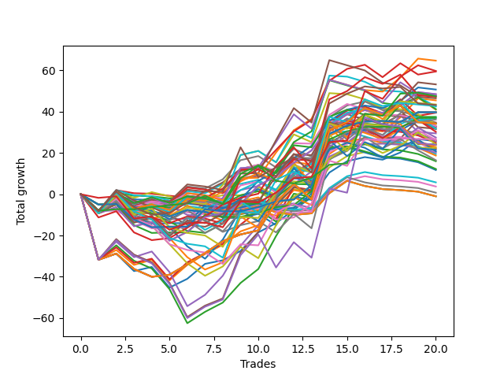

# Short Wallace Doodle 012 
- Symbol: ES
- Date Range: 3/19/22 - 5/22/22
- Trading Period: 7:20-12:30
- Number of Trades: 16


| Name | Win Percent | Profit | Avg Profit / Trade |     | Name | Win Percent | Profit | Avg Profit / Trade |
| ---- | ----------- | ------ | ------------------ | --- | ---- | ----------- | ------ | ------------------ |
| Sorted By <br> Profit | | | | | Sorted By <br> Win Percentage ||||
| Five | 75.00 | 35125.00 | 2195.31 |     | One | 81.25 | 24250.00 | 1515.62 |
| Thirty-Six | 50.00 | 32875.00 | 2054.69 |     | Five | 75.00 | 35125.00 | 2195.31 |
| Three | 62.50 | 32625.00 | 2039.06 |     | Two | 75.00 | 31125.00 | 1945.31 |
| Two | 75.00 | 31125.00 | 1945.31 |     | Eighteen | 75.00 | 24875.00 | 1554.69 |
| Twenty | 62.50 | 28875.00 | 1804.69 |     | Thirty-Three | 75.00 | 9000.00 | 562.50 |
| Twenty-Two | 50.00 | 26125.00 | 1632.81 |     | Thirty-Two | 75.00 | 9000.00 | 562.50 |
| Eighteen | 75.00 | 24875.00 | 1554.69 |     | Thirty-One | 75.00 | 9000.00 | 562.50 |
| One | 81.25 | 24250.00 | 1515.62 |     | Thirty | 75.00 | 9000.00 | 562.50 |
| Thirty-Five | 68.75 | 24000.00 | 1500.00 |     | Twenty-Nine | 75.00 | 9000.00 | 562.50 |
| Thirty-Four | 68.75 | 23000.00 | 1437.50 |     | Twenty-Eight | 75.00 | 9000.00 | 562.50 |
| Four | 68.75 | 20250.00 | 1265.62 |     | Twenty-Seven | 75.00 | 9000.00 | 562.50 |
| Seventeen | 43.75 | 19750.00 | 1234.38 |     | Twenty-Six | 75.00 | 9000.00 | 562.50 |
| Fifteen | 50.00 | 19375.00 | 1210.94 |     | Twenty-Five | 75.00 | 9000.00 | 562.50 |
| Sixteen | 37.50 | 18125.00 | 1132.81 |     | Twenty-Four | 75.00 | 9000.00 | 562.50 |
| Fourteen | 50.00 | 17750.00 | 1109.38 |     | Thirty-Five | 68.75 | 24000.00 | 1500.00 |
| Twenty-One | 50.00 | 17625.00 | 1101.56 |     | Thirty-Four | 68.75 | 23000.00 | 1437.50 |
| Twelve | 68.75 | 17125.00 | 1070.31 |     | Four | 68.75 | 20250.00 | 1265.62 |
| Eight | 43.75 | 16750.00 | 1046.88 |     | Twelve | 68.75 | 17125.00 | 1070.31 |
| Thirteen | 56.25 | 14875.00 | 929.69 |     | Three | 62.50 | 32625.00 | 2039.06 |
| Nineteen | 56.25 | 14000.00 | 875.00 |     | Twenty | 62.50 | 28875.00 | 1804.69 |
| Six | 56.25 | 13000.00 | 812.50 |     | Thirteen | 56.25 | 14875.00 | 929.69 |
| Twenty-Three | 43.75 | 12875.00 | 804.69 |     | Nineteen | 56.25 | 14000.00 | 875.00 |
| Ten | 31.25 | 12875.00 | 804.69 |     | Six | 56.25 | 13000.00 | 812.50 |
| Thirty-Three | 75.00 | 9000.00 | 562.50 |     | Seven | 56.25 | 7625.00 | 476.56 |
| Thirty-Two | 75.00 | 9000.00 | 562.50 |     | Thirty-Six | 50.00 | 32875.00 | 2054.69 |
| Thirty-One | 75.00 | 9000.00 | 562.50 |     | Twenty-Two | 50.00 | 26125.00 | 1632.81 |
| Thirty | 75.00 | 9000.00 | 562.50 |     | Fifteen | 50.00 | 19375.00 | 1210.94 |
| Twenty-Nine | 75.00 | 9000.00 | 562.50 |     | Fourteen | 50.00 | 17750.00 | 1109.38 |
| Twenty-Eight | 75.00 | 9000.00 | 562.50 |     | Twenty-One | 50.00 | 17625.00 | 1101.56 |
| Twenty-Seven | 75.00 | 9000.00 | 562.50 |     | Seventeen | 43.75 | 19750.00 | 1234.38 |
| Twenty-Six | 75.00 | 9000.00 | 562.50 |     | Eight | 43.75 | 16750.00 | 1046.88 |
| Twenty-Five | 75.00 | 9000.00 | 562.50 |     | Twenty-Three | 43.75 | 12875.00 | 804.69 |
| Twenty-Four | 75.00 | 9000.00 | 562.50 |     | Nine | 43.75 | 6125.00 | 382.81 |
| Seven | 56.25 | 7625.00 | 476.56 |     | Eleven | 43.75 | 5250.00 | 328.12 |
| Nine | 43.75 | 6125.00 | 382.81 |     | Sixteen | 37.50 | 18125.00 | 1132.81 |
| Eleven | 43.75 | 5250.00 | 328.12 |     | Ten | 31.25 | 12875.00 | 804.69 |

### Test One
* Sell when price hits the middle line of the 20p bollinger
* No Stoploss
* Results:
```
Total Trades: 16
Percent Up: 18.75
Percent Down: 81.25
Total Points Moved Down: 48.50
Potential Profit: 24250.00
Total Points Ups: 19.75 Count Ups: 3
Total Points Downs: 68.25 Count Downs: 13
```

<details><summary>Trades</summary>

<code>In: 2022-03-23 11:51:00		Out: 2022-03-23 11:56:20		Total Position Time: 05:20		Total Move Down: 3.00		Total to Date: -3.00</code> <br />
<code>In: 2022-03-25 10:52:00		Out: 2022-03-25 11:17:40		Total Position Time: 25:40		Total Move Down: -8.50		Total to Date: 5.50</code> <br />
<code>In: 2022-03-28 11:12:00		Out: 2022-03-28 11:12:10		Total Position Time: 00:10		Total Move Down: 2.00		Total to Date: 3.50</code> <br />
<code>In: 2022-04-14 10:38:00		Out: 2022-04-14 11:07:55		Total Position Time: 29:55		Total Move Down: -10.00		Total to Date: 13.50</code> <br />
<code>In: 2022-04-18 10:13:00		Out: 2022-04-18 10:17:50		Total Position Time: 04:50		Total Move Down: 4.25		Total to Date: 9.25</code> <br />
<code>In: 2022-04-25 09:27:00		Out: 2022-04-25 09:31:05		Total Position Time: 04:05		Total Move Down: 7.25		Total to Date: 2.00</code> <br />
<code>In: 2022-04-26 11:23:00		Out: 2022-04-26 11:31:35		Total Position Time: 08:35		Total Move Down: 1.75		Total to Date: 0.25</code> <br />
<code>In: 2022-04-29 10:39:00		Out: 2022-04-29 10:40:30		Total Position Time: 01:30		Total Move Down: 4.50		Total to Date: -4.25</code> <br />
<code>In: 2022-05-11 11:27:00		Out: 2022-05-11 11:30:30		Total Position Time: 03:30		Total Move Down: 9.00		Total to Date: -13.25</code> <br />
<code>In: 2022-05-25 11:04:00		Out: 2022-05-25 11:06:25		Total Position Time: 02:25		Total Move Down: 4.50		Total to Date: -17.75</code> <br />
<code>In: 2022-06-09 08:45:00		Out: 2022-06-09 08:48:20		Total Position Time: 03:20		Total Move Down: 6.50		Total to Date: -24.25</code> <br />
<code>In: 2022-06-13 09:14:00		Out: 2022-06-13 09:17:05		Total Position Time: 03:05		Total Move Down: 6.00		Total to Date: -30.25</code> <br />
<code>In: 2022-06-13 09:40:00		Out: 2022-06-13 09:43:15		Total Position Time: 03:15		Total Move Down: 12.00		Total to Date: -42.25</code> <br />
<code>In: 2022-06-14 10:02:00		Out: 2022-06-14 10:02:20		Total Position Time: 00:20		Total Move Down: 5.50		Total to Date: -47.75</code> <br />
<code>In: 2022-06-15 11:02:00		Out: 2022-06-15 11:02:10		Total Position Time: 00:10		Total Move Down: 2.00		Total to Date: -49.75</code> <br />
<code>In: 2022-06-23 10:53:00		Out: 2022-06-23 11:11:10		Total Position Time: 18:10		Total Move Down: -1.25		Total to Date: -48.50</code> <br />


</details>

### Test Two
* Sell when the price hits the lower line of the 20p 1std bollinger
* No Stoploss
* Results:
```
Total Trades: 16
Percent Up: 25.00
Percent Down: 75.00
Total Points Moved Down: 62.25
Potential Profit: 31125.00
Total Points Ups: 26.00 Count Ups: 4
Total Points Downs: 88.25 Count Downs: 12
```

<details><summary>Trades</summary>

<code>In: 2022-03-23 11:51:00		Out: 2022-03-23 11:56:40		Total Position Time: 05:40		Total Move Down: 4.75		Total to Date: -4.75</code> <br />
<code>In: 2022-03-25 10:52:00		Out: 2022-03-25 11:19:35		Total Position Time: 27:35		Total Move Down: -7.25		Total to Date: 2.50</code> <br />
<code>In: 2022-03-28 11:12:00		Out: 2022-03-28 11:19:35		Total Position Time: 07:35		Total Move Down: 2.50		Total to Date: -0.00</code> <br />
<code>In: 2022-04-14 10:38:00		Out: 2022-04-14 11:07:55		Total Position Time: 29:55		Total Move Down: -10.00		Total to Date: 10.00</code> <br />
<code>In: 2022-04-18 10:13:00		Out: 2022-04-18 10:19:35		Total Position Time: 06:35		Total Move Down: 7.50		Total to Date: 2.50</code> <br />
<code>In: 2022-04-25 09:27:00		Out: 2022-04-25 09:42:40		Total Position Time: 15:40		Total Move Down: 5.25		Total to Date: -2.75</code> <br />
<code>In: 2022-04-26 11:23:00		Out: 2022-04-26 11:33:45		Total Position Time: 10:45		Total Move Down: 4.50		Total to Date: -7.25</code> <br />
<code>In: 2022-04-29 10:39:00		Out: 2022-04-29 10:41:00		Total Position Time: 02:00		Total Move Down: 6.50		Total to Date: -13.75</code> <br />
<code>In: 2022-05-11 11:27:00		Out: 2022-05-11 11:50:35		Total Position Time: 23:35		Total Move Down: 3.00		Total to Date: -16.75</code> <br />
<code>In: 2022-05-25 11:04:00		Out: 2022-05-25 11:06:40		Total Position Time: 02:40		Total Move Down: 12.25		Total to Date: -29.00</code> <br />
<code>In: 2022-06-09 08:45:00		Out: 2022-06-09 08:49:35		Total Position Time: 04:35		Total Move Down: 10.75		Total to Date: -39.75</code> <br />
<code>In: 2022-06-13 09:14:00		Out: 2022-06-13 09:24:05		Total Position Time: 10:05		Total Move Down: 5.50		Total to Date: -45.25</code> <br />
<code>In: 2022-06-13 09:40:00		Out: 2022-06-13 09:47:55		Total Position Time: 07:55		Total Move Down: 19.00		Total to Date: -64.25</code> <br />
<code>In: 2022-06-14 10:02:00		Out: 2022-06-14 10:28:55		Total Position Time: 26:55		Total Move Down: -8.00		Total to Date: -56.25</code> <br />
<code>In: 2022-06-15 11:02:00		Out: 2022-06-15 11:03:00		Total Position Time: 01:00		Total Move Down: 6.75		Total to Date: -63.00</code> <br />
<code>In: 2022-06-23 10:53:00		Out: 2022-06-23 11:11:45		Total Position Time: 18:45		Total Move Down: -0.75		Total to Date: -62.25</code> <br />


</details>

### Test Three
* Sell when the price hits the lower line of the 20p 2std bollinger
* No Stoploss
* Results:
```
Total Trades: 16
Percent Up: 37.50
Percent Down: 62.50
Total Points Moved Down: 65.25
Potential Profit: 32625.00
Total Points Ups: 40.75 Count Ups: 6
Total Points Downs: 106.00 Count Downs: 10
```

<details><summary>Trades</summary>

<code>In: 2022-03-23 11:51:00		Out: 2022-03-23 11:57:25		Total Position Time: 06:25		Total Move Down: 7.00		Total to Date: -7.00</code> <br />
<code>In: 2022-03-25 10:52:00		Out: 2022-03-25 11:21:55		Total Position Time: 29:55		Total Move Down: -7.50		Total to Date: 0.50</code> <br />
<code>In: 2022-03-28 11:12:00		Out: 2022-03-28 11:41:55		Total Position Time: 29:55		Total Move Down: -3.75		Total to Date: 4.25</code> <br />
<code>In: 2022-04-14 10:38:00		Out: 2022-04-14 11:07:55		Total Position Time: 29:55		Total Move Down: -10.00		Total to Date: 14.25</code> <br />
<code>In: 2022-04-18 10:13:00		Out: 2022-04-18 10:42:55		Total Position Time: 29:55		Total Move Down: -16.50		Total to Date: 30.75</code> <br />
<code>In: 2022-04-25 09:27:00		Out: 2022-04-25 09:56:55		Total Position Time: 29:55		Total Move Down: 5.50		Total to Date: 25.25</code> <br />
<code>In: 2022-04-26 11:23:00		Out: 2022-04-26 11:41:30		Total Position Time: 18:30		Total Move Down: 4.50		Total to Date: 20.75</code> <br />
<code>In: 2022-04-29 10:39:00		Out: 2022-04-29 10:43:50		Total Position Time: 04:50		Total Move Down: 9.50		Total to Date: 11.25</code> <br />
<code>In: 2022-05-11 11:27:00		Out: 2022-05-11 11:51:20		Total Position Time: 24:20		Total Move Down: 6.75		Total to Date: 4.50</code> <br />
<code>In: 2022-05-25 11:04:00		Out: 2022-05-25 11:06:50		Total Position Time: 02:50		Total Move Down: 16.00		Total to Date: -11.50</code> <br />
<code>In: 2022-06-09 08:45:00		Out: 2022-06-09 09:11:10		Total Position Time: 26:10		Total Move Down: 13.75		Total to Date: -25.25</code> <br />
<code>In: 2022-06-13 09:14:00		Out: 2022-06-13 09:30:35		Total Position Time: 16:35		Total Move Down: 5.25		Total to Date: -30.50</code> <br />
<code>In: 2022-06-13 09:40:00		Out: 2022-06-13 09:54:45		Total Position Time: 14:45		Total Move Down: 24.75		Total to Date: -55.25</code> <br />
<code>In: 2022-06-14 10:02:00		Out: 2022-06-14 10:31:10		Total Position Time: 29:10		Total Move Down: -2.25		Total to Date: -53.00</code> <br />
<code>In: 2022-06-15 11:02:00		Out: 2022-06-15 11:03:15		Total Position Time: 01:15		Total Move Down: 13.00		Total to Date: -66.00</code> <br />
<code>In: 2022-06-23 10:53:00		Out: 2022-06-23 11:19:10		Total Position Time: 26:10		Total Move Down: -0.75		Total to Date: -65.25</code> <br />


</details>

### Test Four
* Sell when the price hits the middle line of the 1std VWAP
* No Stoploss
* Results:
```
Total Trades: 16
Percent Up: 31.25
Percent Down: 68.75
Total Points Moved Down: 40.50
Potential Profit: 20250.00
Total Points Ups: 12.25 Count Ups: 5
Total Points Downs: 52.75 Count Downs: 11
```

<details><summary>Trades</summary>

<code>In: 2022-03-23 11:51:00		Out: 2022-03-23 11:51:10		Total Position Time: 00:10		Total Move Down: 0.25		Total to Date: -0.25</code> <br />
<code>In: 2022-03-25 10:52:00		Out: 2022-03-25 11:21:55		Total Position Time: 29:55		Total Move Down: -7.50		Total to Date: 7.25</code> <br />
<code>In: 2022-03-28 11:12:00		Out: 2022-03-28 11:41:55		Total Position Time: 29:55		Total Move Down: -3.75		Total to Date: 11.00</code> <br />
<code>In: 2022-04-14 10:38:00		Out: 2022-04-14 10:38:10		Total Position Time: 00:10		Total Move Down: 0.25		Total to Date: 10.75</code> <br />
<code>In: 2022-04-18 10:13:00		Out: 2022-04-18 10:13:10		Total Position Time: 00:10		Total Move Down: -0.00		Total to Date: 10.75</code> <br />
<code>In: 2022-04-25 09:27:00		Out: 2022-04-25 09:31:10		Total Position Time: 04:10		Total Move Down: 8.50		Total to Date: 2.25</code> <br />
<code>In: 2022-04-26 11:23:00		Out: 2022-04-26 11:23:10		Total Position Time: 00:10		Total Move Down: -1.00		Total to Date: 3.25</code> <br />
<code>In: 2022-04-29 10:39:00		Out: 2022-04-29 10:39:10		Total Position Time: 00:10		Total Move Down: -0.00		Total to Date: 3.25</code> <br />
<code>In: 2022-05-11 11:27:00		Out: 2022-05-11 11:27:10		Total Position Time: 00:10		Total Move Down: 2.00		Total to Date: 1.25</code> <br />
<code>In: 2022-05-25 11:04:00		Out: 2022-05-25 11:06:20		Total Position Time: 02:20		Total Move Down: 2.75		Total to Date: -1.50</code> <br />
<code>In: 2022-06-09 08:45:00		Out: 2022-06-09 08:45:10		Total Position Time: 00:10		Total Move Down: 1.00		Total to Date: -2.50</code> <br />
<code>In: 2022-06-13 09:14:00		Out: 2022-06-13 09:17:20		Total Position Time: 03:20		Total Move Down: 6.75		Total to Date: -9.25</code> <br />
<code>In: 2022-06-13 09:40:00		Out: 2022-06-13 09:55:05		Total Position Time: 15:05		Total Move Down: 25.00		Total to Date: -34.25</code> <br />
<code>In: 2022-06-14 10:02:00		Out: 2022-06-14 10:02:10		Total Position Time: 00:10		Total Move Down: 4.00		Total to Date: -38.25</code> <br />
<code>In: 2022-06-15 11:02:00		Out: 2022-06-15 11:02:10		Total Position Time: 00:10		Total Move Down: 2.00		Total to Date: -40.25</code> <br />
<code>In: 2022-06-23 10:53:00		Out: 2022-06-23 10:53:10		Total Position Time: 00:10		Total Move Down: 0.25		Total to Date: -40.50</code> <br />


</details>

### Test Five
* Sell when the price hits the lower line of the 1std VWAP
* No Stoploss
* Results:
```
Total Trades: 16
Percent Up: 25.00
Percent Down: 75.00
Total Points Moved Down: 70.25
Potential Profit: 35125.00
Total Points Ups: 22.00 Count Ups: 4
Total Points Downs: 92.25 Count Downs: 12
```

<details><summary>Trades</summary>

<code>In: 2022-03-23 11:51:00		Out: 2022-03-23 11:56:25		Total Position Time: 05:25		Total Move Down: 3.00		Total to Date: -3.00</code> <br />
<code>In: 2022-03-25 10:52:00		Out: 2022-03-25 11:21:55		Total Position Time: 29:55		Total Move Down: -7.50		Total to Date: 4.50</code> <br />
<code>In: 2022-03-28 11:12:00		Out: 2022-03-28 11:41:55		Total Position Time: 29:55		Total Move Down: -3.75		Total to Date: 8.25</code> <br />
<code>In: 2022-04-14 10:38:00		Out: 2022-04-14 10:38:20		Total Position Time: 00:20		Total Move Down: 1.00		Total to Date: 7.25</code> <br />
<code>In: 2022-04-18 10:13:00		Out: 2022-04-18 10:18:00		Total Position Time: 05:00		Total Move Down: 5.00		Total to Date: 2.25</code> <br />
<code>In: 2022-04-25 09:27:00		Out: 2022-04-25 09:56:55		Total Position Time: 29:55		Total Move Down: 5.50		Total to Date: -3.25</code> <br />
<code>In: 2022-04-26 11:23:00		Out: 2022-04-26 11:42:05		Total Position Time: 19:05		Total Move Down: 5.75		Total to Date: -9.00</code> <br />
<code>In: 2022-04-29 10:39:00		Out: 2022-04-29 10:40:25		Total Position Time: 01:25		Total Move Down: 3.25		Total to Date: -12.25</code> <br />
<code>In: 2022-05-11 11:27:00		Out: 2022-05-11 11:27:10		Total Position Time: 00:10		Total Move Down: 2.00		Total to Date: -14.25</code> <br />
<code>In: 2022-05-25 11:04:00		Out: 2022-05-25 11:06:45		Total Position Time: 02:45		Total Move Down: 13.50		Total to Date: -27.75</code> <br />
<code>In: 2022-06-09 08:45:00		Out: 2022-06-09 08:48:50		Total Position Time: 03:50		Total Move Down: 9.00		Total to Date: -36.75</code> <br />
<code>In: 2022-06-13 09:14:00		Out: 2022-06-13 09:43:55		Total Position Time: 29:55		Total Move Down: -7.50		Total to Date: -29.25</code> <br />
<code>In: 2022-06-13 09:40:00		Out: 2022-06-13 10:09:55		Total Position Time: 29:55		Total Move Down: 33.50		Total to Date: -62.75</code> <br />
<code>In: 2022-06-14 10:02:00		Out: 2022-06-14 10:02:10		Total Position Time: 00:10		Total Move Down: 4.00		Total to Date: -66.75</code> <br />
<code>In: 2022-06-15 11:02:00		Out: 2022-06-15 11:03:00		Total Position Time: 01:00		Total Move Down: 6.75		Total to Date: -73.50</code> <br />
<code>In: 2022-06-23 10:53:00		Out: 2022-06-23 11:22:55		Total Position Time: 29:55		Total Move Down: -3.25		Total to Date: -70.25</code> <br />


</details>

### Test Six
* Sell when the price hits the middle line of the 20p bollinger
* Stoploss is -2 points
* Results:
```
Total Trades: 16
Percent Up: 43.75
Percent Down: 56.25
Total Points Moved Down: 26.00
Potential Profit: 13000.00
Total Points Ups: 13.00 Count Ups: 7
Total Points Downs: 39.00 Count Downs: 9
```

<details><summary>Trades</summary>

<code>In: 2022-03-23 11:51:00		Out: 2022-03-23 11:56:20		Total Position Time: 05:20		Total Move Down: 3.00		Total to Date: -3.00</code> <br />
<code>In: 2022-03-25 10:52:00		Out: 2022-03-25 10:52:25		Total Position Time: 00:25		Total Move Down: -1.50		Total to Date: -1.50</code> <br />
<code>In: 2022-03-28 11:12:00		Out: 2022-03-28 11:12:10		Total Position Time: 00:10		Total Move Down: 2.00		Total to Date: -3.50</code> <br />
<code>In: 2022-04-14 10:38:00		Out: 2022-04-14 10:42:15		Total Position Time: 04:15		Total Move Down: -1.00		Total to Date: -2.50</code> <br />
<code>In: 2022-04-18 10:13:00		Out: 2022-04-18 10:17:50		Total Position Time: 04:50		Total Move Down: 4.25		Total to Date: -6.75</code> <br />
<code>In: 2022-04-25 09:27:00		Out: 2022-04-25 09:27:10		Total Position Time: 00:10		Total Move Down: -1.00		Total to Date: -5.75</code> <br />
<code>In: 2022-04-26 11:23:00		Out: 2022-04-26 11:31:35		Total Position Time: 08:35		Total Move Down: 1.75		Total to Date: -7.50</code> <br />
<code>In: 2022-04-29 10:39:00		Out: 2022-04-29 10:39:10		Total Position Time: 00:10		Total Move Down: -0.00		Total to Date: -7.50</code> <br />
<code>In: 2022-05-11 11:27:00		Out: 2022-05-11 11:27:10		Total Position Time: 00:10		Total Move Down: 2.00		Total to Date: -9.50</code> <br />
<code>In: 2022-05-25 11:04:00		Out: 2022-05-25 11:04:40		Total Position Time: 00:40		Total Move Down: -5.50		Total to Date: -4.00</code> <br />
<code>In: 2022-06-09 08:45:00		Out: 2022-06-09 08:48:20		Total Position Time: 03:20		Total Move Down: 6.50		Total to Date: -10.50</code> <br />
<code>In: 2022-06-13 09:14:00		Out: 2022-06-13 09:15:35		Total Position Time: 01:35		Total Move Down: -1.50		Total to Date: -9.00</code> <br />
<code>In: 2022-06-13 09:40:00		Out: 2022-06-13 09:43:15		Total Position Time: 03:15		Total Move Down: 12.00		Total to Date: -21.00</code> <br />
<code>In: 2022-06-14 10:02:00		Out: 2022-06-14 10:02:20		Total Position Time: 00:20		Total Move Down: 5.50		Total to Date: -26.50</code> <br />
<code>In: 2022-06-15 11:02:00		Out: 2022-06-15 11:02:10		Total Position Time: 00:10		Total Move Down: 2.00		Total to Date: -28.50</code> <br />
<code>In: 2022-06-23 10:53:00		Out: 2022-06-23 10:55:05		Total Position Time: 02:05		Total Move Down: -2.50		Total to Date: -26.00</code> <br />


</details>

### Test Seven
* Sell when the price hits the middle line of the 20p bollinger
* Trailing Stop is -2 points
* Results:
```
Total Trades: 16
Percent Up: 43.75
Percent Down: 56.25
Total Points Moved Down: 15.25
Potential Profit: 7625.00
Total Points Ups: 11.75 Count Ups: 7
Total Points Downs: 27.00 Count Downs: 9
```

<details><summary>Trades</summary>

<code>In: 2022-03-23 11:51:00		Out: 2022-03-23 11:55:05		Total Position Time: 04:05		Total Move Down: 0.50		Total to Date: -0.50</code> <br />
<code>In: 2022-03-25 10:52:00		Out: 2022-03-25 10:52:25		Total Position Time: 00:25		Total Move Down: -1.50		Total to Date: 1.00</code> <br />
<code>In: 2022-03-28 11:12:00		Out: 2022-03-28 11:12:10		Total Position Time: 00:10		Total Move Down: 2.00		Total to Date: -1.00</code> <br />
<code>In: 2022-04-14 10:38:00		Out: 2022-04-14 10:42:05		Total Position Time: 04:05		Total Move Down: 0.25		Total to Date: -1.25</code> <br />
<code>In: 2022-04-18 10:13:00		Out: 2022-04-18 10:17:50		Total Position Time: 04:50		Total Move Down: 4.25		Total to Date: -5.50</code> <br />
<code>In: 2022-04-25 09:27:00		Out: 2022-04-25 09:27:10		Total Position Time: 00:10		Total Move Down: -1.00		Total to Date: -4.50</code> <br />
<code>In: 2022-04-26 11:23:00		Out: 2022-04-26 11:23:25		Total Position Time: 00:25		Total Move Down: -3.50		Total to Date: -1.00</code> <br />
<code>In: 2022-04-29 10:39:00		Out: 2022-04-29 10:39:10		Total Position Time: 00:10		Total Move Down: -0.00		Total to Date: -1.00</code> <br />
<code>In: 2022-05-11 11:27:00		Out: 2022-05-11 11:27:10		Total Position Time: 00:10		Total Move Down: 2.00		Total to Date: -3.00</code> <br />
<code>In: 2022-05-25 11:04:00		Out: 2022-05-25 11:04:20		Total Position Time: 00:20		Total Move Down: -3.00		Total to Date: -0.00</code> <br />
<code>In: 2022-06-09 08:45:00		Out: 2022-06-09 08:45:40		Total Position Time: 00:40		Total Move Down: -1.25		Total to Date: 1.25</code> <br />
<code>In: 2022-06-13 09:14:00		Out: 2022-06-13 09:14:25		Total Position Time: 00:25		Total Move Down: 0.75		Total to Date: 0.50</code> <br />
<code>In: 2022-06-13 09:40:00		Out: 2022-06-13 09:43:00		Total Position Time: 03:00		Total Move Down: 9.75		Total to Date: -9.25</code> <br />
<code>In: 2022-06-14 10:02:00		Out: 2022-06-14 10:02:20		Total Position Time: 00:20		Total Move Down: 5.50		Total to Date: -14.75</code> <br />
<code>In: 2022-06-15 11:02:00		Out: 2022-06-15 11:02:10		Total Position Time: 00:10		Total Move Down: 2.00		Total to Date: -16.75</code> <br />
<code>In: 2022-06-23 10:53:00		Out: 2022-06-23 10:54:15		Total Position Time: 01:15		Total Move Down: -1.50		Total to Date: -15.25</code> <br />


</details>

### Test Eight
* Sell when the price hits the lower line of the 20p 1std bollinger
* Stoploss is -2 points
* Results:
```
Total Trades: 16
Percent Up: 56.25
Percent Down: 43.75
Total Points Moved Down: 33.50
Potential Profit: 16750.00
Total Points Ups: 15.75 Count Ups: 9
Total Points Downs: 49.25 Count Downs: 7
```

<details><summary>Trades</summary>

<code>In: 2022-03-23 11:51:00		Out: 2022-03-23 11:56:40		Total Position Time: 05:40		Total Move Down: 4.75		Total to Date: -4.75</code> <br />
<code>In: 2022-03-25 10:52:00		Out: 2022-03-25 10:52:25		Total Position Time: 00:25		Total Move Down: -1.50		Total to Date: -3.25</code> <br />
<code>In: 2022-03-28 11:12:00		Out: 2022-03-28 11:14:35		Total Position Time: 02:35		Total Move Down: -0.25		Total to Date: -3.00</code> <br />
<code>In: 2022-04-14 10:38:00		Out: 2022-04-14 10:42:15		Total Position Time: 04:15		Total Move Down: -1.00		Total to Date: -2.00</code> <br />
<code>In: 2022-04-18 10:13:00		Out: 2022-04-18 10:19:35		Total Position Time: 06:35		Total Move Down: 7.50		Total to Date: -9.50</code> <br />
<code>In: 2022-04-25 09:27:00		Out: 2022-04-25 09:27:10		Total Position Time: 00:10		Total Move Down: -1.00		Total to Date: -8.50</code> <br />
<code>In: 2022-04-26 11:23:00		Out: 2022-04-26 11:33:45		Total Position Time: 10:45		Total Move Down: 4.50		Total to Date: -13.00</code> <br />
<code>In: 2022-04-29 10:39:00		Out: 2022-04-29 10:39:10		Total Position Time: 00:10		Total Move Down: -0.00		Total to Date: -13.00</code> <br />
<code>In: 2022-05-11 11:27:00		Out: 2022-05-11 11:27:10		Total Position Time: 00:10		Total Move Down: 2.00		Total to Date: -15.00</code> <br />
<code>In: 2022-05-25 11:04:00		Out: 2022-05-25 11:04:40		Total Position Time: 00:40		Total Move Down: -5.50		Total to Date: -9.50</code> <br />
<code>In: 2022-06-09 08:45:00		Out: 2022-06-09 08:49:35		Total Position Time: 04:35		Total Move Down: 10.75		Total to Date: -20.25</code> <br />
<code>In: 2022-06-13 09:14:00		Out: 2022-06-13 09:15:35		Total Position Time: 01:35		Total Move Down: -1.50		Total to Date: -18.75</code> <br />
<code>In: 2022-06-13 09:40:00		Out: 2022-06-13 09:47:55		Total Position Time: 07:55		Total Move Down: 19.00		Total to Date: -37.75</code> <br />
<code>In: 2022-06-14 10:02:00		Out: 2022-06-14 10:07:05		Total Position Time: 05:05		Total Move Down: 0.75		Total to Date: -38.50</code> <br />
<code>In: 2022-06-15 11:02:00		Out: 2022-06-15 11:02:15		Total Position Time: 00:15		Total Move Down: -2.50		Total to Date: -36.00</code> <br />
<code>In: 2022-06-23 10:53:00		Out: 2022-06-23 10:55:05		Total Position Time: 02:05		Total Move Down: -2.50		Total to Date: -33.50</code> <br />


</details>

### Test Nine
* Sell when the price hits the lower line of the 20p 1std bollinger
* Trailing Stop is -2 points
* Results:
```
Total Trades: 16
Percent Up: 56.25
Percent Down: 43.75
Total Points Moved Down: 12.25
Potential Profit: 6125.00
Total Points Ups: 14.50 Count Ups: 9
Total Points Downs: 26.75 Count Downs: 7
```

<details><summary>Trades</summary>

<code>In: 2022-03-23 11:51:00		Out: 2022-03-23 11:55:05		Total Position Time: 04:05		Total Move Down: 0.50		Total to Date: -0.50</code> <br />
<code>In: 2022-03-25 10:52:00		Out: 2022-03-25 10:52:25		Total Position Time: 00:25		Total Move Down: -1.50		Total to Date: 1.00</code> <br />
<code>In: 2022-03-28 11:12:00		Out: 2022-03-28 11:14:35		Total Position Time: 02:35		Total Move Down: -0.25		Total to Date: 1.25</code> <br />
<code>In: 2022-04-14 10:38:00		Out: 2022-04-14 10:42:05		Total Position Time: 04:05		Total Move Down: 0.25		Total to Date: 1.00</code> <br />
<code>In: 2022-04-18 10:13:00		Out: 2022-04-18 10:19:35		Total Position Time: 06:35		Total Move Down: 7.50		Total to Date: -6.50</code> <br />
<code>In: 2022-04-25 09:27:00		Out: 2022-04-25 09:27:10		Total Position Time: 00:10		Total Move Down: -1.00		Total to Date: -5.50</code> <br />
<code>In: 2022-04-26 11:23:00		Out: 2022-04-26 11:23:25		Total Position Time: 00:25		Total Move Down: -3.50		Total to Date: -2.00</code> <br />
<code>In: 2022-04-29 10:39:00		Out: 2022-04-29 10:39:10		Total Position Time: 00:10		Total Move Down: -0.00		Total to Date: -2.00</code> <br />
<code>In: 2022-05-11 11:27:00		Out: 2022-05-11 11:27:10		Total Position Time: 00:10		Total Move Down: 2.00		Total to Date: -4.00</code> <br />
<code>In: 2022-05-25 11:04:00		Out: 2022-05-25 11:04:20		Total Position Time: 00:20		Total Move Down: -3.00		Total to Date: -1.00</code> <br />
<code>In: 2022-06-09 08:45:00		Out: 2022-06-09 08:45:40		Total Position Time: 00:40		Total Move Down: -1.25		Total to Date: 0.25</code> <br />
<code>In: 2022-06-13 09:14:00		Out: 2022-06-13 09:14:25		Total Position Time: 00:25		Total Move Down: 0.75		Total to Date: -0.50</code> <br />
<code>In: 2022-06-13 09:40:00		Out: 2022-06-13 09:43:00		Total Position Time: 03:00		Total Move Down: 9.75		Total to Date: -10.25</code> <br />
<code>In: 2022-06-14 10:02:00		Out: 2022-06-14 10:04:10		Total Position Time: 02:10		Total Move Down: 6.00		Total to Date: -16.25</code> <br />
<code>In: 2022-06-15 11:02:00		Out: 2022-06-15 11:02:15		Total Position Time: 00:15		Total Move Down: -2.50		Total to Date: -13.75</code> <br />
<code>In: 2022-06-23 10:53:00		Out: 2022-06-23 10:54:15		Total Position Time: 01:15		Total Move Down: -1.50		Total to Date: -12.25</code> <br />


</details>

### Test Ten
* Sell when the price hits the lower line of the 20p 2std bollinger
* Stoploss is -2 points
* Results:
```
Total Trades: 16
Percent Up: 68.75
Percent Down: 31.25
Total Points Moved Down: 25.75
Potential Profit: 12875.00
Total Points Ups: 22.50 Count Ups: 11
Total Points Downs: 48.25 Count Downs: 5
```

<details><summary>Trades</summary>

<code>In: 2022-03-23 11:51:00		Out: 2022-03-23 11:57:25		Total Position Time: 06:25		Total Move Down: 7.00		Total to Date: -7.00</code> <br />
<code>In: 2022-03-25 10:52:00		Out: 2022-03-25 10:52:25		Total Position Time: 00:25		Total Move Down: -1.50		Total to Date: -5.50</code> <br />
<code>In: 2022-03-28 11:12:00		Out: 2022-03-28 11:14:35		Total Position Time: 02:35		Total Move Down: -0.25		Total to Date: -5.25</code> <br />
<code>In: 2022-04-14 10:38:00		Out: 2022-04-14 10:42:15		Total Position Time: 04:15		Total Move Down: -1.00		Total to Date: -4.25</code> <br />
<code>In: 2022-04-18 10:13:00		Out: 2022-04-18 10:31:25		Total Position Time: 18:25		Total Move Down: -0.75		Total to Date: -3.50</code> <br />
<code>In: 2022-04-25 09:27:00		Out: 2022-04-25 09:27:10		Total Position Time: 00:10		Total Move Down: -1.00		Total to Date: -2.50</code> <br />
<code>In: 2022-04-26 11:23:00		Out: 2022-04-26 11:37:35		Total Position Time: 14:35		Total Move Down: -6.00		Total to Date: 3.50</code> <br />
<code>In: 2022-04-29 10:39:00		Out: 2022-04-29 10:39:10		Total Position Time: 00:10		Total Move Down: -0.00		Total to Date: 3.50</code> <br />
<code>In: 2022-05-11 11:27:00		Out: 2022-05-11 11:27:10		Total Position Time: 00:10		Total Move Down: 2.00		Total to Date: 1.50</code> <br />
<code>In: 2022-05-25 11:04:00		Out: 2022-05-25 11:04:40		Total Position Time: 00:40		Total Move Down: -5.50		Total to Date: 7.00</code> <br />
<code>In: 2022-06-09 08:45:00		Out: 2022-06-09 09:11:10		Total Position Time: 26:10		Total Move Down: 13.75		Total to Date: -6.75</code> <br />
<code>In: 2022-06-13 09:14:00		Out: 2022-06-13 09:15:35		Total Position Time: 01:35		Total Move Down: -1.50		Total to Date: -5.25</code> <br />
<code>In: 2022-06-13 09:40:00		Out: 2022-06-13 09:54:45		Total Position Time: 14:45		Total Move Down: 24.75		Total to Date: -30.00</code> <br />
<code>In: 2022-06-14 10:02:00		Out: 2022-06-14 10:07:05		Total Position Time: 05:05		Total Move Down: 0.75		Total to Date: -30.75</code> <br />
<code>In: 2022-06-15 11:02:00		Out: 2022-06-15 11:02:15		Total Position Time: 00:15		Total Move Down: -2.50		Total to Date: -28.25</code> <br />
<code>In: 2022-06-23 10:53:00		Out: 2022-06-23 10:55:05		Total Position Time: 02:05		Total Move Down: -2.50		Total to Date: -25.75</code> <br />


</details>

### Test Eleven
* Sell when the price hits the lower line of the 20p 2std bollinger
* Trailing Stop is -2 points
* Results:
```
Total Trades: 16
Percent Up: 56.25
Percent Down: 43.75
Total Points Moved Down: 10.50
Potential Profit: 5250.00
Total Points Ups: 14.50 Count Ups: 9
Total Points Downs: 25.00 Count Downs: 7
```

<details><summary>Trades</summary>

<code>In: 2022-03-23 11:51:00		Out: 2022-03-23 11:55:05		Total Position Time: 04:05		Total Move Down: 0.50		Total to Date: -0.50</code> <br />
<code>In: 2022-03-25 10:52:00		Out: 2022-03-25 10:52:25		Total Position Time: 00:25		Total Move Down: -1.50		Total to Date: 1.00</code> <br />
<code>In: 2022-03-28 11:12:00		Out: 2022-03-28 11:14:35		Total Position Time: 02:35		Total Move Down: -0.25		Total to Date: 1.25</code> <br />
<code>In: 2022-04-14 10:38:00		Out: 2022-04-14 10:42:05		Total Position Time: 04:05		Total Move Down: 0.25		Total to Date: 1.00</code> <br />
<code>In: 2022-04-18 10:13:00		Out: 2022-04-18 10:21:45		Total Position Time: 08:45		Total Move Down: 5.75		Total to Date: -4.75</code> <br />
<code>In: 2022-04-25 09:27:00		Out: 2022-04-25 09:27:10		Total Position Time: 00:10		Total Move Down: -1.00		Total to Date: -3.75</code> <br />
<code>In: 2022-04-26 11:23:00		Out: 2022-04-26 11:23:25		Total Position Time: 00:25		Total Move Down: -3.50		Total to Date: -0.25</code> <br />
<code>In: 2022-04-29 10:39:00		Out: 2022-04-29 10:39:10		Total Position Time: 00:10		Total Move Down: -0.00		Total to Date: -0.25</code> <br />
<code>In: 2022-05-11 11:27:00		Out: 2022-05-11 11:27:10		Total Position Time: 00:10		Total Move Down: 2.00		Total to Date: -2.25</code> <br />
<code>In: 2022-05-25 11:04:00		Out: 2022-05-25 11:04:20		Total Position Time: 00:20		Total Move Down: -3.00		Total to Date: 0.75</code> <br />
<code>In: 2022-06-09 08:45:00		Out: 2022-06-09 08:45:40		Total Position Time: 00:40		Total Move Down: -1.25		Total to Date: 2.00</code> <br />
<code>In: 2022-06-13 09:14:00		Out: 2022-06-13 09:14:25		Total Position Time: 00:25		Total Move Down: 0.75		Total to Date: 1.25</code> <br />
<code>In: 2022-06-13 09:40:00		Out: 2022-06-13 09:43:00		Total Position Time: 03:00		Total Move Down: 9.75		Total to Date: -8.50</code> <br />
<code>In: 2022-06-14 10:02:00		Out: 2022-06-14 10:04:10		Total Position Time: 02:10		Total Move Down: 6.00		Total to Date: -14.50</code> <br />
<code>In: 2022-06-15 11:02:00		Out: 2022-06-15 11:02:15		Total Position Time: 00:15		Total Move Down: -2.50		Total to Date: -12.00</code> <br />
<code>In: 2022-06-23 10:53:00		Out: 2022-06-23 10:54:15		Total Position Time: 01:15		Total Move Down: -1.50		Total to Date: -10.50</code> <br />


</details>

### Test Twelve
* Sell when the price hits the middle line of the 20p bollinger
* Stoploss is -3 points
* Results:
```
Total Trades: 16
Percent Up: 31.25
Percent Down: 68.75
Total Points Moved Down: 34.25
Potential Profit: 17125.00
Total Points Ups: 15.25 Count Ups: 5
Total Points Downs: 49.50 Count Downs: 11
```

<details><summary>Trades</summary>

<code>In: 2022-03-23 11:51:00		Out: 2022-03-23 11:56:20		Total Position Time: 05:20		Total Move Down: 3.00		Total to Date: -3.00</code> <br />
<code>In: 2022-03-25 10:52:00		Out: 2022-03-25 10:56:05		Total Position Time: 04:05		Total Move Down: -2.50		Total to Date: -0.50</code> <br />
<code>In: 2022-03-28 11:12:00		Out: 2022-03-28 11:12:10		Total Position Time: 00:10		Total Move Down: 2.00		Total to Date: -2.50</code> <br />
<code>In: 2022-04-14 10:38:00		Out: 2022-04-14 10:43:35		Total Position Time: 05:35		Total Move Down: -2.00		Total to Date: -0.50</code> <br />
<code>In: 2022-04-18 10:13:00		Out: 2022-04-18 10:17:50		Total Position Time: 04:50		Total Move Down: 4.25		Total to Date: -4.75</code> <br />
<code>In: 2022-04-25 09:27:00		Out: 2022-04-25 09:27:10		Total Position Time: 00:10		Total Move Down: -1.00		Total to Date: -3.75</code> <br />
<code>In: 2022-04-26 11:23:00		Out: 2022-04-26 11:31:35		Total Position Time: 08:35		Total Move Down: 1.75		Total to Date: -5.50</code> <br />
<code>In: 2022-04-29 10:39:00		Out: 2022-04-29 10:40:30		Total Position Time: 01:30		Total Move Down: 4.50		Total to Date: -10.00</code> <br />
<code>In: 2022-05-11 11:27:00		Out: 2022-05-11 11:27:10		Total Position Time: 00:10		Total Move Down: 2.00		Total to Date: -12.00</code> <br />
<code>In: 2022-05-25 11:04:00		Out: 2022-05-25 11:04:40		Total Position Time: 00:40		Total Move Down: -5.50		Total to Date: -6.50</code> <br />
<code>In: 2022-06-09 08:45:00		Out: 2022-06-09 08:48:20		Total Position Time: 03:20		Total Move Down: 6.50		Total to Date: -13.00</code> <br />
<code>In: 2022-06-13 09:14:00		Out: 2022-06-13 09:17:05		Total Position Time: 03:05		Total Move Down: 6.00		Total to Date: -19.00</code> <br />
<code>In: 2022-06-13 09:40:00		Out: 2022-06-13 09:43:15		Total Position Time: 03:15		Total Move Down: 12.00		Total to Date: -31.00</code> <br />
<code>In: 2022-06-14 10:02:00		Out: 2022-06-14 10:02:20		Total Position Time: 00:20		Total Move Down: 5.50		Total to Date: -36.50</code> <br />
<code>In: 2022-06-15 11:02:00		Out: 2022-06-15 11:02:10		Total Position Time: 00:10		Total Move Down: 2.00		Total to Date: -38.50</code> <br />
<code>In: 2022-06-23 10:53:00		Out: 2022-06-23 10:56:10		Total Position Time: 03:10		Total Move Down: -4.25		Total to Date: -34.25</code> <br />


</details>

### Test Thirteen
* Sell when the price hits the middle line of the 20p bollinger
* Trailing Stop is -3 points
* Results:
```
Total Trades: 16
Percent Up: 43.75
Percent Down: 56.25
Total Points Moved Down: 29.75
Potential Profit: 14875.00
Total Points Ups: 12.00 Count Ups: 7
Total Points Downs: 41.75 Count Downs: 9
```

<details><summary>Trades</summary>

<code>In: 2022-03-23 11:51:00		Out: 2022-03-23 11:56:20		Total Position Time: 05:20		Total Move Down: 3.00		Total to Date: -3.00</code> <br />
<code>In: 2022-03-25 10:52:00		Out: 2022-03-25 10:56:05		Total Position Time: 04:05		Total Move Down: -2.50		Total to Date: -0.50</code> <br />
<code>In: 2022-03-28 11:12:00		Out: 2022-03-28 11:12:10		Total Position Time: 00:10		Total Move Down: 2.00		Total to Date: -2.50</code> <br />
<code>In: 2022-04-14 10:38:00		Out: 2022-04-14 10:42:15		Total Position Time: 04:15		Total Move Down: -1.00		Total to Date: -1.50</code> <br />
<code>In: 2022-04-18 10:13:00		Out: 2022-04-18 10:17:50		Total Position Time: 04:50		Total Move Down: 4.25		Total to Date: -5.75</code> <br />
<code>In: 2022-04-25 09:27:00		Out: 2022-04-25 09:27:10		Total Position Time: 00:10		Total Move Down: -1.00		Total to Date: -4.75</code> <br />
<code>In: 2022-04-26 11:23:00		Out: 2022-04-26 11:28:55		Total Position Time: 05:55		Total Move Down: -1.75		Total to Date: -3.00</code> <br />
<code>In: 2022-04-29 10:39:00		Out: 2022-04-29 10:40:30		Total Position Time: 01:30		Total Move Down: 4.50		Total to Date: -7.50</code> <br />
<code>In: 2022-05-11 11:27:00		Out: 2022-05-11 11:27:10		Total Position Time: 00:10		Total Move Down: 2.00		Total to Date: -9.50</code> <br />
<code>In: 2022-05-25 11:04:00		Out: 2022-05-25 11:04:20		Total Position Time: 00:20		Total Move Down: -3.00		Total to Date: -6.50</code> <br />
<code>In: 2022-06-09 08:45:00		Out: 2022-06-09 08:48:20		Total Position Time: 03:20		Total Move Down: 6.50		Total to Date: -13.00</code> <br />
<code>In: 2022-06-13 09:14:00		Out: 2022-06-13 09:15:20		Total Position Time: 01:20		Total Move Down: -0.25		Total to Date: -12.75</code> <br />
<code>In: 2022-06-13 09:40:00		Out: 2022-06-13 09:43:15		Total Position Time: 03:15		Total Move Down: 12.00		Total to Date: -24.75</code> <br />
<code>In: 2022-06-14 10:02:00		Out: 2022-06-14 10:02:20		Total Position Time: 00:20		Total Move Down: 5.50		Total to Date: -30.25</code> <br />
<code>In: 2022-06-15 11:02:00		Out: 2022-06-15 11:02:10		Total Position Time: 00:10		Total Move Down: 2.00		Total to Date: -32.25</code> <br />
<code>In: 2022-06-23 10:53:00		Out: 2022-06-23 10:55:05		Total Position Time: 02:05		Total Move Down: -2.50		Total to Date: -29.75</code> <br />


</details>

### Test Fourteen
* Sell when the price hits the lower line of the 20p 1std bollinger
* Stoploss is -3 points
* Results:
```
Total Trades: 16
Percent Up: 50.00
Percent Down: 50.00
Total Points Moved Down: 35.50
Potential Profit: 17750.00
Total Points Ups: 22.00 Count Ups: 8
Total Points Downs: 57.50 Count Downs: 8
```

<details><summary>Trades</summary>

<code>In: 2022-03-23 11:51:00		Out: 2022-03-23 11:56:40		Total Position Time: 05:40		Total Move Down: 4.75		Total to Date: -4.75</code> <br />
<code>In: 2022-03-25 10:52:00		Out: 2022-03-25 10:56:05		Total Position Time: 04:05		Total Move Down: -2.50		Total to Date: -2.25</code> <br />
<code>In: 2022-03-28 11:12:00		Out: 2022-03-28 11:19:35		Total Position Time: 07:35		Total Move Down: 2.50		Total to Date: -4.75</code> <br />
<code>In: 2022-04-14 10:38:00		Out: 2022-04-14 10:43:35		Total Position Time: 05:35		Total Move Down: -2.00		Total to Date: -2.75</code> <br />
<code>In: 2022-04-18 10:13:00		Out: 2022-04-18 10:19:35		Total Position Time: 06:35		Total Move Down: 7.50		Total to Date: -10.25</code> <br />
<code>In: 2022-04-25 09:27:00		Out: 2022-04-25 09:27:10		Total Position Time: 00:10		Total Move Down: -1.00		Total to Date: -9.25</code> <br />
<code>In: 2022-04-26 11:23:00		Out: 2022-04-26 11:33:45		Total Position Time: 10:45		Total Move Down: 4.50		Total to Date: -13.75</code> <br />
<code>In: 2022-04-29 10:39:00		Out: 2022-04-29 10:41:00		Total Position Time: 02:00		Total Move Down: 6.50		Total to Date: -20.25</code> <br />
<code>In: 2022-05-11 11:27:00		Out: 2022-05-11 11:27:10		Total Position Time: 00:10		Total Move Down: 2.00		Total to Date: -22.25</code> <br />
<code>In: 2022-05-25 11:04:00		Out: 2022-05-25 11:04:40		Total Position Time: 00:40		Total Move Down: -5.50		Total to Date: -16.75</code> <br />
<code>In: 2022-06-09 08:45:00		Out: 2022-06-09 08:49:35		Total Position Time: 04:35		Total Move Down: 10.75		Total to Date: -27.50</code> <br />
<code>In: 2022-06-13 09:14:00		Out: 2022-06-13 09:22:40		Total Position Time: 08:40		Total Move Down: -3.75		Total to Date: -23.75</code> <br />
<code>In: 2022-06-13 09:40:00		Out: 2022-06-13 09:47:55		Total Position Time: 07:55		Total Move Down: 19.00		Total to Date: -42.75</code> <br />
<code>In: 2022-06-14 10:02:00		Out: 2022-06-14 10:07:50		Total Position Time: 05:50		Total Move Down: -0.50		Total to Date: -42.25</code> <br />
<code>In: 2022-06-15 11:02:00		Out: 2022-06-15 11:02:15		Total Position Time: 00:15		Total Move Down: -2.50		Total to Date: -39.75</code> <br />
<code>In: 2022-06-23 10:53:00		Out: 2022-06-23 10:56:10		Total Position Time: 03:10		Total Move Down: -4.25		Total to Date: -35.50</code> <br />


</details>

### Test Fifteen
* Sell when the price hits the lower line of the 20p 1std bollinger
* Trailing Stop is -3 points
* Results:
```
Total Trades: 16
Percent Up: 50.00
Percent Down: 50.00
Total Points Moved Down: 38.75
Potential Profit: 19375.00
Total Points Ups: 14.50 Count Ups: 8
Total Points Downs: 53.25 Count Downs: 8
```

<details><summary>Trades</summary>

<code>In: 2022-03-23 11:51:00		Out: 2022-03-23 11:56:40		Total Position Time: 05:40		Total Move Down: 4.75		Total to Date: -4.75</code> <br />
<code>In: 2022-03-25 10:52:00		Out: 2022-03-25 10:56:05		Total Position Time: 04:05		Total Move Down: -2.50		Total to Date: -2.25</code> <br />
<code>In: 2022-03-28 11:12:00		Out: 2022-03-28 11:19:35		Total Position Time: 07:35		Total Move Down: 2.50		Total to Date: -4.75</code> <br />
<code>In: 2022-04-14 10:38:00		Out: 2022-04-14 10:42:15		Total Position Time: 04:15		Total Move Down: -1.00		Total to Date: -3.75</code> <br />
<code>In: 2022-04-18 10:13:00		Out: 2022-04-18 10:19:35		Total Position Time: 06:35		Total Move Down: 7.50		Total to Date: -11.25</code> <br />
<code>In: 2022-04-25 09:27:00		Out: 2022-04-25 09:27:10		Total Position Time: 00:10		Total Move Down: -1.00		Total to Date: -10.25</code> <br />
<code>In: 2022-04-26 11:23:00		Out: 2022-04-26 11:28:55		Total Position Time: 05:55		Total Move Down: -1.75		Total to Date: -8.50</code> <br />
<code>In: 2022-04-29 10:39:00		Out: 2022-04-29 10:41:00		Total Position Time: 02:00		Total Move Down: 6.50		Total to Date: -15.00</code> <br />
<code>In: 2022-05-11 11:27:00		Out: 2022-05-11 11:27:10		Total Position Time: 00:10		Total Move Down: 2.00		Total to Date: -17.00</code> <br />
<code>In: 2022-05-25 11:04:00		Out: 2022-05-25 11:04:20		Total Position Time: 00:20		Total Move Down: -3.00		Total to Date: -14.00</code> <br />
<code>In: 2022-06-09 08:45:00		Out: 2022-06-09 08:49:35		Total Position Time: 04:35		Total Move Down: 10.75		Total to Date: -24.75</code> <br />
<code>In: 2022-06-13 09:14:00		Out: 2022-06-13 09:15:20		Total Position Time: 01:20		Total Move Down: -0.25		Total to Date: -24.50</code> <br />
<code>In: 2022-06-13 09:40:00		Out: 2022-06-13 09:46:10		Total Position Time: 06:10		Total Move Down: 14.00		Total to Date: -38.50</code> <br />
<code>In: 2022-06-14 10:02:00		Out: 2022-06-14 10:04:55		Total Position Time: 02:55		Total Move Down: 5.25		Total to Date: -43.75</code> <br />
<code>In: 2022-06-15 11:02:00		Out: 2022-06-15 11:02:15		Total Position Time: 00:15		Total Move Down: -2.50		Total to Date: -41.25</code> <br />
<code>In: 2022-06-23 10:53:00		Out: 2022-06-23 10:55:05		Total Position Time: 02:05		Total Move Down: -2.50		Total to Date: -38.75</code> <br />


</details>

### Test Sixteen
* Sell when the price hits the lower line of the 20p 2std bollinger
* Stoploss is -3 points
* Results:
```
Total Trades: 16
Percent Up: 62.50
Percent Down: 37.50
Total Points Moved Down: 36.25
Potential Profit: 18125.00
Total Points Ups: 25.25 Count Ups: 10
Total Points Downs: 61.50 Count Downs: 6
```

<details><summary>Trades</summary>

<code>In: 2022-03-23 11:51:00		Out: 2022-03-23 11:57:25		Total Position Time: 06:25		Total Move Down: 7.00		Total to Date: -7.00</code> <br />
<code>In: 2022-03-25 10:52:00		Out: 2022-03-25 10:56:05		Total Position Time: 04:05		Total Move Down: -2.50		Total to Date: -4.50</code> <br />
<code>In: 2022-03-28 11:12:00		Out: 2022-03-28 11:24:10		Total Position Time: 12:10		Total Move Down: -0.50		Total to Date: -4.00</code> <br />
<code>In: 2022-04-14 10:38:00		Out: 2022-04-14 10:43:35		Total Position Time: 05:35		Total Move Down: -2.00		Total to Date: -2.00</code> <br />
<code>In: 2022-04-18 10:13:00		Out: 2022-04-18 10:31:35		Total Position Time: 18:35		Total Move Down: -2.75		Total to Date: 0.75</code> <br />
<code>In: 2022-04-25 09:27:00		Out: 2022-04-25 09:27:10		Total Position Time: 00:10		Total Move Down: -1.00		Total to Date: 1.75</code> <br />
<code>In: 2022-04-26 11:23:00		Out: 2022-04-26 11:41:30		Total Position Time: 18:30		Total Move Down: 4.50		Total to Date: -2.75</code> <br />
<code>In: 2022-04-29 10:39:00		Out: 2022-04-29 10:43:50		Total Position Time: 04:50		Total Move Down: 9.50		Total to Date: -12.25</code> <br />
<code>In: 2022-05-11 11:27:00		Out: 2022-05-11 11:27:10		Total Position Time: 00:10		Total Move Down: 2.00		Total to Date: -14.25</code> <br />
<code>In: 2022-05-25 11:04:00		Out: 2022-05-25 11:04:40		Total Position Time: 00:40		Total Move Down: -5.50		Total to Date: -8.75</code> <br />
<code>In: 2022-06-09 08:45:00		Out: 2022-06-09 09:11:10		Total Position Time: 26:10		Total Move Down: 13.75		Total to Date: -22.50</code> <br />
<code>In: 2022-06-13 09:14:00		Out: 2022-06-13 09:22:40		Total Position Time: 08:40		Total Move Down: -3.75		Total to Date: -18.75</code> <br />
<code>In: 2022-06-13 09:40:00		Out: 2022-06-13 09:54:45		Total Position Time: 14:45		Total Move Down: 24.75		Total to Date: -43.50</code> <br />
<code>In: 2022-06-14 10:02:00		Out: 2022-06-14 10:07:50		Total Position Time: 05:50		Total Move Down: -0.50		Total to Date: -43.00</code> <br />
<code>In: 2022-06-15 11:02:00		Out: 2022-06-15 11:02:15		Total Position Time: 00:15		Total Move Down: -2.50		Total to Date: -40.50</code> <br />
<code>In: 2022-06-23 10:53:00		Out: 2022-06-23 10:56:10		Total Position Time: 03:10		Total Move Down: -4.25		Total to Date: -36.25</code> <br />


</details>

### Test Seventeen
* Sell when the price hits the lower line of the 20p 2std bollinger
* Trailing Stop is -3 points
* Results:
```
Total Trades: 16
Percent Up: 56.25
Percent Down: 43.75
Total Points Moved Down: 39.50
Potential Profit: 19750.00
Total Points Ups: 14.50 Count Ups: 9
Total Points Downs: 54.00 Count Downs: 7
```

<details><summary>Trades</summary>

<code>In: 2022-03-23 11:51:00		Out: 2022-03-23 11:57:25		Total Position Time: 06:25		Total Move Down: 7.00		Total to Date: -7.00</code> <br />
<code>In: 2022-03-25 10:52:00		Out: 2022-03-25 10:56:05		Total Position Time: 04:05		Total Move Down: -2.50		Total to Date: -4.50</code> <br />
<code>In: 2022-03-28 11:12:00		Out: 2022-03-28 11:23:50		Total Position Time: 11:50		Total Move Down: -0.00		Total to Date: -4.50</code> <br />
<code>In: 2022-04-14 10:38:00		Out: 2022-04-14 10:42:15		Total Position Time: 04:15		Total Move Down: -1.00		Total to Date: -3.50</code> <br />
<code>In: 2022-04-18 10:13:00		Out: 2022-04-18 10:22:35		Total Position Time: 09:35		Total Move Down: 5.00		Total to Date: -8.50</code> <br />
<code>In: 2022-04-25 09:27:00		Out: 2022-04-25 09:27:10		Total Position Time: 00:10		Total Move Down: -1.00		Total to Date: -7.50</code> <br />
<code>In: 2022-04-26 11:23:00		Out: 2022-04-26 11:28:55		Total Position Time: 05:55		Total Move Down: -1.75		Total to Date: -5.75</code> <br />
<code>In: 2022-04-29 10:39:00		Out: 2022-04-29 10:43:50		Total Position Time: 04:50		Total Move Down: 9.50		Total to Date: -15.25</code> <br />
<code>In: 2022-05-11 11:27:00		Out: 2022-05-11 11:27:10		Total Position Time: 00:10		Total Move Down: 2.00		Total to Date: -17.25</code> <br />
<code>In: 2022-05-25 11:04:00		Out: 2022-05-25 11:04:20		Total Position Time: 00:20		Total Move Down: -3.00		Total to Date: -14.25</code> <br />
<code>In: 2022-06-09 08:45:00		Out: 2022-06-09 08:51:20		Total Position Time: 06:20		Total Move Down: 11.25		Total to Date: -25.50</code> <br />
<code>In: 2022-06-13 09:14:00		Out: 2022-06-13 09:15:20		Total Position Time: 01:20		Total Move Down: -0.25		Total to Date: -25.25</code> <br />
<code>In: 2022-06-13 09:40:00		Out: 2022-06-13 09:46:10		Total Position Time: 06:10		Total Move Down: 14.00		Total to Date: -39.25</code> <br />
<code>In: 2022-06-14 10:02:00		Out: 2022-06-14 10:04:55		Total Position Time: 02:55		Total Move Down: 5.25		Total to Date: -44.50</code> <br />
<code>In: 2022-06-15 11:02:00		Out: 2022-06-15 11:02:15		Total Position Time: 00:15		Total Move Down: -2.50		Total to Date: -42.00</code> <br />
<code>In: 2022-06-23 10:53:00		Out: 2022-06-23 10:55:05		Total Position Time: 02:05		Total Move Down: -2.50		Total to Date: -39.50</code> <br />


</details>

### Test Eighteen
* Sell when the price hits the middle line of the 20p bollinger
* Stoploss is -5 points
* Results:
```
Total Trades: 16
Percent Up: 25.00
Percent Down: 75.00
Total Points Moved Down: 49.75
Potential Profit: 24875.00
Total Points Ups: 11.25 Count Ups: 4
Total Points Downs: 61.00 Count Downs: 12
```

<details><summary>Trades</summary>

<code>In: 2022-03-23 11:51:00		Out: 2022-03-23 11:56:20		Total Position Time: 05:20		Total Move Down: 3.00		Total to Date: -3.00</code> <br />
<code>In: 2022-03-25 10:52:00		Out: 2022-03-25 10:57:10		Total Position Time: 05:10		Total Move Down: -5.00		Total to Date: 2.00</code> <br />
<code>In: 2022-03-28 11:12:00		Out: 2022-03-28 11:12:10		Total Position Time: 00:10		Total Move Down: 2.00		Total to Date: -0.00</code> <br />
<code>In: 2022-04-14 10:38:00		Out: 2022-04-14 10:45:25		Total Position Time: 07:25		Total Move Down: -4.00		Total to Date: 4.00</code> <br />
<code>In: 2022-04-18 10:13:00		Out: 2022-04-18 10:17:50		Total Position Time: 04:50		Total Move Down: 4.25		Total to Date: -0.25</code> <br />
<code>In: 2022-04-25 09:27:00		Out: 2022-04-25 09:27:10		Total Position Time: 00:10		Total Move Down: -1.00		Total to Date: 0.75</code> <br />
<code>In: 2022-04-26 11:23:00		Out: 2022-04-26 11:31:35		Total Position Time: 08:35		Total Move Down: 1.75		Total to Date: -1.00</code> <br />
<code>In: 2022-04-29 10:39:00		Out: 2022-04-29 10:40:30		Total Position Time: 01:30		Total Move Down: 4.50		Total to Date: -5.50</code> <br />
<code>In: 2022-05-11 11:27:00		Out: 2022-05-11 11:30:30		Total Position Time: 03:30		Total Move Down: 9.00		Total to Date: -14.50</code> <br />
<code>In: 2022-05-25 11:04:00		Out: 2022-05-25 11:06:25		Total Position Time: 02:25		Total Move Down: 4.50		Total to Date: -19.00</code> <br />
<code>In: 2022-06-09 08:45:00		Out: 2022-06-09 08:48:20		Total Position Time: 03:20		Total Move Down: 6.50		Total to Date: -25.50</code> <br />
<code>In: 2022-06-13 09:14:00		Out: 2022-06-13 09:17:05		Total Position Time: 03:05		Total Move Down: 6.00		Total to Date: -31.50</code> <br />
<code>In: 2022-06-13 09:40:00		Out: 2022-06-13 09:43:15		Total Position Time: 03:15		Total Move Down: 12.00		Total to Date: -43.50</code> <br />
<code>In: 2022-06-14 10:02:00		Out: 2022-06-14 10:02:20		Total Position Time: 00:20		Total Move Down: 5.50		Total to Date: -49.00</code> <br />
<code>In: 2022-06-15 11:02:00		Out: 2022-06-15 11:02:10		Total Position Time: 00:10		Total Move Down: 2.00		Total to Date: -51.00</code> <br />
<code>In: 2022-06-23 10:53:00		Out: 2022-06-23 11:11:10		Total Position Time: 18:10		Total Move Down: -1.25		Total to Date: -49.75</code> <br />


</details>

### Test Nineteen
* Sell when the price hits the middle line of the 20p bollinger
* Trailing Stop is -5 points
* Results:
```
Total Trades: 16
Percent Up: 43.75
Percent Down: 56.25
Total Points Moved Down: 28.00
Potential Profit: 14000.00
Total Points Ups: 20.75 Count Ups: 7
Total Points Downs: 48.75 Count Downs: 9
```

<details><summary>Trades</summary>

<code>In: 2022-03-23 11:51:00		Out: 2022-03-23 11:56:20		Total Position Time: 05:20		Total Move Down: 3.00		Total to Date: -3.00</code> <br />
<code>In: 2022-03-25 10:52:00		Out: 2022-03-25 10:57:10		Total Position Time: 05:10		Total Move Down: -5.00		Total to Date: 2.00</code> <br />
<code>In: 2022-03-28 11:12:00		Out: 2022-03-28 11:12:10		Total Position Time: 00:10		Total Move Down: 2.00		Total to Date: -0.00</code> <br />
<code>In: 2022-04-14 10:38:00		Out: 2022-04-14 10:43:50		Total Position Time: 05:50		Total Move Down: -2.75		Total to Date: 2.75</code> <br />
<code>In: 2022-04-18 10:13:00		Out: 2022-04-18 10:17:50		Total Position Time: 04:50		Total Move Down: 4.25		Total to Date: -1.50</code> <br />
<code>In: 2022-04-25 09:27:00		Out: 2022-04-25 09:27:10		Total Position Time: 00:10		Total Move Down: -1.00		Total to Date: -0.50</code> <br />
<code>In: 2022-04-26 11:23:00		Out: 2022-04-26 11:29:15		Total Position Time: 06:15		Total Move Down: -2.50		Total to Date: 2.00</code> <br />
<code>In: 2022-04-29 10:39:00		Out: 2022-04-29 10:40:30		Total Position Time: 01:30		Total Move Down: 4.50		Total to Date: -2.50</code> <br />
<code>In: 2022-05-11 11:27:00		Out: 2022-05-11 11:30:30		Total Position Time: 03:30		Total Move Down: 9.00		Total to Date: -11.50</code> <br />
<code>In: 2022-05-25 11:04:00		Out: 2022-05-25 11:04:35		Total Position Time: 00:35		Total Move Down: -3.75		Total to Date: -7.75</code> <br />
<code>In: 2022-06-09 08:45:00		Out: 2022-06-09 08:48:20		Total Position Time: 03:20		Total Move Down: 6.50		Total to Date: -14.25</code> <br />
<code>In: 2022-06-13 09:14:00		Out: 2022-06-13 09:15:25		Total Position Time: 01:25		Total Move Down: -1.00		Total to Date: -13.25</code> <br />
<code>In: 2022-06-13 09:40:00		Out: 2022-06-13 09:43:15		Total Position Time: 03:15		Total Move Down: 12.00		Total to Date: -25.25</code> <br />
<code>In: 2022-06-14 10:02:00		Out: 2022-06-14 10:02:20		Total Position Time: 00:20		Total Move Down: 5.50		Total to Date: -30.75</code> <br />
<code>In: 2022-06-15 11:02:00		Out: 2022-06-15 11:02:10		Total Position Time: 00:10		Total Move Down: 2.00		Total to Date: -32.75</code> <br />
<code>In: 2022-06-23 10:53:00		Out: 2022-06-23 11:02:35		Total Position Time: 09:35		Total Move Down: -4.75		Total to Date: -28.00</code> <br />


</details>

### Test Twenty
* Sell when the price hits the lower line of the 20p 1std bollinger
* Stoploss is -5 points
* Results:
```
Total Trades: 16
Percent Up: 37.50
Percent Down: 62.50
Total Points Moved Down: 57.75
Potential Profit: 28875.00
Total Points Ups: 15.75 Count Ups: 6
Total Points Downs: 73.50 Count Downs: 10
```

<details><summary>Trades</summary>

<code>In: 2022-03-23 11:51:00		Out: 2022-03-23 11:56:40		Total Position Time: 05:40		Total Move Down: 4.75		Total to Date: -4.75</code> <br />
<code>In: 2022-03-25 10:52:00		Out: 2022-03-25 10:57:10		Total Position Time: 05:10		Total Move Down: -5.00		Total to Date: 0.25</code> <br />
<code>In: 2022-03-28 11:12:00		Out: 2022-03-28 11:19:35		Total Position Time: 07:35		Total Move Down: 2.50		Total to Date: -2.25</code> <br />
<code>In: 2022-04-14 10:38:00		Out: 2022-04-14 10:45:25		Total Position Time: 07:25		Total Move Down: -4.00		Total to Date: 1.75</code> <br />
<code>In: 2022-04-18 10:13:00		Out: 2022-04-18 10:19:35		Total Position Time: 06:35		Total Move Down: 7.50		Total to Date: -5.75</code> <br />
<code>In: 2022-04-25 09:27:00		Out: 2022-04-25 09:27:10		Total Position Time: 00:10		Total Move Down: -1.00		Total to Date: -4.75</code> <br />
<code>In: 2022-04-26 11:23:00		Out: 2022-04-26 11:33:45		Total Position Time: 10:45		Total Move Down: 4.50		Total to Date: -9.25</code> <br />
<code>In: 2022-04-29 10:39:00		Out: 2022-04-29 10:41:00		Total Position Time: 02:00		Total Move Down: 6.50		Total to Date: -15.75</code> <br />
<code>In: 2022-05-11 11:27:00		Out: 2022-05-11 11:33:40		Total Position Time: 06:40		Total Move Down: 0.25		Total to Date: -16.00</code> <br />
<code>In: 2022-05-25 11:04:00		Out: 2022-05-25 11:06:40		Total Position Time: 02:40		Total Move Down: 12.25		Total to Date: -28.25</code> <br />
<code>In: 2022-06-09 08:45:00		Out: 2022-06-09 08:49:35		Total Position Time: 04:35		Total Move Down: 10.75		Total to Date: -39.00</code> <br />
<code>In: 2022-06-13 09:14:00		Out: 2022-06-13 09:24:05		Total Position Time: 10:05		Total Move Down: 5.50		Total to Date: -44.50</code> <br />
<code>In: 2022-06-13 09:40:00		Out: 2022-06-13 09:47:55		Total Position Time: 07:55		Total Move Down: 19.00		Total to Date: -63.50</code> <br />
<code>In: 2022-06-14 10:02:00		Out: 2022-06-14 10:08:10		Total Position Time: 06:10		Total Move Down: -2.50		Total to Date: -61.00</code> <br />
<code>In: 2022-06-15 11:02:00		Out: 2022-06-15 11:02:15		Total Position Time: 00:15		Total Move Down: -2.50		Total to Date: -58.50</code> <br />
<code>In: 2022-06-23 10:53:00		Out: 2022-06-23 11:11:45		Total Position Time: 18:45		Total Move Down: -0.75		Total to Date: -57.75</code> <br />


</details>

### Test Twenty-One
* Sell when the price hits the lower line of the 20p 1std bollinger
* Trailing Stop is -5 points
* Results:
```
Total Trades: 16
Percent Up: 50.00
Percent Down: 50.00
Total Points Moved Down: 35.25
Potential Profit: 17625.00
Total Points Ups: 23.25 Count Ups: 8
Total Points Downs: 58.50 Count Downs: 8
```

<details><summary>Trades</summary>

<code>In: 2022-03-23 11:51:00		Out: 2022-03-23 11:56:40		Total Position Time: 05:40		Total Move Down: 4.75		Total to Date: -4.75</code> <br />
<code>In: 2022-03-25 10:52:00		Out: 2022-03-25 10:57:10		Total Position Time: 05:10		Total Move Down: -5.00		Total to Date: 0.25</code> <br />
<code>In: 2022-03-28 11:12:00		Out: 2022-03-28 11:19:35		Total Position Time: 07:35		Total Move Down: 2.50		Total to Date: -2.25</code> <br />
<code>In: 2022-04-14 10:38:00		Out: 2022-04-14 10:43:50		Total Position Time: 05:50		Total Move Down: -2.75		Total to Date: 0.50</code> <br />
<code>In: 2022-04-18 10:13:00		Out: 2022-04-18 10:19:35		Total Position Time: 06:35		Total Move Down: 7.50		Total to Date: -7.00</code> <br />
<code>In: 2022-04-25 09:27:00		Out: 2022-04-25 09:27:10		Total Position Time: 00:10		Total Move Down: -1.00		Total to Date: -6.00</code> <br />
<code>In: 2022-04-26 11:23:00		Out: 2022-04-26 11:29:15		Total Position Time: 06:15		Total Move Down: -2.50		Total to Date: -3.50</code> <br />
<code>In: 2022-04-29 10:39:00		Out: 2022-04-29 10:41:00		Total Position Time: 02:00		Total Move Down: 6.50		Total to Date: -10.00</code> <br />
<code>In: 2022-05-11 11:27:00		Out: 2022-05-11 11:32:25		Total Position Time: 05:25		Total Move Down: 4.00		Total to Date: -14.00</code> <br />
<code>In: 2022-05-25 11:04:00		Out: 2022-05-25 11:04:35		Total Position Time: 00:35		Total Move Down: -3.75		Total to Date: -10.25</code> <br />
<code>In: 2022-06-09 08:45:00		Out: 2022-06-09 08:49:35		Total Position Time: 04:35		Total Move Down: 10.75		Total to Date: -21.00</code> <br />
<code>In: 2022-06-13 09:14:00		Out: 2022-06-13 09:15:25		Total Position Time: 01:25		Total Move Down: -1.00		Total to Date: -20.00</code> <br />
<code>In: 2022-06-13 09:40:00		Out: 2022-06-13 09:47:55		Total Position Time: 07:55		Total Move Down: 19.00		Total to Date: -39.00</code> <br />
<code>In: 2022-06-14 10:02:00		Out: 2022-06-14 10:06:55		Total Position Time: 04:55		Total Move Down: 3.50		Total to Date: -42.50</code> <br />
<code>In: 2022-06-15 11:02:00		Out: 2022-06-15 11:02:15		Total Position Time: 00:15		Total Move Down: -2.50		Total to Date: -40.00</code> <br />
<code>In: 2022-06-23 10:53:00		Out: 2022-06-23 11:02:35		Total Position Time: 09:35		Total Move Down: -4.75		Total to Date: -35.25</code> <br />


</details>

### Test Twenty-Two
* Sell when the price hits the lower line of the 20p 2std bollinger
* Stoploss is -5 points
* Results:
```
Total Trades: 16
Percent Up: 50.00
Percent Down: 50.00
Total Points Moved Down: 52.25
Potential Profit: 26125.00
Total Points Ups: 28.75 Count Ups: 8
Total Points Downs: 81.00 Count Downs: 8
```

<details><summary>Trades</summary>

<code>In: 2022-03-23 11:51:00		Out: 2022-03-23 11:57:25		Total Position Time: 06:25		Total Move Down: 7.00		Total to Date: -7.00</code> <br />
<code>In: 2022-03-25 10:52:00		Out: 2022-03-25 10:57:10		Total Position Time: 05:10		Total Move Down: -5.00		Total to Date: -2.00</code> <br />
<code>In: 2022-03-28 11:12:00		Out: 2022-03-28 11:29:05		Total Position Time: 17:05		Total Move Down: -3.25		Total to Date: 1.25</code> <br />
<code>In: 2022-04-14 10:38:00		Out: 2022-04-14 10:45:25		Total Position Time: 07:25		Total Move Down: -4.00		Total to Date: 5.25</code> <br />
<code>In: 2022-04-18 10:13:00		Out: 2022-04-18 10:32:05		Total Position Time: 19:05		Total Move Down: -4.50		Total to Date: 9.75</code> <br />
<code>In: 2022-04-25 09:27:00		Out: 2022-04-25 09:27:10		Total Position Time: 00:10		Total Move Down: -1.00		Total to Date: 10.75</code> <br />
<code>In: 2022-04-26 11:23:00		Out: 2022-04-26 11:41:30		Total Position Time: 18:30		Total Move Down: 4.50		Total to Date: 6.25</code> <br />
<code>In: 2022-04-29 10:39:00		Out: 2022-04-29 10:43:50		Total Position Time: 04:50		Total Move Down: 9.50		Total to Date: -3.25</code> <br />
<code>In: 2022-05-11 11:27:00		Out: 2022-05-11 11:33:40		Total Position Time: 06:40		Total Move Down: 0.25		Total to Date: -3.50</code> <br />
<code>In: 2022-05-25 11:04:00		Out: 2022-05-25 11:06:50		Total Position Time: 02:50		Total Move Down: 16.00		Total to Date: -19.50</code> <br />
<code>In: 2022-06-09 08:45:00		Out: 2022-06-09 09:11:10		Total Position Time: 26:10		Total Move Down: 13.75		Total to Date: -33.25</code> <br />
<code>In: 2022-06-13 09:14:00		Out: 2022-06-13 09:30:35		Total Position Time: 16:35		Total Move Down: 5.25		Total to Date: -38.50</code> <br />
<code>In: 2022-06-13 09:40:00		Out: 2022-06-13 09:54:45		Total Position Time: 14:45		Total Move Down: 24.75		Total to Date: -63.25</code> <br />
<code>In: 2022-06-14 10:02:00		Out: 2022-06-14 10:08:10		Total Position Time: 06:10		Total Move Down: -2.50		Total to Date: -60.75</code> <br />
<code>In: 2022-06-15 11:02:00		Out: 2022-06-15 11:02:15		Total Position Time: 00:15		Total Move Down: -2.50		Total to Date: -58.25</code> <br />
<code>In: 2022-06-23 10:53:00		Out: 2022-06-23 11:13:40		Total Position Time: 20:40		Total Move Down: -6.00		Total to Date: -52.25</code> <br />


</details>

### Test Twenty-Three
* Sell when the price hits the lower line of the 20p 2std bollinger
* Trailing Stop is -5 points
* Results:
```
Total Trades: 16
Percent Up: 56.25
Percent Down: 43.75
Total Points Moved Down: 25.75
Potential Profit: 12875.00
Total Points Ups: 25.25 Count Ups: 9
Total Points Downs: 51.00 Count Downs: 7
```

<details><summary>Trades</summary>

<code>In: 2022-03-23 11:51:00		Out: 2022-03-23 11:57:25		Total Position Time: 06:25		Total Move Down: 7.00		Total to Date: -7.00</code> <br />
<code>In: 2022-03-25 10:52:00		Out: 2022-03-25 10:57:10		Total Position Time: 05:10		Total Move Down: -5.00		Total to Date: -2.00</code> <br />
<code>In: 2022-03-28 11:12:00		Out: 2022-03-28 11:28:15		Total Position Time: 16:15		Total Move Down: -2.00		Total to Date: -0.00</code> <br />
<code>In: 2022-04-14 10:38:00		Out: 2022-04-14 10:43:50		Total Position Time: 05:50		Total Move Down: -2.75		Total to Date: 2.75</code> <br />
<code>In: 2022-04-18 10:13:00		Out: 2022-04-18 10:24:05		Total Position Time: 11:05		Total Move Down: 3.25		Total to Date: -0.50</code> <br />
<code>In: 2022-04-25 09:27:00		Out: 2022-04-25 09:27:10		Total Position Time: 00:10		Total Move Down: -1.00		Total to Date: 0.50</code> <br />
<code>In: 2022-04-26 11:23:00		Out: 2022-04-26 11:29:15		Total Position Time: 06:15		Total Move Down: -2.50		Total to Date: 3.00</code> <br />
<code>In: 2022-04-29 10:39:00		Out: 2022-04-29 10:43:50		Total Position Time: 04:50		Total Move Down: 9.50		Total to Date: -6.50</code> <br />
<code>In: 2022-05-11 11:27:00		Out: 2022-05-11 11:32:25		Total Position Time: 05:25		Total Move Down: 4.00		Total to Date: -10.50</code> <br />
<code>In: 2022-05-25 11:04:00		Out: 2022-05-25 11:04:35		Total Position Time: 00:35		Total Move Down: -3.75		Total to Date: -6.75</code> <br />
<code>In: 2022-06-09 08:45:00		Out: 2022-06-09 08:52:35		Total Position Time: 07:35		Total Move Down: 9.00		Total to Date: -15.75</code> <br />
<code>In: 2022-06-13 09:14:00		Out: 2022-06-13 09:15:25		Total Position Time: 01:25		Total Move Down: -1.00		Total to Date: -14.75</code> <br />
<code>In: 2022-06-13 09:40:00		Out: 2022-06-13 09:53:00		Total Position Time: 13:00		Total Move Down: 14.75		Total to Date: -29.50</code> <br />
<code>In: 2022-06-14 10:02:00		Out: 2022-06-14 10:06:55		Total Position Time: 04:55		Total Move Down: 3.50		Total to Date: -33.00</code> <br />
<code>In: 2022-06-15 11:02:00		Out: 2022-06-15 11:02:15		Total Position Time: 00:15		Total Move Down: -2.50		Total to Date: -30.50</code> <br />
<code>In: 2022-06-23 10:53:00		Out: 2022-06-23 11:02:35		Total Position Time: 09:35		Total Move Down: -4.75		Total to Date: -25.75</code> <br />


</details>

### Test Twenty-Four
* Sell when the price hits the middle line of the 20p bollinger
* Stoploss is 10 points
* Results:
```
Total Trades: 16
Percent Up: 25.00
Percent Down: 75.00
Total Points Moved Down: 18.00
Potential Profit: 9000.00
Total Points Ups: 2.00 Count Ups: 4
Total Points Downs: 20.00 Count Downs: 12
```

<details><summary>Trades</summary>

<code>In: 2022-03-23 11:51:00		Out: 2022-03-23 11:51:10		Total Position Time: 00:10		Total Move Down: 0.25		Total to Date: -0.25</code> <br />
<code>In: 2022-03-25 10:52:00		Out: 2022-03-25 10:52:10		Total Position Time: 00:10		Total Move Down: 0.25		Total to Date: -0.50</code> <br />
<code>In: 2022-03-28 11:12:00		Out: 2022-03-28 11:12:10		Total Position Time: 00:10		Total Move Down: 2.00		Total to Date: -2.50</code> <br />
<code>In: 2022-04-14 10:38:00		Out: 2022-04-14 10:38:10		Total Position Time: 00:10		Total Move Down: 0.25		Total to Date: -2.75</code> <br />
<code>In: 2022-04-18 10:13:00		Out: 2022-04-18 10:13:10		Total Position Time: 00:10		Total Move Down: -0.00		Total to Date: -2.75</code> <br />
<code>In: 2022-04-25 09:27:00		Out: 2022-04-25 09:27:10		Total Position Time: 00:10		Total Move Down: -1.00		Total to Date: -1.75</code> <br />
<code>In: 2022-04-26 11:23:00		Out: 2022-04-26 11:23:10		Total Position Time: 00:10		Total Move Down: -1.00		Total to Date: -0.75</code> <br />
<code>In: 2022-04-29 10:39:00		Out: 2022-04-29 10:39:10		Total Position Time: 00:10		Total Move Down: -0.00		Total to Date: -0.75</code> <br />
<code>In: 2022-05-11 11:27:00		Out: 2022-05-11 11:27:10		Total Position Time: 00:10		Total Move Down: 2.00		Total to Date: -2.75</code> <br />
<code>In: 2022-05-25 11:04:00		Out: 2022-05-25 11:04:10		Total Position Time: 00:10		Total Move Down: 1.25		Total to Date: -4.00</code> <br />
<code>In: 2022-06-09 08:45:00		Out: 2022-06-09 08:45:10		Total Position Time: 00:10		Total Move Down: 1.00		Total to Date: -5.00</code> <br />
<code>In: 2022-06-13 09:14:00		Out: 2022-06-13 09:14:10		Total Position Time: 00:10		Total Move Down: 2.75		Total to Date: -7.75</code> <br />
<code>In: 2022-06-13 09:40:00		Out: 2022-06-13 09:40:10		Total Position Time: 00:10		Total Move Down: 4.00		Total to Date: -11.75</code> <br />
<code>In: 2022-06-14 10:02:00		Out: 2022-06-14 10:02:10		Total Position Time: 00:10		Total Move Down: 4.00		Total to Date: -15.75</code> <br />
<code>In: 2022-06-15 11:02:00		Out: 2022-06-15 11:02:10		Total Position Time: 00:10		Total Move Down: 2.00		Total to Date: -17.75</code> <br />
<code>In: 2022-06-23 10:53:00		Out: 2022-06-23 10:53:10		Total Position Time: 00:10		Total Move Down: 0.25		Total to Date: -18.00</code> <br />


</details>

### Test Twenty-Five
* Sell when the price hits the middle line of the 20p bollinger
* Trailing Stop is 10 points
* Results:
```
Total Trades: 16
Percent Up: 25.00
Percent Down: 75.00
Total Points Moved Down: 18.00
Potential Profit: 9000.00
Total Points Ups: 2.00 Count Ups: 4
Total Points Downs: 20.00 Count Downs: 12
```

<details><summary>Trades</summary>

<code>In: 2022-03-23 11:51:00		Out: 2022-03-23 11:51:10		Total Position Time: 00:10		Total Move Down: 0.25		Total to Date: -0.25</code> <br />
<code>In: 2022-03-25 10:52:00		Out: 2022-03-25 10:52:10		Total Position Time: 00:10		Total Move Down: 0.25		Total to Date: -0.50</code> <br />
<code>In: 2022-03-28 11:12:00		Out: 2022-03-28 11:12:10		Total Position Time: 00:10		Total Move Down: 2.00		Total to Date: -2.50</code> <br />
<code>In: 2022-04-14 10:38:00		Out: 2022-04-14 10:38:10		Total Position Time: 00:10		Total Move Down: 0.25		Total to Date: -2.75</code> <br />
<code>In: 2022-04-18 10:13:00		Out: 2022-04-18 10:13:10		Total Position Time: 00:10		Total Move Down: -0.00		Total to Date: -2.75</code> <br />
<code>In: 2022-04-25 09:27:00		Out: 2022-04-25 09:27:10		Total Position Time: 00:10		Total Move Down: -1.00		Total to Date: -1.75</code> <br />
<code>In: 2022-04-26 11:23:00		Out: 2022-04-26 11:23:10		Total Position Time: 00:10		Total Move Down: -1.00		Total to Date: -0.75</code> <br />
<code>In: 2022-04-29 10:39:00		Out: 2022-04-29 10:39:10		Total Position Time: 00:10		Total Move Down: -0.00		Total to Date: -0.75</code> <br />
<code>In: 2022-05-11 11:27:00		Out: 2022-05-11 11:27:10		Total Position Time: 00:10		Total Move Down: 2.00		Total to Date: -2.75</code> <br />
<code>In: 2022-05-25 11:04:00		Out: 2022-05-25 11:04:10		Total Position Time: 00:10		Total Move Down: 1.25		Total to Date: -4.00</code> <br />
<code>In: 2022-06-09 08:45:00		Out: 2022-06-09 08:45:10		Total Position Time: 00:10		Total Move Down: 1.00		Total to Date: -5.00</code> <br />
<code>In: 2022-06-13 09:14:00		Out: 2022-06-13 09:14:10		Total Position Time: 00:10		Total Move Down: 2.75		Total to Date: -7.75</code> <br />
<code>In: 2022-06-13 09:40:00		Out: 2022-06-13 09:40:10		Total Position Time: 00:10		Total Move Down: 4.00		Total to Date: -11.75</code> <br />
<code>In: 2022-06-14 10:02:00		Out: 2022-06-14 10:02:10		Total Position Time: 00:10		Total Move Down: 4.00		Total to Date: -15.75</code> <br />
<code>In: 2022-06-15 11:02:00		Out: 2022-06-15 11:02:10		Total Position Time: 00:10		Total Move Down: 2.00		Total to Date: -17.75</code> <br />
<code>In: 2022-06-23 10:53:00		Out: 2022-06-23 10:53:10		Total Position Time: 00:10		Total Move Down: 0.25		Total to Date: -18.00</code> <br />


</details>

### Test Twenty-Six
* Sell when the price hits the lower line of the 20p 1std bollinger
* Stoploss is 10 points
* Results:
```
Total Trades: 16
Percent Up: 25.00
Percent Down: 75.00
Total Points Moved Down: 18.00
Potential Profit: 9000.00
Total Points Ups: 2.00 Count Ups: 4
Total Points Downs: 20.00 Count Downs: 12
```

<details><summary>Trades</summary>

<code>In: 2022-03-23 11:51:00		Out: 2022-03-23 11:51:10		Total Position Time: 00:10		Total Move Down: 0.25		Total to Date: -0.25</code> <br />
<code>In: 2022-03-25 10:52:00		Out: 2022-03-25 10:52:10		Total Position Time: 00:10		Total Move Down: 0.25		Total to Date: -0.50</code> <br />
<code>In: 2022-03-28 11:12:00		Out: 2022-03-28 11:12:10		Total Position Time: 00:10		Total Move Down: 2.00		Total to Date: -2.50</code> <br />
<code>In: 2022-04-14 10:38:00		Out: 2022-04-14 10:38:10		Total Position Time: 00:10		Total Move Down: 0.25		Total to Date: -2.75</code> <br />
<code>In: 2022-04-18 10:13:00		Out: 2022-04-18 10:13:10		Total Position Time: 00:10		Total Move Down: -0.00		Total to Date: -2.75</code> <br />
<code>In: 2022-04-25 09:27:00		Out: 2022-04-25 09:27:10		Total Position Time: 00:10		Total Move Down: -1.00		Total to Date: -1.75</code> <br />
<code>In: 2022-04-26 11:23:00		Out: 2022-04-26 11:23:10		Total Position Time: 00:10		Total Move Down: -1.00		Total to Date: -0.75</code> <br />
<code>In: 2022-04-29 10:39:00		Out: 2022-04-29 10:39:10		Total Position Time: 00:10		Total Move Down: -0.00		Total to Date: -0.75</code> <br />
<code>In: 2022-05-11 11:27:00		Out: 2022-05-11 11:27:10		Total Position Time: 00:10		Total Move Down: 2.00		Total to Date: -2.75</code> <br />
<code>In: 2022-05-25 11:04:00		Out: 2022-05-25 11:04:10		Total Position Time: 00:10		Total Move Down: 1.25		Total to Date: -4.00</code> <br />
<code>In: 2022-06-09 08:45:00		Out: 2022-06-09 08:45:10		Total Position Time: 00:10		Total Move Down: 1.00		Total to Date: -5.00</code> <br />
<code>In: 2022-06-13 09:14:00		Out: 2022-06-13 09:14:10		Total Position Time: 00:10		Total Move Down: 2.75		Total to Date: -7.75</code> <br />
<code>In: 2022-06-13 09:40:00		Out: 2022-06-13 09:40:10		Total Position Time: 00:10		Total Move Down: 4.00		Total to Date: -11.75</code> <br />
<code>In: 2022-06-14 10:02:00		Out: 2022-06-14 10:02:10		Total Position Time: 00:10		Total Move Down: 4.00		Total to Date: -15.75</code> <br />
<code>In: 2022-06-15 11:02:00		Out: 2022-06-15 11:02:10		Total Position Time: 00:10		Total Move Down: 2.00		Total to Date: -17.75</code> <br />
<code>In: 2022-06-23 10:53:00		Out: 2022-06-23 10:53:10		Total Position Time: 00:10		Total Move Down: 0.25		Total to Date: -18.00</code> <br />


</details>

### Test Twenty-Seven
* Sell when the price hits the lower line of the 20p 1std bollinger
* Trailing Stop is 10 points
* Results:
```
Total Trades: 16
Percent Up: 25.00
Percent Down: 75.00
Total Points Moved Down: 18.00
Potential Profit: 9000.00
Total Points Ups: 2.00 Count Ups: 4
Total Points Downs: 20.00 Count Downs: 12
```

<details><summary>Trades</summary>

<code>In: 2022-03-23 11:51:00		Out: 2022-03-23 11:51:10		Total Position Time: 00:10		Total Move Down: 0.25		Total to Date: -0.25</code> <br />
<code>In: 2022-03-25 10:52:00		Out: 2022-03-25 10:52:10		Total Position Time: 00:10		Total Move Down: 0.25		Total to Date: -0.50</code> <br />
<code>In: 2022-03-28 11:12:00		Out: 2022-03-28 11:12:10		Total Position Time: 00:10		Total Move Down: 2.00		Total to Date: -2.50</code> <br />
<code>In: 2022-04-14 10:38:00		Out: 2022-04-14 10:38:10		Total Position Time: 00:10		Total Move Down: 0.25		Total to Date: -2.75</code> <br />
<code>In: 2022-04-18 10:13:00		Out: 2022-04-18 10:13:10		Total Position Time: 00:10		Total Move Down: -0.00		Total to Date: -2.75</code> <br />
<code>In: 2022-04-25 09:27:00		Out: 2022-04-25 09:27:10		Total Position Time: 00:10		Total Move Down: -1.00		Total to Date: -1.75</code> <br />
<code>In: 2022-04-26 11:23:00		Out: 2022-04-26 11:23:10		Total Position Time: 00:10		Total Move Down: -1.00		Total to Date: -0.75</code> <br />
<code>In: 2022-04-29 10:39:00		Out: 2022-04-29 10:39:10		Total Position Time: 00:10		Total Move Down: -0.00		Total to Date: -0.75</code> <br />
<code>In: 2022-05-11 11:27:00		Out: 2022-05-11 11:27:10		Total Position Time: 00:10		Total Move Down: 2.00		Total to Date: -2.75</code> <br />
<code>In: 2022-05-25 11:04:00		Out: 2022-05-25 11:04:10		Total Position Time: 00:10		Total Move Down: 1.25		Total to Date: -4.00</code> <br />
<code>In: 2022-06-09 08:45:00		Out: 2022-06-09 08:45:10		Total Position Time: 00:10		Total Move Down: 1.00		Total to Date: -5.00</code> <br />
<code>In: 2022-06-13 09:14:00		Out: 2022-06-13 09:14:10		Total Position Time: 00:10		Total Move Down: 2.75		Total to Date: -7.75</code> <br />
<code>In: 2022-06-13 09:40:00		Out: 2022-06-13 09:40:10		Total Position Time: 00:10		Total Move Down: 4.00		Total to Date: -11.75</code> <br />
<code>In: 2022-06-14 10:02:00		Out: 2022-06-14 10:02:10		Total Position Time: 00:10		Total Move Down: 4.00		Total to Date: -15.75</code> <br />
<code>In: 2022-06-15 11:02:00		Out: 2022-06-15 11:02:10		Total Position Time: 00:10		Total Move Down: 2.00		Total to Date: -17.75</code> <br />
<code>In: 2022-06-23 10:53:00		Out: 2022-06-23 10:53:10		Total Position Time: 00:10		Total Move Down: 0.25		Total to Date: -18.00</code> <br />


</details>

### Test Twenty-Eight
* Sell when the price hits the lower line of the 20p 2std bollinger
* Stoploss is 10 points
* Results:
```
Total Trades: 16
Percent Up: 25.00
Percent Down: 75.00
Total Points Moved Down: 18.00
Potential Profit: 9000.00
Total Points Ups: 2.00 Count Ups: 4
Total Points Downs: 20.00 Count Downs: 12
```

<details><summary>Trades</summary>

<code>In: 2022-03-23 11:51:00		Out: 2022-03-23 11:51:10		Total Position Time: 00:10		Total Move Down: 0.25		Total to Date: -0.25</code> <br />
<code>In: 2022-03-25 10:52:00		Out: 2022-03-25 10:52:10		Total Position Time: 00:10		Total Move Down: 0.25		Total to Date: -0.50</code> <br />
<code>In: 2022-03-28 11:12:00		Out: 2022-03-28 11:12:10		Total Position Time: 00:10		Total Move Down: 2.00		Total to Date: -2.50</code> <br />
<code>In: 2022-04-14 10:38:00		Out: 2022-04-14 10:38:10		Total Position Time: 00:10		Total Move Down: 0.25		Total to Date: -2.75</code> <br />
<code>In: 2022-04-18 10:13:00		Out: 2022-04-18 10:13:10		Total Position Time: 00:10		Total Move Down: -0.00		Total to Date: -2.75</code> <br />
<code>In: 2022-04-25 09:27:00		Out: 2022-04-25 09:27:10		Total Position Time: 00:10		Total Move Down: -1.00		Total to Date: -1.75</code> <br />
<code>In: 2022-04-26 11:23:00		Out: 2022-04-26 11:23:10		Total Position Time: 00:10		Total Move Down: -1.00		Total to Date: -0.75</code> <br />
<code>In: 2022-04-29 10:39:00		Out: 2022-04-29 10:39:10		Total Position Time: 00:10		Total Move Down: -0.00		Total to Date: -0.75</code> <br />
<code>In: 2022-05-11 11:27:00		Out: 2022-05-11 11:27:10		Total Position Time: 00:10		Total Move Down: 2.00		Total to Date: -2.75</code> <br />
<code>In: 2022-05-25 11:04:00		Out: 2022-05-25 11:04:10		Total Position Time: 00:10		Total Move Down: 1.25		Total to Date: -4.00</code> <br />
<code>In: 2022-06-09 08:45:00		Out: 2022-06-09 08:45:10		Total Position Time: 00:10		Total Move Down: 1.00		Total to Date: -5.00</code> <br />
<code>In: 2022-06-13 09:14:00		Out: 2022-06-13 09:14:10		Total Position Time: 00:10		Total Move Down: 2.75		Total to Date: -7.75</code> <br />
<code>In: 2022-06-13 09:40:00		Out: 2022-06-13 09:40:10		Total Position Time: 00:10		Total Move Down: 4.00		Total to Date: -11.75</code> <br />
<code>In: 2022-06-14 10:02:00		Out: 2022-06-14 10:02:10		Total Position Time: 00:10		Total Move Down: 4.00		Total to Date: -15.75</code> <br />
<code>In: 2022-06-15 11:02:00		Out: 2022-06-15 11:02:10		Total Position Time: 00:10		Total Move Down: 2.00		Total to Date: -17.75</code> <br />
<code>In: 2022-06-23 10:53:00		Out: 2022-06-23 10:53:10		Total Position Time: 00:10		Total Move Down: 0.25		Total to Date: -18.00</code> <br />


</details>

### Test Twenty-Nine
* Sell when the price hits the lower line of the 20p 2std bollinger
* Trailing Stop is 10 points
* Results:
```
Total Trades: 16
Percent Up: 25.00
Percent Down: 75.00
Total Points Moved Down: 18.00
Potential Profit: 9000.00
Total Points Ups: 2.00 Count Ups: 4
Total Points Downs: 20.00 Count Downs: 12
```

<details><summary>Trades</summary>

<code>In: 2022-03-23 11:51:00		Out: 2022-03-23 11:51:10		Total Position Time: 00:10		Total Move Down: 0.25		Total to Date: -0.25</code> <br />
<code>In: 2022-03-25 10:52:00		Out: 2022-03-25 10:52:10		Total Position Time: 00:10		Total Move Down: 0.25		Total to Date: -0.50</code> <br />
<code>In: 2022-03-28 11:12:00		Out: 2022-03-28 11:12:10		Total Position Time: 00:10		Total Move Down: 2.00		Total to Date: -2.50</code> <br />
<code>In: 2022-04-14 10:38:00		Out: 2022-04-14 10:38:10		Total Position Time: 00:10		Total Move Down: 0.25		Total to Date: -2.75</code> <br />
<code>In: 2022-04-18 10:13:00		Out: 2022-04-18 10:13:10		Total Position Time: 00:10		Total Move Down: -0.00		Total to Date: -2.75</code> <br />
<code>In: 2022-04-25 09:27:00		Out: 2022-04-25 09:27:10		Total Position Time: 00:10		Total Move Down: -1.00		Total to Date: -1.75</code> <br />
<code>In: 2022-04-26 11:23:00		Out: 2022-04-26 11:23:10		Total Position Time: 00:10		Total Move Down: -1.00		Total to Date: -0.75</code> <br />
<code>In: 2022-04-29 10:39:00		Out: 2022-04-29 10:39:10		Total Position Time: 00:10		Total Move Down: -0.00		Total to Date: -0.75</code> <br />
<code>In: 2022-05-11 11:27:00		Out: 2022-05-11 11:27:10		Total Position Time: 00:10		Total Move Down: 2.00		Total to Date: -2.75</code> <br />
<code>In: 2022-05-25 11:04:00		Out: 2022-05-25 11:04:10		Total Position Time: 00:10		Total Move Down: 1.25		Total to Date: -4.00</code> <br />
<code>In: 2022-06-09 08:45:00		Out: 2022-06-09 08:45:10		Total Position Time: 00:10		Total Move Down: 1.00		Total to Date: -5.00</code> <br />
<code>In: 2022-06-13 09:14:00		Out: 2022-06-13 09:14:10		Total Position Time: 00:10		Total Move Down: 2.75		Total to Date: -7.75</code> <br />
<code>In: 2022-06-13 09:40:00		Out: 2022-06-13 09:40:10		Total Position Time: 00:10		Total Move Down: 4.00		Total to Date: -11.75</code> <br />
<code>In: 2022-06-14 10:02:00		Out: 2022-06-14 10:02:10		Total Position Time: 00:10		Total Move Down: 4.00		Total to Date: -15.75</code> <br />
<code>In: 2022-06-15 11:02:00		Out: 2022-06-15 11:02:10		Total Position Time: 00:10		Total Move Down: 2.00		Total to Date: -17.75</code> <br />
<code>In: 2022-06-23 10:53:00		Out: 2022-06-23 10:53:10		Total Position Time: 00:10		Total Move Down: 0.25		Total to Date: -18.00</code> <br />


</details>

### Test Thirty
* Sell when the price hits the middle line of the 1std VWAP
* Stoploss is 10 points
* Results:
```
Total Trades: 16
Percent Up: 25.00
Percent Down: 75.00
Total Points Moved Down: 18.00
Potential Profit: 9000.00
Total Points Ups: 2.00 Count Ups: 4
Total Points Downs: 20.00 Count Downs: 12
```

<details><summary>Trades</summary>

<code>In: 2022-03-23 11:51:00		Out: 2022-03-23 11:51:10		Total Position Time: 00:10		Total Move Down: 0.25		Total to Date: -0.25</code> <br />
<code>In: 2022-03-25 10:52:00		Out: 2022-03-25 10:52:10		Total Position Time: 00:10		Total Move Down: 0.25		Total to Date: -0.50</code> <br />
<code>In: 2022-03-28 11:12:00		Out: 2022-03-28 11:12:10		Total Position Time: 00:10		Total Move Down: 2.00		Total to Date: -2.50</code> <br />
<code>In: 2022-04-14 10:38:00		Out: 2022-04-14 10:38:10		Total Position Time: 00:10		Total Move Down: 0.25		Total to Date: -2.75</code> <br />
<code>In: 2022-04-18 10:13:00		Out: 2022-04-18 10:13:10		Total Position Time: 00:10		Total Move Down: -0.00		Total to Date: -2.75</code> <br />
<code>In: 2022-04-25 09:27:00		Out: 2022-04-25 09:27:10		Total Position Time: 00:10		Total Move Down: -1.00		Total to Date: -1.75</code> <br />
<code>In: 2022-04-26 11:23:00		Out: 2022-04-26 11:23:10		Total Position Time: 00:10		Total Move Down: -1.00		Total to Date: -0.75</code> <br />
<code>In: 2022-04-29 10:39:00		Out: 2022-04-29 10:39:10		Total Position Time: 00:10		Total Move Down: -0.00		Total to Date: -0.75</code> <br />
<code>In: 2022-05-11 11:27:00		Out: 2022-05-11 11:27:10		Total Position Time: 00:10		Total Move Down: 2.00		Total to Date: -2.75</code> <br />
<code>In: 2022-05-25 11:04:00		Out: 2022-05-25 11:04:10		Total Position Time: 00:10		Total Move Down: 1.25		Total to Date: -4.00</code> <br />
<code>In: 2022-06-09 08:45:00		Out: 2022-06-09 08:45:10		Total Position Time: 00:10		Total Move Down: 1.00		Total to Date: -5.00</code> <br />
<code>In: 2022-06-13 09:14:00		Out: 2022-06-13 09:14:10		Total Position Time: 00:10		Total Move Down: 2.75		Total to Date: -7.75</code> <br />
<code>In: 2022-06-13 09:40:00		Out: 2022-06-13 09:40:10		Total Position Time: 00:10		Total Move Down: 4.00		Total to Date: -11.75</code> <br />
<code>In: 2022-06-14 10:02:00		Out: 2022-06-14 10:02:10		Total Position Time: 00:10		Total Move Down: 4.00		Total to Date: -15.75</code> <br />
<code>In: 2022-06-15 11:02:00		Out: 2022-06-15 11:02:10		Total Position Time: 00:10		Total Move Down: 2.00		Total to Date: -17.75</code> <br />
<code>In: 2022-06-23 10:53:00		Out: 2022-06-23 10:53:10		Total Position Time: 00:10		Total Move Down: 0.25		Total to Date: -18.00</code> <br />


</details>

### Test Thirty-One
* Sell when the price hits the middle line of the 1std VWAP
* Trailing Stop is 10 points
* Results:
```
Total Trades: 16
Percent Up: 25.00
Percent Down: 75.00
Total Points Moved Down: 18.00
Potential Profit: 9000.00
Total Points Ups: 2.00 Count Ups: 4
Total Points Downs: 20.00 Count Downs: 12
```

<details><summary>Trades</summary>

<code>In: 2022-03-23 11:51:00		Out: 2022-03-23 11:51:10		Total Position Time: 00:10		Total Move Down: 0.25		Total to Date: -0.25</code> <br />
<code>In: 2022-03-25 10:52:00		Out: 2022-03-25 10:52:10		Total Position Time: 00:10		Total Move Down: 0.25		Total to Date: -0.50</code> <br />
<code>In: 2022-03-28 11:12:00		Out: 2022-03-28 11:12:10		Total Position Time: 00:10		Total Move Down: 2.00		Total to Date: -2.50</code> <br />
<code>In: 2022-04-14 10:38:00		Out: 2022-04-14 10:38:10		Total Position Time: 00:10		Total Move Down: 0.25		Total to Date: -2.75</code> <br />
<code>In: 2022-04-18 10:13:00		Out: 2022-04-18 10:13:10		Total Position Time: 00:10		Total Move Down: -0.00		Total to Date: -2.75</code> <br />
<code>In: 2022-04-25 09:27:00		Out: 2022-04-25 09:27:10		Total Position Time: 00:10		Total Move Down: -1.00		Total to Date: -1.75</code> <br />
<code>In: 2022-04-26 11:23:00		Out: 2022-04-26 11:23:10		Total Position Time: 00:10		Total Move Down: -1.00		Total to Date: -0.75</code> <br />
<code>In: 2022-04-29 10:39:00		Out: 2022-04-29 10:39:10		Total Position Time: 00:10		Total Move Down: -0.00		Total to Date: -0.75</code> <br />
<code>In: 2022-05-11 11:27:00		Out: 2022-05-11 11:27:10		Total Position Time: 00:10		Total Move Down: 2.00		Total to Date: -2.75</code> <br />
<code>In: 2022-05-25 11:04:00		Out: 2022-05-25 11:04:10		Total Position Time: 00:10		Total Move Down: 1.25		Total to Date: -4.00</code> <br />
<code>In: 2022-06-09 08:45:00		Out: 2022-06-09 08:45:10		Total Position Time: 00:10		Total Move Down: 1.00		Total to Date: -5.00</code> <br />
<code>In: 2022-06-13 09:14:00		Out: 2022-06-13 09:14:10		Total Position Time: 00:10		Total Move Down: 2.75		Total to Date: -7.75</code> <br />
<code>In: 2022-06-13 09:40:00		Out: 2022-06-13 09:40:10		Total Position Time: 00:10		Total Move Down: 4.00		Total to Date: -11.75</code> <br />
<code>In: 2022-06-14 10:02:00		Out: 2022-06-14 10:02:10		Total Position Time: 00:10		Total Move Down: 4.00		Total to Date: -15.75</code> <br />
<code>In: 2022-06-15 11:02:00		Out: 2022-06-15 11:02:10		Total Position Time: 00:10		Total Move Down: 2.00		Total to Date: -17.75</code> <br />
<code>In: 2022-06-23 10:53:00		Out: 2022-06-23 10:53:10		Total Position Time: 00:10		Total Move Down: 0.25		Total to Date: -18.00</code> <br />


</details>

### Test Thirty-Two
* Sell when the price hits the lower line of the 1std VWAP
* Stoploss is 10 points
* Results:
```
Total Trades: 16
Percent Up: 25.00
Percent Down: 75.00
Total Points Moved Down: 18.00
Potential Profit: 9000.00
Total Points Ups: 2.00 Count Ups: 4
Total Points Downs: 20.00 Count Downs: 12
```

<details><summary>Trades</summary>

<code>In: 2022-03-23 11:51:00		Out: 2022-03-23 11:51:10		Total Position Time: 00:10		Total Move Down: 0.25		Total to Date: -0.25</code> <br />
<code>In: 2022-03-25 10:52:00		Out: 2022-03-25 10:52:10		Total Position Time: 00:10		Total Move Down: 0.25		Total to Date: -0.50</code> <br />
<code>In: 2022-03-28 11:12:00		Out: 2022-03-28 11:12:10		Total Position Time: 00:10		Total Move Down: 2.00		Total to Date: -2.50</code> <br />
<code>In: 2022-04-14 10:38:00		Out: 2022-04-14 10:38:10		Total Position Time: 00:10		Total Move Down: 0.25		Total to Date: -2.75</code> <br />
<code>In: 2022-04-18 10:13:00		Out: 2022-04-18 10:13:10		Total Position Time: 00:10		Total Move Down: -0.00		Total to Date: -2.75</code> <br />
<code>In: 2022-04-25 09:27:00		Out: 2022-04-25 09:27:10		Total Position Time: 00:10		Total Move Down: -1.00		Total to Date: -1.75</code> <br />
<code>In: 2022-04-26 11:23:00		Out: 2022-04-26 11:23:10		Total Position Time: 00:10		Total Move Down: -1.00		Total to Date: -0.75</code> <br />
<code>In: 2022-04-29 10:39:00		Out: 2022-04-29 10:39:10		Total Position Time: 00:10		Total Move Down: -0.00		Total to Date: -0.75</code> <br />
<code>In: 2022-05-11 11:27:00		Out: 2022-05-11 11:27:10		Total Position Time: 00:10		Total Move Down: 2.00		Total to Date: -2.75</code> <br />
<code>In: 2022-05-25 11:04:00		Out: 2022-05-25 11:04:10		Total Position Time: 00:10		Total Move Down: 1.25		Total to Date: -4.00</code> <br />
<code>In: 2022-06-09 08:45:00		Out: 2022-06-09 08:45:10		Total Position Time: 00:10		Total Move Down: 1.00		Total to Date: -5.00</code> <br />
<code>In: 2022-06-13 09:14:00		Out: 2022-06-13 09:14:10		Total Position Time: 00:10		Total Move Down: 2.75		Total to Date: -7.75</code> <br />
<code>In: 2022-06-13 09:40:00		Out: 2022-06-13 09:40:10		Total Position Time: 00:10		Total Move Down: 4.00		Total to Date: -11.75</code> <br />
<code>In: 2022-06-14 10:02:00		Out: 2022-06-14 10:02:10		Total Position Time: 00:10		Total Move Down: 4.00		Total to Date: -15.75</code> <br />
<code>In: 2022-06-15 11:02:00		Out: 2022-06-15 11:02:10		Total Position Time: 00:10		Total Move Down: 2.00		Total to Date: -17.75</code> <br />
<code>In: 2022-06-23 10:53:00		Out: 2022-06-23 10:53:10		Total Position Time: 00:10		Total Move Down: 0.25		Total to Date: -18.00</code> <br />


</details>

### Test Thirty-Three
* Sell when the price hits the lower line of the 1std VWAP
* Trailing Stop is 10 points
* Results:
```
Total Trades: 16
Percent Up: 25.00
Percent Down: 75.00
Total Points Moved Down: 18.00
Potential Profit: 9000.00
Total Points Ups: 2.00 Count Ups: 4
Total Points Downs: 20.00 Count Downs: 12
```

<details><summary>Trades</summary>

<code>In: 2022-03-23 11:51:00		Out: 2022-03-23 11:51:10		Total Position Time: 00:10		Total Move Down: 0.25		Total to Date: -0.25</code> <br />
<code>In: 2022-03-25 10:52:00		Out: 2022-03-25 10:52:10		Total Position Time: 00:10		Total Move Down: 0.25		Total to Date: -0.50</code> <br />
<code>In: 2022-03-28 11:12:00		Out: 2022-03-28 11:12:10		Total Position Time: 00:10		Total Move Down: 2.00		Total to Date: -2.50</code> <br />
<code>In: 2022-04-14 10:38:00		Out: 2022-04-14 10:38:10		Total Position Time: 00:10		Total Move Down: 0.25		Total to Date: -2.75</code> <br />
<code>In: 2022-04-18 10:13:00		Out: 2022-04-18 10:13:10		Total Position Time: 00:10		Total Move Down: -0.00		Total to Date: -2.75</code> <br />
<code>In: 2022-04-25 09:27:00		Out: 2022-04-25 09:27:10		Total Position Time: 00:10		Total Move Down: -1.00		Total to Date: -1.75</code> <br />
<code>In: 2022-04-26 11:23:00		Out: 2022-04-26 11:23:10		Total Position Time: 00:10		Total Move Down: -1.00		Total to Date: -0.75</code> <br />
<code>In: 2022-04-29 10:39:00		Out: 2022-04-29 10:39:10		Total Position Time: 00:10		Total Move Down: -0.00		Total to Date: -0.75</code> <br />
<code>In: 2022-05-11 11:27:00		Out: 2022-05-11 11:27:10		Total Position Time: 00:10		Total Move Down: 2.00		Total to Date: -2.75</code> <br />
<code>In: 2022-05-25 11:04:00		Out: 2022-05-25 11:04:10		Total Position Time: 00:10		Total Move Down: 1.25		Total to Date: -4.00</code> <br />
<code>In: 2022-06-09 08:45:00		Out: 2022-06-09 08:45:10		Total Position Time: 00:10		Total Move Down: 1.00		Total to Date: -5.00</code> <br />
<code>In: 2022-06-13 09:14:00		Out: 2022-06-13 09:14:10		Total Position Time: 00:10		Total Move Down: 2.75		Total to Date: -7.75</code> <br />
<code>In: 2022-06-13 09:40:00		Out: 2022-06-13 09:40:10		Total Position Time: 00:10		Total Move Down: 4.00		Total to Date: -11.75</code> <br />
<code>In: 2022-06-14 10:02:00		Out: 2022-06-14 10:02:10		Total Position Time: 00:10		Total Move Down: 4.00		Total to Date: -15.75</code> <br />
<code>In: 2022-06-15 11:02:00		Out: 2022-06-15 11:02:10		Total Position Time: 00:10		Total Move Down: 2.00		Total to Date: -17.75</code> <br />
<code>In: 2022-06-23 10:53:00		Out: 2022-06-23 10:53:10		Total Position Time: 00:10		Total Move Down: 0.25		Total to Date: -18.00</code> <br />


</details>

### Test Thirty-Four
* Sell when the linear regression slope is positive
* No Stoploss
* Results:
```
Total Trades: 16
Percent Up: 31.25
Percent Down: 68.75
Total Points Moved Down: 46.00
Potential Profit: 23000.00
Total Points Ups: 13.50 Count Ups: 5
Total Points Downs: 59.50 Count Downs: 11
```

<details><summary>Trades</summary>

<code>In: 2022-03-23 11:51:00		Out: 2022-03-23 11:54:05		Total Position Time: 03:05		Total Move Down: 0.75		Total to Date: -0.75</code> <br />
<code>In: 2022-03-25 10:52:00		Out: 2022-03-25 10:53:05		Total Position Time: 01:05		Total Move Down: -0.00		Total to Date: -0.75</code> <br />
<code>In: 2022-03-28 11:12:00		Out: 2022-03-28 11:14:05		Total Position Time: 02:05		Total Move Down: 1.00		Total to Date: -1.75</code> <br />
<code>In: 2022-04-14 10:38:00		Out: 2022-04-14 10:39:05		Total Position Time: 01:05		Total Move Down: 1.00		Total to Date: -2.75</code> <br />
<code>In: 2022-04-18 10:13:00		Out: 2022-04-18 10:14:05		Total Position Time: 01:05		Total Move Down: 0.75		Total to Date: -3.50</code> <br />
<code>In: 2022-04-25 09:27:00		Out: 2022-04-25 09:28:05		Total Position Time: 01:05		Total Move Down: 3.75		Total to Date: -7.25</code> <br />
<code>In: 2022-04-26 11:23:00		Out: 2022-04-26 11:24:05		Total Position Time: 01:05		Total Move Down: -4.00		Total to Date: -3.25</code> <br />
<code>In: 2022-04-29 10:39:00		Out: 2022-04-29 10:52:05		Total Position Time: 13:05		Total Move Down: 12.50		Total to Date: -15.75</code> <br />
<code>In: 2022-05-11 11:27:00		Out: 2022-05-11 11:28:05		Total Position Time: 01:05		Total Move Down: 6.00		Total to Date: -21.75</code> <br />
<code>In: 2022-05-25 11:04:00		Out: 2022-05-25 11:05:05		Total Position Time: 01:05		Total Move Down: -7.25		Total to Date: -14.50</code> <br />
<code>In: 2022-06-09 08:45:00		Out: 2022-06-09 08:46:05		Total Position Time: 01:05		Total Move Down: -1.25		Total to Date: -13.25</code> <br />
<code>In: 2022-06-13 09:14:00		Out: 2022-06-13 09:15:05		Total Position Time: 01:05		Total Move Down: 2.75		Total to Date: -16.00</code> <br />
<code>In: 2022-06-13 09:40:00		Out: 2022-06-13 09:41:05		Total Position Time: 01:05		Total Move Down: 6.25		Total to Date: -22.25</code> <br />
<code>In: 2022-06-14 10:02:00		Out: 2022-06-14 10:07:05		Total Position Time: 05:05		Total Move Down: 0.75		Total to Date: -23.00</code> <br />
<code>In: 2022-06-15 11:02:00		Out: 2022-06-15 11:12:05		Total Position Time: 10:05		Total Move Down: 24.00		Total to Date: -47.00</code> <br />
<code>In: 2022-06-23 10:53:00		Out: 2022-06-23 10:54:05		Total Position Time: 01:05		Total Move Down: -1.00		Total to Date: -46.00</code> <br />


</details>

### Test Thirty-Five
* Sell when the linear regression slope changes to positive
* No Stoploss
* Results:
```
Total Trades: 16
Percent Up: 31.25
Percent Down: 68.75
Total Points Moved Down: 48.00
Potential Profit: 24000.00
Total Points Ups: 23.75 Count Ups: 5
Total Points Downs: 71.75 Count Downs: 11
```

<details><summary>Trades</summary>

<code>In: 2022-03-23 11:51:00		Out: 2022-03-23 11:54:05		Total Position Time: 03:05		Total Move Down: 0.75		Total to Date: -0.75</code> <br />
<code>In: 2022-03-25 10:52:00		Out: 2022-03-25 11:10:05		Total Position Time: 18:05		Total Move Down: -10.75		Total to Date: 10.00</code> <br />
<code>In: 2022-03-28 11:12:00		Out: 2022-03-28 11:14:05		Total Position Time: 02:05		Total Move Down: 1.00		Total to Date: 9.00</code> <br />
<code>In: 2022-04-14 10:38:00		Out: 2022-04-14 10:59:05		Total Position Time: 21:05		Total Move Down: -6.50		Total to Date: 15.50</code> <br />
<code>In: 2022-04-18 10:13:00		Out: 2022-04-18 10:24:05		Total Position Time: 11:05		Total Move Down: 3.25		Total to Date: 12.25</code> <br />
<code>In: 2022-04-25 09:27:00		Out: 2022-04-25 09:33:05		Total Position Time: 06:05		Total Move Down: 0.25		Total to Date: 12.00</code> <br />
<code>In: 2022-04-26 11:23:00		Out: 2022-04-26 11:29:05		Total Position Time: 06:05		Total Move Down: -2.25		Total to Date: 14.25</code> <br />
<code>In: 2022-04-29 10:39:00		Out: 2022-04-29 10:52:05		Total Position Time: 13:05		Total Move Down: 12.50		Total to Date: 1.75</code> <br />
<code>In: 2022-05-11 11:27:00		Out: 2022-05-11 11:34:05		Total Position Time: 07:05		Total Move Down: -0.50		Total to Date: 2.25</code> <br />
<code>In: 2022-05-25 11:04:00		Out: 2022-05-25 11:11:05		Total Position Time: 07:05		Total Move Down: 4.75		Total to Date: -2.50</code> <br />
<code>In: 2022-06-09 08:45:00		Out: 2022-06-09 08:57:05		Total Position Time: 12:05		Total Move Down: 7.00		Total to Date: -9.50</code> <br />
<code>In: 2022-06-13 09:14:00		Out: 2022-06-13 09:21:05		Total Position Time: 07:05		Total Move Down: 0.75		Total to Date: -10.25</code> <br />
<code>In: 2022-06-13 09:40:00		Out: 2022-06-13 09:53:05		Total Position Time: 13:05		Total Move Down: 16.75		Total to Date: -27.00</code> <br />
<code>In: 2022-06-14 10:02:00		Out: 2022-06-14 10:07:05		Total Position Time: 05:05		Total Move Down: 0.75		Total to Date: -27.75</code> <br />
<code>In: 2022-06-15 11:02:00		Out: 2022-06-15 11:12:05		Total Position Time: 10:05		Total Move Down: 24.00		Total to Date: -51.75</code> <br />
<code>In: 2022-06-23 10:53:00		Out: 2022-06-23 11:02:05		Total Position Time: 09:05		Total Move Down: -3.75		Total to Date: -48.00</code> <br />


</details>

### Test Thirty-Six
* Sell when the linear regression slope changes to positive
* No Stoploss
* Results:
```
Total Trades: 16
Percent Up: 50.00
Percent Down: 50.00
Total Points Moved Down: 65.75
Potential Profit: 32875.00
Total Points Ups: 66.50 Count Ups: 8
Total Points Downs: 132.25 Count Downs: 8
```

<details><summary>Trades</summary>

<code>In: 2022-03-23 11:51:00		Out: 2022-03-23 12:20:55		Total Position Time: 29:55		Total Move Down: 9.50		Total to Date: -9.50</code> <br />
<code>In: 2022-03-25 10:52:00		Out: 2022-03-25 11:21:55		Total Position Time: 29:55		Total Move Down: -7.50		Total to Date: -2.00</code> <br />
<code>In: 2022-03-28 11:12:00		Out: 2022-03-28 11:41:55		Total Position Time: 29:55		Total Move Down: -3.75		Total to Date: 1.75</code> <br />
<code>In: 2022-04-14 10:38:00		Out: 2022-04-14 11:07:55		Total Position Time: 29:55		Total Move Down: -10.00		Total to Date: 11.75</code> <br />
<code>In: 2022-04-18 10:13:00		Out: 2022-04-18 10:42:55		Total Position Time: 29:55		Total Move Down: -16.50		Total to Date: 28.25</code> <br />
<code>In: 2022-04-25 09:27:00		Out: 2022-04-25 09:56:55		Total Position Time: 29:55		Total Move Down: 5.50		Total to Date: 22.75</code> <br />
<code>In: 2022-04-26 11:23:00		Out: 2022-04-26 11:52:55		Total Position Time: 29:55		Total Move Down: 3.50		Total to Date: 19.25</code> <br />
<code>In: 2022-04-29 10:39:00		Out: 2022-04-29 11:08:55		Total Position Time: 29:55		Total Move Down: 21.50		Total to Date: -2.25</code> <br />
<code>In: 2022-05-11 11:27:00		Out: 2022-05-11 11:56:55		Total Position Time: 29:55		Total Move Down: 10.00		Total to Date: -12.25</code> <br />
<code>In: 2022-05-25 11:04:00		Out: 2022-05-25 11:33:55		Total Position Time: 29:55		Total Move Down: -16.00		Total to Date: 3.75</code> <br />
<code>In: 2022-06-09 08:45:00		Out: 2022-06-09 09:14:55		Total Position Time: 29:55		Total Move Down: 12.25		Total to Date: -8.50</code> <br />
<code>In: 2022-06-13 09:14:00		Out: 2022-06-13 09:43:55		Total Position Time: 29:55		Total Move Down: -7.50		Total to Date: -1.00</code> <br />
<code>In: 2022-06-13 09:40:00		Out: 2022-06-13 10:09:55		Total Position Time: 29:55		Total Move Down: 33.50		Total to Date: -34.50</code> <br />
<code>In: 2022-06-14 10:02:00		Out: 2022-06-14 10:31:55		Total Position Time: 29:55		Total Move Down: -2.00		Total to Date: -32.50</code> <br />
<code>In: 2022-06-15 11:02:00		Out: 2022-06-15 11:31:55		Total Position Time: 29:55		Total Move Down: 36.50		Total to Date: -69.00</code> <br />
<code>In: 2022-06-23 10:53:00		Out: 2022-06-23 11:22:55		Total Position Time: 29:55		Total Move Down: -3.25		Total to Date: -65.75</code> <br />


</details>