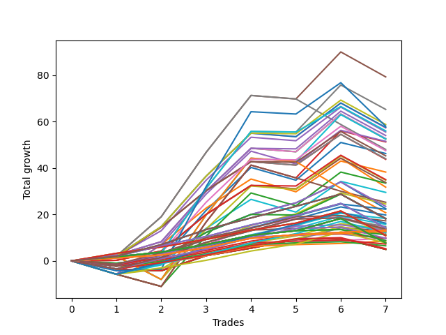

# Short Wallace Doodle 013 
- Symbol: ES
- Date Range: 03/18/2022 - 07/08/2022
- Trading Period: 7:20-12:30
- Number of Trades: 7



| Name | Win Percent | Profit | Avg Profit / Trade |     | Name | Win Percent | Profit | Avg Profit / Trade |
| ---- | ----------- | ------ | ------------------ | --- | ---- | ----------- | ------ | ------------------ |
| Sorted By <br> Profit | | | | | Sorted By <br> Win Percentage ||||
| Five | 71.43 | 39625.00 | 5660.71 |     | One | 85.71 | 21750.00 | 3107.14 |
| Sixty-Nine | 71.43 | 32625.00 | 4660.71 |     | Fifty-Seven | 85.71 | 18250.00 | 2607.14 |
| Fourteen | 57.14 | 30500.00 | 4357.14 |     | Five | 71.43 | 39625.00 | 5660.71 |
| Sixty-Eight | 71.43 | 29375.00 | 4196.43 |     | Sixty-Nine | 71.43 | 32625.00 | 4660.71 |
| Sixty-Six | 71.43 | 29000.00 | 4142.86 |     | Sixty-Eight | 71.43 | 29375.00 | 4196.43 |
| Seventy-Three | 57.14 | 29000.00 | 4142.86 |     | Sixty-Six | 71.43 | 29000.00 | 4142.86 |
| Sixty-Two | 71.43 | 28750.00 | 4107.14 |     | Sixty-Two | 71.43 | 28750.00 | 4107.14 |
| Seventy | 71.43 | 28625.00 | 4089.29 |     | Seventy | 71.43 | 28625.00 | 4089.29 |
| Fifty-Four | 71.43 | 28625.00 | 4089.29 |     | Fifty-Four | 71.43 | 28625.00 | 4089.29 |
| Thirty-Eight | 71.43 | 28625.00 | 4089.29 |     | Thirty-Eight | 71.43 | 28625.00 | 4089.29 |
| Twenty-Two | 71.43 | 28625.00 | 4089.29 |     | Twenty-Two | 71.43 | 28625.00 | 4089.29 |
| Six | 71.43 | 28625.00 | 4089.29 |     | Six | 71.43 | 28625.00 | 4089.29 |
| Four | 71.43 | 28625.00 | 4089.29 |     | Four | 71.43 | 28625.00 | 4089.29 |
| Thirty | 57.14 | 28625.00 | 4089.29 |     | Two | 71.43 | 28250.00 | 4035.71 |
| Two | 71.43 | 28250.00 | 4035.71 |     | Seventy-Five | 71.43 | 24875.00 | 3553.57 |
| Forty-Six | 57.14 | 25750.00 | 3678.57 |     | Sixty-Seven | 71.43 | 22625.00 | 3232.14 |
| Seventy-Five | 71.43 | 24875.00 | 3553.57 |     | Sixty | 71.43 | 21875.00 | 3125.00 |
| Seventy-One | 57.14 | 24000.00 | 3428.57 |     | Three | 71.43 | 21875.00 | 3125.00 |
| Fifty-Five | 57.14 | 24000.00 | 3428.57 |     | Fifty-Eight | 71.43 | 21500.00 | 3071.43 |
| Thirty-Nine | 57.14 | 24000.00 | 3428.57 |     | Forty-Four | 71.43 | 21500.00 | 3071.43 |
| Twenty-Three | 57.14 | 24000.00 | 3428.57 |     | Forty-Two | 71.43 | 18250.00 | 2607.14 |
| Seven | 57.14 | 24000.00 | 3428.57 |     | Sixty-Five | 71.43 | 18000.00 | 2571.43 |
| Sixty-Seven | 71.43 | 22625.00 | 3232.14 |     | Forty-Three | 71.43 | 15375.00 | 2196.43 |
| Sixty | 71.43 | 21875.00 | 3125.00 |     | Fifty-Nine | 71.43 | 15125.00 | 2160.71 |
| Three | 71.43 | 21875.00 | 3125.00 |     | Twelve | 71.43 | 12500.00 | 1785.71 |
| One | 85.71 | 21750.00 | 3107.14 |     | Zero | 71.43 | 12125.00 | 1732.14 |
| Fifty-Eight | 71.43 | 21500.00 | 3071.43 |     | Forty-One | 71.43 | 10750.00 | 1535.71 |
| Forty-Four | 71.43 | 21500.00 | 3071.43 |     | Seventy-Four | 71.43 | 10625.00 | 1517.86 |
| Seventy-Two | 57.14 | 21375.00 | 3053.57 |     | Forty-Eight | 71.43 | 9875.00 | 1410.71 |
| Fifteen | 28.57 | 19875.00 | 2839.29 |     | Eleven | 71.43 | 9500.00 | 1357.14 |
| Fifty-Seven | 85.71 | 18250.00 | 2607.14 |     | Ten | 71.43 | 9000.00 | 1285.71 |
| Forty-Two | 71.43 | 18250.00 | 2607.14 |     | Fifty-Six | 71.43 | 8875.00 | 1267.86 |
| Sixty-Five | 71.43 | 18000.00 | 2571.43 |     | Thirty-Two | 71.43 | 6750.00 | 964.29 |
| Sixty-One | 57.14 | 18000.00 | 2571.43 |     | Thirty-Seven | 71.43 | 5250.00 | 750.00 |
| Thirty-One | 28.57 | 17875.00 | 2553.57 |     | Thirty-Six | 71.43 | 5250.00 | 750.00 |
| Forty-Five | 57.14 | 17375.00 | 2482.14 |     | Thirty-Five | 71.43 | 5250.00 | 750.00 |
| Forty-Three | 71.43 | 15375.00 | 2196.43 |     | Thirty-Four | 71.43 | 5250.00 | 750.00 |
| Fifty-Nine | 71.43 | 15125.00 | 2160.71 |     | Thirty-Three | 71.43 | 5250.00 | 750.00 |
| Forty-Seven | 28.57 | 12625.00 | 1803.57 |     | Nine | 71.43 | 5125.00 | 732.14 |
| Twelve | 71.43 | 12500.00 | 1785.71 |     | Sixten | 71.43 | 5000.00 | 714.29 |
| Zero | 71.43 | 12125.00 | 1732.14 |     | Twenty-One | 71.43 | 4000.00 | 571.43 |
| Twenty-Eight | 57.14 | 11250.00 | 1607.14 |     | Twenty | 71.43 | 4000.00 | 571.43 |
| Forty-One | 71.43 | 10750.00 | 1535.71 |     | Nineteen | 71.43 | 4000.00 | 571.43 |
| Seventy-Four | 71.43 | 10625.00 | 1517.86 |     | Eighteen | 71.43 | 4000.00 | 571.43 |
| Sixty-Four | 57.14 | 10500.00 | 1500.00 |     | Seventeen | 71.43 | 4000.00 | 571.43 |
| Sixty-Three | 42.86 | 10375.00 | 1482.14 |     | Eight | 71.43 | 3250.00 | 464.29 |
| Forty-Eight | 71.43 | 9875.00 | 1410.71 |     | Fourteen | 57.14 | 30500.00 | 4357.14 |
| Eleven | 71.43 | 9500.00 | 1357.14 |     | Seventy-Three | 57.14 | 29000.00 | 4142.86 |
| Ten | 71.43 | 9000.00 | 1285.71 |     | Thirty | 57.14 | 28625.00 | 4089.29 |
| Fifty-Six | 71.43 | 8875.00 | 1267.86 |     | Forty-Six | 57.14 | 25750.00 | 3678.57 |
| twenty-Seven | 57.14 | 8250.00 | 1178.57 |     | Seventy-One | 57.14 | 24000.00 | 3428.57 |
| Twenty-Six | 57.14 | 7750.00 | 1107.14 |     | Fifty-Five | 57.14 | 24000.00 | 3428.57 |
| Thirteen | 57.14 | 7625.00 | 1089.29 |     | Thirty-Nine | 57.14 | 24000.00 | 3428.57 |
| Thirty-Two | 71.43 | 6750.00 | 964.29 |     | Twenty-Three | 57.14 | 24000.00 | 3428.57 |
| Twenty-Nine | 42.86 | 5500.00 | 785.71 |     | Seven | 57.14 | 24000.00 | 3428.57 |
| Forty | 57.14 | 5375.00 | 767.86 |     | Seventy-Two | 57.14 | 21375.00 | 3053.57 |
| Thirty-Seven | 71.43 | 5250.00 | 750.00 |     | Sixty-One | 57.14 | 18000.00 | 2571.43 |
| Thirty-Six | 71.43 | 5250.00 | 750.00 |     | Forty-Five | 57.14 | 17375.00 | 2482.14 |
| Thirty-Five | 71.43 | 5250.00 | 750.00 |     | Twenty-Eight | 57.14 | 11250.00 | 1607.14 |
| Thirty-Four | 71.43 | 5250.00 | 750.00 |     | Sixty-Four | 57.14 | 10500.00 | 1500.00 |
| Thirty-Three | 71.43 | 5250.00 | 750.00 |     | twenty-Seven | 57.14 | 8250.00 | 1178.57 |
| Nine | 71.43 | 5125.00 | 732.14 |     | Twenty-Six | 57.14 | 7750.00 | 1107.14 |
| Sixten | 71.43 | 5000.00 | 714.29 |     | Thirteen | 57.14 | 7625.00 | 1089.29 |
| Twenty-One | 71.43 | 4000.00 | 571.43 |     | Forty | 57.14 | 5375.00 | 767.86 |
| Twenty | 71.43 | 4000.00 | 571.43 |     | Twenty-Five | 57.14 | 3875.00 | 553.57 |
| Nineteen | 71.43 | 4000.00 | 571.43 |     | Fifty-Three | 57.14 | 2500.00 | 357.14 |
| Eighteen | 71.43 | 4000.00 | 571.43 |     | Fifty-Two | 57.14 | 2500.00 | 357.14 |
| Seventeen | 71.43 | 4000.00 | 571.43 |     | Fifty-One | 57.14 | 2500.00 | 357.14 |
| Twenty-Five | 57.14 | 3875.00 | 553.57 |     | Fifty | 57.14 | 2500.00 | 357.14 |
| Eight | 71.43 | 3250.00 | 464.29 |     | Forty-Nine | 57.14 | 2500.00 | 357.14 |
| Fifty-Three | 57.14 | 2500.00 | 357.14 |     | Twenty-Four | 57.14 | 2000.00 | 285.71 |
| Fifty-Two | 57.14 | 2500.00 | 357.14 |     | Sixty-Three | 42.86 | 10375.00 | 1482.14 |
| Fifty-One | 57.14 | 2500.00 | 357.14 |     | Twenty-Nine | 42.86 | 5500.00 | 785.71 |
| Fifty | 57.14 | 2500.00 | 357.14 |     | Fifteen | 28.57 | 19875.00 | 2839.29 |
| Forty-Nine | 57.14 | 2500.00 | 357.14 |     | Thirty-One | 28.57 | 17875.00 | 2553.57 |
| Twenty-Four | 57.14 | 2000.00 | 285.71 |     | Forty-Seven | 28.57 | 12625.00 | 1803.57 |

## NO STOPLOSS

### Test Zero
* Sell when price hits the middle line of the 20p bollinger
* No Stoploss
* Results:
```
Total Trades: 7
Percent Up: 28.57
Percent Down: 71.43
Total Points Moved Down: 24.25
Potential Profit: 12125.00
Total Points Ups: 13.00 Count Ups: 2
Total Points Downs: 37.25 Count Downs: 5
```

<details><summary>Trades</summary>

<code>In: 2022-03-31 07:48:00		Out: 2022-03-31 08:03:05		Total Position Time: 15:05		Total Move Down: -1.00		Total to Date: -1.00</code> <br />
<code>In: 2022-04-06 10:43:00		Out: 2022-04-06 10:47:15		Total Position Time: 04:15		Total Move Down: 5.00		Total to Date: 4.00</code> <br />
<code>In: 2022-04-06 11:04:00		Out: 2022-04-06 11:05:40		Total Position Time: 01:40		Total Move Down: 11.00		Total to Date: 15.00</code> <br />
<code>In: 2022-04-06 11:05:00		Out: 2022-04-06 11:05:40		Total Position Time: 00:40		Total Move Down: 7.75		Total to Date: 22.75</code> <br />
<code>In: 2022-05-31 07:23:00		Out: 2022-05-31 07:36:40		Total Position Time: 13:40		Total Move Down: 4.50		Total to Date: 27.25</code> <br />
<code>In: 2022-07-06 11:09:00		Out: 2022-07-06 11:10:10		Total Position Time: 01:10		Total Move Down: 9.00		Total to Date: 36.25</code> <br />
<code>In: 2022-07-06 11:31:00		Out: 2022-07-06 11:48:45		Total Position Time: 17:45		Total Move Down: -12.00		Total to Date: 24.25</code> <br />


</details>

### Test One
* Sell when the price hits the upper line of the 20p 1std bollinger
* No Stoploss
* Results:
```
Total Trades: 7
Percent Up: 14.29
Percent Down: 85.71
Total Points Moved Down: 43.50
Potential Profit: 21750.00
Total Points Ups: 11.50 Count Ups: 1
Total Points Downs: 55.00 Count Downs: 6
```

<details><summary>Trades</summary>

<code>In: 2022-03-31 07:48:00		Out: 2022-03-31 08:03:25		Total Position Time: 15:25		Total Move Down: 1.25		Total to Date: 1.25</code> <br />
<code>In: 2022-04-06 10:43:00		Out: 2022-04-06 10:56:55		Total Position Time: 13:55		Total Move Down: 4.00		Total to Date: 5.25</code> <br />
<code>In: 2022-04-06 11:04:00		Out: 2022-04-06 11:07:20		Total Position Time: 03:20		Total Move Down: 15.75		Total to Date: 21.00</code> <br />
<code>In: 2022-04-06 11:05:00		Out: 2022-04-06 11:07:20		Total Position Time: 02:20		Total Move Down: 12.50		Total to Date: 33.50</code> <br />
<code>In: 2022-05-31 07:23:00		Out: 2022-05-31 07:38:00		Total Position Time: 15:00		Total Move Down: 8.25		Total to Date: 41.75</code> <br />
<code>In: 2022-07-06 11:09:00		Out: 2022-07-06 11:11:10		Total Position Time: 02:10		Total Move Down: 13.25		Total to Date: 55.00</code> <br />
<code>In: 2022-07-06 11:31:00		Out: 2022-07-06 12:00:50		Total Position Time: 29:50		Total Move Down: -11.50		Total to Date: 43.50</code> <br />


</details>

### Test Two
* Sell when the price hits the upper line of the 20p 2std bollinger
* No Stoploss
* Results:
```
Total Trades: 7
Percent Up: 28.57
Percent Down: 71.43
Total Points Moved Down: 56.50
Potential Profit: 28250.00
Total Points Ups: 12.25 Count Ups: 2
Total Points Downs: 68.75 Count Downs: 5
```

<details><summary>Trades</summary>

<code>In: 2022-03-31 07:48:00		Out: 2022-03-31 08:08:30		Total Position Time: 20:30		Total Move Down: 2.50		Total to Date: 2.50</code> <br />
<code>In: 2022-04-06 10:43:00		Out: 2022-04-06 10:58:00		Total Position Time: 15:00		Total Move Down: 5.75		Total to Date: 8.25</code> <br />
<code>In: 2022-04-06 11:04:00		Out: 2022-04-06 11:08:20		Total Position Time: 04:20		Total Move Down: 21.75		Total to Date: 30.00</code> <br />
<code>In: 2022-04-06 11:05:00		Out: 2022-04-06 11:08:20		Total Position Time: 03:20		Total Move Down: 18.50		Total to Date: 48.50</code> <br />
<code>In: 2022-05-31 07:23:00		Out: 2022-05-31 07:52:55		Total Position Time: 29:55		Total Move Down: -1.50		Total to Date: 47.00</code> <br />
<code>In: 2022-07-06 11:09:00		Out: 2022-07-06 11:12:15		Total Position Time: 03:15		Total Move Down: 20.25		Total to Date: 67.25</code> <br />
<code>In: 2022-07-06 11:31:00		Out: 2022-07-06 12:00:55		Total Position Time: 29:55		Total Move Down: -10.75		Total to Date: 56.50</code> <br />


</details>

### Test Three
* Sell when price hits the middle line of the 50p bollinger
* No Stoploss
* Results:
```
Total Trades: 7
Percent Up: 28.57
Percent Down: 71.43
Total Points Moved Down: 43.75
Potential Profit: 21875.00
Total Points Ups: 12.25 Count Ups: 2
Total Points Downs: 56.00 Count Downs: 5
```

<details><summary>Trades</summary>

<code>In: 2022-03-31 07:48:00		Out: 2022-03-31 08:15:35		Total Position Time: 27:35		Total Move Down: 1.75		Total to Date: 1.75</code> <br />
<code>In: 2022-04-06 10:43:00		Out: 2022-04-06 11:00:10		Total Position Time: 17:10		Total Move Down: 12.75		Total to Date: 14.50</code> <br />
<code>In: 2022-04-06 11:04:00		Out: 2022-04-06 11:07:20		Total Position Time: 03:20		Total Move Down: 15.75		Total to Date: 30.25</code> <br />
<code>In: 2022-04-06 11:05:00		Out: 2022-04-06 11:07:20		Total Position Time: 02:20		Total Move Down: 12.50		Total to Date: 42.75</code> <br />
<code>In: 2022-05-31 07:23:00		Out: 2022-05-31 07:52:55		Total Position Time: 29:55		Total Move Down: -1.50		Total to Date: 41.25</code> <br />
<code>In: 2022-07-06 11:09:00		Out: 2022-07-06 11:11:10		Total Position Time: 02:10		Total Move Down: 13.25		Total to Date: 54.50</code> <br />
<code>In: 2022-07-06 11:31:00		Out: 2022-07-06 12:00:55		Total Position Time: 29:55		Total Move Down: -10.75		Total to Date: 43.75</code> <br />


</details>

### Test Four
* Sell when the price hits the upper line of the 50p 1std bollinger
* No Stoploss
* Results:
```
Total Trades: 7
Percent Up: 28.57
Percent Down: 71.43
Total Points Moved Down: 57.25
Potential Profit: 28625.00
Total Points Ups: 12.25 Count Ups: 2
Total Points Downs: 69.50 Count Downs: 5
```

<details><summary>Trades</summary>

<code>In: 2022-03-31 07:48:00		Out: 2022-03-31 08:17:55		Total Position Time: 29:55		Total Move Down: 2.00		Total to Date: 2.00</code> <br />
<code>In: 2022-04-06 10:43:00		Out: 2022-04-06 11:00:10		Total Position Time: 17:10		Total Move Down: 12.75		Total to Date: 14.75</code> <br />
<code>In: 2022-04-06 11:04:00		Out: 2022-04-06 11:08:10		Total Position Time: 04:10		Total Move Down: 21.75		Total to Date: 36.50</code> <br />
<code>In: 2022-04-06 11:05:00		Out: 2022-04-06 11:08:10		Total Position Time: 03:10		Total Move Down: 18.50		Total to Date: 55.00</code> <br />
<code>In: 2022-05-31 07:23:00		Out: 2022-05-31 07:52:55		Total Position Time: 29:55		Total Move Down: -1.50		Total to Date: 53.50</code> <br />
<code>In: 2022-07-06 11:09:00		Out: 2022-07-06 11:11:35		Total Position Time: 02:35		Total Move Down: 14.50		Total to Date: 68.00</code> <br />
<code>In: 2022-07-06 11:31:00		Out: 2022-07-06 12:00:55		Total Position Time: 29:55		Total Move Down: -10.75		Total to Date: 57.25</code> <br />


</details>

### Test Five
* Sell when the price hits the upper line of the 50p 2std bollinger
* No Stoploss
* Results:
```
Total Trades: 7
Percent Up: 28.57
Percent Down: 71.43
Total Points Moved Down: 79.25
Potential Profit: 39625.00
Total Points Ups: 12.25 Count Ups: 2
Total Points Downs: 91.50 Count Downs: 5
```

<details><summary>Trades</summary>

<code>In: 2022-03-31 07:48:00		Out: 2022-03-31 08:17:55		Total Position Time: 29:55		Total Move Down: 2.00		Total to Date: 2.00</code> <br />
<code>In: 2022-04-06 10:43:00		Out: 2022-04-06 11:09:40		Total Position Time: 26:40		Total Move Down: 17.00		Total to Date: 19.00</code> <br />
<code>In: 2022-04-06 11:04:00		Out: 2022-04-06 11:09:40		Total Position Time: 05:40		Total Move Down: 27.75		Total to Date: 46.75</code> <br />
<code>In: 2022-04-06 11:05:00		Out: 2022-04-06 11:09:40		Total Position Time: 04:40		Total Move Down: 24.50		Total to Date: 71.25</code> <br />
<code>In: 2022-05-31 07:23:00		Out: 2022-05-31 07:52:55		Total Position Time: 29:55		Total Move Down: -1.50		Total to Date: 69.75</code> <br />
<code>In: 2022-07-06 11:09:00		Out: 2022-07-06 11:12:15		Total Position Time: 03:15		Total Move Down: 20.25		Total to Date: 90.00</code> <br />
<code>In: 2022-07-06 11:31:00		Out: 2022-07-06 12:00:55		Total Position Time: 29:55		Total Move Down: -10.75		Total to Date: 79.25</code> <br />


</details>

### Test Six
* Sell when the price hits the middle line of the 1std VWAP
* No Stoploss
* Results:
```
Total Trades: 7
Percent Up: 28.57
Percent Down: 71.43
Total Points Moved Down: 57.25
Potential Profit: 28625.00
Total Points Ups: 12.25 Count Ups: 2
Total Points Downs: 69.50 Count Downs: 5
```

<details><summary>Trades</summary>

<code>In: 2022-03-31 07:48:00		Out: 2022-03-31 08:17:55		Total Position Time: 29:55		Total Move Down: 2.00		Total to Date: 2.00</code> <br />
<code>In: 2022-04-06 10:43:00		Out: 2022-04-06 11:00:10		Total Position Time: 17:10		Total Move Down: 12.75		Total to Date: 14.75</code> <br />
<code>In: 2022-04-06 11:04:00		Out: 2022-04-06 11:08:10		Total Position Time: 04:10		Total Move Down: 21.75		Total to Date: 36.50</code> <br />
<code>In: 2022-04-06 11:05:00		Out: 2022-04-06 11:08:10		Total Position Time: 03:10		Total Move Down: 18.50		Total to Date: 55.00</code> <br />
<code>In: 2022-05-31 07:23:00		Out: 2022-05-31 07:52:55		Total Position Time: 29:55		Total Move Down: -1.50		Total to Date: 53.50</code> <br />
<code>In: 2022-07-06 11:09:00		Out: 2022-07-06 11:11:35		Total Position Time: 02:35		Total Move Down: 14.50		Total to Date: 68.00</code> <br />
<code>In: 2022-07-06 11:31:00		Out: 2022-07-06 12:00:55		Total Position Time: 29:55		Total Move Down: -10.75		Total to Date: 57.25</code> <br />


</details>

### Test Seven
* Sell when the price hits the upper line of the 1std VWAP
* No Stoploss
* Results:
```
Total Trades: 7
Percent Up: 42.86
Percent Down: 57.14
Total Points Moved Down: 48.00
Potential Profit: 24000.00
Total Points Ups: 23.25 Count Ups: 3
Total Points Downs: 71.25 Count Downs: 4
```

<details><summary>Trades</summary>

<code>In: 2022-03-31 07:48:00		Out: 2022-03-31 08:17:55		Total Position Time: 29:55		Total Move Down: 2.00		Total to Date: 2.00</code> <br />
<code>In: 2022-04-06 10:43:00		Out: 2022-04-06 11:09:40		Total Position Time: 26:40		Total Move Down: 17.00		Total to Date: 19.00</code> <br />
<code>In: 2022-04-06 11:04:00		Out: 2022-04-06 11:09:40		Total Position Time: 05:40		Total Move Down: 27.75		Total to Date: 46.75</code> <br />
<code>In: 2022-04-06 11:05:00		Out: 2022-04-06 11:09:40		Total Position Time: 04:40		Total Move Down: 24.50		Total to Date: 71.25</code> <br />
<code>In: 2022-05-31 07:23:00		Out: 2022-05-31 07:52:55		Total Position Time: 29:55		Total Move Down: -1.50		Total to Date: 69.75</code> <br />
<code>In: 2022-07-06 11:09:00		Out: 2022-07-06 11:38:55		Total Position Time: 29:55		Total Move Down: -11.00		Total to Date: 58.75</code> <br />
<code>In: 2022-07-06 11:31:00		Out: 2022-07-06 12:00:55		Total Position Time: 29:55		Total Move Down: -10.75		Total to Date: 48.00</code> <br />


</details>

## STOPLOSS OF 2

### Test Eight
* Sell when price hits the middle line of the 20p bollinger
* Stoploss is -2 points
* Results:
```
Total Trades: 7
Percent Up: 28.57
Percent Down: 71.43
Total Points Moved Down: 6.50
Potential Profit: 3250.00
Total Points Ups: 14.75 Count Ups: 2
Total Points Downs: 21.25 Count Downs: 5
```

<details><summary>Trades</summary>

<code>In: 2022-03-31 07:48:00		Out: 2022-03-31 07:57:05		Total Position Time: 09:05		Total Move Down: -4.25		Total to Date: -4.25</code> <br />
<code>In: 2022-04-06 10:43:00		Out: 2022-04-06 10:47:15		Total Position Time: 04:15		Total Move Down: 5.00		Total to Date: 0.75</code> <br />
<code>In: 2022-04-06 11:04:00		Out: 2022-04-06 11:05:40		Total Position Time: 01:40		Total Move Down: 11.00		Total to Date: 11.75</code> <br />
<code>In: 2022-04-06 11:05:00		Out: 2022-04-06 11:05:10		Total Position Time: 00:10		Total Move Down: 4.00		Total to Date: 15.75</code> <br />
<code>In: 2022-05-31 07:23:00		Out: 2022-05-31 07:23:10		Total Position Time: 00:10		Total Move Down: 0.75		Total to Date: 16.50</code> <br />
<code>In: 2022-07-06 11:09:00		Out: 2022-07-06 11:09:10		Total Position Time: 00:10		Total Move Down: 0.50		Total to Date: 17.00</code> <br />
<code>In: 2022-07-06 11:31:00		Out: 2022-07-06 11:33:05		Total Position Time: 02:05		Total Move Down: -10.50		Total to Date: 6.50</code> <br />


</details>

### Test Nine
* Sell when the price hits the upper line of the 20p 1std bollinger
* Stoploss is -2 points
* Results:
```
Total Trades: 7
Percent Up: 28.57
Percent Down: 71.43
Total Points Moved Down: 10.25
Potential Profit: 5125.00
Total Points Ups: 14.75 Count Ups: 2
Total Points Downs: 25.00 Count Downs: 5
```

<details><summary>Trades</summary>

<code>In: 2022-03-31 07:48:00		Out: 2022-03-31 07:57:05		Total Position Time: 09:05		Total Move Down: -4.25		Total to Date: -4.25</code> <br />
<code>In: 2022-04-06 10:43:00		Out: 2022-04-06 10:56:55		Total Position Time: 13:55		Total Move Down: 4.00		Total to Date: -0.25</code> <br />
<code>In: 2022-04-06 11:04:00		Out: 2022-04-06 11:07:20		Total Position Time: 03:20		Total Move Down: 15.75		Total to Date: 15.50</code> <br />
<code>In: 2022-04-06 11:05:00		Out: 2022-04-06 11:05:10		Total Position Time: 00:10		Total Move Down: 4.00		Total to Date: 19.50</code> <br />
<code>In: 2022-05-31 07:23:00		Out: 2022-05-31 07:23:10		Total Position Time: 00:10		Total Move Down: 0.75		Total to Date: 20.25</code> <br />
<code>In: 2022-07-06 11:09:00		Out: 2022-07-06 11:09:10		Total Position Time: 00:10		Total Move Down: 0.50		Total to Date: 20.75</code> <br />
<code>In: 2022-07-06 11:31:00		Out: 2022-07-06 11:33:05		Total Position Time: 02:05		Total Move Down: -10.50		Total to Date: 10.25</code> <br />


</details>

### Test Ten
* Sell when the price hits the upper line of the 20p 2std bollinger
* Stoploss is -2 points
* Results:
```
Total Trades: 7
Percent Up: 28.57
Percent Down: 71.43
Total Points Moved Down: 18.00
Potential Profit: 9000.00
Total Points Ups: 14.75 Count Ups: 2
Total Points Downs: 32.75 Count Downs: 5
```

<details><summary>Trades</summary>

<code>In: 2022-03-31 07:48:00		Out: 2022-03-31 07:57:05		Total Position Time: 09:05		Total Move Down: -4.25		Total to Date: -4.25</code> <br />
<code>In: 2022-04-06 10:43:00		Out: 2022-04-06 10:58:00		Total Position Time: 15:00		Total Move Down: 5.75		Total to Date: 1.50</code> <br />
<code>In: 2022-04-06 11:04:00		Out: 2022-04-06 11:08:20		Total Position Time: 04:20		Total Move Down: 21.75		Total to Date: 23.25</code> <br />
<code>In: 2022-04-06 11:05:00		Out: 2022-04-06 11:05:10		Total Position Time: 00:10		Total Move Down: 4.00		Total to Date: 27.25</code> <br />
<code>In: 2022-05-31 07:23:00		Out: 2022-05-31 07:23:10		Total Position Time: 00:10		Total Move Down: 0.75		Total to Date: 28.00</code> <br />
<code>In: 2022-07-06 11:09:00		Out: 2022-07-06 11:09:10		Total Position Time: 00:10		Total Move Down: 0.50		Total to Date: 28.50</code> <br />
<code>In: 2022-07-06 11:31:00		Out: 2022-07-06 11:33:05		Total Position Time: 02:05		Total Move Down: -10.50		Total to Date: 18.00</code> <br />


</details>

### Test Eleven
* Sell when price hits the middle line of the 50p bollinger
* Stoploss is -2 points
* Results:
```
Total Trades: 7
Percent Up: 28.57
Percent Down: 71.43
Total Points Moved Down: 19.00
Potential Profit: 9500.00
Total Points Ups: 14.75 Count Ups: 2
Total Points Downs: 33.75 Count Downs: 5
```

<details><summary>Trades</summary>

<code>In: 2022-03-31 07:48:00		Out: 2022-03-31 07:57:05		Total Position Time: 09:05		Total Move Down: -4.25		Total to Date: -4.25</code> <br />
<code>In: 2022-04-06 10:43:00		Out: 2022-04-06 11:00:10		Total Position Time: 17:10		Total Move Down: 12.75		Total to Date: 8.50</code> <br />
<code>In: 2022-04-06 11:04:00		Out: 2022-04-06 11:07:20		Total Position Time: 03:20		Total Move Down: 15.75		Total to Date: 24.25</code> <br />
<code>In: 2022-04-06 11:05:00		Out: 2022-04-06 11:05:10		Total Position Time: 00:10		Total Move Down: 4.00		Total to Date: 28.25</code> <br />
<code>In: 2022-05-31 07:23:00		Out: 2022-05-31 07:23:10		Total Position Time: 00:10		Total Move Down: 0.75		Total to Date: 29.00</code> <br />
<code>In: 2022-07-06 11:09:00		Out: 2022-07-06 11:09:10		Total Position Time: 00:10		Total Move Down: 0.50		Total to Date: 29.50</code> <br />
<code>In: 2022-07-06 11:31:00		Out: 2022-07-06 11:33:05		Total Position Time: 02:05		Total Move Down: -10.50		Total to Date: 19.00</code> <br />


</details>

### Test Twelve
* Sell when the price hits the upper line of the 50p 1std bollinger
* Stoploss is -2 points
* Results:
```
Total Trades: 7
Percent Up: 28.57
Percent Down: 71.43
Total Points Moved Down: 25.00
Potential Profit: 12500.00
Total Points Ups: 14.75 Count Ups: 2
Total Points Downs: 39.75 Count Downs: 5
```

<details><summary>Trades</summary>

<code>In: 2022-03-31 07:48:00		Out: 2022-03-31 07:57:05		Total Position Time: 09:05		Total Move Down: -4.25		Total to Date: -4.25</code> <br />
<code>In: 2022-04-06 10:43:00		Out: 2022-04-06 11:00:10		Total Position Time: 17:10		Total Move Down: 12.75		Total to Date: 8.50</code> <br />
<code>In: 2022-04-06 11:04:00		Out: 2022-04-06 11:08:10		Total Position Time: 04:10		Total Move Down: 21.75		Total to Date: 30.25</code> <br />
<code>In: 2022-04-06 11:05:00		Out: 2022-04-06 11:05:10		Total Position Time: 00:10		Total Move Down: 4.00		Total to Date: 34.25</code> <br />
<code>In: 2022-05-31 07:23:00		Out: 2022-05-31 07:23:10		Total Position Time: 00:10		Total Move Down: 0.75		Total to Date: 35.00</code> <br />
<code>In: 2022-07-06 11:09:00		Out: 2022-07-06 11:09:10		Total Position Time: 00:10		Total Move Down: 0.50		Total to Date: 35.50</code> <br />
<code>In: 2022-07-06 11:31:00		Out: 2022-07-06 11:33:05		Total Position Time: 02:05		Total Move Down: -10.50		Total to Date: 25.00</code> <br />


</details>

### Test Thirteen
* Sell when the price hits the upper line of the 50p 2std bollinger
* Stoploss is -2 points
* Results:
```
Total Trades: 7
Percent Up: 42.86
Percent Down: 57.14
Total Points Moved Down: 15.25
Potential Profit: 7625.00
Total Points Ups: 17.75 Count Ups: 3
Total Points Downs: 33.00 Count Downs: 4
```

<details><summary>Trades</summary>

<code>In: 2022-03-31 07:48:00		Out: 2022-03-31 07:57:05		Total Position Time: 09:05		Total Move Down: -4.25		Total to Date: -4.25</code> <br />
<code>In: 2022-04-06 10:43:00		Out: 2022-04-06 11:00:55		Total Position Time: 17:55		Total Move Down: -3.00		Total to Date: -7.25</code> <br />
<code>In: 2022-04-06 11:04:00		Out: 2022-04-06 11:09:40		Total Position Time: 05:40		Total Move Down: 27.75		Total to Date: 20.50</code> <br />
<code>In: 2022-04-06 11:05:00		Out: 2022-04-06 11:05:10		Total Position Time: 00:10		Total Move Down: 4.00		Total to Date: 24.50</code> <br />
<code>In: 2022-05-31 07:23:00		Out: 2022-05-31 07:23:10		Total Position Time: 00:10		Total Move Down: 0.75		Total to Date: 25.25</code> <br />
<code>In: 2022-07-06 11:09:00		Out: 2022-07-06 11:09:10		Total Position Time: 00:10		Total Move Down: 0.50		Total to Date: 25.75</code> <br />
<code>In: 2022-07-06 11:31:00		Out: 2022-07-06 11:33:05		Total Position Time: 02:05		Total Move Down: -10.50		Total to Date: 15.25</code> <br />


</details>

### Test Fourteen
* Sell when the price hits the middle line of the 1std VWAP
* Stoploss is -2 points
* Results:
```
Total Trades: 7
Percent Up: 42.86
Percent Down: 57.14
Total Points Moved Down: 61.00
Potential Profit: 30500.00
Total Points Ups: 6.50 Count Ups: 3
Total Points Downs: 67.50 Count Downs: 4
```

<details><summary>Trades</summary>

<code>In: 2022-03-31 07:48:00		Out: 2022-03-31 07:48:20		Total Position Time: 00:20		Total Move Down: -2.25		Total to Date: -2.25</code> <br />
<code>In: 2022-04-06 10:43:00		Out: 2022-04-06 11:00:10		Total Position Time: 17:10		Total Move Down: 12.75		Total to Date: 10.50</code> <br />
<code>In: 2022-04-06 11:04:00		Out: 2022-04-06 11:08:10		Total Position Time: 04:10		Total Move Down: 21.75		Total to Date: 32.25</code> <br />
<code>In: 2022-04-06 11:05:00		Out: 2022-04-06 11:08:10		Total Position Time: 03:10		Total Move Down: 18.50		Total to Date: 50.75</code> <br />
<code>In: 2022-05-31 07:23:00		Out: 2022-05-31 07:31:25		Total Position Time: 08:25		Total Move Down: -2.00		Total to Date: 48.75</code> <br />
<code>In: 2022-07-06 11:09:00		Out: 2022-07-06 11:11:35		Total Position Time: 02:35		Total Move Down: 14.50		Total to Date: 63.25</code> <br />
<code>In: 2022-07-06 11:31:00		Out: 2022-07-06 11:31:35		Total Position Time: 00:35		Total Move Down: -2.25		Total to Date: 61.00</code> <br />


</details>

### Test Fifteen
* Sell when the price hits the upper line of the 1std VWAP
* Stoploss is -2 points
* Results:
```
Total Trades: 7
Percent Up: 71.43
Percent Down: 28.57
Total Points Moved Down: 39.75
Potential Profit: 19875.00
Total Points Ups: 12.50 Count Ups: 5
Total Points Downs: 52.25 Count Downs: 2
```

<details><summary>Trades</summary>

<code>In: 2022-03-31 07:48:00		Out: 2022-03-31 07:48:20		Total Position Time: 00:20		Total Move Down: -2.25		Total to Date: -2.25</code> <br />
<code>In: 2022-04-06 10:43:00		Out: 2022-04-06 11:00:55		Total Position Time: 17:55		Total Move Down: -3.00		Total to Date: -5.25</code> <br />
<code>In: 2022-04-06 11:04:00		Out: 2022-04-06 11:09:40		Total Position Time: 05:40		Total Move Down: 27.75		Total to Date: 22.50</code> <br />
<code>In: 2022-04-06 11:05:00		Out: 2022-04-06 11:09:40		Total Position Time: 04:40		Total Move Down: 24.50		Total to Date: 47.00</code> <br />
<code>In: 2022-05-31 07:23:00		Out: 2022-05-31 07:31:25		Total Position Time: 08:25		Total Move Down: -2.00		Total to Date: 45.00</code> <br />
<code>In: 2022-07-06 11:09:00		Out: 2022-07-06 11:29:55		Total Position Time: 20:55		Total Move Down: -3.00		Total to Date: 42.00</code> <br />
<code>In: 2022-07-06 11:31:00		Out: 2022-07-06 11:31:35		Total Position Time: 00:35		Total Move Down: -2.25		Total to Date: 39.75</code> <br />


</details>

## TRAIL STOP OF 2

### Test Sixten
* Sell when price hits the middle line of the 20p bollinger
* Trailing Stop is -2 points
* Results:
```
Total Trades: 7
Percent Up: 28.57
Percent Down: 71.43
Total Points Moved Down: 10.00
Potential Profit: 5000.00
Total Points Ups: 4.00 Count Ups: 2
Total Points Downs: 14.00 Count Downs: 5
```

<details><summary>Trades</summary>

<code>In: 2022-03-31 07:48:00		Out: 2022-03-31 07:48:20		Total Position Time: 00:20		Total Move Down: -2.25		Total to Date: -2.25</code> <br />
<code>In: 2022-04-06 10:43:00		Out: 2022-04-06 10:47:15		Total Position Time: 04:15		Total Move Down: 5.00		Total to Date: 2.75</code> <br />
<code>In: 2022-04-06 11:04:00		Out: 2022-04-06 11:04:55		Total Position Time: 00:55		Total Move Down: 3.75		Total to Date: 6.50</code> <br />
<code>In: 2022-04-06 11:05:00		Out: 2022-04-06 11:05:10		Total Position Time: 00:10		Total Move Down: 4.00		Total to Date: 10.50</code> <br />
<code>In: 2022-05-31 07:23:00		Out: 2022-05-31 07:23:10		Total Position Time: 00:10		Total Move Down: 0.75		Total to Date: 11.25</code> <br />
<code>In: 2022-07-06 11:09:00		Out: 2022-07-06 11:09:10		Total Position Time: 00:10		Total Move Down: 0.50		Total to Date: 11.75</code> <br />
<code>In: 2022-07-06 11:31:00		Out: 2022-07-06 11:31:30		Total Position Time: 00:30		Total Move Down: -1.75		Total to Date: 10.00</code> <br />


</details>

### Test Seventeen
* Sell when the price hits the upper line of the 20p 1std bollinger
* Trailing Stop is -2 points
* Results:
```
Total Trades: 7
Percent Up: 28.57
Percent Down: 71.43
Total Points Moved Down: 8.00
Potential Profit: 4000.00
Total Points Ups: 4.00 Count Ups: 2
Total Points Downs: 12.00 Count Downs: 5
```

<details><summary>Trades</summary>

<code>In: 2022-03-31 07:48:00		Out: 2022-03-31 07:48:20		Total Position Time: 00:20		Total Move Down: -2.25		Total to Date: -2.25</code> <br />
<code>In: 2022-04-06 10:43:00		Out: 2022-04-06 10:47:50		Total Position Time: 04:50		Total Move Down: 3.00		Total to Date: 0.75</code> <br />
<code>In: 2022-04-06 11:04:00		Out: 2022-04-06 11:04:55		Total Position Time: 00:55		Total Move Down: 3.75		Total to Date: 4.50</code> <br />
<code>In: 2022-04-06 11:05:00		Out: 2022-04-06 11:05:10		Total Position Time: 00:10		Total Move Down: 4.00		Total to Date: 8.50</code> <br />
<code>In: 2022-05-31 07:23:00		Out: 2022-05-31 07:23:10		Total Position Time: 00:10		Total Move Down: 0.75		Total to Date: 9.25</code> <br />
<code>In: 2022-07-06 11:09:00		Out: 2022-07-06 11:09:10		Total Position Time: 00:10		Total Move Down: 0.50		Total to Date: 9.75</code> <br />
<code>In: 2022-07-06 11:31:00		Out: 2022-07-06 11:31:30		Total Position Time: 00:30		Total Move Down: -1.75		Total to Date: 8.00</code> <br />


</details>

### Test Eighteen
* Sell when the price hits the upper line of the 20p 2std bollinger
* Trailing Stop is -2 points
* Results:
```
Total Trades: 7
Percent Up: 28.57
Percent Down: 71.43
Total Points Moved Down: 8.00
Potential Profit: 4000.00
Total Points Ups: 4.00 Count Ups: 2
Total Points Downs: 12.00 Count Downs: 5
```

<details><summary>Trades</summary>

<code>In: 2022-03-31 07:48:00		Out: 2022-03-31 07:48:20		Total Position Time: 00:20		Total Move Down: -2.25		Total to Date: -2.25</code> <br />
<code>In: 2022-04-06 10:43:00		Out: 2022-04-06 10:47:50		Total Position Time: 04:50		Total Move Down: 3.00		Total to Date: 0.75</code> <br />
<code>In: 2022-04-06 11:04:00		Out: 2022-04-06 11:04:55		Total Position Time: 00:55		Total Move Down: 3.75		Total to Date: 4.50</code> <br />
<code>In: 2022-04-06 11:05:00		Out: 2022-04-06 11:05:10		Total Position Time: 00:10		Total Move Down: 4.00		Total to Date: 8.50</code> <br />
<code>In: 2022-05-31 07:23:00		Out: 2022-05-31 07:23:10		Total Position Time: 00:10		Total Move Down: 0.75		Total to Date: 9.25</code> <br />
<code>In: 2022-07-06 11:09:00		Out: 2022-07-06 11:09:10		Total Position Time: 00:10		Total Move Down: 0.50		Total to Date: 9.75</code> <br />
<code>In: 2022-07-06 11:31:00		Out: 2022-07-06 11:31:30		Total Position Time: 00:30		Total Move Down: -1.75		Total to Date: 8.00</code> <br />


</details>

### Test Nineteen
* Sell when price hits the middle line of the 50p bollinger
* Trailing Stop is -2 points
* Results:
```
Total Trades: 7
Percent Up: 28.57
Percent Down: 71.43
Total Points Moved Down: 8.00
Potential Profit: 4000.00
Total Points Ups: 4.00 Count Ups: 2
Total Points Downs: 12.00 Count Downs: 5
```

<details><summary>Trades</summary>

<code>In: 2022-03-31 07:48:00		Out: 2022-03-31 07:48:20		Total Position Time: 00:20		Total Move Down: -2.25		Total to Date: -2.25</code> <br />
<code>In: 2022-04-06 10:43:00		Out: 2022-04-06 10:47:50		Total Position Time: 04:50		Total Move Down: 3.00		Total to Date: 0.75</code> <br />
<code>In: 2022-04-06 11:04:00		Out: 2022-04-06 11:04:55		Total Position Time: 00:55		Total Move Down: 3.75		Total to Date: 4.50</code> <br />
<code>In: 2022-04-06 11:05:00		Out: 2022-04-06 11:05:10		Total Position Time: 00:10		Total Move Down: 4.00		Total to Date: 8.50</code> <br />
<code>In: 2022-05-31 07:23:00		Out: 2022-05-31 07:23:10		Total Position Time: 00:10		Total Move Down: 0.75		Total to Date: 9.25</code> <br />
<code>In: 2022-07-06 11:09:00		Out: 2022-07-06 11:09:10		Total Position Time: 00:10		Total Move Down: 0.50		Total to Date: 9.75</code> <br />
<code>In: 2022-07-06 11:31:00		Out: 2022-07-06 11:31:30		Total Position Time: 00:30		Total Move Down: -1.75		Total to Date: 8.00</code> <br />


</details>

### Test Twenty
* Sell when the price hits the upper line of the 50p 1std bollinger
* Trailing Stop is -2 points
* Results:
```
Total Trades: 7
Percent Up: 28.57
Percent Down: 71.43
Total Points Moved Down: 8.00
Potential Profit: 4000.00
Total Points Ups: 4.00 Count Ups: 2
Total Points Downs: 12.00 Count Downs: 5
```

<details><summary>Trades</summary>

<code>In: 2022-03-31 07:48:00		Out: 2022-03-31 07:48:20		Total Position Time: 00:20		Total Move Down: -2.25		Total to Date: -2.25</code> <br />
<code>In: 2022-04-06 10:43:00		Out: 2022-04-06 10:47:50		Total Position Time: 04:50		Total Move Down: 3.00		Total to Date: 0.75</code> <br />
<code>In: 2022-04-06 11:04:00		Out: 2022-04-06 11:04:55		Total Position Time: 00:55		Total Move Down: 3.75		Total to Date: 4.50</code> <br />
<code>In: 2022-04-06 11:05:00		Out: 2022-04-06 11:05:10		Total Position Time: 00:10		Total Move Down: 4.00		Total to Date: 8.50</code> <br />
<code>In: 2022-05-31 07:23:00		Out: 2022-05-31 07:23:10		Total Position Time: 00:10		Total Move Down: 0.75		Total to Date: 9.25</code> <br />
<code>In: 2022-07-06 11:09:00		Out: 2022-07-06 11:09:10		Total Position Time: 00:10		Total Move Down: 0.50		Total to Date: 9.75</code> <br />
<code>In: 2022-07-06 11:31:00		Out: 2022-07-06 11:31:30		Total Position Time: 00:30		Total Move Down: -1.75		Total to Date: 8.00</code> <br />


</details>

### Test Twenty-One
* Sell when the price hits the upper line of the 50p 2std bollinger
* Trailing Stop is -2 points
* Results:
```
Total Trades: 7
Percent Up: 28.57
Percent Down: 71.43
Total Points Moved Down: 8.00
Potential Profit: 4000.00
Total Points Ups: 4.00 Count Ups: 2
Total Points Downs: 12.00 Count Downs: 5
```

<details><summary>Trades</summary>

<code>In: 2022-03-31 07:48:00		Out: 2022-03-31 07:48:20		Total Position Time: 00:20		Total Move Down: -2.25		Total to Date: -2.25</code> <br />
<code>In: 2022-04-06 10:43:00		Out: 2022-04-06 10:47:50		Total Position Time: 04:50		Total Move Down: 3.00		Total to Date: 0.75</code> <br />
<code>In: 2022-04-06 11:04:00		Out: 2022-04-06 11:04:55		Total Position Time: 00:55		Total Move Down: 3.75		Total to Date: 4.50</code> <br />
<code>In: 2022-04-06 11:05:00		Out: 2022-04-06 11:05:10		Total Position Time: 00:10		Total Move Down: 4.00		Total to Date: 8.50</code> <br />
<code>In: 2022-05-31 07:23:00		Out: 2022-05-31 07:23:10		Total Position Time: 00:10		Total Move Down: 0.75		Total to Date: 9.25</code> <br />
<code>In: 2022-07-06 11:09:00		Out: 2022-07-06 11:09:10		Total Position Time: 00:10		Total Move Down: 0.50		Total to Date: 9.75</code> <br />
<code>In: 2022-07-06 11:31:00		Out: 2022-07-06 11:31:30		Total Position Time: 00:30		Total Move Down: -1.75		Total to Date: 8.00</code> <br />


</details>

### Test Twenty-Two
* Sell when the price hits the middle line of the 1std VWAP
* Trailing Stop is -2 points
* Results:
```
Total Trades: 7
Percent Up: 28.57
Percent Down: 71.43
Total Points Moved Down: 57.25
Potential Profit: 28625.00
Total Points Ups: 12.25 Count Ups: 2
Total Points Downs: 69.50 Count Downs: 5
```

<details><summary>Trades</summary>

<code>In: 2022-03-31 07:48:00		Out: 2022-03-31 08:17:55		Total Position Time: 29:55		Total Move Down: 2.00		Total to Date: 2.00</code> <br />
<code>In: 2022-04-06 10:43:00		Out: 2022-04-06 11:00:10		Total Position Time: 17:10		Total Move Down: 12.75		Total to Date: 14.75</code> <br />
<code>In: 2022-04-06 11:04:00		Out: 2022-04-06 11:08:10		Total Position Time: 04:10		Total Move Down: 21.75		Total to Date: 36.50</code> <br />
<code>In: 2022-04-06 11:05:00		Out: 2022-04-06 11:08:10		Total Position Time: 03:10		Total Move Down: 18.50		Total to Date: 55.00</code> <br />
<code>In: 2022-05-31 07:23:00		Out: 2022-05-31 07:52:55		Total Position Time: 29:55		Total Move Down: -1.50		Total to Date: 53.50</code> <br />
<code>In: 2022-07-06 11:09:00		Out: 2022-07-06 11:11:35		Total Position Time: 02:35		Total Move Down: 14.50		Total to Date: 68.00</code> <br />
<code>In: 2022-07-06 11:31:00		Out: 2022-07-06 12:00:55		Total Position Time: 29:55		Total Move Down: -10.75		Total to Date: 57.25</code> <br />


</details>

### Test Twenty-Three
* Sell when the price hits the upper line of the 1std VWAP
* Trailing Stop is -2 points
* Results:
```
Total Trades: 7
Percent Up: 42.86
Percent Down: 57.14
Total Points Moved Down: 48.00
Potential Profit: 24000.00
Total Points Ups: 23.25 Count Ups: 3
Total Points Downs: 71.25 Count Downs: 4
```

<details><summary>Trades</summary>

<code>In: 2022-03-31 07:48:00		Out: 2022-03-31 08:17:55		Total Position Time: 29:55		Total Move Down: 2.00		Total to Date: 2.00</code> <br />
<code>In: 2022-04-06 10:43:00		Out: 2022-04-06 11:09:40		Total Position Time: 26:40		Total Move Down: 17.00		Total to Date: 19.00</code> <br />
<code>In: 2022-04-06 11:04:00		Out: 2022-04-06 11:09:40		Total Position Time: 05:40		Total Move Down: 27.75		Total to Date: 46.75</code> <br />
<code>In: 2022-04-06 11:05:00		Out: 2022-04-06 11:09:40		Total Position Time: 04:40		Total Move Down: 24.50		Total to Date: 71.25</code> <br />
<code>In: 2022-05-31 07:23:00		Out: 2022-05-31 07:52:55		Total Position Time: 29:55		Total Move Down: -1.50		Total to Date: 69.75</code> <br />
<code>In: 2022-07-06 11:09:00		Out: 2022-07-06 11:38:55		Total Position Time: 29:55		Total Move Down: -11.00		Total to Date: 58.75</code> <br />
<code>In: 2022-07-06 11:31:00		Out: 2022-07-06 12:00:55		Total Position Time: 29:55		Total Move Down: -10.75		Total to Date: 48.00</code> <br />


</details>

## STOPLOSS OF 3

### Test Twenty-Four
* Sell when price hits the middle line of the 20p bollinger
* Stoploss is -3 points
* Results:
```
Total Trades: 7
Percent Up: 42.86
Percent Down: 57.14
Total Points Moved Down: 4.00
Potential Profit: 2000.00
Total Points Ups: 16.50 Count Ups: 3
Total Points Downs: 20.50 Count Downs: 4
```

<details><summary>Trades</summary>

<code>In: 2022-03-31 07:48:00		Out: 2022-03-31 07:57:20		Total Position Time: 09:20		Total Move Down: -5.75		Total to Date: -5.75</code> <br />
<code>In: 2022-04-06 10:43:00		Out: 2022-04-06 10:47:15		Total Position Time: 04:15		Total Move Down: 5.00		Total to Date: -0.75</code> <br />
<code>In: 2022-04-06 11:04:00		Out: 2022-04-06 11:05:40		Total Position Time: 01:40		Total Move Down: 11.00		Total to Date: 10.25</code> <br />
<code>In: 2022-04-06 11:05:00		Out: 2022-04-06 11:05:10		Total Position Time: 00:10		Total Move Down: 4.00		Total to Date: 14.25</code> <br />
<code>In: 2022-05-31 07:23:00		Out: 2022-05-31 07:31:20		Total Position Time: 08:20		Total Move Down: -0.25		Total to Date: 14.00</code> <br />
<code>In: 2022-07-06 11:09:00		Out: 2022-07-06 11:09:10		Total Position Time: 00:10		Total Move Down: 0.50		Total to Date: 14.50</code> <br />
<code>In: 2022-07-06 11:31:00		Out: 2022-07-06 11:33:05		Total Position Time: 02:05		Total Move Down: -10.50		Total to Date: 4.00</code> <br />


</details>

### Test Twenty-Five
* Sell when the price hits the upper line of the 20p 1std bollinger
* Stoploss is -3 points
* Results:
```
Total Trades: 7
Percent Up: 42.86
Percent Down: 57.14
Total Points Moved Down: 7.75
Potential Profit: 3875.00
Total Points Ups: 16.50 Count Ups: 3
Total Points Downs: 24.25 Count Downs: 4
```

<details><summary>Trades</summary>

<code>In: 2022-03-31 07:48:00		Out: 2022-03-31 07:57:20		Total Position Time: 09:20		Total Move Down: -5.75		Total to Date: -5.75</code> <br />
<code>In: 2022-04-06 10:43:00		Out: 2022-04-06 10:56:55		Total Position Time: 13:55		Total Move Down: 4.00		Total to Date: -1.75</code> <br />
<code>In: 2022-04-06 11:04:00		Out: 2022-04-06 11:07:20		Total Position Time: 03:20		Total Move Down: 15.75		Total to Date: 14.00</code> <br />
<code>In: 2022-04-06 11:05:00		Out: 2022-04-06 11:05:10		Total Position Time: 00:10		Total Move Down: 4.00		Total to Date: 18.00</code> <br />
<code>In: 2022-05-31 07:23:00		Out: 2022-05-31 07:31:20		Total Position Time: 08:20		Total Move Down: -0.25		Total to Date: 17.75</code> <br />
<code>In: 2022-07-06 11:09:00		Out: 2022-07-06 11:09:10		Total Position Time: 00:10		Total Move Down: 0.50		Total to Date: 18.25</code> <br />
<code>In: 2022-07-06 11:31:00		Out: 2022-07-06 11:33:05		Total Position Time: 02:05		Total Move Down: -10.50		Total to Date: 7.75</code> <br />


</details>

### Test Twenty-Six
* Sell when the price hits the upper line of the 20p 2std bollinger
* Stoploss is -3 points
* Results:
```
Total Trades: 7
Percent Up: 42.86
Percent Down: 57.14
Total Points Moved Down: 15.50
Potential Profit: 7750.00
Total Points Ups: 16.50 Count Ups: 3
Total Points Downs: 32.00 Count Downs: 4
```

<details><summary>Trades</summary>

<code>In: 2022-03-31 07:48:00		Out: 2022-03-31 07:57:20		Total Position Time: 09:20		Total Move Down: -5.75		Total to Date: -5.75</code> <br />
<code>In: 2022-04-06 10:43:00		Out: 2022-04-06 10:58:00		Total Position Time: 15:00		Total Move Down: 5.75		Total to Date: 0.00</code> <br />
<code>In: 2022-04-06 11:04:00		Out: 2022-04-06 11:08:20		Total Position Time: 04:20		Total Move Down: 21.75		Total to Date: 21.75</code> <br />
<code>In: 2022-04-06 11:05:00		Out: 2022-04-06 11:05:10		Total Position Time: 00:10		Total Move Down: 4.00		Total to Date: 25.75</code> <br />
<code>In: 2022-05-31 07:23:00		Out: 2022-05-31 07:31:20		Total Position Time: 08:20		Total Move Down: -0.25		Total to Date: 25.50</code> <br />
<code>In: 2022-07-06 11:09:00		Out: 2022-07-06 11:09:10		Total Position Time: 00:10		Total Move Down: 0.50		Total to Date: 26.00</code> <br />
<code>In: 2022-07-06 11:31:00		Out: 2022-07-06 11:33:05		Total Position Time: 02:05		Total Move Down: -10.50		Total to Date: 15.50</code> <br />


</details>

### Test twenty-Seven
* Sell when price hits the middle line of the 50p bollinger
* Stoploss is -3 points
* Results:
```
Total Trades: 7
Percent Up: 42.86
Percent Down: 57.14
Total Points Moved Down: 16.50
Potential Profit: 8250.00
Total Points Ups: 16.50 Count Ups: 3
Total Points Downs: 33.00 Count Downs: 4
```

<details><summary>Trades</summary>

<code>In: 2022-03-31 07:48:00		Out: 2022-03-31 07:57:20		Total Position Time: 09:20		Total Move Down: -5.75		Total to Date: -5.75</code> <br />
<code>In: 2022-04-06 10:43:00		Out: 2022-04-06 11:00:10		Total Position Time: 17:10		Total Move Down: 12.75		Total to Date: 7.00</code> <br />
<code>In: 2022-04-06 11:04:00		Out: 2022-04-06 11:07:20		Total Position Time: 03:20		Total Move Down: 15.75		Total to Date: 22.75</code> <br />
<code>In: 2022-04-06 11:05:00		Out: 2022-04-06 11:05:10		Total Position Time: 00:10		Total Move Down: 4.00		Total to Date: 26.75</code> <br />
<code>In: 2022-05-31 07:23:00		Out: 2022-05-31 07:31:20		Total Position Time: 08:20		Total Move Down: -0.25		Total to Date: 26.50</code> <br />
<code>In: 2022-07-06 11:09:00		Out: 2022-07-06 11:09:10		Total Position Time: 00:10		Total Move Down: 0.50		Total to Date: 27.00</code> <br />
<code>In: 2022-07-06 11:31:00		Out: 2022-07-06 11:33:05		Total Position Time: 02:05		Total Move Down: -10.50		Total to Date: 16.50</code> <br />


</details>

### Test Twenty-Eight
* Sell when the price hits the upper line of the 50p 1std bollinger
* Stoploss is -3 points
* Results:
```
Total Trades: 7
Percent Up: 42.86
Percent Down: 57.14
Total Points Moved Down: 22.50
Potential Profit: 11250.00
Total Points Ups: 16.50 Count Ups: 3
Total Points Downs: 39.00 Count Downs: 4
```

<details><summary>Trades</summary>

<code>In: 2022-03-31 07:48:00		Out: 2022-03-31 07:57:20		Total Position Time: 09:20		Total Move Down: -5.75		Total to Date: -5.75</code> <br />
<code>In: 2022-04-06 10:43:00		Out: 2022-04-06 11:00:10		Total Position Time: 17:10		Total Move Down: 12.75		Total to Date: 7.00</code> <br />
<code>In: 2022-04-06 11:04:00		Out: 2022-04-06 11:08:10		Total Position Time: 04:10		Total Move Down: 21.75		Total to Date: 28.75</code> <br />
<code>In: 2022-04-06 11:05:00		Out: 2022-04-06 11:05:10		Total Position Time: 00:10		Total Move Down: 4.00		Total to Date: 32.75</code> <br />
<code>In: 2022-05-31 07:23:00		Out: 2022-05-31 07:31:20		Total Position Time: 08:20		Total Move Down: -0.25		Total to Date: 32.50</code> <br />
<code>In: 2022-07-06 11:09:00		Out: 2022-07-06 11:09:10		Total Position Time: 00:10		Total Move Down: 0.50		Total to Date: 33.00</code> <br />
<code>In: 2022-07-06 11:31:00		Out: 2022-07-06 11:33:05		Total Position Time: 02:05		Total Move Down: -10.50		Total to Date: 22.50</code> <br />


</details>

### Test Twenty-Nine
* Sell when the price hits the upper line of the 50p 2std bollinger
* Stoploss is -3 points
* Results:
```
Total Trades: 7
Percent Up: 57.14
Percent Down: 42.86
Total Points Moved Down: 11.00
Potential Profit: 5500.00
Total Points Ups: 21.25 Count Ups: 4
Total Points Downs: 32.25 Count Downs: 3
```

<details><summary>Trades</summary>

<code>In: 2022-03-31 07:48:00		Out: 2022-03-31 07:57:20		Total Position Time: 09:20		Total Move Down: -5.75		Total to Date: -5.75</code> <br />
<code>In: 2022-04-06 10:43:00		Out: 2022-04-06 11:01:40		Total Position Time: 18:40		Total Move Down: -4.75		Total to Date: -10.50</code> <br />
<code>In: 2022-04-06 11:04:00		Out: 2022-04-06 11:09:40		Total Position Time: 05:40		Total Move Down: 27.75		Total to Date: 17.25</code> <br />
<code>In: 2022-04-06 11:05:00		Out: 2022-04-06 11:05:10		Total Position Time: 00:10		Total Move Down: 4.00		Total to Date: 21.25</code> <br />
<code>In: 2022-05-31 07:23:00		Out: 2022-05-31 07:31:20		Total Position Time: 08:20		Total Move Down: -0.25		Total to Date: 21.00</code> <br />
<code>In: 2022-07-06 11:09:00		Out: 2022-07-06 11:09:10		Total Position Time: 00:10		Total Move Down: 0.50		Total to Date: 21.50</code> <br />
<code>In: 2022-07-06 11:31:00		Out: 2022-07-06 11:33:05		Total Position Time: 02:05		Total Move Down: -10.50		Total to Date: 11.00</code> <br />


</details>

### Test Thirty
* Sell when the price hits the middle line of the 1std VWAP
* Stoploss is -3 points
* Results:
```
Total Trades: 7
Percent Up: 42.86
Percent Down: 57.14
Total Points Moved Down: 57.25
Potential Profit: 28625.00
Total Points Ups: 10.25 Count Ups: 3
Total Points Downs: 67.50 Count Downs: 4
```

<details><summary>Trades</summary>

<code>In: 2022-03-31 07:48:00		Out: 2022-03-31 07:56:50		Total Position Time: 08:50		Total Move Down: -3.50		Total to Date: -3.50</code> <br />
<code>In: 2022-04-06 10:43:00		Out: 2022-04-06 11:00:10		Total Position Time: 17:10		Total Move Down: 12.75		Total to Date: 9.25</code> <br />
<code>In: 2022-04-06 11:04:00		Out: 2022-04-06 11:08:10		Total Position Time: 04:10		Total Move Down: 21.75		Total to Date: 31.00</code> <br />
<code>In: 2022-04-06 11:05:00		Out: 2022-04-06 11:08:10		Total Position Time: 03:10		Total Move Down: 18.50		Total to Date: 49.50</code> <br />
<code>In: 2022-05-31 07:23:00		Out: 2022-05-31 07:43:35		Total Position Time: 20:35		Total Move Down: -3.25		Total to Date: 46.25</code> <br />
<code>In: 2022-07-06 11:09:00		Out: 2022-07-06 11:11:35		Total Position Time: 02:35		Total Move Down: 14.50		Total to Date: 60.75</code> <br />
<code>In: 2022-07-06 11:31:00		Out: 2022-07-06 11:31:40		Total Position Time: 00:40		Total Move Down: -3.50		Total to Date: 57.25</code> <br />


</details>

### Test Thirty-One
* Sell when the price hits the upper line of the 1std VWAP
* Stoploss is -3 points
* Results:
```
Total Trades: 7
Percent Up: 71.43
Percent Down: 28.57
Total Points Moved Down: 35.75
Potential Profit: 17875.00
Total Points Ups: 16.50 Count Ups: 5
Total Points Downs: 52.25 Count Downs: 2
```

<details><summary>Trades</summary>

<code>In: 2022-03-31 07:48:00		Out: 2022-03-31 07:56:50		Total Position Time: 08:50		Total Move Down: -3.50		Total to Date: -3.50</code> <br />
<code>In: 2022-04-06 10:43:00		Out: 2022-04-06 11:01:30		Total Position Time: 18:30		Total Move Down: -3.25		Total to Date: -6.75</code> <br />
<code>In: 2022-04-06 11:04:00		Out: 2022-04-06 11:09:40		Total Position Time: 05:40		Total Move Down: 27.75		Total to Date: 21.00</code> <br />
<code>In: 2022-04-06 11:05:00		Out: 2022-04-06 11:09:40		Total Position Time: 04:40		Total Move Down: 24.50		Total to Date: 45.50</code> <br />
<code>In: 2022-05-31 07:23:00		Out: 2022-05-31 07:43:35		Total Position Time: 20:35		Total Move Down: -3.25		Total to Date: 42.25</code> <br />
<code>In: 2022-07-06 11:09:00		Out: 2022-07-06 11:29:55		Total Position Time: 20:55		Total Move Down: -3.00		Total to Date: 39.25</code> <br />
<code>In: 2022-07-06 11:31:00		Out: 2022-07-06 11:31:40		Total Position Time: 00:40		Total Move Down: -3.50		Total to Date: 35.75</code> <br />


</details>

## TRAIL STOP OF 3

### Test Thirty-Two
* Sell when price hits the middle line of the 20p bollinger
* Trailing Stop is -3 points
* Results:
```
Total Trades: 7
Percent Up: 28.57
Percent Down: 71.43
Total Points Moved Down: 13.50
Potential Profit: 6750.00
Total Points Ups: 3.75 Count Ups: 2
Total Points Downs: 17.25 Count Downs: 5
```

<details><summary>Trades</summary>

<code>In: 2022-03-31 07:48:00		Out: 2022-03-31 07:55:25		Total Position Time: 07:25		Total Move Down: -1.50		Total to Date: -1.50</code> <br />
<code>In: 2022-04-06 10:43:00		Out: 2022-04-06 10:47:15		Total Position Time: 04:15		Total Move Down: 5.00		Total to Date: 3.50</code> <br />
<code>In: 2022-04-06 11:04:00		Out: 2022-04-06 11:05:00		Total Position Time: 01:00		Total Move Down: 3.25		Total to Date: 6.75</code> <br />
<code>In: 2022-04-06 11:05:00		Out: 2022-04-06 11:05:10		Total Position Time: 00:10		Total Move Down: 4.00		Total to Date: 10.75</code> <br />
<code>In: 2022-05-31 07:23:00		Out: 2022-05-31 07:27:05		Total Position Time: 04:05		Total Move Down: 4.50		Total to Date: 15.25</code> <br />
<code>In: 2022-07-06 11:09:00		Out: 2022-07-06 11:09:10		Total Position Time: 00:10		Total Move Down: 0.50		Total to Date: 15.75</code> <br />
<code>In: 2022-07-06 11:31:00		Out: 2022-07-06 11:31:35		Total Position Time: 00:35		Total Move Down: -2.25		Total to Date: 13.50</code> <br />


</details>

### Test Thirty-Three
* Sell when the price hits the upper line of the 20p 1std bollinger
* Trailing Stop is -3 points
* Results:
```
Total Trades: 7
Percent Up: 28.57
Percent Down: 71.43
Total Points Moved Down: 10.50
Potential Profit: 5250.00
Total Points Ups: 3.75 Count Ups: 2
Total Points Downs: 14.25 Count Downs: 5
```

<details><summary>Trades</summary>

<code>In: 2022-03-31 07:48:00		Out: 2022-03-31 07:55:25		Total Position Time: 07:25		Total Move Down: -1.50		Total to Date: -1.50</code> <br />
<code>In: 2022-04-06 10:43:00		Out: 2022-04-06 10:49:00		Total Position Time: 06:00		Total Move Down: 2.00		Total to Date: 0.50</code> <br />
<code>In: 2022-04-06 11:04:00		Out: 2022-04-06 11:05:00		Total Position Time: 01:00		Total Move Down: 3.25		Total to Date: 3.75</code> <br />
<code>In: 2022-04-06 11:05:00		Out: 2022-04-06 11:05:10		Total Position Time: 00:10		Total Move Down: 4.00		Total to Date: 7.75</code> <br />
<code>In: 2022-05-31 07:23:00		Out: 2022-05-31 07:27:05		Total Position Time: 04:05		Total Move Down: 4.50		Total to Date: 12.25</code> <br />
<code>In: 2022-07-06 11:09:00		Out: 2022-07-06 11:09:10		Total Position Time: 00:10		Total Move Down: 0.50		Total to Date: 12.75</code> <br />
<code>In: 2022-07-06 11:31:00		Out: 2022-07-06 11:31:35		Total Position Time: 00:35		Total Move Down: -2.25		Total to Date: 10.50</code> <br />


</details>

### Test Thirty-Four
* Sell when the price hits the upper line of the 20p 2std bollinger
* Trailing Stop is -3 points
* Results:
```
Total Trades: 7
Percent Up: 28.57
Percent Down: 71.43
Total Points Moved Down: 10.50
Potential Profit: 5250.00
Total Points Ups: 3.75 Count Ups: 2
Total Points Downs: 14.25 Count Downs: 5
```

<details><summary>Trades</summary>

<code>In: 2022-03-31 07:48:00		Out: 2022-03-31 07:55:25		Total Position Time: 07:25		Total Move Down: -1.50		Total to Date: -1.50</code> <br />
<code>In: 2022-04-06 10:43:00		Out: 2022-04-06 10:49:00		Total Position Time: 06:00		Total Move Down: 2.00		Total to Date: 0.50</code> <br />
<code>In: 2022-04-06 11:04:00		Out: 2022-04-06 11:05:00		Total Position Time: 01:00		Total Move Down: 3.25		Total to Date: 3.75</code> <br />
<code>In: 2022-04-06 11:05:00		Out: 2022-04-06 11:05:10		Total Position Time: 00:10		Total Move Down: 4.00		Total to Date: 7.75</code> <br />
<code>In: 2022-05-31 07:23:00		Out: 2022-05-31 07:27:05		Total Position Time: 04:05		Total Move Down: 4.50		Total to Date: 12.25</code> <br />
<code>In: 2022-07-06 11:09:00		Out: 2022-07-06 11:09:10		Total Position Time: 00:10		Total Move Down: 0.50		Total to Date: 12.75</code> <br />
<code>In: 2022-07-06 11:31:00		Out: 2022-07-06 11:31:35		Total Position Time: 00:35		Total Move Down: -2.25		Total to Date: 10.50</code> <br />


</details>

### Test Thirty-Five
* Sell when price hits the middle line of the 50p bollinger
* Trailing Stop is -3 points
* Results:
```
Total Trades: 7
Percent Up: 28.57
Percent Down: 71.43
Total Points Moved Down: 10.50
Potential Profit: 5250.00
Total Points Ups: 3.75 Count Ups: 2
Total Points Downs: 14.25 Count Downs: 5
```

<details><summary>Trades</summary>

<code>In: 2022-03-31 07:48:00		Out: 2022-03-31 07:55:25		Total Position Time: 07:25		Total Move Down: -1.50		Total to Date: -1.50</code> <br />
<code>In: 2022-04-06 10:43:00		Out: 2022-04-06 10:49:00		Total Position Time: 06:00		Total Move Down: 2.00		Total to Date: 0.50</code> <br />
<code>In: 2022-04-06 11:04:00		Out: 2022-04-06 11:05:00		Total Position Time: 01:00		Total Move Down: 3.25		Total to Date: 3.75</code> <br />
<code>In: 2022-04-06 11:05:00		Out: 2022-04-06 11:05:10		Total Position Time: 00:10		Total Move Down: 4.00		Total to Date: 7.75</code> <br />
<code>In: 2022-05-31 07:23:00		Out: 2022-05-31 07:27:05		Total Position Time: 04:05		Total Move Down: 4.50		Total to Date: 12.25</code> <br />
<code>In: 2022-07-06 11:09:00		Out: 2022-07-06 11:09:10		Total Position Time: 00:10		Total Move Down: 0.50		Total to Date: 12.75</code> <br />
<code>In: 2022-07-06 11:31:00		Out: 2022-07-06 11:31:35		Total Position Time: 00:35		Total Move Down: -2.25		Total to Date: 10.50</code> <br />


</details>

### Test Thirty-Six
* Sell when the price hits the upper line of the 50p 1std bollinger
* Trailing Stop is -3 points
* Results:
```
Total Trades: 7
Percent Up: 28.57
Percent Down: 71.43
Total Points Moved Down: 10.50
Potential Profit: 5250.00
Total Points Ups: 3.75 Count Ups: 2
Total Points Downs: 14.25 Count Downs: 5
```

<details><summary>Trades</summary>

<code>In: 2022-03-31 07:48:00		Out: 2022-03-31 07:55:25		Total Position Time: 07:25		Total Move Down: -1.50		Total to Date: -1.50</code> <br />
<code>In: 2022-04-06 10:43:00		Out: 2022-04-06 10:49:00		Total Position Time: 06:00		Total Move Down: 2.00		Total to Date: 0.50</code> <br />
<code>In: 2022-04-06 11:04:00		Out: 2022-04-06 11:05:00		Total Position Time: 01:00		Total Move Down: 3.25		Total to Date: 3.75</code> <br />
<code>In: 2022-04-06 11:05:00		Out: 2022-04-06 11:05:10		Total Position Time: 00:10		Total Move Down: 4.00		Total to Date: 7.75</code> <br />
<code>In: 2022-05-31 07:23:00		Out: 2022-05-31 07:27:05		Total Position Time: 04:05		Total Move Down: 4.50		Total to Date: 12.25</code> <br />
<code>In: 2022-07-06 11:09:00		Out: 2022-07-06 11:09:10		Total Position Time: 00:10		Total Move Down: 0.50		Total to Date: 12.75</code> <br />
<code>In: 2022-07-06 11:31:00		Out: 2022-07-06 11:31:35		Total Position Time: 00:35		Total Move Down: -2.25		Total to Date: 10.50</code> <br />


</details>

### Test Thirty-Seven
* Sell when the price hits the upper line of the 50p 2std bollinger
* Trailing Stop is -3 points
* Results:
```
Total Trades: 7
Percent Up: 28.57
Percent Down: 71.43
Total Points Moved Down: 10.50
Potential Profit: 5250.00
Total Points Ups: 3.75 Count Ups: 2
Total Points Downs: 14.25 Count Downs: 5
```

<details><summary>Trades</summary>

<code>In: 2022-03-31 07:48:00		Out: 2022-03-31 07:55:25		Total Position Time: 07:25		Total Move Down: -1.50		Total to Date: -1.50</code> <br />
<code>In: 2022-04-06 10:43:00		Out: 2022-04-06 10:49:00		Total Position Time: 06:00		Total Move Down: 2.00		Total to Date: 0.50</code> <br />
<code>In: 2022-04-06 11:04:00		Out: 2022-04-06 11:05:00		Total Position Time: 01:00		Total Move Down: 3.25		Total to Date: 3.75</code> <br />
<code>In: 2022-04-06 11:05:00		Out: 2022-04-06 11:05:10		Total Position Time: 00:10		Total Move Down: 4.00		Total to Date: 7.75</code> <br />
<code>In: 2022-05-31 07:23:00		Out: 2022-05-31 07:27:05		Total Position Time: 04:05		Total Move Down: 4.50		Total to Date: 12.25</code> <br />
<code>In: 2022-07-06 11:09:00		Out: 2022-07-06 11:09:10		Total Position Time: 00:10		Total Move Down: 0.50		Total to Date: 12.75</code> <br />
<code>In: 2022-07-06 11:31:00		Out: 2022-07-06 11:31:35		Total Position Time: 00:35		Total Move Down: -2.25		Total to Date: 10.50</code> <br />


</details>

### Test Thirty-Eight
* Sell when the price hits the middle line of the 1std VWAP
* Trailing Stop is -3 points
* Results:
```
Total Trades: 7
Percent Up: 28.57
Percent Down: 71.43
Total Points Moved Down: 57.25
Potential Profit: 28625.00
Total Points Ups: 12.25 Count Ups: 2
Total Points Downs: 69.50 Count Downs: 5
```

<details><summary>Trades</summary>

<code>In: 2022-03-31 07:48:00		Out: 2022-03-31 08:17:55		Total Position Time: 29:55		Total Move Down: 2.00		Total to Date: 2.00</code> <br />
<code>In: 2022-04-06 10:43:00		Out: 2022-04-06 11:00:10		Total Position Time: 17:10		Total Move Down: 12.75		Total to Date: 14.75</code> <br />
<code>In: 2022-04-06 11:04:00		Out: 2022-04-06 11:08:10		Total Position Time: 04:10		Total Move Down: 21.75		Total to Date: 36.50</code> <br />
<code>In: 2022-04-06 11:05:00		Out: 2022-04-06 11:08:10		Total Position Time: 03:10		Total Move Down: 18.50		Total to Date: 55.00</code> <br />
<code>In: 2022-05-31 07:23:00		Out: 2022-05-31 07:52:55		Total Position Time: 29:55		Total Move Down: -1.50		Total to Date: 53.50</code> <br />
<code>In: 2022-07-06 11:09:00		Out: 2022-07-06 11:11:35		Total Position Time: 02:35		Total Move Down: 14.50		Total to Date: 68.00</code> <br />
<code>In: 2022-07-06 11:31:00		Out: 2022-07-06 12:00:55		Total Position Time: 29:55		Total Move Down: -10.75		Total to Date: 57.25</code> <br />


</details>

### Test Thirty-Nine
* Sell when the price hits the upper line of the 1std VWAP
* Trailing Stop is -3 points
* Results:
```
Total Trades: 7
Percent Up: 42.86
Percent Down: 57.14
Total Points Moved Down: 48.00
Potential Profit: 24000.00
Total Points Ups: 23.25 Count Ups: 3
Total Points Downs: 71.25 Count Downs: 4
```

<details><summary>Trades</summary>

<code>In: 2022-03-31 07:48:00		Out: 2022-03-31 08:17:55		Total Position Time: 29:55		Total Move Down: 2.00		Total to Date: 2.00</code> <br />
<code>In: 2022-04-06 10:43:00		Out: 2022-04-06 11:09:40		Total Position Time: 26:40		Total Move Down: 17.00		Total to Date: 19.00</code> <br />
<code>In: 2022-04-06 11:04:00		Out: 2022-04-06 11:09:40		Total Position Time: 05:40		Total Move Down: 27.75		Total to Date: 46.75</code> <br />
<code>In: 2022-04-06 11:05:00		Out: 2022-04-06 11:09:40		Total Position Time: 04:40		Total Move Down: 24.50		Total to Date: 71.25</code> <br />
<code>In: 2022-05-31 07:23:00		Out: 2022-05-31 07:52:55		Total Position Time: 29:55		Total Move Down: -1.50		Total to Date: 69.75</code> <br />
<code>In: 2022-07-06 11:09:00		Out: 2022-07-06 11:38:55		Total Position Time: 29:55		Total Move Down: -11.00		Total to Date: 58.75</code> <br />
<code>In: 2022-07-06 11:31:00		Out: 2022-07-06 12:00:55		Total Position Time: 29:55		Total Move Down: -10.75		Total to Date: 48.00</code> <br />


</details>

## STOPLOSS OF 5

### Test Forty
* Sell when price hits the middle line of the 20p bollinger
* Stoploss is -5 points
* Results:
```
Total Trades: 7
Percent Up: 42.86
Percent Down: 57.14
Total Points Moved Down: 10.75
Potential Profit: 5375.00
Total Points Ups: 13.50 Count Ups: 3
Total Points Downs: 24.25 Count Downs: 4
```

<details><summary>Trades</summary>

<code>In: 2022-03-31 07:48:00		Out: 2022-03-31 08:03:05		Total Position Time: 15:05		Total Move Down: -1.00		Total to Date: -1.00</code> <br />
<code>In: 2022-04-06 10:43:00		Out: 2022-04-06 10:47:15		Total Position Time: 04:15		Total Move Down: 5.00		Total to Date: 4.00</code> <br />
<code>In: 2022-04-06 11:04:00		Out: 2022-04-06 11:05:40		Total Position Time: 01:40		Total Move Down: 11.00		Total to Date: 15.00</code> <br />
<code>In: 2022-04-06 11:05:00		Out: 2022-04-06 11:05:40		Total Position Time: 00:40		Total Move Down: 7.75		Total to Date: 22.75</code> <br />
<code>In: 2022-05-31 07:23:00		Out: 2022-05-31 07:31:25		Total Position Time: 08:25		Total Move Down: -2.00		Total to Date: 20.75</code> <br />
<code>In: 2022-07-06 11:09:00		Out: 2022-07-06 11:09:10		Total Position Time: 00:10		Total Move Down: 0.50		Total to Date: 21.25</code> <br />
<code>In: 2022-07-06 11:31:00		Out: 2022-07-06 11:33:05		Total Position Time: 02:05		Total Move Down: -10.50		Total to Date: 10.75</code> <br />


</details>

### Test Forty-One
* Sell when the price hits the upper line of the 20p 1std bollinger
* Stoploss is -5 points
* Results:
```
Total Trades: 7
Percent Up: 28.57
Percent Down: 71.43
Total Points Moved Down: 21.50
Potential Profit: 10750.00
Total Points Ups: 12.50 Count Ups: 2
Total Points Downs: 34.00 Count Downs: 5
```

<details><summary>Trades</summary>

<code>In: 2022-03-31 07:48:00		Out: 2022-03-31 08:03:25		Total Position Time: 15:25		Total Move Down: 1.25		Total to Date: 1.25</code> <br />
<code>In: 2022-04-06 10:43:00		Out: 2022-04-06 10:56:55		Total Position Time: 13:55		Total Move Down: 4.00		Total to Date: 5.25</code> <br />
<code>In: 2022-04-06 11:04:00		Out: 2022-04-06 11:07:20		Total Position Time: 03:20		Total Move Down: 15.75		Total to Date: 21.00</code> <br />
<code>In: 2022-04-06 11:05:00		Out: 2022-04-06 11:07:20		Total Position Time: 02:20		Total Move Down: 12.50		Total to Date: 33.50</code> <br />
<code>In: 2022-05-31 07:23:00		Out: 2022-05-31 07:31:25		Total Position Time: 08:25		Total Move Down: -2.00		Total to Date: 31.50</code> <br />
<code>In: 2022-07-06 11:09:00		Out: 2022-07-06 11:09:10		Total Position Time: 00:10		Total Move Down: 0.50		Total to Date: 32.00</code> <br />
<code>In: 2022-07-06 11:31:00		Out: 2022-07-06 11:33:05		Total Position Time: 02:05		Total Move Down: -10.50		Total to Date: 21.50</code> <br />


</details>

### Test Forty-Two
* Sell when the price hits the upper line of the 20p 2std bollinger
* Stoploss is -5 points
* Results:
```
Total Trades: 7
Percent Up: 28.57
Percent Down: 71.43
Total Points Moved Down: 36.50
Potential Profit: 18250.00
Total Points Ups: 12.50 Count Ups: 2
Total Points Downs: 49.00 Count Downs: 5
```

<details><summary>Trades</summary>

<code>In: 2022-03-31 07:48:00		Out: 2022-03-31 08:08:30		Total Position Time: 20:30		Total Move Down: 2.50		Total to Date: 2.50</code> <br />
<code>In: 2022-04-06 10:43:00		Out: 2022-04-06 10:58:00		Total Position Time: 15:00		Total Move Down: 5.75		Total to Date: 8.25</code> <br />
<code>In: 2022-04-06 11:04:00		Out: 2022-04-06 11:08:20		Total Position Time: 04:20		Total Move Down: 21.75		Total to Date: 30.00</code> <br />
<code>In: 2022-04-06 11:05:00		Out: 2022-04-06 11:08:20		Total Position Time: 03:20		Total Move Down: 18.50		Total to Date: 48.50</code> <br />
<code>In: 2022-05-31 07:23:00		Out: 2022-05-31 07:31:25		Total Position Time: 08:25		Total Move Down: -2.00		Total to Date: 46.50</code> <br />
<code>In: 2022-07-06 11:09:00		Out: 2022-07-06 11:09:10		Total Position Time: 00:10		Total Move Down: 0.50		Total to Date: 47.00</code> <br />
<code>In: 2022-07-06 11:31:00		Out: 2022-07-06 11:33:05		Total Position Time: 02:05		Total Move Down: -10.50		Total to Date: 36.50</code> <br />


</details>

### Test Forty-Three
* Sell when price hits the middle line of the 50p bollinger
* Stoploss is -5 points
* Results:
```
Total Trades: 7
Percent Up: 28.57
Percent Down: 71.43
Total Points Moved Down: 30.75
Potential Profit: 15375.00
Total Points Ups: 12.50 Count Ups: 2
Total Points Downs: 43.25 Count Downs: 5
```

<details><summary>Trades</summary>

<code>In: 2022-03-31 07:48:00		Out: 2022-03-31 08:15:35		Total Position Time: 27:35		Total Move Down: 1.75		Total to Date: 1.75</code> <br />
<code>In: 2022-04-06 10:43:00		Out: 2022-04-06 11:00:10		Total Position Time: 17:10		Total Move Down: 12.75		Total to Date: 14.50</code> <br />
<code>In: 2022-04-06 11:04:00		Out: 2022-04-06 11:07:20		Total Position Time: 03:20		Total Move Down: 15.75		Total to Date: 30.25</code> <br />
<code>In: 2022-04-06 11:05:00		Out: 2022-04-06 11:07:20		Total Position Time: 02:20		Total Move Down: 12.50		Total to Date: 42.75</code> <br />
<code>In: 2022-05-31 07:23:00		Out: 2022-05-31 07:31:25		Total Position Time: 08:25		Total Move Down: -2.00		Total to Date: 40.75</code> <br />
<code>In: 2022-07-06 11:09:00		Out: 2022-07-06 11:09:10		Total Position Time: 00:10		Total Move Down: 0.50		Total to Date: 41.25</code> <br />
<code>In: 2022-07-06 11:31:00		Out: 2022-07-06 11:33:05		Total Position Time: 02:05		Total Move Down: -10.50		Total to Date: 30.75</code> <br />


</details>

### Test Forty-Four
* Sell when the price hits the upper line of the 50p 1std bollinger
* Stoploss is -5 points
* Results:
```
Total Trades: 7
Percent Up: 28.57
Percent Down: 71.43
Total Points Moved Down: 43.00
Potential Profit: 21500.00
Total Points Ups: 12.50 Count Ups: 2
Total Points Downs: 55.50 Count Downs: 5
```

<details><summary>Trades</summary>

<code>In: 2022-03-31 07:48:00		Out: 2022-03-31 08:17:55		Total Position Time: 29:55		Total Move Down: 2.00		Total to Date: 2.00</code> <br />
<code>In: 2022-04-06 10:43:00		Out: 2022-04-06 11:00:10		Total Position Time: 17:10		Total Move Down: 12.75		Total to Date: 14.75</code> <br />
<code>In: 2022-04-06 11:04:00		Out: 2022-04-06 11:08:10		Total Position Time: 04:10		Total Move Down: 21.75		Total to Date: 36.50</code> <br />
<code>In: 2022-04-06 11:05:00		Out: 2022-04-06 11:08:10		Total Position Time: 03:10		Total Move Down: 18.50		Total to Date: 55.00</code> <br />
<code>In: 2022-05-31 07:23:00		Out: 2022-05-31 07:31:25		Total Position Time: 08:25		Total Move Down: -2.00		Total to Date: 53.00</code> <br />
<code>In: 2022-07-06 11:09:00		Out: 2022-07-06 11:09:10		Total Position Time: 00:10		Total Move Down: 0.50		Total to Date: 53.50</code> <br />
<code>In: 2022-07-06 11:31:00		Out: 2022-07-06 11:33:05		Total Position Time: 02:05		Total Move Down: -10.50		Total to Date: 43.00</code> <br />


</details>

### Test Forty-Five
* Sell when the price hits the upper line of the 50p 2std bollinger
* Stoploss is -5 points
* Results:
```
Total Trades: 7
Percent Up: 42.86
Percent Down: 57.14
Total Points Moved Down: 34.75
Potential Profit: 17375.00
Total Points Ups: 20.00 Count Ups: 3
Total Points Downs: 54.75 Count Downs: 4
```

<details><summary>Trades</summary>

<code>In: 2022-03-31 07:48:00		Out: 2022-03-31 08:17:55		Total Position Time: 29:55		Total Move Down: 2.00		Total to Date: 2.00</code> <br />
<code>In: 2022-04-06 10:43:00		Out: 2022-04-06 11:02:00		Total Position Time: 19:00		Total Move Down: -7.50		Total to Date: -5.50</code> <br />
<code>In: 2022-04-06 11:04:00		Out: 2022-04-06 11:09:40		Total Position Time: 05:40		Total Move Down: 27.75		Total to Date: 22.25</code> <br />
<code>In: 2022-04-06 11:05:00		Out: 2022-04-06 11:09:40		Total Position Time: 04:40		Total Move Down: 24.50		Total to Date: 46.75</code> <br />
<code>In: 2022-05-31 07:23:00		Out: 2022-05-31 07:31:25		Total Position Time: 08:25		Total Move Down: -2.00		Total to Date: 44.75</code> <br />
<code>In: 2022-07-06 11:09:00		Out: 2022-07-06 11:09:10		Total Position Time: 00:10		Total Move Down: 0.50		Total to Date: 45.25</code> <br />
<code>In: 2022-07-06 11:31:00		Out: 2022-07-06 11:33:05		Total Position Time: 02:05		Total Move Down: -10.50		Total to Date: 34.75</code> <br />


</details>

### Test Forty-Six
* Sell when the price hits the middle line of the 1std VWAP
* Stoploss is -5 points
* Results:
```
Total Trades: 7
Percent Up: 42.86
Percent Down: 57.14
Total Points Moved Down: 51.50
Potential Profit: 25750.00
Total Points Ups: 16.00 Count Ups: 3
Total Points Downs: 67.50 Count Downs: 4
```

<details><summary>Trades</summary>

<code>In: 2022-03-31 07:48:00		Out: 2022-03-31 07:57:20		Total Position Time: 09:20		Total Move Down: -5.75		Total to Date: -5.75</code> <br />
<code>In: 2022-04-06 10:43:00		Out: 2022-04-06 11:00:10		Total Position Time: 17:10		Total Move Down: 12.75		Total to Date: 7.00</code> <br />
<code>In: 2022-04-06 11:04:00		Out: 2022-04-06 11:08:10		Total Position Time: 04:10		Total Move Down: 21.75		Total to Date: 28.75</code> <br />
<code>In: 2022-04-06 11:05:00		Out: 2022-04-06 11:08:10		Total Position Time: 03:10		Total Move Down: 18.50		Total to Date: 47.25</code> <br />
<code>In: 2022-05-31 07:23:00		Out: 2022-05-31 07:46:50		Total Position Time: 23:50		Total Move Down: -5.50		Total to Date: 41.75</code> <br />
<code>In: 2022-07-06 11:09:00		Out: 2022-07-06 11:11:35		Total Position Time: 02:35		Total Move Down: 14.50		Total to Date: 56.25</code> <br />
<code>In: 2022-07-06 11:31:00		Out: 2022-07-06 11:32:45		Total Position Time: 01:45		Total Move Down: -4.75		Total to Date: 51.50</code> <br />


</details>

### Test Forty-Seven
* Sell when the price hits the upper line of the 1std VWAP
* Stoploss is -5 points
* Results:
```
Total Trades: 7
Percent Up: 71.43
Percent Down: 28.57
Total Points Moved Down: 25.25
Potential Profit: 12625.00
Total Points Ups: 27.00 Count Ups: 5
Total Points Downs: 52.25 Count Downs: 2
```

<details><summary>Trades</summary>

<code>In: 2022-03-31 07:48:00		Out: 2022-03-31 07:57:20		Total Position Time: 09:20		Total Move Down: -5.75		Total to Date: -5.75</code> <br />
<code>In: 2022-04-06 10:43:00		Out: 2022-04-06 11:01:45		Total Position Time: 18:45		Total Move Down: -5.25		Total to Date: -11.00</code> <br />
<code>In: 2022-04-06 11:04:00		Out: 2022-04-06 11:09:40		Total Position Time: 05:40		Total Move Down: 27.75		Total to Date: 16.75</code> <br />
<code>In: 2022-04-06 11:05:00		Out: 2022-04-06 11:09:40		Total Position Time: 04:40		Total Move Down: 24.50		Total to Date: 41.25</code> <br />
<code>In: 2022-05-31 07:23:00		Out: 2022-05-31 07:46:50		Total Position Time: 23:50		Total Move Down: -5.50		Total to Date: 35.75</code> <br />
<code>In: 2022-07-06 11:09:00		Out: 2022-07-06 11:30:05		Total Position Time: 21:05		Total Move Down: -5.75		Total to Date: 30.00</code> <br />
<code>In: 2022-07-06 11:31:00		Out: 2022-07-06 11:32:45		Total Position Time: 01:45		Total Move Down: -4.75		Total to Date: 25.25</code> <br />


</details>

## TRAIL STOP OF 5

### Test Forty-Eight
* Sell when price hits the middle line of the 20p bollinger
* Trailing Stop is -5 points
* Results:
```
Total Trades: 7
Percent Up: 28.57
Percent Down: 71.43
Total Points Moved Down: 19.75
Potential Profit: 9875.00
Total Points Ups: 8.25 Count Ups: 2
Total Points Downs: 28.00 Count Downs: 5
```

<details><summary>Trades</summary>

<code>In: 2022-03-31 07:48:00		Out: 2022-03-31 07:56:50		Total Position Time: 08:50		Total Move Down: -3.50		Total to Date: -3.50</code> <br />
<code>In: 2022-04-06 10:43:00		Out: 2022-04-06 10:47:15		Total Position Time: 04:15		Total Move Down: 5.00		Total to Date: 1.50</code> <br />
<code>In: 2022-04-06 11:04:00		Out: 2022-04-06 11:05:40		Total Position Time: 01:40		Total Move Down: 11.00		Total to Date: 12.50</code> <br />
<code>In: 2022-04-06 11:05:00		Out: 2022-04-06 11:05:40		Total Position Time: 00:40		Total Move Down: 7.75		Total to Date: 20.25</code> <br />
<code>In: 2022-05-31 07:23:00		Out: 2022-05-31 07:28:05		Total Position Time: 05:05		Total Move Down: 3.75		Total to Date: 24.00</code> <br />
<code>In: 2022-07-06 11:09:00		Out: 2022-07-06 11:09:10		Total Position Time: 00:10		Total Move Down: 0.50		Total to Date: 24.50</code> <br />
<code>In: 2022-07-06 11:31:00		Out: 2022-07-06 11:31:45		Total Position Time: 00:45		Total Move Down: -4.75		Total to Date: 19.75</code> <br />


</details>

### Test Forty-Nine
* Sell when the price hits the upper line of the 20p 1std bollinger
* Trailing Stop is -5 points
* Results:
```
Total Trades: 7
Percent Up: 42.86
Percent Down: 57.14
Total Points Moved Down: 5.00
Potential Profit: 2500.00
Total Points Ups: 9.00 Count Ups: 3
Total Points Downs: 14.00 Count Downs: 4
```

<details><summary>Trades</summary>

<code>In: 2022-03-31 07:48:00		Out: 2022-03-31 07:56:50		Total Position Time: 08:50		Total Move Down: -3.50		Total to Date: -3.50</code> <br />
<code>In: 2022-04-06 10:43:00		Out: 2022-04-06 10:49:50		Total Position Time: 06:50		Total Move Down: -0.75		Total to Date: -4.25</code> <br />
<code>In: 2022-04-06 11:04:00		Out: 2022-04-06 11:06:30		Total Position Time: 02:30		Total Move Down: 6.50		Total to Date: 2.25</code> <br />
<code>In: 2022-04-06 11:05:00		Out: 2022-04-06 11:06:30		Total Position Time: 01:30		Total Move Down: 3.25		Total to Date: 5.50</code> <br />
<code>In: 2022-05-31 07:23:00		Out: 2022-05-31 07:28:05		Total Position Time: 05:05		Total Move Down: 3.75		Total to Date: 9.25</code> <br />
<code>In: 2022-07-06 11:09:00		Out: 2022-07-06 11:09:10		Total Position Time: 00:10		Total Move Down: 0.50		Total to Date: 9.75</code> <br />
<code>In: 2022-07-06 11:31:00		Out: 2022-07-06 11:31:45		Total Position Time: 00:45		Total Move Down: -4.75		Total to Date: 5.00</code> <br />


</details>

### Test Fifty
* Sell when the price hits the upper line of the 20p 2std bollinger
* Trailing Stop is -5 points
* Results:
```
Total Trades: 7
Percent Up: 42.86
Percent Down: 57.14
Total Points Moved Down: 5.00
Potential Profit: 2500.00
Total Points Ups: 9.00 Count Ups: 3
Total Points Downs: 14.00 Count Downs: 4
```

<details><summary>Trades</summary>

<code>In: 2022-03-31 07:48:00		Out: 2022-03-31 07:56:50		Total Position Time: 08:50		Total Move Down: -3.50		Total to Date: -3.50</code> <br />
<code>In: 2022-04-06 10:43:00		Out: 2022-04-06 10:49:50		Total Position Time: 06:50		Total Move Down: -0.75		Total to Date: -4.25</code> <br />
<code>In: 2022-04-06 11:04:00		Out: 2022-04-06 11:06:30		Total Position Time: 02:30		Total Move Down: 6.50		Total to Date: 2.25</code> <br />
<code>In: 2022-04-06 11:05:00		Out: 2022-04-06 11:06:30		Total Position Time: 01:30		Total Move Down: 3.25		Total to Date: 5.50</code> <br />
<code>In: 2022-05-31 07:23:00		Out: 2022-05-31 07:28:05		Total Position Time: 05:05		Total Move Down: 3.75		Total to Date: 9.25</code> <br />
<code>In: 2022-07-06 11:09:00		Out: 2022-07-06 11:09:10		Total Position Time: 00:10		Total Move Down: 0.50		Total to Date: 9.75</code> <br />
<code>In: 2022-07-06 11:31:00		Out: 2022-07-06 11:31:45		Total Position Time: 00:45		Total Move Down: -4.75		Total to Date: 5.00</code> <br />


</details>

### Test Fifty-One
* Sell when price hits the middle line of the 50p bollinger
* Trailing Stop is -5 points
* Results:
```
Total Trades: 7
Percent Up: 42.86
Percent Down: 57.14
Total Points Moved Down: 5.00
Potential Profit: 2500.00
Total Points Ups: 9.00 Count Ups: 3
Total Points Downs: 14.00 Count Downs: 4
```

<details><summary>Trades</summary>

<code>In: 2022-03-31 07:48:00		Out: 2022-03-31 07:56:50		Total Position Time: 08:50		Total Move Down: -3.50		Total to Date: -3.50</code> <br />
<code>In: 2022-04-06 10:43:00		Out: 2022-04-06 10:49:50		Total Position Time: 06:50		Total Move Down: -0.75		Total to Date: -4.25</code> <br />
<code>In: 2022-04-06 11:04:00		Out: 2022-04-06 11:06:30		Total Position Time: 02:30		Total Move Down: 6.50		Total to Date: 2.25</code> <br />
<code>In: 2022-04-06 11:05:00		Out: 2022-04-06 11:06:30		Total Position Time: 01:30		Total Move Down: 3.25		Total to Date: 5.50</code> <br />
<code>In: 2022-05-31 07:23:00		Out: 2022-05-31 07:28:05		Total Position Time: 05:05		Total Move Down: 3.75		Total to Date: 9.25</code> <br />
<code>In: 2022-07-06 11:09:00		Out: 2022-07-06 11:09:10		Total Position Time: 00:10		Total Move Down: 0.50		Total to Date: 9.75</code> <br />
<code>In: 2022-07-06 11:31:00		Out: 2022-07-06 11:31:45		Total Position Time: 00:45		Total Move Down: -4.75		Total to Date: 5.00</code> <br />


</details>

### Test Fifty-Two
* Sell when the price hits the upper line of the 50p 1std bollinger
* Trailing Stop is -5 points
* Results:
```
Total Trades: 7
Percent Up: 42.86
Percent Down: 57.14
Total Points Moved Down: 5.00
Potential Profit: 2500.00
Total Points Ups: 9.00 Count Ups: 3
Total Points Downs: 14.00 Count Downs: 4
```

<details><summary>Trades</summary>

<code>In: 2022-03-31 07:48:00		Out: 2022-03-31 07:56:50		Total Position Time: 08:50		Total Move Down: -3.50		Total to Date: -3.50</code> <br />
<code>In: 2022-04-06 10:43:00		Out: 2022-04-06 10:49:50		Total Position Time: 06:50		Total Move Down: -0.75		Total to Date: -4.25</code> <br />
<code>In: 2022-04-06 11:04:00		Out: 2022-04-06 11:06:30		Total Position Time: 02:30		Total Move Down: 6.50		Total to Date: 2.25</code> <br />
<code>In: 2022-04-06 11:05:00		Out: 2022-04-06 11:06:30		Total Position Time: 01:30		Total Move Down: 3.25		Total to Date: 5.50</code> <br />
<code>In: 2022-05-31 07:23:00		Out: 2022-05-31 07:28:05		Total Position Time: 05:05		Total Move Down: 3.75		Total to Date: 9.25</code> <br />
<code>In: 2022-07-06 11:09:00		Out: 2022-07-06 11:09:10		Total Position Time: 00:10		Total Move Down: 0.50		Total to Date: 9.75</code> <br />
<code>In: 2022-07-06 11:31:00		Out: 2022-07-06 11:31:45		Total Position Time: 00:45		Total Move Down: -4.75		Total to Date: 5.00</code> <br />


</details>

### Test Fifty-Three
* Sell when the price hits the upper line of the 50p 2std bollinger
* Trailing Stop is -5 points
* Results:
```
Total Trades: 7
Percent Up: 42.86
Percent Down: 57.14
Total Points Moved Down: 5.00
Potential Profit: 2500.00
Total Points Ups: 9.00 Count Ups: 3
Total Points Downs: 14.00 Count Downs: 4
```

<details><summary>Trades</summary>

<code>In: 2022-03-31 07:48:00		Out: 2022-03-31 07:56:50		Total Position Time: 08:50		Total Move Down: -3.50		Total to Date: -3.50</code> <br />
<code>In: 2022-04-06 10:43:00		Out: 2022-04-06 10:49:50		Total Position Time: 06:50		Total Move Down: -0.75		Total to Date: -4.25</code> <br />
<code>In: 2022-04-06 11:04:00		Out: 2022-04-06 11:06:30		Total Position Time: 02:30		Total Move Down: 6.50		Total to Date: 2.25</code> <br />
<code>In: 2022-04-06 11:05:00		Out: 2022-04-06 11:06:30		Total Position Time: 01:30		Total Move Down: 3.25		Total to Date: 5.50</code> <br />
<code>In: 2022-05-31 07:23:00		Out: 2022-05-31 07:28:05		Total Position Time: 05:05		Total Move Down: 3.75		Total to Date: 9.25</code> <br />
<code>In: 2022-07-06 11:09:00		Out: 2022-07-06 11:09:10		Total Position Time: 00:10		Total Move Down: 0.50		Total to Date: 9.75</code> <br />
<code>In: 2022-07-06 11:31:00		Out: 2022-07-06 11:31:45		Total Position Time: 00:45		Total Move Down: -4.75		Total to Date: 5.00</code> <br />


</details>

### Test Fifty-Four
* Sell when the price hits the middle line of the 1std VWAP
* Trailing Stop is -5 points
* Results:
```
Total Trades: 7
Percent Up: 28.57
Percent Down: 71.43
Total Points Moved Down: 57.25
Potential Profit: 28625.00
Total Points Ups: 12.25 Count Ups: 2
Total Points Downs: 69.50 Count Downs: 5
```

<details><summary>Trades</summary>

<code>In: 2022-03-31 07:48:00		Out: 2022-03-31 08:17:55		Total Position Time: 29:55		Total Move Down: 2.00		Total to Date: 2.00</code> <br />
<code>In: 2022-04-06 10:43:00		Out: 2022-04-06 11:00:10		Total Position Time: 17:10		Total Move Down: 12.75		Total to Date: 14.75</code> <br />
<code>In: 2022-04-06 11:04:00		Out: 2022-04-06 11:08:10		Total Position Time: 04:10		Total Move Down: 21.75		Total to Date: 36.50</code> <br />
<code>In: 2022-04-06 11:05:00		Out: 2022-04-06 11:08:10		Total Position Time: 03:10		Total Move Down: 18.50		Total to Date: 55.00</code> <br />
<code>In: 2022-05-31 07:23:00		Out: 2022-05-31 07:52:55		Total Position Time: 29:55		Total Move Down: -1.50		Total to Date: 53.50</code> <br />
<code>In: 2022-07-06 11:09:00		Out: 2022-07-06 11:11:35		Total Position Time: 02:35		Total Move Down: 14.50		Total to Date: 68.00</code> <br />
<code>In: 2022-07-06 11:31:00		Out: 2022-07-06 12:00:55		Total Position Time: 29:55		Total Move Down: -10.75		Total to Date: 57.25</code> <br />


</details>

### Test Fifty-Five
* Sell when the price hits the upper line of the 1std VWAP
* Trailing Stop is -5 points
* Results:
```
Total Trades: 7
Percent Up: 42.86
Percent Down: 57.14
Total Points Moved Down: 48.00
Potential Profit: 24000.00
Total Points Ups: 23.25 Count Ups: 3
Total Points Downs: 71.25 Count Downs: 4
```

<details><summary>Trades</summary>

<code>In: 2022-03-31 07:48:00		Out: 2022-03-31 08:17:55		Total Position Time: 29:55		Total Move Down: 2.00		Total to Date: 2.00</code> <br />
<code>In: 2022-04-06 10:43:00		Out: 2022-04-06 11:09:40		Total Position Time: 26:40		Total Move Down: 17.00		Total to Date: 19.00</code> <br />
<code>In: 2022-04-06 11:04:00		Out: 2022-04-06 11:09:40		Total Position Time: 05:40		Total Move Down: 27.75		Total to Date: 46.75</code> <br />
<code>In: 2022-04-06 11:05:00		Out: 2022-04-06 11:09:40		Total Position Time: 04:40		Total Move Down: 24.50		Total to Date: 71.25</code> <br />
<code>In: 2022-05-31 07:23:00		Out: 2022-05-31 07:52:55		Total Position Time: 29:55		Total Move Down: -1.50		Total to Date: 69.75</code> <br />
<code>In: 2022-07-06 11:09:00		Out: 2022-07-06 11:38:55		Total Position Time: 29:55		Total Move Down: -11.00		Total to Date: 58.75</code> <br />
<code>In: 2022-07-06 11:31:00		Out: 2022-07-06 12:00:55		Total Position Time: 29:55		Total Move Down: -10.75		Total to Date: 48.00</code> <br />


</details>

## STOPLOSS OF 10

### Test Fifty-Six
* Sell when price hits the middle line of the 20p bollinger
* Stoploss is -10 points
* Results:
```
Total Trades: 7
Percent Up: 28.57
Percent Down: 71.43
Total Points Moved Down: 17.75
Potential Profit: 8875.00
Total Points Ups: 19.50 Count Ups: 2
Total Points Downs: 37.25 Count Downs: 5
```

<details><summary>Trades</summary>

<code>In: 2022-03-31 07:48:00		Out: 2022-03-31 08:03:05		Total Position Time: 15:05		Total Move Down: -1.00		Total to Date: -1.00</code> <br />
<code>In: 2022-04-06 10:43:00		Out: 2022-04-06 10:47:15		Total Position Time: 04:15		Total Move Down: 5.00		Total to Date: 4.00</code> <br />
<code>In: 2022-04-06 11:04:00		Out: 2022-04-06 11:05:40		Total Position Time: 01:40		Total Move Down: 11.00		Total to Date: 15.00</code> <br />
<code>In: 2022-04-06 11:05:00		Out: 2022-04-06 11:05:40		Total Position Time: 00:40		Total Move Down: 7.75		Total to Date: 22.75</code> <br />
<code>In: 2022-05-31 07:23:00		Out: 2022-05-31 07:36:40		Total Position Time: 13:40		Total Move Down: 4.50		Total to Date: 27.25</code> <br />
<code>In: 2022-07-06 11:09:00		Out: 2022-07-06 11:10:10		Total Position Time: 01:10		Total Move Down: 9.00		Total to Date: 36.25</code> <br />
<code>In: 2022-07-06 11:31:00		Out: 2022-07-06 11:40:10		Total Position Time: 09:10		Total Move Down: -18.50		Total to Date: 17.75</code> <br />


</details>

### Test Fifty-Seven
* Sell when the price hits the upper line of the 20p 1std bollinger
* Stoploss is -10 points
* Results:
```
Total Trades: 7
Percent Up: 14.29
Percent Down: 85.71
Total Points Moved Down: 36.50
Potential Profit: 18250.00
Total Points Ups: 18.50 Count Ups: 1
Total Points Downs: 55.00 Count Downs: 6
```

<details><summary>Trades</summary>

<code>In: 2022-03-31 07:48:00		Out: 2022-03-31 08:03:25		Total Position Time: 15:25		Total Move Down: 1.25		Total to Date: 1.25</code> <br />
<code>In: 2022-04-06 10:43:00		Out: 2022-04-06 10:56:55		Total Position Time: 13:55		Total Move Down: 4.00		Total to Date: 5.25</code> <br />
<code>In: 2022-04-06 11:04:00		Out: 2022-04-06 11:07:20		Total Position Time: 03:20		Total Move Down: 15.75		Total to Date: 21.00</code> <br />
<code>In: 2022-04-06 11:05:00		Out: 2022-04-06 11:07:20		Total Position Time: 02:20		Total Move Down: 12.50		Total to Date: 33.50</code> <br />
<code>In: 2022-05-31 07:23:00		Out: 2022-05-31 07:38:00		Total Position Time: 15:00		Total Move Down: 8.25		Total to Date: 41.75</code> <br />
<code>In: 2022-07-06 11:09:00		Out: 2022-07-06 11:11:10		Total Position Time: 02:10		Total Move Down: 13.25		Total to Date: 55.00</code> <br />
<code>In: 2022-07-06 11:31:00		Out: 2022-07-06 11:40:10		Total Position Time: 09:10		Total Move Down: -18.50		Total to Date: 36.50</code> <br />


</details>

### Test Fifty-Eight
* Sell when the price hits the upper line of the 20p 2std bollinger
* Stoploss is -10 points
* Results:
```
Total Trades: 7
Percent Up: 28.57
Percent Down: 71.43
Total Points Moved Down: 43.00
Potential Profit: 21500.00
Total Points Ups: 25.75 Count Ups: 2
Total Points Downs: 68.75 Count Downs: 5
```

<details><summary>Trades</summary>

<code>In: 2022-03-31 07:48:00		Out: 2022-03-31 08:08:30		Total Position Time: 20:30		Total Move Down: 2.50		Total to Date: 2.50</code> <br />
<code>In: 2022-04-06 10:43:00		Out: 2022-04-06 10:58:00		Total Position Time: 15:00		Total Move Down: 5.75		Total to Date: 8.25</code> <br />
<code>In: 2022-04-06 11:04:00		Out: 2022-04-06 11:08:20		Total Position Time: 04:20		Total Move Down: 21.75		Total to Date: 30.00</code> <br />
<code>In: 2022-04-06 11:05:00		Out: 2022-04-06 11:08:20		Total Position Time: 03:20		Total Move Down: 18.50		Total to Date: 48.50</code> <br />
<code>In: 2022-05-31 07:23:00		Out: 2022-05-31 07:46:55		Total Position Time: 23:55		Total Move Down: -7.25		Total to Date: 41.25</code> <br />
<code>In: 2022-07-06 11:09:00		Out: 2022-07-06 11:12:15		Total Position Time: 03:15		Total Move Down: 20.25		Total to Date: 61.50</code> <br />
<code>In: 2022-07-06 11:31:00		Out: 2022-07-06 11:40:10		Total Position Time: 09:10		Total Move Down: -18.50		Total to Date: 43.00</code> <br />


</details>

### Test Fifty-Nine
* Sell when price hits the middle line of the 50p bollinger
* Stoploss is -10 points
* Results:
```
Total Trades: 7
Percent Up: 28.57
Percent Down: 71.43
Total Points Moved Down: 30.25
Potential Profit: 15125.00
Total Points Ups: 25.75 Count Ups: 2
Total Points Downs: 56.00 Count Downs: 5
```

<details><summary>Trades</summary>

<code>In: 2022-03-31 07:48:00		Out: 2022-03-31 08:15:35		Total Position Time: 27:35		Total Move Down: 1.75		Total to Date: 1.75</code> <br />
<code>In: 2022-04-06 10:43:00		Out: 2022-04-06 11:00:10		Total Position Time: 17:10		Total Move Down: 12.75		Total to Date: 14.50</code> <br />
<code>In: 2022-04-06 11:04:00		Out: 2022-04-06 11:07:20		Total Position Time: 03:20		Total Move Down: 15.75		Total to Date: 30.25</code> <br />
<code>In: 2022-04-06 11:05:00		Out: 2022-04-06 11:07:20		Total Position Time: 02:20		Total Move Down: 12.50		Total to Date: 42.75</code> <br />
<code>In: 2022-05-31 07:23:00		Out: 2022-05-31 07:46:55		Total Position Time: 23:55		Total Move Down: -7.25		Total to Date: 35.50</code> <br />
<code>In: 2022-07-06 11:09:00		Out: 2022-07-06 11:11:10		Total Position Time: 02:10		Total Move Down: 13.25		Total to Date: 48.75</code> <br />
<code>In: 2022-07-06 11:31:00		Out: 2022-07-06 11:40:10		Total Position Time: 09:10		Total Move Down: -18.50		Total to Date: 30.25</code> <br />


</details>

### Test Sixty
* Sell when the price hits the upper line of the 50p 1std bollinger
* Stoploss is -10 points
* Results:
```
Total Trades: 7
Percent Up: 28.57
Percent Down: 71.43
Total Points Moved Down: 43.75
Potential Profit: 21875.00
Total Points Ups: 25.75 Count Ups: 2
Total Points Downs: 69.50 Count Downs: 5
```

<details><summary>Trades</summary>

<code>In: 2022-03-31 07:48:00		Out: 2022-03-31 08:17:55		Total Position Time: 29:55		Total Move Down: 2.00		Total to Date: 2.00</code> <br />
<code>In: 2022-04-06 10:43:00		Out: 2022-04-06 11:00:10		Total Position Time: 17:10		Total Move Down: 12.75		Total to Date: 14.75</code> <br />
<code>In: 2022-04-06 11:04:00		Out: 2022-04-06 11:08:10		Total Position Time: 04:10		Total Move Down: 21.75		Total to Date: 36.50</code> <br />
<code>In: 2022-04-06 11:05:00		Out: 2022-04-06 11:08:10		Total Position Time: 03:10		Total Move Down: 18.50		Total to Date: 55.00</code> <br />
<code>In: 2022-05-31 07:23:00		Out: 2022-05-31 07:46:55		Total Position Time: 23:55		Total Move Down: -7.25		Total to Date: 47.75</code> <br />
<code>In: 2022-07-06 11:09:00		Out: 2022-07-06 11:11:35		Total Position Time: 02:35		Total Move Down: 14.50		Total to Date: 62.25</code> <br />
<code>In: 2022-07-06 11:31:00		Out: 2022-07-06 11:40:10		Total Position Time: 09:10		Total Move Down: -18.50		Total to Date: 43.75</code> <br />


</details>

### Test Sixty-One
* Sell when the price hits the upper line of the 50p 2std bollinger
* Stoploss is -10 points
* Results:
```
Total Trades: 7
Percent Up: 42.86
Percent Down: 57.14
Total Points Moved Down: 36.00
Potential Profit: 18000.00
Total Points Ups: 38.50 Count Ups: 3
Total Points Downs: 74.50 Count Downs: 4
```

<details><summary>Trades</summary>

<code>In: 2022-03-31 07:48:00		Out: 2022-03-31 08:17:55		Total Position Time: 29:55		Total Move Down: 2.00		Total to Date: 2.00</code> <br />
<code>In: 2022-04-06 10:43:00		Out: 2022-04-06 11:02:10		Total Position Time: 19:10		Total Move Down: -12.75		Total to Date: -10.75</code> <br />
<code>In: 2022-04-06 11:04:00		Out: 2022-04-06 11:09:40		Total Position Time: 05:40		Total Move Down: 27.75		Total to Date: 17.00</code> <br />
<code>In: 2022-04-06 11:05:00		Out: 2022-04-06 11:09:40		Total Position Time: 04:40		Total Move Down: 24.50		Total to Date: 41.50</code> <br />
<code>In: 2022-05-31 07:23:00		Out: 2022-05-31 07:46:55		Total Position Time: 23:55		Total Move Down: -7.25		Total to Date: 34.25</code> <br />
<code>In: 2022-07-06 11:09:00		Out: 2022-07-06 11:12:15		Total Position Time: 03:15		Total Move Down: 20.25		Total to Date: 54.50</code> <br />
<code>In: 2022-07-06 11:31:00		Out: 2022-07-06 11:40:10		Total Position Time: 09:10		Total Move Down: -18.50		Total to Date: 36.00</code> <br />


</details>

### Test Sixty-Two
* Sell when the price hits the middle line of the 1std VWAP
* Stoploss is -10 points
* Results:
```
Total Trades: 7
Percent Up: 28.57
Percent Down: 71.43
Total Points Moved Down: 57.50
Potential Profit: 28750.00
Total Points Ups: 12.00 Count Ups: 2
Total Points Downs: 69.50 Count Downs: 5
```

<details><summary>Trades</summary>

<code>In: 2022-03-31 07:48:00		Out: 2022-03-31 08:17:55		Total Position Time: 29:55		Total Move Down: 2.00		Total to Date: 2.00</code> <br />
<code>In: 2022-04-06 10:43:00		Out: 2022-04-06 11:00:10		Total Position Time: 17:10		Total Move Down: 12.75		Total to Date: 14.75</code> <br />
<code>In: 2022-04-06 11:04:00		Out: 2022-04-06 11:08:10		Total Position Time: 04:10		Total Move Down: 21.75		Total to Date: 36.50</code> <br />
<code>In: 2022-04-06 11:05:00		Out: 2022-04-06 11:08:10		Total Position Time: 03:10		Total Move Down: 18.50		Total to Date: 55.00</code> <br />
<code>In: 2022-05-31 07:23:00		Out: 2022-05-31 07:52:55		Total Position Time: 29:55		Total Move Down: -1.50		Total to Date: 53.50</code> <br />
<code>In: 2022-07-06 11:09:00		Out: 2022-07-06 11:11:35		Total Position Time: 02:35		Total Move Down: 14.50		Total to Date: 68.00</code> <br />
<code>In: 2022-07-06 11:31:00		Out: 2022-07-06 11:33:05		Total Position Time: 02:05		Total Move Down: -10.50		Total to Date: 57.50</code> <br />


</details>

### Test Sixty-Three
* Sell when the price hits the upper line of the 1std VWAP
* Stoploss is -10 points
* Results:
```
Total Trades: 7
Percent Up: 57.14
Percent Down: 42.86
Total Points Moved Down: 20.75
Potential Profit: 10375.00
Total Points Ups: 33.50 Count Ups: 4
Total Points Downs: 54.25 Count Downs: 3
```

<details><summary>Trades</summary>

<code>In: 2022-03-31 07:48:00		Out: 2022-03-31 08:17:55		Total Position Time: 29:55		Total Move Down: 2.00		Total to Date: 2.00</code> <br />
<code>In: 2022-04-06 10:43:00		Out: 2022-04-06 11:02:05		Total Position Time: 19:05		Total Move Down: -10.00		Total to Date: -8.00</code> <br />
<code>In: 2022-04-06 11:04:00		Out: 2022-04-06 11:09:40		Total Position Time: 05:40		Total Move Down: 27.75		Total to Date: 19.75</code> <br />
<code>In: 2022-04-06 11:05:00		Out: 2022-04-06 11:09:40		Total Position Time: 04:40		Total Move Down: 24.50		Total to Date: 44.25</code> <br />
<code>In: 2022-05-31 07:23:00		Out: 2022-05-31 07:52:55		Total Position Time: 29:55		Total Move Down: -1.50		Total to Date: 42.75</code> <br />
<code>In: 2022-07-06 11:09:00		Out: 2022-07-06 11:33:05		Total Position Time: 24:05		Total Move Down: -11.50		Total to Date: 31.25</code> <br />
<code>In: 2022-07-06 11:31:00		Out: 2022-07-06 11:33:05		Total Position Time: 02:05		Total Move Down: -10.50		Total to Date: 20.75</code> <br />


</details>

## TRAIL STOP OF 10

### Test Sixty-Four
* Sell when price hits the middle line of the 20p bollinger
* Trailing Stop is -10 points
* Results:
```
Total Trades: 7
Percent Up: 42.86
Percent Down: 57.14
Total Points Moved Down: 21.00
Potential Profit: 10500.00
Total Points Ups: 11.75 Count Ups: 3
Total Points Downs: 32.75 Count Downs: 4
```

<details><summary>Trades</summary>

<code>In: 2022-03-31 07:48:00		Out: 2022-03-31 08:03:05		Total Position Time: 15:05		Total Move Down: -1.00		Total to Date: -1.00</code> <br />
<code>In: 2022-04-06 10:43:00		Out: 2022-04-06 10:47:15		Total Position Time: 04:15		Total Move Down: 5.00		Total to Date: 4.00</code> <br />
<code>In: 2022-04-06 11:04:00		Out: 2022-04-06 11:05:40		Total Position Time: 01:40		Total Move Down: 11.00		Total to Date: 15.00</code> <br />
<code>In: 2022-04-06 11:05:00		Out: 2022-04-06 11:05:40		Total Position Time: 00:40		Total Move Down: 7.75		Total to Date: 22.75</code> <br />
<code>In: 2022-05-31 07:23:00		Out: 2022-05-31 07:31:20		Total Position Time: 08:20		Total Move Down: -0.25		Total to Date: 22.50</code> <br />
<code>In: 2022-07-06 11:09:00		Out: 2022-07-06 11:10:10		Total Position Time: 01:10		Total Move Down: 9.00		Total to Date: 31.50</code> <br />
<code>In: 2022-07-06 11:31:00		Out: 2022-07-06 11:33:05		Total Position Time: 02:05		Total Move Down: -10.50		Total to Date: 21.00</code> <br />


</details>

### Test Sixty-Five
* Sell when the price hits the upper line of the 20p 1std bollinger
* Trailing Stop is -10 points
* Results:
```
Total Trades: 7
Percent Up: 28.57
Percent Down: 71.43
Total Points Moved Down: 36.00
Potential Profit: 18000.00
Total Points Ups: 10.75 Count Ups: 2
Total Points Downs: 46.75 Count Downs: 5
```

<details><summary>Trades</summary>

<code>In: 2022-03-31 07:48:00		Out: 2022-03-31 08:03:25		Total Position Time: 15:25		Total Move Down: 1.25		Total to Date: 1.25</code> <br />
<code>In: 2022-04-06 10:43:00		Out: 2022-04-06 10:56:55		Total Position Time: 13:55		Total Move Down: 4.00		Total to Date: 5.25</code> <br />
<code>In: 2022-04-06 11:04:00		Out: 2022-04-06 11:07:20		Total Position Time: 03:20		Total Move Down: 15.75		Total to Date: 21.00</code> <br />
<code>In: 2022-04-06 11:05:00		Out: 2022-04-06 11:07:20		Total Position Time: 02:20		Total Move Down: 12.50		Total to Date: 33.50</code> <br />
<code>In: 2022-05-31 07:23:00		Out: 2022-05-31 07:31:20		Total Position Time: 08:20		Total Move Down: -0.25		Total to Date: 33.25</code> <br />
<code>In: 2022-07-06 11:09:00		Out: 2022-07-06 11:11:10		Total Position Time: 02:10		Total Move Down: 13.25		Total to Date: 46.50</code> <br />
<code>In: 2022-07-06 11:31:00		Out: 2022-07-06 11:33:05		Total Position Time: 02:05		Total Move Down: -10.50		Total to Date: 36.00</code> <br />


</details>

### Test Sixty-Six
* Sell when the price hits the upper line of the 20p 2std bollinger
* Trailing Stop is -10 points
* Results:
```
Total Trades: 7
Percent Up: 28.57
Percent Down: 71.43
Total Points Moved Down: 58.00
Potential Profit: 29000.00
Total Points Ups: 10.75 Count Ups: 2
Total Points Downs: 68.75 Count Downs: 5
```

<details><summary>Trades</summary>

<code>In: 2022-03-31 07:48:00		Out: 2022-03-31 08:08:30		Total Position Time: 20:30		Total Move Down: 2.50		Total to Date: 2.50</code> <br />
<code>In: 2022-04-06 10:43:00		Out: 2022-04-06 10:58:00		Total Position Time: 15:00		Total Move Down: 5.75		Total to Date: 8.25</code> <br />
<code>In: 2022-04-06 11:04:00		Out: 2022-04-06 11:08:20		Total Position Time: 04:20		Total Move Down: 21.75		Total to Date: 30.00</code> <br />
<code>In: 2022-04-06 11:05:00		Out: 2022-04-06 11:08:20		Total Position Time: 03:20		Total Move Down: 18.50		Total to Date: 48.50</code> <br />
<code>In: 2022-05-31 07:23:00		Out: 2022-05-31 07:31:20		Total Position Time: 08:20		Total Move Down: -0.25		Total to Date: 48.25</code> <br />
<code>In: 2022-07-06 11:09:00		Out: 2022-07-06 11:12:15		Total Position Time: 03:15		Total Move Down: 20.25		Total to Date: 68.50</code> <br />
<code>In: 2022-07-06 11:31:00		Out: 2022-07-06 11:33:05		Total Position Time: 02:05		Total Move Down: -10.50		Total to Date: 58.00</code> <br />


</details>

### Test Sixty-Seven
* Sell when price hits the middle line of the 50p bollinger
* Trailing Stop is -10 points
* Results:
```
Total Trades: 7
Percent Up: 28.57
Percent Down: 71.43
Total Points Moved Down: 45.25
Potential Profit: 22625.00
Total Points Ups: 10.75 Count Ups: 2
Total Points Downs: 56.00 Count Downs: 5
```

<details><summary>Trades</summary>

<code>In: 2022-03-31 07:48:00		Out: 2022-03-31 08:15:35		Total Position Time: 27:35		Total Move Down: 1.75		Total to Date: 1.75</code> <br />
<code>In: 2022-04-06 10:43:00		Out: 2022-04-06 11:00:10		Total Position Time: 17:10		Total Move Down: 12.75		Total to Date: 14.50</code> <br />
<code>In: 2022-04-06 11:04:00		Out: 2022-04-06 11:07:20		Total Position Time: 03:20		Total Move Down: 15.75		Total to Date: 30.25</code> <br />
<code>In: 2022-04-06 11:05:00		Out: 2022-04-06 11:07:20		Total Position Time: 02:20		Total Move Down: 12.50		Total to Date: 42.75</code> <br />
<code>In: 2022-05-31 07:23:00		Out: 2022-05-31 07:31:20		Total Position Time: 08:20		Total Move Down: -0.25		Total to Date: 42.50</code> <br />
<code>In: 2022-07-06 11:09:00		Out: 2022-07-06 11:11:10		Total Position Time: 02:10		Total Move Down: 13.25		Total to Date: 55.75</code> <br />
<code>In: 2022-07-06 11:31:00		Out: 2022-07-06 11:33:05		Total Position Time: 02:05		Total Move Down: -10.50		Total to Date: 45.25</code> <br />


</details>

### Test Sixty-Eight
* Sell when the price hits the upper line of the 50p 1std bollinger
* Trailing Stop is -10 points
* Results:
```
Total Trades: 7
Percent Up: 28.57
Percent Down: 71.43
Total Points Moved Down: 58.75
Potential Profit: 29375.00
Total Points Ups: 10.75 Count Ups: 2
Total Points Downs: 69.50 Count Downs: 5
```

<details><summary>Trades</summary>

<code>In: 2022-03-31 07:48:00		Out: 2022-03-31 08:17:55		Total Position Time: 29:55		Total Move Down: 2.00		Total to Date: 2.00</code> <br />
<code>In: 2022-04-06 10:43:00		Out: 2022-04-06 11:00:10		Total Position Time: 17:10		Total Move Down: 12.75		Total to Date: 14.75</code> <br />
<code>In: 2022-04-06 11:04:00		Out: 2022-04-06 11:08:10		Total Position Time: 04:10		Total Move Down: 21.75		Total to Date: 36.50</code> <br />
<code>In: 2022-04-06 11:05:00		Out: 2022-04-06 11:08:10		Total Position Time: 03:10		Total Move Down: 18.50		Total to Date: 55.00</code> <br />
<code>In: 2022-05-31 07:23:00		Out: 2022-05-31 07:31:20		Total Position Time: 08:20		Total Move Down: -0.25		Total to Date: 54.75</code> <br />
<code>In: 2022-07-06 11:09:00		Out: 2022-07-06 11:11:35		Total Position Time: 02:35		Total Move Down: 14.50		Total to Date: 69.25</code> <br />
<code>In: 2022-07-06 11:31:00		Out: 2022-07-06 11:33:05		Total Position Time: 02:05		Total Move Down: -10.50		Total to Date: 58.75</code> <br />


</details>

### Test Sixty-Nine
* Sell when the price hits the upper line of the 50p 2std bollinger
* Trailing Stop is -10 points
* Results:
```
Total Trades: 7
Percent Up: 28.57
Percent Down: 71.43
Total Points Moved Down: 65.25
Potential Profit: 32625.00
Total Points Ups: 10.75 Count Ups: 2
Total Points Downs: 76.00 Count Downs: 5
```

<details><summary>Trades</summary>

<code>In: 2022-03-31 07:48:00		Out: 2022-03-31 08:17:55		Total Position Time: 29:55		Total Move Down: 2.00		Total to Date: 2.00</code> <br />
<code>In: 2022-04-06 10:43:00		Out: 2022-04-06 11:00:25		Total Position Time: 17:25		Total Move Down: 1.50		Total to Date: 3.50</code> <br />
<code>In: 2022-04-06 11:04:00		Out: 2022-04-06 11:09:40		Total Position Time: 05:40		Total Move Down: 27.75		Total to Date: 31.25</code> <br />
<code>In: 2022-04-06 11:05:00		Out: 2022-04-06 11:09:40		Total Position Time: 04:40		Total Move Down: 24.50		Total to Date: 55.75</code> <br />
<code>In: 2022-05-31 07:23:00		Out: 2022-05-31 07:31:20		Total Position Time: 08:20		Total Move Down: -0.25		Total to Date: 55.50</code> <br />
<code>In: 2022-07-06 11:09:00		Out: 2022-07-06 11:12:15		Total Position Time: 03:15		Total Move Down: 20.25		Total to Date: 75.75</code> <br />
<code>In: 2022-07-06 11:31:00		Out: 2022-07-06 11:33:05		Total Position Time: 02:05		Total Move Down: -10.50		Total to Date: 65.25</code> <br />


</details>

### Test Seventy
* Sell when the price hits the middle line of the 1std VWAP
* Trailing Stop is -10 points
* Results:
```
Total Trades: 7
Percent Up: 28.57
Percent Down: 71.43
Total Points Moved Down: 57.25
Potential Profit: 28625.00
Total Points Ups: 12.25 Count Ups: 2
Total Points Downs: 69.50 Count Downs: 5
```

<details><summary>Trades</summary>

<code>In: 2022-03-31 07:48:00		Out: 2022-03-31 08:17:55		Total Position Time: 29:55		Total Move Down: 2.00		Total to Date: 2.00</code> <br />
<code>In: 2022-04-06 10:43:00		Out: 2022-04-06 11:00:10		Total Position Time: 17:10		Total Move Down: 12.75		Total to Date: 14.75</code> <br />
<code>In: 2022-04-06 11:04:00		Out: 2022-04-06 11:08:10		Total Position Time: 04:10		Total Move Down: 21.75		Total to Date: 36.50</code> <br />
<code>In: 2022-04-06 11:05:00		Out: 2022-04-06 11:08:10		Total Position Time: 03:10		Total Move Down: 18.50		Total to Date: 55.00</code> <br />
<code>In: 2022-05-31 07:23:00		Out: 2022-05-31 07:52:55		Total Position Time: 29:55		Total Move Down: -1.50		Total to Date: 53.50</code> <br />
<code>In: 2022-07-06 11:09:00		Out: 2022-07-06 11:11:35		Total Position Time: 02:35		Total Move Down: 14.50		Total to Date: 68.00</code> <br />
<code>In: 2022-07-06 11:31:00		Out: 2022-07-06 12:00:55		Total Position Time: 29:55		Total Move Down: -10.75		Total to Date: 57.25</code> <br />


</details>

### Test Seventy-One
* Sell when the price hits the upper line of the 1std VWAP
* Trailing Stop is -10 points
* Results:
```
Total Trades: 7
Percent Up: 42.86
Percent Down: 57.14
Total Points Moved Down: 48.00
Potential Profit: 24000.00
Total Points Ups: 23.25 Count Ups: 3
Total Points Downs: 71.25 Count Downs: 4
```

<details><summary>Trades</summary>

<code>In: 2022-03-31 07:48:00		Out: 2022-03-31 08:17:55		Total Position Time: 29:55		Total Move Down: 2.00		Total to Date: 2.00</code> <br />
<code>In: 2022-04-06 10:43:00		Out: 2022-04-06 11:09:40		Total Position Time: 26:40		Total Move Down: 17.00		Total to Date: 19.00</code> <br />
<code>In: 2022-04-06 11:04:00		Out: 2022-04-06 11:09:40		Total Position Time: 05:40		Total Move Down: 27.75		Total to Date: 46.75</code> <br />
<code>In: 2022-04-06 11:05:00		Out: 2022-04-06 11:09:40		Total Position Time: 04:40		Total Move Down: 24.50		Total to Date: 71.25</code> <br />
<code>In: 2022-05-31 07:23:00		Out: 2022-05-31 07:52:55		Total Position Time: 29:55		Total Move Down: -1.50		Total to Date: 69.75</code> <br />
<code>In: 2022-07-06 11:09:00		Out: 2022-07-06 11:38:55		Total Position Time: 29:55		Total Move Down: -11.00		Total to Date: 58.75</code> <br />
<code>In: 2022-07-06 11:31:00		Out: 2022-07-06 12:00:55		Total Position Time: 29:55		Total Move Down: -10.75		Total to Date: 48.00</code> <br />


</details>

## SPECIAL EXIT CONDITIONS 

### Test Seventy-Two
* Sell when the linear regression slope is negative
* No Stoploss
* Results:
```
Total Trades: 7
Percent Up: 42.86
Percent Down: 57.14
Total Points Moved Down: 42.75
Potential Profit: 21375.00
Total Points Ups: 7.00 Count Ups: 3
Total Points Downs: 49.75 Count Downs: 4
```

<details><summary>Trades</summary>

<code>In: 2022-03-31 07:48:00		Out: 2022-03-31 07:49:05		Total Position Time: 01:05		Total Move Down: -2.50		Total to Date: -2.50</code> <br />
<code>In: 2022-04-06 10:43:00		Out: 2022-04-06 10:44:05		Total Position Time: 01:05		Total Move Down: -0.75		Total to Date: -3.25</code> <br />
<code>In: 2022-04-06 11:04:00		Out: 2022-04-06 11:05:05		Total Position Time: 01:05		Total Move Down: 8.25		Total to Date: 5.00</code> <br />
<code>In: 2022-04-06 11:05:00		Out: 2022-04-06 11:21:05		Total Position Time: 16:05		Total Move Down: 32.25		Total to Date: 37.25</code> <br />
<code>In: 2022-05-31 07:23:00		Out: 2022-05-31 07:24:05		Total Position Time: 01:05		Total Move Down: 4.00		Total to Date: 41.25</code> <br />
<code>In: 2022-07-06 11:09:00		Out: 2022-07-06 11:10:05		Total Position Time: 01:05		Total Move Down: 5.25		Total to Date: 46.50</code> <br />
<code>In: 2022-07-06 11:31:00		Out: 2022-07-06 11:32:05		Total Position Time: 01:05		Total Move Down: -3.75		Total to Date: 42.75</code> <br />


</details>

### Test Seventy-Three
* Sell when the linear regression slope changes to negative
* No Stoploss
* Results:
```
Total Trades: 7
Percent Up: 42.86
Percent Down: 57.14
Total Points Moved Down: 58.00
Potential Profit: 29000.00
Total Points Ups: 24.00 Count Ups: 3
Total Points Downs: 82.00 Count Downs: 4
```

<details><summary>Trades</summary>

<code>In: 2022-03-31 07:48:00		Out: 2022-03-31 07:57:05		Total Position Time: 09:05		Total Move Down: -4.25		Total to Date: -4.25</code> <br />
<code>In: 2022-04-06 10:43:00		Out: 2022-04-06 10:50:05		Total Position Time: 07:05		Total Move Down: 0.75		Total to Date: -3.50</code> <br />
<code>In: 2022-04-06 11:04:00		Out: 2022-04-06 11:21:05		Total Position Time: 17:05		Total Move Down: 35.50		Total to Date: 32.00</code> <br />
<code>In: 2022-04-06 11:05:00		Out: 2022-04-06 11:21:05		Total Position Time: 16:05		Total Move Down: 32.25		Total to Date: 64.25</code> <br />
<code>In: 2022-05-31 07:23:00		Out: 2022-05-31 07:32:05		Total Position Time: 09:05		Total Move Down: -1.00		Total to Date: 63.25</code> <br />
<code>In: 2022-07-06 11:09:00		Out: 2022-07-06 11:21:05		Total Position Time: 12:05		Total Move Down: 13.50		Total to Date: 76.75</code> <br />
<code>In: 2022-07-06 11:31:00		Out: 2022-07-06 11:41:05		Total Position Time: 10:05		Total Move Down: -18.75		Total to Date: 58.00</code> <br />


</details>

### Test Seventy-Four
* Sell when the bias changes to negative
* No Stoploss
* Results:
```
Total Trades: 7
Percent Up: 28.57
Percent Down: 71.43
Total Points Moved Down: 21.25
Potential Profit: 10625.00
Total Points Ups: 28.50 Count Ups: 2
Total Points Downs: 49.75 Count Downs: 5
```

<details><summary>Trades</summary>

<code>In: 2022-03-31 07:48:00		Out: 2022-03-31 07:54:05		Total Position Time: 06:05		Total Move Down: 0.25		Total to Date: 0.25</code> <br />
<code>In: 2022-04-06 10:43:00		Out: 2022-04-06 11:08:05		Total Position Time: 25:05		Total Move Down: 7.50		Total to Date: 7.75</code> <br />
<code>In: 2022-04-06 11:04:00		Out: 2022-04-06 11:08:05		Total Position Time: 04:05		Total Move Down: 18.25		Total to Date: 26.00</code> <br />
<code>In: 2022-04-06 11:05:00		Out: 2022-04-06 11:08:05		Total Position Time: 03:05		Total Move Down: 15.00		Total to Date: 41.00</code> <br />
<code>In: 2022-05-31 07:23:00		Out: 2022-05-31 07:30:05		Total Position Time: 07:05		Total Move Down: 8.75		Total to Date: 49.75</code> <br />
<code>In: 2022-07-06 11:09:00		Out: 2022-07-06 11:38:55		Total Position Time: 29:55		Total Move Down: -11.00		Total to Date: 38.75</code> <br />
<code>In: 2022-07-06 11:31:00		Out: 2022-07-06 11:47:05		Total Position Time: 16:05		Total Move Down: -17.50		Total to Date: 21.25</code> <br />


</details>

### Test Seventy-Five
* Sell when the STDEV slope changes to negative
* No Stoploss
* Results:
```
Total Trades: 7
Percent Up: 28.57
Percent Down: 71.43
Total Points Moved Down: 49.75
Potential Profit: 24875.00
Total Points Ups: 12.25 Count Ups: 2
Total Points Downs: 62.00 Count Downs: 5
```

<details><summary>Trades</summary>

<code>In: 2022-03-31 07:48:00		Out: 2022-03-31 08:17:55		Total Position Time: 29:55		Total Move Down: 2.00		Total to Date: 2.00</code> <br />
<code>In: 2022-04-06 10:43:00		Out: 2022-04-06 11:12:55		Total Position Time: 29:55		Total Move Down: 19.75		Total to Date: 21.75</code> <br />
<code>In: 2022-04-06 11:04:00		Out: 2022-04-06 11:33:05		Total Position Time: 29:05		Total Move Down: 15.00		Total to Date: 36.75</code> <br />
<code>In: 2022-04-06 11:05:00		Out: 2022-04-06 11:33:05		Total Position Time: 28:05		Total Move Down: 11.75		Total to Date: 48.50</code> <br />
<code>In: 2022-05-31 07:23:00		Out: 2022-05-31 07:52:55		Total Position Time: 29:55		Total Move Down: -1.50		Total to Date: 47.00</code> <br />
<code>In: 2022-07-06 11:09:00		Out: 2022-07-06 11:21:05		Total Position Time: 12:05		Total Move Down: 13.50		Total to Date: 60.50</code> <br />
<code>In: 2022-07-06 11:31:00		Out: 2022-07-06 12:00:55		Total Position Time: 29:55		Total Move Down: -10.75		Total to Date: 49.75</code> <br />


</details>