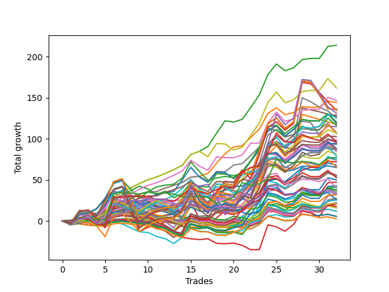

# Short Wallace Doodle 014 
- Symbol: ES
- Date Range: 03/18/2022 - 07/15/2022
- Trading Period: 7:20-12:30
- Number of Trades: 36



| Name | Win Percent | Profit | Avg Profit / Trade | Avg Time / Trade |      | Name | Win Percent | Profit | Avg Profit / Trade | Avg Time / Trade |
| ---- | ----------- | ------ | ------------------ | ---------------- | ---- | ---- | ----------- | ------ | ------------------ | ---------------- |
| Sorted By <br> Profit | | | | | | Sorted By <br> Win Percentage ||||
| Fifty-Eight | 75.00 | 65875.00 | 1829.86 | 13:00 |     | Eighty-One | 94.44 | 15250.00 | 423.61 | 03:12 |
| Two | 77.78 | 55875.00 | 1552.08 | 16:08 |     | One Hundred Twenty-One | 94.44 | 15125.00 | 420.14 | 02:20 |
| Sixty-Two | 63.89 | 48125.00 | 1336.81 | 16:28 |     | One Hundred Twenty-Six | 91.67 | 12875.00 | 357.64 | 02:21 |
| Sixty-One | 58.33 | 43750.00 | 1215.28 | 18:11 |     | One Hundred Eleven | 88.89 | 13375.00 | 371.53 | 01:24 |
| Seventy-Three | 50.00 | 42125.00 | 1170.14 | 10:06 |     | Eighty-Four | 86.11 | 34500.00 | 958.33 | 10:08 |
| Five | 61.11 | 42000.00 | 1166.67 | 22:25 |     | Eighty-Three | 86.11 | 18125.00 | 503.47 | 09:03 |
| Sixty-Nine | 47.22 | 40500.00 | 1125.00 | 14:08 |     | One Hundred Twenty-Two | 86.11 | 16000.00 | 444.44 | 05:08 |
| One Hundred Twenty-Five | 77.78 | 39625.00 | 1100.69 | 09:48 |     | Eighty-Two | 86.11 | 3625.00 | 100.69 | 07:18 |
| One Hundred Twenty-Four | 83.33 | 38375.00 | 1065.97 | 07:46 |     | One Hundred Twenty-Four | 83.33 | 38375.00 | 1065.97 | 07:46 |
| Sixty | 58.33 | 37750.00 | 1048.61 | 16:55 |     | One Hundred Twenty-Three | 83.33 | 23625.00 | 656.25 | 06:42 |
| Sixty-Six | 58.33 | 37375.00 | 1038.19 | 10:45 |     | One Hundred Sixteen | 83.33 | 8125.00 | 225.69 | 01:19 |
| Fifty-Seven | 72.22 | 37250.00 | 1034.72 | 11:20 |     | Eighty-Five | 80.56 | 33625.00 | 934.03 | 12:24 |
| Forty-Six | 47.22 | 37125.00 | 1031.25 | 11:10 |     | One Hundred Twenty-Seven | 80.56 | 7500.00 | 208.33 | 04:39 |
| Seventy | 47.22 | 36750.00 | 1020.83 | 13:21 |     | Two | 77.78 | 55875.00 | 1552.08 | 16:08 |
| Forty-Two | 52.78 | 36625.00 | 1017.36 | 09:09 |     | One Hundred Twenty-Five | 77.78 | 39625.00 | 1100.69 | 09:48 |
| Seventy-One | 44.44 | 35875.00 | 996.53 | 15:39 |     | One Hundred Six | 77.78 | 8625.00 | 239.58 | 00:59 |
| Eighty-Four | 86.11 | 34500.00 | 958.33 | 10:08 |     | Fifty-Eight | 75.00 | 65875.00 | 1829.86 | 13:00 |
| One | 72.22 | 34000.00 | 944.44 | 14:15 |     | One Hundred Twenty-Nine | 75.00 | 23500.00 | 652.78 | 07:01 |
| Fifty-Nine | 66.67 | 33750.00 | 937.50 | 14:10 |     | One Hundred Twenty-Eight | 75.00 | 9125.00 | 253.47 | 05:58 |
| Eighty-Five | 80.56 | 33625.00 | 934.03 | 12:24 |     | One Hundred One | 75.00 | 6500.00 | 180.56 | 00:54 |
| Forty-Five | 41.67 | 33375.00 | 927.08 | 12:21 |     | Fifty-Seven | 72.22 | 37250.00 | 1034.72 | 11:20 |
| One Hundred Thirty | 72.22 | 32875.00 | 913.19 | 08:40 |     | One | 72.22 | 34000.00 | 944.44 | 14:15 |
| Sixty-Eight | 44.44 | 31375.00 | 871.53 | 13:21 |     | One Hundred Thirty | 72.22 | 32875.00 | 913.19 | 08:40 |
| Sixty-Three | 52.78 | 30000.00 | 833.33 | 20:10 |     | Ninety-One | 69.44 | 8000.00 | 222.22 | 00:39 |
| Four | 61.11 | 29125.00 | 809.03 | 21:02 |     | One Hundred Twelve | 69.44 | 625.00 | 17.36 | 02:53 |
| Six | 63.89 | 27250.00 | 756.94 | 20:17 |     | Fifty-Nine | 66.67 | 33750.00 | 937.50 | 14:10 |
| Sixty-Seven | 52.78 | 26500.00 | 736.11 | 11:29 |     | Fifty-Six | 66.67 | 24750.00 | 687.50 | 07:51 |
| Forty-Seven | 36.11 | 26250.00 | 729.17 | 14:17 |     | Zero | 66.67 | 24375.00 | 677.08 | 08:49 |
| Sixty-Five | 61.11 | 24875.00 | 690.97 | 09:28 |     | Three | 66.67 | 12875.00 | 357.64 | 17:59 |
| Fifty-Six | 66.67 | 24750.00 | 687.50 | 07:51 |     | One Hundred Thirteen | 66.67 | 8875.00 | 246.53 | 03:56 |
| Zero | 66.67 | 24375.00 | 677.08 | 08:49 |     | Sixty-Two | 63.89 | 48125.00 | 1336.81 | 16:28 |
| One Hundred Fifteen | 61.11 | 24125.00 | 670.14 | 06:21 |     | Six | 63.89 | 27250.00 | 756.94 | 20:17 |
| One Hundred Twenty-Three | 83.33 | 23625.00 | 656.25 | 06:42 |     | One Hundred Fourteen | 63.89 | 16000.00 | 444.44 | 04:46 |
| One Hundred Twenty-Nine | 75.00 | 23500.00 | 652.78 | 07:01 |     | Ninety-Six | 63.89 | 2875.00 | 79.86 | 00:40 |
| Forty-Four | 41.67 | 23250.00 | 645.83 | 11:12 |     | Five | 61.11 | 42000.00 | 1166.67 | 22:25 |
| Seven | 55.56 | 23125.00 | 642.36 | 25:23 |     | Four | 61.11 | 29125.00 | 809.03 | 21:02 |
| Fifty-Four | 44.44 | 20875.00 | 579.86 | 06:16 |     | Sixty-Five | 61.11 | 24875.00 | 690.97 | 09:28 |
| Eighty-Three | 86.11 | 18125.00 | 503.47 | 09:03 |     | One Hundred Fifteen | 61.11 | 24125.00 | 670.14 | 06:21 |
| Fifty-Five | 38.89 | 16750.00 | 465.28 | 07:22 |     | Sixty-Four | 61.11 | 15875.00 | 440.97 | 06:52 |
| One Hundred Twenty-Two | 86.11 | 16000.00 | 444.44 | 05:08 |     | Forty | 61.11 | 9500.00 | 263.89 | 05:27 |
| One Hundred Fourteen | 63.89 | 16000.00 | 444.44 | 04:46 |     | One Hundred Seventeen | 61.11 | -1875.00 | -52.08 | 02:39 |
| Sixty-Four | 61.11 | 15875.00 | 440.97 | 06:52 |     | Sixty-One | 58.33 | 43750.00 | 1215.28 | 18:11 |
| Fifty-Three | 38.89 | 15875.00 | 440.97 | 06:40 |     | Sixty | 58.33 | 37750.00 | 1048.61 | 16:55 |
| Eighty-One | 94.44 | 15250.00 | 423.61 | 03:12 |     | Sixty-Six | 58.33 | 37375.00 | 1038.19 | 10:45 |
| Forty-One | 52.78 | 15250.00 | 423.61 | 08:04 |     | One Hundred Eighteen | 58.33 | 4125.00 | 114.58 | 03:28 |
| One Hundred Twenty-One | 94.44 | 15125.00 | 420.14 | 02:20 |     | Seven | 55.56 | 23125.00 | 642.36 | 25:23 |
| One Hundred Four | 52.78 | 14375.00 | 399.31 | 02:52 |     | One Hundred Seven | 55.56 | 2875.00 | 79.86 | 01:34 |
| Fifty-Two | 38.89 | 14250.00 | 395.83 | 06:16 |     | One Hundred Two | 55.56 | -1625.00 | -45.14 | 01:27 |
| One Hundred Ten | 44.44 | 13625.00 | 378.47 | 02:32 |     | Forty-Two | 52.78 | 36625.00 | 1017.36 | 09:09 |
| One Hundred Eleven | 88.89 | 13375.00 | 371.53 | 01:24 |     | Sixty-Three | 52.78 | 30000.00 | 833.33 | 20:10 |
| Ninety-Five | 38.89 | 13125.00 | 364.58 | 02:39 |     | Sixty-Seven | 52.78 | 26500.00 | 736.11 | 11:29 |
| One Hundred Twenty-Six | 91.67 | 12875.00 | 357.64 | 02:21 |     | Forty-One | 52.78 | 15250.00 | 423.61 | 08:04 |
| Three | 66.67 | 12875.00 | 357.64 | 17:59 |     | One Hundred Four | 52.78 | 14375.00 | 399.31 | 02:52 |
| One Hundred Five | 44.44 | 12750.00 | 354.17 | 03:47 |     | One Hundred Ninteen | 52.78 | 9875.00 | 274.31 | 04:00 |
| Forty-Three | 44.44 | 11500.00 | 319.44 | 09:40 |     | One Hundred Three | 52.78 | 4250.00 | 118.06 | 02:12 |
| Ninety-Four | 44.44 | 11375.00 | 315.97 | 02:02 |     | Seventy-Three | 50.00 | 42125.00 | 1170.14 | 10:06 |
| One Hundred Twenty | 44.44 | 10875.00 | 302.08 | 04:29 |     | Forty-Eight | 50.00 | 10250.00 | 284.72 | 03:56 |
| One Hundred Nine | 44.44 | 10375.00 | 288.19 | 02:12 |     | Ninety-Two | 50.00 | 625.00 | 17.36 | 01:08 |
| Forty-Eight | 50.00 | 10250.00 | 284.72 | 03:56 |     | Sixty-Nine | 47.22 | 40500.00 | 1125.00 | 14:08 |
| One Hundred Ninteen | 52.78 | 9875.00 | 274.31 | 04:00 |     | Forty-Six | 47.22 | 37125.00 | 1031.25 | 11:10 |
| Forty | 61.11 | 9500.00 | 263.89 | 05:27 |     | Seventy | 47.22 | 36750.00 | 1020.83 | 13:21 |
| Fifty-One | 41.67 | 9375.00 | 260.42 | 05:42 |     | Ninety-Three | 47.22 | 5500.00 | 152.78 | 01:31 |
| One Hundred Twenty-Eight | 75.00 | 9125.00 | 253.47 | 05:58 |     | One Hundred Eight | 47.22 | 4000.00 | 111.11 | 01:57 |
| One Hundred Thirteen | 66.67 | 8875.00 | 246.53 | 03:56 |     | Seventy-One | 44.44 | 35875.00 | 996.53 | 15:39 |
| One Hundred Six | 77.78 | 8625.00 | 239.58 | 00:59 |     | Sixty-Eight | 44.44 | 31375.00 | 871.53 | 13:21 |
| Fifty | 38.89 | 8375.00 | 232.64 | 05:44 |     | Fifty-Four | 44.44 | 20875.00 | 579.86 | 06:16 |
| One Hundred Sixteen | 83.33 | 8125.00 | 225.69 | 01:19 |     | One Hundred Ten | 44.44 | 13625.00 | 378.47 | 02:32 |
| Ninety-One | 69.44 | 8000.00 | 222.22 | 00:39 |     | One Hundred Five | 44.44 | 12750.00 | 354.17 | 03:47 |
| One Hundred Twenty-Seven | 80.56 | 7500.00 | 208.33 | 04:39 |     | Forty-Three | 44.44 | 11500.00 | 319.44 | 09:40 |
| One Hundred One | 75.00 | 6500.00 | 180.56 | 00:54 |     | Ninety-Four | 44.44 | 11375.00 | 315.97 | 02:02 |
| Forty-Nine | 41.67 | 6500.00 | 180.56 | 05:02 |     | One Hundred Twenty | 44.44 | 10875.00 | 302.08 | 04:29 |
| Ninety-Three | 47.22 | 5500.00 | 152.78 | 01:31 |     | One Hundred Nine | 44.44 | 10375.00 | 288.19 | 02:12 |
| One Hundred Three | 52.78 | 4250.00 | 118.06 | 02:12 |     | Forty-Five | 41.67 | 33375.00 | 927.08 | 12:21 |
| One Hundred Eighteen | 58.33 | 4125.00 | 114.58 | 03:28 |     | Forty-Four | 41.67 | 23250.00 | 645.83 | 11:12 |
| One Hundred Eight | 47.22 | 4000.00 | 111.11 | 01:57 |     | Fifty-One | 41.67 | 9375.00 | 260.42 | 05:42 |
| Eighty-Two | 86.11 | 3625.00 | 100.69 | 07:18 |     | Forty-Nine | 41.67 | 6500.00 | 180.56 | 05:02 |
| Ninety-Six | 63.89 | 2875.00 | 79.86 | 00:40 |     | Fifty-Five | 38.89 | 16750.00 | 465.28 | 07:22 |
| One Hundred Seven | 55.56 | 2875.00 | 79.86 | 01:34 |     | Fifty-Three | 38.89 | 15875.00 | 440.97 | 06:40 |
| One Hundred Twelve | 69.44 | 625.00 | 17.36 | 02:53 |     | Fifty-Two | 38.89 | 14250.00 | 395.83 | 06:16 |
| Ninety-Two | 50.00 | 625.00 | 17.36 | 01:08 |     | Ninety-Five | 38.89 | 13125.00 | 364.58 | 02:39 |
| One Hundred | 36.11 | -1375.00 | -38.19 | 01:08 |     | Fifty | 38.89 | 8375.00 | 232.64 | 05:44 |
| One Hundred Two | 55.56 | -1625.00 | -45.14 | 01:27 |     | Ninety-Seven | 38.89 | -5125.00 | -142.36 | 00:53 |
| One Hundred Seventeen | 61.11 | -1875.00 | -52.08 | 02:39 |     | Forty-Seven | 36.11 | 26250.00 | 729.17 | 14:17 |
| Ninety-Nine | 36.11 | -4375.00 | -121.53 | 01:05 |     | One Hundred | 36.11 | -1375.00 | -38.19 | 01:08 |
| Ninety-Seven | 38.89 | -5125.00 | -142.36 | 00:53 |     | Ninety-Nine | 36.11 | -4375.00 | -121.53 | 01:05 |
| Ninety-Eight | 36.11 | -5375.00 | -149.31 | 01:00 |     | Ninety-Eight | 36.11 | -5375.00 | -149.31 | 01:00 |

## NO STOPLOSS

### Test Zero
* Sell when price hits the middle line of the 20p bollinger
* No Stoploss
* Results:
```
Total Trades: 36
Percent Up: 33.33
Percent Down: 66.67
Total Points Moved Down: 48.75
Potential Profit: 24375.00
Total Points Ups: 46.75 Count Ups: 12
Total Points Downs: 95.50 Count Downs: 24
```

<details><summary>Trades</summary>

<code>In: 2022-03-25 11:05:00		Out: 2022-03-25 11:18:15		Total Position Time: 13:15		Total Move Down: -0.00		Total to Date: 0.00</code> <br />
<code>In: 2022-03-25 11:57:00		Out: 2022-03-25 11:57:20		Total Position Time: 00:20		Total Move Down: 0.75		Total to Date: 0.75</code> <br />
<code>In: 2022-04-01 11:34:00		Out: 2022-04-01 11:47:05		Total Position Time: 13:05		Total Move Down: 1.25		Total to Date: 2.00</code> <br />
<code>In: 2022-04-06 10:36:00		Out: 2022-04-06 10:55:45		Total Position Time: 19:45		Total Move Down: -5.25		Total to Date: -3.25</code> <br />
<code>In: 2022-04-06 10:43:00		Out: 2022-04-06 10:55:45		Total Position Time: 12:45		Total Move Down: 2.25		Total to Date: -1.00</code> <br />
<code>In: 2022-04-06 11:05:00		Out: 2022-04-06 11:05:40		Total Position Time: 00:40		Total Move Down: 7.75		Total to Date: 6.75</code> <br />
<code>In: 2022-04-07 11:03:00		Out: 2022-04-07 11:15:20		Total Position Time: 12:20		Total Move Down: 4.00		Total to Date: 10.75</code> <br />
<code>In: 2022-04-08 07:33:00		Out: 2022-04-08 07:44:35		Total Position Time: 11:35		Total Move Down: 3.25		Total to Date: 14.00</code> <br />
<code>In: 2022-04-18 07:27:00		Out: 2022-04-18 07:38:20		Total Position Time: 11:20		Total Move Down: 2.75		Total to Date: 16.75</code> <br />
<code>In: 2022-04-20 07:40:00		Out: 2022-04-20 08:00:15		Total Position Time: 20:15		Total Move Down: -3.00		Total to Date: 13.75</code> <br />
<code>In: 2022-04-20 09:54:00		Out: 2022-04-20 09:59:15		Total Position Time: 05:15		Total Move Down: 3.25		Total to Date: 17.00</code> <br />
<code>In: 2022-04-25 10:14:00		Out: 2022-04-25 10:26:30		Total Position Time: 12:30		Total Move Down: -0.00		Total to Date: 17.00</code> <br />
<code>In: 2022-04-27 08:34:00		Out: 2022-04-27 08:45:10		Total Position Time: 11:10		Total Move Down: 3.00		Total to Date: 20.00</code> <br />
<code>In: 2022-05-24 09:18:00		Out: 2022-05-24 09:21:40		Total Position Time: 03:40		Total Move Down: 5.75		Total to Date: 25.75</code> <br />
<code>In: 2022-05-24 10:43:00		Out: 2022-05-24 11:01:15		Total Position Time: 18:15		Total Move Down: -2.25		Total to Date: 23.50</code> <br />
<code>In: 2022-05-24 10:47:00		Out: 2022-05-24 11:01:15		Total Position Time: 14:15		Total Move Down: -0.00		Total to Date: 23.50</code> <br />
<code>In: 2022-05-25 11:04:00		Out: 2022-05-25 11:06:25		Total Position Time: 02:25		Total Move Down: 4.50		Total to Date: 28.00</code> <br />
<code>In: 2022-05-25 11:06:00		Out: 2022-05-25 11:06:25		Total Position Time: 00:25		Total Move Down: 3.75		Total to Date: 31.75</code> <br />
<code>In: 2022-05-31 07:23:00		Out: 2022-05-31 07:37:15		Total Position Time: 14:15		Total Move Down: 5.00		Total to Date: 36.75</code> <br />
<code>In: 2022-06-09 10:08:00		Out: 2022-06-09 10:16:30		Total Position Time: 08:30		Total Move Down: 1.00		Total to Date: 37.75</code> <br />
<code>In: 2022-06-10 12:00:00		Out: 2022-06-10 12:03:25		Total Position Time: 03:25		Total Move Down: 6.25		Total to Date: 44.00</code> <br />
<code>In: 2022-06-10 12:29:00		Out: 2022-06-10 12:30:30		Total Position Time: 01:30		Total Move Down: 6.25		Total to Date: 50.25</code> <br />
<code>In: 2022-06-13 09:40:00		Out: 2022-06-13 09:43:20		Total Position Time: 03:20		Total Move Down: 12.25		Total to Date: 62.50</code> <br />
<code>In: 2022-06-15 11:02:00		Out: 2022-06-15 11:02:10		Total Position Time: 00:10		Total Move Down: 2.00		Total to Date: 64.50</code> <br />
<code>In: 2022-06-23 12:30:00		Out: 2022-06-23 12:46:00		Total Position Time: 16:00		Total Move Down: -11.25		Total to Date: 53.25</code> <br />
<code>In: 2022-06-29 11:06:00		Out: 2022-06-29 11:20:00		Total Position Time: 14:00		Total Move Down: 1.00		Total to Date: 54.25</code> <br />
<code>In: 2022-06-29 12:31:00		Out: 2022-06-29 12:33:20		Total Position Time: 02:20		Total Move Down: 4.75		Total to Date: 59.00</code> <br />
<code>In: 2022-07-01 10:47:00		Out: 2022-07-01 11:03:55		Total Position Time: 16:55		Total Move Down: -2.25		Total to Date: 56.75</code> <br />
<code>In: 2022-07-06 11:01:00		Out: 2022-07-06 11:01:10		Total Position Time: 00:10		Total Move Down: -2.25		Total to Date: 54.50</code> <br />
<code>In: 2022-07-06 11:10:00		Out: 2022-07-06 11:10:10		Total Position Time: 00:10		Total Move Down: 3.25		Total to Date: 57.75</code> <br />
<code>In: 2022-07-06 11:35:00		Out: 2022-07-06 11:50:05		Total Position Time: 15:05		Total Move Down: -1.75		Total to Date: 56.00</code> <br />
<code>In: 2022-07-12 08:14:00		Out: 2022-07-12 08:16:20		Total Position Time: 02:20		Total Move Down: 4.50		Total to Date: 60.50</code> <br />
<code>In: 2022-07-13 07:37:00		Out: 2022-07-13 08:00:30		Total Position Time: 23:30		Total Move Down: -18.25		Total to Date: 42.25</code> <br />
<code>In: 2022-07-14 08:02:00		Out: 2022-07-14 08:02:10		Total Position Time: 00:10		Total Move Down: 1.50		Total to Date: 43.75</code> <br />
<code>In: 2022-07-14 08:07:00		Out: 2022-07-14 08:15:45		Total Position Time: 08:45		Total Move Down: -0.50		Total to Date: 43.25</code> <br />
<code>In: 2022-07-14 08:12:00		Out: 2022-07-14 08:15:45		Total Position Time: 03:45		Total Move Down: 5.50		Total to Date: 48.75</code> <br />


</details>

### Test One
* Sell when the price hits the upper line of the 20p 1std bollinger
* No Stoploss
* Results:
```
Total Trades: 36
Percent Up: 27.78
Percent Down: 72.22
Total Points Moved Down: 68.00
Potential Profit: 34000.00
Total Points Ups: 74.25 Count Ups: 10
Total Points Downs: 142.25 Count Downs: 26
```

<details><summary>Trades</summary>

<code>In: 2022-03-25 11:05:00		Out: 2022-03-25 11:19:35		Total Position Time: 14:35		Total Move Down: 0.75		Total to Date: 0.75</code> <br />
<code>In: 2022-03-25 11:57:00		Out: 2022-03-25 12:00:50		Total Position Time: 03:50		Total Move Down: 2.75		Total to Date: 3.50</code> <br />
<code>In: 2022-04-01 11:34:00		Out: 2022-04-01 11:50:15		Total Position Time: 16:15		Total Move Down: 3.25		Total to Date: 6.75</code> <br />
<code>In: 2022-04-06 10:36:00		Out: 2022-04-06 10:56:55		Total Position Time: 20:55		Total Move Down: -3.50		Total to Date: 3.25</code> <br />
<code>In: 2022-04-06 10:43:00		Out: 2022-04-06 10:56:55		Total Position Time: 13:55		Total Move Down: 4.00		Total to Date: 7.25</code> <br />
<code>In: 2022-04-06 11:05:00		Out: 2022-04-06 11:07:20		Total Position Time: 02:20		Total Move Down: 12.50		Total to Date: 19.75</code> <br />
<code>In: 2022-04-07 11:03:00		Out: 2022-04-07 11:18:00		Total Position Time: 15:00		Total Move Down: 4.75		Total to Date: 24.50</code> <br />
<code>In: 2022-04-08 07:33:00		Out: 2022-04-08 07:49:05		Total Position Time: 16:05		Total Move Down: 3.50		Total to Date: 28.00</code> <br />
<code>In: 2022-04-18 07:27:00		Out: 2022-04-18 07:51:20		Total Position Time: 24:20		Total Move Down: 2.25		Total to Date: 30.25</code> <br />
<code>In: 2022-04-20 07:40:00		Out: 2022-04-20 08:00:40		Total Position Time: 20:40		Total Move Down: 0.25		Total to Date: 30.50</code> <br />
<code>In: 2022-04-20 09:54:00		Out: 2022-04-20 10:08:15		Total Position Time: 14:15		Total Move Down: 4.25		Total to Date: 34.75</code> <br />
<code>In: 2022-04-25 10:14:00		Out: 2022-04-25 10:27:10		Total Position Time: 13:10		Total Move Down: 3.25		Total to Date: 38.00</code> <br />
<code>In: 2022-04-27 08:34:00		Out: 2022-04-27 08:48:05		Total Position Time: 14:05		Total Move Down: 3.75		Total to Date: 41.75</code> <br />
<code>In: 2022-05-24 09:18:00		Out: 2022-05-24 09:29:00		Total Position Time: 11:00		Total Move Down: 6.25		Total to Date: 48.00</code> <br />
<code>In: 2022-05-24 10:43:00		Out: 2022-05-24 11:01:40		Total Position Time: 18:40		Total Move Down: 1.25		Total to Date: 49.25</code> <br />
<code>In: 2022-05-24 10:47:00		Out: 2022-05-24 11:01:40		Total Position Time: 14:40		Total Move Down: 3.50		Total to Date: 52.75</code> <br />
<code>In: 2022-05-25 11:04:00		Out: 2022-05-25 11:06:35		Total Position Time: 02:35		Total Move Down: 9.25		Total to Date: 62.00</code> <br />
<code>In: 2022-05-25 11:06:00		Out: 2022-05-25 11:06:35		Total Position Time: 00:35		Total Move Down: 8.50		Total to Date: 70.50</code> <br />
<code>In: 2022-05-31 07:23:00		Out: 2022-05-31 07:52:55		Total Position Time: 29:55		Total Move Down: -1.50		Total to Date: 69.00</code> <br />
<code>In: 2022-06-09 10:08:00		Out: 2022-06-09 10:18:35		Total Position Time: 10:35		Total Move Down: 1.75		Total to Date: 70.75</code> <br />
<code>In: 2022-06-10 12:00:00		Out: 2022-06-10 12:05:05		Total Position Time: 05:05		Total Move Down: 10.50		Total to Date: 81.25</code> <br />
<code>In: 2022-06-10 12:29:00		Out: 2022-06-10 12:35:45		Total Position Time: 06:45		Total Move Down: 9.75		Total to Date: 91.00</code> <br />
<code>In: 2022-06-13 09:40:00		Out: 2022-06-13 09:47:55		Total Position Time: 07:55		Total Move Down: 19.00		Total to Date: 110.00</code> <br />
<code>In: 2022-06-15 11:02:00		Out: 2022-06-15 11:03:00		Total Position Time: 01:00		Total Move Down: 6.75		Total to Date: 116.75</code> <br />
<code>In: 2022-06-23 12:30:00		Out: 2022-06-23 12:46:00		Total Position Time: 16:00		Total Move Down: -11.25		Total to Date: 105.50</code> <br />
<code>In: 2022-06-29 11:06:00		Out: 2022-06-29 11:20:35		Total Position Time: 14:35		Total Move Down: 3.00		Total to Date: 108.50</code> <br />
<code>In: 2022-06-29 12:31:00		Out: 2022-06-29 12:34:10		Total Position Time: 03:10		Total Move Down: 7.25		Total to Date: 115.75</code> <br />
<code>In: 2022-07-01 10:47:00		Out: 2022-07-01 11:04:25		Total Position Time: 17:25		Total Move Down: -0.75		Total to Date: 115.00</code> <br />
<code>In: 2022-07-06 11:01:00		Out: 2022-07-06 11:01:15		Total Position Time: 00:15		Total Move Down: -0.00		Total to Date: 115.00</code> <br />
<code>In: 2022-07-06 11:10:00		Out: 2022-07-06 11:11:10		Total Position Time: 01:10		Total Move Down: 7.50		Total to Date: 122.50</code> <br />
<code>In: 2022-07-06 11:35:00		Out: 2022-07-06 12:00:45		Total Position Time: 25:45		Total Move Down: -2.75		Total to Date: 119.75</code> <br />
<code>In: 2022-07-12 08:14:00		Out: 2022-07-12 08:38:05		Total Position Time: 24:05		Total Move Down: 2.75		Total to Date: 122.50</code> <br />
<code>In: 2022-07-13 07:37:00		Out: 2022-07-13 08:06:55		Total Position Time: 29:55		Total Move Down: -32.50		Total to Date: 90.00</code> <br />
<code>In: 2022-07-14 08:02:00		Out: 2022-07-14 08:31:55		Total Position Time: 29:55		Total Move Down: -13.00		Total to Date: 77.00</code> <br />
<code>In: 2022-07-14 08:07:00		Out: 2022-07-14 08:35:55		Total Position Time: 28:55		Total Move Down: -7.50		Total to Date: 69.50</code> <br />
<code>In: 2022-07-14 08:12:00		Out: 2022-07-14 08:35:55		Total Position Time: 23:55		Total Move Down: -1.50		Total to Date: 68.00</code> <br />


</details>

### Test Two
* Sell when the price hits the upper line of the 20p 2std bollinger
* No Stoploss
* Results:
```
Total Trades: 36
Percent Up: 22.22
Percent Down: 77.78
Total Points Moved Down: 111.75
Potential Profit: 55875.00
Total Points Ups: 90.25 Count Ups: 8
Total Points Downs: 202.00 Count Downs: 28
```

<details><summary>Trades</summary>

<code>In: 2022-03-25 11:05:00		Out: 2022-03-25 11:34:55		Total Position Time: 29:55		Total Move Down: -3.50		Total to Date: -3.50</code> <br />
<code>In: 2022-03-25 11:57:00		Out: 2022-03-25 12:01:15		Total Position Time: 04:15		Total Move Down: 3.25		Total to Date: -0.25</code> <br />
<code>In: 2022-04-01 11:34:00		Out: 2022-04-01 11:50:45		Total Position Time: 16:45		Total Move Down: 4.25		Total to Date: 4.00</code> <br />
<code>In: 2022-04-06 10:36:00		Out: 2022-04-06 10:58:00		Total Position Time: 22:00		Total Move Down: -1.75		Total to Date: 2.25</code> <br />
<code>In: 2022-04-06 10:43:00		Out: 2022-04-06 10:58:00		Total Position Time: 15:00		Total Move Down: 5.75		Total to Date: 8.00</code> <br />
<code>In: 2022-04-06 11:05:00		Out: 2022-04-06 11:08:10		Total Position Time: 03:10		Total Move Down: 18.50		Total to Date: 26.50</code> <br />
<code>In: 2022-04-07 11:03:00		Out: 2022-04-07 11:18:20		Total Position Time: 15:20		Total Move Down: 6.00		Total to Date: 32.50</code> <br />
<code>In: 2022-04-08 07:33:00		Out: 2022-04-08 07:49:20		Total Position Time: 16:20		Total Move Down: 5.25		Total to Date: 37.75</code> <br />
<code>In: 2022-04-18 07:27:00		Out: 2022-04-18 07:51:45		Total Position Time: 24:45		Total Move Down: 4.75		Total to Date: 42.50</code> <br />
<code>In: 2022-04-20 07:40:00		Out: 2022-04-20 08:00:55		Total Position Time: 20:55		Total Move Down: 1.50		Total to Date: 44.00</code> <br />
<code>In: 2022-04-20 09:54:00		Out: 2022-04-20 10:08:15		Total Position Time: 14:15		Total Move Down: 4.25		Total to Date: 48.25</code> <br />
<code>In: 2022-04-25 10:14:00		Out: 2022-04-25 10:33:35		Total Position Time: 19:35		Total Move Down: 4.25		Total to Date: 52.50</code> <br />
<code>In: 2022-04-27 08:34:00		Out: 2022-04-27 08:51:10		Total Position Time: 17:10		Total Move Down: 4.00		Total to Date: 56.50</code> <br />
<code>In: 2022-05-24 09:18:00		Out: 2022-05-24 09:31:35		Total Position Time: 13:35		Total Move Down: 10.75		Total to Date: 67.25</code> <br />
<code>In: 2022-05-24 10:43:00		Out: 2022-05-24 11:01:50		Total Position Time: 18:50		Total Move Down: 2.25		Total to Date: 69.50</code> <br />
<code>In: 2022-05-24 10:47:00		Out: 2022-05-24 11:01:50		Total Position Time: 14:50		Total Move Down: 4.50		Total to Date: 74.00</code> <br />
<code>In: 2022-05-25 11:04:00		Out: 2022-05-25 11:06:40		Total Position Time: 02:40		Total Move Down: 12.25		Total to Date: 86.25</code> <br />
<code>In: 2022-05-25 11:06:00		Out: 2022-05-25 11:06:40		Total Position Time: 00:40		Total Move Down: 11.50		Total to Date: 97.75</code> <br />
<code>In: 2022-05-31 07:23:00		Out: 2022-05-31 07:52:55		Total Position Time: 29:55		Total Move Down: -1.50		Total to Date: 96.25</code> <br />
<code>In: 2022-06-09 10:08:00		Out: 2022-06-09 10:19:10		Total Position Time: 11:10		Total Move Down: 3.00		Total to Date: 99.25</code> <br />
<code>In: 2022-06-10 12:00:00		Out: 2022-06-10 12:06:05		Total Position Time: 06:05		Total Move Down: 14.50		Total to Date: 113.75</code> <br />
<code>In: 2022-06-10 12:29:00		Out: 2022-06-10 12:43:10		Total Position Time: 14:10		Total Move Down: 14.00		Total to Date: 127.75</code> <br />
<code>In: 2022-06-13 09:40:00		Out: 2022-06-13 09:54:35		Total Position Time: 14:35		Total Move Down: 22.75		Total to Date: 150.50</code> <br />
<code>In: 2022-06-15 11:02:00		Out: 2022-06-15 11:03:10		Total Position Time: 01:10		Total Move Down: 11.00		Total to Date: 161.50</code> <br />
<code>In: 2022-06-23 12:30:00		Out: 2022-06-23 12:46:00		Total Position Time: 16:00		Total Move Down: -11.25		Total to Date: 150.25</code> <br />
<code>In: 2022-06-29 11:06:00		Out: 2022-06-29 11:21:05		Total Position Time: 15:05		Total Move Down: 3.50		Total to Date: 153.75</code> <br />
<code>In: 2022-06-29 12:31:00		Out: 2022-06-29 12:36:35		Total Position Time: 05:35		Total Move Down: 10.25		Total to Date: 164.00</code> <br />
<code>In: 2022-07-01 10:47:00		Out: 2022-07-01 11:07:55		Total Position Time: 20:55		Total Move Down: 1.50		Total to Date: 165.50</code> <br />
<code>In: 2022-07-06 11:01:00		Out: 2022-07-06 11:02:25		Total Position Time: 01:25		Total Move Down: 2.25		Total to Date: 167.75</code> <br />
<code>In: 2022-07-06 11:10:00		Out: 2022-07-06 11:11:45		Total Position Time: 01:45		Total Move Down: 10.50		Total to Date: 178.25</code> <br />
<code>In: 2022-07-06 11:35:00		Out: 2022-07-06 12:01:30		Total Position Time: 26:30		Total Move Down: 1.50		Total to Date: 179.75</code> <br />
<code>In: 2022-07-12 08:14:00		Out: 2022-07-12 08:41:10		Total Position Time: 27:10		Total Move Down: 4.25		Total to Date: 184.00</code> <br />
<code>In: 2022-07-13 07:37:00		Out: 2022-07-13 08:06:55		Total Position Time: 29:55		Total Move Down: -32.50		Total to Date: 151.50</code> <br />
<code>In: 2022-07-14 08:02:00		Out: 2022-07-14 08:31:55		Total Position Time: 29:55		Total Move Down: -13.00		Total to Date: 138.50</code> <br />
<code>In: 2022-07-14 08:07:00		Out: 2022-07-14 08:36:55		Total Position Time: 29:55		Total Move Down: -9.00		Total to Date: 129.50</code> <br />
<code>In: 2022-07-14 08:12:00		Out: 2022-07-14 08:41:55		Total Position Time: 29:55		Total Move Down: -17.75		Total to Date: 111.75</code> <br />


</details>

### Test Three
* Sell when price hits the middle line of the 50p bollinger
* No Stoploss
* Results:
```
Total Trades: 36
Percent Up: 33.33
Percent Down: 66.67
Total Points Moved Down: 25.75
Potential Profit: 12875.00
Total Points Ups: 142.25 Count Ups: 12
Total Points Downs: 168.00 Count Downs: 24
```

<details><summary>Trades</summary>

<code>In: 2022-03-25 11:05:00		Out: 2022-03-25 11:34:55		Total Position Time: 29:55		Total Move Down: -3.50		Total to Date: -3.50</code> <br />
<code>In: 2022-03-25 11:57:00		Out: 2022-03-25 12:00:45		Total Position Time: 03:45		Total Move Down: 1.75		Total to Date: -1.75</code> <br />
<code>In: 2022-04-01 11:34:00		Out: 2022-04-01 11:57:55		Total Position Time: 23:55		Total Move Down: 4.75		Total to Date: 3.00</code> <br />
<code>In: 2022-04-06 10:36:00		Out: 2022-04-06 11:00:10		Total Position Time: 24:10		Total Move Down: 5.25		Total to Date: 8.25</code> <br />
<code>In: 2022-04-06 10:43:00		Out: 2022-04-06 11:00:10		Total Position Time: 17:10		Total Move Down: 12.75		Total to Date: 21.00</code> <br />
<code>In: 2022-04-06 11:05:00		Out: 2022-04-06 11:07:20		Total Position Time: 02:20		Total Move Down: 12.50		Total to Date: 33.50</code> <br />
<code>In: 2022-04-07 11:03:00		Out: 2022-04-07 11:32:55		Total Position Time: 29:55		Total Move Down: 3.50		Total to Date: 37.00</code> <br />
<code>In: 2022-04-08 07:33:00		Out: 2022-04-08 08:02:55		Total Position Time: 29:55		Total Move Down: -25.00		Total to Date: 12.00</code> <br />
<code>In: 2022-04-18 07:27:00		Out: 2022-04-18 07:51:50		Total Position Time: 24:50		Total Move Down: 5.25		Total to Date: 17.25</code> <br />
<code>In: 2022-04-20 07:40:00		Out: 2022-04-20 08:02:50		Total Position Time: 22:50		Total Move Down: 3.25		Total to Date: 20.50</code> <br />
<code>In: 2022-04-20 09:54:00		Out: 2022-04-20 10:19:10		Total Position Time: 25:10		Total Move Down: 3.00		Total to Date: 23.50</code> <br />
<code>In: 2022-04-25 10:14:00		Out: 2022-04-25 10:28:20		Total Position Time: 14:20		Total Move Down: 4.75		Total to Date: 28.25</code> <br />
<code>In: 2022-04-27 08:34:00		Out: 2022-04-27 08:53:05		Total Position Time: 19:05		Total Move Down: 8.75		Total to Date: 37.00</code> <br />
<code>In: 2022-05-24 09:18:00		Out: 2022-05-24 09:31:20		Total Position Time: 13:20		Total Move Down: 10.75		Total to Date: 47.75</code> <br />
<code>In: 2022-05-24 10:43:00		Out: 2022-05-24 11:12:55		Total Position Time: 29:55		Total Move Down: -19.50		Total to Date: 28.25</code> <br />
<code>In: 2022-05-24 10:47:00		Out: 2022-05-24 11:16:55		Total Position Time: 29:55		Total Move Down: -8.50		Total to Date: 19.75</code> <br />
<code>In: 2022-05-25 11:04:00		Out: 2022-05-25 11:06:35		Total Position Time: 02:35		Total Move Down: 9.25		Total to Date: 29.00</code> <br />
<code>In: 2022-05-25 11:06:00		Out: 2022-05-25 11:06:35		Total Position Time: 00:35		Total Move Down: 8.50		Total to Date: 37.50</code> <br />
<code>In: 2022-05-31 07:23:00		Out: 2022-05-31 07:52:55		Total Position Time: 29:55		Total Move Down: -1.50		Total to Date: 36.00</code> <br />
<code>In: 2022-06-09 10:08:00		Out: 2022-06-09 10:22:05		Total Position Time: 14:05		Total Move Down: 4.75		Total to Date: 40.75</code> <br />
<code>In: 2022-06-10 12:00:00		Out: 2022-06-10 12:03:40		Total Position Time: 03:40		Total Move Down: 9.50		Total to Date: 50.25</code> <br />
<code>In: 2022-06-10 12:29:00		Out: 2022-06-10 12:33:40		Total Position Time: 04:40		Total Move Down: 9.00		Total to Date: 59.25</code> <br />
<code>In: 2022-06-13 09:40:00		Out: 2022-06-13 09:47:55		Total Position Time: 07:55		Total Move Down: 19.00		Total to Date: 78.25</code> <br />
<code>In: 2022-06-15 11:02:00		Out: 2022-06-15 11:02:10		Total Position Time: 00:10		Total Move Down: 2.00		Total to Date: 80.25</code> <br />
<code>In: 2022-06-23 12:30:00		Out: 2022-06-23 12:46:00		Total Position Time: 16:00		Total Move Down: -11.25		Total to Date: 69.00</code> <br />
<code>In: 2022-06-29 11:06:00		Out: 2022-06-29 11:31:05		Total Position Time: 25:05		Total Move Down: 6.00		Total to Date: 75.00</code> <br />
<code>In: 2022-06-29 12:31:00		Out: 2022-06-29 12:34:15		Total Position Time: 03:15		Total Move Down: 9.00		Total to Date: 84.00</code> <br />
<code>In: 2022-07-01 10:47:00		Out: 2022-07-01 11:10:55		Total Position Time: 23:55		Total Move Down: 3.50		Total to Date: 87.50</code> <br />
<code>In: 2022-07-06 11:01:00		Out: 2022-07-06 11:01:15		Total Position Time: 00:15		Total Move Down: -0.00		Total to Date: 87.50</code> <br />
<code>In: 2022-07-06 11:10:00		Out: 2022-07-06 11:11:10		Total Position Time: 01:10		Total Move Down: 7.50		Total to Date: 95.00</code> <br />
<code>In: 2022-07-06 11:35:00		Out: 2022-07-06 12:04:55		Total Position Time: 29:55		Total Move Down: -0.75		Total to Date: 94.25</code> <br />
<code>In: 2022-07-12 08:14:00		Out: 2022-07-12 08:38:15		Total Position Time: 24:15		Total Move Down: 3.75		Total to Date: 98.00</code> <br />
<code>In: 2022-07-13 07:37:00		Out: 2022-07-13 08:06:55		Total Position Time: 29:55		Total Move Down: -32.50		Total to Date: 65.50</code> <br />
<code>In: 2022-07-14 08:02:00		Out: 2022-07-14 08:31:55		Total Position Time: 29:55		Total Move Down: -13.00		Total to Date: 52.50</code> <br />
<code>In: 2022-07-14 08:07:00		Out: 2022-07-14 08:36:55		Total Position Time: 29:55		Total Move Down: -9.00		Total to Date: 43.50</code> <br />
<code>In: 2022-07-14 08:12:00		Out: 2022-07-14 08:41:55		Total Position Time: 29:55		Total Move Down: -17.75		Total to Date: 25.75</code> <br />


</details>

### Test Four
* Sell when the price hits the upper line of the 50p 1std bollinger
* No Stoploss
* Results:
```
Total Trades: 36
Percent Up: 38.89
Percent Down: 61.11
Total Points Moved Down: 58.25
Potential Profit: 29125.00
Total Points Ups: 151.00 Count Ups: 14
Total Points Downs: 209.25 Count Downs: 22
```

<details><summary>Trades</summary>

<code>In: 2022-03-25 11:05:00		Out: 2022-03-25 11:34:55		Total Position Time: 29:55		Total Move Down: -3.50		Total to Date: -3.50</code> <br />
<code>In: 2022-03-25 11:57:00		Out: 2022-03-25 12:01:40		Total Position Time: 04:40		Total Move Down: 3.75		Total to Date: 0.25</code> <br />
<code>In: 2022-04-01 11:34:00		Out: 2022-04-01 12:03:55		Total Position Time: 29:55		Total Move Down: 1.50		Total to Date: 1.75</code> <br />
<code>In: 2022-04-06 10:36:00		Out: 2022-04-06 11:05:55		Total Position Time: 29:55		Total Move Down: -7.00		Total to Date: -5.25</code> <br />
<code>In: 2022-04-06 10:43:00		Out: 2022-04-06 11:08:10		Total Position Time: 25:10		Total Move Down: 11.00		Total to Date: 5.75</code> <br />
<code>In: 2022-04-06 11:05:00		Out: 2022-04-06 11:08:10		Total Position Time: 03:10		Total Move Down: 18.50		Total to Date: 24.25</code> <br />
<code>In: 2022-04-07 11:03:00		Out: 2022-04-07 11:32:55		Total Position Time: 29:55		Total Move Down: 3.50		Total to Date: 27.75</code> <br />
<code>In: 2022-04-08 07:33:00		Out: 2022-04-08 08:02:55		Total Position Time: 29:55		Total Move Down: -25.00		Total to Date: 2.75</code> <br />
<code>In: 2022-04-18 07:27:00		Out: 2022-04-18 07:56:55		Total Position Time: 29:55		Total Move Down: 7.50		Total to Date: 10.25</code> <br />
<code>In: 2022-04-20 07:40:00		Out: 2022-04-20 08:09:55		Total Position Time: 29:55		Total Move Down: 5.25		Total to Date: 15.50</code> <br />
<code>In: 2022-04-20 09:54:00		Out: 2022-04-20 10:23:55		Total Position Time: 29:55		Total Move Down: 2.00		Total to Date: 17.50</code> <br />
<code>In: 2022-04-25 10:14:00		Out: 2022-04-25 10:43:55		Total Position Time: 29:55		Total Move Down: 1.25		Total to Date: 18.75</code> <br />
<code>In: 2022-04-27 08:34:00		Out: 2022-04-27 09:01:45		Total Position Time: 27:45		Total Move Down: 14.25		Total to Date: 33.00</code> <br />
<code>In: 2022-05-24 09:18:00		Out: 2022-05-24 09:34:20		Total Position Time: 16:20		Total Move Down: 15.25		Total to Date: 48.25</code> <br />
<code>In: 2022-05-24 10:43:00		Out: 2022-05-24 11:12:55		Total Position Time: 29:55		Total Move Down: -19.50		Total to Date: 28.75</code> <br />
<code>In: 2022-05-24 10:47:00		Out: 2022-05-24 11:16:55		Total Position Time: 29:55		Total Move Down: -8.50		Total to Date: 20.25</code> <br />
<code>In: 2022-05-25 11:04:00		Out: 2022-05-25 11:06:40		Total Position Time: 02:40		Total Move Down: 12.25		Total to Date: 32.50</code> <br />
<code>In: 2022-05-25 11:06:00		Out: 2022-05-25 11:06:40		Total Position Time: 00:40		Total Move Down: 11.50		Total to Date: 44.00</code> <br />
<code>In: 2022-05-31 07:23:00		Out: 2022-05-31 07:52:55		Total Position Time: 29:55		Total Move Down: -1.50		Total to Date: 42.50</code> <br />
<code>In: 2022-06-09 10:08:00		Out: 2022-06-09 10:23:50		Total Position Time: 15:50		Total Move Down: 8.00		Total to Date: 50.50</code> <br />
<code>In: 2022-06-10 12:00:00		Out: 2022-06-10 12:06:00		Total Position Time: 06:00		Total Move Down: 14.25		Total to Date: 64.75</code> <br />
<code>In: 2022-06-10 12:29:00		Out: 2022-06-10 12:42:40		Total Position Time: 13:40		Total Move Down: 13.25		Total to Date: 78.00</code> <br />
<code>In: 2022-06-13 09:40:00		Out: 2022-06-13 09:54:40		Total Position Time: 14:40		Total Move Down: 23.75		Total to Date: 101.75</code> <br />
<code>In: 2022-06-15 11:02:00		Out: 2022-06-15 11:03:00		Total Position Time: 01:00		Total Move Down: 6.75		Total to Date: 108.50</code> <br />
<code>In: 2022-06-23 12:30:00		Out: 2022-06-23 12:46:00		Total Position Time: 16:00		Total Move Down: -11.25		Total to Date: 97.25</code> <br />
<code>In: 2022-06-29 11:06:00		Out: 2022-06-29 11:35:55		Total Position Time: 29:55		Total Move Down: 8.25		Total to Date: 105.50</code> <br />
<code>In: 2022-06-29 12:31:00		Out: 2022-06-29 12:41:05		Total Position Time: 10:05		Total Move Down: 11.75		Total to Date: 117.25</code> <br />
<code>In: 2022-07-01 10:47:00		Out: 2022-07-01 11:16:55		Total Position Time: 29:55		Total Move Down: -1.75		Total to Date: 115.50</code> <br />
<code>In: 2022-07-06 11:01:00		Out: 2022-07-06 11:01:15		Total Position Time: 00:15		Total Move Down: -0.00		Total to Date: 115.50</code> <br />
<code>In: 2022-07-06 11:10:00		Out: 2022-07-06 11:11:35		Total Position Time: 01:35		Total Move Down: 8.75		Total to Date: 124.25</code> <br />
<code>In: 2022-07-06 11:35:00		Out: 2022-07-06 12:04:55		Total Position Time: 29:55		Total Move Down: -0.75		Total to Date: 123.50</code> <br />
<code>In: 2022-07-12 08:14:00		Out: 2022-07-12 08:43:40		Total Position Time: 29:40		Total Move Down: 7.00		Total to Date: 130.50</code> <br />
<code>In: 2022-07-13 07:37:00		Out: 2022-07-13 08:06:55		Total Position Time: 29:55		Total Move Down: -32.50		Total to Date: 98.00</code> <br />
<code>In: 2022-07-14 08:02:00		Out: 2022-07-14 08:31:55		Total Position Time: 29:55		Total Move Down: -13.00		Total to Date: 85.00</code> <br />
<code>In: 2022-07-14 08:07:00		Out: 2022-07-14 08:36:55		Total Position Time: 29:55		Total Move Down: -9.00		Total to Date: 76.00</code> <br />
<code>In: 2022-07-14 08:12:00		Out: 2022-07-14 08:41:55		Total Position Time: 29:55		Total Move Down: -17.75		Total to Date: 58.25</code> <br />


</details>

### Test Five
* Sell when the price hits the upper line of the 50p 2std bollinger
* No Stoploss
* Results:
```
Total Trades: 36
Percent Up: 38.89
Percent Down: 61.11
Total Points Moved Down: 84.00
Potential Profit: 42000.00
Total Points Ups: 153.75 Count Ups: 14
Total Points Downs: 237.75 Count Downs: 22
```

<details><summary>Trades</summary>

<code>In: 2022-03-25 11:05:00		Out: 2022-03-25 11:34:55		Total Position Time: 29:55		Total Move Down: -3.50		Total to Date: -3.50</code> <br />
<code>In: 2022-03-25 11:57:00		Out: 2022-03-25 12:01:55		Total Position Time: 04:55		Total Move Down: 5.25		Total to Date: 1.75</code> <br />
<code>In: 2022-04-01 11:34:00		Out: 2022-04-01 12:03:55		Total Position Time: 29:55		Total Move Down: 1.50		Total to Date: 3.25</code> <br />
<code>In: 2022-04-06 10:36:00		Out: 2022-04-06 11:05:55		Total Position Time: 29:55		Total Move Down: -7.00		Total to Date: -3.75</code> <br />
<code>In: 2022-04-06 10:43:00		Out: 2022-04-06 11:09:40		Total Position Time: 26:40		Total Move Down: 17.00		Total to Date: 13.25</code> <br />
<code>In: 2022-04-06 11:05:00		Out: 2022-04-06 11:09:40		Total Position Time: 04:40		Total Move Down: 24.50		Total to Date: 37.75</code> <br />
<code>In: 2022-04-07 11:03:00		Out: 2022-04-07 11:32:55		Total Position Time: 29:55		Total Move Down: 3.50		Total to Date: 41.25</code> <br />
<code>In: 2022-04-08 07:33:00		Out: 2022-04-08 08:02:55		Total Position Time: 29:55		Total Move Down: -25.00		Total to Date: 16.25</code> <br />
<code>In: 2022-04-18 07:27:00		Out: 2022-04-18 07:56:55		Total Position Time: 29:55		Total Move Down: 7.50		Total to Date: 23.75</code> <br />
<code>In: 2022-04-20 07:40:00		Out: 2022-04-20 08:09:55		Total Position Time: 29:55		Total Move Down: 5.25		Total to Date: 29.00</code> <br />
<code>In: 2022-04-20 09:54:00		Out: 2022-04-20 10:23:55		Total Position Time: 29:55		Total Move Down: 2.00		Total to Date: 31.00</code> <br />
<code>In: 2022-04-25 10:14:00		Out: 2022-04-25 10:43:55		Total Position Time: 29:55		Total Move Down: 1.25		Total to Date: 32.25</code> <br />
<code>In: 2022-04-27 08:34:00		Out: 2022-04-27 09:03:55		Total Position Time: 29:55		Total Move Down: 7.50		Total to Date: 39.75</code> <br />
<code>In: 2022-05-24 09:18:00		Out: 2022-05-24 09:37:00		Total Position Time: 19:00		Total Move Down: 20.75		Total to Date: 60.50</code> <br />
<code>In: 2022-05-24 10:43:00		Out: 2022-05-24 11:12:55		Total Position Time: 29:55		Total Move Down: -19.50		Total to Date: 41.00</code> <br />
<code>In: 2022-05-24 10:47:00		Out: 2022-05-24 11:16:55		Total Position Time: 29:55		Total Move Down: -8.50		Total to Date: 32.50</code> <br />
<code>In: 2022-05-25 11:04:00		Out: 2022-05-25 11:06:50		Total Position Time: 02:50		Total Move Down: 16.00		Total to Date: 48.50</code> <br />
<code>In: 2022-05-25 11:06:00		Out: 2022-05-25 11:06:50		Total Position Time: 00:50		Total Move Down: 15.25		Total to Date: 63.75</code> <br />
<code>In: 2022-05-31 07:23:00		Out: 2022-05-31 07:52:55		Total Position Time: 29:55		Total Move Down: -1.50		Total to Date: 62.25</code> <br />
<code>In: 2022-06-09 10:08:00		Out: 2022-06-09 10:27:20		Total Position Time: 19:20		Total Move Down: 11.50		Total to Date: 73.75</code> <br />
<code>In: 2022-06-10 12:00:00		Out: 2022-06-10 12:29:55		Total Position Time: 29:55		Total Move Down: -2.75		Total to Date: 71.00</code> <br />
<code>In: 2022-06-10 12:29:00		Out: 2022-06-10 12:45:40		Total Position Time: 16:40		Total Move Down: 18.25		Total to Date: 89.25</code> <br />
<code>In: 2022-06-13 09:40:00		Out: 2022-06-13 09:58:15		Total Position Time: 18:15		Total Move Down: 30.25		Total to Date: 119.50</code> <br />
<code>In: 2022-06-15 11:02:00		Out: 2022-06-15 11:03:05		Total Position Time: 01:05		Total Move Down: 10.00		Total to Date: 129.50</code> <br />
<code>In: 2022-06-23 12:30:00		Out: 2022-06-23 12:46:00		Total Position Time: 16:00		Total Move Down: -11.25		Total to Date: 118.25</code> <br />
<code>In: 2022-06-29 11:06:00		Out: 2022-06-29 11:35:55		Total Position Time: 29:55		Total Move Down: 8.25		Total to Date: 126.50</code> <br />
<code>In: 2022-06-29 12:31:00		Out: 2022-06-29 12:46:00		Total Position Time: 15:00		Total Move Down: 8.50		Total to Date: 135.00</code> <br />
<code>In: 2022-07-01 10:47:00		Out: 2022-07-01 11:16:55		Total Position Time: 29:55		Total Move Down: -1.75		Total to Date: 133.25</code> <br />
<code>In: 2022-07-06 11:01:00		Out: 2022-07-06 11:02:25		Total Position Time: 01:25		Total Move Down: 2.25		Total to Date: 135.50</code> <br />
<code>In: 2022-07-06 11:10:00		Out: 2022-07-06 11:12:15		Total Position Time: 02:15		Total Move Down: 14.50		Total to Date: 150.00</code> <br />
<code>In: 2022-07-06 11:35:00		Out: 2022-07-06 12:04:55		Total Position Time: 29:55		Total Move Down: -0.75		Total to Date: 149.25</code> <br />
<code>In: 2022-07-12 08:14:00		Out: 2022-07-12 08:43:55		Total Position Time: 29:55		Total Move Down: 7.00		Total to Date: 156.25</code> <br />
<code>In: 2022-07-13 07:37:00		Out: 2022-07-13 08:06:55		Total Position Time: 29:55		Total Move Down: -32.50		Total to Date: 123.75</code> <br />
<code>In: 2022-07-14 08:02:00		Out: 2022-07-14 08:31:55		Total Position Time: 29:55		Total Move Down: -13.00		Total to Date: 110.75</code> <br />
<code>In: 2022-07-14 08:07:00		Out: 2022-07-14 08:36:55		Total Position Time: 29:55		Total Move Down: -9.00		Total to Date: 101.75</code> <br />
<code>In: 2022-07-14 08:12:00		Out: 2022-07-14 08:41:55		Total Position Time: 29:55		Total Move Down: -17.75		Total to Date: 84.00</code> <br />


</details>

### Test Six
* Sell when the price hits the middle line of the 1std VWAP
* No Stoploss
* Results:
```
Total Trades: 36
Percent Up: 36.11
Percent Down: 63.89
Total Points Moved Down: 54.50
Potential Profit: 27250.00
Total Points Ups: 144.00 Count Ups: 13
Total Points Downs: 198.50 Count Downs: 23
```

<details><summary>Trades</summary>

<code>In: 2022-03-25 11:05:00		Out: 2022-03-25 11:34:55		Total Position Time: 29:55		Total Move Down: -3.50		Total to Date: -3.50</code> <br />
<code>In: 2022-03-25 11:57:00		Out: 2022-03-25 12:20:30		Total Position Time: 23:30		Total Move Down: 11.50		Total to Date: 8.00</code> <br />
<code>In: 2022-04-01 11:34:00		Out: 2022-04-01 12:03:55		Total Position Time: 29:55		Total Move Down: 1.50		Total to Date: 9.50</code> <br />
<code>In: 2022-04-06 10:36:00		Out: 2022-04-06 11:00:10		Total Position Time: 24:10		Total Move Down: 5.25		Total to Date: 14.75</code> <br />
<code>In: 2022-04-06 10:43:00		Out: 2022-04-06 11:00:10		Total Position Time: 17:10		Total Move Down: 12.75		Total to Date: 27.50</code> <br />
<code>In: 2022-04-06 11:05:00		Out: 2022-04-06 11:08:10		Total Position Time: 03:10		Total Move Down: 18.50		Total to Date: 46.00</code> <br />
<code>In: 2022-04-07 11:03:00		Out: 2022-04-07 11:32:55		Total Position Time: 29:55		Total Move Down: 3.50		Total to Date: 49.50</code> <br />
<code>In: 2022-04-08 07:33:00		Out: 2022-04-08 08:02:55		Total Position Time: 29:55		Total Move Down: -25.00		Total to Date: 24.50</code> <br />
<code>In: 2022-04-18 07:27:00		Out: 2022-04-18 07:55:15		Total Position Time: 28:15		Total Move Down: 8.00		Total to Date: 32.50</code> <br />
<code>In: 2022-04-20 07:40:00		Out: 2022-04-20 08:08:10		Total Position Time: 28:10		Total Move Down: 6.00		Total to Date: 38.50</code> <br />
<code>In: 2022-04-20 09:54:00		Out: 2022-04-20 10:23:55		Total Position Time: 29:55		Total Move Down: 2.00		Total to Date: 40.50</code> <br />
<code>In: 2022-04-25 10:14:00		Out: 2022-04-25 10:43:55		Total Position Time: 29:55		Total Move Down: 1.25		Total to Date: 41.75</code> <br />
<code>In: 2022-04-27 08:34:00		Out: 2022-04-27 09:03:55		Total Position Time: 29:55		Total Move Down: 7.50		Total to Date: 49.25</code> <br />
<code>In: 2022-05-24 09:18:00		Out: 2022-05-24 09:36:45		Total Position Time: 18:45		Total Move Down: 19.75		Total to Date: 69.00</code> <br />
<code>In: 2022-05-24 10:43:00		Out: 2022-05-24 11:12:55		Total Position Time: 29:55		Total Move Down: -19.50		Total to Date: 49.50</code> <br />
<code>In: 2022-05-24 10:47:00		Out: 2022-05-24 11:16:55		Total Position Time: 29:55		Total Move Down: -8.50		Total to Date: 41.00</code> <br />
<code>In: 2022-05-25 11:04:00		Out: 2022-05-25 11:06:20		Total Position Time: 02:20		Total Move Down: 2.75		Total to Date: 43.75</code> <br />
<code>In: 2022-05-25 11:06:00		Out: 2022-05-25 11:06:20		Total Position Time: 00:20		Total Move Down: 2.00		Total to Date: 45.75</code> <br />
<code>In: 2022-05-31 07:23:00		Out: 2022-05-31 07:52:55		Total Position Time: 29:55		Total Move Down: -1.50		Total to Date: 44.25</code> <br />
<code>In: 2022-06-09 10:08:00		Out: 2022-06-09 10:23:45		Total Position Time: 15:45		Total Move Down: 7.25		Total to Date: 51.50</code> <br />
<code>In: 2022-06-10 12:00:00		Out: 2022-06-10 12:05:30		Total Position Time: 05:30		Total Move Down: 13.50		Total to Date: 65.00</code> <br />
<code>In: 2022-06-10 12:29:00		Out: 2022-06-10 12:44:00		Total Position Time: 15:00		Total Move Down: 16.25		Total to Date: 81.25</code> <br />
<code>In: 2022-06-13 09:40:00		Out: 2022-06-13 09:55:05		Total Position Time: 15:05		Total Move Down: 25.00		Total to Date: 106.25</code> <br />
<code>In: 2022-06-15 11:02:00		Out: 2022-06-15 11:02:10		Total Position Time: 00:10		Total Move Down: 2.00		Total to Date: 108.25</code> <br />
<code>In: 2022-06-23 12:30:00		Out: 2022-06-23 12:46:00		Total Position Time: 16:00		Total Move Down: -11.25		Total to Date: 97.00</code> <br />
<code>In: 2022-06-29 11:06:00		Out: 2022-06-29 11:35:55		Total Position Time: 29:55		Total Move Down: 8.25		Total to Date: 105.25</code> <br />
<code>In: 2022-06-29 12:31:00		Out: 2022-06-29 12:34:15		Total Position Time: 03:15		Total Move Down: 9.00		Total to Date: 114.25</code> <br />
<code>In: 2022-07-01 10:47:00		Out: 2022-07-01 11:16:55		Total Position Time: 29:55		Total Move Down: -1.75		Total to Date: 112.50</code> <br />
<code>In: 2022-07-06 11:01:00		Out: 2022-07-06 11:01:15		Total Position Time: 00:15		Total Move Down: -0.00		Total to Date: 112.50</code> <br />
<code>In: 2022-07-06 11:10:00		Out: 2022-07-06 11:11:35		Total Position Time: 01:35		Total Move Down: 8.75		Total to Date: 121.25</code> <br />
<code>In: 2022-07-06 11:35:00		Out: 2022-07-06 12:04:55		Total Position Time: 29:55		Total Move Down: -0.75		Total to Date: 120.50</code> <br />
<code>In: 2022-07-12 08:14:00		Out: 2022-07-12 08:17:45		Total Position Time: 03:45		Total Move Down: 6.25		Total to Date: 126.75</code> <br />
<code>In: 2022-07-13 07:37:00		Out: 2022-07-13 08:06:55		Total Position Time: 29:55		Total Move Down: -32.50		Total to Date: 94.25</code> <br />
<code>In: 2022-07-14 08:02:00		Out: 2022-07-14 08:31:55		Total Position Time: 29:55		Total Move Down: -13.00		Total to Date: 81.25</code> <br />
<code>In: 2022-07-14 08:07:00		Out: 2022-07-14 08:36:55		Total Position Time: 29:55		Total Move Down: -9.00		Total to Date: 72.25</code> <br />
<code>In: 2022-07-14 08:12:00		Out: 2022-07-14 08:41:55		Total Position Time: 29:55		Total Move Down: -17.75		Total to Date: 54.50</code> <br />


</details>

### Test Seven
* Sell when the price hits the upper line of the 1std VWAP
* No Stoploss
* Results:
```
Total Trades: 36
Percent Up: 44.44
Percent Down: 55.56
Total Points Moved Down: 46.25
Potential Profit: 23125.00
Total Points Ups: 186.00 Count Ups: 16
Total Points Downs: 232.25 Count Downs: 20
```

<details><summary>Trades</summary>

<code>In: 2022-03-25 11:05:00		Out: 2022-03-25 11:34:55		Total Position Time: 29:55		Total Move Down: -3.50		Total to Date: -3.50</code> <br />
<code>In: 2022-03-25 11:57:00		Out: 2022-03-25 12:26:55		Total Position Time: 29:55		Total Move Down: 15.25		Total to Date: 11.75</code> <br />
<code>In: 2022-04-01 11:34:00		Out: 2022-04-01 12:03:55		Total Position Time: 29:55		Total Move Down: 1.50		Total to Date: 13.25</code> <br />
<code>In: 2022-04-06 10:36:00		Out: 2022-04-06 11:05:55		Total Position Time: 29:55		Total Move Down: -7.00		Total to Date: 6.25</code> <br />
<code>In: 2022-04-06 10:43:00		Out: 2022-04-06 11:09:40		Total Position Time: 26:40		Total Move Down: 17.00		Total to Date: 23.25</code> <br />
<code>In: 2022-04-06 11:05:00		Out: 2022-04-06 11:09:40		Total Position Time: 04:40		Total Move Down: 24.50		Total to Date: 47.75</code> <br />
<code>In: 2022-04-07 11:03:00		Out: 2022-04-07 11:32:55		Total Position Time: 29:55		Total Move Down: 3.50		Total to Date: 51.25</code> <br />
<code>In: 2022-04-08 07:33:00		Out: 2022-04-08 08:02:55		Total Position Time: 29:55		Total Move Down: -25.00		Total to Date: 26.25</code> <br />
<code>In: 2022-04-18 07:27:00		Out: 2022-04-18 07:56:55		Total Position Time: 29:55		Total Move Down: 7.50		Total to Date: 33.75</code> <br />
<code>In: 2022-04-20 07:40:00		Out: 2022-04-20 08:09:55		Total Position Time: 29:55		Total Move Down: 5.25		Total to Date: 39.00</code> <br />
<code>In: 2022-04-20 09:54:00		Out: 2022-04-20 10:23:55		Total Position Time: 29:55		Total Move Down: 2.00		Total to Date: 41.00</code> <br />
<code>In: 2022-04-25 10:14:00		Out: 2022-04-25 10:43:55		Total Position Time: 29:55		Total Move Down: 1.25		Total to Date: 42.25</code> <br />
<code>In: 2022-04-27 08:34:00		Out: 2022-04-27 09:03:55		Total Position Time: 29:55		Total Move Down: 7.50		Total to Date: 49.75</code> <br />
<code>In: 2022-05-24 09:18:00		Out: 2022-05-24 09:47:55		Total Position Time: 29:55		Total Move Down: 22.25		Total to Date: 72.00</code> <br />
<code>In: 2022-05-24 10:43:00		Out: 2022-05-24 11:12:55		Total Position Time: 29:55		Total Move Down: -19.50		Total to Date: 52.50</code> <br />
<code>In: 2022-05-24 10:47:00		Out: 2022-05-24 11:16:55		Total Position Time: 29:55		Total Move Down: -8.50		Total to Date: 44.00</code> <br />
<code>In: 2022-05-25 11:04:00		Out: 2022-05-25 11:06:45		Total Position Time: 02:45		Total Move Down: 13.50		Total to Date: 57.50</code> <br />
<code>In: 2022-05-25 11:06:00		Out: 2022-05-25 11:06:45		Total Position Time: 00:45		Total Move Down: 12.75		Total to Date: 70.25</code> <br />
<code>In: 2022-05-31 07:23:00		Out: 2022-05-31 07:52:55		Total Position Time: 29:55		Total Move Down: -1.50		Total to Date: 68.75</code> <br />
<code>In: 2022-06-09 10:08:00		Out: 2022-06-09 10:30:30		Total Position Time: 22:30		Total Move Down: 15.25		Total to Date: 84.00</code> <br />
<code>In: 2022-06-10 12:00:00		Out: 2022-06-10 12:29:55		Total Position Time: 29:55		Total Move Down: -2.75		Total to Date: 81.25</code> <br />
<code>In: 2022-06-10 12:29:00		Out: 2022-06-10 12:46:00		Total Position Time: 17:00		Total Move Down: 19.25		Total to Date: 100.50</code> <br />
<code>In: 2022-06-13 09:40:00		Out: 2022-06-13 10:09:55		Total Position Time: 29:55		Total Move Down: 33.50		Total to Date: 134.00</code> <br />
<code>In: 2022-06-15 11:02:00		Out: 2022-06-15 11:03:00		Total Position Time: 01:00		Total Move Down: 6.75		Total to Date: 140.75</code> <br />
<code>In: 2022-06-23 12:30:00		Out: 2022-06-23 12:46:00		Total Position Time: 16:00		Total Move Down: -11.25		Total to Date: 129.50</code> <br />
<code>In: 2022-06-29 11:06:00		Out: 2022-06-29 11:35:55		Total Position Time: 29:55		Total Move Down: 8.25		Total to Date: 137.75</code> <br />
<code>In: 2022-06-29 12:31:00		Out: 2022-06-29 12:46:00		Total Position Time: 15:00		Total Move Down: 8.50		Total to Date: 146.25</code> <br />
<code>In: 2022-07-01 10:47:00		Out: 2022-07-01 11:16:55		Total Position Time: 29:55		Total Move Down: -1.75		Total to Date: 144.50</code> <br />
<code>In: 2022-07-06 11:01:00		Out: 2022-07-06 11:30:55		Total Position Time: 29:55		Total Move Down: -15.50		Total to Date: 129.00</code> <br />
<code>In: 2022-07-06 11:10:00		Out: 2022-07-06 11:39:55		Total Position Time: 29:55		Total Move Down: -16.75		Total to Date: 112.25</code> <br />
<code>In: 2022-07-06 11:35:00		Out: 2022-07-06 12:04:55		Total Position Time: 29:55		Total Move Down: -0.75		Total to Date: 111.50</code> <br />
<code>In: 2022-07-12 08:14:00		Out: 2022-07-12 08:43:55		Total Position Time: 29:55		Total Move Down: 7.00		Total to Date: 118.50</code> <br />
<code>In: 2022-07-13 07:37:00		Out: 2022-07-13 08:06:55		Total Position Time: 29:55		Total Move Down: -32.50		Total to Date: 86.00</code> <br />
<code>In: 2022-07-14 08:02:00		Out: 2022-07-14 08:31:55		Total Position Time: 29:55		Total Move Down: -13.00		Total to Date: 73.00</code> <br />
<code>In: 2022-07-14 08:07:00		Out: 2022-07-14 08:36:55		Total Position Time: 29:55		Total Move Down: -9.00		Total to Date: 64.00</code> <br />
<code>In: 2022-07-14 08:12:00		Out: 2022-07-14 08:41:55		Total Position Time: 29:55		Total Move Down: -17.75		Total to Date: 46.25</code> <br />


</details>

## STOPLOSS OF 5

### Test Forty
* Sell when price hits the middle line of the 20p bollinger
* Stoploss is -5 points
* Results:
```
Total Trades: 36
Percent Up: 38.89
Percent Down: 61.11
Total Points Moved Down: 19.00
Potential Profit: 9500.00
Total Points Ups: 69.00 Count Ups: 14
Total Points Downs: 88.00 Count Downs: 22
```

<details><summary>Trades</summary>

<code>In: 2022-03-25 11:05:00		Out: 2022-03-25 11:18:15		Total Position Time: 13:15		Total Move Down: -0.00		Total to Date: 0.00</code> <br />
<code>In: 2022-03-25 11:57:00		Out: 2022-03-25 11:57:20		Total Position Time: 00:20		Total Move Down: 0.75		Total to Date: 0.75</code> <br />
<code>In: 2022-04-01 11:34:00		Out: 2022-04-01 11:47:05		Total Position Time: 13:05		Total Move Down: 1.25		Total to Date: 2.00</code> <br />
<code>In: 2022-04-06 10:36:00		Out: 2022-04-06 10:40:35		Total Position Time: 04:35		Total Move Down: -5.00		Total to Date: -3.00</code> <br />
<code>In: 2022-04-06 10:43:00		Out: 2022-04-06 10:55:45		Total Position Time: 12:45		Total Move Down: 2.25		Total to Date: -0.75</code> <br />
<code>In: 2022-04-06 11:05:00		Out: 2022-04-06 11:05:40		Total Position Time: 00:40		Total Move Down: 7.75		Total to Date: 7.00</code> <br />
<code>In: 2022-04-07 11:03:00		Out: 2022-04-07 11:15:20		Total Position Time: 12:20		Total Move Down: 4.00		Total to Date: 11.00</code> <br />
<code>In: 2022-04-08 07:33:00		Out: 2022-04-08 07:44:35		Total Position Time: 11:35		Total Move Down: 3.25		Total to Date: 14.25</code> <br />
<code>In: 2022-04-18 07:27:00		Out: 2022-04-18 07:38:20		Total Position Time: 11:20		Total Move Down: 2.75		Total to Date: 17.00</code> <br />
<code>In: 2022-04-20 07:40:00		Out: 2022-04-20 07:52:10		Total Position Time: 12:10		Total Move Down: -5.00		Total to Date: 12.00</code> <br />
<code>In: 2022-04-20 09:54:00		Out: 2022-04-20 09:59:15		Total Position Time: 05:15		Total Move Down: 3.25		Total to Date: 15.25</code> <br />
<code>In: 2022-04-25 10:14:00		Out: 2022-04-25 10:15:15		Total Position Time: 01:15		Total Move Down: -6.00		Total to Date: 9.25</code> <br />
<code>In: 2022-04-27 08:34:00		Out: 2022-04-27 08:43:05		Total Position Time: 09:05		Total Move Down: -5.25		Total to Date: 4.00</code> <br />
<code>In: 2022-05-24 09:18:00		Out: 2022-05-24 09:21:40		Total Position Time: 03:40		Total Move Down: 5.75		Total to Date: 9.75</code> <br />
<code>In: 2022-05-24 10:43:00		Out: 2022-05-24 10:46:15		Total Position Time: 03:15		Total Move Down: -5.25		Total to Date: 4.50</code> <br />
<code>In: 2022-05-24 10:47:00		Out: 2022-05-24 10:56:00		Total Position Time: 09:00		Total Move Down: -5.00		Total to Date: -0.50</code> <br />
<code>In: 2022-05-25 11:04:00		Out: 2022-05-25 11:04:40		Total Position Time: 00:40		Total Move Down: -5.50		Total to Date: -6.00</code> <br />
<code>In: 2022-05-25 11:06:00		Out: 2022-05-25 11:06:25		Total Position Time: 00:25		Total Move Down: 3.75		Total to Date: -2.25</code> <br />
<code>In: 2022-05-31 07:23:00		Out: 2022-05-31 07:37:15		Total Position Time: 14:15		Total Move Down: 5.00		Total to Date: 2.75</code> <br />
<code>In: 2022-06-09 10:08:00		Out: 2022-06-09 10:16:30		Total Position Time: 08:30		Total Move Down: 1.00		Total to Date: 3.75</code> <br />
<code>In: 2022-06-10 12:00:00		Out: 2022-06-10 12:03:25		Total Position Time: 03:25		Total Move Down: 6.25		Total to Date: 10.00</code> <br />
<code>In: 2022-06-10 12:29:00		Out: 2022-06-10 12:30:30		Total Position Time: 01:30		Total Move Down: 6.25		Total to Date: 16.25</code> <br />
<code>In: 2022-06-13 09:40:00		Out: 2022-06-13 09:43:20		Total Position Time: 03:20		Total Move Down: 12.25		Total to Date: 28.50</code> <br />
<code>In: 2022-06-15 11:02:00		Out: 2022-06-15 11:02:10		Total Position Time: 00:10		Total Move Down: 2.00		Total to Date: 30.50</code> <br />
<code>In: 2022-06-23 12:30:00		Out: 2022-06-23 12:31:35		Total Position Time: 01:35		Total Move Down: -5.00		Total to Date: 25.50</code> <br />
<code>In: 2022-06-29 11:06:00		Out: 2022-06-29 11:20:00		Total Position Time: 14:00		Total Move Down: 1.00		Total to Date: 26.50</code> <br />
<code>In: 2022-06-29 12:31:00		Out: 2022-06-29 12:33:20		Total Position Time: 02:20		Total Move Down: 4.75		Total to Date: 31.25</code> <br />
<code>In: 2022-07-01 10:47:00		Out: 2022-07-01 10:53:40		Total Position Time: 06:40		Total Move Down: -4.75		Total to Date: 26.50</code> <br />
<code>In: 2022-07-06 11:01:00		Out: 2022-07-06 11:01:10		Total Position Time: 00:10		Total Move Down: -2.25		Total to Date: 24.25</code> <br />
<code>In: 2022-07-06 11:10:00		Out: 2022-07-06 11:10:10		Total Position Time: 00:10		Total Move Down: 3.25		Total to Date: 27.50</code> <br />
<code>In: 2022-07-06 11:35:00		Out: 2022-07-06 11:40:10		Total Position Time: 05:10		Total Move Down: -8.75		Total to Date: 18.75</code> <br />
<code>In: 2022-07-12 08:14:00		Out: 2022-07-12 08:16:20		Total Position Time: 02:20		Total Move Down: 4.50		Total to Date: 23.25</code> <br />
<code>In: 2022-07-13 07:37:00		Out: 2022-07-13 07:39:55		Total Position Time: 02:55		Total Move Down: -5.50		Total to Date: 17.75</code> <br />
<code>In: 2022-07-14 08:02:00		Out: 2022-07-14 08:02:10		Total Position Time: 00:10		Total Move Down: 1.50		Total to Date: 19.25</code> <br />
<code>In: 2022-07-14 08:07:00		Out: 2022-07-14 08:08:35		Total Position Time: 01:35		Total Move Down: -5.75		Total to Date: 13.50</code> <br />
<code>In: 2022-07-14 08:12:00		Out: 2022-07-14 08:15:45		Total Position Time: 03:45		Total Move Down: 5.50		Total to Date: 19.00</code> <br />


</details>

### Test Forty-One
* Sell when the price hits the upper line of the 20p 1std bollinger
* Stoploss is -5 points
* Results:
```
Total Trades: 36
Percent Up: 47.22
Percent Down: 52.78
Total Points Moved Down: 30.50
Potential Profit: 15250.00
Total Points Ups: 87.75 Count Ups: 17
Total Points Downs: 118.25 Count Downs: 19
```

<details><summary>Trades</summary>

<code>In: 2022-03-25 11:05:00		Out: 2022-03-25 11:19:35		Total Position Time: 14:35		Total Move Down: 0.75		Total to Date: 0.75</code> <br />
<code>In: 2022-03-25 11:57:00		Out: 2022-03-25 12:00:50		Total Position Time: 03:50		Total Move Down: 2.75		Total to Date: 3.50</code> <br />
<code>In: 2022-04-01 11:34:00		Out: 2022-04-01 11:50:15		Total Position Time: 16:15		Total Move Down: 3.25		Total to Date: 6.75</code> <br />
<code>In: 2022-04-06 10:36:00		Out: 2022-04-06 10:40:35		Total Position Time: 04:35		Total Move Down: -5.00		Total to Date: 1.75</code> <br />
<code>In: 2022-04-06 10:43:00		Out: 2022-04-06 10:56:55		Total Position Time: 13:55		Total Move Down: 4.00		Total to Date: 5.75</code> <br />
<code>In: 2022-04-06 11:05:00		Out: 2022-04-06 11:07:20		Total Position Time: 02:20		Total Move Down: 12.50		Total to Date: 18.25</code> <br />
<code>In: 2022-04-07 11:03:00		Out: 2022-04-07 11:18:00		Total Position Time: 15:00		Total Move Down: 4.75		Total to Date: 23.00</code> <br />
<code>In: 2022-04-08 07:33:00		Out: 2022-04-08 07:49:05		Total Position Time: 16:05		Total Move Down: 3.50		Total to Date: 26.50</code> <br />
<code>In: 2022-04-18 07:27:00		Out: 2022-04-18 07:51:20		Total Position Time: 24:20		Total Move Down: 2.25		Total to Date: 28.75</code> <br />
<code>In: 2022-04-20 07:40:00		Out: 2022-04-20 07:52:10		Total Position Time: 12:10		Total Move Down: -5.00		Total to Date: 23.75</code> <br />
<code>In: 2022-04-20 09:54:00		Out: 2022-04-20 10:08:15		Total Position Time: 14:15		Total Move Down: 4.25		Total to Date: 28.00</code> <br />
<code>In: 2022-04-25 10:14:00		Out: 2022-04-25 10:15:15		Total Position Time: 01:15		Total Move Down: -6.00		Total to Date: 22.00</code> <br />
<code>In: 2022-04-27 08:34:00		Out: 2022-04-27 08:43:05		Total Position Time: 09:05		Total Move Down: -5.25		Total to Date: 16.75</code> <br />
<code>In: 2022-05-24 09:18:00		Out: 2022-05-24 09:29:00		Total Position Time: 11:00		Total Move Down: 6.25		Total to Date: 23.00</code> <br />
<code>In: 2022-05-24 10:43:00		Out: 2022-05-24 10:46:15		Total Position Time: 03:15		Total Move Down: -5.25		Total to Date: 17.75</code> <br />
<code>In: 2022-05-24 10:47:00		Out: 2022-05-24 10:56:00		Total Position Time: 09:00		Total Move Down: -5.00		Total to Date: 12.75</code> <br />
<code>In: 2022-05-25 11:04:00		Out: 2022-05-25 11:04:40		Total Position Time: 00:40		Total Move Down: -5.50		Total to Date: 7.25</code> <br />
<code>In: 2022-05-25 11:06:00		Out: 2022-05-25 11:06:35		Total Position Time: 00:35		Total Move Down: 8.50		Total to Date: 15.75</code> <br />
<code>In: 2022-05-31 07:23:00		Out: 2022-05-31 07:46:50		Total Position Time: 23:50		Total Move Down: -5.50		Total to Date: 10.25</code> <br />
<code>In: 2022-06-09 10:08:00		Out: 2022-06-09 10:18:35		Total Position Time: 10:35		Total Move Down: 1.75		Total to Date: 12.00</code> <br />
<code>In: 2022-06-10 12:00:00		Out: 2022-06-10 12:05:05		Total Position Time: 05:05		Total Move Down: 10.50		Total to Date: 22.50</code> <br />
<code>In: 2022-06-10 12:29:00		Out: 2022-06-10 12:35:45		Total Position Time: 06:45		Total Move Down: 9.75		Total to Date: 32.25</code> <br />
<code>In: 2022-06-13 09:40:00		Out: 2022-06-13 09:47:55		Total Position Time: 07:55		Total Move Down: 19.00		Total to Date: 51.25</code> <br />
<code>In: 2022-06-15 11:02:00		Out: 2022-06-15 11:03:00		Total Position Time: 01:00		Total Move Down: 6.75		Total to Date: 58.00</code> <br />
<code>In: 2022-06-23 12:30:00		Out: 2022-06-23 12:31:35		Total Position Time: 01:35		Total Move Down: -5.00		Total to Date: 53.00</code> <br />
<code>In: 2022-06-29 11:06:00		Out: 2022-06-29 11:20:35		Total Position Time: 14:35		Total Move Down: 3.00		Total to Date: 56.00</code> <br />
<code>In: 2022-06-29 12:31:00		Out: 2022-06-29 12:34:10		Total Position Time: 03:10		Total Move Down: 7.25		Total to Date: 63.25</code> <br />
<code>In: 2022-07-01 10:47:00		Out: 2022-07-01 10:53:40		Total Position Time: 06:40		Total Move Down: -4.75		Total to Date: 58.50</code> <br />
<code>In: 2022-07-06 11:01:00		Out: 2022-07-06 11:01:15		Total Position Time: 00:15		Total Move Down: -0.00		Total to Date: 58.50</code> <br />
<code>In: 2022-07-06 11:10:00		Out: 2022-07-06 11:11:10		Total Position Time: 01:10		Total Move Down: 7.50		Total to Date: 66.00</code> <br />
<code>In: 2022-07-06 11:35:00		Out: 2022-07-06 11:40:10		Total Position Time: 05:10		Total Move Down: -8.75		Total to Date: 57.25</code> <br />
<code>In: 2022-07-12 08:14:00		Out: 2022-07-12 08:30:05		Total Position Time: 16:05		Total Move Down: -5.00		Total to Date: 52.25</code> <br />
<code>In: 2022-07-13 07:37:00		Out: 2022-07-13 07:39:55		Total Position Time: 02:55		Total Move Down: -5.50		Total to Date: 46.75</code> <br />
<code>In: 2022-07-14 08:02:00		Out: 2022-07-14 08:04:10		Total Position Time: 02:10		Total Move Down: -4.75		Total to Date: 42.00</code> <br />
<code>In: 2022-07-14 08:07:00		Out: 2022-07-14 08:08:35		Total Position Time: 01:35		Total Move Down: -5.75		Total to Date: 36.25</code> <br />
<code>In: 2022-07-14 08:12:00		Out: 2022-07-14 08:20:10		Total Position Time: 08:10		Total Move Down: -5.75		Total to Date: 30.50</code> <br />


</details>

### Test Forty-Two
* Sell when the price hits the upper line of the 20p 2std bollinger
* Stoploss is -5 points
* Results:
```
Total Trades: 36
Percent Up: 47.22
Percent Down: 52.78
Total Points Moved Down: 73.25
Potential Profit: 36625.00
Total Points Ups: 92.75 Count Ups: 17
Total Points Downs: 166.00 Count Downs: 19
```

<details><summary>Trades</summary>

<code>In: 2022-03-25 11:05:00		Out: 2022-03-25 11:31:15		Total Position Time: 26:15		Total Move Down: -5.00		Total to Date: -5.00</code> <br />
<code>In: 2022-03-25 11:57:00		Out: 2022-03-25 12:01:15		Total Position Time: 04:15		Total Move Down: 3.25		Total to Date: -1.75</code> <br />
<code>In: 2022-04-01 11:34:00		Out: 2022-04-01 11:50:45		Total Position Time: 16:45		Total Move Down: 4.25		Total to Date: 2.50</code> <br />
<code>In: 2022-04-06 10:36:00		Out: 2022-04-06 10:40:35		Total Position Time: 04:35		Total Move Down: -5.00		Total to Date: -2.50</code> <br />
<code>In: 2022-04-06 10:43:00		Out: 2022-04-06 10:58:00		Total Position Time: 15:00		Total Move Down: 5.75		Total to Date: 3.25</code> <br />
<code>In: 2022-04-06 11:05:00		Out: 2022-04-06 11:08:10		Total Position Time: 03:10		Total Move Down: 18.50		Total to Date: 21.75</code> <br />
<code>In: 2022-04-07 11:03:00		Out: 2022-04-07 11:18:20		Total Position Time: 15:20		Total Move Down: 6.00		Total to Date: 27.75</code> <br />
<code>In: 2022-04-08 07:33:00		Out: 2022-04-08 07:49:20		Total Position Time: 16:20		Total Move Down: 5.25		Total to Date: 33.00</code> <br />
<code>In: 2022-04-18 07:27:00		Out: 2022-04-18 07:51:45		Total Position Time: 24:45		Total Move Down: 4.75		Total to Date: 37.75</code> <br />
<code>In: 2022-04-20 07:40:00		Out: 2022-04-20 07:52:10		Total Position Time: 12:10		Total Move Down: -5.00		Total to Date: 32.75</code> <br />
<code>In: 2022-04-20 09:54:00		Out: 2022-04-20 10:08:15		Total Position Time: 14:15		Total Move Down: 4.25		Total to Date: 37.00</code> <br />
<code>In: 2022-04-25 10:14:00		Out: 2022-04-25 10:15:15		Total Position Time: 01:15		Total Move Down: -6.00		Total to Date: 31.00</code> <br />
<code>In: 2022-04-27 08:34:00		Out: 2022-04-27 08:43:05		Total Position Time: 09:05		Total Move Down: -5.25		Total to Date: 25.75</code> <br />
<code>In: 2022-05-24 09:18:00		Out: 2022-05-24 09:31:35		Total Position Time: 13:35		Total Move Down: 10.75		Total to Date: 36.50</code> <br />
<code>In: 2022-05-24 10:43:00		Out: 2022-05-24 10:46:15		Total Position Time: 03:15		Total Move Down: -5.25		Total to Date: 31.25</code> <br />
<code>In: 2022-05-24 10:47:00		Out: 2022-05-24 10:56:00		Total Position Time: 09:00		Total Move Down: -5.00		Total to Date: 26.25</code> <br />
<code>In: 2022-05-25 11:04:00		Out: 2022-05-25 11:04:40		Total Position Time: 00:40		Total Move Down: -5.50		Total to Date: 20.75</code> <br />
<code>In: 2022-05-25 11:06:00		Out: 2022-05-25 11:06:40		Total Position Time: 00:40		Total Move Down: 11.50		Total to Date: 32.25</code> <br />
<code>In: 2022-05-31 07:23:00		Out: 2022-05-31 07:46:50		Total Position Time: 23:50		Total Move Down: -5.50		Total to Date: 26.75</code> <br />
<code>In: 2022-06-09 10:08:00		Out: 2022-06-09 10:19:10		Total Position Time: 11:10		Total Move Down: 3.00		Total to Date: 29.75</code> <br />
<code>In: 2022-06-10 12:00:00		Out: 2022-06-10 12:06:05		Total Position Time: 06:05		Total Move Down: 14.50		Total to Date: 44.25</code> <br />
<code>In: 2022-06-10 12:29:00		Out: 2022-06-10 12:43:10		Total Position Time: 14:10		Total Move Down: 14.00		Total to Date: 58.25</code> <br />
<code>In: 2022-06-13 09:40:00		Out: 2022-06-13 09:54:35		Total Position Time: 14:35		Total Move Down: 22.75		Total to Date: 81.00</code> <br />
<code>In: 2022-06-15 11:02:00		Out: 2022-06-15 11:03:10		Total Position Time: 01:10		Total Move Down: 11.00		Total to Date: 92.00</code> <br />
<code>In: 2022-06-23 12:30:00		Out: 2022-06-23 12:31:35		Total Position Time: 01:35		Total Move Down: -5.00		Total to Date: 87.00</code> <br />
<code>In: 2022-06-29 11:06:00		Out: 2022-06-29 11:21:05		Total Position Time: 15:05		Total Move Down: 3.50		Total to Date: 90.50</code> <br />
<code>In: 2022-06-29 12:31:00		Out: 2022-06-29 12:36:35		Total Position Time: 05:35		Total Move Down: 10.25		Total to Date: 100.75</code> <br />
<code>In: 2022-07-01 10:47:00		Out: 2022-07-01 10:53:40		Total Position Time: 06:40		Total Move Down: -4.75		Total to Date: 96.00</code> <br />
<code>In: 2022-07-06 11:01:00		Out: 2022-07-06 11:02:25		Total Position Time: 01:25		Total Move Down: 2.25		Total to Date: 98.25</code> <br />
<code>In: 2022-07-06 11:10:00		Out: 2022-07-06 11:11:45		Total Position Time: 01:45		Total Move Down: 10.50		Total to Date: 108.75</code> <br />
<code>In: 2022-07-06 11:35:00		Out: 2022-07-06 11:40:10		Total Position Time: 05:10		Total Move Down: -8.75		Total to Date: 100.00</code> <br />
<code>In: 2022-07-12 08:14:00		Out: 2022-07-12 08:30:05		Total Position Time: 16:05		Total Move Down: -5.00		Total to Date: 95.00</code> <br />
<code>In: 2022-07-13 07:37:00		Out: 2022-07-13 07:39:55		Total Position Time: 02:55		Total Move Down: -5.50		Total to Date: 89.50</code> <br />
<code>In: 2022-07-14 08:02:00		Out: 2022-07-14 08:04:10		Total Position Time: 02:10		Total Move Down: -4.75		Total to Date: 84.75</code> <br />
<code>In: 2022-07-14 08:07:00		Out: 2022-07-14 08:08:35		Total Position Time: 01:35		Total Move Down: -5.75		Total to Date: 79.00</code> <br />
<code>In: 2022-07-14 08:12:00		Out: 2022-07-14 08:20:10		Total Position Time: 08:10		Total Move Down: -5.75		Total to Date: 73.25</code> <br />


</details>

### Test Forty-Three
* Sell when price hits the middle line of the 50p bollinger
* Stoploss is -5 points
* Results:
```
Total Trades: 36
Percent Up: 55.56
Percent Down: 44.44
Total Points Moved Down: 23.00
Potential Profit: 11500.00
Total Points Ups: 103.00 Count Ups: 20
Total Points Downs: 126.00 Count Downs: 16
```

<details><summary>Trades</summary>

<code>In: 2022-03-25 11:05:00		Out: 2022-03-25 11:31:15		Total Position Time: 26:15		Total Move Down: -5.00		Total to Date: -5.00</code> <br />
<code>In: 2022-03-25 11:57:00		Out: 2022-03-25 12:00:45		Total Position Time: 03:45		Total Move Down: 1.75		Total to Date: -3.25</code> <br />
<code>In: 2022-04-01 11:34:00		Out: 2022-04-01 11:57:55		Total Position Time: 23:55		Total Move Down: 4.75		Total to Date: 1.50</code> <br />
<code>In: 2022-04-06 10:36:00		Out: 2022-04-06 10:40:35		Total Position Time: 04:35		Total Move Down: -5.00		Total to Date: -3.50</code> <br />
<code>In: 2022-04-06 10:43:00		Out: 2022-04-06 11:00:10		Total Position Time: 17:10		Total Move Down: 12.75		Total to Date: 9.25</code> <br />
<code>In: 2022-04-06 11:05:00		Out: 2022-04-06 11:07:20		Total Position Time: 02:20		Total Move Down: 12.50		Total to Date: 21.75</code> <br />
<code>In: 2022-04-07 11:03:00		Out: 2022-04-07 11:27:05		Total Position Time: 24:05		Total Move Down: -5.00		Total to Date: 16.75</code> <br />
<code>In: 2022-04-08 07:33:00		Out: 2022-04-08 07:51:45		Total Position Time: 18:45		Total Move Down: -5.25		Total to Date: 11.50</code> <br />
<code>In: 2022-04-18 07:27:00		Out: 2022-04-18 07:51:50		Total Position Time: 24:50		Total Move Down: 5.25		Total to Date: 16.75</code> <br />
<code>In: 2022-04-20 07:40:00		Out: 2022-04-20 07:52:10		Total Position Time: 12:10		Total Move Down: -5.00		Total to Date: 11.75</code> <br />
<code>In: 2022-04-20 09:54:00		Out: 2022-04-20 10:19:10		Total Position Time: 25:10		Total Move Down: 3.00		Total to Date: 14.75</code> <br />
<code>In: 2022-04-25 10:14:00		Out: 2022-04-25 10:15:15		Total Position Time: 01:15		Total Move Down: -6.00		Total to Date: 8.75</code> <br />
<code>In: 2022-04-27 08:34:00		Out: 2022-04-27 08:43:05		Total Position Time: 09:05		Total Move Down: -5.25		Total to Date: 3.50</code> <br />
<code>In: 2022-05-24 09:18:00		Out: 2022-05-24 09:31:20		Total Position Time: 13:20		Total Move Down: 10.75		Total to Date: 14.25</code> <br />
<code>In: 2022-05-24 10:43:00		Out: 2022-05-24 10:46:15		Total Position Time: 03:15		Total Move Down: -5.25		Total to Date: 9.00</code> <br />
<code>In: 2022-05-24 10:47:00		Out: 2022-05-24 10:56:00		Total Position Time: 09:00		Total Move Down: -5.00		Total to Date: 4.00</code> <br />
<code>In: 2022-05-25 11:04:00		Out: 2022-05-25 11:04:40		Total Position Time: 00:40		Total Move Down: -5.50		Total to Date: -1.50</code> <br />
<code>In: 2022-05-25 11:06:00		Out: 2022-05-25 11:06:35		Total Position Time: 00:35		Total Move Down: 8.50		Total to Date: 7.00</code> <br />
<code>In: 2022-05-31 07:23:00		Out: 2022-05-31 07:46:50		Total Position Time: 23:50		Total Move Down: -5.50		Total to Date: 1.50</code> <br />
<code>In: 2022-06-09 10:08:00		Out: 2022-06-09 10:22:05		Total Position Time: 14:05		Total Move Down: 4.75		Total to Date: 6.25</code> <br />
<code>In: 2022-06-10 12:00:00		Out: 2022-06-10 12:03:40		Total Position Time: 03:40		Total Move Down: 9.50		Total to Date: 15.75</code> <br />
<code>In: 2022-06-10 12:29:00		Out: 2022-06-10 12:33:40		Total Position Time: 04:40		Total Move Down: 9.00		Total to Date: 24.75</code> <br />
<code>In: 2022-06-13 09:40:00		Out: 2022-06-13 09:47:55		Total Position Time: 07:55		Total Move Down: 19.00		Total to Date: 43.75</code> <br />
<code>In: 2022-06-15 11:02:00		Out: 2022-06-15 11:02:10		Total Position Time: 00:10		Total Move Down: 2.00		Total to Date: 45.75</code> <br />
<code>In: 2022-06-23 12:30:00		Out: 2022-06-23 12:31:35		Total Position Time: 01:35		Total Move Down: -5.00		Total to Date: 40.75</code> <br />
<code>In: 2022-06-29 11:06:00		Out: 2022-06-29 11:31:05		Total Position Time: 25:05		Total Move Down: 6.00		Total to Date: 46.75</code> <br />
<code>In: 2022-06-29 12:31:00		Out: 2022-06-29 12:34:15		Total Position Time: 03:15		Total Move Down: 9.00		Total to Date: 55.75</code> <br />
<code>In: 2022-07-01 10:47:00		Out: 2022-07-01 10:53:40		Total Position Time: 06:40		Total Move Down: -4.75		Total to Date: 51.00</code> <br />
<code>In: 2022-07-06 11:01:00		Out: 2022-07-06 11:01:15		Total Position Time: 00:15		Total Move Down: -0.00		Total to Date: 51.00</code> <br />
<code>In: 2022-07-06 11:10:00		Out: 2022-07-06 11:11:10		Total Position Time: 01:10		Total Move Down: 7.50		Total to Date: 58.50</code> <br />
<code>In: 2022-07-06 11:35:00		Out: 2022-07-06 11:40:10		Total Position Time: 05:10		Total Move Down: -8.75		Total to Date: 49.75</code> <br />
<code>In: 2022-07-12 08:14:00		Out: 2022-07-12 08:30:05		Total Position Time: 16:05		Total Move Down: -5.00		Total to Date: 44.75</code> <br />
<code>In: 2022-07-13 07:37:00		Out: 2022-07-13 07:39:55		Total Position Time: 02:55		Total Move Down: -5.50		Total to Date: 39.25</code> <br />
<code>In: 2022-07-14 08:02:00		Out: 2022-07-14 08:04:10		Total Position Time: 02:10		Total Move Down: -4.75		Total to Date: 34.50</code> <br />
<code>In: 2022-07-14 08:07:00		Out: 2022-07-14 08:08:35		Total Position Time: 01:35		Total Move Down: -5.75		Total to Date: 28.75</code> <br />
<code>In: 2022-07-14 08:12:00		Out: 2022-07-14 08:20:10		Total Position Time: 08:10		Total Move Down: -5.75		Total to Date: 23.00</code> <br />


</details>

### Test Forty-Four
* Sell when the price hits the upper line of the 50p 1std bollinger
* Stoploss is -5 points
* Results:
```
Total Trades: 36
Percent Up: 58.33
Percent Down: 41.67
Total Points Moved Down: 46.50
Potential Profit: 23250.00
Total Points Ups: 108.25 Count Ups: 21
Total Points Downs: 154.75 Count Downs: 15
```

<details><summary>Trades</summary>

<code>In: 2022-03-25 11:05:00		Out: 2022-03-25 11:31:15		Total Position Time: 26:15		Total Move Down: -5.00		Total to Date: -5.00</code> <br />
<code>In: 2022-03-25 11:57:00		Out: 2022-03-25 12:01:40		Total Position Time: 04:40		Total Move Down: 3.75		Total to Date: -1.25</code> <br />
<code>In: 2022-04-01 11:34:00		Out: 2022-04-01 12:03:55		Total Position Time: 29:55		Total Move Down: 1.50		Total to Date: 0.25</code> <br />
<code>In: 2022-04-06 10:36:00		Out: 2022-04-06 10:40:35		Total Position Time: 04:35		Total Move Down: -5.00		Total to Date: -4.75</code> <br />
<code>In: 2022-04-06 10:43:00		Out: 2022-04-06 11:01:45		Total Position Time: 18:45		Total Move Down: -5.25		Total to Date: -10.00</code> <br />
<code>In: 2022-04-06 11:05:00		Out: 2022-04-06 11:08:10		Total Position Time: 03:10		Total Move Down: 18.50		Total to Date: 8.50</code> <br />
<code>In: 2022-04-07 11:03:00		Out: 2022-04-07 11:27:05		Total Position Time: 24:05		Total Move Down: -5.00		Total to Date: 3.50</code> <br />
<code>In: 2022-04-08 07:33:00		Out: 2022-04-08 07:51:45		Total Position Time: 18:45		Total Move Down: -5.25		Total to Date: -1.75</code> <br />
<code>In: 2022-04-18 07:27:00		Out: 2022-04-18 07:56:55		Total Position Time: 29:55		Total Move Down: 7.50		Total to Date: 5.75</code> <br />
<code>In: 2022-04-20 07:40:00		Out: 2022-04-20 07:52:10		Total Position Time: 12:10		Total Move Down: -5.00		Total to Date: 0.75</code> <br />
<code>In: 2022-04-20 09:54:00		Out: 2022-04-20 10:23:55		Total Position Time: 29:55		Total Move Down: 2.00		Total to Date: 2.75</code> <br />
<code>In: 2022-04-25 10:14:00		Out: 2022-04-25 10:15:15		Total Position Time: 01:15		Total Move Down: -6.00		Total to Date: -3.25</code> <br />
<code>In: 2022-04-27 08:34:00		Out: 2022-04-27 08:43:05		Total Position Time: 09:05		Total Move Down: -5.25		Total to Date: -8.50</code> <br />
<code>In: 2022-05-24 09:18:00		Out: 2022-05-24 09:34:20		Total Position Time: 16:20		Total Move Down: 15.25		Total to Date: 6.75</code> <br />
<code>In: 2022-05-24 10:43:00		Out: 2022-05-24 10:46:15		Total Position Time: 03:15		Total Move Down: -5.25		Total to Date: 1.50</code> <br />
<code>In: 2022-05-24 10:47:00		Out: 2022-05-24 10:56:00		Total Position Time: 09:00		Total Move Down: -5.00		Total to Date: -3.50</code> <br />
<code>In: 2022-05-25 11:04:00		Out: 2022-05-25 11:04:40		Total Position Time: 00:40		Total Move Down: -5.50		Total to Date: -9.00</code> <br />
<code>In: 2022-05-25 11:06:00		Out: 2022-05-25 11:06:40		Total Position Time: 00:40		Total Move Down: 11.50		Total to Date: 2.50</code> <br />
<code>In: 2022-05-31 07:23:00		Out: 2022-05-31 07:46:50		Total Position Time: 23:50		Total Move Down: -5.50		Total to Date: -3.00</code> <br />
<code>In: 2022-06-09 10:08:00		Out: 2022-06-09 10:23:50		Total Position Time: 15:50		Total Move Down: 8.00		Total to Date: 5.00</code> <br />
<code>In: 2022-06-10 12:00:00		Out: 2022-06-10 12:06:00		Total Position Time: 06:00		Total Move Down: 14.25		Total to Date: 19.25</code> <br />
<code>In: 2022-06-10 12:29:00		Out: 2022-06-10 12:42:40		Total Position Time: 13:40		Total Move Down: 13.25		Total to Date: 32.50</code> <br />
<code>In: 2022-06-13 09:40:00		Out: 2022-06-13 09:54:40		Total Position Time: 14:40		Total Move Down: 23.75		Total to Date: 56.25</code> <br />
<code>In: 2022-06-15 11:02:00		Out: 2022-06-15 11:03:00		Total Position Time: 01:00		Total Move Down: 6.75		Total to Date: 63.00</code> <br />
<code>In: 2022-06-23 12:30:00		Out: 2022-06-23 12:31:35		Total Position Time: 01:35		Total Move Down: -5.00		Total to Date: 58.00</code> <br />
<code>In: 2022-06-29 11:06:00		Out: 2022-06-29 11:35:55		Total Position Time: 29:55		Total Move Down: 8.25		Total to Date: 66.25</code> <br />
<code>In: 2022-06-29 12:31:00		Out: 2022-06-29 12:41:05		Total Position Time: 10:05		Total Move Down: 11.75		Total to Date: 78.00</code> <br />
<code>In: 2022-07-01 10:47:00		Out: 2022-07-01 10:53:40		Total Position Time: 06:40		Total Move Down: -4.75		Total to Date: 73.25</code> <br />
<code>In: 2022-07-06 11:01:00		Out: 2022-07-06 11:01:15		Total Position Time: 00:15		Total Move Down: -0.00		Total to Date: 73.25</code> <br />
<code>In: 2022-07-06 11:10:00		Out: 2022-07-06 11:11:35		Total Position Time: 01:35		Total Move Down: 8.75		Total to Date: 82.00</code> <br />
<code>In: 2022-07-06 11:35:00		Out: 2022-07-06 11:40:10		Total Position Time: 05:10		Total Move Down: -8.75		Total to Date: 73.25</code> <br />
<code>In: 2022-07-12 08:14:00		Out: 2022-07-12 08:30:05		Total Position Time: 16:05		Total Move Down: -5.00		Total to Date: 68.25</code> <br />
<code>In: 2022-07-13 07:37:00		Out: 2022-07-13 07:39:55		Total Position Time: 02:55		Total Move Down: -5.50		Total to Date: 62.75</code> <br />
<code>In: 2022-07-14 08:02:00		Out: 2022-07-14 08:04:10		Total Position Time: 02:10		Total Move Down: -4.75		Total to Date: 58.00</code> <br />
<code>In: 2022-07-14 08:07:00		Out: 2022-07-14 08:08:35		Total Position Time: 01:35		Total Move Down: -5.75		Total to Date: 52.25</code> <br />
<code>In: 2022-07-14 08:12:00		Out: 2022-07-14 08:20:10		Total Position Time: 08:10		Total Move Down: -5.75		Total to Date: 46.50</code> <br />


</details>

### Test Forty-Five
* Sell when the price hits the upper line of the 50p 2std bollinger
* Stoploss is -5 points
* Results:
```
Total Trades: 36
Percent Up: 58.33
Percent Down: 41.67
Total Points Moved Down: 66.75
Potential Profit: 33375.00
Total Points Ups: 113.50 Count Ups: 21
Total Points Downs: 180.25 Count Downs: 15
```

<details><summary>Trades</summary>

<code>In: 2022-03-25 11:05:00		Out: 2022-03-25 11:31:15		Total Position Time: 26:15		Total Move Down: -5.00		Total to Date: -5.00</code> <br />
<code>In: 2022-03-25 11:57:00		Out: 2022-03-25 12:01:55		Total Position Time: 04:55		Total Move Down: 5.25		Total to Date: 0.25</code> <br />
<code>In: 2022-04-01 11:34:00		Out: 2022-04-01 12:03:55		Total Position Time: 29:55		Total Move Down: 1.50		Total to Date: 1.75</code> <br />
<code>In: 2022-04-06 10:36:00		Out: 2022-04-06 10:40:35		Total Position Time: 04:35		Total Move Down: -5.00		Total to Date: -3.25</code> <br />
<code>In: 2022-04-06 10:43:00		Out: 2022-04-06 11:01:45		Total Position Time: 18:45		Total Move Down: -5.25		Total to Date: -8.50</code> <br />
<code>In: 2022-04-06 11:05:00		Out: 2022-04-06 11:09:40		Total Position Time: 04:40		Total Move Down: 24.50		Total to Date: 16.00</code> <br />
<code>In: 2022-04-07 11:03:00		Out: 2022-04-07 11:27:05		Total Position Time: 24:05		Total Move Down: -5.00		Total to Date: 11.00</code> <br />
<code>In: 2022-04-08 07:33:00		Out: 2022-04-08 07:51:45		Total Position Time: 18:45		Total Move Down: -5.25		Total to Date: 5.75</code> <br />
<code>In: 2022-04-18 07:27:00		Out: 2022-04-18 07:56:55		Total Position Time: 29:55		Total Move Down: 7.50		Total to Date: 13.25</code> <br />
<code>In: 2022-04-20 07:40:00		Out: 2022-04-20 07:52:10		Total Position Time: 12:10		Total Move Down: -5.00		Total to Date: 8.25</code> <br />
<code>In: 2022-04-20 09:54:00		Out: 2022-04-20 10:23:55		Total Position Time: 29:55		Total Move Down: 2.00		Total to Date: 10.25</code> <br />
<code>In: 2022-04-25 10:14:00		Out: 2022-04-25 10:15:15		Total Position Time: 01:15		Total Move Down: -6.00		Total to Date: 4.25</code> <br />
<code>In: 2022-04-27 08:34:00		Out: 2022-04-27 08:43:05		Total Position Time: 09:05		Total Move Down: -5.25		Total to Date: -1.00</code> <br />
<code>In: 2022-05-24 09:18:00		Out: 2022-05-24 09:37:00		Total Position Time: 19:00		Total Move Down: 20.75		Total to Date: 19.75</code> <br />
<code>In: 2022-05-24 10:43:00		Out: 2022-05-24 10:46:15		Total Position Time: 03:15		Total Move Down: -5.25		Total to Date: 14.50</code> <br />
<code>In: 2022-05-24 10:47:00		Out: 2022-05-24 10:56:00		Total Position Time: 09:00		Total Move Down: -5.00		Total to Date: 9.50</code> <br />
<code>In: 2022-05-25 11:04:00		Out: 2022-05-25 11:04:40		Total Position Time: 00:40		Total Move Down: -5.50		Total to Date: 4.00</code> <br />
<code>In: 2022-05-25 11:06:00		Out: 2022-05-25 11:06:50		Total Position Time: 00:50		Total Move Down: 15.25		Total to Date: 19.25</code> <br />
<code>In: 2022-05-31 07:23:00		Out: 2022-05-31 07:46:50		Total Position Time: 23:50		Total Move Down: -5.50		Total to Date: 13.75</code> <br />
<code>In: 2022-06-09 10:08:00		Out: 2022-06-09 10:27:20		Total Position Time: 19:20		Total Move Down: 11.50		Total to Date: 25.25</code> <br />
<code>In: 2022-06-10 12:00:00		Out: 2022-06-10 12:25:35		Total Position Time: 25:35		Total Move Down: -5.25		Total to Date: 20.00</code> <br />
<code>In: 2022-06-10 12:29:00		Out: 2022-06-10 12:45:40		Total Position Time: 16:40		Total Move Down: 18.25		Total to Date: 38.25</code> <br />
<code>In: 2022-06-13 09:40:00		Out: 2022-06-13 09:58:15		Total Position Time: 18:15		Total Move Down: 30.25		Total to Date: 68.50</code> <br />
<code>In: 2022-06-15 11:02:00		Out: 2022-06-15 11:03:05		Total Position Time: 01:05		Total Move Down: 10.00		Total to Date: 78.50</code> <br />
<code>In: 2022-06-23 12:30:00		Out: 2022-06-23 12:31:35		Total Position Time: 01:35		Total Move Down: -5.00		Total to Date: 73.50</code> <br />
<code>In: 2022-06-29 11:06:00		Out: 2022-06-29 11:35:55		Total Position Time: 29:55		Total Move Down: 8.25		Total to Date: 81.75</code> <br />
<code>In: 2022-06-29 12:31:00		Out: 2022-06-29 12:46:00		Total Position Time: 15:00		Total Move Down: 8.50		Total to Date: 90.25</code> <br />
<code>In: 2022-07-01 10:47:00		Out: 2022-07-01 10:53:40		Total Position Time: 06:40		Total Move Down: -4.75		Total to Date: 85.50</code> <br />
<code>In: 2022-07-06 11:01:00		Out: 2022-07-06 11:02:25		Total Position Time: 01:25		Total Move Down: 2.25		Total to Date: 87.75</code> <br />
<code>In: 2022-07-06 11:10:00		Out: 2022-07-06 11:12:15		Total Position Time: 02:15		Total Move Down: 14.50		Total to Date: 102.25</code> <br />
<code>In: 2022-07-06 11:35:00		Out: 2022-07-06 11:40:10		Total Position Time: 05:10		Total Move Down: -8.75		Total to Date: 93.50</code> <br />
<code>In: 2022-07-12 08:14:00		Out: 2022-07-12 08:30:05		Total Position Time: 16:05		Total Move Down: -5.00		Total to Date: 88.50</code> <br />
<code>In: 2022-07-13 07:37:00		Out: 2022-07-13 07:39:55		Total Position Time: 02:55		Total Move Down: -5.50		Total to Date: 83.00</code> <br />
<code>In: 2022-07-14 08:02:00		Out: 2022-07-14 08:04:10		Total Position Time: 02:10		Total Move Down: -4.75		Total to Date: 78.25</code> <br />
<code>In: 2022-07-14 08:07:00		Out: 2022-07-14 08:08:35		Total Position Time: 01:35		Total Move Down: -5.75		Total to Date: 72.50</code> <br />
<code>In: 2022-07-14 08:12:00		Out: 2022-07-14 08:20:10		Total Position Time: 08:10		Total Move Down: -5.75		Total to Date: 66.75</code> <br />


</details>

### Test Forty-Six
* Sell when the price hits the middle line of the 1std VWAP
* Stoploss is -5 points
* Results:
```
Total Trades: 36
Percent Up: 52.78
Percent Down: 47.22
Total Points Moved Down: 74.25
Potential Profit: 37125.00
Total Points Ups: 98.00 Count Ups: 19
Total Points Downs: 172.25 Count Downs: 17
```

<details><summary>Trades</summary>

<code>In: 2022-03-25 11:05:00		Out: 2022-03-25 11:31:15		Total Position Time: 26:15		Total Move Down: -5.00		Total to Date: -5.00</code> <br />
<code>In: 2022-03-25 11:57:00		Out: 2022-03-25 12:20:30		Total Position Time: 23:30		Total Move Down: 11.50		Total to Date: 6.50</code> <br />
<code>In: 2022-04-01 11:34:00		Out: 2022-04-01 12:03:55		Total Position Time: 29:55		Total Move Down: 1.50		Total to Date: 8.00</code> <br />
<code>In: 2022-04-06 10:36:00		Out: 2022-04-06 10:40:35		Total Position Time: 04:35		Total Move Down: -5.00		Total to Date: 3.00</code> <br />
<code>In: 2022-04-06 10:43:00		Out: 2022-04-06 11:00:10		Total Position Time: 17:10		Total Move Down: 12.75		Total to Date: 15.75</code> <br />
<code>In: 2022-04-06 11:05:00		Out: 2022-04-06 11:08:10		Total Position Time: 03:10		Total Move Down: 18.50		Total to Date: 34.25</code> <br />
<code>In: 2022-04-07 11:03:00		Out: 2022-04-07 11:27:05		Total Position Time: 24:05		Total Move Down: -5.00		Total to Date: 29.25</code> <br />
<code>In: 2022-04-08 07:33:00		Out: 2022-04-08 07:51:45		Total Position Time: 18:45		Total Move Down: -5.25		Total to Date: 24.00</code> <br />
<code>In: 2022-04-18 07:27:00		Out: 2022-04-18 07:55:15		Total Position Time: 28:15		Total Move Down: 8.00		Total to Date: 32.00</code> <br />
<code>In: 2022-04-20 07:40:00		Out: 2022-04-20 07:52:10		Total Position Time: 12:10		Total Move Down: -5.00		Total to Date: 27.00</code> <br />
<code>In: 2022-04-20 09:54:00		Out: 2022-04-20 10:23:55		Total Position Time: 29:55		Total Move Down: 2.00		Total to Date: 29.00</code> <br />
<code>In: 2022-04-25 10:14:00		Out: 2022-04-25 10:15:15		Total Position Time: 01:15		Total Move Down: -6.00		Total to Date: 23.00</code> <br />
<code>In: 2022-04-27 08:34:00		Out: 2022-04-27 08:43:05		Total Position Time: 09:05		Total Move Down: -5.25		Total to Date: 17.75</code> <br />
<code>In: 2022-05-24 09:18:00		Out: 2022-05-24 09:36:45		Total Position Time: 18:45		Total Move Down: 19.75		Total to Date: 37.50</code> <br />
<code>In: 2022-05-24 10:43:00		Out: 2022-05-24 10:46:15		Total Position Time: 03:15		Total Move Down: -5.25		Total to Date: 32.25</code> <br />
<code>In: 2022-05-24 10:47:00		Out: 2022-05-24 10:56:00		Total Position Time: 09:00		Total Move Down: -5.00		Total to Date: 27.25</code> <br />
<code>In: 2022-05-25 11:04:00		Out: 2022-05-25 11:04:40		Total Position Time: 00:40		Total Move Down: -5.50		Total to Date: 21.75</code> <br />
<code>In: 2022-05-25 11:06:00		Out: 2022-05-25 11:06:20		Total Position Time: 00:20		Total Move Down: 2.00		Total to Date: 23.75</code> <br />
<code>In: 2022-05-31 07:23:00		Out: 2022-05-31 07:46:50		Total Position Time: 23:50		Total Move Down: -5.50		Total to Date: 18.25</code> <br />
<code>In: 2022-06-09 10:08:00		Out: 2022-06-09 10:23:45		Total Position Time: 15:45		Total Move Down: 7.25		Total to Date: 25.50</code> <br />
<code>In: 2022-06-10 12:00:00		Out: 2022-06-10 12:05:30		Total Position Time: 05:30		Total Move Down: 13.50		Total to Date: 39.00</code> <br />
<code>In: 2022-06-10 12:29:00		Out: 2022-06-10 12:44:00		Total Position Time: 15:00		Total Move Down: 16.25		Total to Date: 55.25</code> <br />
<code>In: 2022-06-13 09:40:00		Out: 2022-06-13 09:55:05		Total Position Time: 15:05		Total Move Down: 25.00		Total to Date: 80.25</code> <br />
<code>In: 2022-06-15 11:02:00		Out: 2022-06-15 11:02:10		Total Position Time: 00:10		Total Move Down: 2.00		Total to Date: 82.25</code> <br />
<code>In: 2022-06-23 12:30:00		Out: 2022-06-23 12:31:35		Total Position Time: 01:35		Total Move Down: -5.00		Total to Date: 77.25</code> <br />
<code>In: 2022-06-29 11:06:00		Out: 2022-06-29 11:35:55		Total Position Time: 29:55		Total Move Down: 8.25		Total to Date: 85.50</code> <br />
<code>In: 2022-06-29 12:31:00		Out: 2022-06-29 12:34:15		Total Position Time: 03:15		Total Move Down: 9.00		Total to Date: 94.50</code> <br />
<code>In: 2022-07-01 10:47:00		Out: 2022-07-01 10:53:40		Total Position Time: 06:40		Total Move Down: -4.75		Total to Date: 89.75</code> <br />
<code>In: 2022-07-06 11:01:00		Out: 2022-07-06 11:01:15		Total Position Time: 00:15		Total Move Down: -0.00		Total to Date: 89.75</code> <br />
<code>In: 2022-07-06 11:10:00		Out: 2022-07-06 11:11:35		Total Position Time: 01:35		Total Move Down: 8.75		Total to Date: 98.50</code> <br />
<code>In: 2022-07-06 11:35:00		Out: 2022-07-06 11:40:10		Total Position Time: 05:10		Total Move Down: -8.75		Total to Date: 89.75</code> <br />
<code>In: 2022-07-12 08:14:00		Out: 2022-07-12 08:17:45		Total Position Time: 03:45		Total Move Down: 6.25		Total to Date: 96.00</code> <br />
<code>In: 2022-07-13 07:37:00		Out: 2022-07-13 07:39:55		Total Position Time: 02:55		Total Move Down: -5.50		Total to Date: 90.50</code> <br />
<code>In: 2022-07-14 08:02:00		Out: 2022-07-14 08:04:10		Total Position Time: 02:10		Total Move Down: -4.75		Total to Date: 85.75</code> <br />
<code>In: 2022-07-14 08:07:00		Out: 2022-07-14 08:08:35		Total Position Time: 01:35		Total Move Down: -5.75		Total to Date: 80.00</code> <br />
<code>In: 2022-07-14 08:12:00		Out: 2022-07-14 08:20:10		Total Position Time: 08:10		Total Move Down: -5.75		Total to Date: 74.25</code> <br />


</details>

### Test Forty-Seven
* Sell when the price hits the upper line of the 1std VWAP
* Stoploss is -5 points
* Results:
```
Total Trades: 36
Percent Up: 63.89
Percent Down: 36.11
Total Points Moved Down: 52.50
Potential Profit: 26250.00
Total Points Ups: 124.75 Count Ups: 23
Total Points Downs: 177.25 Count Downs: 13
```

<details><summary>Trades</summary>

<code>In: 2022-03-25 11:05:00		Out: 2022-03-25 11:31:15		Total Position Time: 26:15		Total Move Down: -5.00		Total to Date: -5.00</code> <br />
<code>In: 2022-03-25 11:57:00		Out: 2022-03-25 12:26:55		Total Position Time: 29:55		Total Move Down: 15.25		Total to Date: 10.25</code> <br />
<code>In: 2022-04-01 11:34:00		Out: 2022-04-01 12:03:55		Total Position Time: 29:55		Total Move Down: 1.50		Total to Date: 11.75</code> <br />
<code>In: 2022-04-06 10:36:00		Out: 2022-04-06 10:40:35		Total Position Time: 04:35		Total Move Down: -5.00		Total to Date: 6.75</code> <br />
<code>In: 2022-04-06 10:43:00		Out: 2022-04-06 11:01:45		Total Position Time: 18:45		Total Move Down: -5.25		Total to Date: 1.50</code> <br />
<code>In: 2022-04-06 11:05:00		Out: 2022-04-06 11:09:40		Total Position Time: 04:40		Total Move Down: 24.50		Total to Date: 26.00</code> <br />
<code>In: 2022-04-07 11:03:00		Out: 2022-04-07 11:27:05		Total Position Time: 24:05		Total Move Down: -5.00		Total to Date: 21.00</code> <br />
<code>In: 2022-04-08 07:33:00		Out: 2022-04-08 07:51:45		Total Position Time: 18:45		Total Move Down: -5.25		Total to Date: 15.75</code> <br />
<code>In: 2022-04-18 07:27:00		Out: 2022-04-18 07:56:55		Total Position Time: 29:55		Total Move Down: 7.50		Total to Date: 23.25</code> <br />
<code>In: 2022-04-20 07:40:00		Out: 2022-04-20 07:52:10		Total Position Time: 12:10		Total Move Down: -5.00		Total to Date: 18.25</code> <br />
<code>In: 2022-04-20 09:54:00		Out: 2022-04-20 10:23:55		Total Position Time: 29:55		Total Move Down: 2.00		Total to Date: 20.25</code> <br />
<code>In: 2022-04-25 10:14:00		Out: 2022-04-25 10:15:15		Total Position Time: 01:15		Total Move Down: -6.00		Total to Date: 14.25</code> <br />
<code>In: 2022-04-27 08:34:00		Out: 2022-04-27 08:43:05		Total Position Time: 09:05		Total Move Down: -5.25		Total to Date: 9.00</code> <br />
<code>In: 2022-05-24 09:18:00		Out: 2022-05-24 09:47:55		Total Position Time: 29:55		Total Move Down: 22.25		Total to Date: 31.25</code> <br />
<code>In: 2022-05-24 10:43:00		Out: 2022-05-24 10:46:15		Total Position Time: 03:15		Total Move Down: -5.25		Total to Date: 26.00</code> <br />
<code>In: 2022-05-24 10:47:00		Out: 2022-05-24 10:56:00		Total Position Time: 09:00		Total Move Down: -5.00		Total to Date: 21.00</code> <br />
<code>In: 2022-05-25 11:04:00		Out: 2022-05-25 11:04:40		Total Position Time: 00:40		Total Move Down: -5.50		Total to Date: 15.50</code> <br />
<code>In: 2022-05-25 11:06:00		Out: 2022-05-25 11:06:45		Total Position Time: 00:45		Total Move Down: 12.75		Total to Date: 28.25</code> <br />
<code>In: 2022-05-31 07:23:00		Out: 2022-05-31 07:46:50		Total Position Time: 23:50		Total Move Down: -5.50		Total to Date: 22.75</code> <br />
<code>In: 2022-06-09 10:08:00		Out: 2022-06-09 10:30:30		Total Position Time: 22:30		Total Move Down: 15.25		Total to Date: 38.00</code> <br />
<code>In: 2022-06-10 12:00:00		Out: 2022-06-10 12:25:35		Total Position Time: 25:35		Total Move Down: -5.25		Total to Date: 32.75</code> <br />
<code>In: 2022-06-10 12:29:00		Out: 2022-06-10 12:46:00		Total Position Time: 17:00		Total Move Down: 19.25		Total to Date: 52.00</code> <br />
<code>In: 2022-06-13 09:40:00		Out: 2022-06-13 10:09:55		Total Position Time: 29:55		Total Move Down: 33.50		Total to Date: 85.50</code> <br />
<code>In: 2022-06-15 11:02:00		Out: 2022-06-15 11:03:00		Total Position Time: 01:00		Total Move Down: 6.75		Total to Date: 92.25</code> <br />
<code>In: 2022-06-23 12:30:00		Out: 2022-06-23 12:31:35		Total Position Time: 01:35		Total Move Down: -5.00		Total to Date: 87.25</code> <br />
<code>In: 2022-06-29 11:06:00		Out: 2022-06-29 11:35:55		Total Position Time: 29:55		Total Move Down: 8.25		Total to Date: 95.50</code> <br />
<code>In: 2022-06-29 12:31:00		Out: 2022-06-29 12:46:00		Total Position Time: 15:00		Total Move Down: 8.50		Total to Date: 104.00</code> <br />
<code>In: 2022-07-01 10:47:00		Out: 2022-07-01 10:53:40		Total Position Time: 06:40		Total Move Down: -4.75		Total to Date: 99.25</code> <br />
<code>In: 2022-07-06 11:01:00		Out: 2022-07-06 11:05:05		Total Position Time: 04:05		Total Move Down: -6.50		Total to Date: 92.75</code> <br />
<code>In: 2022-07-06 11:10:00		Out: 2022-07-06 11:28:30		Total Position Time: 18:30		Total Move Down: -4.75		Total to Date: 88.00</code> <br />
<code>In: 2022-07-06 11:35:00		Out: 2022-07-06 11:40:10		Total Position Time: 05:10		Total Move Down: -8.75		Total to Date: 79.25</code> <br />
<code>In: 2022-07-12 08:14:00		Out: 2022-07-12 08:30:05		Total Position Time: 16:05		Total Move Down: -5.00		Total to Date: 74.25</code> <br />
<code>In: 2022-07-13 07:37:00		Out: 2022-07-13 07:39:55		Total Position Time: 02:55		Total Move Down: -5.50		Total to Date: 68.75</code> <br />
<code>In: 2022-07-14 08:02:00		Out: 2022-07-14 08:04:10		Total Position Time: 02:10		Total Move Down: -4.75		Total to Date: 64.00</code> <br />
<code>In: 2022-07-14 08:07:00		Out: 2022-07-14 08:08:35		Total Position Time: 01:35		Total Move Down: -5.75		Total to Date: 58.25</code> <br />
<code>In: 2022-07-14 08:12:00		Out: 2022-07-14 08:20:10		Total Position Time: 08:10		Total Move Down: -5.75		Total to Date: 52.50</code> <br />


</details>

## TRAIL STOP OF 5

### Test Forty-Eight
* Sell when price hits the middle line of the 20p bollinger
* Trailing Stop is -5 points
* Results:
```
Total Trades: 36
Percent Up: 50.00
Percent Down: 50.00
Total Points Moved Down: 20.50
Potential Profit: 10250.00
Total Points Ups: 50.50 Count Ups: 18
Total Points Downs: 71.00 Count Downs: 18
```

<details><summary>Trades</summary>

<code>In: 2022-03-25 11:05:00		Out: 2022-03-25 11:18:15		Total Position Time: 13:15		Total Move Down: -0.00		Total to Date: 0.00</code> <br />
<code>In: 2022-03-25 11:57:00		Out: 2022-03-25 11:57:20		Total Position Time: 00:20		Total Move Down: 0.75		Total to Date: 0.75</code> <br />
<code>In: 2022-04-01 11:34:00		Out: 2022-04-01 11:41:10		Total Position Time: 07:10		Total Move Down: -0.75		Total to Date: 0.00</code> <br />
<code>In: 2022-04-06 10:36:00		Out: 2022-04-06 10:39:20		Total Position Time: 03:20		Total Move Down: -3.75		Total to Date: -3.75</code> <br />
<code>In: 2022-04-06 10:43:00		Out: 2022-04-06 10:49:50		Total Position Time: 06:50		Total Move Down: -0.75		Total to Date: -4.50</code> <br />
<code>In: 2022-04-06 11:05:00		Out: 2022-04-06 11:05:40		Total Position Time: 00:40		Total Move Down: 7.75		Total to Date: 3.25</code> <br />
<code>In: 2022-04-07 11:03:00		Out: 2022-04-07 11:09:45		Total Position Time: 06:45		Total Move Down: 0.75		Total to Date: 4.00</code> <br />
<code>In: 2022-04-08 07:33:00		Out: 2022-04-08 07:40:50		Total Position Time: 07:50		Total Move Down: -1.25		Total to Date: 2.75</code> <br />
<code>In: 2022-04-18 07:27:00		Out: 2022-04-18 07:35:00		Total Position Time: 08:00		Total Move Down: -0.25		Total to Date: 2.50</code> <br />
<code>In: 2022-04-20 07:40:00		Out: 2022-04-20 07:51:45		Total Position Time: 11:45		Total Move Down: -4.00		Total to Date: -1.50</code> <br />
<code>In: 2022-04-20 09:54:00		Out: 2022-04-20 09:59:15		Total Position Time: 05:15		Total Move Down: 3.25		Total to Date: 1.75</code> <br />
<code>In: 2022-04-25 10:14:00		Out: 2022-04-25 10:15:15		Total Position Time: 01:15		Total Move Down: -6.00		Total to Date: -4.25</code> <br />
<code>In: 2022-04-27 08:34:00		Out: 2022-04-27 08:34:55		Total Position Time: 00:55		Total Move Down: -3.00		Total to Date: -7.25</code> <br />
<code>In: 2022-05-24 09:18:00		Out: 2022-05-24 09:21:40		Total Position Time: 03:40		Total Move Down: 5.75		Total to Date: -1.50</code> <br />
<code>In: 2022-05-24 10:43:00		Out: 2022-05-24 10:46:00		Total Position Time: 03:00		Total Move Down: -3.50		Total to Date: -5.00</code> <br />
<code>In: 2022-05-24 10:47:00		Out: 2022-05-24 10:51:20		Total Position Time: 04:20		Total Move Down: -0.50		Total to Date: -5.50</code> <br />
<code>In: 2022-05-25 11:04:00		Out: 2022-05-25 11:04:35		Total Position Time: 00:35		Total Move Down: -3.75		Total to Date: -9.25</code> <br />
<code>In: 2022-05-25 11:06:00		Out: 2022-05-25 11:06:10		Total Position Time: 00:10		Total Move Down: -0.50		Total to Date: -9.75</code> <br />
<code>In: 2022-05-31 07:23:00		Out: 2022-05-31 07:28:05		Total Position Time: 05:05		Total Move Down: 3.75		Total to Date: -6.00</code> <br />
<code>In: 2022-06-09 10:08:00		Out: 2022-06-09 10:16:30		Total Position Time: 08:30		Total Move Down: 1.00		Total to Date: -5.00</code> <br />
<code>In: 2022-06-10 12:00:00		Out: 2022-06-10 12:03:25		Total Position Time: 03:25		Total Move Down: 6.25		Total to Date: 1.25</code> <br />
<code>In: 2022-06-10 12:29:00		Out: 2022-06-10 12:30:30		Total Position Time: 01:30		Total Move Down: 6.25		Total to Date: 7.50</code> <br />
<code>In: 2022-06-13 09:40:00		Out: 2022-06-13 09:43:20		Total Position Time: 03:20		Total Move Down: 12.25		Total to Date: 19.75</code> <br />
<code>In: 2022-06-15 11:02:00		Out: 2022-06-15 11:02:10		Total Position Time: 00:10		Total Move Down: 2.00		Total to Date: 21.75</code> <br />
<code>In: 2022-06-23 12:30:00		Out: 2022-06-23 12:32:40		Total Position Time: 02:40		Total Move Down: -6.00		Total to Date: 15.75</code> <br />
<code>In: 2022-06-29 11:06:00		Out: 2022-06-29 11:20:00		Total Position Time: 14:00		Total Move Down: 1.00		Total to Date: 16.75</code> <br />
<code>In: 2022-06-29 12:31:00		Out: 2022-06-29 12:33:20		Total Position Time: 02:20		Total Move Down: 4.75		Total to Date: 21.50</code> <br />
<code>In: 2022-07-01 10:47:00		Out: 2022-07-01 10:49:55		Total Position Time: 02:55		Total Move Down: -4.00		Total to Date: 17.50</code> <br />
<code>In: 2022-07-06 11:01:00		Out: 2022-07-06 11:01:10		Total Position Time: 00:10		Total Move Down: -2.25		Total to Date: 15.25</code> <br />
<code>In: 2022-07-06 11:10:00		Out: 2022-07-06 11:10:10		Total Position Time: 00:10		Total Move Down: 3.25		Total to Date: 18.50</code> <br />
<code>In: 2022-07-06 11:35:00		Out: 2022-07-06 11:38:15		Total Position Time: 03:15		Total Move Down: 0.75		Total to Date: 19.25</code> <br />
<code>In: 2022-07-12 08:14:00		Out: 2022-07-12 08:16:20		Total Position Time: 02:20		Total Move Down: 4.50		Total to Date: 23.75</code> <br />
<code>In: 2022-07-13 07:37:00		Out: 2022-07-13 07:38:25		Total Position Time: 01:25		Total Move Down: -3.75		Total to Date: 20.00</code> <br />
<code>In: 2022-07-14 08:02:00		Out: 2022-07-14 08:02:10		Total Position Time: 00:10		Total Move Down: 1.50		Total to Date: 21.50</code> <br />
<code>In: 2022-07-14 08:07:00		Out: 2022-07-14 08:08:45		Total Position Time: 01:45		Total Move Down: -6.50		Total to Date: 15.00</code> <br />
<code>In: 2022-07-14 08:12:00		Out: 2022-07-14 08:15:45		Total Position Time: 03:45		Total Move Down: 5.50		Total to Date: 20.50</code> <br />


</details>

### Test Forty-Nine
* Sell when the price hits the upper line of the 20p 1std bollinger
* Trailing Stop is -5 points
* Results:
```
Total Trades: 36
Percent Up: 58.33
Percent Down: 41.67
Total Points Moved Down: 13.00
Potential Profit: 6500.00
Total Points Ups: 57.00 Count Ups: 21
Total Points Downs: 70.00 Count Downs: 15
```

<details><summary>Trades</summary>

<code>In: 2022-03-25 11:05:00		Out: 2022-03-25 11:19:35		Total Position Time: 14:35		Total Move Down: 0.75		Total to Date: 0.75</code> <br />
<code>In: 2022-03-25 11:57:00		Out: 2022-03-25 12:00:50		Total Position Time: 03:50		Total Move Down: 2.75		Total to Date: 3.50</code> <br />
<code>In: 2022-04-01 11:34:00		Out: 2022-04-01 11:41:10		Total Position Time: 07:10		Total Move Down: -0.75		Total to Date: 2.75</code> <br />
<code>In: 2022-04-06 10:36:00		Out: 2022-04-06 10:39:20		Total Position Time: 03:20		Total Move Down: -3.75		Total to Date: -1.00</code> <br />
<code>In: 2022-04-06 10:43:00		Out: 2022-04-06 10:49:50		Total Position Time: 06:50		Total Move Down: -0.75		Total to Date: -1.75</code> <br />
<code>In: 2022-04-06 11:05:00		Out: 2022-04-06 11:06:30		Total Position Time: 01:30		Total Move Down: 3.25		Total to Date: 1.50</code> <br />
<code>In: 2022-04-07 11:03:00		Out: 2022-04-07 11:09:45		Total Position Time: 06:45		Total Move Down: 0.75		Total to Date: 2.25</code> <br />
<code>In: 2022-04-08 07:33:00		Out: 2022-04-08 07:40:50		Total Position Time: 07:50		Total Move Down: -1.25		Total to Date: 1.00</code> <br />
<code>In: 2022-04-18 07:27:00		Out: 2022-04-18 07:35:00		Total Position Time: 08:00		Total Move Down: -0.25		Total to Date: 0.75</code> <br />
<code>In: 2022-04-20 07:40:00		Out: 2022-04-20 07:51:45		Total Position Time: 11:45		Total Move Down: -4.00		Total to Date: -3.25</code> <br />
<code>In: 2022-04-20 09:54:00		Out: 2022-04-20 10:04:10		Total Position Time: 10:10		Total Move Down: -1.75		Total to Date: -5.00</code> <br />
<code>In: 2022-04-25 10:14:00		Out: 2022-04-25 10:15:15		Total Position Time: 01:15		Total Move Down: -6.00		Total to Date: -11.00</code> <br />
<code>In: 2022-04-27 08:34:00		Out: 2022-04-27 08:34:55		Total Position Time: 00:55		Total Move Down: -3.00		Total to Date: -14.00</code> <br />
<code>In: 2022-05-24 09:18:00		Out: 2022-05-24 09:29:00		Total Position Time: 11:00		Total Move Down: 6.25		Total to Date: -7.75</code> <br />
<code>In: 2022-05-24 10:43:00		Out: 2022-05-24 10:46:00		Total Position Time: 03:00		Total Move Down: -3.50		Total to Date: -11.25</code> <br />
<code>In: 2022-05-24 10:47:00		Out: 2022-05-24 10:51:20		Total Position Time: 04:20		Total Move Down: -0.50		Total to Date: -11.75</code> <br />
<code>In: 2022-05-25 11:04:00		Out: 2022-05-25 11:04:35		Total Position Time: 00:35		Total Move Down: -3.75		Total to Date: -15.50</code> <br />
<code>In: 2022-05-25 11:06:00		Out: 2022-05-25 11:06:10		Total Position Time: 00:10		Total Move Down: -0.50		Total to Date: -16.00</code> <br />
<code>In: 2022-05-31 07:23:00		Out: 2022-05-31 07:28:05		Total Position Time: 05:05		Total Move Down: 3.75		Total to Date: -12.25</code> <br />
<code>In: 2022-06-09 10:08:00		Out: 2022-06-09 10:18:35		Total Position Time: 10:35		Total Move Down: 1.75		Total to Date: -10.50</code> <br />
<code>In: 2022-06-10 12:00:00		Out: 2022-06-10 12:05:05		Total Position Time: 05:05		Total Move Down: 10.50		Total to Date: 0.00</code> <br />
<code>In: 2022-06-10 12:29:00		Out: 2022-06-10 12:31:30		Total Position Time: 02:30		Total Move Down: 2.50		Total to Date: 2.50</code> <br />
<code>In: 2022-06-13 09:40:00		Out: 2022-06-13 09:47:55		Total Position Time: 07:55		Total Move Down: 19.00		Total to Date: 21.50</code> <br />
<code>In: 2022-06-15 11:02:00		Out: 2022-06-15 11:02:15		Total Position Time: 00:15		Total Move Down: -2.50		Total to Date: 19.00</code> <br />
<code>In: 2022-06-23 12:30:00		Out: 2022-06-23 12:32:40		Total Position Time: 02:40		Total Move Down: -6.00		Total to Date: 13.00</code> <br />
<code>In: 2022-06-29 11:06:00		Out: 2022-06-29 11:20:35		Total Position Time: 14:35		Total Move Down: 3.00		Total to Date: 16.00</code> <br />
<code>In: 2022-06-29 12:31:00		Out: 2022-06-29 12:34:10		Total Position Time: 03:10		Total Move Down: 7.25		Total to Date: 23.25</code> <br />
<code>In: 2022-07-01 10:47:00		Out: 2022-07-01 10:49:55		Total Position Time: 02:55		Total Move Down: -4.00		Total to Date: 19.25</code> <br />
<code>In: 2022-07-06 11:01:00		Out: 2022-07-06 11:01:15		Total Position Time: 00:15		Total Move Down: -0.00		Total to Date: 19.25</code> <br />
<code>In: 2022-07-06 11:10:00		Out: 2022-07-06 11:11:10		Total Position Time: 01:10		Total Move Down: 7.50		Total to Date: 26.75</code> <br />
<code>In: 2022-07-06 11:35:00		Out: 2022-07-06 11:38:15		Total Position Time: 03:15		Total Move Down: 0.75		Total to Date: 27.50</code> <br />
<code>In: 2022-07-12 08:14:00		Out: 2022-07-12 08:23:05		Total Position Time: 09:05		Total Move Down: -0.00		Total to Date: 27.50</code> <br />
<code>In: 2022-07-13 07:37:00		Out: 2022-07-13 07:38:25		Total Position Time: 01:25		Total Move Down: -3.75		Total to Date: 23.75</code> <br />
<code>In: 2022-07-14 08:02:00		Out: 2022-07-14 08:03:50		Total Position Time: 01:50		Total Move Down: -4.50		Total to Date: 19.25</code> <br />
<code>In: 2022-07-14 08:07:00		Out: 2022-07-14 08:08:45		Total Position Time: 01:45		Total Move Down: -6.50		Total to Date: 12.75</code> <br />
<code>In: 2022-07-14 08:12:00		Out: 2022-07-14 08:17:15		Total Position Time: 05:15		Total Move Down: 0.25		Total to Date: 13.00</code> <br />


</details>

### Test Fifty
* Sell when the price hits the upper line of the 20p 2std bollinger
* Trailing Stop is -5 points
* Results:
```
Total Trades: 36
Percent Up: 61.11
Percent Down: 38.89
Total Points Moved Down: 16.75
Potential Profit: 8375.00
Total Points Ups: 65.00 Count Ups: 22
Total Points Downs: 81.75 Count Downs: 14
```

<details><summary>Trades</summary>

<code>In: 2022-03-25 11:05:00		Out: 2022-03-25 11:30:15		Total Position Time: 25:15		Total Move Down: -3.25		Total to Date: -3.25</code> <br />
<code>In: 2022-03-25 11:57:00		Out: 2022-03-25 12:01:15		Total Position Time: 04:15		Total Move Down: 3.25		Total to Date: 0.00</code> <br />
<code>In: 2022-04-01 11:34:00		Out: 2022-04-01 11:41:10		Total Position Time: 07:10		Total Move Down: -0.75		Total to Date: -0.75</code> <br />
<code>In: 2022-04-06 10:36:00		Out: 2022-04-06 10:39:20		Total Position Time: 03:20		Total Move Down: -3.75		Total to Date: -4.50</code> <br />
<code>In: 2022-04-06 10:43:00		Out: 2022-04-06 10:49:50		Total Position Time: 06:50		Total Move Down: -0.75		Total to Date: -5.25</code> <br />
<code>In: 2022-04-06 11:05:00		Out: 2022-04-06 11:06:30		Total Position Time: 01:30		Total Move Down: 3.25		Total to Date: -2.00</code> <br />
<code>In: 2022-04-07 11:03:00		Out: 2022-04-07 11:09:45		Total Position Time: 06:45		Total Move Down: 0.75		Total to Date: -1.25</code> <br />
<code>In: 2022-04-08 07:33:00		Out: 2022-04-08 07:40:50		Total Position Time: 07:50		Total Move Down: -1.25		Total to Date: -2.50</code> <br />
<code>In: 2022-04-18 07:27:00		Out: 2022-04-18 07:35:00		Total Position Time: 08:00		Total Move Down: -0.25		Total to Date: -2.75</code> <br />
<code>In: 2022-04-20 07:40:00		Out: 2022-04-20 07:51:45		Total Position Time: 11:45		Total Move Down: -4.00		Total to Date: -6.75</code> <br />
<code>In: 2022-04-20 09:54:00		Out: 2022-04-20 10:04:10		Total Position Time: 10:10		Total Move Down: -1.75		Total to Date: -8.50</code> <br />
<code>In: 2022-04-25 10:14:00		Out: 2022-04-25 10:15:15		Total Position Time: 01:15		Total Move Down: -6.00		Total to Date: -14.50</code> <br />
<code>In: 2022-04-27 08:34:00		Out: 2022-04-27 08:34:55		Total Position Time: 00:55		Total Move Down: -3.00		Total to Date: -17.50</code> <br />
<code>In: 2022-05-24 09:18:00		Out: 2022-05-24 09:31:35		Total Position Time: 13:35		Total Move Down: 10.75		Total to Date: -6.75</code> <br />
<code>In: 2022-05-24 10:43:00		Out: 2022-05-24 10:46:00		Total Position Time: 03:00		Total Move Down: -3.50		Total to Date: -10.25</code> <br />
<code>In: 2022-05-24 10:47:00		Out: 2022-05-24 10:51:20		Total Position Time: 04:20		Total Move Down: -0.50		Total to Date: -10.75</code> <br />
<code>In: 2022-05-25 11:04:00		Out: 2022-05-25 11:04:35		Total Position Time: 00:35		Total Move Down: -3.75		Total to Date: -14.50</code> <br />
<code>In: 2022-05-25 11:06:00		Out: 2022-05-25 11:06:10		Total Position Time: 00:10		Total Move Down: -0.50		Total to Date: -15.00</code> <br />
<code>In: 2022-05-31 07:23:00		Out: 2022-05-31 07:28:05		Total Position Time: 05:05		Total Move Down: 3.75		Total to Date: -11.25</code> <br />
<code>In: 2022-06-09 10:08:00		Out: 2022-06-09 10:19:10		Total Position Time: 11:10		Total Move Down: 3.00		Total to Date: -8.25</code> <br />
<code>In: 2022-06-10 12:00:00		Out: 2022-06-10 12:06:05		Total Position Time: 06:05		Total Move Down: 14.50		Total to Date: 6.25</code> <br />
<code>In: 2022-06-10 12:29:00		Out: 2022-06-10 12:31:30		Total Position Time: 02:30		Total Move Down: 2.50		Total to Date: 8.75</code> <br />
<code>In: 2022-06-13 09:40:00		Out: 2022-06-13 09:53:00		Total Position Time: 13:00		Total Move Down: 14.75		Total to Date: 23.50</code> <br />
<code>In: 2022-06-15 11:02:00		Out: 2022-06-15 11:02:15		Total Position Time: 00:15		Total Move Down: -2.50		Total to Date: 21.00</code> <br />
<code>In: 2022-06-23 12:30:00		Out: 2022-06-23 12:32:40		Total Position Time: 02:40		Total Move Down: -6.00		Total to Date: 15.00</code> <br />
<code>In: 2022-06-29 11:06:00		Out: 2022-06-29 11:21:05		Total Position Time: 15:05		Total Move Down: 3.50		Total to Date: 18.50</code> <br />
<code>In: 2022-06-29 12:31:00		Out: 2022-06-29 12:36:35		Total Position Time: 05:35		Total Move Down: 10.25		Total to Date: 28.75</code> <br />
<code>In: 2022-07-01 10:47:00		Out: 2022-07-01 10:49:55		Total Position Time: 02:55		Total Move Down: -4.00		Total to Date: 24.75</code> <br />
<code>In: 2022-07-06 11:01:00		Out: 2022-07-06 11:02:05		Total Position Time: 01:05		Total Move Down: -4.75		Total to Date: 20.00</code> <br />
<code>In: 2022-07-06 11:10:00		Out: 2022-07-06 11:11:45		Total Position Time: 01:45		Total Move Down: 10.50		Total to Date: 30.50</code> <br />
<code>In: 2022-07-06 11:35:00		Out: 2022-07-06 11:38:15		Total Position Time: 03:15		Total Move Down: 0.75		Total to Date: 31.25</code> <br />
<code>In: 2022-07-12 08:14:00		Out: 2022-07-12 08:23:05		Total Position Time: 09:05		Total Move Down: -0.00		Total to Date: 31.25</code> <br />
<code>In: 2022-07-13 07:37:00		Out: 2022-07-13 07:38:25		Total Position Time: 01:25		Total Move Down: -3.75		Total to Date: 27.50</code> <br />
<code>In: 2022-07-14 08:02:00		Out: 2022-07-14 08:03:50		Total Position Time: 01:50		Total Move Down: -4.50		Total to Date: 23.00</code> <br />
<code>In: 2022-07-14 08:07:00		Out: 2022-07-14 08:08:45		Total Position Time: 01:45		Total Move Down: -6.50		Total to Date: 16.50</code> <br />
<code>In: 2022-07-14 08:12:00		Out: 2022-07-14 08:17:15		Total Position Time: 05:15		Total Move Down: 0.25		Total to Date: 16.75</code> <br />


</details>

### Test Fifty-One
* Sell when price hits the middle line of the 50p bollinger
* Trailing Stop is -5 points
* Results:
```
Total Trades: 36
Percent Up: 58.33
Percent Down: 41.67
Total Points Moved Down: 18.75
Potential Profit: 9375.00
Total Points Ups: 57.75 Count Ups: 21
Total Points Downs: 76.50 Count Downs: 15
```

<details><summary>Trades</summary>

<code>In: 2022-03-25 11:05:00		Out: 2022-03-25 11:30:15		Total Position Time: 25:15		Total Move Down: -3.25		Total to Date: -3.25</code> <br />
<code>In: 2022-03-25 11:57:00		Out: 2022-03-25 12:00:45		Total Position Time: 03:45		Total Move Down: 1.75		Total to Date: -1.50</code> <br />
<code>In: 2022-04-01 11:34:00		Out: 2022-04-01 11:41:10		Total Position Time: 07:10		Total Move Down: -0.75		Total to Date: -2.25</code> <br />
<code>In: 2022-04-06 10:36:00		Out: 2022-04-06 10:39:20		Total Position Time: 03:20		Total Move Down: -3.75		Total to Date: -6.00</code> <br />
<code>In: 2022-04-06 10:43:00		Out: 2022-04-06 10:49:50		Total Position Time: 06:50		Total Move Down: -0.75		Total to Date: -6.75</code> <br />
<code>In: 2022-04-06 11:05:00		Out: 2022-04-06 11:06:30		Total Position Time: 01:30		Total Move Down: 3.25		Total to Date: -3.50</code> <br />
<code>In: 2022-04-07 11:03:00		Out: 2022-04-07 11:09:45		Total Position Time: 06:45		Total Move Down: 0.75		Total to Date: -2.75</code> <br />
<code>In: 2022-04-08 07:33:00		Out: 2022-04-08 07:40:50		Total Position Time: 07:50		Total Move Down: -1.25		Total to Date: -4.00</code> <br />
<code>In: 2022-04-18 07:27:00		Out: 2022-04-18 07:35:00		Total Position Time: 08:00		Total Move Down: -0.25		Total to Date: -4.25</code> <br />
<code>In: 2022-04-20 07:40:00		Out: 2022-04-20 07:51:45		Total Position Time: 11:45		Total Move Down: -4.00		Total to Date: -8.25</code> <br />
<code>In: 2022-04-20 09:54:00		Out: 2022-04-20 10:04:10		Total Position Time: 10:10		Total Move Down: -1.75		Total to Date: -10.00</code> <br />
<code>In: 2022-04-25 10:14:00		Out: 2022-04-25 10:15:15		Total Position Time: 01:15		Total Move Down: -6.00		Total to Date: -16.00</code> <br />
<code>In: 2022-04-27 08:34:00		Out: 2022-04-27 08:34:55		Total Position Time: 00:55		Total Move Down: -3.00		Total to Date: -19.00</code> <br />
<code>In: 2022-05-24 09:18:00		Out: 2022-05-24 09:31:20		Total Position Time: 13:20		Total Move Down: 10.75		Total to Date: -8.25</code> <br />
<code>In: 2022-05-24 10:43:00		Out: 2022-05-24 10:46:00		Total Position Time: 03:00		Total Move Down: -3.50		Total to Date: -11.75</code> <br />
<code>In: 2022-05-24 10:47:00		Out: 2022-05-24 10:51:20		Total Position Time: 04:20		Total Move Down: -0.50		Total to Date: -12.25</code> <br />
<code>In: 2022-05-25 11:04:00		Out: 2022-05-25 11:04:35		Total Position Time: 00:35		Total Move Down: -3.75		Total to Date: -16.00</code> <br />
<code>In: 2022-05-25 11:06:00		Out: 2022-05-25 11:06:10		Total Position Time: 00:10		Total Move Down: -0.50		Total to Date: -16.50</code> <br />
<code>In: 2022-05-31 07:23:00		Out: 2022-05-31 07:28:05		Total Position Time: 05:05		Total Move Down: 3.75		Total to Date: -12.75</code> <br />
<code>In: 2022-06-09 10:08:00		Out: 2022-06-09 10:22:05		Total Position Time: 14:05		Total Move Down: 4.75		Total to Date: -8.00</code> <br />
<code>In: 2022-06-10 12:00:00		Out: 2022-06-10 12:03:40		Total Position Time: 03:40		Total Move Down: 9.50		Total to Date: 1.50</code> <br />
<code>In: 2022-06-10 12:29:00		Out: 2022-06-10 12:31:30		Total Position Time: 02:30		Total Move Down: 2.50		Total to Date: 4.00</code> <br />
<code>In: 2022-06-13 09:40:00		Out: 2022-06-13 09:47:55		Total Position Time: 07:55		Total Move Down: 19.00		Total to Date: 23.00</code> <br />
<code>In: 2022-06-15 11:02:00		Out: 2022-06-15 11:02:10		Total Position Time: 00:10		Total Move Down: 2.00		Total to Date: 25.00</code> <br />
<code>In: 2022-06-23 12:30:00		Out: 2022-06-23 12:32:40		Total Position Time: 02:40		Total Move Down: -6.00		Total to Date: 19.00</code> <br />
<code>In: 2022-06-29 11:06:00		Out: 2022-06-29 11:29:15		Total Position Time: 23:15		Total Move Down: 1.00		Total to Date: 20.00</code> <br />
<code>In: 2022-06-29 12:31:00		Out: 2022-06-29 12:34:15		Total Position Time: 03:15		Total Move Down: 9.00		Total to Date: 29.00</code> <br />
<code>In: 2022-07-01 10:47:00		Out: 2022-07-01 10:49:55		Total Position Time: 02:55		Total Move Down: -4.00		Total to Date: 25.00</code> <br />
<code>In: 2022-07-06 11:01:00		Out: 2022-07-06 11:01:15		Total Position Time: 00:15		Total Move Down: -0.00		Total to Date: 25.00</code> <br />
<code>In: 2022-07-06 11:10:00		Out: 2022-07-06 11:11:10		Total Position Time: 01:10		Total Move Down: 7.50		Total to Date: 32.50</code> <br />
<code>In: 2022-07-06 11:35:00		Out: 2022-07-06 11:38:15		Total Position Time: 03:15		Total Move Down: 0.75		Total to Date: 33.25</code> <br />
<code>In: 2022-07-12 08:14:00		Out: 2022-07-12 08:23:05		Total Position Time: 09:05		Total Move Down: -0.00		Total to Date: 33.25</code> <br />
<code>In: 2022-07-13 07:37:00		Out: 2022-07-13 07:38:25		Total Position Time: 01:25		Total Move Down: -3.75		Total to Date: 29.50</code> <br />
<code>In: 2022-07-14 08:02:00		Out: 2022-07-14 08:03:50		Total Position Time: 01:50		Total Move Down: -4.50		Total to Date: 25.00</code> <br />
<code>In: 2022-07-14 08:07:00		Out: 2022-07-14 08:08:45		Total Position Time: 01:45		Total Move Down: -6.50		Total to Date: 18.50</code> <br />
<code>In: 2022-07-14 08:12:00		Out: 2022-07-14 08:17:15		Total Position Time: 05:15		Total Move Down: 0.25		Total to Date: 18.75</code> <br />


</details>

### Test Fifty-Two
* Sell when the price hits the upper line of the 50p 1std bollinger
* Trailing Stop is -5 points
* Results:
```
Total Trades: 36
Percent Up: 61.11
Percent Down: 38.89
Total Points Moved Down: 28.50
Potential Profit: 14250.00
Total Points Ups: 60.25 Count Ups: 22
Total Points Downs: 88.75 Count Downs: 14
```

<details><summary>Trades</summary>

<code>In: 2022-03-25 11:05:00		Out: 2022-03-25 11:30:15		Total Position Time: 25:15		Total Move Down: -3.25		Total to Date: -3.25</code> <br />
<code>In: 2022-03-25 11:57:00		Out: 2022-03-25 12:01:40		Total Position Time: 04:40		Total Move Down: 3.75		Total to Date: 0.50</code> <br />
<code>In: 2022-04-01 11:34:00		Out: 2022-04-01 11:41:10		Total Position Time: 07:10		Total Move Down: -0.75		Total to Date: -0.25</code> <br />
<code>In: 2022-04-06 10:36:00		Out: 2022-04-06 10:39:20		Total Position Time: 03:20		Total Move Down: -3.75		Total to Date: -4.00</code> <br />
<code>In: 2022-04-06 10:43:00		Out: 2022-04-06 10:49:50		Total Position Time: 06:50		Total Move Down: -0.75		Total to Date: -4.75</code> <br />
<code>In: 2022-04-06 11:05:00		Out: 2022-04-06 11:06:30		Total Position Time: 01:30		Total Move Down: 3.25		Total to Date: -1.50</code> <br />
<code>In: 2022-04-07 11:03:00		Out: 2022-04-07 11:09:45		Total Position Time: 06:45		Total Move Down: 0.75		Total to Date: -0.75</code> <br />
<code>In: 2022-04-08 07:33:00		Out: 2022-04-08 07:40:50		Total Position Time: 07:50		Total Move Down: -1.25		Total to Date: -2.00</code> <br />
<code>In: 2022-04-18 07:27:00		Out: 2022-04-18 07:35:00		Total Position Time: 08:00		Total Move Down: -0.25		Total to Date: -2.25</code> <br />
<code>In: 2022-04-20 07:40:00		Out: 2022-04-20 07:51:45		Total Position Time: 11:45		Total Move Down: -4.00		Total to Date: -6.25</code> <br />
<code>In: 2022-04-20 09:54:00		Out: 2022-04-20 10:04:10		Total Position Time: 10:10		Total Move Down: -1.75		Total to Date: -8.00</code> <br />
<code>In: 2022-04-25 10:14:00		Out: 2022-04-25 10:15:15		Total Position Time: 01:15		Total Move Down: -6.00		Total to Date: -14.00</code> <br />
<code>In: 2022-04-27 08:34:00		Out: 2022-04-27 08:34:55		Total Position Time: 00:55		Total Move Down: -3.00		Total to Date: -17.00</code> <br />
<code>In: 2022-05-24 09:18:00		Out: 2022-05-24 09:34:20		Total Position Time: 16:20		Total Move Down: 15.25		Total to Date: -1.75</code> <br />
<code>In: 2022-05-24 10:43:00		Out: 2022-05-24 10:46:00		Total Position Time: 03:00		Total Move Down: -3.50		Total to Date: -5.25</code> <br />
<code>In: 2022-05-24 10:47:00		Out: 2022-05-24 10:51:20		Total Position Time: 04:20		Total Move Down: -0.50		Total to Date: -5.75</code> <br />
<code>In: 2022-05-25 11:04:00		Out: 2022-05-25 11:04:35		Total Position Time: 00:35		Total Move Down: -3.75		Total to Date: -9.50</code> <br />
<code>In: 2022-05-25 11:06:00		Out: 2022-05-25 11:06:10		Total Position Time: 00:10		Total Move Down: -0.50		Total to Date: -10.00</code> <br />
<code>In: 2022-05-31 07:23:00		Out: 2022-05-31 07:28:05		Total Position Time: 05:05		Total Move Down: 3.75		Total to Date: -6.25</code> <br />
<code>In: 2022-06-09 10:08:00		Out: 2022-06-09 10:23:50		Total Position Time: 15:50		Total Move Down: 8.00		Total to Date: 1.75</code> <br />
<code>In: 2022-06-10 12:00:00		Out: 2022-06-10 12:06:00		Total Position Time: 06:00		Total Move Down: 14.25		Total to Date: 16.00</code> <br />
<code>In: 2022-06-10 12:29:00		Out: 2022-06-10 12:31:30		Total Position Time: 02:30		Total Move Down: 2.50		Total to Date: 18.50</code> <br />
<code>In: 2022-06-13 09:40:00		Out: 2022-06-13 09:53:00		Total Position Time: 13:00		Total Move Down: 14.75		Total to Date: 33.25</code> <br />
<code>In: 2022-06-15 11:02:00		Out: 2022-06-15 11:02:15		Total Position Time: 00:15		Total Move Down: -2.50		Total to Date: 30.75</code> <br />
<code>In: 2022-06-23 12:30:00		Out: 2022-06-23 12:32:40		Total Position Time: 02:40		Total Move Down: -6.00		Total to Date: 24.75</code> <br />
<code>In: 2022-06-29 11:06:00		Out: 2022-06-29 11:29:15		Total Position Time: 23:15		Total Move Down: 1.00		Total to Date: 25.75</code> <br />
<code>In: 2022-06-29 12:31:00		Out: 2022-06-29 12:41:05		Total Position Time: 10:05		Total Move Down: 11.75		Total to Date: 37.50</code> <br />
<code>In: 2022-07-01 10:47:00		Out: 2022-07-01 10:49:55		Total Position Time: 02:55		Total Move Down: -4.00		Total to Date: 33.50</code> <br />
<code>In: 2022-07-06 11:01:00		Out: 2022-07-06 11:01:15		Total Position Time: 00:15		Total Move Down: -0.00		Total to Date: 33.50</code> <br />
<code>In: 2022-07-06 11:10:00		Out: 2022-07-06 11:11:35		Total Position Time: 01:35		Total Move Down: 8.75		Total to Date: 42.25</code> <br />
<code>In: 2022-07-06 11:35:00		Out: 2022-07-06 11:38:15		Total Position Time: 03:15		Total Move Down: 0.75		Total to Date: 43.00</code> <br />
<code>In: 2022-07-12 08:14:00		Out: 2022-07-12 08:23:05		Total Position Time: 09:05		Total Move Down: -0.00		Total to Date: 43.00</code> <br />
<code>In: 2022-07-13 07:37:00		Out: 2022-07-13 07:38:25		Total Position Time: 01:25		Total Move Down: -3.75		Total to Date: 39.25</code> <br />
<code>In: 2022-07-14 08:02:00		Out: 2022-07-14 08:03:50		Total Position Time: 01:50		Total Move Down: -4.50		Total to Date: 34.75</code> <br />
<code>In: 2022-07-14 08:07:00		Out: 2022-07-14 08:08:45		Total Position Time: 01:45		Total Move Down: -6.50		Total to Date: 28.25</code> <br />
<code>In: 2022-07-14 08:12:00		Out: 2022-07-14 08:17:15		Total Position Time: 05:15		Total Move Down: 0.25		Total to Date: 28.50</code> <br />


</details>

### Test Fifty-Three
* Sell when the price hits the upper line of the 50p 2std bollinger
* Trailing Stop is -5 points
* Results:
```
Total Trades: 36
Percent Up: 61.11
Percent Down: 38.89
Total Points Moved Down: 31.75
Potential Profit: 15875.00
Total Points Ups: 65.00 Count Ups: 22
Total Points Downs: 96.75 Count Downs: 14
```

<details><summary>Trades</summary>

<code>In: 2022-03-25 11:05:00		Out: 2022-03-25 11:30:15		Total Position Time: 25:15		Total Move Down: -3.25		Total to Date: -3.25</code> <br />
<code>In: 2022-03-25 11:57:00		Out: 2022-03-25 12:01:55		Total Position Time: 04:55		Total Move Down: 5.25		Total to Date: 2.00</code> <br />
<code>In: 2022-04-01 11:34:00		Out: 2022-04-01 11:41:10		Total Position Time: 07:10		Total Move Down: -0.75		Total to Date: 1.25</code> <br />
<code>In: 2022-04-06 10:36:00		Out: 2022-04-06 10:39:20		Total Position Time: 03:20		Total Move Down: -3.75		Total to Date: -2.50</code> <br />
<code>In: 2022-04-06 10:43:00		Out: 2022-04-06 10:49:50		Total Position Time: 06:50		Total Move Down: -0.75		Total to Date: -3.25</code> <br />
<code>In: 2022-04-06 11:05:00		Out: 2022-04-06 11:06:30		Total Position Time: 01:30		Total Move Down: 3.25		Total to Date: 0.00</code> <br />
<code>In: 2022-04-07 11:03:00		Out: 2022-04-07 11:09:45		Total Position Time: 06:45		Total Move Down: 0.75		Total to Date: 0.75</code> <br />
<code>In: 2022-04-08 07:33:00		Out: 2022-04-08 07:40:50		Total Position Time: 07:50		Total Move Down: -1.25		Total to Date: -0.50</code> <br />
<code>In: 2022-04-18 07:27:00		Out: 2022-04-18 07:35:00		Total Position Time: 08:00		Total Move Down: -0.25		Total to Date: -0.75</code> <br />
<code>In: 2022-04-20 07:40:00		Out: 2022-04-20 07:51:45		Total Position Time: 11:45		Total Move Down: -4.00		Total to Date: -4.75</code> <br />
<code>In: 2022-04-20 09:54:00		Out: 2022-04-20 10:04:10		Total Position Time: 10:10		Total Move Down: -1.75		Total to Date: -6.50</code> <br />
<code>In: 2022-04-25 10:14:00		Out: 2022-04-25 10:15:15		Total Position Time: 01:15		Total Move Down: -6.00		Total to Date: -12.50</code> <br />
<code>In: 2022-04-27 08:34:00		Out: 2022-04-27 08:34:55		Total Position Time: 00:55		Total Move Down: -3.00		Total to Date: -15.50</code> <br />
<code>In: 2022-05-24 09:18:00		Out: 2022-05-24 09:37:00		Total Position Time: 19:00		Total Move Down: 20.75		Total to Date: 5.25</code> <br />
<code>In: 2022-05-24 10:43:00		Out: 2022-05-24 10:46:00		Total Position Time: 03:00		Total Move Down: -3.50		Total to Date: 1.75</code> <br />
<code>In: 2022-05-24 10:47:00		Out: 2022-05-24 10:51:20		Total Position Time: 04:20		Total Move Down: -0.50		Total to Date: 1.25</code> <br />
<code>In: 2022-05-25 11:04:00		Out: 2022-05-25 11:04:35		Total Position Time: 00:35		Total Move Down: -3.75		Total to Date: -2.50</code> <br />
<code>In: 2022-05-25 11:06:00		Out: 2022-05-25 11:06:10		Total Position Time: 00:10		Total Move Down: -0.50		Total to Date: -3.00</code> <br />
<code>In: 2022-05-31 07:23:00		Out: 2022-05-31 07:28:05		Total Position Time: 05:05		Total Move Down: 3.75		Total to Date: 0.75</code> <br />
<code>In: 2022-06-09 10:08:00		Out: 2022-06-09 10:27:20		Total Position Time: 19:20		Total Move Down: 11.50		Total to Date: 12.25</code> <br />
<code>In: 2022-06-10 12:00:00		Out: 2022-06-10 12:07:45		Total Position Time: 07:45		Total Move Down: 9.25		Total to Date: 21.50</code> <br />
<code>In: 2022-06-10 12:29:00		Out: 2022-06-10 12:31:30		Total Position Time: 02:30		Total Move Down: 2.50		Total to Date: 24.00</code> <br />
<code>In: 2022-06-13 09:40:00		Out: 2022-06-13 09:53:00		Total Position Time: 13:00		Total Move Down: 14.75		Total to Date: 38.75</code> <br />
<code>In: 2022-06-15 11:02:00		Out: 2022-06-15 11:02:15		Total Position Time: 00:15		Total Move Down: -2.50		Total to Date: 36.25</code> <br />
<code>In: 2022-06-23 12:30:00		Out: 2022-06-23 12:32:40		Total Position Time: 02:40		Total Move Down: -6.00		Total to Date: 30.25</code> <br />
<code>In: 2022-06-29 11:06:00		Out: 2022-06-29 11:29:15		Total Position Time: 23:15		Total Move Down: 1.00		Total to Date: 31.25</code> <br />
<code>In: 2022-06-29 12:31:00		Out: 2022-06-29 12:46:00		Total Position Time: 15:00		Total Move Down: 8.50		Total to Date: 39.75</code> <br />
<code>In: 2022-07-01 10:47:00		Out: 2022-07-01 10:49:55		Total Position Time: 02:55		Total Move Down: -4.00		Total to Date: 35.75</code> <br />
<code>In: 2022-07-06 11:01:00		Out: 2022-07-06 11:02:05		Total Position Time: 01:05		Total Move Down: -4.75		Total to Date: 31.00</code> <br />
<code>In: 2022-07-06 11:10:00		Out: 2022-07-06 11:12:15		Total Position Time: 02:15		Total Move Down: 14.50		Total to Date: 45.50</code> <br />
<code>In: 2022-07-06 11:35:00		Out: 2022-07-06 11:38:15		Total Position Time: 03:15		Total Move Down: 0.75		Total to Date: 46.25</code> <br />
<code>In: 2022-07-12 08:14:00		Out: 2022-07-12 08:23:05		Total Position Time: 09:05		Total Move Down: -0.00		Total to Date: 46.25</code> <br />
<code>In: 2022-07-13 07:37:00		Out: 2022-07-13 07:38:25		Total Position Time: 01:25		Total Move Down: -3.75		Total to Date: 42.50</code> <br />
<code>In: 2022-07-14 08:02:00		Out: 2022-07-14 08:03:50		Total Position Time: 01:50		Total Move Down: -4.50		Total to Date: 38.00</code> <br />
<code>In: 2022-07-14 08:07:00		Out: 2022-07-14 08:08:45		Total Position Time: 01:45		Total Move Down: -6.50		Total to Date: 31.50</code> <br />
<code>In: 2022-07-14 08:12:00		Out: 2022-07-14 08:17:15		Total Position Time: 05:15		Total Move Down: 0.25		Total to Date: 31.75</code> <br />


</details>

### Test Fifty-Four
* Sell when the price hits the middle line of the 1std VWAP
* Trailing Stop is -5 points
* Results:
```
Total Trades: 36
Percent Up: 55.56
Percent Down: 44.44
Total Points Moved Down: 41.75
Potential Profit: 20875.00
Total Points Ups: 57.75 Count Ups: 20
Total Points Downs: 99.50 Count Downs: 16
```

<details><summary>Trades</summary>

<code>In: 2022-03-25 11:05:00		Out: 2022-03-25 11:30:15		Total Position Time: 25:15		Total Move Down: -3.25		Total to Date: -3.25</code> <br />
<code>In: 2022-03-25 11:57:00		Out: 2022-03-25 12:12:00		Total Position Time: 15:00		Total Move Down: 6.00		Total to Date: 2.75</code> <br />
<code>In: 2022-04-01 11:34:00		Out: 2022-04-01 11:41:10		Total Position Time: 07:10		Total Move Down: -0.75		Total to Date: 2.00</code> <br />
<code>In: 2022-04-06 10:36:00		Out: 2022-04-06 10:39:20		Total Position Time: 03:20		Total Move Down: -3.75		Total to Date: -1.75</code> <br />
<code>In: 2022-04-06 10:43:00		Out: 2022-04-06 10:49:50		Total Position Time: 06:50		Total Move Down: -0.75		Total to Date: -2.50</code> <br />
<code>In: 2022-04-06 11:05:00		Out: 2022-04-06 11:06:30		Total Position Time: 01:30		Total Move Down: 3.25		Total to Date: 0.75</code> <br />
<code>In: 2022-04-07 11:03:00		Out: 2022-04-07 11:09:45		Total Position Time: 06:45		Total Move Down: 0.75		Total to Date: 1.50</code> <br />
<code>In: 2022-04-08 07:33:00		Out: 2022-04-08 07:40:50		Total Position Time: 07:50		Total Move Down: -1.25		Total to Date: 0.25</code> <br />
<code>In: 2022-04-18 07:27:00		Out: 2022-04-18 07:35:00		Total Position Time: 08:00		Total Move Down: -0.25		Total to Date: 0.00</code> <br />
<code>In: 2022-04-20 07:40:00		Out: 2022-04-20 07:51:45		Total Position Time: 11:45		Total Move Down: -4.00		Total to Date: -4.00</code> <br />
<code>In: 2022-04-20 09:54:00		Out: 2022-04-20 10:04:10		Total Position Time: 10:10		Total Move Down: -1.75		Total to Date: -5.75</code> <br />
<code>In: 2022-04-25 10:14:00		Out: 2022-04-25 10:15:15		Total Position Time: 01:15		Total Move Down: -6.00		Total to Date: -11.75</code> <br />
<code>In: 2022-04-27 08:34:00		Out: 2022-04-27 08:34:55		Total Position Time: 00:55		Total Move Down: -3.00		Total to Date: -14.75</code> <br />
<code>In: 2022-05-24 09:18:00		Out: 2022-05-24 09:36:45		Total Position Time: 18:45		Total Move Down: 19.75		Total to Date: 5.00</code> <br />
<code>In: 2022-05-24 10:43:00		Out: 2022-05-24 10:46:00		Total Position Time: 03:00		Total Move Down: -3.50		Total to Date: 1.50</code> <br />
<code>In: 2022-05-24 10:47:00		Out: 2022-05-24 10:51:20		Total Position Time: 04:20		Total Move Down: -0.50		Total to Date: 1.00</code> <br />
<code>In: 2022-05-25 11:04:00		Out: 2022-05-25 11:04:35		Total Position Time: 00:35		Total Move Down: -3.75		Total to Date: -2.75</code> <br />
<code>In: 2022-05-25 11:06:00		Out: 2022-05-25 11:06:10		Total Position Time: 00:10		Total Move Down: -0.50		Total to Date: -3.25</code> <br />
<code>In: 2022-05-31 07:23:00		Out: 2022-05-31 07:28:05		Total Position Time: 05:05		Total Move Down: 3.75		Total to Date: 0.50</code> <br />
<code>In: 2022-06-09 10:08:00		Out: 2022-06-09 10:23:45		Total Position Time: 15:45		Total Move Down: 7.25		Total to Date: 7.75</code> <br />
<code>In: 2022-06-10 12:00:00		Out: 2022-06-10 12:05:30		Total Position Time: 05:30		Total Move Down: 13.50		Total to Date: 21.25</code> <br />
<code>In: 2022-06-10 12:29:00		Out: 2022-06-10 12:31:30		Total Position Time: 02:30		Total Move Down: 2.50		Total to Date: 23.75</code> <br />
<code>In: 2022-06-13 09:40:00		Out: 2022-06-13 09:53:00		Total Position Time: 13:00		Total Move Down: 14.75		Total to Date: 38.50</code> <br />
<code>In: 2022-06-15 11:02:00		Out: 2022-06-15 11:02:10		Total Position Time: 00:10		Total Move Down: 2.00		Total to Date: 40.50</code> <br />
<code>In: 2022-06-23 12:30:00		Out: 2022-06-23 12:32:40		Total Position Time: 02:40		Total Move Down: -6.00		Total to Date: 34.50</code> <br />
<code>In: 2022-06-29 11:06:00		Out: 2022-06-29 11:29:15		Total Position Time: 23:15		Total Move Down: 1.00		Total to Date: 35.50</code> <br />
<code>In: 2022-06-29 12:31:00		Out: 2022-06-29 12:34:15		Total Position Time: 03:15		Total Move Down: 9.00		Total to Date: 44.50</code> <br />
<code>In: 2022-07-01 10:47:00		Out: 2022-07-01 10:49:55		Total Position Time: 02:55		Total Move Down: -4.00		Total to Date: 40.50</code> <br />
<code>In: 2022-07-06 11:01:00		Out: 2022-07-06 11:01:15		Total Position Time: 00:15		Total Move Down: -0.00		Total to Date: 40.50</code> <br />
<code>In: 2022-07-06 11:10:00		Out: 2022-07-06 11:11:35		Total Position Time: 01:35		Total Move Down: 8.75		Total to Date: 49.25</code> <br />
<code>In: 2022-07-06 11:35:00		Out: 2022-07-06 11:38:15		Total Position Time: 03:15		Total Move Down: 0.75		Total to Date: 50.00</code> <br />
<code>In: 2022-07-12 08:14:00		Out: 2022-07-12 08:17:45		Total Position Time: 03:45		Total Move Down: 6.25		Total to Date: 56.25</code> <br />
<code>In: 2022-07-13 07:37:00		Out: 2022-07-13 07:38:25		Total Position Time: 01:25		Total Move Down: -3.75		Total to Date: 52.50</code> <br />
<code>In: 2022-07-14 08:02:00		Out: 2022-07-14 08:03:50		Total Position Time: 01:50		Total Move Down: -4.50		Total to Date: 48.00</code> <br />
<code>In: 2022-07-14 08:07:00		Out: 2022-07-14 08:08:45		Total Position Time: 01:45		Total Move Down: -6.50		Total to Date: 41.50</code> <br />
<code>In: 2022-07-14 08:12:00		Out: 2022-07-14 08:17:15		Total Position Time: 05:15		Total Move Down: 0.25		Total to Date: 41.75</code> <br />


</details>

### Test Fifty-Five
* Sell when the price hits the upper line of the 1std VWAP
* Trailing Stop is -5 points
* Results:
```
Total Trades: 36
Percent Up: 61.11
Percent Down: 38.89
Total Points Moved Down: 33.50
Potential Profit: 16750.00
Total Points Ups: 65.00 Count Ups: 22
Total Points Downs: 98.50 Count Downs: 14
```

<details><summary>Trades</summary>

<code>In: 2022-03-25 11:05:00		Out: 2022-03-25 11:30:15		Total Position Time: 25:15		Total Move Down: -3.25		Total to Date: -3.25</code> <br />
<code>In: 2022-03-25 11:57:00		Out: 2022-03-25 12:12:00		Total Position Time: 15:00		Total Move Down: 6.00		Total to Date: 2.75</code> <br />
<code>In: 2022-04-01 11:34:00		Out: 2022-04-01 11:41:10		Total Position Time: 07:10		Total Move Down: -0.75		Total to Date: 2.00</code> <br />
<code>In: 2022-04-06 10:36:00		Out: 2022-04-06 10:39:20		Total Position Time: 03:20		Total Move Down: -3.75		Total to Date: -1.75</code> <br />
<code>In: 2022-04-06 10:43:00		Out: 2022-04-06 10:49:50		Total Position Time: 06:50		Total Move Down: -0.75		Total to Date: -2.50</code> <br />
<code>In: 2022-04-06 11:05:00		Out: 2022-04-06 11:06:30		Total Position Time: 01:30		Total Move Down: 3.25		Total to Date: 0.75</code> <br />
<code>In: 2022-04-07 11:03:00		Out: 2022-04-07 11:09:45		Total Position Time: 06:45		Total Move Down: 0.75		Total to Date: 1.50</code> <br />
<code>In: 2022-04-08 07:33:00		Out: 2022-04-08 07:40:50		Total Position Time: 07:50		Total Move Down: -1.25		Total to Date: 0.25</code> <br />
<code>In: 2022-04-18 07:27:00		Out: 2022-04-18 07:35:00		Total Position Time: 08:00		Total Move Down: -0.25		Total to Date: 0.00</code> <br />
<code>In: 2022-04-20 07:40:00		Out: 2022-04-20 07:51:45		Total Position Time: 11:45		Total Move Down: -4.00		Total to Date: -4.00</code> <br />
<code>In: 2022-04-20 09:54:00		Out: 2022-04-20 10:04:10		Total Position Time: 10:10		Total Move Down: -1.75		Total to Date: -5.75</code> <br />
<code>In: 2022-04-25 10:14:00		Out: 2022-04-25 10:15:15		Total Position Time: 01:15		Total Move Down: -6.00		Total to Date: -11.75</code> <br />
<code>In: 2022-04-27 08:34:00		Out: 2022-04-27 08:34:55		Total Position Time: 00:55		Total Move Down: -3.00		Total to Date: -14.75</code> <br />
<code>In: 2022-05-24 09:18:00		Out: 2022-05-24 09:47:55		Total Position Time: 29:55		Total Move Down: 22.25		Total to Date: 7.50</code> <br />
<code>In: 2022-05-24 10:43:00		Out: 2022-05-24 10:46:00		Total Position Time: 03:00		Total Move Down: -3.50		Total to Date: 4.00</code> <br />
<code>In: 2022-05-24 10:47:00		Out: 2022-05-24 10:51:20		Total Position Time: 04:20		Total Move Down: -0.50		Total to Date: 3.50</code> <br />
<code>In: 2022-05-25 11:04:00		Out: 2022-05-25 11:04:35		Total Position Time: 00:35		Total Move Down: -3.75		Total to Date: -0.25</code> <br />
<code>In: 2022-05-25 11:06:00		Out: 2022-05-25 11:06:10		Total Position Time: 00:10		Total Move Down: -0.50		Total to Date: -0.75</code> <br />
<code>In: 2022-05-31 07:23:00		Out: 2022-05-31 07:28:05		Total Position Time: 05:05		Total Move Down: 3.75		Total to Date: 3.00</code> <br />
<code>In: 2022-06-09 10:08:00		Out: 2022-06-09 10:30:30		Total Position Time: 22:30		Total Move Down: 15.25		Total to Date: 18.25</code> <br />
<code>In: 2022-06-10 12:00:00		Out: 2022-06-10 12:07:45		Total Position Time: 07:45		Total Move Down: 9.25		Total to Date: 27.50</code> <br />
<code>In: 2022-06-10 12:29:00		Out: 2022-06-10 12:31:30		Total Position Time: 02:30		Total Move Down: 2.50		Total to Date: 30.00</code> <br />
<code>In: 2022-06-13 09:40:00		Out: 2022-06-13 09:53:00		Total Position Time: 13:00		Total Move Down: 14.75		Total to Date: 44.75</code> <br />
<code>In: 2022-06-15 11:02:00		Out: 2022-06-15 11:02:15		Total Position Time: 00:15		Total Move Down: -2.50		Total to Date: 42.25</code> <br />
<code>In: 2022-06-23 12:30:00		Out: 2022-06-23 12:32:40		Total Position Time: 02:40		Total Move Down: -6.00		Total to Date: 36.25</code> <br />
<code>In: 2022-06-29 11:06:00		Out: 2022-06-29 11:29:15		Total Position Time: 23:15		Total Move Down: 1.00		Total to Date: 37.25</code> <br />
<code>In: 2022-06-29 12:31:00		Out: 2022-06-29 12:46:00		Total Position Time: 15:00		Total Move Down: 8.50		Total to Date: 45.75</code> <br />
<code>In: 2022-07-01 10:47:00		Out: 2022-07-01 10:49:55		Total Position Time: 02:55		Total Move Down: -4.00		Total to Date: 41.75</code> <br />
<code>In: 2022-07-06 11:01:00		Out: 2022-07-06 11:02:05		Total Position Time: 01:05		Total Move Down: -4.75		Total to Date: 37.00</code> <br />
<code>In: 2022-07-06 11:10:00		Out: 2022-07-06 11:13:00		Total Position Time: 03:00		Total Move Down: 10.25		Total to Date: 47.25</code> <br />
<code>In: 2022-07-06 11:35:00		Out: 2022-07-06 11:38:15		Total Position Time: 03:15		Total Move Down: 0.75		Total to Date: 48.00</code> <br />
<code>In: 2022-07-12 08:14:00		Out: 2022-07-12 08:23:05		Total Position Time: 09:05		Total Move Down: -0.00		Total to Date: 48.00</code> <br />
<code>In: 2022-07-13 07:37:00		Out: 2022-07-13 07:38:25		Total Position Time: 01:25		Total Move Down: -3.75		Total to Date: 44.25</code> <br />
<code>In: 2022-07-14 08:02:00		Out: 2022-07-14 08:03:50		Total Position Time: 01:50		Total Move Down: -4.50		Total to Date: 39.75</code> <br />
<code>In: 2022-07-14 08:07:00		Out: 2022-07-14 08:08:45		Total Position Time: 01:45		Total Move Down: -6.50		Total to Date: 33.25</code> <br />
<code>In: 2022-07-14 08:12:00		Out: 2022-07-14 08:17:15		Total Position Time: 05:15		Total Move Down: 0.25		Total to Date: 33.50</code> <br />


</details>

## STOPLOSS OF 10

### Test Fifty-Six
* Sell when price hits the middle line of the 20p bollinger
* Stoploss is -10 points
* Results:
```
Total Trades: 36
Percent Up: 33.33
Percent Down: 66.67
Total Points Moved Down: 49.50
Potential Profit: 24750.00
Total Points Ups: 46.00 Count Ups: 12
Total Points Downs: 95.50 Count Downs: 24
```

<details><summary>Trades</summary>

<code>In: 2022-03-25 11:05:00		Out: 2022-03-25 11:18:15		Total Position Time: 13:15		Total Move Down: -0.00		Total to Date: 0.00</code> <br />
<code>In: 2022-03-25 11:57:00		Out: 2022-03-25 11:57:20		Total Position Time: 00:20		Total Move Down: 0.75		Total to Date: 0.75</code> <br />
<code>In: 2022-04-01 11:34:00		Out: 2022-04-01 11:47:05		Total Position Time: 13:05		Total Move Down: 1.25		Total to Date: 2.00</code> <br />
<code>In: 2022-04-06 10:36:00		Out: 2022-04-06 10:55:45		Total Position Time: 19:45		Total Move Down: -5.25		Total to Date: -3.25</code> <br />
<code>In: 2022-04-06 10:43:00		Out: 2022-04-06 10:55:45		Total Position Time: 12:45		Total Move Down: 2.25		Total to Date: -1.00</code> <br />
<code>In: 2022-04-06 11:05:00		Out: 2022-04-06 11:05:40		Total Position Time: 00:40		Total Move Down: 7.75		Total to Date: 6.75</code> <br />
<code>In: 2022-04-07 11:03:00		Out: 2022-04-07 11:15:20		Total Position Time: 12:20		Total Move Down: 4.00		Total to Date: 10.75</code> <br />
<code>In: 2022-04-08 07:33:00		Out: 2022-04-08 07:44:35		Total Position Time: 11:35		Total Move Down: 3.25		Total to Date: 14.00</code> <br />
<code>In: 2022-04-18 07:27:00		Out: 2022-04-18 07:38:20		Total Position Time: 11:20		Total Move Down: 2.75		Total to Date: 16.75</code> <br />
<code>In: 2022-04-20 07:40:00		Out: 2022-04-20 08:00:15		Total Position Time: 20:15		Total Move Down: -3.00		Total to Date: 13.75</code> <br />
<code>In: 2022-04-20 09:54:00		Out: 2022-04-20 09:59:15		Total Position Time: 05:15		Total Move Down: 3.25		Total to Date: 17.00</code> <br />
<code>In: 2022-04-25 10:14:00		Out: 2022-04-25 10:26:30		Total Position Time: 12:30		Total Move Down: -0.00		Total to Date: 17.00</code> <br />
<code>In: 2022-04-27 08:34:00		Out: 2022-04-27 08:45:10		Total Position Time: 11:10		Total Move Down: 3.00		Total to Date: 20.00</code> <br />
<code>In: 2022-05-24 09:18:00		Out: 2022-05-24 09:21:40		Total Position Time: 03:40		Total Move Down: 5.75		Total to Date: 25.75</code> <br />
<code>In: 2022-05-24 10:43:00		Out: 2022-05-24 11:01:15		Total Position Time: 18:15		Total Move Down: -2.25		Total to Date: 23.50</code> <br />
<code>In: 2022-05-24 10:47:00		Out: 2022-05-24 11:01:15		Total Position Time: 14:15		Total Move Down: -0.00		Total to Date: 23.50</code> <br />
<code>In: 2022-05-25 11:04:00		Out: 2022-05-25 11:06:25		Total Position Time: 02:25		Total Move Down: 4.50		Total to Date: 28.00</code> <br />
<code>In: 2022-05-25 11:06:00		Out: 2022-05-25 11:06:25		Total Position Time: 00:25		Total Move Down: 3.75		Total to Date: 31.75</code> <br />
<code>In: 2022-05-31 07:23:00		Out: 2022-05-31 07:37:15		Total Position Time: 14:15		Total Move Down: 5.00		Total to Date: 36.75</code> <br />
<code>In: 2022-06-09 10:08:00		Out: 2022-06-09 10:16:30		Total Position Time: 08:30		Total Move Down: 1.00		Total to Date: 37.75</code> <br />
<code>In: 2022-06-10 12:00:00		Out: 2022-06-10 12:03:25		Total Position Time: 03:25		Total Move Down: 6.25		Total to Date: 44.00</code> <br />
<code>In: 2022-06-10 12:29:00		Out: 2022-06-10 12:30:30		Total Position Time: 01:30		Total Move Down: 6.25		Total to Date: 50.25</code> <br />
<code>In: 2022-06-13 09:40:00		Out: 2022-06-13 09:43:20		Total Position Time: 03:20		Total Move Down: 12.25		Total to Date: 62.50</code> <br />
<code>In: 2022-06-15 11:02:00		Out: 2022-06-15 11:02:10		Total Position Time: 00:10		Total Move Down: 2.00		Total to Date: 64.50</code> <br />
<code>In: 2022-06-23 12:30:00		Out: 2022-06-23 12:33:40		Total Position Time: 03:40		Total Move Down: -10.25		Total to Date: 54.25</code> <br />
<code>In: 2022-06-29 11:06:00		Out: 2022-06-29 11:20:00		Total Position Time: 14:00		Total Move Down: 1.00		Total to Date: 55.25</code> <br />
<code>In: 2022-06-29 12:31:00		Out: 2022-06-29 12:33:20		Total Position Time: 02:20		Total Move Down: 4.75		Total to Date: 60.00</code> <br />
<code>In: 2022-07-01 10:47:00		Out: 2022-07-01 11:03:55		Total Position Time: 16:55		Total Move Down: -2.25		Total to Date: 57.75</code> <br />
<code>In: 2022-07-06 11:01:00		Out: 2022-07-06 11:01:10		Total Position Time: 00:10		Total Move Down: -2.25		Total to Date: 55.50</code> <br />
<code>In: 2022-07-06 11:10:00		Out: 2022-07-06 11:10:10		Total Position Time: 00:10		Total Move Down: 3.25		Total to Date: 58.75</code> <br />
<code>In: 2022-07-06 11:35:00		Out: 2022-07-06 11:46:05		Total Position Time: 11:05		Total Move Down: -10.25		Total to Date: 48.50</code> <br />
<code>In: 2022-07-12 08:14:00		Out: 2022-07-12 08:16:20		Total Position Time: 02:20		Total Move Down: 4.50		Total to Date: 53.00</code> <br />
<code>In: 2022-07-13 07:37:00		Out: 2022-07-13 07:42:10		Total Position Time: 05:10		Total Move Down: -10.00		Total to Date: 43.00</code> <br />
<code>In: 2022-07-14 08:02:00		Out: 2022-07-14 08:02:10		Total Position Time: 00:10		Total Move Down: 1.50		Total to Date: 44.50</code> <br />
<code>In: 2022-07-14 08:07:00		Out: 2022-07-14 08:15:45		Total Position Time: 08:45		Total Move Down: -0.50		Total to Date: 44.00</code> <br />
<code>In: 2022-07-14 08:12:00		Out: 2022-07-14 08:15:45		Total Position Time: 03:45		Total Move Down: 5.50		Total to Date: 49.50</code> <br />


</details>

### Test Fifty-Seven
* Sell when the price hits the upper line of the 20p 1std bollinger
* Stoploss is -10 points
* Results:
```
Total Trades: 36
Percent Up: 27.78
Percent Down: 72.22
Total Points Moved Down: 74.50
Potential Profit: 37250.00
Total Points Ups: 67.75 Count Ups: 10
Total Points Downs: 142.25 Count Downs: 26
```

<details><summary>Trades</summary>

<code>In: 2022-03-25 11:05:00		Out: 2022-03-25 11:19:35		Total Position Time: 14:35		Total Move Down: 0.75		Total to Date: 0.75</code> <br />
<code>In: 2022-03-25 11:57:00		Out: 2022-03-25 12:00:50		Total Position Time: 03:50		Total Move Down: 2.75		Total to Date: 3.50</code> <br />
<code>In: 2022-04-01 11:34:00		Out: 2022-04-01 11:50:15		Total Position Time: 16:15		Total Move Down: 3.25		Total to Date: 6.75</code> <br />
<code>In: 2022-04-06 10:36:00		Out: 2022-04-06 10:56:55		Total Position Time: 20:55		Total Move Down: -3.50		Total to Date: 3.25</code> <br />
<code>In: 2022-04-06 10:43:00		Out: 2022-04-06 10:56:55		Total Position Time: 13:55		Total Move Down: 4.00		Total to Date: 7.25</code> <br />
<code>In: 2022-04-06 11:05:00		Out: 2022-04-06 11:07:20		Total Position Time: 02:20		Total Move Down: 12.50		Total to Date: 19.75</code> <br />
<code>In: 2022-04-07 11:03:00		Out: 2022-04-07 11:18:00		Total Position Time: 15:00		Total Move Down: 4.75		Total to Date: 24.50</code> <br />
<code>In: 2022-04-08 07:33:00		Out: 2022-04-08 07:49:05		Total Position Time: 16:05		Total Move Down: 3.50		Total to Date: 28.00</code> <br />
<code>In: 2022-04-18 07:27:00		Out: 2022-04-18 07:51:20		Total Position Time: 24:20		Total Move Down: 2.25		Total to Date: 30.25</code> <br />
<code>In: 2022-04-20 07:40:00		Out: 2022-04-20 08:00:40		Total Position Time: 20:40		Total Move Down: 0.25		Total to Date: 30.50</code> <br />
<code>In: 2022-04-20 09:54:00		Out: 2022-04-20 10:08:15		Total Position Time: 14:15		Total Move Down: 4.25		Total to Date: 34.75</code> <br />
<code>In: 2022-04-25 10:14:00		Out: 2022-04-25 10:27:10		Total Position Time: 13:10		Total Move Down: 3.25		Total to Date: 38.00</code> <br />
<code>In: 2022-04-27 08:34:00		Out: 2022-04-27 08:48:05		Total Position Time: 14:05		Total Move Down: 3.75		Total to Date: 41.75</code> <br />
<code>In: 2022-05-24 09:18:00		Out: 2022-05-24 09:29:00		Total Position Time: 11:00		Total Move Down: 6.25		Total to Date: 48.00</code> <br />
<code>In: 2022-05-24 10:43:00		Out: 2022-05-24 11:01:40		Total Position Time: 18:40		Total Move Down: 1.25		Total to Date: 49.25</code> <br />
<code>In: 2022-05-24 10:47:00		Out: 2022-05-24 11:01:40		Total Position Time: 14:40		Total Move Down: 3.50		Total to Date: 52.75</code> <br />
<code>In: 2022-05-25 11:04:00		Out: 2022-05-25 11:06:35		Total Position Time: 02:35		Total Move Down: 9.25		Total to Date: 62.00</code> <br />
<code>In: 2022-05-25 11:06:00		Out: 2022-05-25 11:06:35		Total Position Time: 00:35		Total Move Down: 8.50		Total to Date: 70.50</code> <br />
<code>In: 2022-05-31 07:23:00		Out: 2022-05-31 07:52:55		Total Position Time: 29:55		Total Move Down: -1.50		Total to Date: 69.00</code> <br />
<code>In: 2022-06-09 10:08:00		Out: 2022-06-09 10:18:35		Total Position Time: 10:35		Total Move Down: 1.75		Total to Date: 70.75</code> <br />
<code>In: 2022-06-10 12:00:00		Out: 2022-06-10 12:05:05		Total Position Time: 05:05		Total Move Down: 10.50		Total to Date: 81.25</code> <br />
<code>In: 2022-06-10 12:29:00		Out: 2022-06-10 12:35:45		Total Position Time: 06:45		Total Move Down: 9.75		Total to Date: 91.00</code> <br />
<code>In: 2022-06-13 09:40:00		Out: 2022-06-13 09:47:55		Total Position Time: 07:55		Total Move Down: 19.00		Total to Date: 110.00</code> <br />
<code>In: 2022-06-15 11:02:00		Out: 2022-06-15 11:03:00		Total Position Time: 01:00		Total Move Down: 6.75		Total to Date: 116.75</code> <br />
<code>In: 2022-06-23 12:30:00		Out: 2022-06-23 12:33:40		Total Position Time: 03:40		Total Move Down: -10.25		Total to Date: 106.50</code> <br />
<code>In: 2022-06-29 11:06:00		Out: 2022-06-29 11:20:35		Total Position Time: 14:35		Total Move Down: 3.00		Total to Date: 109.50</code> <br />
<code>In: 2022-06-29 12:31:00		Out: 2022-06-29 12:34:10		Total Position Time: 03:10		Total Move Down: 7.25		Total to Date: 116.75</code> <br />
<code>In: 2022-07-01 10:47:00		Out: 2022-07-01 11:04:25		Total Position Time: 17:25		Total Move Down: -0.75		Total to Date: 116.00</code> <br />
<code>In: 2022-07-06 11:01:00		Out: 2022-07-06 11:01:15		Total Position Time: 00:15		Total Move Down: -0.00		Total to Date: 116.00</code> <br />
<code>In: 2022-07-06 11:10:00		Out: 2022-07-06 11:11:10		Total Position Time: 01:10		Total Move Down: 7.50		Total to Date: 123.50</code> <br />
<code>In: 2022-07-06 11:35:00		Out: 2022-07-06 11:46:05		Total Position Time: 11:05		Total Move Down: -10.25		Total to Date: 113.25</code> <br />
<code>In: 2022-07-12 08:14:00		Out: 2022-07-12 08:38:05		Total Position Time: 24:05		Total Move Down: 2.75		Total to Date: 116.00</code> <br />
<code>In: 2022-07-13 07:37:00		Out: 2022-07-13 07:42:10		Total Position Time: 05:10		Total Move Down: -10.00		Total to Date: 106.00</code> <br />
<code>In: 2022-07-14 08:02:00		Out: 2022-07-14 08:09:50		Total Position Time: 07:50		Total Move Down: -10.50		Total to Date: 95.50</code> <br />
<code>In: 2022-07-14 08:07:00		Out: 2022-07-14 08:18:05		Total Position Time: 11:05		Total Move Down: -10.25		Total to Date: 85.25</code> <br />
<code>In: 2022-07-14 08:12:00		Out: 2022-07-14 08:22:35		Total Position Time: 10:35		Total Move Down: -10.75		Total to Date: 74.50</code> <br />


</details>

### Test Fifty-Eight
* Sell when the price hits the upper line of the 20p 2std bollinger
* Stoploss is -10 points
* Results:
```
Total Trades: 36
Percent Up: 25.00
Percent Down: 75.00
Total Points Moved Down: 131.75
Potential Profit: 65875.00
Total Points Ups: 68.75 Count Ups: 9
Total Points Downs: 200.50 Count Downs: 27
```

<details><summary>Trades</summary>

<code>In: 2022-03-25 11:05:00		Out: 2022-03-25 11:34:55		Total Position Time: 29:55		Total Move Down: -3.50		Total to Date: -3.50</code> <br />
<code>In: 2022-03-25 11:57:00		Out: 2022-03-25 12:01:15		Total Position Time: 04:15		Total Move Down: 3.25		Total to Date: -0.25</code> <br />
<code>In: 2022-04-01 11:34:00		Out: 2022-04-01 11:50:45		Total Position Time: 16:45		Total Move Down: 4.25		Total to Date: 4.00</code> <br />
<code>In: 2022-04-06 10:36:00		Out: 2022-04-06 10:58:00		Total Position Time: 22:00		Total Move Down: -1.75		Total to Date: 2.25</code> <br />
<code>In: 2022-04-06 10:43:00		Out: 2022-04-06 10:58:00		Total Position Time: 15:00		Total Move Down: 5.75		Total to Date: 8.00</code> <br />
<code>In: 2022-04-06 11:05:00		Out: 2022-04-06 11:08:10		Total Position Time: 03:10		Total Move Down: 18.50		Total to Date: 26.50</code> <br />
<code>In: 2022-04-07 11:03:00		Out: 2022-04-07 11:18:20		Total Position Time: 15:20		Total Move Down: 6.00		Total to Date: 32.50</code> <br />
<code>In: 2022-04-08 07:33:00		Out: 2022-04-08 07:49:20		Total Position Time: 16:20		Total Move Down: 5.25		Total to Date: 37.75</code> <br />
<code>In: 2022-04-18 07:27:00		Out: 2022-04-18 07:51:45		Total Position Time: 24:45		Total Move Down: 4.75		Total to Date: 42.50</code> <br />
<code>In: 2022-04-20 07:40:00		Out: 2022-04-20 08:00:55		Total Position Time: 20:55		Total Move Down: 1.50		Total to Date: 44.00</code> <br />
<code>In: 2022-04-20 09:54:00		Out: 2022-04-20 10:08:15		Total Position Time: 14:15		Total Move Down: 4.25		Total to Date: 48.25</code> <br />
<code>In: 2022-04-25 10:14:00		Out: 2022-04-25 10:33:35		Total Position Time: 19:35		Total Move Down: 4.25		Total to Date: 52.50</code> <br />
<code>In: 2022-04-27 08:34:00		Out: 2022-04-27 08:51:10		Total Position Time: 17:10		Total Move Down: 4.00		Total to Date: 56.50</code> <br />
<code>In: 2022-05-24 09:18:00		Out: 2022-05-24 09:31:35		Total Position Time: 13:35		Total Move Down: 10.75		Total to Date: 67.25</code> <br />
<code>In: 2022-05-24 10:43:00		Out: 2022-05-24 11:01:50		Total Position Time: 18:50		Total Move Down: 2.25		Total to Date: 69.50</code> <br />
<code>In: 2022-05-24 10:47:00		Out: 2022-05-24 11:01:50		Total Position Time: 14:50		Total Move Down: 4.50		Total to Date: 74.00</code> <br />
<code>In: 2022-05-25 11:04:00		Out: 2022-05-25 11:06:40		Total Position Time: 02:40		Total Move Down: 12.25		Total to Date: 86.25</code> <br />
<code>In: 2022-05-25 11:06:00		Out: 2022-05-25 11:06:40		Total Position Time: 00:40		Total Move Down: 11.50		Total to Date: 97.75</code> <br />
<code>In: 2022-05-31 07:23:00		Out: 2022-05-31 07:52:55		Total Position Time: 29:55		Total Move Down: -1.50		Total to Date: 96.25</code> <br />
<code>In: 2022-06-09 10:08:00		Out: 2022-06-09 10:19:10		Total Position Time: 11:10		Total Move Down: 3.00		Total to Date: 99.25</code> <br />
<code>In: 2022-06-10 12:00:00		Out: 2022-06-10 12:06:05		Total Position Time: 06:05		Total Move Down: 14.50		Total to Date: 113.75</code> <br />
<code>In: 2022-06-10 12:29:00		Out: 2022-06-10 12:43:10		Total Position Time: 14:10		Total Move Down: 14.00		Total to Date: 127.75</code> <br />
<code>In: 2022-06-13 09:40:00		Out: 2022-06-13 09:54:35		Total Position Time: 14:35		Total Move Down: 22.75		Total to Date: 150.50</code> <br />
<code>In: 2022-06-15 11:02:00		Out: 2022-06-15 11:03:10		Total Position Time: 01:10		Total Move Down: 11.00		Total to Date: 161.50</code> <br />
<code>In: 2022-06-23 12:30:00		Out: 2022-06-23 12:33:40		Total Position Time: 03:40		Total Move Down: -10.25		Total to Date: 151.25</code> <br />
<code>In: 2022-06-29 11:06:00		Out: 2022-06-29 11:21:05		Total Position Time: 15:05		Total Move Down: 3.50		Total to Date: 154.75</code> <br />
<code>In: 2022-06-29 12:31:00		Out: 2022-06-29 12:36:35		Total Position Time: 05:35		Total Move Down: 10.25		Total to Date: 165.00</code> <br />
<code>In: 2022-07-01 10:47:00		Out: 2022-07-01 11:07:55		Total Position Time: 20:55		Total Move Down: 1.50		Total to Date: 166.50</code> <br />
<code>In: 2022-07-06 11:01:00		Out: 2022-07-06 11:02:25		Total Position Time: 01:25		Total Move Down: 2.25		Total to Date: 168.75</code> <br />
<code>In: 2022-07-06 11:10:00		Out: 2022-07-06 11:11:45		Total Position Time: 01:45		Total Move Down: 10.50		Total to Date: 179.25</code> <br />
<code>In: 2022-07-06 11:35:00		Out: 2022-07-06 11:46:05		Total Position Time: 11:05		Total Move Down: -10.25		Total to Date: 169.00</code> <br />
<code>In: 2022-07-12 08:14:00		Out: 2022-07-12 08:41:10		Total Position Time: 27:10		Total Move Down: 4.25		Total to Date: 173.25</code> <br />
<code>In: 2022-07-13 07:37:00		Out: 2022-07-13 07:42:10		Total Position Time: 05:10		Total Move Down: -10.00		Total to Date: 163.25</code> <br />
<code>In: 2022-07-14 08:02:00		Out: 2022-07-14 08:09:50		Total Position Time: 07:50		Total Move Down: -10.50		Total to Date: 152.75</code> <br />
<code>In: 2022-07-14 08:07:00		Out: 2022-07-14 08:18:05		Total Position Time: 11:05		Total Move Down: -10.25		Total to Date: 142.50</code> <br />
<code>In: 2022-07-14 08:12:00		Out: 2022-07-14 08:22:35		Total Position Time: 10:35		Total Move Down: -10.75		Total to Date: 131.75</code> <br />


</details>

### Test Fifty-Nine
* Sell when price hits the middle line of the 50p bollinger
* Stoploss is -10 points
* Results:
```
Total Trades: 36
Percent Up: 33.33
Percent Down: 66.67
Total Points Moved Down: 67.50
Potential Profit: 33750.00
Total Points Ups: 100.50 Count Ups: 12
Total Points Downs: 168.00 Count Downs: 24
```

<details><summary>Trades</summary>

<code>In: 2022-03-25 11:05:00		Out: 2022-03-25 11:34:55		Total Position Time: 29:55		Total Move Down: -3.50		Total to Date: -3.50</code> <br />
<code>In: 2022-03-25 11:57:00		Out: 2022-03-25 12:00:45		Total Position Time: 03:45		Total Move Down: 1.75		Total to Date: -1.75</code> <br />
<code>In: 2022-04-01 11:34:00		Out: 2022-04-01 11:57:55		Total Position Time: 23:55		Total Move Down: 4.75		Total to Date: 3.00</code> <br />
<code>In: 2022-04-06 10:36:00		Out: 2022-04-06 11:00:10		Total Position Time: 24:10		Total Move Down: 5.25		Total to Date: 8.25</code> <br />
<code>In: 2022-04-06 10:43:00		Out: 2022-04-06 11:00:10		Total Position Time: 17:10		Total Move Down: 12.75		Total to Date: 21.00</code> <br />
<code>In: 2022-04-06 11:05:00		Out: 2022-04-06 11:07:20		Total Position Time: 02:20		Total Move Down: 12.50		Total to Date: 33.50</code> <br />
<code>In: 2022-04-07 11:03:00		Out: 2022-04-07 11:32:55		Total Position Time: 29:55		Total Move Down: 3.50		Total to Date: 37.00</code> <br />
<code>In: 2022-04-08 07:33:00		Out: 2022-04-08 07:52:20		Total Position Time: 19:20		Total Move Down: -11.00		Total to Date: 26.00</code> <br />
<code>In: 2022-04-18 07:27:00		Out: 2022-04-18 07:51:50		Total Position Time: 24:50		Total Move Down: 5.25		Total to Date: 31.25</code> <br />
<code>In: 2022-04-20 07:40:00		Out: 2022-04-20 08:02:50		Total Position Time: 22:50		Total Move Down: 3.25		Total to Date: 34.50</code> <br />
<code>In: 2022-04-20 09:54:00		Out: 2022-04-20 10:19:10		Total Position Time: 25:10		Total Move Down: 3.00		Total to Date: 37.50</code> <br />
<code>In: 2022-04-25 10:14:00		Out: 2022-04-25 10:28:20		Total Position Time: 14:20		Total Move Down: 4.75		Total to Date: 42.25</code> <br />
<code>In: 2022-04-27 08:34:00		Out: 2022-04-27 08:53:05		Total Position Time: 19:05		Total Move Down: 8.75		Total to Date: 51.00</code> <br />
<code>In: 2022-05-24 09:18:00		Out: 2022-05-24 09:31:20		Total Position Time: 13:20		Total Move Down: 10.75		Total to Date: 61.75</code> <br />
<code>In: 2022-05-24 10:43:00		Out: 2022-05-24 11:09:30		Total Position Time: 26:30		Total Move Down: -11.75		Total to Date: 50.00</code> <br />
<code>In: 2022-05-24 10:47:00		Out: 2022-05-24 11:09:35		Total Position Time: 22:35		Total Move Down: -10.75		Total to Date: 39.25</code> <br />
<code>In: 2022-05-25 11:04:00		Out: 2022-05-25 11:06:35		Total Position Time: 02:35		Total Move Down: 9.25		Total to Date: 48.50</code> <br />
<code>In: 2022-05-25 11:06:00		Out: 2022-05-25 11:06:35		Total Position Time: 00:35		Total Move Down: 8.50		Total to Date: 57.00</code> <br />
<code>In: 2022-05-31 07:23:00		Out: 2022-05-31 07:52:55		Total Position Time: 29:55		Total Move Down: -1.50		Total to Date: 55.50</code> <br />
<code>In: 2022-06-09 10:08:00		Out: 2022-06-09 10:22:05		Total Position Time: 14:05		Total Move Down: 4.75		Total to Date: 60.25</code> <br />
<code>In: 2022-06-10 12:00:00		Out: 2022-06-10 12:03:40		Total Position Time: 03:40		Total Move Down: 9.50		Total to Date: 69.75</code> <br />
<code>In: 2022-06-10 12:29:00		Out: 2022-06-10 12:33:40		Total Position Time: 04:40		Total Move Down: 9.00		Total to Date: 78.75</code> <br />
<code>In: 2022-06-13 09:40:00		Out: 2022-06-13 09:47:55		Total Position Time: 07:55		Total Move Down: 19.00		Total to Date: 97.75</code> <br />
<code>In: 2022-06-15 11:02:00		Out: 2022-06-15 11:02:10		Total Position Time: 00:10		Total Move Down: 2.00		Total to Date: 99.75</code> <br />
<code>In: 2022-06-23 12:30:00		Out: 2022-06-23 12:33:40		Total Position Time: 03:40		Total Move Down: -10.25		Total to Date: 89.50</code> <br />
<code>In: 2022-06-29 11:06:00		Out: 2022-06-29 11:31:05		Total Position Time: 25:05		Total Move Down: 6.00		Total to Date: 95.50</code> <br />
<code>In: 2022-06-29 12:31:00		Out: 2022-06-29 12:34:15		Total Position Time: 03:15		Total Move Down: 9.00		Total to Date: 104.50</code> <br />
<code>In: 2022-07-01 10:47:00		Out: 2022-07-01 11:10:55		Total Position Time: 23:55		Total Move Down: 3.50		Total to Date: 108.00</code> <br />
<code>In: 2022-07-06 11:01:00		Out: 2022-07-06 11:01:15		Total Position Time: 00:15		Total Move Down: -0.00		Total to Date: 108.00</code> <br />
<code>In: 2022-07-06 11:10:00		Out: 2022-07-06 11:11:10		Total Position Time: 01:10		Total Move Down: 7.50		Total to Date: 115.50</code> <br />
<code>In: 2022-07-06 11:35:00		Out: 2022-07-06 11:46:05		Total Position Time: 11:05		Total Move Down: -10.25		Total to Date: 105.25</code> <br />
<code>In: 2022-07-12 08:14:00		Out: 2022-07-12 08:38:15		Total Position Time: 24:15		Total Move Down: 3.75		Total to Date: 109.00</code> <br />
<code>In: 2022-07-13 07:37:00		Out: 2022-07-13 07:42:10		Total Position Time: 05:10		Total Move Down: -10.00		Total to Date: 99.00</code> <br />
<code>In: 2022-07-14 08:02:00		Out: 2022-07-14 08:09:50		Total Position Time: 07:50		Total Move Down: -10.50		Total to Date: 88.50</code> <br />
<code>In: 2022-07-14 08:07:00		Out: 2022-07-14 08:18:05		Total Position Time: 11:05		Total Move Down: -10.25		Total to Date: 78.25</code> <br />
<code>In: 2022-07-14 08:12:00		Out: 2022-07-14 08:22:35		Total Position Time: 10:35		Total Move Down: -10.75		Total to Date: 67.50</code> <br />


</details>

### Test Sixty
* Sell when the price hits the upper line of the 50p 1std bollinger
* Stoploss is -10 points
* Results:
```
Total Trades: 36
Percent Up: 41.67
Percent Down: 58.33
Total Points Moved Down: 75.50
Potential Profit: 37750.00
Total Points Ups: 122.75 Count Ups: 15
Total Points Downs: 198.25 Count Downs: 21
```

<details><summary>Trades</summary>

<code>In: 2022-03-25 11:05:00		Out: 2022-03-25 11:34:55		Total Position Time: 29:55		Total Move Down: -3.50		Total to Date: -3.50</code> <br />
<code>In: 2022-03-25 11:57:00		Out: 2022-03-25 12:01:40		Total Position Time: 04:40		Total Move Down: 3.75		Total to Date: 0.25</code> <br />
<code>In: 2022-04-01 11:34:00		Out: 2022-04-01 12:03:55		Total Position Time: 29:55		Total Move Down: 1.50		Total to Date: 1.75</code> <br />
<code>In: 2022-04-06 10:36:00		Out: 2022-04-06 11:00:55		Total Position Time: 24:55		Total Move Down: -10.50		Total to Date: -8.75</code> <br />
<code>In: 2022-04-06 10:43:00		Out: 2022-04-06 11:02:05		Total Position Time: 19:05		Total Move Down: -10.00		Total to Date: -18.75</code> <br />
<code>In: 2022-04-06 11:05:00		Out: 2022-04-06 11:08:10		Total Position Time: 03:10		Total Move Down: 18.50		Total to Date: -0.25</code> <br />
<code>In: 2022-04-07 11:03:00		Out: 2022-04-07 11:32:55		Total Position Time: 29:55		Total Move Down: 3.50		Total to Date: 3.25</code> <br />
<code>In: 2022-04-08 07:33:00		Out: 2022-04-08 07:52:20		Total Position Time: 19:20		Total Move Down: -11.00		Total to Date: -7.75</code> <br />
<code>In: 2022-04-18 07:27:00		Out: 2022-04-18 07:56:55		Total Position Time: 29:55		Total Move Down: 7.50		Total to Date: -0.25</code> <br />
<code>In: 2022-04-20 07:40:00		Out: 2022-04-20 08:09:55		Total Position Time: 29:55		Total Move Down: 5.25		Total to Date: 5.00</code> <br />
<code>In: 2022-04-20 09:54:00		Out: 2022-04-20 10:23:55		Total Position Time: 29:55		Total Move Down: 2.00		Total to Date: 7.00</code> <br />
<code>In: 2022-04-25 10:14:00		Out: 2022-04-25 10:43:55		Total Position Time: 29:55		Total Move Down: 1.25		Total to Date: 8.25</code> <br />
<code>In: 2022-04-27 08:34:00		Out: 2022-04-27 09:01:45		Total Position Time: 27:45		Total Move Down: 14.25		Total to Date: 22.50</code> <br />
<code>In: 2022-05-24 09:18:00		Out: 2022-05-24 09:34:20		Total Position Time: 16:20		Total Move Down: 15.25		Total to Date: 37.75</code> <br />
<code>In: 2022-05-24 10:43:00		Out: 2022-05-24 11:09:30		Total Position Time: 26:30		Total Move Down: -11.75		Total to Date: 26.00</code> <br />
<code>In: 2022-05-24 10:47:00		Out: 2022-05-24 11:09:35		Total Position Time: 22:35		Total Move Down: -10.75		Total to Date: 15.25</code> <br />
<code>In: 2022-05-25 11:04:00		Out: 2022-05-25 11:06:40		Total Position Time: 02:40		Total Move Down: 12.25		Total to Date: 27.50</code> <br />
<code>In: 2022-05-25 11:06:00		Out: 2022-05-25 11:06:40		Total Position Time: 00:40		Total Move Down: 11.50		Total to Date: 39.00</code> <br />
<code>In: 2022-05-31 07:23:00		Out: 2022-05-31 07:52:55		Total Position Time: 29:55		Total Move Down: -1.50		Total to Date: 37.50</code> <br />
<code>In: 2022-06-09 10:08:00		Out: 2022-06-09 10:23:50		Total Position Time: 15:50		Total Move Down: 8.00		Total to Date: 45.50</code> <br />
<code>In: 2022-06-10 12:00:00		Out: 2022-06-10 12:06:00		Total Position Time: 06:00		Total Move Down: 14.25		Total to Date: 59.75</code> <br />
<code>In: 2022-06-10 12:29:00		Out: 2022-06-10 12:42:40		Total Position Time: 13:40		Total Move Down: 13.25		Total to Date: 73.00</code> <br />
<code>In: 2022-06-13 09:40:00		Out: 2022-06-13 09:54:40		Total Position Time: 14:40		Total Move Down: 23.75		Total to Date: 96.75</code> <br />
<code>In: 2022-06-15 11:02:00		Out: 2022-06-15 11:03:00		Total Position Time: 01:00		Total Move Down: 6.75		Total to Date: 103.50</code> <br />
<code>In: 2022-06-23 12:30:00		Out: 2022-06-23 12:33:40		Total Position Time: 03:40		Total Move Down: -10.25		Total to Date: 93.25</code> <br />
<code>In: 2022-06-29 11:06:00		Out: 2022-06-29 11:35:55		Total Position Time: 29:55		Total Move Down: 8.25		Total to Date: 101.50</code> <br />
<code>In: 2022-06-29 12:31:00		Out: 2022-06-29 12:41:05		Total Position Time: 10:05		Total Move Down: 11.75		Total to Date: 113.25</code> <br />
<code>In: 2022-07-01 10:47:00		Out: 2022-07-01 11:16:55		Total Position Time: 29:55		Total Move Down: -1.75		Total to Date: 111.50</code> <br />
<code>In: 2022-07-06 11:01:00		Out: 2022-07-06 11:01:15		Total Position Time: 00:15		Total Move Down: -0.00		Total to Date: 111.50</code> <br />
<code>In: 2022-07-06 11:10:00		Out: 2022-07-06 11:11:35		Total Position Time: 01:35		Total Move Down: 8.75		Total to Date: 120.25</code> <br />
<code>In: 2022-07-06 11:35:00		Out: 2022-07-06 11:46:05		Total Position Time: 11:05		Total Move Down: -10.25		Total to Date: 110.00</code> <br />
<code>In: 2022-07-12 08:14:00		Out: 2022-07-12 08:43:40		Total Position Time: 29:40		Total Move Down: 7.00		Total to Date: 117.00</code> <br />
<code>In: 2022-07-13 07:37:00		Out: 2022-07-13 07:42:10		Total Position Time: 05:10		Total Move Down: -10.00		Total to Date: 107.00</code> <br />
<code>In: 2022-07-14 08:02:00		Out: 2022-07-14 08:09:50		Total Position Time: 07:50		Total Move Down: -10.50		Total to Date: 96.50</code> <br />
<code>In: 2022-07-14 08:07:00		Out: 2022-07-14 08:18:05		Total Position Time: 11:05		Total Move Down: -10.25		Total to Date: 86.25</code> <br />
<code>In: 2022-07-14 08:12:00		Out: 2022-07-14 08:22:35		Total Position Time: 10:35		Total Move Down: -10.75		Total to Date: 75.50</code> <br />


</details>

### Test Sixty-One
* Sell when the price hits the upper line of the 50p 2std bollinger
* Stoploss is -10 points
* Results:
```
Total Trades: 36
Percent Up: 41.67
Percent Down: 58.33
Total Points Moved Down: 87.50
Potential Profit: 43750.00
Total Points Ups: 133.25 Count Ups: 15
Total Points Downs: 220.75 Count Downs: 21
```

<details><summary>Trades</summary>

<code>In: 2022-03-25 11:05:00		Out: 2022-03-25 11:34:55		Total Position Time: 29:55		Total Move Down: -3.50		Total to Date: -3.50</code> <br />
<code>In: 2022-03-25 11:57:00		Out: 2022-03-25 12:01:55		Total Position Time: 04:55		Total Move Down: 5.25		Total to Date: 1.75</code> <br />
<code>In: 2022-04-01 11:34:00		Out: 2022-04-01 12:03:55		Total Position Time: 29:55		Total Move Down: 1.50		Total to Date: 3.25</code> <br />
<code>In: 2022-04-06 10:36:00		Out: 2022-04-06 11:00:55		Total Position Time: 24:55		Total Move Down: -10.50		Total to Date: -7.25</code> <br />
<code>In: 2022-04-06 10:43:00		Out: 2022-04-06 11:02:05		Total Position Time: 19:05		Total Move Down: -10.00		Total to Date: -17.25</code> <br />
<code>In: 2022-04-06 11:05:00		Out: 2022-04-06 11:09:40		Total Position Time: 04:40		Total Move Down: 24.50		Total to Date: 7.25</code> <br />
<code>In: 2022-04-07 11:03:00		Out: 2022-04-07 11:32:55		Total Position Time: 29:55		Total Move Down: 3.50		Total to Date: 10.75</code> <br />
<code>In: 2022-04-08 07:33:00		Out: 2022-04-08 07:52:20		Total Position Time: 19:20		Total Move Down: -11.00		Total to Date: -0.25</code> <br />
<code>In: 2022-04-18 07:27:00		Out: 2022-04-18 07:56:55		Total Position Time: 29:55		Total Move Down: 7.50		Total to Date: 7.25</code> <br />
<code>In: 2022-04-20 07:40:00		Out: 2022-04-20 08:09:55		Total Position Time: 29:55		Total Move Down: 5.25		Total to Date: 12.50</code> <br />
<code>In: 2022-04-20 09:54:00		Out: 2022-04-20 10:23:55		Total Position Time: 29:55		Total Move Down: 2.00		Total to Date: 14.50</code> <br />
<code>In: 2022-04-25 10:14:00		Out: 2022-04-25 10:43:55		Total Position Time: 29:55		Total Move Down: 1.25		Total to Date: 15.75</code> <br />
<code>In: 2022-04-27 08:34:00		Out: 2022-04-27 09:03:55		Total Position Time: 29:55		Total Move Down: 7.50		Total to Date: 23.25</code> <br />
<code>In: 2022-05-24 09:18:00		Out: 2022-05-24 09:37:00		Total Position Time: 19:00		Total Move Down: 20.75		Total to Date: 44.00</code> <br />
<code>In: 2022-05-24 10:43:00		Out: 2022-05-24 11:09:30		Total Position Time: 26:30		Total Move Down: -11.75		Total to Date: 32.25</code> <br />
<code>In: 2022-05-24 10:47:00		Out: 2022-05-24 11:09:35		Total Position Time: 22:35		Total Move Down: -10.75		Total to Date: 21.50</code> <br />
<code>In: 2022-05-25 11:04:00		Out: 2022-05-25 11:06:50		Total Position Time: 02:50		Total Move Down: 16.00		Total to Date: 37.50</code> <br />
<code>In: 2022-05-25 11:06:00		Out: 2022-05-25 11:06:50		Total Position Time: 00:50		Total Move Down: 15.25		Total to Date: 52.75</code> <br />
<code>In: 2022-05-31 07:23:00		Out: 2022-05-31 07:52:55		Total Position Time: 29:55		Total Move Down: -1.50		Total to Date: 51.25</code> <br />
<code>In: 2022-06-09 10:08:00		Out: 2022-06-09 10:27:20		Total Position Time: 19:20		Total Move Down: 11.50		Total to Date: 62.75</code> <br />
<code>In: 2022-06-10 12:00:00		Out: 2022-06-10 12:28:00		Total Position Time: 28:00		Total Move Down: -10.50		Total to Date: 52.25</code> <br />
<code>In: 2022-06-10 12:29:00		Out: 2022-06-10 12:45:40		Total Position Time: 16:40		Total Move Down: 18.25		Total to Date: 70.50</code> <br />
<code>In: 2022-06-13 09:40:00		Out: 2022-06-13 09:58:15		Total Position Time: 18:15		Total Move Down: 30.25		Total to Date: 100.75</code> <br />
<code>In: 2022-06-15 11:02:00		Out: 2022-06-15 11:03:05		Total Position Time: 01:05		Total Move Down: 10.00		Total to Date: 110.75</code> <br />
<code>In: 2022-06-23 12:30:00		Out: 2022-06-23 12:33:40		Total Position Time: 03:40		Total Move Down: -10.25		Total to Date: 100.50</code> <br />
<code>In: 2022-06-29 11:06:00		Out: 2022-06-29 11:35:55		Total Position Time: 29:55		Total Move Down: 8.25		Total to Date: 108.75</code> <br />
<code>In: 2022-06-29 12:31:00		Out: 2022-06-29 12:46:00		Total Position Time: 15:00		Total Move Down: 8.50		Total to Date: 117.25</code> <br />
<code>In: 2022-07-01 10:47:00		Out: 2022-07-01 11:16:55		Total Position Time: 29:55		Total Move Down: -1.75		Total to Date: 115.50</code> <br />
<code>In: 2022-07-06 11:01:00		Out: 2022-07-06 11:02:25		Total Position Time: 01:25		Total Move Down: 2.25		Total to Date: 117.75</code> <br />
<code>In: 2022-07-06 11:10:00		Out: 2022-07-06 11:12:15		Total Position Time: 02:15		Total Move Down: 14.50		Total to Date: 132.25</code> <br />
<code>In: 2022-07-06 11:35:00		Out: 2022-07-06 11:46:05		Total Position Time: 11:05		Total Move Down: -10.25		Total to Date: 122.00</code> <br />
<code>In: 2022-07-12 08:14:00		Out: 2022-07-12 08:43:55		Total Position Time: 29:55		Total Move Down: 7.00		Total to Date: 129.00</code> <br />
<code>In: 2022-07-13 07:37:00		Out: 2022-07-13 07:42:10		Total Position Time: 05:10		Total Move Down: -10.00		Total to Date: 119.00</code> <br />
<code>In: 2022-07-14 08:02:00		Out: 2022-07-14 08:09:50		Total Position Time: 07:50		Total Move Down: -10.50		Total to Date: 108.50</code> <br />
<code>In: 2022-07-14 08:07:00		Out: 2022-07-14 08:18:05		Total Position Time: 11:05		Total Move Down: -10.25		Total to Date: 98.25</code> <br />
<code>In: 2022-07-14 08:12:00		Out: 2022-07-14 08:22:35		Total Position Time: 10:35		Total Move Down: -10.75		Total to Date: 87.50</code> <br />


</details>

### Test Sixty-Two
* Sell when the price hits the middle line of the 1std VWAP
* Stoploss is -10 points
* Results:
```
Total Trades: 36
Percent Up: 36.11
Percent Down: 63.89
Total Points Moved Down: 96.25
Potential Profit: 48125.00
Total Points Ups: 102.25 Count Ups: 13
Total Points Downs: 198.50 Count Downs: 23
```

<details><summary>Trades</summary>

<code>In: 2022-03-25 11:05:00		Out: 2022-03-25 11:34:55		Total Position Time: 29:55		Total Move Down: -3.50		Total to Date: -3.50</code> <br />
<code>In: 2022-03-25 11:57:00		Out: 2022-03-25 12:20:30		Total Position Time: 23:30		Total Move Down: 11.50		Total to Date: 8.00</code> <br />
<code>In: 2022-04-01 11:34:00		Out: 2022-04-01 12:03:55		Total Position Time: 29:55		Total Move Down: 1.50		Total to Date: 9.50</code> <br />
<code>In: 2022-04-06 10:36:00		Out: 2022-04-06 11:00:10		Total Position Time: 24:10		Total Move Down: 5.25		Total to Date: 14.75</code> <br />
<code>In: 2022-04-06 10:43:00		Out: 2022-04-06 11:00:10		Total Position Time: 17:10		Total Move Down: 12.75		Total to Date: 27.50</code> <br />
<code>In: 2022-04-06 11:05:00		Out: 2022-04-06 11:08:10		Total Position Time: 03:10		Total Move Down: 18.50		Total to Date: 46.00</code> <br />
<code>In: 2022-04-07 11:03:00		Out: 2022-04-07 11:32:55		Total Position Time: 29:55		Total Move Down: 3.50		Total to Date: 49.50</code> <br />
<code>In: 2022-04-08 07:33:00		Out: 2022-04-08 07:52:20		Total Position Time: 19:20		Total Move Down: -11.00		Total to Date: 38.50</code> <br />
<code>In: 2022-04-18 07:27:00		Out: 2022-04-18 07:55:15		Total Position Time: 28:15		Total Move Down: 8.00		Total to Date: 46.50</code> <br />
<code>In: 2022-04-20 07:40:00		Out: 2022-04-20 08:08:10		Total Position Time: 28:10		Total Move Down: 6.00		Total to Date: 52.50</code> <br />
<code>In: 2022-04-20 09:54:00		Out: 2022-04-20 10:23:55		Total Position Time: 29:55		Total Move Down: 2.00		Total to Date: 54.50</code> <br />
<code>In: 2022-04-25 10:14:00		Out: 2022-04-25 10:43:55		Total Position Time: 29:55		Total Move Down: 1.25		Total to Date: 55.75</code> <br />
<code>In: 2022-04-27 08:34:00		Out: 2022-04-27 09:03:55		Total Position Time: 29:55		Total Move Down: 7.50		Total to Date: 63.25</code> <br />
<code>In: 2022-05-24 09:18:00		Out: 2022-05-24 09:36:45		Total Position Time: 18:45		Total Move Down: 19.75		Total to Date: 83.00</code> <br />
<code>In: 2022-05-24 10:43:00		Out: 2022-05-24 11:09:30		Total Position Time: 26:30		Total Move Down: -11.75		Total to Date: 71.25</code> <br />
<code>In: 2022-05-24 10:47:00		Out: 2022-05-24 11:09:35		Total Position Time: 22:35		Total Move Down: -10.75		Total to Date: 60.50</code> <br />
<code>In: 2022-05-25 11:04:00		Out: 2022-05-25 11:06:20		Total Position Time: 02:20		Total Move Down: 2.75		Total to Date: 63.25</code> <br />
<code>In: 2022-05-25 11:06:00		Out: 2022-05-25 11:06:20		Total Position Time: 00:20		Total Move Down: 2.00		Total to Date: 65.25</code> <br />
<code>In: 2022-05-31 07:23:00		Out: 2022-05-31 07:52:55		Total Position Time: 29:55		Total Move Down: -1.50		Total to Date: 63.75</code> <br />
<code>In: 2022-06-09 10:08:00		Out: 2022-06-09 10:23:45		Total Position Time: 15:45		Total Move Down: 7.25		Total to Date: 71.00</code> <br />
<code>In: 2022-06-10 12:00:00		Out: 2022-06-10 12:05:30		Total Position Time: 05:30		Total Move Down: 13.50		Total to Date: 84.50</code> <br />
<code>In: 2022-06-10 12:29:00		Out: 2022-06-10 12:44:00		Total Position Time: 15:00		Total Move Down: 16.25		Total to Date: 100.75</code> <br />
<code>In: 2022-06-13 09:40:00		Out: 2022-06-13 09:55:05		Total Position Time: 15:05		Total Move Down: 25.00		Total to Date: 125.75</code> <br />
<code>In: 2022-06-15 11:02:00		Out: 2022-06-15 11:02:10		Total Position Time: 00:10		Total Move Down: 2.00		Total to Date: 127.75</code> <br />
<code>In: 2022-06-23 12:30:00		Out: 2022-06-23 12:33:40		Total Position Time: 03:40		Total Move Down: -10.25		Total to Date: 117.50</code> <br />
<code>In: 2022-06-29 11:06:00		Out: 2022-06-29 11:35:55		Total Position Time: 29:55		Total Move Down: 8.25		Total to Date: 125.75</code> <br />
<code>In: 2022-06-29 12:31:00		Out: 2022-06-29 12:34:15		Total Position Time: 03:15		Total Move Down: 9.00		Total to Date: 134.75</code> <br />
<code>In: 2022-07-01 10:47:00		Out: 2022-07-01 11:16:55		Total Position Time: 29:55		Total Move Down: -1.75		Total to Date: 133.00</code> <br />
<code>In: 2022-07-06 11:01:00		Out: 2022-07-06 11:01:15		Total Position Time: 00:15		Total Move Down: -0.00		Total to Date: 133.00</code> <br />
<code>In: 2022-07-06 11:10:00		Out: 2022-07-06 11:11:35		Total Position Time: 01:35		Total Move Down: 8.75		Total to Date: 141.75</code> <br />
<code>In: 2022-07-06 11:35:00		Out: 2022-07-06 11:46:05		Total Position Time: 11:05		Total Move Down: -10.25		Total to Date: 131.50</code> <br />
<code>In: 2022-07-12 08:14:00		Out: 2022-07-12 08:17:45		Total Position Time: 03:45		Total Move Down: 6.25		Total to Date: 137.75</code> <br />
<code>In: 2022-07-13 07:37:00		Out: 2022-07-13 07:42:10		Total Position Time: 05:10		Total Move Down: -10.00		Total to Date: 127.75</code> <br />
<code>In: 2022-07-14 08:02:00		Out: 2022-07-14 08:09:50		Total Position Time: 07:50		Total Move Down: -10.50		Total to Date: 117.25</code> <br />
<code>In: 2022-07-14 08:07:00		Out: 2022-07-14 08:18:05		Total Position Time: 11:05		Total Move Down: -10.25		Total to Date: 107.00</code> <br />
<code>In: 2022-07-14 08:12:00		Out: 2022-07-14 08:22:35		Total Position Time: 10:35		Total Move Down: -10.75		Total to Date: 96.25</code> <br />


</details>

### Test Sixty-Three
* Sell when the price hits the upper line of the 1std VWAP
* Stoploss is -10 points
* Results:
```
Total Trades: 36
Percent Up: 47.22
Percent Down: 52.78
Total Points Moved Down: 60.00
Potential Profit: 30000.00
Total Points Ups: 155.25 Count Ups: 17
Total Points Downs: 215.25 Count Downs: 19
```

<details><summary>Trades</summary>

<code>In: 2022-03-25 11:05:00		Out: 2022-03-25 11:34:55		Total Position Time: 29:55		Total Move Down: -3.50		Total to Date: -3.50</code> <br />
<code>In: 2022-03-25 11:57:00		Out: 2022-03-25 12:26:55		Total Position Time: 29:55		Total Move Down: 15.25		Total to Date: 11.75</code> <br />
<code>In: 2022-04-01 11:34:00		Out: 2022-04-01 12:03:55		Total Position Time: 29:55		Total Move Down: 1.50		Total to Date: 13.25</code> <br />
<code>In: 2022-04-06 10:36:00		Out: 2022-04-06 11:00:55		Total Position Time: 24:55		Total Move Down: -10.50		Total to Date: 2.75</code> <br />
<code>In: 2022-04-06 10:43:00		Out: 2022-04-06 11:02:05		Total Position Time: 19:05		Total Move Down: -10.00		Total to Date: -7.25</code> <br />
<code>In: 2022-04-06 11:05:00		Out: 2022-04-06 11:09:40		Total Position Time: 04:40		Total Move Down: 24.50		Total to Date: 17.25</code> <br />
<code>In: 2022-04-07 11:03:00		Out: 2022-04-07 11:32:55		Total Position Time: 29:55		Total Move Down: 3.50		Total to Date: 20.75</code> <br />
<code>In: 2022-04-08 07:33:00		Out: 2022-04-08 07:52:20		Total Position Time: 19:20		Total Move Down: -11.00		Total to Date: 9.75</code> <br />
<code>In: 2022-04-18 07:27:00		Out: 2022-04-18 07:56:55		Total Position Time: 29:55		Total Move Down: 7.50		Total to Date: 17.25</code> <br />
<code>In: 2022-04-20 07:40:00		Out: 2022-04-20 08:09:55		Total Position Time: 29:55		Total Move Down: 5.25		Total to Date: 22.50</code> <br />
<code>In: 2022-04-20 09:54:00		Out: 2022-04-20 10:23:55		Total Position Time: 29:55		Total Move Down: 2.00		Total to Date: 24.50</code> <br />
<code>In: 2022-04-25 10:14:00		Out: 2022-04-25 10:43:55		Total Position Time: 29:55		Total Move Down: 1.25		Total to Date: 25.75</code> <br />
<code>In: 2022-04-27 08:34:00		Out: 2022-04-27 09:03:55		Total Position Time: 29:55		Total Move Down: 7.50		Total to Date: 33.25</code> <br />
<code>In: 2022-05-24 09:18:00		Out: 2022-05-24 09:47:55		Total Position Time: 29:55		Total Move Down: 22.25		Total to Date: 55.50</code> <br />
<code>In: 2022-05-24 10:43:00		Out: 2022-05-24 11:09:30		Total Position Time: 26:30		Total Move Down: -11.75		Total to Date: 43.75</code> <br />
<code>In: 2022-05-24 10:47:00		Out: 2022-05-24 11:09:35		Total Position Time: 22:35		Total Move Down: -10.75		Total to Date: 33.00</code> <br />
<code>In: 2022-05-25 11:04:00		Out: 2022-05-25 11:06:45		Total Position Time: 02:45		Total Move Down: 13.50		Total to Date: 46.50</code> <br />
<code>In: 2022-05-25 11:06:00		Out: 2022-05-25 11:06:45		Total Position Time: 00:45		Total Move Down: 12.75		Total to Date: 59.25</code> <br />
<code>In: 2022-05-31 07:23:00		Out: 2022-05-31 07:52:55		Total Position Time: 29:55		Total Move Down: -1.50		Total to Date: 57.75</code> <br />
<code>In: 2022-06-09 10:08:00		Out: 2022-06-09 10:30:30		Total Position Time: 22:30		Total Move Down: 15.25		Total to Date: 73.00</code> <br />
<code>In: 2022-06-10 12:00:00		Out: 2022-06-10 12:28:00		Total Position Time: 28:00		Total Move Down: -10.50		Total to Date: 62.50</code> <br />
<code>In: 2022-06-10 12:29:00		Out: 2022-06-10 12:46:00		Total Position Time: 17:00		Total Move Down: 19.25		Total to Date: 81.75</code> <br />
<code>In: 2022-06-13 09:40:00		Out: 2022-06-13 10:09:55		Total Position Time: 29:55		Total Move Down: 33.50		Total to Date: 115.25</code> <br />
<code>In: 2022-06-15 11:02:00		Out: 2022-06-15 11:03:00		Total Position Time: 01:00		Total Move Down: 6.75		Total to Date: 122.00</code> <br />
<code>In: 2022-06-23 12:30:00		Out: 2022-06-23 12:33:40		Total Position Time: 03:40		Total Move Down: -10.25		Total to Date: 111.75</code> <br />
<code>In: 2022-06-29 11:06:00		Out: 2022-06-29 11:35:55		Total Position Time: 29:55		Total Move Down: 8.25		Total to Date: 120.00</code> <br />
<code>In: 2022-06-29 12:31:00		Out: 2022-06-29 12:46:00		Total Position Time: 15:00		Total Move Down: 8.50		Total to Date: 128.50</code> <br />
<code>In: 2022-07-01 10:47:00		Out: 2022-07-01 11:16:55		Total Position Time: 29:55		Total Move Down: -1.75		Total to Date: 126.75</code> <br />
<code>In: 2022-07-06 11:01:00		Out: 2022-07-06 11:05:15		Total Position Time: 04:15		Total Move Down: -10.50		Total to Date: 116.25</code> <br />
<code>In: 2022-07-06 11:10:00		Out: 2022-07-06 11:30:05		Total Position Time: 20:05		Total Move Down: -11.50		Total to Date: 104.75</code> <br />
<code>In: 2022-07-06 11:35:00		Out: 2022-07-06 11:46:05		Total Position Time: 11:05		Total Move Down: -10.25		Total to Date: 94.50</code> <br />
<code>In: 2022-07-12 08:14:00		Out: 2022-07-12 08:43:55		Total Position Time: 29:55		Total Move Down: 7.00		Total to Date: 101.50</code> <br />
<code>In: 2022-07-13 07:37:00		Out: 2022-07-13 07:42:10		Total Position Time: 05:10		Total Move Down: -10.00		Total to Date: 91.50</code> <br />
<code>In: 2022-07-14 08:02:00		Out: 2022-07-14 08:09:50		Total Position Time: 07:50		Total Move Down: -10.50		Total to Date: 81.00</code> <br />
<code>In: 2022-07-14 08:07:00		Out: 2022-07-14 08:18:05		Total Position Time: 11:05		Total Move Down: -10.25		Total to Date: 70.75</code> <br />
<code>In: 2022-07-14 08:12:00		Out: 2022-07-14 08:22:35		Total Position Time: 10:35		Total Move Down: -10.75		Total to Date: 60.00</code> <br />


</details>

## TRAIL STOP OF 10

### Test Sixty-Four
* Sell when price hits the middle line of the 20p bollinger
* Trailing Stop is -10 points
* Results:
```
Total Trades: 36
Percent Up: 38.89
Percent Down: 61.11
Total Points Moved Down: 31.75
Potential Profit: 15875.00
Total Points Ups: 55.00 Count Ups: 14
Total Points Downs: 86.75 Count Downs: 22
```

<details><summary>Trades</summary>

<code>In: 2022-03-25 11:05:00		Out: 2022-03-25 11:18:15		Total Position Time: 13:15		Total Move Down: -0.00		Total to Date: 0.00</code> <br />
<code>In: 2022-03-25 11:57:00		Out: 2022-03-25 11:57:20		Total Position Time: 00:20		Total Move Down: 0.75		Total to Date: 0.75</code> <br />
<code>In: 2022-04-01 11:34:00		Out: 2022-04-01 11:47:05		Total Position Time: 13:05		Total Move Down: 1.25		Total to Date: 2.00</code> <br />
<code>In: 2022-04-06 10:36:00		Out: 2022-04-06 10:43:30		Total Position Time: 07:30		Total Move Down: -8.75		Total to Date: -6.75</code> <br />
<code>In: 2022-04-06 10:43:00		Out: 2022-04-06 10:55:45		Total Position Time: 12:45		Total Move Down: 2.25		Total to Date: -4.50</code> <br />
<code>In: 2022-04-06 11:05:00		Out: 2022-04-06 11:05:40		Total Position Time: 00:40		Total Move Down: 7.75		Total to Date: 3.25</code> <br />
<code>In: 2022-04-07 11:03:00		Out: 2022-04-07 11:15:20		Total Position Time: 12:20		Total Move Down: 4.00		Total to Date: 7.25</code> <br />
<code>In: 2022-04-08 07:33:00		Out: 2022-04-08 07:44:35		Total Position Time: 11:35		Total Move Down: 3.25		Total to Date: 10.50</code> <br />
<code>In: 2022-04-18 07:27:00		Out: 2022-04-18 07:38:20		Total Position Time: 11:20		Total Move Down: 2.75		Total to Date: 13.25</code> <br />
<code>In: 2022-04-20 07:40:00		Out: 2022-04-20 08:00:15		Total Position Time: 20:15		Total Move Down: -3.00		Total to Date: 10.25</code> <br />
<code>In: 2022-04-20 09:54:00		Out: 2022-04-20 09:59:15		Total Position Time: 05:15		Total Move Down: 3.25		Total to Date: 13.50</code> <br />
<code>In: 2022-04-25 10:14:00		Out: 2022-04-25 10:26:30		Total Position Time: 12:30		Total Move Down: -0.00		Total to Date: 13.50</code> <br />
<code>In: 2022-04-27 08:34:00		Out: 2022-04-27 08:45:10		Total Position Time: 11:10		Total Move Down: 3.00		Total to Date: 16.50</code> <br />
<code>In: 2022-05-24 09:18:00		Out: 2022-05-24 09:21:40		Total Position Time: 03:40		Total Move Down: 5.75		Total to Date: 22.25</code> <br />
<code>In: 2022-05-24 10:43:00		Out: 2022-05-24 10:56:00		Total Position Time: 13:00		Total Move Down: -7.25		Total to Date: 15.00</code> <br />
<code>In: 2022-05-24 10:47:00		Out: 2022-05-24 10:56:00		Total Position Time: 09:00		Total Move Down: -5.00		Total to Date: 10.00</code> <br />
<code>In: 2022-05-25 11:04:00		Out: 2022-05-25 11:06:25		Total Position Time: 02:25		Total Move Down: 4.50		Total to Date: 14.50</code> <br />
<code>In: 2022-05-25 11:06:00		Out: 2022-05-25 11:06:10		Total Position Time: 00:10		Total Move Down: -0.50		Total to Date: 14.00</code> <br />
<code>In: 2022-05-31 07:23:00		Out: 2022-05-31 07:31:20		Total Position Time: 08:20		Total Move Down: -0.25		Total to Date: 13.75</code> <br />
<code>In: 2022-06-09 10:08:00		Out: 2022-06-09 10:16:30		Total Position Time: 08:30		Total Move Down: 1.00		Total to Date: 14.75</code> <br />
<code>In: 2022-06-10 12:00:00		Out: 2022-06-10 12:03:25		Total Position Time: 03:25		Total Move Down: 6.25		Total to Date: 21.00</code> <br />
<code>In: 2022-06-10 12:29:00		Out: 2022-06-10 12:30:30		Total Position Time: 01:30		Total Move Down: 6.25		Total to Date: 27.25</code> <br />
<code>In: 2022-06-13 09:40:00		Out: 2022-06-13 09:43:20		Total Position Time: 03:20		Total Move Down: 12.25		Total to Date: 39.50</code> <br />
<code>In: 2022-06-15 11:02:00		Out: 2022-06-15 11:02:10		Total Position Time: 00:10		Total Move Down: 2.00		Total to Date: 41.50</code> <br />
<code>In: 2022-06-23 12:30:00		Out: 2022-06-23 12:34:15		Total Position Time: 04:15		Total Move Down: -11.50		Total to Date: 30.00</code> <br />
<code>In: 2022-06-29 11:06:00		Out: 2022-06-29 11:20:00		Total Position Time: 14:00		Total Move Down: 1.00		Total to Date: 31.00</code> <br />
<code>In: 2022-06-29 12:31:00		Out: 2022-06-29 12:33:20		Total Position Time: 02:20		Total Move Down: 4.75		Total to Date: 35.75</code> <br />
<code>In: 2022-07-01 10:47:00		Out: 2022-07-01 11:03:55		Total Position Time: 16:55		Total Move Down: -2.25		Total to Date: 33.50</code> <br />
<code>In: 2022-07-06 11:01:00		Out: 2022-07-06 11:01:10		Total Position Time: 00:10		Total Move Down: -2.25		Total to Date: 31.25</code> <br />
<code>In: 2022-07-06 11:10:00		Out: 2022-07-06 11:10:10		Total Position Time: 00:10		Total Move Down: 3.25		Total to Date: 34.50</code> <br />
<code>In: 2022-07-06 11:35:00		Out: 2022-07-06 11:39:05		Total Position Time: 04:05		Total Move Down: -3.75		Total to Date: 30.75</code> <br />
<code>In: 2022-07-12 08:14:00		Out: 2022-07-12 08:16:20		Total Position Time: 02:20		Total Move Down: 4.50		Total to Date: 35.25</code> <br />
<code>In: 2022-07-13 07:37:00		Out: 2022-07-13 07:42:10		Total Position Time: 05:10		Total Move Down: -10.00		Total to Date: 25.25</code> <br />
<code>In: 2022-07-14 08:02:00		Out: 2022-07-14 08:02:10		Total Position Time: 00:10		Total Move Down: 1.50		Total to Date: 26.75</code> <br />
<code>In: 2022-07-14 08:07:00		Out: 2022-07-14 08:15:45		Total Position Time: 08:45		Total Move Down: -0.50		Total to Date: 26.25</code> <br />
<code>In: 2022-07-14 08:12:00		Out: 2022-07-14 08:15:45		Total Position Time: 03:45		Total Move Down: 5.50		Total to Date: 31.75</code> <br />


</details>

### Test Sixty-Five
* Sell when the price hits the upper line of the 20p 1std bollinger
* Trailing Stop is -10 points
* Results:
```
Total Trades: 36
Percent Up: 38.89
Percent Down: 61.11
Total Points Moved Down: 49.75
Potential Profit: 24875.00
Total Points Ups: 76.50 Count Ups: 14
Total Points Downs: 126.25 Count Downs: 22
```

<details><summary>Trades</summary>

<code>In: 2022-03-25 11:05:00		Out: 2022-03-25 11:19:35		Total Position Time: 14:35		Total Move Down: 0.75		Total to Date: 0.75</code> <br />
<code>In: 2022-03-25 11:57:00		Out: 2022-03-25 12:00:50		Total Position Time: 03:50		Total Move Down: 2.75		Total to Date: 3.50</code> <br />
<code>In: 2022-04-01 11:34:00		Out: 2022-04-01 11:50:15		Total Position Time: 16:15		Total Move Down: 3.25		Total to Date: 6.75</code> <br />
<code>In: 2022-04-06 10:36:00		Out: 2022-04-06 10:43:30		Total Position Time: 07:30		Total Move Down: -8.75		Total to Date: -2.00</code> <br />
<code>In: 2022-04-06 10:43:00		Out: 2022-04-06 10:56:55		Total Position Time: 13:55		Total Move Down: 4.00		Total to Date: 2.00</code> <br />
<code>In: 2022-04-06 11:05:00		Out: 2022-04-06 11:07:20		Total Position Time: 02:20		Total Move Down: 12.50		Total to Date: 14.50</code> <br />
<code>In: 2022-04-07 11:03:00		Out: 2022-04-07 11:18:00		Total Position Time: 15:00		Total Move Down: 4.75		Total to Date: 19.25</code> <br />
<code>In: 2022-04-08 07:33:00		Out: 2022-04-08 07:49:05		Total Position Time: 16:05		Total Move Down: 3.50		Total to Date: 22.75</code> <br />
<code>In: 2022-04-18 07:27:00		Out: 2022-04-18 07:51:20		Total Position Time: 24:20		Total Move Down: 2.25		Total to Date: 25.00</code> <br />
<code>In: 2022-04-20 07:40:00		Out: 2022-04-20 08:00:40		Total Position Time: 20:40		Total Move Down: 0.25		Total to Date: 25.25</code> <br />
<code>In: 2022-04-20 09:54:00		Out: 2022-04-20 10:08:15		Total Position Time: 14:15		Total Move Down: 4.25		Total to Date: 29.50</code> <br />
<code>In: 2022-04-25 10:14:00		Out: 2022-04-25 10:27:10		Total Position Time: 13:10		Total Move Down: 3.25		Total to Date: 32.75</code> <br />
<code>In: 2022-04-27 08:34:00		Out: 2022-04-27 08:48:05		Total Position Time: 14:05		Total Move Down: 3.75		Total to Date: 36.50</code> <br />
<code>In: 2022-05-24 09:18:00		Out: 2022-05-24 09:29:00		Total Position Time: 11:00		Total Move Down: 6.25		Total to Date: 42.75</code> <br />
<code>In: 2022-05-24 10:43:00		Out: 2022-05-24 10:56:00		Total Position Time: 13:00		Total Move Down: -7.25		Total to Date: 35.50</code> <br />
<code>In: 2022-05-24 10:47:00		Out: 2022-05-24 10:56:00		Total Position Time: 09:00		Total Move Down: -5.00		Total to Date: 30.50</code> <br />
<code>In: 2022-05-25 11:04:00		Out: 2022-05-25 11:06:35		Total Position Time: 02:35		Total Move Down: 9.25		Total to Date: 39.75</code> <br />
<code>In: 2022-05-25 11:06:00		Out: 2022-05-25 11:06:10		Total Position Time: 00:10		Total Move Down: -0.50		Total to Date: 39.25</code> <br />
<code>In: 2022-05-31 07:23:00		Out: 2022-05-31 07:31:20		Total Position Time: 08:20		Total Move Down: -0.25		Total to Date: 39.00</code> <br />
<code>In: 2022-06-09 10:08:00		Out: 2022-06-09 10:18:35		Total Position Time: 10:35		Total Move Down: 1.75		Total to Date: 40.75</code> <br />
<code>In: 2022-06-10 12:00:00		Out: 2022-06-10 12:05:05		Total Position Time: 05:05		Total Move Down: 10.50		Total to Date: 51.25</code> <br />
<code>In: 2022-06-10 12:29:00		Out: 2022-06-10 12:35:45		Total Position Time: 06:45		Total Move Down: 9.75		Total to Date: 61.00</code> <br />
<code>In: 2022-06-13 09:40:00		Out: 2022-06-13 09:47:55		Total Position Time: 07:55		Total Move Down: 19.00		Total to Date: 80.00</code> <br />
<code>In: 2022-06-15 11:02:00		Out: 2022-06-15 11:03:00		Total Position Time: 01:00		Total Move Down: 6.75		Total to Date: 86.75</code> <br />
<code>In: 2022-06-23 12:30:00		Out: 2022-06-23 12:34:15		Total Position Time: 04:15		Total Move Down: -11.50		Total to Date: 75.25</code> <br />
<code>In: 2022-06-29 11:06:00		Out: 2022-06-29 11:20:35		Total Position Time: 14:35		Total Move Down: 3.00		Total to Date: 78.25</code> <br />
<code>In: 2022-06-29 12:31:00		Out: 2022-06-29 12:34:10		Total Position Time: 03:10		Total Move Down: 7.25		Total to Date: 85.50</code> <br />
<code>In: 2022-07-01 10:47:00		Out: 2022-07-01 11:04:25		Total Position Time: 17:25		Total Move Down: -0.75		Total to Date: 84.75</code> <br />
<code>In: 2022-07-06 11:01:00		Out: 2022-07-06 11:01:15		Total Position Time: 00:15		Total Move Down: -0.00		Total to Date: 84.75</code> <br />
<code>In: 2022-07-06 11:10:00		Out: 2022-07-06 11:11:10		Total Position Time: 01:10		Total Move Down: 7.50		Total to Date: 92.25</code> <br />
<code>In: 2022-07-06 11:35:00		Out: 2022-07-06 11:39:05		Total Position Time: 04:05		Total Move Down: -3.75		Total to Date: 88.50</code> <br />
<code>In: 2022-07-12 08:14:00		Out: 2022-07-12 08:29:20		Total Position Time: 15:20		Total Move Down: -3.75		Total to Date: 84.75</code> <br />
<code>In: 2022-07-13 07:37:00		Out: 2022-07-13 07:42:10		Total Position Time: 05:10		Total Move Down: -10.00		Total to Date: 74.75</code> <br />
<code>In: 2022-07-14 08:02:00		Out: 2022-07-14 08:08:45		Total Position Time: 06:45		Total Move Down: -9.00		Total to Date: 65.75</code> <br />
<code>In: 2022-07-14 08:07:00		Out: 2022-07-14 08:18:10		Total Position Time: 11:10		Total Move Down: -11.00		Total to Date: 54.75</code> <br />
<code>In: 2022-07-14 08:12:00		Out: 2022-07-14 08:18:10		Total Position Time: 06:10		Total Move Down: -5.00		Total to Date: 49.75</code> <br />


</details>

### Test Sixty-Six
* Sell when the price hits the upper line of the 20p 2std bollinger
* Trailing Stop is -10 points
* Results:
```
Total Trades: 36
Percent Up: 41.67
Percent Down: 58.33
Total Points Moved Down: 74.75
Potential Profit: 37375.00
Total Points Ups: 85.00 Count Ups: 15
Total Points Downs: 159.75 Count Downs: 21
```

<details><summary>Trades</summary>

<code>In: 2022-03-25 11:05:00		Out: 2022-03-25 11:34:55		Total Position Time: 29:55		Total Move Down: -3.50		Total to Date: -3.50</code> <br />
<code>In: 2022-03-25 11:57:00		Out: 2022-03-25 12:01:15		Total Position Time: 04:15		Total Move Down: 3.25		Total to Date: -0.25</code> <br />
<code>In: 2022-04-01 11:34:00		Out: 2022-04-01 11:50:45		Total Position Time: 16:45		Total Move Down: 4.25		Total to Date: 4.00</code> <br />
<code>In: 2022-04-06 10:36:00		Out: 2022-04-06 10:43:30		Total Position Time: 07:30		Total Move Down: -8.75		Total to Date: -4.75</code> <br />
<code>In: 2022-04-06 10:43:00		Out: 2022-04-06 10:58:00		Total Position Time: 15:00		Total Move Down: 5.75		Total to Date: 1.00</code> <br />
<code>In: 2022-04-06 11:05:00		Out: 2022-04-06 11:08:10		Total Position Time: 03:10		Total Move Down: 18.50		Total to Date: 19.50</code> <br />
<code>In: 2022-04-07 11:03:00		Out: 2022-04-07 11:18:20		Total Position Time: 15:20		Total Move Down: 6.00		Total to Date: 25.50</code> <br />
<code>In: 2022-04-08 07:33:00		Out: 2022-04-08 07:49:20		Total Position Time: 16:20		Total Move Down: 5.25		Total to Date: 30.75</code> <br />
<code>In: 2022-04-18 07:27:00		Out: 2022-04-18 07:51:45		Total Position Time: 24:45		Total Move Down: 4.75		Total to Date: 35.50</code> <br />
<code>In: 2022-04-20 07:40:00		Out: 2022-04-20 08:00:55		Total Position Time: 20:55		Total Move Down: 1.50		Total to Date: 37.00</code> <br />
<code>In: 2022-04-20 09:54:00		Out: 2022-04-20 10:08:15		Total Position Time: 14:15		Total Move Down: 4.25		Total to Date: 41.25</code> <br />
<code>In: 2022-04-25 10:14:00		Out: 2022-04-25 10:30:25		Total Position Time: 16:25		Total Move Down: -5.75		Total to Date: 35.50</code> <br />
<code>In: 2022-04-27 08:34:00		Out: 2022-04-27 08:51:10		Total Position Time: 17:10		Total Move Down: 4.00		Total to Date: 39.50</code> <br />
<code>In: 2022-05-24 09:18:00		Out: 2022-05-24 09:31:35		Total Position Time: 13:35		Total Move Down: 10.75		Total to Date: 50.25</code> <br />
<code>In: 2022-05-24 10:43:00		Out: 2022-05-24 10:56:00		Total Position Time: 13:00		Total Move Down: -7.25		Total to Date: 43.00</code> <br />
<code>In: 2022-05-24 10:47:00		Out: 2022-05-24 10:56:00		Total Position Time: 09:00		Total Move Down: -5.00		Total to Date: 38.00</code> <br />
<code>In: 2022-05-25 11:04:00		Out: 2022-05-25 11:06:40		Total Position Time: 02:40		Total Move Down: 12.25		Total to Date: 50.25</code> <br />
<code>In: 2022-05-25 11:06:00		Out: 2022-05-25 11:06:10		Total Position Time: 00:10		Total Move Down: -0.50		Total to Date: 49.75</code> <br />
<code>In: 2022-05-31 07:23:00		Out: 2022-05-31 07:31:20		Total Position Time: 08:20		Total Move Down: -0.25		Total to Date: 49.50</code> <br />
<code>In: 2022-06-09 10:08:00		Out: 2022-06-09 10:19:10		Total Position Time: 11:10		Total Move Down: 3.00		Total to Date: 52.50</code> <br />
<code>In: 2022-06-10 12:00:00		Out: 2022-06-10 12:06:05		Total Position Time: 06:05		Total Move Down: 14.50		Total to Date: 67.00</code> <br />
<code>In: 2022-06-10 12:29:00		Out: 2022-06-10 12:37:20		Total Position Time: 08:20		Total Move Down: -0.00		Total to Date: 67.00</code> <br />
<code>In: 2022-06-13 09:40:00		Out: 2022-06-13 09:54:35		Total Position Time: 14:35		Total Move Down: 22.75		Total to Date: 89.75</code> <br />
<code>In: 2022-06-15 11:02:00		Out: 2022-06-15 11:03:10		Total Position Time: 01:10		Total Move Down: 11.00		Total to Date: 100.75</code> <br />
<code>In: 2022-06-23 12:30:00		Out: 2022-06-23 12:34:15		Total Position Time: 04:15		Total Move Down: -11.50		Total to Date: 89.25</code> <br />
<code>In: 2022-06-29 11:06:00		Out: 2022-06-29 11:21:05		Total Position Time: 15:05		Total Move Down: 3.50		Total to Date: 92.75</code> <br />
<code>In: 2022-06-29 12:31:00		Out: 2022-06-29 12:36:35		Total Position Time: 05:35		Total Move Down: 10.25		Total to Date: 103.00</code> <br />
<code>In: 2022-07-01 10:47:00		Out: 2022-07-01 11:07:55		Total Position Time: 20:55		Total Move Down: 1.50		Total to Date: 104.50</code> <br />
<code>In: 2022-07-06 11:01:00		Out: 2022-07-06 11:02:25		Total Position Time: 01:25		Total Move Down: 2.25		Total to Date: 106.75</code> <br />
<code>In: 2022-07-06 11:10:00		Out: 2022-07-06 11:11:45		Total Position Time: 01:45		Total Move Down: 10.50		Total to Date: 117.25</code> <br />
<code>In: 2022-07-06 11:35:00		Out: 2022-07-06 11:39:05		Total Position Time: 04:05		Total Move Down: -3.75		Total to Date: 113.50</code> <br />
<code>In: 2022-07-12 08:14:00		Out: 2022-07-12 08:29:20		Total Position Time: 15:20		Total Move Down: -3.75		Total to Date: 109.75</code> <br />
<code>In: 2022-07-13 07:37:00		Out: 2022-07-13 07:42:10		Total Position Time: 05:10		Total Move Down: -10.00		Total to Date: 99.75</code> <br />
<code>In: 2022-07-14 08:02:00		Out: 2022-07-14 08:08:45		Total Position Time: 06:45		Total Move Down: -9.00		Total to Date: 90.75</code> <br />
<code>In: 2022-07-14 08:07:00		Out: 2022-07-14 08:18:10		Total Position Time: 11:10		Total Move Down: -11.00		Total to Date: 79.75</code> <br />
<code>In: 2022-07-14 08:12:00		Out: 2022-07-14 08:18:10		Total Position Time: 06:10		Total Move Down: -5.00		Total to Date: 74.75</code> <br />


</details>

### Test Sixty-Seven
* Sell when price hits the middle line of the 50p bollinger
* Trailing Stop is -10 points
* Results:
```
Total Trades: 36
Percent Up: 47.22
Percent Down: 52.78
Total Points Moved Down: 53.00
Potential Profit: 26500.00
Total Points Ups: 91.00 Count Ups: 17
Total Points Downs: 144.00 Count Downs: 19
```

<details><summary>Trades</summary>

<code>In: 2022-03-25 11:05:00		Out: 2022-03-25 11:34:55		Total Position Time: 29:55		Total Move Down: -3.50		Total to Date: -3.50</code> <br />
<code>In: 2022-03-25 11:57:00		Out: 2022-03-25 12:00:45		Total Position Time: 03:45		Total Move Down: 1.75		Total to Date: -1.75</code> <br />
<code>In: 2022-04-01 11:34:00		Out: 2022-04-01 11:57:55		Total Position Time: 23:55		Total Move Down: 4.75		Total to Date: 3.00</code> <br />
<code>In: 2022-04-06 10:36:00		Out: 2022-04-06 10:43:30		Total Position Time: 07:30		Total Move Down: -8.75		Total to Date: -5.75</code> <br />
<code>In: 2022-04-06 10:43:00		Out: 2022-04-06 11:00:10		Total Position Time: 17:10		Total Move Down: 12.75		Total to Date: 7.00</code> <br />
<code>In: 2022-04-06 11:05:00		Out: 2022-04-06 11:07:20		Total Position Time: 02:20		Total Move Down: 12.50		Total to Date: 19.50</code> <br />
<code>In: 2022-04-07 11:03:00		Out: 2022-04-07 11:26:10		Total Position Time: 23:10		Total Move Down: -2.75		Total to Date: 16.75</code> <br />
<code>In: 2022-04-08 07:33:00		Out: 2022-04-08 07:51:40		Total Position Time: 18:40		Total Move Down: -4.75		Total to Date: 12.00</code> <br />
<code>In: 2022-04-18 07:27:00		Out: 2022-04-18 07:51:50		Total Position Time: 24:50		Total Move Down: 5.25		Total to Date: 17.25</code> <br />
<code>In: 2022-04-20 07:40:00		Out: 2022-04-20 08:02:50		Total Position Time: 22:50		Total Move Down: 3.25		Total to Date: 20.50</code> <br />
<code>In: 2022-04-20 09:54:00		Out: 2022-04-20 10:16:40		Total Position Time: 22:40		Total Move Down: -4.25		Total to Date: 16.25</code> <br />
<code>In: 2022-04-25 10:14:00		Out: 2022-04-25 10:28:20		Total Position Time: 14:20		Total Move Down: 4.75		Total to Date: 21.00</code> <br />
<code>In: 2022-04-27 08:34:00		Out: 2022-04-27 08:53:05		Total Position Time: 19:05		Total Move Down: 8.75		Total to Date: 29.75</code> <br />
<code>In: 2022-05-24 09:18:00		Out: 2022-05-24 09:31:20		Total Position Time: 13:20		Total Move Down: 10.75		Total to Date: 40.50</code> <br />
<code>In: 2022-05-24 10:43:00		Out: 2022-05-24 10:56:00		Total Position Time: 13:00		Total Move Down: -7.25		Total to Date: 33.25</code> <br />
<code>In: 2022-05-24 10:47:00		Out: 2022-05-24 10:56:00		Total Position Time: 09:00		Total Move Down: -5.00		Total to Date: 28.25</code> <br />
<code>In: 2022-05-25 11:04:00		Out: 2022-05-25 11:06:35		Total Position Time: 02:35		Total Move Down: 9.25		Total to Date: 37.50</code> <br />
<code>In: 2022-05-25 11:06:00		Out: 2022-05-25 11:06:10		Total Position Time: 00:10		Total Move Down: -0.50		Total to Date: 37.00</code> <br />
<code>In: 2022-05-31 07:23:00		Out: 2022-05-31 07:31:20		Total Position Time: 08:20		Total Move Down: -0.25		Total to Date: 36.75</code> <br />
<code>In: 2022-06-09 10:08:00		Out: 2022-06-09 10:22:05		Total Position Time: 14:05		Total Move Down: 4.75		Total to Date: 41.50</code> <br />
<code>In: 2022-06-10 12:00:00		Out: 2022-06-10 12:03:40		Total Position Time: 03:40		Total Move Down: 9.50		Total to Date: 51.00</code> <br />
<code>In: 2022-06-10 12:29:00		Out: 2022-06-10 12:33:40		Total Position Time: 04:40		Total Move Down: 9.00		Total to Date: 60.00</code> <br />
<code>In: 2022-06-13 09:40:00		Out: 2022-06-13 09:47:55		Total Position Time: 07:55		Total Move Down: 19.00		Total to Date: 79.00</code> <br />
<code>In: 2022-06-15 11:02:00		Out: 2022-06-15 11:02:10		Total Position Time: 00:10		Total Move Down: 2.00		Total to Date: 81.00</code> <br />
<code>In: 2022-06-23 12:30:00		Out: 2022-06-23 12:34:15		Total Position Time: 04:15		Total Move Down: -11.50		Total to Date: 69.50</code> <br />
<code>In: 2022-06-29 11:06:00		Out: 2022-06-29 11:31:05		Total Position Time: 25:05		Total Move Down: 6.00		Total to Date: 75.50</code> <br />
<code>In: 2022-06-29 12:31:00		Out: 2022-06-29 12:34:15		Total Position Time: 03:15		Total Move Down: 9.00		Total to Date: 84.50</code> <br />
<code>In: 2022-07-01 10:47:00		Out: 2022-07-01 11:10:55		Total Position Time: 23:55		Total Move Down: 3.50		Total to Date: 88.00</code> <br />
<code>In: 2022-07-06 11:01:00		Out: 2022-07-06 11:01:15		Total Position Time: 00:15		Total Move Down: -0.00		Total to Date: 88.00</code> <br />
<code>In: 2022-07-06 11:10:00		Out: 2022-07-06 11:11:10		Total Position Time: 01:10		Total Move Down: 7.50		Total to Date: 95.50</code> <br />
<code>In: 2022-07-06 11:35:00		Out: 2022-07-06 11:39:05		Total Position Time: 04:05		Total Move Down: -3.75		Total to Date: 91.75</code> <br />
<code>In: 2022-07-12 08:14:00		Out: 2022-07-12 08:29:20		Total Position Time: 15:20		Total Move Down: -3.75		Total to Date: 88.00</code> <br />
<code>In: 2022-07-13 07:37:00		Out: 2022-07-13 07:42:10		Total Position Time: 05:10		Total Move Down: -10.00		Total to Date: 78.00</code> <br />
<code>In: 2022-07-14 08:02:00		Out: 2022-07-14 08:08:45		Total Position Time: 06:45		Total Move Down: -9.00		Total to Date: 69.00</code> <br />
<code>In: 2022-07-14 08:07:00		Out: 2022-07-14 08:18:10		Total Position Time: 11:10		Total Move Down: -11.00		Total to Date: 58.00</code> <br />
<code>In: 2022-07-14 08:12:00		Out: 2022-07-14 08:18:10		Total Position Time: 06:10		Total Move Down: -5.00		Total to Date: 53.00</code> <br />


</details>

### Test Sixty-Eight
* Sell when the price hits the upper line of the 50p 1std bollinger
* Trailing Stop is -10 points
* Results:
```
Total Trades: 36
Percent Up: 55.56
Percent Down: 44.44
Total Points Moved Down: 62.75
Potential Profit: 31375.00
Total Points Ups: 98.50 Count Ups: 20
Total Points Downs: 161.25 Count Downs: 16
```

<details><summary>Trades</summary>

<code>In: 2022-03-25 11:05:00		Out: 2022-03-25 11:34:55		Total Position Time: 29:55		Total Move Down: -3.50		Total to Date: -3.50</code> <br />
<code>In: 2022-03-25 11:57:00		Out: 2022-03-25 12:01:40		Total Position Time: 04:40		Total Move Down: 3.75		Total to Date: 0.25</code> <br />
<code>In: 2022-04-01 11:34:00		Out: 2022-04-01 12:03:55		Total Position Time: 29:55		Total Move Down: 1.50		Total to Date: 1.75</code> <br />
<code>In: 2022-04-06 10:36:00		Out: 2022-04-06 10:43:30		Total Position Time: 07:30		Total Move Down: -8.75		Total to Date: -7.00</code> <br />
<code>In: 2022-04-06 10:43:00		Out: 2022-04-06 11:00:25		Total Position Time: 17:25		Total Move Down: 1.50		Total to Date: -5.50</code> <br />
<code>In: 2022-04-06 11:05:00		Out: 2022-04-06 11:08:10		Total Position Time: 03:10		Total Move Down: 18.50		Total to Date: 13.00</code> <br />
<code>In: 2022-04-07 11:03:00		Out: 2022-04-07 11:26:10		Total Position Time: 23:10		Total Move Down: -2.75		Total to Date: 10.25</code> <br />
<code>In: 2022-04-08 07:33:00		Out: 2022-04-08 07:51:40		Total Position Time: 18:40		Total Move Down: -4.75		Total to Date: 5.50</code> <br />
<code>In: 2022-04-18 07:27:00		Out: 2022-04-18 07:56:55		Total Position Time: 29:55		Total Move Down: 7.50		Total to Date: 13.00</code> <br />
<code>In: 2022-04-20 07:40:00		Out: 2022-04-20 08:09:55		Total Position Time: 29:55		Total Move Down: 5.25		Total to Date: 18.25</code> <br />
<code>In: 2022-04-20 09:54:00		Out: 2022-04-20 10:16:40		Total Position Time: 22:40		Total Move Down: -4.25		Total to Date: 14.00</code> <br />
<code>In: 2022-04-25 10:14:00		Out: 2022-04-25 10:30:25		Total Position Time: 16:25		Total Move Down: -5.75		Total to Date: 8.25</code> <br />
<code>In: 2022-04-27 08:34:00		Out: 2022-04-27 09:01:45		Total Position Time: 27:45		Total Move Down: 14.25		Total to Date: 22.50</code> <br />
<code>In: 2022-05-24 09:18:00		Out: 2022-05-24 09:34:20		Total Position Time: 16:20		Total Move Down: 15.25		Total to Date: 37.75</code> <br />
<code>In: 2022-05-24 10:43:00		Out: 2022-05-24 10:56:00		Total Position Time: 13:00		Total Move Down: -7.25		Total to Date: 30.50</code> <br />
<code>In: 2022-05-24 10:47:00		Out: 2022-05-24 10:56:00		Total Position Time: 09:00		Total Move Down: -5.00		Total to Date: 25.50</code> <br />
<code>In: 2022-05-25 11:04:00		Out: 2022-05-25 11:06:40		Total Position Time: 02:40		Total Move Down: 12.25		Total to Date: 37.75</code> <br />
<code>In: 2022-05-25 11:06:00		Out: 2022-05-25 11:06:10		Total Position Time: 00:10		Total Move Down: -0.50		Total to Date: 37.25</code> <br />
<code>In: 2022-05-31 07:23:00		Out: 2022-05-31 07:31:20		Total Position Time: 08:20		Total Move Down: -0.25		Total to Date: 37.00</code> <br />
<code>In: 2022-06-09 10:08:00		Out: 2022-06-09 10:23:50		Total Position Time: 15:50		Total Move Down: 8.00		Total to Date: 45.00</code> <br />
<code>In: 2022-06-10 12:00:00		Out: 2022-06-10 12:06:00		Total Position Time: 06:00		Total Move Down: 14.25		Total to Date: 59.25</code> <br />
<code>In: 2022-06-10 12:29:00		Out: 2022-06-10 12:37:20		Total Position Time: 08:20		Total Move Down: -0.00		Total to Date: 59.25</code> <br />
<code>In: 2022-06-13 09:40:00		Out: 2022-06-13 09:54:40		Total Position Time: 14:40		Total Move Down: 23.75		Total to Date: 83.00</code> <br />
<code>In: 2022-06-15 11:02:00		Out: 2022-06-15 11:03:00		Total Position Time: 01:00		Total Move Down: 6.75		Total to Date: 89.75</code> <br />
<code>In: 2022-06-23 12:30:00		Out: 2022-06-23 12:34:15		Total Position Time: 04:15		Total Move Down: -11.50		Total to Date: 78.25</code> <br />
<code>In: 2022-06-29 11:06:00		Out: 2022-06-29 11:35:55		Total Position Time: 29:55		Total Move Down: 8.25		Total to Date: 86.50</code> <br />
<code>In: 2022-06-29 12:31:00		Out: 2022-06-29 12:41:05		Total Position Time: 10:05		Total Move Down: 11.75		Total to Date: 98.25</code> <br />
<code>In: 2022-07-01 10:47:00		Out: 2022-07-01 11:16:55		Total Position Time: 29:55		Total Move Down: -1.75		Total to Date: 96.50</code> <br />
<code>In: 2022-07-06 11:01:00		Out: 2022-07-06 11:01:15		Total Position Time: 00:15		Total Move Down: -0.00		Total to Date: 96.50</code> <br />
<code>In: 2022-07-06 11:10:00		Out: 2022-07-06 11:11:35		Total Position Time: 01:35		Total Move Down: 8.75		Total to Date: 105.25</code> <br />
<code>In: 2022-07-06 11:35:00		Out: 2022-07-06 11:39:05		Total Position Time: 04:05		Total Move Down: -3.75		Total to Date: 101.50</code> <br />
<code>In: 2022-07-12 08:14:00		Out: 2022-07-12 08:29:20		Total Position Time: 15:20		Total Move Down: -3.75		Total to Date: 97.75</code> <br />
<code>In: 2022-07-13 07:37:00		Out: 2022-07-13 07:42:10		Total Position Time: 05:10		Total Move Down: -10.00		Total to Date: 87.75</code> <br />
<code>In: 2022-07-14 08:02:00		Out: 2022-07-14 08:08:45		Total Position Time: 06:45		Total Move Down: -9.00		Total to Date: 78.75</code> <br />
<code>In: 2022-07-14 08:07:00		Out: 2022-07-14 08:18:10		Total Position Time: 11:10		Total Move Down: -11.00		Total to Date: 67.75</code> <br />
<code>In: 2022-07-14 08:12:00		Out: 2022-07-14 08:18:10		Total Position Time: 06:10		Total Move Down: -5.00		Total to Date: 62.75</code> <br />


</details>

### Test Sixty-Nine
* Sell when the price hits the upper line of the 50p 2std bollinger
* Trailing Stop is -10 points
* Results:
```
Total Trades: 36
Percent Up: 52.78
Percent Down: 47.22
Total Points Moved Down: 81.00
Potential Profit: 40500.00
Total Points Ups: 98.50 Count Ups: 19
Total Points Downs: 179.50 Count Downs: 17
```

<details><summary>Trades</summary>

<code>In: 2022-03-25 11:05:00		Out: 2022-03-25 11:34:55		Total Position Time: 29:55		Total Move Down: -3.50		Total to Date: -3.50</code> <br />
<code>In: 2022-03-25 11:57:00		Out: 2022-03-25 12:01:55		Total Position Time: 04:55		Total Move Down: 5.25		Total to Date: 1.75</code> <br />
<code>In: 2022-04-01 11:34:00		Out: 2022-04-01 12:03:55		Total Position Time: 29:55		Total Move Down: 1.50		Total to Date: 3.25</code> <br />
<code>In: 2022-04-06 10:36:00		Out: 2022-04-06 10:43:30		Total Position Time: 07:30		Total Move Down: -8.75		Total to Date: -5.50</code> <br />
<code>In: 2022-04-06 10:43:00		Out: 2022-04-06 11:00:25		Total Position Time: 17:25		Total Move Down: 1.50		Total to Date: -4.00</code> <br />
<code>In: 2022-04-06 11:05:00		Out: 2022-04-06 11:09:40		Total Position Time: 04:40		Total Move Down: 24.50		Total to Date: 20.50</code> <br />
<code>In: 2022-04-07 11:03:00		Out: 2022-04-07 11:26:10		Total Position Time: 23:10		Total Move Down: -2.75		Total to Date: 17.75</code> <br />
<code>In: 2022-04-08 07:33:00		Out: 2022-04-08 07:51:40		Total Position Time: 18:40		Total Move Down: -4.75		Total to Date: 13.00</code> <br />
<code>In: 2022-04-18 07:27:00		Out: 2022-04-18 07:56:55		Total Position Time: 29:55		Total Move Down: 7.50		Total to Date: 20.50</code> <br />
<code>In: 2022-04-20 07:40:00		Out: 2022-04-20 08:09:55		Total Position Time: 29:55		Total Move Down: 5.25		Total to Date: 25.75</code> <br />
<code>In: 2022-04-20 09:54:00		Out: 2022-04-20 10:16:40		Total Position Time: 22:40		Total Move Down: -4.25		Total to Date: 21.50</code> <br />
<code>In: 2022-04-25 10:14:00		Out: 2022-04-25 10:30:25		Total Position Time: 16:25		Total Move Down: -5.75		Total to Date: 15.75</code> <br />
<code>In: 2022-04-27 08:34:00		Out: 2022-04-27 09:03:55		Total Position Time: 29:55		Total Move Down: 7.50		Total to Date: 23.25</code> <br />
<code>In: 2022-05-24 09:18:00		Out: 2022-05-24 09:37:00		Total Position Time: 19:00		Total Move Down: 20.75		Total to Date: 44.00</code> <br />
<code>In: 2022-05-24 10:43:00		Out: 2022-05-24 10:56:00		Total Position Time: 13:00		Total Move Down: -7.25		Total to Date: 36.75</code> <br />
<code>In: 2022-05-24 10:47:00		Out: 2022-05-24 10:56:00		Total Position Time: 09:00		Total Move Down: -5.00		Total to Date: 31.75</code> <br />
<code>In: 2022-05-25 11:04:00		Out: 2022-05-25 11:06:50		Total Position Time: 02:50		Total Move Down: 16.00		Total to Date: 47.75</code> <br />
<code>In: 2022-05-25 11:06:00		Out: 2022-05-25 11:06:10		Total Position Time: 00:10		Total Move Down: -0.50		Total to Date: 47.25</code> <br />
<code>In: 2022-05-31 07:23:00		Out: 2022-05-31 07:31:20		Total Position Time: 08:20		Total Move Down: -0.25		Total to Date: 47.00</code> <br />
<code>In: 2022-06-09 10:08:00		Out: 2022-06-09 10:27:20		Total Position Time: 19:20		Total Move Down: 11.50		Total to Date: 58.50</code> <br />
<code>In: 2022-06-10 12:00:00		Out: 2022-06-10 12:13:20		Total Position Time: 13:20		Total Move Down: 4.50		Total to Date: 63.00</code> <br />
<code>In: 2022-06-10 12:29:00		Out: 2022-06-10 12:37:20		Total Position Time: 08:20		Total Move Down: -0.00		Total to Date: 63.00</code> <br />
<code>In: 2022-06-13 09:40:00		Out: 2022-06-13 09:58:15		Total Position Time: 18:15		Total Move Down: 30.25		Total to Date: 93.25</code> <br />
<code>In: 2022-06-15 11:02:00		Out: 2022-06-15 11:03:05		Total Position Time: 01:05		Total Move Down: 10.00		Total to Date: 103.25</code> <br />
<code>In: 2022-06-23 12:30:00		Out: 2022-06-23 12:34:15		Total Position Time: 04:15		Total Move Down: -11.50		Total to Date: 91.75</code> <br />
<code>In: 2022-06-29 11:06:00		Out: 2022-06-29 11:35:55		Total Position Time: 29:55		Total Move Down: 8.25		Total to Date: 100.00</code> <br />
<code>In: 2022-06-29 12:31:00		Out: 2022-06-29 12:46:00		Total Position Time: 15:00		Total Move Down: 8.50		Total to Date: 108.50</code> <br />
<code>In: 2022-07-01 10:47:00		Out: 2022-07-01 11:16:55		Total Position Time: 29:55		Total Move Down: -1.75		Total to Date: 106.75</code> <br />
<code>In: 2022-07-06 11:01:00		Out: 2022-07-06 11:02:25		Total Position Time: 01:25		Total Move Down: 2.25		Total to Date: 109.00</code> <br />
<code>In: 2022-07-06 11:10:00		Out: 2022-07-06 11:12:15		Total Position Time: 02:15		Total Move Down: 14.50		Total to Date: 123.50</code> <br />
<code>In: 2022-07-06 11:35:00		Out: 2022-07-06 11:39:05		Total Position Time: 04:05		Total Move Down: -3.75		Total to Date: 119.75</code> <br />
<code>In: 2022-07-12 08:14:00		Out: 2022-07-12 08:29:20		Total Position Time: 15:20		Total Move Down: -3.75		Total to Date: 116.00</code> <br />
<code>In: 2022-07-13 07:37:00		Out: 2022-07-13 07:42:10		Total Position Time: 05:10		Total Move Down: -10.00		Total to Date: 106.00</code> <br />
<code>In: 2022-07-14 08:02:00		Out: 2022-07-14 08:08:45		Total Position Time: 06:45		Total Move Down: -9.00		Total to Date: 97.00</code> <br />
<code>In: 2022-07-14 08:07:00		Out: 2022-07-14 08:18:10		Total Position Time: 11:10		Total Move Down: -11.00		Total to Date: 86.00</code> <br />
<code>In: 2022-07-14 08:12:00		Out: 2022-07-14 08:18:10		Total Position Time: 06:10		Total Move Down: -5.00		Total to Date: 81.00</code> <br />


</details>

### Test Seventy
* Sell when the price hits the middle line of the 1std VWAP
* Trailing Stop is -10 points
* Results:
```
Total Trades: 36
Percent Up: 52.78
Percent Down: 47.22
Total Points Moved Down: 73.50
Potential Profit: 36750.00
Total Points Ups: 94.75 Count Ups: 19
Total Points Downs: 168.25 Count Downs: 17
```

<details><summary>Trades</summary>

<code>In: 2022-03-25 11:05:00		Out: 2022-03-25 11:34:55		Total Position Time: 29:55		Total Move Down: -3.50		Total to Date: -3.50</code> <br />
<code>In: 2022-03-25 11:57:00		Out: 2022-03-25 12:20:30		Total Position Time: 23:30		Total Move Down: 11.50		Total to Date: 8.00</code> <br />
<code>In: 2022-04-01 11:34:00		Out: 2022-04-01 12:03:55		Total Position Time: 29:55		Total Move Down: 1.50		Total to Date: 9.50</code> <br />
<code>In: 2022-04-06 10:36:00		Out: 2022-04-06 10:43:30		Total Position Time: 07:30		Total Move Down: -8.75		Total to Date: 0.75</code> <br />
<code>In: 2022-04-06 10:43:00		Out: 2022-04-06 11:00:10		Total Position Time: 17:10		Total Move Down: 12.75		Total to Date: 13.50</code> <br />
<code>In: 2022-04-06 11:05:00		Out: 2022-04-06 11:08:10		Total Position Time: 03:10		Total Move Down: 18.50		Total to Date: 32.00</code> <br />
<code>In: 2022-04-07 11:03:00		Out: 2022-04-07 11:26:10		Total Position Time: 23:10		Total Move Down: -2.75		Total to Date: 29.25</code> <br />
<code>In: 2022-04-08 07:33:00		Out: 2022-04-08 07:51:40		Total Position Time: 18:40		Total Move Down: -4.75		Total to Date: 24.50</code> <br />
<code>In: 2022-04-18 07:27:00		Out: 2022-04-18 07:55:15		Total Position Time: 28:15		Total Move Down: 8.00		Total to Date: 32.50</code> <br />
<code>In: 2022-04-20 07:40:00		Out: 2022-04-20 08:08:10		Total Position Time: 28:10		Total Move Down: 6.00		Total to Date: 38.50</code> <br />
<code>In: 2022-04-20 09:54:00		Out: 2022-04-20 10:16:40		Total Position Time: 22:40		Total Move Down: -4.25		Total to Date: 34.25</code> <br />
<code>In: 2022-04-25 10:14:00		Out: 2022-04-25 10:30:25		Total Position Time: 16:25		Total Move Down: -5.75		Total to Date: 28.50</code> <br />
<code>In: 2022-04-27 08:34:00		Out: 2022-04-27 09:03:55		Total Position Time: 29:55		Total Move Down: 7.50		Total to Date: 36.00</code> <br />
<code>In: 2022-05-24 09:18:00		Out: 2022-05-24 09:36:45		Total Position Time: 18:45		Total Move Down: 19.75		Total to Date: 55.75</code> <br />
<code>In: 2022-05-24 10:43:00		Out: 2022-05-24 10:56:00		Total Position Time: 13:00		Total Move Down: -7.25		Total to Date: 48.50</code> <br />
<code>In: 2022-05-24 10:47:00		Out: 2022-05-24 10:56:00		Total Position Time: 09:00		Total Move Down: -5.00		Total to Date: 43.50</code> <br />
<code>In: 2022-05-25 11:04:00		Out: 2022-05-25 11:06:20		Total Position Time: 02:20		Total Move Down: 2.75		Total to Date: 46.25</code> <br />
<code>In: 2022-05-25 11:06:00		Out: 2022-05-25 11:06:10		Total Position Time: 00:10		Total Move Down: -0.50		Total to Date: 45.75</code> <br />
<code>In: 2022-05-31 07:23:00		Out: 2022-05-31 07:31:20		Total Position Time: 08:20		Total Move Down: -0.25		Total to Date: 45.50</code> <br />
<code>In: 2022-06-09 10:08:00		Out: 2022-06-09 10:23:45		Total Position Time: 15:45		Total Move Down: 7.25		Total to Date: 52.75</code> <br />
<code>In: 2022-06-10 12:00:00		Out: 2022-06-10 12:05:30		Total Position Time: 05:30		Total Move Down: 13.50		Total to Date: 66.25</code> <br />
<code>In: 2022-06-10 12:29:00		Out: 2022-06-10 12:37:20		Total Position Time: 08:20		Total Move Down: -0.00		Total to Date: 66.25</code> <br />
<code>In: 2022-06-13 09:40:00		Out: 2022-06-13 09:55:05		Total Position Time: 15:05		Total Move Down: 25.00		Total to Date: 91.25</code> <br />
<code>In: 2022-06-15 11:02:00		Out: 2022-06-15 11:02:10		Total Position Time: 00:10		Total Move Down: 2.00		Total to Date: 93.25</code> <br />
<code>In: 2022-06-23 12:30:00		Out: 2022-06-23 12:34:15		Total Position Time: 04:15		Total Move Down: -11.50		Total to Date: 81.75</code> <br />
<code>In: 2022-06-29 11:06:00		Out: 2022-06-29 11:35:55		Total Position Time: 29:55		Total Move Down: 8.25		Total to Date: 90.00</code> <br />
<code>In: 2022-06-29 12:31:00		Out: 2022-06-29 12:34:15		Total Position Time: 03:15		Total Move Down: 9.00		Total to Date: 99.00</code> <br />
<code>In: 2022-07-01 10:47:00		Out: 2022-07-01 11:16:55		Total Position Time: 29:55		Total Move Down: -1.75		Total to Date: 97.25</code> <br />
<code>In: 2022-07-06 11:01:00		Out: 2022-07-06 11:01:15		Total Position Time: 00:15		Total Move Down: -0.00		Total to Date: 97.25</code> <br />
<code>In: 2022-07-06 11:10:00		Out: 2022-07-06 11:11:35		Total Position Time: 01:35		Total Move Down: 8.75		Total to Date: 106.00</code> <br />
<code>In: 2022-07-06 11:35:00		Out: 2022-07-06 11:39:05		Total Position Time: 04:05		Total Move Down: -3.75		Total to Date: 102.25</code> <br />
<code>In: 2022-07-12 08:14:00		Out: 2022-07-12 08:17:45		Total Position Time: 03:45		Total Move Down: 6.25		Total to Date: 108.50</code> <br />
<code>In: 2022-07-13 07:37:00		Out: 2022-07-13 07:42:10		Total Position Time: 05:10		Total Move Down: -10.00		Total to Date: 98.50</code> <br />
<code>In: 2022-07-14 08:02:00		Out: 2022-07-14 08:08:45		Total Position Time: 06:45		Total Move Down: -9.00		Total to Date: 89.50</code> <br />
<code>In: 2022-07-14 08:07:00		Out: 2022-07-14 08:18:10		Total Position Time: 11:10		Total Move Down: -11.00		Total to Date: 78.50</code> <br />
<code>In: 2022-07-14 08:12:00		Out: 2022-07-14 08:18:10		Total Position Time: 06:10		Total Move Down: -5.00		Total to Date: 73.50</code> <br />


</details>

### Test Seventy-One
* Sell when the price hits the upper line of the 1std VWAP
* Trailing Stop is -10 points
* Results:
```
Total Trades: 36
Percent Up: 55.56
Percent Down: 44.44
Total Points Moved Down: 71.75
Potential Profit: 35875.00
Total Points Ups: 109.00 Count Ups: 20
Total Points Downs: 180.75 Count Downs: 16
```

<details><summary>Trades</summary>

<code>In: 2022-03-25 11:05:00		Out: 2022-03-25 11:34:55		Total Position Time: 29:55		Total Move Down: -3.50		Total to Date: -3.50</code> <br />
<code>In: 2022-03-25 11:57:00		Out: 2022-03-25 12:26:55		Total Position Time: 29:55		Total Move Down: 15.25		Total to Date: 11.75</code> <br />
<code>In: 2022-04-01 11:34:00		Out: 2022-04-01 12:03:55		Total Position Time: 29:55		Total Move Down: 1.50		Total to Date: 13.25</code> <br />
<code>In: 2022-04-06 10:36:00		Out: 2022-04-06 10:43:30		Total Position Time: 07:30		Total Move Down: -8.75		Total to Date: 4.50</code> <br />
<code>In: 2022-04-06 10:43:00		Out: 2022-04-06 11:00:25		Total Position Time: 17:25		Total Move Down: 1.50		Total to Date: 6.00</code> <br />
<code>In: 2022-04-06 11:05:00		Out: 2022-04-06 11:09:40		Total Position Time: 04:40		Total Move Down: 24.50		Total to Date: 30.50</code> <br />
<code>In: 2022-04-07 11:03:00		Out: 2022-04-07 11:26:10		Total Position Time: 23:10		Total Move Down: -2.75		Total to Date: 27.75</code> <br />
<code>In: 2022-04-08 07:33:00		Out: 2022-04-08 07:51:40		Total Position Time: 18:40		Total Move Down: -4.75		Total to Date: 23.00</code> <br />
<code>In: 2022-04-18 07:27:00		Out: 2022-04-18 07:56:55		Total Position Time: 29:55		Total Move Down: 7.50		Total to Date: 30.50</code> <br />
<code>In: 2022-04-20 07:40:00		Out: 2022-04-20 08:09:55		Total Position Time: 29:55		Total Move Down: 5.25		Total to Date: 35.75</code> <br />
<code>In: 2022-04-20 09:54:00		Out: 2022-04-20 10:16:40		Total Position Time: 22:40		Total Move Down: -4.25		Total to Date: 31.50</code> <br />
<code>In: 2022-04-25 10:14:00		Out: 2022-04-25 10:30:25		Total Position Time: 16:25		Total Move Down: -5.75		Total to Date: 25.75</code> <br />
<code>In: 2022-04-27 08:34:00		Out: 2022-04-27 09:03:55		Total Position Time: 29:55		Total Move Down: 7.50		Total to Date: 33.25</code> <br />
<code>In: 2022-05-24 09:18:00		Out: 2022-05-24 09:47:55		Total Position Time: 29:55		Total Move Down: 22.25		Total to Date: 55.50</code> <br />
<code>In: 2022-05-24 10:43:00		Out: 2022-05-24 10:56:00		Total Position Time: 13:00		Total Move Down: -7.25		Total to Date: 48.25</code> <br />
<code>In: 2022-05-24 10:47:00		Out: 2022-05-24 10:56:00		Total Position Time: 09:00		Total Move Down: -5.00		Total to Date: 43.25</code> <br />
<code>In: 2022-05-25 11:04:00		Out: 2022-05-25 11:06:45		Total Position Time: 02:45		Total Move Down: 13.50		Total to Date: 56.75</code> <br />
<code>In: 2022-05-25 11:06:00		Out: 2022-05-25 11:06:10		Total Position Time: 00:10		Total Move Down: -0.50		Total to Date: 56.25</code> <br />
<code>In: 2022-05-31 07:23:00		Out: 2022-05-31 07:31:20		Total Position Time: 08:20		Total Move Down: -0.25		Total to Date: 56.00</code> <br />
<code>In: 2022-06-09 10:08:00		Out: 2022-06-09 10:30:30		Total Position Time: 22:30		Total Move Down: 15.25		Total to Date: 71.25</code> <br />
<code>In: 2022-06-10 12:00:00		Out: 2022-06-10 12:13:20		Total Position Time: 13:20		Total Move Down: 4.50		Total to Date: 75.75</code> <br />
<code>In: 2022-06-10 12:29:00		Out: 2022-06-10 12:37:20		Total Position Time: 08:20		Total Move Down: -0.00		Total to Date: 75.75</code> <br />
<code>In: 2022-06-13 09:40:00		Out: 2022-06-13 10:09:55		Total Position Time: 29:55		Total Move Down: 33.50		Total to Date: 109.25</code> <br />
<code>In: 2022-06-15 11:02:00		Out: 2022-06-15 11:03:00		Total Position Time: 01:00		Total Move Down: 6.75		Total to Date: 116.00</code> <br />
<code>In: 2022-06-23 12:30:00		Out: 2022-06-23 12:34:15		Total Position Time: 04:15		Total Move Down: -11.50		Total to Date: 104.50</code> <br />
<code>In: 2022-06-29 11:06:00		Out: 2022-06-29 11:35:55		Total Position Time: 29:55		Total Move Down: 8.25		Total to Date: 112.75</code> <br />
<code>In: 2022-06-29 12:31:00		Out: 2022-06-29 12:46:00		Total Position Time: 15:00		Total Move Down: 8.50		Total to Date: 121.25</code> <br />
<code>In: 2022-07-01 10:47:00		Out: 2022-07-01 11:16:55		Total Position Time: 29:55		Total Move Down: -1.75		Total to Date: 119.50</code> <br />
<code>In: 2022-07-06 11:01:00		Out: 2022-07-06 11:05:15		Total Position Time: 04:15		Total Move Down: -10.50		Total to Date: 109.00</code> <br />
<code>In: 2022-07-06 11:10:00		Out: 2022-07-06 11:13:25		Total Position Time: 03:25		Total Move Down: 5.25		Total to Date: 114.25</code> <br />
<code>In: 2022-07-06 11:35:00		Out: 2022-07-06 11:39:05		Total Position Time: 04:05		Total Move Down: -3.75		Total to Date: 110.50</code> <br />
<code>In: 2022-07-12 08:14:00		Out: 2022-07-12 08:29:20		Total Position Time: 15:20		Total Move Down: -3.75		Total to Date: 106.75</code> <br />
<code>In: 2022-07-13 07:37:00		Out: 2022-07-13 07:42:10		Total Position Time: 05:10		Total Move Down: -10.00		Total to Date: 96.75</code> <br />
<code>In: 2022-07-14 08:02:00		Out: 2022-07-14 08:08:45		Total Position Time: 06:45		Total Move Down: -9.00		Total to Date: 87.75</code> <br />
<code>In: 2022-07-14 08:07:00		Out: 2022-07-14 08:18:10		Total Position Time: 11:10		Total Move Down: -11.00		Total to Date: 76.75</code> <br />
<code>In: 2022-07-14 08:12:00		Out: 2022-07-14 08:18:10		Total Position Time: 06:10		Total Move Down: -5.00		Total to Date: 71.75</code> <br />


</details>

## SPECIAL EXIT CONDITIONS 

### Test Seventy-Three
* Sell when the linear regression slope changes to negative
* No Stoploss
* Results:
```
Total Trades: 36
Percent Up: 50.00
Percent Down: 50.00
Total Points Moved Down: 84.25
Potential Profit: 42125.00
Total Points Ups: 66.50 Count Ups: 18
Total Points Downs: 150.75 Count Downs: 18
```

<details><summary>Trades</summary>

<code>In: 2022-03-25 11:05:00		Out: 2022-03-25 11:10:05		Total Position Time: 05:05		Total Move Down: -2.75		Total to Date: -2.75</code> <br />
<code>In: 2022-03-25 11:57:00		Out: 2022-03-25 12:12:05		Total Position Time: 15:05		Total Move Down: 5.50		Total to Date: 2.75</code> <br />
<code>In: 2022-04-01 11:34:00		Out: 2022-04-01 11:45:05		Total Position Time: 11:05		Total Move Down: -0.50		Total to Date: 2.25</code> <br />
<code>In: 2022-04-06 10:36:00		Out: 2022-04-06 10:50:05		Total Position Time: 14:05		Total Move Down: -6.75		Total to Date: -4.50</code> <br />
<code>In: 2022-04-06 10:43:00		Out: 2022-04-06 10:50:05		Total Position Time: 07:05		Total Move Down: 0.75		Total to Date: -3.75</code> <br />
<code>In: 2022-04-06 11:05:00		Out: 2022-04-06 11:21:05		Total Position Time: 16:05		Total Move Down: 32.25		Total to Date: 28.50</code> <br />
<code>In: 2022-04-07 11:03:00		Out: 2022-04-07 11:10:05		Total Position Time: 07:05		Total Move Down: 1.00		Total to Date: 29.50</code> <br />
<code>In: 2022-04-08 07:33:00		Out: 2022-04-08 07:47:05		Total Position Time: 14:05		Total Move Down: 0.50		Total to Date: 30.00</code> <br />
<code>In: 2022-04-18 07:27:00		Out: 2022-04-18 07:35:05		Total Position Time: 08:05		Total Move Down: -0.50		Total to Date: 29.50</code> <br />
<code>In: 2022-04-20 07:40:00		Out: 2022-04-20 07:52:05		Total Position Time: 12:05		Total Move Down: -4.00		Total to Date: 25.50</code> <br />
<code>In: 2022-04-20 09:54:00		Out: 2022-04-20 10:01:05		Total Position Time: 07:05		Total Move Down: 0.50		Total to Date: 26.00</code> <br />
<code>In: 2022-04-25 10:14:00		Out: 2022-04-25 10:26:05		Total Position Time: 12:05		Total Move Down: -3.00		Total to Date: 23.00</code> <br />
<code>In: 2022-04-27 08:34:00		Out: 2022-04-27 09:00:05		Total Position Time: 26:05		Total Move Down: 8.00		Total to Date: 31.00</code> <br />
<code>In: 2022-05-24 09:18:00		Out: 2022-05-24 09:30:05		Total Position Time: 12:05		Total Move Down: 8.25		Total to Date: 39.25</code> <br />
<code>In: 2022-05-24 10:43:00		Out: 2022-05-24 10:52:05		Total Position Time: 09:05		Total Move Down: -4.25		Total to Date: 35.00</code> <br />
<code>In: 2022-05-24 10:47:00		Out: 2022-05-24 10:52:05		Total Position Time: 05:05		Total Move Down: -2.00		Total to Date: 33.00</code> <br />
<code>In: 2022-05-25 11:04:00		Out: 2022-05-25 11:11:05		Total Position Time: 07:05		Total Move Down: 4.75		Total to Date: 37.75</code> <br />
<code>In: 2022-05-25 11:06:00		Out: 2022-05-25 11:11:05		Total Position Time: 05:05		Total Move Down: 4.00		Total to Date: 41.75</code> <br />
<code>In: 2022-05-31 07:23:00		Out: 2022-05-31 07:32:05		Total Position Time: 09:05		Total Move Down: -1.00		Total to Date: 40.75</code> <br />
<code>In: 2022-06-09 10:08:00		Out: 2022-06-09 10:37:55		Total Position Time: 29:55		Total Move Down: 17.75		Total to Date: 58.50</code> <br />
<code>In: 2022-06-10 12:00:00		Out: 2022-06-10 12:12:05		Total Position Time: 12:05		Total Move Down: 6.25		Total to Date: 64.75</code> <br />
<code>In: 2022-06-10 12:29:00		Out: 2022-06-10 12:39:05		Total Position Time: 10:05		Total Move Down: 1.25		Total to Date: 66.00</code> <br />
<code>In: 2022-06-13 09:40:00		Out: 2022-06-13 09:53:05		Total Position Time: 13:05		Total Move Down: 16.75		Total to Date: 82.75</code> <br />
<code>In: 2022-06-15 11:02:00		Out: 2022-06-15 11:12:05		Total Position Time: 10:05		Total Move Down: 24.00		Total to Date: 106.75</code> <br />
<code>In: 2022-06-23 12:30:00		Out: 2022-06-23 12:41:05		Total Position Time: 11:05		Total Move Down: -10.50		Total to Date: 96.25</code> <br />
<code>In: 2022-06-29 11:06:00		Out: 2022-06-29 11:16:05		Total Position Time: 10:05		Total Move Down: -1.25		Total to Date: 95.00</code> <br />
<code>In: 2022-06-29 12:31:00		Out: 2022-06-29 12:44:05		Total Position Time: 13:05		Total Move Down: 9.75		Total to Date: 104.75</code> <br />
<code>In: 2022-07-01 10:47:00		Out: 2022-07-01 10:53:05		Total Position Time: 06:05		Total Move Down: -4.50		Total to Date: 100.25</code> <br />
<code>In: 2022-07-06 11:01:00		Out: 2022-07-06 11:03:05		Total Position Time: 02:05		Total Move Down: -2.75		Total to Date: 97.50</code> <br />
<code>In: 2022-07-06 11:10:00		Out: 2022-07-06 11:21:05		Total Position Time: 11:05		Total Move Down: 7.75		Total to Date: 105.25</code> <br />
<code>In: 2022-07-06 11:35:00		Out: 2022-07-06 11:41:05		Total Position Time: 06:05		Total Move Down: -9.00		Total to Date: 96.25</code> <br />
<code>In: 2022-07-12 08:14:00		Out: 2022-07-12 08:24:05		Total Position Time: 10:05		Total Move Down: -1.00		Total to Date: 95.25</code> <br />
<code>In: 2022-07-13 07:37:00		Out: 2022-07-13 07:40:05		Total Position Time: 03:05		Total Move Down: -4.25		Total to Date: 91.00</code> <br />
<code>In: 2022-07-14 08:02:00		Out: 2022-07-14 08:04:05		Total Position Time: 02:05		Total Move Down: -4.25		Total to Date: 86.75</code> <br />
<code>In: 2022-07-14 08:07:00		Out: 2022-07-14 08:15:05		Total Position Time: 08:05		Total Move Down: -4.25		Total to Date: 82.50</code> <br />
<code>In: 2022-07-14 08:12:00		Out: 2022-07-14 08:15:05		Total Position Time: 03:05		Total Move Down: 1.75		Total to Date: 84.25</code> <br />


</details>

## TAKE PROFIT

### Test Eighty-One
* Take Profit of 1 Point
* No Stoploss
* Results:
```
Total Trades: 36
Percent Up: 5.56
Percent Down: 94.44
Total Points Moved Down: 30.50
Potential Profit: 15250.00
Total Points Ups: 20.25 Count Ups: 2
Total Points Downs: 50.75 Count Downs: 34
```

<details><summary>Trades</summary>

<code>In: 2022-03-25 11:05:00		Out: 2022-03-25 11:12:10		Total Position Time: 07:10		Total Move Down: 1.00		Total to Date: 1.00</code> <br />
<code>In: 2022-03-25 11:57:00		Out: 2022-03-25 11:58:45		Total Position Time: 01:45		Total Move Down: 1.00		Total to Date: 2.00</code> <br />
<code>In: 2022-04-01 11:34:00		Out: 2022-04-01 11:36:40		Total Position Time: 02:40		Total Move Down: 1.00		Total to Date: 3.00</code> <br />
<code>In: 2022-04-06 10:36:00		Out: 2022-04-06 10:36:10		Total Position Time: 00:10		Total Move Down: 1.00		Total to Date: 4.00</code> <br />
<code>In: 2022-04-06 10:43:00		Out: 2022-04-06 10:46:05		Total Position Time: 03:05		Total Move Down: 1.25		Total to Date: 5.25</code> <br />
<code>In: 2022-04-06 11:05:00		Out: 2022-04-06 11:05:10		Total Position Time: 00:10		Total Move Down: 4.00		Total to Date: 9.25</code> <br />
<code>In: 2022-04-07 11:03:00		Out: 2022-04-07 11:04:00		Total Position Time: 01:00		Total Move Down: 0.75		Total to Date: 10.00</code> <br />
<code>In: 2022-04-08 07:33:00		Out: 2022-04-08 07:33:25		Total Position Time: 00:25		Total Move Down: 1.25		Total to Date: 11.25</code> <br />
<code>In: 2022-04-18 07:27:00		Out: 2022-04-18 07:27:20		Total Position Time: 00:20		Total Move Down: 1.50		Total to Date: 12.75</code> <br />
<code>In: 2022-04-20 07:40:00		Out: 2022-04-20 07:48:05		Total Position Time: 08:05		Total Move Down: 1.00		Total to Date: 13.75</code> <br />
<code>In: 2022-04-20 09:54:00		Out: 2022-04-20 09:54:30		Total Position Time: 00:30		Total Move Down: 1.25		Total to Date: 15.00</code> <br />
<code>In: 2022-04-25 10:14:00		Out: 2022-04-25 10:23:05		Total Position Time: 09:05		Total Move Down: 1.00		Total to Date: 16.00</code> <br />
<code>In: 2022-04-27 08:34:00		Out: 2022-04-27 08:34:10		Total Position Time: 00:10		Total Move Down: 1.25		Total to Date: 17.25</code> <br />
<code>In: 2022-05-24 09:18:00		Out: 2022-05-24 09:18:50		Total Position Time: 00:50		Total Move Down: 1.25		Total to Date: 18.50</code> <br />
<code>In: 2022-05-24 10:43:00		Out: 2022-05-24 10:43:10		Total Position Time: 00:10		Total Move Down: 1.50		Total to Date: 20.00</code> <br />
<code>In: 2022-05-24 10:47:00		Out: 2022-05-24 10:47:10		Total Position Time: 00:10		Total Move Down: 1.00		Total to Date: 21.00</code> <br />
<code>In: 2022-05-25 11:04:00		Out: 2022-05-25 11:04:10		Total Position Time: 00:10		Total Move Down: 1.25		Total to Date: 22.25</code> <br />
<code>In: 2022-05-25 11:06:00		Out: 2022-05-25 11:06:20		Total Position Time: 00:20		Total Move Down: 2.00		Total to Date: 24.25</code> <br />
<code>In: 2022-05-31 07:23:00		Out: 2022-05-31 07:23:15		Total Position Time: 00:15		Total Move Down: 1.50		Total to Date: 25.75</code> <br />
<code>In: 2022-06-09 10:08:00		Out: 2022-06-09 10:10:15		Total Position Time: 02:15		Total Move Down: 0.75		Total to Date: 26.50</code> <br />
<code>In: 2022-06-10 12:00:00		Out: 2022-06-10 12:02:05		Total Position Time: 02:05		Total Move Down: 1.00		Total to Date: 27.50</code> <br />
<code>In: 2022-06-10 12:29:00		Out: 2022-06-10 12:29:10		Total Position Time: 00:10		Total Move Down: 1.00		Total to Date: 28.50</code> <br />
<code>In: 2022-06-13 09:40:00		Out: 2022-06-13 09:40:10		Total Position Time: 00:10		Total Move Down: 4.00		Total to Date: 32.50</code> <br />
<code>In: 2022-06-15 11:02:00		Out: 2022-06-15 11:02:10		Total Position Time: 00:10		Total Move Down: 2.00		Total to Date: 34.50</code> <br />
<code>In: 2022-06-23 12:30:00		Out: 2022-06-23 12:46:00		Total Position Time: 16:00		Total Move Down: -11.25		Total to Date: 23.25</code> <br />
<code>In: 2022-06-29 11:06:00		Out: 2022-06-29 11:07:45		Total Position Time: 01:45		Total Move Down: 0.75		Total to Date: 24.00</code> <br />
<code>In: 2022-06-29 12:31:00		Out: 2022-06-29 12:31:10		Total Position Time: 00:10		Total Move Down: 2.00		Total to Date: 26.00</code> <br />
<code>In: 2022-07-01 10:47:00		Out: 2022-07-01 11:07:55		Total Position Time: 20:55		Total Move Down: 1.50		Total to Date: 27.50</code> <br />
<code>In: 2022-07-06 11:01:00		Out: 2022-07-06 11:02:25		Total Position Time: 01:25		Total Move Down: 2.25		Total to Date: 29.75</code> <br />
<code>In: 2022-07-06 11:10:00		Out: 2022-07-06 11:10:10		Total Position Time: 00:10		Total Move Down: 3.25		Total to Date: 33.00</code> <br />
<code>In: 2022-07-06 11:35:00		Out: 2022-07-06 11:36:10		Total Position Time: 01:10		Total Move Down: 1.50		Total to Date: 34.50</code> <br />
<code>In: 2022-07-12 08:14:00		Out: 2022-07-12 08:15:25		Total Position Time: 01:25		Total Move Down: 1.00		Total to Date: 35.50</code> <br />
<code>In: 2022-07-13 07:37:00		Out: 2022-07-13 07:37:15		Total Position Time: 00:15		Total Move Down: 1.50		Total to Date: 37.00</code> <br />
<code>In: 2022-07-14 08:02:00		Out: 2022-07-14 08:02:10		Total Position Time: 00:10		Total Move Down: 1.50		Total to Date: 38.50</code> <br />
<code>In: 2022-07-14 08:07:00		Out: 2022-07-14 08:36:55		Total Position Time: 29:55		Total Move Down: -9.00		Total to Date: 29.50</code> <br />
<code>In: 2022-07-14 08:12:00		Out: 2022-07-14 08:12:45		Total Position Time: 00:45		Total Move Down: 1.00		Total to Date: 30.50</code> <br />


</details>

### Test Eighty-Two
* Take Profit of 2 Point
* No Stoploss
* Results:
```
Total Trades: 36
Percent Up: 13.89
Percent Down: 86.11
Total Points Moved Down: 7.25
Potential Profit: 3625.00
Total Points Ups: 69.25 Count Ups: 5
Total Points Downs: 76.50 Count Downs: 31
```

<details><summary>Trades</summary>

<code>In: 2022-03-25 11:05:00		Out: 2022-03-25 11:34:55		Total Position Time: 29:55		Total Move Down: -3.50		Total to Date: -3.50</code> <br />
<code>In: 2022-03-25 11:57:00		Out: 2022-03-25 12:00:50		Total Position Time: 03:50		Total Move Down: 2.75		Total to Date: -0.75</code> <br />
<code>In: 2022-04-01 11:34:00		Out: 2022-04-01 11:36:55		Total Position Time: 02:55		Total Move Down: 2.00		Total to Date: 1.25</code> <br />
<code>In: 2022-04-06 10:36:00		Out: 2022-04-06 11:00:10		Total Position Time: 24:10		Total Move Down: 5.25		Total to Date: 6.50</code> <br />
<code>In: 2022-04-06 10:43:00		Out: 2022-04-06 10:46:40		Total Position Time: 03:40		Total Move Down: 2.00		Total to Date: 8.50</code> <br />
<code>In: 2022-04-06 11:05:00		Out: 2022-04-06 11:05:10		Total Position Time: 00:10		Total Move Down: 4.00		Total to Date: 12.50</code> <br />
<code>In: 2022-04-07 11:03:00		Out: 2022-04-07 11:04:05		Total Position Time: 01:05		Total Move Down: 2.00		Total to Date: 14.50</code> <br />
<code>In: 2022-04-08 07:33:00		Out: 2022-04-08 07:33:35		Total Position Time: 00:35		Total Move Down: 2.50		Total to Date: 17.00</code> <br />
<code>In: 2022-04-18 07:27:00		Out: 2022-04-18 07:27:30		Total Position Time: 00:30		Total Move Down: 2.25		Total to Date: 19.25</code> <br />
<code>In: 2022-04-20 07:40:00		Out: 2022-04-20 08:01:10		Total Position Time: 21:10		Total Move Down: 3.25		Total to Date: 22.50</code> <br />
<code>In: 2022-04-20 09:54:00		Out: 2022-04-20 09:57:25		Total Position Time: 03:25		Total Move Down: 2.25		Total to Date: 24.75</code> <br />
<code>In: 2022-04-25 10:14:00		Out: 2022-04-25 10:27:05		Total Position Time: 13:05		Total Move Down: 2.25		Total to Date: 27.00</code> <br />
<code>In: 2022-04-27 08:34:00		Out: 2022-04-27 08:34:25		Total Position Time: 00:25		Total Move Down: 2.00		Total to Date: 29.00</code> <br />
<code>In: 2022-05-24 09:18:00		Out: 2022-05-24 09:20:10		Total Position Time: 02:10		Total Move Down: 2.00		Total to Date: 31.00</code> <br />
<code>In: 2022-05-24 10:43:00		Out: 2022-05-24 10:47:50		Total Position Time: 04:50		Total Move Down: 2.25		Total to Date: 33.25</code> <br />
<code>In: 2022-05-24 10:47:00		Out: 2022-05-24 10:47:30		Total Position Time: 00:30		Total Move Down: 2.00		Total to Date: 35.25</code> <br />
<code>In: 2022-05-25 11:04:00		Out: 2022-05-25 11:05:45		Total Position Time: 01:45		Total Move Down: 2.25		Total to Date: 37.50</code> <br />
<code>In: 2022-05-25 11:06:00		Out: 2022-05-25 11:06:20		Total Position Time: 00:20		Total Move Down: 2.00		Total to Date: 39.50</code> <br />
<code>In: 2022-05-31 07:23:00		Out: 2022-05-31 07:23:35		Total Position Time: 00:35		Total Move Down: 2.00		Total to Date: 41.50</code> <br />
<code>In: 2022-06-09 10:08:00		Out: 2022-06-09 10:16:55		Total Position Time: 08:55		Total Move Down: 2.00		Total to Date: 43.50</code> <br />
<code>In: 2022-06-10 12:00:00		Out: 2022-06-10 12:02:15		Total Position Time: 02:15		Total Move Down: 2.25		Total to Date: 45.75</code> <br />
<code>In: 2022-06-10 12:29:00		Out: 2022-06-10 12:29:20		Total Position Time: 00:20		Total Move Down: 2.00		Total to Date: 47.75</code> <br />
<code>In: 2022-06-13 09:40:00		Out: 2022-06-13 09:40:10		Total Position Time: 00:10		Total Move Down: 4.00		Total to Date: 51.75</code> <br />
<code>In: 2022-06-15 11:02:00		Out: 2022-06-15 11:02:45		Total Position Time: 00:45		Total Move Down: 1.50		Total to Date: 53.25</code> <br />
<code>In: 2022-06-23 12:30:00		Out: 2022-06-23 12:46:00		Total Position Time: 16:00		Total Move Down: -11.25		Total to Date: 42.00</code> <br />
<code>In: 2022-06-29 11:06:00		Out: 2022-06-29 11:08:05		Total Position Time: 02:05		Total Move Down: 2.25		Total to Date: 44.25</code> <br />
<code>In: 2022-06-29 12:31:00		Out: 2022-06-29 12:31:10		Total Position Time: 00:10		Total Move Down: 2.00		Total to Date: 46.25</code> <br />
<code>In: 2022-07-01 10:47:00		Out: 2022-07-01 11:08:30		Total Position Time: 21:30		Total Move Down: 2.50		Total to Date: 48.75</code> <br />
<code>In: 2022-07-06 11:01:00		Out: 2022-07-06 11:02:25		Total Position Time: 01:25		Total Move Down: 2.25		Total to Date: 51.00</code> <br />
<code>In: 2022-07-06 11:10:00		Out: 2022-07-06 11:10:10		Total Position Time: 00:10		Total Move Down: 3.25		Total to Date: 54.25</code> <br />
<code>In: 2022-07-06 11:35:00		Out: 2022-07-06 11:36:35		Total Position Time: 01:35		Total Move Down: 3.75		Total to Date: 58.00</code> <br />
<code>In: 2022-07-12 08:14:00		Out: 2022-07-12 08:16:00		Total Position Time: 02:00		Total Move Down: 2.00		Total to Date: 60.00</code> <br />
<code>In: 2022-07-13 07:37:00		Out: 2022-07-13 08:06:55		Total Position Time: 29:55		Total Move Down: -32.50		Total to Date: 27.50</code> <br />
<code>In: 2022-07-14 08:02:00		Out: 2022-07-14 08:31:55		Total Position Time: 29:55		Total Move Down: -13.00		Total to Date: 14.50</code> <br />
<code>In: 2022-07-14 08:07:00		Out: 2022-07-14 08:36:55		Total Position Time: 29:55		Total Move Down: -9.00		Total to Date: 5.50</code> <br />
<code>In: 2022-07-14 08:12:00		Out: 2022-07-14 08:12:55		Total Position Time: 00:55		Total Move Down: 1.75		Total to Date: 7.25</code> <br />


</details>

### Test Eighty-Three
* Take Profit of 3 Point
* No Stoploss
* Results:
```
Total Trades: 36
Percent Up: 13.89
Percent Down: 86.11
Total Points Moved Down: 36.25
Potential Profit: 18125.00
Total Points Ups: 69.25 Count Ups: 5
Total Points Downs: 105.50 Count Downs: 31
```

<details><summary>Trades</summary>

<code>In: 2022-03-25 11:05:00		Out: 2022-03-25 11:34:55		Total Position Time: 29:55		Total Move Down: -3.50		Total to Date: -3.50</code> <br />
<code>In: 2022-03-25 11:57:00		Out: 2022-03-25 12:01:00		Total Position Time: 04:00		Total Move Down: 3.00		Total to Date: -0.50</code> <br />
<code>In: 2022-04-01 11:34:00		Out: 2022-04-01 11:37:40		Total Position Time: 03:40		Total Move Down: 3.25		Total to Date: 2.75</code> <br />
<code>In: 2022-04-06 10:36:00		Out: 2022-04-06 11:00:10		Total Position Time: 24:10		Total Move Down: 5.25		Total to Date: 8.00</code> <br />
<code>In: 2022-04-06 10:43:00		Out: 2022-04-06 10:47:00		Total Position Time: 04:00		Total Move Down: 2.75		Total to Date: 10.75</code> <br />
<code>In: 2022-04-06 11:05:00		Out: 2022-04-06 11:05:10		Total Position Time: 00:10		Total Move Down: 4.00		Total to Date: 14.75</code> <br />
<code>In: 2022-04-07 11:03:00		Out: 2022-04-07 11:04:20		Total Position Time: 01:20		Total Move Down: 3.00		Total to Date: 17.75</code> <br />
<code>In: 2022-04-08 07:33:00		Out: 2022-04-08 07:38:35		Total Position Time: 05:35		Total Move Down: 3.50		Total to Date: 21.25</code> <br />
<code>In: 2022-04-18 07:27:00		Out: 2022-04-18 07:27:45		Total Position Time: 00:45		Total Move Down: 2.75		Total to Date: 24.00</code> <br />
<code>In: 2022-04-20 07:40:00		Out: 2022-04-20 08:01:10		Total Position Time: 21:10		Total Move Down: 3.25		Total to Date: 27.25</code> <br />
<code>In: 2022-04-20 09:54:00		Out: 2022-04-20 09:59:05		Total Position Time: 05:05		Total Move Down: 2.75		Total to Date: 30.00</code> <br />
<code>In: 2022-04-25 10:14:00		Out: 2022-04-25 10:27:10		Total Position Time: 13:10		Total Move Down: 3.25		Total to Date: 33.25</code> <br />
<code>In: 2022-04-27 08:34:00		Out: 2022-04-27 08:40:30		Total Position Time: 06:30		Total Move Down: 3.25		Total to Date: 36.50</code> <br />
<code>In: 2022-05-24 09:18:00		Out: 2022-05-24 09:21:05		Total Position Time: 03:05		Total Move Down: 3.25		Total to Date: 39.75</code> <br />
<code>In: 2022-05-24 10:43:00		Out: 2022-05-24 11:04:55		Total Position Time: 21:55		Total Move Down: 3.00		Total to Date: 42.75</code> <br />
<code>In: 2022-05-24 10:47:00		Out: 2022-05-24 10:47:45		Total Position Time: 00:45		Total Move Down: 3.75		Total to Date: 46.50</code> <br />
<code>In: 2022-05-25 11:04:00		Out: 2022-05-25 11:06:20		Total Position Time: 02:20		Total Move Down: 2.75		Total to Date: 49.25</code> <br />
<code>In: 2022-05-25 11:06:00		Out: 2022-05-25 11:06:25		Total Position Time: 00:25		Total Move Down: 3.75		Total to Date: 53.00</code> <br />
<code>In: 2022-05-31 07:23:00		Out: 2022-05-31 07:23:40		Total Position Time: 00:40		Total Move Down: 3.00		Total to Date: 56.00</code> <br />
<code>In: 2022-06-09 10:08:00		Out: 2022-06-09 10:18:55		Total Position Time: 10:55		Total Move Down: 3.25		Total to Date: 59.25</code> <br />
<code>In: 2022-06-10 12:00:00		Out: 2022-06-10 12:02:30		Total Position Time: 02:30		Total Move Down: 3.00		Total to Date: 62.25</code> <br />
<code>In: 2022-06-10 12:29:00		Out: 2022-06-10 12:30:10		Total Position Time: 01:10		Total Move Down: 3.00		Total to Date: 65.25</code> <br />
<code>In: 2022-06-13 09:40:00		Out: 2022-06-13 09:40:10		Total Position Time: 00:10		Total Move Down: 4.00		Total to Date: 69.25</code> <br />
<code>In: 2022-06-15 11:02:00		Out: 2022-06-15 11:03:00		Total Position Time: 01:00		Total Move Down: 6.75		Total to Date: 76.00</code> <br />
<code>In: 2022-06-23 12:30:00		Out: 2022-06-23 12:46:00		Total Position Time: 16:00		Total Move Down: -11.25		Total to Date: 64.75</code> <br />
<code>In: 2022-06-29 11:06:00		Out: 2022-06-29 11:20:35		Total Position Time: 14:35		Total Move Down: 3.00		Total to Date: 67.75</code> <br />
<code>In: 2022-06-29 12:31:00		Out: 2022-06-29 12:32:15		Total Position Time: 01:15		Total Move Down: 3.25		Total to Date: 71.00</code> <br />
<code>In: 2022-07-01 10:47:00		Out: 2022-07-01 11:08:50		Total Position Time: 21:50		Total Move Down: 3.00		Total to Date: 74.00</code> <br />
<code>In: 2022-07-06 11:01:00		Out: 2022-07-06 11:12:05		Total Position Time: 11:05		Total Move Down: 3.25		Total to Date: 77.25</code> <br />
<code>In: 2022-07-06 11:10:00		Out: 2022-07-06 11:10:10		Total Position Time: 00:10		Total Move Down: 3.25		Total to Date: 80.50</code> <br />
<code>In: 2022-07-06 11:35:00		Out: 2022-07-06 11:36:35		Total Position Time: 01:35		Total Move Down: 3.75		Total to Date: 84.25</code> <br />
<code>In: 2022-07-12 08:14:00		Out: 2022-07-12 08:16:10		Total Position Time: 02:10		Total Move Down: 3.25		Total to Date: 87.50</code> <br />
<code>In: 2022-07-13 07:37:00		Out: 2022-07-13 08:06:55		Total Position Time: 29:55		Total Move Down: -32.50		Total to Date: 55.00</code> <br />
<code>In: 2022-07-14 08:02:00		Out: 2022-07-14 08:31:55		Total Position Time: 29:55		Total Move Down: -13.00		Total to Date: 42.00</code> <br />
<code>In: 2022-07-14 08:07:00		Out: 2022-07-14 08:36:55		Total Position Time: 29:55		Total Move Down: -9.00		Total to Date: 33.00</code> <br />
<code>In: 2022-07-14 08:12:00		Out: 2022-07-14 08:15:15		Total Position Time: 03:15		Total Move Down: 3.25		Total to Date: 36.25</code> <br />


</details>

### Test Eighty-Four
* Take Profit of 4 Point
* No Stoploss
* Results:
```
Total Trades: 36
Percent Up: 13.89
Percent Down: 86.11
Total Points Moved Down: 69.00
Potential Profit: 34500.00
Total Points Ups: 69.25 Count Ups: 5
Total Points Downs: 138.25 Count Downs: 31
```

<details><summary>Trades</summary>

<code>In: 2022-03-25 11:05:00		Out: 2022-03-25 11:34:55		Total Position Time: 29:55		Total Move Down: -3.50		Total to Date: -3.50</code> <br />
<code>In: 2022-03-25 11:57:00		Out: 2022-03-25 12:01:45		Total Position Time: 04:45		Total Move Down: 4.00		Total to Date: 0.50</code> <br />
<code>In: 2022-04-01 11:34:00		Out: 2022-04-01 11:37:50		Total Position Time: 03:50		Total Move Down: 4.00		Total to Date: 4.50</code> <br />
<code>In: 2022-04-06 10:36:00		Out: 2022-04-06 11:00:10		Total Position Time: 24:10		Total Move Down: 5.25		Total to Date: 9.75</code> <br />
<code>In: 2022-04-06 10:43:00		Out: 2022-04-06 10:47:10		Total Position Time: 04:10		Total Move Down: 4.50		Total to Date: 14.25</code> <br />
<code>In: 2022-04-06 11:05:00		Out: 2022-04-06 11:05:25		Total Position Time: 00:25		Total Move Down: 5.00		Total to Date: 19.25</code> <br />
<code>In: 2022-04-07 11:03:00		Out: 2022-04-07 11:06:10		Total Position Time: 03:10		Total Move Down: 4.50		Total to Date: 23.75</code> <br />
<code>In: 2022-04-08 07:33:00		Out: 2022-04-08 07:45:10		Total Position Time: 12:10		Total Move Down: 4.00		Total to Date: 27.75</code> <br />
<code>In: 2022-04-18 07:27:00		Out: 2022-04-18 07:28:45		Total Position Time: 01:45		Total Move Down: 4.25		Total to Date: 32.00</code> <br />
<code>In: 2022-04-20 07:40:00		Out: 2022-04-20 08:03:50		Total Position Time: 23:50		Total Move Down: 4.00		Total to Date: 36.00</code> <br />
<code>In: 2022-04-20 09:54:00		Out: 2022-04-20 10:08:15		Total Position Time: 14:15		Total Move Down: 4.25		Total to Date: 40.25</code> <br />
<code>In: 2022-04-25 10:14:00		Out: 2022-04-25 10:27:50		Total Position Time: 13:50		Total Move Down: 4.00		Total to Date: 44.25</code> <br />
<code>In: 2022-04-27 08:34:00		Out: 2022-04-27 08:45:25		Total Position Time: 11:25		Total Move Down: 4.25		Total to Date: 48.50</code> <br />
<code>In: 2022-05-24 09:18:00		Out: 2022-05-24 09:21:15		Total Position Time: 03:15		Total Move Down: 4.50		Total to Date: 53.00</code> <br />
<code>In: 2022-05-24 10:43:00		Out: 2022-05-24 11:05:25		Total Position Time: 22:25		Total Move Down: 3.75		Total to Date: 56.75</code> <br />
<code>In: 2022-05-24 10:47:00		Out: 2022-05-24 10:47:50		Total Position Time: 00:50		Total Move Down: 4.50		Total to Date: 61.25</code> <br />
<code>In: 2022-05-25 11:04:00		Out: 2022-05-25 11:06:25		Total Position Time: 02:25		Total Move Down: 4.50		Total to Date: 65.75</code> <br />
<code>In: 2022-05-25 11:06:00		Out: 2022-05-25 11:06:25		Total Position Time: 00:25		Total Move Down: 3.75		Total to Date: 69.50</code> <br />
<code>In: 2022-05-31 07:23:00		Out: 2022-05-31 07:24:05		Total Position Time: 01:05		Total Move Down: 4.00		Total to Date: 73.50</code> <br />
<code>In: 2022-06-09 10:08:00		Out: 2022-06-09 10:22:05		Total Position Time: 14:05		Total Move Down: 4.75		Total to Date: 78.25</code> <br />
<code>In: 2022-06-10 12:00:00		Out: 2022-06-10 12:03:00		Total Position Time: 03:00		Total Move Down: 4.00		Total to Date: 82.25</code> <br />
<code>In: 2022-06-10 12:29:00		Out: 2022-06-10 12:30:20		Total Position Time: 01:20		Total Move Down: 4.25		Total to Date: 86.50</code> <br />
<code>In: 2022-06-13 09:40:00		Out: 2022-06-13 09:40:10		Total Position Time: 00:10		Total Move Down: 4.00		Total to Date: 90.50</code> <br />
<code>In: 2022-06-15 11:02:00		Out: 2022-06-15 11:03:00		Total Position Time: 01:00		Total Move Down: 6.75		Total to Date: 97.25</code> <br />
<code>In: 2022-06-23 12:30:00		Out: 2022-06-23 12:46:00		Total Position Time: 16:00		Total Move Down: -11.25		Total to Date: 86.00</code> <br />
<code>In: 2022-06-29 11:06:00		Out: 2022-06-29 11:21:10		Total Position Time: 15:10		Total Move Down: 4.00		Total to Date: 90.00</code> <br />
<code>In: 2022-06-29 12:31:00		Out: 2022-06-29 12:33:20		Total Position Time: 02:20		Total Move Down: 4.75		Total to Date: 94.75</code> <br />
<code>In: 2022-07-01 10:47:00		Out: 2022-07-01 11:11:05		Total Position Time: 24:05		Total Move Down: 4.75		Total to Date: 99.50</code> <br />
<code>In: 2022-07-06 11:01:00		Out: 2022-07-06 11:12:15		Total Position Time: 11:15		Total Move Down: 6.50		Total to Date: 106.00</code> <br />
<code>In: 2022-07-06 11:10:00		Out: 2022-07-06 11:11:05		Total Position Time: 01:05		Total Move Down: 5.25		Total to Date: 111.25</code> <br />
<code>In: 2022-07-06 11:35:00		Out: 2022-07-06 11:36:45		Total Position Time: 01:45		Total Move Down: 3.75		Total to Date: 115.00</code> <br />
<code>In: 2022-07-12 08:14:00		Out: 2022-07-12 08:16:20		Total Position Time: 02:20		Total Move Down: 4.50		Total to Date: 119.50</code> <br />
<code>In: 2022-07-13 07:37:00		Out: 2022-07-13 08:06:55		Total Position Time: 29:55		Total Move Down: -32.50		Total to Date: 87.00</code> <br />
<code>In: 2022-07-14 08:02:00		Out: 2022-07-14 08:31:55		Total Position Time: 29:55		Total Move Down: -13.00		Total to Date: 74.00</code> <br />
<code>In: 2022-07-14 08:07:00		Out: 2022-07-14 08:36:55		Total Position Time: 29:55		Total Move Down: -9.00		Total to Date: 65.00</code> <br />
<code>In: 2022-07-14 08:12:00		Out: 2022-07-14 08:15:25		Total Position Time: 03:25		Total Move Down: 4.00		Total to Date: 69.00</code> <br />


</details>

### Test Eighty-Five
* Take Profit of 5 Point
* No Stoploss
* Results:
```
Total Trades: 36
Percent Up: 19.44
Percent Down: 80.56
Total Points Moved Down: 67.25
Potential Profit: 33625.00
Total Points Ups: 95.75 Count Ups: 7
Total Points Downs: 163.00 Count Downs: 29
```

<details><summary>Trades</summary>

<code>In: 2022-03-25 11:05:00		Out: 2022-03-25 11:34:55		Total Position Time: 29:55		Total Move Down: -3.50		Total to Date: -3.50</code> <br />
<code>In: 2022-03-25 11:57:00		Out: 2022-03-25 12:01:55		Total Position Time: 04:55		Total Move Down: 5.25		Total to Date: 1.75</code> <br />
<code>In: 2022-04-01 11:34:00		Out: 2022-04-01 11:54:00		Total Position Time: 20:00		Total Move Down: 5.00		Total to Date: 6.75</code> <br />
<code>In: 2022-04-06 10:36:00		Out: 2022-04-06 11:05:55		Total Position Time: 29:55		Total Move Down: -7.00		Total to Date: -0.25</code> <br />
<code>In: 2022-04-06 10:43:00		Out: 2022-04-06 10:47:20		Total Position Time: 04:20		Total Move Down: 5.00		Total to Date: 4.75</code> <br />
<code>In: 2022-04-06 11:05:00		Out: 2022-04-06 11:05:25		Total Position Time: 00:25		Total Move Down: 5.00		Total to Date: 9.75</code> <br />
<code>In: 2022-04-07 11:03:00		Out: 2022-04-07 11:06:15		Total Position Time: 03:15		Total Move Down: 4.75		Total to Date: 14.50</code> <br />
<code>In: 2022-04-08 07:33:00		Out: 2022-04-08 07:49:20		Total Position Time: 16:20		Total Move Down: 5.25		Total to Date: 19.75</code> <br />
<code>In: 2022-04-18 07:27:00		Out: 2022-04-18 07:51:50		Total Position Time: 24:50		Total Move Down: 5.25		Total to Date: 25.00</code> <br />
<code>In: 2022-04-20 07:40:00		Out: 2022-04-20 08:04:55		Total Position Time: 24:55		Total Move Down: 5.00		Total to Date: 30.00</code> <br />
<code>In: 2022-04-20 09:54:00		Out: 2022-04-20 10:08:35		Total Position Time: 14:35		Total Move Down: 5.75		Total to Date: 35.75</code> <br />
<code>In: 2022-04-25 10:14:00		Out: 2022-04-25 10:28:20		Total Position Time: 14:20		Total Move Down: 4.75		Total to Date: 40.50</code> <br />
<code>In: 2022-04-27 08:34:00		Out: 2022-04-27 08:45:35		Total Position Time: 11:35		Total Move Down: 5.00		Total to Date: 45.50</code> <br />
<code>In: 2022-05-24 09:18:00		Out: 2022-05-24 09:21:30		Total Position Time: 03:30		Total Move Down: 5.00		Total to Date: 50.50</code> <br />
<code>In: 2022-05-24 10:43:00		Out: 2022-05-24 11:12:55		Total Position Time: 29:55		Total Move Down: -19.50		Total to Date: 31.00</code> <br />
<code>In: 2022-05-24 10:47:00		Out: 2022-05-24 11:04:55		Total Position Time: 17:55		Total Move Down: 5.25		Total to Date: 36.25</code> <br />
<code>In: 2022-05-25 11:04:00		Out: 2022-05-25 11:06:35		Total Position Time: 02:35		Total Move Down: 9.25		Total to Date: 45.50</code> <br />
<code>In: 2022-05-25 11:06:00		Out: 2022-05-25 11:06:35		Total Position Time: 00:35		Total Move Down: 8.50		Total to Date: 54.00</code> <br />
<code>In: 2022-05-31 07:23:00		Out: 2022-05-31 07:24:15		Total Position Time: 01:15		Total Move Down: 5.00		Total to Date: 59.00</code> <br />
<code>In: 2022-06-09 10:08:00		Out: 2022-06-09 10:22:35		Total Position Time: 14:35		Total Move Down: 5.75		Total to Date: 64.75</code> <br />
<code>In: 2022-06-10 12:00:00		Out: 2022-06-10 12:03:15		Total Position Time: 03:15		Total Move Down: 5.25		Total to Date: 70.00</code> <br />
<code>In: 2022-06-10 12:29:00		Out: 2022-06-10 12:30:30		Total Position Time: 01:30		Total Move Down: 6.25		Total to Date: 76.25</code> <br />
<code>In: 2022-06-13 09:40:00		Out: 2022-06-13 09:40:30		Total Position Time: 00:30		Total Move Down: 4.75		Total to Date: 81.00</code> <br />
<code>In: 2022-06-15 11:02:00		Out: 2022-06-15 11:03:00		Total Position Time: 01:00		Total Move Down: 6.75		Total to Date: 87.75</code> <br />
<code>In: 2022-06-23 12:30:00		Out: 2022-06-23 12:46:00		Total Position Time: 16:00		Total Move Down: -11.25		Total to Date: 76.50</code> <br />
<code>In: 2022-06-29 11:06:00		Out: 2022-06-29 11:21:55		Total Position Time: 15:55		Total Move Down: 5.00		Total to Date: 81.50</code> <br />
<code>In: 2022-06-29 12:31:00		Out: 2022-06-29 12:33:25		Total Position Time: 02:25		Total Move Down: 6.50		Total to Date: 88.00</code> <br />
<code>In: 2022-07-01 10:47:00		Out: 2022-07-01 11:12:00		Total Position Time: 25:00		Total Move Down: 4.75		Total to Date: 92.75</code> <br />
<code>In: 2022-07-06 11:01:00		Out: 2022-07-06 11:12:15		Total Position Time: 11:15		Total Move Down: 6.50		Total to Date: 99.25</code> <br />
<code>In: 2022-07-06 11:10:00		Out: 2022-07-06 11:11:05		Total Position Time: 01:05		Total Move Down: 5.25		Total to Date: 104.50</code> <br />
<code>In: 2022-07-06 11:35:00		Out: 2022-07-06 11:37:10		Total Position Time: 02:10		Total Move Down: 6.25		Total to Date: 110.75</code> <br />
<code>In: 2022-07-12 08:14:00		Out: 2022-07-12 08:17:20		Total Position Time: 03:20		Total Move Down: 5.50		Total to Date: 116.25</code> <br />
<code>In: 2022-07-13 07:37:00		Out: 2022-07-13 08:06:55		Total Position Time: 29:55		Total Move Down: -32.50		Total to Date: 83.75</code> <br />
<code>In: 2022-07-14 08:02:00		Out: 2022-07-14 08:31:55		Total Position Time: 29:55		Total Move Down: -13.00		Total to Date: 70.75</code> <br />
<code>In: 2022-07-14 08:07:00		Out: 2022-07-14 08:36:55		Total Position Time: 29:55		Total Move Down: -9.00		Total to Date: 61.75</code> <br />
<code>In: 2022-07-14 08:12:00		Out: 2022-07-14 08:15:45		Total Position Time: 03:45		Total Move Down: 5.50		Total to Date: 67.25</code> <br />


</details>

## TAKE PROFIT Stoploss of Two

### Test Ninety-One
* Take Profit of 1 Point
* Stoploss is -2 points
* Results:
```
Total Trades: 36
Percent Up: 30.56
Percent Down: 69.44
Total Points Moved Down: 16.00
Potential Profit: 8000.00
Total Points Ups: 23.75 Count Ups: 11
Total Points Downs: 39.75 Count Downs: 25
```

<details><summary>Trades</summary>

<code>In: 2022-03-25 11:05:00		Out: 2022-03-25 11:06:05		Total Position Time: 01:05		Total Move Down: -2.25		Total to Date: -2.25</code> <br />
<code>In: 2022-03-25 11:57:00		Out: 2022-03-25 11:58:45		Total Position Time: 01:45		Total Move Down: 1.00		Total to Date: -1.25</code> <br />
<code>In: 2022-04-01 11:34:00		Out: 2022-04-01 11:35:15		Total Position Time: 01:15		Total Move Down: -1.75		Total to Date: -3.00</code> <br />
<code>In: 2022-04-06 10:36:00		Out: 2022-04-06 10:36:10		Total Position Time: 00:10		Total Move Down: 1.00		Total to Date: -2.00</code> <br />
<code>In: 2022-04-06 10:43:00		Out: 2022-04-06 10:46:05		Total Position Time: 03:05		Total Move Down: 1.25		Total to Date: -0.75</code> <br />
<code>In: 2022-04-06 11:05:00		Out: 2022-04-06 11:05:10		Total Position Time: 00:10		Total Move Down: 4.00		Total to Date: 3.25</code> <br />
<code>In: 2022-04-07 11:03:00		Out: 2022-04-07 11:04:00		Total Position Time: 01:00		Total Move Down: 0.75		Total to Date: 4.00</code> <br />
<code>In: 2022-04-08 07:33:00		Out: 2022-04-08 07:33:25		Total Position Time: 00:25		Total Move Down: 1.25		Total to Date: 5.25</code> <br />
<code>In: 2022-04-18 07:27:00		Out: 2022-04-18 07:27:20		Total Position Time: 00:20		Total Move Down: 1.50		Total to Date: 6.75</code> <br />
<code>In: 2022-04-20 07:40:00		Out: 2022-04-20 07:41:15		Total Position Time: 01:15		Total Move Down: -2.00		Total to Date: 4.75</code> <br />
<code>In: 2022-04-20 09:54:00		Out: 2022-04-20 09:54:30		Total Position Time: 00:30		Total Move Down: 1.25		Total to Date: 6.00</code> <br />
<code>In: 2022-04-25 10:14:00		Out: 2022-04-25 10:14:50		Total Position Time: 00:50		Total Move Down: -2.00		Total to Date: 4.00</code> <br />
<code>In: 2022-04-27 08:34:00		Out: 2022-04-27 08:34:10		Total Position Time: 00:10		Total Move Down: 1.25		Total to Date: 5.25</code> <br />
<code>In: 2022-05-24 09:18:00		Out: 2022-05-24 09:18:50		Total Position Time: 00:50		Total Move Down: 1.25		Total to Date: 6.50</code> <br />
<code>In: 2022-05-24 10:43:00		Out: 2022-05-24 10:43:10		Total Position Time: 00:10		Total Move Down: 1.50		Total to Date: 8.00</code> <br />
<code>In: 2022-05-24 10:47:00		Out: 2022-05-24 10:47:10		Total Position Time: 00:10		Total Move Down: 1.00		Total to Date: 9.00</code> <br />
<code>In: 2022-05-25 11:04:00		Out: 2022-05-25 11:04:10		Total Position Time: 00:10		Total Move Down: 1.25		Total to Date: 10.25</code> <br />
<code>In: 2022-05-25 11:06:00		Out: 2022-05-25 11:06:20		Total Position Time: 00:20		Total Move Down: 2.00		Total to Date: 12.25</code> <br />
<code>In: 2022-05-31 07:23:00		Out: 2022-05-31 07:23:15		Total Position Time: 00:15		Total Move Down: 1.50		Total to Date: 13.75</code> <br />
<code>In: 2022-06-09 10:08:00		Out: 2022-06-09 10:10:15		Total Position Time: 02:15		Total Move Down: 0.75		Total to Date: 14.50</code> <br />
<code>In: 2022-06-10 12:00:00		Out: 2022-06-10 12:00:25		Total Position Time: 00:25		Total Move Down: -2.00		Total to Date: 12.50</code> <br />
<code>In: 2022-06-10 12:29:00		Out: 2022-06-10 12:29:10		Total Position Time: 00:10		Total Move Down: 1.00		Total to Date: 13.50</code> <br />
<code>In: 2022-06-13 09:40:00		Out: 2022-06-13 09:40:10		Total Position Time: 00:10		Total Move Down: 4.00		Total to Date: 17.50</code> <br />
<code>In: 2022-06-15 11:02:00		Out: 2022-06-15 11:02:10		Total Position Time: 00:10		Total Move Down: 2.00		Total to Date: 19.50</code> <br />
<code>In: 2022-06-23 12:30:00		Out: 2022-06-23 12:30:20		Total Position Time: 00:20		Total Move Down: -2.50		Total to Date: 17.00</code> <br />
<code>In: 2022-06-29 11:06:00		Out: 2022-06-29 11:06:35		Total Position Time: 00:35		Total Move Down: -2.00		Total to Date: 15.00</code> <br />
<code>In: 2022-06-29 12:31:00		Out: 2022-06-29 12:31:10		Total Position Time: 00:10		Total Move Down: 2.00		Total to Date: 17.00</code> <br />
<code>In: 2022-07-01 10:47:00		Out: 2022-07-01 10:49:00		Total Position Time: 02:00		Total Move Down: -2.25		Total to Date: 14.75</code> <br />
<code>In: 2022-07-06 11:01:00		Out: 2022-07-06 11:01:10		Total Position Time: 00:10		Total Move Down: -2.25		Total to Date: 12.50</code> <br />
<code>In: 2022-07-06 11:10:00		Out: 2022-07-06 11:10:10		Total Position Time: 00:10		Total Move Down: 3.25		Total to Date: 15.75</code> <br />
<code>In: 2022-07-06 11:35:00		Out: 2022-07-06 11:35:15		Total Position Time: 00:15		Total Move Down: -2.50		Total to Date: 13.25</code> <br />
<code>In: 2022-07-12 08:14:00		Out: 2022-07-12 08:15:25		Total Position Time: 01:25		Total Move Down: 1.00		Total to Date: 14.25</code> <br />
<code>In: 2022-07-13 07:37:00		Out: 2022-07-13 07:37:15		Total Position Time: 00:15		Total Move Down: 1.50		Total to Date: 15.75</code> <br />
<code>In: 2022-07-14 08:02:00		Out: 2022-07-14 08:02:10		Total Position Time: 00:10		Total Move Down: 1.50		Total to Date: 17.25</code> <br />
<code>In: 2022-07-14 08:07:00		Out: 2022-07-14 08:07:25		Total Position Time: 00:25		Total Move Down: -2.25		Total to Date: 15.00</code> <br />
<code>In: 2022-07-14 08:12:00		Out: 2022-07-14 08:12:45		Total Position Time: 00:45		Total Move Down: 1.00		Total to Date: 16.00</code> <br />


</details>

### Test Ninety-Two
* Take Profit of 2 Point
* Stoploss is -2 points
* Results:
```
Total Trades: 36
Percent Up: 50.00
Percent Down: 50.00
Total Points Moved Down: 1.25
Potential Profit: 625.00
Total Points Ups: 41.50 Count Ups: 18
Total Points Downs: 42.75 Count Downs: 18
```

<details><summary>Trades</summary>

<code>In: 2022-03-25 11:05:00		Out: 2022-03-25 11:06:05		Total Position Time: 01:05		Total Move Down: -2.25		Total to Date: -2.25</code> <br />
<code>In: 2022-03-25 11:57:00		Out: 2022-03-25 12:00:50		Total Position Time: 03:50		Total Move Down: 2.75		Total to Date: 0.50</code> <br />
<code>In: 2022-04-01 11:34:00		Out: 2022-04-01 11:35:15		Total Position Time: 01:15		Total Move Down: -1.75		Total to Date: -1.25</code> <br />
<code>In: 2022-04-06 10:36:00		Out: 2022-04-06 10:38:00		Total Position Time: 02:00		Total Move Down: -2.50		Total to Date: -3.75</code> <br />
<code>In: 2022-04-06 10:43:00		Out: 2022-04-06 10:46:40		Total Position Time: 03:40		Total Move Down: 2.00		Total to Date: -1.75</code> <br />
<code>In: 2022-04-06 11:05:00		Out: 2022-04-06 11:05:10		Total Position Time: 00:10		Total Move Down: 4.00		Total to Date: 2.25</code> <br />
<code>In: 2022-04-07 11:03:00		Out: 2022-04-07 11:04:05		Total Position Time: 01:05		Total Move Down: 2.00		Total to Date: 4.25</code> <br />
<code>In: 2022-04-08 07:33:00		Out: 2022-04-08 07:33:35		Total Position Time: 00:35		Total Move Down: 2.50		Total to Date: 6.75</code> <br />
<code>In: 2022-04-18 07:27:00		Out: 2022-04-18 07:27:30		Total Position Time: 00:30		Total Move Down: 2.25		Total to Date: 9.00</code> <br />
<code>In: 2022-04-20 07:40:00		Out: 2022-04-20 07:41:15		Total Position Time: 01:15		Total Move Down: -2.00		Total to Date: 7.00</code> <br />
<code>In: 2022-04-20 09:54:00		Out: 2022-04-20 09:57:25		Total Position Time: 03:25		Total Move Down: 2.25		Total to Date: 9.25</code> <br />
<code>In: 2022-04-25 10:14:00		Out: 2022-04-25 10:14:50		Total Position Time: 00:50		Total Move Down: -2.00		Total to Date: 7.25</code> <br />
<code>In: 2022-04-27 08:34:00		Out: 2022-04-27 08:34:25		Total Position Time: 00:25		Total Move Down: 2.00		Total to Date: 9.25</code> <br />
<code>In: 2022-05-24 09:18:00		Out: 2022-05-24 09:20:10		Total Position Time: 02:10		Total Move Down: 2.00		Total to Date: 11.25</code> <br />
<code>In: 2022-05-24 10:43:00		Out: 2022-05-24 10:45:40		Total Position Time: 02:40		Total Move Down: -2.50		Total to Date: 8.75</code> <br />
<code>In: 2022-05-24 10:47:00		Out: 2022-05-24 10:47:30		Total Position Time: 00:30		Total Move Down: 2.00		Total to Date: 10.75</code> <br />
<code>In: 2022-05-25 11:04:00		Out: 2022-05-25 11:04:20		Total Position Time: 00:20		Total Move Down: -3.00		Total to Date: 7.75</code> <br />
<code>In: 2022-05-25 11:06:00		Out: 2022-05-25 11:06:20		Total Position Time: 00:20		Total Move Down: 2.00		Total to Date: 9.75</code> <br />
<code>In: 2022-05-31 07:23:00		Out: 2022-05-31 07:23:35		Total Position Time: 00:35		Total Move Down: 2.00		Total to Date: 11.75</code> <br />
<code>In: 2022-06-09 10:08:00		Out: 2022-06-09 10:12:05		Total Position Time: 04:05		Total Move Down: -2.75		Total to Date: 9.00</code> <br />
<code>In: 2022-06-10 12:00:00		Out: 2022-06-10 12:00:25		Total Position Time: 00:25		Total Move Down: -2.00		Total to Date: 7.00</code> <br />
<code>In: 2022-06-10 12:29:00		Out: 2022-06-10 12:29:20		Total Position Time: 00:20		Total Move Down: 2.00		Total to Date: 9.00</code> <br />
<code>In: 2022-06-13 09:40:00		Out: 2022-06-13 09:40:10		Total Position Time: 00:10		Total Move Down: 4.00		Total to Date: 13.00</code> <br />
<code>In: 2022-06-15 11:02:00		Out: 2022-06-15 11:02:15		Total Position Time: 00:15		Total Move Down: -2.50		Total to Date: 10.50</code> <br />
<code>In: 2022-06-23 12:30:00		Out: 2022-06-23 12:30:20		Total Position Time: 00:20		Total Move Down: -2.50		Total to Date: 8.00</code> <br />
<code>In: 2022-06-29 11:06:00		Out: 2022-06-29 11:06:35		Total Position Time: 00:35		Total Move Down: -2.00		Total to Date: 6.00</code> <br />
<code>In: 2022-06-29 12:31:00		Out: 2022-06-29 12:31:10		Total Position Time: 00:10		Total Move Down: 2.00		Total to Date: 8.00</code> <br />
<code>In: 2022-07-01 10:47:00		Out: 2022-07-01 10:49:00		Total Position Time: 02:00		Total Move Down: -2.25		Total to Date: 5.75</code> <br />
<code>In: 2022-07-06 11:01:00		Out: 2022-07-06 11:01:10		Total Position Time: 00:10		Total Move Down: -2.25		Total to Date: 3.50</code> <br />
<code>In: 2022-07-06 11:10:00		Out: 2022-07-06 11:10:10		Total Position Time: 00:10		Total Move Down: 3.25		Total to Date: 6.75</code> <br />
<code>In: 2022-07-06 11:35:00		Out: 2022-07-06 11:35:15		Total Position Time: 00:15		Total Move Down: -2.50		Total to Date: 4.25</code> <br />
<code>In: 2022-07-12 08:14:00		Out: 2022-07-12 08:16:00		Total Position Time: 02:00		Total Move Down: 2.00		Total to Date: 6.25</code> <br />
<code>In: 2022-07-13 07:37:00		Out: 2022-07-13 07:38:10		Total Position Time: 01:10		Total Move Down: -2.25		Total to Date: 4.00</code> <br />
<code>In: 2022-07-14 08:02:00		Out: 2022-07-14 08:02:45		Total Position Time: 00:45		Total Move Down: -2.25		Total to Date: 1.75</code> <br />
<code>In: 2022-07-14 08:07:00		Out: 2022-07-14 08:07:25		Total Position Time: 00:25		Total Move Down: -2.25		Total to Date: -0.50</code> <br />
<code>In: 2022-07-14 08:12:00		Out: 2022-07-14 08:12:55		Total Position Time: 00:55		Total Move Down: 1.75		Total to Date: 1.25</code> <br />


</details>

### Test Ninety-Three
* Take Profit of 3 Point
* Stoploss is -2 points
* Results:
```
Total Trades: 36
Percent Up: 52.78
Percent Down: 47.22
Total Points Moved Down: 11.00
Potential Profit: 5500.00
Total Points Ups: 44.50 Count Ups: 19
Total Points Downs: 55.50 Count Downs: 17
```

<details><summary>Trades</summary>

<code>In: 2022-03-25 11:05:00		Out: 2022-03-25 11:06:05		Total Position Time: 01:05		Total Move Down: -2.25		Total to Date: -2.25</code> <br />
<code>In: 2022-03-25 11:57:00		Out: 2022-03-25 12:01:00		Total Position Time: 04:00		Total Move Down: 3.00		Total to Date: 0.75</code> <br />
<code>In: 2022-04-01 11:34:00		Out: 2022-04-01 11:35:15		Total Position Time: 01:15		Total Move Down: -1.75		Total to Date: -1.00</code> <br />
<code>In: 2022-04-06 10:36:00		Out: 2022-04-06 10:38:00		Total Position Time: 02:00		Total Move Down: -2.50		Total to Date: -3.50</code> <br />
<code>In: 2022-04-06 10:43:00		Out: 2022-04-06 10:47:00		Total Position Time: 04:00		Total Move Down: 2.75		Total to Date: -0.75</code> <br />
<code>In: 2022-04-06 11:05:00		Out: 2022-04-06 11:05:10		Total Position Time: 00:10		Total Move Down: 4.00		Total to Date: 3.25</code> <br />
<code>In: 2022-04-07 11:03:00		Out: 2022-04-07 11:04:20		Total Position Time: 01:20		Total Move Down: 3.00		Total to Date: 6.25</code> <br />
<code>In: 2022-04-08 07:33:00		Out: 2022-04-08 07:38:35		Total Position Time: 05:35		Total Move Down: 3.50		Total to Date: 9.75</code> <br />
<code>In: 2022-04-18 07:27:00		Out: 2022-04-18 07:27:45		Total Position Time: 00:45		Total Move Down: 2.75		Total to Date: 12.50</code> <br />
<code>In: 2022-04-20 07:40:00		Out: 2022-04-20 07:41:15		Total Position Time: 01:15		Total Move Down: -2.00		Total to Date: 10.50</code> <br />
<code>In: 2022-04-20 09:54:00		Out: 2022-04-20 09:59:05		Total Position Time: 05:05		Total Move Down: 2.75		Total to Date: 13.25</code> <br />
<code>In: 2022-04-25 10:14:00		Out: 2022-04-25 10:14:50		Total Position Time: 00:50		Total Move Down: -2.00		Total to Date: 11.25</code> <br />
<code>In: 2022-04-27 08:34:00		Out: 2022-04-27 08:34:55		Total Position Time: 00:55		Total Move Down: -3.00		Total to Date: 8.25</code> <br />
<code>In: 2022-05-24 09:18:00		Out: 2022-05-24 09:21:05		Total Position Time: 03:05		Total Move Down: 3.25		Total to Date: 11.50</code> <br />
<code>In: 2022-05-24 10:43:00		Out: 2022-05-24 10:45:40		Total Position Time: 02:40		Total Move Down: -2.50		Total to Date: 9.00</code> <br />
<code>In: 2022-05-24 10:47:00		Out: 2022-05-24 10:47:45		Total Position Time: 00:45		Total Move Down: 3.75		Total to Date: 12.75</code> <br />
<code>In: 2022-05-25 11:04:00		Out: 2022-05-25 11:04:20		Total Position Time: 00:20		Total Move Down: -3.00		Total to Date: 9.75</code> <br />
<code>In: 2022-05-25 11:06:00		Out: 2022-05-25 11:06:25		Total Position Time: 00:25		Total Move Down: 3.75		Total to Date: 13.50</code> <br />
<code>In: 2022-05-31 07:23:00		Out: 2022-05-31 07:23:40		Total Position Time: 00:40		Total Move Down: 3.00		Total to Date: 16.50</code> <br />
<code>In: 2022-06-09 10:08:00		Out: 2022-06-09 10:12:05		Total Position Time: 04:05		Total Move Down: -2.75		Total to Date: 13.75</code> <br />
<code>In: 2022-06-10 12:00:00		Out: 2022-06-10 12:00:25		Total Position Time: 00:25		Total Move Down: -2.00		Total to Date: 11.75</code> <br />
<code>In: 2022-06-10 12:29:00		Out: 2022-06-10 12:30:10		Total Position Time: 01:10		Total Move Down: 3.00		Total to Date: 14.75</code> <br />
<code>In: 2022-06-13 09:40:00		Out: 2022-06-13 09:40:10		Total Position Time: 00:10		Total Move Down: 4.00		Total to Date: 18.75</code> <br />
<code>In: 2022-06-15 11:02:00		Out: 2022-06-15 11:02:15		Total Position Time: 00:15		Total Move Down: -2.50		Total to Date: 16.25</code> <br />
<code>In: 2022-06-23 12:30:00		Out: 2022-06-23 12:30:20		Total Position Time: 00:20		Total Move Down: -2.50		Total to Date: 13.75</code> <br />
<code>In: 2022-06-29 11:06:00		Out: 2022-06-29 11:06:35		Total Position Time: 00:35		Total Move Down: -2.00		Total to Date: 11.75</code> <br />
<code>In: 2022-06-29 12:31:00		Out: 2022-06-29 12:32:15		Total Position Time: 01:15		Total Move Down: 3.25		Total to Date: 15.00</code> <br />
<code>In: 2022-07-01 10:47:00		Out: 2022-07-01 10:49:00		Total Position Time: 02:00		Total Move Down: -2.25		Total to Date: 12.75</code> <br />
<code>In: 2022-07-06 11:01:00		Out: 2022-07-06 11:01:10		Total Position Time: 00:10		Total Move Down: -2.25		Total to Date: 10.50</code> <br />
<code>In: 2022-07-06 11:10:00		Out: 2022-07-06 11:10:10		Total Position Time: 00:10		Total Move Down: 3.25		Total to Date: 13.75</code> <br />
<code>In: 2022-07-06 11:35:00		Out: 2022-07-06 11:35:15		Total Position Time: 00:15		Total Move Down: -2.50		Total to Date: 11.25</code> <br />
<code>In: 2022-07-12 08:14:00		Out: 2022-07-12 08:16:10		Total Position Time: 02:10		Total Move Down: 3.25		Total to Date: 14.50</code> <br />
<code>In: 2022-07-13 07:37:00		Out: 2022-07-13 07:38:10		Total Position Time: 01:10		Total Move Down: -2.25		Total to Date: 12.25</code> <br />
<code>In: 2022-07-14 08:02:00		Out: 2022-07-14 08:02:45		Total Position Time: 00:45		Total Move Down: -2.25		Total to Date: 10.00</code> <br />
<code>In: 2022-07-14 08:07:00		Out: 2022-07-14 08:07:25		Total Position Time: 00:25		Total Move Down: -2.25		Total to Date: 7.75</code> <br />
<code>In: 2022-07-14 08:12:00		Out: 2022-07-14 08:15:15		Total Position Time: 03:15		Total Move Down: 3.25		Total to Date: 11.00</code> <br />


</details>

### Test Ninety-Four
* Take Profit of 4 Point
* Stoploss is -2 points
* Results:
```
Total Trades: 36
Percent Up: 55.56
Percent Down: 44.44
Total Points Moved Down: 22.75
Potential Profit: 11375.00
Total Points Ups: 47.00 Count Ups: 20
Total Points Downs: 69.75 Count Downs: 16
```

<details><summary>Trades</summary>

<code>In: 2022-03-25 11:05:00		Out: 2022-03-25 11:06:05		Total Position Time: 01:05		Total Move Down: -2.25		Total to Date: -2.25</code> <br />
<code>In: 2022-03-25 11:57:00		Out: 2022-03-25 12:01:45		Total Position Time: 04:45		Total Move Down: 4.00		Total to Date: 1.75</code> <br />
<code>In: 2022-04-01 11:34:00		Out: 2022-04-01 11:35:15		Total Position Time: 01:15		Total Move Down: -1.75		Total to Date: 0.00</code> <br />
<code>In: 2022-04-06 10:36:00		Out: 2022-04-06 10:38:00		Total Position Time: 02:00		Total Move Down: -2.50		Total to Date: -2.50</code> <br />
<code>In: 2022-04-06 10:43:00		Out: 2022-04-06 10:47:10		Total Position Time: 04:10		Total Move Down: 4.50		Total to Date: 2.00</code> <br />
<code>In: 2022-04-06 11:05:00		Out: 2022-04-06 11:05:25		Total Position Time: 00:25		Total Move Down: 5.00		Total to Date: 7.00</code> <br />
<code>In: 2022-04-07 11:03:00		Out: 2022-04-07 11:06:10		Total Position Time: 03:10		Total Move Down: 4.50		Total to Date: 11.50</code> <br />
<code>In: 2022-04-08 07:33:00		Out: 2022-04-08 07:45:10		Total Position Time: 12:10		Total Move Down: 4.00		Total to Date: 15.50</code> <br />
<code>In: 2022-04-18 07:27:00		Out: 2022-04-18 07:28:45		Total Position Time: 01:45		Total Move Down: 4.25		Total to Date: 19.75</code> <br />
<code>In: 2022-04-20 07:40:00		Out: 2022-04-20 07:41:15		Total Position Time: 01:15		Total Move Down: -2.00		Total to Date: 17.75</code> <br />
<code>In: 2022-04-20 09:54:00		Out: 2022-04-20 10:04:15		Total Position Time: 10:15		Total Move Down: -2.50		Total to Date: 15.25</code> <br />
<code>In: 2022-04-25 10:14:00		Out: 2022-04-25 10:14:50		Total Position Time: 00:50		Total Move Down: -2.00		Total to Date: 13.25</code> <br />
<code>In: 2022-04-27 08:34:00		Out: 2022-04-27 08:34:55		Total Position Time: 00:55		Total Move Down: -3.00		Total to Date: 10.25</code> <br />
<code>In: 2022-05-24 09:18:00		Out: 2022-05-24 09:21:15		Total Position Time: 03:15		Total Move Down: 4.50		Total to Date: 14.75</code> <br />
<code>In: 2022-05-24 10:43:00		Out: 2022-05-24 10:45:40		Total Position Time: 02:40		Total Move Down: -2.50		Total to Date: 12.25</code> <br />
<code>In: 2022-05-24 10:47:00		Out: 2022-05-24 10:47:50		Total Position Time: 00:50		Total Move Down: 4.50		Total to Date: 16.75</code> <br />
<code>In: 2022-05-25 11:04:00		Out: 2022-05-25 11:04:20		Total Position Time: 00:20		Total Move Down: -3.00		Total to Date: 13.75</code> <br />
<code>In: 2022-05-25 11:06:00		Out: 2022-05-25 11:06:25		Total Position Time: 00:25		Total Move Down: 3.75		Total to Date: 17.50</code> <br />
<code>In: 2022-05-31 07:23:00		Out: 2022-05-31 07:24:05		Total Position Time: 01:05		Total Move Down: 4.00		Total to Date: 21.50</code> <br />
<code>In: 2022-06-09 10:08:00		Out: 2022-06-09 10:12:05		Total Position Time: 04:05		Total Move Down: -2.75		Total to Date: 18.75</code> <br />
<code>In: 2022-06-10 12:00:00		Out: 2022-06-10 12:00:25		Total Position Time: 00:25		Total Move Down: -2.00		Total to Date: 16.75</code> <br />
<code>In: 2022-06-10 12:29:00		Out: 2022-06-10 12:30:20		Total Position Time: 01:20		Total Move Down: 4.25		Total to Date: 21.00</code> <br />
<code>In: 2022-06-13 09:40:00		Out: 2022-06-13 09:40:10		Total Position Time: 00:10		Total Move Down: 4.00		Total to Date: 25.00</code> <br />
<code>In: 2022-06-15 11:02:00		Out: 2022-06-15 11:02:15		Total Position Time: 00:15		Total Move Down: -2.50		Total to Date: 22.50</code> <br />
<code>In: 2022-06-23 12:30:00		Out: 2022-06-23 12:30:20		Total Position Time: 00:20		Total Move Down: -2.50		Total to Date: 20.00</code> <br />
<code>In: 2022-06-29 11:06:00		Out: 2022-06-29 11:06:35		Total Position Time: 00:35		Total Move Down: -2.00		Total to Date: 18.00</code> <br />
<code>In: 2022-06-29 12:31:00		Out: 2022-06-29 12:33:20		Total Position Time: 02:20		Total Move Down: 4.75		Total to Date: 22.75</code> <br />
<code>In: 2022-07-01 10:47:00		Out: 2022-07-01 10:49:00		Total Position Time: 02:00		Total Move Down: -2.25		Total to Date: 20.50</code> <br />
<code>In: 2022-07-06 11:01:00		Out: 2022-07-06 11:01:10		Total Position Time: 00:10		Total Move Down: -2.25		Total to Date: 18.25</code> <br />
<code>In: 2022-07-06 11:10:00		Out: 2022-07-06 11:11:05		Total Position Time: 01:05		Total Move Down: 5.25		Total to Date: 23.50</code> <br />
<code>In: 2022-07-06 11:35:00		Out: 2022-07-06 11:35:15		Total Position Time: 00:15		Total Move Down: -2.50		Total to Date: 21.00</code> <br />
<code>In: 2022-07-12 08:14:00		Out: 2022-07-12 08:16:20		Total Position Time: 02:20		Total Move Down: 4.50		Total to Date: 25.50</code> <br />
<code>In: 2022-07-13 07:37:00		Out: 2022-07-13 07:38:10		Total Position Time: 01:10		Total Move Down: -2.25		Total to Date: 23.25</code> <br />
<code>In: 2022-07-14 08:02:00		Out: 2022-07-14 08:02:45		Total Position Time: 00:45		Total Move Down: -2.25		Total to Date: 21.00</code> <br />
<code>In: 2022-07-14 08:07:00		Out: 2022-07-14 08:07:25		Total Position Time: 00:25		Total Move Down: -2.25		Total to Date: 18.75</code> <br />
<code>In: 2022-07-14 08:12:00		Out: 2022-07-14 08:15:25		Total Position Time: 03:25		Total Move Down: 4.00		Total to Date: 22.75</code> <br />


</details>

### Test Ninety-Five
* Take Profit of 5 Point
* Stoploss is -2 points
* Results:
```
Total Trades: 36
Percent Up: 61.11
Percent Down: 38.89
Total Points Moved Down: 26.25
Potential Profit: 13125.00
Total Points Ups: 51.25 Count Ups: 22
Total Points Downs: 77.50 Count Downs: 14
```

<details><summary>Trades</summary>

<code>In: 2022-03-25 11:05:00		Out: 2022-03-25 11:06:05		Total Position Time: 01:05		Total Move Down: -2.25		Total to Date: -2.25</code> <br />
<code>In: 2022-03-25 11:57:00		Out: 2022-03-25 12:01:55		Total Position Time: 04:55		Total Move Down: 5.25		Total to Date: 3.00</code> <br />
<code>In: 2022-04-01 11:34:00		Out: 2022-04-01 11:35:15		Total Position Time: 01:15		Total Move Down: -1.75		Total to Date: 1.25</code> <br />
<code>In: 2022-04-06 10:36:00		Out: 2022-04-06 10:38:00		Total Position Time: 02:00		Total Move Down: -2.50		Total to Date: -1.25</code> <br />
<code>In: 2022-04-06 10:43:00		Out: 2022-04-06 10:47:20		Total Position Time: 04:20		Total Move Down: 5.00		Total to Date: 3.75</code> <br />
<code>In: 2022-04-06 11:05:00		Out: 2022-04-06 11:05:25		Total Position Time: 00:25		Total Move Down: 5.00		Total to Date: 8.75</code> <br />
<code>In: 2022-04-07 11:03:00		Out: 2022-04-07 11:06:15		Total Position Time: 03:15		Total Move Down: 4.75		Total to Date: 13.50</code> <br />
<code>In: 2022-04-08 07:33:00		Out: 2022-04-08 07:49:20		Total Position Time: 16:20		Total Move Down: 5.25		Total to Date: 18.75</code> <br />
<code>In: 2022-04-18 07:27:00		Out: 2022-04-18 07:40:05		Total Position Time: 13:05		Total Move Down: -2.50		Total to Date: 16.25</code> <br />
<code>In: 2022-04-20 07:40:00		Out: 2022-04-20 07:41:15		Total Position Time: 01:15		Total Move Down: -2.00		Total to Date: 14.25</code> <br />
<code>In: 2022-04-20 09:54:00		Out: 2022-04-20 10:04:15		Total Position Time: 10:15		Total Move Down: -2.50		Total to Date: 11.75</code> <br />
<code>In: 2022-04-25 10:14:00		Out: 2022-04-25 10:14:50		Total Position Time: 00:50		Total Move Down: -2.00		Total to Date: 9.75</code> <br />
<code>In: 2022-04-27 08:34:00		Out: 2022-04-27 08:34:55		Total Position Time: 00:55		Total Move Down: -3.00		Total to Date: 6.75</code> <br />
<code>In: 2022-05-24 09:18:00		Out: 2022-05-24 09:21:30		Total Position Time: 03:30		Total Move Down: 5.00		Total to Date: 11.75</code> <br />
<code>In: 2022-05-24 10:43:00		Out: 2022-05-24 10:45:40		Total Position Time: 02:40		Total Move Down: -2.50		Total to Date: 9.25</code> <br />
<code>In: 2022-05-24 10:47:00		Out: 2022-05-24 10:51:25		Total Position Time: 04:25		Total Move Down: -1.75		Total to Date: 7.50</code> <br />
<code>In: 2022-05-25 11:04:00		Out: 2022-05-25 11:04:20		Total Position Time: 00:20		Total Move Down: -3.00		Total to Date: 4.50</code> <br />
<code>In: 2022-05-25 11:06:00		Out: 2022-05-25 11:06:35		Total Position Time: 00:35		Total Move Down: 8.50		Total to Date: 13.00</code> <br />
<code>In: 2022-05-31 07:23:00		Out: 2022-05-31 07:24:15		Total Position Time: 01:15		Total Move Down: 5.00		Total to Date: 18.00</code> <br />
<code>In: 2022-06-09 10:08:00		Out: 2022-06-09 10:12:05		Total Position Time: 04:05		Total Move Down: -2.75		Total to Date: 15.25</code> <br />
<code>In: 2022-06-10 12:00:00		Out: 2022-06-10 12:00:25		Total Position Time: 00:25		Total Move Down: -2.00		Total to Date: 13.25</code> <br />
<code>In: 2022-06-10 12:29:00		Out: 2022-06-10 12:30:30		Total Position Time: 01:30		Total Move Down: 6.25		Total to Date: 19.50</code> <br />
<code>In: 2022-06-13 09:40:00		Out: 2022-06-13 09:40:30		Total Position Time: 00:30		Total Move Down: 4.75		Total to Date: 24.25</code> <br />
<code>In: 2022-06-15 11:02:00		Out: 2022-06-15 11:02:15		Total Position Time: 00:15		Total Move Down: -2.50		Total to Date: 21.75</code> <br />
<code>In: 2022-06-23 12:30:00		Out: 2022-06-23 12:30:20		Total Position Time: 00:20		Total Move Down: -2.50		Total to Date: 19.25</code> <br />
<code>In: 2022-06-29 11:06:00		Out: 2022-06-29 11:06:35		Total Position Time: 00:35		Total Move Down: -2.00		Total to Date: 17.25</code> <br />
<code>In: 2022-06-29 12:31:00		Out: 2022-06-29 12:33:25		Total Position Time: 02:25		Total Move Down: 6.50		Total to Date: 23.75</code> <br />
<code>In: 2022-07-01 10:47:00		Out: 2022-07-01 10:49:00		Total Position Time: 02:00		Total Move Down: -2.25		Total to Date: 21.50</code> <br />
<code>In: 2022-07-06 11:01:00		Out: 2022-07-06 11:01:10		Total Position Time: 00:10		Total Move Down: -2.25		Total to Date: 19.25</code> <br />
<code>In: 2022-07-06 11:10:00		Out: 2022-07-06 11:11:05		Total Position Time: 01:05		Total Move Down: 5.25		Total to Date: 24.50</code> <br />
<code>In: 2022-07-06 11:35:00		Out: 2022-07-06 11:35:15		Total Position Time: 00:15		Total Move Down: -2.50		Total to Date: 22.00</code> <br />
<code>In: 2022-07-12 08:14:00		Out: 2022-07-12 08:17:20		Total Position Time: 03:20		Total Move Down: 5.50		Total to Date: 27.50</code> <br />
<code>In: 2022-07-13 07:37:00		Out: 2022-07-13 07:38:10		Total Position Time: 01:10		Total Move Down: -2.25		Total to Date: 25.25</code> <br />
<code>In: 2022-07-14 08:02:00		Out: 2022-07-14 08:02:45		Total Position Time: 00:45		Total Move Down: -2.25		Total to Date: 23.00</code> <br />
<code>In: 2022-07-14 08:07:00		Out: 2022-07-14 08:07:25		Total Position Time: 00:25		Total Move Down: -2.25		Total to Date: 20.75</code> <br />
<code>In: 2022-07-14 08:12:00		Out: 2022-07-14 08:15:45		Total Position Time: 03:45		Total Move Down: 5.50		Total to Date: 26.25</code> <br />


</details>

## TAKE PROFIT Trailstop of Two

### Test Ninety-Six
* Take Profit of 1 Point
* Trailing stop is -2 points
* Results:
```
Total Trades: 36
Percent Up: 36.11
Percent Down: 63.89
Total Points Moved Down: 5.75
Potential Profit: 2875.00
Total Points Ups: 28.50 Count Ups: 13
Total Points Downs: 34.25 Count Downs: 23
```

<details><summary>Trades</summary>

<code>In: 2022-03-25 11:05:00		Out: 2022-03-25 11:06:05		Total Position Time: 01:05		Total Move Down: -2.25		Total to Date: -2.25</code> <br />
<code>In: 2022-03-25 11:57:00		Out: 2022-03-25 11:58:45		Total Position Time: 01:45		Total Move Down: 1.00		Total to Date: -1.25</code> <br />
<code>In: 2022-04-01 11:34:00		Out: 2022-04-01 11:34:55		Total Position Time: 00:55		Total Move Down: -1.50		Total to Date: -2.75</code> <br />
<code>In: 2022-04-06 10:36:00		Out: 2022-04-06 10:36:10		Total Position Time: 00:10		Total Move Down: 1.00		Total to Date: -1.75</code> <br />
<code>In: 2022-04-06 10:43:00		Out: 2022-04-06 10:46:05		Total Position Time: 03:05		Total Move Down: 1.25		Total to Date: -0.50</code> <br />
<code>In: 2022-04-06 11:05:00		Out: 2022-04-06 11:05:10		Total Position Time: 00:10		Total Move Down: 4.00		Total to Date: 3.50</code> <br />
<code>In: 2022-04-07 11:03:00		Out: 2022-04-07 11:04:00		Total Position Time: 01:00		Total Move Down: 0.75		Total to Date: 4.25</code> <br />
<code>In: 2022-04-08 07:33:00		Out: 2022-04-08 07:33:25		Total Position Time: 00:25		Total Move Down: 1.25		Total to Date: 5.50</code> <br />
<code>In: 2022-04-18 07:27:00		Out: 2022-04-18 07:27:10		Total Position Time: 00:10		Total Move Down: 0.25		Total to Date: 5.75</code> <br />
<code>In: 2022-04-20 07:40:00		Out: 2022-04-20 07:41:20		Total Position Time: 01:20		Total Move Down: -3.00		Total to Date: 2.75</code> <br />
<code>In: 2022-04-20 09:54:00		Out: 2022-04-20 09:54:30		Total Position Time: 00:30		Total Move Down: 1.25		Total to Date: 4.00</code> <br />
<code>In: 2022-04-25 10:14:00		Out: 2022-04-25 10:14:50		Total Position Time: 00:50		Total Move Down: -2.00		Total to Date: 2.00</code> <br />
<code>In: 2022-04-27 08:34:00		Out: 2022-04-27 08:34:10		Total Position Time: 00:10		Total Move Down: 1.25		Total to Date: 3.25</code> <br />
<code>In: 2022-05-24 09:18:00		Out: 2022-05-24 09:18:20		Total Position Time: 00:20		Total Move Down: -1.75		Total to Date: 1.50</code> <br />
<code>In: 2022-05-24 10:43:00		Out: 2022-05-24 10:43:10		Total Position Time: 00:10		Total Move Down: 1.50		Total to Date: 3.00</code> <br />
<code>In: 2022-05-24 10:47:00		Out: 2022-05-24 10:47:10		Total Position Time: 00:10		Total Move Down: 1.00		Total to Date: 4.00</code> <br />
<code>In: 2022-05-25 11:04:00		Out: 2022-05-25 11:04:10		Total Position Time: 00:10		Total Move Down: 1.25		Total to Date: 5.25</code> <br />
<code>In: 2022-05-25 11:06:00		Out: 2022-05-25 11:06:10		Total Position Time: 00:10		Total Move Down: -0.50		Total to Date: 4.75</code> <br />
<code>In: 2022-05-31 07:23:00		Out: 2022-05-31 07:23:10		Total Position Time: 00:10		Total Move Down: 0.75		Total to Date: 5.50</code> <br />
<code>In: 2022-06-09 10:08:00		Out: 2022-06-09 10:10:15		Total Position Time: 02:15		Total Move Down: 0.75		Total to Date: 6.25</code> <br />
<code>In: 2022-06-10 12:00:00		Out: 2022-06-10 12:00:25		Total Position Time: 00:25		Total Move Down: -2.00		Total to Date: 4.25</code> <br />
<code>In: 2022-06-10 12:29:00		Out: 2022-06-10 12:29:10		Total Position Time: 00:10		Total Move Down: 1.00		Total to Date: 5.25</code> <br />
<code>In: 2022-06-13 09:40:00		Out: 2022-06-13 09:40:10		Total Position Time: 00:10		Total Move Down: 4.00		Total to Date: 9.25</code> <br />
<code>In: 2022-06-15 11:02:00		Out: 2022-06-15 11:02:10		Total Position Time: 00:10		Total Move Down: 2.00		Total to Date: 11.25</code> <br />
<code>In: 2022-06-23 12:30:00		Out: 2022-06-23 12:31:00		Total Position Time: 01:00		Total Move Down: -3.00		Total to Date: 8.25</code> <br />
<code>In: 2022-06-29 11:06:00		Out: 2022-06-29 11:07:45		Total Position Time: 01:45		Total Move Down: 0.75		Total to Date: 9.00</code> <br />
<code>In: 2022-06-29 12:31:00		Out: 2022-06-29 12:31:10		Total Position Time: 00:10		Total Move Down: 2.00		Total to Date: 11.00</code> <br />
<code>In: 2022-07-01 10:47:00		Out: 2022-07-01 10:48:40		Total Position Time: 01:40		Total Move Down: -1.50		Total to Date: 9.50</code> <br />
<code>In: 2022-07-06 11:01:00		Out: 2022-07-06 11:01:25		Total Position Time: 00:25		Total Move Down: -3.00		Total to Date: 6.50</code> <br />
<code>In: 2022-07-06 11:10:00		Out: 2022-07-06 11:10:10		Total Position Time: 00:10		Total Move Down: 3.25		Total to Date: 9.75</code> <br />
<code>In: 2022-07-06 11:35:00		Out: 2022-07-06 11:35:15		Total Position Time: 00:15		Total Move Down: -2.50		Total to Date: 7.25</code> <br />
<code>In: 2022-07-12 08:14:00		Out: 2022-07-12 08:15:25		Total Position Time: 01:25		Total Move Down: 1.00		Total to Date: 8.25</code> <br />
<code>In: 2022-07-13 07:37:00		Out: 2022-07-13 07:37:15		Total Position Time: 00:15		Total Move Down: 1.50		Total to Date: 9.75</code> <br />
<code>In: 2022-07-14 08:02:00		Out: 2022-07-14 08:02:10		Total Position Time: 00:10		Total Move Down: 1.50		Total to Date: 11.25</code> <br />
<code>In: 2022-07-14 08:07:00		Out: 2022-07-14 08:07:35		Total Position Time: 00:35		Total Move Down: -4.25		Total to Date: 7.00</code> <br />
<code>In: 2022-07-14 08:12:00		Out: 2022-07-14 08:12:25		Total Position Time: 00:25		Total Move Down: -1.25		Total to Date: 5.75</code> <br />


</details>

### Test Ninety-Seven
* Take Profit of 2 Point
* Trailing stop is -2 points
* Results:
```
Total Trades: 36
Percent Up: 61.11
Percent Down: 38.89
Total Points Moved Down: -10.25
Potential Profit: -5125.00
Total Points Ups: 40.25 Count Ups: 22
Total Points Downs: 30.00 Count Downs: 14
```

<details><summary>Trades</summary>

<code>In: 2022-03-25 11:05:00		Out: 2022-03-25 11:06:05		Total Position Time: 01:05		Total Move Down: -2.25		Total to Date: -2.25</code> <br />
<code>In: 2022-03-25 11:57:00		Out: 2022-03-25 11:59:40		Total Position Time: 02:40		Total Move Down: -1.25		Total to Date: -3.50</code> <br />
<code>In: 2022-04-01 11:34:00		Out: 2022-04-01 11:34:55		Total Position Time: 00:55		Total Move Down: -1.50		Total to Date: -5.00</code> <br />
<code>In: 2022-04-06 10:36:00		Out: 2022-04-06 10:36:35		Total Position Time: 00:35		Total Move Down: -0.75		Total to Date: -5.75</code> <br />
<code>In: 2022-04-06 10:43:00		Out: 2022-04-06 10:46:40		Total Position Time: 03:40		Total Move Down: 2.00		Total to Date: -3.75</code> <br />
<code>In: 2022-04-06 11:05:00		Out: 2022-04-06 11:05:10		Total Position Time: 00:10		Total Move Down: 4.00		Total to Date: 0.25</code> <br />
<code>In: 2022-04-07 11:03:00		Out: 2022-04-07 11:04:05		Total Position Time: 01:05		Total Move Down: 2.00		Total to Date: 2.25</code> <br />
<code>In: 2022-04-08 07:33:00		Out: 2022-04-08 07:33:35		Total Position Time: 00:35		Total Move Down: 2.50		Total to Date: 4.75</code> <br />
<code>In: 2022-04-18 07:27:00		Out: 2022-04-18 07:27:10		Total Position Time: 00:10		Total Move Down: 0.25		Total to Date: 5.00</code> <br />
<code>In: 2022-04-20 07:40:00		Out: 2022-04-20 07:41:20		Total Position Time: 01:20		Total Move Down: -3.00		Total to Date: 2.00</code> <br />
<code>In: 2022-04-20 09:54:00		Out: 2022-04-20 09:56:10		Total Position Time: 02:10		Total Move Down: -0.75		Total to Date: 1.25</code> <br />
<code>In: 2022-04-25 10:14:00		Out: 2022-04-25 10:14:50		Total Position Time: 00:50		Total Move Down: -2.00		Total to Date: -0.75</code> <br />
<code>In: 2022-04-27 08:34:00		Out: 2022-04-27 08:34:25		Total Position Time: 00:25		Total Move Down: 2.00		Total to Date: 1.25</code> <br />
<code>In: 2022-05-24 09:18:00		Out: 2022-05-24 09:18:20		Total Position Time: 00:20		Total Move Down: -1.75		Total to Date: -0.50</code> <br />
<code>In: 2022-05-24 10:43:00		Out: 2022-05-24 10:44:20		Total Position Time: 01:20		Total Move Down: -1.00		Total to Date: -1.50</code> <br />
<code>In: 2022-05-24 10:47:00		Out: 2022-05-24 10:47:10		Total Position Time: 00:10		Total Move Down: 1.00		Total to Date: -0.50</code> <br />
<code>In: 2022-05-25 11:04:00		Out: 2022-05-25 11:04:20		Total Position Time: 00:20		Total Move Down: -3.00		Total to Date: -3.50</code> <br />
<code>In: 2022-05-25 11:06:00		Out: 2022-05-25 11:06:10		Total Position Time: 00:10		Total Move Down: -0.50		Total to Date: -4.00</code> <br />
<code>In: 2022-05-31 07:23:00		Out: 2022-05-31 07:23:10		Total Position Time: 00:10		Total Move Down: 0.75		Total to Date: -3.25</code> <br />
<code>In: 2022-06-09 10:08:00		Out: 2022-06-09 10:10:55		Total Position Time: 02:55		Total Move Down: -0.50		Total to Date: -3.75</code> <br />
<code>In: 2022-06-10 12:00:00		Out: 2022-06-10 12:00:25		Total Position Time: 00:25		Total Move Down: -2.00		Total to Date: -5.75</code> <br />
<code>In: 2022-06-10 12:29:00		Out: 2022-06-10 12:29:20		Total Position Time: 00:20		Total Move Down: 2.00		Total to Date: -3.75</code> <br />
<code>In: 2022-06-13 09:40:00		Out: 2022-06-13 09:40:10		Total Position Time: 00:10		Total Move Down: 4.00		Total to Date: 0.25</code> <br />
<code>In: 2022-06-15 11:02:00		Out: 2022-06-15 11:02:15		Total Position Time: 00:15		Total Move Down: -2.50		Total to Date: -2.25</code> <br />
<code>In: 2022-06-23 12:30:00		Out: 2022-06-23 12:31:00		Total Position Time: 01:00		Total Move Down: -3.00		Total to Date: -5.25</code> <br />
<code>In: 2022-06-29 11:06:00		Out: 2022-06-29 11:08:05		Total Position Time: 02:05		Total Move Down: 2.25		Total to Date: -3.00</code> <br />
<code>In: 2022-06-29 12:31:00		Out: 2022-06-29 12:31:10		Total Position Time: 00:10		Total Move Down: 2.00		Total to Date: -1.00</code> <br />
<code>In: 2022-07-01 10:47:00		Out: 2022-07-01 10:48:40		Total Position Time: 01:40		Total Move Down: -1.50		Total to Date: -2.50</code> <br />
<code>In: 2022-07-06 11:01:00		Out: 2022-07-06 11:01:25		Total Position Time: 00:25		Total Move Down: -3.00		Total to Date: -5.50</code> <br />
<code>In: 2022-07-06 11:10:00		Out: 2022-07-06 11:10:10		Total Position Time: 00:10		Total Move Down: 3.25		Total to Date: -2.25</code> <br />
<code>In: 2022-07-06 11:35:00		Out: 2022-07-06 11:35:15		Total Position Time: 00:15		Total Move Down: -2.50		Total to Date: -4.75</code> <br />
<code>In: 2022-07-12 08:14:00		Out: 2022-07-12 08:16:00		Total Position Time: 02:00		Total Move Down: 2.00		Total to Date: -2.75</code> <br />
<code>In: 2022-07-13 07:37:00		Out: 2022-07-13 07:37:35		Total Position Time: 00:35		Total Move Down: -1.25		Total to Date: -4.00</code> <br />
<code>In: 2022-07-14 08:02:00		Out: 2022-07-14 08:02:35		Total Position Time: 00:35		Total Move Down: -0.75		Total to Date: -4.75</code> <br />
<code>In: 2022-07-14 08:07:00		Out: 2022-07-14 08:07:35		Total Position Time: 00:35		Total Move Down: -4.25		Total to Date: -9.00</code> <br />
<code>In: 2022-07-14 08:12:00		Out: 2022-07-14 08:12:25		Total Position Time: 00:25		Total Move Down: -1.25		Total to Date: -10.25</code> <br />


</details>

### Test Ninety-Eight
* Take Profit of 3 Point
* Trailing stop is -2 points
* Results:
```
Total Trades: 36
Percent Up: 63.89
Percent Down: 36.11
Total Points Moved Down: -10.75
Potential Profit: -5375.00
Total Points Ups: 40.25 Count Ups: 23
Total Points Downs: 29.50 Count Downs: 13
```

<details><summary>Trades</summary>

<code>In: 2022-03-25 11:05:00		Out: 2022-03-25 11:06:05		Total Position Time: 01:05		Total Move Down: -2.25		Total to Date: -2.25</code> <br />
<code>In: 2022-03-25 11:57:00		Out: 2022-03-25 11:59:40		Total Position Time: 02:40		Total Move Down: -1.25		Total to Date: -3.50</code> <br />
<code>In: 2022-04-01 11:34:00		Out: 2022-04-01 11:34:55		Total Position Time: 00:55		Total Move Down: -1.50		Total to Date: -5.00</code> <br />
<code>In: 2022-04-06 10:36:00		Out: 2022-04-06 10:36:35		Total Position Time: 00:35		Total Move Down: -0.75		Total to Date: -5.75</code> <br />
<code>In: 2022-04-06 10:43:00		Out: 2022-04-06 10:47:00		Total Position Time: 04:00		Total Move Down: 2.75		Total to Date: -3.00</code> <br />
<code>In: 2022-04-06 11:05:00		Out: 2022-04-06 11:05:10		Total Position Time: 00:10		Total Move Down: 4.00		Total to Date: 1.00</code> <br />
<code>In: 2022-04-07 11:03:00		Out: 2022-04-07 11:04:20		Total Position Time: 01:20		Total Move Down: 3.00		Total to Date: 4.00</code> <br />
<code>In: 2022-04-08 07:33:00		Out: 2022-04-08 07:34:00		Total Position Time: 01:00		Total Move Down: -0.00		Total to Date: 4.00</code> <br />
<code>In: 2022-04-18 07:27:00		Out: 2022-04-18 07:27:10		Total Position Time: 00:10		Total Move Down: 0.25		Total to Date: 4.25</code> <br />
<code>In: 2022-04-20 07:40:00		Out: 2022-04-20 07:41:20		Total Position Time: 01:20		Total Move Down: -3.00		Total to Date: 1.25</code> <br />
<code>In: 2022-04-20 09:54:00		Out: 2022-04-20 09:56:10		Total Position Time: 02:10		Total Move Down: -0.75		Total to Date: 0.50</code> <br />
<code>In: 2022-04-25 10:14:00		Out: 2022-04-25 10:14:50		Total Position Time: 00:50		Total Move Down: -2.00		Total to Date: -1.50</code> <br />
<code>In: 2022-04-27 08:34:00		Out: 2022-04-27 08:34:35		Total Position Time: 00:35		Total Move Down: 0.25		Total to Date: -1.25</code> <br />
<code>In: 2022-05-24 09:18:00		Out: 2022-05-24 09:18:20		Total Position Time: 00:20		Total Move Down: -1.75		Total to Date: -3.00</code> <br />
<code>In: 2022-05-24 10:43:00		Out: 2022-05-24 10:44:20		Total Position Time: 01:20		Total Move Down: -1.00		Total to Date: -4.00</code> <br />
<code>In: 2022-05-24 10:47:00		Out: 2022-05-24 10:47:10		Total Position Time: 00:10		Total Move Down: 1.00		Total to Date: -3.00</code> <br />
<code>In: 2022-05-25 11:04:00		Out: 2022-05-25 11:04:20		Total Position Time: 00:20		Total Move Down: -3.00		Total to Date: -6.00</code> <br />
<code>In: 2022-05-25 11:06:00		Out: 2022-05-25 11:06:10		Total Position Time: 00:10		Total Move Down: -0.50		Total to Date: -6.50</code> <br />
<code>In: 2022-05-31 07:23:00		Out: 2022-05-31 07:23:10		Total Position Time: 00:10		Total Move Down: 0.75		Total to Date: -5.75</code> <br />
<code>In: 2022-06-09 10:08:00		Out: 2022-06-09 10:10:55		Total Position Time: 02:55		Total Move Down: -0.50		Total to Date: -6.25</code> <br />
<code>In: 2022-06-10 12:00:00		Out: 2022-06-10 12:00:25		Total Position Time: 00:25		Total Move Down: -2.00		Total to Date: -8.25</code> <br />
<code>In: 2022-06-10 12:29:00		Out: 2022-06-10 12:30:10		Total Position Time: 01:10		Total Move Down: 3.00		Total to Date: -5.25</code> <br />
<code>In: 2022-06-13 09:40:00		Out: 2022-06-13 09:40:10		Total Position Time: 00:10		Total Move Down: 4.00		Total to Date: -1.25</code> <br />
<code>In: 2022-06-15 11:02:00		Out: 2022-06-15 11:02:15		Total Position Time: 00:15		Total Move Down: -2.50		Total to Date: -3.75</code> <br />
<code>In: 2022-06-23 12:30:00		Out: 2022-06-23 12:31:00		Total Position Time: 01:00		Total Move Down: -3.00		Total to Date: -6.75</code> <br />
<code>In: 2022-06-29 11:06:00		Out: 2022-06-29 11:08:40		Total Position Time: 02:40		Total Move Down: 0.75		Total to Date: -6.00</code> <br />
<code>In: 2022-06-29 12:31:00		Out: 2022-06-29 12:32:15		Total Position Time: 01:15		Total Move Down: 3.25		Total to Date: -2.75</code> <br />
<code>In: 2022-07-01 10:47:00		Out: 2022-07-01 10:48:40		Total Position Time: 01:40		Total Move Down: -1.50		Total to Date: -4.25</code> <br />
<code>In: 2022-07-06 11:01:00		Out: 2022-07-06 11:01:25		Total Position Time: 00:25		Total Move Down: -3.00		Total to Date: -7.25</code> <br />
<code>In: 2022-07-06 11:10:00		Out: 2022-07-06 11:10:10		Total Position Time: 00:10		Total Move Down: 3.25		Total to Date: -4.00</code> <br />
<code>In: 2022-07-06 11:35:00		Out: 2022-07-06 11:35:15		Total Position Time: 00:15		Total Move Down: -2.50		Total to Date: -6.50</code> <br />
<code>In: 2022-07-12 08:14:00		Out: 2022-07-12 08:16:10		Total Position Time: 02:10		Total Move Down: 3.25		Total to Date: -3.25</code> <br />
<code>In: 2022-07-13 07:37:00		Out: 2022-07-13 07:37:35		Total Position Time: 00:35		Total Move Down: -1.25		Total to Date: -4.50</code> <br />
<code>In: 2022-07-14 08:02:00		Out: 2022-07-14 08:02:35		Total Position Time: 00:35		Total Move Down: -0.75		Total to Date: -5.25</code> <br />
<code>In: 2022-07-14 08:07:00		Out: 2022-07-14 08:07:35		Total Position Time: 00:35		Total Move Down: -4.25		Total to Date: -9.50</code> <br />
<code>In: 2022-07-14 08:12:00		Out: 2022-07-14 08:12:25		Total Position Time: 00:25		Total Move Down: -1.25		Total to Date: -10.75</code> <br />


</details>

### Test Ninety-Nine
* Take Profit of 4 Point
* Trailing stop is -2 points
* Results:
```
Total Trades: 36
Percent Up: 63.89
Percent Down: 36.11
Total Points Moved Down: -8.75
Potential Profit: -4375.00
Total Points Ups: 40.25 Count Ups: 23
Total Points Downs: 31.50 Count Downs: 13
```

<details><summary>Trades</summary>

<code>In: 2022-03-25 11:05:00		Out: 2022-03-25 11:06:05		Total Position Time: 01:05		Total Move Down: -2.25		Total to Date: -2.25</code> <br />
<code>In: 2022-03-25 11:57:00		Out: 2022-03-25 11:59:40		Total Position Time: 02:40		Total Move Down: -1.25		Total to Date: -3.50</code> <br />
<code>In: 2022-04-01 11:34:00		Out: 2022-04-01 11:34:55		Total Position Time: 00:55		Total Move Down: -1.50		Total to Date: -5.00</code> <br />
<code>In: 2022-04-06 10:36:00		Out: 2022-04-06 10:36:35		Total Position Time: 00:35		Total Move Down: -0.75		Total to Date: -5.75</code> <br />
<code>In: 2022-04-06 10:43:00		Out: 2022-04-06 10:47:10		Total Position Time: 04:10		Total Move Down: 4.50		Total to Date: -1.25</code> <br />
<code>In: 2022-04-06 11:05:00		Out: 2022-04-06 11:05:10		Total Position Time: 00:10		Total Move Down: 4.00		Total to Date: 2.75</code> <br />
<code>In: 2022-04-07 11:03:00		Out: 2022-04-07 11:05:20		Total Position Time: 02:20		Total Move Down: 1.25		Total to Date: 4.00</code> <br />
<code>In: 2022-04-08 07:33:00		Out: 2022-04-08 07:34:00		Total Position Time: 01:00		Total Move Down: -0.00		Total to Date: 4.00</code> <br />
<code>In: 2022-04-18 07:27:00		Out: 2022-04-18 07:27:10		Total Position Time: 00:10		Total Move Down: 0.25		Total to Date: 4.25</code> <br />
<code>In: 2022-04-20 07:40:00		Out: 2022-04-20 07:41:20		Total Position Time: 01:20		Total Move Down: -3.00		Total to Date: 1.25</code> <br />
<code>In: 2022-04-20 09:54:00		Out: 2022-04-20 09:56:10		Total Position Time: 02:10		Total Move Down: -0.75		Total to Date: 0.50</code> <br />
<code>In: 2022-04-25 10:14:00		Out: 2022-04-25 10:14:50		Total Position Time: 00:50		Total Move Down: -2.00		Total to Date: -1.50</code> <br />
<code>In: 2022-04-27 08:34:00		Out: 2022-04-27 08:34:35		Total Position Time: 00:35		Total Move Down: 0.25		Total to Date: -1.25</code> <br />
<code>In: 2022-05-24 09:18:00		Out: 2022-05-24 09:18:20		Total Position Time: 00:20		Total Move Down: -1.75		Total to Date: -3.00</code> <br />
<code>In: 2022-05-24 10:43:00		Out: 2022-05-24 10:44:20		Total Position Time: 01:20		Total Move Down: -1.00		Total to Date: -4.00</code> <br />
<code>In: 2022-05-24 10:47:00		Out: 2022-05-24 10:47:10		Total Position Time: 00:10		Total Move Down: 1.00		Total to Date: -3.00</code> <br />
<code>In: 2022-05-25 11:04:00		Out: 2022-05-25 11:04:20		Total Position Time: 00:20		Total Move Down: -3.00		Total to Date: -6.00</code> <br />
<code>In: 2022-05-25 11:06:00		Out: 2022-05-25 11:06:10		Total Position Time: 00:10		Total Move Down: -0.50		Total to Date: -6.50</code> <br />
<code>In: 2022-05-31 07:23:00		Out: 2022-05-31 07:23:10		Total Position Time: 00:10		Total Move Down: 0.75		Total to Date: -5.75</code> <br />
<code>In: 2022-06-09 10:08:00		Out: 2022-06-09 10:10:55		Total Position Time: 02:55		Total Move Down: -0.50		Total to Date: -6.25</code> <br />
<code>In: 2022-06-10 12:00:00		Out: 2022-06-10 12:00:25		Total Position Time: 00:25		Total Move Down: -2.00		Total to Date: -8.25</code> <br />
<code>In: 2022-06-10 12:29:00		Out: 2022-06-10 12:30:20		Total Position Time: 01:20		Total Move Down: 4.25		Total to Date: -4.00</code> <br />
<code>In: 2022-06-13 09:40:00		Out: 2022-06-13 09:40:10		Total Position Time: 00:10		Total Move Down: 4.00		Total to Date: 0.00</code> <br />
<code>In: 2022-06-15 11:02:00		Out: 2022-06-15 11:02:15		Total Position Time: 00:15		Total Move Down: -2.50		Total to Date: -2.50</code> <br />
<code>In: 2022-06-23 12:30:00		Out: 2022-06-23 12:31:00		Total Position Time: 01:00		Total Move Down: -3.00		Total to Date: -5.50</code> <br />
<code>In: 2022-06-29 11:06:00		Out: 2022-06-29 11:08:40		Total Position Time: 02:40		Total Move Down: 0.75		Total to Date: -4.75</code> <br />
<code>In: 2022-06-29 12:31:00		Out: 2022-06-29 12:33:20		Total Position Time: 02:20		Total Move Down: 4.75		Total to Date: 0.00</code> <br />
<code>In: 2022-07-01 10:47:00		Out: 2022-07-01 10:48:40		Total Position Time: 01:40		Total Move Down: -1.50		Total to Date: -1.50</code> <br />
<code>In: 2022-07-06 11:01:00		Out: 2022-07-06 11:01:25		Total Position Time: 00:25		Total Move Down: -3.00		Total to Date: -4.50</code> <br />
<code>In: 2022-07-06 11:10:00		Out: 2022-07-06 11:10:45		Total Position Time: 00:45		Total Move Down: 1.25		Total to Date: -3.25</code> <br />
<code>In: 2022-07-06 11:35:00		Out: 2022-07-06 11:35:15		Total Position Time: 00:15		Total Move Down: -2.50		Total to Date: -5.75</code> <br />
<code>In: 2022-07-12 08:14:00		Out: 2022-07-12 08:16:20		Total Position Time: 02:20		Total Move Down: 4.50		Total to Date: -1.25</code> <br />
<code>In: 2022-07-13 07:37:00		Out: 2022-07-13 07:37:35		Total Position Time: 00:35		Total Move Down: -1.25		Total to Date: -2.50</code> <br />
<code>In: 2022-07-14 08:02:00		Out: 2022-07-14 08:02:35		Total Position Time: 00:35		Total Move Down: -0.75		Total to Date: -3.25</code> <br />
<code>In: 2022-07-14 08:07:00		Out: 2022-07-14 08:07:35		Total Position Time: 00:35		Total Move Down: -4.25		Total to Date: -7.50</code> <br />
<code>In: 2022-07-14 08:12:00		Out: 2022-07-14 08:12:25		Total Position Time: 00:25		Total Move Down: -1.25		Total to Date: -8.75</code> <br />


</details>

### Test One Hundred
* Take Profit of 5 Point
* Trailing stop is -2 points
* Results:
```
Total Trades: 36
Percent Up: 63.89
Percent Down: 36.11
Total Points Moved Down: -2.75
Potential Profit: -1375.00
Total Points Ups: 40.25 Count Ups: 23
Total Points Downs: 37.50 Count Downs: 13
```

<details><summary>Trades</summary>

<code>In: 2022-03-25 11:05:00		Out: 2022-03-25 11:06:05		Total Position Time: 01:05		Total Move Down: -2.25		Total to Date: -2.25</code> <br />
<code>In: 2022-03-25 11:57:00		Out: 2022-03-25 11:59:40		Total Position Time: 02:40		Total Move Down: -1.25		Total to Date: -3.50</code> <br />
<code>In: 2022-04-01 11:34:00		Out: 2022-04-01 11:34:55		Total Position Time: 00:55		Total Move Down: -1.50		Total to Date: -5.00</code> <br />
<code>In: 2022-04-06 10:36:00		Out: 2022-04-06 10:36:35		Total Position Time: 00:35		Total Move Down: -0.75		Total to Date: -5.75</code> <br />
<code>In: 2022-04-06 10:43:00		Out: 2022-04-06 10:47:20		Total Position Time: 04:20		Total Move Down: 5.00		Total to Date: -0.75</code> <br />
<code>In: 2022-04-06 11:05:00		Out: 2022-04-06 11:05:10		Total Position Time: 00:10		Total Move Down: 4.00		Total to Date: 3.25</code> <br />
<code>In: 2022-04-07 11:03:00		Out: 2022-04-07 11:05:20		Total Position Time: 02:20		Total Move Down: 1.25		Total to Date: 4.50</code> <br />
<code>In: 2022-04-08 07:33:00		Out: 2022-04-08 07:34:00		Total Position Time: 01:00		Total Move Down: -0.00		Total to Date: 4.50</code> <br />
<code>In: 2022-04-18 07:27:00		Out: 2022-04-18 07:27:10		Total Position Time: 00:10		Total Move Down: 0.25		Total to Date: 4.75</code> <br />
<code>In: 2022-04-20 07:40:00		Out: 2022-04-20 07:41:20		Total Position Time: 01:20		Total Move Down: -3.00		Total to Date: 1.75</code> <br />
<code>In: 2022-04-20 09:54:00		Out: 2022-04-20 09:56:10		Total Position Time: 02:10		Total Move Down: -0.75		Total to Date: 1.00</code> <br />
<code>In: 2022-04-25 10:14:00		Out: 2022-04-25 10:14:50		Total Position Time: 00:50		Total Move Down: -2.00		Total to Date: -1.00</code> <br />
<code>In: 2022-04-27 08:34:00		Out: 2022-04-27 08:34:35		Total Position Time: 00:35		Total Move Down: 0.25		Total to Date: -0.75</code> <br />
<code>In: 2022-05-24 09:18:00		Out: 2022-05-24 09:18:20		Total Position Time: 00:20		Total Move Down: -1.75		Total to Date: -2.50</code> <br />
<code>In: 2022-05-24 10:43:00		Out: 2022-05-24 10:44:20		Total Position Time: 01:20		Total Move Down: -1.00		Total to Date: -3.50</code> <br />
<code>In: 2022-05-24 10:47:00		Out: 2022-05-24 10:47:10		Total Position Time: 00:10		Total Move Down: 1.00		Total to Date: -2.50</code> <br />
<code>In: 2022-05-25 11:04:00		Out: 2022-05-25 11:04:20		Total Position Time: 00:20		Total Move Down: -3.00		Total to Date: -5.50</code> <br />
<code>In: 2022-05-25 11:06:00		Out: 2022-05-25 11:06:10		Total Position Time: 00:10		Total Move Down: -0.50		Total to Date: -6.00</code> <br />
<code>In: 2022-05-31 07:23:00		Out: 2022-05-31 07:23:10		Total Position Time: 00:10		Total Move Down: 0.75		Total to Date: -5.25</code> <br />
<code>In: 2022-06-09 10:08:00		Out: 2022-06-09 10:10:55		Total Position Time: 02:55		Total Move Down: -0.50		Total to Date: -5.75</code> <br />
<code>In: 2022-06-10 12:00:00		Out: 2022-06-10 12:00:25		Total Position Time: 00:25		Total Move Down: -2.00		Total to Date: -7.75</code> <br />
<code>In: 2022-06-10 12:29:00		Out: 2022-06-10 12:30:30		Total Position Time: 01:30		Total Move Down: 6.25		Total to Date: -1.50</code> <br />
<code>In: 2022-06-13 09:40:00		Out: 2022-06-13 09:40:30		Total Position Time: 00:30		Total Move Down: 4.75		Total to Date: 3.25</code> <br />
<code>In: 2022-06-15 11:02:00		Out: 2022-06-15 11:02:15		Total Position Time: 00:15		Total Move Down: -2.50		Total to Date: 0.75</code> <br />
<code>In: 2022-06-23 12:30:00		Out: 2022-06-23 12:31:00		Total Position Time: 01:00		Total Move Down: -3.00		Total to Date: -2.25</code> <br />
<code>In: 2022-06-29 11:06:00		Out: 2022-06-29 11:08:40		Total Position Time: 02:40		Total Move Down: 0.75		Total to Date: -1.50</code> <br />
<code>In: 2022-06-29 12:31:00		Out: 2022-06-29 12:33:25		Total Position Time: 02:25		Total Move Down: 6.50		Total to Date: 5.00</code> <br />
<code>In: 2022-07-01 10:47:00		Out: 2022-07-01 10:48:40		Total Position Time: 01:40		Total Move Down: -1.50		Total to Date: 3.50</code> <br />
<code>In: 2022-07-06 11:01:00		Out: 2022-07-06 11:01:25		Total Position Time: 00:25		Total Move Down: -3.00		Total to Date: 0.50</code> <br />
<code>In: 2022-07-06 11:10:00		Out: 2022-07-06 11:10:45		Total Position Time: 00:45		Total Move Down: 1.25		Total to Date: 1.75</code> <br />
<code>In: 2022-07-06 11:35:00		Out: 2022-07-06 11:35:15		Total Position Time: 00:15		Total Move Down: -2.50		Total to Date: -0.75</code> <br />
<code>In: 2022-07-12 08:14:00		Out: 2022-07-12 08:17:20		Total Position Time: 03:20		Total Move Down: 5.50		Total to Date: 4.75</code> <br />
<code>In: 2022-07-13 07:37:00		Out: 2022-07-13 07:37:35		Total Position Time: 00:35		Total Move Down: -1.25		Total to Date: 3.50</code> <br />
<code>In: 2022-07-14 08:02:00		Out: 2022-07-14 08:02:35		Total Position Time: 00:35		Total Move Down: -0.75		Total to Date: 2.75</code> <br />
<code>In: 2022-07-14 08:07:00		Out: 2022-07-14 08:07:35		Total Position Time: 00:35		Total Move Down: -4.25		Total to Date: -1.50</code> <br />
<code>In: 2022-07-14 08:12:00		Out: 2022-07-14 08:12:25		Total Position Time: 00:25		Total Move Down: -1.25		Total to Date: -2.75</code> <br />


</details>

## TAKE PROFIT Stoploss of Three

### Test One Hundred One
* Take Profit of 1 Point
* Stoploss is -3 points
* Results:
```
Total Trades: 36
Percent Up: 25.00
Percent Down: 75.00
Total Points Moved Down: 13.00
Potential Profit: 6500.00
Total Points Ups: 28.50 Count Ups: 9
Total Points Downs: 41.50 Count Downs: 27
```

<details><summary>Trades</summary>

<code>In: 2022-03-25 11:05:00		Out: 2022-03-25 11:10:10		Total Position Time: 05:10		Total Move Down: -3.00		Total to Date: -3.00</code> <br />
<code>In: 2022-03-25 11:57:00		Out: 2022-03-25 11:58:45		Total Position Time: 01:45		Total Move Down: 1.00		Total to Date: -2.00</code> <br />
<code>In: 2022-04-01 11:34:00		Out: 2022-04-01 11:36:40		Total Position Time: 02:40		Total Move Down: 1.00		Total to Date: -1.00</code> <br />
<code>In: 2022-04-06 10:36:00		Out: 2022-04-06 10:36:10		Total Position Time: 00:10		Total Move Down: 1.00		Total to Date: 0.00</code> <br />
<code>In: 2022-04-06 10:43:00		Out: 2022-04-06 10:46:05		Total Position Time: 03:05		Total Move Down: 1.25		Total to Date: 1.25</code> <br />
<code>In: 2022-04-06 11:05:00		Out: 2022-04-06 11:05:10		Total Position Time: 00:10		Total Move Down: 4.00		Total to Date: 5.25</code> <br />
<code>In: 2022-04-07 11:03:00		Out: 2022-04-07 11:04:00		Total Position Time: 01:00		Total Move Down: 0.75		Total to Date: 6.00</code> <br />
<code>In: 2022-04-08 07:33:00		Out: 2022-04-08 07:33:25		Total Position Time: 00:25		Total Move Down: 1.25		Total to Date: 7.25</code> <br />
<code>In: 2022-04-18 07:27:00		Out: 2022-04-18 07:27:20		Total Position Time: 00:20		Total Move Down: 1.50		Total to Date: 8.75</code> <br />
<code>In: 2022-04-20 07:40:00		Out: 2022-04-20 07:41:20		Total Position Time: 01:20		Total Move Down: -3.00		Total to Date: 5.75</code> <br />
<code>In: 2022-04-20 09:54:00		Out: 2022-04-20 09:54:30		Total Position Time: 00:30		Total Move Down: 1.25		Total to Date: 7.00</code> <br />
<code>In: 2022-04-25 10:14:00		Out: 2022-04-25 10:15:10		Total Position Time: 01:10		Total Move Down: -3.25		Total to Date: 3.75</code> <br />
<code>In: 2022-04-27 08:34:00		Out: 2022-04-27 08:34:10		Total Position Time: 00:10		Total Move Down: 1.25		Total to Date: 5.00</code> <br />
<code>In: 2022-05-24 09:18:00		Out: 2022-05-24 09:18:50		Total Position Time: 00:50		Total Move Down: 1.25		Total to Date: 6.25</code> <br />
<code>In: 2022-05-24 10:43:00		Out: 2022-05-24 10:43:10		Total Position Time: 00:10		Total Move Down: 1.50		Total to Date: 7.75</code> <br />
<code>In: 2022-05-24 10:47:00		Out: 2022-05-24 10:47:10		Total Position Time: 00:10		Total Move Down: 1.00		Total to Date: 8.75</code> <br />
<code>In: 2022-05-25 11:04:00		Out: 2022-05-25 11:04:10		Total Position Time: 00:10		Total Move Down: 1.25		Total to Date: 10.00</code> <br />
<code>In: 2022-05-25 11:06:00		Out: 2022-05-25 11:06:20		Total Position Time: 00:20		Total Move Down: 2.00		Total to Date: 12.00</code> <br />
<code>In: 2022-05-31 07:23:00		Out: 2022-05-31 07:23:15		Total Position Time: 00:15		Total Move Down: 1.50		Total to Date: 13.50</code> <br />
<code>In: 2022-06-09 10:08:00		Out: 2022-06-09 10:10:15		Total Position Time: 02:15		Total Move Down: 0.75		Total to Date: 14.25</code> <br />
<code>In: 2022-06-10 12:00:00		Out: 2022-06-10 12:00:45		Total Position Time: 00:45		Total Move Down: -3.00		Total to Date: 11.25</code> <br />
<code>In: 2022-06-10 12:29:00		Out: 2022-06-10 12:29:10		Total Position Time: 00:10		Total Move Down: 1.00		Total to Date: 12.25</code> <br />
<code>In: 2022-06-13 09:40:00		Out: 2022-06-13 09:40:10		Total Position Time: 00:10		Total Move Down: 4.00		Total to Date: 16.25</code> <br />
<code>In: 2022-06-15 11:02:00		Out: 2022-06-15 11:02:10		Total Position Time: 00:10		Total Move Down: 2.00		Total to Date: 18.25</code> <br />
<code>In: 2022-06-23 12:30:00		Out: 2022-06-23 12:31:00		Total Position Time: 01:00		Total Move Down: -3.00		Total to Date: 15.25</code> <br />
<code>In: 2022-06-29 11:06:00		Out: 2022-06-29 11:07:45		Total Position Time: 01:45		Total Move Down: 0.75		Total to Date: 16.00</code> <br />
<code>In: 2022-06-29 12:31:00		Out: 2022-06-29 12:31:10		Total Position Time: 00:10		Total Move Down: 2.00		Total to Date: 18.00</code> <br />
<code>In: 2022-07-01 10:47:00		Out: 2022-07-01 10:49:15		Total Position Time: 02:15		Total Move Down: -3.00		Total to Date: 15.00</code> <br />
<code>In: 2022-07-06 11:01:00		Out: 2022-07-06 11:01:25		Total Position Time: 00:25		Total Move Down: -3.00		Total to Date: 12.00</code> <br />
<code>In: 2022-07-06 11:10:00		Out: 2022-07-06 11:10:10		Total Position Time: 00:10		Total Move Down: 3.25		Total to Date: 15.25</code> <br />
<code>In: 2022-07-06 11:35:00		Out: 2022-07-06 11:35:25		Total Position Time: 00:25		Total Move Down: -3.00		Total to Date: 12.25</code> <br />
<code>In: 2022-07-12 08:14:00		Out: 2022-07-12 08:15:25		Total Position Time: 01:25		Total Move Down: 1.00		Total to Date: 13.25</code> <br />
<code>In: 2022-07-13 07:37:00		Out: 2022-07-13 07:37:15		Total Position Time: 00:15		Total Move Down: 1.50		Total to Date: 14.75</code> <br />
<code>In: 2022-07-14 08:02:00		Out: 2022-07-14 08:02:10		Total Position Time: 00:10		Total Move Down: 1.50		Total to Date: 16.25</code> <br />
<code>In: 2022-07-14 08:07:00		Out: 2022-07-14 08:07:35		Total Position Time: 00:35		Total Move Down: -4.25		Total to Date: 12.00</code> <br />
<code>In: 2022-07-14 08:12:00		Out: 2022-07-14 08:12:45		Total Position Time: 00:45		Total Move Down: 1.00		Total to Date: 13.00</code> <br />


</details>

### Test One Hundred Two
* Take Profit of 2 Point
* Stoploss is -3 points
* Results:
```
Total Trades: 36
Percent Up: 44.44
Percent Down: 55.56
Total Points Moved Down: -3.25
Potential Profit: -1625.00
Total Points Ups: 50.25 Count Ups: 16
Total Points Downs: 47.00 Count Downs: 20
```

<details><summary>Trades</summary>

<code>In: 2022-03-25 11:05:00		Out: 2022-03-25 11:10:10		Total Position Time: 05:10		Total Move Down: -3.00		Total to Date: -3.00</code> <br />
<code>In: 2022-03-25 11:57:00		Out: 2022-03-25 12:00:50		Total Position Time: 03:50		Total Move Down: 2.75		Total to Date: -0.25</code> <br />
<code>In: 2022-04-01 11:34:00		Out: 2022-04-01 11:36:55		Total Position Time: 02:55		Total Move Down: 2.00		Total to Date: 1.75</code> <br />
<code>In: 2022-04-06 10:36:00		Out: 2022-04-06 10:38:15		Total Position Time: 02:15		Total Move Down: -3.00		Total to Date: -1.25</code> <br />
<code>In: 2022-04-06 10:43:00		Out: 2022-04-06 10:46:40		Total Position Time: 03:40		Total Move Down: 2.00		Total to Date: 0.75</code> <br />
<code>In: 2022-04-06 11:05:00		Out: 2022-04-06 11:05:10		Total Position Time: 00:10		Total Move Down: 4.00		Total to Date: 4.75</code> <br />
<code>In: 2022-04-07 11:03:00		Out: 2022-04-07 11:04:05		Total Position Time: 01:05		Total Move Down: 2.00		Total to Date: 6.75</code> <br />
<code>In: 2022-04-08 07:33:00		Out: 2022-04-08 07:33:35		Total Position Time: 00:35		Total Move Down: 2.50		Total to Date: 9.25</code> <br />
<code>In: 2022-04-18 07:27:00		Out: 2022-04-18 07:27:30		Total Position Time: 00:30		Total Move Down: 2.25		Total to Date: 11.50</code> <br />
<code>In: 2022-04-20 07:40:00		Out: 2022-04-20 07:41:20		Total Position Time: 01:20		Total Move Down: -3.00		Total to Date: 8.50</code> <br />
<code>In: 2022-04-20 09:54:00		Out: 2022-04-20 09:57:25		Total Position Time: 03:25		Total Move Down: 2.25		Total to Date: 10.75</code> <br />
<code>In: 2022-04-25 10:14:00		Out: 2022-04-25 10:15:10		Total Position Time: 01:10		Total Move Down: -3.25		Total to Date: 7.50</code> <br />
<code>In: 2022-04-27 08:34:00		Out: 2022-04-27 08:34:25		Total Position Time: 00:25		Total Move Down: 2.00		Total to Date: 9.50</code> <br />
<code>In: 2022-05-24 09:18:00		Out: 2022-05-24 09:20:10		Total Position Time: 02:10		Total Move Down: 2.00		Total to Date: 11.50</code> <br />
<code>In: 2022-05-24 10:43:00		Out: 2022-05-24 10:46:00		Total Position Time: 03:00		Total Move Down: -3.50		Total to Date: 8.00</code> <br />
<code>In: 2022-05-24 10:47:00		Out: 2022-05-24 10:47:30		Total Position Time: 00:30		Total Move Down: 2.00		Total to Date: 10.00</code> <br />
<code>In: 2022-05-25 11:04:00		Out: 2022-05-25 11:04:30		Total Position Time: 00:30		Total Move Down: -3.00		Total to Date: 7.00</code> <br />
<code>In: 2022-05-25 11:06:00		Out: 2022-05-25 11:06:20		Total Position Time: 00:20		Total Move Down: 2.00		Total to Date: 9.00</code> <br />
<code>In: 2022-05-31 07:23:00		Out: 2022-05-31 07:23:35		Total Position Time: 00:35		Total Move Down: 2.00		Total to Date: 11.00</code> <br />
<code>In: 2022-06-09 10:08:00		Out: 2022-06-09 10:12:10		Total Position Time: 04:10		Total Move Down: -3.00		Total to Date: 8.00</code> <br />
<code>In: 2022-06-10 12:00:00		Out: 2022-06-10 12:00:45		Total Position Time: 00:45		Total Move Down: -3.00		Total to Date: 5.00</code> <br />
<code>In: 2022-06-10 12:29:00		Out: 2022-06-10 12:29:20		Total Position Time: 00:20		Total Move Down: 2.00		Total to Date: 7.00</code> <br />
<code>In: 2022-06-13 09:40:00		Out: 2022-06-13 09:40:10		Total Position Time: 00:10		Total Move Down: 4.00		Total to Date: 11.00</code> <br />
<code>In: 2022-06-15 11:02:00		Out: 2022-06-15 11:02:15		Total Position Time: 00:15		Total Move Down: -2.50		Total to Date: 8.50</code> <br />
<code>In: 2022-06-23 12:30:00		Out: 2022-06-23 12:31:00		Total Position Time: 01:00		Total Move Down: -3.00		Total to Date: 5.50</code> <br />
<code>In: 2022-06-29 11:06:00		Out: 2022-06-29 11:08:05		Total Position Time: 02:05		Total Move Down: 2.25		Total to Date: 7.75</code> <br />
<code>In: 2022-06-29 12:31:00		Out: 2022-06-29 12:31:10		Total Position Time: 00:10		Total Move Down: 2.00		Total to Date: 9.75</code> <br />
<code>In: 2022-07-01 10:47:00		Out: 2022-07-01 10:49:15		Total Position Time: 02:15		Total Move Down: -3.00		Total to Date: 6.75</code> <br />
<code>In: 2022-07-06 11:01:00		Out: 2022-07-06 11:01:25		Total Position Time: 00:25		Total Move Down: -3.00		Total to Date: 3.75</code> <br />
<code>In: 2022-07-06 11:10:00		Out: 2022-07-06 11:10:10		Total Position Time: 00:10		Total Move Down: 3.25		Total to Date: 7.00</code> <br />
<code>In: 2022-07-06 11:35:00		Out: 2022-07-06 11:35:25		Total Position Time: 00:25		Total Move Down: -3.00		Total to Date: 4.00</code> <br />
<code>In: 2022-07-12 08:14:00		Out: 2022-07-12 08:16:00		Total Position Time: 02:00		Total Move Down: 2.00		Total to Date: 6.00</code> <br />
<code>In: 2022-07-13 07:37:00		Out: 2022-07-13 07:38:25		Total Position Time: 01:25		Total Move Down: -3.75		Total to Date: 2.25</code> <br />
<code>In: 2022-07-14 08:02:00		Out: 2022-07-14 08:03:45		Total Position Time: 01:45		Total Move Down: -3.00		Total to Date: -0.75</code> <br />
<code>In: 2022-07-14 08:07:00		Out: 2022-07-14 08:07:35		Total Position Time: 00:35		Total Move Down: -4.25		Total to Date: -5.00</code> <br />
<code>In: 2022-07-14 08:12:00		Out: 2022-07-14 08:12:55		Total Position Time: 00:55		Total Move Down: 1.75		Total to Date: -3.25</code> <br />


</details>

### Test One Hundred Three
* Take Profit of 3 Point
* Stoploss is -3 points
* Results:
```
Total Trades: 36
Percent Up: 47.22
Percent Down: 52.78
Total Points Moved Down: 8.50
Potential Profit: 4250.00
Total Points Ups: 53.25 Count Ups: 17
Total Points Downs: 61.75 Count Downs: 19
```

<details><summary>Trades</summary>

<code>In: 2022-03-25 11:05:00		Out: 2022-03-25 11:10:10		Total Position Time: 05:10		Total Move Down: -3.00		Total to Date: -3.00</code> <br />
<code>In: 2022-03-25 11:57:00		Out: 2022-03-25 12:01:00		Total Position Time: 04:00		Total Move Down: 3.00		Total to Date: 0.00</code> <br />
<code>In: 2022-04-01 11:34:00		Out: 2022-04-01 11:37:40		Total Position Time: 03:40		Total Move Down: 3.25		Total to Date: 3.25</code> <br />
<code>In: 2022-04-06 10:36:00		Out: 2022-04-06 10:38:15		Total Position Time: 02:15		Total Move Down: -3.00		Total to Date: 0.25</code> <br />
<code>In: 2022-04-06 10:43:00		Out: 2022-04-06 10:47:00		Total Position Time: 04:00		Total Move Down: 2.75		Total to Date: 3.00</code> <br />
<code>In: 2022-04-06 11:05:00		Out: 2022-04-06 11:05:10		Total Position Time: 00:10		Total Move Down: 4.00		Total to Date: 7.00</code> <br />
<code>In: 2022-04-07 11:03:00		Out: 2022-04-07 11:04:20		Total Position Time: 01:20		Total Move Down: 3.00		Total to Date: 10.00</code> <br />
<code>In: 2022-04-08 07:33:00		Out: 2022-04-08 07:38:35		Total Position Time: 05:35		Total Move Down: 3.50		Total to Date: 13.50</code> <br />
<code>In: 2022-04-18 07:27:00		Out: 2022-04-18 07:27:45		Total Position Time: 00:45		Total Move Down: 2.75		Total to Date: 16.25</code> <br />
<code>In: 2022-04-20 07:40:00		Out: 2022-04-20 07:41:20		Total Position Time: 01:20		Total Move Down: -3.00		Total to Date: 13.25</code> <br />
<code>In: 2022-04-20 09:54:00		Out: 2022-04-20 09:59:05		Total Position Time: 05:05		Total Move Down: 2.75		Total to Date: 16.00</code> <br />
<code>In: 2022-04-25 10:14:00		Out: 2022-04-25 10:15:10		Total Position Time: 01:10		Total Move Down: -3.25		Total to Date: 12.75</code> <br />
<code>In: 2022-04-27 08:34:00		Out: 2022-04-27 08:34:55		Total Position Time: 00:55		Total Move Down: -3.00		Total to Date: 9.75</code> <br />
<code>In: 2022-05-24 09:18:00		Out: 2022-05-24 09:21:05		Total Position Time: 03:05		Total Move Down: 3.25		Total to Date: 13.00</code> <br />
<code>In: 2022-05-24 10:43:00		Out: 2022-05-24 10:46:00		Total Position Time: 03:00		Total Move Down: -3.50		Total to Date: 9.50</code> <br />
<code>In: 2022-05-24 10:47:00		Out: 2022-05-24 10:47:45		Total Position Time: 00:45		Total Move Down: 3.75		Total to Date: 13.25</code> <br />
<code>In: 2022-05-25 11:04:00		Out: 2022-05-25 11:04:30		Total Position Time: 00:30		Total Move Down: -3.00		Total to Date: 10.25</code> <br />
<code>In: 2022-05-25 11:06:00		Out: 2022-05-25 11:06:25		Total Position Time: 00:25		Total Move Down: 3.75		Total to Date: 14.00</code> <br />
<code>In: 2022-05-31 07:23:00		Out: 2022-05-31 07:23:40		Total Position Time: 00:40		Total Move Down: 3.00		Total to Date: 17.00</code> <br />
<code>In: 2022-06-09 10:08:00		Out: 2022-06-09 10:12:10		Total Position Time: 04:10		Total Move Down: -3.00		Total to Date: 14.00</code> <br />
<code>In: 2022-06-10 12:00:00		Out: 2022-06-10 12:00:45		Total Position Time: 00:45		Total Move Down: -3.00		Total to Date: 11.00</code> <br />
<code>In: 2022-06-10 12:29:00		Out: 2022-06-10 12:30:10		Total Position Time: 01:10		Total Move Down: 3.00		Total to Date: 14.00</code> <br />
<code>In: 2022-06-13 09:40:00		Out: 2022-06-13 09:40:10		Total Position Time: 00:10		Total Move Down: 4.00		Total to Date: 18.00</code> <br />
<code>In: 2022-06-15 11:02:00		Out: 2022-06-15 11:02:15		Total Position Time: 00:15		Total Move Down: -2.50		Total to Date: 15.50</code> <br />
<code>In: 2022-06-23 12:30:00		Out: 2022-06-23 12:31:00		Total Position Time: 01:00		Total Move Down: -3.00		Total to Date: 12.50</code> <br />
<code>In: 2022-06-29 11:06:00		Out: 2022-06-29 11:20:35		Total Position Time: 14:35		Total Move Down: 3.00		Total to Date: 15.50</code> <br />
<code>In: 2022-06-29 12:31:00		Out: 2022-06-29 12:32:15		Total Position Time: 01:15		Total Move Down: 3.25		Total to Date: 18.75</code> <br />
<code>In: 2022-07-01 10:47:00		Out: 2022-07-01 10:49:15		Total Position Time: 02:15		Total Move Down: -3.00		Total to Date: 15.75</code> <br />
<code>In: 2022-07-06 11:01:00		Out: 2022-07-06 11:01:25		Total Position Time: 00:25		Total Move Down: -3.00		Total to Date: 12.75</code> <br />
<code>In: 2022-07-06 11:10:00		Out: 2022-07-06 11:10:10		Total Position Time: 00:10		Total Move Down: 3.25		Total to Date: 16.00</code> <br />
<code>In: 2022-07-06 11:35:00		Out: 2022-07-06 11:35:25		Total Position Time: 00:25		Total Move Down: -3.00		Total to Date: 13.00</code> <br />
<code>In: 2022-07-12 08:14:00		Out: 2022-07-12 08:16:10		Total Position Time: 02:10		Total Move Down: 3.25		Total to Date: 16.25</code> <br />
<code>In: 2022-07-13 07:37:00		Out: 2022-07-13 07:38:25		Total Position Time: 01:25		Total Move Down: -3.75		Total to Date: 12.50</code> <br />
<code>In: 2022-07-14 08:02:00		Out: 2022-07-14 08:03:45		Total Position Time: 01:45		Total Move Down: -3.00		Total to Date: 9.50</code> <br />
<code>In: 2022-07-14 08:07:00		Out: 2022-07-14 08:07:35		Total Position Time: 00:35		Total Move Down: -4.25		Total to Date: 5.25</code> <br />
<code>In: 2022-07-14 08:12:00		Out: 2022-07-14 08:15:15		Total Position Time: 03:15		Total Move Down: 3.25		Total to Date: 8.50</code> <br />


</details>

### Test One Hundred Four
* Take Profit of 4 Point
* Stoploss is -3 points
* Results:
```
Total Trades: 36
Percent Up: 47.22
Percent Down: 52.78
Total Points Moved Down: 28.75
Potential Profit: 14375.00
Total Points Ups: 53.25 Count Ups: 17
Total Points Downs: 82.00 Count Downs: 19
```

<details><summary>Trades</summary>

<code>In: 2022-03-25 11:05:00		Out: 2022-03-25 11:10:10		Total Position Time: 05:10		Total Move Down: -3.00		Total to Date: -3.00</code> <br />
<code>In: 2022-03-25 11:57:00		Out: 2022-03-25 12:01:45		Total Position Time: 04:45		Total Move Down: 4.00		Total to Date: 1.00</code> <br />
<code>In: 2022-04-01 11:34:00		Out: 2022-04-01 11:37:50		Total Position Time: 03:50		Total Move Down: 4.00		Total to Date: 5.00</code> <br />
<code>In: 2022-04-06 10:36:00		Out: 2022-04-06 10:38:15		Total Position Time: 02:15		Total Move Down: -3.00		Total to Date: 2.00</code> <br />
<code>In: 2022-04-06 10:43:00		Out: 2022-04-06 10:47:10		Total Position Time: 04:10		Total Move Down: 4.50		Total to Date: 6.50</code> <br />
<code>In: 2022-04-06 11:05:00		Out: 2022-04-06 11:05:25		Total Position Time: 00:25		Total Move Down: 5.00		Total to Date: 11.50</code> <br />
<code>In: 2022-04-07 11:03:00		Out: 2022-04-07 11:06:10		Total Position Time: 03:10		Total Move Down: 4.50		Total to Date: 16.00</code> <br />
<code>In: 2022-04-08 07:33:00		Out: 2022-04-08 07:45:10		Total Position Time: 12:10		Total Move Down: 4.00		Total to Date: 20.00</code> <br />
<code>In: 2022-04-18 07:27:00		Out: 2022-04-18 07:28:45		Total Position Time: 01:45		Total Move Down: 4.25		Total to Date: 24.25</code> <br />
<code>In: 2022-04-20 07:40:00		Out: 2022-04-20 07:41:20		Total Position Time: 01:20		Total Move Down: -3.00		Total to Date: 21.25</code> <br />
<code>In: 2022-04-20 09:54:00		Out: 2022-04-20 10:08:15		Total Position Time: 14:15		Total Move Down: 4.25		Total to Date: 25.50</code> <br />
<code>In: 2022-04-25 10:14:00		Out: 2022-04-25 10:15:10		Total Position Time: 01:10		Total Move Down: -3.25		Total to Date: 22.25</code> <br />
<code>In: 2022-04-27 08:34:00		Out: 2022-04-27 08:34:55		Total Position Time: 00:55		Total Move Down: -3.00		Total to Date: 19.25</code> <br />
<code>In: 2022-05-24 09:18:00		Out: 2022-05-24 09:21:15		Total Position Time: 03:15		Total Move Down: 4.50		Total to Date: 23.75</code> <br />
<code>In: 2022-05-24 10:43:00		Out: 2022-05-24 10:46:00		Total Position Time: 03:00		Total Move Down: -3.50		Total to Date: 20.25</code> <br />
<code>In: 2022-05-24 10:47:00		Out: 2022-05-24 10:47:50		Total Position Time: 00:50		Total Move Down: 4.50		Total to Date: 24.75</code> <br />
<code>In: 2022-05-25 11:04:00		Out: 2022-05-25 11:04:30		Total Position Time: 00:30		Total Move Down: -3.00		Total to Date: 21.75</code> <br />
<code>In: 2022-05-25 11:06:00		Out: 2022-05-25 11:06:25		Total Position Time: 00:25		Total Move Down: 3.75		Total to Date: 25.50</code> <br />
<code>In: 2022-05-31 07:23:00		Out: 2022-05-31 07:24:05		Total Position Time: 01:05		Total Move Down: 4.00		Total to Date: 29.50</code> <br />
<code>In: 2022-06-09 10:08:00		Out: 2022-06-09 10:12:10		Total Position Time: 04:10		Total Move Down: -3.00		Total to Date: 26.50</code> <br />
<code>In: 2022-06-10 12:00:00		Out: 2022-06-10 12:00:45		Total Position Time: 00:45		Total Move Down: -3.00		Total to Date: 23.50</code> <br />
<code>In: 2022-06-10 12:29:00		Out: 2022-06-10 12:30:20		Total Position Time: 01:20		Total Move Down: 4.25		Total to Date: 27.75</code> <br />
<code>In: 2022-06-13 09:40:00		Out: 2022-06-13 09:40:10		Total Position Time: 00:10		Total Move Down: 4.00		Total to Date: 31.75</code> <br />
<code>In: 2022-06-15 11:02:00		Out: 2022-06-15 11:02:15		Total Position Time: 00:15		Total Move Down: -2.50		Total to Date: 29.25</code> <br />
<code>In: 2022-06-23 12:30:00		Out: 2022-06-23 12:31:00		Total Position Time: 01:00		Total Move Down: -3.00		Total to Date: 26.25</code> <br />
<code>In: 2022-06-29 11:06:00		Out: 2022-06-29 11:21:10		Total Position Time: 15:10		Total Move Down: 4.00		Total to Date: 30.25</code> <br />
<code>In: 2022-06-29 12:31:00		Out: 2022-06-29 12:33:20		Total Position Time: 02:20		Total Move Down: 4.75		Total to Date: 35.00</code> <br />
<code>In: 2022-07-01 10:47:00		Out: 2022-07-01 10:49:15		Total Position Time: 02:15		Total Move Down: -3.00		Total to Date: 32.00</code> <br />
<code>In: 2022-07-06 11:01:00		Out: 2022-07-06 11:01:25		Total Position Time: 00:25		Total Move Down: -3.00		Total to Date: 29.00</code> <br />
<code>In: 2022-07-06 11:10:00		Out: 2022-07-06 11:11:05		Total Position Time: 01:05		Total Move Down: 5.25		Total to Date: 34.25</code> <br />
<code>In: 2022-07-06 11:35:00		Out: 2022-07-06 11:35:25		Total Position Time: 00:25		Total Move Down: -3.00		Total to Date: 31.25</code> <br />
<code>In: 2022-07-12 08:14:00		Out: 2022-07-12 08:16:20		Total Position Time: 02:20		Total Move Down: 4.50		Total to Date: 35.75</code> <br />
<code>In: 2022-07-13 07:37:00		Out: 2022-07-13 07:38:25		Total Position Time: 01:25		Total Move Down: -3.75		Total to Date: 32.00</code> <br />
<code>In: 2022-07-14 08:02:00		Out: 2022-07-14 08:03:45		Total Position Time: 01:45		Total Move Down: -3.00		Total to Date: 29.00</code> <br />
<code>In: 2022-07-14 08:07:00		Out: 2022-07-14 08:07:35		Total Position Time: 00:35		Total Move Down: -4.25		Total to Date: 24.75</code> <br />
<code>In: 2022-07-14 08:12:00		Out: 2022-07-14 08:15:25		Total Position Time: 03:25		Total Move Down: 4.00		Total to Date: 28.75</code> <br />


</details>

### Test One Hundred Five
* Take Profit of 5 Point
* Stoploss is -3 points
* Results:
```
Total Trades: 36
Percent Up: 55.56
Percent Down: 44.44
Total Points Moved Down: 25.50
Potential Profit: 12750.00
Total Points Ups: 62.75 Count Ups: 20
Total Points Downs: 88.25 Count Downs: 16
```

<details><summary>Trades</summary>

<code>In: 2022-03-25 11:05:00		Out: 2022-03-25 11:10:10		Total Position Time: 05:10		Total Move Down: -3.00		Total to Date: -3.00</code> <br />
<code>In: 2022-03-25 11:57:00		Out: 2022-03-25 12:01:55		Total Position Time: 04:55		Total Move Down: 5.25		Total to Date: 2.25</code> <br />
<code>In: 2022-04-01 11:34:00		Out: 2022-04-01 11:45:40		Total Position Time: 11:40		Total Move Down: -3.25		Total to Date: -1.00</code> <br />
<code>In: 2022-04-06 10:36:00		Out: 2022-04-06 10:38:15		Total Position Time: 02:15		Total Move Down: -3.00		Total to Date: -4.00</code> <br />
<code>In: 2022-04-06 10:43:00		Out: 2022-04-06 10:47:20		Total Position Time: 04:20		Total Move Down: 5.00		Total to Date: 1.00</code> <br />
<code>In: 2022-04-06 11:05:00		Out: 2022-04-06 11:05:25		Total Position Time: 00:25		Total Move Down: 5.00		Total to Date: 6.00</code> <br />
<code>In: 2022-04-07 11:03:00		Out: 2022-04-07 11:06:15		Total Position Time: 03:15		Total Move Down: 4.75		Total to Date: 10.75</code> <br />
<code>In: 2022-04-08 07:33:00		Out: 2022-04-08 07:49:20		Total Position Time: 16:20		Total Move Down: 5.25		Total to Date: 16.00</code> <br />
<code>In: 2022-04-18 07:27:00		Out: 2022-04-18 07:40:15		Total Position Time: 13:15		Total Move Down: -3.25		Total to Date: 12.75</code> <br />
<code>In: 2022-04-20 07:40:00		Out: 2022-04-20 07:41:20		Total Position Time: 01:20		Total Move Down: -3.00		Total to Date: 9.75</code> <br />
<code>In: 2022-04-20 09:54:00		Out: 2022-04-20 10:08:35		Total Position Time: 14:35		Total Move Down: 5.75		Total to Date: 15.50</code> <br />
<code>In: 2022-04-25 10:14:00		Out: 2022-04-25 10:15:10		Total Position Time: 01:10		Total Move Down: -3.25		Total to Date: 12.25</code> <br />
<code>In: 2022-04-27 08:34:00		Out: 2022-04-27 08:34:55		Total Position Time: 00:55		Total Move Down: -3.00		Total to Date: 9.25</code> <br />
<code>In: 2022-05-24 09:18:00		Out: 2022-05-24 09:21:30		Total Position Time: 03:30		Total Move Down: 5.00		Total to Date: 14.25</code> <br />
<code>In: 2022-05-24 10:43:00		Out: 2022-05-24 10:46:00		Total Position Time: 03:00		Total Move Down: -3.50		Total to Date: 10.75</code> <br />
<code>In: 2022-05-24 10:47:00		Out: 2022-05-24 10:53:35		Total Position Time: 06:35		Total Move Down: -3.00		Total to Date: 7.75</code> <br />
<code>In: 2022-05-25 11:04:00		Out: 2022-05-25 11:04:30		Total Position Time: 00:30		Total Move Down: -3.00		Total to Date: 4.75</code> <br />
<code>In: 2022-05-25 11:06:00		Out: 2022-05-25 11:06:35		Total Position Time: 00:35		Total Move Down: 8.50		Total to Date: 13.25</code> <br />
<code>In: 2022-05-31 07:23:00		Out: 2022-05-31 07:24:15		Total Position Time: 01:15		Total Move Down: 5.00		Total to Date: 18.25</code> <br />
<code>In: 2022-06-09 10:08:00		Out: 2022-06-09 10:12:10		Total Position Time: 04:10		Total Move Down: -3.00		Total to Date: 15.25</code> <br />
<code>In: 2022-06-10 12:00:00		Out: 2022-06-10 12:00:45		Total Position Time: 00:45		Total Move Down: -3.00		Total to Date: 12.25</code> <br />
<code>In: 2022-06-10 12:29:00		Out: 2022-06-10 12:30:30		Total Position Time: 01:30		Total Move Down: 6.25		Total to Date: 18.50</code> <br />
<code>In: 2022-06-13 09:40:00		Out: 2022-06-13 09:40:30		Total Position Time: 00:30		Total Move Down: 4.75		Total to Date: 23.25</code> <br />
<code>In: 2022-06-15 11:02:00		Out: 2022-06-15 11:02:15		Total Position Time: 00:15		Total Move Down: -2.50		Total to Date: 20.75</code> <br />
<code>In: 2022-06-23 12:30:00		Out: 2022-06-23 12:31:00		Total Position Time: 01:00		Total Move Down: -3.00		Total to Date: 17.75</code> <br />
<code>In: 2022-06-29 11:06:00		Out: 2022-06-29 11:21:55		Total Position Time: 15:55		Total Move Down: 5.00		Total to Date: 22.75</code> <br />
<code>In: 2022-06-29 12:31:00		Out: 2022-06-29 12:33:25		Total Position Time: 02:25		Total Move Down: 6.50		Total to Date: 29.25</code> <br />
<code>In: 2022-07-01 10:47:00		Out: 2022-07-01 10:49:15		Total Position Time: 02:15		Total Move Down: -3.00		Total to Date: 26.25</code> <br />
<code>In: 2022-07-06 11:01:00		Out: 2022-07-06 11:01:25		Total Position Time: 00:25		Total Move Down: -3.00		Total to Date: 23.25</code> <br />
<code>In: 2022-07-06 11:10:00		Out: 2022-07-06 11:11:05		Total Position Time: 01:05		Total Move Down: 5.25		Total to Date: 28.50</code> <br />
<code>In: 2022-07-06 11:35:00		Out: 2022-07-06 11:35:25		Total Position Time: 00:25		Total Move Down: -3.00		Total to Date: 25.50</code> <br />
<code>In: 2022-07-12 08:14:00		Out: 2022-07-12 08:17:20		Total Position Time: 03:20		Total Move Down: 5.50		Total to Date: 31.00</code> <br />
<code>In: 2022-07-13 07:37:00		Out: 2022-07-13 07:38:25		Total Position Time: 01:25		Total Move Down: -3.75		Total to Date: 27.25</code> <br />
<code>In: 2022-07-14 08:02:00		Out: 2022-07-14 08:03:45		Total Position Time: 01:45		Total Move Down: -3.00		Total to Date: 24.25</code> <br />
<code>In: 2022-07-14 08:07:00		Out: 2022-07-14 08:07:35		Total Position Time: 00:35		Total Move Down: -4.25		Total to Date: 20.00</code> <br />
<code>In: 2022-07-14 08:12:00		Out: 2022-07-14 08:15:45		Total Position Time: 03:45		Total Move Down: 5.50		Total to Date: 25.50</code> <br />


</details>

## TAKE PROFIT Trailstop of Three

### Test One Hundred Six
* Take Profit of 1 Point
* Trailing stop is -3 points
* Results:
```
Total Trades: 36
Percent Up: 22.22
Percent Down: 77.78
Total Points Moved Down: 17.25
Potential Profit: 8625.00
Total Points Ups: 24.75 Count Ups: 8
Total Points Downs: 42.00 Count Downs: 28
```

<details><summary>Trades</summary>

<code>In: 2022-03-25 11:05:00		Out: 2022-03-25 11:12:10		Total Position Time: 07:10		Total Move Down: 1.00		Total to Date: 1.00</code> <br />
<code>In: 2022-03-25 11:57:00		Out: 2022-03-25 11:58:45		Total Position Time: 01:45		Total Move Down: 1.00		Total to Date: 2.00</code> <br />
<code>In: 2022-04-01 11:34:00		Out: 2022-04-01 11:36:40		Total Position Time: 02:40		Total Move Down: 1.00		Total to Date: 3.00</code> <br />
<code>In: 2022-04-06 10:36:00		Out: 2022-04-06 10:36:10		Total Position Time: 00:10		Total Move Down: 1.00		Total to Date: 4.00</code> <br />
<code>In: 2022-04-06 10:43:00		Out: 2022-04-06 10:46:05		Total Position Time: 03:05		Total Move Down: 1.25		Total to Date: 5.25</code> <br />
<code>In: 2022-04-06 11:05:00		Out: 2022-04-06 11:05:10		Total Position Time: 00:10		Total Move Down: 4.00		Total to Date: 9.25</code> <br />
<code>In: 2022-04-07 11:03:00		Out: 2022-04-07 11:04:00		Total Position Time: 01:00		Total Move Down: 0.75		Total to Date: 10.00</code> <br />
<code>In: 2022-04-08 07:33:00		Out: 2022-04-08 07:33:25		Total Position Time: 00:25		Total Move Down: 1.25		Total to Date: 11.25</code> <br />
<code>In: 2022-04-18 07:27:00		Out: 2022-04-18 07:27:20		Total Position Time: 00:20		Total Move Down: 1.50		Total to Date: 12.75</code> <br />
<code>In: 2022-04-20 07:40:00		Out: 2022-04-20 07:41:25		Total Position Time: 01:25		Total Move Down: -4.25		Total to Date: 8.50</code> <br />
<code>In: 2022-04-20 09:54:00		Out: 2022-04-20 09:54:30		Total Position Time: 00:30		Total Move Down: 1.25		Total to Date: 9.75</code> <br />
<code>In: 2022-04-25 10:14:00		Out: 2022-04-25 10:15:10		Total Position Time: 01:10		Total Move Down: -3.25		Total to Date: 6.50</code> <br />
<code>In: 2022-04-27 08:34:00		Out: 2022-04-27 08:34:10		Total Position Time: 00:10		Total Move Down: 1.25		Total to Date: 7.75</code> <br />
<code>In: 2022-05-24 09:18:00		Out: 2022-05-24 09:18:50		Total Position Time: 00:50		Total Move Down: 1.25		Total to Date: 9.00</code> <br />
<code>In: 2022-05-24 10:43:00		Out: 2022-05-24 10:43:10		Total Position Time: 00:10		Total Move Down: 1.50		Total to Date: 10.50</code> <br />
<code>In: 2022-05-24 10:47:00		Out: 2022-05-24 10:47:10		Total Position Time: 00:10		Total Move Down: 1.00		Total to Date: 11.50</code> <br />
<code>In: 2022-05-25 11:04:00		Out: 2022-05-25 11:04:10		Total Position Time: 00:10		Total Move Down: 1.25		Total to Date: 12.75</code> <br />
<code>In: 2022-05-25 11:06:00		Out: 2022-05-25 11:06:10		Total Position Time: 00:10		Total Move Down: -0.50		Total to Date: 12.25</code> <br />
<code>In: 2022-05-31 07:23:00		Out: 2022-05-31 07:23:15		Total Position Time: 00:15		Total Move Down: 1.50		Total to Date: 13.75</code> <br />
<code>In: 2022-06-09 10:08:00		Out: 2022-06-09 10:10:15		Total Position Time: 02:15		Total Move Down: 0.75		Total to Date: 14.50</code> <br />
<code>In: 2022-06-10 12:00:00		Out: 2022-06-10 12:00:45		Total Position Time: 00:45		Total Move Down: -3.00		Total to Date: 11.50</code> <br />
<code>In: 2022-06-10 12:29:00		Out: 2022-06-10 12:29:10		Total Position Time: 00:10		Total Move Down: 1.00		Total to Date: 12.50</code> <br />
<code>In: 2022-06-13 09:40:00		Out: 2022-06-13 09:40:10		Total Position Time: 00:10		Total Move Down: 4.00		Total to Date: 16.50</code> <br />
<code>In: 2022-06-15 11:02:00		Out: 2022-06-15 11:02:10		Total Position Time: 00:10		Total Move Down: 2.00		Total to Date: 18.50</code> <br />
<code>In: 2022-06-23 12:30:00		Out: 2022-06-23 12:31:15		Total Position Time: 01:15		Total Move Down: -4.25		Total to Date: 14.25</code> <br />
<code>In: 2022-06-29 11:06:00		Out: 2022-06-29 11:07:45		Total Position Time: 01:45		Total Move Down: 0.75		Total to Date: 15.00</code> <br />
<code>In: 2022-06-29 12:31:00		Out: 2022-06-29 12:31:10		Total Position Time: 00:10		Total Move Down: 2.00		Total to Date: 17.00</code> <br />
<code>In: 2022-07-01 10:47:00		Out: 2022-07-01 10:49:10		Total Position Time: 02:10		Total Move Down: -2.25		Total to Date: 14.75</code> <br />
<code>In: 2022-07-06 11:01:00		Out: 2022-07-06 11:01:25		Total Position Time: 00:25		Total Move Down: -3.00		Total to Date: 11.75</code> <br />
<code>In: 2022-07-06 11:10:00		Out: 2022-07-06 11:10:10		Total Position Time: 00:10		Total Move Down: 3.25		Total to Date: 15.00</code> <br />
<code>In: 2022-07-06 11:35:00		Out: 2022-07-06 11:36:10		Total Position Time: 01:10		Total Move Down: 1.50		Total to Date: 16.50</code> <br />
<code>In: 2022-07-12 08:14:00		Out: 2022-07-12 08:15:25		Total Position Time: 01:25		Total Move Down: 1.00		Total to Date: 17.50</code> <br />
<code>In: 2022-07-13 07:37:00		Out: 2022-07-13 07:37:15		Total Position Time: 00:15		Total Move Down: 1.50		Total to Date: 19.00</code> <br />
<code>In: 2022-07-14 08:02:00		Out: 2022-07-14 08:02:10		Total Position Time: 00:10		Total Move Down: 1.50		Total to Date: 20.50</code> <br />
<code>In: 2022-07-14 08:07:00		Out: 2022-07-14 08:07:40		Total Position Time: 00:40		Total Move Down: -4.25		Total to Date: 16.25</code> <br />
<code>In: 2022-07-14 08:12:00		Out: 2022-07-14 08:12:45		Total Position Time: 00:45		Total Move Down: 1.00		Total to Date: 17.25</code> <br />


</details>

### Test One Hundred Seven
* Take Profit of 2 Point
* Trailing stop is -3 points
* Results:
```
Total Trades: 36
Percent Up: 44.44
Percent Down: 55.56
Total Points Moved Down: 5.75
Potential Profit: 2875.00
Total Points Ups: 42.00 Count Ups: 16
Total Points Downs: 47.75 Count Downs: 20
```

<details><summary>Trades</summary>

<code>In: 2022-03-25 11:05:00		Out: 2022-03-25 11:16:00		Total Position Time: 11:00		Total Move Down: -2.00		Total to Date: -2.00</code> <br />
<code>In: 2022-03-25 11:57:00		Out: 2022-03-25 12:00:50		Total Position Time: 03:50		Total Move Down: 2.75		Total to Date: 0.75</code> <br />
<code>In: 2022-04-01 11:34:00		Out: 2022-04-01 11:36:55		Total Position Time: 02:55		Total Move Down: 2.00		Total to Date: 2.75</code> <br />
<code>In: 2022-04-06 10:36:00		Out: 2022-04-06 10:38:00		Total Position Time: 02:00		Total Move Down: -2.50		Total to Date: 0.25</code> <br />
<code>In: 2022-04-06 10:43:00		Out: 2022-04-06 10:46:40		Total Position Time: 03:40		Total Move Down: 2.00		Total to Date: 2.25</code> <br />
<code>In: 2022-04-06 11:05:00		Out: 2022-04-06 11:05:10		Total Position Time: 00:10		Total Move Down: 4.00		Total to Date: 6.25</code> <br />
<code>In: 2022-04-07 11:03:00		Out: 2022-04-07 11:04:05		Total Position Time: 01:05		Total Move Down: 2.00		Total to Date: 8.25</code> <br />
<code>In: 2022-04-08 07:33:00		Out: 2022-04-08 07:33:35		Total Position Time: 00:35		Total Move Down: 2.50		Total to Date: 10.75</code> <br />
<code>In: 2022-04-18 07:27:00		Out: 2022-04-18 07:27:30		Total Position Time: 00:30		Total Move Down: 2.25		Total to Date: 13.00</code> <br />
<code>In: 2022-04-20 07:40:00		Out: 2022-04-20 07:41:25		Total Position Time: 01:25		Total Move Down: -4.25		Total to Date: 8.75</code> <br />
<code>In: 2022-04-20 09:54:00		Out: 2022-04-20 09:57:25		Total Position Time: 03:25		Total Move Down: 2.25		Total to Date: 11.00</code> <br />
<code>In: 2022-04-25 10:14:00		Out: 2022-04-25 10:15:10		Total Position Time: 01:10		Total Move Down: -3.25		Total to Date: 7.75</code> <br />
<code>In: 2022-04-27 08:34:00		Out: 2022-04-27 08:34:25		Total Position Time: 00:25		Total Move Down: 2.00		Total to Date: 9.75</code> <br />
<code>In: 2022-05-24 09:18:00		Out: 2022-05-24 09:20:10		Total Position Time: 02:10		Total Move Down: 2.00		Total to Date: 11.75</code> <br />
<code>In: 2022-05-24 10:43:00		Out: 2022-05-24 10:45:40		Total Position Time: 02:40		Total Move Down: -2.50		Total to Date: 9.25</code> <br />
<code>In: 2022-05-24 10:47:00		Out: 2022-05-24 10:47:10		Total Position Time: 00:10		Total Move Down: 1.00		Total to Date: 10.25</code> <br />
<code>In: 2022-05-25 11:04:00		Out: 2022-05-25 11:04:20		Total Position Time: 00:20		Total Move Down: -3.00		Total to Date: 7.25</code> <br />
<code>In: 2022-05-25 11:06:00		Out: 2022-05-25 11:06:10		Total Position Time: 00:10		Total Move Down: -0.50		Total to Date: 6.75</code> <br />
<code>In: 2022-05-31 07:23:00		Out: 2022-05-31 07:23:35		Total Position Time: 00:35		Total Move Down: 2.00		Total to Date: 8.75</code> <br />
<code>In: 2022-06-09 10:08:00		Out: 2022-06-09 10:12:00		Total Position Time: 04:00		Total Move Down: -2.00		Total to Date: 6.75</code> <br />
<code>In: 2022-06-10 12:00:00		Out: 2022-06-10 12:00:45		Total Position Time: 00:45		Total Move Down: -3.00		Total to Date: 3.75</code> <br />
<code>In: 2022-06-10 12:29:00		Out: 2022-06-10 12:29:20		Total Position Time: 00:20		Total Move Down: 2.00		Total to Date: 5.75</code> <br />
<code>In: 2022-06-13 09:40:00		Out: 2022-06-13 09:40:10		Total Position Time: 00:10		Total Move Down: 4.00		Total to Date: 9.75</code> <br />
<code>In: 2022-06-15 11:02:00		Out: 2022-06-15 11:02:15		Total Position Time: 00:15		Total Move Down: -2.50		Total to Date: 7.25</code> <br />
<code>In: 2022-06-23 12:30:00		Out: 2022-06-23 12:31:15		Total Position Time: 01:15		Total Move Down: -4.25		Total to Date: 3.00</code> <br />
<code>In: 2022-06-29 11:06:00		Out: 2022-06-29 11:08:05		Total Position Time: 02:05		Total Move Down: 2.25		Total to Date: 5.25</code> <br />
<code>In: 2022-06-29 12:31:00		Out: 2022-06-29 12:31:10		Total Position Time: 00:10		Total Move Down: 2.00		Total to Date: 7.25</code> <br />
<code>In: 2022-07-01 10:47:00		Out: 2022-07-01 10:49:10		Total Position Time: 02:10		Total Move Down: -2.25		Total to Date: 5.00</code> <br />
<code>In: 2022-07-06 11:01:00		Out: 2022-07-06 11:01:25		Total Position Time: 00:25		Total Move Down: -3.00		Total to Date: 2.00</code> <br />
<code>In: 2022-07-06 11:10:00		Out: 2022-07-06 11:10:10		Total Position Time: 00:10		Total Move Down: 3.25		Total to Date: 5.25</code> <br />
<code>In: 2022-07-06 11:35:00		Out: 2022-07-06 11:36:35		Total Position Time: 01:35		Total Move Down: 3.75		Total to Date: 9.00</code> <br />
<code>In: 2022-07-12 08:14:00		Out: 2022-07-12 08:16:00		Total Position Time: 02:00		Total Move Down: 2.00		Total to Date: 11.00</code> <br />
<code>In: 2022-07-13 07:37:00		Out: 2022-07-13 07:37:35		Total Position Time: 00:35		Total Move Down: -1.25		Total to Date: 9.75</code> <br />
<code>In: 2022-07-14 08:02:00		Out: 2022-07-14 08:02:40		Total Position Time: 00:40		Total Move Down: -1.50		Total to Date: 8.25</code> <br />
<code>In: 2022-07-14 08:07:00		Out: 2022-07-14 08:07:40		Total Position Time: 00:40		Total Move Down: -4.25		Total to Date: 4.00</code> <br />
<code>In: 2022-07-14 08:12:00		Out: 2022-07-14 08:12:55		Total Position Time: 00:55		Total Move Down: 1.75		Total to Date: 5.75</code> <br />


</details>

### Test One Hundred Eight
* Take Profit of 3 Point
* Trailing stop is -3 points
* Results:
```
Total Trades: 36
Percent Up: 52.78
Percent Down: 47.22
Total Points Moved Down: 8.00
Potential Profit: 4000.00
Total Points Ups: 44.50 Count Ups: 19
Total Points Downs: 52.50 Count Downs: 17
```

<details><summary>Trades</summary>

<code>In: 2022-03-25 11:05:00		Out: 2022-03-25 11:16:00		Total Position Time: 11:00		Total Move Down: -2.00		Total to Date: -2.00</code> <br />
<code>In: 2022-03-25 11:57:00		Out: 2022-03-25 12:01:00		Total Position Time: 04:00		Total Move Down: 3.00		Total to Date: 1.00</code> <br />
<code>In: 2022-04-01 11:34:00		Out: 2022-04-01 11:37:40		Total Position Time: 03:40		Total Move Down: 3.25		Total to Date: 4.25</code> <br />
<code>In: 2022-04-06 10:36:00		Out: 2022-04-06 10:38:00		Total Position Time: 02:00		Total Move Down: -2.50		Total to Date: 1.75</code> <br />
<code>In: 2022-04-06 10:43:00		Out: 2022-04-06 10:47:00		Total Position Time: 04:00		Total Move Down: 2.75		Total to Date: 4.50</code> <br />
<code>In: 2022-04-06 11:05:00		Out: 2022-04-06 11:05:10		Total Position Time: 00:10		Total Move Down: 4.00		Total to Date: 8.50</code> <br />
<code>In: 2022-04-07 11:03:00		Out: 2022-04-07 11:04:20		Total Position Time: 01:20		Total Move Down: 3.00		Total to Date: 11.50</code> <br />
<code>In: 2022-04-08 07:33:00		Out: 2022-04-08 07:34:05		Total Position Time: 01:05		Total Move Down: -1.25		Total to Date: 10.25</code> <br />
<code>In: 2022-04-18 07:27:00		Out: 2022-04-18 07:27:45		Total Position Time: 00:45		Total Move Down: 2.75		Total to Date: 13.00</code> <br />
<code>In: 2022-04-20 07:40:00		Out: 2022-04-20 07:41:25		Total Position Time: 01:25		Total Move Down: -4.25		Total to Date: 8.75</code> <br />
<code>In: 2022-04-20 09:54:00		Out: 2022-04-20 09:59:05		Total Position Time: 05:05		Total Move Down: 2.75		Total to Date: 11.50</code> <br />
<code>In: 2022-04-25 10:14:00		Out: 2022-04-25 10:15:10		Total Position Time: 01:10		Total Move Down: -3.25		Total to Date: 8.25</code> <br />
<code>In: 2022-04-27 08:34:00		Out: 2022-04-27 08:34:40		Total Position Time: 00:40		Total Move Down: -0.75		Total to Date: 7.50</code> <br />
<code>In: 2022-05-24 09:18:00		Out: 2022-05-24 09:21:05		Total Position Time: 03:05		Total Move Down: 3.25		Total to Date: 10.75</code> <br />
<code>In: 2022-05-24 10:43:00		Out: 2022-05-24 10:45:40		Total Position Time: 02:40		Total Move Down: -2.50		Total to Date: 8.25</code> <br />
<code>In: 2022-05-24 10:47:00		Out: 2022-05-24 10:47:10		Total Position Time: 00:10		Total Move Down: 1.00		Total to Date: 9.25</code> <br />
<code>In: 2022-05-25 11:04:00		Out: 2022-05-25 11:04:20		Total Position Time: 00:20		Total Move Down: -3.00		Total to Date: 6.25</code> <br />
<code>In: 2022-05-25 11:06:00		Out: 2022-05-25 11:06:10		Total Position Time: 00:10		Total Move Down: -0.50		Total to Date: 5.75</code> <br />
<code>In: 2022-05-31 07:23:00		Out: 2022-05-31 07:23:40		Total Position Time: 00:40		Total Move Down: 3.00		Total to Date: 8.75</code> <br />
<code>In: 2022-06-09 10:08:00		Out: 2022-06-09 10:12:00		Total Position Time: 04:00		Total Move Down: -2.00		Total to Date: 6.75</code> <br />
<code>In: 2022-06-10 12:00:00		Out: 2022-06-10 12:00:45		Total Position Time: 00:45		Total Move Down: -3.00		Total to Date: 3.75</code> <br />
<code>In: 2022-06-10 12:29:00		Out: 2022-06-10 12:30:10		Total Position Time: 01:10		Total Move Down: 3.00		Total to Date: 6.75</code> <br />
<code>In: 2022-06-13 09:40:00		Out: 2022-06-13 09:40:10		Total Position Time: 00:10		Total Move Down: 4.00		Total to Date: 10.75</code> <br />
<code>In: 2022-06-15 11:02:00		Out: 2022-06-15 11:02:15		Total Position Time: 00:15		Total Move Down: -2.50		Total to Date: 8.25</code> <br />
<code>In: 2022-06-23 12:30:00		Out: 2022-06-23 12:31:15		Total Position Time: 01:15		Total Move Down: -4.25		Total to Date: 4.00</code> <br />
<code>In: 2022-06-29 11:06:00		Out: 2022-06-29 11:12:45		Total Position Time: 06:45		Total Move Down: -0.50		Total to Date: 3.50</code> <br />
<code>In: 2022-06-29 12:31:00		Out: 2022-06-29 12:32:15		Total Position Time: 01:15		Total Move Down: 3.25		Total to Date: 6.75</code> <br />
<code>In: 2022-07-01 10:47:00		Out: 2022-07-01 10:49:10		Total Position Time: 02:10		Total Move Down: -2.25		Total to Date: 4.50</code> <br />
<code>In: 2022-07-06 11:01:00		Out: 2022-07-06 11:01:25		Total Position Time: 00:25		Total Move Down: -3.00		Total to Date: 1.50</code> <br />
<code>In: 2022-07-06 11:10:00		Out: 2022-07-06 11:10:10		Total Position Time: 00:10		Total Move Down: 3.25		Total to Date: 4.75</code> <br />
<code>In: 2022-07-06 11:35:00		Out: 2022-07-06 11:36:35		Total Position Time: 01:35		Total Move Down: 3.75		Total to Date: 8.50</code> <br />
<code>In: 2022-07-12 08:14:00		Out: 2022-07-12 08:16:10		Total Position Time: 02:10		Total Move Down: 3.25		Total to Date: 11.75</code> <br />
<code>In: 2022-07-13 07:37:00		Out: 2022-07-13 07:37:35		Total Position Time: 00:35		Total Move Down: -1.25		Total to Date: 10.50</code> <br />
<code>In: 2022-07-14 08:02:00		Out: 2022-07-14 08:02:40		Total Position Time: 00:40		Total Move Down: -1.50		Total to Date: 9.00</code> <br />
<code>In: 2022-07-14 08:07:00		Out: 2022-07-14 08:07:40		Total Position Time: 00:40		Total Move Down: -4.25		Total to Date: 4.75</code> <br />
<code>In: 2022-07-14 08:12:00		Out: 2022-07-14 08:15:15		Total Position Time: 03:15		Total Move Down: 3.25		Total to Date: 8.00</code> <br />


</details>

### Test One Hundred Nine
* Take Profit of 4 Point
* Trailing stop is -3 points
* Results:
```
Total Trades: 36
Percent Up: 55.56
Percent Down: 44.44
Total Points Moved Down: 20.75
Potential Profit: 10375.00
Total Points Ups: 44.50 Count Ups: 20
Total Points Downs: 65.25 Count Downs: 16
```

<details><summary>Trades</summary>

<code>In: 2022-03-25 11:05:00		Out: 2022-03-25 11:16:00		Total Position Time: 11:00		Total Move Down: -2.00		Total to Date: -2.00</code> <br />
<code>In: 2022-03-25 11:57:00		Out: 2022-03-25 12:01:45		Total Position Time: 04:45		Total Move Down: 4.00		Total to Date: 2.00</code> <br />
<code>In: 2022-04-01 11:34:00		Out: 2022-04-01 11:37:50		Total Position Time: 03:50		Total Move Down: 4.00		Total to Date: 6.00</code> <br />
<code>In: 2022-04-06 10:36:00		Out: 2022-04-06 10:38:00		Total Position Time: 02:00		Total Move Down: -2.50		Total to Date: 3.50</code> <br />
<code>In: 2022-04-06 10:43:00		Out: 2022-04-06 10:47:10		Total Position Time: 04:10		Total Move Down: 4.50		Total to Date: 8.00</code> <br />
<code>In: 2022-04-06 11:05:00		Out: 2022-04-06 11:05:10		Total Position Time: 00:10		Total Move Down: 4.00		Total to Date: 12.00</code> <br />
<code>In: 2022-04-07 11:03:00		Out: 2022-04-07 11:06:10		Total Position Time: 03:10		Total Move Down: 4.50		Total to Date: 16.50</code> <br />
<code>In: 2022-04-08 07:33:00		Out: 2022-04-08 07:34:05		Total Position Time: 01:05		Total Move Down: -1.25		Total to Date: 15.25</code> <br />
<code>In: 2022-04-18 07:27:00		Out: 2022-04-18 07:28:45		Total Position Time: 01:45		Total Move Down: 4.25		Total to Date: 19.50</code> <br />
<code>In: 2022-04-20 07:40:00		Out: 2022-04-20 07:41:25		Total Position Time: 01:25		Total Move Down: -4.25		Total to Date: 15.25</code> <br />
<code>In: 2022-04-20 09:54:00		Out: 2022-04-20 10:01:00		Total Position Time: 07:00		Total Move Down: -0.00		Total to Date: 15.25</code> <br />
<code>In: 2022-04-25 10:14:00		Out: 2022-04-25 10:15:10		Total Position Time: 01:10		Total Move Down: -3.25		Total to Date: 12.00</code> <br />
<code>In: 2022-04-27 08:34:00		Out: 2022-04-27 08:34:40		Total Position Time: 00:40		Total Move Down: -0.75		Total to Date: 11.25</code> <br />
<code>In: 2022-05-24 09:18:00		Out: 2022-05-24 09:21:15		Total Position Time: 03:15		Total Move Down: 4.50		Total to Date: 15.75</code> <br />
<code>In: 2022-05-24 10:43:00		Out: 2022-05-24 10:45:40		Total Position Time: 02:40		Total Move Down: -2.50		Total to Date: 13.25</code> <br />
<code>In: 2022-05-24 10:47:00		Out: 2022-05-24 10:47:10		Total Position Time: 00:10		Total Move Down: 1.00		Total to Date: 14.25</code> <br />
<code>In: 2022-05-25 11:04:00		Out: 2022-05-25 11:04:20		Total Position Time: 00:20		Total Move Down: -3.00		Total to Date: 11.25</code> <br />
<code>In: 2022-05-25 11:06:00		Out: 2022-05-25 11:06:10		Total Position Time: 00:10		Total Move Down: -0.50		Total to Date: 10.75</code> <br />
<code>In: 2022-05-31 07:23:00		Out: 2022-05-31 07:24:05		Total Position Time: 01:05		Total Move Down: 4.00		Total to Date: 14.75</code> <br />
<code>In: 2022-06-09 10:08:00		Out: 2022-06-09 10:12:00		Total Position Time: 04:00		Total Move Down: -2.00		Total to Date: 12.75</code> <br />
<code>In: 2022-06-10 12:00:00		Out: 2022-06-10 12:00:45		Total Position Time: 00:45		Total Move Down: -3.00		Total to Date: 9.75</code> <br />
<code>In: 2022-06-10 12:29:00		Out: 2022-06-10 12:30:20		Total Position Time: 01:20		Total Move Down: 4.25		Total to Date: 14.00</code> <br />
<code>In: 2022-06-13 09:40:00		Out: 2022-06-13 09:40:10		Total Position Time: 00:10		Total Move Down: 4.00		Total to Date: 18.00</code> <br />
<code>In: 2022-06-15 11:02:00		Out: 2022-06-15 11:02:15		Total Position Time: 00:15		Total Move Down: -2.50		Total to Date: 15.50</code> <br />
<code>In: 2022-06-23 12:30:00		Out: 2022-06-23 12:31:15		Total Position Time: 01:15		Total Move Down: -4.25		Total to Date: 11.25</code> <br />
<code>In: 2022-06-29 11:06:00		Out: 2022-06-29 11:12:45		Total Position Time: 06:45		Total Move Down: -0.50		Total to Date: 10.75</code> <br />
<code>In: 2022-06-29 12:31:00		Out: 2022-06-29 12:33:20		Total Position Time: 02:20		Total Move Down: 4.75		Total to Date: 15.50</code> <br />
<code>In: 2022-07-01 10:47:00		Out: 2022-07-01 10:49:10		Total Position Time: 02:10		Total Move Down: -2.25		Total to Date: 13.25</code> <br />
<code>In: 2022-07-06 11:01:00		Out: 2022-07-06 11:01:25		Total Position Time: 00:25		Total Move Down: -3.00		Total to Date: 10.25</code> <br />
<code>In: 2022-07-06 11:10:00		Out: 2022-07-06 11:11:05		Total Position Time: 01:05		Total Move Down: 5.25		Total to Date: 15.50</code> <br />
<code>In: 2022-07-06 11:35:00		Out: 2022-07-06 11:36:45		Total Position Time: 01:45		Total Move Down: 3.75		Total to Date: 19.25</code> <br />
<code>In: 2022-07-12 08:14:00		Out: 2022-07-12 08:16:20		Total Position Time: 02:20		Total Move Down: 4.50		Total to Date: 23.75</code> <br />
<code>In: 2022-07-13 07:37:00		Out: 2022-07-13 07:37:35		Total Position Time: 00:35		Total Move Down: -1.25		Total to Date: 22.50</code> <br />
<code>In: 2022-07-14 08:02:00		Out: 2022-07-14 08:02:40		Total Position Time: 00:40		Total Move Down: -1.50		Total to Date: 21.00</code> <br />
<code>In: 2022-07-14 08:07:00		Out: 2022-07-14 08:07:40		Total Position Time: 00:40		Total Move Down: -4.25		Total to Date: 16.75</code> <br />
<code>In: 2022-07-14 08:12:00		Out: 2022-07-14 08:15:25		Total Position Time: 03:25		Total Move Down: 4.00		Total to Date: 20.75</code> <br />


</details>

### Test One Hundred Ten
* Take Profit of 5 Point
* Trailing stop is -3 points
* Results:
```
Total Trades: 36
Percent Up: 55.56
Percent Down: 44.44
Total Points Moved Down: 27.25
Potential Profit: 13625.00
Total Points Ups: 44.50 Count Ups: 20
Total Points Downs: 71.75 Count Downs: 16
```

<details><summary>Trades</summary>

<code>In: 2022-03-25 11:05:00		Out: 2022-03-25 11:16:00		Total Position Time: 11:00		Total Move Down: -2.00		Total to Date: -2.00</code> <br />
<code>In: 2022-03-25 11:57:00		Out: 2022-03-25 12:01:55		Total Position Time: 04:55		Total Move Down: 5.25		Total to Date: 3.25</code> <br />
<code>In: 2022-04-01 11:34:00		Out: 2022-04-01 11:40:35		Total Position Time: 06:35		Total Move Down: 1.00		Total to Date: 4.25</code> <br />
<code>In: 2022-04-06 10:36:00		Out: 2022-04-06 10:38:00		Total Position Time: 02:00		Total Move Down: -2.50		Total to Date: 1.75</code> <br />
<code>In: 2022-04-06 10:43:00		Out: 2022-04-06 10:47:20		Total Position Time: 04:20		Total Move Down: 5.00		Total to Date: 6.75</code> <br />
<code>In: 2022-04-06 11:05:00		Out: 2022-04-06 11:05:10		Total Position Time: 00:10		Total Move Down: 4.00		Total to Date: 10.75</code> <br />
<code>In: 2022-04-07 11:03:00		Out: 2022-04-07 11:06:15		Total Position Time: 03:15		Total Move Down: 4.75		Total to Date: 15.50</code> <br />
<code>In: 2022-04-08 07:33:00		Out: 2022-04-08 07:34:05		Total Position Time: 01:05		Total Move Down: -1.25		Total to Date: 14.25</code> <br />
<code>In: 2022-04-18 07:27:00		Out: 2022-04-18 07:34:30		Total Position Time: 07:30		Total Move Down: 0.75		Total to Date: 15.00</code> <br />
<code>In: 2022-04-20 07:40:00		Out: 2022-04-20 07:41:25		Total Position Time: 01:25		Total Move Down: -4.25		Total to Date: 10.75</code> <br />
<code>In: 2022-04-20 09:54:00		Out: 2022-04-20 10:01:00		Total Position Time: 07:00		Total Move Down: -0.00		Total to Date: 10.75</code> <br />
<code>In: 2022-04-25 10:14:00		Out: 2022-04-25 10:15:10		Total Position Time: 01:10		Total Move Down: -3.25		Total to Date: 7.50</code> <br />
<code>In: 2022-04-27 08:34:00		Out: 2022-04-27 08:34:40		Total Position Time: 00:40		Total Move Down: -0.75		Total to Date: 6.75</code> <br />
<code>In: 2022-05-24 09:18:00		Out: 2022-05-24 09:21:30		Total Position Time: 03:30		Total Move Down: 5.00		Total to Date: 11.75</code> <br />
<code>In: 2022-05-24 10:43:00		Out: 2022-05-24 10:45:40		Total Position Time: 02:40		Total Move Down: -2.50		Total to Date: 9.25</code> <br />
<code>In: 2022-05-24 10:47:00		Out: 2022-05-24 10:47:10		Total Position Time: 00:10		Total Move Down: 1.00		Total to Date: 10.25</code> <br />
<code>In: 2022-05-25 11:04:00		Out: 2022-05-25 11:04:20		Total Position Time: 00:20		Total Move Down: -3.00		Total to Date: 7.25</code> <br />
<code>In: 2022-05-25 11:06:00		Out: 2022-05-25 11:06:10		Total Position Time: 00:10		Total Move Down: -0.50		Total to Date: 6.75</code> <br />
<code>In: 2022-05-31 07:23:00		Out: 2022-05-31 07:24:15		Total Position Time: 01:15		Total Move Down: 5.00		Total to Date: 11.75</code> <br />
<code>In: 2022-06-09 10:08:00		Out: 2022-06-09 10:12:00		Total Position Time: 04:00		Total Move Down: -2.00		Total to Date: 9.75</code> <br />
<code>In: 2022-06-10 12:00:00		Out: 2022-06-10 12:00:45		Total Position Time: 00:45		Total Move Down: -3.00		Total to Date: 6.75</code> <br />
<code>In: 2022-06-10 12:29:00		Out: 2022-06-10 12:30:30		Total Position Time: 01:30		Total Move Down: 6.25		Total to Date: 13.00</code> <br />
<code>In: 2022-06-13 09:40:00		Out: 2022-06-13 09:40:30		Total Position Time: 00:30		Total Move Down: 4.75		Total to Date: 17.75</code> <br />
<code>In: 2022-06-15 11:02:00		Out: 2022-06-15 11:02:15		Total Position Time: 00:15		Total Move Down: -2.50		Total to Date: 15.25</code> <br />
<code>In: 2022-06-23 12:30:00		Out: 2022-06-23 12:31:15		Total Position Time: 01:15		Total Move Down: -4.25		Total to Date: 11.00</code> <br />
<code>In: 2022-06-29 11:06:00		Out: 2022-06-29 11:12:45		Total Position Time: 06:45		Total Move Down: -0.50		Total to Date: 10.50</code> <br />
<code>In: 2022-06-29 12:31:00		Out: 2022-06-29 12:33:25		Total Position Time: 02:25		Total Move Down: 6.50		Total to Date: 17.00</code> <br />
<code>In: 2022-07-01 10:47:00		Out: 2022-07-01 10:49:10		Total Position Time: 02:10		Total Move Down: -2.25		Total to Date: 14.75</code> <br />
<code>In: 2022-07-06 11:01:00		Out: 2022-07-06 11:01:25		Total Position Time: 00:25		Total Move Down: -3.00		Total to Date: 11.75</code> <br />
<code>In: 2022-07-06 11:10:00		Out: 2022-07-06 11:11:05		Total Position Time: 01:05		Total Move Down: 5.25		Total to Date: 17.00</code> <br />
<code>In: 2022-07-06 11:35:00		Out: 2022-07-06 11:37:10		Total Position Time: 02:10		Total Move Down: 6.25		Total to Date: 23.25</code> <br />
<code>In: 2022-07-12 08:14:00		Out: 2022-07-12 08:17:20		Total Position Time: 03:20		Total Move Down: 5.50		Total to Date: 28.75</code> <br />
<code>In: 2022-07-13 07:37:00		Out: 2022-07-13 07:37:35		Total Position Time: 00:35		Total Move Down: -1.25		Total to Date: 27.50</code> <br />
<code>In: 2022-07-14 08:02:00		Out: 2022-07-14 08:02:40		Total Position Time: 00:40		Total Move Down: -1.50		Total to Date: 26.00</code> <br />
<code>In: 2022-07-14 08:07:00		Out: 2022-07-14 08:07:40		Total Position Time: 00:40		Total Move Down: -4.25		Total to Date: 21.75</code> <br />
<code>In: 2022-07-14 08:12:00		Out: 2022-07-14 08:15:45		Total Position Time: 03:45		Total Move Down: 5.50		Total to Date: 27.25</code> <br />


</details>

## TAKE PROFIT Stoploss of Five

### Test One Hundred Eleven
* Take Profit of 1 Point
* Stoploss is -5 points
* Results:
```
Total Trades: 36
Percent Up: 11.11
Percent Down: 88.89
Total Points Moved Down: 26.75
Potential Profit: 13375.00
Total Points Ups: 21.50 Count Ups: 4
Total Points Downs: 48.25 Count Downs: 32
```

<details><summary>Trades</summary>

<code>In: 2022-03-25 11:05:00		Out: 2022-03-25 11:12:10		Total Position Time: 07:10		Total Move Down: 1.00		Total to Date: 1.00</code> <br />
<code>In: 2022-03-25 11:57:00		Out: 2022-03-25 11:58:45		Total Position Time: 01:45		Total Move Down: 1.00		Total to Date: 2.00</code> <br />
<code>In: 2022-04-01 11:34:00		Out: 2022-04-01 11:36:40		Total Position Time: 02:40		Total Move Down: 1.00		Total to Date: 3.00</code> <br />
<code>In: 2022-04-06 10:36:00		Out: 2022-04-06 10:36:10		Total Position Time: 00:10		Total Move Down: 1.00		Total to Date: 4.00</code> <br />
<code>In: 2022-04-06 10:43:00		Out: 2022-04-06 10:46:05		Total Position Time: 03:05		Total Move Down: 1.25		Total to Date: 5.25</code> <br />
<code>In: 2022-04-06 11:05:00		Out: 2022-04-06 11:05:10		Total Position Time: 00:10		Total Move Down: 4.00		Total to Date: 9.25</code> <br />
<code>In: 2022-04-07 11:03:00		Out: 2022-04-07 11:04:00		Total Position Time: 01:00		Total Move Down: 0.75		Total to Date: 10.00</code> <br />
<code>In: 2022-04-08 07:33:00		Out: 2022-04-08 07:33:25		Total Position Time: 00:25		Total Move Down: 1.25		Total to Date: 11.25</code> <br />
<code>In: 2022-04-18 07:27:00		Out: 2022-04-18 07:27:20		Total Position Time: 00:20		Total Move Down: 1.50		Total to Date: 12.75</code> <br />
<code>In: 2022-04-20 07:40:00		Out: 2022-04-20 07:48:05		Total Position Time: 08:05		Total Move Down: 1.00		Total to Date: 13.75</code> <br />
<code>In: 2022-04-20 09:54:00		Out: 2022-04-20 09:54:30		Total Position Time: 00:30		Total Move Down: 1.25		Total to Date: 15.00</code> <br />
<code>In: 2022-04-25 10:14:00		Out: 2022-04-25 10:15:15		Total Position Time: 01:15		Total Move Down: -6.00		Total to Date: 9.00</code> <br />
<code>In: 2022-04-27 08:34:00		Out: 2022-04-27 08:34:10		Total Position Time: 00:10		Total Move Down: 1.25		Total to Date: 10.25</code> <br />
<code>In: 2022-05-24 09:18:00		Out: 2022-05-24 09:18:50		Total Position Time: 00:50		Total Move Down: 1.25		Total to Date: 11.50</code> <br />
<code>In: 2022-05-24 10:43:00		Out: 2022-05-24 10:43:10		Total Position Time: 00:10		Total Move Down: 1.50		Total to Date: 13.00</code> <br />
<code>In: 2022-05-24 10:47:00		Out: 2022-05-24 10:47:10		Total Position Time: 00:10		Total Move Down: 1.00		Total to Date: 14.00</code> <br />
<code>In: 2022-05-25 11:04:00		Out: 2022-05-25 11:04:10		Total Position Time: 00:10		Total Move Down: 1.25		Total to Date: 15.25</code> <br />
<code>In: 2022-05-25 11:06:00		Out: 2022-05-25 11:06:20		Total Position Time: 00:20		Total Move Down: 2.00		Total to Date: 17.25</code> <br />
<code>In: 2022-05-31 07:23:00		Out: 2022-05-31 07:23:15		Total Position Time: 00:15		Total Move Down: 1.50		Total to Date: 18.75</code> <br />
<code>In: 2022-06-09 10:08:00		Out: 2022-06-09 10:10:15		Total Position Time: 02:15		Total Move Down: 0.75		Total to Date: 19.50</code> <br />
<code>In: 2022-06-10 12:00:00		Out: 2022-06-10 12:02:05		Total Position Time: 02:05		Total Move Down: 1.00		Total to Date: 20.50</code> <br />
<code>In: 2022-06-10 12:29:00		Out: 2022-06-10 12:29:10		Total Position Time: 00:10		Total Move Down: 1.00		Total to Date: 21.50</code> <br />
<code>In: 2022-06-13 09:40:00		Out: 2022-06-13 09:40:10		Total Position Time: 00:10		Total Move Down: 4.00		Total to Date: 25.50</code> <br />
<code>In: 2022-06-15 11:02:00		Out: 2022-06-15 11:02:10		Total Position Time: 00:10		Total Move Down: 2.00		Total to Date: 27.50</code> <br />
<code>In: 2022-06-23 12:30:00		Out: 2022-06-23 12:31:35		Total Position Time: 01:35		Total Move Down: -5.00		Total to Date: 22.50</code> <br />
<code>In: 2022-06-29 11:06:00		Out: 2022-06-29 11:07:45		Total Position Time: 01:45		Total Move Down: 0.75		Total to Date: 23.25</code> <br />
<code>In: 2022-06-29 12:31:00		Out: 2022-06-29 12:31:10		Total Position Time: 00:10		Total Move Down: 2.00		Total to Date: 25.25</code> <br />
<code>In: 2022-07-01 10:47:00		Out: 2022-07-01 10:53:40		Total Position Time: 06:40		Total Move Down: -4.75		Total to Date: 20.50</code> <br />
<code>In: 2022-07-06 11:01:00		Out: 2022-07-06 11:02:25		Total Position Time: 01:25		Total Move Down: 2.25		Total to Date: 22.75</code> <br />
<code>In: 2022-07-06 11:10:00		Out: 2022-07-06 11:10:10		Total Position Time: 00:10		Total Move Down: 3.25		Total to Date: 26.00</code> <br />
<code>In: 2022-07-06 11:35:00		Out: 2022-07-06 11:36:10		Total Position Time: 01:10		Total Move Down: 1.50		Total to Date: 27.50</code> <br />
<code>In: 2022-07-12 08:14:00		Out: 2022-07-12 08:15:25		Total Position Time: 01:25		Total Move Down: 1.00		Total to Date: 28.50</code> <br />
<code>In: 2022-07-13 07:37:00		Out: 2022-07-13 07:37:15		Total Position Time: 00:15		Total Move Down: 1.50		Total to Date: 30.00</code> <br />
<code>In: 2022-07-14 08:02:00		Out: 2022-07-14 08:02:10		Total Position Time: 00:10		Total Move Down: 1.50		Total to Date: 31.50</code> <br />
<code>In: 2022-07-14 08:07:00		Out: 2022-07-14 08:08:35		Total Position Time: 01:35		Total Move Down: -5.75		Total to Date: 25.75</code> <br />
<code>In: 2022-07-14 08:12:00		Out: 2022-07-14 08:12:45		Total Position Time: 00:45		Total Move Down: 1.00		Total to Date: 26.75</code> <br />


</details>

### Test One Hundred Twelve
* Take Profit of 2 Point
* Stoploss is -5 points
* Results:
```
Total Trades: 36
Percent Up: 30.56
Percent Down: 69.44
Total Points Moved Down: 1.25
Potential Profit: 625.00
Total Points Ups: 57.50 Count Ups: 11
Total Points Downs: 58.75 Count Downs: 25
```

<details><summary>Trades</summary>

<code>In: 2022-03-25 11:05:00		Out: 2022-03-25 11:31:15		Total Position Time: 26:15		Total Move Down: -5.00		Total to Date: -5.00</code> <br />
<code>In: 2022-03-25 11:57:00		Out: 2022-03-25 12:00:50		Total Position Time: 03:50		Total Move Down: 2.75		Total to Date: -2.25</code> <br />
<code>In: 2022-04-01 11:34:00		Out: 2022-04-01 11:36:55		Total Position Time: 02:55		Total Move Down: 2.00		Total to Date: -0.25</code> <br />
<code>In: 2022-04-06 10:36:00		Out: 2022-04-06 10:40:35		Total Position Time: 04:35		Total Move Down: -5.00		Total to Date: -5.25</code> <br />
<code>In: 2022-04-06 10:43:00		Out: 2022-04-06 10:46:40		Total Position Time: 03:40		Total Move Down: 2.00		Total to Date: -3.25</code> <br />
<code>In: 2022-04-06 11:05:00		Out: 2022-04-06 11:05:10		Total Position Time: 00:10		Total Move Down: 4.00		Total to Date: 0.75</code> <br />
<code>In: 2022-04-07 11:03:00		Out: 2022-04-07 11:04:05		Total Position Time: 01:05		Total Move Down: 2.00		Total to Date: 2.75</code> <br />
<code>In: 2022-04-08 07:33:00		Out: 2022-04-08 07:33:35		Total Position Time: 00:35		Total Move Down: 2.50		Total to Date: 5.25</code> <br />
<code>In: 2022-04-18 07:27:00		Out: 2022-04-18 07:27:30		Total Position Time: 00:30		Total Move Down: 2.25		Total to Date: 7.50</code> <br />
<code>In: 2022-04-20 07:40:00		Out: 2022-04-20 07:52:10		Total Position Time: 12:10		Total Move Down: -5.00		Total to Date: 2.50</code> <br />
<code>In: 2022-04-20 09:54:00		Out: 2022-04-20 09:57:25		Total Position Time: 03:25		Total Move Down: 2.25		Total to Date: 4.75</code> <br />
<code>In: 2022-04-25 10:14:00		Out: 2022-04-25 10:15:15		Total Position Time: 01:15		Total Move Down: -6.00		Total to Date: -1.25</code> <br />
<code>In: 2022-04-27 08:34:00		Out: 2022-04-27 08:34:25		Total Position Time: 00:25		Total Move Down: 2.00		Total to Date: 0.75</code> <br />
<code>In: 2022-05-24 09:18:00		Out: 2022-05-24 09:20:10		Total Position Time: 02:10		Total Move Down: 2.00		Total to Date: 2.75</code> <br />
<code>In: 2022-05-24 10:43:00		Out: 2022-05-24 10:46:15		Total Position Time: 03:15		Total Move Down: -5.25		Total to Date: -2.50</code> <br />
<code>In: 2022-05-24 10:47:00		Out: 2022-05-24 10:47:30		Total Position Time: 00:30		Total Move Down: 2.00		Total to Date: -0.50</code> <br />
<code>In: 2022-05-25 11:04:00		Out: 2022-05-25 11:04:40		Total Position Time: 00:40		Total Move Down: -5.50		Total to Date: -6.00</code> <br />
<code>In: 2022-05-25 11:06:00		Out: 2022-05-25 11:06:20		Total Position Time: 00:20		Total Move Down: 2.00		Total to Date: -4.00</code> <br />
<code>In: 2022-05-31 07:23:00		Out: 2022-05-31 07:23:35		Total Position Time: 00:35		Total Move Down: 2.00		Total to Date: -2.00</code> <br />
<code>In: 2022-06-09 10:08:00		Out: 2022-06-09 10:16:55		Total Position Time: 08:55		Total Move Down: 2.00		Total to Date: 0.00</code> <br />
<code>In: 2022-06-10 12:00:00		Out: 2022-06-10 12:02:15		Total Position Time: 02:15		Total Move Down: 2.25		Total to Date: 2.25</code> <br />
<code>In: 2022-06-10 12:29:00		Out: 2022-06-10 12:29:20		Total Position Time: 00:20		Total Move Down: 2.00		Total to Date: 4.25</code> <br />
<code>In: 2022-06-13 09:40:00		Out: 2022-06-13 09:40:10		Total Position Time: 00:10		Total Move Down: 4.00		Total to Date: 8.25</code> <br />
<code>In: 2022-06-15 11:02:00		Out: 2022-06-15 11:02:45		Total Position Time: 00:45		Total Move Down: 1.50		Total to Date: 9.75</code> <br />
<code>In: 2022-06-23 12:30:00		Out: 2022-06-23 12:31:35		Total Position Time: 01:35		Total Move Down: -5.00		Total to Date: 4.75</code> <br />
<code>In: 2022-06-29 11:06:00		Out: 2022-06-29 11:08:05		Total Position Time: 02:05		Total Move Down: 2.25		Total to Date: 7.00</code> <br />
<code>In: 2022-06-29 12:31:00		Out: 2022-06-29 12:31:10		Total Position Time: 00:10		Total Move Down: 2.00		Total to Date: 9.00</code> <br />
<code>In: 2022-07-01 10:47:00		Out: 2022-07-01 10:53:40		Total Position Time: 06:40		Total Move Down: -4.75		Total to Date: 4.25</code> <br />
<code>In: 2022-07-06 11:01:00		Out: 2022-07-06 11:02:25		Total Position Time: 01:25		Total Move Down: 2.25		Total to Date: 6.50</code> <br />
<code>In: 2022-07-06 11:10:00		Out: 2022-07-06 11:10:10		Total Position Time: 00:10		Total Move Down: 3.25		Total to Date: 9.75</code> <br />
<code>In: 2022-07-06 11:35:00		Out: 2022-07-06 11:36:35		Total Position Time: 01:35		Total Move Down: 3.75		Total to Date: 13.50</code> <br />
<code>In: 2022-07-12 08:14:00		Out: 2022-07-12 08:16:00		Total Position Time: 02:00		Total Move Down: 2.00		Total to Date: 15.50</code> <br />
<code>In: 2022-07-13 07:37:00		Out: 2022-07-13 07:39:55		Total Position Time: 02:55		Total Move Down: -5.50		Total to Date: 10.00</code> <br />
<code>In: 2022-07-14 08:02:00		Out: 2022-07-14 08:04:10		Total Position Time: 02:10		Total Move Down: -4.75		Total to Date: 5.25</code> <br />
<code>In: 2022-07-14 08:07:00		Out: 2022-07-14 08:08:35		Total Position Time: 01:35		Total Move Down: -5.75		Total to Date: -0.50</code> <br />
<code>In: 2022-07-14 08:12:00		Out: 2022-07-14 08:12:55		Total Position Time: 00:55		Total Move Down: 1.75		Total to Date: 1.25</code> <br />


</details>

### Test One Hundred Thirteen
* Take Profit of 3 Point
* Stoploss is -5 points
* Results:
```
Total Trades: 36
Percent Up: 33.33
Percent Down: 66.67
Total Points Moved Down: 17.75
Potential Profit: 8875.00
Total Points Ups: 64.00 Count Ups: 12
Total Points Downs: 81.75 Count Downs: 24
```

<details><summary>Trades</summary>

<code>In: 2022-03-25 11:05:00		Out: 2022-03-25 11:31:15		Total Position Time: 26:15		Total Move Down: -5.00		Total to Date: -5.00</code> <br />
<code>In: 2022-03-25 11:57:00		Out: 2022-03-25 12:01:00		Total Position Time: 04:00		Total Move Down: 3.00		Total to Date: -2.00</code> <br />
<code>In: 2022-04-01 11:34:00		Out: 2022-04-01 11:37:40		Total Position Time: 03:40		Total Move Down: 3.25		Total to Date: 1.25</code> <br />
<code>In: 2022-04-06 10:36:00		Out: 2022-04-06 10:40:35		Total Position Time: 04:35		Total Move Down: -5.00		Total to Date: -3.75</code> <br />
<code>In: 2022-04-06 10:43:00		Out: 2022-04-06 10:47:00		Total Position Time: 04:00		Total Move Down: 2.75		Total to Date: -1.00</code> <br />
<code>In: 2022-04-06 11:05:00		Out: 2022-04-06 11:05:10		Total Position Time: 00:10		Total Move Down: 4.00		Total to Date: 3.00</code> <br />
<code>In: 2022-04-07 11:03:00		Out: 2022-04-07 11:04:20		Total Position Time: 01:20		Total Move Down: 3.00		Total to Date: 6.00</code> <br />
<code>In: 2022-04-08 07:33:00		Out: 2022-04-08 07:38:35		Total Position Time: 05:35		Total Move Down: 3.50		Total to Date: 9.50</code> <br />
<code>In: 2022-04-18 07:27:00		Out: 2022-04-18 07:27:45		Total Position Time: 00:45		Total Move Down: 2.75		Total to Date: 12.25</code> <br />
<code>In: 2022-04-20 07:40:00		Out: 2022-04-20 07:52:10		Total Position Time: 12:10		Total Move Down: -5.00		Total to Date: 7.25</code> <br />
<code>In: 2022-04-20 09:54:00		Out: 2022-04-20 09:59:05		Total Position Time: 05:05		Total Move Down: 2.75		Total to Date: 10.00</code> <br />
<code>In: 2022-04-25 10:14:00		Out: 2022-04-25 10:15:15		Total Position Time: 01:15		Total Move Down: -6.00		Total to Date: 4.00</code> <br />
<code>In: 2022-04-27 08:34:00		Out: 2022-04-27 08:40:30		Total Position Time: 06:30		Total Move Down: 3.25		Total to Date: 7.25</code> <br />
<code>In: 2022-05-24 09:18:00		Out: 2022-05-24 09:21:05		Total Position Time: 03:05		Total Move Down: 3.25		Total to Date: 10.50</code> <br />
<code>In: 2022-05-24 10:43:00		Out: 2022-05-24 10:46:15		Total Position Time: 03:15		Total Move Down: -5.25		Total to Date: 5.25</code> <br />
<code>In: 2022-05-24 10:47:00		Out: 2022-05-24 10:47:45		Total Position Time: 00:45		Total Move Down: 3.75		Total to Date: 9.00</code> <br />
<code>In: 2022-05-25 11:04:00		Out: 2022-05-25 11:04:40		Total Position Time: 00:40		Total Move Down: -5.50		Total to Date: 3.50</code> <br />
<code>In: 2022-05-25 11:06:00		Out: 2022-05-25 11:06:25		Total Position Time: 00:25		Total Move Down: 3.75		Total to Date: 7.25</code> <br />
<code>In: 2022-05-31 07:23:00		Out: 2022-05-31 07:23:40		Total Position Time: 00:40		Total Move Down: 3.00		Total to Date: 10.25</code> <br />
<code>In: 2022-06-09 10:08:00		Out: 2022-06-09 10:18:55		Total Position Time: 10:55		Total Move Down: 3.25		Total to Date: 13.50</code> <br />
<code>In: 2022-06-10 12:00:00		Out: 2022-06-10 12:02:30		Total Position Time: 02:30		Total Move Down: 3.00		Total to Date: 16.50</code> <br />
<code>In: 2022-06-10 12:29:00		Out: 2022-06-10 12:30:10		Total Position Time: 01:10		Total Move Down: 3.00		Total to Date: 19.50</code> <br />
<code>In: 2022-06-13 09:40:00		Out: 2022-06-13 09:40:10		Total Position Time: 00:10		Total Move Down: 4.00		Total to Date: 23.50</code> <br />
<code>In: 2022-06-15 11:02:00		Out: 2022-06-15 11:03:00		Total Position Time: 01:00		Total Move Down: 6.75		Total to Date: 30.25</code> <br />
<code>In: 2022-06-23 12:30:00		Out: 2022-06-23 12:31:35		Total Position Time: 01:35		Total Move Down: -5.00		Total to Date: 25.25</code> <br />
<code>In: 2022-06-29 11:06:00		Out: 2022-06-29 11:20:35		Total Position Time: 14:35		Total Move Down: 3.00		Total to Date: 28.25</code> <br />
<code>In: 2022-06-29 12:31:00		Out: 2022-06-29 12:32:15		Total Position Time: 01:15		Total Move Down: 3.25		Total to Date: 31.50</code> <br />
<code>In: 2022-07-01 10:47:00		Out: 2022-07-01 10:53:40		Total Position Time: 06:40		Total Move Down: -4.75		Total to Date: 26.75</code> <br />
<code>In: 2022-07-06 11:01:00		Out: 2022-07-06 11:05:05		Total Position Time: 04:05		Total Move Down: -6.50		Total to Date: 20.25</code> <br />
<code>In: 2022-07-06 11:10:00		Out: 2022-07-06 11:10:10		Total Position Time: 00:10		Total Move Down: 3.25		Total to Date: 23.50</code> <br />
<code>In: 2022-07-06 11:35:00		Out: 2022-07-06 11:36:35		Total Position Time: 01:35		Total Move Down: 3.75		Total to Date: 27.25</code> <br />
<code>In: 2022-07-12 08:14:00		Out: 2022-07-12 08:16:10		Total Position Time: 02:10		Total Move Down: 3.25		Total to Date: 30.50</code> <br />
<code>In: 2022-07-13 07:37:00		Out: 2022-07-13 07:39:55		Total Position Time: 02:55		Total Move Down: -5.50		Total to Date: 25.00</code> <br />
<code>In: 2022-07-14 08:02:00		Out: 2022-07-14 08:04:10		Total Position Time: 02:10		Total Move Down: -4.75		Total to Date: 20.25</code> <br />
<code>In: 2022-07-14 08:07:00		Out: 2022-07-14 08:08:35		Total Position Time: 01:35		Total Move Down: -5.75		Total to Date: 14.50</code> <br />
<code>In: 2022-07-14 08:12:00		Out: 2022-07-14 08:15:15		Total Position Time: 03:15		Total Move Down: 3.25		Total to Date: 17.75</code> <br />


</details>

### Test One Hundred Fourteen
* Take Profit of 4 Point
* Stoploss is -5 points
* Results:
```
Total Trades: 36
Percent Up: 36.11
Percent Down: 63.89
Total Points Moved Down: 32.00
Potential Profit: 16000.00
Total Points Ups: 69.25 Count Ups: 13
Total Points Downs: 101.25 Count Downs: 23
```

<details><summary>Trades</summary>

<code>In: 2022-03-25 11:05:00		Out: 2022-03-25 11:31:15		Total Position Time: 26:15		Total Move Down: -5.00		Total to Date: -5.00</code> <br />
<code>In: 2022-03-25 11:57:00		Out: 2022-03-25 12:01:45		Total Position Time: 04:45		Total Move Down: 4.00		Total to Date: -1.00</code> <br />
<code>In: 2022-04-01 11:34:00		Out: 2022-04-01 11:37:50		Total Position Time: 03:50		Total Move Down: 4.00		Total to Date: 3.00</code> <br />
<code>In: 2022-04-06 10:36:00		Out: 2022-04-06 10:40:35		Total Position Time: 04:35		Total Move Down: -5.00		Total to Date: -2.00</code> <br />
<code>In: 2022-04-06 10:43:00		Out: 2022-04-06 10:47:10		Total Position Time: 04:10		Total Move Down: 4.50		Total to Date: 2.50</code> <br />
<code>In: 2022-04-06 11:05:00		Out: 2022-04-06 11:05:25		Total Position Time: 00:25		Total Move Down: 5.00		Total to Date: 7.50</code> <br />
<code>In: 2022-04-07 11:03:00		Out: 2022-04-07 11:06:10		Total Position Time: 03:10		Total Move Down: 4.50		Total to Date: 12.00</code> <br />
<code>In: 2022-04-08 07:33:00		Out: 2022-04-08 07:45:10		Total Position Time: 12:10		Total Move Down: 4.00		Total to Date: 16.00</code> <br />
<code>In: 2022-04-18 07:27:00		Out: 2022-04-18 07:28:45		Total Position Time: 01:45		Total Move Down: 4.25		Total to Date: 20.25</code> <br />
<code>In: 2022-04-20 07:40:00		Out: 2022-04-20 07:52:10		Total Position Time: 12:10		Total Move Down: -5.00		Total to Date: 15.25</code> <br />
<code>In: 2022-04-20 09:54:00		Out: 2022-04-20 10:08:15		Total Position Time: 14:15		Total Move Down: 4.25		Total to Date: 19.50</code> <br />
<code>In: 2022-04-25 10:14:00		Out: 2022-04-25 10:15:15		Total Position Time: 01:15		Total Move Down: -6.00		Total to Date: 13.50</code> <br />
<code>In: 2022-04-27 08:34:00		Out: 2022-04-27 08:43:05		Total Position Time: 09:05		Total Move Down: -5.25		Total to Date: 8.25</code> <br />
<code>In: 2022-05-24 09:18:00		Out: 2022-05-24 09:21:15		Total Position Time: 03:15		Total Move Down: 4.50		Total to Date: 12.75</code> <br />
<code>In: 2022-05-24 10:43:00		Out: 2022-05-24 10:46:15		Total Position Time: 03:15		Total Move Down: -5.25		Total to Date: 7.50</code> <br />
<code>In: 2022-05-24 10:47:00		Out: 2022-05-24 10:47:50		Total Position Time: 00:50		Total Move Down: 4.50		Total to Date: 12.00</code> <br />
<code>In: 2022-05-25 11:04:00		Out: 2022-05-25 11:04:40		Total Position Time: 00:40		Total Move Down: -5.50		Total to Date: 6.50</code> <br />
<code>In: 2022-05-25 11:06:00		Out: 2022-05-25 11:06:25		Total Position Time: 00:25		Total Move Down: 3.75		Total to Date: 10.25</code> <br />
<code>In: 2022-05-31 07:23:00		Out: 2022-05-31 07:24:05		Total Position Time: 01:05		Total Move Down: 4.00		Total to Date: 14.25</code> <br />
<code>In: 2022-06-09 10:08:00		Out: 2022-06-09 10:22:05		Total Position Time: 14:05		Total Move Down: 4.75		Total to Date: 19.00</code> <br />
<code>In: 2022-06-10 12:00:00		Out: 2022-06-10 12:03:00		Total Position Time: 03:00		Total Move Down: 4.00		Total to Date: 23.00</code> <br />
<code>In: 2022-06-10 12:29:00		Out: 2022-06-10 12:30:20		Total Position Time: 01:20		Total Move Down: 4.25		Total to Date: 27.25</code> <br />
<code>In: 2022-06-13 09:40:00		Out: 2022-06-13 09:40:10		Total Position Time: 00:10		Total Move Down: 4.00		Total to Date: 31.25</code> <br />
<code>In: 2022-06-15 11:02:00		Out: 2022-06-15 11:03:00		Total Position Time: 01:00		Total Move Down: 6.75		Total to Date: 38.00</code> <br />
<code>In: 2022-06-23 12:30:00		Out: 2022-06-23 12:31:35		Total Position Time: 01:35		Total Move Down: -5.00		Total to Date: 33.00</code> <br />
<code>In: 2022-06-29 11:06:00		Out: 2022-06-29 11:21:10		Total Position Time: 15:10		Total Move Down: 4.00		Total to Date: 37.00</code> <br />
<code>In: 2022-06-29 12:31:00		Out: 2022-06-29 12:33:20		Total Position Time: 02:20		Total Move Down: 4.75		Total to Date: 41.75</code> <br />
<code>In: 2022-07-01 10:47:00		Out: 2022-07-01 10:53:40		Total Position Time: 06:40		Total Move Down: -4.75		Total to Date: 37.00</code> <br />
<code>In: 2022-07-06 11:01:00		Out: 2022-07-06 11:05:05		Total Position Time: 04:05		Total Move Down: -6.50		Total to Date: 30.50</code> <br />
<code>In: 2022-07-06 11:10:00		Out: 2022-07-06 11:11:05		Total Position Time: 01:05		Total Move Down: 5.25		Total to Date: 35.75</code> <br />
<code>In: 2022-07-06 11:35:00		Out: 2022-07-06 11:36:45		Total Position Time: 01:45		Total Move Down: 3.75		Total to Date: 39.50</code> <br />
<code>In: 2022-07-12 08:14:00		Out: 2022-07-12 08:16:20		Total Position Time: 02:20		Total Move Down: 4.50		Total to Date: 44.00</code> <br />
<code>In: 2022-07-13 07:37:00		Out: 2022-07-13 07:39:55		Total Position Time: 02:55		Total Move Down: -5.50		Total to Date: 38.50</code> <br />
<code>In: 2022-07-14 08:02:00		Out: 2022-07-14 08:04:10		Total Position Time: 02:10		Total Move Down: -4.75		Total to Date: 33.75</code> <br />
<code>In: 2022-07-14 08:07:00		Out: 2022-07-14 08:08:35		Total Position Time: 01:35		Total Move Down: -5.75		Total to Date: 28.00</code> <br />
<code>In: 2022-07-14 08:12:00		Out: 2022-07-14 08:15:25		Total Position Time: 03:25		Total Move Down: 4.00		Total to Date: 32.00</code> <br />


</details>

### Test One Hundred Fifteen
* Take Profit of 5 Point
* Stoploss is -5 points
* Results:
```
Total Trades: 36
Percent Up: 38.89
Percent Down: 61.11
Total Points Moved Down: 48.25
Potential Profit: 24125.00
Total Points Ups: 74.25 Count Ups: 14
Total Points Downs: 122.50 Count Downs: 22
```

<details><summary>Trades</summary>

<code>In: 2022-03-25 11:05:00		Out: 2022-03-25 11:31:15		Total Position Time: 26:15		Total Move Down: -5.00		Total to Date: -5.00</code> <br />
<code>In: 2022-03-25 11:57:00		Out: 2022-03-25 12:01:55		Total Position Time: 04:55		Total Move Down: 5.25		Total to Date: 0.25</code> <br />
<code>In: 2022-04-01 11:34:00		Out: 2022-04-01 11:54:00		Total Position Time: 20:00		Total Move Down: 5.00		Total to Date: 5.25</code> <br />
<code>In: 2022-04-06 10:36:00		Out: 2022-04-06 10:40:35		Total Position Time: 04:35		Total Move Down: -5.00		Total to Date: 0.25</code> <br />
<code>In: 2022-04-06 10:43:00		Out: 2022-04-06 10:47:20		Total Position Time: 04:20		Total Move Down: 5.00		Total to Date: 5.25</code> <br />
<code>In: 2022-04-06 11:05:00		Out: 2022-04-06 11:05:25		Total Position Time: 00:25		Total Move Down: 5.00		Total to Date: 10.25</code> <br />
<code>In: 2022-04-07 11:03:00		Out: 2022-04-07 11:06:15		Total Position Time: 03:15		Total Move Down: 4.75		Total to Date: 15.00</code> <br />
<code>In: 2022-04-08 07:33:00		Out: 2022-04-08 07:49:20		Total Position Time: 16:20		Total Move Down: 5.25		Total to Date: 20.25</code> <br />
<code>In: 2022-04-18 07:27:00		Out: 2022-04-18 07:51:50		Total Position Time: 24:50		Total Move Down: 5.25		Total to Date: 25.50</code> <br />
<code>In: 2022-04-20 07:40:00		Out: 2022-04-20 07:52:10		Total Position Time: 12:10		Total Move Down: -5.00		Total to Date: 20.50</code> <br />
<code>In: 2022-04-20 09:54:00		Out: 2022-04-20 10:08:35		Total Position Time: 14:35		Total Move Down: 5.75		Total to Date: 26.25</code> <br />
<code>In: 2022-04-25 10:14:00		Out: 2022-04-25 10:15:15		Total Position Time: 01:15		Total Move Down: -6.00		Total to Date: 20.25</code> <br />
<code>In: 2022-04-27 08:34:00		Out: 2022-04-27 08:43:05		Total Position Time: 09:05		Total Move Down: -5.25		Total to Date: 15.00</code> <br />
<code>In: 2022-05-24 09:18:00		Out: 2022-05-24 09:21:30		Total Position Time: 03:30		Total Move Down: 5.00		Total to Date: 20.00</code> <br />
<code>In: 2022-05-24 10:43:00		Out: 2022-05-24 10:46:15		Total Position Time: 03:15		Total Move Down: -5.25		Total to Date: 14.75</code> <br />
<code>In: 2022-05-24 10:47:00		Out: 2022-05-24 10:56:00		Total Position Time: 09:00		Total Move Down: -5.00		Total to Date: 9.75</code> <br />
<code>In: 2022-05-25 11:04:00		Out: 2022-05-25 11:04:40		Total Position Time: 00:40		Total Move Down: -5.50		Total to Date: 4.25</code> <br />
<code>In: 2022-05-25 11:06:00		Out: 2022-05-25 11:06:35		Total Position Time: 00:35		Total Move Down: 8.50		Total to Date: 12.75</code> <br />
<code>In: 2022-05-31 07:23:00		Out: 2022-05-31 07:24:15		Total Position Time: 01:15		Total Move Down: 5.00		Total to Date: 17.75</code> <br />
<code>In: 2022-06-09 10:08:00		Out: 2022-06-09 10:22:35		Total Position Time: 14:35		Total Move Down: 5.75		Total to Date: 23.50</code> <br />
<code>In: 2022-06-10 12:00:00		Out: 2022-06-10 12:03:15		Total Position Time: 03:15		Total Move Down: 5.25		Total to Date: 28.75</code> <br />
<code>In: 2022-06-10 12:29:00		Out: 2022-06-10 12:30:30		Total Position Time: 01:30		Total Move Down: 6.25		Total to Date: 35.00</code> <br />
<code>In: 2022-06-13 09:40:00		Out: 2022-06-13 09:40:30		Total Position Time: 00:30		Total Move Down: 4.75		Total to Date: 39.75</code> <br />
<code>In: 2022-06-15 11:02:00		Out: 2022-06-15 11:03:00		Total Position Time: 01:00		Total Move Down: 6.75		Total to Date: 46.50</code> <br />
<code>In: 2022-06-23 12:30:00		Out: 2022-06-23 12:31:35		Total Position Time: 01:35		Total Move Down: -5.00		Total to Date: 41.50</code> <br />
<code>In: 2022-06-29 11:06:00		Out: 2022-06-29 11:21:55		Total Position Time: 15:55		Total Move Down: 5.00		Total to Date: 46.50</code> <br />
<code>In: 2022-06-29 12:31:00		Out: 2022-06-29 12:33:25		Total Position Time: 02:25		Total Move Down: 6.50		Total to Date: 53.00</code> <br />
<code>In: 2022-07-01 10:47:00		Out: 2022-07-01 10:53:40		Total Position Time: 06:40		Total Move Down: -4.75		Total to Date: 48.25</code> <br />
<code>In: 2022-07-06 11:01:00		Out: 2022-07-06 11:05:05		Total Position Time: 04:05		Total Move Down: -6.50		Total to Date: 41.75</code> <br />
<code>In: 2022-07-06 11:10:00		Out: 2022-07-06 11:11:05		Total Position Time: 01:05		Total Move Down: 5.25		Total to Date: 47.00</code> <br />
<code>In: 2022-07-06 11:35:00		Out: 2022-07-06 11:37:10		Total Position Time: 02:10		Total Move Down: 6.25		Total to Date: 53.25</code> <br />
<code>In: 2022-07-12 08:14:00		Out: 2022-07-12 08:17:20		Total Position Time: 03:20		Total Move Down: 5.50		Total to Date: 58.75</code> <br />
<code>In: 2022-07-13 07:37:00		Out: 2022-07-13 07:39:55		Total Position Time: 02:55		Total Move Down: -5.50		Total to Date: 53.25</code> <br />
<code>In: 2022-07-14 08:02:00		Out: 2022-07-14 08:04:10		Total Position Time: 02:10		Total Move Down: -4.75		Total to Date: 48.50</code> <br />
<code>In: 2022-07-14 08:07:00		Out: 2022-07-14 08:08:35		Total Position Time: 01:35		Total Move Down: -5.75		Total to Date: 42.75</code> <br />
<code>In: 2022-07-14 08:12:00		Out: 2022-07-14 08:15:45		Total Position Time: 03:45		Total Move Down: 5.50		Total to Date: 48.25</code> <br />


</details>

## TAKE PROFIT Trailstop of Five

### Test One Hundred Sixteen
* Take Profit of 1 Point
* Trailing stop is -5 points
* Results:
```
Total Trades: 36
Percent Up: 16.67
Percent Down: 83.33
Total Points Moved Down: 16.25
Potential Profit: 8125.00
Total Points Ups: 27.75 Count Ups: 6
Total Points Downs: 44.00 Count Downs: 30
```

<details><summary>Trades</summary>

<code>In: 2022-03-25 11:05:00		Out: 2022-03-25 11:12:10		Total Position Time: 07:10		Total Move Down: 1.00		Total to Date: 1.00</code> <br />
<code>In: 2022-03-25 11:57:00		Out: 2022-03-25 11:58:45		Total Position Time: 01:45		Total Move Down: 1.00		Total to Date: 2.00</code> <br />
<code>In: 2022-04-01 11:34:00		Out: 2022-04-01 11:36:40		Total Position Time: 02:40		Total Move Down: 1.00		Total to Date: 3.00</code> <br />
<code>In: 2022-04-06 10:36:00		Out: 2022-04-06 10:36:10		Total Position Time: 00:10		Total Move Down: 1.00		Total to Date: 4.00</code> <br />
<code>In: 2022-04-06 10:43:00		Out: 2022-04-06 10:46:05		Total Position Time: 03:05		Total Move Down: 1.25		Total to Date: 5.25</code> <br />
<code>In: 2022-04-06 11:05:00		Out: 2022-04-06 11:05:10		Total Position Time: 00:10		Total Move Down: 4.00		Total to Date: 9.25</code> <br />
<code>In: 2022-04-07 11:03:00		Out: 2022-04-07 11:04:00		Total Position Time: 01:00		Total Move Down: 0.75		Total to Date: 10.00</code> <br />
<code>In: 2022-04-08 07:33:00		Out: 2022-04-08 07:33:25		Total Position Time: 00:25		Total Move Down: 1.25		Total to Date: 11.25</code> <br />
<code>In: 2022-04-18 07:27:00		Out: 2022-04-18 07:27:20		Total Position Time: 00:20		Total Move Down: 1.50		Total to Date: 12.75</code> <br />
<code>In: 2022-04-20 07:40:00		Out: 2022-04-20 07:48:05		Total Position Time: 08:05		Total Move Down: 1.00		Total to Date: 13.75</code> <br />
<code>In: 2022-04-20 09:54:00		Out: 2022-04-20 09:54:30		Total Position Time: 00:30		Total Move Down: 1.25		Total to Date: 15.00</code> <br />
<code>In: 2022-04-25 10:14:00		Out: 2022-04-25 10:15:15		Total Position Time: 01:15		Total Move Down: -6.00		Total to Date: 9.00</code> <br />
<code>In: 2022-04-27 08:34:00		Out: 2022-04-27 08:34:10		Total Position Time: 00:10		Total Move Down: 1.25		Total to Date: 10.25</code> <br />
<code>In: 2022-05-24 09:18:00		Out: 2022-05-24 09:18:50		Total Position Time: 00:50		Total Move Down: 1.25		Total to Date: 11.50</code> <br />
<code>In: 2022-05-24 10:43:00		Out: 2022-05-24 10:43:10		Total Position Time: 00:10		Total Move Down: 1.50		Total to Date: 13.00</code> <br />
<code>In: 2022-05-24 10:47:00		Out: 2022-05-24 10:47:10		Total Position Time: 00:10		Total Move Down: 1.00		Total to Date: 14.00</code> <br />
<code>In: 2022-05-25 11:04:00		Out: 2022-05-25 11:04:10		Total Position Time: 00:10		Total Move Down: 1.25		Total to Date: 15.25</code> <br />
<code>In: 2022-05-25 11:06:00		Out: 2022-05-25 11:06:10		Total Position Time: 00:10		Total Move Down: -0.50		Total to Date: 14.75</code> <br />
<code>In: 2022-05-31 07:23:00		Out: 2022-05-31 07:23:15		Total Position Time: 00:15		Total Move Down: 1.50		Total to Date: 16.25</code> <br />
<code>In: 2022-06-09 10:08:00		Out: 2022-06-09 10:10:15		Total Position Time: 02:15		Total Move Down: 0.75		Total to Date: 17.00</code> <br />
<code>In: 2022-06-10 12:00:00		Out: 2022-06-10 12:02:05		Total Position Time: 02:05		Total Move Down: 1.00		Total to Date: 18.00</code> <br />
<code>In: 2022-06-10 12:29:00		Out: 2022-06-10 12:29:10		Total Position Time: 00:10		Total Move Down: 1.00		Total to Date: 19.00</code> <br />
<code>In: 2022-06-13 09:40:00		Out: 2022-06-13 09:40:10		Total Position Time: 00:10		Total Move Down: 4.00		Total to Date: 23.00</code> <br />
<code>In: 2022-06-15 11:02:00		Out: 2022-06-15 11:02:10		Total Position Time: 00:10		Total Move Down: 2.00		Total to Date: 25.00</code> <br />
<code>In: 2022-06-23 12:30:00		Out: 2022-06-23 12:32:40		Total Position Time: 02:40		Total Move Down: -6.00		Total to Date: 19.00</code> <br />
<code>In: 2022-06-29 11:06:00		Out: 2022-06-29 11:07:45		Total Position Time: 01:45		Total Move Down: 0.75		Total to Date: 19.75</code> <br />
<code>In: 2022-06-29 12:31:00		Out: 2022-06-29 12:31:10		Total Position Time: 00:10		Total Move Down: 2.00		Total to Date: 21.75</code> <br />
<code>In: 2022-07-01 10:47:00		Out: 2022-07-01 10:49:55		Total Position Time: 02:55		Total Move Down: -4.00		Total to Date: 17.75</code> <br />
<code>In: 2022-07-06 11:01:00		Out: 2022-07-06 11:02:05		Total Position Time: 01:05		Total Move Down: -4.75		Total to Date: 13.00</code> <br />
<code>In: 2022-07-06 11:10:00		Out: 2022-07-06 11:10:10		Total Position Time: 00:10		Total Move Down: 3.25		Total to Date: 16.25</code> <br />
<code>In: 2022-07-06 11:35:00		Out: 2022-07-06 11:36:10		Total Position Time: 01:10		Total Move Down: 1.50		Total to Date: 17.75</code> <br />
<code>In: 2022-07-12 08:14:00		Out: 2022-07-12 08:15:25		Total Position Time: 01:25		Total Move Down: 1.00		Total to Date: 18.75</code> <br />
<code>In: 2022-07-13 07:37:00		Out: 2022-07-13 07:37:15		Total Position Time: 00:15		Total Move Down: 1.50		Total to Date: 20.25</code> <br />
<code>In: 2022-07-14 08:02:00		Out: 2022-07-14 08:02:10		Total Position Time: 00:10		Total Move Down: 1.50		Total to Date: 21.75</code> <br />
<code>In: 2022-07-14 08:07:00		Out: 2022-07-14 08:08:45		Total Position Time: 01:45		Total Move Down: -6.50		Total to Date: 15.25</code> <br />
<code>In: 2022-07-14 08:12:00		Out: 2022-07-14 08:12:45		Total Position Time: 00:45		Total Move Down: 1.00		Total to Date: 16.25</code> <br />


</details>

### Test One Hundred Seventeen
* Take Profit of 2 Point
* Trailing stop is -5 points
* Results:
```
Total Trades: 36
Percent Up: 38.89
Percent Down: 61.11
Total Points Moved Down: -3.75
Potential Profit: -1875.00
Total Points Ups: 56.75 Count Ups: 14
Total Points Downs: 53.00 Count Downs: 22
```

<details><summary>Trades</summary>

<code>In: 2022-03-25 11:05:00		Out: 2022-03-25 11:30:15		Total Position Time: 25:15		Total Move Down: -3.25		Total to Date: -3.25</code> <br />
<code>In: 2022-03-25 11:57:00		Out: 2022-03-25 12:00:50		Total Position Time: 03:50		Total Move Down: 2.75		Total to Date: -0.50</code> <br />
<code>In: 2022-04-01 11:34:00		Out: 2022-04-01 11:36:55		Total Position Time: 02:55		Total Move Down: 2.00		Total to Date: 1.50</code> <br />
<code>In: 2022-04-06 10:36:00		Out: 2022-04-06 10:39:20		Total Position Time: 03:20		Total Move Down: -3.75		Total to Date: -2.25</code> <br />
<code>In: 2022-04-06 10:43:00		Out: 2022-04-06 10:46:40		Total Position Time: 03:40		Total Move Down: 2.00		Total to Date: -0.25</code> <br />
<code>In: 2022-04-06 11:05:00		Out: 2022-04-06 11:05:10		Total Position Time: 00:10		Total Move Down: 4.00		Total to Date: 3.75</code> <br />
<code>In: 2022-04-07 11:03:00		Out: 2022-04-07 11:04:05		Total Position Time: 01:05		Total Move Down: 2.00		Total to Date: 5.75</code> <br />
<code>In: 2022-04-08 07:33:00		Out: 2022-04-08 07:33:35		Total Position Time: 00:35		Total Move Down: 2.50		Total to Date: 8.25</code> <br />
<code>In: 2022-04-18 07:27:00		Out: 2022-04-18 07:27:30		Total Position Time: 00:30		Total Move Down: 2.25		Total to Date: 10.50</code> <br />
<code>In: 2022-04-20 07:40:00		Out: 2022-04-20 07:51:45		Total Position Time: 11:45		Total Move Down: -4.00		Total to Date: 6.50</code> <br />
<code>In: 2022-04-20 09:54:00		Out: 2022-04-20 09:57:25		Total Position Time: 03:25		Total Move Down: 2.25		Total to Date: 8.75</code> <br />
<code>In: 2022-04-25 10:14:00		Out: 2022-04-25 10:15:15		Total Position Time: 01:15		Total Move Down: -6.00		Total to Date: 2.75</code> <br />
<code>In: 2022-04-27 08:34:00		Out: 2022-04-27 08:34:25		Total Position Time: 00:25		Total Move Down: 2.00		Total to Date: 4.75</code> <br />
<code>In: 2022-05-24 09:18:00		Out: 2022-05-24 09:20:10		Total Position Time: 02:10		Total Move Down: 2.00		Total to Date: 6.75</code> <br />
<code>In: 2022-05-24 10:43:00		Out: 2022-05-24 10:46:00		Total Position Time: 03:00		Total Move Down: -3.50		Total to Date: 3.25</code> <br />
<code>In: 2022-05-24 10:47:00		Out: 2022-05-24 10:47:30		Total Position Time: 00:30		Total Move Down: 2.00		Total to Date: 5.25</code> <br />
<code>In: 2022-05-25 11:04:00		Out: 2022-05-25 11:04:35		Total Position Time: 00:35		Total Move Down: -3.75		Total to Date: 1.50</code> <br />
<code>In: 2022-05-25 11:06:00		Out: 2022-05-25 11:06:10		Total Position Time: 00:10		Total Move Down: -0.50		Total to Date: 1.00</code> <br />
<code>In: 2022-05-31 07:23:00		Out: 2022-05-31 07:23:35		Total Position Time: 00:35		Total Move Down: 2.00		Total to Date: 3.00</code> <br />
<code>In: 2022-06-09 10:08:00		Out: 2022-06-09 10:16:55		Total Position Time: 08:55		Total Move Down: 2.00		Total to Date: 5.00</code> <br />
<code>In: 2022-06-10 12:00:00		Out: 2022-06-10 12:02:15		Total Position Time: 02:15		Total Move Down: 2.25		Total to Date: 7.25</code> <br />
<code>In: 2022-06-10 12:29:00		Out: 2022-06-10 12:29:20		Total Position Time: 00:20		Total Move Down: 2.00		Total to Date: 9.25</code> <br />
<code>In: 2022-06-13 09:40:00		Out: 2022-06-13 09:40:10		Total Position Time: 00:10		Total Move Down: 4.00		Total to Date: 13.25</code> <br />
<code>In: 2022-06-15 11:02:00		Out: 2022-06-15 11:02:15		Total Position Time: 00:15		Total Move Down: -2.50		Total to Date: 10.75</code> <br />
<code>In: 2022-06-23 12:30:00		Out: 2022-06-23 12:32:40		Total Position Time: 02:40		Total Move Down: -6.00		Total to Date: 4.75</code> <br />
<code>In: 2022-06-29 11:06:00		Out: 2022-06-29 11:08:05		Total Position Time: 02:05		Total Move Down: 2.25		Total to Date: 7.00</code> <br />
<code>In: 2022-06-29 12:31:00		Out: 2022-06-29 12:31:10		Total Position Time: 00:10		Total Move Down: 2.00		Total to Date: 9.00</code> <br />
<code>In: 2022-07-01 10:47:00		Out: 2022-07-01 10:49:55		Total Position Time: 02:55		Total Move Down: -4.00		Total to Date: 5.00</code> <br />
<code>In: 2022-07-06 11:01:00		Out: 2022-07-06 11:02:05		Total Position Time: 01:05		Total Move Down: -4.75		Total to Date: 0.25</code> <br />
<code>In: 2022-07-06 11:10:00		Out: 2022-07-06 11:10:10		Total Position Time: 00:10		Total Move Down: 3.25		Total to Date: 3.50</code> <br />
<code>In: 2022-07-06 11:35:00		Out: 2022-07-06 11:36:35		Total Position Time: 01:35		Total Move Down: 3.75		Total to Date: 7.25</code> <br />
<code>In: 2022-07-12 08:14:00		Out: 2022-07-12 08:16:00		Total Position Time: 02:00		Total Move Down: 2.00		Total to Date: 9.25</code> <br />
<code>In: 2022-07-13 07:37:00		Out: 2022-07-13 07:38:25		Total Position Time: 01:25		Total Move Down: -3.75		Total to Date: 5.50</code> <br />
<code>In: 2022-07-14 08:02:00		Out: 2022-07-14 08:03:50		Total Position Time: 01:50		Total Move Down: -4.50		Total to Date: 1.00</code> <br />
<code>In: 2022-07-14 08:07:00		Out: 2022-07-14 08:08:45		Total Position Time: 01:45		Total Move Down: -6.50		Total to Date: -5.50</code> <br />
<code>In: 2022-07-14 08:12:00		Out: 2022-07-14 08:12:55		Total Position Time: 00:55		Total Move Down: 1.75		Total to Date: -3.75</code> <br />


</details>

### Test One Hundred Eighteen
* Take Profit of 3 Point
* Trailing stop is -5 points
* Results:
```
Total Trades: 36
Percent Up: 41.67
Percent Down: 58.33
Total Points Moved Down: 8.25
Potential Profit: 4125.00
Total Points Ups: 59.75 Count Ups: 15
Total Points Downs: 68.00 Count Downs: 21
```

<details><summary>Trades</summary>

<code>In: 2022-03-25 11:05:00		Out: 2022-03-25 11:30:15		Total Position Time: 25:15		Total Move Down: -3.25		Total to Date: -3.25</code> <br />
<code>In: 2022-03-25 11:57:00		Out: 2022-03-25 12:01:00		Total Position Time: 04:00		Total Move Down: 3.00		Total to Date: -0.25</code> <br />
<code>In: 2022-04-01 11:34:00		Out: 2022-04-01 11:37:40		Total Position Time: 03:40		Total Move Down: 3.25		Total to Date: 3.00</code> <br />
<code>In: 2022-04-06 10:36:00		Out: 2022-04-06 10:39:20		Total Position Time: 03:20		Total Move Down: -3.75		Total to Date: -0.75</code> <br />
<code>In: 2022-04-06 10:43:00		Out: 2022-04-06 10:47:00		Total Position Time: 04:00		Total Move Down: 2.75		Total to Date: 2.00</code> <br />
<code>In: 2022-04-06 11:05:00		Out: 2022-04-06 11:05:10		Total Position Time: 00:10		Total Move Down: 4.00		Total to Date: 6.00</code> <br />
<code>In: 2022-04-07 11:03:00		Out: 2022-04-07 11:04:20		Total Position Time: 01:20		Total Move Down: 3.00		Total to Date: 9.00</code> <br />
<code>In: 2022-04-08 07:33:00		Out: 2022-04-08 07:38:35		Total Position Time: 05:35		Total Move Down: 3.50		Total to Date: 12.50</code> <br />
<code>In: 2022-04-18 07:27:00		Out: 2022-04-18 07:27:45		Total Position Time: 00:45		Total Move Down: 2.75		Total to Date: 15.25</code> <br />
<code>In: 2022-04-20 07:40:00		Out: 2022-04-20 07:51:45		Total Position Time: 11:45		Total Move Down: -4.00		Total to Date: 11.25</code> <br />
<code>In: 2022-04-20 09:54:00		Out: 2022-04-20 09:59:05		Total Position Time: 05:05		Total Move Down: 2.75		Total to Date: 14.00</code> <br />
<code>In: 2022-04-25 10:14:00		Out: 2022-04-25 10:15:15		Total Position Time: 01:15		Total Move Down: -6.00		Total to Date: 8.00</code> <br />
<code>In: 2022-04-27 08:34:00		Out: 2022-04-27 08:34:55		Total Position Time: 00:55		Total Move Down: -3.00		Total to Date: 5.00</code> <br />
<code>In: 2022-05-24 09:18:00		Out: 2022-05-24 09:21:05		Total Position Time: 03:05		Total Move Down: 3.25		Total to Date: 8.25</code> <br />
<code>In: 2022-05-24 10:43:00		Out: 2022-05-24 10:46:00		Total Position Time: 03:00		Total Move Down: -3.50		Total to Date: 4.75</code> <br />
<code>In: 2022-05-24 10:47:00		Out: 2022-05-24 10:47:45		Total Position Time: 00:45		Total Move Down: 3.75		Total to Date: 8.50</code> <br />
<code>In: 2022-05-25 11:04:00		Out: 2022-05-25 11:04:35		Total Position Time: 00:35		Total Move Down: -3.75		Total to Date: 4.75</code> <br />
<code>In: 2022-05-25 11:06:00		Out: 2022-05-25 11:06:10		Total Position Time: 00:10		Total Move Down: -0.50		Total to Date: 4.25</code> <br />
<code>In: 2022-05-31 07:23:00		Out: 2022-05-31 07:23:40		Total Position Time: 00:40		Total Move Down: 3.00		Total to Date: 7.25</code> <br />
<code>In: 2022-06-09 10:08:00		Out: 2022-06-09 10:18:55		Total Position Time: 10:55		Total Move Down: 3.25		Total to Date: 10.50</code> <br />
<code>In: 2022-06-10 12:00:00		Out: 2022-06-10 12:02:30		Total Position Time: 02:30		Total Move Down: 3.00		Total to Date: 13.50</code> <br />
<code>In: 2022-06-10 12:29:00		Out: 2022-06-10 12:30:10		Total Position Time: 01:10		Total Move Down: 3.00		Total to Date: 16.50</code> <br />
<code>In: 2022-06-13 09:40:00		Out: 2022-06-13 09:40:10		Total Position Time: 00:10		Total Move Down: 4.00		Total to Date: 20.50</code> <br />
<code>In: 2022-06-15 11:02:00		Out: 2022-06-15 11:02:15		Total Position Time: 00:15		Total Move Down: -2.50		Total to Date: 18.00</code> <br />
<code>In: 2022-06-23 12:30:00		Out: 2022-06-23 12:32:40		Total Position Time: 02:40		Total Move Down: -6.00		Total to Date: 12.00</code> <br />
<code>In: 2022-06-29 11:06:00		Out: 2022-06-29 11:20:35		Total Position Time: 14:35		Total Move Down: 3.00		Total to Date: 15.00</code> <br />
<code>In: 2022-06-29 12:31:00		Out: 2022-06-29 12:32:15		Total Position Time: 01:15		Total Move Down: 3.25		Total to Date: 18.25</code> <br />
<code>In: 2022-07-01 10:47:00		Out: 2022-07-01 10:49:55		Total Position Time: 02:55		Total Move Down: -4.00		Total to Date: 14.25</code> <br />
<code>In: 2022-07-06 11:01:00		Out: 2022-07-06 11:02:05		Total Position Time: 01:05		Total Move Down: -4.75		Total to Date: 9.50</code> <br />
<code>In: 2022-07-06 11:10:00		Out: 2022-07-06 11:10:10		Total Position Time: 00:10		Total Move Down: 3.25		Total to Date: 12.75</code> <br />
<code>In: 2022-07-06 11:35:00		Out: 2022-07-06 11:36:35		Total Position Time: 01:35		Total Move Down: 3.75		Total to Date: 16.50</code> <br />
<code>In: 2022-07-12 08:14:00		Out: 2022-07-12 08:16:10		Total Position Time: 02:10		Total Move Down: 3.25		Total to Date: 19.75</code> <br />
<code>In: 2022-07-13 07:37:00		Out: 2022-07-13 07:38:25		Total Position Time: 01:25		Total Move Down: -3.75		Total to Date: 16.00</code> <br />
<code>In: 2022-07-14 08:02:00		Out: 2022-07-14 08:03:50		Total Position Time: 01:50		Total Move Down: -4.50		Total to Date: 11.50</code> <br />
<code>In: 2022-07-14 08:07:00		Out: 2022-07-14 08:08:45		Total Position Time: 01:45		Total Move Down: -6.50		Total to Date: 5.00</code> <br />
<code>In: 2022-07-14 08:12:00		Out: 2022-07-14 08:15:15		Total Position Time: 03:15		Total Move Down: 3.25		Total to Date: 8.25</code> <br />


</details>

### Test One Hundred Ninteen
* Take Profit of 4 Point
* Trailing stop is -5 points
* Results:
```
Total Trades: 36
Percent Up: 47.22
Percent Down: 52.78
Total Points Moved Down: 19.75
Potential Profit: 9875.00
Total Points Ups: 62.75 Count Ups: 17
Total Points Downs: 82.50 Count Downs: 19
```

<details><summary>Trades</summary>

<code>In: 2022-03-25 11:05:00		Out: 2022-03-25 11:30:15		Total Position Time: 25:15		Total Move Down: -3.25		Total to Date: -3.25</code> <br />
<code>In: 2022-03-25 11:57:00		Out: 2022-03-25 12:01:45		Total Position Time: 04:45		Total Move Down: 4.00		Total to Date: 0.75</code> <br />
<code>In: 2022-04-01 11:34:00		Out: 2022-04-01 11:37:50		Total Position Time: 03:50		Total Move Down: 4.00		Total to Date: 4.75</code> <br />
<code>In: 2022-04-06 10:36:00		Out: 2022-04-06 10:39:20		Total Position Time: 03:20		Total Move Down: -3.75		Total to Date: 1.00</code> <br />
<code>In: 2022-04-06 10:43:00		Out: 2022-04-06 10:47:10		Total Position Time: 04:10		Total Move Down: 4.50		Total to Date: 5.50</code> <br />
<code>In: 2022-04-06 11:05:00		Out: 2022-04-06 11:05:25		Total Position Time: 00:25		Total Move Down: 5.00		Total to Date: 10.50</code> <br />
<code>In: 2022-04-07 11:03:00		Out: 2022-04-07 11:06:10		Total Position Time: 03:10		Total Move Down: 4.50		Total to Date: 15.00</code> <br />
<code>In: 2022-04-08 07:33:00		Out: 2022-04-08 07:40:50		Total Position Time: 07:50		Total Move Down: -1.25		Total to Date: 13.75</code> <br />
<code>In: 2022-04-18 07:27:00		Out: 2022-04-18 07:28:45		Total Position Time: 01:45		Total Move Down: 4.25		Total to Date: 18.00</code> <br />
<code>In: 2022-04-20 07:40:00		Out: 2022-04-20 07:51:45		Total Position Time: 11:45		Total Move Down: -4.00		Total to Date: 14.00</code> <br />
<code>In: 2022-04-20 09:54:00		Out: 2022-04-20 10:04:10		Total Position Time: 10:10		Total Move Down: -1.75		Total to Date: 12.25</code> <br />
<code>In: 2022-04-25 10:14:00		Out: 2022-04-25 10:15:15		Total Position Time: 01:15		Total Move Down: -6.00		Total to Date: 6.25</code> <br />
<code>In: 2022-04-27 08:34:00		Out: 2022-04-27 08:34:55		Total Position Time: 00:55		Total Move Down: -3.00		Total to Date: 3.25</code> <br />
<code>In: 2022-05-24 09:18:00		Out: 2022-05-24 09:21:15		Total Position Time: 03:15		Total Move Down: 4.50		Total to Date: 7.75</code> <br />
<code>In: 2022-05-24 10:43:00		Out: 2022-05-24 10:46:00		Total Position Time: 03:00		Total Move Down: -3.50		Total to Date: 4.25</code> <br />
<code>In: 2022-05-24 10:47:00		Out: 2022-05-24 10:47:50		Total Position Time: 00:50		Total Move Down: 4.50		Total to Date: 8.75</code> <br />
<code>In: 2022-05-25 11:04:00		Out: 2022-05-25 11:04:35		Total Position Time: 00:35		Total Move Down: -3.75		Total to Date: 5.00</code> <br />
<code>In: 2022-05-25 11:06:00		Out: 2022-05-25 11:06:10		Total Position Time: 00:10		Total Move Down: -0.50		Total to Date: 4.50</code> <br />
<code>In: 2022-05-31 07:23:00		Out: 2022-05-31 07:24:05		Total Position Time: 01:05		Total Move Down: 4.00		Total to Date: 8.50</code> <br />
<code>In: 2022-06-09 10:08:00		Out: 2022-06-09 10:22:05		Total Position Time: 14:05		Total Move Down: 4.75		Total to Date: 13.25</code> <br />
<code>In: 2022-06-10 12:00:00		Out: 2022-06-10 12:03:00		Total Position Time: 03:00		Total Move Down: 4.00		Total to Date: 17.25</code> <br />
<code>In: 2022-06-10 12:29:00		Out: 2022-06-10 12:30:20		Total Position Time: 01:20		Total Move Down: 4.25		Total to Date: 21.50</code> <br />
<code>In: 2022-06-13 09:40:00		Out: 2022-06-13 09:40:10		Total Position Time: 00:10		Total Move Down: 4.00		Total to Date: 25.50</code> <br />
<code>In: 2022-06-15 11:02:00		Out: 2022-06-15 11:02:15		Total Position Time: 00:15		Total Move Down: -2.50		Total to Date: 23.00</code> <br />
<code>In: 2022-06-23 12:30:00		Out: 2022-06-23 12:32:40		Total Position Time: 02:40		Total Move Down: -6.00		Total to Date: 17.00</code> <br />
<code>In: 2022-06-29 11:06:00		Out: 2022-06-29 11:21:10		Total Position Time: 15:10		Total Move Down: 4.00		Total to Date: 21.00</code> <br />
<code>In: 2022-06-29 12:31:00		Out: 2022-06-29 12:33:20		Total Position Time: 02:20		Total Move Down: 4.75		Total to Date: 25.75</code> <br />
<code>In: 2022-07-01 10:47:00		Out: 2022-07-01 10:49:55		Total Position Time: 02:55		Total Move Down: -4.00		Total to Date: 21.75</code> <br />
<code>In: 2022-07-06 11:01:00		Out: 2022-07-06 11:02:05		Total Position Time: 01:05		Total Move Down: -4.75		Total to Date: 17.00</code> <br />
<code>In: 2022-07-06 11:10:00		Out: 2022-07-06 11:11:05		Total Position Time: 01:05		Total Move Down: 5.25		Total to Date: 22.25</code> <br />
<code>In: 2022-07-06 11:35:00		Out: 2022-07-06 11:36:45		Total Position Time: 01:45		Total Move Down: 3.75		Total to Date: 26.00</code> <br />
<code>In: 2022-07-12 08:14:00		Out: 2022-07-12 08:16:20		Total Position Time: 02:20		Total Move Down: 4.50		Total to Date: 30.50</code> <br />
<code>In: 2022-07-13 07:37:00		Out: 2022-07-13 07:38:25		Total Position Time: 01:25		Total Move Down: -3.75		Total to Date: 26.75</code> <br />
<code>In: 2022-07-14 08:02:00		Out: 2022-07-14 08:03:50		Total Position Time: 01:50		Total Move Down: -4.50		Total to Date: 22.25</code> <br />
<code>In: 2022-07-14 08:07:00		Out: 2022-07-14 08:08:45		Total Position Time: 01:45		Total Move Down: -6.50		Total to Date: 15.75</code> <br />
<code>In: 2022-07-14 08:12:00		Out: 2022-07-14 08:15:25		Total Position Time: 03:25		Total Move Down: 4.00		Total to Date: 19.75</code> <br />


</details>

### Test One Hundred Twenty
* Take Profit of 5 Point
* Trailing stop is -5 points
* Results:
```
Total Trades: 36
Percent Up: 55.56
Percent Down: 44.44
Total Points Moved Down: 21.75
Potential Profit: 10875.00
Total Points Ups: 64.25 Count Ups: 20
Total Points Downs: 86.00 Count Downs: 16
```

<details><summary>Trades</summary>

<code>In: 2022-03-25 11:05:00		Out: 2022-03-25 11:30:15		Total Position Time: 25:15		Total Move Down: -3.25		Total to Date: -3.25</code> <br />
<code>In: 2022-03-25 11:57:00		Out: 2022-03-25 12:01:55		Total Position Time: 04:55		Total Move Down: 5.25		Total to Date: 2.00</code> <br />
<code>In: 2022-04-01 11:34:00		Out: 2022-04-01 11:41:10		Total Position Time: 07:10		Total Move Down: -0.75		Total to Date: 1.25</code> <br />
<code>In: 2022-04-06 10:36:00		Out: 2022-04-06 10:39:20		Total Position Time: 03:20		Total Move Down: -3.75		Total to Date: -2.50</code> <br />
<code>In: 2022-04-06 10:43:00		Out: 2022-04-06 10:47:20		Total Position Time: 04:20		Total Move Down: 5.00		Total to Date: 2.50</code> <br />
<code>In: 2022-04-06 11:05:00		Out: 2022-04-06 11:05:25		Total Position Time: 00:25		Total Move Down: 5.00		Total to Date: 7.50</code> <br />
<code>In: 2022-04-07 11:03:00		Out: 2022-04-07 11:06:15		Total Position Time: 03:15		Total Move Down: 4.75		Total to Date: 12.25</code> <br />
<code>In: 2022-04-08 07:33:00		Out: 2022-04-08 07:40:50		Total Position Time: 07:50		Total Move Down: -1.25		Total to Date: 11.00</code> <br />
<code>In: 2022-04-18 07:27:00		Out: 2022-04-18 07:35:00		Total Position Time: 08:00		Total Move Down: -0.25		Total to Date: 10.75</code> <br />
<code>In: 2022-04-20 07:40:00		Out: 2022-04-20 07:51:45		Total Position Time: 11:45		Total Move Down: -4.00		Total to Date: 6.75</code> <br />
<code>In: 2022-04-20 09:54:00		Out: 2022-04-20 10:04:10		Total Position Time: 10:10		Total Move Down: -1.75		Total to Date: 5.00</code> <br />
<code>In: 2022-04-25 10:14:00		Out: 2022-04-25 10:15:15		Total Position Time: 01:15		Total Move Down: -6.00		Total to Date: -1.00</code> <br />
<code>In: 2022-04-27 08:34:00		Out: 2022-04-27 08:34:55		Total Position Time: 00:55		Total Move Down: -3.00		Total to Date: -4.00</code> <br />
<code>In: 2022-05-24 09:18:00		Out: 2022-05-24 09:21:30		Total Position Time: 03:30		Total Move Down: 5.00		Total to Date: 1.00</code> <br />
<code>In: 2022-05-24 10:43:00		Out: 2022-05-24 10:46:00		Total Position Time: 03:00		Total Move Down: -3.50		Total to Date: -2.50</code> <br />
<code>In: 2022-05-24 10:47:00		Out: 2022-05-24 10:51:20		Total Position Time: 04:20		Total Move Down: -0.50		Total to Date: -3.00</code> <br />
<code>In: 2022-05-25 11:04:00		Out: 2022-05-25 11:04:35		Total Position Time: 00:35		Total Move Down: -3.75		Total to Date: -6.75</code> <br />
<code>In: 2022-05-25 11:06:00		Out: 2022-05-25 11:06:10		Total Position Time: 00:10		Total Move Down: -0.50		Total to Date: -7.25</code> <br />
<code>In: 2022-05-31 07:23:00		Out: 2022-05-31 07:24:15		Total Position Time: 01:15		Total Move Down: 5.00		Total to Date: -2.25</code> <br />
<code>In: 2022-06-09 10:08:00		Out: 2022-06-09 10:22:35		Total Position Time: 14:35		Total Move Down: 5.75		Total to Date: 3.50</code> <br />
<code>In: 2022-06-10 12:00:00		Out: 2022-06-10 12:03:15		Total Position Time: 03:15		Total Move Down: 5.25		Total to Date: 8.75</code> <br />
<code>In: 2022-06-10 12:29:00		Out: 2022-06-10 12:30:30		Total Position Time: 01:30		Total Move Down: 6.25		Total to Date: 15.00</code> <br />
<code>In: 2022-06-13 09:40:00		Out: 2022-06-13 09:40:30		Total Position Time: 00:30		Total Move Down: 4.75		Total to Date: 19.75</code> <br />
<code>In: 2022-06-15 11:02:00		Out: 2022-06-15 11:02:15		Total Position Time: 00:15		Total Move Down: -2.50		Total to Date: 17.25</code> <br />
<code>In: 2022-06-23 12:30:00		Out: 2022-06-23 12:32:40		Total Position Time: 02:40		Total Move Down: -6.00		Total to Date: 11.25</code> <br />
<code>In: 2022-06-29 11:06:00		Out: 2022-06-29 11:21:55		Total Position Time: 15:55		Total Move Down: 5.00		Total to Date: 16.25</code> <br />
<code>In: 2022-06-29 12:31:00		Out: 2022-06-29 12:33:25		Total Position Time: 02:25		Total Move Down: 6.50		Total to Date: 22.75</code> <br />
<code>In: 2022-07-01 10:47:00		Out: 2022-07-01 10:49:55		Total Position Time: 02:55		Total Move Down: -4.00		Total to Date: 18.75</code> <br />
<code>In: 2022-07-06 11:01:00		Out: 2022-07-06 11:02:05		Total Position Time: 01:05		Total Move Down: -4.75		Total to Date: 14.00</code> <br />
<code>In: 2022-07-06 11:10:00		Out: 2022-07-06 11:11:05		Total Position Time: 01:05		Total Move Down: 5.25		Total to Date: 19.25</code> <br />
<code>In: 2022-07-06 11:35:00		Out: 2022-07-06 11:37:10		Total Position Time: 02:10		Total Move Down: 6.25		Total to Date: 25.50</code> <br />
<code>In: 2022-07-12 08:14:00		Out: 2022-07-12 08:17:20		Total Position Time: 03:20		Total Move Down: 5.50		Total to Date: 31.00</code> <br />
<code>In: 2022-07-13 07:37:00		Out: 2022-07-13 07:38:25		Total Position Time: 01:25		Total Move Down: -3.75		Total to Date: 27.25</code> <br />
<code>In: 2022-07-14 08:02:00		Out: 2022-07-14 08:03:50		Total Position Time: 01:50		Total Move Down: -4.50		Total to Date: 22.75</code> <br />
<code>In: 2022-07-14 08:07:00		Out: 2022-07-14 08:08:45		Total Position Time: 01:45		Total Move Down: -6.50		Total to Date: 16.25</code> <br />
<code>In: 2022-07-14 08:12:00		Out: 2022-07-14 08:15:45		Total Position Time: 03:45		Total Move Down: 5.50		Total to Date: 21.75</code> <br />


</details>

## TAKE PROFIT Stoploss of Ten

### Test One Hundred Twenty-One
* Take Profit of 1 Point
* Stoploss is -10 points
* Results:
```
Total Trades: 36
Percent Up: 5.56
Percent Down: 94.44
Total Points Moved Down: 30.25
Potential Profit: 15125.00
Total Points Ups: 20.50 Count Ups: 2
Total Points Downs: 50.75 Count Downs: 34
```

<details><summary>Trades</summary>

<code>In: 2022-03-25 11:05:00		Out: 2022-03-25 11:12:10		Total Position Time: 07:10		Total Move Down: 1.00		Total to Date: 1.00</code> <br />
<code>In: 2022-03-25 11:57:00		Out: 2022-03-25 11:58:45		Total Position Time: 01:45		Total Move Down: 1.00		Total to Date: 2.00</code> <br />
<code>In: 2022-04-01 11:34:00		Out: 2022-04-01 11:36:40		Total Position Time: 02:40		Total Move Down: 1.00		Total to Date: 3.00</code> <br />
<code>In: 2022-04-06 10:36:00		Out: 2022-04-06 10:36:10		Total Position Time: 00:10		Total Move Down: 1.00		Total to Date: 4.00</code> <br />
<code>In: 2022-04-06 10:43:00		Out: 2022-04-06 10:46:05		Total Position Time: 03:05		Total Move Down: 1.25		Total to Date: 5.25</code> <br />
<code>In: 2022-04-06 11:05:00		Out: 2022-04-06 11:05:10		Total Position Time: 00:10		Total Move Down: 4.00		Total to Date: 9.25</code> <br />
<code>In: 2022-04-07 11:03:00		Out: 2022-04-07 11:04:00		Total Position Time: 01:00		Total Move Down: 0.75		Total to Date: 10.00</code> <br />
<code>In: 2022-04-08 07:33:00		Out: 2022-04-08 07:33:25		Total Position Time: 00:25		Total Move Down: 1.25		Total to Date: 11.25</code> <br />
<code>In: 2022-04-18 07:27:00		Out: 2022-04-18 07:27:20		Total Position Time: 00:20		Total Move Down: 1.50		Total to Date: 12.75</code> <br />
<code>In: 2022-04-20 07:40:00		Out: 2022-04-20 07:48:05		Total Position Time: 08:05		Total Move Down: 1.00		Total to Date: 13.75</code> <br />
<code>In: 2022-04-20 09:54:00		Out: 2022-04-20 09:54:30		Total Position Time: 00:30		Total Move Down: 1.25		Total to Date: 15.00</code> <br />
<code>In: 2022-04-25 10:14:00		Out: 2022-04-25 10:23:05		Total Position Time: 09:05		Total Move Down: 1.00		Total to Date: 16.00</code> <br />
<code>In: 2022-04-27 08:34:00		Out: 2022-04-27 08:34:10		Total Position Time: 00:10		Total Move Down: 1.25		Total to Date: 17.25</code> <br />
<code>In: 2022-05-24 09:18:00		Out: 2022-05-24 09:18:50		Total Position Time: 00:50		Total Move Down: 1.25		Total to Date: 18.50</code> <br />
<code>In: 2022-05-24 10:43:00		Out: 2022-05-24 10:43:10		Total Position Time: 00:10		Total Move Down: 1.50		Total to Date: 20.00</code> <br />
<code>In: 2022-05-24 10:47:00		Out: 2022-05-24 10:47:10		Total Position Time: 00:10		Total Move Down: 1.00		Total to Date: 21.00</code> <br />
<code>In: 2022-05-25 11:04:00		Out: 2022-05-25 11:04:10		Total Position Time: 00:10		Total Move Down: 1.25		Total to Date: 22.25</code> <br />
<code>In: 2022-05-25 11:06:00		Out: 2022-05-25 11:06:20		Total Position Time: 00:20		Total Move Down: 2.00		Total to Date: 24.25</code> <br />
<code>In: 2022-05-31 07:23:00		Out: 2022-05-31 07:23:15		Total Position Time: 00:15		Total Move Down: 1.50		Total to Date: 25.75</code> <br />
<code>In: 2022-06-09 10:08:00		Out: 2022-06-09 10:10:15		Total Position Time: 02:15		Total Move Down: 0.75		Total to Date: 26.50</code> <br />
<code>In: 2022-06-10 12:00:00		Out: 2022-06-10 12:02:05		Total Position Time: 02:05		Total Move Down: 1.00		Total to Date: 27.50</code> <br />
<code>In: 2022-06-10 12:29:00		Out: 2022-06-10 12:29:10		Total Position Time: 00:10		Total Move Down: 1.00		Total to Date: 28.50</code> <br />
<code>In: 2022-06-13 09:40:00		Out: 2022-06-13 09:40:10		Total Position Time: 00:10		Total Move Down: 4.00		Total to Date: 32.50</code> <br />
<code>In: 2022-06-15 11:02:00		Out: 2022-06-15 11:02:10		Total Position Time: 00:10		Total Move Down: 2.00		Total to Date: 34.50</code> <br />
<code>In: 2022-06-23 12:30:00		Out: 2022-06-23 12:33:40		Total Position Time: 03:40		Total Move Down: -10.25		Total to Date: 24.25</code> <br />
<code>In: 2022-06-29 11:06:00		Out: 2022-06-29 11:07:45		Total Position Time: 01:45		Total Move Down: 0.75		Total to Date: 25.00</code> <br />
<code>In: 2022-06-29 12:31:00		Out: 2022-06-29 12:31:10		Total Position Time: 00:10		Total Move Down: 2.00		Total to Date: 27.00</code> <br />
<code>In: 2022-07-01 10:47:00		Out: 2022-07-01 11:07:55		Total Position Time: 20:55		Total Move Down: 1.50		Total to Date: 28.50</code> <br />
<code>In: 2022-07-06 11:01:00		Out: 2022-07-06 11:02:25		Total Position Time: 01:25		Total Move Down: 2.25		Total to Date: 30.75</code> <br />
<code>In: 2022-07-06 11:10:00		Out: 2022-07-06 11:10:10		Total Position Time: 00:10		Total Move Down: 3.25		Total to Date: 34.00</code> <br />
<code>In: 2022-07-06 11:35:00		Out: 2022-07-06 11:36:10		Total Position Time: 01:10		Total Move Down: 1.50		Total to Date: 35.50</code> <br />
<code>In: 2022-07-12 08:14:00		Out: 2022-07-12 08:15:25		Total Position Time: 01:25		Total Move Down: 1.00		Total to Date: 36.50</code> <br />
<code>In: 2022-07-13 07:37:00		Out: 2022-07-13 07:37:15		Total Position Time: 00:15		Total Move Down: 1.50		Total to Date: 38.00</code> <br />
<code>In: 2022-07-14 08:02:00		Out: 2022-07-14 08:02:10		Total Position Time: 00:10		Total Move Down: 1.50		Total to Date: 39.50</code> <br />
<code>In: 2022-07-14 08:07:00		Out: 2022-07-14 08:18:05		Total Position Time: 11:05		Total Move Down: -10.25		Total to Date: 29.25</code> <br />
<code>In: 2022-07-14 08:12:00		Out: 2022-07-14 08:12:45		Total Position Time: 00:45		Total Move Down: 1.00		Total to Date: 30.25</code> <br />


</details>

### Test One Hundred Twenty-Two
* Take Profit of 2 Point
* Stoploss is -10 points
* Results:
```
Total Trades: 36
Percent Up: 13.89
Percent Down: 86.11
Total Points Moved Down: 32.00
Potential Profit: 16000.00
Total Points Ups: 44.50 Count Ups: 5
Total Points Downs: 76.50 Count Downs: 31
```

<details><summary>Trades</summary>

<code>In: 2022-03-25 11:05:00		Out: 2022-03-25 11:34:55		Total Position Time: 29:55		Total Move Down: -3.50		Total to Date: -3.50</code> <br />
<code>In: 2022-03-25 11:57:00		Out: 2022-03-25 12:00:50		Total Position Time: 03:50		Total Move Down: 2.75		Total to Date: -0.75</code> <br />
<code>In: 2022-04-01 11:34:00		Out: 2022-04-01 11:36:55		Total Position Time: 02:55		Total Move Down: 2.00		Total to Date: 1.25</code> <br />
<code>In: 2022-04-06 10:36:00		Out: 2022-04-06 11:00:10		Total Position Time: 24:10		Total Move Down: 5.25		Total to Date: 6.50</code> <br />
<code>In: 2022-04-06 10:43:00		Out: 2022-04-06 10:46:40		Total Position Time: 03:40		Total Move Down: 2.00		Total to Date: 8.50</code> <br />
<code>In: 2022-04-06 11:05:00		Out: 2022-04-06 11:05:10		Total Position Time: 00:10		Total Move Down: 4.00		Total to Date: 12.50</code> <br />
<code>In: 2022-04-07 11:03:00		Out: 2022-04-07 11:04:05		Total Position Time: 01:05		Total Move Down: 2.00		Total to Date: 14.50</code> <br />
<code>In: 2022-04-08 07:33:00		Out: 2022-04-08 07:33:35		Total Position Time: 00:35		Total Move Down: 2.50		Total to Date: 17.00</code> <br />
<code>In: 2022-04-18 07:27:00		Out: 2022-04-18 07:27:30		Total Position Time: 00:30		Total Move Down: 2.25		Total to Date: 19.25</code> <br />
<code>In: 2022-04-20 07:40:00		Out: 2022-04-20 08:01:10		Total Position Time: 21:10		Total Move Down: 3.25		Total to Date: 22.50</code> <br />
<code>In: 2022-04-20 09:54:00		Out: 2022-04-20 09:57:25		Total Position Time: 03:25		Total Move Down: 2.25		Total to Date: 24.75</code> <br />
<code>In: 2022-04-25 10:14:00		Out: 2022-04-25 10:27:05		Total Position Time: 13:05		Total Move Down: 2.25		Total to Date: 27.00</code> <br />
<code>In: 2022-04-27 08:34:00		Out: 2022-04-27 08:34:25		Total Position Time: 00:25		Total Move Down: 2.00		Total to Date: 29.00</code> <br />
<code>In: 2022-05-24 09:18:00		Out: 2022-05-24 09:20:10		Total Position Time: 02:10		Total Move Down: 2.00		Total to Date: 31.00</code> <br />
<code>In: 2022-05-24 10:43:00		Out: 2022-05-24 10:47:50		Total Position Time: 04:50		Total Move Down: 2.25		Total to Date: 33.25</code> <br />
<code>In: 2022-05-24 10:47:00		Out: 2022-05-24 10:47:30		Total Position Time: 00:30		Total Move Down: 2.00		Total to Date: 35.25</code> <br />
<code>In: 2022-05-25 11:04:00		Out: 2022-05-25 11:05:45		Total Position Time: 01:45		Total Move Down: 2.25		Total to Date: 37.50</code> <br />
<code>In: 2022-05-25 11:06:00		Out: 2022-05-25 11:06:20		Total Position Time: 00:20		Total Move Down: 2.00		Total to Date: 39.50</code> <br />
<code>In: 2022-05-31 07:23:00		Out: 2022-05-31 07:23:35		Total Position Time: 00:35		Total Move Down: 2.00		Total to Date: 41.50</code> <br />
<code>In: 2022-06-09 10:08:00		Out: 2022-06-09 10:16:55		Total Position Time: 08:55		Total Move Down: 2.00		Total to Date: 43.50</code> <br />
<code>In: 2022-06-10 12:00:00		Out: 2022-06-10 12:02:15		Total Position Time: 02:15		Total Move Down: 2.25		Total to Date: 45.75</code> <br />
<code>In: 2022-06-10 12:29:00		Out: 2022-06-10 12:29:20		Total Position Time: 00:20		Total Move Down: 2.00		Total to Date: 47.75</code> <br />
<code>In: 2022-06-13 09:40:00		Out: 2022-06-13 09:40:10		Total Position Time: 00:10		Total Move Down: 4.00		Total to Date: 51.75</code> <br />
<code>In: 2022-06-15 11:02:00		Out: 2022-06-15 11:02:45		Total Position Time: 00:45		Total Move Down: 1.50		Total to Date: 53.25</code> <br />
<code>In: 2022-06-23 12:30:00		Out: 2022-06-23 12:33:40		Total Position Time: 03:40		Total Move Down: -10.25		Total to Date: 43.00</code> <br />
<code>In: 2022-06-29 11:06:00		Out: 2022-06-29 11:08:05		Total Position Time: 02:05		Total Move Down: 2.25		Total to Date: 45.25</code> <br />
<code>In: 2022-06-29 12:31:00		Out: 2022-06-29 12:31:10		Total Position Time: 00:10		Total Move Down: 2.00		Total to Date: 47.25</code> <br />
<code>In: 2022-07-01 10:47:00		Out: 2022-07-01 11:08:30		Total Position Time: 21:30		Total Move Down: 2.50		Total to Date: 49.75</code> <br />
<code>In: 2022-07-06 11:01:00		Out: 2022-07-06 11:02:25		Total Position Time: 01:25		Total Move Down: 2.25		Total to Date: 52.00</code> <br />
<code>In: 2022-07-06 11:10:00		Out: 2022-07-06 11:10:10		Total Position Time: 00:10		Total Move Down: 3.25		Total to Date: 55.25</code> <br />
<code>In: 2022-07-06 11:35:00		Out: 2022-07-06 11:36:35		Total Position Time: 01:35		Total Move Down: 3.75		Total to Date: 59.00</code> <br />
<code>In: 2022-07-12 08:14:00		Out: 2022-07-12 08:16:00		Total Position Time: 02:00		Total Move Down: 2.00		Total to Date: 61.00</code> <br />
<code>In: 2022-07-13 07:37:00		Out: 2022-07-13 07:42:10		Total Position Time: 05:10		Total Move Down: -10.00		Total to Date: 51.00</code> <br />
<code>In: 2022-07-14 08:02:00		Out: 2022-07-14 08:09:50		Total Position Time: 07:50		Total Move Down: -10.50		Total to Date: 40.50</code> <br />
<code>In: 2022-07-14 08:07:00		Out: 2022-07-14 08:18:05		Total Position Time: 11:05		Total Move Down: -10.25		Total to Date: 30.25</code> <br />
<code>In: 2022-07-14 08:12:00		Out: 2022-07-14 08:12:55		Total Position Time: 00:55		Total Move Down: 1.75		Total to Date: 32.00</code> <br />


</details>

### Test One Hundred Twenty-Three
* Take Profit of 3 Point
* Stoploss is -10 points
* Results:
```
Total Trades: 36
Percent Up: 16.67
Percent Down: 83.33
Total Points Moved Down: 47.25
Potential Profit: 23625.00
Total Points Ups: 55.00 Count Ups: 6
Total Points Downs: 102.25 Count Downs: 30
```

<details><summary>Trades</summary>

<code>In: 2022-03-25 11:05:00		Out: 2022-03-25 11:34:55		Total Position Time: 29:55		Total Move Down: -3.50		Total to Date: -3.50</code> <br />
<code>In: 2022-03-25 11:57:00		Out: 2022-03-25 12:01:00		Total Position Time: 04:00		Total Move Down: 3.00		Total to Date: -0.50</code> <br />
<code>In: 2022-04-01 11:34:00		Out: 2022-04-01 11:37:40		Total Position Time: 03:40		Total Move Down: 3.25		Total to Date: 2.75</code> <br />
<code>In: 2022-04-06 10:36:00		Out: 2022-04-06 11:00:10		Total Position Time: 24:10		Total Move Down: 5.25		Total to Date: 8.00</code> <br />
<code>In: 2022-04-06 10:43:00		Out: 2022-04-06 10:47:00		Total Position Time: 04:00		Total Move Down: 2.75		Total to Date: 10.75</code> <br />
<code>In: 2022-04-06 11:05:00		Out: 2022-04-06 11:05:10		Total Position Time: 00:10		Total Move Down: 4.00		Total to Date: 14.75</code> <br />
<code>In: 2022-04-07 11:03:00		Out: 2022-04-07 11:04:20		Total Position Time: 01:20		Total Move Down: 3.00		Total to Date: 17.75</code> <br />
<code>In: 2022-04-08 07:33:00		Out: 2022-04-08 07:38:35		Total Position Time: 05:35		Total Move Down: 3.50		Total to Date: 21.25</code> <br />
<code>In: 2022-04-18 07:27:00		Out: 2022-04-18 07:27:45		Total Position Time: 00:45		Total Move Down: 2.75		Total to Date: 24.00</code> <br />
<code>In: 2022-04-20 07:40:00		Out: 2022-04-20 08:01:10		Total Position Time: 21:10		Total Move Down: 3.25		Total to Date: 27.25</code> <br />
<code>In: 2022-04-20 09:54:00		Out: 2022-04-20 09:59:05		Total Position Time: 05:05		Total Move Down: 2.75		Total to Date: 30.00</code> <br />
<code>In: 2022-04-25 10:14:00		Out: 2022-04-25 10:27:10		Total Position Time: 13:10		Total Move Down: 3.25		Total to Date: 33.25</code> <br />
<code>In: 2022-04-27 08:34:00		Out: 2022-04-27 08:40:30		Total Position Time: 06:30		Total Move Down: 3.25		Total to Date: 36.50</code> <br />
<code>In: 2022-05-24 09:18:00		Out: 2022-05-24 09:21:05		Total Position Time: 03:05		Total Move Down: 3.25		Total to Date: 39.75</code> <br />
<code>In: 2022-05-24 10:43:00		Out: 2022-05-24 11:04:55		Total Position Time: 21:55		Total Move Down: 3.00		Total to Date: 42.75</code> <br />
<code>In: 2022-05-24 10:47:00		Out: 2022-05-24 10:47:45		Total Position Time: 00:45		Total Move Down: 3.75		Total to Date: 46.50</code> <br />
<code>In: 2022-05-25 11:04:00		Out: 2022-05-25 11:06:20		Total Position Time: 02:20		Total Move Down: 2.75		Total to Date: 49.25</code> <br />
<code>In: 2022-05-25 11:06:00		Out: 2022-05-25 11:06:25		Total Position Time: 00:25		Total Move Down: 3.75		Total to Date: 53.00</code> <br />
<code>In: 2022-05-31 07:23:00		Out: 2022-05-31 07:23:40		Total Position Time: 00:40		Total Move Down: 3.00		Total to Date: 56.00</code> <br />
<code>In: 2022-06-09 10:08:00		Out: 2022-06-09 10:18:55		Total Position Time: 10:55		Total Move Down: 3.25		Total to Date: 59.25</code> <br />
<code>In: 2022-06-10 12:00:00		Out: 2022-06-10 12:02:30		Total Position Time: 02:30		Total Move Down: 3.00		Total to Date: 62.25</code> <br />
<code>In: 2022-06-10 12:29:00		Out: 2022-06-10 12:30:10		Total Position Time: 01:10		Total Move Down: 3.00		Total to Date: 65.25</code> <br />
<code>In: 2022-06-13 09:40:00		Out: 2022-06-13 09:40:10		Total Position Time: 00:10		Total Move Down: 4.00		Total to Date: 69.25</code> <br />
<code>In: 2022-06-15 11:02:00		Out: 2022-06-15 11:03:00		Total Position Time: 01:00		Total Move Down: 6.75		Total to Date: 76.00</code> <br />
<code>In: 2022-06-23 12:30:00		Out: 2022-06-23 12:33:40		Total Position Time: 03:40		Total Move Down: -10.25		Total to Date: 65.75</code> <br />
<code>In: 2022-06-29 11:06:00		Out: 2022-06-29 11:20:35		Total Position Time: 14:35		Total Move Down: 3.00		Total to Date: 68.75</code> <br />
<code>In: 2022-06-29 12:31:00		Out: 2022-06-29 12:32:15		Total Position Time: 01:15		Total Move Down: 3.25		Total to Date: 72.00</code> <br />
<code>In: 2022-07-01 10:47:00		Out: 2022-07-01 11:08:50		Total Position Time: 21:50		Total Move Down: 3.00		Total to Date: 75.00</code> <br />
<code>In: 2022-07-06 11:01:00		Out: 2022-07-06 11:05:15		Total Position Time: 04:15		Total Move Down: -10.50		Total to Date: 64.50</code> <br />
<code>In: 2022-07-06 11:10:00		Out: 2022-07-06 11:10:10		Total Position Time: 00:10		Total Move Down: 3.25		Total to Date: 67.75</code> <br />
<code>In: 2022-07-06 11:35:00		Out: 2022-07-06 11:36:35		Total Position Time: 01:35		Total Move Down: 3.75		Total to Date: 71.50</code> <br />
<code>In: 2022-07-12 08:14:00		Out: 2022-07-12 08:16:10		Total Position Time: 02:10		Total Move Down: 3.25		Total to Date: 74.75</code> <br />
<code>In: 2022-07-13 07:37:00		Out: 2022-07-13 07:42:10		Total Position Time: 05:10		Total Move Down: -10.00		Total to Date: 64.75</code> <br />
<code>In: 2022-07-14 08:02:00		Out: 2022-07-14 08:09:50		Total Position Time: 07:50		Total Move Down: -10.50		Total to Date: 54.25</code> <br />
<code>In: 2022-07-14 08:07:00		Out: 2022-07-14 08:18:05		Total Position Time: 11:05		Total Move Down: -10.25		Total to Date: 44.00</code> <br />
<code>In: 2022-07-14 08:12:00		Out: 2022-07-14 08:15:15		Total Position Time: 03:15		Total Move Down: 3.25		Total to Date: 47.25</code> <br />


</details>

### Test One Hundred Twenty-Four
* Take Profit of 4 Point
* Stoploss is -10 points
* Results:
```
Total Trades: 36
Percent Up: 16.67
Percent Down: 83.33
Total Points Moved Down: 76.75
Potential Profit: 38375.00
Total Points Ups: 55.00 Count Ups: 6
Total Points Downs: 131.75 Count Downs: 30
```

<details><summary>Trades</summary>

<code>In: 2022-03-25 11:05:00		Out: 2022-03-25 11:34:55		Total Position Time: 29:55		Total Move Down: -3.50		Total to Date: -3.50</code> <br />
<code>In: 2022-03-25 11:57:00		Out: 2022-03-25 12:01:45		Total Position Time: 04:45		Total Move Down: 4.00		Total to Date: 0.50</code> <br />
<code>In: 2022-04-01 11:34:00		Out: 2022-04-01 11:37:50		Total Position Time: 03:50		Total Move Down: 4.00		Total to Date: 4.50</code> <br />
<code>In: 2022-04-06 10:36:00		Out: 2022-04-06 11:00:10		Total Position Time: 24:10		Total Move Down: 5.25		Total to Date: 9.75</code> <br />
<code>In: 2022-04-06 10:43:00		Out: 2022-04-06 10:47:10		Total Position Time: 04:10		Total Move Down: 4.50		Total to Date: 14.25</code> <br />
<code>In: 2022-04-06 11:05:00		Out: 2022-04-06 11:05:25		Total Position Time: 00:25		Total Move Down: 5.00		Total to Date: 19.25</code> <br />
<code>In: 2022-04-07 11:03:00		Out: 2022-04-07 11:06:10		Total Position Time: 03:10		Total Move Down: 4.50		Total to Date: 23.75</code> <br />
<code>In: 2022-04-08 07:33:00		Out: 2022-04-08 07:45:10		Total Position Time: 12:10		Total Move Down: 4.00		Total to Date: 27.75</code> <br />
<code>In: 2022-04-18 07:27:00		Out: 2022-04-18 07:28:45		Total Position Time: 01:45		Total Move Down: 4.25		Total to Date: 32.00</code> <br />
<code>In: 2022-04-20 07:40:00		Out: 2022-04-20 08:03:50		Total Position Time: 23:50		Total Move Down: 4.00		Total to Date: 36.00</code> <br />
<code>In: 2022-04-20 09:54:00		Out: 2022-04-20 10:08:15		Total Position Time: 14:15		Total Move Down: 4.25		Total to Date: 40.25</code> <br />
<code>In: 2022-04-25 10:14:00		Out: 2022-04-25 10:27:50		Total Position Time: 13:50		Total Move Down: 4.00		Total to Date: 44.25</code> <br />
<code>In: 2022-04-27 08:34:00		Out: 2022-04-27 08:45:25		Total Position Time: 11:25		Total Move Down: 4.25		Total to Date: 48.50</code> <br />
<code>In: 2022-05-24 09:18:00		Out: 2022-05-24 09:21:15		Total Position Time: 03:15		Total Move Down: 4.50		Total to Date: 53.00</code> <br />
<code>In: 2022-05-24 10:43:00		Out: 2022-05-24 11:05:25		Total Position Time: 22:25		Total Move Down: 3.75		Total to Date: 56.75</code> <br />
<code>In: 2022-05-24 10:47:00		Out: 2022-05-24 10:47:50		Total Position Time: 00:50		Total Move Down: 4.50		Total to Date: 61.25</code> <br />
<code>In: 2022-05-25 11:04:00		Out: 2022-05-25 11:06:25		Total Position Time: 02:25		Total Move Down: 4.50		Total to Date: 65.75</code> <br />
<code>In: 2022-05-25 11:06:00		Out: 2022-05-25 11:06:25		Total Position Time: 00:25		Total Move Down: 3.75		Total to Date: 69.50</code> <br />
<code>In: 2022-05-31 07:23:00		Out: 2022-05-31 07:24:05		Total Position Time: 01:05		Total Move Down: 4.00		Total to Date: 73.50</code> <br />
<code>In: 2022-06-09 10:08:00		Out: 2022-06-09 10:22:05		Total Position Time: 14:05		Total Move Down: 4.75		Total to Date: 78.25</code> <br />
<code>In: 2022-06-10 12:00:00		Out: 2022-06-10 12:03:00		Total Position Time: 03:00		Total Move Down: 4.00		Total to Date: 82.25</code> <br />
<code>In: 2022-06-10 12:29:00		Out: 2022-06-10 12:30:20		Total Position Time: 01:20		Total Move Down: 4.25		Total to Date: 86.50</code> <br />
<code>In: 2022-06-13 09:40:00		Out: 2022-06-13 09:40:10		Total Position Time: 00:10		Total Move Down: 4.00		Total to Date: 90.50</code> <br />
<code>In: 2022-06-15 11:02:00		Out: 2022-06-15 11:03:00		Total Position Time: 01:00		Total Move Down: 6.75		Total to Date: 97.25</code> <br />
<code>In: 2022-06-23 12:30:00		Out: 2022-06-23 12:33:40		Total Position Time: 03:40		Total Move Down: -10.25		Total to Date: 87.00</code> <br />
<code>In: 2022-06-29 11:06:00		Out: 2022-06-29 11:21:10		Total Position Time: 15:10		Total Move Down: 4.00		Total to Date: 91.00</code> <br />
<code>In: 2022-06-29 12:31:00		Out: 2022-06-29 12:33:20		Total Position Time: 02:20		Total Move Down: 4.75		Total to Date: 95.75</code> <br />
<code>In: 2022-07-01 10:47:00		Out: 2022-07-01 11:11:05		Total Position Time: 24:05		Total Move Down: 4.75		Total to Date: 100.50</code> <br />
<code>In: 2022-07-06 11:01:00		Out: 2022-07-06 11:05:15		Total Position Time: 04:15		Total Move Down: -10.50		Total to Date: 90.00</code> <br />
<code>In: 2022-07-06 11:10:00		Out: 2022-07-06 11:11:05		Total Position Time: 01:05		Total Move Down: 5.25		Total to Date: 95.25</code> <br />
<code>In: 2022-07-06 11:35:00		Out: 2022-07-06 11:36:45		Total Position Time: 01:45		Total Move Down: 3.75		Total to Date: 99.00</code> <br />
<code>In: 2022-07-12 08:14:00		Out: 2022-07-12 08:16:20		Total Position Time: 02:20		Total Move Down: 4.50		Total to Date: 103.50</code> <br />
<code>In: 2022-07-13 07:37:00		Out: 2022-07-13 07:42:10		Total Position Time: 05:10		Total Move Down: -10.00		Total to Date: 93.50</code> <br />
<code>In: 2022-07-14 08:02:00		Out: 2022-07-14 08:09:50		Total Position Time: 07:50		Total Move Down: -10.50		Total to Date: 83.00</code> <br />
<code>In: 2022-07-14 08:07:00		Out: 2022-07-14 08:18:05		Total Position Time: 11:05		Total Move Down: -10.25		Total to Date: 72.75</code> <br />
<code>In: 2022-07-14 08:12:00		Out: 2022-07-14 08:15:25		Total Position Time: 03:25		Total Move Down: 4.00		Total to Date: 76.75</code> <br />


</details>

### Test One Hundred Twenty-Five
* Take Profit of 5 Point
* Stoploss is -10 points
* Results:
```
Total Trades: 36
Percent Up: 22.22
Percent Down: 77.78
Total Points Moved Down: 79.25
Potential Profit: 39625.00
Total Points Ups: 77.25 Count Ups: 8
Total Points Downs: 156.50 Count Downs: 28
```

<details><summary>Trades</summary>

<code>In: 2022-03-25 11:05:00		Out: 2022-03-25 11:34:55		Total Position Time: 29:55		Total Move Down: -3.50		Total to Date: -3.50</code> <br />
<code>In: 2022-03-25 11:57:00		Out: 2022-03-25 12:01:55		Total Position Time: 04:55		Total Move Down: 5.25		Total to Date: 1.75</code> <br />
<code>In: 2022-04-01 11:34:00		Out: 2022-04-01 11:54:00		Total Position Time: 20:00		Total Move Down: 5.00		Total to Date: 6.75</code> <br />
<code>In: 2022-04-06 10:36:00		Out: 2022-04-06 11:00:55		Total Position Time: 24:55		Total Move Down: -10.50		Total to Date: -3.75</code> <br />
<code>In: 2022-04-06 10:43:00		Out: 2022-04-06 10:47:20		Total Position Time: 04:20		Total Move Down: 5.00		Total to Date: 1.25</code> <br />
<code>In: 2022-04-06 11:05:00		Out: 2022-04-06 11:05:25		Total Position Time: 00:25		Total Move Down: 5.00		Total to Date: 6.25</code> <br />
<code>In: 2022-04-07 11:03:00		Out: 2022-04-07 11:06:15		Total Position Time: 03:15		Total Move Down: 4.75		Total to Date: 11.00</code> <br />
<code>In: 2022-04-08 07:33:00		Out: 2022-04-08 07:49:20		Total Position Time: 16:20		Total Move Down: 5.25		Total to Date: 16.25</code> <br />
<code>In: 2022-04-18 07:27:00		Out: 2022-04-18 07:51:50		Total Position Time: 24:50		Total Move Down: 5.25		Total to Date: 21.50</code> <br />
<code>In: 2022-04-20 07:40:00		Out: 2022-04-20 08:04:55		Total Position Time: 24:55		Total Move Down: 5.00		Total to Date: 26.50</code> <br />
<code>In: 2022-04-20 09:54:00		Out: 2022-04-20 10:08:35		Total Position Time: 14:35		Total Move Down: 5.75		Total to Date: 32.25</code> <br />
<code>In: 2022-04-25 10:14:00		Out: 2022-04-25 10:28:20		Total Position Time: 14:20		Total Move Down: 4.75		Total to Date: 37.00</code> <br />
<code>In: 2022-04-27 08:34:00		Out: 2022-04-27 08:45:35		Total Position Time: 11:35		Total Move Down: 5.00		Total to Date: 42.00</code> <br />
<code>In: 2022-05-24 09:18:00		Out: 2022-05-24 09:21:30		Total Position Time: 03:30		Total Move Down: 5.00		Total to Date: 47.00</code> <br />
<code>In: 2022-05-24 10:43:00		Out: 2022-05-24 11:09:30		Total Position Time: 26:30		Total Move Down: -11.75		Total to Date: 35.25</code> <br />
<code>In: 2022-05-24 10:47:00		Out: 2022-05-24 11:04:55		Total Position Time: 17:55		Total Move Down: 5.25		Total to Date: 40.50</code> <br />
<code>In: 2022-05-25 11:04:00		Out: 2022-05-25 11:06:35		Total Position Time: 02:35		Total Move Down: 9.25		Total to Date: 49.75</code> <br />
<code>In: 2022-05-25 11:06:00		Out: 2022-05-25 11:06:35		Total Position Time: 00:35		Total Move Down: 8.50		Total to Date: 58.25</code> <br />
<code>In: 2022-05-31 07:23:00		Out: 2022-05-31 07:24:15		Total Position Time: 01:15		Total Move Down: 5.00		Total to Date: 63.25</code> <br />
<code>In: 2022-06-09 10:08:00		Out: 2022-06-09 10:22:35		Total Position Time: 14:35		Total Move Down: 5.75		Total to Date: 69.00</code> <br />
<code>In: 2022-06-10 12:00:00		Out: 2022-06-10 12:03:15		Total Position Time: 03:15		Total Move Down: 5.25		Total to Date: 74.25</code> <br />
<code>In: 2022-06-10 12:29:00		Out: 2022-06-10 12:30:30		Total Position Time: 01:30		Total Move Down: 6.25		Total to Date: 80.50</code> <br />
<code>In: 2022-06-13 09:40:00		Out: 2022-06-13 09:40:30		Total Position Time: 00:30		Total Move Down: 4.75		Total to Date: 85.25</code> <br />
<code>In: 2022-06-15 11:02:00		Out: 2022-06-15 11:03:00		Total Position Time: 01:00		Total Move Down: 6.75		Total to Date: 92.00</code> <br />
<code>In: 2022-06-23 12:30:00		Out: 2022-06-23 12:33:40		Total Position Time: 03:40		Total Move Down: -10.25		Total to Date: 81.75</code> <br />
<code>In: 2022-06-29 11:06:00		Out: 2022-06-29 11:21:55		Total Position Time: 15:55		Total Move Down: 5.00		Total to Date: 86.75</code> <br />
<code>In: 2022-06-29 12:31:00		Out: 2022-06-29 12:33:25		Total Position Time: 02:25		Total Move Down: 6.50		Total to Date: 93.25</code> <br />
<code>In: 2022-07-01 10:47:00		Out: 2022-07-01 11:12:00		Total Position Time: 25:00		Total Move Down: 4.75		Total to Date: 98.00</code> <br />
<code>In: 2022-07-06 11:01:00		Out: 2022-07-06 11:05:15		Total Position Time: 04:15		Total Move Down: -10.50		Total to Date: 87.50</code> <br />
<code>In: 2022-07-06 11:10:00		Out: 2022-07-06 11:11:05		Total Position Time: 01:05		Total Move Down: 5.25		Total to Date: 92.75</code> <br />
<code>In: 2022-07-06 11:35:00		Out: 2022-07-06 11:37:10		Total Position Time: 02:10		Total Move Down: 6.25		Total to Date: 99.00</code> <br />
<code>In: 2022-07-12 08:14:00		Out: 2022-07-12 08:17:20		Total Position Time: 03:20		Total Move Down: 5.50		Total to Date: 104.50</code> <br />
<code>In: 2022-07-13 07:37:00		Out: 2022-07-13 07:42:10		Total Position Time: 05:10		Total Move Down: -10.00		Total to Date: 94.50</code> <br />
<code>In: 2022-07-14 08:02:00		Out: 2022-07-14 08:09:50		Total Position Time: 07:50		Total Move Down: -10.50		Total to Date: 84.00</code> <br />
<code>In: 2022-07-14 08:07:00		Out: 2022-07-14 08:18:05		Total Position Time: 11:05		Total Move Down: -10.25		Total to Date: 73.75</code> <br />
<code>In: 2022-07-14 08:12:00		Out: 2022-07-14 08:15:45		Total Position Time: 03:45		Total Move Down: 5.50		Total to Date: 79.25</code> <br />


</details>

## TAKE PROFIT Trailstop of Ten

### Test One Hundred Twenty-Six
* Take Profit of 1 Point
* Trailing stop is -10 points
* Results:
```
Total Trades: 36
Percent Up: 8.33
Percent Down: 91.67
Total Points Moved Down: 25.75
Potential Profit: 12875.00
Total Points Ups: 23.00 Count Ups: 3
Total Points Downs: 48.75 Count Downs: 33
```

<details><summary>Trades</summary>

<code>In: 2022-03-25 11:05:00		Out: 2022-03-25 11:12:10		Total Position Time: 07:10		Total Move Down: 1.00		Total to Date: 1.00</code> <br />
<code>In: 2022-03-25 11:57:00		Out: 2022-03-25 11:58:45		Total Position Time: 01:45		Total Move Down: 1.00		Total to Date: 2.00</code> <br />
<code>In: 2022-04-01 11:34:00		Out: 2022-04-01 11:36:40		Total Position Time: 02:40		Total Move Down: 1.00		Total to Date: 3.00</code> <br />
<code>In: 2022-04-06 10:36:00		Out: 2022-04-06 10:36:10		Total Position Time: 00:10		Total Move Down: 1.00		Total to Date: 4.00</code> <br />
<code>In: 2022-04-06 10:43:00		Out: 2022-04-06 10:46:05		Total Position Time: 03:05		Total Move Down: 1.25		Total to Date: 5.25</code> <br />
<code>In: 2022-04-06 11:05:00		Out: 2022-04-06 11:05:10		Total Position Time: 00:10		Total Move Down: 4.00		Total to Date: 9.25</code> <br />
<code>In: 2022-04-07 11:03:00		Out: 2022-04-07 11:04:00		Total Position Time: 01:00		Total Move Down: 0.75		Total to Date: 10.00</code> <br />
<code>In: 2022-04-08 07:33:00		Out: 2022-04-08 07:33:25		Total Position Time: 00:25		Total Move Down: 1.25		Total to Date: 11.25</code> <br />
<code>In: 2022-04-18 07:27:00		Out: 2022-04-18 07:27:20		Total Position Time: 00:20		Total Move Down: 1.50		Total to Date: 12.75</code> <br />
<code>In: 2022-04-20 07:40:00		Out: 2022-04-20 07:48:05		Total Position Time: 08:05		Total Move Down: 1.00		Total to Date: 13.75</code> <br />
<code>In: 2022-04-20 09:54:00		Out: 2022-04-20 09:54:30		Total Position Time: 00:30		Total Move Down: 1.25		Total to Date: 15.00</code> <br />
<code>In: 2022-04-25 10:14:00		Out: 2022-04-25 10:23:05		Total Position Time: 09:05		Total Move Down: 1.00		Total to Date: 16.00</code> <br />
<code>In: 2022-04-27 08:34:00		Out: 2022-04-27 08:34:10		Total Position Time: 00:10		Total Move Down: 1.25		Total to Date: 17.25</code> <br />
<code>In: 2022-05-24 09:18:00		Out: 2022-05-24 09:18:50		Total Position Time: 00:50		Total Move Down: 1.25		Total to Date: 18.50</code> <br />
<code>In: 2022-05-24 10:43:00		Out: 2022-05-24 10:43:10		Total Position Time: 00:10		Total Move Down: 1.50		Total to Date: 20.00</code> <br />
<code>In: 2022-05-24 10:47:00		Out: 2022-05-24 10:47:10		Total Position Time: 00:10		Total Move Down: 1.00		Total to Date: 21.00</code> <br />
<code>In: 2022-05-25 11:04:00		Out: 2022-05-25 11:04:10		Total Position Time: 00:10		Total Move Down: 1.25		Total to Date: 22.25</code> <br />
<code>In: 2022-05-25 11:06:00		Out: 2022-05-25 11:06:10		Total Position Time: 00:10		Total Move Down: -0.50		Total to Date: 21.75</code> <br />
<code>In: 2022-05-31 07:23:00		Out: 2022-05-31 07:23:15		Total Position Time: 00:15		Total Move Down: 1.50		Total to Date: 23.25</code> <br />
<code>In: 2022-06-09 10:08:00		Out: 2022-06-09 10:10:15		Total Position Time: 02:15		Total Move Down: 0.75		Total to Date: 24.00</code> <br />
<code>In: 2022-06-10 12:00:00		Out: 2022-06-10 12:02:05		Total Position Time: 02:05		Total Move Down: 1.00		Total to Date: 25.00</code> <br />
<code>In: 2022-06-10 12:29:00		Out: 2022-06-10 12:29:10		Total Position Time: 00:10		Total Move Down: 1.00		Total to Date: 26.00</code> <br />
<code>In: 2022-06-13 09:40:00		Out: 2022-06-13 09:40:10		Total Position Time: 00:10		Total Move Down: 4.00		Total to Date: 30.00</code> <br />
<code>In: 2022-06-15 11:02:00		Out: 2022-06-15 11:02:10		Total Position Time: 00:10		Total Move Down: 2.00		Total to Date: 32.00</code> <br />
<code>In: 2022-06-23 12:30:00		Out: 2022-06-23 12:34:15		Total Position Time: 04:15		Total Move Down: -11.50		Total to Date: 20.50</code> <br />
<code>In: 2022-06-29 11:06:00		Out: 2022-06-29 11:07:45		Total Position Time: 01:45		Total Move Down: 0.75		Total to Date: 21.25</code> <br />
<code>In: 2022-06-29 12:31:00		Out: 2022-06-29 12:31:10		Total Position Time: 00:10		Total Move Down: 2.00		Total to Date: 23.25</code> <br />
<code>In: 2022-07-01 10:47:00		Out: 2022-07-01 11:07:55		Total Position Time: 20:55		Total Move Down: 1.50		Total to Date: 24.75</code> <br />
<code>In: 2022-07-06 11:01:00		Out: 2022-07-06 11:02:25		Total Position Time: 01:25		Total Move Down: 2.25		Total to Date: 27.00</code> <br />
<code>In: 2022-07-06 11:10:00		Out: 2022-07-06 11:10:10		Total Position Time: 00:10		Total Move Down: 3.25		Total to Date: 30.25</code> <br />
<code>In: 2022-07-06 11:35:00		Out: 2022-07-06 11:36:10		Total Position Time: 01:10		Total Move Down: 1.50		Total to Date: 31.75</code> <br />
<code>In: 2022-07-12 08:14:00		Out: 2022-07-12 08:15:25		Total Position Time: 01:25		Total Move Down: 1.00		Total to Date: 32.75</code> <br />
<code>In: 2022-07-13 07:37:00		Out: 2022-07-13 07:37:15		Total Position Time: 00:15		Total Move Down: 1.50		Total to Date: 34.25</code> <br />
<code>In: 2022-07-14 08:02:00		Out: 2022-07-14 08:02:10		Total Position Time: 00:10		Total Move Down: 1.50		Total to Date: 35.75</code> <br />
<code>In: 2022-07-14 08:07:00		Out: 2022-07-14 08:18:10		Total Position Time: 11:10		Total Move Down: -11.00		Total to Date: 24.75</code> <br />
<code>In: 2022-07-14 08:12:00		Out: 2022-07-14 08:12:45		Total Position Time: 00:45		Total Move Down: 1.00		Total to Date: 25.75</code> <br />


</details>

### Test One Hundred Twenty-Seven
* Take Profit of 2 Point
* Trailing stop is -10 points
* Results:
```
Total Trades: 36
Percent Up: 19.44
Percent Down: 80.56
Total Points Moved Down: 15.00
Potential Profit: 7500.00
Total Points Ups: 54.25 Count Ups: 7
Total Points Downs: 69.25 Count Downs: 29
```

<details><summary>Trades</summary>

<code>In: 2022-03-25 11:05:00		Out: 2022-03-25 11:34:55		Total Position Time: 29:55		Total Move Down: -3.50		Total to Date: -3.50</code> <br />
<code>In: 2022-03-25 11:57:00		Out: 2022-03-25 12:00:50		Total Position Time: 03:50		Total Move Down: 2.75		Total to Date: -0.75</code> <br />
<code>In: 2022-04-01 11:34:00		Out: 2022-04-01 11:36:55		Total Position Time: 02:55		Total Move Down: 2.00		Total to Date: 1.25</code> <br />
<code>In: 2022-04-06 10:36:00		Out: 2022-04-06 10:43:30		Total Position Time: 07:30		Total Move Down: -8.75		Total to Date: -7.50</code> <br />
<code>In: 2022-04-06 10:43:00		Out: 2022-04-06 10:46:40		Total Position Time: 03:40		Total Move Down: 2.00		Total to Date: -5.50</code> <br />
<code>In: 2022-04-06 11:05:00		Out: 2022-04-06 11:05:10		Total Position Time: 00:10		Total Move Down: 4.00		Total to Date: -1.50</code> <br />
<code>In: 2022-04-07 11:03:00		Out: 2022-04-07 11:04:05		Total Position Time: 01:05		Total Move Down: 2.00		Total to Date: 0.50</code> <br />
<code>In: 2022-04-08 07:33:00		Out: 2022-04-08 07:33:35		Total Position Time: 00:35		Total Move Down: 2.50		Total to Date: 3.00</code> <br />
<code>In: 2022-04-18 07:27:00		Out: 2022-04-18 07:27:30		Total Position Time: 00:30		Total Move Down: 2.25		Total to Date: 5.25</code> <br />
<code>In: 2022-04-20 07:40:00		Out: 2022-04-20 08:01:10		Total Position Time: 21:10		Total Move Down: 3.25		Total to Date: 8.50</code> <br />
<code>In: 2022-04-20 09:54:00		Out: 2022-04-20 09:57:25		Total Position Time: 03:25		Total Move Down: 2.25		Total to Date: 10.75</code> <br />
<code>In: 2022-04-25 10:14:00		Out: 2022-04-25 10:27:05		Total Position Time: 13:05		Total Move Down: 2.25		Total to Date: 13.00</code> <br />
<code>In: 2022-04-27 08:34:00		Out: 2022-04-27 08:34:25		Total Position Time: 00:25		Total Move Down: 2.00		Total to Date: 15.00</code> <br />
<code>In: 2022-05-24 09:18:00		Out: 2022-05-24 09:20:10		Total Position Time: 02:10		Total Move Down: 2.00		Total to Date: 17.00</code> <br />
<code>In: 2022-05-24 10:43:00		Out: 2022-05-24 10:47:50		Total Position Time: 04:50		Total Move Down: 2.25		Total to Date: 19.25</code> <br />
<code>In: 2022-05-24 10:47:00		Out: 2022-05-24 10:47:30		Total Position Time: 00:30		Total Move Down: 2.00		Total to Date: 21.25</code> <br />
<code>In: 2022-05-25 11:04:00		Out: 2022-05-25 11:05:45		Total Position Time: 01:45		Total Move Down: 2.25		Total to Date: 23.50</code> <br />
<code>In: 2022-05-25 11:06:00		Out: 2022-05-25 11:06:10		Total Position Time: 00:10		Total Move Down: -0.50		Total to Date: 23.00</code> <br />
<code>In: 2022-05-31 07:23:00		Out: 2022-05-31 07:23:35		Total Position Time: 00:35		Total Move Down: 2.00		Total to Date: 25.00</code> <br />
<code>In: 2022-06-09 10:08:00		Out: 2022-06-09 10:16:55		Total Position Time: 08:55		Total Move Down: 2.00		Total to Date: 27.00</code> <br />
<code>In: 2022-06-10 12:00:00		Out: 2022-06-10 12:02:15		Total Position Time: 02:15		Total Move Down: 2.25		Total to Date: 29.25</code> <br />
<code>In: 2022-06-10 12:29:00		Out: 2022-06-10 12:29:20		Total Position Time: 00:20		Total Move Down: 2.00		Total to Date: 31.25</code> <br />
<code>In: 2022-06-13 09:40:00		Out: 2022-06-13 09:40:10		Total Position Time: 00:10		Total Move Down: 4.00		Total to Date: 35.25</code> <br />
<code>In: 2022-06-15 11:02:00		Out: 2022-06-15 11:02:45		Total Position Time: 00:45		Total Move Down: 1.50		Total to Date: 36.75</code> <br />
<code>In: 2022-06-23 12:30:00		Out: 2022-06-23 12:34:15		Total Position Time: 04:15		Total Move Down: -11.50		Total to Date: 25.25</code> <br />
<code>In: 2022-06-29 11:06:00		Out: 2022-06-29 11:08:05		Total Position Time: 02:05		Total Move Down: 2.25		Total to Date: 27.50</code> <br />
<code>In: 2022-06-29 12:31:00		Out: 2022-06-29 12:31:10		Total Position Time: 00:10		Total Move Down: 2.00		Total to Date: 29.50</code> <br />
<code>In: 2022-07-01 10:47:00		Out: 2022-07-01 11:08:30		Total Position Time: 21:30		Total Move Down: 2.50		Total to Date: 32.00</code> <br />
<code>In: 2022-07-06 11:01:00		Out: 2022-07-06 11:02:25		Total Position Time: 01:25		Total Move Down: 2.25		Total to Date: 34.25</code> <br />
<code>In: 2022-07-06 11:10:00		Out: 2022-07-06 11:10:10		Total Position Time: 00:10		Total Move Down: 3.25		Total to Date: 37.50</code> <br />
<code>In: 2022-07-06 11:35:00		Out: 2022-07-06 11:36:35		Total Position Time: 01:35		Total Move Down: 3.75		Total to Date: 41.25</code> <br />
<code>In: 2022-07-12 08:14:00		Out: 2022-07-12 08:16:00		Total Position Time: 02:00		Total Move Down: 2.00		Total to Date: 43.25</code> <br />
<code>In: 2022-07-13 07:37:00		Out: 2022-07-13 07:42:10		Total Position Time: 05:10		Total Move Down: -10.00		Total to Date: 33.25</code> <br />
<code>In: 2022-07-14 08:02:00		Out: 2022-07-14 08:08:45		Total Position Time: 06:45		Total Move Down: -9.00		Total to Date: 24.25</code> <br />
<code>In: 2022-07-14 08:07:00		Out: 2022-07-14 08:18:10		Total Position Time: 11:10		Total Move Down: -11.00		Total to Date: 13.25</code> <br />
<code>In: 2022-07-14 08:12:00		Out: 2022-07-14 08:12:55		Total Position Time: 00:55		Total Move Down: 1.75		Total to Date: 15.00</code> <br />


</details>

### Test One Hundred Twenty-Eight
* Take Profit of 3 Point
* Trailing stop is -10 points
* Results:
```
Total Trades: 36
Percent Up: 25.00
Percent Down: 75.00
Total Points Moved Down: 18.25
Potential Profit: 9125.00
Total Points Ups: 72.00 Count Ups: 9
Total Points Downs: 90.25 Count Downs: 27
```

<details><summary>Trades</summary>

<code>In: 2022-03-25 11:05:00		Out: 2022-03-25 11:34:55		Total Position Time: 29:55		Total Move Down: -3.50		Total to Date: -3.50</code> <br />
<code>In: 2022-03-25 11:57:00		Out: 2022-03-25 12:01:00		Total Position Time: 04:00		Total Move Down: 3.00		Total to Date: -0.50</code> <br />
<code>In: 2022-04-01 11:34:00		Out: 2022-04-01 11:37:40		Total Position Time: 03:40		Total Move Down: 3.25		Total to Date: 2.75</code> <br />
<code>In: 2022-04-06 10:36:00		Out: 2022-04-06 10:43:30		Total Position Time: 07:30		Total Move Down: -8.75		Total to Date: -6.00</code> <br />
<code>In: 2022-04-06 10:43:00		Out: 2022-04-06 10:47:00		Total Position Time: 04:00		Total Move Down: 2.75		Total to Date: -3.25</code> <br />
<code>In: 2022-04-06 11:05:00		Out: 2022-04-06 11:05:10		Total Position Time: 00:10		Total Move Down: 4.00		Total to Date: 0.75</code> <br />
<code>In: 2022-04-07 11:03:00		Out: 2022-04-07 11:04:20		Total Position Time: 01:20		Total Move Down: 3.00		Total to Date: 3.75</code> <br />
<code>In: 2022-04-08 07:33:00		Out: 2022-04-08 07:38:35		Total Position Time: 05:35		Total Move Down: 3.50		Total to Date: 7.25</code> <br />
<code>In: 2022-04-18 07:27:00		Out: 2022-04-18 07:27:45		Total Position Time: 00:45		Total Move Down: 2.75		Total to Date: 10.00</code> <br />
<code>In: 2022-04-20 07:40:00		Out: 2022-04-20 08:01:10		Total Position Time: 21:10		Total Move Down: 3.25		Total to Date: 13.25</code> <br />
<code>In: 2022-04-20 09:54:00		Out: 2022-04-20 09:59:05		Total Position Time: 05:05		Total Move Down: 2.75		Total to Date: 16.00</code> <br />
<code>In: 2022-04-25 10:14:00		Out: 2022-04-25 10:27:10		Total Position Time: 13:10		Total Move Down: 3.25		Total to Date: 19.25</code> <br />
<code>In: 2022-04-27 08:34:00		Out: 2022-04-27 08:40:30		Total Position Time: 06:30		Total Move Down: 3.25		Total to Date: 22.50</code> <br />
<code>In: 2022-05-24 09:18:00		Out: 2022-05-24 09:21:05		Total Position Time: 03:05		Total Move Down: 3.25		Total to Date: 25.75</code> <br />
<code>In: 2022-05-24 10:43:00		Out: 2022-05-24 10:56:00		Total Position Time: 13:00		Total Move Down: -7.25		Total to Date: 18.50</code> <br />
<code>In: 2022-05-24 10:47:00		Out: 2022-05-24 10:47:45		Total Position Time: 00:45		Total Move Down: 3.75		Total to Date: 22.25</code> <br />
<code>In: 2022-05-25 11:04:00		Out: 2022-05-25 11:06:20		Total Position Time: 02:20		Total Move Down: 2.75		Total to Date: 25.00</code> <br />
<code>In: 2022-05-25 11:06:00		Out: 2022-05-25 11:06:10		Total Position Time: 00:10		Total Move Down: -0.50		Total to Date: 24.50</code> <br />
<code>In: 2022-05-31 07:23:00		Out: 2022-05-31 07:23:40		Total Position Time: 00:40		Total Move Down: 3.00		Total to Date: 27.50</code> <br />
<code>In: 2022-06-09 10:08:00		Out: 2022-06-09 10:18:55		Total Position Time: 10:55		Total Move Down: 3.25		Total to Date: 30.75</code> <br />
<code>In: 2022-06-10 12:00:00		Out: 2022-06-10 12:02:30		Total Position Time: 02:30		Total Move Down: 3.00		Total to Date: 33.75</code> <br />
<code>In: 2022-06-10 12:29:00		Out: 2022-06-10 12:30:10		Total Position Time: 01:10		Total Move Down: 3.00		Total to Date: 36.75</code> <br />
<code>In: 2022-06-13 09:40:00		Out: 2022-06-13 09:40:10		Total Position Time: 00:10		Total Move Down: 4.00		Total to Date: 40.75</code> <br />
<code>In: 2022-06-15 11:02:00		Out: 2022-06-15 11:03:00		Total Position Time: 01:00		Total Move Down: 6.75		Total to Date: 47.50</code> <br />
<code>In: 2022-06-23 12:30:00		Out: 2022-06-23 12:34:15		Total Position Time: 04:15		Total Move Down: -11.50		Total to Date: 36.00</code> <br />
<code>In: 2022-06-29 11:06:00		Out: 2022-06-29 11:20:35		Total Position Time: 14:35		Total Move Down: 3.00		Total to Date: 39.00</code> <br />
<code>In: 2022-06-29 12:31:00		Out: 2022-06-29 12:32:15		Total Position Time: 01:15		Total Move Down: 3.25		Total to Date: 42.25</code> <br />
<code>In: 2022-07-01 10:47:00		Out: 2022-07-01 11:08:50		Total Position Time: 21:50		Total Move Down: 3.00		Total to Date: 45.25</code> <br />
<code>In: 2022-07-06 11:01:00		Out: 2022-07-06 11:05:15		Total Position Time: 04:15		Total Move Down: -10.50		Total to Date: 34.75</code> <br />
<code>In: 2022-07-06 11:10:00		Out: 2022-07-06 11:10:10		Total Position Time: 00:10		Total Move Down: 3.25		Total to Date: 38.00</code> <br />
<code>In: 2022-07-06 11:35:00		Out: 2022-07-06 11:36:35		Total Position Time: 01:35		Total Move Down: 3.75		Total to Date: 41.75</code> <br />
<code>In: 2022-07-12 08:14:00		Out: 2022-07-12 08:16:10		Total Position Time: 02:10		Total Move Down: 3.25		Total to Date: 45.00</code> <br />
<code>In: 2022-07-13 07:37:00		Out: 2022-07-13 07:42:10		Total Position Time: 05:10		Total Move Down: -10.00		Total to Date: 35.00</code> <br />
<code>In: 2022-07-14 08:02:00		Out: 2022-07-14 08:08:45		Total Position Time: 06:45		Total Move Down: -9.00		Total to Date: 26.00</code> <br />
<code>In: 2022-07-14 08:07:00		Out: 2022-07-14 08:18:10		Total Position Time: 11:10		Total Move Down: -11.00		Total to Date: 15.00</code> <br />
<code>In: 2022-07-14 08:12:00		Out: 2022-07-14 08:15:15		Total Position Time: 03:15		Total Move Down: 3.25		Total to Date: 18.25</code> <br />


</details>

### Test One Hundred Twenty-Nine
* Take Profit of 4 Point
* Trailing stop is -10 points
* Results:
```
Total Trades: 36
Percent Up: 25.00
Percent Down: 75.00
Total Points Moved Down: 47.00
Potential Profit: 23500.00
Total Points Ups: 72.00 Count Ups: 9
Total Points Downs: 119.00 Count Downs: 27
```

<details><summary>Trades</summary>

<code>In: 2022-03-25 11:05:00		Out: 2022-03-25 11:34:55		Total Position Time: 29:55		Total Move Down: -3.50		Total to Date: -3.50</code> <br />
<code>In: 2022-03-25 11:57:00		Out: 2022-03-25 12:01:45		Total Position Time: 04:45		Total Move Down: 4.00		Total to Date: 0.50</code> <br />
<code>In: 2022-04-01 11:34:00		Out: 2022-04-01 11:37:50		Total Position Time: 03:50		Total Move Down: 4.00		Total to Date: 4.50</code> <br />
<code>In: 2022-04-06 10:36:00		Out: 2022-04-06 10:43:30		Total Position Time: 07:30		Total Move Down: -8.75		Total to Date: -4.25</code> <br />
<code>In: 2022-04-06 10:43:00		Out: 2022-04-06 10:47:10		Total Position Time: 04:10		Total Move Down: 4.50		Total to Date: 0.25</code> <br />
<code>In: 2022-04-06 11:05:00		Out: 2022-04-06 11:05:25		Total Position Time: 00:25		Total Move Down: 5.00		Total to Date: 5.25</code> <br />
<code>In: 2022-04-07 11:03:00		Out: 2022-04-07 11:06:10		Total Position Time: 03:10		Total Move Down: 4.50		Total to Date: 9.75</code> <br />
<code>In: 2022-04-08 07:33:00		Out: 2022-04-08 07:45:10		Total Position Time: 12:10		Total Move Down: 4.00		Total to Date: 13.75</code> <br />
<code>In: 2022-04-18 07:27:00		Out: 2022-04-18 07:28:45		Total Position Time: 01:45		Total Move Down: 4.25		Total to Date: 18.00</code> <br />
<code>In: 2022-04-20 07:40:00		Out: 2022-04-20 08:03:50		Total Position Time: 23:50		Total Move Down: 4.00		Total to Date: 22.00</code> <br />
<code>In: 2022-04-20 09:54:00		Out: 2022-04-20 10:08:15		Total Position Time: 14:15		Total Move Down: 4.25		Total to Date: 26.25</code> <br />
<code>In: 2022-04-25 10:14:00		Out: 2022-04-25 10:27:50		Total Position Time: 13:50		Total Move Down: 4.00		Total to Date: 30.25</code> <br />
<code>In: 2022-04-27 08:34:00		Out: 2022-04-27 08:45:25		Total Position Time: 11:25		Total Move Down: 4.25		Total to Date: 34.50</code> <br />
<code>In: 2022-05-24 09:18:00		Out: 2022-05-24 09:21:15		Total Position Time: 03:15		Total Move Down: 4.50		Total to Date: 39.00</code> <br />
<code>In: 2022-05-24 10:43:00		Out: 2022-05-24 10:56:00		Total Position Time: 13:00		Total Move Down: -7.25		Total to Date: 31.75</code> <br />
<code>In: 2022-05-24 10:47:00		Out: 2022-05-24 10:47:50		Total Position Time: 00:50		Total Move Down: 4.50		Total to Date: 36.25</code> <br />
<code>In: 2022-05-25 11:04:00		Out: 2022-05-25 11:06:25		Total Position Time: 02:25		Total Move Down: 4.50		Total to Date: 40.75</code> <br />
<code>In: 2022-05-25 11:06:00		Out: 2022-05-25 11:06:10		Total Position Time: 00:10		Total Move Down: -0.50		Total to Date: 40.25</code> <br />
<code>In: 2022-05-31 07:23:00		Out: 2022-05-31 07:24:05		Total Position Time: 01:05		Total Move Down: 4.00		Total to Date: 44.25</code> <br />
<code>In: 2022-06-09 10:08:00		Out: 2022-06-09 10:22:05		Total Position Time: 14:05		Total Move Down: 4.75		Total to Date: 49.00</code> <br />
<code>In: 2022-06-10 12:00:00		Out: 2022-06-10 12:03:00		Total Position Time: 03:00		Total Move Down: 4.00		Total to Date: 53.00</code> <br />
<code>In: 2022-06-10 12:29:00		Out: 2022-06-10 12:30:20		Total Position Time: 01:20		Total Move Down: 4.25		Total to Date: 57.25</code> <br />
<code>In: 2022-06-13 09:40:00		Out: 2022-06-13 09:40:10		Total Position Time: 00:10		Total Move Down: 4.00		Total to Date: 61.25</code> <br />
<code>In: 2022-06-15 11:02:00		Out: 2022-06-15 11:03:00		Total Position Time: 01:00		Total Move Down: 6.75		Total to Date: 68.00</code> <br />
<code>In: 2022-06-23 12:30:00		Out: 2022-06-23 12:34:15		Total Position Time: 04:15		Total Move Down: -11.50		Total to Date: 56.50</code> <br />
<code>In: 2022-06-29 11:06:00		Out: 2022-06-29 11:21:10		Total Position Time: 15:10		Total Move Down: 4.00		Total to Date: 60.50</code> <br />
<code>In: 2022-06-29 12:31:00		Out: 2022-06-29 12:33:20		Total Position Time: 02:20		Total Move Down: 4.75		Total to Date: 65.25</code> <br />
<code>In: 2022-07-01 10:47:00		Out: 2022-07-01 11:11:05		Total Position Time: 24:05		Total Move Down: 4.75		Total to Date: 70.00</code> <br />
<code>In: 2022-07-06 11:01:00		Out: 2022-07-06 11:05:15		Total Position Time: 04:15		Total Move Down: -10.50		Total to Date: 59.50</code> <br />
<code>In: 2022-07-06 11:10:00		Out: 2022-07-06 11:11:05		Total Position Time: 01:05		Total Move Down: 5.25		Total to Date: 64.75</code> <br />
<code>In: 2022-07-06 11:35:00		Out: 2022-07-06 11:36:45		Total Position Time: 01:45		Total Move Down: 3.75		Total to Date: 68.50</code> <br />
<code>In: 2022-07-12 08:14:00		Out: 2022-07-12 08:16:20		Total Position Time: 02:20		Total Move Down: 4.50		Total to Date: 73.00</code> <br />
<code>In: 2022-07-13 07:37:00		Out: 2022-07-13 07:42:10		Total Position Time: 05:10		Total Move Down: -10.00		Total to Date: 63.00</code> <br />
<code>In: 2022-07-14 08:02:00		Out: 2022-07-14 08:08:45		Total Position Time: 06:45		Total Move Down: -9.00		Total to Date: 54.00</code> <br />
<code>In: 2022-07-14 08:07:00		Out: 2022-07-14 08:18:10		Total Position Time: 11:10		Total Move Down: -11.00		Total to Date: 43.00</code> <br />
<code>In: 2022-07-14 08:12:00		Out: 2022-07-14 08:15:25		Total Position Time: 03:25		Total Move Down: 4.00		Total to Date: 47.00</code> <br />


</details>

### Test One Hundred Thirty
* Take Profit of 5 Point
* Trailing stop is -10 points
* Results:
```
Total Trades: 36
Percent Up: 27.78
Percent Down: 72.22
Total Points Moved Down: 65.75
Potential Profit: 32875.00
Total Points Ups: 77.00 Count Ups: 10
Total Points Downs: 142.75 Count Downs: 26
```

<details><summary>Trades</summary>

<code>In: 2022-03-25 11:05:00		Out: 2022-03-25 11:34:55		Total Position Time: 29:55		Total Move Down: -3.50		Total to Date: -3.50</code> <br />
<code>In: 2022-03-25 11:57:00		Out: 2022-03-25 12:01:55		Total Position Time: 04:55		Total Move Down: 5.25		Total to Date: 1.75</code> <br />
<code>In: 2022-04-01 11:34:00		Out: 2022-04-01 11:54:00		Total Position Time: 20:00		Total Move Down: 5.00		Total to Date: 6.75</code> <br />
<code>In: 2022-04-06 10:36:00		Out: 2022-04-06 10:43:30		Total Position Time: 07:30		Total Move Down: -8.75		Total to Date: -2.00</code> <br />
<code>In: 2022-04-06 10:43:00		Out: 2022-04-06 10:47:20		Total Position Time: 04:20		Total Move Down: 5.00		Total to Date: 3.00</code> <br />
<code>In: 2022-04-06 11:05:00		Out: 2022-04-06 11:05:25		Total Position Time: 00:25		Total Move Down: 5.00		Total to Date: 8.00</code> <br />
<code>In: 2022-04-07 11:03:00		Out: 2022-04-07 11:06:15		Total Position Time: 03:15		Total Move Down: 4.75		Total to Date: 12.75</code> <br />
<code>In: 2022-04-08 07:33:00		Out: 2022-04-08 07:49:20		Total Position Time: 16:20		Total Move Down: 5.25		Total to Date: 18.00</code> <br />
<code>In: 2022-04-18 07:27:00		Out: 2022-04-18 07:51:50		Total Position Time: 24:50		Total Move Down: 5.25		Total to Date: 23.25</code> <br />
<code>In: 2022-04-20 07:40:00		Out: 2022-04-20 08:04:55		Total Position Time: 24:55		Total Move Down: 5.00		Total to Date: 28.25</code> <br />
<code>In: 2022-04-20 09:54:00		Out: 2022-04-20 10:08:35		Total Position Time: 14:35		Total Move Down: 5.75		Total to Date: 34.00</code> <br />
<code>In: 2022-04-25 10:14:00		Out: 2022-04-25 10:28:20		Total Position Time: 14:20		Total Move Down: 4.75		Total to Date: 38.75</code> <br />
<code>In: 2022-04-27 08:34:00		Out: 2022-04-27 08:45:35		Total Position Time: 11:35		Total Move Down: 5.00		Total to Date: 43.75</code> <br />
<code>In: 2022-05-24 09:18:00		Out: 2022-05-24 09:21:30		Total Position Time: 03:30		Total Move Down: 5.00		Total to Date: 48.75</code> <br />
<code>In: 2022-05-24 10:43:00		Out: 2022-05-24 10:56:00		Total Position Time: 13:00		Total Move Down: -7.25		Total to Date: 41.50</code> <br />
<code>In: 2022-05-24 10:47:00		Out: 2022-05-24 10:56:00		Total Position Time: 09:00		Total Move Down: -5.00		Total to Date: 36.50</code> <br />
<code>In: 2022-05-25 11:04:00		Out: 2022-05-25 11:06:35		Total Position Time: 02:35		Total Move Down: 9.25		Total to Date: 45.75</code> <br />
<code>In: 2022-05-25 11:06:00		Out: 2022-05-25 11:06:10		Total Position Time: 00:10		Total Move Down: -0.50		Total to Date: 45.25</code> <br />
<code>In: 2022-05-31 07:23:00		Out: 2022-05-31 07:24:15		Total Position Time: 01:15		Total Move Down: 5.00		Total to Date: 50.25</code> <br />
<code>In: 2022-06-09 10:08:00		Out: 2022-06-09 10:22:35		Total Position Time: 14:35		Total Move Down: 5.75		Total to Date: 56.00</code> <br />
<code>In: 2022-06-10 12:00:00		Out: 2022-06-10 12:03:15		Total Position Time: 03:15		Total Move Down: 5.25		Total to Date: 61.25</code> <br />
<code>In: 2022-06-10 12:29:00		Out: 2022-06-10 12:30:30		Total Position Time: 01:30		Total Move Down: 6.25		Total to Date: 67.50</code> <br />
<code>In: 2022-06-13 09:40:00		Out: 2022-06-13 09:40:30		Total Position Time: 00:30		Total Move Down: 4.75		Total to Date: 72.25</code> <br />
<code>In: 2022-06-15 11:02:00		Out: 2022-06-15 11:03:00		Total Position Time: 01:00		Total Move Down: 6.75		Total to Date: 79.00</code> <br />
<code>In: 2022-06-23 12:30:00		Out: 2022-06-23 12:34:15		Total Position Time: 04:15		Total Move Down: -11.50		Total to Date: 67.50</code> <br />
<code>In: 2022-06-29 11:06:00		Out: 2022-06-29 11:21:55		Total Position Time: 15:55		Total Move Down: 5.00		Total to Date: 72.50</code> <br />
<code>In: 2022-06-29 12:31:00		Out: 2022-06-29 12:33:25		Total Position Time: 02:25		Total Move Down: 6.50		Total to Date: 79.00</code> <br />
<code>In: 2022-07-01 10:47:00		Out: 2022-07-01 11:12:00		Total Position Time: 25:00		Total Move Down: 4.75		Total to Date: 83.75</code> <br />
<code>In: 2022-07-06 11:01:00		Out: 2022-07-06 11:05:15		Total Position Time: 04:15		Total Move Down: -10.50		Total to Date: 73.25</code> <br />
<code>In: 2022-07-06 11:10:00		Out: 2022-07-06 11:11:05		Total Position Time: 01:05		Total Move Down: 5.25		Total to Date: 78.50</code> <br />
<code>In: 2022-07-06 11:35:00		Out: 2022-07-06 11:37:10		Total Position Time: 02:10		Total Move Down: 6.25		Total to Date: 84.75</code> <br />
<code>In: 2022-07-12 08:14:00		Out: 2022-07-12 08:17:20		Total Position Time: 03:20		Total Move Down: 5.50		Total to Date: 90.25</code> <br />
<code>In: 2022-07-13 07:37:00		Out: 2022-07-13 07:42:10		Total Position Time: 05:10		Total Move Down: -10.00		Total to Date: 80.25</code> <br />
<code>In: 2022-07-14 08:02:00		Out: 2022-07-14 08:08:45		Total Position Time: 06:45		Total Move Down: -9.00		Total to Date: 71.25</code> <br />
<code>In: 2022-07-14 08:07:00		Out: 2022-07-14 08:18:10		Total Position Time: 11:10		Total Move Down: -11.00		Total to Date: 60.25</code> <br />
<code>In: 2022-07-14 08:12:00		Out: 2022-07-14 08:15:45		Total Position Time: 03:45		Total Move Down: 5.50		Total to Date: 65.75</code> <br />


</details>