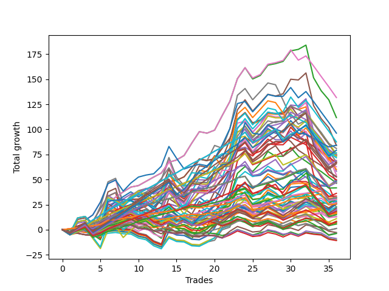

# Short Wallace Doodle 014 
- Symbol: ES
- Date Range: 03/18/2022 - 07/08/2022
- Trading Period: 7:20-12:30
- Number of Trades: 31



| Name | Win Percent | Profit | Avg Profit / Trade |     | Name | Win Percent | Profit | Avg Profit / Trade |
| ---- | ----------- | ------ | ------------------ | --- | ---- | ----------- | ------ | ------------------ |
| Sorted By <br> Profit | | | | | Sorted By <br> Win Percentage ||||
| Two | 83.87 | 102000.00 | 3290.32 |     | Two | 83.87 | 102000.00 | 3290.32 |
| Seventy-One | 61.29 | 80500.00 | 2596.77 |     | One | 83.87 | 67500.00 | 2177.42 |
| Fifty-Five | 61.29 | 80500.00 | 2596.77 |     | Fifty-Seven | 77.42 | 51500.00 | 1661.29 |
| Thirty-Nine | 61.29 | 80500.00 | 2596.77 |     | Fifty-Eight | 74.19 | 78375.00 | 2528.23 |
| Twenty-Three | 61.29 | 80500.00 | 2596.77 |     | Three | 74.19 | 46125.00 | 1487.90 |
| Seven | 61.29 | 80500.00 | 2596.77 |     | Four | 70.97 | 67500.00 | 2177.42 |
| Five | 67.74 | 79750.00 | 2572.58 |     | Sixty-Two | 70.97 | 65750.00 | 2120.97 |
| Fifty-Eight | 74.19 | 78375.00 | 2528.23 |     | Seventy | 70.97 | 59375.00 | 1915.32 |
| Sixty-Three | 58.06 | 72875.00 | 2350.81 |     | Fifty-Four | 70.97 | 59375.00 | 1915.32 |
| Sixty-Six | 67.74 | 70750.00 | 2282.26 |     | Thirty-Eight | 70.97 | 59375.00 | 1915.32 |
| One | 83.87 | 67500.00 | 2177.42 |     | Twenty-Two | 70.97 | 59375.00 | 1915.32 |
| Four | 70.97 | 67500.00 | 2177.42 |     | Six | 70.97 | 59375.00 | 1915.32 |
| Sixty-Two | 70.97 | 65750.00 | 2120.97 |     | Sixty-Five | 70.97 | 45875.00 | 1479.84 |
| Seventy-Four | 48.39 | 65625.00 | 2116.94 |     | Fifty-Nine | 70.97 | 45125.00 | 1455.65 |
| Sixty-Nine | 54.84 | 65375.00 | 2108.87 |     | Zero | 70.97 | 29875.00 | 963.71 |
| Forty-Seven | 41.94 | 65250.00 | 2104.84 |     | Five | 67.74 | 79750.00 | 2572.58 |
| Sixty | 67.74 | 65000.00 | 2096.77 |     | Sixty-Six | 67.74 | 70750.00 | 2282.26 |
| Fifteen | 22.58 | 64875.00 | 2092.74 |     | Sixty | 67.74 | 65000.00 | 2096.77 |
| Seventy-Five | 64.52 | 63875.00 | 2060.48 |     | Seventy-Five | 64.52 | 63875.00 | 2060.48 |
| Thirty-One | 25.81 | 61250.00 | 1975.81 |     | Fifty-Six | 64.52 | 18250.00 | 588.71 |
| Seventy | 70.97 | 59375.00 | 1915.32 |     | Seventy-One | 61.29 | 80500.00 | 2596.77 |
| Fifty-Four | 70.97 | 59375.00 | 1915.32 |     | Fifty-Five | 61.29 | 80500.00 | 2596.77 |
| Thirty-Eight | 70.97 | 59375.00 | 1915.32 |     | Thirty-Nine | 61.29 | 80500.00 | 2596.77 |
| Twenty-Two | 70.97 | 59375.00 | 1915.32 |     | Twenty-Three | 61.29 | 80500.00 | 2596.77 |
| Six | 70.97 | 59375.00 | 1915.32 |     | Seven | 61.29 | 80500.00 | 2596.77 |
| Sixty-One | 61.29 | 58750.00 | 1895.16 |     | Sixty-One | 61.29 | 58750.00 | 1895.16 |
| Sixty-Eight | 51.61 | 56000.00 | 1806.45 |     | Sixty-Seven | 61.29 | 45750.00 | 1475.81 |
| Forty-Two | 54.84 | 55625.00 | 1794.35 |     | Sixty-Four | 61.29 | 15625.00 | 504.03 |
| Fifty-Seven | 77.42 | 51500.00 | 1661.29 |     | Twenty-Four | 61.29 | 14625.00 | 471.77 |
| Seventy-Three | 54.84 | 48125.00 | 1552.42 |     | Forty | 61.29 | 11250.00 | 362.90 |
| Forty-Four | 45.16 | 46875.00 | 1512.10 |     | Sixty-Three | 58.06 | 72875.00 | 2350.81 |
| Three | 74.19 | 46125.00 | 1487.90 |     | Forty-One | 58.06 | 30625.00 | 987.90 |
| Forty-Five | 41.94 | 46125.00 | 1487.90 |     | Sixty-Nine | 54.84 | 65375.00 | 2108.87 |
| Sixty-Five | 70.97 | 45875.00 | 1479.84 |     | Forty-Two | 54.84 | 55625.00 | 1794.35 |
| Sixty-Seven | 61.29 | 45750.00 | 1475.81 |     | Seventy-Three | 54.84 | 48125.00 | 1552.42 |
| Fifty-Nine | 70.97 | 45125.00 | 1455.65 |     | Twenty-Five | 54.84 | 25625.00 | 826.61 |
| Twenty-Six | 51.61 | 45000.00 | 1451.61 |     | Sixty-Eight | 51.61 | 56000.00 | 1806.45 |
| Forty-Six | 51.61 | 44875.00 | 1447.58 |     | Twenty-Six | 51.61 | 45000.00 | 1451.61 |
| Twenty-Eight | 45.16 | 43000.00 | 1387.10 |     | Forty-Six | 51.61 | 44875.00 | 1447.58 |
| Twenty-Nine | 41.94 | 39750.00 | 1282.26 |     | Seventy-Two | 51.61 | 39250.00 | 1266.13 |
| Seventy-Two | 51.61 | 39250.00 | 1266.13 |     | Thirty-Two | 51.61 | 11625.00 | 375.00 |
| Fourteen | 32.26 | 38250.00 | 1233.87 |     | Forty-Eight | 51.61 | 11375.00 | 366.94 |
| Thirty | 35.48 | 36250.00 | 1169.35 |     | Eight | 51.61 | 6250.00 | 201.61 |
| Forty-One | 58.06 | 30625.00 | 987.90 |     | Seventy-Four | 48.39 | 65625.00 | 2116.94 |
| Zero | 70.97 | 29875.00 | 963.71 |     | twenty-Seven | 48.39 | 29625.00 | 955.65 |
| twenty-Seven | 48.39 | 29625.00 | 955.65 |     | Forty-Three | 48.39 | 29000.00 | 935.48 |
| Forty-Three | 48.39 | 29000.00 | 935.48 |     | Nine | 48.39 | 16625.00 | 536.29 |
| Twenty-Five | 54.84 | 25625.00 | 826.61 |     | Thirty-Five | 48.39 | 13625.00 | 439.52 |
| Fifty-Three | 41.94 | 24250.00 | 782.26 |     | Forty-Four | 45.16 | 46875.00 | 1512.10 |
| Ten | 41.94 | 22375.00 | 721.77 |     | Twenty-Eight | 45.16 | 43000.00 | 1387.10 |
| Fifty | 41.94 | 22000.00 | 709.68 |     | Eleven | 45.16 | 19500.00 | 629.03 |
| Fifty-Two | 41.94 | 21125.00 | 681.45 |     | Thirty-Four | 45.16 | 16875.00 | 544.35 |
| Twelve | 38.71 | 19625.00 | 633.06 |     | Fifty-One | 45.16 | 16625.00 | 536.29 |
| Eleven | 45.16 | 19500.00 | 629.03 |     | Thirty-Seven | 45.16 | 14500.00 | 467.74 |
| Fifty-Six | 64.52 | 18250.00 | 588.71 |     | Forty-Nine | 45.16 | 13250.00 | 427.42 |
| Thirty-Four | 45.16 | 16875.00 | 544.35 |     | Thirty-Six | 45.16 | 11875.00 | 383.06 |
| Nine | 48.39 | 16625.00 | 536.29 |     | Thirty-Three | 45.16 | 11000.00 | 354.84 |
| Fifty-One | 45.16 | 16625.00 | 536.29 |     | Sixten | 45.16 | 5875.00 | 189.52 |
| Sixty-Four | 61.29 | 15625.00 | 504.03 |     | Forty-Seven | 41.94 | 65250.00 | 2104.84 |
| Twenty-Four | 61.29 | 14625.00 | 471.77 |     | Forty-Five | 41.94 | 46125.00 | 1487.90 |
| Thirty-Seven | 45.16 | 14500.00 | 467.74 |     | Twenty-Nine | 41.94 | 39750.00 | 1282.26 |
| Thirty-Five | 48.39 | 13625.00 | 439.52 |     | Fifty-Three | 41.94 | 24250.00 | 782.26 |
| Forty-Nine | 45.16 | 13250.00 | 427.42 |     | Ten | 41.94 | 22375.00 | 721.77 |
| Thirty-Six | 45.16 | 11875.00 | 383.06 |     | Fifty | 41.94 | 22000.00 | 709.68 |
| Thirty-Two | 51.61 | 11625.00 | 375.00 |     | Fifty-Two | 41.94 | 21125.00 | 681.45 |
| Forty-Eight | 51.61 | 11375.00 | 366.94 |     | Nineteen | 41.94 | 5875.00 | 189.52 |
| Forty | 61.29 | 11250.00 | 362.90 |     | Twelve | 38.71 | 19625.00 | 633.06 |
| Thirty-Three | 45.16 | 11000.00 | 354.84 |     | Twenty | 38.71 | 2750.00 | 88.71 |
| Thirteen | 32.26 | 9875.00 | 318.55 |     | Eighteen | 38.71 | 2750.00 | 88.71 |
| Eight | 51.61 | 6250.00 | 201.61 |     | Seventeen | 38.71 | 2750.00 | 88.71 |
| Sixten | 45.16 | 5875.00 | 189.52 |     | Twenty-One | 38.71 | 1250.00 | 40.32 |
| Nineteen | 41.94 | 5875.00 | 189.52 |     | Thirty | 35.48 | 36250.00 | 1169.35 |
| Twenty | 38.71 | 2750.00 | 88.71 |     | Fourteen | 32.26 | 38250.00 | 1233.87 |
| Eighteen | 38.71 | 2750.00 | 88.71 |     | Thirteen | 32.26 | 9875.00 | 318.55 |
| Seventeen | 38.71 | 2750.00 | 88.71 |     | Thirty-One | 25.81 | 61250.00 | 1975.81 |
| Twenty-One | 38.71 | 1250.00 | 40.32 |     | Fifteen | 22.58 | 64875.00 | 2092.74 |

## NO STOPLOSS

### Test Zero
* Sell when price hits the middle line of the 20p bollinger
* No Stoploss
* Results:
```
Total Trades: 31
Percent Up: 29.03
Percent Down: 70.97
Total Points Moved Down: 59.75
Potential Profit: 29875.00
Total Points Ups: 23.50 Count Ups: 9
Total Points Downs: 83.25 Count Downs: 22
```

<details><summary>Trades</summary>

<code>In: 2022-03-25 11:05:00		Out: 2022-03-25 11:17:40		Total Position Time: 12:40		Total Move Down: -0.50		Total to Date: -0.50</code> <br />
<code>In: 2022-03-25 11:57:00		Out: 2022-03-25 11:57:20		Total Position Time: 00:20		Total Move Down: 0.75		Total to Date: 0.25</code> <br />
<code>In: 2022-04-01 11:34:00		Out: 2022-04-01 11:42:20		Total Position Time: 08:20		Total Move Down: 2.50		Total to Date: 2.75</code> <br />
<code>In: 2022-04-06 10:36:00		Out: 2022-04-06 10:47:15		Total Position Time: 11:15		Total Move Down: -2.50		Total to Date: 0.25</code> <br />
<code>In: 2022-04-06 10:43:00		Out: 2022-04-06 10:47:15		Total Position Time: 04:15		Total Move Down: 5.00		Total to Date: 5.25</code> <br />
<code>In: 2022-04-06 11:05:00		Out: 2022-04-06 11:05:40		Total Position Time: 00:40		Total Move Down: 7.75		Total to Date: 13.00</code> <br />
<code>In: 2022-04-07 11:03:00		Out: 2022-04-07 11:15:15		Total Position Time: 12:15		Total Move Down: 2.50		Total to Date: 15.50</code> <br />
<code>In: 2022-04-08 07:33:00		Out: 2022-04-08 07:44:35		Total Position Time: 11:35		Total Move Down: 3.25		Total to Date: 18.75</code> <br />
<code>In: 2022-04-18 07:27:00		Out: 2022-04-18 07:36:40		Total Position Time: 09:40		Total Move Down: 3.25		Total to Date: 22.00</code> <br />
<code>In: 2022-04-20 07:40:00		Out: 2022-04-20 08:00:20		Total Position Time: 20:20		Total Move Down: -2.75		Total to Date: 19.25</code> <br />
<code>In: 2022-04-20 09:54:00		Out: 2022-04-20 09:59:05		Total Position Time: 05:05		Total Move Down: 2.75		Total to Date: 22.00</code> <br />
<code>In: 2022-04-25 10:14:00		Out: 2022-04-25 10:26:25		Total Position Time: 12:25		Total Move Down: -0.50		Total to Date: 21.50</code> <br />
<code>In: 2022-04-27 08:34:00		Out: 2022-04-27 08:45:05		Total Position Time: 11:05		Total Move Down: 1.25		Total to Date: 22.75</code> <br />
<code>In: 2022-05-24 09:18:00		Out: 2022-05-24 09:21:30		Total Position Time: 03:30		Total Move Down: 5.00		Total to Date: 27.75</code> <br />
<code>In: 2022-05-24 10:43:00		Out: 2022-05-24 10:58:25		Total Position Time: 15:25		Total Move Down: -2.00		Total to Date: 25.75</code> <br />
<code>In: 2022-05-24 10:47:00		Out: 2022-05-24 10:58:25		Total Position Time: 11:25		Total Move Down: 0.25		Total to Date: 26.00</code> <br />
<code>In: 2022-05-25 11:04:00		Out: 2022-05-25 11:06:25		Total Position Time: 02:25		Total Move Down: 4.50		Total to Date: 30.50</code> <br />
<code>In: 2022-05-25 11:06:00		Out: 2022-05-25 11:06:25		Total Position Time: 00:25		Total Move Down: 3.75		Total to Date: 34.25</code> <br />
<code>In: 2022-05-31 07:23:00		Out: 2022-05-31 07:36:40		Total Position Time: 13:40		Total Move Down: 4.50		Total to Date: 38.75</code> <br />
<code>In: 2022-06-09 10:08:00		Out: 2022-06-09 10:16:10		Total Position Time: 08:10		Total Move Down: 0.50		Total to Date: 39.25</code> <br />
<code>In: 2022-06-10 12:00:00		Out: 2022-06-10 12:03:25		Total Position Time: 03:25		Total Move Down: 6.25		Total to Date: 45.50</code> <br />
<code>In: 2022-06-10 12:29:00		Out: 2022-06-10 12:30:30		Total Position Time: 01:30		Total Move Down: 6.25		Total to Date: 51.75</code> <br />
<code>In: 2022-06-13 09:40:00		Out: 2022-06-13 09:43:15		Total Position Time: 03:15		Total Move Down: 12.00		Total to Date: 63.75</code> <br />
<code>In: 2022-06-15 11:02:00		Out: 2022-06-15 11:02:10		Total Position Time: 00:10		Total Move Down: 2.00		Total to Date: 65.75</code> <br />
<code>In: 2022-06-23 12:30:00		Out: 2022-06-23 12:54:05		Total Position Time: 24:05		Total Move Down: -10.25		Total to Date: 55.50</code> <br />
<code>In: 2022-06-29 11:06:00		Out: 2022-06-29 11:18:00		Total Position Time: 12:00		Total Move Down: 1.25		Total to Date: 56.75</code> <br />
<code>In: 2022-06-29 12:31:00		Out: 2022-06-29 12:33:20		Total Position Time: 02:20		Total Move Down: 4.75		Total to Date: 61.50</code> <br />
<code>In: 2022-07-01 10:47:00		Out: 2022-07-01 10:57:10		Total Position Time: 10:10		Total Move Down: -0.50		Total to Date: 61.00</code> <br />
<code>In: 2022-07-06 11:01:00		Out: 2022-07-06 11:01:10		Total Position Time: 00:10		Total Move Down: -2.25		Total to Date: 58.75</code> <br />
<code>In: 2022-07-06 11:10:00		Out: 2022-07-06 11:10:10		Total Position Time: 00:10		Total Move Down: 3.25		Total to Date: 62.00</code> <br />
<code>In: 2022-07-06 11:35:00		Out: 2022-07-06 11:48:45		Total Position Time: 13:45		Total Move Down: -2.25		Total to Date: 59.75</code> <br />


</details>

### Test One
* Sell when the price hits the upper line of the 20p 1std bollinger
* No Stoploss
* Results:
```
Total Trades: 31
Percent Up: 16.13
Percent Down: 83.87
Total Points Moved Down: 135.00
Potential Profit: 67500.00
Total Points Ups: 19.00 Count Ups: 5
Total Points Downs: 154.00 Count Downs: 26
```

<details><summary>Trades</summary>

<code>In: 2022-03-25 11:05:00		Out: 2022-03-25 11:19:35		Total Position Time: 14:35		Total Move Down: 0.75		Total to Date: 0.75</code> <br />
<code>In: 2022-03-25 11:57:00		Out: 2022-03-25 12:00:50		Total Position Time: 03:50		Total Move Down: 2.75		Total to Date: 3.50</code> <br />
<code>In: 2022-04-01 11:34:00		Out: 2022-04-01 11:50:15		Total Position Time: 16:15		Total Move Down: 3.25		Total to Date: 6.75</code> <br />
<code>In: 2022-04-06 10:36:00		Out: 2022-04-06 10:56:55		Total Position Time: 20:55		Total Move Down: -3.50		Total to Date: 3.25</code> <br />
<code>In: 2022-04-06 10:43:00		Out: 2022-04-06 10:56:55		Total Position Time: 13:55		Total Move Down: 4.00		Total to Date: 7.25</code> <br />
<code>In: 2022-04-06 11:05:00		Out: 2022-04-06 11:07:20		Total Position Time: 02:20		Total Move Down: 12.50		Total to Date: 19.75</code> <br />
<code>In: 2022-04-07 11:03:00		Out: 2022-04-07 11:16:10		Total Position Time: 13:10		Total Move Down: 4.00		Total to Date: 23.75</code> <br />
<code>In: 2022-04-08 07:33:00		Out: 2022-04-08 07:45:55		Total Position Time: 12:55		Total Move Down: 4.50		Total to Date: 28.25</code> <br />
<code>In: 2022-04-18 07:27:00		Out: 2022-04-18 07:51:30		Total Position Time: 24:30		Total Move Down: 2.75		Total to Date: 31.00</code> <br />
<code>In: 2022-04-20 07:40:00		Out: 2022-04-20 08:00:40		Total Position Time: 20:40		Total Move Down: 0.25		Total to Date: 31.25</code> <br />
<code>In: 2022-04-20 09:54:00		Out: 2022-04-20 10:08:15		Total Position Time: 14:15		Total Move Down: 4.25		Total to Date: 35.50</code> <br />
<code>In: 2022-04-25 10:14:00		Out: 2022-04-25 10:27:10		Total Position Time: 13:10		Total Move Down: 3.25		Total to Date: 38.75</code> <br />
<code>In: 2022-04-27 08:34:00		Out: 2022-04-27 08:48:05		Total Position Time: 14:05		Total Move Down: 3.75		Total to Date: 42.50</code> <br />
<code>In: 2022-05-24 09:18:00		Out: 2022-05-24 09:29:00		Total Position Time: 11:00		Total Move Down: 6.25		Total to Date: 48.75</code> <br />
<code>In: 2022-05-24 10:43:00		Out: 2022-05-24 11:01:40		Total Position Time: 18:40		Total Move Down: 1.25		Total to Date: 50.00</code> <br />
<code>In: 2022-05-24 10:47:00		Out: 2022-05-24 11:01:40		Total Position Time: 14:40		Total Move Down: 3.50		Total to Date: 53.50</code> <br />
<code>In: 2022-05-25 11:04:00		Out: 2022-05-25 11:06:40		Total Position Time: 02:40		Total Move Down: 12.25		Total to Date: 65.75</code> <br />
<code>In: 2022-05-25 11:06:00		Out: 2022-05-25 11:06:40		Total Position Time: 00:40		Total Move Down: 11.50		Total to Date: 77.25</code> <br />
<code>In: 2022-05-31 07:23:00		Out: 2022-05-31 07:38:00		Total Position Time: 15:00		Total Move Down: 8.25		Total to Date: 85.50</code> <br />
<code>In: 2022-06-09 10:08:00		Out: 2022-06-09 10:18:10		Total Position Time: 10:10		Total Move Down: 1.75		Total to Date: 87.25</code> <br />
<code>In: 2022-06-10 12:00:00		Out: 2022-06-10 12:04:20		Total Position Time: 04:20		Total Move Down: 10.00		Total to Date: 97.25</code> <br />
<code>In: 2022-06-10 12:29:00		Out: 2022-06-10 12:35:55		Total Position Time: 06:55		Total Move Down: 10.25		Total to Date: 107.50</code> <br />
<code>In: 2022-06-13 09:40:00		Out: 2022-06-13 09:47:55		Total Position Time: 07:55		Total Move Down: 19.00		Total to Date: 126.50</code> <br />
<code>In: 2022-06-15 11:02:00		Out: 2022-06-15 11:03:00		Total Position Time: 01:00		Total Move Down: 6.75		Total to Date: 133.25</code> <br />
<code>In: 2022-06-23 12:30:00		Out: 2022-06-23 12:59:55		Total Position Time: 29:55		Total Move Down: -13.00		Total to Date: 120.25</code> <br />
<code>In: 2022-06-29 11:06:00		Out: 2022-06-29 11:20:25		Total Position Time: 14:25		Total Move Down: 2.50		Total to Date: 122.75</code> <br />
<code>In: 2022-06-29 12:31:00		Out: 2022-06-29 12:34:10		Total Position Time: 03:10		Total Move Down: 7.25		Total to Date: 130.00</code> <br />
<code>In: 2022-07-01 10:47:00		Out: 2022-07-01 11:04:25		Total Position Time: 17:25		Total Move Down: -0.75		Total to Date: 129.25</code> <br />
<code>In: 2022-07-06 11:01:00		Out: 2022-07-06 11:01:15		Total Position Time: 00:15		Total Move Down: -0.00		Total to Date: 129.25</code> <br />
<code>In: 2022-07-06 11:10:00		Out: 2022-07-06 11:11:10		Total Position Time: 01:10		Total Move Down: 7.50		Total to Date: 136.75</code> <br />
<code>In: 2022-07-06 11:35:00		Out: 2022-07-06 12:00:50		Total Position Time: 25:50		Total Move Down: -1.75		Total to Date: 135.00</code> <br />


</details>

### Test Two
* Sell when the price hits the upper line of the 20p 2std bollinger
* No Stoploss
* Results:
```
Total Trades: 31
Percent Up: 16.13
Percent Down: 83.87
Total Points Moved Down: 204.00
Potential Profit: 102000.00
Total Points Ups: 19.75 Count Ups: 5
Total Points Downs: 223.75 Count Downs: 26
```

<details><summary>Trades</summary>

<code>In: 2022-03-25 11:05:00		Out: 2022-03-25 11:34:55		Total Position Time: 29:55		Total Move Down: -3.50		Total to Date: -3.50</code> <br />
<code>In: 2022-03-25 11:57:00		Out: 2022-03-25 12:01:50		Total Position Time: 04:50		Total Move Down: 4.75		Total to Date: 1.25</code> <br />
<code>In: 2022-04-01 11:34:00		Out: 2022-04-01 11:50:55		Total Position Time: 16:55		Total Move Down: 4.25		Total to Date: 5.50</code> <br />
<code>In: 2022-04-06 10:36:00		Out: 2022-04-06 10:58:00		Total Position Time: 22:00		Total Move Down: -1.75		Total to Date: 3.75</code> <br />
<code>In: 2022-04-06 10:43:00		Out: 2022-04-06 10:58:00		Total Position Time: 15:00		Total Move Down: 5.75		Total to Date: 9.50</code> <br />
<code>In: 2022-04-06 11:05:00		Out: 2022-04-06 11:08:20		Total Position Time: 03:20		Total Move Down: 18.50		Total to Date: 28.00</code> <br />
<code>In: 2022-04-07 11:03:00		Out: 2022-04-07 11:18:40		Total Position Time: 15:40		Total Move Down: 7.00		Total to Date: 35.00</code> <br />
<code>In: 2022-04-08 07:33:00		Out: 2022-04-08 07:49:20		Total Position Time: 16:20		Total Move Down: 5.25		Total to Date: 40.25</code> <br />
<code>In: 2022-04-18 07:27:00		Out: 2022-04-18 07:51:45		Total Position Time: 24:45		Total Move Down: 4.75		Total to Date: 45.00</code> <br />
<code>In: 2022-04-20 07:40:00		Out: 2022-04-20 08:01:10		Total Position Time: 21:10		Total Move Down: 3.25		Total to Date: 48.25</code> <br />
<code>In: 2022-04-20 09:54:00		Out: 2022-04-20 10:08:15		Total Position Time: 14:15		Total Move Down: 4.25		Total to Date: 52.50</code> <br />
<code>In: 2022-04-25 10:14:00		Out: 2022-04-25 10:28:20		Total Position Time: 14:20		Total Move Down: 4.75		Total to Date: 57.25</code> <br />
<code>In: 2022-04-27 08:34:00		Out: 2022-04-27 08:48:10		Total Position Time: 14:10		Total Move Down: 5.25		Total to Date: 62.50</code> <br />
<code>In: 2022-05-24 09:18:00		Out: 2022-05-24 09:32:35		Total Position Time: 14:35		Total Move Down: 13.25		Total to Date: 75.75</code> <br />
<code>In: 2022-05-24 10:43:00		Out: 2022-05-24 11:05:00		Total Position Time: 22:00		Total Move Down: 3.75		Total to Date: 79.50</code> <br />
<code>In: 2022-05-24 10:47:00		Out: 2022-05-24 11:05:00		Total Position Time: 18:00		Total Move Down: 6.00		Total to Date: 85.50</code> <br />
<code>In: 2022-05-25 11:04:00		Out: 2022-05-25 11:06:50		Total Position Time: 02:50		Total Move Down: 16.00		Total to Date: 101.50</code> <br />
<code>In: 2022-05-25 11:06:00		Out: 2022-05-25 11:06:50		Total Position Time: 00:50		Total Move Down: 15.25		Total to Date: 116.75</code> <br />
<code>In: 2022-05-31 07:23:00		Out: 2022-05-31 07:52:55		Total Position Time: 29:55		Total Move Down: -1.50		Total to Date: 115.25</code> <br />
<code>In: 2022-06-09 10:08:00		Out: 2022-06-09 10:18:55		Total Position Time: 10:55		Total Move Down: 3.25		Total to Date: 118.50</code> <br />
<code>In: 2022-06-10 12:00:00		Out: 2022-06-10 12:06:05		Total Position Time: 06:05		Total Move Down: 14.50		Total to Date: 133.00</code> <br />
<code>In: 2022-06-10 12:29:00		Out: 2022-06-10 12:43:25		Total Position Time: 14:25		Total Move Down: 15.25		Total to Date: 148.25</code> <br />
<code>In: 2022-06-13 09:40:00		Out: 2022-06-13 09:54:45		Total Position Time: 14:45		Total Move Down: 24.75		Total to Date: 173.00</code> <br />
<code>In: 2022-06-15 11:02:00		Out: 2022-06-15 11:03:15		Total Position Time: 01:15		Total Move Down: 13.00		Total to Date: 186.00</code> <br />
<code>In: 2022-06-23 12:30:00		Out: 2022-06-23 12:59:55		Total Position Time: 29:55		Total Move Down: -13.00		Total to Date: 173.00</code> <br />
<code>In: 2022-06-29 11:06:00		Out: 2022-06-29 11:20:40		Total Position Time: 14:40		Total Move Down: 3.50		Total to Date: 176.50</code> <br />
<code>In: 2022-06-29 12:31:00		Out: 2022-06-29 12:35:15		Total Position Time: 04:15		Total Move Down: 10.00		Total to Date: 186.50</code> <br />
<code>In: 2022-07-01 10:47:00		Out: 2022-07-01 11:07:55		Total Position Time: 20:55		Total Move Down: 1.50		Total to Date: 188.00</code> <br />
<code>In: 2022-07-06 11:01:00		Out: 2022-07-06 11:01:15		Total Position Time: 00:15		Total Move Down: -0.00		Total to Date: 188.00</code> <br />
<code>In: 2022-07-06 11:10:00		Out: 2022-07-06 11:12:15		Total Position Time: 02:15		Total Move Down: 14.50		Total to Date: 202.50</code> <br />
<code>In: 2022-07-06 11:35:00		Out: 2022-07-06 12:01:30		Total Position Time: 26:30		Total Move Down: 1.50		Total to Date: 204.00</code> <br />


</details>

### Test Three
* Sell when price hits the middle line of the 50p bollinger
* No Stoploss
* Results:
```
Total Trades: 31
Percent Up: 25.81
Percent Down: 74.19
Total Points Moved Down: 92.25
Potential Profit: 46125.00
Total Points Ups: 71.75 Count Ups: 8
Total Points Downs: 164.00 Count Downs: 23
```

<details><summary>Trades</summary>

<code>In: 2022-03-25 11:05:00		Out: 2022-03-25 11:34:55		Total Position Time: 29:55		Total Move Down: -3.50		Total to Date: -3.50</code> <br />
<code>In: 2022-03-25 11:57:00		Out: 2022-03-25 12:00:45		Total Position Time: 03:45		Total Move Down: 1.75		Total to Date: -1.75</code> <br />
<code>In: 2022-04-01 11:34:00		Out: 2022-04-01 11:54:05		Total Position Time: 20:05		Total Move Down: 4.75		Total to Date: 3.00</code> <br />
<code>In: 2022-04-06 10:36:00		Out: 2022-04-06 11:00:10		Total Position Time: 24:10		Total Move Down: 5.25		Total to Date: 8.25</code> <br />
<code>In: 2022-04-06 10:43:00		Out: 2022-04-06 11:00:10		Total Position Time: 17:10		Total Move Down: 12.75		Total to Date: 21.00</code> <br />
<code>In: 2022-04-06 11:05:00		Out: 2022-04-06 11:07:20		Total Position Time: 02:20		Total Move Down: 12.50		Total to Date: 33.50</code> <br />
<code>In: 2022-04-07 11:03:00		Out: 2022-04-07 11:32:55		Total Position Time: 29:55		Total Move Down: 3.50		Total to Date: 37.00</code> <br />
<code>In: 2022-04-08 07:33:00		Out: 2022-04-08 08:02:55		Total Position Time: 29:55		Total Move Down: -25.00		Total to Date: 12.00</code> <br />
<code>In: 2022-04-18 07:27:00		Out: 2022-04-18 07:51:50		Total Position Time: 24:50		Total Move Down: 5.25		Total to Date: 17.25</code> <br />
<code>In: 2022-04-20 07:40:00		Out: 2022-04-20 08:02:45		Total Position Time: 22:45		Total Move Down: 3.00		Total to Date: 20.25</code> <br />
<code>In: 2022-04-20 09:54:00		Out: 2022-04-20 10:19:10		Total Position Time: 25:10		Total Move Down: 3.00		Total to Date: 23.25</code> <br />
<code>In: 2022-04-25 10:14:00		Out: 2022-04-25 10:28:20		Total Position Time: 14:20		Total Move Down: 4.75		Total to Date: 28.00</code> <br />
<code>In: 2022-04-27 08:34:00		Out: 2022-04-27 08:53:05		Total Position Time: 19:05		Total Move Down: 8.75		Total to Date: 36.75</code> <br />
<code>In: 2022-05-24 09:18:00		Out: 2022-05-24 09:31:20		Total Position Time: 13:20		Total Move Down: 10.75		Total to Date: 47.50</code> <br />
<code>In: 2022-05-24 10:43:00		Out: 2022-05-24 11:12:55		Total Position Time: 29:55		Total Move Down: -19.50		Total to Date: 28.00</code> <br />
<code>In: 2022-05-24 10:47:00		Out: 2022-05-24 11:16:55		Total Position Time: 29:55		Total Move Down: -8.50		Total to Date: 19.50</code> <br />
<code>In: 2022-05-25 11:04:00		Out: 2022-05-25 11:06:35		Total Position Time: 02:35		Total Move Down: 9.25		Total to Date: 28.75</code> <br />
<code>In: 2022-05-25 11:06:00		Out: 2022-05-25 11:06:35		Total Position Time: 00:35		Total Move Down: 8.50		Total to Date: 37.25</code> <br />
<code>In: 2022-05-31 07:23:00		Out: 2022-05-31 07:52:55		Total Position Time: 29:55		Total Move Down: -1.50		Total to Date: 35.75</code> <br />
<code>In: 2022-06-09 10:08:00		Out: 2022-06-09 10:22:05		Total Position Time: 14:05		Total Move Down: 4.75		Total to Date: 40.50</code> <br />
<code>In: 2022-06-10 12:00:00		Out: 2022-06-10 12:03:40		Total Position Time: 03:40		Total Move Down: 9.50		Total to Date: 50.00</code> <br />
<code>In: 2022-06-10 12:29:00		Out: 2022-06-10 12:33:40		Total Position Time: 04:40		Total Move Down: 9.00		Total to Date: 59.00</code> <br />
<code>In: 2022-06-13 09:40:00		Out: 2022-06-13 09:47:55		Total Position Time: 07:55		Total Move Down: 19.00		Total to Date: 78.00</code> <br />
<code>In: 2022-06-15 11:02:00		Out: 2022-06-15 11:02:10		Total Position Time: 00:10		Total Move Down: 2.00		Total to Date: 80.00</code> <br />
<code>In: 2022-06-23 12:30:00		Out: 2022-06-23 12:59:55		Total Position Time: 29:55		Total Move Down: -13.00		Total to Date: 67.00</code> <br />
<code>In: 2022-06-29 11:06:00		Out: 2022-06-29 11:31:05		Total Position Time: 25:05		Total Move Down: 6.00		Total to Date: 73.00</code> <br />
<code>In: 2022-06-29 12:31:00		Out: 2022-06-29 12:34:15		Total Position Time: 03:15		Total Move Down: 9.00		Total to Date: 82.00</code> <br />
<code>In: 2022-07-01 10:47:00		Out: 2022-07-01 11:10:55		Total Position Time: 23:55		Total Move Down: 3.50		Total to Date: 85.50</code> <br />
<code>In: 2022-07-06 11:01:00		Out: 2022-07-06 11:01:15		Total Position Time: 00:15		Total Move Down: -0.00		Total to Date: 85.50</code> <br />
<code>In: 2022-07-06 11:10:00		Out: 2022-07-06 11:11:10		Total Position Time: 01:10		Total Move Down: 7.50		Total to Date: 93.00</code> <br />
<code>In: 2022-07-06 11:35:00		Out: 2022-07-06 12:04:55		Total Position Time: 29:55		Total Move Down: -0.75		Total to Date: 92.25</code> <br />


</details>

### Test Four
* Sell when the price hits the upper line of the 50p 1std bollinger
* No Stoploss
* Results:
```
Total Trades: 31
Percent Up: 29.03
Percent Down: 70.97
Total Points Moved Down: 135.00
Potential Profit: 67500.00
Total Points Ups: 73.50 Count Ups: 9
Total Points Downs: 208.50 Count Downs: 22
```

<details><summary>Trades</summary>

<code>In: 2022-03-25 11:05:00		Out: 2022-03-25 11:34:55		Total Position Time: 29:55		Total Move Down: -3.50		Total to Date: -3.50</code> <br />
<code>In: 2022-03-25 11:57:00		Out: 2022-03-25 12:01:40		Total Position Time: 04:40		Total Move Down: 3.75		Total to Date: 0.25</code> <br />
<code>In: 2022-04-01 11:34:00		Out: 2022-04-01 12:03:55		Total Position Time: 29:55		Total Move Down: 1.50		Total to Date: 1.75</code> <br />
<code>In: 2022-04-06 10:36:00		Out: 2022-04-06 11:00:10		Total Position Time: 24:10		Total Move Down: 5.25		Total to Date: 7.00</code> <br />
<code>In: 2022-04-06 10:43:00		Out: 2022-04-06 11:00:10		Total Position Time: 17:10		Total Move Down: 12.75		Total to Date: 19.75</code> <br />
<code>In: 2022-04-06 11:05:00		Out: 2022-04-06 11:08:10		Total Position Time: 03:10		Total Move Down: 18.50		Total to Date: 38.25</code> <br />
<code>In: 2022-04-07 11:03:00		Out: 2022-04-07 11:32:55		Total Position Time: 29:55		Total Move Down: 3.50		Total to Date: 41.75</code> <br />
<code>In: 2022-04-08 07:33:00		Out: 2022-04-08 08:02:55		Total Position Time: 29:55		Total Move Down: -25.00		Total to Date: 16.75</code> <br />
<code>In: 2022-04-18 07:27:00		Out: 2022-04-18 07:56:55		Total Position Time: 29:55		Total Move Down: 7.50		Total to Date: 24.25</code> <br />
<code>In: 2022-04-20 07:40:00		Out: 2022-04-20 08:09:55		Total Position Time: 29:55		Total Move Down: 5.25		Total to Date: 29.50</code> <br />
<code>In: 2022-04-20 09:54:00		Out: 2022-04-20 10:23:55		Total Position Time: 29:55		Total Move Down: 2.00		Total to Date: 31.50</code> <br />
<code>In: 2022-04-25 10:14:00		Out: 2022-04-25 10:43:55		Total Position Time: 29:55		Total Move Down: 1.25		Total to Date: 32.75</code> <br />
<code>In: 2022-04-27 08:34:00		Out: 2022-04-27 09:01:45		Total Position Time: 27:45		Total Move Down: 14.25		Total to Date: 47.00</code> <br />
<code>In: 2022-05-24 09:18:00		Out: 2022-05-24 09:33:15		Total Position Time: 15:15		Total Move Down: 15.25		Total to Date: 62.25</code> <br />
<code>In: 2022-05-24 10:43:00		Out: 2022-05-24 11:12:55		Total Position Time: 29:55		Total Move Down: -19.50		Total to Date: 42.75</code> <br />
<code>In: 2022-05-24 10:47:00		Out: 2022-05-24 11:16:55		Total Position Time: 29:55		Total Move Down: -8.50		Total to Date: 34.25</code> <br />
<code>In: 2022-05-25 11:04:00		Out: 2022-05-25 11:06:40		Total Position Time: 02:40		Total Move Down: 12.25		Total to Date: 46.50</code> <br />
<code>In: 2022-05-25 11:06:00		Out: 2022-05-25 11:06:40		Total Position Time: 00:40		Total Move Down: 11.50		Total to Date: 58.00</code> <br />
<code>In: 2022-05-31 07:23:00		Out: 2022-05-31 07:52:55		Total Position Time: 29:55		Total Move Down: -1.50		Total to Date: 56.50</code> <br />
<code>In: 2022-06-09 10:08:00		Out: 2022-06-09 10:23:50		Total Position Time: 15:50		Total Move Down: 8.00		Total to Date: 64.50</code> <br />
<code>In: 2022-06-10 12:00:00		Out: 2022-06-10 12:05:35		Total Position Time: 05:35		Total Move Down: 13.50		Total to Date: 78.00</code> <br />
<code>In: 2022-06-10 12:29:00		Out: 2022-06-10 12:42:40		Total Position Time: 13:40		Total Move Down: 13.25		Total to Date: 91.25</code> <br />
<code>In: 2022-06-13 09:40:00		Out: 2022-06-13 09:54:40		Total Position Time: 14:40		Total Move Down: 23.75		Total to Date: 115.00</code> <br />
<code>In: 2022-06-15 11:02:00		Out: 2022-06-15 11:03:00		Total Position Time: 01:00		Total Move Down: 6.75		Total to Date: 121.75</code> <br />
<code>In: 2022-06-23 12:30:00		Out: 2022-06-23 12:59:55		Total Position Time: 29:55		Total Move Down: -13.00		Total to Date: 108.75</code> <br />
<code>In: 2022-06-29 11:06:00		Out: 2022-06-29 11:35:55		Total Position Time: 29:55		Total Move Down: 8.25		Total to Date: 117.00</code> <br />
<code>In: 2022-06-29 12:31:00		Out: 2022-06-29 12:41:05		Total Position Time: 10:05		Total Move Down: 11.75		Total to Date: 128.75</code> <br />
<code>In: 2022-07-01 10:47:00		Out: 2022-07-01 11:16:55		Total Position Time: 29:55		Total Move Down: -1.75		Total to Date: 127.00</code> <br />
<code>In: 2022-07-06 11:01:00		Out: 2022-07-06 11:01:15		Total Position Time: 00:15		Total Move Down: -0.00		Total to Date: 127.00</code> <br />
<code>In: 2022-07-06 11:10:00		Out: 2022-07-06 11:11:35		Total Position Time: 01:35		Total Move Down: 8.75		Total to Date: 135.75</code> <br />
<code>In: 2022-07-06 11:35:00		Out: 2022-07-06 12:04:55		Total Position Time: 29:55		Total Move Down: -0.75		Total to Date: 135.00</code> <br />


</details>

### Test Five
* Sell when the price hits the upper line of the 50p 2std bollinger
* No Stoploss
* Results:
```
Total Trades: 31
Percent Up: 32.26
Percent Down: 67.74
Total Points Moved Down: 159.50
Potential Profit: 79750.00
Total Points Ups: 83.25 Count Ups: 10
Total Points Downs: 242.75 Count Downs: 21
```

<details><summary>Trades</summary>

<code>In: 2022-03-25 11:05:00		Out: 2022-03-25 11:34:55		Total Position Time: 29:55		Total Move Down: -3.50		Total to Date: -3.50</code> <br />
<code>In: 2022-03-25 11:57:00		Out: 2022-03-25 12:02:00		Total Position Time: 05:00		Total Move Down: 6.25		Total to Date: 2.75</code> <br />
<code>In: 2022-04-01 11:34:00		Out: 2022-04-01 12:03:55		Total Position Time: 29:55		Total Move Down: 1.50		Total to Date: 4.25</code> <br />
<code>In: 2022-04-06 10:36:00		Out: 2022-04-06 11:05:55		Total Position Time: 29:55		Total Move Down: -7.00		Total to Date: -2.75</code> <br />
<code>In: 2022-04-06 10:43:00		Out: 2022-04-06 11:09:40		Total Position Time: 26:40		Total Move Down: 17.00		Total to Date: 14.25</code> <br />
<code>In: 2022-04-06 11:05:00		Out: 2022-04-06 11:09:40		Total Position Time: 04:40		Total Move Down: 24.50		Total to Date: 38.75</code> <br />
<code>In: 2022-04-07 11:03:00		Out: 2022-04-07 11:32:55		Total Position Time: 29:55		Total Move Down: 3.50		Total to Date: 42.25</code> <br />
<code>In: 2022-04-08 07:33:00		Out: 2022-04-08 08:02:55		Total Position Time: 29:55		Total Move Down: -25.00		Total to Date: 17.25</code> <br />
<code>In: 2022-04-18 07:27:00		Out: 2022-04-18 07:56:55		Total Position Time: 29:55		Total Move Down: 7.50		Total to Date: 24.75</code> <br />
<code>In: 2022-04-20 07:40:00		Out: 2022-04-20 08:09:55		Total Position Time: 29:55		Total Move Down: 5.25		Total to Date: 30.00</code> <br />
<code>In: 2022-04-20 09:54:00		Out: 2022-04-20 10:23:55		Total Position Time: 29:55		Total Move Down: 2.00		Total to Date: 32.00</code> <br />
<code>In: 2022-04-25 10:14:00		Out: 2022-04-25 10:43:55		Total Position Time: 29:55		Total Move Down: 1.25		Total to Date: 33.25</code> <br />
<code>In: 2022-04-27 08:34:00		Out: 2022-04-27 09:03:55		Total Position Time: 29:55		Total Move Down: 7.50		Total to Date: 40.75</code> <br />
<code>In: 2022-05-24 09:18:00		Out: 2022-05-24 09:37:10		Total Position Time: 19:10		Total Move Down: 21.75		Total to Date: 62.50</code> <br />
<code>In: 2022-05-24 10:43:00		Out: 2022-05-24 11:12:55		Total Position Time: 29:55		Total Move Down: -19.50		Total to Date: 43.00</code> <br />
<code>In: 2022-05-24 10:47:00		Out: 2022-05-24 11:16:55		Total Position Time: 29:55		Total Move Down: -8.50		Total to Date: 34.50</code> <br />
<code>In: 2022-05-25 11:04:00		Out: 2022-05-25 11:06:50		Total Position Time: 02:50		Total Move Down: 16.00		Total to Date: 50.50</code> <br />
<code>In: 2022-05-25 11:06:00		Out: 2022-05-25 11:06:50		Total Position Time: 00:50		Total Move Down: 15.25		Total to Date: 65.75</code> <br />
<code>In: 2022-05-31 07:23:00		Out: 2022-05-31 07:52:55		Total Position Time: 29:55		Total Move Down: -1.50		Total to Date: 64.25</code> <br />
<code>In: 2022-06-09 10:08:00		Out: 2022-06-09 10:27:35		Total Position Time: 19:35		Total Move Down: 11.75		Total to Date: 76.00</code> <br />
<code>In: 2022-06-10 12:00:00		Out: 2022-06-10 12:29:55		Total Position Time: 29:55		Total Move Down: -2.75		Total to Date: 73.25</code> <br />
<code>In: 2022-06-10 12:29:00		Out: 2022-06-10 12:45:50		Total Position Time: 16:50		Total Move Down: 19.25		Total to Date: 92.50</code> <br />
<code>In: 2022-06-13 09:40:00		Out: 2022-06-13 09:58:15		Total Position Time: 18:15		Total Move Down: 30.25		Total to Date: 122.75</code> <br />
<code>In: 2022-06-15 11:02:00		Out: 2022-06-15 11:03:10		Total Position Time: 01:10		Total Move Down: 11.00		Total to Date: 133.75</code> <br />
<code>In: 2022-06-23 12:30:00		Out: 2022-06-23 12:59:55		Total Position Time: 29:55		Total Move Down: -13.00		Total to Date: 120.75</code> <br />
<code>In: 2022-06-29 11:06:00		Out: 2022-06-29 11:35:55		Total Position Time: 29:55		Total Move Down: 8.25		Total to Date: 129.00</code> <br />
<code>In: 2022-06-29 12:31:00		Out: 2022-06-29 12:53:40		Total Position Time: 22:40		Total Move Down: 16.25		Total to Date: 145.25</code> <br />
<code>In: 2022-07-01 10:47:00		Out: 2022-07-01 11:16:55		Total Position Time: 29:55		Total Move Down: -1.75		Total to Date: 143.50</code> <br />
<code>In: 2022-07-06 11:01:00		Out: 2022-07-06 11:02:25		Total Position Time: 01:25		Total Move Down: 2.25		Total to Date: 145.75</code> <br />
<code>In: 2022-07-06 11:10:00		Out: 2022-07-06 11:12:15		Total Position Time: 02:15		Total Move Down: 14.50		Total to Date: 160.25</code> <br />
<code>In: 2022-07-06 11:35:00		Out: 2022-07-06 12:04:55		Total Position Time: 29:55		Total Move Down: -0.75		Total to Date: 159.50</code> <br />


</details>

### Test Six
* Sell when the price hits the middle line of the 1std VWAP
* No Stoploss
* Results:
```
Total Trades: 31
Percent Up: 29.03
Percent Down: 70.97
Total Points Moved Down: 118.75
Potential Profit: 59375.00
Total Points Ups: 73.50 Count Ups: 9
Total Points Downs: 192.25 Count Downs: 22
```

<details><summary>Trades</summary>

<code>In: 2022-03-25 11:05:00		Out: 2022-03-25 11:34:55		Total Position Time: 29:55		Total Move Down: -3.50		Total to Date: -3.50</code> <br />
<code>In: 2022-03-25 11:57:00		Out: 2022-03-25 12:20:30		Total Position Time: 23:30		Total Move Down: 11.50		Total to Date: 8.00</code> <br />
<code>In: 2022-04-01 11:34:00		Out: 2022-04-01 12:03:55		Total Position Time: 29:55		Total Move Down: 1.50		Total to Date: 9.50</code> <br />
<code>In: 2022-04-06 10:36:00		Out: 2022-04-06 11:00:10		Total Position Time: 24:10		Total Move Down: 5.25		Total to Date: 14.75</code> <br />
<code>In: 2022-04-06 10:43:00		Out: 2022-04-06 11:00:10		Total Position Time: 17:10		Total Move Down: 12.75		Total to Date: 27.50</code> <br />
<code>In: 2022-04-06 11:05:00		Out: 2022-04-06 11:08:10		Total Position Time: 03:10		Total Move Down: 18.50		Total to Date: 46.00</code> <br />
<code>In: 2022-04-07 11:03:00		Out: 2022-04-07 11:32:55		Total Position Time: 29:55		Total Move Down: 3.50		Total to Date: 49.50</code> <br />
<code>In: 2022-04-08 07:33:00		Out: 2022-04-08 08:02:55		Total Position Time: 29:55		Total Move Down: -25.00		Total to Date: 24.50</code> <br />
<code>In: 2022-04-18 07:27:00		Out: 2022-04-18 07:55:15		Total Position Time: 28:15		Total Move Down: 8.00		Total to Date: 32.50</code> <br />
<code>In: 2022-04-20 07:40:00		Out: 2022-04-20 08:08:10		Total Position Time: 28:10		Total Move Down: 6.00		Total to Date: 38.50</code> <br />
<code>In: 2022-04-20 09:54:00		Out: 2022-04-20 10:23:55		Total Position Time: 29:55		Total Move Down: 2.00		Total to Date: 40.50</code> <br />
<code>In: 2022-04-25 10:14:00		Out: 2022-04-25 10:43:55		Total Position Time: 29:55		Total Move Down: 1.25		Total to Date: 41.75</code> <br />
<code>In: 2022-04-27 08:34:00		Out: 2022-04-27 09:03:55		Total Position Time: 29:55		Total Move Down: 7.50		Total to Date: 49.25</code> <br />
<code>In: 2022-05-24 09:18:00		Out: 2022-05-24 09:36:45		Total Position Time: 18:45		Total Move Down: 19.75		Total to Date: 69.00</code> <br />
<code>In: 2022-05-24 10:43:00		Out: 2022-05-24 11:12:55		Total Position Time: 29:55		Total Move Down: -19.50		Total to Date: 49.50</code> <br />
<code>In: 2022-05-24 10:47:00		Out: 2022-05-24 11:16:55		Total Position Time: 29:55		Total Move Down: -8.50		Total to Date: 41.00</code> <br />
<code>In: 2022-05-25 11:04:00		Out: 2022-05-25 11:06:20		Total Position Time: 02:20		Total Move Down: 2.75		Total to Date: 43.75</code> <br />
<code>In: 2022-05-25 11:06:00		Out: 2022-05-25 11:06:20		Total Position Time: 00:20		Total Move Down: 2.00		Total to Date: 45.75</code> <br />
<code>In: 2022-05-31 07:23:00		Out: 2022-05-31 07:52:55		Total Position Time: 29:55		Total Move Down: -1.50		Total to Date: 44.25</code> <br />
<code>In: 2022-06-09 10:08:00		Out: 2022-06-09 10:23:45		Total Position Time: 15:45		Total Move Down: 7.25		Total to Date: 51.50</code> <br />
<code>In: 2022-06-10 12:00:00		Out: 2022-06-10 12:05:30		Total Position Time: 05:30		Total Move Down: 13.50		Total to Date: 65.00</code> <br />
<code>In: 2022-06-10 12:29:00		Out: 2022-06-10 12:44:00		Total Position Time: 15:00		Total Move Down: 16.25		Total to Date: 81.25</code> <br />
<code>In: 2022-06-13 09:40:00		Out: 2022-06-13 09:55:05		Total Position Time: 15:05		Total Move Down: 25.00		Total to Date: 106.25</code> <br />
<code>In: 2022-06-15 11:02:00		Out: 2022-06-15 11:02:10		Total Position Time: 00:10		Total Move Down: 2.00		Total to Date: 108.25</code> <br />
<code>In: 2022-06-23 12:30:00		Out: 2022-06-23 12:59:55		Total Position Time: 29:55		Total Move Down: -13.00		Total to Date: 95.25</code> <br />
<code>In: 2022-06-29 11:06:00		Out: 2022-06-29 11:35:55		Total Position Time: 29:55		Total Move Down: 8.25		Total to Date: 103.50</code> <br />
<code>In: 2022-06-29 12:31:00		Out: 2022-06-29 12:34:15		Total Position Time: 03:15		Total Move Down: 9.00		Total to Date: 112.50</code> <br />
<code>In: 2022-07-01 10:47:00		Out: 2022-07-01 11:16:55		Total Position Time: 29:55		Total Move Down: -1.75		Total to Date: 110.75</code> <br />
<code>In: 2022-07-06 11:01:00		Out: 2022-07-06 11:01:15		Total Position Time: 00:15		Total Move Down: -0.00		Total to Date: 110.75</code> <br />
<code>In: 2022-07-06 11:10:00		Out: 2022-07-06 11:11:35		Total Position Time: 01:35		Total Move Down: 8.75		Total to Date: 119.50</code> <br />
<code>In: 2022-07-06 11:35:00		Out: 2022-07-06 12:04:55		Total Position Time: 29:55		Total Move Down: -0.75		Total to Date: 118.75</code> <br />


</details>

### Test Seven
* Sell when the price hits the upper line of the 1std VWAP
* No Stoploss
* Results:
```
Total Trades: 31
Percent Up: 38.71
Percent Down: 61.29
Total Points Moved Down: 161.00
Potential Profit: 80500.00
Total Points Ups: 115.50 Count Ups: 12
Total Points Downs: 276.50 Count Downs: 19
```

<details><summary>Trades</summary>

<code>In: 2022-03-25 11:05:00		Out: 2022-03-25 11:34:55		Total Position Time: 29:55		Total Move Down: -3.50		Total to Date: -3.50</code> <br />
<code>In: 2022-03-25 11:57:00		Out: 2022-03-25 12:26:55		Total Position Time: 29:55		Total Move Down: 15.25		Total to Date: 11.75</code> <br />
<code>In: 2022-04-01 11:34:00		Out: 2022-04-01 12:03:55		Total Position Time: 29:55		Total Move Down: 1.50		Total to Date: 13.25</code> <br />
<code>In: 2022-04-06 10:36:00		Out: 2022-04-06 11:05:55		Total Position Time: 29:55		Total Move Down: -7.00		Total to Date: 6.25</code> <br />
<code>In: 2022-04-06 10:43:00		Out: 2022-04-06 11:09:40		Total Position Time: 26:40		Total Move Down: 17.00		Total to Date: 23.25</code> <br />
<code>In: 2022-04-06 11:05:00		Out: 2022-04-06 11:09:40		Total Position Time: 04:40		Total Move Down: 24.50		Total to Date: 47.75</code> <br />
<code>In: 2022-04-07 11:03:00		Out: 2022-04-07 11:32:55		Total Position Time: 29:55		Total Move Down: 3.50		Total to Date: 51.25</code> <br />
<code>In: 2022-04-08 07:33:00		Out: 2022-04-08 08:02:55		Total Position Time: 29:55		Total Move Down: -25.00		Total to Date: 26.25</code> <br />
<code>In: 2022-04-18 07:27:00		Out: 2022-04-18 07:56:55		Total Position Time: 29:55		Total Move Down: 7.50		Total to Date: 33.75</code> <br />
<code>In: 2022-04-20 07:40:00		Out: 2022-04-20 08:09:55		Total Position Time: 29:55		Total Move Down: 5.25		Total to Date: 39.00</code> <br />
<code>In: 2022-04-20 09:54:00		Out: 2022-04-20 10:23:55		Total Position Time: 29:55		Total Move Down: 2.00		Total to Date: 41.00</code> <br />
<code>In: 2022-04-25 10:14:00		Out: 2022-04-25 10:43:55		Total Position Time: 29:55		Total Move Down: 1.25		Total to Date: 42.25</code> <br />
<code>In: 2022-04-27 08:34:00		Out: 2022-04-27 09:03:55		Total Position Time: 29:55		Total Move Down: 7.50		Total to Date: 49.75</code> <br />
<code>In: 2022-05-24 09:18:00		Out: 2022-05-24 09:47:55		Total Position Time: 29:55		Total Move Down: 22.25		Total to Date: 72.00</code> <br />
<code>In: 2022-05-24 10:43:00		Out: 2022-05-24 11:12:55		Total Position Time: 29:55		Total Move Down: -19.50		Total to Date: 52.50</code> <br />
<code>In: 2022-05-24 10:47:00		Out: 2022-05-24 11:16:55		Total Position Time: 29:55		Total Move Down: -8.50		Total to Date: 44.00</code> <br />
<code>In: 2022-05-25 11:04:00		Out: 2022-05-25 11:06:45		Total Position Time: 02:45		Total Move Down: 13.50		Total to Date: 57.50</code> <br />
<code>In: 2022-05-25 11:06:00		Out: 2022-05-25 11:06:45		Total Position Time: 00:45		Total Move Down: 12.75		Total to Date: 70.25</code> <br />
<code>In: 2022-05-31 07:23:00		Out: 2022-05-31 07:52:55		Total Position Time: 29:55		Total Move Down: -1.50		Total to Date: 68.75</code> <br />
<code>In: 2022-06-09 10:08:00		Out: 2022-06-09 10:30:30		Total Position Time: 22:30		Total Move Down: 15.25		Total to Date: 84.00</code> <br />
<code>In: 2022-06-10 12:00:00		Out: 2022-06-10 12:29:55		Total Position Time: 29:55		Total Move Down: -2.75		Total to Date: 81.25</code> <br />
<code>In: 2022-06-10 12:29:00		Out: 2022-06-10 12:58:55		Total Position Time: 29:55		Total Move Down: 29.00		Total to Date: 110.25</code> <br />
<code>In: 2022-06-13 09:40:00		Out: 2022-06-13 10:09:55		Total Position Time: 29:55		Total Move Down: 33.50		Total to Date: 143.75</code> <br />
<code>In: 2022-06-15 11:02:00		Out: 2022-06-15 11:03:00		Total Position Time: 01:00		Total Move Down: 6.75		Total to Date: 150.50</code> <br />
<code>In: 2022-06-23 12:30:00		Out: 2022-06-23 12:59:55		Total Position Time: 29:55		Total Move Down: -13.00		Total to Date: 137.50</code> <br />
<code>In: 2022-06-29 11:06:00		Out: 2022-06-29 11:35:55		Total Position Time: 29:55		Total Move Down: 8.25		Total to Date: 145.75</code> <br />
<code>In: 2022-06-29 12:31:00		Out: 2022-06-30 06:30:05		Total Position Time: 1079:05		Total Move Down: 50.00		Total to Date: 195.75</code> <br />
<code>In: 2022-07-01 10:47:00		Out: 2022-07-01 11:16:55		Total Position Time: 29:55		Total Move Down: -1.75		Total to Date: 194.00</code> <br />
<code>In: 2022-07-06 11:01:00		Out: 2022-07-06 11:30:55		Total Position Time: 29:55		Total Move Down: -15.50		Total to Date: 178.50</code> <br />
<code>In: 2022-07-06 11:10:00		Out: 2022-07-06 11:39:55		Total Position Time: 29:55		Total Move Down: -16.75		Total to Date: 161.75</code> <br />
<code>In: 2022-07-06 11:35:00		Out: 2022-07-06 12:04:55		Total Position Time: 29:55		Total Move Down: -0.75		Total to Date: 161.00</code> <br />


</details>

## STOPLOSS OF 2

### Test Eight
* Sell when price hits the middle line of the 20p bollinger
* Stoploss is -2 points
* Results:
```
Total Trades: 31
Percent Up: 48.39
Percent Down: 51.61
Total Points Moved Down: 12.50
Potential Profit: 6250.00
Total Points Ups: 43.50 Count Ups: 15
Total Points Downs: 56.00 Count Downs: 16
```

<details><summary>Trades</summary>

<code>In: 2022-03-25 11:05:00		Out: 2022-03-25 11:17:40		Total Position Time: 12:40		Total Move Down: -0.50		Total to Date: -0.50</code> <br />
<code>In: 2022-03-25 11:57:00		Out: 2022-03-25 11:57:20		Total Position Time: 00:20		Total Move Down: 0.75		Total to Date: 0.25</code> <br />
<code>In: 2022-04-01 11:34:00		Out: 2022-04-01 11:42:20		Total Position Time: 08:20		Total Move Down: 2.50		Total to Date: 2.75</code> <br />
<code>In: 2022-04-06 10:36:00		Out: 2022-04-06 10:38:00		Total Position Time: 02:00		Total Move Down: -2.50		Total to Date: 0.25</code> <br />
<code>In: 2022-04-06 10:43:00		Out: 2022-04-06 10:47:15		Total Position Time: 04:15		Total Move Down: 5.00		Total to Date: 5.25</code> <br />
<code>In: 2022-04-06 11:05:00		Out: 2022-04-06 11:05:10		Total Position Time: 00:10		Total Move Down: 4.00		Total to Date: 9.25</code> <br />
<code>In: 2022-04-07 11:03:00		Out: 2022-04-07 11:14:15		Total Position Time: 11:15		Total Move Down: -1.25		Total to Date: 8.00</code> <br />
<code>In: 2022-04-08 07:33:00		Out: 2022-04-08 07:44:35		Total Position Time: 11:35		Total Move Down: 3.25		Total to Date: 11.25</code> <br />
<code>In: 2022-04-18 07:27:00		Out: 2022-04-18 07:27:10		Total Position Time: 00:10		Total Move Down: 0.25		Total to Date: 11.50</code> <br />
<code>In: 2022-04-20 07:40:00		Out: 2022-04-20 07:41:25		Total Position Time: 01:25		Total Move Down: -4.25		Total to Date: 7.25</code> <br />
<code>In: 2022-04-20 09:54:00		Out: 2022-04-20 09:59:05		Total Position Time: 05:05		Total Move Down: 2.75		Total to Date: 10.00</code> <br />
<code>In: 2022-04-25 10:14:00		Out: 2022-04-25 10:15:15		Total Position Time: 01:15		Total Move Down: -6.00		Total to Date: 4.00</code> <br />
<code>In: 2022-04-27 08:34:00		Out: 2022-04-27 08:43:05		Total Position Time: 09:05		Total Move Down: -5.25		Total to Date: -1.25</code> <br />
<code>In: 2022-05-24 09:18:00		Out: 2022-05-24 09:18:20		Total Position Time: 00:20		Total Move Down: -1.75		Total to Date: -3.00</code> <br />
<code>In: 2022-05-24 10:43:00		Out: 2022-05-24 10:45:20		Total Position Time: 02:20		Total Move Down: -1.00		Total to Date: -4.00</code> <br />
<code>In: 2022-05-24 10:47:00		Out: 2022-05-24 10:47:10		Total Position Time: 00:10		Total Move Down: 1.00		Total to Date: -3.00</code> <br />
<code>In: 2022-05-25 11:04:00		Out: 2022-05-25 11:04:40		Total Position Time: 00:40		Total Move Down: -5.50		Total to Date: -8.50</code> <br />
<code>In: 2022-05-25 11:06:00		Out: 2022-05-25 11:06:10		Total Position Time: 00:10		Total Move Down: -0.50		Total to Date: -9.00</code> <br />
<code>In: 2022-05-31 07:23:00		Out: 2022-05-31 07:23:10		Total Position Time: 00:10		Total Move Down: 0.75		Total to Date: -8.25</code> <br />
<code>In: 2022-06-09 10:08:00		Out: 2022-06-09 10:12:05		Total Position Time: 04:05		Total Move Down: -2.75		Total to Date: -11.00</code> <br />
<code>In: 2022-06-10 12:00:00		Out: 2022-06-10 12:03:25		Total Position Time: 03:25		Total Move Down: 6.25		Total to Date: -4.75</code> <br />
<code>In: 2022-06-10 12:29:00		Out: 2022-06-10 12:30:30		Total Position Time: 01:30		Total Move Down: 6.25		Total to Date: 1.50</code> <br />
<code>In: 2022-06-13 09:40:00		Out: 2022-06-13 09:43:15		Total Position Time: 03:15		Total Move Down: 12.00		Total to Date: 13.50</code> <br />
<code>In: 2022-06-15 11:02:00		Out: 2022-06-15 11:02:10		Total Position Time: 00:10		Total Move Down: 2.00		Total to Date: 15.50</code> <br />
<code>In: 2022-06-23 12:30:00		Out: 2022-06-23 12:32:05		Total Position Time: 02:05		Total Move Down: -5.25		Total to Date: 10.25</code> <br />
<code>In: 2022-06-29 11:06:00		Out: 2022-06-29 11:18:00		Total Position Time: 12:00		Total Move Down: 1.25		Total to Date: 11.50</code> <br />
<code>In: 2022-06-29 12:31:00		Out: 2022-06-29 12:33:20		Total Position Time: 02:20		Total Move Down: 4.75		Total to Date: 16.25</code> <br />
<code>In: 2022-07-01 10:47:00		Out: 2022-07-01 10:49:00		Total Position Time: 02:00		Total Move Down: -2.25		Total to Date: 14.00</code> <br />
<code>In: 2022-07-06 11:01:00		Out: 2022-07-06 11:01:10		Total Position Time: 00:10		Total Move Down: -2.25		Total to Date: 11.75</code> <br />
<code>In: 2022-07-06 11:10:00		Out: 2022-07-06 11:10:10		Total Position Time: 00:10		Total Move Down: 3.25		Total to Date: 15.00</code> <br />
<code>In: 2022-07-06 11:35:00		Out: 2022-07-06 11:35:15		Total Position Time: 00:15		Total Move Down: -2.50		Total to Date: 12.50</code> <br />


</details>

### Test Nine
* Sell when the price hits the upper line of the 20p 1std bollinger
* Stoploss is -2 points
* Results:
```
Total Trades: 31
Percent Up: 51.61
Percent Down: 48.39
Total Points Moved Down: 33.25
Potential Profit: 16625.00
Total Points Ups: 44.50 Count Ups: 16
Total Points Downs: 77.75 Count Downs: 15
```

<details><summary>Trades</summary>

<code>In: 2022-03-25 11:05:00		Out: 2022-03-25 11:19:35		Total Position Time: 14:35		Total Move Down: 0.75		Total to Date: 0.75</code> <br />
<code>In: 2022-03-25 11:57:00		Out: 2022-03-25 12:00:50		Total Position Time: 03:50		Total Move Down: 2.75		Total to Date: 3.50</code> <br />
<code>In: 2022-04-01 11:34:00		Out: 2022-04-01 11:50:15		Total Position Time: 16:15		Total Move Down: 3.25		Total to Date: 6.75</code> <br />
<code>In: 2022-04-06 10:36:00		Out: 2022-04-06 10:38:00		Total Position Time: 02:00		Total Move Down: -2.50		Total to Date: 4.25</code> <br />
<code>In: 2022-04-06 10:43:00		Out: 2022-04-06 10:56:55		Total Position Time: 13:55		Total Move Down: 4.00		Total to Date: 8.25</code> <br />
<code>In: 2022-04-06 11:05:00		Out: 2022-04-06 11:05:10		Total Position Time: 00:10		Total Move Down: 4.00		Total to Date: 12.25</code> <br />
<code>In: 2022-04-07 11:03:00		Out: 2022-04-07 11:14:15		Total Position Time: 11:15		Total Move Down: -1.25		Total to Date: 11.00</code> <br />
<code>In: 2022-04-08 07:33:00		Out: 2022-04-08 07:45:55		Total Position Time: 12:55		Total Move Down: 4.50		Total to Date: 15.50</code> <br />
<code>In: 2022-04-18 07:27:00		Out: 2022-04-18 07:27:10		Total Position Time: 00:10		Total Move Down: 0.25		Total to Date: 15.75</code> <br />
<code>In: 2022-04-20 07:40:00		Out: 2022-04-20 07:41:25		Total Position Time: 01:25		Total Move Down: -4.25		Total to Date: 11.50</code> <br />
<code>In: 2022-04-20 09:54:00		Out: 2022-04-20 10:04:00		Total Position Time: 10:00		Total Move Down: -1.25		Total to Date: 10.25</code> <br />
<code>In: 2022-04-25 10:14:00		Out: 2022-04-25 10:15:15		Total Position Time: 01:15		Total Move Down: -6.00		Total to Date: 4.25</code> <br />
<code>In: 2022-04-27 08:34:00		Out: 2022-04-27 08:43:05		Total Position Time: 09:05		Total Move Down: -5.25		Total to Date: -1.00</code> <br />
<code>In: 2022-05-24 09:18:00		Out: 2022-05-24 09:18:20		Total Position Time: 00:20		Total Move Down: -1.75		Total to Date: -2.75</code> <br />
<code>In: 2022-05-24 10:43:00		Out: 2022-05-24 10:45:20		Total Position Time: 02:20		Total Move Down: -1.00		Total to Date: -3.75</code> <br />
<code>In: 2022-05-24 10:47:00		Out: 2022-05-24 10:47:10		Total Position Time: 00:10		Total Move Down: 1.00		Total to Date: -2.75</code> <br />
<code>In: 2022-05-25 11:04:00		Out: 2022-05-25 11:04:40		Total Position Time: 00:40		Total Move Down: -5.50		Total to Date: -8.25</code> <br />
<code>In: 2022-05-25 11:06:00		Out: 2022-05-25 11:06:10		Total Position Time: 00:10		Total Move Down: -0.50		Total to Date: -8.75</code> <br />
<code>In: 2022-05-31 07:23:00		Out: 2022-05-31 07:23:10		Total Position Time: 00:10		Total Move Down: 0.75		Total to Date: -8.00</code> <br />
<code>In: 2022-06-09 10:08:00		Out: 2022-06-09 10:12:05		Total Position Time: 04:05		Total Move Down: -2.75		Total to Date: -10.75</code> <br />
<code>In: 2022-06-10 12:00:00		Out: 2022-06-10 12:04:20		Total Position Time: 04:20		Total Move Down: 10.00		Total to Date: -0.75</code> <br />
<code>In: 2022-06-10 12:29:00		Out: 2022-06-10 12:35:55		Total Position Time: 06:55		Total Move Down: 10.25		Total to Date: 9.50</code> <br />
<code>In: 2022-06-13 09:40:00		Out: 2022-06-13 09:47:55		Total Position Time: 07:55		Total Move Down: 19.00		Total to Date: 28.50</code> <br />
<code>In: 2022-06-15 11:02:00		Out: 2022-06-15 11:02:15		Total Position Time: 00:15		Total Move Down: -2.50		Total to Date: 26.00</code> <br />
<code>In: 2022-06-23 12:30:00		Out: 2022-06-23 12:32:05		Total Position Time: 02:05		Total Move Down: -5.25		Total to Date: 20.75</code> <br />
<code>In: 2022-06-29 11:06:00		Out: 2022-06-29 11:20:25		Total Position Time: 14:25		Total Move Down: 2.50		Total to Date: 23.25</code> <br />
<code>In: 2022-06-29 12:31:00		Out: 2022-06-29 12:34:10		Total Position Time: 03:10		Total Move Down: 7.25		Total to Date: 30.50</code> <br />
<code>In: 2022-07-01 10:47:00		Out: 2022-07-01 10:49:00		Total Position Time: 02:00		Total Move Down: -2.25		Total to Date: 28.25</code> <br />
<code>In: 2022-07-06 11:01:00		Out: 2022-07-06 11:01:15		Total Position Time: 00:15		Total Move Down: -0.00		Total to Date: 28.25</code> <br />
<code>In: 2022-07-06 11:10:00		Out: 2022-07-06 11:11:10		Total Position Time: 01:10		Total Move Down: 7.50		Total to Date: 35.75</code> <br />
<code>In: 2022-07-06 11:35:00		Out: 2022-07-06 11:35:15		Total Position Time: 00:15		Total Move Down: -2.50		Total to Date: 33.25</code> <br />


</details>

### Test Ten
* Sell when the price hits the upper line of the 20p 2std bollinger
* Stoploss is -2 points
* Results:
```
Total Trades: 31
Percent Up: 58.06
Percent Down: 41.94
Total Points Moved Down: 44.75
Potential Profit: 22375.00
Total Points Ups: 48.50 Count Ups: 18
Total Points Downs: 93.25 Count Downs: 13
```

<details><summary>Trades</summary>

<code>In: 2022-03-25 11:05:00		Out: 2022-03-25 11:30:40		Total Position Time: 25:40		Total Move Down: -4.00		Total to Date: -4.00</code> <br />
<code>In: 2022-03-25 11:57:00		Out: 2022-03-25 12:01:50		Total Position Time: 04:50		Total Move Down: 4.75		Total to Date: 0.75</code> <br />
<code>In: 2022-04-01 11:34:00		Out: 2022-04-01 11:50:55		Total Position Time: 16:55		Total Move Down: 4.25		Total to Date: 5.00</code> <br />
<code>In: 2022-04-06 10:36:00		Out: 2022-04-06 10:38:00		Total Position Time: 02:00		Total Move Down: -2.50		Total to Date: 2.50</code> <br />
<code>In: 2022-04-06 10:43:00		Out: 2022-04-06 10:58:00		Total Position Time: 15:00		Total Move Down: 5.75		Total to Date: 8.25</code> <br />
<code>In: 2022-04-06 11:05:00		Out: 2022-04-06 11:05:10		Total Position Time: 00:10		Total Move Down: 4.00		Total to Date: 12.25</code> <br />
<code>In: 2022-04-07 11:03:00		Out: 2022-04-07 11:14:15		Total Position Time: 11:15		Total Move Down: -1.25		Total to Date: 11.00</code> <br />
<code>In: 2022-04-08 07:33:00		Out: 2022-04-08 07:49:20		Total Position Time: 16:20		Total Move Down: 5.25		Total to Date: 16.25</code> <br />
<code>In: 2022-04-18 07:27:00		Out: 2022-04-18 07:27:10		Total Position Time: 00:10		Total Move Down: 0.25		Total to Date: 16.50</code> <br />
<code>In: 2022-04-20 07:40:00		Out: 2022-04-20 07:41:25		Total Position Time: 01:25		Total Move Down: -4.25		Total to Date: 12.25</code> <br />
<code>In: 2022-04-20 09:54:00		Out: 2022-04-20 10:04:00		Total Position Time: 10:00		Total Move Down: -1.25		Total to Date: 11.00</code> <br />
<code>In: 2022-04-25 10:14:00		Out: 2022-04-25 10:15:15		Total Position Time: 01:15		Total Move Down: -6.00		Total to Date: 5.00</code> <br />
<code>In: 2022-04-27 08:34:00		Out: 2022-04-27 08:43:05		Total Position Time: 09:05		Total Move Down: -5.25		Total to Date: -0.25</code> <br />
<code>In: 2022-05-24 09:18:00		Out: 2022-05-24 09:18:20		Total Position Time: 00:20		Total Move Down: -1.75		Total to Date: -2.00</code> <br />
<code>In: 2022-05-24 10:43:00		Out: 2022-05-24 10:45:20		Total Position Time: 02:20		Total Move Down: -1.00		Total to Date: -3.00</code> <br />
<code>In: 2022-05-24 10:47:00		Out: 2022-05-24 10:47:10		Total Position Time: 00:10		Total Move Down: 1.00		Total to Date: -2.00</code> <br />
<code>In: 2022-05-25 11:04:00		Out: 2022-05-25 11:04:40		Total Position Time: 00:40		Total Move Down: -5.50		Total to Date: -7.50</code> <br />
<code>In: 2022-05-25 11:06:00		Out: 2022-05-25 11:06:10		Total Position Time: 00:10		Total Move Down: -0.50		Total to Date: -8.00</code> <br />
<code>In: 2022-05-31 07:23:00		Out: 2022-05-31 07:23:10		Total Position Time: 00:10		Total Move Down: 0.75		Total to Date: -7.25</code> <br />
<code>In: 2022-06-09 10:08:00		Out: 2022-06-09 10:12:05		Total Position Time: 04:05		Total Move Down: -2.75		Total to Date: -10.00</code> <br />
<code>In: 2022-06-10 12:00:00		Out: 2022-06-10 12:06:05		Total Position Time: 06:05		Total Move Down: 14.50		Total to Date: 4.50</code> <br />
<code>In: 2022-06-10 12:29:00		Out: 2022-06-10 12:37:20		Total Position Time: 08:20		Total Move Down: -0.00		Total to Date: 4.50</code> <br />
<code>In: 2022-06-13 09:40:00		Out: 2022-06-13 09:54:45		Total Position Time: 14:45		Total Move Down: 24.75		Total to Date: 29.25</code> <br />
<code>In: 2022-06-15 11:02:00		Out: 2022-06-15 11:02:15		Total Position Time: 00:15		Total Move Down: -2.50		Total to Date: 26.75</code> <br />
<code>In: 2022-06-23 12:30:00		Out: 2022-06-23 12:32:05		Total Position Time: 02:05		Total Move Down: -5.25		Total to Date: 21.50</code> <br />
<code>In: 2022-06-29 11:06:00		Out: 2022-06-29 11:20:40		Total Position Time: 14:40		Total Move Down: 3.50		Total to Date: 25.00</code> <br />
<code>In: 2022-06-29 12:31:00		Out: 2022-06-29 12:35:15		Total Position Time: 04:15		Total Move Down: 10.00		Total to Date: 35.00</code> <br />
<code>In: 2022-07-01 10:47:00		Out: 2022-07-01 10:49:00		Total Position Time: 02:00		Total Move Down: -2.25		Total to Date: 32.75</code> <br />
<code>In: 2022-07-06 11:01:00		Out: 2022-07-06 11:01:15		Total Position Time: 00:15		Total Move Down: -0.00		Total to Date: 32.75</code> <br />
<code>In: 2022-07-06 11:10:00		Out: 2022-07-06 11:12:15		Total Position Time: 02:15		Total Move Down: 14.50		Total to Date: 47.25</code> <br />
<code>In: 2022-07-06 11:35:00		Out: 2022-07-06 11:35:15		Total Position Time: 00:15		Total Move Down: -2.50		Total to Date: 44.75</code> <br />


</details>

### Test Eleven
* Sell when price hits the middle line of the 50p bollinger
* Stoploss is -2 points
* Results:
```
Total Trades: 31
Percent Up: 54.84
Percent Down: 45.16
Total Points Moved Down: 39.00
Potential Profit: 19500.00
Total Points Ups: 48.25 Count Ups: 17
Total Points Downs: 87.25 Count Downs: 14
```

<details><summary>Trades</summary>

<code>In: 2022-03-25 11:05:00		Out: 2022-03-25 11:30:40		Total Position Time: 25:40		Total Move Down: -4.00		Total to Date: -4.00</code> <br />
<code>In: 2022-03-25 11:57:00		Out: 2022-03-25 12:00:45		Total Position Time: 03:45		Total Move Down: 1.75		Total to Date: -2.25</code> <br />
<code>In: 2022-04-01 11:34:00		Out: 2022-04-01 11:54:05		Total Position Time: 20:05		Total Move Down: 4.75		Total to Date: 2.50</code> <br />
<code>In: 2022-04-06 10:36:00		Out: 2022-04-06 10:38:00		Total Position Time: 02:00		Total Move Down: -2.50		Total to Date: 0.00</code> <br />
<code>In: 2022-04-06 10:43:00		Out: 2022-04-06 11:00:10		Total Position Time: 17:10		Total Move Down: 12.75		Total to Date: 12.75</code> <br />
<code>In: 2022-04-06 11:05:00		Out: 2022-04-06 11:05:10		Total Position Time: 00:10		Total Move Down: 4.00		Total to Date: 16.75</code> <br />
<code>In: 2022-04-07 11:03:00		Out: 2022-04-07 11:14:15		Total Position Time: 11:15		Total Move Down: -1.25		Total to Date: 15.50</code> <br />
<code>In: 2022-04-08 07:33:00		Out: 2022-04-08 07:51:25		Total Position Time: 18:25		Total Move Down: -2.25		Total to Date: 13.25</code> <br />
<code>In: 2022-04-18 07:27:00		Out: 2022-04-18 07:27:10		Total Position Time: 00:10		Total Move Down: 0.25		Total to Date: 13.50</code> <br />
<code>In: 2022-04-20 07:40:00		Out: 2022-04-20 07:41:25		Total Position Time: 01:25		Total Move Down: -4.25		Total to Date: 9.25</code> <br />
<code>In: 2022-04-20 09:54:00		Out: 2022-04-20 10:04:00		Total Position Time: 10:00		Total Move Down: -1.25		Total to Date: 8.00</code> <br />
<code>In: 2022-04-25 10:14:00		Out: 2022-04-25 10:15:15		Total Position Time: 01:15		Total Move Down: -6.00		Total to Date: 2.00</code> <br />
<code>In: 2022-04-27 08:34:00		Out: 2022-04-27 08:43:05		Total Position Time: 09:05		Total Move Down: -5.25		Total to Date: -3.25</code> <br />
<code>In: 2022-05-24 09:18:00		Out: 2022-05-24 09:18:20		Total Position Time: 00:20		Total Move Down: -1.75		Total to Date: -5.00</code> <br />
<code>In: 2022-05-24 10:43:00		Out: 2022-05-24 10:45:20		Total Position Time: 02:20		Total Move Down: -1.00		Total to Date: -6.00</code> <br />
<code>In: 2022-05-24 10:47:00		Out: 2022-05-24 10:47:10		Total Position Time: 00:10		Total Move Down: 1.00		Total to Date: -5.00</code> <br />
<code>In: 2022-05-25 11:04:00		Out: 2022-05-25 11:04:40		Total Position Time: 00:40		Total Move Down: -5.50		Total to Date: -10.50</code> <br />
<code>In: 2022-05-25 11:06:00		Out: 2022-05-25 11:06:10		Total Position Time: 00:10		Total Move Down: -0.50		Total to Date: -11.00</code> <br />
<code>In: 2022-05-31 07:23:00		Out: 2022-05-31 07:23:10		Total Position Time: 00:10		Total Move Down: 0.75		Total to Date: -10.25</code> <br />
<code>In: 2022-06-09 10:08:00		Out: 2022-06-09 10:12:05		Total Position Time: 04:05		Total Move Down: -2.75		Total to Date: -13.00</code> <br />
<code>In: 2022-06-10 12:00:00		Out: 2022-06-10 12:03:40		Total Position Time: 03:40		Total Move Down: 9.50		Total to Date: -3.50</code> <br />
<code>In: 2022-06-10 12:29:00		Out: 2022-06-10 12:33:40		Total Position Time: 04:40		Total Move Down: 9.00		Total to Date: 5.50</code> <br />
<code>In: 2022-06-13 09:40:00		Out: 2022-06-13 09:47:55		Total Position Time: 07:55		Total Move Down: 19.00		Total to Date: 24.50</code> <br />
<code>In: 2022-06-15 11:02:00		Out: 2022-06-15 11:02:10		Total Position Time: 00:10		Total Move Down: 2.00		Total to Date: 26.50</code> <br />
<code>In: 2022-06-23 12:30:00		Out: 2022-06-23 12:32:05		Total Position Time: 02:05		Total Move Down: -5.25		Total to Date: 21.25</code> <br />
<code>In: 2022-06-29 11:06:00		Out: 2022-06-29 11:31:05		Total Position Time: 25:05		Total Move Down: 6.00		Total to Date: 27.25</code> <br />
<code>In: 2022-06-29 12:31:00		Out: 2022-06-29 12:34:15		Total Position Time: 03:15		Total Move Down: 9.00		Total to Date: 36.25</code> <br />
<code>In: 2022-07-01 10:47:00		Out: 2022-07-01 10:49:00		Total Position Time: 02:00		Total Move Down: -2.25		Total to Date: 34.00</code> <br />
<code>In: 2022-07-06 11:01:00		Out: 2022-07-06 11:01:15		Total Position Time: 00:15		Total Move Down: -0.00		Total to Date: 34.00</code> <br />
<code>In: 2022-07-06 11:10:00		Out: 2022-07-06 11:11:10		Total Position Time: 01:10		Total Move Down: 7.50		Total to Date: 41.50</code> <br />
<code>In: 2022-07-06 11:35:00		Out: 2022-07-06 11:35:15		Total Position Time: 00:15		Total Move Down: -2.50		Total to Date: 39.00</code> <br />


</details>

### Test Twelve
* Sell when the price hits the upper line of the 50p 1std bollinger
* Stoploss is -2 points
* Results:
```
Total Trades: 31
Percent Up: 61.29
Percent Down: 38.71
Total Points Moved Down: 39.25
Potential Profit: 19625.00
Total Points Ups: 50.75 Count Ups: 19
Total Points Downs: 90.00 Count Downs: 12
```

<details><summary>Trades</summary>

<code>In: 2022-03-25 11:05:00		Out: 2022-03-25 11:30:40		Total Position Time: 25:40		Total Move Down: -4.00		Total to Date: -4.00</code> <br />
<code>In: 2022-03-25 11:57:00		Out: 2022-03-25 12:01:40		Total Position Time: 04:40		Total Move Down: 3.75		Total to Date: -0.25</code> <br />
<code>In: 2022-04-01 11:34:00		Out: 2022-04-01 12:03:55		Total Position Time: 29:55		Total Move Down: 1.50		Total to Date: 1.25</code> <br />
<code>In: 2022-04-06 10:36:00		Out: 2022-04-06 10:38:00		Total Position Time: 02:00		Total Move Down: -2.50		Total to Date: -1.25</code> <br />
<code>In: 2022-04-06 10:43:00		Out: 2022-04-06 11:00:10		Total Position Time: 17:10		Total Move Down: 12.75		Total to Date: 11.50</code> <br />
<code>In: 2022-04-06 11:05:00		Out: 2022-04-06 11:05:10		Total Position Time: 00:10		Total Move Down: 4.00		Total to Date: 15.50</code> <br />
<code>In: 2022-04-07 11:03:00		Out: 2022-04-07 11:14:15		Total Position Time: 11:15		Total Move Down: -1.25		Total to Date: 14.25</code> <br />
<code>In: 2022-04-08 07:33:00		Out: 2022-04-08 07:51:25		Total Position Time: 18:25		Total Move Down: -2.25		Total to Date: 12.00</code> <br />
<code>In: 2022-04-18 07:27:00		Out: 2022-04-18 07:27:10		Total Position Time: 00:10		Total Move Down: 0.25		Total to Date: 12.25</code> <br />
<code>In: 2022-04-20 07:40:00		Out: 2022-04-20 07:41:25		Total Position Time: 01:25		Total Move Down: -4.25		Total to Date: 8.00</code> <br />
<code>In: 2022-04-20 09:54:00		Out: 2022-04-20 10:04:00		Total Position Time: 10:00		Total Move Down: -1.25		Total to Date: 6.75</code> <br />
<code>In: 2022-04-25 10:14:00		Out: 2022-04-25 10:15:15		Total Position Time: 01:15		Total Move Down: -6.00		Total to Date: 0.75</code> <br />
<code>In: 2022-04-27 08:34:00		Out: 2022-04-27 08:43:05		Total Position Time: 09:05		Total Move Down: -5.25		Total to Date: -4.50</code> <br />
<code>In: 2022-05-24 09:18:00		Out: 2022-05-24 09:18:20		Total Position Time: 00:20		Total Move Down: -1.75		Total to Date: -6.25</code> <br />
<code>In: 2022-05-24 10:43:00		Out: 2022-05-24 10:45:20		Total Position Time: 02:20		Total Move Down: -1.00		Total to Date: -7.25</code> <br />
<code>In: 2022-05-24 10:47:00		Out: 2022-05-24 10:47:10		Total Position Time: 00:10		Total Move Down: 1.00		Total to Date: -6.25</code> <br />
<code>In: 2022-05-25 11:04:00		Out: 2022-05-25 11:04:40		Total Position Time: 00:40		Total Move Down: -5.50		Total to Date: -11.75</code> <br />
<code>In: 2022-05-25 11:06:00		Out: 2022-05-25 11:06:10		Total Position Time: 00:10		Total Move Down: -0.50		Total to Date: -12.25</code> <br />
<code>In: 2022-05-31 07:23:00		Out: 2022-05-31 07:23:10		Total Position Time: 00:10		Total Move Down: 0.75		Total to Date: -11.50</code> <br />
<code>In: 2022-06-09 10:08:00		Out: 2022-06-09 10:12:05		Total Position Time: 04:05		Total Move Down: -2.75		Total to Date: -14.25</code> <br />
<code>In: 2022-06-10 12:00:00		Out: 2022-06-10 12:05:35		Total Position Time: 05:35		Total Move Down: 13.50		Total to Date: -0.75</code> <br />
<code>In: 2022-06-10 12:29:00		Out: 2022-06-10 12:37:20		Total Position Time: 08:20		Total Move Down: -0.00		Total to Date: -0.75</code> <br />
<code>In: 2022-06-13 09:40:00		Out: 2022-06-13 09:54:40		Total Position Time: 14:40		Total Move Down: 23.75		Total to Date: 23.00</code> <br />
<code>In: 2022-06-15 11:02:00		Out: 2022-06-15 11:02:15		Total Position Time: 00:15		Total Move Down: -2.50		Total to Date: 20.50</code> <br />
<code>In: 2022-06-23 12:30:00		Out: 2022-06-23 12:32:05		Total Position Time: 02:05		Total Move Down: -5.25		Total to Date: 15.25</code> <br />
<code>In: 2022-06-29 11:06:00		Out: 2022-06-29 11:35:55		Total Position Time: 29:55		Total Move Down: 8.25		Total to Date: 23.50</code> <br />
<code>In: 2022-06-29 12:31:00		Out: 2022-06-29 12:41:05		Total Position Time: 10:05		Total Move Down: 11.75		Total to Date: 35.25</code> <br />
<code>In: 2022-07-01 10:47:00		Out: 2022-07-01 10:49:00		Total Position Time: 02:00		Total Move Down: -2.25		Total to Date: 33.00</code> <br />
<code>In: 2022-07-06 11:01:00		Out: 2022-07-06 11:01:15		Total Position Time: 00:15		Total Move Down: -0.00		Total to Date: 33.00</code> <br />
<code>In: 2022-07-06 11:10:00		Out: 2022-07-06 11:11:35		Total Position Time: 01:35		Total Move Down: 8.75		Total to Date: 41.75</code> <br />
<code>In: 2022-07-06 11:35:00		Out: 2022-07-06 11:35:15		Total Position Time: 00:15		Total Move Down: -2.50		Total to Date: 39.25</code> <br />


</details>

### Test Thirteen
* Sell when the price hits the upper line of the 50p 2std bollinger
* Stoploss is -2 points
* Results:
```
Total Trades: 31
Percent Up: 67.74
Percent Down: 32.26
Total Points Moved Down: 19.75
Potential Profit: 9875.00
Total Points Ups: 63.25 Count Ups: 21
Total Points Downs: 83.00 Count Downs: 10
```

<details><summary>Trades</summary>

<code>In: 2022-03-25 11:05:00		Out: 2022-03-25 11:30:40		Total Position Time: 25:40		Total Move Down: -4.00		Total to Date: -4.00</code> <br />
<code>In: 2022-03-25 11:57:00		Out: 2022-03-25 12:02:00		Total Position Time: 05:00		Total Move Down: 6.25		Total to Date: 2.25</code> <br />
<code>In: 2022-04-01 11:34:00		Out: 2022-04-01 12:03:55		Total Position Time: 29:55		Total Move Down: 1.50		Total to Date: 3.75</code> <br />
<code>In: 2022-04-06 10:36:00		Out: 2022-04-06 10:38:00		Total Position Time: 02:00		Total Move Down: -2.50		Total to Date: 1.25</code> <br />
<code>In: 2022-04-06 10:43:00		Out: 2022-04-06 11:00:55		Total Position Time: 17:55		Total Move Down: -3.00		Total to Date: -1.75</code> <br />
<code>In: 2022-04-06 11:05:00		Out: 2022-04-06 11:05:10		Total Position Time: 00:10		Total Move Down: 4.00		Total to Date: 2.25</code> <br />
<code>In: 2022-04-07 11:03:00		Out: 2022-04-07 11:14:15		Total Position Time: 11:15		Total Move Down: -1.25		Total to Date: 1.00</code> <br />
<code>In: 2022-04-08 07:33:00		Out: 2022-04-08 07:51:25		Total Position Time: 18:25		Total Move Down: -2.25		Total to Date: -1.25</code> <br />
<code>In: 2022-04-18 07:27:00		Out: 2022-04-18 07:27:10		Total Position Time: 00:10		Total Move Down: 0.25		Total to Date: -1.00</code> <br />
<code>In: 2022-04-20 07:40:00		Out: 2022-04-20 07:41:25		Total Position Time: 01:25		Total Move Down: -4.25		Total to Date: -5.25</code> <br />
<code>In: 2022-04-20 09:54:00		Out: 2022-04-20 10:04:00		Total Position Time: 10:00		Total Move Down: -1.25		Total to Date: -6.50</code> <br />
<code>In: 2022-04-25 10:14:00		Out: 2022-04-25 10:15:15		Total Position Time: 01:15		Total Move Down: -6.00		Total to Date: -12.50</code> <br />
<code>In: 2022-04-27 08:34:00		Out: 2022-04-27 08:43:05		Total Position Time: 09:05		Total Move Down: -5.25		Total to Date: -17.75</code> <br />
<code>In: 2022-05-24 09:18:00		Out: 2022-05-24 09:18:20		Total Position Time: 00:20		Total Move Down: -1.75		Total to Date: -19.50</code> <br />
<code>In: 2022-05-24 10:43:00		Out: 2022-05-24 10:45:20		Total Position Time: 02:20		Total Move Down: -1.00		Total to Date: -20.50</code> <br />
<code>In: 2022-05-24 10:47:00		Out: 2022-05-24 10:47:10		Total Position Time: 00:10		Total Move Down: 1.00		Total to Date: -19.50</code> <br />
<code>In: 2022-05-25 11:04:00		Out: 2022-05-25 11:04:40		Total Position Time: 00:40		Total Move Down: -5.50		Total to Date: -25.00</code> <br />
<code>In: 2022-05-25 11:06:00		Out: 2022-05-25 11:06:10		Total Position Time: 00:10		Total Move Down: -0.50		Total to Date: -25.50</code> <br />
<code>In: 2022-05-31 07:23:00		Out: 2022-05-31 07:23:10		Total Position Time: 00:10		Total Move Down: 0.75		Total to Date: -24.75</code> <br />
<code>In: 2022-06-09 10:08:00		Out: 2022-06-09 10:12:05		Total Position Time: 04:05		Total Move Down: -2.75		Total to Date: -27.50</code> <br />
<code>In: 2022-06-10 12:00:00		Out: 2022-06-10 12:25:35		Total Position Time: 25:35		Total Move Down: -5.25		Total to Date: -32.75</code> <br />
<code>In: 2022-06-10 12:29:00		Out: 2022-06-10 12:37:20		Total Position Time: 08:20		Total Move Down: -0.00		Total to Date: -32.75</code> <br />
<code>In: 2022-06-13 09:40:00		Out: 2022-06-13 09:58:15		Total Position Time: 18:15		Total Move Down: 30.25		Total to Date: -2.50</code> <br />
<code>In: 2022-06-15 11:02:00		Out: 2022-06-15 11:02:15		Total Position Time: 00:15		Total Move Down: -2.50		Total to Date: -5.00</code> <br />
<code>In: 2022-06-23 12:30:00		Out: 2022-06-23 12:32:05		Total Position Time: 02:05		Total Move Down: -5.25		Total to Date: -10.25</code> <br />
<code>In: 2022-06-29 11:06:00		Out: 2022-06-29 11:35:55		Total Position Time: 29:55		Total Move Down: 8.25		Total to Date: -2.00</code> <br />
<code>In: 2022-06-29 12:31:00		Out: 2022-06-29 12:53:40		Total Position Time: 22:40		Total Move Down: 16.25		Total to Date: 14.25</code> <br />
<code>In: 2022-07-01 10:47:00		Out: 2022-07-01 10:49:00		Total Position Time: 02:00		Total Move Down: -2.25		Total to Date: 12.00</code> <br />
<code>In: 2022-07-06 11:01:00		Out: 2022-07-06 11:01:30		Total Position Time: 00:30		Total Move Down: -4.25		Total to Date: 7.75</code> <br />
<code>In: 2022-07-06 11:10:00		Out: 2022-07-06 11:12:15		Total Position Time: 02:15		Total Move Down: 14.50		Total to Date: 22.25</code> <br />
<code>In: 2022-07-06 11:35:00		Out: 2022-07-06 11:35:15		Total Position Time: 00:15		Total Move Down: -2.50		Total to Date: 19.75</code> <br />


</details>

### Test Fourteen
* Sell when the price hits the middle line of the 1std VWAP
* Stoploss is -2 points
* Results:
```
Total Trades: 31
Percent Up: 67.74
Percent Down: 32.26
Total Points Moved Down: 76.50
Potential Profit: 38250.00
Total Points Ups: 49.00 Count Ups: 21
Total Points Downs: 125.50 Count Downs: 10
```

<details><summary>Trades</summary>

<code>In: 2022-03-25 11:05:00		Out: 2022-03-25 11:06:05		Total Position Time: 01:05		Total Move Down: -2.25		Total to Date: -2.25</code> <br />
<code>In: 2022-03-25 11:57:00		Out: 2022-03-25 12:20:30		Total Position Time: 23:30		Total Move Down: 11.50		Total to Date: 9.25</code> <br />
<code>In: 2022-04-01 11:34:00		Out: 2022-04-01 11:35:15		Total Position Time: 01:15		Total Move Down: -1.75		Total to Date: 7.50</code> <br />
<code>In: 2022-04-06 10:36:00		Out: 2022-04-06 10:38:00		Total Position Time: 02:00		Total Move Down: -2.50		Total to Date: 5.00</code> <br />
<code>In: 2022-04-06 10:43:00		Out: 2022-04-06 11:00:10		Total Position Time: 17:10		Total Move Down: 12.75		Total to Date: 17.75</code> <br />
<code>In: 2022-04-06 11:05:00		Out: 2022-04-06 11:08:10		Total Position Time: 03:10		Total Move Down: 18.50		Total to Date: 36.25</code> <br />
<code>In: 2022-04-07 11:03:00		Out: 2022-04-07 11:26:10		Total Position Time: 23:10		Total Move Down: -2.75		Total to Date: 33.50</code> <br />
<code>In: 2022-04-08 07:33:00		Out: 2022-04-08 07:51:25		Total Position Time: 18:25		Total Move Down: -2.25		Total to Date: 31.25</code> <br />
<code>In: 2022-04-18 07:27:00		Out: 2022-04-18 07:40:05		Total Position Time: 13:05		Total Move Down: -2.50		Total to Date: 28.75</code> <br />
<code>In: 2022-04-20 07:40:00		Out: 2022-04-20 07:41:15		Total Position Time: 01:15		Total Move Down: -2.00		Total to Date: 26.75</code> <br />
<code>In: 2022-04-20 09:54:00		Out: 2022-04-20 10:04:15		Total Position Time: 10:15		Total Move Down: -2.50		Total to Date: 24.25</code> <br />
<code>In: 2022-04-25 10:14:00		Out: 2022-04-25 10:14:50		Total Position Time: 00:50		Total Move Down: -2.00		Total to Date: 22.25</code> <br />
<code>In: 2022-04-27 08:34:00		Out: 2022-04-27 08:34:55		Total Position Time: 00:55		Total Move Down: -3.00		Total to Date: 19.25</code> <br />
<code>In: 2022-05-24 09:18:00		Out: 2022-05-24 09:36:45		Total Position Time: 18:45		Total Move Down: 19.75		Total to Date: 39.00</code> <br />
<code>In: 2022-05-24 10:43:00		Out: 2022-05-24 10:45:40		Total Position Time: 02:40		Total Move Down: -2.50		Total to Date: 36.50</code> <br />
<code>In: 2022-05-24 10:47:00		Out: 2022-05-24 10:51:25		Total Position Time: 04:25		Total Move Down: -1.75		Total to Date: 34.75</code> <br />
<code>In: 2022-05-25 11:04:00		Out: 2022-05-25 11:04:20		Total Position Time: 00:20		Total Move Down: -3.00		Total to Date: 31.75</code> <br />
<code>In: 2022-05-25 11:06:00		Out: 2022-05-25 11:06:20		Total Position Time: 00:20		Total Move Down: 2.00		Total to Date: 33.75</code> <br />
<code>In: 2022-05-31 07:23:00		Out: 2022-05-31 07:31:25		Total Position Time: 08:25		Total Move Down: -2.00		Total to Date: 31.75</code> <br />
<code>In: 2022-06-09 10:08:00		Out: 2022-06-09 10:12:05		Total Position Time: 04:05		Total Move Down: -2.75		Total to Date: 29.00</code> <br />
<code>In: 2022-06-10 12:00:00		Out: 2022-06-10 12:00:25		Total Position Time: 00:25		Total Move Down: -2.00		Total to Date: 27.00</code> <br />
<code>In: 2022-06-10 12:29:00		Out: 2022-06-10 12:44:00		Total Position Time: 15:00		Total Move Down: 16.25		Total to Date: 43.25</code> <br />
<code>In: 2022-06-13 09:40:00		Out: 2022-06-13 09:55:05		Total Position Time: 15:05		Total Move Down: 25.00		Total to Date: 68.25</code> <br />
<code>In: 2022-06-15 11:02:00		Out: 2022-06-15 11:02:10		Total Position Time: 00:10		Total Move Down: 2.00		Total to Date: 70.25</code> <br />
<code>In: 2022-06-23 12:30:00		Out: 2022-06-23 12:30:20		Total Position Time: 00:20		Total Move Down: -2.50		Total to Date: 67.75</code> <br />
<code>In: 2022-06-29 11:06:00		Out: 2022-06-29 11:06:35		Total Position Time: 00:35		Total Move Down: -2.00		Total to Date: 65.75</code> <br />
<code>In: 2022-06-29 12:31:00		Out: 2022-06-29 12:34:15		Total Position Time: 03:15		Total Move Down: 9.00		Total to Date: 74.75</code> <br />
<code>In: 2022-07-01 10:47:00		Out: 2022-07-01 10:49:00		Total Position Time: 02:00		Total Move Down: -2.25		Total to Date: 72.50</code> <br />
<code>In: 2022-07-06 11:01:00		Out: 2022-07-06 11:01:10		Total Position Time: 00:10		Total Move Down: -2.25		Total to Date: 70.25</code> <br />
<code>In: 2022-07-06 11:10:00		Out: 2022-07-06 11:11:35		Total Position Time: 01:35		Total Move Down: 8.75		Total to Date: 79.00</code> <br />
<code>In: 2022-07-06 11:35:00		Out: 2022-07-06 11:35:15		Total Position Time: 00:15		Total Move Down: -2.50		Total to Date: 76.50</code> <br />


</details>

### Test Fifteen
* Sell when the price hits the upper line of the 1std VWAP
* Stoploss is -2 points
* Results:
```
Total Trades: 31
Percent Up: 77.42
Percent Down: 22.58
Total Points Moved Down: 129.75
Potential Profit: 64875.00
Total Points Ups: 57.50 Count Ups: 24
Total Points Downs: 187.25 Count Downs: 7
```

<details><summary>Trades</summary>

<code>In: 2022-03-25 11:05:00		Out: 2022-03-25 11:06:05		Total Position Time: 01:05		Total Move Down: -2.25		Total to Date: -2.25</code> <br />
<code>In: 2022-03-25 11:57:00		Out: 2022-03-25 12:26:55		Total Position Time: 29:55		Total Move Down: 15.25		Total to Date: 13.00</code> <br />
<code>In: 2022-04-01 11:34:00		Out: 2022-04-01 11:35:15		Total Position Time: 01:15		Total Move Down: -1.75		Total to Date: 11.25</code> <br />
<code>In: 2022-04-06 10:36:00		Out: 2022-04-06 10:38:00		Total Position Time: 02:00		Total Move Down: -2.50		Total to Date: 8.75</code> <br />
<code>In: 2022-04-06 10:43:00		Out: 2022-04-06 11:00:55		Total Position Time: 17:55		Total Move Down: -3.00		Total to Date: 5.75</code> <br />
<code>In: 2022-04-06 11:05:00		Out: 2022-04-06 11:09:40		Total Position Time: 04:40		Total Move Down: 24.50		Total to Date: 30.25</code> <br />
<code>In: 2022-04-07 11:03:00		Out: 2022-04-07 11:26:10		Total Position Time: 23:10		Total Move Down: -2.75		Total to Date: 27.50</code> <br />
<code>In: 2022-04-08 07:33:00		Out: 2022-04-08 07:51:25		Total Position Time: 18:25		Total Move Down: -2.25		Total to Date: 25.25</code> <br />
<code>In: 2022-04-18 07:27:00		Out: 2022-04-18 07:40:05		Total Position Time: 13:05		Total Move Down: -2.50		Total to Date: 22.75</code> <br />
<code>In: 2022-04-20 07:40:00		Out: 2022-04-20 07:41:15		Total Position Time: 01:15		Total Move Down: -2.00		Total to Date: 20.75</code> <br />
<code>In: 2022-04-20 09:54:00		Out: 2022-04-20 10:04:15		Total Position Time: 10:15		Total Move Down: -2.50		Total to Date: 18.25</code> <br />
<code>In: 2022-04-25 10:14:00		Out: 2022-04-25 10:14:50		Total Position Time: 00:50		Total Move Down: -2.00		Total to Date: 16.25</code> <br />
<code>In: 2022-04-27 08:34:00		Out: 2022-04-27 08:34:55		Total Position Time: 00:55		Total Move Down: -3.00		Total to Date: 13.25</code> <br />
<code>In: 2022-05-24 09:18:00		Out: 2022-05-24 09:47:55		Total Position Time: 29:55		Total Move Down: 22.25		Total to Date: 35.50</code> <br />
<code>In: 2022-05-24 10:43:00		Out: 2022-05-24 10:45:40		Total Position Time: 02:40		Total Move Down: -2.50		Total to Date: 33.00</code> <br />
<code>In: 2022-05-24 10:47:00		Out: 2022-05-24 10:51:25		Total Position Time: 04:25		Total Move Down: -1.75		Total to Date: 31.25</code> <br />
<code>In: 2022-05-25 11:04:00		Out: 2022-05-25 11:04:20		Total Position Time: 00:20		Total Move Down: -3.00		Total to Date: 28.25</code> <br />
<code>In: 2022-05-25 11:06:00		Out: 2022-05-25 11:06:45		Total Position Time: 00:45		Total Move Down: 12.75		Total to Date: 41.00</code> <br />
<code>In: 2022-05-31 07:23:00		Out: 2022-05-31 07:31:25		Total Position Time: 08:25		Total Move Down: -2.00		Total to Date: 39.00</code> <br />
<code>In: 2022-06-09 10:08:00		Out: 2022-06-09 10:12:05		Total Position Time: 04:05		Total Move Down: -2.75		Total to Date: 36.25</code> <br />
<code>In: 2022-06-10 12:00:00		Out: 2022-06-10 12:00:25		Total Position Time: 00:25		Total Move Down: -2.00		Total to Date: 34.25</code> <br />
<code>In: 2022-06-10 12:29:00		Out: 2022-06-10 12:58:55		Total Position Time: 29:55		Total Move Down: 29.00		Total to Date: 63.25</code> <br />
<code>In: 2022-06-13 09:40:00		Out: 2022-06-13 10:09:55		Total Position Time: 29:55		Total Move Down: 33.50		Total to Date: 96.75</code> <br />
<code>In: 2022-06-15 11:02:00		Out: 2022-06-15 11:02:15		Total Position Time: 00:15		Total Move Down: -2.50		Total to Date: 94.25</code> <br />
<code>In: 2022-06-23 12:30:00		Out: 2022-06-23 12:30:20		Total Position Time: 00:20		Total Move Down: -2.50		Total to Date: 91.75</code> <br />
<code>In: 2022-06-29 11:06:00		Out: 2022-06-29 11:06:35		Total Position Time: 00:35		Total Move Down: -2.00		Total to Date: 89.75</code> <br />
<code>In: 2022-06-29 12:31:00		Out: 2022-06-30 06:30:05		Total Position Time: 1079:05		Total Move Down: 50.00		Total to Date: 139.75</code> <br />
<code>In: 2022-07-01 10:47:00		Out: 2022-07-01 10:49:00		Total Position Time: 02:00		Total Move Down: -2.25		Total to Date: 137.50</code> <br />
<code>In: 2022-07-06 11:01:00		Out: 2022-07-06 11:01:10		Total Position Time: 00:10		Total Move Down: -2.25		Total to Date: 135.25</code> <br />
<code>In: 2022-07-06 11:10:00		Out: 2022-07-06 11:28:20		Total Position Time: 18:20		Total Move Down: -3.00		Total to Date: 132.25</code> <br />
<code>In: 2022-07-06 11:35:00		Out: 2022-07-06 11:35:15		Total Position Time: 00:15		Total Move Down: -2.50		Total to Date: 129.75</code> <br />


</details>

## TRAIL STOP OF 2

### Test Sixten
* Sell when price hits the middle line of the 20p bollinger
* Trailing Stop is -2 points
* Results:
```
Total Trades: 31
Percent Up: 54.84
Percent Down: 45.16
Total Points Moved Down: 11.75
Potential Profit: 5875.00
Total Points Ups: 28.25 Count Ups: 17
Total Points Downs: 40.00 Count Downs: 14
```

<details><summary>Trades</summary>

<code>In: 2022-03-25 11:05:00		Out: 2022-03-25 11:06:05		Total Position Time: 01:05		Total Move Down: -2.25		Total to Date: -2.25</code> <br />
<code>In: 2022-03-25 11:57:00		Out: 2022-03-25 11:57:20		Total Position Time: 00:20		Total Move Down: 0.75		Total to Date: -1.50</code> <br />
<code>In: 2022-04-01 11:34:00		Out: 2022-04-01 11:34:55		Total Position Time: 00:55		Total Move Down: -1.50		Total to Date: -3.00</code> <br />
<code>In: 2022-04-06 10:36:00		Out: 2022-04-06 10:36:35		Total Position Time: 00:35		Total Move Down: -0.75		Total to Date: -3.75</code> <br />
<code>In: 2022-04-06 10:43:00		Out: 2022-04-06 10:47:15		Total Position Time: 04:15		Total Move Down: 5.00		Total to Date: 1.25</code> <br />
<code>In: 2022-04-06 11:05:00		Out: 2022-04-06 11:05:10		Total Position Time: 00:10		Total Move Down: 4.00		Total to Date: 5.25</code> <br />
<code>In: 2022-04-07 11:03:00		Out: 2022-04-07 11:05:20		Total Position Time: 02:20		Total Move Down: 1.25		Total to Date: 6.50</code> <br />
<code>In: 2022-04-08 07:33:00		Out: 2022-04-08 07:34:00		Total Position Time: 01:00		Total Move Down: -0.00		Total to Date: 6.50</code> <br />
<code>In: 2022-04-18 07:27:00		Out: 2022-04-18 07:27:10		Total Position Time: 00:10		Total Move Down: 0.25		Total to Date: 6.75</code> <br />
<code>In: 2022-04-20 07:40:00		Out: 2022-04-20 07:41:20		Total Position Time: 01:20		Total Move Down: -3.00		Total to Date: 3.75</code> <br />
<code>In: 2022-04-20 09:54:00		Out: 2022-04-20 09:56:10		Total Position Time: 02:10		Total Move Down: -0.75		Total to Date: 3.00</code> <br />
<code>In: 2022-04-25 10:14:00		Out: 2022-04-25 10:14:50		Total Position Time: 00:50		Total Move Down: -2.00		Total to Date: 1.00</code> <br />
<code>In: 2022-04-27 08:34:00		Out: 2022-04-27 08:34:35		Total Position Time: 00:35		Total Move Down: 0.25		Total to Date: 1.25</code> <br />
<code>In: 2022-05-24 09:18:00		Out: 2022-05-24 09:18:20		Total Position Time: 00:20		Total Move Down: -1.75		Total to Date: -0.50</code> <br />
<code>In: 2022-05-24 10:43:00		Out: 2022-05-24 10:44:20		Total Position Time: 01:20		Total Move Down: -1.00		Total to Date: -1.50</code> <br />
<code>In: 2022-05-24 10:47:00		Out: 2022-05-24 10:47:10		Total Position Time: 00:10		Total Move Down: 1.00		Total to Date: -0.50</code> <br />
<code>In: 2022-05-25 11:04:00		Out: 2022-05-25 11:04:20		Total Position Time: 00:20		Total Move Down: -3.00		Total to Date: -3.50</code> <br />
<code>In: 2022-05-25 11:06:00		Out: 2022-05-25 11:06:10		Total Position Time: 00:10		Total Move Down: -0.50		Total to Date: -4.00</code> <br />
<code>In: 2022-05-31 07:23:00		Out: 2022-05-31 07:23:10		Total Position Time: 00:10		Total Move Down: 0.75		Total to Date: -3.25</code> <br />
<code>In: 2022-06-09 10:08:00		Out: 2022-06-09 10:10:55		Total Position Time: 02:55		Total Move Down: -0.50		Total to Date: -3.75</code> <br />
<code>In: 2022-06-10 12:00:00		Out: 2022-06-10 12:00:25		Total Position Time: 00:25		Total Move Down: -2.00		Total to Date: -5.75</code> <br />
<code>In: 2022-06-10 12:29:00		Out: 2022-06-10 12:30:30		Total Position Time: 01:30		Total Move Down: 6.25		Total to Date: 0.50</code> <br />
<code>In: 2022-06-13 09:40:00		Out: 2022-06-13 09:43:00		Total Position Time: 03:00		Total Move Down: 9.75		Total to Date: 10.25</code> <br />
<code>In: 2022-06-15 11:02:00		Out: 2022-06-15 11:02:10		Total Position Time: 00:10		Total Move Down: 2.00		Total to Date: 12.25</code> <br />
<code>In: 2022-06-23 12:30:00		Out: 2022-06-23 12:31:00		Total Position Time: 01:00		Total Move Down: -3.00		Total to Date: 9.25</code> <br />
<code>In: 2022-06-29 11:06:00		Out: 2022-06-29 11:08:40		Total Position Time: 02:40		Total Move Down: 0.75		Total to Date: 10.00</code> <br />
<code>In: 2022-06-29 12:31:00		Out: 2022-06-29 12:33:20		Total Position Time: 02:20		Total Move Down: 4.75		Total to Date: 14.75</code> <br />
<code>In: 2022-07-01 10:47:00		Out: 2022-07-01 10:48:40		Total Position Time: 01:40		Total Move Down: -1.50		Total to Date: 13.25</code> <br />
<code>In: 2022-07-06 11:01:00		Out: 2022-07-06 11:01:10		Total Position Time: 00:10		Total Move Down: -2.25		Total to Date: 11.00</code> <br />
<code>In: 2022-07-06 11:10:00		Out: 2022-07-06 11:10:10		Total Position Time: 00:10		Total Move Down: 3.25		Total to Date: 14.25</code> <br />
<code>In: 2022-07-06 11:35:00		Out: 2022-07-06 11:35:15		Total Position Time: 00:15		Total Move Down: -2.50		Total to Date: 11.75</code> <br />


</details>

### Test Seventeen
* Sell when the price hits the upper line of the 20p 1std bollinger
* Trailing Stop is -2 points
* Results:
```
Total Trades: 31
Percent Up: 61.29
Percent Down: 38.71
Total Points Moved Down: 5.50
Potential Profit: 2750.00
Total Points Ups: 29.75 Count Ups: 19
Total Points Downs: 35.25 Count Downs: 12
```

<details><summary>Trades</summary>

<code>In: 2022-03-25 11:05:00		Out: 2022-03-25 11:06:05		Total Position Time: 01:05		Total Move Down: -2.25		Total to Date: -2.25</code> <br />
<code>In: 2022-03-25 11:57:00		Out: 2022-03-25 11:59:40		Total Position Time: 02:40		Total Move Down: -1.25		Total to Date: -3.50</code> <br />
<code>In: 2022-04-01 11:34:00		Out: 2022-04-01 11:34:55		Total Position Time: 00:55		Total Move Down: -1.50		Total to Date: -5.00</code> <br />
<code>In: 2022-04-06 10:36:00		Out: 2022-04-06 10:36:35		Total Position Time: 00:35		Total Move Down: -0.75		Total to Date: -5.75</code> <br />
<code>In: 2022-04-06 10:43:00		Out: 2022-04-06 10:47:50		Total Position Time: 04:50		Total Move Down: 3.00		Total to Date: -2.75</code> <br />
<code>In: 2022-04-06 11:05:00		Out: 2022-04-06 11:05:10		Total Position Time: 00:10		Total Move Down: 4.00		Total to Date: 1.25</code> <br />
<code>In: 2022-04-07 11:03:00		Out: 2022-04-07 11:05:20		Total Position Time: 02:20		Total Move Down: 1.25		Total to Date: 2.50</code> <br />
<code>In: 2022-04-08 07:33:00		Out: 2022-04-08 07:34:00		Total Position Time: 01:00		Total Move Down: -0.00		Total to Date: 2.50</code> <br />
<code>In: 2022-04-18 07:27:00		Out: 2022-04-18 07:27:10		Total Position Time: 00:10		Total Move Down: 0.25		Total to Date: 2.75</code> <br />
<code>In: 2022-04-20 07:40:00		Out: 2022-04-20 07:41:20		Total Position Time: 01:20		Total Move Down: -3.00		Total to Date: -0.25</code> <br />
<code>In: 2022-04-20 09:54:00		Out: 2022-04-20 09:56:10		Total Position Time: 02:10		Total Move Down: -0.75		Total to Date: -1.00</code> <br />
<code>In: 2022-04-25 10:14:00		Out: 2022-04-25 10:14:50		Total Position Time: 00:50		Total Move Down: -2.00		Total to Date: -3.00</code> <br />
<code>In: 2022-04-27 08:34:00		Out: 2022-04-27 08:34:35		Total Position Time: 00:35		Total Move Down: 0.25		Total to Date: -2.75</code> <br />
<code>In: 2022-05-24 09:18:00		Out: 2022-05-24 09:18:20		Total Position Time: 00:20		Total Move Down: -1.75		Total to Date: -4.50</code> <br />
<code>In: 2022-05-24 10:43:00		Out: 2022-05-24 10:44:20		Total Position Time: 01:20		Total Move Down: -1.00		Total to Date: -5.50</code> <br />
<code>In: 2022-05-24 10:47:00		Out: 2022-05-24 10:47:10		Total Position Time: 00:10		Total Move Down: 1.00		Total to Date: -4.50</code> <br />
<code>In: 2022-05-25 11:04:00		Out: 2022-05-25 11:04:20		Total Position Time: 00:20		Total Move Down: -3.00		Total to Date: -7.50</code> <br />
<code>In: 2022-05-25 11:06:00		Out: 2022-05-25 11:06:10		Total Position Time: 00:10		Total Move Down: -0.50		Total to Date: -8.00</code> <br />
<code>In: 2022-05-31 07:23:00		Out: 2022-05-31 07:23:10		Total Position Time: 00:10		Total Move Down: 0.75		Total to Date: -7.25</code> <br />
<code>In: 2022-06-09 10:08:00		Out: 2022-06-09 10:10:55		Total Position Time: 02:55		Total Move Down: -0.50		Total to Date: -7.75</code> <br />
<code>In: 2022-06-10 12:00:00		Out: 2022-06-10 12:00:25		Total Position Time: 00:25		Total Move Down: -2.00		Total to Date: -9.75</code> <br />
<code>In: 2022-06-10 12:29:00		Out: 2022-06-10 12:31:15		Total Position Time: 02:15		Total Move Down: 5.75		Total to Date: -4.00</code> <br />
<code>In: 2022-06-13 09:40:00		Out: 2022-06-13 09:43:00		Total Position Time: 03:00		Total Move Down: 9.75		Total to Date: 5.75</code> <br />
<code>In: 2022-06-15 11:02:00		Out: 2022-06-15 11:02:15		Total Position Time: 00:15		Total Move Down: -2.50		Total to Date: 3.25</code> <br />
<code>In: 2022-06-23 12:30:00		Out: 2022-06-23 12:31:00		Total Position Time: 01:00		Total Move Down: -3.00		Total to Date: 0.25</code> <br />
<code>In: 2022-06-29 11:06:00		Out: 2022-06-29 11:08:40		Total Position Time: 02:40		Total Move Down: 0.75		Total to Date: 1.00</code> <br />
<code>In: 2022-06-29 12:31:00		Out: 2022-06-29 12:34:10		Total Position Time: 03:10		Total Move Down: 7.25		Total to Date: 8.25</code> <br />
<code>In: 2022-07-01 10:47:00		Out: 2022-07-01 10:48:40		Total Position Time: 01:40		Total Move Down: -1.50		Total to Date: 6.75</code> <br />
<code>In: 2022-07-06 11:01:00		Out: 2022-07-06 11:01:15		Total Position Time: 00:15		Total Move Down: -0.00		Total to Date: 6.75</code> <br />
<code>In: 2022-07-06 11:10:00		Out: 2022-07-06 11:10:45		Total Position Time: 00:45		Total Move Down: 1.25		Total to Date: 8.00</code> <br />
<code>In: 2022-07-06 11:35:00		Out: 2022-07-06 11:35:15		Total Position Time: 00:15		Total Move Down: -2.50		Total to Date: 5.50</code> <br />


</details>

### Test Eighteen
* Sell when the price hits the upper line of the 20p 2std bollinger
* Trailing Stop is -2 points
* Results:
```
Total Trades: 31
Percent Up: 61.29
Percent Down: 38.71
Total Points Moved Down: 5.50
Potential Profit: 2750.00
Total Points Ups: 29.75 Count Ups: 19
Total Points Downs: 35.25 Count Downs: 12
```

<details><summary>Trades</summary>

<code>In: 2022-03-25 11:05:00		Out: 2022-03-25 11:06:05		Total Position Time: 01:05		Total Move Down: -2.25		Total to Date: -2.25</code> <br />
<code>In: 2022-03-25 11:57:00		Out: 2022-03-25 11:59:40		Total Position Time: 02:40		Total Move Down: -1.25		Total to Date: -3.50</code> <br />
<code>In: 2022-04-01 11:34:00		Out: 2022-04-01 11:34:55		Total Position Time: 00:55		Total Move Down: -1.50		Total to Date: -5.00</code> <br />
<code>In: 2022-04-06 10:36:00		Out: 2022-04-06 10:36:35		Total Position Time: 00:35		Total Move Down: -0.75		Total to Date: -5.75</code> <br />
<code>In: 2022-04-06 10:43:00		Out: 2022-04-06 10:47:50		Total Position Time: 04:50		Total Move Down: 3.00		Total to Date: -2.75</code> <br />
<code>In: 2022-04-06 11:05:00		Out: 2022-04-06 11:05:10		Total Position Time: 00:10		Total Move Down: 4.00		Total to Date: 1.25</code> <br />
<code>In: 2022-04-07 11:03:00		Out: 2022-04-07 11:05:20		Total Position Time: 02:20		Total Move Down: 1.25		Total to Date: 2.50</code> <br />
<code>In: 2022-04-08 07:33:00		Out: 2022-04-08 07:34:00		Total Position Time: 01:00		Total Move Down: -0.00		Total to Date: 2.50</code> <br />
<code>In: 2022-04-18 07:27:00		Out: 2022-04-18 07:27:10		Total Position Time: 00:10		Total Move Down: 0.25		Total to Date: 2.75</code> <br />
<code>In: 2022-04-20 07:40:00		Out: 2022-04-20 07:41:20		Total Position Time: 01:20		Total Move Down: -3.00		Total to Date: -0.25</code> <br />
<code>In: 2022-04-20 09:54:00		Out: 2022-04-20 09:56:10		Total Position Time: 02:10		Total Move Down: -0.75		Total to Date: -1.00</code> <br />
<code>In: 2022-04-25 10:14:00		Out: 2022-04-25 10:14:50		Total Position Time: 00:50		Total Move Down: -2.00		Total to Date: -3.00</code> <br />
<code>In: 2022-04-27 08:34:00		Out: 2022-04-27 08:34:35		Total Position Time: 00:35		Total Move Down: 0.25		Total to Date: -2.75</code> <br />
<code>In: 2022-05-24 09:18:00		Out: 2022-05-24 09:18:20		Total Position Time: 00:20		Total Move Down: -1.75		Total to Date: -4.50</code> <br />
<code>In: 2022-05-24 10:43:00		Out: 2022-05-24 10:44:20		Total Position Time: 01:20		Total Move Down: -1.00		Total to Date: -5.50</code> <br />
<code>In: 2022-05-24 10:47:00		Out: 2022-05-24 10:47:10		Total Position Time: 00:10		Total Move Down: 1.00		Total to Date: -4.50</code> <br />
<code>In: 2022-05-25 11:04:00		Out: 2022-05-25 11:04:20		Total Position Time: 00:20		Total Move Down: -3.00		Total to Date: -7.50</code> <br />
<code>In: 2022-05-25 11:06:00		Out: 2022-05-25 11:06:10		Total Position Time: 00:10		Total Move Down: -0.50		Total to Date: -8.00</code> <br />
<code>In: 2022-05-31 07:23:00		Out: 2022-05-31 07:23:10		Total Position Time: 00:10		Total Move Down: 0.75		Total to Date: -7.25</code> <br />
<code>In: 2022-06-09 10:08:00		Out: 2022-06-09 10:10:55		Total Position Time: 02:55		Total Move Down: -0.50		Total to Date: -7.75</code> <br />
<code>In: 2022-06-10 12:00:00		Out: 2022-06-10 12:00:25		Total Position Time: 00:25		Total Move Down: -2.00		Total to Date: -9.75</code> <br />
<code>In: 2022-06-10 12:29:00		Out: 2022-06-10 12:31:15		Total Position Time: 02:15		Total Move Down: 5.75		Total to Date: -4.00</code> <br />
<code>In: 2022-06-13 09:40:00		Out: 2022-06-13 09:43:00		Total Position Time: 03:00		Total Move Down: 9.75		Total to Date: 5.75</code> <br />
<code>In: 2022-06-15 11:02:00		Out: 2022-06-15 11:02:15		Total Position Time: 00:15		Total Move Down: -2.50		Total to Date: 3.25</code> <br />
<code>In: 2022-06-23 12:30:00		Out: 2022-06-23 12:31:00		Total Position Time: 01:00		Total Move Down: -3.00		Total to Date: 0.25</code> <br />
<code>In: 2022-06-29 11:06:00		Out: 2022-06-29 11:08:40		Total Position Time: 02:40		Total Move Down: 0.75		Total to Date: 1.00</code> <br />
<code>In: 2022-06-29 12:31:00		Out: 2022-06-29 12:34:55		Total Position Time: 03:55		Total Move Down: 7.25		Total to Date: 8.25</code> <br />
<code>In: 2022-07-01 10:47:00		Out: 2022-07-01 10:48:40		Total Position Time: 01:40		Total Move Down: -1.50		Total to Date: 6.75</code> <br />
<code>In: 2022-07-06 11:01:00		Out: 2022-07-06 11:01:15		Total Position Time: 00:15		Total Move Down: -0.00		Total to Date: 6.75</code> <br />
<code>In: 2022-07-06 11:10:00		Out: 2022-07-06 11:10:45		Total Position Time: 00:45		Total Move Down: 1.25		Total to Date: 8.00</code> <br />
<code>In: 2022-07-06 11:35:00		Out: 2022-07-06 11:35:15		Total Position Time: 00:15		Total Move Down: -2.50		Total to Date: 5.50</code> <br />


</details>

### Test Nineteen
* Sell when price hits the middle line of the 50p bollinger
* Trailing Stop is -2 points
* Results:
```
Total Trades: 31
Percent Up: 58.06
Percent Down: 41.94
Total Points Moved Down: 11.75
Potential Profit: 5875.00
Total Points Ups: 27.25 Count Ups: 18
Total Points Downs: 39.00 Count Downs: 13
```

<details><summary>Trades</summary>

<code>In: 2022-03-25 11:05:00		Out: 2022-03-25 11:06:05		Total Position Time: 01:05		Total Move Down: -2.25		Total to Date: -2.25</code> <br />
<code>In: 2022-03-25 11:57:00		Out: 2022-03-25 11:59:40		Total Position Time: 02:40		Total Move Down: -1.25		Total to Date: -3.50</code> <br />
<code>In: 2022-04-01 11:34:00		Out: 2022-04-01 11:34:55		Total Position Time: 00:55		Total Move Down: -1.50		Total to Date: -5.00</code> <br />
<code>In: 2022-04-06 10:36:00		Out: 2022-04-06 10:36:35		Total Position Time: 00:35		Total Move Down: -0.75		Total to Date: -5.75</code> <br />
<code>In: 2022-04-06 10:43:00		Out: 2022-04-06 10:47:50		Total Position Time: 04:50		Total Move Down: 3.00		Total to Date: -2.75</code> <br />
<code>In: 2022-04-06 11:05:00		Out: 2022-04-06 11:05:10		Total Position Time: 00:10		Total Move Down: 4.00		Total to Date: 1.25</code> <br />
<code>In: 2022-04-07 11:03:00		Out: 2022-04-07 11:05:20		Total Position Time: 02:20		Total Move Down: 1.25		Total to Date: 2.50</code> <br />
<code>In: 2022-04-08 07:33:00		Out: 2022-04-08 07:34:00		Total Position Time: 01:00		Total Move Down: -0.00		Total to Date: 2.50</code> <br />
<code>In: 2022-04-18 07:27:00		Out: 2022-04-18 07:27:10		Total Position Time: 00:10		Total Move Down: 0.25		Total to Date: 2.75</code> <br />
<code>In: 2022-04-20 07:40:00		Out: 2022-04-20 07:41:20		Total Position Time: 01:20		Total Move Down: -3.00		Total to Date: -0.25</code> <br />
<code>In: 2022-04-20 09:54:00		Out: 2022-04-20 09:56:10		Total Position Time: 02:10		Total Move Down: -0.75		Total to Date: -1.00</code> <br />
<code>In: 2022-04-25 10:14:00		Out: 2022-04-25 10:14:50		Total Position Time: 00:50		Total Move Down: -2.00		Total to Date: -3.00</code> <br />
<code>In: 2022-04-27 08:34:00		Out: 2022-04-27 08:34:35		Total Position Time: 00:35		Total Move Down: 0.25		Total to Date: -2.75</code> <br />
<code>In: 2022-05-24 09:18:00		Out: 2022-05-24 09:18:20		Total Position Time: 00:20		Total Move Down: -1.75		Total to Date: -4.50</code> <br />
<code>In: 2022-05-24 10:43:00		Out: 2022-05-24 10:44:20		Total Position Time: 01:20		Total Move Down: -1.00		Total to Date: -5.50</code> <br />
<code>In: 2022-05-24 10:47:00		Out: 2022-05-24 10:47:10		Total Position Time: 00:10		Total Move Down: 1.00		Total to Date: -4.50</code> <br />
<code>In: 2022-05-25 11:04:00		Out: 2022-05-25 11:04:20		Total Position Time: 00:20		Total Move Down: -3.00		Total to Date: -7.50</code> <br />
<code>In: 2022-05-25 11:06:00		Out: 2022-05-25 11:06:10		Total Position Time: 00:10		Total Move Down: -0.50		Total to Date: -8.00</code> <br />
<code>In: 2022-05-31 07:23:00		Out: 2022-05-31 07:23:10		Total Position Time: 00:10		Total Move Down: 0.75		Total to Date: -7.25</code> <br />
<code>In: 2022-06-09 10:08:00		Out: 2022-06-09 10:10:55		Total Position Time: 02:55		Total Move Down: -0.50		Total to Date: -7.75</code> <br />
<code>In: 2022-06-10 12:00:00		Out: 2022-06-10 12:00:25		Total Position Time: 00:25		Total Move Down: -2.00		Total to Date: -9.75</code> <br />
<code>In: 2022-06-10 12:29:00		Out: 2022-06-10 12:31:15		Total Position Time: 02:15		Total Move Down: 5.75		Total to Date: -4.00</code> <br />
<code>In: 2022-06-13 09:40:00		Out: 2022-06-13 09:43:00		Total Position Time: 03:00		Total Move Down: 9.75		Total to Date: 5.75</code> <br />
<code>In: 2022-06-15 11:02:00		Out: 2022-06-15 11:02:10		Total Position Time: 00:10		Total Move Down: 2.00		Total to Date: 7.75</code> <br />
<code>In: 2022-06-23 12:30:00		Out: 2022-06-23 12:31:00		Total Position Time: 01:00		Total Move Down: -3.00		Total to Date: 4.75</code> <br />
<code>In: 2022-06-29 11:06:00		Out: 2022-06-29 11:08:40		Total Position Time: 02:40		Total Move Down: 0.75		Total to Date: 5.50</code> <br />
<code>In: 2022-06-29 12:31:00		Out: 2022-06-29 12:34:15		Total Position Time: 03:15		Total Move Down: 9.00		Total to Date: 14.50</code> <br />
<code>In: 2022-07-01 10:47:00		Out: 2022-07-01 10:48:40		Total Position Time: 01:40		Total Move Down: -1.50		Total to Date: 13.00</code> <br />
<code>In: 2022-07-06 11:01:00		Out: 2022-07-06 11:01:15		Total Position Time: 00:15		Total Move Down: -0.00		Total to Date: 13.00</code> <br />
<code>In: 2022-07-06 11:10:00		Out: 2022-07-06 11:10:45		Total Position Time: 00:45		Total Move Down: 1.25		Total to Date: 14.25</code> <br />
<code>In: 2022-07-06 11:35:00		Out: 2022-07-06 11:35:15		Total Position Time: 00:15		Total Move Down: -2.50		Total to Date: 11.75</code> <br />


</details>

### Test Twenty
* Sell when the price hits the upper line of the 50p 1std bollinger
* Trailing Stop is -2 points
* Results:
```
Total Trades: 31
Percent Up: 61.29
Percent Down: 38.71
Total Points Moved Down: 5.50
Potential Profit: 2750.00
Total Points Ups: 29.75 Count Ups: 19
Total Points Downs: 35.25 Count Downs: 12
```

<details><summary>Trades</summary>

<code>In: 2022-03-25 11:05:00		Out: 2022-03-25 11:06:05		Total Position Time: 01:05		Total Move Down: -2.25		Total to Date: -2.25</code> <br />
<code>In: 2022-03-25 11:57:00		Out: 2022-03-25 11:59:40		Total Position Time: 02:40		Total Move Down: -1.25		Total to Date: -3.50</code> <br />
<code>In: 2022-04-01 11:34:00		Out: 2022-04-01 11:34:55		Total Position Time: 00:55		Total Move Down: -1.50		Total to Date: -5.00</code> <br />
<code>In: 2022-04-06 10:36:00		Out: 2022-04-06 10:36:35		Total Position Time: 00:35		Total Move Down: -0.75		Total to Date: -5.75</code> <br />
<code>In: 2022-04-06 10:43:00		Out: 2022-04-06 10:47:50		Total Position Time: 04:50		Total Move Down: 3.00		Total to Date: -2.75</code> <br />
<code>In: 2022-04-06 11:05:00		Out: 2022-04-06 11:05:10		Total Position Time: 00:10		Total Move Down: 4.00		Total to Date: 1.25</code> <br />
<code>In: 2022-04-07 11:03:00		Out: 2022-04-07 11:05:20		Total Position Time: 02:20		Total Move Down: 1.25		Total to Date: 2.50</code> <br />
<code>In: 2022-04-08 07:33:00		Out: 2022-04-08 07:34:00		Total Position Time: 01:00		Total Move Down: -0.00		Total to Date: 2.50</code> <br />
<code>In: 2022-04-18 07:27:00		Out: 2022-04-18 07:27:10		Total Position Time: 00:10		Total Move Down: 0.25		Total to Date: 2.75</code> <br />
<code>In: 2022-04-20 07:40:00		Out: 2022-04-20 07:41:20		Total Position Time: 01:20		Total Move Down: -3.00		Total to Date: -0.25</code> <br />
<code>In: 2022-04-20 09:54:00		Out: 2022-04-20 09:56:10		Total Position Time: 02:10		Total Move Down: -0.75		Total to Date: -1.00</code> <br />
<code>In: 2022-04-25 10:14:00		Out: 2022-04-25 10:14:50		Total Position Time: 00:50		Total Move Down: -2.00		Total to Date: -3.00</code> <br />
<code>In: 2022-04-27 08:34:00		Out: 2022-04-27 08:34:35		Total Position Time: 00:35		Total Move Down: 0.25		Total to Date: -2.75</code> <br />
<code>In: 2022-05-24 09:18:00		Out: 2022-05-24 09:18:20		Total Position Time: 00:20		Total Move Down: -1.75		Total to Date: -4.50</code> <br />
<code>In: 2022-05-24 10:43:00		Out: 2022-05-24 10:44:20		Total Position Time: 01:20		Total Move Down: -1.00		Total to Date: -5.50</code> <br />
<code>In: 2022-05-24 10:47:00		Out: 2022-05-24 10:47:10		Total Position Time: 00:10		Total Move Down: 1.00		Total to Date: -4.50</code> <br />
<code>In: 2022-05-25 11:04:00		Out: 2022-05-25 11:04:20		Total Position Time: 00:20		Total Move Down: -3.00		Total to Date: -7.50</code> <br />
<code>In: 2022-05-25 11:06:00		Out: 2022-05-25 11:06:10		Total Position Time: 00:10		Total Move Down: -0.50		Total to Date: -8.00</code> <br />
<code>In: 2022-05-31 07:23:00		Out: 2022-05-31 07:23:10		Total Position Time: 00:10		Total Move Down: 0.75		Total to Date: -7.25</code> <br />
<code>In: 2022-06-09 10:08:00		Out: 2022-06-09 10:10:55		Total Position Time: 02:55		Total Move Down: -0.50		Total to Date: -7.75</code> <br />
<code>In: 2022-06-10 12:00:00		Out: 2022-06-10 12:00:25		Total Position Time: 00:25		Total Move Down: -2.00		Total to Date: -9.75</code> <br />
<code>In: 2022-06-10 12:29:00		Out: 2022-06-10 12:31:15		Total Position Time: 02:15		Total Move Down: 5.75		Total to Date: -4.00</code> <br />
<code>In: 2022-06-13 09:40:00		Out: 2022-06-13 09:43:00		Total Position Time: 03:00		Total Move Down: 9.75		Total to Date: 5.75</code> <br />
<code>In: 2022-06-15 11:02:00		Out: 2022-06-15 11:02:15		Total Position Time: 00:15		Total Move Down: -2.50		Total to Date: 3.25</code> <br />
<code>In: 2022-06-23 12:30:00		Out: 2022-06-23 12:31:00		Total Position Time: 01:00		Total Move Down: -3.00		Total to Date: 0.25</code> <br />
<code>In: 2022-06-29 11:06:00		Out: 2022-06-29 11:08:40		Total Position Time: 02:40		Total Move Down: 0.75		Total to Date: 1.00</code> <br />
<code>In: 2022-06-29 12:31:00		Out: 2022-06-29 12:34:55		Total Position Time: 03:55		Total Move Down: 7.25		Total to Date: 8.25</code> <br />
<code>In: 2022-07-01 10:47:00		Out: 2022-07-01 10:48:40		Total Position Time: 01:40		Total Move Down: -1.50		Total to Date: 6.75</code> <br />
<code>In: 2022-07-06 11:01:00		Out: 2022-07-06 11:01:15		Total Position Time: 00:15		Total Move Down: -0.00		Total to Date: 6.75</code> <br />
<code>In: 2022-07-06 11:10:00		Out: 2022-07-06 11:10:45		Total Position Time: 00:45		Total Move Down: 1.25		Total to Date: 8.00</code> <br />
<code>In: 2022-07-06 11:35:00		Out: 2022-07-06 11:35:15		Total Position Time: 00:15		Total Move Down: -2.50		Total to Date: 5.50</code> <br />


</details>

### Test Twenty-One
* Sell when the price hits the upper line of the 50p 2std bollinger
* Trailing Stop is -2 points
* Results:
```
Total Trades: 31
Percent Up: 61.29
Percent Down: 38.71
Total Points Moved Down: 2.50
Potential Profit: 1250.00
Total Points Ups: 32.75 Count Ups: 19
Total Points Downs: 35.25 Count Downs: 12
```

<details><summary>Trades</summary>

<code>In: 2022-03-25 11:05:00		Out: 2022-03-25 11:06:05		Total Position Time: 01:05		Total Move Down: -2.25		Total to Date: -2.25</code> <br />
<code>In: 2022-03-25 11:57:00		Out: 2022-03-25 11:59:40		Total Position Time: 02:40		Total Move Down: -1.25		Total to Date: -3.50</code> <br />
<code>In: 2022-04-01 11:34:00		Out: 2022-04-01 11:34:55		Total Position Time: 00:55		Total Move Down: -1.50		Total to Date: -5.00</code> <br />
<code>In: 2022-04-06 10:36:00		Out: 2022-04-06 10:36:35		Total Position Time: 00:35		Total Move Down: -0.75		Total to Date: -5.75</code> <br />
<code>In: 2022-04-06 10:43:00		Out: 2022-04-06 10:47:50		Total Position Time: 04:50		Total Move Down: 3.00		Total to Date: -2.75</code> <br />
<code>In: 2022-04-06 11:05:00		Out: 2022-04-06 11:05:10		Total Position Time: 00:10		Total Move Down: 4.00		Total to Date: 1.25</code> <br />
<code>In: 2022-04-07 11:03:00		Out: 2022-04-07 11:05:20		Total Position Time: 02:20		Total Move Down: 1.25		Total to Date: 2.50</code> <br />
<code>In: 2022-04-08 07:33:00		Out: 2022-04-08 07:34:00		Total Position Time: 01:00		Total Move Down: -0.00		Total to Date: 2.50</code> <br />
<code>In: 2022-04-18 07:27:00		Out: 2022-04-18 07:27:10		Total Position Time: 00:10		Total Move Down: 0.25		Total to Date: 2.75</code> <br />
<code>In: 2022-04-20 07:40:00		Out: 2022-04-20 07:41:20		Total Position Time: 01:20		Total Move Down: -3.00		Total to Date: -0.25</code> <br />
<code>In: 2022-04-20 09:54:00		Out: 2022-04-20 09:56:10		Total Position Time: 02:10		Total Move Down: -0.75		Total to Date: -1.00</code> <br />
<code>In: 2022-04-25 10:14:00		Out: 2022-04-25 10:14:50		Total Position Time: 00:50		Total Move Down: -2.00		Total to Date: -3.00</code> <br />
<code>In: 2022-04-27 08:34:00		Out: 2022-04-27 08:34:35		Total Position Time: 00:35		Total Move Down: 0.25		Total to Date: -2.75</code> <br />
<code>In: 2022-05-24 09:18:00		Out: 2022-05-24 09:18:20		Total Position Time: 00:20		Total Move Down: -1.75		Total to Date: -4.50</code> <br />
<code>In: 2022-05-24 10:43:00		Out: 2022-05-24 10:44:20		Total Position Time: 01:20		Total Move Down: -1.00		Total to Date: -5.50</code> <br />
<code>In: 2022-05-24 10:47:00		Out: 2022-05-24 10:47:10		Total Position Time: 00:10		Total Move Down: 1.00		Total to Date: -4.50</code> <br />
<code>In: 2022-05-25 11:04:00		Out: 2022-05-25 11:04:20		Total Position Time: 00:20		Total Move Down: -3.00		Total to Date: -7.50</code> <br />
<code>In: 2022-05-25 11:06:00		Out: 2022-05-25 11:06:10		Total Position Time: 00:10		Total Move Down: -0.50		Total to Date: -8.00</code> <br />
<code>In: 2022-05-31 07:23:00		Out: 2022-05-31 07:23:10		Total Position Time: 00:10		Total Move Down: 0.75		Total to Date: -7.25</code> <br />
<code>In: 2022-06-09 10:08:00		Out: 2022-06-09 10:10:55		Total Position Time: 02:55		Total Move Down: -0.50		Total to Date: -7.75</code> <br />
<code>In: 2022-06-10 12:00:00		Out: 2022-06-10 12:00:25		Total Position Time: 00:25		Total Move Down: -2.00		Total to Date: -9.75</code> <br />
<code>In: 2022-06-10 12:29:00		Out: 2022-06-10 12:31:15		Total Position Time: 02:15		Total Move Down: 5.75		Total to Date: -4.00</code> <br />
<code>In: 2022-06-13 09:40:00		Out: 2022-06-13 09:43:00		Total Position Time: 03:00		Total Move Down: 9.75		Total to Date: 5.75</code> <br />
<code>In: 2022-06-15 11:02:00		Out: 2022-06-15 11:02:15		Total Position Time: 00:15		Total Move Down: -2.50		Total to Date: 3.25</code> <br />
<code>In: 2022-06-23 12:30:00		Out: 2022-06-23 12:31:00		Total Position Time: 01:00		Total Move Down: -3.00		Total to Date: 0.25</code> <br />
<code>In: 2022-06-29 11:06:00		Out: 2022-06-29 11:08:40		Total Position Time: 02:40		Total Move Down: 0.75		Total to Date: 1.00</code> <br />
<code>In: 2022-06-29 12:31:00		Out: 2022-06-29 12:34:55		Total Position Time: 03:55		Total Move Down: 7.25		Total to Date: 8.25</code> <br />
<code>In: 2022-07-01 10:47:00		Out: 2022-07-01 10:48:40		Total Position Time: 01:40		Total Move Down: -1.50		Total to Date: 6.75</code> <br />
<code>In: 2022-07-06 11:01:00		Out: 2022-07-06 11:01:25		Total Position Time: 00:25		Total Move Down: -3.00		Total to Date: 3.75</code> <br />
<code>In: 2022-07-06 11:10:00		Out: 2022-07-06 11:10:45		Total Position Time: 00:45		Total Move Down: 1.25		Total to Date: 5.00</code> <br />
<code>In: 2022-07-06 11:35:00		Out: 2022-07-06 11:35:15		Total Position Time: 00:15		Total Move Down: -2.50		Total to Date: 2.50</code> <br />


</details>

### Test Twenty-Two
* Sell when the price hits the middle line of the 1std VWAP
* Trailing Stop is -2 points
* Results:
```
Total Trades: 31
Percent Up: 29.03
Percent Down: 70.97
Total Points Moved Down: 118.75
Potential Profit: 59375.00
Total Points Ups: 73.50 Count Ups: 9
Total Points Downs: 192.25 Count Downs: 22
```

<details><summary>Trades</summary>

<code>In: 2022-03-25 11:05:00		Out: 2022-03-25 11:34:55		Total Position Time: 29:55		Total Move Down: -3.50		Total to Date: -3.50</code> <br />
<code>In: 2022-03-25 11:57:00		Out: 2022-03-25 12:20:30		Total Position Time: 23:30		Total Move Down: 11.50		Total to Date: 8.00</code> <br />
<code>In: 2022-04-01 11:34:00		Out: 2022-04-01 12:03:55		Total Position Time: 29:55		Total Move Down: 1.50		Total to Date: 9.50</code> <br />
<code>In: 2022-04-06 10:36:00		Out: 2022-04-06 11:00:10		Total Position Time: 24:10		Total Move Down: 5.25		Total to Date: 14.75</code> <br />
<code>In: 2022-04-06 10:43:00		Out: 2022-04-06 11:00:10		Total Position Time: 17:10		Total Move Down: 12.75		Total to Date: 27.50</code> <br />
<code>In: 2022-04-06 11:05:00		Out: 2022-04-06 11:08:10		Total Position Time: 03:10		Total Move Down: 18.50		Total to Date: 46.00</code> <br />
<code>In: 2022-04-07 11:03:00		Out: 2022-04-07 11:32:55		Total Position Time: 29:55		Total Move Down: 3.50		Total to Date: 49.50</code> <br />
<code>In: 2022-04-08 07:33:00		Out: 2022-04-08 08:02:55		Total Position Time: 29:55		Total Move Down: -25.00		Total to Date: 24.50</code> <br />
<code>In: 2022-04-18 07:27:00		Out: 2022-04-18 07:55:15		Total Position Time: 28:15		Total Move Down: 8.00		Total to Date: 32.50</code> <br />
<code>In: 2022-04-20 07:40:00		Out: 2022-04-20 08:08:10		Total Position Time: 28:10		Total Move Down: 6.00		Total to Date: 38.50</code> <br />
<code>In: 2022-04-20 09:54:00		Out: 2022-04-20 10:23:55		Total Position Time: 29:55		Total Move Down: 2.00		Total to Date: 40.50</code> <br />
<code>In: 2022-04-25 10:14:00		Out: 2022-04-25 10:43:55		Total Position Time: 29:55		Total Move Down: 1.25		Total to Date: 41.75</code> <br />
<code>In: 2022-04-27 08:34:00		Out: 2022-04-27 09:03:55		Total Position Time: 29:55		Total Move Down: 7.50		Total to Date: 49.25</code> <br />
<code>In: 2022-05-24 09:18:00		Out: 2022-05-24 09:36:45		Total Position Time: 18:45		Total Move Down: 19.75		Total to Date: 69.00</code> <br />
<code>In: 2022-05-24 10:43:00		Out: 2022-05-24 11:12:55		Total Position Time: 29:55		Total Move Down: -19.50		Total to Date: 49.50</code> <br />
<code>In: 2022-05-24 10:47:00		Out: 2022-05-24 11:16:55		Total Position Time: 29:55		Total Move Down: -8.50		Total to Date: 41.00</code> <br />
<code>In: 2022-05-25 11:04:00		Out: 2022-05-25 11:06:20		Total Position Time: 02:20		Total Move Down: 2.75		Total to Date: 43.75</code> <br />
<code>In: 2022-05-25 11:06:00		Out: 2022-05-25 11:06:20		Total Position Time: 00:20		Total Move Down: 2.00		Total to Date: 45.75</code> <br />
<code>In: 2022-05-31 07:23:00		Out: 2022-05-31 07:52:55		Total Position Time: 29:55		Total Move Down: -1.50		Total to Date: 44.25</code> <br />
<code>In: 2022-06-09 10:08:00		Out: 2022-06-09 10:23:45		Total Position Time: 15:45		Total Move Down: 7.25		Total to Date: 51.50</code> <br />
<code>In: 2022-06-10 12:00:00		Out: 2022-06-10 12:05:30		Total Position Time: 05:30		Total Move Down: 13.50		Total to Date: 65.00</code> <br />
<code>In: 2022-06-10 12:29:00		Out: 2022-06-10 12:44:00		Total Position Time: 15:00		Total Move Down: 16.25		Total to Date: 81.25</code> <br />
<code>In: 2022-06-13 09:40:00		Out: 2022-06-13 09:55:05		Total Position Time: 15:05		Total Move Down: 25.00		Total to Date: 106.25</code> <br />
<code>In: 2022-06-15 11:02:00		Out: 2022-06-15 11:02:10		Total Position Time: 00:10		Total Move Down: 2.00		Total to Date: 108.25</code> <br />
<code>In: 2022-06-23 12:30:00		Out: 2022-06-23 12:59:55		Total Position Time: 29:55		Total Move Down: -13.00		Total to Date: 95.25</code> <br />
<code>In: 2022-06-29 11:06:00		Out: 2022-06-29 11:35:55		Total Position Time: 29:55		Total Move Down: 8.25		Total to Date: 103.50</code> <br />
<code>In: 2022-06-29 12:31:00		Out: 2022-06-29 12:34:15		Total Position Time: 03:15		Total Move Down: 9.00		Total to Date: 112.50</code> <br />
<code>In: 2022-07-01 10:47:00		Out: 2022-07-01 11:16:55		Total Position Time: 29:55		Total Move Down: -1.75		Total to Date: 110.75</code> <br />
<code>In: 2022-07-06 11:01:00		Out: 2022-07-06 11:01:15		Total Position Time: 00:15		Total Move Down: -0.00		Total to Date: 110.75</code> <br />
<code>In: 2022-07-06 11:10:00		Out: 2022-07-06 11:11:35		Total Position Time: 01:35		Total Move Down: 8.75		Total to Date: 119.50</code> <br />
<code>In: 2022-07-06 11:35:00		Out: 2022-07-06 12:04:55		Total Position Time: 29:55		Total Move Down: -0.75		Total to Date: 118.75</code> <br />


</details>

### Test Twenty-Three
* Sell when the price hits the upper line of the 1std VWAP
* Trailing Stop is -2 points
* Results:
```
Total Trades: 31
Percent Up: 38.71
Percent Down: 61.29
Total Points Moved Down: 161.00
Potential Profit: 80500.00
Total Points Ups: 115.50 Count Ups: 12
Total Points Downs: 276.50 Count Downs: 19
```

<details><summary>Trades</summary>

<code>In: 2022-03-25 11:05:00		Out: 2022-03-25 11:34:55		Total Position Time: 29:55		Total Move Down: -3.50		Total to Date: -3.50</code> <br />
<code>In: 2022-03-25 11:57:00		Out: 2022-03-25 12:26:55		Total Position Time: 29:55		Total Move Down: 15.25		Total to Date: 11.75</code> <br />
<code>In: 2022-04-01 11:34:00		Out: 2022-04-01 12:03:55		Total Position Time: 29:55		Total Move Down: 1.50		Total to Date: 13.25</code> <br />
<code>In: 2022-04-06 10:36:00		Out: 2022-04-06 11:05:55		Total Position Time: 29:55		Total Move Down: -7.00		Total to Date: 6.25</code> <br />
<code>In: 2022-04-06 10:43:00		Out: 2022-04-06 11:09:40		Total Position Time: 26:40		Total Move Down: 17.00		Total to Date: 23.25</code> <br />
<code>In: 2022-04-06 11:05:00		Out: 2022-04-06 11:09:40		Total Position Time: 04:40		Total Move Down: 24.50		Total to Date: 47.75</code> <br />
<code>In: 2022-04-07 11:03:00		Out: 2022-04-07 11:32:55		Total Position Time: 29:55		Total Move Down: 3.50		Total to Date: 51.25</code> <br />
<code>In: 2022-04-08 07:33:00		Out: 2022-04-08 08:02:55		Total Position Time: 29:55		Total Move Down: -25.00		Total to Date: 26.25</code> <br />
<code>In: 2022-04-18 07:27:00		Out: 2022-04-18 07:56:55		Total Position Time: 29:55		Total Move Down: 7.50		Total to Date: 33.75</code> <br />
<code>In: 2022-04-20 07:40:00		Out: 2022-04-20 08:09:55		Total Position Time: 29:55		Total Move Down: 5.25		Total to Date: 39.00</code> <br />
<code>In: 2022-04-20 09:54:00		Out: 2022-04-20 10:23:55		Total Position Time: 29:55		Total Move Down: 2.00		Total to Date: 41.00</code> <br />
<code>In: 2022-04-25 10:14:00		Out: 2022-04-25 10:43:55		Total Position Time: 29:55		Total Move Down: 1.25		Total to Date: 42.25</code> <br />
<code>In: 2022-04-27 08:34:00		Out: 2022-04-27 09:03:55		Total Position Time: 29:55		Total Move Down: 7.50		Total to Date: 49.75</code> <br />
<code>In: 2022-05-24 09:18:00		Out: 2022-05-24 09:47:55		Total Position Time: 29:55		Total Move Down: 22.25		Total to Date: 72.00</code> <br />
<code>In: 2022-05-24 10:43:00		Out: 2022-05-24 11:12:55		Total Position Time: 29:55		Total Move Down: -19.50		Total to Date: 52.50</code> <br />
<code>In: 2022-05-24 10:47:00		Out: 2022-05-24 11:16:55		Total Position Time: 29:55		Total Move Down: -8.50		Total to Date: 44.00</code> <br />
<code>In: 2022-05-25 11:04:00		Out: 2022-05-25 11:06:45		Total Position Time: 02:45		Total Move Down: 13.50		Total to Date: 57.50</code> <br />
<code>In: 2022-05-25 11:06:00		Out: 2022-05-25 11:06:45		Total Position Time: 00:45		Total Move Down: 12.75		Total to Date: 70.25</code> <br />
<code>In: 2022-05-31 07:23:00		Out: 2022-05-31 07:52:55		Total Position Time: 29:55		Total Move Down: -1.50		Total to Date: 68.75</code> <br />
<code>In: 2022-06-09 10:08:00		Out: 2022-06-09 10:30:30		Total Position Time: 22:30		Total Move Down: 15.25		Total to Date: 84.00</code> <br />
<code>In: 2022-06-10 12:00:00		Out: 2022-06-10 12:29:55		Total Position Time: 29:55		Total Move Down: -2.75		Total to Date: 81.25</code> <br />
<code>In: 2022-06-10 12:29:00		Out: 2022-06-10 12:58:55		Total Position Time: 29:55		Total Move Down: 29.00		Total to Date: 110.25</code> <br />
<code>In: 2022-06-13 09:40:00		Out: 2022-06-13 10:09:55		Total Position Time: 29:55		Total Move Down: 33.50		Total to Date: 143.75</code> <br />
<code>In: 2022-06-15 11:02:00		Out: 2022-06-15 11:03:00		Total Position Time: 01:00		Total Move Down: 6.75		Total to Date: 150.50</code> <br />
<code>In: 2022-06-23 12:30:00		Out: 2022-06-23 12:59:55		Total Position Time: 29:55		Total Move Down: -13.00		Total to Date: 137.50</code> <br />
<code>In: 2022-06-29 11:06:00		Out: 2022-06-29 11:35:55		Total Position Time: 29:55		Total Move Down: 8.25		Total to Date: 145.75</code> <br />
<code>In: 2022-06-29 12:31:00		Out: 2022-06-30 06:30:05		Total Position Time: 1079:05		Total Move Down: 50.00		Total to Date: 195.75</code> <br />
<code>In: 2022-07-01 10:47:00		Out: 2022-07-01 11:16:55		Total Position Time: 29:55		Total Move Down: -1.75		Total to Date: 194.00</code> <br />
<code>In: 2022-07-06 11:01:00		Out: 2022-07-06 11:30:55		Total Position Time: 29:55		Total Move Down: -15.50		Total to Date: 178.50</code> <br />
<code>In: 2022-07-06 11:10:00		Out: 2022-07-06 11:39:55		Total Position Time: 29:55		Total Move Down: -16.75		Total to Date: 161.75</code> <br />
<code>In: 2022-07-06 11:35:00		Out: 2022-07-06 12:04:55		Total Position Time: 29:55		Total Move Down: -0.75		Total to Date: 161.00</code> <br />


</details>

## STOPLOSS OF 3

### Test Twenty-Four
* Sell when price hits the middle line of the 20p bollinger
* Stoploss is -3 points
* Results:
```
Total Trades: 31
Percent Up: 38.71
Percent Down: 61.29
Total Points Moved Down: 29.25
Potential Profit: 14625.00
Total Points Ups: 38.25 Count Ups: 12
Total Points Downs: 67.50 Count Downs: 19
```

<details><summary>Trades</summary>

<code>In: 2022-03-25 11:05:00		Out: 2022-03-25 11:17:40		Total Position Time: 12:40		Total Move Down: -0.50		Total to Date: -0.50</code> <br />
<code>In: 2022-03-25 11:57:00		Out: 2022-03-25 11:57:20		Total Position Time: 00:20		Total Move Down: 0.75		Total to Date: 0.25</code> <br />
<code>In: 2022-04-01 11:34:00		Out: 2022-04-01 11:42:20		Total Position Time: 08:20		Total Move Down: 2.50		Total to Date: 2.75</code> <br />
<code>In: 2022-04-06 10:36:00		Out: 2022-04-06 10:38:15		Total Position Time: 02:15		Total Move Down: -3.00		Total to Date: -0.25</code> <br />
<code>In: 2022-04-06 10:43:00		Out: 2022-04-06 10:47:15		Total Position Time: 04:15		Total Move Down: 5.00		Total to Date: 4.75</code> <br />
<code>In: 2022-04-06 11:05:00		Out: 2022-04-06 11:05:10		Total Position Time: 00:10		Total Move Down: 4.00		Total to Date: 8.75</code> <br />
<code>In: 2022-04-07 11:03:00		Out: 2022-04-07 11:15:15		Total Position Time: 12:15		Total Move Down: 2.50		Total to Date: 11.25</code> <br />
<code>In: 2022-04-08 07:33:00		Out: 2022-04-08 07:44:35		Total Position Time: 11:35		Total Move Down: 3.25		Total to Date: 14.50</code> <br />
<code>In: 2022-04-18 07:27:00		Out: 2022-04-18 07:36:40		Total Position Time: 09:40		Total Move Down: 3.25		Total to Date: 17.75</code> <br />
<code>In: 2022-04-20 07:40:00		Out: 2022-04-20 07:52:10		Total Position Time: 12:10		Total Move Down: -5.00		Total to Date: 12.75</code> <br />
<code>In: 2022-04-20 09:54:00		Out: 2022-04-20 09:59:05		Total Position Time: 05:05		Total Move Down: 2.75		Total to Date: 15.50</code> <br />
<code>In: 2022-04-25 10:14:00		Out: 2022-04-25 10:15:15		Total Position Time: 01:15		Total Move Down: -6.00		Total to Date: 9.50</code> <br />
<code>In: 2022-04-27 08:34:00		Out: 2022-04-27 08:45:05		Total Position Time: 11:05		Total Move Down: 1.25		Total to Date: 10.75</code> <br />
<code>In: 2022-05-24 09:18:00		Out: 2022-05-24 09:21:30		Total Position Time: 03:30		Total Move Down: 5.00		Total to Date: 15.75</code> <br />
<code>In: 2022-05-24 10:43:00		Out: 2022-05-24 10:45:40		Total Position Time: 02:40		Total Move Down: -2.50		Total to Date: 13.25</code> <br />
<code>In: 2022-05-24 10:47:00		Out: 2022-05-24 10:47:10		Total Position Time: 00:10		Total Move Down: 1.00		Total to Date: 14.25</code> <br />
<code>In: 2022-05-25 11:04:00		Out: 2022-05-25 11:04:40		Total Position Time: 00:40		Total Move Down: -5.50		Total to Date: 8.75</code> <br />
<code>In: 2022-05-25 11:06:00		Out: 2022-05-25 11:06:10		Total Position Time: 00:10		Total Move Down: -0.50		Total to Date: 8.25</code> <br />
<code>In: 2022-05-31 07:23:00		Out: 2022-05-31 07:31:20		Total Position Time: 08:20		Total Move Down: -0.25		Total to Date: 8.00</code> <br />
<code>In: 2022-06-09 10:08:00		Out: 2022-06-09 10:16:10		Total Position Time: 08:10		Total Move Down: 0.50		Total to Date: 8.50</code> <br />
<code>In: 2022-06-10 12:00:00		Out: 2022-06-10 12:03:25		Total Position Time: 03:25		Total Move Down: 6.25		Total to Date: 14.75</code> <br />
<code>In: 2022-06-10 12:29:00		Out: 2022-06-10 12:30:30		Total Position Time: 01:30		Total Move Down: 6.25		Total to Date: 21.00</code> <br />
<code>In: 2022-06-13 09:40:00		Out: 2022-06-13 09:43:15		Total Position Time: 03:15		Total Move Down: 12.00		Total to Date: 33.00</code> <br />
<code>In: 2022-06-15 11:02:00		Out: 2022-06-15 11:02:10		Total Position Time: 00:10		Total Move Down: 2.00		Total to Date: 35.00</code> <br />
<code>In: 2022-06-23 12:30:00		Out: 2022-06-23 12:32:40		Total Position Time: 02:40		Total Move Down: -6.00		Total to Date: 29.00</code> <br />
<code>In: 2022-06-29 11:06:00		Out: 2022-06-29 11:18:00		Total Position Time: 12:00		Total Move Down: 1.25		Total to Date: 30.25</code> <br />
<code>In: 2022-06-29 12:31:00		Out: 2022-06-29 12:33:20		Total Position Time: 02:20		Total Move Down: 4.75		Total to Date: 35.00</code> <br />
<code>In: 2022-07-01 10:47:00		Out: 2022-07-01 10:49:15		Total Position Time: 02:15		Total Move Down: -3.00		Total to Date: 32.00</code> <br />
<code>In: 2022-07-06 11:01:00		Out: 2022-07-06 11:01:10		Total Position Time: 00:10		Total Move Down: -2.25		Total to Date: 29.75</code> <br />
<code>In: 2022-07-06 11:10:00		Out: 2022-07-06 11:10:10		Total Position Time: 00:10		Total Move Down: 3.25		Total to Date: 33.00</code> <br />
<code>In: 2022-07-06 11:35:00		Out: 2022-07-06 11:39:05		Total Position Time: 04:05		Total Move Down: -3.75		Total to Date: 29.25</code> <br />


</details>

### Test Twenty-Five
* Sell when the price hits the upper line of the 20p 1std bollinger
* Stoploss is -3 points
* Results:
```
Total Trades: 31
Percent Up: 45.16
Percent Down: 54.84
Total Points Moved Down: 51.25
Potential Profit: 25625.00
Total Points Ups: 41.25 Count Ups: 14
Total Points Downs: 92.50 Count Downs: 17
```

<details><summary>Trades</summary>

<code>In: 2022-03-25 11:05:00		Out: 2022-03-25 11:19:35		Total Position Time: 14:35		Total Move Down: 0.75		Total to Date: 0.75</code> <br />
<code>In: 2022-03-25 11:57:00		Out: 2022-03-25 12:00:50		Total Position Time: 03:50		Total Move Down: 2.75		Total to Date: 3.50</code> <br />
<code>In: 2022-04-01 11:34:00		Out: 2022-04-01 11:50:15		Total Position Time: 16:15		Total Move Down: 3.25		Total to Date: 6.75</code> <br />
<code>In: 2022-04-06 10:36:00		Out: 2022-04-06 10:38:15		Total Position Time: 02:15		Total Move Down: -3.00		Total to Date: 3.75</code> <br />
<code>In: 2022-04-06 10:43:00		Out: 2022-04-06 10:56:55		Total Position Time: 13:55		Total Move Down: 4.00		Total to Date: 7.75</code> <br />
<code>In: 2022-04-06 11:05:00		Out: 2022-04-06 11:05:10		Total Position Time: 00:10		Total Move Down: 4.00		Total to Date: 11.75</code> <br />
<code>In: 2022-04-07 11:03:00		Out: 2022-04-07 11:16:10		Total Position Time: 13:10		Total Move Down: 4.00		Total to Date: 15.75</code> <br />
<code>In: 2022-04-08 07:33:00		Out: 2022-04-08 07:45:55		Total Position Time: 12:55		Total Move Down: 4.50		Total to Date: 20.25</code> <br />
<code>In: 2022-04-18 07:27:00		Out: 2022-04-18 07:40:00		Total Position Time: 13:00		Total Move Down: -0.75		Total to Date: 19.50</code> <br />
<code>In: 2022-04-20 07:40:00		Out: 2022-04-20 07:52:10		Total Position Time: 12:10		Total Move Down: -5.00		Total to Date: 14.50</code> <br />
<code>In: 2022-04-20 09:54:00		Out: 2022-04-20 10:04:15		Total Position Time: 10:15		Total Move Down: -2.50		Total to Date: 12.00</code> <br />
<code>In: 2022-04-25 10:14:00		Out: 2022-04-25 10:15:15		Total Position Time: 01:15		Total Move Down: -6.00		Total to Date: 6.00</code> <br />
<code>In: 2022-04-27 08:34:00		Out: 2022-04-27 08:48:05		Total Position Time: 14:05		Total Move Down: 3.75		Total to Date: 9.75</code> <br />
<code>In: 2022-05-24 09:18:00		Out: 2022-05-24 09:29:00		Total Position Time: 11:00		Total Move Down: 6.25		Total to Date: 16.00</code> <br />
<code>In: 2022-05-24 10:43:00		Out: 2022-05-24 10:45:40		Total Position Time: 02:40		Total Move Down: -2.50		Total to Date: 13.50</code> <br />
<code>In: 2022-05-24 10:47:00		Out: 2022-05-24 10:47:10		Total Position Time: 00:10		Total Move Down: 1.00		Total to Date: 14.50</code> <br />
<code>In: 2022-05-25 11:04:00		Out: 2022-05-25 11:04:40		Total Position Time: 00:40		Total Move Down: -5.50		Total to Date: 9.00</code> <br />
<code>In: 2022-05-25 11:06:00		Out: 2022-05-25 11:06:10		Total Position Time: 00:10		Total Move Down: -0.50		Total to Date: 8.50</code> <br />
<code>In: 2022-05-31 07:23:00		Out: 2022-05-31 07:31:20		Total Position Time: 08:20		Total Move Down: -0.25		Total to Date: 8.25</code> <br />
<code>In: 2022-06-09 10:08:00		Out: 2022-06-09 10:18:10		Total Position Time: 10:10		Total Move Down: 1.75		Total to Date: 10.00</code> <br />
<code>In: 2022-06-10 12:00:00		Out: 2022-06-10 12:04:20		Total Position Time: 04:20		Total Move Down: 10.00		Total to Date: 20.00</code> <br />
<code>In: 2022-06-10 12:29:00		Out: 2022-06-10 12:35:55		Total Position Time: 06:55		Total Move Down: 10.25		Total to Date: 30.25</code> <br />
<code>In: 2022-06-13 09:40:00		Out: 2022-06-13 09:47:55		Total Position Time: 07:55		Total Move Down: 19.00		Total to Date: 49.25</code> <br />
<code>In: 2022-06-15 11:02:00		Out: 2022-06-15 11:02:15		Total Position Time: 00:15		Total Move Down: -2.50		Total to Date: 46.75</code> <br />
<code>In: 2022-06-23 12:30:00		Out: 2022-06-23 12:32:40		Total Position Time: 02:40		Total Move Down: -6.00		Total to Date: 40.75</code> <br />
<code>In: 2022-06-29 11:06:00		Out: 2022-06-29 11:20:25		Total Position Time: 14:25		Total Move Down: 2.50		Total to Date: 43.25</code> <br />
<code>In: 2022-06-29 12:31:00		Out: 2022-06-29 12:34:10		Total Position Time: 03:10		Total Move Down: 7.25		Total to Date: 50.50</code> <br />
<code>In: 2022-07-01 10:47:00		Out: 2022-07-01 10:49:15		Total Position Time: 02:15		Total Move Down: -3.00		Total to Date: 47.50</code> <br />
<code>In: 2022-07-06 11:01:00		Out: 2022-07-06 11:01:15		Total Position Time: 00:15		Total Move Down: -0.00		Total to Date: 47.50</code> <br />
<code>In: 2022-07-06 11:10:00		Out: 2022-07-06 11:11:10		Total Position Time: 01:10		Total Move Down: 7.50		Total to Date: 55.00</code> <br />
<code>In: 2022-07-06 11:35:00		Out: 2022-07-06 11:39:05		Total Position Time: 04:05		Total Move Down: -3.75		Total to Date: 51.25</code> <br />


</details>

### Test Twenty-Six
* Sell when the price hits the upper line of the 20p 2std bollinger
* Stoploss is -3 points
* Results:
```
Total Trades: 31
Percent Up: 48.39
Percent Down: 51.61
Total Points Moved Down: 90.00
Potential Profit: 45000.00
Total Points Ups: 46.25 Count Ups: 15
Total Points Downs: 136.25 Count Downs: 16
```

<details><summary>Trades</summary>

<code>In: 2022-03-25 11:05:00		Out: 2022-03-25 11:31:15		Total Position Time: 26:15		Total Move Down: -5.00		Total to Date: -5.00</code> <br />
<code>In: 2022-03-25 11:57:00		Out: 2022-03-25 12:01:50		Total Position Time: 04:50		Total Move Down: 4.75		Total to Date: -0.25</code> <br />
<code>In: 2022-04-01 11:34:00		Out: 2022-04-01 11:50:55		Total Position Time: 16:55		Total Move Down: 4.25		Total to Date: 4.00</code> <br />
<code>In: 2022-04-06 10:36:00		Out: 2022-04-06 10:38:15		Total Position Time: 02:15		Total Move Down: -3.00		Total to Date: 1.00</code> <br />
<code>In: 2022-04-06 10:43:00		Out: 2022-04-06 10:58:00		Total Position Time: 15:00		Total Move Down: 5.75		Total to Date: 6.75</code> <br />
<code>In: 2022-04-06 11:05:00		Out: 2022-04-06 11:05:10		Total Position Time: 00:10		Total Move Down: 4.00		Total to Date: 10.75</code> <br />
<code>In: 2022-04-07 11:03:00		Out: 2022-04-07 11:18:40		Total Position Time: 15:40		Total Move Down: 7.00		Total to Date: 17.75</code> <br />
<code>In: 2022-04-08 07:33:00		Out: 2022-04-08 07:49:20		Total Position Time: 16:20		Total Move Down: 5.25		Total to Date: 23.00</code> <br />
<code>In: 2022-04-18 07:27:00		Out: 2022-04-18 07:40:00		Total Position Time: 13:00		Total Move Down: -0.75		Total to Date: 22.25</code> <br />
<code>In: 2022-04-20 07:40:00		Out: 2022-04-20 07:52:10		Total Position Time: 12:10		Total Move Down: -5.00		Total to Date: 17.25</code> <br />
<code>In: 2022-04-20 09:54:00		Out: 2022-04-20 10:04:15		Total Position Time: 10:15		Total Move Down: -2.50		Total to Date: 14.75</code> <br />
<code>In: 2022-04-25 10:14:00		Out: 2022-04-25 10:15:15		Total Position Time: 01:15		Total Move Down: -6.00		Total to Date: 8.75</code> <br />
<code>In: 2022-04-27 08:34:00		Out: 2022-04-27 08:48:10		Total Position Time: 14:10		Total Move Down: 5.25		Total to Date: 14.00</code> <br />
<code>In: 2022-05-24 09:18:00		Out: 2022-05-24 09:32:35		Total Position Time: 14:35		Total Move Down: 13.25		Total to Date: 27.25</code> <br />
<code>In: 2022-05-24 10:43:00		Out: 2022-05-24 10:45:40		Total Position Time: 02:40		Total Move Down: -2.50		Total to Date: 24.75</code> <br />
<code>In: 2022-05-24 10:47:00		Out: 2022-05-24 10:47:10		Total Position Time: 00:10		Total Move Down: 1.00		Total to Date: 25.75</code> <br />
<code>In: 2022-05-25 11:04:00		Out: 2022-05-25 11:04:40		Total Position Time: 00:40		Total Move Down: -5.50		Total to Date: 20.25</code> <br />
<code>In: 2022-05-25 11:06:00		Out: 2022-05-25 11:06:10		Total Position Time: 00:10		Total Move Down: -0.50		Total to Date: 19.75</code> <br />
<code>In: 2022-05-31 07:23:00		Out: 2022-05-31 07:31:20		Total Position Time: 08:20		Total Move Down: -0.25		Total to Date: 19.50</code> <br />
<code>In: 2022-06-09 10:08:00		Out: 2022-06-09 10:18:55		Total Position Time: 10:55		Total Move Down: 3.25		Total to Date: 22.75</code> <br />
<code>In: 2022-06-10 12:00:00		Out: 2022-06-10 12:06:05		Total Position Time: 06:05		Total Move Down: 14.50		Total to Date: 37.25</code> <br />
<code>In: 2022-06-10 12:29:00		Out: 2022-06-10 12:43:25		Total Position Time: 14:25		Total Move Down: 15.25		Total to Date: 52.50</code> <br />
<code>In: 2022-06-13 09:40:00		Out: 2022-06-13 09:54:45		Total Position Time: 14:45		Total Move Down: 24.75		Total to Date: 77.25</code> <br />
<code>In: 2022-06-15 11:02:00		Out: 2022-06-15 11:02:15		Total Position Time: 00:15		Total Move Down: -2.50		Total to Date: 74.75</code> <br />
<code>In: 2022-06-23 12:30:00		Out: 2022-06-23 12:32:40		Total Position Time: 02:40		Total Move Down: -6.00		Total to Date: 68.75</code> <br />
<code>In: 2022-06-29 11:06:00		Out: 2022-06-29 11:20:40		Total Position Time: 14:40		Total Move Down: 3.50		Total to Date: 72.25</code> <br />
<code>In: 2022-06-29 12:31:00		Out: 2022-06-29 12:35:15		Total Position Time: 04:15		Total Move Down: 10.00		Total to Date: 82.25</code> <br />
<code>In: 2022-07-01 10:47:00		Out: 2022-07-01 10:49:15		Total Position Time: 02:15		Total Move Down: -3.00		Total to Date: 79.25</code> <br />
<code>In: 2022-07-06 11:01:00		Out: 2022-07-06 11:01:15		Total Position Time: 00:15		Total Move Down: -0.00		Total to Date: 79.25</code> <br />
<code>In: 2022-07-06 11:10:00		Out: 2022-07-06 11:12:15		Total Position Time: 02:15		Total Move Down: 14.50		Total to Date: 93.75</code> <br />
<code>In: 2022-07-06 11:35:00		Out: 2022-07-06 11:39:05		Total Position Time: 04:05		Total Move Down: -3.75		Total to Date: 90.00</code> <br />


</details>

### Test twenty-Seven
* Sell when price hits the middle line of the 50p bollinger
* Stoploss is -3 points
* Results:
```
Total Trades: 31
Percent Up: 51.61
Percent Down: 48.39
Total Points Moved Down: 59.25
Potential Profit: 29625.00
Total Points Ups: 51.25 Count Ups: 16
Total Points Downs: 110.50 Count Downs: 15
```

<details><summary>Trades</summary>

<code>In: 2022-03-25 11:05:00		Out: 2022-03-25 11:31:15		Total Position Time: 26:15		Total Move Down: -5.00		Total to Date: -5.00</code> <br />
<code>In: 2022-03-25 11:57:00		Out: 2022-03-25 12:00:45		Total Position Time: 03:45		Total Move Down: 1.75		Total to Date: -3.25</code> <br />
<code>In: 2022-04-01 11:34:00		Out: 2022-04-01 11:54:05		Total Position Time: 20:05		Total Move Down: 4.75		Total to Date: 1.50</code> <br />
<code>In: 2022-04-06 10:36:00		Out: 2022-04-06 10:38:15		Total Position Time: 02:15		Total Move Down: -3.00		Total to Date: -1.50</code> <br />
<code>In: 2022-04-06 10:43:00		Out: 2022-04-06 11:00:10		Total Position Time: 17:10		Total Move Down: 12.75		Total to Date: 11.25</code> <br />
<code>In: 2022-04-06 11:05:00		Out: 2022-04-06 11:05:10		Total Position Time: 00:10		Total Move Down: 4.00		Total to Date: 15.25</code> <br />
<code>In: 2022-04-07 11:03:00		Out: 2022-04-07 11:26:10		Total Position Time: 23:10		Total Move Down: -2.75		Total to Date: 12.50</code> <br />
<code>In: 2022-04-08 07:33:00		Out: 2022-04-08 07:51:40		Total Position Time: 18:40		Total Move Down: -4.75		Total to Date: 7.75</code> <br />
<code>In: 2022-04-18 07:27:00		Out: 2022-04-18 07:40:00		Total Position Time: 13:00		Total Move Down: -0.75		Total to Date: 7.00</code> <br />
<code>In: 2022-04-20 07:40:00		Out: 2022-04-20 07:52:10		Total Position Time: 12:10		Total Move Down: -5.00		Total to Date: 2.00</code> <br />
<code>In: 2022-04-20 09:54:00		Out: 2022-04-20 10:04:15		Total Position Time: 10:15		Total Move Down: -2.50		Total to Date: -0.50</code> <br />
<code>In: 2022-04-25 10:14:00		Out: 2022-04-25 10:15:15		Total Position Time: 01:15		Total Move Down: -6.00		Total to Date: -6.50</code> <br />
<code>In: 2022-04-27 08:34:00		Out: 2022-04-27 08:53:05		Total Position Time: 19:05		Total Move Down: 8.75		Total to Date: 2.25</code> <br />
<code>In: 2022-05-24 09:18:00		Out: 2022-05-24 09:31:20		Total Position Time: 13:20		Total Move Down: 10.75		Total to Date: 13.00</code> <br />
<code>In: 2022-05-24 10:43:00		Out: 2022-05-24 10:45:40		Total Position Time: 02:40		Total Move Down: -2.50		Total to Date: 10.50</code> <br />
<code>In: 2022-05-24 10:47:00		Out: 2022-05-24 10:47:10		Total Position Time: 00:10		Total Move Down: 1.00		Total to Date: 11.50</code> <br />
<code>In: 2022-05-25 11:04:00		Out: 2022-05-25 11:04:40		Total Position Time: 00:40		Total Move Down: -5.50		Total to Date: 6.00</code> <br />
<code>In: 2022-05-25 11:06:00		Out: 2022-05-25 11:06:10		Total Position Time: 00:10		Total Move Down: -0.50		Total to Date: 5.50</code> <br />
<code>In: 2022-05-31 07:23:00		Out: 2022-05-31 07:31:20		Total Position Time: 08:20		Total Move Down: -0.25		Total to Date: 5.25</code> <br />
<code>In: 2022-06-09 10:08:00		Out: 2022-06-09 10:22:05		Total Position Time: 14:05		Total Move Down: 4.75		Total to Date: 10.00</code> <br />
<code>In: 2022-06-10 12:00:00		Out: 2022-06-10 12:03:40		Total Position Time: 03:40		Total Move Down: 9.50		Total to Date: 19.50</code> <br />
<code>In: 2022-06-10 12:29:00		Out: 2022-06-10 12:33:40		Total Position Time: 04:40		Total Move Down: 9.00		Total to Date: 28.50</code> <br />
<code>In: 2022-06-13 09:40:00		Out: 2022-06-13 09:47:55		Total Position Time: 07:55		Total Move Down: 19.00		Total to Date: 47.50</code> <br />
<code>In: 2022-06-15 11:02:00		Out: 2022-06-15 11:02:10		Total Position Time: 00:10		Total Move Down: 2.00		Total to Date: 49.50</code> <br />
<code>In: 2022-06-23 12:30:00		Out: 2022-06-23 12:32:40		Total Position Time: 02:40		Total Move Down: -6.00		Total to Date: 43.50</code> <br />
<code>In: 2022-06-29 11:06:00		Out: 2022-06-29 11:31:05		Total Position Time: 25:05		Total Move Down: 6.00		Total to Date: 49.50</code> <br />
<code>In: 2022-06-29 12:31:00		Out: 2022-06-29 12:34:15		Total Position Time: 03:15		Total Move Down: 9.00		Total to Date: 58.50</code> <br />
<code>In: 2022-07-01 10:47:00		Out: 2022-07-01 10:49:15		Total Position Time: 02:15		Total Move Down: -3.00		Total to Date: 55.50</code> <br />
<code>In: 2022-07-06 11:01:00		Out: 2022-07-06 11:01:15		Total Position Time: 00:15		Total Move Down: -0.00		Total to Date: 55.50</code> <br />
<code>In: 2022-07-06 11:10:00		Out: 2022-07-06 11:11:10		Total Position Time: 01:10		Total Move Down: 7.50		Total to Date: 63.00</code> <br />
<code>In: 2022-07-06 11:35:00		Out: 2022-07-06 11:39:05		Total Position Time: 04:05		Total Move Down: -3.75		Total to Date: 59.25</code> <br />


</details>

### Test Twenty-Eight
* Sell when the price hits the upper line of the 50p 1std bollinger
* Stoploss is -3 points
* Results:
```
Total Trades: 31
Percent Up: 54.84
Percent Down: 45.16
Total Points Moved Down: 86.00
Potential Profit: 43000.00
Total Points Ups: 53.75 Count Ups: 17
Total Points Downs: 139.75 Count Downs: 14
```

<details><summary>Trades</summary>

<code>In: 2022-03-25 11:05:00		Out: 2022-03-25 11:31:15		Total Position Time: 26:15		Total Move Down: -5.00		Total to Date: -5.00</code> <br />
<code>In: 2022-03-25 11:57:00		Out: 2022-03-25 12:01:40		Total Position Time: 04:40		Total Move Down: 3.75		Total to Date: -1.25</code> <br />
<code>In: 2022-04-01 11:34:00		Out: 2022-04-01 12:03:55		Total Position Time: 29:55		Total Move Down: 1.50		Total to Date: 0.25</code> <br />
<code>In: 2022-04-06 10:36:00		Out: 2022-04-06 10:38:15		Total Position Time: 02:15		Total Move Down: -3.00		Total to Date: -2.75</code> <br />
<code>In: 2022-04-06 10:43:00		Out: 2022-04-06 11:00:10		Total Position Time: 17:10		Total Move Down: 12.75		Total to Date: 10.00</code> <br />
<code>In: 2022-04-06 11:05:00		Out: 2022-04-06 11:05:10		Total Position Time: 00:10		Total Move Down: 4.00		Total to Date: 14.00</code> <br />
<code>In: 2022-04-07 11:03:00		Out: 2022-04-07 11:26:10		Total Position Time: 23:10		Total Move Down: -2.75		Total to Date: 11.25</code> <br />
<code>In: 2022-04-08 07:33:00		Out: 2022-04-08 07:51:40		Total Position Time: 18:40		Total Move Down: -4.75		Total to Date: 6.50</code> <br />
<code>In: 2022-04-18 07:27:00		Out: 2022-04-18 07:40:00		Total Position Time: 13:00		Total Move Down: -0.75		Total to Date: 5.75</code> <br />
<code>In: 2022-04-20 07:40:00		Out: 2022-04-20 07:52:10		Total Position Time: 12:10		Total Move Down: -5.00		Total to Date: 0.75</code> <br />
<code>In: 2022-04-20 09:54:00		Out: 2022-04-20 10:04:15		Total Position Time: 10:15		Total Move Down: -2.50		Total to Date: -1.75</code> <br />
<code>In: 2022-04-25 10:14:00		Out: 2022-04-25 10:15:15		Total Position Time: 01:15		Total Move Down: -6.00		Total to Date: -7.75</code> <br />
<code>In: 2022-04-27 08:34:00		Out: 2022-04-27 09:01:45		Total Position Time: 27:45		Total Move Down: 14.25		Total to Date: 6.50</code> <br />
<code>In: 2022-05-24 09:18:00		Out: 2022-05-24 09:33:15		Total Position Time: 15:15		Total Move Down: 15.25		Total to Date: 21.75</code> <br />
<code>In: 2022-05-24 10:43:00		Out: 2022-05-24 10:45:40		Total Position Time: 02:40		Total Move Down: -2.50		Total to Date: 19.25</code> <br />
<code>In: 2022-05-24 10:47:00		Out: 2022-05-24 10:47:10		Total Position Time: 00:10		Total Move Down: 1.00		Total to Date: 20.25</code> <br />
<code>In: 2022-05-25 11:04:00		Out: 2022-05-25 11:04:40		Total Position Time: 00:40		Total Move Down: -5.50		Total to Date: 14.75</code> <br />
<code>In: 2022-05-25 11:06:00		Out: 2022-05-25 11:06:10		Total Position Time: 00:10		Total Move Down: -0.50		Total to Date: 14.25</code> <br />
<code>In: 2022-05-31 07:23:00		Out: 2022-05-31 07:31:20		Total Position Time: 08:20		Total Move Down: -0.25		Total to Date: 14.00</code> <br />
<code>In: 2022-06-09 10:08:00		Out: 2022-06-09 10:23:50		Total Position Time: 15:50		Total Move Down: 8.00		Total to Date: 22.00</code> <br />
<code>In: 2022-06-10 12:00:00		Out: 2022-06-10 12:05:35		Total Position Time: 05:35		Total Move Down: 13.50		Total to Date: 35.50</code> <br />
<code>In: 2022-06-10 12:29:00		Out: 2022-06-10 12:42:40		Total Position Time: 13:40		Total Move Down: 13.25		Total to Date: 48.75</code> <br />
<code>In: 2022-06-13 09:40:00		Out: 2022-06-13 09:54:40		Total Position Time: 14:40		Total Move Down: 23.75		Total to Date: 72.50</code> <br />
<code>In: 2022-06-15 11:02:00		Out: 2022-06-15 11:02:15		Total Position Time: 00:15		Total Move Down: -2.50		Total to Date: 70.00</code> <br />
<code>In: 2022-06-23 12:30:00		Out: 2022-06-23 12:32:40		Total Position Time: 02:40		Total Move Down: -6.00		Total to Date: 64.00</code> <br />
<code>In: 2022-06-29 11:06:00		Out: 2022-06-29 11:35:55		Total Position Time: 29:55		Total Move Down: 8.25		Total to Date: 72.25</code> <br />
<code>In: 2022-06-29 12:31:00		Out: 2022-06-29 12:41:05		Total Position Time: 10:05		Total Move Down: 11.75		Total to Date: 84.00</code> <br />
<code>In: 2022-07-01 10:47:00		Out: 2022-07-01 10:49:15		Total Position Time: 02:15		Total Move Down: -3.00		Total to Date: 81.00</code> <br />
<code>In: 2022-07-06 11:01:00		Out: 2022-07-06 11:01:15		Total Position Time: 00:15		Total Move Down: -0.00		Total to Date: 81.00</code> <br />
<code>In: 2022-07-06 11:10:00		Out: 2022-07-06 11:11:35		Total Position Time: 01:35		Total Move Down: 8.75		Total to Date: 89.75</code> <br />
<code>In: 2022-07-06 11:35:00		Out: 2022-07-06 11:39:05		Total Position Time: 04:05		Total Move Down: -3.75		Total to Date: 86.00</code> <br />


</details>

### Test Twenty-Nine
* Sell when the price hits the upper line of the 50p 2std bollinger
* Stoploss is -3 points
* Results:
```
Total Trades: 31
Percent Up: 58.06
Percent Down: 41.94
Total Points Moved Down: 79.50
Potential Profit: 39750.00
Total Points Ups: 65.00 Count Ups: 18
Total Points Downs: 144.50 Count Downs: 13
```

<details><summary>Trades</summary>

<code>In: 2022-03-25 11:05:00		Out: 2022-03-25 11:31:15		Total Position Time: 26:15		Total Move Down: -5.00		Total to Date: -5.00</code> <br />
<code>In: 2022-03-25 11:57:00		Out: 2022-03-25 12:02:00		Total Position Time: 05:00		Total Move Down: 6.25		Total to Date: 1.25</code> <br />
<code>In: 2022-04-01 11:34:00		Out: 2022-04-01 12:03:55		Total Position Time: 29:55		Total Move Down: 1.50		Total to Date: 2.75</code> <br />
<code>In: 2022-04-06 10:36:00		Out: 2022-04-06 10:38:15		Total Position Time: 02:15		Total Move Down: -3.00		Total to Date: -0.25</code> <br />
<code>In: 2022-04-06 10:43:00		Out: 2022-04-06 11:01:40		Total Position Time: 18:40		Total Move Down: -4.75		Total to Date: -5.00</code> <br />
<code>In: 2022-04-06 11:05:00		Out: 2022-04-06 11:05:10		Total Position Time: 00:10		Total Move Down: 4.00		Total to Date: -1.00</code> <br />
<code>In: 2022-04-07 11:03:00		Out: 2022-04-07 11:26:10		Total Position Time: 23:10		Total Move Down: -2.75		Total to Date: -3.75</code> <br />
<code>In: 2022-04-08 07:33:00		Out: 2022-04-08 07:51:40		Total Position Time: 18:40		Total Move Down: -4.75		Total to Date: -8.50</code> <br />
<code>In: 2022-04-18 07:27:00		Out: 2022-04-18 07:40:00		Total Position Time: 13:00		Total Move Down: -0.75		Total to Date: -9.25</code> <br />
<code>In: 2022-04-20 07:40:00		Out: 2022-04-20 07:52:10		Total Position Time: 12:10		Total Move Down: -5.00		Total to Date: -14.25</code> <br />
<code>In: 2022-04-20 09:54:00		Out: 2022-04-20 10:04:15		Total Position Time: 10:15		Total Move Down: -2.50		Total to Date: -16.75</code> <br />
<code>In: 2022-04-25 10:14:00		Out: 2022-04-25 10:15:15		Total Position Time: 01:15		Total Move Down: -6.00		Total to Date: -22.75</code> <br />
<code>In: 2022-04-27 08:34:00		Out: 2022-04-27 09:03:55		Total Position Time: 29:55		Total Move Down: 7.50		Total to Date: -15.25</code> <br />
<code>In: 2022-05-24 09:18:00		Out: 2022-05-24 09:37:10		Total Position Time: 19:10		Total Move Down: 21.75		Total to Date: 6.50</code> <br />
<code>In: 2022-05-24 10:43:00		Out: 2022-05-24 10:45:40		Total Position Time: 02:40		Total Move Down: -2.50		Total to Date: 4.00</code> <br />
<code>In: 2022-05-24 10:47:00		Out: 2022-05-24 10:47:10		Total Position Time: 00:10		Total Move Down: 1.00		Total to Date: 5.00</code> <br />
<code>In: 2022-05-25 11:04:00		Out: 2022-05-25 11:04:40		Total Position Time: 00:40		Total Move Down: -5.50		Total to Date: -0.50</code> <br />
<code>In: 2022-05-25 11:06:00		Out: 2022-05-25 11:06:10		Total Position Time: 00:10		Total Move Down: -0.50		Total to Date: -1.00</code> <br />
<code>In: 2022-05-31 07:23:00		Out: 2022-05-31 07:31:20		Total Position Time: 08:20		Total Move Down: -0.25		Total to Date: -1.25</code> <br />
<code>In: 2022-06-09 10:08:00		Out: 2022-06-09 10:27:35		Total Position Time: 19:35		Total Move Down: 11.75		Total to Date: 10.50</code> <br />
<code>In: 2022-06-10 12:00:00		Out: 2022-06-10 12:26:05		Total Position Time: 26:05		Total Move Down: -6.50		Total to Date: 4.00</code> <br />
<code>In: 2022-06-10 12:29:00		Out: 2022-06-10 12:45:50		Total Position Time: 16:50		Total Move Down: 19.25		Total to Date: 23.25</code> <br />
<code>In: 2022-06-13 09:40:00		Out: 2022-06-13 09:58:15		Total Position Time: 18:15		Total Move Down: 30.25		Total to Date: 53.50</code> <br />
<code>In: 2022-06-15 11:02:00		Out: 2022-06-15 11:02:15		Total Position Time: 00:15		Total Move Down: -2.50		Total to Date: 51.00</code> <br />
<code>In: 2022-06-23 12:30:00		Out: 2022-06-23 12:32:40		Total Position Time: 02:40		Total Move Down: -6.00		Total to Date: 45.00</code> <br />
<code>In: 2022-06-29 11:06:00		Out: 2022-06-29 11:35:55		Total Position Time: 29:55		Total Move Down: 8.25		Total to Date: 53.25</code> <br />
<code>In: 2022-06-29 12:31:00		Out: 2022-06-29 12:53:40		Total Position Time: 22:40		Total Move Down: 16.25		Total to Date: 69.50</code> <br />
<code>In: 2022-07-01 10:47:00		Out: 2022-07-01 10:49:15		Total Position Time: 02:15		Total Move Down: -3.00		Total to Date: 66.50</code> <br />
<code>In: 2022-07-06 11:01:00		Out: 2022-07-06 11:02:25		Total Position Time: 01:25		Total Move Down: 2.25		Total to Date: 68.75</code> <br />
<code>In: 2022-07-06 11:10:00		Out: 2022-07-06 11:12:15		Total Position Time: 02:15		Total Move Down: 14.50		Total to Date: 83.25</code> <br />
<code>In: 2022-07-06 11:35:00		Out: 2022-07-06 11:39:05		Total Position Time: 04:05		Total Move Down: -3.75		Total to Date: 79.50</code> <br />


</details>

### Test Thirty
* Sell when the price hits the middle line of the 1std VWAP
* Stoploss is -3 points
* Results:
```
Total Trades: 31
Percent Up: 64.52
Percent Down: 35.48
Total Points Moved Down: 72.50
Potential Profit: 36250.00
Total Points Ups: 61.25 Count Ups: 20
Total Points Downs: 133.75 Count Downs: 11
```

<details><summary>Trades</summary>

<code>In: 2022-03-25 11:05:00		Out: 2022-03-25 11:10:10		Total Position Time: 05:10		Total Move Down: -3.00		Total to Date: -3.00</code> <br />
<code>In: 2022-03-25 11:57:00		Out: 2022-03-25 12:20:30		Total Position Time: 23:30		Total Move Down: 11.50		Total to Date: 8.50</code> <br />
<code>In: 2022-04-01 11:34:00		Out: 2022-04-01 11:45:40		Total Position Time: 11:40		Total Move Down: -3.25		Total to Date: 5.25</code> <br />
<code>In: 2022-04-06 10:36:00		Out: 2022-04-06 10:38:15		Total Position Time: 02:15		Total Move Down: -3.00		Total to Date: 2.25</code> <br />
<code>In: 2022-04-06 10:43:00		Out: 2022-04-06 11:00:10		Total Position Time: 17:10		Total Move Down: 12.75		Total to Date: 15.00</code> <br />
<code>In: 2022-04-06 11:05:00		Out: 2022-04-06 11:08:10		Total Position Time: 03:10		Total Move Down: 18.50		Total to Date: 33.50</code> <br />
<code>In: 2022-04-07 11:03:00		Out: 2022-04-07 11:26:15		Total Position Time: 23:15		Total Move Down: -4.00		Total to Date: 29.50</code> <br />
<code>In: 2022-04-08 07:33:00		Out: 2022-04-08 07:51:40		Total Position Time: 18:40		Total Move Down: -4.75		Total to Date: 24.75</code> <br />
<code>In: 2022-04-18 07:27:00		Out: 2022-04-18 07:40:15		Total Position Time: 13:15		Total Move Down: -3.25		Total to Date: 21.50</code> <br />
<code>In: 2022-04-20 07:40:00		Out: 2022-04-20 07:41:20		Total Position Time: 01:20		Total Move Down: -3.00		Total to Date: 18.50</code> <br />
<code>In: 2022-04-20 09:54:00		Out: 2022-04-20 10:14:20		Total Position Time: 20:20		Total Move Down: -3.00		Total to Date: 15.50</code> <br />
<code>In: 2022-04-25 10:14:00		Out: 2022-04-25 10:15:10		Total Position Time: 01:10		Total Move Down: -3.25		Total to Date: 12.25</code> <br />
<code>In: 2022-04-27 08:34:00		Out: 2022-04-27 08:34:55		Total Position Time: 00:55		Total Move Down: -3.00		Total to Date: 9.25</code> <br />
<code>In: 2022-05-24 09:18:00		Out: 2022-05-24 09:36:45		Total Position Time: 18:45		Total Move Down: 19.75		Total to Date: 29.00</code> <br />
<code>In: 2022-05-24 10:43:00		Out: 2022-05-24 10:46:00		Total Position Time: 03:00		Total Move Down: -3.50		Total to Date: 25.50</code> <br />
<code>In: 2022-05-24 10:47:00		Out: 2022-05-24 10:53:35		Total Position Time: 06:35		Total Move Down: -3.00		Total to Date: 22.50</code> <br />
<code>In: 2022-05-25 11:04:00		Out: 2022-05-25 11:04:30		Total Position Time: 00:30		Total Move Down: -3.00		Total to Date: 19.50</code> <br />
<code>In: 2022-05-25 11:06:00		Out: 2022-05-25 11:06:20		Total Position Time: 00:20		Total Move Down: 2.00		Total to Date: 21.50</code> <br />
<code>In: 2022-05-31 07:23:00		Out: 2022-05-31 07:43:35		Total Position Time: 20:35		Total Move Down: -3.25		Total to Date: 18.25</code> <br />
<code>In: 2022-06-09 10:08:00		Out: 2022-06-09 10:12:10		Total Position Time: 04:10		Total Move Down: -3.00		Total to Date: 15.25</code> <br />
<code>In: 2022-06-10 12:00:00		Out: 2022-06-10 12:00:45		Total Position Time: 00:45		Total Move Down: -3.00		Total to Date: 12.25</code> <br />
<code>In: 2022-06-10 12:29:00		Out: 2022-06-10 12:44:00		Total Position Time: 15:00		Total Move Down: 16.25		Total to Date: 28.50</code> <br />
<code>In: 2022-06-13 09:40:00		Out: 2022-06-13 09:55:05		Total Position Time: 15:05		Total Move Down: 25.00		Total to Date: 53.50</code> <br />
<code>In: 2022-06-15 11:02:00		Out: 2022-06-15 11:02:10		Total Position Time: 00:10		Total Move Down: 2.00		Total to Date: 55.50</code> <br />
<code>In: 2022-06-23 12:30:00		Out: 2022-06-23 12:31:00		Total Position Time: 01:00		Total Move Down: -3.00		Total to Date: 52.50</code> <br />
<code>In: 2022-06-29 11:06:00		Out: 2022-06-29 11:35:55		Total Position Time: 29:55		Total Move Down: 8.25		Total to Date: 60.75</code> <br />
<code>In: 2022-06-29 12:31:00		Out: 2022-06-29 12:34:15		Total Position Time: 03:15		Total Move Down: 9.00		Total to Date: 69.75</code> <br />
<code>In: 2022-07-01 10:47:00		Out: 2022-07-01 10:49:15		Total Position Time: 02:15		Total Move Down: -3.00		Total to Date: 66.75</code> <br />
<code>In: 2022-07-06 11:01:00		Out: 2022-07-06 11:01:15		Total Position Time: 00:15		Total Move Down: -0.00		Total to Date: 66.75</code> <br />
<code>In: 2022-07-06 11:10:00		Out: 2022-07-06 11:11:35		Total Position Time: 01:35		Total Move Down: 8.75		Total to Date: 75.50</code> <br />
<code>In: 2022-07-06 11:35:00		Out: 2022-07-06 11:35:25		Total Position Time: 00:25		Total Move Down: -3.00		Total to Date: 72.50</code> <br />


</details>

### Test Thirty-One
* Sell when the price hits the upper line of the 1std VWAP
* Stoploss is -3 points
* Results:
```
Total Trades: 31
Percent Up: 74.19
Percent Down: 25.81
Total Points Moved Down: 122.50
Potential Profit: 61250.00
Total Points Ups: 73.00 Count Ups: 23
Total Points Downs: 195.50 Count Downs: 8
```

<details><summary>Trades</summary>

<code>In: 2022-03-25 11:05:00		Out: 2022-03-25 11:10:10		Total Position Time: 05:10		Total Move Down: -3.00		Total to Date: -3.00</code> <br />
<code>In: 2022-03-25 11:57:00		Out: 2022-03-25 12:26:55		Total Position Time: 29:55		Total Move Down: 15.25		Total to Date: 12.25</code> <br />
<code>In: 2022-04-01 11:34:00		Out: 2022-04-01 11:45:40		Total Position Time: 11:40		Total Move Down: -3.25		Total to Date: 9.00</code> <br />
<code>In: 2022-04-06 10:36:00		Out: 2022-04-06 10:38:15		Total Position Time: 02:15		Total Move Down: -3.00		Total to Date: 6.00</code> <br />
<code>In: 2022-04-06 10:43:00		Out: 2022-04-06 11:01:30		Total Position Time: 18:30		Total Move Down: -3.25		Total to Date: 2.75</code> <br />
<code>In: 2022-04-06 11:05:00		Out: 2022-04-06 11:09:40		Total Position Time: 04:40		Total Move Down: 24.50		Total to Date: 27.25</code> <br />
<code>In: 2022-04-07 11:03:00		Out: 2022-04-07 11:26:15		Total Position Time: 23:15		Total Move Down: -4.00		Total to Date: 23.25</code> <br />
<code>In: 2022-04-08 07:33:00		Out: 2022-04-08 07:51:40		Total Position Time: 18:40		Total Move Down: -4.75		Total to Date: 18.50</code> <br />
<code>In: 2022-04-18 07:27:00		Out: 2022-04-18 07:40:15		Total Position Time: 13:15		Total Move Down: -3.25		Total to Date: 15.25</code> <br />
<code>In: 2022-04-20 07:40:00		Out: 2022-04-20 07:41:20		Total Position Time: 01:20		Total Move Down: -3.00		Total to Date: 12.25</code> <br />
<code>In: 2022-04-20 09:54:00		Out: 2022-04-20 10:14:20		Total Position Time: 20:20		Total Move Down: -3.00		Total to Date: 9.25</code> <br />
<code>In: 2022-04-25 10:14:00		Out: 2022-04-25 10:15:10		Total Position Time: 01:10		Total Move Down: -3.25		Total to Date: 6.00</code> <br />
<code>In: 2022-04-27 08:34:00		Out: 2022-04-27 08:34:55		Total Position Time: 00:55		Total Move Down: -3.00		Total to Date: 3.00</code> <br />
<code>In: 2022-05-24 09:18:00		Out: 2022-05-24 09:47:55		Total Position Time: 29:55		Total Move Down: 22.25		Total to Date: 25.25</code> <br />
<code>In: 2022-05-24 10:43:00		Out: 2022-05-24 10:46:00		Total Position Time: 03:00		Total Move Down: -3.50		Total to Date: 21.75</code> <br />
<code>In: 2022-05-24 10:47:00		Out: 2022-05-24 10:53:35		Total Position Time: 06:35		Total Move Down: -3.00		Total to Date: 18.75</code> <br />
<code>In: 2022-05-25 11:04:00		Out: 2022-05-25 11:04:30		Total Position Time: 00:30		Total Move Down: -3.00		Total to Date: 15.75</code> <br />
<code>In: 2022-05-25 11:06:00		Out: 2022-05-25 11:06:45		Total Position Time: 00:45		Total Move Down: 12.75		Total to Date: 28.50</code> <br />
<code>In: 2022-05-31 07:23:00		Out: 2022-05-31 07:43:35		Total Position Time: 20:35		Total Move Down: -3.25		Total to Date: 25.25</code> <br />
<code>In: 2022-06-09 10:08:00		Out: 2022-06-09 10:12:10		Total Position Time: 04:10		Total Move Down: -3.00		Total to Date: 22.25</code> <br />
<code>In: 2022-06-10 12:00:00		Out: 2022-06-10 12:00:45		Total Position Time: 00:45		Total Move Down: -3.00		Total to Date: 19.25</code> <br />
<code>In: 2022-06-10 12:29:00		Out: 2022-06-10 12:58:55		Total Position Time: 29:55		Total Move Down: 29.00		Total to Date: 48.25</code> <br />
<code>In: 2022-06-13 09:40:00		Out: 2022-06-13 10:09:55		Total Position Time: 29:55		Total Move Down: 33.50		Total to Date: 81.75</code> <br />
<code>In: 2022-06-15 11:02:00		Out: 2022-06-15 11:02:15		Total Position Time: 00:15		Total Move Down: -2.50		Total to Date: 79.25</code> <br />
<code>In: 2022-06-23 12:30:00		Out: 2022-06-23 12:31:00		Total Position Time: 01:00		Total Move Down: -3.00		Total to Date: 76.25</code> <br />
<code>In: 2022-06-29 11:06:00		Out: 2022-06-29 11:35:55		Total Position Time: 29:55		Total Move Down: 8.25		Total to Date: 84.50</code> <br />
<code>In: 2022-06-29 12:31:00		Out: 2022-06-30 06:30:05		Total Position Time: 1079:05		Total Move Down: 50.00		Total to Date: 134.50</code> <br />
<code>In: 2022-07-01 10:47:00		Out: 2022-07-01 10:49:15		Total Position Time: 02:15		Total Move Down: -3.00		Total to Date: 131.50</code> <br />
<code>In: 2022-07-06 11:01:00		Out: 2022-07-06 11:01:25		Total Position Time: 00:25		Total Move Down: -3.00		Total to Date: 128.50</code> <br />
<code>In: 2022-07-06 11:10:00		Out: 2022-07-06 11:28:20		Total Position Time: 18:20		Total Move Down: -3.00		Total to Date: 125.50</code> <br />
<code>In: 2022-07-06 11:35:00		Out: 2022-07-06 11:35:25		Total Position Time: 00:25		Total Move Down: -3.00		Total to Date: 122.50</code> <br />


</details>

## TRAIL STOP OF 3

### Test Thirty-Two
* Sell when price hits the middle line of the 20p bollinger
* Trailing Stop is -3 points
* Results:
```
Total Trades: 31
Percent Up: 48.39
Percent Down: 51.61
Total Points Moved Down: 23.25
Potential Profit: 11625.00
Total Points Ups: 34.25 Count Ups: 15
Total Points Downs: 57.50 Count Downs: 16
```

<details><summary>Trades</summary>

<code>In: 2022-03-25 11:05:00		Out: 2022-03-25 11:16:00		Total Position Time: 11:00		Total Move Down: -2.00		Total to Date: -2.00</code> <br />
<code>In: 2022-03-25 11:57:00		Out: 2022-03-25 11:57:20		Total Position Time: 00:20		Total Move Down: 0.75		Total to Date: -1.25</code> <br />
<code>In: 2022-04-01 11:34:00		Out: 2022-04-01 11:40:35		Total Position Time: 06:35		Total Move Down: 1.00		Total to Date: -0.25</code> <br />
<code>In: 2022-04-06 10:36:00		Out: 2022-04-06 10:38:00		Total Position Time: 02:00		Total Move Down: -2.50		Total to Date: -2.75</code> <br />
<code>In: 2022-04-06 10:43:00		Out: 2022-04-06 10:47:15		Total Position Time: 04:15		Total Move Down: 5.00		Total to Date: 2.25</code> <br />
<code>In: 2022-04-06 11:05:00		Out: 2022-04-06 11:05:10		Total Position Time: 00:10		Total Move Down: 4.00		Total to Date: 6.25</code> <br />
<code>In: 2022-04-07 11:03:00		Out: 2022-04-07 11:09:10		Total Position Time: 06:10		Total Move Down: 2.25		Total to Date: 8.50</code> <br />
<code>In: 2022-04-08 07:33:00		Out: 2022-04-08 07:34:05		Total Position Time: 01:05		Total Move Down: -1.25		Total to Date: 7.25</code> <br />
<code>In: 2022-04-18 07:27:00		Out: 2022-04-18 07:34:30		Total Position Time: 07:30		Total Move Down: 0.75		Total to Date: 8.00</code> <br />
<code>In: 2022-04-20 07:40:00		Out: 2022-04-20 07:41:25		Total Position Time: 01:25		Total Move Down: -4.25		Total to Date: 3.75</code> <br />
<code>In: 2022-04-20 09:54:00		Out: 2022-04-20 09:59:05		Total Position Time: 05:05		Total Move Down: 2.75		Total to Date: 6.50</code> <br />
<code>In: 2022-04-25 10:14:00		Out: 2022-04-25 10:15:10		Total Position Time: 01:10		Total Move Down: -3.25		Total to Date: 3.25</code> <br />
<code>In: 2022-04-27 08:34:00		Out: 2022-04-27 08:34:40		Total Position Time: 00:40		Total Move Down: -0.75		Total to Date: 2.50</code> <br />
<code>In: 2022-05-24 09:18:00		Out: 2022-05-24 09:21:30		Total Position Time: 03:30		Total Move Down: 5.00		Total to Date: 7.50</code> <br />
<code>In: 2022-05-24 10:43:00		Out: 2022-05-24 10:45:40		Total Position Time: 02:40		Total Move Down: -2.50		Total to Date: 5.00</code> <br />
<code>In: 2022-05-24 10:47:00		Out: 2022-05-24 10:47:10		Total Position Time: 00:10		Total Move Down: 1.00		Total to Date: 6.00</code> <br />
<code>In: 2022-05-25 11:04:00		Out: 2022-05-25 11:04:20		Total Position Time: 00:20		Total Move Down: -3.00		Total to Date: 3.00</code> <br />
<code>In: 2022-05-25 11:06:00		Out: 2022-05-25 11:06:10		Total Position Time: 00:10		Total Move Down: -0.50		Total to Date: 2.50</code> <br />
<code>In: 2022-05-31 07:23:00		Out: 2022-05-31 07:27:05		Total Position Time: 04:05		Total Move Down: 4.50		Total to Date: 7.00</code> <br />
<code>In: 2022-06-09 10:08:00		Out: 2022-06-09 10:12:00		Total Position Time: 04:00		Total Move Down: -2.00		Total to Date: 5.00</code> <br />
<code>In: 2022-06-10 12:00:00		Out: 2022-06-10 12:00:45		Total Position Time: 00:45		Total Move Down: -3.00		Total to Date: 2.00</code> <br />
<code>In: 2022-06-10 12:29:00		Out: 2022-06-10 12:30:30		Total Position Time: 01:30		Total Move Down: 6.25		Total to Date: 8.25</code> <br />
<code>In: 2022-06-13 09:40:00		Out: 2022-06-13 09:43:15		Total Position Time: 03:15		Total Move Down: 12.00		Total to Date: 20.25</code> <br />
<code>In: 2022-06-15 11:02:00		Out: 2022-06-15 11:02:10		Total Position Time: 00:10		Total Move Down: 2.00		Total to Date: 22.25</code> <br />
<code>In: 2022-06-23 12:30:00		Out: 2022-06-23 12:31:15		Total Position Time: 01:15		Total Move Down: -4.25		Total to Date: 18.00</code> <br />
<code>In: 2022-06-29 11:06:00		Out: 2022-06-29 11:12:45		Total Position Time: 06:45		Total Move Down: -0.50		Total to Date: 17.50</code> <br />
<code>In: 2022-06-29 12:31:00		Out: 2022-06-29 12:33:20		Total Position Time: 02:20		Total Move Down: 4.75		Total to Date: 22.25</code> <br />
<code>In: 2022-07-01 10:47:00		Out: 2022-07-01 10:49:10		Total Position Time: 02:10		Total Move Down: -2.25		Total to Date: 20.00</code> <br />
<code>In: 2022-07-06 11:01:00		Out: 2022-07-06 11:01:10		Total Position Time: 00:10		Total Move Down: -2.25		Total to Date: 17.75</code> <br />
<code>In: 2022-07-06 11:10:00		Out: 2022-07-06 11:10:10		Total Position Time: 00:10		Total Move Down: 3.25		Total to Date: 21.00</code> <br />
<code>In: 2022-07-06 11:35:00		Out: 2022-07-06 11:37:40		Total Position Time: 02:40		Total Move Down: 2.25		Total to Date: 23.25</code> <br />


</details>

### Test Thirty-Three
* Sell when the price hits the upper line of the 20p 1std bollinger
* Trailing Stop is -3 points
* Results:
```
Total Trades: 31
Percent Up: 54.84
Percent Down: 45.16
Total Points Moved Down: 22.00
Potential Profit: 11000.00
Total Points Ups: 34.50 Count Ups: 17
Total Points Downs: 56.50 Count Downs: 14
```

<details><summary>Trades</summary>

<code>In: 2022-03-25 11:05:00		Out: 2022-03-25 11:16:00		Total Position Time: 11:00		Total Move Down: -2.00		Total to Date: -2.00</code> <br />
<code>In: 2022-03-25 11:57:00		Out: 2022-03-25 12:00:50		Total Position Time: 03:50		Total Move Down: 2.75		Total to Date: 0.75</code> <br />
<code>In: 2022-04-01 11:34:00		Out: 2022-04-01 11:40:35		Total Position Time: 06:35		Total Move Down: 1.00		Total to Date: 1.75</code> <br />
<code>In: 2022-04-06 10:36:00		Out: 2022-04-06 10:38:00		Total Position Time: 02:00		Total Move Down: -2.50		Total to Date: -0.75</code> <br />
<code>In: 2022-04-06 10:43:00		Out: 2022-04-06 10:49:00		Total Position Time: 06:00		Total Move Down: 2.00		Total to Date: 1.25</code> <br />
<code>In: 2022-04-06 11:05:00		Out: 2022-04-06 11:05:10		Total Position Time: 00:10		Total Move Down: 4.00		Total to Date: 5.25</code> <br />
<code>In: 2022-04-07 11:03:00		Out: 2022-04-07 11:09:10		Total Position Time: 06:10		Total Move Down: 2.25		Total to Date: 7.50</code> <br />
<code>In: 2022-04-08 07:33:00		Out: 2022-04-08 07:34:05		Total Position Time: 01:05		Total Move Down: -1.25		Total to Date: 6.25</code> <br />
<code>In: 2022-04-18 07:27:00		Out: 2022-04-18 07:34:30		Total Position Time: 07:30		Total Move Down: 0.75		Total to Date: 7.00</code> <br />
<code>In: 2022-04-20 07:40:00		Out: 2022-04-20 07:41:25		Total Position Time: 01:25		Total Move Down: -4.25		Total to Date: 2.75</code> <br />
<code>In: 2022-04-20 09:54:00		Out: 2022-04-20 10:01:00		Total Position Time: 07:00		Total Move Down: -0.00		Total to Date: 2.75</code> <br />
<code>In: 2022-04-25 10:14:00		Out: 2022-04-25 10:15:10		Total Position Time: 01:10		Total Move Down: -3.25		Total to Date: -0.50</code> <br />
<code>In: 2022-04-27 08:34:00		Out: 2022-04-27 08:34:40		Total Position Time: 00:40		Total Move Down: -0.75		Total to Date: -1.25</code> <br />
<code>In: 2022-05-24 09:18:00		Out: 2022-05-24 09:25:20		Total Position Time: 07:20		Total Move Down: 2.75		Total to Date: 1.50</code> <br />
<code>In: 2022-05-24 10:43:00		Out: 2022-05-24 10:45:40		Total Position Time: 02:40		Total Move Down: -2.50		Total to Date: -1.00</code> <br />
<code>In: 2022-05-24 10:47:00		Out: 2022-05-24 10:47:10		Total Position Time: 00:10		Total Move Down: 1.00		Total to Date: 0.00</code> <br />
<code>In: 2022-05-25 11:04:00		Out: 2022-05-25 11:04:20		Total Position Time: 00:20		Total Move Down: -3.00		Total to Date: -3.00</code> <br />
<code>In: 2022-05-25 11:06:00		Out: 2022-05-25 11:06:10		Total Position Time: 00:10		Total Move Down: -0.50		Total to Date: -3.50</code> <br />
<code>In: 2022-05-31 07:23:00		Out: 2022-05-31 07:27:05		Total Position Time: 04:05		Total Move Down: 4.50		Total to Date: 1.00</code> <br />
<code>In: 2022-06-09 10:08:00		Out: 2022-06-09 10:12:00		Total Position Time: 04:00		Total Move Down: -2.00		Total to Date: -1.00</code> <br />
<code>In: 2022-06-10 12:00:00		Out: 2022-06-10 12:00:45		Total Position Time: 00:45		Total Move Down: -3.00		Total to Date: -4.00</code> <br />
<code>In: 2022-06-10 12:29:00		Out: 2022-06-10 12:31:20		Total Position Time: 02:20		Total Move Down: 4.50		Total to Date: 0.50</code> <br />
<code>In: 2022-06-13 09:40:00		Out: 2022-06-13 09:46:10		Total Position Time: 06:10		Total Move Down: 14.00		Total to Date: 14.50</code> <br />
<code>In: 2022-06-15 11:02:00		Out: 2022-06-15 11:02:15		Total Position Time: 00:15		Total Move Down: -2.50		Total to Date: 12.00</code> <br />
<code>In: 2022-06-23 12:30:00		Out: 2022-06-23 12:31:15		Total Position Time: 01:15		Total Move Down: -4.25		Total to Date: 7.75</code> <br />
<code>In: 2022-06-29 11:06:00		Out: 2022-06-29 11:12:45		Total Position Time: 06:45		Total Move Down: -0.50		Total to Date: 7.25</code> <br />
<code>In: 2022-06-29 12:31:00		Out: 2022-06-29 12:34:10		Total Position Time: 03:10		Total Move Down: 7.25		Total to Date: 14.50</code> <br />
<code>In: 2022-07-01 10:47:00		Out: 2022-07-01 10:49:10		Total Position Time: 02:10		Total Move Down: -2.25		Total to Date: 12.25</code> <br />
<code>In: 2022-07-06 11:01:00		Out: 2022-07-06 11:01:15		Total Position Time: 00:15		Total Move Down: -0.00		Total to Date: 12.25</code> <br />
<code>In: 2022-07-06 11:10:00		Out: 2022-07-06 11:11:10		Total Position Time: 01:10		Total Move Down: 7.50		Total to Date: 19.75</code> <br />
<code>In: 2022-07-06 11:35:00		Out: 2022-07-06 11:37:40		Total Position Time: 02:40		Total Move Down: 2.25		Total to Date: 22.00</code> <br />


</details>

### Test Thirty-Four
* Sell when the price hits the upper line of the 20p 2std bollinger
* Trailing Stop is -3 points
* Results:
```
Total Trades: 31
Percent Up: 54.84
Percent Down: 45.16
Total Points Moved Down: 33.75
Potential Profit: 16875.00
Total Points Ups: 34.50 Count Ups: 17
Total Points Downs: 68.25 Count Downs: 14
```

<details><summary>Trades</summary>

<code>In: 2022-03-25 11:05:00		Out: 2022-03-25 11:16:00		Total Position Time: 11:00		Total Move Down: -2.00		Total to Date: -2.00</code> <br />
<code>In: 2022-03-25 11:57:00		Out: 2022-03-25 12:01:50		Total Position Time: 04:50		Total Move Down: 4.75		Total to Date: 2.75</code> <br />
<code>In: 2022-04-01 11:34:00		Out: 2022-04-01 11:40:35		Total Position Time: 06:35		Total Move Down: 1.00		Total to Date: 3.75</code> <br />
<code>In: 2022-04-06 10:36:00		Out: 2022-04-06 10:38:00		Total Position Time: 02:00		Total Move Down: -2.50		Total to Date: 1.25</code> <br />
<code>In: 2022-04-06 10:43:00		Out: 2022-04-06 10:49:00		Total Position Time: 06:00		Total Move Down: 2.00		Total to Date: 3.25</code> <br />
<code>In: 2022-04-06 11:05:00		Out: 2022-04-06 11:05:10		Total Position Time: 00:10		Total Move Down: 4.00		Total to Date: 7.25</code> <br />
<code>In: 2022-04-07 11:03:00		Out: 2022-04-07 11:09:10		Total Position Time: 06:10		Total Move Down: 2.25		Total to Date: 9.50</code> <br />
<code>In: 2022-04-08 07:33:00		Out: 2022-04-08 07:34:05		Total Position Time: 01:05		Total Move Down: -1.25		Total to Date: 8.25</code> <br />
<code>In: 2022-04-18 07:27:00		Out: 2022-04-18 07:34:30		Total Position Time: 07:30		Total Move Down: 0.75		Total to Date: 9.00</code> <br />
<code>In: 2022-04-20 07:40:00		Out: 2022-04-20 07:41:25		Total Position Time: 01:25		Total Move Down: -4.25		Total to Date: 4.75</code> <br />
<code>In: 2022-04-20 09:54:00		Out: 2022-04-20 10:01:00		Total Position Time: 07:00		Total Move Down: -0.00		Total to Date: 4.75</code> <br />
<code>In: 2022-04-25 10:14:00		Out: 2022-04-25 10:15:10		Total Position Time: 01:10		Total Move Down: -3.25		Total to Date: 1.50</code> <br />
<code>In: 2022-04-27 08:34:00		Out: 2022-04-27 08:34:40		Total Position Time: 00:40		Total Move Down: -0.75		Total to Date: 0.75</code> <br />
<code>In: 2022-05-24 09:18:00		Out: 2022-05-24 09:25:20		Total Position Time: 07:20		Total Move Down: 2.75		Total to Date: 3.50</code> <br />
<code>In: 2022-05-24 10:43:00		Out: 2022-05-24 10:45:40		Total Position Time: 02:40		Total Move Down: -2.50		Total to Date: 1.00</code> <br />
<code>In: 2022-05-24 10:47:00		Out: 2022-05-24 10:47:10		Total Position Time: 00:10		Total Move Down: 1.00		Total to Date: 2.00</code> <br />
<code>In: 2022-05-25 11:04:00		Out: 2022-05-25 11:04:20		Total Position Time: 00:20		Total Move Down: -3.00		Total to Date: -1.00</code> <br />
<code>In: 2022-05-25 11:06:00		Out: 2022-05-25 11:06:10		Total Position Time: 00:10		Total Move Down: -0.50		Total to Date: -1.50</code> <br />
<code>In: 2022-05-31 07:23:00		Out: 2022-05-31 07:27:05		Total Position Time: 04:05		Total Move Down: 4.50		Total to Date: 3.00</code> <br />
<code>In: 2022-06-09 10:08:00		Out: 2022-06-09 10:12:00		Total Position Time: 04:00		Total Move Down: -2.00		Total to Date: 1.00</code> <br />
<code>In: 2022-06-10 12:00:00		Out: 2022-06-10 12:00:45		Total Position Time: 00:45		Total Move Down: -3.00		Total to Date: -2.00</code> <br />
<code>In: 2022-06-10 12:29:00		Out: 2022-06-10 12:31:20		Total Position Time: 02:20		Total Move Down: 4.50		Total to Date: 2.50</code> <br />
<code>In: 2022-06-13 09:40:00		Out: 2022-06-13 09:46:10		Total Position Time: 06:10		Total Move Down: 14.00		Total to Date: 16.50</code> <br />
<code>In: 2022-06-15 11:02:00		Out: 2022-06-15 11:02:15		Total Position Time: 00:15		Total Move Down: -2.50		Total to Date: 14.00</code> <br />
<code>In: 2022-06-23 12:30:00		Out: 2022-06-23 12:31:15		Total Position Time: 01:15		Total Move Down: -4.25		Total to Date: 9.75</code> <br />
<code>In: 2022-06-29 11:06:00		Out: 2022-06-29 11:12:45		Total Position Time: 06:45		Total Move Down: -0.50		Total to Date: 9.25</code> <br />
<code>In: 2022-06-29 12:31:00		Out: 2022-06-29 12:35:15		Total Position Time: 04:15		Total Move Down: 10.00		Total to Date: 19.25</code> <br />
<code>In: 2022-07-01 10:47:00		Out: 2022-07-01 10:49:10		Total Position Time: 02:10		Total Move Down: -2.25		Total to Date: 17.00</code> <br />
<code>In: 2022-07-06 11:01:00		Out: 2022-07-06 11:01:15		Total Position Time: 00:15		Total Move Down: -0.00		Total to Date: 17.00</code> <br />
<code>In: 2022-07-06 11:10:00		Out: 2022-07-06 11:12:15		Total Position Time: 02:15		Total Move Down: 14.50		Total to Date: 31.50</code> <br />
<code>In: 2022-07-06 11:35:00		Out: 2022-07-06 11:37:40		Total Position Time: 02:40		Total Move Down: 2.25		Total to Date: 33.75</code> <br />


</details>

### Test Thirty-Five
* Sell when price hits the middle line of the 50p bollinger
* Trailing Stop is -3 points
* Results:
```
Total Trades: 31
Percent Up: 51.61
Percent Down: 48.39
Total Points Moved Down: 27.25
Potential Profit: 13625.00
Total Points Ups: 32.00 Count Ups: 16
Total Points Downs: 59.25 Count Downs: 15
```

<details><summary>Trades</summary>

<code>In: 2022-03-25 11:05:00		Out: 2022-03-25 11:16:00		Total Position Time: 11:00		Total Move Down: -2.00		Total to Date: -2.00</code> <br />
<code>In: 2022-03-25 11:57:00		Out: 2022-03-25 12:00:45		Total Position Time: 03:45		Total Move Down: 1.75		Total to Date: -0.25</code> <br />
<code>In: 2022-04-01 11:34:00		Out: 2022-04-01 11:40:35		Total Position Time: 06:35		Total Move Down: 1.00		Total to Date: 0.75</code> <br />
<code>In: 2022-04-06 10:36:00		Out: 2022-04-06 10:38:00		Total Position Time: 02:00		Total Move Down: -2.50		Total to Date: -1.75</code> <br />
<code>In: 2022-04-06 10:43:00		Out: 2022-04-06 10:49:00		Total Position Time: 06:00		Total Move Down: 2.00		Total to Date: 0.25</code> <br />
<code>In: 2022-04-06 11:05:00		Out: 2022-04-06 11:05:10		Total Position Time: 00:10		Total Move Down: 4.00		Total to Date: 4.25</code> <br />
<code>In: 2022-04-07 11:03:00		Out: 2022-04-07 11:09:10		Total Position Time: 06:10		Total Move Down: 2.25		Total to Date: 6.50</code> <br />
<code>In: 2022-04-08 07:33:00		Out: 2022-04-08 07:34:05		Total Position Time: 01:05		Total Move Down: -1.25		Total to Date: 5.25</code> <br />
<code>In: 2022-04-18 07:27:00		Out: 2022-04-18 07:34:30		Total Position Time: 07:30		Total Move Down: 0.75		Total to Date: 6.00</code> <br />
<code>In: 2022-04-20 07:40:00		Out: 2022-04-20 07:41:25		Total Position Time: 01:25		Total Move Down: -4.25		Total to Date: 1.75</code> <br />
<code>In: 2022-04-20 09:54:00		Out: 2022-04-20 10:01:00		Total Position Time: 07:00		Total Move Down: -0.00		Total to Date: 1.75</code> <br />
<code>In: 2022-04-25 10:14:00		Out: 2022-04-25 10:15:10		Total Position Time: 01:10		Total Move Down: -3.25		Total to Date: -1.50</code> <br />
<code>In: 2022-04-27 08:34:00		Out: 2022-04-27 08:34:40		Total Position Time: 00:40		Total Move Down: -0.75		Total to Date: -2.25</code> <br />
<code>In: 2022-05-24 09:18:00		Out: 2022-05-24 09:25:20		Total Position Time: 07:20		Total Move Down: 2.75		Total to Date: 0.50</code> <br />
<code>In: 2022-05-24 10:43:00		Out: 2022-05-24 10:45:40		Total Position Time: 02:40		Total Move Down: -2.50		Total to Date: -2.00</code> <br />
<code>In: 2022-05-24 10:47:00		Out: 2022-05-24 10:47:10		Total Position Time: 00:10		Total Move Down: 1.00		Total to Date: -1.00</code> <br />
<code>In: 2022-05-25 11:04:00		Out: 2022-05-25 11:04:20		Total Position Time: 00:20		Total Move Down: -3.00		Total to Date: -4.00</code> <br />
<code>In: 2022-05-25 11:06:00		Out: 2022-05-25 11:06:10		Total Position Time: 00:10		Total Move Down: -0.50		Total to Date: -4.50</code> <br />
<code>In: 2022-05-31 07:23:00		Out: 2022-05-31 07:27:05		Total Position Time: 04:05		Total Move Down: 4.50		Total to Date: 0.00</code> <br />
<code>In: 2022-06-09 10:08:00		Out: 2022-06-09 10:12:00		Total Position Time: 04:00		Total Move Down: -2.00		Total to Date: -2.00</code> <br />
<code>In: 2022-06-10 12:00:00		Out: 2022-06-10 12:00:45		Total Position Time: 00:45		Total Move Down: -3.00		Total to Date: -5.00</code> <br />
<code>In: 2022-06-10 12:29:00		Out: 2022-06-10 12:31:20		Total Position Time: 02:20		Total Move Down: 4.50		Total to Date: -0.50</code> <br />
<code>In: 2022-06-13 09:40:00		Out: 2022-06-13 09:46:10		Total Position Time: 06:10		Total Move Down: 14.00		Total to Date: 13.50</code> <br />
<code>In: 2022-06-15 11:02:00		Out: 2022-06-15 11:02:10		Total Position Time: 00:10		Total Move Down: 2.00		Total to Date: 15.50</code> <br />
<code>In: 2022-06-23 12:30:00		Out: 2022-06-23 12:31:15		Total Position Time: 01:15		Total Move Down: -4.25		Total to Date: 11.25</code> <br />
<code>In: 2022-06-29 11:06:00		Out: 2022-06-29 11:12:45		Total Position Time: 06:45		Total Move Down: -0.50		Total to Date: 10.75</code> <br />
<code>In: 2022-06-29 12:31:00		Out: 2022-06-29 12:34:15		Total Position Time: 03:15		Total Move Down: 9.00		Total to Date: 19.75</code> <br />
<code>In: 2022-07-01 10:47:00		Out: 2022-07-01 10:49:10		Total Position Time: 02:10		Total Move Down: -2.25		Total to Date: 17.50</code> <br />
<code>In: 2022-07-06 11:01:00		Out: 2022-07-06 11:01:15		Total Position Time: 00:15		Total Move Down: -0.00		Total to Date: 17.50</code> <br />
<code>In: 2022-07-06 11:10:00		Out: 2022-07-06 11:11:10		Total Position Time: 01:10		Total Move Down: 7.50		Total to Date: 25.00</code> <br />
<code>In: 2022-07-06 11:35:00		Out: 2022-07-06 11:37:40		Total Position Time: 02:40		Total Move Down: 2.25		Total to Date: 27.25</code> <br />


</details>

### Test Thirty-Six
* Sell when the price hits the upper line of the 50p 1std bollinger
* Trailing Stop is -3 points
* Results:
```
Total Trades: 31
Percent Up: 54.84
Percent Down: 45.16
Total Points Moved Down: 23.75
Potential Profit: 11875.00
Total Points Ups: 34.50 Count Ups: 17
Total Points Downs: 58.25 Count Downs: 14
```

<details><summary>Trades</summary>

<code>In: 2022-03-25 11:05:00		Out: 2022-03-25 11:16:00		Total Position Time: 11:00		Total Move Down: -2.00		Total to Date: -2.00</code> <br />
<code>In: 2022-03-25 11:57:00		Out: 2022-03-25 12:01:40		Total Position Time: 04:40		Total Move Down: 3.75		Total to Date: 1.75</code> <br />
<code>In: 2022-04-01 11:34:00		Out: 2022-04-01 11:40:35		Total Position Time: 06:35		Total Move Down: 1.00		Total to Date: 2.75</code> <br />
<code>In: 2022-04-06 10:36:00		Out: 2022-04-06 10:38:00		Total Position Time: 02:00		Total Move Down: -2.50		Total to Date: 0.25</code> <br />
<code>In: 2022-04-06 10:43:00		Out: 2022-04-06 10:49:00		Total Position Time: 06:00		Total Move Down: 2.00		Total to Date: 2.25</code> <br />
<code>In: 2022-04-06 11:05:00		Out: 2022-04-06 11:05:10		Total Position Time: 00:10		Total Move Down: 4.00		Total to Date: 6.25</code> <br />
<code>In: 2022-04-07 11:03:00		Out: 2022-04-07 11:09:10		Total Position Time: 06:10		Total Move Down: 2.25		Total to Date: 8.50</code> <br />
<code>In: 2022-04-08 07:33:00		Out: 2022-04-08 07:34:05		Total Position Time: 01:05		Total Move Down: -1.25		Total to Date: 7.25</code> <br />
<code>In: 2022-04-18 07:27:00		Out: 2022-04-18 07:34:30		Total Position Time: 07:30		Total Move Down: 0.75		Total to Date: 8.00</code> <br />
<code>In: 2022-04-20 07:40:00		Out: 2022-04-20 07:41:25		Total Position Time: 01:25		Total Move Down: -4.25		Total to Date: 3.75</code> <br />
<code>In: 2022-04-20 09:54:00		Out: 2022-04-20 10:01:00		Total Position Time: 07:00		Total Move Down: -0.00		Total to Date: 3.75</code> <br />
<code>In: 2022-04-25 10:14:00		Out: 2022-04-25 10:15:10		Total Position Time: 01:10		Total Move Down: -3.25		Total to Date: 0.50</code> <br />
<code>In: 2022-04-27 08:34:00		Out: 2022-04-27 08:34:40		Total Position Time: 00:40		Total Move Down: -0.75		Total to Date: -0.25</code> <br />
<code>In: 2022-05-24 09:18:00		Out: 2022-05-24 09:25:20		Total Position Time: 07:20		Total Move Down: 2.75		Total to Date: 2.50</code> <br />
<code>In: 2022-05-24 10:43:00		Out: 2022-05-24 10:45:40		Total Position Time: 02:40		Total Move Down: -2.50		Total to Date: 0.00</code> <br />
<code>In: 2022-05-24 10:47:00		Out: 2022-05-24 10:47:10		Total Position Time: 00:10		Total Move Down: 1.00		Total to Date: 1.00</code> <br />
<code>In: 2022-05-25 11:04:00		Out: 2022-05-25 11:04:20		Total Position Time: 00:20		Total Move Down: -3.00		Total to Date: -2.00</code> <br />
<code>In: 2022-05-25 11:06:00		Out: 2022-05-25 11:06:10		Total Position Time: 00:10		Total Move Down: -0.50		Total to Date: -2.50</code> <br />
<code>In: 2022-05-31 07:23:00		Out: 2022-05-31 07:27:05		Total Position Time: 04:05		Total Move Down: 4.50		Total to Date: 2.00</code> <br />
<code>In: 2022-06-09 10:08:00		Out: 2022-06-09 10:12:00		Total Position Time: 04:00		Total Move Down: -2.00		Total to Date: 0.00</code> <br />
<code>In: 2022-06-10 12:00:00		Out: 2022-06-10 12:00:45		Total Position Time: 00:45		Total Move Down: -3.00		Total to Date: -3.00</code> <br />
<code>In: 2022-06-10 12:29:00		Out: 2022-06-10 12:31:20		Total Position Time: 02:20		Total Move Down: 4.50		Total to Date: 1.50</code> <br />
<code>In: 2022-06-13 09:40:00		Out: 2022-06-13 09:46:10		Total Position Time: 06:10		Total Move Down: 14.00		Total to Date: 15.50</code> <br />
<code>In: 2022-06-15 11:02:00		Out: 2022-06-15 11:02:15		Total Position Time: 00:15		Total Move Down: -2.50		Total to Date: 13.00</code> <br />
<code>In: 2022-06-23 12:30:00		Out: 2022-06-23 12:31:15		Total Position Time: 01:15		Total Move Down: -4.25		Total to Date: 8.75</code> <br />
<code>In: 2022-06-29 11:06:00		Out: 2022-06-29 11:12:45		Total Position Time: 06:45		Total Move Down: -0.50		Total to Date: 8.25</code> <br />
<code>In: 2022-06-29 12:31:00		Out: 2022-06-29 12:35:50		Total Position Time: 04:50		Total Move Down: 6.75		Total to Date: 15.00</code> <br />
<code>In: 2022-07-01 10:47:00		Out: 2022-07-01 10:49:10		Total Position Time: 02:10		Total Move Down: -2.25		Total to Date: 12.75</code> <br />
<code>In: 2022-07-06 11:01:00		Out: 2022-07-06 11:01:15		Total Position Time: 00:15		Total Move Down: -0.00		Total to Date: 12.75</code> <br />
<code>In: 2022-07-06 11:10:00		Out: 2022-07-06 11:11:35		Total Position Time: 01:35		Total Move Down: 8.75		Total to Date: 21.50</code> <br />
<code>In: 2022-07-06 11:35:00		Out: 2022-07-06 11:37:40		Total Position Time: 02:40		Total Move Down: 2.25		Total to Date: 23.75</code> <br />


</details>

### Test Thirty-Seven
* Sell when the price hits the upper line of the 50p 2std bollinger
* Trailing Stop is -3 points
* Results:
```
Total Trades: 31
Percent Up: 54.84
Percent Down: 45.16
Total Points Moved Down: 29.00
Potential Profit: 14500.00
Total Points Ups: 37.50 Count Ups: 17
Total Points Downs: 66.50 Count Downs: 14
```

<details><summary>Trades</summary>

<code>In: 2022-03-25 11:05:00		Out: 2022-03-25 11:16:00		Total Position Time: 11:00		Total Move Down: -2.00		Total to Date: -2.00</code> <br />
<code>In: 2022-03-25 11:57:00		Out: 2022-03-25 12:02:00		Total Position Time: 05:00		Total Move Down: 6.25		Total to Date: 4.25</code> <br />
<code>In: 2022-04-01 11:34:00		Out: 2022-04-01 11:40:35		Total Position Time: 06:35		Total Move Down: 1.00		Total to Date: 5.25</code> <br />
<code>In: 2022-04-06 10:36:00		Out: 2022-04-06 10:38:00		Total Position Time: 02:00		Total Move Down: -2.50		Total to Date: 2.75</code> <br />
<code>In: 2022-04-06 10:43:00		Out: 2022-04-06 10:49:00		Total Position Time: 06:00		Total Move Down: 2.00		Total to Date: 4.75</code> <br />
<code>In: 2022-04-06 11:05:00		Out: 2022-04-06 11:05:10		Total Position Time: 00:10		Total Move Down: 4.00		Total to Date: 8.75</code> <br />
<code>In: 2022-04-07 11:03:00		Out: 2022-04-07 11:09:10		Total Position Time: 06:10		Total Move Down: 2.25		Total to Date: 11.00</code> <br />
<code>In: 2022-04-08 07:33:00		Out: 2022-04-08 07:34:05		Total Position Time: 01:05		Total Move Down: -1.25		Total to Date: 9.75</code> <br />
<code>In: 2022-04-18 07:27:00		Out: 2022-04-18 07:34:30		Total Position Time: 07:30		Total Move Down: 0.75		Total to Date: 10.50</code> <br />
<code>In: 2022-04-20 07:40:00		Out: 2022-04-20 07:41:25		Total Position Time: 01:25		Total Move Down: -4.25		Total to Date: 6.25</code> <br />
<code>In: 2022-04-20 09:54:00		Out: 2022-04-20 10:01:00		Total Position Time: 07:00		Total Move Down: -0.00		Total to Date: 6.25</code> <br />
<code>In: 2022-04-25 10:14:00		Out: 2022-04-25 10:15:10		Total Position Time: 01:10		Total Move Down: -3.25		Total to Date: 3.00</code> <br />
<code>In: 2022-04-27 08:34:00		Out: 2022-04-27 08:34:40		Total Position Time: 00:40		Total Move Down: -0.75		Total to Date: 2.25</code> <br />
<code>In: 2022-05-24 09:18:00		Out: 2022-05-24 09:25:20		Total Position Time: 07:20		Total Move Down: 2.75		Total to Date: 5.00</code> <br />
<code>In: 2022-05-24 10:43:00		Out: 2022-05-24 10:45:40		Total Position Time: 02:40		Total Move Down: -2.50		Total to Date: 2.50</code> <br />
<code>In: 2022-05-24 10:47:00		Out: 2022-05-24 10:47:10		Total Position Time: 00:10		Total Move Down: 1.00		Total to Date: 3.50</code> <br />
<code>In: 2022-05-25 11:04:00		Out: 2022-05-25 11:04:20		Total Position Time: 00:20		Total Move Down: -3.00		Total to Date: 0.50</code> <br />
<code>In: 2022-05-25 11:06:00		Out: 2022-05-25 11:06:10		Total Position Time: 00:10		Total Move Down: -0.50		Total to Date: 0.00</code> <br />
<code>In: 2022-05-31 07:23:00		Out: 2022-05-31 07:27:05		Total Position Time: 04:05		Total Move Down: 4.50		Total to Date: 4.50</code> <br />
<code>In: 2022-06-09 10:08:00		Out: 2022-06-09 10:12:00		Total Position Time: 04:00		Total Move Down: -2.00		Total to Date: 2.50</code> <br />
<code>In: 2022-06-10 12:00:00		Out: 2022-06-10 12:00:45		Total Position Time: 00:45		Total Move Down: -3.00		Total to Date: -0.50</code> <br />
<code>In: 2022-06-10 12:29:00		Out: 2022-06-10 12:31:20		Total Position Time: 02:20		Total Move Down: 4.50		Total to Date: 4.00</code> <br />
<code>In: 2022-06-13 09:40:00		Out: 2022-06-13 09:46:10		Total Position Time: 06:10		Total Move Down: 14.00		Total to Date: 18.00</code> <br />
<code>In: 2022-06-15 11:02:00		Out: 2022-06-15 11:02:15		Total Position Time: 00:15		Total Move Down: -2.50		Total to Date: 15.50</code> <br />
<code>In: 2022-06-23 12:30:00		Out: 2022-06-23 12:31:15		Total Position Time: 01:15		Total Move Down: -4.25		Total to Date: 11.25</code> <br />
<code>In: 2022-06-29 11:06:00		Out: 2022-06-29 11:12:45		Total Position Time: 06:45		Total Move Down: -0.50		Total to Date: 10.75</code> <br />
<code>In: 2022-06-29 12:31:00		Out: 2022-06-29 12:35:50		Total Position Time: 04:50		Total Move Down: 6.75		Total to Date: 17.50</code> <br />
<code>In: 2022-07-01 10:47:00		Out: 2022-07-01 10:49:10		Total Position Time: 02:10		Total Move Down: -2.25		Total to Date: 15.25</code> <br />
<code>In: 2022-07-06 11:01:00		Out: 2022-07-06 11:01:25		Total Position Time: 00:25		Total Move Down: -3.00		Total to Date: 12.25</code> <br />
<code>In: 2022-07-06 11:10:00		Out: 2022-07-06 11:12:15		Total Position Time: 02:15		Total Move Down: 14.50		Total to Date: 26.75</code> <br />
<code>In: 2022-07-06 11:35:00		Out: 2022-07-06 11:37:40		Total Position Time: 02:40		Total Move Down: 2.25		Total to Date: 29.00</code> <br />


</details>

### Test Thirty-Eight
* Sell when the price hits the middle line of the 1std VWAP
* Trailing Stop is -3 points
* Results:
```
Total Trades: 31
Percent Up: 29.03
Percent Down: 70.97
Total Points Moved Down: 118.75
Potential Profit: 59375.00
Total Points Ups: 73.50 Count Ups: 9
Total Points Downs: 192.25 Count Downs: 22
```

<details><summary>Trades</summary>

<code>In: 2022-03-25 11:05:00		Out: 2022-03-25 11:34:55		Total Position Time: 29:55		Total Move Down: -3.50		Total to Date: -3.50</code> <br />
<code>In: 2022-03-25 11:57:00		Out: 2022-03-25 12:20:30		Total Position Time: 23:30		Total Move Down: 11.50		Total to Date: 8.00</code> <br />
<code>In: 2022-04-01 11:34:00		Out: 2022-04-01 12:03:55		Total Position Time: 29:55		Total Move Down: 1.50		Total to Date: 9.50</code> <br />
<code>In: 2022-04-06 10:36:00		Out: 2022-04-06 11:00:10		Total Position Time: 24:10		Total Move Down: 5.25		Total to Date: 14.75</code> <br />
<code>In: 2022-04-06 10:43:00		Out: 2022-04-06 11:00:10		Total Position Time: 17:10		Total Move Down: 12.75		Total to Date: 27.50</code> <br />
<code>In: 2022-04-06 11:05:00		Out: 2022-04-06 11:08:10		Total Position Time: 03:10		Total Move Down: 18.50		Total to Date: 46.00</code> <br />
<code>In: 2022-04-07 11:03:00		Out: 2022-04-07 11:32:55		Total Position Time: 29:55		Total Move Down: 3.50		Total to Date: 49.50</code> <br />
<code>In: 2022-04-08 07:33:00		Out: 2022-04-08 08:02:55		Total Position Time: 29:55		Total Move Down: -25.00		Total to Date: 24.50</code> <br />
<code>In: 2022-04-18 07:27:00		Out: 2022-04-18 07:55:15		Total Position Time: 28:15		Total Move Down: 8.00		Total to Date: 32.50</code> <br />
<code>In: 2022-04-20 07:40:00		Out: 2022-04-20 08:08:10		Total Position Time: 28:10		Total Move Down: 6.00		Total to Date: 38.50</code> <br />
<code>In: 2022-04-20 09:54:00		Out: 2022-04-20 10:23:55		Total Position Time: 29:55		Total Move Down: 2.00		Total to Date: 40.50</code> <br />
<code>In: 2022-04-25 10:14:00		Out: 2022-04-25 10:43:55		Total Position Time: 29:55		Total Move Down: 1.25		Total to Date: 41.75</code> <br />
<code>In: 2022-04-27 08:34:00		Out: 2022-04-27 09:03:55		Total Position Time: 29:55		Total Move Down: 7.50		Total to Date: 49.25</code> <br />
<code>In: 2022-05-24 09:18:00		Out: 2022-05-24 09:36:45		Total Position Time: 18:45		Total Move Down: 19.75		Total to Date: 69.00</code> <br />
<code>In: 2022-05-24 10:43:00		Out: 2022-05-24 11:12:55		Total Position Time: 29:55		Total Move Down: -19.50		Total to Date: 49.50</code> <br />
<code>In: 2022-05-24 10:47:00		Out: 2022-05-24 11:16:55		Total Position Time: 29:55		Total Move Down: -8.50		Total to Date: 41.00</code> <br />
<code>In: 2022-05-25 11:04:00		Out: 2022-05-25 11:06:20		Total Position Time: 02:20		Total Move Down: 2.75		Total to Date: 43.75</code> <br />
<code>In: 2022-05-25 11:06:00		Out: 2022-05-25 11:06:20		Total Position Time: 00:20		Total Move Down: 2.00		Total to Date: 45.75</code> <br />
<code>In: 2022-05-31 07:23:00		Out: 2022-05-31 07:52:55		Total Position Time: 29:55		Total Move Down: -1.50		Total to Date: 44.25</code> <br />
<code>In: 2022-06-09 10:08:00		Out: 2022-06-09 10:23:45		Total Position Time: 15:45		Total Move Down: 7.25		Total to Date: 51.50</code> <br />
<code>In: 2022-06-10 12:00:00		Out: 2022-06-10 12:05:30		Total Position Time: 05:30		Total Move Down: 13.50		Total to Date: 65.00</code> <br />
<code>In: 2022-06-10 12:29:00		Out: 2022-06-10 12:44:00		Total Position Time: 15:00		Total Move Down: 16.25		Total to Date: 81.25</code> <br />
<code>In: 2022-06-13 09:40:00		Out: 2022-06-13 09:55:05		Total Position Time: 15:05		Total Move Down: 25.00		Total to Date: 106.25</code> <br />
<code>In: 2022-06-15 11:02:00		Out: 2022-06-15 11:02:10		Total Position Time: 00:10		Total Move Down: 2.00		Total to Date: 108.25</code> <br />
<code>In: 2022-06-23 12:30:00		Out: 2022-06-23 12:59:55		Total Position Time: 29:55		Total Move Down: -13.00		Total to Date: 95.25</code> <br />
<code>In: 2022-06-29 11:06:00		Out: 2022-06-29 11:35:55		Total Position Time: 29:55		Total Move Down: 8.25		Total to Date: 103.50</code> <br />
<code>In: 2022-06-29 12:31:00		Out: 2022-06-29 12:34:15		Total Position Time: 03:15		Total Move Down: 9.00		Total to Date: 112.50</code> <br />
<code>In: 2022-07-01 10:47:00		Out: 2022-07-01 11:16:55		Total Position Time: 29:55		Total Move Down: -1.75		Total to Date: 110.75</code> <br />
<code>In: 2022-07-06 11:01:00		Out: 2022-07-06 11:01:15		Total Position Time: 00:15		Total Move Down: -0.00		Total to Date: 110.75</code> <br />
<code>In: 2022-07-06 11:10:00		Out: 2022-07-06 11:11:35		Total Position Time: 01:35		Total Move Down: 8.75		Total to Date: 119.50</code> <br />
<code>In: 2022-07-06 11:35:00		Out: 2022-07-06 12:04:55		Total Position Time: 29:55		Total Move Down: -0.75		Total to Date: 118.75</code> <br />


</details>

### Test Thirty-Nine
* Sell when the price hits the upper line of the 1std VWAP
* Trailing Stop is -3 points
* Results:
```
Total Trades: 31
Percent Up: 38.71
Percent Down: 61.29
Total Points Moved Down: 161.00
Potential Profit: 80500.00
Total Points Ups: 115.50 Count Ups: 12
Total Points Downs: 276.50 Count Downs: 19
```

<details><summary>Trades</summary>

<code>In: 2022-03-25 11:05:00		Out: 2022-03-25 11:34:55		Total Position Time: 29:55		Total Move Down: -3.50		Total to Date: -3.50</code> <br />
<code>In: 2022-03-25 11:57:00		Out: 2022-03-25 12:26:55		Total Position Time: 29:55		Total Move Down: 15.25		Total to Date: 11.75</code> <br />
<code>In: 2022-04-01 11:34:00		Out: 2022-04-01 12:03:55		Total Position Time: 29:55		Total Move Down: 1.50		Total to Date: 13.25</code> <br />
<code>In: 2022-04-06 10:36:00		Out: 2022-04-06 11:05:55		Total Position Time: 29:55		Total Move Down: -7.00		Total to Date: 6.25</code> <br />
<code>In: 2022-04-06 10:43:00		Out: 2022-04-06 11:09:40		Total Position Time: 26:40		Total Move Down: 17.00		Total to Date: 23.25</code> <br />
<code>In: 2022-04-06 11:05:00		Out: 2022-04-06 11:09:40		Total Position Time: 04:40		Total Move Down: 24.50		Total to Date: 47.75</code> <br />
<code>In: 2022-04-07 11:03:00		Out: 2022-04-07 11:32:55		Total Position Time: 29:55		Total Move Down: 3.50		Total to Date: 51.25</code> <br />
<code>In: 2022-04-08 07:33:00		Out: 2022-04-08 08:02:55		Total Position Time: 29:55		Total Move Down: -25.00		Total to Date: 26.25</code> <br />
<code>In: 2022-04-18 07:27:00		Out: 2022-04-18 07:56:55		Total Position Time: 29:55		Total Move Down: 7.50		Total to Date: 33.75</code> <br />
<code>In: 2022-04-20 07:40:00		Out: 2022-04-20 08:09:55		Total Position Time: 29:55		Total Move Down: 5.25		Total to Date: 39.00</code> <br />
<code>In: 2022-04-20 09:54:00		Out: 2022-04-20 10:23:55		Total Position Time: 29:55		Total Move Down: 2.00		Total to Date: 41.00</code> <br />
<code>In: 2022-04-25 10:14:00		Out: 2022-04-25 10:43:55		Total Position Time: 29:55		Total Move Down: 1.25		Total to Date: 42.25</code> <br />
<code>In: 2022-04-27 08:34:00		Out: 2022-04-27 09:03:55		Total Position Time: 29:55		Total Move Down: 7.50		Total to Date: 49.75</code> <br />
<code>In: 2022-05-24 09:18:00		Out: 2022-05-24 09:47:55		Total Position Time: 29:55		Total Move Down: 22.25		Total to Date: 72.00</code> <br />
<code>In: 2022-05-24 10:43:00		Out: 2022-05-24 11:12:55		Total Position Time: 29:55		Total Move Down: -19.50		Total to Date: 52.50</code> <br />
<code>In: 2022-05-24 10:47:00		Out: 2022-05-24 11:16:55		Total Position Time: 29:55		Total Move Down: -8.50		Total to Date: 44.00</code> <br />
<code>In: 2022-05-25 11:04:00		Out: 2022-05-25 11:06:45		Total Position Time: 02:45		Total Move Down: 13.50		Total to Date: 57.50</code> <br />
<code>In: 2022-05-25 11:06:00		Out: 2022-05-25 11:06:45		Total Position Time: 00:45		Total Move Down: 12.75		Total to Date: 70.25</code> <br />
<code>In: 2022-05-31 07:23:00		Out: 2022-05-31 07:52:55		Total Position Time: 29:55		Total Move Down: -1.50		Total to Date: 68.75</code> <br />
<code>In: 2022-06-09 10:08:00		Out: 2022-06-09 10:30:30		Total Position Time: 22:30		Total Move Down: 15.25		Total to Date: 84.00</code> <br />
<code>In: 2022-06-10 12:00:00		Out: 2022-06-10 12:29:55		Total Position Time: 29:55		Total Move Down: -2.75		Total to Date: 81.25</code> <br />
<code>In: 2022-06-10 12:29:00		Out: 2022-06-10 12:58:55		Total Position Time: 29:55		Total Move Down: 29.00		Total to Date: 110.25</code> <br />
<code>In: 2022-06-13 09:40:00		Out: 2022-06-13 10:09:55		Total Position Time: 29:55		Total Move Down: 33.50		Total to Date: 143.75</code> <br />
<code>In: 2022-06-15 11:02:00		Out: 2022-06-15 11:03:00		Total Position Time: 01:00		Total Move Down: 6.75		Total to Date: 150.50</code> <br />
<code>In: 2022-06-23 12:30:00		Out: 2022-06-23 12:59:55		Total Position Time: 29:55		Total Move Down: -13.00		Total to Date: 137.50</code> <br />
<code>In: 2022-06-29 11:06:00		Out: 2022-06-29 11:35:55		Total Position Time: 29:55		Total Move Down: 8.25		Total to Date: 145.75</code> <br />
<code>In: 2022-06-29 12:31:00		Out: 2022-06-30 06:30:05		Total Position Time: 1079:05		Total Move Down: 50.00		Total to Date: 195.75</code> <br />
<code>In: 2022-07-01 10:47:00		Out: 2022-07-01 11:16:55		Total Position Time: 29:55		Total Move Down: -1.75		Total to Date: 194.00</code> <br />
<code>In: 2022-07-06 11:01:00		Out: 2022-07-06 11:30:55		Total Position Time: 29:55		Total Move Down: -15.50		Total to Date: 178.50</code> <br />
<code>In: 2022-07-06 11:10:00		Out: 2022-07-06 11:39:55		Total Position Time: 29:55		Total Move Down: -16.75		Total to Date: 161.75</code> <br />
<code>In: 2022-07-06 11:35:00		Out: 2022-07-06 12:04:55		Total Position Time: 29:55		Total Move Down: -0.75		Total to Date: 161.00</code> <br />


</details>

## STOPLOSS OF 5

### Test Forty
* Sell when price hits the middle line of the 20p bollinger
* Stoploss is -5 points
* Results:
```
Total Trades: 31
Percent Up: 38.71
Percent Down: 61.29
Total Points Moved Down: 22.50
Potential Profit: 11250.00
Total Points Ups: 52.25 Count Ups: 12
Total Points Downs: 74.75 Count Downs: 19
```

<details><summary>Trades</summary>

<code>In: 2022-03-25 11:05:00		Out: 2022-03-25 11:17:40		Total Position Time: 12:40		Total Move Down: -0.50		Total to Date: -0.50</code> <br />
<code>In: 2022-03-25 11:57:00		Out: 2022-03-25 11:57:20		Total Position Time: 00:20		Total Move Down: 0.75		Total to Date: 0.25</code> <br />
<code>In: 2022-04-01 11:34:00		Out: 2022-04-01 11:42:20		Total Position Time: 08:20		Total Move Down: 2.50		Total to Date: 2.75</code> <br />
<code>In: 2022-04-06 10:36:00		Out: 2022-04-06 10:40:35		Total Position Time: 04:35		Total Move Down: -5.00		Total to Date: -2.25</code> <br />
<code>In: 2022-04-06 10:43:00		Out: 2022-04-06 10:47:15		Total Position Time: 04:15		Total Move Down: 5.00		Total to Date: 2.75</code> <br />
<code>In: 2022-04-06 11:05:00		Out: 2022-04-06 11:05:40		Total Position Time: 00:40		Total Move Down: 7.75		Total to Date: 10.50</code> <br />
<code>In: 2022-04-07 11:03:00		Out: 2022-04-07 11:15:15		Total Position Time: 12:15		Total Move Down: 2.50		Total to Date: 13.00</code> <br />
<code>In: 2022-04-08 07:33:00		Out: 2022-04-08 07:44:35		Total Position Time: 11:35		Total Move Down: 3.25		Total to Date: 16.25</code> <br />
<code>In: 2022-04-18 07:27:00		Out: 2022-04-18 07:36:40		Total Position Time: 09:40		Total Move Down: 3.25		Total to Date: 19.50</code> <br />
<code>In: 2022-04-20 07:40:00		Out: 2022-04-20 07:55:25		Total Position Time: 15:25		Total Move Down: -7.00		Total to Date: 12.50</code> <br />
<code>In: 2022-04-20 09:54:00		Out: 2022-04-20 09:59:05		Total Position Time: 05:05		Total Move Down: 2.75		Total to Date: 15.25</code> <br />
<code>In: 2022-04-25 10:14:00		Out: 2022-04-25 10:16:00		Total Position Time: 02:00		Total Move Down: -8.00		Total to Date: 7.25</code> <br />
<code>In: 2022-04-27 08:34:00		Out: 2022-04-27 08:45:05		Total Position Time: 11:05		Total Move Down: 1.25		Total to Date: 8.50</code> <br />
<code>In: 2022-05-24 09:18:00		Out: 2022-05-24 09:21:30		Total Position Time: 03:30		Total Move Down: 5.00		Total to Date: 13.50</code> <br />
<code>In: 2022-05-24 10:43:00		Out: 2022-05-24 10:46:10		Total Position Time: 03:10		Total Move Down: -4.75		Total to Date: 8.75</code> <br />
<code>In: 2022-05-24 10:47:00		Out: 2022-05-24 10:51:20		Total Position Time: 04:20		Total Move Down: -0.50		Total to Date: 8.25</code> <br />
<code>In: 2022-05-25 11:04:00		Out: 2022-05-25 11:06:25		Total Position Time: 02:25		Total Move Down: 4.50		Total to Date: 12.75</code> <br />
<code>In: 2022-05-25 11:06:00		Out: 2022-05-25 11:06:10		Total Position Time: 00:10		Total Move Down: -0.50		Total to Date: 12.25</code> <br />
<code>In: 2022-05-31 07:23:00		Out: 2022-05-31 07:31:25		Total Position Time: 08:25		Total Move Down: -2.00		Total to Date: 10.25</code> <br />
<code>In: 2022-06-09 10:08:00		Out: 2022-06-09 10:16:10		Total Position Time: 08:10		Total Move Down: 0.50		Total to Date: 10.75</code> <br />
<code>In: 2022-06-10 12:00:00		Out: 2022-06-10 12:03:25		Total Position Time: 03:25		Total Move Down: 6.25		Total to Date: 17.00</code> <br />
<code>In: 2022-06-10 12:29:00		Out: 2022-06-10 12:30:30		Total Position Time: 01:30		Total Move Down: 6.25		Total to Date: 23.25</code> <br />
<code>In: 2022-06-13 09:40:00		Out: 2022-06-13 09:43:15		Total Position Time: 03:15		Total Move Down: 12.00		Total to Date: 35.25</code> <br />
<code>In: 2022-06-15 11:02:00		Out: 2022-06-15 11:02:10		Total Position Time: 00:10		Total Move Down: 2.00		Total to Date: 37.25</code> <br />
<code>In: 2022-06-23 12:30:00		Out: 2022-06-23 12:33:15		Total Position Time: 03:15		Total Move Down: -8.25		Total to Date: 29.00</code> <br />
<code>In: 2022-06-29 11:06:00		Out: 2022-06-29 11:18:00		Total Position Time: 12:00		Total Move Down: 1.25		Total to Date: 30.25</code> <br />
<code>In: 2022-06-29 12:31:00		Out: 2022-06-29 12:33:20		Total Position Time: 02:20		Total Move Down: 4.75		Total to Date: 35.00</code> <br />
<code>In: 2022-07-01 10:47:00		Out: 2022-07-01 10:53:40		Total Position Time: 06:40		Total Move Down: -4.75		Total to Date: 30.25</code> <br />
<code>In: 2022-07-06 11:01:00		Out: 2022-07-06 11:01:10		Total Position Time: 00:10		Total Move Down: -2.25		Total to Date: 28.00</code> <br />
<code>In: 2022-07-06 11:10:00		Out: 2022-07-06 11:10:10		Total Position Time: 00:10		Total Move Down: 3.25		Total to Date: 31.25</code> <br />
<code>In: 2022-07-06 11:35:00		Out: 2022-07-06 11:40:10		Total Position Time: 05:10		Total Move Down: -8.75		Total to Date: 22.50</code> <br />


</details>

### Test Forty-One
* Sell when the price hits the upper line of the 20p 1std bollinger
* Stoploss is -5 points
* Results:
```
Total Trades: 31
Percent Up: 41.94
Percent Down: 58.06
Total Points Moved Down: 61.25
Potential Profit: 30625.00
Total Points Ups: 55.25 Count Ups: 13
Total Points Downs: 116.50 Count Downs: 18
```

<details><summary>Trades</summary>

<code>In: 2022-03-25 11:05:00		Out: 2022-03-25 11:19:35		Total Position Time: 14:35		Total Move Down: 0.75		Total to Date: 0.75</code> <br />
<code>In: 2022-03-25 11:57:00		Out: 2022-03-25 12:00:50		Total Position Time: 03:50		Total Move Down: 2.75		Total to Date: 3.50</code> <br />
<code>In: 2022-04-01 11:34:00		Out: 2022-04-01 11:50:15		Total Position Time: 16:15		Total Move Down: 3.25		Total to Date: 6.75</code> <br />
<code>In: 2022-04-06 10:36:00		Out: 2022-04-06 10:40:35		Total Position Time: 04:35		Total Move Down: -5.00		Total to Date: 1.75</code> <br />
<code>In: 2022-04-06 10:43:00		Out: 2022-04-06 10:56:55		Total Position Time: 13:55		Total Move Down: 4.00		Total to Date: 5.75</code> <br />
<code>In: 2022-04-06 11:05:00		Out: 2022-04-06 11:07:20		Total Position Time: 02:20		Total Move Down: 12.50		Total to Date: 18.25</code> <br />
<code>In: 2022-04-07 11:03:00		Out: 2022-04-07 11:16:10		Total Position Time: 13:10		Total Move Down: 4.00		Total to Date: 22.25</code> <br />
<code>In: 2022-04-08 07:33:00		Out: 2022-04-08 07:45:55		Total Position Time: 12:55		Total Move Down: 4.50		Total to Date: 26.75</code> <br />
<code>In: 2022-04-18 07:27:00		Out: 2022-04-18 07:40:15		Total Position Time: 13:15		Total Move Down: -3.25		Total to Date: 23.50</code> <br />
<code>In: 2022-04-20 07:40:00		Out: 2022-04-20 07:55:25		Total Position Time: 15:25		Total Move Down: -7.00		Total to Date: 16.50</code> <br />
<code>In: 2022-04-20 09:54:00		Out: 2022-04-20 10:08:15		Total Position Time: 14:15		Total Move Down: 4.25		Total to Date: 20.75</code> <br />
<code>In: 2022-04-25 10:14:00		Out: 2022-04-25 10:16:00		Total Position Time: 02:00		Total Move Down: -8.00		Total to Date: 12.75</code> <br />
<code>In: 2022-04-27 08:34:00		Out: 2022-04-27 08:48:05		Total Position Time: 14:05		Total Move Down: 3.75		Total to Date: 16.50</code> <br />
<code>In: 2022-05-24 09:18:00		Out: 2022-05-24 09:29:00		Total Position Time: 11:00		Total Move Down: 6.25		Total to Date: 22.75</code> <br />
<code>In: 2022-05-24 10:43:00		Out: 2022-05-24 10:46:10		Total Position Time: 03:10		Total Move Down: -4.75		Total to Date: 18.00</code> <br />
<code>In: 2022-05-24 10:47:00		Out: 2022-05-24 10:51:20		Total Position Time: 04:20		Total Move Down: -0.50		Total to Date: 17.50</code> <br />
<code>In: 2022-05-25 11:04:00		Out: 2022-05-25 11:06:40		Total Position Time: 02:40		Total Move Down: 12.25		Total to Date: 29.75</code> <br />
<code>In: 2022-05-25 11:06:00		Out: 2022-05-25 11:06:10		Total Position Time: 00:10		Total Move Down: -0.50		Total to Date: 29.25</code> <br />
<code>In: 2022-05-31 07:23:00		Out: 2022-05-31 07:31:25		Total Position Time: 08:25		Total Move Down: -2.00		Total to Date: 27.25</code> <br />
<code>In: 2022-06-09 10:08:00		Out: 2022-06-09 10:18:10		Total Position Time: 10:10		Total Move Down: 1.75		Total to Date: 29.00</code> <br />
<code>In: 2022-06-10 12:00:00		Out: 2022-06-10 12:04:20		Total Position Time: 04:20		Total Move Down: 10.00		Total to Date: 39.00</code> <br />
<code>In: 2022-06-10 12:29:00		Out: 2022-06-10 12:35:55		Total Position Time: 06:55		Total Move Down: 10.25		Total to Date: 49.25</code> <br />
<code>In: 2022-06-13 09:40:00		Out: 2022-06-13 09:47:55		Total Position Time: 07:55		Total Move Down: 19.00		Total to Date: 68.25</code> <br />
<code>In: 2022-06-15 11:02:00		Out: 2022-06-15 11:02:15		Total Position Time: 00:15		Total Move Down: -2.50		Total to Date: 65.75</code> <br />
<code>In: 2022-06-23 12:30:00		Out: 2022-06-23 12:33:15		Total Position Time: 03:15		Total Move Down: -8.25		Total to Date: 57.50</code> <br />
<code>In: 2022-06-29 11:06:00		Out: 2022-06-29 11:20:25		Total Position Time: 14:25		Total Move Down: 2.50		Total to Date: 60.00</code> <br />
<code>In: 2022-06-29 12:31:00		Out: 2022-06-29 12:34:10		Total Position Time: 03:10		Total Move Down: 7.25		Total to Date: 67.25</code> <br />
<code>In: 2022-07-01 10:47:00		Out: 2022-07-01 10:53:40		Total Position Time: 06:40		Total Move Down: -4.75		Total to Date: 62.50</code> <br />
<code>In: 2022-07-06 11:01:00		Out: 2022-07-06 11:01:15		Total Position Time: 00:15		Total Move Down: -0.00		Total to Date: 62.50</code> <br />
<code>In: 2022-07-06 11:10:00		Out: 2022-07-06 11:11:10		Total Position Time: 01:10		Total Move Down: 7.50		Total to Date: 70.00</code> <br />
<code>In: 2022-07-06 11:35:00		Out: 2022-07-06 11:40:10		Total Position Time: 05:10		Total Move Down: -8.75		Total to Date: 61.25</code> <br />


</details>

### Test Forty-Two
* Sell when the price hits the upper line of the 20p 2std bollinger
* Stoploss is -5 points
* Results:
```
Total Trades: 31
Percent Up: 45.16
Percent Down: 54.84
Total Points Moved Down: 111.25
Potential Profit: 55625.00
Total Points Ups: 58.75 Count Ups: 14
Total Points Downs: 170.00 Count Downs: 17
```

<details><summary>Trades</summary>

<code>In: 2022-03-25 11:05:00		Out: 2022-03-25 11:34:55		Total Position Time: 29:55		Total Move Down: -3.50		Total to Date: -3.50</code> <br />
<code>In: 2022-03-25 11:57:00		Out: 2022-03-25 12:01:50		Total Position Time: 04:50		Total Move Down: 4.75		Total to Date: 1.25</code> <br />
<code>In: 2022-04-01 11:34:00		Out: 2022-04-01 11:50:55		Total Position Time: 16:55		Total Move Down: 4.25		Total to Date: 5.50</code> <br />
<code>In: 2022-04-06 10:36:00		Out: 2022-04-06 10:40:35		Total Position Time: 04:35		Total Move Down: -5.00		Total to Date: 0.50</code> <br />
<code>In: 2022-04-06 10:43:00		Out: 2022-04-06 10:58:00		Total Position Time: 15:00		Total Move Down: 5.75		Total to Date: 6.25</code> <br />
<code>In: 2022-04-06 11:05:00		Out: 2022-04-06 11:08:20		Total Position Time: 03:20		Total Move Down: 18.50		Total to Date: 24.75</code> <br />
<code>In: 2022-04-07 11:03:00		Out: 2022-04-07 11:18:40		Total Position Time: 15:40		Total Move Down: 7.00		Total to Date: 31.75</code> <br />
<code>In: 2022-04-08 07:33:00		Out: 2022-04-08 07:49:20		Total Position Time: 16:20		Total Move Down: 5.25		Total to Date: 37.00</code> <br />
<code>In: 2022-04-18 07:27:00		Out: 2022-04-18 07:40:15		Total Position Time: 13:15		Total Move Down: -3.25		Total to Date: 33.75</code> <br />
<code>In: 2022-04-20 07:40:00		Out: 2022-04-20 07:55:25		Total Position Time: 15:25		Total Move Down: -7.00		Total to Date: 26.75</code> <br />
<code>In: 2022-04-20 09:54:00		Out: 2022-04-20 10:08:15		Total Position Time: 14:15		Total Move Down: 4.25		Total to Date: 31.00</code> <br />
<code>In: 2022-04-25 10:14:00		Out: 2022-04-25 10:16:00		Total Position Time: 02:00		Total Move Down: -8.00		Total to Date: 23.00</code> <br />
<code>In: 2022-04-27 08:34:00		Out: 2022-04-27 08:48:10		Total Position Time: 14:10		Total Move Down: 5.25		Total to Date: 28.25</code> <br />
<code>In: 2022-05-24 09:18:00		Out: 2022-05-24 09:32:35		Total Position Time: 14:35		Total Move Down: 13.25		Total to Date: 41.50</code> <br />
<code>In: 2022-05-24 10:43:00		Out: 2022-05-24 10:46:10		Total Position Time: 03:10		Total Move Down: -4.75		Total to Date: 36.75</code> <br />
<code>In: 2022-05-24 10:47:00		Out: 2022-05-24 10:51:20		Total Position Time: 04:20		Total Move Down: -0.50		Total to Date: 36.25</code> <br />
<code>In: 2022-05-25 11:04:00		Out: 2022-05-25 11:06:50		Total Position Time: 02:50		Total Move Down: 16.00		Total to Date: 52.25</code> <br />
<code>In: 2022-05-25 11:06:00		Out: 2022-05-25 11:06:10		Total Position Time: 00:10		Total Move Down: -0.50		Total to Date: 51.75</code> <br />
<code>In: 2022-05-31 07:23:00		Out: 2022-05-31 07:31:25		Total Position Time: 08:25		Total Move Down: -2.00		Total to Date: 49.75</code> <br />
<code>In: 2022-06-09 10:08:00		Out: 2022-06-09 10:18:55		Total Position Time: 10:55		Total Move Down: 3.25		Total to Date: 53.00</code> <br />
<code>In: 2022-06-10 12:00:00		Out: 2022-06-10 12:06:05		Total Position Time: 06:05		Total Move Down: 14.50		Total to Date: 67.50</code> <br />
<code>In: 2022-06-10 12:29:00		Out: 2022-06-10 12:43:25		Total Position Time: 14:25		Total Move Down: 15.25		Total to Date: 82.75</code> <br />
<code>In: 2022-06-13 09:40:00		Out: 2022-06-13 09:54:45		Total Position Time: 14:45		Total Move Down: 24.75		Total to Date: 107.50</code> <br />
<code>In: 2022-06-15 11:02:00		Out: 2022-06-15 11:02:15		Total Position Time: 00:15		Total Move Down: -2.50		Total to Date: 105.00</code> <br />
<code>In: 2022-06-23 12:30:00		Out: 2022-06-23 12:33:15		Total Position Time: 03:15		Total Move Down: -8.25		Total to Date: 96.75</code> <br />
<code>In: 2022-06-29 11:06:00		Out: 2022-06-29 11:20:40		Total Position Time: 14:40		Total Move Down: 3.50		Total to Date: 100.25</code> <br />
<code>In: 2022-06-29 12:31:00		Out: 2022-06-29 12:35:15		Total Position Time: 04:15		Total Move Down: 10.00		Total to Date: 110.25</code> <br />
<code>In: 2022-07-01 10:47:00		Out: 2022-07-01 10:53:40		Total Position Time: 06:40		Total Move Down: -4.75		Total to Date: 105.50</code> <br />
<code>In: 2022-07-06 11:01:00		Out: 2022-07-06 11:01:15		Total Position Time: 00:15		Total Move Down: -0.00		Total to Date: 105.50</code> <br />
<code>In: 2022-07-06 11:10:00		Out: 2022-07-06 11:12:15		Total Position Time: 02:15		Total Move Down: 14.50		Total to Date: 120.00</code> <br />
<code>In: 2022-07-06 11:35:00		Out: 2022-07-06 11:40:10		Total Position Time: 05:10		Total Move Down: -8.75		Total to Date: 111.25</code> <br />


</details>

### Test Forty-Three
* Sell when price hits the middle line of the 50p bollinger
* Stoploss is -5 points
* Results:
```
Total Trades: 31
Percent Up: 51.61
Percent Down: 48.39
Total Points Moved Down: 58.00
Potential Profit: 29000.00
Total Points Ups: 69.25 Count Ups: 16
Total Points Downs: 127.25 Count Downs: 15
```

<details><summary>Trades</summary>

<code>In: 2022-03-25 11:05:00		Out: 2022-03-25 11:34:55		Total Position Time: 29:55		Total Move Down: -3.50		Total to Date: -3.50</code> <br />
<code>In: 2022-03-25 11:57:00		Out: 2022-03-25 12:00:45		Total Position Time: 03:45		Total Move Down: 1.75		Total to Date: -1.75</code> <br />
<code>In: 2022-04-01 11:34:00		Out: 2022-04-01 11:54:05		Total Position Time: 20:05		Total Move Down: 4.75		Total to Date: 3.00</code> <br />
<code>In: 2022-04-06 10:36:00		Out: 2022-04-06 10:40:35		Total Position Time: 04:35		Total Move Down: -5.00		Total to Date: -2.00</code> <br />
<code>In: 2022-04-06 10:43:00		Out: 2022-04-06 11:00:10		Total Position Time: 17:10		Total Move Down: 12.75		Total to Date: 10.75</code> <br />
<code>In: 2022-04-06 11:05:00		Out: 2022-04-06 11:07:20		Total Position Time: 02:20		Total Move Down: 12.50		Total to Date: 23.25</code> <br />
<code>In: 2022-04-07 11:03:00		Out: 2022-04-07 11:26:15		Total Position Time: 23:15		Total Move Down: -4.00		Total to Date: 19.25</code> <br />
<code>In: 2022-04-08 07:33:00		Out: 2022-04-08 07:51:45		Total Position Time: 18:45		Total Move Down: -5.25		Total to Date: 14.00</code> <br />
<code>In: 2022-04-18 07:27:00		Out: 2022-04-18 07:40:15		Total Position Time: 13:15		Total Move Down: -3.25		Total to Date: 10.75</code> <br />
<code>In: 2022-04-20 07:40:00		Out: 2022-04-20 07:55:25		Total Position Time: 15:25		Total Move Down: -7.00		Total to Date: 3.75</code> <br />
<code>In: 2022-04-20 09:54:00		Out: 2022-04-20 10:16:00		Total Position Time: 22:00		Total Move Down: -3.75		Total to Date: 0.00</code> <br />
<code>In: 2022-04-25 10:14:00		Out: 2022-04-25 10:16:00		Total Position Time: 02:00		Total Move Down: -8.00		Total to Date: -8.00</code> <br />
<code>In: 2022-04-27 08:34:00		Out: 2022-04-27 08:53:05		Total Position Time: 19:05		Total Move Down: 8.75		Total to Date: 0.75</code> <br />
<code>In: 2022-05-24 09:18:00		Out: 2022-05-24 09:31:20		Total Position Time: 13:20		Total Move Down: 10.75		Total to Date: 11.50</code> <br />
<code>In: 2022-05-24 10:43:00		Out: 2022-05-24 10:46:10		Total Position Time: 03:10		Total Move Down: -4.75		Total to Date: 6.75</code> <br />
<code>In: 2022-05-24 10:47:00		Out: 2022-05-24 10:51:20		Total Position Time: 04:20		Total Move Down: -0.50		Total to Date: 6.25</code> <br />
<code>In: 2022-05-25 11:04:00		Out: 2022-05-25 11:06:35		Total Position Time: 02:35		Total Move Down: 9.25		Total to Date: 15.50</code> <br />
<code>In: 2022-05-25 11:06:00		Out: 2022-05-25 11:06:10		Total Position Time: 00:10		Total Move Down: -0.50		Total to Date: 15.00</code> <br />
<code>In: 2022-05-31 07:23:00		Out: 2022-05-31 07:31:25		Total Position Time: 08:25		Total Move Down: -2.00		Total to Date: 13.00</code> <br />
<code>In: 2022-06-09 10:08:00		Out: 2022-06-09 10:22:05		Total Position Time: 14:05		Total Move Down: 4.75		Total to Date: 17.75</code> <br />
<code>In: 2022-06-10 12:00:00		Out: 2022-06-10 12:03:40		Total Position Time: 03:40		Total Move Down: 9.50		Total to Date: 27.25</code> <br />
<code>In: 2022-06-10 12:29:00		Out: 2022-06-10 12:33:40		Total Position Time: 04:40		Total Move Down: 9.00		Total to Date: 36.25</code> <br />
<code>In: 2022-06-13 09:40:00		Out: 2022-06-13 09:47:55		Total Position Time: 07:55		Total Move Down: 19.00		Total to Date: 55.25</code> <br />
<code>In: 2022-06-15 11:02:00		Out: 2022-06-15 11:02:10		Total Position Time: 00:10		Total Move Down: 2.00		Total to Date: 57.25</code> <br />
<code>In: 2022-06-23 12:30:00		Out: 2022-06-23 12:33:15		Total Position Time: 03:15		Total Move Down: -8.25		Total to Date: 49.00</code> <br />
<code>In: 2022-06-29 11:06:00		Out: 2022-06-29 11:31:05		Total Position Time: 25:05		Total Move Down: 6.00		Total to Date: 55.00</code> <br />
<code>In: 2022-06-29 12:31:00		Out: 2022-06-29 12:34:15		Total Position Time: 03:15		Total Move Down: 9.00		Total to Date: 64.00</code> <br />
<code>In: 2022-07-01 10:47:00		Out: 2022-07-01 10:53:40		Total Position Time: 06:40		Total Move Down: -4.75		Total to Date: 59.25</code> <br />
<code>In: 2022-07-06 11:01:00		Out: 2022-07-06 11:01:15		Total Position Time: 00:15		Total Move Down: -0.00		Total to Date: 59.25</code> <br />
<code>In: 2022-07-06 11:10:00		Out: 2022-07-06 11:11:10		Total Position Time: 01:10		Total Move Down: 7.50		Total to Date: 66.75</code> <br />
<code>In: 2022-07-06 11:35:00		Out: 2022-07-06 11:40:10		Total Position Time: 05:10		Total Move Down: -8.75		Total to Date: 58.00</code> <br />


</details>

### Test Forty-Four
* Sell when the price hits the upper line of the 50p 1std bollinger
* Stoploss is -5 points
* Results:
```
Total Trades: 31
Percent Up: 54.84
Percent Down: 45.16
Total Points Moved Down: 93.75
Potential Profit: 46875.00
Total Points Ups: 71.75 Count Ups: 17
Total Points Downs: 165.50 Count Downs: 14
```

<details><summary>Trades</summary>

<code>In: 2022-03-25 11:05:00		Out: 2022-03-25 11:34:55		Total Position Time: 29:55		Total Move Down: -3.50		Total to Date: -3.50</code> <br />
<code>In: 2022-03-25 11:57:00		Out: 2022-03-25 12:01:40		Total Position Time: 04:40		Total Move Down: 3.75		Total to Date: 0.25</code> <br />
<code>In: 2022-04-01 11:34:00		Out: 2022-04-01 12:03:55		Total Position Time: 29:55		Total Move Down: 1.50		Total to Date: 1.75</code> <br />
<code>In: 2022-04-06 10:36:00		Out: 2022-04-06 10:40:35		Total Position Time: 04:35		Total Move Down: -5.00		Total to Date: -3.25</code> <br />
<code>In: 2022-04-06 10:43:00		Out: 2022-04-06 11:00:10		Total Position Time: 17:10		Total Move Down: 12.75		Total to Date: 9.50</code> <br />
<code>In: 2022-04-06 11:05:00		Out: 2022-04-06 11:08:10		Total Position Time: 03:10		Total Move Down: 18.50		Total to Date: 28.00</code> <br />
<code>In: 2022-04-07 11:03:00		Out: 2022-04-07 11:26:15		Total Position Time: 23:15		Total Move Down: -4.00		Total to Date: 24.00</code> <br />
<code>In: 2022-04-08 07:33:00		Out: 2022-04-08 07:51:45		Total Position Time: 18:45		Total Move Down: -5.25		Total to Date: 18.75</code> <br />
<code>In: 2022-04-18 07:27:00		Out: 2022-04-18 07:40:15		Total Position Time: 13:15		Total Move Down: -3.25		Total to Date: 15.50</code> <br />
<code>In: 2022-04-20 07:40:00		Out: 2022-04-20 07:55:25		Total Position Time: 15:25		Total Move Down: -7.00		Total to Date: 8.50</code> <br />
<code>In: 2022-04-20 09:54:00		Out: 2022-04-20 10:16:00		Total Position Time: 22:00		Total Move Down: -3.75		Total to Date: 4.75</code> <br />
<code>In: 2022-04-25 10:14:00		Out: 2022-04-25 10:16:00		Total Position Time: 02:00		Total Move Down: -8.00		Total to Date: -3.25</code> <br />
<code>In: 2022-04-27 08:34:00		Out: 2022-04-27 09:01:45		Total Position Time: 27:45		Total Move Down: 14.25		Total to Date: 11.00</code> <br />
<code>In: 2022-05-24 09:18:00		Out: 2022-05-24 09:33:15		Total Position Time: 15:15		Total Move Down: 15.25		Total to Date: 26.25</code> <br />
<code>In: 2022-05-24 10:43:00		Out: 2022-05-24 10:46:10		Total Position Time: 03:10		Total Move Down: -4.75		Total to Date: 21.50</code> <br />
<code>In: 2022-05-24 10:47:00		Out: 2022-05-24 10:51:20		Total Position Time: 04:20		Total Move Down: -0.50		Total to Date: 21.00</code> <br />
<code>In: 2022-05-25 11:04:00		Out: 2022-05-25 11:06:40		Total Position Time: 02:40		Total Move Down: 12.25		Total to Date: 33.25</code> <br />
<code>In: 2022-05-25 11:06:00		Out: 2022-05-25 11:06:10		Total Position Time: 00:10		Total Move Down: -0.50		Total to Date: 32.75</code> <br />
<code>In: 2022-05-31 07:23:00		Out: 2022-05-31 07:31:25		Total Position Time: 08:25		Total Move Down: -2.00		Total to Date: 30.75</code> <br />
<code>In: 2022-06-09 10:08:00		Out: 2022-06-09 10:23:50		Total Position Time: 15:50		Total Move Down: 8.00		Total to Date: 38.75</code> <br />
<code>In: 2022-06-10 12:00:00		Out: 2022-06-10 12:05:35		Total Position Time: 05:35		Total Move Down: 13.50		Total to Date: 52.25</code> <br />
<code>In: 2022-06-10 12:29:00		Out: 2022-06-10 12:42:40		Total Position Time: 13:40		Total Move Down: 13.25		Total to Date: 65.50</code> <br />
<code>In: 2022-06-13 09:40:00		Out: 2022-06-13 09:54:40		Total Position Time: 14:40		Total Move Down: 23.75		Total to Date: 89.25</code> <br />
<code>In: 2022-06-15 11:02:00		Out: 2022-06-15 11:02:15		Total Position Time: 00:15		Total Move Down: -2.50		Total to Date: 86.75</code> <br />
<code>In: 2022-06-23 12:30:00		Out: 2022-06-23 12:33:15		Total Position Time: 03:15		Total Move Down: -8.25		Total to Date: 78.50</code> <br />
<code>In: 2022-06-29 11:06:00		Out: 2022-06-29 11:35:55		Total Position Time: 29:55		Total Move Down: 8.25		Total to Date: 86.75</code> <br />
<code>In: 2022-06-29 12:31:00		Out: 2022-06-29 12:41:05		Total Position Time: 10:05		Total Move Down: 11.75		Total to Date: 98.50</code> <br />
<code>In: 2022-07-01 10:47:00		Out: 2022-07-01 10:53:40		Total Position Time: 06:40		Total Move Down: -4.75		Total to Date: 93.75</code> <br />
<code>In: 2022-07-06 11:01:00		Out: 2022-07-06 11:01:15		Total Position Time: 00:15		Total Move Down: -0.00		Total to Date: 93.75</code> <br />
<code>In: 2022-07-06 11:10:00		Out: 2022-07-06 11:11:35		Total Position Time: 01:35		Total Move Down: 8.75		Total to Date: 102.50</code> <br />
<code>In: 2022-07-06 11:35:00		Out: 2022-07-06 11:40:10		Total Position Time: 05:10		Total Move Down: -8.75		Total to Date: 93.75</code> <br />


</details>

### Test Forty-Five
* Sell when the price hits the upper line of the 50p 2std bollinger
* Stoploss is -5 points
* Results:
```
Total Trades: 31
Percent Up: 58.06
Percent Down: 41.94
Total Points Moved Down: 92.25
Potential Profit: 46125.00
Total Points Ups: 87.75 Count Ups: 18
Total Points Downs: 180.00 Count Downs: 13
```

<details><summary>Trades</summary>

<code>In: 2022-03-25 11:05:00		Out: 2022-03-25 11:34:55		Total Position Time: 29:55		Total Move Down: -3.50		Total to Date: -3.50</code> <br />
<code>In: 2022-03-25 11:57:00		Out: 2022-03-25 12:02:00		Total Position Time: 05:00		Total Move Down: 6.25		Total to Date: 2.75</code> <br />
<code>In: 2022-04-01 11:34:00		Out: 2022-04-01 12:03:55		Total Position Time: 29:55		Total Move Down: 1.50		Total to Date: 4.25</code> <br />
<code>In: 2022-04-06 10:36:00		Out: 2022-04-06 10:40:35		Total Position Time: 04:35		Total Move Down: -5.00		Total to Date: -0.75</code> <br />
<code>In: 2022-04-06 10:43:00		Out: 2022-04-06 11:02:00		Total Position Time: 19:00		Total Move Down: -7.50		Total to Date: -8.25</code> <br />
<code>In: 2022-04-06 11:05:00		Out: 2022-04-06 11:09:40		Total Position Time: 04:40		Total Move Down: 24.50		Total to Date: 16.25</code> <br />
<code>In: 2022-04-07 11:03:00		Out: 2022-04-07 11:26:15		Total Position Time: 23:15		Total Move Down: -4.00		Total to Date: 12.25</code> <br />
<code>In: 2022-04-08 07:33:00		Out: 2022-04-08 07:51:45		Total Position Time: 18:45		Total Move Down: -5.25		Total to Date: 7.00</code> <br />
<code>In: 2022-04-18 07:27:00		Out: 2022-04-18 07:40:15		Total Position Time: 13:15		Total Move Down: -3.25		Total to Date: 3.75</code> <br />
<code>In: 2022-04-20 07:40:00		Out: 2022-04-20 07:55:25		Total Position Time: 15:25		Total Move Down: -7.00		Total to Date: -3.25</code> <br />
<code>In: 2022-04-20 09:54:00		Out: 2022-04-20 10:16:00		Total Position Time: 22:00		Total Move Down: -3.75		Total to Date: -7.00</code> <br />
<code>In: 2022-04-25 10:14:00		Out: 2022-04-25 10:16:00		Total Position Time: 02:00		Total Move Down: -8.00		Total to Date: -15.00</code> <br />
<code>In: 2022-04-27 08:34:00		Out: 2022-04-27 09:03:55		Total Position Time: 29:55		Total Move Down: 7.50		Total to Date: -7.50</code> <br />
<code>In: 2022-05-24 09:18:00		Out: 2022-05-24 09:37:10		Total Position Time: 19:10		Total Move Down: 21.75		Total to Date: 14.25</code> <br />
<code>In: 2022-05-24 10:43:00		Out: 2022-05-24 10:46:10		Total Position Time: 03:10		Total Move Down: -4.75		Total to Date: 9.50</code> <br />
<code>In: 2022-05-24 10:47:00		Out: 2022-05-24 10:51:20		Total Position Time: 04:20		Total Move Down: -0.50		Total to Date: 9.00</code> <br />
<code>In: 2022-05-25 11:04:00		Out: 2022-05-25 11:06:50		Total Position Time: 02:50		Total Move Down: 16.00		Total to Date: 25.00</code> <br />
<code>In: 2022-05-25 11:06:00		Out: 2022-05-25 11:06:10		Total Position Time: 00:10		Total Move Down: -0.50		Total to Date: 24.50</code> <br />
<code>In: 2022-05-31 07:23:00		Out: 2022-05-31 07:31:25		Total Position Time: 08:25		Total Move Down: -2.00		Total to Date: 22.50</code> <br />
<code>In: 2022-06-09 10:08:00		Out: 2022-06-09 10:27:35		Total Position Time: 19:35		Total Move Down: 11.75		Total to Date: 34.25</code> <br />
<code>In: 2022-06-10 12:00:00		Out: 2022-06-10 12:27:00		Total Position Time: 27:00		Total Move Down: -8.50		Total to Date: 25.75</code> <br />
<code>In: 2022-06-10 12:29:00		Out: 2022-06-10 12:45:50		Total Position Time: 16:50		Total Move Down: 19.25		Total to Date: 45.00</code> <br />
<code>In: 2022-06-13 09:40:00		Out: 2022-06-13 09:58:15		Total Position Time: 18:15		Total Move Down: 30.25		Total to Date: 75.25</code> <br />
<code>In: 2022-06-15 11:02:00		Out: 2022-06-15 11:02:15		Total Position Time: 00:15		Total Move Down: -2.50		Total to Date: 72.75</code> <br />
<code>In: 2022-06-23 12:30:00		Out: 2022-06-23 12:33:15		Total Position Time: 03:15		Total Move Down: -8.25		Total to Date: 64.50</code> <br />
<code>In: 2022-06-29 11:06:00		Out: 2022-06-29 11:35:55		Total Position Time: 29:55		Total Move Down: 8.25		Total to Date: 72.75</code> <br />
<code>In: 2022-06-29 12:31:00		Out: 2022-06-29 12:53:40		Total Position Time: 22:40		Total Move Down: 16.25		Total to Date: 89.00</code> <br />
<code>In: 2022-07-01 10:47:00		Out: 2022-07-01 10:53:40		Total Position Time: 06:40		Total Move Down: -4.75		Total to Date: 84.25</code> <br />
<code>In: 2022-07-06 11:01:00		Out: 2022-07-06 11:02:25		Total Position Time: 01:25		Total Move Down: 2.25		Total to Date: 86.50</code> <br />
<code>In: 2022-07-06 11:10:00		Out: 2022-07-06 11:12:15		Total Position Time: 02:15		Total Move Down: 14.50		Total to Date: 101.00</code> <br />
<code>In: 2022-07-06 11:35:00		Out: 2022-07-06 11:40:10		Total Position Time: 05:10		Total Move Down: -8.75		Total to Date: 92.25</code> <br />


</details>

### Test Forty-Six
* Sell when the price hits the middle line of the 1std VWAP
* Stoploss is -5 points
* Results:
```
Total Trades: 31
Percent Up: 48.39
Percent Down: 51.61
Total Points Moved Down: 89.75
Potential Profit: 44875.00
Total Points Ups: 76.25 Count Ups: 15
Total Points Downs: 166.00 Count Downs: 16
```

<details><summary>Trades</summary>

<code>In: 2022-03-25 11:05:00		Out: 2022-03-25 11:31:15		Total Position Time: 26:15		Total Move Down: -5.00		Total to Date: -5.00</code> <br />
<code>In: 2022-03-25 11:57:00		Out: 2022-03-25 12:20:30		Total Position Time: 23:30		Total Move Down: 11.50		Total to Date: 6.50</code> <br />
<code>In: 2022-04-01 11:34:00		Out: 2022-04-01 12:03:55		Total Position Time: 29:55		Total Move Down: 1.50		Total to Date: 8.00</code> <br />
<code>In: 2022-04-06 10:36:00		Out: 2022-04-06 10:40:35		Total Position Time: 04:35		Total Move Down: -5.00		Total to Date: 3.00</code> <br />
<code>In: 2022-04-06 10:43:00		Out: 2022-04-06 11:00:10		Total Position Time: 17:10		Total Move Down: 12.75		Total to Date: 15.75</code> <br />
<code>In: 2022-04-06 11:05:00		Out: 2022-04-06 11:08:10		Total Position Time: 03:10		Total Move Down: 18.50		Total to Date: 34.25</code> <br />
<code>In: 2022-04-07 11:03:00		Out: 2022-04-07 11:27:05		Total Position Time: 24:05		Total Move Down: -5.00		Total to Date: 29.25</code> <br />
<code>In: 2022-04-08 07:33:00		Out: 2022-04-08 07:51:45		Total Position Time: 18:45		Total Move Down: -5.25		Total to Date: 24.00</code> <br />
<code>In: 2022-04-18 07:27:00		Out: 2022-04-18 07:55:15		Total Position Time: 28:15		Total Move Down: 8.00		Total to Date: 32.00</code> <br />
<code>In: 2022-04-20 07:40:00		Out: 2022-04-20 07:52:10		Total Position Time: 12:10		Total Move Down: -5.00		Total to Date: 27.00</code> <br />
<code>In: 2022-04-20 09:54:00		Out: 2022-04-20 10:23:55		Total Position Time: 29:55		Total Move Down: 2.00		Total to Date: 29.00</code> <br />
<code>In: 2022-04-25 10:14:00		Out: 2022-04-25 10:15:15		Total Position Time: 01:15		Total Move Down: -6.00		Total to Date: 23.00</code> <br />
<code>In: 2022-04-27 08:34:00		Out: 2022-04-27 08:43:05		Total Position Time: 09:05		Total Move Down: -5.25		Total to Date: 17.75</code> <br />
<code>In: 2022-05-24 09:18:00		Out: 2022-05-24 09:36:45		Total Position Time: 18:45		Total Move Down: 19.75		Total to Date: 37.50</code> <br />
<code>In: 2022-05-24 10:43:00		Out: 2022-05-24 10:46:15		Total Position Time: 03:15		Total Move Down: -5.25		Total to Date: 32.25</code> <br />
<code>In: 2022-05-24 10:47:00		Out: 2022-05-24 10:56:00		Total Position Time: 09:00		Total Move Down: -5.00		Total to Date: 27.25</code> <br />
<code>In: 2022-05-25 11:04:00		Out: 2022-05-25 11:04:40		Total Position Time: 00:40		Total Move Down: -5.50		Total to Date: 21.75</code> <br />
<code>In: 2022-05-25 11:06:00		Out: 2022-05-25 11:06:20		Total Position Time: 00:20		Total Move Down: 2.00		Total to Date: 23.75</code> <br />
<code>In: 2022-05-31 07:23:00		Out: 2022-05-31 07:46:50		Total Position Time: 23:50		Total Move Down: -5.50		Total to Date: 18.25</code> <br />
<code>In: 2022-06-09 10:08:00		Out: 2022-06-09 10:23:45		Total Position Time: 15:45		Total Move Down: 7.25		Total to Date: 25.50</code> <br />
<code>In: 2022-06-10 12:00:00		Out: 2022-06-10 12:05:30		Total Position Time: 05:30		Total Move Down: 13.50		Total to Date: 39.00</code> <br />
<code>In: 2022-06-10 12:29:00		Out: 2022-06-10 12:44:00		Total Position Time: 15:00		Total Move Down: 16.25		Total to Date: 55.25</code> <br />
<code>In: 2022-06-13 09:40:00		Out: 2022-06-13 09:55:05		Total Position Time: 15:05		Total Move Down: 25.00		Total to Date: 80.25</code> <br />
<code>In: 2022-06-15 11:02:00		Out: 2022-06-15 11:02:10		Total Position Time: 00:10		Total Move Down: 2.00		Total to Date: 82.25</code> <br />
<code>In: 2022-06-23 12:30:00		Out: 2022-06-23 12:31:35		Total Position Time: 01:35		Total Move Down: -5.00		Total to Date: 77.25</code> <br />
<code>In: 2022-06-29 11:06:00		Out: 2022-06-29 11:35:55		Total Position Time: 29:55		Total Move Down: 8.25		Total to Date: 85.50</code> <br />
<code>In: 2022-06-29 12:31:00		Out: 2022-06-29 12:34:15		Total Position Time: 03:15		Total Move Down: 9.00		Total to Date: 94.50</code> <br />
<code>In: 2022-07-01 10:47:00		Out: 2022-07-01 10:53:40		Total Position Time: 06:40		Total Move Down: -4.75		Total to Date: 89.75</code> <br />
<code>In: 2022-07-06 11:01:00		Out: 2022-07-06 11:01:15		Total Position Time: 00:15		Total Move Down: -0.00		Total to Date: 89.75</code> <br />
<code>In: 2022-07-06 11:10:00		Out: 2022-07-06 11:11:35		Total Position Time: 01:35		Total Move Down: 8.75		Total to Date: 98.50</code> <br />
<code>In: 2022-07-06 11:35:00		Out: 2022-07-06 11:40:10		Total Position Time: 05:10		Total Move Down: -8.75		Total to Date: 89.75</code> <br />


</details>

### Test Forty-Seven
* Sell when the price hits the upper line of the 1std VWAP
* Stoploss is -5 points
* Results:
```
Total Trades: 31
Percent Up: 58.06
Percent Down: 41.94
Total Points Moved Down: 130.50
Potential Profit: 65250.00
Total Points Ups: 98.00 Count Ups: 18
Total Points Downs: 228.50 Count Downs: 13
```

<details><summary>Trades</summary>

<code>In: 2022-03-25 11:05:00		Out: 2022-03-25 11:31:15		Total Position Time: 26:15		Total Move Down: -5.00		Total to Date: -5.00</code> <br />
<code>In: 2022-03-25 11:57:00		Out: 2022-03-25 12:26:55		Total Position Time: 29:55		Total Move Down: 15.25		Total to Date: 10.25</code> <br />
<code>In: 2022-04-01 11:34:00		Out: 2022-04-01 12:03:55		Total Position Time: 29:55		Total Move Down: 1.50		Total to Date: 11.75</code> <br />
<code>In: 2022-04-06 10:36:00		Out: 2022-04-06 10:40:35		Total Position Time: 04:35		Total Move Down: -5.00		Total to Date: 6.75</code> <br />
<code>In: 2022-04-06 10:43:00		Out: 2022-04-06 11:01:45		Total Position Time: 18:45		Total Move Down: -5.25		Total to Date: 1.50</code> <br />
<code>In: 2022-04-06 11:05:00		Out: 2022-04-06 11:09:40		Total Position Time: 04:40		Total Move Down: 24.50		Total to Date: 26.00</code> <br />
<code>In: 2022-04-07 11:03:00		Out: 2022-04-07 11:27:05		Total Position Time: 24:05		Total Move Down: -5.00		Total to Date: 21.00</code> <br />
<code>In: 2022-04-08 07:33:00		Out: 2022-04-08 07:51:45		Total Position Time: 18:45		Total Move Down: -5.25		Total to Date: 15.75</code> <br />
<code>In: 2022-04-18 07:27:00		Out: 2022-04-18 07:56:55		Total Position Time: 29:55		Total Move Down: 7.50		Total to Date: 23.25</code> <br />
<code>In: 2022-04-20 07:40:00		Out: 2022-04-20 07:52:10		Total Position Time: 12:10		Total Move Down: -5.00		Total to Date: 18.25</code> <br />
<code>In: 2022-04-20 09:54:00		Out: 2022-04-20 10:23:55		Total Position Time: 29:55		Total Move Down: 2.00		Total to Date: 20.25</code> <br />
<code>In: 2022-04-25 10:14:00		Out: 2022-04-25 10:15:15		Total Position Time: 01:15		Total Move Down: -6.00		Total to Date: 14.25</code> <br />
<code>In: 2022-04-27 08:34:00		Out: 2022-04-27 08:43:05		Total Position Time: 09:05		Total Move Down: -5.25		Total to Date: 9.00</code> <br />
<code>In: 2022-05-24 09:18:00		Out: 2022-05-24 09:47:55		Total Position Time: 29:55		Total Move Down: 22.25		Total to Date: 31.25</code> <br />
<code>In: 2022-05-24 10:43:00		Out: 2022-05-24 10:46:15		Total Position Time: 03:15		Total Move Down: -5.25		Total to Date: 26.00</code> <br />
<code>In: 2022-05-24 10:47:00		Out: 2022-05-24 10:56:00		Total Position Time: 09:00		Total Move Down: -5.00		Total to Date: 21.00</code> <br />
<code>In: 2022-05-25 11:04:00		Out: 2022-05-25 11:04:40		Total Position Time: 00:40		Total Move Down: -5.50		Total to Date: 15.50</code> <br />
<code>In: 2022-05-25 11:06:00		Out: 2022-05-25 11:06:45		Total Position Time: 00:45		Total Move Down: 12.75		Total to Date: 28.25</code> <br />
<code>In: 2022-05-31 07:23:00		Out: 2022-05-31 07:46:50		Total Position Time: 23:50		Total Move Down: -5.50		Total to Date: 22.75</code> <br />
<code>In: 2022-06-09 10:08:00		Out: 2022-06-09 10:30:30		Total Position Time: 22:30		Total Move Down: 15.25		Total to Date: 38.00</code> <br />
<code>In: 2022-06-10 12:00:00		Out: 2022-06-10 12:25:35		Total Position Time: 25:35		Total Move Down: -5.25		Total to Date: 32.75</code> <br />
<code>In: 2022-06-10 12:29:00		Out: 2022-06-10 12:58:55		Total Position Time: 29:55		Total Move Down: 29.00		Total to Date: 61.75</code> <br />
<code>In: 2022-06-13 09:40:00		Out: 2022-06-13 10:09:55		Total Position Time: 29:55		Total Move Down: 33.50		Total to Date: 95.25</code> <br />
<code>In: 2022-06-15 11:02:00		Out: 2022-06-15 11:03:00		Total Position Time: 01:00		Total Move Down: 6.75		Total to Date: 102.00</code> <br />
<code>In: 2022-06-23 12:30:00		Out: 2022-06-23 12:31:35		Total Position Time: 01:35		Total Move Down: -5.00		Total to Date: 97.00</code> <br />
<code>In: 2022-06-29 11:06:00		Out: 2022-06-29 11:35:55		Total Position Time: 29:55		Total Move Down: 8.25		Total to Date: 105.25</code> <br />
<code>In: 2022-06-29 12:31:00		Out: 2022-06-30 06:30:05		Total Position Time: 1079:05		Total Move Down: 50.00		Total to Date: 155.25</code> <br />
<code>In: 2022-07-01 10:47:00		Out: 2022-07-01 10:53:40		Total Position Time: 06:40		Total Move Down: -4.75		Total to Date: 150.50</code> <br />
<code>In: 2022-07-06 11:01:00		Out: 2022-07-06 11:05:05		Total Position Time: 04:05		Total Move Down: -6.50		Total to Date: 144.00</code> <br />
<code>In: 2022-07-06 11:10:00		Out: 2022-07-06 11:28:30		Total Position Time: 18:30		Total Move Down: -4.75		Total to Date: 139.25</code> <br />
<code>In: 2022-07-06 11:35:00		Out: 2022-07-06 11:40:10		Total Position Time: 05:10		Total Move Down: -8.75		Total to Date: 130.50</code> <br />


</details>

## TRAIL STOP OF 5

### Test Forty-Eight
* Sell when price hits the middle line of the 20p bollinger
* Trailing Stop is -5 points
* Results:
```
Total Trades: 31
Percent Up: 48.39
Percent Down: 51.61
Total Points Moved Down: 22.75
Potential Profit: 11375.00
Total Points Ups: 40.00 Count Ups: 15
Total Points Downs: 62.75 Count Downs: 16
```

<details><summary>Trades</summary>

<code>In: 2022-03-25 11:05:00		Out: 2022-03-25 11:17:40		Total Position Time: 12:40		Total Move Down: -0.50		Total to Date: -0.50</code> <br />
<code>In: 2022-03-25 11:57:00		Out: 2022-03-25 11:57:20		Total Position Time: 00:20		Total Move Down: 0.75		Total to Date: 0.25</code> <br />
<code>In: 2022-04-01 11:34:00		Out: 2022-04-01 11:41:10		Total Position Time: 07:10		Total Move Down: -0.75		Total to Date: -0.50</code> <br />
<code>In: 2022-04-06 10:36:00		Out: 2022-04-06 10:39:20		Total Position Time: 03:20		Total Move Down: -3.75		Total to Date: -4.25</code> <br />
<code>In: 2022-04-06 10:43:00		Out: 2022-04-06 10:47:15		Total Position Time: 04:15		Total Move Down: 5.00		Total to Date: 0.75</code> <br />
<code>In: 2022-04-06 11:05:00		Out: 2022-04-06 11:05:40		Total Position Time: 00:40		Total Move Down: 7.75		Total to Date: 8.50</code> <br />
<code>In: 2022-04-07 11:03:00		Out: 2022-04-07 11:09:45		Total Position Time: 06:45		Total Move Down: 0.75		Total to Date: 9.25</code> <br />
<code>In: 2022-04-08 07:33:00		Out: 2022-04-08 07:40:50		Total Position Time: 07:50		Total Move Down: -1.25		Total to Date: 8.00</code> <br />
<code>In: 2022-04-18 07:27:00		Out: 2022-04-18 07:35:00		Total Position Time: 08:00		Total Move Down: -0.25		Total to Date: 7.75</code> <br />
<code>In: 2022-04-20 07:40:00		Out: 2022-04-20 07:51:45		Total Position Time: 11:45		Total Move Down: -4.00		Total to Date: 3.75</code> <br />
<code>In: 2022-04-20 09:54:00		Out: 2022-04-20 09:59:05		Total Position Time: 05:05		Total Move Down: 2.75		Total to Date: 6.50</code> <br />
<code>In: 2022-04-25 10:14:00		Out: 2022-04-25 10:15:15		Total Position Time: 01:15		Total Move Down: -6.00		Total to Date: 0.50</code> <br />
<code>In: 2022-04-27 08:34:00		Out: 2022-04-27 08:34:55		Total Position Time: 00:55		Total Move Down: -3.00		Total to Date: -2.50</code> <br />
<code>In: 2022-05-24 09:18:00		Out: 2022-05-24 09:21:30		Total Position Time: 03:30		Total Move Down: 5.00		Total to Date: 2.50</code> <br />
<code>In: 2022-05-24 10:43:00		Out: 2022-05-24 10:46:00		Total Position Time: 03:00		Total Move Down: -3.50		Total to Date: -1.00</code> <br />
<code>In: 2022-05-24 10:47:00		Out: 2022-05-24 10:51:20		Total Position Time: 04:20		Total Move Down: -0.50		Total to Date: -1.50</code> <br />
<code>In: 2022-05-25 11:04:00		Out: 2022-05-25 11:04:35		Total Position Time: 00:35		Total Move Down: -3.75		Total to Date: -5.25</code> <br />
<code>In: 2022-05-25 11:06:00		Out: 2022-05-25 11:06:10		Total Position Time: 00:10		Total Move Down: -0.50		Total to Date: -5.75</code> <br />
<code>In: 2022-05-31 07:23:00		Out: 2022-05-31 07:28:05		Total Position Time: 05:05		Total Move Down: 3.75		Total to Date: -2.00</code> <br />
<code>In: 2022-06-09 10:08:00		Out: 2022-06-09 10:16:10		Total Position Time: 08:10		Total Move Down: 0.50		Total to Date: -1.50</code> <br />
<code>In: 2022-06-10 12:00:00		Out: 2022-06-10 12:03:25		Total Position Time: 03:25		Total Move Down: 6.25		Total to Date: 4.75</code> <br />
<code>In: 2022-06-10 12:29:00		Out: 2022-06-10 12:30:30		Total Position Time: 01:30		Total Move Down: 6.25		Total to Date: 11.00</code> <br />
<code>In: 2022-06-13 09:40:00		Out: 2022-06-13 09:43:15		Total Position Time: 03:15		Total Move Down: 12.00		Total to Date: 23.00</code> <br />
<code>In: 2022-06-15 11:02:00		Out: 2022-06-15 11:02:10		Total Position Time: 00:10		Total Move Down: 2.00		Total to Date: 25.00</code> <br />
<code>In: 2022-06-23 12:30:00		Out: 2022-06-23 12:32:40		Total Position Time: 02:40		Total Move Down: -6.00		Total to Date: 19.00</code> <br />
<code>In: 2022-06-29 11:06:00		Out: 2022-06-29 11:18:00		Total Position Time: 12:00		Total Move Down: 1.25		Total to Date: 20.25</code> <br />
<code>In: 2022-06-29 12:31:00		Out: 2022-06-29 12:33:20		Total Position Time: 02:20		Total Move Down: 4.75		Total to Date: 25.00</code> <br />
<code>In: 2022-07-01 10:47:00		Out: 2022-07-01 10:49:55		Total Position Time: 02:55		Total Move Down: -4.00		Total to Date: 21.00</code> <br />
<code>In: 2022-07-06 11:01:00		Out: 2022-07-06 11:01:10		Total Position Time: 00:10		Total Move Down: -2.25		Total to Date: 18.75</code> <br />
<code>In: 2022-07-06 11:10:00		Out: 2022-07-06 11:10:10		Total Position Time: 00:10		Total Move Down: 3.25		Total to Date: 22.00</code> <br />
<code>In: 2022-07-06 11:35:00		Out: 2022-07-06 11:38:15		Total Position Time: 03:15		Total Move Down: 0.75		Total to Date: 22.75</code> <br />


</details>

### Test Forty-Nine
* Sell when the price hits the upper line of the 20p 1std bollinger
* Trailing Stop is -5 points
* Results:
```
Total Trades: 31
Percent Up: 54.84
Percent Down: 45.16
Total Points Moved Down: 26.50
Potential Profit: 13250.00
Total Points Ups: 42.25 Count Ups: 17
Total Points Downs: 68.75 Count Downs: 14
```

<details><summary>Trades</summary>

<code>In: 2022-03-25 11:05:00		Out: 2022-03-25 11:19:35		Total Position Time: 14:35		Total Move Down: 0.75		Total to Date: 0.75</code> <br />
<code>In: 2022-03-25 11:57:00		Out: 2022-03-25 12:00:50		Total Position Time: 03:50		Total Move Down: 2.75		Total to Date: 3.50</code> <br />
<code>In: 2022-04-01 11:34:00		Out: 2022-04-01 11:41:10		Total Position Time: 07:10		Total Move Down: -0.75		Total to Date: 2.75</code> <br />
<code>In: 2022-04-06 10:36:00		Out: 2022-04-06 10:39:20		Total Position Time: 03:20		Total Move Down: -3.75		Total to Date: -1.00</code> <br />
<code>In: 2022-04-06 10:43:00		Out: 2022-04-06 10:49:50		Total Position Time: 06:50		Total Move Down: -0.75		Total to Date: -1.75</code> <br />
<code>In: 2022-04-06 11:05:00		Out: 2022-04-06 11:06:30		Total Position Time: 01:30		Total Move Down: 3.25		Total to Date: 1.50</code> <br />
<code>In: 2022-04-07 11:03:00		Out: 2022-04-07 11:09:45		Total Position Time: 06:45		Total Move Down: 0.75		Total to Date: 2.25</code> <br />
<code>In: 2022-04-08 07:33:00		Out: 2022-04-08 07:40:50		Total Position Time: 07:50		Total Move Down: -1.25		Total to Date: 1.00</code> <br />
<code>In: 2022-04-18 07:27:00		Out: 2022-04-18 07:35:00		Total Position Time: 08:00		Total Move Down: -0.25		Total to Date: 0.75</code> <br />
<code>In: 2022-04-20 07:40:00		Out: 2022-04-20 07:51:45		Total Position Time: 11:45		Total Move Down: -4.00		Total to Date: -3.25</code> <br />
<code>In: 2022-04-20 09:54:00		Out: 2022-04-20 10:04:10		Total Position Time: 10:10		Total Move Down: -1.75		Total to Date: -5.00</code> <br />
<code>In: 2022-04-25 10:14:00		Out: 2022-04-25 10:15:15		Total Position Time: 01:15		Total Move Down: -6.00		Total to Date: -11.00</code> <br />
<code>In: 2022-04-27 08:34:00		Out: 2022-04-27 08:34:55		Total Position Time: 00:55		Total Move Down: -3.00		Total to Date: -14.00</code> <br />
<code>In: 2022-05-24 09:18:00		Out: 2022-05-24 09:29:00		Total Position Time: 11:00		Total Move Down: 6.25		Total to Date: -7.75</code> <br />
<code>In: 2022-05-24 10:43:00		Out: 2022-05-24 10:46:00		Total Position Time: 03:00		Total Move Down: -3.50		Total to Date: -11.25</code> <br />
<code>In: 2022-05-24 10:47:00		Out: 2022-05-24 10:51:20		Total Position Time: 04:20		Total Move Down: -0.50		Total to Date: -11.75</code> <br />
<code>In: 2022-05-25 11:04:00		Out: 2022-05-25 11:04:35		Total Position Time: 00:35		Total Move Down: -3.75		Total to Date: -15.50</code> <br />
<code>In: 2022-05-25 11:06:00		Out: 2022-05-25 11:06:10		Total Position Time: 00:10		Total Move Down: -0.50		Total to Date: -16.00</code> <br />
<code>In: 2022-05-31 07:23:00		Out: 2022-05-31 07:28:05		Total Position Time: 05:05		Total Move Down: 3.75		Total to Date: -12.25</code> <br />
<code>In: 2022-06-09 10:08:00		Out: 2022-06-09 10:18:10		Total Position Time: 10:10		Total Move Down: 1.75		Total to Date: -10.50</code> <br />
<code>In: 2022-06-10 12:00:00		Out: 2022-06-10 12:04:20		Total Position Time: 04:20		Total Move Down: 10.00		Total to Date: -0.50</code> <br />
<code>In: 2022-06-10 12:29:00		Out: 2022-06-10 12:31:30		Total Position Time: 02:30		Total Move Down: 2.50		Total to Date: 2.00</code> <br />
<code>In: 2022-06-13 09:40:00		Out: 2022-06-13 09:47:55		Total Position Time: 07:55		Total Move Down: 19.00		Total to Date: 21.00</code> <br />
<code>In: 2022-06-15 11:02:00		Out: 2022-06-15 11:02:15		Total Position Time: 00:15		Total Move Down: -2.50		Total to Date: 18.50</code> <br />
<code>In: 2022-06-23 12:30:00		Out: 2022-06-23 12:32:40		Total Position Time: 02:40		Total Move Down: -6.00		Total to Date: 12.50</code> <br />
<code>In: 2022-06-29 11:06:00		Out: 2022-06-29 11:20:25		Total Position Time: 14:25		Total Move Down: 2.50		Total to Date: 15.00</code> <br />
<code>In: 2022-06-29 12:31:00		Out: 2022-06-29 12:34:10		Total Position Time: 03:10		Total Move Down: 7.25		Total to Date: 22.25</code> <br />
<code>In: 2022-07-01 10:47:00		Out: 2022-07-01 10:49:55		Total Position Time: 02:55		Total Move Down: -4.00		Total to Date: 18.25</code> <br />
<code>In: 2022-07-06 11:01:00		Out: 2022-07-06 11:01:15		Total Position Time: 00:15		Total Move Down: -0.00		Total to Date: 18.25</code> <br />
<code>In: 2022-07-06 11:10:00		Out: 2022-07-06 11:11:10		Total Position Time: 01:10		Total Move Down: 7.50		Total to Date: 25.75</code> <br />
<code>In: 2022-07-06 11:35:00		Out: 2022-07-06 11:38:15		Total Position Time: 03:15		Total Move Down: 0.75		Total to Date: 26.50</code> <br />


</details>

### Test Fifty
* Sell when the price hits the upper line of the 20p 2std bollinger
* Trailing Stop is -5 points
* Results:
```
Total Trades: 31
Percent Up: 58.06
Percent Down: 41.94
Total Points Moved Down: 44.00
Potential Profit: 22000.00
Total Points Ups: 45.50 Count Ups: 18
Total Points Downs: 89.50 Count Downs: 13
```

<details><summary>Trades</summary>

<code>In: 2022-03-25 11:05:00		Out: 2022-03-25 11:30:15		Total Position Time: 25:15		Total Move Down: -3.25		Total to Date: -3.25</code> <br />
<code>In: 2022-03-25 11:57:00		Out: 2022-03-25 12:01:50		Total Position Time: 04:50		Total Move Down: 4.75		Total to Date: 1.50</code> <br />
<code>In: 2022-04-01 11:34:00		Out: 2022-04-01 11:41:10		Total Position Time: 07:10		Total Move Down: -0.75		Total to Date: 0.75</code> <br />
<code>In: 2022-04-06 10:36:00		Out: 2022-04-06 10:39:20		Total Position Time: 03:20		Total Move Down: -3.75		Total to Date: -3.00</code> <br />
<code>In: 2022-04-06 10:43:00		Out: 2022-04-06 10:49:50		Total Position Time: 06:50		Total Move Down: -0.75		Total to Date: -3.75</code> <br />
<code>In: 2022-04-06 11:05:00		Out: 2022-04-06 11:06:30		Total Position Time: 01:30		Total Move Down: 3.25		Total to Date: -0.50</code> <br />
<code>In: 2022-04-07 11:03:00		Out: 2022-04-07 11:09:45		Total Position Time: 06:45		Total Move Down: 0.75		Total to Date: 0.25</code> <br />
<code>In: 2022-04-08 07:33:00		Out: 2022-04-08 07:40:50		Total Position Time: 07:50		Total Move Down: -1.25		Total to Date: -1.00</code> <br />
<code>In: 2022-04-18 07:27:00		Out: 2022-04-18 07:35:00		Total Position Time: 08:00		Total Move Down: -0.25		Total to Date: -1.25</code> <br />
<code>In: 2022-04-20 07:40:00		Out: 2022-04-20 07:51:45		Total Position Time: 11:45		Total Move Down: -4.00		Total to Date: -5.25</code> <br />
<code>In: 2022-04-20 09:54:00		Out: 2022-04-20 10:04:10		Total Position Time: 10:10		Total Move Down: -1.75		Total to Date: -7.00</code> <br />
<code>In: 2022-04-25 10:14:00		Out: 2022-04-25 10:15:15		Total Position Time: 01:15		Total Move Down: -6.00		Total to Date: -13.00</code> <br />
<code>In: 2022-04-27 08:34:00		Out: 2022-04-27 08:34:55		Total Position Time: 00:55		Total Move Down: -3.00		Total to Date: -16.00</code> <br />
<code>In: 2022-05-24 09:18:00		Out: 2022-05-24 09:32:35		Total Position Time: 14:35		Total Move Down: 13.25		Total to Date: -2.75</code> <br />
<code>In: 2022-05-24 10:43:00		Out: 2022-05-24 10:46:00		Total Position Time: 03:00		Total Move Down: -3.50		Total to Date: -6.25</code> <br />
<code>In: 2022-05-24 10:47:00		Out: 2022-05-24 10:51:20		Total Position Time: 04:20		Total Move Down: -0.50		Total to Date: -6.75</code> <br />
<code>In: 2022-05-25 11:04:00		Out: 2022-05-25 11:04:35		Total Position Time: 00:35		Total Move Down: -3.75		Total to Date: -10.50</code> <br />
<code>In: 2022-05-25 11:06:00		Out: 2022-05-25 11:06:10		Total Position Time: 00:10		Total Move Down: -0.50		Total to Date: -11.00</code> <br />
<code>In: 2022-05-31 07:23:00		Out: 2022-05-31 07:28:05		Total Position Time: 05:05		Total Move Down: 3.75		Total to Date: -7.25</code> <br />
<code>In: 2022-06-09 10:08:00		Out: 2022-06-09 10:18:55		Total Position Time: 10:55		Total Move Down: 3.25		Total to Date: -4.00</code> <br />
<code>In: 2022-06-10 12:00:00		Out: 2022-06-10 12:06:05		Total Position Time: 06:05		Total Move Down: 14.50		Total to Date: 10.50</code> <br />
<code>In: 2022-06-10 12:29:00		Out: 2022-06-10 12:31:30		Total Position Time: 02:30		Total Move Down: 2.50		Total to Date: 13.00</code> <br />
<code>In: 2022-06-13 09:40:00		Out: 2022-06-13 09:53:00		Total Position Time: 13:00		Total Move Down: 14.75		Total to Date: 27.75</code> <br />
<code>In: 2022-06-15 11:02:00		Out: 2022-06-15 11:02:15		Total Position Time: 00:15		Total Move Down: -2.50		Total to Date: 25.25</code> <br />
<code>In: 2022-06-23 12:30:00		Out: 2022-06-23 12:32:40		Total Position Time: 02:40		Total Move Down: -6.00		Total to Date: 19.25</code> <br />
<code>In: 2022-06-29 11:06:00		Out: 2022-06-29 11:20:40		Total Position Time: 14:40		Total Move Down: 3.50		Total to Date: 22.75</code> <br />
<code>In: 2022-06-29 12:31:00		Out: 2022-06-29 12:35:15		Total Position Time: 04:15		Total Move Down: 10.00		Total to Date: 32.75</code> <br />
<code>In: 2022-07-01 10:47:00		Out: 2022-07-01 10:49:55		Total Position Time: 02:55		Total Move Down: -4.00		Total to Date: 28.75</code> <br />
<code>In: 2022-07-06 11:01:00		Out: 2022-07-06 11:01:15		Total Position Time: 00:15		Total Move Down: -0.00		Total to Date: 28.75</code> <br />
<code>In: 2022-07-06 11:10:00		Out: 2022-07-06 11:12:15		Total Position Time: 02:15		Total Move Down: 14.50		Total to Date: 43.25</code> <br />
<code>In: 2022-07-06 11:35:00		Out: 2022-07-06 11:38:15		Total Position Time: 03:15		Total Move Down: 0.75		Total to Date: 44.00</code> <br />


</details>

### Test Fifty-One
* Sell when price hits the middle line of the 50p bollinger
* Trailing Stop is -5 points
* Results:
```
Total Trades: 31
Percent Up: 54.84
Percent Down: 45.16
Total Points Moved Down: 33.25
Potential Profit: 16625.00
Total Points Ups: 43.00 Count Ups: 17
Total Points Downs: 76.25 Count Downs: 14
```

<details><summary>Trades</summary>

<code>In: 2022-03-25 11:05:00		Out: 2022-03-25 11:30:15		Total Position Time: 25:15		Total Move Down: -3.25		Total to Date: -3.25</code> <br />
<code>In: 2022-03-25 11:57:00		Out: 2022-03-25 12:00:45		Total Position Time: 03:45		Total Move Down: 1.75		Total to Date: -1.50</code> <br />
<code>In: 2022-04-01 11:34:00		Out: 2022-04-01 11:41:10		Total Position Time: 07:10		Total Move Down: -0.75		Total to Date: -2.25</code> <br />
<code>In: 2022-04-06 10:36:00		Out: 2022-04-06 10:39:20		Total Position Time: 03:20		Total Move Down: -3.75		Total to Date: -6.00</code> <br />
<code>In: 2022-04-06 10:43:00		Out: 2022-04-06 10:49:50		Total Position Time: 06:50		Total Move Down: -0.75		Total to Date: -6.75</code> <br />
<code>In: 2022-04-06 11:05:00		Out: 2022-04-06 11:06:30		Total Position Time: 01:30		Total Move Down: 3.25		Total to Date: -3.50</code> <br />
<code>In: 2022-04-07 11:03:00		Out: 2022-04-07 11:09:45		Total Position Time: 06:45		Total Move Down: 0.75		Total to Date: -2.75</code> <br />
<code>In: 2022-04-08 07:33:00		Out: 2022-04-08 07:40:50		Total Position Time: 07:50		Total Move Down: -1.25		Total to Date: -4.00</code> <br />
<code>In: 2022-04-18 07:27:00		Out: 2022-04-18 07:35:00		Total Position Time: 08:00		Total Move Down: -0.25		Total to Date: -4.25</code> <br />
<code>In: 2022-04-20 07:40:00		Out: 2022-04-20 07:51:45		Total Position Time: 11:45		Total Move Down: -4.00		Total to Date: -8.25</code> <br />
<code>In: 2022-04-20 09:54:00		Out: 2022-04-20 10:04:10		Total Position Time: 10:10		Total Move Down: -1.75		Total to Date: -10.00</code> <br />
<code>In: 2022-04-25 10:14:00		Out: 2022-04-25 10:15:15		Total Position Time: 01:15		Total Move Down: -6.00		Total to Date: -16.00</code> <br />
<code>In: 2022-04-27 08:34:00		Out: 2022-04-27 08:34:55		Total Position Time: 00:55		Total Move Down: -3.00		Total to Date: -19.00</code> <br />
<code>In: 2022-05-24 09:18:00		Out: 2022-05-24 09:31:20		Total Position Time: 13:20		Total Move Down: 10.75		Total to Date: -8.25</code> <br />
<code>In: 2022-05-24 10:43:00		Out: 2022-05-24 10:46:00		Total Position Time: 03:00		Total Move Down: -3.50		Total to Date: -11.75</code> <br />
<code>In: 2022-05-24 10:47:00		Out: 2022-05-24 10:51:20		Total Position Time: 04:20		Total Move Down: -0.50		Total to Date: -12.25</code> <br />
<code>In: 2022-05-25 11:04:00		Out: 2022-05-25 11:04:35		Total Position Time: 00:35		Total Move Down: -3.75		Total to Date: -16.00</code> <br />
<code>In: 2022-05-25 11:06:00		Out: 2022-05-25 11:06:10		Total Position Time: 00:10		Total Move Down: -0.50		Total to Date: -16.50</code> <br />
<code>In: 2022-05-31 07:23:00		Out: 2022-05-31 07:28:05		Total Position Time: 05:05		Total Move Down: 3.75		Total to Date: -12.75</code> <br />
<code>In: 2022-06-09 10:08:00		Out: 2022-06-09 10:22:05		Total Position Time: 14:05		Total Move Down: 4.75		Total to Date: -8.00</code> <br />
<code>In: 2022-06-10 12:00:00		Out: 2022-06-10 12:03:40		Total Position Time: 03:40		Total Move Down: 9.50		Total to Date: 1.50</code> <br />
<code>In: 2022-06-10 12:29:00		Out: 2022-06-10 12:31:30		Total Position Time: 02:30		Total Move Down: 2.50		Total to Date: 4.00</code> <br />
<code>In: 2022-06-13 09:40:00		Out: 2022-06-13 09:47:55		Total Position Time: 07:55		Total Move Down: 19.00		Total to Date: 23.00</code> <br />
<code>In: 2022-06-15 11:02:00		Out: 2022-06-15 11:02:10		Total Position Time: 00:10		Total Move Down: 2.00		Total to Date: 25.00</code> <br />
<code>In: 2022-06-23 12:30:00		Out: 2022-06-23 12:32:40		Total Position Time: 02:40		Total Move Down: -6.00		Total to Date: 19.00</code> <br />
<code>In: 2022-06-29 11:06:00		Out: 2022-06-29 11:29:15		Total Position Time: 23:15		Total Move Down: 1.00		Total to Date: 20.00</code> <br />
<code>In: 2022-06-29 12:31:00		Out: 2022-06-29 12:34:15		Total Position Time: 03:15		Total Move Down: 9.00		Total to Date: 29.00</code> <br />
<code>In: 2022-07-01 10:47:00		Out: 2022-07-01 10:49:55		Total Position Time: 02:55		Total Move Down: -4.00		Total to Date: 25.00</code> <br />
<code>In: 2022-07-06 11:01:00		Out: 2022-07-06 11:01:15		Total Position Time: 00:15		Total Move Down: -0.00		Total to Date: 25.00</code> <br />
<code>In: 2022-07-06 11:10:00		Out: 2022-07-06 11:11:10		Total Position Time: 01:10		Total Move Down: 7.50		Total to Date: 32.50</code> <br />
<code>In: 2022-07-06 11:35:00		Out: 2022-07-06 11:38:15		Total Position Time: 03:15		Total Move Down: 0.75		Total to Date: 33.25</code> <br />


</details>

### Test Fifty-Two
* Sell when the price hits the upper line of the 50p 1std bollinger
* Trailing Stop is -5 points
* Results:
```
Total Trades: 31
Percent Up: 58.06
Percent Down: 41.94
Total Points Moved Down: 42.25
Potential Profit: 21125.00
Total Points Ups: 45.50 Count Ups: 18
Total Points Downs: 87.75 Count Downs: 13
```

<details><summary>Trades</summary>

<code>In: 2022-03-25 11:05:00		Out: 2022-03-25 11:30:15		Total Position Time: 25:15		Total Move Down: -3.25		Total to Date: -3.25</code> <br />
<code>In: 2022-03-25 11:57:00		Out: 2022-03-25 12:01:40		Total Position Time: 04:40		Total Move Down: 3.75		Total to Date: 0.50</code> <br />
<code>In: 2022-04-01 11:34:00		Out: 2022-04-01 11:41:10		Total Position Time: 07:10		Total Move Down: -0.75		Total to Date: -0.25</code> <br />
<code>In: 2022-04-06 10:36:00		Out: 2022-04-06 10:39:20		Total Position Time: 03:20		Total Move Down: -3.75		Total to Date: -4.00</code> <br />
<code>In: 2022-04-06 10:43:00		Out: 2022-04-06 10:49:50		Total Position Time: 06:50		Total Move Down: -0.75		Total to Date: -4.75</code> <br />
<code>In: 2022-04-06 11:05:00		Out: 2022-04-06 11:06:30		Total Position Time: 01:30		Total Move Down: 3.25		Total to Date: -1.50</code> <br />
<code>In: 2022-04-07 11:03:00		Out: 2022-04-07 11:09:45		Total Position Time: 06:45		Total Move Down: 0.75		Total to Date: -0.75</code> <br />
<code>In: 2022-04-08 07:33:00		Out: 2022-04-08 07:40:50		Total Position Time: 07:50		Total Move Down: -1.25		Total to Date: -2.00</code> <br />
<code>In: 2022-04-18 07:27:00		Out: 2022-04-18 07:35:00		Total Position Time: 08:00		Total Move Down: -0.25		Total to Date: -2.25</code> <br />
<code>In: 2022-04-20 07:40:00		Out: 2022-04-20 07:51:45		Total Position Time: 11:45		Total Move Down: -4.00		Total to Date: -6.25</code> <br />
<code>In: 2022-04-20 09:54:00		Out: 2022-04-20 10:04:10		Total Position Time: 10:10		Total Move Down: -1.75		Total to Date: -8.00</code> <br />
<code>In: 2022-04-25 10:14:00		Out: 2022-04-25 10:15:15		Total Position Time: 01:15		Total Move Down: -6.00		Total to Date: -14.00</code> <br />
<code>In: 2022-04-27 08:34:00		Out: 2022-04-27 08:34:55		Total Position Time: 00:55		Total Move Down: -3.00		Total to Date: -17.00</code> <br />
<code>In: 2022-05-24 09:18:00		Out: 2022-05-24 09:33:15		Total Position Time: 15:15		Total Move Down: 15.25		Total to Date: -1.75</code> <br />
<code>In: 2022-05-24 10:43:00		Out: 2022-05-24 10:46:00		Total Position Time: 03:00		Total Move Down: -3.50		Total to Date: -5.25</code> <br />
<code>In: 2022-05-24 10:47:00		Out: 2022-05-24 10:51:20		Total Position Time: 04:20		Total Move Down: -0.50		Total to Date: -5.75</code> <br />
<code>In: 2022-05-25 11:04:00		Out: 2022-05-25 11:04:35		Total Position Time: 00:35		Total Move Down: -3.75		Total to Date: -9.50</code> <br />
<code>In: 2022-05-25 11:06:00		Out: 2022-05-25 11:06:10		Total Position Time: 00:10		Total Move Down: -0.50		Total to Date: -10.00</code> <br />
<code>In: 2022-05-31 07:23:00		Out: 2022-05-31 07:28:05		Total Position Time: 05:05		Total Move Down: 3.75		Total to Date: -6.25</code> <br />
<code>In: 2022-06-09 10:08:00		Out: 2022-06-09 10:23:50		Total Position Time: 15:50		Total Move Down: 8.00		Total to Date: 1.75</code> <br />
<code>In: 2022-06-10 12:00:00		Out: 2022-06-10 12:05:35		Total Position Time: 05:35		Total Move Down: 13.50		Total to Date: 15.25</code> <br />
<code>In: 2022-06-10 12:29:00		Out: 2022-06-10 12:31:30		Total Position Time: 02:30		Total Move Down: 2.50		Total to Date: 17.75</code> <br />
<code>In: 2022-06-13 09:40:00		Out: 2022-06-13 09:53:00		Total Position Time: 13:00		Total Move Down: 14.75		Total to Date: 32.50</code> <br />
<code>In: 2022-06-15 11:02:00		Out: 2022-06-15 11:02:15		Total Position Time: 00:15		Total Move Down: -2.50		Total to Date: 30.00</code> <br />
<code>In: 2022-06-23 12:30:00		Out: 2022-06-23 12:32:40		Total Position Time: 02:40		Total Move Down: -6.00		Total to Date: 24.00</code> <br />
<code>In: 2022-06-29 11:06:00		Out: 2022-06-29 11:29:15		Total Position Time: 23:15		Total Move Down: 1.00		Total to Date: 25.00</code> <br />
<code>In: 2022-06-29 12:31:00		Out: 2022-06-29 12:41:05		Total Position Time: 10:05		Total Move Down: 11.75		Total to Date: 36.75</code> <br />
<code>In: 2022-07-01 10:47:00		Out: 2022-07-01 10:49:55		Total Position Time: 02:55		Total Move Down: -4.00		Total to Date: 32.75</code> <br />
<code>In: 2022-07-06 11:01:00		Out: 2022-07-06 11:01:15		Total Position Time: 00:15		Total Move Down: -0.00		Total to Date: 32.75</code> <br />
<code>In: 2022-07-06 11:10:00		Out: 2022-07-06 11:11:35		Total Position Time: 01:35		Total Move Down: 8.75		Total to Date: 41.50</code> <br />
<code>In: 2022-07-06 11:35:00		Out: 2022-07-06 11:38:15		Total Position Time: 03:15		Total Move Down: 0.75		Total to Date: 42.25</code> <br />


</details>

### Test Fifty-Three
* Sell when the price hits the upper line of the 50p 2std bollinger
* Trailing Stop is -5 points
* Results:
```
Total Trades: 31
Percent Up: 58.06
Percent Down: 41.94
Total Points Moved Down: 48.50
Potential Profit: 24250.00
Total Points Ups: 50.25 Count Ups: 18
Total Points Downs: 98.75 Count Downs: 13
```

<details><summary>Trades</summary>

<code>In: 2022-03-25 11:05:00		Out: 2022-03-25 11:30:15		Total Position Time: 25:15		Total Move Down: -3.25		Total to Date: -3.25</code> <br />
<code>In: 2022-03-25 11:57:00		Out: 2022-03-25 12:02:00		Total Position Time: 05:00		Total Move Down: 6.25		Total to Date: 3.00</code> <br />
<code>In: 2022-04-01 11:34:00		Out: 2022-04-01 11:41:10		Total Position Time: 07:10		Total Move Down: -0.75		Total to Date: 2.25</code> <br />
<code>In: 2022-04-06 10:36:00		Out: 2022-04-06 10:39:20		Total Position Time: 03:20		Total Move Down: -3.75		Total to Date: -1.50</code> <br />
<code>In: 2022-04-06 10:43:00		Out: 2022-04-06 10:49:50		Total Position Time: 06:50		Total Move Down: -0.75		Total to Date: -2.25</code> <br />
<code>In: 2022-04-06 11:05:00		Out: 2022-04-06 11:06:30		Total Position Time: 01:30		Total Move Down: 3.25		Total to Date: 1.00</code> <br />
<code>In: 2022-04-07 11:03:00		Out: 2022-04-07 11:09:45		Total Position Time: 06:45		Total Move Down: 0.75		Total to Date: 1.75</code> <br />
<code>In: 2022-04-08 07:33:00		Out: 2022-04-08 07:40:50		Total Position Time: 07:50		Total Move Down: -1.25		Total to Date: 0.50</code> <br />
<code>In: 2022-04-18 07:27:00		Out: 2022-04-18 07:35:00		Total Position Time: 08:00		Total Move Down: -0.25		Total to Date: 0.25</code> <br />
<code>In: 2022-04-20 07:40:00		Out: 2022-04-20 07:51:45		Total Position Time: 11:45		Total Move Down: -4.00		Total to Date: -3.75</code> <br />
<code>In: 2022-04-20 09:54:00		Out: 2022-04-20 10:04:10		Total Position Time: 10:10		Total Move Down: -1.75		Total to Date: -5.50</code> <br />
<code>In: 2022-04-25 10:14:00		Out: 2022-04-25 10:15:15		Total Position Time: 01:15		Total Move Down: -6.00		Total to Date: -11.50</code> <br />
<code>In: 2022-04-27 08:34:00		Out: 2022-04-27 08:34:55		Total Position Time: 00:55		Total Move Down: -3.00		Total to Date: -14.50</code> <br />
<code>In: 2022-05-24 09:18:00		Out: 2022-05-24 09:37:10		Total Position Time: 19:10		Total Move Down: 21.75		Total to Date: 7.25</code> <br />
<code>In: 2022-05-24 10:43:00		Out: 2022-05-24 10:46:00		Total Position Time: 03:00		Total Move Down: -3.50		Total to Date: 3.75</code> <br />
<code>In: 2022-05-24 10:47:00		Out: 2022-05-24 10:51:20		Total Position Time: 04:20		Total Move Down: -0.50		Total to Date: 3.25</code> <br />
<code>In: 2022-05-25 11:04:00		Out: 2022-05-25 11:04:35		Total Position Time: 00:35		Total Move Down: -3.75		Total to Date: -0.50</code> <br />
<code>In: 2022-05-25 11:06:00		Out: 2022-05-25 11:06:10		Total Position Time: 00:10		Total Move Down: -0.50		Total to Date: -1.00</code> <br />
<code>In: 2022-05-31 07:23:00		Out: 2022-05-31 07:28:05		Total Position Time: 05:05		Total Move Down: 3.75		Total to Date: 2.75</code> <br />
<code>In: 2022-06-09 10:08:00		Out: 2022-06-09 10:27:35		Total Position Time: 19:35		Total Move Down: 11.75		Total to Date: 14.50</code> <br />
<code>In: 2022-06-10 12:00:00		Out: 2022-06-10 12:07:45		Total Position Time: 07:45		Total Move Down: 9.25		Total to Date: 23.75</code> <br />
<code>In: 2022-06-10 12:29:00		Out: 2022-06-10 12:31:30		Total Position Time: 02:30		Total Move Down: 2.50		Total to Date: 26.25</code> <br />
<code>In: 2022-06-13 09:40:00		Out: 2022-06-13 09:53:00		Total Position Time: 13:00		Total Move Down: 14.75		Total to Date: 41.00</code> <br />
<code>In: 2022-06-15 11:02:00		Out: 2022-06-15 11:02:15		Total Position Time: 00:15		Total Move Down: -2.50		Total to Date: 38.50</code> <br />
<code>In: 2022-06-23 12:30:00		Out: 2022-06-23 12:32:40		Total Position Time: 02:40		Total Move Down: -6.00		Total to Date: 32.50</code> <br />
<code>In: 2022-06-29 11:06:00		Out: 2022-06-29 11:29:15		Total Position Time: 23:15		Total Move Down: 1.00		Total to Date: 33.50</code> <br />
<code>In: 2022-06-29 12:31:00		Out: 2022-06-29 12:50:15		Total Position Time: 19:15		Total Move Down: 8.50		Total to Date: 42.00</code> <br />
<code>In: 2022-07-01 10:47:00		Out: 2022-07-01 10:49:55		Total Position Time: 02:55		Total Move Down: -4.00		Total to Date: 38.00</code> <br />
<code>In: 2022-07-06 11:01:00		Out: 2022-07-06 11:02:05		Total Position Time: 01:05		Total Move Down: -4.75		Total to Date: 33.25</code> <br />
<code>In: 2022-07-06 11:10:00		Out: 2022-07-06 11:12:15		Total Position Time: 02:15		Total Move Down: 14.50		Total to Date: 47.75</code> <br />
<code>In: 2022-07-06 11:35:00		Out: 2022-07-06 11:38:15		Total Position Time: 03:15		Total Move Down: 0.75		Total to Date: 48.50</code> <br />


</details>

### Test Fifty-Four
* Sell when the price hits the middle line of the 1std VWAP
* Trailing Stop is -5 points
* Results:
```
Total Trades: 31
Percent Up: 29.03
Percent Down: 70.97
Total Points Moved Down: 118.75
Potential Profit: 59375.00
Total Points Ups: 73.50 Count Ups: 9
Total Points Downs: 192.25 Count Downs: 22
```

<details><summary>Trades</summary>

<code>In: 2022-03-25 11:05:00		Out: 2022-03-25 11:34:55		Total Position Time: 29:55		Total Move Down: -3.50		Total to Date: -3.50</code> <br />
<code>In: 2022-03-25 11:57:00		Out: 2022-03-25 12:20:30		Total Position Time: 23:30		Total Move Down: 11.50		Total to Date: 8.00</code> <br />
<code>In: 2022-04-01 11:34:00		Out: 2022-04-01 12:03:55		Total Position Time: 29:55		Total Move Down: 1.50		Total to Date: 9.50</code> <br />
<code>In: 2022-04-06 10:36:00		Out: 2022-04-06 11:00:10		Total Position Time: 24:10		Total Move Down: 5.25		Total to Date: 14.75</code> <br />
<code>In: 2022-04-06 10:43:00		Out: 2022-04-06 11:00:10		Total Position Time: 17:10		Total Move Down: 12.75		Total to Date: 27.50</code> <br />
<code>In: 2022-04-06 11:05:00		Out: 2022-04-06 11:08:10		Total Position Time: 03:10		Total Move Down: 18.50		Total to Date: 46.00</code> <br />
<code>In: 2022-04-07 11:03:00		Out: 2022-04-07 11:32:55		Total Position Time: 29:55		Total Move Down: 3.50		Total to Date: 49.50</code> <br />
<code>In: 2022-04-08 07:33:00		Out: 2022-04-08 08:02:55		Total Position Time: 29:55		Total Move Down: -25.00		Total to Date: 24.50</code> <br />
<code>In: 2022-04-18 07:27:00		Out: 2022-04-18 07:55:15		Total Position Time: 28:15		Total Move Down: 8.00		Total to Date: 32.50</code> <br />
<code>In: 2022-04-20 07:40:00		Out: 2022-04-20 08:08:10		Total Position Time: 28:10		Total Move Down: 6.00		Total to Date: 38.50</code> <br />
<code>In: 2022-04-20 09:54:00		Out: 2022-04-20 10:23:55		Total Position Time: 29:55		Total Move Down: 2.00		Total to Date: 40.50</code> <br />
<code>In: 2022-04-25 10:14:00		Out: 2022-04-25 10:43:55		Total Position Time: 29:55		Total Move Down: 1.25		Total to Date: 41.75</code> <br />
<code>In: 2022-04-27 08:34:00		Out: 2022-04-27 09:03:55		Total Position Time: 29:55		Total Move Down: 7.50		Total to Date: 49.25</code> <br />
<code>In: 2022-05-24 09:18:00		Out: 2022-05-24 09:36:45		Total Position Time: 18:45		Total Move Down: 19.75		Total to Date: 69.00</code> <br />
<code>In: 2022-05-24 10:43:00		Out: 2022-05-24 11:12:55		Total Position Time: 29:55		Total Move Down: -19.50		Total to Date: 49.50</code> <br />
<code>In: 2022-05-24 10:47:00		Out: 2022-05-24 11:16:55		Total Position Time: 29:55		Total Move Down: -8.50		Total to Date: 41.00</code> <br />
<code>In: 2022-05-25 11:04:00		Out: 2022-05-25 11:06:20		Total Position Time: 02:20		Total Move Down: 2.75		Total to Date: 43.75</code> <br />
<code>In: 2022-05-25 11:06:00		Out: 2022-05-25 11:06:20		Total Position Time: 00:20		Total Move Down: 2.00		Total to Date: 45.75</code> <br />
<code>In: 2022-05-31 07:23:00		Out: 2022-05-31 07:52:55		Total Position Time: 29:55		Total Move Down: -1.50		Total to Date: 44.25</code> <br />
<code>In: 2022-06-09 10:08:00		Out: 2022-06-09 10:23:45		Total Position Time: 15:45		Total Move Down: 7.25		Total to Date: 51.50</code> <br />
<code>In: 2022-06-10 12:00:00		Out: 2022-06-10 12:05:30		Total Position Time: 05:30		Total Move Down: 13.50		Total to Date: 65.00</code> <br />
<code>In: 2022-06-10 12:29:00		Out: 2022-06-10 12:44:00		Total Position Time: 15:00		Total Move Down: 16.25		Total to Date: 81.25</code> <br />
<code>In: 2022-06-13 09:40:00		Out: 2022-06-13 09:55:05		Total Position Time: 15:05		Total Move Down: 25.00		Total to Date: 106.25</code> <br />
<code>In: 2022-06-15 11:02:00		Out: 2022-06-15 11:02:10		Total Position Time: 00:10		Total Move Down: 2.00		Total to Date: 108.25</code> <br />
<code>In: 2022-06-23 12:30:00		Out: 2022-06-23 12:59:55		Total Position Time: 29:55		Total Move Down: -13.00		Total to Date: 95.25</code> <br />
<code>In: 2022-06-29 11:06:00		Out: 2022-06-29 11:35:55		Total Position Time: 29:55		Total Move Down: 8.25		Total to Date: 103.50</code> <br />
<code>In: 2022-06-29 12:31:00		Out: 2022-06-29 12:34:15		Total Position Time: 03:15		Total Move Down: 9.00		Total to Date: 112.50</code> <br />
<code>In: 2022-07-01 10:47:00		Out: 2022-07-01 11:16:55		Total Position Time: 29:55		Total Move Down: -1.75		Total to Date: 110.75</code> <br />
<code>In: 2022-07-06 11:01:00		Out: 2022-07-06 11:01:15		Total Position Time: 00:15		Total Move Down: -0.00		Total to Date: 110.75</code> <br />
<code>In: 2022-07-06 11:10:00		Out: 2022-07-06 11:11:35		Total Position Time: 01:35		Total Move Down: 8.75		Total to Date: 119.50</code> <br />
<code>In: 2022-07-06 11:35:00		Out: 2022-07-06 12:04:55		Total Position Time: 29:55		Total Move Down: -0.75		Total to Date: 118.75</code> <br />


</details>

### Test Fifty-Five
* Sell when the price hits the upper line of the 1std VWAP
* Trailing Stop is -5 points
* Results:
```
Total Trades: 31
Percent Up: 38.71
Percent Down: 61.29
Total Points Moved Down: 161.00
Potential Profit: 80500.00
Total Points Ups: 115.50 Count Ups: 12
Total Points Downs: 276.50 Count Downs: 19
```

<details><summary>Trades</summary>

<code>In: 2022-03-25 11:05:00		Out: 2022-03-25 11:34:55		Total Position Time: 29:55		Total Move Down: -3.50		Total to Date: -3.50</code> <br />
<code>In: 2022-03-25 11:57:00		Out: 2022-03-25 12:26:55		Total Position Time: 29:55		Total Move Down: 15.25		Total to Date: 11.75</code> <br />
<code>In: 2022-04-01 11:34:00		Out: 2022-04-01 12:03:55		Total Position Time: 29:55		Total Move Down: 1.50		Total to Date: 13.25</code> <br />
<code>In: 2022-04-06 10:36:00		Out: 2022-04-06 11:05:55		Total Position Time: 29:55		Total Move Down: -7.00		Total to Date: 6.25</code> <br />
<code>In: 2022-04-06 10:43:00		Out: 2022-04-06 11:09:40		Total Position Time: 26:40		Total Move Down: 17.00		Total to Date: 23.25</code> <br />
<code>In: 2022-04-06 11:05:00		Out: 2022-04-06 11:09:40		Total Position Time: 04:40		Total Move Down: 24.50		Total to Date: 47.75</code> <br />
<code>In: 2022-04-07 11:03:00		Out: 2022-04-07 11:32:55		Total Position Time: 29:55		Total Move Down: 3.50		Total to Date: 51.25</code> <br />
<code>In: 2022-04-08 07:33:00		Out: 2022-04-08 08:02:55		Total Position Time: 29:55		Total Move Down: -25.00		Total to Date: 26.25</code> <br />
<code>In: 2022-04-18 07:27:00		Out: 2022-04-18 07:56:55		Total Position Time: 29:55		Total Move Down: 7.50		Total to Date: 33.75</code> <br />
<code>In: 2022-04-20 07:40:00		Out: 2022-04-20 08:09:55		Total Position Time: 29:55		Total Move Down: 5.25		Total to Date: 39.00</code> <br />
<code>In: 2022-04-20 09:54:00		Out: 2022-04-20 10:23:55		Total Position Time: 29:55		Total Move Down: 2.00		Total to Date: 41.00</code> <br />
<code>In: 2022-04-25 10:14:00		Out: 2022-04-25 10:43:55		Total Position Time: 29:55		Total Move Down: 1.25		Total to Date: 42.25</code> <br />
<code>In: 2022-04-27 08:34:00		Out: 2022-04-27 09:03:55		Total Position Time: 29:55		Total Move Down: 7.50		Total to Date: 49.75</code> <br />
<code>In: 2022-05-24 09:18:00		Out: 2022-05-24 09:47:55		Total Position Time: 29:55		Total Move Down: 22.25		Total to Date: 72.00</code> <br />
<code>In: 2022-05-24 10:43:00		Out: 2022-05-24 11:12:55		Total Position Time: 29:55		Total Move Down: -19.50		Total to Date: 52.50</code> <br />
<code>In: 2022-05-24 10:47:00		Out: 2022-05-24 11:16:55		Total Position Time: 29:55		Total Move Down: -8.50		Total to Date: 44.00</code> <br />
<code>In: 2022-05-25 11:04:00		Out: 2022-05-25 11:06:45		Total Position Time: 02:45		Total Move Down: 13.50		Total to Date: 57.50</code> <br />
<code>In: 2022-05-25 11:06:00		Out: 2022-05-25 11:06:45		Total Position Time: 00:45		Total Move Down: 12.75		Total to Date: 70.25</code> <br />
<code>In: 2022-05-31 07:23:00		Out: 2022-05-31 07:52:55		Total Position Time: 29:55		Total Move Down: -1.50		Total to Date: 68.75</code> <br />
<code>In: 2022-06-09 10:08:00		Out: 2022-06-09 10:30:30		Total Position Time: 22:30		Total Move Down: 15.25		Total to Date: 84.00</code> <br />
<code>In: 2022-06-10 12:00:00		Out: 2022-06-10 12:29:55		Total Position Time: 29:55		Total Move Down: -2.75		Total to Date: 81.25</code> <br />
<code>In: 2022-06-10 12:29:00		Out: 2022-06-10 12:58:55		Total Position Time: 29:55		Total Move Down: 29.00		Total to Date: 110.25</code> <br />
<code>In: 2022-06-13 09:40:00		Out: 2022-06-13 10:09:55		Total Position Time: 29:55		Total Move Down: 33.50		Total to Date: 143.75</code> <br />
<code>In: 2022-06-15 11:02:00		Out: 2022-06-15 11:03:00		Total Position Time: 01:00		Total Move Down: 6.75		Total to Date: 150.50</code> <br />
<code>In: 2022-06-23 12:30:00		Out: 2022-06-23 12:59:55		Total Position Time: 29:55		Total Move Down: -13.00		Total to Date: 137.50</code> <br />
<code>In: 2022-06-29 11:06:00		Out: 2022-06-29 11:35:55		Total Position Time: 29:55		Total Move Down: 8.25		Total to Date: 145.75</code> <br />
<code>In: 2022-06-29 12:31:00		Out: 2022-06-30 06:30:05		Total Position Time: 1079:05		Total Move Down: 50.00		Total to Date: 195.75</code> <br />
<code>In: 2022-07-01 10:47:00		Out: 2022-07-01 11:16:55		Total Position Time: 29:55		Total Move Down: -1.75		Total to Date: 194.00</code> <br />
<code>In: 2022-07-06 11:01:00		Out: 2022-07-06 11:30:55		Total Position Time: 29:55		Total Move Down: -15.50		Total to Date: 178.50</code> <br />
<code>In: 2022-07-06 11:10:00		Out: 2022-07-06 11:39:55		Total Position Time: 29:55		Total Move Down: -16.75		Total to Date: 161.75</code> <br />
<code>In: 2022-07-06 11:35:00		Out: 2022-07-06 12:04:55		Total Position Time: 29:55		Total Move Down: -0.75		Total to Date: 161.00</code> <br />


</details>

## STOPLOSS OF 10

### Test Fifty-Six
* Sell when price hits the middle line of the 20p bollinger
* Stoploss is -10 points
* Results:
```
Total Trades: 31
Percent Up: 35.48
Percent Down: 64.52
Total Points Moved Down: 36.50
Potential Profit: 18250.00
Total Points Ups: 42.75 Count Ups: 11
Total Points Downs: 79.25 Count Downs: 20
```

<details><summary>Trades</summary>

<code>In: 2022-03-25 11:05:00		Out: 2022-03-25 11:17:40		Total Position Time: 12:40		Total Move Down: -0.50		Total to Date: -0.50</code> <br />
<code>In: 2022-03-25 11:57:00		Out: 2022-03-25 11:57:20		Total Position Time: 00:20		Total Move Down: 0.75		Total to Date: 0.25</code> <br />
<code>In: 2022-04-01 11:34:00		Out: 2022-04-01 11:42:20		Total Position Time: 08:20		Total Move Down: 2.50		Total to Date: 2.75</code> <br />
<code>In: 2022-04-06 10:36:00		Out: 2022-04-06 10:47:15		Total Position Time: 11:15		Total Move Down: -2.50		Total to Date: 0.25</code> <br />
<code>In: 2022-04-06 10:43:00		Out: 2022-04-06 10:47:15		Total Position Time: 04:15		Total Move Down: 5.00		Total to Date: 5.25</code> <br />
<code>In: 2022-04-06 11:05:00		Out: 2022-04-06 11:05:40		Total Position Time: 00:40		Total Move Down: 7.75		Total to Date: 13.00</code> <br />
<code>In: 2022-04-07 11:03:00		Out: 2022-04-07 11:15:15		Total Position Time: 12:15		Total Move Down: 2.50		Total to Date: 15.50</code> <br />
<code>In: 2022-04-08 07:33:00		Out: 2022-04-08 07:44:35		Total Position Time: 11:35		Total Move Down: 3.25		Total to Date: 18.75</code> <br />
<code>In: 2022-04-18 07:27:00		Out: 2022-04-18 07:36:40		Total Position Time: 09:40		Total Move Down: 3.25		Total to Date: 22.00</code> <br />
<code>In: 2022-04-20 07:40:00		Out: 2022-04-20 08:00:20		Total Position Time: 20:20		Total Move Down: -2.75		Total to Date: 19.25</code> <br />
<code>In: 2022-04-20 09:54:00		Out: 2022-04-20 09:59:05		Total Position Time: 05:05		Total Move Down: 2.75		Total to Date: 22.00</code> <br />
<code>In: 2022-04-25 10:14:00		Out: 2022-04-25 10:26:25		Total Position Time: 12:25		Total Move Down: -0.50		Total to Date: 21.50</code> <br />
<code>In: 2022-04-27 08:34:00		Out: 2022-04-27 08:45:05		Total Position Time: 11:05		Total Move Down: 1.25		Total to Date: 22.75</code> <br />
<code>In: 2022-05-24 09:18:00		Out: 2022-05-24 09:21:30		Total Position Time: 03:30		Total Move Down: 5.00		Total to Date: 27.75</code> <br />
<code>In: 2022-05-24 10:43:00		Out: 2022-05-24 10:58:25		Total Position Time: 15:25		Total Move Down: -2.00		Total to Date: 25.75</code> <br />
<code>In: 2022-05-24 10:47:00		Out: 2022-05-24 10:56:05		Total Position Time: 09:05		Total Move Down: -6.50		Total to Date: 19.25</code> <br />
<code>In: 2022-05-25 11:04:00		Out: 2022-05-25 11:06:25		Total Position Time: 02:25		Total Move Down: 4.50		Total to Date: 23.75</code> <br />
<code>In: 2022-05-25 11:06:00		Out: 2022-05-25 11:06:10		Total Position Time: 00:10		Total Move Down: -0.50		Total to Date: 23.25</code> <br />
<code>In: 2022-05-31 07:23:00		Out: 2022-05-31 07:36:40		Total Position Time: 13:40		Total Move Down: 4.50		Total to Date: 27.75</code> <br />
<code>In: 2022-06-09 10:08:00		Out: 2022-06-09 10:16:10		Total Position Time: 08:10		Total Move Down: 0.50		Total to Date: 28.25</code> <br />
<code>In: 2022-06-10 12:00:00		Out: 2022-06-10 12:03:25		Total Position Time: 03:25		Total Move Down: 6.25		Total to Date: 34.50</code> <br />
<code>In: 2022-06-10 12:29:00		Out: 2022-06-10 12:30:30		Total Position Time: 01:30		Total Move Down: 6.25		Total to Date: 40.75</code> <br />
<code>In: 2022-06-13 09:40:00		Out: 2022-06-13 09:43:15		Total Position Time: 03:15		Total Move Down: 12.00		Total to Date: 52.75</code> <br />
<code>In: 2022-06-15 11:02:00		Out: 2022-06-15 11:02:10		Total Position Time: 00:10		Total Move Down: 2.00		Total to Date: 54.75</code> <br />
<code>In: 2022-06-23 12:30:00		Out: 2022-06-23 12:46:20		Total Position Time: 16:20		Total Move Down: -13.25		Total to Date: 41.50</code> <br />
<code>In: 2022-06-29 11:06:00		Out: 2022-06-29 11:18:00		Total Position Time: 12:00		Total Move Down: 1.25		Total to Date: 42.75</code> <br />
<code>In: 2022-06-29 12:31:00		Out: 2022-06-29 12:33:20		Total Position Time: 02:20		Total Move Down: 4.75		Total to Date: 47.50</code> <br />
<code>In: 2022-07-01 10:47:00		Out: 2022-07-01 10:57:10		Total Position Time: 10:10		Total Move Down: -0.50		Total to Date: 47.00</code> <br />
<code>In: 2022-07-06 11:01:00		Out: 2022-07-06 11:01:10		Total Position Time: 00:10		Total Move Down: -2.25		Total to Date: 44.75</code> <br />
<code>In: 2022-07-06 11:10:00		Out: 2022-07-06 11:10:10		Total Position Time: 00:10		Total Move Down: 3.25		Total to Date: 48.00</code> <br />
<code>In: 2022-07-06 11:35:00		Out: 2022-07-06 11:46:30		Total Position Time: 11:30		Total Move Down: -11.50		Total to Date: 36.50</code> <br />


</details>

### Test Fifty-Seven
* Sell when the price hits the upper line of the 20p 1std bollinger
* Stoploss is -10 points
* Results:
```
Total Trades: 31
Percent Up: 22.58
Percent Down: 77.42
Total Points Moved Down: 103.00
Potential Profit: 51500.00
Total Points Ups: 36.00 Count Ups: 7
Total Points Downs: 139.00 Count Downs: 24
```

<details><summary>Trades</summary>

<code>In: 2022-03-25 11:05:00		Out: 2022-03-25 11:19:35		Total Position Time: 14:35		Total Move Down: 0.75		Total to Date: 0.75</code> <br />
<code>In: 2022-03-25 11:57:00		Out: 2022-03-25 12:00:50		Total Position Time: 03:50		Total Move Down: 2.75		Total to Date: 3.50</code> <br />
<code>In: 2022-04-01 11:34:00		Out: 2022-04-01 11:50:15		Total Position Time: 16:15		Total Move Down: 3.25		Total to Date: 6.75</code> <br />
<code>In: 2022-04-06 10:36:00		Out: 2022-04-06 10:56:55		Total Position Time: 20:55		Total Move Down: -3.50		Total to Date: 3.25</code> <br />
<code>In: 2022-04-06 10:43:00		Out: 2022-04-06 10:56:55		Total Position Time: 13:55		Total Move Down: 4.00		Total to Date: 7.25</code> <br />
<code>In: 2022-04-06 11:05:00		Out: 2022-04-06 11:07:20		Total Position Time: 02:20		Total Move Down: 12.50		Total to Date: 19.75</code> <br />
<code>In: 2022-04-07 11:03:00		Out: 2022-04-07 11:16:10		Total Position Time: 13:10		Total Move Down: 4.00		Total to Date: 23.75</code> <br />
<code>In: 2022-04-08 07:33:00		Out: 2022-04-08 07:45:55		Total Position Time: 12:55		Total Move Down: 4.50		Total to Date: 28.25</code> <br />
<code>In: 2022-04-18 07:27:00		Out: 2022-04-18 07:51:30		Total Position Time: 24:30		Total Move Down: 2.75		Total to Date: 31.00</code> <br />
<code>In: 2022-04-20 07:40:00		Out: 2022-04-20 08:00:40		Total Position Time: 20:40		Total Move Down: 0.25		Total to Date: 31.25</code> <br />
<code>In: 2022-04-20 09:54:00		Out: 2022-04-20 10:08:15		Total Position Time: 14:15		Total Move Down: 4.25		Total to Date: 35.50</code> <br />
<code>In: 2022-04-25 10:14:00		Out: 2022-04-25 10:27:10		Total Position Time: 13:10		Total Move Down: 3.25		Total to Date: 38.75</code> <br />
<code>In: 2022-04-27 08:34:00		Out: 2022-04-27 08:48:05		Total Position Time: 14:05		Total Move Down: 3.75		Total to Date: 42.50</code> <br />
<code>In: 2022-05-24 09:18:00		Out: 2022-05-24 09:29:00		Total Position Time: 11:00		Total Move Down: 6.25		Total to Date: 48.75</code> <br />
<code>In: 2022-05-24 10:43:00		Out: 2022-05-24 11:01:40		Total Position Time: 18:40		Total Move Down: 1.25		Total to Date: 50.00</code> <br />
<code>In: 2022-05-24 10:47:00		Out: 2022-05-24 10:56:05		Total Position Time: 09:05		Total Move Down: -6.50		Total to Date: 43.50</code> <br />
<code>In: 2022-05-25 11:04:00		Out: 2022-05-25 11:06:40		Total Position Time: 02:40		Total Move Down: 12.25		Total to Date: 55.75</code> <br />
<code>In: 2022-05-25 11:06:00		Out: 2022-05-25 11:06:10		Total Position Time: 00:10		Total Move Down: -0.50		Total to Date: 55.25</code> <br />
<code>In: 2022-05-31 07:23:00		Out: 2022-05-31 07:38:00		Total Position Time: 15:00		Total Move Down: 8.25		Total to Date: 63.50</code> <br />
<code>In: 2022-06-09 10:08:00		Out: 2022-06-09 10:18:10		Total Position Time: 10:10		Total Move Down: 1.75		Total to Date: 65.25</code> <br />
<code>In: 2022-06-10 12:00:00		Out: 2022-06-10 12:04:20		Total Position Time: 04:20		Total Move Down: 10.00		Total to Date: 75.25</code> <br />
<code>In: 2022-06-10 12:29:00		Out: 2022-06-10 12:35:55		Total Position Time: 06:55		Total Move Down: 10.25		Total to Date: 85.50</code> <br />
<code>In: 2022-06-13 09:40:00		Out: 2022-06-13 09:47:55		Total Position Time: 07:55		Total Move Down: 19.00		Total to Date: 104.50</code> <br />
<code>In: 2022-06-15 11:02:00		Out: 2022-06-15 11:03:00		Total Position Time: 01:00		Total Move Down: 6.75		Total to Date: 111.25</code> <br />
<code>In: 2022-06-23 12:30:00		Out: 2022-06-23 12:46:20		Total Position Time: 16:20		Total Move Down: -13.25		Total to Date: 98.00</code> <br />
<code>In: 2022-06-29 11:06:00		Out: 2022-06-29 11:20:25		Total Position Time: 14:25		Total Move Down: 2.50		Total to Date: 100.50</code> <br />
<code>In: 2022-06-29 12:31:00		Out: 2022-06-29 12:34:10		Total Position Time: 03:10		Total Move Down: 7.25		Total to Date: 107.75</code> <br />
<code>In: 2022-07-01 10:47:00		Out: 2022-07-01 11:04:25		Total Position Time: 17:25		Total Move Down: -0.75		Total to Date: 107.00</code> <br />
<code>In: 2022-07-06 11:01:00		Out: 2022-07-06 11:01:15		Total Position Time: 00:15		Total Move Down: -0.00		Total to Date: 107.00</code> <br />
<code>In: 2022-07-06 11:10:00		Out: 2022-07-06 11:11:10		Total Position Time: 01:10		Total Move Down: 7.50		Total to Date: 114.50</code> <br />
<code>In: 2022-07-06 11:35:00		Out: 2022-07-06 11:46:30		Total Position Time: 11:30		Total Move Down: -11.50		Total to Date: 103.00</code> <br />


</details>

### Test Fifty-Eight
* Sell when the price hits the upper line of the 20p 2std bollinger
* Stoploss is -10 points
* Results:
```
Total Trades: 31
Percent Up: 25.81
Percent Down: 74.19
Total Points Moved Down: 156.75
Potential Profit: 78375.00
Total Points Ups: 44.25 Count Ups: 8
Total Points Downs: 201.00 Count Downs: 23
```

<details><summary>Trades</summary>

<code>In: 2022-03-25 11:05:00		Out: 2022-03-25 11:34:55		Total Position Time: 29:55		Total Move Down: -3.50		Total to Date: -3.50</code> <br />
<code>In: 2022-03-25 11:57:00		Out: 2022-03-25 12:01:50		Total Position Time: 04:50		Total Move Down: 4.75		Total to Date: 1.25</code> <br />
<code>In: 2022-04-01 11:34:00		Out: 2022-04-01 11:50:55		Total Position Time: 16:55		Total Move Down: 4.25		Total to Date: 5.50</code> <br />
<code>In: 2022-04-06 10:36:00		Out: 2022-04-06 10:58:00		Total Position Time: 22:00		Total Move Down: -1.75		Total to Date: 3.75</code> <br />
<code>In: 2022-04-06 10:43:00		Out: 2022-04-06 10:58:00		Total Position Time: 15:00		Total Move Down: 5.75		Total to Date: 9.50</code> <br />
<code>In: 2022-04-06 11:05:00		Out: 2022-04-06 11:08:20		Total Position Time: 03:20		Total Move Down: 18.50		Total to Date: 28.00</code> <br />
<code>In: 2022-04-07 11:03:00		Out: 2022-04-07 11:18:40		Total Position Time: 15:40		Total Move Down: 7.00		Total to Date: 35.00</code> <br />
<code>In: 2022-04-08 07:33:00		Out: 2022-04-08 07:49:20		Total Position Time: 16:20		Total Move Down: 5.25		Total to Date: 40.25</code> <br />
<code>In: 2022-04-18 07:27:00		Out: 2022-04-18 07:51:45		Total Position Time: 24:45		Total Move Down: 4.75		Total to Date: 45.00</code> <br />
<code>In: 2022-04-20 07:40:00		Out: 2022-04-20 08:01:10		Total Position Time: 21:10		Total Move Down: 3.25		Total to Date: 48.25</code> <br />
<code>In: 2022-04-20 09:54:00		Out: 2022-04-20 10:08:15		Total Position Time: 14:15		Total Move Down: 4.25		Total to Date: 52.50</code> <br />
<code>In: 2022-04-25 10:14:00		Out: 2022-04-25 10:28:20		Total Position Time: 14:20		Total Move Down: 4.75		Total to Date: 57.25</code> <br />
<code>In: 2022-04-27 08:34:00		Out: 2022-04-27 08:48:10		Total Position Time: 14:10		Total Move Down: 5.25		Total to Date: 62.50</code> <br />
<code>In: 2022-05-24 09:18:00		Out: 2022-05-24 09:32:35		Total Position Time: 14:35		Total Move Down: 13.25		Total to Date: 75.75</code> <br />
<code>In: 2022-05-24 10:43:00		Out: 2022-05-24 11:05:00		Total Position Time: 22:00		Total Move Down: 3.75		Total to Date: 79.50</code> <br />
<code>In: 2022-05-24 10:47:00		Out: 2022-05-24 10:56:05		Total Position Time: 09:05		Total Move Down: -6.50		Total to Date: 73.00</code> <br />
<code>In: 2022-05-25 11:04:00		Out: 2022-05-25 11:06:50		Total Position Time: 02:50		Total Move Down: 16.00		Total to Date: 89.00</code> <br />
<code>In: 2022-05-25 11:06:00		Out: 2022-05-25 11:06:10		Total Position Time: 00:10		Total Move Down: -0.50		Total to Date: 88.50</code> <br />
<code>In: 2022-05-31 07:23:00		Out: 2022-05-31 07:46:55		Total Position Time: 23:55		Total Move Down: -7.25		Total to Date: 81.25</code> <br />
<code>In: 2022-06-09 10:08:00		Out: 2022-06-09 10:18:55		Total Position Time: 10:55		Total Move Down: 3.25		Total to Date: 84.50</code> <br />
<code>In: 2022-06-10 12:00:00		Out: 2022-06-10 12:06:05		Total Position Time: 06:05		Total Move Down: 14.50		Total to Date: 99.00</code> <br />
<code>In: 2022-06-10 12:29:00		Out: 2022-06-10 12:43:25		Total Position Time: 14:25		Total Move Down: 15.25		Total to Date: 114.25</code> <br />
<code>In: 2022-06-13 09:40:00		Out: 2022-06-13 09:54:45		Total Position Time: 14:45		Total Move Down: 24.75		Total to Date: 139.00</code> <br />
<code>In: 2022-06-15 11:02:00		Out: 2022-06-15 11:03:15		Total Position Time: 01:15		Total Move Down: 13.00		Total to Date: 152.00</code> <br />
<code>In: 2022-06-23 12:30:00		Out: 2022-06-23 12:46:20		Total Position Time: 16:20		Total Move Down: -13.25		Total to Date: 138.75</code> <br />
<code>In: 2022-06-29 11:06:00		Out: 2022-06-29 11:20:40		Total Position Time: 14:40		Total Move Down: 3.50		Total to Date: 142.25</code> <br />
<code>In: 2022-06-29 12:31:00		Out: 2022-06-29 12:35:15		Total Position Time: 04:15		Total Move Down: 10.00		Total to Date: 152.25</code> <br />
<code>In: 2022-07-01 10:47:00		Out: 2022-07-01 11:07:55		Total Position Time: 20:55		Total Move Down: 1.50		Total to Date: 153.75</code> <br />
<code>In: 2022-07-06 11:01:00		Out: 2022-07-06 11:01:15		Total Position Time: 00:15		Total Move Down: -0.00		Total to Date: 153.75</code> <br />
<code>In: 2022-07-06 11:10:00		Out: 2022-07-06 11:12:15		Total Position Time: 02:15		Total Move Down: 14.50		Total to Date: 168.25</code> <br />
<code>In: 2022-07-06 11:35:00		Out: 2022-07-06 11:46:30		Total Position Time: 11:30		Total Move Down: -11.50		Total to Date: 156.75</code> <br />


</details>

### Test Fifty-Nine
* Sell when price hits the middle line of the 50p bollinger
* Stoploss is -10 points
* Results:
```
Total Trades: 31
Percent Up: 29.03
Percent Down: 70.97
Total Points Moved Down: 90.25
Potential Profit: 45125.00
Total Points Ups: 65.25 Count Ups: 9
Total Points Downs: 155.50 Count Downs: 22
```

<details><summary>Trades</summary>

<code>In: 2022-03-25 11:05:00		Out: 2022-03-25 11:34:55		Total Position Time: 29:55		Total Move Down: -3.50		Total to Date: -3.50</code> <br />
<code>In: 2022-03-25 11:57:00		Out: 2022-03-25 12:00:45		Total Position Time: 03:45		Total Move Down: 1.75		Total to Date: -1.75</code> <br />
<code>In: 2022-04-01 11:34:00		Out: 2022-04-01 11:54:05		Total Position Time: 20:05		Total Move Down: 4.75		Total to Date: 3.00</code> <br />
<code>In: 2022-04-06 10:36:00		Out: 2022-04-06 11:00:10		Total Position Time: 24:10		Total Move Down: 5.25		Total to Date: 8.25</code> <br />
<code>In: 2022-04-06 10:43:00		Out: 2022-04-06 11:00:10		Total Position Time: 17:10		Total Move Down: 12.75		Total to Date: 21.00</code> <br />
<code>In: 2022-04-06 11:05:00		Out: 2022-04-06 11:07:20		Total Position Time: 02:20		Total Move Down: 12.50		Total to Date: 33.50</code> <br />
<code>In: 2022-04-07 11:03:00		Out: 2022-04-07 11:32:55		Total Position Time: 29:55		Total Move Down: 3.50		Total to Date: 37.00</code> <br />
<code>In: 2022-04-08 07:33:00		Out: 2022-04-08 07:52:20		Total Position Time: 19:20		Total Move Down: -11.00		Total to Date: 26.00</code> <br />
<code>In: 2022-04-18 07:27:00		Out: 2022-04-18 07:51:50		Total Position Time: 24:50		Total Move Down: 5.25		Total to Date: 31.25</code> <br />
<code>In: 2022-04-20 07:40:00		Out: 2022-04-20 08:02:45		Total Position Time: 22:45		Total Move Down: 3.00		Total to Date: 34.25</code> <br />
<code>In: 2022-04-20 09:54:00		Out: 2022-04-20 10:19:10		Total Position Time: 25:10		Total Move Down: 3.00		Total to Date: 37.25</code> <br />
<code>In: 2022-04-25 10:14:00		Out: 2022-04-25 10:28:20		Total Position Time: 14:20		Total Move Down: 4.75		Total to Date: 42.00</code> <br />
<code>In: 2022-04-27 08:34:00		Out: 2022-04-27 08:53:05		Total Position Time: 19:05		Total Move Down: 8.75		Total to Date: 50.75</code> <br />
<code>In: 2022-05-24 09:18:00		Out: 2022-05-24 09:31:20		Total Position Time: 13:20		Total Move Down: 10.75		Total to Date: 61.50</code> <br />
<code>In: 2022-05-24 10:43:00		Out: 2022-05-24 11:09:30		Total Position Time: 26:30		Total Move Down: -11.75		Total to Date: 49.75</code> <br />
<code>In: 2022-05-24 10:47:00		Out: 2022-05-24 10:56:05		Total Position Time: 09:05		Total Move Down: -6.50		Total to Date: 43.25</code> <br />
<code>In: 2022-05-25 11:04:00		Out: 2022-05-25 11:06:35		Total Position Time: 02:35		Total Move Down: 9.25		Total to Date: 52.50</code> <br />
<code>In: 2022-05-25 11:06:00		Out: 2022-05-25 11:06:10		Total Position Time: 00:10		Total Move Down: -0.50		Total to Date: 52.00</code> <br />
<code>In: 2022-05-31 07:23:00		Out: 2022-05-31 07:46:55		Total Position Time: 23:55		Total Move Down: -7.25		Total to Date: 44.75</code> <br />
<code>In: 2022-06-09 10:08:00		Out: 2022-06-09 10:22:05		Total Position Time: 14:05		Total Move Down: 4.75		Total to Date: 49.50</code> <br />
<code>In: 2022-06-10 12:00:00		Out: 2022-06-10 12:03:40		Total Position Time: 03:40		Total Move Down: 9.50		Total to Date: 59.00</code> <br />
<code>In: 2022-06-10 12:29:00		Out: 2022-06-10 12:33:40		Total Position Time: 04:40		Total Move Down: 9.00		Total to Date: 68.00</code> <br />
<code>In: 2022-06-13 09:40:00		Out: 2022-06-13 09:47:55		Total Position Time: 07:55		Total Move Down: 19.00		Total to Date: 87.00</code> <br />
<code>In: 2022-06-15 11:02:00		Out: 2022-06-15 11:02:10		Total Position Time: 00:10		Total Move Down: 2.00		Total to Date: 89.00</code> <br />
<code>In: 2022-06-23 12:30:00		Out: 2022-06-23 12:46:20		Total Position Time: 16:20		Total Move Down: -13.25		Total to Date: 75.75</code> <br />
<code>In: 2022-06-29 11:06:00		Out: 2022-06-29 11:31:05		Total Position Time: 25:05		Total Move Down: 6.00		Total to Date: 81.75</code> <br />
<code>In: 2022-06-29 12:31:00		Out: 2022-06-29 12:34:15		Total Position Time: 03:15		Total Move Down: 9.00		Total to Date: 90.75</code> <br />
<code>In: 2022-07-01 10:47:00		Out: 2022-07-01 11:10:55		Total Position Time: 23:55		Total Move Down: 3.50		Total to Date: 94.25</code> <br />
<code>In: 2022-07-06 11:01:00		Out: 2022-07-06 11:01:15		Total Position Time: 00:15		Total Move Down: -0.00		Total to Date: 94.25</code> <br />
<code>In: 2022-07-06 11:10:00		Out: 2022-07-06 11:11:10		Total Position Time: 01:10		Total Move Down: 7.50		Total to Date: 101.75</code> <br />
<code>In: 2022-07-06 11:35:00		Out: 2022-07-06 11:46:30		Total Position Time: 11:30		Total Move Down: -11.50		Total to Date: 90.25</code> <br />


</details>

### Test Sixty
* Sell when the price hits the upper line of the 50p 1std bollinger
* Stoploss is -10 points
* Results:
```
Total Trades: 31
Percent Up: 32.26
Percent Down: 67.74
Total Points Moved Down: 130.00
Potential Profit: 65000.00
Total Points Ups: 67.00 Count Ups: 10
Total Points Downs: 197.00 Count Downs: 21
```

<details><summary>Trades</summary>

<code>In: 2022-03-25 11:05:00		Out: 2022-03-25 11:34:55		Total Position Time: 29:55		Total Move Down: -3.50		Total to Date: -3.50</code> <br />
<code>In: 2022-03-25 11:57:00		Out: 2022-03-25 12:01:40		Total Position Time: 04:40		Total Move Down: 3.75		Total to Date: 0.25</code> <br />
<code>In: 2022-04-01 11:34:00		Out: 2022-04-01 12:03:55		Total Position Time: 29:55		Total Move Down: 1.50		Total to Date: 1.75</code> <br />
<code>In: 2022-04-06 10:36:00		Out: 2022-04-06 11:00:10		Total Position Time: 24:10		Total Move Down: 5.25		Total to Date: 7.00</code> <br />
<code>In: 2022-04-06 10:43:00		Out: 2022-04-06 11:00:10		Total Position Time: 17:10		Total Move Down: 12.75		Total to Date: 19.75</code> <br />
<code>In: 2022-04-06 11:05:00		Out: 2022-04-06 11:08:10		Total Position Time: 03:10		Total Move Down: 18.50		Total to Date: 38.25</code> <br />
<code>In: 2022-04-07 11:03:00		Out: 2022-04-07 11:32:55		Total Position Time: 29:55		Total Move Down: 3.50		Total to Date: 41.75</code> <br />
<code>In: 2022-04-08 07:33:00		Out: 2022-04-08 07:52:20		Total Position Time: 19:20		Total Move Down: -11.00		Total to Date: 30.75</code> <br />
<code>In: 2022-04-18 07:27:00		Out: 2022-04-18 07:56:55		Total Position Time: 29:55		Total Move Down: 7.50		Total to Date: 38.25</code> <br />
<code>In: 2022-04-20 07:40:00		Out: 2022-04-20 08:09:55		Total Position Time: 29:55		Total Move Down: 5.25		Total to Date: 43.50</code> <br />
<code>In: 2022-04-20 09:54:00		Out: 2022-04-20 10:23:55		Total Position Time: 29:55		Total Move Down: 2.00		Total to Date: 45.50</code> <br />
<code>In: 2022-04-25 10:14:00		Out: 2022-04-25 10:43:55		Total Position Time: 29:55		Total Move Down: 1.25		Total to Date: 46.75</code> <br />
<code>In: 2022-04-27 08:34:00		Out: 2022-04-27 09:01:45		Total Position Time: 27:45		Total Move Down: 14.25		Total to Date: 61.00</code> <br />
<code>In: 2022-05-24 09:18:00		Out: 2022-05-24 09:33:15		Total Position Time: 15:15		Total Move Down: 15.25		Total to Date: 76.25</code> <br />
<code>In: 2022-05-24 10:43:00		Out: 2022-05-24 11:09:30		Total Position Time: 26:30		Total Move Down: -11.75		Total to Date: 64.50</code> <br />
<code>In: 2022-05-24 10:47:00		Out: 2022-05-24 10:56:05		Total Position Time: 09:05		Total Move Down: -6.50		Total to Date: 58.00</code> <br />
<code>In: 2022-05-25 11:04:00		Out: 2022-05-25 11:06:40		Total Position Time: 02:40		Total Move Down: 12.25		Total to Date: 70.25</code> <br />
<code>In: 2022-05-25 11:06:00		Out: 2022-05-25 11:06:10		Total Position Time: 00:10		Total Move Down: -0.50		Total to Date: 69.75</code> <br />
<code>In: 2022-05-31 07:23:00		Out: 2022-05-31 07:46:55		Total Position Time: 23:55		Total Move Down: -7.25		Total to Date: 62.50</code> <br />
<code>In: 2022-06-09 10:08:00		Out: 2022-06-09 10:23:50		Total Position Time: 15:50		Total Move Down: 8.00		Total to Date: 70.50</code> <br />
<code>In: 2022-06-10 12:00:00		Out: 2022-06-10 12:05:35		Total Position Time: 05:35		Total Move Down: 13.50		Total to Date: 84.00</code> <br />
<code>In: 2022-06-10 12:29:00		Out: 2022-06-10 12:42:40		Total Position Time: 13:40		Total Move Down: 13.25		Total to Date: 97.25</code> <br />
<code>In: 2022-06-13 09:40:00		Out: 2022-06-13 09:54:40		Total Position Time: 14:40		Total Move Down: 23.75		Total to Date: 121.00</code> <br />
<code>In: 2022-06-15 11:02:00		Out: 2022-06-15 11:03:00		Total Position Time: 01:00		Total Move Down: 6.75		Total to Date: 127.75</code> <br />
<code>In: 2022-06-23 12:30:00		Out: 2022-06-23 12:46:20		Total Position Time: 16:20		Total Move Down: -13.25		Total to Date: 114.50</code> <br />
<code>In: 2022-06-29 11:06:00		Out: 2022-06-29 11:35:55		Total Position Time: 29:55		Total Move Down: 8.25		Total to Date: 122.75</code> <br />
<code>In: 2022-06-29 12:31:00		Out: 2022-06-29 12:41:05		Total Position Time: 10:05		Total Move Down: 11.75		Total to Date: 134.50</code> <br />
<code>In: 2022-07-01 10:47:00		Out: 2022-07-01 11:16:55		Total Position Time: 29:55		Total Move Down: -1.75		Total to Date: 132.75</code> <br />
<code>In: 2022-07-06 11:01:00		Out: 2022-07-06 11:01:15		Total Position Time: 00:15		Total Move Down: -0.00		Total to Date: 132.75</code> <br />
<code>In: 2022-07-06 11:10:00		Out: 2022-07-06 11:11:35		Total Position Time: 01:35		Total Move Down: 8.75		Total to Date: 141.50</code> <br />
<code>In: 2022-07-06 11:35:00		Out: 2022-07-06 11:46:30		Total Position Time: 11:30		Total Move Down: -11.50		Total to Date: 130.00</code> <br />


</details>

### Test Sixty-One
* Sell when the price hits the upper line of the 50p 2std bollinger
* Stoploss is -10 points
* Results:
```
Total Trades: 31
Percent Up: 38.71
Percent Down: 61.29
Total Points Moved Down: 117.50
Potential Profit: 58750.00
Total Points Ups: 93.00 Count Ups: 12
Total Points Downs: 210.50 Count Downs: 19
```

<details><summary>Trades</summary>

<code>In: 2022-03-25 11:05:00		Out: 2022-03-25 11:34:55		Total Position Time: 29:55		Total Move Down: -3.50		Total to Date: -3.50</code> <br />
<code>In: 2022-03-25 11:57:00		Out: 2022-03-25 12:02:00		Total Position Time: 05:00		Total Move Down: 6.25		Total to Date: 2.75</code> <br />
<code>In: 2022-04-01 11:34:00		Out: 2022-04-01 12:03:55		Total Position Time: 29:55		Total Move Down: 1.50		Total to Date: 4.25</code> <br />
<code>In: 2022-04-06 10:36:00		Out: 2022-04-06 11:00:55		Total Position Time: 24:55		Total Move Down: -10.50		Total to Date: -6.25</code> <br />
<code>In: 2022-04-06 10:43:00		Out: 2022-04-06 11:02:10		Total Position Time: 19:10		Total Move Down: -12.75		Total to Date: -19.00</code> <br />
<code>In: 2022-04-06 11:05:00		Out: 2022-04-06 11:09:40		Total Position Time: 04:40		Total Move Down: 24.50		Total to Date: 5.50</code> <br />
<code>In: 2022-04-07 11:03:00		Out: 2022-04-07 11:32:55		Total Position Time: 29:55		Total Move Down: 3.50		Total to Date: 9.00</code> <br />
<code>In: 2022-04-08 07:33:00		Out: 2022-04-08 07:52:20		Total Position Time: 19:20		Total Move Down: -11.00		Total to Date: -2.00</code> <br />
<code>In: 2022-04-18 07:27:00		Out: 2022-04-18 07:56:55		Total Position Time: 29:55		Total Move Down: 7.50		Total to Date: 5.50</code> <br />
<code>In: 2022-04-20 07:40:00		Out: 2022-04-20 08:09:55		Total Position Time: 29:55		Total Move Down: 5.25		Total to Date: 10.75</code> <br />
<code>In: 2022-04-20 09:54:00		Out: 2022-04-20 10:23:55		Total Position Time: 29:55		Total Move Down: 2.00		Total to Date: 12.75</code> <br />
<code>In: 2022-04-25 10:14:00		Out: 2022-04-25 10:43:55		Total Position Time: 29:55		Total Move Down: 1.25		Total to Date: 14.00</code> <br />
<code>In: 2022-04-27 08:34:00		Out: 2022-04-27 09:03:55		Total Position Time: 29:55		Total Move Down: 7.50		Total to Date: 21.50</code> <br />
<code>In: 2022-05-24 09:18:00		Out: 2022-05-24 09:37:10		Total Position Time: 19:10		Total Move Down: 21.75		Total to Date: 43.25</code> <br />
<code>In: 2022-05-24 10:43:00		Out: 2022-05-24 11:09:30		Total Position Time: 26:30		Total Move Down: -11.75		Total to Date: 31.50</code> <br />
<code>In: 2022-05-24 10:47:00		Out: 2022-05-24 10:56:05		Total Position Time: 09:05		Total Move Down: -6.50		Total to Date: 25.00</code> <br />
<code>In: 2022-05-25 11:04:00		Out: 2022-05-25 11:06:50		Total Position Time: 02:50		Total Move Down: 16.00		Total to Date: 41.00</code> <br />
<code>In: 2022-05-25 11:06:00		Out: 2022-05-25 11:06:10		Total Position Time: 00:10		Total Move Down: -0.50		Total to Date: 40.50</code> <br />
<code>In: 2022-05-31 07:23:00		Out: 2022-05-31 07:46:55		Total Position Time: 23:55		Total Move Down: -7.25		Total to Date: 33.25</code> <br />
<code>In: 2022-06-09 10:08:00		Out: 2022-06-09 10:27:35		Total Position Time: 19:35		Total Move Down: 11.75		Total to Date: 45.00</code> <br />
<code>In: 2022-06-10 12:00:00		Out: 2022-06-10 12:29:55		Total Position Time: 29:55		Total Move Down: -2.75		Total to Date: 42.25</code> <br />
<code>In: 2022-06-10 12:29:00		Out: 2022-06-10 12:45:50		Total Position Time: 16:50		Total Move Down: 19.25		Total to Date: 61.50</code> <br />
<code>In: 2022-06-13 09:40:00		Out: 2022-06-13 09:58:15		Total Position Time: 18:15		Total Move Down: 30.25		Total to Date: 91.75</code> <br />
<code>In: 2022-06-15 11:02:00		Out: 2022-06-15 11:03:10		Total Position Time: 01:10		Total Move Down: 11.00		Total to Date: 102.75</code> <br />
<code>In: 2022-06-23 12:30:00		Out: 2022-06-23 12:46:20		Total Position Time: 16:20		Total Move Down: -13.25		Total to Date: 89.50</code> <br />
<code>In: 2022-06-29 11:06:00		Out: 2022-06-29 11:35:55		Total Position Time: 29:55		Total Move Down: 8.25		Total to Date: 97.75</code> <br />
<code>In: 2022-06-29 12:31:00		Out: 2022-06-29 12:53:40		Total Position Time: 22:40		Total Move Down: 16.25		Total to Date: 114.00</code> <br />
<code>In: 2022-07-01 10:47:00		Out: 2022-07-01 11:16:55		Total Position Time: 29:55		Total Move Down: -1.75		Total to Date: 112.25</code> <br />
<code>In: 2022-07-06 11:01:00		Out: 2022-07-06 11:02:25		Total Position Time: 01:25		Total Move Down: 2.25		Total to Date: 114.50</code> <br />
<code>In: 2022-07-06 11:10:00		Out: 2022-07-06 11:12:15		Total Position Time: 02:15		Total Move Down: 14.50		Total to Date: 129.00</code> <br />
<code>In: 2022-07-06 11:35:00		Out: 2022-07-06 11:46:30		Total Position Time: 11:30		Total Move Down: -11.50		Total to Date: 117.50</code> <br />


</details>

### Test Sixty-Two
* Sell when the price hits the middle line of the 1std VWAP
* Stoploss is -10 points
* Results:
```
Total Trades: 31
Percent Up: 29.03
Percent Down: 70.97
Total Points Moved Down: 131.50
Potential Profit: 65750.00
Total Points Ups: 60.75 Count Ups: 9
Total Points Downs: 192.25 Count Downs: 22
```

<details><summary>Trades</summary>

<code>In: 2022-03-25 11:05:00		Out: 2022-03-25 11:34:55		Total Position Time: 29:55		Total Move Down: -3.50		Total to Date: -3.50</code> <br />
<code>In: 2022-03-25 11:57:00		Out: 2022-03-25 12:20:30		Total Position Time: 23:30		Total Move Down: 11.50		Total to Date: 8.00</code> <br />
<code>In: 2022-04-01 11:34:00		Out: 2022-04-01 12:03:55		Total Position Time: 29:55		Total Move Down: 1.50		Total to Date: 9.50</code> <br />
<code>In: 2022-04-06 10:36:00		Out: 2022-04-06 11:00:10		Total Position Time: 24:10		Total Move Down: 5.25		Total to Date: 14.75</code> <br />
<code>In: 2022-04-06 10:43:00		Out: 2022-04-06 11:00:10		Total Position Time: 17:10		Total Move Down: 12.75		Total to Date: 27.50</code> <br />
<code>In: 2022-04-06 11:05:00		Out: 2022-04-06 11:08:10		Total Position Time: 03:10		Total Move Down: 18.50		Total to Date: 46.00</code> <br />
<code>In: 2022-04-07 11:03:00		Out: 2022-04-07 11:32:55		Total Position Time: 29:55		Total Move Down: 3.50		Total to Date: 49.50</code> <br />
<code>In: 2022-04-08 07:33:00		Out: 2022-04-08 07:52:20		Total Position Time: 19:20		Total Move Down: -11.00		Total to Date: 38.50</code> <br />
<code>In: 2022-04-18 07:27:00		Out: 2022-04-18 07:55:15		Total Position Time: 28:15		Total Move Down: 8.00		Total to Date: 46.50</code> <br />
<code>In: 2022-04-20 07:40:00		Out: 2022-04-20 08:08:10		Total Position Time: 28:10		Total Move Down: 6.00		Total to Date: 52.50</code> <br />
<code>In: 2022-04-20 09:54:00		Out: 2022-04-20 10:23:55		Total Position Time: 29:55		Total Move Down: 2.00		Total to Date: 54.50</code> <br />
<code>In: 2022-04-25 10:14:00		Out: 2022-04-25 10:43:55		Total Position Time: 29:55		Total Move Down: 1.25		Total to Date: 55.75</code> <br />
<code>In: 2022-04-27 08:34:00		Out: 2022-04-27 09:03:55		Total Position Time: 29:55		Total Move Down: 7.50		Total to Date: 63.25</code> <br />
<code>In: 2022-05-24 09:18:00		Out: 2022-05-24 09:36:45		Total Position Time: 18:45		Total Move Down: 19.75		Total to Date: 83.00</code> <br />
<code>In: 2022-05-24 10:43:00		Out: 2022-05-24 11:09:30		Total Position Time: 26:30		Total Move Down: -11.75		Total to Date: 71.25</code> <br />
<code>In: 2022-05-24 10:47:00		Out: 2022-05-24 11:09:35		Total Position Time: 22:35		Total Move Down: -10.75		Total to Date: 60.50</code> <br />
<code>In: 2022-05-25 11:04:00		Out: 2022-05-25 11:06:20		Total Position Time: 02:20		Total Move Down: 2.75		Total to Date: 63.25</code> <br />
<code>In: 2022-05-25 11:06:00		Out: 2022-05-25 11:06:20		Total Position Time: 00:20		Total Move Down: 2.00		Total to Date: 65.25</code> <br />
<code>In: 2022-05-31 07:23:00		Out: 2022-05-31 07:52:55		Total Position Time: 29:55		Total Move Down: -1.50		Total to Date: 63.75</code> <br />
<code>In: 2022-06-09 10:08:00		Out: 2022-06-09 10:23:45		Total Position Time: 15:45		Total Move Down: 7.25		Total to Date: 71.00</code> <br />
<code>In: 2022-06-10 12:00:00		Out: 2022-06-10 12:05:30		Total Position Time: 05:30		Total Move Down: 13.50		Total to Date: 84.50</code> <br />
<code>In: 2022-06-10 12:29:00		Out: 2022-06-10 12:44:00		Total Position Time: 15:00		Total Move Down: 16.25		Total to Date: 100.75</code> <br />
<code>In: 2022-06-13 09:40:00		Out: 2022-06-13 09:55:05		Total Position Time: 15:05		Total Move Down: 25.00		Total to Date: 125.75</code> <br />
<code>In: 2022-06-15 11:02:00		Out: 2022-06-15 11:02:10		Total Position Time: 00:10		Total Move Down: 2.00		Total to Date: 127.75</code> <br />
<code>In: 2022-06-23 12:30:00		Out: 2022-06-23 12:33:40		Total Position Time: 03:40		Total Move Down: -10.25		Total to Date: 117.50</code> <br />
<code>In: 2022-06-29 11:06:00		Out: 2022-06-29 11:35:55		Total Position Time: 29:55		Total Move Down: 8.25		Total to Date: 125.75</code> <br />
<code>In: 2022-06-29 12:31:00		Out: 2022-06-29 12:34:15		Total Position Time: 03:15		Total Move Down: 9.00		Total to Date: 134.75</code> <br />
<code>In: 2022-07-01 10:47:00		Out: 2022-07-01 11:16:55		Total Position Time: 29:55		Total Move Down: -1.75		Total to Date: 133.00</code> <br />
<code>In: 2022-07-06 11:01:00		Out: 2022-07-06 11:01:15		Total Position Time: 00:15		Total Move Down: -0.00		Total to Date: 133.00</code> <br />
<code>In: 2022-07-06 11:10:00		Out: 2022-07-06 11:11:35		Total Position Time: 01:35		Total Move Down: 8.75		Total to Date: 141.75</code> <br />
<code>In: 2022-07-06 11:35:00		Out: 2022-07-06 11:46:05		Total Position Time: 11:05		Total Move Down: -10.25		Total to Date: 131.50</code> <br />


</details>

### Test Sixty-Three
* Sell when the price hits the upper line of the 1std VWAP
* Stoploss is -10 points
* Results:
```
Total Trades: 31
Percent Up: 41.94
Percent Down: 58.06
Total Points Moved Down: 145.75
Potential Profit: 72875.00
Total Points Ups: 113.75 Count Ups: 13
Total Points Downs: 259.50 Count Downs: 18
```

<details><summary>Trades</summary>

<code>In: 2022-03-25 11:05:00		Out: 2022-03-25 11:34:55		Total Position Time: 29:55		Total Move Down: -3.50		Total to Date: -3.50</code> <br />
<code>In: 2022-03-25 11:57:00		Out: 2022-03-25 12:26:55		Total Position Time: 29:55		Total Move Down: 15.25		Total to Date: 11.75</code> <br />
<code>In: 2022-04-01 11:34:00		Out: 2022-04-01 12:03:55		Total Position Time: 29:55		Total Move Down: 1.50		Total to Date: 13.25</code> <br />
<code>In: 2022-04-06 10:36:00		Out: 2022-04-06 11:00:55		Total Position Time: 24:55		Total Move Down: -10.50		Total to Date: 2.75</code> <br />
<code>In: 2022-04-06 10:43:00		Out: 2022-04-06 11:02:05		Total Position Time: 19:05		Total Move Down: -10.00		Total to Date: -7.25</code> <br />
<code>In: 2022-04-06 11:05:00		Out: 2022-04-06 11:09:40		Total Position Time: 04:40		Total Move Down: 24.50		Total to Date: 17.25</code> <br />
<code>In: 2022-04-07 11:03:00		Out: 2022-04-07 11:32:55		Total Position Time: 29:55		Total Move Down: 3.50		Total to Date: 20.75</code> <br />
<code>In: 2022-04-08 07:33:00		Out: 2022-04-08 07:52:20		Total Position Time: 19:20		Total Move Down: -11.00		Total to Date: 9.75</code> <br />
<code>In: 2022-04-18 07:27:00		Out: 2022-04-18 07:56:55		Total Position Time: 29:55		Total Move Down: 7.50		Total to Date: 17.25</code> <br />
<code>In: 2022-04-20 07:40:00		Out: 2022-04-20 08:09:55		Total Position Time: 29:55		Total Move Down: 5.25		Total to Date: 22.50</code> <br />
<code>In: 2022-04-20 09:54:00		Out: 2022-04-20 10:23:55		Total Position Time: 29:55		Total Move Down: 2.00		Total to Date: 24.50</code> <br />
<code>In: 2022-04-25 10:14:00		Out: 2022-04-25 10:43:55		Total Position Time: 29:55		Total Move Down: 1.25		Total to Date: 25.75</code> <br />
<code>In: 2022-04-27 08:34:00		Out: 2022-04-27 09:03:55		Total Position Time: 29:55		Total Move Down: 7.50		Total to Date: 33.25</code> <br />
<code>In: 2022-05-24 09:18:00		Out: 2022-05-24 09:47:55		Total Position Time: 29:55		Total Move Down: 22.25		Total to Date: 55.50</code> <br />
<code>In: 2022-05-24 10:43:00		Out: 2022-05-24 11:09:30		Total Position Time: 26:30		Total Move Down: -11.75		Total to Date: 43.75</code> <br />
<code>In: 2022-05-24 10:47:00		Out: 2022-05-24 11:09:35		Total Position Time: 22:35		Total Move Down: -10.75		Total to Date: 33.00</code> <br />
<code>In: 2022-05-25 11:04:00		Out: 2022-05-25 11:06:45		Total Position Time: 02:45		Total Move Down: 13.50		Total to Date: 46.50</code> <br />
<code>In: 2022-05-25 11:06:00		Out: 2022-05-25 11:06:45		Total Position Time: 00:45		Total Move Down: 12.75		Total to Date: 59.25</code> <br />
<code>In: 2022-05-31 07:23:00		Out: 2022-05-31 07:52:55		Total Position Time: 29:55		Total Move Down: -1.50		Total to Date: 57.75</code> <br />
<code>In: 2022-06-09 10:08:00		Out: 2022-06-09 10:30:30		Total Position Time: 22:30		Total Move Down: 15.25		Total to Date: 73.00</code> <br />
<code>In: 2022-06-10 12:00:00		Out: 2022-06-10 12:28:00		Total Position Time: 28:00		Total Move Down: -10.50		Total to Date: 62.50</code> <br />
<code>In: 2022-06-10 12:29:00		Out: 2022-06-10 12:58:55		Total Position Time: 29:55		Total Move Down: 29.00		Total to Date: 91.50</code> <br />
<code>In: 2022-06-13 09:40:00		Out: 2022-06-13 10:09:55		Total Position Time: 29:55		Total Move Down: 33.50		Total to Date: 125.00</code> <br />
<code>In: 2022-06-15 11:02:00		Out: 2022-06-15 11:03:00		Total Position Time: 01:00		Total Move Down: 6.75		Total to Date: 131.75</code> <br />
<code>In: 2022-06-23 12:30:00		Out: 2022-06-23 12:33:40		Total Position Time: 03:40		Total Move Down: -10.25		Total to Date: 121.50</code> <br />
<code>In: 2022-06-29 11:06:00		Out: 2022-06-29 11:35:55		Total Position Time: 29:55		Total Move Down: 8.25		Total to Date: 129.75</code> <br />
<code>In: 2022-06-29 12:31:00		Out: 2022-06-30 06:30:05		Total Position Time: 1079:05		Total Move Down: 50.00		Total to Date: 179.75</code> <br />
<code>In: 2022-07-01 10:47:00		Out: 2022-07-01 11:16:55		Total Position Time: 29:55		Total Move Down: -1.75		Total to Date: 178.00</code> <br />
<code>In: 2022-07-06 11:01:00		Out: 2022-07-06 11:05:15		Total Position Time: 04:15		Total Move Down: -10.50		Total to Date: 167.50</code> <br />
<code>In: 2022-07-06 11:10:00		Out: 2022-07-06 11:30:05		Total Position Time: 20:05		Total Move Down: -11.50		Total to Date: 156.00</code> <br />
<code>In: 2022-07-06 11:35:00		Out: 2022-07-06 11:46:05		Total Position Time: 11:05		Total Move Down: -10.25		Total to Date: 145.75</code> <br />


</details>

## TRAIL STOP OF 10

### Test Sixty-Four
* Sell when price hits the middle line of the 20p bollinger
* Trailing Stop is -10 points
* Results:
```
Total Trades: 31
Percent Up: 38.71
Percent Down: 61.29
Total Points Moved Down: 31.25
Potential Profit: 15625.00
Total Points Ups: 43.50 Count Ups: 12
Total Points Downs: 74.75 Count Downs: 19
```

<details><summary>Trades</summary>

<code>In: 2022-03-25 11:05:00		Out: 2022-03-25 11:17:40		Total Position Time: 12:40		Total Move Down: -0.50		Total to Date: -0.50</code> <br />
<code>In: 2022-03-25 11:57:00		Out: 2022-03-25 11:57:20		Total Position Time: 00:20		Total Move Down: 0.75		Total to Date: 0.25</code> <br />
<code>In: 2022-04-01 11:34:00		Out: 2022-04-01 11:42:20		Total Position Time: 08:20		Total Move Down: 2.50		Total to Date: 2.75</code> <br />
<code>In: 2022-04-06 10:36:00		Out: 2022-04-06 10:43:30		Total Position Time: 07:30		Total Move Down: -8.75		Total to Date: -6.00</code> <br />
<code>In: 2022-04-06 10:43:00		Out: 2022-04-06 10:47:15		Total Position Time: 04:15		Total Move Down: 5.00		Total to Date: -1.00</code> <br />
<code>In: 2022-04-06 11:05:00		Out: 2022-04-06 11:05:40		Total Position Time: 00:40		Total Move Down: 7.75		Total to Date: 6.75</code> <br />
<code>In: 2022-04-07 11:03:00		Out: 2022-04-07 11:15:15		Total Position Time: 12:15		Total Move Down: 2.50		Total to Date: 9.25</code> <br />
<code>In: 2022-04-08 07:33:00		Out: 2022-04-08 07:44:35		Total Position Time: 11:35		Total Move Down: 3.25		Total to Date: 12.50</code> <br />
<code>In: 2022-04-18 07:27:00		Out: 2022-04-18 07:36:40		Total Position Time: 09:40		Total Move Down: 3.25		Total to Date: 15.75</code> <br />
<code>In: 2022-04-20 07:40:00		Out: 2022-04-20 08:00:20		Total Position Time: 20:20		Total Move Down: -2.75		Total to Date: 13.00</code> <br />
<code>In: 2022-04-20 09:54:00		Out: 2022-04-20 09:59:05		Total Position Time: 05:05		Total Move Down: 2.75		Total to Date: 15.75</code> <br />
<code>In: 2022-04-25 10:14:00		Out: 2022-04-25 10:26:25		Total Position Time: 12:25		Total Move Down: -0.50		Total to Date: 15.25</code> <br />
<code>In: 2022-04-27 08:34:00		Out: 2022-04-27 08:45:05		Total Position Time: 11:05		Total Move Down: 1.25		Total to Date: 16.50</code> <br />
<code>In: 2022-05-24 09:18:00		Out: 2022-05-24 09:21:30		Total Position Time: 03:30		Total Move Down: 5.00		Total to Date: 21.50</code> <br />
<code>In: 2022-05-24 10:43:00		Out: 2022-05-24 10:56:00		Total Position Time: 13:00		Total Move Down: -7.25		Total to Date: 14.25</code> <br />
<code>In: 2022-05-24 10:47:00		Out: 2022-05-24 10:56:00		Total Position Time: 09:00		Total Move Down: -5.00		Total to Date: 9.25</code> <br />
<code>In: 2022-05-25 11:04:00		Out: 2022-05-25 11:06:25		Total Position Time: 02:25		Total Move Down: 4.50		Total to Date: 13.75</code> <br />
<code>In: 2022-05-25 11:06:00		Out: 2022-05-25 11:06:10		Total Position Time: 00:10		Total Move Down: -0.50		Total to Date: 13.25</code> <br />
<code>In: 2022-05-31 07:23:00		Out: 2022-05-31 07:31:20		Total Position Time: 08:20		Total Move Down: -0.25		Total to Date: 13.00</code> <br />
<code>In: 2022-06-09 10:08:00		Out: 2022-06-09 10:16:10		Total Position Time: 08:10		Total Move Down: 0.50		Total to Date: 13.50</code> <br />
<code>In: 2022-06-10 12:00:00		Out: 2022-06-10 12:03:25		Total Position Time: 03:25		Total Move Down: 6.25		Total to Date: 19.75</code> <br />
<code>In: 2022-06-10 12:29:00		Out: 2022-06-10 12:30:30		Total Position Time: 01:30		Total Move Down: 6.25		Total to Date: 26.00</code> <br />
<code>In: 2022-06-13 09:40:00		Out: 2022-06-13 09:43:15		Total Position Time: 03:15		Total Move Down: 12.00		Total to Date: 38.00</code> <br />
<code>In: 2022-06-15 11:02:00		Out: 2022-06-15 11:02:10		Total Position Time: 00:10		Total Move Down: 2.00		Total to Date: 40.00</code> <br />
<code>In: 2022-06-23 12:30:00		Out: 2022-06-23 12:34:15		Total Position Time: 04:15		Total Move Down: -11.50		Total to Date: 28.50</code> <br />
<code>In: 2022-06-29 11:06:00		Out: 2022-06-29 11:18:00		Total Position Time: 12:00		Total Move Down: 1.25		Total to Date: 29.75</code> <br />
<code>In: 2022-06-29 12:31:00		Out: 2022-06-29 12:33:20		Total Position Time: 02:20		Total Move Down: 4.75		Total to Date: 34.50</code> <br />
<code>In: 2022-07-01 10:47:00		Out: 2022-07-01 10:57:10		Total Position Time: 10:10		Total Move Down: -0.50		Total to Date: 34.00</code> <br />
<code>In: 2022-07-06 11:01:00		Out: 2022-07-06 11:01:10		Total Position Time: 00:10		Total Move Down: -2.25		Total to Date: 31.75</code> <br />
<code>In: 2022-07-06 11:10:00		Out: 2022-07-06 11:10:10		Total Position Time: 00:10		Total Move Down: 3.25		Total to Date: 35.00</code> <br />
<code>In: 2022-07-06 11:35:00		Out: 2022-07-06 11:39:05		Total Position Time: 04:05		Total Move Down: -3.75		Total to Date: 31.25</code> <br />


</details>

### Test Sixty-Five
* Sell when the price hits the upper line of the 20p 1std bollinger
* Trailing Stop is -10 points
* Results:
```
Total Trades: 31
Percent Up: 29.03
Percent Down: 70.97
Total Points Moved Down: 91.75
Potential Profit: 45875.00
Total Points Ups: 37.75 Count Ups: 9
Total Points Downs: 129.50 Count Downs: 22
```

<details><summary>Trades</summary>

<code>In: 2022-03-25 11:05:00		Out: 2022-03-25 11:19:35		Total Position Time: 14:35		Total Move Down: 0.75		Total to Date: 0.75</code> <br />
<code>In: 2022-03-25 11:57:00		Out: 2022-03-25 12:00:50		Total Position Time: 03:50		Total Move Down: 2.75		Total to Date: 3.50</code> <br />
<code>In: 2022-04-01 11:34:00		Out: 2022-04-01 11:50:15		Total Position Time: 16:15		Total Move Down: 3.25		Total to Date: 6.75</code> <br />
<code>In: 2022-04-06 10:36:00		Out: 2022-04-06 10:43:30		Total Position Time: 07:30		Total Move Down: -8.75		Total to Date: -2.00</code> <br />
<code>In: 2022-04-06 10:43:00		Out: 2022-04-06 10:56:55		Total Position Time: 13:55		Total Move Down: 4.00		Total to Date: 2.00</code> <br />
<code>In: 2022-04-06 11:05:00		Out: 2022-04-06 11:07:20		Total Position Time: 02:20		Total Move Down: 12.50		Total to Date: 14.50</code> <br />
<code>In: 2022-04-07 11:03:00		Out: 2022-04-07 11:16:10		Total Position Time: 13:10		Total Move Down: 4.00		Total to Date: 18.50</code> <br />
<code>In: 2022-04-08 07:33:00		Out: 2022-04-08 07:45:55		Total Position Time: 12:55		Total Move Down: 4.50		Total to Date: 23.00</code> <br />
<code>In: 2022-04-18 07:27:00		Out: 2022-04-18 07:51:30		Total Position Time: 24:30		Total Move Down: 2.75		Total to Date: 25.75</code> <br />
<code>In: 2022-04-20 07:40:00		Out: 2022-04-20 08:00:40		Total Position Time: 20:40		Total Move Down: 0.25		Total to Date: 26.00</code> <br />
<code>In: 2022-04-20 09:54:00		Out: 2022-04-20 10:08:15		Total Position Time: 14:15		Total Move Down: 4.25		Total to Date: 30.25</code> <br />
<code>In: 2022-04-25 10:14:00		Out: 2022-04-25 10:27:10		Total Position Time: 13:10		Total Move Down: 3.25		Total to Date: 33.50</code> <br />
<code>In: 2022-04-27 08:34:00		Out: 2022-04-27 08:48:05		Total Position Time: 14:05		Total Move Down: 3.75		Total to Date: 37.25</code> <br />
<code>In: 2022-05-24 09:18:00		Out: 2022-05-24 09:29:00		Total Position Time: 11:00		Total Move Down: 6.25		Total to Date: 43.50</code> <br />
<code>In: 2022-05-24 10:43:00		Out: 2022-05-24 10:56:00		Total Position Time: 13:00		Total Move Down: -7.25		Total to Date: 36.25</code> <br />
<code>In: 2022-05-24 10:47:00		Out: 2022-05-24 10:56:00		Total Position Time: 09:00		Total Move Down: -5.00		Total to Date: 31.25</code> <br />
<code>In: 2022-05-25 11:04:00		Out: 2022-05-25 11:06:40		Total Position Time: 02:40		Total Move Down: 12.25		Total to Date: 43.50</code> <br />
<code>In: 2022-05-25 11:06:00		Out: 2022-05-25 11:06:10		Total Position Time: 00:10		Total Move Down: -0.50		Total to Date: 43.00</code> <br />
<code>In: 2022-05-31 07:23:00		Out: 2022-05-31 07:31:20		Total Position Time: 08:20		Total Move Down: -0.25		Total to Date: 42.75</code> <br />
<code>In: 2022-06-09 10:08:00		Out: 2022-06-09 10:18:10		Total Position Time: 10:10		Total Move Down: 1.75		Total to Date: 44.50</code> <br />
<code>In: 2022-06-10 12:00:00		Out: 2022-06-10 12:04:20		Total Position Time: 04:20		Total Move Down: 10.00		Total to Date: 54.50</code> <br />
<code>In: 2022-06-10 12:29:00		Out: 2022-06-10 12:35:55		Total Position Time: 06:55		Total Move Down: 10.25		Total to Date: 64.75</code> <br />
<code>In: 2022-06-13 09:40:00		Out: 2022-06-13 09:47:55		Total Position Time: 07:55		Total Move Down: 19.00		Total to Date: 83.75</code> <br />
<code>In: 2022-06-15 11:02:00		Out: 2022-06-15 11:03:00		Total Position Time: 01:00		Total Move Down: 6.75		Total to Date: 90.50</code> <br />
<code>In: 2022-06-23 12:30:00		Out: 2022-06-23 12:34:15		Total Position Time: 04:15		Total Move Down: -11.50		Total to Date: 79.00</code> <br />
<code>In: 2022-06-29 11:06:00		Out: 2022-06-29 11:20:25		Total Position Time: 14:25		Total Move Down: 2.50		Total to Date: 81.50</code> <br />
<code>In: 2022-06-29 12:31:00		Out: 2022-06-29 12:34:10		Total Position Time: 03:10		Total Move Down: 7.25		Total to Date: 88.75</code> <br />
<code>In: 2022-07-01 10:47:00		Out: 2022-07-01 11:04:25		Total Position Time: 17:25		Total Move Down: -0.75		Total to Date: 88.00</code> <br />
<code>In: 2022-07-06 11:01:00		Out: 2022-07-06 11:01:15		Total Position Time: 00:15		Total Move Down: -0.00		Total to Date: 88.00</code> <br />
<code>In: 2022-07-06 11:10:00		Out: 2022-07-06 11:11:10		Total Position Time: 01:10		Total Move Down: 7.50		Total to Date: 95.50</code> <br />
<code>In: 2022-07-06 11:35:00		Out: 2022-07-06 11:39:05		Total Position Time: 04:05		Total Move Down: -3.75		Total to Date: 91.75</code> <br />


</details>

### Test Sixty-Six
* Sell when the price hits the upper line of the 20p 2std bollinger
* Trailing Stop is -10 points
* Results:
```
Total Trades: 31
Percent Up: 32.26
Percent Down: 67.74
Total Points Moved Down: 141.50
Potential Profit: 70750.00
Total Points Ups: 40.50 Count Ups: 10
Total Points Downs: 182.00 Count Downs: 21
```

<details><summary>Trades</summary>

<code>In: 2022-03-25 11:05:00		Out: 2022-03-25 11:34:55		Total Position Time: 29:55		Total Move Down: -3.50		Total to Date: -3.50</code> <br />
<code>In: 2022-03-25 11:57:00		Out: 2022-03-25 12:01:50		Total Position Time: 04:50		Total Move Down: 4.75		Total to Date: 1.25</code> <br />
<code>In: 2022-04-01 11:34:00		Out: 2022-04-01 11:50:55		Total Position Time: 16:55		Total Move Down: 4.25		Total to Date: 5.50</code> <br />
<code>In: 2022-04-06 10:36:00		Out: 2022-04-06 10:43:30		Total Position Time: 07:30		Total Move Down: -8.75		Total to Date: -3.25</code> <br />
<code>In: 2022-04-06 10:43:00		Out: 2022-04-06 10:58:00		Total Position Time: 15:00		Total Move Down: 5.75		Total to Date: 2.50</code> <br />
<code>In: 2022-04-06 11:05:00		Out: 2022-04-06 11:08:20		Total Position Time: 03:20		Total Move Down: 18.50		Total to Date: 21.00</code> <br />
<code>In: 2022-04-07 11:03:00		Out: 2022-04-07 11:18:40		Total Position Time: 15:40		Total Move Down: 7.00		Total to Date: 28.00</code> <br />
<code>In: 2022-04-08 07:33:00		Out: 2022-04-08 07:49:20		Total Position Time: 16:20		Total Move Down: 5.25		Total to Date: 33.25</code> <br />
<code>In: 2022-04-18 07:27:00		Out: 2022-04-18 07:51:45		Total Position Time: 24:45		Total Move Down: 4.75		Total to Date: 38.00</code> <br />
<code>In: 2022-04-20 07:40:00		Out: 2022-04-20 08:01:10		Total Position Time: 21:10		Total Move Down: 3.25		Total to Date: 41.25</code> <br />
<code>In: 2022-04-20 09:54:00		Out: 2022-04-20 10:08:15		Total Position Time: 14:15		Total Move Down: 4.25		Total to Date: 45.50</code> <br />
<code>In: 2022-04-25 10:14:00		Out: 2022-04-25 10:28:20		Total Position Time: 14:20		Total Move Down: 4.75		Total to Date: 50.25</code> <br />
<code>In: 2022-04-27 08:34:00		Out: 2022-04-27 08:48:10		Total Position Time: 14:10		Total Move Down: 5.25		Total to Date: 55.50</code> <br />
<code>In: 2022-05-24 09:18:00		Out: 2022-05-24 09:32:35		Total Position Time: 14:35		Total Move Down: 13.25		Total to Date: 68.75</code> <br />
<code>In: 2022-05-24 10:43:00		Out: 2022-05-24 10:56:00		Total Position Time: 13:00		Total Move Down: -7.25		Total to Date: 61.50</code> <br />
<code>In: 2022-05-24 10:47:00		Out: 2022-05-24 10:56:00		Total Position Time: 09:00		Total Move Down: -5.00		Total to Date: 56.50</code> <br />
<code>In: 2022-05-25 11:04:00		Out: 2022-05-25 11:06:50		Total Position Time: 02:50		Total Move Down: 16.00		Total to Date: 72.50</code> <br />
<code>In: 2022-05-25 11:06:00		Out: 2022-05-25 11:06:10		Total Position Time: 00:10		Total Move Down: -0.50		Total to Date: 72.00</code> <br />
<code>In: 2022-05-31 07:23:00		Out: 2022-05-31 07:31:20		Total Position Time: 08:20		Total Move Down: -0.25		Total to Date: 71.75</code> <br />
<code>In: 2022-06-09 10:08:00		Out: 2022-06-09 10:18:55		Total Position Time: 10:55		Total Move Down: 3.25		Total to Date: 75.00</code> <br />
<code>In: 2022-06-10 12:00:00		Out: 2022-06-10 12:06:05		Total Position Time: 06:05		Total Move Down: 14.50		Total to Date: 89.50</code> <br />
<code>In: 2022-06-10 12:29:00		Out: 2022-06-10 12:37:20		Total Position Time: 08:20		Total Move Down: -0.00		Total to Date: 89.50</code> <br />
<code>In: 2022-06-13 09:40:00		Out: 2022-06-13 09:54:45		Total Position Time: 14:45		Total Move Down: 24.75		Total to Date: 114.25</code> <br />
<code>In: 2022-06-15 11:02:00		Out: 2022-06-15 11:03:15		Total Position Time: 01:15		Total Move Down: 13.00		Total to Date: 127.25</code> <br />
<code>In: 2022-06-23 12:30:00		Out: 2022-06-23 12:34:15		Total Position Time: 04:15		Total Move Down: -11.50		Total to Date: 115.75</code> <br />
<code>In: 2022-06-29 11:06:00		Out: 2022-06-29 11:20:40		Total Position Time: 14:40		Total Move Down: 3.50		Total to Date: 119.25</code> <br />
<code>In: 2022-06-29 12:31:00		Out: 2022-06-29 12:35:15		Total Position Time: 04:15		Total Move Down: 10.00		Total to Date: 129.25</code> <br />
<code>In: 2022-07-01 10:47:00		Out: 2022-07-01 11:07:55		Total Position Time: 20:55		Total Move Down: 1.50		Total to Date: 130.75</code> <br />
<code>In: 2022-07-06 11:01:00		Out: 2022-07-06 11:01:15		Total Position Time: 00:15		Total Move Down: -0.00		Total to Date: 130.75</code> <br />
<code>In: 2022-07-06 11:10:00		Out: 2022-07-06 11:12:15		Total Position Time: 02:15		Total Move Down: 14.50		Total to Date: 145.25</code> <br />
<code>In: 2022-07-06 11:35:00		Out: 2022-07-06 11:39:05		Total Position Time: 04:05		Total Move Down: -3.75		Total to Date: 141.50</code> <br />


</details>

### Test Sixty-Seven
* Sell when price hits the middle line of the 50p bollinger
* Trailing Stop is -10 points
* Results:
```
Total Trades: 31
Percent Up: 38.71
Percent Down: 61.29
Total Points Moved Down: 91.50
Potential Profit: 45750.00
Total Points Ups: 52.25 Count Ups: 12
Total Points Downs: 143.75 Count Downs: 19
```

<details><summary>Trades</summary>

<code>In: 2022-03-25 11:05:00		Out: 2022-03-25 11:34:55		Total Position Time: 29:55		Total Move Down: -3.50		Total to Date: -3.50</code> <br />
<code>In: 2022-03-25 11:57:00		Out: 2022-03-25 12:00:45		Total Position Time: 03:45		Total Move Down: 1.75		Total to Date: -1.75</code> <br />
<code>In: 2022-04-01 11:34:00		Out: 2022-04-01 11:54:05		Total Position Time: 20:05		Total Move Down: 4.75		Total to Date: 3.00</code> <br />
<code>In: 2022-04-06 10:36:00		Out: 2022-04-06 10:43:30		Total Position Time: 07:30		Total Move Down: -8.75		Total to Date: -5.75</code> <br />
<code>In: 2022-04-06 10:43:00		Out: 2022-04-06 11:00:10		Total Position Time: 17:10		Total Move Down: 12.75		Total to Date: 7.00</code> <br />
<code>In: 2022-04-06 11:05:00		Out: 2022-04-06 11:07:20		Total Position Time: 02:20		Total Move Down: 12.50		Total to Date: 19.50</code> <br />
<code>In: 2022-04-07 11:03:00		Out: 2022-04-07 11:26:10		Total Position Time: 23:10		Total Move Down: -2.75		Total to Date: 16.75</code> <br />
<code>In: 2022-04-08 07:33:00		Out: 2022-04-08 07:51:40		Total Position Time: 18:40		Total Move Down: -4.75		Total to Date: 12.00</code> <br />
<code>In: 2022-04-18 07:27:00		Out: 2022-04-18 07:51:50		Total Position Time: 24:50		Total Move Down: 5.25		Total to Date: 17.25</code> <br />
<code>In: 2022-04-20 07:40:00		Out: 2022-04-20 08:02:45		Total Position Time: 22:45		Total Move Down: 3.00		Total to Date: 20.25</code> <br />
<code>In: 2022-04-20 09:54:00		Out: 2022-04-20 10:16:40		Total Position Time: 22:40		Total Move Down: -4.25		Total to Date: 16.00</code> <br />
<code>In: 2022-04-25 10:14:00		Out: 2022-04-25 10:28:20		Total Position Time: 14:20		Total Move Down: 4.75		Total to Date: 20.75</code> <br />
<code>In: 2022-04-27 08:34:00		Out: 2022-04-27 08:53:05		Total Position Time: 19:05		Total Move Down: 8.75		Total to Date: 29.50</code> <br />
<code>In: 2022-05-24 09:18:00		Out: 2022-05-24 09:31:20		Total Position Time: 13:20		Total Move Down: 10.75		Total to Date: 40.25</code> <br />
<code>In: 2022-05-24 10:43:00		Out: 2022-05-24 10:56:00		Total Position Time: 13:00		Total Move Down: -7.25		Total to Date: 33.00</code> <br />
<code>In: 2022-05-24 10:47:00		Out: 2022-05-24 10:56:00		Total Position Time: 09:00		Total Move Down: -5.00		Total to Date: 28.00</code> <br />
<code>In: 2022-05-25 11:04:00		Out: 2022-05-25 11:06:35		Total Position Time: 02:35		Total Move Down: 9.25		Total to Date: 37.25</code> <br />
<code>In: 2022-05-25 11:06:00		Out: 2022-05-25 11:06:10		Total Position Time: 00:10		Total Move Down: -0.50		Total to Date: 36.75</code> <br />
<code>In: 2022-05-31 07:23:00		Out: 2022-05-31 07:31:20		Total Position Time: 08:20		Total Move Down: -0.25		Total to Date: 36.50</code> <br />
<code>In: 2022-06-09 10:08:00		Out: 2022-06-09 10:22:05		Total Position Time: 14:05		Total Move Down: 4.75		Total to Date: 41.25</code> <br />
<code>In: 2022-06-10 12:00:00		Out: 2022-06-10 12:03:40		Total Position Time: 03:40		Total Move Down: 9.50		Total to Date: 50.75</code> <br />
<code>In: 2022-06-10 12:29:00		Out: 2022-06-10 12:33:40		Total Position Time: 04:40		Total Move Down: 9.00		Total to Date: 59.75</code> <br />
<code>In: 2022-06-13 09:40:00		Out: 2022-06-13 09:47:55		Total Position Time: 07:55		Total Move Down: 19.00		Total to Date: 78.75</code> <br />
<code>In: 2022-06-15 11:02:00		Out: 2022-06-15 11:02:10		Total Position Time: 00:10		Total Move Down: 2.00		Total to Date: 80.75</code> <br />
<code>In: 2022-06-23 12:30:00		Out: 2022-06-23 12:34:15		Total Position Time: 04:15		Total Move Down: -11.50		Total to Date: 69.25</code> <br />
<code>In: 2022-06-29 11:06:00		Out: 2022-06-29 11:31:05		Total Position Time: 25:05		Total Move Down: 6.00		Total to Date: 75.25</code> <br />
<code>In: 2022-06-29 12:31:00		Out: 2022-06-29 12:34:15		Total Position Time: 03:15		Total Move Down: 9.00		Total to Date: 84.25</code> <br />
<code>In: 2022-07-01 10:47:00		Out: 2022-07-01 11:10:55		Total Position Time: 23:55		Total Move Down: 3.50		Total to Date: 87.75</code> <br />
<code>In: 2022-07-06 11:01:00		Out: 2022-07-06 11:01:15		Total Position Time: 00:15		Total Move Down: -0.00		Total to Date: 87.75</code> <br />
<code>In: 2022-07-06 11:10:00		Out: 2022-07-06 11:11:10		Total Position Time: 01:10		Total Move Down: 7.50		Total to Date: 95.25</code> <br />
<code>In: 2022-07-06 11:35:00		Out: 2022-07-06 11:39:05		Total Position Time: 04:05		Total Move Down: -3.75		Total to Date: 91.50</code> <br />


</details>

### Test Sixty-Eight
* Sell when the price hits the upper line of the 50p 1std bollinger
* Trailing Stop is -10 points
* Results:
```
Total Trades: 31
Percent Up: 48.39
Percent Down: 51.61
Total Points Moved Down: 112.00
Potential Profit: 56000.00
Total Points Ups: 59.75 Count Ups: 15
Total Points Downs: 171.75 Count Downs: 16
```

<details><summary>Trades</summary>

<code>In: 2022-03-25 11:05:00		Out: 2022-03-25 11:34:55		Total Position Time: 29:55		Total Move Down: -3.50		Total to Date: -3.50</code> <br />
<code>In: 2022-03-25 11:57:00		Out: 2022-03-25 12:01:40		Total Position Time: 04:40		Total Move Down: 3.75		Total to Date: 0.25</code> <br />
<code>In: 2022-04-01 11:34:00		Out: 2022-04-01 12:03:55		Total Position Time: 29:55		Total Move Down: 1.50		Total to Date: 1.75</code> <br />
<code>In: 2022-04-06 10:36:00		Out: 2022-04-06 10:43:30		Total Position Time: 07:30		Total Move Down: -8.75		Total to Date: -7.00</code> <br />
<code>In: 2022-04-06 10:43:00		Out: 2022-04-06 11:00:10		Total Position Time: 17:10		Total Move Down: 12.75		Total to Date: 5.75</code> <br />
<code>In: 2022-04-06 11:05:00		Out: 2022-04-06 11:08:10		Total Position Time: 03:10		Total Move Down: 18.50		Total to Date: 24.25</code> <br />
<code>In: 2022-04-07 11:03:00		Out: 2022-04-07 11:26:10		Total Position Time: 23:10		Total Move Down: -2.75		Total to Date: 21.50</code> <br />
<code>In: 2022-04-08 07:33:00		Out: 2022-04-08 07:51:40		Total Position Time: 18:40		Total Move Down: -4.75		Total to Date: 16.75</code> <br />
<code>In: 2022-04-18 07:27:00		Out: 2022-04-18 07:56:55		Total Position Time: 29:55		Total Move Down: 7.50		Total to Date: 24.25</code> <br />
<code>In: 2022-04-20 07:40:00		Out: 2022-04-20 08:09:55		Total Position Time: 29:55		Total Move Down: 5.25		Total to Date: 29.50</code> <br />
<code>In: 2022-04-20 09:54:00		Out: 2022-04-20 10:16:40		Total Position Time: 22:40		Total Move Down: -4.25		Total to Date: 25.25</code> <br />
<code>In: 2022-04-25 10:14:00		Out: 2022-04-25 10:30:25		Total Position Time: 16:25		Total Move Down: -5.75		Total to Date: 19.50</code> <br />
<code>In: 2022-04-27 08:34:00		Out: 2022-04-27 09:01:45		Total Position Time: 27:45		Total Move Down: 14.25		Total to Date: 33.75</code> <br />
<code>In: 2022-05-24 09:18:00		Out: 2022-05-24 09:33:15		Total Position Time: 15:15		Total Move Down: 15.25		Total to Date: 49.00</code> <br />
<code>In: 2022-05-24 10:43:00		Out: 2022-05-24 10:56:00		Total Position Time: 13:00		Total Move Down: -7.25		Total to Date: 41.75</code> <br />
<code>In: 2022-05-24 10:47:00		Out: 2022-05-24 10:56:00		Total Position Time: 09:00		Total Move Down: -5.00		Total to Date: 36.75</code> <br />
<code>In: 2022-05-25 11:04:00		Out: 2022-05-25 11:06:40		Total Position Time: 02:40		Total Move Down: 12.25		Total to Date: 49.00</code> <br />
<code>In: 2022-05-25 11:06:00		Out: 2022-05-25 11:06:10		Total Position Time: 00:10		Total Move Down: -0.50		Total to Date: 48.50</code> <br />
<code>In: 2022-05-31 07:23:00		Out: 2022-05-31 07:31:20		Total Position Time: 08:20		Total Move Down: -0.25		Total to Date: 48.25</code> <br />
<code>In: 2022-06-09 10:08:00		Out: 2022-06-09 10:23:50		Total Position Time: 15:50		Total Move Down: 8.00		Total to Date: 56.25</code> <br />
<code>In: 2022-06-10 12:00:00		Out: 2022-06-10 12:05:35		Total Position Time: 05:35		Total Move Down: 13.50		Total to Date: 69.75</code> <br />
<code>In: 2022-06-10 12:29:00		Out: 2022-06-10 12:37:20		Total Position Time: 08:20		Total Move Down: -0.00		Total to Date: 69.75</code> <br />
<code>In: 2022-06-13 09:40:00		Out: 2022-06-13 09:54:40		Total Position Time: 14:40		Total Move Down: 23.75		Total to Date: 93.50</code> <br />
<code>In: 2022-06-15 11:02:00		Out: 2022-06-15 11:03:00		Total Position Time: 01:00		Total Move Down: 6.75		Total to Date: 100.25</code> <br />
<code>In: 2022-06-23 12:30:00		Out: 2022-06-23 12:34:15		Total Position Time: 04:15		Total Move Down: -11.50		Total to Date: 88.75</code> <br />
<code>In: 2022-06-29 11:06:00		Out: 2022-06-29 11:35:55		Total Position Time: 29:55		Total Move Down: 8.25		Total to Date: 97.00</code> <br />
<code>In: 2022-06-29 12:31:00		Out: 2022-06-29 12:41:05		Total Position Time: 10:05		Total Move Down: 11.75		Total to Date: 108.75</code> <br />
<code>In: 2022-07-01 10:47:00		Out: 2022-07-01 11:16:55		Total Position Time: 29:55		Total Move Down: -1.75		Total to Date: 107.00</code> <br />
<code>In: 2022-07-06 11:01:00		Out: 2022-07-06 11:01:15		Total Position Time: 00:15		Total Move Down: -0.00		Total to Date: 107.00</code> <br />
<code>In: 2022-07-06 11:10:00		Out: 2022-07-06 11:11:35		Total Position Time: 01:35		Total Move Down: 8.75		Total to Date: 115.75</code> <br />
<code>In: 2022-07-06 11:35:00		Out: 2022-07-06 11:39:05		Total Position Time: 04:05		Total Move Down: -3.75		Total to Date: 112.00</code> <br />


</details>

### Test Sixty-Nine
* Sell when the price hits the upper line of the 50p 2std bollinger
* Trailing Stop is -10 points
* Results:
```
Total Trades: 31
Percent Up: 45.16
Percent Down: 54.84
Total Points Moved Down: 130.75
Potential Profit: 65375.00
Total Points Ups: 59.75 Count Ups: 14
Total Points Downs: 190.50 Count Downs: 17
```

<details><summary>Trades</summary>

<code>In: 2022-03-25 11:05:00		Out: 2022-03-25 11:34:55		Total Position Time: 29:55		Total Move Down: -3.50		Total to Date: -3.50</code> <br />
<code>In: 2022-03-25 11:57:00		Out: 2022-03-25 12:02:00		Total Position Time: 05:00		Total Move Down: 6.25		Total to Date: 2.75</code> <br />
<code>In: 2022-04-01 11:34:00		Out: 2022-04-01 12:03:55		Total Position Time: 29:55		Total Move Down: 1.50		Total to Date: 4.25</code> <br />
<code>In: 2022-04-06 10:36:00		Out: 2022-04-06 10:43:30		Total Position Time: 07:30		Total Move Down: -8.75		Total to Date: -4.50</code> <br />
<code>In: 2022-04-06 10:43:00		Out: 2022-04-06 11:00:25		Total Position Time: 17:25		Total Move Down: 1.50		Total to Date: -3.00</code> <br />
<code>In: 2022-04-06 11:05:00		Out: 2022-04-06 11:09:40		Total Position Time: 04:40		Total Move Down: 24.50		Total to Date: 21.50</code> <br />
<code>In: 2022-04-07 11:03:00		Out: 2022-04-07 11:26:10		Total Position Time: 23:10		Total Move Down: -2.75		Total to Date: 18.75</code> <br />
<code>In: 2022-04-08 07:33:00		Out: 2022-04-08 07:51:40		Total Position Time: 18:40		Total Move Down: -4.75		Total to Date: 14.00</code> <br />
<code>In: 2022-04-18 07:27:00		Out: 2022-04-18 07:56:55		Total Position Time: 29:55		Total Move Down: 7.50		Total to Date: 21.50</code> <br />
<code>In: 2022-04-20 07:40:00		Out: 2022-04-20 08:09:55		Total Position Time: 29:55		Total Move Down: 5.25		Total to Date: 26.75</code> <br />
<code>In: 2022-04-20 09:54:00		Out: 2022-04-20 10:16:40		Total Position Time: 22:40		Total Move Down: -4.25		Total to Date: 22.50</code> <br />
<code>In: 2022-04-25 10:14:00		Out: 2022-04-25 10:30:25		Total Position Time: 16:25		Total Move Down: -5.75		Total to Date: 16.75</code> <br />
<code>In: 2022-04-27 08:34:00		Out: 2022-04-27 09:03:55		Total Position Time: 29:55		Total Move Down: 7.50		Total to Date: 24.25</code> <br />
<code>In: 2022-05-24 09:18:00		Out: 2022-05-24 09:37:10		Total Position Time: 19:10		Total Move Down: 21.75		Total to Date: 46.00</code> <br />
<code>In: 2022-05-24 10:43:00		Out: 2022-05-24 10:56:00		Total Position Time: 13:00		Total Move Down: -7.25		Total to Date: 38.75</code> <br />
<code>In: 2022-05-24 10:47:00		Out: 2022-05-24 10:56:00		Total Position Time: 09:00		Total Move Down: -5.00		Total to Date: 33.75</code> <br />
<code>In: 2022-05-25 11:04:00		Out: 2022-05-25 11:06:50		Total Position Time: 02:50		Total Move Down: 16.00		Total to Date: 49.75</code> <br />
<code>In: 2022-05-25 11:06:00		Out: 2022-05-25 11:06:10		Total Position Time: 00:10		Total Move Down: -0.50		Total to Date: 49.25</code> <br />
<code>In: 2022-05-31 07:23:00		Out: 2022-05-31 07:31:20		Total Position Time: 08:20		Total Move Down: -0.25		Total to Date: 49.00</code> <br />
<code>In: 2022-06-09 10:08:00		Out: 2022-06-09 10:27:35		Total Position Time: 19:35		Total Move Down: 11.75		Total to Date: 60.75</code> <br />
<code>In: 2022-06-10 12:00:00		Out: 2022-06-10 12:13:20		Total Position Time: 13:20		Total Move Down: 4.50		Total to Date: 65.25</code> <br />
<code>In: 2022-06-10 12:29:00		Out: 2022-06-10 12:37:20		Total Position Time: 08:20		Total Move Down: -0.00		Total to Date: 65.25</code> <br />
<code>In: 2022-06-13 09:40:00		Out: 2022-06-13 09:58:15		Total Position Time: 18:15		Total Move Down: 30.25		Total to Date: 95.50</code> <br />
<code>In: 2022-06-15 11:02:00		Out: 2022-06-15 11:03:10		Total Position Time: 01:10		Total Move Down: 11.00		Total to Date: 106.50</code> <br />
<code>In: 2022-06-23 12:30:00		Out: 2022-06-23 12:34:15		Total Position Time: 04:15		Total Move Down: -11.50		Total to Date: 95.00</code> <br />
<code>In: 2022-06-29 11:06:00		Out: 2022-06-29 11:35:55		Total Position Time: 29:55		Total Move Down: 8.25		Total to Date: 103.25</code> <br />
<code>In: 2022-06-29 12:31:00		Out: 2022-06-29 12:53:40		Total Position Time: 22:40		Total Move Down: 16.25		Total to Date: 119.50</code> <br />
<code>In: 2022-07-01 10:47:00		Out: 2022-07-01 11:16:55		Total Position Time: 29:55		Total Move Down: -1.75		Total to Date: 117.75</code> <br />
<code>In: 2022-07-06 11:01:00		Out: 2022-07-06 11:02:25		Total Position Time: 01:25		Total Move Down: 2.25		Total to Date: 120.00</code> <br />
<code>In: 2022-07-06 11:10:00		Out: 2022-07-06 11:12:15		Total Position Time: 02:15		Total Move Down: 14.50		Total to Date: 134.50</code> <br />
<code>In: 2022-07-06 11:35:00		Out: 2022-07-06 11:39:05		Total Position Time: 04:05		Total Move Down: -3.75		Total to Date: 130.75</code> <br />


</details>

### Test Seventy
* Sell when the price hits the middle line of the 1std VWAP
* Trailing Stop is -10 points
* Results:
```
Total Trades: 31
Percent Up: 29.03
Percent Down: 70.97
Total Points Moved Down: 118.75
Potential Profit: 59375.00
Total Points Ups: 73.50 Count Ups: 9
Total Points Downs: 192.25 Count Downs: 22
```

<details><summary>Trades</summary>

<code>In: 2022-03-25 11:05:00		Out: 2022-03-25 11:34:55		Total Position Time: 29:55		Total Move Down: -3.50		Total to Date: -3.50</code> <br />
<code>In: 2022-03-25 11:57:00		Out: 2022-03-25 12:20:30		Total Position Time: 23:30		Total Move Down: 11.50		Total to Date: 8.00</code> <br />
<code>In: 2022-04-01 11:34:00		Out: 2022-04-01 12:03:55		Total Position Time: 29:55		Total Move Down: 1.50		Total to Date: 9.50</code> <br />
<code>In: 2022-04-06 10:36:00		Out: 2022-04-06 11:00:10		Total Position Time: 24:10		Total Move Down: 5.25		Total to Date: 14.75</code> <br />
<code>In: 2022-04-06 10:43:00		Out: 2022-04-06 11:00:10		Total Position Time: 17:10		Total Move Down: 12.75		Total to Date: 27.50</code> <br />
<code>In: 2022-04-06 11:05:00		Out: 2022-04-06 11:08:10		Total Position Time: 03:10		Total Move Down: 18.50		Total to Date: 46.00</code> <br />
<code>In: 2022-04-07 11:03:00		Out: 2022-04-07 11:32:55		Total Position Time: 29:55		Total Move Down: 3.50		Total to Date: 49.50</code> <br />
<code>In: 2022-04-08 07:33:00		Out: 2022-04-08 08:02:55		Total Position Time: 29:55		Total Move Down: -25.00		Total to Date: 24.50</code> <br />
<code>In: 2022-04-18 07:27:00		Out: 2022-04-18 07:55:15		Total Position Time: 28:15		Total Move Down: 8.00		Total to Date: 32.50</code> <br />
<code>In: 2022-04-20 07:40:00		Out: 2022-04-20 08:08:10		Total Position Time: 28:10		Total Move Down: 6.00		Total to Date: 38.50</code> <br />
<code>In: 2022-04-20 09:54:00		Out: 2022-04-20 10:23:55		Total Position Time: 29:55		Total Move Down: 2.00		Total to Date: 40.50</code> <br />
<code>In: 2022-04-25 10:14:00		Out: 2022-04-25 10:43:55		Total Position Time: 29:55		Total Move Down: 1.25		Total to Date: 41.75</code> <br />
<code>In: 2022-04-27 08:34:00		Out: 2022-04-27 09:03:55		Total Position Time: 29:55		Total Move Down: 7.50		Total to Date: 49.25</code> <br />
<code>In: 2022-05-24 09:18:00		Out: 2022-05-24 09:36:45		Total Position Time: 18:45		Total Move Down: 19.75		Total to Date: 69.00</code> <br />
<code>In: 2022-05-24 10:43:00		Out: 2022-05-24 11:12:55		Total Position Time: 29:55		Total Move Down: -19.50		Total to Date: 49.50</code> <br />
<code>In: 2022-05-24 10:47:00		Out: 2022-05-24 11:16:55		Total Position Time: 29:55		Total Move Down: -8.50		Total to Date: 41.00</code> <br />
<code>In: 2022-05-25 11:04:00		Out: 2022-05-25 11:06:20		Total Position Time: 02:20		Total Move Down: 2.75		Total to Date: 43.75</code> <br />
<code>In: 2022-05-25 11:06:00		Out: 2022-05-25 11:06:20		Total Position Time: 00:20		Total Move Down: 2.00		Total to Date: 45.75</code> <br />
<code>In: 2022-05-31 07:23:00		Out: 2022-05-31 07:52:55		Total Position Time: 29:55		Total Move Down: -1.50		Total to Date: 44.25</code> <br />
<code>In: 2022-06-09 10:08:00		Out: 2022-06-09 10:23:45		Total Position Time: 15:45		Total Move Down: 7.25		Total to Date: 51.50</code> <br />
<code>In: 2022-06-10 12:00:00		Out: 2022-06-10 12:05:30		Total Position Time: 05:30		Total Move Down: 13.50		Total to Date: 65.00</code> <br />
<code>In: 2022-06-10 12:29:00		Out: 2022-06-10 12:44:00		Total Position Time: 15:00		Total Move Down: 16.25		Total to Date: 81.25</code> <br />
<code>In: 2022-06-13 09:40:00		Out: 2022-06-13 09:55:05		Total Position Time: 15:05		Total Move Down: 25.00		Total to Date: 106.25</code> <br />
<code>In: 2022-06-15 11:02:00		Out: 2022-06-15 11:02:10		Total Position Time: 00:10		Total Move Down: 2.00		Total to Date: 108.25</code> <br />
<code>In: 2022-06-23 12:30:00		Out: 2022-06-23 12:59:55		Total Position Time: 29:55		Total Move Down: -13.00		Total to Date: 95.25</code> <br />
<code>In: 2022-06-29 11:06:00		Out: 2022-06-29 11:35:55		Total Position Time: 29:55		Total Move Down: 8.25		Total to Date: 103.50</code> <br />
<code>In: 2022-06-29 12:31:00		Out: 2022-06-29 12:34:15		Total Position Time: 03:15		Total Move Down: 9.00		Total to Date: 112.50</code> <br />
<code>In: 2022-07-01 10:47:00		Out: 2022-07-01 11:16:55		Total Position Time: 29:55		Total Move Down: -1.75		Total to Date: 110.75</code> <br />
<code>In: 2022-07-06 11:01:00		Out: 2022-07-06 11:01:15		Total Position Time: 00:15		Total Move Down: -0.00		Total to Date: 110.75</code> <br />
<code>In: 2022-07-06 11:10:00		Out: 2022-07-06 11:11:35		Total Position Time: 01:35		Total Move Down: 8.75		Total to Date: 119.50</code> <br />
<code>In: 2022-07-06 11:35:00		Out: 2022-07-06 12:04:55		Total Position Time: 29:55		Total Move Down: -0.75		Total to Date: 118.75</code> <br />


</details>

### Test Seventy-One
* Sell when the price hits the upper line of the 1std VWAP
* Trailing Stop is -10 points
* Results:
```
Total Trades: 31
Percent Up: 38.71
Percent Down: 61.29
Total Points Moved Down: 161.00
Potential Profit: 80500.00
Total Points Ups: 115.50 Count Ups: 12
Total Points Downs: 276.50 Count Downs: 19
```

<details><summary>Trades</summary>

<code>In: 2022-03-25 11:05:00		Out: 2022-03-25 11:34:55		Total Position Time: 29:55		Total Move Down: -3.50		Total to Date: -3.50</code> <br />
<code>In: 2022-03-25 11:57:00		Out: 2022-03-25 12:26:55		Total Position Time: 29:55		Total Move Down: 15.25		Total to Date: 11.75</code> <br />
<code>In: 2022-04-01 11:34:00		Out: 2022-04-01 12:03:55		Total Position Time: 29:55		Total Move Down: 1.50		Total to Date: 13.25</code> <br />
<code>In: 2022-04-06 10:36:00		Out: 2022-04-06 11:05:55		Total Position Time: 29:55		Total Move Down: -7.00		Total to Date: 6.25</code> <br />
<code>In: 2022-04-06 10:43:00		Out: 2022-04-06 11:09:40		Total Position Time: 26:40		Total Move Down: 17.00		Total to Date: 23.25</code> <br />
<code>In: 2022-04-06 11:05:00		Out: 2022-04-06 11:09:40		Total Position Time: 04:40		Total Move Down: 24.50		Total to Date: 47.75</code> <br />
<code>In: 2022-04-07 11:03:00		Out: 2022-04-07 11:32:55		Total Position Time: 29:55		Total Move Down: 3.50		Total to Date: 51.25</code> <br />
<code>In: 2022-04-08 07:33:00		Out: 2022-04-08 08:02:55		Total Position Time: 29:55		Total Move Down: -25.00		Total to Date: 26.25</code> <br />
<code>In: 2022-04-18 07:27:00		Out: 2022-04-18 07:56:55		Total Position Time: 29:55		Total Move Down: 7.50		Total to Date: 33.75</code> <br />
<code>In: 2022-04-20 07:40:00		Out: 2022-04-20 08:09:55		Total Position Time: 29:55		Total Move Down: 5.25		Total to Date: 39.00</code> <br />
<code>In: 2022-04-20 09:54:00		Out: 2022-04-20 10:23:55		Total Position Time: 29:55		Total Move Down: 2.00		Total to Date: 41.00</code> <br />
<code>In: 2022-04-25 10:14:00		Out: 2022-04-25 10:43:55		Total Position Time: 29:55		Total Move Down: 1.25		Total to Date: 42.25</code> <br />
<code>In: 2022-04-27 08:34:00		Out: 2022-04-27 09:03:55		Total Position Time: 29:55		Total Move Down: 7.50		Total to Date: 49.75</code> <br />
<code>In: 2022-05-24 09:18:00		Out: 2022-05-24 09:47:55		Total Position Time: 29:55		Total Move Down: 22.25		Total to Date: 72.00</code> <br />
<code>In: 2022-05-24 10:43:00		Out: 2022-05-24 11:12:55		Total Position Time: 29:55		Total Move Down: -19.50		Total to Date: 52.50</code> <br />
<code>In: 2022-05-24 10:47:00		Out: 2022-05-24 11:16:55		Total Position Time: 29:55		Total Move Down: -8.50		Total to Date: 44.00</code> <br />
<code>In: 2022-05-25 11:04:00		Out: 2022-05-25 11:06:45		Total Position Time: 02:45		Total Move Down: 13.50		Total to Date: 57.50</code> <br />
<code>In: 2022-05-25 11:06:00		Out: 2022-05-25 11:06:45		Total Position Time: 00:45		Total Move Down: 12.75		Total to Date: 70.25</code> <br />
<code>In: 2022-05-31 07:23:00		Out: 2022-05-31 07:52:55		Total Position Time: 29:55		Total Move Down: -1.50		Total to Date: 68.75</code> <br />
<code>In: 2022-06-09 10:08:00		Out: 2022-06-09 10:30:30		Total Position Time: 22:30		Total Move Down: 15.25		Total to Date: 84.00</code> <br />
<code>In: 2022-06-10 12:00:00		Out: 2022-06-10 12:29:55		Total Position Time: 29:55		Total Move Down: -2.75		Total to Date: 81.25</code> <br />
<code>In: 2022-06-10 12:29:00		Out: 2022-06-10 12:58:55		Total Position Time: 29:55		Total Move Down: 29.00		Total to Date: 110.25</code> <br />
<code>In: 2022-06-13 09:40:00		Out: 2022-06-13 10:09:55		Total Position Time: 29:55		Total Move Down: 33.50		Total to Date: 143.75</code> <br />
<code>In: 2022-06-15 11:02:00		Out: 2022-06-15 11:03:00		Total Position Time: 01:00		Total Move Down: 6.75		Total to Date: 150.50</code> <br />
<code>In: 2022-06-23 12:30:00		Out: 2022-06-23 12:59:55		Total Position Time: 29:55		Total Move Down: -13.00		Total to Date: 137.50</code> <br />
<code>In: 2022-06-29 11:06:00		Out: 2022-06-29 11:35:55		Total Position Time: 29:55		Total Move Down: 8.25		Total to Date: 145.75</code> <br />
<code>In: 2022-06-29 12:31:00		Out: 2022-06-30 06:30:05		Total Position Time: 1079:05		Total Move Down: 50.00		Total to Date: 195.75</code> <br />
<code>In: 2022-07-01 10:47:00		Out: 2022-07-01 11:16:55		Total Position Time: 29:55		Total Move Down: -1.75		Total to Date: 194.00</code> <br />
<code>In: 2022-07-06 11:01:00		Out: 2022-07-06 11:30:55		Total Position Time: 29:55		Total Move Down: -15.50		Total to Date: 178.50</code> <br />
<code>In: 2022-07-06 11:10:00		Out: 2022-07-06 11:39:55		Total Position Time: 29:55		Total Move Down: -16.75		Total to Date: 161.75</code> <br />
<code>In: 2022-07-06 11:35:00		Out: 2022-07-06 12:04:55		Total Position Time: 29:55		Total Move Down: -0.75		Total to Date: 161.00</code> <br />


</details>

## SPECIAL EXIT CONDITIONS 

### Test Seventy-Two
* Sell when the linear regression slope is negative
* No Stoploss
* Results:
```
Total Trades: 31
Percent Up: 48.39
Percent Down: 51.61
Total Points Moved Down: 78.50
Potential Profit: 39250.00
Total Points Ups: 34.25 Count Ups: 15
Total Points Downs: 112.75 Count Downs: 16
```

<details><summary>Trades</summary>

<code>In: 2022-03-25 11:05:00		Out: 2022-03-25 11:06:05		Total Position Time: 01:05		Total Move Down: -2.25		Total to Date: -2.25</code> <br />
<code>In: 2022-03-25 11:57:00		Out: 2022-03-25 12:12:05		Total Position Time: 15:05		Total Move Down: 5.50		Total to Date: 3.25</code> <br />
<code>In: 2022-04-01 11:34:00		Out: 2022-04-01 11:35:05		Total Position Time: 01:05		Total Move Down: -2.00		Total to Date: 1.25</code> <br />
<code>In: 2022-04-06 10:36:00		Out: 2022-04-06 10:37:05		Total Position Time: 01:05		Total Move Down: 0.50		Total to Date: 1.75</code> <br />
<code>In: 2022-04-06 10:43:00		Out: 2022-04-06 10:44:05		Total Position Time: 01:05		Total Move Down: -0.75		Total to Date: 1.00</code> <br />
<code>In: 2022-04-06 11:05:00		Out: 2022-04-06 11:21:05		Total Position Time: 16:05		Total Move Down: 32.25		Total to Date: 33.25</code> <br />
<code>In: 2022-04-07 11:03:00		Out: 2022-04-07 11:04:05		Total Position Time: 01:05		Total Move Down: 2.00		Total to Date: 35.25</code> <br />
<code>In: 2022-04-08 07:33:00		Out: 2022-04-08 07:34:05		Total Position Time: 01:05		Total Move Down: -1.25		Total to Date: 34.00</code> <br />
<code>In: 2022-04-18 07:27:00		Out: 2022-04-18 07:28:05		Total Position Time: 01:05		Total Move Down: 2.25		Total to Date: 36.25</code> <br />
<code>In: 2022-04-20 07:40:00		Out: 2022-04-20 07:41:05		Total Position Time: 01:05		Total Move Down: -1.50		Total to Date: 34.75</code> <br />
<code>In: 2022-04-20 09:54:00		Out: 2022-04-20 09:55:05		Total Position Time: 01:05		Total Move Down: 0.50		Total to Date: 35.25</code> <br />
<code>In: 2022-04-25 10:14:00		Out: 2022-04-25 10:15:05		Total Position Time: 01:05		Total Move Down: -1.25		Total to Date: 34.00</code> <br />
<code>In: 2022-04-27 08:34:00		Out: 2022-04-27 08:35:05		Total Position Time: 01:05		Total Move Down: -3.50		Total to Date: 30.50</code> <br />
<code>In: 2022-05-24 09:18:00		Out: 2022-05-24 09:19:05		Total Position Time: 01:05		Total Move Down: -0.50		Total to Date: 30.00</code> <br />
<code>In: 2022-05-24 10:43:00		Out: 2022-05-24 10:44:05		Total Position Time: 01:05		Total Move Down: 1.50		Total to Date: 31.50</code> <br />
<code>In: 2022-05-24 10:47:00		Out: 2022-05-24 10:52:05		Total Position Time: 05:05		Total Move Down: -2.00		Total to Date: 29.50</code> <br />
<code>In: 2022-05-25 11:04:00		Out: 2022-05-25 11:05:05		Total Position Time: 01:05		Total Move Down: -7.25		Total to Date: 22.25</code> <br />
<code>In: 2022-05-25 11:06:00		Out: 2022-05-25 11:11:05		Total Position Time: 05:05		Total Move Down: 4.00		Total to Date: 26.25</code> <br />
<code>In: 2022-05-31 07:23:00		Out: 2022-05-31 07:24:05		Total Position Time: 01:05		Total Move Down: 4.00		Total to Date: 30.25</code> <br />
<code>In: 2022-06-09 10:08:00		Out: 2022-06-09 10:37:55		Total Position Time: 29:55		Total Move Down: 17.75		Total to Date: 48.00</code> <br />
<code>In: 2022-06-10 12:00:00		Out: 2022-06-10 12:01:05		Total Position Time: 01:05		Total Move Down: -3.50		Total to Date: 44.50</code> <br />
<code>In: 2022-06-10 12:29:00		Out: 2022-06-10 12:30:05		Total Position Time: 01:05		Total Move Down: 2.00		Total to Date: 46.50</code> <br />
<code>In: 2022-06-13 09:40:00		Out: 2022-06-13 09:41:05		Total Position Time: 01:05		Total Move Down: 6.25		Total to Date: 52.75</code> <br />
<code>In: 2022-06-15 11:02:00		Out: 2022-06-15 11:12:05		Total Position Time: 10:05		Total Move Down: 24.00		Total to Date: 76.75</code> <br />
<code>In: 2022-06-23 12:30:00		Out: 2022-06-23 12:31:05		Total Position Time: 01:05		Total Move Down: -3.50		Total to Date: 73.25</code> <br />
<code>In: 2022-06-29 11:06:00		Out: 2022-06-29 11:07:05		Total Position Time: 01:05		Total Move Down: -1.25		Total to Date: 72.00</code> <br />
<code>In: 2022-06-29 12:31:00		Out: 2022-06-29 12:32:05		Total Position Time: 01:05		Total Move Down: 1.75		Total to Date: 73.75</code> <br />
<code>In: 2022-07-01 10:47:00		Out: 2022-07-01 10:48:05		Total Position Time: 01:05		Total Move Down: -1.00		Total to Date: 72.75</code> <br />
<code>In: 2022-07-06 11:01:00		Out: 2022-07-06 11:03:05		Total Position Time: 02:05		Total Move Down: -2.75		Total to Date: 70.00</code> <br />
<code>In: 2022-07-06 11:10:00		Out: 2022-07-06 11:21:05		Total Position Time: 11:05		Total Move Down: 7.75		Total to Date: 77.75</code> <br />
<code>In: 2022-07-06 11:35:00		Out: 2022-07-06 11:36:05		Total Position Time: 01:05		Total Move Down: 0.75		Total to Date: 78.50</code> <br />


</details>

### Test Seventy-Three
* Sell when the linear regression slope changes to negative
* No Stoploss
* Results:
```
Total Trades: 31
Percent Up: 45.16
Percent Down: 54.84
Total Points Moved Down: 96.25
Potential Profit: 48125.00
Total Points Ups: 52.75 Count Ups: 14
Total Points Downs: 149.00 Count Downs: 17
```

<details><summary>Trades</summary>

<code>In: 2022-03-25 11:05:00		Out: 2022-03-25 11:10:05		Total Position Time: 05:05		Total Move Down: -2.75		Total to Date: -2.75</code> <br />
<code>In: 2022-03-25 11:57:00		Out: 2022-03-25 12:12:05		Total Position Time: 15:05		Total Move Down: 5.50		Total to Date: 2.75</code> <br />
<code>In: 2022-04-01 11:34:00		Out: 2022-04-01 11:45:05		Total Position Time: 11:05		Total Move Down: -0.50		Total to Date: 2.25</code> <br />
<code>In: 2022-04-06 10:36:00		Out: 2022-04-06 10:50:05		Total Position Time: 14:05		Total Move Down: -6.75		Total to Date: -4.50</code> <br />
<code>In: 2022-04-06 10:43:00		Out: 2022-04-06 10:50:05		Total Position Time: 07:05		Total Move Down: 0.75		Total to Date: -3.75</code> <br />
<code>In: 2022-04-06 11:05:00		Out: 2022-04-06 11:21:05		Total Position Time: 16:05		Total Move Down: 32.25		Total to Date: 28.50</code> <br />
<code>In: 2022-04-07 11:03:00		Out: 2022-04-07 11:10:05		Total Position Time: 07:05		Total Move Down: 1.00		Total to Date: 29.50</code> <br />
<code>In: 2022-04-08 07:33:00		Out: 2022-04-08 07:47:05		Total Position Time: 14:05		Total Move Down: 0.50		Total to Date: 30.00</code> <br />
<code>In: 2022-04-18 07:27:00		Out: 2022-04-18 07:35:05		Total Position Time: 08:05		Total Move Down: -0.50		Total to Date: 29.50</code> <br />
<code>In: 2022-04-20 07:40:00		Out: 2022-04-20 07:52:05		Total Position Time: 12:05		Total Move Down: -4.00		Total to Date: 25.50</code> <br />
<code>In: 2022-04-20 09:54:00		Out: 2022-04-20 10:01:05		Total Position Time: 07:05		Total Move Down: 0.50		Total to Date: 26.00</code> <br />
<code>In: 2022-04-25 10:14:00		Out: 2022-04-25 10:26:05		Total Position Time: 12:05		Total Move Down: -3.00		Total to Date: 23.00</code> <br />
<code>In: 2022-04-27 08:34:00		Out: 2022-04-27 09:00:05		Total Position Time: 26:05		Total Move Down: 8.00		Total to Date: 31.00</code> <br />
<code>In: 2022-05-24 09:18:00		Out: 2022-05-24 09:30:05		Total Position Time: 12:05		Total Move Down: 8.25		Total to Date: 39.25</code> <br />
<code>In: 2022-05-24 10:43:00		Out: 2022-05-24 10:52:05		Total Position Time: 09:05		Total Move Down: -4.25		Total to Date: 35.00</code> <br />
<code>In: 2022-05-24 10:47:00		Out: 2022-05-24 10:52:05		Total Position Time: 05:05		Total Move Down: -2.00		Total to Date: 33.00</code> <br />
<code>In: 2022-05-25 11:04:00		Out: 2022-05-25 11:11:05		Total Position Time: 07:05		Total Move Down: 4.75		Total to Date: 37.75</code> <br />
<code>In: 2022-05-25 11:06:00		Out: 2022-05-25 11:11:05		Total Position Time: 05:05		Total Move Down: 4.00		Total to Date: 41.75</code> <br />
<code>In: 2022-05-31 07:23:00		Out: 2022-05-31 07:32:05		Total Position Time: 09:05		Total Move Down: -1.00		Total to Date: 40.75</code> <br />
<code>In: 2022-06-09 10:08:00		Out: 2022-06-09 10:37:55		Total Position Time: 29:55		Total Move Down: 17.75		Total to Date: 58.50</code> <br />
<code>In: 2022-06-10 12:00:00		Out: 2022-06-10 12:12:05		Total Position Time: 12:05		Total Move Down: 6.25		Total to Date: 64.75</code> <br />
<code>In: 2022-06-10 12:29:00		Out: 2022-06-10 12:39:05		Total Position Time: 10:05		Total Move Down: 1.25		Total to Date: 66.00</code> <br />
<code>In: 2022-06-13 09:40:00		Out: 2022-06-13 09:53:05		Total Position Time: 13:05		Total Move Down: 16.75		Total to Date: 82.75</code> <br />
<code>In: 2022-06-15 11:02:00		Out: 2022-06-15 11:12:05		Total Position Time: 10:05		Total Move Down: 24.00		Total to Date: 106.75</code> <br />
<code>In: 2022-06-23 12:30:00		Out: 2022-06-23 12:41:05		Total Position Time: 11:05		Total Move Down: -10.50		Total to Date: 96.25</code> <br />
<code>In: 2022-06-29 11:06:00		Out: 2022-06-29 11:16:05		Total Position Time: 10:05		Total Move Down: -1.25		Total to Date: 95.00</code> <br />
<code>In: 2022-06-29 12:31:00		Out: 2022-06-29 12:44:05		Total Position Time: 13:05		Total Move Down: 9.75		Total to Date: 104.75</code> <br />
<code>In: 2022-07-01 10:47:00		Out: 2022-07-01 10:53:05		Total Position Time: 06:05		Total Move Down: -4.50		Total to Date: 100.25</code> <br />
<code>In: 2022-07-06 11:01:00		Out: 2022-07-06 11:03:05		Total Position Time: 02:05		Total Move Down: -2.75		Total to Date: 97.50</code> <br />
<code>In: 2022-07-06 11:10:00		Out: 2022-07-06 11:21:05		Total Position Time: 11:05		Total Move Down: 7.75		Total to Date: 105.25</code> <br />
<code>In: 2022-07-06 11:35:00		Out: 2022-07-06 11:41:05		Total Position Time: 06:05		Total Move Down: -9.00		Total to Date: 96.25</code> <br />


</details>

### Test Seventy-Four
* Sell when the bias changes to negative
* No Stoploss
* Results:
```
Total Trades: 31
Percent Up: 51.61
Percent Down: 48.39
Total Points Moved Down: 131.25
Potential Profit: 65625.00
Total Points Ups: 111.50 Count Ups: 16
Total Points Downs: 242.75 Count Downs: 15
```

<details><summary>Trades</summary>

<code>In: 2022-03-25 11:05:00		Out: 2022-03-25 11:34:55		Total Position Time: 29:55		Total Move Down: -3.50		Total to Date: -3.50</code> <br />
<code>In: 2022-03-25 11:57:00		Out: 2022-03-25 12:05:05		Total Position Time: 08:05		Total Move Down: 5.75		Total to Date: 2.25</code> <br />
<code>In: 2022-04-01 11:34:00		Out: 2022-04-01 12:03:55		Total Position Time: 29:55		Total Move Down: 1.50		Total to Date: 3.75</code> <br />
<code>In: 2022-04-06 10:36:00		Out: 2022-04-06 11:05:55		Total Position Time: 29:55		Total Move Down: -7.00		Total to Date: -3.25</code> <br />
<code>In: 2022-04-06 10:43:00		Out: 2022-04-06 11:08:05		Total Position Time: 25:05		Total Move Down: 7.50		Total to Date: 4.25</code> <br />
<code>In: 2022-04-06 11:05:00		Out: 2022-04-06 11:08:05		Total Position Time: 03:05		Total Move Down: 15.00		Total to Date: 19.25</code> <br />
<code>In: 2022-04-07 11:03:00		Out: 2022-04-07 11:30:05		Total Position Time: 27:05		Total Move Down: 5.25		Total to Date: 24.50</code> <br />
<code>In: 2022-04-08 07:33:00		Out: 2022-04-08 07:37:05		Total Position Time: 04:05		Total Move Down: -0.00		Total to Date: 24.50</code> <br />
<code>In: 2022-04-18 07:27:00		Out: 2022-04-18 07:33:05		Total Position Time: 06:05		Total Move Down: 3.00		Total to Date: 27.50</code> <br />
<code>In: 2022-04-20 07:40:00		Out: 2022-04-20 07:50:05		Total Position Time: 10:05		Total Move Down: -0.75		Total to Date: 26.75</code> <br />
<code>In: 2022-04-20 09:54:00		Out: 2022-04-20 10:03:05		Total Position Time: 09:05		Total Move Down: -0.50		Total to Date: 26.25</code> <br />
<code>In: 2022-04-25 10:14:00		Out: 2022-04-25 10:32:05		Total Position Time: 18:05		Total Move Down: -5.00		Total to Date: 21.25</code> <br />
<code>In: 2022-04-27 08:34:00		Out: 2022-04-27 08:38:05		Total Position Time: 04:05		Total Move Down: -0.75		Total to Date: 20.50</code> <br />
<code>In: 2022-05-24 09:18:00		Out: 2022-05-24 09:47:55		Total Position Time: 29:55		Total Move Down: 22.25		Total to Date: 42.75</code> <br />
<code>In: 2022-05-24 10:43:00		Out: 2022-05-24 10:49:05		Total Position Time: 06:05		Total Move Down: -0.25		Total to Date: 42.50</code> <br />
<code>In: 2022-05-24 10:47:00		Out: 2022-05-24 10:49:05		Total Position Time: 02:05		Total Move Down: 2.00		Total to Date: 44.50</code> <br />
<code>In: 2022-05-25 11:04:00		Out: 2022-05-25 11:33:55		Total Position Time: 29:55		Total Move Down: -16.00		Total to Date: 28.50</code> <br />
<code>In: 2022-05-25 11:06:00		Out: 2022-05-25 11:35:55		Total Position Time: 29:55		Total Move Down: -21.00		Total to Date: 7.50</code> <br />
<code>In: 2022-05-31 07:23:00		Out: 2022-05-31 07:30:05		Total Position Time: 07:05		Total Move Down: 8.75		Total to Date: 16.25</code> <br />
<code>In: 2022-06-09 10:08:00		Out: 2022-06-09 10:37:55		Total Position Time: 29:55		Total Move Down: 17.75		Total to Date: 34.00</code> <br />
<code>In: 2022-06-10 12:00:00		Out: 2022-06-10 12:29:55		Total Position Time: 29:55		Total Move Down: -2.75		Total to Date: 31.25</code> <br />
<code>In: 2022-06-10 12:29:00		Out: 2022-06-10 12:58:55		Total Position Time: 29:55		Total Move Down: 29.00		Total to Date: 60.25</code> <br />
<code>In: 2022-06-13 09:40:00		Out: 2022-06-13 10:09:55		Total Position Time: 29:55		Total Move Down: 33.50		Total to Date: 93.75</code> <br />
<code>In: 2022-06-15 11:02:00		Out: 2022-06-15 11:31:55		Total Position Time: 29:55		Total Move Down: 36.50		Total to Date: 130.25</code> <br />
<code>In: 2022-06-23 12:30:00		Out: 2022-06-23 12:59:55		Total Position Time: 29:55		Total Move Down: -13.00		Total to Date: 117.25</code> <br />
<code>In: 2022-06-29 11:06:00		Out: 2022-06-29 11:35:55		Total Position Time: 29:55		Total Move Down: 8.25		Total to Date: 125.50</code> <br />
<code>In: 2022-06-29 12:31:00		Out: 2022-06-30 06:30:55		Total Position Time: 1079:55		Total Move Down: 46.75		Total to Date: 172.25</code> <br />
<code>In: 2022-07-01 10:47:00		Out: 2022-07-01 11:05:05		Total Position Time: 18:05		Total Move Down: -1.00		Total to Date: 171.25</code> <br />
<code>In: 2022-07-06 11:01:00		Out: 2022-07-06 11:30:55		Total Position Time: 29:55		Total Move Down: -15.50		Total to Date: 155.75</code> <br />
<code>In: 2022-07-06 11:10:00		Out: 2022-07-06 11:39:55		Total Position Time: 29:55		Total Move Down: -16.75		Total to Date: 139.00</code> <br />
<code>In: 2022-07-06 11:35:00		Out: 2022-07-06 11:47:05		Total Position Time: 12:05		Total Move Down: -7.75		Total to Date: 131.25</code> <br />


</details>

### Test Seventy-Five
* Sell when the STDEV slope changes to negative
* No Stoploss
* Results:
```
Total Trades: 31
Percent Up: 35.48
Percent Down: 64.52
Total Points Moved Down: 127.75
Potential Profit: 63875.00
Total Points Ups: 83.50 Count Ups: 11
Total Points Downs: 211.25 Count Downs: 20
```

<details><summary>Trades</summary>

<code>In: 2022-03-25 11:05:00		Out: 2022-03-25 11:34:55		Total Position Time: 29:55		Total Move Down: -3.50		Total to Date: -3.50</code> <br />
<code>In: 2022-03-25 11:57:00		Out: 2022-03-25 12:26:55		Total Position Time: 29:55		Total Move Down: 15.25		Total to Date: 11.75</code> <br />
<code>In: 2022-04-01 11:34:00		Out: 2022-04-01 12:03:55		Total Position Time: 29:55		Total Move Down: 1.50		Total to Date: 13.25</code> <br />
<code>In: 2022-04-06 10:36:00		Out: 2022-04-06 11:05:55		Total Position Time: 29:55		Total Move Down: -7.00		Total to Date: 6.25</code> <br />
<code>In: 2022-04-06 10:43:00		Out: 2022-04-06 11:12:55		Total Position Time: 29:55		Total Move Down: 19.75		Total to Date: 26.00</code> <br />
<code>In: 2022-04-06 11:05:00		Out: 2022-04-06 11:33:05		Total Position Time: 28:05		Total Move Down: 11.75		Total to Date: 37.75</code> <br />
<code>In: 2022-04-07 11:03:00		Out: 2022-04-07 11:32:55		Total Position Time: 29:55		Total Move Down: 3.50		Total to Date: 41.25</code> <br />
<code>In: 2022-04-08 07:33:00		Out: 2022-04-08 08:02:55		Total Position Time: 29:55		Total Move Down: -25.00		Total to Date: 16.25</code> <br />
<code>In: 2022-04-18 07:27:00		Out: 2022-04-18 07:56:55		Total Position Time: 29:55		Total Move Down: 7.50		Total to Date: 23.75</code> <br />
<code>In: 2022-04-20 07:40:00		Out: 2022-04-20 08:06:05		Total Position Time: 26:05		Total Move Down: 3.00		Total to Date: 26.75</code> <br />
<code>In: 2022-04-20 09:54:00		Out: 2022-04-20 10:23:55		Total Position Time: 29:55		Total Move Down: 2.00		Total to Date: 28.75</code> <br />
<code>In: 2022-04-25 10:14:00		Out: 2022-04-25 10:43:55		Total Position Time: 29:55		Total Move Down: 1.25		Total to Date: 30.00</code> <br />
<code>In: 2022-04-27 08:34:00		Out: 2022-04-27 09:03:05		Total Position Time: 29:05		Total Move Down: 8.00		Total to Date: 38.00</code> <br />
<code>In: 2022-05-24 09:18:00		Out: 2022-05-24 09:43:05		Total Position Time: 25:05		Total Move Down: 20.50		Total to Date: 58.50</code> <br />
<code>In: 2022-05-24 10:43:00		Out: 2022-05-24 11:12:55		Total Position Time: 29:55		Total Move Down: -19.50		Total to Date: 39.00</code> <br />
<code>In: 2022-05-24 10:47:00		Out: 2022-05-24 11:16:55		Total Position Time: 29:55		Total Move Down: -8.50		Total to Date: 30.50</code> <br />
<code>In: 2022-05-25 11:04:00		Out: 2022-05-25 11:11:05		Total Position Time: 07:05		Total Move Down: 4.75		Total to Date: 35.25</code> <br />
<code>In: 2022-05-25 11:06:00		Out: 2022-05-25 11:11:05		Total Position Time: 05:05		Total Move Down: 4.00		Total to Date: 39.25</code> <br />
<code>In: 2022-05-31 07:23:00		Out: 2022-05-31 07:52:55		Total Position Time: 29:55		Total Move Down: -1.50		Total to Date: 37.75</code> <br />
<code>In: 2022-06-09 10:08:00		Out: 2022-06-09 10:37:55		Total Position Time: 29:55		Total Move Down: 17.75		Total to Date: 55.50</code> <br />
<code>In: 2022-06-10 12:00:00		Out: 2022-06-10 12:29:55		Total Position Time: 29:55		Total Move Down: -2.75		Total to Date: 52.75</code> <br />
<code>In: 2022-06-10 12:29:00		Out: 2022-06-10 12:58:55		Total Position Time: 29:55		Total Move Down: 29.00		Total to Date: 81.75</code> <br />
<code>In: 2022-06-13 09:40:00		Out: 2022-06-13 10:09:55		Total Position Time: 29:55		Total Move Down: 33.50		Total to Date: 115.25</code> <br />
<code>In: 2022-06-15 11:02:00		Out: 2022-06-15 11:17:05		Total Position Time: 15:05		Total Move Down: 3.50		Total to Date: 118.75</code> <br />
<code>In: 2022-06-23 12:30:00		Out: 2022-06-23 12:59:55		Total Position Time: 29:55		Total Move Down: -13.00		Total to Date: 105.75</code> <br />
<code>In: 2022-06-29 11:06:00		Out: 2022-06-29 11:35:55		Total Position Time: 29:55		Total Move Down: 8.25		Total to Date: 114.00</code> <br />
<code>In: 2022-06-29 12:31:00		Out: 2022-06-29 12:38:05		Total Position Time: 07:05		Total Move Down: 8.75		Total to Date: 122.75</code> <br />
<code>In: 2022-07-01 10:47:00		Out: 2022-07-01 11:16:55		Total Position Time: 29:55		Total Move Down: -1.75		Total to Date: 121.00</code> <br />
<code>In: 2022-07-06 11:01:00		Out: 2022-07-06 11:21:05		Total Position Time: 20:05		Total Move Down: -0.25		Total to Date: 120.75</code> <br />
<code>In: 2022-07-06 11:10:00		Out: 2022-07-06 11:21:05		Total Position Time: 11:05		Total Move Down: 7.75		Total to Date: 128.50</code> <br />
<code>In: 2022-07-06 11:35:00		Out: 2022-07-06 12:04:55		Total Position Time: 29:55		Total Move Down: -0.75		Total to Date: 127.75</code> <br />


</details>