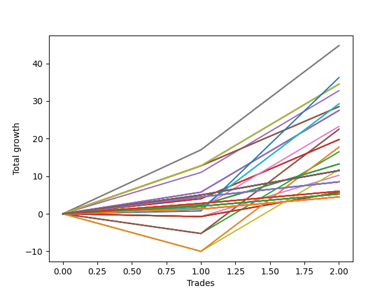

# Short Wallace Doodle 015 
- Symbol: ES
- Date Range: 03/18/2022 - 07/15/2022
- Trading Period: 7:20-12:30
- Number of Trades: 2



| Name | Win Percent | Profit | Avg Profit / Trade | Avg Time / Trade |      | Name | Win Percent | Profit | Avg Profit / Trade | Avg Time / Trade |
| ---- | ----------- | ------ | ------------------ | ---------------- | ---- | ---- | ----------- | ------ | ------------------ | ---------------- |
| Sorted By <br> Profit | | | | | | Sorted By <br> Win Percentage ||||
| Seven | 100.00 | 22375.00 | 11187.50 | 16:10 |     | Seven | 100.00 | 22375.00 | 11187.50 | 16:10 |
| Five | 100.00 | 22375.00 | 11187.50 | 16:10 |     | Five | 100.00 | 22375.00 | 11187.50 | 16:10 |
| Seventy-Three | 100.00 | 18125.00 | 9062.50 | 12:05 |     | Seventy-Three | 100.00 | 18125.00 | 9062.50 | 12:05 |
| Seventy | 100.00 | 17250.00 | 8625.00 | 10:40 |     | Seventy | 100.00 | 17250.00 | 8625.00 | 10:40 |
| Sixty-Two | 100.00 | 17250.00 | 8625.00 | 10:40 |     | Sixty-Two | 100.00 | 17250.00 | 8625.00 | 10:40 |
| Forty-Six | 100.00 | 17250.00 | 8625.00 | 10:40 |     | Forty-Six | 100.00 | 17250.00 | 8625.00 | 10:40 |
| Thirty | 100.00 | 17250.00 | 8625.00 | 10:40 |     | Thirty | 100.00 | 17250.00 | 8625.00 | 10:40 |
| Fourteen | 100.00 | 17250.00 | 8625.00 | 10:40 |     | Fourteen | 100.00 | 17250.00 | 8625.00 | 10:40 |
| Six | 100.00 | 17250.00 | 8625.00 | 10:40 |     | Six | 100.00 | 17250.00 | 8625.00 | 10:40 |
| Four | 100.00 | 16375.00 | 8187.50 | 14:40 |     | Four | 100.00 | 16375.00 | 8187.50 | 14:40 |
| Seventy-One | 100.00 | 14625.00 | 7312.50 | 11:32 |     | Seventy-One | 100.00 | 14625.00 | 7312.50 | 11:32 |
| Sixty-Nine | 100.00 | 14625.00 | 7312.50 | 11:32 |     | Sixty-Nine | 100.00 | 14625.00 | 7312.50 | 11:32 |
| Sixty-Seven | 100.00 | 14250.00 | 7125.00 | 10:15 |     | Sixty-Seven | 100.00 | 14250.00 | 7125.00 | 10:15 |
| Fifty-Nine | 100.00 | 14250.00 | 7125.00 | 10:15 |     | Fifty-Nine | 100.00 | 14250.00 | 7125.00 | 10:15 |
| Forty-Three | 100.00 | 14250.00 | 7125.00 | 10:15 |     | Forty-Three | 100.00 | 14250.00 | 7125.00 | 10:15 |
| twenty-Seven | 100.00 | 14250.00 | 7125.00 | 10:15 |     | twenty-Seven | 100.00 | 14250.00 | 7125.00 | 10:15 |
| Eleven | 100.00 | 14250.00 | 7125.00 | 10:15 |     | Eleven | 100.00 | 14250.00 | 7125.00 | 10:15 |
| Three | 100.00 | 14250.00 | 7125.00 | 10:15 |     | Three | 100.00 | 14250.00 | 7125.00 | 10:15 |
| Sixty-Six | 100.00 | 13750.00 | 6875.00 | 09:35 |     | Sixty-Six | 100.00 | 13750.00 | 6875.00 | 09:35 |
| Fifty-Eight | 100.00 | 13750.00 | 6875.00 | 09:35 |     | Fifty-Eight | 100.00 | 13750.00 | 6875.00 | 09:35 |
| Forty-Two | 100.00 | 13750.00 | 6875.00 | 09:35 |     | Forty-Two | 100.00 | 13750.00 | 6875.00 | 09:35 |
| Twenty-Six | 100.00 | 13750.00 | 6875.00 | 09:35 |     | Twenty-Six | 100.00 | 13750.00 | 6875.00 | 09:35 |
| Ten | 100.00 | 13750.00 | 6875.00 | 09:35 |     | Ten | 100.00 | 13750.00 | 6875.00 | 09:35 |
| Two | 100.00 | 13750.00 | 6875.00 | 09:35 |     | Two | 100.00 | 13750.00 | 6875.00 | 09:35 |
| Fifteen | 50.00 | 12375.00 | 6187.50 | 11:47 |     | Sixty-Eight | 100.00 | 11625.00 | 5812.50 | 10:47 |
| Thirteen | 50.00 | 12375.00 | 6187.50 | 11:47 |     | Sixty-Five | 100.00 | 9875.00 | 4937.50 | 08:37 |
| Thirty-One | 50.00 | 12250.00 | 6125.00 | 12:05 |     | Fifty-Seven | 100.00 | 9875.00 | 4937.50 | 08:37 |
| Twenty-Nine | 50.00 | 12250.00 | 6125.00 | 12:05 |     | Forty-One | 100.00 | 9875.00 | 4937.50 | 08:37 |
| Sixty-Eight | 100.00 | 11625.00 | 5812.50 | 10:47 |     | Twenty-Five | 100.00 | 9875.00 | 4937.50 | 08:37 |
| Forty-Seven | 50.00 | 11250.00 | 5625.00 | 12:12 |     | Nine | 100.00 | 9875.00 | 4937.50 | 08:37 |
| Forty-Five | 50.00 | 11250.00 | 5625.00 | 12:12 |     | One | 100.00 | 9875.00 | 4937.50 | 08:37 |
| Sixty-Five | 100.00 | 9875.00 | 4937.50 | 08:37 |     | Sixty-Four | 100.00 | 6625.00 | 3312.50 | 07:12 |
| Fifty-Seven | 100.00 | 9875.00 | 4937.50 | 08:37 |     | Fifty-Six | 100.00 | 6625.00 | 3312.50 | 07:12 |
| Forty-One | 100.00 | 9875.00 | 4937.50 | 08:37 |     | Forty | 100.00 | 6625.00 | 3312.50 | 07:12 |
| Twenty-Five | 100.00 | 9875.00 | 4937.50 | 08:37 |     | Twenty-Four | 100.00 | 6625.00 | 3312.50 | 07:12 |
| Nine | 100.00 | 9875.00 | 4937.50 | 08:37 |     | Eight | 100.00 | 6625.00 | 3312.50 | 07:12 |
| One | 100.00 | 9875.00 | 4937.50 | 08:37 |     | Zero | 100.00 | 6625.00 | 3312.50 | 07:12 |
| Twelve | 50.00 | 9375.00 | 4687.50 | 11:02 |     | One Hundred Thirty | 100.00 | 5750.00 | 2875.00 | 02:27 |
| Twenty-Eight | 50.00 | 9250.00 | 4625.00 | 11:20 |     | One Hundred Twenty-Five | 100.00 | 5750.00 | 2875.00 | 02:27 |
| Sixty-Three | 50.00 | 8875.00 | 4437.50 | 12:22 |     | One Hundred Twenty | 100.00 | 5750.00 | 2875.00 | 02:27 |
| Sixty-One | 50.00 | 8875.00 | 4437.50 | 12:22 |     | One Hundred Fifteen | 100.00 | 5750.00 | 2875.00 | 02:27 |
| Forty-Four | 50.00 | 8250.00 | 4125.00 | 11:27 |     | One Hundred Ten | 100.00 | 5750.00 | 2875.00 | 02:27 |
| Sixty-Four | 100.00 | 6625.00 | 3312.50 | 07:12 |     | One Hundred Five | 100.00 | 5750.00 | 2875.00 | 02:27 |
| Fifty-Six | 100.00 | 6625.00 | 3312.50 | 07:12 |     | One Hundred | 100.00 | 5750.00 | 2875.00 | 02:27 |
| Forty | 100.00 | 6625.00 | 3312.50 | 07:12 |     | Ninety-Five | 100.00 | 5750.00 | 2875.00 | 02:27 |
| Twenty-Four | 100.00 | 6625.00 | 3312.50 | 07:12 |     | Eighty-Five | 100.00 | 5750.00 | 2875.00 | 02:27 |
| Eight | 100.00 | 6625.00 | 3312.50 | 07:12 |     | One Hundred Twenty-Nine | 100.00 | 4250.00 | 2125.00 | 02:17 |
| Zero | 100.00 | 6625.00 | 3312.50 | 07:12 |     | One Hundred Twenty-Four | 100.00 | 4250.00 | 2125.00 | 02:17 |
| Sixty | 50.00 | 5875.00 | 2937.50 | 11:37 |     | One Hundred Ninteen | 100.00 | 4250.00 | 2125.00 | 02:17 |
| One Hundred Thirty | 100.00 | 5750.00 | 2875.00 | 02:27 |     | One Hundred Fourteen | 100.00 | 4250.00 | 2125.00 | 02:17 |
| One Hundred Twenty-Five | 100.00 | 5750.00 | 2875.00 | 02:27 |     | One Hundred Nine | 100.00 | 4250.00 | 2125.00 | 02:17 |
| One Hundred Twenty | 100.00 | 5750.00 | 2875.00 | 02:27 |     | One Hundred Four | 100.00 | 4250.00 | 2125.00 | 02:17 |
| One Hundred Fifteen | 100.00 | 5750.00 | 2875.00 | 02:27 |     | Ninety-Nine | 100.00 | 4250.00 | 2125.00 | 02:17 |
| One Hundred Ten | 100.00 | 5750.00 | 2875.00 | 02:27 |     | Ninety-Four | 100.00 | 4250.00 | 2125.00 | 02:17 |
| One Hundred Five | 100.00 | 5750.00 | 2875.00 | 02:27 |     | Eighty-Four | 100.00 | 4250.00 | 2125.00 | 02:17 |
| One Hundred | 100.00 | 5750.00 | 2875.00 | 02:27 |     | Twenty-Three | 100.00 | 3375.00 | 1687.50 | 02:52 |
| Ninety-Five | 100.00 | 5750.00 | 2875.00 | 02:27 |     | Twenty-Two | 100.00 | 3375.00 | 1687.50 | 02:52 |
| Eighty-Five | 100.00 | 5750.00 | 2875.00 | 02:27 |     | Twenty-One | 100.00 | 3375.00 | 1687.50 | 02:52 |
| Forty-Eight | 50.00 | 5125.00 | 2562.50 | 04:15 |     | Twenty | 100.00 | 3375.00 | 1687.50 | 02:52 |
| One Hundred Twenty-Nine | 100.00 | 4250.00 | 2125.00 | 02:17 |     | Nineteen | 100.00 | 3375.00 | 1687.50 | 02:52 |
| One Hundred Twenty-Four | 100.00 | 4250.00 | 2125.00 | 02:17 |     | Eighteen | 100.00 | 3375.00 | 1687.50 | 02:52 |
| One Hundred Ninteen | 100.00 | 4250.00 | 2125.00 | 02:17 |     | Seventeen | 100.00 | 3375.00 | 1687.50 | 02:52 |
| One Hundred Fourteen | 100.00 | 4250.00 | 2125.00 | 02:17 |     | Sixten | 100.00 | 3375.00 | 1687.50 | 02:52 |
| One Hundred Nine | 100.00 | 4250.00 | 2125.00 | 02:17 |     | One Hundred Twenty-Eight | 100.00 | 3000.00 | 1500.00 | 02:05 |
| One Hundred Four | 100.00 | 4250.00 | 2125.00 | 02:17 |     | One Hundred Twenty-Three | 100.00 | 3000.00 | 1500.00 | 02:05 |
| Ninety-Nine | 100.00 | 4250.00 | 2125.00 | 02:17 |     | One Hundred Eighteen | 100.00 | 3000.00 | 1500.00 | 02:05 |
| Ninety-Four | 100.00 | 4250.00 | 2125.00 | 02:17 |     | One Hundred Thirteen | 100.00 | 3000.00 | 1500.00 | 02:05 |
| Eighty-Four | 100.00 | 4250.00 | 2125.00 | 02:17 |     | One Hundred Eight | 100.00 | 3000.00 | 1500.00 | 02:05 |
| Twenty-Three | 100.00 | 3375.00 | 1687.50 | 02:52 |     | One Hundred Three | 100.00 | 3000.00 | 1500.00 | 02:05 |
| Twenty-Two | 100.00 | 3375.00 | 1687.50 | 02:52 |     | Ninety-Eight | 100.00 | 3000.00 | 1500.00 | 02:05 |
| Twenty-One | 100.00 | 3375.00 | 1687.50 | 02:52 |     | Ninety-Three | 100.00 | 3000.00 | 1500.00 | 02:05 |
| Twenty | 100.00 | 3375.00 | 1687.50 | 02:52 |     | Eighty-Three | 100.00 | 3000.00 | 1500.00 | 02:05 |
| Nineteen | 100.00 | 3375.00 | 1687.50 | 02:52 |     | One Hundred Twenty-Seven | 100.00 | 2625.00 | 1312.50 | 01:55 |
| Eighteen | 100.00 | 3375.00 | 1687.50 | 02:52 |     | One Hundred Twenty-Two | 100.00 | 2625.00 | 1312.50 | 01:55 |
| Seventeen | 100.00 | 3375.00 | 1687.50 | 02:52 |     | One Hundred Seventeen | 100.00 | 2625.00 | 1312.50 | 01:55 |
| Sixten | 100.00 | 3375.00 | 1687.50 | 02:52 |     | One Hundred Twelve | 100.00 | 2625.00 | 1312.50 | 01:55 |
| One Hundred Twenty-Eight | 100.00 | 3000.00 | 1500.00 | 02:05 |     | One Hundred Seven | 100.00 | 2625.00 | 1312.50 | 01:55 |
| One Hundred Twenty-Three | 100.00 | 3000.00 | 1500.00 | 02:05 |     | One Hundred Two | 100.00 | 2625.00 | 1312.50 | 01:55 |
| One Hundred Eighteen | 100.00 | 3000.00 | 1500.00 | 02:05 |     | Ninety-Seven | 100.00 | 2625.00 | 1312.50 | 01:55 |
| One Hundred Thirteen | 100.00 | 3000.00 | 1500.00 | 02:05 |     | Ninety-Two | 100.00 | 2625.00 | 1312.50 | 01:55 |
| One Hundred Eight | 100.00 | 3000.00 | 1500.00 | 02:05 |     | Eighty-Two | 100.00 | 2625.00 | 1312.50 | 01:55 |
| One Hundred Three | 100.00 | 3000.00 | 1500.00 | 02:05 |     | Thirty-Nine | 100.00 | 2625.00 | 1312.50 | 03:30 |
| Ninety-Eight | 100.00 | 3000.00 | 1500.00 | 02:05 |     | Thirty-Eight | 100.00 | 2625.00 | 1312.50 | 03:30 |
| Ninety-Three | 100.00 | 3000.00 | 1500.00 | 02:05 |     | Thirty-Seven | 100.00 | 2625.00 | 1312.50 | 03:30 |
| Eighty-Three | 100.00 | 3000.00 | 1500.00 | 02:05 |     | Thirty-Six | 100.00 | 2625.00 | 1312.50 | 03:30 |
| Fifty-Five | 50.00 | 2875.00 | 1437.50 | 04:40 |     | Thirty-Five | 100.00 | 2625.00 | 1312.50 | 03:30 |
| Fifty-Four | 50.00 | 2875.00 | 1437.50 | 04:40 |     | Thirty-Four | 100.00 | 2625.00 | 1312.50 | 03:30 |
| Fifty-Three | 50.00 | 2875.00 | 1437.50 | 04:40 |     | Thirty-Three | 100.00 | 2625.00 | 1312.50 | 03:30 |
| Fifty-Two | 50.00 | 2875.00 | 1437.50 | 04:40 |     | Thirty-Two | 100.00 | 2625.00 | 1312.50 | 03:30 |
| Fifty-One | 50.00 | 2875.00 | 1437.50 | 04:40 |     | One Hundred Twenty-Six | 100.00 | 2250.00 | 1125.00 | 01:37 |
| Fifty | 50.00 | 2875.00 | 1437.50 | 04:40 |     | One Hundred Twenty-One | 100.00 | 2250.00 | 1125.00 | 01:37 |
| Forty-Nine | 50.00 | 2875.00 | 1437.50 | 04:40 |     | One Hundred Sixteen | 100.00 | 2250.00 | 1125.00 | 01:37 |
| One Hundred Twenty-Seven | 100.00 | 2625.00 | 1312.50 | 01:55 |     | One Hundred Eleven | 100.00 | 2250.00 | 1125.00 | 01:37 |
| One Hundred Twenty-Two | 100.00 | 2625.00 | 1312.50 | 01:55 |     | One Hundred Six | 100.00 | 2250.00 | 1125.00 | 01:37 |
| One Hundred Seventeen | 100.00 | 2625.00 | 1312.50 | 01:55 |     | One Hundred One | 100.00 | 2250.00 | 1125.00 | 01:37 |
| One Hundred Twelve | 100.00 | 2625.00 | 1312.50 | 01:55 |     | Ninety-Six | 100.00 | 2250.00 | 1125.00 | 01:37 |
| One Hundred Seven | 100.00 | 2625.00 | 1312.50 | 01:55 |     | Ninety-One | 100.00 | 2250.00 | 1125.00 | 01:37 |
| One Hundred Two | 100.00 | 2625.00 | 1312.50 | 01:55 |     | Eighty-One | 100.00 | 2250.00 | 1125.00 | 01:37 |
| Ninety-Seven | 100.00 | 2625.00 | 1312.50 | 01:55 |     | Fifteen | 50.00 | 12375.00 | 6187.50 | 11:47 |
| Ninety-Two | 100.00 | 2625.00 | 1312.50 | 01:55 |     | Thirteen | 50.00 | 12375.00 | 6187.50 | 11:47 |
| Eighty-Two | 100.00 | 2625.00 | 1312.50 | 01:55 |     | Thirty-One | 50.00 | 12250.00 | 6125.00 | 12:05 |
| Thirty-Nine | 100.00 | 2625.00 | 1312.50 | 03:30 |     | Twenty-Nine | 50.00 | 12250.00 | 6125.00 | 12:05 |
| Thirty-Eight | 100.00 | 2625.00 | 1312.50 | 03:30 |     | Forty-Seven | 50.00 | 11250.00 | 5625.00 | 12:12 |
| Thirty-Seven | 100.00 | 2625.00 | 1312.50 | 03:30 |     | Forty-Five | 50.00 | 11250.00 | 5625.00 | 12:12 |
| Thirty-Six | 100.00 | 2625.00 | 1312.50 | 03:30 |     | Twelve | 50.00 | 9375.00 | 4687.50 | 11:02 |
| Thirty-Five | 100.00 | 2625.00 | 1312.50 | 03:30 |     | Twenty-Eight | 50.00 | 9250.00 | 4625.00 | 11:20 |
| Thirty-Four | 100.00 | 2625.00 | 1312.50 | 03:30 |     | Sixty-Three | 50.00 | 8875.00 | 4437.50 | 12:22 |
| Thirty-Three | 100.00 | 2625.00 | 1312.50 | 03:30 |     | Sixty-One | 50.00 | 8875.00 | 4437.50 | 12:22 |
| Thirty-Two | 100.00 | 2625.00 | 1312.50 | 03:30 |     | Forty-Four | 50.00 | 8250.00 | 4125.00 | 11:27 |
| One Hundred Twenty-Six | 100.00 | 2250.00 | 1125.00 | 01:37 |     | Sixty | 50.00 | 5875.00 | 2937.50 | 11:37 |
| One Hundred Twenty-One | 100.00 | 2250.00 | 1125.00 | 01:37 |     | Forty-Eight | 50.00 | 5125.00 | 2562.50 | 04:15 |
| One Hundred Sixteen | 100.00 | 2250.00 | 1125.00 | 01:37 |     | Fifty-Five | 50.00 | 2875.00 | 1437.50 | 04:40 |
| One Hundred Eleven | 100.00 | 2250.00 | 1125.00 | 01:37 |     | Fifty-Four | 50.00 | 2875.00 | 1437.50 | 04:40 |
| One Hundred Six | 100.00 | 2250.00 | 1125.00 | 01:37 |     | Fifty-Three | 50.00 | 2875.00 | 1437.50 | 04:40 |
| One Hundred One | 100.00 | 2250.00 | 1125.00 | 01:37 |     | Fifty-Two | 50.00 | 2875.00 | 1437.50 | 04:40 |
| Ninety-Six | 100.00 | 2250.00 | 1125.00 | 01:37 |     | Fifty-One | 50.00 | 2875.00 | 1437.50 | 04:40 |
| Ninety-One | 100.00 | 2250.00 | 1125.00 | 01:37 |     | Fifty | 50.00 | 2875.00 | 1437.50 | 04:40 |
| Eighty-One | 100.00 | 2250.00 | 1125.00 | 01:37 |     | Forty-Nine | 50.00 | 2875.00 | 1437.50 | 04:40 |

## NO STOPLOSS

### Test Zero
* Sell when price hits the middle line of the 20p bollinger
* No Stoploss
* Results:
```
Total Trades: 2
Percent Up: 0.00
Percent Down: 100.00
Total Points Moved Down: 13.25
Potential Profit: 6625.00
Total Points Ups: 0.00 Count Ups: 0
Total Points Downs: 13.25 Count Downs: 2
```

<details><summary>Trades</summary>

<code>In: 2022-04-06 10:43:00		Out: 2022-04-06 10:55:45		Total Position Time: 12:45		Total Move Down: 2.25		Total to Date: 2.25</code> <br />
<code>In: 2022-04-06 11:04:00		Out: 2022-04-06 11:05:40		Total Position Time: 01:40		Total Move Down: 11.00		Total to Date: 13.25</code> <br />


</details>

### Test One
* Sell when the price hits the upper line of the 20p 1std bollinger
* No Stoploss
* Results:
```
Total Trades: 2
Percent Up: 0.00
Percent Down: 100.00
Total Points Moved Down: 19.75
Potential Profit: 9875.00
Total Points Ups: 0.00 Count Ups: 0
Total Points Downs: 19.75 Count Downs: 2
```

<details><summary>Trades</summary>

<code>In: 2022-04-06 10:43:00		Out: 2022-04-06 10:56:55		Total Position Time: 13:55		Total Move Down: 4.00		Total to Date: 4.00</code> <br />
<code>In: 2022-04-06 11:04:00		Out: 2022-04-06 11:07:20		Total Position Time: 03:20		Total Move Down: 15.75		Total to Date: 19.75</code> <br />


</details>

### Test Two
* Sell when the price hits the upper line of the 20p 2std bollinger
* No Stoploss
* Results:
```
Total Trades: 2
Percent Up: 0.00
Percent Down: 100.00
Total Points Moved Down: 27.50
Potential Profit: 13750.00
Total Points Ups: 0.00 Count Ups: 0
Total Points Downs: 27.50 Count Downs: 2
```

<details><summary>Trades</summary>

<code>In: 2022-04-06 10:43:00		Out: 2022-04-06 10:58:00		Total Position Time: 15:00		Total Move Down: 5.75		Total to Date: 5.75</code> <br />
<code>In: 2022-04-06 11:04:00		Out: 2022-04-06 11:08:10		Total Position Time: 04:10		Total Move Down: 21.75		Total to Date: 27.50</code> <br />


</details>

### Test Three
* Sell when price hits the middle line of the 50p bollinger
* No Stoploss
* Results:
```
Total Trades: 2
Percent Up: 0.00
Percent Down: 100.00
Total Points Moved Down: 28.50
Potential Profit: 14250.00
Total Points Ups: 0.00 Count Ups: 0
Total Points Downs: 28.50 Count Downs: 2
```

<details><summary>Trades</summary>

<code>In: 2022-04-06 10:43:00		Out: 2022-04-06 11:00:10		Total Position Time: 17:10		Total Move Down: 12.75		Total to Date: 12.75</code> <br />
<code>In: 2022-04-06 11:04:00		Out: 2022-04-06 11:07:20		Total Position Time: 03:20		Total Move Down: 15.75		Total to Date: 28.50</code> <br />


</details>

### Test Four
* Sell when the price hits the upper line of the 50p 1std bollinger
* No Stoploss
* Results:
```
Total Trades: 2
Percent Up: 0.00
Percent Down: 100.00
Total Points Moved Down: 32.75
Potential Profit: 16375.00
Total Points Ups: 0.00 Count Ups: 0
Total Points Downs: 32.75 Count Downs: 2
```

<details><summary>Trades</summary>

<code>In: 2022-04-06 10:43:00		Out: 2022-04-06 11:08:10		Total Position Time: 25:10		Total Move Down: 11.00		Total to Date: 11.00</code> <br />
<code>In: 2022-04-06 11:04:00		Out: 2022-04-06 11:08:10		Total Position Time: 04:10		Total Move Down: 21.75		Total to Date: 32.75</code> <br />


</details>

### Test Five
* Sell when the price hits the upper line of the 50p 2std bollinger
* No Stoploss
* Results:
```
Total Trades: 2
Percent Up: 0.00
Percent Down: 100.00
Total Points Moved Down: 44.75
Potential Profit: 22375.00
Total Points Ups: 0.00 Count Ups: 0
Total Points Downs: 44.75 Count Downs: 2
```

<details><summary>Trades</summary>

<code>In: 2022-04-06 10:43:00		Out: 2022-04-06 11:09:40		Total Position Time: 26:40		Total Move Down: 17.00		Total to Date: 17.00</code> <br />
<code>In: 2022-04-06 11:04:00		Out: 2022-04-06 11:09:40		Total Position Time: 05:40		Total Move Down: 27.75		Total to Date: 44.75</code> <br />


</details>

### Test Six
* Sell when the price hits the middle line of the 1std VWAP
* No Stoploss
* Results:
```
Total Trades: 2
Percent Up: 0.00
Percent Down: 100.00
Total Points Moved Down: 34.50
Potential Profit: 17250.00
Total Points Ups: 0.00 Count Ups: 0
Total Points Downs: 34.50 Count Downs: 2
```

<details><summary>Trades</summary>

<code>In: 2022-04-06 10:43:00		Out: 2022-04-06 11:00:10		Total Position Time: 17:10		Total Move Down: 12.75		Total to Date: 12.75</code> <br />
<code>In: 2022-04-06 11:04:00		Out: 2022-04-06 11:08:10		Total Position Time: 04:10		Total Move Down: 21.75		Total to Date: 34.50</code> <br />


</details>

### Test Seven
* Sell when the price hits the upper line of the 1std VWAP
* No Stoploss
* Results:
```
Total Trades: 2
Percent Up: 0.00
Percent Down: 100.00
Total Points Moved Down: 44.75
Potential Profit: 22375.00
Total Points Ups: 0.00 Count Ups: 0
Total Points Downs: 44.75 Count Downs: 2
```

<details><summary>Trades</summary>

<code>In: 2022-04-06 10:43:00		Out: 2022-04-06 11:09:40		Total Position Time: 26:40		Total Move Down: 17.00		Total to Date: 17.00</code> <br />
<code>In: 2022-04-06 11:04:00		Out: 2022-04-06 11:09:40		Total Position Time: 05:40		Total Move Down: 27.75		Total to Date: 44.75</code> <br />


</details>

## STOPLOSS OF 2

### Test Eight
* Sell when price hits the middle line of the 20p bollinger
* Stoploss is -2 points
* Results:
```
Total Trades: 2
Percent Up: 0.00
Percent Down: 100.00
Total Points Moved Down: 13.25
Potential Profit: 6625.00
Total Points Ups: 0.00 Count Ups: 0
Total Points Downs: 13.25 Count Downs: 2
```

<details><summary>Trades</summary>

<code>In: 2022-04-06 10:43:00		Out: 2022-04-06 10:55:45		Total Position Time: 12:45		Total Move Down: 2.25		Total to Date: 2.25</code> <br />
<code>In: 2022-04-06 11:04:00		Out: 2022-04-06 11:05:40		Total Position Time: 01:40		Total Move Down: 11.00		Total to Date: 13.25</code> <br />


</details>

### Test Nine
* Sell when the price hits the upper line of the 20p 1std bollinger
* Stoploss is -2 points
* Results:
```
Total Trades: 2
Percent Up: 0.00
Percent Down: 100.00
Total Points Moved Down: 19.75
Potential Profit: 9875.00
Total Points Ups: 0.00 Count Ups: 0
Total Points Downs: 19.75 Count Downs: 2
```

<details><summary>Trades</summary>

<code>In: 2022-04-06 10:43:00		Out: 2022-04-06 10:56:55		Total Position Time: 13:55		Total Move Down: 4.00		Total to Date: 4.00</code> <br />
<code>In: 2022-04-06 11:04:00		Out: 2022-04-06 11:07:20		Total Position Time: 03:20		Total Move Down: 15.75		Total to Date: 19.75</code> <br />


</details>

### Test Ten
* Sell when the price hits the upper line of the 20p 2std bollinger
* Stoploss is -2 points
* Results:
```
Total Trades: 2
Percent Up: 0.00
Percent Down: 100.00
Total Points Moved Down: 27.50
Potential Profit: 13750.00
Total Points Ups: 0.00 Count Ups: 0
Total Points Downs: 27.50 Count Downs: 2
```

<details><summary>Trades</summary>

<code>In: 2022-04-06 10:43:00		Out: 2022-04-06 10:58:00		Total Position Time: 15:00		Total Move Down: 5.75		Total to Date: 5.75</code> <br />
<code>In: 2022-04-06 11:04:00		Out: 2022-04-06 11:08:10		Total Position Time: 04:10		Total Move Down: 21.75		Total to Date: 27.50</code> <br />


</details>

### Test Eleven
* Sell when price hits the middle line of the 50p bollinger
* Stoploss is -2 points
* Results:
```
Total Trades: 2
Percent Up: 0.00
Percent Down: 100.00
Total Points Moved Down: 28.50
Potential Profit: 14250.00
Total Points Ups: 0.00 Count Ups: 0
Total Points Downs: 28.50 Count Downs: 2
```

<details><summary>Trades</summary>

<code>In: 2022-04-06 10:43:00		Out: 2022-04-06 11:00:10		Total Position Time: 17:10		Total Move Down: 12.75		Total to Date: 12.75</code> <br />
<code>In: 2022-04-06 11:04:00		Out: 2022-04-06 11:07:20		Total Position Time: 03:20		Total Move Down: 15.75		Total to Date: 28.50</code> <br />


</details>

### Test Twelve
* Sell when the price hits the upper line of the 50p 1std bollinger
* Stoploss is -2 points
* Results:
```
Total Trades: 2
Percent Up: 50.00
Percent Down: 50.00
Total Points Moved Down: 18.75
Potential Profit: 9375.00
Total Points Ups: 3.00 Count Ups: 1
Total Points Downs: 21.75 Count Downs: 1
```

<details><summary>Trades</summary>

<code>In: 2022-04-06 10:43:00		Out: 2022-04-06 11:00:55		Total Position Time: 17:55		Total Move Down: -3.00		Total to Date: -3.00</code> <br />
<code>In: 2022-04-06 11:04:00		Out: 2022-04-06 11:08:10		Total Position Time: 04:10		Total Move Down: 21.75		Total to Date: 18.75</code> <br />


</details>

### Test Thirteen
* Sell when the price hits the upper line of the 50p 2std bollinger
* Stoploss is -2 points
* Results:
```
Total Trades: 2
Percent Up: 50.00
Percent Down: 50.00
Total Points Moved Down: 24.75
Potential Profit: 12375.00
Total Points Ups: 3.00 Count Ups: 1
Total Points Downs: 27.75 Count Downs: 1
```

<details><summary>Trades</summary>

<code>In: 2022-04-06 10:43:00		Out: 2022-04-06 11:00:55		Total Position Time: 17:55		Total Move Down: -3.00		Total to Date: -3.00</code> <br />
<code>In: 2022-04-06 11:04:00		Out: 2022-04-06 11:09:40		Total Position Time: 05:40		Total Move Down: 27.75		Total to Date: 24.75</code> <br />


</details>

### Test Fourteen
* Sell when the price hits the middle line of the 1std VWAP
* Stoploss is -2 points
* Results:
```
Total Trades: 2
Percent Up: 0.00
Percent Down: 100.00
Total Points Moved Down: 34.50
Potential Profit: 17250.00
Total Points Ups: 0.00 Count Ups: 0
Total Points Downs: 34.50 Count Downs: 2
```

<details><summary>Trades</summary>

<code>In: 2022-04-06 10:43:00		Out: 2022-04-06 11:00:10		Total Position Time: 17:10		Total Move Down: 12.75		Total to Date: 12.75</code> <br />
<code>In: 2022-04-06 11:04:00		Out: 2022-04-06 11:08:10		Total Position Time: 04:10		Total Move Down: 21.75		Total to Date: 34.50</code> <br />


</details>

### Test Fifteen
* Sell when the price hits the upper line of the 1std VWAP
* Stoploss is -2 points
* Results:
```
Total Trades: 2
Percent Up: 50.00
Percent Down: 50.00
Total Points Moved Down: 24.75
Potential Profit: 12375.00
Total Points Ups: 3.00 Count Ups: 1
Total Points Downs: 27.75 Count Downs: 1
```

<details><summary>Trades</summary>

<code>In: 2022-04-06 10:43:00		Out: 2022-04-06 11:00:55		Total Position Time: 17:55		Total Move Down: -3.00		Total to Date: -3.00</code> <br />
<code>In: 2022-04-06 11:04:00		Out: 2022-04-06 11:09:40		Total Position Time: 05:40		Total Move Down: 27.75		Total to Date: 24.75</code> <br />


</details>

## TRAIL STOP OF 2

### Test Sixten
* Sell when price hits the middle line of the 20p bollinger
* Trailing Stop is -2 points
* Results:
```
Total Trades: 2
Percent Up: 0.00
Percent Down: 100.00
Total Points Moved Down: 6.75
Potential Profit: 3375.00
Total Points Ups: 0.00 Count Ups: 0
Total Points Downs: 6.75 Count Downs: 2
```

<details><summary>Trades</summary>

<code>In: 2022-04-06 10:43:00		Out: 2022-04-06 10:47:50		Total Position Time: 04:50		Total Move Down: 3.00		Total to Date: 3.00</code> <br />
<code>In: 2022-04-06 11:04:00		Out: 2022-04-06 11:04:55		Total Position Time: 00:55		Total Move Down: 3.75		Total to Date: 6.75</code> <br />


</details>

### Test Seventeen
* Sell when the price hits the upper line of the 20p 1std bollinger
* Trailing Stop is -2 points
* Results:
```
Total Trades: 2
Percent Up: 0.00
Percent Down: 100.00
Total Points Moved Down: 6.75
Potential Profit: 3375.00
Total Points Ups: 0.00 Count Ups: 0
Total Points Downs: 6.75 Count Downs: 2
```

<details><summary>Trades</summary>

<code>In: 2022-04-06 10:43:00		Out: 2022-04-06 10:47:50		Total Position Time: 04:50		Total Move Down: 3.00		Total to Date: 3.00</code> <br />
<code>In: 2022-04-06 11:04:00		Out: 2022-04-06 11:04:55		Total Position Time: 00:55		Total Move Down: 3.75		Total to Date: 6.75</code> <br />


</details>

### Test Eighteen
* Sell when the price hits the upper line of the 20p 2std bollinger
* Trailing Stop is -2 points
* Results:
```
Total Trades: 2
Percent Up: 0.00
Percent Down: 100.00
Total Points Moved Down: 6.75
Potential Profit: 3375.00
Total Points Ups: 0.00 Count Ups: 0
Total Points Downs: 6.75 Count Downs: 2
```

<details><summary>Trades</summary>

<code>In: 2022-04-06 10:43:00		Out: 2022-04-06 10:47:50		Total Position Time: 04:50		Total Move Down: 3.00		Total to Date: 3.00</code> <br />
<code>In: 2022-04-06 11:04:00		Out: 2022-04-06 11:04:55		Total Position Time: 00:55		Total Move Down: 3.75		Total to Date: 6.75</code> <br />


</details>

### Test Nineteen
* Sell when price hits the middle line of the 50p bollinger
* Trailing Stop is -2 points
* Results:
```
Total Trades: 2
Percent Up: 0.00
Percent Down: 100.00
Total Points Moved Down: 6.75
Potential Profit: 3375.00
Total Points Ups: 0.00 Count Ups: 0
Total Points Downs: 6.75 Count Downs: 2
```

<details><summary>Trades</summary>

<code>In: 2022-04-06 10:43:00		Out: 2022-04-06 10:47:50		Total Position Time: 04:50		Total Move Down: 3.00		Total to Date: 3.00</code> <br />
<code>In: 2022-04-06 11:04:00		Out: 2022-04-06 11:04:55		Total Position Time: 00:55		Total Move Down: 3.75		Total to Date: 6.75</code> <br />


</details>

### Test Twenty
* Sell when the price hits the upper line of the 50p 1std bollinger
* Trailing Stop is -2 points
* Results:
```
Total Trades: 2
Percent Up: 0.00
Percent Down: 100.00
Total Points Moved Down: 6.75
Potential Profit: 3375.00
Total Points Ups: 0.00 Count Ups: 0
Total Points Downs: 6.75 Count Downs: 2
```

<details><summary>Trades</summary>

<code>In: 2022-04-06 10:43:00		Out: 2022-04-06 10:47:50		Total Position Time: 04:50		Total Move Down: 3.00		Total to Date: 3.00</code> <br />
<code>In: 2022-04-06 11:04:00		Out: 2022-04-06 11:04:55		Total Position Time: 00:55		Total Move Down: 3.75		Total to Date: 6.75</code> <br />


</details>

### Test Twenty-One
* Sell when the price hits the upper line of the 50p 2std bollinger
* Trailing Stop is -2 points
* Results:
```
Total Trades: 2
Percent Up: 0.00
Percent Down: 100.00
Total Points Moved Down: 6.75
Potential Profit: 3375.00
Total Points Ups: 0.00 Count Ups: 0
Total Points Downs: 6.75 Count Downs: 2
```

<details><summary>Trades</summary>

<code>In: 2022-04-06 10:43:00		Out: 2022-04-06 10:47:50		Total Position Time: 04:50		Total Move Down: 3.00		Total to Date: 3.00</code> <br />
<code>In: 2022-04-06 11:04:00		Out: 2022-04-06 11:04:55		Total Position Time: 00:55		Total Move Down: 3.75		Total to Date: 6.75</code> <br />


</details>

### Test Twenty-Two
* Sell when the price hits the middle line of the 1std VWAP
* Trailing Stop is -2 points
* Results:
```
Total Trades: 2
Percent Up: 0.00
Percent Down: 100.00
Total Points Moved Down: 6.75
Potential Profit: 3375.00
Total Points Ups: 0.00 Count Ups: 0
Total Points Downs: 6.75 Count Downs: 2
```

<details><summary>Trades</summary>

<code>In: 2022-04-06 10:43:00		Out: 2022-04-06 10:47:50		Total Position Time: 04:50		Total Move Down: 3.00		Total to Date: 3.00</code> <br />
<code>In: 2022-04-06 11:04:00		Out: 2022-04-06 11:04:55		Total Position Time: 00:55		Total Move Down: 3.75		Total to Date: 6.75</code> <br />


</details>

### Test Twenty-Three
* Sell when the price hits the upper line of the 1std VWAP
* Trailing Stop is -2 points
* Results:
```
Total Trades: 2
Percent Up: 0.00
Percent Down: 100.00
Total Points Moved Down: 6.75
Potential Profit: 3375.00
Total Points Ups: 0.00 Count Ups: 0
Total Points Downs: 6.75 Count Downs: 2
```

<details><summary>Trades</summary>

<code>In: 2022-04-06 10:43:00		Out: 2022-04-06 10:47:50		Total Position Time: 04:50		Total Move Down: 3.00		Total to Date: 3.00</code> <br />
<code>In: 2022-04-06 11:04:00		Out: 2022-04-06 11:04:55		Total Position Time: 00:55		Total Move Down: 3.75		Total to Date: 6.75</code> <br />


</details>

## STOPLOSS OF 3

### Test Twenty-Four
* Sell when price hits the middle line of the 20p bollinger
* Stoploss is -3 points
* Results:
```
Total Trades: 2
Percent Up: 0.00
Percent Down: 100.00
Total Points Moved Down: 13.25
Potential Profit: 6625.00
Total Points Ups: 0.00 Count Ups: 0
Total Points Downs: 13.25 Count Downs: 2
```

<details><summary>Trades</summary>

<code>In: 2022-04-06 10:43:00		Out: 2022-04-06 10:55:45		Total Position Time: 12:45		Total Move Down: 2.25		Total to Date: 2.25</code> <br />
<code>In: 2022-04-06 11:04:00		Out: 2022-04-06 11:05:40		Total Position Time: 01:40		Total Move Down: 11.00		Total to Date: 13.25</code> <br />


</details>

### Test Twenty-Five
* Sell when the price hits the upper line of the 20p 1std bollinger
* Stoploss is -3 points
* Results:
```
Total Trades: 2
Percent Up: 0.00
Percent Down: 100.00
Total Points Moved Down: 19.75
Potential Profit: 9875.00
Total Points Ups: 0.00 Count Ups: 0
Total Points Downs: 19.75 Count Downs: 2
```

<details><summary>Trades</summary>

<code>In: 2022-04-06 10:43:00		Out: 2022-04-06 10:56:55		Total Position Time: 13:55		Total Move Down: 4.00		Total to Date: 4.00</code> <br />
<code>In: 2022-04-06 11:04:00		Out: 2022-04-06 11:07:20		Total Position Time: 03:20		Total Move Down: 15.75		Total to Date: 19.75</code> <br />


</details>

### Test Twenty-Six
* Sell when the price hits the upper line of the 20p 2std bollinger
* Stoploss is -3 points
* Results:
```
Total Trades: 2
Percent Up: 0.00
Percent Down: 100.00
Total Points Moved Down: 27.50
Potential Profit: 13750.00
Total Points Ups: 0.00 Count Ups: 0
Total Points Downs: 27.50 Count Downs: 2
```

<details><summary>Trades</summary>

<code>In: 2022-04-06 10:43:00		Out: 2022-04-06 10:58:00		Total Position Time: 15:00		Total Move Down: 5.75		Total to Date: 5.75</code> <br />
<code>In: 2022-04-06 11:04:00		Out: 2022-04-06 11:08:10		Total Position Time: 04:10		Total Move Down: 21.75		Total to Date: 27.50</code> <br />


</details>

### Test twenty-Seven
* Sell when price hits the middle line of the 50p bollinger
* Stoploss is -3 points
* Results:
```
Total Trades: 2
Percent Up: 0.00
Percent Down: 100.00
Total Points Moved Down: 28.50
Potential Profit: 14250.00
Total Points Ups: 0.00 Count Ups: 0
Total Points Downs: 28.50 Count Downs: 2
```

<details><summary>Trades</summary>

<code>In: 2022-04-06 10:43:00		Out: 2022-04-06 11:00:10		Total Position Time: 17:10		Total Move Down: 12.75		Total to Date: 12.75</code> <br />
<code>In: 2022-04-06 11:04:00		Out: 2022-04-06 11:07:20		Total Position Time: 03:20		Total Move Down: 15.75		Total to Date: 28.50</code> <br />


</details>

### Test Twenty-Eight
* Sell when the price hits the upper line of the 50p 1std bollinger
* Stoploss is -3 points
* Results:
```
Total Trades: 2
Percent Up: 50.00
Percent Down: 50.00
Total Points Moved Down: 18.50
Potential Profit: 9250.00
Total Points Ups: 3.25 Count Ups: 1
Total Points Downs: 21.75 Count Downs: 1
```

<details><summary>Trades</summary>

<code>In: 2022-04-06 10:43:00		Out: 2022-04-06 11:01:30		Total Position Time: 18:30		Total Move Down: -3.25		Total to Date: -3.25</code> <br />
<code>In: 2022-04-06 11:04:00		Out: 2022-04-06 11:08:10		Total Position Time: 04:10		Total Move Down: 21.75		Total to Date: 18.50</code> <br />


</details>

### Test Twenty-Nine
* Sell when the price hits the upper line of the 50p 2std bollinger
* Stoploss is -3 points
* Results:
```
Total Trades: 2
Percent Up: 50.00
Percent Down: 50.00
Total Points Moved Down: 24.50
Potential Profit: 12250.00
Total Points Ups: 3.25 Count Ups: 1
Total Points Downs: 27.75 Count Downs: 1
```

<details><summary>Trades</summary>

<code>In: 2022-04-06 10:43:00		Out: 2022-04-06 11:01:30		Total Position Time: 18:30		Total Move Down: -3.25		Total to Date: -3.25</code> <br />
<code>In: 2022-04-06 11:04:00		Out: 2022-04-06 11:09:40		Total Position Time: 05:40		Total Move Down: 27.75		Total to Date: 24.50</code> <br />


</details>

### Test Thirty
* Sell when the price hits the middle line of the 1std VWAP
* Stoploss is -3 points
* Results:
```
Total Trades: 2
Percent Up: 0.00
Percent Down: 100.00
Total Points Moved Down: 34.50
Potential Profit: 17250.00
Total Points Ups: 0.00 Count Ups: 0
Total Points Downs: 34.50 Count Downs: 2
```

<details><summary>Trades</summary>

<code>In: 2022-04-06 10:43:00		Out: 2022-04-06 11:00:10		Total Position Time: 17:10		Total Move Down: 12.75		Total to Date: 12.75</code> <br />
<code>In: 2022-04-06 11:04:00		Out: 2022-04-06 11:08:10		Total Position Time: 04:10		Total Move Down: 21.75		Total to Date: 34.50</code> <br />


</details>

### Test Thirty-One
* Sell when the price hits the upper line of the 1std VWAP
* Stoploss is -3 points
* Results:
```
Total Trades: 2
Percent Up: 50.00
Percent Down: 50.00
Total Points Moved Down: 24.50
Potential Profit: 12250.00
Total Points Ups: 3.25 Count Ups: 1
Total Points Downs: 27.75 Count Downs: 1
```

<details><summary>Trades</summary>

<code>In: 2022-04-06 10:43:00		Out: 2022-04-06 11:01:30		Total Position Time: 18:30		Total Move Down: -3.25		Total to Date: -3.25</code> <br />
<code>In: 2022-04-06 11:04:00		Out: 2022-04-06 11:09:40		Total Position Time: 05:40		Total Move Down: 27.75		Total to Date: 24.50</code> <br />


</details>

## TRAIL STOP OF 3

### Test Thirty-Two
* Sell when price hits the middle line of the 20p bollinger
* Trailing Stop is -3 points
* Results:
```
Total Trades: 2
Percent Up: 0.00
Percent Down: 100.00
Total Points Moved Down: 5.25
Potential Profit: 2625.00
Total Points Ups: 0.00 Count Ups: 0
Total Points Downs: 5.25 Count Downs: 2
```

<details><summary>Trades</summary>

<code>In: 2022-04-06 10:43:00		Out: 2022-04-06 10:49:00		Total Position Time: 06:00		Total Move Down: 2.00		Total to Date: 2.00</code> <br />
<code>In: 2022-04-06 11:04:00		Out: 2022-04-06 11:05:00		Total Position Time: 01:00		Total Move Down: 3.25		Total to Date: 5.25</code> <br />


</details>

### Test Thirty-Three
* Sell when the price hits the upper line of the 20p 1std bollinger
* Trailing Stop is -3 points
* Results:
```
Total Trades: 2
Percent Up: 0.00
Percent Down: 100.00
Total Points Moved Down: 5.25
Potential Profit: 2625.00
Total Points Ups: 0.00 Count Ups: 0
Total Points Downs: 5.25 Count Downs: 2
```

<details><summary>Trades</summary>

<code>In: 2022-04-06 10:43:00		Out: 2022-04-06 10:49:00		Total Position Time: 06:00		Total Move Down: 2.00		Total to Date: 2.00</code> <br />
<code>In: 2022-04-06 11:04:00		Out: 2022-04-06 11:05:00		Total Position Time: 01:00		Total Move Down: 3.25		Total to Date: 5.25</code> <br />


</details>

### Test Thirty-Four
* Sell when the price hits the upper line of the 20p 2std bollinger
* Trailing Stop is -3 points
* Results:
```
Total Trades: 2
Percent Up: 0.00
Percent Down: 100.00
Total Points Moved Down: 5.25
Potential Profit: 2625.00
Total Points Ups: 0.00 Count Ups: 0
Total Points Downs: 5.25 Count Downs: 2
```

<details><summary>Trades</summary>

<code>In: 2022-04-06 10:43:00		Out: 2022-04-06 10:49:00		Total Position Time: 06:00		Total Move Down: 2.00		Total to Date: 2.00</code> <br />
<code>In: 2022-04-06 11:04:00		Out: 2022-04-06 11:05:00		Total Position Time: 01:00		Total Move Down: 3.25		Total to Date: 5.25</code> <br />


</details>

### Test Thirty-Five
* Sell when price hits the middle line of the 50p bollinger
* Trailing Stop is -3 points
* Results:
```
Total Trades: 2
Percent Up: 0.00
Percent Down: 100.00
Total Points Moved Down: 5.25
Potential Profit: 2625.00
Total Points Ups: 0.00 Count Ups: 0
Total Points Downs: 5.25 Count Downs: 2
```

<details><summary>Trades</summary>

<code>In: 2022-04-06 10:43:00		Out: 2022-04-06 10:49:00		Total Position Time: 06:00		Total Move Down: 2.00		Total to Date: 2.00</code> <br />
<code>In: 2022-04-06 11:04:00		Out: 2022-04-06 11:05:00		Total Position Time: 01:00		Total Move Down: 3.25		Total to Date: 5.25</code> <br />


</details>

### Test Thirty-Six
* Sell when the price hits the upper line of the 50p 1std bollinger
* Trailing Stop is -3 points
* Results:
```
Total Trades: 2
Percent Up: 0.00
Percent Down: 100.00
Total Points Moved Down: 5.25
Potential Profit: 2625.00
Total Points Ups: 0.00 Count Ups: 0
Total Points Downs: 5.25 Count Downs: 2
```

<details><summary>Trades</summary>

<code>In: 2022-04-06 10:43:00		Out: 2022-04-06 10:49:00		Total Position Time: 06:00		Total Move Down: 2.00		Total to Date: 2.00</code> <br />
<code>In: 2022-04-06 11:04:00		Out: 2022-04-06 11:05:00		Total Position Time: 01:00		Total Move Down: 3.25		Total to Date: 5.25</code> <br />


</details>

### Test Thirty-Seven
* Sell when the price hits the upper line of the 50p 2std bollinger
* Trailing Stop is -3 points
* Results:
```
Total Trades: 2
Percent Up: 0.00
Percent Down: 100.00
Total Points Moved Down: 5.25
Potential Profit: 2625.00
Total Points Ups: 0.00 Count Ups: 0
Total Points Downs: 5.25 Count Downs: 2
```

<details><summary>Trades</summary>

<code>In: 2022-04-06 10:43:00		Out: 2022-04-06 10:49:00		Total Position Time: 06:00		Total Move Down: 2.00		Total to Date: 2.00</code> <br />
<code>In: 2022-04-06 11:04:00		Out: 2022-04-06 11:05:00		Total Position Time: 01:00		Total Move Down: 3.25		Total to Date: 5.25</code> <br />


</details>

### Test Thirty-Eight
* Sell when the price hits the middle line of the 1std VWAP
* Trailing Stop is -3 points
* Results:
```
Total Trades: 2
Percent Up: 0.00
Percent Down: 100.00
Total Points Moved Down: 5.25
Potential Profit: 2625.00
Total Points Ups: 0.00 Count Ups: 0
Total Points Downs: 5.25 Count Downs: 2
```

<details><summary>Trades</summary>

<code>In: 2022-04-06 10:43:00		Out: 2022-04-06 10:49:00		Total Position Time: 06:00		Total Move Down: 2.00		Total to Date: 2.00</code> <br />
<code>In: 2022-04-06 11:04:00		Out: 2022-04-06 11:05:00		Total Position Time: 01:00		Total Move Down: 3.25		Total to Date: 5.25</code> <br />


</details>

### Test Thirty-Nine
* Sell when the price hits the upper line of the 1std VWAP
* Trailing Stop is -3 points
* Results:
```
Total Trades: 2
Percent Up: 0.00
Percent Down: 100.00
Total Points Moved Down: 5.25
Potential Profit: 2625.00
Total Points Ups: 0.00 Count Ups: 0
Total Points Downs: 5.25 Count Downs: 2
```

<details><summary>Trades</summary>

<code>In: 2022-04-06 10:43:00		Out: 2022-04-06 10:49:00		Total Position Time: 06:00		Total Move Down: 2.00		Total to Date: 2.00</code> <br />
<code>In: 2022-04-06 11:04:00		Out: 2022-04-06 11:05:00		Total Position Time: 01:00		Total Move Down: 3.25		Total to Date: 5.25</code> <br />


</details>

## STOPLOSS OF 5

### Test Forty
* Sell when price hits the middle line of the 20p bollinger
* Stoploss is -5 points
* Results:
```
Total Trades: 2
Percent Up: 0.00
Percent Down: 100.00
Total Points Moved Down: 13.25
Potential Profit: 6625.00
Total Points Ups: 0.00 Count Ups: 0
Total Points Downs: 13.25 Count Downs: 2
```

<details><summary>Trades</summary>

<code>In: 2022-04-06 10:43:00		Out: 2022-04-06 10:55:45		Total Position Time: 12:45		Total Move Down: 2.25		Total to Date: 2.25</code> <br />
<code>In: 2022-04-06 11:04:00		Out: 2022-04-06 11:05:40		Total Position Time: 01:40		Total Move Down: 11.00		Total to Date: 13.25</code> <br />


</details>

### Test Forty-One
* Sell when the price hits the upper line of the 20p 1std bollinger
* Stoploss is -5 points
* Results:
```
Total Trades: 2
Percent Up: 0.00
Percent Down: 100.00
Total Points Moved Down: 19.75
Potential Profit: 9875.00
Total Points Ups: 0.00 Count Ups: 0
Total Points Downs: 19.75 Count Downs: 2
```

<details><summary>Trades</summary>

<code>In: 2022-04-06 10:43:00		Out: 2022-04-06 10:56:55		Total Position Time: 13:55		Total Move Down: 4.00		Total to Date: 4.00</code> <br />
<code>In: 2022-04-06 11:04:00		Out: 2022-04-06 11:07:20		Total Position Time: 03:20		Total Move Down: 15.75		Total to Date: 19.75</code> <br />


</details>

### Test Forty-Two
* Sell when the price hits the upper line of the 20p 2std bollinger
* Stoploss is -5 points
* Results:
```
Total Trades: 2
Percent Up: 0.00
Percent Down: 100.00
Total Points Moved Down: 27.50
Potential Profit: 13750.00
Total Points Ups: 0.00 Count Ups: 0
Total Points Downs: 27.50 Count Downs: 2
```

<details><summary>Trades</summary>

<code>In: 2022-04-06 10:43:00		Out: 2022-04-06 10:58:00		Total Position Time: 15:00		Total Move Down: 5.75		Total to Date: 5.75</code> <br />
<code>In: 2022-04-06 11:04:00		Out: 2022-04-06 11:08:10		Total Position Time: 04:10		Total Move Down: 21.75		Total to Date: 27.50</code> <br />


</details>

### Test Forty-Three
* Sell when price hits the middle line of the 50p bollinger
* Stoploss is -5 points
* Results:
```
Total Trades: 2
Percent Up: 0.00
Percent Down: 100.00
Total Points Moved Down: 28.50
Potential Profit: 14250.00
Total Points Ups: 0.00 Count Ups: 0
Total Points Downs: 28.50 Count Downs: 2
```

<details><summary>Trades</summary>

<code>In: 2022-04-06 10:43:00		Out: 2022-04-06 11:00:10		Total Position Time: 17:10		Total Move Down: 12.75		Total to Date: 12.75</code> <br />
<code>In: 2022-04-06 11:04:00		Out: 2022-04-06 11:07:20		Total Position Time: 03:20		Total Move Down: 15.75		Total to Date: 28.50</code> <br />


</details>

### Test Forty-Four
* Sell when the price hits the upper line of the 50p 1std bollinger
* Stoploss is -5 points
* Results:
```
Total Trades: 2
Percent Up: 50.00
Percent Down: 50.00
Total Points Moved Down: 16.50
Potential Profit: 8250.00
Total Points Ups: 5.25 Count Ups: 1
Total Points Downs: 21.75 Count Downs: 1
```

<details><summary>Trades</summary>

<code>In: 2022-04-06 10:43:00		Out: 2022-04-06 11:01:45		Total Position Time: 18:45		Total Move Down: -5.25		Total to Date: -5.25</code> <br />
<code>In: 2022-04-06 11:04:00		Out: 2022-04-06 11:08:10		Total Position Time: 04:10		Total Move Down: 21.75		Total to Date: 16.50</code> <br />


</details>

### Test Forty-Five
* Sell when the price hits the upper line of the 50p 2std bollinger
* Stoploss is -5 points
* Results:
```
Total Trades: 2
Percent Up: 50.00
Percent Down: 50.00
Total Points Moved Down: 22.50
Potential Profit: 11250.00
Total Points Ups: 5.25 Count Ups: 1
Total Points Downs: 27.75 Count Downs: 1
```

<details><summary>Trades</summary>

<code>In: 2022-04-06 10:43:00		Out: 2022-04-06 11:01:45		Total Position Time: 18:45		Total Move Down: -5.25		Total to Date: -5.25</code> <br />
<code>In: 2022-04-06 11:04:00		Out: 2022-04-06 11:09:40		Total Position Time: 05:40		Total Move Down: 27.75		Total to Date: 22.50</code> <br />


</details>

### Test Forty-Six
* Sell when the price hits the middle line of the 1std VWAP
* Stoploss is -5 points
* Results:
```
Total Trades: 2
Percent Up: 0.00
Percent Down: 100.00
Total Points Moved Down: 34.50
Potential Profit: 17250.00
Total Points Ups: 0.00 Count Ups: 0
Total Points Downs: 34.50 Count Downs: 2
```

<details><summary>Trades</summary>

<code>In: 2022-04-06 10:43:00		Out: 2022-04-06 11:00:10		Total Position Time: 17:10		Total Move Down: 12.75		Total to Date: 12.75</code> <br />
<code>In: 2022-04-06 11:04:00		Out: 2022-04-06 11:08:10		Total Position Time: 04:10		Total Move Down: 21.75		Total to Date: 34.50</code> <br />


</details>

### Test Forty-Seven
* Sell when the price hits the upper line of the 1std VWAP
* Stoploss is -5 points
* Results:
```
Total Trades: 2
Percent Up: 50.00
Percent Down: 50.00
Total Points Moved Down: 22.50
Potential Profit: 11250.00
Total Points Ups: 5.25 Count Ups: 1
Total Points Downs: 27.75 Count Downs: 1
```

<details><summary>Trades</summary>

<code>In: 2022-04-06 10:43:00		Out: 2022-04-06 11:01:45		Total Position Time: 18:45		Total Move Down: -5.25		Total to Date: -5.25</code> <br />
<code>In: 2022-04-06 11:04:00		Out: 2022-04-06 11:09:40		Total Position Time: 05:40		Total Move Down: 27.75		Total to Date: 22.50</code> <br />


</details>

## TRAIL STOP OF 5

### Test Forty-Eight
* Sell when price hits the middle line of the 20p bollinger
* Trailing Stop is -5 points
* Results:
```
Total Trades: 2
Percent Up: 50.00
Percent Down: 50.00
Total Points Moved Down: 10.25
Potential Profit: 5125.00
Total Points Ups: 0.75 Count Ups: 1
Total Points Downs: 11.00 Count Downs: 1
```

<details><summary>Trades</summary>

<code>In: 2022-04-06 10:43:00		Out: 2022-04-06 10:49:50		Total Position Time: 06:50		Total Move Down: -0.75		Total to Date: -0.75</code> <br />
<code>In: 2022-04-06 11:04:00		Out: 2022-04-06 11:05:40		Total Position Time: 01:40		Total Move Down: 11.00		Total to Date: 10.25</code> <br />


</details>

### Test Forty-Nine
* Sell when the price hits the upper line of the 20p 1std bollinger
* Trailing Stop is -5 points
* Results:
```
Total Trades: 2
Percent Up: 50.00
Percent Down: 50.00
Total Points Moved Down: 5.75
Potential Profit: 2875.00
Total Points Ups: 0.75 Count Ups: 1
Total Points Downs: 6.50 Count Downs: 1
```

<details><summary>Trades</summary>

<code>In: 2022-04-06 10:43:00		Out: 2022-04-06 10:49:50		Total Position Time: 06:50		Total Move Down: -0.75		Total to Date: -0.75</code> <br />
<code>In: 2022-04-06 11:04:00		Out: 2022-04-06 11:06:30		Total Position Time: 02:30		Total Move Down: 6.50		Total to Date: 5.75</code> <br />


</details>

### Test Fifty
* Sell when the price hits the upper line of the 20p 2std bollinger
* Trailing Stop is -5 points
* Results:
```
Total Trades: 2
Percent Up: 50.00
Percent Down: 50.00
Total Points Moved Down: 5.75
Potential Profit: 2875.00
Total Points Ups: 0.75 Count Ups: 1
Total Points Downs: 6.50 Count Downs: 1
```

<details><summary>Trades</summary>

<code>In: 2022-04-06 10:43:00		Out: 2022-04-06 10:49:50		Total Position Time: 06:50		Total Move Down: -0.75		Total to Date: -0.75</code> <br />
<code>In: 2022-04-06 11:04:00		Out: 2022-04-06 11:06:30		Total Position Time: 02:30		Total Move Down: 6.50		Total to Date: 5.75</code> <br />


</details>

### Test Fifty-One
* Sell when price hits the middle line of the 50p bollinger
* Trailing Stop is -5 points
* Results:
```
Total Trades: 2
Percent Up: 50.00
Percent Down: 50.00
Total Points Moved Down: 5.75
Potential Profit: 2875.00
Total Points Ups: 0.75 Count Ups: 1
Total Points Downs: 6.50 Count Downs: 1
```

<details><summary>Trades</summary>

<code>In: 2022-04-06 10:43:00		Out: 2022-04-06 10:49:50		Total Position Time: 06:50		Total Move Down: -0.75		Total to Date: -0.75</code> <br />
<code>In: 2022-04-06 11:04:00		Out: 2022-04-06 11:06:30		Total Position Time: 02:30		Total Move Down: 6.50		Total to Date: 5.75</code> <br />


</details>

### Test Fifty-Two
* Sell when the price hits the upper line of the 50p 1std bollinger
* Trailing Stop is -5 points
* Results:
```
Total Trades: 2
Percent Up: 50.00
Percent Down: 50.00
Total Points Moved Down: 5.75
Potential Profit: 2875.00
Total Points Ups: 0.75 Count Ups: 1
Total Points Downs: 6.50 Count Downs: 1
```

<details><summary>Trades</summary>

<code>In: 2022-04-06 10:43:00		Out: 2022-04-06 10:49:50		Total Position Time: 06:50		Total Move Down: -0.75		Total to Date: -0.75</code> <br />
<code>In: 2022-04-06 11:04:00		Out: 2022-04-06 11:06:30		Total Position Time: 02:30		Total Move Down: 6.50		Total to Date: 5.75</code> <br />


</details>

### Test Fifty-Three
* Sell when the price hits the upper line of the 50p 2std bollinger
* Trailing Stop is -5 points
* Results:
```
Total Trades: 2
Percent Up: 50.00
Percent Down: 50.00
Total Points Moved Down: 5.75
Potential Profit: 2875.00
Total Points Ups: 0.75 Count Ups: 1
Total Points Downs: 6.50 Count Downs: 1
```

<details><summary>Trades</summary>

<code>In: 2022-04-06 10:43:00		Out: 2022-04-06 10:49:50		Total Position Time: 06:50		Total Move Down: -0.75		Total to Date: -0.75</code> <br />
<code>In: 2022-04-06 11:04:00		Out: 2022-04-06 11:06:30		Total Position Time: 02:30		Total Move Down: 6.50		Total to Date: 5.75</code> <br />


</details>

### Test Fifty-Four
* Sell when the price hits the middle line of the 1std VWAP
* Trailing Stop is -5 points
* Results:
```
Total Trades: 2
Percent Up: 50.00
Percent Down: 50.00
Total Points Moved Down: 5.75
Potential Profit: 2875.00
Total Points Ups: 0.75 Count Ups: 1
Total Points Downs: 6.50 Count Downs: 1
```

<details><summary>Trades</summary>

<code>In: 2022-04-06 10:43:00		Out: 2022-04-06 10:49:50		Total Position Time: 06:50		Total Move Down: -0.75		Total to Date: -0.75</code> <br />
<code>In: 2022-04-06 11:04:00		Out: 2022-04-06 11:06:30		Total Position Time: 02:30		Total Move Down: 6.50		Total to Date: 5.75</code> <br />


</details>

### Test Fifty-Five
* Sell when the price hits the upper line of the 1std VWAP
* Trailing Stop is -5 points
* Results:
```
Total Trades: 2
Percent Up: 50.00
Percent Down: 50.00
Total Points Moved Down: 5.75
Potential Profit: 2875.00
Total Points Ups: 0.75 Count Ups: 1
Total Points Downs: 6.50 Count Downs: 1
```

<details><summary>Trades</summary>

<code>In: 2022-04-06 10:43:00		Out: 2022-04-06 10:49:50		Total Position Time: 06:50		Total Move Down: -0.75		Total to Date: -0.75</code> <br />
<code>In: 2022-04-06 11:04:00		Out: 2022-04-06 11:06:30		Total Position Time: 02:30		Total Move Down: 6.50		Total to Date: 5.75</code> <br />


</details>

## STOPLOSS OF 10

### Test Fifty-Six
* Sell when price hits the middle line of the 20p bollinger
* Stoploss is -10 points
* Results:
```
Total Trades: 2
Percent Up: 0.00
Percent Down: 100.00
Total Points Moved Down: 13.25
Potential Profit: 6625.00
Total Points Ups: 0.00 Count Ups: 0
Total Points Downs: 13.25 Count Downs: 2
```

<details><summary>Trades</summary>

<code>In: 2022-04-06 10:43:00		Out: 2022-04-06 10:55:45		Total Position Time: 12:45		Total Move Down: 2.25		Total to Date: 2.25</code> <br />
<code>In: 2022-04-06 11:04:00		Out: 2022-04-06 11:05:40		Total Position Time: 01:40		Total Move Down: 11.00		Total to Date: 13.25</code> <br />


</details>

### Test Fifty-Seven
* Sell when the price hits the upper line of the 20p 1std bollinger
* Stoploss is -10 points
* Results:
```
Total Trades: 2
Percent Up: 0.00
Percent Down: 100.00
Total Points Moved Down: 19.75
Potential Profit: 9875.00
Total Points Ups: 0.00 Count Ups: 0
Total Points Downs: 19.75 Count Downs: 2
```

<details><summary>Trades</summary>

<code>In: 2022-04-06 10:43:00		Out: 2022-04-06 10:56:55		Total Position Time: 13:55		Total Move Down: 4.00		Total to Date: 4.00</code> <br />
<code>In: 2022-04-06 11:04:00		Out: 2022-04-06 11:07:20		Total Position Time: 03:20		Total Move Down: 15.75		Total to Date: 19.75</code> <br />


</details>

### Test Fifty-Eight
* Sell when the price hits the upper line of the 20p 2std bollinger
* Stoploss is -10 points
* Results:
```
Total Trades: 2
Percent Up: 0.00
Percent Down: 100.00
Total Points Moved Down: 27.50
Potential Profit: 13750.00
Total Points Ups: 0.00 Count Ups: 0
Total Points Downs: 27.50 Count Downs: 2
```

<details><summary>Trades</summary>

<code>In: 2022-04-06 10:43:00		Out: 2022-04-06 10:58:00		Total Position Time: 15:00		Total Move Down: 5.75		Total to Date: 5.75</code> <br />
<code>In: 2022-04-06 11:04:00		Out: 2022-04-06 11:08:10		Total Position Time: 04:10		Total Move Down: 21.75		Total to Date: 27.50</code> <br />


</details>

### Test Fifty-Nine
* Sell when price hits the middle line of the 50p bollinger
* Stoploss is -10 points
* Results:
```
Total Trades: 2
Percent Up: 0.00
Percent Down: 100.00
Total Points Moved Down: 28.50
Potential Profit: 14250.00
Total Points Ups: 0.00 Count Ups: 0
Total Points Downs: 28.50 Count Downs: 2
```

<details><summary>Trades</summary>

<code>In: 2022-04-06 10:43:00		Out: 2022-04-06 11:00:10		Total Position Time: 17:10		Total Move Down: 12.75		Total to Date: 12.75</code> <br />
<code>In: 2022-04-06 11:04:00		Out: 2022-04-06 11:07:20		Total Position Time: 03:20		Total Move Down: 15.75		Total to Date: 28.50</code> <br />


</details>

### Test Sixty
* Sell when the price hits the upper line of the 50p 1std bollinger
* Stoploss is -10 points
* Results:
```
Total Trades: 2
Percent Up: 50.00
Percent Down: 50.00
Total Points Moved Down: 11.75
Potential Profit: 5875.00
Total Points Ups: 10.00 Count Ups: 1
Total Points Downs: 21.75 Count Downs: 1
```

<details><summary>Trades</summary>

<code>In: 2022-04-06 10:43:00		Out: 2022-04-06 11:02:05		Total Position Time: 19:05		Total Move Down: -10.00		Total to Date: -10.00</code> <br />
<code>In: 2022-04-06 11:04:00		Out: 2022-04-06 11:08:10		Total Position Time: 04:10		Total Move Down: 21.75		Total to Date: 11.75</code> <br />


</details>

### Test Sixty-One
* Sell when the price hits the upper line of the 50p 2std bollinger
* Stoploss is -10 points
* Results:
```
Total Trades: 2
Percent Up: 50.00
Percent Down: 50.00
Total Points Moved Down: 17.75
Potential Profit: 8875.00
Total Points Ups: 10.00 Count Ups: 1
Total Points Downs: 27.75 Count Downs: 1
```

<details><summary>Trades</summary>

<code>In: 2022-04-06 10:43:00		Out: 2022-04-06 11:02:05		Total Position Time: 19:05		Total Move Down: -10.00		Total to Date: -10.00</code> <br />
<code>In: 2022-04-06 11:04:00		Out: 2022-04-06 11:09:40		Total Position Time: 05:40		Total Move Down: 27.75		Total to Date: 17.75</code> <br />


</details>

### Test Sixty-Two
* Sell when the price hits the middle line of the 1std VWAP
* Stoploss is -10 points
* Results:
```
Total Trades: 2
Percent Up: 0.00
Percent Down: 100.00
Total Points Moved Down: 34.50
Potential Profit: 17250.00
Total Points Ups: 0.00 Count Ups: 0
Total Points Downs: 34.50 Count Downs: 2
```

<details><summary>Trades</summary>

<code>In: 2022-04-06 10:43:00		Out: 2022-04-06 11:00:10		Total Position Time: 17:10		Total Move Down: 12.75		Total to Date: 12.75</code> <br />
<code>In: 2022-04-06 11:04:00		Out: 2022-04-06 11:08:10		Total Position Time: 04:10		Total Move Down: 21.75		Total to Date: 34.50</code> <br />


</details>

### Test Sixty-Three
* Sell when the price hits the upper line of the 1std VWAP
* Stoploss is -10 points
* Results:
```
Total Trades: 2
Percent Up: 50.00
Percent Down: 50.00
Total Points Moved Down: 17.75
Potential Profit: 8875.00
Total Points Ups: 10.00 Count Ups: 1
Total Points Downs: 27.75 Count Downs: 1
```

<details><summary>Trades</summary>

<code>In: 2022-04-06 10:43:00		Out: 2022-04-06 11:02:05		Total Position Time: 19:05		Total Move Down: -10.00		Total to Date: -10.00</code> <br />
<code>In: 2022-04-06 11:04:00		Out: 2022-04-06 11:09:40		Total Position Time: 05:40		Total Move Down: 27.75		Total to Date: 17.75</code> <br />


</details>

## TRAIL STOP OF 10

### Test Sixty-Four
* Sell when price hits the middle line of the 20p bollinger
* Trailing Stop is -10 points
* Results:
```
Total Trades: 2
Percent Up: 0.00
Percent Down: 100.00
Total Points Moved Down: 13.25
Potential Profit: 6625.00
Total Points Ups: 0.00 Count Ups: 0
Total Points Downs: 13.25 Count Downs: 2
```

<details><summary>Trades</summary>

<code>In: 2022-04-06 10:43:00		Out: 2022-04-06 10:55:45		Total Position Time: 12:45		Total Move Down: 2.25		Total to Date: 2.25</code> <br />
<code>In: 2022-04-06 11:04:00		Out: 2022-04-06 11:05:40		Total Position Time: 01:40		Total Move Down: 11.00		Total to Date: 13.25</code> <br />


</details>

### Test Sixty-Five
* Sell when the price hits the upper line of the 20p 1std bollinger
* Trailing Stop is -10 points
* Results:
```
Total Trades: 2
Percent Up: 0.00
Percent Down: 100.00
Total Points Moved Down: 19.75
Potential Profit: 9875.00
Total Points Ups: 0.00 Count Ups: 0
Total Points Downs: 19.75 Count Downs: 2
```

<details><summary>Trades</summary>

<code>In: 2022-04-06 10:43:00		Out: 2022-04-06 10:56:55		Total Position Time: 13:55		Total Move Down: 4.00		Total to Date: 4.00</code> <br />
<code>In: 2022-04-06 11:04:00		Out: 2022-04-06 11:07:20		Total Position Time: 03:20		Total Move Down: 15.75		Total to Date: 19.75</code> <br />


</details>

### Test Sixty-Six
* Sell when the price hits the upper line of the 20p 2std bollinger
* Trailing Stop is -10 points
* Results:
```
Total Trades: 2
Percent Up: 0.00
Percent Down: 100.00
Total Points Moved Down: 27.50
Potential Profit: 13750.00
Total Points Ups: 0.00 Count Ups: 0
Total Points Downs: 27.50 Count Downs: 2
```

<details><summary>Trades</summary>

<code>In: 2022-04-06 10:43:00		Out: 2022-04-06 10:58:00		Total Position Time: 15:00		Total Move Down: 5.75		Total to Date: 5.75</code> <br />
<code>In: 2022-04-06 11:04:00		Out: 2022-04-06 11:08:10		Total Position Time: 04:10		Total Move Down: 21.75		Total to Date: 27.50</code> <br />


</details>

### Test Sixty-Seven
* Sell when price hits the middle line of the 50p bollinger
* Trailing Stop is -10 points
* Results:
```
Total Trades: 2
Percent Up: 0.00
Percent Down: 100.00
Total Points Moved Down: 28.50
Potential Profit: 14250.00
Total Points Ups: 0.00 Count Ups: 0
Total Points Downs: 28.50 Count Downs: 2
```

<details><summary>Trades</summary>

<code>In: 2022-04-06 10:43:00		Out: 2022-04-06 11:00:10		Total Position Time: 17:10		Total Move Down: 12.75		Total to Date: 12.75</code> <br />
<code>In: 2022-04-06 11:04:00		Out: 2022-04-06 11:07:20		Total Position Time: 03:20		Total Move Down: 15.75		Total to Date: 28.50</code> <br />


</details>

### Test Sixty-Eight
* Sell when the price hits the upper line of the 50p 1std bollinger
* Trailing Stop is -10 points
* Results:
```
Total Trades: 2
Percent Up: 0.00
Percent Down: 100.00
Total Points Moved Down: 23.25
Potential Profit: 11625.00
Total Points Ups: 0.00 Count Ups: 0
Total Points Downs: 23.25 Count Downs: 2
```

<details><summary>Trades</summary>

<code>In: 2022-04-06 10:43:00		Out: 2022-04-06 11:00:25		Total Position Time: 17:25		Total Move Down: 1.50		Total to Date: 1.50</code> <br />
<code>In: 2022-04-06 11:04:00		Out: 2022-04-06 11:08:10		Total Position Time: 04:10		Total Move Down: 21.75		Total to Date: 23.25</code> <br />


</details>

### Test Sixty-Nine
* Sell when the price hits the upper line of the 50p 2std bollinger
* Trailing Stop is -10 points
* Results:
```
Total Trades: 2
Percent Up: 0.00
Percent Down: 100.00
Total Points Moved Down: 29.25
Potential Profit: 14625.00
Total Points Ups: 0.00 Count Ups: 0
Total Points Downs: 29.25 Count Downs: 2
```

<details><summary>Trades</summary>

<code>In: 2022-04-06 10:43:00		Out: 2022-04-06 11:00:25		Total Position Time: 17:25		Total Move Down: 1.50		Total to Date: 1.50</code> <br />
<code>In: 2022-04-06 11:04:00		Out: 2022-04-06 11:09:40		Total Position Time: 05:40		Total Move Down: 27.75		Total to Date: 29.25</code> <br />


</details>

### Test Seventy
* Sell when the price hits the middle line of the 1std VWAP
* Trailing Stop is -10 points
* Results:
```
Total Trades: 2
Percent Up: 0.00
Percent Down: 100.00
Total Points Moved Down: 34.50
Potential Profit: 17250.00
Total Points Ups: 0.00 Count Ups: 0
Total Points Downs: 34.50 Count Downs: 2
```

<details><summary>Trades</summary>

<code>In: 2022-04-06 10:43:00		Out: 2022-04-06 11:00:10		Total Position Time: 17:10		Total Move Down: 12.75		Total to Date: 12.75</code> <br />
<code>In: 2022-04-06 11:04:00		Out: 2022-04-06 11:08:10		Total Position Time: 04:10		Total Move Down: 21.75		Total to Date: 34.50</code> <br />


</details>

### Test Seventy-One
* Sell when the price hits the upper line of the 1std VWAP
* Trailing Stop is -10 points
* Results:
```
Total Trades: 2
Percent Up: 0.00
Percent Down: 100.00
Total Points Moved Down: 29.25
Potential Profit: 14625.00
Total Points Ups: 0.00 Count Ups: 0
Total Points Downs: 29.25 Count Downs: 2
```

<details><summary>Trades</summary>

<code>In: 2022-04-06 10:43:00		Out: 2022-04-06 11:00:25		Total Position Time: 17:25		Total Move Down: 1.50		Total to Date: 1.50</code> <br />
<code>In: 2022-04-06 11:04:00		Out: 2022-04-06 11:09:40		Total Position Time: 05:40		Total Move Down: 27.75		Total to Date: 29.25</code> <br />


</details>

## SPECIAL EXIT CONDITIONS 

### Test Seventy-Three
* Sell when the linear regression slope changes to negative
* No Stoploss
* Results:
```
Total Trades: 2
Percent Up: 0.00
Percent Down: 100.00
Total Points Moved Down: 36.25
Potential Profit: 18125.00
Total Points Ups: 0.00 Count Ups: 0
Total Points Downs: 36.25 Count Downs: 2
```

<details><summary>Trades</summary>

<code>In: 2022-04-06 10:43:00		Out: 2022-04-06 10:50:05		Total Position Time: 07:05		Total Move Down: 0.75		Total to Date: 0.75</code> <br />
<code>In: 2022-04-06 11:04:00		Out: 2022-04-06 11:21:05		Total Position Time: 17:05		Total Move Down: 35.50		Total to Date: 36.25</code> <br />


</details>

## TAKE PROFIT

### Test Eighty-One
* Take Profit of 1 Point
* No Stoploss
* Results:
```
Total Trades: 2
Percent Up: 0.00
Percent Down: 100.00
Total Points Moved Down: 4.50
Potential Profit: 2250.00
Total Points Ups: 0.00 Count Ups: 0
Total Points Downs: 4.50 Count Downs: 2
```

<details><summary>Trades</summary>

<code>In: 2022-04-06 10:43:00		Out: 2022-04-06 10:46:05		Total Position Time: 03:05		Total Move Down: 1.25		Total to Date: 1.25</code> <br />
<code>In: 2022-04-06 11:04:00		Out: 2022-04-06 11:04:10		Total Position Time: 00:10		Total Move Down: 3.25		Total to Date: 4.50</code> <br />


</details>

### Test Eighty-Two
* Take Profit of 2 Point
* No Stoploss
* Results:
```
Total Trades: 2
Percent Up: 0.00
Percent Down: 100.00
Total Points Moved Down: 5.25
Potential Profit: 2625.00
Total Points Ups: 0.00 Count Ups: 0
Total Points Downs: 5.25 Count Downs: 2
```

<details><summary>Trades</summary>

<code>In: 2022-04-06 10:43:00		Out: 2022-04-06 10:46:40		Total Position Time: 03:40		Total Move Down: 2.00		Total to Date: 2.00</code> <br />
<code>In: 2022-04-06 11:04:00		Out: 2022-04-06 11:04:10		Total Position Time: 00:10		Total Move Down: 3.25		Total to Date: 5.25</code> <br />


</details>

### Test Eighty-Three
* Take Profit of 3 Point
* No Stoploss
* Results:
```
Total Trades: 2
Percent Up: 0.00
Percent Down: 100.00
Total Points Moved Down: 6.00
Potential Profit: 3000.00
Total Points Ups: 0.00 Count Ups: 0
Total Points Downs: 6.00 Count Downs: 2
```

<details><summary>Trades</summary>

<code>In: 2022-04-06 10:43:00		Out: 2022-04-06 10:47:00		Total Position Time: 04:00		Total Move Down: 2.75		Total to Date: 2.75</code> <br />
<code>In: 2022-04-06 11:04:00		Out: 2022-04-06 11:04:10		Total Position Time: 00:10		Total Move Down: 3.25		Total to Date: 6.00</code> <br />


</details>

### Test Eighty-Four
* Take Profit of 4 Point
* No Stoploss
* Results:
```
Total Trades: 2
Percent Up: 0.00
Percent Down: 100.00
Total Points Moved Down: 8.50
Potential Profit: 4250.00
Total Points Ups: 0.00 Count Ups: 0
Total Points Downs: 8.50 Count Downs: 2
```

<details><summary>Trades</summary>

<code>In: 2022-04-06 10:43:00		Out: 2022-04-06 10:47:10		Total Position Time: 04:10		Total Move Down: 4.50		Total to Date: 4.50</code> <br />
<code>In: 2022-04-06 11:04:00		Out: 2022-04-06 11:04:25		Total Position Time: 00:25		Total Move Down: 4.00		Total to Date: 8.50</code> <br />


</details>

### Test Eighty-Five
* Take Profit of 5 Point
* No Stoploss
* Results:
```
Total Trades: 2
Percent Up: 0.00
Percent Down: 100.00
Total Points Moved Down: 11.50
Potential Profit: 5750.00
Total Points Ups: 0.00 Count Ups: 0
Total Points Downs: 11.50 Count Downs: 2
```

<details><summary>Trades</summary>

<code>In: 2022-04-06 10:43:00		Out: 2022-04-06 10:47:20		Total Position Time: 04:20		Total Move Down: 5.00		Total to Date: 5.00</code> <br />
<code>In: 2022-04-06 11:04:00		Out: 2022-04-06 11:04:35		Total Position Time: 00:35		Total Move Down: 6.50		Total to Date: 11.50</code> <br />


</details>

## TAKE PROFIT Stoploss of Two

### Test Ninety-One
* Take Profit of 1 Point
* Stoploss is -2 points
* Results:
```
Total Trades: 2
Percent Up: 0.00
Percent Down: 100.00
Total Points Moved Down: 4.50
Potential Profit: 2250.00
Total Points Ups: 0.00 Count Ups: 0
Total Points Downs: 4.50 Count Downs: 2
```

<details><summary>Trades</summary>

<code>In: 2022-04-06 10:43:00		Out: 2022-04-06 10:46:05		Total Position Time: 03:05		Total Move Down: 1.25		Total to Date: 1.25</code> <br />
<code>In: 2022-04-06 11:04:00		Out: 2022-04-06 11:04:10		Total Position Time: 00:10		Total Move Down: 3.25		Total to Date: 4.50</code> <br />


</details>

### Test Ninety-Two
* Take Profit of 2 Point
* Stoploss is -2 points
* Results:
```
Total Trades: 2
Percent Up: 0.00
Percent Down: 100.00
Total Points Moved Down: 5.25
Potential Profit: 2625.00
Total Points Ups: 0.00 Count Ups: 0
Total Points Downs: 5.25 Count Downs: 2
```

<details><summary>Trades</summary>

<code>In: 2022-04-06 10:43:00		Out: 2022-04-06 10:46:40		Total Position Time: 03:40		Total Move Down: 2.00		Total to Date: 2.00</code> <br />
<code>In: 2022-04-06 11:04:00		Out: 2022-04-06 11:04:10		Total Position Time: 00:10		Total Move Down: 3.25		Total to Date: 5.25</code> <br />


</details>

### Test Ninety-Three
* Take Profit of 3 Point
* Stoploss is -2 points
* Results:
```
Total Trades: 2
Percent Up: 0.00
Percent Down: 100.00
Total Points Moved Down: 6.00
Potential Profit: 3000.00
Total Points Ups: 0.00 Count Ups: 0
Total Points Downs: 6.00 Count Downs: 2
```

<details><summary>Trades</summary>

<code>In: 2022-04-06 10:43:00		Out: 2022-04-06 10:47:00		Total Position Time: 04:00		Total Move Down: 2.75		Total to Date: 2.75</code> <br />
<code>In: 2022-04-06 11:04:00		Out: 2022-04-06 11:04:10		Total Position Time: 00:10		Total Move Down: 3.25		Total to Date: 6.00</code> <br />


</details>

### Test Ninety-Four
* Take Profit of 4 Point
* Stoploss is -2 points
* Results:
```
Total Trades: 2
Percent Up: 0.00
Percent Down: 100.00
Total Points Moved Down: 8.50
Potential Profit: 4250.00
Total Points Ups: 0.00 Count Ups: 0
Total Points Downs: 8.50 Count Downs: 2
```

<details><summary>Trades</summary>

<code>In: 2022-04-06 10:43:00		Out: 2022-04-06 10:47:10		Total Position Time: 04:10		Total Move Down: 4.50		Total to Date: 4.50</code> <br />
<code>In: 2022-04-06 11:04:00		Out: 2022-04-06 11:04:25		Total Position Time: 00:25		Total Move Down: 4.00		Total to Date: 8.50</code> <br />


</details>

### Test Ninety-Five
* Take Profit of 5 Point
* Stoploss is -2 points
* Results:
```
Total Trades: 2
Percent Up: 0.00
Percent Down: 100.00
Total Points Moved Down: 11.50
Potential Profit: 5750.00
Total Points Ups: 0.00 Count Ups: 0
Total Points Downs: 11.50 Count Downs: 2
```

<details><summary>Trades</summary>

<code>In: 2022-04-06 10:43:00		Out: 2022-04-06 10:47:20		Total Position Time: 04:20		Total Move Down: 5.00		Total to Date: 5.00</code> <br />
<code>In: 2022-04-06 11:04:00		Out: 2022-04-06 11:04:35		Total Position Time: 00:35		Total Move Down: 6.50		Total to Date: 11.50</code> <br />


</details>

## TAKE PROFIT Trailstop of Two

### Test Ninety-Six
* Take Profit of 1 Point
* Trailing stop is -2 points
* Results:
```
Total Trades: 2
Percent Up: 0.00
Percent Down: 100.00
Total Points Moved Down: 4.50
Potential Profit: 2250.00
Total Points Ups: 0.00 Count Ups: 0
Total Points Downs: 4.50 Count Downs: 2
```

<details><summary>Trades</summary>

<code>In: 2022-04-06 10:43:00		Out: 2022-04-06 10:46:05		Total Position Time: 03:05		Total Move Down: 1.25		Total to Date: 1.25</code> <br />
<code>In: 2022-04-06 11:04:00		Out: 2022-04-06 11:04:10		Total Position Time: 00:10		Total Move Down: 3.25		Total to Date: 4.50</code> <br />


</details>

### Test Ninety-Seven
* Take Profit of 2 Point
* Trailing stop is -2 points
* Results:
```
Total Trades: 2
Percent Up: 0.00
Percent Down: 100.00
Total Points Moved Down: 5.25
Potential Profit: 2625.00
Total Points Ups: 0.00 Count Ups: 0
Total Points Downs: 5.25 Count Downs: 2
```

<details><summary>Trades</summary>

<code>In: 2022-04-06 10:43:00		Out: 2022-04-06 10:46:40		Total Position Time: 03:40		Total Move Down: 2.00		Total to Date: 2.00</code> <br />
<code>In: 2022-04-06 11:04:00		Out: 2022-04-06 11:04:10		Total Position Time: 00:10		Total Move Down: 3.25		Total to Date: 5.25</code> <br />


</details>

### Test Ninety-Eight
* Take Profit of 3 Point
* Trailing stop is -2 points
* Results:
```
Total Trades: 2
Percent Up: 0.00
Percent Down: 100.00
Total Points Moved Down: 6.00
Potential Profit: 3000.00
Total Points Ups: 0.00 Count Ups: 0
Total Points Downs: 6.00 Count Downs: 2
```

<details><summary>Trades</summary>

<code>In: 2022-04-06 10:43:00		Out: 2022-04-06 10:47:00		Total Position Time: 04:00		Total Move Down: 2.75		Total to Date: 2.75</code> <br />
<code>In: 2022-04-06 11:04:00		Out: 2022-04-06 11:04:10		Total Position Time: 00:10		Total Move Down: 3.25		Total to Date: 6.00</code> <br />


</details>

### Test Ninety-Nine
* Take Profit of 4 Point
* Trailing stop is -2 points
* Results:
```
Total Trades: 2
Percent Up: 0.00
Percent Down: 100.00
Total Points Moved Down: 8.50
Potential Profit: 4250.00
Total Points Ups: 0.00 Count Ups: 0
Total Points Downs: 8.50 Count Downs: 2
```

<details><summary>Trades</summary>

<code>In: 2022-04-06 10:43:00		Out: 2022-04-06 10:47:10		Total Position Time: 04:10		Total Move Down: 4.50		Total to Date: 4.50</code> <br />
<code>In: 2022-04-06 11:04:00		Out: 2022-04-06 11:04:25		Total Position Time: 00:25		Total Move Down: 4.00		Total to Date: 8.50</code> <br />


</details>

### Test One Hundred
* Take Profit of 5 Point
* Trailing stop is -2 points
* Results:
```
Total Trades: 2
Percent Up: 0.00
Percent Down: 100.00
Total Points Moved Down: 11.50
Potential Profit: 5750.00
Total Points Ups: 0.00 Count Ups: 0
Total Points Downs: 11.50 Count Downs: 2
```

<details><summary>Trades</summary>

<code>In: 2022-04-06 10:43:00		Out: 2022-04-06 10:47:20		Total Position Time: 04:20		Total Move Down: 5.00		Total to Date: 5.00</code> <br />
<code>In: 2022-04-06 11:04:00		Out: 2022-04-06 11:04:35		Total Position Time: 00:35		Total Move Down: 6.50		Total to Date: 11.50</code> <br />


</details>

## TAKE PROFIT Stoploss of Three

### Test One Hundred One
* Take Profit of 1 Point
* Stoploss is -3 points
* Results:
```
Total Trades: 2
Percent Up: 0.00
Percent Down: 100.00
Total Points Moved Down: 4.50
Potential Profit: 2250.00
Total Points Ups: 0.00 Count Ups: 0
Total Points Downs: 4.50 Count Downs: 2
```

<details><summary>Trades</summary>

<code>In: 2022-04-06 10:43:00		Out: 2022-04-06 10:46:05		Total Position Time: 03:05		Total Move Down: 1.25		Total to Date: 1.25</code> <br />
<code>In: 2022-04-06 11:04:00		Out: 2022-04-06 11:04:10		Total Position Time: 00:10		Total Move Down: 3.25		Total to Date: 4.50</code> <br />


</details>

### Test One Hundred Two
* Take Profit of 2 Point
* Stoploss is -3 points
* Results:
```
Total Trades: 2
Percent Up: 0.00
Percent Down: 100.00
Total Points Moved Down: 5.25
Potential Profit: 2625.00
Total Points Ups: 0.00 Count Ups: 0
Total Points Downs: 5.25 Count Downs: 2
```

<details><summary>Trades</summary>

<code>In: 2022-04-06 10:43:00		Out: 2022-04-06 10:46:40		Total Position Time: 03:40		Total Move Down: 2.00		Total to Date: 2.00</code> <br />
<code>In: 2022-04-06 11:04:00		Out: 2022-04-06 11:04:10		Total Position Time: 00:10		Total Move Down: 3.25		Total to Date: 5.25</code> <br />


</details>

### Test One Hundred Three
* Take Profit of 3 Point
* Stoploss is -3 points
* Results:
```
Total Trades: 2
Percent Up: 0.00
Percent Down: 100.00
Total Points Moved Down: 6.00
Potential Profit: 3000.00
Total Points Ups: 0.00 Count Ups: 0
Total Points Downs: 6.00 Count Downs: 2
```

<details><summary>Trades</summary>

<code>In: 2022-04-06 10:43:00		Out: 2022-04-06 10:47:00		Total Position Time: 04:00		Total Move Down: 2.75		Total to Date: 2.75</code> <br />
<code>In: 2022-04-06 11:04:00		Out: 2022-04-06 11:04:10		Total Position Time: 00:10		Total Move Down: 3.25		Total to Date: 6.00</code> <br />


</details>

### Test One Hundred Four
* Take Profit of 4 Point
* Stoploss is -3 points
* Results:
```
Total Trades: 2
Percent Up: 0.00
Percent Down: 100.00
Total Points Moved Down: 8.50
Potential Profit: 4250.00
Total Points Ups: 0.00 Count Ups: 0
Total Points Downs: 8.50 Count Downs: 2
```

<details><summary>Trades</summary>

<code>In: 2022-04-06 10:43:00		Out: 2022-04-06 10:47:10		Total Position Time: 04:10		Total Move Down: 4.50		Total to Date: 4.50</code> <br />
<code>In: 2022-04-06 11:04:00		Out: 2022-04-06 11:04:25		Total Position Time: 00:25		Total Move Down: 4.00		Total to Date: 8.50</code> <br />


</details>

### Test One Hundred Five
* Take Profit of 5 Point
* Stoploss is -3 points
* Results:
```
Total Trades: 2
Percent Up: 0.00
Percent Down: 100.00
Total Points Moved Down: 11.50
Potential Profit: 5750.00
Total Points Ups: 0.00 Count Ups: 0
Total Points Downs: 11.50 Count Downs: 2
```

<details><summary>Trades</summary>

<code>In: 2022-04-06 10:43:00		Out: 2022-04-06 10:47:20		Total Position Time: 04:20		Total Move Down: 5.00		Total to Date: 5.00</code> <br />
<code>In: 2022-04-06 11:04:00		Out: 2022-04-06 11:04:35		Total Position Time: 00:35		Total Move Down: 6.50		Total to Date: 11.50</code> <br />


</details>

## TAKE PROFIT Trailstop of Three

### Test One Hundred Six
* Take Profit of 1 Point
* Trailing stop is -3 points
* Results:
```
Total Trades: 2
Percent Up: 0.00
Percent Down: 100.00
Total Points Moved Down: 4.50
Potential Profit: 2250.00
Total Points Ups: 0.00 Count Ups: 0
Total Points Downs: 4.50 Count Downs: 2
```

<details><summary>Trades</summary>

<code>In: 2022-04-06 10:43:00		Out: 2022-04-06 10:46:05		Total Position Time: 03:05		Total Move Down: 1.25		Total to Date: 1.25</code> <br />
<code>In: 2022-04-06 11:04:00		Out: 2022-04-06 11:04:10		Total Position Time: 00:10		Total Move Down: 3.25		Total to Date: 4.50</code> <br />


</details>

### Test One Hundred Seven
* Take Profit of 2 Point
* Trailing stop is -3 points
* Results:
```
Total Trades: 2
Percent Up: 0.00
Percent Down: 100.00
Total Points Moved Down: 5.25
Potential Profit: 2625.00
Total Points Ups: 0.00 Count Ups: 0
Total Points Downs: 5.25 Count Downs: 2
```

<details><summary>Trades</summary>

<code>In: 2022-04-06 10:43:00		Out: 2022-04-06 10:46:40		Total Position Time: 03:40		Total Move Down: 2.00		Total to Date: 2.00</code> <br />
<code>In: 2022-04-06 11:04:00		Out: 2022-04-06 11:04:10		Total Position Time: 00:10		Total Move Down: 3.25		Total to Date: 5.25</code> <br />


</details>

### Test One Hundred Eight
* Take Profit of 3 Point
* Trailing stop is -3 points
* Results:
```
Total Trades: 2
Percent Up: 0.00
Percent Down: 100.00
Total Points Moved Down: 6.00
Potential Profit: 3000.00
Total Points Ups: 0.00 Count Ups: 0
Total Points Downs: 6.00 Count Downs: 2
```

<details><summary>Trades</summary>

<code>In: 2022-04-06 10:43:00		Out: 2022-04-06 10:47:00		Total Position Time: 04:00		Total Move Down: 2.75		Total to Date: 2.75</code> <br />
<code>In: 2022-04-06 11:04:00		Out: 2022-04-06 11:04:10		Total Position Time: 00:10		Total Move Down: 3.25		Total to Date: 6.00</code> <br />


</details>

### Test One Hundred Nine
* Take Profit of 4 Point
* Trailing stop is -3 points
* Results:
```
Total Trades: 2
Percent Up: 0.00
Percent Down: 100.00
Total Points Moved Down: 8.50
Potential Profit: 4250.00
Total Points Ups: 0.00 Count Ups: 0
Total Points Downs: 8.50 Count Downs: 2
```

<details><summary>Trades</summary>

<code>In: 2022-04-06 10:43:00		Out: 2022-04-06 10:47:10		Total Position Time: 04:10		Total Move Down: 4.50		Total to Date: 4.50</code> <br />
<code>In: 2022-04-06 11:04:00		Out: 2022-04-06 11:04:25		Total Position Time: 00:25		Total Move Down: 4.00		Total to Date: 8.50</code> <br />


</details>

### Test One Hundred Ten
* Take Profit of 5 Point
* Trailing stop is -3 points
* Results:
```
Total Trades: 2
Percent Up: 0.00
Percent Down: 100.00
Total Points Moved Down: 11.50
Potential Profit: 5750.00
Total Points Ups: 0.00 Count Ups: 0
Total Points Downs: 11.50 Count Downs: 2
```

<details><summary>Trades</summary>

<code>In: 2022-04-06 10:43:00		Out: 2022-04-06 10:47:20		Total Position Time: 04:20		Total Move Down: 5.00		Total to Date: 5.00</code> <br />
<code>In: 2022-04-06 11:04:00		Out: 2022-04-06 11:04:35		Total Position Time: 00:35		Total Move Down: 6.50		Total to Date: 11.50</code> <br />


</details>

## TAKE PROFIT Stoploss of Five

### Test One Hundred Eleven
* Take Profit of 1 Point
* Stoploss is -5 points
* Results:
```
Total Trades: 2
Percent Up: 0.00
Percent Down: 100.00
Total Points Moved Down: 4.50
Potential Profit: 2250.00
Total Points Ups: 0.00 Count Ups: 0
Total Points Downs: 4.50 Count Downs: 2
```

<details><summary>Trades</summary>

<code>In: 2022-04-06 10:43:00		Out: 2022-04-06 10:46:05		Total Position Time: 03:05		Total Move Down: 1.25		Total to Date: 1.25</code> <br />
<code>In: 2022-04-06 11:04:00		Out: 2022-04-06 11:04:10		Total Position Time: 00:10		Total Move Down: 3.25		Total to Date: 4.50</code> <br />


</details>

### Test One Hundred Twelve
* Take Profit of 2 Point
* Stoploss is -5 points
* Results:
```
Total Trades: 2
Percent Up: 0.00
Percent Down: 100.00
Total Points Moved Down: 5.25
Potential Profit: 2625.00
Total Points Ups: 0.00 Count Ups: 0
Total Points Downs: 5.25 Count Downs: 2
```

<details><summary>Trades</summary>

<code>In: 2022-04-06 10:43:00		Out: 2022-04-06 10:46:40		Total Position Time: 03:40		Total Move Down: 2.00		Total to Date: 2.00</code> <br />
<code>In: 2022-04-06 11:04:00		Out: 2022-04-06 11:04:10		Total Position Time: 00:10		Total Move Down: 3.25		Total to Date: 5.25</code> <br />


</details>

### Test One Hundred Thirteen
* Take Profit of 3 Point
* Stoploss is -5 points
* Results:
```
Total Trades: 2
Percent Up: 0.00
Percent Down: 100.00
Total Points Moved Down: 6.00
Potential Profit: 3000.00
Total Points Ups: 0.00 Count Ups: 0
Total Points Downs: 6.00 Count Downs: 2
```

<details><summary>Trades</summary>

<code>In: 2022-04-06 10:43:00		Out: 2022-04-06 10:47:00		Total Position Time: 04:00		Total Move Down: 2.75		Total to Date: 2.75</code> <br />
<code>In: 2022-04-06 11:04:00		Out: 2022-04-06 11:04:10		Total Position Time: 00:10		Total Move Down: 3.25		Total to Date: 6.00</code> <br />


</details>

### Test One Hundred Fourteen
* Take Profit of 4 Point
* Stoploss is -5 points
* Results:
```
Total Trades: 2
Percent Up: 0.00
Percent Down: 100.00
Total Points Moved Down: 8.50
Potential Profit: 4250.00
Total Points Ups: 0.00 Count Ups: 0
Total Points Downs: 8.50 Count Downs: 2
```

<details><summary>Trades</summary>

<code>In: 2022-04-06 10:43:00		Out: 2022-04-06 10:47:10		Total Position Time: 04:10		Total Move Down: 4.50		Total to Date: 4.50</code> <br />
<code>In: 2022-04-06 11:04:00		Out: 2022-04-06 11:04:25		Total Position Time: 00:25		Total Move Down: 4.00		Total to Date: 8.50</code> <br />


</details>

### Test One Hundred Fifteen
* Take Profit of 5 Point
* Stoploss is -5 points
* Results:
```
Total Trades: 2
Percent Up: 0.00
Percent Down: 100.00
Total Points Moved Down: 11.50
Potential Profit: 5750.00
Total Points Ups: 0.00 Count Ups: 0
Total Points Downs: 11.50 Count Downs: 2
```

<details><summary>Trades</summary>

<code>In: 2022-04-06 10:43:00		Out: 2022-04-06 10:47:20		Total Position Time: 04:20		Total Move Down: 5.00		Total to Date: 5.00</code> <br />
<code>In: 2022-04-06 11:04:00		Out: 2022-04-06 11:04:35		Total Position Time: 00:35		Total Move Down: 6.50		Total to Date: 11.50</code> <br />


</details>

## TAKE PROFIT Trailstop of Five

### Test One Hundred Sixteen
* Take Profit of 1 Point
* Trailing stop is -5 points
* Results:
```
Total Trades: 2
Percent Up: 0.00
Percent Down: 100.00
Total Points Moved Down: 4.50
Potential Profit: 2250.00
Total Points Ups: 0.00 Count Ups: 0
Total Points Downs: 4.50 Count Downs: 2
```

<details><summary>Trades</summary>

<code>In: 2022-04-06 10:43:00		Out: 2022-04-06 10:46:05		Total Position Time: 03:05		Total Move Down: 1.25		Total to Date: 1.25</code> <br />
<code>In: 2022-04-06 11:04:00		Out: 2022-04-06 11:04:10		Total Position Time: 00:10		Total Move Down: 3.25		Total to Date: 4.50</code> <br />


</details>

### Test One Hundred Seventeen
* Take Profit of 2 Point
* Trailing stop is -5 points
* Results:
```
Total Trades: 2
Percent Up: 0.00
Percent Down: 100.00
Total Points Moved Down: 5.25
Potential Profit: 2625.00
Total Points Ups: 0.00 Count Ups: 0
Total Points Downs: 5.25 Count Downs: 2
```

<details><summary>Trades</summary>

<code>In: 2022-04-06 10:43:00		Out: 2022-04-06 10:46:40		Total Position Time: 03:40		Total Move Down: 2.00		Total to Date: 2.00</code> <br />
<code>In: 2022-04-06 11:04:00		Out: 2022-04-06 11:04:10		Total Position Time: 00:10		Total Move Down: 3.25		Total to Date: 5.25</code> <br />


</details>

### Test One Hundred Eighteen
* Take Profit of 3 Point
* Trailing stop is -5 points
* Results:
```
Total Trades: 2
Percent Up: 0.00
Percent Down: 100.00
Total Points Moved Down: 6.00
Potential Profit: 3000.00
Total Points Ups: 0.00 Count Ups: 0
Total Points Downs: 6.00 Count Downs: 2
```

<details><summary>Trades</summary>

<code>In: 2022-04-06 10:43:00		Out: 2022-04-06 10:47:00		Total Position Time: 04:00		Total Move Down: 2.75		Total to Date: 2.75</code> <br />
<code>In: 2022-04-06 11:04:00		Out: 2022-04-06 11:04:10		Total Position Time: 00:10		Total Move Down: 3.25		Total to Date: 6.00</code> <br />


</details>

### Test One Hundred Ninteen
* Take Profit of 4 Point
* Trailing stop is -5 points
* Results:
```
Total Trades: 2
Percent Up: 0.00
Percent Down: 100.00
Total Points Moved Down: 8.50
Potential Profit: 4250.00
Total Points Ups: 0.00 Count Ups: 0
Total Points Downs: 8.50 Count Downs: 2
```

<details><summary>Trades</summary>

<code>In: 2022-04-06 10:43:00		Out: 2022-04-06 10:47:10		Total Position Time: 04:10		Total Move Down: 4.50		Total to Date: 4.50</code> <br />
<code>In: 2022-04-06 11:04:00		Out: 2022-04-06 11:04:25		Total Position Time: 00:25		Total Move Down: 4.00		Total to Date: 8.50</code> <br />


</details>

### Test One Hundred Twenty
* Take Profit of 5 Point
* Trailing stop is -5 points
* Results:
```
Total Trades: 2
Percent Up: 0.00
Percent Down: 100.00
Total Points Moved Down: 11.50
Potential Profit: 5750.00
Total Points Ups: 0.00 Count Ups: 0
Total Points Downs: 11.50 Count Downs: 2
```

<details><summary>Trades</summary>

<code>In: 2022-04-06 10:43:00		Out: 2022-04-06 10:47:20		Total Position Time: 04:20		Total Move Down: 5.00		Total to Date: 5.00</code> <br />
<code>In: 2022-04-06 11:04:00		Out: 2022-04-06 11:04:35		Total Position Time: 00:35		Total Move Down: 6.50		Total to Date: 11.50</code> <br />


</details>

## TAKE PROFIT Stoploss of Ten

### Test One Hundred Twenty-One
* Take Profit of 1 Point
* Stoploss is -10 points
* Results:
```
Total Trades: 2
Percent Up: 0.00
Percent Down: 100.00
Total Points Moved Down: 4.50
Potential Profit: 2250.00
Total Points Ups: 0.00 Count Ups: 0
Total Points Downs: 4.50 Count Downs: 2
```

<details><summary>Trades</summary>

<code>In: 2022-04-06 10:43:00		Out: 2022-04-06 10:46:05		Total Position Time: 03:05		Total Move Down: 1.25		Total to Date: 1.25</code> <br />
<code>In: 2022-04-06 11:04:00		Out: 2022-04-06 11:04:10		Total Position Time: 00:10		Total Move Down: 3.25		Total to Date: 4.50</code> <br />


</details>

### Test One Hundred Twenty-Two
* Take Profit of 2 Point
* Stoploss is -10 points
* Results:
```
Total Trades: 2
Percent Up: 0.00
Percent Down: 100.00
Total Points Moved Down: 5.25
Potential Profit: 2625.00
Total Points Ups: 0.00 Count Ups: 0
Total Points Downs: 5.25 Count Downs: 2
```

<details><summary>Trades</summary>

<code>In: 2022-04-06 10:43:00		Out: 2022-04-06 10:46:40		Total Position Time: 03:40		Total Move Down: 2.00		Total to Date: 2.00</code> <br />
<code>In: 2022-04-06 11:04:00		Out: 2022-04-06 11:04:10		Total Position Time: 00:10		Total Move Down: 3.25		Total to Date: 5.25</code> <br />


</details>

### Test One Hundred Twenty-Three
* Take Profit of 3 Point
* Stoploss is -10 points
* Results:
```
Total Trades: 2
Percent Up: 0.00
Percent Down: 100.00
Total Points Moved Down: 6.00
Potential Profit: 3000.00
Total Points Ups: 0.00 Count Ups: 0
Total Points Downs: 6.00 Count Downs: 2
```

<details><summary>Trades</summary>

<code>In: 2022-04-06 10:43:00		Out: 2022-04-06 10:47:00		Total Position Time: 04:00		Total Move Down: 2.75		Total to Date: 2.75</code> <br />
<code>In: 2022-04-06 11:04:00		Out: 2022-04-06 11:04:10		Total Position Time: 00:10		Total Move Down: 3.25		Total to Date: 6.00</code> <br />


</details>

### Test One Hundred Twenty-Four
* Take Profit of 4 Point
* Stoploss is -10 points
* Results:
```
Total Trades: 2
Percent Up: 0.00
Percent Down: 100.00
Total Points Moved Down: 8.50
Potential Profit: 4250.00
Total Points Ups: 0.00 Count Ups: 0
Total Points Downs: 8.50 Count Downs: 2
```

<details><summary>Trades</summary>

<code>In: 2022-04-06 10:43:00		Out: 2022-04-06 10:47:10		Total Position Time: 04:10		Total Move Down: 4.50		Total to Date: 4.50</code> <br />
<code>In: 2022-04-06 11:04:00		Out: 2022-04-06 11:04:25		Total Position Time: 00:25		Total Move Down: 4.00		Total to Date: 8.50</code> <br />


</details>

### Test One Hundred Twenty-Five
* Take Profit of 5 Point
* Stoploss is -10 points
* Results:
```
Total Trades: 2
Percent Up: 0.00
Percent Down: 100.00
Total Points Moved Down: 11.50
Potential Profit: 5750.00
Total Points Ups: 0.00 Count Ups: 0
Total Points Downs: 11.50 Count Downs: 2
```

<details><summary>Trades</summary>

<code>In: 2022-04-06 10:43:00		Out: 2022-04-06 10:47:20		Total Position Time: 04:20		Total Move Down: 5.00		Total to Date: 5.00</code> <br />
<code>In: 2022-04-06 11:04:00		Out: 2022-04-06 11:04:35		Total Position Time: 00:35		Total Move Down: 6.50		Total to Date: 11.50</code> <br />


</details>

## TAKE PROFIT Trailstop of Ten

### Test One Hundred Twenty-Six
* Take Profit of 1 Point
* Trailing stop is -10 points
* Results:
```
Total Trades: 2
Percent Up: 0.00
Percent Down: 100.00
Total Points Moved Down: 4.50
Potential Profit: 2250.00
Total Points Ups: 0.00 Count Ups: 0
Total Points Downs: 4.50 Count Downs: 2
```

<details><summary>Trades</summary>

<code>In: 2022-04-06 10:43:00		Out: 2022-04-06 10:46:05		Total Position Time: 03:05		Total Move Down: 1.25		Total to Date: 1.25</code> <br />
<code>In: 2022-04-06 11:04:00		Out: 2022-04-06 11:04:10		Total Position Time: 00:10		Total Move Down: 3.25		Total to Date: 4.50</code> <br />


</details>

### Test One Hundred Twenty-Seven
* Take Profit of 2 Point
* Trailing stop is -10 points
* Results:
```
Total Trades: 2
Percent Up: 0.00
Percent Down: 100.00
Total Points Moved Down: 5.25
Potential Profit: 2625.00
Total Points Ups: 0.00 Count Ups: 0
Total Points Downs: 5.25 Count Downs: 2
```

<details><summary>Trades</summary>

<code>In: 2022-04-06 10:43:00		Out: 2022-04-06 10:46:40		Total Position Time: 03:40		Total Move Down: 2.00		Total to Date: 2.00</code> <br />
<code>In: 2022-04-06 11:04:00		Out: 2022-04-06 11:04:10		Total Position Time: 00:10		Total Move Down: 3.25		Total to Date: 5.25</code> <br />


</details>

### Test One Hundred Twenty-Eight
* Take Profit of 3 Point
* Trailing stop is -10 points
* Results:
```
Total Trades: 2
Percent Up: 0.00
Percent Down: 100.00
Total Points Moved Down: 6.00
Potential Profit: 3000.00
Total Points Ups: 0.00 Count Ups: 0
Total Points Downs: 6.00 Count Downs: 2
```

<details><summary>Trades</summary>

<code>In: 2022-04-06 10:43:00		Out: 2022-04-06 10:47:00		Total Position Time: 04:00		Total Move Down: 2.75		Total to Date: 2.75</code> <br />
<code>In: 2022-04-06 11:04:00		Out: 2022-04-06 11:04:10		Total Position Time: 00:10		Total Move Down: 3.25		Total to Date: 6.00</code> <br />


</details>

### Test One Hundred Twenty-Nine
* Take Profit of 4 Point
* Trailing stop is -10 points
* Results:
```
Total Trades: 2
Percent Up: 0.00
Percent Down: 100.00
Total Points Moved Down: 8.50
Potential Profit: 4250.00
Total Points Ups: 0.00 Count Ups: 0
Total Points Downs: 8.50 Count Downs: 2
```

<details><summary>Trades</summary>

<code>In: 2022-04-06 10:43:00		Out: 2022-04-06 10:47:10		Total Position Time: 04:10		Total Move Down: 4.50		Total to Date: 4.50</code> <br />
<code>In: 2022-04-06 11:04:00		Out: 2022-04-06 11:04:25		Total Position Time: 00:25		Total Move Down: 4.00		Total to Date: 8.50</code> <br />


</details>

### Test One Hundred Thirty
* Take Profit of 5 Point
* Trailing stop is -10 points
* Results:
```
Total Trades: 2
Percent Up: 0.00
Percent Down: 100.00
Total Points Moved Down: 11.50
Potential Profit: 5750.00
Total Points Ups: 0.00 Count Ups: 0
Total Points Downs: 11.50 Count Downs: 2
```

<details><summary>Trades</summary>

<code>In: 2022-04-06 10:43:00		Out: 2022-04-06 10:47:20		Total Position Time: 04:20		Total Move Down: 5.00		Total to Date: 5.00</code> <br />
<code>In: 2022-04-06 11:04:00		Out: 2022-04-06 11:04:35		Total Position Time: 00:35		Total Move Down: 6.50		Total to Date: 11.50</code> <br />


</details>