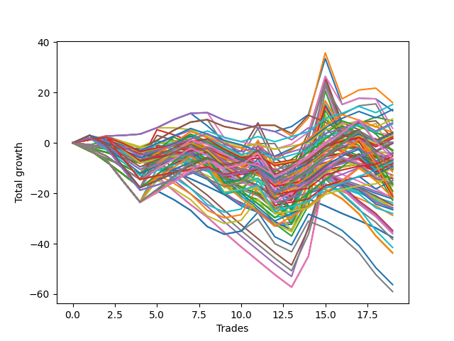

# Short Wallace Doodle 016 
- Symbol: ES
- Date Range: 03/18/2022 - 07/15/2022
- Trading Period: 7:20-12:30
- Number of Trades: 19



| Name | Win Percent | Profit | Avg Profit / Trade | Avg Time / Trade |      | Name | Win Percent | Profit | Avg Profit / Trade | Avg Time / Trade |
| ---- | ----------- | ------ | ------------------ | ---------------- | ---- | ---- | ----------- | ------ | ------------------ | ---------------- |
| Sorted By <br> Profit | | | | | | Sorted By <br> Win Percentage ||||
| One | 52.63 | 8000.00 | 421.05 | 17:44 |     | One Hundred Twenty-Six | 78.95 | -2625.00 | -138.16 | 08:38 |
| Ninety-Two | 63.16 | 7625.00 | 401.32 | 02:06 |     | Eighty-One | 78.95 | -4750.00 | -250.00 | 08:58 |
| Ninety-Three | 52.63 | 6625.00 | 348.68 | 03:26 |     | One Hundred Twenty-One | 78.95 | -6500.00 | -342.11 | 08:04 |
| Zero | 63.16 | 6375.00 | 335.53 | 11:52 |     | One Hundred Twenty-Seven | 73.68 | 125.00 | 6.58 | 10:34 |
| Ninety-One | 68.42 | 4750.00 | 250.00 | 01:03 |     | Eighty-Two | 73.68 | -2000.00 | -105.26 | 10:54 |
| Two | 52.63 | 4375.00 | 230.26 | 21:33 |     | One Hundred Twenty-Two | 73.68 | -3750.00 | -197.37 | 10:00 |
| One Hundred Seven | 63.16 | 4000.00 | 210.53 | 02:58 |     | Ninety-One | 68.42 | 4750.00 | 250.00 | 01:03 |
| One Hundred Two | 63.16 | 3750.00 | 197.37 | 03:08 |     | One Hundred One | 68.42 | 1500.00 | 78.95 | 02:04 |
| Fifty-Six | 63.16 | 2875.00 | 151.32 | 10:48 |     | One Hundred Six | 68.42 | 875.00 | 46.05 | 02:07 |
| One Hundred Eight | 47.37 | 2125.00 | 111.84 | 04:03 |     | One Hundred Twenty-Eight | 68.42 | -125.00 | -6.58 | 13:15 |
| Ninety-Four | 36.84 | 2125.00 | 111.84 | 04:44 |     | Eighty-Three | 68.42 | -2125.00 | -111.84 | 14:13 |
| One Hundred Three | 52.63 | 1875.00 | 98.68 | 04:31 |     | One Hundred Sixteen | 68.42 | -4125.00 | -217.11 | 03:40 |
| Fifty-Seven | 52.63 | 1875.00 | 98.68 | 15:21 |     | One Hundred Twenty-Three | 68.42 | -4625.00 | -243.42 | 12:45 |
| Thirty-Six | 36.84 | 1625.00 | 85.53 | 05:21 |     | One Hundred Eleven | 68.42 | -5000.00 | -263.16 | 04:18 |
| One Hundred One | 68.42 | 1500.00 | 78.95 | 02:04 |     | Ninety-Two | 63.16 | 7625.00 | 401.32 | 02:06 |
| Ninety-Six | 52.63 | 1250.00 | 65.79 | 01:07 |     | Zero | 63.16 | 6375.00 | 335.53 | 11:52 |
| Sixty-Five | 47.37 | 1000.00 | 52.63 | 13:53 |     | One Hundred Seven | 63.16 | 4000.00 | 210.53 | 02:58 |
| One Hundred Six | 68.42 | 875.00 | 46.05 | 02:07 |     | One Hundred Two | 63.16 | 3750.00 | 197.37 | 03:08 |
| Ninety-Seven | 36.84 | 875.00 | 46.05 | 01:33 |     | Fifty-Six | 63.16 | 2875.00 | 151.32 | 10:48 |
| Ninety-Five | 31.58 | 875.00 | 46.05 | 05:30 |     | One Hundred Seventeen | 63.16 | -2000.00 | -105.26 | 05:04 |
| One Hundred Twenty-Seven | 73.68 | 125.00 | 6.58 | 10:34 |     | One Hundred Twelve | 63.16 | -3625.00 | -190.79 | 05:49 |
| Thirty-Nine | 36.84 | 125.00 | 6.58 | 05:23 |     | Eighty-Five | 57.89 | -1500.00 | -78.95 | 19:55 |
| Thirty-Seven | 36.84 | 125.00 | 6.58 | 05:23 |     | One Hundred Twenty-Nine | 57.89 | -3125.00 | -164.47 | 15:31 |
| One Hundred Ten | 36.84 | -0.00 | -0.00 | 04:50 |     | Eighty-Four | 57.89 | -3375.00 | -177.63 | 17:57 |
| One Hundred Nine | 36.84 | -0.00 | -0.00 | 04:29 |     | One Hundred Twenty-Five | 57.89 | -8250.00 | -434.21 | 17:02 |
| One Hundred Twenty-Eight | 68.42 | -125.00 | -6.58 | 13:15 |     | One Hundred Twenty-Four | 57.89 | -10125.00 | -532.89 | 15:04 |
| One Hundred Five | 36.84 | -1375.00 | -72.37 | 06:57 |     | One | 52.63 | 8000.00 | 421.05 | 17:44 |
| Eighty-Five | 57.89 | -1500.00 | -78.95 | 19:55 |     | Ninety-Three | 52.63 | 6625.00 | 348.68 | 03:26 |
| Forty-Two | 31.58 | -1625.00 | -85.53 | 12:32 |     | Two | 52.63 | 4375.00 | 230.26 | 21:33 |
| Eighty-Two | 73.68 | -2000.00 | -105.26 | 10:54 |     | One Hundred Three | 52.63 | 1875.00 | 98.68 | 04:31 |
| One Hundred Seventeen | 63.16 | -2000.00 | -105.26 | 05:04 |     | Fifty-Seven | 52.63 | 1875.00 | 98.68 | 15:21 |
| Fifty-Eight | 52.63 | -2000.00 | -105.26 | 18:46 |     | Ninety-Six | 52.63 | 1250.00 | 65.79 | 01:07 |
| Ninety-Eight | 36.84 | -2000.00 | -105.26 | 01:41 |     | Fifty-Eight | 52.63 | -2000.00 | -105.26 | 18:46 |
| Eighty-Three | 68.42 | -2125.00 | -111.84 | 14:13 |     | Sixty-Four | 52.63 | -2500.00 | -131.58 | 09:43 |
| Thirty-Eight | 36.84 | -2125.00 | -111.84 | 05:17 |     | One Hundred Eighteen | 52.63 | -3375.00 | -177.63 | 06:26 |
| Thirty-Five | 36.84 | -2125.00 | -111.84 | 05:17 |     | Forty | 52.63 | -4750.00 | -250.00 | 08:08 |
| Thirty-Four | 36.84 | -2125.00 | -111.84 | 05:17 |     | One Hundred Thirty | 52.63 | -5375.00 | -282.89 | 16:58 |
| Sixty-Four | 52.63 | -2500.00 | -131.58 | 09:43 |     | One Hundred Thirteen | 52.63 | -7500.00 | -394.74 | 07:36 |
| One Hundred Twenty-Six | 78.95 | -2625.00 | -138.16 | 08:38 |     | One Hundred Eight | 47.37 | 2125.00 | 111.84 | 04:03 |
| One Hundred Twenty-Nine | 57.89 | -3125.00 | -164.47 | 15:31 |     | Sixty-Five | 47.37 | 1000.00 | 52.63 | 13:53 |
| Thirty-Three | 36.84 | -3125.00 | -164.47 | 05:06 |     | Sixty-Six | 47.37 | -6875.00 | -361.84 | 17:18 |
| Five | 42.11 | -3250.00 | -171.05 | 29:47 |     | Forty-Eight | 47.37 | -8625.00 | -453.95 | 05:58 |
| Eighty-Four | 57.89 | -3375.00 | -177.63 | 17:57 |     | Five | 42.11 | -3250.00 | -171.05 | 29:47 |
| One Hundred Eighteen | 52.63 | -3375.00 | -177.63 | 06:26 |     | Thirty-Two | 42.11 | -3375.00 | -177.63 | 04:36 |
| Thirty-Two | 42.11 | -3375.00 | -177.63 | 04:36 |     | Three | 42.11 | -3875.00 | -203.95 | 26:31 |
| One Hundred Twelve | 63.16 | -3625.00 | -190.79 | 05:49 |     | Sixten | 42.11 | -4250.00 | -223.68 | 01:41 |
| One Hundred Twenty-Two | 73.68 | -3750.00 | -197.37 | 10:00 |     | Four | 42.11 | -4250.00 | -223.68 | 28:23 |
| Three | 42.11 | -3875.00 | -203.95 | 26:31 |     | Seven | 42.11 | -4375.00 | -230.26 | 29:33 |
| One Hundred | 36.84 | -4000.00 | -210.53 | 01:44 |     | Six | 42.11 | -5125.00 | -269.74 | 26:57 |
| Ninety-Nine | 36.84 | -4000.00 | -210.53 | 01:44 |     | One Hundred Fifteen | 42.11 | -8000.00 | -421.05 | 10:50 |
| One Hundred Sixteen | 68.42 | -4125.00 | -217.11 | 03:40 |     | Sixty-One | 42.11 | -9500.00 | -500.00 | 26:07 |
| Sixten | 42.11 | -4250.00 | -223.68 | 01:41 |     | Fifty-Nine | 42.11 | -10125.00 | -532.89 | 22:51 |
| Four | 42.11 | -4250.00 | -223.68 | 28:23 |     | Sixty | 42.11 | -10500.00 | -552.63 | 24:44 |
| One Hundred Four | 36.84 | -4250.00 | -223.68 | 05:57 |     | Sixty-Three | 42.11 | -10625.00 | -559.21 | 25:53 |
| Seven | 42.11 | -4375.00 | -230.26 | 29:33 |     | One Hundred Fourteen | 42.11 | -10875.00 | -572.37 | 09:50 |
| One Hundred Twenty-Three | 68.42 | -4625.00 | -243.42 | 12:45 |     | Sixty-Two | 42.11 | -11375.00 | -598.68 | 23:18 |
| Eighty-One | 78.95 | -4750.00 | -250.00 | 08:58 |     | Ninety-Four | 36.84 | 2125.00 | 111.84 | 04:44 |
| Forty | 52.63 | -4750.00 | -250.00 | 08:08 |     | Thirty-Six | 36.84 | 1625.00 | 85.53 | 05:21 |
| Twelve | 10.53 | -4875.00 | -256.58 | 06:55 |     | Ninety-Seven | 36.84 | 875.00 | 46.05 | 01:33 |
| One Hundred Eleven | 68.42 | -5000.00 | -263.16 | 04:18 |     | Thirty-Nine | 36.84 | 125.00 | 6.58 | 05:23 |
| Six | 42.11 | -5125.00 | -269.74 | 26:57 |     | Thirty-Seven | 36.84 | 125.00 | 6.58 | 05:23 |
| Twenty-Three | 36.84 | -5125.00 | -269.74 | 01:44 |     | One Hundred Ten | 36.84 | -0.00 | -0.00 | 04:50 |
| Twenty-Two | 36.84 | -5125.00 | -269.74 | 01:44 |     | One Hundred Nine | 36.84 | -0.00 | -0.00 | 04:29 |
| Twenty-One | 36.84 | -5125.00 | -269.74 | 01:44 |     | One Hundred Five | 36.84 | -1375.00 | -72.37 | 06:57 |
| Twenty | 36.84 | -5125.00 | -269.74 | 01:44 |     | Ninety-Eight | 36.84 | -2000.00 | -105.26 | 01:41 |
| Nineteen | 36.84 | -5125.00 | -269.74 | 01:44 |     | Thirty-Eight | 36.84 | -2125.00 | -111.84 | 05:17 |
| Eighteen | 36.84 | -5125.00 | -269.74 | 01:44 |     | Thirty-Five | 36.84 | -2125.00 | -111.84 | 05:17 |
| Seventeen | 36.84 | -5125.00 | -269.74 | 01:44 |     | Thirty-Four | 36.84 | -2125.00 | -111.84 | 05:17 |
| Thirteen | 10.53 | -5250.00 | -276.32 | 08:11 |     | Thirty-Three | 36.84 | -3125.00 | -164.47 | 05:06 |
| One Hundred Thirty | 52.63 | -5375.00 | -282.89 | 16:58 |     | One Hundred | 36.84 | -4000.00 | -210.53 | 01:44 |
| Forty-One | 36.84 | -5750.00 | -302.63 | 10:53 |     | Ninety-Nine | 36.84 | -4000.00 | -210.53 | 01:44 |
| Fifteen | 10.53 | -6375.00 | -335.53 | 07:58 |     | One Hundred Four | 36.84 | -4250.00 | -223.68 | 05:57 |
| One Hundred Twenty-One | 78.95 | -6500.00 | -342.11 | 08:04 |     | Twenty-Three | 36.84 | -5125.00 | -269.74 | 01:44 |
| Sixty-Six | 47.37 | -6875.00 | -361.84 | 17:18 |     | Twenty-Two | 36.84 | -5125.00 | -269.74 | 01:44 |
| Fifty-Two | 26.32 | -7000.00 | -368.42 | 08:59 |     | Twenty-One | 36.84 | -5125.00 | -269.74 | 01:44 |
| Fifty-Three | 26.32 | -7125.00 | -375.00 | 09:28 |     | Twenty | 36.84 | -5125.00 | -269.74 | 01:44 |
| One Hundred Thirteen | 52.63 | -7500.00 | -394.74 | 07:36 |     | Nineteen | 36.84 | -5125.00 | -269.74 | 01:44 |
| One Hundred Ninteen | 36.84 | -7875.00 | -414.47 | 07:43 |     | Eighteen | 36.84 | -5125.00 | -269.74 | 01:44 |
| One Hundred Fifteen | 42.11 | -8000.00 | -421.05 | 10:50 |     | Seventeen | 36.84 | -5125.00 | -269.74 | 01:44 |
| One Hundred Twenty | 31.58 | -8125.00 | -427.63 | 08:15 |     | Forty-One | 36.84 | -5750.00 | -302.63 | 10:53 |
| One Hundred Twenty-Five | 57.89 | -8250.00 | -434.21 | 17:02 |     | One Hundred Ninteen | 36.84 | -7875.00 | -414.47 | 07:43 |
| Fifty-Five | 26.32 | -8250.00 | -434.21 | 09:14 |     | Ninety-Five | 31.58 | 875.00 | 46.05 | 05:30 |
| Forty-Eight | 47.37 | -8625.00 | -453.95 | 05:58 |     | Forty-Two | 31.58 | -1625.00 | -85.53 | 12:32 |
| Sixty-One | 42.11 | -9500.00 | -500.00 | 26:07 |     | One Hundred Twenty | 31.58 | -8125.00 | -427.63 | 08:15 |
| Seventy-Three | 21.05 | -9625.00 | -506.58 | 06:58 |     | Twenty-Four | 31.58 | -12875.00 | -677.63 | 06:09 |
| One Hundred Twenty-Four | 57.89 | -10125.00 | -532.89 | 15:04 |     | Forty-Nine | 31.58 | -14000.00 | -736.84 | 07:41 |
| Fifty-Nine | 42.11 | -10125.00 | -532.89 | 22:51 |     | Fifty-Two | 26.32 | -7000.00 | -368.42 | 08:59 |
| Sixty | 42.11 | -10500.00 | -552.63 | 24:44 |     | Fifty-Three | 26.32 | -7125.00 | -375.00 | 09:28 |
| Sixty-Three | 42.11 | -10625.00 | -559.21 | 25:53 |     | Fifty-Five | 26.32 | -8250.00 | -434.21 | 09:14 |
| Fourteen | 10.53 | -10750.00 | -565.79 | 06:40 |     | Twenty-Five | 26.32 | -12375.00 | -651.32 | 07:12 |
| Eleven | 10.53 | -10750.00 | -565.79 | 06:42 |     | Fifty-Four | 26.32 | -12875.00 | -677.63 | 08:44 |
| One Hundred Fourteen | 42.11 | -10875.00 | -572.37 | 09:50 |     | Fifty-One | 26.32 | -12875.00 | -677.63 | 08:46 |
| Twenty-Six | 21.05 | -11000.00 | -578.95 | 08:14 |     | Fifty | 26.32 | -13250.00 | -697.37 | 08:38 |
| Ten | 10.53 | -11125.00 | -585.53 | 06:34 |     | Seventy-Three | 21.05 | -9625.00 | -506.58 | 06:58 |
| Sixty-Two | 42.11 | -11375.00 | -598.68 | 23:18 |     | Twenty-Six | 21.05 | -11000.00 | -578.95 | 08:14 |
| Nine | 15.79 | -11875.00 | -625.00 | 05:37 |     | Eight | 21.05 | -12250.00 | -644.74 | 04:52 |
| Eight | 21.05 | -12250.00 | -644.74 | 04:52 |     | Sixty-Nine | 21.05 | -20750.00 | -1092.11 | 21:35 |
| Twenty-Five | 26.32 | -12375.00 | -651.32 | 07:12 |     | Sixty-Eight | 21.05 | -21750.00 | -1144.74 | 20:12 |
| Twenty-Four | 31.58 | -12875.00 | -677.63 | 06:09 |     | Seventy-One | 21.05 | -21875.00 | -1151.32 | 21:22 |
| Fifty-Four | 26.32 | -12875.00 | -677.63 | 08:44 |     | Seventy | 21.05 | -28125.00 | -1480.26 | 19:49 |
| Fifty-One | 26.32 | -12875.00 | -677.63 | 08:46 |     | Sixty-Seven | 21.05 | -29500.00 | -1552.63 | 19:34 |
| Twenty-Eight | 10.53 | -12875.00 | -677.63 | 09:24 |     | Nine | 15.79 | -11875.00 | -625.00 | 05:37 |
| Fifty | 26.32 | -13250.00 | -697.37 | 08:38 |     | Forty-Three | 15.79 | -17375.00 | -914.47 | 13:54 |
| Twenty-Nine | 10.53 | -13250.00 | -697.37 | 10:40 |     | Forty-Four | 15.79 | -17625.00 | -927.63 | 15:10 |
| Forty-Nine | 31.58 | -14000.00 | -736.84 | 07:41 |     | Forty-Six | 15.79 | -18000.00 | -947.37 | 13:52 |
| Thirty-One | 10.53 | -14375.00 | -756.58 | 10:27 |     | Forty-Five | 15.79 | -18000.00 | -947.37 | 16:26 |
| Forty-Three | 15.79 | -17375.00 | -914.47 | 13:54 |     | Forty-Seven | 15.79 | -19125.00 | -1006.58 | 16:12 |
| Forty-Four | 15.79 | -17625.00 | -927.63 | 15:10 |     | Twelve | 10.53 | -4875.00 | -256.58 | 06:55 |
| Forty-Six | 15.79 | -18000.00 | -947.37 | 13:52 |     | Thirteen | 10.53 | -5250.00 | -276.32 | 08:11 |
| Forty-Five | 15.79 | -18000.00 | -947.37 | 16:26 |     | Fifteen | 10.53 | -6375.00 | -335.53 | 07:58 |
| Thirty | 10.53 | -18750.00 | -986.84 | 09:09 |     | Fourteen | 10.53 | -10750.00 | -565.79 | 06:40 |
| twenty-Seven | 10.53 | -18750.00 | -986.84 | 09:11 |     | Eleven | 10.53 | -10750.00 | -565.79 | 06:42 |
| Forty-Seven | 15.79 | -19125.00 | -1006.58 | 16:12 |     | Ten | 10.53 | -11125.00 | -585.53 | 06:34 |
| Sixty-Nine | 21.05 | -20750.00 | -1092.11 | 21:35 |     | Twenty-Eight | 10.53 | -12875.00 | -677.63 | 09:24 |
| Sixty-Eight | 21.05 | -21750.00 | -1144.74 | 20:12 |     | Twenty-Nine | 10.53 | -13250.00 | -697.37 | 10:40 |
| Seventy-One | 21.05 | -21875.00 | -1151.32 | 21:22 |     | Thirty-One | 10.53 | -14375.00 | -756.58 | 10:27 |
| Seventy | 21.05 | -28125.00 | -1480.26 | 19:49 |     | Thirty | 10.53 | -18750.00 | -986.84 | 09:09 |
| Sixty-Seven | 21.05 | -29500.00 | -1552.63 | 19:34 |     | twenty-Seven | 10.53 | -18750.00 | -986.84 | 09:11 |

## NO STOPLOSS

### Test Zero
* Sell when price hits the middle line of the 20p bollinger
* No Stoploss
* Results:
```
Total Trades: 19
Percent Up: 36.84
Percent Down: 63.16
Total Points Moved Down: 12.75
Potential Profit: 6375.00
Total Points Ups: 30.75 Count Ups: 7
Total Points Downs: 43.50 Count Downs: 12
```

<details><summary>Trades</summary>

<code>In: 2022-03-25 11:08:00		Out: 2022-03-25 11:18:15		Total Position Time: 10:15		Total Move Down: 1.25		Total to Date: 1.25</code> <br />
<code>In: 2022-03-28 12:01:00		Out: 2022-03-28 12:08:15		Total Position Time: 07:15		Total Move Down: 1.50		Total to Date: 2.75</code> <br />
<code>In: 2022-03-29 11:40:00		Out: 2022-03-29 11:51:10		Total Position Time: 11:10		Total Move Down: 0.25		Total to Date: 3.00</code> <br />
<code>In: 2022-03-29 11:43:00		Out: 2022-03-29 11:51:10		Total Position Time: 08:10		Total Move Down: 0.50		Total to Date: 3.50</code> <br />
<code>In: 2022-04-06 08:53:00		Out: 2022-04-06 09:00:40		Total Position Time: 07:40		Total Move Down: 2.50		Total to Date: 6.00</code> <br />
<code>In: 2022-04-07 11:04:00		Out: 2022-04-07 11:15:20		Total Position Time: 11:20		Total Move Down: 3.25		Total to Date: 9.25</code> <br />
<code>In: 2022-04-07 11:05:00		Out: 2022-04-07 11:15:20		Total Position Time: 10:20		Total Move Down: 2.50		Total to Date: 11.75</code> <br />
<code>In: 2022-04-07 11:06:00		Out: 2022-04-07 11:15:20		Total Position Time: 09:20		Total Move Down: 0.25		Total to Date: 12.00</code> <br />
<code>In: 2022-04-18 10:39:00		Out: 2022-04-18 10:59:30		Total Position Time: 20:30		Total Move Down: -3.00		Total to Date: 9.00</code> <br />
<code>In: 2022-04-18 10:42:00		Out: 2022-04-18 10:59:30		Total Position Time: 17:30		Total Move Down: -1.50		Total to Date: 7.50</code> <br />
<code>In: 2022-04-20 07:43:00		Out: 2022-04-20 08:00:15		Total Position Time: 17:15		Total Move Down: -1.50		Total to Date: 6.00</code> <br />
<code>In: 2022-05-04 09:32:00		Out: 2022-05-04 09:45:30		Total Position Time: 13:30		Total Move Down: -1.50		Total to Date: 4.50</code> <br />
<code>In: 2022-05-31 07:24:00		Out: 2022-05-31 07:37:15		Total Position Time: 13:15		Total Move Down: 2.00		Total to Date: 6.50</code> <br />
<code>In: 2022-06-03 10:08:00		Out: 2022-06-03 10:13:20		Total Position Time: 05:20		Total Move Down: 4.75		Total to Date: 11.25</code> <br />
<code>In: 2022-06-15 11:48:00		Out: 2022-06-15 11:52:30		Total Position Time: 04:30		Total Move Down: 22.25		Total to Date: 33.50</code> <br />
<code>In: 2022-06-30 08:01:00		Out: 2022-06-30 08:30:55		Total Position Time: 29:55		Total Move Down: -18.25		Total to Date: 15.25</code> <br />
<code>In: 2022-07-05 08:52:00		Out: 2022-07-05 09:00:10		Total Position Time: 08:10		Total Move Down: 2.50		Total to Date: 17.75</code> <br />
<code>In: 2022-07-05 08:53:00		Out: 2022-07-05 09:00:10		Total Position Time: 07:10		Total Move Down: -0.25		Total to Date: 17.50</code> <br />
<code>In: 2022-07-06 11:37:00		Out: 2022-07-06 11:50:05		Total Position Time: 13:05		Total Move Down: -4.75		Total to Date: 12.75</code> <br />


</details>

### Test One
* Sell when the price hits the upper line of the 20p 1std bollinger
* No Stoploss
* Results:
```
Total Trades: 19
Percent Up: 47.37
Percent Down: 52.63
Total Points Moved Down: 16.00
Potential Profit: 8000.00
Total Points Ups: 36.50 Count Ups: 9
Total Points Downs: 52.50 Count Downs: 10
```

<details><summary>Trades</summary>

<code>In: 2022-03-25 11:08:00		Out: 2022-03-25 11:19:35		Total Position Time: 11:35		Total Move Down: 2.00		Total to Date: 2.00</code> <br />
<code>In: 2022-03-28 12:01:00		Out: 2022-03-28 12:30:55		Total Position Time: 29:55		Total Move Down: -4.00		Total to Date: -2.00</code> <br />
<code>In: 2022-03-29 11:40:00		Out: 2022-03-29 12:00:25		Total Position Time: 20:25		Total Move Down: -0.25		Total to Date: -2.25</code> <br />
<code>In: 2022-03-29 11:43:00		Out: 2022-03-29 12:00:25		Total Position Time: 17:25		Total Move Down: -0.00		Total to Date: -2.25</code> <br />
<code>In: 2022-04-06 08:53:00		Out: 2022-04-06 09:05:10		Total Position Time: 12:10		Total Move Down: 3.25		Total to Date: 1.00</code> <br />
<code>In: 2022-04-07 11:04:00		Out: 2022-04-07 11:18:00		Total Position Time: 14:00		Total Move Down: 4.00		Total to Date: 5.00</code> <br />
<code>In: 2022-04-07 11:05:00		Out: 2022-04-07 11:18:00		Total Position Time: 13:00		Total Move Down: 3.25		Total to Date: 8.25</code> <br />
<code>In: 2022-04-07 11:06:00		Out: 2022-04-07 11:18:00		Total Position Time: 12:00		Total Move Down: 1.00		Total to Date: 9.25</code> <br />
<code>In: 2022-04-18 10:39:00		Out: 2022-04-18 11:06:35		Total Position Time: 27:35		Total Move Down: -2.75		Total to Date: 6.50</code> <br />
<code>In: 2022-04-18 10:42:00		Out: 2022-04-18 11:06:35		Total Position Time: 24:35		Total Move Down: -1.25		Total to Date: 5.25</code> <br />
<code>In: 2022-04-20 07:43:00		Out: 2022-04-20 08:00:40		Total Position Time: 17:40		Total Move Down: 1.75		Total to Date: 7.00</code> <br />
<code>In: 2022-05-04 09:32:00		Out: 2022-05-04 09:46:30		Total Position Time: 14:30		Total Move Down: -0.00		Total to Date: 7.00</code> <br />
<code>In: 2022-05-31 07:24:00		Out: 2022-05-31 07:53:55		Total Position Time: 29:55		Total Move Down: -4.25		Total to Date: 2.75</code> <br />
<code>In: 2022-06-03 10:08:00		Out: 2022-06-03 10:15:05		Total Position Time: 07:05		Total Move Down: 7.25		Total to Date: 10.00</code> <br />
<code>In: 2022-06-15 11:48:00		Out: 2022-06-15 11:57:35		Total Position Time: 09:35		Total Move Down: 25.75		Total to Date: 35.75</code> <br />
<code>In: 2022-06-30 08:01:00		Out: 2022-06-30 08:30:55		Total Position Time: 29:55		Total Move Down: -18.25		Total to Date: 17.50</code> <br />
<code>In: 2022-07-05 08:52:00		Out: 2022-07-05 09:03:30		Total Position Time: 11:30		Total Move Down: 3.50		Total to Date: 21.00</code> <br />
<code>In: 2022-07-05 08:53:00		Out: 2022-07-05 09:03:30		Total Position Time: 10:30		Total Move Down: 0.75		Total to Date: 21.75</code> <br />
<code>In: 2022-07-06 11:37:00		Out: 2022-07-06 12:00:45		Total Position Time: 23:45		Total Move Down: -5.75		Total to Date: 16.00</code> <br />


</details>

### Test Two
* Sell when the price hits the upper line of the 20p 2std bollinger
* No Stoploss
* Results:
```
Total Trades: 19
Percent Up: 47.37
Percent Down: 52.63
Total Points Moved Down: 8.75
Potential Profit: 4375.00
Total Points Ups: 64.50 Count Ups: 9
Total Points Downs: 73.25 Count Downs: 10
```

<details><summary>Trades</summary>

<code>In: 2022-03-25 11:08:00		Out: 2022-03-25 11:37:55		Total Position Time: 29:55		Total Move Down: -2.75		Total to Date: -2.75</code> <br />
<code>In: 2022-03-28 12:01:00		Out: 2022-03-28 12:30:55		Total Position Time: 29:55		Total Move Down: -4.00		Total to Date: -6.75</code> <br />
<code>In: 2022-03-29 11:40:00		Out: 2022-03-29 12:09:55		Total Position Time: 29:55		Total Move Down: -8.50		Total to Date: -15.25</code> <br />
<code>In: 2022-03-29 11:43:00		Out: 2022-03-29 12:12:55		Total Position Time: 29:55		Total Move Down: -8.25		Total to Date: -23.50</code> <br />
<code>In: 2022-04-06 08:53:00		Out: 2022-04-06 09:09:40		Total Position Time: 16:40		Total Move Down: 3.75		Total to Date: -19.75</code> <br />
<code>In: 2022-04-07 11:04:00		Out: 2022-04-07 11:18:20		Total Position Time: 14:20		Total Move Down: 5.25		Total to Date: -14.50</code> <br />
<code>In: 2022-04-07 11:05:00		Out: 2022-04-07 11:18:20		Total Position Time: 13:20		Total Move Down: 4.50		Total to Date: -10.00</code> <br />
<code>In: 2022-04-07 11:06:00		Out: 2022-04-07 11:18:20		Total Position Time: 12:20		Total Move Down: 2.25		Total to Date: -7.75</code> <br />
<code>In: 2022-04-18 10:39:00		Out: 2022-04-18 11:08:55		Total Position Time: 29:55		Total Move Down: -3.00		Total to Date: -10.75</code> <br />
<code>In: 2022-04-18 10:42:00		Out: 2022-04-18 11:10:40		Total Position Time: 28:40		Total Move Down: 0.25		Total to Date: -10.50</code> <br />
<code>In: 2022-04-20 07:43:00		Out: 2022-04-20 08:00:55		Total Position Time: 17:55		Total Move Down: 3.00		Total to Date: -7.50</code> <br />
<code>In: 2022-05-04 09:32:00		Out: 2022-05-04 10:01:55		Total Position Time: 29:55		Total Move Down: -14.00		Total to Date: -21.50</code> <br />
<code>In: 2022-05-31 07:24:00		Out: 2022-05-31 07:53:55		Total Position Time: 29:55		Total Move Down: -4.25		Total to Date: -25.75</code> <br />
<code>In: 2022-06-03 10:08:00		Out: 2022-06-03 10:17:55		Total Position Time: 09:55		Total Move Down: 12.25		Total to Date: -13.50</code> <br />
<code>In: 2022-06-15 11:48:00		Out: 2022-06-15 11:58:05		Total Position Time: 10:05		Total Move Down: 34.25		Total to Date: 20.75</code> <br />
<code>In: 2022-06-30 08:01:00		Out: 2022-06-30 08:30:55		Total Position Time: 29:55		Total Move Down: -18.25		Total to Date: 2.50</code> <br />
<code>In: 2022-07-05 08:52:00		Out: 2022-07-05 09:03:50		Total Position Time: 11:50		Total Move Down: 5.25		Total to Date: 7.75</code> <br />
<code>In: 2022-07-05 08:53:00		Out: 2022-07-05 09:03:50		Total Position Time: 10:50		Total Move Down: 2.50		Total to Date: 10.25</code> <br />
<code>In: 2022-07-06 11:37:00		Out: 2022-07-06 12:01:30		Total Position Time: 24:30		Total Move Down: -1.50		Total to Date: 8.75</code> <br />


</details>

### Test Three
* Sell when price hits the middle line of the 50p bollinger
* No Stoploss
* Results:
```
Total Trades: 19
Percent Up: 57.89
Percent Down: 42.11
Total Points Moved Down: -7.75
Potential Profit: -3875.00
Total Points Ups: 77.50 Count Ups: 11
Total Points Downs: 69.75 Count Downs: 8
```

<details><summary>Trades</summary>

<code>In: 2022-03-25 11:08:00		Out: 2022-03-25 11:37:55		Total Position Time: 29:55		Total Move Down: -2.75		Total to Date: -2.75</code> <br />
<code>In: 2022-03-28 12:01:00		Out: 2022-03-28 12:30:55		Total Position Time: 29:55		Total Move Down: -4.00		Total to Date: -6.75</code> <br />
<code>In: 2022-03-29 11:40:00		Out: 2022-03-29 12:09:55		Total Position Time: 29:55		Total Move Down: -8.50		Total to Date: -15.25</code> <br />
<code>In: 2022-03-29 11:43:00		Out: 2022-03-29 12:12:55		Total Position Time: 29:55		Total Move Down: -8.25		Total to Date: -23.50</code> <br />
<code>In: 2022-04-06 08:53:00		Out: 2022-04-06 09:12:05		Total Position Time: 19:05		Total Move Down: 4.50		Total to Date: -19.00</code> <br />
<code>In: 2022-04-07 11:04:00		Out: 2022-04-07 11:33:40		Total Position Time: 29:40		Total Move Down: 5.50		Total to Date: -13.50</code> <br />
<code>In: 2022-04-07 11:05:00		Out: 2022-04-07 11:33:40		Total Position Time: 28:40		Total Move Down: 4.75		Total to Date: -8.75</code> <br />
<code>In: 2022-04-07 11:06:00		Out: 2022-04-07 11:33:40		Total Position Time: 27:40		Total Move Down: 2.50		Total to Date: -6.25</code> <br />
<code>In: 2022-04-18 10:39:00		Out: 2022-04-18 11:08:55		Total Position Time: 29:55		Total Move Down: -3.00		Total to Date: -9.25</code> <br />
<code>In: 2022-04-18 10:42:00		Out: 2022-04-18 11:11:55		Total Position Time: 29:55		Total Move Down: 1.25		Total to Date: -8.00</code> <br />
<code>In: 2022-04-20 07:43:00		Out: 2022-04-20 08:02:50		Total Position Time: 19:50		Total Move Down: 4.75		Total to Date: -3.25</code> <br />
<code>In: 2022-05-04 09:32:00		Out: 2022-05-04 10:01:55		Total Position Time: 29:55		Total Move Down: -14.00		Total to Date: -17.25</code> <br />
<code>In: 2022-05-31 07:24:00		Out: 2022-05-31 07:53:55		Total Position Time: 29:55		Total Move Down: -4.25		Total to Date: -21.50</code> <br />
<code>In: 2022-06-03 10:08:00		Out: 2022-06-03 10:17:55		Total Position Time: 09:55		Total Move Down: 12.25		Total to Date: -9.25</code> <br />
<code>In: 2022-06-15 11:48:00		Out: 2022-06-15 11:58:05		Total Position Time: 10:05		Total Move Down: 34.25		Total to Date: 25.00</code> <br />
<code>In: 2022-06-30 08:01:00		Out: 2022-06-30 08:30:55		Total Position Time: 29:55		Total Move Down: -18.25		Total to Date: 6.75</code> <br />
<code>In: 2022-07-05 08:52:00		Out: 2022-07-05 09:21:55		Total Position Time: 29:55		Total Move Down: -2.75		Total to Date: 4.00</code> <br />
<code>In: 2022-07-05 08:53:00		Out: 2022-07-05 09:22:55		Total Position Time: 29:55		Total Move Down: -8.50		Total to Date: -4.50</code> <br />
<code>In: 2022-07-06 11:37:00		Out: 2022-07-06 12:06:55		Total Position Time: 29:55		Total Move Down: -3.25		Total to Date: -7.75</code> <br />


</details>

### Test Four
* Sell when the price hits the upper line of the 50p 1std bollinger
* No Stoploss
* Results:
```
Total Trades: 19
Percent Up: 57.89
Percent Down: 42.11
Total Points Moved Down: -8.50
Potential Profit: -4250.00
Total Points Ups: 77.50 Count Ups: 11
Total Points Downs: 69.00 Count Downs: 8
```

<details><summary>Trades</summary>

<code>In: 2022-03-25 11:08:00		Out: 2022-03-25 11:37:55		Total Position Time: 29:55		Total Move Down: -2.75		Total to Date: -2.75</code> <br />
<code>In: 2022-03-28 12:01:00		Out: 2022-03-28 12:30:55		Total Position Time: 29:55		Total Move Down: -4.00		Total to Date: -6.75</code> <br />
<code>In: 2022-03-29 11:40:00		Out: 2022-03-29 12:09:55		Total Position Time: 29:55		Total Move Down: -8.50		Total to Date: -15.25</code> <br />
<code>In: 2022-03-29 11:43:00		Out: 2022-03-29 12:12:55		Total Position Time: 29:55		Total Move Down: -8.25		Total to Date: -23.50</code> <br />
<code>In: 2022-04-06 08:53:00		Out: 2022-04-06 09:15:00		Total Position Time: 22:00		Total Move Down: 8.75		Total to Date: -14.75</code> <br />
<code>In: 2022-04-07 11:04:00		Out: 2022-04-07 11:33:55		Total Position Time: 29:55		Total Move Down: 4.25		Total to Date: -10.50</code> <br />
<code>In: 2022-04-07 11:05:00		Out: 2022-04-07 11:34:55		Total Position Time: 29:55		Total Move Down: 2.75		Total to Date: -7.75</code> <br />
<code>In: 2022-04-07 11:06:00		Out: 2022-04-07 11:35:55		Total Position Time: 29:55		Total Move Down: 1.75		Total to Date: -6.00</code> <br />
<code>In: 2022-04-18 10:39:00		Out: 2022-04-18 11:08:55		Total Position Time: 29:55		Total Move Down: -3.00		Total to Date: -9.00</code> <br />
<code>In: 2022-04-18 10:42:00		Out: 2022-04-18 11:11:55		Total Position Time: 29:55		Total Move Down: 1.25		Total to Date: -7.75</code> <br />
<code>In: 2022-04-20 07:43:00		Out: 2022-04-20 08:10:45		Total Position Time: 27:45		Total Move Down: 8.50		Total to Date: 0.75</code> <br />
<code>In: 2022-05-04 09:32:00		Out: 2022-05-04 10:01:55		Total Position Time: 29:55		Total Move Down: -14.00		Total to Date: -13.25</code> <br />
<code>In: 2022-05-31 07:24:00		Out: 2022-05-31 07:53:55		Total Position Time: 29:55		Total Move Down: -4.25		Total to Date: -17.50</code> <br />
<code>In: 2022-06-03 10:08:00		Out: 2022-06-03 10:19:05		Total Position Time: 11:05		Total Move Down: 19.75		Total to Date: 2.25</code> <br />
<code>In: 2022-06-15 11:48:00		Out: 2022-06-15 12:17:55		Total Position Time: 29:55		Total Move Down: 22.00		Total to Date: 24.25</code> <br />
<code>In: 2022-06-30 08:01:00		Out: 2022-06-30 08:30:55		Total Position Time: 29:55		Total Move Down: -18.25		Total to Date: 6.00</code> <br />
<code>In: 2022-07-05 08:52:00		Out: 2022-07-05 09:21:55		Total Position Time: 29:55		Total Move Down: -2.75		Total to Date: 3.25</code> <br />
<code>In: 2022-07-05 08:53:00		Out: 2022-07-05 09:22:55		Total Position Time: 29:55		Total Move Down: -8.50		Total to Date: -5.25</code> <br />
<code>In: 2022-07-06 11:37:00		Out: 2022-07-06 12:06:55		Total Position Time: 29:55		Total Move Down: -3.25		Total to Date: -8.50</code> <br />


</details>

### Test Five
* Sell when the price hits the upper line of the 50p 2std bollinger
* No Stoploss
* Results:
```
Total Trades: 19
Percent Up: 57.89
Percent Down: 42.11
Total Points Moved Down: -6.50
Potential Profit: -3250.00
Total Points Ups: 77.50 Count Ups: 11
Total Points Downs: 71.00 Count Downs: 8
```

<details><summary>Trades</summary>

<code>In: 2022-03-25 11:08:00		Out: 2022-03-25 11:37:55		Total Position Time: 29:55		Total Move Down: -2.75		Total to Date: -2.75</code> <br />
<code>In: 2022-03-28 12:01:00		Out: 2022-03-28 12:30:55		Total Position Time: 29:55		Total Move Down: -4.00		Total to Date: -6.75</code> <br />
<code>In: 2022-03-29 11:40:00		Out: 2022-03-29 12:09:55		Total Position Time: 29:55		Total Move Down: -8.50		Total to Date: -15.25</code> <br />
<code>In: 2022-03-29 11:43:00		Out: 2022-03-29 12:12:55		Total Position Time: 29:55		Total Move Down: -8.25		Total to Date: -23.50</code> <br />
<code>In: 2022-04-06 08:53:00		Out: 2022-04-06 09:20:25		Total Position Time: 27:25		Total Move Down: 13.25		Total to Date: -10.25</code> <br />
<code>In: 2022-04-07 11:04:00		Out: 2022-04-07 11:33:55		Total Position Time: 29:55		Total Move Down: 4.25		Total to Date: -6.00</code> <br />
<code>In: 2022-04-07 11:05:00		Out: 2022-04-07 11:34:55		Total Position Time: 29:55		Total Move Down: 2.75		Total to Date: -3.25</code> <br />
<code>In: 2022-04-07 11:06:00		Out: 2022-04-07 11:35:55		Total Position Time: 29:55		Total Move Down: 1.75		Total to Date: -1.50</code> <br />
<code>In: 2022-04-18 10:39:00		Out: 2022-04-18 11:08:55		Total Position Time: 29:55		Total Move Down: -3.00		Total to Date: -4.50</code> <br />
<code>In: 2022-04-18 10:42:00		Out: 2022-04-18 11:11:55		Total Position Time: 29:55		Total Move Down: 1.25		Total to Date: -3.25</code> <br />
<code>In: 2022-04-20 07:43:00		Out: 2022-04-20 08:12:55		Total Position Time: 29:55		Total Move Down: 11.25		Total to Date: 8.00</code> <br />
<code>In: 2022-05-04 09:32:00		Out: 2022-05-04 10:01:55		Total Position Time: 29:55		Total Move Down: -14.00		Total to Date: -6.00</code> <br />
<code>In: 2022-05-31 07:24:00		Out: 2022-05-31 07:53:55		Total Position Time: 29:55		Total Move Down: -4.25		Total to Date: -10.25</code> <br />
<code>In: 2022-06-03 10:08:00		Out: 2022-06-03 10:37:55		Total Position Time: 29:55		Total Move Down: 14.50		Total to Date: 4.25</code> <br />
<code>In: 2022-06-15 11:48:00		Out: 2022-06-15 12:17:55		Total Position Time: 29:55		Total Move Down: 22.00		Total to Date: 26.25</code> <br />
<code>In: 2022-06-30 08:01:00		Out: 2022-06-30 08:30:55		Total Position Time: 29:55		Total Move Down: -18.25		Total to Date: 8.00</code> <br />
<code>In: 2022-07-05 08:52:00		Out: 2022-07-05 09:21:55		Total Position Time: 29:55		Total Move Down: -2.75		Total to Date: 5.25</code> <br />
<code>In: 2022-07-05 08:53:00		Out: 2022-07-05 09:22:55		Total Position Time: 29:55		Total Move Down: -8.50		Total to Date: -3.25</code> <br />
<code>In: 2022-07-06 11:37:00		Out: 2022-07-06 12:06:55		Total Position Time: 29:55		Total Move Down: -3.25		Total to Date: -6.50</code> <br />


</details>

### Test Six
* Sell when the price hits the middle line of the 1std VWAP
* No Stoploss
* Results:
```
Total Trades: 19
Percent Up: 57.89
Percent Down: 42.11
Total Points Moved Down: -10.25
Potential Profit: -5125.00
Total Points Ups: 77.50 Count Ups: 11
Total Points Downs: 67.25 Count Downs: 8
```

<details><summary>Trades</summary>

<code>In: 2022-03-25 11:08:00		Out: 2022-03-25 11:37:55		Total Position Time: 29:55		Total Move Down: -2.75		Total to Date: -2.75</code> <br />
<code>In: 2022-03-28 12:01:00		Out: 2022-03-28 12:30:55		Total Position Time: 29:55		Total Move Down: -4.00		Total to Date: -6.75</code> <br />
<code>In: 2022-03-29 11:40:00		Out: 2022-03-29 12:09:55		Total Position Time: 29:55		Total Move Down: -8.50		Total to Date: -15.25</code> <br />
<code>In: 2022-03-29 11:43:00		Out: 2022-03-29 12:12:55		Total Position Time: 29:55		Total Move Down: -8.25		Total to Date: -23.50</code> <br />
<code>In: 2022-04-06 08:53:00		Out: 2022-04-06 09:11:35		Total Position Time: 18:35		Total Move Down: 4.50		Total to Date: -19.00</code> <br />
<code>In: 2022-04-07 11:04:00		Out: 2022-04-07 11:33:55		Total Position Time: 29:55		Total Move Down: 4.25		Total to Date: -14.75</code> <br />
<code>In: 2022-04-07 11:05:00		Out: 2022-04-07 11:34:55		Total Position Time: 29:55		Total Move Down: 2.75		Total to Date: -12.00</code> <br />
<code>In: 2022-04-07 11:06:00		Out: 2022-04-07 11:35:55		Total Position Time: 29:55		Total Move Down: 1.75		Total to Date: -10.25</code> <br />
<code>In: 2022-04-18 10:39:00		Out: 2022-04-18 11:08:55		Total Position Time: 29:55		Total Move Down: -3.00		Total to Date: -13.25</code> <br />
<code>In: 2022-04-18 10:42:00		Out: 2022-04-18 11:11:55		Total Position Time: 29:55		Total Move Down: 1.25		Total to Date: -12.00</code> <br />
<code>In: 2022-04-20 07:43:00		Out: 2022-04-20 08:08:10		Total Position Time: 25:10		Total Move Down: 7.50		Total to Date: -4.50</code> <br />
<code>In: 2022-05-04 09:32:00		Out: 2022-05-04 10:01:55		Total Position Time: 29:55		Total Move Down: -14.00		Total to Date: -18.50</code> <br />
<code>In: 2022-05-31 07:24:00		Out: 2022-05-31 07:53:55		Total Position Time: 29:55		Total Move Down: -4.25		Total to Date: -22.75</code> <br />
<code>In: 2022-06-03 10:08:00		Out: 2022-06-03 10:17:55		Total Position Time: 09:55		Total Move Down: 12.25		Total to Date: -10.50</code> <br />
<code>In: 2022-06-15 11:48:00		Out: 2022-06-15 11:57:55		Total Position Time: 09:55		Total Move Down: 33.00		Total to Date: 22.50</code> <br />
<code>In: 2022-06-30 08:01:00		Out: 2022-06-30 08:30:55		Total Position Time: 29:55		Total Move Down: -18.25		Total to Date: 4.25</code> <br />
<code>In: 2022-07-05 08:52:00		Out: 2022-07-05 09:21:55		Total Position Time: 29:55		Total Move Down: -2.75		Total to Date: 1.50</code> <br />
<code>In: 2022-07-05 08:53:00		Out: 2022-07-05 09:22:55		Total Position Time: 29:55		Total Move Down: -8.50		Total to Date: -7.00</code> <br />
<code>In: 2022-07-06 11:37:00		Out: 2022-07-06 12:06:55		Total Position Time: 29:55		Total Move Down: -3.25		Total to Date: -10.25</code> <br />


</details>

### Test Seven
* Sell when the price hits the upper line of the 1std VWAP
* No Stoploss
* Results:
```
Total Trades: 19
Percent Up: 57.89
Percent Down: 42.11
Total Points Moved Down: -8.75
Potential Profit: -4375.00
Total Points Ups: 77.50 Count Ups: 11
Total Points Downs: 68.75 Count Downs: 8
```

<details><summary>Trades</summary>

<code>In: 2022-03-25 11:08:00		Out: 2022-03-25 11:37:55		Total Position Time: 29:55		Total Move Down: -2.75		Total to Date: -2.75</code> <br />
<code>In: 2022-03-28 12:01:00		Out: 2022-03-28 12:30:55		Total Position Time: 29:55		Total Move Down: -4.00		Total to Date: -6.75</code> <br />
<code>In: 2022-03-29 11:40:00		Out: 2022-03-29 12:09:55		Total Position Time: 29:55		Total Move Down: -8.50		Total to Date: -15.25</code> <br />
<code>In: 2022-03-29 11:43:00		Out: 2022-03-29 12:12:55		Total Position Time: 29:55		Total Move Down: -8.25		Total to Date: -23.50</code> <br />
<code>In: 2022-04-06 08:53:00		Out: 2022-04-06 09:16:05		Total Position Time: 23:05		Total Move Down: 11.00		Total to Date: -12.50</code> <br />
<code>In: 2022-04-07 11:04:00		Out: 2022-04-07 11:33:55		Total Position Time: 29:55		Total Move Down: 4.25		Total to Date: -8.25</code> <br />
<code>In: 2022-04-07 11:05:00		Out: 2022-04-07 11:34:55		Total Position Time: 29:55		Total Move Down: 2.75		Total to Date: -5.50</code> <br />
<code>In: 2022-04-07 11:06:00		Out: 2022-04-07 11:35:55		Total Position Time: 29:55		Total Move Down: 1.75		Total to Date: -3.75</code> <br />
<code>In: 2022-04-18 10:39:00		Out: 2022-04-18 11:08:55		Total Position Time: 29:55		Total Move Down: -3.00		Total to Date: -6.75</code> <br />
<code>In: 2022-04-18 10:42:00		Out: 2022-04-18 11:11:55		Total Position Time: 29:55		Total Move Down: 1.25		Total to Date: -5.50</code> <br />
<code>In: 2022-04-20 07:43:00		Out: 2022-04-20 08:12:55		Total Position Time: 29:55		Total Move Down: 11.25		Total to Date: 5.75</code> <br />
<code>In: 2022-05-04 09:32:00		Out: 2022-05-04 10:01:55		Total Position Time: 29:55		Total Move Down: -14.00		Total to Date: -8.25</code> <br />
<code>In: 2022-05-31 07:24:00		Out: 2022-05-31 07:53:55		Total Position Time: 29:55		Total Move Down: -4.25		Total to Date: -12.50</code> <br />
<code>In: 2022-06-03 10:08:00		Out: 2022-06-03 10:37:55		Total Position Time: 29:55		Total Move Down: 14.50		Total to Date: 2.00</code> <br />
<code>In: 2022-06-15 11:48:00		Out: 2022-06-15 12:17:55		Total Position Time: 29:55		Total Move Down: 22.00		Total to Date: 24.00</code> <br />
<code>In: 2022-06-30 08:01:00		Out: 2022-06-30 08:30:55		Total Position Time: 29:55		Total Move Down: -18.25		Total to Date: 5.75</code> <br />
<code>In: 2022-07-05 08:52:00		Out: 2022-07-05 09:21:55		Total Position Time: 29:55		Total Move Down: -2.75		Total to Date: 3.00</code> <br />
<code>In: 2022-07-05 08:53:00		Out: 2022-07-05 09:22:55		Total Position Time: 29:55		Total Move Down: -8.50		Total to Date: -5.50</code> <br />
<code>In: 2022-07-06 11:37:00		Out: 2022-07-06 12:06:55		Total Position Time: 29:55		Total Move Down: -3.25		Total to Date: -8.75</code> <br />


</details>

## STOPLOSS OF 2

### Test Eight
* Sell when price hits the middle line of the 20p bollinger
* Stoploss is -2 points
* Results:
```
Total Trades: 19
Percent Up: 78.95
Percent Down: 21.05
Total Points Moved Down: -24.50
Potential Profit: -12250.00
Total Points Ups: 34.50 Count Ups: 15
Total Points Downs: 10.00 Count Downs: 4
```

<details><summary>Trades</summary>

<code>In: 2022-03-25 11:08:00		Out: 2022-03-25 11:18:15		Total Position Time: 10:15		Total Move Down: 1.25		Total to Date: 1.25</code> <br />
<code>In: 2022-03-28 12:01:00		Out: 2022-03-28 12:08:15		Total Position Time: 07:15		Total Move Down: 1.50		Total to Date: 2.75</code> <br />
<code>In: 2022-03-29 11:40:00		Out: 2022-03-29 11:43:45		Total Position Time: 03:45		Total Move Down: -2.25		Total to Date: 0.50</code> <br />
<code>In: 2022-03-29 11:43:00		Out: 2022-03-29 11:44:05		Total Position Time: 01:05		Total Move Down: -2.00		Total to Date: -1.50</code> <br />
<code>In: 2022-04-06 08:53:00		Out: 2022-04-06 09:00:40		Total Position Time: 07:40		Total Move Down: 2.50		Total to Date: 1.00</code> <br />
<code>In: 2022-04-07 11:04:00		Out: 2022-04-07 11:14:15		Total Position Time: 10:15		Total Move Down: -2.00		Total to Date: -1.00</code> <br />
<code>In: 2022-04-07 11:05:00		Out: 2022-04-07 11:14:15		Total Position Time: 09:15		Total Move Down: -2.75		Total to Date: -3.75</code> <br />
<code>In: 2022-04-07 11:06:00		Out: 2022-04-07 11:09:20		Total Position Time: 03:20		Total Move Down: -2.25		Total to Date: -6.00</code> <br />
<code>In: 2022-04-18 10:39:00		Out: 2022-04-18 10:39:15		Total Position Time: 00:15		Total Move Down: -2.50		Total to Date: -8.50</code> <br />
<code>In: 2022-04-18 10:42:00		Out: 2022-04-18 10:44:40		Total Position Time: 02:40		Total Move Down: -1.75		Total to Date: -10.25</code> <br />
<code>In: 2022-04-20 07:43:00		Out: 2022-04-20 07:51:45		Total Position Time: 08:45		Total Move Down: -2.50		Total to Date: -12.75</code> <br />
<code>In: 2022-05-04 09:32:00		Out: 2022-05-04 09:33:20		Total Position Time: 01:20		Total Move Down: -2.00		Total to Date: -14.75</code> <br />
<code>In: 2022-05-31 07:24:00		Out: 2022-05-31 07:31:15		Total Position Time: 07:15		Total Move Down: -2.50		Total to Date: -17.25</code> <br />
<code>In: 2022-06-03 10:08:00		Out: 2022-06-03 10:13:20		Total Position Time: 05:20		Total Move Down: 4.75		Total to Date: -12.50</code> <br />
<code>In: 2022-06-15 11:48:00		Out: 2022-06-15 11:50:55		Total Position Time: 02:55		Total Move Down: -2.00		Total to Date: -14.50</code> <br />
<code>In: 2022-06-30 08:01:00		Out: 2022-06-30 08:08:20		Total Position Time: 07:20		Total Move Down: -3.00		Total to Date: -17.50</code> <br />
<code>In: 2022-07-05 08:52:00		Out: 2022-07-05 08:54:35		Total Position Time: 02:35		Total Move Down: -2.25		Total to Date: -19.75</code> <br />
<code>In: 2022-07-05 08:53:00		Out: 2022-07-05 08:53:15		Total Position Time: 00:15		Total Move Down: -2.50		Total to Date: -22.25</code> <br />
<code>In: 2022-07-06 11:37:00		Out: 2022-07-06 11:38:15		Total Position Time: 01:15		Total Move Down: -2.25		Total to Date: -24.50</code> <br />


</details>

### Test Nine
* Sell when the price hits the upper line of the 20p 1std bollinger
* Stoploss is -2 points
* Results:
```
Total Trades: 19
Percent Up: 84.21
Percent Down: 15.79
Total Points Moved Down: -23.75
Potential Profit: -11875.00
Total Points Ups: 36.25 Count Ups: 16
Total Points Downs: 12.50 Count Downs: 3
```

<details><summary>Trades</summary>

<code>In: 2022-03-25 11:08:00		Out: 2022-03-25 11:19:35		Total Position Time: 11:35		Total Move Down: 2.00		Total to Date: 2.00</code> <br />
<code>In: 2022-03-28 12:01:00		Out: 2022-03-28 12:14:55		Total Position Time: 13:55		Total Move Down: -1.75		Total to Date: 0.25</code> <br />
<code>In: 2022-03-29 11:40:00		Out: 2022-03-29 11:43:45		Total Position Time: 03:45		Total Move Down: -2.25		Total to Date: -2.00</code> <br />
<code>In: 2022-03-29 11:43:00		Out: 2022-03-29 11:44:05		Total Position Time: 01:05		Total Move Down: -2.00		Total to Date: -4.00</code> <br />
<code>In: 2022-04-06 08:53:00		Out: 2022-04-06 09:05:10		Total Position Time: 12:10		Total Move Down: 3.25		Total to Date: -0.75</code> <br />
<code>In: 2022-04-07 11:04:00		Out: 2022-04-07 11:14:15		Total Position Time: 10:15		Total Move Down: -2.00		Total to Date: -2.75</code> <br />
<code>In: 2022-04-07 11:05:00		Out: 2022-04-07 11:14:15		Total Position Time: 09:15		Total Move Down: -2.75		Total to Date: -5.50</code> <br />
<code>In: 2022-04-07 11:06:00		Out: 2022-04-07 11:09:20		Total Position Time: 03:20		Total Move Down: -2.25		Total to Date: -7.75</code> <br />
<code>In: 2022-04-18 10:39:00		Out: 2022-04-18 10:39:15		Total Position Time: 00:15		Total Move Down: -2.50		Total to Date: -10.25</code> <br />
<code>In: 2022-04-18 10:42:00		Out: 2022-04-18 10:44:40		Total Position Time: 02:40		Total Move Down: -1.75		Total to Date: -12.00</code> <br />
<code>In: 2022-04-20 07:43:00		Out: 2022-04-20 07:51:45		Total Position Time: 08:45		Total Move Down: -2.50		Total to Date: -14.50</code> <br />
<code>In: 2022-05-04 09:32:00		Out: 2022-05-04 09:33:20		Total Position Time: 01:20		Total Move Down: -2.00		Total to Date: -16.50</code> <br />
<code>In: 2022-05-31 07:24:00		Out: 2022-05-31 07:31:15		Total Position Time: 07:15		Total Move Down: -2.50		Total to Date: -19.00</code> <br />
<code>In: 2022-06-03 10:08:00		Out: 2022-06-03 10:15:05		Total Position Time: 07:05		Total Move Down: 7.25		Total to Date: -11.75</code> <br />
<code>In: 2022-06-15 11:48:00		Out: 2022-06-15 11:50:55		Total Position Time: 02:55		Total Move Down: -2.00		Total to Date: -13.75</code> <br />
<code>In: 2022-06-30 08:01:00		Out: 2022-06-30 08:08:20		Total Position Time: 07:20		Total Move Down: -3.00		Total to Date: -16.75</code> <br />
<code>In: 2022-07-05 08:52:00		Out: 2022-07-05 08:54:35		Total Position Time: 02:35		Total Move Down: -2.25		Total to Date: -19.00</code> <br />
<code>In: 2022-07-05 08:53:00		Out: 2022-07-05 08:53:15		Total Position Time: 00:15		Total Move Down: -2.50		Total to Date: -21.50</code> <br />
<code>In: 2022-07-06 11:37:00		Out: 2022-07-06 11:38:15		Total Position Time: 01:15		Total Move Down: -2.25		Total to Date: -23.75</code> <br />


</details>

### Test Ten
* Sell when the price hits the upper line of the 20p 2std bollinger
* Stoploss is -2 points
* Results:
```
Total Trades: 19
Percent Up: 89.47
Percent Down: 10.53
Total Points Moved Down: -22.25
Potential Profit: -11125.00
Total Points Ups: 38.25 Count Ups: 17
Total Points Downs: 16.00 Count Downs: 2
```

<details><summary>Trades</summary>

<code>In: 2022-03-25 11:08:00		Out: 2022-03-25 11:30:15		Total Position Time: 22:15		Total Move Down: -2.00		Total to Date: -2.00</code> <br />
<code>In: 2022-03-28 12:01:00		Out: 2022-03-28 12:14:55		Total Position Time: 13:55		Total Move Down: -1.75		Total to Date: -3.75</code> <br />
<code>In: 2022-03-29 11:40:00		Out: 2022-03-29 11:43:45		Total Position Time: 03:45		Total Move Down: -2.25		Total to Date: -6.00</code> <br />
<code>In: 2022-03-29 11:43:00		Out: 2022-03-29 11:44:05		Total Position Time: 01:05		Total Move Down: -2.00		Total to Date: -8.00</code> <br />
<code>In: 2022-04-06 08:53:00		Out: 2022-04-06 09:09:40		Total Position Time: 16:40		Total Move Down: 3.75		Total to Date: -4.25</code> <br />
<code>In: 2022-04-07 11:04:00		Out: 2022-04-07 11:14:15		Total Position Time: 10:15		Total Move Down: -2.00		Total to Date: -6.25</code> <br />
<code>In: 2022-04-07 11:05:00		Out: 2022-04-07 11:14:15		Total Position Time: 09:15		Total Move Down: -2.75		Total to Date: -9.00</code> <br />
<code>In: 2022-04-07 11:06:00		Out: 2022-04-07 11:09:20		Total Position Time: 03:20		Total Move Down: -2.25		Total to Date: -11.25</code> <br />
<code>In: 2022-04-18 10:39:00		Out: 2022-04-18 10:39:15		Total Position Time: 00:15		Total Move Down: -2.50		Total to Date: -13.75</code> <br />
<code>In: 2022-04-18 10:42:00		Out: 2022-04-18 10:44:40		Total Position Time: 02:40		Total Move Down: -1.75		Total to Date: -15.50</code> <br />
<code>In: 2022-04-20 07:43:00		Out: 2022-04-20 07:51:45		Total Position Time: 08:45		Total Move Down: -2.50		Total to Date: -18.00</code> <br />
<code>In: 2022-05-04 09:32:00		Out: 2022-05-04 09:33:20		Total Position Time: 01:20		Total Move Down: -2.00		Total to Date: -20.00</code> <br />
<code>In: 2022-05-31 07:24:00		Out: 2022-05-31 07:31:15		Total Position Time: 07:15		Total Move Down: -2.50		Total to Date: -22.50</code> <br />
<code>In: 2022-06-03 10:08:00		Out: 2022-06-03 10:17:55		Total Position Time: 09:55		Total Move Down: 12.25		Total to Date: -10.25</code> <br />
<code>In: 2022-06-15 11:48:00		Out: 2022-06-15 11:50:55		Total Position Time: 02:55		Total Move Down: -2.00		Total to Date: -12.25</code> <br />
<code>In: 2022-06-30 08:01:00		Out: 2022-06-30 08:08:20		Total Position Time: 07:20		Total Move Down: -3.00		Total to Date: -15.25</code> <br />
<code>In: 2022-07-05 08:52:00		Out: 2022-07-05 08:54:35		Total Position Time: 02:35		Total Move Down: -2.25		Total to Date: -17.50</code> <br />
<code>In: 2022-07-05 08:53:00		Out: 2022-07-05 08:53:15		Total Position Time: 00:15		Total Move Down: -2.50		Total to Date: -20.00</code> <br />
<code>In: 2022-07-06 11:37:00		Out: 2022-07-06 11:38:15		Total Position Time: 01:15		Total Move Down: -2.25		Total to Date: -22.25</code> <br />


</details>

### Test Eleven
* Sell when price hits the middle line of the 50p bollinger
* Stoploss is -2 points
* Results:
```
Total Trades: 19
Percent Up: 89.47
Percent Down: 10.53
Total Points Moved Down: -21.50
Potential Profit: -10750.00
Total Points Ups: 38.25 Count Ups: 17
Total Points Downs: 16.75 Count Downs: 2
```

<details><summary>Trades</summary>

<code>In: 2022-03-25 11:08:00		Out: 2022-03-25 11:30:15		Total Position Time: 22:15		Total Move Down: -2.00		Total to Date: -2.00</code> <br />
<code>In: 2022-03-28 12:01:00		Out: 2022-03-28 12:14:55		Total Position Time: 13:55		Total Move Down: -1.75		Total to Date: -3.75</code> <br />
<code>In: 2022-03-29 11:40:00		Out: 2022-03-29 11:43:45		Total Position Time: 03:45		Total Move Down: -2.25		Total to Date: -6.00</code> <br />
<code>In: 2022-03-29 11:43:00		Out: 2022-03-29 11:44:05		Total Position Time: 01:05		Total Move Down: -2.00		Total to Date: -8.00</code> <br />
<code>In: 2022-04-06 08:53:00		Out: 2022-04-06 09:12:05		Total Position Time: 19:05		Total Move Down: 4.50		Total to Date: -3.50</code> <br />
<code>In: 2022-04-07 11:04:00		Out: 2022-04-07 11:14:15		Total Position Time: 10:15		Total Move Down: -2.00		Total to Date: -5.50</code> <br />
<code>In: 2022-04-07 11:05:00		Out: 2022-04-07 11:14:15		Total Position Time: 09:15		Total Move Down: -2.75		Total to Date: -8.25</code> <br />
<code>In: 2022-04-07 11:06:00		Out: 2022-04-07 11:09:20		Total Position Time: 03:20		Total Move Down: -2.25		Total to Date: -10.50</code> <br />
<code>In: 2022-04-18 10:39:00		Out: 2022-04-18 10:39:15		Total Position Time: 00:15		Total Move Down: -2.50		Total to Date: -13.00</code> <br />
<code>In: 2022-04-18 10:42:00		Out: 2022-04-18 10:44:40		Total Position Time: 02:40		Total Move Down: -1.75		Total to Date: -14.75</code> <br />
<code>In: 2022-04-20 07:43:00		Out: 2022-04-20 07:51:45		Total Position Time: 08:45		Total Move Down: -2.50		Total to Date: -17.25</code> <br />
<code>In: 2022-05-04 09:32:00		Out: 2022-05-04 09:33:20		Total Position Time: 01:20		Total Move Down: -2.00		Total to Date: -19.25</code> <br />
<code>In: 2022-05-31 07:24:00		Out: 2022-05-31 07:31:15		Total Position Time: 07:15		Total Move Down: -2.50		Total to Date: -21.75</code> <br />
<code>In: 2022-06-03 10:08:00		Out: 2022-06-03 10:17:55		Total Position Time: 09:55		Total Move Down: 12.25		Total to Date: -9.50</code> <br />
<code>In: 2022-06-15 11:48:00		Out: 2022-06-15 11:50:55		Total Position Time: 02:55		Total Move Down: -2.00		Total to Date: -11.50</code> <br />
<code>In: 2022-06-30 08:01:00		Out: 2022-06-30 08:08:20		Total Position Time: 07:20		Total Move Down: -3.00		Total to Date: -14.50</code> <br />
<code>In: 2022-07-05 08:52:00		Out: 2022-07-05 08:54:35		Total Position Time: 02:35		Total Move Down: -2.25		Total to Date: -16.75</code> <br />
<code>In: 2022-07-05 08:53:00		Out: 2022-07-05 08:53:15		Total Position Time: 00:15		Total Move Down: -2.50		Total to Date: -19.25</code> <br />
<code>In: 2022-07-06 11:37:00		Out: 2022-07-06 11:38:15		Total Position Time: 01:15		Total Move Down: -2.25		Total to Date: -21.50</code> <br />


</details>

### Test Twelve
* Sell when the price hits the upper line of the 50p 1std bollinger
* Stoploss is -2 points
* Results:
```
Total Trades: 19
Percent Up: 89.47
Percent Down: 10.53
Total Points Moved Down: -9.75
Potential Profit: -4875.00
Total Points Ups: 38.25 Count Ups: 17
Total Points Downs: 28.50 Count Downs: 2
```

<details><summary>Trades</summary>

<code>In: 2022-03-25 11:08:00		Out: 2022-03-25 11:30:15		Total Position Time: 22:15		Total Move Down: -2.00		Total to Date: -2.00</code> <br />
<code>In: 2022-03-28 12:01:00		Out: 2022-03-28 12:14:55		Total Position Time: 13:55		Total Move Down: -1.75		Total to Date: -3.75</code> <br />
<code>In: 2022-03-29 11:40:00		Out: 2022-03-29 11:43:45		Total Position Time: 03:45		Total Move Down: -2.25		Total to Date: -6.00</code> <br />
<code>In: 2022-03-29 11:43:00		Out: 2022-03-29 11:44:05		Total Position Time: 01:05		Total Move Down: -2.00		Total to Date: -8.00</code> <br />
<code>In: 2022-04-06 08:53:00		Out: 2022-04-06 09:15:00		Total Position Time: 22:00		Total Move Down: 8.75		Total to Date: 0.75</code> <br />
<code>In: 2022-04-07 11:04:00		Out: 2022-04-07 11:14:15		Total Position Time: 10:15		Total Move Down: -2.00		Total to Date: -1.25</code> <br />
<code>In: 2022-04-07 11:05:00		Out: 2022-04-07 11:14:15		Total Position Time: 09:15		Total Move Down: -2.75		Total to Date: -4.00</code> <br />
<code>In: 2022-04-07 11:06:00		Out: 2022-04-07 11:09:20		Total Position Time: 03:20		Total Move Down: -2.25		Total to Date: -6.25</code> <br />
<code>In: 2022-04-18 10:39:00		Out: 2022-04-18 10:39:15		Total Position Time: 00:15		Total Move Down: -2.50		Total to Date: -8.75</code> <br />
<code>In: 2022-04-18 10:42:00		Out: 2022-04-18 10:44:40		Total Position Time: 02:40		Total Move Down: -1.75		Total to Date: -10.50</code> <br />
<code>In: 2022-04-20 07:43:00		Out: 2022-04-20 07:51:45		Total Position Time: 08:45		Total Move Down: -2.50		Total to Date: -13.00</code> <br />
<code>In: 2022-05-04 09:32:00		Out: 2022-05-04 09:33:20		Total Position Time: 01:20		Total Move Down: -2.00		Total to Date: -15.00</code> <br />
<code>In: 2022-05-31 07:24:00		Out: 2022-05-31 07:31:15		Total Position Time: 07:15		Total Move Down: -2.50		Total to Date: -17.50</code> <br />
<code>In: 2022-06-03 10:08:00		Out: 2022-06-03 10:19:05		Total Position Time: 11:05		Total Move Down: 19.75		Total to Date: 2.25</code> <br />
<code>In: 2022-06-15 11:48:00		Out: 2022-06-15 11:50:55		Total Position Time: 02:55		Total Move Down: -2.00		Total to Date: 0.25</code> <br />
<code>In: 2022-06-30 08:01:00		Out: 2022-06-30 08:08:20		Total Position Time: 07:20		Total Move Down: -3.00		Total to Date: -2.75</code> <br />
<code>In: 2022-07-05 08:52:00		Out: 2022-07-05 08:54:35		Total Position Time: 02:35		Total Move Down: -2.25		Total to Date: -5.00</code> <br />
<code>In: 2022-07-05 08:53:00		Out: 2022-07-05 08:53:15		Total Position Time: 00:15		Total Move Down: -2.50		Total to Date: -7.50</code> <br />
<code>In: 2022-07-06 11:37:00		Out: 2022-07-06 11:38:15		Total Position Time: 01:15		Total Move Down: -2.25		Total to Date: -9.75</code> <br />


</details>

### Test Thirteen
* Sell when the price hits the upper line of the 50p 2std bollinger
* Stoploss is -2 points
* Results:
```
Total Trades: 19
Percent Up: 89.47
Percent Down: 10.53
Total Points Moved Down: -10.50
Potential Profit: -5250.00
Total Points Ups: 38.25 Count Ups: 17
Total Points Downs: 27.75 Count Downs: 2
```

<details><summary>Trades</summary>

<code>In: 2022-03-25 11:08:00		Out: 2022-03-25 11:30:15		Total Position Time: 22:15		Total Move Down: -2.00		Total to Date: -2.00</code> <br />
<code>In: 2022-03-28 12:01:00		Out: 2022-03-28 12:14:55		Total Position Time: 13:55		Total Move Down: -1.75		Total to Date: -3.75</code> <br />
<code>In: 2022-03-29 11:40:00		Out: 2022-03-29 11:43:45		Total Position Time: 03:45		Total Move Down: -2.25		Total to Date: -6.00</code> <br />
<code>In: 2022-03-29 11:43:00		Out: 2022-03-29 11:44:05		Total Position Time: 01:05		Total Move Down: -2.00		Total to Date: -8.00</code> <br />
<code>In: 2022-04-06 08:53:00		Out: 2022-04-06 09:20:25		Total Position Time: 27:25		Total Move Down: 13.25		Total to Date: 5.25</code> <br />
<code>In: 2022-04-07 11:04:00		Out: 2022-04-07 11:14:15		Total Position Time: 10:15		Total Move Down: -2.00		Total to Date: 3.25</code> <br />
<code>In: 2022-04-07 11:05:00		Out: 2022-04-07 11:14:15		Total Position Time: 09:15		Total Move Down: -2.75		Total to Date: 0.50</code> <br />
<code>In: 2022-04-07 11:06:00		Out: 2022-04-07 11:09:20		Total Position Time: 03:20		Total Move Down: -2.25		Total to Date: -1.75</code> <br />
<code>In: 2022-04-18 10:39:00		Out: 2022-04-18 10:39:15		Total Position Time: 00:15		Total Move Down: -2.50		Total to Date: -4.25</code> <br />
<code>In: 2022-04-18 10:42:00		Out: 2022-04-18 10:44:40		Total Position Time: 02:40		Total Move Down: -1.75		Total to Date: -6.00</code> <br />
<code>In: 2022-04-20 07:43:00		Out: 2022-04-20 07:51:45		Total Position Time: 08:45		Total Move Down: -2.50		Total to Date: -8.50</code> <br />
<code>In: 2022-05-04 09:32:00		Out: 2022-05-04 09:33:20		Total Position Time: 01:20		Total Move Down: -2.00		Total to Date: -10.50</code> <br />
<code>In: 2022-05-31 07:24:00		Out: 2022-05-31 07:31:15		Total Position Time: 07:15		Total Move Down: -2.50		Total to Date: -13.00</code> <br />
<code>In: 2022-06-03 10:08:00		Out: 2022-06-03 10:37:55		Total Position Time: 29:55		Total Move Down: 14.50		Total to Date: 1.50</code> <br />
<code>In: 2022-06-15 11:48:00		Out: 2022-06-15 11:50:55		Total Position Time: 02:55		Total Move Down: -2.00		Total to Date: -0.50</code> <br />
<code>In: 2022-06-30 08:01:00		Out: 2022-06-30 08:08:20		Total Position Time: 07:20		Total Move Down: -3.00		Total to Date: -3.50</code> <br />
<code>In: 2022-07-05 08:52:00		Out: 2022-07-05 08:54:35		Total Position Time: 02:35		Total Move Down: -2.25		Total to Date: -5.75</code> <br />
<code>In: 2022-07-05 08:53:00		Out: 2022-07-05 08:53:15		Total Position Time: 00:15		Total Move Down: -2.50		Total to Date: -8.25</code> <br />
<code>In: 2022-07-06 11:37:00		Out: 2022-07-06 11:38:15		Total Position Time: 01:15		Total Move Down: -2.25		Total to Date: -10.50</code> <br />


</details>

### Test Fourteen
* Sell when the price hits the middle line of the 1std VWAP
* Stoploss is -2 points
* Results:
```
Total Trades: 19
Percent Up: 89.47
Percent Down: 10.53
Total Points Moved Down: -21.50
Potential Profit: -10750.00
Total Points Ups: 38.25 Count Ups: 17
Total Points Downs: 16.75 Count Downs: 2
```

<details><summary>Trades</summary>

<code>In: 2022-03-25 11:08:00		Out: 2022-03-25 11:30:15		Total Position Time: 22:15		Total Move Down: -2.00		Total to Date: -2.00</code> <br />
<code>In: 2022-03-28 12:01:00		Out: 2022-03-28 12:14:55		Total Position Time: 13:55		Total Move Down: -1.75		Total to Date: -3.75</code> <br />
<code>In: 2022-03-29 11:40:00		Out: 2022-03-29 11:43:45		Total Position Time: 03:45		Total Move Down: -2.25		Total to Date: -6.00</code> <br />
<code>In: 2022-03-29 11:43:00		Out: 2022-03-29 11:44:05		Total Position Time: 01:05		Total Move Down: -2.00		Total to Date: -8.00</code> <br />
<code>In: 2022-04-06 08:53:00		Out: 2022-04-06 09:11:35		Total Position Time: 18:35		Total Move Down: 4.50		Total to Date: -3.50</code> <br />
<code>In: 2022-04-07 11:04:00		Out: 2022-04-07 11:14:15		Total Position Time: 10:15		Total Move Down: -2.00		Total to Date: -5.50</code> <br />
<code>In: 2022-04-07 11:05:00		Out: 2022-04-07 11:14:15		Total Position Time: 09:15		Total Move Down: -2.75		Total to Date: -8.25</code> <br />
<code>In: 2022-04-07 11:06:00		Out: 2022-04-07 11:09:20		Total Position Time: 03:20		Total Move Down: -2.25		Total to Date: -10.50</code> <br />
<code>In: 2022-04-18 10:39:00		Out: 2022-04-18 10:39:15		Total Position Time: 00:15		Total Move Down: -2.50		Total to Date: -13.00</code> <br />
<code>In: 2022-04-18 10:42:00		Out: 2022-04-18 10:44:40		Total Position Time: 02:40		Total Move Down: -1.75		Total to Date: -14.75</code> <br />
<code>In: 2022-04-20 07:43:00		Out: 2022-04-20 07:51:45		Total Position Time: 08:45		Total Move Down: -2.50		Total to Date: -17.25</code> <br />
<code>In: 2022-05-04 09:32:00		Out: 2022-05-04 09:33:20		Total Position Time: 01:20		Total Move Down: -2.00		Total to Date: -19.25</code> <br />
<code>In: 2022-05-31 07:24:00		Out: 2022-05-31 07:31:15		Total Position Time: 07:15		Total Move Down: -2.50		Total to Date: -21.75</code> <br />
<code>In: 2022-06-03 10:08:00		Out: 2022-06-03 10:17:55		Total Position Time: 09:55		Total Move Down: 12.25		Total to Date: -9.50</code> <br />
<code>In: 2022-06-15 11:48:00		Out: 2022-06-15 11:50:55		Total Position Time: 02:55		Total Move Down: -2.00		Total to Date: -11.50</code> <br />
<code>In: 2022-06-30 08:01:00		Out: 2022-06-30 08:08:20		Total Position Time: 07:20		Total Move Down: -3.00		Total to Date: -14.50</code> <br />
<code>In: 2022-07-05 08:52:00		Out: 2022-07-05 08:54:35		Total Position Time: 02:35		Total Move Down: -2.25		Total to Date: -16.75</code> <br />
<code>In: 2022-07-05 08:53:00		Out: 2022-07-05 08:53:15		Total Position Time: 00:15		Total Move Down: -2.50		Total to Date: -19.25</code> <br />
<code>In: 2022-07-06 11:37:00		Out: 2022-07-06 11:38:15		Total Position Time: 01:15		Total Move Down: -2.25		Total to Date: -21.50</code> <br />


</details>

### Test Fifteen
* Sell when the price hits the upper line of the 1std VWAP
* Stoploss is -2 points
* Results:
```
Total Trades: 19
Percent Up: 89.47
Percent Down: 10.53
Total Points Moved Down: -12.75
Potential Profit: -6375.00
Total Points Ups: 38.25 Count Ups: 17
Total Points Downs: 25.50 Count Downs: 2
```

<details><summary>Trades</summary>

<code>In: 2022-03-25 11:08:00		Out: 2022-03-25 11:30:15		Total Position Time: 22:15		Total Move Down: -2.00		Total to Date: -2.00</code> <br />
<code>In: 2022-03-28 12:01:00		Out: 2022-03-28 12:14:55		Total Position Time: 13:55		Total Move Down: -1.75		Total to Date: -3.75</code> <br />
<code>In: 2022-03-29 11:40:00		Out: 2022-03-29 11:43:45		Total Position Time: 03:45		Total Move Down: -2.25		Total to Date: -6.00</code> <br />
<code>In: 2022-03-29 11:43:00		Out: 2022-03-29 11:44:05		Total Position Time: 01:05		Total Move Down: -2.00		Total to Date: -8.00</code> <br />
<code>In: 2022-04-06 08:53:00		Out: 2022-04-06 09:16:05		Total Position Time: 23:05		Total Move Down: 11.00		Total to Date: 3.00</code> <br />
<code>In: 2022-04-07 11:04:00		Out: 2022-04-07 11:14:15		Total Position Time: 10:15		Total Move Down: -2.00		Total to Date: 1.00</code> <br />
<code>In: 2022-04-07 11:05:00		Out: 2022-04-07 11:14:15		Total Position Time: 09:15		Total Move Down: -2.75		Total to Date: -1.75</code> <br />
<code>In: 2022-04-07 11:06:00		Out: 2022-04-07 11:09:20		Total Position Time: 03:20		Total Move Down: -2.25		Total to Date: -4.00</code> <br />
<code>In: 2022-04-18 10:39:00		Out: 2022-04-18 10:39:15		Total Position Time: 00:15		Total Move Down: -2.50		Total to Date: -6.50</code> <br />
<code>In: 2022-04-18 10:42:00		Out: 2022-04-18 10:44:40		Total Position Time: 02:40		Total Move Down: -1.75		Total to Date: -8.25</code> <br />
<code>In: 2022-04-20 07:43:00		Out: 2022-04-20 07:51:45		Total Position Time: 08:45		Total Move Down: -2.50		Total to Date: -10.75</code> <br />
<code>In: 2022-05-04 09:32:00		Out: 2022-05-04 09:33:20		Total Position Time: 01:20		Total Move Down: -2.00		Total to Date: -12.75</code> <br />
<code>In: 2022-05-31 07:24:00		Out: 2022-05-31 07:31:15		Total Position Time: 07:15		Total Move Down: -2.50		Total to Date: -15.25</code> <br />
<code>In: 2022-06-03 10:08:00		Out: 2022-06-03 10:37:55		Total Position Time: 29:55		Total Move Down: 14.50		Total to Date: -0.75</code> <br />
<code>In: 2022-06-15 11:48:00		Out: 2022-06-15 11:50:55		Total Position Time: 02:55		Total Move Down: -2.00		Total to Date: -2.75</code> <br />
<code>In: 2022-06-30 08:01:00		Out: 2022-06-30 08:08:20		Total Position Time: 07:20		Total Move Down: -3.00		Total to Date: -5.75</code> <br />
<code>In: 2022-07-05 08:52:00		Out: 2022-07-05 08:54:35		Total Position Time: 02:35		Total Move Down: -2.25		Total to Date: -8.00</code> <br />
<code>In: 2022-07-05 08:53:00		Out: 2022-07-05 08:53:15		Total Position Time: 00:15		Total Move Down: -2.50		Total to Date: -10.50</code> <br />
<code>In: 2022-07-06 11:37:00		Out: 2022-07-06 11:38:15		Total Position Time: 01:15		Total Move Down: -2.25		Total to Date: -12.75</code> <br />


</details>

## TRAIL STOP OF 2

### Test Sixten
* Sell when price hits the middle line of the 20p bollinger
* Trailing Stop is -2 points
* Results:
```
Total Trades: 19
Percent Up: 57.89
Percent Down: 42.11
Total Points Moved Down: -8.50
Potential Profit: -4250.00
Total Points Ups: 17.75 Count Ups: 11
Total Points Downs: 9.25 Count Downs: 8
```

<details><summary>Trades</summary>

<code>In: 2022-03-25 11:08:00		Out: 2022-03-25 11:10:05		Total Position Time: 02:05		Total Move Down: -1.50		Total to Date: -1.50</code> <br />
<code>In: 2022-03-28 12:01:00		Out: 2022-03-28 12:08:15		Total Position Time: 07:15		Total Move Down: 1.50		Total to Date: 0.00</code> <br />
<code>In: 2022-03-29 11:40:00		Out: 2022-03-29 11:43:40		Total Position Time: 03:40		Total Move Down: -1.50		Total to Date: -1.50</code> <br />
<code>In: 2022-03-29 11:43:00		Out: 2022-03-29 11:48:10		Total Position Time: 05:10		Total Move Down: -2.25		Total to Date: -3.75</code> <br />
<code>In: 2022-04-06 08:53:00		Out: 2022-04-06 08:53:30		Total Position Time: 00:30		Total Move Down: -1.50		Total to Date: -5.25</code> <br />
<code>In: 2022-04-07 11:04:00		Out: 2022-04-07 11:05:20		Total Position Time: 01:20		Total Move Down: 0.50		Total to Date: -4.75</code> <br />
<code>In: 2022-04-07 11:05:00		Out: 2022-04-07 11:05:20		Total Position Time: 00:20		Total Move Down: -0.25		Total to Date: -5.00</code> <br />
<code>In: 2022-04-07 11:06:00		Out: 2022-04-07 11:07:20		Total Position Time: 01:20		Total Move Down: 0.50		Total to Date: -4.50</code> <br />
<code>In: 2022-04-18 10:39:00		Out: 2022-04-18 10:40:05		Total Position Time: 01:05		Total Move Down: -3.25		Total to Date: -7.75</code> <br />
<code>In: 2022-04-18 10:42:00		Out: 2022-04-18 10:43:30		Total Position Time: 01:30		Total Move Down: -1.25		Total to Date: -9.00</code> <br />
<code>In: 2022-04-20 07:43:00		Out: 2022-04-20 07:45:30		Total Position Time: 02:30		Total Move Down: -1.50		Total to Date: -10.50</code> <br />
<code>In: 2022-05-04 09:32:00		Out: 2022-05-04 09:33:20		Total Position Time: 01:20		Total Move Down: -2.00		Total to Date: -12.50</code> <br />
<code>In: 2022-05-31 07:24:00		Out: 2022-05-31 07:24:35		Total Position Time: 00:35		Total Move Down: 0.50		Total to Date: -12.00</code> <br />
<code>In: 2022-06-03 10:08:00		Out: 2022-06-03 10:08:10		Total Position Time: 00:10		Total Move Down: -0.00		Total to Date: -12.00</code> <br />
<code>In: 2022-06-15 11:48:00		Out: 2022-06-15 11:48:15		Total Position Time: 00:15		Total Move Down: 3.00		Total to Date: -9.00</code> <br />
<code>In: 2022-06-30 08:01:00		Out: 2022-06-30 08:01:35		Total Position Time: 00:35		Total Move Down: 1.25		Total to Date: -7.75</code> <br />
<code>In: 2022-07-05 08:52:00		Out: 2022-07-05 08:53:05		Total Position Time: 01:05		Total Move Down: 1.00		Total to Date: -6.75</code> <br />
<code>In: 2022-07-05 08:53:00		Out: 2022-07-05 08:53:55		Total Position Time: 00:55		Total Move Down: -2.75		Total to Date: -9.50</code> <br />
<code>In: 2022-07-06 11:37:00		Out: 2022-07-06 11:37:25		Total Position Time: 00:25		Total Move Down: 1.00		Total to Date: -8.50</code> <br />


</details>

### Test Seventeen
* Sell when the price hits the upper line of the 20p 1std bollinger
* Trailing Stop is -2 points
* Results:
```
Total Trades: 19
Percent Up: 63.16
Percent Down: 36.84
Total Points Moved Down: -10.25
Potential Profit: -5125.00
Total Points Ups: 18.00 Count Ups: 12
Total Points Downs: 7.75 Count Downs: 7
```

<details><summary>Trades</summary>

<code>In: 2022-03-25 11:08:00		Out: 2022-03-25 11:10:05		Total Position Time: 02:05		Total Move Down: -1.50		Total to Date: -1.50</code> <br />
<code>In: 2022-03-28 12:01:00		Out: 2022-03-28 12:09:20		Total Position Time: 08:20		Total Move Down: -0.25		Total to Date: -1.75</code> <br />
<code>In: 2022-03-29 11:40:00		Out: 2022-03-29 11:43:40		Total Position Time: 03:40		Total Move Down: -1.50		Total to Date: -3.25</code> <br />
<code>In: 2022-03-29 11:43:00		Out: 2022-03-29 11:48:10		Total Position Time: 05:10		Total Move Down: -2.25		Total to Date: -5.50</code> <br />
<code>In: 2022-04-06 08:53:00		Out: 2022-04-06 08:53:30		Total Position Time: 00:30		Total Move Down: -1.50		Total to Date: -7.00</code> <br />
<code>In: 2022-04-07 11:04:00		Out: 2022-04-07 11:05:20		Total Position Time: 01:20		Total Move Down: 0.50		Total to Date: -6.50</code> <br />
<code>In: 2022-04-07 11:05:00		Out: 2022-04-07 11:05:20		Total Position Time: 00:20		Total Move Down: -0.25		Total to Date: -6.75</code> <br />
<code>In: 2022-04-07 11:06:00		Out: 2022-04-07 11:07:20		Total Position Time: 01:20		Total Move Down: 0.50		Total to Date: -6.25</code> <br />
<code>In: 2022-04-18 10:39:00		Out: 2022-04-18 10:40:05		Total Position Time: 01:05		Total Move Down: -3.25		Total to Date: -9.50</code> <br />
<code>In: 2022-04-18 10:42:00		Out: 2022-04-18 10:43:30		Total Position Time: 01:30		Total Move Down: -1.25		Total to Date: -10.75</code> <br />
<code>In: 2022-04-20 07:43:00		Out: 2022-04-20 07:45:30		Total Position Time: 02:30		Total Move Down: -1.50		Total to Date: -12.25</code> <br />
<code>In: 2022-05-04 09:32:00		Out: 2022-05-04 09:33:20		Total Position Time: 01:20		Total Move Down: -2.00		Total to Date: -14.25</code> <br />
<code>In: 2022-05-31 07:24:00		Out: 2022-05-31 07:24:35		Total Position Time: 00:35		Total Move Down: 0.50		Total to Date: -13.75</code> <br />
<code>In: 2022-06-03 10:08:00		Out: 2022-06-03 10:08:10		Total Position Time: 00:10		Total Move Down: -0.00		Total to Date: -13.75</code> <br />
<code>In: 2022-06-15 11:48:00		Out: 2022-06-15 11:48:15		Total Position Time: 00:15		Total Move Down: 3.00		Total to Date: -10.75</code> <br />
<code>In: 2022-06-30 08:01:00		Out: 2022-06-30 08:01:35		Total Position Time: 00:35		Total Move Down: 1.25		Total to Date: -9.50</code> <br />
<code>In: 2022-07-05 08:52:00		Out: 2022-07-05 08:53:05		Total Position Time: 01:05		Total Move Down: 1.00		Total to Date: -8.50</code> <br />
<code>In: 2022-07-05 08:53:00		Out: 2022-07-05 08:53:55		Total Position Time: 00:55		Total Move Down: -2.75		Total to Date: -11.25</code> <br />
<code>In: 2022-07-06 11:37:00		Out: 2022-07-06 11:37:25		Total Position Time: 00:25		Total Move Down: 1.00		Total to Date: -10.25</code> <br />


</details>

### Test Eighteen
* Sell when the price hits the upper line of the 20p 2std bollinger
* Trailing Stop is -2 points
* Results:
```
Total Trades: 19
Percent Up: 63.16
Percent Down: 36.84
Total Points Moved Down: -10.25
Potential Profit: -5125.00
Total Points Ups: 18.00 Count Ups: 12
Total Points Downs: 7.75 Count Downs: 7
```

<details><summary>Trades</summary>

<code>In: 2022-03-25 11:08:00		Out: 2022-03-25 11:10:05		Total Position Time: 02:05		Total Move Down: -1.50		Total to Date: -1.50</code> <br />
<code>In: 2022-03-28 12:01:00		Out: 2022-03-28 12:09:20		Total Position Time: 08:20		Total Move Down: -0.25		Total to Date: -1.75</code> <br />
<code>In: 2022-03-29 11:40:00		Out: 2022-03-29 11:43:40		Total Position Time: 03:40		Total Move Down: -1.50		Total to Date: -3.25</code> <br />
<code>In: 2022-03-29 11:43:00		Out: 2022-03-29 11:48:10		Total Position Time: 05:10		Total Move Down: -2.25		Total to Date: -5.50</code> <br />
<code>In: 2022-04-06 08:53:00		Out: 2022-04-06 08:53:30		Total Position Time: 00:30		Total Move Down: -1.50		Total to Date: -7.00</code> <br />
<code>In: 2022-04-07 11:04:00		Out: 2022-04-07 11:05:20		Total Position Time: 01:20		Total Move Down: 0.50		Total to Date: -6.50</code> <br />
<code>In: 2022-04-07 11:05:00		Out: 2022-04-07 11:05:20		Total Position Time: 00:20		Total Move Down: -0.25		Total to Date: -6.75</code> <br />
<code>In: 2022-04-07 11:06:00		Out: 2022-04-07 11:07:20		Total Position Time: 01:20		Total Move Down: 0.50		Total to Date: -6.25</code> <br />
<code>In: 2022-04-18 10:39:00		Out: 2022-04-18 10:40:05		Total Position Time: 01:05		Total Move Down: -3.25		Total to Date: -9.50</code> <br />
<code>In: 2022-04-18 10:42:00		Out: 2022-04-18 10:43:30		Total Position Time: 01:30		Total Move Down: -1.25		Total to Date: -10.75</code> <br />
<code>In: 2022-04-20 07:43:00		Out: 2022-04-20 07:45:30		Total Position Time: 02:30		Total Move Down: -1.50		Total to Date: -12.25</code> <br />
<code>In: 2022-05-04 09:32:00		Out: 2022-05-04 09:33:20		Total Position Time: 01:20		Total Move Down: -2.00		Total to Date: -14.25</code> <br />
<code>In: 2022-05-31 07:24:00		Out: 2022-05-31 07:24:35		Total Position Time: 00:35		Total Move Down: 0.50		Total to Date: -13.75</code> <br />
<code>In: 2022-06-03 10:08:00		Out: 2022-06-03 10:08:10		Total Position Time: 00:10		Total Move Down: -0.00		Total to Date: -13.75</code> <br />
<code>In: 2022-06-15 11:48:00		Out: 2022-06-15 11:48:15		Total Position Time: 00:15		Total Move Down: 3.00		Total to Date: -10.75</code> <br />
<code>In: 2022-06-30 08:01:00		Out: 2022-06-30 08:01:35		Total Position Time: 00:35		Total Move Down: 1.25		Total to Date: -9.50</code> <br />
<code>In: 2022-07-05 08:52:00		Out: 2022-07-05 08:53:05		Total Position Time: 01:05		Total Move Down: 1.00		Total to Date: -8.50</code> <br />
<code>In: 2022-07-05 08:53:00		Out: 2022-07-05 08:53:55		Total Position Time: 00:55		Total Move Down: -2.75		Total to Date: -11.25</code> <br />
<code>In: 2022-07-06 11:37:00		Out: 2022-07-06 11:37:25		Total Position Time: 00:25		Total Move Down: 1.00		Total to Date: -10.25</code> <br />


</details>

### Test Nineteen
* Sell when price hits the middle line of the 50p bollinger
* Trailing Stop is -2 points
* Results:
```
Total Trades: 19
Percent Up: 63.16
Percent Down: 36.84
Total Points Moved Down: -10.25
Potential Profit: -5125.00
Total Points Ups: 18.00 Count Ups: 12
Total Points Downs: 7.75 Count Downs: 7
```

<details><summary>Trades</summary>

<code>In: 2022-03-25 11:08:00		Out: 2022-03-25 11:10:05		Total Position Time: 02:05		Total Move Down: -1.50		Total to Date: -1.50</code> <br />
<code>In: 2022-03-28 12:01:00		Out: 2022-03-28 12:09:20		Total Position Time: 08:20		Total Move Down: -0.25		Total to Date: -1.75</code> <br />
<code>In: 2022-03-29 11:40:00		Out: 2022-03-29 11:43:40		Total Position Time: 03:40		Total Move Down: -1.50		Total to Date: -3.25</code> <br />
<code>In: 2022-03-29 11:43:00		Out: 2022-03-29 11:48:10		Total Position Time: 05:10		Total Move Down: -2.25		Total to Date: -5.50</code> <br />
<code>In: 2022-04-06 08:53:00		Out: 2022-04-06 08:53:30		Total Position Time: 00:30		Total Move Down: -1.50		Total to Date: -7.00</code> <br />
<code>In: 2022-04-07 11:04:00		Out: 2022-04-07 11:05:20		Total Position Time: 01:20		Total Move Down: 0.50		Total to Date: -6.50</code> <br />
<code>In: 2022-04-07 11:05:00		Out: 2022-04-07 11:05:20		Total Position Time: 00:20		Total Move Down: -0.25		Total to Date: -6.75</code> <br />
<code>In: 2022-04-07 11:06:00		Out: 2022-04-07 11:07:20		Total Position Time: 01:20		Total Move Down: 0.50		Total to Date: -6.25</code> <br />
<code>In: 2022-04-18 10:39:00		Out: 2022-04-18 10:40:05		Total Position Time: 01:05		Total Move Down: -3.25		Total to Date: -9.50</code> <br />
<code>In: 2022-04-18 10:42:00		Out: 2022-04-18 10:43:30		Total Position Time: 01:30		Total Move Down: -1.25		Total to Date: -10.75</code> <br />
<code>In: 2022-04-20 07:43:00		Out: 2022-04-20 07:45:30		Total Position Time: 02:30		Total Move Down: -1.50		Total to Date: -12.25</code> <br />
<code>In: 2022-05-04 09:32:00		Out: 2022-05-04 09:33:20		Total Position Time: 01:20		Total Move Down: -2.00		Total to Date: -14.25</code> <br />
<code>In: 2022-05-31 07:24:00		Out: 2022-05-31 07:24:35		Total Position Time: 00:35		Total Move Down: 0.50		Total to Date: -13.75</code> <br />
<code>In: 2022-06-03 10:08:00		Out: 2022-06-03 10:08:10		Total Position Time: 00:10		Total Move Down: -0.00		Total to Date: -13.75</code> <br />
<code>In: 2022-06-15 11:48:00		Out: 2022-06-15 11:48:15		Total Position Time: 00:15		Total Move Down: 3.00		Total to Date: -10.75</code> <br />
<code>In: 2022-06-30 08:01:00		Out: 2022-06-30 08:01:35		Total Position Time: 00:35		Total Move Down: 1.25		Total to Date: -9.50</code> <br />
<code>In: 2022-07-05 08:52:00		Out: 2022-07-05 08:53:05		Total Position Time: 01:05		Total Move Down: 1.00		Total to Date: -8.50</code> <br />
<code>In: 2022-07-05 08:53:00		Out: 2022-07-05 08:53:55		Total Position Time: 00:55		Total Move Down: -2.75		Total to Date: -11.25</code> <br />
<code>In: 2022-07-06 11:37:00		Out: 2022-07-06 11:37:25		Total Position Time: 00:25		Total Move Down: 1.00		Total to Date: -10.25</code> <br />


</details>

### Test Twenty
* Sell when the price hits the upper line of the 50p 1std bollinger
* Trailing Stop is -2 points
* Results:
```
Total Trades: 19
Percent Up: 63.16
Percent Down: 36.84
Total Points Moved Down: -10.25
Potential Profit: -5125.00
Total Points Ups: 18.00 Count Ups: 12
Total Points Downs: 7.75 Count Downs: 7
```

<details><summary>Trades</summary>

<code>In: 2022-03-25 11:08:00		Out: 2022-03-25 11:10:05		Total Position Time: 02:05		Total Move Down: -1.50		Total to Date: -1.50</code> <br />
<code>In: 2022-03-28 12:01:00		Out: 2022-03-28 12:09:20		Total Position Time: 08:20		Total Move Down: -0.25		Total to Date: -1.75</code> <br />
<code>In: 2022-03-29 11:40:00		Out: 2022-03-29 11:43:40		Total Position Time: 03:40		Total Move Down: -1.50		Total to Date: -3.25</code> <br />
<code>In: 2022-03-29 11:43:00		Out: 2022-03-29 11:48:10		Total Position Time: 05:10		Total Move Down: -2.25		Total to Date: -5.50</code> <br />
<code>In: 2022-04-06 08:53:00		Out: 2022-04-06 08:53:30		Total Position Time: 00:30		Total Move Down: -1.50		Total to Date: -7.00</code> <br />
<code>In: 2022-04-07 11:04:00		Out: 2022-04-07 11:05:20		Total Position Time: 01:20		Total Move Down: 0.50		Total to Date: -6.50</code> <br />
<code>In: 2022-04-07 11:05:00		Out: 2022-04-07 11:05:20		Total Position Time: 00:20		Total Move Down: -0.25		Total to Date: -6.75</code> <br />
<code>In: 2022-04-07 11:06:00		Out: 2022-04-07 11:07:20		Total Position Time: 01:20		Total Move Down: 0.50		Total to Date: -6.25</code> <br />
<code>In: 2022-04-18 10:39:00		Out: 2022-04-18 10:40:05		Total Position Time: 01:05		Total Move Down: -3.25		Total to Date: -9.50</code> <br />
<code>In: 2022-04-18 10:42:00		Out: 2022-04-18 10:43:30		Total Position Time: 01:30		Total Move Down: -1.25		Total to Date: -10.75</code> <br />
<code>In: 2022-04-20 07:43:00		Out: 2022-04-20 07:45:30		Total Position Time: 02:30		Total Move Down: -1.50		Total to Date: -12.25</code> <br />
<code>In: 2022-05-04 09:32:00		Out: 2022-05-04 09:33:20		Total Position Time: 01:20		Total Move Down: -2.00		Total to Date: -14.25</code> <br />
<code>In: 2022-05-31 07:24:00		Out: 2022-05-31 07:24:35		Total Position Time: 00:35		Total Move Down: 0.50		Total to Date: -13.75</code> <br />
<code>In: 2022-06-03 10:08:00		Out: 2022-06-03 10:08:10		Total Position Time: 00:10		Total Move Down: -0.00		Total to Date: -13.75</code> <br />
<code>In: 2022-06-15 11:48:00		Out: 2022-06-15 11:48:15		Total Position Time: 00:15		Total Move Down: 3.00		Total to Date: -10.75</code> <br />
<code>In: 2022-06-30 08:01:00		Out: 2022-06-30 08:01:35		Total Position Time: 00:35		Total Move Down: 1.25		Total to Date: -9.50</code> <br />
<code>In: 2022-07-05 08:52:00		Out: 2022-07-05 08:53:05		Total Position Time: 01:05		Total Move Down: 1.00		Total to Date: -8.50</code> <br />
<code>In: 2022-07-05 08:53:00		Out: 2022-07-05 08:53:55		Total Position Time: 00:55		Total Move Down: -2.75		Total to Date: -11.25</code> <br />
<code>In: 2022-07-06 11:37:00		Out: 2022-07-06 11:37:25		Total Position Time: 00:25		Total Move Down: 1.00		Total to Date: -10.25</code> <br />


</details>

### Test Twenty-One
* Sell when the price hits the upper line of the 50p 2std bollinger
* Trailing Stop is -2 points
* Results:
```
Total Trades: 19
Percent Up: 63.16
Percent Down: 36.84
Total Points Moved Down: -10.25
Potential Profit: -5125.00
Total Points Ups: 18.00 Count Ups: 12
Total Points Downs: 7.75 Count Downs: 7
```

<details><summary>Trades</summary>

<code>In: 2022-03-25 11:08:00		Out: 2022-03-25 11:10:05		Total Position Time: 02:05		Total Move Down: -1.50		Total to Date: -1.50</code> <br />
<code>In: 2022-03-28 12:01:00		Out: 2022-03-28 12:09:20		Total Position Time: 08:20		Total Move Down: -0.25		Total to Date: -1.75</code> <br />
<code>In: 2022-03-29 11:40:00		Out: 2022-03-29 11:43:40		Total Position Time: 03:40		Total Move Down: -1.50		Total to Date: -3.25</code> <br />
<code>In: 2022-03-29 11:43:00		Out: 2022-03-29 11:48:10		Total Position Time: 05:10		Total Move Down: -2.25		Total to Date: -5.50</code> <br />
<code>In: 2022-04-06 08:53:00		Out: 2022-04-06 08:53:30		Total Position Time: 00:30		Total Move Down: -1.50		Total to Date: -7.00</code> <br />
<code>In: 2022-04-07 11:04:00		Out: 2022-04-07 11:05:20		Total Position Time: 01:20		Total Move Down: 0.50		Total to Date: -6.50</code> <br />
<code>In: 2022-04-07 11:05:00		Out: 2022-04-07 11:05:20		Total Position Time: 00:20		Total Move Down: -0.25		Total to Date: -6.75</code> <br />
<code>In: 2022-04-07 11:06:00		Out: 2022-04-07 11:07:20		Total Position Time: 01:20		Total Move Down: 0.50		Total to Date: -6.25</code> <br />
<code>In: 2022-04-18 10:39:00		Out: 2022-04-18 10:40:05		Total Position Time: 01:05		Total Move Down: -3.25		Total to Date: -9.50</code> <br />
<code>In: 2022-04-18 10:42:00		Out: 2022-04-18 10:43:30		Total Position Time: 01:30		Total Move Down: -1.25		Total to Date: -10.75</code> <br />
<code>In: 2022-04-20 07:43:00		Out: 2022-04-20 07:45:30		Total Position Time: 02:30		Total Move Down: -1.50		Total to Date: -12.25</code> <br />
<code>In: 2022-05-04 09:32:00		Out: 2022-05-04 09:33:20		Total Position Time: 01:20		Total Move Down: -2.00		Total to Date: -14.25</code> <br />
<code>In: 2022-05-31 07:24:00		Out: 2022-05-31 07:24:35		Total Position Time: 00:35		Total Move Down: 0.50		Total to Date: -13.75</code> <br />
<code>In: 2022-06-03 10:08:00		Out: 2022-06-03 10:08:10		Total Position Time: 00:10		Total Move Down: -0.00		Total to Date: -13.75</code> <br />
<code>In: 2022-06-15 11:48:00		Out: 2022-06-15 11:48:15		Total Position Time: 00:15		Total Move Down: 3.00		Total to Date: -10.75</code> <br />
<code>In: 2022-06-30 08:01:00		Out: 2022-06-30 08:01:35		Total Position Time: 00:35		Total Move Down: 1.25		Total to Date: -9.50</code> <br />
<code>In: 2022-07-05 08:52:00		Out: 2022-07-05 08:53:05		Total Position Time: 01:05		Total Move Down: 1.00		Total to Date: -8.50</code> <br />
<code>In: 2022-07-05 08:53:00		Out: 2022-07-05 08:53:55		Total Position Time: 00:55		Total Move Down: -2.75		Total to Date: -11.25</code> <br />
<code>In: 2022-07-06 11:37:00		Out: 2022-07-06 11:37:25		Total Position Time: 00:25		Total Move Down: 1.00		Total to Date: -10.25</code> <br />


</details>

### Test Twenty-Two
* Sell when the price hits the middle line of the 1std VWAP
* Trailing Stop is -2 points
* Results:
```
Total Trades: 19
Percent Up: 63.16
Percent Down: 36.84
Total Points Moved Down: -10.25
Potential Profit: -5125.00
Total Points Ups: 18.00 Count Ups: 12
Total Points Downs: 7.75 Count Downs: 7
```

<details><summary>Trades</summary>

<code>In: 2022-03-25 11:08:00		Out: 2022-03-25 11:10:05		Total Position Time: 02:05		Total Move Down: -1.50		Total to Date: -1.50</code> <br />
<code>In: 2022-03-28 12:01:00		Out: 2022-03-28 12:09:20		Total Position Time: 08:20		Total Move Down: -0.25		Total to Date: -1.75</code> <br />
<code>In: 2022-03-29 11:40:00		Out: 2022-03-29 11:43:40		Total Position Time: 03:40		Total Move Down: -1.50		Total to Date: -3.25</code> <br />
<code>In: 2022-03-29 11:43:00		Out: 2022-03-29 11:48:10		Total Position Time: 05:10		Total Move Down: -2.25		Total to Date: -5.50</code> <br />
<code>In: 2022-04-06 08:53:00		Out: 2022-04-06 08:53:30		Total Position Time: 00:30		Total Move Down: -1.50		Total to Date: -7.00</code> <br />
<code>In: 2022-04-07 11:04:00		Out: 2022-04-07 11:05:20		Total Position Time: 01:20		Total Move Down: 0.50		Total to Date: -6.50</code> <br />
<code>In: 2022-04-07 11:05:00		Out: 2022-04-07 11:05:20		Total Position Time: 00:20		Total Move Down: -0.25		Total to Date: -6.75</code> <br />
<code>In: 2022-04-07 11:06:00		Out: 2022-04-07 11:07:20		Total Position Time: 01:20		Total Move Down: 0.50		Total to Date: -6.25</code> <br />
<code>In: 2022-04-18 10:39:00		Out: 2022-04-18 10:40:05		Total Position Time: 01:05		Total Move Down: -3.25		Total to Date: -9.50</code> <br />
<code>In: 2022-04-18 10:42:00		Out: 2022-04-18 10:43:30		Total Position Time: 01:30		Total Move Down: -1.25		Total to Date: -10.75</code> <br />
<code>In: 2022-04-20 07:43:00		Out: 2022-04-20 07:45:30		Total Position Time: 02:30		Total Move Down: -1.50		Total to Date: -12.25</code> <br />
<code>In: 2022-05-04 09:32:00		Out: 2022-05-04 09:33:20		Total Position Time: 01:20		Total Move Down: -2.00		Total to Date: -14.25</code> <br />
<code>In: 2022-05-31 07:24:00		Out: 2022-05-31 07:24:35		Total Position Time: 00:35		Total Move Down: 0.50		Total to Date: -13.75</code> <br />
<code>In: 2022-06-03 10:08:00		Out: 2022-06-03 10:08:10		Total Position Time: 00:10		Total Move Down: -0.00		Total to Date: -13.75</code> <br />
<code>In: 2022-06-15 11:48:00		Out: 2022-06-15 11:48:15		Total Position Time: 00:15		Total Move Down: 3.00		Total to Date: -10.75</code> <br />
<code>In: 2022-06-30 08:01:00		Out: 2022-06-30 08:01:35		Total Position Time: 00:35		Total Move Down: 1.25		Total to Date: -9.50</code> <br />
<code>In: 2022-07-05 08:52:00		Out: 2022-07-05 08:53:05		Total Position Time: 01:05		Total Move Down: 1.00		Total to Date: -8.50</code> <br />
<code>In: 2022-07-05 08:53:00		Out: 2022-07-05 08:53:55		Total Position Time: 00:55		Total Move Down: -2.75		Total to Date: -11.25</code> <br />
<code>In: 2022-07-06 11:37:00		Out: 2022-07-06 11:37:25		Total Position Time: 00:25		Total Move Down: 1.00		Total to Date: -10.25</code> <br />


</details>

### Test Twenty-Three
* Sell when the price hits the upper line of the 1std VWAP
* Trailing Stop is -2 points
* Results:
```
Total Trades: 19
Percent Up: 63.16
Percent Down: 36.84
Total Points Moved Down: -10.25
Potential Profit: -5125.00
Total Points Ups: 18.00 Count Ups: 12
Total Points Downs: 7.75 Count Downs: 7
```

<details><summary>Trades</summary>

<code>In: 2022-03-25 11:08:00		Out: 2022-03-25 11:10:05		Total Position Time: 02:05		Total Move Down: -1.50		Total to Date: -1.50</code> <br />
<code>In: 2022-03-28 12:01:00		Out: 2022-03-28 12:09:20		Total Position Time: 08:20		Total Move Down: -0.25		Total to Date: -1.75</code> <br />
<code>In: 2022-03-29 11:40:00		Out: 2022-03-29 11:43:40		Total Position Time: 03:40		Total Move Down: -1.50		Total to Date: -3.25</code> <br />
<code>In: 2022-03-29 11:43:00		Out: 2022-03-29 11:48:10		Total Position Time: 05:10		Total Move Down: -2.25		Total to Date: -5.50</code> <br />
<code>In: 2022-04-06 08:53:00		Out: 2022-04-06 08:53:30		Total Position Time: 00:30		Total Move Down: -1.50		Total to Date: -7.00</code> <br />
<code>In: 2022-04-07 11:04:00		Out: 2022-04-07 11:05:20		Total Position Time: 01:20		Total Move Down: 0.50		Total to Date: -6.50</code> <br />
<code>In: 2022-04-07 11:05:00		Out: 2022-04-07 11:05:20		Total Position Time: 00:20		Total Move Down: -0.25		Total to Date: -6.75</code> <br />
<code>In: 2022-04-07 11:06:00		Out: 2022-04-07 11:07:20		Total Position Time: 01:20		Total Move Down: 0.50		Total to Date: -6.25</code> <br />
<code>In: 2022-04-18 10:39:00		Out: 2022-04-18 10:40:05		Total Position Time: 01:05		Total Move Down: -3.25		Total to Date: -9.50</code> <br />
<code>In: 2022-04-18 10:42:00		Out: 2022-04-18 10:43:30		Total Position Time: 01:30		Total Move Down: -1.25		Total to Date: -10.75</code> <br />
<code>In: 2022-04-20 07:43:00		Out: 2022-04-20 07:45:30		Total Position Time: 02:30		Total Move Down: -1.50		Total to Date: -12.25</code> <br />
<code>In: 2022-05-04 09:32:00		Out: 2022-05-04 09:33:20		Total Position Time: 01:20		Total Move Down: -2.00		Total to Date: -14.25</code> <br />
<code>In: 2022-05-31 07:24:00		Out: 2022-05-31 07:24:35		Total Position Time: 00:35		Total Move Down: 0.50		Total to Date: -13.75</code> <br />
<code>In: 2022-06-03 10:08:00		Out: 2022-06-03 10:08:10		Total Position Time: 00:10		Total Move Down: -0.00		Total to Date: -13.75</code> <br />
<code>In: 2022-06-15 11:48:00		Out: 2022-06-15 11:48:15		Total Position Time: 00:15		Total Move Down: 3.00		Total to Date: -10.75</code> <br />
<code>In: 2022-06-30 08:01:00		Out: 2022-06-30 08:01:35		Total Position Time: 00:35		Total Move Down: 1.25		Total to Date: -9.50</code> <br />
<code>In: 2022-07-05 08:52:00		Out: 2022-07-05 08:53:05		Total Position Time: 01:05		Total Move Down: 1.00		Total to Date: -8.50</code> <br />
<code>In: 2022-07-05 08:53:00		Out: 2022-07-05 08:53:55		Total Position Time: 00:55		Total Move Down: -2.75		Total to Date: -11.25</code> <br />
<code>In: 2022-07-06 11:37:00		Out: 2022-07-06 11:37:25		Total Position Time: 00:25		Total Move Down: 1.00		Total to Date: -10.25</code> <br />


</details>

## STOPLOSS OF 3

### Test Twenty-Four
* Sell when price hits the middle line of the 20p bollinger
* Stoploss is -3 points
* Results:
```
Total Trades: 19
Percent Up: 68.42
Percent Down: 31.58
Total Points Moved Down: -25.75
Potential Profit: -12875.00
Total Points Ups: 41.50 Count Ups: 13
Total Points Downs: 15.75 Count Downs: 6
```

<details><summary>Trades</summary>

<code>In: 2022-03-25 11:08:00		Out: 2022-03-25 11:18:15		Total Position Time: 10:15		Total Move Down: 1.25		Total to Date: 1.25</code> <br />
<code>In: 2022-03-28 12:01:00		Out: 2022-03-28 12:08:15		Total Position Time: 07:15		Total Move Down: 1.50		Total to Date: 2.75</code> <br />
<code>In: 2022-03-29 11:40:00		Out: 2022-03-29 11:48:40		Total Position Time: 08:40		Total Move Down: -2.75		Total to Date: 0.00</code> <br />
<code>In: 2022-03-29 11:43:00		Out: 2022-03-29 11:48:45		Total Position Time: 05:45		Total Move Down: -3.25		Total to Date: -3.25</code> <br />
<code>In: 2022-04-06 08:53:00		Out: 2022-04-06 09:00:40		Total Position Time: 07:40		Total Move Down: 2.50		Total to Date: -0.75</code> <br />
<code>In: 2022-04-07 11:04:00		Out: 2022-04-07 11:15:20		Total Position Time: 11:20		Total Move Down: 3.25		Total to Date: 2.50</code> <br />
<code>In: 2022-04-07 11:05:00		Out: 2022-04-07 11:15:20		Total Position Time: 10:20		Total Move Down: 2.50		Total to Date: 5.00</code> <br />
<code>In: 2022-04-07 11:06:00		Out: 2022-04-07 11:09:45		Total Position Time: 03:45		Total Move Down: -3.00		Total to Date: 2.00</code> <br />
<code>In: 2022-04-18 10:39:00		Out: 2022-04-18 10:40:05		Total Position Time: 01:05		Total Move Down: -3.25		Total to Date: -1.25</code> <br />
<code>In: 2022-04-18 10:42:00		Out: 2022-04-18 10:49:10		Total Position Time: 07:10		Total Move Down: -3.25		Total to Date: -4.50</code> <br />
<code>In: 2022-04-20 07:43:00		Out: 2022-04-20 07:52:10		Total Position Time: 09:10		Total Move Down: -3.50		Total to Date: -8.00</code> <br />
<code>In: 2022-05-04 09:32:00		Out: 2022-05-04 09:37:20		Total Position Time: 05:20		Total Move Down: -4.00		Total to Date: -12.00</code> <br />
<code>In: 2022-05-31 07:24:00		Out: 2022-05-31 07:31:20		Total Position Time: 07:20		Total Move Down: -3.25		Total to Date: -15.25</code> <br />
<code>In: 2022-06-03 10:08:00		Out: 2022-06-03 10:13:20		Total Position Time: 05:20		Total Move Down: 4.75		Total to Date: -10.50</code> <br />
<code>In: 2022-06-15 11:48:00		Out: 2022-06-15 11:51:05		Total Position Time: 03:05		Total Move Down: -2.75		Total to Date: -13.25</code> <br />
<code>In: 2022-06-30 08:01:00		Out: 2022-06-30 08:08:20		Total Position Time: 07:20		Total Move Down: -3.00		Total to Date: -16.25</code> <br />
<code>In: 2022-07-05 08:52:00		Out: 2022-07-05 08:56:20		Total Position Time: 04:20		Total Move Down: -2.75		Total to Date: -19.00</code> <br />
<code>In: 2022-07-05 08:53:00		Out: 2022-07-05 08:53:25		Total Position Time: 00:25		Total Move Down: -3.00		Total to Date: -22.00</code> <br />
<code>In: 2022-07-06 11:37:00		Out: 2022-07-06 11:38:25		Total Position Time: 01:25		Total Move Down: -3.75		Total to Date: -25.75</code> <br />


</details>

### Test Twenty-Five
* Sell when the price hits the upper line of the 20p 1std bollinger
* Stoploss is -3 points
* Results:
```
Total Trades: 19
Percent Up: 73.68
Percent Down: 26.32
Total Points Moved Down: -24.75
Potential Profit: -12375.00
Total Points Ups: 44.50 Count Ups: 14
Total Points Downs: 19.75 Count Downs: 5
```

<details><summary>Trades</summary>

<code>In: 2022-03-25 11:08:00		Out: 2022-03-25 11:19:35		Total Position Time: 11:35		Total Move Down: 2.00		Total to Date: 2.00</code> <br />
<code>In: 2022-03-28 12:01:00		Out: 2022-03-28 12:15:25		Total Position Time: 14:25		Total Move Down: -3.00		Total to Date: -1.00</code> <br />
<code>In: 2022-03-29 11:40:00		Out: 2022-03-29 11:48:40		Total Position Time: 08:40		Total Move Down: -2.75		Total to Date: -3.75</code> <br />
<code>In: 2022-03-29 11:43:00		Out: 2022-03-29 11:48:45		Total Position Time: 05:45		Total Move Down: -3.25		Total to Date: -7.00</code> <br />
<code>In: 2022-04-06 08:53:00		Out: 2022-04-06 09:05:10		Total Position Time: 12:10		Total Move Down: 3.25		Total to Date: -3.75</code> <br />
<code>In: 2022-04-07 11:04:00		Out: 2022-04-07 11:18:00		Total Position Time: 14:00		Total Move Down: 4.00		Total to Date: 0.25</code> <br />
<code>In: 2022-04-07 11:05:00		Out: 2022-04-07 11:18:00		Total Position Time: 13:00		Total Move Down: 3.25		Total to Date: 3.50</code> <br />
<code>In: 2022-04-07 11:06:00		Out: 2022-04-07 11:09:45		Total Position Time: 03:45		Total Move Down: -3.00		Total to Date: 0.50</code> <br />
<code>In: 2022-04-18 10:39:00		Out: 2022-04-18 10:40:05		Total Position Time: 01:05		Total Move Down: -3.25		Total to Date: -2.75</code> <br />
<code>In: 2022-04-18 10:42:00		Out: 2022-04-18 10:49:10		Total Position Time: 07:10		Total Move Down: -3.25		Total to Date: -6.00</code> <br />
<code>In: 2022-04-20 07:43:00		Out: 2022-04-20 07:52:10		Total Position Time: 09:10		Total Move Down: -3.50		Total to Date: -9.50</code> <br />
<code>In: 2022-05-04 09:32:00		Out: 2022-05-04 09:37:20		Total Position Time: 05:20		Total Move Down: -4.00		Total to Date: -13.50</code> <br />
<code>In: 2022-05-31 07:24:00		Out: 2022-05-31 07:31:20		Total Position Time: 07:20		Total Move Down: -3.25		Total to Date: -16.75</code> <br />
<code>In: 2022-06-03 10:08:00		Out: 2022-06-03 10:15:05		Total Position Time: 07:05		Total Move Down: 7.25		Total to Date: -9.50</code> <br />
<code>In: 2022-06-15 11:48:00		Out: 2022-06-15 11:51:05		Total Position Time: 03:05		Total Move Down: -2.75		Total to Date: -12.25</code> <br />
<code>In: 2022-06-30 08:01:00		Out: 2022-06-30 08:08:20		Total Position Time: 07:20		Total Move Down: -3.00		Total to Date: -15.25</code> <br />
<code>In: 2022-07-05 08:52:00		Out: 2022-07-05 08:56:20		Total Position Time: 04:20		Total Move Down: -2.75		Total to Date: -18.00</code> <br />
<code>In: 2022-07-05 08:53:00		Out: 2022-07-05 08:53:25		Total Position Time: 00:25		Total Move Down: -3.00		Total to Date: -21.00</code> <br />
<code>In: 2022-07-06 11:37:00		Out: 2022-07-06 11:38:25		Total Position Time: 01:25		Total Move Down: -3.75		Total to Date: -24.75</code> <br />


</details>

### Test Twenty-Six
* Sell when the price hits the upper line of the 20p 2std bollinger
* Stoploss is -3 points
* Results:
```
Total Trades: 19
Percent Up: 78.95
Percent Down: 21.05
Total Points Moved Down: -22.00
Potential Profit: -11000.00
Total Points Ups: 47.75 Count Ups: 15
Total Points Downs: 25.75 Count Downs: 4
```

<details><summary>Trades</summary>

<code>In: 2022-03-25 11:08:00		Out: 2022-03-25 11:31:05		Total Position Time: 23:05		Total Move Down: -3.25		Total to Date: -3.25</code> <br />
<code>In: 2022-03-28 12:01:00		Out: 2022-03-28 12:15:25		Total Position Time: 14:25		Total Move Down: -3.00		Total to Date: -6.25</code> <br />
<code>In: 2022-03-29 11:40:00		Out: 2022-03-29 11:48:40		Total Position Time: 08:40		Total Move Down: -2.75		Total to Date: -9.00</code> <br />
<code>In: 2022-03-29 11:43:00		Out: 2022-03-29 11:48:45		Total Position Time: 05:45		Total Move Down: -3.25		Total to Date: -12.25</code> <br />
<code>In: 2022-04-06 08:53:00		Out: 2022-04-06 09:09:40		Total Position Time: 16:40		Total Move Down: 3.75		Total to Date: -8.50</code> <br />
<code>In: 2022-04-07 11:04:00		Out: 2022-04-07 11:18:20		Total Position Time: 14:20		Total Move Down: 5.25		Total to Date: -3.25</code> <br />
<code>In: 2022-04-07 11:05:00		Out: 2022-04-07 11:18:20		Total Position Time: 13:20		Total Move Down: 4.50		Total to Date: 1.25</code> <br />
<code>In: 2022-04-07 11:06:00		Out: 2022-04-07 11:09:45		Total Position Time: 03:45		Total Move Down: -3.00		Total to Date: -1.75</code> <br />
<code>In: 2022-04-18 10:39:00		Out: 2022-04-18 10:40:05		Total Position Time: 01:05		Total Move Down: -3.25		Total to Date: -5.00</code> <br />
<code>In: 2022-04-18 10:42:00		Out: 2022-04-18 10:49:10		Total Position Time: 07:10		Total Move Down: -3.25		Total to Date: -8.25</code> <br />
<code>In: 2022-04-20 07:43:00		Out: 2022-04-20 07:52:10		Total Position Time: 09:10		Total Move Down: -3.50		Total to Date: -11.75</code> <br />
<code>In: 2022-05-04 09:32:00		Out: 2022-05-04 09:37:20		Total Position Time: 05:20		Total Move Down: -4.00		Total to Date: -15.75</code> <br />
<code>In: 2022-05-31 07:24:00		Out: 2022-05-31 07:31:20		Total Position Time: 07:20		Total Move Down: -3.25		Total to Date: -19.00</code> <br />
<code>In: 2022-06-03 10:08:00		Out: 2022-06-03 10:17:55		Total Position Time: 09:55		Total Move Down: 12.25		Total to Date: -6.75</code> <br />
<code>In: 2022-06-15 11:48:00		Out: 2022-06-15 11:51:05		Total Position Time: 03:05		Total Move Down: -2.75		Total to Date: -9.50</code> <br />
<code>In: 2022-06-30 08:01:00		Out: 2022-06-30 08:08:20		Total Position Time: 07:20		Total Move Down: -3.00		Total to Date: -12.50</code> <br />
<code>In: 2022-07-05 08:52:00		Out: 2022-07-05 08:56:20		Total Position Time: 04:20		Total Move Down: -2.75		Total to Date: -15.25</code> <br />
<code>In: 2022-07-05 08:53:00		Out: 2022-07-05 08:53:25		Total Position Time: 00:25		Total Move Down: -3.00		Total to Date: -18.25</code> <br />
<code>In: 2022-07-06 11:37:00		Out: 2022-07-06 11:38:25		Total Position Time: 01:25		Total Move Down: -3.75		Total to Date: -22.00</code> <br />


</details>

### Test twenty-Seven
* Sell when price hits the middle line of the 50p bollinger
* Stoploss is -3 points
* Results:
```
Total Trades: 19
Percent Up: 89.47
Percent Down: 10.53
Total Points Moved Down: -37.50
Potential Profit: -18750.00
Total Points Ups: 54.25 Count Ups: 17
Total Points Downs: 16.75 Count Downs: 2
```

<details><summary>Trades</summary>

<code>In: 2022-03-25 11:08:00		Out: 2022-03-25 11:31:05		Total Position Time: 23:05		Total Move Down: -3.25		Total to Date: -3.25</code> <br />
<code>In: 2022-03-28 12:01:00		Out: 2022-03-28 12:15:25		Total Position Time: 14:25		Total Move Down: -3.00		Total to Date: -6.25</code> <br />
<code>In: 2022-03-29 11:40:00		Out: 2022-03-29 11:48:40		Total Position Time: 08:40		Total Move Down: -2.75		Total to Date: -9.00</code> <br />
<code>In: 2022-03-29 11:43:00		Out: 2022-03-29 11:48:45		Total Position Time: 05:45		Total Move Down: -3.25		Total to Date: -12.25</code> <br />
<code>In: 2022-04-06 08:53:00		Out: 2022-04-06 09:12:05		Total Position Time: 19:05		Total Move Down: 4.50		Total to Date: -7.75</code> <br />
<code>In: 2022-04-07 11:04:00		Out: 2022-04-07 11:26:10		Total Position Time: 22:10		Total Move Down: -3.50		Total to Date: -11.25</code> <br />
<code>In: 2022-04-07 11:05:00		Out: 2022-04-07 11:26:05		Total Position Time: 21:05		Total Move Down: -3.00		Total to Date: -14.25</code> <br />
<code>In: 2022-04-07 11:06:00		Out: 2022-04-07 11:09:45		Total Position Time: 03:45		Total Move Down: -3.00		Total to Date: -17.25</code> <br />
<code>In: 2022-04-18 10:39:00		Out: 2022-04-18 10:40:05		Total Position Time: 01:05		Total Move Down: -3.25		Total to Date: -20.50</code> <br />
<code>In: 2022-04-18 10:42:00		Out: 2022-04-18 10:49:10		Total Position Time: 07:10		Total Move Down: -3.25		Total to Date: -23.75</code> <br />
<code>In: 2022-04-20 07:43:00		Out: 2022-04-20 07:52:10		Total Position Time: 09:10		Total Move Down: -3.50		Total to Date: -27.25</code> <br />
<code>In: 2022-05-04 09:32:00		Out: 2022-05-04 09:37:20		Total Position Time: 05:20		Total Move Down: -4.00		Total to Date: -31.25</code> <br />
<code>In: 2022-05-31 07:24:00		Out: 2022-05-31 07:31:20		Total Position Time: 07:20		Total Move Down: -3.25		Total to Date: -34.50</code> <br />
<code>In: 2022-06-03 10:08:00		Out: 2022-06-03 10:17:55		Total Position Time: 09:55		Total Move Down: 12.25		Total to Date: -22.25</code> <br />
<code>In: 2022-06-15 11:48:00		Out: 2022-06-15 11:51:05		Total Position Time: 03:05		Total Move Down: -2.75		Total to Date: -25.00</code> <br />
<code>In: 2022-06-30 08:01:00		Out: 2022-06-30 08:08:20		Total Position Time: 07:20		Total Move Down: -3.00		Total to Date: -28.00</code> <br />
<code>In: 2022-07-05 08:52:00		Out: 2022-07-05 08:56:20		Total Position Time: 04:20		Total Move Down: -2.75		Total to Date: -30.75</code> <br />
<code>In: 2022-07-05 08:53:00		Out: 2022-07-05 08:53:25		Total Position Time: 00:25		Total Move Down: -3.00		Total to Date: -33.75</code> <br />
<code>In: 2022-07-06 11:37:00		Out: 2022-07-06 11:38:25		Total Position Time: 01:25		Total Move Down: -3.75		Total to Date: -37.50</code> <br />


</details>

### Test Twenty-Eight
* Sell when the price hits the upper line of the 50p 1std bollinger
* Stoploss is -3 points
* Results:
```
Total Trades: 19
Percent Up: 89.47
Percent Down: 10.53
Total Points Moved Down: -25.75
Potential Profit: -12875.00
Total Points Ups: 54.25 Count Ups: 17
Total Points Downs: 28.50 Count Downs: 2
```

<details><summary>Trades</summary>

<code>In: 2022-03-25 11:08:00		Out: 2022-03-25 11:31:05		Total Position Time: 23:05		Total Move Down: -3.25		Total to Date: -3.25</code> <br />
<code>In: 2022-03-28 12:01:00		Out: 2022-03-28 12:15:25		Total Position Time: 14:25		Total Move Down: -3.00		Total to Date: -6.25</code> <br />
<code>In: 2022-03-29 11:40:00		Out: 2022-03-29 11:48:40		Total Position Time: 08:40		Total Move Down: -2.75		Total to Date: -9.00</code> <br />
<code>In: 2022-03-29 11:43:00		Out: 2022-03-29 11:48:45		Total Position Time: 05:45		Total Move Down: -3.25		Total to Date: -12.25</code> <br />
<code>In: 2022-04-06 08:53:00		Out: 2022-04-06 09:15:00		Total Position Time: 22:00		Total Move Down: 8.75		Total to Date: -3.50</code> <br />
<code>In: 2022-04-07 11:04:00		Out: 2022-04-07 11:26:10		Total Position Time: 22:10		Total Move Down: -3.50		Total to Date: -7.00</code> <br />
<code>In: 2022-04-07 11:05:00		Out: 2022-04-07 11:26:05		Total Position Time: 21:05		Total Move Down: -3.00		Total to Date: -10.00</code> <br />
<code>In: 2022-04-07 11:06:00		Out: 2022-04-07 11:09:45		Total Position Time: 03:45		Total Move Down: -3.00		Total to Date: -13.00</code> <br />
<code>In: 2022-04-18 10:39:00		Out: 2022-04-18 10:40:05		Total Position Time: 01:05		Total Move Down: -3.25		Total to Date: -16.25</code> <br />
<code>In: 2022-04-18 10:42:00		Out: 2022-04-18 10:49:10		Total Position Time: 07:10		Total Move Down: -3.25		Total to Date: -19.50</code> <br />
<code>In: 2022-04-20 07:43:00		Out: 2022-04-20 07:52:10		Total Position Time: 09:10		Total Move Down: -3.50		Total to Date: -23.00</code> <br />
<code>In: 2022-05-04 09:32:00		Out: 2022-05-04 09:37:20		Total Position Time: 05:20		Total Move Down: -4.00		Total to Date: -27.00</code> <br />
<code>In: 2022-05-31 07:24:00		Out: 2022-05-31 07:31:20		Total Position Time: 07:20		Total Move Down: -3.25		Total to Date: -30.25</code> <br />
<code>In: 2022-06-03 10:08:00		Out: 2022-06-03 10:19:05		Total Position Time: 11:05		Total Move Down: 19.75		Total to Date: -10.50</code> <br />
<code>In: 2022-06-15 11:48:00		Out: 2022-06-15 11:51:05		Total Position Time: 03:05		Total Move Down: -2.75		Total to Date: -13.25</code> <br />
<code>In: 2022-06-30 08:01:00		Out: 2022-06-30 08:08:20		Total Position Time: 07:20		Total Move Down: -3.00		Total to Date: -16.25</code> <br />
<code>In: 2022-07-05 08:52:00		Out: 2022-07-05 08:56:20		Total Position Time: 04:20		Total Move Down: -2.75		Total to Date: -19.00</code> <br />
<code>In: 2022-07-05 08:53:00		Out: 2022-07-05 08:53:25		Total Position Time: 00:25		Total Move Down: -3.00		Total to Date: -22.00</code> <br />
<code>In: 2022-07-06 11:37:00		Out: 2022-07-06 11:38:25		Total Position Time: 01:25		Total Move Down: -3.75		Total to Date: -25.75</code> <br />


</details>

### Test Twenty-Nine
* Sell when the price hits the upper line of the 50p 2std bollinger
* Stoploss is -3 points
* Results:
```
Total Trades: 19
Percent Up: 89.47
Percent Down: 10.53
Total Points Moved Down: -26.50
Potential Profit: -13250.00
Total Points Ups: 54.25 Count Ups: 17
Total Points Downs: 27.75 Count Downs: 2
```

<details><summary>Trades</summary>

<code>In: 2022-03-25 11:08:00		Out: 2022-03-25 11:31:05		Total Position Time: 23:05		Total Move Down: -3.25		Total to Date: -3.25</code> <br />
<code>In: 2022-03-28 12:01:00		Out: 2022-03-28 12:15:25		Total Position Time: 14:25		Total Move Down: -3.00		Total to Date: -6.25</code> <br />
<code>In: 2022-03-29 11:40:00		Out: 2022-03-29 11:48:40		Total Position Time: 08:40		Total Move Down: -2.75		Total to Date: -9.00</code> <br />
<code>In: 2022-03-29 11:43:00		Out: 2022-03-29 11:48:45		Total Position Time: 05:45		Total Move Down: -3.25		Total to Date: -12.25</code> <br />
<code>In: 2022-04-06 08:53:00		Out: 2022-04-06 09:20:25		Total Position Time: 27:25		Total Move Down: 13.25		Total to Date: 1.00</code> <br />
<code>In: 2022-04-07 11:04:00		Out: 2022-04-07 11:26:10		Total Position Time: 22:10		Total Move Down: -3.50		Total to Date: -2.50</code> <br />
<code>In: 2022-04-07 11:05:00		Out: 2022-04-07 11:26:05		Total Position Time: 21:05		Total Move Down: -3.00		Total to Date: -5.50</code> <br />
<code>In: 2022-04-07 11:06:00		Out: 2022-04-07 11:09:45		Total Position Time: 03:45		Total Move Down: -3.00		Total to Date: -8.50</code> <br />
<code>In: 2022-04-18 10:39:00		Out: 2022-04-18 10:40:05		Total Position Time: 01:05		Total Move Down: -3.25		Total to Date: -11.75</code> <br />
<code>In: 2022-04-18 10:42:00		Out: 2022-04-18 10:49:10		Total Position Time: 07:10		Total Move Down: -3.25		Total to Date: -15.00</code> <br />
<code>In: 2022-04-20 07:43:00		Out: 2022-04-20 07:52:10		Total Position Time: 09:10		Total Move Down: -3.50		Total to Date: -18.50</code> <br />
<code>In: 2022-05-04 09:32:00		Out: 2022-05-04 09:37:20		Total Position Time: 05:20		Total Move Down: -4.00		Total to Date: -22.50</code> <br />
<code>In: 2022-05-31 07:24:00		Out: 2022-05-31 07:31:20		Total Position Time: 07:20		Total Move Down: -3.25		Total to Date: -25.75</code> <br />
<code>In: 2022-06-03 10:08:00		Out: 2022-06-03 10:37:55		Total Position Time: 29:55		Total Move Down: 14.50		Total to Date: -11.25</code> <br />
<code>In: 2022-06-15 11:48:00		Out: 2022-06-15 11:51:05		Total Position Time: 03:05		Total Move Down: -2.75		Total to Date: -14.00</code> <br />
<code>In: 2022-06-30 08:01:00		Out: 2022-06-30 08:08:20		Total Position Time: 07:20		Total Move Down: -3.00		Total to Date: -17.00</code> <br />
<code>In: 2022-07-05 08:52:00		Out: 2022-07-05 08:56:20		Total Position Time: 04:20		Total Move Down: -2.75		Total to Date: -19.75</code> <br />
<code>In: 2022-07-05 08:53:00		Out: 2022-07-05 08:53:25		Total Position Time: 00:25		Total Move Down: -3.00		Total to Date: -22.75</code> <br />
<code>In: 2022-07-06 11:37:00		Out: 2022-07-06 11:38:25		Total Position Time: 01:25		Total Move Down: -3.75		Total to Date: -26.50</code> <br />


</details>

### Test Thirty
* Sell when the price hits the middle line of the 1std VWAP
* Stoploss is -3 points
* Results:
```
Total Trades: 19
Percent Up: 89.47
Percent Down: 10.53
Total Points Moved Down: -37.50
Potential Profit: -18750.00
Total Points Ups: 54.25 Count Ups: 17
Total Points Downs: 16.75 Count Downs: 2
```

<details><summary>Trades</summary>

<code>In: 2022-03-25 11:08:00		Out: 2022-03-25 11:31:05		Total Position Time: 23:05		Total Move Down: -3.25		Total to Date: -3.25</code> <br />
<code>In: 2022-03-28 12:01:00		Out: 2022-03-28 12:15:25		Total Position Time: 14:25		Total Move Down: -3.00		Total to Date: -6.25</code> <br />
<code>In: 2022-03-29 11:40:00		Out: 2022-03-29 11:48:40		Total Position Time: 08:40		Total Move Down: -2.75		Total to Date: -9.00</code> <br />
<code>In: 2022-03-29 11:43:00		Out: 2022-03-29 11:48:45		Total Position Time: 05:45		Total Move Down: -3.25		Total to Date: -12.25</code> <br />
<code>In: 2022-04-06 08:53:00		Out: 2022-04-06 09:11:35		Total Position Time: 18:35		Total Move Down: 4.50		Total to Date: -7.75</code> <br />
<code>In: 2022-04-07 11:04:00		Out: 2022-04-07 11:26:10		Total Position Time: 22:10		Total Move Down: -3.50		Total to Date: -11.25</code> <br />
<code>In: 2022-04-07 11:05:00		Out: 2022-04-07 11:26:05		Total Position Time: 21:05		Total Move Down: -3.00		Total to Date: -14.25</code> <br />
<code>In: 2022-04-07 11:06:00		Out: 2022-04-07 11:09:45		Total Position Time: 03:45		Total Move Down: -3.00		Total to Date: -17.25</code> <br />
<code>In: 2022-04-18 10:39:00		Out: 2022-04-18 10:40:05		Total Position Time: 01:05		Total Move Down: -3.25		Total to Date: -20.50</code> <br />
<code>In: 2022-04-18 10:42:00		Out: 2022-04-18 10:49:10		Total Position Time: 07:10		Total Move Down: -3.25		Total to Date: -23.75</code> <br />
<code>In: 2022-04-20 07:43:00		Out: 2022-04-20 07:52:10		Total Position Time: 09:10		Total Move Down: -3.50		Total to Date: -27.25</code> <br />
<code>In: 2022-05-04 09:32:00		Out: 2022-05-04 09:37:20		Total Position Time: 05:20		Total Move Down: -4.00		Total to Date: -31.25</code> <br />
<code>In: 2022-05-31 07:24:00		Out: 2022-05-31 07:31:20		Total Position Time: 07:20		Total Move Down: -3.25		Total to Date: -34.50</code> <br />
<code>In: 2022-06-03 10:08:00		Out: 2022-06-03 10:17:55		Total Position Time: 09:55		Total Move Down: 12.25		Total to Date: -22.25</code> <br />
<code>In: 2022-06-15 11:48:00		Out: 2022-06-15 11:51:05		Total Position Time: 03:05		Total Move Down: -2.75		Total to Date: -25.00</code> <br />
<code>In: 2022-06-30 08:01:00		Out: 2022-06-30 08:08:20		Total Position Time: 07:20		Total Move Down: -3.00		Total to Date: -28.00</code> <br />
<code>In: 2022-07-05 08:52:00		Out: 2022-07-05 08:56:20		Total Position Time: 04:20		Total Move Down: -2.75		Total to Date: -30.75</code> <br />
<code>In: 2022-07-05 08:53:00		Out: 2022-07-05 08:53:25		Total Position Time: 00:25		Total Move Down: -3.00		Total to Date: -33.75</code> <br />
<code>In: 2022-07-06 11:37:00		Out: 2022-07-06 11:38:25		Total Position Time: 01:25		Total Move Down: -3.75		Total to Date: -37.50</code> <br />


</details>

### Test Thirty-One
* Sell when the price hits the upper line of the 1std VWAP
* Stoploss is -3 points
* Results:
```
Total Trades: 19
Percent Up: 89.47
Percent Down: 10.53
Total Points Moved Down: -28.75
Potential Profit: -14375.00
Total Points Ups: 54.25 Count Ups: 17
Total Points Downs: 25.50 Count Downs: 2
```

<details><summary>Trades</summary>

<code>In: 2022-03-25 11:08:00		Out: 2022-03-25 11:31:05		Total Position Time: 23:05		Total Move Down: -3.25		Total to Date: -3.25</code> <br />
<code>In: 2022-03-28 12:01:00		Out: 2022-03-28 12:15:25		Total Position Time: 14:25		Total Move Down: -3.00		Total to Date: -6.25</code> <br />
<code>In: 2022-03-29 11:40:00		Out: 2022-03-29 11:48:40		Total Position Time: 08:40		Total Move Down: -2.75		Total to Date: -9.00</code> <br />
<code>In: 2022-03-29 11:43:00		Out: 2022-03-29 11:48:45		Total Position Time: 05:45		Total Move Down: -3.25		Total to Date: -12.25</code> <br />
<code>In: 2022-04-06 08:53:00		Out: 2022-04-06 09:16:05		Total Position Time: 23:05		Total Move Down: 11.00		Total to Date: -1.25</code> <br />
<code>In: 2022-04-07 11:04:00		Out: 2022-04-07 11:26:10		Total Position Time: 22:10		Total Move Down: -3.50		Total to Date: -4.75</code> <br />
<code>In: 2022-04-07 11:05:00		Out: 2022-04-07 11:26:05		Total Position Time: 21:05		Total Move Down: -3.00		Total to Date: -7.75</code> <br />
<code>In: 2022-04-07 11:06:00		Out: 2022-04-07 11:09:45		Total Position Time: 03:45		Total Move Down: -3.00		Total to Date: -10.75</code> <br />
<code>In: 2022-04-18 10:39:00		Out: 2022-04-18 10:40:05		Total Position Time: 01:05		Total Move Down: -3.25		Total to Date: -14.00</code> <br />
<code>In: 2022-04-18 10:42:00		Out: 2022-04-18 10:49:10		Total Position Time: 07:10		Total Move Down: -3.25		Total to Date: -17.25</code> <br />
<code>In: 2022-04-20 07:43:00		Out: 2022-04-20 07:52:10		Total Position Time: 09:10		Total Move Down: -3.50		Total to Date: -20.75</code> <br />
<code>In: 2022-05-04 09:32:00		Out: 2022-05-04 09:37:20		Total Position Time: 05:20		Total Move Down: -4.00		Total to Date: -24.75</code> <br />
<code>In: 2022-05-31 07:24:00		Out: 2022-05-31 07:31:20		Total Position Time: 07:20		Total Move Down: -3.25		Total to Date: -28.00</code> <br />
<code>In: 2022-06-03 10:08:00		Out: 2022-06-03 10:37:55		Total Position Time: 29:55		Total Move Down: 14.50		Total to Date: -13.50</code> <br />
<code>In: 2022-06-15 11:48:00		Out: 2022-06-15 11:51:05		Total Position Time: 03:05		Total Move Down: -2.75		Total to Date: -16.25</code> <br />
<code>In: 2022-06-30 08:01:00		Out: 2022-06-30 08:08:20		Total Position Time: 07:20		Total Move Down: -3.00		Total to Date: -19.25</code> <br />
<code>In: 2022-07-05 08:52:00		Out: 2022-07-05 08:56:20		Total Position Time: 04:20		Total Move Down: -2.75		Total to Date: -22.00</code> <br />
<code>In: 2022-07-05 08:53:00		Out: 2022-07-05 08:53:25		Total Position Time: 00:25		Total Move Down: -3.00		Total to Date: -25.00</code> <br />
<code>In: 2022-07-06 11:37:00		Out: 2022-07-06 11:38:25		Total Position Time: 01:25		Total Move Down: -3.75		Total to Date: -28.75</code> <br />


</details>

## TRAIL STOP OF 3

### Test Thirty-Two
* Sell when price hits the middle line of the 20p bollinger
* Trailing Stop is -3 points
* Results:
```
Total Trades: 19
Percent Up: 57.89
Percent Down: 42.11
Total Points Moved Down: -6.75
Potential Profit: -3375.00
Total Points Ups: 25.25 Count Ups: 11
Total Points Downs: 18.50 Count Downs: 8
```

<details><summary>Trades</summary>

<code>In: 2022-03-25 11:08:00		Out: 2022-03-25 11:16:00		Total Position Time: 08:00		Total Move Down: -0.75		Total to Date: -0.75</code> <br />
<code>In: 2022-03-28 12:01:00		Out: 2022-03-28 12:08:15		Total Position Time: 07:15		Total Move Down: 1.50		Total to Date: 0.75</code> <br />
<code>In: 2022-03-29 11:40:00		Out: 2022-03-29 11:48:10		Total Position Time: 08:10		Total Move Down: -2.50		Total to Date: -1.75</code> <br />
<code>In: 2022-03-29 11:43:00		Out: 2022-03-29 11:48:45		Total Position Time: 05:45		Total Move Down: -3.25		Total to Date: -5.00</code> <br />
<code>In: 2022-04-06 08:53:00		Out: 2022-04-06 09:00:40		Total Position Time: 07:40		Total Move Down: 2.50		Total to Date: -2.50</code> <br />
<code>In: 2022-04-07 11:04:00		Out: 2022-04-07 11:09:10		Total Position Time: 05:10		Total Move Down: 1.50		Total to Date: -1.00</code> <br />
<code>In: 2022-04-07 11:05:00		Out: 2022-04-07 11:09:10		Total Position Time: 04:10		Total Move Down: 0.75		Total to Date: -0.25</code> <br />
<code>In: 2022-04-07 11:06:00		Out: 2022-04-07 11:09:10		Total Position Time: 03:10		Total Move Down: -1.50		Total to Date: -1.75</code> <br />
<code>In: 2022-04-18 10:39:00		Out: 2022-04-18 10:40:50		Total Position Time: 01:50		Total Move Down: -4.00		Total to Date: -5.75</code> <br />
<code>In: 2022-04-18 10:42:00		Out: 2022-04-18 10:49:10		Total Position Time: 07:10		Total Move Down: -3.25		Total to Date: -9.00</code> <br />
<code>In: 2022-04-20 07:43:00		Out: 2022-04-20 07:51:05		Total Position Time: 08:05		Total Move Down: -1.25		Total to Date: -10.25</code> <br />
<code>In: 2022-05-04 09:32:00		Out: 2022-05-04 09:37:20		Total Position Time: 05:20		Total Move Down: -4.00		Total to Date: -14.25</code> <br />
<code>In: 2022-05-31 07:24:00		Out: 2022-05-31 07:27:05		Total Position Time: 03:05		Total Move Down: 1.50		Total to Date: -12.75</code> <br />
<code>In: 2022-06-03 10:08:00		Out: 2022-06-03 10:13:20		Total Position Time: 05:20		Total Move Down: 4.75		Total to Date: -8.00</code> <br />
<code>In: 2022-06-15 11:48:00		Out: 2022-06-15 11:48:15		Total Position Time: 00:15		Total Move Down: 3.00		Total to Date: -5.00</code> <br />
<code>In: 2022-06-30 08:01:00		Out: 2022-06-30 08:05:05		Total Position Time: 04:05		Total Move Down: 3.00		Total to Date: -2.00</code> <br />
<code>In: 2022-07-05 08:52:00		Out: 2022-07-05 08:53:25		Total Position Time: 01:25		Total Move Down: -0.25		Total to Date: -2.25</code> <br />
<code>In: 2022-07-05 08:53:00		Out: 2022-07-05 08:54:05		Total Position Time: 01:05		Total Move Down: -3.75		Total to Date: -6.00</code> <br />
<code>In: 2022-07-06 11:37:00		Out: 2022-07-06 11:37:40		Total Position Time: 00:40		Total Move Down: -0.75		Total to Date: -6.75</code> <br />


</details>

### Test Thirty-Three
* Sell when the price hits the upper line of the 20p 1std bollinger
* Trailing Stop is -3 points
* Results:
```
Total Trades: 19
Percent Up: 63.16
Percent Down: 36.84
Total Points Moved Down: -6.25
Potential Profit: -3125.00
Total Points Ups: 26.50 Count Ups: 12
Total Points Downs: 20.25 Count Downs: 7
```

<details><summary>Trades</summary>

<code>In: 2022-03-25 11:08:00		Out: 2022-03-25 11:16:00		Total Position Time: 08:00		Total Move Down: -0.75		Total to Date: -0.75</code> <br />
<code>In: 2022-03-28 12:01:00		Out: 2022-03-28 12:11:15		Total Position Time: 10:15		Total Move Down: -1.25		Total to Date: -2.00</code> <br />
<code>In: 2022-03-29 11:40:00		Out: 2022-03-29 11:48:10		Total Position Time: 08:10		Total Move Down: -2.50		Total to Date: -4.50</code> <br />
<code>In: 2022-03-29 11:43:00		Out: 2022-03-29 11:48:45		Total Position Time: 05:45		Total Move Down: -3.25		Total to Date: -7.75</code> <br />
<code>In: 2022-04-06 08:53:00		Out: 2022-04-06 09:05:10		Total Position Time: 12:10		Total Move Down: 3.25		Total to Date: -4.50</code> <br />
<code>In: 2022-04-07 11:04:00		Out: 2022-04-07 11:09:10		Total Position Time: 05:10		Total Move Down: 1.50		Total to Date: -3.00</code> <br />
<code>In: 2022-04-07 11:05:00		Out: 2022-04-07 11:09:10		Total Position Time: 04:10		Total Move Down: 0.75		Total to Date: -2.25</code> <br />
<code>In: 2022-04-07 11:06:00		Out: 2022-04-07 11:09:10		Total Position Time: 03:10		Total Move Down: -1.50		Total to Date: -3.75</code> <br />
<code>In: 2022-04-18 10:39:00		Out: 2022-04-18 10:40:50		Total Position Time: 01:50		Total Move Down: -4.00		Total to Date: -7.75</code> <br />
<code>In: 2022-04-18 10:42:00		Out: 2022-04-18 10:49:10		Total Position Time: 07:10		Total Move Down: -3.25		Total to Date: -11.00</code> <br />
<code>In: 2022-04-20 07:43:00		Out: 2022-04-20 07:51:05		Total Position Time: 08:05		Total Move Down: -1.25		Total to Date: -12.25</code> <br />
<code>In: 2022-05-04 09:32:00		Out: 2022-05-04 09:37:20		Total Position Time: 05:20		Total Move Down: -4.00		Total to Date: -16.25</code> <br />
<code>In: 2022-05-31 07:24:00		Out: 2022-05-31 07:27:05		Total Position Time: 03:05		Total Move Down: 1.50		Total to Date: -14.75</code> <br />
<code>In: 2022-06-03 10:08:00		Out: 2022-06-03 10:15:05		Total Position Time: 07:05		Total Move Down: 7.25		Total to Date: -7.50</code> <br />
<code>In: 2022-06-15 11:48:00		Out: 2022-06-15 11:48:15		Total Position Time: 00:15		Total Move Down: 3.00		Total to Date: -4.50</code> <br />
<code>In: 2022-06-30 08:01:00		Out: 2022-06-30 08:05:05		Total Position Time: 04:05		Total Move Down: 3.00		Total to Date: -1.50</code> <br />
<code>In: 2022-07-05 08:52:00		Out: 2022-07-05 08:53:25		Total Position Time: 01:25		Total Move Down: -0.25		Total to Date: -1.75</code> <br />
<code>In: 2022-07-05 08:53:00		Out: 2022-07-05 08:54:05		Total Position Time: 01:05		Total Move Down: -3.75		Total to Date: -5.50</code> <br />
<code>In: 2022-07-06 11:37:00		Out: 2022-07-06 11:37:40		Total Position Time: 00:40		Total Move Down: -0.75		Total to Date: -6.25</code> <br />


</details>

### Test Thirty-Four
* Sell when the price hits the upper line of the 20p 2std bollinger
* Trailing Stop is -3 points
* Results:
```
Total Trades: 19
Percent Up: 63.16
Percent Down: 36.84
Total Points Moved Down: -4.25
Potential Profit: -2125.00
Total Points Ups: 26.50 Count Ups: 12
Total Points Downs: 22.25 Count Downs: 7
```

<details><summary>Trades</summary>

<code>In: 2022-03-25 11:08:00		Out: 2022-03-25 11:16:00		Total Position Time: 08:00		Total Move Down: -0.75		Total to Date: -0.75</code> <br />
<code>In: 2022-03-28 12:01:00		Out: 2022-03-28 12:11:15		Total Position Time: 10:15		Total Move Down: -1.25		Total to Date: -2.00</code> <br />
<code>In: 2022-03-29 11:40:00		Out: 2022-03-29 11:48:10		Total Position Time: 08:10		Total Move Down: -2.50		Total to Date: -4.50</code> <br />
<code>In: 2022-03-29 11:43:00		Out: 2022-03-29 11:48:45		Total Position Time: 05:45		Total Move Down: -3.25		Total to Date: -7.75</code> <br />
<code>In: 2022-04-06 08:53:00		Out: 2022-04-06 09:06:05		Total Position Time: 13:05		Total Move Down: 0.25		Total to Date: -7.50</code> <br />
<code>In: 2022-04-07 11:04:00		Out: 2022-04-07 11:09:10		Total Position Time: 05:10		Total Move Down: 1.50		Total to Date: -6.00</code> <br />
<code>In: 2022-04-07 11:05:00		Out: 2022-04-07 11:09:10		Total Position Time: 04:10		Total Move Down: 0.75		Total to Date: -5.25</code> <br />
<code>In: 2022-04-07 11:06:00		Out: 2022-04-07 11:09:10		Total Position Time: 03:10		Total Move Down: -1.50		Total to Date: -6.75</code> <br />
<code>In: 2022-04-18 10:39:00		Out: 2022-04-18 10:40:50		Total Position Time: 01:50		Total Move Down: -4.00		Total to Date: -10.75</code> <br />
<code>In: 2022-04-18 10:42:00		Out: 2022-04-18 10:49:10		Total Position Time: 07:10		Total Move Down: -3.25		Total to Date: -14.00</code> <br />
<code>In: 2022-04-20 07:43:00		Out: 2022-04-20 07:51:05		Total Position Time: 08:05		Total Move Down: -1.25		Total to Date: -15.25</code> <br />
<code>In: 2022-05-04 09:32:00		Out: 2022-05-04 09:37:20		Total Position Time: 05:20		Total Move Down: -4.00		Total to Date: -19.25</code> <br />
<code>In: 2022-05-31 07:24:00		Out: 2022-05-31 07:27:05		Total Position Time: 03:05		Total Move Down: 1.50		Total to Date: -17.75</code> <br />
<code>In: 2022-06-03 10:08:00		Out: 2022-06-03 10:17:55		Total Position Time: 09:55		Total Move Down: 12.25		Total to Date: -5.50</code> <br />
<code>In: 2022-06-15 11:48:00		Out: 2022-06-15 11:48:15		Total Position Time: 00:15		Total Move Down: 3.00		Total to Date: -2.50</code> <br />
<code>In: 2022-06-30 08:01:00		Out: 2022-06-30 08:05:05		Total Position Time: 04:05		Total Move Down: 3.00		Total to Date: 0.50</code> <br />
<code>In: 2022-07-05 08:52:00		Out: 2022-07-05 08:53:25		Total Position Time: 01:25		Total Move Down: -0.25		Total to Date: 0.25</code> <br />
<code>In: 2022-07-05 08:53:00		Out: 2022-07-05 08:54:05		Total Position Time: 01:05		Total Move Down: -3.75		Total to Date: -3.50</code> <br />
<code>In: 2022-07-06 11:37:00		Out: 2022-07-06 11:37:40		Total Position Time: 00:40		Total Move Down: -0.75		Total to Date: -4.25</code> <br />


</details>

### Test Thirty-Five
* Sell when price hits the middle line of the 50p bollinger
* Trailing Stop is -3 points
* Results:
```
Total Trades: 19
Percent Up: 63.16
Percent Down: 36.84
Total Points Moved Down: -4.25
Potential Profit: -2125.00
Total Points Ups: 26.50 Count Ups: 12
Total Points Downs: 22.25 Count Downs: 7
```

<details><summary>Trades</summary>

<code>In: 2022-03-25 11:08:00		Out: 2022-03-25 11:16:00		Total Position Time: 08:00		Total Move Down: -0.75		Total to Date: -0.75</code> <br />
<code>In: 2022-03-28 12:01:00		Out: 2022-03-28 12:11:15		Total Position Time: 10:15		Total Move Down: -1.25		Total to Date: -2.00</code> <br />
<code>In: 2022-03-29 11:40:00		Out: 2022-03-29 11:48:10		Total Position Time: 08:10		Total Move Down: -2.50		Total to Date: -4.50</code> <br />
<code>In: 2022-03-29 11:43:00		Out: 2022-03-29 11:48:45		Total Position Time: 05:45		Total Move Down: -3.25		Total to Date: -7.75</code> <br />
<code>In: 2022-04-06 08:53:00		Out: 2022-04-06 09:06:05		Total Position Time: 13:05		Total Move Down: 0.25		Total to Date: -7.50</code> <br />
<code>In: 2022-04-07 11:04:00		Out: 2022-04-07 11:09:10		Total Position Time: 05:10		Total Move Down: 1.50		Total to Date: -6.00</code> <br />
<code>In: 2022-04-07 11:05:00		Out: 2022-04-07 11:09:10		Total Position Time: 04:10		Total Move Down: 0.75		Total to Date: -5.25</code> <br />
<code>In: 2022-04-07 11:06:00		Out: 2022-04-07 11:09:10		Total Position Time: 03:10		Total Move Down: -1.50		Total to Date: -6.75</code> <br />
<code>In: 2022-04-18 10:39:00		Out: 2022-04-18 10:40:50		Total Position Time: 01:50		Total Move Down: -4.00		Total to Date: -10.75</code> <br />
<code>In: 2022-04-18 10:42:00		Out: 2022-04-18 10:49:10		Total Position Time: 07:10		Total Move Down: -3.25		Total to Date: -14.00</code> <br />
<code>In: 2022-04-20 07:43:00		Out: 2022-04-20 07:51:05		Total Position Time: 08:05		Total Move Down: -1.25		Total to Date: -15.25</code> <br />
<code>In: 2022-05-04 09:32:00		Out: 2022-05-04 09:37:20		Total Position Time: 05:20		Total Move Down: -4.00		Total to Date: -19.25</code> <br />
<code>In: 2022-05-31 07:24:00		Out: 2022-05-31 07:27:05		Total Position Time: 03:05		Total Move Down: 1.50		Total to Date: -17.75</code> <br />
<code>In: 2022-06-03 10:08:00		Out: 2022-06-03 10:17:55		Total Position Time: 09:55		Total Move Down: 12.25		Total to Date: -5.50</code> <br />
<code>In: 2022-06-15 11:48:00		Out: 2022-06-15 11:48:15		Total Position Time: 00:15		Total Move Down: 3.00		Total to Date: -2.50</code> <br />
<code>In: 2022-06-30 08:01:00		Out: 2022-06-30 08:05:05		Total Position Time: 04:05		Total Move Down: 3.00		Total to Date: 0.50</code> <br />
<code>In: 2022-07-05 08:52:00		Out: 2022-07-05 08:53:25		Total Position Time: 01:25		Total Move Down: -0.25		Total to Date: 0.25</code> <br />
<code>In: 2022-07-05 08:53:00		Out: 2022-07-05 08:54:05		Total Position Time: 01:05		Total Move Down: -3.75		Total to Date: -3.50</code> <br />
<code>In: 2022-07-06 11:37:00		Out: 2022-07-06 11:37:40		Total Position Time: 00:40		Total Move Down: -0.75		Total to Date: -4.25</code> <br />


</details>

### Test Thirty-Six
* Sell when the price hits the upper line of the 50p 1std bollinger
* Trailing Stop is -3 points
* Results:
```
Total Trades: 19
Percent Up: 63.16
Percent Down: 36.84
Total Points Moved Down: 3.25
Potential Profit: 1625.00
Total Points Ups: 26.50 Count Ups: 12
Total Points Downs: 29.75 Count Downs: 7
```

<details><summary>Trades</summary>

<code>In: 2022-03-25 11:08:00		Out: 2022-03-25 11:16:00		Total Position Time: 08:00		Total Move Down: -0.75		Total to Date: -0.75</code> <br />
<code>In: 2022-03-28 12:01:00		Out: 2022-03-28 12:11:15		Total Position Time: 10:15		Total Move Down: -1.25		Total to Date: -2.00</code> <br />
<code>In: 2022-03-29 11:40:00		Out: 2022-03-29 11:48:10		Total Position Time: 08:10		Total Move Down: -2.50		Total to Date: -4.50</code> <br />
<code>In: 2022-03-29 11:43:00		Out: 2022-03-29 11:48:45		Total Position Time: 05:45		Total Move Down: -3.25		Total to Date: -7.75</code> <br />
<code>In: 2022-04-06 08:53:00		Out: 2022-04-06 09:06:05		Total Position Time: 13:05		Total Move Down: 0.25		Total to Date: -7.50</code> <br />
<code>In: 2022-04-07 11:04:00		Out: 2022-04-07 11:09:10		Total Position Time: 05:10		Total Move Down: 1.50		Total to Date: -6.00</code> <br />
<code>In: 2022-04-07 11:05:00		Out: 2022-04-07 11:09:10		Total Position Time: 04:10		Total Move Down: 0.75		Total to Date: -5.25</code> <br />
<code>In: 2022-04-07 11:06:00		Out: 2022-04-07 11:09:10		Total Position Time: 03:10		Total Move Down: -1.50		Total to Date: -6.75</code> <br />
<code>In: 2022-04-18 10:39:00		Out: 2022-04-18 10:40:50		Total Position Time: 01:50		Total Move Down: -4.00		Total to Date: -10.75</code> <br />
<code>In: 2022-04-18 10:42:00		Out: 2022-04-18 10:49:10		Total Position Time: 07:10		Total Move Down: -3.25		Total to Date: -14.00</code> <br />
<code>In: 2022-04-20 07:43:00		Out: 2022-04-20 07:51:05		Total Position Time: 08:05		Total Move Down: -1.25		Total to Date: -15.25</code> <br />
<code>In: 2022-05-04 09:32:00		Out: 2022-05-04 09:37:20		Total Position Time: 05:20		Total Move Down: -4.00		Total to Date: -19.25</code> <br />
<code>In: 2022-05-31 07:24:00		Out: 2022-05-31 07:27:05		Total Position Time: 03:05		Total Move Down: 1.50		Total to Date: -17.75</code> <br />
<code>In: 2022-06-03 10:08:00		Out: 2022-06-03 10:19:05		Total Position Time: 11:05		Total Move Down: 19.75		Total to Date: 2.00</code> <br />
<code>In: 2022-06-15 11:48:00		Out: 2022-06-15 11:48:15		Total Position Time: 00:15		Total Move Down: 3.00		Total to Date: 5.00</code> <br />
<code>In: 2022-06-30 08:01:00		Out: 2022-06-30 08:05:05		Total Position Time: 04:05		Total Move Down: 3.00		Total to Date: 8.00</code> <br />
<code>In: 2022-07-05 08:52:00		Out: 2022-07-05 08:53:25		Total Position Time: 01:25		Total Move Down: -0.25		Total to Date: 7.75</code> <br />
<code>In: 2022-07-05 08:53:00		Out: 2022-07-05 08:54:05		Total Position Time: 01:05		Total Move Down: -3.75		Total to Date: 4.00</code> <br />
<code>In: 2022-07-06 11:37:00		Out: 2022-07-06 11:37:40		Total Position Time: 00:40		Total Move Down: -0.75		Total to Date: 3.25</code> <br />


</details>

### Test Thirty-Seven
* Sell when the price hits the upper line of the 50p 2std bollinger
* Trailing Stop is -3 points
* Results:
```
Total Trades: 19
Percent Up: 63.16
Percent Down: 36.84
Total Points Moved Down: 0.25
Potential Profit: 125.00
Total Points Ups: 26.50 Count Ups: 12
Total Points Downs: 26.75 Count Downs: 7
```

<details><summary>Trades</summary>

<code>In: 2022-03-25 11:08:00		Out: 2022-03-25 11:16:00		Total Position Time: 08:00		Total Move Down: -0.75		Total to Date: -0.75</code> <br />
<code>In: 2022-03-28 12:01:00		Out: 2022-03-28 12:11:15		Total Position Time: 10:15		Total Move Down: -1.25		Total to Date: -2.00</code> <br />
<code>In: 2022-03-29 11:40:00		Out: 2022-03-29 11:48:10		Total Position Time: 08:10		Total Move Down: -2.50		Total to Date: -4.50</code> <br />
<code>In: 2022-03-29 11:43:00		Out: 2022-03-29 11:48:45		Total Position Time: 05:45		Total Move Down: -3.25		Total to Date: -7.75</code> <br />
<code>In: 2022-04-06 08:53:00		Out: 2022-04-06 09:06:05		Total Position Time: 13:05		Total Move Down: 0.25		Total to Date: -7.50</code> <br />
<code>In: 2022-04-07 11:04:00		Out: 2022-04-07 11:09:10		Total Position Time: 05:10		Total Move Down: 1.50		Total to Date: -6.00</code> <br />
<code>In: 2022-04-07 11:05:00		Out: 2022-04-07 11:09:10		Total Position Time: 04:10		Total Move Down: 0.75		Total to Date: -5.25</code> <br />
<code>In: 2022-04-07 11:06:00		Out: 2022-04-07 11:09:10		Total Position Time: 03:10		Total Move Down: -1.50		Total to Date: -6.75</code> <br />
<code>In: 2022-04-18 10:39:00		Out: 2022-04-18 10:40:50		Total Position Time: 01:50		Total Move Down: -4.00		Total to Date: -10.75</code> <br />
<code>In: 2022-04-18 10:42:00		Out: 2022-04-18 10:49:10		Total Position Time: 07:10		Total Move Down: -3.25		Total to Date: -14.00</code> <br />
<code>In: 2022-04-20 07:43:00		Out: 2022-04-20 07:51:05		Total Position Time: 08:05		Total Move Down: -1.25		Total to Date: -15.25</code> <br />
<code>In: 2022-05-04 09:32:00		Out: 2022-05-04 09:37:20		Total Position Time: 05:20		Total Move Down: -4.00		Total to Date: -19.25</code> <br />
<code>In: 2022-05-31 07:24:00		Out: 2022-05-31 07:27:05		Total Position Time: 03:05		Total Move Down: 1.50		Total to Date: -17.75</code> <br />
<code>In: 2022-06-03 10:08:00		Out: 2022-06-03 10:19:45		Total Position Time: 11:45		Total Move Down: 16.75		Total to Date: -1.00</code> <br />
<code>In: 2022-06-15 11:48:00		Out: 2022-06-15 11:48:15		Total Position Time: 00:15		Total Move Down: 3.00		Total to Date: 2.00</code> <br />
<code>In: 2022-06-30 08:01:00		Out: 2022-06-30 08:05:05		Total Position Time: 04:05		Total Move Down: 3.00		Total to Date: 5.00</code> <br />
<code>In: 2022-07-05 08:52:00		Out: 2022-07-05 08:53:25		Total Position Time: 01:25		Total Move Down: -0.25		Total to Date: 4.75</code> <br />
<code>In: 2022-07-05 08:53:00		Out: 2022-07-05 08:54:05		Total Position Time: 01:05		Total Move Down: -3.75		Total to Date: 1.00</code> <br />
<code>In: 2022-07-06 11:37:00		Out: 2022-07-06 11:37:40		Total Position Time: 00:40		Total Move Down: -0.75		Total to Date: 0.25</code> <br />


</details>

### Test Thirty-Eight
* Sell when the price hits the middle line of the 1std VWAP
* Trailing Stop is -3 points
* Results:
```
Total Trades: 19
Percent Up: 63.16
Percent Down: 36.84
Total Points Moved Down: -4.25
Potential Profit: -2125.00
Total Points Ups: 26.50 Count Ups: 12
Total Points Downs: 22.25 Count Downs: 7
```

<details><summary>Trades</summary>

<code>In: 2022-03-25 11:08:00		Out: 2022-03-25 11:16:00		Total Position Time: 08:00		Total Move Down: -0.75		Total to Date: -0.75</code> <br />
<code>In: 2022-03-28 12:01:00		Out: 2022-03-28 12:11:15		Total Position Time: 10:15		Total Move Down: -1.25		Total to Date: -2.00</code> <br />
<code>In: 2022-03-29 11:40:00		Out: 2022-03-29 11:48:10		Total Position Time: 08:10		Total Move Down: -2.50		Total to Date: -4.50</code> <br />
<code>In: 2022-03-29 11:43:00		Out: 2022-03-29 11:48:45		Total Position Time: 05:45		Total Move Down: -3.25		Total to Date: -7.75</code> <br />
<code>In: 2022-04-06 08:53:00		Out: 2022-04-06 09:06:05		Total Position Time: 13:05		Total Move Down: 0.25		Total to Date: -7.50</code> <br />
<code>In: 2022-04-07 11:04:00		Out: 2022-04-07 11:09:10		Total Position Time: 05:10		Total Move Down: 1.50		Total to Date: -6.00</code> <br />
<code>In: 2022-04-07 11:05:00		Out: 2022-04-07 11:09:10		Total Position Time: 04:10		Total Move Down: 0.75		Total to Date: -5.25</code> <br />
<code>In: 2022-04-07 11:06:00		Out: 2022-04-07 11:09:10		Total Position Time: 03:10		Total Move Down: -1.50		Total to Date: -6.75</code> <br />
<code>In: 2022-04-18 10:39:00		Out: 2022-04-18 10:40:50		Total Position Time: 01:50		Total Move Down: -4.00		Total to Date: -10.75</code> <br />
<code>In: 2022-04-18 10:42:00		Out: 2022-04-18 10:49:10		Total Position Time: 07:10		Total Move Down: -3.25		Total to Date: -14.00</code> <br />
<code>In: 2022-04-20 07:43:00		Out: 2022-04-20 07:51:05		Total Position Time: 08:05		Total Move Down: -1.25		Total to Date: -15.25</code> <br />
<code>In: 2022-05-04 09:32:00		Out: 2022-05-04 09:37:20		Total Position Time: 05:20		Total Move Down: -4.00		Total to Date: -19.25</code> <br />
<code>In: 2022-05-31 07:24:00		Out: 2022-05-31 07:27:05		Total Position Time: 03:05		Total Move Down: 1.50		Total to Date: -17.75</code> <br />
<code>In: 2022-06-03 10:08:00		Out: 2022-06-03 10:17:55		Total Position Time: 09:55		Total Move Down: 12.25		Total to Date: -5.50</code> <br />
<code>In: 2022-06-15 11:48:00		Out: 2022-06-15 11:48:15		Total Position Time: 00:15		Total Move Down: 3.00		Total to Date: -2.50</code> <br />
<code>In: 2022-06-30 08:01:00		Out: 2022-06-30 08:05:05		Total Position Time: 04:05		Total Move Down: 3.00		Total to Date: 0.50</code> <br />
<code>In: 2022-07-05 08:52:00		Out: 2022-07-05 08:53:25		Total Position Time: 01:25		Total Move Down: -0.25		Total to Date: 0.25</code> <br />
<code>In: 2022-07-05 08:53:00		Out: 2022-07-05 08:54:05		Total Position Time: 01:05		Total Move Down: -3.75		Total to Date: -3.50</code> <br />
<code>In: 2022-07-06 11:37:00		Out: 2022-07-06 11:37:40		Total Position Time: 00:40		Total Move Down: -0.75		Total to Date: -4.25</code> <br />


</details>

### Test Thirty-Nine
* Sell when the price hits the upper line of the 1std VWAP
* Trailing Stop is -3 points
* Results:
```
Total Trades: 19
Percent Up: 63.16
Percent Down: 36.84
Total Points Moved Down: 0.25
Potential Profit: 125.00
Total Points Ups: 26.50 Count Ups: 12
Total Points Downs: 26.75 Count Downs: 7
```

<details><summary>Trades</summary>

<code>In: 2022-03-25 11:08:00		Out: 2022-03-25 11:16:00		Total Position Time: 08:00		Total Move Down: -0.75		Total to Date: -0.75</code> <br />
<code>In: 2022-03-28 12:01:00		Out: 2022-03-28 12:11:15		Total Position Time: 10:15		Total Move Down: -1.25		Total to Date: -2.00</code> <br />
<code>In: 2022-03-29 11:40:00		Out: 2022-03-29 11:48:10		Total Position Time: 08:10		Total Move Down: -2.50		Total to Date: -4.50</code> <br />
<code>In: 2022-03-29 11:43:00		Out: 2022-03-29 11:48:45		Total Position Time: 05:45		Total Move Down: -3.25		Total to Date: -7.75</code> <br />
<code>In: 2022-04-06 08:53:00		Out: 2022-04-06 09:06:05		Total Position Time: 13:05		Total Move Down: 0.25		Total to Date: -7.50</code> <br />
<code>In: 2022-04-07 11:04:00		Out: 2022-04-07 11:09:10		Total Position Time: 05:10		Total Move Down: 1.50		Total to Date: -6.00</code> <br />
<code>In: 2022-04-07 11:05:00		Out: 2022-04-07 11:09:10		Total Position Time: 04:10		Total Move Down: 0.75		Total to Date: -5.25</code> <br />
<code>In: 2022-04-07 11:06:00		Out: 2022-04-07 11:09:10		Total Position Time: 03:10		Total Move Down: -1.50		Total to Date: -6.75</code> <br />
<code>In: 2022-04-18 10:39:00		Out: 2022-04-18 10:40:50		Total Position Time: 01:50		Total Move Down: -4.00		Total to Date: -10.75</code> <br />
<code>In: 2022-04-18 10:42:00		Out: 2022-04-18 10:49:10		Total Position Time: 07:10		Total Move Down: -3.25		Total to Date: -14.00</code> <br />
<code>In: 2022-04-20 07:43:00		Out: 2022-04-20 07:51:05		Total Position Time: 08:05		Total Move Down: -1.25		Total to Date: -15.25</code> <br />
<code>In: 2022-05-04 09:32:00		Out: 2022-05-04 09:37:20		Total Position Time: 05:20		Total Move Down: -4.00		Total to Date: -19.25</code> <br />
<code>In: 2022-05-31 07:24:00		Out: 2022-05-31 07:27:05		Total Position Time: 03:05		Total Move Down: 1.50		Total to Date: -17.75</code> <br />
<code>In: 2022-06-03 10:08:00		Out: 2022-06-03 10:19:45		Total Position Time: 11:45		Total Move Down: 16.75		Total to Date: -1.00</code> <br />
<code>In: 2022-06-15 11:48:00		Out: 2022-06-15 11:48:15		Total Position Time: 00:15		Total Move Down: 3.00		Total to Date: 2.00</code> <br />
<code>In: 2022-06-30 08:01:00		Out: 2022-06-30 08:05:05		Total Position Time: 04:05		Total Move Down: 3.00		Total to Date: 5.00</code> <br />
<code>In: 2022-07-05 08:52:00		Out: 2022-07-05 08:53:25		Total Position Time: 01:25		Total Move Down: -0.25		Total to Date: 4.75</code> <br />
<code>In: 2022-07-05 08:53:00		Out: 2022-07-05 08:54:05		Total Position Time: 01:05		Total Move Down: -3.75		Total to Date: 1.00</code> <br />
<code>In: 2022-07-06 11:37:00		Out: 2022-07-06 11:37:40		Total Position Time: 00:40		Total Move Down: -0.75		Total to Date: 0.25</code> <br />


</details>

## STOPLOSS OF 5

### Test Forty
* Sell when price hits the middle line of the 20p bollinger
* Stoploss is -5 points
* Results:
```
Total Trades: 19
Percent Up: 47.37
Percent Down: 52.63
Total Points Moved Down: -9.50
Potential Profit: -4750.00
Total Points Ups: 50.75 Count Ups: 9
Total Points Downs: 41.25 Count Downs: 10
```

<details><summary>Trades</summary>

<code>In: 2022-03-25 11:08:00		Out: 2022-03-25 11:18:15		Total Position Time: 10:15		Total Move Down: 1.25		Total to Date: 1.25</code> <br />
<code>In: 2022-03-28 12:01:00		Out: 2022-03-28 12:08:15		Total Position Time: 07:15		Total Move Down: 1.50		Total to Date: 2.75</code> <br />
<code>In: 2022-03-29 11:40:00		Out: 2022-03-29 11:51:10		Total Position Time: 11:10		Total Move Down: 0.25		Total to Date: 3.00</code> <br />
<code>In: 2022-03-29 11:43:00		Out: 2022-03-29 11:51:10		Total Position Time: 08:10		Total Move Down: 0.50		Total to Date: 3.50</code> <br />
<code>In: 2022-04-06 08:53:00		Out: 2022-04-06 09:00:40		Total Position Time: 07:40		Total Move Down: 2.50		Total to Date: 6.00</code> <br />
<code>In: 2022-04-07 11:04:00		Out: 2022-04-07 11:15:20		Total Position Time: 11:20		Total Move Down: 3.25		Total to Date: 9.25</code> <br />
<code>In: 2022-04-07 11:05:00		Out: 2022-04-07 11:15:20		Total Position Time: 10:20		Total Move Down: 2.50		Total to Date: 11.75</code> <br />
<code>In: 2022-04-07 11:06:00		Out: 2022-04-07 11:14:15		Total Position Time: 08:15		Total Move Down: -5.00		Total to Date: 6.75</code> <br />
<code>In: 2022-04-18 10:39:00		Out: 2022-04-18 10:49:15		Total Position Time: 10:15		Total Move Down: -6.00		Total to Date: 0.75</code> <br />
<code>In: 2022-04-18 10:42:00		Out: 2022-04-18 10:55:10		Total Position Time: 13:10		Total Move Down: -5.75		Total to Date: -5.00</code> <br />
<code>In: 2022-04-20 07:43:00		Out: 2022-04-20 07:55:25		Total Position Time: 12:25		Total Move Down: -5.50		Total to Date: -10.50</code> <br />
<code>In: 2022-05-04 09:32:00		Out: 2022-05-04 09:39:10		Total Position Time: 07:10		Total Move Down: -5.50		Total to Date: -16.00</code> <br />
<code>In: 2022-05-31 07:24:00		Out: 2022-05-31 07:31:25		Total Position Time: 07:25		Total Move Down: -5.00		Total to Date: -21.00</code> <br />
<code>In: 2022-06-03 10:08:00		Out: 2022-06-03 10:13:20		Total Position Time: 05:20		Total Move Down: 4.75		Total to Date: -16.25</code> <br />
<code>In: 2022-06-15 11:48:00		Out: 2022-06-15 11:52:30		Total Position Time: 04:30		Total Move Down: 22.25		Total to Date: 6.00</code> <br />
<code>In: 2022-06-30 08:01:00		Out: 2022-06-30 08:09:05		Total Position Time: 08:05		Total Move Down: -6.25		Total to Date: -0.25</code> <br />
<code>In: 2022-07-05 08:52:00		Out: 2022-07-05 09:00:10		Total Position Time: 08:10		Total Move Down: 2.50		Total to Date: 2.25</code> <br />
<code>In: 2022-07-05 08:53:00		Out: 2022-07-05 08:54:40		Total Position Time: 01:40		Total Move Down: -5.00		Total to Date: -2.75</code> <br />
<code>In: 2022-07-06 11:37:00		Out: 2022-07-06 11:39:05		Total Position Time: 02:05		Total Move Down: -6.75		Total to Date: -9.50</code> <br />


</details>

### Test Forty-One
* Sell when the price hits the upper line of the 20p 1std bollinger
* Stoploss is -5 points
* Results:
```
Total Trades: 19
Percent Up: 63.16
Percent Down: 36.84
Total Points Moved Down: -11.50
Potential Profit: -5750.00
Total Points Ups: 60.50 Count Ups: 12
Total Points Downs: 49.00 Count Downs: 7
```

<details><summary>Trades</summary>

<code>In: 2022-03-25 11:08:00		Out: 2022-03-25 11:19:35		Total Position Time: 11:35		Total Move Down: 2.00		Total to Date: 2.00</code> <br />
<code>In: 2022-03-28 12:01:00		Out: 2022-03-28 12:24:00		Total Position Time: 23:00		Total Move Down: -4.75		Total to Date: -2.75</code> <br />
<code>In: 2022-03-29 11:40:00		Out: 2022-03-29 11:57:00		Total Position Time: 17:00		Total Move Down: -5.00		Total to Date: -7.75</code> <br />
<code>In: 2022-03-29 11:43:00		Out: 2022-03-29 12:00:25		Total Position Time: 17:25		Total Move Down: -0.00		Total to Date: -7.75</code> <br />
<code>In: 2022-04-06 08:53:00		Out: 2022-04-06 09:05:10		Total Position Time: 12:10		Total Move Down: 3.25		Total to Date: -4.50</code> <br />
<code>In: 2022-04-07 11:04:00		Out: 2022-04-07 11:18:00		Total Position Time: 14:00		Total Move Down: 4.00		Total to Date: -0.50</code> <br />
<code>In: 2022-04-07 11:05:00		Out: 2022-04-07 11:18:00		Total Position Time: 13:00		Total Move Down: 3.25		Total to Date: 2.75</code> <br />
<code>In: 2022-04-07 11:06:00		Out: 2022-04-07 11:14:15		Total Position Time: 08:15		Total Move Down: -5.00		Total to Date: -2.25</code> <br />
<code>In: 2022-04-18 10:39:00		Out: 2022-04-18 10:49:15		Total Position Time: 10:15		Total Move Down: -6.00		Total to Date: -8.25</code> <br />
<code>In: 2022-04-18 10:42:00		Out: 2022-04-18 10:55:10		Total Position Time: 13:10		Total Move Down: -5.75		Total to Date: -14.00</code> <br />
<code>In: 2022-04-20 07:43:00		Out: 2022-04-20 07:55:25		Total Position Time: 12:25		Total Move Down: -5.50		Total to Date: -19.50</code> <br />
<code>In: 2022-05-04 09:32:00		Out: 2022-05-04 09:39:10		Total Position Time: 07:10		Total Move Down: -5.50		Total to Date: -25.00</code> <br />
<code>In: 2022-05-31 07:24:00		Out: 2022-05-31 07:31:25		Total Position Time: 07:25		Total Move Down: -5.00		Total to Date: -30.00</code> <br />
<code>In: 2022-06-03 10:08:00		Out: 2022-06-03 10:15:05		Total Position Time: 07:05		Total Move Down: 7.25		Total to Date: -22.75</code> <br />
<code>In: 2022-06-15 11:48:00		Out: 2022-06-15 11:57:35		Total Position Time: 09:35		Total Move Down: 25.75		Total to Date: 3.00</code> <br />
<code>In: 2022-06-30 08:01:00		Out: 2022-06-30 08:09:05		Total Position Time: 08:05		Total Move Down: -6.25		Total to Date: -3.25</code> <br />
<code>In: 2022-07-05 08:52:00		Out: 2022-07-05 09:03:30		Total Position Time: 11:30		Total Move Down: 3.50		Total to Date: 0.25</code> <br />
<code>In: 2022-07-05 08:53:00		Out: 2022-07-05 08:54:40		Total Position Time: 01:40		Total Move Down: -5.00		Total to Date: -4.75</code> <br />
<code>In: 2022-07-06 11:37:00		Out: 2022-07-06 11:39:05		Total Position Time: 02:05		Total Move Down: -6.75		Total to Date: -11.50</code> <br />


</details>

### Test Forty-Two
* Sell when the price hits the upper line of the 20p 2std bollinger
* Stoploss is -5 points
* Results:
```
Total Trades: 19
Percent Up: 68.42
Percent Down: 31.58
Total Points Moved Down: -3.25
Potential Profit: -1625.00
Total Points Ups: 68.50 Count Ups: 13
Total Points Downs: 65.25 Count Downs: 6
```

<details><summary>Trades</summary>

<code>In: 2022-03-25 11:08:00		Out: 2022-03-25 11:37:55		Total Position Time: 29:55		Total Move Down: -2.75		Total to Date: -2.75</code> <br />
<code>In: 2022-03-28 12:01:00		Out: 2022-03-28 12:24:00		Total Position Time: 23:00		Total Move Down: -4.75		Total to Date: -7.50</code> <br />
<code>In: 2022-03-29 11:40:00		Out: 2022-03-29 11:57:00		Total Position Time: 17:00		Total Move Down: -5.00		Total to Date: -12.50</code> <br />
<code>In: 2022-03-29 11:43:00		Out: 2022-03-29 12:04:35		Total Position Time: 21:35		Total Move Down: -5.25		Total to Date: -17.75</code> <br />
<code>In: 2022-04-06 08:53:00		Out: 2022-04-06 09:09:40		Total Position Time: 16:40		Total Move Down: 3.75		Total to Date: -14.00</code> <br />
<code>In: 2022-04-07 11:04:00		Out: 2022-04-07 11:18:20		Total Position Time: 14:20		Total Move Down: 5.25		Total to Date: -8.75</code> <br />
<code>In: 2022-04-07 11:05:00		Out: 2022-04-07 11:18:20		Total Position Time: 13:20		Total Move Down: 4.50		Total to Date: -4.25</code> <br />
<code>In: 2022-04-07 11:06:00		Out: 2022-04-07 11:14:15		Total Position Time: 08:15		Total Move Down: -5.00		Total to Date: -9.25</code> <br />
<code>In: 2022-04-18 10:39:00		Out: 2022-04-18 10:49:15		Total Position Time: 10:15		Total Move Down: -6.00		Total to Date: -15.25</code> <br />
<code>In: 2022-04-18 10:42:00		Out: 2022-04-18 10:55:10		Total Position Time: 13:10		Total Move Down: -5.75		Total to Date: -21.00</code> <br />
<code>In: 2022-04-20 07:43:00		Out: 2022-04-20 07:55:25		Total Position Time: 12:25		Total Move Down: -5.50		Total to Date: -26.50</code> <br />
<code>In: 2022-05-04 09:32:00		Out: 2022-05-04 09:39:10		Total Position Time: 07:10		Total Move Down: -5.50		Total to Date: -32.00</code> <br />
<code>In: 2022-05-31 07:24:00		Out: 2022-05-31 07:31:25		Total Position Time: 07:25		Total Move Down: -5.00		Total to Date: -37.00</code> <br />
<code>In: 2022-06-03 10:08:00		Out: 2022-06-03 10:17:55		Total Position Time: 09:55		Total Move Down: 12.25		Total to Date: -24.75</code> <br />
<code>In: 2022-06-15 11:48:00		Out: 2022-06-15 11:58:05		Total Position Time: 10:05		Total Move Down: 34.25		Total to Date: 9.50</code> <br />
<code>In: 2022-06-30 08:01:00		Out: 2022-06-30 08:09:05		Total Position Time: 08:05		Total Move Down: -6.25		Total to Date: 3.25</code> <br />
<code>In: 2022-07-05 08:52:00		Out: 2022-07-05 09:03:50		Total Position Time: 11:50		Total Move Down: 5.25		Total to Date: 8.50</code> <br />
<code>In: 2022-07-05 08:53:00		Out: 2022-07-05 08:54:40		Total Position Time: 01:40		Total Move Down: -5.00		Total to Date: 3.50</code> <br />
<code>In: 2022-07-06 11:37:00		Out: 2022-07-06 11:39:05		Total Position Time: 02:05		Total Move Down: -6.75		Total to Date: -3.25</code> <br />


</details>

### Test Forty-Three
* Sell when price hits the middle line of the 50p bollinger
* Stoploss is -5 points
* Results:
```
Total Trades: 19
Percent Up: 84.21
Percent Down: 15.79
Total Points Moved Down: -34.75
Potential Profit: -17375.00
Total Points Ups: 85.75 Count Ups: 16
Total Points Downs: 51.00 Count Downs: 3
```

<details><summary>Trades</summary>

<code>In: 2022-03-25 11:08:00		Out: 2022-03-25 11:37:55		Total Position Time: 29:55		Total Move Down: -2.75		Total to Date: -2.75</code> <br />
<code>In: 2022-03-28 12:01:00		Out: 2022-03-28 12:24:00		Total Position Time: 23:00		Total Move Down: -4.75		Total to Date: -7.50</code> <br />
<code>In: 2022-03-29 11:40:00		Out: 2022-03-29 11:57:00		Total Position Time: 17:00		Total Move Down: -5.00		Total to Date: -12.50</code> <br />
<code>In: 2022-03-29 11:43:00		Out: 2022-03-29 12:04:35		Total Position Time: 21:35		Total Move Down: -5.25		Total to Date: -17.75</code> <br />
<code>In: 2022-04-06 08:53:00		Out: 2022-04-06 09:12:05		Total Position Time: 19:05		Total Move Down: 4.50		Total to Date: -13.25</code> <br />
<code>In: 2022-04-07 11:04:00		Out: 2022-04-07 11:27:05		Total Position Time: 23:05		Total Move Down: -5.75		Total to Date: -19.00</code> <br />
<code>In: 2022-04-07 11:05:00		Out: 2022-04-07 11:26:15		Total Position Time: 21:15		Total Move Down: -5.50		Total to Date: -24.50</code> <br />
<code>In: 2022-04-07 11:06:00		Out: 2022-04-07 11:14:15		Total Position Time: 08:15		Total Move Down: -5.00		Total to Date: -29.50</code> <br />
<code>In: 2022-04-18 10:39:00		Out: 2022-04-18 10:49:15		Total Position Time: 10:15		Total Move Down: -6.00		Total to Date: -35.50</code> <br />
<code>In: 2022-04-18 10:42:00		Out: 2022-04-18 10:55:10		Total Position Time: 13:10		Total Move Down: -5.75		Total to Date: -41.25</code> <br />
<code>In: 2022-04-20 07:43:00		Out: 2022-04-20 07:55:25		Total Position Time: 12:25		Total Move Down: -5.50		Total to Date: -46.75</code> <br />
<code>In: 2022-05-04 09:32:00		Out: 2022-05-04 09:39:10		Total Position Time: 07:10		Total Move Down: -5.50		Total to Date: -52.25</code> <br />
<code>In: 2022-05-31 07:24:00		Out: 2022-05-31 07:31:25		Total Position Time: 07:25		Total Move Down: -5.00		Total to Date: -57.25</code> <br />
<code>In: 2022-06-03 10:08:00		Out: 2022-06-03 10:17:55		Total Position Time: 09:55		Total Move Down: 12.25		Total to Date: -45.00</code> <br />
<code>In: 2022-06-15 11:48:00		Out: 2022-06-15 11:58:05		Total Position Time: 10:05		Total Move Down: 34.25		Total to Date: -10.75</code> <br />
<code>In: 2022-06-30 08:01:00		Out: 2022-06-30 08:09:05		Total Position Time: 08:05		Total Move Down: -6.25		Total to Date: -17.00</code> <br />
<code>In: 2022-07-05 08:52:00		Out: 2022-07-05 09:10:50		Total Position Time: 18:50		Total Move Down: -6.00		Total to Date: -23.00</code> <br />
<code>In: 2022-07-05 08:53:00		Out: 2022-07-05 08:54:40		Total Position Time: 01:40		Total Move Down: -5.00		Total to Date: -28.00</code> <br />
<code>In: 2022-07-06 11:37:00		Out: 2022-07-06 11:39:05		Total Position Time: 02:05		Total Move Down: -6.75		Total to Date: -34.75</code> <br />


</details>

### Test Forty-Four
* Sell when the price hits the upper line of the 50p 1std bollinger
* Stoploss is -5 points
* Results:
```
Total Trades: 19
Percent Up: 84.21
Percent Down: 15.79
Total Points Moved Down: -35.25
Potential Profit: -17625.00
Total Points Ups: 85.75 Count Ups: 16
Total Points Downs: 50.50 Count Downs: 3
```

<details><summary>Trades</summary>

<code>In: 2022-03-25 11:08:00		Out: 2022-03-25 11:37:55		Total Position Time: 29:55		Total Move Down: -2.75		Total to Date: -2.75</code> <br />
<code>In: 2022-03-28 12:01:00		Out: 2022-03-28 12:24:00		Total Position Time: 23:00		Total Move Down: -4.75		Total to Date: -7.50</code> <br />
<code>In: 2022-03-29 11:40:00		Out: 2022-03-29 11:57:00		Total Position Time: 17:00		Total Move Down: -5.00		Total to Date: -12.50</code> <br />
<code>In: 2022-03-29 11:43:00		Out: 2022-03-29 12:04:35		Total Position Time: 21:35		Total Move Down: -5.25		Total to Date: -17.75</code> <br />
<code>In: 2022-04-06 08:53:00		Out: 2022-04-06 09:15:00		Total Position Time: 22:00		Total Move Down: 8.75		Total to Date: -9.00</code> <br />
<code>In: 2022-04-07 11:04:00		Out: 2022-04-07 11:27:05		Total Position Time: 23:05		Total Move Down: -5.75		Total to Date: -14.75</code> <br />
<code>In: 2022-04-07 11:05:00		Out: 2022-04-07 11:26:15		Total Position Time: 21:15		Total Move Down: -5.50		Total to Date: -20.25</code> <br />
<code>In: 2022-04-07 11:06:00		Out: 2022-04-07 11:14:15		Total Position Time: 08:15		Total Move Down: -5.00		Total to Date: -25.25</code> <br />
<code>In: 2022-04-18 10:39:00		Out: 2022-04-18 10:49:15		Total Position Time: 10:15		Total Move Down: -6.00		Total to Date: -31.25</code> <br />
<code>In: 2022-04-18 10:42:00		Out: 2022-04-18 10:55:10		Total Position Time: 13:10		Total Move Down: -5.75		Total to Date: -37.00</code> <br />
<code>In: 2022-04-20 07:43:00		Out: 2022-04-20 07:55:25		Total Position Time: 12:25		Total Move Down: -5.50		Total to Date: -42.50</code> <br />
<code>In: 2022-05-04 09:32:00		Out: 2022-05-04 09:39:10		Total Position Time: 07:10		Total Move Down: -5.50		Total to Date: -48.00</code> <br />
<code>In: 2022-05-31 07:24:00		Out: 2022-05-31 07:31:25		Total Position Time: 07:25		Total Move Down: -5.00		Total to Date: -53.00</code> <br />
<code>In: 2022-06-03 10:08:00		Out: 2022-06-03 10:19:05		Total Position Time: 11:05		Total Move Down: 19.75		Total to Date: -33.25</code> <br />
<code>In: 2022-06-15 11:48:00		Out: 2022-06-15 12:17:55		Total Position Time: 29:55		Total Move Down: 22.00		Total to Date: -11.25</code> <br />
<code>In: 2022-06-30 08:01:00		Out: 2022-06-30 08:09:05		Total Position Time: 08:05		Total Move Down: -6.25		Total to Date: -17.50</code> <br />
<code>In: 2022-07-05 08:52:00		Out: 2022-07-05 09:10:50		Total Position Time: 18:50		Total Move Down: -6.00		Total to Date: -23.50</code> <br />
<code>In: 2022-07-05 08:53:00		Out: 2022-07-05 08:54:40		Total Position Time: 01:40		Total Move Down: -5.00		Total to Date: -28.50</code> <br />
<code>In: 2022-07-06 11:37:00		Out: 2022-07-06 11:39:05		Total Position Time: 02:05		Total Move Down: -6.75		Total to Date: -35.25</code> <br />


</details>

### Test Forty-Five
* Sell when the price hits the upper line of the 50p 2std bollinger
* Stoploss is -5 points
* Results:
```
Total Trades: 19
Percent Up: 84.21
Percent Down: 15.79
Total Points Moved Down: -36.00
Potential Profit: -18000.00
Total Points Ups: 85.75 Count Ups: 16
Total Points Downs: 49.75 Count Downs: 3
```

<details><summary>Trades</summary>

<code>In: 2022-03-25 11:08:00		Out: 2022-03-25 11:37:55		Total Position Time: 29:55		Total Move Down: -2.75		Total to Date: -2.75</code> <br />
<code>In: 2022-03-28 12:01:00		Out: 2022-03-28 12:24:00		Total Position Time: 23:00		Total Move Down: -4.75		Total to Date: -7.50</code> <br />
<code>In: 2022-03-29 11:40:00		Out: 2022-03-29 11:57:00		Total Position Time: 17:00		Total Move Down: -5.00		Total to Date: -12.50</code> <br />
<code>In: 2022-03-29 11:43:00		Out: 2022-03-29 12:04:35		Total Position Time: 21:35		Total Move Down: -5.25		Total to Date: -17.75</code> <br />
<code>In: 2022-04-06 08:53:00		Out: 2022-04-06 09:20:25		Total Position Time: 27:25		Total Move Down: 13.25		Total to Date: -4.50</code> <br />
<code>In: 2022-04-07 11:04:00		Out: 2022-04-07 11:27:05		Total Position Time: 23:05		Total Move Down: -5.75		Total to Date: -10.25</code> <br />
<code>In: 2022-04-07 11:05:00		Out: 2022-04-07 11:26:15		Total Position Time: 21:15		Total Move Down: -5.50		Total to Date: -15.75</code> <br />
<code>In: 2022-04-07 11:06:00		Out: 2022-04-07 11:14:15		Total Position Time: 08:15		Total Move Down: -5.00		Total to Date: -20.75</code> <br />
<code>In: 2022-04-18 10:39:00		Out: 2022-04-18 10:49:15		Total Position Time: 10:15		Total Move Down: -6.00		Total to Date: -26.75</code> <br />
<code>In: 2022-04-18 10:42:00		Out: 2022-04-18 10:55:10		Total Position Time: 13:10		Total Move Down: -5.75		Total to Date: -32.50</code> <br />
<code>In: 2022-04-20 07:43:00		Out: 2022-04-20 07:55:25		Total Position Time: 12:25		Total Move Down: -5.50		Total to Date: -38.00</code> <br />
<code>In: 2022-05-04 09:32:00		Out: 2022-05-04 09:39:10		Total Position Time: 07:10		Total Move Down: -5.50		Total to Date: -43.50</code> <br />
<code>In: 2022-05-31 07:24:00		Out: 2022-05-31 07:31:25		Total Position Time: 07:25		Total Move Down: -5.00		Total to Date: -48.50</code> <br />
<code>In: 2022-06-03 10:08:00		Out: 2022-06-03 10:37:55		Total Position Time: 29:55		Total Move Down: 14.50		Total to Date: -34.00</code> <br />
<code>In: 2022-06-15 11:48:00		Out: 2022-06-15 12:17:55		Total Position Time: 29:55		Total Move Down: 22.00		Total to Date: -12.00</code> <br />
<code>In: 2022-06-30 08:01:00		Out: 2022-06-30 08:09:05		Total Position Time: 08:05		Total Move Down: -6.25		Total to Date: -18.25</code> <br />
<code>In: 2022-07-05 08:52:00		Out: 2022-07-05 09:10:50		Total Position Time: 18:50		Total Move Down: -6.00		Total to Date: -24.25</code> <br />
<code>In: 2022-07-05 08:53:00		Out: 2022-07-05 08:54:40		Total Position Time: 01:40		Total Move Down: -5.00		Total to Date: -29.25</code> <br />
<code>In: 2022-07-06 11:37:00		Out: 2022-07-06 11:39:05		Total Position Time: 02:05		Total Move Down: -6.75		Total to Date: -36.00</code> <br />


</details>

### Test Forty-Six
* Sell when the price hits the middle line of the 1std VWAP
* Stoploss is -5 points
* Results:
```
Total Trades: 19
Percent Up: 84.21
Percent Down: 15.79
Total Points Moved Down: -36.00
Potential Profit: -18000.00
Total Points Ups: 85.75 Count Ups: 16
Total Points Downs: 49.75 Count Downs: 3
```

<details><summary>Trades</summary>

<code>In: 2022-03-25 11:08:00		Out: 2022-03-25 11:37:55		Total Position Time: 29:55		Total Move Down: -2.75		Total to Date: -2.75</code> <br />
<code>In: 2022-03-28 12:01:00		Out: 2022-03-28 12:24:00		Total Position Time: 23:00		Total Move Down: -4.75		Total to Date: -7.50</code> <br />
<code>In: 2022-03-29 11:40:00		Out: 2022-03-29 11:57:00		Total Position Time: 17:00		Total Move Down: -5.00		Total to Date: -12.50</code> <br />
<code>In: 2022-03-29 11:43:00		Out: 2022-03-29 12:04:35		Total Position Time: 21:35		Total Move Down: -5.25		Total to Date: -17.75</code> <br />
<code>In: 2022-04-06 08:53:00		Out: 2022-04-06 09:11:35		Total Position Time: 18:35		Total Move Down: 4.50		Total to Date: -13.25</code> <br />
<code>In: 2022-04-07 11:04:00		Out: 2022-04-07 11:27:05		Total Position Time: 23:05		Total Move Down: -5.75		Total to Date: -19.00</code> <br />
<code>In: 2022-04-07 11:05:00		Out: 2022-04-07 11:26:15		Total Position Time: 21:15		Total Move Down: -5.50		Total to Date: -24.50</code> <br />
<code>In: 2022-04-07 11:06:00		Out: 2022-04-07 11:14:15		Total Position Time: 08:15		Total Move Down: -5.00		Total to Date: -29.50</code> <br />
<code>In: 2022-04-18 10:39:00		Out: 2022-04-18 10:49:15		Total Position Time: 10:15		Total Move Down: -6.00		Total to Date: -35.50</code> <br />
<code>In: 2022-04-18 10:42:00		Out: 2022-04-18 10:55:10		Total Position Time: 13:10		Total Move Down: -5.75		Total to Date: -41.25</code> <br />
<code>In: 2022-04-20 07:43:00		Out: 2022-04-20 07:55:25		Total Position Time: 12:25		Total Move Down: -5.50		Total to Date: -46.75</code> <br />
<code>In: 2022-05-04 09:32:00		Out: 2022-05-04 09:39:10		Total Position Time: 07:10		Total Move Down: -5.50		Total to Date: -52.25</code> <br />
<code>In: 2022-05-31 07:24:00		Out: 2022-05-31 07:31:25		Total Position Time: 07:25		Total Move Down: -5.00		Total to Date: -57.25</code> <br />
<code>In: 2022-06-03 10:08:00		Out: 2022-06-03 10:17:55		Total Position Time: 09:55		Total Move Down: 12.25		Total to Date: -45.00</code> <br />
<code>In: 2022-06-15 11:48:00		Out: 2022-06-15 11:57:55		Total Position Time: 09:55		Total Move Down: 33.00		Total to Date: -12.00</code> <br />
<code>In: 2022-06-30 08:01:00		Out: 2022-06-30 08:09:05		Total Position Time: 08:05		Total Move Down: -6.25		Total to Date: -18.25</code> <br />
<code>In: 2022-07-05 08:52:00		Out: 2022-07-05 09:10:50		Total Position Time: 18:50		Total Move Down: -6.00		Total to Date: -24.25</code> <br />
<code>In: 2022-07-05 08:53:00		Out: 2022-07-05 08:54:40		Total Position Time: 01:40		Total Move Down: -5.00		Total to Date: -29.25</code> <br />
<code>In: 2022-07-06 11:37:00		Out: 2022-07-06 11:39:05		Total Position Time: 02:05		Total Move Down: -6.75		Total to Date: -36.00</code> <br />


</details>

### Test Forty-Seven
* Sell when the price hits the upper line of the 1std VWAP
* Stoploss is -5 points
* Results:
```
Total Trades: 19
Percent Up: 84.21
Percent Down: 15.79
Total Points Moved Down: -38.25
Potential Profit: -19125.00
Total Points Ups: 85.75 Count Ups: 16
Total Points Downs: 47.50 Count Downs: 3
```

<details><summary>Trades</summary>

<code>In: 2022-03-25 11:08:00		Out: 2022-03-25 11:37:55		Total Position Time: 29:55		Total Move Down: -2.75		Total to Date: -2.75</code> <br />
<code>In: 2022-03-28 12:01:00		Out: 2022-03-28 12:24:00		Total Position Time: 23:00		Total Move Down: -4.75		Total to Date: -7.50</code> <br />
<code>In: 2022-03-29 11:40:00		Out: 2022-03-29 11:57:00		Total Position Time: 17:00		Total Move Down: -5.00		Total to Date: -12.50</code> <br />
<code>In: 2022-03-29 11:43:00		Out: 2022-03-29 12:04:35		Total Position Time: 21:35		Total Move Down: -5.25		Total to Date: -17.75</code> <br />
<code>In: 2022-04-06 08:53:00		Out: 2022-04-06 09:16:05		Total Position Time: 23:05		Total Move Down: 11.00		Total to Date: -6.75</code> <br />
<code>In: 2022-04-07 11:04:00		Out: 2022-04-07 11:27:05		Total Position Time: 23:05		Total Move Down: -5.75		Total to Date: -12.50</code> <br />
<code>In: 2022-04-07 11:05:00		Out: 2022-04-07 11:26:15		Total Position Time: 21:15		Total Move Down: -5.50		Total to Date: -18.00</code> <br />
<code>In: 2022-04-07 11:06:00		Out: 2022-04-07 11:14:15		Total Position Time: 08:15		Total Move Down: -5.00		Total to Date: -23.00</code> <br />
<code>In: 2022-04-18 10:39:00		Out: 2022-04-18 10:49:15		Total Position Time: 10:15		Total Move Down: -6.00		Total to Date: -29.00</code> <br />
<code>In: 2022-04-18 10:42:00		Out: 2022-04-18 10:55:10		Total Position Time: 13:10		Total Move Down: -5.75		Total to Date: -34.75</code> <br />
<code>In: 2022-04-20 07:43:00		Out: 2022-04-20 07:55:25		Total Position Time: 12:25		Total Move Down: -5.50		Total to Date: -40.25</code> <br />
<code>In: 2022-05-04 09:32:00		Out: 2022-05-04 09:39:10		Total Position Time: 07:10		Total Move Down: -5.50		Total to Date: -45.75</code> <br />
<code>In: 2022-05-31 07:24:00		Out: 2022-05-31 07:31:25		Total Position Time: 07:25		Total Move Down: -5.00		Total to Date: -50.75</code> <br />
<code>In: 2022-06-03 10:08:00		Out: 2022-06-03 10:37:55		Total Position Time: 29:55		Total Move Down: 14.50		Total to Date: -36.25</code> <br />
<code>In: 2022-06-15 11:48:00		Out: 2022-06-15 12:17:55		Total Position Time: 29:55		Total Move Down: 22.00		Total to Date: -14.25</code> <br />
<code>In: 2022-06-30 08:01:00		Out: 2022-06-30 08:09:05		Total Position Time: 08:05		Total Move Down: -6.25		Total to Date: -20.50</code> <br />
<code>In: 2022-07-05 08:52:00		Out: 2022-07-05 09:10:50		Total Position Time: 18:50		Total Move Down: -6.00		Total to Date: -26.50</code> <br />
<code>In: 2022-07-05 08:53:00		Out: 2022-07-05 08:54:40		Total Position Time: 01:40		Total Move Down: -5.00		Total to Date: -31.50</code> <br />
<code>In: 2022-07-06 11:37:00		Out: 2022-07-06 11:39:05		Total Position Time: 02:05		Total Move Down: -6.75		Total to Date: -38.25</code> <br />


</details>

## TRAIL STOP OF 5

### Test Forty-Eight
* Sell when price hits the middle line of the 20p bollinger
* Trailing Stop is -5 points
* Results:
```
Total Trades: 19
Percent Up: 52.63
Percent Down: 47.37
Total Points Moved Down: -17.25
Potential Profit: -8625.00
Total Points Ups: 32.25 Count Ups: 10
Total Points Downs: 15.00 Count Downs: 9
```

<details><summary>Trades</summary>

<code>In: 2022-03-25 11:08:00		Out: 2022-03-25 11:18:15		Total Position Time: 10:15		Total Move Down: 1.25		Total to Date: 1.25</code> <br />
<code>In: 2022-03-28 12:01:00		Out: 2022-03-28 12:08:15		Total Position Time: 07:15		Total Move Down: 1.50		Total to Date: 2.75</code> <br />
<code>In: 2022-03-29 11:40:00		Out: 2022-03-29 11:51:10		Total Position Time: 11:10		Total Move Down: 0.25		Total to Date: 3.00</code> <br />
<code>In: 2022-03-29 11:43:00		Out: 2022-03-29 11:51:10		Total Position Time: 08:10		Total Move Down: 0.50		Total to Date: 3.50</code> <br />
<code>In: 2022-04-06 08:53:00		Out: 2022-04-06 09:00:40		Total Position Time: 07:40		Total Move Down: 2.50		Total to Date: 6.00</code> <br />
<code>In: 2022-04-07 11:04:00		Out: 2022-04-07 11:09:45		Total Position Time: 05:45		Total Move Down: -0.00		Total to Date: 6.00</code> <br />
<code>In: 2022-04-07 11:05:00		Out: 2022-04-07 11:09:45		Total Position Time: 04:45		Total Move Down: -0.75		Total to Date: 5.25</code> <br />
<code>In: 2022-04-07 11:06:00		Out: 2022-04-07 11:09:45		Total Position Time: 03:45		Total Move Down: -3.00		Total to Date: 2.25</code> <br />
<code>In: 2022-04-18 10:39:00		Out: 2022-04-18 10:49:15		Total Position Time: 10:15		Total Move Down: -6.00		Total to Date: -3.75</code> <br />
<code>In: 2022-04-18 10:42:00		Out: 2022-04-18 10:49:15		Total Position Time: 07:15		Total Move Down: -4.50		Total to Date: -8.25</code> <br />
<code>In: 2022-04-20 07:43:00		Out: 2022-04-20 07:51:45		Total Position Time: 08:45		Total Move Down: -2.50		Total to Date: -10.75</code> <br />
<code>In: 2022-05-04 09:32:00		Out: 2022-05-04 09:39:10		Total Position Time: 07:10		Total Move Down: -5.50		Total to Date: -16.25</code> <br />
<code>In: 2022-05-31 07:24:00		Out: 2022-05-31 07:28:05		Total Position Time: 04:05		Total Move Down: 0.75		Total to Date: -15.50</code> <br />
<code>In: 2022-06-03 10:08:00		Out: 2022-06-03 10:13:20		Total Position Time: 05:20		Total Move Down: 4.75		Total to Date: -10.75</code> <br />
<code>In: 2022-06-15 11:48:00		Out: 2022-06-15 11:48:20		Total Position Time: 00:20		Total Move Down: 2.25		Total to Date: -8.50</code> <br />
<code>In: 2022-06-30 08:01:00		Out: 2022-06-30 08:05:35		Total Position Time: 04:35		Total Move Down: 1.25		Total to Date: -7.25</code> <br />
<code>In: 2022-07-05 08:52:00		Out: 2022-07-05 08:54:35		Total Position Time: 02:35		Total Move Down: -2.25		Total to Date: -9.50</code> <br />
<code>In: 2022-07-05 08:53:00		Out: 2022-07-05 08:56:20		Total Position Time: 03:20		Total Move Down: -5.50		Total to Date: -15.00</code> <br />
<code>In: 2022-07-06 11:37:00		Out: 2022-07-06 11:38:15		Total Position Time: 01:15		Total Move Down: -2.25		Total to Date: -17.25</code> <br />


</details>

### Test Forty-Nine
* Sell when the price hits the upper line of the 20p 1std bollinger
* Trailing Stop is -5 points
* Results:
```
Total Trades: 19
Percent Up: 68.42
Percent Down: 31.58
Total Points Moved Down: -28.00
Potential Profit: -14000.00
Total Points Ups: 44.75 Count Ups: 13
Total Points Downs: 16.75 Count Downs: 6
```

<details><summary>Trades</summary>

<code>In: 2022-03-25 11:08:00		Out: 2022-03-25 11:19:35		Total Position Time: 11:35		Total Move Down: 2.00		Total to Date: 2.00</code> <br />
<code>In: 2022-03-28 12:01:00		Out: 2022-03-28 12:21:45		Total Position Time: 20:45		Total Move Down: -3.25		Total to Date: -1.25</code> <br />
<code>In: 2022-03-29 11:40:00		Out: 2022-03-29 11:56:55		Total Position Time: 16:55		Total Move Down: -4.75		Total to Date: -6.00</code> <br />
<code>In: 2022-03-29 11:43:00		Out: 2022-03-29 11:56:55		Total Position Time: 13:55		Total Move Down: -4.50		Total to Date: -10.50</code> <br />
<code>In: 2022-04-06 08:53:00		Out: 2022-04-06 09:05:10		Total Position Time: 12:10		Total Move Down: 3.25		Total to Date: -7.25</code> <br />
<code>In: 2022-04-07 11:04:00		Out: 2022-04-07 11:09:45		Total Position Time: 05:45		Total Move Down: -0.00		Total to Date: -7.25</code> <br />
<code>In: 2022-04-07 11:05:00		Out: 2022-04-07 11:09:45		Total Position Time: 04:45		Total Move Down: -0.75		Total to Date: -8.00</code> <br />
<code>In: 2022-04-07 11:06:00		Out: 2022-04-07 11:09:45		Total Position Time: 03:45		Total Move Down: -3.00		Total to Date: -11.00</code> <br />
<code>In: 2022-04-18 10:39:00		Out: 2022-04-18 10:49:15		Total Position Time: 10:15		Total Move Down: -6.00		Total to Date: -17.00</code> <br />
<code>In: 2022-04-18 10:42:00		Out: 2022-04-18 10:49:15		Total Position Time: 07:15		Total Move Down: -4.50		Total to Date: -21.50</code> <br />
<code>In: 2022-04-20 07:43:00		Out: 2022-04-20 07:51:45		Total Position Time: 08:45		Total Move Down: -2.50		Total to Date: -24.00</code> <br />
<code>In: 2022-05-04 09:32:00		Out: 2022-05-04 09:39:10		Total Position Time: 07:10		Total Move Down: -5.50		Total to Date: -29.50</code> <br />
<code>In: 2022-05-31 07:24:00		Out: 2022-05-31 07:28:05		Total Position Time: 04:05		Total Move Down: 0.75		Total to Date: -28.75</code> <br />
<code>In: 2022-06-03 10:08:00		Out: 2022-06-03 10:15:05		Total Position Time: 07:05		Total Move Down: 7.25		Total to Date: -21.50</code> <br />
<code>In: 2022-06-15 11:48:00		Out: 2022-06-15 11:48:20		Total Position Time: 00:20		Total Move Down: 2.25		Total to Date: -19.25</code> <br />
<code>In: 2022-06-30 08:01:00		Out: 2022-06-30 08:05:35		Total Position Time: 04:35		Total Move Down: 1.25		Total to Date: -18.00</code> <br />
<code>In: 2022-07-05 08:52:00		Out: 2022-07-05 08:54:35		Total Position Time: 02:35		Total Move Down: -2.25		Total to Date: -20.25</code> <br />
<code>In: 2022-07-05 08:53:00		Out: 2022-07-05 08:56:20		Total Position Time: 03:20		Total Move Down: -5.50		Total to Date: -25.75</code> <br />
<code>In: 2022-07-06 11:37:00		Out: 2022-07-06 11:38:15		Total Position Time: 01:15		Total Move Down: -2.25		Total to Date: -28.00</code> <br />


</details>

### Test Fifty
* Sell when the price hits the upper line of the 20p 2std bollinger
* Trailing Stop is -5 points
* Results:
```
Total Trades: 19
Percent Up: 73.68
Percent Down: 26.32
Total Points Moved Down: -26.50
Potential Profit: -13250.00
Total Points Ups: 46.75 Count Ups: 14
Total Points Downs: 20.25 Count Downs: 5
```

<details><summary>Trades</summary>

<code>In: 2022-03-25 11:08:00		Out: 2022-03-25 11:30:15		Total Position Time: 22:15		Total Move Down: -2.00		Total to Date: -2.00</code> <br />
<code>In: 2022-03-28 12:01:00		Out: 2022-03-28 12:21:45		Total Position Time: 20:45		Total Move Down: -3.25		Total to Date: -5.25</code> <br />
<code>In: 2022-03-29 11:40:00		Out: 2022-03-29 11:56:55		Total Position Time: 16:55		Total Move Down: -4.75		Total to Date: -10.00</code> <br />
<code>In: 2022-03-29 11:43:00		Out: 2022-03-29 11:56:55		Total Position Time: 13:55		Total Move Down: -4.50		Total to Date: -14.50</code> <br />
<code>In: 2022-04-06 08:53:00		Out: 2022-04-06 09:09:40		Total Position Time: 16:40		Total Move Down: 3.75		Total to Date: -10.75</code> <br />
<code>In: 2022-04-07 11:04:00		Out: 2022-04-07 11:09:45		Total Position Time: 05:45		Total Move Down: -0.00		Total to Date: -10.75</code> <br />
<code>In: 2022-04-07 11:05:00		Out: 2022-04-07 11:09:45		Total Position Time: 04:45		Total Move Down: -0.75		Total to Date: -11.50</code> <br />
<code>In: 2022-04-07 11:06:00		Out: 2022-04-07 11:09:45		Total Position Time: 03:45		Total Move Down: -3.00		Total to Date: -14.50</code> <br />
<code>In: 2022-04-18 10:39:00		Out: 2022-04-18 10:49:15		Total Position Time: 10:15		Total Move Down: -6.00		Total to Date: -20.50</code> <br />
<code>In: 2022-04-18 10:42:00		Out: 2022-04-18 10:49:15		Total Position Time: 07:15		Total Move Down: -4.50		Total to Date: -25.00</code> <br />
<code>In: 2022-04-20 07:43:00		Out: 2022-04-20 07:51:45		Total Position Time: 08:45		Total Move Down: -2.50		Total to Date: -27.50</code> <br />
<code>In: 2022-05-04 09:32:00		Out: 2022-05-04 09:39:10		Total Position Time: 07:10		Total Move Down: -5.50		Total to Date: -33.00</code> <br />
<code>In: 2022-05-31 07:24:00		Out: 2022-05-31 07:28:05		Total Position Time: 04:05		Total Move Down: 0.75		Total to Date: -32.25</code> <br />
<code>In: 2022-06-03 10:08:00		Out: 2022-06-03 10:17:55		Total Position Time: 09:55		Total Move Down: 12.25		Total to Date: -20.00</code> <br />
<code>In: 2022-06-15 11:48:00		Out: 2022-06-15 11:48:20		Total Position Time: 00:20		Total Move Down: 2.25		Total to Date: -17.75</code> <br />
<code>In: 2022-06-30 08:01:00		Out: 2022-06-30 08:05:35		Total Position Time: 04:35		Total Move Down: 1.25		Total to Date: -16.50</code> <br />
<code>In: 2022-07-05 08:52:00		Out: 2022-07-05 08:54:35		Total Position Time: 02:35		Total Move Down: -2.25		Total to Date: -18.75</code> <br />
<code>In: 2022-07-05 08:53:00		Out: 2022-07-05 08:56:20		Total Position Time: 03:20		Total Move Down: -5.50		Total to Date: -24.25</code> <br />
<code>In: 2022-07-06 11:37:00		Out: 2022-07-06 11:38:15		Total Position Time: 01:15		Total Move Down: -2.25		Total to Date: -26.50</code> <br />


</details>

### Test Fifty-One
* Sell when price hits the middle line of the 50p bollinger
* Trailing Stop is -5 points
* Results:
```
Total Trades: 19
Percent Up: 73.68
Percent Down: 26.32
Total Points Moved Down: -25.75
Potential Profit: -12875.00
Total Points Ups: 46.75 Count Ups: 14
Total Points Downs: 21.00 Count Downs: 5
```

<details><summary>Trades</summary>

<code>In: 2022-03-25 11:08:00		Out: 2022-03-25 11:30:15		Total Position Time: 22:15		Total Move Down: -2.00		Total to Date: -2.00</code> <br />
<code>In: 2022-03-28 12:01:00		Out: 2022-03-28 12:21:45		Total Position Time: 20:45		Total Move Down: -3.25		Total to Date: -5.25</code> <br />
<code>In: 2022-03-29 11:40:00		Out: 2022-03-29 11:56:55		Total Position Time: 16:55		Total Move Down: -4.75		Total to Date: -10.00</code> <br />
<code>In: 2022-03-29 11:43:00		Out: 2022-03-29 11:56:55		Total Position Time: 13:55		Total Move Down: -4.50		Total to Date: -14.50</code> <br />
<code>In: 2022-04-06 08:53:00		Out: 2022-04-06 09:12:05		Total Position Time: 19:05		Total Move Down: 4.50		Total to Date: -10.00</code> <br />
<code>In: 2022-04-07 11:04:00		Out: 2022-04-07 11:09:45		Total Position Time: 05:45		Total Move Down: -0.00		Total to Date: -10.00</code> <br />
<code>In: 2022-04-07 11:05:00		Out: 2022-04-07 11:09:45		Total Position Time: 04:45		Total Move Down: -0.75		Total to Date: -10.75</code> <br />
<code>In: 2022-04-07 11:06:00		Out: 2022-04-07 11:09:45		Total Position Time: 03:45		Total Move Down: -3.00		Total to Date: -13.75</code> <br />
<code>In: 2022-04-18 10:39:00		Out: 2022-04-18 10:49:15		Total Position Time: 10:15		Total Move Down: -6.00		Total to Date: -19.75</code> <br />
<code>In: 2022-04-18 10:42:00		Out: 2022-04-18 10:49:15		Total Position Time: 07:15		Total Move Down: -4.50		Total to Date: -24.25</code> <br />
<code>In: 2022-04-20 07:43:00		Out: 2022-04-20 07:51:45		Total Position Time: 08:45		Total Move Down: -2.50		Total to Date: -26.75</code> <br />
<code>In: 2022-05-04 09:32:00		Out: 2022-05-04 09:39:10		Total Position Time: 07:10		Total Move Down: -5.50		Total to Date: -32.25</code> <br />
<code>In: 2022-05-31 07:24:00		Out: 2022-05-31 07:28:05		Total Position Time: 04:05		Total Move Down: 0.75		Total to Date: -31.50</code> <br />
<code>In: 2022-06-03 10:08:00		Out: 2022-06-03 10:17:55		Total Position Time: 09:55		Total Move Down: 12.25		Total to Date: -19.25</code> <br />
<code>In: 2022-06-15 11:48:00		Out: 2022-06-15 11:48:20		Total Position Time: 00:20		Total Move Down: 2.25		Total to Date: -17.00</code> <br />
<code>In: 2022-06-30 08:01:00		Out: 2022-06-30 08:05:35		Total Position Time: 04:35		Total Move Down: 1.25		Total to Date: -15.75</code> <br />
<code>In: 2022-07-05 08:52:00		Out: 2022-07-05 08:54:35		Total Position Time: 02:35		Total Move Down: -2.25		Total to Date: -18.00</code> <br />
<code>In: 2022-07-05 08:53:00		Out: 2022-07-05 08:56:20		Total Position Time: 03:20		Total Move Down: -5.50		Total to Date: -23.50</code> <br />
<code>In: 2022-07-06 11:37:00		Out: 2022-07-06 11:38:15		Total Position Time: 01:15		Total Move Down: -2.25		Total to Date: -25.75</code> <br />


</details>

### Test Fifty-Two
* Sell when the price hits the upper line of the 50p 1std bollinger
* Trailing Stop is -5 points
* Results:
```
Total Trades: 19
Percent Up: 73.68
Percent Down: 26.32
Total Points Moved Down: -14.00
Potential Profit: -7000.00
Total Points Ups: 46.75 Count Ups: 14
Total Points Downs: 32.75 Count Downs: 5
```

<details><summary>Trades</summary>

<code>In: 2022-03-25 11:08:00		Out: 2022-03-25 11:30:15		Total Position Time: 22:15		Total Move Down: -2.00		Total to Date: -2.00</code> <br />
<code>In: 2022-03-28 12:01:00		Out: 2022-03-28 12:21:45		Total Position Time: 20:45		Total Move Down: -3.25		Total to Date: -5.25</code> <br />
<code>In: 2022-03-29 11:40:00		Out: 2022-03-29 11:56:55		Total Position Time: 16:55		Total Move Down: -4.75		Total to Date: -10.00</code> <br />
<code>In: 2022-03-29 11:43:00		Out: 2022-03-29 11:56:55		Total Position Time: 13:55		Total Move Down: -4.50		Total to Date: -14.50</code> <br />
<code>In: 2022-04-06 08:53:00		Out: 2022-04-06 09:15:00		Total Position Time: 22:00		Total Move Down: 8.75		Total to Date: -5.75</code> <br />
<code>In: 2022-04-07 11:04:00		Out: 2022-04-07 11:09:45		Total Position Time: 05:45		Total Move Down: -0.00		Total to Date: -5.75</code> <br />
<code>In: 2022-04-07 11:05:00		Out: 2022-04-07 11:09:45		Total Position Time: 04:45		Total Move Down: -0.75		Total to Date: -6.50</code> <br />
<code>In: 2022-04-07 11:06:00		Out: 2022-04-07 11:09:45		Total Position Time: 03:45		Total Move Down: -3.00		Total to Date: -9.50</code> <br />
<code>In: 2022-04-18 10:39:00		Out: 2022-04-18 10:49:15		Total Position Time: 10:15		Total Move Down: -6.00		Total to Date: -15.50</code> <br />
<code>In: 2022-04-18 10:42:00		Out: 2022-04-18 10:49:15		Total Position Time: 07:15		Total Move Down: -4.50		Total to Date: -20.00</code> <br />
<code>In: 2022-04-20 07:43:00		Out: 2022-04-20 07:51:45		Total Position Time: 08:45		Total Move Down: -2.50		Total to Date: -22.50</code> <br />
<code>In: 2022-05-04 09:32:00		Out: 2022-05-04 09:39:10		Total Position Time: 07:10		Total Move Down: -5.50		Total to Date: -28.00</code> <br />
<code>In: 2022-05-31 07:24:00		Out: 2022-05-31 07:28:05		Total Position Time: 04:05		Total Move Down: 0.75		Total to Date: -27.25</code> <br />
<code>In: 2022-06-03 10:08:00		Out: 2022-06-03 10:19:05		Total Position Time: 11:05		Total Move Down: 19.75		Total to Date: -7.50</code> <br />
<code>In: 2022-06-15 11:48:00		Out: 2022-06-15 11:48:20		Total Position Time: 00:20		Total Move Down: 2.25		Total to Date: -5.25</code> <br />
<code>In: 2022-06-30 08:01:00		Out: 2022-06-30 08:05:35		Total Position Time: 04:35		Total Move Down: 1.25		Total to Date: -4.00</code> <br />
<code>In: 2022-07-05 08:52:00		Out: 2022-07-05 08:54:35		Total Position Time: 02:35		Total Move Down: -2.25		Total to Date: -6.25</code> <br />
<code>In: 2022-07-05 08:53:00		Out: 2022-07-05 08:56:20		Total Position Time: 03:20		Total Move Down: -5.50		Total to Date: -11.75</code> <br />
<code>In: 2022-07-06 11:37:00		Out: 2022-07-06 11:38:15		Total Position Time: 01:15		Total Move Down: -2.25		Total to Date: -14.00</code> <br />


</details>

### Test Fifty-Three
* Sell when the price hits the upper line of the 50p 2std bollinger
* Trailing Stop is -5 points
* Results:
```
Total Trades: 19
Percent Up: 73.68
Percent Down: 26.32
Total Points Moved Down: -14.25
Potential Profit: -7125.00
Total Points Ups: 46.75 Count Ups: 14
Total Points Downs: 32.50 Count Downs: 5
```

<details><summary>Trades</summary>

<code>In: 2022-03-25 11:08:00		Out: 2022-03-25 11:30:15		Total Position Time: 22:15		Total Move Down: -2.00		Total to Date: -2.00</code> <br />
<code>In: 2022-03-28 12:01:00		Out: 2022-03-28 12:21:45		Total Position Time: 20:45		Total Move Down: -3.25		Total to Date: -5.25</code> <br />
<code>In: 2022-03-29 11:40:00		Out: 2022-03-29 11:56:55		Total Position Time: 16:55		Total Move Down: -4.75		Total to Date: -10.00</code> <br />
<code>In: 2022-03-29 11:43:00		Out: 2022-03-29 11:56:55		Total Position Time: 13:55		Total Move Down: -4.50		Total to Date: -14.50</code> <br />
<code>In: 2022-04-06 08:53:00		Out: 2022-04-06 09:20:25		Total Position Time: 27:25		Total Move Down: 13.25		Total to Date: -1.25</code> <br />
<code>In: 2022-04-07 11:04:00		Out: 2022-04-07 11:09:45		Total Position Time: 05:45		Total Move Down: -0.00		Total to Date: -1.25</code> <br />
<code>In: 2022-04-07 11:05:00		Out: 2022-04-07 11:09:45		Total Position Time: 04:45		Total Move Down: -0.75		Total to Date: -2.00</code> <br />
<code>In: 2022-04-07 11:06:00		Out: 2022-04-07 11:09:45		Total Position Time: 03:45		Total Move Down: -3.00		Total to Date: -5.00</code> <br />
<code>In: 2022-04-18 10:39:00		Out: 2022-04-18 10:49:15		Total Position Time: 10:15		Total Move Down: -6.00		Total to Date: -11.00</code> <br />
<code>In: 2022-04-18 10:42:00		Out: 2022-04-18 10:49:15		Total Position Time: 07:15		Total Move Down: -4.50		Total to Date: -15.50</code> <br />
<code>In: 2022-04-20 07:43:00		Out: 2022-04-20 07:51:45		Total Position Time: 08:45		Total Move Down: -2.50		Total to Date: -18.00</code> <br />
<code>In: 2022-05-04 09:32:00		Out: 2022-05-04 09:39:10		Total Position Time: 07:10		Total Move Down: -5.50		Total to Date: -23.50</code> <br />
<code>In: 2022-05-31 07:24:00		Out: 2022-05-31 07:28:05		Total Position Time: 04:05		Total Move Down: 0.75		Total to Date: -22.75</code> <br />
<code>In: 2022-06-03 10:08:00		Out: 2022-06-03 10:22:55		Total Position Time: 14:55		Total Move Down: 15.00		Total to Date: -7.75</code> <br />
<code>In: 2022-06-15 11:48:00		Out: 2022-06-15 11:48:20		Total Position Time: 00:20		Total Move Down: 2.25		Total to Date: -5.50</code> <br />
<code>In: 2022-06-30 08:01:00		Out: 2022-06-30 08:05:35		Total Position Time: 04:35		Total Move Down: 1.25		Total to Date: -4.25</code> <br />
<code>In: 2022-07-05 08:52:00		Out: 2022-07-05 08:54:35		Total Position Time: 02:35		Total Move Down: -2.25		Total to Date: -6.50</code> <br />
<code>In: 2022-07-05 08:53:00		Out: 2022-07-05 08:56:20		Total Position Time: 03:20		Total Move Down: -5.50		Total to Date: -12.00</code> <br />
<code>In: 2022-07-06 11:37:00		Out: 2022-07-06 11:38:15		Total Position Time: 01:15		Total Move Down: -2.25		Total to Date: -14.25</code> <br />


</details>

### Test Fifty-Four
* Sell when the price hits the middle line of the 1std VWAP
* Trailing Stop is -5 points
* Results:
```
Total Trades: 19
Percent Up: 73.68
Percent Down: 26.32
Total Points Moved Down: -25.75
Potential Profit: -12875.00
Total Points Ups: 46.75 Count Ups: 14
Total Points Downs: 21.00 Count Downs: 5
```

<details><summary>Trades</summary>

<code>In: 2022-03-25 11:08:00		Out: 2022-03-25 11:30:15		Total Position Time: 22:15		Total Move Down: -2.00		Total to Date: -2.00</code> <br />
<code>In: 2022-03-28 12:01:00		Out: 2022-03-28 12:21:45		Total Position Time: 20:45		Total Move Down: -3.25		Total to Date: -5.25</code> <br />
<code>In: 2022-03-29 11:40:00		Out: 2022-03-29 11:56:55		Total Position Time: 16:55		Total Move Down: -4.75		Total to Date: -10.00</code> <br />
<code>In: 2022-03-29 11:43:00		Out: 2022-03-29 11:56:55		Total Position Time: 13:55		Total Move Down: -4.50		Total to Date: -14.50</code> <br />
<code>In: 2022-04-06 08:53:00		Out: 2022-04-06 09:11:35		Total Position Time: 18:35		Total Move Down: 4.50		Total to Date: -10.00</code> <br />
<code>In: 2022-04-07 11:04:00		Out: 2022-04-07 11:09:45		Total Position Time: 05:45		Total Move Down: -0.00		Total to Date: -10.00</code> <br />
<code>In: 2022-04-07 11:05:00		Out: 2022-04-07 11:09:45		Total Position Time: 04:45		Total Move Down: -0.75		Total to Date: -10.75</code> <br />
<code>In: 2022-04-07 11:06:00		Out: 2022-04-07 11:09:45		Total Position Time: 03:45		Total Move Down: -3.00		Total to Date: -13.75</code> <br />
<code>In: 2022-04-18 10:39:00		Out: 2022-04-18 10:49:15		Total Position Time: 10:15		Total Move Down: -6.00		Total to Date: -19.75</code> <br />
<code>In: 2022-04-18 10:42:00		Out: 2022-04-18 10:49:15		Total Position Time: 07:15		Total Move Down: -4.50		Total to Date: -24.25</code> <br />
<code>In: 2022-04-20 07:43:00		Out: 2022-04-20 07:51:45		Total Position Time: 08:45		Total Move Down: -2.50		Total to Date: -26.75</code> <br />
<code>In: 2022-05-04 09:32:00		Out: 2022-05-04 09:39:10		Total Position Time: 07:10		Total Move Down: -5.50		Total to Date: -32.25</code> <br />
<code>In: 2022-05-31 07:24:00		Out: 2022-05-31 07:28:05		Total Position Time: 04:05		Total Move Down: 0.75		Total to Date: -31.50</code> <br />
<code>In: 2022-06-03 10:08:00		Out: 2022-06-03 10:17:55		Total Position Time: 09:55		Total Move Down: 12.25		Total to Date: -19.25</code> <br />
<code>In: 2022-06-15 11:48:00		Out: 2022-06-15 11:48:20		Total Position Time: 00:20		Total Move Down: 2.25		Total to Date: -17.00</code> <br />
<code>In: 2022-06-30 08:01:00		Out: 2022-06-30 08:05:35		Total Position Time: 04:35		Total Move Down: 1.25		Total to Date: -15.75</code> <br />
<code>In: 2022-07-05 08:52:00		Out: 2022-07-05 08:54:35		Total Position Time: 02:35		Total Move Down: -2.25		Total to Date: -18.00</code> <br />
<code>In: 2022-07-05 08:53:00		Out: 2022-07-05 08:56:20		Total Position Time: 03:20		Total Move Down: -5.50		Total to Date: -23.50</code> <br />
<code>In: 2022-07-06 11:37:00		Out: 2022-07-06 11:38:15		Total Position Time: 01:15		Total Move Down: -2.25		Total to Date: -25.75</code> <br />


</details>

### Test Fifty-Five
* Sell when the price hits the upper line of the 1std VWAP
* Trailing Stop is -5 points
* Results:
```
Total Trades: 19
Percent Up: 73.68
Percent Down: 26.32
Total Points Moved Down: -16.50
Potential Profit: -8250.00
Total Points Ups: 46.75 Count Ups: 14
Total Points Downs: 30.25 Count Downs: 5
```

<details><summary>Trades</summary>

<code>In: 2022-03-25 11:08:00		Out: 2022-03-25 11:30:15		Total Position Time: 22:15		Total Move Down: -2.00		Total to Date: -2.00</code> <br />
<code>In: 2022-03-28 12:01:00		Out: 2022-03-28 12:21:45		Total Position Time: 20:45		Total Move Down: -3.25		Total to Date: -5.25</code> <br />
<code>In: 2022-03-29 11:40:00		Out: 2022-03-29 11:56:55		Total Position Time: 16:55		Total Move Down: -4.75		Total to Date: -10.00</code> <br />
<code>In: 2022-03-29 11:43:00		Out: 2022-03-29 11:56:55		Total Position Time: 13:55		Total Move Down: -4.50		Total to Date: -14.50</code> <br />
<code>In: 2022-04-06 08:53:00		Out: 2022-04-06 09:16:05		Total Position Time: 23:05		Total Move Down: 11.00		Total to Date: -3.50</code> <br />
<code>In: 2022-04-07 11:04:00		Out: 2022-04-07 11:09:45		Total Position Time: 05:45		Total Move Down: -0.00		Total to Date: -3.50</code> <br />
<code>In: 2022-04-07 11:05:00		Out: 2022-04-07 11:09:45		Total Position Time: 04:45		Total Move Down: -0.75		Total to Date: -4.25</code> <br />
<code>In: 2022-04-07 11:06:00		Out: 2022-04-07 11:09:45		Total Position Time: 03:45		Total Move Down: -3.00		Total to Date: -7.25</code> <br />
<code>In: 2022-04-18 10:39:00		Out: 2022-04-18 10:49:15		Total Position Time: 10:15		Total Move Down: -6.00		Total to Date: -13.25</code> <br />
<code>In: 2022-04-18 10:42:00		Out: 2022-04-18 10:49:15		Total Position Time: 07:15		Total Move Down: -4.50		Total to Date: -17.75</code> <br />
<code>In: 2022-04-20 07:43:00		Out: 2022-04-20 07:51:45		Total Position Time: 08:45		Total Move Down: -2.50		Total to Date: -20.25</code> <br />
<code>In: 2022-05-04 09:32:00		Out: 2022-05-04 09:39:10		Total Position Time: 07:10		Total Move Down: -5.50		Total to Date: -25.75</code> <br />
<code>In: 2022-05-31 07:24:00		Out: 2022-05-31 07:28:05		Total Position Time: 04:05		Total Move Down: 0.75		Total to Date: -25.00</code> <br />
<code>In: 2022-06-03 10:08:00		Out: 2022-06-03 10:22:55		Total Position Time: 14:55		Total Move Down: 15.00		Total to Date: -10.00</code> <br />
<code>In: 2022-06-15 11:48:00		Out: 2022-06-15 11:48:20		Total Position Time: 00:20		Total Move Down: 2.25		Total to Date: -7.75</code> <br />
<code>In: 2022-06-30 08:01:00		Out: 2022-06-30 08:05:35		Total Position Time: 04:35		Total Move Down: 1.25		Total to Date: -6.50</code> <br />
<code>In: 2022-07-05 08:52:00		Out: 2022-07-05 08:54:35		Total Position Time: 02:35		Total Move Down: -2.25		Total to Date: -8.75</code> <br />
<code>In: 2022-07-05 08:53:00		Out: 2022-07-05 08:56:20		Total Position Time: 03:20		Total Move Down: -5.50		Total to Date: -14.25</code> <br />
<code>In: 2022-07-06 11:37:00		Out: 2022-07-06 11:38:15		Total Position Time: 01:15		Total Move Down: -2.25		Total to Date: -16.50</code> <br />


</details>

## STOPLOSS OF 10

### Test Fifty-Six
* Sell when price hits the middle line of the 20p bollinger
* Stoploss is -10 points
* Results:
```
Total Trades: 19
Percent Up: 36.84
Percent Down: 63.16
Total Points Moved Down: 5.75
Potential Profit: 2875.00
Total Points Ups: 37.75 Count Ups: 7
Total Points Downs: 43.50 Count Downs: 12
```

<details><summary>Trades</summary>

<code>In: 2022-03-25 11:08:00		Out: 2022-03-25 11:18:15		Total Position Time: 10:15		Total Move Down: 1.25		Total to Date: 1.25</code> <br />
<code>In: 2022-03-28 12:01:00		Out: 2022-03-28 12:08:15		Total Position Time: 07:15		Total Move Down: 1.50		Total to Date: 2.75</code> <br />
<code>In: 2022-03-29 11:40:00		Out: 2022-03-29 11:51:10		Total Position Time: 11:10		Total Move Down: 0.25		Total to Date: 3.00</code> <br />
<code>In: 2022-03-29 11:43:00		Out: 2022-03-29 11:51:10		Total Position Time: 08:10		Total Move Down: 0.50		Total to Date: 3.50</code> <br />
<code>In: 2022-04-06 08:53:00		Out: 2022-04-06 09:00:40		Total Position Time: 07:40		Total Move Down: 2.50		Total to Date: 6.00</code> <br />
<code>In: 2022-04-07 11:04:00		Out: 2022-04-07 11:15:20		Total Position Time: 11:20		Total Move Down: 3.25		Total to Date: 9.25</code> <br />
<code>In: 2022-04-07 11:05:00		Out: 2022-04-07 11:15:20		Total Position Time: 10:20		Total Move Down: 2.50		Total to Date: 11.75</code> <br />
<code>In: 2022-04-07 11:06:00		Out: 2022-04-07 11:15:20		Total Position Time: 09:20		Total Move Down: 0.25		Total to Date: 12.00</code> <br />
<code>In: 2022-04-18 10:39:00		Out: 2022-04-18 10:56:45		Total Position Time: 17:45		Total Move Down: -10.00		Total to Date: 2.00</code> <br />
<code>In: 2022-04-18 10:42:00		Out: 2022-04-18 10:59:30		Total Position Time: 17:30		Total Move Down: -1.50		Total to Date: 0.50</code> <br />
<code>In: 2022-04-20 07:43:00		Out: 2022-04-20 08:00:15		Total Position Time: 17:15		Total Move Down: -1.50		Total to Date: -1.00</code> <br />
<code>In: 2022-05-04 09:32:00		Out: 2022-05-04 09:45:30		Total Position Time: 13:30		Total Move Down: -1.50		Total to Date: -2.50</code> <br />
<code>In: 2022-05-31 07:24:00		Out: 2022-05-31 07:37:15		Total Position Time: 13:15		Total Move Down: 2.00		Total to Date: -0.50</code> <br />
<code>In: 2022-06-03 10:08:00		Out: 2022-06-03 10:13:20		Total Position Time: 05:20		Total Move Down: 4.75		Total to Date: 4.25</code> <br />
<code>In: 2022-06-15 11:48:00		Out: 2022-06-15 11:52:30		Total Position Time: 04:30		Total Move Down: 22.25		Total to Date: 26.50</code> <br />
<code>In: 2022-06-30 08:01:00		Out: 2022-06-30 08:23:10		Total Position Time: 22:10		Total Move Down: -11.25		Total to Date: 15.25</code> <br />
<code>In: 2022-07-05 08:52:00		Out: 2022-07-05 09:00:10		Total Position Time: 08:10		Total Move Down: 2.50		Total to Date: 17.75</code> <br />
<code>In: 2022-07-05 08:53:00		Out: 2022-07-05 09:00:10		Total Position Time: 07:10		Total Move Down: -0.25		Total to Date: 17.50</code> <br />
<code>In: 2022-07-06 11:37:00		Out: 2022-07-06 11:40:10		Total Position Time: 03:10		Total Move Down: -11.75		Total to Date: 5.75</code> <br />


</details>

### Test Fifty-Seven
* Sell when the price hits the upper line of the 20p 1std bollinger
* Stoploss is -10 points
* Results:
```
Total Trades: 19
Percent Up: 47.37
Percent Down: 52.63
Total Points Moved Down: 3.75
Potential Profit: 1875.00
Total Points Ups: 48.75 Count Ups: 9
Total Points Downs: 52.50 Count Downs: 10
```

<details><summary>Trades</summary>

<code>In: 2022-03-25 11:08:00		Out: 2022-03-25 11:19:35		Total Position Time: 11:35		Total Move Down: 2.00		Total to Date: 2.00</code> <br />
<code>In: 2022-03-28 12:01:00		Out: 2022-03-28 12:30:55		Total Position Time: 29:55		Total Move Down: -4.00		Total to Date: -2.00</code> <br />
<code>In: 2022-03-29 11:40:00		Out: 2022-03-29 12:00:25		Total Position Time: 20:25		Total Move Down: -0.25		Total to Date: -2.25</code> <br />
<code>In: 2022-03-29 11:43:00		Out: 2022-03-29 12:00:25		Total Position Time: 17:25		Total Move Down: -0.00		Total to Date: -2.25</code> <br />
<code>In: 2022-04-06 08:53:00		Out: 2022-04-06 09:05:10		Total Position Time: 12:10		Total Move Down: 3.25		Total to Date: 1.00</code> <br />
<code>In: 2022-04-07 11:04:00		Out: 2022-04-07 11:18:00		Total Position Time: 14:00		Total Move Down: 4.00		Total to Date: 5.00</code> <br />
<code>In: 2022-04-07 11:05:00		Out: 2022-04-07 11:18:00		Total Position Time: 13:00		Total Move Down: 3.25		Total to Date: 8.25</code> <br />
<code>In: 2022-04-07 11:06:00		Out: 2022-04-07 11:18:00		Total Position Time: 12:00		Total Move Down: 1.00		Total to Date: 9.25</code> <br />
<code>In: 2022-04-18 10:39:00		Out: 2022-04-18 10:56:45		Total Position Time: 17:45		Total Move Down: -10.00		Total to Date: -0.75</code> <br />
<code>In: 2022-04-18 10:42:00		Out: 2022-04-18 11:06:35		Total Position Time: 24:35		Total Move Down: -1.25		Total to Date: -2.00</code> <br />
<code>In: 2022-04-20 07:43:00		Out: 2022-04-20 08:00:40		Total Position Time: 17:40		Total Move Down: 1.75		Total to Date: -0.25</code> <br />
<code>In: 2022-05-04 09:32:00		Out: 2022-05-04 09:46:30		Total Position Time: 14:30		Total Move Down: -0.00		Total to Date: -0.25</code> <br />
<code>In: 2022-05-31 07:24:00		Out: 2022-05-31 07:46:55		Total Position Time: 22:55		Total Move Down: -10.25		Total to Date: -10.50</code> <br />
<code>In: 2022-06-03 10:08:00		Out: 2022-06-03 10:15:05		Total Position Time: 07:05		Total Move Down: 7.25		Total to Date: -3.25</code> <br />
<code>In: 2022-06-15 11:48:00		Out: 2022-06-15 11:57:35		Total Position Time: 09:35		Total Move Down: 25.75		Total to Date: 22.50</code> <br />
<code>In: 2022-06-30 08:01:00		Out: 2022-06-30 08:23:10		Total Position Time: 22:10		Total Move Down: -11.25		Total to Date: 11.25</code> <br />
<code>In: 2022-07-05 08:52:00		Out: 2022-07-05 09:03:30		Total Position Time: 11:30		Total Move Down: 3.50		Total to Date: 14.75</code> <br />
<code>In: 2022-07-05 08:53:00		Out: 2022-07-05 09:03:30		Total Position Time: 10:30		Total Move Down: 0.75		Total to Date: 15.50</code> <br />
<code>In: 2022-07-06 11:37:00		Out: 2022-07-06 11:40:10		Total Position Time: 03:10		Total Move Down: -11.75		Total to Date: 3.75</code> <br />


</details>

### Test Fifty-Eight
* Sell when the price hits the upper line of the 20p 2std bollinger
* Stoploss is -10 points
* Results:
```
Total Trades: 19
Percent Up: 47.37
Percent Down: 52.63
Total Points Moved Down: -4.00
Potential Profit: -2000.00
Total Points Ups: 77.25 Count Ups: 9
Total Points Downs: 73.25 Count Downs: 10
```

<details><summary>Trades</summary>

<code>In: 2022-03-25 11:08:00		Out: 2022-03-25 11:37:55		Total Position Time: 29:55		Total Move Down: -2.75		Total to Date: -2.75</code> <br />
<code>In: 2022-03-28 12:01:00		Out: 2022-03-28 12:30:55		Total Position Time: 29:55		Total Move Down: -4.00		Total to Date: -6.75</code> <br />
<code>In: 2022-03-29 11:40:00		Out: 2022-03-29 12:09:55		Total Position Time: 29:55		Total Move Down: -8.50		Total to Date: -15.25</code> <br />
<code>In: 2022-03-29 11:43:00		Out: 2022-03-29 12:12:55		Total Position Time: 29:55		Total Move Down: -8.25		Total to Date: -23.50</code> <br />
<code>In: 2022-04-06 08:53:00		Out: 2022-04-06 09:09:40		Total Position Time: 16:40		Total Move Down: 3.75		Total to Date: -19.75</code> <br />
<code>In: 2022-04-07 11:04:00		Out: 2022-04-07 11:18:20		Total Position Time: 14:20		Total Move Down: 5.25		Total to Date: -14.50</code> <br />
<code>In: 2022-04-07 11:05:00		Out: 2022-04-07 11:18:20		Total Position Time: 13:20		Total Move Down: 4.50		Total to Date: -10.00</code> <br />
<code>In: 2022-04-07 11:06:00		Out: 2022-04-07 11:18:20		Total Position Time: 12:20		Total Move Down: 2.25		Total to Date: -7.75</code> <br />
<code>In: 2022-04-18 10:39:00		Out: 2022-04-18 10:56:45		Total Position Time: 17:45		Total Move Down: -10.00		Total to Date: -17.75</code> <br />
<code>In: 2022-04-18 10:42:00		Out: 2022-04-18 11:10:40		Total Position Time: 28:40		Total Move Down: 0.25		Total to Date: -17.50</code> <br />
<code>In: 2022-04-20 07:43:00		Out: 2022-04-20 08:00:55		Total Position Time: 17:55		Total Move Down: 3.00		Total to Date: -14.50</code> <br />
<code>In: 2022-05-04 09:32:00		Out: 2022-05-04 09:57:05		Total Position Time: 25:05		Total Move Down: -10.50		Total to Date: -25.00</code> <br />
<code>In: 2022-05-31 07:24:00		Out: 2022-05-31 07:46:55		Total Position Time: 22:55		Total Move Down: -10.25		Total to Date: -35.25</code> <br />
<code>In: 2022-06-03 10:08:00		Out: 2022-06-03 10:17:55		Total Position Time: 09:55		Total Move Down: 12.25		Total to Date: -23.00</code> <br />
<code>In: 2022-06-15 11:48:00		Out: 2022-06-15 11:58:05		Total Position Time: 10:05		Total Move Down: 34.25		Total to Date: 11.25</code> <br />
<code>In: 2022-06-30 08:01:00		Out: 2022-06-30 08:23:10		Total Position Time: 22:10		Total Move Down: -11.25		Total to Date: 0.00</code> <br />
<code>In: 2022-07-05 08:52:00		Out: 2022-07-05 09:03:50		Total Position Time: 11:50		Total Move Down: 5.25		Total to Date: 5.25</code> <br />
<code>In: 2022-07-05 08:53:00		Out: 2022-07-05 09:03:50		Total Position Time: 10:50		Total Move Down: 2.50		Total to Date: 7.75</code> <br />
<code>In: 2022-07-06 11:37:00		Out: 2022-07-06 11:40:10		Total Position Time: 03:10		Total Move Down: -11.75		Total to Date: -4.00</code> <br />


</details>

### Test Fifty-Nine
* Sell when price hits the middle line of the 50p bollinger
* Stoploss is -10 points
* Results:
```
Total Trades: 19
Percent Up: 57.89
Percent Down: 42.11
Total Points Moved Down: -20.25
Potential Profit: -10125.00
Total Points Ups: 90.00 Count Ups: 11
Total Points Downs: 69.75 Count Downs: 8
```

<details><summary>Trades</summary>

<code>In: 2022-03-25 11:08:00		Out: 2022-03-25 11:37:55		Total Position Time: 29:55		Total Move Down: -2.75		Total to Date: -2.75</code> <br />
<code>In: 2022-03-28 12:01:00		Out: 2022-03-28 12:30:55		Total Position Time: 29:55		Total Move Down: -4.00		Total to Date: -6.75</code> <br />
<code>In: 2022-03-29 11:40:00		Out: 2022-03-29 12:09:55		Total Position Time: 29:55		Total Move Down: -8.50		Total to Date: -15.25</code> <br />
<code>In: 2022-03-29 11:43:00		Out: 2022-03-29 12:12:55		Total Position Time: 29:55		Total Move Down: -8.25		Total to Date: -23.50</code> <br />
<code>In: 2022-04-06 08:53:00		Out: 2022-04-06 09:12:05		Total Position Time: 19:05		Total Move Down: 4.50		Total to Date: -19.00</code> <br />
<code>In: 2022-04-07 11:04:00		Out: 2022-04-07 11:33:40		Total Position Time: 29:40		Total Move Down: 5.50		Total to Date: -13.50</code> <br />
<code>In: 2022-04-07 11:05:00		Out: 2022-04-07 11:33:40		Total Position Time: 28:40		Total Move Down: 4.75		Total to Date: -8.75</code> <br />
<code>In: 2022-04-07 11:06:00		Out: 2022-04-07 11:33:40		Total Position Time: 27:40		Total Move Down: 2.50		Total to Date: -6.25</code> <br />
<code>In: 2022-04-18 10:39:00		Out: 2022-04-18 10:56:45		Total Position Time: 17:45		Total Move Down: -10.00		Total to Date: -16.25</code> <br />
<code>In: 2022-04-18 10:42:00		Out: 2022-04-18 11:11:55		Total Position Time: 29:55		Total Move Down: 1.25		Total to Date: -15.00</code> <br />
<code>In: 2022-04-20 07:43:00		Out: 2022-04-20 08:02:50		Total Position Time: 19:50		Total Move Down: 4.75		Total to Date: -10.25</code> <br />
<code>In: 2022-05-04 09:32:00		Out: 2022-05-04 09:57:05		Total Position Time: 25:05		Total Move Down: -10.50		Total to Date: -20.75</code> <br />
<code>In: 2022-05-31 07:24:00		Out: 2022-05-31 07:46:55		Total Position Time: 22:55		Total Move Down: -10.25		Total to Date: -31.00</code> <br />
<code>In: 2022-06-03 10:08:00		Out: 2022-06-03 10:17:55		Total Position Time: 09:55		Total Move Down: 12.25		Total to Date: -18.75</code> <br />
<code>In: 2022-06-15 11:48:00		Out: 2022-06-15 11:58:05		Total Position Time: 10:05		Total Move Down: 34.25		Total to Date: 15.50</code> <br />
<code>In: 2022-06-30 08:01:00		Out: 2022-06-30 08:23:10		Total Position Time: 22:10		Total Move Down: -11.25		Total to Date: 4.25</code> <br />
<code>In: 2022-07-05 08:52:00		Out: 2022-07-05 09:21:55		Total Position Time: 29:55		Total Move Down: -2.75		Total to Date: 1.50</code> <br />
<code>In: 2022-07-05 08:53:00		Out: 2022-07-05 09:11:55		Total Position Time: 18:55		Total Move Down: -10.00		Total to Date: -8.50</code> <br />
<code>In: 2022-07-06 11:37:00		Out: 2022-07-06 11:40:10		Total Position Time: 03:10		Total Move Down: -11.75		Total to Date: -20.25</code> <br />


</details>

### Test Sixty
* Sell when the price hits the upper line of the 50p 1std bollinger
* Stoploss is -10 points
* Results:
```
Total Trades: 19
Percent Up: 57.89
Percent Down: 42.11
Total Points Moved Down: -21.00
Potential Profit: -10500.00
Total Points Ups: 90.00 Count Ups: 11
Total Points Downs: 69.00 Count Downs: 8
```

<details><summary>Trades</summary>

<code>In: 2022-03-25 11:08:00		Out: 2022-03-25 11:37:55		Total Position Time: 29:55		Total Move Down: -2.75		Total to Date: -2.75</code> <br />
<code>In: 2022-03-28 12:01:00		Out: 2022-03-28 12:30:55		Total Position Time: 29:55		Total Move Down: -4.00		Total to Date: -6.75</code> <br />
<code>In: 2022-03-29 11:40:00		Out: 2022-03-29 12:09:55		Total Position Time: 29:55		Total Move Down: -8.50		Total to Date: -15.25</code> <br />
<code>In: 2022-03-29 11:43:00		Out: 2022-03-29 12:12:55		Total Position Time: 29:55		Total Move Down: -8.25		Total to Date: -23.50</code> <br />
<code>In: 2022-04-06 08:53:00		Out: 2022-04-06 09:15:00		Total Position Time: 22:00		Total Move Down: 8.75		Total to Date: -14.75</code> <br />
<code>In: 2022-04-07 11:04:00		Out: 2022-04-07 11:33:55		Total Position Time: 29:55		Total Move Down: 4.25		Total to Date: -10.50</code> <br />
<code>In: 2022-04-07 11:05:00		Out: 2022-04-07 11:34:55		Total Position Time: 29:55		Total Move Down: 2.75		Total to Date: -7.75</code> <br />
<code>In: 2022-04-07 11:06:00		Out: 2022-04-07 11:35:55		Total Position Time: 29:55		Total Move Down: 1.75		Total to Date: -6.00</code> <br />
<code>In: 2022-04-18 10:39:00		Out: 2022-04-18 10:56:45		Total Position Time: 17:45		Total Move Down: -10.00		Total to Date: -16.00</code> <br />
<code>In: 2022-04-18 10:42:00		Out: 2022-04-18 11:11:55		Total Position Time: 29:55		Total Move Down: 1.25		Total to Date: -14.75</code> <br />
<code>In: 2022-04-20 07:43:00		Out: 2022-04-20 08:10:45		Total Position Time: 27:45		Total Move Down: 8.50		Total to Date: -6.25</code> <br />
<code>In: 2022-05-04 09:32:00		Out: 2022-05-04 09:57:05		Total Position Time: 25:05		Total Move Down: -10.50		Total to Date: -16.75</code> <br />
<code>In: 2022-05-31 07:24:00		Out: 2022-05-31 07:46:55		Total Position Time: 22:55		Total Move Down: -10.25		Total to Date: -27.00</code> <br />
<code>In: 2022-06-03 10:08:00		Out: 2022-06-03 10:19:05		Total Position Time: 11:05		Total Move Down: 19.75		Total to Date: -7.25</code> <br />
<code>In: 2022-06-15 11:48:00		Out: 2022-06-15 12:17:55		Total Position Time: 29:55		Total Move Down: 22.00		Total to Date: 14.75</code> <br />
<code>In: 2022-06-30 08:01:00		Out: 2022-06-30 08:23:10		Total Position Time: 22:10		Total Move Down: -11.25		Total to Date: 3.50</code> <br />
<code>In: 2022-07-05 08:52:00		Out: 2022-07-05 09:21:55		Total Position Time: 29:55		Total Move Down: -2.75		Total to Date: 0.75</code> <br />
<code>In: 2022-07-05 08:53:00		Out: 2022-07-05 09:11:55		Total Position Time: 18:55		Total Move Down: -10.00		Total to Date: -9.25</code> <br />
<code>In: 2022-07-06 11:37:00		Out: 2022-07-06 11:40:10		Total Position Time: 03:10		Total Move Down: -11.75		Total to Date: -21.00</code> <br />


</details>

### Test Sixty-One
* Sell when the price hits the upper line of the 50p 2std bollinger
* Stoploss is -10 points
* Results:
```
Total Trades: 19
Percent Up: 57.89
Percent Down: 42.11
Total Points Moved Down: -19.00
Potential Profit: -9500.00
Total Points Ups: 90.00 Count Ups: 11
Total Points Downs: 71.00 Count Downs: 8
```

<details><summary>Trades</summary>

<code>In: 2022-03-25 11:08:00		Out: 2022-03-25 11:37:55		Total Position Time: 29:55		Total Move Down: -2.75		Total to Date: -2.75</code> <br />
<code>In: 2022-03-28 12:01:00		Out: 2022-03-28 12:30:55		Total Position Time: 29:55		Total Move Down: -4.00		Total to Date: -6.75</code> <br />
<code>In: 2022-03-29 11:40:00		Out: 2022-03-29 12:09:55		Total Position Time: 29:55		Total Move Down: -8.50		Total to Date: -15.25</code> <br />
<code>In: 2022-03-29 11:43:00		Out: 2022-03-29 12:12:55		Total Position Time: 29:55		Total Move Down: -8.25		Total to Date: -23.50</code> <br />
<code>In: 2022-04-06 08:53:00		Out: 2022-04-06 09:20:25		Total Position Time: 27:25		Total Move Down: 13.25		Total to Date: -10.25</code> <br />
<code>In: 2022-04-07 11:04:00		Out: 2022-04-07 11:33:55		Total Position Time: 29:55		Total Move Down: 4.25		Total to Date: -6.00</code> <br />
<code>In: 2022-04-07 11:05:00		Out: 2022-04-07 11:34:55		Total Position Time: 29:55		Total Move Down: 2.75		Total to Date: -3.25</code> <br />
<code>In: 2022-04-07 11:06:00		Out: 2022-04-07 11:35:55		Total Position Time: 29:55		Total Move Down: 1.75		Total to Date: -1.50</code> <br />
<code>In: 2022-04-18 10:39:00		Out: 2022-04-18 10:56:45		Total Position Time: 17:45		Total Move Down: -10.00		Total to Date: -11.50</code> <br />
<code>In: 2022-04-18 10:42:00		Out: 2022-04-18 11:11:55		Total Position Time: 29:55		Total Move Down: 1.25		Total to Date: -10.25</code> <br />
<code>In: 2022-04-20 07:43:00		Out: 2022-04-20 08:12:55		Total Position Time: 29:55		Total Move Down: 11.25		Total to Date: 1.00</code> <br />
<code>In: 2022-05-04 09:32:00		Out: 2022-05-04 09:57:05		Total Position Time: 25:05		Total Move Down: -10.50		Total to Date: -9.50</code> <br />
<code>In: 2022-05-31 07:24:00		Out: 2022-05-31 07:46:55		Total Position Time: 22:55		Total Move Down: -10.25		Total to Date: -19.75</code> <br />
<code>In: 2022-06-03 10:08:00		Out: 2022-06-03 10:37:55		Total Position Time: 29:55		Total Move Down: 14.50		Total to Date: -5.25</code> <br />
<code>In: 2022-06-15 11:48:00		Out: 2022-06-15 12:17:55		Total Position Time: 29:55		Total Move Down: 22.00		Total to Date: 16.75</code> <br />
<code>In: 2022-06-30 08:01:00		Out: 2022-06-30 08:23:10		Total Position Time: 22:10		Total Move Down: -11.25		Total to Date: 5.50</code> <br />
<code>In: 2022-07-05 08:52:00		Out: 2022-07-05 09:21:55		Total Position Time: 29:55		Total Move Down: -2.75		Total to Date: 2.75</code> <br />
<code>In: 2022-07-05 08:53:00		Out: 2022-07-05 09:11:55		Total Position Time: 18:55		Total Move Down: -10.00		Total to Date: -7.25</code> <br />
<code>In: 2022-07-06 11:37:00		Out: 2022-07-06 11:40:10		Total Position Time: 03:10		Total Move Down: -11.75		Total to Date: -19.00</code> <br />


</details>

### Test Sixty-Two
* Sell when the price hits the middle line of the 1std VWAP
* Stoploss is -10 points
* Results:
```
Total Trades: 19
Percent Up: 57.89
Percent Down: 42.11
Total Points Moved Down: -22.75
Potential Profit: -11375.00
Total Points Ups: 90.00 Count Ups: 11
Total Points Downs: 67.25 Count Downs: 8
```

<details><summary>Trades</summary>

<code>In: 2022-03-25 11:08:00		Out: 2022-03-25 11:37:55		Total Position Time: 29:55		Total Move Down: -2.75		Total to Date: -2.75</code> <br />
<code>In: 2022-03-28 12:01:00		Out: 2022-03-28 12:30:55		Total Position Time: 29:55		Total Move Down: -4.00		Total to Date: -6.75</code> <br />
<code>In: 2022-03-29 11:40:00		Out: 2022-03-29 12:09:55		Total Position Time: 29:55		Total Move Down: -8.50		Total to Date: -15.25</code> <br />
<code>In: 2022-03-29 11:43:00		Out: 2022-03-29 12:12:55		Total Position Time: 29:55		Total Move Down: -8.25		Total to Date: -23.50</code> <br />
<code>In: 2022-04-06 08:53:00		Out: 2022-04-06 09:11:35		Total Position Time: 18:35		Total Move Down: 4.50		Total to Date: -19.00</code> <br />
<code>In: 2022-04-07 11:04:00		Out: 2022-04-07 11:33:55		Total Position Time: 29:55		Total Move Down: 4.25		Total to Date: -14.75</code> <br />
<code>In: 2022-04-07 11:05:00		Out: 2022-04-07 11:34:55		Total Position Time: 29:55		Total Move Down: 2.75		Total to Date: -12.00</code> <br />
<code>In: 2022-04-07 11:06:00		Out: 2022-04-07 11:35:55		Total Position Time: 29:55		Total Move Down: 1.75		Total to Date: -10.25</code> <br />
<code>In: 2022-04-18 10:39:00		Out: 2022-04-18 10:56:45		Total Position Time: 17:45		Total Move Down: -10.00		Total to Date: -20.25</code> <br />
<code>In: 2022-04-18 10:42:00		Out: 2022-04-18 11:11:55		Total Position Time: 29:55		Total Move Down: 1.25		Total to Date: -19.00</code> <br />
<code>In: 2022-04-20 07:43:00		Out: 2022-04-20 08:08:10		Total Position Time: 25:10		Total Move Down: 7.50		Total to Date: -11.50</code> <br />
<code>In: 2022-05-04 09:32:00		Out: 2022-05-04 09:57:05		Total Position Time: 25:05		Total Move Down: -10.50		Total to Date: -22.00</code> <br />
<code>In: 2022-05-31 07:24:00		Out: 2022-05-31 07:46:55		Total Position Time: 22:55		Total Move Down: -10.25		Total to Date: -32.25</code> <br />
<code>In: 2022-06-03 10:08:00		Out: 2022-06-03 10:17:55		Total Position Time: 09:55		Total Move Down: 12.25		Total to Date: -20.00</code> <br />
<code>In: 2022-06-15 11:48:00		Out: 2022-06-15 11:57:55		Total Position Time: 09:55		Total Move Down: 33.00		Total to Date: 13.00</code> <br />
<code>In: 2022-06-30 08:01:00		Out: 2022-06-30 08:23:10		Total Position Time: 22:10		Total Move Down: -11.25		Total to Date: 1.75</code> <br />
<code>In: 2022-07-05 08:52:00		Out: 2022-07-05 09:21:55		Total Position Time: 29:55		Total Move Down: -2.75		Total to Date: -1.00</code> <br />
<code>In: 2022-07-05 08:53:00		Out: 2022-07-05 09:11:55		Total Position Time: 18:55		Total Move Down: -10.00		Total to Date: -11.00</code> <br />
<code>In: 2022-07-06 11:37:00		Out: 2022-07-06 11:40:10		Total Position Time: 03:10		Total Move Down: -11.75		Total to Date: -22.75</code> <br />


</details>

### Test Sixty-Three
* Sell when the price hits the upper line of the 1std VWAP
* Stoploss is -10 points
* Results:
```
Total Trades: 19
Percent Up: 57.89
Percent Down: 42.11
Total Points Moved Down: -21.25
Potential Profit: -10625.00
Total Points Ups: 90.00 Count Ups: 11
Total Points Downs: 68.75 Count Downs: 8
```

<details><summary>Trades</summary>

<code>In: 2022-03-25 11:08:00		Out: 2022-03-25 11:37:55		Total Position Time: 29:55		Total Move Down: -2.75		Total to Date: -2.75</code> <br />
<code>In: 2022-03-28 12:01:00		Out: 2022-03-28 12:30:55		Total Position Time: 29:55		Total Move Down: -4.00		Total to Date: -6.75</code> <br />
<code>In: 2022-03-29 11:40:00		Out: 2022-03-29 12:09:55		Total Position Time: 29:55		Total Move Down: -8.50		Total to Date: -15.25</code> <br />
<code>In: 2022-03-29 11:43:00		Out: 2022-03-29 12:12:55		Total Position Time: 29:55		Total Move Down: -8.25		Total to Date: -23.50</code> <br />
<code>In: 2022-04-06 08:53:00		Out: 2022-04-06 09:16:05		Total Position Time: 23:05		Total Move Down: 11.00		Total to Date: -12.50</code> <br />
<code>In: 2022-04-07 11:04:00		Out: 2022-04-07 11:33:55		Total Position Time: 29:55		Total Move Down: 4.25		Total to Date: -8.25</code> <br />
<code>In: 2022-04-07 11:05:00		Out: 2022-04-07 11:34:55		Total Position Time: 29:55		Total Move Down: 2.75		Total to Date: -5.50</code> <br />
<code>In: 2022-04-07 11:06:00		Out: 2022-04-07 11:35:55		Total Position Time: 29:55		Total Move Down: 1.75		Total to Date: -3.75</code> <br />
<code>In: 2022-04-18 10:39:00		Out: 2022-04-18 10:56:45		Total Position Time: 17:45		Total Move Down: -10.00		Total to Date: -13.75</code> <br />
<code>In: 2022-04-18 10:42:00		Out: 2022-04-18 11:11:55		Total Position Time: 29:55		Total Move Down: 1.25		Total to Date: -12.50</code> <br />
<code>In: 2022-04-20 07:43:00		Out: 2022-04-20 08:12:55		Total Position Time: 29:55		Total Move Down: 11.25		Total to Date: -1.25</code> <br />
<code>In: 2022-05-04 09:32:00		Out: 2022-05-04 09:57:05		Total Position Time: 25:05		Total Move Down: -10.50		Total to Date: -11.75</code> <br />
<code>In: 2022-05-31 07:24:00		Out: 2022-05-31 07:46:55		Total Position Time: 22:55		Total Move Down: -10.25		Total to Date: -22.00</code> <br />
<code>In: 2022-06-03 10:08:00		Out: 2022-06-03 10:37:55		Total Position Time: 29:55		Total Move Down: 14.50		Total to Date: -7.50</code> <br />
<code>In: 2022-06-15 11:48:00		Out: 2022-06-15 12:17:55		Total Position Time: 29:55		Total Move Down: 22.00		Total to Date: 14.50</code> <br />
<code>In: 2022-06-30 08:01:00		Out: 2022-06-30 08:23:10		Total Position Time: 22:10		Total Move Down: -11.25		Total to Date: 3.25</code> <br />
<code>In: 2022-07-05 08:52:00		Out: 2022-07-05 09:21:55		Total Position Time: 29:55		Total Move Down: -2.75		Total to Date: 0.50</code> <br />
<code>In: 2022-07-05 08:53:00		Out: 2022-07-05 09:11:55		Total Position Time: 18:55		Total Move Down: -10.00		Total to Date: -9.50</code> <br />
<code>In: 2022-07-06 11:37:00		Out: 2022-07-06 11:40:10		Total Position Time: 03:10		Total Move Down: -11.75		Total to Date: -21.25</code> <br />


</details>

## TRAIL STOP OF 10

### Test Sixty-Four
* Sell when price hits the middle line of the 20p bollinger
* Trailing Stop is -10 points
* Results:
```
Total Trades: 19
Percent Up: 47.37
Percent Down: 52.63
Total Points Moved Down: -5.00
Potential Profit: -2500.00
Total Points Ups: 24.25 Count Ups: 9
Total Points Downs: 19.25 Count Downs: 10
```

<details><summary>Trades</summary>

<code>In: 2022-03-25 11:08:00		Out: 2022-03-25 11:18:15		Total Position Time: 10:15		Total Move Down: 1.25		Total to Date: 1.25</code> <br />
<code>In: 2022-03-28 12:01:00		Out: 2022-03-28 12:08:15		Total Position Time: 07:15		Total Move Down: 1.50		Total to Date: 2.75</code> <br />
<code>In: 2022-03-29 11:40:00		Out: 2022-03-29 11:51:10		Total Position Time: 11:10		Total Move Down: 0.25		Total to Date: 3.00</code> <br />
<code>In: 2022-03-29 11:43:00		Out: 2022-03-29 11:51:10		Total Position Time: 08:10		Total Move Down: 0.50		Total to Date: 3.50</code> <br />
<code>In: 2022-04-06 08:53:00		Out: 2022-04-06 09:00:40		Total Position Time: 07:40		Total Move Down: 2.50		Total to Date: 6.00</code> <br />
<code>In: 2022-04-07 11:04:00		Out: 2022-04-07 11:15:20		Total Position Time: 11:20		Total Move Down: 3.25		Total to Date: 9.25</code> <br />
<code>In: 2022-04-07 11:05:00		Out: 2022-04-07 11:15:20		Total Position Time: 10:20		Total Move Down: 2.50		Total to Date: 11.75</code> <br />
<code>In: 2022-04-07 11:06:00		Out: 2022-04-07 11:15:20		Total Position Time: 09:20		Total Move Down: 0.25		Total to Date: 12.00</code> <br />
<code>In: 2022-04-18 10:39:00		Out: 2022-04-18 10:59:30		Total Position Time: 20:30		Total Move Down: -3.00		Total to Date: 9.00</code> <br />
<code>In: 2022-04-18 10:42:00		Out: 2022-04-18 10:59:30		Total Position Time: 17:30		Total Move Down: -1.50		Total to Date: 7.50</code> <br />
<code>In: 2022-04-20 07:43:00		Out: 2022-04-20 08:00:15		Total Position Time: 17:15		Total Move Down: -1.50		Total to Date: 6.00</code> <br />
<code>In: 2022-05-04 09:32:00		Out: 2022-05-04 09:45:30		Total Position Time: 13:30		Total Move Down: -1.50		Total to Date: 4.50</code> <br />
<code>In: 2022-05-31 07:24:00		Out: 2022-05-31 07:31:20		Total Position Time: 07:20		Total Move Down: -3.25		Total to Date: 1.25</code> <br />
<code>In: 2022-06-03 10:08:00		Out: 2022-06-03 10:13:20		Total Position Time: 05:20		Total Move Down: 4.75		Total to Date: 6.00</code> <br />
<code>In: 2022-06-15 11:48:00		Out: 2022-06-15 11:51:05		Total Position Time: 03:05		Total Move Down: -2.75		Total to Date: 3.25</code> <br />
<code>In: 2022-06-30 08:01:00		Out: 2022-06-30 08:08:25		Total Position Time: 07:25		Total Move Down: -3.75		Total to Date: -0.50</code> <br />
<code>In: 2022-07-05 08:52:00		Out: 2022-07-05 09:00:10		Total Position Time: 08:10		Total Move Down: 2.50		Total to Date: 2.00</code> <br />
<code>In: 2022-07-05 08:53:00		Out: 2022-07-05 09:00:10		Total Position Time: 07:10		Total Move Down: -0.25		Total to Date: 1.75</code> <br />
<code>In: 2022-07-06 11:37:00		Out: 2022-07-06 11:39:05		Total Position Time: 02:05		Total Move Down: -6.75		Total to Date: -5.00</code> <br />


</details>

### Test Sixty-Five
* Sell when the price hits the upper line of the 20p 1std bollinger
* Trailing Stop is -10 points
* Results:
```
Total Trades: 19
Percent Up: 52.63
Percent Down: 47.37
Total Points Moved Down: 2.00
Potential Profit: 1000.00
Total Points Ups: 24.75 Count Ups: 10
Total Points Downs: 26.75 Count Downs: 9
```

<details><summary>Trades</summary>

<code>In: 2022-03-25 11:08:00		Out: 2022-03-25 11:19:35		Total Position Time: 11:35		Total Move Down: 2.00		Total to Date: 2.00</code> <br />
<code>In: 2022-03-28 12:01:00		Out: 2022-03-28 12:30:55		Total Position Time: 29:55		Total Move Down: -4.00		Total to Date: -2.00</code> <br />
<code>In: 2022-03-29 11:40:00		Out: 2022-03-29 12:00:25		Total Position Time: 20:25		Total Move Down: -0.25		Total to Date: -2.25</code> <br />
<code>In: 2022-03-29 11:43:00		Out: 2022-03-29 12:00:25		Total Position Time: 17:25		Total Move Down: -0.00		Total to Date: -2.25</code> <br />
<code>In: 2022-04-06 08:53:00		Out: 2022-04-06 09:05:10		Total Position Time: 12:10		Total Move Down: 3.25		Total to Date: 1.00</code> <br />
<code>In: 2022-04-07 11:04:00		Out: 2022-04-07 11:18:00		Total Position Time: 14:00		Total Move Down: 4.00		Total to Date: 5.00</code> <br />
<code>In: 2022-04-07 11:05:00		Out: 2022-04-07 11:18:00		Total Position Time: 13:00		Total Move Down: 3.25		Total to Date: 8.25</code> <br />
<code>In: 2022-04-07 11:06:00		Out: 2022-04-07 11:18:00		Total Position Time: 12:00		Total Move Down: 1.00		Total to Date: 9.25</code> <br />
<code>In: 2022-04-18 10:39:00		Out: 2022-04-18 11:06:35		Total Position Time: 27:35		Total Move Down: -2.75		Total to Date: 6.50</code> <br />
<code>In: 2022-04-18 10:42:00		Out: 2022-04-18 11:06:35		Total Position Time: 24:35		Total Move Down: -1.25		Total to Date: 5.25</code> <br />
<code>In: 2022-04-20 07:43:00		Out: 2022-04-20 08:00:40		Total Position Time: 17:40		Total Move Down: 1.75		Total to Date: 7.00</code> <br />
<code>In: 2022-05-04 09:32:00		Out: 2022-05-04 09:46:30		Total Position Time: 14:30		Total Move Down: -0.00		Total to Date: 7.00</code> <br />
<code>In: 2022-05-31 07:24:00		Out: 2022-05-31 07:31:20		Total Position Time: 07:20		Total Move Down: -3.25		Total to Date: 3.75</code> <br />
<code>In: 2022-06-03 10:08:00		Out: 2022-06-03 10:15:05		Total Position Time: 07:05		Total Move Down: 7.25		Total to Date: 11.00</code> <br />
<code>In: 2022-06-15 11:48:00		Out: 2022-06-15 11:51:05		Total Position Time: 03:05		Total Move Down: -2.75		Total to Date: 8.25</code> <br />
<code>In: 2022-06-30 08:01:00		Out: 2022-06-30 08:08:25		Total Position Time: 07:25		Total Move Down: -3.75		Total to Date: 4.50</code> <br />
<code>In: 2022-07-05 08:52:00		Out: 2022-07-05 09:03:30		Total Position Time: 11:30		Total Move Down: 3.50		Total to Date: 8.00</code> <br />
<code>In: 2022-07-05 08:53:00		Out: 2022-07-05 09:03:30		Total Position Time: 10:30		Total Move Down: 0.75		Total to Date: 8.75</code> <br />
<code>In: 2022-07-06 11:37:00		Out: 2022-07-06 11:39:05		Total Position Time: 02:05		Total Move Down: -6.75		Total to Date: 2.00</code> <br />


</details>

### Test Sixty-Six
* Sell when the price hits the upper line of the 20p 2std bollinger
* Trailing Stop is -10 points
* Results:
```
Total Trades: 19
Percent Up: 52.63
Percent Down: 47.37
Total Points Moved Down: -13.75
Potential Profit: -6875.00
Total Points Ups: 52.75 Count Ups: 10
Total Points Downs: 39.00 Count Downs: 9
```

<details><summary>Trades</summary>

<code>In: 2022-03-25 11:08:00		Out: 2022-03-25 11:37:55		Total Position Time: 29:55		Total Move Down: -2.75		Total to Date: -2.75</code> <br />
<code>In: 2022-03-28 12:01:00		Out: 2022-03-28 12:30:55		Total Position Time: 29:55		Total Move Down: -4.00		Total to Date: -6.75</code> <br />
<code>In: 2022-03-29 11:40:00		Out: 2022-03-29 12:09:55		Total Position Time: 29:55		Total Move Down: -8.50		Total to Date: -15.25</code> <br />
<code>In: 2022-03-29 11:43:00		Out: 2022-03-29 12:12:55		Total Position Time: 29:55		Total Move Down: -8.25		Total to Date: -23.50</code> <br />
<code>In: 2022-04-06 08:53:00		Out: 2022-04-06 09:09:40		Total Position Time: 16:40		Total Move Down: 3.75		Total to Date: -19.75</code> <br />
<code>In: 2022-04-07 11:04:00		Out: 2022-04-07 11:18:20		Total Position Time: 14:20		Total Move Down: 5.25		Total to Date: -14.50</code> <br />
<code>In: 2022-04-07 11:05:00		Out: 2022-04-07 11:18:20		Total Position Time: 13:20		Total Move Down: 4.50		Total to Date: -10.00</code> <br />
<code>In: 2022-04-07 11:06:00		Out: 2022-04-07 11:18:20		Total Position Time: 12:20		Total Move Down: 2.25		Total to Date: -7.75</code> <br />
<code>In: 2022-04-18 10:39:00		Out: 2022-04-18 11:08:55		Total Position Time: 29:55		Total Move Down: -3.00		Total to Date: -10.75</code> <br />
<code>In: 2022-04-18 10:42:00		Out: 2022-04-18 11:10:40		Total Position Time: 28:40		Total Move Down: 0.25		Total to Date: -10.50</code> <br />
<code>In: 2022-04-20 07:43:00		Out: 2022-04-20 08:00:55		Total Position Time: 17:55		Total Move Down: 3.00		Total to Date: -7.50</code> <br />
<code>In: 2022-05-04 09:32:00		Out: 2022-05-04 09:55:30		Total Position Time: 23:30		Total Move Down: -9.75		Total to Date: -17.25</code> <br />
<code>In: 2022-05-31 07:24:00		Out: 2022-05-31 07:31:20		Total Position Time: 07:20		Total Move Down: -3.25		Total to Date: -20.50</code> <br />
<code>In: 2022-06-03 10:08:00		Out: 2022-06-03 10:17:55		Total Position Time: 09:55		Total Move Down: 12.25		Total to Date: -8.25</code> <br />
<code>In: 2022-06-15 11:48:00		Out: 2022-06-15 11:51:05		Total Position Time: 03:05		Total Move Down: -2.75		Total to Date: -11.00</code> <br />
<code>In: 2022-06-30 08:01:00		Out: 2022-06-30 08:08:25		Total Position Time: 07:25		Total Move Down: -3.75		Total to Date: -14.75</code> <br />
<code>In: 2022-07-05 08:52:00		Out: 2022-07-05 09:03:50		Total Position Time: 11:50		Total Move Down: 5.25		Total to Date: -9.50</code> <br />
<code>In: 2022-07-05 08:53:00		Out: 2022-07-05 09:03:50		Total Position Time: 10:50		Total Move Down: 2.50		Total to Date: -7.00</code> <br />
<code>In: 2022-07-06 11:37:00		Out: 2022-07-06 11:39:05		Total Position Time: 02:05		Total Move Down: -6.75		Total to Date: -13.75</code> <br />


</details>

### Test Sixty-Seven
* Sell when price hits the middle line of the 50p bollinger
* Trailing Stop is -10 points
* Results:
```
Total Trades: 19
Percent Up: 78.95
Percent Down: 21.05
Total Points Moved Down: -59.00
Potential Profit: -29500.00
Total Points Ups: 81.75 Count Ups: 15
Total Points Downs: 22.75 Count Downs: 4
```

<details><summary>Trades</summary>

<code>In: 2022-03-25 11:08:00		Out: 2022-03-25 11:37:55		Total Position Time: 29:55		Total Move Down: -2.75		Total to Date: -2.75</code> <br />
<code>In: 2022-03-28 12:01:00		Out: 2022-03-28 12:30:55		Total Position Time: 29:55		Total Move Down: -4.00		Total to Date: -6.75</code> <br />
<code>In: 2022-03-29 11:40:00		Out: 2022-03-29 12:09:55		Total Position Time: 29:55		Total Move Down: -8.50		Total to Date: -15.25</code> <br />
<code>In: 2022-03-29 11:43:00		Out: 2022-03-29 12:12:55		Total Position Time: 29:55		Total Move Down: -8.25		Total to Date: -23.50</code> <br />
<code>In: 2022-04-06 08:53:00		Out: 2022-04-06 09:12:05		Total Position Time: 19:05		Total Move Down: 4.50		Total to Date: -19.00</code> <br />
<code>In: 2022-04-07 11:04:00		Out: 2022-04-07 11:26:10		Total Position Time: 22:10		Total Move Down: -3.50		Total to Date: -22.50</code> <br />
<code>In: 2022-04-07 11:05:00		Out: 2022-04-07 11:26:10		Total Position Time: 21:10		Total Move Down: -4.25		Total to Date: -26.75</code> <br />
<code>In: 2022-04-07 11:06:00		Out: 2022-04-07 11:26:10		Total Position Time: 20:10		Total Move Down: -6.50		Total to Date: -33.25</code> <br />
<code>In: 2022-04-18 10:39:00		Out: 2022-04-18 11:08:55		Total Position Time: 29:55		Total Move Down: -3.00		Total to Date: -36.25</code> <br />
<code>In: 2022-04-18 10:42:00		Out: 2022-04-18 11:11:55		Total Position Time: 29:55		Total Move Down: 1.25		Total to Date: -35.00</code> <br />
<code>In: 2022-04-20 07:43:00		Out: 2022-04-20 08:02:50		Total Position Time: 19:50		Total Move Down: 4.75		Total to Date: -30.25</code> <br />
<code>In: 2022-05-04 09:32:00		Out: 2022-05-04 09:55:30		Total Position Time: 23:30		Total Move Down: -9.75		Total to Date: -40.00</code> <br />
<code>In: 2022-05-31 07:24:00		Out: 2022-05-31 07:31:20		Total Position Time: 07:20		Total Move Down: -3.25		Total to Date: -43.25</code> <br />
<code>In: 2022-06-03 10:08:00		Out: 2022-06-03 10:17:55		Total Position Time: 09:55		Total Move Down: 12.25		Total to Date: -31.00</code> <br />
<code>In: 2022-06-15 11:48:00		Out: 2022-06-15 11:51:05		Total Position Time: 03:05		Total Move Down: -2.75		Total to Date: -33.75</code> <br />
<code>In: 2022-06-30 08:01:00		Out: 2022-06-30 08:08:25		Total Position Time: 07:25		Total Move Down: -3.75		Total to Date: -37.50</code> <br />
<code>In: 2022-07-05 08:52:00		Out: 2022-07-05 09:10:50		Total Position Time: 18:50		Total Move Down: -6.00		Total to Date: -43.50</code> <br />
<code>In: 2022-07-05 08:53:00		Out: 2022-07-05 09:10:50		Total Position Time: 17:50		Total Move Down: -8.75		Total to Date: -52.25</code> <br />
<code>In: 2022-07-06 11:37:00		Out: 2022-07-06 11:39:05		Total Position Time: 02:05		Total Move Down: -6.75		Total to Date: -59.00</code> <br />


</details>

### Test Sixty-Eight
* Sell when the price hits the upper line of the 50p 1std bollinger
* Trailing Stop is -10 points
* Results:
```
Total Trades: 19
Percent Up: 78.95
Percent Down: 21.05
Total Points Moved Down: -43.50
Potential Profit: -21750.00
Total Points Ups: 81.75 Count Ups: 15
Total Points Downs: 38.25 Count Downs: 4
```

<details><summary>Trades</summary>

<code>In: 2022-03-25 11:08:00		Out: 2022-03-25 11:37:55		Total Position Time: 29:55		Total Move Down: -2.75		Total to Date: -2.75</code> <br />
<code>In: 2022-03-28 12:01:00		Out: 2022-03-28 12:30:55		Total Position Time: 29:55		Total Move Down: -4.00		Total to Date: -6.75</code> <br />
<code>In: 2022-03-29 11:40:00		Out: 2022-03-29 12:09:55		Total Position Time: 29:55		Total Move Down: -8.50		Total to Date: -15.25</code> <br />
<code>In: 2022-03-29 11:43:00		Out: 2022-03-29 12:12:55		Total Position Time: 29:55		Total Move Down: -8.25		Total to Date: -23.50</code> <br />
<code>In: 2022-04-06 08:53:00		Out: 2022-04-06 09:15:00		Total Position Time: 22:00		Total Move Down: 8.75		Total to Date: -14.75</code> <br />
<code>In: 2022-04-07 11:04:00		Out: 2022-04-07 11:26:10		Total Position Time: 22:10		Total Move Down: -3.50		Total to Date: -18.25</code> <br />
<code>In: 2022-04-07 11:05:00		Out: 2022-04-07 11:26:10		Total Position Time: 21:10		Total Move Down: -4.25		Total to Date: -22.50</code> <br />
<code>In: 2022-04-07 11:06:00		Out: 2022-04-07 11:26:10		Total Position Time: 20:10		Total Move Down: -6.50		Total to Date: -29.00</code> <br />
<code>In: 2022-04-18 10:39:00		Out: 2022-04-18 11:08:55		Total Position Time: 29:55		Total Move Down: -3.00		Total to Date: -32.00</code> <br />
<code>In: 2022-04-18 10:42:00		Out: 2022-04-18 11:11:55		Total Position Time: 29:55		Total Move Down: 1.25		Total to Date: -30.75</code> <br />
<code>In: 2022-04-20 07:43:00		Out: 2022-04-20 08:10:45		Total Position Time: 27:45		Total Move Down: 8.50		Total to Date: -22.25</code> <br />
<code>In: 2022-05-04 09:32:00		Out: 2022-05-04 09:55:30		Total Position Time: 23:30		Total Move Down: -9.75		Total to Date: -32.00</code> <br />
<code>In: 2022-05-31 07:24:00		Out: 2022-05-31 07:31:20		Total Position Time: 07:20		Total Move Down: -3.25		Total to Date: -35.25</code> <br />
<code>In: 2022-06-03 10:08:00		Out: 2022-06-03 10:19:05		Total Position Time: 11:05		Total Move Down: 19.75		Total to Date: -15.50</code> <br />
<code>In: 2022-06-15 11:48:00		Out: 2022-06-15 11:51:05		Total Position Time: 03:05		Total Move Down: -2.75		Total to Date: -18.25</code> <br />
<code>In: 2022-06-30 08:01:00		Out: 2022-06-30 08:08:25		Total Position Time: 07:25		Total Move Down: -3.75		Total to Date: -22.00</code> <br />
<code>In: 2022-07-05 08:52:00		Out: 2022-07-05 09:10:50		Total Position Time: 18:50		Total Move Down: -6.00		Total to Date: -28.00</code> <br />
<code>In: 2022-07-05 08:53:00		Out: 2022-07-05 09:10:50		Total Position Time: 17:50		Total Move Down: -8.75		Total to Date: -36.75</code> <br />
<code>In: 2022-07-06 11:37:00		Out: 2022-07-06 11:39:05		Total Position Time: 02:05		Total Move Down: -6.75		Total to Date: -43.50</code> <br />


</details>

### Test Sixty-Nine
* Sell when the price hits the upper line of the 50p 2std bollinger
* Trailing Stop is -10 points
* Results:
```
Total Trades: 19
Percent Up: 78.95
Percent Down: 21.05
Total Points Moved Down: -41.50
Potential Profit: -20750.00
Total Points Ups: 81.75 Count Ups: 15
Total Points Downs: 40.25 Count Downs: 4
```

<details><summary>Trades</summary>

<code>In: 2022-03-25 11:08:00		Out: 2022-03-25 11:37:55		Total Position Time: 29:55		Total Move Down: -2.75		Total to Date: -2.75</code> <br />
<code>In: 2022-03-28 12:01:00		Out: 2022-03-28 12:30:55		Total Position Time: 29:55		Total Move Down: -4.00		Total to Date: -6.75</code> <br />
<code>In: 2022-03-29 11:40:00		Out: 2022-03-29 12:09:55		Total Position Time: 29:55		Total Move Down: -8.50		Total to Date: -15.25</code> <br />
<code>In: 2022-03-29 11:43:00		Out: 2022-03-29 12:12:55		Total Position Time: 29:55		Total Move Down: -8.25		Total to Date: -23.50</code> <br />
<code>In: 2022-04-06 08:53:00		Out: 2022-04-06 09:20:25		Total Position Time: 27:25		Total Move Down: 13.25		Total to Date: -10.25</code> <br />
<code>In: 2022-04-07 11:04:00		Out: 2022-04-07 11:26:10		Total Position Time: 22:10		Total Move Down: -3.50		Total to Date: -13.75</code> <br />
<code>In: 2022-04-07 11:05:00		Out: 2022-04-07 11:26:10		Total Position Time: 21:10		Total Move Down: -4.25		Total to Date: -18.00</code> <br />
<code>In: 2022-04-07 11:06:00		Out: 2022-04-07 11:26:10		Total Position Time: 20:10		Total Move Down: -6.50		Total to Date: -24.50</code> <br />
<code>In: 2022-04-18 10:39:00		Out: 2022-04-18 11:08:55		Total Position Time: 29:55		Total Move Down: -3.00		Total to Date: -27.50</code> <br />
<code>In: 2022-04-18 10:42:00		Out: 2022-04-18 11:11:55		Total Position Time: 29:55		Total Move Down: 1.25		Total to Date: -26.25</code> <br />
<code>In: 2022-04-20 07:43:00		Out: 2022-04-20 08:12:55		Total Position Time: 29:55		Total Move Down: 11.25		Total to Date: -15.00</code> <br />
<code>In: 2022-05-04 09:32:00		Out: 2022-05-04 09:55:30		Total Position Time: 23:30		Total Move Down: -9.75		Total to Date: -24.75</code> <br />
<code>In: 2022-05-31 07:24:00		Out: 2022-05-31 07:31:20		Total Position Time: 07:20		Total Move Down: -3.25		Total to Date: -28.00</code> <br />
<code>In: 2022-06-03 10:08:00		Out: 2022-06-03 10:37:55		Total Position Time: 29:55		Total Move Down: 14.50		Total to Date: -13.50</code> <br />
<code>In: 2022-06-15 11:48:00		Out: 2022-06-15 11:51:05		Total Position Time: 03:05		Total Move Down: -2.75		Total to Date: -16.25</code> <br />
<code>In: 2022-06-30 08:01:00		Out: 2022-06-30 08:08:25		Total Position Time: 07:25		Total Move Down: -3.75		Total to Date: -20.00</code> <br />
<code>In: 2022-07-05 08:52:00		Out: 2022-07-05 09:10:50		Total Position Time: 18:50		Total Move Down: -6.00		Total to Date: -26.00</code> <br />
<code>In: 2022-07-05 08:53:00		Out: 2022-07-05 09:10:50		Total Position Time: 17:50		Total Move Down: -8.75		Total to Date: -34.75</code> <br />
<code>In: 2022-07-06 11:37:00		Out: 2022-07-06 11:39:05		Total Position Time: 02:05		Total Move Down: -6.75		Total to Date: -41.50</code> <br />


</details>

### Test Seventy
* Sell when the price hits the middle line of the 1std VWAP
* Trailing Stop is -10 points
* Results:
```
Total Trades: 19
Percent Up: 78.95
Percent Down: 21.05
Total Points Moved Down: -56.25
Potential Profit: -28125.00
Total Points Ups: 81.75 Count Ups: 15
Total Points Downs: 25.50 Count Downs: 4
```

<details><summary>Trades</summary>

<code>In: 2022-03-25 11:08:00		Out: 2022-03-25 11:37:55		Total Position Time: 29:55		Total Move Down: -2.75		Total to Date: -2.75</code> <br />
<code>In: 2022-03-28 12:01:00		Out: 2022-03-28 12:30:55		Total Position Time: 29:55		Total Move Down: -4.00		Total to Date: -6.75</code> <br />
<code>In: 2022-03-29 11:40:00		Out: 2022-03-29 12:09:55		Total Position Time: 29:55		Total Move Down: -8.50		Total to Date: -15.25</code> <br />
<code>In: 2022-03-29 11:43:00		Out: 2022-03-29 12:12:55		Total Position Time: 29:55		Total Move Down: -8.25		Total to Date: -23.50</code> <br />
<code>In: 2022-04-06 08:53:00		Out: 2022-04-06 09:11:35		Total Position Time: 18:35		Total Move Down: 4.50		Total to Date: -19.00</code> <br />
<code>In: 2022-04-07 11:04:00		Out: 2022-04-07 11:26:10		Total Position Time: 22:10		Total Move Down: -3.50		Total to Date: -22.50</code> <br />
<code>In: 2022-04-07 11:05:00		Out: 2022-04-07 11:26:10		Total Position Time: 21:10		Total Move Down: -4.25		Total to Date: -26.75</code> <br />
<code>In: 2022-04-07 11:06:00		Out: 2022-04-07 11:26:10		Total Position Time: 20:10		Total Move Down: -6.50		Total to Date: -33.25</code> <br />
<code>In: 2022-04-18 10:39:00		Out: 2022-04-18 11:08:55		Total Position Time: 29:55		Total Move Down: -3.00		Total to Date: -36.25</code> <br />
<code>In: 2022-04-18 10:42:00		Out: 2022-04-18 11:11:55		Total Position Time: 29:55		Total Move Down: 1.25		Total to Date: -35.00</code> <br />
<code>In: 2022-04-20 07:43:00		Out: 2022-04-20 08:08:10		Total Position Time: 25:10		Total Move Down: 7.50		Total to Date: -27.50</code> <br />
<code>In: 2022-05-04 09:32:00		Out: 2022-05-04 09:55:30		Total Position Time: 23:30		Total Move Down: -9.75		Total to Date: -37.25</code> <br />
<code>In: 2022-05-31 07:24:00		Out: 2022-05-31 07:31:20		Total Position Time: 07:20		Total Move Down: -3.25		Total to Date: -40.50</code> <br />
<code>In: 2022-06-03 10:08:00		Out: 2022-06-03 10:17:55		Total Position Time: 09:55		Total Move Down: 12.25		Total to Date: -28.25</code> <br />
<code>In: 2022-06-15 11:48:00		Out: 2022-06-15 11:51:05		Total Position Time: 03:05		Total Move Down: -2.75		Total to Date: -31.00</code> <br />
<code>In: 2022-06-30 08:01:00		Out: 2022-06-30 08:08:25		Total Position Time: 07:25		Total Move Down: -3.75		Total to Date: -34.75</code> <br />
<code>In: 2022-07-05 08:52:00		Out: 2022-07-05 09:10:50		Total Position Time: 18:50		Total Move Down: -6.00		Total to Date: -40.75</code> <br />
<code>In: 2022-07-05 08:53:00		Out: 2022-07-05 09:10:50		Total Position Time: 17:50		Total Move Down: -8.75		Total to Date: -49.50</code> <br />
<code>In: 2022-07-06 11:37:00		Out: 2022-07-06 11:39:05		Total Position Time: 02:05		Total Move Down: -6.75		Total to Date: -56.25</code> <br />


</details>

### Test Seventy-One
* Sell when the price hits the upper line of the 1std VWAP
* Trailing Stop is -10 points
* Results:
```
Total Trades: 19
Percent Up: 78.95
Percent Down: 21.05
Total Points Moved Down: -43.75
Potential Profit: -21875.00
Total Points Ups: 81.75 Count Ups: 15
Total Points Downs: 38.00 Count Downs: 4
```

<details><summary>Trades</summary>

<code>In: 2022-03-25 11:08:00		Out: 2022-03-25 11:37:55		Total Position Time: 29:55		Total Move Down: -2.75		Total to Date: -2.75</code> <br />
<code>In: 2022-03-28 12:01:00		Out: 2022-03-28 12:30:55		Total Position Time: 29:55		Total Move Down: -4.00		Total to Date: -6.75</code> <br />
<code>In: 2022-03-29 11:40:00		Out: 2022-03-29 12:09:55		Total Position Time: 29:55		Total Move Down: -8.50		Total to Date: -15.25</code> <br />
<code>In: 2022-03-29 11:43:00		Out: 2022-03-29 12:12:55		Total Position Time: 29:55		Total Move Down: -8.25		Total to Date: -23.50</code> <br />
<code>In: 2022-04-06 08:53:00		Out: 2022-04-06 09:16:05		Total Position Time: 23:05		Total Move Down: 11.00		Total to Date: -12.50</code> <br />
<code>In: 2022-04-07 11:04:00		Out: 2022-04-07 11:26:10		Total Position Time: 22:10		Total Move Down: -3.50		Total to Date: -16.00</code> <br />
<code>In: 2022-04-07 11:05:00		Out: 2022-04-07 11:26:10		Total Position Time: 21:10		Total Move Down: -4.25		Total to Date: -20.25</code> <br />
<code>In: 2022-04-07 11:06:00		Out: 2022-04-07 11:26:10		Total Position Time: 20:10		Total Move Down: -6.50		Total to Date: -26.75</code> <br />
<code>In: 2022-04-18 10:39:00		Out: 2022-04-18 11:08:55		Total Position Time: 29:55		Total Move Down: -3.00		Total to Date: -29.75</code> <br />
<code>In: 2022-04-18 10:42:00		Out: 2022-04-18 11:11:55		Total Position Time: 29:55		Total Move Down: 1.25		Total to Date: -28.50</code> <br />
<code>In: 2022-04-20 07:43:00		Out: 2022-04-20 08:12:55		Total Position Time: 29:55		Total Move Down: 11.25		Total to Date: -17.25</code> <br />
<code>In: 2022-05-04 09:32:00		Out: 2022-05-04 09:55:30		Total Position Time: 23:30		Total Move Down: -9.75		Total to Date: -27.00</code> <br />
<code>In: 2022-05-31 07:24:00		Out: 2022-05-31 07:31:20		Total Position Time: 07:20		Total Move Down: -3.25		Total to Date: -30.25</code> <br />
<code>In: 2022-06-03 10:08:00		Out: 2022-06-03 10:37:55		Total Position Time: 29:55		Total Move Down: 14.50		Total to Date: -15.75</code> <br />
<code>In: 2022-06-15 11:48:00		Out: 2022-06-15 11:51:05		Total Position Time: 03:05		Total Move Down: -2.75		Total to Date: -18.50</code> <br />
<code>In: 2022-06-30 08:01:00		Out: 2022-06-30 08:08:25		Total Position Time: 07:25		Total Move Down: -3.75		Total to Date: -22.25</code> <br />
<code>In: 2022-07-05 08:52:00		Out: 2022-07-05 09:10:50		Total Position Time: 18:50		Total Move Down: -6.00		Total to Date: -28.25</code> <br />
<code>In: 2022-07-05 08:53:00		Out: 2022-07-05 09:10:50		Total Position Time: 17:50		Total Move Down: -8.75		Total to Date: -37.00</code> <br />
<code>In: 2022-07-06 11:37:00		Out: 2022-07-06 11:39:05		Total Position Time: 02:05		Total Move Down: -6.75		Total to Date: -43.75</code> <br />


</details>

## SPECIAL EXIT CONDITIONS 

### Test Seventy-Three
* Sell when the linear regression slope changes to negative
* No Stoploss
* Results:
```
Total Trades: 19
Percent Up: 78.95
Percent Down: 21.05
Total Points Moved Down: -19.25
Potential Profit: -9625.00
Total Points Ups: 45.00 Count Ups: 15
Total Points Downs: 25.75 Count Downs: 4
```

<details><summary>Trades</summary>

<code>In: 2022-03-25 11:08:00		Out: 2022-03-25 11:10:05		Total Position Time: 02:05		Total Move Down: -1.50		Total to Date: -1.50</code> <br />
<code>In: 2022-03-28 12:01:00		Out: 2022-03-28 12:11:05		Total Position Time: 10:05		Total Move Down: -1.00		Total to Date: -2.50</code> <br />
<code>In: 2022-03-29 11:40:00		Out: 2022-03-29 11:44:05		Total Position Time: 04:05		Total Move Down: -2.25		Total to Date: -4.75</code> <br />
<code>In: 2022-03-29 11:43:00		Out: 2022-03-29 11:44:05		Total Position Time: 01:05		Total Move Down: -2.00		Total to Date: -6.75</code> <br />
<code>In: 2022-04-06 08:53:00		Out: 2022-04-06 09:06:05		Total Position Time: 13:05		Total Move Down: 0.25		Total to Date: -6.50</code> <br />
<code>In: 2022-04-07 11:04:00		Out: 2022-04-07 11:10:05		Total Position Time: 06:05		Total Move Down: 0.25		Total to Date: -6.25</code> <br />
<code>In: 2022-04-07 11:05:00		Out: 2022-04-07 11:10:05		Total Position Time: 05:05		Total Move Down: -0.50		Total to Date: -6.75</code> <br />
<code>In: 2022-04-07 11:06:00		Out: 2022-04-07 11:10:05		Total Position Time: 04:05		Total Move Down: -2.75		Total to Date: -9.50</code> <br />
<code>In: 2022-04-18 10:39:00		Out: 2022-04-18 10:50:05		Total Position Time: 11:05		Total Move Down: -4.75		Total to Date: -14.25</code> <br />
<code>In: 2022-04-18 10:42:00		Out: 2022-04-18 10:50:05		Total Position Time: 08:05		Total Move Down: -3.25		Total to Date: -17.50</code> <br />
<code>In: 2022-04-20 07:43:00		Out: 2022-04-20 07:52:05		Total Position Time: 09:05		Total Move Down: -2.50		Total to Date: -20.00</code> <br />
<code>In: 2022-05-04 09:32:00		Out: 2022-05-04 09:36:05		Total Position Time: 04:05		Total Move Down: -2.25		Total to Date: -22.25</code> <br />
<code>In: 2022-05-31 07:24:00		Out: 2022-05-31 07:32:05		Total Position Time: 08:05		Total Move Down: -4.00		Total to Date: -26.25</code> <br />
<code>In: 2022-06-03 10:08:00		Out: 2022-06-03 10:25:05		Total Position Time: 17:05		Total Move Down: 13.25		Total to Date: -13.00</code> <br />
<code>In: 2022-06-15 11:48:00		Out: 2022-06-15 12:01:05		Total Position Time: 13:05		Total Move Down: 12.00		Total to Date: -1.00</code> <br />
<code>In: 2022-06-30 08:01:00		Out: 2022-06-30 08:08:05		Total Position Time: 07:05		Total Move Down: -0.00		Total to Date: -1.00</code> <br />
<code>In: 2022-07-05 08:52:00		Out: 2022-07-05 08:55:05		Total Position Time: 03:05		Total Move Down: -1.75		Total to Date: -2.75</code> <br />
<code>In: 2022-07-05 08:53:00		Out: 2022-07-05 08:55:05		Total Position Time: 02:05		Total Move Down: -4.50		Total to Date: -7.25</code> <br />
<code>In: 2022-07-06 11:37:00		Out: 2022-07-06 11:41:05		Total Position Time: 04:05		Total Move Down: -12.00		Total to Date: -19.25</code> <br />


</details>

## TAKE PROFIT

### Test Eighty-One
* Take Profit of 1 Point
* No Stoploss
* Results:
```
Total Trades: 19
Percent Up: 21.05
Percent Down: 78.95
Total Points Moved Down: -9.50
Potential Profit: -4750.00
Total Points Ups: 33.75 Count Ups: 4
Total Points Downs: 24.25 Count Downs: 15
```

<details><summary>Trades</summary>

<code>In: 2022-03-25 11:08:00		Out: 2022-03-25 11:11:05		Total Position Time: 03:05		Total Move Down: 1.25		Total to Date: 1.25</code> <br />
<code>In: 2022-03-28 12:01:00		Out: 2022-03-28 12:03:00		Total Position Time: 02:00		Total Move Down: 1.00		Total to Date: 2.25</code> <br />
<code>In: 2022-03-29 11:40:00		Out: 2022-03-29 12:09:55		Total Position Time: 29:55		Total Move Down: -8.50		Total to Date: -6.25</code> <br />
<code>In: 2022-03-29 11:43:00		Out: 2022-03-29 12:12:55		Total Position Time: 29:55		Total Move Down: -8.25		Total to Date: -14.50</code> <br />
<code>In: 2022-04-06 08:53:00		Out: 2022-04-06 08:55:40		Total Position Time: 02:40		Total Move Down: 1.50		Total to Date: -13.00</code> <br />
<code>In: 2022-04-07 11:04:00		Out: 2022-04-07 11:04:10		Total Position Time: 00:10		Total Move Down: 1.25		Total to Date: -11.75</code> <br />
<code>In: 2022-04-07 11:05:00		Out: 2022-04-07 11:05:10		Total Position Time: 00:10		Total Move Down: 1.25		Total to Date: -10.50</code> <br />
<code>In: 2022-04-07 11:06:00		Out: 2022-04-07 11:06:15		Total Position Time: 00:15		Total Move Down: 1.00		Total to Date: -9.50</code> <br />
<code>In: 2022-04-18 10:39:00		Out: 2022-04-18 11:08:55		Total Position Time: 29:55		Total Move Down: -3.00		Total to Date: -12.50</code> <br />
<code>In: 2022-04-18 10:42:00		Out: 2022-04-18 11:11:10		Total Position Time: 29:10		Total Move Down: 1.00		Total to Date: -11.50</code> <br />
<code>In: 2022-04-20 07:43:00		Out: 2022-04-20 07:44:25		Total Position Time: 01:25		Total Move Down: 0.75		Total to Date: -10.75</code> <br />
<code>In: 2022-05-04 09:32:00		Out: 2022-05-04 10:01:55		Total Position Time: 29:55		Total Move Down: -14.00		Total to Date: -24.75</code> <br />
<code>In: 2022-05-31 07:24:00		Out: 2022-05-31 07:24:10		Total Position Time: 00:10		Total Move Down: 1.25		Total to Date: -23.50</code> <br />
<code>In: 2022-06-03 10:08:00		Out: 2022-06-03 10:08:20		Total Position Time: 00:20		Total Move Down: 1.25		Total to Date: -22.25</code> <br />
<code>In: 2022-06-15 11:48:00		Out: 2022-06-15 11:48:10		Total Position Time: 00:10		Total Move Down: 5.25		Total to Date: -17.00</code> <br />
<code>In: 2022-06-30 08:01:00		Out: 2022-06-30 08:01:10		Total Position Time: 00:10		Total Move Down: 2.00		Total to Date: -15.00</code> <br />
<code>In: 2022-07-05 08:52:00		Out: 2022-07-05 08:52:10		Total Position Time: 00:10		Total Move Down: 1.50		Total to Date: -13.50</code> <br />
<code>In: 2022-07-05 08:53:00		Out: 2022-07-05 09:03:45		Total Position Time: 10:45		Total Move Down: 0.75		Total to Date: -12.75</code> <br />
<code>In: 2022-07-06 11:37:00		Out: 2022-07-06 11:37:10		Total Position Time: 00:10		Total Move Down: 3.25		Total to Date: -9.50</code> <br />


</details>

### Test Eighty-Two
* Take Profit of 2 Point
* No Stoploss
* Results:
```
Total Trades: 19
Percent Up: 26.32
Percent Down: 73.68
Total Points Moved Down: -4.00
Potential Profit: -2000.00
Total Points Ups: 37.75 Count Ups: 5
Total Points Downs: 33.75 Count Downs: 14
```

<details><summary>Trades</summary>

<code>In: 2022-03-25 11:08:00		Out: 2022-03-25 11:12:05		Total Position Time: 04:05		Total Move Down: 2.00		Total to Date: 2.00</code> <br />
<code>In: 2022-03-28 12:01:00		Out: 2022-03-28 12:30:55		Total Position Time: 29:55		Total Move Down: -4.00		Total to Date: -2.00</code> <br />
<code>In: 2022-03-29 11:40:00		Out: 2022-03-29 12:09:55		Total Position Time: 29:55		Total Move Down: -8.50		Total to Date: -10.50</code> <br />
<code>In: 2022-03-29 11:43:00		Out: 2022-03-29 12:12:55		Total Position Time: 29:55		Total Move Down: -8.25		Total to Date: -18.75</code> <br />
<code>In: 2022-04-06 08:53:00		Out: 2022-04-06 08:57:30		Total Position Time: 04:30		Total Move Down: 2.00		Total to Date: -16.75</code> <br />
<code>In: 2022-04-07 11:04:00		Out: 2022-04-07 11:04:20		Total Position Time: 00:20		Total Move Down: 2.25		Total to Date: -14.50</code> <br />
<code>In: 2022-04-07 11:05:00		Out: 2022-04-07 11:06:00		Total Position Time: 01:00		Total Move Down: 2.25		Total to Date: -12.25</code> <br />
<code>In: 2022-04-07 11:06:00		Out: 2022-04-07 11:06:40		Total Position Time: 00:40		Total Move Down: 2.25		Total to Date: -10.00</code> <br />
<code>In: 2022-04-18 10:39:00		Out: 2022-04-18 11:08:55		Total Position Time: 29:55		Total Move Down: -3.00		Total to Date: -13.00</code> <br />
<code>In: 2022-04-18 10:42:00		Out: 2022-04-18 11:11:55		Total Position Time: 29:55		Total Move Down: 1.25		Total to Date: -11.75</code> <br />
<code>In: 2022-04-20 07:43:00		Out: 2022-04-20 07:47:45		Total Position Time: 04:45		Total Move Down: 2.00		Total to Date: -9.75</code> <br />
<code>In: 2022-05-04 09:32:00		Out: 2022-05-04 10:01:55		Total Position Time: 29:55		Total Move Down: -14.00		Total to Date: -23.75</code> <br />
<code>In: 2022-05-31 07:24:00		Out: 2022-05-31 07:24:15		Total Position Time: 00:15		Total Move Down: 2.00		Total to Date: -21.75</code> <br />
<code>In: 2022-06-03 10:08:00		Out: 2022-06-03 10:08:25		Total Position Time: 00:25		Total Move Down: 2.00		Total to Date: -19.75</code> <br />
<code>In: 2022-06-15 11:48:00		Out: 2022-06-15 11:48:10		Total Position Time: 00:10		Total Move Down: 5.25		Total to Date: -14.50</code> <br />
<code>In: 2022-06-30 08:01:00		Out: 2022-06-30 08:01:10		Total Position Time: 00:10		Total Move Down: 2.00		Total to Date: -12.50</code> <br />
<code>In: 2022-07-05 08:52:00		Out: 2022-07-05 08:52:25		Total Position Time: 00:25		Total Move Down: 2.75		Total to Date: -9.75</code> <br />
<code>In: 2022-07-05 08:53:00		Out: 2022-07-05 09:03:50		Total Position Time: 10:50		Total Move Down: 2.50		Total to Date: -7.25</code> <br />
<code>In: 2022-07-06 11:37:00		Out: 2022-07-06 11:37:10		Total Position Time: 00:10		Total Move Down: 3.25		Total to Date: -4.00</code> <br />


</details>

### Test Eighty-Three
* Take Profit of 3 Point
* No Stoploss
* Results:
```
Total Trades: 19
Percent Up: 31.58
Percent Down: 68.42
Total Points Moved Down: -4.25
Potential Profit: -2125.00
Total Points Ups: 46.25 Count Ups: 6
Total Points Downs: 42.00 Count Downs: 13
```

<details><summary>Trades</summary>

<code>In: 2022-03-25 11:08:00		Out: 2022-03-25 11:20:00		Total Position Time: 12:00		Total Move Down: 3.00		Total to Date: 3.00</code> <br />
<code>In: 2022-03-28 12:01:00		Out: 2022-03-28 12:30:55		Total Position Time: 29:55		Total Move Down: -4.00		Total to Date: -1.00</code> <br />
<code>In: 2022-03-29 11:40:00		Out: 2022-03-29 12:09:55		Total Position Time: 29:55		Total Move Down: -8.50		Total to Date: -9.50</code> <br />
<code>In: 2022-03-29 11:43:00		Out: 2022-03-29 12:12:55		Total Position Time: 29:55		Total Move Down: -8.25		Total to Date: -17.75</code> <br />
<code>In: 2022-04-06 08:53:00		Out: 2022-04-06 09:03:50		Total Position Time: 10:50		Total Move Down: 2.75		Total to Date: -15.00</code> <br />
<code>In: 2022-04-07 11:04:00		Out: 2022-04-07 11:06:00		Total Position Time: 02:00		Total Move Down: 3.00		Total to Date: -12.00</code> <br />
<code>In: 2022-04-07 11:05:00		Out: 2022-04-07 11:06:10		Total Position Time: 01:10		Total Move Down: 3.00		Total to Date: -9.00</code> <br />
<code>In: 2022-04-07 11:06:00		Out: 2022-04-07 11:18:40		Total Position Time: 12:40		Total Move Down: 3.25		Total to Date: -5.75</code> <br />
<code>In: 2022-04-18 10:39:00		Out: 2022-04-18 11:08:55		Total Position Time: 29:55		Total Move Down: -3.00		Total to Date: -8.75</code> <br />
<code>In: 2022-04-18 10:42:00		Out: 2022-04-18 11:11:55		Total Position Time: 29:55		Total Move Down: 1.25		Total to Date: -7.50</code> <br />
<code>In: 2022-04-20 07:43:00		Out: 2022-04-20 08:01:10		Total Position Time: 18:10		Total Move Down: 4.75		Total to Date: -2.75</code> <br />
<code>In: 2022-05-04 09:32:00		Out: 2022-05-04 10:01:55		Total Position Time: 29:55		Total Move Down: -14.00		Total to Date: -16.75</code> <br />
<code>In: 2022-05-31 07:24:00		Out: 2022-05-31 07:25:35		Total Position Time: 01:35		Total Move Down: 3.00		Total to Date: -13.75</code> <br />
<code>In: 2022-06-03 10:08:00		Out: 2022-06-03 10:08:50		Total Position Time: 00:50		Total Move Down: 3.00		Total to Date: -10.75</code> <br />
<code>In: 2022-06-15 11:48:00		Out: 2022-06-15 11:48:10		Total Position Time: 00:10		Total Move Down: 5.25		Total to Date: -5.50</code> <br />
<code>In: 2022-06-30 08:01:00		Out: 2022-06-30 08:02:00		Total Position Time: 01:00		Total Move Down: 3.75		Total to Date: -1.75</code> <br />
<code>In: 2022-07-05 08:52:00		Out: 2022-07-05 08:52:25		Total Position Time: 00:25		Total Move Down: 2.75		Total to Date: 1.00</code> <br />
<code>In: 2022-07-05 08:53:00		Out: 2022-07-05 09:22:55		Total Position Time: 29:55		Total Move Down: -8.50		Total to Date: -7.50</code> <br />
<code>In: 2022-07-06 11:37:00		Out: 2022-07-06 11:37:10		Total Position Time: 00:10		Total Move Down: 3.25		Total to Date: -4.25</code> <br />


</details>

### Test Eighty-Four
* Take Profit of 4 Point
* No Stoploss
* Results:
```
Total Trades: 19
Percent Up: 42.11
Percent Down: 57.89
Total Points Moved Down: -6.75
Potential Profit: -3375.00
Total Points Ups: 52.25 Count Ups: 8
Total Points Downs: 45.50 Count Downs: 11
```

<details><summary>Trades</summary>

<code>In: 2022-03-25 11:08:00		Out: 2022-03-25 11:37:55		Total Position Time: 29:55		Total Move Down: -2.75		Total to Date: -2.75</code> <br />
<code>In: 2022-03-28 12:01:00		Out: 2022-03-28 12:30:55		Total Position Time: 29:55		Total Move Down: -4.00		Total to Date: -6.75</code> <br />
<code>In: 2022-03-29 11:40:00		Out: 2022-03-29 12:09:55		Total Position Time: 29:55		Total Move Down: -8.50		Total to Date: -15.25</code> <br />
<code>In: 2022-03-29 11:43:00		Out: 2022-03-29 12:12:55		Total Position Time: 29:55		Total Move Down: -8.25		Total to Date: -23.50</code> <br />
<code>In: 2022-04-06 08:53:00		Out: 2022-04-06 09:10:30		Total Position Time: 17:30		Total Move Down: 4.00		Total to Date: -19.50</code> <br />
<code>In: 2022-04-07 11:04:00		Out: 2022-04-07 11:06:15		Total Position Time: 02:15		Total Move Down: 4.00		Total to Date: -15.50</code> <br />
<code>In: 2022-04-07 11:05:00		Out: 2022-04-07 11:06:40		Total Position Time: 01:40		Total Move Down: 4.50		Total to Date: -11.00</code> <br />
<code>In: 2022-04-07 11:06:00		Out: 2022-04-07 11:19:10		Total Position Time: 13:10		Total Move Down: 4.00		Total to Date: -7.00</code> <br />
<code>In: 2022-04-18 10:39:00		Out: 2022-04-18 11:08:55		Total Position Time: 29:55		Total Move Down: -3.00		Total to Date: -10.00</code> <br />
<code>In: 2022-04-18 10:42:00		Out: 2022-04-18 11:11:55		Total Position Time: 29:55		Total Move Down: 1.25		Total to Date: -8.75</code> <br />
<code>In: 2022-04-20 07:43:00		Out: 2022-04-20 08:01:10		Total Position Time: 18:10		Total Move Down: 4.75		Total to Date: -4.00</code> <br />
<code>In: 2022-05-04 09:32:00		Out: 2022-05-04 10:01:55		Total Position Time: 29:55		Total Move Down: -14.00		Total to Date: -18.00</code> <br />
<code>In: 2022-05-31 07:24:00		Out: 2022-05-31 07:26:15		Total Position Time: 02:15		Total Move Down: 3.75		Total to Date: -14.25</code> <br />
<code>In: 2022-06-03 10:08:00		Out: 2022-06-03 10:10:15		Total Position Time: 02:15		Total Move Down: 4.25		Total to Date: -10.00</code> <br />
<code>In: 2022-06-15 11:48:00		Out: 2022-06-15 11:48:10		Total Position Time: 00:10		Total Move Down: 5.25		Total to Date: -4.75</code> <br />
<code>In: 2022-06-30 08:01:00		Out: 2022-06-30 08:03:40		Total Position Time: 02:40		Total Move Down: 4.50		Total to Date: -0.25</code> <br />
<code>In: 2022-07-05 08:52:00		Out: 2022-07-05 09:03:50		Total Position Time: 11:50		Total Move Down: 5.25		Total to Date: 5.00</code> <br />
<code>In: 2022-07-05 08:53:00		Out: 2022-07-05 09:22:55		Total Position Time: 29:55		Total Move Down: -8.50		Total to Date: -3.50</code> <br />
<code>In: 2022-07-06 11:37:00		Out: 2022-07-06 12:06:55		Total Position Time: 29:55		Total Move Down: -3.25		Total to Date: -6.75</code> <br />


</details>

### Test Eighty-Five
* Take Profit of 5 Point
* No Stoploss
* Results:
```
Total Trades: 19
Percent Up: 42.11
Percent Down: 57.89
Total Points Moved Down: -3.00
Potential Profit: -1500.00
Total Points Ups: 52.25 Count Ups: 8
Total Points Downs: 49.25 Count Downs: 11
```

<details><summary>Trades</summary>

<code>In: 2022-03-25 11:08:00		Out: 2022-03-25 11:37:55		Total Position Time: 29:55		Total Move Down: -2.75		Total to Date: -2.75</code> <br />
<code>In: 2022-03-28 12:01:00		Out: 2022-03-28 12:30:55		Total Position Time: 29:55		Total Move Down: -4.00		Total to Date: -6.75</code> <br />
<code>In: 2022-03-29 11:40:00		Out: 2022-03-29 12:09:55		Total Position Time: 29:55		Total Move Down: -8.50		Total to Date: -15.25</code> <br />
<code>In: 2022-03-29 11:43:00		Out: 2022-03-29 12:12:55		Total Position Time: 29:55		Total Move Down: -8.25		Total to Date: -23.50</code> <br />
<code>In: 2022-04-06 08:53:00		Out: 2022-04-06 09:12:55		Total Position Time: 19:55		Total Move Down: 5.00		Total to Date: -18.50</code> <br />
<code>In: 2022-04-07 11:04:00		Out: 2022-04-07 11:06:40		Total Position Time: 02:40		Total Move Down: 5.25		Total to Date: -13.25</code> <br />
<code>In: 2022-04-07 11:05:00		Out: 2022-04-07 11:18:40		Total Position Time: 13:40		Total Move Down: 5.50		Total to Date: -7.75</code> <br />
<code>In: 2022-04-07 11:06:00		Out: 2022-04-07 11:35:55		Total Position Time: 29:55		Total Move Down: 1.75		Total to Date: -6.00</code> <br />
<code>In: 2022-04-18 10:39:00		Out: 2022-04-18 11:08:55		Total Position Time: 29:55		Total Move Down: -3.00		Total to Date: -9.00</code> <br />
<code>In: 2022-04-18 10:42:00		Out: 2022-04-18 11:11:55		Total Position Time: 29:55		Total Move Down: 1.25		Total to Date: -7.75</code> <br />
<code>In: 2022-04-20 07:43:00		Out: 2022-04-20 08:03:05		Total Position Time: 20:05		Total Move Down: 5.00		Total to Date: -2.75</code> <br />
<code>In: 2022-05-04 09:32:00		Out: 2022-05-04 10:01:55		Total Position Time: 29:55		Total Move Down: -14.00		Total to Date: -16.75</code> <br />
<code>In: 2022-05-31 07:24:00		Out: 2022-05-31 07:26:30		Total Position Time: 02:30		Total Move Down: 5.00		Total to Date: -11.75</code> <br />
<code>In: 2022-06-03 10:08:00		Out: 2022-06-03 10:13:45		Total Position Time: 05:45		Total Move Down: 4.75		Total to Date: -7.00</code> <br />
<code>In: 2022-06-15 11:48:00		Out: 2022-06-15 11:48:10		Total Position Time: 00:10		Total Move Down: 5.25		Total to Date: -1.75</code> <br />
<code>In: 2022-06-30 08:01:00		Out: 2022-06-30 08:03:50		Total Position Time: 02:50		Total Move Down: 5.25		Total to Date: 3.50</code> <br />
<code>In: 2022-07-05 08:52:00		Out: 2022-07-05 09:03:50		Total Position Time: 11:50		Total Move Down: 5.25		Total to Date: 8.75</code> <br />
<code>In: 2022-07-05 08:53:00		Out: 2022-07-05 09:22:55		Total Position Time: 29:55		Total Move Down: -8.50		Total to Date: 0.25</code> <br />
<code>In: 2022-07-06 11:37:00		Out: 2022-07-06 12:06:55		Total Position Time: 29:55		Total Move Down: -3.25		Total to Date: -3.00</code> <br />


</details>

## TAKE PROFIT Stoploss of Two

### Test Ninety-One
* Take Profit of 1 Point
* Stoploss is -2 points
* Results:
```
Total Trades: 19
Percent Up: 31.58
Percent Down: 68.42
Total Points Moved Down: 9.50
Potential Profit: 4750.00
Total Points Ups: 13.00 Count Ups: 6
Total Points Downs: 22.50 Count Downs: 13
```

<details><summary>Trades</summary>

<code>In: 2022-03-25 11:08:00		Out: 2022-03-25 11:11:05		Total Position Time: 03:05		Total Move Down: 1.25		Total to Date: 1.25</code> <br />
<code>In: 2022-03-28 12:01:00		Out: 2022-03-28 12:03:00		Total Position Time: 02:00		Total Move Down: 1.00		Total to Date: 2.25</code> <br />
<code>In: 2022-03-29 11:40:00		Out: 2022-03-29 11:43:45		Total Position Time: 03:45		Total Move Down: -2.25		Total to Date: 0.00</code> <br />
<code>In: 2022-03-29 11:43:00		Out: 2022-03-29 11:44:05		Total Position Time: 01:05		Total Move Down: -2.00		Total to Date: -2.00</code> <br />
<code>In: 2022-04-06 08:53:00		Out: 2022-04-06 08:55:40		Total Position Time: 02:40		Total Move Down: 1.50		Total to Date: -0.50</code> <br />
<code>In: 2022-04-07 11:04:00		Out: 2022-04-07 11:04:10		Total Position Time: 00:10		Total Move Down: 1.25		Total to Date: 0.75</code> <br />
<code>In: 2022-04-07 11:05:00		Out: 2022-04-07 11:05:10		Total Position Time: 00:10		Total Move Down: 1.25		Total to Date: 2.00</code> <br />
<code>In: 2022-04-07 11:06:00		Out: 2022-04-07 11:06:15		Total Position Time: 00:15		Total Move Down: 1.00		Total to Date: 3.00</code> <br />
<code>In: 2022-04-18 10:39:00		Out: 2022-04-18 10:39:15		Total Position Time: 00:15		Total Move Down: -2.50		Total to Date: 0.50</code> <br />
<code>In: 2022-04-18 10:42:00		Out: 2022-04-18 10:44:40		Total Position Time: 02:40		Total Move Down: -1.75		Total to Date: -1.25</code> <br />
<code>In: 2022-04-20 07:43:00		Out: 2022-04-20 07:44:25		Total Position Time: 01:25		Total Move Down: 0.75		Total to Date: -0.50</code> <br />
<code>In: 2022-05-04 09:32:00		Out: 2022-05-04 09:33:20		Total Position Time: 01:20		Total Move Down: -2.00		Total to Date: -2.50</code> <br />
<code>In: 2022-05-31 07:24:00		Out: 2022-05-31 07:24:10		Total Position Time: 00:10		Total Move Down: 1.25		Total to Date: -1.25</code> <br />
<code>In: 2022-06-03 10:08:00		Out: 2022-06-03 10:08:20		Total Position Time: 00:20		Total Move Down: 1.25		Total to Date: 0.00</code> <br />
<code>In: 2022-06-15 11:48:00		Out: 2022-06-15 11:48:10		Total Position Time: 00:10		Total Move Down: 5.25		Total to Date: 5.25</code> <br />
<code>In: 2022-06-30 08:01:00		Out: 2022-06-30 08:01:10		Total Position Time: 00:10		Total Move Down: 2.00		Total to Date: 7.25</code> <br />
<code>In: 2022-07-05 08:52:00		Out: 2022-07-05 08:52:10		Total Position Time: 00:10		Total Move Down: 1.50		Total to Date: 8.75</code> <br />
<code>In: 2022-07-05 08:53:00		Out: 2022-07-05 08:53:15		Total Position Time: 00:15		Total Move Down: -2.50		Total to Date: 6.25</code> <br />
<code>In: 2022-07-06 11:37:00		Out: 2022-07-06 11:37:10		Total Position Time: 00:10		Total Move Down: 3.25		Total to Date: 9.50</code> <br />


</details>

### Test Ninety-Two
* Take Profit of 2 Point
* Stoploss is -2 points
* Results:
```
Total Trades: 19
Percent Up: 36.84
Percent Down: 63.16
Total Points Moved Down: 15.25
Potential Profit: 7625.00
Total Points Ups: 14.75 Count Ups: 7
Total Points Downs: 30.00 Count Downs: 12
```

<details><summary>Trades</summary>

<code>In: 2022-03-25 11:08:00		Out: 2022-03-25 11:12:05		Total Position Time: 04:05		Total Move Down: 2.00		Total to Date: 2.00</code> <br />
<code>In: 2022-03-28 12:01:00		Out: 2022-03-28 12:14:55		Total Position Time: 13:55		Total Move Down: -1.75		Total to Date: 0.25</code> <br />
<code>In: 2022-03-29 11:40:00		Out: 2022-03-29 11:43:45		Total Position Time: 03:45		Total Move Down: -2.25		Total to Date: -2.00</code> <br />
<code>In: 2022-03-29 11:43:00		Out: 2022-03-29 11:44:05		Total Position Time: 01:05		Total Move Down: -2.00		Total to Date: -4.00</code> <br />
<code>In: 2022-04-06 08:53:00		Out: 2022-04-06 08:57:30		Total Position Time: 04:30		Total Move Down: 2.00		Total to Date: -2.00</code> <br />
<code>In: 2022-04-07 11:04:00		Out: 2022-04-07 11:04:20		Total Position Time: 00:20		Total Move Down: 2.25		Total to Date: 0.25</code> <br />
<code>In: 2022-04-07 11:05:00		Out: 2022-04-07 11:06:00		Total Position Time: 01:00		Total Move Down: 2.25		Total to Date: 2.50</code> <br />
<code>In: 2022-04-07 11:06:00		Out: 2022-04-07 11:06:40		Total Position Time: 00:40		Total Move Down: 2.25		Total to Date: 4.75</code> <br />
<code>In: 2022-04-18 10:39:00		Out: 2022-04-18 10:39:15		Total Position Time: 00:15		Total Move Down: -2.50		Total to Date: 2.25</code> <br />
<code>In: 2022-04-18 10:42:00		Out: 2022-04-18 10:44:40		Total Position Time: 02:40		Total Move Down: -1.75		Total to Date: 0.50</code> <br />
<code>In: 2022-04-20 07:43:00		Out: 2022-04-20 07:47:45		Total Position Time: 04:45		Total Move Down: 2.00		Total to Date: 2.50</code> <br />
<code>In: 2022-05-04 09:32:00		Out: 2022-05-04 09:33:20		Total Position Time: 01:20		Total Move Down: -2.00		Total to Date: 0.50</code> <br />
<code>In: 2022-05-31 07:24:00		Out: 2022-05-31 07:24:15		Total Position Time: 00:15		Total Move Down: 2.00		Total to Date: 2.50</code> <br />
<code>In: 2022-06-03 10:08:00		Out: 2022-06-03 10:08:25		Total Position Time: 00:25		Total Move Down: 2.00		Total to Date: 4.50</code> <br />
<code>In: 2022-06-15 11:48:00		Out: 2022-06-15 11:48:10		Total Position Time: 00:10		Total Move Down: 5.25		Total to Date: 9.75</code> <br />
<code>In: 2022-06-30 08:01:00		Out: 2022-06-30 08:01:10		Total Position Time: 00:10		Total Move Down: 2.00		Total to Date: 11.75</code> <br />
<code>In: 2022-07-05 08:52:00		Out: 2022-07-05 08:52:25		Total Position Time: 00:25		Total Move Down: 2.75		Total to Date: 14.50</code> <br />
<code>In: 2022-07-05 08:53:00		Out: 2022-07-05 08:53:15		Total Position Time: 00:15		Total Move Down: -2.50		Total to Date: 12.00</code> <br />
<code>In: 2022-07-06 11:37:00		Out: 2022-07-06 11:37:10		Total Position Time: 00:10		Total Move Down: 3.25		Total to Date: 15.25</code> <br />


</details>

### Test Ninety-Three
* Take Profit of 3 Point
* Stoploss is -2 points
* Results:
```
Total Trades: 19
Percent Up: 47.37
Percent Down: 52.63
Total Points Moved Down: 13.25
Potential Profit: 6625.00
Total Points Ups: 19.50 Count Ups: 9
Total Points Downs: 32.75 Count Downs: 10
```

<details><summary>Trades</summary>

<code>In: 2022-03-25 11:08:00		Out: 2022-03-25 11:20:00		Total Position Time: 12:00		Total Move Down: 3.00		Total to Date: 3.00</code> <br />
<code>In: 2022-03-28 12:01:00		Out: 2022-03-28 12:14:55		Total Position Time: 13:55		Total Move Down: -1.75		Total to Date: 1.25</code> <br />
<code>In: 2022-03-29 11:40:00		Out: 2022-03-29 11:43:45		Total Position Time: 03:45		Total Move Down: -2.25		Total to Date: -1.00</code> <br />
<code>In: 2022-03-29 11:43:00		Out: 2022-03-29 11:44:05		Total Position Time: 01:05		Total Move Down: -2.00		Total to Date: -3.00</code> <br />
<code>In: 2022-04-06 08:53:00		Out: 2022-04-06 09:03:50		Total Position Time: 10:50		Total Move Down: 2.75		Total to Date: -0.25</code> <br />
<code>In: 2022-04-07 11:04:00		Out: 2022-04-07 11:06:00		Total Position Time: 02:00		Total Move Down: 3.00		Total to Date: 2.75</code> <br />
<code>In: 2022-04-07 11:05:00		Out: 2022-04-07 11:06:10		Total Position Time: 01:10		Total Move Down: 3.00		Total to Date: 5.75</code> <br />
<code>In: 2022-04-07 11:06:00		Out: 2022-04-07 11:09:20		Total Position Time: 03:20		Total Move Down: -2.25		Total to Date: 3.50</code> <br />
<code>In: 2022-04-18 10:39:00		Out: 2022-04-18 10:39:15		Total Position Time: 00:15		Total Move Down: -2.50		Total to Date: 1.00</code> <br />
<code>In: 2022-04-18 10:42:00		Out: 2022-04-18 10:44:40		Total Position Time: 02:40		Total Move Down: -1.75		Total to Date: -0.75</code> <br />
<code>In: 2022-04-20 07:43:00		Out: 2022-04-20 07:51:45		Total Position Time: 08:45		Total Move Down: -2.50		Total to Date: -3.25</code> <br />
<code>In: 2022-05-04 09:32:00		Out: 2022-05-04 09:33:20		Total Position Time: 01:20		Total Move Down: -2.00		Total to Date: -5.25</code> <br />
<code>In: 2022-05-31 07:24:00		Out: 2022-05-31 07:25:35		Total Position Time: 01:35		Total Move Down: 3.00		Total to Date: -2.25</code> <br />
<code>In: 2022-06-03 10:08:00		Out: 2022-06-03 10:08:50		Total Position Time: 00:50		Total Move Down: 3.00		Total to Date: 0.75</code> <br />
<code>In: 2022-06-15 11:48:00		Out: 2022-06-15 11:48:10		Total Position Time: 00:10		Total Move Down: 5.25		Total to Date: 6.00</code> <br />
<code>In: 2022-06-30 08:01:00		Out: 2022-06-30 08:02:00		Total Position Time: 01:00		Total Move Down: 3.75		Total to Date: 9.75</code> <br />
<code>In: 2022-07-05 08:52:00		Out: 2022-07-05 08:52:25		Total Position Time: 00:25		Total Move Down: 2.75		Total to Date: 12.50</code> <br />
<code>In: 2022-07-05 08:53:00		Out: 2022-07-05 08:53:15		Total Position Time: 00:15		Total Move Down: -2.50		Total to Date: 10.00</code> <br />
<code>In: 2022-07-06 11:37:00		Out: 2022-07-06 11:37:10		Total Position Time: 00:10		Total Move Down: 3.25		Total to Date: 13.25</code> <br />


</details>

### Test Ninety-Four
* Take Profit of 4 Point
* Stoploss is -2 points
* Results:
```
Total Trades: 19
Percent Up: 63.16
Percent Down: 36.84
Total Points Moved Down: 4.25
Potential Profit: 2125.00
Total Points Ups: 26.00 Count Ups: 12
Total Points Downs: 30.25 Count Downs: 7
```

<details><summary>Trades</summary>

<code>In: 2022-03-25 11:08:00		Out: 2022-03-25 11:30:15		Total Position Time: 22:15		Total Move Down: -2.00		Total to Date: -2.00</code> <br />
<code>In: 2022-03-28 12:01:00		Out: 2022-03-28 12:14:55		Total Position Time: 13:55		Total Move Down: -1.75		Total to Date: -3.75</code> <br />
<code>In: 2022-03-29 11:40:00		Out: 2022-03-29 11:43:45		Total Position Time: 03:45		Total Move Down: -2.25		Total to Date: -6.00</code> <br />
<code>In: 2022-03-29 11:43:00		Out: 2022-03-29 11:44:05		Total Position Time: 01:05		Total Move Down: -2.00		Total to Date: -8.00</code> <br />
<code>In: 2022-04-06 08:53:00		Out: 2022-04-06 09:10:30		Total Position Time: 17:30		Total Move Down: 4.00		Total to Date: -4.00</code> <br />
<code>In: 2022-04-07 11:04:00		Out: 2022-04-07 11:06:15		Total Position Time: 02:15		Total Move Down: 4.00		Total to Date: 0.00</code> <br />
<code>In: 2022-04-07 11:05:00		Out: 2022-04-07 11:06:40		Total Position Time: 01:40		Total Move Down: 4.50		Total to Date: 4.50</code> <br />
<code>In: 2022-04-07 11:06:00		Out: 2022-04-07 11:09:20		Total Position Time: 03:20		Total Move Down: -2.25		Total to Date: 2.25</code> <br />
<code>In: 2022-04-18 10:39:00		Out: 2022-04-18 10:39:15		Total Position Time: 00:15		Total Move Down: -2.50		Total to Date: -0.25</code> <br />
<code>In: 2022-04-18 10:42:00		Out: 2022-04-18 10:44:40		Total Position Time: 02:40		Total Move Down: -1.75		Total to Date: -2.00</code> <br />
<code>In: 2022-04-20 07:43:00		Out: 2022-04-20 07:51:45		Total Position Time: 08:45		Total Move Down: -2.50		Total to Date: -4.50</code> <br />
<code>In: 2022-05-04 09:32:00		Out: 2022-05-04 09:33:20		Total Position Time: 01:20		Total Move Down: -2.00		Total to Date: -6.50</code> <br />
<code>In: 2022-05-31 07:24:00		Out: 2022-05-31 07:26:15		Total Position Time: 02:15		Total Move Down: 3.75		Total to Date: -2.75</code> <br />
<code>In: 2022-06-03 10:08:00		Out: 2022-06-03 10:10:15		Total Position Time: 02:15		Total Move Down: 4.25		Total to Date: 1.50</code> <br />
<code>In: 2022-06-15 11:48:00		Out: 2022-06-15 11:48:10		Total Position Time: 00:10		Total Move Down: 5.25		Total to Date: 6.75</code> <br />
<code>In: 2022-06-30 08:01:00		Out: 2022-06-30 08:03:40		Total Position Time: 02:40		Total Move Down: 4.50		Total to Date: 11.25</code> <br />
<code>In: 2022-07-05 08:52:00		Out: 2022-07-05 08:54:35		Total Position Time: 02:35		Total Move Down: -2.25		Total to Date: 9.00</code> <br />
<code>In: 2022-07-05 08:53:00		Out: 2022-07-05 08:53:15		Total Position Time: 00:15		Total Move Down: -2.50		Total to Date: 6.50</code> <br />
<code>In: 2022-07-06 11:37:00		Out: 2022-07-06 11:38:15		Total Position Time: 01:15		Total Move Down: -2.25		Total to Date: 4.25</code> <br />


</details>

### Test Ninety-Five
* Take Profit of 5 Point
* Stoploss is -2 points
* Results:
```
Total Trades: 19
Percent Up: 68.42
Percent Down: 31.58
Total Points Moved Down: 1.75
Potential Profit: 875.00
Total Points Ups: 28.75 Count Ups: 13
Total Points Downs: 30.50 Count Downs: 6
```

<details><summary>Trades</summary>

<code>In: 2022-03-25 11:08:00		Out: 2022-03-25 11:30:15		Total Position Time: 22:15		Total Move Down: -2.00		Total to Date: -2.00</code> <br />
<code>In: 2022-03-28 12:01:00		Out: 2022-03-28 12:14:55		Total Position Time: 13:55		Total Move Down: -1.75		Total to Date: -3.75</code> <br />
<code>In: 2022-03-29 11:40:00		Out: 2022-03-29 11:43:45		Total Position Time: 03:45		Total Move Down: -2.25		Total to Date: -6.00</code> <br />
<code>In: 2022-03-29 11:43:00		Out: 2022-03-29 11:44:05		Total Position Time: 01:05		Total Move Down: -2.00		Total to Date: -8.00</code> <br />
<code>In: 2022-04-06 08:53:00		Out: 2022-04-06 09:12:55		Total Position Time: 19:55		Total Move Down: 5.00		Total to Date: -3.00</code> <br />
<code>In: 2022-04-07 11:04:00		Out: 2022-04-07 11:06:40		Total Position Time: 02:40		Total Move Down: 5.25		Total to Date: 2.25</code> <br />
<code>In: 2022-04-07 11:05:00		Out: 2022-04-07 11:14:15		Total Position Time: 09:15		Total Move Down: -2.75		Total to Date: -0.50</code> <br />
<code>In: 2022-04-07 11:06:00		Out: 2022-04-07 11:09:20		Total Position Time: 03:20		Total Move Down: -2.25		Total to Date: -2.75</code> <br />
<code>In: 2022-04-18 10:39:00		Out: 2022-04-18 10:39:15		Total Position Time: 00:15		Total Move Down: -2.50		Total to Date: -5.25</code> <br />
<code>In: 2022-04-18 10:42:00		Out: 2022-04-18 10:44:40		Total Position Time: 02:40		Total Move Down: -1.75		Total to Date: -7.00</code> <br />
<code>In: 2022-04-20 07:43:00		Out: 2022-04-20 07:51:45		Total Position Time: 08:45		Total Move Down: -2.50		Total to Date: -9.50</code> <br />
<code>In: 2022-05-04 09:32:00		Out: 2022-05-04 09:33:20		Total Position Time: 01:20		Total Move Down: -2.00		Total to Date: -11.50</code> <br />
<code>In: 2022-05-31 07:24:00		Out: 2022-05-31 07:26:30		Total Position Time: 02:30		Total Move Down: 5.00		Total to Date: -6.50</code> <br />
<code>In: 2022-06-03 10:08:00		Out: 2022-06-03 10:13:45		Total Position Time: 05:45		Total Move Down: 4.75		Total to Date: -1.75</code> <br />
<code>In: 2022-06-15 11:48:00		Out: 2022-06-15 11:48:10		Total Position Time: 00:10		Total Move Down: 5.25		Total to Date: 3.50</code> <br />
<code>In: 2022-06-30 08:01:00		Out: 2022-06-30 08:03:50		Total Position Time: 02:50		Total Move Down: 5.25		Total to Date: 8.75</code> <br />
<code>In: 2022-07-05 08:52:00		Out: 2022-07-05 08:54:35		Total Position Time: 02:35		Total Move Down: -2.25		Total to Date: 6.50</code> <br />
<code>In: 2022-07-05 08:53:00		Out: 2022-07-05 08:53:15		Total Position Time: 00:15		Total Move Down: -2.50		Total to Date: 4.00</code> <br />
<code>In: 2022-07-06 11:37:00		Out: 2022-07-06 11:38:15		Total Position Time: 01:15		Total Move Down: -2.25		Total to Date: 1.75</code> <br />


</details>

## TAKE PROFIT Trailstop of Two

### Test Ninety-Six
* Take Profit of 1 Point
* Trailing stop is -2 points
* Results:
```
Total Trades: 19
Percent Up: 47.37
Percent Down: 52.63
Total Points Moved Down: 2.50
Potential Profit: 1250.00
Total Points Ups: 16.00 Count Ups: 9
Total Points Downs: 18.50 Count Downs: 10
```

<details><summary>Trades</summary>

<code>In: 2022-03-25 11:08:00		Out: 2022-03-25 11:10:05		Total Position Time: 02:05		Total Move Down: -1.50		Total to Date: -1.50</code> <br />
<code>In: 2022-03-28 12:01:00		Out: 2022-03-28 12:03:00		Total Position Time: 02:00		Total Move Down: 1.00		Total to Date: -0.50</code> <br />
<code>In: 2022-03-29 11:40:00		Out: 2022-03-29 11:43:40		Total Position Time: 03:40		Total Move Down: -1.50		Total to Date: -2.00</code> <br />
<code>In: 2022-03-29 11:43:00		Out: 2022-03-29 11:48:10		Total Position Time: 05:10		Total Move Down: -2.25		Total to Date: -4.25</code> <br />
<code>In: 2022-04-06 08:53:00		Out: 2022-04-06 08:53:30		Total Position Time: 00:30		Total Move Down: -1.50		Total to Date: -5.75</code> <br />
<code>In: 2022-04-07 11:04:00		Out: 2022-04-07 11:04:10		Total Position Time: 00:10		Total Move Down: 1.25		Total to Date: -4.50</code> <br />
<code>In: 2022-04-07 11:05:00		Out: 2022-04-07 11:05:10		Total Position Time: 00:10		Total Move Down: 1.25		Total to Date: -3.25</code> <br />
<code>In: 2022-04-07 11:06:00		Out: 2022-04-07 11:06:15		Total Position Time: 00:15		Total Move Down: 1.00		Total to Date: -2.25</code> <br />
<code>In: 2022-04-18 10:39:00		Out: 2022-04-18 10:40:05		Total Position Time: 01:05		Total Move Down: -3.25		Total to Date: -5.50</code> <br />
<code>In: 2022-04-18 10:42:00		Out: 2022-04-18 10:43:30		Total Position Time: 01:30		Total Move Down: -1.25		Total to Date: -6.75</code> <br />
<code>In: 2022-04-20 07:43:00		Out: 2022-04-20 07:44:25		Total Position Time: 01:25		Total Move Down: 0.75		Total to Date: -6.00</code> <br />
<code>In: 2022-05-04 09:32:00		Out: 2022-05-04 09:33:20		Total Position Time: 01:20		Total Move Down: -2.00		Total to Date: -8.00</code> <br />
<code>In: 2022-05-31 07:24:00		Out: 2022-05-31 07:24:10		Total Position Time: 00:10		Total Move Down: 1.25		Total to Date: -6.75</code> <br />
<code>In: 2022-06-03 10:08:00		Out: 2022-06-03 10:08:10		Total Position Time: 00:10		Total Move Down: -0.00		Total to Date: -6.75</code> <br />
<code>In: 2022-06-15 11:48:00		Out: 2022-06-15 11:48:10		Total Position Time: 00:10		Total Move Down: 5.25		Total to Date: -1.50</code> <br />
<code>In: 2022-06-30 08:01:00		Out: 2022-06-30 08:01:10		Total Position Time: 00:10		Total Move Down: 2.00		Total to Date: 0.50</code> <br />
<code>In: 2022-07-05 08:52:00		Out: 2022-07-05 08:52:10		Total Position Time: 00:10		Total Move Down: 1.50		Total to Date: 2.00</code> <br />
<code>In: 2022-07-05 08:53:00		Out: 2022-07-05 08:53:55		Total Position Time: 00:55		Total Move Down: -2.75		Total to Date: -0.75</code> <br />
<code>In: 2022-07-06 11:37:00		Out: 2022-07-06 11:37:10		Total Position Time: 00:10		Total Move Down: 3.25		Total to Date: 2.50</code> <br />


</details>

### Test Ninety-Seven
* Take Profit of 2 Point
* Trailing stop is -2 points
* Results:
```
Total Trades: 19
Percent Up: 63.16
Percent Down: 36.84
Total Points Moved Down: 1.75
Potential Profit: 875.00
Total Points Ups: 18.00 Count Ups: 12
Total Points Downs: 19.75 Count Downs: 7
```

<details><summary>Trades</summary>

<code>In: 2022-03-25 11:08:00		Out: 2022-03-25 11:10:05		Total Position Time: 02:05		Total Move Down: -1.50		Total to Date: -1.50</code> <br />
<code>In: 2022-03-28 12:01:00		Out: 2022-03-28 12:09:20		Total Position Time: 08:20		Total Move Down: -0.25		Total to Date: -1.75</code> <br />
<code>In: 2022-03-29 11:40:00		Out: 2022-03-29 11:43:40		Total Position Time: 03:40		Total Move Down: -1.50		Total to Date: -3.25</code> <br />
<code>In: 2022-03-29 11:43:00		Out: 2022-03-29 11:48:10		Total Position Time: 05:10		Total Move Down: -2.25		Total to Date: -5.50</code> <br />
<code>In: 2022-04-06 08:53:00		Out: 2022-04-06 08:53:30		Total Position Time: 00:30		Total Move Down: -1.50		Total to Date: -7.00</code> <br />
<code>In: 2022-04-07 11:04:00		Out: 2022-04-07 11:04:20		Total Position Time: 00:20		Total Move Down: 2.25		Total to Date: -4.75</code> <br />
<code>In: 2022-04-07 11:05:00		Out: 2022-04-07 11:05:20		Total Position Time: 00:20		Total Move Down: -0.25		Total to Date: -5.00</code> <br />
<code>In: 2022-04-07 11:06:00		Out: 2022-04-07 11:06:40		Total Position Time: 00:40		Total Move Down: 2.25		Total to Date: -2.75</code> <br />
<code>In: 2022-04-18 10:39:00		Out: 2022-04-18 10:40:05		Total Position Time: 01:05		Total Move Down: -3.25		Total to Date: -6.00</code> <br />
<code>In: 2022-04-18 10:42:00		Out: 2022-04-18 10:43:30		Total Position Time: 01:30		Total Move Down: -1.25		Total to Date: -7.25</code> <br />
<code>In: 2022-04-20 07:43:00		Out: 2022-04-20 07:45:30		Total Position Time: 02:30		Total Move Down: -1.50		Total to Date: -8.75</code> <br />
<code>In: 2022-05-04 09:32:00		Out: 2022-05-04 09:33:20		Total Position Time: 01:20		Total Move Down: -2.00		Total to Date: -10.75</code> <br />
<code>In: 2022-05-31 07:24:00		Out: 2022-05-31 07:24:15		Total Position Time: 00:15		Total Move Down: 2.00		Total to Date: -8.75</code> <br />
<code>In: 2022-06-03 10:08:00		Out: 2022-06-03 10:08:10		Total Position Time: 00:10		Total Move Down: -0.00		Total to Date: -8.75</code> <br />
<code>In: 2022-06-15 11:48:00		Out: 2022-06-15 11:48:10		Total Position Time: 00:10		Total Move Down: 5.25		Total to Date: -3.50</code> <br />
<code>In: 2022-06-30 08:01:00		Out: 2022-06-30 08:01:10		Total Position Time: 00:10		Total Move Down: 2.00		Total to Date: -1.50</code> <br />
<code>In: 2022-07-05 08:52:00		Out: 2022-07-05 08:52:25		Total Position Time: 00:25		Total Move Down: 2.75		Total to Date: 1.25</code> <br />
<code>In: 2022-07-05 08:53:00		Out: 2022-07-05 08:53:55		Total Position Time: 00:55		Total Move Down: -2.75		Total to Date: -1.50</code> <br />
<code>In: 2022-07-06 11:37:00		Out: 2022-07-06 11:37:10		Total Position Time: 00:10		Total Move Down: 3.25		Total to Date: 1.75</code> <br />


</details>

### Test Ninety-Eight
* Take Profit of 3 Point
* Trailing stop is -2 points
* Results:
```
Total Trades: 19
Percent Up: 63.16
Percent Down: 36.84
Total Points Moved Down: -4.00
Potential Profit: -2000.00
Total Points Ups: 18.00 Count Ups: 12
Total Points Downs: 14.00 Count Downs: 7
```

<details><summary>Trades</summary>

<code>In: 2022-03-25 11:08:00		Out: 2022-03-25 11:10:05		Total Position Time: 02:05		Total Move Down: -1.50		Total to Date: -1.50</code> <br />
<code>In: 2022-03-28 12:01:00		Out: 2022-03-28 12:09:20		Total Position Time: 08:20		Total Move Down: -0.25		Total to Date: -1.75</code> <br />
<code>In: 2022-03-29 11:40:00		Out: 2022-03-29 11:43:40		Total Position Time: 03:40		Total Move Down: -1.50		Total to Date: -3.25</code> <br />
<code>In: 2022-03-29 11:43:00		Out: 2022-03-29 11:48:10		Total Position Time: 05:10		Total Move Down: -2.25		Total to Date: -5.50</code> <br />
<code>In: 2022-04-06 08:53:00		Out: 2022-04-06 08:53:30		Total Position Time: 00:30		Total Move Down: -1.50		Total to Date: -7.00</code> <br />
<code>In: 2022-04-07 11:04:00		Out: 2022-04-07 11:05:20		Total Position Time: 01:20		Total Move Down: 0.50		Total to Date: -6.50</code> <br />
<code>In: 2022-04-07 11:05:00		Out: 2022-04-07 11:05:20		Total Position Time: 00:20		Total Move Down: -0.25		Total to Date: -6.75</code> <br />
<code>In: 2022-04-07 11:06:00		Out: 2022-04-07 11:07:20		Total Position Time: 01:20		Total Move Down: 0.50		Total to Date: -6.25</code> <br />
<code>In: 2022-04-18 10:39:00		Out: 2022-04-18 10:40:05		Total Position Time: 01:05		Total Move Down: -3.25		Total to Date: -9.50</code> <br />
<code>In: 2022-04-18 10:42:00		Out: 2022-04-18 10:43:30		Total Position Time: 01:30		Total Move Down: -1.25		Total to Date: -10.75</code> <br />
<code>In: 2022-04-20 07:43:00		Out: 2022-04-20 07:45:30		Total Position Time: 02:30		Total Move Down: -1.50		Total to Date: -12.25</code> <br />
<code>In: 2022-05-04 09:32:00		Out: 2022-05-04 09:33:20		Total Position Time: 01:20		Total Move Down: -2.00		Total to Date: -14.25</code> <br />
<code>In: 2022-05-31 07:24:00		Out: 2022-05-31 07:24:35		Total Position Time: 00:35		Total Move Down: 0.50		Total to Date: -13.75</code> <br />
<code>In: 2022-06-03 10:08:00		Out: 2022-06-03 10:08:10		Total Position Time: 00:10		Total Move Down: -0.00		Total to Date: -13.75</code> <br />
<code>In: 2022-06-15 11:48:00		Out: 2022-06-15 11:48:10		Total Position Time: 00:10		Total Move Down: 5.25		Total to Date: -8.50</code> <br />
<code>In: 2022-06-30 08:01:00		Out: 2022-06-30 08:01:35		Total Position Time: 00:35		Total Move Down: 1.25		Total to Date: -7.25</code> <br />
<code>In: 2022-07-05 08:52:00		Out: 2022-07-05 08:52:25		Total Position Time: 00:25		Total Move Down: 2.75		Total to Date: -4.50</code> <br />
<code>In: 2022-07-05 08:53:00		Out: 2022-07-05 08:53:55		Total Position Time: 00:55		Total Move Down: -2.75		Total to Date: -7.25</code> <br />
<code>In: 2022-07-06 11:37:00		Out: 2022-07-06 11:37:10		Total Position Time: 00:10		Total Move Down: 3.25		Total to Date: -4.00</code> <br />


</details>

### Test Ninety-Nine
* Take Profit of 4 Point
* Trailing stop is -2 points
* Results:
```
Total Trades: 19
Percent Up: 63.16
Percent Down: 36.84
Total Points Moved Down: -8.00
Potential Profit: -4000.00
Total Points Ups: 18.00 Count Ups: 12
Total Points Downs: 10.00 Count Downs: 7
```

<details><summary>Trades</summary>

<code>In: 2022-03-25 11:08:00		Out: 2022-03-25 11:10:05		Total Position Time: 02:05		Total Move Down: -1.50		Total to Date: -1.50</code> <br />
<code>In: 2022-03-28 12:01:00		Out: 2022-03-28 12:09:20		Total Position Time: 08:20		Total Move Down: -0.25		Total to Date: -1.75</code> <br />
<code>In: 2022-03-29 11:40:00		Out: 2022-03-29 11:43:40		Total Position Time: 03:40		Total Move Down: -1.50		Total to Date: -3.25</code> <br />
<code>In: 2022-03-29 11:43:00		Out: 2022-03-29 11:48:10		Total Position Time: 05:10		Total Move Down: -2.25		Total to Date: -5.50</code> <br />
<code>In: 2022-04-06 08:53:00		Out: 2022-04-06 08:53:30		Total Position Time: 00:30		Total Move Down: -1.50		Total to Date: -7.00</code> <br />
<code>In: 2022-04-07 11:04:00		Out: 2022-04-07 11:05:20		Total Position Time: 01:20		Total Move Down: 0.50		Total to Date: -6.50</code> <br />
<code>In: 2022-04-07 11:05:00		Out: 2022-04-07 11:05:20		Total Position Time: 00:20		Total Move Down: -0.25		Total to Date: -6.75</code> <br />
<code>In: 2022-04-07 11:06:00		Out: 2022-04-07 11:07:20		Total Position Time: 01:20		Total Move Down: 0.50		Total to Date: -6.25</code> <br />
<code>In: 2022-04-18 10:39:00		Out: 2022-04-18 10:40:05		Total Position Time: 01:05		Total Move Down: -3.25		Total to Date: -9.50</code> <br />
<code>In: 2022-04-18 10:42:00		Out: 2022-04-18 10:43:30		Total Position Time: 01:30		Total Move Down: -1.25		Total to Date: -10.75</code> <br />
<code>In: 2022-04-20 07:43:00		Out: 2022-04-20 07:45:30		Total Position Time: 02:30		Total Move Down: -1.50		Total to Date: -12.25</code> <br />
<code>In: 2022-05-04 09:32:00		Out: 2022-05-04 09:33:20		Total Position Time: 01:20		Total Move Down: -2.00		Total to Date: -14.25</code> <br />
<code>In: 2022-05-31 07:24:00		Out: 2022-05-31 07:24:35		Total Position Time: 00:35		Total Move Down: 0.50		Total to Date: -13.75</code> <br />
<code>In: 2022-06-03 10:08:00		Out: 2022-06-03 10:08:10		Total Position Time: 00:10		Total Move Down: -0.00		Total to Date: -13.75</code> <br />
<code>In: 2022-06-15 11:48:00		Out: 2022-06-15 11:48:10		Total Position Time: 00:10		Total Move Down: 5.25		Total to Date: -8.50</code> <br />
<code>In: 2022-06-30 08:01:00		Out: 2022-06-30 08:01:35		Total Position Time: 00:35		Total Move Down: 1.25		Total to Date: -7.25</code> <br />
<code>In: 2022-07-05 08:52:00		Out: 2022-07-05 08:53:05		Total Position Time: 01:05		Total Move Down: 1.00		Total to Date: -6.25</code> <br />
<code>In: 2022-07-05 08:53:00		Out: 2022-07-05 08:53:55		Total Position Time: 00:55		Total Move Down: -2.75		Total to Date: -9.00</code> <br />
<code>In: 2022-07-06 11:37:00		Out: 2022-07-06 11:37:25		Total Position Time: 00:25		Total Move Down: 1.00		Total to Date: -8.00</code> <br />


</details>

### Test One Hundred
* Take Profit of 5 Point
* Trailing stop is -2 points
* Results:
```
Total Trades: 19
Percent Up: 63.16
Percent Down: 36.84
Total Points Moved Down: -8.00
Potential Profit: -4000.00
Total Points Ups: 18.00 Count Ups: 12
Total Points Downs: 10.00 Count Downs: 7
```

<details><summary>Trades</summary>

<code>In: 2022-03-25 11:08:00		Out: 2022-03-25 11:10:05		Total Position Time: 02:05		Total Move Down: -1.50		Total to Date: -1.50</code> <br />
<code>In: 2022-03-28 12:01:00		Out: 2022-03-28 12:09:20		Total Position Time: 08:20		Total Move Down: -0.25		Total to Date: -1.75</code> <br />
<code>In: 2022-03-29 11:40:00		Out: 2022-03-29 11:43:40		Total Position Time: 03:40		Total Move Down: -1.50		Total to Date: -3.25</code> <br />
<code>In: 2022-03-29 11:43:00		Out: 2022-03-29 11:48:10		Total Position Time: 05:10		Total Move Down: -2.25		Total to Date: -5.50</code> <br />
<code>In: 2022-04-06 08:53:00		Out: 2022-04-06 08:53:30		Total Position Time: 00:30		Total Move Down: -1.50		Total to Date: -7.00</code> <br />
<code>In: 2022-04-07 11:04:00		Out: 2022-04-07 11:05:20		Total Position Time: 01:20		Total Move Down: 0.50		Total to Date: -6.50</code> <br />
<code>In: 2022-04-07 11:05:00		Out: 2022-04-07 11:05:20		Total Position Time: 00:20		Total Move Down: -0.25		Total to Date: -6.75</code> <br />
<code>In: 2022-04-07 11:06:00		Out: 2022-04-07 11:07:20		Total Position Time: 01:20		Total Move Down: 0.50		Total to Date: -6.25</code> <br />
<code>In: 2022-04-18 10:39:00		Out: 2022-04-18 10:40:05		Total Position Time: 01:05		Total Move Down: -3.25		Total to Date: -9.50</code> <br />
<code>In: 2022-04-18 10:42:00		Out: 2022-04-18 10:43:30		Total Position Time: 01:30		Total Move Down: -1.25		Total to Date: -10.75</code> <br />
<code>In: 2022-04-20 07:43:00		Out: 2022-04-20 07:45:30		Total Position Time: 02:30		Total Move Down: -1.50		Total to Date: -12.25</code> <br />
<code>In: 2022-05-04 09:32:00		Out: 2022-05-04 09:33:20		Total Position Time: 01:20		Total Move Down: -2.00		Total to Date: -14.25</code> <br />
<code>In: 2022-05-31 07:24:00		Out: 2022-05-31 07:24:35		Total Position Time: 00:35		Total Move Down: 0.50		Total to Date: -13.75</code> <br />
<code>In: 2022-06-03 10:08:00		Out: 2022-06-03 10:08:10		Total Position Time: 00:10		Total Move Down: -0.00		Total to Date: -13.75</code> <br />
<code>In: 2022-06-15 11:48:00		Out: 2022-06-15 11:48:10		Total Position Time: 00:10		Total Move Down: 5.25		Total to Date: -8.50</code> <br />
<code>In: 2022-06-30 08:01:00		Out: 2022-06-30 08:01:35		Total Position Time: 00:35		Total Move Down: 1.25		Total to Date: -7.25</code> <br />
<code>In: 2022-07-05 08:52:00		Out: 2022-07-05 08:53:05		Total Position Time: 01:05		Total Move Down: 1.00		Total to Date: -6.25</code> <br />
<code>In: 2022-07-05 08:53:00		Out: 2022-07-05 08:53:55		Total Position Time: 00:55		Total Move Down: -2.75		Total to Date: -9.00</code> <br />
<code>In: 2022-07-06 11:37:00		Out: 2022-07-06 11:37:25		Total Position Time: 00:25		Total Move Down: 1.00		Total to Date: -8.00</code> <br />


</details>

## TAKE PROFIT Stoploss of Three

### Test One Hundred One
* Take Profit of 1 Point
* Stoploss is -3 points
* Results:
```
Total Trades: 19
Percent Up: 31.58
Percent Down: 68.42
Total Points Moved Down: 3.00
Potential Profit: 1500.00
Total Points Ups: 19.50 Count Ups: 6
Total Points Downs: 22.50 Count Downs: 13
```

<details><summary>Trades</summary>

<code>In: 2022-03-25 11:08:00		Out: 2022-03-25 11:11:05		Total Position Time: 03:05		Total Move Down: 1.25		Total to Date: 1.25</code> <br />
<code>In: 2022-03-28 12:01:00		Out: 2022-03-28 12:03:00		Total Position Time: 02:00		Total Move Down: 1.00		Total to Date: 2.25</code> <br />
<code>In: 2022-03-29 11:40:00		Out: 2022-03-29 11:48:40		Total Position Time: 08:40		Total Move Down: -2.75		Total to Date: -0.50</code> <br />
<code>In: 2022-03-29 11:43:00		Out: 2022-03-29 11:48:45		Total Position Time: 05:45		Total Move Down: -3.25		Total to Date: -3.75</code> <br />
<code>In: 2022-04-06 08:53:00		Out: 2022-04-06 08:55:40		Total Position Time: 02:40		Total Move Down: 1.50		Total to Date: -2.25</code> <br />
<code>In: 2022-04-07 11:04:00		Out: 2022-04-07 11:04:10		Total Position Time: 00:10		Total Move Down: 1.25		Total to Date: -1.00</code> <br />
<code>In: 2022-04-07 11:05:00		Out: 2022-04-07 11:05:10		Total Position Time: 00:10		Total Move Down: 1.25		Total to Date: 0.25</code> <br />
<code>In: 2022-04-07 11:06:00		Out: 2022-04-07 11:06:15		Total Position Time: 00:15		Total Move Down: 1.00		Total to Date: 1.25</code> <br />
<code>In: 2022-04-18 10:39:00		Out: 2022-04-18 10:40:05		Total Position Time: 01:05		Total Move Down: -3.25		Total to Date: -2.00</code> <br />
<code>In: 2022-04-18 10:42:00		Out: 2022-04-18 10:49:10		Total Position Time: 07:10		Total Move Down: -3.25		Total to Date: -5.25</code> <br />
<code>In: 2022-04-20 07:43:00		Out: 2022-04-20 07:44:25		Total Position Time: 01:25		Total Move Down: 0.75		Total to Date: -4.50</code> <br />
<code>In: 2022-05-04 09:32:00		Out: 2022-05-04 09:37:20		Total Position Time: 05:20		Total Move Down: -4.00		Total to Date: -8.50</code> <br />
<code>In: 2022-05-31 07:24:00		Out: 2022-05-31 07:24:10		Total Position Time: 00:10		Total Move Down: 1.25		Total to Date: -7.25</code> <br />
<code>In: 2022-06-03 10:08:00		Out: 2022-06-03 10:08:20		Total Position Time: 00:20		Total Move Down: 1.25		Total to Date: -6.00</code> <br />
<code>In: 2022-06-15 11:48:00		Out: 2022-06-15 11:48:10		Total Position Time: 00:10		Total Move Down: 5.25		Total to Date: -0.75</code> <br />
<code>In: 2022-06-30 08:01:00		Out: 2022-06-30 08:01:10		Total Position Time: 00:10		Total Move Down: 2.00		Total to Date: 1.25</code> <br />
<code>In: 2022-07-05 08:52:00		Out: 2022-07-05 08:52:10		Total Position Time: 00:10		Total Move Down: 1.50		Total to Date: 2.75</code> <br />
<code>In: 2022-07-05 08:53:00		Out: 2022-07-05 08:53:25		Total Position Time: 00:25		Total Move Down: -3.00		Total to Date: -0.25</code> <br />
<code>In: 2022-07-06 11:37:00		Out: 2022-07-06 11:37:10		Total Position Time: 00:10		Total Move Down: 3.25		Total to Date: 3.00</code> <br />


</details>

### Test One Hundred Two
* Take Profit of 2 Point
* Stoploss is -3 points
* Results:
```
Total Trades: 19
Percent Up: 36.84
Percent Down: 63.16
Total Points Moved Down: 7.50
Potential Profit: 3750.00
Total Points Ups: 22.50 Count Ups: 7
Total Points Downs: 30.00 Count Downs: 12
```

<details><summary>Trades</summary>

<code>In: 2022-03-25 11:08:00		Out: 2022-03-25 11:12:05		Total Position Time: 04:05		Total Move Down: 2.00		Total to Date: 2.00</code> <br />
<code>In: 2022-03-28 12:01:00		Out: 2022-03-28 12:15:25		Total Position Time: 14:25		Total Move Down: -3.00		Total to Date: -1.00</code> <br />
<code>In: 2022-03-29 11:40:00		Out: 2022-03-29 11:48:40		Total Position Time: 08:40		Total Move Down: -2.75		Total to Date: -3.75</code> <br />
<code>In: 2022-03-29 11:43:00		Out: 2022-03-29 11:48:45		Total Position Time: 05:45		Total Move Down: -3.25		Total to Date: -7.00</code> <br />
<code>In: 2022-04-06 08:53:00		Out: 2022-04-06 08:57:30		Total Position Time: 04:30		Total Move Down: 2.00		Total to Date: -5.00</code> <br />
<code>In: 2022-04-07 11:04:00		Out: 2022-04-07 11:04:20		Total Position Time: 00:20		Total Move Down: 2.25		Total to Date: -2.75</code> <br />
<code>In: 2022-04-07 11:05:00		Out: 2022-04-07 11:06:00		Total Position Time: 01:00		Total Move Down: 2.25		Total to Date: -0.50</code> <br />
<code>In: 2022-04-07 11:06:00		Out: 2022-04-07 11:06:40		Total Position Time: 00:40		Total Move Down: 2.25		Total to Date: 1.75</code> <br />
<code>In: 2022-04-18 10:39:00		Out: 2022-04-18 10:40:05		Total Position Time: 01:05		Total Move Down: -3.25		Total to Date: -1.50</code> <br />
<code>In: 2022-04-18 10:42:00		Out: 2022-04-18 10:49:10		Total Position Time: 07:10		Total Move Down: -3.25		Total to Date: -4.75</code> <br />
<code>In: 2022-04-20 07:43:00		Out: 2022-04-20 07:47:45		Total Position Time: 04:45		Total Move Down: 2.00		Total to Date: -2.75</code> <br />
<code>In: 2022-05-04 09:32:00		Out: 2022-05-04 09:37:20		Total Position Time: 05:20		Total Move Down: -4.00		Total to Date: -6.75</code> <br />
<code>In: 2022-05-31 07:24:00		Out: 2022-05-31 07:24:15		Total Position Time: 00:15		Total Move Down: 2.00		Total to Date: -4.75</code> <br />
<code>In: 2022-06-03 10:08:00		Out: 2022-06-03 10:08:25		Total Position Time: 00:25		Total Move Down: 2.00		Total to Date: -2.75</code> <br />
<code>In: 2022-06-15 11:48:00		Out: 2022-06-15 11:48:10		Total Position Time: 00:10		Total Move Down: 5.25		Total to Date: 2.50</code> <br />
<code>In: 2022-06-30 08:01:00		Out: 2022-06-30 08:01:10		Total Position Time: 00:10		Total Move Down: 2.00		Total to Date: 4.50</code> <br />
<code>In: 2022-07-05 08:52:00		Out: 2022-07-05 08:52:25		Total Position Time: 00:25		Total Move Down: 2.75		Total to Date: 7.25</code> <br />
<code>In: 2022-07-05 08:53:00		Out: 2022-07-05 08:53:25		Total Position Time: 00:25		Total Move Down: -3.00		Total to Date: 4.25</code> <br />
<code>In: 2022-07-06 11:37:00		Out: 2022-07-06 11:37:10		Total Position Time: 00:10		Total Move Down: 3.25		Total to Date: 7.50</code> <br />


</details>

### Test One Hundred Three
* Take Profit of 3 Point
* Stoploss is -3 points
* Results:
```
Total Trades: 19
Percent Up: 47.37
Percent Down: 52.63
Total Points Moved Down: 3.75
Potential Profit: 1875.00
Total Points Ups: 29.00 Count Ups: 9
Total Points Downs: 32.75 Count Downs: 10
```

<details><summary>Trades</summary>

<code>In: 2022-03-25 11:08:00		Out: 2022-03-25 11:20:00		Total Position Time: 12:00		Total Move Down: 3.00		Total to Date: 3.00</code> <br />
<code>In: 2022-03-28 12:01:00		Out: 2022-03-28 12:15:25		Total Position Time: 14:25		Total Move Down: -3.00		Total to Date: 0.00</code> <br />
<code>In: 2022-03-29 11:40:00		Out: 2022-03-29 11:48:40		Total Position Time: 08:40		Total Move Down: -2.75		Total to Date: -2.75</code> <br />
<code>In: 2022-03-29 11:43:00		Out: 2022-03-29 11:48:45		Total Position Time: 05:45		Total Move Down: -3.25		Total to Date: -6.00</code> <br />
<code>In: 2022-04-06 08:53:00		Out: 2022-04-06 09:03:50		Total Position Time: 10:50		Total Move Down: 2.75		Total to Date: -3.25</code> <br />
<code>In: 2022-04-07 11:04:00		Out: 2022-04-07 11:06:00		Total Position Time: 02:00		Total Move Down: 3.00		Total to Date: -0.25</code> <br />
<code>In: 2022-04-07 11:05:00		Out: 2022-04-07 11:06:10		Total Position Time: 01:10		Total Move Down: 3.00		Total to Date: 2.75</code> <br />
<code>In: 2022-04-07 11:06:00		Out: 2022-04-07 11:09:45		Total Position Time: 03:45		Total Move Down: -3.00		Total to Date: -0.25</code> <br />
<code>In: 2022-04-18 10:39:00		Out: 2022-04-18 10:40:05		Total Position Time: 01:05		Total Move Down: -3.25		Total to Date: -3.50</code> <br />
<code>In: 2022-04-18 10:42:00		Out: 2022-04-18 10:49:10		Total Position Time: 07:10		Total Move Down: -3.25		Total to Date: -6.75</code> <br />
<code>In: 2022-04-20 07:43:00		Out: 2022-04-20 07:52:10		Total Position Time: 09:10		Total Move Down: -3.50		Total to Date: -10.25</code> <br />
<code>In: 2022-05-04 09:32:00		Out: 2022-05-04 09:37:20		Total Position Time: 05:20		Total Move Down: -4.00		Total to Date: -14.25</code> <br />
<code>In: 2022-05-31 07:24:00		Out: 2022-05-31 07:25:35		Total Position Time: 01:35		Total Move Down: 3.00		Total to Date: -11.25</code> <br />
<code>In: 2022-06-03 10:08:00		Out: 2022-06-03 10:08:50		Total Position Time: 00:50		Total Move Down: 3.00		Total to Date: -8.25</code> <br />
<code>In: 2022-06-15 11:48:00		Out: 2022-06-15 11:48:10		Total Position Time: 00:10		Total Move Down: 5.25		Total to Date: -3.00</code> <br />
<code>In: 2022-06-30 08:01:00		Out: 2022-06-30 08:02:00		Total Position Time: 01:00		Total Move Down: 3.75		Total to Date: 0.75</code> <br />
<code>In: 2022-07-05 08:52:00		Out: 2022-07-05 08:52:25		Total Position Time: 00:25		Total Move Down: 2.75		Total to Date: 3.50</code> <br />
<code>In: 2022-07-05 08:53:00		Out: 2022-07-05 08:53:25		Total Position Time: 00:25		Total Move Down: -3.00		Total to Date: 0.50</code> <br />
<code>In: 2022-07-06 11:37:00		Out: 2022-07-06 11:37:10		Total Position Time: 00:10		Total Move Down: 3.25		Total to Date: 3.75</code> <br />


</details>

### Test One Hundred Four
* Take Profit of 4 Point
* Stoploss is -3 points
* Results:
```
Total Trades: 19
Percent Up: 63.16
Percent Down: 36.84
Total Points Moved Down: -8.50
Potential Profit: -4250.00
Total Points Ups: 38.75 Count Ups: 12
Total Points Downs: 30.25 Count Downs: 7
```

<details><summary>Trades</summary>

<code>In: 2022-03-25 11:08:00		Out: 2022-03-25 11:31:05		Total Position Time: 23:05		Total Move Down: -3.25		Total to Date: -3.25</code> <br />
<code>In: 2022-03-28 12:01:00		Out: 2022-03-28 12:15:25		Total Position Time: 14:25		Total Move Down: -3.00		Total to Date: -6.25</code> <br />
<code>In: 2022-03-29 11:40:00		Out: 2022-03-29 11:48:40		Total Position Time: 08:40		Total Move Down: -2.75		Total to Date: -9.00</code> <br />
<code>In: 2022-03-29 11:43:00		Out: 2022-03-29 11:48:45		Total Position Time: 05:45		Total Move Down: -3.25		Total to Date: -12.25</code> <br />
<code>In: 2022-04-06 08:53:00		Out: 2022-04-06 09:10:30		Total Position Time: 17:30		Total Move Down: 4.00		Total to Date: -8.25</code> <br />
<code>In: 2022-04-07 11:04:00		Out: 2022-04-07 11:06:15		Total Position Time: 02:15		Total Move Down: 4.00		Total to Date: -4.25</code> <br />
<code>In: 2022-04-07 11:05:00		Out: 2022-04-07 11:06:40		Total Position Time: 01:40		Total Move Down: 4.50		Total to Date: 0.25</code> <br />
<code>In: 2022-04-07 11:06:00		Out: 2022-04-07 11:09:45		Total Position Time: 03:45		Total Move Down: -3.00		Total to Date: -2.75</code> <br />
<code>In: 2022-04-18 10:39:00		Out: 2022-04-18 10:40:05		Total Position Time: 01:05		Total Move Down: -3.25		Total to Date: -6.00</code> <br />
<code>In: 2022-04-18 10:42:00		Out: 2022-04-18 10:49:10		Total Position Time: 07:10		Total Move Down: -3.25		Total to Date: -9.25</code> <br />
<code>In: 2022-04-20 07:43:00		Out: 2022-04-20 07:52:10		Total Position Time: 09:10		Total Move Down: -3.50		Total to Date: -12.75</code> <br />
<code>In: 2022-05-04 09:32:00		Out: 2022-05-04 09:37:20		Total Position Time: 05:20		Total Move Down: -4.00		Total to Date: -16.75</code> <br />
<code>In: 2022-05-31 07:24:00		Out: 2022-05-31 07:26:15		Total Position Time: 02:15		Total Move Down: 3.75		Total to Date: -13.00</code> <br />
<code>In: 2022-06-03 10:08:00		Out: 2022-06-03 10:10:15		Total Position Time: 02:15		Total Move Down: 4.25		Total to Date: -8.75</code> <br />
<code>In: 2022-06-15 11:48:00		Out: 2022-06-15 11:48:10		Total Position Time: 00:10		Total Move Down: 5.25		Total to Date: -3.50</code> <br />
<code>In: 2022-06-30 08:01:00		Out: 2022-06-30 08:03:40		Total Position Time: 02:40		Total Move Down: 4.50		Total to Date: 1.00</code> <br />
<code>In: 2022-07-05 08:52:00		Out: 2022-07-05 08:56:20		Total Position Time: 04:20		Total Move Down: -2.75		Total to Date: -1.75</code> <br />
<code>In: 2022-07-05 08:53:00		Out: 2022-07-05 08:53:25		Total Position Time: 00:25		Total Move Down: -3.00		Total to Date: -4.75</code> <br />
<code>In: 2022-07-06 11:37:00		Out: 2022-07-06 11:38:25		Total Position Time: 01:25		Total Move Down: -3.75		Total to Date: -8.50</code> <br />


</details>

### Test One Hundred Five
* Take Profit of 5 Point
* Stoploss is -3 points
* Results:
```
Total Trades: 19
Percent Up: 63.16
Percent Down: 36.84
Total Points Moved Down: -2.75
Potential Profit: -1375.00
Total Points Ups: 38.75 Count Ups: 12
Total Points Downs: 36.00 Count Downs: 7
```

<details><summary>Trades</summary>

<code>In: 2022-03-25 11:08:00		Out: 2022-03-25 11:31:05		Total Position Time: 23:05		Total Move Down: -3.25		Total to Date: -3.25</code> <br />
<code>In: 2022-03-28 12:01:00		Out: 2022-03-28 12:15:25		Total Position Time: 14:25		Total Move Down: -3.00		Total to Date: -6.25</code> <br />
<code>In: 2022-03-29 11:40:00		Out: 2022-03-29 11:48:40		Total Position Time: 08:40		Total Move Down: -2.75		Total to Date: -9.00</code> <br />
<code>In: 2022-03-29 11:43:00		Out: 2022-03-29 11:48:45		Total Position Time: 05:45		Total Move Down: -3.25		Total to Date: -12.25</code> <br />
<code>In: 2022-04-06 08:53:00		Out: 2022-04-06 09:12:55		Total Position Time: 19:55		Total Move Down: 5.00		Total to Date: -7.25</code> <br />
<code>In: 2022-04-07 11:04:00		Out: 2022-04-07 11:06:40		Total Position Time: 02:40		Total Move Down: 5.25		Total to Date: -2.00</code> <br />
<code>In: 2022-04-07 11:05:00		Out: 2022-04-07 11:18:40		Total Position Time: 13:40		Total Move Down: 5.50		Total to Date: 3.50</code> <br />
<code>In: 2022-04-07 11:06:00		Out: 2022-04-07 11:09:45		Total Position Time: 03:45		Total Move Down: -3.00		Total to Date: 0.50</code> <br />
<code>In: 2022-04-18 10:39:00		Out: 2022-04-18 10:40:05		Total Position Time: 01:05		Total Move Down: -3.25		Total to Date: -2.75</code> <br />
<code>In: 2022-04-18 10:42:00		Out: 2022-04-18 10:49:10		Total Position Time: 07:10		Total Move Down: -3.25		Total to Date: -6.00</code> <br />
<code>In: 2022-04-20 07:43:00		Out: 2022-04-20 07:52:10		Total Position Time: 09:10		Total Move Down: -3.50		Total to Date: -9.50</code> <br />
<code>In: 2022-05-04 09:32:00		Out: 2022-05-04 09:37:20		Total Position Time: 05:20		Total Move Down: -4.00		Total to Date: -13.50</code> <br />
<code>In: 2022-05-31 07:24:00		Out: 2022-05-31 07:26:30		Total Position Time: 02:30		Total Move Down: 5.00		Total to Date: -8.50</code> <br />
<code>In: 2022-06-03 10:08:00		Out: 2022-06-03 10:13:45		Total Position Time: 05:45		Total Move Down: 4.75		Total to Date: -3.75</code> <br />
<code>In: 2022-06-15 11:48:00		Out: 2022-06-15 11:48:10		Total Position Time: 00:10		Total Move Down: 5.25		Total to Date: 1.50</code> <br />
<code>In: 2022-06-30 08:01:00		Out: 2022-06-30 08:03:50		Total Position Time: 02:50		Total Move Down: 5.25		Total to Date: 6.75</code> <br />
<code>In: 2022-07-05 08:52:00		Out: 2022-07-05 08:56:20		Total Position Time: 04:20		Total Move Down: -2.75		Total to Date: 4.00</code> <br />
<code>In: 2022-07-05 08:53:00		Out: 2022-07-05 08:53:25		Total Position Time: 00:25		Total Move Down: -3.00		Total to Date: 1.00</code> <br />
<code>In: 2022-07-06 11:37:00		Out: 2022-07-06 11:38:25		Total Position Time: 01:25		Total Move Down: -3.75		Total to Date: -2.75</code> <br />


</details>

## TAKE PROFIT Trailstop of Three

### Test One Hundred Six
* Take Profit of 1 Point
* Trailing stop is -3 points
* Results:
```
Total Trades: 19
Percent Up: 31.58
Percent Down: 68.42
Total Points Moved Down: 1.75
Potential Profit: 875.00
Total Points Ups: 20.75 Count Ups: 6
Total Points Downs: 22.50 Count Downs: 13
```

<details><summary>Trades</summary>

<code>In: 2022-03-25 11:08:00		Out: 2022-03-25 11:11:05		Total Position Time: 03:05		Total Move Down: 1.25		Total to Date: 1.25</code> <br />
<code>In: 2022-03-28 12:01:00		Out: 2022-03-28 12:03:00		Total Position Time: 02:00		Total Move Down: 1.00		Total to Date: 2.25</code> <br />
<code>In: 2022-03-29 11:40:00		Out: 2022-03-29 11:48:10		Total Position Time: 08:10		Total Move Down: -2.50		Total to Date: -0.25</code> <br />
<code>In: 2022-03-29 11:43:00		Out: 2022-03-29 11:48:45		Total Position Time: 05:45		Total Move Down: -3.25		Total to Date: -3.50</code> <br />
<code>In: 2022-04-06 08:53:00		Out: 2022-04-06 08:55:40		Total Position Time: 02:40		Total Move Down: 1.50		Total to Date: -2.00</code> <br />
<code>In: 2022-04-07 11:04:00		Out: 2022-04-07 11:04:10		Total Position Time: 00:10		Total Move Down: 1.25		Total to Date: -0.75</code> <br />
<code>In: 2022-04-07 11:05:00		Out: 2022-04-07 11:05:10		Total Position Time: 00:10		Total Move Down: 1.25		Total to Date: 0.50</code> <br />
<code>In: 2022-04-07 11:06:00		Out: 2022-04-07 11:06:15		Total Position Time: 00:15		Total Move Down: 1.00		Total to Date: 1.50</code> <br />
<code>In: 2022-04-18 10:39:00		Out: 2022-04-18 10:40:50		Total Position Time: 01:50		Total Move Down: -4.00		Total to Date: -2.50</code> <br />
<code>In: 2022-04-18 10:42:00		Out: 2022-04-18 10:49:10		Total Position Time: 07:10		Total Move Down: -3.25		Total to Date: -5.75</code> <br />
<code>In: 2022-04-20 07:43:00		Out: 2022-04-20 07:44:25		Total Position Time: 01:25		Total Move Down: 0.75		Total to Date: -5.00</code> <br />
<code>In: 2022-05-04 09:32:00		Out: 2022-05-04 09:37:20		Total Position Time: 05:20		Total Move Down: -4.00		Total to Date: -9.00</code> <br />
<code>In: 2022-05-31 07:24:00		Out: 2022-05-31 07:24:10		Total Position Time: 00:10		Total Move Down: 1.25		Total to Date: -7.75</code> <br />
<code>In: 2022-06-03 10:08:00		Out: 2022-06-03 10:08:20		Total Position Time: 00:20		Total Move Down: 1.25		Total to Date: -6.50</code> <br />
<code>In: 2022-06-15 11:48:00		Out: 2022-06-15 11:48:10		Total Position Time: 00:10		Total Move Down: 5.25		Total to Date: -1.25</code> <br />
<code>In: 2022-06-30 08:01:00		Out: 2022-06-30 08:01:10		Total Position Time: 00:10		Total Move Down: 2.00		Total to Date: 0.75</code> <br />
<code>In: 2022-07-05 08:52:00		Out: 2022-07-05 08:52:10		Total Position Time: 00:10		Total Move Down: 1.50		Total to Date: 2.25</code> <br />
<code>In: 2022-07-05 08:53:00		Out: 2022-07-05 08:54:05		Total Position Time: 01:05		Total Move Down: -3.75		Total to Date: -1.50</code> <br />
<code>In: 2022-07-06 11:37:00		Out: 2022-07-06 11:37:10		Total Position Time: 00:10		Total Move Down: 3.25		Total to Date: 1.75</code> <br />


</details>

### Test One Hundred Seven
* Take Profit of 2 Point
* Trailing stop is -3 points
* Results:
```
Total Trades: 19
Percent Up: 36.84
Percent Down: 63.16
Total Points Moved Down: 8.00
Potential Profit: 4000.00
Total Points Ups: 22.00 Count Ups: 7
Total Points Downs: 30.00 Count Downs: 12
```

<details><summary>Trades</summary>

<code>In: 2022-03-25 11:08:00		Out: 2022-03-25 11:12:05		Total Position Time: 04:05		Total Move Down: 2.00		Total to Date: 2.00</code> <br />
<code>In: 2022-03-28 12:01:00		Out: 2022-03-28 12:11:15		Total Position Time: 10:15		Total Move Down: -1.25		Total to Date: 0.75</code> <br />
<code>In: 2022-03-29 11:40:00		Out: 2022-03-29 11:48:10		Total Position Time: 08:10		Total Move Down: -2.50		Total to Date: -1.75</code> <br />
<code>In: 2022-03-29 11:43:00		Out: 2022-03-29 11:48:45		Total Position Time: 05:45		Total Move Down: -3.25		Total to Date: -5.00</code> <br />
<code>In: 2022-04-06 08:53:00		Out: 2022-04-06 08:57:30		Total Position Time: 04:30		Total Move Down: 2.00		Total to Date: -3.00</code> <br />
<code>In: 2022-04-07 11:04:00		Out: 2022-04-07 11:04:20		Total Position Time: 00:20		Total Move Down: 2.25		Total to Date: -0.75</code> <br />
<code>In: 2022-04-07 11:05:00		Out: 2022-04-07 11:06:00		Total Position Time: 01:00		Total Move Down: 2.25		Total to Date: 1.50</code> <br />
<code>In: 2022-04-07 11:06:00		Out: 2022-04-07 11:06:40		Total Position Time: 00:40		Total Move Down: 2.25		Total to Date: 3.75</code> <br />
<code>In: 2022-04-18 10:39:00		Out: 2022-04-18 10:40:50		Total Position Time: 01:50		Total Move Down: -4.00		Total to Date: -0.25</code> <br />
<code>In: 2022-04-18 10:42:00		Out: 2022-04-18 10:49:10		Total Position Time: 07:10		Total Move Down: -3.25		Total to Date: -3.50</code> <br />
<code>In: 2022-04-20 07:43:00		Out: 2022-04-20 07:47:45		Total Position Time: 04:45		Total Move Down: 2.00		Total to Date: -1.50</code> <br />
<code>In: 2022-05-04 09:32:00		Out: 2022-05-04 09:37:20		Total Position Time: 05:20		Total Move Down: -4.00		Total to Date: -5.50</code> <br />
<code>In: 2022-05-31 07:24:00		Out: 2022-05-31 07:24:15		Total Position Time: 00:15		Total Move Down: 2.00		Total to Date: -3.50</code> <br />
<code>In: 2022-06-03 10:08:00		Out: 2022-06-03 10:08:25		Total Position Time: 00:25		Total Move Down: 2.00		Total to Date: -1.50</code> <br />
<code>In: 2022-06-15 11:48:00		Out: 2022-06-15 11:48:10		Total Position Time: 00:10		Total Move Down: 5.25		Total to Date: 3.75</code> <br />
<code>In: 2022-06-30 08:01:00		Out: 2022-06-30 08:01:10		Total Position Time: 00:10		Total Move Down: 2.00		Total to Date: 5.75</code> <br />
<code>In: 2022-07-05 08:52:00		Out: 2022-07-05 08:52:25		Total Position Time: 00:25		Total Move Down: 2.75		Total to Date: 8.50</code> <br />
<code>In: 2022-07-05 08:53:00		Out: 2022-07-05 08:54:05		Total Position Time: 01:05		Total Move Down: -3.75		Total to Date: 4.75</code> <br />
<code>In: 2022-07-06 11:37:00		Out: 2022-07-06 11:37:10		Total Position Time: 00:10		Total Move Down: 3.25		Total to Date: 8.00</code> <br />


</details>

### Test One Hundred Eight
* Take Profit of 3 Point
* Trailing stop is -3 points
* Results:
```
Total Trades: 19
Percent Up: 52.63
Percent Down: 47.37
Total Points Moved Down: 4.25
Potential Profit: 2125.00
Total Points Ups: 25.50 Count Ups: 10
Total Points Downs: 29.75 Count Downs: 9
```

<details><summary>Trades</summary>

<code>In: 2022-03-25 11:08:00		Out: 2022-03-25 11:16:00		Total Position Time: 08:00		Total Move Down: -0.75		Total to Date: -0.75</code> <br />
<code>In: 2022-03-28 12:01:00		Out: 2022-03-28 12:11:15		Total Position Time: 10:15		Total Move Down: -1.25		Total to Date: -2.00</code> <br />
<code>In: 2022-03-29 11:40:00		Out: 2022-03-29 11:48:10		Total Position Time: 08:10		Total Move Down: -2.50		Total to Date: -4.50</code> <br />
<code>In: 2022-03-29 11:43:00		Out: 2022-03-29 11:48:45		Total Position Time: 05:45		Total Move Down: -3.25		Total to Date: -7.75</code> <br />
<code>In: 2022-04-06 08:53:00		Out: 2022-04-06 09:03:50		Total Position Time: 10:50		Total Move Down: 2.75		Total to Date: -5.00</code> <br />
<code>In: 2022-04-07 11:04:00		Out: 2022-04-07 11:06:00		Total Position Time: 02:00		Total Move Down: 3.00		Total to Date: -2.00</code> <br />
<code>In: 2022-04-07 11:05:00		Out: 2022-04-07 11:06:10		Total Position Time: 01:10		Total Move Down: 3.00		Total to Date: 1.00</code> <br />
<code>In: 2022-04-07 11:06:00		Out: 2022-04-07 11:09:10		Total Position Time: 03:10		Total Move Down: -1.50		Total to Date: -0.50</code> <br />
<code>In: 2022-04-18 10:39:00		Out: 2022-04-18 10:40:50		Total Position Time: 01:50		Total Move Down: -4.00		Total to Date: -4.50</code> <br />
<code>In: 2022-04-18 10:42:00		Out: 2022-04-18 10:49:10		Total Position Time: 07:10		Total Move Down: -3.25		Total to Date: -7.75</code> <br />
<code>In: 2022-04-20 07:43:00		Out: 2022-04-20 07:51:05		Total Position Time: 08:05		Total Move Down: -1.25		Total to Date: -9.00</code> <br />
<code>In: 2022-05-04 09:32:00		Out: 2022-05-04 09:37:20		Total Position Time: 05:20		Total Move Down: -4.00		Total to Date: -13.00</code> <br />
<code>In: 2022-05-31 07:24:00		Out: 2022-05-31 07:25:35		Total Position Time: 01:35		Total Move Down: 3.00		Total to Date: -10.00</code> <br />
<code>In: 2022-06-03 10:08:00		Out: 2022-06-03 10:08:50		Total Position Time: 00:50		Total Move Down: 3.00		Total to Date: -7.00</code> <br />
<code>In: 2022-06-15 11:48:00		Out: 2022-06-15 11:48:10		Total Position Time: 00:10		Total Move Down: 5.25		Total to Date: -1.75</code> <br />
<code>In: 2022-06-30 08:01:00		Out: 2022-06-30 08:02:00		Total Position Time: 01:00		Total Move Down: 3.75		Total to Date: 2.00</code> <br />
<code>In: 2022-07-05 08:52:00		Out: 2022-07-05 08:52:25		Total Position Time: 00:25		Total Move Down: 2.75		Total to Date: 4.75</code> <br />
<code>In: 2022-07-05 08:53:00		Out: 2022-07-05 08:54:05		Total Position Time: 01:05		Total Move Down: -3.75		Total to Date: 1.00</code> <br />
<code>In: 2022-07-06 11:37:00		Out: 2022-07-06 11:37:10		Total Position Time: 00:10		Total Move Down: 3.25		Total to Date: 4.25</code> <br />


</details>

### Test One Hundred Nine
* Take Profit of 4 Point
* Trailing stop is -3 points
* Results:
```
Total Trades: 19
Percent Up: 63.16
Percent Down: 36.84
Total Points Moved Down: -0.00
Potential Profit: -0.00
Total Points Ups: 26.50 Count Ups: 12
Total Points Downs: 26.50 Count Downs: 7
```

<details><summary>Trades</summary>

<code>In: 2022-03-25 11:08:00		Out: 2022-03-25 11:16:00		Total Position Time: 08:00		Total Move Down: -0.75		Total to Date: -0.75</code> <br />
<code>In: 2022-03-28 12:01:00		Out: 2022-03-28 12:11:15		Total Position Time: 10:15		Total Move Down: -1.25		Total to Date: -2.00</code> <br />
<code>In: 2022-03-29 11:40:00		Out: 2022-03-29 11:48:10		Total Position Time: 08:10		Total Move Down: -2.50		Total to Date: -4.50</code> <br />
<code>In: 2022-03-29 11:43:00		Out: 2022-03-29 11:48:45		Total Position Time: 05:45		Total Move Down: -3.25		Total to Date: -7.75</code> <br />
<code>In: 2022-04-06 08:53:00		Out: 2022-04-06 09:06:05		Total Position Time: 13:05		Total Move Down: 0.25		Total to Date: -7.50</code> <br />
<code>In: 2022-04-07 11:04:00		Out: 2022-04-07 11:06:15		Total Position Time: 02:15		Total Move Down: 4.00		Total to Date: -3.50</code> <br />
<code>In: 2022-04-07 11:05:00		Out: 2022-04-07 11:06:40		Total Position Time: 01:40		Total Move Down: 4.50		Total to Date: 1.00</code> <br />
<code>In: 2022-04-07 11:06:00		Out: 2022-04-07 11:09:10		Total Position Time: 03:10		Total Move Down: -1.50		Total to Date: -0.50</code> <br />
<code>In: 2022-04-18 10:39:00		Out: 2022-04-18 10:40:50		Total Position Time: 01:50		Total Move Down: -4.00		Total to Date: -4.50</code> <br />
<code>In: 2022-04-18 10:42:00		Out: 2022-04-18 10:49:10		Total Position Time: 07:10		Total Move Down: -3.25		Total to Date: -7.75</code> <br />
<code>In: 2022-04-20 07:43:00		Out: 2022-04-20 07:51:05		Total Position Time: 08:05		Total Move Down: -1.25		Total to Date: -9.00</code> <br />
<code>In: 2022-05-04 09:32:00		Out: 2022-05-04 09:37:20		Total Position Time: 05:20		Total Move Down: -4.00		Total to Date: -13.00</code> <br />
<code>In: 2022-05-31 07:24:00		Out: 2022-05-31 07:26:15		Total Position Time: 02:15		Total Move Down: 3.75		Total to Date: -9.25</code> <br />
<code>In: 2022-06-03 10:08:00		Out: 2022-06-03 10:10:15		Total Position Time: 02:15		Total Move Down: 4.25		Total to Date: -5.00</code> <br />
<code>In: 2022-06-15 11:48:00		Out: 2022-06-15 11:48:10		Total Position Time: 00:10		Total Move Down: 5.25		Total to Date: 0.25</code> <br />
<code>In: 2022-06-30 08:01:00		Out: 2022-06-30 08:03:40		Total Position Time: 02:40		Total Move Down: 4.50		Total to Date: 4.75</code> <br />
<code>In: 2022-07-05 08:52:00		Out: 2022-07-05 08:53:25		Total Position Time: 01:25		Total Move Down: -0.25		Total to Date: 4.50</code> <br />
<code>In: 2022-07-05 08:53:00		Out: 2022-07-05 08:54:05		Total Position Time: 01:05		Total Move Down: -3.75		Total to Date: 0.75</code> <br />
<code>In: 2022-07-06 11:37:00		Out: 2022-07-06 11:37:40		Total Position Time: 00:40		Total Move Down: -0.75		Total to Date: 0.00</code> <br />


</details>

### Test One Hundred Ten
* Take Profit of 5 Point
* Trailing stop is -3 points
* Results:
```
Total Trades: 19
Percent Up: 63.16
Percent Down: 36.84
Total Points Moved Down: -0.00
Potential Profit: -0.00
Total Points Ups: 26.50 Count Ups: 12
Total Points Downs: 26.50 Count Downs: 7
```

<details><summary>Trades</summary>

<code>In: 2022-03-25 11:08:00		Out: 2022-03-25 11:16:00		Total Position Time: 08:00		Total Move Down: -0.75		Total to Date: -0.75</code> <br />
<code>In: 2022-03-28 12:01:00		Out: 2022-03-28 12:11:15		Total Position Time: 10:15		Total Move Down: -1.25		Total to Date: -2.00</code> <br />
<code>In: 2022-03-29 11:40:00		Out: 2022-03-29 11:48:10		Total Position Time: 08:10		Total Move Down: -2.50		Total to Date: -4.50</code> <br />
<code>In: 2022-03-29 11:43:00		Out: 2022-03-29 11:48:45		Total Position Time: 05:45		Total Move Down: -3.25		Total to Date: -7.75</code> <br />
<code>In: 2022-04-06 08:53:00		Out: 2022-04-06 09:06:05		Total Position Time: 13:05		Total Move Down: 0.25		Total to Date: -7.50</code> <br />
<code>In: 2022-04-07 11:04:00		Out: 2022-04-07 11:06:40		Total Position Time: 02:40		Total Move Down: 5.25		Total to Date: -2.25</code> <br />
<code>In: 2022-04-07 11:05:00		Out: 2022-04-07 11:09:10		Total Position Time: 04:10		Total Move Down: 0.75		Total to Date: -1.50</code> <br />
<code>In: 2022-04-07 11:06:00		Out: 2022-04-07 11:09:10		Total Position Time: 03:10		Total Move Down: -1.50		Total to Date: -3.00</code> <br />
<code>In: 2022-04-18 10:39:00		Out: 2022-04-18 10:40:50		Total Position Time: 01:50		Total Move Down: -4.00		Total to Date: -7.00</code> <br />
<code>In: 2022-04-18 10:42:00		Out: 2022-04-18 10:49:10		Total Position Time: 07:10		Total Move Down: -3.25		Total to Date: -10.25</code> <br />
<code>In: 2022-04-20 07:43:00		Out: 2022-04-20 07:51:05		Total Position Time: 08:05		Total Move Down: -1.25		Total to Date: -11.50</code> <br />
<code>In: 2022-05-04 09:32:00		Out: 2022-05-04 09:37:20		Total Position Time: 05:20		Total Move Down: -4.00		Total to Date: -15.50</code> <br />
<code>In: 2022-05-31 07:24:00		Out: 2022-05-31 07:26:30		Total Position Time: 02:30		Total Move Down: 5.00		Total to Date: -10.50</code> <br />
<code>In: 2022-06-03 10:08:00		Out: 2022-06-03 10:13:45		Total Position Time: 05:45		Total Move Down: 4.75		Total to Date: -5.75</code> <br />
<code>In: 2022-06-15 11:48:00		Out: 2022-06-15 11:48:10		Total Position Time: 00:10		Total Move Down: 5.25		Total to Date: -0.50</code> <br />
<code>In: 2022-06-30 08:01:00		Out: 2022-06-30 08:03:50		Total Position Time: 02:50		Total Move Down: 5.25		Total to Date: 4.75</code> <br />
<code>In: 2022-07-05 08:52:00		Out: 2022-07-05 08:53:25		Total Position Time: 01:25		Total Move Down: -0.25		Total to Date: 4.50</code> <br />
<code>In: 2022-07-05 08:53:00		Out: 2022-07-05 08:54:05		Total Position Time: 01:05		Total Move Down: -3.75		Total to Date: 0.75</code> <br />
<code>In: 2022-07-06 11:37:00		Out: 2022-07-06 11:37:40		Total Position Time: 00:40		Total Move Down: -0.75		Total to Date: 0.00</code> <br />


</details>

## TAKE PROFIT Stoploss of Five

### Test One Hundred Eleven
* Take Profit of 1 Point
* Stoploss is -5 points
* Results:
```
Total Trades: 19
Percent Up: 31.58
Percent Down: 68.42
Total Points Moved Down: -10.00
Potential Profit: -5000.00
Total Points Ups: 32.50 Count Ups: 6
Total Points Downs: 22.50 Count Downs: 13
```

<details><summary>Trades</summary>

<code>In: 2022-03-25 11:08:00		Out: 2022-03-25 11:11:05		Total Position Time: 03:05		Total Move Down: 1.25		Total to Date: 1.25</code> <br />
<code>In: 2022-03-28 12:01:00		Out: 2022-03-28 12:03:00		Total Position Time: 02:00		Total Move Down: 1.00		Total to Date: 2.25</code> <br />
<code>In: 2022-03-29 11:40:00		Out: 2022-03-29 11:57:00		Total Position Time: 17:00		Total Move Down: -5.00		Total to Date: -2.75</code> <br />
<code>In: 2022-03-29 11:43:00		Out: 2022-03-29 12:04:35		Total Position Time: 21:35		Total Move Down: -5.25		Total to Date: -8.00</code> <br />
<code>In: 2022-04-06 08:53:00		Out: 2022-04-06 08:55:40		Total Position Time: 02:40		Total Move Down: 1.50		Total to Date: -6.50</code> <br />
<code>In: 2022-04-07 11:04:00		Out: 2022-04-07 11:04:10		Total Position Time: 00:10		Total Move Down: 1.25		Total to Date: -5.25</code> <br />
<code>In: 2022-04-07 11:05:00		Out: 2022-04-07 11:05:10		Total Position Time: 00:10		Total Move Down: 1.25		Total to Date: -4.00</code> <br />
<code>In: 2022-04-07 11:06:00		Out: 2022-04-07 11:06:15		Total Position Time: 00:15		Total Move Down: 1.00		Total to Date: -3.00</code> <br />
<code>In: 2022-04-18 10:39:00		Out: 2022-04-18 10:49:15		Total Position Time: 10:15		Total Move Down: -6.00		Total to Date: -9.00</code> <br />
<code>In: 2022-04-18 10:42:00		Out: 2022-04-18 10:55:10		Total Position Time: 13:10		Total Move Down: -5.75		Total to Date: -14.75</code> <br />
<code>In: 2022-04-20 07:43:00		Out: 2022-04-20 07:44:25		Total Position Time: 01:25		Total Move Down: 0.75		Total to Date: -14.00</code> <br />
<code>In: 2022-05-04 09:32:00		Out: 2022-05-04 09:39:10		Total Position Time: 07:10		Total Move Down: -5.50		Total to Date: -19.50</code> <br />
<code>In: 2022-05-31 07:24:00		Out: 2022-05-31 07:24:10		Total Position Time: 00:10		Total Move Down: 1.25		Total to Date: -18.25</code> <br />
<code>In: 2022-06-03 10:08:00		Out: 2022-06-03 10:08:20		Total Position Time: 00:20		Total Move Down: 1.25		Total to Date: -17.00</code> <br />
<code>In: 2022-06-15 11:48:00		Out: 2022-06-15 11:48:10		Total Position Time: 00:10		Total Move Down: 5.25		Total to Date: -11.75</code> <br />
<code>In: 2022-06-30 08:01:00		Out: 2022-06-30 08:01:10		Total Position Time: 00:10		Total Move Down: 2.00		Total to Date: -9.75</code> <br />
<code>In: 2022-07-05 08:52:00		Out: 2022-07-05 08:52:10		Total Position Time: 00:10		Total Move Down: 1.50		Total to Date: -8.25</code> <br />
<code>In: 2022-07-05 08:53:00		Out: 2022-07-05 08:54:40		Total Position Time: 01:40		Total Move Down: -5.00		Total to Date: -13.25</code> <br />
<code>In: 2022-07-06 11:37:00		Out: 2022-07-06 11:37:10		Total Position Time: 00:10		Total Move Down: 3.25		Total to Date: -10.00</code> <br />


</details>

### Test One Hundred Twelve
* Take Profit of 2 Point
* Stoploss is -5 points
* Results:
```
Total Trades: 19
Percent Up: 36.84
Percent Down: 63.16
Total Points Moved Down: -7.25
Potential Profit: -3625.00
Total Points Ups: 37.25 Count Ups: 7
Total Points Downs: 30.00 Count Downs: 12
```

<details><summary>Trades</summary>

<code>In: 2022-03-25 11:08:00		Out: 2022-03-25 11:12:05		Total Position Time: 04:05		Total Move Down: 2.00		Total to Date: 2.00</code> <br />
<code>In: 2022-03-28 12:01:00		Out: 2022-03-28 12:24:00		Total Position Time: 23:00		Total Move Down: -4.75		Total to Date: -2.75</code> <br />
<code>In: 2022-03-29 11:40:00		Out: 2022-03-29 11:57:00		Total Position Time: 17:00		Total Move Down: -5.00		Total to Date: -7.75</code> <br />
<code>In: 2022-03-29 11:43:00		Out: 2022-03-29 12:04:35		Total Position Time: 21:35		Total Move Down: -5.25		Total to Date: -13.00</code> <br />
<code>In: 2022-04-06 08:53:00		Out: 2022-04-06 08:57:30		Total Position Time: 04:30		Total Move Down: 2.00		Total to Date: -11.00</code> <br />
<code>In: 2022-04-07 11:04:00		Out: 2022-04-07 11:04:20		Total Position Time: 00:20		Total Move Down: 2.25		Total to Date: -8.75</code> <br />
<code>In: 2022-04-07 11:05:00		Out: 2022-04-07 11:06:00		Total Position Time: 01:00		Total Move Down: 2.25		Total to Date: -6.50</code> <br />
<code>In: 2022-04-07 11:06:00		Out: 2022-04-07 11:06:40		Total Position Time: 00:40		Total Move Down: 2.25		Total to Date: -4.25</code> <br />
<code>In: 2022-04-18 10:39:00		Out: 2022-04-18 10:49:15		Total Position Time: 10:15		Total Move Down: -6.00		Total to Date: -10.25</code> <br />
<code>In: 2022-04-18 10:42:00		Out: 2022-04-18 10:55:10		Total Position Time: 13:10		Total Move Down: -5.75		Total to Date: -16.00</code> <br />
<code>In: 2022-04-20 07:43:00		Out: 2022-04-20 07:47:45		Total Position Time: 04:45		Total Move Down: 2.00		Total to Date: -14.00</code> <br />
<code>In: 2022-05-04 09:32:00		Out: 2022-05-04 09:39:10		Total Position Time: 07:10		Total Move Down: -5.50		Total to Date: -19.50</code> <br />
<code>In: 2022-05-31 07:24:00		Out: 2022-05-31 07:24:15		Total Position Time: 00:15		Total Move Down: 2.00		Total to Date: -17.50</code> <br />
<code>In: 2022-06-03 10:08:00		Out: 2022-06-03 10:08:25		Total Position Time: 00:25		Total Move Down: 2.00		Total to Date: -15.50</code> <br />
<code>In: 2022-06-15 11:48:00		Out: 2022-06-15 11:48:10		Total Position Time: 00:10		Total Move Down: 5.25		Total to Date: -10.25</code> <br />
<code>In: 2022-06-30 08:01:00		Out: 2022-06-30 08:01:10		Total Position Time: 00:10		Total Move Down: 2.00		Total to Date: -8.25</code> <br />
<code>In: 2022-07-05 08:52:00		Out: 2022-07-05 08:52:25		Total Position Time: 00:25		Total Move Down: 2.75		Total to Date: -5.50</code> <br />
<code>In: 2022-07-05 08:53:00		Out: 2022-07-05 08:54:40		Total Position Time: 01:40		Total Move Down: -5.00		Total to Date: -10.50</code> <br />
<code>In: 2022-07-06 11:37:00		Out: 2022-07-06 11:37:10		Total Position Time: 00:10		Total Move Down: 3.25		Total to Date: -7.25</code> <br />


</details>

### Test One Hundred Thirteen
* Take Profit of 3 Point
* Stoploss is -5 points
* Results:
```
Total Trades: 19
Percent Up: 47.37
Percent Down: 52.63
Total Points Moved Down: -15.00
Potential Profit: -7500.00
Total Points Ups: 47.75 Count Ups: 9
Total Points Downs: 32.75 Count Downs: 10
```

<details><summary>Trades</summary>

<code>In: 2022-03-25 11:08:00		Out: 2022-03-25 11:20:00		Total Position Time: 12:00		Total Move Down: 3.00		Total to Date: 3.00</code> <br />
<code>In: 2022-03-28 12:01:00		Out: 2022-03-28 12:24:00		Total Position Time: 23:00		Total Move Down: -4.75		Total to Date: -1.75</code> <br />
<code>In: 2022-03-29 11:40:00		Out: 2022-03-29 11:57:00		Total Position Time: 17:00		Total Move Down: -5.00		Total to Date: -6.75</code> <br />
<code>In: 2022-03-29 11:43:00		Out: 2022-03-29 12:04:35		Total Position Time: 21:35		Total Move Down: -5.25		Total to Date: -12.00</code> <br />
<code>In: 2022-04-06 08:53:00		Out: 2022-04-06 09:03:50		Total Position Time: 10:50		Total Move Down: 2.75		Total to Date: -9.25</code> <br />
<code>In: 2022-04-07 11:04:00		Out: 2022-04-07 11:06:00		Total Position Time: 02:00		Total Move Down: 3.00		Total to Date: -6.25</code> <br />
<code>In: 2022-04-07 11:05:00		Out: 2022-04-07 11:06:10		Total Position Time: 01:10		Total Move Down: 3.00		Total to Date: -3.25</code> <br />
<code>In: 2022-04-07 11:06:00		Out: 2022-04-07 11:14:15		Total Position Time: 08:15		Total Move Down: -5.00		Total to Date: -8.25</code> <br />
<code>In: 2022-04-18 10:39:00		Out: 2022-04-18 10:49:15		Total Position Time: 10:15		Total Move Down: -6.00		Total to Date: -14.25</code> <br />
<code>In: 2022-04-18 10:42:00		Out: 2022-04-18 10:55:10		Total Position Time: 13:10		Total Move Down: -5.75		Total to Date: -20.00</code> <br />
<code>In: 2022-04-20 07:43:00		Out: 2022-04-20 07:55:25		Total Position Time: 12:25		Total Move Down: -5.50		Total to Date: -25.50</code> <br />
<code>In: 2022-05-04 09:32:00		Out: 2022-05-04 09:39:10		Total Position Time: 07:10		Total Move Down: -5.50		Total to Date: -31.00</code> <br />
<code>In: 2022-05-31 07:24:00		Out: 2022-05-31 07:25:35		Total Position Time: 01:35		Total Move Down: 3.00		Total to Date: -28.00</code> <br />
<code>In: 2022-06-03 10:08:00		Out: 2022-06-03 10:08:50		Total Position Time: 00:50		Total Move Down: 3.00		Total to Date: -25.00</code> <br />
<code>In: 2022-06-15 11:48:00		Out: 2022-06-15 11:48:10		Total Position Time: 00:10		Total Move Down: 5.25		Total to Date: -19.75</code> <br />
<code>In: 2022-06-30 08:01:00		Out: 2022-06-30 08:02:00		Total Position Time: 01:00		Total Move Down: 3.75		Total to Date: -16.00</code> <br />
<code>In: 2022-07-05 08:52:00		Out: 2022-07-05 08:52:25		Total Position Time: 00:25		Total Move Down: 2.75		Total to Date: -13.25</code> <br />
<code>In: 2022-07-05 08:53:00		Out: 2022-07-05 08:54:40		Total Position Time: 01:40		Total Move Down: -5.00		Total to Date: -18.25</code> <br />
<code>In: 2022-07-06 11:37:00		Out: 2022-07-06 11:37:10		Total Position Time: 00:10		Total Move Down: 3.25		Total to Date: -15.00</code> <br />


</details>

### Test One Hundred Fourteen
* Take Profit of 4 Point
* Stoploss is -5 points
* Results:
```
Total Trades: 19
Percent Up: 57.89
Percent Down: 42.11
Total Points Moved Down: -21.75
Potential Profit: -10875.00
Total Points Ups: 57.25 Count Ups: 11
Total Points Downs: 35.50 Count Downs: 8
```

<details><summary>Trades</summary>

<code>In: 2022-03-25 11:08:00		Out: 2022-03-25 11:37:55		Total Position Time: 29:55		Total Move Down: -2.75		Total to Date: -2.75</code> <br />
<code>In: 2022-03-28 12:01:00		Out: 2022-03-28 12:24:00		Total Position Time: 23:00		Total Move Down: -4.75		Total to Date: -7.50</code> <br />
<code>In: 2022-03-29 11:40:00		Out: 2022-03-29 11:57:00		Total Position Time: 17:00		Total Move Down: -5.00		Total to Date: -12.50</code> <br />
<code>In: 2022-03-29 11:43:00		Out: 2022-03-29 12:04:35		Total Position Time: 21:35		Total Move Down: -5.25		Total to Date: -17.75</code> <br />
<code>In: 2022-04-06 08:53:00		Out: 2022-04-06 09:10:30		Total Position Time: 17:30		Total Move Down: 4.00		Total to Date: -13.75</code> <br />
<code>In: 2022-04-07 11:04:00		Out: 2022-04-07 11:06:15		Total Position Time: 02:15		Total Move Down: 4.00		Total to Date: -9.75</code> <br />
<code>In: 2022-04-07 11:05:00		Out: 2022-04-07 11:06:40		Total Position Time: 01:40		Total Move Down: 4.50		Total to Date: -5.25</code> <br />
<code>In: 2022-04-07 11:06:00		Out: 2022-04-07 11:14:15		Total Position Time: 08:15		Total Move Down: -5.00		Total to Date: -10.25</code> <br />
<code>In: 2022-04-18 10:39:00		Out: 2022-04-18 10:49:15		Total Position Time: 10:15		Total Move Down: -6.00		Total to Date: -16.25</code> <br />
<code>In: 2022-04-18 10:42:00		Out: 2022-04-18 10:55:10		Total Position Time: 13:10		Total Move Down: -5.75		Total to Date: -22.00</code> <br />
<code>In: 2022-04-20 07:43:00		Out: 2022-04-20 07:55:25		Total Position Time: 12:25		Total Move Down: -5.50		Total to Date: -27.50</code> <br />
<code>In: 2022-05-04 09:32:00		Out: 2022-05-04 09:39:10		Total Position Time: 07:10		Total Move Down: -5.50		Total to Date: -33.00</code> <br />
<code>In: 2022-05-31 07:24:00		Out: 2022-05-31 07:26:15		Total Position Time: 02:15		Total Move Down: 3.75		Total to Date: -29.25</code> <br />
<code>In: 2022-06-03 10:08:00		Out: 2022-06-03 10:10:15		Total Position Time: 02:15		Total Move Down: 4.25		Total to Date: -25.00</code> <br />
<code>In: 2022-06-15 11:48:00		Out: 2022-06-15 11:48:10		Total Position Time: 00:10		Total Move Down: 5.25		Total to Date: -19.75</code> <br />
<code>In: 2022-06-30 08:01:00		Out: 2022-06-30 08:03:40		Total Position Time: 02:40		Total Move Down: 4.50		Total to Date: -15.25</code> <br />
<code>In: 2022-07-05 08:52:00		Out: 2022-07-05 09:03:50		Total Position Time: 11:50		Total Move Down: 5.25		Total to Date: -10.00</code> <br />
<code>In: 2022-07-05 08:53:00		Out: 2022-07-05 08:54:40		Total Position Time: 01:40		Total Move Down: -5.00		Total to Date: -15.00</code> <br />
<code>In: 2022-07-06 11:37:00		Out: 2022-07-06 11:39:05		Total Position Time: 02:05		Total Move Down: -6.75		Total to Date: -21.75</code> <br />


</details>

### Test One Hundred Fifteen
* Take Profit of 5 Point
* Stoploss is -5 points
* Results:
```
Total Trades: 19
Percent Up: 57.89
Percent Down: 42.11
Total Points Moved Down: -16.00
Potential Profit: -8000.00
Total Points Ups: 57.25 Count Ups: 11
Total Points Downs: 41.25 Count Downs: 8
```

<details><summary>Trades</summary>

<code>In: 2022-03-25 11:08:00		Out: 2022-03-25 11:37:55		Total Position Time: 29:55		Total Move Down: -2.75		Total to Date: -2.75</code> <br />
<code>In: 2022-03-28 12:01:00		Out: 2022-03-28 12:24:00		Total Position Time: 23:00		Total Move Down: -4.75		Total to Date: -7.50</code> <br />
<code>In: 2022-03-29 11:40:00		Out: 2022-03-29 11:57:00		Total Position Time: 17:00		Total Move Down: -5.00		Total to Date: -12.50</code> <br />
<code>In: 2022-03-29 11:43:00		Out: 2022-03-29 12:04:35		Total Position Time: 21:35		Total Move Down: -5.25		Total to Date: -17.75</code> <br />
<code>In: 2022-04-06 08:53:00		Out: 2022-04-06 09:12:55		Total Position Time: 19:55		Total Move Down: 5.00		Total to Date: -12.75</code> <br />
<code>In: 2022-04-07 11:04:00		Out: 2022-04-07 11:06:40		Total Position Time: 02:40		Total Move Down: 5.25		Total to Date: -7.50</code> <br />
<code>In: 2022-04-07 11:05:00		Out: 2022-04-07 11:18:40		Total Position Time: 13:40		Total Move Down: 5.50		Total to Date: -2.00</code> <br />
<code>In: 2022-04-07 11:06:00		Out: 2022-04-07 11:14:15		Total Position Time: 08:15		Total Move Down: -5.00		Total to Date: -7.00</code> <br />
<code>In: 2022-04-18 10:39:00		Out: 2022-04-18 10:49:15		Total Position Time: 10:15		Total Move Down: -6.00		Total to Date: -13.00</code> <br />
<code>In: 2022-04-18 10:42:00		Out: 2022-04-18 10:55:10		Total Position Time: 13:10		Total Move Down: -5.75		Total to Date: -18.75</code> <br />
<code>In: 2022-04-20 07:43:00		Out: 2022-04-20 07:55:25		Total Position Time: 12:25		Total Move Down: -5.50		Total to Date: -24.25</code> <br />
<code>In: 2022-05-04 09:32:00		Out: 2022-05-04 09:39:10		Total Position Time: 07:10		Total Move Down: -5.50		Total to Date: -29.75</code> <br />
<code>In: 2022-05-31 07:24:00		Out: 2022-05-31 07:26:30		Total Position Time: 02:30		Total Move Down: 5.00		Total to Date: -24.75</code> <br />
<code>In: 2022-06-03 10:08:00		Out: 2022-06-03 10:13:45		Total Position Time: 05:45		Total Move Down: 4.75		Total to Date: -20.00</code> <br />
<code>In: 2022-06-15 11:48:00		Out: 2022-06-15 11:48:10		Total Position Time: 00:10		Total Move Down: 5.25		Total to Date: -14.75</code> <br />
<code>In: 2022-06-30 08:01:00		Out: 2022-06-30 08:03:50		Total Position Time: 02:50		Total Move Down: 5.25		Total to Date: -9.50</code> <br />
<code>In: 2022-07-05 08:52:00		Out: 2022-07-05 09:03:50		Total Position Time: 11:50		Total Move Down: 5.25		Total to Date: -4.25</code> <br />
<code>In: 2022-07-05 08:53:00		Out: 2022-07-05 08:54:40		Total Position Time: 01:40		Total Move Down: -5.00		Total to Date: -9.25</code> <br />
<code>In: 2022-07-06 11:37:00		Out: 2022-07-06 11:39:05		Total Position Time: 02:05		Total Move Down: -6.75		Total to Date: -16.00</code> <br />


</details>

## TAKE PROFIT Trailstop of Five

### Test One Hundred Sixteen
* Take Profit of 1 Point
* Trailing stop is -5 points
* Results:
```
Total Trades: 19
Percent Up: 31.58
Percent Down: 68.42
Total Points Moved Down: -8.25
Potential Profit: -4125.00
Total Points Ups: 30.75 Count Ups: 6
Total Points Downs: 22.50 Count Downs: 13
```

<details><summary>Trades</summary>

<code>In: 2022-03-25 11:08:00		Out: 2022-03-25 11:11:05		Total Position Time: 03:05		Total Move Down: 1.25		Total to Date: 1.25</code> <br />
<code>In: 2022-03-28 12:01:00		Out: 2022-03-28 12:03:00		Total Position Time: 02:00		Total Move Down: 1.00		Total to Date: 2.25</code> <br />
<code>In: 2022-03-29 11:40:00		Out: 2022-03-29 11:56:55		Total Position Time: 16:55		Total Move Down: -4.75		Total to Date: -2.50</code> <br />
<code>In: 2022-03-29 11:43:00		Out: 2022-03-29 11:56:55		Total Position Time: 13:55		Total Move Down: -4.50		Total to Date: -7.00</code> <br />
<code>In: 2022-04-06 08:53:00		Out: 2022-04-06 08:55:40		Total Position Time: 02:40		Total Move Down: 1.50		Total to Date: -5.50</code> <br />
<code>In: 2022-04-07 11:04:00		Out: 2022-04-07 11:04:10		Total Position Time: 00:10		Total Move Down: 1.25		Total to Date: -4.25</code> <br />
<code>In: 2022-04-07 11:05:00		Out: 2022-04-07 11:05:10		Total Position Time: 00:10		Total Move Down: 1.25		Total to Date: -3.00</code> <br />
<code>In: 2022-04-07 11:06:00		Out: 2022-04-07 11:06:15		Total Position Time: 00:15		Total Move Down: 1.00		Total to Date: -2.00</code> <br />
<code>In: 2022-04-18 10:39:00		Out: 2022-04-18 10:49:15		Total Position Time: 10:15		Total Move Down: -6.00		Total to Date: -8.00</code> <br />
<code>In: 2022-04-18 10:42:00		Out: 2022-04-18 10:49:15		Total Position Time: 07:15		Total Move Down: -4.50		Total to Date: -12.50</code> <br />
<code>In: 2022-04-20 07:43:00		Out: 2022-04-20 07:44:25		Total Position Time: 01:25		Total Move Down: 0.75		Total to Date: -11.75</code> <br />
<code>In: 2022-05-04 09:32:00		Out: 2022-05-04 09:39:10		Total Position Time: 07:10		Total Move Down: -5.50		Total to Date: -17.25</code> <br />
<code>In: 2022-05-31 07:24:00		Out: 2022-05-31 07:24:10		Total Position Time: 00:10		Total Move Down: 1.25		Total to Date: -16.00</code> <br />
<code>In: 2022-06-03 10:08:00		Out: 2022-06-03 10:08:20		Total Position Time: 00:20		Total Move Down: 1.25		Total to Date: -14.75</code> <br />
<code>In: 2022-06-15 11:48:00		Out: 2022-06-15 11:48:10		Total Position Time: 00:10		Total Move Down: 5.25		Total to Date: -9.50</code> <br />
<code>In: 2022-06-30 08:01:00		Out: 2022-06-30 08:01:10		Total Position Time: 00:10		Total Move Down: 2.00		Total to Date: -7.50</code> <br />
<code>In: 2022-07-05 08:52:00		Out: 2022-07-05 08:52:10		Total Position Time: 00:10		Total Move Down: 1.50		Total to Date: -6.00</code> <br />
<code>In: 2022-07-05 08:53:00		Out: 2022-07-05 08:56:20		Total Position Time: 03:20		Total Move Down: -5.50		Total to Date: -11.50</code> <br />
<code>In: 2022-07-06 11:37:00		Out: 2022-07-06 11:37:10		Total Position Time: 00:10		Total Move Down: 3.25		Total to Date: -8.25</code> <br />


</details>

### Test One Hundred Seventeen
* Take Profit of 2 Point
* Trailing stop is -5 points
* Results:
```
Total Trades: 19
Percent Up: 36.84
Percent Down: 63.16
Total Points Moved Down: -4.00
Potential Profit: -2000.00
Total Points Ups: 34.00 Count Ups: 7
Total Points Downs: 30.00 Count Downs: 12
```

<details><summary>Trades</summary>

<code>In: 2022-03-25 11:08:00		Out: 2022-03-25 11:12:05		Total Position Time: 04:05		Total Move Down: 2.00		Total to Date: 2.00</code> <br />
<code>In: 2022-03-28 12:01:00		Out: 2022-03-28 12:21:45		Total Position Time: 20:45		Total Move Down: -3.25		Total to Date: -1.25</code> <br />
<code>In: 2022-03-29 11:40:00		Out: 2022-03-29 11:56:55		Total Position Time: 16:55		Total Move Down: -4.75		Total to Date: -6.00</code> <br />
<code>In: 2022-03-29 11:43:00		Out: 2022-03-29 11:56:55		Total Position Time: 13:55		Total Move Down: -4.50		Total to Date: -10.50</code> <br />
<code>In: 2022-04-06 08:53:00		Out: 2022-04-06 08:57:30		Total Position Time: 04:30		Total Move Down: 2.00		Total to Date: -8.50</code> <br />
<code>In: 2022-04-07 11:04:00		Out: 2022-04-07 11:04:20		Total Position Time: 00:20		Total Move Down: 2.25		Total to Date: -6.25</code> <br />
<code>In: 2022-04-07 11:05:00		Out: 2022-04-07 11:06:00		Total Position Time: 01:00		Total Move Down: 2.25		Total to Date: -4.00</code> <br />
<code>In: 2022-04-07 11:06:00		Out: 2022-04-07 11:06:40		Total Position Time: 00:40		Total Move Down: 2.25		Total to Date: -1.75</code> <br />
<code>In: 2022-04-18 10:39:00		Out: 2022-04-18 10:49:15		Total Position Time: 10:15		Total Move Down: -6.00		Total to Date: -7.75</code> <br />
<code>In: 2022-04-18 10:42:00		Out: 2022-04-18 10:49:15		Total Position Time: 07:15		Total Move Down: -4.50		Total to Date: -12.25</code> <br />
<code>In: 2022-04-20 07:43:00		Out: 2022-04-20 07:47:45		Total Position Time: 04:45		Total Move Down: 2.00		Total to Date: -10.25</code> <br />
<code>In: 2022-05-04 09:32:00		Out: 2022-05-04 09:39:10		Total Position Time: 07:10		Total Move Down: -5.50		Total to Date: -15.75</code> <br />
<code>In: 2022-05-31 07:24:00		Out: 2022-05-31 07:24:15		Total Position Time: 00:15		Total Move Down: 2.00		Total to Date: -13.75</code> <br />
<code>In: 2022-06-03 10:08:00		Out: 2022-06-03 10:08:25		Total Position Time: 00:25		Total Move Down: 2.00		Total to Date: -11.75</code> <br />
<code>In: 2022-06-15 11:48:00		Out: 2022-06-15 11:48:10		Total Position Time: 00:10		Total Move Down: 5.25		Total to Date: -6.50</code> <br />
<code>In: 2022-06-30 08:01:00		Out: 2022-06-30 08:01:10		Total Position Time: 00:10		Total Move Down: 2.00		Total to Date: -4.50</code> <br />
<code>In: 2022-07-05 08:52:00		Out: 2022-07-05 08:52:25		Total Position Time: 00:25		Total Move Down: 2.75		Total to Date: -1.75</code> <br />
<code>In: 2022-07-05 08:53:00		Out: 2022-07-05 08:56:20		Total Position Time: 03:20		Total Move Down: -5.50		Total to Date: -7.25</code> <br />
<code>In: 2022-07-06 11:37:00		Out: 2022-07-06 11:37:10		Total Position Time: 00:10		Total Move Down: 3.25		Total to Date: -4.00</code> <br />


</details>

### Test One Hundred Eighteen
* Take Profit of 3 Point
* Trailing stop is -5 points
* Results:
```
Total Trades: 19
Percent Up: 47.37
Percent Down: 52.63
Total Points Moved Down: -6.75
Potential Profit: -3375.00
Total Points Ups: 39.50 Count Ups: 9
Total Points Downs: 32.75 Count Downs: 10
```

<details><summary>Trades</summary>

<code>In: 2022-03-25 11:08:00		Out: 2022-03-25 11:20:00		Total Position Time: 12:00		Total Move Down: 3.00		Total to Date: 3.00</code> <br />
<code>In: 2022-03-28 12:01:00		Out: 2022-03-28 12:21:45		Total Position Time: 20:45		Total Move Down: -3.25		Total to Date: -0.25</code> <br />
<code>In: 2022-03-29 11:40:00		Out: 2022-03-29 11:56:55		Total Position Time: 16:55		Total Move Down: -4.75		Total to Date: -5.00</code> <br />
<code>In: 2022-03-29 11:43:00		Out: 2022-03-29 11:56:55		Total Position Time: 13:55		Total Move Down: -4.50		Total to Date: -9.50</code> <br />
<code>In: 2022-04-06 08:53:00		Out: 2022-04-06 09:03:50		Total Position Time: 10:50		Total Move Down: 2.75		Total to Date: -6.75</code> <br />
<code>In: 2022-04-07 11:04:00		Out: 2022-04-07 11:06:00		Total Position Time: 02:00		Total Move Down: 3.00		Total to Date: -3.75</code> <br />
<code>In: 2022-04-07 11:05:00		Out: 2022-04-07 11:06:10		Total Position Time: 01:10		Total Move Down: 3.00		Total to Date: -0.75</code> <br />
<code>In: 2022-04-07 11:06:00		Out: 2022-04-07 11:09:45		Total Position Time: 03:45		Total Move Down: -3.00		Total to Date: -3.75</code> <br />
<code>In: 2022-04-18 10:39:00		Out: 2022-04-18 10:49:15		Total Position Time: 10:15		Total Move Down: -6.00		Total to Date: -9.75</code> <br />
<code>In: 2022-04-18 10:42:00		Out: 2022-04-18 10:49:15		Total Position Time: 07:15		Total Move Down: -4.50		Total to Date: -14.25</code> <br />
<code>In: 2022-04-20 07:43:00		Out: 2022-04-20 07:51:45		Total Position Time: 08:45		Total Move Down: -2.50		Total to Date: -16.75</code> <br />
<code>In: 2022-05-04 09:32:00		Out: 2022-05-04 09:39:10		Total Position Time: 07:10		Total Move Down: -5.50		Total to Date: -22.25</code> <br />
<code>In: 2022-05-31 07:24:00		Out: 2022-05-31 07:25:35		Total Position Time: 01:35		Total Move Down: 3.00		Total to Date: -19.25</code> <br />
<code>In: 2022-06-03 10:08:00		Out: 2022-06-03 10:08:50		Total Position Time: 00:50		Total Move Down: 3.00		Total to Date: -16.25</code> <br />
<code>In: 2022-06-15 11:48:00		Out: 2022-06-15 11:48:10		Total Position Time: 00:10		Total Move Down: 5.25		Total to Date: -11.00</code> <br />
<code>In: 2022-06-30 08:01:00		Out: 2022-06-30 08:02:00		Total Position Time: 01:00		Total Move Down: 3.75		Total to Date: -7.25</code> <br />
<code>In: 2022-07-05 08:52:00		Out: 2022-07-05 08:52:25		Total Position Time: 00:25		Total Move Down: 2.75		Total to Date: -4.50</code> <br />
<code>In: 2022-07-05 08:53:00		Out: 2022-07-05 08:56:20		Total Position Time: 03:20		Total Move Down: -5.50		Total to Date: -10.00</code> <br />
<code>In: 2022-07-06 11:37:00		Out: 2022-07-06 11:37:10		Total Position Time: 00:10		Total Move Down: 3.25		Total to Date: -6.75</code> <br />


</details>

### Test One Hundred Ninteen
* Take Profit of 4 Point
* Trailing stop is -5 points
* Results:
```
Total Trades: 19
Percent Up: 63.16
Percent Down: 36.84
Total Points Moved Down: -15.75
Potential Profit: -7875.00
Total Points Ups: 46.00 Count Ups: 12
Total Points Downs: 30.25 Count Downs: 7
```

<details><summary>Trades</summary>

<code>In: 2022-03-25 11:08:00		Out: 2022-03-25 11:30:15		Total Position Time: 22:15		Total Move Down: -2.00		Total to Date: -2.00</code> <br />
<code>In: 2022-03-28 12:01:00		Out: 2022-03-28 12:21:45		Total Position Time: 20:45		Total Move Down: -3.25		Total to Date: -5.25</code> <br />
<code>In: 2022-03-29 11:40:00		Out: 2022-03-29 11:56:55		Total Position Time: 16:55		Total Move Down: -4.75		Total to Date: -10.00</code> <br />
<code>In: 2022-03-29 11:43:00		Out: 2022-03-29 11:56:55		Total Position Time: 13:55		Total Move Down: -4.50		Total to Date: -14.50</code> <br />
<code>In: 2022-04-06 08:53:00		Out: 2022-04-06 09:10:30		Total Position Time: 17:30		Total Move Down: 4.00		Total to Date: -10.50</code> <br />
<code>In: 2022-04-07 11:04:00		Out: 2022-04-07 11:06:15		Total Position Time: 02:15		Total Move Down: 4.00		Total to Date: -6.50</code> <br />
<code>In: 2022-04-07 11:05:00		Out: 2022-04-07 11:06:40		Total Position Time: 01:40		Total Move Down: 4.50		Total to Date: -2.00</code> <br />
<code>In: 2022-04-07 11:06:00		Out: 2022-04-07 11:09:45		Total Position Time: 03:45		Total Move Down: -3.00		Total to Date: -5.00</code> <br />
<code>In: 2022-04-18 10:39:00		Out: 2022-04-18 10:49:15		Total Position Time: 10:15		Total Move Down: -6.00		Total to Date: -11.00</code> <br />
<code>In: 2022-04-18 10:42:00		Out: 2022-04-18 10:49:15		Total Position Time: 07:15		Total Move Down: -4.50		Total to Date: -15.50</code> <br />
<code>In: 2022-04-20 07:43:00		Out: 2022-04-20 07:51:45		Total Position Time: 08:45		Total Move Down: -2.50		Total to Date: -18.00</code> <br />
<code>In: 2022-05-04 09:32:00		Out: 2022-05-04 09:39:10		Total Position Time: 07:10		Total Move Down: -5.50		Total to Date: -23.50</code> <br />
<code>In: 2022-05-31 07:24:00		Out: 2022-05-31 07:26:15		Total Position Time: 02:15		Total Move Down: 3.75		Total to Date: -19.75</code> <br />
<code>In: 2022-06-03 10:08:00		Out: 2022-06-03 10:10:15		Total Position Time: 02:15		Total Move Down: 4.25		Total to Date: -15.50</code> <br />
<code>In: 2022-06-15 11:48:00		Out: 2022-06-15 11:48:10		Total Position Time: 00:10		Total Move Down: 5.25		Total to Date: -10.25</code> <br />
<code>In: 2022-06-30 08:01:00		Out: 2022-06-30 08:03:40		Total Position Time: 02:40		Total Move Down: 4.50		Total to Date: -5.75</code> <br />
<code>In: 2022-07-05 08:52:00		Out: 2022-07-05 08:54:35		Total Position Time: 02:35		Total Move Down: -2.25		Total to Date: -8.00</code> <br />
<code>In: 2022-07-05 08:53:00		Out: 2022-07-05 08:56:20		Total Position Time: 03:20		Total Move Down: -5.50		Total to Date: -13.50</code> <br />
<code>In: 2022-07-06 11:37:00		Out: 2022-07-06 11:38:15		Total Position Time: 01:15		Total Move Down: -2.25		Total to Date: -15.75</code> <br />


</details>

### Test One Hundred Twenty
* Take Profit of 5 Point
* Trailing stop is -5 points
* Results:
```
Total Trades: 19
Percent Up: 68.42
Percent Down: 31.58
Total Points Moved Down: -16.25
Potential Profit: -8125.00
Total Points Ups: 46.75 Count Ups: 13
Total Points Downs: 30.50 Count Downs: 6
```

<details><summary>Trades</summary>

<code>In: 2022-03-25 11:08:00		Out: 2022-03-25 11:30:15		Total Position Time: 22:15		Total Move Down: -2.00		Total to Date: -2.00</code> <br />
<code>In: 2022-03-28 12:01:00		Out: 2022-03-28 12:21:45		Total Position Time: 20:45		Total Move Down: -3.25		Total to Date: -5.25</code> <br />
<code>In: 2022-03-29 11:40:00		Out: 2022-03-29 11:56:55		Total Position Time: 16:55		Total Move Down: -4.75		Total to Date: -10.00</code> <br />
<code>In: 2022-03-29 11:43:00		Out: 2022-03-29 11:56:55		Total Position Time: 13:55		Total Move Down: -4.50		Total to Date: -14.50</code> <br />
<code>In: 2022-04-06 08:53:00		Out: 2022-04-06 09:12:55		Total Position Time: 19:55		Total Move Down: 5.00		Total to Date: -9.50</code> <br />
<code>In: 2022-04-07 11:04:00		Out: 2022-04-07 11:06:40		Total Position Time: 02:40		Total Move Down: 5.25		Total to Date: -4.25</code> <br />
<code>In: 2022-04-07 11:05:00		Out: 2022-04-07 11:09:45		Total Position Time: 04:45		Total Move Down: -0.75		Total to Date: -5.00</code> <br />
<code>In: 2022-04-07 11:06:00		Out: 2022-04-07 11:09:45		Total Position Time: 03:45		Total Move Down: -3.00		Total to Date: -8.00</code> <br />
<code>In: 2022-04-18 10:39:00		Out: 2022-04-18 10:49:15		Total Position Time: 10:15		Total Move Down: -6.00		Total to Date: -14.00</code> <br />
<code>In: 2022-04-18 10:42:00		Out: 2022-04-18 10:49:15		Total Position Time: 07:15		Total Move Down: -4.50		Total to Date: -18.50</code> <br />
<code>In: 2022-04-20 07:43:00		Out: 2022-04-20 07:51:45		Total Position Time: 08:45		Total Move Down: -2.50		Total to Date: -21.00</code> <br />
<code>In: 2022-05-04 09:32:00		Out: 2022-05-04 09:39:10		Total Position Time: 07:10		Total Move Down: -5.50		Total to Date: -26.50</code> <br />
<code>In: 2022-05-31 07:24:00		Out: 2022-05-31 07:26:30		Total Position Time: 02:30		Total Move Down: 5.00		Total to Date: -21.50</code> <br />
<code>In: 2022-06-03 10:08:00		Out: 2022-06-03 10:13:45		Total Position Time: 05:45		Total Move Down: 4.75		Total to Date: -16.75</code> <br />
<code>In: 2022-06-15 11:48:00		Out: 2022-06-15 11:48:10		Total Position Time: 00:10		Total Move Down: 5.25		Total to Date: -11.50</code> <br />
<code>In: 2022-06-30 08:01:00		Out: 2022-06-30 08:03:50		Total Position Time: 02:50		Total Move Down: 5.25		Total to Date: -6.25</code> <br />
<code>In: 2022-07-05 08:52:00		Out: 2022-07-05 08:54:35		Total Position Time: 02:35		Total Move Down: -2.25		Total to Date: -8.50</code> <br />
<code>In: 2022-07-05 08:53:00		Out: 2022-07-05 08:56:20		Total Position Time: 03:20		Total Move Down: -5.50		Total to Date: -14.00</code> <br />
<code>In: 2022-07-06 11:37:00		Out: 2022-07-06 11:38:15		Total Position Time: 01:15		Total Move Down: -2.25		Total to Date: -16.25</code> <br />


</details>

## TAKE PROFIT Stoploss of Ten

### Test One Hundred Twenty-One
* Take Profit of 1 Point
* Stoploss is -10 points
* Results:
```
Total Trades: 19
Percent Up: 21.05
Percent Down: 78.95
Total Points Moved Down: -13.00
Potential Profit: -6500.00
Total Points Ups: 37.25 Count Ups: 4
Total Points Downs: 24.25 Count Downs: 15
```

<details><summary>Trades</summary>

<code>In: 2022-03-25 11:08:00		Out: 2022-03-25 11:11:05		Total Position Time: 03:05		Total Move Down: 1.25		Total to Date: 1.25</code> <br />
<code>In: 2022-03-28 12:01:00		Out: 2022-03-28 12:03:00		Total Position Time: 02:00		Total Move Down: 1.00		Total to Date: 2.25</code> <br />
<code>In: 2022-03-29 11:40:00		Out: 2022-03-29 12:09:55		Total Position Time: 29:55		Total Move Down: -8.50		Total to Date: -6.25</code> <br />
<code>In: 2022-03-29 11:43:00		Out: 2022-03-29 12:12:55		Total Position Time: 29:55		Total Move Down: -8.25		Total to Date: -14.50</code> <br />
<code>In: 2022-04-06 08:53:00		Out: 2022-04-06 08:55:40		Total Position Time: 02:40		Total Move Down: 1.50		Total to Date: -13.00</code> <br />
<code>In: 2022-04-07 11:04:00		Out: 2022-04-07 11:04:10		Total Position Time: 00:10		Total Move Down: 1.25		Total to Date: -11.75</code> <br />
<code>In: 2022-04-07 11:05:00		Out: 2022-04-07 11:05:10		Total Position Time: 00:10		Total Move Down: 1.25		Total to Date: -10.50</code> <br />
<code>In: 2022-04-07 11:06:00		Out: 2022-04-07 11:06:15		Total Position Time: 00:15		Total Move Down: 1.00		Total to Date: -9.50</code> <br />
<code>In: 2022-04-18 10:39:00		Out: 2022-04-18 10:56:45		Total Position Time: 17:45		Total Move Down: -10.00		Total to Date: -19.50</code> <br />
<code>In: 2022-04-18 10:42:00		Out: 2022-04-18 11:11:10		Total Position Time: 29:10		Total Move Down: 1.00		Total to Date: -18.50</code> <br />
<code>In: 2022-04-20 07:43:00		Out: 2022-04-20 07:44:25		Total Position Time: 01:25		Total Move Down: 0.75		Total to Date: -17.75</code> <br />
<code>In: 2022-05-04 09:32:00		Out: 2022-05-04 09:57:05		Total Position Time: 25:05		Total Move Down: -10.50		Total to Date: -28.25</code> <br />
<code>In: 2022-05-31 07:24:00		Out: 2022-05-31 07:24:10		Total Position Time: 00:10		Total Move Down: 1.25		Total to Date: -27.00</code> <br />
<code>In: 2022-06-03 10:08:00		Out: 2022-06-03 10:08:20		Total Position Time: 00:20		Total Move Down: 1.25		Total to Date: -25.75</code> <br />
<code>In: 2022-06-15 11:48:00		Out: 2022-06-15 11:48:10		Total Position Time: 00:10		Total Move Down: 5.25		Total to Date: -20.50</code> <br />
<code>In: 2022-06-30 08:01:00		Out: 2022-06-30 08:01:10		Total Position Time: 00:10		Total Move Down: 2.00		Total to Date: -18.50</code> <br />
<code>In: 2022-07-05 08:52:00		Out: 2022-07-05 08:52:10		Total Position Time: 00:10		Total Move Down: 1.50		Total to Date: -17.00</code> <br />
<code>In: 2022-07-05 08:53:00		Out: 2022-07-05 09:03:45		Total Position Time: 10:45		Total Move Down: 0.75		Total to Date: -16.25</code> <br />
<code>In: 2022-07-06 11:37:00		Out: 2022-07-06 11:37:10		Total Position Time: 00:10		Total Move Down: 3.25		Total to Date: -13.00</code> <br />


</details>

### Test One Hundred Twenty-Two
* Take Profit of 2 Point
* Stoploss is -10 points
* Results:
```
Total Trades: 19
Percent Up: 26.32
Percent Down: 73.68
Total Points Moved Down: -7.50
Potential Profit: -3750.00
Total Points Ups: 41.25 Count Ups: 5
Total Points Downs: 33.75 Count Downs: 14
```

<details><summary>Trades</summary>

<code>In: 2022-03-25 11:08:00		Out: 2022-03-25 11:12:05		Total Position Time: 04:05		Total Move Down: 2.00		Total to Date: 2.00</code> <br />
<code>In: 2022-03-28 12:01:00		Out: 2022-03-28 12:30:55		Total Position Time: 29:55		Total Move Down: -4.00		Total to Date: -2.00</code> <br />
<code>In: 2022-03-29 11:40:00		Out: 2022-03-29 12:09:55		Total Position Time: 29:55		Total Move Down: -8.50		Total to Date: -10.50</code> <br />
<code>In: 2022-03-29 11:43:00		Out: 2022-03-29 12:12:55		Total Position Time: 29:55		Total Move Down: -8.25		Total to Date: -18.75</code> <br />
<code>In: 2022-04-06 08:53:00		Out: 2022-04-06 08:57:30		Total Position Time: 04:30		Total Move Down: 2.00		Total to Date: -16.75</code> <br />
<code>In: 2022-04-07 11:04:00		Out: 2022-04-07 11:04:20		Total Position Time: 00:20		Total Move Down: 2.25		Total to Date: -14.50</code> <br />
<code>In: 2022-04-07 11:05:00		Out: 2022-04-07 11:06:00		Total Position Time: 01:00		Total Move Down: 2.25		Total to Date: -12.25</code> <br />
<code>In: 2022-04-07 11:06:00		Out: 2022-04-07 11:06:40		Total Position Time: 00:40		Total Move Down: 2.25		Total to Date: -10.00</code> <br />
<code>In: 2022-04-18 10:39:00		Out: 2022-04-18 10:56:45		Total Position Time: 17:45		Total Move Down: -10.00		Total to Date: -20.00</code> <br />
<code>In: 2022-04-18 10:42:00		Out: 2022-04-18 11:11:55		Total Position Time: 29:55		Total Move Down: 1.25		Total to Date: -18.75</code> <br />
<code>In: 2022-04-20 07:43:00		Out: 2022-04-20 07:47:45		Total Position Time: 04:45		Total Move Down: 2.00		Total to Date: -16.75</code> <br />
<code>In: 2022-05-04 09:32:00		Out: 2022-05-04 09:57:05		Total Position Time: 25:05		Total Move Down: -10.50		Total to Date: -27.25</code> <br />
<code>In: 2022-05-31 07:24:00		Out: 2022-05-31 07:24:15		Total Position Time: 00:15		Total Move Down: 2.00		Total to Date: -25.25</code> <br />
<code>In: 2022-06-03 10:08:00		Out: 2022-06-03 10:08:25		Total Position Time: 00:25		Total Move Down: 2.00		Total to Date: -23.25</code> <br />
<code>In: 2022-06-15 11:48:00		Out: 2022-06-15 11:48:10		Total Position Time: 00:10		Total Move Down: 5.25		Total to Date: -18.00</code> <br />
<code>In: 2022-06-30 08:01:00		Out: 2022-06-30 08:01:10		Total Position Time: 00:10		Total Move Down: 2.00		Total to Date: -16.00</code> <br />
<code>In: 2022-07-05 08:52:00		Out: 2022-07-05 08:52:25		Total Position Time: 00:25		Total Move Down: 2.75		Total to Date: -13.25</code> <br />
<code>In: 2022-07-05 08:53:00		Out: 2022-07-05 09:03:50		Total Position Time: 10:50		Total Move Down: 2.50		Total to Date: -10.75</code> <br />
<code>In: 2022-07-06 11:37:00		Out: 2022-07-06 11:37:10		Total Position Time: 00:10		Total Move Down: 3.25		Total to Date: -7.50</code> <br />


</details>

### Test One Hundred Twenty-Three
* Take Profit of 3 Point
* Stoploss is -10 points
* Results:
```
Total Trades: 19
Percent Up: 31.58
Percent Down: 68.42
Total Points Moved Down: -9.25
Potential Profit: -4625.00
Total Points Ups: 51.25 Count Ups: 6
Total Points Downs: 42.00 Count Downs: 13
```

<details><summary>Trades</summary>

<code>In: 2022-03-25 11:08:00		Out: 2022-03-25 11:20:00		Total Position Time: 12:00		Total Move Down: 3.00		Total to Date: 3.00</code> <br />
<code>In: 2022-03-28 12:01:00		Out: 2022-03-28 12:30:55		Total Position Time: 29:55		Total Move Down: -4.00		Total to Date: -1.00</code> <br />
<code>In: 2022-03-29 11:40:00		Out: 2022-03-29 12:09:55		Total Position Time: 29:55		Total Move Down: -8.50		Total to Date: -9.50</code> <br />
<code>In: 2022-03-29 11:43:00		Out: 2022-03-29 12:12:55		Total Position Time: 29:55		Total Move Down: -8.25		Total to Date: -17.75</code> <br />
<code>In: 2022-04-06 08:53:00		Out: 2022-04-06 09:03:50		Total Position Time: 10:50		Total Move Down: 2.75		Total to Date: -15.00</code> <br />
<code>In: 2022-04-07 11:04:00		Out: 2022-04-07 11:06:00		Total Position Time: 02:00		Total Move Down: 3.00		Total to Date: -12.00</code> <br />
<code>In: 2022-04-07 11:05:00		Out: 2022-04-07 11:06:10		Total Position Time: 01:10		Total Move Down: 3.00		Total to Date: -9.00</code> <br />
<code>In: 2022-04-07 11:06:00		Out: 2022-04-07 11:18:40		Total Position Time: 12:40		Total Move Down: 3.25		Total to Date: -5.75</code> <br />
<code>In: 2022-04-18 10:39:00		Out: 2022-04-18 10:56:45		Total Position Time: 17:45		Total Move Down: -10.00		Total to Date: -15.75</code> <br />
<code>In: 2022-04-18 10:42:00		Out: 2022-04-18 11:11:55		Total Position Time: 29:55		Total Move Down: 1.25		Total to Date: -14.50</code> <br />
<code>In: 2022-04-20 07:43:00		Out: 2022-04-20 08:01:10		Total Position Time: 18:10		Total Move Down: 4.75		Total to Date: -9.75</code> <br />
<code>In: 2022-05-04 09:32:00		Out: 2022-05-04 09:57:05		Total Position Time: 25:05		Total Move Down: -10.50		Total to Date: -20.25</code> <br />
<code>In: 2022-05-31 07:24:00		Out: 2022-05-31 07:25:35		Total Position Time: 01:35		Total Move Down: 3.00		Total to Date: -17.25</code> <br />
<code>In: 2022-06-03 10:08:00		Out: 2022-06-03 10:08:50		Total Position Time: 00:50		Total Move Down: 3.00		Total to Date: -14.25</code> <br />
<code>In: 2022-06-15 11:48:00		Out: 2022-06-15 11:48:10		Total Position Time: 00:10		Total Move Down: 5.25		Total to Date: -9.00</code> <br />
<code>In: 2022-06-30 08:01:00		Out: 2022-06-30 08:02:00		Total Position Time: 01:00		Total Move Down: 3.75		Total to Date: -5.25</code> <br />
<code>In: 2022-07-05 08:52:00		Out: 2022-07-05 08:52:25		Total Position Time: 00:25		Total Move Down: 2.75		Total to Date: -2.50</code> <br />
<code>In: 2022-07-05 08:53:00		Out: 2022-07-05 09:11:55		Total Position Time: 18:55		Total Move Down: -10.00		Total to Date: -12.50</code> <br />
<code>In: 2022-07-06 11:37:00		Out: 2022-07-06 11:37:10		Total Position Time: 00:10		Total Move Down: 3.25		Total to Date: -9.25</code> <br />


</details>

### Test One Hundred Twenty-Four
* Take Profit of 4 Point
* Stoploss is -10 points
* Results:
```
Total Trades: 19
Percent Up: 42.11
Percent Down: 57.89
Total Points Moved Down: -20.25
Potential Profit: -10125.00
Total Points Ups: 65.75 Count Ups: 8
Total Points Downs: 45.50 Count Downs: 11
```

<details><summary>Trades</summary>

<code>In: 2022-03-25 11:08:00		Out: 2022-03-25 11:37:55		Total Position Time: 29:55		Total Move Down: -2.75		Total to Date: -2.75</code> <br />
<code>In: 2022-03-28 12:01:00		Out: 2022-03-28 12:30:55		Total Position Time: 29:55		Total Move Down: -4.00		Total to Date: -6.75</code> <br />
<code>In: 2022-03-29 11:40:00		Out: 2022-03-29 12:09:55		Total Position Time: 29:55		Total Move Down: -8.50		Total to Date: -15.25</code> <br />
<code>In: 2022-03-29 11:43:00		Out: 2022-03-29 12:12:55		Total Position Time: 29:55		Total Move Down: -8.25		Total to Date: -23.50</code> <br />
<code>In: 2022-04-06 08:53:00		Out: 2022-04-06 09:10:30		Total Position Time: 17:30		Total Move Down: 4.00		Total to Date: -19.50</code> <br />
<code>In: 2022-04-07 11:04:00		Out: 2022-04-07 11:06:15		Total Position Time: 02:15		Total Move Down: 4.00		Total to Date: -15.50</code> <br />
<code>In: 2022-04-07 11:05:00		Out: 2022-04-07 11:06:40		Total Position Time: 01:40		Total Move Down: 4.50		Total to Date: -11.00</code> <br />
<code>In: 2022-04-07 11:06:00		Out: 2022-04-07 11:19:10		Total Position Time: 13:10		Total Move Down: 4.00		Total to Date: -7.00</code> <br />
<code>In: 2022-04-18 10:39:00		Out: 2022-04-18 10:56:45		Total Position Time: 17:45		Total Move Down: -10.00		Total to Date: -17.00</code> <br />
<code>In: 2022-04-18 10:42:00		Out: 2022-04-18 11:11:55		Total Position Time: 29:55		Total Move Down: 1.25		Total to Date: -15.75</code> <br />
<code>In: 2022-04-20 07:43:00		Out: 2022-04-20 08:01:10		Total Position Time: 18:10		Total Move Down: 4.75		Total to Date: -11.00</code> <br />
<code>In: 2022-05-04 09:32:00		Out: 2022-05-04 09:57:05		Total Position Time: 25:05		Total Move Down: -10.50		Total to Date: -21.50</code> <br />
<code>In: 2022-05-31 07:24:00		Out: 2022-05-31 07:26:15		Total Position Time: 02:15		Total Move Down: 3.75		Total to Date: -17.75</code> <br />
<code>In: 2022-06-03 10:08:00		Out: 2022-06-03 10:10:15		Total Position Time: 02:15		Total Move Down: 4.25		Total to Date: -13.50</code> <br />
<code>In: 2022-06-15 11:48:00		Out: 2022-06-15 11:48:10		Total Position Time: 00:10		Total Move Down: 5.25		Total to Date: -8.25</code> <br />
<code>In: 2022-06-30 08:01:00		Out: 2022-06-30 08:03:40		Total Position Time: 02:40		Total Move Down: 4.50		Total to Date: -3.75</code> <br />
<code>In: 2022-07-05 08:52:00		Out: 2022-07-05 09:03:50		Total Position Time: 11:50		Total Move Down: 5.25		Total to Date: 1.50</code> <br />
<code>In: 2022-07-05 08:53:00		Out: 2022-07-05 09:11:55		Total Position Time: 18:55		Total Move Down: -10.00		Total to Date: -8.50</code> <br />
<code>In: 2022-07-06 11:37:00		Out: 2022-07-06 11:40:10		Total Position Time: 03:10		Total Move Down: -11.75		Total to Date: -20.25</code> <br />


</details>

### Test One Hundred Twenty-Five
* Take Profit of 5 Point
* Stoploss is -10 points
* Results:
```
Total Trades: 19
Percent Up: 42.11
Percent Down: 57.89
Total Points Moved Down: -16.50
Potential Profit: -8250.00
Total Points Ups: 65.75 Count Ups: 8
Total Points Downs: 49.25 Count Downs: 11
```

<details><summary>Trades</summary>

<code>In: 2022-03-25 11:08:00		Out: 2022-03-25 11:37:55		Total Position Time: 29:55		Total Move Down: -2.75		Total to Date: -2.75</code> <br />
<code>In: 2022-03-28 12:01:00		Out: 2022-03-28 12:30:55		Total Position Time: 29:55		Total Move Down: -4.00		Total to Date: -6.75</code> <br />
<code>In: 2022-03-29 11:40:00		Out: 2022-03-29 12:09:55		Total Position Time: 29:55		Total Move Down: -8.50		Total to Date: -15.25</code> <br />
<code>In: 2022-03-29 11:43:00		Out: 2022-03-29 12:12:55		Total Position Time: 29:55		Total Move Down: -8.25		Total to Date: -23.50</code> <br />
<code>In: 2022-04-06 08:53:00		Out: 2022-04-06 09:12:55		Total Position Time: 19:55		Total Move Down: 5.00		Total to Date: -18.50</code> <br />
<code>In: 2022-04-07 11:04:00		Out: 2022-04-07 11:06:40		Total Position Time: 02:40		Total Move Down: 5.25		Total to Date: -13.25</code> <br />
<code>In: 2022-04-07 11:05:00		Out: 2022-04-07 11:18:40		Total Position Time: 13:40		Total Move Down: 5.50		Total to Date: -7.75</code> <br />
<code>In: 2022-04-07 11:06:00		Out: 2022-04-07 11:35:55		Total Position Time: 29:55		Total Move Down: 1.75		Total to Date: -6.00</code> <br />
<code>In: 2022-04-18 10:39:00		Out: 2022-04-18 10:56:45		Total Position Time: 17:45		Total Move Down: -10.00		Total to Date: -16.00</code> <br />
<code>In: 2022-04-18 10:42:00		Out: 2022-04-18 11:11:55		Total Position Time: 29:55		Total Move Down: 1.25		Total to Date: -14.75</code> <br />
<code>In: 2022-04-20 07:43:00		Out: 2022-04-20 08:03:05		Total Position Time: 20:05		Total Move Down: 5.00		Total to Date: -9.75</code> <br />
<code>In: 2022-05-04 09:32:00		Out: 2022-05-04 09:57:05		Total Position Time: 25:05		Total Move Down: -10.50		Total to Date: -20.25</code> <br />
<code>In: 2022-05-31 07:24:00		Out: 2022-05-31 07:26:30		Total Position Time: 02:30		Total Move Down: 5.00		Total to Date: -15.25</code> <br />
<code>In: 2022-06-03 10:08:00		Out: 2022-06-03 10:13:45		Total Position Time: 05:45		Total Move Down: 4.75		Total to Date: -10.50</code> <br />
<code>In: 2022-06-15 11:48:00		Out: 2022-06-15 11:48:10		Total Position Time: 00:10		Total Move Down: 5.25		Total to Date: -5.25</code> <br />
<code>In: 2022-06-30 08:01:00		Out: 2022-06-30 08:03:50		Total Position Time: 02:50		Total Move Down: 5.25		Total to Date: 0.00</code> <br />
<code>In: 2022-07-05 08:52:00		Out: 2022-07-05 09:03:50		Total Position Time: 11:50		Total Move Down: 5.25		Total to Date: 5.25</code> <br />
<code>In: 2022-07-05 08:53:00		Out: 2022-07-05 09:11:55		Total Position Time: 18:55		Total Move Down: -10.00		Total to Date: -4.75</code> <br />
<code>In: 2022-07-06 11:37:00		Out: 2022-07-06 11:40:10		Total Position Time: 03:10		Total Move Down: -11.75		Total to Date: -16.50</code> <br />


</details>

## TAKE PROFIT Trailstop of Ten

### Test One Hundred Twenty-Six
* Take Profit of 1 Point
* Trailing stop is -10 points
* Results:
```
Total Trades: 19
Percent Up: 21.05
Percent Down: 78.95
Total Points Moved Down: -5.25
Potential Profit: -2625.00
Total Points Ups: 29.50 Count Ups: 4
Total Points Downs: 24.25 Count Downs: 15
```

<details><summary>Trades</summary>

<code>In: 2022-03-25 11:08:00		Out: 2022-03-25 11:11:05		Total Position Time: 03:05		Total Move Down: 1.25		Total to Date: 1.25</code> <br />
<code>In: 2022-03-28 12:01:00		Out: 2022-03-28 12:03:00		Total Position Time: 02:00		Total Move Down: 1.00		Total to Date: 2.25</code> <br />
<code>In: 2022-03-29 11:40:00		Out: 2022-03-29 12:09:55		Total Position Time: 29:55		Total Move Down: -8.50		Total to Date: -6.25</code> <br />
<code>In: 2022-03-29 11:43:00		Out: 2022-03-29 12:12:55		Total Position Time: 29:55		Total Move Down: -8.25		Total to Date: -14.50</code> <br />
<code>In: 2022-04-06 08:53:00		Out: 2022-04-06 08:55:40		Total Position Time: 02:40		Total Move Down: 1.50		Total to Date: -13.00</code> <br />
<code>In: 2022-04-07 11:04:00		Out: 2022-04-07 11:04:10		Total Position Time: 00:10		Total Move Down: 1.25		Total to Date: -11.75</code> <br />
<code>In: 2022-04-07 11:05:00		Out: 2022-04-07 11:05:10		Total Position Time: 00:10		Total Move Down: 1.25		Total to Date: -10.50</code> <br />
<code>In: 2022-04-07 11:06:00		Out: 2022-04-07 11:06:15		Total Position Time: 00:15		Total Move Down: 1.00		Total to Date: -9.50</code> <br />
<code>In: 2022-04-18 10:39:00		Out: 2022-04-18 11:08:55		Total Position Time: 29:55		Total Move Down: -3.00		Total to Date: -12.50</code> <br />
<code>In: 2022-04-18 10:42:00		Out: 2022-04-18 11:11:10		Total Position Time: 29:10		Total Move Down: 1.00		Total to Date: -11.50</code> <br />
<code>In: 2022-04-20 07:43:00		Out: 2022-04-20 07:44:25		Total Position Time: 01:25		Total Move Down: 0.75		Total to Date: -10.75</code> <br />
<code>In: 2022-05-04 09:32:00		Out: 2022-05-04 09:55:30		Total Position Time: 23:30		Total Move Down: -9.75		Total to Date: -20.50</code> <br />
<code>In: 2022-05-31 07:24:00		Out: 2022-05-31 07:24:10		Total Position Time: 00:10		Total Move Down: 1.25		Total to Date: -19.25</code> <br />
<code>In: 2022-06-03 10:08:00		Out: 2022-06-03 10:08:20		Total Position Time: 00:20		Total Move Down: 1.25		Total to Date: -18.00</code> <br />
<code>In: 2022-06-15 11:48:00		Out: 2022-06-15 11:48:10		Total Position Time: 00:10		Total Move Down: 5.25		Total to Date: -12.75</code> <br />
<code>In: 2022-06-30 08:01:00		Out: 2022-06-30 08:01:10		Total Position Time: 00:10		Total Move Down: 2.00		Total to Date: -10.75</code> <br />
<code>In: 2022-07-05 08:52:00		Out: 2022-07-05 08:52:10		Total Position Time: 00:10		Total Move Down: 1.50		Total to Date: -9.25</code> <br />
<code>In: 2022-07-05 08:53:00		Out: 2022-07-05 09:03:45		Total Position Time: 10:45		Total Move Down: 0.75		Total to Date: -8.50</code> <br />
<code>In: 2022-07-06 11:37:00		Out: 2022-07-06 11:37:10		Total Position Time: 00:10		Total Move Down: 3.25		Total to Date: -5.25</code> <br />


</details>

### Test One Hundred Twenty-Seven
* Take Profit of 2 Point
* Trailing stop is -10 points
* Results:
```
Total Trades: 19
Percent Up: 26.32
Percent Down: 73.68
Total Points Moved Down: 0.25
Potential Profit: 125.00
Total Points Ups: 33.50 Count Ups: 5
Total Points Downs: 33.75 Count Downs: 14
```

<details><summary>Trades</summary>

<code>In: 2022-03-25 11:08:00		Out: 2022-03-25 11:12:05		Total Position Time: 04:05		Total Move Down: 2.00		Total to Date: 2.00</code> <br />
<code>In: 2022-03-28 12:01:00		Out: 2022-03-28 12:30:55		Total Position Time: 29:55		Total Move Down: -4.00		Total to Date: -2.00</code> <br />
<code>In: 2022-03-29 11:40:00		Out: 2022-03-29 12:09:55		Total Position Time: 29:55		Total Move Down: -8.50		Total to Date: -10.50</code> <br />
<code>In: 2022-03-29 11:43:00		Out: 2022-03-29 12:12:55		Total Position Time: 29:55		Total Move Down: -8.25		Total to Date: -18.75</code> <br />
<code>In: 2022-04-06 08:53:00		Out: 2022-04-06 08:57:30		Total Position Time: 04:30		Total Move Down: 2.00		Total to Date: -16.75</code> <br />
<code>In: 2022-04-07 11:04:00		Out: 2022-04-07 11:04:20		Total Position Time: 00:20		Total Move Down: 2.25		Total to Date: -14.50</code> <br />
<code>In: 2022-04-07 11:05:00		Out: 2022-04-07 11:06:00		Total Position Time: 01:00		Total Move Down: 2.25		Total to Date: -12.25</code> <br />
<code>In: 2022-04-07 11:06:00		Out: 2022-04-07 11:06:40		Total Position Time: 00:40		Total Move Down: 2.25		Total to Date: -10.00</code> <br />
<code>In: 2022-04-18 10:39:00		Out: 2022-04-18 11:08:55		Total Position Time: 29:55		Total Move Down: -3.00		Total to Date: -13.00</code> <br />
<code>In: 2022-04-18 10:42:00		Out: 2022-04-18 11:11:55		Total Position Time: 29:55		Total Move Down: 1.25		Total to Date: -11.75</code> <br />
<code>In: 2022-04-20 07:43:00		Out: 2022-04-20 07:47:45		Total Position Time: 04:45		Total Move Down: 2.00		Total to Date: -9.75</code> <br />
<code>In: 2022-05-04 09:32:00		Out: 2022-05-04 09:55:30		Total Position Time: 23:30		Total Move Down: -9.75		Total to Date: -19.50</code> <br />
<code>In: 2022-05-31 07:24:00		Out: 2022-05-31 07:24:15		Total Position Time: 00:15		Total Move Down: 2.00		Total to Date: -17.50</code> <br />
<code>In: 2022-06-03 10:08:00		Out: 2022-06-03 10:08:25		Total Position Time: 00:25		Total Move Down: 2.00		Total to Date: -15.50</code> <br />
<code>In: 2022-06-15 11:48:00		Out: 2022-06-15 11:48:10		Total Position Time: 00:10		Total Move Down: 5.25		Total to Date: -10.25</code> <br />
<code>In: 2022-06-30 08:01:00		Out: 2022-06-30 08:01:10		Total Position Time: 00:10		Total Move Down: 2.00		Total to Date: -8.25</code> <br />
<code>In: 2022-07-05 08:52:00		Out: 2022-07-05 08:52:25		Total Position Time: 00:25		Total Move Down: 2.75		Total to Date: -5.50</code> <br />
<code>In: 2022-07-05 08:53:00		Out: 2022-07-05 09:03:50		Total Position Time: 10:50		Total Move Down: 2.50		Total to Date: -3.00</code> <br />
<code>In: 2022-07-06 11:37:00		Out: 2022-07-06 11:37:10		Total Position Time: 00:10		Total Move Down: 3.25		Total to Date: 0.25</code> <br />


</details>

### Test One Hundred Twenty-Eight
* Take Profit of 3 Point
* Trailing stop is -10 points
* Results:
```
Total Trades: 19
Percent Up: 31.58
Percent Down: 68.42
Total Points Moved Down: -0.25
Potential Profit: -125.00
Total Points Ups: 42.25 Count Ups: 6
Total Points Downs: 42.00 Count Downs: 13
```

<details><summary>Trades</summary>

<code>In: 2022-03-25 11:08:00		Out: 2022-03-25 11:20:00		Total Position Time: 12:00		Total Move Down: 3.00		Total to Date: 3.00</code> <br />
<code>In: 2022-03-28 12:01:00		Out: 2022-03-28 12:30:55		Total Position Time: 29:55		Total Move Down: -4.00		Total to Date: -1.00</code> <br />
<code>In: 2022-03-29 11:40:00		Out: 2022-03-29 12:09:55		Total Position Time: 29:55		Total Move Down: -8.50		Total to Date: -9.50</code> <br />
<code>In: 2022-03-29 11:43:00		Out: 2022-03-29 12:12:55		Total Position Time: 29:55		Total Move Down: -8.25		Total to Date: -17.75</code> <br />
<code>In: 2022-04-06 08:53:00		Out: 2022-04-06 09:03:50		Total Position Time: 10:50		Total Move Down: 2.75		Total to Date: -15.00</code> <br />
<code>In: 2022-04-07 11:04:00		Out: 2022-04-07 11:06:00		Total Position Time: 02:00		Total Move Down: 3.00		Total to Date: -12.00</code> <br />
<code>In: 2022-04-07 11:05:00		Out: 2022-04-07 11:06:10		Total Position Time: 01:10		Total Move Down: 3.00		Total to Date: -9.00</code> <br />
<code>In: 2022-04-07 11:06:00		Out: 2022-04-07 11:18:40		Total Position Time: 12:40		Total Move Down: 3.25		Total to Date: -5.75</code> <br />
<code>In: 2022-04-18 10:39:00		Out: 2022-04-18 11:08:55		Total Position Time: 29:55		Total Move Down: -3.00		Total to Date: -8.75</code> <br />
<code>In: 2022-04-18 10:42:00		Out: 2022-04-18 11:11:55		Total Position Time: 29:55		Total Move Down: 1.25		Total to Date: -7.50</code> <br />
<code>In: 2022-04-20 07:43:00		Out: 2022-04-20 08:01:10		Total Position Time: 18:10		Total Move Down: 4.75		Total to Date: -2.75</code> <br />
<code>In: 2022-05-04 09:32:00		Out: 2022-05-04 09:55:30		Total Position Time: 23:30		Total Move Down: -9.75		Total to Date: -12.50</code> <br />
<code>In: 2022-05-31 07:24:00		Out: 2022-05-31 07:25:35		Total Position Time: 01:35		Total Move Down: 3.00		Total to Date: -9.50</code> <br />
<code>In: 2022-06-03 10:08:00		Out: 2022-06-03 10:08:50		Total Position Time: 00:50		Total Move Down: 3.00		Total to Date: -6.50</code> <br />
<code>In: 2022-06-15 11:48:00		Out: 2022-06-15 11:48:10		Total Position Time: 00:10		Total Move Down: 5.25		Total to Date: -1.25</code> <br />
<code>In: 2022-06-30 08:01:00		Out: 2022-06-30 08:02:00		Total Position Time: 01:00		Total Move Down: 3.75		Total to Date: 2.50</code> <br />
<code>In: 2022-07-05 08:52:00		Out: 2022-07-05 08:52:25		Total Position Time: 00:25		Total Move Down: 2.75		Total to Date: 5.25</code> <br />
<code>In: 2022-07-05 08:53:00		Out: 2022-07-05 09:10:50		Total Position Time: 17:50		Total Move Down: -8.75		Total to Date: -3.50</code> <br />
<code>In: 2022-07-06 11:37:00		Out: 2022-07-06 11:37:10		Total Position Time: 00:10		Total Move Down: 3.25		Total to Date: -0.25</code> <br />


</details>

### Test One Hundred Twenty-Nine
* Take Profit of 4 Point
* Trailing stop is -10 points
* Results:
```
Total Trades: 19
Percent Up: 42.11
Percent Down: 57.89
Total Points Moved Down: -6.25
Potential Profit: -3125.00
Total Points Ups: 51.75 Count Ups: 8
Total Points Downs: 45.50 Count Downs: 11
```

<details><summary>Trades</summary>

<code>In: 2022-03-25 11:08:00		Out: 2022-03-25 11:37:55		Total Position Time: 29:55		Total Move Down: -2.75		Total to Date: -2.75</code> <br />
<code>In: 2022-03-28 12:01:00		Out: 2022-03-28 12:30:55		Total Position Time: 29:55		Total Move Down: -4.00		Total to Date: -6.75</code> <br />
<code>In: 2022-03-29 11:40:00		Out: 2022-03-29 12:09:55		Total Position Time: 29:55		Total Move Down: -8.50		Total to Date: -15.25</code> <br />
<code>In: 2022-03-29 11:43:00		Out: 2022-03-29 12:12:55		Total Position Time: 29:55		Total Move Down: -8.25		Total to Date: -23.50</code> <br />
<code>In: 2022-04-06 08:53:00		Out: 2022-04-06 09:10:30		Total Position Time: 17:30		Total Move Down: 4.00		Total to Date: -19.50</code> <br />
<code>In: 2022-04-07 11:04:00		Out: 2022-04-07 11:06:15		Total Position Time: 02:15		Total Move Down: 4.00		Total to Date: -15.50</code> <br />
<code>In: 2022-04-07 11:05:00		Out: 2022-04-07 11:06:40		Total Position Time: 01:40		Total Move Down: 4.50		Total to Date: -11.00</code> <br />
<code>In: 2022-04-07 11:06:00		Out: 2022-04-07 11:19:10		Total Position Time: 13:10		Total Move Down: 4.00		Total to Date: -7.00</code> <br />
<code>In: 2022-04-18 10:39:00		Out: 2022-04-18 11:08:55		Total Position Time: 29:55		Total Move Down: -3.00		Total to Date: -10.00</code> <br />
<code>In: 2022-04-18 10:42:00		Out: 2022-04-18 11:11:55		Total Position Time: 29:55		Total Move Down: 1.25		Total to Date: -8.75</code> <br />
<code>In: 2022-04-20 07:43:00		Out: 2022-04-20 08:01:10		Total Position Time: 18:10		Total Move Down: 4.75		Total to Date: -4.00</code> <br />
<code>In: 2022-05-04 09:32:00		Out: 2022-05-04 09:55:30		Total Position Time: 23:30		Total Move Down: -9.75		Total to Date: -13.75</code> <br />
<code>In: 2022-05-31 07:24:00		Out: 2022-05-31 07:26:15		Total Position Time: 02:15		Total Move Down: 3.75		Total to Date: -10.00</code> <br />
<code>In: 2022-06-03 10:08:00		Out: 2022-06-03 10:10:15		Total Position Time: 02:15		Total Move Down: 4.25		Total to Date: -5.75</code> <br />
<code>In: 2022-06-15 11:48:00		Out: 2022-06-15 11:48:10		Total Position Time: 00:10		Total Move Down: 5.25		Total to Date: -0.50</code> <br />
<code>In: 2022-06-30 08:01:00		Out: 2022-06-30 08:03:40		Total Position Time: 02:40		Total Move Down: 4.50		Total to Date: 4.00</code> <br />
<code>In: 2022-07-05 08:52:00		Out: 2022-07-05 09:03:50		Total Position Time: 11:50		Total Move Down: 5.25		Total to Date: 9.25</code> <br />
<code>In: 2022-07-05 08:53:00		Out: 2022-07-05 09:10:50		Total Position Time: 17:50		Total Move Down: -8.75		Total to Date: 0.50</code> <br />
<code>In: 2022-07-06 11:37:00		Out: 2022-07-06 11:39:05		Total Position Time: 02:05		Total Move Down: -6.75		Total to Date: -6.25</code> <br />


</details>

### Test One Hundred Thirty
* Take Profit of 5 Point
* Trailing stop is -10 points
* Results:
```
Total Trades: 19
Percent Up: 47.37
Percent Down: 52.63
Total Points Moved Down: -10.75
Potential Profit: -5375.00
Total Points Ups: 58.25 Count Ups: 9
Total Points Downs: 47.50 Count Downs: 10
```

<details><summary>Trades</summary>

<code>In: 2022-03-25 11:08:00		Out: 2022-03-25 11:37:55		Total Position Time: 29:55		Total Move Down: -2.75		Total to Date: -2.75</code> <br />
<code>In: 2022-03-28 12:01:00		Out: 2022-03-28 12:30:55		Total Position Time: 29:55		Total Move Down: -4.00		Total to Date: -6.75</code> <br />
<code>In: 2022-03-29 11:40:00		Out: 2022-03-29 12:09:55		Total Position Time: 29:55		Total Move Down: -8.50		Total to Date: -15.25</code> <br />
<code>In: 2022-03-29 11:43:00		Out: 2022-03-29 12:12:55		Total Position Time: 29:55		Total Move Down: -8.25		Total to Date: -23.50</code> <br />
<code>In: 2022-04-06 08:53:00		Out: 2022-04-06 09:12:55		Total Position Time: 19:55		Total Move Down: 5.00		Total to Date: -18.50</code> <br />
<code>In: 2022-04-07 11:04:00		Out: 2022-04-07 11:06:40		Total Position Time: 02:40		Total Move Down: 5.25		Total to Date: -13.25</code> <br />
<code>In: 2022-04-07 11:05:00		Out: 2022-04-07 11:18:40		Total Position Time: 13:40		Total Move Down: 5.50		Total to Date: -7.75</code> <br />
<code>In: 2022-04-07 11:06:00		Out: 2022-04-07 11:26:10		Total Position Time: 20:10		Total Move Down: -6.50		Total to Date: -14.25</code> <br />
<code>In: 2022-04-18 10:39:00		Out: 2022-04-18 11:08:55		Total Position Time: 29:55		Total Move Down: -3.00		Total to Date: -17.25</code> <br />
<code>In: 2022-04-18 10:42:00		Out: 2022-04-18 11:11:55		Total Position Time: 29:55		Total Move Down: 1.25		Total to Date: -16.00</code> <br />
<code>In: 2022-04-20 07:43:00		Out: 2022-04-20 08:03:05		Total Position Time: 20:05		Total Move Down: 5.00		Total to Date: -11.00</code> <br />
<code>In: 2022-05-04 09:32:00		Out: 2022-05-04 09:55:30		Total Position Time: 23:30		Total Move Down: -9.75		Total to Date: -20.75</code> <br />
<code>In: 2022-05-31 07:24:00		Out: 2022-05-31 07:26:30		Total Position Time: 02:30		Total Move Down: 5.00		Total to Date: -15.75</code> <br />
<code>In: 2022-06-03 10:08:00		Out: 2022-06-03 10:13:45		Total Position Time: 05:45		Total Move Down: 4.75		Total to Date: -11.00</code> <br />
<code>In: 2022-06-15 11:48:00		Out: 2022-06-15 11:48:10		Total Position Time: 00:10		Total Move Down: 5.25		Total to Date: -5.75</code> <br />
<code>In: 2022-06-30 08:01:00		Out: 2022-06-30 08:03:50		Total Position Time: 02:50		Total Move Down: 5.25		Total to Date: -0.50</code> <br />
<code>In: 2022-07-05 08:52:00		Out: 2022-07-05 09:03:50		Total Position Time: 11:50		Total Move Down: 5.25		Total to Date: 4.75</code> <br />
<code>In: 2022-07-05 08:53:00		Out: 2022-07-05 09:10:50		Total Position Time: 17:50		Total Move Down: -8.75		Total to Date: -4.00</code> <br />
<code>In: 2022-07-06 11:37:00		Out: 2022-07-06 11:39:05		Total Position Time: 02:05		Total Move Down: -6.75		Total to Date: -10.75</code> <br />


</details>