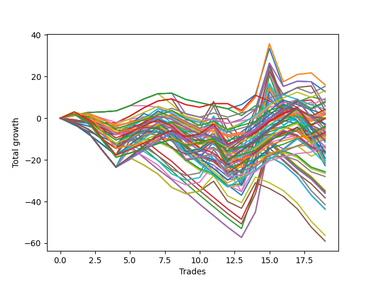

# Short Wallace Doodle 016 
- Symbol: ES
- Date Range: 03/15/2022 - 07/08/2022
- Trading Period: 7:20-12:30
- Number of Trades: 19



| Name | Win Percent | Profit | Avg Profit / Trade |     | Name | Win Percent | Profit | Avg Profit / Trade |
| ---- | ----------- | ------ | ------------------ | --- | ---- | ----------- | ------ | ------------------ |
| Sorted By <br> Profit | | | | | Sorted By <br> Win Percentage ||||
| Seventy-Four | 57.89 | 21125.00 | 1111.84 |     | Seventy-Four | 57.89 | 21125.00 | 1111.84 |
| Fifty-Seven | 52.63 | 10500.00 | 552.63 |     | Fifty-Six | 57.89 | 3500.00 | 184.21 |
| One | 52.63 | 8250.00 | 434.21 |     | Zero | 57.89 | 1000.00 | 52.63 |
| Two | 52.63 | 7125.00 | 375.00 |     | Fifty-Seven | 52.63 | 10500.00 | 552.63 |
| Fifty-Eight | 52.63 | 6250.00 | 328.95 |     | One | 52.63 | 8250.00 | 434.21 |
| Fifty-Six | 57.89 | 3500.00 | 184.21 |     | Two | 52.63 | 7125.00 | 375.00 |
| Seventy-Two | 31.58 | 2750.00 | 144.74 |     | Fifty-Eight | 52.63 | 6250.00 | 328.95 |
| Zero | 57.89 | 1000.00 | 52.63 |     | Sixty-Six | 47.37 | -3500.00 | -184.21 |
| Thirty-Six | 36.84 | 750.00 | 39.47 |     | Sixty-Four | 47.37 | -5500.00 | -289.47 |
| Thirty-Seven | 36.84 | 125.00 | 6.58 |     | Forty-Eight | 47.37 | -8875.00 | -467.11 |
| Sixty-Five | 42.11 | -1375.00 | -72.37 |     | Sixty-Five | 42.11 | -1375.00 | -72.37 |
| Thirty-Four | 36.84 | -1875.00 | -98.68 |     | Five | 42.11 | -3250.00 | -171.05 |
| Thirty-Five | 36.84 | -2125.00 | -111.84 |     | Thirty-Two | 42.11 | -3625.00 | -190.79 |
| Thirty-Three | 36.84 | -3125.00 | -164.47 |     | Three | 42.11 | -4000.00 | -210.53 |
| Five | 42.11 | -3250.00 | -171.05 |     | Sixten | 42.11 | -4125.00 | -217.11 |
| Sixty-Six | 47.37 | -3500.00 | -184.21 |     | Seventy-One | 42.11 | -4375.00 | -230.26 |
| Thirty-Two | 42.11 | -3625.00 | -190.79 |     | Fifty-Five | 42.11 | -4375.00 | -230.26 |
| Three | 42.11 | -4000.00 | -210.53 |     | Thirty-Nine | 42.11 | -4375.00 | -230.26 |
| Sixten | 42.11 | -4125.00 | -217.11 |     | Twenty-Three | 42.11 | -4375.00 | -230.26 |
| Seventy-One | 42.11 | -4375.00 | -230.26 |     | Seven | 42.11 | -4375.00 | -230.26 |
| Fifty-Five | 42.11 | -4375.00 | -230.26 |     | Seventy | 42.11 | -5125.00 | -269.74 |
| Thirty-Nine | 42.11 | -4375.00 | -230.26 |     | Fifty-Four | 42.11 | -5125.00 | -269.74 |
| Twenty-Three | 42.11 | -4375.00 | -230.26 |     | Thirty-Eight | 42.11 | -5125.00 | -269.74 |
| Seven | 42.11 | -4375.00 | -230.26 |     | Twenty-Two | 42.11 | -5125.00 | -269.74 |
| Seventy | 42.11 | -5125.00 | -269.74 |     | Six | 42.11 | -5125.00 | -269.74 |
| Fifty-Four | 42.11 | -5125.00 | -269.74 |     | Four | 42.11 | -5125.00 | -269.74 |
| Thirty-Eight | 42.11 | -5125.00 | -269.74 |     | Seventy-Five | 42.11 | -6875.00 | -361.84 |
| Twenty-Two | 42.11 | -5125.00 | -269.74 |     | Sixty-Three | 42.11 | -10625.00 | -559.21 |
| Six | 42.11 | -5125.00 | -269.74 |     | Sixty-Two | 42.11 | -11375.00 | -598.68 |
| Four | 42.11 | -5125.00 | -269.74 |     | Thirty-Six | 36.84 | 750.00 | 39.47 |
| Twenty-One | 36.84 | -5125.00 | -269.74 |     | Thirty-Seven | 36.84 | 125.00 | 6.58 |
| Twenty | 36.84 | -5125.00 | -269.74 |     | Thirty-Four | 36.84 | -1875.00 | -98.68 |
| Nineteen | 36.84 | -5125.00 | -269.74 |     | Thirty-Five | 36.84 | -2125.00 | -111.84 |
| Eighteen | 36.84 | -5125.00 | -269.74 |     | Thirty-Three | 36.84 | -3125.00 | -164.47 |
| Seventeen | 36.84 | -5125.00 | -269.74 |     | Twenty-One | 36.84 | -5125.00 | -269.74 |
| Sixty-Four | 47.37 | -5500.00 | -289.47 |     | Twenty | 36.84 | -5125.00 | -269.74 |
| Fifteen | 10.53 | -6375.00 | -335.53 |     | Nineteen | 36.84 | -5125.00 | -269.74 |
| Seventy-Five | 42.11 | -6875.00 | -361.84 |     | Eighteen | 36.84 | -5125.00 | -269.74 |
| Fifty-Three | 26.32 | -7125.00 | -375.00 |     | Seventeen | 36.84 | -5125.00 | -269.74 |
| Fifty-Two | 26.32 | -7875.00 | -414.47 |     | Sixty-One | 36.84 | -10750.00 | -565.79 |
| Forty-Eight | 47.37 | -8875.00 | -467.11 |     | Fifty-Nine | 36.84 | -11875.00 | -625.00 |
| Seventy-Three | 21.05 | -9625.00 | -506.58 |     | Sixty | 36.84 | -12625.00 | -664.47 |
| Sixty-Three | 42.11 | -10625.00 | -559.21 |     | Twenty-Four | 36.84 | -13250.00 | -697.37 |
| Sixty-One | 36.84 | -10750.00 | -565.79 |     | Forty | 36.84 | -19125.00 | -1006.58 |
| Fourteen | 10.53 | -10750.00 | -565.79 |     | Seventy-Two | 31.58 | 2750.00 | 144.74 |
| Sixty-Two | 42.11 | -11375.00 | -598.68 |     | Forty-Nine | 31.58 | -14000.00 | -736.84 |
| Twenty-Nine | 15.79 | -11375.00 | -598.68 |     | Fifty-Three | 26.32 | -7125.00 | -375.00 |
| Thirteen | 15.79 | -11375.00 | -598.68 |     | Fifty-Two | 26.32 | -7875.00 | -414.47 |
| Fifty-Nine | 36.84 | -11875.00 | -625.00 |     | Fifty | 26.32 | -12750.00 | -671.05 |
| Twenty-Eight | 15.79 | -11875.00 | -625.00 |     | Fifty-One | 26.32 | -12875.00 | -677.63 |
| Sixty | 36.84 | -12625.00 | -664.47 |     | Eight | 26.32 | -12875.00 | -677.63 |
| Fifty | 26.32 | -12750.00 | -671.05 |     | Seventy-Three | 21.05 | -9625.00 | -506.58 |
| Fifty-One | 26.32 | -12875.00 | -677.63 |     | Twenty-Five | 21.05 | -17625.00 | -927.63 |
| Eight | 26.32 | -12875.00 | -677.63 |     | Forty-One | 21.05 | -20000.00 | -1052.63 |
| Twenty-Four | 36.84 | -13250.00 | -697.37 |     | Sixty-Nine | 21.05 | -20750.00 | -1092.11 |
| Twelve | 15.79 | -13625.00 | -717.11 |     | Forty-Two | 21.05 | -22000.00 | -1157.89 |
| Forty-Nine | 31.58 | -14000.00 | -736.84 |     | Sixty-Eight | 21.05 | -22625.00 | -1190.79 |
| Thirty-One | 10.53 | -14375.00 | -756.58 |     | Sixty-Seven | 21.05 | -29625.00 | -1559.21 |
| Eleven | 15.79 | -15750.00 | -828.95 |     | Twenty-Nine | 15.79 | -11375.00 | -598.68 |
| Ten | 15.79 | -15875.00 | -835.53 |     | Thirteen | 15.79 | -11375.00 | -598.68 |
| Nine | 15.79 | -16375.00 | -861.84 |     | Twenty-Eight | 15.79 | -11875.00 | -625.00 |
| Twenty-Six | 15.79 | -16750.00 | -881.58 |     | Twelve | 15.79 | -13625.00 | -717.11 |
| twenty-Seven | 15.79 | -16875.00 | -888.16 |     | Eleven | 15.79 | -15750.00 | -828.95 |
| Twenty-Five | 21.05 | -17625.00 | -927.63 |     | Ten | 15.79 | -15875.00 | -835.53 |
| Forty-Six | 15.79 | -18000.00 | -947.37 |     | Nine | 15.79 | -16375.00 | -861.84 |
| Thirty | 10.53 | -18750.00 | -986.84 |     | Twenty-Six | 15.79 | -16750.00 | -881.58 |
| Forty | 36.84 | -19125.00 | -1006.58 |     | twenty-Seven | 15.79 | -16875.00 | -888.16 |
| Forty-Seven | 15.79 | -19125.00 | -1006.58 |     | Forty-Six | 15.79 | -18000.00 | -947.37 |
| Forty-One | 21.05 | -20000.00 | -1052.63 |     | Forty-Seven | 15.79 | -19125.00 | -1006.58 |
| Sixty-Nine | 21.05 | -20750.00 | -1092.11 |     | Fifteen | 10.53 | -6375.00 | -335.53 |
| Forty-Two | 21.05 | -22000.00 | -1157.89 |     | Fourteen | 10.53 | -10750.00 | -565.79 |
| Sixty-Eight | 21.05 | -22625.00 | -1190.79 |     | Thirty-One | 10.53 | -14375.00 | -756.58 |
| Forty-Five | 10.53 | -27750.00 | -1460.53 |     | Thirty | 10.53 | -18750.00 | -986.84 |
| Forty-Four | 10.53 | -28250.00 | -1486.84 |     | Forty-Five | 10.53 | -27750.00 | -1460.53 |
| Sixty-Seven | 21.05 | -29625.00 | -1559.21 |     | Forty-Four | 10.53 | -28250.00 | -1486.84 |
| Forty-Three | 10.53 | -33250.00 | -1750.00 |     | Forty-Three | 10.53 | -33250.00 | -1750.00 |

## NO STOPLOSS

### Test Zero
* Sell when price hits the middle line of the 20p bollinger
* No Stoploss
* Results:
```
Total Trades: 19
Percent Up: 42.11
Percent Down: 57.89
Total Points Moved Down: 2.00
Potential Profit: 1000.00
Total Points Ups: 33.25 Count Ups: 8
Total Points Downs: 35.25 Count Downs: 11
```

<details><summary>Trades</summary>

<code>In: 2022-03-25 11:08:00		Out: 2022-03-25 11:17:40		Total Position Time: 09:40		Total Move Down: 0.75		Total to Date: 0.75</code> <br />
<code>In: 2022-03-28 12:01:00		Out: 2022-03-28 12:06:40		Total Position Time: 05:40		Total Move Down: 1.75		Total to Date: 2.50</code> <br />
<code>In: 2022-03-29 11:40:00		Out: 2022-03-29 11:50:50		Total Position Time: 10:50		Total Move Down: 0.50		Total to Date: 3.00</code> <br />
<code>In: 2022-03-29 11:43:00		Out: 2022-03-29 11:50:50		Total Position Time: 07:50		Total Move Down: 0.75		Total to Date: 3.75</code> <br />
<code>In: 2022-04-06 08:53:00		Out: 2022-04-06 09:00:40		Total Position Time: 07:40		Total Move Down: 2.50		Total to Date: 6.25</code> <br />
<code>In: 2022-04-07 11:04:00		Out: 2022-04-07 11:15:15		Total Position Time: 11:15		Total Move Down: 1.75		Total to Date: 8.00</code> <br />
<code>In: 2022-04-07 11:05:00		Out: 2022-04-07 11:15:15		Total Position Time: 10:15		Total Move Down: 1.00		Total to Date: 9.00</code> <br />
<code>In: 2022-04-07 11:06:00		Out: 2022-04-07 11:15:15		Total Position Time: 09:15		Total Move Down: -1.25		Total to Date: 7.75</code> <br />
<code>In: 2022-04-18 10:39:00		Out: 2022-04-18 10:59:30		Total Position Time: 20:30		Total Move Down: -3.00		Total to Date: 4.75</code> <br />
<code>In: 2022-04-18 10:42:00		Out: 2022-04-18 10:59:30		Total Position Time: 17:30		Total Move Down: -1.50		Total to Date: 3.25</code> <br />
<code>In: 2022-04-20 07:43:00		Out: 2022-04-20 08:00:20		Total Position Time: 17:20		Total Move Down: -1.25		Total to Date: 2.00</code> <br />
<code>In: 2022-05-04 09:32:00		Out: 2022-05-04 09:45:25		Total Position Time: 13:25		Total Move Down: -2.25		Total to Date: -0.25</code> <br />
<code>In: 2022-05-31 07:24:00		Out: 2022-05-31 07:36:40		Total Position Time: 12:40		Total Move Down: 1.50		Total to Date: 1.25</code> <br />
<code>In: 2022-06-03 10:08:00		Out: 2022-06-03 10:13:15		Total Position Time: 05:15		Total Move Down: 4.00		Total to Date: 5.25</code> <br />
<code>In: 2022-06-15 11:48:00		Out: 2022-06-15 11:52:15		Total Position Time: 04:15		Total Move Down: 18.50		Total to Date: 23.75</code> <br />
<code>In: 2022-06-30 08:01:00		Out: 2022-06-30 08:30:55		Total Position Time: 29:55		Total Move Down: -18.25		Total to Date: 5.50</code> <br />
<code>In: 2022-07-05 08:52:00		Out: 2022-07-05 08:59:20		Total Position Time: 07:20		Total Move Down: 2.25		Total to Date: 7.75</code> <br />
<code>In: 2022-07-05 08:53:00		Out: 2022-07-05 08:59:20		Total Position Time: 06:20		Total Move Down: -0.50		Total to Date: 7.25</code> <br />
<code>In: 2022-07-06 11:37:00		Out: 2022-07-06 11:48:45		Total Position Time: 11:45		Total Move Down: -5.25		Total to Date: 2.00</code> <br />


</details>

### Test One
* Sell when the price hits the upper line of the 20p 1std bollinger
* No Stoploss
* Results:
```
Total Trades: 19
Percent Up: 47.37
Percent Down: 52.63
Total Points Moved Down: 16.50
Potential Profit: 8250.00
Total Points Ups: 32.25 Count Ups: 9
Total Points Downs: 48.75 Count Downs: 10
```

<details><summary>Trades</summary>

<code>In: 2022-03-25 11:08:00		Out: 2022-03-25 11:19:35		Total Position Time: 11:35		Total Move Down: 2.00		Total to Date: 2.00</code> <br />
<code>In: 2022-03-28 12:01:00		Out: 2022-03-28 12:30:55		Total Position Time: 29:55		Total Move Down: -4.00		Total to Date: -2.00</code> <br />
<code>In: 2022-03-29 11:40:00		Out: 2022-03-29 12:00:20		Total Position Time: 20:20		Total Move Down: -0.75		Total to Date: -2.75</code> <br />
<code>In: 2022-03-29 11:43:00		Out: 2022-03-29 12:00:20		Total Position Time: 17:20		Total Move Down: -0.50		Total to Date: -3.25</code> <br />
<code>In: 2022-04-06 08:53:00		Out: 2022-04-06 09:04:20		Total Position Time: 11:20		Total Move Down: 3.25		Total to Date: 0.00</code> <br />
<code>In: 2022-04-07 11:04:00		Out: 2022-04-07 11:16:10		Total Position Time: 12:10		Total Move Down: 3.25		Total to Date: 3.25</code> <br />
<code>In: 2022-04-07 11:05:00		Out: 2022-04-07 11:16:10		Total Position Time: 11:10		Total Move Down: 2.50		Total to Date: 5.75</code> <br />
<code>In: 2022-04-07 11:06:00		Out: 2022-04-07 11:16:10		Total Position Time: 10:10		Total Move Down: 0.25		Total to Date: 6.00</code> <br />
<code>In: 2022-04-18 10:39:00		Out: 2022-04-18 11:06:35		Total Position Time: 27:35		Total Move Down: -2.75		Total to Date: 3.25</code> <br />
<code>In: 2022-04-18 10:42:00		Out: 2022-04-18 11:06:35		Total Position Time: 24:35		Total Move Down: -1.25		Total to Date: 2.00</code> <br />
<code>In: 2022-04-20 07:43:00		Out: 2022-04-20 08:00:40		Total Position Time: 17:40		Total Move Down: 1.75		Total to Date: 3.75</code> <br />
<code>In: 2022-05-04 09:32:00		Out: 2022-05-04 09:46:30		Total Position Time: 14:30		Total Move Down: -0.00		Total to Date: 3.75</code> <br />
<code>In: 2022-05-31 07:24:00		Out: 2022-05-31 07:38:00		Total Position Time: 14:00		Total Move Down: 5.25		Total to Date: 9.00</code> <br />
<code>In: 2022-06-03 10:08:00		Out: 2022-06-03 10:15:05		Total Position Time: 07:05		Total Move Down: 7.25		Total to Date: 16.25</code> <br />
<code>In: 2022-06-15 11:48:00		Out: 2022-06-15 11:57:05		Total Position Time: 09:05		Total Move Down: 20.50		Total to Date: 36.75</code> <br />
<code>In: 2022-06-30 08:01:00		Out: 2022-06-30 08:30:55		Total Position Time: 29:55		Total Move Down: -18.25		Total to Date: 18.50</code> <br />
<code>In: 2022-07-05 08:52:00		Out: 2022-07-05 09:03:25		Total Position Time: 11:25		Total Move Down: 2.75		Total to Date: 21.25</code> <br />
<code>In: 2022-07-05 08:53:00		Out: 2022-07-05 09:03:25		Total Position Time: 10:25		Total Move Down: -0.00		Total to Date: 21.25</code> <br />
<code>In: 2022-07-06 11:37:00		Out: 2022-07-06 12:00:50		Total Position Time: 23:50		Total Move Down: -4.75		Total to Date: 16.50</code> <br />


</details>

### Test Two
* Sell when the price hits the upper line of the 20p 2std bollinger
* No Stoploss
* Results:
```
Total Trades: 19
Percent Up: 47.37
Percent Down: 52.63
Total Points Moved Down: 14.25
Potential Profit: 7125.00
Total Points Ups: 64.50 Count Ups: 9
Total Points Downs: 78.75 Count Downs: 10
```

<details><summary>Trades</summary>

<code>In: 2022-03-25 11:08:00		Out: 2022-03-25 11:37:55		Total Position Time: 29:55		Total Move Down: -2.75		Total to Date: -2.75</code> <br />
<code>In: 2022-03-28 12:01:00		Out: 2022-03-28 12:30:55		Total Position Time: 29:55		Total Move Down: -4.00		Total to Date: -6.75</code> <br />
<code>In: 2022-03-29 11:40:00		Out: 2022-03-29 12:09:55		Total Position Time: 29:55		Total Move Down: -8.50		Total to Date: -15.25</code> <br />
<code>In: 2022-03-29 11:43:00		Out: 2022-03-29 12:12:55		Total Position Time: 29:55		Total Move Down: -8.25		Total to Date: -23.50</code> <br />
<code>In: 2022-04-06 08:53:00		Out: 2022-04-06 09:11:00		Total Position Time: 18:00		Total Move Down: 4.25		Total to Date: -19.25</code> <br />
<code>In: 2022-04-07 11:04:00		Out: 2022-04-07 11:18:40		Total Position Time: 14:40		Total Move Down: 6.25		Total to Date: -13.00</code> <br />
<code>In: 2022-04-07 11:05:00		Out: 2022-04-07 11:18:40		Total Position Time: 13:40		Total Move Down: 5.50		Total to Date: -7.50</code> <br />
<code>In: 2022-04-07 11:06:00		Out: 2022-04-07 11:18:40		Total Position Time: 12:40		Total Move Down: 3.25		Total to Date: -4.25</code> <br />
<code>In: 2022-04-18 10:39:00		Out: 2022-04-18 11:08:55		Total Position Time: 29:55		Total Move Down: -3.00		Total to Date: -7.25</code> <br />
<code>In: 2022-04-18 10:42:00		Out: 2022-04-18 11:11:55		Total Position Time: 29:55		Total Move Down: 1.25		Total to Date: -6.00</code> <br />
<code>In: 2022-04-20 07:43:00		Out: 2022-04-20 08:01:10		Total Position Time: 18:10		Total Move Down: 4.75		Total to Date: -1.25</code> <br />
<code>In: 2022-05-04 09:32:00		Out: 2022-05-04 10:01:55		Total Position Time: 29:55		Total Move Down: -14.00		Total to Date: -15.25</code> <br />
<code>In: 2022-05-31 07:24:00		Out: 2022-05-31 07:53:55		Total Position Time: 29:55		Total Move Down: -4.25		Total to Date: -19.50</code> <br />
<code>In: 2022-06-03 10:08:00		Out: 2022-06-03 10:18:00		Total Position Time: 10:00		Total Move Down: 12.75		Total to Date: -6.75</code> <br />
<code>In: 2022-06-15 11:48:00		Out: 2022-06-15 11:57:55		Total Position Time: 09:55		Total Move Down: 33.00		Total to Date: 26.25</code> <br />
<code>In: 2022-06-30 08:01:00		Out: 2022-06-30 08:30:55		Total Position Time: 29:55		Total Move Down: -18.25		Total to Date: 8.00</code> <br />
<code>In: 2022-07-05 08:52:00		Out: 2022-07-05 09:03:50		Total Position Time: 11:50		Total Move Down: 5.25		Total to Date: 13.25</code> <br />
<code>In: 2022-07-05 08:53:00		Out: 2022-07-05 09:03:50		Total Position Time: 10:50		Total Move Down: 2.50		Total to Date: 15.75</code> <br />
<code>In: 2022-07-06 11:37:00		Out: 2022-07-06 12:01:30		Total Position Time: 24:30		Total Move Down: -1.50		Total to Date: 14.25</code> <br />


</details>

### Test Three
* Sell when price hits the middle line of the 50p bollinger
* No Stoploss
* Results:
```
Total Trades: 19
Percent Up: 57.89
Percent Down: 42.11
Total Points Moved Down: -8.00
Potential Profit: -4000.00
Total Points Ups: 77.50 Count Ups: 11
Total Points Downs: 69.50 Count Downs: 8
```

<details><summary>Trades</summary>

<code>In: 2022-03-25 11:08:00		Out: 2022-03-25 11:37:55		Total Position Time: 29:55		Total Move Down: -2.75		Total to Date: -2.75</code> <br />
<code>In: 2022-03-28 12:01:00		Out: 2022-03-28 12:30:55		Total Position Time: 29:55		Total Move Down: -4.00		Total to Date: -6.75</code> <br />
<code>In: 2022-03-29 11:40:00		Out: 2022-03-29 12:09:55		Total Position Time: 29:55		Total Move Down: -8.50		Total to Date: -15.25</code> <br />
<code>In: 2022-03-29 11:43:00		Out: 2022-03-29 12:12:55		Total Position Time: 29:55		Total Move Down: -8.25		Total to Date: -23.50</code> <br />
<code>In: 2022-04-06 08:53:00		Out: 2022-04-06 09:11:35		Total Position Time: 18:35		Total Move Down: 4.50		Total to Date: -19.00</code> <br />
<code>In: 2022-04-07 11:04:00		Out: 2022-04-07 11:33:40		Total Position Time: 29:40		Total Move Down: 5.50		Total to Date: -13.50</code> <br />
<code>In: 2022-04-07 11:05:00		Out: 2022-04-07 11:33:40		Total Position Time: 28:40		Total Move Down: 4.75		Total to Date: -8.75</code> <br />
<code>In: 2022-04-07 11:06:00		Out: 2022-04-07 11:33:40		Total Position Time: 27:40		Total Move Down: 2.50		Total to Date: -6.25</code> <br />
<code>In: 2022-04-18 10:39:00		Out: 2022-04-18 11:08:55		Total Position Time: 29:55		Total Move Down: -3.00		Total to Date: -9.25</code> <br />
<code>In: 2022-04-18 10:42:00		Out: 2022-04-18 11:11:55		Total Position Time: 29:55		Total Move Down: 1.25		Total to Date: -8.00</code> <br />
<code>In: 2022-04-20 07:43:00		Out: 2022-04-20 08:02:45		Total Position Time: 19:45		Total Move Down: 4.50		Total to Date: -3.50</code> <br />
<code>In: 2022-05-04 09:32:00		Out: 2022-05-04 10:01:55		Total Position Time: 29:55		Total Move Down: -14.00		Total to Date: -17.50</code> <br />
<code>In: 2022-05-31 07:24:00		Out: 2022-05-31 07:53:55		Total Position Time: 29:55		Total Move Down: -4.25		Total to Date: -21.75</code> <br />
<code>In: 2022-06-03 10:08:00		Out: 2022-06-03 10:17:55		Total Position Time: 09:55		Total Move Down: 12.25		Total to Date: -9.50</code> <br />
<code>In: 2022-06-15 11:48:00		Out: 2022-06-15 11:58:05		Total Position Time: 10:05		Total Move Down: 34.25		Total to Date: 24.75</code> <br />
<code>In: 2022-06-30 08:01:00		Out: 2022-06-30 08:30:55		Total Position Time: 29:55		Total Move Down: -18.25		Total to Date: 6.50</code> <br />
<code>In: 2022-07-05 08:52:00		Out: 2022-07-05 09:21:55		Total Position Time: 29:55		Total Move Down: -2.75		Total to Date: 3.75</code> <br />
<code>In: 2022-07-05 08:53:00		Out: 2022-07-05 09:22:55		Total Position Time: 29:55		Total Move Down: -8.50		Total to Date: -4.75</code> <br />
<code>In: 2022-07-06 11:37:00		Out: 2022-07-06 12:06:55		Total Position Time: 29:55		Total Move Down: -3.25		Total to Date: -8.00</code> <br />


</details>

### Test Four
* Sell when the price hits the upper line of the 50p 1std bollinger
* No Stoploss
* Results:
```
Total Trades: 19
Percent Up: 57.89
Percent Down: 42.11
Total Points Moved Down: -10.25
Potential Profit: -5125.00
Total Points Ups: 77.50 Count Ups: 11
Total Points Downs: 67.25 Count Downs: 8
```

<details><summary>Trades</summary>

<code>In: 2022-03-25 11:08:00		Out: 2022-03-25 11:37:55		Total Position Time: 29:55		Total Move Down: -2.75		Total to Date: -2.75</code> <br />
<code>In: 2022-03-28 12:01:00		Out: 2022-03-28 12:30:55		Total Position Time: 29:55		Total Move Down: -4.00		Total to Date: -6.75</code> <br />
<code>In: 2022-03-29 11:40:00		Out: 2022-03-29 12:09:55		Total Position Time: 29:55		Total Move Down: -8.50		Total to Date: -15.25</code> <br />
<code>In: 2022-03-29 11:43:00		Out: 2022-03-29 12:12:55		Total Position Time: 29:55		Total Move Down: -8.25		Total to Date: -23.50</code> <br />
<code>In: 2022-04-06 08:53:00		Out: 2022-04-06 09:15:00		Total Position Time: 22:00		Total Move Down: 8.75		Total to Date: -14.75</code> <br />
<code>In: 2022-04-07 11:04:00		Out: 2022-04-07 11:33:55		Total Position Time: 29:55		Total Move Down: 4.25		Total to Date: -10.50</code> <br />
<code>In: 2022-04-07 11:05:00		Out: 2022-04-07 11:34:55		Total Position Time: 29:55		Total Move Down: 2.75		Total to Date: -7.75</code> <br />
<code>In: 2022-04-07 11:06:00		Out: 2022-04-07 11:35:55		Total Position Time: 29:55		Total Move Down: 1.75		Total to Date: -6.00</code> <br />
<code>In: 2022-04-18 10:39:00		Out: 2022-04-18 11:08:55		Total Position Time: 29:55		Total Move Down: -3.00		Total to Date: -9.00</code> <br />
<code>In: 2022-04-18 10:42:00		Out: 2022-04-18 11:11:55		Total Position Time: 29:55		Total Move Down: 1.25		Total to Date: -7.75</code> <br />
<code>In: 2022-04-20 07:43:00		Out: 2022-04-20 08:10:45		Total Position Time: 27:45		Total Move Down: 8.50		Total to Date: 0.75</code> <br />
<code>In: 2022-05-04 09:32:00		Out: 2022-05-04 10:01:55		Total Position Time: 29:55		Total Move Down: -14.00		Total to Date: -13.25</code> <br />
<code>In: 2022-05-31 07:24:00		Out: 2022-05-31 07:53:55		Total Position Time: 29:55		Total Move Down: -4.25		Total to Date: -17.50</code> <br />
<code>In: 2022-06-03 10:08:00		Out: 2022-06-03 10:19:00		Total Position Time: 11:00		Total Move Down: 18.00		Total to Date: 0.50</code> <br />
<code>In: 2022-06-15 11:48:00		Out: 2022-06-15 12:17:55		Total Position Time: 29:55		Total Move Down: 22.00		Total to Date: 22.50</code> <br />
<code>In: 2022-06-30 08:01:00		Out: 2022-06-30 08:30:55		Total Position Time: 29:55		Total Move Down: -18.25		Total to Date: 4.25</code> <br />
<code>In: 2022-07-05 08:52:00		Out: 2022-07-05 09:21:55		Total Position Time: 29:55		Total Move Down: -2.75		Total to Date: 1.50</code> <br />
<code>In: 2022-07-05 08:53:00		Out: 2022-07-05 09:22:55		Total Position Time: 29:55		Total Move Down: -8.50		Total to Date: -7.00</code> <br />
<code>In: 2022-07-06 11:37:00		Out: 2022-07-06 12:06:55		Total Position Time: 29:55		Total Move Down: -3.25		Total to Date: -10.25</code> <br />


</details>

### Test Five
* Sell when the price hits the upper line of the 50p 2std bollinger
* No Stoploss
* Results:
```
Total Trades: 19
Percent Up: 57.89
Percent Down: 42.11
Total Points Moved Down: -6.50
Potential Profit: -3250.00
Total Points Ups: 77.50 Count Ups: 11
Total Points Downs: 71.00 Count Downs: 8
```

<details><summary>Trades</summary>

<code>In: 2022-03-25 11:08:00		Out: 2022-03-25 11:37:55		Total Position Time: 29:55		Total Move Down: -2.75		Total to Date: -2.75</code> <br />
<code>In: 2022-03-28 12:01:00		Out: 2022-03-28 12:30:55		Total Position Time: 29:55		Total Move Down: -4.00		Total to Date: -6.75</code> <br />
<code>In: 2022-03-29 11:40:00		Out: 2022-03-29 12:09:55		Total Position Time: 29:55		Total Move Down: -8.50		Total to Date: -15.25</code> <br />
<code>In: 2022-03-29 11:43:00		Out: 2022-03-29 12:12:55		Total Position Time: 29:55		Total Move Down: -8.25		Total to Date: -23.50</code> <br />
<code>In: 2022-04-06 08:53:00		Out: 2022-04-06 09:20:25		Total Position Time: 27:25		Total Move Down: 13.25		Total to Date: -10.25</code> <br />
<code>In: 2022-04-07 11:04:00		Out: 2022-04-07 11:33:55		Total Position Time: 29:55		Total Move Down: 4.25		Total to Date: -6.00</code> <br />
<code>In: 2022-04-07 11:05:00		Out: 2022-04-07 11:34:55		Total Position Time: 29:55		Total Move Down: 2.75		Total to Date: -3.25</code> <br />
<code>In: 2022-04-07 11:06:00		Out: 2022-04-07 11:35:55		Total Position Time: 29:55		Total Move Down: 1.75		Total to Date: -1.50</code> <br />
<code>In: 2022-04-18 10:39:00		Out: 2022-04-18 11:08:55		Total Position Time: 29:55		Total Move Down: -3.00		Total to Date: -4.50</code> <br />
<code>In: 2022-04-18 10:42:00		Out: 2022-04-18 11:11:55		Total Position Time: 29:55		Total Move Down: 1.25		Total to Date: -3.25</code> <br />
<code>In: 2022-04-20 07:43:00		Out: 2022-04-20 08:12:55		Total Position Time: 29:55		Total Move Down: 11.25		Total to Date: 8.00</code> <br />
<code>In: 2022-05-04 09:32:00		Out: 2022-05-04 10:01:55		Total Position Time: 29:55		Total Move Down: -14.00		Total to Date: -6.00</code> <br />
<code>In: 2022-05-31 07:24:00		Out: 2022-05-31 07:53:55		Total Position Time: 29:55		Total Move Down: -4.25		Total to Date: -10.25</code> <br />
<code>In: 2022-06-03 10:08:00		Out: 2022-06-03 10:37:55		Total Position Time: 29:55		Total Move Down: 14.50		Total to Date: 4.25</code> <br />
<code>In: 2022-06-15 11:48:00		Out: 2022-06-15 12:17:55		Total Position Time: 29:55		Total Move Down: 22.00		Total to Date: 26.25</code> <br />
<code>In: 2022-06-30 08:01:00		Out: 2022-06-30 08:30:55		Total Position Time: 29:55		Total Move Down: -18.25		Total to Date: 8.00</code> <br />
<code>In: 2022-07-05 08:52:00		Out: 2022-07-05 09:21:55		Total Position Time: 29:55		Total Move Down: -2.75		Total to Date: 5.25</code> <br />
<code>In: 2022-07-05 08:53:00		Out: 2022-07-05 09:22:55		Total Position Time: 29:55		Total Move Down: -8.50		Total to Date: -3.25</code> <br />
<code>In: 2022-07-06 11:37:00		Out: 2022-07-06 12:06:55		Total Position Time: 29:55		Total Move Down: -3.25		Total to Date: -6.50</code> <br />


</details>

### Test Six
* Sell when the price hits the middle line of the 1std VWAP
* No Stoploss
* Results:
```
Total Trades: 19
Percent Up: 57.89
Percent Down: 42.11
Total Points Moved Down: -10.25
Potential Profit: -5125.00
Total Points Ups: 77.50 Count Ups: 11
Total Points Downs: 67.25 Count Downs: 8
```

<details><summary>Trades</summary>

<code>In: 2022-03-25 11:08:00		Out: 2022-03-25 11:37:55		Total Position Time: 29:55		Total Move Down: -2.75		Total to Date: -2.75</code> <br />
<code>In: 2022-03-28 12:01:00		Out: 2022-03-28 12:30:55		Total Position Time: 29:55		Total Move Down: -4.00		Total to Date: -6.75</code> <br />
<code>In: 2022-03-29 11:40:00		Out: 2022-03-29 12:09:55		Total Position Time: 29:55		Total Move Down: -8.50		Total to Date: -15.25</code> <br />
<code>In: 2022-03-29 11:43:00		Out: 2022-03-29 12:12:55		Total Position Time: 29:55		Total Move Down: -8.25		Total to Date: -23.50</code> <br />
<code>In: 2022-04-06 08:53:00		Out: 2022-04-06 09:11:35		Total Position Time: 18:35		Total Move Down: 4.50		Total to Date: -19.00</code> <br />
<code>In: 2022-04-07 11:04:00		Out: 2022-04-07 11:33:55		Total Position Time: 29:55		Total Move Down: 4.25		Total to Date: -14.75</code> <br />
<code>In: 2022-04-07 11:05:00		Out: 2022-04-07 11:34:55		Total Position Time: 29:55		Total Move Down: 2.75		Total to Date: -12.00</code> <br />
<code>In: 2022-04-07 11:06:00		Out: 2022-04-07 11:35:55		Total Position Time: 29:55		Total Move Down: 1.75		Total to Date: -10.25</code> <br />
<code>In: 2022-04-18 10:39:00		Out: 2022-04-18 11:08:55		Total Position Time: 29:55		Total Move Down: -3.00		Total to Date: -13.25</code> <br />
<code>In: 2022-04-18 10:42:00		Out: 2022-04-18 11:11:55		Total Position Time: 29:55		Total Move Down: 1.25		Total to Date: -12.00</code> <br />
<code>In: 2022-04-20 07:43:00		Out: 2022-04-20 08:08:10		Total Position Time: 25:10		Total Move Down: 7.50		Total to Date: -4.50</code> <br />
<code>In: 2022-05-04 09:32:00		Out: 2022-05-04 10:01:55		Total Position Time: 29:55		Total Move Down: -14.00		Total to Date: -18.50</code> <br />
<code>In: 2022-05-31 07:24:00		Out: 2022-05-31 07:53:55		Total Position Time: 29:55		Total Move Down: -4.25		Total to Date: -22.75</code> <br />
<code>In: 2022-06-03 10:08:00		Out: 2022-06-03 10:17:55		Total Position Time: 09:55		Total Move Down: 12.25		Total to Date: -10.50</code> <br />
<code>In: 2022-06-15 11:48:00		Out: 2022-06-15 11:57:55		Total Position Time: 09:55		Total Move Down: 33.00		Total to Date: 22.50</code> <br />
<code>In: 2022-06-30 08:01:00		Out: 2022-06-30 08:30:55		Total Position Time: 29:55		Total Move Down: -18.25		Total to Date: 4.25</code> <br />
<code>In: 2022-07-05 08:52:00		Out: 2022-07-05 09:21:55		Total Position Time: 29:55		Total Move Down: -2.75		Total to Date: 1.50</code> <br />
<code>In: 2022-07-05 08:53:00		Out: 2022-07-05 09:22:55		Total Position Time: 29:55		Total Move Down: -8.50		Total to Date: -7.00</code> <br />
<code>In: 2022-07-06 11:37:00		Out: 2022-07-06 12:06:55		Total Position Time: 29:55		Total Move Down: -3.25		Total to Date: -10.25</code> <br />


</details>

### Test Seven
* Sell when the price hits the upper line of the 1std VWAP
* No Stoploss
* Results:
```
Total Trades: 19
Percent Up: 57.89
Percent Down: 42.11
Total Points Moved Down: -8.75
Potential Profit: -4375.00
Total Points Ups: 77.50 Count Ups: 11
Total Points Downs: 68.75 Count Downs: 8
```

<details><summary>Trades</summary>

<code>In: 2022-03-25 11:08:00		Out: 2022-03-25 11:37:55		Total Position Time: 29:55		Total Move Down: -2.75		Total to Date: -2.75</code> <br />
<code>In: 2022-03-28 12:01:00		Out: 2022-03-28 12:30:55		Total Position Time: 29:55		Total Move Down: -4.00		Total to Date: -6.75</code> <br />
<code>In: 2022-03-29 11:40:00		Out: 2022-03-29 12:09:55		Total Position Time: 29:55		Total Move Down: -8.50		Total to Date: -15.25</code> <br />
<code>In: 2022-03-29 11:43:00		Out: 2022-03-29 12:12:55		Total Position Time: 29:55		Total Move Down: -8.25		Total to Date: -23.50</code> <br />
<code>In: 2022-04-06 08:53:00		Out: 2022-04-06 09:16:05		Total Position Time: 23:05		Total Move Down: 11.00		Total to Date: -12.50</code> <br />
<code>In: 2022-04-07 11:04:00		Out: 2022-04-07 11:33:55		Total Position Time: 29:55		Total Move Down: 4.25		Total to Date: -8.25</code> <br />
<code>In: 2022-04-07 11:05:00		Out: 2022-04-07 11:34:55		Total Position Time: 29:55		Total Move Down: 2.75		Total to Date: -5.50</code> <br />
<code>In: 2022-04-07 11:06:00		Out: 2022-04-07 11:35:55		Total Position Time: 29:55		Total Move Down: 1.75		Total to Date: -3.75</code> <br />
<code>In: 2022-04-18 10:39:00		Out: 2022-04-18 11:08:55		Total Position Time: 29:55		Total Move Down: -3.00		Total to Date: -6.75</code> <br />
<code>In: 2022-04-18 10:42:00		Out: 2022-04-18 11:11:55		Total Position Time: 29:55		Total Move Down: 1.25		Total to Date: -5.50</code> <br />
<code>In: 2022-04-20 07:43:00		Out: 2022-04-20 08:12:55		Total Position Time: 29:55		Total Move Down: 11.25		Total to Date: 5.75</code> <br />
<code>In: 2022-05-04 09:32:00		Out: 2022-05-04 10:01:55		Total Position Time: 29:55		Total Move Down: -14.00		Total to Date: -8.25</code> <br />
<code>In: 2022-05-31 07:24:00		Out: 2022-05-31 07:53:55		Total Position Time: 29:55		Total Move Down: -4.25		Total to Date: -12.50</code> <br />
<code>In: 2022-06-03 10:08:00		Out: 2022-06-03 10:37:55		Total Position Time: 29:55		Total Move Down: 14.50		Total to Date: 2.00</code> <br />
<code>In: 2022-06-15 11:48:00		Out: 2022-06-15 12:17:55		Total Position Time: 29:55		Total Move Down: 22.00		Total to Date: 24.00</code> <br />
<code>In: 2022-06-30 08:01:00		Out: 2022-06-30 08:30:55		Total Position Time: 29:55		Total Move Down: -18.25		Total to Date: 5.75</code> <br />
<code>In: 2022-07-05 08:52:00		Out: 2022-07-05 09:21:55		Total Position Time: 29:55		Total Move Down: -2.75		Total to Date: 3.00</code> <br />
<code>In: 2022-07-05 08:53:00		Out: 2022-07-05 09:22:55		Total Position Time: 29:55		Total Move Down: -8.50		Total to Date: -5.50</code> <br />
<code>In: 2022-07-06 11:37:00		Out: 2022-07-06 12:06:55		Total Position Time: 29:55		Total Move Down: -3.25		Total to Date: -8.75</code> <br />


</details>

## STOPLOSS OF 2

### Test Eight
* Sell when price hits the middle line of the 20p bollinger
* Stoploss is -2 points
* Results:
```
Total Trades: 19
Percent Up: 73.68
Percent Down: 26.32
Total Points Moved Down: -25.75
Potential Profit: -12875.00
Total Points Ups: 32.25 Count Ups: 14
Total Points Downs: 6.50 Count Downs: 5
```

<details><summary>Trades</summary>

<code>In: 2022-03-25 11:08:00		Out: 2022-03-25 11:10:10		Total Position Time: 02:10		Total Move Down: -1.75		Total to Date: -1.75</code> <br />
<code>In: 2022-03-28 12:01:00		Out: 2022-03-28 12:06:40		Total Position Time: 05:40		Total Move Down: 1.75		Total to Date: 0.00</code> <br />
<code>In: 2022-03-29 11:40:00		Out: 2022-03-29 11:48:40		Total Position Time: 08:40		Total Move Down: -2.75		Total to Date: -2.75</code> <br />
<code>In: 2022-03-29 11:43:00		Out: 2022-03-29 11:50:50		Total Position Time: 07:50		Total Move Down: 0.75		Total to Date: -2.00</code> <br />
<code>In: 2022-04-06 08:53:00		Out: 2022-04-06 09:00:40		Total Position Time: 07:40		Total Move Down: 2.50		Total to Date: 0.50</code> <br />
<code>In: 2022-04-07 11:04:00		Out: 2022-04-07 11:14:15		Total Position Time: 10:15		Total Move Down: -2.00		Total to Date: -1.50</code> <br />
<code>In: 2022-04-07 11:05:00		Out: 2022-04-07 11:05:20		Total Position Time: 00:20		Total Move Down: -0.25		Total to Date: -1.75</code> <br />
<code>In: 2022-04-07 11:06:00		Out: 2022-04-07 11:09:10		Total Position Time: 03:10		Total Move Down: -1.50		Total to Date: -3.25</code> <br />
<code>In: 2022-04-18 10:39:00		Out: 2022-04-18 10:40:50		Total Position Time: 01:50		Total Move Down: -4.00		Total to Date: -7.25</code> <br />
<code>In: 2022-04-18 10:42:00		Out: 2022-04-18 10:49:10		Total Position Time: 07:10		Total Move Down: -3.25		Total to Date: -10.50</code> <br />
<code>In: 2022-04-20 07:43:00		Out: 2022-04-20 07:51:45		Total Position Time: 08:45		Total Move Down: -2.50		Total to Date: -13.00</code> <br />
<code>In: 2022-05-04 09:32:00		Out: 2022-05-04 09:37:20		Total Position Time: 05:20		Total Move Down: -4.00		Total to Date: -17.00</code> <br />
<code>In: 2022-05-31 07:24:00		Out: 2022-05-31 07:28:15		Total Position Time: 04:15		Total Move Down: -1.00		Total to Date: -18.00</code> <br />
<code>In: 2022-06-03 10:08:00		Out: 2022-06-03 10:08:10		Total Position Time: 00:10		Total Move Down: -0.00		Total to Date: -18.00</code> <br />
<code>In: 2022-06-15 11:48:00		Out: 2022-06-15 11:50:55		Total Position Time: 02:55		Total Move Down: -2.00		Total to Date: -20.00</code> <br />
<code>In: 2022-06-30 08:01:00		Out: 2022-06-30 08:01:35		Total Position Time: 00:35		Total Move Down: 1.25		Total to Date: -18.75</code> <br />
<code>In: 2022-07-05 08:52:00		Out: 2022-07-05 08:53:15		Total Position Time: 01:15		Total Move Down: 0.25		Total to Date: -18.50</code> <br />
<code>In: 2022-07-05 08:53:00		Out: 2022-07-05 08:54:25		Total Position Time: 01:25		Total Move Down: -4.50		Total to Date: -23.00</code> <br />
<code>In: 2022-07-06 11:37:00		Out: 2022-07-06 11:38:20		Total Position Time: 01:20		Total Move Down: -2.75		Total to Date: -25.75</code> <br />


</details>

### Test Nine
* Sell when the price hits the upper line of the 20p 1std bollinger
* Stoploss is -2 points
* Results:
```
Total Trades: 19
Percent Up: 84.21
Percent Down: 15.79
Total Points Moved Down: -32.75
Potential Profit: -16375.00
Total Points Ups: 37.50 Count Ups: 16
Total Points Downs: 4.75 Count Downs: 3
```

<details><summary>Trades</summary>

<code>In: 2022-03-25 11:08:00		Out: 2022-03-25 11:10:10		Total Position Time: 02:10		Total Move Down: -1.75		Total to Date: -1.75</code> <br />
<code>In: 2022-03-28 12:01:00		Out: 2022-03-28 12:11:15		Total Position Time: 10:15		Total Move Down: -1.25		Total to Date: -3.00</code> <br />
<code>In: 2022-03-29 11:40:00		Out: 2022-03-29 11:48:40		Total Position Time: 08:40		Total Move Down: -2.75		Total to Date: -5.75</code> <br />
<code>In: 2022-03-29 11:43:00		Out: 2022-03-29 11:56:50		Total Position Time: 13:50		Total Move Down: -4.00		Total to Date: -9.75</code> <br />
<code>In: 2022-04-06 08:53:00		Out: 2022-04-06 09:04:20		Total Position Time: 11:20		Total Move Down: 3.25		Total to Date: -6.50</code> <br />
<code>In: 2022-04-07 11:04:00		Out: 2022-04-07 11:14:15		Total Position Time: 10:15		Total Move Down: -2.00		Total to Date: -8.50</code> <br />
<code>In: 2022-04-07 11:05:00		Out: 2022-04-07 11:05:20		Total Position Time: 00:20		Total Move Down: -0.25		Total to Date: -8.75</code> <br />
<code>In: 2022-04-07 11:06:00		Out: 2022-04-07 11:09:10		Total Position Time: 03:10		Total Move Down: -1.50		Total to Date: -10.25</code> <br />
<code>In: 2022-04-18 10:39:00		Out: 2022-04-18 10:40:50		Total Position Time: 01:50		Total Move Down: -4.00		Total to Date: -14.25</code> <br />
<code>In: 2022-04-18 10:42:00		Out: 2022-04-18 10:49:10		Total Position Time: 07:10		Total Move Down: -3.25		Total to Date: -17.50</code> <br />
<code>In: 2022-04-20 07:43:00		Out: 2022-04-20 07:51:45		Total Position Time: 08:45		Total Move Down: -2.50		Total to Date: -20.00</code> <br />
<code>In: 2022-05-04 09:32:00		Out: 2022-05-04 09:37:20		Total Position Time: 05:20		Total Move Down: -4.00		Total to Date: -24.00</code> <br />
<code>In: 2022-05-31 07:24:00		Out: 2022-05-31 07:28:15		Total Position Time: 04:15		Total Move Down: -1.00		Total to Date: -25.00</code> <br />
<code>In: 2022-06-03 10:08:00		Out: 2022-06-03 10:08:10		Total Position Time: 00:10		Total Move Down: -0.00		Total to Date: -25.00</code> <br />
<code>In: 2022-06-15 11:48:00		Out: 2022-06-15 11:50:55		Total Position Time: 02:55		Total Move Down: -2.00		Total to Date: -27.00</code> <br />
<code>In: 2022-06-30 08:01:00		Out: 2022-06-30 08:01:35		Total Position Time: 00:35		Total Move Down: 1.25		Total to Date: -25.75</code> <br />
<code>In: 2022-07-05 08:52:00		Out: 2022-07-05 08:53:15		Total Position Time: 01:15		Total Move Down: 0.25		Total to Date: -25.50</code> <br />
<code>In: 2022-07-05 08:53:00		Out: 2022-07-05 08:54:25		Total Position Time: 01:25		Total Move Down: -4.50		Total to Date: -30.00</code> <br />
<code>In: 2022-07-06 11:37:00		Out: 2022-07-06 11:38:20		Total Position Time: 01:20		Total Move Down: -2.75		Total to Date: -32.75</code> <br />


</details>

### Test Ten
* Sell when the price hits the upper line of the 20p 2std bollinger
* Stoploss is -2 points
* Results:
```
Total Trades: 19
Percent Up: 84.21
Percent Down: 15.79
Total Points Moved Down: -31.75
Potential Profit: -15875.00
Total Points Ups: 37.50 Count Ups: 16
Total Points Downs: 5.75 Count Downs: 3
```

<details><summary>Trades</summary>

<code>In: 2022-03-25 11:08:00		Out: 2022-03-25 11:10:10		Total Position Time: 02:10		Total Move Down: -1.75		Total to Date: -1.75</code> <br />
<code>In: 2022-03-28 12:01:00		Out: 2022-03-28 12:11:15		Total Position Time: 10:15		Total Move Down: -1.25		Total to Date: -3.00</code> <br />
<code>In: 2022-03-29 11:40:00		Out: 2022-03-29 11:48:40		Total Position Time: 08:40		Total Move Down: -2.75		Total to Date: -5.75</code> <br />
<code>In: 2022-03-29 11:43:00		Out: 2022-03-29 11:56:50		Total Position Time: 13:50		Total Move Down: -4.00		Total to Date: -9.75</code> <br />
<code>In: 2022-04-06 08:53:00		Out: 2022-04-06 09:11:00		Total Position Time: 18:00		Total Move Down: 4.25		Total to Date: -5.50</code> <br />
<code>In: 2022-04-07 11:04:00		Out: 2022-04-07 11:14:15		Total Position Time: 10:15		Total Move Down: -2.00		Total to Date: -7.50</code> <br />
<code>In: 2022-04-07 11:05:00		Out: 2022-04-07 11:05:20		Total Position Time: 00:20		Total Move Down: -0.25		Total to Date: -7.75</code> <br />
<code>In: 2022-04-07 11:06:00		Out: 2022-04-07 11:09:10		Total Position Time: 03:10		Total Move Down: -1.50		Total to Date: -9.25</code> <br />
<code>In: 2022-04-18 10:39:00		Out: 2022-04-18 10:40:50		Total Position Time: 01:50		Total Move Down: -4.00		Total to Date: -13.25</code> <br />
<code>In: 2022-04-18 10:42:00		Out: 2022-04-18 10:49:10		Total Position Time: 07:10		Total Move Down: -3.25		Total to Date: -16.50</code> <br />
<code>In: 2022-04-20 07:43:00		Out: 2022-04-20 07:51:45		Total Position Time: 08:45		Total Move Down: -2.50		Total to Date: -19.00</code> <br />
<code>In: 2022-05-04 09:32:00		Out: 2022-05-04 09:37:20		Total Position Time: 05:20		Total Move Down: -4.00		Total to Date: -23.00</code> <br />
<code>In: 2022-05-31 07:24:00		Out: 2022-05-31 07:28:15		Total Position Time: 04:15		Total Move Down: -1.00		Total to Date: -24.00</code> <br />
<code>In: 2022-06-03 10:08:00		Out: 2022-06-03 10:08:10		Total Position Time: 00:10		Total Move Down: -0.00		Total to Date: -24.00</code> <br />
<code>In: 2022-06-15 11:48:00		Out: 2022-06-15 11:50:55		Total Position Time: 02:55		Total Move Down: -2.00		Total to Date: -26.00</code> <br />
<code>In: 2022-06-30 08:01:00		Out: 2022-06-30 08:01:35		Total Position Time: 00:35		Total Move Down: 1.25		Total to Date: -24.75</code> <br />
<code>In: 2022-07-05 08:52:00		Out: 2022-07-05 08:53:15		Total Position Time: 01:15		Total Move Down: 0.25		Total to Date: -24.50</code> <br />
<code>In: 2022-07-05 08:53:00		Out: 2022-07-05 08:54:25		Total Position Time: 01:25		Total Move Down: -4.50		Total to Date: -29.00</code> <br />
<code>In: 2022-07-06 11:37:00		Out: 2022-07-06 11:38:20		Total Position Time: 01:20		Total Move Down: -2.75		Total to Date: -31.75</code> <br />


</details>

### Test Eleven
* Sell when price hits the middle line of the 50p bollinger
* Stoploss is -2 points
* Results:
```
Total Trades: 19
Percent Up: 84.21
Percent Down: 15.79
Total Points Moved Down: -31.50
Potential Profit: -15750.00
Total Points Ups: 37.50 Count Ups: 16
Total Points Downs: 6.00 Count Downs: 3
```

<details><summary>Trades</summary>

<code>In: 2022-03-25 11:08:00		Out: 2022-03-25 11:10:10		Total Position Time: 02:10		Total Move Down: -1.75		Total to Date: -1.75</code> <br />
<code>In: 2022-03-28 12:01:00		Out: 2022-03-28 12:11:15		Total Position Time: 10:15		Total Move Down: -1.25		Total to Date: -3.00</code> <br />
<code>In: 2022-03-29 11:40:00		Out: 2022-03-29 11:48:40		Total Position Time: 08:40		Total Move Down: -2.75		Total to Date: -5.75</code> <br />
<code>In: 2022-03-29 11:43:00		Out: 2022-03-29 11:56:50		Total Position Time: 13:50		Total Move Down: -4.00		Total to Date: -9.75</code> <br />
<code>In: 2022-04-06 08:53:00		Out: 2022-04-06 09:11:35		Total Position Time: 18:35		Total Move Down: 4.50		Total to Date: -5.25</code> <br />
<code>In: 2022-04-07 11:04:00		Out: 2022-04-07 11:14:15		Total Position Time: 10:15		Total Move Down: -2.00		Total to Date: -7.25</code> <br />
<code>In: 2022-04-07 11:05:00		Out: 2022-04-07 11:05:20		Total Position Time: 00:20		Total Move Down: -0.25		Total to Date: -7.50</code> <br />
<code>In: 2022-04-07 11:06:00		Out: 2022-04-07 11:09:10		Total Position Time: 03:10		Total Move Down: -1.50		Total to Date: -9.00</code> <br />
<code>In: 2022-04-18 10:39:00		Out: 2022-04-18 10:40:50		Total Position Time: 01:50		Total Move Down: -4.00		Total to Date: -13.00</code> <br />
<code>In: 2022-04-18 10:42:00		Out: 2022-04-18 10:49:10		Total Position Time: 07:10		Total Move Down: -3.25		Total to Date: -16.25</code> <br />
<code>In: 2022-04-20 07:43:00		Out: 2022-04-20 07:51:45		Total Position Time: 08:45		Total Move Down: -2.50		Total to Date: -18.75</code> <br />
<code>In: 2022-05-04 09:32:00		Out: 2022-05-04 09:37:20		Total Position Time: 05:20		Total Move Down: -4.00		Total to Date: -22.75</code> <br />
<code>In: 2022-05-31 07:24:00		Out: 2022-05-31 07:28:15		Total Position Time: 04:15		Total Move Down: -1.00		Total to Date: -23.75</code> <br />
<code>In: 2022-06-03 10:08:00		Out: 2022-06-03 10:08:10		Total Position Time: 00:10		Total Move Down: -0.00		Total to Date: -23.75</code> <br />
<code>In: 2022-06-15 11:48:00		Out: 2022-06-15 11:50:55		Total Position Time: 02:55		Total Move Down: -2.00		Total to Date: -25.75</code> <br />
<code>In: 2022-06-30 08:01:00		Out: 2022-06-30 08:01:35		Total Position Time: 00:35		Total Move Down: 1.25		Total to Date: -24.50</code> <br />
<code>In: 2022-07-05 08:52:00		Out: 2022-07-05 08:53:15		Total Position Time: 01:15		Total Move Down: 0.25		Total to Date: -24.25</code> <br />
<code>In: 2022-07-05 08:53:00		Out: 2022-07-05 08:54:25		Total Position Time: 01:25		Total Move Down: -4.50		Total to Date: -28.75</code> <br />
<code>In: 2022-07-06 11:37:00		Out: 2022-07-06 11:38:20		Total Position Time: 01:20		Total Move Down: -2.75		Total to Date: -31.50</code> <br />


</details>

### Test Twelve
* Sell when the price hits the upper line of the 50p 1std bollinger
* Stoploss is -2 points
* Results:
```
Total Trades: 19
Percent Up: 84.21
Percent Down: 15.79
Total Points Moved Down: -27.25
Potential Profit: -13625.00
Total Points Ups: 37.50 Count Ups: 16
Total Points Downs: 10.25 Count Downs: 3
```

<details><summary>Trades</summary>

<code>In: 2022-03-25 11:08:00		Out: 2022-03-25 11:10:10		Total Position Time: 02:10		Total Move Down: -1.75		Total to Date: -1.75</code> <br />
<code>In: 2022-03-28 12:01:00		Out: 2022-03-28 12:11:15		Total Position Time: 10:15		Total Move Down: -1.25		Total to Date: -3.00</code> <br />
<code>In: 2022-03-29 11:40:00		Out: 2022-03-29 11:48:40		Total Position Time: 08:40		Total Move Down: -2.75		Total to Date: -5.75</code> <br />
<code>In: 2022-03-29 11:43:00		Out: 2022-03-29 11:56:50		Total Position Time: 13:50		Total Move Down: -4.00		Total to Date: -9.75</code> <br />
<code>In: 2022-04-06 08:53:00		Out: 2022-04-06 09:15:00		Total Position Time: 22:00		Total Move Down: 8.75		Total to Date: -1.00</code> <br />
<code>In: 2022-04-07 11:04:00		Out: 2022-04-07 11:14:15		Total Position Time: 10:15		Total Move Down: -2.00		Total to Date: -3.00</code> <br />
<code>In: 2022-04-07 11:05:00		Out: 2022-04-07 11:05:20		Total Position Time: 00:20		Total Move Down: -0.25		Total to Date: -3.25</code> <br />
<code>In: 2022-04-07 11:06:00		Out: 2022-04-07 11:09:10		Total Position Time: 03:10		Total Move Down: -1.50		Total to Date: -4.75</code> <br />
<code>In: 2022-04-18 10:39:00		Out: 2022-04-18 10:40:50		Total Position Time: 01:50		Total Move Down: -4.00		Total to Date: -8.75</code> <br />
<code>In: 2022-04-18 10:42:00		Out: 2022-04-18 10:49:10		Total Position Time: 07:10		Total Move Down: -3.25		Total to Date: -12.00</code> <br />
<code>In: 2022-04-20 07:43:00		Out: 2022-04-20 07:51:45		Total Position Time: 08:45		Total Move Down: -2.50		Total to Date: -14.50</code> <br />
<code>In: 2022-05-04 09:32:00		Out: 2022-05-04 09:37:20		Total Position Time: 05:20		Total Move Down: -4.00		Total to Date: -18.50</code> <br />
<code>In: 2022-05-31 07:24:00		Out: 2022-05-31 07:28:15		Total Position Time: 04:15		Total Move Down: -1.00		Total to Date: -19.50</code> <br />
<code>In: 2022-06-03 10:08:00		Out: 2022-06-03 10:08:10		Total Position Time: 00:10		Total Move Down: -0.00		Total to Date: -19.50</code> <br />
<code>In: 2022-06-15 11:48:00		Out: 2022-06-15 11:50:55		Total Position Time: 02:55		Total Move Down: -2.00		Total to Date: -21.50</code> <br />
<code>In: 2022-06-30 08:01:00		Out: 2022-06-30 08:01:35		Total Position Time: 00:35		Total Move Down: 1.25		Total to Date: -20.25</code> <br />
<code>In: 2022-07-05 08:52:00		Out: 2022-07-05 08:53:15		Total Position Time: 01:15		Total Move Down: 0.25		Total to Date: -20.00</code> <br />
<code>In: 2022-07-05 08:53:00		Out: 2022-07-05 08:54:25		Total Position Time: 01:25		Total Move Down: -4.50		Total to Date: -24.50</code> <br />
<code>In: 2022-07-06 11:37:00		Out: 2022-07-06 11:38:20		Total Position Time: 01:20		Total Move Down: -2.75		Total to Date: -27.25</code> <br />


</details>

### Test Thirteen
* Sell when the price hits the upper line of the 50p 2std bollinger
* Stoploss is -2 points
* Results:
```
Total Trades: 19
Percent Up: 84.21
Percent Down: 15.79
Total Points Moved Down: -22.75
Potential Profit: -11375.00
Total Points Ups: 37.50 Count Ups: 16
Total Points Downs: 14.75 Count Downs: 3
```

<details><summary>Trades</summary>

<code>In: 2022-03-25 11:08:00		Out: 2022-03-25 11:10:10		Total Position Time: 02:10		Total Move Down: -1.75		Total to Date: -1.75</code> <br />
<code>In: 2022-03-28 12:01:00		Out: 2022-03-28 12:11:15		Total Position Time: 10:15		Total Move Down: -1.25		Total to Date: -3.00</code> <br />
<code>In: 2022-03-29 11:40:00		Out: 2022-03-29 11:48:40		Total Position Time: 08:40		Total Move Down: -2.75		Total to Date: -5.75</code> <br />
<code>In: 2022-03-29 11:43:00		Out: 2022-03-29 11:56:50		Total Position Time: 13:50		Total Move Down: -4.00		Total to Date: -9.75</code> <br />
<code>In: 2022-04-06 08:53:00		Out: 2022-04-06 09:20:25		Total Position Time: 27:25		Total Move Down: 13.25		Total to Date: 3.50</code> <br />
<code>In: 2022-04-07 11:04:00		Out: 2022-04-07 11:14:15		Total Position Time: 10:15		Total Move Down: -2.00		Total to Date: 1.50</code> <br />
<code>In: 2022-04-07 11:05:00		Out: 2022-04-07 11:05:20		Total Position Time: 00:20		Total Move Down: -0.25		Total to Date: 1.25</code> <br />
<code>In: 2022-04-07 11:06:00		Out: 2022-04-07 11:09:10		Total Position Time: 03:10		Total Move Down: -1.50		Total to Date: -0.25</code> <br />
<code>In: 2022-04-18 10:39:00		Out: 2022-04-18 10:40:50		Total Position Time: 01:50		Total Move Down: -4.00		Total to Date: -4.25</code> <br />
<code>In: 2022-04-18 10:42:00		Out: 2022-04-18 10:49:10		Total Position Time: 07:10		Total Move Down: -3.25		Total to Date: -7.50</code> <br />
<code>In: 2022-04-20 07:43:00		Out: 2022-04-20 07:51:45		Total Position Time: 08:45		Total Move Down: -2.50		Total to Date: -10.00</code> <br />
<code>In: 2022-05-04 09:32:00		Out: 2022-05-04 09:37:20		Total Position Time: 05:20		Total Move Down: -4.00		Total to Date: -14.00</code> <br />
<code>In: 2022-05-31 07:24:00		Out: 2022-05-31 07:28:15		Total Position Time: 04:15		Total Move Down: -1.00		Total to Date: -15.00</code> <br />
<code>In: 2022-06-03 10:08:00		Out: 2022-06-03 10:08:10		Total Position Time: 00:10		Total Move Down: -0.00		Total to Date: -15.00</code> <br />
<code>In: 2022-06-15 11:48:00		Out: 2022-06-15 11:50:55		Total Position Time: 02:55		Total Move Down: -2.00		Total to Date: -17.00</code> <br />
<code>In: 2022-06-30 08:01:00		Out: 2022-06-30 08:01:35		Total Position Time: 00:35		Total Move Down: 1.25		Total to Date: -15.75</code> <br />
<code>In: 2022-07-05 08:52:00		Out: 2022-07-05 08:53:15		Total Position Time: 01:15		Total Move Down: 0.25		Total to Date: -15.50</code> <br />
<code>In: 2022-07-05 08:53:00		Out: 2022-07-05 08:54:25		Total Position Time: 01:25		Total Move Down: -4.50		Total to Date: -20.00</code> <br />
<code>In: 2022-07-06 11:37:00		Out: 2022-07-06 11:38:20		Total Position Time: 01:20		Total Move Down: -2.75		Total to Date: -22.75</code> <br />


</details>

### Test Fourteen
* Sell when the price hits the middle line of the 1std VWAP
* Stoploss is -2 points
* Results:
```
Total Trades: 19
Percent Up: 89.47
Percent Down: 10.53
Total Points Moved Down: -21.50
Potential Profit: -10750.00
Total Points Ups: 38.25 Count Ups: 17
Total Points Downs: 16.75 Count Downs: 2
```

<details><summary>Trades</summary>

<code>In: 2022-03-25 11:08:00		Out: 2022-03-25 11:30:15		Total Position Time: 22:15		Total Move Down: -2.00		Total to Date: -2.00</code> <br />
<code>In: 2022-03-28 12:01:00		Out: 2022-03-28 12:14:55		Total Position Time: 13:55		Total Move Down: -1.75		Total to Date: -3.75</code> <br />
<code>In: 2022-03-29 11:40:00		Out: 2022-03-29 11:43:45		Total Position Time: 03:45		Total Move Down: -2.25		Total to Date: -6.00</code> <br />
<code>In: 2022-03-29 11:43:00		Out: 2022-03-29 11:44:05		Total Position Time: 01:05		Total Move Down: -2.00		Total to Date: -8.00</code> <br />
<code>In: 2022-04-06 08:53:00		Out: 2022-04-06 09:11:35		Total Position Time: 18:35		Total Move Down: 4.50		Total to Date: -3.50</code> <br />
<code>In: 2022-04-07 11:04:00		Out: 2022-04-07 11:14:15		Total Position Time: 10:15		Total Move Down: -2.00		Total to Date: -5.50</code> <br />
<code>In: 2022-04-07 11:05:00		Out: 2022-04-07 11:14:15		Total Position Time: 09:15		Total Move Down: -2.75		Total to Date: -8.25</code> <br />
<code>In: 2022-04-07 11:06:00		Out: 2022-04-07 11:09:20		Total Position Time: 03:20		Total Move Down: -2.25		Total to Date: -10.50</code> <br />
<code>In: 2022-04-18 10:39:00		Out: 2022-04-18 10:39:15		Total Position Time: 00:15		Total Move Down: -2.50		Total to Date: -13.00</code> <br />
<code>In: 2022-04-18 10:42:00		Out: 2022-04-18 10:44:40		Total Position Time: 02:40		Total Move Down: -1.75		Total to Date: -14.75</code> <br />
<code>In: 2022-04-20 07:43:00		Out: 2022-04-20 07:51:45		Total Position Time: 08:45		Total Move Down: -2.50		Total to Date: -17.25</code> <br />
<code>In: 2022-05-04 09:32:00		Out: 2022-05-04 09:33:20		Total Position Time: 01:20		Total Move Down: -2.00		Total to Date: -19.25</code> <br />
<code>In: 2022-05-31 07:24:00		Out: 2022-05-31 07:31:15		Total Position Time: 07:15		Total Move Down: -2.50		Total to Date: -21.75</code> <br />
<code>In: 2022-06-03 10:08:00		Out: 2022-06-03 10:17:55		Total Position Time: 09:55		Total Move Down: 12.25		Total to Date: -9.50</code> <br />
<code>In: 2022-06-15 11:48:00		Out: 2022-06-15 11:50:55		Total Position Time: 02:55		Total Move Down: -2.00		Total to Date: -11.50</code> <br />
<code>In: 2022-06-30 08:01:00		Out: 2022-06-30 08:08:20		Total Position Time: 07:20		Total Move Down: -3.00		Total to Date: -14.50</code> <br />
<code>In: 2022-07-05 08:52:00		Out: 2022-07-05 08:54:35		Total Position Time: 02:35		Total Move Down: -2.25		Total to Date: -16.75</code> <br />
<code>In: 2022-07-05 08:53:00		Out: 2022-07-05 08:53:15		Total Position Time: 00:15		Total Move Down: -2.50		Total to Date: -19.25</code> <br />
<code>In: 2022-07-06 11:37:00		Out: 2022-07-06 11:38:15		Total Position Time: 01:15		Total Move Down: -2.25		Total to Date: -21.50</code> <br />


</details>

### Test Fifteen
* Sell when the price hits the upper line of the 1std VWAP
* Stoploss is -2 points
* Results:
```
Total Trades: 19
Percent Up: 89.47
Percent Down: 10.53
Total Points Moved Down: -12.75
Potential Profit: -6375.00
Total Points Ups: 38.25 Count Ups: 17
Total Points Downs: 25.50 Count Downs: 2
```

<details><summary>Trades</summary>

<code>In: 2022-03-25 11:08:00		Out: 2022-03-25 11:30:15		Total Position Time: 22:15		Total Move Down: -2.00		Total to Date: -2.00</code> <br />
<code>In: 2022-03-28 12:01:00		Out: 2022-03-28 12:14:55		Total Position Time: 13:55		Total Move Down: -1.75		Total to Date: -3.75</code> <br />
<code>In: 2022-03-29 11:40:00		Out: 2022-03-29 11:43:45		Total Position Time: 03:45		Total Move Down: -2.25		Total to Date: -6.00</code> <br />
<code>In: 2022-03-29 11:43:00		Out: 2022-03-29 11:44:05		Total Position Time: 01:05		Total Move Down: -2.00		Total to Date: -8.00</code> <br />
<code>In: 2022-04-06 08:53:00		Out: 2022-04-06 09:16:05		Total Position Time: 23:05		Total Move Down: 11.00		Total to Date: 3.00</code> <br />
<code>In: 2022-04-07 11:04:00		Out: 2022-04-07 11:14:15		Total Position Time: 10:15		Total Move Down: -2.00		Total to Date: 1.00</code> <br />
<code>In: 2022-04-07 11:05:00		Out: 2022-04-07 11:14:15		Total Position Time: 09:15		Total Move Down: -2.75		Total to Date: -1.75</code> <br />
<code>In: 2022-04-07 11:06:00		Out: 2022-04-07 11:09:20		Total Position Time: 03:20		Total Move Down: -2.25		Total to Date: -4.00</code> <br />
<code>In: 2022-04-18 10:39:00		Out: 2022-04-18 10:39:15		Total Position Time: 00:15		Total Move Down: -2.50		Total to Date: -6.50</code> <br />
<code>In: 2022-04-18 10:42:00		Out: 2022-04-18 10:44:40		Total Position Time: 02:40		Total Move Down: -1.75		Total to Date: -8.25</code> <br />
<code>In: 2022-04-20 07:43:00		Out: 2022-04-20 07:51:45		Total Position Time: 08:45		Total Move Down: -2.50		Total to Date: -10.75</code> <br />
<code>In: 2022-05-04 09:32:00		Out: 2022-05-04 09:33:20		Total Position Time: 01:20		Total Move Down: -2.00		Total to Date: -12.75</code> <br />
<code>In: 2022-05-31 07:24:00		Out: 2022-05-31 07:31:15		Total Position Time: 07:15		Total Move Down: -2.50		Total to Date: -15.25</code> <br />
<code>In: 2022-06-03 10:08:00		Out: 2022-06-03 10:37:55		Total Position Time: 29:55		Total Move Down: 14.50		Total to Date: -0.75</code> <br />
<code>In: 2022-06-15 11:48:00		Out: 2022-06-15 11:50:55		Total Position Time: 02:55		Total Move Down: -2.00		Total to Date: -2.75</code> <br />
<code>In: 2022-06-30 08:01:00		Out: 2022-06-30 08:08:20		Total Position Time: 07:20		Total Move Down: -3.00		Total to Date: -5.75</code> <br />
<code>In: 2022-07-05 08:52:00		Out: 2022-07-05 08:54:35		Total Position Time: 02:35		Total Move Down: -2.25		Total to Date: -8.00</code> <br />
<code>In: 2022-07-05 08:53:00		Out: 2022-07-05 08:53:15		Total Position Time: 00:15		Total Move Down: -2.50		Total to Date: -10.50</code> <br />
<code>In: 2022-07-06 11:37:00		Out: 2022-07-06 11:38:15		Total Position Time: 01:15		Total Move Down: -2.25		Total to Date: -12.75</code> <br />


</details>

## TRAIL STOP OF 2

### Test Sixten
* Sell when price hits the middle line of the 20p bollinger
* Trailing Stop is -2 points
* Results:
```
Total Trades: 19
Percent Up: 57.89
Percent Down: 42.11
Total Points Moved Down: -8.25
Potential Profit: -4125.00
Total Points Ups: 17.75 Count Ups: 11
Total Points Downs: 9.50 Count Downs: 8
```

<details><summary>Trades</summary>

<code>In: 2022-03-25 11:08:00		Out: 2022-03-25 11:10:05		Total Position Time: 02:05		Total Move Down: -1.50		Total to Date: -1.50</code> <br />
<code>In: 2022-03-28 12:01:00		Out: 2022-03-28 12:06:40		Total Position Time: 05:40		Total Move Down: 1.75		Total to Date: 0.25</code> <br />
<code>In: 2022-03-29 11:40:00		Out: 2022-03-29 11:43:40		Total Position Time: 03:40		Total Move Down: -1.50		Total to Date: -1.25</code> <br />
<code>In: 2022-03-29 11:43:00		Out: 2022-03-29 11:48:10		Total Position Time: 05:10		Total Move Down: -2.25		Total to Date: -3.50</code> <br />
<code>In: 2022-04-06 08:53:00		Out: 2022-04-06 08:53:30		Total Position Time: 00:30		Total Move Down: -1.50		Total to Date: -5.00</code> <br />
<code>In: 2022-04-07 11:04:00		Out: 2022-04-07 11:05:20		Total Position Time: 01:20		Total Move Down: 0.50		Total to Date: -4.50</code> <br />
<code>In: 2022-04-07 11:05:00		Out: 2022-04-07 11:05:20		Total Position Time: 00:20		Total Move Down: -0.25		Total to Date: -4.75</code> <br />
<code>In: 2022-04-07 11:06:00		Out: 2022-04-07 11:07:20		Total Position Time: 01:20		Total Move Down: 0.50		Total to Date: -4.25</code> <br />
<code>In: 2022-04-18 10:39:00		Out: 2022-04-18 10:40:05		Total Position Time: 01:05		Total Move Down: -3.25		Total to Date: -7.50</code> <br />
<code>In: 2022-04-18 10:42:00		Out: 2022-04-18 10:43:30		Total Position Time: 01:30		Total Move Down: -1.25		Total to Date: -8.75</code> <br />
<code>In: 2022-04-20 07:43:00		Out: 2022-04-20 07:45:30		Total Position Time: 02:30		Total Move Down: -1.50		Total to Date: -10.25</code> <br />
<code>In: 2022-05-04 09:32:00		Out: 2022-05-04 09:33:20		Total Position Time: 01:20		Total Move Down: -2.00		Total to Date: -12.25</code> <br />
<code>In: 2022-05-31 07:24:00		Out: 2022-05-31 07:24:35		Total Position Time: 00:35		Total Move Down: 0.50		Total to Date: -11.75</code> <br />
<code>In: 2022-06-03 10:08:00		Out: 2022-06-03 10:08:10		Total Position Time: 00:10		Total Move Down: -0.00		Total to Date: -11.75</code> <br />
<code>In: 2022-06-15 11:48:00		Out: 2022-06-15 11:48:15		Total Position Time: 00:15		Total Move Down: 3.00		Total to Date: -8.75</code> <br />
<code>In: 2022-06-30 08:01:00		Out: 2022-06-30 08:01:35		Total Position Time: 00:35		Total Move Down: 1.25		Total to Date: -7.50</code> <br />
<code>In: 2022-07-05 08:52:00		Out: 2022-07-05 08:53:05		Total Position Time: 01:05		Total Move Down: 1.00		Total to Date: -6.50</code> <br />
<code>In: 2022-07-05 08:53:00		Out: 2022-07-05 08:53:55		Total Position Time: 00:55		Total Move Down: -2.75		Total to Date: -9.25</code> <br />
<code>In: 2022-07-06 11:37:00		Out: 2022-07-06 11:37:25		Total Position Time: 00:25		Total Move Down: 1.00		Total to Date: -8.25</code> <br />


</details>

### Test Seventeen
* Sell when the price hits the upper line of the 20p 1std bollinger
* Trailing Stop is -2 points
* Results:
```
Total Trades: 19
Percent Up: 63.16
Percent Down: 36.84
Total Points Moved Down: -10.25
Potential Profit: -5125.00
Total Points Ups: 18.00 Count Ups: 12
Total Points Downs: 7.75 Count Downs: 7
```

<details><summary>Trades</summary>

<code>In: 2022-03-25 11:08:00		Out: 2022-03-25 11:10:05		Total Position Time: 02:05		Total Move Down: -1.50		Total to Date: -1.50</code> <br />
<code>In: 2022-03-28 12:01:00		Out: 2022-03-28 12:09:20		Total Position Time: 08:20		Total Move Down: -0.25		Total to Date: -1.75</code> <br />
<code>In: 2022-03-29 11:40:00		Out: 2022-03-29 11:43:40		Total Position Time: 03:40		Total Move Down: -1.50		Total to Date: -3.25</code> <br />
<code>In: 2022-03-29 11:43:00		Out: 2022-03-29 11:48:10		Total Position Time: 05:10		Total Move Down: -2.25		Total to Date: -5.50</code> <br />
<code>In: 2022-04-06 08:53:00		Out: 2022-04-06 08:53:30		Total Position Time: 00:30		Total Move Down: -1.50		Total to Date: -7.00</code> <br />
<code>In: 2022-04-07 11:04:00		Out: 2022-04-07 11:05:20		Total Position Time: 01:20		Total Move Down: 0.50		Total to Date: -6.50</code> <br />
<code>In: 2022-04-07 11:05:00		Out: 2022-04-07 11:05:20		Total Position Time: 00:20		Total Move Down: -0.25		Total to Date: -6.75</code> <br />
<code>In: 2022-04-07 11:06:00		Out: 2022-04-07 11:07:20		Total Position Time: 01:20		Total Move Down: 0.50		Total to Date: -6.25</code> <br />
<code>In: 2022-04-18 10:39:00		Out: 2022-04-18 10:40:05		Total Position Time: 01:05		Total Move Down: -3.25		Total to Date: -9.50</code> <br />
<code>In: 2022-04-18 10:42:00		Out: 2022-04-18 10:43:30		Total Position Time: 01:30		Total Move Down: -1.25		Total to Date: -10.75</code> <br />
<code>In: 2022-04-20 07:43:00		Out: 2022-04-20 07:45:30		Total Position Time: 02:30		Total Move Down: -1.50		Total to Date: -12.25</code> <br />
<code>In: 2022-05-04 09:32:00		Out: 2022-05-04 09:33:20		Total Position Time: 01:20		Total Move Down: -2.00		Total to Date: -14.25</code> <br />
<code>In: 2022-05-31 07:24:00		Out: 2022-05-31 07:24:35		Total Position Time: 00:35		Total Move Down: 0.50		Total to Date: -13.75</code> <br />
<code>In: 2022-06-03 10:08:00		Out: 2022-06-03 10:08:10		Total Position Time: 00:10		Total Move Down: -0.00		Total to Date: -13.75</code> <br />
<code>In: 2022-06-15 11:48:00		Out: 2022-06-15 11:48:15		Total Position Time: 00:15		Total Move Down: 3.00		Total to Date: -10.75</code> <br />
<code>In: 2022-06-30 08:01:00		Out: 2022-06-30 08:01:35		Total Position Time: 00:35		Total Move Down: 1.25		Total to Date: -9.50</code> <br />
<code>In: 2022-07-05 08:52:00		Out: 2022-07-05 08:53:05		Total Position Time: 01:05		Total Move Down: 1.00		Total to Date: -8.50</code> <br />
<code>In: 2022-07-05 08:53:00		Out: 2022-07-05 08:53:55		Total Position Time: 00:55		Total Move Down: -2.75		Total to Date: -11.25</code> <br />
<code>In: 2022-07-06 11:37:00		Out: 2022-07-06 11:37:25		Total Position Time: 00:25		Total Move Down: 1.00		Total to Date: -10.25</code> <br />


</details>

### Test Eighteen
* Sell when the price hits the upper line of the 20p 2std bollinger
* Trailing Stop is -2 points
* Results:
```
Total Trades: 19
Percent Up: 63.16
Percent Down: 36.84
Total Points Moved Down: -10.25
Potential Profit: -5125.00
Total Points Ups: 18.00 Count Ups: 12
Total Points Downs: 7.75 Count Downs: 7
```

<details><summary>Trades</summary>

<code>In: 2022-03-25 11:08:00		Out: 2022-03-25 11:10:05		Total Position Time: 02:05		Total Move Down: -1.50		Total to Date: -1.50</code> <br />
<code>In: 2022-03-28 12:01:00		Out: 2022-03-28 12:09:20		Total Position Time: 08:20		Total Move Down: -0.25		Total to Date: -1.75</code> <br />
<code>In: 2022-03-29 11:40:00		Out: 2022-03-29 11:43:40		Total Position Time: 03:40		Total Move Down: -1.50		Total to Date: -3.25</code> <br />
<code>In: 2022-03-29 11:43:00		Out: 2022-03-29 11:48:10		Total Position Time: 05:10		Total Move Down: -2.25		Total to Date: -5.50</code> <br />
<code>In: 2022-04-06 08:53:00		Out: 2022-04-06 08:53:30		Total Position Time: 00:30		Total Move Down: -1.50		Total to Date: -7.00</code> <br />
<code>In: 2022-04-07 11:04:00		Out: 2022-04-07 11:05:20		Total Position Time: 01:20		Total Move Down: 0.50		Total to Date: -6.50</code> <br />
<code>In: 2022-04-07 11:05:00		Out: 2022-04-07 11:05:20		Total Position Time: 00:20		Total Move Down: -0.25		Total to Date: -6.75</code> <br />
<code>In: 2022-04-07 11:06:00		Out: 2022-04-07 11:07:20		Total Position Time: 01:20		Total Move Down: 0.50		Total to Date: -6.25</code> <br />
<code>In: 2022-04-18 10:39:00		Out: 2022-04-18 10:40:05		Total Position Time: 01:05		Total Move Down: -3.25		Total to Date: -9.50</code> <br />
<code>In: 2022-04-18 10:42:00		Out: 2022-04-18 10:43:30		Total Position Time: 01:30		Total Move Down: -1.25		Total to Date: -10.75</code> <br />
<code>In: 2022-04-20 07:43:00		Out: 2022-04-20 07:45:30		Total Position Time: 02:30		Total Move Down: -1.50		Total to Date: -12.25</code> <br />
<code>In: 2022-05-04 09:32:00		Out: 2022-05-04 09:33:20		Total Position Time: 01:20		Total Move Down: -2.00		Total to Date: -14.25</code> <br />
<code>In: 2022-05-31 07:24:00		Out: 2022-05-31 07:24:35		Total Position Time: 00:35		Total Move Down: 0.50		Total to Date: -13.75</code> <br />
<code>In: 2022-06-03 10:08:00		Out: 2022-06-03 10:08:10		Total Position Time: 00:10		Total Move Down: -0.00		Total to Date: -13.75</code> <br />
<code>In: 2022-06-15 11:48:00		Out: 2022-06-15 11:48:15		Total Position Time: 00:15		Total Move Down: 3.00		Total to Date: -10.75</code> <br />
<code>In: 2022-06-30 08:01:00		Out: 2022-06-30 08:01:35		Total Position Time: 00:35		Total Move Down: 1.25		Total to Date: -9.50</code> <br />
<code>In: 2022-07-05 08:52:00		Out: 2022-07-05 08:53:05		Total Position Time: 01:05		Total Move Down: 1.00		Total to Date: -8.50</code> <br />
<code>In: 2022-07-05 08:53:00		Out: 2022-07-05 08:53:55		Total Position Time: 00:55		Total Move Down: -2.75		Total to Date: -11.25</code> <br />
<code>In: 2022-07-06 11:37:00		Out: 2022-07-06 11:37:25		Total Position Time: 00:25		Total Move Down: 1.00		Total to Date: -10.25</code> <br />


</details>

### Test Nineteen
* Sell when price hits the middle line of the 50p bollinger
* Trailing Stop is -2 points
* Results:
```
Total Trades: 19
Percent Up: 63.16
Percent Down: 36.84
Total Points Moved Down: -10.25
Potential Profit: -5125.00
Total Points Ups: 18.00 Count Ups: 12
Total Points Downs: 7.75 Count Downs: 7
```

<details><summary>Trades</summary>

<code>In: 2022-03-25 11:08:00		Out: 2022-03-25 11:10:05		Total Position Time: 02:05		Total Move Down: -1.50		Total to Date: -1.50</code> <br />
<code>In: 2022-03-28 12:01:00		Out: 2022-03-28 12:09:20		Total Position Time: 08:20		Total Move Down: -0.25		Total to Date: -1.75</code> <br />
<code>In: 2022-03-29 11:40:00		Out: 2022-03-29 11:43:40		Total Position Time: 03:40		Total Move Down: -1.50		Total to Date: -3.25</code> <br />
<code>In: 2022-03-29 11:43:00		Out: 2022-03-29 11:48:10		Total Position Time: 05:10		Total Move Down: -2.25		Total to Date: -5.50</code> <br />
<code>In: 2022-04-06 08:53:00		Out: 2022-04-06 08:53:30		Total Position Time: 00:30		Total Move Down: -1.50		Total to Date: -7.00</code> <br />
<code>In: 2022-04-07 11:04:00		Out: 2022-04-07 11:05:20		Total Position Time: 01:20		Total Move Down: 0.50		Total to Date: -6.50</code> <br />
<code>In: 2022-04-07 11:05:00		Out: 2022-04-07 11:05:20		Total Position Time: 00:20		Total Move Down: -0.25		Total to Date: -6.75</code> <br />
<code>In: 2022-04-07 11:06:00		Out: 2022-04-07 11:07:20		Total Position Time: 01:20		Total Move Down: 0.50		Total to Date: -6.25</code> <br />
<code>In: 2022-04-18 10:39:00		Out: 2022-04-18 10:40:05		Total Position Time: 01:05		Total Move Down: -3.25		Total to Date: -9.50</code> <br />
<code>In: 2022-04-18 10:42:00		Out: 2022-04-18 10:43:30		Total Position Time: 01:30		Total Move Down: -1.25		Total to Date: -10.75</code> <br />
<code>In: 2022-04-20 07:43:00		Out: 2022-04-20 07:45:30		Total Position Time: 02:30		Total Move Down: -1.50		Total to Date: -12.25</code> <br />
<code>In: 2022-05-04 09:32:00		Out: 2022-05-04 09:33:20		Total Position Time: 01:20		Total Move Down: -2.00		Total to Date: -14.25</code> <br />
<code>In: 2022-05-31 07:24:00		Out: 2022-05-31 07:24:35		Total Position Time: 00:35		Total Move Down: 0.50		Total to Date: -13.75</code> <br />
<code>In: 2022-06-03 10:08:00		Out: 2022-06-03 10:08:10		Total Position Time: 00:10		Total Move Down: -0.00		Total to Date: -13.75</code> <br />
<code>In: 2022-06-15 11:48:00		Out: 2022-06-15 11:48:15		Total Position Time: 00:15		Total Move Down: 3.00		Total to Date: -10.75</code> <br />
<code>In: 2022-06-30 08:01:00		Out: 2022-06-30 08:01:35		Total Position Time: 00:35		Total Move Down: 1.25		Total to Date: -9.50</code> <br />
<code>In: 2022-07-05 08:52:00		Out: 2022-07-05 08:53:05		Total Position Time: 01:05		Total Move Down: 1.00		Total to Date: -8.50</code> <br />
<code>In: 2022-07-05 08:53:00		Out: 2022-07-05 08:53:55		Total Position Time: 00:55		Total Move Down: -2.75		Total to Date: -11.25</code> <br />
<code>In: 2022-07-06 11:37:00		Out: 2022-07-06 11:37:25		Total Position Time: 00:25		Total Move Down: 1.00		Total to Date: -10.25</code> <br />


</details>

### Test Twenty
* Sell when the price hits the upper line of the 50p 1std bollinger
* Trailing Stop is -2 points
* Results:
```
Total Trades: 19
Percent Up: 63.16
Percent Down: 36.84
Total Points Moved Down: -10.25
Potential Profit: -5125.00
Total Points Ups: 18.00 Count Ups: 12
Total Points Downs: 7.75 Count Downs: 7
```

<details><summary>Trades</summary>

<code>In: 2022-03-25 11:08:00		Out: 2022-03-25 11:10:05		Total Position Time: 02:05		Total Move Down: -1.50		Total to Date: -1.50</code> <br />
<code>In: 2022-03-28 12:01:00		Out: 2022-03-28 12:09:20		Total Position Time: 08:20		Total Move Down: -0.25		Total to Date: -1.75</code> <br />
<code>In: 2022-03-29 11:40:00		Out: 2022-03-29 11:43:40		Total Position Time: 03:40		Total Move Down: -1.50		Total to Date: -3.25</code> <br />
<code>In: 2022-03-29 11:43:00		Out: 2022-03-29 11:48:10		Total Position Time: 05:10		Total Move Down: -2.25		Total to Date: -5.50</code> <br />
<code>In: 2022-04-06 08:53:00		Out: 2022-04-06 08:53:30		Total Position Time: 00:30		Total Move Down: -1.50		Total to Date: -7.00</code> <br />
<code>In: 2022-04-07 11:04:00		Out: 2022-04-07 11:05:20		Total Position Time: 01:20		Total Move Down: 0.50		Total to Date: -6.50</code> <br />
<code>In: 2022-04-07 11:05:00		Out: 2022-04-07 11:05:20		Total Position Time: 00:20		Total Move Down: -0.25		Total to Date: -6.75</code> <br />
<code>In: 2022-04-07 11:06:00		Out: 2022-04-07 11:07:20		Total Position Time: 01:20		Total Move Down: 0.50		Total to Date: -6.25</code> <br />
<code>In: 2022-04-18 10:39:00		Out: 2022-04-18 10:40:05		Total Position Time: 01:05		Total Move Down: -3.25		Total to Date: -9.50</code> <br />
<code>In: 2022-04-18 10:42:00		Out: 2022-04-18 10:43:30		Total Position Time: 01:30		Total Move Down: -1.25		Total to Date: -10.75</code> <br />
<code>In: 2022-04-20 07:43:00		Out: 2022-04-20 07:45:30		Total Position Time: 02:30		Total Move Down: -1.50		Total to Date: -12.25</code> <br />
<code>In: 2022-05-04 09:32:00		Out: 2022-05-04 09:33:20		Total Position Time: 01:20		Total Move Down: -2.00		Total to Date: -14.25</code> <br />
<code>In: 2022-05-31 07:24:00		Out: 2022-05-31 07:24:35		Total Position Time: 00:35		Total Move Down: 0.50		Total to Date: -13.75</code> <br />
<code>In: 2022-06-03 10:08:00		Out: 2022-06-03 10:08:10		Total Position Time: 00:10		Total Move Down: -0.00		Total to Date: -13.75</code> <br />
<code>In: 2022-06-15 11:48:00		Out: 2022-06-15 11:48:15		Total Position Time: 00:15		Total Move Down: 3.00		Total to Date: -10.75</code> <br />
<code>In: 2022-06-30 08:01:00		Out: 2022-06-30 08:01:35		Total Position Time: 00:35		Total Move Down: 1.25		Total to Date: -9.50</code> <br />
<code>In: 2022-07-05 08:52:00		Out: 2022-07-05 08:53:05		Total Position Time: 01:05		Total Move Down: 1.00		Total to Date: -8.50</code> <br />
<code>In: 2022-07-05 08:53:00		Out: 2022-07-05 08:53:55		Total Position Time: 00:55		Total Move Down: -2.75		Total to Date: -11.25</code> <br />
<code>In: 2022-07-06 11:37:00		Out: 2022-07-06 11:37:25		Total Position Time: 00:25		Total Move Down: 1.00		Total to Date: -10.25</code> <br />


</details>

### Test Twenty-One
* Sell when the price hits the upper line of the 50p 2std bollinger
* Trailing Stop is -2 points
* Results:
```
Total Trades: 19
Percent Up: 63.16
Percent Down: 36.84
Total Points Moved Down: -10.25
Potential Profit: -5125.00
Total Points Ups: 18.00 Count Ups: 12
Total Points Downs: 7.75 Count Downs: 7
```

<details><summary>Trades</summary>

<code>In: 2022-03-25 11:08:00		Out: 2022-03-25 11:10:05		Total Position Time: 02:05		Total Move Down: -1.50		Total to Date: -1.50</code> <br />
<code>In: 2022-03-28 12:01:00		Out: 2022-03-28 12:09:20		Total Position Time: 08:20		Total Move Down: -0.25		Total to Date: -1.75</code> <br />
<code>In: 2022-03-29 11:40:00		Out: 2022-03-29 11:43:40		Total Position Time: 03:40		Total Move Down: -1.50		Total to Date: -3.25</code> <br />
<code>In: 2022-03-29 11:43:00		Out: 2022-03-29 11:48:10		Total Position Time: 05:10		Total Move Down: -2.25		Total to Date: -5.50</code> <br />
<code>In: 2022-04-06 08:53:00		Out: 2022-04-06 08:53:30		Total Position Time: 00:30		Total Move Down: -1.50		Total to Date: -7.00</code> <br />
<code>In: 2022-04-07 11:04:00		Out: 2022-04-07 11:05:20		Total Position Time: 01:20		Total Move Down: 0.50		Total to Date: -6.50</code> <br />
<code>In: 2022-04-07 11:05:00		Out: 2022-04-07 11:05:20		Total Position Time: 00:20		Total Move Down: -0.25		Total to Date: -6.75</code> <br />
<code>In: 2022-04-07 11:06:00		Out: 2022-04-07 11:07:20		Total Position Time: 01:20		Total Move Down: 0.50		Total to Date: -6.25</code> <br />
<code>In: 2022-04-18 10:39:00		Out: 2022-04-18 10:40:05		Total Position Time: 01:05		Total Move Down: -3.25		Total to Date: -9.50</code> <br />
<code>In: 2022-04-18 10:42:00		Out: 2022-04-18 10:43:30		Total Position Time: 01:30		Total Move Down: -1.25		Total to Date: -10.75</code> <br />
<code>In: 2022-04-20 07:43:00		Out: 2022-04-20 07:45:30		Total Position Time: 02:30		Total Move Down: -1.50		Total to Date: -12.25</code> <br />
<code>In: 2022-05-04 09:32:00		Out: 2022-05-04 09:33:20		Total Position Time: 01:20		Total Move Down: -2.00		Total to Date: -14.25</code> <br />
<code>In: 2022-05-31 07:24:00		Out: 2022-05-31 07:24:35		Total Position Time: 00:35		Total Move Down: 0.50		Total to Date: -13.75</code> <br />
<code>In: 2022-06-03 10:08:00		Out: 2022-06-03 10:08:10		Total Position Time: 00:10		Total Move Down: -0.00		Total to Date: -13.75</code> <br />
<code>In: 2022-06-15 11:48:00		Out: 2022-06-15 11:48:15		Total Position Time: 00:15		Total Move Down: 3.00		Total to Date: -10.75</code> <br />
<code>In: 2022-06-30 08:01:00		Out: 2022-06-30 08:01:35		Total Position Time: 00:35		Total Move Down: 1.25		Total to Date: -9.50</code> <br />
<code>In: 2022-07-05 08:52:00		Out: 2022-07-05 08:53:05		Total Position Time: 01:05		Total Move Down: 1.00		Total to Date: -8.50</code> <br />
<code>In: 2022-07-05 08:53:00		Out: 2022-07-05 08:53:55		Total Position Time: 00:55		Total Move Down: -2.75		Total to Date: -11.25</code> <br />
<code>In: 2022-07-06 11:37:00		Out: 2022-07-06 11:37:25		Total Position Time: 00:25		Total Move Down: 1.00		Total to Date: -10.25</code> <br />


</details>

### Test Twenty-Two
* Sell when the price hits the middle line of the 1std VWAP
* Trailing Stop is -2 points
* Results:
```
Total Trades: 19
Percent Up: 57.89
Percent Down: 42.11
Total Points Moved Down: -10.25
Potential Profit: -5125.00
Total Points Ups: 77.50 Count Ups: 11
Total Points Downs: 67.25 Count Downs: 8
```

<details><summary>Trades</summary>

<code>In: 2022-03-25 11:08:00		Out: 2022-03-25 11:37:55		Total Position Time: 29:55		Total Move Down: -2.75		Total to Date: -2.75</code> <br />
<code>In: 2022-03-28 12:01:00		Out: 2022-03-28 12:30:55		Total Position Time: 29:55		Total Move Down: -4.00		Total to Date: -6.75</code> <br />
<code>In: 2022-03-29 11:40:00		Out: 2022-03-29 12:09:55		Total Position Time: 29:55		Total Move Down: -8.50		Total to Date: -15.25</code> <br />
<code>In: 2022-03-29 11:43:00		Out: 2022-03-29 12:12:55		Total Position Time: 29:55		Total Move Down: -8.25		Total to Date: -23.50</code> <br />
<code>In: 2022-04-06 08:53:00		Out: 2022-04-06 09:11:35		Total Position Time: 18:35		Total Move Down: 4.50		Total to Date: -19.00</code> <br />
<code>In: 2022-04-07 11:04:00		Out: 2022-04-07 11:33:55		Total Position Time: 29:55		Total Move Down: 4.25		Total to Date: -14.75</code> <br />
<code>In: 2022-04-07 11:05:00		Out: 2022-04-07 11:34:55		Total Position Time: 29:55		Total Move Down: 2.75		Total to Date: -12.00</code> <br />
<code>In: 2022-04-07 11:06:00		Out: 2022-04-07 11:35:55		Total Position Time: 29:55		Total Move Down: 1.75		Total to Date: -10.25</code> <br />
<code>In: 2022-04-18 10:39:00		Out: 2022-04-18 11:08:55		Total Position Time: 29:55		Total Move Down: -3.00		Total to Date: -13.25</code> <br />
<code>In: 2022-04-18 10:42:00		Out: 2022-04-18 11:11:55		Total Position Time: 29:55		Total Move Down: 1.25		Total to Date: -12.00</code> <br />
<code>In: 2022-04-20 07:43:00		Out: 2022-04-20 08:08:10		Total Position Time: 25:10		Total Move Down: 7.50		Total to Date: -4.50</code> <br />
<code>In: 2022-05-04 09:32:00		Out: 2022-05-04 10:01:55		Total Position Time: 29:55		Total Move Down: -14.00		Total to Date: -18.50</code> <br />
<code>In: 2022-05-31 07:24:00		Out: 2022-05-31 07:53:55		Total Position Time: 29:55		Total Move Down: -4.25		Total to Date: -22.75</code> <br />
<code>In: 2022-06-03 10:08:00		Out: 2022-06-03 10:17:55		Total Position Time: 09:55		Total Move Down: 12.25		Total to Date: -10.50</code> <br />
<code>In: 2022-06-15 11:48:00		Out: 2022-06-15 11:57:55		Total Position Time: 09:55		Total Move Down: 33.00		Total to Date: 22.50</code> <br />
<code>In: 2022-06-30 08:01:00		Out: 2022-06-30 08:30:55		Total Position Time: 29:55		Total Move Down: -18.25		Total to Date: 4.25</code> <br />
<code>In: 2022-07-05 08:52:00		Out: 2022-07-05 09:21:55		Total Position Time: 29:55		Total Move Down: -2.75		Total to Date: 1.50</code> <br />
<code>In: 2022-07-05 08:53:00		Out: 2022-07-05 09:22:55		Total Position Time: 29:55		Total Move Down: -8.50		Total to Date: -7.00</code> <br />
<code>In: 2022-07-06 11:37:00		Out: 2022-07-06 12:06:55		Total Position Time: 29:55		Total Move Down: -3.25		Total to Date: -10.25</code> <br />


</details>

### Test Twenty-Three
* Sell when the price hits the upper line of the 1std VWAP
* Trailing Stop is -2 points
* Results:
```
Total Trades: 19
Percent Up: 57.89
Percent Down: 42.11
Total Points Moved Down: -8.75
Potential Profit: -4375.00
Total Points Ups: 77.50 Count Ups: 11
Total Points Downs: 68.75 Count Downs: 8
```

<details><summary>Trades</summary>

<code>In: 2022-03-25 11:08:00		Out: 2022-03-25 11:37:55		Total Position Time: 29:55		Total Move Down: -2.75		Total to Date: -2.75</code> <br />
<code>In: 2022-03-28 12:01:00		Out: 2022-03-28 12:30:55		Total Position Time: 29:55		Total Move Down: -4.00		Total to Date: -6.75</code> <br />
<code>In: 2022-03-29 11:40:00		Out: 2022-03-29 12:09:55		Total Position Time: 29:55		Total Move Down: -8.50		Total to Date: -15.25</code> <br />
<code>In: 2022-03-29 11:43:00		Out: 2022-03-29 12:12:55		Total Position Time: 29:55		Total Move Down: -8.25		Total to Date: -23.50</code> <br />
<code>In: 2022-04-06 08:53:00		Out: 2022-04-06 09:16:05		Total Position Time: 23:05		Total Move Down: 11.00		Total to Date: -12.50</code> <br />
<code>In: 2022-04-07 11:04:00		Out: 2022-04-07 11:33:55		Total Position Time: 29:55		Total Move Down: 4.25		Total to Date: -8.25</code> <br />
<code>In: 2022-04-07 11:05:00		Out: 2022-04-07 11:34:55		Total Position Time: 29:55		Total Move Down: 2.75		Total to Date: -5.50</code> <br />
<code>In: 2022-04-07 11:06:00		Out: 2022-04-07 11:35:55		Total Position Time: 29:55		Total Move Down: 1.75		Total to Date: -3.75</code> <br />
<code>In: 2022-04-18 10:39:00		Out: 2022-04-18 11:08:55		Total Position Time: 29:55		Total Move Down: -3.00		Total to Date: -6.75</code> <br />
<code>In: 2022-04-18 10:42:00		Out: 2022-04-18 11:11:55		Total Position Time: 29:55		Total Move Down: 1.25		Total to Date: -5.50</code> <br />
<code>In: 2022-04-20 07:43:00		Out: 2022-04-20 08:12:55		Total Position Time: 29:55		Total Move Down: 11.25		Total to Date: 5.75</code> <br />
<code>In: 2022-05-04 09:32:00		Out: 2022-05-04 10:01:55		Total Position Time: 29:55		Total Move Down: -14.00		Total to Date: -8.25</code> <br />
<code>In: 2022-05-31 07:24:00		Out: 2022-05-31 07:53:55		Total Position Time: 29:55		Total Move Down: -4.25		Total to Date: -12.50</code> <br />
<code>In: 2022-06-03 10:08:00		Out: 2022-06-03 10:37:55		Total Position Time: 29:55		Total Move Down: 14.50		Total to Date: 2.00</code> <br />
<code>In: 2022-06-15 11:48:00		Out: 2022-06-15 12:17:55		Total Position Time: 29:55		Total Move Down: 22.00		Total to Date: 24.00</code> <br />
<code>In: 2022-06-30 08:01:00		Out: 2022-06-30 08:30:55		Total Position Time: 29:55		Total Move Down: -18.25		Total to Date: 5.75</code> <br />
<code>In: 2022-07-05 08:52:00		Out: 2022-07-05 09:21:55		Total Position Time: 29:55		Total Move Down: -2.75		Total to Date: 3.00</code> <br />
<code>In: 2022-07-05 08:53:00		Out: 2022-07-05 09:22:55		Total Position Time: 29:55		Total Move Down: -8.50		Total to Date: -5.50</code> <br />
<code>In: 2022-07-06 11:37:00		Out: 2022-07-06 12:06:55		Total Position Time: 29:55		Total Move Down: -3.25		Total to Date: -8.75</code> <br />


</details>

## STOPLOSS OF 3

### Test Twenty-Four
* Sell when price hits the middle line of the 20p bollinger
* Stoploss is -3 points
* Results:
```
Total Trades: 19
Percent Up: 63.16
Percent Down: 36.84
Total Points Moved Down: -26.50
Potential Profit: -13250.00
Total Points Ups: 37.25 Count Ups: 12
Total Points Downs: 10.75 Count Downs: 7
```

<details><summary>Trades</summary>

<code>In: 2022-03-25 11:08:00		Out: 2022-03-25 11:17:40		Total Position Time: 09:40		Total Move Down: 0.75		Total to Date: 0.75</code> <br />
<code>In: 2022-03-28 12:01:00		Out: 2022-03-28 12:06:40		Total Position Time: 05:40		Total Move Down: 1.75		Total to Date: 2.50</code> <br />
<code>In: 2022-03-29 11:40:00		Out: 2022-03-29 11:50:50		Total Position Time: 10:50		Total Move Down: 0.50		Total to Date: 3.00</code> <br />
<code>In: 2022-03-29 11:43:00		Out: 2022-03-29 11:50:50		Total Position Time: 07:50		Total Move Down: 0.75		Total to Date: 3.75</code> <br />
<code>In: 2022-04-06 08:53:00		Out: 2022-04-06 09:00:40		Total Position Time: 07:40		Total Move Down: 2.50		Total to Date: 6.25</code> <br />
<code>In: 2022-04-07 11:04:00		Out: 2022-04-07 11:14:15		Total Position Time: 10:15		Total Move Down: -2.00		Total to Date: 4.25</code> <br />
<code>In: 2022-04-07 11:05:00		Out: 2022-04-07 11:09:45		Total Position Time: 04:45		Total Move Down: -0.75		Total to Date: 3.50</code> <br />
<code>In: 2022-04-07 11:06:00		Out: 2022-04-07 11:09:15		Total Position Time: 03:15		Total Move Down: -2.00		Total to Date: 1.50</code> <br />
<code>In: 2022-04-18 10:39:00		Out: 2022-04-18 10:49:15		Total Position Time: 10:15		Total Move Down: -6.00		Total to Date: -4.50</code> <br />
<code>In: 2022-04-18 10:42:00		Out: 2022-04-18 10:49:15		Total Position Time: 07:15		Total Move Down: -4.50		Total to Date: -9.00</code> <br />
<code>In: 2022-04-20 07:43:00		Out: 2022-04-20 07:52:05		Total Position Time: 09:05		Total Move Down: -2.50		Total to Date: -11.50</code> <br />
<code>In: 2022-05-04 09:32:00		Out: 2022-05-04 09:39:10		Total Position Time: 07:10		Total Move Down: -5.50		Total to Date: -17.00</code> <br />
<code>In: 2022-05-31 07:24:00		Out: 2022-05-31 07:31:15		Total Position Time: 07:15		Total Move Down: -2.50		Total to Date: -19.50</code> <br />
<code>In: 2022-06-03 10:08:00		Out: 2022-06-03 10:13:15		Total Position Time: 05:15		Total Move Down: 4.00		Total to Date: -15.50</code> <br />
<code>In: 2022-06-15 11:48:00		Out: 2022-06-15 11:50:55		Total Position Time: 02:55		Total Move Down: -2.00		Total to Date: -17.50</code> <br />
<code>In: 2022-06-30 08:01:00		Out: 2022-06-30 08:05:40		Total Position Time: 04:40		Total Move Down: 0.50		Total to Date: -17.00</code> <br />
<code>In: 2022-07-05 08:52:00		Out: 2022-07-05 08:53:25		Total Position Time: 01:25		Total Move Down: -0.25		Total to Date: -17.25</code> <br />
<code>In: 2022-07-05 08:53:00		Out: 2022-07-05 08:56:20		Total Position Time: 03:20		Total Move Down: -5.50		Total to Date: -22.75</code> <br />
<code>In: 2022-07-06 11:37:00		Out: 2022-07-06 11:38:25		Total Position Time: 01:25		Total Move Down: -3.75		Total to Date: -26.50</code> <br />


</details>

### Test Twenty-Five
* Sell when the price hits the upper line of the 20p 1std bollinger
* Stoploss is -3 points
* Results:
```
Total Trades: 19
Percent Up: 78.95
Percent Down: 21.05
Total Points Moved Down: -35.25
Potential Profit: -17625.00
Total Points Ups: 48.25 Count Ups: 15
Total Points Downs: 13.00 Count Downs: 4
```

<details><summary>Trades</summary>

<code>In: 2022-03-25 11:08:00		Out: 2022-03-25 11:19:35		Total Position Time: 11:35		Total Move Down: 2.00		Total to Date: 2.00</code> <br />
<code>In: 2022-03-28 12:01:00		Out: 2022-03-28 12:15:15		Total Position Time: 14:15		Total Move Down: -2.75		Total to Date: -0.75</code> <br />
<code>In: 2022-03-29 11:40:00		Out: 2022-03-29 11:53:55		Total Position Time: 13:55		Total Move Down: -3.50		Total to Date: -4.25</code> <br />
<code>In: 2022-03-29 11:43:00		Out: 2022-03-29 11:57:00		Total Position Time: 14:00		Total Move Down: -4.75		Total to Date: -9.00</code> <br />
<code>In: 2022-04-06 08:53:00		Out: 2022-04-06 09:04:20		Total Position Time: 11:20		Total Move Down: 3.25		Total to Date: -5.75</code> <br />
<code>In: 2022-04-07 11:04:00		Out: 2022-04-07 11:14:15		Total Position Time: 10:15		Total Move Down: -2.00		Total to Date: -7.75</code> <br />
<code>In: 2022-04-07 11:05:00		Out: 2022-04-07 11:09:45		Total Position Time: 04:45		Total Move Down: -0.75		Total to Date: -8.50</code> <br />
<code>In: 2022-04-07 11:06:00		Out: 2022-04-07 11:09:15		Total Position Time: 03:15		Total Move Down: -2.00		Total to Date: -10.50</code> <br />
<code>In: 2022-04-18 10:39:00		Out: 2022-04-18 10:49:15		Total Position Time: 10:15		Total Move Down: -6.00		Total to Date: -16.50</code> <br />
<code>In: 2022-04-18 10:42:00		Out: 2022-04-18 10:49:15		Total Position Time: 07:15		Total Move Down: -4.50		Total to Date: -21.00</code> <br />
<code>In: 2022-04-20 07:43:00		Out: 2022-04-20 07:52:05		Total Position Time: 09:05		Total Move Down: -2.50		Total to Date: -23.50</code> <br />
<code>In: 2022-05-04 09:32:00		Out: 2022-05-04 09:39:10		Total Position Time: 07:10		Total Move Down: -5.50		Total to Date: -29.00</code> <br />
<code>In: 2022-05-31 07:24:00		Out: 2022-05-31 07:31:15		Total Position Time: 07:15		Total Move Down: -2.50		Total to Date: -31.50</code> <br />
<code>In: 2022-06-03 10:08:00		Out: 2022-06-03 10:15:05		Total Position Time: 07:05		Total Move Down: 7.25		Total to Date: -24.25</code> <br />
<code>In: 2022-06-15 11:48:00		Out: 2022-06-15 11:50:55		Total Position Time: 02:55		Total Move Down: -2.00		Total to Date: -26.25</code> <br />
<code>In: 2022-06-30 08:01:00		Out: 2022-06-30 08:05:40		Total Position Time: 04:40		Total Move Down: 0.50		Total to Date: -25.75</code> <br />
<code>In: 2022-07-05 08:52:00		Out: 2022-07-05 08:53:25		Total Position Time: 01:25		Total Move Down: -0.25		Total to Date: -26.00</code> <br />
<code>In: 2022-07-05 08:53:00		Out: 2022-07-05 08:56:20		Total Position Time: 03:20		Total Move Down: -5.50		Total to Date: -31.50</code> <br />
<code>In: 2022-07-06 11:37:00		Out: 2022-07-06 11:38:25		Total Position Time: 01:25		Total Move Down: -3.75		Total to Date: -35.25</code> <br />


</details>

### Test Twenty-Six
* Sell when the price hits the upper line of the 20p 2std bollinger
* Stoploss is -3 points
* Results:
```
Total Trades: 19
Percent Up: 84.21
Percent Down: 15.79
Total Points Moved Down: -33.50
Potential Profit: -16750.00
Total Points Ups: 51.00 Count Ups: 16
Total Points Downs: 17.50 Count Downs: 3
```

<details><summary>Trades</summary>

<code>In: 2022-03-25 11:08:00		Out: 2022-03-25 11:30:40		Total Position Time: 22:40		Total Move Down: -2.75		Total to Date: -2.75</code> <br />
<code>In: 2022-03-28 12:01:00		Out: 2022-03-28 12:15:15		Total Position Time: 14:15		Total Move Down: -2.75		Total to Date: -5.50</code> <br />
<code>In: 2022-03-29 11:40:00		Out: 2022-03-29 11:53:55		Total Position Time: 13:55		Total Move Down: -3.50		Total to Date: -9.00</code> <br />
<code>In: 2022-03-29 11:43:00		Out: 2022-03-29 11:57:00		Total Position Time: 14:00		Total Move Down: -4.75		Total to Date: -13.75</code> <br />
<code>In: 2022-04-06 08:53:00		Out: 2022-04-06 09:11:00		Total Position Time: 18:00		Total Move Down: 4.25		Total to Date: -9.50</code> <br />
<code>In: 2022-04-07 11:04:00		Out: 2022-04-07 11:14:15		Total Position Time: 10:15		Total Move Down: -2.00		Total to Date: -11.50</code> <br />
<code>In: 2022-04-07 11:05:00		Out: 2022-04-07 11:09:45		Total Position Time: 04:45		Total Move Down: -0.75		Total to Date: -12.25</code> <br />
<code>In: 2022-04-07 11:06:00		Out: 2022-04-07 11:09:15		Total Position Time: 03:15		Total Move Down: -2.00		Total to Date: -14.25</code> <br />
<code>In: 2022-04-18 10:39:00		Out: 2022-04-18 10:49:15		Total Position Time: 10:15		Total Move Down: -6.00		Total to Date: -20.25</code> <br />
<code>In: 2022-04-18 10:42:00		Out: 2022-04-18 10:49:15		Total Position Time: 07:15		Total Move Down: -4.50		Total to Date: -24.75</code> <br />
<code>In: 2022-04-20 07:43:00		Out: 2022-04-20 07:52:05		Total Position Time: 09:05		Total Move Down: -2.50		Total to Date: -27.25</code> <br />
<code>In: 2022-05-04 09:32:00		Out: 2022-05-04 09:39:10		Total Position Time: 07:10		Total Move Down: -5.50		Total to Date: -32.75</code> <br />
<code>In: 2022-05-31 07:24:00		Out: 2022-05-31 07:31:15		Total Position Time: 07:15		Total Move Down: -2.50		Total to Date: -35.25</code> <br />
<code>In: 2022-06-03 10:08:00		Out: 2022-06-03 10:18:00		Total Position Time: 10:00		Total Move Down: 12.75		Total to Date: -22.50</code> <br />
<code>In: 2022-06-15 11:48:00		Out: 2022-06-15 11:50:55		Total Position Time: 02:55		Total Move Down: -2.00		Total to Date: -24.50</code> <br />
<code>In: 2022-06-30 08:01:00		Out: 2022-06-30 08:05:40		Total Position Time: 04:40		Total Move Down: 0.50		Total to Date: -24.00</code> <br />
<code>In: 2022-07-05 08:52:00		Out: 2022-07-05 08:53:25		Total Position Time: 01:25		Total Move Down: -0.25		Total to Date: -24.25</code> <br />
<code>In: 2022-07-05 08:53:00		Out: 2022-07-05 08:56:20		Total Position Time: 03:20		Total Move Down: -5.50		Total to Date: -29.75</code> <br />
<code>In: 2022-07-06 11:37:00		Out: 2022-07-06 11:38:25		Total Position Time: 01:25		Total Move Down: -3.75		Total to Date: -33.50</code> <br />


</details>

### Test twenty-Seven
* Sell when price hits the middle line of the 50p bollinger
* Stoploss is -3 points
* Results:
```
Total Trades: 19
Percent Up: 84.21
Percent Down: 15.79
Total Points Moved Down: -33.75
Potential Profit: -16875.00
Total Points Ups: 51.00 Count Ups: 16
Total Points Downs: 17.25 Count Downs: 3
```

<details><summary>Trades</summary>

<code>In: 2022-03-25 11:08:00		Out: 2022-03-25 11:30:40		Total Position Time: 22:40		Total Move Down: -2.75		Total to Date: -2.75</code> <br />
<code>In: 2022-03-28 12:01:00		Out: 2022-03-28 12:15:15		Total Position Time: 14:15		Total Move Down: -2.75		Total to Date: -5.50</code> <br />
<code>In: 2022-03-29 11:40:00		Out: 2022-03-29 11:53:55		Total Position Time: 13:55		Total Move Down: -3.50		Total to Date: -9.00</code> <br />
<code>In: 2022-03-29 11:43:00		Out: 2022-03-29 11:57:00		Total Position Time: 14:00		Total Move Down: -4.75		Total to Date: -13.75</code> <br />
<code>In: 2022-04-06 08:53:00		Out: 2022-04-06 09:11:35		Total Position Time: 18:35		Total Move Down: 4.50		Total to Date: -9.25</code> <br />
<code>In: 2022-04-07 11:04:00		Out: 2022-04-07 11:14:15		Total Position Time: 10:15		Total Move Down: -2.00		Total to Date: -11.25</code> <br />
<code>In: 2022-04-07 11:05:00		Out: 2022-04-07 11:09:45		Total Position Time: 04:45		Total Move Down: -0.75		Total to Date: -12.00</code> <br />
<code>In: 2022-04-07 11:06:00		Out: 2022-04-07 11:09:15		Total Position Time: 03:15		Total Move Down: -2.00		Total to Date: -14.00</code> <br />
<code>In: 2022-04-18 10:39:00		Out: 2022-04-18 10:49:15		Total Position Time: 10:15		Total Move Down: -6.00		Total to Date: -20.00</code> <br />
<code>In: 2022-04-18 10:42:00		Out: 2022-04-18 10:49:15		Total Position Time: 07:15		Total Move Down: -4.50		Total to Date: -24.50</code> <br />
<code>In: 2022-04-20 07:43:00		Out: 2022-04-20 07:52:05		Total Position Time: 09:05		Total Move Down: -2.50		Total to Date: -27.00</code> <br />
<code>In: 2022-05-04 09:32:00		Out: 2022-05-04 09:39:10		Total Position Time: 07:10		Total Move Down: -5.50		Total to Date: -32.50</code> <br />
<code>In: 2022-05-31 07:24:00		Out: 2022-05-31 07:31:15		Total Position Time: 07:15		Total Move Down: -2.50		Total to Date: -35.00</code> <br />
<code>In: 2022-06-03 10:08:00		Out: 2022-06-03 10:17:55		Total Position Time: 09:55		Total Move Down: 12.25		Total to Date: -22.75</code> <br />
<code>In: 2022-06-15 11:48:00		Out: 2022-06-15 11:50:55		Total Position Time: 02:55		Total Move Down: -2.00		Total to Date: -24.75</code> <br />
<code>In: 2022-06-30 08:01:00		Out: 2022-06-30 08:05:40		Total Position Time: 04:40		Total Move Down: 0.50		Total to Date: -24.25</code> <br />
<code>In: 2022-07-05 08:52:00		Out: 2022-07-05 08:53:25		Total Position Time: 01:25		Total Move Down: -0.25		Total to Date: -24.50</code> <br />
<code>In: 2022-07-05 08:53:00		Out: 2022-07-05 08:56:20		Total Position Time: 03:20		Total Move Down: -5.50		Total to Date: -30.00</code> <br />
<code>In: 2022-07-06 11:37:00		Out: 2022-07-06 11:38:25		Total Position Time: 01:25		Total Move Down: -3.75		Total to Date: -33.75</code> <br />


</details>

### Test Twenty-Eight
* Sell when the price hits the upper line of the 50p 1std bollinger
* Stoploss is -3 points
* Results:
```
Total Trades: 19
Percent Up: 84.21
Percent Down: 15.79
Total Points Moved Down: -23.75
Potential Profit: -11875.00
Total Points Ups: 51.00 Count Ups: 16
Total Points Downs: 27.25 Count Downs: 3
```

<details><summary>Trades</summary>

<code>In: 2022-03-25 11:08:00		Out: 2022-03-25 11:30:40		Total Position Time: 22:40		Total Move Down: -2.75		Total to Date: -2.75</code> <br />
<code>In: 2022-03-28 12:01:00		Out: 2022-03-28 12:15:15		Total Position Time: 14:15		Total Move Down: -2.75		Total to Date: -5.50</code> <br />
<code>In: 2022-03-29 11:40:00		Out: 2022-03-29 11:53:55		Total Position Time: 13:55		Total Move Down: -3.50		Total to Date: -9.00</code> <br />
<code>In: 2022-03-29 11:43:00		Out: 2022-03-29 11:57:00		Total Position Time: 14:00		Total Move Down: -4.75		Total to Date: -13.75</code> <br />
<code>In: 2022-04-06 08:53:00		Out: 2022-04-06 09:15:00		Total Position Time: 22:00		Total Move Down: 8.75		Total to Date: -5.00</code> <br />
<code>In: 2022-04-07 11:04:00		Out: 2022-04-07 11:14:15		Total Position Time: 10:15		Total Move Down: -2.00		Total to Date: -7.00</code> <br />
<code>In: 2022-04-07 11:05:00		Out: 2022-04-07 11:09:45		Total Position Time: 04:45		Total Move Down: -0.75		Total to Date: -7.75</code> <br />
<code>In: 2022-04-07 11:06:00		Out: 2022-04-07 11:09:15		Total Position Time: 03:15		Total Move Down: -2.00		Total to Date: -9.75</code> <br />
<code>In: 2022-04-18 10:39:00		Out: 2022-04-18 10:49:15		Total Position Time: 10:15		Total Move Down: -6.00		Total to Date: -15.75</code> <br />
<code>In: 2022-04-18 10:42:00		Out: 2022-04-18 10:49:15		Total Position Time: 07:15		Total Move Down: -4.50		Total to Date: -20.25</code> <br />
<code>In: 2022-04-20 07:43:00		Out: 2022-04-20 07:52:05		Total Position Time: 09:05		Total Move Down: -2.50		Total to Date: -22.75</code> <br />
<code>In: 2022-05-04 09:32:00		Out: 2022-05-04 09:39:10		Total Position Time: 07:10		Total Move Down: -5.50		Total to Date: -28.25</code> <br />
<code>In: 2022-05-31 07:24:00		Out: 2022-05-31 07:31:15		Total Position Time: 07:15		Total Move Down: -2.50		Total to Date: -30.75</code> <br />
<code>In: 2022-06-03 10:08:00		Out: 2022-06-03 10:19:00		Total Position Time: 11:00		Total Move Down: 18.00		Total to Date: -12.75</code> <br />
<code>In: 2022-06-15 11:48:00		Out: 2022-06-15 11:50:55		Total Position Time: 02:55		Total Move Down: -2.00		Total to Date: -14.75</code> <br />
<code>In: 2022-06-30 08:01:00		Out: 2022-06-30 08:05:40		Total Position Time: 04:40		Total Move Down: 0.50		Total to Date: -14.25</code> <br />
<code>In: 2022-07-05 08:52:00		Out: 2022-07-05 08:53:25		Total Position Time: 01:25		Total Move Down: -0.25		Total to Date: -14.50</code> <br />
<code>In: 2022-07-05 08:53:00		Out: 2022-07-05 08:56:20		Total Position Time: 03:20		Total Move Down: -5.50		Total to Date: -20.00</code> <br />
<code>In: 2022-07-06 11:37:00		Out: 2022-07-06 11:38:25		Total Position Time: 01:25		Total Move Down: -3.75		Total to Date: -23.75</code> <br />


</details>

### Test Twenty-Nine
* Sell when the price hits the upper line of the 50p 2std bollinger
* Stoploss is -3 points
* Results:
```
Total Trades: 19
Percent Up: 84.21
Percent Down: 15.79
Total Points Moved Down: -22.75
Potential Profit: -11375.00
Total Points Ups: 51.00 Count Ups: 16
Total Points Downs: 28.25 Count Downs: 3
```

<details><summary>Trades</summary>

<code>In: 2022-03-25 11:08:00		Out: 2022-03-25 11:30:40		Total Position Time: 22:40		Total Move Down: -2.75		Total to Date: -2.75</code> <br />
<code>In: 2022-03-28 12:01:00		Out: 2022-03-28 12:15:15		Total Position Time: 14:15		Total Move Down: -2.75		Total to Date: -5.50</code> <br />
<code>In: 2022-03-29 11:40:00		Out: 2022-03-29 11:53:55		Total Position Time: 13:55		Total Move Down: -3.50		Total to Date: -9.00</code> <br />
<code>In: 2022-03-29 11:43:00		Out: 2022-03-29 11:57:00		Total Position Time: 14:00		Total Move Down: -4.75		Total to Date: -13.75</code> <br />
<code>In: 2022-04-06 08:53:00		Out: 2022-04-06 09:20:25		Total Position Time: 27:25		Total Move Down: 13.25		Total to Date: -0.50</code> <br />
<code>In: 2022-04-07 11:04:00		Out: 2022-04-07 11:14:15		Total Position Time: 10:15		Total Move Down: -2.00		Total to Date: -2.50</code> <br />
<code>In: 2022-04-07 11:05:00		Out: 2022-04-07 11:09:45		Total Position Time: 04:45		Total Move Down: -0.75		Total to Date: -3.25</code> <br />
<code>In: 2022-04-07 11:06:00		Out: 2022-04-07 11:09:15		Total Position Time: 03:15		Total Move Down: -2.00		Total to Date: -5.25</code> <br />
<code>In: 2022-04-18 10:39:00		Out: 2022-04-18 10:49:15		Total Position Time: 10:15		Total Move Down: -6.00		Total to Date: -11.25</code> <br />
<code>In: 2022-04-18 10:42:00		Out: 2022-04-18 10:49:15		Total Position Time: 07:15		Total Move Down: -4.50		Total to Date: -15.75</code> <br />
<code>In: 2022-04-20 07:43:00		Out: 2022-04-20 07:52:05		Total Position Time: 09:05		Total Move Down: -2.50		Total to Date: -18.25</code> <br />
<code>In: 2022-05-04 09:32:00		Out: 2022-05-04 09:39:10		Total Position Time: 07:10		Total Move Down: -5.50		Total to Date: -23.75</code> <br />
<code>In: 2022-05-31 07:24:00		Out: 2022-05-31 07:31:15		Total Position Time: 07:15		Total Move Down: -2.50		Total to Date: -26.25</code> <br />
<code>In: 2022-06-03 10:08:00		Out: 2022-06-03 10:37:55		Total Position Time: 29:55		Total Move Down: 14.50		Total to Date: -11.75</code> <br />
<code>In: 2022-06-15 11:48:00		Out: 2022-06-15 11:50:55		Total Position Time: 02:55		Total Move Down: -2.00		Total to Date: -13.75</code> <br />
<code>In: 2022-06-30 08:01:00		Out: 2022-06-30 08:05:40		Total Position Time: 04:40		Total Move Down: 0.50		Total to Date: -13.25</code> <br />
<code>In: 2022-07-05 08:52:00		Out: 2022-07-05 08:53:25		Total Position Time: 01:25		Total Move Down: -0.25		Total to Date: -13.50</code> <br />
<code>In: 2022-07-05 08:53:00		Out: 2022-07-05 08:56:20		Total Position Time: 03:20		Total Move Down: -5.50		Total to Date: -19.00</code> <br />
<code>In: 2022-07-06 11:37:00		Out: 2022-07-06 11:38:25		Total Position Time: 01:25		Total Move Down: -3.75		Total to Date: -22.75</code> <br />


</details>

### Test Thirty
* Sell when the price hits the middle line of the 1std VWAP
* Stoploss is -3 points
* Results:
```
Total Trades: 19
Percent Up: 89.47
Percent Down: 10.53
Total Points Moved Down: -37.50
Potential Profit: -18750.00
Total Points Ups: 54.25 Count Ups: 17
Total Points Downs: 16.75 Count Downs: 2
```

<details><summary>Trades</summary>

<code>In: 2022-03-25 11:08:00		Out: 2022-03-25 11:31:05		Total Position Time: 23:05		Total Move Down: -3.25		Total to Date: -3.25</code> <br />
<code>In: 2022-03-28 12:01:00		Out: 2022-03-28 12:15:25		Total Position Time: 14:25		Total Move Down: -3.00		Total to Date: -6.25</code> <br />
<code>In: 2022-03-29 11:40:00		Out: 2022-03-29 11:48:40		Total Position Time: 08:40		Total Move Down: -2.75		Total to Date: -9.00</code> <br />
<code>In: 2022-03-29 11:43:00		Out: 2022-03-29 11:48:45		Total Position Time: 05:45		Total Move Down: -3.25		Total to Date: -12.25</code> <br />
<code>In: 2022-04-06 08:53:00		Out: 2022-04-06 09:11:35		Total Position Time: 18:35		Total Move Down: 4.50		Total to Date: -7.75</code> <br />
<code>In: 2022-04-07 11:04:00		Out: 2022-04-07 11:26:10		Total Position Time: 22:10		Total Move Down: -3.50		Total to Date: -11.25</code> <br />
<code>In: 2022-04-07 11:05:00		Out: 2022-04-07 11:26:05		Total Position Time: 21:05		Total Move Down: -3.00		Total to Date: -14.25</code> <br />
<code>In: 2022-04-07 11:06:00		Out: 2022-04-07 11:09:45		Total Position Time: 03:45		Total Move Down: -3.00		Total to Date: -17.25</code> <br />
<code>In: 2022-04-18 10:39:00		Out: 2022-04-18 10:40:05		Total Position Time: 01:05		Total Move Down: -3.25		Total to Date: -20.50</code> <br />
<code>In: 2022-04-18 10:42:00		Out: 2022-04-18 10:49:10		Total Position Time: 07:10		Total Move Down: -3.25		Total to Date: -23.75</code> <br />
<code>In: 2022-04-20 07:43:00		Out: 2022-04-20 07:52:10		Total Position Time: 09:10		Total Move Down: -3.50		Total to Date: -27.25</code> <br />
<code>In: 2022-05-04 09:32:00		Out: 2022-05-04 09:37:20		Total Position Time: 05:20		Total Move Down: -4.00		Total to Date: -31.25</code> <br />
<code>In: 2022-05-31 07:24:00		Out: 2022-05-31 07:31:20		Total Position Time: 07:20		Total Move Down: -3.25		Total to Date: -34.50</code> <br />
<code>In: 2022-06-03 10:08:00		Out: 2022-06-03 10:17:55		Total Position Time: 09:55		Total Move Down: 12.25		Total to Date: -22.25</code> <br />
<code>In: 2022-06-15 11:48:00		Out: 2022-06-15 11:51:05		Total Position Time: 03:05		Total Move Down: -2.75		Total to Date: -25.00</code> <br />
<code>In: 2022-06-30 08:01:00		Out: 2022-06-30 08:08:20		Total Position Time: 07:20		Total Move Down: -3.00		Total to Date: -28.00</code> <br />
<code>In: 2022-07-05 08:52:00		Out: 2022-07-05 08:56:20		Total Position Time: 04:20		Total Move Down: -2.75		Total to Date: -30.75</code> <br />
<code>In: 2022-07-05 08:53:00		Out: 2022-07-05 08:53:25		Total Position Time: 00:25		Total Move Down: -3.00		Total to Date: -33.75</code> <br />
<code>In: 2022-07-06 11:37:00		Out: 2022-07-06 11:38:25		Total Position Time: 01:25		Total Move Down: -3.75		Total to Date: -37.50</code> <br />


</details>

### Test Thirty-One
* Sell when the price hits the upper line of the 1std VWAP
* Stoploss is -3 points
* Results:
```
Total Trades: 19
Percent Up: 89.47
Percent Down: 10.53
Total Points Moved Down: -28.75
Potential Profit: -14375.00
Total Points Ups: 54.25 Count Ups: 17
Total Points Downs: 25.50 Count Downs: 2
```

<details><summary>Trades</summary>

<code>In: 2022-03-25 11:08:00		Out: 2022-03-25 11:31:05		Total Position Time: 23:05		Total Move Down: -3.25		Total to Date: -3.25</code> <br />
<code>In: 2022-03-28 12:01:00		Out: 2022-03-28 12:15:25		Total Position Time: 14:25		Total Move Down: -3.00		Total to Date: -6.25</code> <br />
<code>In: 2022-03-29 11:40:00		Out: 2022-03-29 11:48:40		Total Position Time: 08:40		Total Move Down: -2.75		Total to Date: -9.00</code> <br />
<code>In: 2022-03-29 11:43:00		Out: 2022-03-29 11:48:45		Total Position Time: 05:45		Total Move Down: -3.25		Total to Date: -12.25</code> <br />
<code>In: 2022-04-06 08:53:00		Out: 2022-04-06 09:16:05		Total Position Time: 23:05		Total Move Down: 11.00		Total to Date: -1.25</code> <br />
<code>In: 2022-04-07 11:04:00		Out: 2022-04-07 11:26:10		Total Position Time: 22:10		Total Move Down: -3.50		Total to Date: -4.75</code> <br />
<code>In: 2022-04-07 11:05:00		Out: 2022-04-07 11:26:05		Total Position Time: 21:05		Total Move Down: -3.00		Total to Date: -7.75</code> <br />
<code>In: 2022-04-07 11:06:00		Out: 2022-04-07 11:09:45		Total Position Time: 03:45		Total Move Down: -3.00		Total to Date: -10.75</code> <br />
<code>In: 2022-04-18 10:39:00		Out: 2022-04-18 10:40:05		Total Position Time: 01:05		Total Move Down: -3.25		Total to Date: -14.00</code> <br />
<code>In: 2022-04-18 10:42:00		Out: 2022-04-18 10:49:10		Total Position Time: 07:10		Total Move Down: -3.25		Total to Date: -17.25</code> <br />
<code>In: 2022-04-20 07:43:00		Out: 2022-04-20 07:52:10		Total Position Time: 09:10		Total Move Down: -3.50		Total to Date: -20.75</code> <br />
<code>In: 2022-05-04 09:32:00		Out: 2022-05-04 09:37:20		Total Position Time: 05:20		Total Move Down: -4.00		Total to Date: -24.75</code> <br />
<code>In: 2022-05-31 07:24:00		Out: 2022-05-31 07:31:20		Total Position Time: 07:20		Total Move Down: -3.25		Total to Date: -28.00</code> <br />
<code>In: 2022-06-03 10:08:00		Out: 2022-06-03 10:37:55		Total Position Time: 29:55		Total Move Down: 14.50		Total to Date: -13.50</code> <br />
<code>In: 2022-06-15 11:48:00		Out: 2022-06-15 11:51:05		Total Position Time: 03:05		Total Move Down: -2.75		Total to Date: -16.25</code> <br />
<code>In: 2022-06-30 08:01:00		Out: 2022-06-30 08:08:20		Total Position Time: 07:20		Total Move Down: -3.00		Total to Date: -19.25</code> <br />
<code>In: 2022-07-05 08:52:00		Out: 2022-07-05 08:56:20		Total Position Time: 04:20		Total Move Down: -2.75		Total to Date: -22.00</code> <br />
<code>In: 2022-07-05 08:53:00		Out: 2022-07-05 08:53:25		Total Position Time: 00:25		Total Move Down: -3.00		Total to Date: -25.00</code> <br />
<code>In: 2022-07-06 11:37:00		Out: 2022-07-06 11:38:25		Total Position Time: 01:25		Total Move Down: -3.75		Total to Date: -28.75</code> <br />


</details>

## TRAIL STOP OF 3

### Test Thirty-Two
* Sell when price hits the middle line of the 20p bollinger
* Trailing Stop is -3 points
* Results:
```
Total Trades: 19
Percent Up: 57.89
Percent Down: 42.11
Total Points Moved Down: -7.25
Potential Profit: -3625.00
Total Points Ups: 25.25 Count Ups: 11
Total Points Downs: 18.00 Count Downs: 8
```

<details><summary>Trades</summary>

<code>In: 2022-03-25 11:08:00		Out: 2022-03-25 11:16:00		Total Position Time: 08:00		Total Move Down: -0.75		Total to Date: -0.75</code> <br />
<code>In: 2022-03-28 12:01:00		Out: 2022-03-28 12:06:40		Total Position Time: 05:40		Total Move Down: 1.75		Total to Date: 1.00</code> <br />
<code>In: 2022-03-29 11:40:00		Out: 2022-03-29 11:48:10		Total Position Time: 08:10		Total Move Down: -2.50		Total to Date: -1.50</code> <br />
<code>In: 2022-03-29 11:43:00		Out: 2022-03-29 11:48:45		Total Position Time: 05:45		Total Move Down: -3.25		Total to Date: -4.75</code> <br />
<code>In: 2022-04-06 08:53:00		Out: 2022-04-06 09:00:40		Total Position Time: 07:40		Total Move Down: 2.50		Total to Date: -2.25</code> <br />
<code>In: 2022-04-07 11:04:00		Out: 2022-04-07 11:09:10		Total Position Time: 05:10		Total Move Down: 1.50		Total to Date: -0.75</code> <br />
<code>In: 2022-04-07 11:05:00		Out: 2022-04-07 11:09:10		Total Position Time: 04:10		Total Move Down: 0.75		Total to Date: 0.00</code> <br />
<code>In: 2022-04-07 11:06:00		Out: 2022-04-07 11:09:10		Total Position Time: 03:10		Total Move Down: -1.50		Total to Date: -1.50</code> <br />
<code>In: 2022-04-18 10:39:00		Out: 2022-04-18 10:40:50		Total Position Time: 01:50		Total Move Down: -4.00		Total to Date: -5.50</code> <br />
<code>In: 2022-04-18 10:42:00		Out: 2022-04-18 10:49:10		Total Position Time: 07:10		Total Move Down: -3.25		Total to Date: -8.75</code> <br />
<code>In: 2022-04-20 07:43:00		Out: 2022-04-20 07:51:05		Total Position Time: 08:05		Total Move Down: -1.25		Total to Date: -10.00</code> <br />
<code>In: 2022-05-04 09:32:00		Out: 2022-05-04 09:37:20		Total Position Time: 05:20		Total Move Down: -4.00		Total to Date: -14.00</code> <br />
<code>In: 2022-05-31 07:24:00		Out: 2022-05-31 07:27:05		Total Position Time: 03:05		Total Move Down: 1.50		Total to Date: -12.50</code> <br />
<code>In: 2022-06-03 10:08:00		Out: 2022-06-03 10:13:15		Total Position Time: 05:15		Total Move Down: 4.00		Total to Date: -8.50</code> <br />
<code>In: 2022-06-15 11:48:00		Out: 2022-06-15 11:48:15		Total Position Time: 00:15		Total Move Down: 3.00		Total to Date: -5.50</code> <br />
<code>In: 2022-06-30 08:01:00		Out: 2022-06-30 08:05:05		Total Position Time: 04:05		Total Move Down: 3.00		Total to Date: -2.50</code> <br />
<code>In: 2022-07-05 08:52:00		Out: 2022-07-05 08:53:25		Total Position Time: 01:25		Total Move Down: -0.25		Total to Date: -2.75</code> <br />
<code>In: 2022-07-05 08:53:00		Out: 2022-07-05 08:54:05		Total Position Time: 01:05		Total Move Down: -3.75		Total to Date: -6.50</code> <br />
<code>In: 2022-07-06 11:37:00		Out: 2022-07-06 11:37:40		Total Position Time: 00:40		Total Move Down: -0.75		Total to Date: -7.25</code> <br />


</details>

### Test Thirty-Three
* Sell when the price hits the upper line of the 20p 1std bollinger
* Trailing Stop is -3 points
* Results:
```
Total Trades: 19
Percent Up: 63.16
Percent Down: 36.84
Total Points Moved Down: -6.25
Potential Profit: -3125.00
Total Points Ups: 26.50 Count Ups: 12
Total Points Downs: 20.25 Count Downs: 7
```

<details><summary>Trades</summary>

<code>In: 2022-03-25 11:08:00		Out: 2022-03-25 11:16:00		Total Position Time: 08:00		Total Move Down: -0.75		Total to Date: -0.75</code> <br />
<code>In: 2022-03-28 12:01:00		Out: 2022-03-28 12:11:15		Total Position Time: 10:15		Total Move Down: -1.25		Total to Date: -2.00</code> <br />
<code>In: 2022-03-29 11:40:00		Out: 2022-03-29 11:48:10		Total Position Time: 08:10		Total Move Down: -2.50		Total to Date: -4.50</code> <br />
<code>In: 2022-03-29 11:43:00		Out: 2022-03-29 11:48:45		Total Position Time: 05:45		Total Move Down: -3.25		Total to Date: -7.75</code> <br />
<code>In: 2022-04-06 08:53:00		Out: 2022-04-06 09:04:20		Total Position Time: 11:20		Total Move Down: 3.25		Total to Date: -4.50</code> <br />
<code>In: 2022-04-07 11:04:00		Out: 2022-04-07 11:09:10		Total Position Time: 05:10		Total Move Down: 1.50		Total to Date: -3.00</code> <br />
<code>In: 2022-04-07 11:05:00		Out: 2022-04-07 11:09:10		Total Position Time: 04:10		Total Move Down: 0.75		Total to Date: -2.25</code> <br />
<code>In: 2022-04-07 11:06:00		Out: 2022-04-07 11:09:10		Total Position Time: 03:10		Total Move Down: -1.50		Total to Date: -3.75</code> <br />
<code>In: 2022-04-18 10:39:00		Out: 2022-04-18 10:40:50		Total Position Time: 01:50		Total Move Down: -4.00		Total to Date: -7.75</code> <br />
<code>In: 2022-04-18 10:42:00		Out: 2022-04-18 10:49:10		Total Position Time: 07:10		Total Move Down: -3.25		Total to Date: -11.00</code> <br />
<code>In: 2022-04-20 07:43:00		Out: 2022-04-20 07:51:05		Total Position Time: 08:05		Total Move Down: -1.25		Total to Date: -12.25</code> <br />
<code>In: 2022-05-04 09:32:00		Out: 2022-05-04 09:37:20		Total Position Time: 05:20		Total Move Down: -4.00		Total to Date: -16.25</code> <br />
<code>In: 2022-05-31 07:24:00		Out: 2022-05-31 07:27:05		Total Position Time: 03:05		Total Move Down: 1.50		Total to Date: -14.75</code> <br />
<code>In: 2022-06-03 10:08:00		Out: 2022-06-03 10:15:05		Total Position Time: 07:05		Total Move Down: 7.25		Total to Date: -7.50</code> <br />
<code>In: 2022-06-15 11:48:00		Out: 2022-06-15 11:48:15		Total Position Time: 00:15		Total Move Down: 3.00		Total to Date: -4.50</code> <br />
<code>In: 2022-06-30 08:01:00		Out: 2022-06-30 08:05:05		Total Position Time: 04:05		Total Move Down: 3.00		Total to Date: -1.50</code> <br />
<code>In: 2022-07-05 08:52:00		Out: 2022-07-05 08:53:25		Total Position Time: 01:25		Total Move Down: -0.25		Total to Date: -1.75</code> <br />
<code>In: 2022-07-05 08:53:00		Out: 2022-07-05 08:54:05		Total Position Time: 01:05		Total Move Down: -3.75		Total to Date: -5.50</code> <br />
<code>In: 2022-07-06 11:37:00		Out: 2022-07-06 11:37:40		Total Position Time: 00:40		Total Move Down: -0.75		Total to Date: -6.25</code> <br />


</details>

### Test Thirty-Four
* Sell when the price hits the upper line of the 20p 2std bollinger
* Trailing Stop is -3 points
* Results:
```
Total Trades: 19
Percent Up: 63.16
Percent Down: 36.84
Total Points Moved Down: -3.75
Potential Profit: -1875.00
Total Points Ups: 26.50 Count Ups: 12
Total Points Downs: 22.75 Count Downs: 7
```

<details><summary>Trades</summary>

<code>In: 2022-03-25 11:08:00		Out: 2022-03-25 11:16:00		Total Position Time: 08:00		Total Move Down: -0.75		Total to Date: -0.75</code> <br />
<code>In: 2022-03-28 12:01:00		Out: 2022-03-28 12:11:15		Total Position Time: 10:15		Total Move Down: -1.25		Total to Date: -2.00</code> <br />
<code>In: 2022-03-29 11:40:00		Out: 2022-03-29 11:48:10		Total Position Time: 08:10		Total Move Down: -2.50		Total to Date: -4.50</code> <br />
<code>In: 2022-03-29 11:43:00		Out: 2022-03-29 11:48:45		Total Position Time: 05:45		Total Move Down: -3.25		Total to Date: -7.75</code> <br />
<code>In: 2022-04-06 08:53:00		Out: 2022-04-06 09:06:05		Total Position Time: 13:05		Total Move Down: 0.25		Total to Date: -7.50</code> <br />
<code>In: 2022-04-07 11:04:00		Out: 2022-04-07 11:09:10		Total Position Time: 05:10		Total Move Down: 1.50		Total to Date: -6.00</code> <br />
<code>In: 2022-04-07 11:05:00		Out: 2022-04-07 11:09:10		Total Position Time: 04:10		Total Move Down: 0.75		Total to Date: -5.25</code> <br />
<code>In: 2022-04-07 11:06:00		Out: 2022-04-07 11:09:10		Total Position Time: 03:10		Total Move Down: -1.50		Total to Date: -6.75</code> <br />
<code>In: 2022-04-18 10:39:00		Out: 2022-04-18 10:40:50		Total Position Time: 01:50		Total Move Down: -4.00		Total to Date: -10.75</code> <br />
<code>In: 2022-04-18 10:42:00		Out: 2022-04-18 10:49:10		Total Position Time: 07:10		Total Move Down: -3.25		Total to Date: -14.00</code> <br />
<code>In: 2022-04-20 07:43:00		Out: 2022-04-20 07:51:05		Total Position Time: 08:05		Total Move Down: -1.25		Total to Date: -15.25</code> <br />
<code>In: 2022-05-04 09:32:00		Out: 2022-05-04 09:37:20		Total Position Time: 05:20		Total Move Down: -4.00		Total to Date: -19.25</code> <br />
<code>In: 2022-05-31 07:24:00		Out: 2022-05-31 07:27:05		Total Position Time: 03:05		Total Move Down: 1.50		Total to Date: -17.75</code> <br />
<code>In: 2022-06-03 10:08:00		Out: 2022-06-03 10:18:00		Total Position Time: 10:00		Total Move Down: 12.75		Total to Date: -5.00</code> <br />
<code>In: 2022-06-15 11:48:00		Out: 2022-06-15 11:48:15		Total Position Time: 00:15		Total Move Down: 3.00		Total to Date: -2.00</code> <br />
<code>In: 2022-06-30 08:01:00		Out: 2022-06-30 08:05:05		Total Position Time: 04:05		Total Move Down: 3.00		Total to Date: 1.00</code> <br />
<code>In: 2022-07-05 08:52:00		Out: 2022-07-05 08:53:25		Total Position Time: 01:25		Total Move Down: -0.25		Total to Date: 0.75</code> <br />
<code>In: 2022-07-05 08:53:00		Out: 2022-07-05 08:54:05		Total Position Time: 01:05		Total Move Down: -3.75		Total to Date: -3.00</code> <br />
<code>In: 2022-07-06 11:37:00		Out: 2022-07-06 11:37:40		Total Position Time: 00:40		Total Move Down: -0.75		Total to Date: -3.75</code> <br />


</details>

### Test Thirty-Five
* Sell when price hits the middle line of the 50p bollinger
* Trailing Stop is -3 points
* Results:
```
Total Trades: 19
Percent Up: 63.16
Percent Down: 36.84
Total Points Moved Down: -4.25
Potential Profit: -2125.00
Total Points Ups: 26.50 Count Ups: 12
Total Points Downs: 22.25 Count Downs: 7
```

<details><summary>Trades</summary>

<code>In: 2022-03-25 11:08:00		Out: 2022-03-25 11:16:00		Total Position Time: 08:00		Total Move Down: -0.75		Total to Date: -0.75</code> <br />
<code>In: 2022-03-28 12:01:00		Out: 2022-03-28 12:11:15		Total Position Time: 10:15		Total Move Down: -1.25		Total to Date: -2.00</code> <br />
<code>In: 2022-03-29 11:40:00		Out: 2022-03-29 11:48:10		Total Position Time: 08:10		Total Move Down: -2.50		Total to Date: -4.50</code> <br />
<code>In: 2022-03-29 11:43:00		Out: 2022-03-29 11:48:45		Total Position Time: 05:45		Total Move Down: -3.25		Total to Date: -7.75</code> <br />
<code>In: 2022-04-06 08:53:00		Out: 2022-04-06 09:06:05		Total Position Time: 13:05		Total Move Down: 0.25		Total to Date: -7.50</code> <br />
<code>In: 2022-04-07 11:04:00		Out: 2022-04-07 11:09:10		Total Position Time: 05:10		Total Move Down: 1.50		Total to Date: -6.00</code> <br />
<code>In: 2022-04-07 11:05:00		Out: 2022-04-07 11:09:10		Total Position Time: 04:10		Total Move Down: 0.75		Total to Date: -5.25</code> <br />
<code>In: 2022-04-07 11:06:00		Out: 2022-04-07 11:09:10		Total Position Time: 03:10		Total Move Down: -1.50		Total to Date: -6.75</code> <br />
<code>In: 2022-04-18 10:39:00		Out: 2022-04-18 10:40:50		Total Position Time: 01:50		Total Move Down: -4.00		Total to Date: -10.75</code> <br />
<code>In: 2022-04-18 10:42:00		Out: 2022-04-18 10:49:10		Total Position Time: 07:10		Total Move Down: -3.25		Total to Date: -14.00</code> <br />
<code>In: 2022-04-20 07:43:00		Out: 2022-04-20 07:51:05		Total Position Time: 08:05		Total Move Down: -1.25		Total to Date: -15.25</code> <br />
<code>In: 2022-05-04 09:32:00		Out: 2022-05-04 09:37:20		Total Position Time: 05:20		Total Move Down: -4.00		Total to Date: -19.25</code> <br />
<code>In: 2022-05-31 07:24:00		Out: 2022-05-31 07:27:05		Total Position Time: 03:05		Total Move Down: 1.50		Total to Date: -17.75</code> <br />
<code>In: 2022-06-03 10:08:00		Out: 2022-06-03 10:17:55		Total Position Time: 09:55		Total Move Down: 12.25		Total to Date: -5.50</code> <br />
<code>In: 2022-06-15 11:48:00		Out: 2022-06-15 11:48:15		Total Position Time: 00:15		Total Move Down: 3.00		Total to Date: -2.50</code> <br />
<code>In: 2022-06-30 08:01:00		Out: 2022-06-30 08:05:05		Total Position Time: 04:05		Total Move Down: 3.00		Total to Date: 0.50</code> <br />
<code>In: 2022-07-05 08:52:00		Out: 2022-07-05 08:53:25		Total Position Time: 01:25		Total Move Down: -0.25		Total to Date: 0.25</code> <br />
<code>In: 2022-07-05 08:53:00		Out: 2022-07-05 08:54:05		Total Position Time: 01:05		Total Move Down: -3.75		Total to Date: -3.50</code> <br />
<code>In: 2022-07-06 11:37:00		Out: 2022-07-06 11:37:40		Total Position Time: 00:40		Total Move Down: -0.75		Total to Date: -4.25</code> <br />


</details>

### Test Thirty-Six
* Sell when the price hits the upper line of the 50p 1std bollinger
* Trailing Stop is -3 points
* Results:
```
Total Trades: 19
Percent Up: 63.16
Percent Down: 36.84
Total Points Moved Down: 1.50
Potential Profit: 750.00
Total Points Ups: 26.50 Count Ups: 12
Total Points Downs: 28.00 Count Downs: 7
```

<details><summary>Trades</summary>

<code>In: 2022-03-25 11:08:00		Out: 2022-03-25 11:16:00		Total Position Time: 08:00		Total Move Down: -0.75		Total to Date: -0.75</code> <br />
<code>In: 2022-03-28 12:01:00		Out: 2022-03-28 12:11:15		Total Position Time: 10:15		Total Move Down: -1.25		Total to Date: -2.00</code> <br />
<code>In: 2022-03-29 11:40:00		Out: 2022-03-29 11:48:10		Total Position Time: 08:10		Total Move Down: -2.50		Total to Date: -4.50</code> <br />
<code>In: 2022-03-29 11:43:00		Out: 2022-03-29 11:48:45		Total Position Time: 05:45		Total Move Down: -3.25		Total to Date: -7.75</code> <br />
<code>In: 2022-04-06 08:53:00		Out: 2022-04-06 09:06:05		Total Position Time: 13:05		Total Move Down: 0.25		Total to Date: -7.50</code> <br />
<code>In: 2022-04-07 11:04:00		Out: 2022-04-07 11:09:10		Total Position Time: 05:10		Total Move Down: 1.50		Total to Date: -6.00</code> <br />
<code>In: 2022-04-07 11:05:00		Out: 2022-04-07 11:09:10		Total Position Time: 04:10		Total Move Down: 0.75		Total to Date: -5.25</code> <br />
<code>In: 2022-04-07 11:06:00		Out: 2022-04-07 11:09:10		Total Position Time: 03:10		Total Move Down: -1.50		Total to Date: -6.75</code> <br />
<code>In: 2022-04-18 10:39:00		Out: 2022-04-18 10:40:50		Total Position Time: 01:50		Total Move Down: -4.00		Total to Date: -10.75</code> <br />
<code>In: 2022-04-18 10:42:00		Out: 2022-04-18 10:49:10		Total Position Time: 07:10		Total Move Down: -3.25		Total to Date: -14.00</code> <br />
<code>In: 2022-04-20 07:43:00		Out: 2022-04-20 07:51:05		Total Position Time: 08:05		Total Move Down: -1.25		Total to Date: -15.25</code> <br />
<code>In: 2022-05-04 09:32:00		Out: 2022-05-04 09:37:20		Total Position Time: 05:20		Total Move Down: -4.00		Total to Date: -19.25</code> <br />
<code>In: 2022-05-31 07:24:00		Out: 2022-05-31 07:27:05		Total Position Time: 03:05		Total Move Down: 1.50		Total to Date: -17.75</code> <br />
<code>In: 2022-06-03 10:08:00		Out: 2022-06-03 10:19:00		Total Position Time: 11:00		Total Move Down: 18.00		Total to Date: 0.25</code> <br />
<code>In: 2022-06-15 11:48:00		Out: 2022-06-15 11:48:15		Total Position Time: 00:15		Total Move Down: 3.00		Total to Date: 3.25</code> <br />
<code>In: 2022-06-30 08:01:00		Out: 2022-06-30 08:05:05		Total Position Time: 04:05		Total Move Down: 3.00		Total to Date: 6.25</code> <br />
<code>In: 2022-07-05 08:52:00		Out: 2022-07-05 08:53:25		Total Position Time: 01:25		Total Move Down: -0.25		Total to Date: 6.00</code> <br />
<code>In: 2022-07-05 08:53:00		Out: 2022-07-05 08:54:05		Total Position Time: 01:05		Total Move Down: -3.75		Total to Date: 2.25</code> <br />
<code>In: 2022-07-06 11:37:00		Out: 2022-07-06 11:37:40		Total Position Time: 00:40		Total Move Down: -0.75		Total to Date: 1.50</code> <br />


</details>

### Test Thirty-Seven
* Sell when the price hits the upper line of the 50p 2std bollinger
* Trailing Stop is -3 points
* Results:
```
Total Trades: 19
Percent Up: 63.16
Percent Down: 36.84
Total Points Moved Down: 0.25
Potential Profit: 125.00
Total Points Ups: 26.50 Count Ups: 12
Total Points Downs: 26.75 Count Downs: 7
```

<details><summary>Trades</summary>

<code>In: 2022-03-25 11:08:00		Out: 2022-03-25 11:16:00		Total Position Time: 08:00		Total Move Down: -0.75		Total to Date: -0.75</code> <br />
<code>In: 2022-03-28 12:01:00		Out: 2022-03-28 12:11:15		Total Position Time: 10:15		Total Move Down: -1.25		Total to Date: -2.00</code> <br />
<code>In: 2022-03-29 11:40:00		Out: 2022-03-29 11:48:10		Total Position Time: 08:10		Total Move Down: -2.50		Total to Date: -4.50</code> <br />
<code>In: 2022-03-29 11:43:00		Out: 2022-03-29 11:48:45		Total Position Time: 05:45		Total Move Down: -3.25		Total to Date: -7.75</code> <br />
<code>In: 2022-04-06 08:53:00		Out: 2022-04-06 09:06:05		Total Position Time: 13:05		Total Move Down: 0.25		Total to Date: -7.50</code> <br />
<code>In: 2022-04-07 11:04:00		Out: 2022-04-07 11:09:10		Total Position Time: 05:10		Total Move Down: 1.50		Total to Date: -6.00</code> <br />
<code>In: 2022-04-07 11:05:00		Out: 2022-04-07 11:09:10		Total Position Time: 04:10		Total Move Down: 0.75		Total to Date: -5.25</code> <br />
<code>In: 2022-04-07 11:06:00		Out: 2022-04-07 11:09:10		Total Position Time: 03:10		Total Move Down: -1.50		Total to Date: -6.75</code> <br />
<code>In: 2022-04-18 10:39:00		Out: 2022-04-18 10:40:50		Total Position Time: 01:50		Total Move Down: -4.00		Total to Date: -10.75</code> <br />
<code>In: 2022-04-18 10:42:00		Out: 2022-04-18 10:49:10		Total Position Time: 07:10		Total Move Down: -3.25		Total to Date: -14.00</code> <br />
<code>In: 2022-04-20 07:43:00		Out: 2022-04-20 07:51:05		Total Position Time: 08:05		Total Move Down: -1.25		Total to Date: -15.25</code> <br />
<code>In: 2022-05-04 09:32:00		Out: 2022-05-04 09:37:20		Total Position Time: 05:20		Total Move Down: -4.00		Total to Date: -19.25</code> <br />
<code>In: 2022-05-31 07:24:00		Out: 2022-05-31 07:27:05		Total Position Time: 03:05		Total Move Down: 1.50		Total to Date: -17.75</code> <br />
<code>In: 2022-06-03 10:08:00		Out: 2022-06-03 10:19:45		Total Position Time: 11:45		Total Move Down: 16.75		Total to Date: -1.00</code> <br />
<code>In: 2022-06-15 11:48:00		Out: 2022-06-15 11:48:15		Total Position Time: 00:15		Total Move Down: 3.00		Total to Date: 2.00</code> <br />
<code>In: 2022-06-30 08:01:00		Out: 2022-06-30 08:05:05		Total Position Time: 04:05		Total Move Down: 3.00		Total to Date: 5.00</code> <br />
<code>In: 2022-07-05 08:52:00		Out: 2022-07-05 08:53:25		Total Position Time: 01:25		Total Move Down: -0.25		Total to Date: 4.75</code> <br />
<code>In: 2022-07-05 08:53:00		Out: 2022-07-05 08:54:05		Total Position Time: 01:05		Total Move Down: -3.75		Total to Date: 1.00</code> <br />
<code>In: 2022-07-06 11:37:00		Out: 2022-07-06 11:37:40		Total Position Time: 00:40		Total Move Down: -0.75		Total to Date: 0.25</code> <br />


</details>

### Test Thirty-Eight
* Sell when the price hits the middle line of the 1std VWAP
* Trailing Stop is -3 points
* Results:
```
Total Trades: 19
Percent Up: 57.89
Percent Down: 42.11
Total Points Moved Down: -10.25
Potential Profit: -5125.00
Total Points Ups: 77.50 Count Ups: 11
Total Points Downs: 67.25 Count Downs: 8
```

<details><summary>Trades</summary>

<code>In: 2022-03-25 11:08:00		Out: 2022-03-25 11:37:55		Total Position Time: 29:55		Total Move Down: -2.75		Total to Date: -2.75</code> <br />
<code>In: 2022-03-28 12:01:00		Out: 2022-03-28 12:30:55		Total Position Time: 29:55		Total Move Down: -4.00		Total to Date: -6.75</code> <br />
<code>In: 2022-03-29 11:40:00		Out: 2022-03-29 12:09:55		Total Position Time: 29:55		Total Move Down: -8.50		Total to Date: -15.25</code> <br />
<code>In: 2022-03-29 11:43:00		Out: 2022-03-29 12:12:55		Total Position Time: 29:55		Total Move Down: -8.25		Total to Date: -23.50</code> <br />
<code>In: 2022-04-06 08:53:00		Out: 2022-04-06 09:11:35		Total Position Time: 18:35		Total Move Down: 4.50		Total to Date: -19.00</code> <br />
<code>In: 2022-04-07 11:04:00		Out: 2022-04-07 11:33:55		Total Position Time: 29:55		Total Move Down: 4.25		Total to Date: -14.75</code> <br />
<code>In: 2022-04-07 11:05:00		Out: 2022-04-07 11:34:55		Total Position Time: 29:55		Total Move Down: 2.75		Total to Date: -12.00</code> <br />
<code>In: 2022-04-07 11:06:00		Out: 2022-04-07 11:35:55		Total Position Time: 29:55		Total Move Down: 1.75		Total to Date: -10.25</code> <br />
<code>In: 2022-04-18 10:39:00		Out: 2022-04-18 11:08:55		Total Position Time: 29:55		Total Move Down: -3.00		Total to Date: -13.25</code> <br />
<code>In: 2022-04-18 10:42:00		Out: 2022-04-18 11:11:55		Total Position Time: 29:55		Total Move Down: 1.25		Total to Date: -12.00</code> <br />
<code>In: 2022-04-20 07:43:00		Out: 2022-04-20 08:08:10		Total Position Time: 25:10		Total Move Down: 7.50		Total to Date: -4.50</code> <br />
<code>In: 2022-05-04 09:32:00		Out: 2022-05-04 10:01:55		Total Position Time: 29:55		Total Move Down: -14.00		Total to Date: -18.50</code> <br />
<code>In: 2022-05-31 07:24:00		Out: 2022-05-31 07:53:55		Total Position Time: 29:55		Total Move Down: -4.25		Total to Date: -22.75</code> <br />
<code>In: 2022-06-03 10:08:00		Out: 2022-06-03 10:17:55		Total Position Time: 09:55		Total Move Down: 12.25		Total to Date: -10.50</code> <br />
<code>In: 2022-06-15 11:48:00		Out: 2022-06-15 11:57:55		Total Position Time: 09:55		Total Move Down: 33.00		Total to Date: 22.50</code> <br />
<code>In: 2022-06-30 08:01:00		Out: 2022-06-30 08:30:55		Total Position Time: 29:55		Total Move Down: -18.25		Total to Date: 4.25</code> <br />
<code>In: 2022-07-05 08:52:00		Out: 2022-07-05 09:21:55		Total Position Time: 29:55		Total Move Down: -2.75		Total to Date: 1.50</code> <br />
<code>In: 2022-07-05 08:53:00		Out: 2022-07-05 09:22:55		Total Position Time: 29:55		Total Move Down: -8.50		Total to Date: -7.00</code> <br />
<code>In: 2022-07-06 11:37:00		Out: 2022-07-06 12:06:55		Total Position Time: 29:55		Total Move Down: -3.25		Total to Date: -10.25</code> <br />


</details>

### Test Thirty-Nine
* Sell when the price hits the upper line of the 1std VWAP
* Trailing Stop is -3 points
* Results:
```
Total Trades: 19
Percent Up: 57.89
Percent Down: 42.11
Total Points Moved Down: -8.75
Potential Profit: -4375.00
Total Points Ups: 77.50 Count Ups: 11
Total Points Downs: 68.75 Count Downs: 8
```

<details><summary>Trades</summary>

<code>In: 2022-03-25 11:08:00		Out: 2022-03-25 11:37:55		Total Position Time: 29:55		Total Move Down: -2.75		Total to Date: -2.75</code> <br />
<code>In: 2022-03-28 12:01:00		Out: 2022-03-28 12:30:55		Total Position Time: 29:55		Total Move Down: -4.00		Total to Date: -6.75</code> <br />
<code>In: 2022-03-29 11:40:00		Out: 2022-03-29 12:09:55		Total Position Time: 29:55		Total Move Down: -8.50		Total to Date: -15.25</code> <br />
<code>In: 2022-03-29 11:43:00		Out: 2022-03-29 12:12:55		Total Position Time: 29:55		Total Move Down: -8.25		Total to Date: -23.50</code> <br />
<code>In: 2022-04-06 08:53:00		Out: 2022-04-06 09:16:05		Total Position Time: 23:05		Total Move Down: 11.00		Total to Date: -12.50</code> <br />
<code>In: 2022-04-07 11:04:00		Out: 2022-04-07 11:33:55		Total Position Time: 29:55		Total Move Down: 4.25		Total to Date: -8.25</code> <br />
<code>In: 2022-04-07 11:05:00		Out: 2022-04-07 11:34:55		Total Position Time: 29:55		Total Move Down: 2.75		Total to Date: -5.50</code> <br />
<code>In: 2022-04-07 11:06:00		Out: 2022-04-07 11:35:55		Total Position Time: 29:55		Total Move Down: 1.75		Total to Date: -3.75</code> <br />
<code>In: 2022-04-18 10:39:00		Out: 2022-04-18 11:08:55		Total Position Time: 29:55		Total Move Down: -3.00		Total to Date: -6.75</code> <br />
<code>In: 2022-04-18 10:42:00		Out: 2022-04-18 11:11:55		Total Position Time: 29:55		Total Move Down: 1.25		Total to Date: -5.50</code> <br />
<code>In: 2022-04-20 07:43:00		Out: 2022-04-20 08:12:55		Total Position Time: 29:55		Total Move Down: 11.25		Total to Date: 5.75</code> <br />
<code>In: 2022-05-04 09:32:00		Out: 2022-05-04 10:01:55		Total Position Time: 29:55		Total Move Down: -14.00		Total to Date: -8.25</code> <br />
<code>In: 2022-05-31 07:24:00		Out: 2022-05-31 07:53:55		Total Position Time: 29:55		Total Move Down: -4.25		Total to Date: -12.50</code> <br />
<code>In: 2022-06-03 10:08:00		Out: 2022-06-03 10:37:55		Total Position Time: 29:55		Total Move Down: 14.50		Total to Date: 2.00</code> <br />
<code>In: 2022-06-15 11:48:00		Out: 2022-06-15 12:17:55		Total Position Time: 29:55		Total Move Down: 22.00		Total to Date: 24.00</code> <br />
<code>In: 2022-06-30 08:01:00		Out: 2022-06-30 08:30:55		Total Position Time: 29:55		Total Move Down: -18.25		Total to Date: 5.75</code> <br />
<code>In: 2022-07-05 08:52:00		Out: 2022-07-05 09:21:55		Total Position Time: 29:55		Total Move Down: -2.75		Total to Date: 3.00</code> <br />
<code>In: 2022-07-05 08:53:00		Out: 2022-07-05 09:22:55		Total Position Time: 29:55		Total Move Down: -8.50		Total to Date: -5.50</code> <br />
<code>In: 2022-07-06 11:37:00		Out: 2022-07-06 12:06:55		Total Position Time: 29:55		Total Move Down: -3.25		Total to Date: -8.75</code> <br />


</details>

## STOPLOSS OF 5

### Test Forty
* Sell when price hits the middle line of the 20p bollinger
* Stoploss is -5 points
* Results:
```
Total Trades: 19
Percent Up: 63.16
Percent Down: 36.84
Total Points Moved Down: -38.25
Potential Profit: -19125.00
Total Points Ups: 50.25 Count Ups: 12
Total Points Downs: 12.00 Count Downs: 7
```

<details><summary>Trades</summary>

<code>In: 2022-03-25 11:08:00		Out: 2022-03-25 11:17:40		Total Position Time: 09:40		Total Move Down: 0.75		Total to Date: 0.75</code> <br />
<code>In: 2022-03-28 12:01:00		Out: 2022-03-28 12:06:40		Total Position Time: 05:40		Total Move Down: 1.75		Total to Date: 2.50</code> <br />
<code>In: 2022-03-29 11:40:00		Out: 2022-03-29 11:50:50		Total Position Time: 10:50		Total Move Down: 0.50		Total to Date: 3.00</code> <br />
<code>In: 2022-03-29 11:43:00		Out: 2022-03-29 11:50:50		Total Position Time: 07:50		Total Move Down: 0.75		Total to Date: 3.75</code> <br />
<code>In: 2022-04-06 08:53:00		Out: 2022-04-06 09:00:40		Total Position Time: 07:40		Total Move Down: 2.50		Total to Date: 6.25</code> <br />
<code>In: 2022-04-07 11:04:00		Out: 2022-04-07 11:15:15		Total Position Time: 11:15		Total Move Down: 1.75		Total to Date: 8.00</code> <br />
<code>In: 2022-04-07 11:05:00		Out: 2022-04-07 11:14:15		Total Position Time: 09:15		Total Move Down: -2.75		Total to Date: 5.25</code> <br />
<code>In: 2022-04-07 11:06:00		Out: 2022-04-07 11:09:55		Total Position Time: 03:55		Total Move Down: -3.75		Total to Date: 1.50</code> <br />
<code>In: 2022-04-18 10:39:00		Out: 2022-04-18 10:55:10		Total Position Time: 16:10		Total Move Down: -7.25		Total to Date: -5.75</code> <br />
<code>In: 2022-04-18 10:42:00		Out: 2022-04-18 10:55:10		Total Position Time: 13:10		Total Move Down: -5.75		Total to Date: -11.50</code> <br />
<code>In: 2022-04-20 07:43:00		Out: 2022-04-20 07:52:50		Total Position Time: 09:50		Total Move Down: -4.50		Total to Date: -16.00</code> <br />
<code>In: 2022-05-04 09:32:00		Out: 2022-05-04 09:39:20		Total Position Time: 07:20		Total Move Down: -6.00		Total to Date: -22.00</code> <br />
<code>In: 2022-05-31 07:24:00		Out: 2022-05-31 07:31:25		Total Position Time: 07:25		Total Move Down: -5.00		Total to Date: -27.00</code> <br />
<code>In: 2022-06-03 10:08:00		Out: 2022-06-03 10:13:15		Total Position Time: 05:15		Total Move Down: 4.00		Total to Date: -23.00</code> <br />
<code>In: 2022-06-15 11:48:00		Out: 2022-06-15 11:51:10		Total Position Time: 03:10		Total Move Down: -4.25		Total to Date: -27.25</code> <br />
<code>In: 2022-06-30 08:01:00		Out: 2022-06-30 08:08:15		Total Position Time: 07:15		Total Move Down: -1.50		Total to Date: -28.75</code> <br />
<code>In: 2022-07-05 08:52:00		Out: 2022-07-05 08:54:40		Total Position Time: 02:40		Total Move Down: -2.25		Total to Date: -31.00</code> <br />
<code>In: 2022-07-05 08:53:00		Out: 2022-07-05 08:59:20		Total Position Time: 06:20		Total Move Down: -0.50		Total to Date: -31.50</code> <br />
<code>In: 2022-07-06 11:37:00		Out: 2022-07-06 11:39:05		Total Position Time: 02:05		Total Move Down: -6.75		Total to Date: -38.25</code> <br />


</details>

### Test Forty-One
* Sell when the price hits the upper line of the 20p 1std bollinger
* Stoploss is -5 points
* Results:
```
Total Trades: 19
Percent Up: 78.95
Percent Down: 21.05
Total Points Moved Down: -40.00
Potential Profit: -20000.00
Total Points Ups: 55.75 Count Ups: 15
Total Points Downs: 15.75 Count Downs: 4
```

<details><summary>Trades</summary>

<code>In: 2022-03-25 11:08:00		Out: 2022-03-25 11:19:35		Total Position Time: 11:35		Total Move Down: 2.00		Total to Date: 2.00</code> <br />
<code>In: 2022-03-28 12:01:00		Out: 2022-03-28 12:23:50		Total Position Time: 22:50		Total Move Down: -4.75		Total to Date: -2.75</code> <br />
<code>In: 2022-03-29 11:40:00		Out: 2022-03-29 12:00:20		Total Position Time: 20:20		Total Move Down: -0.75		Total to Date: -3.50</code> <br />
<code>In: 2022-03-29 11:43:00		Out: 2022-03-29 12:00:20		Total Position Time: 17:20		Total Move Down: -0.50		Total to Date: -4.00</code> <br />
<code>In: 2022-04-06 08:53:00		Out: 2022-04-06 09:04:20		Total Position Time: 11:20		Total Move Down: 3.25		Total to Date: -0.75</code> <br />
<code>In: 2022-04-07 11:04:00		Out: 2022-04-07 11:16:10		Total Position Time: 12:10		Total Move Down: 3.25		Total to Date: 2.50</code> <br />
<code>In: 2022-04-07 11:05:00		Out: 2022-04-07 11:14:15		Total Position Time: 09:15		Total Move Down: -2.75		Total to Date: -0.25</code> <br />
<code>In: 2022-04-07 11:06:00		Out: 2022-04-07 11:09:55		Total Position Time: 03:55		Total Move Down: -3.75		Total to Date: -4.00</code> <br />
<code>In: 2022-04-18 10:39:00		Out: 2022-04-18 10:55:10		Total Position Time: 16:10		Total Move Down: -7.25		Total to Date: -11.25</code> <br />
<code>In: 2022-04-18 10:42:00		Out: 2022-04-18 10:55:10		Total Position Time: 13:10		Total Move Down: -5.75		Total to Date: -17.00</code> <br />
<code>In: 2022-04-20 07:43:00		Out: 2022-04-20 07:52:50		Total Position Time: 09:50		Total Move Down: -4.50		Total to Date: -21.50</code> <br />
<code>In: 2022-05-04 09:32:00		Out: 2022-05-04 09:39:20		Total Position Time: 07:20		Total Move Down: -6.00		Total to Date: -27.50</code> <br />
<code>In: 2022-05-31 07:24:00		Out: 2022-05-31 07:31:25		Total Position Time: 07:25		Total Move Down: -5.00		Total to Date: -32.50</code> <br />
<code>In: 2022-06-03 10:08:00		Out: 2022-06-03 10:15:05		Total Position Time: 07:05		Total Move Down: 7.25		Total to Date: -25.25</code> <br />
<code>In: 2022-06-15 11:48:00		Out: 2022-06-15 11:51:10		Total Position Time: 03:10		Total Move Down: -4.25		Total to Date: -29.50</code> <br />
<code>In: 2022-06-30 08:01:00		Out: 2022-06-30 08:08:15		Total Position Time: 07:15		Total Move Down: -1.50		Total to Date: -31.00</code> <br />
<code>In: 2022-07-05 08:52:00		Out: 2022-07-05 08:54:40		Total Position Time: 02:40		Total Move Down: -2.25		Total to Date: -33.25</code> <br />
<code>In: 2022-07-05 08:53:00		Out: 2022-07-05 09:03:25		Total Position Time: 10:25		Total Move Down: -0.00		Total to Date: -33.25</code> <br />
<code>In: 2022-07-06 11:37:00		Out: 2022-07-06 11:39:05		Total Position Time: 02:05		Total Move Down: -6.75		Total to Date: -40.00</code> <br />


</details>

### Test Forty-Two
* Sell when the price hits the upper line of the 20p 2std bollinger
* Stoploss is -5 points
* Results:
```
Total Trades: 19
Percent Up: 78.95
Percent Down: 21.05
Total Points Moved Down: -44.00
Potential Profit: -22000.00
Total Points Ups: 69.75 Count Ups: 15
Total Points Downs: 25.75 Count Downs: 4
```

<details><summary>Trades</summary>

<code>In: 2022-03-25 11:08:00		Out: 2022-03-25 11:37:55		Total Position Time: 29:55		Total Move Down: -2.75		Total to Date: -2.75</code> <br />
<code>In: 2022-03-28 12:01:00		Out: 2022-03-28 12:23:50		Total Position Time: 22:50		Total Move Down: -4.75		Total to Date: -7.50</code> <br />
<code>In: 2022-03-29 11:40:00		Out: 2022-03-29 12:05:05		Total Position Time: 25:05		Total Move Down: -5.50		Total to Date: -13.00</code> <br />
<code>In: 2022-03-29 11:43:00		Out: 2022-03-29 12:06:35		Total Position Time: 23:35		Total Move Down: -7.00		Total to Date: -20.00</code> <br />
<code>In: 2022-04-06 08:53:00		Out: 2022-04-06 09:11:00		Total Position Time: 18:00		Total Move Down: 4.25		Total to Date: -15.75</code> <br />
<code>In: 2022-04-07 11:04:00		Out: 2022-04-07 11:18:40		Total Position Time: 14:40		Total Move Down: 6.25		Total to Date: -9.50</code> <br />
<code>In: 2022-04-07 11:05:00		Out: 2022-04-07 11:14:15		Total Position Time: 09:15		Total Move Down: -2.75		Total to Date: -12.25</code> <br />
<code>In: 2022-04-07 11:06:00		Out: 2022-04-07 11:09:55		Total Position Time: 03:55		Total Move Down: -3.75		Total to Date: -16.00</code> <br />
<code>In: 2022-04-18 10:39:00		Out: 2022-04-18 10:55:10		Total Position Time: 16:10		Total Move Down: -7.25		Total to Date: -23.25</code> <br />
<code>In: 2022-04-18 10:42:00		Out: 2022-04-18 10:55:10		Total Position Time: 13:10		Total Move Down: -5.75		Total to Date: -29.00</code> <br />
<code>In: 2022-04-20 07:43:00		Out: 2022-04-20 07:52:50		Total Position Time: 09:50		Total Move Down: -4.50		Total to Date: -33.50</code> <br />
<code>In: 2022-05-04 09:32:00		Out: 2022-05-04 09:39:20		Total Position Time: 07:20		Total Move Down: -6.00		Total to Date: -39.50</code> <br />
<code>In: 2022-05-31 07:24:00		Out: 2022-05-31 07:31:25		Total Position Time: 07:25		Total Move Down: -5.00		Total to Date: -44.50</code> <br />
<code>In: 2022-06-03 10:08:00		Out: 2022-06-03 10:18:00		Total Position Time: 10:00		Total Move Down: 12.75		Total to Date: -31.75</code> <br />
<code>In: 2022-06-15 11:48:00		Out: 2022-06-15 11:51:10		Total Position Time: 03:10		Total Move Down: -4.25		Total to Date: -36.00</code> <br />
<code>In: 2022-06-30 08:01:00		Out: 2022-06-30 08:08:15		Total Position Time: 07:15		Total Move Down: -1.50		Total to Date: -37.50</code> <br />
<code>In: 2022-07-05 08:52:00		Out: 2022-07-05 08:54:40		Total Position Time: 02:40		Total Move Down: -2.25		Total to Date: -39.75</code> <br />
<code>In: 2022-07-05 08:53:00		Out: 2022-07-05 09:03:50		Total Position Time: 10:50		Total Move Down: 2.50		Total to Date: -37.25</code> <br />
<code>In: 2022-07-06 11:37:00		Out: 2022-07-06 11:39:05		Total Position Time: 02:05		Total Move Down: -6.75		Total to Date: -44.00</code> <br />


</details>

### Test Forty-Three
* Sell when price hits the middle line of the 50p bollinger
* Stoploss is -5 points
* Results:
```
Total Trades: 19
Percent Up: 89.47
Percent Down: 10.53
Total Points Moved Down: -66.50
Potential Profit: -33250.00
Total Points Ups: 83.25 Count Ups: 17
Total Points Downs: 16.75 Count Downs: 2
```

<details><summary>Trades</summary>

<code>In: 2022-03-25 11:08:00		Out: 2022-03-25 11:37:55		Total Position Time: 29:55		Total Move Down: -2.75		Total to Date: -2.75</code> <br />
<code>In: 2022-03-28 12:01:00		Out: 2022-03-28 12:23:50		Total Position Time: 22:50		Total Move Down: -4.75		Total to Date: -7.50</code> <br />
<code>In: 2022-03-29 11:40:00		Out: 2022-03-29 12:05:05		Total Position Time: 25:05		Total Move Down: -5.50		Total to Date: -13.00</code> <br />
<code>In: 2022-03-29 11:43:00		Out: 2022-03-29 12:06:35		Total Position Time: 23:35		Total Move Down: -7.00		Total to Date: -20.00</code> <br />
<code>In: 2022-04-06 08:53:00		Out: 2022-04-06 09:11:35		Total Position Time: 18:35		Total Move Down: 4.50		Total to Date: -15.50</code> <br />
<code>In: 2022-04-07 11:04:00		Out: 2022-04-07 11:26:15		Total Position Time: 22:15		Total Move Down: -4.75		Total to Date: -20.25</code> <br />
<code>In: 2022-04-07 11:05:00		Out: 2022-04-07 11:14:15		Total Position Time: 09:15		Total Move Down: -2.75		Total to Date: -23.00</code> <br />
<code>In: 2022-04-07 11:06:00		Out: 2022-04-07 11:09:55		Total Position Time: 03:55		Total Move Down: -3.75		Total to Date: -26.75</code> <br />
<code>In: 2022-04-18 10:39:00		Out: 2022-04-18 10:55:10		Total Position Time: 16:10		Total Move Down: -7.25		Total to Date: -34.00</code> <br />
<code>In: 2022-04-18 10:42:00		Out: 2022-04-18 10:55:10		Total Position Time: 13:10		Total Move Down: -5.75		Total to Date: -39.75</code> <br />
<code>In: 2022-04-20 07:43:00		Out: 2022-04-20 07:52:50		Total Position Time: 09:50		Total Move Down: -4.50		Total to Date: -44.25</code> <br />
<code>In: 2022-05-04 09:32:00		Out: 2022-05-04 09:39:20		Total Position Time: 07:20		Total Move Down: -6.00		Total to Date: -50.25</code> <br />
<code>In: 2022-05-31 07:24:00		Out: 2022-05-31 07:31:25		Total Position Time: 07:25		Total Move Down: -5.00		Total to Date: -55.25</code> <br />
<code>In: 2022-06-03 10:08:00		Out: 2022-06-03 10:17:55		Total Position Time: 09:55		Total Move Down: 12.25		Total to Date: -43.00</code> <br />
<code>In: 2022-06-15 11:48:00		Out: 2022-06-15 11:51:10		Total Position Time: 03:10		Total Move Down: -4.25		Total to Date: -47.25</code> <br />
<code>In: 2022-06-30 08:01:00		Out: 2022-06-30 08:08:15		Total Position Time: 07:15		Total Move Down: -1.50		Total to Date: -48.75</code> <br />
<code>In: 2022-07-05 08:52:00		Out: 2022-07-05 08:54:40		Total Position Time: 02:40		Total Move Down: -2.25		Total to Date: -51.00</code> <br />
<code>In: 2022-07-05 08:53:00		Out: 2022-07-05 09:10:50		Total Position Time: 17:50		Total Move Down: -8.75		Total to Date: -59.75</code> <br />
<code>In: 2022-07-06 11:37:00		Out: 2022-07-06 11:39:05		Total Position Time: 02:05		Total Move Down: -6.75		Total to Date: -66.50</code> <br />


</details>

### Test Forty-Four
* Sell when the price hits the upper line of the 50p 1std bollinger
* Stoploss is -5 points
* Results:
```
Total Trades: 19
Percent Up: 89.47
Percent Down: 10.53
Total Points Moved Down: -56.50
Potential Profit: -28250.00
Total Points Ups: 83.25 Count Ups: 17
Total Points Downs: 26.75 Count Downs: 2
```

<details><summary>Trades</summary>

<code>In: 2022-03-25 11:08:00		Out: 2022-03-25 11:37:55		Total Position Time: 29:55		Total Move Down: -2.75		Total to Date: -2.75</code> <br />
<code>In: 2022-03-28 12:01:00		Out: 2022-03-28 12:23:50		Total Position Time: 22:50		Total Move Down: -4.75		Total to Date: -7.50</code> <br />
<code>In: 2022-03-29 11:40:00		Out: 2022-03-29 12:05:05		Total Position Time: 25:05		Total Move Down: -5.50		Total to Date: -13.00</code> <br />
<code>In: 2022-03-29 11:43:00		Out: 2022-03-29 12:06:35		Total Position Time: 23:35		Total Move Down: -7.00		Total to Date: -20.00</code> <br />
<code>In: 2022-04-06 08:53:00		Out: 2022-04-06 09:15:00		Total Position Time: 22:00		Total Move Down: 8.75		Total to Date: -11.25</code> <br />
<code>In: 2022-04-07 11:04:00		Out: 2022-04-07 11:26:15		Total Position Time: 22:15		Total Move Down: -4.75		Total to Date: -16.00</code> <br />
<code>In: 2022-04-07 11:05:00		Out: 2022-04-07 11:14:15		Total Position Time: 09:15		Total Move Down: -2.75		Total to Date: -18.75</code> <br />
<code>In: 2022-04-07 11:06:00		Out: 2022-04-07 11:09:55		Total Position Time: 03:55		Total Move Down: -3.75		Total to Date: -22.50</code> <br />
<code>In: 2022-04-18 10:39:00		Out: 2022-04-18 10:55:10		Total Position Time: 16:10		Total Move Down: -7.25		Total to Date: -29.75</code> <br />
<code>In: 2022-04-18 10:42:00		Out: 2022-04-18 10:55:10		Total Position Time: 13:10		Total Move Down: -5.75		Total to Date: -35.50</code> <br />
<code>In: 2022-04-20 07:43:00		Out: 2022-04-20 07:52:50		Total Position Time: 09:50		Total Move Down: -4.50		Total to Date: -40.00</code> <br />
<code>In: 2022-05-04 09:32:00		Out: 2022-05-04 09:39:20		Total Position Time: 07:20		Total Move Down: -6.00		Total to Date: -46.00</code> <br />
<code>In: 2022-05-31 07:24:00		Out: 2022-05-31 07:31:25		Total Position Time: 07:25		Total Move Down: -5.00		Total to Date: -51.00</code> <br />
<code>In: 2022-06-03 10:08:00		Out: 2022-06-03 10:19:00		Total Position Time: 11:00		Total Move Down: 18.00		Total to Date: -33.00</code> <br />
<code>In: 2022-06-15 11:48:00		Out: 2022-06-15 11:51:10		Total Position Time: 03:10		Total Move Down: -4.25		Total to Date: -37.25</code> <br />
<code>In: 2022-06-30 08:01:00		Out: 2022-06-30 08:08:15		Total Position Time: 07:15		Total Move Down: -1.50		Total to Date: -38.75</code> <br />
<code>In: 2022-07-05 08:52:00		Out: 2022-07-05 08:54:40		Total Position Time: 02:40		Total Move Down: -2.25		Total to Date: -41.00</code> <br />
<code>In: 2022-07-05 08:53:00		Out: 2022-07-05 09:10:50		Total Position Time: 17:50		Total Move Down: -8.75		Total to Date: -49.75</code> <br />
<code>In: 2022-07-06 11:37:00		Out: 2022-07-06 11:39:05		Total Position Time: 02:05		Total Move Down: -6.75		Total to Date: -56.50</code> <br />


</details>

### Test Forty-Five
* Sell when the price hits the upper line of the 50p 2std bollinger
* Stoploss is -5 points
* Results:
```
Total Trades: 19
Percent Up: 89.47
Percent Down: 10.53
Total Points Moved Down: -55.50
Potential Profit: -27750.00
Total Points Ups: 83.25 Count Ups: 17
Total Points Downs: 27.75 Count Downs: 2
```

<details><summary>Trades</summary>

<code>In: 2022-03-25 11:08:00		Out: 2022-03-25 11:37:55		Total Position Time: 29:55		Total Move Down: -2.75		Total to Date: -2.75</code> <br />
<code>In: 2022-03-28 12:01:00		Out: 2022-03-28 12:23:50		Total Position Time: 22:50		Total Move Down: -4.75		Total to Date: -7.50</code> <br />
<code>In: 2022-03-29 11:40:00		Out: 2022-03-29 12:05:05		Total Position Time: 25:05		Total Move Down: -5.50		Total to Date: -13.00</code> <br />
<code>In: 2022-03-29 11:43:00		Out: 2022-03-29 12:06:35		Total Position Time: 23:35		Total Move Down: -7.00		Total to Date: -20.00</code> <br />
<code>In: 2022-04-06 08:53:00		Out: 2022-04-06 09:20:25		Total Position Time: 27:25		Total Move Down: 13.25		Total to Date: -6.75</code> <br />
<code>In: 2022-04-07 11:04:00		Out: 2022-04-07 11:26:15		Total Position Time: 22:15		Total Move Down: -4.75		Total to Date: -11.50</code> <br />
<code>In: 2022-04-07 11:05:00		Out: 2022-04-07 11:14:15		Total Position Time: 09:15		Total Move Down: -2.75		Total to Date: -14.25</code> <br />
<code>In: 2022-04-07 11:06:00		Out: 2022-04-07 11:09:55		Total Position Time: 03:55		Total Move Down: -3.75		Total to Date: -18.00</code> <br />
<code>In: 2022-04-18 10:39:00		Out: 2022-04-18 10:55:10		Total Position Time: 16:10		Total Move Down: -7.25		Total to Date: -25.25</code> <br />
<code>In: 2022-04-18 10:42:00		Out: 2022-04-18 10:55:10		Total Position Time: 13:10		Total Move Down: -5.75		Total to Date: -31.00</code> <br />
<code>In: 2022-04-20 07:43:00		Out: 2022-04-20 07:52:50		Total Position Time: 09:50		Total Move Down: -4.50		Total to Date: -35.50</code> <br />
<code>In: 2022-05-04 09:32:00		Out: 2022-05-04 09:39:20		Total Position Time: 07:20		Total Move Down: -6.00		Total to Date: -41.50</code> <br />
<code>In: 2022-05-31 07:24:00		Out: 2022-05-31 07:31:25		Total Position Time: 07:25		Total Move Down: -5.00		Total to Date: -46.50</code> <br />
<code>In: 2022-06-03 10:08:00		Out: 2022-06-03 10:37:55		Total Position Time: 29:55		Total Move Down: 14.50		Total to Date: -32.00</code> <br />
<code>In: 2022-06-15 11:48:00		Out: 2022-06-15 11:51:10		Total Position Time: 03:10		Total Move Down: -4.25		Total to Date: -36.25</code> <br />
<code>In: 2022-06-30 08:01:00		Out: 2022-06-30 08:08:15		Total Position Time: 07:15		Total Move Down: -1.50		Total to Date: -37.75</code> <br />
<code>In: 2022-07-05 08:52:00		Out: 2022-07-05 08:54:40		Total Position Time: 02:40		Total Move Down: -2.25		Total to Date: -40.00</code> <br />
<code>In: 2022-07-05 08:53:00		Out: 2022-07-05 09:10:50		Total Position Time: 17:50		Total Move Down: -8.75		Total to Date: -48.75</code> <br />
<code>In: 2022-07-06 11:37:00		Out: 2022-07-06 11:39:05		Total Position Time: 02:05		Total Move Down: -6.75		Total to Date: -55.50</code> <br />


</details>

### Test Forty-Six
* Sell when the price hits the middle line of the 1std VWAP
* Stoploss is -5 points
* Results:
```
Total Trades: 19
Percent Up: 84.21
Percent Down: 15.79
Total Points Moved Down: -36.00
Potential Profit: -18000.00
Total Points Ups: 85.75 Count Ups: 16
Total Points Downs: 49.75 Count Downs: 3
```

<details><summary>Trades</summary>

<code>In: 2022-03-25 11:08:00		Out: 2022-03-25 11:37:55		Total Position Time: 29:55		Total Move Down: -2.75		Total to Date: -2.75</code> <br />
<code>In: 2022-03-28 12:01:00		Out: 2022-03-28 12:24:00		Total Position Time: 23:00		Total Move Down: -4.75		Total to Date: -7.50</code> <br />
<code>In: 2022-03-29 11:40:00		Out: 2022-03-29 11:57:00		Total Position Time: 17:00		Total Move Down: -5.00		Total to Date: -12.50</code> <br />
<code>In: 2022-03-29 11:43:00		Out: 2022-03-29 12:04:35		Total Position Time: 21:35		Total Move Down: -5.25		Total to Date: -17.75</code> <br />
<code>In: 2022-04-06 08:53:00		Out: 2022-04-06 09:11:35		Total Position Time: 18:35		Total Move Down: 4.50		Total to Date: -13.25</code> <br />
<code>In: 2022-04-07 11:04:00		Out: 2022-04-07 11:27:05		Total Position Time: 23:05		Total Move Down: -5.75		Total to Date: -19.00</code> <br />
<code>In: 2022-04-07 11:05:00		Out: 2022-04-07 11:26:15		Total Position Time: 21:15		Total Move Down: -5.50		Total to Date: -24.50</code> <br />
<code>In: 2022-04-07 11:06:00		Out: 2022-04-07 11:14:15		Total Position Time: 08:15		Total Move Down: -5.00		Total to Date: -29.50</code> <br />
<code>In: 2022-04-18 10:39:00		Out: 2022-04-18 10:49:15		Total Position Time: 10:15		Total Move Down: -6.00		Total to Date: -35.50</code> <br />
<code>In: 2022-04-18 10:42:00		Out: 2022-04-18 10:55:10		Total Position Time: 13:10		Total Move Down: -5.75		Total to Date: -41.25</code> <br />
<code>In: 2022-04-20 07:43:00		Out: 2022-04-20 07:55:25		Total Position Time: 12:25		Total Move Down: -5.50		Total to Date: -46.75</code> <br />
<code>In: 2022-05-04 09:32:00		Out: 2022-05-04 09:39:10		Total Position Time: 07:10		Total Move Down: -5.50		Total to Date: -52.25</code> <br />
<code>In: 2022-05-31 07:24:00		Out: 2022-05-31 07:31:25		Total Position Time: 07:25		Total Move Down: -5.00		Total to Date: -57.25</code> <br />
<code>In: 2022-06-03 10:08:00		Out: 2022-06-03 10:17:55		Total Position Time: 09:55		Total Move Down: 12.25		Total to Date: -45.00</code> <br />
<code>In: 2022-06-15 11:48:00		Out: 2022-06-15 11:57:55		Total Position Time: 09:55		Total Move Down: 33.00		Total to Date: -12.00</code> <br />
<code>In: 2022-06-30 08:01:00		Out: 2022-06-30 08:09:05		Total Position Time: 08:05		Total Move Down: -6.25		Total to Date: -18.25</code> <br />
<code>In: 2022-07-05 08:52:00		Out: 2022-07-05 09:10:50		Total Position Time: 18:50		Total Move Down: -6.00		Total to Date: -24.25</code> <br />
<code>In: 2022-07-05 08:53:00		Out: 2022-07-05 08:54:40		Total Position Time: 01:40		Total Move Down: -5.00		Total to Date: -29.25</code> <br />
<code>In: 2022-07-06 11:37:00		Out: 2022-07-06 11:39:05		Total Position Time: 02:05		Total Move Down: -6.75		Total to Date: -36.00</code> <br />


</details>

### Test Forty-Seven
* Sell when the price hits the upper line of the 1std VWAP
* Stoploss is -5 points
* Results:
```
Total Trades: 19
Percent Up: 84.21
Percent Down: 15.79
Total Points Moved Down: -38.25
Potential Profit: -19125.00
Total Points Ups: 85.75 Count Ups: 16
Total Points Downs: 47.50 Count Downs: 3
```

<details><summary>Trades</summary>

<code>In: 2022-03-25 11:08:00		Out: 2022-03-25 11:37:55		Total Position Time: 29:55		Total Move Down: -2.75		Total to Date: -2.75</code> <br />
<code>In: 2022-03-28 12:01:00		Out: 2022-03-28 12:24:00		Total Position Time: 23:00		Total Move Down: -4.75		Total to Date: -7.50</code> <br />
<code>In: 2022-03-29 11:40:00		Out: 2022-03-29 11:57:00		Total Position Time: 17:00		Total Move Down: -5.00		Total to Date: -12.50</code> <br />
<code>In: 2022-03-29 11:43:00		Out: 2022-03-29 12:04:35		Total Position Time: 21:35		Total Move Down: -5.25		Total to Date: -17.75</code> <br />
<code>In: 2022-04-06 08:53:00		Out: 2022-04-06 09:16:05		Total Position Time: 23:05		Total Move Down: 11.00		Total to Date: -6.75</code> <br />
<code>In: 2022-04-07 11:04:00		Out: 2022-04-07 11:27:05		Total Position Time: 23:05		Total Move Down: -5.75		Total to Date: -12.50</code> <br />
<code>In: 2022-04-07 11:05:00		Out: 2022-04-07 11:26:15		Total Position Time: 21:15		Total Move Down: -5.50		Total to Date: -18.00</code> <br />
<code>In: 2022-04-07 11:06:00		Out: 2022-04-07 11:14:15		Total Position Time: 08:15		Total Move Down: -5.00		Total to Date: -23.00</code> <br />
<code>In: 2022-04-18 10:39:00		Out: 2022-04-18 10:49:15		Total Position Time: 10:15		Total Move Down: -6.00		Total to Date: -29.00</code> <br />
<code>In: 2022-04-18 10:42:00		Out: 2022-04-18 10:55:10		Total Position Time: 13:10		Total Move Down: -5.75		Total to Date: -34.75</code> <br />
<code>In: 2022-04-20 07:43:00		Out: 2022-04-20 07:55:25		Total Position Time: 12:25		Total Move Down: -5.50		Total to Date: -40.25</code> <br />
<code>In: 2022-05-04 09:32:00		Out: 2022-05-04 09:39:10		Total Position Time: 07:10		Total Move Down: -5.50		Total to Date: -45.75</code> <br />
<code>In: 2022-05-31 07:24:00		Out: 2022-05-31 07:31:25		Total Position Time: 07:25		Total Move Down: -5.00		Total to Date: -50.75</code> <br />
<code>In: 2022-06-03 10:08:00		Out: 2022-06-03 10:37:55		Total Position Time: 29:55		Total Move Down: 14.50		Total to Date: -36.25</code> <br />
<code>In: 2022-06-15 11:48:00		Out: 2022-06-15 12:17:55		Total Position Time: 29:55		Total Move Down: 22.00		Total to Date: -14.25</code> <br />
<code>In: 2022-06-30 08:01:00		Out: 2022-06-30 08:09:05		Total Position Time: 08:05		Total Move Down: -6.25		Total to Date: -20.50</code> <br />
<code>In: 2022-07-05 08:52:00		Out: 2022-07-05 09:10:50		Total Position Time: 18:50		Total Move Down: -6.00		Total to Date: -26.50</code> <br />
<code>In: 2022-07-05 08:53:00		Out: 2022-07-05 08:54:40		Total Position Time: 01:40		Total Move Down: -5.00		Total to Date: -31.50</code> <br />
<code>In: 2022-07-06 11:37:00		Out: 2022-07-06 11:39:05		Total Position Time: 02:05		Total Move Down: -6.75		Total to Date: -38.25</code> <br />


</details>

## TRAIL STOP OF 5

### Test Forty-Eight
* Sell when price hits the middle line of the 20p bollinger
* Trailing Stop is -5 points
* Results:
```
Total Trades: 19
Percent Up: 52.63
Percent Down: 47.37
Total Points Moved Down: -17.75
Potential Profit: -8875.00
Total Points Ups: 32.25 Count Ups: 10
Total Points Downs: 14.50 Count Downs: 9
```

<details><summary>Trades</summary>

<code>In: 2022-03-25 11:08:00		Out: 2022-03-25 11:17:40		Total Position Time: 09:40		Total Move Down: 0.75		Total to Date: 0.75</code> <br />
<code>In: 2022-03-28 12:01:00		Out: 2022-03-28 12:06:40		Total Position Time: 05:40		Total Move Down: 1.75		Total to Date: 2.50</code> <br />
<code>In: 2022-03-29 11:40:00		Out: 2022-03-29 11:50:50		Total Position Time: 10:50		Total Move Down: 0.50		Total to Date: 3.00</code> <br />
<code>In: 2022-03-29 11:43:00		Out: 2022-03-29 11:50:50		Total Position Time: 07:50		Total Move Down: 0.75		Total to Date: 3.75</code> <br />
<code>In: 2022-04-06 08:53:00		Out: 2022-04-06 09:00:40		Total Position Time: 07:40		Total Move Down: 2.50		Total to Date: 6.25</code> <br />
<code>In: 2022-04-07 11:04:00		Out: 2022-04-07 11:09:45		Total Position Time: 05:45		Total Move Down: -0.00		Total to Date: 6.25</code> <br />
<code>In: 2022-04-07 11:05:00		Out: 2022-04-07 11:09:45		Total Position Time: 04:45		Total Move Down: -0.75		Total to Date: 5.50</code> <br />
<code>In: 2022-04-07 11:06:00		Out: 2022-04-07 11:09:45		Total Position Time: 03:45		Total Move Down: -3.00		Total to Date: 2.50</code> <br />
<code>In: 2022-04-18 10:39:00		Out: 2022-04-18 10:49:15		Total Position Time: 10:15		Total Move Down: -6.00		Total to Date: -3.50</code> <br />
<code>In: 2022-04-18 10:42:00		Out: 2022-04-18 10:49:15		Total Position Time: 07:15		Total Move Down: -4.50		Total to Date: -8.00</code> <br />
<code>In: 2022-04-20 07:43:00		Out: 2022-04-20 07:51:45		Total Position Time: 08:45		Total Move Down: -2.50		Total to Date: -10.50</code> <br />
<code>In: 2022-05-04 09:32:00		Out: 2022-05-04 09:39:10		Total Position Time: 07:10		Total Move Down: -5.50		Total to Date: -16.00</code> <br />
<code>In: 2022-05-31 07:24:00		Out: 2022-05-31 07:28:05		Total Position Time: 04:05		Total Move Down: 0.75		Total to Date: -15.25</code> <br />
<code>In: 2022-06-03 10:08:00		Out: 2022-06-03 10:13:15		Total Position Time: 05:15		Total Move Down: 4.00		Total to Date: -11.25</code> <br />
<code>In: 2022-06-15 11:48:00		Out: 2022-06-15 11:48:20		Total Position Time: 00:20		Total Move Down: 2.25		Total to Date: -9.00</code> <br />
<code>In: 2022-06-30 08:01:00		Out: 2022-06-30 08:05:35		Total Position Time: 04:35		Total Move Down: 1.25		Total to Date: -7.75</code> <br />
<code>In: 2022-07-05 08:52:00		Out: 2022-07-05 08:54:35		Total Position Time: 02:35		Total Move Down: -2.25		Total to Date: -10.00</code> <br />
<code>In: 2022-07-05 08:53:00		Out: 2022-07-05 08:56:20		Total Position Time: 03:20		Total Move Down: -5.50		Total to Date: -15.50</code> <br />
<code>In: 2022-07-06 11:37:00		Out: 2022-07-06 11:38:15		Total Position Time: 01:15		Total Move Down: -2.25		Total to Date: -17.75</code> <br />


</details>

### Test Forty-Nine
* Sell when the price hits the upper line of the 20p 1std bollinger
* Trailing Stop is -5 points
* Results:
```
Total Trades: 19
Percent Up: 68.42
Percent Down: 31.58
Total Points Moved Down: -28.00
Potential Profit: -14000.00
Total Points Ups: 44.75 Count Ups: 13
Total Points Downs: 16.75 Count Downs: 6
```

<details><summary>Trades</summary>

<code>In: 2022-03-25 11:08:00		Out: 2022-03-25 11:19:35		Total Position Time: 11:35		Total Move Down: 2.00		Total to Date: 2.00</code> <br />
<code>In: 2022-03-28 12:01:00		Out: 2022-03-28 12:21:45		Total Position Time: 20:45		Total Move Down: -3.25		Total to Date: -1.25</code> <br />
<code>In: 2022-03-29 11:40:00		Out: 2022-03-29 11:56:55		Total Position Time: 16:55		Total Move Down: -4.75		Total to Date: -6.00</code> <br />
<code>In: 2022-03-29 11:43:00		Out: 2022-03-29 11:56:55		Total Position Time: 13:55		Total Move Down: -4.50		Total to Date: -10.50</code> <br />
<code>In: 2022-04-06 08:53:00		Out: 2022-04-06 09:04:20		Total Position Time: 11:20		Total Move Down: 3.25		Total to Date: -7.25</code> <br />
<code>In: 2022-04-07 11:04:00		Out: 2022-04-07 11:09:45		Total Position Time: 05:45		Total Move Down: -0.00		Total to Date: -7.25</code> <br />
<code>In: 2022-04-07 11:05:00		Out: 2022-04-07 11:09:45		Total Position Time: 04:45		Total Move Down: -0.75		Total to Date: -8.00</code> <br />
<code>In: 2022-04-07 11:06:00		Out: 2022-04-07 11:09:45		Total Position Time: 03:45		Total Move Down: -3.00		Total to Date: -11.00</code> <br />
<code>In: 2022-04-18 10:39:00		Out: 2022-04-18 10:49:15		Total Position Time: 10:15		Total Move Down: -6.00		Total to Date: -17.00</code> <br />
<code>In: 2022-04-18 10:42:00		Out: 2022-04-18 10:49:15		Total Position Time: 07:15		Total Move Down: -4.50		Total to Date: -21.50</code> <br />
<code>In: 2022-04-20 07:43:00		Out: 2022-04-20 07:51:45		Total Position Time: 08:45		Total Move Down: -2.50		Total to Date: -24.00</code> <br />
<code>In: 2022-05-04 09:32:00		Out: 2022-05-04 09:39:10		Total Position Time: 07:10		Total Move Down: -5.50		Total to Date: -29.50</code> <br />
<code>In: 2022-05-31 07:24:00		Out: 2022-05-31 07:28:05		Total Position Time: 04:05		Total Move Down: 0.75		Total to Date: -28.75</code> <br />
<code>In: 2022-06-03 10:08:00		Out: 2022-06-03 10:15:05		Total Position Time: 07:05		Total Move Down: 7.25		Total to Date: -21.50</code> <br />
<code>In: 2022-06-15 11:48:00		Out: 2022-06-15 11:48:20		Total Position Time: 00:20		Total Move Down: 2.25		Total to Date: -19.25</code> <br />
<code>In: 2022-06-30 08:01:00		Out: 2022-06-30 08:05:35		Total Position Time: 04:35		Total Move Down: 1.25		Total to Date: -18.00</code> <br />
<code>In: 2022-07-05 08:52:00		Out: 2022-07-05 08:54:35		Total Position Time: 02:35		Total Move Down: -2.25		Total to Date: -20.25</code> <br />
<code>In: 2022-07-05 08:53:00		Out: 2022-07-05 08:56:20		Total Position Time: 03:20		Total Move Down: -5.50		Total to Date: -25.75</code> <br />
<code>In: 2022-07-06 11:37:00		Out: 2022-07-06 11:38:15		Total Position Time: 01:15		Total Move Down: -2.25		Total to Date: -28.00</code> <br />


</details>

### Test Fifty
* Sell when the price hits the upper line of the 20p 2std bollinger
* Trailing Stop is -5 points
* Results:
```
Total Trades: 19
Percent Up: 73.68
Percent Down: 26.32
Total Points Moved Down: -25.50
Potential Profit: -12750.00
Total Points Ups: 46.75 Count Ups: 14
Total Points Downs: 21.25 Count Downs: 5
```

<details><summary>Trades</summary>

<code>In: 2022-03-25 11:08:00		Out: 2022-03-25 11:30:15		Total Position Time: 22:15		Total Move Down: -2.00		Total to Date: -2.00</code> <br />
<code>In: 2022-03-28 12:01:00		Out: 2022-03-28 12:21:45		Total Position Time: 20:45		Total Move Down: -3.25		Total to Date: -5.25</code> <br />
<code>In: 2022-03-29 11:40:00		Out: 2022-03-29 11:56:55		Total Position Time: 16:55		Total Move Down: -4.75		Total to Date: -10.00</code> <br />
<code>In: 2022-03-29 11:43:00		Out: 2022-03-29 11:56:55		Total Position Time: 13:55		Total Move Down: -4.50		Total to Date: -14.50</code> <br />
<code>In: 2022-04-06 08:53:00		Out: 2022-04-06 09:11:00		Total Position Time: 18:00		Total Move Down: 4.25		Total to Date: -10.25</code> <br />
<code>In: 2022-04-07 11:04:00		Out: 2022-04-07 11:09:45		Total Position Time: 05:45		Total Move Down: -0.00		Total to Date: -10.25</code> <br />
<code>In: 2022-04-07 11:05:00		Out: 2022-04-07 11:09:45		Total Position Time: 04:45		Total Move Down: -0.75		Total to Date: -11.00</code> <br />
<code>In: 2022-04-07 11:06:00		Out: 2022-04-07 11:09:45		Total Position Time: 03:45		Total Move Down: -3.00		Total to Date: -14.00</code> <br />
<code>In: 2022-04-18 10:39:00		Out: 2022-04-18 10:49:15		Total Position Time: 10:15		Total Move Down: -6.00		Total to Date: -20.00</code> <br />
<code>In: 2022-04-18 10:42:00		Out: 2022-04-18 10:49:15		Total Position Time: 07:15		Total Move Down: -4.50		Total to Date: -24.50</code> <br />
<code>In: 2022-04-20 07:43:00		Out: 2022-04-20 07:51:45		Total Position Time: 08:45		Total Move Down: -2.50		Total to Date: -27.00</code> <br />
<code>In: 2022-05-04 09:32:00		Out: 2022-05-04 09:39:10		Total Position Time: 07:10		Total Move Down: -5.50		Total to Date: -32.50</code> <br />
<code>In: 2022-05-31 07:24:00		Out: 2022-05-31 07:28:05		Total Position Time: 04:05		Total Move Down: 0.75		Total to Date: -31.75</code> <br />
<code>In: 2022-06-03 10:08:00		Out: 2022-06-03 10:18:00		Total Position Time: 10:00		Total Move Down: 12.75		Total to Date: -19.00</code> <br />
<code>In: 2022-06-15 11:48:00		Out: 2022-06-15 11:48:20		Total Position Time: 00:20		Total Move Down: 2.25		Total to Date: -16.75</code> <br />
<code>In: 2022-06-30 08:01:00		Out: 2022-06-30 08:05:35		Total Position Time: 04:35		Total Move Down: 1.25		Total to Date: -15.50</code> <br />
<code>In: 2022-07-05 08:52:00		Out: 2022-07-05 08:54:35		Total Position Time: 02:35		Total Move Down: -2.25		Total to Date: -17.75</code> <br />
<code>In: 2022-07-05 08:53:00		Out: 2022-07-05 08:56:20		Total Position Time: 03:20		Total Move Down: -5.50		Total to Date: -23.25</code> <br />
<code>In: 2022-07-06 11:37:00		Out: 2022-07-06 11:38:15		Total Position Time: 01:15		Total Move Down: -2.25		Total to Date: -25.50</code> <br />


</details>

### Test Fifty-One
* Sell when price hits the middle line of the 50p bollinger
* Trailing Stop is -5 points
* Results:
```
Total Trades: 19
Percent Up: 73.68
Percent Down: 26.32
Total Points Moved Down: -25.75
Potential Profit: -12875.00
Total Points Ups: 46.75 Count Ups: 14
Total Points Downs: 21.00 Count Downs: 5
```

<details><summary>Trades</summary>

<code>In: 2022-03-25 11:08:00		Out: 2022-03-25 11:30:15		Total Position Time: 22:15		Total Move Down: -2.00		Total to Date: -2.00</code> <br />
<code>In: 2022-03-28 12:01:00		Out: 2022-03-28 12:21:45		Total Position Time: 20:45		Total Move Down: -3.25		Total to Date: -5.25</code> <br />
<code>In: 2022-03-29 11:40:00		Out: 2022-03-29 11:56:55		Total Position Time: 16:55		Total Move Down: -4.75		Total to Date: -10.00</code> <br />
<code>In: 2022-03-29 11:43:00		Out: 2022-03-29 11:56:55		Total Position Time: 13:55		Total Move Down: -4.50		Total to Date: -14.50</code> <br />
<code>In: 2022-04-06 08:53:00		Out: 2022-04-06 09:11:35		Total Position Time: 18:35		Total Move Down: 4.50		Total to Date: -10.00</code> <br />
<code>In: 2022-04-07 11:04:00		Out: 2022-04-07 11:09:45		Total Position Time: 05:45		Total Move Down: -0.00		Total to Date: -10.00</code> <br />
<code>In: 2022-04-07 11:05:00		Out: 2022-04-07 11:09:45		Total Position Time: 04:45		Total Move Down: -0.75		Total to Date: -10.75</code> <br />
<code>In: 2022-04-07 11:06:00		Out: 2022-04-07 11:09:45		Total Position Time: 03:45		Total Move Down: -3.00		Total to Date: -13.75</code> <br />
<code>In: 2022-04-18 10:39:00		Out: 2022-04-18 10:49:15		Total Position Time: 10:15		Total Move Down: -6.00		Total to Date: -19.75</code> <br />
<code>In: 2022-04-18 10:42:00		Out: 2022-04-18 10:49:15		Total Position Time: 07:15		Total Move Down: -4.50		Total to Date: -24.25</code> <br />
<code>In: 2022-04-20 07:43:00		Out: 2022-04-20 07:51:45		Total Position Time: 08:45		Total Move Down: -2.50		Total to Date: -26.75</code> <br />
<code>In: 2022-05-04 09:32:00		Out: 2022-05-04 09:39:10		Total Position Time: 07:10		Total Move Down: -5.50		Total to Date: -32.25</code> <br />
<code>In: 2022-05-31 07:24:00		Out: 2022-05-31 07:28:05		Total Position Time: 04:05		Total Move Down: 0.75		Total to Date: -31.50</code> <br />
<code>In: 2022-06-03 10:08:00		Out: 2022-06-03 10:17:55		Total Position Time: 09:55		Total Move Down: 12.25		Total to Date: -19.25</code> <br />
<code>In: 2022-06-15 11:48:00		Out: 2022-06-15 11:48:20		Total Position Time: 00:20		Total Move Down: 2.25		Total to Date: -17.00</code> <br />
<code>In: 2022-06-30 08:01:00		Out: 2022-06-30 08:05:35		Total Position Time: 04:35		Total Move Down: 1.25		Total to Date: -15.75</code> <br />
<code>In: 2022-07-05 08:52:00		Out: 2022-07-05 08:54:35		Total Position Time: 02:35		Total Move Down: -2.25		Total to Date: -18.00</code> <br />
<code>In: 2022-07-05 08:53:00		Out: 2022-07-05 08:56:20		Total Position Time: 03:20		Total Move Down: -5.50		Total to Date: -23.50</code> <br />
<code>In: 2022-07-06 11:37:00		Out: 2022-07-06 11:38:15		Total Position Time: 01:15		Total Move Down: -2.25		Total to Date: -25.75</code> <br />


</details>

### Test Fifty-Two
* Sell when the price hits the upper line of the 50p 1std bollinger
* Trailing Stop is -5 points
* Results:
```
Total Trades: 19
Percent Up: 73.68
Percent Down: 26.32
Total Points Moved Down: -15.75
Potential Profit: -7875.00
Total Points Ups: 46.75 Count Ups: 14
Total Points Downs: 31.00 Count Downs: 5
```

<details><summary>Trades</summary>

<code>In: 2022-03-25 11:08:00		Out: 2022-03-25 11:30:15		Total Position Time: 22:15		Total Move Down: -2.00		Total to Date: -2.00</code> <br />
<code>In: 2022-03-28 12:01:00		Out: 2022-03-28 12:21:45		Total Position Time: 20:45		Total Move Down: -3.25		Total to Date: -5.25</code> <br />
<code>In: 2022-03-29 11:40:00		Out: 2022-03-29 11:56:55		Total Position Time: 16:55		Total Move Down: -4.75		Total to Date: -10.00</code> <br />
<code>In: 2022-03-29 11:43:00		Out: 2022-03-29 11:56:55		Total Position Time: 13:55		Total Move Down: -4.50		Total to Date: -14.50</code> <br />
<code>In: 2022-04-06 08:53:00		Out: 2022-04-06 09:15:00		Total Position Time: 22:00		Total Move Down: 8.75		Total to Date: -5.75</code> <br />
<code>In: 2022-04-07 11:04:00		Out: 2022-04-07 11:09:45		Total Position Time: 05:45		Total Move Down: -0.00		Total to Date: -5.75</code> <br />
<code>In: 2022-04-07 11:05:00		Out: 2022-04-07 11:09:45		Total Position Time: 04:45		Total Move Down: -0.75		Total to Date: -6.50</code> <br />
<code>In: 2022-04-07 11:06:00		Out: 2022-04-07 11:09:45		Total Position Time: 03:45		Total Move Down: -3.00		Total to Date: -9.50</code> <br />
<code>In: 2022-04-18 10:39:00		Out: 2022-04-18 10:49:15		Total Position Time: 10:15		Total Move Down: -6.00		Total to Date: -15.50</code> <br />
<code>In: 2022-04-18 10:42:00		Out: 2022-04-18 10:49:15		Total Position Time: 07:15		Total Move Down: -4.50		Total to Date: -20.00</code> <br />
<code>In: 2022-04-20 07:43:00		Out: 2022-04-20 07:51:45		Total Position Time: 08:45		Total Move Down: -2.50		Total to Date: -22.50</code> <br />
<code>In: 2022-05-04 09:32:00		Out: 2022-05-04 09:39:10		Total Position Time: 07:10		Total Move Down: -5.50		Total to Date: -28.00</code> <br />
<code>In: 2022-05-31 07:24:00		Out: 2022-05-31 07:28:05		Total Position Time: 04:05		Total Move Down: 0.75		Total to Date: -27.25</code> <br />
<code>In: 2022-06-03 10:08:00		Out: 2022-06-03 10:19:00		Total Position Time: 11:00		Total Move Down: 18.00		Total to Date: -9.25</code> <br />
<code>In: 2022-06-15 11:48:00		Out: 2022-06-15 11:48:20		Total Position Time: 00:20		Total Move Down: 2.25		Total to Date: -7.00</code> <br />
<code>In: 2022-06-30 08:01:00		Out: 2022-06-30 08:05:35		Total Position Time: 04:35		Total Move Down: 1.25		Total to Date: -5.75</code> <br />
<code>In: 2022-07-05 08:52:00		Out: 2022-07-05 08:54:35		Total Position Time: 02:35		Total Move Down: -2.25		Total to Date: -8.00</code> <br />
<code>In: 2022-07-05 08:53:00		Out: 2022-07-05 08:56:20		Total Position Time: 03:20		Total Move Down: -5.50		Total to Date: -13.50</code> <br />
<code>In: 2022-07-06 11:37:00		Out: 2022-07-06 11:38:15		Total Position Time: 01:15		Total Move Down: -2.25		Total to Date: -15.75</code> <br />


</details>

### Test Fifty-Three
* Sell when the price hits the upper line of the 50p 2std bollinger
* Trailing Stop is -5 points
* Results:
```
Total Trades: 19
Percent Up: 73.68
Percent Down: 26.32
Total Points Moved Down: -14.25
Potential Profit: -7125.00
Total Points Ups: 46.75 Count Ups: 14
Total Points Downs: 32.50 Count Downs: 5
```

<details><summary>Trades</summary>

<code>In: 2022-03-25 11:08:00		Out: 2022-03-25 11:30:15		Total Position Time: 22:15		Total Move Down: -2.00		Total to Date: -2.00</code> <br />
<code>In: 2022-03-28 12:01:00		Out: 2022-03-28 12:21:45		Total Position Time: 20:45		Total Move Down: -3.25		Total to Date: -5.25</code> <br />
<code>In: 2022-03-29 11:40:00		Out: 2022-03-29 11:56:55		Total Position Time: 16:55		Total Move Down: -4.75		Total to Date: -10.00</code> <br />
<code>In: 2022-03-29 11:43:00		Out: 2022-03-29 11:56:55		Total Position Time: 13:55		Total Move Down: -4.50		Total to Date: -14.50</code> <br />
<code>In: 2022-04-06 08:53:00		Out: 2022-04-06 09:20:25		Total Position Time: 27:25		Total Move Down: 13.25		Total to Date: -1.25</code> <br />
<code>In: 2022-04-07 11:04:00		Out: 2022-04-07 11:09:45		Total Position Time: 05:45		Total Move Down: -0.00		Total to Date: -1.25</code> <br />
<code>In: 2022-04-07 11:05:00		Out: 2022-04-07 11:09:45		Total Position Time: 04:45		Total Move Down: -0.75		Total to Date: -2.00</code> <br />
<code>In: 2022-04-07 11:06:00		Out: 2022-04-07 11:09:45		Total Position Time: 03:45		Total Move Down: -3.00		Total to Date: -5.00</code> <br />
<code>In: 2022-04-18 10:39:00		Out: 2022-04-18 10:49:15		Total Position Time: 10:15		Total Move Down: -6.00		Total to Date: -11.00</code> <br />
<code>In: 2022-04-18 10:42:00		Out: 2022-04-18 10:49:15		Total Position Time: 07:15		Total Move Down: -4.50		Total to Date: -15.50</code> <br />
<code>In: 2022-04-20 07:43:00		Out: 2022-04-20 07:51:45		Total Position Time: 08:45		Total Move Down: -2.50		Total to Date: -18.00</code> <br />
<code>In: 2022-05-04 09:32:00		Out: 2022-05-04 09:39:10		Total Position Time: 07:10		Total Move Down: -5.50		Total to Date: -23.50</code> <br />
<code>In: 2022-05-31 07:24:00		Out: 2022-05-31 07:28:05		Total Position Time: 04:05		Total Move Down: 0.75		Total to Date: -22.75</code> <br />
<code>In: 2022-06-03 10:08:00		Out: 2022-06-03 10:22:55		Total Position Time: 14:55		Total Move Down: 15.00		Total to Date: -7.75</code> <br />
<code>In: 2022-06-15 11:48:00		Out: 2022-06-15 11:48:20		Total Position Time: 00:20		Total Move Down: 2.25		Total to Date: -5.50</code> <br />
<code>In: 2022-06-30 08:01:00		Out: 2022-06-30 08:05:35		Total Position Time: 04:35		Total Move Down: 1.25		Total to Date: -4.25</code> <br />
<code>In: 2022-07-05 08:52:00		Out: 2022-07-05 08:54:35		Total Position Time: 02:35		Total Move Down: -2.25		Total to Date: -6.50</code> <br />
<code>In: 2022-07-05 08:53:00		Out: 2022-07-05 08:56:20		Total Position Time: 03:20		Total Move Down: -5.50		Total to Date: -12.00</code> <br />
<code>In: 2022-07-06 11:37:00		Out: 2022-07-06 11:38:15		Total Position Time: 01:15		Total Move Down: -2.25		Total to Date: -14.25</code> <br />


</details>

### Test Fifty-Four
* Sell when the price hits the middle line of the 1std VWAP
* Trailing Stop is -5 points
* Results:
```
Total Trades: 19
Percent Up: 57.89
Percent Down: 42.11
Total Points Moved Down: -10.25
Potential Profit: -5125.00
Total Points Ups: 77.50 Count Ups: 11
Total Points Downs: 67.25 Count Downs: 8
```

<details><summary>Trades</summary>

<code>In: 2022-03-25 11:08:00		Out: 2022-03-25 11:37:55		Total Position Time: 29:55		Total Move Down: -2.75		Total to Date: -2.75</code> <br />
<code>In: 2022-03-28 12:01:00		Out: 2022-03-28 12:30:55		Total Position Time: 29:55		Total Move Down: -4.00		Total to Date: -6.75</code> <br />
<code>In: 2022-03-29 11:40:00		Out: 2022-03-29 12:09:55		Total Position Time: 29:55		Total Move Down: -8.50		Total to Date: -15.25</code> <br />
<code>In: 2022-03-29 11:43:00		Out: 2022-03-29 12:12:55		Total Position Time: 29:55		Total Move Down: -8.25		Total to Date: -23.50</code> <br />
<code>In: 2022-04-06 08:53:00		Out: 2022-04-06 09:11:35		Total Position Time: 18:35		Total Move Down: 4.50		Total to Date: -19.00</code> <br />
<code>In: 2022-04-07 11:04:00		Out: 2022-04-07 11:33:55		Total Position Time: 29:55		Total Move Down: 4.25		Total to Date: -14.75</code> <br />
<code>In: 2022-04-07 11:05:00		Out: 2022-04-07 11:34:55		Total Position Time: 29:55		Total Move Down: 2.75		Total to Date: -12.00</code> <br />
<code>In: 2022-04-07 11:06:00		Out: 2022-04-07 11:35:55		Total Position Time: 29:55		Total Move Down: 1.75		Total to Date: -10.25</code> <br />
<code>In: 2022-04-18 10:39:00		Out: 2022-04-18 11:08:55		Total Position Time: 29:55		Total Move Down: -3.00		Total to Date: -13.25</code> <br />
<code>In: 2022-04-18 10:42:00		Out: 2022-04-18 11:11:55		Total Position Time: 29:55		Total Move Down: 1.25		Total to Date: -12.00</code> <br />
<code>In: 2022-04-20 07:43:00		Out: 2022-04-20 08:08:10		Total Position Time: 25:10		Total Move Down: 7.50		Total to Date: -4.50</code> <br />
<code>In: 2022-05-04 09:32:00		Out: 2022-05-04 10:01:55		Total Position Time: 29:55		Total Move Down: -14.00		Total to Date: -18.50</code> <br />
<code>In: 2022-05-31 07:24:00		Out: 2022-05-31 07:53:55		Total Position Time: 29:55		Total Move Down: -4.25		Total to Date: -22.75</code> <br />
<code>In: 2022-06-03 10:08:00		Out: 2022-06-03 10:17:55		Total Position Time: 09:55		Total Move Down: 12.25		Total to Date: -10.50</code> <br />
<code>In: 2022-06-15 11:48:00		Out: 2022-06-15 11:57:55		Total Position Time: 09:55		Total Move Down: 33.00		Total to Date: 22.50</code> <br />
<code>In: 2022-06-30 08:01:00		Out: 2022-06-30 08:30:55		Total Position Time: 29:55		Total Move Down: -18.25		Total to Date: 4.25</code> <br />
<code>In: 2022-07-05 08:52:00		Out: 2022-07-05 09:21:55		Total Position Time: 29:55		Total Move Down: -2.75		Total to Date: 1.50</code> <br />
<code>In: 2022-07-05 08:53:00		Out: 2022-07-05 09:22:55		Total Position Time: 29:55		Total Move Down: -8.50		Total to Date: -7.00</code> <br />
<code>In: 2022-07-06 11:37:00		Out: 2022-07-06 12:06:55		Total Position Time: 29:55		Total Move Down: -3.25		Total to Date: -10.25</code> <br />


</details>

### Test Fifty-Five
* Sell when the price hits the upper line of the 1std VWAP
* Trailing Stop is -5 points
* Results:
```
Total Trades: 19
Percent Up: 57.89
Percent Down: 42.11
Total Points Moved Down: -8.75
Potential Profit: -4375.00
Total Points Ups: 77.50 Count Ups: 11
Total Points Downs: 68.75 Count Downs: 8
```

<details><summary>Trades</summary>

<code>In: 2022-03-25 11:08:00		Out: 2022-03-25 11:37:55		Total Position Time: 29:55		Total Move Down: -2.75		Total to Date: -2.75</code> <br />
<code>In: 2022-03-28 12:01:00		Out: 2022-03-28 12:30:55		Total Position Time: 29:55		Total Move Down: -4.00		Total to Date: -6.75</code> <br />
<code>In: 2022-03-29 11:40:00		Out: 2022-03-29 12:09:55		Total Position Time: 29:55		Total Move Down: -8.50		Total to Date: -15.25</code> <br />
<code>In: 2022-03-29 11:43:00		Out: 2022-03-29 12:12:55		Total Position Time: 29:55		Total Move Down: -8.25		Total to Date: -23.50</code> <br />
<code>In: 2022-04-06 08:53:00		Out: 2022-04-06 09:16:05		Total Position Time: 23:05		Total Move Down: 11.00		Total to Date: -12.50</code> <br />
<code>In: 2022-04-07 11:04:00		Out: 2022-04-07 11:33:55		Total Position Time: 29:55		Total Move Down: 4.25		Total to Date: -8.25</code> <br />
<code>In: 2022-04-07 11:05:00		Out: 2022-04-07 11:34:55		Total Position Time: 29:55		Total Move Down: 2.75		Total to Date: -5.50</code> <br />
<code>In: 2022-04-07 11:06:00		Out: 2022-04-07 11:35:55		Total Position Time: 29:55		Total Move Down: 1.75		Total to Date: -3.75</code> <br />
<code>In: 2022-04-18 10:39:00		Out: 2022-04-18 11:08:55		Total Position Time: 29:55		Total Move Down: -3.00		Total to Date: -6.75</code> <br />
<code>In: 2022-04-18 10:42:00		Out: 2022-04-18 11:11:55		Total Position Time: 29:55		Total Move Down: 1.25		Total to Date: -5.50</code> <br />
<code>In: 2022-04-20 07:43:00		Out: 2022-04-20 08:12:55		Total Position Time: 29:55		Total Move Down: 11.25		Total to Date: 5.75</code> <br />
<code>In: 2022-05-04 09:32:00		Out: 2022-05-04 10:01:55		Total Position Time: 29:55		Total Move Down: -14.00		Total to Date: -8.25</code> <br />
<code>In: 2022-05-31 07:24:00		Out: 2022-05-31 07:53:55		Total Position Time: 29:55		Total Move Down: -4.25		Total to Date: -12.50</code> <br />
<code>In: 2022-06-03 10:08:00		Out: 2022-06-03 10:37:55		Total Position Time: 29:55		Total Move Down: 14.50		Total to Date: 2.00</code> <br />
<code>In: 2022-06-15 11:48:00		Out: 2022-06-15 12:17:55		Total Position Time: 29:55		Total Move Down: 22.00		Total to Date: 24.00</code> <br />
<code>In: 2022-06-30 08:01:00		Out: 2022-06-30 08:30:55		Total Position Time: 29:55		Total Move Down: -18.25		Total to Date: 5.75</code> <br />
<code>In: 2022-07-05 08:52:00		Out: 2022-07-05 09:21:55		Total Position Time: 29:55		Total Move Down: -2.75		Total to Date: 3.00</code> <br />
<code>In: 2022-07-05 08:53:00		Out: 2022-07-05 09:22:55		Total Position Time: 29:55		Total Move Down: -8.50		Total to Date: -5.50</code> <br />
<code>In: 2022-07-06 11:37:00		Out: 2022-07-06 12:06:55		Total Position Time: 29:55		Total Move Down: -3.25		Total to Date: -8.75</code> <br />


</details>

## STOPLOSS OF 10

### Test Fifty-Six
* Sell when price hits the middle line of the 20p bollinger
* Stoploss is -10 points
* Results:
```
Total Trades: 19
Percent Up: 42.11
Percent Down: 57.89
Total Points Moved Down: 7.00
Potential Profit: 3500.00
Total Points Ups: 28.25 Count Ups: 8
Total Points Downs: 35.25 Count Downs: 11
```

<details><summary>Trades</summary>

<code>In: 2022-03-25 11:08:00		Out: 2022-03-25 11:17:40		Total Position Time: 09:40		Total Move Down: 0.75		Total to Date: 0.75</code> <br />
<code>In: 2022-03-28 12:01:00		Out: 2022-03-28 12:06:40		Total Position Time: 05:40		Total Move Down: 1.75		Total to Date: 2.50</code> <br />
<code>In: 2022-03-29 11:40:00		Out: 2022-03-29 11:50:50		Total Position Time: 10:50		Total Move Down: 0.50		Total to Date: 3.00</code> <br />
<code>In: 2022-03-29 11:43:00		Out: 2022-03-29 11:50:50		Total Position Time: 07:50		Total Move Down: 0.75		Total to Date: 3.75</code> <br />
<code>In: 2022-04-06 08:53:00		Out: 2022-04-06 09:00:40		Total Position Time: 07:40		Total Move Down: 2.50		Total to Date: 6.25</code> <br />
<code>In: 2022-04-07 11:04:00		Out: 2022-04-07 11:15:15		Total Position Time: 11:15		Total Move Down: 1.75		Total to Date: 8.00</code> <br />
<code>In: 2022-04-07 11:05:00		Out: 2022-04-07 11:15:15		Total Position Time: 10:15		Total Move Down: 1.00		Total to Date: 9.00</code> <br />
<code>In: 2022-04-07 11:06:00		Out: 2022-04-07 11:15:15		Total Position Time: 09:15		Total Move Down: -1.25		Total to Date: 7.75</code> <br />
<code>In: 2022-04-18 10:39:00		Out: 2022-04-18 10:59:30		Total Position Time: 20:30		Total Move Down: -3.00		Total to Date: 4.75</code> <br />
<code>In: 2022-04-18 10:42:00		Out: 2022-04-18 10:59:30		Total Position Time: 17:30		Total Move Down: -1.50		Total to Date: 3.25</code> <br />
<code>In: 2022-04-20 07:43:00		Out: 2022-04-20 08:00:20		Total Position Time: 17:20		Total Move Down: -1.25		Total to Date: 2.00</code> <br />
<code>In: 2022-05-04 09:32:00		Out: 2022-05-04 09:45:25		Total Position Time: 13:25		Total Move Down: -2.25		Total to Date: -0.25</code> <br />
<code>In: 2022-05-31 07:24:00		Out: 2022-05-31 07:36:40		Total Position Time: 12:40		Total Move Down: 1.50		Total to Date: 1.25</code> <br />
<code>In: 2022-06-03 10:08:00		Out: 2022-06-03 10:13:15		Total Position Time: 05:15		Total Move Down: 4.00		Total to Date: 5.25</code> <br />
<code>In: 2022-06-15 11:48:00		Out: 2022-06-15 11:52:15		Total Position Time: 04:15		Total Move Down: 18.50		Total to Date: 23.75</code> <br />
<code>In: 2022-06-30 08:01:00		Out: 2022-06-30 08:09:10		Total Position Time: 08:10		Total Move Down: -6.75		Total to Date: 17.00</code> <br />
<code>In: 2022-07-05 08:52:00		Out: 2022-07-05 08:59:20		Total Position Time: 07:20		Total Move Down: 2.25		Total to Date: 19.25</code> <br />
<code>In: 2022-07-05 08:53:00		Out: 2022-07-05 08:59:20		Total Position Time: 06:20		Total Move Down: -0.50		Total to Date: 18.75</code> <br />
<code>In: 2022-07-06 11:37:00		Out: 2022-07-06 11:40:10		Total Position Time: 03:10		Total Move Down: -11.75		Total to Date: 7.00</code> <br />


</details>

### Test Fifty-Seven
* Sell when the price hits the upper line of the 20p 1std bollinger
* Stoploss is -10 points
* Results:
```
Total Trades: 19
Percent Up: 47.37
Percent Down: 52.63
Total Points Moved Down: 21.00
Potential Profit: 10500.00
Total Points Ups: 27.75 Count Ups: 9
Total Points Downs: 48.75 Count Downs: 10
```

<details><summary>Trades</summary>

<code>In: 2022-03-25 11:08:00		Out: 2022-03-25 11:19:35		Total Position Time: 11:35		Total Move Down: 2.00		Total to Date: 2.00</code> <br />
<code>In: 2022-03-28 12:01:00		Out: 2022-03-28 12:30:55		Total Position Time: 29:55		Total Move Down: -4.00		Total to Date: -2.00</code> <br />
<code>In: 2022-03-29 11:40:00		Out: 2022-03-29 12:00:20		Total Position Time: 20:20		Total Move Down: -0.75		Total to Date: -2.75</code> <br />
<code>In: 2022-03-29 11:43:00		Out: 2022-03-29 12:00:20		Total Position Time: 17:20		Total Move Down: -0.50		Total to Date: -3.25</code> <br />
<code>In: 2022-04-06 08:53:00		Out: 2022-04-06 09:04:20		Total Position Time: 11:20		Total Move Down: 3.25		Total to Date: 0.00</code> <br />
<code>In: 2022-04-07 11:04:00		Out: 2022-04-07 11:16:10		Total Position Time: 12:10		Total Move Down: 3.25		Total to Date: 3.25</code> <br />
<code>In: 2022-04-07 11:05:00		Out: 2022-04-07 11:16:10		Total Position Time: 11:10		Total Move Down: 2.50		Total to Date: 5.75</code> <br />
<code>In: 2022-04-07 11:06:00		Out: 2022-04-07 11:16:10		Total Position Time: 10:10		Total Move Down: 0.25		Total to Date: 6.00</code> <br />
<code>In: 2022-04-18 10:39:00		Out: 2022-04-18 11:06:35		Total Position Time: 27:35		Total Move Down: -2.75		Total to Date: 3.25</code> <br />
<code>In: 2022-04-18 10:42:00		Out: 2022-04-18 11:06:35		Total Position Time: 24:35		Total Move Down: -1.25		Total to Date: 2.00</code> <br />
<code>In: 2022-04-20 07:43:00		Out: 2022-04-20 08:00:40		Total Position Time: 17:40		Total Move Down: 1.75		Total to Date: 3.75</code> <br />
<code>In: 2022-05-04 09:32:00		Out: 2022-05-04 09:46:30		Total Position Time: 14:30		Total Move Down: -0.00		Total to Date: 3.75</code> <br />
<code>In: 2022-05-31 07:24:00		Out: 2022-05-31 07:38:00		Total Position Time: 14:00		Total Move Down: 5.25		Total to Date: 9.00</code> <br />
<code>In: 2022-06-03 10:08:00		Out: 2022-06-03 10:15:05		Total Position Time: 07:05		Total Move Down: 7.25		Total to Date: 16.25</code> <br />
<code>In: 2022-06-15 11:48:00		Out: 2022-06-15 11:57:05		Total Position Time: 09:05		Total Move Down: 20.50		Total to Date: 36.75</code> <br />
<code>In: 2022-06-30 08:01:00		Out: 2022-06-30 08:09:10		Total Position Time: 08:10		Total Move Down: -6.75		Total to Date: 30.00</code> <br />
<code>In: 2022-07-05 08:52:00		Out: 2022-07-05 09:03:25		Total Position Time: 11:25		Total Move Down: 2.75		Total to Date: 32.75</code> <br />
<code>In: 2022-07-05 08:53:00		Out: 2022-07-05 09:03:25		Total Position Time: 10:25		Total Move Down: -0.00		Total to Date: 32.75</code> <br />
<code>In: 2022-07-06 11:37:00		Out: 2022-07-06 11:40:10		Total Position Time: 03:10		Total Move Down: -11.75		Total to Date: 21.00</code> <br />


</details>

### Test Fifty-Eight
* Sell when the price hits the upper line of the 20p 2std bollinger
* Stoploss is -10 points
* Results:
```
Total Trades: 19
Percent Up: 47.37
Percent Down: 52.63
Total Points Moved Down: 12.50
Potential Profit: 6250.00
Total Points Ups: 66.25 Count Ups: 9
Total Points Downs: 78.75 Count Downs: 10
```

<details><summary>Trades</summary>

<code>In: 2022-03-25 11:08:00		Out: 2022-03-25 11:37:55		Total Position Time: 29:55		Total Move Down: -2.75		Total to Date: -2.75</code> <br />
<code>In: 2022-03-28 12:01:00		Out: 2022-03-28 12:30:55		Total Position Time: 29:55		Total Move Down: -4.00		Total to Date: -6.75</code> <br />
<code>In: 2022-03-29 11:40:00		Out: 2022-03-29 12:09:55		Total Position Time: 29:55		Total Move Down: -8.50		Total to Date: -15.25</code> <br />
<code>In: 2022-03-29 11:43:00		Out: 2022-03-29 12:12:55		Total Position Time: 29:55		Total Move Down: -8.25		Total to Date: -23.50</code> <br />
<code>In: 2022-04-06 08:53:00		Out: 2022-04-06 09:11:00		Total Position Time: 18:00		Total Move Down: 4.25		Total to Date: -19.25</code> <br />
<code>In: 2022-04-07 11:04:00		Out: 2022-04-07 11:18:40		Total Position Time: 14:40		Total Move Down: 6.25		Total to Date: -13.00</code> <br />
<code>In: 2022-04-07 11:05:00		Out: 2022-04-07 11:18:40		Total Position Time: 13:40		Total Move Down: 5.50		Total to Date: -7.50</code> <br />
<code>In: 2022-04-07 11:06:00		Out: 2022-04-07 11:18:40		Total Position Time: 12:40		Total Move Down: 3.25		Total to Date: -4.25</code> <br />
<code>In: 2022-04-18 10:39:00		Out: 2022-04-18 11:08:55		Total Position Time: 29:55		Total Move Down: -3.00		Total to Date: -7.25</code> <br />
<code>In: 2022-04-18 10:42:00		Out: 2022-04-18 11:11:55		Total Position Time: 29:55		Total Move Down: 1.25		Total to Date: -6.00</code> <br />
<code>In: 2022-04-20 07:43:00		Out: 2022-04-20 08:01:10		Total Position Time: 18:10		Total Move Down: 4.75		Total to Date: -1.25</code> <br />
<code>In: 2022-05-04 09:32:00		Out: 2022-05-04 09:59:30		Total Position Time: 27:30		Total Move Down: -11.00		Total to Date: -12.25</code> <br />
<code>In: 2022-05-31 07:24:00		Out: 2022-05-31 07:46:55		Total Position Time: 22:55		Total Move Down: -10.25		Total to Date: -22.50</code> <br />
<code>In: 2022-06-03 10:08:00		Out: 2022-06-03 10:18:00		Total Position Time: 10:00		Total Move Down: 12.75		Total to Date: -9.75</code> <br />
<code>In: 2022-06-15 11:48:00		Out: 2022-06-15 11:57:55		Total Position Time: 09:55		Total Move Down: 33.00		Total to Date: 23.25</code> <br />
<code>In: 2022-06-30 08:01:00		Out: 2022-06-30 08:09:10		Total Position Time: 08:10		Total Move Down: -6.75		Total to Date: 16.50</code> <br />
<code>In: 2022-07-05 08:52:00		Out: 2022-07-05 09:03:50		Total Position Time: 11:50		Total Move Down: 5.25		Total to Date: 21.75</code> <br />
<code>In: 2022-07-05 08:53:00		Out: 2022-07-05 09:03:50		Total Position Time: 10:50		Total Move Down: 2.50		Total to Date: 24.25</code> <br />
<code>In: 2022-07-06 11:37:00		Out: 2022-07-06 11:40:10		Total Position Time: 03:10		Total Move Down: -11.75		Total to Date: 12.50</code> <br />


</details>

### Test Fifty-Nine
* Sell when price hits the middle line of the 50p bollinger
* Stoploss is -10 points
* Results:
```
Total Trades: 19
Percent Up: 63.16
Percent Down: 36.84
Total Points Moved Down: -23.75
Potential Profit: -11875.00
Total Points Ups: 90.75 Count Ups: 12
Total Points Downs: 67.00 Count Downs: 7
```

<details><summary>Trades</summary>

<code>In: 2022-03-25 11:08:00		Out: 2022-03-25 11:37:55		Total Position Time: 29:55		Total Move Down: -2.75		Total to Date: -2.75</code> <br />
<code>In: 2022-03-28 12:01:00		Out: 2022-03-28 12:30:55		Total Position Time: 29:55		Total Move Down: -4.00		Total to Date: -6.75</code> <br />
<code>In: 2022-03-29 11:40:00		Out: 2022-03-29 12:09:55		Total Position Time: 29:55		Total Move Down: -8.50		Total to Date: -15.25</code> <br />
<code>In: 2022-03-29 11:43:00		Out: 2022-03-29 12:12:55		Total Position Time: 29:55		Total Move Down: -8.25		Total to Date: -23.50</code> <br />
<code>In: 2022-04-06 08:53:00		Out: 2022-04-06 09:11:35		Total Position Time: 18:35		Total Move Down: 4.50		Total to Date: -19.00</code> <br />
<code>In: 2022-04-07 11:04:00		Out: 2022-04-07 11:33:40		Total Position Time: 29:40		Total Move Down: 5.50		Total to Date: -13.50</code> <br />
<code>In: 2022-04-07 11:05:00		Out: 2022-04-07 11:33:40		Total Position Time: 28:40		Total Move Down: 4.75		Total to Date: -8.75</code> <br />
<code>In: 2022-04-07 11:06:00		Out: 2022-04-07 11:27:05		Total Position Time: 21:05		Total Move Down: -8.75		Total to Date: -17.50</code> <br />
<code>In: 2022-04-18 10:39:00		Out: 2022-04-18 11:08:55		Total Position Time: 29:55		Total Move Down: -3.00		Total to Date: -20.50</code> <br />
<code>In: 2022-04-18 10:42:00		Out: 2022-04-18 11:11:55		Total Position Time: 29:55		Total Move Down: 1.25		Total to Date: -19.25</code> <br />
<code>In: 2022-04-20 07:43:00		Out: 2022-04-20 08:02:45		Total Position Time: 19:45		Total Move Down: 4.50		Total to Date: -14.75</code> <br />
<code>In: 2022-05-04 09:32:00		Out: 2022-05-04 09:59:30		Total Position Time: 27:30		Total Move Down: -11.00		Total to Date: -25.75</code> <br />
<code>In: 2022-05-31 07:24:00		Out: 2022-05-31 07:46:55		Total Position Time: 22:55		Total Move Down: -10.25		Total to Date: -36.00</code> <br />
<code>In: 2022-06-03 10:08:00		Out: 2022-06-03 10:17:55		Total Position Time: 09:55		Total Move Down: 12.25		Total to Date: -23.75</code> <br />
<code>In: 2022-06-15 11:48:00		Out: 2022-06-15 11:58:05		Total Position Time: 10:05		Total Move Down: 34.25		Total to Date: 10.50</code> <br />
<code>In: 2022-06-30 08:01:00		Out: 2022-06-30 08:09:10		Total Position Time: 08:10		Total Move Down: -6.75		Total to Date: 3.75</code> <br />
<code>In: 2022-07-05 08:52:00		Out: 2022-07-05 09:11:55		Total Position Time: 19:55		Total Move Down: -7.25		Total to Date: -3.50</code> <br />
<code>In: 2022-07-05 08:53:00		Out: 2022-07-05 09:22:55		Total Position Time: 29:55		Total Move Down: -8.50		Total to Date: -12.00</code> <br />
<code>In: 2022-07-06 11:37:00		Out: 2022-07-06 11:40:10		Total Position Time: 03:10		Total Move Down: -11.75		Total to Date: -23.75</code> <br />


</details>

### Test Sixty
* Sell when the price hits the upper line of the 50p 1std bollinger
* Stoploss is -10 points
* Results:
```
Total Trades: 19
Percent Up: 63.16
Percent Down: 36.84
Total Points Moved Down: -25.25
Potential Profit: -12625.00
Total Points Ups: 90.75 Count Ups: 12
Total Points Downs: 65.50 Count Downs: 7
```

<details><summary>Trades</summary>

<code>In: 2022-03-25 11:08:00		Out: 2022-03-25 11:37:55		Total Position Time: 29:55		Total Move Down: -2.75		Total to Date: -2.75</code> <br />
<code>In: 2022-03-28 12:01:00		Out: 2022-03-28 12:30:55		Total Position Time: 29:55		Total Move Down: -4.00		Total to Date: -6.75</code> <br />
<code>In: 2022-03-29 11:40:00		Out: 2022-03-29 12:09:55		Total Position Time: 29:55		Total Move Down: -8.50		Total to Date: -15.25</code> <br />
<code>In: 2022-03-29 11:43:00		Out: 2022-03-29 12:12:55		Total Position Time: 29:55		Total Move Down: -8.25		Total to Date: -23.50</code> <br />
<code>In: 2022-04-06 08:53:00		Out: 2022-04-06 09:15:00		Total Position Time: 22:00		Total Move Down: 8.75		Total to Date: -14.75</code> <br />
<code>In: 2022-04-07 11:04:00		Out: 2022-04-07 11:33:55		Total Position Time: 29:55		Total Move Down: 4.25		Total to Date: -10.50</code> <br />
<code>In: 2022-04-07 11:05:00		Out: 2022-04-07 11:34:55		Total Position Time: 29:55		Total Move Down: 2.75		Total to Date: -7.75</code> <br />
<code>In: 2022-04-07 11:06:00		Out: 2022-04-07 11:27:05		Total Position Time: 21:05		Total Move Down: -8.75		Total to Date: -16.50</code> <br />
<code>In: 2022-04-18 10:39:00		Out: 2022-04-18 11:08:55		Total Position Time: 29:55		Total Move Down: -3.00		Total to Date: -19.50</code> <br />
<code>In: 2022-04-18 10:42:00		Out: 2022-04-18 11:11:55		Total Position Time: 29:55		Total Move Down: 1.25		Total to Date: -18.25</code> <br />
<code>In: 2022-04-20 07:43:00		Out: 2022-04-20 08:10:45		Total Position Time: 27:45		Total Move Down: 8.50		Total to Date: -9.75</code> <br />
<code>In: 2022-05-04 09:32:00		Out: 2022-05-04 09:59:30		Total Position Time: 27:30		Total Move Down: -11.00		Total to Date: -20.75</code> <br />
<code>In: 2022-05-31 07:24:00		Out: 2022-05-31 07:46:55		Total Position Time: 22:55		Total Move Down: -10.25		Total to Date: -31.00</code> <br />
<code>In: 2022-06-03 10:08:00		Out: 2022-06-03 10:19:00		Total Position Time: 11:00		Total Move Down: 18.00		Total to Date: -13.00</code> <br />
<code>In: 2022-06-15 11:48:00		Out: 2022-06-15 12:17:55		Total Position Time: 29:55		Total Move Down: 22.00		Total to Date: 9.00</code> <br />
<code>In: 2022-06-30 08:01:00		Out: 2022-06-30 08:09:10		Total Position Time: 08:10		Total Move Down: -6.75		Total to Date: 2.25</code> <br />
<code>In: 2022-07-05 08:52:00		Out: 2022-07-05 09:11:55		Total Position Time: 19:55		Total Move Down: -7.25		Total to Date: -5.00</code> <br />
<code>In: 2022-07-05 08:53:00		Out: 2022-07-05 09:22:55		Total Position Time: 29:55		Total Move Down: -8.50		Total to Date: -13.50</code> <br />
<code>In: 2022-07-06 11:37:00		Out: 2022-07-06 11:40:10		Total Position Time: 03:10		Total Move Down: -11.75		Total to Date: -25.25</code> <br />


</details>

### Test Sixty-One
* Sell when the price hits the upper line of the 50p 2std bollinger
* Stoploss is -10 points
* Results:
```
Total Trades: 19
Percent Up: 63.16
Percent Down: 36.84
Total Points Moved Down: -21.50
Potential Profit: -10750.00
Total Points Ups: 90.75 Count Ups: 12
Total Points Downs: 69.25 Count Downs: 7
```

<details><summary>Trades</summary>

<code>In: 2022-03-25 11:08:00		Out: 2022-03-25 11:37:55		Total Position Time: 29:55		Total Move Down: -2.75		Total to Date: -2.75</code> <br />
<code>In: 2022-03-28 12:01:00		Out: 2022-03-28 12:30:55		Total Position Time: 29:55		Total Move Down: -4.00		Total to Date: -6.75</code> <br />
<code>In: 2022-03-29 11:40:00		Out: 2022-03-29 12:09:55		Total Position Time: 29:55		Total Move Down: -8.50		Total to Date: -15.25</code> <br />
<code>In: 2022-03-29 11:43:00		Out: 2022-03-29 12:12:55		Total Position Time: 29:55		Total Move Down: -8.25		Total to Date: -23.50</code> <br />
<code>In: 2022-04-06 08:53:00		Out: 2022-04-06 09:20:25		Total Position Time: 27:25		Total Move Down: 13.25		Total to Date: -10.25</code> <br />
<code>In: 2022-04-07 11:04:00		Out: 2022-04-07 11:33:55		Total Position Time: 29:55		Total Move Down: 4.25		Total to Date: -6.00</code> <br />
<code>In: 2022-04-07 11:05:00		Out: 2022-04-07 11:34:55		Total Position Time: 29:55		Total Move Down: 2.75		Total to Date: -3.25</code> <br />
<code>In: 2022-04-07 11:06:00		Out: 2022-04-07 11:27:05		Total Position Time: 21:05		Total Move Down: -8.75		Total to Date: -12.00</code> <br />
<code>In: 2022-04-18 10:39:00		Out: 2022-04-18 11:08:55		Total Position Time: 29:55		Total Move Down: -3.00		Total to Date: -15.00</code> <br />
<code>In: 2022-04-18 10:42:00		Out: 2022-04-18 11:11:55		Total Position Time: 29:55		Total Move Down: 1.25		Total to Date: -13.75</code> <br />
<code>In: 2022-04-20 07:43:00		Out: 2022-04-20 08:12:55		Total Position Time: 29:55		Total Move Down: 11.25		Total to Date: -2.50</code> <br />
<code>In: 2022-05-04 09:32:00		Out: 2022-05-04 09:59:30		Total Position Time: 27:30		Total Move Down: -11.00		Total to Date: -13.50</code> <br />
<code>In: 2022-05-31 07:24:00		Out: 2022-05-31 07:46:55		Total Position Time: 22:55		Total Move Down: -10.25		Total to Date: -23.75</code> <br />
<code>In: 2022-06-03 10:08:00		Out: 2022-06-03 10:37:55		Total Position Time: 29:55		Total Move Down: 14.50		Total to Date: -9.25</code> <br />
<code>In: 2022-06-15 11:48:00		Out: 2022-06-15 12:17:55		Total Position Time: 29:55		Total Move Down: 22.00		Total to Date: 12.75</code> <br />
<code>In: 2022-06-30 08:01:00		Out: 2022-06-30 08:09:10		Total Position Time: 08:10		Total Move Down: -6.75		Total to Date: 6.00</code> <br />
<code>In: 2022-07-05 08:52:00		Out: 2022-07-05 09:11:55		Total Position Time: 19:55		Total Move Down: -7.25		Total to Date: -1.25</code> <br />
<code>In: 2022-07-05 08:53:00		Out: 2022-07-05 09:22:55		Total Position Time: 29:55		Total Move Down: -8.50		Total to Date: -9.75</code> <br />
<code>In: 2022-07-06 11:37:00		Out: 2022-07-06 11:40:10		Total Position Time: 03:10		Total Move Down: -11.75		Total to Date: -21.50</code> <br />


</details>

### Test Sixty-Two
* Sell when the price hits the middle line of the 1std VWAP
* Stoploss is -10 points
* Results:
```
Total Trades: 19
Percent Up: 57.89
Percent Down: 42.11
Total Points Moved Down: -22.75
Potential Profit: -11375.00
Total Points Ups: 90.00 Count Ups: 11
Total Points Downs: 67.25 Count Downs: 8
```

<details><summary>Trades</summary>

<code>In: 2022-03-25 11:08:00		Out: 2022-03-25 11:37:55		Total Position Time: 29:55		Total Move Down: -2.75		Total to Date: -2.75</code> <br />
<code>In: 2022-03-28 12:01:00		Out: 2022-03-28 12:30:55		Total Position Time: 29:55		Total Move Down: -4.00		Total to Date: -6.75</code> <br />
<code>In: 2022-03-29 11:40:00		Out: 2022-03-29 12:09:55		Total Position Time: 29:55		Total Move Down: -8.50		Total to Date: -15.25</code> <br />
<code>In: 2022-03-29 11:43:00		Out: 2022-03-29 12:12:55		Total Position Time: 29:55		Total Move Down: -8.25		Total to Date: -23.50</code> <br />
<code>In: 2022-04-06 08:53:00		Out: 2022-04-06 09:11:35		Total Position Time: 18:35		Total Move Down: 4.50		Total to Date: -19.00</code> <br />
<code>In: 2022-04-07 11:04:00		Out: 2022-04-07 11:33:55		Total Position Time: 29:55		Total Move Down: 4.25		Total to Date: -14.75</code> <br />
<code>In: 2022-04-07 11:05:00		Out: 2022-04-07 11:34:55		Total Position Time: 29:55		Total Move Down: 2.75		Total to Date: -12.00</code> <br />
<code>In: 2022-04-07 11:06:00		Out: 2022-04-07 11:35:55		Total Position Time: 29:55		Total Move Down: 1.75		Total to Date: -10.25</code> <br />
<code>In: 2022-04-18 10:39:00		Out: 2022-04-18 10:56:45		Total Position Time: 17:45		Total Move Down: -10.00		Total to Date: -20.25</code> <br />
<code>In: 2022-04-18 10:42:00		Out: 2022-04-18 11:11:55		Total Position Time: 29:55		Total Move Down: 1.25		Total to Date: -19.00</code> <br />
<code>In: 2022-04-20 07:43:00		Out: 2022-04-20 08:08:10		Total Position Time: 25:10		Total Move Down: 7.50		Total to Date: -11.50</code> <br />
<code>In: 2022-05-04 09:32:00		Out: 2022-05-04 09:57:05		Total Position Time: 25:05		Total Move Down: -10.50		Total to Date: -22.00</code> <br />
<code>In: 2022-05-31 07:24:00		Out: 2022-05-31 07:46:55		Total Position Time: 22:55		Total Move Down: -10.25		Total to Date: -32.25</code> <br />
<code>In: 2022-06-03 10:08:00		Out: 2022-06-03 10:17:55		Total Position Time: 09:55		Total Move Down: 12.25		Total to Date: -20.00</code> <br />
<code>In: 2022-06-15 11:48:00		Out: 2022-06-15 11:57:55		Total Position Time: 09:55		Total Move Down: 33.00		Total to Date: 13.00</code> <br />
<code>In: 2022-06-30 08:01:00		Out: 2022-06-30 08:23:10		Total Position Time: 22:10		Total Move Down: -11.25		Total to Date: 1.75</code> <br />
<code>In: 2022-07-05 08:52:00		Out: 2022-07-05 09:21:55		Total Position Time: 29:55		Total Move Down: -2.75		Total to Date: -1.00</code> <br />
<code>In: 2022-07-05 08:53:00		Out: 2022-07-05 09:11:55		Total Position Time: 18:55		Total Move Down: -10.00		Total to Date: -11.00</code> <br />
<code>In: 2022-07-06 11:37:00		Out: 2022-07-06 11:40:10		Total Position Time: 03:10		Total Move Down: -11.75		Total to Date: -22.75</code> <br />


</details>

### Test Sixty-Three
* Sell when the price hits the upper line of the 1std VWAP
* Stoploss is -10 points
* Results:
```
Total Trades: 19
Percent Up: 57.89
Percent Down: 42.11
Total Points Moved Down: -21.25
Potential Profit: -10625.00
Total Points Ups: 90.00 Count Ups: 11
Total Points Downs: 68.75 Count Downs: 8
```

<details><summary>Trades</summary>

<code>In: 2022-03-25 11:08:00		Out: 2022-03-25 11:37:55		Total Position Time: 29:55		Total Move Down: -2.75		Total to Date: -2.75</code> <br />
<code>In: 2022-03-28 12:01:00		Out: 2022-03-28 12:30:55		Total Position Time: 29:55		Total Move Down: -4.00		Total to Date: -6.75</code> <br />
<code>In: 2022-03-29 11:40:00		Out: 2022-03-29 12:09:55		Total Position Time: 29:55		Total Move Down: -8.50		Total to Date: -15.25</code> <br />
<code>In: 2022-03-29 11:43:00		Out: 2022-03-29 12:12:55		Total Position Time: 29:55		Total Move Down: -8.25		Total to Date: -23.50</code> <br />
<code>In: 2022-04-06 08:53:00		Out: 2022-04-06 09:16:05		Total Position Time: 23:05		Total Move Down: 11.00		Total to Date: -12.50</code> <br />
<code>In: 2022-04-07 11:04:00		Out: 2022-04-07 11:33:55		Total Position Time: 29:55		Total Move Down: 4.25		Total to Date: -8.25</code> <br />
<code>In: 2022-04-07 11:05:00		Out: 2022-04-07 11:34:55		Total Position Time: 29:55		Total Move Down: 2.75		Total to Date: -5.50</code> <br />
<code>In: 2022-04-07 11:06:00		Out: 2022-04-07 11:35:55		Total Position Time: 29:55		Total Move Down: 1.75		Total to Date: -3.75</code> <br />
<code>In: 2022-04-18 10:39:00		Out: 2022-04-18 10:56:45		Total Position Time: 17:45		Total Move Down: -10.00		Total to Date: -13.75</code> <br />
<code>In: 2022-04-18 10:42:00		Out: 2022-04-18 11:11:55		Total Position Time: 29:55		Total Move Down: 1.25		Total to Date: -12.50</code> <br />
<code>In: 2022-04-20 07:43:00		Out: 2022-04-20 08:12:55		Total Position Time: 29:55		Total Move Down: 11.25		Total to Date: -1.25</code> <br />
<code>In: 2022-05-04 09:32:00		Out: 2022-05-04 09:57:05		Total Position Time: 25:05		Total Move Down: -10.50		Total to Date: -11.75</code> <br />
<code>In: 2022-05-31 07:24:00		Out: 2022-05-31 07:46:55		Total Position Time: 22:55		Total Move Down: -10.25		Total to Date: -22.00</code> <br />
<code>In: 2022-06-03 10:08:00		Out: 2022-06-03 10:37:55		Total Position Time: 29:55		Total Move Down: 14.50		Total to Date: -7.50</code> <br />
<code>In: 2022-06-15 11:48:00		Out: 2022-06-15 12:17:55		Total Position Time: 29:55		Total Move Down: 22.00		Total to Date: 14.50</code> <br />
<code>In: 2022-06-30 08:01:00		Out: 2022-06-30 08:23:10		Total Position Time: 22:10		Total Move Down: -11.25		Total to Date: 3.25</code> <br />
<code>In: 2022-07-05 08:52:00		Out: 2022-07-05 09:21:55		Total Position Time: 29:55		Total Move Down: -2.75		Total to Date: 0.50</code> <br />
<code>In: 2022-07-05 08:53:00		Out: 2022-07-05 09:11:55		Total Position Time: 18:55		Total Move Down: -10.00		Total to Date: -9.50</code> <br />
<code>In: 2022-07-06 11:37:00		Out: 2022-07-06 11:40:10		Total Position Time: 03:10		Total Move Down: -11.75		Total to Date: -21.25</code> <br />


</details>

## TRAIL STOP OF 10

### Test Sixty-Four
* Sell when price hits the middle line of the 20p bollinger
* Trailing Stop is -10 points
* Results:
```
Total Trades: 19
Percent Up: 52.63
Percent Down: 47.37
Total Points Moved Down: -11.00
Potential Profit: -5500.00
Total Points Ups: 26.25 Count Ups: 10
Total Points Downs: 15.25 Count Downs: 9
```

<details><summary>Trades</summary>

<code>In: 2022-03-25 11:08:00		Out: 2022-03-25 11:17:40		Total Position Time: 09:40		Total Move Down: 0.75		Total to Date: 0.75</code> <br />
<code>In: 2022-03-28 12:01:00		Out: 2022-03-28 12:06:40		Total Position Time: 05:40		Total Move Down: 1.75		Total to Date: 2.50</code> <br />
<code>In: 2022-03-29 11:40:00		Out: 2022-03-29 11:50:50		Total Position Time: 10:50		Total Move Down: 0.50		Total to Date: 3.00</code> <br />
<code>In: 2022-03-29 11:43:00		Out: 2022-03-29 11:50:50		Total Position Time: 07:50		Total Move Down: 0.75		Total to Date: 3.75</code> <br />
<code>In: 2022-04-06 08:53:00		Out: 2022-04-06 09:00:40		Total Position Time: 07:40		Total Move Down: 2.50		Total to Date: 6.25</code> <br />
<code>In: 2022-04-07 11:04:00		Out: 2022-04-07 11:15:15		Total Position Time: 11:15		Total Move Down: 1.75		Total to Date: 8.00</code> <br />
<code>In: 2022-04-07 11:05:00		Out: 2022-04-07 11:15:15		Total Position Time: 10:15		Total Move Down: 1.00		Total to Date: 9.00</code> <br />
<code>In: 2022-04-07 11:06:00		Out: 2022-04-07 11:15:15		Total Position Time: 09:15		Total Move Down: -1.25		Total to Date: 7.75</code> <br />
<code>In: 2022-04-18 10:39:00		Out: 2022-04-18 10:59:30		Total Position Time: 20:30		Total Move Down: -3.00		Total to Date: 4.75</code> <br />
<code>In: 2022-04-18 10:42:00		Out: 2022-04-18 10:59:30		Total Position Time: 17:30		Total Move Down: -1.50		Total to Date: 3.25</code> <br />
<code>In: 2022-04-20 07:43:00		Out: 2022-04-20 08:00:20		Total Position Time: 17:20		Total Move Down: -1.25		Total to Date: 2.00</code> <br />
<code>In: 2022-05-04 09:32:00		Out: 2022-05-04 09:45:25		Total Position Time: 13:25		Total Move Down: -2.25		Total to Date: -0.25</code> <br />
<code>In: 2022-05-31 07:24:00		Out: 2022-05-31 07:31:20		Total Position Time: 07:20		Total Move Down: -3.25		Total to Date: -3.50</code> <br />
<code>In: 2022-06-03 10:08:00		Out: 2022-06-03 10:13:15		Total Position Time: 05:15		Total Move Down: 4.00		Total to Date: 0.50</code> <br />
<code>In: 2022-06-15 11:48:00		Out: 2022-06-15 11:51:05		Total Position Time: 03:05		Total Move Down: -2.75		Total to Date: -2.25</code> <br />
<code>In: 2022-06-30 08:01:00		Out: 2022-06-30 08:08:25		Total Position Time: 07:25		Total Move Down: -3.75		Total to Date: -6.00</code> <br />
<code>In: 2022-07-05 08:52:00		Out: 2022-07-05 08:59:20		Total Position Time: 07:20		Total Move Down: 2.25		Total to Date: -3.75</code> <br />
<code>In: 2022-07-05 08:53:00		Out: 2022-07-05 08:59:20		Total Position Time: 06:20		Total Move Down: -0.50		Total to Date: -4.25</code> <br />
<code>In: 2022-07-06 11:37:00		Out: 2022-07-06 11:39:05		Total Position Time: 02:05		Total Move Down: -6.75		Total to Date: -11.00</code> <br />


</details>

### Test Sixty-Five
* Sell when the price hits the upper line of the 20p 1std bollinger
* Trailing Stop is -10 points
* Results:
```
Total Trades: 19
Percent Up: 57.89
Percent Down: 42.11
Total Points Moved Down: -2.75
Potential Profit: -1375.00
Total Points Ups: 25.75 Count Ups: 11
Total Points Downs: 23.00 Count Downs: 8
```

<details><summary>Trades</summary>

<code>In: 2022-03-25 11:08:00		Out: 2022-03-25 11:19:35		Total Position Time: 11:35		Total Move Down: 2.00		Total to Date: 2.00</code> <br />
<code>In: 2022-03-28 12:01:00		Out: 2022-03-28 12:30:55		Total Position Time: 29:55		Total Move Down: -4.00		Total to Date: -2.00</code> <br />
<code>In: 2022-03-29 11:40:00		Out: 2022-03-29 12:00:20		Total Position Time: 20:20		Total Move Down: -0.75		Total to Date: -2.75</code> <br />
<code>In: 2022-03-29 11:43:00		Out: 2022-03-29 12:00:20		Total Position Time: 17:20		Total Move Down: -0.50		Total to Date: -3.25</code> <br />
<code>In: 2022-04-06 08:53:00		Out: 2022-04-06 09:04:20		Total Position Time: 11:20		Total Move Down: 3.25		Total to Date: 0.00</code> <br />
<code>In: 2022-04-07 11:04:00		Out: 2022-04-07 11:16:10		Total Position Time: 12:10		Total Move Down: 3.25		Total to Date: 3.25</code> <br />
<code>In: 2022-04-07 11:05:00		Out: 2022-04-07 11:16:10		Total Position Time: 11:10		Total Move Down: 2.50		Total to Date: 5.75</code> <br />
<code>In: 2022-04-07 11:06:00		Out: 2022-04-07 11:16:10		Total Position Time: 10:10		Total Move Down: 0.25		Total to Date: 6.00</code> <br />
<code>In: 2022-04-18 10:39:00		Out: 2022-04-18 11:06:35		Total Position Time: 27:35		Total Move Down: -2.75		Total to Date: 3.25</code> <br />
<code>In: 2022-04-18 10:42:00		Out: 2022-04-18 11:06:35		Total Position Time: 24:35		Total Move Down: -1.25		Total to Date: 2.00</code> <br />
<code>In: 2022-04-20 07:43:00		Out: 2022-04-20 08:00:40		Total Position Time: 17:40		Total Move Down: 1.75		Total to Date: 3.75</code> <br />
<code>In: 2022-05-04 09:32:00		Out: 2022-05-04 09:46:30		Total Position Time: 14:30		Total Move Down: -0.00		Total to Date: 3.75</code> <br />
<code>In: 2022-05-31 07:24:00		Out: 2022-05-31 07:31:20		Total Position Time: 07:20		Total Move Down: -3.25		Total to Date: 0.50</code> <br />
<code>In: 2022-06-03 10:08:00		Out: 2022-06-03 10:15:05		Total Position Time: 07:05		Total Move Down: 7.25		Total to Date: 7.75</code> <br />
<code>In: 2022-06-15 11:48:00		Out: 2022-06-15 11:51:05		Total Position Time: 03:05		Total Move Down: -2.75		Total to Date: 5.00</code> <br />
<code>In: 2022-06-30 08:01:00		Out: 2022-06-30 08:08:25		Total Position Time: 07:25		Total Move Down: -3.75		Total to Date: 1.25</code> <br />
<code>In: 2022-07-05 08:52:00		Out: 2022-07-05 09:03:25		Total Position Time: 11:25		Total Move Down: 2.75		Total to Date: 4.00</code> <br />
<code>In: 2022-07-05 08:53:00		Out: 2022-07-05 09:03:25		Total Position Time: 10:25		Total Move Down: -0.00		Total to Date: 4.00</code> <br />
<code>In: 2022-07-06 11:37:00		Out: 2022-07-06 11:39:05		Total Position Time: 02:05		Total Move Down: -6.75		Total to Date: -2.75</code> <br />


</details>

### Test Sixty-Six
* Sell when the price hits the upper line of the 20p 2std bollinger
* Trailing Stop is -10 points
* Results:
```
Total Trades: 19
Percent Up: 52.63
Percent Down: 47.37
Total Points Moved Down: -7.00
Potential Profit: -3500.00
Total Points Ups: 52.75 Count Ups: 10
Total Points Downs: 45.75 Count Downs: 9
```

<details><summary>Trades</summary>

<code>In: 2022-03-25 11:08:00		Out: 2022-03-25 11:37:55		Total Position Time: 29:55		Total Move Down: -2.75		Total to Date: -2.75</code> <br />
<code>In: 2022-03-28 12:01:00		Out: 2022-03-28 12:30:55		Total Position Time: 29:55		Total Move Down: -4.00		Total to Date: -6.75</code> <br />
<code>In: 2022-03-29 11:40:00		Out: 2022-03-29 12:09:55		Total Position Time: 29:55		Total Move Down: -8.50		Total to Date: -15.25</code> <br />
<code>In: 2022-03-29 11:43:00		Out: 2022-03-29 12:12:55		Total Position Time: 29:55		Total Move Down: -8.25		Total to Date: -23.50</code> <br />
<code>In: 2022-04-06 08:53:00		Out: 2022-04-06 09:11:00		Total Position Time: 18:00		Total Move Down: 4.25		Total to Date: -19.25</code> <br />
<code>In: 2022-04-07 11:04:00		Out: 2022-04-07 11:18:40		Total Position Time: 14:40		Total Move Down: 6.25		Total to Date: -13.00</code> <br />
<code>In: 2022-04-07 11:05:00		Out: 2022-04-07 11:18:40		Total Position Time: 13:40		Total Move Down: 5.50		Total to Date: -7.50</code> <br />
<code>In: 2022-04-07 11:06:00		Out: 2022-04-07 11:18:40		Total Position Time: 12:40		Total Move Down: 3.25		Total to Date: -4.25</code> <br />
<code>In: 2022-04-18 10:39:00		Out: 2022-04-18 11:08:55		Total Position Time: 29:55		Total Move Down: -3.00		Total to Date: -7.25</code> <br />
<code>In: 2022-04-18 10:42:00		Out: 2022-04-18 11:11:55		Total Position Time: 29:55		Total Move Down: 1.25		Total to Date: -6.00</code> <br />
<code>In: 2022-04-20 07:43:00		Out: 2022-04-20 08:01:10		Total Position Time: 18:10		Total Move Down: 4.75		Total to Date: -1.25</code> <br />
<code>In: 2022-05-04 09:32:00		Out: 2022-05-04 09:55:30		Total Position Time: 23:30		Total Move Down: -9.75		Total to Date: -11.00</code> <br />
<code>In: 2022-05-31 07:24:00		Out: 2022-05-31 07:31:20		Total Position Time: 07:20		Total Move Down: -3.25		Total to Date: -14.25</code> <br />
<code>In: 2022-06-03 10:08:00		Out: 2022-06-03 10:18:00		Total Position Time: 10:00		Total Move Down: 12.75		Total to Date: -1.50</code> <br />
<code>In: 2022-06-15 11:48:00		Out: 2022-06-15 11:51:05		Total Position Time: 03:05		Total Move Down: -2.75		Total to Date: -4.25</code> <br />
<code>In: 2022-06-30 08:01:00		Out: 2022-06-30 08:08:25		Total Position Time: 07:25		Total Move Down: -3.75		Total to Date: -8.00</code> <br />
<code>In: 2022-07-05 08:52:00		Out: 2022-07-05 09:03:50		Total Position Time: 11:50		Total Move Down: 5.25		Total to Date: -2.75</code> <br />
<code>In: 2022-07-05 08:53:00		Out: 2022-07-05 09:03:50		Total Position Time: 10:50		Total Move Down: 2.50		Total to Date: -0.25</code> <br />
<code>In: 2022-07-06 11:37:00		Out: 2022-07-06 11:39:05		Total Position Time: 02:05		Total Move Down: -6.75		Total to Date: -7.00</code> <br />


</details>

### Test Sixty-Seven
* Sell when price hits the middle line of the 50p bollinger
* Trailing Stop is -10 points
* Results:
```
Total Trades: 19
Percent Up: 78.95
Percent Down: 21.05
Total Points Moved Down: -59.25
Potential Profit: -29625.00
Total Points Ups: 81.75 Count Ups: 15
Total Points Downs: 22.50 Count Downs: 4
```

<details><summary>Trades</summary>

<code>In: 2022-03-25 11:08:00		Out: 2022-03-25 11:37:55		Total Position Time: 29:55		Total Move Down: -2.75		Total to Date: -2.75</code> <br />
<code>In: 2022-03-28 12:01:00		Out: 2022-03-28 12:30:55		Total Position Time: 29:55		Total Move Down: -4.00		Total to Date: -6.75</code> <br />
<code>In: 2022-03-29 11:40:00		Out: 2022-03-29 12:09:55		Total Position Time: 29:55		Total Move Down: -8.50		Total to Date: -15.25</code> <br />
<code>In: 2022-03-29 11:43:00		Out: 2022-03-29 12:12:55		Total Position Time: 29:55		Total Move Down: -8.25		Total to Date: -23.50</code> <br />
<code>In: 2022-04-06 08:53:00		Out: 2022-04-06 09:11:35		Total Position Time: 18:35		Total Move Down: 4.50		Total to Date: -19.00</code> <br />
<code>In: 2022-04-07 11:04:00		Out: 2022-04-07 11:26:10		Total Position Time: 22:10		Total Move Down: -3.50		Total to Date: -22.50</code> <br />
<code>In: 2022-04-07 11:05:00		Out: 2022-04-07 11:26:10		Total Position Time: 21:10		Total Move Down: -4.25		Total to Date: -26.75</code> <br />
<code>In: 2022-04-07 11:06:00		Out: 2022-04-07 11:26:10		Total Position Time: 20:10		Total Move Down: -6.50		Total to Date: -33.25</code> <br />
<code>In: 2022-04-18 10:39:00		Out: 2022-04-18 11:08:55		Total Position Time: 29:55		Total Move Down: -3.00		Total to Date: -36.25</code> <br />
<code>In: 2022-04-18 10:42:00		Out: 2022-04-18 11:11:55		Total Position Time: 29:55		Total Move Down: 1.25		Total to Date: -35.00</code> <br />
<code>In: 2022-04-20 07:43:00		Out: 2022-04-20 08:02:45		Total Position Time: 19:45		Total Move Down: 4.50		Total to Date: -30.50</code> <br />
<code>In: 2022-05-04 09:32:00		Out: 2022-05-04 09:55:30		Total Position Time: 23:30		Total Move Down: -9.75		Total to Date: -40.25</code> <br />
<code>In: 2022-05-31 07:24:00		Out: 2022-05-31 07:31:20		Total Position Time: 07:20		Total Move Down: -3.25		Total to Date: -43.50</code> <br />
<code>In: 2022-06-03 10:08:00		Out: 2022-06-03 10:17:55		Total Position Time: 09:55		Total Move Down: 12.25		Total to Date: -31.25</code> <br />
<code>In: 2022-06-15 11:48:00		Out: 2022-06-15 11:51:05		Total Position Time: 03:05		Total Move Down: -2.75		Total to Date: -34.00</code> <br />
<code>In: 2022-06-30 08:01:00		Out: 2022-06-30 08:08:25		Total Position Time: 07:25		Total Move Down: -3.75		Total to Date: -37.75</code> <br />
<code>In: 2022-07-05 08:52:00		Out: 2022-07-05 09:10:50		Total Position Time: 18:50		Total Move Down: -6.00		Total to Date: -43.75</code> <br />
<code>In: 2022-07-05 08:53:00		Out: 2022-07-05 09:10:50		Total Position Time: 17:50		Total Move Down: -8.75		Total to Date: -52.50</code> <br />
<code>In: 2022-07-06 11:37:00		Out: 2022-07-06 11:39:05		Total Position Time: 02:05		Total Move Down: -6.75		Total to Date: -59.25</code> <br />


</details>

### Test Sixty-Eight
* Sell when the price hits the upper line of the 50p 1std bollinger
* Trailing Stop is -10 points
* Results:
```
Total Trades: 19
Percent Up: 78.95
Percent Down: 21.05
Total Points Moved Down: -45.25
Potential Profit: -22625.00
Total Points Ups: 81.75 Count Ups: 15
Total Points Downs: 36.50 Count Downs: 4
```

<details><summary>Trades</summary>

<code>In: 2022-03-25 11:08:00		Out: 2022-03-25 11:37:55		Total Position Time: 29:55		Total Move Down: -2.75		Total to Date: -2.75</code> <br />
<code>In: 2022-03-28 12:01:00		Out: 2022-03-28 12:30:55		Total Position Time: 29:55		Total Move Down: -4.00		Total to Date: -6.75</code> <br />
<code>In: 2022-03-29 11:40:00		Out: 2022-03-29 12:09:55		Total Position Time: 29:55		Total Move Down: -8.50		Total to Date: -15.25</code> <br />
<code>In: 2022-03-29 11:43:00		Out: 2022-03-29 12:12:55		Total Position Time: 29:55		Total Move Down: -8.25		Total to Date: -23.50</code> <br />
<code>In: 2022-04-06 08:53:00		Out: 2022-04-06 09:15:00		Total Position Time: 22:00		Total Move Down: 8.75		Total to Date: -14.75</code> <br />
<code>In: 2022-04-07 11:04:00		Out: 2022-04-07 11:26:10		Total Position Time: 22:10		Total Move Down: -3.50		Total to Date: -18.25</code> <br />
<code>In: 2022-04-07 11:05:00		Out: 2022-04-07 11:26:10		Total Position Time: 21:10		Total Move Down: -4.25		Total to Date: -22.50</code> <br />
<code>In: 2022-04-07 11:06:00		Out: 2022-04-07 11:26:10		Total Position Time: 20:10		Total Move Down: -6.50		Total to Date: -29.00</code> <br />
<code>In: 2022-04-18 10:39:00		Out: 2022-04-18 11:08:55		Total Position Time: 29:55		Total Move Down: -3.00		Total to Date: -32.00</code> <br />
<code>In: 2022-04-18 10:42:00		Out: 2022-04-18 11:11:55		Total Position Time: 29:55		Total Move Down: 1.25		Total to Date: -30.75</code> <br />
<code>In: 2022-04-20 07:43:00		Out: 2022-04-20 08:10:45		Total Position Time: 27:45		Total Move Down: 8.50		Total to Date: -22.25</code> <br />
<code>In: 2022-05-04 09:32:00		Out: 2022-05-04 09:55:30		Total Position Time: 23:30		Total Move Down: -9.75		Total to Date: -32.00</code> <br />
<code>In: 2022-05-31 07:24:00		Out: 2022-05-31 07:31:20		Total Position Time: 07:20		Total Move Down: -3.25		Total to Date: -35.25</code> <br />
<code>In: 2022-06-03 10:08:00		Out: 2022-06-03 10:19:00		Total Position Time: 11:00		Total Move Down: 18.00		Total to Date: -17.25</code> <br />
<code>In: 2022-06-15 11:48:00		Out: 2022-06-15 11:51:05		Total Position Time: 03:05		Total Move Down: -2.75		Total to Date: -20.00</code> <br />
<code>In: 2022-06-30 08:01:00		Out: 2022-06-30 08:08:25		Total Position Time: 07:25		Total Move Down: -3.75		Total to Date: -23.75</code> <br />
<code>In: 2022-07-05 08:52:00		Out: 2022-07-05 09:10:50		Total Position Time: 18:50		Total Move Down: -6.00		Total to Date: -29.75</code> <br />
<code>In: 2022-07-05 08:53:00		Out: 2022-07-05 09:10:50		Total Position Time: 17:50		Total Move Down: -8.75		Total to Date: -38.50</code> <br />
<code>In: 2022-07-06 11:37:00		Out: 2022-07-06 11:39:05		Total Position Time: 02:05		Total Move Down: -6.75		Total to Date: -45.25</code> <br />


</details>

### Test Sixty-Nine
* Sell when the price hits the upper line of the 50p 2std bollinger
* Trailing Stop is -10 points
* Results:
```
Total Trades: 19
Percent Up: 78.95
Percent Down: 21.05
Total Points Moved Down: -41.50
Potential Profit: -20750.00
Total Points Ups: 81.75 Count Ups: 15
Total Points Downs: 40.25 Count Downs: 4
```

<details><summary>Trades</summary>

<code>In: 2022-03-25 11:08:00		Out: 2022-03-25 11:37:55		Total Position Time: 29:55		Total Move Down: -2.75		Total to Date: -2.75</code> <br />
<code>In: 2022-03-28 12:01:00		Out: 2022-03-28 12:30:55		Total Position Time: 29:55		Total Move Down: -4.00		Total to Date: -6.75</code> <br />
<code>In: 2022-03-29 11:40:00		Out: 2022-03-29 12:09:55		Total Position Time: 29:55		Total Move Down: -8.50		Total to Date: -15.25</code> <br />
<code>In: 2022-03-29 11:43:00		Out: 2022-03-29 12:12:55		Total Position Time: 29:55		Total Move Down: -8.25		Total to Date: -23.50</code> <br />
<code>In: 2022-04-06 08:53:00		Out: 2022-04-06 09:20:25		Total Position Time: 27:25		Total Move Down: 13.25		Total to Date: -10.25</code> <br />
<code>In: 2022-04-07 11:04:00		Out: 2022-04-07 11:26:10		Total Position Time: 22:10		Total Move Down: -3.50		Total to Date: -13.75</code> <br />
<code>In: 2022-04-07 11:05:00		Out: 2022-04-07 11:26:10		Total Position Time: 21:10		Total Move Down: -4.25		Total to Date: -18.00</code> <br />
<code>In: 2022-04-07 11:06:00		Out: 2022-04-07 11:26:10		Total Position Time: 20:10		Total Move Down: -6.50		Total to Date: -24.50</code> <br />
<code>In: 2022-04-18 10:39:00		Out: 2022-04-18 11:08:55		Total Position Time: 29:55		Total Move Down: -3.00		Total to Date: -27.50</code> <br />
<code>In: 2022-04-18 10:42:00		Out: 2022-04-18 11:11:55		Total Position Time: 29:55		Total Move Down: 1.25		Total to Date: -26.25</code> <br />
<code>In: 2022-04-20 07:43:00		Out: 2022-04-20 08:12:55		Total Position Time: 29:55		Total Move Down: 11.25		Total to Date: -15.00</code> <br />
<code>In: 2022-05-04 09:32:00		Out: 2022-05-04 09:55:30		Total Position Time: 23:30		Total Move Down: -9.75		Total to Date: -24.75</code> <br />
<code>In: 2022-05-31 07:24:00		Out: 2022-05-31 07:31:20		Total Position Time: 07:20		Total Move Down: -3.25		Total to Date: -28.00</code> <br />
<code>In: 2022-06-03 10:08:00		Out: 2022-06-03 10:37:55		Total Position Time: 29:55		Total Move Down: 14.50		Total to Date: -13.50</code> <br />
<code>In: 2022-06-15 11:48:00		Out: 2022-06-15 11:51:05		Total Position Time: 03:05		Total Move Down: -2.75		Total to Date: -16.25</code> <br />
<code>In: 2022-06-30 08:01:00		Out: 2022-06-30 08:08:25		Total Position Time: 07:25		Total Move Down: -3.75		Total to Date: -20.00</code> <br />
<code>In: 2022-07-05 08:52:00		Out: 2022-07-05 09:10:50		Total Position Time: 18:50		Total Move Down: -6.00		Total to Date: -26.00</code> <br />
<code>In: 2022-07-05 08:53:00		Out: 2022-07-05 09:10:50		Total Position Time: 17:50		Total Move Down: -8.75		Total to Date: -34.75</code> <br />
<code>In: 2022-07-06 11:37:00		Out: 2022-07-06 11:39:05		Total Position Time: 02:05		Total Move Down: -6.75		Total to Date: -41.50</code> <br />


</details>

### Test Seventy
* Sell when the price hits the middle line of the 1std VWAP
* Trailing Stop is -10 points
* Results:
```
Total Trades: 19
Percent Up: 57.89
Percent Down: 42.11
Total Points Moved Down: -10.25
Potential Profit: -5125.00
Total Points Ups: 77.50 Count Ups: 11
Total Points Downs: 67.25 Count Downs: 8
```

<details><summary>Trades</summary>

<code>In: 2022-03-25 11:08:00		Out: 2022-03-25 11:37:55		Total Position Time: 29:55		Total Move Down: -2.75		Total to Date: -2.75</code> <br />
<code>In: 2022-03-28 12:01:00		Out: 2022-03-28 12:30:55		Total Position Time: 29:55		Total Move Down: -4.00		Total to Date: -6.75</code> <br />
<code>In: 2022-03-29 11:40:00		Out: 2022-03-29 12:09:55		Total Position Time: 29:55		Total Move Down: -8.50		Total to Date: -15.25</code> <br />
<code>In: 2022-03-29 11:43:00		Out: 2022-03-29 12:12:55		Total Position Time: 29:55		Total Move Down: -8.25		Total to Date: -23.50</code> <br />
<code>In: 2022-04-06 08:53:00		Out: 2022-04-06 09:11:35		Total Position Time: 18:35		Total Move Down: 4.50		Total to Date: -19.00</code> <br />
<code>In: 2022-04-07 11:04:00		Out: 2022-04-07 11:33:55		Total Position Time: 29:55		Total Move Down: 4.25		Total to Date: -14.75</code> <br />
<code>In: 2022-04-07 11:05:00		Out: 2022-04-07 11:34:55		Total Position Time: 29:55		Total Move Down: 2.75		Total to Date: -12.00</code> <br />
<code>In: 2022-04-07 11:06:00		Out: 2022-04-07 11:35:55		Total Position Time: 29:55		Total Move Down: 1.75		Total to Date: -10.25</code> <br />
<code>In: 2022-04-18 10:39:00		Out: 2022-04-18 11:08:55		Total Position Time: 29:55		Total Move Down: -3.00		Total to Date: -13.25</code> <br />
<code>In: 2022-04-18 10:42:00		Out: 2022-04-18 11:11:55		Total Position Time: 29:55		Total Move Down: 1.25		Total to Date: -12.00</code> <br />
<code>In: 2022-04-20 07:43:00		Out: 2022-04-20 08:08:10		Total Position Time: 25:10		Total Move Down: 7.50		Total to Date: -4.50</code> <br />
<code>In: 2022-05-04 09:32:00		Out: 2022-05-04 10:01:55		Total Position Time: 29:55		Total Move Down: -14.00		Total to Date: -18.50</code> <br />
<code>In: 2022-05-31 07:24:00		Out: 2022-05-31 07:53:55		Total Position Time: 29:55		Total Move Down: -4.25		Total to Date: -22.75</code> <br />
<code>In: 2022-06-03 10:08:00		Out: 2022-06-03 10:17:55		Total Position Time: 09:55		Total Move Down: 12.25		Total to Date: -10.50</code> <br />
<code>In: 2022-06-15 11:48:00		Out: 2022-06-15 11:57:55		Total Position Time: 09:55		Total Move Down: 33.00		Total to Date: 22.50</code> <br />
<code>In: 2022-06-30 08:01:00		Out: 2022-06-30 08:30:55		Total Position Time: 29:55		Total Move Down: -18.25		Total to Date: 4.25</code> <br />
<code>In: 2022-07-05 08:52:00		Out: 2022-07-05 09:21:55		Total Position Time: 29:55		Total Move Down: -2.75		Total to Date: 1.50</code> <br />
<code>In: 2022-07-05 08:53:00		Out: 2022-07-05 09:22:55		Total Position Time: 29:55		Total Move Down: -8.50		Total to Date: -7.00</code> <br />
<code>In: 2022-07-06 11:37:00		Out: 2022-07-06 12:06:55		Total Position Time: 29:55		Total Move Down: -3.25		Total to Date: -10.25</code> <br />


</details>

### Test Seventy-One
* Sell when the price hits the upper line of the 1std VWAP
* Trailing Stop is -10 points
* Results:
```
Total Trades: 19
Percent Up: 57.89
Percent Down: 42.11
Total Points Moved Down: -8.75
Potential Profit: -4375.00
Total Points Ups: 77.50 Count Ups: 11
Total Points Downs: 68.75 Count Downs: 8
```

<details><summary>Trades</summary>

<code>In: 2022-03-25 11:08:00		Out: 2022-03-25 11:37:55		Total Position Time: 29:55		Total Move Down: -2.75		Total to Date: -2.75</code> <br />
<code>In: 2022-03-28 12:01:00		Out: 2022-03-28 12:30:55		Total Position Time: 29:55		Total Move Down: -4.00		Total to Date: -6.75</code> <br />
<code>In: 2022-03-29 11:40:00		Out: 2022-03-29 12:09:55		Total Position Time: 29:55		Total Move Down: -8.50		Total to Date: -15.25</code> <br />
<code>In: 2022-03-29 11:43:00		Out: 2022-03-29 12:12:55		Total Position Time: 29:55		Total Move Down: -8.25		Total to Date: -23.50</code> <br />
<code>In: 2022-04-06 08:53:00		Out: 2022-04-06 09:16:05		Total Position Time: 23:05		Total Move Down: 11.00		Total to Date: -12.50</code> <br />
<code>In: 2022-04-07 11:04:00		Out: 2022-04-07 11:33:55		Total Position Time: 29:55		Total Move Down: 4.25		Total to Date: -8.25</code> <br />
<code>In: 2022-04-07 11:05:00		Out: 2022-04-07 11:34:55		Total Position Time: 29:55		Total Move Down: 2.75		Total to Date: -5.50</code> <br />
<code>In: 2022-04-07 11:06:00		Out: 2022-04-07 11:35:55		Total Position Time: 29:55		Total Move Down: 1.75		Total to Date: -3.75</code> <br />
<code>In: 2022-04-18 10:39:00		Out: 2022-04-18 11:08:55		Total Position Time: 29:55		Total Move Down: -3.00		Total to Date: -6.75</code> <br />
<code>In: 2022-04-18 10:42:00		Out: 2022-04-18 11:11:55		Total Position Time: 29:55		Total Move Down: 1.25		Total to Date: -5.50</code> <br />
<code>In: 2022-04-20 07:43:00		Out: 2022-04-20 08:12:55		Total Position Time: 29:55		Total Move Down: 11.25		Total to Date: 5.75</code> <br />
<code>In: 2022-05-04 09:32:00		Out: 2022-05-04 10:01:55		Total Position Time: 29:55		Total Move Down: -14.00		Total to Date: -8.25</code> <br />
<code>In: 2022-05-31 07:24:00		Out: 2022-05-31 07:53:55		Total Position Time: 29:55		Total Move Down: -4.25		Total to Date: -12.50</code> <br />
<code>In: 2022-06-03 10:08:00		Out: 2022-06-03 10:37:55		Total Position Time: 29:55		Total Move Down: 14.50		Total to Date: 2.00</code> <br />
<code>In: 2022-06-15 11:48:00		Out: 2022-06-15 12:17:55		Total Position Time: 29:55		Total Move Down: 22.00		Total to Date: 24.00</code> <br />
<code>In: 2022-06-30 08:01:00		Out: 2022-06-30 08:30:55		Total Position Time: 29:55		Total Move Down: -18.25		Total to Date: 5.75</code> <br />
<code>In: 2022-07-05 08:52:00		Out: 2022-07-05 09:21:55		Total Position Time: 29:55		Total Move Down: -2.75		Total to Date: 3.00</code> <br />
<code>In: 2022-07-05 08:53:00		Out: 2022-07-05 09:22:55		Total Position Time: 29:55		Total Move Down: -8.50		Total to Date: -5.50</code> <br />
<code>In: 2022-07-06 11:37:00		Out: 2022-07-06 12:06:55		Total Position Time: 29:55		Total Move Down: -3.25		Total to Date: -8.75</code> <br />


</details>

## SPECIAL EXIT CONDITIONS 

### Test Seventy-Two
* Sell when the linear regression slope is negative
* No Stoploss
* Results:
```
Total Trades: 19
Percent Up: 68.42
Percent Down: 31.58
Total Points Moved Down: 5.50
Potential Profit: 2750.00
Total Points Ups: 24.25 Count Ups: 13
Total Points Downs: 29.75 Count Downs: 6
```

<details><summary>Trades</summary>

<code>In: 2022-03-25 11:08:00		Out: 2022-03-25 11:10:05		Total Position Time: 02:05		Total Move Down: -1.50		Total to Date: -1.50</code> <br />
<code>In: 2022-03-28 12:01:00		Out: 2022-03-28 12:11:05		Total Position Time: 10:05		Total Move Down: -1.00		Total to Date: -2.50</code> <br />
<code>In: 2022-03-29 11:40:00		Out: 2022-03-29 11:41:05		Total Position Time: 01:05		Total Move Down: -0.50		Total to Date: -3.00</code> <br />
<code>In: 2022-03-29 11:43:00		Out: 2022-03-29 11:44:05		Total Position Time: 01:05		Total Move Down: -2.00		Total to Date: -5.00</code> <br />
<code>In: 2022-04-06 08:53:00		Out: 2022-04-06 08:54:05		Total Position Time: 01:05		Total Move Down: 0.25		Total to Date: -4.75</code> <br />
<code>In: 2022-04-07 11:04:00		Out: 2022-04-07 11:05:05		Total Position Time: 01:05		Total Move Down: 2.25		Total to Date: -2.50</code> <br />
<code>In: 2022-04-07 11:05:00		Out: 2022-04-07 11:10:05		Total Position Time: 05:05		Total Move Down: -0.50		Total to Date: -3.00</code> <br />
<code>In: 2022-04-07 11:06:00		Out: 2022-04-07 11:10:05		Total Position Time: 04:05		Total Move Down: -2.75		Total to Date: -5.75</code> <br />
<code>In: 2022-04-18 10:39:00		Out: 2022-04-18 10:40:05		Total Position Time: 01:05		Total Move Down: -3.25		Total to Date: -9.00</code> <br />
<code>In: 2022-04-18 10:42:00		Out: 2022-04-18 10:50:05		Total Position Time: 08:05		Total Move Down: -3.25		Total to Date: -12.25</code> <br />
<code>In: 2022-04-20 07:43:00		Out: 2022-04-20 07:44:05		Total Position Time: 01:05		Total Move Down: 0.50		Total to Date: -11.75</code> <br />
<code>In: 2022-05-04 09:32:00		Out: 2022-05-04 09:36:05		Total Position Time: 04:05		Total Move Down: -2.25		Total to Date: -14.00</code> <br />
<code>In: 2022-05-31 07:24:00		Out: 2022-05-31 07:25:05		Total Position Time: 01:05		Total Move Down: 1.50		Total to Date: -12.50</code> <br />
<code>In: 2022-06-03 10:08:00		Out: 2022-06-03 10:25:05		Total Position Time: 17:05		Total Move Down: 13.25		Total to Date: 0.75</code> <br />
<code>In: 2022-06-15 11:48:00		Out: 2022-06-15 12:01:05		Total Position Time: 13:05		Total Move Down: 12.00		Total to Date: 12.75</code> <br />
<code>In: 2022-06-30 08:01:00		Out: 2022-06-30 08:08:05		Total Position Time: 07:05		Total Move Down: -0.00		Total to Date: 12.75</code> <br />
<code>In: 2022-07-05 08:52:00		Out: 2022-07-05 08:55:05		Total Position Time: 03:05		Total Move Down: -1.75		Total to Date: 11.00</code> <br />
<code>In: 2022-07-05 08:53:00		Out: 2022-07-05 08:55:05		Total Position Time: 02:05		Total Move Down: -4.50		Total to Date: 6.50</code> <br />
<code>In: 2022-07-06 11:37:00		Out: 2022-07-06 11:38:05		Total Position Time: 01:05		Total Move Down: -1.00		Total to Date: 5.50</code> <br />


</details>

### Test Seventy-Three
* Sell when the linear regression slope changes to negative
* No Stoploss
* Results:
```
Total Trades: 19
Percent Up: 78.95
Percent Down: 21.05
Total Points Moved Down: -19.25
Potential Profit: -9625.00
Total Points Ups: 45.00 Count Ups: 15
Total Points Downs: 25.75 Count Downs: 4
```

<details><summary>Trades</summary>

<code>In: 2022-03-25 11:08:00		Out: 2022-03-25 11:10:05		Total Position Time: 02:05		Total Move Down: -1.50		Total to Date: -1.50</code> <br />
<code>In: 2022-03-28 12:01:00		Out: 2022-03-28 12:11:05		Total Position Time: 10:05		Total Move Down: -1.00		Total to Date: -2.50</code> <br />
<code>In: 2022-03-29 11:40:00		Out: 2022-03-29 11:44:05		Total Position Time: 04:05		Total Move Down: -2.25		Total to Date: -4.75</code> <br />
<code>In: 2022-03-29 11:43:00		Out: 2022-03-29 11:44:05		Total Position Time: 01:05		Total Move Down: -2.00		Total to Date: -6.75</code> <br />
<code>In: 2022-04-06 08:53:00		Out: 2022-04-06 09:06:05		Total Position Time: 13:05		Total Move Down: 0.25		Total to Date: -6.50</code> <br />
<code>In: 2022-04-07 11:04:00		Out: 2022-04-07 11:10:05		Total Position Time: 06:05		Total Move Down: 0.25		Total to Date: -6.25</code> <br />
<code>In: 2022-04-07 11:05:00		Out: 2022-04-07 11:10:05		Total Position Time: 05:05		Total Move Down: -0.50		Total to Date: -6.75</code> <br />
<code>In: 2022-04-07 11:06:00		Out: 2022-04-07 11:10:05		Total Position Time: 04:05		Total Move Down: -2.75		Total to Date: -9.50</code> <br />
<code>In: 2022-04-18 10:39:00		Out: 2022-04-18 10:50:05		Total Position Time: 11:05		Total Move Down: -4.75		Total to Date: -14.25</code> <br />
<code>In: 2022-04-18 10:42:00		Out: 2022-04-18 10:50:05		Total Position Time: 08:05		Total Move Down: -3.25		Total to Date: -17.50</code> <br />
<code>In: 2022-04-20 07:43:00		Out: 2022-04-20 07:52:05		Total Position Time: 09:05		Total Move Down: -2.50		Total to Date: -20.00</code> <br />
<code>In: 2022-05-04 09:32:00		Out: 2022-05-04 09:36:05		Total Position Time: 04:05		Total Move Down: -2.25		Total to Date: -22.25</code> <br />
<code>In: 2022-05-31 07:24:00		Out: 2022-05-31 07:32:05		Total Position Time: 08:05		Total Move Down: -4.00		Total to Date: -26.25</code> <br />
<code>In: 2022-06-03 10:08:00		Out: 2022-06-03 10:25:05		Total Position Time: 17:05		Total Move Down: 13.25		Total to Date: -13.00</code> <br />
<code>In: 2022-06-15 11:48:00		Out: 2022-06-15 12:01:05		Total Position Time: 13:05		Total Move Down: 12.00		Total to Date: -1.00</code> <br />
<code>In: 2022-06-30 08:01:00		Out: 2022-06-30 08:08:05		Total Position Time: 07:05		Total Move Down: -0.00		Total to Date: -1.00</code> <br />
<code>In: 2022-07-05 08:52:00		Out: 2022-07-05 08:55:05		Total Position Time: 03:05		Total Move Down: -1.75		Total to Date: -2.75</code> <br />
<code>In: 2022-07-05 08:53:00		Out: 2022-07-05 08:55:05		Total Position Time: 02:05		Total Move Down: -4.50		Total to Date: -7.25</code> <br />
<code>In: 2022-07-06 11:37:00		Out: 2022-07-06 11:41:05		Total Position Time: 04:05		Total Move Down: -12.00		Total to Date: -19.25</code> <br />


</details>

### Test Seventy-Four
* Sell when the bias changes to negative
* No Stoploss
* Results:
```
Total Trades: 19
Percent Up: 42.11
Percent Down: 57.89
Total Points Moved Down: 42.25
Potential Profit: 21125.00
Total Points Ups: 25.25 Count Ups: 8
Total Points Downs: 67.50 Count Downs: 11
```

<details><summary>Trades</summary>

<code>In: 2022-03-25 11:08:00		Out: 2022-03-25 11:37:55		Total Position Time: 29:55		Total Move Down: -2.75		Total to Date: -2.75</code> <br />
<code>In: 2022-03-28 12:01:00		Out: 2022-03-28 12:05:05		Total Position Time: 04:05		Total Move Down: 0.75		Total to Date: -2.00</code> <br />
<code>In: 2022-03-29 11:40:00		Out: 2022-03-29 11:47:05		Total Position Time: 07:05		Total Move Down: -0.75		Total to Date: -2.75</code> <br />
<code>In: 2022-03-29 11:43:00		Out: 2022-03-29 11:47:05		Total Position Time: 04:05		Total Move Down: -0.50		Total to Date: -3.25</code> <br />
<code>In: 2022-04-06 08:53:00		Out: 2022-04-06 09:22:55		Total Position Time: 29:55		Total Move Down: 11.50		Total to Date: 8.25</code> <br />
<code>In: 2022-04-07 11:04:00		Out: 2022-04-07 11:30:05		Total Position Time: 26:05		Total Move Down: 4.50		Total to Date: 12.75</code> <br />
<code>In: 2022-04-07 11:05:00		Out: 2022-04-07 11:30:05		Total Position Time: 25:05		Total Move Down: 3.75		Total to Date: 16.50</code> <br />
<code>In: 2022-04-07 11:06:00		Out: 2022-04-07 11:30:05		Total Position Time: 24:05		Total Move Down: 1.50		Total to Date: 18.00</code> <br />
<code>In: 2022-04-18 10:39:00		Out: 2022-04-18 11:08:55		Total Position Time: 29:55		Total Move Down: -3.00		Total to Date: 15.00</code> <br />
<code>In: 2022-04-18 10:42:00		Out: 2022-04-18 11:11:55		Total Position Time: 29:55		Total Move Down: 1.25		Total to Date: 16.25</code> <br />
<code>In: 2022-04-20 07:43:00		Out: 2022-04-20 07:50:05		Total Position Time: 07:05		Total Move Down: 0.75		Total to Date: 17.00</code> <br />
<code>In: 2022-05-04 09:32:00		Out: 2022-05-04 09:53:05		Total Position Time: 21:05		Total Move Down: -4.75		Total to Date: 12.25</code> <br />
<code>In: 2022-05-31 07:24:00		Out: 2022-05-31 07:30:05		Total Position Time: 06:05		Total Move Down: 5.75		Total to Date: 18.00</code> <br />
<code>In: 2022-06-03 10:08:00		Out: 2022-06-03 10:37:55		Total Position Time: 29:55		Total Move Down: 14.50		Total to Date: 32.50</code> <br />
<code>In: 2022-06-15 11:48:00		Out: 2022-06-15 12:17:55		Total Position Time: 29:55		Total Move Down: 22.00		Total to Date: 54.50</code> <br />
<code>In: 2022-06-30 08:01:00		Out: 2022-06-30 08:07:05		Total Position Time: 06:05		Total Move Down: 1.25		Total to Date: 55.75</code> <br />
<code>In: 2022-07-05 08:52:00		Out: 2022-07-05 08:59:05		Total Position Time: 07:05		Total Move Down: -0.00		Total to Date: 55.75</code> <br />
<code>In: 2022-07-05 08:53:00		Out: 2022-07-05 08:59:05		Total Position Time: 06:05		Total Move Down: -2.75		Total to Date: 53.00</code> <br />
<code>In: 2022-07-06 11:37:00		Out: 2022-07-06 11:47:05		Total Position Time: 10:05		Total Move Down: -10.75		Total to Date: 42.25</code> <br />


</details>

### Test Seventy-Five
* Sell when the STDEV slope changes to negative
* No Stoploss
* Results:
```
Total Trades: 19
Percent Up: 57.89
Percent Down: 42.11
Total Points Moved Down: -13.75
Potential Profit: -6875.00
Total Points Ups: 77.50 Count Ups: 11
Total Points Downs: 63.75 Count Downs: 8
```

<details><summary>Trades</summary>

<code>In: 2022-03-25 11:08:00		Out: 2022-03-25 11:37:55		Total Position Time: 29:55		Total Move Down: -2.75		Total to Date: -2.75</code> <br />
<code>In: 2022-03-28 12:01:00		Out: 2022-03-28 12:30:55		Total Position Time: 29:55		Total Move Down: -4.00		Total to Date: -6.75</code> <br />
<code>In: 2022-03-29 11:40:00		Out: 2022-03-29 12:09:55		Total Position Time: 29:55		Total Move Down: -8.50		Total to Date: -15.25</code> <br />
<code>In: 2022-03-29 11:43:00		Out: 2022-03-29 12:12:55		Total Position Time: 29:55		Total Move Down: -8.25		Total to Date: -23.50</code> <br />
<code>In: 2022-04-06 08:53:00		Out: 2022-04-06 09:22:55		Total Position Time: 29:55		Total Move Down: 11.50		Total to Date: -12.00</code> <br />
<code>In: 2022-04-07 11:04:00		Out: 2022-04-07 11:33:55		Total Position Time: 29:55		Total Move Down: 4.25		Total to Date: -7.75</code> <br />
<code>In: 2022-04-07 11:05:00		Out: 2022-04-07 11:34:55		Total Position Time: 29:55		Total Move Down: 2.75		Total to Date: -5.00</code> <br />
<code>In: 2022-04-07 11:06:00		Out: 2022-04-07 11:35:55		Total Position Time: 29:55		Total Move Down: 1.75		Total to Date: -3.25</code> <br />
<code>In: 2022-04-18 10:39:00		Out: 2022-04-18 11:08:55		Total Position Time: 29:55		Total Move Down: -3.00		Total to Date: -6.25</code> <br />
<code>In: 2022-04-18 10:42:00		Out: 2022-04-18 11:11:55		Total Position Time: 29:55		Total Move Down: 1.25		Total to Date: -5.00</code> <br />
<code>In: 2022-04-20 07:43:00		Out: 2022-04-20 08:06:05		Total Position Time: 23:05		Total Move Down: 4.50		Total to Date: -0.50</code> <br />
<code>In: 2022-05-04 09:32:00		Out: 2022-05-04 10:01:55		Total Position Time: 29:55		Total Move Down: -14.00		Total to Date: -14.50</code> <br />
<code>In: 2022-05-31 07:24:00		Out: 2022-05-31 07:53:55		Total Position Time: 29:55		Total Move Down: -4.25		Total to Date: -18.75</code> <br />
<code>In: 2022-06-03 10:08:00		Out: 2022-06-03 10:22:05		Total Position Time: 14:05		Total Move Down: 15.75		Total to Date: -3.00</code> <br />
<code>In: 2022-06-15 11:48:00		Out: 2022-06-15 12:17:55		Total Position Time: 29:55		Total Move Down: 22.00		Total to Date: 19.00</code> <br />
<code>In: 2022-06-30 08:01:00		Out: 2022-06-30 08:30:55		Total Position Time: 29:55		Total Move Down: -18.25		Total to Date: 0.75</code> <br />
<code>In: 2022-07-05 08:52:00		Out: 2022-07-05 09:21:55		Total Position Time: 29:55		Total Move Down: -2.75		Total to Date: -2.00</code> <br />
<code>In: 2022-07-05 08:53:00		Out: 2022-07-05 09:22:55		Total Position Time: 29:55		Total Move Down: -8.50		Total to Date: -10.50</code> <br />
<code>In: 2022-07-06 11:37:00		Out: 2022-07-06 12:06:55		Total Position Time: 29:55		Total Move Down: -3.25		Total to Date: -13.75</code> <br />


</details>