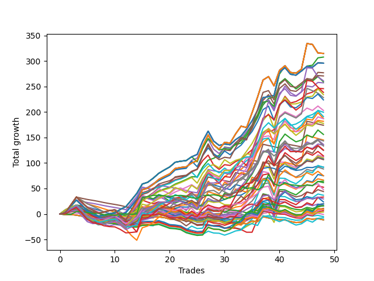

# Short Wallace Doodle 019 
- Symbol: ES
- Date Range: 3/18/22 - 6/24/22
- Trading Period: 7:20-12:30
- Number of Trades: 26


| Name | Win Percent | Profit | Avg Profit / Trade |     | Name | Win Percent | Profit | Avg Profit / Trade |
| ---- | ----------- | ------ | ------------------ | --- | ---- | ----------- | ------ | ------------------ |
| Sorted By <br> Profit | | | | | Sorted By <br> Win Percentage ||||
| Four | 88.46 | 128625.00 | 4947.12 |     | Four | 88.46 | 128625.00 | 4947.12 |
| Thirty-Six | 76.92 | 127125.00 | 4889.42 |     | Three | 80.77 | 112625.00 | 4331.73 |
| Five | 73.08 | 117750.00 | 4528.85 |     | Two | 80.77 | 74375.00 | 2860.58 |
| Three | 80.77 | 112625.00 | 4331.73 |     | One | 80.77 | 53375.00 | 2052.88 |
| Two | 80.77 | 74375.00 | 2860.58 |     | Thirty-Six | 76.92 | 127125.00 | 4889.42 |
| Twenty-Two | 65.38 | 69000.00 | 2653.85 |     | Five | 73.08 | 117750.00 | 4528.85 |
| Thirty-Five | 57.69 | 68625.00 | 2639.42 |     | Eighteen | 73.08 | 32500.00 | 1250.00 |
| One | 80.77 | 53375.00 | 2052.88 |     | Thirty-Four | 69.23 | 39125.00 | 1504.81 |
| Sixteen | 50.00 | 49625.00 | 1908.65 |     | Twenty-Two | 65.38 | 69000.00 | 2653.85 |
| Twenty | 65.38 | 42500.00 | 1634.62 |     | Twenty | 65.38 | 42500.00 | 1634.62 |
| Thirty-Four | 69.23 | 39125.00 | 1504.81 |     | Nineteen | 61.54 | 21250.00 | 817.31 |
| Eighteen | 73.08 | 32500.00 | 1250.00 |     | Thirty-Five | 57.69 | 68625.00 | 2639.42 |
| Ten | 38.46 | 30375.00 | 1168.27 |     | Twelve | 57.69 | 21875.00 | 841.35 |
| Fourteen | 50.00 | 27625.00 | 1062.50 |     | Thirteen | 57.69 | 18125.00 | 697.12 |
| Eight | 42.31 | 22625.00 | 870.19 |     | Seventeen | 53.85 | 10750.00 | 413.46 |
| Twelve | 57.69 | 21875.00 | 841.35 |     | Fifteen | 53.85 | 10750.00 | 413.46 |
| Nineteen | 61.54 | 21250.00 | 817.31 |     | Sixteen | 50.00 | 49625.00 | 1908.65 |
| Thirteen | 57.69 | 18125.00 | 697.12 |     | Fourteen | 50.00 | 27625.00 | 1062.50 |
| Twenty-Three | 46.15 | 16625.00 | 639.42 |     | Thirty-Two | 50.00 | 5000.00 | 192.31 |
| Six | 46.15 | 16375.00 | 629.81 |     | Thirty | 50.00 | 5000.00 | 192.31 |
| Twenty-One | 46.15 | 11500.00 | 442.31 |     | Twenty-Nine | 50.00 | 5000.00 | 192.31 |
| Seventeen | 53.85 | 10750.00 | 413.46 |     | Twenty-Seven | 50.00 | 5000.00 | 192.31 |
| Fifteen | 53.85 | 10750.00 | 413.46 |     | Twenty-Five | 50.00 | 5000.00 | 192.31 |
| Seven | 42.31 | 6375.00 | 245.19 |     | Twenty-Three | 46.15 | 16625.00 | 639.42 |
| Thirty-Two | 50.00 | 5000.00 | 192.31 |     | Six | 46.15 | 16375.00 | 629.81 |
| Thirty | 50.00 | 5000.00 | 192.31 |     | Twenty-One | 46.15 | 11500.00 | 442.31 |
| Twenty-Nine | 50.00 | 5000.00 | 192.31 |     | Thirty-Three | 46.15 | -500.00 | -19.23 |
| Twenty-Seven | 50.00 | 5000.00 | 192.31 |     | Thirty-One | 46.15 | -500.00 | -19.23 |
| Twenty-Five | 50.00 | 5000.00 | 192.31 |     | Twenty-Eight | 46.15 | -500.00 | -19.23 |
| Eleven | 38.46 | 2875.00 | 110.58 |     | Twenty-Six | 46.15 | -500.00 | -19.23 |
| Nine | 38.46 | 2875.00 | 110.58 |     | Twenty-Four | 46.15 | -500.00 | -19.23 |
| Thirty-Three | 46.15 | -500.00 | -19.23 |     | Eight | 42.31 | 22625.00 | 870.19 |
| Thirty-One | 46.15 | -500.00 | -19.23 |     | Seven | 42.31 | 6375.00 | 245.19 |
| Twenty-Eight | 46.15 | -500.00 | -19.23 |     | Ten | 38.46 | 30375.00 | 1168.27 |
| Twenty-Six | 46.15 | -500.00 | -19.23 |     | Eleven | 38.46 | 2875.00 | 110.58 |
| Twenty-Four | 46.15 | -500.00 | -19.23 |     | Nine | 38.46 | 2875.00 | 110.58 |

### Test One
* Sell when price hits the middle line of the 20p bollinger
* No Stoploss
* Results:
```
Total Trades: 26
Percent Up: 19.23
Percent Down: 80.77
Total Points Moved Down: 106.75
Potential Profit: 53375.00
Total Points Ups: 20.25 Count Ups: 5
Total Points Downs: 127.00 Count Downs: 21
```

<details><summary>Trades</summary>

<code>In: 2022-03-28 11:50:00		Out: 2022-03-28 12:06:40		Total Position Time: 16:40		Total Move Down: -3.75		Total to Date: 3.75</code> <br />
<code>In: 2022-03-29 11:38:00		Out: 2022-03-29 11:50:50		Total Position Time: 12:50		Total Move Down: 1.00		Total to Date: 2.75</code> <br />
<code>In: 2022-03-31 07:48:00		Out: 2022-03-31 08:03:05		Total Position Time: 15:05		Total Move Down: -1.00		Total to Date: 3.75</code> <br />
<code>In: 2022-03-31 07:49:00		Out: 2022-03-31 08:03:05		Total Position Time: 14:05		Total Move Down: 1.50		Total to Date: 2.25</code> <br />
<code>In: 2022-04-01 11:34:00		Out: 2022-04-01 11:42:20		Total Position Time: 08:20		Total Move Down: 2.50		Total to Date: -0.25</code> <br />
<code>In: 2022-04-06 10:35:00		Out: 2022-04-06 10:47:15		Total Position Time: 12:15		Total Move Down: -0.75		Total to Date: 0.50</code> <br />
<code>In: 2022-04-06 10:36:00		Out: 2022-04-06 10:47:15		Total Position Time: 11:15		Total Move Down: -2.50		Total to Date: 3.00</code> <br />
<code>In: 2022-04-06 10:43:00		Out: 2022-04-06 10:47:15		Total Position Time: 04:15		Total Move Down: 5.00		Total to Date: -2.00</code> <br />
<code>In: 2022-04-06 10:44:00		Out: 2022-04-06 10:47:15		Total Position Time: 03:15		Total Move Down: 5.50		Total to Date: -7.50</code> <br />
<code>In: 2022-04-06 11:05:00		Out: 2022-04-06 11:05:40		Total Position Time: 00:40		Total Move Down: 7.75		Total to Date: -15.25</code> <br />
<code>In: 2022-04-07 11:03:00		Out: 2022-04-07 11:15:15		Total Position Time: 12:15		Total Move Down: 2.50		Total to Date: -17.75</code> <br />
<code>In: 2022-04-18 07:27:00		Out: 2022-04-18 07:36:40		Total Position Time: 09:40		Total Move Down: 3.25		Total to Date: -21.00</code> <br />
<code>In: 2022-04-18 11:26:00		Out: 2022-04-18 11:28:05		Total Position Time: 02:05		Total Move Down: 6.00		Total to Date: -27.00</code> <br />
<code>In: 2022-04-20 07:42:00		Out: 2022-04-20 08:00:20		Total Position Time: 18:20		Total Move Down: 0.50		Total to Date: -27.50</code> <br />
<code>In: 2022-05-24 09:17:00		Out: 2022-05-24 09:21:30		Total Position Time: 04:30		Total Move Down: 11.25		Total to Date: -38.75</code> <br />
<code>In: 2022-05-24 09:18:00		Out: 2022-05-24 09:21:30		Total Position Time: 03:30		Total Move Down: 5.00		Total to Date: -43.75</code> <br />
<code>In: 2022-05-31 07:23:00		Out: 2022-05-31 07:36:40		Total Position Time: 13:40		Total Move Down: 4.50		Total to Date: -48.25</code> <br />
<code>In: 2022-06-09 10:07:00		Out: 2022-06-09 10:16:10		Total Position Time: 09:10		Total Move Down: 3.25		Total to Date: -51.50</code> <br />
<code>In: 2022-06-09 10:08:00		Out: 2022-06-09 10:16:10		Total Position Time: 08:10		Total Move Down: 0.50		Total to Date: -52.00</code> <br />
<code>In: 2022-06-10 12:00:00		Out: 2022-06-10 12:03:25		Total Position Time: 03:25		Total Move Down: 6.25		Total to Date: -58.25</code> <br />
<code>In: 2022-06-10 12:29:00		Out: 2022-06-10 12:30:30		Total Position Time: 01:30		Total Move Down: 6.25		Total to Date: -64.50</code> <br />
<code>In: 2022-06-13 09:40:00		Out: 2022-06-13 09:43:15		Total Position Time: 03:15		Total Move Down: 12.00		Total to Date: -76.50</code> <br />
<code>In: 2022-06-15 11:02:00		Out: 2022-06-15 11:02:10		Total Position Time: 00:10		Total Move Down: 2.00		Total to Date: -78.50</code> <br />
<code>In: 2022-06-15 11:40:00		Out: 2022-06-15 11:52:15		Total Position Time: 12:15		Total Move Down: -12.25		Total to Date: -66.25</code> <br />
<code>In: 2022-06-15 11:45:00		Out: 2022-06-15 11:52:15		Total Position Time: 07:15		Total Move Down: 31.00		Total to Date: -97.25</code> <br />
<code>In: 2022-06-17 10:13:00		Out: 2022-06-17 10:22:05		Total Position Time: 09:05		Total Move Down: 9.50		Total to Date: -106.75</code> <br />


</details>

### Test Two
* Sell when the price hits the lower line of the 20p 1std bollinger
* No Stoploss
* Results:
```
Total Trades: 26
Percent Up: 19.23
Percent Down: 80.77
Total Points Moved Down: 148.75
Potential Profit: 74375.00
Total Points Ups: 20.75 Count Ups: 5
Total Points Downs: 169.50 Count Downs: 21
```

<details><summary>Trades</summary>

<code>In: 2022-03-28 11:50:00		Out: 2022-03-28 12:19:55		Total Position Time: 29:55		Total Move Down: -5.00		Total to Date: 5.00</code> <br />
<code>In: 2022-03-29 11:38:00		Out: 2022-03-29 12:00:20		Total Position Time: 22:20		Total Move Down: -0.25		Total to Date: 5.25</code> <br />
<code>In: 2022-03-31 07:48:00		Out: 2022-03-31 08:03:25		Total Position Time: 15:25		Total Move Down: 1.25		Total to Date: 4.00</code> <br />
<code>In: 2022-03-31 07:49:00		Out: 2022-03-31 08:03:25		Total Position Time: 14:25		Total Move Down: 3.75		Total to Date: 0.25</code> <br />
<code>In: 2022-04-01 11:34:00		Out: 2022-04-01 11:50:15		Total Position Time: 16:15		Total Move Down: 3.25		Total to Date: -3.00</code> <br />
<code>In: 2022-04-06 10:35:00		Out: 2022-04-06 10:56:55		Total Position Time: 21:55		Total Move Down: -1.75		Total to Date: -1.25</code> <br />
<code>In: 2022-04-06 10:36:00		Out: 2022-04-06 10:56:55		Total Position Time: 20:55		Total Move Down: -3.50		Total to Date: 2.25</code> <br />
<code>In: 2022-04-06 10:43:00		Out: 2022-04-06 10:56:55		Total Position Time: 13:55		Total Move Down: 4.00		Total to Date: -1.75</code> <br />
<code>In: 2022-04-06 10:44:00		Out: 2022-04-06 10:56:55		Total Position Time: 12:55		Total Move Down: 4.50		Total to Date: -6.25</code> <br />
<code>In: 2022-04-06 11:05:00		Out: 2022-04-06 11:07:20		Total Position Time: 02:20		Total Move Down: 12.50		Total to Date: -18.75</code> <br />
<code>In: 2022-04-07 11:03:00		Out: 2022-04-07 11:16:10		Total Position Time: 13:10		Total Move Down: 4.00		Total to Date: -22.75</code> <br />
<code>In: 2022-04-18 07:27:00		Out: 2022-04-18 07:51:30		Total Position Time: 24:30		Total Move Down: 2.75		Total to Date: -25.50</code> <br />
<code>In: 2022-04-18 11:26:00		Out: 2022-04-18 11:41:15		Total Position Time: 15:15		Total Move Down: 6.50		Total to Date: -32.00</code> <br />
<code>In: 2022-04-20 07:42:00		Out: 2022-04-20 08:00:40		Total Position Time: 18:40		Total Move Down: 3.50		Total to Date: -35.50</code> <br />
<code>In: 2022-05-24 09:17:00		Out: 2022-05-24 09:29:00		Total Position Time: 12:00		Total Move Down: 12.50		Total to Date: -48.00</code> <br />
<code>In: 2022-05-24 09:18:00		Out: 2022-05-24 09:29:00		Total Position Time: 11:00		Total Move Down: 6.25		Total to Date: -54.25</code> <br />
<code>In: 2022-05-31 07:23:00		Out: 2022-05-31 07:38:00		Total Position Time: 15:00		Total Move Down: 8.25		Total to Date: -62.50</code> <br />
<code>In: 2022-06-09 10:07:00		Out: 2022-06-09 10:18:10		Total Position Time: 11:10		Total Move Down: 4.50		Total to Date: -67.00</code> <br />
<code>In: 2022-06-09 10:08:00		Out: 2022-06-09 10:18:10		Total Position Time: 10:10		Total Move Down: 1.75		Total to Date: -68.75</code> <br />
<code>In: 2022-06-10 12:00:00		Out: 2022-06-10 12:04:20		Total Position Time: 04:20		Total Move Down: 10.00		Total to Date: -78.75</code> <br />
<code>In: 2022-06-10 12:29:00		Out: 2022-06-10 12:35:55		Total Position Time: 06:55		Total Move Down: 10.25		Total to Date: -89.00</code> <br />
<code>In: 2022-06-13 09:40:00		Out: 2022-06-13 09:47:55		Total Position Time: 07:55		Total Move Down: 19.00		Total to Date: -108.00</code> <br />
<code>In: 2022-06-15 11:02:00		Out: 2022-06-15 11:03:00		Total Position Time: 01:00		Total Move Down: 6.75		Total to Date: -114.75</code> <br />
<code>In: 2022-06-15 11:40:00		Out: 2022-06-15 11:57:05		Total Position Time: 17:05		Total Move Down: -10.25		Total to Date: -104.50</code> <br />
<code>In: 2022-06-15 11:45:00		Out: 2022-06-15 11:57:05		Total Position Time: 12:05		Total Move Down: 33.00		Total to Date: -137.50</code> <br />
<code>In: 2022-06-17 10:13:00		Out: 2022-06-17 10:26:05		Total Position Time: 13:05		Total Move Down: 11.25		Total to Date: -148.75</code> <br />


</details>

### Test Three
* Sell when the price hits the lower line of the 20p 2std bollinger
* No Stoploss
* Results:
```
Total Trades: 26
Percent Up: 19.23
Percent Down: 80.77
Total Points Moved Down: 225.25
Potential Profit: 112625.00
Total Points Ups: 14.25 Count Ups: 5
Total Points Downs: 239.50 Count Downs: 21
```

<details><summary>Trades</summary>

<code>In: 2022-03-28 11:50:00		Out: 2022-03-28 12:19:55		Total Position Time: 29:55		Total Move Down: -5.00		Total to Date: 5.00</code> <br />
<code>In: 2022-03-29 11:38:00		Out: 2022-03-29 12:07:55		Total Position Time: 29:55		Total Move Down: -6.00		Total to Date: 11.00</code> <br />
<code>In: 2022-03-31 07:48:00		Out: 2022-03-31 08:08:30		Total Position Time: 20:30		Total Move Down: 2.50		Total to Date: 8.50</code> <br />
<code>In: 2022-03-31 07:49:00		Out: 2022-03-31 08:08:30		Total Position Time: 19:30		Total Move Down: 5.00		Total to Date: 3.50</code> <br />
<code>In: 2022-04-01 11:34:00		Out: 2022-04-01 11:50:55		Total Position Time: 16:55		Total Move Down: 4.25		Total to Date: -0.75</code> <br />
<code>In: 2022-04-06 10:35:00		Out: 2022-04-06 10:58:00		Total Position Time: 23:00		Total Move Down: -0.00		Total to Date: -0.75</code> <br />
<code>In: 2022-04-06 10:36:00		Out: 2022-04-06 10:58:00		Total Position Time: 22:00		Total Move Down: -1.75		Total to Date: 1.00</code> <br />
<code>In: 2022-04-06 10:43:00		Out: 2022-04-06 10:58:00		Total Position Time: 15:00		Total Move Down: 5.75		Total to Date: -4.75</code> <br />
<code>In: 2022-04-06 10:44:00		Out: 2022-04-06 10:58:00		Total Position Time: 14:00		Total Move Down: 6.25		Total to Date: -11.00</code> <br />
<code>In: 2022-04-06 11:05:00		Out: 2022-04-06 11:08:20		Total Position Time: 03:20		Total Move Down: 18.50		Total to Date: -29.50</code> <br />
<code>In: 2022-04-07 11:03:00		Out: 2022-04-07 11:18:40		Total Position Time: 15:40		Total Move Down: 7.00		Total to Date: -36.50</code> <br />
<code>In: 2022-04-18 07:27:00		Out: 2022-04-18 07:51:45		Total Position Time: 24:45		Total Move Down: 4.75		Total to Date: -41.25</code> <br />
<code>In: 2022-04-18 11:26:00		Out: 2022-04-18 11:44:10		Total Position Time: 18:10		Total Move Down: 6.75		Total to Date: -48.00</code> <br />
<code>In: 2022-04-20 07:42:00		Out: 2022-04-20 08:01:10		Total Position Time: 19:10		Total Move Down: 6.50		Total to Date: -54.50</code> <br />
<code>In: 2022-05-24 09:17:00		Out: 2022-05-24 09:32:35		Total Position Time: 15:35		Total Move Down: 19.50		Total to Date: -74.00</code> <br />
<code>In: 2022-05-24 09:18:00		Out: 2022-05-24 09:32:35		Total Position Time: 14:35		Total Move Down: 13.25		Total to Date: -87.25</code> <br />
<code>In: 2022-05-31 07:23:00		Out: 2022-05-31 07:52:55		Total Position Time: 29:55		Total Move Down: -1.50		Total to Date: -85.75</code> <br />
<code>In: 2022-06-09 10:07:00		Out: 2022-06-09 10:18:55		Total Position Time: 11:55		Total Move Down: 6.00		Total to Date: -91.75</code> <br />
<code>In: 2022-06-09 10:08:00		Out: 2022-06-09 10:18:55		Total Position Time: 10:55		Total Move Down: 3.25		Total to Date: -95.00</code> <br />
<code>In: 2022-06-10 12:00:00		Out: 2022-06-10 12:06:05		Total Position Time: 06:05		Total Move Down: 14.50		Total to Date: -109.50</code> <br />
<code>In: 2022-06-10 12:29:00		Out: 2022-06-10 12:43:25		Total Position Time: 14:25		Total Move Down: 15.25		Total to Date: -124.75</code> <br />
<code>In: 2022-06-13 09:40:00		Out: 2022-06-13 09:54:45		Total Position Time: 14:45		Total Move Down: 24.75		Total to Date: -149.50</code> <br />
<code>In: 2022-06-15 11:02:00		Out: 2022-06-15 11:03:15		Total Position Time: 01:15		Total Move Down: 13.00		Total to Date: -162.50</code> <br />
<code>In: 2022-06-15 11:40:00		Out: 2022-06-15 11:57:55		Total Position Time: 17:55		Total Move Down: 2.25		Total to Date: -164.75</code> <br />
<code>In: 2022-06-15 11:45:00		Out: 2022-06-15 11:57:55		Total Position Time: 12:55		Total Move Down: 45.50		Total to Date: -210.25</code> <br />
<code>In: 2022-06-17 10:13:00		Out: 2022-06-17 10:27:15		Total Position Time: 14:15		Total Move Down: 15.00		Total to Date: -225.25</code> <br />


</details>

### Test Four
* Sell when the price hits the middle line of the 1std VWAP
* No Stoploss
* Results:
```
Total Trades: 26
Percent Up: 11.54
Percent Down: 88.46
Total Points Moved Down: 257.25
Potential Profit: 128625.00
Total Points Ups: 12.50 Count Ups: 3
Total Points Downs: 269.75 Count Downs: 23
```

<details><summary>Trades</summary>

<code>In: 2022-03-28 11:50:00		Out: 2022-03-28 12:19:55		Total Position Time: 29:55		Total Move Down: -5.00		Total to Date: 5.00</code> <br />
<code>In: 2022-03-29 11:38:00		Out: 2022-03-29 12:07:55		Total Position Time: 29:55		Total Move Down: -6.00		Total to Date: 11.00</code> <br />
<code>In: 2022-03-31 07:48:00		Out: 2022-03-31 08:17:55		Total Position Time: 29:55		Total Move Down: 2.00		Total to Date: 9.00</code> <br />
<code>In: 2022-03-31 07:49:00		Out: 2022-03-31 08:18:55		Total Position Time: 29:55		Total Move Down: 2.75		Total to Date: 6.25</code> <br />
<code>In: 2022-04-01 11:34:00		Out: 2022-04-01 12:03:55		Total Position Time: 29:55		Total Move Down: 1.50		Total to Date: 4.75</code> <br />
<code>In: 2022-04-06 10:35:00		Out: 2022-04-06 11:00:10		Total Position Time: 25:10		Total Move Down: 7.00		Total to Date: -2.25</code> <br />
<code>In: 2022-04-06 10:36:00		Out: 2022-04-06 11:00:10		Total Position Time: 24:10		Total Move Down: 5.25		Total to Date: -7.50</code> <br />
<code>In: 2022-04-06 10:43:00		Out: 2022-04-06 11:00:10		Total Position Time: 17:10		Total Move Down: 12.75		Total to Date: -20.25</code> <br />
<code>In: 2022-04-06 10:44:00		Out: 2022-04-06 11:00:10		Total Position Time: 16:10		Total Move Down: 13.25		Total to Date: -33.50</code> <br />
<code>In: 2022-04-06 11:05:00		Out: 2022-04-06 11:08:10		Total Position Time: 03:10		Total Move Down: 18.50		Total to Date: -52.00</code> <br />
<code>In: 2022-04-07 11:03:00		Out: 2022-04-07 11:32:55		Total Position Time: 29:55		Total Move Down: 3.50		Total to Date: -55.50</code> <br />
<code>In: 2022-04-18 07:27:00		Out: 2022-04-18 07:55:15		Total Position Time: 28:15		Total Move Down: 8.00		Total to Date: -63.50</code> <br />
<code>In: 2022-04-18 11:26:00		Out: 2022-04-18 11:55:55		Total Position Time: 29:55		Total Move Down: 9.50		Total to Date: -73.00</code> <br />
<code>In: 2022-04-20 07:42:00		Out: 2022-04-20 08:08:10		Total Position Time: 26:10		Total Move Down: 9.25		Total to Date: -82.25</code> <br />
<code>In: 2022-05-24 09:17:00		Out: 2022-05-24 09:36:45		Total Position Time: 19:45		Total Move Down: 26.00		Total to Date: -108.25</code> <br />
<code>In: 2022-05-24 09:18:00		Out: 2022-05-24 09:36:45		Total Position Time: 18:45		Total Move Down: 19.75		Total to Date: -128.00</code> <br />
<code>In: 2022-05-31 07:23:00		Out: 2022-05-31 07:52:55		Total Position Time: 29:55		Total Move Down: -1.50		Total to Date: -126.50</code> <br />
<code>In: 2022-06-09 10:07:00		Out: 2022-06-09 10:23:45		Total Position Time: 16:45		Total Move Down: 10.00		Total to Date: -136.50</code> <br />
<code>In: 2022-06-09 10:08:00		Out: 2022-06-09 10:23:45		Total Position Time: 15:45		Total Move Down: 7.25		Total to Date: -143.75</code> <br />
<code>In: 2022-06-10 12:00:00		Out: 2022-06-10 12:05:30		Total Position Time: 05:30		Total Move Down: 13.50		Total to Date: -157.25</code> <br />
<code>In: 2022-06-10 12:29:00		Out: 2022-06-10 12:44:00		Total Position Time: 15:00		Total Move Down: 16.25		Total to Date: -173.50</code> <br />
<code>In: 2022-06-13 09:40:00		Out: 2022-06-13 09:55:05		Total Position Time: 15:05		Total Move Down: 25.00		Total to Date: -198.50</code> <br />
<code>In: 2022-06-15 11:02:00		Out: 2022-06-15 11:02:10		Total Position Time: 00:10		Total Move Down: 2.00		Total to Date: -200.50</code> <br />
<code>In: 2022-06-15 11:40:00		Out: 2022-06-15 11:57:55		Total Position Time: 17:55		Total Move Down: 2.25		Total to Date: -202.75</code> <br />
<code>In: 2022-06-15 11:45:00		Out: 2022-06-15 11:57:55		Total Position Time: 12:55		Total Move Down: 45.50		Total to Date: -248.25</code> <br />
<code>In: 2022-06-17 10:13:00		Out: 2022-06-17 10:42:55		Total Position Time: 29:55		Total Move Down: 9.00		Total to Date: -257.25</code> <br />


</details>

### Test Five
* Sell when the price hits the lower line of the 1std VWAP
* No Stoploss
* Results:
```
Total Trades: 26
Percent Up: 26.92
Percent Down: 73.08
Total Points Moved Down: 235.50
Potential Profit: 117750.00
Total Points Ups: 53.25 Count Ups: 7
Total Points Downs: 288.75 Count Downs: 19
```

<details><summary>Trades</summary>

<code>In: 2022-03-28 11:50:00		Out: 2022-03-28 12:19:55		Total Position Time: 29:55		Total Move Down: -5.00		Total to Date: 5.00</code> <br />
<code>In: 2022-03-29 11:38:00		Out: 2022-03-29 12:07:55		Total Position Time: 29:55		Total Move Down: -6.00		Total to Date: 11.00</code> <br />
<code>In: 2022-03-31 07:48:00		Out: 2022-03-31 08:17:55		Total Position Time: 29:55		Total Move Down: 2.00		Total to Date: 9.00</code> <br />
<code>In: 2022-03-31 07:49:00		Out: 2022-03-31 08:18:55		Total Position Time: 29:55		Total Move Down: 2.75		Total to Date: 6.25</code> <br />
<code>In: 2022-04-01 11:34:00		Out: 2022-04-01 12:03:55		Total Position Time: 29:55		Total Move Down: 1.50		Total to Date: 4.75</code> <br />
<code>In: 2022-04-06 10:35:00		Out: 2022-04-06 11:04:55		Total Position Time: 29:55		Total Move Down: -12.75		Total to Date: 17.50</code> <br />
<code>In: 2022-04-06 10:36:00		Out: 2022-04-06 11:05:55		Total Position Time: 29:55		Total Move Down: -7.00		Total to Date: 24.50</code> <br />
<code>In: 2022-04-06 10:43:00		Out: 2022-04-06 11:09:40		Total Position Time: 26:40		Total Move Down: 17.00		Total to Date: 7.50</code> <br />
<code>In: 2022-04-06 10:44:00		Out: 2022-04-06 11:09:40		Total Position Time: 25:40		Total Move Down: 17.50		Total to Date: -10.00</code> <br />
<code>In: 2022-04-06 11:05:00		Out: 2022-04-06 11:09:40		Total Position Time: 04:40		Total Move Down: 24.50		Total to Date: -34.50</code> <br />
<code>In: 2022-04-07 11:03:00		Out: 2022-04-07 11:32:55		Total Position Time: 29:55		Total Move Down: 3.50		Total to Date: -38.00</code> <br />
<code>In: 2022-04-18 07:27:00		Out: 2022-04-18 07:56:55		Total Position Time: 29:55		Total Move Down: 7.50		Total to Date: -45.50</code> <br />
<code>In: 2022-04-18 11:26:00		Out: 2022-04-18 11:55:55		Total Position Time: 29:55		Total Move Down: 9.50		Total to Date: -55.00</code> <br />
<code>In: 2022-04-20 07:42:00		Out: 2022-04-20 08:11:55		Total Position Time: 29:55		Total Move Down: 10.50		Total to Date: -65.50</code> <br />
<code>In: 2022-05-24 09:17:00		Out: 2022-05-24 09:46:55		Total Position Time: 29:55		Total Move Down: 28.25		Total to Date: -93.75</code> <br />
<code>In: 2022-05-24 09:18:00		Out: 2022-05-24 09:47:55		Total Position Time: 29:55		Total Move Down: 22.25		Total to Date: -116.00</code> <br />
<code>In: 2022-05-31 07:23:00		Out: 2022-05-31 07:52:55		Total Position Time: 29:55		Total Move Down: -1.50		Total to Date: -114.50</code> <br />
<code>In: 2022-06-09 10:07:00		Out: 2022-06-09 10:30:30		Total Position Time: 23:30		Total Move Down: 18.00		Total to Date: -132.50</code> <br />
<code>In: 2022-06-09 10:08:00		Out: 2022-06-09 10:30:30		Total Position Time: 22:30		Total Move Down: 15.25		Total to Date: -147.75</code> <br />
<code>In: 2022-06-10 12:00:00		Out: 2022-06-10 12:29:55		Total Position Time: 29:55		Total Move Down: -2.75		Total to Date: -145.00</code> <br />
<code>In: 2022-06-10 12:29:00		Out: 2022-06-10 12:58:55		Total Position Time: 29:55		Total Move Down: 29.00		Total to Date: -174.00</code> <br />
<code>In: 2022-06-13 09:40:00		Out: 2022-06-13 10:09:55		Total Position Time: 29:55		Total Move Down: 33.50		Total to Date: -207.50</code> <br />
<code>In: 2022-06-15 11:02:00		Out: 2022-06-15 11:03:00		Total Position Time: 01:00		Total Move Down: 6.75		Total to Date: -214.25</code> <br />
<code>In: 2022-06-15 11:40:00		Out: 2022-06-15 12:09:55		Total Position Time: 29:55		Total Move Down: -18.25		Total to Date: -196.00</code> <br />
<code>In: 2022-06-15 11:45:00		Out: 2022-06-15 12:14:55		Total Position Time: 29:55		Total Move Down: 30.50		Total to Date: -226.50</code> <br />
<code>In: 2022-06-17 10:13:00		Out: 2022-06-17 10:42:55		Total Position Time: 29:55		Total Move Down: 9.00		Total to Date: -235.50</code> <br />


</details>

### Test Six
* Sell when the price hits the middle line of the 20p bollinger
* Stoploss is -2 points
* Results:
```
Total Trades: 26
Percent Up: 53.85
Percent Down: 46.15
Total Points Moved Down: 32.75
Potential Profit: 16375.00
Total Points Ups: 44.00 Count Ups: 14
Total Points Downs: 76.75 Count Downs: 12
```

<details><summary>Trades</summary>

<code>In: 2022-03-28 11:50:00		Out: 2022-03-28 11:55:50		Total Position Time: 05:50		Total Move Down: -4.75		Total to Date: 4.75</code> <br />
<code>In: 2022-03-29 11:38:00		Out: 2022-03-29 11:44:05		Total Position Time: 06:05		Total Move Down: -1.75		Total to Date: 6.50</code> <br />
<code>In: 2022-03-31 07:48:00		Out: 2022-03-31 07:57:05		Total Position Time: 09:05		Total Move Down: -4.25		Total to Date: 10.75</code> <br />
<code>In: 2022-03-31 07:49:00		Out: 2022-03-31 07:57:05		Total Position Time: 08:05		Total Move Down: -1.75		Total to Date: 12.50</code> <br />
<code>In: 2022-04-01 11:34:00		Out: 2022-04-01 11:42:20		Total Position Time: 08:20		Total Move Down: 2.50		Total to Date: 10.00</code> <br />
<code>In: 2022-04-06 10:35:00		Out: 2022-04-06 10:35:10		Total Position Time: 00:10		Total Move Down: -0.25		Total to Date: 10.25</code> <br />
<code>In: 2022-04-06 10:36:00		Out: 2022-04-06 10:38:00		Total Position Time: 02:00		Total Move Down: -2.50		Total to Date: 12.75</code> <br />
<code>In: 2022-04-06 10:43:00		Out: 2022-04-06 10:47:15		Total Position Time: 04:15		Total Move Down: 5.00		Total to Date: 7.75</code> <br />
<code>In: 2022-04-06 10:44:00		Out: 2022-04-06 10:44:15		Total Position Time: 00:15		Total Move Down: -1.25		Total to Date: 9.00</code> <br />
<code>In: 2022-04-06 11:05:00		Out: 2022-04-06 11:05:10		Total Position Time: 00:10		Total Move Down: 4.00		Total to Date: 5.00</code> <br />
<code>In: 2022-04-07 11:03:00		Out: 2022-04-07 11:14:15		Total Position Time: 11:15		Total Move Down: -1.25		Total to Date: 6.25</code> <br />
<code>In: 2022-04-18 07:27:00		Out: 2022-04-18 07:27:10		Total Position Time: 00:10		Total Move Down: 0.25		Total to Date: 6.00</code> <br />
<code>In: 2022-04-18 11:26:00		Out: 2022-04-18 11:28:05		Total Position Time: 02:05		Total Move Down: 6.00		Total to Date: -0.00</code> <br />
<code>In: 2022-04-20 07:42:00		Out: 2022-04-20 07:42:10		Total Position Time: 00:10		Total Move Down: -0.75		Total to Date: 0.75</code> <br />
<code>In: 2022-05-24 09:17:00		Out: 2022-05-24 09:17:10		Total Position Time: 00:10		Total Move Down: 0.75		Total to Date: -0.00</code> <br />
<code>In: 2022-05-24 09:18:00		Out: 2022-05-24 09:18:20		Total Position Time: 00:20		Total Move Down: -1.75		Total to Date: 1.75</code> <br />
<code>In: 2022-05-31 07:23:00		Out: 2022-05-31 07:23:10		Total Position Time: 00:10		Total Move Down: 0.75		Total to Date: 1.00</code> <br />
<code>In: 2022-06-09 10:07:00		Out: 2022-06-09 10:07:10		Total Position Time: 00:10		Total Move Down: -0.75		Total to Date: 1.75</code> <br />
<code>In: 2022-06-09 10:08:00		Out: 2022-06-09 10:12:05		Total Position Time: 04:05		Total Move Down: -2.75		Total to Date: 4.50</code> <br />
<code>In: 2022-06-10 12:00:00		Out: 2022-06-10 12:03:25		Total Position Time: 03:25		Total Move Down: 6.25		Total to Date: -1.75</code> <br />
<code>In: 2022-06-10 12:29:00		Out: 2022-06-10 12:30:30		Total Position Time: 01:30		Total Move Down: 6.25		Total to Date: -8.00</code> <br />
<code>In: 2022-06-13 09:40:00		Out: 2022-06-13 09:43:15		Total Position Time: 03:15		Total Move Down: 12.00		Total to Date: -20.00</code> <br />
<code>In: 2022-06-15 11:02:00		Out: 2022-06-15 11:02:10		Total Position Time: 00:10		Total Move Down: 2.00		Total to Date: -22.00</code> <br />
<code>In: 2022-06-15 11:40:00		Out: 2022-06-15 11:41:10		Total Position Time: 01:10		Total Move Down: -19.75		Total to Date: -2.25</code> <br />
<code>In: 2022-06-15 11:45:00		Out: 2022-06-15 11:52:15		Total Position Time: 07:15		Total Move Down: 31.00		Total to Date: -33.25</code> <br />
<code>In: 2022-06-17 10:13:00		Out: 2022-06-17 10:13:10		Total Position Time: 00:10		Total Move Down: -0.50		Total to Date: -32.75</code> <br />


</details>

### Test Seven
* Sell when the price hits the middle line of the 20p bollinger
* Trailing Stop is -2 points
* Results:
```
Total Trades: 26
Percent Up: 57.69
Percent Down: 42.31
Total Points Moved Down: 12.75
Potential Profit: 6375.00
Total Points Ups: 20.00 Count Ups: 15
Total Points Downs: 32.75 Count Downs: 11
```

<details><summary>Trades</summary>

<code>In: 2022-03-28 11:50:00		Out: 2022-03-28 11:51:55		Total Position Time: 01:55		Total Move Down: -3.25		Total to Date: 3.25</code> <br />
<code>In: 2022-03-29 11:38:00		Out: 2022-03-29 11:43:40		Total Position Time: 05:40		Total Move Down: -1.00		Total to Date: 4.25</code> <br />
<code>In: 2022-03-31 07:48:00		Out: 2022-03-31 07:48:20		Total Position Time: 00:20		Total Move Down: -2.25		Total to Date: 6.50</code> <br />
<code>In: 2022-03-31 07:49:00		Out: 2022-03-31 07:55:05		Total Position Time: 06:05		Total Move Down: 2.50		Total to Date: 4.00</code> <br />
<code>In: 2022-04-01 11:34:00		Out: 2022-04-01 11:34:55		Total Position Time: 00:55		Total Move Down: -1.50		Total to Date: 5.50</code> <br />
<code>In: 2022-04-06 10:35:00		Out: 2022-04-06 10:35:10		Total Position Time: 00:10		Total Move Down: -0.25		Total to Date: 5.75</code> <br />
<code>In: 2022-04-06 10:36:00		Out: 2022-04-06 10:36:35		Total Position Time: 00:35		Total Move Down: -0.75		Total to Date: 6.50</code> <br />
<code>In: 2022-04-06 10:43:00		Out: 2022-04-06 10:47:15		Total Position Time: 04:15		Total Move Down: 5.00		Total to Date: 1.50</code> <br />
<code>In: 2022-04-06 10:44:00		Out: 2022-04-06 10:44:15		Total Position Time: 00:15		Total Move Down: -1.25		Total to Date: 2.75</code> <br />
<code>In: 2022-04-06 11:05:00		Out: 2022-04-06 11:05:10		Total Position Time: 00:10		Total Move Down: 4.00		Total to Date: -1.25</code> <br />
<code>In: 2022-04-07 11:03:00		Out: 2022-04-07 11:05:20		Total Position Time: 02:20		Total Move Down: 1.25		Total to Date: -2.50</code> <br />
<code>In: 2022-04-18 07:27:00		Out: 2022-04-18 07:27:10		Total Position Time: 00:10		Total Move Down: 0.25		Total to Date: -2.75</code> <br />
<code>In: 2022-04-18 11:26:00		Out: 2022-04-18 11:27:05		Total Position Time: 01:05		Total Move Down: 0.25		Total to Date: -3.00</code> <br />
<code>In: 2022-04-20 07:42:00		Out: 2022-04-20 07:42:10		Total Position Time: 00:10		Total Move Down: -0.75		Total to Date: -2.25</code> <br />
<code>In: 2022-05-24 09:17:00		Out: 2022-05-24 09:17:10		Total Position Time: 00:10		Total Move Down: 0.75		Total to Date: -3.00</code> <br />
<code>In: 2022-05-24 09:18:00		Out: 2022-05-24 09:18:20		Total Position Time: 00:20		Total Move Down: -1.75		Total to Date: -1.25</code> <br />
<code>In: 2022-05-31 07:23:00		Out: 2022-05-31 07:23:10		Total Position Time: 00:10		Total Move Down: 0.75		Total to Date: -2.00</code> <br />
<code>In: 2022-06-09 10:07:00		Out: 2022-06-09 10:07:10		Total Position Time: 00:10		Total Move Down: -0.75		Total to Date: -1.25</code> <br />
<code>In: 2022-06-09 10:08:00		Out: 2022-06-09 10:10:55		Total Position Time: 02:55		Total Move Down: -0.50		Total to Date: -0.75</code> <br />
<code>In: 2022-06-10 12:00:00		Out: 2022-06-10 12:00:25		Total Position Time: 00:25		Total Move Down: -2.00		Total to Date: 1.25</code> <br />
<code>In: 2022-06-10 12:29:00		Out: 2022-06-10 12:30:30		Total Position Time: 01:30		Total Move Down: 6.25		Total to Date: -5.00</code> <br />
<code>In: 2022-06-13 09:40:00		Out: 2022-06-13 09:43:00		Total Position Time: 03:00		Total Move Down: 9.75		Total to Date: -14.75</code> <br />
<code>In: 2022-06-15 11:02:00		Out: 2022-06-15 11:02:10		Total Position Time: 00:10		Total Move Down: 2.00		Total to Date: -16.75</code> <br />
<code>In: 2022-06-15 11:40:00		Out: 2022-06-15 11:40:30		Total Position Time: 00:30		Total Move Down: -2.25		Total to Date: -14.50</code> <br />
<code>In: 2022-06-15 11:45:00		Out: 2022-06-15 11:45:20		Total Position Time: 00:20		Total Move Down: -1.25		Total to Date: -13.25</code> <br />
<code>In: 2022-06-17 10:13:00		Out: 2022-06-17 10:13:10		Total Position Time: 00:10		Total Move Down: -0.50		Total to Date: -12.75</code> <br />


</details>

### Test Eight
* Sell when the price hits the lower line of the 20p 1std bollinger
* Stoploss is -2 points
* Results:
```
Total Trades: 26
Percent Up: 57.69
Percent Down: 42.31
Total Points Moved Down: 45.25
Potential Profit: 22625.00
Total Points Ups: 46.50 Count Ups: 15
Total Points Downs: 91.75 Count Downs: 11
```

<details><summary>Trades</summary>

<code>In: 2022-03-28 11:50:00		Out: 2022-03-28 11:55:50		Total Position Time: 05:50		Total Move Down: -4.75		Total to Date: 4.75</code> <br />
<code>In: 2022-03-29 11:38:00		Out: 2022-03-29 11:44:05		Total Position Time: 06:05		Total Move Down: -1.75		Total to Date: 6.50</code> <br />
<code>In: 2022-03-31 07:48:00		Out: 2022-03-31 07:57:05		Total Position Time: 09:05		Total Move Down: -4.25		Total to Date: 10.75</code> <br />
<code>In: 2022-03-31 07:49:00		Out: 2022-03-31 07:57:05		Total Position Time: 08:05		Total Move Down: -1.75		Total to Date: 12.50</code> <br />
<code>In: 2022-04-01 11:34:00		Out: 2022-04-01 11:50:15		Total Position Time: 16:15		Total Move Down: 3.25		Total to Date: 9.25</code> <br />
<code>In: 2022-04-06 10:35:00		Out: 2022-04-06 10:35:10		Total Position Time: 00:10		Total Move Down: -0.25		Total to Date: 9.50</code> <br />
<code>In: 2022-04-06 10:36:00		Out: 2022-04-06 10:38:00		Total Position Time: 02:00		Total Move Down: -2.50		Total to Date: 12.00</code> <br />
<code>In: 2022-04-06 10:43:00		Out: 2022-04-06 10:56:55		Total Position Time: 13:55		Total Move Down: 4.00		Total to Date: 8.00</code> <br />
<code>In: 2022-04-06 10:44:00		Out: 2022-04-06 10:44:15		Total Position Time: 00:15		Total Move Down: -1.25		Total to Date: 9.25</code> <br />
<code>In: 2022-04-06 11:05:00		Out: 2022-04-06 11:05:10		Total Position Time: 00:10		Total Move Down: 4.00		Total to Date: 5.25</code> <br />
<code>In: 2022-04-07 11:03:00		Out: 2022-04-07 11:14:15		Total Position Time: 11:15		Total Move Down: -1.25		Total to Date: 6.50</code> <br />
<code>In: 2022-04-18 07:27:00		Out: 2022-04-18 07:27:10		Total Position Time: 00:10		Total Move Down: 0.25		Total to Date: 6.25</code> <br />
<code>In: 2022-04-18 11:26:00		Out: 2022-04-18 11:41:15		Total Position Time: 15:15		Total Move Down: 6.50		Total to Date: -0.25</code> <br />
<code>In: 2022-04-20 07:42:00		Out: 2022-04-20 07:42:10		Total Position Time: 00:10		Total Move Down: -0.75		Total to Date: 0.50</code> <br />
<code>In: 2022-05-24 09:17:00		Out: 2022-05-24 09:17:10		Total Position Time: 00:10		Total Move Down: 0.75		Total to Date: -0.25</code> <br />
<code>In: 2022-05-24 09:18:00		Out: 2022-05-24 09:18:20		Total Position Time: 00:20		Total Move Down: -1.75		Total to Date: 1.50</code> <br />
<code>In: 2022-05-31 07:23:00		Out: 2022-05-31 07:23:10		Total Position Time: 00:10		Total Move Down: 0.75		Total to Date: 0.75</code> <br />
<code>In: 2022-06-09 10:07:00		Out: 2022-06-09 10:07:10		Total Position Time: 00:10		Total Move Down: -0.75		Total to Date: 1.50</code> <br />
<code>In: 2022-06-09 10:08:00		Out: 2022-06-09 10:12:05		Total Position Time: 04:05		Total Move Down: -2.75		Total to Date: 4.25</code> <br />
<code>In: 2022-06-10 12:00:00		Out: 2022-06-10 12:04:20		Total Position Time: 04:20		Total Move Down: 10.00		Total to Date: -5.75</code> <br />
<code>In: 2022-06-10 12:29:00		Out: 2022-06-10 12:35:55		Total Position Time: 06:55		Total Move Down: 10.25		Total to Date: -16.00</code> <br />
<code>In: 2022-06-13 09:40:00		Out: 2022-06-13 09:47:55		Total Position Time: 07:55		Total Move Down: 19.00		Total to Date: -35.00</code> <br />
<code>In: 2022-06-15 11:02:00		Out: 2022-06-15 11:02:15		Total Position Time: 00:15		Total Move Down: -2.50		Total to Date: -32.50</code> <br />
<code>In: 2022-06-15 11:40:00		Out: 2022-06-15 11:41:10		Total Position Time: 01:10		Total Move Down: -19.75		Total to Date: -12.75</code> <br />
<code>In: 2022-06-15 11:45:00		Out: 2022-06-15 11:57:05		Total Position Time: 12:05		Total Move Down: 33.00		Total to Date: -45.75</code> <br />
<code>In: 2022-06-17 10:13:00		Out: 2022-06-17 10:13:10		Total Position Time: 00:10		Total Move Down: -0.50		Total to Date: -45.25</code> <br />


</details>

### Test Nine
* Sell when the price hits the lower line of the 20p 1std bollinger
* Trailing Stop is -2 points
* Results:
```
Total Trades: 26
Percent Up: 61.54
Percent Down: 38.46
Total Points Moved Down: 5.75
Potential Profit: 2875.00
Total Points Ups: 22.50 Count Ups: 16
Total Points Downs: 28.25 Count Downs: 10
```

<details><summary>Trades</summary>

<code>In: 2022-03-28 11:50:00		Out: 2022-03-28 11:51:55		Total Position Time: 01:55		Total Move Down: -3.25		Total to Date: 3.25</code> <br />
<code>In: 2022-03-29 11:38:00		Out: 2022-03-29 11:43:40		Total Position Time: 05:40		Total Move Down: -1.00		Total to Date: 4.25</code> <br />
<code>In: 2022-03-31 07:48:00		Out: 2022-03-31 07:48:20		Total Position Time: 00:20		Total Move Down: -2.25		Total to Date: 6.50</code> <br />
<code>In: 2022-03-31 07:49:00		Out: 2022-03-31 07:55:05		Total Position Time: 06:05		Total Move Down: 2.50		Total to Date: 4.00</code> <br />
<code>In: 2022-04-01 11:34:00		Out: 2022-04-01 11:34:55		Total Position Time: 00:55		Total Move Down: -1.50		Total to Date: 5.50</code> <br />
<code>In: 2022-04-06 10:35:00		Out: 2022-04-06 10:35:10		Total Position Time: 00:10		Total Move Down: -0.25		Total to Date: 5.75</code> <br />
<code>In: 2022-04-06 10:36:00		Out: 2022-04-06 10:36:35		Total Position Time: 00:35		Total Move Down: -0.75		Total to Date: 6.50</code> <br />
<code>In: 2022-04-06 10:43:00		Out: 2022-04-06 10:47:50		Total Position Time: 04:50		Total Move Down: 3.00		Total to Date: 3.50</code> <br />
<code>In: 2022-04-06 10:44:00		Out: 2022-04-06 10:44:15		Total Position Time: 00:15		Total Move Down: -1.25		Total to Date: 4.75</code> <br />
<code>In: 2022-04-06 11:05:00		Out: 2022-04-06 11:05:10		Total Position Time: 00:10		Total Move Down: 4.00		Total to Date: 0.75</code> <br />
<code>In: 2022-04-07 11:03:00		Out: 2022-04-07 11:05:20		Total Position Time: 02:20		Total Move Down: 1.25		Total to Date: -0.50</code> <br />
<code>In: 2022-04-18 07:27:00		Out: 2022-04-18 07:27:10		Total Position Time: 00:10		Total Move Down: 0.25		Total to Date: -0.75</code> <br />
<code>In: 2022-04-18 11:26:00		Out: 2022-04-18 11:27:05		Total Position Time: 01:05		Total Move Down: 0.25		Total to Date: -1.00</code> <br />
<code>In: 2022-04-20 07:42:00		Out: 2022-04-20 07:42:10		Total Position Time: 00:10		Total Move Down: -0.75		Total to Date: -0.25</code> <br />
<code>In: 2022-05-24 09:17:00		Out: 2022-05-24 09:17:10		Total Position Time: 00:10		Total Move Down: 0.75		Total to Date: -1.00</code> <br />
<code>In: 2022-05-24 09:18:00		Out: 2022-05-24 09:18:20		Total Position Time: 00:20		Total Move Down: -1.75		Total to Date: 0.75</code> <br />
<code>In: 2022-05-31 07:23:00		Out: 2022-05-31 07:23:10		Total Position Time: 00:10		Total Move Down: 0.75		Total to Date: -0.00</code> <br />
<code>In: 2022-06-09 10:07:00		Out: 2022-06-09 10:07:10		Total Position Time: 00:10		Total Move Down: -0.75		Total to Date: 0.75</code> <br />
<code>In: 2022-06-09 10:08:00		Out: 2022-06-09 10:10:55		Total Position Time: 02:55		Total Move Down: -0.50		Total to Date: 1.25</code> <br />
<code>In: 2022-06-10 12:00:00		Out: 2022-06-10 12:00:25		Total Position Time: 00:25		Total Move Down: -2.00		Total to Date: 3.25</code> <br />
<code>In: 2022-06-10 12:29:00		Out: 2022-06-10 12:31:15		Total Position Time: 02:15		Total Move Down: 5.75		Total to Date: -2.50</code> <br />
<code>In: 2022-06-13 09:40:00		Out: 2022-06-13 09:43:00		Total Position Time: 03:00		Total Move Down: 9.75		Total to Date: -12.25</code> <br />
<code>In: 2022-06-15 11:02:00		Out: 2022-06-15 11:02:15		Total Position Time: 00:15		Total Move Down: -2.50		Total to Date: -9.75</code> <br />
<code>In: 2022-06-15 11:40:00		Out: 2022-06-15 11:40:30		Total Position Time: 00:30		Total Move Down: -2.25		Total to Date: -7.50</code> <br />
<code>In: 2022-06-15 11:45:00		Out: 2022-06-15 11:45:20		Total Position Time: 00:20		Total Move Down: -1.25		Total to Date: -6.25</code> <br />
<code>In: 2022-06-17 10:13:00		Out: 2022-06-17 10:13:10		Total Position Time: 00:10		Total Move Down: -0.50		Total to Date: -5.75</code> <br />


</details>

### Test Ten
* Sell when the price hits the lower line of the 20p 2std bollinger
* Stoploss is -2 points
* Results:
```
Total Trades: 26
Percent Up: 61.54
Percent Down: 38.46
Total Points Moved Down: 60.75
Potential Profit: 30375.00
Total Points Ups: 46.50 Count Ups: 16
Total Points Downs: 107.25 Count Downs: 10
```

<details><summary>Trades</summary>

<code>In: 2022-03-28 11:50:00		Out: 2022-03-28 11:55:50		Total Position Time: 05:50		Total Move Down: -4.75		Total to Date: 4.75</code> <br />
<code>In: 2022-03-29 11:38:00		Out: 2022-03-29 11:44:05		Total Position Time: 06:05		Total Move Down: -1.75		Total to Date: 6.50</code> <br />
<code>In: 2022-03-31 07:48:00		Out: 2022-03-31 07:57:05		Total Position Time: 09:05		Total Move Down: -4.25		Total to Date: 10.75</code> <br />
<code>In: 2022-03-31 07:49:00		Out: 2022-03-31 07:57:05		Total Position Time: 08:05		Total Move Down: -1.75		Total to Date: 12.50</code> <br />
<code>In: 2022-04-01 11:34:00		Out: 2022-04-01 11:50:55		Total Position Time: 16:55		Total Move Down: 4.25		Total to Date: 8.25</code> <br />
<code>In: 2022-04-06 10:35:00		Out: 2022-04-06 10:35:10		Total Position Time: 00:10		Total Move Down: -0.25		Total to Date: 8.50</code> <br />
<code>In: 2022-04-06 10:36:00		Out: 2022-04-06 10:38:00		Total Position Time: 02:00		Total Move Down: -2.50		Total to Date: 11.00</code> <br />
<code>In: 2022-04-06 10:43:00		Out: 2022-04-06 10:58:00		Total Position Time: 15:00		Total Move Down: 5.75		Total to Date: 5.25</code> <br />
<code>In: 2022-04-06 10:44:00		Out: 2022-04-06 10:44:15		Total Position Time: 00:15		Total Move Down: -1.25		Total to Date: 6.50</code> <br />
<code>In: 2022-04-06 11:05:00		Out: 2022-04-06 11:05:10		Total Position Time: 00:10		Total Move Down: 4.00		Total to Date: 2.50</code> <br />
<code>In: 2022-04-07 11:03:00		Out: 2022-04-07 11:14:15		Total Position Time: 11:15		Total Move Down: -1.25		Total to Date: 3.75</code> <br />
<code>In: 2022-04-18 07:27:00		Out: 2022-04-18 07:27:10		Total Position Time: 00:10		Total Move Down: 0.25		Total to Date: 3.50</code> <br />
<code>In: 2022-04-18 11:26:00		Out: 2022-04-18 11:44:10		Total Position Time: 18:10		Total Move Down: 6.75		Total to Date: -3.25</code> <br />
<code>In: 2022-04-20 07:42:00		Out: 2022-04-20 07:42:10		Total Position Time: 00:10		Total Move Down: -0.75		Total to Date: -2.50</code> <br />
<code>In: 2022-05-24 09:17:00		Out: 2022-05-24 09:17:10		Total Position Time: 00:10		Total Move Down: 0.75		Total to Date: -3.25</code> <br />
<code>In: 2022-05-24 09:18:00		Out: 2022-05-24 09:18:20		Total Position Time: 00:20		Total Move Down: -1.75		Total to Date: -1.50</code> <br />
<code>In: 2022-05-31 07:23:00		Out: 2022-05-31 07:23:10		Total Position Time: 00:10		Total Move Down: 0.75		Total to Date: -2.25</code> <br />
<code>In: 2022-06-09 10:07:00		Out: 2022-06-09 10:07:10		Total Position Time: 00:10		Total Move Down: -0.75		Total to Date: -1.50</code> <br />
<code>In: 2022-06-09 10:08:00		Out: 2022-06-09 10:12:05		Total Position Time: 04:05		Total Move Down: -2.75		Total to Date: 1.25</code> <br />
<code>In: 2022-06-10 12:00:00		Out: 2022-06-10 12:06:05		Total Position Time: 06:05		Total Move Down: 14.50		Total to Date: -13.25</code> <br />
<code>In: 2022-06-10 12:29:00		Out: 2022-06-10 12:37:20		Total Position Time: 08:20		Total Move Down: -0.00		Total to Date: -13.25</code> <br />
<code>In: 2022-06-13 09:40:00		Out: 2022-06-13 09:54:45		Total Position Time: 14:45		Total Move Down: 24.75		Total to Date: -38.00</code> <br />
<code>In: 2022-06-15 11:02:00		Out: 2022-06-15 11:02:15		Total Position Time: 00:15		Total Move Down: -2.50		Total to Date: -35.50</code> <br />
<code>In: 2022-06-15 11:40:00		Out: 2022-06-15 11:41:10		Total Position Time: 01:10		Total Move Down: -19.75		Total to Date: -15.75</code> <br />
<code>In: 2022-06-15 11:45:00		Out: 2022-06-15 11:57:55		Total Position Time: 12:55		Total Move Down: 45.50		Total to Date: -61.25</code> <br />
<code>In: 2022-06-17 10:13:00		Out: 2022-06-17 10:13:10		Total Position Time: 00:10		Total Move Down: -0.50		Total to Date: -60.75</code> <br />


</details>

### Test Eleven
* Sell when the price hits the lower line of the 20p 2std bollinger
* Trailing Stop is -2 points
* Results:
```
Total Trades: 26
Percent Up: 61.54
Percent Down: 38.46
Total Points Moved Down: 5.75
Potential Profit: 2875.00
Total Points Ups: 22.50 Count Ups: 16
Total Points Downs: 28.25 Count Downs: 10
```

<details><summary>Trades</summary>

<code>In: 2022-03-28 11:50:00		Out: 2022-03-28 11:51:55		Total Position Time: 01:55		Total Move Down: -3.25		Total to Date: 3.25</code> <br />
<code>In: 2022-03-29 11:38:00		Out: 2022-03-29 11:43:40		Total Position Time: 05:40		Total Move Down: -1.00		Total to Date: 4.25</code> <br />
<code>In: 2022-03-31 07:48:00		Out: 2022-03-31 07:48:20		Total Position Time: 00:20		Total Move Down: -2.25		Total to Date: 6.50</code> <br />
<code>In: 2022-03-31 07:49:00		Out: 2022-03-31 07:55:05		Total Position Time: 06:05		Total Move Down: 2.50		Total to Date: 4.00</code> <br />
<code>In: 2022-04-01 11:34:00		Out: 2022-04-01 11:34:55		Total Position Time: 00:55		Total Move Down: -1.50		Total to Date: 5.50</code> <br />
<code>In: 2022-04-06 10:35:00		Out: 2022-04-06 10:35:10		Total Position Time: 00:10		Total Move Down: -0.25		Total to Date: 5.75</code> <br />
<code>In: 2022-04-06 10:36:00		Out: 2022-04-06 10:36:35		Total Position Time: 00:35		Total Move Down: -0.75		Total to Date: 6.50</code> <br />
<code>In: 2022-04-06 10:43:00		Out: 2022-04-06 10:47:50		Total Position Time: 04:50		Total Move Down: 3.00		Total to Date: 3.50</code> <br />
<code>In: 2022-04-06 10:44:00		Out: 2022-04-06 10:44:15		Total Position Time: 00:15		Total Move Down: -1.25		Total to Date: 4.75</code> <br />
<code>In: 2022-04-06 11:05:00		Out: 2022-04-06 11:05:10		Total Position Time: 00:10		Total Move Down: 4.00		Total to Date: 0.75</code> <br />
<code>In: 2022-04-07 11:03:00		Out: 2022-04-07 11:05:20		Total Position Time: 02:20		Total Move Down: 1.25		Total to Date: -0.50</code> <br />
<code>In: 2022-04-18 07:27:00		Out: 2022-04-18 07:27:10		Total Position Time: 00:10		Total Move Down: 0.25		Total to Date: -0.75</code> <br />
<code>In: 2022-04-18 11:26:00		Out: 2022-04-18 11:27:05		Total Position Time: 01:05		Total Move Down: 0.25		Total to Date: -1.00</code> <br />
<code>In: 2022-04-20 07:42:00		Out: 2022-04-20 07:42:10		Total Position Time: 00:10		Total Move Down: -0.75		Total to Date: -0.25</code> <br />
<code>In: 2022-05-24 09:17:00		Out: 2022-05-24 09:17:10		Total Position Time: 00:10		Total Move Down: 0.75		Total to Date: -1.00</code> <br />
<code>In: 2022-05-24 09:18:00		Out: 2022-05-24 09:18:20		Total Position Time: 00:20		Total Move Down: -1.75		Total to Date: 0.75</code> <br />
<code>In: 2022-05-31 07:23:00		Out: 2022-05-31 07:23:10		Total Position Time: 00:10		Total Move Down: 0.75		Total to Date: -0.00</code> <br />
<code>In: 2022-06-09 10:07:00		Out: 2022-06-09 10:07:10		Total Position Time: 00:10		Total Move Down: -0.75		Total to Date: 0.75</code> <br />
<code>In: 2022-06-09 10:08:00		Out: 2022-06-09 10:10:55		Total Position Time: 02:55		Total Move Down: -0.50		Total to Date: 1.25</code> <br />
<code>In: 2022-06-10 12:00:00		Out: 2022-06-10 12:00:25		Total Position Time: 00:25		Total Move Down: -2.00		Total to Date: 3.25</code> <br />
<code>In: 2022-06-10 12:29:00		Out: 2022-06-10 12:31:15		Total Position Time: 02:15		Total Move Down: 5.75		Total to Date: -2.50</code> <br />
<code>In: 2022-06-13 09:40:00		Out: 2022-06-13 09:43:00		Total Position Time: 03:00		Total Move Down: 9.75		Total to Date: -12.25</code> <br />
<code>In: 2022-06-15 11:02:00		Out: 2022-06-15 11:02:15		Total Position Time: 00:15		Total Move Down: -2.50		Total to Date: -9.75</code> <br />
<code>In: 2022-06-15 11:40:00		Out: 2022-06-15 11:40:30		Total Position Time: 00:30		Total Move Down: -2.25		Total to Date: -7.50</code> <br />
<code>In: 2022-06-15 11:45:00		Out: 2022-06-15 11:45:20		Total Position Time: 00:20		Total Move Down: -1.25		Total to Date: -6.25</code> <br />
<code>In: 2022-06-17 10:13:00		Out: 2022-06-17 10:13:10		Total Position Time: 00:10		Total Move Down: -0.50		Total to Date: -5.75</code> <br />


</details>

### Test Twelve
* Sell when the price hits the middle line of the 20p bollinger
* Stoploss is -3 points
* Results:
```
Total Trades: 26
Percent Up: 42.31
Percent Down: 57.69
Total Points Moved Down: 43.75
Potential Profit: 21875.00
Total Points Ups: 48.75 Count Ups: 11
Total Points Downs: 92.50 Count Downs: 15
```

<details><summary>Trades</summary>

<code>In: 2022-03-28 11:50:00		Out: 2022-03-28 11:56:05		Total Position Time: 06:05		Total Move Down: -5.00		Total to Date: 5.00</code> <br />
<code>In: 2022-03-29 11:38:00		Out: 2022-03-29 11:48:45		Total Position Time: 10:45		Total Move Down: -3.00		Total to Date: 8.00</code> <br />
<code>In: 2022-03-31 07:48:00		Out: 2022-03-31 07:57:20		Total Position Time: 09:20		Total Move Down: -5.75		Total to Date: 13.75</code> <br />
<code>In: 2022-03-31 07:49:00		Out: 2022-03-31 07:57:20		Total Position Time: 08:20		Total Move Down: -3.25		Total to Date: 17.00</code> <br />
<code>In: 2022-04-01 11:34:00		Out: 2022-04-01 11:42:20		Total Position Time: 08:20		Total Move Down: 2.50		Total to Date: 14.50</code> <br />
<code>In: 2022-04-06 10:35:00		Out: 2022-04-06 10:38:15		Total Position Time: 03:15		Total Move Down: -1.25		Total to Date: 15.75</code> <br />
<code>In: 2022-04-06 10:36:00		Out: 2022-04-06 10:38:15		Total Position Time: 02:15		Total Move Down: -3.00		Total to Date: 18.75</code> <br />
<code>In: 2022-04-06 10:43:00		Out: 2022-04-06 10:47:15		Total Position Time: 04:15		Total Move Down: 5.00		Total to Date: 13.75</code> <br />
<code>In: 2022-04-06 10:44:00		Out: 2022-04-06 10:47:15		Total Position Time: 03:15		Total Move Down: 5.50		Total to Date: 8.25</code> <br />
<code>In: 2022-04-06 11:05:00		Out: 2022-04-06 11:05:10		Total Position Time: 00:10		Total Move Down: 4.00		Total to Date: 4.25</code> <br />
<code>In: 2022-04-07 11:03:00		Out: 2022-04-07 11:15:15		Total Position Time: 12:15		Total Move Down: 2.50		Total to Date: 1.75</code> <br />
<code>In: 2022-04-18 07:27:00		Out: 2022-04-18 07:36:40		Total Position Time: 09:40		Total Move Down: 3.25		Total to Date: -1.50</code> <br />
<code>In: 2022-04-18 11:26:00		Out: 2022-04-18 11:28:05		Total Position Time: 02:05		Total Move Down: 6.00		Total to Date: -7.50</code> <br />
<code>In: 2022-04-20 07:42:00		Out: 2022-04-20 07:52:10		Total Position Time: 10:10		Total Move Down: -1.75		Total to Date: -5.75</code> <br />
<code>In: 2022-05-24 09:17:00		Out: 2022-05-24 09:17:10		Total Position Time: 00:10		Total Move Down: 0.75		Total to Date: -6.50</code> <br />
<code>In: 2022-05-24 09:18:00		Out: 2022-05-24 09:21:30		Total Position Time: 03:30		Total Move Down: 5.00		Total to Date: -11.50</code> <br />
<code>In: 2022-05-31 07:23:00		Out: 2022-05-31 07:31:20		Total Position Time: 08:20		Total Move Down: -0.25		Total to Date: -11.25</code> <br />
<code>In: 2022-06-09 10:07:00		Out: 2022-06-09 10:07:10		Total Position Time: 00:10		Total Move Down: -0.75		Total to Date: -10.50</code> <br />
<code>In: 2022-06-09 10:08:00		Out: 2022-06-09 10:16:10		Total Position Time: 08:10		Total Move Down: 0.50		Total to Date: -11.00</code> <br />
<code>In: 2022-06-10 12:00:00		Out: 2022-06-10 12:03:25		Total Position Time: 03:25		Total Move Down: 6.25		Total to Date: -17.25</code> <br />
<code>In: 2022-06-10 12:29:00		Out: 2022-06-10 12:30:30		Total Position Time: 01:30		Total Move Down: 6.25		Total to Date: -23.50</code> <br />
<code>In: 2022-06-13 09:40:00		Out: 2022-06-13 09:43:15		Total Position Time: 03:15		Total Move Down: 12.00		Total to Date: -35.50</code> <br />
<code>In: 2022-06-15 11:02:00		Out: 2022-06-15 11:02:10		Total Position Time: 00:10		Total Move Down: 2.00		Total to Date: -37.50</code> <br />
<code>In: 2022-06-15 11:40:00		Out: 2022-06-15 11:41:15		Total Position Time: 01:15		Total Move Down: -24.25		Total to Date: -13.25</code> <br />
<code>In: 2022-06-15 11:45:00		Out: 2022-06-15 11:52:15		Total Position Time: 07:15		Total Move Down: 31.00		Total to Date: -44.25</code> <br />
<code>In: 2022-06-17 10:13:00		Out: 2022-06-17 10:13:10		Total Position Time: 00:10		Total Move Down: -0.50		Total to Date: -43.75</code> <br />


</details>

### Test Thirteen
* Sell when the price hits the middle line of the 20p bollinger
* Trailing Stop is -3 points
* Results:
```
Total Trades: 26
Percent Up: 42.31
Percent Down: 57.69
Total Points Moved Down: 36.25
Potential Profit: 18125.00
Total Points Ups: 20.25 Count Ups: 11
Total Points Downs: 56.50 Count Downs: 15
```

<details><summary>Trades</summary>

<code>In: 2022-03-28 11:50:00		Out: 2022-03-28 11:52:35		Total Position Time: 02:35		Total Move Down: -3.50		Total to Date: 3.50</code> <br />
<code>In: 2022-03-29 11:38:00		Out: 2022-03-29 11:48:10		Total Position Time: 10:10		Total Move Down: -2.00		Total to Date: 5.50</code> <br />
<code>In: 2022-03-31 07:48:00		Out: 2022-03-31 07:55:25		Total Position Time: 07:25		Total Move Down: -1.50		Total to Date: 7.00</code> <br />
<code>In: 2022-03-31 07:49:00		Out: 2022-03-31 07:55:25		Total Position Time: 06:25		Total Move Down: 1.00		Total to Date: 6.00</code> <br />
<code>In: 2022-04-01 11:34:00		Out: 2022-04-01 11:40:35		Total Position Time: 06:35		Total Move Down: 1.00		Total to Date: 5.00</code> <br />
<code>In: 2022-04-06 10:35:00		Out: 2022-04-06 10:38:00		Total Position Time: 03:00		Total Move Down: -0.75		Total to Date: 5.75</code> <br />
<code>In: 2022-04-06 10:36:00		Out: 2022-04-06 10:38:00		Total Position Time: 02:00		Total Move Down: -2.50		Total to Date: 8.25</code> <br />
<code>In: 2022-04-06 10:43:00		Out: 2022-04-06 10:47:15		Total Position Time: 04:15		Total Move Down: 5.00		Total to Date: 3.25</code> <br />
<code>In: 2022-04-06 10:44:00		Out: 2022-04-06 10:47:15		Total Position Time: 03:15		Total Move Down: 5.50		Total to Date: -2.25</code> <br />
<code>In: 2022-04-06 11:05:00		Out: 2022-04-06 11:05:10		Total Position Time: 00:10		Total Move Down: 4.00		Total to Date: -6.25</code> <br />
<code>In: 2022-04-07 11:03:00		Out: 2022-04-07 11:09:10		Total Position Time: 06:10		Total Move Down: 2.25		Total to Date: -8.50</code> <br />
<code>In: 2022-04-18 07:27:00		Out: 2022-04-18 07:34:30		Total Position Time: 07:30		Total Move Down: 0.75		Total to Date: -9.25</code> <br />
<code>In: 2022-04-18 11:26:00		Out: 2022-04-18 11:28:05		Total Position Time: 02:05		Total Move Down: 6.00		Total to Date: -15.25</code> <br />
<code>In: 2022-04-20 07:42:00		Out: 2022-04-20 07:51:05		Total Position Time: 09:05		Total Move Down: 0.50		Total to Date: -15.75</code> <br />
<code>In: 2022-05-24 09:17:00		Out: 2022-05-24 09:17:10		Total Position Time: 00:10		Total Move Down: 0.75		Total to Date: -16.50</code> <br />
<code>In: 2022-05-24 09:18:00		Out: 2022-05-24 09:21:30		Total Position Time: 03:30		Total Move Down: 5.00		Total to Date: -21.50</code> <br />
<code>In: 2022-05-31 07:23:00		Out: 2022-05-31 07:27:05		Total Position Time: 04:05		Total Move Down: 4.50		Total to Date: -26.00</code> <br />
<code>In: 2022-06-09 10:07:00		Out: 2022-06-09 10:07:10		Total Position Time: 00:10		Total Move Down: -0.75		Total to Date: -25.25</code> <br />
<code>In: 2022-06-09 10:08:00		Out: 2022-06-09 10:12:00		Total Position Time: 04:00		Total Move Down: -2.00		Total to Date: -23.25</code> <br />
<code>In: 2022-06-10 12:00:00		Out: 2022-06-10 12:00:45		Total Position Time: 00:45		Total Move Down: -3.00		Total to Date: -20.25</code> <br />
<code>In: 2022-06-10 12:29:00		Out: 2022-06-10 12:30:30		Total Position Time: 01:30		Total Move Down: 6.25		Total to Date: -26.50</code> <br />
<code>In: 2022-06-13 09:40:00		Out: 2022-06-13 09:43:15		Total Position Time: 03:15		Total Move Down: 12.00		Total to Date: -38.50</code> <br />
<code>In: 2022-06-15 11:02:00		Out: 2022-06-15 11:02:10		Total Position Time: 00:10		Total Move Down: 2.00		Total to Date: -40.50</code> <br />
<code>In: 2022-06-15 11:40:00		Out: 2022-06-15 11:40:30		Total Position Time: 00:30		Total Move Down: -2.25		Total to Date: -38.25</code> <br />
<code>In: 2022-06-15 11:45:00		Out: 2022-06-15 11:45:25		Total Position Time: 00:25		Total Move Down: -1.50		Total to Date: -36.75</code> <br />
<code>In: 2022-06-17 10:13:00		Out: 2022-06-17 10:13:10		Total Position Time: 00:10		Total Move Down: -0.50		Total to Date: -36.25</code> <br />


</details>

### Test Fourteen
* Sell when the price hits the lower line of the 20p 1std bollinger
* Stoploss is -3 points
* Results:
```
Total Trades: 26
Percent Up: 50.00
Percent Down: 50.00
Total Points Moved Down: 55.25
Potential Profit: 27625.00
Total Points Ups: 52.00 Count Ups: 13
Total Points Downs: 107.25 Count Downs: 13
```

<details><summary>Trades</summary>

<code>In: 2022-03-28 11:50:00		Out: 2022-03-28 11:56:05		Total Position Time: 06:05		Total Move Down: -5.00		Total to Date: 5.00</code> <br />
<code>In: 2022-03-29 11:38:00		Out: 2022-03-29 11:48:45		Total Position Time: 10:45		Total Move Down: -3.00		Total to Date: 8.00</code> <br />
<code>In: 2022-03-31 07:48:00		Out: 2022-03-31 07:57:20		Total Position Time: 09:20		Total Move Down: -5.75		Total to Date: 13.75</code> <br />
<code>In: 2022-03-31 07:49:00		Out: 2022-03-31 07:57:20		Total Position Time: 08:20		Total Move Down: -3.25		Total to Date: 17.00</code> <br />
<code>In: 2022-04-01 11:34:00		Out: 2022-04-01 11:50:15		Total Position Time: 16:15		Total Move Down: 3.25		Total to Date: 13.75</code> <br />
<code>In: 2022-04-06 10:35:00		Out: 2022-04-06 10:38:15		Total Position Time: 03:15		Total Move Down: -1.25		Total to Date: 15.00</code> <br />
<code>In: 2022-04-06 10:36:00		Out: 2022-04-06 10:38:15		Total Position Time: 02:15		Total Move Down: -3.00		Total to Date: 18.00</code> <br />
<code>In: 2022-04-06 10:43:00		Out: 2022-04-06 10:56:55		Total Position Time: 13:55		Total Move Down: 4.00		Total to Date: 14.00</code> <br />
<code>In: 2022-04-06 10:44:00		Out: 2022-04-06 10:56:55		Total Position Time: 12:55		Total Move Down: 4.50		Total to Date: 9.50</code> <br />
<code>In: 2022-04-06 11:05:00		Out: 2022-04-06 11:05:10		Total Position Time: 00:10		Total Move Down: 4.00		Total to Date: 5.50</code> <br />
<code>In: 2022-04-07 11:03:00		Out: 2022-04-07 11:16:10		Total Position Time: 13:10		Total Move Down: 4.00		Total to Date: 1.50</code> <br />
<code>In: 2022-04-18 07:27:00		Out: 2022-04-18 07:40:00		Total Position Time: 13:00		Total Move Down: -0.75		Total to Date: 2.25</code> <br />
<code>In: 2022-04-18 11:26:00		Out: 2022-04-18 11:41:15		Total Position Time: 15:15		Total Move Down: 6.50		Total to Date: -4.25</code> <br />
<code>In: 2022-04-20 07:42:00		Out: 2022-04-20 07:52:10		Total Position Time: 10:10		Total Move Down: -1.75		Total to Date: -2.50</code> <br />
<code>In: 2022-05-24 09:17:00		Out: 2022-05-24 09:17:10		Total Position Time: 00:10		Total Move Down: 0.75		Total to Date: -3.25</code> <br />
<code>In: 2022-05-24 09:18:00		Out: 2022-05-24 09:29:00		Total Position Time: 11:00		Total Move Down: 6.25		Total to Date: -9.50</code> <br />
<code>In: 2022-05-31 07:23:00		Out: 2022-05-31 07:31:20		Total Position Time: 08:20		Total Move Down: -0.25		Total to Date: -9.25</code> <br />
<code>In: 2022-06-09 10:07:00		Out: 2022-06-09 10:07:10		Total Position Time: 00:10		Total Move Down: -0.75		Total to Date: -8.50</code> <br />
<code>In: 2022-06-09 10:08:00		Out: 2022-06-09 10:18:10		Total Position Time: 10:10		Total Move Down: 1.75		Total to Date: -10.25</code> <br />
<code>In: 2022-06-10 12:00:00		Out: 2022-06-10 12:04:20		Total Position Time: 04:20		Total Move Down: 10.00		Total to Date: -20.25</code> <br />
<code>In: 2022-06-10 12:29:00		Out: 2022-06-10 12:35:55		Total Position Time: 06:55		Total Move Down: 10.25		Total to Date: -30.50</code> <br />
<code>In: 2022-06-13 09:40:00		Out: 2022-06-13 09:47:55		Total Position Time: 07:55		Total Move Down: 19.00		Total to Date: -49.50</code> <br />
<code>In: 2022-06-15 11:02:00		Out: 2022-06-15 11:02:15		Total Position Time: 00:15		Total Move Down: -2.50		Total to Date: -47.00</code> <br />
<code>In: 2022-06-15 11:40:00		Out: 2022-06-15 11:41:15		Total Position Time: 01:15		Total Move Down: -24.25		Total to Date: -22.75</code> <br />
<code>In: 2022-06-15 11:45:00		Out: 2022-06-15 11:57:05		Total Position Time: 12:05		Total Move Down: 33.00		Total to Date: -55.75</code> <br />
<code>In: 2022-06-17 10:13:00		Out: 2022-06-17 10:13:10		Total Position Time: 00:10		Total Move Down: -0.50		Total to Date: -55.25</code> <br />


</details>

### Test Fifteen
* Sell when the price hits the lower line of the 20p 1std bollinger
* Trailing Stop is -3 points
* Results:
```
Total Trades: 26
Percent Up: 46.15
Percent Down: 53.85
Total Points Moved Down: 21.50
Potential Profit: 10750.00
Total Points Ups: 22.75 Count Ups: 12
Total Points Downs: 44.25 Count Downs: 14
```

<details><summary>Trades</summary>

<code>In: 2022-03-28 11:50:00		Out: 2022-03-28 11:52:35		Total Position Time: 02:35		Total Move Down: -3.50		Total to Date: 3.50</code> <br />
<code>In: 2022-03-29 11:38:00		Out: 2022-03-29 11:48:10		Total Position Time: 10:10		Total Move Down: -2.00		Total to Date: 5.50</code> <br />
<code>In: 2022-03-31 07:48:00		Out: 2022-03-31 07:55:25		Total Position Time: 07:25		Total Move Down: -1.50		Total to Date: 7.00</code> <br />
<code>In: 2022-03-31 07:49:00		Out: 2022-03-31 07:55:25		Total Position Time: 06:25		Total Move Down: 1.00		Total to Date: 6.00</code> <br />
<code>In: 2022-04-01 11:34:00		Out: 2022-04-01 11:40:35		Total Position Time: 06:35		Total Move Down: 1.00		Total to Date: 5.00</code> <br />
<code>In: 2022-04-06 10:35:00		Out: 2022-04-06 10:38:00		Total Position Time: 03:00		Total Move Down: -0.75		Total to Date: 5.75</code> <br />
<code>In: 2022-04-06 10:36:00		Out: 2022-04-06 10:38:00		Total Position Time: 02:00		Total Move Down: -2.50		Total to Date: 8.25</code> <br />
<code>In: 2022-04-06 10:43:00		Out: 2022-04-06 10:49:00		Total Position Time: 06:00		Total Move Down: 2.00		Total to Date: 6.25</code> <br />
<code>In: 2022-04-06 10:44:00		Out: 2022-04-06 10:49:00		Total Position Time: 05:00		Total Move Down: 2.50		Total to Date: 3.75</code> <br />
<code>In: 2022-04-06 11:05:00		Out: 2022-04-06 11:05:10		Total Position Time: 00:10		Total Move Down: 4.00		Total to Date: -0.25</code> <br />
<code>In: 2022-04-07 11:03:00		Out: 2022-04-07 11:09:10		Total Position Time: 06:10		Total Move Down: 2.25		Total to Date: -2.50</code> <br />
<code>In: 2022-04-18 07:27:00		Out: 2022-04-18 07:34:30		Total Position Time: 07:30		Total Move Down: 0.75		Total to Date: -3.25</code> <br />
<code>In: 2022-04-18 11:26:00		Out: 2022-04-18 11:31:00		Total Position Time: 05:00		Total Move Down: 3.75		Total to Date: -7.00</code> <br />
<code>In: 2022-04-20 07:42:00		Out: 2022-04-20 07:51:05		Total Position Time: 09:05		Total Move Down: 0.50		Total to Date: -7.50</code> <br />
<code>In: 2022-05-24 09:17:00		Out: 2022-05-24 09:17:10		Total Position Time: 00:10		Total Move Down: 0.75		Total to Date: -8.25</code> <br />
<code>In: 2022-05-24 09:18:00		Out: 2022-05-24 09:25:20		Total Position Time: 07:20		Total Move Down: 2.75		Total to Date: -11.00</code> <br />
<code>In: 2022-05-31 07:23:00		Out: 2022-05-31 07:27:05		Total Position Time: 04:05		Total Move Down: 4.50		Total to Date: -15.50</code> <br />
<code>In: 2022-06-09 10:07:00		Out: 2022-06-09 10:07:10		Total Position Time: 00:10		Total Move Down: -0.75		Total to Date: -14.75</code> <br />
<code>In: 2022-06-09 10:08:00		Out: 2022-06-09 10:12:00		Total Position Time: 04:00		Total Move Down: -2.00		Total to Date: -12.75</code> <br />
<code>In: 2022-06-10 12:00:00		Out: 2022-06-10 12:00:45		Total Position Time: 00:45		Total Move Down: -3.00		Total to Date: -9.75</code> <br />
<code>In: 2022-06-10 12:29:00		Out: 2022-06-10 12:31:20		Total Position Time: 02:20		Total Move Down: 4.50		Total to Date: -14.25</code> <br />
<code>In: 2022-06-13 09:40:00		Out: 2022-06-13 09:46:10		Total Position Time: 06:10		Total Move Down: 14.00		Total to Date: -28.25</code> <br />
<code>In: 2022-06-15 11:02:00		Out: 2022-06-15 11:02:15		Total Position Time: 00:15		Total Move Down: -2.50		Total to Date: -25.75</code> <br />
<code>In: 2022-06-15 11:40:00		Out: 2022-06-15 11:40:30		Total Position Time: 00:30		Total Move Down: -2.25		Total to Date: -23.50</code> <br />
<code>In: 2022-06-15 11:45:00		Out: 2022-06-15 11:45:25		Total Position Time: 00:25		Total Move Down: -1.50		Total to Date: -22.00</code> <br />
<code>In: 2022-06-17 10:13:00		Out: 2022-06-17 10:13:10		Total Position Time: 00:10		Total Move Down: -0.50		Total to Date: -21.50</code> <br />


</details>

### Test Sixteen
* Sell when the price hits the lower line of the 20p 2std bollinger
* Stoploss is -3 points
* Results:
```
Total Trades: 26
Percent Up: 50.00
Percent Down: 50.00
Total Points Moved Down: 99.25
Potential Profit: 49625.00
Total Points Ups: 52.00 Count Ups: 13
Total Points Downs: 151.25 Count Downs: 13
```

<details><summary>Trades</summary>

<code>In: 2022-03-28 11:50:00		Out: 2022-03-28 11:56:05		Total Position Time: 06:05		Total Move Down: -5.00		Total to Date: 5.00</code> <br />
<code>In: 2022-03-29 11:38:00		Out: 2022-03-29 11:48:45		Total Position Time: 10:45		Total Move Down: -3.00		Total to Date: 8.00</code> <br />
<code>In: 2022-03-31 07:48:00		Out: 2022-03-31 07:57:20		Total Position Time: 09:20		Total Move Down: -5.75		Total to Date: 13.75</code> <br />
<code>In: 2022-03-31 07:49:00		Out: 2022-03-31 07:57:20		Total Position Time: 08:20		Total Move Down: -3.25		Total to Date: 17.00</code> <br />
<code>In: 2022-04-01 11:34:00		Out: 2022-04-01 11:50:55		Total Position Time: 16:55		Total Move Down: 4.25		Total to Date: 12.75</code> <br />
<code>In: 2022-04-06 10:35:00		Out: 2022-04-06 10:38:15		Total Position Time: 03:15		Total Move Down: -1.25		Total to Date: 14.00</code> <br />
<code>In: 2022-04-06 10:36:00		Out: 2022-04-06 10:38:15		Total Position Time: 02:15		Total Move Down: -3.00		Total to Date: 17.00</code> <br />
<code>In: 2022-04-06 10:43:00		Out: 2022-04-06 10:58:00		Total Position Time: 15:00		Total Move Down: 5.75		Total to Date: 11.25</code> <br />
<code>In: 2022-04-06 10:44:00		Out: 2022-04-06 10:58:00		Total Position Time: 14:00		Total Move Down: 6.25		Total to Date: 5.00</code> <br />
<code>In: 2022-04-06 11:05:00		Out: 2022-04-06 11:05:10		Total Position Time: 00:10		Total Move Down: 4.00		Total to Date: 1.00</code> <br />
<code>In: 2022-04-07 11:03:00		Out: 2022-04-07 11:18:40		Total Position Time: 15:40		Total Move Down: 7.00		Total to Date: -6.00</code> <br />
<code>In: 2022-04-18 07:27:00		Out: 2022-04-18 07:40:00		Total Position Time: 13:00		Total Move Down: -0.75		Total to Date: -5.25</code> <br />
<code>In: 2022-04-18 11:26:00		Out: 2022-04-18 11:44:10		Total Position Time: 18:10		Total Move Down: 6.75		Total to Date: -12.00</code> <br />
<code>In: 2022-04-20 07:42:00		Out: 2022-04-20 07:52:10		Total Position Time: 10:10		Total Move Down: -1.75		Total to Date: -10.25</code> <br />
<code>In: 2022-05-24 09:17:00		Out: 2022-05-24 09:17:10		Total Position Time: 00:10		Total Move Down: 0.75		Total to Date: -11.00</code> <br />
<code>In: 2022-05-24 09:18:00		Out: 2022-05-24 09:32:35		Total Position Time: 14:35		Total Move Down: 13.25		Total to Date: -24.25</code> <br />
<code>In: 2022-05-31 07:23:00		Out: 2022-05-31 07:31:20		Total Position Time: 08:20		Total Move Down: -0.25		Total to Date: -24.00</code> <br />
<code>In: 2022-06-09 10:07:00		Out: 2022-06-09 10:07:10		Total Position Time: 00:10		Total Move Down: -0.75		Total to Date: -23.25</code> <br />
<code>In: 2022-06-09 10:08:00		Out: 2022-06-09 10:18:55		Total Position Time: 10:55		Total Move Down: 3.25		Total to Date: -26.50</code> <br />
<code>In: 2022-06-10 12:00:00		Out: 2022-06-10 12:06:05		Total Position Time: 06:05		Total Move Down: 14.50		Total to Date: -41.00</code> <br />
<code>In: 2022-06-10 12:29:00		Out: 2022-06-10 12:43:25		Total Position Time: 14:25		Total Move Down: 15.25		Total to Date: -56.25</code> <br />
<code>In: 2022-06-13 09:40:00		Out: 2022-06-13 09:54:45		Total Position Time: 14:45		Total Move Down: 24.75		Total to Date: -81.00</code> <br />
<code>In: 2022-06-15 11:02:00		Out: 2022-06-15 11:02:15		Total Position Time: 00:15		Total Move Down: -2.50		Total to Date: -78.50</code> <br />
<code>In: 2022-06-15 11:40:00		Out: 2022-06-15 11:41:15		Total Position Time: 01:15		Total Move Down: -24.25		Total to Date: -54.25</code> <br />
<code>In: 2022-06-15 11:45:00		Out: 2022-06-15 11:57:55		Total Position Time: 12:55		Total Move Down: 45.50		Total to Date: -99.75</code> <br />
<code>In: 2022-06-17 10:13:00		Out: 2022-06-17 10:13:10		Total Position Time: 00:10		Total Move Down: -0.50		Total to Date: -99.25</code> <br />


</details>

### Test Seventeen
* Sell when the price hits the lower line of the 20p 2std bollinger
* Trailing Stop is -3 points
* Results:
```
Total Trades: 26
Percent Up: 46.15
Percent Down: 53.85
Total Points Moved Down: 21.50
Potential Profit: 10750.00
Total Points Ups: 22.75 Count Ups: 12
Total Points Downs: 44.25 Count Downs: 14
```

<details><summary>Trades</summary>

<code>In: 2022-03-28 11:50:00		Out: 2022-03-28 11:52:35		Total Position Time: 02:35		Total Move Down: -3.50		Total to Date: 3.50</code> <br />
<code>In: 2022-03-29 11:38:00		Out: 2022-03-29 11:48:10		Total Position Time: 10:10		Total Move Down: -2.00		Total to Date: 5.50</code> <br />
<code>In: 2022-03-31 07:48:00		Out: 2022-03-31 07:55:25		Total Position Time: 07:25		Total Move Down: -1.50		Total to Date: 7.00</code> <br />
<code>In: 2022-03-31 07:49:00		Out: 2022-03-31 07:55:25		Total Position Time: 06:25		Total Move Down: 1.00		Total to Date: 6.00</code> <br />
<code>In: 2022-04-01 11:34:00		Out: 2022-04-01 11:40:35		Total Position Time: 06:35		Total Move Down: 1.00		Total to Date: 5.00</code> <br />
<code>In: 2022-04-06 10:35:00		Out: 2022-04-06 10:38:00		Total Position Time: 03:00		Total Move Down: -0.75		Total to Date: 5.75</code> <br />
<code>In: 2022-04-06 10:36:00		Out: 2022-04-06 10:38:00		Total Position Time: 02:00		Total Move Down: -2.50		Total to Date: 8.25</code> <br />
<code>In: 2022-04-06 10:43:00		Out: 2022-04-06 10:49:00		Total Position Time: 06:00		Total Move Down: 2.00		Total to Date: 6.25</code> <br />
<code>In: 2022-04-06 10:44:00		Out: 2022-04-06 10:49:00		Total Position Time: 05:00		Total Move Down: 2.50		Total to Date: 3.75</code> <br />
<code>In: 2022-04-06 11:05:00		Out: 2022-04-06 11:05:10		Total Position Time: 00:10		Total Move Down: 4.00		Total to Date: -0.25</code> <br />
<code>In: 2022-04-07 11:03:00		Out: 2022-04-07 11:09:10		Total Position Time: 06:10		Total Move Down: 2.25		Total to Date: -2.50</code> <br />
<code>In: 2022-04-18 07:27:00		Out: 2022-04-18 07:34:30		Total Position Time: 07:30		Total Move Down: 0.75		Total to Date: -3.25</code> <br />
<code>In: 2022-04-18 11:26:00		Out: 2022-04-18 11:31:00		Total Position Time: 05:00		Total Move Down: 3.75		Total to Date: -7.00</code> <br />
<code>In: 2022-04-20 07:42:00		Out: 2022-04-20 07:51:05		Total Position Time: 09:05		Total Move Down: 0.50		Total to Date: -7.50</code> <br />
<code>In: 2022-05-24 09:17:00		Out: 2022-05-24 09:17:10		Total Position Time: 00:10		Total Move Down: 0.75		Total to Date: -8.25</code> <br />
<code>In: 2022-05-24 09:18:00		Out: 2022-05-24 09:25:20		Total Position Time: 07:20		Total Move Down: 2.75		Total to Date: -11.00</code> <br />
<code>In: 2022-05-31 07:23:00		Out: 2022-05-31 07:27:05		Total Position Time: 04:05		Total Move Down: 4.50		Total to Date: -15.50</code> <br />
<code>In: 2022-06-09 10:07:00		Out: 2022-06-09 10:07:10		Total Position Time: 00:10		Total Move Down: -0.75		Total to Date: -14.75</code> <br />
<code>In: 2022-06-09 10:08:00		Out: 2022-06-09 10:12:00		Total Position Time: 04:00		Total Move Down: -2.00		Total to Date: -12.75</code> <br />
<code>In: 2022-06-10 12:00:00		Out: 2022-06-10 12:00:45		Total Position Time: 00:45		Total Move Down: -3.00		Total to Date: -9.75</code> <br />
<code>In: 2022-06-10 12:29:00		Out: 2022-06-10 12:31:20		Total Position Time: 02:20		Total Move Down: 4.50		Total to Date: -14.25</code> <br />
<code>In: 2022-06-13 09:40:00		Out: 2022-06-13 09:46:10		Total Position Time: 06:10		Total Move Down: 14.00		Total to Date: -28.25</code> <br />
<code>In: 2022-06-15 11:02:00		Out: 2022-06-15 11:02:15		Total Position Time: 00:15		Total Move Down: -2.50		Total to Date: -25.75</code> <br />
<code>In: 2022-06-15 11:40:00		Out: 2022-06-15 11:40:30		Total Position Time: 00:30		Total Move Down: -2.25		Total to Date: -23.50</code> <br />
<code>In: 2022-06-15 11:45:00		Out: 2022-06-15 11:45:25		Total Position Time: 00:25		Total Move Down: -1.50		Total to Date: -22.00</code> <br />
<code>In: 2022-06-17 10:13:00		Out: 2022-06-17 10:13:10		Total Position Time: 00:10		Total Move Down: -0.50		Total to Date: -21.50</code> <br />


</details>

### Test Eighteen
* Sell when the price hits the middle line of the 20p bollinger
* Stoploss is -5 points
* Results:
```
Total Trades: 26
Percent Up: 26.92
Percent Down: 73.08
Total Points Moved Down: 65.00
Potential Profit: 32500.00
Total Points Ups: 46.50 Count Ups: 7
Total Points Downs: 111.50 Count Downs: 19
```

<details><summary>Trades</summary>

<code>In: 2022-03-28 11:50:00		Out: 2022-03-28 11:58:55		Total Position Time: 08:55		Total Move Down: -7.25		Total to Date: 7.25</code> <br />
<code>In: 2022-03-29 11:38:00		Out: 2022-03-29 11:50:50		Total Position Time: 12:50		Total Move Down: 1.00		Total to Date: 6.25</code> <br />
<code>In: 2022-03-31 07:48:00		Out: 2022-03-31 08:03:05		Total Position Time: 15:05		Total Move Down: -1.00		Total to Date: 7.25</code> <br />
<code>In: 2022-03-31 07:49:00		Out: 2022-03-31 08:03:05		Total Position Time: 14:05		Total Move Down: 1.50		Total to Date: 5.75</code> <br />
<code>In: 2022-04-01 11:34:00		Out: 2022-04-01 11:42:20		Total Position Time: 08:20		Total Move Down: 2.50		Total to Date: 3.25</code> <br />
<code>In: 2022-04-06 10:35:00		Out: 2022-04-06 10:40:35		Total Position Time: 05:35		Total Move Down: -3.25		Total to Date: 6.50</code> <br />
<code>In: 2022-04-06 10:36:00		Out: 2022-04-06 10:40:35		Total Position Time: 04:35		Total Move Down: -5.00		Total to Date: 11.50</code> <br />
<code>In: 2022-04-06 10:43:00		Out: 2022-04-06 10:47:15		Total Position Time: 04:15		Total Move Down: 5.00		Total to Date: 6.50</code> <br />
<code>In: 2022-04-06 10:44:00		Out: 2022-04-06 10:47:15		Total Position Time: 03:15		Total Move Down: 5.50		Total to Date: 1.00</code> <br />
<code>In: 2022-04-06 11:05:00		Out: 2022-04-06 11:05:40		Total Position Time: 00:40		Total Move Down: 7.75		Total to Date: -6.75</code> <br />
<code>In: 2022-04-07 11:03:00		Out: 2022-04-07 11:15:15		Total Position Time: 12:15		Total Move Down: 2.50		Total to Date: -9.25</code> <br />
<code>In: 2022-04-18 07:27:00		Out: 2022-04-18 07:36:40		Total Position Time: 09:40		Total Move Down: 3.25		Total to Date: -12.50</code> <br />
<code>In: 2022-04-18 11:26:00		Out: 2022-04-18 11:28:05		Total Position Time: 02:05		Total Move Down: 6.00		Total to Date: -18.50</code> <br />
<code>In: 2022-04-20 07:42:00		Out: 2022-04-20 07:55:25		Total Position Time: 13:25		Total Move Down: -3.75		Total to Date: -14.75</code> <br />
<code>In: 2022-05-24 09:17:00		Out: 2022-05-24 09:17:10		Total Position Time: 00:10		Total Move Down: 0.75		Total to Date: -15.50</code> <br />
<code>In: 2022-05-24 09:18:00		Out: 2022-05-24 09:21:30		Total Position Time: 03:30		Total Move Down: 5.00		Total to Date: -20.50</code> <br />
<code>In: 2022-05-31 07:23:00		Out: 2022-05-31 07:31:25		Total Position Time: 08:25		Total Move Down: -2.00		Total to Date: -18.50</code> <br />
<code>In: 2022-06-09 10:07:00		Out: 2022-06-09 10:16:10		Total Position Time: 09:10		Total Move Down: 3.25		Total to Date: -21.75</code> <br />
<code>In: 2022-06-09 10:08:00		Out: 2022-06-09 10:16:10		Total Position Time: 08:10		Total Move Down: 0.50		Total to Date: -22.25</code> <br />
<code>In: 2022-06-10 12:00:00		Out: 2022-06-10 12:03:25		Total Position Time: 03:25		Total Move Down: 6.25		Total to Date: -28.50</code> <br />
<code>In: 2022-06-10 12:29:00		Out: 2022-06-10 12:30:30		Total Position Time: 01:30		Total Move Down: 6.25		Total to Date: -34.75</code> <br />
<code>In: 2022-06-13 09:40:00		Out: 2022-06-13 09:43:15		Total Position Time: 03:15		Total Move Down: 12.00		Total to Date: -46.75</code> <br />
<code>In: 2022-06-15 11:02:00		Out: 2022-06-15 11:02:10		Total Position Time: 00:10		Total Move Down: 2.00		Total to Date: -48.75</code> <br />
<code>In: 2022-06-15 11:40:00		Out: 2022-06-15 11:41:15		Total Position Time: 01:15		Total Move Down: -24.25		Total to Date: -24.50</code> <br />
<code>In: 2022-06-15 11:45:00		Out: 2022-06-15 11:52:15		Total Position Time: 07:15		Total Move Down: 31.00		Total to Date: -55.50</code> <br />
<code>In: 2022-06-17 10:13:00		Out: 2022-06-17 10:22:05		Total Position Time: 09:05		Total Move Down: 9.50		Total to Date: -65.00</code> <br />


</details>

### Test Nineteen
* Sell when the price hits the middle line of the 20p bollinger
* Trailing Stop is -5 points
* Results:
```
Total Trades: 26
Percent Up: 38.46
Percent Down: 61.54
Total Points Moved Down: 42.50
Potential Profit: 21250.00
Total Points Ups: 27.50 Count Ups: 10
Total Points Downs: 70.00 Count Downs: 16
```

<details><summary>Trades</summary>

<code>In: 2022-03-28 11:50:00		Out: 2022-03-28 11:58:05		Total Position Time: 08:05		Total Move Down: -6.50		Total to Date: 6.50</code> <br />
<code>In: 2022-03-29 11:38:00		Out: 2022-03-29 11:50:50		Total Position Time: 12:50		Total Move Down: 1.00		Total to Date: 5.50</code> <br />
<code>In: 2022-03-31 07:48:00		Out: 2022-03-31 07:56:50		Total Position Time: 08:50		Total Move Down: -3.50		Total to Date: 9.00</code> <br />
<code>In: 2022-03-31 07:49:00		Out: 2022-03-31 07:56:50		Total Position Time: 07:50		Total Move Down: -1.00		Total to Date: 10.00</code> <br />
<code>In: 2022-04-01 11:34:00		Out: 2022-04-01 11:41:10		Total Position Time: 07:10		Total Move Down: -0.75		Total to Date: 10.75</code> <br />
<code>In: 2022-04-06 10:35:00		Out: 2022-04-06 10:39:20		Total Position Time: 04:20		Total Move Down: -2.00		Total to Date: 12.75</code> <br />
<code>In: 2022-04-06 10:36:00		Out: 2022-04-06 10:39:20		Total Position Time: 03:20		Total Move Down: -3.75		Total to Date: 16.50</code> <br />
<code>In: 2022-04-06 10:43:00		Out: 2022-04-06 10:47:15		Total Position Time: 04:15		Total Move Down: 5.00		Total to Date: 11.50</code> <br />
<code>In: 2022-04-06 10:44:00		Out: 2022-04-06 10:47:15		Total Position Time: 03:15		Total Move Down: 5.50		Total to Date: 6.00</code> <br />
<code>In: 2022-04-06 11:05:00		Out: 2022-04-06 11:05:40		Total Position Time: 00:40		Total Move Down: 7.75		Total to Date: -1.75</code> <br />
<code>In: 2022-04-07 11:03:00		Out: 2022-04-07 11:09:45		Total Position Time: 06:45		Total Move Down: 0.75		Total to Date: -2.50</code> <br />
<code>In: 2022-04-18 07:27:00		Out: 2022-04-18 07:35:00		Total Position Time: 08:00		Total Move Down: -0.25		Total to Date: -2.25</code> <br />
<code>In: 2022-04-18 11:26:00		Out: 2022-04-18 11:28:05		Total Position Time: 02:05		Total Move Down: 6.00		Total to Date: -8.25</code> <br />
<code>In: 2022-04-20 07:42:00		Out: 2022-04-20 07:51:45		Total Position Time: 09:45		Total Move Down: -0.75		Total to Date: -7.50</code> <br />
<code>In: 2022-05-24 09:17:00		Out: 2022-05-24 09:17:10		Total Position Time: 00:10		Total Move Down: 0.75		Total to Date: -8.25</code> <br />
<code>In: 2022-05-24 09:18:00		Out: 2022-05-24 09:21:30		Total Position Time: 03:30		Total Move Down: 5.00		Total to Date: -13.25</code> <br />
<code>In: 2022-05-31 07:23:00		Out: 2022-05-31 07:28:05		Total Position Time: 05:05		Total Move Down: 3.75		Total to Date: -17.00</code> <br />
<code>In: 2022-06-09 10:07:00		Out: 2022-06-09 10:16:10		Total Position Time: 09:10		Total Move Down: 3.25		Total to Date: -20.25</code> <br />
<code>In: 2022-06-09 10:08:00		Out: 2022-06-09 10:16:10		Total Position Time: 08:10		Total Move Down: 0.50		Total to Date: -20.75</code> <br />
<code>In: 2022-06-10 12:00:00		Out: 2022-06-10 12:03:25		Total Position Time: 03:25		Total Move Down: 6.25		Total to Date: -27.00</code> <br />
<code>In: 2022-06-10 12:29:00		Out: 2022-06-10 12:30:30		Total Position Time: 01:30		Total Move Down: 6.25		Total to Date: -33.25</code> <br />
<code>In: 2022-06-13 09:40:00		Out: 2022-06-13 09:43:15		Total Position Time: 03:15		Total Move Down: 12.00		Total to Date: -45.25</code> <br />
<code>In: 2022-06-15 11:02:00		Out: 2022-06-15 11:02:10		Total Position Time: 00:10		Total Move Down: 2.00		Total to Date: -47.25</code> <br />
<code>In: 2022-06-15 11:40:00		Out: 2022-06-15 11:40:35		Total Position Time: 00:35		Total Move Down: -4.50		Total to Date: -42.75</code> <br />
<code>In: 2022-06-15 11:45:00		Out: 2022-06-15 11:45:35		Total Position Time: 00:35		Total Move Down: -4.50		Total to Date: -38.25</code> <br />
<code>In: 2022-06-17 10:13:00		Out: 2022-06-17 10:17:55		Total Position Time: 04:55		Total Move Down: 4.25		Total to Date: -42.50</code> <br />


</details>

### Test Twenty
* Sell when the price hits the lower line of the 20p 1std bollinger
* Stoploss is -5 points
* Results:
```
Total Trades: 26
Percent Up: 34.62
Percent Down: 65.38
Total Points Moved Down: 85.00
Potential Profit: 42500.00
Total Points Ups: 51.50 Count Ups: 9
Total Points Downs: 136.50 Count Downs: 17
```

<details><summary>Trades</summary>

<code>In: 2022-03-28 11:50:00		Out: 2022-03-28 11:58:55		Total Position Time: 08:55		Total Move Down: -7.25		Total to Date: 7.25</code> <br />
<code>In: 2022-03-29 11:38:00		Out: 2022-03-29 12:00:20		Total Position Time: 22:20		Total Move Down: -0.25		Total to Date: 7.50</code> <br />
<code>In: 2022-03-31 07:48:00		Out: 2022-03-31 08:03:25		Total Position Time: 15:25		Total Move Down: 1.25		Total to Date: 6.25</code> <br />
<code>In: 2022-03-31 07:49:00		Out: 2022-03-31 08:03:25		Total Position Time: 14:25		Total Move Down: 3.75		Total to Date: 2.50</code> <br />
<code>In: 2022-04-01 11:34:00		Out: 2022-04-01 11:50:15		Total Position Time: 16:15		Total Move Down: 3.25		Total to Date: -0.75</code> <br />
<code>In: 2022-04-06 10:35:00		Out: 2022-04-06 10:40:35		Total Position Time: 05:35		Total Move Down: -3.25		Total to Date: 2.50</code> <br />
<code>In: 2022-04-06 10:36:00		Out: 2022-04-06 10:40:35		Total Position Time: 04:35		Total Move Down: -5.00		Total to Date: 7.50</code> <br />
<code>In: 2022-04-06 10:43:00		Out: 2022-04-06 10:56:55		Total Position Time: 13:55		Total Move Down: 4.00		Total to Date: 3.50</code> <br />
<code>In: 2022-04-06 10:44:00		Out: 2022-04-06 10:56:55		Total Position Time: 12:55		Total Move Down: 4.50		Total to Date: -1.00</code> <br />
<code>In: 2022-04-06 11:05:00		Out: 2022-04-06 11:07:20		Total Position Time: 02:20		Total Move Down: 12.50		Total to Date: -13.50</code> <br />
<code>In: 2022-04-07 11:03:00		Out: 2022-04-07 11:16:10		Total Position Time: 13:10		Total Move Down: 4.00		Total to Date: -17.50</code> <br />
<code>In: 2022-04-18 07:27:00		Out: 2022-04-18 07:40:15		Total Position Time: 13:15		Total Move Down: -3.25		Total to Date: -14.25</code> <br />
<code>In: 2022-04-18 11:26:00		Out: 2022-04-18 11:41:15		Total Position Time: 15:15		Total Move Down: 6.50		Total to Date: -20.75</code> <br />
<code>In: 2022-04-20 07:42:00		Out: 2022-04-20 07:55:25		Total Position Time: 13:25		Total Move Down: -3.75		Total to Date: -17.00</code> <br />
<code>In: 2022-05-24 09:17:00		Out: 2022-05-24 09:17:10		Total Position Time: 00:10		Total Move Down: 0.75		Total to Date: -17.75</code> <br />
<code>In: 2022-05-24 09:18:00		Out: 2022-05-24 09:29:00		Total Position Time: 11:00		Total Move Down: 6.25		Total to Date: -24.00</code> <br />
<code>In: 2022-05-31 07:23:00		Out: 2022-05-31 07:31:25		Total Position Time: 08:25		Total Move Down: -2.00		Total to Date: -22.00</code> <br />
<code>In: 2022-06-09 10:07:00		Out: 2022-06-09 10:18:10		Total Position Time: 11:10		Total Move Down: 4.50		Total to Date: -26.50</code> <br />
<code>In: 2022-06-09 10:08:00		Out: 2022-06-09 10:18:10		Total Position Time: 10:10		Total Move Down: 1.75		Total to Date: -28.25</code> <br />
<code>In: 2022-06-10 12:00:00		Out: 2022-06-10 12:04:20		Total Position Time: 04:20		Total Move Down: 10.00		Total to Date: -38.25</code> <br />
<code>In: 2022-06-10 12:29:00		Out: 2022-06-10 12:35:55		Total Position Time: 06:55		Total Move Down: 10.25		Total to Date: -48.50</code> <br />
<code>In: 2022-06-13 09:40:00		Out: 2022-06-13 09:47:55		Total Position Time: 07:55		Total Move Down: 19.00		Total to Date: -67.50</code> <br />
<code>In: 2022-06-15 11:02:00		Out: 2022-06-15 11:02:15		Total Position Time: 00:15		Total Move Down: -2.50		Total to Date: -65.00</code> <br />
<code>In: 2022-06-15 11:40:00		Out: 2022-06-15 11:41:15		Total Position Time: 01:15		Total Move Down: -24.25		Total to Date: -40.75</code> <br />
<code>In: 2022-06-15 11:45:00		Out: 2022-06-15 11:57:05		Total Position Time: 12:05		Total Move Down: 33.00		Total to Date: -73.75</code> <br />
<code>In: 2022-06-17 10:13:00		Out: 2022-06-17 10:26:05		Total Position Time: 13:05		Total Move Down: 11.25		Total to Date: -85.00</code> <br />


</details>

### Test Twenty-One
* Sell when the price hits the lower line of the 20p 1std bollinger
* Trailing Stop is -5 points
* Results:
```
Total Trades: 26
Percent Up: 53.85
Percent Down: 46.15
Total Points Moved Down: 23.00
Potential Profit: 11500.00
Total Points Ups: 35.25 Count Ups: 14
Total Points Downs: 58.25 Count Downs: 12
```

<details><summary>Trades</summary>

<code>In: 2022-03-28 11:50:00		Out: 2022-03-28 11:58:05		Total Position Time: 08:05		Total Move Down: -6.50		Total to Date: 6.50</code> <br />
<code>In: 2022-03-29 11:38:00		Out: 2022-03-29 11:56:55		Total Position Time: 18:55		Total Move Down: -4.25		Total to Date: 10.75</code> <br />
<code>In: 2022-03-31 07:48:00		Out: 2022-03-31 07:56:50		Total Position Time: 08:50		Total Move Down: -3.50		Total to Date: 14.25</code> <br />
<code>In: 2022-03-31 07:49:00		Out: 2022-03-31 07:56:50		Total Position Time: 07:50		Total Move Down: -1.00		Total to Date: 15.25</code> <br />
<code>In: 2022-04-01 11:34:00		Out: 2022-04-01 11:41:10		Total Position Time: 07:10		Total Move Down: -0.75		Total to Date: 16.00</code> <br />
<code>In: 2022-04-06 10:35:00		Out: 2022-04-06 10:39:20		Total Position Time: 04:20		Total Move Down: -2.00		Total to Date: 18.00</code> <br />
<code>In: 2022-04-06 10:36:00		Out: 2022-04-06 10:39:20		Total Position Time: 03:20		Total Move Down: -3.75		Total to Date: 21.75</code> <br />
<code>In: 2022-04-06 10:43:00		Out: 2022-04-06 10:49:50		Total Position Time: 06:50		Total Move Down: -0.75		Total to Date: 22.50</code> <br />
<code>In: 2022-04-06 10:44:00		Out: 2022-04-06 10:49:50		Total Position Time: 05:50		Total Move Down: -0.25		Total to Date: 22.75</code> <br />
<code>In: 2022-04-06 11:05:00		Out: 2022-04-06 11:06:30		Total Position Time: 01:30		Total Move Down: 3.25		Total to Date: 19.50</code> <br />
<code>In: 2022-04-07 11:03:00		Out: 2022-04-07 11:09:45		Total Position Time: 06:45		Total Move Down: 0.75		Total to Date: 18.75</code> <br />
<code>In: 2022-04-18 07:27:00		Out: 2022-04-18 07:35:00		Total Position Time: 08:00		Total Move Down: -0.25		Total to Date: 19.00</code> <br />
<code>In: 2022-04-18 11:26:00		Out: 2022-04-18 11:33:25		Total Position Time: 07:25		Total Move Down: 1.50		Total to Date: 17.50</code> <br />
<code>In: 2022-04-20 07:42:00		Out: 2022-04-20 07:51:45		Total Position Time: 09:45		Total Move Down: -0.75		Total to Date: 18.25</code> <br />
<code>In: 2022-05-24 09:17:00		Out: 2022-05-24 09:17:10		Total Position Time: 00:10		Total Move Down: 0.75		Total to Date: 17.50</code> <br />
<code>In: 2022-05-24 09:18:00		Out: 2022-05-24 09:29:00		Total Position Time: 11:00		Total Move Down: 6.25		Total to Date: 11.25</code> <br />
<code>In: 2022-05-31 07:23:00		Out: 2022-05-31 07:28:05		Total Position Time: 05:05		Total Move Down: 3.75		Total to Date: 7.50</code> <br />
<code>In: 2022-06-09 10:07:00		Out: 2022-06-09 10:18:10		Total Position Time: 11:10		Total Move Down: 4.50		Total to Date: 3.00</code> <br />
<code>In: 2022-06-09 10:08:00		Out: 2022-06-09 10:18:10		Total Position Time: 10:10		Total Move Down: 1.75		Total to Date: 1.25</code> <br />
<code>In: 2022-06-10 12:00:00		Out: 2022-06-10 12:04:20		Total Position Time: 04:20		Total Move Down: 10.00		Total to Date: -8.75</code> <br />
<code>In: 2022-06-10 12:29:00		Out: 2022-06-10 12:31:30		Total Position Time: 02:30		Total Move Down: 2.50		Total to Date: -11.25</code> <br />
<code>In: 2022-06-13 09:40:00		Out: 2022-06-13 09:47:55		Total Position Time: 07:55		Total Move Down: 19.00		Total to Date: -30.25</code> <br />
<code>In: 2022-06-15 11:02:00		Out: 2022-06-15 11:02:15		Total Position Time: 00:15		Total Move Down: -2.50		Total to Date: -27.75</code> <br />
<code>In: 2022-06-15 11:40:00		Out: 2022-06-15 11:40:35		Total Position Time: 00:35		Total Move Down: -4.50		Total to Date: -23.25</code> <br />
<code>In: 2022-06-15 11:45:00		Out: 2022-06-15 11:45:35		Total Position Time: 00:35		Total Move Down: -4.50		Total to Date: -18.75</code> <br />
<code>In: 2022-06-17 10:13:00		Out: 2022-06-17 10:17:55		Total Position Time: 04:55		Total Move Down: 4.25		Total to Date: -23.00</code> <br />


</details>

### Test Twenty-Two
* Sell when the price hits the lower line of the 20p 2std bollinger
* Stoploss is -5 points
* Results:
```
Total Trades: 26
Percent Up: 34.62
Percent Down: 65.38
Total Points Moved Down: 138.00
Potential Profit: 69000.00
Total Points Ups: 56.25 Count Ups: 9
Total Points Downs: 194.25 Count Downs: 17
```

<details><summary>Trades</summary>

<code>In: 2022-03-28 11:50:00		Out: 2022-03-28 11:58:55		Total Position Time: 08:55		Total Move Down: -7.25		Total to Date: 7.25</code> <br />
<code>In: 2022-03-29 11:38:00		Out: 2022-03-29 12:04:35		Total Position Time: 26:35		Total Move Down: -5.00		Total to Date: 12.25</code> <br />
<code>In: 2022-03-31 07:48:00		Out: 2022-03-31 08:08:30		Total Position Time: 20:30		Total Move Down: 2.50		Total to Date: 9.75</code> <br />
<code>In: 2022-03-31 07:49:00		Out: 2022-03-31 08:08:30		Total Position Time: 19:30		Total Move Down: 5.00		Total to Date: 4.75</code> <br />
<code>In: 2022-04-01 11:34:00		Out: 2022-04-01 11:50:55		Total Position Time: 16:55		Total Move Down: 4.25		Total to Date: 0.50</code> <br />
<code>In: 2022-04-06 10:35:00		Out: 2022-04-06 10:40:35		Total Position Time: 05:35		Total Move Down: -3.25		Total to Date: 3.75</code> <br />
<code>In: 2022-04-06 10:36:00		Out: 2022-04-06 10:40:35		Total Position Time: 04:35		Total Move Down: -5.00		Total to Date: 8.75</code> <br />
<code>In: 2022-04-06 10:43:00		Out: 2022-04-06 10:58:00		Total Position Time: 15:00		Total Move Down: 5.75		Total to Date: 3.00</code> <br />
<code>In: 2022-04-06 10:44:00		Out: 2022-04-06 10:58:00		Total Position Time: 14:00		Total Move Down: 6.25		Total to Date: -3.25</code> <br />
<code>In: 2022-04-06 11:05:00		Out: 2022-04-06 11:08:20		Total Position Time: 03:20		Total Move Down: 18.50		Total to Date: -21.75</code> <br />
<code>In: 2022-04-07 11:03:00		Out: 2022-04-07 11:18:40		Total Position Time: 15:40		Total Move Down: 7.00		Total to Date: -28.75</code> <br />
<code>In: 2022-04-18 07:27:00		Out: 2022-04-18 07:40:15		Total Position Time: 13:15		Total Move Down: -3.25		Total to Date: -25.50</code> <br />
<code>In: 2022-04-18 11:26:00		Out: 2022-04-18 11:44:10		Total Position Time: 18:10		Total Move Down: 6.75		Total to Date: -32.25</code> <br />
<code>In: 2022-04-20 07:42:00		Out: 2022-04-20 07:55:25		Total Position Time: 13:25		Total Move Down: -3.75		Total to Date: -28.50</code> <br />
<code>In: 2022-05-24 09:17:00		Out: 2022-05-24 09:17:10		Total Position Time: 00:10		Total Move Down: 0.75		Total to Date: -29.25</code> <br />
<code>In: 2022-05-24 09:18:00		Out: 2022-05-24 09:32:35		Total Position Time: 14:35		Total Move Down: 13.25		Total to Date: -42.50</code> <br />
<code>In: 2022-05-31 07:23:00		Out: 2022-05-31 07:31:25		Total Position Time: 08:25		Total Move Down: -2.00		Total to Date: -40.50</code> <br />
<code>In: 2022-06-09 10:07:00		Out: 2022-06-09 10:18:55		Total Position Time: 11:55		Total Move Down: 6.00		Total to Date: -46.50</code> <br />
<code>In: 2022-06-09 10:08:00		Out: 2022-06-09 10:18:55		Total Position Time: 10:55		Total Move Down: 3.25		Total to Date: -49.75</code> <br />
<code>In: 2022-06-10 12:00:00		Out: 2022-06-10 12:06:05		Total Position Time: 06:05		Total Move Down: 14.50		Total to Date: -64.25</code> <br />
<code>In: 2022-06-10 12:29:00		Out: 2022-06-10 12:43:25		Total Position Time: 14:25		Total Move Down: 15.25		Total to Date: -79.50</code> <br />
<code>In: 2022-06-13 09:40:00		Out: 2022-06-13 09:54:45		Total Position Time: 14:45		Total Move Down: 24.75		Total to Date: -104.25</code> <br />
<code>In: 2022-06-15 11:02:00		Out: 2022-06-15 11:02:15		Total Position Time: 00:15		Total Move Down: -2.50		Total to Date: -101.75</code> <br />
<code>In: 2022-06-15 11:40:00		Out: 2022-06-15 11:41:15		Total Position Time: 01:15		Total Move Down: -24.25		Total to Date: -77.50</code> <br />
<code>In: 2022-06-15 11:45:00		Out: 2022-06-15 11:57:55		Total Position Time: 12:55		Total Move Down: 45.50		Total to Date: -123.00</code> <br />
<code>In: 2022-06-17 10:13:00		Out: 2022-06-17 10:27:15		Total Position Time: 14:15		Total Move Down: 15.00		Total to Date: -138.00</code> <br />


</details>

### Test Twenty-Three
* Sell when the price hits the lower line of the 20p 2std bollinger
* Trailing Stop is -5 points
* Results:
```
Total Trades: 26
Percent Up: 53.85
Percent Down: 46.15
Total Points Moved Down: 33.25
Potential Profit: 16625.00
Total Points Ups: 35.25 Count Ups: 14
Total Points Downs: 68.50 Count Downs: 12
```

<details><summary>Trades</summary>

<code>In: 2022-03-28 11:50:00		Out: 2022-03-28 11:58:05		Total Position Time: 08:05		Total Move Down: -6.50		Total to Date: 6.50</code> <br />
<code>In: 2022-03-29 11:38:00		Out: 2022-03-29 11:56:55		Total Position Time: 18:55		Total Move Down: -4.25		Total to Date: 10.75</code> <br />
<code>In: 2022-03-31 07:48:00		Out: 2022-03-31 07:56:50		Total Position Time: 08:50		Total Move Down: -3.50		Total to Date: 14.25</code> <br />
<code>In: 2022-03-31 07:49:00		Out: 2022-03-31 07:56:50		Total Position Time: 07:50		Total Move Down: -1.00		Total to Date: 15.25</code> <br />
<code>In: 2022-04-01 11:34:00		Out: 2022-04-01 11:41:10		Total Position Time: 07:10		Total Move Down: -0.75		Total to Date: 16.00</code> <br />
<code>In: 2022-04-06 10:35:00		Out: 2022-04-06 10:39:20		Total Position Time: 04:20		Total Move Down: -2.00		Total to Date: 18.00</code> <br />
<code>In: 2022-04-06 10:36:00		Out: 2022-04-06 10:39:20		Total Position Time: 03:20		Total Move Down: -3.75		Total to Date: 21.75</code> <br />
<code>In: 2022-04-06 10:43:00		Out: 2022-04-06 10:49:50		Total Position Time: 06:50		Total Move Down: -0.75		Total to Date: 22.50</code> <br />
<code>In: 2022-04-06 10:44:00		Out: 2022-04-06 10:49:50		Total Position Time: 05:50		Total Move Down: -0.25		Total to Date: 22.75</code> <br />
<code>In: 2022-04-06 11:05:00		Out: 2022-04-06 11:06:30		Total Position Time: 01:30		Total Move Down: 3.25		Total to Date: 19.50</code> <br />
<code>In: 2022-04-07 11:03:00		Out: 2022-04-07 11:09:45		Total Position Time: 06:45		Total Move Down: 0.75		Total to Date: 18.75</code> <br />
<code>In: 2022-04-18 07:27:00		Out: 2022-04-18 07:35:00		Total Position Time: 08:00		Total Move Down: -0.25		Total to Date: 19.00</code> <br />
<code>In: 2022-04-18 11:26:00		Out: 2022-04-18 11:33:25		Total Position Time: 07:25		Total Move Down: 1.50		Total to Date: 17.50</code> <br />
<code>In: 2022-04-20 07:42:00		Out: 2022-04-20 07:51:45		Total Position Time: 09:45		Total Move Down: -0.75		Total to Date: 18.25</code> <br />
<code>In: 2022-05-24 09:17:00		Out: 2022-05-24 09:17:10		Total Position Time: 00:10		Total Move Down: 0.75		Total to Date: 17.50</code> <br />
<code>In: 2022-05-24 09:18:00		Out: 2022-05-24 09:32:35		Total Position Time: 14:35		Total Move Down: 13.25		Total to Date: 4.25</code> <br />
<code>In: 2022-05-31 07:23:00		Out: 2022-05-31 07:28:05		Total Position Time: 05:05		Total Move Down: 3.75		Total to Date: 0.50</code> <br />
<code>In: 2022-06-09 10:07:00		Out: 2022-06-09 10:18:55		Total Position Time: 11:55		Total Move Down: 6.00		Total to Date: -5.50</code> <br />
<code>In: 2022-06-09 10:08:00		Out: 2022-06-09 10:18:55		Total Position Time: 10:55		Total Move Down: 3.25		Total to Date: -8.75</code> <br />
<code>In: 2022-06-10 12:00:00		Out: 2022-06-10 12:06:05		Total Position Time: 06:05		Total Move Down: 14.50		Total to Date: -23.25</code> <br />
<code>In: 2022-06-10 12:29:00		Out: 2022-06-10 12:31:30		Total Position Time: 02:30		Total Move Down: 2.50		Total to Date: -25.75</code> <br />
<code>In: 2022-06-13 09:40:00		Out: 2022-06-13 09:53:00		Total Position Time: 13:00		Total Move Down: 14.75		Total to Date: -40.50</code> <br />
<code>In: 2022-06-15 11:02:00		Out: 2022-06-15 11:02:15		Total Position Time: 00:15		Total Move Down: -2.50		Total to Date: -38.00</code> <br />
<code>In: 2022-06-15 11:40:00		Out: 2022-06-15 11:40:35		Total Position Time: 00:35		Total Move Down: -4.50		Total to Date: -33.50</code> <br />
<code>In: 2022-06-15 11:45:00		Out: 2022-06-15 11:45:35		Total Position Time: 00:35		Total Move Down: -4.50		Total to Date: -29.00</code> <br />
<code>In: 2022-06-17 10:13:00		Out: 2022-06-17 10:17:55		Total Position Time: 04:55		Total Move Down: 4.25		Total to Date: -33.25</code> <br />


</details>

### Test Twenty-Four
* Sell when the price hits the middle line of the 20p bollinger
* Stoploss is 10 points
* Results:
```
Total Trades: 26
Percent Up: 53.85
Percent Down: 46.15
Total Points Moved Down: -1.00
Potential Profit: -500.00
Total Points Ups: 16.00 Count Ups: 14
Total Points Downs: 15.00 Count Downs: 12
```

<details><summary>Trades</summary>

<code>In: 2022-03-28 11:50:00		Out: 2022-03-28 11:50:10		Total Position Time: 00:10		Total Move Down: -1.00		Total to Date: 1.00</code> <br />
<code>In: 2022-03-29 11:38:00		Out: 2022-03-29 11:38:10		Total Position Time: 00:10		Total Move Down: 0.25		Total to Date: 0.75</code> <br />
<code>In: 2022-03-31 07:48:00		Out: 2022-03-31 07:48:10		Total Position Time: 00:10		Total Move Down: -0.25		Total to Date: 1.00</code> <br />
<code>In: 2022-03-31 07:49:00		Out: 2022-03-31 07:49:10		Total Position Time: 00:10		Total Move Down: 0.50		Total to Date: 0.50</code> <br />
<code>In: 2022-04-01 11:34:00		Out: 2022-04-01 11:34:10		Total Position Time: 00:10		Total Move Down: -0.00		Total to Date: 0.50</code> <br />
<code>In: 2022-04-06 10:35:00		Out: 2022-04-06 10:35:10		Total Position Time: 00:10		Total Move Down: -0.25		Total to Date: 0.75</code> <br />
<code>In: 2022-04-06 10:36:00		Out: 2022-04-06 10:36:10		Total Position Time: 00:10		Total Move Down: 1.00		Total to Date: -0.25</code> <br />
<code>In: 2022-04-06 10:43:00		Out: 2022-04-06 10:43:10		Total Position Time: 00:10		Total Move Down: -0.00		Total to Date: -0.25</code> <br />
<code>In: 2022-04-06 10:44:00		Out: 2022-04-06 10:44:10		Total Position Time: 00:10		Total Move Down: -0.75		Total to Date: 0.50</code> <br />
<code>In: 2022-04-06 11:05:00		Out: 2022-04-06 11:05:10		Total Position Time: 00:10		Total Move Down: 4.00		Total to Date: -3.50</code> <br />
<code>In: 2022-04-07 11:03:00		Out: 2022-04-07 11:03:10		Total Position Time: 00:10		Total Move Down: -0.50		Total to Date: -3.00</code> <br />
<code>In: 2022-04-18 07:27:00		Out: 2022-04-18 07:27:10		Total Position Time: 00:10		Total Move Down: 0.25		Total to Date: -3.25</code> <br />
<code>In: 2022-04-18 11:26:00		Out: 2022-04-18 11:26:10		Total Position Time: 00:10		Total Move Down: -0.00		Total to Date: -3.25</code> <br />
<code>In: 2022-04-20 07:42:00		Out: 2022-04-20 07:42:10		Total Position Time: 00:10		Total Move Down: -0.75		Total to Date: -2.50</code> <br />
<code>In: 2022-05-24 09:17:00		Out: 2022-05-24 09:17:10		Total Position Time: 00:10		Total Move Down: 0.75		Total to Date: -3.25</code> <br />
<code>In: 2022-05-24 09:18:00		Out: 2022-05-24 09:18:10		Total Position Time: 00:10		Total Move Down: -1.00		Total to Date: -2.25</code> <br />
<code>In: 2022-05-31 07:23:00		Out: 2022-05-31 07:23:10		Total Position Time: 00:10		Total Move Down: 0.75		Total to Date: -3.00</code> <br />
<code>In: 2022-06-09 10:07:00		Out: 2022-06-09 10:07:10		Total Position Time: 00:10		Total Move Down: -0.75		Total to Date: -2.25</code> <br />
<code>In: 2022-06-09 10:08:00		Out: 2022-06-09 10:08:10		Total Position Time: 00:10		Total Move Down: 0.25		Total to Date: -2.50</code> <br />
<code>In: 2022-06-10 12:00:00		Out: 2022-06-10 12:00:10		Total Position Time: 00:10		Total Move Down: -0.00		Total to Date: -2.50</code> <br />
<code>In: 2022-06-10 12:29:00		Out: 2022-06-10 12:29:10		Total Position Time: 00:10		Total Move Down: 1.00		Total to Date: -3.50</code> <br />
<code>In: 2022-06-13 09:40:00		Out: 2022-06-13 09:40:10		Total Position Time: 00:10		Total Move Down: 4.00		Total to Date: -7.50</code> <br />
<code>In: 2022-06-15 11:02:00		Out: 2022-06-15 11:02:10		Total Position Time: 00:10		Total Move Down: 2.00		Total to Date: -9.50</code> <br />
<code>In: 2022-06-15 11:40:00		Out: 2022-06-15 11:40:55		Total Position Time: 00:55		Total Move Down: -10.25		Total to Date: 0.75</code> <br />
<code>In: 2022-06-15 11:45:00		Out: 2022-06-15 11:45:10		Total Position Time: 00:10		Total Move Down: 0.25		Total to Date: 0.50</code> <br />
<code>In: 2022-06-17 10:13:00		Out: 2022-06-17 10:13:10		Total Position Time: 00:10		Total Move Down: -0.50		Total to Date: 1.00</code> <br />


</details>

### Test Twenty-Five
* Sell when the price hits the middle line of the 20p bollinger
* Trailing Stop is 10 points
* Results:
```
Total Trades: 26
Percent Up: 50.00
Percent Down: 50.00
Total Points Moved Down: 10.00
Potential Profit: 5000.00
Total Points Ups: 5.75 Count Ups: 13
Total Points Downs: 15.75 Count Downs: 13
```

<details><summary>Trades</summary>

<code>In: 2022-03-28 11:50:00		Out: 2022-03-28 11:50:10		Total Position Time: 00:10		Total Move Down: -1.00		Total to Date: 1.00</code> <br />
<code>In: 2022-03-29 11:38:00		Out: 2022-03-29 11:38:10		Total Position Time: 00:10		Total Move Down: 0.25		Total to Date: 0.75</code> <br />
<code>In: 2022-03-31 07:48:00		Out: 2022-03-31 07:48:10		Total Position Time: 00:10		Total Move Down: -0.25		Total to Date: 1.00</code> <br />
<code>In: 2022-03-31 07:49:00		Out: 2022-03-31 07:49:10		Total Position Time: 00:10		Total Move Down: 0.50		Total to Date: 0.50</code> <br />
<code>In: 2022-04-01 11:34:00		Out: 2022-04-01 11:34:10		Total Position Time: 00:10		Total Move Down: -0.00		Total to Date: 0.50</code> <br />
<code>In: 2022-04-06 10:35:00		Out: 2022-04-06 10:35:10		Total Position Time: 00:10		Total Move Down: -0.25		Total to Date: 0.75</code> <br />
<code>In: 2022-04-06 10:36:00		Out: 2022-04-06 10:36:10		Total Position Time: 00:10		Total Move Down: 1.00		Total to Date: -0.25</code> <br />
<code>In: 2022-04-06 10:43:00		Out: 2022-04-06 10:43:10		Total Position Time: 00:10		Total Move Down: -0.00		Total to Date: -0.25</code> <br />
<code>In: 2022-04-06 10:44:00		Out: 2022-04-06 10:44:10		Total Position Time: 00:10		Total Move Down: -0.75		Total to Date: 0.50</code> <br />
<code>In: 2022-04-06 11:05:00		Out: 2022-04-06 11:05:10		Total Position Time: 00:10		Total Move Down: 4.00		Total to Date: -3.50</code> <br />
<code>In: 2022-04-07 11:03:00		Out: 2022-04-07 11:03:10		Total Position Time: 00:10		Total Move Down: -0.50		Total to Date: -3.00</code> <br />
<code>In: 2022-04-18 07:27:00		Out: 2022-04-18 07:27:10		Total Position Time: 00:10		Total Move Down: 0.25		Total to Date: -3.25</code> <br />
<code>In: 2022-04-18 11:26:00		Out: 2022-04-18 11:26:10		Total Position Time: 00:10		Total Move Down: -0.00		Total to Date: -3.25</code> <br />
<code>In: 2022-04-20 07:42:00		Out: 2022-04-20 07:42:10		Total Position Time: 00:10		Total Move Down: -0.75		Total to Date: -2.50</code> <br />
<code>In: 2022-05-24 09:17:00		Out: 2022-05-24 09:17:10		Total Position Time: 00:10		Total Move Down: 0.75		Total to Date: -3.25</code> <br />
<code>In: 2022-05-24 09:18:00		Out: 2022-05-24 09:18:10		Total Position Time: 00:10		Total Move Down: -1.00		Total to Date: -2.25</code> <br />
<code>In: 2022-05-31 07:23:00		Out: 2022-05-31 07:23:10		Total Position Time: 00:10		Total Move Down: 0.75		Total to Date: -3.00</code> <br />
<code>In: 2022-06-09 10:07:00		Out: 2022-06-09 10:07:10		Total Position Time: 00:10		Total Move Down: -0.75		Total to Date: -2.25</code> <br />
<code>In: 2022-06-09 10:08:00		Out: 2022-06-09 10:08:10		Total Position Time: 00:10		Total Move Down: 0.25		Total to Date: -2.50</code> <br />
<code>In: 2022-06-10 12:00:00		Out: 2022-06-10 12:00:10		Total Position Time: 00:10		Total Move Down: -0.00		Total to Date: -2.50</code> <br />
<code>In: 2022-06-10 12:29:00		Out: 2022-06-10 12:29:10		Total Position Time: 00:10		Total Move Down: 1.00		Total to Date: -3.50</code> <br />
<code>In: 2022-06-13 09:40:00		Out: 2022-06-13 09:40:10		Total Position Time: 00:10		Total Move Down: 4.00		Total to Date: -7.50</code> <br />
<code>In: 2022-06-15 11:02:00		Out: 2022-06-15 11:02:10		Total Position Time: 00:10		Total Move Down: 2.00		Total to Date: -9.50</code> <br />
<code>In: 2022-06-15 11:40:00		Out: 2022-06-15 11:40:10		Total Position Time: 00:10		Total Move Down: 0.75		Total to Date: -10.25</code> <br />
<code>In: 2022-06-15 11:45:00		Out: 2022-06-15 11:45:10		Total Position Time: 00:10		Total Move Down: 0.25		Total to Date: -10.50</code> <br />
<code>In: 2022-06-17 10:13:00		Out: 2022-06-17 10:13:10		Total Position Time: 00:10		Total Move Down: -0.50		Total to Date: -10.00</code> <br />


</details>

### Test Twenty-Six
* Sell when the price hits the lower line of the 20p 1std bollinger
* Stoploss is 10 points
* Results:
```
Total Trades: 26
Percent Up: 53.85
Percent Down: 46.15
Total Points Moved Down: -1.00
Potential Profit: -500.00
Total Points Ups: 16.00 Count Ups: 14
Total Points Downs: 15.00 Count Downs: 12
```

<details><summary>Trades</summary>

<code>In: 2022-03-28 11:50:00		Out: 2022-03-28 11:50:10		Total Position Time: 00:10		Total Move Down: -1.00		Total to Date: 1.00</code> <br />
<code>In: 2022-03-29 11:38:00		Out: 2022-03-29 11:38:10		Total Position Time: 00:10		Total Move Down: 0.25		Total to Date: 0.75</code> <br />
<code>In: 2022-03-31 07:48:00		Out: 2022-03-31 07:48:10		Total Position Time: 00:10		Total Move Down: -0.25		Total to Date: 1.00</code> <br />
<code>In: 2022-03-31 07:49:00		Out: 2022-03-31 07:49:10		Total Position Time: 00:10		Total Move Down: 0.50		Total to Date: 0.50</code> <br />
<code>In: 2022-04-01 11:34:00		Out: 2022-04-01 11:34:10		Total Position Time: 00:10		Total Move Down: -0.00		Total to Date: 0.50</code> <br />
<code>In: 2022-04-06 10:35:00		Out: 2022-04-06 10:35:10		Total Position Time: 00:10		Total Move Down: -0.25		Total to Date: 0.75</code> <br />
<code>In: 2022-04-06 10:36:00		Out: 2022-04-06 10:36:10		Total Position Time: 00:10		Total Move Down: 1.00		Total to Date: -0.25</code> <br />
<code>In: 2022-04-06 10:43:00		Out: 2022-04-06 10:43:10		Total Position Time: 00:10		Total Move Down: -0.00		Total to Date: -0.25</code> <br />
<code>In: 2022-04-06 10:44:00		Out: 2022-04-06 10:44:10		Total Position Time: 00:10		Total Move Down: -0.75		Total to Date: 0.50</code> <br />
<code>In: 2022-04-06 11:05:00		Out: 2022-04-06 11:05:10		Total Position Time: 00:10		Total Move Down: 4.00		Total to Date: -3.50</code> <br />
<code>In: 2022-04-07 11:03:00		Out: 2022-04-07 11:03:10		Total Position Time: 00:10		Total Move Down: -0.50		Total to Date: -3.00</code> <br />
<code>In: 2022-04-18 07:27:00		Out: 2022-04-18 07:27:10		Total Position Time: 00:10		Total Move Down: 0.25		Total to Date: -3.25</code> <br />
<code>In: 2022-04-18 11:26:00		Out: 2022-04-18 11:26:10		Total Position Time: 00:10		Total Move Down: -0.00		Total to Date: -3.25</code> <br />
<code>In: 2022-04-20 07:42:00		Out: 2022-04-20 07:42:10		Total Position Time: 00:10		Total Move Down: -0.75		Total to Date: -2.50</code> <br />
<code>In: 2022-05-24 09:17:00		Out: 2022-05-24 09:17:10		Total Position Time: 00:10		Total Move Down: 0.75		Total to Date: -3.25</code> <br />
<code>In: 2022-05-24 09:18:00		Out: 2022-05-24 09:18:10		Total Position Time: 00:10		Total Move Down: -1.00		Total to Date: -2.25</code> <br />
<code>In: 2022-05-31 07:23:00		Out: 2022-05-31 07:23:10		Total Position Time: 00:10		Total Move Down: 0.75		Total to Date: -3.00</code> <br />
<code>In: 2022-06-09 10:07:00		Out: 2022-06-09 10:07:10		Total Position Time: 00:10		Total Move Down: -0.75		Total to Date: -2.25</code> <br />
<code>In: 2022-06-09 10:08:00		Out: 2022-06-09 10:08:10		Total Position Time: 00:10		Total Move Down: 0.25		Total to Date: -2.50</code> <br />
<code>In: 2022-06-10 12:00:00		Out: 2022-06-10 12:00:10		Total Position Time: 00:10		Total Move Down: -0.00		Total to Date: -2.50</code> <br />
<code>In: 2022-06-10 12:29:00		Out: 2022-06-10 12:29:10		Total Position Time: 00:10		Total Move Down: 1.00		Total to Date: -3.50</code> <br />
<code>In: 2022-06-13 09:40:00		Out: 2022-06-13 09:40:10		Total Position Time: 00:10		Total Move Down: 4.00		Total to Date: -7.50</code> <br />
<code>In: 2022-06-15 11:02:00		Out: 2022-06-15 11:02:10		Total Position Time: 00:10		Total Move Down: 2.00		Total to Date: -9.50</code> <br />
<code>In: 2022-06-15 11:40:00		Out: 2022-06-15 11:40:55		Total Position Time: 00:55		Total Move Down: -10.25		Total to Date: 0.75</code> <br />
<code>In: 2022-06-15 11:45:00		Out: 2022-06-15 11:45:10		Total Position Time: 00:10		Total Move Down: 0.25		Total to Date: 0.50</code> <br />
<code>In: 2022-06-17 10:13:00		Out: 2022-06-17 10:13:10		Total Position Time: 00:10		Total Move Down: -0.50		Total to Date: 1.00</code> <br />


</details>

### Test Twenty-Seven
* Sell when the price hits the lower line of the 20p 1std bollinger
* Trailing Stop is 10 points
* Results:
```
Total Trades: 26
Percent Up: 50.00
Percent Down: 50.00
Total Points Moved Down: 10.00
Potential Profit: 5000.00
Total Points Ups: 5.75 Count Ups: 13
Total Points Downs: 15.75 Count Downs: 13
```

<details><summary>Trades</summary>

<code>In: 2022-03-28 11:50:00		Out: 2022-03-28 11:50:10		Total Position Time: 00:10		Total Move Down: -1.00		Total to Date: 1.00</code> <br />
<code>In: 2022-03-29 11:38:00		Out: 2022-03-29 11:38:10		Total Position Time: 00:10		Total Move Down: 0.25		Total to Date: 0.75</code> <br />
<code>In: 2022-03-31 07:48:00		Out: 2022-03-31 07:48:10		Total Position Time: 00:10		Total Move Down: -0.25		Total to Date: 1.00</code> <br />
<code>In: 2022-03-31 07:49:00		Out: 2022-03-31 07:49:10		Total Position Time: 00:10		Total Move Down: 0.50		Total to Date: 0.50</code> <br />
<code>In: 2022-04-01 11:34:00		Out: 2022-04-01 11:34:10		Total Position Time: 00:10		Total Move Down: -0.00		Total to Date: 0.50</code> <br />
<code>In: 2022-04-06 10:35:00		Out: 2022-04-06 10:35:10		Total Position Time: 00:10		Total Move Down: -0.25		Total to Date: 0.75</code> <br />
<code>In: 2022-04-06 10:36:00		Out: 2022-04-06 10:36:10		Total Position Time: 00:10		Total Move Down: 1.00		Total to Date: -0.25</code> <br />
<code>In: 2022-04-06 10:43:00		Out: 2022-04-06 10:43:10		Total Position Time: 00:10		Total Move Down: -0.00		Total to Date: -0.25</code> <br />
<code>In: 2022-04-06 10:44:00		Out: 2022-04-06 10:44:10		Total Position Time: 00:10		Total Move Down: -0.75		Total to Date: 0.50</code> <br />
<code>In: 2022-04-06 11:05:00		Out: 2022-04-06 11:05:10		Total Position Time: 00:10		Total Move Down: 4.00		Total to Date: -3.50</code> <br />
<code>In: 2022-04-07 11:03:00		Out: 2022-04-07 11:03:10		Total Position Time: 00:10		Total Move Down: -0.50		Total to Date: -3.00</code> <br />
<code>In: 2022-04-18 07:27:00		Out: 2022-04-18 07:27:10		Total Position Time: 00:10		Total Move Down: 0.25		Total to Date: -3.25</code> <br />
<code>In: 2022-04-18 11:26:00		Out: 2022-04-18 11:26:10		Total Position Time: 00:10		Total Move Down: -0.00		Total to Date: -3.25</code> <br />
<code>In: 2022-04-20 07:42:00		Out: 2022-04-20 07:42:10		Total Position Time: 00:10		Total Move Down: -0.75		Total to Date: -2.50</code> <br />
<code>In: 2022-05-24 09:17:00		Out: 2022-05-24 09:17:10		Total Position Time: 00:10		Total Move Down: 0.75		Total to Date: -3.25</code> <br />
<code>In: 2022-05-24 09:18:00		Out: 2022-05-24 09:18:10		Total Position Time: 00:10		Total Move Down: -1.00		Total to Date: -2.25</code> <br />
<code>In: 2022-05-31 07:23:00		Out: 2022-05-31 07:23:10		Total Position Time: 00:10		Total Move Down: 0.75		Total to Date: -3.00</code> <br />
<code>In: 2022-06-09 10:07:00		Out: 2022-06-09 10:07:10		Total Position Time: 00:10		Total Move Down: -0.75		Total to Date: -2.25</code> <br />
<code>In: 2022-06-09 10:08:00		Out: 2022-06-09 10:08:10		Total Position Time: 00:10		Total Move Down: 0.25		Total to Date: -2.50</code> <br />
<code>In: 2022-06-10 12:00:00		Out: 2022-06-10 12:00:10		Total Position Time: 00:10		Total Move Down: -0.00		Total to Date: -2.50</code> <br />
<code>In: 2022-06-10 12:29:00		Out: 2022-06-10 12:29:10		Total Position Time: 00:10		Total Move Down: 1.00		Total to Date: -3.50</code> <br />
<code>In: 2022-06-13 09:40:00		Out: 2022-06-13 09:40:10		Total Position Time: 00:10		Total Move Down: 4.00		Total to Date: -7.50</code> <br />
<code>In: 2022-06-15 11:02:00		Out: 2022-06-15 11:02:10		Total Position Time: 00:10		Total Move Down: 2.00		Total to Date: -9.50</code> <br />
<code>In: 2022-06-15 11:40:00		Out: 2022-06-15 11:40:10		Total Position Time: 00:10		Total Move Down: 0.75		Total to Date: -10.25</code> <br />
<code>In: 2022-06-15 11:45:00		Out: 2022-06-15 11:45:10		Total Position Time: 00:10		Total Move Down: 0.25		Total to Date: -10.50</code> <br />
<code>In: 2022-06-17 10:13:00		Out: 2022-06-17 10:13:10		Total Position Time: 00:10		Total Move Down: -0.50		Total to Date: -10.00</code> <br />


</details>

### Test Twenty-Eight
* Sell when the price hits the lower line of the 20p 2std bollinger
* Stoploss is 10 points
* Results:
```
Total Trades: 26
Percent Up: 53.85
Percent Down: 46.15
Total Points Moved Down: -1.00
Potential Profit: -500.00
Total Points Ups: 16.00 Count Ups: 14
Total Points Downs: 15.00 Count Downs: 12
```

<details><summary>Trades</summary>

<code>In: 2022-03-28 11:50:00		Out: 2022-03-28 11:50:10		Total Position Time: 00:10		Total Move Down: -1.00		Total to Date: 1.00</code> <br />
<code>In: 2022-03-29 11:38:00		Out: 2022-03-29 11:38:10		Total Position Time: 00:10		Total Move Down: 0.25		Total to Date: 0.75</code> <br />
<code>In: 2022-03-31 07:48:00		Out: 2022-03-31 07:48:10		Total Position Time: 00:10		Total Move Down: -0.25		Total to Date: 1.00</code> <br />
<code>In: 2022-03-31 07:49:00		Out: 2022-03-31 07:49:10		Total Position Time: 00:10		Total Move Down: 0.50		Total to Date: 0.50</code> <br />
<code>In: 2022-04-01 11:34:00		Out: 2022-04-01 11:34:10		Total Position Time: 00:10		Total Move Down: -0.00		Total to Date: 0.50</code> <br />
<code>In: 2022-04-06 10:35:00		Out: 2022-04-06 10:35:10		Total Position Time: 00:10		Total Move Down: -0.25		Total to Date: 0.75</code> <br />
<code>In: 2022-04-06 10:36:00		Out: 2022-04-06 10:36:10		Total Position Time: 00:10		Total Move Down: 1.00		Total to Date: -0.25</code> <br />
<code>In: 2022-04-06 10:43:00		Out: 2022-04-06 10:43:10		Total Position Time: 00:10		Total Move Down: -0.00		Total to Date: -0.25</code> <br />
<code>In: 2022-04-06 10:44:00		Out: 2022-04-06 10:44:10		Total Position Time: 00:10		Total Move Down: -0.75		Total to Date: 0.50</code> <br />
<code>In: 2022-04-06 11:05:00		Out: 2022-04-06 11:05:10		Total Position Time: 00:10		Total Move Down: 4.00		Total to Date: -3.50</code> <br />
<code>In: 2022-04-07 11:03:00		Out: 2022-04-07 11:03:10		Total Position Time: 00:10		Total Move Down: -0.50		Total to Date: -3.00</code> <br />
<code>In: 2022-04-18 07:27:00		Out: 2022-04-18 07:27:10		Total Position Time: 00:10		Total Move Down: 0.25		Total to Date: -3.25</code> <br />
<code>In: 2022-04-18 11:26:00		Out: 2022-04-18 11:26:10		Total Position Time: 00:10		Total Move Down: -0.00		Total to Date: -3.25</code> <br />
<code>In: 2022-04-20 07:42:00		Out: 2022-04-20 07:42:10		Total Position Time: 00:10		Total Move Down: -0.75		Total to Date: -2.50</code> <br />
<code>In: 2022-05-24 09:17:00		Out: 2022-05-24 09:17:10		Total Position Time: 00:10		Total Move Down: 0.75		Total to Date: -3.25</code> <br />
<code>In: 2022-05-24 09:18:00		Out: 2022-05-24 09:18:10		Total Position Time: 00:10		Total Move Down: -1.00		Total to Date: -2.25</code> <br />
<code>In: 2022-05-31 07:23:00		Out: 2022-05-31 07:23:10		Total Position Time: 00:10		Total Move Down: 0.75		Total to Date: -3.00</code> <br />
<code>In: 2022-06-09 10:07:00		Out: 2022-06-09 10:07:10		Total Position Time: 00:10		Total Move Down: -0.75		Total to Date: -2.25</code> <br />
<code>In: 2022-06-09 10:08:00		Out: 2022-06-09 10:08:10		Total Position Time: 00:10		Total Move Down: 0.25		Total to Date: -2.50</code> <br />
<code>In: 2022-06-10 12:00:00		Out: 2022-06-10 12:00:10		Total Position Time: 00:10		Total Move Down: -0.00		Total to Date: -2.50</code> <br />
<code>In: 2022-06-10 12:29:00		Out: 2022-06-10 12:29:10		Total Position Time: 00:10		Total Move Down: 1.00		Total to Date: -3.50</code> <br />
<code>In: 2022-06-13 09:40:00		Out: 2022-06-13 09:40:10		Total Position Time: 00:10		Total Move Down: 4.00		Total to Date: -7.50</code> <br />
<code>In: 2022-06-15 11:02:00		Out: 2022-06-15 11:02:10		Total Position Time: 00:10		Total Move Down: 2.00		Total to Date: -9.50</code> <br />
<code>In: 2022-06-15 11:40:00		Out: 2022-06-15 11:40:55		Total Position Time: 00:55		Total Move Down: -10.25		Total to Date: 0.75</code> <br />
<code>In: 2022-06-15 11:45:00		Out: 2022-06-15 11:45:10		Total Position Time: 00:10		Total Move Down: 0.25		Total to Date: 0.50</code> <br />
<code>In: 2022-06-17 10:13:00		Out: 2022-06-17 10:13:10		Total Position Time: 00:10		Total Move Down: -0.50		Total to Date: 1.00</code> <br />


</details>

### Test Twenty-Nine
* Sell when the price hits the lower line of the 20p 2std bollinger
* Trailing Stop is 10 points
* Results:
```
Total Trades: 26
Percent Up: 50.00
Percent Down: 50.00
Total Points Moved Down: 10.00
Potential Profit: 5000.00
Total Points Ups: 5.75 Count Ups: 13
Total Points Downs: 15.75 Count Downs: 13
```

<details><summary>Trades</summary>

<code>In: 2022-03-28 11:50:00		Out: 2022-03-28 11:50:10		Total Position Time: 00:10		Total Move Down: -1.00		Total to Date: 1.00</code> <br />
<code>In: 2022-03-29 11:38:00		Out: 2022-03-29 11:38:10		Total Position Time: 00:10		Total Move Down: 0.25		Total to Date: 0.75</code> <br />
<code>In: 2022-03-31 07:48:00		Out: 2022-03-31 07:48:10		Total Position Time: 00:10		Total Move Down: -0.25		Total to Date: 1.00</code> <br />
<code>In: 2022-03-31 07:49:00		Out: 2022-03-31 07:49:10		Total Position Time: 00:10		Total Move Down: 0.50		Total to Date: 0.50</code> <br />
<code>In: 2022-04-01 11:34:00		Out: 2022-04-01 11:34:10		Total Position Time: 00:10		Total Move Down: -0.00		Total to Date: 0.50</code> <br />
<code>In: 2022-04-06 10:35:00		Out: 2022-04-06 10:35:10		Total Position Time: 00:10		Total Move Down: -0.25		Total to Date: 0.75</code> <br />
<code>In: 2022-04-06 10:36:00		Out: 2022-04-06 10:36:10		Total Position Time: 00:10		Total Move Down: 1.00		Total to Date: -0.25</code> <br />
<code>In: 2022-04-06 10:43:00		Out: 2022-04-06 10:43:10		Total Position Time: 00:10		Total Move Down: -0.00		Total to Date: -0.25</code> <br />
<code>In: 2022-04-06 10:44:00		Out: 2022-04-06 10:44:10		Total Position Time: 00:10		Total Move Down: -0.75		Total to Date: 0.50</code> <br />
<code>In: 2022-04-06 11:05:00		Out: 2022-04-06 11:05:10		Total Position Time: 00:10		Total Move Down: 4.00		Total to Date: -3.50</code> <br />
<code>In: 2022-04-07 11:03:00		Out: 2022-04-07 11:03:10		Total Position Time: 00:10		Total Move Down: -0.50		Total to Date: -3.00</code> <br />
<code>In: 2022-04-18 07:27:00		Out: 2022-04-18 07:27:10		Total Position Time: 00:10		Total Move Down: 0.25		Total to Date: -3.25</code> <br />
<code>In: 2022-04-18 11:26:00		Out: 2022-04-18 11:26:10		Total Position Time: 00:10		Total Move Down: -0.00		Total to Date: -3.25</code> <br />
<code>In: 2022-04-20 07:42:00		Out: 2022-04-20 07:42:10		Total Position Time: 00:10		Total Move Down: -0.75		Total to Date: -2.50</code> <br />
<code>In: 2022-05-24 09:17:00		Out: 2022-05-24 09:17:10		Total Position Time: 00:10		Total Move Down: 0.75		Total to Date: -3.25</code> <br />
<code>In: 2022-05-24 09:18:00		Out: 2022-05-24 09:18:10		Total Position Time: 00:10		Total Move Down: -1.00		Total to Date: -2.25</code> <br />
<code>In: 2022-05-31 07:23:00		Out: 2022-05-31 07:23:10		Total Position Time: 00:10		Total Move Down: 0.75		Total to Date: -3.00</code> <br />
<code>In: 2022-06-09 10:07:00		Out: 2022-06-09 10:07:10		Total Position Time: 00:10		Total Move Down: -0.75		Total to Date: -2.25</code> <br />
<code>In: 2022-06-09 10:08:00		Out: 2022-06-09 10:08:10		Total Position Time: 00:10		Total Move Down: 0.25		Total to Date: -2.50</code> <br />
<code>In: 2022-06-10 12:00:00		Out: 2022-06-10 12:00:10		Total Position Time: 00:10		Total Move Down: -0.00		Total to Date: -2.50</code> <br />
<code>In: 2022-06-10 12:29:00		Out: 2022-06-10 12:29:10		Total Position Time: 00:10		Total Move Down: 1.00		Total to Date: -3.50</code> <br />
<code>In: 2022-06-13 09:40:00		Out: 2022-06-13 09:40:10		Total Position Time: 00:10		Total Move Down: 4.00		Total to Date: -7.50</code> <br />
<code>In: 2022-06-15 11:02:00		Out: 2022-06-15 11:02:10		Total Position Time: 00:10		Total Move Down: 2.00		Total to Date: -9.50</code> <br />
<code>In: 2022-06-15 11:40:00		Out: 2022-06-15 11:40:10		Total Position Time: 00:10		Total Move Down: 0.75		Total to Date: -10.25</code> <br />
<code>In: 2022-06-15 11:45:00		Out: 2022-06-15 11:45:10		Total Position Time: 00:10		Total Move Down: 0.25		Total to Date: -10.50</code> <br />
<code>In: 2022-06-17 10:13:00		Out: 2022-06-17 10:13:10		Total Position Time: 00:10		Total Move Down: -0.50		Total to Date: -10.00</code> <br />


</details>

### Test Thirty
* Sell when the price hits the middle line of the 1std VWAP
* Stoploss is 10 points
* Results:
```
Total Trades: 26
Percent Up: 50.00
Percent Down: 50.00
Total Points Moved Down: 10.00
Potential Profit: 5000.00
Total Points Ups: 5.75 Count Ups: 13
Total Points Downs: 15.75 Count Downs: 13
```

<details><summary>Trades</summary>

<code>In: 2022-03-28 11:50:00		Out: 2022-03-28 11:50:10		Total Position Time: 00:10		Total Move Down: -1.00		Total to Date: 1.00</code> <br />
<code>In: 2022-03-29 11:38:00		Out: 2022-03-29 11:38:10		Total Position Time: 00:10		Total Move Down: 0.25		Total to Date: 0.75</code> <br />
<code>In: 2022-03-31 07:48:00		Out: 2022-03-31 07:48:10		Total Position Time: 00:10		Total Move Down: -0.25		Total to Date: 1.00</code> <br />
<code>In: 2022-03-31 07:49:00		Out: 2022-03-31 07:49:10		Total Position Time: 00:10		Total Move Down: 0.50		Total to Date: 0.50</code> <br />
<code>In: 2022-04-01 11:34:00		Out: 2022-04-01 11:34:10		Total Position Time: 00:10		Total Move Down: -0.00		Total to Date: 0.50</code> <br />
<code>In: 2022-04-06 10:35:00		Out: 2022-04-06 10:35:10		Total Position Time: 00:10		Total Move Down: -0.25		Total to Date: 0.75</code> <br />
<code>In: 2022-04-06 10:36:00		Out: 2022-04-06 10:36:10		Total Position Time: 00:10		Total Move Down: 1.00		Total to Date: -0.25</code> <br />
<code>In: 2022-04-06 10:43:00		Out: 2022-04-06 10:43:10		Total Position Time: 00:10		Total Move Down: -0.00		Total to Date: -0.25</code> <br />
<code>In: 2022-04-06 10:44:00		Out: 2022-04-06 10:44:10		Total Position Time: 00:10		Total Move Down: -0.75		Total to Date: 0.50</code> <br />
<code>In: 2022-04-06 11:05:00		Out: 2022-04-06 11:05:10		Total Position Time: 00:10		Total Move Down: 4.00		Total to Date: -3.50</code> <br />
<code>In: 2022-04-07 11:03:00		Out: 2022-04-07 11:03:10		Total Position Time: 00:10		Total Move Down: -0.50		Total to Date: -3.00</code> <br />
<code>In: 2022-04-18 07:27:00		Out: 2022-04-18 07:27:10		Total Position Time: 00:10		Total Move Down: 0.25		Total to Date: -3.25</code> <br />
<code>In: 2022-04-18 11:26:00		Out: 2022-04-18 11:26:10		Total Position Time: 00:10		Total Move Down: -0.00		Total to Date: -3.25</code> <br />
<code>In: 2022-04-20 07:42:00		Out: 2022-04-20 07:42:10		Total Position Time: 00:10		Total Move Down: -0.75		Total to Date: -2.50</code> <br />
<code>In: 2022-05-24 09:17:00		Out: 2022-05-24 09:17:10		Total Position Time: 00:10		Total Move Down: 0.75		Total to Date: -3.25</code> <br />
<code>In: 2022-05-24 09:18:00		Out: 2022-05-24 09:18:10		Total Position Time: 00:10		Total Move Down: -1.00		Total to Date: -2.25</code> <br />
<code>In: 2022-05-31 07:23:00		Out: 2022-05-31 07:23:10		Total Position Time: 00:10		Total Move Down: 0.75		Total to Date: -3.00</code> <br />
<code>In: 2022-06-09 10:07:00		Out: 2022-06-09 10:07:10		Total Position Time: 00:10		Total Move Down: -0.75		Total to Date: -2.25</code> <br />
<code>In: 2022-06-09 10:08:00		Out: 2022-06-09 10:08:10		Total Position Time: 00:10		Total Move Down: 0.25		Total to Date: -2.50</code> <br />
<code>In: 2022-06-10 12:00:00		Out: 2022-06-10 12:00:10		Total Position Time: 00:10		Total Move Down: -0.00		Total to Date: -2.50</code> <br />
<code>In: 2022-06-10 12:29:00		Out: 2022-06-10 12:29:10		Total Position Time: 00:10		Total Move Down: 1.00		Total to Date: -3.50</code> <br />
<code>In: 2022-06-13 09:40:00		Out: 2022-06-13 09:40:10		Total Position Time: 00:10		Total Move Down: 4.00		Total to Date: -7.50</code> <br />
<code>In: 2022-06-15 11:02:00		Out: 2022-06-15 11:02:10		Total Position Time: 00:10		Total Move Down: 2.00		Total to Date: -9.50</code> <br />
<code>In: 2022-06-15 11:40:00		Out: 2022-06-15 11:40:10		Total Position Time: 00:10		Total Move Down: 0.75		Total to Date: -10.25</code> <br />
<code>In: 2022-06-15 11:45:00		Out: 2022-06-15 11:45:10		Total Position Time: 00:10		Total Move Down: 0.25		Total to Date: -10.50</code> <br />
<code>In: 2022-06-17 10:13:00		Out: 2022-06-17 10:13:10		Total Position Time: 00:10		Total Move Down: -0.50		Total to Date: -10.00</code> <br />


</details>

### Test Thirty-One
* Sell when the price hits the middle line of the 1std VWAP
* Trailing Stop is 10 points
* Results:
```
Total Trades: 26
Percent Up: 53.85
Percent Down: 46.15
Total Points Moved Down: -1.00
Potential Profit: -500.00
Total Points Ups: 16.00 Count Ups: 14
Total Points Downs: 15.00 Count Downs: 12
```

<details><summary>Trades</summary>

<code>In: 2022-03-28 11:50:00		Out: 2022-03-28 11:50:10		Total Position Time: 00:10		Total Move Down: -1.00		Total to Date: 1.00</code> <br />
<code>In: 2022-03-29 11:38:00		Out: 2022-03-29 11:38:10		Total Position Time: 00:10		Total Move Down: 0.25		Total to Date: 0.75</code> <br />
<code>In: 2022-03-31 07:48:00		Out: 2022-03-31 07:48:10		Total Position Time: 00:10		Total Move Down: -0.25		Total to Date: 1.00</code> <br />
<code>In: 2022-03-31 07:49:00		Out: 2022-03-31 07:49:10		Total Position Time: 00:10		Total Move Down: 0.50		Total to Date: 0.50</code> <br />
<code>In: 2022-04-01 11:34:00		Out: 2022-04-01 11:34:10		Total Position Time: 00:10		Total Move Down: -0.00		Total to Date: 0.50</code> <br />
<code>In: 2022-04-06 10:35:00		Out: 2022-04-06 10:35:10		Total Position Time: 00:10		Total Move Down: -0.25		Total to Date: 0.75</code> <br />
<code>In: 2022-04-06 10:36:00		Out: 2022-04-06 10:36:10		Total Position Time: 00:10		Total Move Down: 1.00		Total to Date: -0.25</code> <br />
<code>In: 2022-04-06 10:43:00		Out: 2022-04-06 10:43:10		Total Position Time: 00:10		Total Move Down: -0.00		Total to Date: -0.25</code> <br />
<code>In: 2022-04-06 10:44:00		Out: 2022-04-06 10:44:10		Total Position Time: 00:10		Total Move Down: -0.75		Total to Date: 0.50</code> <br />
<code>In: 2022-04-06 11:05:00		Out: 2022-04-06 11:05:10		Total Position Time: 00:10		Total Move Down: 4.00		Total to Date: -3.50</code> <br />
<code>In: 2022-04-07 11:03:00		Out: 2022-04-07 11:03:10		Total Position Time: 00:10		Total Move Down: -0.50		Total to Date: -3.00</code> <br />
<code>In: 2022-04-18 07:27:00		Out: 2022-04-18 07:27:10		Total Position Time: 00:10		Total Move Down: 0.25		Total to Date: -3.25</code> <br />
<code>In: 2022-04-18 11:26:00		Out: 2022-04-18 11:26:10		Total Position Time: 00:10		Total Move Down: -0.00		Total to Date: -3.25</code> <br />
<code>In: 2022-04-20 07:42:00		Out: 2022-04-20 07:42:10		Total Position Time: 00:10		Total Move Down: -0.75		Total to Date: -2.50</code> <br />
<code>In: 2022-05-24 09:17:00		Out: 2022-05-24 09:17:10		Total Position Time: 00:10		Total Move Down: 0.75		Total to Date: -3.25</code> <br />
<code>In: 2022-05-24 09:18:00		Out: 2022-05-24 09:18:10		Total Position Time: 00:10		Total Move Down: -1.00		Total to Date: -2.25</code> <br />
<code>In: 2022-05-31 07:23:00		Out: 2022-05-31 07:23:10		Total Position Time: 00:10		Total Move Down: 0.75		Total to Date: -3.00</code> <br />
<code>In: 2022-06-09 10:07:00		Out: 2022-06-09 10:07:10		Total Position Time: 00:10		Total Move Down: -0.75		Total to Date: -2.25</code> <br />
<code>In: 2022-06-09 10:08:00		Out: 2022-06-09 10:08:10		Total Position Time: 00:10		Total Move Down: 0.25		Total to Date: -2.50</code> <br />
<code>In: 2022-06-10 12:00:00		Out: 2022-06-10 12:00:10		Total Position Time: 00:10		Total Move Down: -0.00		Total to Date: -2.50</code> <br />
<code>In: 2022-06-10 12:29:00		Out: 2022-06-10 12:29:10		Total Position Time: 00:10		Total Move Down: 1.00		Total to Date: -3.50</code> <br />
<code>In: 2022-06-13 09:40:00		Out: 2022-06-13 09:40:10		Total Position Time: 00:10		Total Move Down: 4.00		Total to Date: -7.50</code> <br />
<code>In: 2022-06-15 11:02:00		Out: 2022-06-15 11:02:10		Total Position Time: 00:10		Total Move Down: 2.00		Total to Date: -9.50</code> <br />
<code>In: 2022-06-15 11:40:00		Out: 2022-06-15 11:40:55		Total Position Time: 00:55		Total Move Down: -10.25		Total to Date: 0.75</code> <br />
<code>In: 2022-06-15 11:45:00		Out: 2022-06-15 11:45:10		Total Position Time: 00:10		Total Move Down: 0.25		Total to Date: 0.50</code> <br />
<code>In: 2022-06-17 10:13:00		Out: 2022-06-17 10:13:10		Total Position Time: 00:10		Total Move Down: -0.50		Total to Date: 1.00</code> <br />


</details>

### Test Thirty-Two
* Sell when the price hits the lower line of the 1std VWAP
* Stoploss is 10 points
* Results:
```
Total Trades: 26
Percent Up: 50.00
Percent Down: 50.00
Total Points Moved Down: 10.00
Potential Profit: 5000.00
Total Points Ups: 5.75 Count Ups: 13
Total Points Downs: 15.75 Count Downs: 13
```

<details><summary>Trades</summary>

<code>In: 2022-03-28 11:50:00		Out: 2022-03-28 11:50:10		Total Position Time: 00:10		Total Move Down: -1.00		Total to Date: 1.00</code> <br />
<code>In: 2022-03-29 11:38:00		Out: 2022-03-29 11:38:10		Total Position Time: 00:10		Total Move Down: 0.25		Total to Date: 0.75</code> <br />
<code>In: 2022-03-31 07:48:00		Out: 2022-03-31 07:48:10		Total Position Time: 00:10		Total Move Down: -0.25		Total to Date: 1.00</code> <br />
<code>In: 2022-03-31 07:49:00		Out: 2022-03-31 07:49:10		Total Position Time: 00:10		Total Move Down: 0.50		Total to Date: 0.50</code> <br />
<code>In: 2022-04-01 11:34:00		Out: 2022-04-01 11:34:10		Total Position Time: 00:10		Total Move Down: -0.00		Total to Date: 0.50</code> <br />
<code>In: 2022-04-06 10:35:00		Out: 2022-04-06 10:35:10		Total Position Time: 00:10		Total Move Down: -0.25		Total to Date: 0.75</code> <br />
<code>In: 2022-04-06 10:36:00		Out: 2022-04-06 10:36:10		Total Position Time: 00:10		Total Move Down: 1.00		Total to Date: -0.25</code> <br />
<code>In: 2022-04-06 10:43:00		Out: 2022-04-06 10:43:10		Total Position Time: 00:10		Total Move Down: -0.00		Total to Date: -0.25</code> <br />
<code>In: 2022-04-06 10:44:00		Out: 2022-04-06 10:44:10		Total Position Time: 00:10		Total Move Down: -0.75		Total to Date: 0.50</code> <br />
<code>In: 2022-04-06 11:05:00		Out: 2022-04-06 11:05:10		Total Position Time: 00:10		Total Move Down: 4.00		Total to Date: -3.50</code> <br />
<code>In: 2022-04-07 11:03:00		Out: 2022-04-07 11:03:10		Total Position Time: 00:10		Total Move Down: -0.50		Total to Date: -3.00</code> <br />
<code>In: 2022-04-18 07:27:00		Out: 2022-04-18 07:27:10		Total Position Time: 00:10		Total Move Down: 0.25		Total to Date: -3.25</code> <br />
<code>In: 2022-04-18 11:26:00		Out: 2022-04-18 11:26:10		Total Position Time: 00:10		Total Move Down: -0.00		Total to Date: -3.25</code> <br />
<code>In: 2022-04-20 07:42:00		Out: 2022-04-20 07:42:10		Total Position Time: 00:10		Total Move Down: -0.75		Total to Date: -2.50</code> <br />
<code>In: 2022-05-24 09:17:00		Out: 2022-05-24 09:17:10		Total Position Time: 00:10		Total Move Down: 0.75		Total to Date: -3.25</code> <br />
<code>In: 2022-05-24 09:18:00		Out: 2022-05-24 09:18:10		Total Position Time: 00:10		Total Move Down: -1.00		Total to Date: -2.25</code> <br />
<code>In: 2022-05-31 07:23:00		Out: 2022-05-31 07:23:10		Total Position Time: 00:10		Total Move Down: 0.75		Total to Date: -3.00</code> <br />
<code>In: 2022-06-09 10:07:00		Out: 2022-06-09 10:07:10		Total Position Time: 00:10		Total Move Down: -0.75		Total to Date: -2.25</code> <br />
<code>In: 2022-06-09 10:08:00		Out: 2022-06-09 10:08:10		Total Position Time: 00:10		Total Move Down: 0.25		Total to Date: -2.50</code> <br />
<code>In: 2022-06-10 12:00:00		Out: 2022-06-10 12:00:10		Total Position Time: 00:10		Total Move Down: -0.00		Total to Date: -2.50</code> <br />
<code>In: 2022-06-10 12:29:00		Out: 2022-06-10 12:29:10		Total Position Time: 00:10		Total Move Down: 1.00		Total to Date: -3.50</code> <br />
<code>In: 2022-06-13 09:40:00		Out: 2022-06-13 09:40:10		Total Position Time: 00:10		Total Move Down: 4.00		Total to Date: -7.50</code> <br />
<code>In: 2022-06-15 11:02:00		Out: 2022-06-15 11:02:10		Total Position Time: 00:10		Total Move Down: 2.00		Total to Date: -9.50</code> <br />
<code>In: 2022-06-15 11:40:00		Out: 2022-06-15 11:40:10		Total Position Time: 00:10		Total Move Down: 0.75		Total to Date: -10.25</code> <br />
<code>In: 2022-06-15 11:45:00		Out: 2022-06-15 11:45:10		Total Position Time: 00:10		Total Move Down: 0.25		Total to Date: -10.50</code> <br />
<code>In: 2022-06-17 10:13:00		Out: 2022-06-17 10:13:10		Total Position Time: 00:10		Total Move Down: -0.50		Total to Date: -10.00</code> <br />


</details>

### Test Thirty-Three
* Sell when the price hits the lower line of the 1std VWAP
* Trailing Stop is 10 points
* Results:
```
Total Trades: 26
Percent Up: 53.85
Percent Down: 46.15
Total Points Moved Down: -1.00
Potential Profit: -500.00
Total Points Ups: 16.00 Count Ups: 14
Total Points Downs: 15.00 Count Downs: 12
```

<details><summary>Trades</summary>

<code>In: 2022-03-28 11:50:00		Out: 2022-03-28 11:50:10		Total Position Time: 00:10		Total Move Down: -1.00		Total to Date: 1.00</code> <br />
<code>In: 2022-03-29 11:38:00		Out: 2022-03-29 11:38:10		Total Position Time: 00:10		Total Move Down: 0.25		Total to Date: 0.75</code> <br />
<code>In: 2022-03-31 07:48:00		Out: 2022-03-31 07:48:10		Total Position Time: 00:10		Total Move Down: -0.25		Total to Date: 1.00</code> <br />
<code>In: 2022-03-31 07:49:00		Out: 2022-03-31 07:49:10		Total Position Time: 00:10		Total Move Down: 0.50		Total to Date: 0.50</code> <br />
<code>In: 2022-04-01 11:34:00		Out: 2022-04-01 11:34:10		Total Position Time: 00:10		Total Move Down: -0.00		Total to Date: 0.50</code> <br />
<code>In: 2022-04-06 10:35:00		Out: 2022-04-06 10:35:10		Total Position Time: 00:10		Total Move Down: -0.25		Total to Date: 0.75</code> <br />
<code>In: 2022-04-06 10:36:00		Out: 2022-04-06 10:36:10		Total Position Time: 00:10		Total Move Down: 1.00		Total to Date: -0.25</code> <br />
<code>In: 2022-04-06 10:43:00		Out: 2022-04-06 10:43:10		Total Position Time: 00:10		Total Move Down: -0.00		Total to Date: -0.25</code> <br />
<code>In: 2022-04-06 10:44:00		Out: 2022-04-06 10:44:10		Total Position Time: 00:10		Total Move Down: -0.75		Total to Date: 0.50</code> <br />
<code>In: 2022-04-06 11:05:00		Out: 2022-04-06 11:05:10		Total Position Time: 00:10		Total Move Down: 4.00		Total to Date: -3.50</code> <br />
<code>In: 2022-04-07 11:03:00		Out: 2022-04-07 11:03:10		Total Position Time: 00:10		Total Move Down: -0.50		Total to Date: -3.00</code> <br />
<code>In: 2022-04-18 07:27:00		Out: 2022-04-18 07:27:10		Total Position Time: 00:10		Total Move Down: 0.25		Total to Date: -3.25</code> <br />
<code>In: 2022-04-18 11:26:00		Out: 2022-04-18 11:26:10		Total Position Time: 00:10		Total Move Down: -0.00		Total to Date: -3.25</code> <br />
<code>In: 2022-04-20 07:42:00		Out: 2022-04-20 07:42:10		Total Position Time: 00:10		Total Move Down: -0.75		Total to Date: -2.50</code> <br />
<code>In: 2022-05-24 09:17:00		Out: 2022-05-24 09:17:10		Total Position Time: 00:10		Total Move Down: 0.75		Total to Date: -3.25</code> <br />
<code>In: 2022-05-24 09:18:00		Out: 2022-05-24 09:18:10		Total Position Time: 00:10		Total Move Down: -1.00		Total to Date: -2.25</code> <br />
<code>In: 2022-05-31 07:23:00		Out: 2022-05-31 07:23:10		Total Position Time: 00:10		Total Move Down: 0.75		Total to Date: -3.00</code> <br />
<code>In: 2022-06-09 10:07:00		Out: 2022-06-09 10:07:10		Total Position Time: 00:10		Total Move Down: -0.75		Total to Date: -2.25</code> <br />
<code>In: 2022-06-09 10:08:00		Out: 2022-06-09 10:08:10		Total Position Time: 00:10		Total Move Down: 0.25		Total to Date: -2.50</code> <br />
<code>In: 2022-06-10 12:00:00		Out: 2022-06-10 12:00:10		Total Position Time: 00:10		Total Move Down: -0.00		Total to Date: -2.50</code> <br />
<code>In: 2022-06-10 12:29:00		Out: 2022-06-10 12:29:10		Total Position Time: 00:10		Total Move Down: 1.00		Total to Date: -3.50</code> <br />
<code>In: 2022-06-13 09:40:00		Out: 2022-06-13 09:40:10		Total Position Time: 00:10		Total Move Down: 4.00		Total to Date: -7.50</code> <br />
<code>In: 2022-06-15 11:02:00		Out: 2022-06-15 11:02:10		Total Position Time: 00:10		Total Move Down: 2.00		Total to Date: -9.50</code> <br />
<code>In: 2022-06-15 11:40:00		Out: 2022-06-15 11:40:55		Total Position Time: 00:55		Total Move Down: -10.25		Total to Date: 0.75</code> <br />
<code>In: 2022-06-15 11:45:00		Out: 2022-06-15 11:45:10		Total Position Time: 00:10		Total Move Down: 0.25		Total to Date: 0.50</code> <br />
<code>In: 2022-06-17 10:13:00		Out: 2022-06-17 10:13:10		Total Position Time: 00:10		Total Move Down: -0.50		Total to Date: 1.00</code> <br />


</details>

### Test Thirty-Four
* Sell when the linear regression slope is positive
* No Stoploss
* Results:
```
Total Trades: 26
Percent Up: 30.77
Percent Down: 69.23
Total Points Moved Down: 78.25
Potential Profit: 39125.00
Total Points Ups: 33.50 Count Ups: 8
Total Points Downs: 111.75 Count Downs: 18
```

<details><summary>Trades</summary>

<code>In: 2022-03-28 11:50:00		Out: 2022-03-28 11:51:05		Total Position Time: 01:05		Total Move Down: -1.75		Total to Date: 1.75</code> <br />
<code>In: 2022-03-29 11:38:00		Out: 2022-03-29 11:39:05		Total Position Time: 01:05		Total Move Down: 0.25		Total to Date: 1.50</code> <br />
<code>In: 2022-03-31 07:48:00		Out: 2022-03-31 07:49:05		Total Position Time: 01:05		Total Move Down: -2.50		Total to Date: 4.00</code> <br />
<code>In: 2022-03-31 07:49:00		Out: 2022-03-31 07:50:05		Total Position Time: 01:05		Total Move Down: 0.25		Total to Date: 3.75</code> <br />
<code>In: 2022-04-01 11:34:00		Out: 2022-04-01 11:35:05		Total Position Time: 01:05		Total Move Down: -2.00		Total to Date: 5.75</code> <br />
<code>In: 2022-04-06 10:35:00		Out: 2022-04-06 10:36:05		Total Position Time: 01:05		Total Move Down: 2.75		Total to Date: 3.00</code> <br />
<code>In: 2022-04-06 10:36:00		Out: 2022-04-06 10:37:05		Total Position Time: 01:05		Total Move Down: 0.50		Total to Date: 2.50</code> <br />
<code>In: 2022-04-06 10:43:00		Out: 2022-04-06 10:44:05		Total Position Time: 01:05		Total Move Down: -0.75		Total to Date: 3.25</code> <br />
<code>In: 2022-04-06 10:44:00		Out: 2022-04-06 10:45:05		Total Position Time: 01:05		Total Move Down: 0.50		Total to Date: 2.75</code> <br />
<code>In: 2022-04-06 11:05:00		Out: 2022-04-06 11:21:05		Total Position Time: 16:05		Total Move Down: 32.25		Total to Date: -29.50</code> <br />
<code>In: 2022-04-07 11:03:00		Out: 2022-04-07 11:04:05		Total Position Time: 01:05		Total Move Down: 2.00		Total to Date: -31.50</code> <br />
<code>In: 2022-04-18 07:27:00		Out: 2022-04-18 07:28:05		Total Position Time: 01:05		Total Move Down: 2.25		Total to Date: -33.75</code> <br />
<code>In: 2022-04-18 11:26:00		Out: 2022-04-18 11:27:05		Total Position Time: 01:05		Total Move Down: 0.25		Total to Date: -34.00</code> <br />
<code>In: 2022-04-20 07:42:00		Out: 2022-04-20 07:43:05		Total Position Time: 01:05		Total Move Down: 1.75		Total to Date: -35.75</code> <br />
<code>In: 2022-05-24 09:17:00		Out: 2022-05-24 09:18:05		Total Position Time: 01:05		Total Move Down: 6.00		Total to Date: -41.75</code> <br />
<code>In: 2022-05-24 09:18:00		Out: 2022-05-24 09:19:05		Total Position Time: 01:05		Total Move Down: -0.50		Total to Date: -41.25</code> <br />
<code>In: 2022-05-31 07:23:00		Out: 2022-05-31 07:24:05		Total Position Time: 01:05		Total Move Down: 4.00		Total to Date: -45.25</code> <br />
<code>In: 2022-06-09 10:07:00		Out: 2022-06-09 10:08:05		Total Position Time: 01:05		Total Move Down: 3.00		Total to Date: -48.25</code> <br />
<code>In: 2022-06-09 10:08:00		Out: 2022-06-09 10:37:55		Total Position Time: 29:55		Total Move Down: 17.75		Total to Date: -66.00</code> <br />
<code>In: 2022-06-10 12:00:00		Out: 2022-06-10 12:01:05		Total Position Time: 01:05		Total Move Down: -3.50		Total to Date: -62.50</code> <br />
<code>In: 2022-06-10 12:29:00		Out: 2022-06-10 12:30:05		Total Position Time: 01:05		Total Move Down: 2.00		Total to Date: -64.50</code> <br />
<code>In: 2022-06-13 09:40:00		Out: 2022-06-13 09:41:05		Total Position Time: 01:05		Total Move Down: 6.25		Total to Date: -70.75</code> <br />
<code>In: 2022-06-15 11:02:00		Out: 2022-06-15 11:12:05		Total Position Time: 10:05		Total Move Down: 24.00		Total to Date: -94.75</code> <br />
<code>In: 2022-06-15 11:40:00		Out: 2022-06-15 11:41:05		Total Position Time: 01:05		Total Move Down: -18.25		Total to Date: -76.50</code> <br />
<code>In: 2022-06-15 11:45:00		Out: 2022-06-15 11:46:05		Total Position Time: 01:05		Total Move Down: -4.25		Total to Date: -72.25</code> <br />
<code>In: 2022-06-17 10:13:00		Out: 2022-06-17 10:14:05		Total Position Time: 01:05		Total Move Down: 6.00		Total to Date: -78.25</code> <br />


</details>

### Test Thirty-Five
* Sell when the linear regression slope changes to positive
* No Stoploss
* Results:
```
Total Trades: 26
Percent Up: 42.31
Percent Down: 57.69
Total Points Moved Down: 137.25
Potential Profit: 68625.00
Total Points Ups: 47.50 Count Ups: 11
Total Points Downs: 184.75 Count Downs: 15
```

<details><summary>Trades</summary>

<code>In: 2022-03-28 11:50:00		Out: 2022-03-28 12:11:05		Total Position Time: 21:05		Total Move Down: -6.50		Total to Date: 6.50</code> <br />
<code>In: 2022-03-29 11:38:00		Out: 2022-03-29 11:44:05		Total Position Time: 06:05		Total Move Down: -1.75		Total to Date: 8.25</code> <br />
<code>In: 2022-03-31 07:48:00		Out: 2022-03-31 07:57:05		Total Position Time: 09:05		Total Move Down: -4.25		Total to Date: 12.50</code> <br />
<code>In: 2022-03-31 07:49:00		Out: 2022-03-31 07:57:05		Total Position Time: 08:05		Total Move Down: -1.75		Total to Date: 14.25</code> <br />
<code>In: 2022-04-01 11:34:00		Out: 2022-04-01 11:45:05		Total Position Time: 11:05		Total Move Down: -0.50		Total to Date: 14.75</code> <br />
<code>In: 2022-04-06 10:35:00		Out: 2022-04-06 10:50:05		Total Position Time: 15:05		Total Move Down: -5.00		Total to Date: 19.75</code> <br />
<code>In: 2022-04-06 10:36:00		Out: 2022-04-06 10:50:05		Total Position Time: 14:05		Total Move Down: -6.75		Total to Date: 26.50</code> <br />
<code>In: 2022-04-06 10:43:00		Out: 2022-04-06 10:50:05		Total Position Time: 07:05		Total Move Down: 0.75		Total to Date: 25.75</code> <br />
<code>In: 2022-04-06 10:44:00		Out: 2022-04-06 10:50:05		Total Position Time: 06:05		Total Move Down: 1.25		Total to Date: 24.50</code> <br />
<code>In: 2022-04-06 11:05:00		Out: 2022-04-06 11:21:05		Total Position Time: 16:05		Total Move Down: 32.25		Total to Date: -7.75</code> <br />
<code>In: 2022-04-07 11:03:00		Out: 2022-04-07 11:10:05		Total Position Time: 07:05		Total Move Down: 1.00		Total to Date: -8.75</code> <br />
<code>In: 2022-04-18 07:27:00		Out: 2022-04-18 07:35:05		Total Position Time: 08:05		Total Move Down: -0.50		Total to Date: -8.25</code> <br />
<code>In: 2022-04-18 11:26:00		Out: 2022-04-18 11:34:05		Total Position Time: 08:05		Total Move Down: 2.75		Total to Date: -11.00</code> <br />
<code>In: 2022-04-20 07:42:00		Out: 2022-04-20 07:52:05		Total Position Time: 10:05		Total Move Down: -0.75		Total to Date: -10.25</code> <br />
<code>In: 2022-05-24 09:17:00		Out: 2022-05-24 09:30:05		Total Position Time: 13:05		Total Move Down: 14.50		Total to Date: -24.75</code> <br />
<code>In: 2022-05-24 09:18:00		Out: 2022-05-24 09:30:05		Total Position Time: 12:05		Total Move Down: 8.25		Total to Date: -33.00</code> <br />
<code>In: 2022-05-31 07:23:00		Out: 2022-05-31 07:32:05		Total Position Time: 09:05		Total Move Down: -1.00		Total to Date: -32.00</code> <br />
<code>In: 2022-06-09 10:07:00		Out: 2022-06-09 10:36:55		Total Position Time: 29:55		Total Move Down: 20.50		Total to Date: -52.50</code> <br />
<code>In: 2022-06-09 10:08:00		Out: 2022-06-09 10:37:55		Total Position Time: 29:55		Total Move Down: 17.75		Total to Date: -70.25</code> <br />
<code>In: 2022-06-10 12:00:00		Out: 2022-06-10 12:12:05		Total Position Time: 12:05		Total Move Down: 6.25		Total to Date: -76.50</code> <br />
<code>In: 2022-06-10 12:29:00		Out: 2022-06-10 12:39:05		Total Position Time: 10:05		Total Move Down: 1.25		Total to Date: -77.75</code> <br />
<code>In: 2022-06-13 09:40:00		Out: 2022-06-13 09:53:05		Total Position Time: 13:05		Total Move Down: 16.75		Total to Date: -94.50</code> <br />
<code>In: 2022-06-15 11:02:00		Out: 2022-06-15 11:12:05		Total Position Time: 10:05		Total Move Down: 24.00		Total to Date: -118.50</code> <br />
<code>In: 2022-06-15 11:40:00		Out: 2022-06-15 12:01:05		Total Position Time: 21:05		Total Move Down: -18.75		Total to Date: -99.75</code> <br />
<code>In: 2022-06-15 11:45:00		Out: 2022-06-15 12:01:05		Total Position Time: 16:05		Total Move Down: 24.50		Total to Date: -124.25</code> <br />
<code>In: 2022-06-17 10:13:00		Out: 2022-06-17 10:34:05		Total Position Time: 21:05		Total Move Down: 13.00		Total to Date: -137.25</code> <br />


</details>

### Test Thirty-Six
* Sell when the linear regression slope changes to positive
* No Stoploss
* Results:
```
Total Trades: 26
Percent Up: 23.08
Percent Down: 76.92
Total Points Moved Down: 254.25
Potential Profit: 127125.00
Total Points Ups: 45.75 Count Ups: 6
Total Points Downs: 300.00 Count Downs: 20
```

<details><summary>Trades</summary>

<code>In: 2022-03-28 11:50:00		Out: 2022-03-28 12:05:05		Total Position Time: 15:05		Total Move Down: -4.75		Total to Date: 4.75</code> <br />
<code>In: 2022-03-29 11:38:00		Out: 2022-03-29 11:47:05		Total Position Time: 09:05		Total Move Down: -0.25		Total to Date: 5.00</code> <br />
<code>In: 2022-03-31 07:48:00		Out: 2022-03-31 07:54:05		Total Position Time: 06:05		Total Move Down: 0.25		Total to Date: 4.75</code> <br />
<code>In: 2022-03-31 07:49:00		Out: 2022-03-31 07:54:05		Total Position Time: 05:05		Total Move Down: 2.75		Total to Date: 2.00</code> <br />
<code>In: 2022-04-01 11:34:00		Out: 2022-04-01 12:03:55		Total Position Time: 29:55		Total Move Down: 1.50		Total to Date: 0.50</code> <br />
<code>In: 2022-04-06 10:35:00		Out: 2022-04-06 11:04:55		Total Position Time: 29:55		Total Move Down: -12.75		Total to Date: 13.25</code> <br />
<code>In: 2022-04-06 10:36:00		Out: 2022-04-06 11:05:55		Total Position Time: 29:55		Total Move Down: -7.00		Total to Date: 20.25</code> <br />
<code>In: 2022-04-06 10:43:00		Out: 2022-04-06 11:08:05		Total Position Time: 25:05		Total Move Down: 7.50		Total to Date: 12.75</code> <br />
<code>In: 2022-04-06 10:44:00		Out: 2022-04-06 11:08:05		Total Position Time: 24:05		Total Move Down: 8.00		Total to Date: 4.75</code> <br />
<code>In: 2022-04-06 11:05:00		Out: 2022-04-06 11:08:05		Total Position Time: 03:05		Total Move Down: 15.00		Total to Date: -10.25</code> <br />
<code>In: 2022-04-07 11:03:00		Out: 2022-04-07 11:30:05		Total Position Time: 27:05		Total Move Down: 5.25		Total to Date: -15.50</code> <br />
<code>In: 2022-04-18 07:27:00		Out: 2022-04-18 07:33:05		Total Position Time: 06:05		Total Move Down: 3.00		Total to Date: -18.50</code> <br />
<code>In: 2022-04-18 11:26:00		Out: 2022-04-18 11:55:55		Total Position Time: 29:55		Total Move Down: 9.50		Total to Date: -28.00</code> <br />
<code>In: 2022-04-20 07:42:00		Out: 2022-04-20 07:50:05		Total Position Time: 08:05		Total Move Down: 2.50		Total to Date: -30.50</code> <br />
<code>In: 2022-05-24 09:17:00		Out: 2022-05-24 09:46:55		Total Position Time: 29:55		Total Move Down: 28.25		Total to Date: -58.75</code> <br />
<code>In: 2022-05-24 09:18:00		Out: 2022-05-24 09:47:55		Total Position Time: 29:55		Total Move Down: 22.25		Total to Date: -81.00</code> <br />
<code>In: 2022-05-31 07:23:00		Out: 2022-05-31 07:30:05		Total Position Time: 07:05		Total Move Down: 8.75		Total to Date: -89.75</code> <br />
<code>In: 2022-06-09 10:07:00		Out: 2022-06-09 10:36:55		Total Position Time: 29:55		Total Move Down: 20.50		Total to Date: -110.25</code> <br />
<code>In: 2022-06-09 10:08:00		Out: 2022-06-09 10:37:55		Total Position Time: 29:55		Total Move Down: 17.75		Total to Date: -128.00</code> <br />
<code>In: 2022-06-10 12:00:00		Out: 2022-06-10 12:29:55		Total Position Time: 29:55		Total Move Down: -2.75		Total to Date: -125.25</code> <br />
<code>In: 2022-06-10 12:29:00		Out: 2022-06-10 12:58:55		Total Position Time: 29:55		Total Move Down: 29.00		Total to Date: -154.25</code> <br />
<code>In: 2022-06-13 09:40:00		Out: 2022-06-13 10:09:55		Total Position Time: 29:55		Total Move Down: 33.50		Total to Date: -187.75</code> <br />
<code>In: 2022-06-15 11:02:00		Out: 2022-06-15 11:31:55		Total Position Time: 29:55		Total Move Down: 36.50		Total to Date: -224.25</code> <br />
<code>In: 2022-06-15 11:40:00		Out: 2022-06-15 12:09:55		Total Position Time: 29:55		Total Move Down: -18.25		Total to Date: -206.00</code> <br />
<code>In: 2022-06-15 11:45:00		Out: 2022-06-15 12:14:55		Total Position Time: 29:55		Total Move Down: 30.50		Total to Date: -236.50</code> <br />
<code>In: 2022-06-17 10:13:00		Out: 2022-06-17 10:33:05		Total Position Time: 20:05		Total Move Down: 17.75		Total to Date: -254.25</code> <br />


</details>