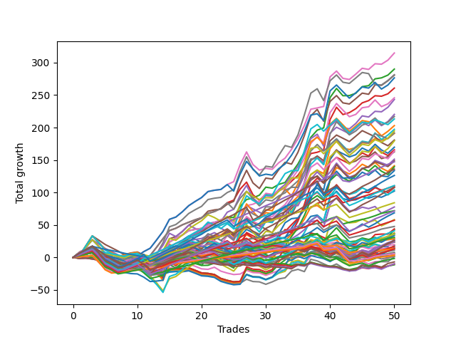

# Short Wallace Doodle 019 
- Symbol: ES
- Date Range: 3/19/22 - 5/22/22
- Trading Period: 7:20-12:30
- Number of Trades: 42



| Name | Win Percent | Profit | Avg Profit / Trade |     | Name | Win Percent | Profit | Avg Profit / Trade |
| ---- | ----------- | ------ | ------------------ | --- | ---- | ----------- | ------ | ------------------ |
| Sorted By <br> Profit | | | | | Sorted By <br> Win Percentage ||||
| Seventy-One | 71.43 | 138875.00 | 3306.55 |     | Seventy | 80.95 | 137000.00 | 3261.90 |
| Fifty-Five | 71.43 | 138875.00 | 3306.55 |     | Fifty-Four | 80.95 | 137000.00 | 3261.90 |
| Thirty-Nine | 71.43 | 138875.00 | 3306.55 |     | Thirty-Eight | 80.95 | 137000.00 | 3261.90 |
| Twenty-Three | 71.43 | 138875.00 | 3306.55 |     | Twenty-Two | 80.95 | 137000.00 | 3261.90 |
| Seven | 71.43 | 138875.00 | 3306.55 |     | Six | 80.95 | 137000.00 | 3261.90 |
| Two | 78.57 | 138250.00 | 3291.67 |     | Three | 80.95 | 108875.00 | 2592.26 |
| Seventy | 80.95 | 137000.00 | 3261.90 |     | Two | 78.57 | 138250.00 | 3291.67 |
| Fifty-Four | 80.95 | 137000.00 | 3261.90 |     | Four | 78.57 | 116375.00 | 2770.83 |
| Thirty-Eight | 80.95 | 137000.00 | 3261.90 |     | One | 78.57 | 84500.00 | 2011.90 |
| Twenty-Two | 80.95 | 137000.00 | 3261.90 |     | Sixty-Two | 76.19 | 127625.00 | 3038.69 |
| Six | 80.95 | 137000.00 | 3261.90 |     | Sixty | 76.19 | 105000.00 | 2500.00 |
| Sixty-Two | 76.19 | 127625.00 | 3038.69 |     | Fifty-Nine | 76.19 | 86875.00 | 2068.45 |
| Five | 71.43 | 121125.00 | 2883.93 |     | Fifty-Seven | 76.19 | 65125.00 | 1550.60 |
| Four | 78.57 | 116375.00 | 2770.83 |     | Fifty-Eight | 73.81 | 107875.00 | 2568.45 |
| Three | 80.95 | 108875.00 | 2592.26 |     | Seventy-One | 71.43 | 138875.00 | 3306.55 |
| Fifty-Eight | 73.81 | 107875.00 | 2568.45 |     | Fifty-Five | 71.43 | 138875.00 | 3306.55 |
| Sixty-Three | 64.29 | 106875.00 | 2544.64 |     | Thirty-Nine | 71.43 | 138875.00 | 3306.55 |
| Sixty | 76.19 | 105000.00 | 2500.00 |     | Twenty-Three | 71.43 | 138875.00 | 3306.55 |
| Forty-Six | 54.76 | 97750.00 | 2327.38 |     | Seven | 71.43 | 138875.00 | 3306.55 |
| Forty-Seven | 47.62 | 96625.00 | 2300.60 |     | Five | 71.43 | 121125.00 | 2883.93 |
| Sixty-Nine | 61.90 | 88000.00 | 2095.24 |     | Sixty-Five | 71.43 | 51875.00 | 1235.12 |
| Fifty-Nine | 76.19 | 86875.00 | 2068.45 |     | Sixty-Six | 69.05 | 85500.00 | 2035.71 |
| Sixty-Six | 69.05 | 85500.00 | 2035.71 |     | Zero | 69.05 | 44500.00 | 1059.52 |
| One | 78.57 | 84500.00 | 2011.90 |     | Sixty-Seven | 66.67 | 65500.00 | 1559.52 |
| Sixty-Eight | 61.90 | 82125.00 | 1955.36 |     | Fifty-Six | 66.67 | 27000.00 | 642.86 |
| Sixty-One | 64.29 | 81625.00 | 1943.45 |     | Sixty-Three | 64.29 | 106875.00 | 2544.64 |
| Forty-Two | 57.14 | 74250.00 | 1767.86 |     | Sixty-One | 64.29 | 81625.00 | 1943.45 |
| Fifteen | 26.19 | 67875.00 | 1616.07 |     | Sixty-Four | 64.29 | 17250.00 | 410.71 |
| Sixty-Seven | 66.67 | 65500.00 | 1559.52 |     | Sixty-Nine | 61.90 | 88000.00 | 2095.24 |
| Fifty-Seven | 76.19 | 65125.00 | 1550.60 |     | Sixty-Eight | 61.90 | 82125.00 | 1955.36 |
| Forty-Four | 52.38 | 64125.00 | 1526.79 |     | Forty | 61.90 | 17500.00 | 416.67 |
| Fourteen | 33.33 | 62875.00 | 1497.02 |     | Forty-Two | 57.14 | 74250.00 | 1767.86 |
| Forty-Three | 54.76 | 56000.00 | 1333.33 |     | Forty-One | 57.14 | 39125.00 | 931.55 |
| Forty-Five | 45.24 | 53125.00 | 1264.88 |     | Forty-Six | 54.76 | 97750.00 | 2327.38 |
| Sixty-Five | 71.43 | 51875.00 | 1235.12 |     | Forty-Three | 54.76 | 56000.00 | 1333.33 |
| Thirty-One | 26.19 | 49375.00 | 1175.60 |     | Forty-Four | 52.38 | 64125.00 | 1526.79 |
| Twenty-Six | 45.24 | 47750.00 | 1136.90 |     | Twenty-Four | 52.38 | 8875.00 | 211.31 |
| Twenty-Eight | 42.86 | 46125.00 | 1098.21 |     | Seventy-Five | 50.00 | 6375.00 | 151.79 |
| Thirty | 33.33 | 45375.00 | 1080.36 |     | Seventy-Four | 50.00 | 6375.00 | 151.79 |
| Zero | 69.05 | 44500.00 | 1059.52 |     | Seventy-Three | 50.00 | 6375.00 | 151.79 |
| Forty-One | 57.14 | 39125.00 | 931.55 |     | Forty-Seven | 47.62 | 96625.00 | 2300.60 |
| twenty-Seven | 45.24 | 38500.00 | 916.67 |     | Thirty-Two | 47.62 | 5875.00 | 139.88 |
| Seventy-Two | 14.29 | 32250.00 | 767.86 |     | Forty-Eight | 47.62 | 1375.00 | 32.74 |
| Twenty-Nine | 35.71 | 31875.00 | 758.93 |     | Forty-Five | 45.24 | 53125.00 | 1264.88 |
| Ten | 35.71 | 28125.00 | 669.64 |     | Twenty-Six | 45.24 | 47750.00 | 1136.90 |
| Fifty-Six | 66.67 | 27000.00 | 642.86 |     | twenty-Seven | 45.24 | 38500.00 | 916.67 |
| Eleven | 40.48 | 26625.00 | 633.93 |     | Twenty-Five | 45.24 | 19000.00 | 452.38 |
| Twelve | 35.71 | 21000.00 | 500.00 |     | Thirty-Five | 45.24 | -1000.00 | -23.81 |
| Twenty-Five | 45.24 | 19000.00 | 452.38 |     | Twenty-Eight | 42.86 | 46125.00 | 1098.21 |
| Forty | 61.90 | 17500.00 | 416.67 |     | Eight | 42.86 | 4375.00 | 104.17 |
| Sixty-Four | 64.29 | 17250.00 | 410.71 |     | Thirty-Seven | 42.86 | 1125.00 | 26.79 |
| Nine | 38.10 | 14375.00 | 342.26 |     | Thirty-Four | 42.86 | -375.00 | -8.93 |
| Thirteen | 30.95 | 11375.00 | 270.83 |     | Thirty-Six | 42.86 | -1375.00 | -32.74 |
| Twenty-Four | 52.38 | 8875.00 | 211.31 |     | Thirty-Three | 42.86 | -2375.00 | -56.55 |
| Fifty-Three | 35.71 | 8750.00 | 208.33 |     | Eleven | 40.48 | 26625.00 | 633.93 |
| Seventy-Five | 50.00 | 6375.00 | 151.79 |     | Nine | 38.10 | 14375.00 | 342.26 |
| Seventy-Four | 50.00 | 6375.00 | 151.79 |     | Fifty-One | 38.10 | 250.00 | 5.95 |
| Seventy-Three | 50.00 | 6375.00 | 151.79 |     | Sixten | 38.10 | -1875.00 | -44.64 |
| Thirty-Two | 47.62 | 5875.00 | 139.88 |     | Twenty-Nine | 35.71 | 31875.00 | 758.93 |
| Eight | 42.86 | 4375.00 | 104.17 |     | Ten | 35.71 | 28125.00 | 669.64 |
| Forty-Eight | 47.62 | 1375.00 | 32.74 |     | Twelve | 35.71 | 21000.00 | 500.00 |
| Fifty-Two | 35.71 | 1375.00 | 32.74 |     | Fifty-Three | 35.71 | 8750.00 | 208.33 |
| Thirty-Seven | 42.86 | 1125.00 | 26.79 |     | Fifty-Two | 35.71 | 1375.00 | 32.74 |
| Fifty-One | 38.10 | 250.00 | 5.95 |     | Fifty | 35.71 | -125.00 | -2.98 |
| Fifty | 35.71 | -125.00 | -2.98 |     | Nineteen | 35.71 | -5125.00 | -122.02 |
| Thirty-Four | 42.86 | -375.00 | -8.93 |     | Forty-Nine | 35.71 | -8375.00 | -199.40 |
| Thirty-Five | 45.24 | -1000.00 | -23.81 |     | Fourteen | 33.33 | 62875.00 | 1497.02 |
| Thirty-Six | 42.86 | -1375.00 | -32.74 |     | Thirty | 33.33 | 45375.00 | 1080.36 |
| Sixten | 38.10 | -1875.00 | -44.64 |     | Twenty-One | 33.33 | -7375.00 | -175.60 |
| Thirty-Three | 42.86 | -2375.00 | -56.55 |     | Twenty | 33.33 | -7375.00 | -175.60 |
| Nineteen | 35.71 | -5125.00 | -122.02 |     | Eighteen | 33.33 | -7375.00 | -175.60 |
| Twenty-One | 33.33 | -7375.00 | -175.60 |     | Seventeen | 33.33 | -7375.00 | -175.60 |
| Twenty | 33.33 | -7375.00 | -175.60 |     | Thirteen | 30.95 | 11375.00 | 270.83 |
| Eighteen | 33.33 | -7375.00 | -175.60 |     | Fifteen | 26.19 | 67875.00 | 1616.07 |
| Seventeen | 33.33 | -7375.00 | -175.60 |     | Thirty-One | 26.19 | 49375.00 | 1175.60 |
| Forty-Nine | 35.71 | -8375.00 | -199.40 |     | Seventy-Two | 14.29 | 32250.00 | 767.86 |

## NO STOPLOSS

### Test Zero
* Sell when price hits the middle line of the 20p bollinger
* No Stoploss
* Results:
```
Total Trades: 42
Percent Up: 30.95
Percent Down: 69.05
Total Points Moved Down: 89.00
Potential Profit: 44500.00
Total Points Ups: 61.25 Count Ups: 13
Total Points Downs: 150.25 Count Downs: 29
```

<details><summary>Trades</summary>

<code>In: 2022-03-21 08:26:00		Out: 2022-03-21 08:32:35		Total Position Time: 06:35		Total Move Down: 4.00		Total to Date: 4.00</code> <br />
<code>In: 2022-03-25 11:55:00		Out: 2022-03-25 11:57:20		Total Position Time: 02:20		Total Move Down: 2.25		Total to Date: 6.25</code> <br />
<code>In: 2022-03-25 11:57:00		Out: 2022-03-25 11:57:20		Total Position Time: 00:20		Total Move Down: 0.75		Total to Date: 7.00</code> <br />
<code>In: 2022-03-28 11:42:00		Out: 2022-03-28 12:06:40		Total Position Time: 24:40		Total Move Down: -9.00		Total to Date: -2.00</code> <br />
<code>In: 2022-03-28 11:43:00		Out: 2022-03-28 12:06:40		Total Position Time: 23:40		Total Move Down: -9.25		Total to Date: -11.25</code> <br />
<code>In: 2022-03-28 11:50:00		Out: 2022-03-28 12:06:40		Total Position Time: 16:40		Total Move Down: -3.75		Total to Date: -15.00</code> <br />
<code>In: 2022-03-29 11:38:00		Out: 2022-03-29 11:50:50		Total Position Time: 12:50		Total Move Down: 1.00		Total to Date: -14.00</code> <br />
<code>In: 2022-03-31 07:48:00		Out: 2022-03-31 08:03:05		Total Position Time: 15:05		Total Move Down: -1.00		Total to Date: -15.00</code> <br />
<code>In: 2022-03-31 07:49:00		Out: 2022-03-31 08:03:05		Total Position Time: 14:05		Total Move Down: 1.50		Total to Date: -13.50</code> <br />
<code>In: 2022-04-01 11:34:00		Out: 2022-04-01 11:42:20		Total Position Time: 08:20		Total Move Down: 2.50		Total to Date: -11.00</code> <br />
<code>In: 2022-04-06 10:35:00		Out: 2022-04-06 10:47:15		Total Position Time: 12:15		Total Move Down: -0.75		Total to Date: -11.75</code> <br />
<code>In: 2022-04-06 10:36:00		Out: 2022-04-06 10:47:15		Total Position Time: 11:15		Total Move Down: -2.50		Total to Date: -14.25</code> <br />
<code>In: 2022-04-06 10:43:00		Out: 2022-04-06 10:47:15		Total Position Time: 04:15		Total Move Down: 5.00		Total to Date: -9.25</code> <br />
<code>In: 2022-04-06 10:44:00		Out: 2022-04-06 10:47:15		Total Position Time: 03:15		Total Move Down: 5.50		Total to Date: -3.75</code> <br />
<code>In: 2022-04-06 11:05:00		Out: 2022-04-06 11:05:40		Total Position Time: 00:40		Total Move Down: 7.75		Total to Date: 4.00</code> <br />
<code>In: 2022-04-07 11:03:00		Out: 2022-04-07 11:15:15		Total Position Time: 12:15		Total Move Down: 2.50		Total to Date: 6.50</code> <br />
<code>In: 2022-04-18 07:27:00		Out: 2022-04-18 07:36:40		Total Position Time: 09:40		Total Move Down: 3.25		Total to Date: 9.75</code> <br />
<code>In: 2022-04-18 11:26:00		Out: 2022-04-18 11:28:05		Total Position Time: 02:05		Total Move Down: 6.00		Total to Date: 15.75</code> <br />
<code>In: 2022-04-20 07:39:00		Out: 2022-04-20 08:00:20		Total Position Time: 21:20		Total Move Down: -2.25		Total to Date: 13.50</code> <br />
<code>In: 2022-04-20 07:40:00		Out: 2022-04-20 08:00:20		Total Position Time: 20:20		Total Move Down: -2.75		Total to Date: 10.75</code> <br />
<code>In: 2022-04-20 07:42:00		Out: 2022-04-20 08:00:20		Total Position Time: 18:20		Total Move Down: 0.50		Total to Date: 11.25</code> <br />
<code>In: 2022-04-20 09:54:00		Out: 2022-04-20 09:59:05		Total Position Time: 05:05		Total Move Down: 2.75		Total to Date: 14.00</code> <br />
<code>In: 2022-04-25 10:14:00		Out: 2022-04-25 10:26:25		Total Position Time: 12:25		Total Move Down: -0.50		Total to Date: 13.50</code> <br />
<code>In: 2022-04-27 08:34:00		Out: 2022-04-27 08:45:05		Total Position Time: 11:05		Total Move Down: 1.25		Total to Date: 14.75</code> <br />
<code>In: 2022-05-16 08:48:00		Out: 2022-05-16 09:05:45		Total Position Time: 17:45		Total Move Down: -5.00		Total to Date: 9.75</code> <br />
<code>In: 2022-05-24 09:17:00		Out: 2022-05-24 09:21:30		Total Position Time: 04:30		Total Move Down: 11.25		Total to Date: 21.00</code> <br />
<code>In: 2022-05-24 09:18:00		Out: 2022-05-24 09:21:30		Total Position Time: 03:30		Total Move Down: 5.00		Total to Date: 26.00</code> <br />
<code>In: 2022-05-24 10:43:00		Out: 2022-05-24 10:58:25		Total Position Time: 15:25		Total Move Down: -2.00		Total to Date: 24.00</code> <br />
<code>In: 2022-05-24 10:47:00		Out: 2022-05-24 10:58:25		Total Position Time: 11:25		Total Move Down: 0.25		Total to Date: 24.25</code> <br />
<code>In: 2022-05-25 11:04:00		Out: 2022-05-25 11:06:25		Total Position Time: 02:25		Total Move Down: 4.50		Total to Date: 28.75</code> <br />
<code>In: 2022-05-31 07:23:00		Out: 2022-05-31 07:36:40		Total Position Time: 13:40		Total Move Down: 4.50		Total to Date: 33.25</code> <br />
<code>In: 2022-06-09 10:07:00		Out: 2022-06-09 10:16:10		Total Position Time: 09:10		Total Move Down: 3.25		Total to Date: 36.50</code> <br />
<code>In: 2022-06-09 10:08:00		Out: 2022-06-09 10:16:10		Total Position Time: 08:10		Total Move Down: 0.50		Total to Date: 37.00</code> <br />
<code>In: 2022-06-10 12:00:00		Out: 2022-06-10 12:03:25		Total Position Time: 03:25		Total Move Down: 6.25		Total to Date: 43.25</code> <br />
<code>In: 2022-06-10 12:29:00		Out: 2022-06-10 12:30:30		Total Position Time: 01:30		Total Move Down: 6.25		Total to Date: 49.50</code> <br />
<code>In: 2022-06-13 09:38:00		Out: 2022-06-13 09:43:15		Total Position Time: 05:15		Total Move Down: 7.50		Total to Date: 57.00</code> <br />
<code>In: 2022-06-13 09:40:00		Out: 2022-06-13 09:43:15		Total Position Time: 03:15		Total Move Down: 12.00		Total to Date: 69.00</code> <br />
<code>In: 2022-06-15 11:02:00		Out: 2022-06-15 11:02:10		Total Position Time: 00:10		Total Move Down: 2.00		Total to Date: 71.00</code> <br />
<code>In: 2022-06-15 11:40:00		Out: 2022-06-15 11:52:15		Total Position Time: 12:15		Total Move Down: -12.25		Total to Date: 58.75</code> <br />
<code>In: 2022-06-15 11:45:00		Out: 2022-06-15 11:52:15		Total Position Time: 07:15		Total Move Down: 31.00		Total to Date: 89.75</code> <br />
<code>In: 2022-06-17 10:13:00		Out: 2022-06-17 10:22:05		Total Position Time: 09:05		Total Move Down: 9.50		Total to Date: 99.25</code> <br />
<code>In: 2022-06-23 12:30:00		Out: 2022-06-23 12:54:05		Total Position Time: 24:05		Total Move Down: -10.25		Total to Date: 89.00</code> <br />


</details>

### Test One
* Sell when the price hits the upper line of the 20p 1std bollinger
* No Stoploss
* Results:
```
Total Trades: 42
Percent Up: 21.43
Percent Down: 78.57
Total Points Moved Down: 169.00
Potential Profit: 84500.00
Total Points Ups: 55.75 Count Ups: 9
Total Points Downs: 224.75 Count Downs: 33
```

<details><summary>Trades</summary>

<code>In: 2022-03-21 08:26:00		Out: 2022-03-21 08:35:50		Total Position Time: 09:50		Total Move Down: 4.50		Total to Date: 4.50</code> <br />
<code>In: 2022-03-25 11:55:00		Out: 2022-03-25 12:00:50		Total Position Time: 05:50		Total Move Down: 4.25		Total to Date: 8.75</code> <br />
<code>In: 2022-03-25 11:57:00		Out: 2022-03-25 12:00:50		Total Position Time: 03:50		Total Move Down: 2.75		Total to Date: 11.50</code> <br />
<code>In: 2022-03-28 11:42:00		Out: 2022-03-28 12:11:55		Total Position Time: 29:55		Total Move Down: -10.25		Total to Date: 1.25</code> <br />
<code>In: 2022-03-28 11:43:00		Out: 2022-03-28 12:12:55		Total Position Time: 29:55		Total Move Down: -10.25		Total to Date: -9.00</code> <br />
<code>In: 2022-03-28 11:50:00		Out: 2022-03-28 12:19:55		Total Position Time: 29:55		Total Move Down: -5.00		Total to Date: -14.00</code> <br />
<code>In: 2022-03-29 11:38:00		Out: 2022-03-29 12:00:20		Total Position Time: 22:20		Total Move Down: -0.25		Total to Date: -14.25</code> <br />
<code>In: 2022-03-31 07:48:00		Out: 2022-03-31 08:03:25		Total Position Time: 15:25		Total Move Down: 1.25		Total to Date: -13.00</code> <br />
<code>In: 2022-03-31 07:49:00		Out: 2022-03-31 08:03:25		Total Position Time: 14:25		Total Move Down: 3.75		Total to Date: -9.25</code> <br />
<code>In: 2022-04-01 11:34:00		Out: 2022-04-01 11:50:15		Total Position Time: 16:15		Total Move Down: 3.25		Total to Date: -6.00</code> <br />
<code>In: 2022-04-06 10:35:00		Out: 2022-04-06 10:56:55		Total Position Time: 21:55		Total Move Down: -1.75		Total to Date: -7.75</code> <br />
<code>In: 2022-04-06 10:36:00		Out: 2022-04-06 10:56:55		Total Position Time: 20:55		Total Move Down: -3.50		Total to Date: -11.25</code> <br />
<code>In: 2022-04-06 10:43:00		Out: 2022-04-06 10:56:55		Total Position Time: 13:55		Total Move Down: 4.00		Total to Date: -7.25</code> <br />
<code>In: 2022-04-06 10:44:00		Out: 2022-04-06 10:56:55		Total Position Time: 12:55		Total Move Down: 4.50		Total to Date: -2.75</code> <br />
<code>In: 2022-04-06 11:05:00		Out: 2022-04-06 11:07:20		Total Position Time: 02:20		Total Move Down: 12.50		Total to Date: 9.75</code> <br />
<code>In: 2022-04-07 11:03:00		Out: 2022-04-07 11:16:10		Total Position Time: 13:10		Total Move Down: 4.00		Total to Date: 13.75</code> <br />
<code>In: 2022-04-18 07:27:00		Out: 2022-04-18 07:51:30		Total Position Time: 24:30		Total Move Down: 2.75		Total to Date: 16.50</code> <br />
<code>In: 2022-04-18 11:26:00		Out: 2022-04-18 11:41:15		Total Position Time: 15:15		Total Move Down: 6.50		Total to Date: 23.00</code> <br />
<code>In: 2022-04-20 07:39:00		Out: 2022-04-20 08:00:40		Total Position Time: 21:40		Total Move Down: 0.75		Total to Date: 23.75</code> <br />
<code>In: 2022-04-20 07:40:00		Out: 2022-04-20 08:00:40		Total Position Time: 20:40		Total Move Down: 0.25		Total to Date: 24.00</code> <br />
<code>In: 2022-04-20 07:42:00		Out: 2022-04-20 08:00:40		Total Position Time: 18:40		Total Move Down: 3.50		Total to Date: 27.50</code> <br />
<code>In: 2022-04-20 09:54:00		Out: 2022-04-20 10:08:15		Total Position Time: 14:15		Total Move Down: 4.25		Total to Date: 31.75</code> <br />
<code>In: 2022-04-25 10:14:00		Out: 2022-04-25 10:27:10		Total Position Time: 13:10		Total Move Down: 3.25		Total to Date: 35.00</code> <br />
<code>In: 2022-04-27 08:34:00		Out: 2022-04-27 08:48:05		Total Position Time: 14:05		Total Move Down: 3.75		Total to Date: 38.75</code> <br />
<code>In: 2022-05-16 08:48:00		Out: 2022-05-16 09:06:10		Total Position Time: 18:10		Total Move Down: -1.50		Total to Date: 37.25</code> <br />
<code>In: 2022-05-24 09:17:00		Out: 2022-05-24 09:29:00		Total Position Time: 12:00		Total Move Down: 12.50		Total to Date: 49.75</code> <br />
<code>In: 2022-05-24 09:18:00		Out: 2022-05-24 09:29:00		Total Position Time: 11:00		Total Move Down: 6.25		Total to Date: 56.00</code> <br />
<code>In: 2022-05-24 10:43:00		Out: 2022-05-24 11:01:40		Total Position Time: 18:40		Total Move Down: 1.25		Total to Date: 57.25</code> <br />
<code>In: 2022-05-24 10:47:00		Out: 2022-05-24 11:01:40		Total Position Time: 14:40		Total Move Down: 3.50		Total to Date: 60.75</code> <br />
<code>In: 2022-05-25 11:04:00		Out: 2022-05-25 11:06:40		Total Position Time: 02:40		Total Move Down: 12.25		Total to Date: 73.00</code> <br />
<code>In: 2022-05-31 07:23:00		Out: 2022-05-31 07:38:00		Total Position Time: 15:00		Total Move Down: 8.25		Total to Date: 81.25</code> <br />
<code>In: 2022-06-09 10:07:00		Out: 2022-06-09 10:18:10		Total Position Time: 11:10		Total Move Down: 4.50		Total to Date: 85.75</code> <br />
<code>In: 2022-06-09 10:08:00		Out: 2022-06-09 10:18:10		Total Position Time: 10:10		Total Move Down: 1.75		Total to Date: 87.50</code> <br />
<code>In: 2022-06-10 12:00:00		Out: 2022-06-10 12:04:20		Total Position Time: 04:20		Total Move Down: 10.00		Total to Date: 97.50</code> <br />
<code>In: 2022-06-10 12:29:00		Out: 2022-06-10 12:35:55		Total Position Time: 06:55		Total Move Down: 10.25		Total to Date: 107.75</code> <br />
<code>In: 2022-06-13 09:38:00		Out: 2022-06-13 09:47:55		Total Position Time: 09:55		Total Move Down: 14.50		Total to Date: 122.25</code> <br />
<code>In: 2022-06-13 09:40:00		Out: 2022-06-13 09:47:55		Total Position Time: 07:55		Total Move Down: 19.00		Total to Date: 141.25</code> <br />
<code>In: 2022-06-15 11:02:00		Out: 2022-06-15 11:03:00		Total Position Time: 01:00		Total Move Down: 6.75		Total to Date: 148.00</code> <br />
<code>In: 2022-06-15 11:40:00		Out: 2022-06-15 11:57:05		Total Position Time: 17:05		Total Move Down: -10.25		Total to Date: 137.75</code> <br />
<code>In: 2022-06-15 11:45:00		Out: 2022-06-15 11:57:05		Total Position Time: 12:05		Total Move Down: 33.00		Total to Date: 170.75</code> <br />
<code>In: 2022-06-17 10:13:00		Out: 2022-06-17 10:26:05		Total Position Time: 13:05		Total Move Down: 11.25		Total to Date: 182.00</code> <br />
<code>In: 2022-06-23 12:30:00		Out: 2022-06-23 12:59:55		Total Position Time: 29:55		Total Move Down: -13.00		Total to Date: 169.00</code> <br />


</details>

### Test Two
* Sell when the price hits the upper line of the 20p 2std bollinger
* No Stoploss
* Results:
```
Total Trades: 42
Percent Up: 21.43
Percent Down: 78.57
Total Points Moved Down: 276.50
Potential Profit: 138250.00
Total Points Ups: 48.00 Count Ups: 9
Total Points Downs: 324.50 Count Downs: 33
```

<details><summary>Trades</summary>

<code>In: 2022-03-21 08:26:00		Out: 2022-03-21 08:36:05		Total Position Time: 10:05		Total Move Down: 6.75		Total to Date: 6.75</code> <br />
<code>In: 2022-03-25 11:55:00		Out: 2022-03-25 12:01:50		Total Position Time: 06:50		Total Move Down: 6.25		Total to Date: 13.00</code> <br />
<code>In: 2022-03-25 11:57:00		Out: 2022-03-25 12:01:50		Total Position Time: 04:50		Total Move Down: 4.75		Total to Date: 17.75</code> <br />
<code>In: 2022-03-28 11:42:00		Out: 2022-03-28 12:11:55		Total Position Time: 29:55		Total Move Down: -10.25		Total to Date: 7.50</code> <br />
<code>In: 2022-03-28 11:43:00		Out: 2022-03-28 12:12:55		Total Position Time: 29:55		Total Move Down: -10.25		Total to Date: -2.75</code> <br />
<code>In: 2022-03-28 11:50:00		Out: 2022-03-28 12:19:55		Total Position Time: 29:55		Total Move Down: -5.00		Total to Date: -7.75</code> <br />
<code>In: 2022-03-29 11:38:00		Out: 2022-03-29 12:07:55		Total Position Time: 29:55		Total Move Down: -6.00		Total to Date: -13.75</code> <br />
<code>In: 2022-03-31 07:48:00		Out: 2022-03-31 08:08:30		Total Position Time: 20:30		Total Move Down: 2.50		Total to Date: -11.25</code> <br />
<code>In: 2022-03-31 07:49:00		Out: 2022-03-31 08:08:30		Total Position Time: 19:30		Total Move Down: 5.00		Total to Date: -6.25</code> <br />
<code>In: 2022-04-01 11:34:00		Out: 2022-04-01 11:50:55		Total Position Time: 16:55		Total Move Down: 4.25		Total to Date: -2.00</code> <br />
<code>In: 2022-04-06 10:35:00		Out: 2022-04-06 10:58:00		Total Position Time: 23:00		Total Move Down: -0.00		Total to Date: -2.00</code> <br />
<code>In: 2022-04-06 10:36:00		Out: 2022-04-06 10:58:00		Total Position Time: 22:00		Total Move Down: -1.75		Total to Date: -3.75</code> <br />
<code>In: 2022-04-06 10:43:00		Out: 2022-04-06 10:58:00		Total Position Time: 15:00		Total Move Down: 5.75		Total to Date: 2.00</code> <br />
<code>In: 2022-04-06 10:44:00		Out: 2022-04-06 10:58:00		Total Position Time: 14:00		Total Move Down: 6.25		Total to Date: 8.25</code> <br />
<code>In: 2022-04-06 11:05:00		Out: 2022-04-06 11:08:20		Total Position Time: 03:20		Total Move Down: 18.50		Total to Date: 26.75</code> <br />
<code>In: 2022-04-07 11:03:00		Out: 2022-04-07 11:18:40		Total Position Time: 15:40		Total Move Down: 7.00		Total to Date: 33.75</code> <br />
<code>In: 2022-04-18 07:27:00		Out: 2022-04-18 07:51:45		Total Position Time: 24:45		Total Move Down: 4.75		Total to Date: 38.50</code> <br />
<code>In: 2022-04-18 11:26:00		Out: 2022-04-18 11:44:10		Total Position Time: 18:10		Total Move Down: 6.75		Total to Date: 45.25</code> <br />
<code>In: 2022-04-20 07:39:00		Out: 2022-04-20 08:01:10		Total Position Time: 22:10		Total Move Down: 3.75		Total to Date: 49.00</code> <br />
<code>In: 2022-04-20 07:40:00		Out: 2022-04-20 08:01:10		Total Position Time: 21:10		Total Move Down: 3.25		Total to Date: 52.25</code> <br />
<code>In: 2022-04-20 07:42:00		Out: 2022-04-20 08:01:10		Total Position Time: 19:10		Total Move Down: 6.50		Total to Date: 58.75</code> <br />
<code>In: 2022-04-20 09:54:00		Out: 2022-04-20 10:08:15		Total Position Time: 14:15		Total Move Down: 4.25		Total to Date: 63.00</code> <br />
<code>In: 2022-04-25 10:14:00		Out: 2022-04-25 10:28:20		Total Position Time: 14:20		Total Move Down: 4.75		Total to Date: 67.75</code> <br />
<code>In: 2022-04-27 08:34:00		Out: 2022-04-27 08:48:10		Total Position Time: 14:10		Total Move Down: 5.25		Total to Date: 73.00</code> <br />
<code>In: 2022-05-16 08:48:00		Out: 2022-05-16 09:11:40		Total Position Time: 23:40		Total Move Down: -0.25		Total to Date: 72.75</code> <br />
<code>In: 2022-05-24 09:17:00		Out: 2022-05-24 09:32:35		Total Position Time: 15:35		Total Move Down: 19.50		Total to Date: 92.25</code> <br />
<code>In: 2022-05-24 09:18:00		Out: 2022-05-24 09:32:35		Total Position Time: 14:35		Total Move Down: 13.25		Total to Date: 105.50</code> <br />
<code>In: 2022-05-24 10:43:00		Out: 2022-05-24 11:05:00		Total Position Time: 22:00		Total Move Down: 3.75		Total to Date: 109.25</code> <br />
<code>In: 2022-05-24 10:47:00		Out: 2022-05-24 11:05:00		Total Position Time: 18:00		Total Move Down: 6.00		Total to Date: 115.25</code> <br />
<code>In: 2022-05-25 11:04:00		Out: 2022-05-25 11:06:50		Total Position Time: 02:50		Total Move Down: 16.00		Total to Date: 131.25</code> <br />
<code>In: 2022-05-31 07:23:00		Out: 2022-05-31 07:52:55		Total Position Time: 29:55		Total Move Down: -1.50		Total to Date: 129.75</code> <br />
<code>In: 2022-06-09 10:07:00		Out: 2022-06-09 10:18:55		Total Position Time: 11:55		Total Move Down: 6.00		Total to Date: 135.75</code> <br />
<code>In: 2022-06-09 10:08:00		Out: 2022-06-09 10:18:55		Total Position Time: 10:55		Total Move Down: 3.25		Total to Date: 139.00</code> <br />
<code>In: 2022-06-10 12:00:00		Out: 2022-06-10 12:06:05		Total Position Time: 06:05		Total Move Down: 14.50		Total to Date: 153.50</code> <br />
<code>In: 2022-06-10 12:29:00		Out: 2022-06-10 12:43:25		Total Position Time: 14:25		Total Move Down: 15.25		Total to Date: 168.75</code> <br />
<code>In: 2022-06-13 09:38:00		Out: 2022-06-13 09:54:45		Total Position Time: 16:45		Total Move Down: 20.25		Total to Date: 189.00</code> <br />
<code>In: 2022-06-13 09:40:00		Out: 2022-06-13 09:54:45		Total Position Time: 14:45		Total Move Down: 24.75		Total to Date: 213.75</code> <br />
<code>In: 2022-06-15 11:02:00		Out: 2022-06-15 11:03:15		Total Position Time: 01:15		Total Move Down: 13.00		Total to Date: 226.75</code> <br />
<code>In: 2022-06-15 11:40:00		Out: 2022-06-15 11:57:55		Total Position Time: 17:55		Total Move Down: 2.25		Total to Date: 229.00</code> <br />
<code>In: 2022-06-15 11:45:00		Out: 2022-06-15 11:57:55		Total Position Time: 12:55		Total Move Down: 45.50		Total to Date: 274.50</code> <br />
<code>In: 2022-06-17 10:13:00		Out: 2022-06-17 10:27:15		Total Position Time: 14:15		Total Move Down: 15.00		Total to Date: 289.50</code> <br />
<code>In: 2022-06-23 12:30:00		Out: 2022-06-23 12:59:55		Total Position Time: 29:55		Total Move Down: -13.00		Total to Date: 276.50</code> <br />


</details>

### Test Three
* Sell when price hits the middle line of the 50p bollinger
* No Stoploss
* Results:
```
Total Trades: 42
Percent Up: 19.05
Percent Down: 80.95
Total Points Moved Down: 217.75
Potential Profit: 108875.00
Total Points Ups: 74.00 Count Ups: 8
Total Points Downs: 291.75 Count Downs: 34
```

<details><summary>Trades</summary>

<code>In: 2022-03-21 08:26:00		Out: 2022-03-21 08:36:05		Total Position Time: 10:05		Total Move Down: 6.75		Total to Date: 6.75</code> <br />
<code>In: 2022-03-25 11:55:00		Out: 2022-03-25 12:00:45		Total Position Time: 05:45		Total Move Down: 3.25		Total to Date: 10.00</code> <br />
<code>In: 2022-03-25 11:57:00		Out: 2022-03-25 12:00:45		Total Position Time: 03:45		Total Move Down: 1.75		Total to Date: 11.75</code> <br />
<code>In: 2022-03-28 11:42:00		Out: 2022-03-28 12:11:55		Total Position Time: 29:55		Total Move Down: -10.25		Total to Date: 1.50</code> <br />
<code>In: 2022-03-28 11:43:00		Out: 2022-03-28 12:12:55		Total Position Time: 29:55		Total Move Down: -10.25		Total to Date: -8.75</code> <br />
<code>In: 2022-03-28 11:50:00		Out: 2022-03-28 12:19:55		Total Position Time: 29:55		Total Move Down: -5.00		Total to Date: -13.75</code> <br />
<code>In: 2022-03-29 11:38:00		Out: 2022-03-29 12:07:55		Total Position Time: 29:55		Total Move Down: -6.00		Total to Date: -19.75</code> <br />
<code>In: 2022-03-31 07:48:00		Out: 2022-03-31 08:15:35		Total Position Time: 27:35		Total Move Down: 1.75		Total to Date: -18.00</code> <br />
<code>In: 2022-03-31 07:49:00		Out: 2022-03-31 08:15:35		Total Position Time: 26:35		Total Move Down: 4.25		Total to Date: -13.75</code> <br />
<code>In: 2022-04-01 11:34:00		Out: 2022-04-01 11:54:05		Total Position Time: 20:05		Total Move Down: 4.75		Total to Date: -9.00</code> <br />
<code>In: 2022-04-06 10:35:00		Out: 2022-04-06 11:00:10		Total Position Time: 25:10		Total Move Down: 7.00		Total to Date: -2.00</code> <br />
<code>In: 2022-04-06 10:36:00		Out: 2022-04-06 11:00:10		Total Position Time: 24:10		Total Move Down: 5.25		Total to Date: 3.25</code> <br />
<code>In: 2022-04-06 10:43:00		Out: 2022-04-06 11:00:10		Total Position Time: 17:10		Total Move Down: 12.75		Total to Date: 16.00</code> <br />
<code>In: 2022-04-06 10:44:00		Out: 2022-04-06 11:00:10		Total Position Time: 16:10		Total Move Down: 13.25		Total to Date: 29.25</code> <br />
<code>In: 2022-04-06 11:05:00		Out: 2022-04-06 11:07:20		Total Position Time: 02:20		Total Move Down: 12.50		Total to Date: 41.75</code> <br />
<code>In: 2022-04-07 11:03:00		Out: 2022-04-07 11:32:55		Total Position Time: 29:55		Total Move Down: 3.50		Total to Date: 45.25</code> <br />
<code>In: 2022-04-18 07:27:00		Out: 2022-04-18 07:51:50		Total Position Time: 24:50		Total Move Down: 5.25		Total to Date: 50.50</code> <br />
<code>In: 2022-04-18 11:26:00		Out: 2022-04-18 11:27:55		Total Position Time: 01:55		Total Move Down: 4.00		Total to Date: 54.50</code> <br />
<code>In: 2022-04-20 07:39:00		Out: 2022-04-20 08:02:45		Total Position Time: 23:45		Total Move Down: 3.50		Total to Date: 58.00</code> <br />
<code>In: 2022-04-20 07:40:00		Out: 2022-04-20 08:02:45		Total Position Time: 22:45		Total Move Down: 3.00		Total to Date: 61.00</code> <br />
<code>In: 2022-04-20 07:42:00		Out: 2022-04-20 08:02:45		Total Position Time: 20:45		Total Move Down: 6.25		Total to Date: 67.25</code> <br />
<code>In: 2022-04-20 09:54:00		Out: 2022-04-20 10:19:10		Total Position Time: 25:10		Total Move Down: 3.00		Total to Date: 70.25</code> <br />
<code>In: 2022-04-25 10:14:00		Out: 2022-04-25 10:28:20		Total Position Time: 14:20		Total Move Down: 4.75		Total to Date: 75.00</code> <br />
<code>In: 2022-04-27 08:34:00		Out: 2022-04-27 08:53:05		Total Position Time: 19:05		Total Move Down: 8.75		Total to Date: 83.75</code> <br />
<code>In: 2022-05-16 08:48:00		Out: 2022-05-16 09:15:55		Total Position Time: 27:55		Total Move Down: 4.00		Total to Date: 87.75</code> <br />
<code>In: 2022-05-24 09:17:00		Out: 2022-05-24 09:31:20		Total Position Time: 14:20		Total Move Down: 17.00		Total to Date: 104.75</code> <br />
<code>In: 2022-05-24 09:18:00		Out: 2022-05-24 09:31:20		Total Position Time: 13:20		Total Move Down: 10.75		Total to Date: 115.50</code> <br />
<code>In: 2022-05-24 10:43:00		Out: 2022-05-24 11:12:55		Total Position Time: 29:55		Total Move Down: -19.50		Total to Date: 96.00</code> <br />
<code>In: 2022-05-24 10:47:00		Out: 2022-05-24 11:16:55		Total Position Time: 29:55		Total Move Down: -8.50		Total to Date: 87.50</code> <br />
<code>In: 2022-05-25 11:04:00		Out: 2022-05-25 11:06:35		Total Position Time: 02:35		Total Move Down: 9.25		Total to Date: 96.75</code> <br />
<code>In: 2022-05-31 07:23:00		Out: 2022-05-31 07:52:55		Total Position Time: 29:55		Total Move Down: -1.50		Total to Date: 95.25</code> <br />
<code>In: 2022-06-09 10:07:00		Out: 2022-06-09 10:22:05		Total Position Time: 15:05		Total Move Down: 7.50		Total to Date: 102.75</code> <br />
<code>In: 2022-06-09 10:08:00		Out: 2022-06-09 10:22:05		Total Position Time: 14:05		Total Move Down: 4.75		Total to Date: 107.50</code> <br />
<code>In: 2022-06-10 12:00:00		Out: 2022-06-10 12:03:40		Total Position Time: 03:40		Total Move Down: 9.50		Total to Date: 117.00</code> <br />
<code>In: 2022-06-10 12:29:00		Out: 2022-06-10 12:33:40		Total Position Time: 04:40		Total Move Down: 9.00		Total to Date: 126.00</code> <br />
<code>In: 2022-06-13 09:38:00		Out: 2022-06-13 09:47:55		Total Position Time: 09:55		Total Move Down: 14.50		Total to Date: 140.50</code> <br />
<code>In: 2022-06-13 09:40:00		Out: 2022-06-13 09:47:55		Total Position Time: 07:55		Total Move Down: 19.00		Total to Date: 159.50</code> <br />
<code>In: 2022-06-15 11:02:00		Out: 2022-06-15 11:02:10		Total Position Time: 00:10		Total Move Down: 2.00		Total to Date: 161.50</code> <br />
<code>In: 2022-06-15 11:40:00		Out: 2022-06-15 11:58:05		Total Position Time: 18:05		Total Move Down: 3.50		Total to Date: 165.00</code> <br />
<code>In: 2022-06-15 11:45:00		Out: 2022-06-15 11:58:05		Total Position Time: 13:05		Total Move Down: 46.75		Total to Date: 211.75</code> <br />
<code>In: 2022-06-17 10:13:00		Out: 2022-06-17 10:32:25		Total Position Time: 19:25		Total Move Down: 19.00		Total to Date: 230.75</code> <br />
<code>In: 2022-06-23 12:30:00		Out: 2022-06-23 12:59:55		Total Position Time: 29:55		Total Move Down: -13.00		Total to Date: 217.75</code> <br />


</details>

### Test Four
* Sell when the price hits the upper line of the 50p 1std bollinger
* No Stoploss
* Results:
```
Total Trades: 42
Percent Up: 21.43
Percent Down: 78.57
Total Points Moved Down: 232.75
Potential Profit: 116375.00
Total Points Ups: 92.25 Count Ups: 9
Total Points Downs: 325.00 Count Downs: 33
```

<details><summary>Trades</summary>

<code>In: 2022-03-21 08:26:00		Out: 2022-03-21 08:44:50		Total Position Time: 18:50		Total Move Down: 8.25		Total to Date: 8.25</code> <br />
<code>In: 2022-03-25 11:55:00		Out: 2022-03-25 12:01:40		Total Position Time: 06:40		Total Move Down: 5.25		Total to Date: 13.50</code> <br />
<code>In: 2022-03-25 11:57:00		Out: 2022-03-25 12:01:40		Total Position Time: 04:40		Total Move Down: 3.75		Total to Date: 17.25</code> <br />
<code>In: 2022-03-28 11:42:00		Out: 2022-03-28 12:11:55		Total Position Time: 29:55		Total Move Down: -10.25		Total to Date: 7.00</code> <br />
<code>In: 2022-03-28 11:43:00		Out: 2022-03-28 12:12:55		Total Position Time: 29:55		Total Move Down: -10.25		Total to Date: -3.25</code> <br />
<code>In: 2022-03-28 11:50:00		Out: 2022-03-28 12:19:55		Total Position Time: 29:55		Total Move Down: -5.00		Total to Date: -8.25</code> <br />
<code>In: 2022-03-29 11:38:00		Out: 2022-03-29 12:07:55		Total Position Time: 29:55		Total Move Down: -6.00		Total to Date: -14.25</code> <br />
<code>In: 2022-03-31 07:48:00		Out: 2022-03-31 08:17:55		Total Position Time: 29:55		Total Move Down: 2.00		Total to Date: -12.25</code> <br />
<code>In: 2022-03-31 07:49:00		Out: 2022-03-31 08:18:55		Total Position Time: 29:55		Total Move Down: 2.75		Total to Date: -9.50</code> <br />
<code>In: 2022-04-01 11:34:00		Out: 2022-04-01 12:03:55		Total Position Time: 29:55		Total Move Down: 1.50		Total to Date: -8.00</code> <br />
<code>In: 2022-04-06 10:35:00		Out: 2022-04-06 11:00:10		Total Position Time: 25:10		Total Move Down: 7.00		Total to Date: -1.00</code> <br />
<code>In: 2022-04-06 10:36:00		Out: 2022-04-06 11:00:10		Total Position Time: 24:10		Total Move Down: 5.25		Total to Date: 4.25</code> <br />
<code>In: 2022-04-06 10:43:00		Out: 2022-04-06 11:00:10		Total Position Time: 17:10		Total Move Down: 12.75		Total to Date: 17.00</code> <br />
<code>In: 2022-04-06 10:44:00		Out: 2022-04-06 11:00:10		Total Position Time: 16:10		Total Move Down: 13.25		Total to Date: 30.25</code> <br />
<code>In: 2022-04-06 11:05:00		Out: 2022-04-06 11:08:10		Total Position Time: 03:10		Total Move Down: 18.50		Total to Date: 48.75</code> <br />
<code>In: 2022-04-07 11:03:00		Out: 2022-04-07 11:32:55		Total Position Time: 29:55		Total Move Down: 3.50		Total to Date: 52.25</code> <br />
<code>In: 2022-04-18 07:27:00		Out: 2022-04-18 07:56:55		Total Position Time: 29:55		Total Move Down: 7.50		Total to Date: 59.75</code> <br />
<code>In: 2022-04-18 11:26:00		Out: 2022-04-18 11:44:10		Total Position Time: 18:10		Total Move Down: 6.75		Total to Date: 66.50</code> <br />
<code>In: 2022-04-20 07:39:00		Out: 2022-04-20 08:08:55		Total Position Time: 29:55		Total Move Down: 5.75		Total to Date: 72.25</code> <br />
<code>In: 2022-04-20 07:40:00		Out: 2022-04-20 08:09:55		Total Position Time: 29:55		Total Move Down: 5.25		Total to Date: 77.50</code> <br />
<code>In: 2022-04-20 07:42:00		Out: 2022-04-20 08:10:45		Total Position Time: 28:45		Total Move Down: 10.25		Total to Date: 87.75</code> <br />
<code>In: 2022-04-20 09:54:00		Out: 2022-04-20 10:23:55		Total Position Time: 29:55		Total Move Down: 2.00		Total to Date: 89.75</code> <br />
<code>In: 2022-04-25 10:14:00		Out: 2022-04-25 10:43:55		Total Position Time: 29:55		Total Move Down: 1.25		Total to Date: 91.00</code> <br />
<code>In: 2022-04-27 08:34:00		Out: 2022-04-27 09:01:45		Total Position Time: 27:45		Total Move Down: 14.25		Total to Date: 105.25</code> <br />
<code>In: 2022-05-16 08:48:00		Out: 2022-05-16 09:17:55		Total Position Time: 29:55		Total Move Down: 4.50		Total to Date: 109.75</code> <br />
<code>In: 2022-05-24 09:17:00		Out: 2022-05-24 09:33:15		Total Position Time: 16:15		Total Move Down: 21.50		Total to Date: 131.25</code> <br />
<code>In: 2022-05-24 09:18:00		Out: 2022-05-24 09:33:15		Total Position Time: 15:15		Total Move Down: 15.25		Total to Date: 146.50</code> <br />
<code>In: 2022-05-24 10:43:00		Out: 2022-05-24 11:12:55		Total Position Time: 29:55		Total Move Down: -19.50		Total to Date: 127.00</code> <br />
<code>In: 2022-05-24 10:47:00		Out: 2022-05-24 11:16:55		Total Position Time: 29:55		Total Move Down: -8.50		Total to Date: 118.50</code> <br />
<code>In: 2022-05-25 11:04:00		Out: 2022-05-25 11:06:40		Total Position Time: 02:40		Total Move Down: 12.25		Total to Date: 130.75</code> <br />
<code>In: 2022-05-31 07:23:00		Out: 2022-05-31 07:52:55		Total Position Time: 29:55		Total Move Down: -1.50		Total to Date: 129.25</code> <br />
<code>In: 2022-06-09 10:07:00		Out: 2022-06-09 10:23:50		Total Position Time: 16:50		Total Move Down: 10.75		Total to Date: 140.00</code> <br />
<code>In: 2022-06-09 10:08:00		Out: 2022-06-09 10:23:50		Total Position Time: 15:50		Total Move Down: 8.00		Total to Date: 148.00</code> <br />
<code>In: 2022-06-10 12:00:00		Out: 2022-06-10 12:05:35		Total Position Time: 05:35		Total Move Down: 13.50		Total to Date: 161.50</code> <br />
<code>In: 2022-06-10 12:29:00		Out: 2022-06-10 12:42:40		Total Position Time: 13:40		Total Move Down: 13.25		Total to Date: 174.75</code> <br />
<code>In: 2022-06-13 09:38:00		Out: 2022-06-13 09:54:40		Total Position Time: 16:40		Total Move Down: 19.25		Total to Date: 194.00</code> <br />
<code>In: 2022-06-13 09:40:00		Out: 2022-06-13 09:54:40		Total Position Time: 14:40		Total Move Down: 23.75		Total to Date: 217.75</code> <br />
<code>In: 2022-06-15 11:02:00		Out: 2022-06-15 11:03:00		Total Position Time: 01:00		Total Move Down: 6.75		Total to Date: 224.50</code> <br />
<code>In: 2022-06-15 11:40:00		Out: 2022-06-15 12:09:55		Total Position Time: 29:55		Total Move Down: -18.25		Total to Date: 206.25</code> <br />
<code>In: 2022-06-15 11:45:00		Out: 2022-06-15 12:14:55		Total Position Time: 29:55		Total Move Down: 30.50		Total to Date: 236.75</code> <br />
<code>In: 2022-06-17 10:13:00		Out: 2022-06-17 10:42:55		Total Position Time: 29:55		Total Move Down: 9.00		Total to Date: 245.75</code> <br />
<code>In: 2022-06-23 12:30:00		Out: 2022-06-23 12:59:55		Total Position Time: 29:55		Total Move Down: -13.00		Total to Date: 232.75</code> <br />


</details>

### Test Five
* Sell when the price hits the upper line of the 50p 2std bollinger
* No Stoploss
* Results:
```
Total Trades: 42
Percent Up: 28.57
Percent Down: 71.43
Total Points Moved Down: 242.25
Potential Profit: 121125.00
Total Points Ups: 114.75 Count Ups: 12
Total Points Downs: 357.00 Count Downs: 30
```

<details><summary>Trades</summary>

<code>In: 2022-03-21 08:26:00		Out: 2022-03-21 08:55:55		Total Position Time: 29:55		Total Move Down: 2.75		Total to Date: 2.75</code> <br />
<code>In: 2022-03-25 11:55:00		Out: 2022-03-25 12:02:00		Total Position Time: 07:00		Total Move Down: 7.75		Total to Date: 10.50</code> <br />
<code>In: 2022-03-25 11:57:00		Out: 2022-03-25 12:02:00		Total Position Time: 05:00		Total Move Down: 6.25		Total to Date: 16.75</code> <br />
<code>In: 2022-03-28 11:42:00		Out: 2022-03-28 12:11:55		Total Position Time: 29:55		Total Move Down: -10.25		Total to Date: 6.50</code> <br />
<code>In: 2022-03-28 11:43:00		Out: 2022-03-28 12:12:55		Total Position Time: 29:55		Total Move Down: -10.25		Total to Date: -3.75</code> <br />
<code>In: 2022-03-28 11:50:00		Out: 2022-03-28 12:19:55		Total Position Time: 29:55		Total Move Down: -5.00		Total to Date: -8.75</code> <br />
<code>In: 2022-03-29 11:38:00		Out: 2022-03-29 12:07:55		Total Position Time: 29:55		Total Move Down: -6.00		Total to Date: -14.75</code> <br />
<code>In: 2022-03-31 07:48:00		Out: 2022-03-31 08:17:55		Total Position Time: 29:55		Total Move Down: 2.00		Total to Date: -12.75</code> <br />
<code>In: 2022-03-31 07:49:00		Out: 2022-03-31 08:18:55		Total Position Time: 29:55		Total Move Down: 2.75		Total to Date: -10.00</code> <br />
<code>In: 2022-04-01 11:34:00		Out: 2022-04-01 12:03:55		Total Position Time: 29:55		Total Move Down: 1.50		Total to Date: -8.50</code> <br />
<code>In: 2022-04-06 10:35:00		Out: 2022-04-06 11:04:55		Total Position Time: 29:55		Total Move Down: -12.75		Total to Date: -21.25</code> <br />
<code>In: 2022-04-06 10:36:00		Out: 2022-04-06 11:05:55		Total Position Time: 29:55		Total Move Down: -7.00		Total to Date: -28.25</code> <br />
<code>In: 2022-04-06 10:43:00		Out: 2022-04-06 11:09:40		Total Position Time: 26:40		Total Move Down: 17.00		Total to Date: -11.25</code> <br />
<code>In: 2022-04-06 10:44:00		Out: 2022-04-06 11:09:40		Total Position Time: 25:40		Total Move Down: 17.50		Total to Date: 6.25</code> <br />
<code>In: 2022-04-06 11:05:00		Out: 2022-04-06 11:09:40		Total Position Time: 04:40		Total Move Down: 24.50		Total to Date: 30.75</code> <br />
<code>In: 2022-04-07 11:03:00		Out: 2022-04-07 11:32:55		Total Position Time: 29:55		Total Move Down: 3.50		Total to Date: 34.25</code> <br />
<code>In: 2022-04-18 07:27:00		Out: 2022-04-18 07:56:55		Total Position Time: 29:55		Total Move Down: 7.50		Total to Date: 41.75</code> <br />
<code>In: 2022-04-18 11:26:00		Out: 2022-04-18 11:55:55		Total Position Time: 29:55		Total Move Down: 9.50		Total to Date: 51.25</code> <br />
<code>In: 2022-04-20 07:39:00		Out: 2022-04-20 08:08:55		Total Position Time: 29:55		Total Move Down: 5.75		Total to Date: 57.00</code> <br />
<code>In: 2022-04-20 07:40:00		Out: 2022-04-20 08:09:55		Total Position Time: 29:55		Total Move Down: 5.25		Total to Date: 62.25</code> <br />
<code>In: 2022-04-20 07:42:00		Out: 2022-04-20 08:11:55		Total Position Time: 29:55		Total Move Down: 10.50		Total to Date: 72.75</code> <br />
<code>In: 2022-04-20 09:54:00		Out: 2022-04-20 10:23:55		Total Position Time: 29:55		Total Move Down: 2.00		Total to Date: 74.75</code> <br />
<code>In: 2022-04-25 10:14:00		Out: 2022-04-25 10:43:55		Total Position Time: 29:55		Total Move Down: 1.25		Total to Date: 76.00</code> <br />
<code>In: 2022-04-27 08:34:00		Out: 2022-04-27 09:03:55		Total Position Time: 29:55		Total Move Down: 7.50		Total to Date: 83.50</code> <br />
<code>In: 2022-05-16 08:48:00		Out: 2022-05-16 09:17:55		Total Position Time: 29:55		Total Move Down: 4.50		Total to Date: 88.00</code> <br />
<code>In: 2022-05-24 09:17:00		Out: 2022-05-24 09:37:10		Total Position Time: 20:10		Total Move Down: 28.00		Total to Date: 116.00</code> <br />
<code>In: 2022-05-24 09:18:00		Out: 2022-05-24 09:37:10		Total Position Time: 19:10		Total Move Down: 21.75		Total to Date: 137.75</code> <br />
<code>In: 2022-05-24 10:43:00		Out: 2022-05-24 11:12:55		Total Position Time: 29:55		Total Move Down: -19.50		Total to Date: 118.25</code> <br />
<code>In: 2022-05-24 10:47:00		Out: 2022-05-24 11:16:55		Total Position Time: 29:55		Total Move Down: -8.50		Total to Date: 109.75</code> <br />
<code>In: 2022-05-25 11:04:00		Out: 2022-05-25 11:06:50		Total Position Time: 02:50		Total Move Down: 16.00		Total to Date: 125.75</code> <br />
<code>In: 2022-05-31 07:23:00		Out: 2022-05-31 07:52:55		Total Position Time: 29:55		Total Move Down: -1.50		Total to Date: 124.25</code> <br />
<code>In: 2022-06-09 10:07:00		Out: 2022-06-09 10:27:35		Total Position Time: 20:35		Total Move Down: 14.50		Total to Date: 138.75</code> <br />
<code>In: 2022-06-09 10:08:00		Out: 2022-06-09 10:27:35		Total Position Time: 19:35		Total Move Down: 11.75		Total to Date: 150.50</code> <br />
<code>In: 2022-06-10 12:00:00		Out: 2022-06-10 12:29:55		Total Position Time: 29:55		Total Move Down: -2.75		Total to Date: 147.75</code> <br />
<code>In: 2022-06-10 12:29:00		Out: 2022-06-10 12:45:50		Total Position Time: 16:50		Total Move Down: 19.25		Total to Date: 167.00</code> <br />
<code>In: 2022-06-13 09:38:00		Out: 2022-06-13 09:58:15		Total Position Time: 20:15		Total Move Down: 25.75		Total to Date: 192.75</code> <br />
<code>In: 2022-06-13 09:40:00		Out: 2022-06-13 09:58:15		Total Position Time: 18:15		Total Move Down: 30.25		Total to Date: 223.00</code> <br />
<code>In: 2022-06-15 11:02:00		Out: 2022-06-15 11:03:10		Total Position Time: 01:10		Total Move Down: 11.00		Total to Date: 234.00</code> <br />
<code>In: 2022-06-15 11:40:00		Out: 2022-06-15 12:09:55		Total Position Time: 29:55		Total Move Down: -18.25		Total to Date: 215.75</code> <br />
<code>In: 2022-06-15 11:45:00		Out: 2022-06-15 12:14:55		Total Position Time: 29:55		Total Move Down: 30.50		Total to Date: 246.25</code> <br />
<code>In: 2022-06-17 10:13:00		Out: 2022-06-17 10:42:55		Total Position Time: 29:55		Total Move Down: 9.00		Total to Date: 255.25</code> <br />
<code>In: 2022-06-23 12:30:00		Out: 2022-06-23 12:59:55		Total Position Time: 29:55		Total Move Down: -13.00		Total to Date: 242.25</code> <br />


</details>

### Test Six
* Sell when the price hits the middle line of the 1std VWAP
* No Stoploss
* Results:
```
Total Trades: 42
Percent Up: 19.05
Percent Down: 80.95
Total Points Moved Down: 274.00
Potential Profit: 137000.00
Total Points Ups: 74.00 Count Ups: 8
Total Points Downs: 348.00 Count Downs: 34
```

<details><summary>Trades</summary>

<code>In: 2022-03-21 08:26:00		Out: 2022-03-21 08:55:55		Total Position Time: 29:55		Total Move Down: 2.75		Total to Date: 2.75</code> <br />
<code>In: 2022-03-25 11:55:00		Out: 2022-03-25 12:20:30		Total Position Time: 25:30		Total Move Down: 13.00		Total to Date: 15.75</code> <br />
<code>In: 2022-03-25 11:57:00		Out: 2022-03-25 12:20:30		Total Position Time: 23:30		Total Move Down: 11.50		Total to Date: 27.25</code> <br />
<code>In: 2022-03-28 11:42:00		Out: 2022-03-28 12:11:55		Total Position Time: 29:55		Total Move Down: -10.25		Total to Date: 17.00</code> <br />
<code>In: 2022-03-28 11:43:00		Out: 2022-03-28 12:12:55		Total Position Time: 29:55		Total Move Down: -10.25		Total to Date: 6.75</code> <br />
<code>In: 2022-03-28 11:50:00		Out: 2022-03-28 12:19:55		Total Position Time: 29:55		Total Move Down: -5.00		Total to Date: 1.75</code> <br />
<code>In: 2022-03-29 11:38:00		Out: 2022-03-29 12:07:55		Total Position Time: 29:55		Total Move Down: -6.00		Total to Date: -4.25</code> <br />
<code>In: 2022-03-31 07:48:00		Out: 2022-03-31 08:17:55		Total Position Time: 29:55		Total Move Down: 2.00		Total to Date: -2.25</code> <br />
<code>In: 2022-03-31 07:49:00		Out: 2022-03-31 08:18:55		Total Position Time: 29:55		Total Move Down: 2.75		Total to Date: 0.50</code> <br />
<code>In: 2022-04-01 11:34:00		Out: 2022-04-01 12:03:55		Total Position Time: 29:55		Total Move Down: 1.50		Total to Date: 2.00</code> <br />
<code>In: 2022-04-06 10:35:00		Out: 2022-04-06 11:00:10		Total Position Time: 25:10		Total Move Down: 7.00		Total to Date: 9.00</code> <br />
<code>In: 2022-04-06 10:36:00		Out: 2022-04-06 11:00:10		Total Position Time: 24:10		Total Move Down: 5.25		Total to Date: 14.25</code> <br />
<code>In: 2022-04-06 10:43:00		Out: 2022-04-06 11:00:10		Total Position Time: 17:10		Total Move Down: 12.75		Total to Date: 27.00</code> <br />
<code>In: 2022-04-06 10:44:00		Out: 2022-04-06 11:00:10		Total Position Time: 16:10		Total Move Down: 13.25		Total to Date: 40.25</code> <br />
<code>In: 2022-04-06 11:05:00		Out: 2022-04-06 11:08:10		Total Position Time: 03:10		Total Move Down: 18.50		Total to Date: 58.75</code> <br />
<code>In: 2022-04-07 11:03:00		Out: 2022-04-07 11:32:55		Total Position Time: 29:55		Total Move Down: 3.50		Total to Date: 62.25</code> <br />
<code>In: 2022-04-18 07:27:00		Out: 2022-04-18 07:55:15		Total Position Time: 28:15		Total Move Down: 8.00		Total to Date: 70.25</code> <br />
<code>In: 2022-04-18 11:26:00		Out: 2022-04-18 11:55:55		Total Position Time: 29:55		Total Move Down: 9.50		Total to Date: 79.75</code> <br />
<code>In: 2022-04-20 07:39:00		Out: 2022-04-20 08:08:10		Total Position Time: 29:10		Total Move Down: 6.50		Total to Date: 86.25</code> <br />
<code>In: 2022-04-20 07:40:00		Out: 2022-04-20 08:08:10		Total Position Time: 28:10		Total Move Down: 6.00		Total to Date: 92.25</code> <br />
<code>In: 2022-04-20 07:42:00		Out: 2022-04-20 08:08:10		Total Position Time: 26:10		Total Move Down: 9.25		Total to Date: 101.50</code> <br />
<code>In: 2022-04-20 09:54:00		Out: 2022-04-20 10:23:55		Total Position Time: 29:55		Total Move Down: 2.00		Total to Date: 103.50</code> <br />
<code>In: 2022-04-25 10:14:00		Out: 2022-04-25 10:43:55		Total Position Time: 29:55		Total Move Down: 1.25		Total to Date: 104.75</code> <br />
<code>In: 2022-04-27 08:34:00		Out: 2022-04-27 09:03:55		Total Position Time: 29:55		Total Move Down: 7.50		Total to Date: 112.25</code> <br />
<code>In: 2022-05-16 08:48:00		Out: 2022-05-16 09:17:55		Total Position Time: 29:55		Total Move Down: 4.50		Total to Date: 116.75</code> <br />
<code>In: 2022-05-24 09:17:00		Out: 2022-05-24 09:36:45		Total Position Time: 19:45		Total Move Down: 26.00		Total to Date: 142.75</code> <br />
<code>In: 2022-05-24 09:18:00		Out: 2022-05-24 09:36:45		Total Position Time: 18:45		Total Move Down: 19.75		Total to Date: 162.50</code> <br />
<code>In: 2022-05-24 10:43:00		Out: 2022-05-24 11:12:55		Total Position Time: 29:55		Total Move Down: -19.50		Total to Date: 143.00</code> <br />
<code>In: 2022-05-24 10:47:00		Out: 2022-05-24 11:16:55		Total Position Time: 29:55		Total Move Down: -8.50		Total to Date: 134.50</code> <br />
<code>In: 2022-05-25 11:04:00		Out: 2022-05-25 11:06:20		Total Position Time: 02:20		Total Move Down: 2.75		Total to Date: 137.25</code> <br />
<code>In: 2022-05-31 07:23:00		Out: 2022-05-31 07:52:55		Total Position Time: 29:55		Total Move Down: -1.50		Total to Date: 135.75</code> <br />
<code>In: 2022-06-09 10:07:00		Out: 2022-06-09 10:23:45		Total Position Time: 16:45		Total Move Down: 10.00		Total to Date: 145.75</code> <br />
<code>In: 2022-06-09 10:08:00		Out: 2022-06-09 10:23:45		Total Position Time: 15:45		Total Move Down: 7.25		Total to Date: 153.00</code> <br />
<code>In: 2022-06-10 12:00:00		Out: 2022-06-10 12:05:30		Total Position Time: 05:30		Total Move Down: 13.50		Total to Date: 166.50</code> <br />
<code>In: 2022-06-10 12:29:00		Out: 2022-06-10 12:44:00		Total Position Time: 15:00		Total Move Down: 16.25		Total to Date: 182.75</code> <br />
<code>In: 2022-06-13 09:38:00		Out: 2022-06-13 09:55:05		Total Position Time: 17:05		Total Move Down: 20.50		Total to Date: 203.25</code> <br />
<code>In: 2022-06-13 09:40:00		Out: 2022-06-13 09:55:05		Total Position Time: 15:05		Total Move Down: 25.00		Total to Date: 228.25</code> <br />
<code>In: 2022-06-15 11:02:00		Out: 2022-06-15 11:02:10		Total Position Time: 00:10		Total Move Down: 2.00		Total to Date: 230.25</code> <br />
<code>In: 2022-06-15 11:40:00		Out: 2022-06-15 11:57:55		Total Position Time: 17:55		Total Move Down: 2.25		Total to Date: 232.50</code> <br />
<code>In: 2022-06-15 11:45:00		Out: 2022-06-15 11:57:55		Total Position Time: 12:55		Total Move Down: 45.50		Total to Date: 278.00</code> <br />
<code>In: 2022-06-17 10:13:00		Out: 2022-06-17 10:42:55		Total Position Time: 29:55		Total Move Down: 9.00		Total to Date: 287.00</code> <br />
<code>In: 2022-06-23 12:30:00		Out: 2022-06-23 12:59:55		Total Position Time: 29:55		Total Move Down: -13.00		Total to Date: 274.00</code> <br />


</details>

### Test Seven
* Sell when the price hits the upper line of the 1std VWAP
* No Stoploss
* Results:
```
Total Trades: 42
Percent Up: 28.57
Percent Down: 71.43
Total Points Moved Down: 277.75
Potential Profit: 138875.00
Total Points Ups: 114.75 Count Ups: 12
Total Points Downs: 392.50 Count Downs: 30
```

<details><summary>Trades</summary>

<code>In: 2022-03-21 08:26:00		Out: 2022-03-21 08:55:55		Total Position Time: 29:55		Total Move Down: 2.75		Total to Date: 2.75</code> <br />
<code>In: 2022-03-25 11:55:00		Out: 2022-03-25 12:24:55		Total Position Time: 29:55		Total Move Down: 15.25		Total to Date: 18.00</code> <br />
<code>In: 2022-03-25 11:57:00		Out: 2022-03-25 12:26:55		Total Position Time: 29:55		Total Move Down: 15.25		Total to Date: 33.25</code> <br />
<code>In: 2022-03-28 11:42:00		Out: 2022-03-28 12:11:55		Total Position Time: 29:55		Total Move Down: -10.25		Total to Date: 23.00</code> <br />
<code>In: 2022-03-28 11:43:00		Out: 2022-03-28 12:12:55		Total Position Time: 29:55		Total Move Down: -10.25		Total to Date: 12.75</code> <br />
<code>In: 2022-03-28 11:50:00		Out: 2022-03-28 12:19:55		Total Position Time: 29:55		Total Move Down: -5.00		Total to Date: 7.75</code> <br />
<code>In: 2022-03-29 11:38:00		Out: 2022-03-29 12:07:55		Total Position Time: 29:55		Total Move Down: -6.00		Total to Date: 1.75</code> <br />
<code>In: 2022-03-31 07:48:00		Out: 2022-03-31 08:17:55		Total Position Time: 29:55		Total Move Down: 2.00		Total to Date: 3.75</code> <br />
<code>In: 2022-03-31 07:49:00		Out: 2022-03-31 08:18:55		Total Position Time: 29:55		Total Move Down: 2.75		Total to Date: 6.50</code> <br />
<code>In: 2022-04-01 11:34:00		Out: 2022-04-01 12:03:55		Total Position Time: 29:55		Total Move Down: 1.50		Total to Date: 8.00</code> <br />
<code>In: 2022-04-06 10:35:00		Out: 2022-04-06 11:04:55		Total Position Time: 29:55		Total Move Down: -12.75		Total to Date: -4.75</code> <br />
<code>In: 2022-04-06 10:36:00		Out: 2022-04-06 11:05:55		Total Position Time: 29:55		Total Move Down: -7.00		Total to Date: -11.75</code> <br />
<code>In: 2022-04-06 10:43:00		Out: 2022-04-06 11:09:40		Total Position Time: 26:40		Total Move Down: 17.00		Total to Date: 5.25</code> <br />
<code>In: 2022-04-06 10:44:00		Out: 2022-04-06 11:09:40		Total Position Time: 25:40		Total Move Down: 17.50		Total to Date: 22.75</code> <br />
<code>In: 2022-04-06 11:05:00		Out: 2022-04-06 11:09:40		Total Position Time: 04:40		Total Move Down: 24.50		Total to Date: 47.25</code> <br />
<code>In: 2022-04-07 11:03:00		Out: 2022-04-07 11:32:55		Total Position Time: 29:55		Total Move Down: 3.50		Total to Date: 50.75</code> <br />
<code>In: 2022-04-18 07:27:00		Out: 2022-04-18 07:56:55		Total Position Time: 29:55		Total Move Down: 7.50		Total to Date: 58.25</code> <br />
<code>In: 2022-04-18 11:26:00		Out: 2022-04-18 11:55:55		Total Position Time: 29:55		Total Move Down: 9.50		Total to Date: 67.75</code> <br />
<code>In: 2022-04-20 07:39:00		Out: 2022-04-20 08:08:55		Total Position Time: 29:55		Total Move Down: 5.75		Total to Date: 73.50</code> <br />
<code>In: 2022-04-20 07:40:00		Out: 2022-04-20 08:09:55		Total Position Time: 29:55		Total Move Down: 5.25		Total to Date: 78.75</code> <br />
<code>In: 2022-04-20 07:42:00		Out: 2022-04-20 08:11:55		Total Position Time: 29:55		Total Move Down: 10.50		Total to Date: 89.25</code> <br />
<code>In: 2022-04-20 09:54:00		Out: 2022-04-20 10:23:55		Total Position Time: 29:55		Total Move Down: 2.00		Total to Date: 91.25</code> <br />
<code>In: 2022-04-25 10:14:00		Out: 2022-04-25 10:43:55		Total Position Time: 29:55		Total Move Down: 1.25		Total to Date: 92.50</code> <br />
<code>In: 2022-04-27 08:34:00		Out: 2022-04-27 09:03:55		Total Position Time: 29:55		Total Move Down: 7.50		Total to Date: 100.00</code> <br />
<code>In: 2022-05-16 08:48:00		Out: 2022-05-16 09:17:55		Total Position Time: 29:55		Total Move Down: 4.50		Total to Date: 104.50</code> <br />
<code>In: 2022-05-24 09:17:00		Out: 2022-05-24 09:46:55		Total Position Time: 29:55		Total Move Down: 28.25		Total to Date: 132.75</code> <br />
<code>In: 2022-05-24 09:18:00		Out: 2022-05-24 09:47:55		Total Position Time: 29:55		Total Move Down: 22.25		Total to Date: 155.00</code> <br />
<code>In: 2022-05-24 10:43:00		Out: 2022-05-24 11:12:55		Total Position Time: 29:55		Total Move Down: -19.50		Total to Date: 135.50</code> <br />
<code>In: 2022-05-24 10:47:00		Out: 2022-05-24 11:16:55		Total Position Time: 29:55		Total Move Down: -8.50		Total to Date: 127.00</code> <br />
<code>In: 2022-05-25 11:04:00		Out: 2022-05-25 11:06:45		Total Position Time: 02:45		Total Move Down: 13.50		Total to Date: 140.50</code> <br />
<code>In: 2022-05-31 07:23:00		Out: 2022-05-31 07:52:55		Total Position Time: 29:55		Total Move Down: -1.50		Total to Date: 139.00</code> <br />
<code>In: 2022-06-09 10:07:00		Out: 2022-06-09 10:30:30		Total Position Time: 23:30		Total Move Down: 18.00		Total to Date: 157.00</code> <br />
<code>In: 2022-06-09 10:08:00		Out: 2022-06-09 10:30:30		Total Position Time: 22:30		Total Move Down: 15.25		Total to Date: 172.25</code> <br />
<code>In: 2022-06-10 12:00:00		Out: 2022-06-10 12:29:55		Total Position Time: 29:55		Total Move Down: -2.75		Total to Date: 169.50</code> <br />
<code>In: 2022-06-10 12:29:00		Out: 2022-06-10 12:58:55		Total Position Time: 29:55		Total Move Down: 29.00		Total to Date: 198.50</code> <br />
<code>In: 2022-06-13 09:38:00		Out: 2022-06-13 10:07:55		Total Position Time: 29:55		Total Move Down: 30.75		Total to Date: 229.25</code> <br />
<code>In: 2022-06-13 09:40:00		Out: 2022-06-13 10:09:55		Total Position Time: 29:55		Total Move Down: 33.50		Total to Date: 262.75</code> <br />
<code>In: 2022-06-15 11:02:00		Out: 2022-06-15 11:03:00		Total Position Time: 01:00		Total Move Down: 6.75		Total to Date: 269.50</code> <br />
<code>In: 2022-06-15 11:40:00		Out: 2022-06-15 12:09:55		Total Position Time: 29:55		Total Move Down: -18.25		Total to Date: 251.25</code> <br />
<code>In: 2022-06-15 11:45:00		Out: 2022-06-15 12:14:55		Total Position Time: 29:55		Total Move Down: 30.50		Total to Date: 281.75</code> <br />
<code>In: 2022-06-17 10:13:00		Out: 2022-06-17 10:42:55		Total Position Time: 29:55		Total Move Down: 9.00		Total to Date: 290.75</code> <br />
<code>In: 2022-06-23 12:30:00		Out: 2022-06-23 12:59:55		Total Position Time: 29:55		Total Move Down: -13.00		Total to Date: 277.75</code> <br />


</details>

## STOPLOSS OF 2

### Test Eight
* Sell when price hits the middle line of the 20p bollinger
* Stoploss is -2 points
* Results:
```
Total Trades: 42
Percent Up: 57.14
Percent Down: 42.86
Total Points Moved Down: 8.75
Potential Profit: 4375.00
Total Points Ups: 86.25 Count Ups: 24
Total Points Downs: 95.00 Count Downs: 18
```

<details><summary>Trades</summary>

<code>In: 2022-03-21 08:26:00		Out: 2022-03-21 08:32:35		Total Position Time: 06:35		Total Move Down: 4.00		Total to Date: 4.00</code> <br />
<code>In: 2022-03-25 11:55:00		Out: 2022-03-25 11:57:20		Total Position Time: 02:20		Total Move Down: 2.25		Total to Date: 6.25</code> <br />
<code>In: 2022-03-25 11:57:00		Out: 2022-03-25 11:57:20		Total Position Time: 00:20		Total Move Down: 0.75		Total to Date: 7.00</code> <br />
<code>In: 2022-03-28 11:42:00		Out: 2022-03-28 11:44:25		Total Position Time: 02:25		Total Move Down: -2.00		Total to Date: 5.00</code> <br />
<code>In: 2022-03-28 11:43:00		Out: 2022-03-28 11:44:35		Total Position Time: 01:35		Total Move Down: -6.75		Total to Date: -1.75</code> <br />
<code>In: 2022-03-28 11:50:00		Out: 2022-03-28 11:55:50		Total Position Time: 05:50		Total Move Down: -4.75		Total to Date: -6.50</code> <br />
<code>In: 2022-03-29 11:38:00		Out: 2022-03-29 11:44:05		Total Position Time: 06:05		Total Move Down: -1.75		Total to Date: -8.25</code> <br />
<code>In: 2022-03-31 07:48:00		Out: 2022-03-31 07:57:05		Total Position Time: 09:05		Total Move Down: -4.25		Total to Date: -12.50</code> <br />
<code>In: 2022-03-31 07:49:00		Out: 2022-03-31 07:57:05		Total Position Time: 08:05		Total Move Down: -1.75		Total to Date: -14.25</code> <br />
<code>In: 2022-04-01 11:34:00		Out: 2022-04-01 11:42:20		Total Position Time: 08:20		Total Move Down: 2.50		Total to Date: -11.75</code> <br />
<code>In: 2022-04-06 10:35:00		Out: 2022-04-06 10:35:10		Total Position Time: 00:10		Total Move Down: -0.25		Total to Date: -12.00</code> <br />
<code>In: 2022-04-06 10:36:00		Out: 2022-04-06 10:38:00		Total Position Time: 02:00		Total Move Down: -2.50		Total to Date: -14.50</code> <br />
<code>In: 2022-04-06 10:43:00		Out: 2022-04-06 10:47:15		Total Position Time: 04:15		Total Move Down: 5.00		Total to Date: -9.50</code> <br />
<code>In: 2022-04-06 10:44:00		Out: 2022-04-06 10:44:15		Total Position Time: 00:15		Total Move Down: -1.25		Total to Date: -10.75</code> <br />
<code>In: 2022-04-06 11:05:00		Out: 2022-04-06 11:05:10		Total Position Time: 00:10		Total Move Down: 4.00		Total to Date: -6.75</code> <br />
<code>In: 2022-04-07 11:03:00		Out: 2022-04-07 11:14:15		Total Position Time: 11:15		Total Move Down: -1.25		Total to Date: -8.00</code> <br />
<code>In: 2022-04-18 07:27:00		Out: 2022-04-18 07:27:10		Total Position Time: 00:10		Total Move Down: 0.25		Total to Date: -7.75</code> <br />
<code>In: 2022-04-18 11:26:00		Out: 2022-04-18 11:28:05		Total Position Time: 02:05		Total Move Down: 6.00		Total to Date: -1.75</code> <br />
<code>In: 2022-04-20 07:39:00		Out: 2022-04-20 07:41:15		Total Position Time: 02:15		Total Move Down: -1.50		Total to Date: -3.25</code> <br />
<code>In: 2022-04-20 07:40:00		Out: 2022-04-20 07:41:25		Total Position Time: 01:25		Total Move Down: -4.25		Total to Date: -7.50</code> <br />
<code>In: 2022-04-20 07:42:00		Out: 2022-04-20 07:42:10		Total Position Time: 00:10		Total Move Down: -0.75		Total to Date: -8.25</code> <br />
<code>In: 2022-04-20 09:54:00		Out: 2022-04-20 09:59:05		Total Position Time: 05:05		Total Move Down: 2.75		Total to Date: -5.50</code> <br />
<code>In: 2022-04-25 10:14:00		Out: 2022-04-25 10:15:15		Total Position Time: 01:15		Total Move Down: -6.00		Total to Date: -11.50</code> <br />
<code>In: 2022-04-27 08:34:00		Out: 2022-04-27 08:43:05		Total Position Time: 09:05		Total Move Down: -5.25		Total to Date: -16.75</code> <br />
<code>In: 2022-05-16 08:48:00		Out: 2022-05-16 08:52:20		Total Position Time: 04:20		Total Move Down: -4.75		Total to Date: -21.50</code> <br />
<code>In: 2022-05-24 09:17:00		Out: 2022-05-24 09:17:10		Total Position Time: 00:10		Total Move Down: 0.75		Total to Date: -20.75</code> <br />
<code>In: 2022-05-24 09:18:00		Out: 2022-05-24 09:18:20		Total Position Time: 00:20		Total Move Down: -1.75		Total to Date: -22.50</code> <br />
<code>In: 2022-05-24 10:43:00		Out: 2022-05-24 10:45:20		Total Position Time: 02:20		Total Move Down: -1.00		Total to Date: -23.50</code> <br />
<code>In: 2022-05-24 10:47:00		Out: 2022-05-24 10:47:10		Total Position Time: 00:10		Total Move Down: 1.00		Total to Date: -22.50</code> <br />
<code>In: 2022-05-25 11:04:00		Out: 2022-05-25 11:04:40		Total Position Time: 00:40		Total Move Down: -5.50		Total to Date: -28.00</code> <br />
<code>In: 2022-05-31 07:23:00		Out: 2022-05-31 07:23:10		Total Position Time: 00:10		Total Move Down: 0.75		Total to Date: -27.25</code> <br />
<code>In: 2022-06-09 10:07:00		Out: 2022-06-09 10:07:10		Total Position Time: 00:10		Total Move Down: -0.75		Total to Date: -28.00</code> <br />
<code>In: 2022-06-09 10:08:00		Out: 2022-06-09 10:12:05		Total Position Time: 04:05		Total Move Down: -2.75		Total to Date: -30.75</code> <br />
<code>In: 2022-06-10 12:00:00		Out: 2022-06-10 12:03:25		Total Position Time: 03:25		Total Move Down: 6.25		Total to Date: -24.50</code> <br />
<code>In: 2022-06-10 12:29:00		Out: 2022-06-10 12:30:30		Total Position Time: 01:30		Total Move Down: 6.25		Total to Date: -18.25</code> <br />
<code>In: 2022-06-13 09:38:00		Out: 2022-06-13 09:43:15		Total Position Time: 05:15		Total Move Down: 7.50		Total to Date: -10.75</code> <br />
<code>In: 2022-06-13 09:40:00		Out: 2022-06-13 09:43:15		Total Position Time: 03:15		Total Move Down: 12.00		Total to Date: 1.25</code> <br />
<code>In: 2022-06-15 11:02:00		Out: 2022-06-15 11:02:10		Total Position Time: 00:10		Total Move Down: 2.00		Total to Date: 3.25</code> <br />
<code>In: 2022-06-15 11:40:00		Out: 2022-06-15 11:41:10		Total Position Time: 01:10		Total Move Down: -19.75		Total to Date: -16.50</code> <br />
<code>In: 2022-06-15 11:45:00		Out: 2022-06-15 11:52:15		Total Position Time: 07:15		Total Move Down: 31.00		Total to Date: 14.50</code> <br />
<code>In: 2022-06-17 10:13:00		Out: 2022-06-17 10:13:10		Total Position Time: 00:10		Total Move Down: -0.50		Total to Date: 14.00</code> <br />
<code>In: 2022-06-23 12:30:00		Out: 2022-06-23 12:32:05		Total Position Time: 02:05		Total Move Down: -5.25		Total to Date: 8.75</code> <br />


</details>

### Test Nine
* Sell when the price hits the upper line of the 20p 1std bollinger
* Stoploss is -2 points
* Results:
```
Total Trades: 42
Percent Up: 61.90
Percent Down: 38.10
Total Points Moved Down: 28.75
Potential Profit: 14375.00
Total Points Ups: 90.00 Count Ups: 26
Total Points Downs: 118.75 Count Downs: 16
```

<details><summary>Trades</summary>

<code>In: 2022-03-21 08:26:00		Out: 2022-03-21 08:35:50		Total Position Time: 09:50		Total Move Down: 4.50		Total to Date: 4.50</code> <br />
<code>In: 2022-03-25 11:55:00		Out: 2022-03-25 12:00:50		Total Position Time: 05:50		Total Move Down: 4.25		Total to Date: 8.75</code> <br />
<code>In: 2022-03-25 11:57:00		Out: 2022-03-25 12:00:50		Total Position Time: 03:50		Total Move Down: 2.75		Total to Date: 11.50</code> <br />
<code>In: 2022-03-28 11:42:00		Out: 2022-03-28 11:44:25		Total Position Time: 02:25		Total Move Down: -2.00		Total to Date: 9.50</code> <br />
<code>In: 2022-03-28 11:43:00		Out: 2022-03-28 11:44:35		Total Position Time: 01:35		Total Move Down: -6.75		Total to Date: 2.75</code> <br />
<code>In: 2022-03-28 11:50:00		Out: 2022-03-28 11:55:50		Total Position Time: 05:50		Total Move Down: -4.75		Total to Date: -2.00</code> <br />
<code>In: 2022-03-29 11:38:00		Out: 2022-03-29 11:44:05		Total Position Time: 06:05		Total Move Down: -1.75		Total to Date: -3.75</code> <br />
<code>In: 2022-03-31 07:48:00		Out: 2022-03-31 07:57:05		Total Position Time: 09:05		Total Move Down: -4.25		Total to Date: -8.00</code> <br />
<code>In: 2022-03-31 07:49:00		Out: 2022-03-31 07:57:05		Total Position Time: 08:05		Total Move Down: -1.75		Total to Date: -9.75</code> <br />
<code>In: 2022-04-01 11:34:00		Out: 2022-04-01 11:50:15		Total Position Time: 16:15		Total Move Down: 3.25		Total to Date: -6.50</code> <br />
<code>In: 2022-04-06 10:35:00		Out: 2022-04-06 10:35:10		Total Position Time: 00:10		Total Move Down: -0.25		Total to Date: -6.75</code> <br />
<code>In: 2022-04-06 10:36:00		Out: 2022-04-06 10:38:00		Total Position Time: 02:00		Total Move Down: -2.50		Total to Date: -9.25</code> <br />
<code>In: 2022-04-06 10:43:00		Out: 2022-04-06 10:56:55		Total Position Time: 13:55		Total Move Down: 4.00		Total to Date: -5.25</code> <br />
<code>In: 2022-04-06 10:44:00		Out: 2022-04-06 10:44:15		Total Position Time: 00:15		Total Move Down: -1.25		Total to Date: -6.50</code> <br />
<code>In: 2022-04-06 11:05:00		Out: 2022-04-06 11:05:10		Total Position Time: 00:10		Total Move Down: 4.00		Total to Date: -2.50</code> <br />
<code>In: 2022-04-07 11:03:00		Out: 2022-04-07 11:14:15		Total Position Time: 11:15		Total Move Down: -1.25		Total to Date: -3.75</code> <br />
<code>In: 2022-04-18 07:27:00		Out: 2022-04-18 07:27:10		Total Position Time: 00:10		Total Move Down: 0.25		Total to Date: -3.50</code> <br />
<code>In: 2022-04-18 11:26:00		Out: 2022-04-18 11:41:15		Total Position Time: 15:15		Total Move Down: 6.50		Total to Date: 3.00</code> <br />
<code>In: 2022-04-20 07:39:00		Out: 2022-04-20 07:41:15		Total Position Time: 02:15		Total Move Down: -1.50		Total to Date: 1.50</code> <br />
<code>In: 2022-04-20 07:40:00		Out: 2022-04-20 07:41:25		Total Position Time: 01:25		Total Move Down: -4.25		Total to Date: -2.75</code> <br />
<code>In: 2022-04-20 07:42:00		Out: 2022-04-20 07:42:10		Total Position Time: 00:10		Total Move Down: -0.75		Total to Date: -3.50</code> <br />
<code>In: 2022-04-20 09:54:00		Out: 2022-04-20 10:04:00		Total Position Time: 10:00		Total Move Down: -1.25		Total to Date: -4.75</code> <br />
<code>In: 2022-04-25 10:14:00		Out: 2022-04-25 10:15:15		Total Position Time: 01:15		Total Move Down: -6.00		Total to Date: -10.75</code> <br />
<code>In: 2022-04-27 08:34:00		Out: 2022-04-27 08:43:05		Total Position Time: 09:05		Total Move Down: -5.25		Total to Date: -16.00</code> <br />
<code>In: 2022-05-16 08:48:00		Out: 2022-05-16 08:52:20		Total Position Time: 04:20		Total Move Down: -4.75		Total to Date: -20.75</code> <br />
<code>In: 2022-05-24 09:17:00		Out: 2022-05-24 09:17:10		Total Position Time: 00:10		Total Move Down: 0.75		Total to Date: -20.00</code> <br />
<code>In: 2022-05-24 09:18:00		Out: 2022-05-24 09:18:20		Total Position Time: 00:20		Total Move Down: -1.75		Total to Date: -21.75</code> <br />
<code>In: 2022-05-24 10:43:00		Out: 2022-05-24 10:45:20		Total Position Time: 02:20		Total Move Down: -1.00		Total to Date: -22.75</code> <br />
<code>In: 2022-05-24 10:47:00		Out: 2022-05-24 10:47:10		Total Position Time: 00:10		Total Move Down: 1.00		Total to Date: -21.75</code> <br />
<code>In: 2022-05-25 11:04:00		Out: 2022-05-25 11:04:40		Total Position Time: 00:40		Total Move Down: -5.50		Total to Date: -27.25</code> <br />
<code>In: 2022-05-31 07:23:00		Out: 2022-05-31 07:23:10		Total Position Time: 00:10		Total Move Down: 0.75		Total to Date: -26.50</code> <br />
<code>In: 2022-06-09 10:07:00		Out: 2022-06-09 10:07:10		Total Position Time: 00:10		Total Move Down: -0.75		Total to Date: -27.25</code> <br />
<code>In: 2022-06-09 10:08:00		Out: 2022-06-09 10:12:05		Total Position Time: 04:05		Total Move Down: -2.75		Total to Date: -30.00</code> <br />
<code>In: 2022-06-10 12:00:00		Out: 2022-06-10 12:04:20		Total Position Time: 04:20		Total Move Down: 10.00		Total to Date: -20.00</code> <br />
<code>In: 2022-06-10 12:29:00		Out: 2022-06-10 12:35:55		Total Position Time: 06:55		Total Move Down: 10.25		Total to Date: -9.75</code> <br />
<code>In: 2022-06-13 09:38:00		Out: 2022-06-13 09:47:55		Total Position Time: 09:55		Total Move Down: 14.50		Total to Date: 4.75</code> <br />
<code>In: 2022-06-13 09:40:00		Out: 2022-06-13 09:47:55		Total Position Time: 07:55		Total Move Down: 19.00		Total to Date: 23.75</code> <br />
<code>In: 2022-06-15 11:02:00		Out: 2022-06-15 11:02:15		Total Position Time: 00:15		Total Move Down: -2.50		Total to Date: 21.25</code> <br />
<code>In: 2022-06-15 11:40:00		Out: 2022-06-15 11:41:10		Total Position Time: 01:10		Total Move Down: -19.75		Total to Date: 1.50</code> <br />
<code>In: 2022-06-15 11:45:00		Out: 2022-06-15 11:57:05		Total Position Time: 12:05		Total Move Down: 33.00		Total to Date: 34.50</code> <br />
<code>In: 2022-06-17 10:13:00		Out: 2022-06-17 10:13:10		Total Position Time: 00:10		Total Move Down: -0.50		Total to Date: 34.00</code> <br />
<code>In: 2022-06-23 12:30:00		Out: 2022-06-23 12:32:05		Total Position Time: 02:05		Total Move Down: -5.25		Total to Date: 28.75</code> <br />


</details>

### Test Ten
* Sell when the price hits the upper line of the 20p 2std bollinger
* Stoploss is -2 points
* Results:
```
Total Trades: 42
Percent Up: 64.29
Percent Down: 35.71
Total Points Moved Down: 56.25
Potential Profit: 28125.00
Total Points Ups: 90.00 Count Ups: 27
Total Points Downs: 146.25 Count Downs: 15
```

<details><summary>Trades</summary>

<code>In: 2022-03-21 08:26:00		Out: 2022-03-21 08:36:05		Total Position Time: 10:05		Total Move Down: 6.75		Total to Date: 6.75</code> <br />
<code>In: 2022-03-25 11:55:00		Out: 2022-03-25 12:01:50		Total Position Time: 06:50		Total Move Down: 6.25		Total to Date: 13.00</code> <br />
<code>In: 2022-03-25 11:57:00		Out: 2022-03-25 12:01:50		Total Position Time: 04:50		Total Move Down: 4.75		Total to Date: 17.75</code> <br />
<code>In: 2022-03-28 11:42:00		Out: 2022-03-28 11:44:25		Total Position Time: 02:25		Total Move Down: -2.00		Total to Date: 15.75</code> <br />
<code>In: 2022-03-28 11:43:00		Out: 2022-03-28 11:44:35		Total Position Time: 01:35		Total Move Down: -6.75		Total to Date: 9.00</code> <br />
<code>In: 2022-03-28 11:50:00		Out: 2022-03-28 11:55:50		Total Position Time: 05:50		Total Move Down: -4.75		Total to Date: 4.25</code> <br />
<code>In: 2022-03-29 11:38:00		Out: 2022-03-29 11:44:05		Total Position Time: 06:05		Total Move Down: -1.75		Total to Date: 2.50</code> <br />
<code>In: 2022-03-31 07:48:00		Out: 2022-03-31 07:57:05		Total Position Time: 09:05		Total Move Down: -4.25		Total to Date: -1.75</code> <br />
<code>In: 2022-03-31 07:49:00		Out: 2022-03-31 07:57:05		Total Position Time: 08:05		Total Move Down: -1.75		Total to Date: -3.50</code> <br />
<code>In: 2022-04-01 11:34:00		Out: 2022-04-01 11:50:55		Total Position Time: 16:55		Total Move Down: 4.25		Total to Date: 0.75</code> <br />
<code>In: 2022-04-06 10:35:00		Out: 2022-04-06 10:35:10		Total Position Time: 00:10		Total Move Down: -0.25		Total to Date: 0.50</code> <br />
<code>In: 2022-04-06 10:36:00		Out: 2022-04-06 10:38:00		Total Position Time: 02:00		Total Move Down: -2.50		Total to Date: -2.00</code> <br />
<code>In: 2022-04-06 10:43:00		Out: 2022-04-06 10:58:00		Total Position Time: 15:00		Total Move Down: 5.75		Total to Date: 3.75</code> <br />
<code>In: 2022-04-06 10:44:00		Out: 2022-04-06 10:44:15		Total Position Time: 00:15		Total Move Down: -1.25		Total to Date: 2.50</code> <br />
<code>In: 2022-04-06 11:05:00		Out: 2022-04-06 11:05:10		Total Position Time: 00:10		Total Move Down: 4.00		Total to Date: 6.50</code> <br />
<code>In: 2022-04-07 11:03:00		Out: 2022-04-07 11:14:15		Total Position Time: 11:15		Total Move Down: -1.25		Total to Date: 5.25</code> <br />
<code>In: 2022-04-18 07:27:00		Out: 2022-04-18 07:27:10		Total Position Time: 00:10		Total Move Down: 0.25		Total to Date: 5.50</code> <br />
<code>In: 2022-04-18 11:26:00		Out: 2022-04-18 11:44:10		Total Position Time: 18:10		Total Move Down: 6.75		Total to Date: 12.25</code> <br />
<code>In: 2022-04-20 07:39:00		Out: 2022-04-20 07:41:15		Total Position Time: 02:15		Total Move Down: -1.50		Total to Date: 10.75</code> <br />
<code>In: 2022-04-20 07:40:00		Out: 2022-04-20 07:41:25		Total Position Time: 01:25		Total Move Down: -4.25		Total to Date: 6.50</code> <br />
<code>In: 2022-04-20 07:42:00		Out: 2022-04-20 07:42:10		Total Position Time: 00:10		Total Move Down: -0.75		Total to Date: 5.75</code> <br />
<code>In: 2022-04-20 09:54:00		Out: 2022-04-20 10:04:00		Total Position Time: 10:00		Total Move Down: -1.25		Total to Date: 4.50</code> <br />
<code>In: 2022-04-25 10:14:00		Out: 2022-04-25 10:15:15		Total Position Time: 01:15		Total Move Down: -6.00		Total to Date: -1.50</code> <br />
<code>In: 2022-04-27 08:34:00		Out: 2022-04-27 08:43:05		Total Position Time: 09:05		Total Move Down: -5.25		Total to Date: -6.75</code> <br />
<code>In: 2022-05-16 08:48:00		Out: 2022-05-16 08:52:20		Total Position Time: 04:20		Total Move Down: -4.75		Total to Date: -11.50</code> <br />
<code>In: 2022-05-24 09:17:00		Out: 2022-05-24 09:17:10		Total Position Time: 00:10		Total Move Down: 0.75		Total to Date: -10.75</code> <br />
<code>In: 2022-05-24 09:18:00		Out: 2022-05-24 09:18:20		Total Position Time: 00:20		Total Move Down: -1.75		Total to Date: -12.50</code> <br />
<code>In: 2022-05-24 10:43:00		Out: 2022-05-24 10:45:20		Total Position Time: 02:20		Total Move Down: -1.00		Total to Date: -13.50</code> <br />
<code>In: 2022-05-24 10:47:00		Out: 2022-05-24 10:47:10		Total Position Time: 00:10		Total Move Down: 1.00		Total to Date: -12.50</code> <br />
<code>In: 2022-05-25 11:04:00		Out: 2022-05-25 11:04:40		Total Position Time: 00:40		Total Move Down: -5.50		Total to Date: -18.00</code> <br />
<code>In: 2022-05-31 07:23:00		Out: 2022-05-31 07:23:10		Total Position Time: 00:10		Total Move Down: 0.75		Total to Date: -17.25</code> <br />
<code>In: 2022-06-09 10:07:00		Out: 2022-06-09 10:07:10		Total Position Time: 00:10		Total Move Down: -0.75		Total to Date: -18.00</code> <br />
<code>In: 2022-06-09 10:08:00		Out: 2022-06-09 10:12:05		Total Position Time: 04:05		Total Move Down: -2.75		Total to Date: -20.75</code> <br />
<code>In: 2022-06-10 12:00:00		Out: 2022-06-10 12:06:05		Total Position Time: 06:05		Total Move Down: 14.50		Total to Date: -6.25</code> <br />
<code>In: 2022-06-10 12:29:00		Out: 2022-06-10 12:37:20		Total Position Time: 08:20		Total Move Down: -0.00		Total to Date: -6.25</code> <br />
<code>In: 2022-06-13 09:38:00		Out: 2022-06-13 09:54:45		Total Position Time: 16:45		Total Move Down: 20.25		Total to Date: 14.00</code> <br />
<code>In: 2022-06-13 09:40:00		Out: 2022-06-13 09:54:45		Total Position Time: 14:45		Total Move Down: 24.75		Total to Date: 38.75</code> <br />
<code>In: 2022-06-15 11:02:00		Out: 2022-06-15 11:02:15		Total Position Time: 00:15		Total Move Down: -2.50		Total to Date: 36.25</code> <br />
<code>In: 2022-06-15 11:40:00		Out: 2022-06-15 11:41:10		Total Position Time: 01:10		Total Move Down: -19.75		Total to Date: 16.50</code> <br />
<code>In: 2022-06-15 11:45:00		Out: 2022-06-15 11:57:55		Total Position Time: 12:55		Total Move Down: 45.50		Total to Date: 62.00</code> <br />
<code>In: 2022-06-17 10:13:00		Out: 2022-06-17 10:13:10		Total Position Time: 00:10		Total Move Down: -0.50		Total to Date: 61.50</code> <br />
<code>In: 2022-06-23 12:30:00		Out: 2022-06-23 12:32:05		Total Position Time: 02:05		Total Move Down: -5.25		Total to Date: 56.25</code> <br />


</details>

### Test Eleven
* Sell when price hits the middle line of the 50p bollinger
* Stoploss is -2 points
* Results:
```
Total Trades: 42
Percent Up: 59.52
Percent Down: 40.48
Total Points Moved Down: 53.25
Potential Profit: 26625.00
Total Points Ups: 87.50 Count Ups: 25
Total Points Downs: 140.75 Count Downs: 17
```

<details><summary>Trades</summary>

<code>In: 2022-03-21 08:26:00		Out: 2022-03-21 08:36:05		Total Position Time: 10:05		Total Move Down: 6.75		Total to Date: 6.75</code> <br />
<code>In: 2022-03-25 11:55:00		Out: 2022-03-25 12:00:45		Total Position Time: 05:45		Total Move Down: 3.25		Total to Date: 10.00</code> <br />
<code>In: 2022-03-25 11:57:00		Out: 2022-03-25 12:00:45		Total Position Time: 03:45		Total Move Down: 1.75		Total to Date: 11.75</code> <br />
<code>In: 2022-03-28 11:42:00		Out: 2022-03-28 11:44:25		Total Position Time: 02:25		Total Move Down: -2.00		Total to Date: 9.75</code> <br />
<code>In: 2022-03-28 11:43:00		Out: 2022-03-28 11:44:35		Total Position Time: 01:35		Total Move Down: -6.75		Total to Date: 3.00</code> <br />
<code>In: 2022-03-28 11:50:00		Out: 2022-03-28 11:55:50		Total Position Time: 05:50		Total Move Down: -4.75		Total to Date: -1.75</code> <br />
<code>In: 2022-03-29 11:38:00		Out: 2022-03-29 11:44:05		Total Position Time: 06:05		Total Move Down: -1.75		Total to Date: -3.50</code> <br />
<code>In: 2022-03-31 07:48:00		Out: 2022-03-31 07:57:05		Total Position Time: 09:05		Total Move Down: -4.25		Total to Date: -7.75</code> <br />
<code>In: 2022-03-31 07:49:00		Out: 2022-03-31 07:57:05		Total Position Time: 08:05		Total Move Down: -1.75		Total to Date: -9.50</code> <br />
<code>In: 2022-04-01 11:34:00		Out: 2022-04-01 11:54:05		Total Position Time: 20:05		Total Move Down: 4.75		Total to Date: -4.75</code> <br />
<code>In: 2022-04-06 10:35:00		Out: 2022-04-06 10:35:10		Total Position Time: 00:10		Total Move Down: -0.25		Total to Date: -5.00</code> <br />
<code>In: 2022-04-06 10:36:00		Out: 2022-04-06 10:38:00		Total Position Time: 02:00		Total Move Down: -2.50		Total to Date: -7.50</code> <br />
<code>In: 2022-04-06 10:43:00		Out: 2022-04-06 11:00:10		Total Position Time: 17:10		Total Move Down: 12.75		Total to Date: 5.25</code> <br />
<code>In: 2022-04-06 10:44:00		Out: 2022-04-06 10:44:15		Total Position Time: 00:15		Total Move Down: -1.25		Total to Date: 4.00</code> <br />
<code>In: 2022-04-06 11:05:00		Out: 2022-04-06 11:05:10		Total Position Time: 00:10		Total Move Down: 4.00		Total to Date: 8.00</code> <br />
<code>In: 2022-04-07 11:03:00		Out: 2022-04-07 11:14:15		Total Position Time: 11:15		Total Move Down: -1.25		Total to Date: 6.75</code> <br />
<code>In: 2022-04-18 07:27:00		Out: 2022-04-18 07:27:10		Total Position Time: 00:10		Total Move Down: 0.25		Total to Date: 7.00</code> <br />
<code>In: 2022-04-18 11:26:00		Out: 2022-04-18 11:27:55		Total Position Time: 01:55		Total Move Down: 4.00		Total to Date: 11.00</code> <br />
<code>In: 2022-04-20 07:39:00		Out: 2022-04-20 07:41:15		Total Position Time: 02:15		Total Move Down: -1.50		Total to Date: 9.50</code> <br />
<code>In: 2022-04-20 07:40:00		Out: 2022-04-20 07:41:25		Total Position Time: 01:25		Total Move Down: -4.25		Total to Date: 5.25</code> <br />
<code>In: 2022-04-20 07:42:00		Out: 2022-04-20 07:42:10		Total Position Time: 00:10		Total Move Down: -0.75		Total to Date: 4.50</code> <br />
<code>In: 2022-04-20 09:54:00		Out: 2022-04-20 10:04:00		Total Position Time: 10:00		Total Move Down: -1.25		Total to Date: 3.25</code> <br />
<code>In: 2022-04-25 10:14:00		Out: 2022-04-25 10:15:15		Total Position Time: 01:15		Total Move Down: -6.00		Total to Date: -2.75</code> <br />
<code>In: 2022-04-27 08:34:00		Out: 2022-04-27 08:43:05		Total Position Time: 09:05		Total Move Down: -5.25		Total to Date: -8.00</code> <br />
<code>In: 2022-05-16 08:48:00		Out: 2022-05-16 08:52:20		Total Position Time: 04:20		Total Move Down: -4.75		Total to Date: -12.75</code> <br />
<code>In: 2022-05-24 09:17:00		Out: 2022-05-24 09:17:10		Total Position Time: 00:10		Total Move Down: 0.75		Total to Date: -12.00</code> <br />
<code>In: 2022-05-24 09:18:00		Out: 2022-05-24 09:18:20		Total Position Time: 00:20		Total Move Down: -1.75		Total to Date: -13.75</code> <br />
<code>In: 2022-05-24 10:43:00		Out: 2022-05-24 10:45:20		Total Position Time: 02:20		Total Move Down: -1.00		Total to Date: -14.75</code> <br />
<code>In: 2022-05-24 10:47:00		Out: 2022-05-24 10:47:10		Total Position Time: 00:10		Total Move Down: 1.00		Total to Date: -13.75</code> <br />
<code>In: 2022-05-25 11:04:00		Out: 2022-05-25 11:04:40		Total Position Time: 00:40		Total Move Down: -5.50		Total to Date: -19.25</code> <br />
<code>In: 2022-05-31 07:23:00		Out: 2022-05-31 07:23:10		Total Position Time: 00:10		Total Move Down: 0.75		Total to Date: -18.50</code> <br />
<code>In: 2022-06-09 10:07:00		Out: 2022-06-09 10:07:10		Total Position Time: 00:10		Total Move Down: -0.75		Total to Date: -19.25</code> <br />
<code>In: 2022-06-09 10:08:00		Out: 2022-06-09 10:12:05		Total Position Time: 04:05		Total Move Down: -2.75		Total to Date: -22.00</code> <br />
<code>In: 2022-06-10 12:00:00		Out: 2022-06-10 12:03:40		Total Position Time: 03:40		Total Move Down: 9.50		Total to Date: -12.50</code> <br />
<code>In: 2022-06-10 12:29:00		Out: 2022-06-10 12:33:40		Total Position Time: 04:40		Total Move Down: 9.00		Total to Date: -3.50</code> <br />
<code>In: 2022-06-13 09:38:00		Out: 2022-06-13 09:47:55		Total Position Time: 09:55		Total Move Down: 14.50		Total to Date: 11.00</code> <br />
<code>In: 2022-06-13 09:40:00		Out: 2022-06-13 09:47:55		Total Position Time: 07:55		Total Move Down: 19.00		Total to Date: 30.00</code> <br />
<code>In: 2022-06-15 11:02:00		Out: 2022-06-15 11:02:10		Total Position Time: 00:10		Total Move Down: 2.00		Total to Date: 32.00</code> <br />
<code>In: 2022-06-15 11:40:00		Out: 2022-06-15 11:41:10		Total Position Time: 01:10		Total Move Down: -19.75		Total to Date: 12.25</code> <br />
<code>In: 2022-06-15 11:45:00		Out: 2022-06-15 11:58:05		Total Position Time: 13:05		Total Move Down: 46.75		Total to Date: 59.00</code> <br />
<code>In: 2022-06-17 10:13:00		Out: 2022-06-17 10:13:10		Total Position Time: 00:10		Total Move Down: -0.50		Total to Date: 58.50</code> <br />
<code>In: 2022-06-23 12:30:00		Out: 2022-06-23 12:32:05		Total Position Time: 02:05		Total Move Down: -5.25		Total to Date: 53.25</code> <br />


</details>

### Test Twelve
* Sell when the price hits the upper line of the 50p 1std bollinger
* Stoploss is -2 points
* Results:
```
Total Trades: 42
Percent Up: 64.29
Percent Down: 35.71
Total Points Moved Down: 42.00
Potential Profit: 21000.00
Total Points Ups: 90.00 Count Ups: 27
Total Points Downs: 132.00 Count Downs: 15
```

<details><summary>Trades</summary>

<code>In: 2022-03-21 08:26:00		Out: 2022-03-21 08:44:50		Total Position Time: 18:50		Total Move Down: 8.25		Total to Date: 8.25</code> <br />
<code>In: 2022-03-25 11:55:00		Out: 2022-03-25 12:01:40		Total Position Time: 06:40		Total Move Down: 5.25		Total to Date: 13.50</code> <br />
<code>In: 2022-03-25 11:57:00		Out: 2022-03-25 12:01:40		Total Position Time: 04:40		Total Move Down: 3.75		Total to Date: 17.25</code> <br />
<code>In: 2022-03-28 11:42:00		Out: 2022-03-28 11:44:25		Total Position Time: 02:25		Total Move Down: -2.00		Total to Date: 15.25</code> <br />
<code>In: 2022-03-28 11:43:00		Out: 2022-03-28 11:44:35		Total Position Time: 01:35		Total Move Down: -6.75		Total to Date: 8.50</code> <br />
<code>In: 2022-03-28 11:50:00		Out: 2022-03-28 11:55:50		Total Position Time: 05:50		Total Move Down: -4.75		Total to Date: 3.75</code> <br />
<code>In: 2022-03-29 11:38:00		Out: 2022-03-29 11:44:05		Total Position Time: 06:05		Total Move Down: -1.75		Total to Date: 2.00</code> <br />
<code>In: 2022-03-31 07:48:00		Out: 2022-03-31 07:57:05		Total Position Time: 09:05		Total Move Down: -4.25		Total to Date: -2.25</code> <br />
<code>In: 2022-03-31 07:49:00		Out: 2022-03-31 07:57:05		Total Position Time: 08:05		Total Move Down: -1.75		Total to Date: -4.00</code> <br />
<code>In: 2022-04-01 11:34:00		Out: 2022-04-01 12:03:55		Total Position Time: 29:55		Total Move Down: 1.50		Total to Date: -2.50</code> <br />
<code>In: 2022-04-06 10:35:00		Out: 2022-04-06 10:35:10		Total Position Time: 00:10		Total Move Down: -0.25		Total to Date: -2.75</code> <br />
<code>In: 2022-04-06 10:36:00		Out: 2022-04-06 10:38:00		Total Position Time: 02:00		Total Move Down: -2.50		Total to Date: -5.25</code> <br />
<code>In: 2022-04-06 10:43:00		Out: 2022-04-06 11:00:10		Total Position Time: 17:10		Total Move Down: 12.75		Total to Date: 7.50</code> <br />
<code>In: 2022-04-06 10:44:00		Out: 2022-04-06 10:44:15		Total Position Time: 00:15		Total Move Down: -1.25		Total to Date: 6.25</code> <br />
<code>In: 2022-04-06 11:05:00		Out: 2022-04-06 11:05:10		Total Position Time: 00:10		Total Move Down: 4.00		Total to Date: 10.25</code> <br />
<code>In: 2022-04-07 11:03:00		Out: 2022-04-07 11:14:15		Total Position Time: 11:15		Total Move Down: -1.25		Total to Date: 9.00</code> <br />
<code>In: 2022-04-18 07:27:00		Out: 2022-04-18 07:27:10		Total Position Time: 00:10		Total Move Down: 0.25		Total to Date: 9.25</code> <br />
<code>In: 2022-04-18 11:26:00		Out: 2022-04-18 11:44:10		Total Position Time: 18:10		Total Move Down: 6.75		Total to Date: 16.00</code> <br />
<code>In: 2022-04-20 07:39:00		Out: 2022-04-20 07:41:15		Total Position Time: 02:15		Total Move Down: -1.50		Total to Date: 14.50</code> <br />
<code>In: 2022-04-20 07:40:00		Out: 2022-04-20 07:41:25		Total Position Time: 01:25		Total Move Down: -4.25		Total to Date: 10.25</code> <br />
<code>In: 2022-04-20 07:42:00		Out: 2022-04-20 07:42:10		Total Position Time: 00:10		Total Move Down: -0.75		Total to Date: 9.50</code> <br />
<code>In: 2022-04-20 09:54:00		Out: 2022-04-20 10:04:00		Total Position Time: 10:00		Total Move Down: -1.25		Total to Date: 8.25</code> <br />
<code>In: 2022-04-25 10:14:00		Out: 2022-04-25 10:15:15		Total Position Time: 01:15		Total Move Down: -6.00		Total to Date: 2.25</code> <br />
<code>In: 2022-04-27 08:34:00		Out: 2022-04-27 08:43:05		Total Position Time: 09:05		Total Move Down: -5.25		Total to Date: -3.00</code> <br />
<code>In: 2022-05-16 08:48:00		Out: 2022-05-16 08:52:20		Total Position Time: 04:20		Total Move Down: -4.75		Total to Date: -7.75</code> <br />
<code>In: 2022-05-24 09:17:00		Out: 2022-05-24 09:17:10		Total Position Time: 00:10		Total Move Down: 0.75		Total to Date: -7.00</code> <br />
<code>In: 2022-05-24 09:18:00		Out: 2022-05-24 09:18:20		Total Position Time: 00:20		Total Move Down: -1.75		Total to Date: -8.75</code> <br />
<code>In: 2022-05-24 10:43:00		Out: 2022-05-24 10:45:20		Total Position Time: 02:20		Total Move Down: -1.00		Total to Date: -9.75</code> <br />
<code>In: 2022-05-24 10:47:00		Out: 2022-05-24 10:47:10		Total Position Time: 00:10		Total Move Down: 1.00		Total to Date: -8.75</code> <br />
<code>In: 2022-05-25 11:04:00		Out: 2022-05-25 11:04:40		Total Position Time: 00:40		Total Move Down: -5.50		Total to Date: -14.25</code> <br />
<code>In: 2022-05-31 07:23:00		Out: 2022-05-31 07:23:10		Total Position Time: 00:10		Total Move Down: 0.75		Total to Date: -13.50</code> <br />
<code>In: 2022-06-09 10:07:00		Out: 2022-06-09 10:07:10		Total Position Time: 00:10		Total Move Down: -0.75		Total to Date: -14.25</code> <br />
<code>In: 2022-06-09 10:08:00		Out: 2022-06-09 10:12:05		Total Position Time: 04:05		Total Move Down: -2.75		Total to Date: -17.00</code> <br />
<code>In: 2022-06-10 12:00:00		Out: 2022-06-10 12:05:35		Total Position Time: 05:35		Total Move Down: 13.50		Total to Date: -3.50</code> <br />
<code>In: 2022-06-10 12:29:00		Out: 2022-06-10 12:37:20		Total Position Time: 08:20		Total Move Down: -0.00		Total to Date: -3.50</code> <br />
<code>In: 2022-06-13 09:38:00		Out: 2022-06-13 09:54:40		Total Position Time: 16:40		Total Move Down: 19.25		Total to Date: 15.75</code> <br />
<code>In: 2022-06-13 09:40:00		Out: 2022-06-13 09:54:40		Total Position Time: 14:40		Total Move Down: 23.75		Total to Date: 39.50</code> <br />
<code>In: 2022-06-15 11:02:00		Out: 2022-06-15 11:02:15		Total Position Time: 00:15		Total Move Down: -2.50		Total to Date: 37.00</code> <br />
<code>In: 2022-06-15 11:40:00		Out: 2022-06-15 11:41:10		Total Position Time: 01:10		Total Move Down: -19.75		Total to Date: 17.25</code> <br />
<code>In: 2022-06-15 11:45:00		Out: 2022-06-15 12:14:55		Total Position Time: 29:55		Total Move Down: 30.50		Total to Date: 47.75</code> <br />
<code>In: 2022-06-17 10:13:00		Out: 2022-06-17 10:13:10		Total Position Time: 00:10		Total Move Down: -0.50		Total to Date: 47.25</code> <br />
<code>In: 2022-06-23 12:30:00		Out: 2022-06-23 12:32:05		Total Position Time: 02:05		Total Move Down: -5.25		Total to Date: 42.00</code> <br />


</details>

### Test Thirteen
* Sell when the price hits the upper line of the 50p 2std bollinger
* Stoploss is -2 points
* Results:
```
Total Trades: 42
Percent Up: 69.05
Percent Down: 30.95
Total Points Moved Down: 22.75
Potential Profit: 11375.00
Total Points Ups: 98.25 Count Ups: 29
Total Points Downs: 121.00 Count Downs: 13
```

<details><summary>Trades</summary>

<code>In: 2022-03-21 08:26:00		Out: 2022-03-21 08:55:55		Total Position Time: 29:55		Total Move Down: 2.75		Total to Date: 2.75</code> <br />
<code>In: 2022-03-25 11:55:00		Out: 2022-03-25 12:02:00		Total Position Time: 07:00		Total Move Down: 7.75		Total to Date: 10.50</code> <br />
<code>In: 2022-03-25 11:57:00		Out: 2022-03-25 12:02:00		Total Position Time: 05:00		Total Move Down: 6.25		Total to Date: 16.75</code> <br />
<code>In: 2022-03-28 11:42:00		Out: 2022-03-28 11:44:25		Total Position Time: 02:25		Total Move Down: -2.00		Total to Date: 14.75</code> <br />
<code>In: 2022-03-28 11:43:00		Out: 2022-03-28 11:44:35		Total Position Time: 01:35		Total Move Down: -6.75		Total to Date: 8.00</code> <br />
<code>In: 2022-03-28 11:50:00		Out: 2022-03-28 11:55:50		Total Position Time: 05:50		Total Move Down: -4.75		Total to Date: 3.25</code> <br />
<code>In: 2022-03-29 11:38:00		Out: 2022-03-29 11:44:05		Total Position Time: 06:05		Total Move Down: -1.75		Total to Date: 1.50</code> <br />
<code>In: 2022-03-31 07:48:00		Out: 2022-03-31 07:57:05		Total Position Time: 09:05		Total Move Down: -4.25		Total to Date: -2.75</code> <br />
<code>In: 2022-03-31 07:49:00		Out: 2022-03-31 07:57:05		Total Position Time: 08:05		Total Move Down: -1.75		Total to Date: -4.50</code> <br />
<code>In: 2022-04-01 11:34:00		Out: 2022-04-01 12:03:55		Total Position Time: 29:55		Total Move Down: 1.50		Total to Date: -3.00</code> <br />
<code>In: 2022-04-06 10:35:00		Out: 2022-04-06 10:35:10		Total Position Time: 00:10		Total Move Down: -0.25		Total to Date: -3.25</code> <br />
<code>In: 2022-04-06 10:36:00		Out: 2022-04-06 10:38:00		Total Position Time: 02:00		Total Move Down: -2.50		Total to Date: -5.75</code> <br />
<code>In: 2022-04-06 10:43:00		Out: 2022-04-06 11:00:55		Total Position Time: 17:55		Total Move Down: -3.00		Total to Date: -8.75</code> <br />
<code>In: 2022-04-06 10:44:00		Out: 2022-04-06 10:44:15		Total Position Time: 00:15		Total Move Down: -1.25		Total to Date: -10.00</code> <br />
<code>In: 2022-04-06 11:05:00		Out: 2022-04-06 11:05:10		Total Position Time: 00:10		Total Move Down: 4.00		Total to Date: -6.00</code> <br />
<code>In: 2022-04-07 11:03:00		Out: 2022-04-07 11:14:15		Total Position Time: 11:15		Total Move Down: -1.25		Total to Date: -7.25</code> <br />
<code>In: 2022-04-18 07:27:00		Out: 2022-04-18 07:27:10		Total Position Time: 00:10		Total Move Down: 0.25		Total to Date: -7.00</code> <br />
<code>In: 2022-04-18 11:26:00		Out: 2022-04-18 11:55:55		Total Position Time: 29:55		Total Move Down: 9.50		Total to Date: 2.50</code> <br />
<code>In: 2022-04-20 07:39:00		Out: 2022-04-20 07:41:15		Total Position Time: 02:15		Total Move Down: -1.50		Total to Date: 1.00</code> <br />
<code>In: 2022-04-20 07:40:00		Out: 2022-04-20 07:41:25		Total Position Time: 01:25		Total Move Down: -4.25		Total to Date: -3.25</code> <br />
<code>In: 2022-04-20 07:42:00		Out: 2022-04-20 07:42:10		Total Position Time: 00:10		Total Move Down: -0.75		Total to Date: -4.00</code> <br />
<code>In: 2022-04-20 09:54:00		Out: 2022-04-20 10:04:00		Total Position Time: 10:00		Total Move Down: -1.25		Total to Date: -5.25</code> <br />
<code>In: 2022-04-25 10:14:00		Out: 2022-04-25 10:15:15		Total Position Time: 01:15		Total Move Down: -6.00		Total to Date: -11.25</code> <br />
<code>In: 2022-04-27 08:34:00		Out: 2022-04-27 08:43:05		Total Position Time: 09:05		Total Move Down: -5.25		Total to Date: -16.50</code> <br />
<code>In: 2022-05-16 08:48:00		Out: 2022-05-16 08:52:20		Total Position Time: 04:20		Total Move Down: -4.75		Total to Date: -21.25</code> <br />
<code>In: 2022-05-24 09:17:00		Out: 2022-05-24 09:17:10		Total Position Time: 00:10		Total Move Down: 0.75		Total to Date: -20.50</code> <br />
<code>In: 2022-05-24 09:18:00		Out: 2022-05-24 09:18:20		Total Position Time: 00:20		Total Move Down: -1.75		Total to Date: -22.25</code> <br />
<code>In: 2022-05-24 10:43:00		Out: 2022-05-24 10:45:20		Total Position Time: 02:20		Total Move Down: -1.00		Total to Date: -23.25</code> <br />
<code>In: 2022-05-24 10:47:00		Out: 2022-05-24 10:47:10		Total Position Time: 00:10		Total Move Down: 1.00		Total to Date: -22.25</code> <br />
<code>In: 2022-05-25 11:04:00		Out: 2022-05-25 11:04:40		Total Position Time: 00:40		Total Move Down: -5.50		Total to Date: -27.75</code> <br />
<code>In: 2022-05-31 07:23:00		Out: 2022-05-31 07:23:10		Total Position Time: 00:10		Total Move Down: 0.75		Total to Date: -27.00</code> <br />
<code>In: 2022-06-09 10:07:00		Out: 2022-06-09 10:07:10		Total Position Time: 00:10		Total Move Down: -0.75		Total to Date: -27.75</code> <br />
<code>In: 2022-06-09 10:08:00		Out: 2022-06-09 10:12:05		Total Position Time: 04:05		Total Move Down: -2.75		Total to Date: -30.50</code> <br />
<code>In: 2022-06-10 12:00:00		Out: 2022-06-10 12:25:35		Total Position Time: 25:35		Total Move Down: -5.25		Total to Date: -35.75</code> <br />
<code>In: 2022-06-10 12:29:00		Out: 2022-06-10 12:37:20		Total Position Time: 08:20		Total Move Down: -0.00		Total to Date: -35.75</code> <br />
<code>In: 2022-06-13 09:38:00		Out: 2022-06-13 09:58:15		Total Position Time: 20:15		Total Move Down: 25.75		Total to Date: -10.00</code> <br />
<code>In: 2022-06-13 09:40:00		Out: 2022-06-13 09:58:15		Total Position Time: 18:15		Total Move Down: 30.25		Total to Date: 20.25</code> <br />
<code>In: 2022-06-15 11:02:00		Out: 2022-06-15 11:02:15		Total Position Time: 00:15		Total Move Down: -2.50		Total to Date: 17.75</code> <br />
<code>In: 2022-06-15 11:40:00		Out: 2022-06-15 11:41:10		Total Position Time: 01:10		Total Move Down: -19.75		Total to Date: -2.00</code> <br />
<code>In: 2022-06-15 11:45:00		Out: 2022-06-15 12:14:55		Total Position Time: 29:55		Total Move Down: 30.50		Total to Date: 28.50</code> <br />
<code>In: 2022-06-17 10:13:00		Out: 2022-06-17 10:13:10		Total Position Time: 00:10		Total Move Down: -0.50		Total to Date: 28.00</code> <br />
<code>In: 2022-06-23 12:30:00		Out: 2022-06-23 12:32:05		Total Position Time: 02:05		Total Move Down: -5.25		Total to Date: 22.75</code> <br />


</details>

### Test Fourteen
* Sell when the price hits the middle line of the 1std VWAP
* Stoploss is -2 points
* Results:
```
Total Trades: 42
Percent Up: 66.67
Percent Down: 33.33
Total Points Moved Down: 125.75
Potential Profit: 62875.00
Total Points Ups: 63.50 Count Ups: 28
Total Points Downs: 189.25 Count Downs: 14
```

<details><summary>Trades</summary>

<code>In: 2022-03-21 08:26:00		Out: 2022-03-21 08:55:55		Total Position Time: 29:55		Total Move Down: 2.75		Total to Date: 2.75</code> <br />
<code>In: 2022-03-25 11:55:00		Out: 2022-03-25 12:20:30		Total Position Time: 25:30		Total Move Down: 13.00		Total to Date: 15.75</code> <br />
<code>In: 2022-03-25 11:57:00		Out: 2022-03-25 12:20:30		Total Position Time: 23:30		Total Move Down: 11.50		Total to Date: 27.25</code> <br />
<code>In: 2022-03-28 11:42:00		Out: 2022-03-28 11:44:30		Total Position Time: 02:30		Total Move Down: -2.50		Total to Date: 24.75</code> <br />
<code>In: 2022-03-28 11:43:00		Out: 2022-03-28 11:44:25		Total Position Time: 01:25		Total Move Down: -2.25		Total to Date: 22.50</code> <br />
<code>In: 2022-03-28 11:50:00		Out: 2022-03-28 11:51:00		Total Position Time: 01:00		Total Move Down: -1.75		Total to Date: 20.75</code> <br />
<code>In: 2022-03-29 11:38:00		Out: 2022-03-29 11:48:10		Total Position Time: 10:10		Total Move Down: -2.00		Total to Date: 18.75</code> <br />
<code>In: 2022-03-31 07:48:00		Out: 2022-03-31 07:48:20		Total Position Time: 00:20		Total Move Down: -2.25		Total to Date: 16.50</code> <br />
<code>In: 2022-03-31 07:49:00		Out: 2022-03-31 07:57:10		Total Position Time: 08:10		Total Move Down: -2.00		Total to Date: 14.50</code> <br />
<code>In: 2022-04-01 11:34:00		Out: 2022-04-01 11:35:15		Total Position Time: 01:15		Total Move Down: -1.75		Total to Date: 12.75</code> <br />
<code>In: 2022-04-06 10:35:00		Out: 2022-04-06 10:39:20		Total Position Time: 04:20		Total Move Down: -2.00		Total to Date: 10.75</code> <br />
<code>In: 2022-04-06 10:36:00		Out: 2022-04-06 10:38:00		Total Position Time: 02:00		Total Move Down: -2.50		Total to Date: 8.25</code> <br />
<code>In: 2022-04-06 10:43:00		Out: 2022-04-06 11:00:10		Total Position Time: 17:10		Total Move Down: 12.75		Total to Date: 21.00</code> <br />
<code>In: 2022-04-06 10:44:00		Out: 2022-04-06 11:00:10		Total Position Time: 16:10		Total Move Down: 13.25		Total to Date: 34.25</code> <br />
<code>In: 2022-04-06 11:05:00		Out: 2022-04-06 11:08:10		Total Position Time: 03:10		Total Move Down: 18.50		Total to Date: 52.75</code> <br />
<code>In: 2022-04-07 11:03:00		Out: 2022-04-07 11:26:10		Total Position Time: 23:10		Total Move Down: -2.75		Total to Date: 50.00</code> <br />
<code>In: 2022-04-18 07:27:00		Out: 2022-04-18 07:40:05		Total Position Time: 13:05		Total Move Down: -2.50		Total to Date: 47.50</code> <br />
<code>In: 2022-04-18 11:26:00		Out: 2022-04-18 11:55:55		Total Position Time: 29:55		Total Move Down: 9.50		Total to Date: 57.00</code> <br />
<code>In: 2022-04-20 07:39:00		Out: 2022-04-20 07:41:20		Total Position Time: 02:20		Total Move Down: -2.50		Total to Date: 54.50</code> <br />
<code>In: 2022-04-20 07:40:00		Out: 2022-04-20 07:41:15		Total Position Time: 01:15		Total Move Down: -2.00		Total to Date: 52.50</code> <br />
<code>In: 2022-04-20 07:42:00		Out: 2022-04-20 07:52:10		Total Position Time: 10:10		Total Move Down: -1.75		Total to Date: 50.75</code> <br />
<code>In: 2022-04-20 09:54:00		Out: 2022-04-20 10:04:15		Total Position Time: 10:15		Total Move Down: -2.50		Total to Date: 48.25</code> <br />
<code>In: 2022-04-25 10:14:00		Out: 2022-04-25 10:14:50		Total Position Time: 00:50		Total Move Down: -2.00		Total to Date: 46.25</code> <br />
<code>In: 2022-04-27 08:34:00		Out: 2022-04-27 08:34:55		Total Position Time: 00:55		Total Move Down: -3.00		Total to Date: 43.25</code> <br />
<code>In: 2022-05-16 08:48:00		Out: 2022-05-16 08:50:05		Total Position Time: 02:05		Total Move Down: -1.75		Total to Date: 41.50</code> <br />
<code>In: 2022-05-24 09:17:00		Out: 2022-05-24 09:36:45		Total Position Time: 19:45		Total Move Down: 26.00		Total to Date: 67.50</code> <br />
<code>In: 2022-05-24 09:18:00		Out: 2022-05-24 09:36:45		Total Position Time: 18:45		Total Move Down: 19.75		Total to Date: 87.25</code> <br />
<code>In: 2022-05-24 10:43:00		Out: 2022-05-24 10:45:40		Total Position Time: 02:40		Total Move Down: -2.50		Total to Date: 84.75</code> <br />
<code>In: 2022-05-24 10:47:00		Out: 2022-05-24 10:51:25		Total Position Time: 04:25		Total Move Down: -1.75		Total to Date: 83.00</code> <br />
<code>In: 2022-05-25 11:04:00		Out: 2022-05-25 11:04:20		Total Position Time: 00:20		Total Move Down: -3.00		Total to Date: 80.00</code> <br />
<code>In: 2022-05-31 07:23:00		Out: 2022-05-31 07:31:25		Total Position Time: 08:25		Total Move Down: -2.00		Total to Date: 78.00</code> <br />
<code>In: 2022-06-09 10:07:00		Out: 2022-06-09 10:23:45		Total Position Time: 16:45		Total Move Down: 10.00		Total to Date: 88.00</code> <br />
<code>In: 2022-06-09 10:08:00		Out: 2022-06-09 10:12:05		Total Position Time: 04:05		Total Move Down: -2.75		Total to Date: 85.25</code> <br />
<code>In: 2022-06-10 12:00:00		Out: 2022-06-10 12:00:25		Total Position Time: 00:25		Total Move Down: -2.00		Total to Date: 83.25</code> <br />
<code>In: 2022-06-10 12:29:00		Out: 2022-06-10 12:44:00		Total Position Time: 15:00		Total Move Down: 16.25		Total to Date: 99.50</code> <br />
<code>In: 2022-06-13 09:38:00		Out: 2022-06-13 09:38:40		Total Position Time: 00:40		Total Move Down: -2.25		Total to Date: 97.25</code> <br />
<code>In: 2022-06-13 09:40:00		Out: 2022-06-13 09:55:05		Total Position Time: 15:05		Total Move Down: 25.00		Total to Date: 122.25</code> <br />
<code>In: 2022-06-15 11:02:00		Out: 2022-06-15 11:02:10		Total Position Time: 00:10		Total Move Down: 2.00		Total to Date: 124.25</code> <br />
<code>In: 2022-06-15 11:40:00		Out: 2022-06-15 11:40:30		Total Position Time: 00:30		Total Move Down: -2.25		Total to Date: 122.00</code> <br />
<code>In: 2022-06-15 11:45:00		Out: 2022-06-15 11:45:30		Total Position Time: 00:30		Total Move Down: -2.75		Total to Date: 119.25</code> <br />
<code>In: 2022-06-17 10:13:00		Out: 2022-06-17 10:42:55		Total Position Time: 29:55		Total Move Down: 9.00		Total to Date: 128.25</code> <br />
<code>In: 2022-06-23 12:30:00		Out: 2022-06-23 12:30:20		Total Position Time: 00:20		Total Move Down: -2.50		Total to Date: 125.75</code> <br />


</details>

### Test Fifteen
* Sell when the price hits the upper line of the 1std VWAP
* Stoploss is -2 points
* Results:
```
Total Trades: 42
Percent Up: 73.81
Percent Down: 26.19
Total Points Moved Down: 135.75
Potential Profit: 67875.00
Total Points Ups: 71.50 Count Ups: 31
Total Points Downs: 207.25 Count Downs: 11
```

<details><summary>Trades</summary>

<code>In: 2022-03-21 08:26:00		Out: 2022-03-21 08:55:55		Total Position Time: 29:55		Total Move Down: 2.75		Total to Date: 2.75</code> <br />
<code>In: 2022-03-25 11:55:00		Out: 2022-03-25 12:24:55		Total Position Time: 29:55		Total Move Down: 15.25		Total to Date: 18.00</code> <br />
<code>In: 2022-03-25 11:57:00		Out: 2022-03-25 12:26:55		Total Position Time: 29:55		Total Move Down: 15.25		Total to Date: 33.25</code> <br />
<code>In: 2022-03-28 11:42:00		Out: 2022-03-28 11:44:30		Total Position Time: 02:30		Total Move Down: -2.50		Total to Date: 30.75</code> <br />
<code>In: 2022-03-28 11:43:00		Out: 2022-03-28 11:44:25		Total Position Time: 01:25		Total Move Down: -2.25		Total to Date: 28.50</code> <br />
<code>In: 2022-03-28 11:50:00		Out: 2022-03-28 11:51:00		Total Position Time: 01:00		Total Move Down: -1.75		Total to Date: 26.75</code> <br />
<code>In: 2022-03-29 11:38:00		Out: 2022-03-29 11:48:10		Total Position Time: 10:10		Total Move Down: -2.00		Total to Date: 24.75</code> <br />
<code>In: 2022-03-31 07:48:00		Out: 2022-03-31 07:48:20		Total Position Time: 00:20		Total Move Down: -2.25		Total to Date: 22.50</code> <br />
<code>In: 2022-03-31 07:49:00		Out: 2022-03-31 07:57:10		Total Position Time: 08:10		Total Move Down: -2.00		Total to Date: 20.50</code> <br />
<code>In: 2022-04-01 11:34:00		Out: 2022-04-01 11:35:15		Total Position Time: 01:15		Total Move Down: -1.75		Total to Date: 18.75</code> <br />
<code>In: 2022-04-06 10:35:00		Out: 2022-04-06 10:39:20		Total Position Time: 04:20		Total Move Down: -2.00		Total to Date: 16.75</code> <br />
<code>In: 2022-04-06 10:36:00		Out: 2022-04-06 10:38:00		Total Position Time: 02:00		Total Move Down: -2.50		Total to Date: 14.25</code> <br />
<code>In: 2022-04-06 10:43:00		Out: 2022-04-06 11:00:55		Total Position Time: 17:55		Total Move Down: -3.00		Total to Date: 11.25</code> <br />
<code>In: 2022-04-06 10:44:00		Out: 2022-04-06 11:00:55		Total Position Time: 16:55		Total Move Down: -2.50		Total to Date: 8.75</code> <br />
<code>In: 2022-04-06 11:05:00		Out: 2022-04-06 11:09:40		Total Position Time: 04:40		Total Move Down: 24.50		Total to Date: 33.25</code> <br />
<code>In: 2022-04-07 11:03:00		Out: 2022-04-07 11:26:10		Total Position Time: 23:10		Total Move Down: -2.75		Total to Date: 30.50</code> <br />
<code>In: 2022-04-18 07:27:00		Out: 2022-04-18 07:40:05		Total Position Time: 13:05		Total Move Down: -2.50		Total to Date: 28.00</code> <br />
<code>In: 2022-04-18 11:26:00		Out: 2022-04-18 11:55:55		Total Position Time: 29:55		Total Move Down: 9.50		Total to Date: 37.50</code> <br />
<code>In: 2022-04-20 07:39:00		Out: 2022-04-20 07:41:20		Total Position Time: 02:20		Total Move Down: -2.50		Total to Date: 35.00</code> <br />
<code>In: 2022-04-20 07:40:00		Out: 2022-04-20 07:41:15		Total Position Time: 01:15		Total Move Down: -2.00		Total to Date: 33.00</code> <br />
<code>In: 2022-04-20 07:42:00		Out: 2022-04-20 07:52:10		Total Position Time: 10:10		Total Move Down: -1.75		Total to Date: 31.25</code> <br />
<code>In: 2022-04-20 09:54:00		Out: 2022-04-20 10:04:15		Total Position Time: 10:15		Total Move Down: -2.50		Total to Date: 28.75</code> <br />
<code>In: 2022-04-25 10:14:00		Out: 2022-04-25 10:14:50		Total Position Time: 00:50		Total Move Down: -2.00		Total to Date: 26.75</code> <br />
<code>In: 2022-04-27 08:34:00		Out: 2022-04-27 08:34:55		Total Position Time: 00:55		Total Move Down: -3.00		Total to Date: 23.75</code> <br />
<code>In: 2022-05-16 08:48:00		Out: 2022-05-16 08:50:05		Total Position Time: 02:05		Total Move Down: -1.75		Total to Date: 22.00</code> <br />
<code>In: 2022-05-24 09:17:00		Out: 2022-05-24 09:46:55		Total Position Time: 29:55		Total Move Down: 28.25		Total to Date: 50.25</code> <br />
<code>In: 2022-05-24 09:18:00		Out: 2022-05-24 09:47:55		Total Position Time: 29:55		Total Move Down: 22.25		Total to Date: 72.50</code> <br />
<code>In: 2022-05-24 10:43:00		Out: 2022-05-24 10:45:40		Total Position Time: 02:40		Total Move Down: -2.50		Total to Date: 70.00</code> <br />
<code>In: 2022-05-24 10:47:00		Out: 2022-05-24 10:51:25		Total Position Time: 04:25		Total Move Down: -1.75		Total to Date: 68.25</code> <br />
<code>In: 2022-05-25 11:04:00		Out: 2022-05-25 11:04:20		Total Position Time: 00:20		Total Move Down: -3.00		Total to Date: 65.25</code> <br />
<code>In: 2022-05-31 07:23:00		Out: 2022-05-31 07:31:25		Total Position Time: 08:25		Total Move Down: -2.00		Total to Date: 63.25</code> <br />
<code>In: 2022-06-09 10:07:00		Out: 2022-06-09 10:30:30		Total Position Time: 23:30		Total Move Down: 18.00		Total to Date: 81.25</code> <br />
<code>In: 2022-06-09 10:08:00		Out: 2022-06-09 10:12:05		Total Position Time: 04:05		Total Move Down: -2.75		Total to Date: 78.50</code> <br />
<code>In: 2022-06-10 12:00:00		Out: 2022-06-10 12:00:25		Total Position Time: 00:25		Total Move Down: -2.00		Total to Date: 76.50</code> <br />
<code>In: 2022-06-10 12:29:00		Out: 2022-06-10 12:58:55		Total Position Time: 29:55		Total Move Down: 29.00		Total to Date: 105.50</code> <br />
<code>In: 2022-06-13 09:38:00		Out: 2022-06-13 09:38:40		Total Position Time: 00:40		Total Move Down: -2.25		Total to Date: 103.25</code> <br />
<code>In: 2022-06-13 09:40:00		Out: 2022-06-13 10:09:55		Total Position Time: 29:55		Total Move Down: 33.50		Total to Date: 136.75</code> <br />
<code>In: 2022-06-15 11:02:00		Out: 2022-06-15 11:02:15		Total Position Time: 00:15		Total Move Down: -2.50		Total to Date: 134.25</code> <br />
<code>In: 2022-06-15 11:40:00		Out: 2022-06-15 11:40:30		Total Position Time: 00:30		Total Move Down: -2.25		Total to Date: 132.00</code> <br />
<code>In: 2022-06-15 11:45:00		Out: 2022-06-15 11:45:30		Total Position Time: 00:30		Total Move Down: -2.75		Total to Date: 129.25</code> <br />
<code>In: 2022-06-17 10:13:00		Out: 2022-06-17 10:42:55		Total Position Time: 29:55		Total Move Down: 9.00		Total to Date: 138.25</code> <br />
<code>In: 2022-06-23 12:30:00		Out: 2022-06-23 12:30:20		Total Position Time: 00:20		Total Move Down: -2.50		Total to Date: 135.75</code> <br />


</details>

## TRAIL STOP OF 2

### Test Sixten
* Sell when price hits the middle line of the 20p bollinger
* Trailing Stop is -2 points
* Results:
```
Total Trades: 42
Percent Up: 61.90
Percent Down: 38.10
Total Points Moved Down: -3.75
Potential Profit: -1875.00
Total Points Ups: 41.00 Count Ups: 26
Total Points Downs: 37.25 Count Downs: 16
```

<details><summary>Trades</summary>

<code>In: 2022-03-21 08:26:00		Out: 2022-03-21 08:29:15		Total Position Time: 03:15		Total Move Down: -1.25		Total to Date: -1.25</code> <br />
<code>In: 2022-03-25 11:55:00		Out: 2022-03-25 11:57:20		Total Position Time: 02:20		Total Move Down: 2.25		Total to Date: 1.00</code> <br />
<code>In: 2022-03-25 11:57:00		Out: 2022-03-25 11:57:20		Total Position Time: 00:20		Total Move Down: 0.75		Total to Date: 1.75</code> <br />
<code>In: 2022-03-28 11:42:00		Out: 2022-03-28 11:44:25		Total Position Time: 02:25		Total Move Down: -2.00		Total to Date: -0.25</code> <br />
<code>In: 2022-03-28 11:43:00		Out: 2022-03-28 11:44:30		Total Position Time: 01:30		Total Move Down: -2.75		Total to Date: -3.00</code> <br />
<code>In: 2022-03-28 11:50:00		Out: 2022-03-28 11:51:55		Total Position Time: 01:55		Total Move Down: -3.25		Total to Date: -6.25</code> <br />
<code>In: 2022-03-29 11:38:00		Out: 2022-03-29 11:43:40		Total Position Time: 05:40		Total Move Down: -1.00		Total to Date: -7.25</code> <br />
<code>In: 2022-03-31 07:48:00		Out: 2022-03-31 07:48:20		Total Position Time: 00:20		Total Move Down: -2.25		Total to Date: -9.50</code> <br />
<code>In: 2022-03-31 07:49:00		Out: 2022-03-31 07:55:05		Total Position Time: 06:05		Total Move Down: 2.50		Total to Date: -7.00</code> <br />
<code>In: 2022-04-01 11:34:00		Out: 2022-04-01 11:34:55		Total Position Time: 00:55		Total Move Down: -1.50		Total to Date: -8.50</code> <br />
<code>In: 2022-04-06 10:35:00		Out: 2022-04-06 10:35:10		Total Position Time: 00:10		Total Move Down: -0.25		Total to Date: -8.75</code> <br />
<code>In: 2022-04-06 10:36:00		Out: 2022-04-06 10:36:35		Total Position Time: 00:35		Total Move Down: -0.75		Total to Date: -9.50</code> <br />
<code>In: 2022-04-06 10:43:00		Out: 2022-04-06 10:47:15		Total Position Time: 04:15		Total Move Down: 5.00		Total to Date: -4.50</code> <br />
<code>In: 2022-04-06 10:44:00		Out: 2022-04-06 10:44:15		Total Position Time: 00:15		Total Move Down: -1.25		Total to Date: -5.75</code> <br />
<code>In: 2022-04-06 11:05:00		Out: 2022-04-06 11:05:10		Total Position Time: 00:10		Total Move Down: 4.00		Total to Date: -1.75</code> <br />
<code>In: 2022-04-07 11:03:00		Out: 2022-04-07 11:05:20		Total Position Time: 02:20		Total Move Down: 1.25		Total to Date: -0.50</code> <br />
<code>In: 2022-04-18 07:27:00		Out: 2022-04-18 07:27:10		Total Position Time: 00:10		Total Move Down: 0.25		Total to Date: -0.25</code> <br />
<code>In: 2022-04-18 11:26:00		Out: 2022-04-18 11:27:05		Total Position Time: 01:05		Total Move Down: 0.25		Total to Date: 0.00</code> <br />
<code>In: 2022-04-20 07:39:00		Out: 2022-04-20 07:40:05		Total Position Time: 01:05		Total Move Down: -1.00		Total to Date: -1.00</code> <br />
<code>In: 2022-04-20 07:40:00		Out: 2022-04-20 07:41:20		Total Position Time: 01:20		Total Move Down: -3.00		Total to Date: -4.00</code> <br />
<code>In: 2022-04-20 07:42:00		Out: 2022-04-20 07:42:10		Total Position Time: 00:10		Total Move Down: -0.75		Total to Date: -4.75</code> <br />
<code>In: 2022-04-20 09:54:00		Out: 2022-04-20 09:56:10		Total Position Time: 02:10		Total Move Down: -0.75		Total to Date: -5.50</code> <br />
<code>In: 2022-04-25 10:14:00		Out: 2022-04-25 10:14:50		Total Position Time: 00:50		Total Move Down: -2.00		Total to Date: -7.50</code> <br />
<code>In: 2022-04-27 08:34:00		Out: 2022-04-27 08:34:35		Total Position Time: 00:35		Total Move Down: 0.25		Total to Date: -7.25</code> <br />
<code>In: 2022-05-16 08:48:00		Out: 2022-05-16 08:51:10		Total Position Time: 03:10		Total Move Down: 0.25		Total to Date: -7.00</code> <br />
<code>In: 2022-05-24 09:17:00		Out: 2022-05-24 09:17:10		Total Position Time: 00:10		Total Move Down: 0.75		Total to Date: -6.25</code> <br />
<code>In: 2022-05-24 09:18:00		Out: 2022-05-24 09:18:20		Total Position Time: 00:20		Total Move Down: -1.75		Total to Date: -8.00</code> <br />
<code>In: 2022-05-24 10:43:00		Out: 2022-05-24 10:44:20		Total Position Time: 01:20		Total Move Down: -1.00		Total to Date: -9.00</code> <br />
<code>In: 2022-05-24 10:47:00		Out: 2022-05-24 10:47:10		Total Position Time: 00:10		Total Move Down: 1.00		Total to Date: -8.00</code> <br />
<code>In: 2022-05-25 11:04:00		Out: 2022-05-25 11:04:20		Total Position Time: 00:20		Total Move Down: -3.00		Total to Date: -11.00</code> <br />
<code>In: 2022-05-31 07:23:00		Out: 2022-05-31 07:23:10		Total Position Time: 00:10		Total Move Down: 0.75		Total to Date: -10.25</code> <br />
<code>In: 2022-06-09 10:07:00		Out: 2022-06-09 10:07:10		Total Position Time: 00:10		Total Move Down: -0.75		Total to Date: -11.00</code> <br />
<code>In: 2022-06-09 10:08:00		Out: 2022-06-09 10:10:55		Total Position Time: 02:55		Total Move Down: -0.50		Total to Date: -11.50</code> <br />
<code>In: 2022-06-10 12:00:00		Out: 2022-06-10 12:00:25		Total Position Time: 00:25		Total Move Down: -2.00		Total to Date: -13.50</code> <br />
<code>In: 2022-06-10 12:29:00		Out: 2022-06-10 12:30:30		Total Position Time: 01:30		Total Move Down: 6.25		Total to Date: -7.25</code> <br />
<code>In: 2022-06-13 09:38:00		Out: 2022-06-13 09:38:35		Total Position Time: 00:35		Total Move Down: -1.25		Total to Date: -8.50</code> <br />
<code>In: 2022-06-13 09:40:00		Out: 2022-06-13 09:43:00		Total Position Time: 03:00		Total Move Down: 9.75		Total to Date: 1.25</code> <br />
<code>In: 2022-06-15 11:02:00		Out: 2022-06-15 11:02:10		Total Position Time: 00:10		Total Move Down: 2.00		Total to Date: 3.25</code> <br />
<code>In: 2022-06-15 11:40:00		Out: 2022-06-15 11:40:30		Total Position Time: 00:30		Total Move Down: -2.25		Total to Date: 1.00</code> <br />
<code>In: 2022-06-15 11:45:00		Out: 2022-06-15 11:45:20		Total Position Time: 00:20		Total Move Down: -1.25		Total to Date: -0.25</code> <br />
<code>In: 2022-06-17 10:13:00		Out: 2022-06-17 10:13:10		Total Position Time: 00:10		Total Move Down: -0.50		Total to Date: -0.75</code> <br />
<code>In: 2022-06-23 12:30:00		Out: 2022-06-23 12:31:00		Total Position Time: 01:00		Total Move Down: -3.00		Total to Date: -3.75</code> <br />


</details>

### Test Seventeen
* Sell when the price hits the upper line of the 20p 1std bollinger
* Trailing Stop is -2 points
* Results:
```
Total Trades: 42
Percent Up: 66.67
Percent Down: 33.33
Total Points Moved Down: -14.75
Potential Profit: -7375.00
Total Points Ups: 44.75 Count Ups: 28
Total Points Downs: 30.00 Count Downs: 14
```

<details><summary>Trades</summary>

<code>In: 2022-03-21 08:26:00		Out: 2022-03-21 08:29:15		Total Position Time: 03:15		Total Move Down: -1.25		Total to Date: -1.25</code> <br />
<code>In: 2022-03-25 11:55:00		Out: 2022-03-25 11:59:40		Total Position Time: 04:40		Total Move Down: 0.25		Total to Date: -1.00</code> <br />
<code>In: 2022-03-25 11:57:00		Out: 2022-03-25 11:59:40		Total Position Time: 02:40		Total Move Down: -1.25		Total to Date: -2.25</code> <br />
<code>In: 2022-03-28 11:42:00		Out: 2022-03-28 11:44:25		Total Position Time: 02:25		Total Move Down: -2.00		Total to Date: -4.25</code> <br />
<code>In: 2022-03-28 11:43:00		Out: 2022-03-28 11:44:30		Total Position Time: 01:30		Total Move Down: -2.75		Total to Date: -7.00</code> <br />
<code>In: 2022-03-28 11:50:00		Out: 2022-03-28 11:51:55		Total Position Time: 01:55		Total Move Down: -3.25		Total to Date: -10.25</code> <br />
<code>In: 2022-03-29 11:38:00		Out: 2022-03-29 11:43:40		Total Position Time: 05:40		Total Move Down: -1.00		Total to Date: -11.25</code> <br />
<code>In: 2022-03-31 07:48:00		Out: 2022-03-31 07:48:20		Total Position Time: 00:20		Total Move Down: -2.25		Total to Date: -13.50</code> <br />
<code>In: 2022-03-31 07:49:00		Out: 2022-03-31 07:55:05		Total Position Time: 06:05		Total Move Down: 2.50		Total to Date: -11.00</code> <br />
<code>In: 2022-04-01 11:34:00		Out: 2022-04-01 11:34:55		Total Position Time: 00:55		Total Move Down: -1.50		Total to Date: -12.50</code> <br />
<code>In: 2022-04-06 10:35:00		Out: 2022-04-06 10:35:10		Total Position Time: 00:10		Total Move Down: -0.25		Total to Date: -12.75</code> <br />
<code>In: 2022-04-06 10:36:00		Out: 2022-04-06 10:36:35		Total Position Time: 00:35		Total Move Down: -0.75		Total to Date: -13.50</code> <br />
<code>In: 2022-04-06 10:43:00		Out: 2022-04-06 10:47:50		Total Position Time: 04:50		Total Move Down: 3.00		Total to Date: -10.50</code> <br />
<code>In: 2022-04-06 10:44:00		Out: 2022-04-06 10:44:15		Total Position Time: 00:15		Total Move Down: -1.25		Total to Date: -11.75</code> <br />
<code>In: 2022-04-06 11:05:00		Out: 2022-04-06 11:05:10		Total Position Time: 00:10		Total Move Down: 4.00		Total to Date: -7.75</code> <br />
<code>In: 2022-04-07 11:03:00		Out: 2022-04-07 11:05:20		Total Position Time: 02:20		Total Move Down: 1.25		Total to Date: -6.50</code> <br />
<code>In: 2022-04-18 07:27:00		Out: 2022-04-18 07:27:10		Total Position Time: 00:10		Total Move Down: 0.25		Total to Date: -6.25</code> <br />
<code>In: 2022-04-18 11:26:00		Out: 2022-04-18 11:27:05		Total Position Time: 01:05		Total Move Down: 0.25		Total to Date: -6.00</code> <br />
<code>In: 2022-04-20 07:39:00		Out: 2022-04-20 07:40:05		Total Position Time: 01:05		Total Move Down: -1.00		Total to Date: -7.00</code> <br />
<code>In: 2022-04-20 07:40:00		Out: 2022-04-20 07:41:20		Total Position Time: 01:20		Total Move Down: -3.00		Total to Date: -10.00</code> <br />
<code>In: 2022-04-20 07:42:00		Out: 2022-04-20 07:42:10		Total Position Time: 00:10		Total Move Down: -0.75		Total to Date: -10.75</code> <br />
<code>In: 2022-04-20 09:54:00		Out: 2022-04-20 09:56:10		Total Position Time: 02:10		Total Move Down: -0.75		Total to Date: -11.50</code> <br />
<code>In: 2022-04-25 10:14:00		Out: 2022-04-25 10:14:50		Total Position Time: 00:50		Total Move Down: -2.00		Total to Date: -13.50</code> <br />
<code>In: 2022-04-27 08:34:00		Out: 2022-04-27 08:34:35		Total Position Time: 00:35		Total Move Down: 0.25		Total to Date: -13.25</code> <br />
<code>In: 2022-05-16 08:48:00		Out: 2022-05-16 08:51:10		Total Position Time: 03:10		Total Move Down: 0.25		Total to Date: -13.00</code> <br />
<code>In: 2022-05-24 09:17:00		Out: 2022-05-24 09:17:10		Total Position Time: 00:10		Total Move Down: 0.75		Total to Date: -12.25</code> <br />
<code>In: 2022-05-24 09:18:00		Out: 2022-05-24 09:18:20		Total Position Time: 00:20		Total Move Down: -1.75		Total to Date: -14.00</code> <br />
<code>In: 2022-05-24 10:43:00		Out: 2022-05-24 10:44:20		Total Position Time: 01:20		Total Move Down: -1.00		Total to Date: -15.00</code> <br />
<code>In: 2022-05-24 10:47:00		Out: 2022-05-24 10:47:10		Total Position Time: 00:10		Total Move Down: 1.00		Total to Date: -14.00</code> <br />
<code>In: 2022-05-25 11:04:00		Out: 2022-05-25 11:04:20		Total Position Time: 00:20		Total Move Down: -3.00		Total to Date: -17.00</code> <br />
<code>In: 2022-05-31 07:23:00		Out: 2022-05-31 07:23:10		Total Position Time: 00:10		Total Move Down: 0.75		Total to Date: -16.25</code> <br />
<code>In: 2022-06-09 10:07:00		Out: 2022-06-09 10:07:10		Total Position Time: 00:10		Total Move Down: -0.75		Total to Date: -17.00</code> <br />
<code>In: 2022-06-09 10:08:00		Out: 2022-06-09 10:10:55		Total Position Time: 02:55		Total Move Down: -0.50		Total to Date: -17.50</code> <br />
<code>In: 2022-06-10 12:00:00		Out: 2022-06-10 12:00:25		Total Position Time: 00:25		Total Move Down: -2.00		Total to Date: -19.50</code> <br />
<code>In: 2022-06-10 12:29:00		Out: 2022-06-10 12:31:15		Total Position Time: 02:15		Total Move Down: 5.75		Total to Date: -13.75</code> <br />
<code>In: 2022-06-13 09:38:00		Out: 2022-06-13 09:38:35		Total Position Time: 00:35		Total Move Down: -1.25		Total to Date: -15.00</code> <br />
<code>In: 2022-06-13 09:40:00		Out: 2022-06-13 09:43:00		Total Position Time: 03:00		Total Move Down: 9.75		Total to Date: -5.25</code> <br />
<code>In: 2022-06-15 11:02:00		Out: 2022-06-15 11:02:15		Total Position Time: 00:15		Total Move Down: -2.50		Total to Date: -7.75</code> <br />
<code>In: 2022-06-15 11:40:00		Out: 2022-06-15 11:40:30		Total Position Time: 00:30		Total Move Down: -2.25		Total to Date: -10.00</code> <br />
<code>In: 2022-06-15 11:45:00		Out: 2022-06-15 11:45:20		Total Position Time: 00:20		Total Move Down: -1.25		Total to Date: -11.25</code> <br />
<code>In: 2022-06-17 10:13:00		Out: 2022-06-17 10:13:10		Total Position Time: 00:10		Total Move Down: -0.50		Total to Date: -11.75</code> <br />
<code>In: 2022-06-23 12:30:00		Out: 2022-06-23 12:31:00		Total Position Time: 01:00		Total Move Down: -3.00		Total to Date: -14.75</code> <br />


</details>

### Test Eighteen
* Sell when the price hits the upper line of the 20p 2std bollinger
* Trailing Stop is -2 points
* Results:
```
Total Trades: 42
Percent Up: 66.67
Percent Down: 33.33
Total Points Moved Down: -14.75
Potential Profit: -7375.00
Total Points Ups: 44.75 Count Ups: 28
Total Points Downs: 30.00 Count Downs: 14
```

<details><summary>Trades</summary>

<code>In: 2022-03-21 08:26:00		Out: 2022-03-21 08:29:15		Total Position Time: 03:15		Total Move Down: -1.25		Total to Date: -1.25</code> <br />
<code>In: 2022-03-25 11:55:00		Out: 2022-03-25 11:59:40		Total Position Time: 04:40		Total Move Down: 0.25		Total to Date: -1.00</code> <br />
<code>In: 2022-03-25 11:57:00		Out: 2022-03-25 11:59:40		Total Position Time: 02:40		Total Move Down: -1.25		Total to Date: -2.25</code> <br />
<code>In: 2022-03-28 11:42:00		Out: 2022-03-28 11:44:25		Total Position Time: 02:25		Total Move Down: -2.00		Total to Date: -4.25</code> <br />
<code>In: 2022-03-28 11:43:00		Out: 2022-03-28 11:44:30		Total Position Time: 01:30		Total Move Down: -2.75		Total to Date: -7.00</code> <br />
<code>In: 2022-03-28 11:50:00		Out: 2022-03-28 11:51:55		Total Position Time: 01:55		Total Move Down: -3.25		Total to Date: -10.25</code> <br />
<code>In: 2022-03-29 11:38:00		Out: 2022-03-29 11:43:40		Total Position Time: 05:40		Total Move Down: -1.00		Total to Date: -11.25</code> <br />
<code>In: 2022-03-31 07:48:00		Out: 2022-03-31 07:48:20		Total Position Time: 00:20		Total Move Down: -2.25		Total to Date: -13.50</code> <br />
<code>In: 2022-03-31 07:49:00		Out: 2022-03-31 07:55:05		Total Position Time: 06:05		Total Move Down: 2.50		Total to Date: -11.00</code> <br />
<code>In: 2022-04-01 11:34:00		Out: 2022-04-01 11:34:55		Total Position Time: 00:55		Total Move Down: -1.50		Total to Date: -12.50</code> <br />
<code>In: 2022-04-06 10:35:00		Out: 2022-04-06 10:35:10		Total Position Time: 00:10		Total Move Down: -0.25		Total to Date: -12.75</code> <br />
<code>In: 2022-04-06 10:36:00		Out: 2022-04-06 10:36:35		Total Position Time: 00:35		Total Move Down: -0.75		Total to Date: -13.50</code> <br />
<code>In: 2022-04-06 10:43:00		Out: 2022-04-06 10:47:50		Total Position Time: 04:50		Total Move Down: 3.00		Total to Date: -10.50</code> <br />
<code>In: 2022-04-06 10:44:00		Out: 2022-04-06 10:44:15		Total Position Time: 00:15		Total Move Down: -1.25		Total to Date: -11.75</code> <br />
<code>In: 2022-04-06 11:05:00		Out: 2022-04-06 11:05:10		Total Position Time: 00:10		Total Move Down: 4.00		Total to Date: -7.75</code> <br />
<code>In: 2022-04-07 11:03:00		Out: 2022-04-07 11:05:20		Total Position Time: 02:20		Total Move Down: 1.25		Total to Date: -6.50</code> <br />
<code>In: 2022-04-18 07:27:00		Out: 2022-04-18 07:27:10		Total Position Time: 00:10		Total Move Down: 0.25		Total to Date: -6.25</code> <br />
<code>In: 2022-04-18 11:26:00		Out: 2022-04-18 11:27:05		Total Position Time: 01:05		Total Move Down: 0.25		Total to Date: -6.00</code> <br />
<code>In: 2022-04-20 07:39:00		Out: 2022-04-20 07:40:05		Total Position Time: 01:05		Total Move Down: -1.00		Total to Date: -7.00</code> <br />
<code>In: 2022-04-20 07:40:00		Out: 2022-04-20 07:41:20		Total Position Time: 01:20		Total Move Down: -3.00		Total to Date: -10.00</code> <br />
<code>In: 2022-04-20 07:42:00		Out: 2022-04-20 07:42:10		Total Position Time: 00:10		Total Move Down: -0.75		Total to Date: -10.75</code> <br />
<code>In: 2022-04-20 09:54:00		Out: 2022-04-20 09:56:10		Total Position Time: 02:10		Total Move Down: -0.75		Total to Date: -11.50</code> <br />
<code>In: 2022-04-25 10:14:00		Out: 2022-04-25 10:14:50		Total Position Time: 00:50		Total Move Down: -2.00		Total to Date: -13.50</code> <br />
<code>In: 2022-04-27 08:34:00		Out: 2022-04-27 08:34:35		Total Position Time: 00:35		Total Move Down: 0.25		Total to Date: -13.25</code> <br />
<code>In: 2022-05-16 08:48:00		Out: 2022-05-16 08:51:10		Total Position Time: 03:10		Total Move Down: 0.25		Total to Date: -13.00</code> <br />
<code>In: 2022-05-24 09:17:00		Out: 2022-05-24 09:17:10		Total Position Time: 00:10		Total Move Down: 0.75		Total to Date: -12.25</code> <br />
<code>In: 2022-05-24 09:18:00		Out: 2022-05-24 09:18:20		Total Position Time: 00:20		Total Move Down: -1.75		Total to Date: -14.00</code> <br />
<code>In: 2022-05-24 10:43:00		Out: 2022-05-24 10:44:20		Total Position Time: 01:20		Total Move Down: -1.00		Total to Date: -15.00</code> <br />
<code>In: 2022-05-24 10:47:00		Out: 2022-05-24 10:47:10		Total Position Time: 00:10		Total Move Down: 1.00		Total to Date: -14.00</code> <br />
<code>In: 2022-05-25 11:04:00		Out: 2022-05-25 11:04:20		Total Position Time: 00:20		Total Move Down: -3.00		Total to Date: -17.00</code> <br />
<code>In: 2022-05-31 07:23:00		Out: 2022-05-31 07:23:10		Total Position Time: 00:10		Total Move Down: 0.75		Total to Date: -16.25</code> <br />
<code>In: 2022-06-09 10:07:00		Out: 2022-06-09 10:07:10		Total Position Time: 00:10		Total Move Down: -0.75		Total to Date: -17.00</code> <br />
<code>In: 2022-06-09 10:08:00		Out: 2022-06-09 10:10:55		Total Position Time: 02:55		Total Move Down: -0.50		Total to Date: -17.50</code> <br />
<code>In: 2022-06-10 12:00:00		Out: 2022-06-10 12:00:25		Total Position Time: 00:25		Total Move Down: -2.00		Total to Date: -19.50</code> <br />
<code>In: 2022-06-10 12:29:00		Out: 2022-06-10 12:31:15		Total Position Time: 02:15		Total Move Down: 5.75		Total to Date: -13.75</code> <br />
<code>In: 2022-06-13 09:38:00		Out: 2022-06-13 09:38:35		Total Position Time: 00:35		Total Move Down: -1.25		Total to Date: -15.00</code> <br />
<code>In: 2022-06-13 09:40:00		Out: 2022-06-13 09:43:00		Total Position Time: 03:00		Total Move Down: 9.75		Total to Date: -5.25</code> <br />
<code>In: 2022-06-15 11:02:00		Out: 2022-06-15 11:02:15		Total Position Time: 00:15		Total Move Down: -2.50		Total to Date: -7.75</code> <br />
<code>In: 2022-06-15 11:40:00		Out: 2022-06-15 11:40:30		Total Position Time: 00:30		Total Move Down: -2.25		Total to Date: -10.00</code> <br />
<code>In: 2022-06-15 11:45:00		Out: 2022-06-15 11:45:20		Total Position Time: 00:20		Total Move Down: -1.25		Total to Date: -11.25</code> <br />
<code>In: 2022-06-17 10:13:00		Out: 2022-06-17 10:13:10		Total Position Time: 00:10		Total Move Down: -0.50		Total to Date: -11.75</code> <br />
<code>In: 2022-06-23 12:30:00		Out: 2022-06-23 12:31:00		Total Position Time: 01:00		Total Move Down: -3.00		Total to Date: -14.75</code> <br />


</details>

### Test Nineteen
* Sell when price hits the middle line of the 50p bollinger
* Trailing Stop is -2 points
* Results:
```
Total Trades: 42
Percent Up: 64.29
Percent Down: 35.71
Total Points Moved Down: -10.25
Potential Profit: -5125.00
Total Points Ups: 42.25 Count Ups: 27
Total Points Downs: 32.00 Count Downs: 15
```

<details><summary>Trades</summary>

<code>In: 2022-03-21 08:26:00		Out: 2022-03-21 08:29:15		Total Position Time: 03:15		Total Move Down: -1.25		Total to Date: -1.25</code> <br />
<code>In: 2022-03-25 11:55:00		Out: 2022-03-25 11:59:40		Total Position Time: 04:40		Total Move Down: 0.25		Total to Date: -1.00</code> <br />
<code>In: 2022-03-25 11:57:00		Out: 2022-03-25 11:59:40		Total Position Time: 02:40		Total Move Down: -1.25		Total to Date: -2.25</code> <br />
<code>In: 2022-03-28 11:42:00		Out: 2022-03-28 11:44:25		Total Position Time: 02:25		Total Move Down: -2.00		Total to Date: -4.25</code> <br />
<code>In: 2022-03-28 11:43:00		Out: 2022-03-28 11:44:30		Total Position Time: 01:30		Total Move Down: -2.75		Total to Date: -7.00</code> <br />
<code>In: 2022-03-28 11:50:00		Out: 2022-03-28 11:51:55		Total Position Time: 01:55		Total Move Down: -3.25		Total to Date: -10.25</code> <br />
<code>In: 2022-03-29 11:38:00		Out: 2022-03-29 11:43:40		Total Position Time: 05:40		Total Move Down: -1.00		Total to Date: -11.25</code> <br />
<code>In: 2022-03-31 07:48:00		Out: 2022-03-31 07:48:20		Total Position Time: 00:20		Total Move Down: -2.25		Total to Date: -13.50</code> <br />
<code>In: 2022-03-31 07:49:00		Out: 2022-03-31 07:55:05		Total Position Time: 06:05		Total Move Down: 2.50		Total to Date: -11.00</code> <br />
<code>In: 2022-04-01 11:34:00		Out: 2022-04-01 11:34:55		Total Position Time: 00:55		Total Move Down: -1.50		Total to Date: -12.50</code> <br />
<code>In: 2022-04-06 10:35:00		Out: 2022-04-06 10:35:10		Total Position Time: 00:10		Total Move Down: -0.25		Total to Date: -12.75</code> <br />
<code>In: 2022-04-06 10:36:00		Out: 2022-04-06 10:36:35		Total Position Time: 00:35		Total Move Down: -0.75		Total to Date: -13.50</code> <br />
<code>In: 2022-04-06 10:43:00		Out: 2022-04-06 10:47:50		Total Position Time: 04:50		Total Move Down: 3.00		Total to Date: -10.50</code> <br />
<code>In: 2022-04-06 10:44:00		Out: 2022-04-06 10:44:15		Total Position Time: 00:15		Total Move Down: -1.25		Total to Date: -11.75</code> <br />
<code>In: 2022-04-06 11:05:00		Out: 2022-04-06 11:05:10		Total Position Time: 00:10		Total Move Down: 4.00		Total to Date: -7.75</code> <br />
<code>In: 2022-04-07 11:03:00		Out: 2022-04-07 11:05:20		Total Position Time: 02:20		Total Move Down: 1.25		Total to Date: -6.50</code> <br />
<code>In: 2022-04-18 07:27:00		Out: 2022-04-18 07:27:10		Total Position Time: 00:10		Total Move Down: 0.25		Total to Date: -6.25</code> <br />
<code>In: 2022-04-18 11:26:00		Out: 2022-04-18 11:27:05		Total Position Time: 01:05		Total Move Down: 0.25		Total to Date: -6.00</code> <br />
<code>In: 2022-04-20 07:39:00		Out: 2022-04-20 07:40:05		Total Position Time: 01:05		Total Move Down: -1.00		Total to Date: -7.00</code> <br />
<code>In: 2022-04-20 07:40:00		Out: 2022-04-20 07:41:20		Total Position Time: 01:20		Total Move Down: -3.00		Total to Date: -10.00</code> <br />
<code>In: 2022-04-20 07:42:00		Out: 2022-04-20 07:42:10		Total Position Time: 00:10		Total Move Down: -0.75		Total to Date: -10.75</code> <br />
<code>In: 2022-04-20 09:54:00		Out: 2022-04-20 09:56:10		Total Position Time: 02:10		Total Move Down: -0.75		Total to Date: -11.50</code> <br />
<code>In: 2022-04-25 10:14:00		Out: 2022-04-25 10:14:50		Total Position Time: 00:50		Total Move Down: -2.00		Total to Date: -13.50</code> <br />
<code>In: 2022-04-27 08:34:00		Out: 2022-04-27 08:34:35		Total Position Time: 00:35		Total Move Down: 0.25		Total to Date: -13.25</code> <br />
<code>In: 2022-05-16 08:48:00		Out: 2022-05-16 08:51:10		Total Position Time: 03:10		Total Move Down: 0.25		Total to Date: -13.00</code> <br />
<code>In: 2022-05-24 09:17:00		Out: 2022-05-24 09:17:10		Total Position Time: 00:10		Total Move Down: 0.75		Total to Date: -12.25</code> <br />
<code>In: 2022-05-24 09:18:00		Out: 2022-05-24 09:18:20		Total Position Time: 00:20		Total Move Down: -1.75		Total to Date: -14.00</code> <br />
<code>In: 2022-05-24 10:43:00		Out: 2022-05-24 10:44:20		Total Position Time: 01:20		Total Move Down: -1.00		Total to Date: -15.00</code> <br />
<code>In: 2022-05-24 10:47:00		Out: 2022-05-24 10:47:10		Total Position Time: 00:10		Total Move Down: 1.00		Total to Date: -14.00</code> <br />
<code>In: 2022-05-25 11:04:00		Out: 2022-05-25 11:04:20		Total Position Time: 00:20		Total Move Down: -3.00		Total to Date: -17.00</code> <br />
<code>In: 2022-05-31 07:23:00		Out: 2022-05-31 07:23:10		Total Position Time: 00:10		Total Move Down: 0.75		Total to Date: -16.25</code> <br />
<code>In: 2022-06-09 10:07:00		Out: 2022-06-09 10:07:10		Total Position Time: 00:10		Total Move Down: -0.75		Total to Date: -17.00</code> <br />
<code>In: 2022-06-09 10:08:00		Out: 2022-06-09 10:10:55		Total Position Time: 02:55		Total Move Down: -0.50		Total to Date: -17.50</code> <br />
<code>In: 2022-06-10 12:00:00		Out: 2022-06-10 12:00:25		Total Position Time: 00:25		Total Move Down: -2.00		Total to Date: -19.50</code> <br />
<code>In: 2022-06-10 12:29:00		Out: 2022-06-10 12:31:15		Total Position Time: 02:15		Total Move Down: 5.75		Total to Date: -13.75</code> <br />
<code>In: 2022-06-13 09:38:00		Out: 2022-06-13 09:38:35		Total Position Time: 00:35		Total Move Down: -1.25		Total to Date: -15.00</code> <br />
<code>In: 2022-06-13 09:40:00		Out: 2022-06-13 09:43:00		Total Position Time: 03:00		Total Move Down: 9.75		Total to Date: -5.25</code> <br />
<code>In: 2022-06-15 11:02:00		Out: 2022-06-15 11:02:10		Total Position Time: 00:10		Total Move Down: 2.00		Total to Date: -3.25</code> <br />
<code>In: 2022-06-15 11:40:00		Out: 2022-06-15 11:40:30		Total Position Time: 00:30		Total Move Down: -2.25		Total to Date: -5.50</code> <br />
<code>In: 2022-06-15 11:45:00		Out: 2022-06-15 11:45:20		Total Position Time: 00:20		Total Move Down: -1.25		Total to Date: -6.75</code> <br />
<code>In: 2022-06-17 10:13:00		Out: 2022-06-17 10:13:10		Total Position Time: 00:10		Total Move Down: -0.50		Total to Date: -7.25</code> <br />
<code>In: 2022-06-23 12:30:00		Out: 2022-06-23 12:31:00		Total Position Time: 01:00		Total Move Down: -3.00		Total to Date: -10.25</code> <br />


</details>

### Test Twenty
* Sell when the price hits the upper line of the 50p 1std bollinger
* Trailing Stop is -2 points
* Results:
```
Total Trades: 42
Percent Up: 66.67
Percent Down: 33.33
Total Points Moved Down: -14.75
Potential Profit: -7375.00
Total Points Ups: 44.75 Count Ups: 28
Total Points Downs: 30.00 Count Downs: 14
```

<details><summary>Trades</summary>

<code>In: 2022-03-21 08:26:00		Out: 2022-03-21 08:29:15		Total Position Time: 03:15		Total Move Down: -1.25		Total to Date: -1.25</code> <br />
<code>In: 2022-03-25 11:55:00		Out: 2022-03-25 11:59:40		Total Position Time: 04:40		Total Move Down: 0.25		Total to Date: -1.00</code> <br />
<code>In: 2022-03-25 11:57:00		Out: 2022-03-25 11:59:40		Total Position Time: 02:40		Total Move Down: -1.25		Total to Date: -2.25</code> <br />
<code>In: 2022-03-28 11:42:00		Out: 2022-03-28 11:44:25		Total Position Time: 02:25		Total Move Down: -2.00		Total to Date: -4.25</code> <br />
<code>In: 2022-03-28 11:43:00		Out: 2022-03-28 11:44:30		Total Position Time: 01:30		Total Move Down: -2.75		Total to Date: -7.00</code> <br />
<code>In: 2022-03-28 11:50:00		Out: 2022-03-28 11:51:55		Total Position Time: 01:55		Total Move Down: -3.25		Total to Date: -10.25</code> <br />
<code>In: 2022-03-29 11:38:00		Out: 2022-03-29 11:43:40		Total Position Time: 05:40		Total Move Down: -1.00		Total to Date: -11.25</code> <br />
<code>In: 2022-03-31 07:48:00		Out: 2022-03-31 07:48:20		Total Position Time: 00:20		Total Move Down: -2.25		Total to Date: -13.50</code> <br />
<code>In: 2022-03-31 07:49:00		Out: 2022-03-31 07:55:05		Total Position Time: 06:05		Total Move Down: 2.50		Total to Date: -11.00</code> <br />
<code>In: 2022-04-01 11:34:00		Out: 2022-04-01 11:34:55		Total Position Time: 00:55		Total Move Down: -1.50		Total to Date: -12.50</code> <br />
<code>In: 2022-04-06 10:35:00		Out: 2022-04-06 10:35:10		Total Position Time: 00:10		Total Move Down: -0.25		Total to Date: -12.75</code> <br />
<code>In: 2022-04-06 10:36:00		Out: 2022-04-06 10:36:35		Total Position Time: 00:35		Total Move Down: -0.75		Total to Date: -13.50</code> <br />
<code>In: 2022-04-06 10:43:00		Out: 2022-04-06 10:47:50		Total Position Time: 04:50		Total Move Down: 3.00		Total to Date: -10.50</code> <br />
<code>In: 2022-04-06 10:44:00		Out: 2022-04-06 10:44:15		Total Position Time: 00:15		Total Move Down: -1.25		Total to Date: -11.75</code> <br />
<code>In: 2022-04-06 11:05:00		Out: 2022-04-06 11:05:10		Total Position Time: 00:10		Total Move Down: 4.00		Total to Date: -7.75</code> <br />
<code>In: 2022-04-07 11:03:00		Out: 2022-04-07 11:05:20		Total Position Time: 02:20		Total Move Down: 1.25		Total to Date: -6.50</code> <br />
<code>In: 2022-04-18 07:27:00		Out: 2022-04-18 07:27:10		Total Position Time: 00:10		Total Move Down: 0.25		Total to Date: -6.25</code> <br />
<code>In: 2022-04-18 11:26:00		Out: 2022-04-18 11:27:05		Total Position Time: 01:05		Total Move Down: 0.25		Total to Date: -6.00</code> <br />
<code>In: 2022-04-20 07:39:00		Out: 2022-04-20 07:40:05		Total Position Time: 01:05		Total Move Down: -1.00		Total to Date: -7.00</code> <br />
<code>In: 2022-04-20 07:40:00		Out: 2022-04-20 07:41:20		Total Position Time: 01:20		Total Move Down: -3.00		Total to Date: -10.00</code> <br />
<code>In: 2022-04-20 07:42:00		Out: 2022-04-20 07:42:10		Total Position Time: 00:10		Total Move Down: -0.75		Total to Date: -10.75</code> <br />
<code>In: 2022-04-20 09:54:00		Out: 2022-04-20 09:56:10		Total Position Time: 02:10		Total Move Down: -0.75		Total to Date: -11.50</code> <br />
<code>In: 2022-04-25 10:14:00		Out: 2022-04-25 10:14:50		Total Position Time: 00:50		Total Move Down: -2.00		Total to Date: -13.50</code> <br />
<code>In: 2022-04-27 08:34:00		Out: 2022-04-27 08:34:35		Total Position Time: 00:35		Total Move Down: 0.25		Total to Date: -13.25</code> <br />
<code>In: 2022-05-16 08:48:00		Out: 2022-05-16 08:51:10		Total Position Time: 03:10		Total Move Down: 0.25		Total to Date: -13.00</code> <br />
<code>In: 2022-05-24 09:17:00		Out: 2022-05-24 09:17:10		Total Position Time: 00:10		Total Move Down: 0.75		Total to Date: -12.25</code> <br />
<code>In: 2022-05-24 09:18:00		Out: 2022-05-24 09:18:20		Total Position Time: 00:20		Total Move Down: -1.75		Total to Date: -14.00</code> <br />
<code>In: 2022-05-24 10:43:00		Out: 2022-05-24 10:44:20		Total Position Time: 01:20		Total Move Down: -1.00		Total to Date: -15.00</code> <br />
<code>In: 2022-05-24 10:47:00		Out: 2022-05-24 10:47:10		Total Position Time: 00:10		Total Move Down: 1.00		Total to Date: -14.00</code> <br />
<code>In: 2022-05-25 11:04:00		Out: 2022-05-25 11:04:20		Total Position Time: 00:20		Total Move Down: -3.00		Total to Date: -17.00</code> <br />
<code>In: 2022-05-31 07:23:00		Out: 2022-05-31 07:23:10		Total Position Time: 00:10		Total Move Down: 0.75		Total to Date: -16.25</code> <br />
<code>In: 2022-06-09 10:07:00		Out: 2022-06-09 10:07:10		Total Position Time: 00:10		Total Move Down: -0.75		Total to Date: -17.00</code> <br />
<code>In: 2022-06-09 10:08:00		Out: 2022-06-09 10:10:55		Total Position Time: 02:55		Total Move Down: -0.50		Total to Date: -17.50</code> <br />
<code>In: 2022-06-10 12:00:00		Out: 2022-06-10 12:00:25		Total Position Time: 00:25		Total Move Down: -2.00		Total to Date: -19.50</code> <br />
<code>In: 2022-06-10 12:29:00		Out: 2022-06-10 12:31:15		Total Position Time: 02:15		Total Move Down: 5.75		Total to Date: -13.75</code> <br />
<code>In: 2022-06-13 09:38:00		Out: 2022-06-13 09:38:35		Total Position Time: 00:35		Total Move Down: -1.25		Total to Date: -15.00</code> <br />
<code>In: 2022-06-13 09:40:00		Out: 2022-06-13 09:43:00		Total Position Time: 03:00		Total Move Down: 9.75		Total to Date: -5.25</code> <br />
<code>In: 2022-06-15 11:02:00		Out: 2022-06-15 11:02:15		Total Position Time: 00:15		Total Move Down: -2.50		Total to Date: -7.75</code> <br />
<code>In: 2022-06-15 11:40:00		Out: 2022-06-15 11:40:30		Total Position Time: 00:30		Total Move Down: -2.25		Total to Date: -10.00</code> <br />
<code>In: 2022-06-15 11:45:00		Out: 2022-06-15 11:45:20		Total Position Time: 00:20		Total Move Down: -1.25		Total to Date: -11.25</code> <br />
<code>In: 2022-06-17 10:13:00		Out: 2022-06-17 10:13:10		Total Position Time: 00:10		Total Move Down: -0.50		Total to Date: -11.75</code> <br />
<code>In: 2022-06-23 12:30:00		Out: 2022-06-23 12:31:00		Total Position Time: 01:00		Total Move Down: -3.00		Total to Date: -14.75</code> <br />


</details>

### Test Twenty-One
* Sell when the price hits the upper line of the 50p 2std bollinger
* Trailing Stop is -2 points
* Results:
```
Total Trades: 42
Percent Up: 66.67
Percent Down: 33.33
Total Points Moved Down: -14.75
Potential Profit: -7375.00
Total Points Ups: 44.75 Count Ups: 28
Total Points Downs: 30.00 Count Downs: 14
```

<details><summary>Trades</summary>

<code>In: 2022-03-21 08:26:00		Out: 2022-03-21 08:29:15		Total Position Time: 03:15		Total Move Down: -1.25		Total to Date: -1.25</code> <br />
<code>In: 2022-03-25 11:55:00		Out: 2022-03-25 11:59:40		Total Position Time: 04:40		Total Move Down: 0.25		Total to Date: -1.00</code> <br />
<code>In: 2022-03-25 11:57:00		Out: 2022-03-25 11:59:40		Total Position Time: 02:40		Total Move Down: -1.25		Total to Date: -2.25</code> <br />
<code>In: 2022-03-28 11:42:00		Out: 2022-03-28 11:44:25		Total Position Time: 02:25		Total Move Down: -2.00		Total to Date: -4.25</code> <br />
<code>In: 2022-03-28 11:43:00		Out: 2022-03-28 11:44:30		Total Position Time: 01:30		Total Move Down: -2.75		Total to Date: -7.00</code> <br />
<code>In: 2022-03-28 11:50:00		Out: 2022-03-28 11:51:55		Total Position Time: 01:55		Total Move Down: -3.25		Total to Date: -10.25</code> <br />
<code>In: 2022-03-29 11:38:00		Out: 2022-03-29 11:43:40		Total Position Time: 05:40		Total Move Down: -1.00		Total to Date: -11.25</code> <br />
<code>In: 2022-03-31 07:48:00		Out: 2022-03-31 07:48:20		Total Position Time: 00:20		Total Move Down: -2.25		Total to Date: -13.50</code> <br />
<code>In: 2022-03-31 07:49:00		Out: 2022-03-31 07:55:05		Total Position Time: 06:05		Total Move Down: 2.50		Total to Date: -11.00</code> <br />
<code>In: 2022-04-01 11:34:00		Out: 2022-04-01 11:34:55		Total Position Time: 00:55		Total Move Down: -1.50		Total to Date: -12.50</code> <br />
<code>In: 2022-04-06 10:35:00		Out: 2022-04-06 10:35:10		Total Position Time: 00:10		Total Move Down: -0.25		Total to Date: -12.75</code> <br />
<code>In: 2022-04-06 10:36:00		Out: 2022-04-06 10:36:35		Total Position Time: 00:35		Total Move Down: -0.75		Total to Date: -13.50</code> <br />
<code>In: 2022-04-06 10:43:00		Out: 2022-04-06 10:47:50		Total Position Time: 04:50		Total Move Down: 3.00		Total to Date: -10.50</code> <br />
<code>In: 2022-04-06 10:44:00		Out: 2022-04-06 10:44:15		Total Position Time: 00:15		Total Move Down: -1.25		Total to Date: -11.75</code> <br />
<code>In: 2022-04-06 11:05:00		Out: 2022-04-06 11:05:10		Total Position Time: 00:10		Total Move Down: 4.00		Total to Date: -7.75</code> <br />
<code>In: 2022-04-07 11:03:00		Out: 2022-04-07 11:05:20		Total Position Time: 02:20		Total Move Down: 1.25		Total to Date: -6.50</code> <br />
<code>In: 2022-04-18 07:27:00		Out: 2022-04-18 07:27:10		Total Position Time: 00:10		Total Move Down: 0.25		Total to Date: -6.25</code> <br />
<code>In: 2022-04-18 11:26:00		Out: 2022-04-18 11:27:05		Total Position Time: 01:05		Total Move Down: 0.25		Total to Date: -6.00</code> <br />
<code>In: 2022-04-20 07:39:00		Out: 2022-04-20 07:40:05		Total Position Time: 01:05		Total Move Down: -1.00		Total to Date: -7.00</code> <br />
<code>In: 2022-04-20 07:40:00		Out: 2022-04-20 07:41:20		Total Position Time: 01:20		Total Move Down: -3.00		Total to Date: -10.00</code> <br />
<code>In: 2022-04-20 07:42:00		Out: 2022-04-20 07:42:10		Total Position Time: 00:10		Total Move Down: -0.75		Total to Date: -10.75</code> <br />
<code>In: 2022-04-20 09:54:00		Out: 2022-04-20 09:56:10		Total Position Time: 02:10		Total Move Down: -0.75		Total to Date: -11.50</code> <br />
<code>In: 2022-04-25 10:14:00		Out: 2022-04-25 10:14:50		Total Position Time: 00:50		Total Move Down: -2.00		Total to Date: -13.50</code> <br />
<code>In: 2022-04-27 08:34:00		Out: 2022-04-27 08:34:35		Total Position Time: 00:35		Total Move Down: 0.25		Total to Date: -13.25</code> <br />
<code>In: 2022-05-16 08:48:00		Out: 2022-05-16 08:51:10		Total Position Time: 03:10		Total Move Down: 0.25		Total to Date: -13.00</code> <br />
<code>In: 2022-05-24 09:17:00		Out: 2022-05-24 09:17:10		Total Position Time: 00:10		Total Move Down: 0.75		Total to Date: -12.25</code> <br />
<code>In: 2022-05-24 09:18:00		Out: 2022-05-24 09:18:20		Total Position Time: 00:20		Total Move Down: -1.75		Total to Date: -14.00</code> <br />
<code>In: 2022-05-24 10:43:00		Out: 2022-05-24 10:44:20		Total Position Time: 01:20		Total Move Down: -1.00		Total to Date: -15.00</code> <br />
<code>In: 2022-05-24 10:47:00		Out: 2022-05-24 10:47:10		Total Position Time: 00:10		Total Move Down: 1.00		Total to Date: -14.00</code> <br />
<code>In: 2022-05-25 11:04:00		Out: 2022-05-25 11:04:20		Total Position Time: 00:20		Total Move Down: -3.00		Total to Date: -17.00</code> <br />
<code>In: 2022-05-31 07:23:00		Out: 2022-05-31 07:23:10		Total Position Time: 00:10		Total Move Down: 0.75		Total to Date: -16.25</code> <br />
<code>In: 2022-06-09 10:07:00		Out: 2022-06-09 10:07:10		Total Position Time: 00:10		Total Move Down: -0.75		Total to Date: -17.00</code> <br />
<code>In: 2022-06-09 10:08:00		Out: 2022-06-09 10:10:55		Total Position Time: 02:55		Total Move Down: -0.50		Total to Date: -17.50</code> <br />
<code>In: 2022-06-10 12:00:00		Out: 2022-06-10 12:00:25		Total Position Time: 00:25		Total Move Down: -2.00		Total to Date: -19.50</code> <br />
<code>In: 2022-06-10 12:29:00		Out: 2022-06-10 12:31:15		Total Position Time: 02:15		Total Move Down: 5.75		Total to Date: -13.75</code> <br />
<code>In: 2022-06-13 09:38:00		Out: 2022-06-13 09:38:35		Total Position Time: 00:35		Total Move Down: -1.25		Total to Date: -15.00</code> <br />
<code>In: 2022-06-13 09:40:00		Out: 2022-06-13 09:43:00		Total Position Time: 03:00		Total Move Down: 9.75		Total to Date: -5.25</code> <br />
<code>In: 2022-06-15 11:02:00		Out: 2022-06-15 11:02:15		Total Position Time: 00:15		Total Move Down: -2.50		Total to Date: -7.75</code> <br />
<code>In: 2022-06-15 11:40:00		Out: 2022-06-15 11:40:30		Total Position Time: 00:30		Total Move Down: -2.25		Total to Date: -10.00</code> <br />
<code>In: 2022-06-15 11:45:00		Out: 2022-06-15 11:45:20		Total Position Time: 00:20		Total Move Down: -1.25		Total to Date: -11.25</code> <br />
<code>In: 2022-06-17 10:13:00		Out: 2022-06-17 10:13:10		Total Position Time: 00:10		Total Move Down: -0.50		Total to Date: -11.75</code> <br />
<code>In: 2022-06-23 12:30:00		Out: 2022-06-23 12:31:00		Total Position Time: 01:00		Total Move Down: -3.00		Total to Date: -14.75</code> <br />


</details>

### Test Twenty-Two
* Sell when the price hits the middle line of the 1std VWAP
* Trailing Stop is -2 points
* Results:
```
Total Trades: 42
Percent Up: 19.05
Percent Down: 80.95
Total Points Moved Down: 274.00
Potential Profit: 137000.00
Total Points Ups: 74.00 Count Ups: 8
Total Points Downs: 348.00 Count Downs: 34
```

<details><summary>Trades</summary>

<code>In: 2022-03-21 08:26:00		Out: 2022-03-21 08:55:55		Total Position Time: 29:55		Total Move Down: 2.75		Total to Date: 2.75</code> <br />
<code>In: 2022-03-25 11:55:00		Out: 2022-03-25 12:20:30		Total Position Time: 25:30		Total Move Down: 13.00		Total to Date: 15.75</code> <br />
<code>In: 2022-03-25 11:57:00		Out: 2022-03-25 12:20:30		Total Position Time: 23:30		Total Move Down: 11.50		Total to Date: 27.25</code> <br />
<code>In: 2022-03-28 11:42:00		Out: 2022-03-28 12:11:55		Total Position Time: 29:55		Total Move Down: -10.25		Total to Date: 17.00</code> <br />
<code>In: 2022-03-28 11:43:00		Out: 2022-03-28 12:12:55		Total Position Time: 29:55		Total Move Down: -10.25		Total to Date: 6.75</code> <br />
<code>In: 2022-03-28 11:50:00		Out: 2022-03-28 12:19:55		Total Position Time: 29:55		Total Move Down: -5.00		Total to Date: 1.75</code> <br />
<code>In: 2022-03-29 11:38:00		Out: 2022-03-29 12:07:55		Total Position Time: 29:55		Total Move Down: -6.00		Total to Date: -4.25</code> <br />
<code>In: 2022-03-31 07:48:00		Out: 2022-03-31 08:17:55		Total Position Time: 29:55		Total Move Down: 2.00		Total to Date: -2.25</code> <br />
<code>In: 2022-03-31 07:49:00		Out: 2022-03-31 08:18:55		Total Position Time: 29:55		Total Move Down: 2.75		Total to Date: 0.50</code> <br />
<code>In: 2022-04-01 11:34:00		Out: 2022-04-01 12:03:55		Total Position Time: 29:55		Total Move Down: 1.50		Total to Date: 2.00</code> <br />
<code>In: 2022-04-06 10:35:00		Out: 2022-04-06 11:00:10		Total Position Time: 25:10		Total Move Down: 7.00		Total to Date: 9.00</code> <br />
<code>In: 2022-04-06 10:36:00		Out: 2022-04-06 11:00:10		Total Position Time: 24:10		Total Move Down: 5.25		Total to Date: 14.25</code> <br />
<code>In: 2022-04-06 10:43:00		Out: 2022-04-06 11:00:10		Total Position Time: 17:10		Total Move Down: 12.75		Total to Date: 27.00</code> <br />
<code>In: 2022-04-06 10:44:00		Out: 2022-04-06 11:00:10		Total Position Time: 16:10		Total Move Down: 13.25		Total to Date: 40.25</code> <br />
<code>In: 2022-04-06 11:05:00		Out: 2022-04-06 11:08:10		Total Position Time: 03:10		Total Move Down: 18.50		Total to Date: 58.75</code> <br />
<code>In: 2022-04-07 11:03:00		Out: 2022-04-07 11:32:55		Total Position Time: 29:55		Total Move Down: 3.50		Total to Date: 62.25</code> <br />
<code>In: 2022-04-18 07:27:00		Out: 2022-04-18 07:55:15		Total Position Time: 28:15		Total Move Down: 8.00		Total to Date: 70.25</code> <br />
<code>In: 2022-04-18 11:26:00		Out: 2022-04-18 11:55:55		Total Position Time: 29:55		Total Move Down: 9.50		Total to Date: 79.75</code> <br />
<code>In: 2022-04-20 07:39:00		Out: 2022-04-20 08:08:10		Total Position Time: 29:10		Total Move Down: 6.50		Total to Date: 86.25</code> <br />
<code>In: 2022-04-20 07:40:00		Out: 2022-04-20 08:08:10		Total Position Time: 28:10		Total Move Down: 6.00		Total to Date: 92.25</code> <br />
<code>In: 2022-04-20 07:42:00		Out: 2022-04-20 08:08:10		Total Position Time: 26:10		Total Move Down: 9.25		Total to Date: 101.50</code> <br />
<code>In: 2022-04-20 09:54:00		Out: 2022-04-20 10:23:55		Total Position Time: 29:55		Total Move Down: 2.00		Total to Date: 103.50</code> <br />
<code>In: 2022-04-25 10:14:00		Out: 2022-04-25 10:43:55		Total Position Time: 29:55		Total Move Down: 1.25		Total to Date: 104.75</code> <br />
<code>In: 2022-04-27 08:34:00		Out: 2022-04-27 09:03:55		Total Position Time: 29:55		Total Move Down: 7.50		Total to Date: 112.25</code> <br />
<code>In: 2022-05-16 08:48:00		Out: 2022-05-16 09:17:55		Total Position Time: 29:55		Total Move Down: 4.50		Total to Date: 116.75</code> <br />
<code>In: 2022-05-24 09:17:00		Out: 2022-05-24 09:36:45		Total Position Time: 19:45		Total Move Down: 26.00		Total to Date: 142.75</code> <br />
<code>In: 2022-05-24 09:18:00		Out: 2022-05-24 09:36:45		Total Position Time: 18:45		Total Move Down: 19.75		Total to Date: 162.50</code> <br />
<code>In: 2022-05-24 10:43:00		Out: 2022-05-24 11:12:55		Total Position Time: 29:55		Total Move Down: -19.50		Total to Date: 143.00</code> <br />
<code>In: 2022-05-24 10:47:00		Out: 2022-05-24 11:16:55		Total Position Time: 29:55		Total Move Down: -8.50		Total to Date: 134.50</code> <br />
<code>In: 2022-05-25 11:04:00		Out: 2022-05-25 11:06:20		Total Position Time: 02:20		Total Move Down: 2.75		Total to Date: 137.25</code> <br />
<code>In: 2022-05-31 07:23:00		Out: 2022-05-31 07:52:55		Total Position Time: 29:55		Total Move Down: -1.50		Total to Date: 135.75</code> <br />
<code>In: 2022-06-09 10:07:00		Out: 2022-06-09 10:23:45		Total Position Time: 16:45		Total Move Down: 10.00		Total to Date: 145.75</code> <br />
<code>In: 2022-06-09 10:08:00		Out: 2022-06-09 10:23:45		Total Position Time: 15:45		Total Move Down: 7.25		Total to Date: 153.00</code> <br />
<code>In: 2022-06-10 12:00:00		Out: 2022-06-10 12:05:30		Total Position Time: 05:30		Total Move Down: 13.50		Total to Date: 166.50</code> <br />
<code>In: 2022-06-10 12:29:00		Out: 2022-06-10 12:44:00		Total Position Time: 15:00		Total Move Down: 16.25		Total to Date: 182.75</code> <br />
<code>In: 2022-06-13 09:38:00		Out: 2022-06-13 09:55:05		Total Position Time: 17:05		Total Move Down: 20.50		Total to Date: 203.25</code> <br />
<code>In: 2022-06-13 09:40:00		Out: 2022-06-13 09:55:05		Total Position Time: 15:05		Total Move Down: 25.00		Total to Date: 228.25</code> <br />
<code>In: 2022-06-15 11:02:00		Out: 2022-06-15 11:02:10		Total Position Time: 00:10		Total Move Down: 2.00		Total to Date: 230.25</code> <br />
<code>In: 2022-06-15 11:40:00		Out: 2022-06-15 11:57:55		Total Position Time: 17:55		Total Move Down: 2.25		Total to Date: 232.50</code> <br />
<code>In: 2022-06-15 11:45:00		Out: 2022-06-15 11:57:55		Total Position Time: 12:55		Total Move Down: 45.50		Total to Date: 278.00</code> <br />
<code>In: 2022-06-17 10:13:00		Out: 2022-06-17 10:42:55		Total Position Time: 29:55		Total Move Down: 9.00		Total to Date: 287.00</code> <br />
<code>In: 2022-06-23 12:30:00		Out: 2022-06-23 12:59:55		Total Position Time: 29:55		Total Move Down: -13.00		Total to Date: 274.00</code> <br />


</details>

### Test Twenty-Three
* Sell when the price hits the upper line of the 1std VWAP
* Trailing Stop is -2 points
* Results:
```
Total Trades: 42
Percent Up: 28.57
Percent Down: 71.43
Total Points Moved Down: 277.75
Potential Profit: 138875.00
Total Points Ups: 114.75 Count Ups: 12
Total Points Downs: 392.50 Count Downs: 30
```

<details><summary>Trades</summary>

<code>In: 2022-03-21 08:26:00		Out: 2022-03-21 08:55:55		Total Position Time: 29:55		Total Move Down: 2.75		Total to Date: 2.75</code> <br />
<code>In: 2022-03-25 11:55:00		Out: 2022-03-25 12:24:55		Total Position Time: 29:55		Total Move Down: 15.25		Total to Date: 18.00</code> <br />
<code>In: 2022-03-25 11:57:00		Out: 2022-03-25 12:26:55		Total Position Time: 29:55		Total Move Down: 15.25		Total to Date: 33.25</code> <br />
<code>In: 2022-03-28 11:42:00		Out: 2022-03-28 12:11:55		Total Position Time: 29:55		Total Move Down: -10.25		Total to Date: 23.00</code> <br />
<code>In: 2022-03-28 11:43:00		Out: 2022-03-28 12:12:55		Total Position Time: 29:55		Total Move Down: -10.25		Total to Date: 12.75</code> <br />
<code>In: 2022-03-28 11:50:00		Out: 2022-03-28 12:19:55		Total Position Time: 29:55		Total Move Down: -5.00		Total to Date: 7.75</code> <br />
<code>In: 2022-03-29 11:38:00		Out: 2022-03-29 12:07:55		Total Position Time: 29:55		Total Move Down: -6.00		Total to Date: 1.75</code> <br />
<code>In: 2022-03-31 07:48:00		Out: 2022-03-31 08:17:55		Total Position Time: 29:55		Total Move Down: 2.00		Total to Date: 3.75</code> <br />
<code>In: 2022-03-31 07:49:00		Out: 2022-03-31 08:18:55		Total Position Time: 29:55		Total Move Down: 2.75		Total to Date: 6.50</code> <br />
<code>In: 2022-04-01 11:34:00		Out: 2022-04-01 12:03:55		Total Position Time: 29:55		Total Move Down: 1.50		Total to Date: 8.00</code> <br />
<code>In: 2022-04-06 10:35:00		Out: 2022-04-06 11:04:55		Total Position Time: 29:55		Total Move Down: -12.75		Total to Date: -4.75</code> <br />
<code>In: 2022-04-06 10:36:00		Out: 2022-04-06 11:05:55		Total Position Time: 29:55		Total Move Down: -7.00		Total to Date: -11.75</code> <br />
<code>In: 2022-04-06 10:43:00		Out: 2022-04-06 11:09:40		Total Position Time: 26:40		Total Move Down: 17.00		Total to Date: 5.25</code> <br />
<code>In: 2022-04-06 10:44:00		Out: 2022-04-06 11:09:40		Total Position Time: 25:40		Total Move Down: 17.50		Total to Date: 22.75</code> <br />
<code>In: 2022-04-06 11:05:00		Out: 2022-04-06 11:09:40		Total Position Time: 04:40		Total Move Down: 24.50		Total to Date: 47.25</code> <br />
<code>In: 2022-04-07 11:03:00		Out: 2022-04-07 11:32:55		Total Position Time: 29:55		Total Move Down: 3.50		Total to Date: 50.75</code> <br />
<code>In: 2022-04-18 07:27:00		Out: 2022-04-18 07:56:55		Total Position Time: 29:55		Total Move Down: 7.50		Total to Date: 58.25</code> <br />
<code>In: 2022-04-18 11:26:00		Out: 2022-04-18 11:55:55		Total Position Time: 29:55		Total Move Down: 9.50		Total to Date: 67.75</code> <br />
<code>In: 2022-04-20 07:39:00		Out: 2022-04-20 08:08:55		Total Position Time: 29:55		Total Move Down: 5.75		Total to Date: 73.50</code> <br />
<code>In: 2022-04-20 07:40:00		Out: 2022-04-20 08:09:55		Total Position Time: 29:55		Total Move Down: 5.25		Total to Date: 78.75</code> <br />
<code>In: 2022-04-20 07:42:00		Out: 2022-04-20 08:11:55		Total Position Time: 29:55		Total Move Down: 10.50		Total to Date: 89.25</code> <br />
<code>In: 2022-04-20 09:54:00		Out: 2022-04-20 10:23:55		Total Position Time: 29:55		Total Move Down: 2.00		Total to Date: 91.25</code> <br />
<code>In: 2022-04-25 10:14:00		Out: 2022-04-25 10:43:55		Total Position Time: 29:55		Total Move Down: 1.25		Total to Date: 92.50</code> <br />
<code>In: 2022-04-27 08:34:00		Out: 2022-04-27 09:03:55		Total Position Time: 29:55		Total Move Down: 7.50		Total to Date: 100.00</code> <br />
<code>In: 2022-05-16 08:48:00		Out: 2022-05-16 09:17:55		Total Position Time: 29:55		Total Move Down: 4.50		Total to Date: 104.50</code> <br />
<code>In: 2022-05-24 09:17:00		Out: 2022-05-24 09:46:55		Total Position Time: 29:55		Total Move Down: 28.25		Total to Date: 132.75</code> <br />
<code>In: 2022-05-24 09:18:00		Out: 2022-05-24 09:47:55		Total Position Time: 29:55		Total Move Down: 22.25		Total to Date: 155.00</code> <br />
<code>In: 2022-05-24 10:43:00		Out: 2022-05-24 11:12:55		Total Position Time: 29:55		Total Move Down: -19.50		Total to Date: 135.50</code> <br />
<code>In: 2022-05-24 10:47:00		Out: 2022-05-24 11:16:55		Total Position Time: 29:55		Total Move Down: -8.50		Total to Date: 127.00</code> <br />
<code>In: 2022-05-25 11:04:00		Out: 2022-05-25 11:06:45		Total Position Time: 02:45		Total Move Down: 13.50		Total to Date: 140.50</code> <br />
<code>In: 2022-05-31 07:23:00		Out: 2022-05-31 07:52:55		Total Position Time: 29:55		Total Move Down: -1.50		Total to Date: 139.00</code> <br />
<code>In: 2022-06-09 10:07:00		Out: 2022-06-09 10:30:30		Total Position Time: 23:30		Total Move Down: 18.00		Total to Date: 157.00</code> <br />
<code>In: 2022-06-09 10:08:00		Out: 2022-06-09 10:30:30		Total Position Time: 22:30		Total Move Down: 15.25		Total to Date: 172.25</code> <br />
<code>In: 2022-06-10 12:00:00		Out: 2022-06-10 12:29:55		Total Position Time: 29:55		Total Move Down: -2.75		Total to Date: 169.50</code> <br />
<code>In: 2022-06-10 12:29:00		Out: 2022-06-10 12:58:55		Total Position Time: 29:55		Total Move Down: 29.00		Total to Date: 198.50</code> <br />
<code>In: 2022-06-13 09:38:00		Out: 2022-06-13 10:07:55		Total Position Time: 29:55		Total Move Down: 30.75		Total to Date: 229.25</code> <br />
<code>In: 2022-06-13 09:40:00		Out: 2022-06-13 10:09:55		Total Position Time: 29:55		Total Move Down: 33.50		Total to Date: 262.75</code> <br />
<code>In: 2022-06-15 11:02:00		Out: 2022-06-15 11:03:00		Total Position Time: 01:00		Total Move Down: 6.75		Total to Date: 269.50</code> <br />
<code>In: 2022-06-15 11:40:00		Out: 2022-06-15 12:09:55		Total Position Time: 29:55		Total Move Down: -18.25		Total to Date: 251.25</code> <br />
<code>In: 2022-06-15 11:45:00		Out: 2022-06-15 12:14:55		Total Position Time: 29:55		Total Move Down: 30.50		Total to Date: 281.75</code> <br />
<code>In: 2022-06-17 10:13:00		Out: 2022-06-17 10:42:55		Total Position Time: 29:55		Total Move Down: 9.00		Total to Date: 290.75</code> <br />
<code>In: 2022-06-23 12:30:00		Out: 2022-06-23 12:59:55		Total Position Time: 29:55		Total Move Down: -13.00		Total to Date: 277.75</code> <br />


</details>

## STOPLOSS OF 3

### Test Twenty-Four
* Sell when price hits the middle line of the 20p bollinger
* Stoploss is -3 points
* Results:
```
Total Trades: 42
Percent Up: 47.62
Percent Down: 52.38
Total Points Moved Down: 17.75
Potential Profit: 8875.00
Total Points Ups: 94.25 Count Ups: 20
Total Points Downs: 112.00 Count Downs: 22
```

<details><summary>Trades</summary>

<code>In: 2022-03-21 08:26:00		Out: 2022-03-21 08:32:35		Total Position Time: 06:35		Total Move Down: 4.00		Total to Date: 4.00</code> <br />
<code>In: 2022-03-25 11:55:00		Out: 2022-03-25 11:57:20		Total Position Time: 02:20		Total Move Down: 2.25		Total to Date: 6.25</code> <br />
<code>In: 2022-03-25 11:57:00		Out: 2022-03-25 11:57:20		Total Position Time: 00:20		Total Move Down: 0.75		Total to Date: 7.00</code> <br />
<code>In: 2022-03-28 11:42:00		Out: 2022-03-28 11:44:35		Total Position Time: 02:35		Total Move Down: -6.50		Total to Date: 0.50</code> <br />
<code>In: 2022-03-28 11:43:00		Out: 2022-03-28 11:44:35		Total Position Time: 01:35		Total Move Down: -6.75		Total to Date: -6.25</code> <br />
<code>In: 2022-03-28 11:50:00		Out: 2022-03-28 11:56:05		Total Position Time: 06:05		Total Move Down: -5.00		Total to Date: -11.25</code> <br />
<code>In: 2022-03-29 11:38:00		Out: 2022-03-29 11:48:45		Total Position Time: 10:45		Total Move Down: -3.00		Total to Date: -14.25</code> <br />
<code>In: 2022-03-31 07:48:00		Out: 2022-03-31 07:57:20		Total Position Time: 09:20		Total Move Down: -5.75		Total to Date: -20.00</code> <br />
<code>In: 2022-03-31 07:49:00		Out: 2022-03-31 07:57:20		Total Position Time: 08:20		Total Move Down: -3.25		Total to Date: -23.25</code> <br />
<code>In: 2022-04-01 11:34:00		Out: 2022-04-01 11:42:20		Total Position Time: 08:20		Total Move Down: 2.50		Total to Date: -20.75</code> <br />
<code>In: 2022-04-06 10:35:00		Out: 2022-04-06 10:38:15		Total Position Time: 03:15		Total Move Down: -1.25		Total to Date: -22.00</code> <br />
<code>In: 2022-04-06 10:36:00		Out: 2022-04-06 10:38:15		Total Position Time: 02:15		Total Move Down: -3.00		Total to Date: -25.00</code> <br />
<code>In: 2022-04-06 10:43:00		Out: 2022-04-06 10:47:15		Total Position Time: 04:15		Total Move Down: 5.00		Total to Date: -20.00</code> <br />
<code>In: 2022-04-06 10:44:00		Out: 2022-04-06 10:47:15		Total Position Time: 03:15		Total Move Down: 5.50		Total to Date: -14.50</code> <br />
<code>In: 2022-04-06 11:05:00		Out: 2022-04-06 11:05:10		Total Position Time: 00:10		Total Move Down: 4.00		Total to Date: -10.50</code> <br />
<code>In: 2022-04-07 11:03:00		Out: 2022-04-07 11:15:15		Total Position Time: 12:15		Total Move Down: 2.50		Total to Date: -8.00</code> <br />
<code>In: 2022-04-18 07:27:00		Out: 2022-04-18 07:36:40		Total Position Time: 09:40		Total Move Down: 3.25		Total to Date: -4.75</code> <br />
<code>In: 2022-04-18 11:26:00		Out: 2022-04-18 11:28:05		Total Position Time: 02:05		Total Move Down: 6.00		Total to Date: 1.25</code> <br />
<code>In: 2022-04-20 07:39:00		Out: 2022-04-20 07:41:20		Total Position Time: 02:20		Total Move Down: -2.50		Total to Date: -1.25</code> <br />
<code>In: 2022-04-20 07:40:00		Out: 2022-04-20 07:52:10		Total Position Time: 12:10		Total Move Down: -5.00		Total to Date: -6.25</code> <br />
<code>In: 2022-04-20 07:42:00		Out: 2022-04-20 07:52:10		Total Position Time: 10:10		Total Move Down: -1.75		Total to Date: -8.00</code> <br />
<code>In: 2022-04-20 09:54:00		Out: 2022-04-20 09:59:05		Total Position Time: 05:05		Total Move Down: 2.75		Total to Date: -5.25</code> <br />
<code>In: 2022-04-25 10:14:00		Out: 2022-04-25 10:15:15		Total Position Time: 01:15		Total Move Down: -6.00		Total to Date: -11.25</code> <br />
<code>In: 2022-04-27 08:34:00		Out: 2022-04-27 08:45:05		Total Position Time: 11:05		Total Move Down: 1.25		Total to Date: -10.00</code> <br />
<code>In: 2022-05-16 08:48:00		Out: 2022-05-16 08:52:20		Total Position Time: 04:20		Total Move Down: -4.75		Total to Date: -14.75</code> <br />
<code>In: 2022-05-24 09:17:00		Out: 2022-05-24 09:17:10		Total Position Time: 00:10		Total Move Down: 0.75		Total to Date: -14.00</code> <br />
<code>In: 2022-05-24 09:18:00		Out: 2022-05-24 09:21:30		Total Position Time: 03:30		Total Move Down: 5.00		Total to Date: -9.00</code> <br />
<code>In: 2022-05-24 10:43:00		Out: 2022-05-24 10:45:40		Total Position Time: 02:40		Total Move Down: -2.50		Total to Date: -11.50</code> <br />
<code>In: 2022-05-24 10:47:00		Out: 2022-05-24 10:47:10		Total Position Time: 00:10		Total Move Down: 1.00		Total to Date: -10.50</code> <br />
<code>In: 2022-05-25 11:04:00		Out: 2022-05-25 11:04:40		Total Position Time: 00:40		Total Move Down: -5.50		Total to Date: -16.00</code> <br />
<code>In: 2022-05-31 07:23:00		Out: 2022-05-31 07:31:20		Total Position Time: 08:20		Total Move Down: -0.25		Total to Date: -16.25</code> <br />
<code>In: 2022-06-09 10:07:00		Out: 2022-06-09 10:07:10		Total Position Time: 00:10		Total Move Down: -0.75		Total to Date: -17.00</code> <br />
<code>In: 2022-06-09 10:08:00		Out: 2022-06-09 10:16:10		Total Position Time: 08:10		Total Move Down: 0.50		Total to Date: -16.50</code> <br />
<code>In: 2022-06-10 12:00:00		Out: 2022-06-10 12:03:25		Total Position Time: 03:25		Total Move Down: 6.25		Total to Date: -10.25</code> <br />
<code>In: 2022-06-10 12:29:00		Out: 2022-06-10 12:30:30		Total Position Time: 01:30		Total Move Down: 6.25		Total to Date: -4.00</code> <br />
<code>In: 2022-06-13 09:38:00		Out: 2022-06-13 09:43:15		Total Position Time: 05:15		Total Move Down: 7.50		Total to Date: 3.50</code> <br />
<code>In: 2022-06-13 09:40:00		Out: 2022-06-13 09:43:15		Total Position Time: 03:15		Total Move Down: 12.00		Total to Date: 15.50</code> <br />
<code>In: 2022-06-15 11:02:00		Out: 2022-06-15 11:02:10		Total Position Time: 00:10		Total Move Down: 2.00		Total to Date: 17.50</code> <br />
<code>In: 2022-06-15 11:40:00		Out: 2022-06-15 11:41:15		Total Position Time: 01:15		Total Move Down: -24.25		Total to Date: -6.75</code> <br />
<code>In: 2022-06-15 11:45:00		Out: 2022-06-15 11:52:15		Total Position Time: 07:15		Total Move Down: 31.00		Total to Date: 24.25</code> <br />
<code>In: 2022-06-17 10:13:00		Out: 2022-06-17 10:13:10		Total Position Time: 00:10		Total Move Down: -0.50		Total to Date: 23.75</code> <br />
<code>In: 2022-06-23 12:30:00		Out: 2022-06-23 12:32:40		Total Position Time: 02:40		Total Move Down: -6.00		Total to Date: 17.75</code> <br />


</details>

### Test Twenty-Five
* Sell when the price hits the upper line of the 20p 1std bollinger
* Stoploss is -3 points
* Results:
```
Total Trades: 42
Percent Up: 54.76
Percent Down: 45.24
Total Points Moved Down: 38.00
Potential Profit: 19000.00
Total Points Ups: 100.00 Count Ups: 23
Total Points Downs: 138.00 Count Downs: 19
```

<details><summary>Trades</summary>

<code>In: 2022-03-21 08:26:00		Out: 2022-03-21 08:35:50		Total Position Time: 09:50		Total Move Down: 4.50		Total to Date: 4.50</code> <br />
<code>In: 2022-03-25 11:55:00		Out: 2022-03-25 12:00:50		Total Position Time: 05:50		Total Move Down: 4.25		Total to Date: 8.75</code> <br />
<code>In: 2022-03-25 11:57:00		Out: 2022-03-25 12:00:50		Total Position Time: 03:50		Total Move Down: 2.75		Total to Date: 11.50</code> <br />
<code>In: 2022-03-28 11:42:00		Out: 2022-03-28 11:44:35		Total Position Time: 02:35		Total Move Down: -6.50		Total to Date: 5.00</code> <br />
<code>In: 2022-03-28 11:43:00		Out: 2022-03-28 11:44:35		Total Position Time: 01:35		Total Move Down: -6.75		Total to Date: -1.75</code> <br />
<code>In: 2022-03-28 11:50:00		Out: 2022-03-28 11:56:05		Total Position Time: 06:05		Total Move Down: -5.00		Total to Date: -6.75</code> <br />
<code>In: 2022-03-29 11:38:00		Out: 2022-03-29 11:48:45		Total Position Time: 10:45		Total Move Down: -3.00		Total to Date: -9.75</code> <br />
<code>In: 2022-03-31 07:48:00		Out: 2022-03-31 07:57:20		Total Position Time: 09:20		Total Move Down: -5.75		Total to Date: -15.50</code> <br />
<code>In: 2022-03-31 07:49:00		Out: 2022-03-31 07:57:20		Total Position Time: 08:20		Total Move Down: -3.25		Total to Date: -18.75</code> <br />
<code>In: 2022-04-01 11:34:00		Out: 2022-04-01 11:50:15		Total Position Time: 16:15		Total Move Down: 3.25		Total to Date: -15.50</code> <br />
<code>In: 2022-04-06 10:35:00		Out: 2022-04-06 10:38:15		Total Position Time: 03:15		Total Move Down: -1.25		Total to Date: -16.75</code> <br />
<code>In: 2022-04-06 10:36:00		Out: 2022-04-06 10:38:15		Total Position Time: 02:15		Total Move Down: -3.00		Total to Date: -19.75</code> <br />
<code>In: 2022-04-06 10:43:00		Out: 2022-04-06 10:56:55		Total Position Time: 13:55		Total Move Down: 4.00		Total to Date: -15.75</code> <br />
<code>In: 2022-04-06 10:44:00		Out: 2022-04-06 10:56:55		Total Position Time: 12:55		Total Move Down: 4.50		Total to Date: -11.25</code> <br />
<code>In: 2022-04-06 11:05:00		Out: 2022-04-06 11:05:10		Total Position Time: 00:10		Total Move Down: 4.00		Total to Date: -7.25</code> <br />
<code>In: 2022-04-07 11:03:00		Out: 2022-04-07 11:16:10		Total Position Time: 13:10		Total Move Down: 4.00		Total to Date: -3.25</code> <br />
<code>In: 2022-04-18 07:27:00		Out: 2022-04-18 07:40:00		Total Position Time: 13:00		Total Move Down: -0.75		Total to Date: -4.00</code> <br />
<code>In: 2022-04-18 11:26:00		Out: 2022-04-18 11:41:15		Total Position Time: 15:15		Total Move Down: 6.50		Total to Date: 2.50</code> <br />
<code>In: 2022-04-20 07:39:00		Out: 2022-04-20 07:41:20		Total Position Time: 02:20		Total Move Down: -2.50		Total to Date: 0.00</code> <br />
<code>In: 2022-04-20 07:40:00		Out: 2022-04-20 07:52:10		Total Position Time: 12:10		Total Move Down: -5.00		Total to Date: -5.00</code> <br />
<code>In: 2022-04-20 07:42:00		Out: 2022-04-20 07:52:10		Total Position Time: 10:10		Total Move Down: -1.75		Total to Date: -6.75</code> <br />
<code>In: 2022-04-20 09:54:00		Out: 2022-04-20 10:04:15		Total Position Time: 10:15		Total Move Down: -2.50		Total to Date: -9.25</code> <br />
<code>In: 2022-04-25 10:14:00		Out: 2022-04-25 10:15:15		Total Position Time: 01:15		Total Move Down: -6.00		Total to Date: -15.25</code> <br />
<code>In: 2022-04-27 08:34:00		Out: 2022-04-27 08:48:05		Total Position Time: 14:05		Total Move Down: 3.75		Total to Date: -11.50</code> <br />
<code>In: 2022-05-16 08:48:00		Out: 2022-05-16 08:52:20		Total Position Time: 04:20		Total Move Down: -4.75		Total to Date: -16.25</code> <br />
<code>In: 2022-05-24 09:17:00		Out: 2022-05-24 09:17:10		Total Position Time: 00:10		Total Move Down: 0.75		Total to Date: -15.50</code> <br />
<code>In: 2022-05-24 09:18:00		Out: 2022-05-24 09:29:00		Total Position Time: 11:00		Total Move Down: 6.25		Total to Date: -9.25</code> <br />
<code>In: 2022-05-24 10:43:00		Out: 2022-05-24 10:45:40		Total Position Time: 02:40		Total Move Down: -2.50		Total to Date: -11.75</code> <br />
<code>In: 2022-05-24 10:47:00		Out: 2022-05-24 10:47:10		Total Position Time: 00:10		Total Move Down: 1.00		Total to Date: -10.75</code> <br />
<code>In: 2022-05-25 11:04:00		Out: 2022-05-25 11:04:40		Total Position Time: 00:40		Total Move Down: -5.50		Total to Date: -16.25</code> <br />
<code>In: 2022-05-31 07:23:00		Out: 2022-05-31 07:31:20		Total Position Time: 08:20		Total Move Down: -0.25		Total to Date: -16.50</code> <br />
<code>In: 2022-06-09 10:07:00		Out: 2022-06-09 10:07:10		Total Position Time: 00:10		Total Move Down: -0.75		Total to Date: -17.25</code> <br />
<code>In: 2022-06-09 10:08:00		Out: 2022-06-09 10:18:10		Total Position Time: 10:10		Total Move Down: 1.75		Total to Date: -15.50</code> <br />
<code>In: 2022-06-10 12:00:00		Out: 2022-06-10 12:04:20		Total Position Time: 04:20		Total Move Down: 10.00		Total to Date: -5.50</code> <br />
<code>In: 2022-06-10 12:29:00		Out: 2022-06-10 12:35:55		Total Position Time: 06:55		Total Move Down: 10.25		Total to Date: 4.75</code> <br />
<code>In: 2022-06-13 09:38:00		Out: 2022-06-13 09:47:55		Total Position Time: 09:55		Total Move Down: 14.50		Total to Date: 19.25</code> <br />
<code>In: 2022-06-13 09:40:00		Out: 2022-06-13 09:47:55		Total Position Time: 07:55		Total Move Down: 19.00		Total to Date: 38.25</code> <br />
<code>In: 2022-06-15 11:02:00		Out: 2022-06-15 11:02:15		Total Position Time: 00:15		Total Move Down: -2.50		Total to Date: 35.75</code> <br />
<code>In: 2022-06-15 11:40:00		Out: 2022-06-15 11:41:15		Total Position Time: 01:15		Total Move Down: -24.25		Total to Date: 11.50</code> <br />
<code>In: 2022-06-15 11:45:00		Out: 2022-06-15 11:57:05		Total Position Time: 12:05		Total Move Down: 33.00		Total to Date: 44.50</code> <br />
<code>In: 2022-06-17 10:13:00		Out: 2022-06-17 10:13:10		Total Position Time: 00:10		Total Move Down: -0.50		Total to Date: 44.00</code> <br />
<code>In: 2022-06-23 12:30:00		Out: 2022-06-23 12:32:40		Total Position Time: 02:40		Total Move Down: -6.00		Total to Date: 38.00</code> <br />


</details>

### Test Twenty-Six
* Sell when the price hits the upper line of the 20p 2std bollinger
* Stoploss is -3 points
* Results:
```
Total Trades: 42
Percent Up: 54.76
Percent Down: 45.24
Total Points Moved Down: 95.50
Potential Profit: 47750.00
Total Points Ups: 100.00 Count Ups: 23
Total Points Downs: 195.50 Count Downs: 19
```

<details><summary>Trades</summary>

<code>In: 2022-03-21 08:26:00		Out: 2022-03-21 08:36:05		Total Position Time: 10:05		Total Move Down: 6.75		Total to Date: 6.75</code> <br />
<code>In: 2022-03-25 11:55:00		Out: 2022-03-25 12:01:50		Total Position Time: 06:50		Total Move Down: 6.25		Total to Date: 13.00</code> <br />
<code>In: 2022-03-25 11:57:00		Out: 2022-03-25 12:01:50		Total Position Time: 04:50		Total Move Down: 4.75		Total to Date: 17.75</code> <br />
<code>In: 2022-03-28 11:42:00		Out: 2022-03-28 11:44:35		Total Position Time: 02:35		Total Move Down: -6.50		Total to Date: 11.25</code> <br />
<code>In: 2022-03-28 11:43:00		Out: 2022-03-28 11:44:35		Total Position Time: 01:35		Total Move Down: -6.75		Total to Date: 4.50</code> <br />
<code>In: 2022-03-28 11:50:00		Out: 2022-03-28 11:56:05		Total Position Time: 06:05		Total Move Down: -5.00		Total to Date: -0.50</code> <br />
<code>In: 2022-03-29 11:38:00		Out: 2022-03-29 11:48:45		Total Position Time: 10:45		Total Move Down: -3.00		Total to Date: -3.50</code> <br />
<code>In: 2022-03-31 07:48:00		Out: 2022-03-31 07:57:20		Total Position Time: 09:20		Total Move Down: -5.75		Total to Date: -9.25</code> <br />
<code>In: 2022-03-31 07:49:00		Out: 2022-03-31 07:57:20		Total Position Time: 08:20		Total Move Down: -3.25		Total to Date: -12.50</code> <br />
<code>In: 2022-04-01 11:34:00		Out: 2022-04-01 11:50:55		Total Position Time: 16:55		Total Move Down: 4.25		Total to Date: -8.25</code> <br />
<code>In: 2022-04-06 10:35:00		Out: 2022-04-06 10:38:15		Total Position Time: 03:15		Total Move Down: -1.25		Total to Date: -9.50</code> <br />
<code>In: 2022-04-06 10:36:00		Out: 2022-04-06 10:38:15		Total Position Time: 02:15		Total Move Down: -3.00		Total to Date: -12.50</code> <br />
<code>In: 2022-04-06 10:43:00		Out: 2022-04-06 10:58:00		Total Position Time: 15:00		Total Move Down: 5.75		Total to Date: -6.75</code> <br />
<code>In: 2022-04-06 10:44:00		Out: 2022-04-06 10:58:00		Total Position Time: 14:00		Total Move Down: 6.25		Total to Date: -0.50</code> <br />
<code>In: 2022-04-06 11:05:00		Out: 2022-04-06 11:05:10		Total Position Time: 00:10		Total Move Down: 4.00		Total to Date: 3.50</code> <br />
<code>In: 2022-04-07 11:03:00		Out: 2022-04-07 11:18:40		Total Position Time: 15:40		Total Move Down: 7.00		Total to Date: 10.50</code> <br />
<code>In: 2022-04-18 07:27:00		Out: 2022-04-18 07:40:00		Total Position Time: 13:00		Total Move Down: -0.75		Total to Date: 9.75</code> <br />
<code>In: 2022-04-18 11:26:00		Out: 2022-04-18 11:44:10		Total Position Time: 18:10		Total Move Down: 6.75		Total to Date: 16.50</code> <br />
<code>In: 2022-04-20 07:39:00		Out: 2022-04-20 07:41:20		Total Position Time: 02:20		Total Move Down: -2.50		Total to Date: 14.00</code> <br />
<code>In: 2022-04-20 07:40:00		Out: 2022-04-20 07:52:10		Total Position Time: 12:10		Total Move Down: -5.00		Total to Date: 9.00</code> <br />
<code>In: 2022-04-20 07:42:00		Out: 2022-04-20 07:52:10		Total Position Time: 10:10		Total Move Down: -1.75		Total to Date: 7.25</code> <br />
<code>In: 2022-04-20 09:54:00		Out: 2022-04-20 10:04:15		Total Position Time: 10:15		Total Move Down: -2.50		Total to Date: 4.75</code> <br />
<code>In: 2022-04-25 10:14:00		Out: 2022-04-25 10:15:15		Total Position Time: 01:15		Total Move Down: -6.00		Total to Date: -1.25</code> <br />
<code>In: 2022-04-27 08:34:00		Out: 2022-04-27 08:48:10		Total Position Time: 14:10		Total Move Down: 5.25		Total to Date: 4.00</code> <br />
<code>In: 2022-05-16 08:48:00		Out: 2022-05-16 08:52:20		Total Position Time: 04:20		Total Move Down: -4.75		Total to Date: -0.75</code> <br />
<code>In: 2022-05-24 09:17:00		Out: 2022-05-24 09:17:10		Total Position Time: 00:10		Total Move Down: 0.75		Total to Date: 0.00</code> <br />
<code>In: 2022-05-24 09:18:00		Out: 2022-05-24 09:32:35		Total Position Time: 14:35		Total Move Down: 13.25		Total to Date: 13.25</code> <br />
<code>In: 2022-05-24 10:43:00		Out: 2022-05-24 10:45:40		Total Position Time: 02:40		Total Move Down: -2.50		Total to Date: 10.75</code> <br />
<code>In: 2022-05-24 10:47:00		Out: 2022-05-24 10:47:10		Total Position Time: 00:10		Total Move Down: 1.00		Total to Date: 11.75</code> <br />
<code>In: 2022-05-25 11:04:00		Out: 2022-05-25 11:04:40		Total Position Time: 00:40		Total Move Down: -5.50		Total to Date: 6.25</code> <br />
<code>In: 2022-05-31 07:23:00		Out: 2022-05-31 07:31:20		Total Position Time: 08:20		Total Move Down: -0.25		Total to Date: 6.00</code> <br />
<code>In: 2022-06-09 10:07:00		Out: 2022-06-09 10:07:10		Total Position Time: 00:10		Total Move Down: -0.75		Total to Date: 5.25</code> <br />
<code>In: 2022-06-09 10:08:00		Out: 2022-06-09 10:18:55		Total Position Time: 10:55		Total Move Down: 3.25		Total to Date: 8.50</code> <br />
<code>In: 2022-06-10 12:00:00		Out: 2022-06-10 12:06:05		Total Position Time: 06:05		Total Move Down: 14.50		Total to Date: 23.00</code> <br />
<code>In: 2022-06-10 12:29:00		Out: 2022-06-10 12:43:25		Total Position Time: 14:25		Total Move Down: 15.25		Total to Date: 38.25</code> <br />
<code>In: 2022-06-13 09:38:00		Out: 2022-06-13 09:54:45		Total Position Time: 16:45		Total Move Down: 20.25		Total to Date: 58.50</code> <br />
<code>In: 2022-06-13 09:40:00		Out: 2022-06-13 09:54:45		Total Position Time: 14:45		Total Move Down: 24.75		Total to Date: 83.25</code> <br />
<code>In: 2022-06-15 11:02:00		Out: 2022-06-15 11:02:15		Total Position Time: 00:15		Total Move Down: -2.50		Total to Date: 80.75</code> <br />
<code>In: 2022-06-15 11:40:00		Out: 2022-06-15 11:41:15		Total Position Time: 01:15		Total Move Down: -24.25		Total to Date: 56.50</code> <br />
<code>In: 2022-06-15 11:45:00		Out: 2022-06-15 11:57:55		Total Position Time: 12:55		Total Move Down: 45.50		Total to Date: 102.00</code> <br />
<code>In: 2022-06-17 10:13:00		Out: 2022-06-17 10:13:10		Total Position Time: 00:10		Total Move Down: -0.50		Total to Date: 101.50</code> <br />
<code>In: 2022-06-23 12:30:00		Out: 2022-06-23 12:32:40		Total Position Time: 02:40		Total Move Down: -6.00		Total to Date: 95.50</code> <br />


</details>

### Test twenty-Seven
* Sell when price hits the middle line of the 50p bollinger
* Stoploss is -3 points
* Results:
```
Total Trades: 42
Percent Up: 54.76
Percent Down: 45.24
Total Points Moved Down: 77.00
Potential Profit: 38500.00
Total Points Ups: 100.25 Count Ups: 23
Total Points Downs: 177.25 Count Downs: 19
```

<details><summary>Trades</summary>

<code>In: 2022-03-21 08:26:00		Out: 2022-03-21 08:36:05		Total Position Time: 10:05		Total Move Down: 6.75		Total to Date: 6.75</code> <br />
<code>In: 2022-03-25 11:55:00		Out: 2022-03-25 12:00:45		Total Position Time: 05:45		Total Move Down: 3.25		Total to Date: 10.00</code> <br />
<code>In: 2022-03-25 11:57:00		Out: 2022-03-25 12:00:45		Total Position Time: 03:45		Total Move Down: 1.75		Total to Date: 11.75</code> <br />
<code>In: 2022-03-28 11:42:00		Out: 2022-03-28 11:44:35		Total Position Time: 02:35		Total Move Down: -6.50		Total to Date: 5.25</code> <br />
<code>In: 2022-03-28 11:43:00		Out: 2022-03-28 11:44:35		Total Position Time: 01:35		Total Move Down: -6.75		Total to Date: -1.50</code> <br />
<code>In: 2022-03-28 11:50:00		Out: 2022-03-28 11:56:05		Total Position Time: 06:05		Total Move Down: -5.00		Total to Date: -6.50</code> <br />
<code>In: 2022-03-29 11:38:00		Out: 2022-03-29 11:48:45		Total Position Time: 10:45		Total Move Down: -3.00		Total to Date: -9.50</code> <br />
<code>In: 2022-03-31 07:48:00		Out: 2022-03-31 07:57:20		Total Position Time: 09:20		Total Move Down: -5.75		Total to Date: -15.25</code> <br />
<code>In: 2022-03-31 07:49:00		Out: 2022-03-31 07:57:20		Total Position Time: 08:20		Total Move Down: -3.25		Total to Date: -18.50</code> <br />
<code>In: 2022-04-01 11:34:00		Out: 2022-04-01 11:54:05		Total Position Time: 20:05		Total Move Down: 4.75		Total to Date: -13.75</code> <br />
<code>In: 2022-04-06 10:35:00		Out: 2022-04-06 10:38:15		Total Position Time: 03:15		Total Move Down: -1.25		Total to Date: -15.00</code> <br />
<code>In: 2022-04-06 10:36:00		Out: 2022-04-06 10:38:15		Total Position Time: 02:15		Total Move Down: -3.00		Total to Date: -18.00</code> <br />
<code>In: 2022-04-06 10:43:00		Out: 2022-04-06 11:00:10		Total Position Time: 17:10		Total Move Down: 12.75		Total to Date: -5.25</code> <br />
<code>In: 2022-04-06 10:44:00		Out: 2022-04-06 11:00:10		Total Position Time: 16:10		Total Move Down: 13.25		Total to Date: 8.00</code> <br />
<code>In: 2022-04-06 11:05:00		Out: 2022-04-06 11:05:10		Total Position Time: 00:10		Total Move Down: 4.00		Total to Date: 12.00</code> <br />
<code>In: 2022-04-07 11:03:00		Out: 2022-04-07 11:26:10		Total Position Time: 23:10		Total Move Down: -2.75		Total to Date: 9.25</code> <br />
<code>In: 2022-04-18 07:27:00		Out: 2022-04-18 07:40:00		Total Position Time: 13:00		Total Move Down: -0.75		Total to Date: 8.50</code> <br />
<code>In: 2022-04-18 11:26:00		Out: 2022-04-18 11:27:55		Total Position Time: 01:55		Total Move Down: 4.00		Total to Date: 12.50</code> <br />
<code>In: 2022-04-20 07:39:00		Out: 2022-04-20 07:41:20		Total Position Time: 02:20		Total Move Down: -2.50		Total to Date: 10.00</code> <br />
<code>In: 2022-04-20 07:40:00		Out: 2022-04-20 07:52:10		Total Position Time: 12:10		Total Move Down: -5.00		Total to Date: 5.00</code> <br />
<code>In: 2022-04-20 07:42:00		Out: 2022-04-20 07:52:10		Total Position Time: 10:10		Total Move Down: -1.75		Total to Date: 3.25</code> <br />
<code>In: 2022-04-20 09:54:00		Out: 2022-04-20 10:04:15		Total Position Time: 10:15		Total Move Down: -2.50		Total to Date: 0.75</code> <br />
<code>In: 2022-04-25 10:14:00		Out: 2022-04-25 10:15:15		Total Position Time: 01:15		Total Move Down: -6.00		Total to Date: -5.25</code> <br />
<code>In: 2022-04-27 08:34:00		Out: 2022-04-27 08:53:05		Total Position Time: 19:05		Total Move Down: 8.75		Total to Date: 3.50</code> <br />
<code>In: 2022-05-16 08:48:00		Out: 2022-05-16 08:52:20		Total Position Time: 04:20		Total Move Down: -4.75		Total to Date: -1.25</code> <br />
<code>In: 2022-05-24 09:17:00		Out: 2022-05-24 09:17:10		Total Position Time: 00:10		Total Move Down: 0.75		Total to Date: -0.50</code> <br />
<code>In: 2022-05-24 09:18:00		Out: 2022-05-24 09:31:20		Total Position Time: 13:20		Total Move Down: 10.75		Total to Date: 10.25</code> <br />
<code>In: 2022-05-24 10:43:00		Out: 2022-05-24 10:45:40		Total Position Time: 02:40		Total Move Down: -2.50		Total to Date: 7.75</code> <br />
<code>In: 2022-05-24 10:47:00		Out: 2022-05-24 10:47:10		Total Position Time: 00:10		Total Move Down: 1.00		Total to Date: 8.75</code> <br />
<code>In: 2022-05-25 11:04:00		Out: 2022-05-25 11:04:40		Total Position Time: 00:40		Total Move Down: -5.50		Total to Date: 3.25</code> <br />
<code>In: 2022-05-31 07:23:00		Out: 2022-05-31 07:31:20		Total Position Time: 08:20		Total Move Down: -0.25		Total to Date: 3.00</code> <br />
<code>In: 2022-06-09 10:07:00		Out: 2022-06-09 10:07:10		Total Position Time: 00:10		Total Move Down: -0.75		Total to Date: 2.25</code> <br />
<code>In: 2022-06-09 10:08:00		Out: 2022-06-09 10:22:05		Total Position Time: 14:05		Total Move Down: 4.75		Total to Date: 7.00</code> <br />
<code>In: 2022-06-10 12:00:00		Out: 2022-06-10 12:03:40		Total Position Time: 03:40		Total Move Down: 9.50		Total to Date: 16.50</code> <br />
<code>In: 2022-06-10 12:29:00		Out: 2022-06-10 12:33:40		Total Position Time: 04:40		Total Move Down: 9.00		Total to Date: 25.50</code> <br />
<code>In: 2022-06-13 09:38:00		Out: 2022-06-13 09:47:55		Total Position Time: 09:55		Total Move Down: 14.50		Total to Date: 40.00</code> <br />
<code>In: 2022-06-13 09:40:00		Out: 2022-06-13 09:47:55		Total Position Time: 07:55		Total Move Down: 19.00		Total to Date: 59.00</code> <br />
<code>In: 2022-06-15 11:02:00		Out: 2022-06-15 11:02:10		Total Position Time: 00:10		Total Move Down: 2.00		Total to Date: 61.00</code> <br />
<code>In: 2022-06-15 11:40:00		Out: 2022-06-15 11:41:15		Total Position Time: 01:15		Total Move Down: -24.25		Total to Date: 36.75</code> <br />
<code>In: 2022-06-15 11:45:00		Out: 2022-06-15 11:58:05		Total Position Time: 13:05		Total Move Down: 46.75		Total to Date: 83.50</code> <br />
<code>In: 2022-06-17 10:13:00		Out: 2022-06-17 10:13:10		Total Position Time: 00:10		Total Move Down: -0.50		Total to Date: 83.00</code> <br />
<code>In: 2022-06-23 12:30:00		Out: 2022-06-23 12:32:40		Total Position Time: 02:40		Total Move Down: -6.00		Total to Date: 77.00</code> <br />


</details>

### Test Twenty-Eight
* Sell when the price hits the upper line of the 50p 1std bollinger
* Stoploss is -3 points
* Results:
```
Total Trades: 42
Percent Up: 57.14
Percent Down: 42.86
Total Points Moved Down: 92.25
Potential Profit: 46125.00
Total Points Ups: 102.75 Count Ups: 24
Total Points Downs: 195.00 Count Downs: 18
```

<details><summary>Trades</summary>

<code>In: 2022-03-21 08:26:00		Out: 2022-03-21 08:44:50		Total Position Time: 18:50		Total Move Down: 8.25		Total to Date: 8.25</code> <br />
<code>In: 2022-03-25 11:55:00		Out: 2022-03-25 12:01:40		Total Position Time: 06:40		Total Move Down: 5.25		Total to Date: 13.50</code> <br />
<code>In: 2022-03-25 11:57:00		Out: 2022-03-25 12:01:40		Total Position Time: 04:40		Total Move Down: 3.75		Total to Date: 17.25</code> <br />
<code>In: 2022-03-28 11:42:00		Out: 2022-03-28 11:44:35		Total Position Time: 02:35		Total Move Down: -6.50		Total to Date: 10.75</code> <br />
<code>In: 2022-03-28 11:43:00		Out: 2022-03-28 11:44:35		Total Position Time: 01:35		Total Move Down: -6.75		Total to Date: 4.00</code> <br />
<code>In: 2022-03-28 11:50:00		Out: 2022-03-28 11:56:05		Total Position Time: 06:05		Total Move Down: -5.00		Total to Date: -1.00</code> <br />
<code>In: 2022-03-29 11:38:00		Out: 2022-03-29 11:48:45		Total Position Time: 10:45		Total Move Down: -3.00		Total to Date: -4.00</code> <br />
<code>In: 2022-03-31 07:48:00		Out: 2022-03-31 07:57:20		Total Position Time: 09:20		Total Move Down: -5.75		Total to Date: -9.75</code> <br />
<code>In: 2022-03-31 07:49:00		Out: 2022-03-31 07:57:20		Total Position Time: 08:20		Total Move Down: -3.25		Total to Date: -13.00</code> <br />
<code>In: 2022-04-01 11:34:00		Out: 2022-04-01 12:03:55		Total Position Time: 29:55		Total Move Down: 1.50		Total to Date: -11.50</code> <br />
<code>In: 2022-04-06 10:35:00		Out: 2022-04-06 10:38:15		Total Position Time: 03:15		Total Move Down: -1.25		Total to Date: -12.75</code> <br />
<code>In: 2022-04-06 10:36:00		Out: 2022-04-06 10:38:15		Total Position Time: 02:15		Total Move Down: -3.00		Total to Date: -15.75</code> <br />
<code>In: 2022-04-06 10:43:00		Out: 2022-04-06 11:00:10		Total Position Time: 17:10		Total Move Down: 12.75		Total to Date: -3.00</code> <br />
<code>In: 2022-04-06 10:44:00		Out: 2022-04-06 11:00:10		Total Position Time: 16:10		Total Move Down: 13.25		Total to Date: 10.25</code> <br />
<code>In: 2022-04-06 11:05:00		Out: 2022-04-06 11:05:10		Total Position Time: 00:10		Total Move Down: 4.00		Total to Date: 14.25</code> <br />
<code>In: 2022-04-07 11:03:00		Out: 2022-04-07 11:26:10		Total Position Time: 23:10		Total Move Down: -2.75		Total to Date: 11.50</code> <br />
<code>In: 2022-04-18 07:27:00		Out: 2022-04-18 07:40:00		Total Position Time: 13:00		Total Move Down: -0.75		Total to Date: 10.75</code> <br />
<code>In: 2022-04-18 11:26:00		Out: 2022-04-18 11:44:10		Total Position Time: 18:10		Total Move Down: 6.75		Total to Date: 17.50</code> <br />
<code>In: 2022-04-20 07:39:00		Out: 2022-04-20 07:41:20		Total Position Time: 02:20		Total Move Down: -2.50		Total to Date: 15.00</code> <br />
<code>In: 2022-04-20 07:40:00		Out: 2022-04-20 07:52:10		Total Position Time: 12:10		Total Move Down: -5.00		Total to Date: 10.00</code> <br />
<code>In: 2022-04-20 07:42:00		Out: 2022-04-20 07:52:10		Total Position Time: 10:10		Total Move Down: -1.75		Total to Date: 8.25</code> <br />
<code>In: 2022-04-20 09:54:00		Out: 2022-04-20 10:04:15		Total Position Time: 10:15		Total Move Down: -2.50		Total to Date: 5.75</code> <br />
<code>In: 2022-04-25 10:14:00		Out: 2022-04-25 10:15:15		Total Position Time: 01:15		Total Move Down: -6.00		Total to Date: -0.25</code> <br />
<code>In: 2022-04-27 08:34:00		Out: 2022-04-27 09:01:45		Total Position Time: 27:45		Total Move Down: 14.25		Total to Date: 14.00</code> <br />
<code>In: 2022-05-16 08:48:00		Out: 2022-05-16 08:52:20		Total Position Time: 04:20		Total Move Down: -4.75		Total to Date: 9.25</code> <br />
<code>In: 2022-05-24 09:17:00		Out: 2022-05-24 09:17:10		Total Position Time: 00:10		Total Move Down: 0.75		Total to Date: 10.00</code> <br />
<code>In: 2022-05-24 09:18:00		Out: 2022-05-24 09:33:15		Total Position Time: 15:15		Total Move Down: 15.25		Total to Date: 25.25</code> <br />
<code>In: 2022-05-24 10:43:00		Out: 2022-05-24 10:45:40		Total Position Time: 02:40		Total Move Down: -2.50		Total to Date: 22.75</code> <br />
<code>In: 2022-05-24 10:47:00		Out: 2022-05-24 10:47:10		Total Position Time: 00:10		Total Move Down: 1.00		Total to Date: 23.75</code> <br />
<code>In: 2022-05-25 11:04:00		Out: 2022-05-25 11:04:40		Total Position Time: 00:40		Total Move Down: -5.50		Total to Date: 18.25</code> <br />
<code>In: 2022-05-31 07:23:00		Out: 2022-05-31 07:31:20		Total Position Time: 08:20		Total Move Down: -0.25		Total to Date: 18.00</code> <br />
<code>In: 2022-06-09 10:07:00		Out: 2022-06-09 10:07:10		Total Position Time: 00:10		Total Move Down: -0.75		Total to Date: 17.25</code> <br />
<code>In: 2022-06-09 10:08:00		Out: 2022-06-09 10:23:50		Total Position Time: 15:50		Total Move Down: 8.00		Total to Date: 25.25</code> <br />
<code>In: 2022-06-10 12:00:00		Out: 2022-06-10 12:05:35		Total Position Time: 05:35		Total Move Down: 13.50		Total to Date: 38.75</code> <br />
<code>In: 2022-06-10 12:29:00		Out: 2022-06-10 12:42:40		Total Position Time: 13:40		Total Move Down: 13.25		Total to Date: 52.00</code> <br />
<code>In: 2022-06-13 09:38:00		Out: 2022-06-13 09:54:40		Total Position Time: 16:40		Total Move Down: 19.25		Total to Date: 71.25</code> <br />
<code>In: 2022-06-13 09:40:00		Out: 2022-06-13 09:54:40		Total Position Time: 14:40		Total Move Down: 23.75		Total to Date: 95.00</code> <br />
<code>In: 2022-06-15 11:02:00		Out: 2022-06-15 11:02:15		Total Position Time: 00:15		Total Move Down: -2.50		Total to Date: 92.50</code> <br />
<code>In: 2022-06-15 11:40:00		Out: 2022-06-15 11:41:15		Total Position Time: 01:15		Total Move Down: -24.25		Total to Date: 68.25</code> <br />
<code>In: 2022-06-15 11:45:00		Out: 2022-06-15 12:14:55		Total Position Time: 29:55		Total Move Down: 30.50		Total to Date: 98.75</code> <br />
<code>In: 2022-06-17 10:13:00		Out: 2022-06-17 10:13:10		Total Position Time: 00:10		Total Move Down: -0.50		Total to Date: 98.25</code> <br />
<code>In: 2022-06-23 12:30:00		Out: 2022-06-23 12:32:40		Total Position Time: 02:40		Total Move Down: -6.00		Total to Date: 92.25</code> <br />


</details>

### Test Twenty-Nine
* Sell when the price hits the upper line of the 50p 2std bollinger
* Stoploss is -3 points
* Results:
```
Total Trades: 42
Percent Up: 64.29
Percent Down: 35.71
Total Points Moved Down: 63.75
Potential Profit: 31875.00
Total Points Ups: 116.50 Count Ups: 27
Total Points Downs: 180.25 Count Downs: 15
```

<details><summary>Trades</summary>

<code>In: 2022-03-21 08:26:00		Out: 2022-03-21 08:55:55		Total Position Time: 29:55		Total Move Down: 2.75		Total to Date: 2.75</code> <br />
<code>In: 2022-03-25 11:55:00		Out: 2022-03-25 12:02:00		Total Position Time: 07:00		Total Move Down: 7.75		Total to Date: 10.50</code> <br />
<code>In: 2022-03-25 11:57:00		Out: 2022-03-25 12:02:00		Total Position Time: 05:00		Total Move Down: 6.25		Total to Date: 16.75</code> <br />
<code>In: 2022-03-28 11:42:00		Out: 2022-03-28 11:44:35		Total Position Time: 02:35		Total Move Down: -6.50		Total to Date: 10.25</code> <br />
<code>In: 2022-03-28 11:43:00		Out: 2022-03-28 11:44:35		Total Position Time: 01:35		Total Move Down: -6.75		Total to Date: 3.50</code> <br />
<code>In: 2022-03-28 11:50:00		Out: 2022-03-28 11:56:05		Total Position Time: 06:05		Total Move Down: -5.00		Total to Date: -1.50</code> <br />
<code>In: 2022-03-29 11:38:00		Out: 2022-03-29 11:48:45		Total Position Time: 10:45		Total Move Down: -3.00		Total to Date: -4.50</code> <br />
<code>In: 2022-03-31 07:48:00		Out: 2022-03-31 07:57:20		Total Position Time: 09:20		Total Move Down: -5.75		Total to Date: -10.25</code> <br />
<code>In: 2022-03-31 07:49:00		Out: 2022-03-31 07:57:20		Total Position Time: 08:20		Total Move Down: -3.25		Total to Date: -13.50</code> <br />
<code>In: 2022-04-01 11:34:00		Out: 2022-04-01 12:03:55		Total Position Time: 29:55		Total Move Down: 1.50		Total to Date: -12.00</code> <br />
<code>In: 2022-04-06 10:35:00		Out: 2022-04-06 10:38:15		Total Position Time: 03:15		Total Move Down: -1.25		Total to Date: -13.25</code> <br />
<code>In: 2022-04-06 10:36:00		Out: 2022-04-06 10:38:15		Total Position Time: 02:15		Total Move Down: -3.00		Total to Date: -16.25</code> <br />
<code>In: 2022-04-06 10:43:00		Out: 2022-04-06 11:01:40		Total Position Time: 18:40		Total Move Down: -4.75		Total to Date: -21.00</code> <br />
<code>In: 2022-04-06 10:44:00		Out: 2022-04-06 11:00:55		Total Position Time: 16:55		Total Move Down: -2.50		Total to Date: -23.50</code> <br />
<code>In: 2022-04-06 11:05:00		Out: 2022-04-06 11:05:10		Total Position Time: 00:10		Total Move Down: 4.00		Total to Date: -19.50</code> <br />
<code>In: 2022-04-07 11:03:00		Out: 2022-04-07 11:26:10		Total Position Time: 23:10		Total Move Down: -2.75		Total to Date: -22.25</code> <br />
<code>In: 2022-04-18 07:27:00		Out: 2022-04-18 07:40:00		Total Position Time: 13:00		Total Move Down: -0.75		Total to Date: -23.00</code> <br />
<code>In: 2022-04-18 11:26:00		Out: 2022-04-18 11:55:55		Total Position Time: 29:55		Total Move Down: 9.50		Total to Date: -13.50</code> <br />
<code>In: 2022-04-20 07:39:00		Out: 2022-04-20 07:41:20		Total Position Time: 02:20		Total Move Down: -2.50		Total to Date: -16.00</code> <br />
<code>In: 2022-04-20 07:40:00		Out: 2022-04-20 07:52:10		Total Position Time: 12:10		Total Move Down: -5.00		Total to Date: -21.00</code> <br />
<code>In: 2022-04-20 07:42:00		Out: 2022-04-20 07:52:10		Total Position Time: 10:10		Total Move Down: -1.75		Total to Date: -22.75</code> <br />
<code>In: 2022-04-20 09:54:00		Out: 2022-04-20 10:04:15		Total Position Time: 10:15		Total Move Down: -2.50		Total to Date: -25.25</code> <br />
<code>In: 2022-04-25 10:14:00		Out: 2022-04-25 10:15:15		Total Position Time: 01:15		Total Move Down: -6.00		Total to Date: -31.25</code> <br />
<code>In: 2022-04-27 08:34:00		Out: 2022-04-27 09:03:55		Total Position Time: 29:55		Total Move Down: 7.50		Total to Date: -23.75</code> <br />
<code>In: 2022-05-16 08:48:00		Out: 2022-05-16 08:52:20		Total Position Time: 04:20		Total Move Down: -4.75		Total to Date: -28.50</code> <br />
<code>In: 2022-05-24 09:17:00		Out: 2022-05-24 09:17:10		Total Position Time: 00:10		Total Move Down: 0.75		Total to Date: -27.75</code> <br />
<code>In: 2022-05-24 09:18:00		Out: 2022-05-24 09:37:10		Total Position Time: 19:10		Total Move Down: 21.75		Total to Date: -6.00</code> <br />
<code>In: 2022-05-24 10:43:00		Out: 2022-05-24 10:45:40		Total Position Time: 02:40		Total Move Down: -2.50		Total to Date: -8.50</code> <br />
<code>In: 2022-05-24 10:47:00		Out: 2022-05-24 10:47:10		Total Position Time: 00:10		Total Move Down: 1.00		Total to Date: -7.50</code> <br />
<code>In: 2022-05-25 11:04:00		Out: 2022-05-25 11:04:40		Total Position Time: 00:40		Total Move Down: -5.50		Total to Date: -13.00</code> <br />
<code>In: 2022-05-31 07:23:00		Out: 2022-05-31 07:31:20		Total Position Time: 08:20		Total Move Down: -0.25		Total to Date: -13.25</code> <br />
<code>In: 2022-06-09 10:07:00		Out: 2022-06-09 10:07:10		Total Position Time: 00:10		Total Move Down: -0.75		Total to Date: -14.00</code> <br />
<code>In: 2022-06-09 10:08:00		Out: 2022-06-09 10:27:35		Total Position Time: 19:35		Total Move Down: 11.75		Total to Date: -2.25</code> <br />
<code>In: 2022-06-10 12:00:00		Out: 2022-06-10 12:26:05		Total Position Time: 26:05		Total Move Down: -6.50		Total to Date: -8.75</code> <br />
<code>In: 2022-06-10 12:29:00		Out: 2022-06-10 12:45:50		Total Position Time: 16:50		Total Move Down: 19.25		Total to Date: 10.50</code> <br />
<code>In: 2022-06-13 09:38:00		Out: 2022-06-13 09:58:15		Total Position Time: 20:15		Total Move Down: 25.75		Total to Date: 36.25</code> <br />
<code>In: 2022-06-13 09:40:00		Out: 2022-06-13 09:58:15		Total Position Time: 18:15		Total Move Down: 30.25		Total to Date: 66.50</code> <br />
<code>In: 2022-06-15 11:02:00		Out: 2022-06-15 11:02:15		Total Position Time: 00:15		Total Move Down: -2.50		Total to Date: 64.00</code> <br />
<code>In: 2022-06-15 11:40:00		Out: 2022-06-15 11:41:15		Total Position Time: 01:15		Total Move Down: -24.25		Total to Date: 39.75</code> <br />
<code>In: 2022-06-15 11:45:00		Out: 2022-06-15 12:14:55		Total Position Time: 29:55		Total Move Down: 30.50		Total to Date: 70.25</code> <br />
<code>In: 2022-06-17 10:13:00		Out: 2022-06-17 10:13:10		Total Position Time: 00:10		Total Move Down: -0.50		Total to Date: 69.75</code> <br />
<code>In: 2022-06-23 12:30:00		Out: 2022-06-23 12:32:40		Total Position Time: 02:40		Total Move Down: -6.00		Total to Date: 63.75</code> <br />


</details>

### Test Thirty
* Sell when the price hits the middle line of the 1std VWAP
* Stoploss is -3 points
* Results:
```
Total Trades: 42
Percent Up: 66.67
Percent Down: 33.33
Total Points Moved Down: 90.75
Potential Profit: 45375.00
Total Points Ups: 98.50 Count Ups: 28
Total Points Downs: 189.25 Count Downs: 14
```

<details><summary>Trades</summary>

<code>In: 2022-03-21 08:26:00		Out: 2022-03-21 08:55:55		Total Position Time: 29:55		Total Move Down: 2.75		Total to Date: 2.75</code> <br />
<code>In: 2022-03-25 11:55:00		Out: 2022-03-25 12:20:30		Total Position Time: 25:30		Total Move Down: 13.00		Total to Date: 15.75</code> <br />
<code>In: 2022-03-25 11:57:00		Out: 2022-03-25 12:20:30		Total Position Time: 23:30		Total Move Down: 11.50		Total to Date: 27.25</code> <br />
<code>In: 2022-03-28 11:42:00		Out: 2022-03-28 11:44:35		Total Position Time: 02:35		Total Move Down: -6.50		Total to Date: 20.75</code> <br />
<code>In: 2022-03-28 11:43:00		Out: 2022-03-28 11:44:35		Total Position Time: 01:35		Total Move Down: -6.75		Total to Date: 14.00</code> <br />
<code>In: 2022-03-28 11:50:00		Out: 2022-03-28 11:51:55		Total Position Time: 01:55		Total Move Down: -3.25		Total to Date: 10.75</code> <br />
<code>In: 2022-03-29 11:38:00		Out: 2022-03-29 11:48:45		Total Position Time: 10:45		Total Move Down: -3.00		Total to Date: 7.75</code> <br />
<code>In: 2022-03-31 07:48:00		Out: 2022-03-31 07:56:50		Total Position Time: 08:50		Total Move Down: -3.50		Total to Date: 4.25</code> <br />
<code>In: 2022-03-31 07:49:00		Out: 2022-03-31 07:57:20		Total Position Time: 08:20		Total Move Down: -3.25		Total to Date: 1.00</code> <br />
<code>In: 2022-04-01 11:34:00		Out: 2022-04-01 11:45:40		Total Position Time: 11:40		Total Move Down: -3.25		Total to Date: -2.25</code> <br />
<code>In: 2022-04-06 10:35:00		Out: 2022-04-06 10:40:35		Total Position Time: 05:35		Total Move Down: -3.25		Total to Date: -5.50</code> <br />
<code>In: 2022-04-06 10:36:00		Out: 2022-04-06 10:38:15		Total Position Time: 02:15		Total Move Down: -3.00		Total to Date: -8.50</code> <br />
<code>In: 2022-04-06 10:43:00		Out: 2022-04-06 11:00:10		Total Position Time: 17:10		Total Move Down: 12.75		Total to Date: 4.25</code> <br />
<code>In: 2022-04-06 10:44:00		Out: 2022-04-06 11:00:10		Total Position Time: 16:10		Total Move Down: 13.25		Total to Date: 17.50</code> <br />
<code>In: 2022-04-06 11:05:00		Out: 2022-04-06 11:08:10		Total Position Time: 03:10		Total Move Down: 18.50		Total to Date: 36.00</code> <br />
<code>In: 2022-04-07 11:03:00		Out: 2022-04-07 11:26:15		Total Position Time: 23:15		Total Move Down: -4.00		Total to Date: 32.00</code> <br />
<code>In: 2022-04-18 07:27:00		Out: 2022-04-18 07:40:15		Total Position Time: 13:15		Total Move Down: -3.25		Total to Date: 28.75</code> <br />
<code>In: 2022-04-18 11:26:00		Out: 2022-04-18 11:55:55		Total Position Time: 29:55		Total Move Down: 9.50		Total to Date: 38.25</code> <br />
<code>In: 2022-04-20 07:39:00		Out: 2022-04-20 07:41:25		Total Position Time: 02:25		Total Move Down: -3.75		Total to Date: 34.50</code> <br />
<code>In: 2022-04-20 07:40:00		Out: 2022-04-20 07:41:20		Total Position Time: 01:20		Total Move Down: -3.00		Total to Date: 31.50</code> <br />
<code>In: 2022-04-20 07:42:00		Out: 2022-04-20 07:52:50		Total Position Time: 10:50		Total Move Down: -2.75		Total to Date: 28.75</code> <br />
<code>In: 2022-04-20 09:54:00		Out: 2022-04-20 10:14:20		Total Position Time: 20:20		Total Move Down: -3.00		Total to Date: 25.75</code> <br />
<code>In: 2022-04-25 10:14:00		Out: 2022-04-25 10:15:10		Total Position Time: 01:10		Total Move Down: -3.25		Total to Date: 22.50</code> <br />
<code>In: 2022-04-27 08:34:00		Out: 2022-04-27 08:34:55		Total Position Time: 00:55		Total Move Down: -3.00		Total to Date: 19.50</code> <br />
<code>In: 2022-05-16 08:48:00		Out: 2022-05-16 08:52:20		Total Position Time: 04:20		Total Move Down: -4.75		Total to Date: 14.75</code> <br />
<code>In: 2022-05-24 09:17:00		Out: 2022-05-24 09:36:45		Total Position Time: 19:45		Total Move Down: 26.00		Total to Date: 40.75</code> <br />
<code>In: 2022-05-24 09:18:00		Out: 2022-05-24 09:36:45		Total Position Time: 18:45		Total Move Down: 19.75		Total to Date: 60.50</code> <br />
<code>In: 2022-05-24 10:43:00		Out: 2022-05-24 10:46:00		Total Position Time: 03:00		Total Move Down: -3.50		Total to Date: 57.00</code> <br />
<code>In: 2022-05-24 10:47:00		Out: 2022-05-24 10:53:35		Total Position Time: 06:35		Total Move Down: -3.00		Total to Date: 54.00</code> <br />
<code>In: 2022-05-25 11:04:00		Out: 2022-05-25 11:04:30		Total Position Time: 00:30		Total Move Down: -3.00		Total to Date: 51.00</code> <br />
<code>In: 2022-05-31 07:23:00		Out: 2022-05-31 07:43:35		Total Position Time: 20:35		Total Move Down: -3.25		Total to Date: 47.75</code> <br />
<code>In: 2022-06-09 10:07:00		Out: 2022-06-09 10:23:45		Total Position Time: 16:45		Total Move Down: 10.00		Total to Date: 57.75</code> <br />
<code>In: 2022-06-09 10:08:00		Out: 2022-06-09 10:12:10		Total Position Time: 04:10		Total Move Down: -3.00		Total to Date: 54.75</code> <br />
<code>In: 2022-06-10 12:00:00		Out: 2022-06-10 12:00:45		Total Position Time: 00:45		Total Move Down: -3.00		Total to Date: 51.75</code> <br />
<code>In: 2022-06-10 12:29:00		Out: 2022-06-10 12:44:00		Total Position Time: 15:00		Total Move Down: 16.25		Total to Date: 68.00</code> <br />
<code>In: 2022-06-13 09:38:00		Out: 2022-06-13 09:38:55		Total Position Time: 00:55		Total Move Down: -3.50		Total to Date: 64.50</code> <br />
<code>In: 2022-06-13 09:40:00		Out: 2022-06-13 09:55:05		Total Position Time: 15:05		Total Move Down: 25.00		Total to Date: 89.50</code> <br />
<code>In: 2022-06-15 11:02:00		Out: 2022-06-15 11:02:10		Total Position Time: 00:10		Total Move Down: 2.00		Total to Date: 91.50</code> <br />
<code>In: 2022-06-15 11:40:00		Out: 2022-06-15 11:40:30		Total Position Time: 00:30		Total Move Down: -2.25		Total to Date: 89.25</code> <br />
<code>In: 2022-06-15 11:45:00		Out: 2022-06-15 11:45:35		Total Position Time: 00:35		Total Move Down: -4.50		Total to Date: 84.75</code> <br />
<code>In: 2022-06-17 10:13:00		Out: 2022-06-17 10:42:55		Total Position Time: 29:55		Total Move Down: 9.00		Total to Date: 93.75</code> <br />
<code>In: 2022-06-23 12:30:00		Out: 2022-06-23 12:31:00		Total Position Time: 01:00		Total Move Down: -3.00		Total to Date: 90.75</code> <br />


</details>

### Test Thirty-One
* Sell when the price hits the upper line of the 1std VWAP
* Stoploss is -3 points
* Results:
```
Total Trades: 42
Percent Up: 73.81
Percent Down: 26.19
Total Points Moved Down: 98.75
Potential Profit: 49375.00
Total Points Ups: 108.50 Count Ups: 31
Total Points Downs: 207.25 Count Downs: 11
```

<details><summary>Trades</summary>

<code>In: 2022-03-21 08:26:00		Out: 2022-03-21 08:55:55		Total Position Time: 29:55		Total Move Down: 2.75		Total to Date: 2.75</code> <br />
<code>In: 2022-03-25 11:55:00		Out: 2022-03-25 12:24:55		Total Position Time: 29:55		Total Move Down: 15.25		Total to Date: 18.00</code> <br />
<code>In: 2022-03-25 11:57:00		Out: 2022-03-25 12:26:55		Total Position Time: 29:55		Total Move Down: 15.25		Total to Date: 33.25</code> <br />
<code>In: 2022-03-28 11:42:00		Out: 2022-03-28 11:44:35		Total Position Time: 02:35		Total Move Down: -6.50		Total to Date: 26.75</code> <br />
<code>In: 2022-03-28 11:43:00		Out: 2022-03-28 11:44:35		Total Position Time: 01:35		Total Move Down: -6.75		Total to Date: 20.00</code> <br />
<code>In: 2022-03-28 11:50:00		Out: 2022-03-28 11:51:55		Total Position Time: 01:55		Total Move Down: -3.25		Total to Date: 16.75</code> <br />
<code>In: 2022-03-29 11:38:00		Out: 2022-03-29 11:48:45		Total Position Time: 10:45		Total Move Down: -3.00		Total to Date: 13.75</code> <br />
<code>In: 2022-03-31 07:48:00		Out: 2022-03-31 07:56:50		Total Position Time: 08:50		Total Move Down: -3.50		Total to Date: 10.25</code> <br />
<code>In: 2022-03-31 07:49:00		Out: 2022-03-31 07:57:20		Total Position Time: 08:20		Total Move Down: -3.25		Total to Date: 7.00</code> <br />
<code>In: 2022-04-01 11:34:00		Out: 2022-04-01 11:45:40		Total Position Time: 11:40		Total Move Down: -3.25		Total to Date: 3.75</code> <br />
<code>In: 2022-04-06 10:35:00		Out: 2022-04-06 10:40:35		Total Position Time: 05:35		Total Move Down: -3.25		Total to Date: 0.50</code> <br />
<code>In: 2022-04-06 10:36:00		Out: 2022-04-06 10:38:15		Total Position Time: 02:15		Total Move Down: -3.00		Total to Date: -2.50</code> <br />
<code>In: 2022-04-06 10:43:00		Out: 2022-04-06 11:01:30		Total Position Time: 18:30		Total Move Down: -3.25		Total to Date: -5.75</code> <br />
<code>In: 2022-04-06 10:44:00		Out: 2022-04-06 11:01:40		Total Position Time: 17:40		Total Move Down: -4.25		Total to Date: -10.00</code> <br />
<code>In: 2022-04-06 11:05:00		Out: 2022-04-06 11:09:40		Total Position Time: 04:40		Total Move Down: 24.50		Total to Date: 14.50</code> <br />
<code>In: 2022-04-07 11:03:00		Out: 2022-04-07 11:26:15		Total Position Time: 23:15		Total Move Down: -4.00		Total to Date: 10.50</code> <br />
<code>In: 2022-04-18 07:27:00		Out: 2022-04-18 07:40:15		Total Position Time: 13:15		Total Move Down: -3.25		Total to Date: 7.25</code> <br />
<code>In: 2022-04-18 11:26:00		Out: 2022-04-18 11:55:55		Total Position Time: 29:55		Total Move Down: 9.50		Total to Date: 16.75</code> <br />
<code>In: 2022-04-20 07:39:00		Out: 2022-04-20 07:41:25		Total Position Time: 02:25		Total Move Down: -3.75		Total to Date: 13.00</code> <br />
<code>In: 2022-04-20 07:40:00		Out: 2022-04-20 07:41:20		Total Position Time: 01:20		Total Move Down: -3.00		Total to Date: 10.00</code> <br />
<code>In: 2022-04-20 07:42:00		Out: 2022-04-20 07:52:50		Total Position Time: 10:50		Total Move Down: -2.75		Total to Date: 7.25</code> <br />
<code>In: 2022-04-20 09:54:00		Out: 2022-04-20 10:14:20		Total Position Time: 20:20		Total Move Down: -3.00		Total to Date: 4.25</code> <br />
<code>In: 2022-04-25 10:14:00		Out: 2022-04-25 10:15:10		Total Position Time: 01:10		Total Move Down: -3.25		Total to Date: 1.00</code> <br />
<code>In: 2022-04-27 08:34:00		Out: 2022-04-27 08:34:55		Total Position Time: 00:55		Total Move Down: -3.00		Total to Date: -2.00</code> <br />
<code>In: 2022-05-16 08:48:00		Out: 2022-05-16 08:52:20		Total Position Time: 04:20		Total Move Down: -4.75		Total to Date: -6.75</code> <br />
<code>In: 2022-05-24 09:17:00		Out: 2022-05-24 09:46:55		Total Position Time: 29:55		Total Move Down: 28.25		Total to Date: 21.50</code> <br />
<code>In: 2022-05-24 09:18:00		Out: 2022-05-24 09:47:55		Total Position Time: 29:55		Total Move Down: 22.25		Total to Date: 43.75</code> <br />
<code>In: 2022-05-24 10:43:00		Out: 2022-05-24 10:46:00		Total Position Time: 03:00		Total Move Down: -3.50		Total to Date: 40.25</code> <br />
<code>In: 2022-05-24 10:47:00		Out: 2022-05-24 10:53:35		Total Position Time: 06:35		Total Move Down: -3.00		Total to Date: 37.25</code> <br />
<code>In: 2022-05-25 11:04:00		Out: 2022-05-25 11:04:30		Total Position Time: 00:30		Total Move Down: -3.00		Total to Date: 34.25</code> <br />
<code>In: 2022-05-31 07:23:00		Out: 2022-05-31 07:43:35		Total Position Time: 20:35		Total Move Down: -3.25		Total to Date: 31.00</code> <br />
<code>In: 2022-06-09 10:07:00		Out: 2022-06-09 10:30:30		Total Position Time: 23:30		Total Move Down: 18.00		Total to Date: 49.00</code> <br />
<code>In: 2022-06-09 10:08:00		Out: 2022-06-09 10:12:10		Total Position Time: 04:10		Total Move Down: -3.00		Total to Date: 46.00</code> <br />
<code>In: 2022-06-10 12:00:00		Out: 2022-06-10 12:00:45		Total Position Time: 00:45		Total Move Down: -3.00		Total to Date: 43.00</code> <br />
<code>In: 2022-06-10 12:29:00		Out: 2022-06-10 12:58:55		Total Position Time: 29:55		Total Move Down: 29.00		Total to Date: 72.00</code> <br />
<code>In: 2022-06-13 09:38:00		Out: 2022-06-13 09:38:55		Total Position Time: 00:55		Total Move Down: -3.50		Total to Date: 68.50</code> <br />
<code>In: 2022-06-13 09:40:00		Out: 2022-06-13 10:09:55		Total Position Time: 29:55		Total Move Down: 33.50		Total to Date: 102.00</code> <br />
<code>In: 2022-06-15 11:02:00		Out: 2022-06-15 11:02:15		Total Position Time: 00:15		Total Move Down: -2.50		Total to Date: 99.50</code> <br />
<code>In: 2022-06-15 11:40:00		Out: 2022-06-15 11:40:30		Total Position Time: 00:30		Total Move Down: -2.25		Total to Date: 97.25</code> <br />
<code>In: 2022-06-15 11:45:00		Out: 2022-06-15 11:45:35		Total Position Time: 00:35		Total Move Down: -4.50		Total to Date: 92.75</code> <br />
<code>In: 2022-06-17 10:13:00		Out: 2022-06-17 10:42:55		Total Position Time: 29:55		Total Move Down: 9.00		Total to Date: 101.75</code> <br />
<code>In: 2022-06-23 12:30:00		Out: 2022-06-23 12:31:00		Total Position Time: 01:00		Total Move Down: -3.00		Total to Date: 98.75</code> <br />


</details>

## TRAIL STOP OF 3

### Test Thirty-Two
* Sell when price hits the middle line of the 20p bollinger
* Trailing Stop is -3 points
* Results:
```
Total Trades: 42
Percent Up: 52.38
Percent Down: 47.62
Total Points Moved Down: 11.75
Potential Profit: 5875.00
Total Points Ups: 55.50 Count Ups: 22
Total Points Downs: 67.25 Count Downs: 20
```

<details><summary>Trades</summary>

<code>In: 2022-03-21 08:26:00		Out: 2022-03-21 08:32:35		Total Position Time: 06:35		Total Move Down: 4.00		Total to Date: 4.00</code> <br />
<code>In: 2022-03-25 11:55:00		Out: 2022-03-25 11:57:20		Total Position Time: 02:20		Total Move Down: 2.25		Total to Date: 6.25</code> <br />
<code>In: 2022-03-25 11:57:00		Out: 2022-03-25 11:57:20		Total Position Time: 00:20		Total Move Down: 0.75		Total to Date: 7.00</code> <br />
<code>In: 2022-03-28 11:42:00		Out: 2022-03-28 11:44:35		Total Position Time: 02:35		Total Move Down: -6.50		Total to Date: 0.50</code> <br />
<code>In: 2022-03-28 11:43:00		Out: 2022-03-28 11:44:35		Total Position Time: 01:35		Total Move Down: -6.75		Total to Date: -6.25</code> <br />
<code>In: 2022-03-28 11:50:00		Out: 2022-03-28 11:52:35		Total Position Time: 02:35		Total Move Down: -3.50		Total to Date: -9.75</code> <br />
<code>In: 2022-03-29 11:38:00		Out: 2022-03-29 11:48:10		Total Position Time: 10:10		Total Move Down: -2.00		Total to Date: -11.75</code> <br />
<code>In: 2022-03-31 07:48:00		Out: 2022-03-31 07:55:25		Total Position Time: 07:25		Total Move Down: -1.50		Total to Date: -13.25</code> <br />
<code>In: 2022-03-31 07:49:00		Out: 2022-03-31 07:55:25		Total Position Time: 06:25		Total Move Down: 1.00		Total to Date: -12.25</code> <br />
<code>In: 2022-04-01 11:34:00		Out: 2022-04-01 11:40:35		Total Position Time: 06:35		Total Move Down: 1.00		Total to Date: -11.25</code> <br />
<code>In: 2022-04-06 10:35:00		Out: 2022-04-06 10:38:00		Total Position Time: 03:00		Total Move Down: -0.75		Total to Date: -12.00</code> <br />
<code>In: 2022-04-06 10:36:00		Out: 2022-04-06 10:38:00		Total Position Time: 02:00		Total Move Down: -2.50		Total to Date: -14.50</code> <br />
<code>In: 2022-04-06 10:43:00		Out: 2022-04-06 10:47:15		Total Position Time: 04:15		Total Move Down: 5.00		Total to Date: -9.50</code> <br />
<code>In: 2022-04-06 10:44:00		Out: 2022-04-06 10:47:15		Total Position Time: 03:15		Total Move Down: 5.50		Total to Date: -4.00</code> <br />
<code>In: 2022-04-06 11:05:00		Out: 2022-04-06 11:05:10		Total Position Time: 00:10		Total Move Down: 4.00		Total to Date: 0.00</code> <br />
<code>In: 2022-04-07 11:03:00		Out: 2022-04-07 11:09:10		Total Position Time: 06:10		Total Move Down: 2.25		Total to Date: 2.25</code> <br />
<code>In: 2022-04-18 07:27:00		Out: 2022-04-18 07:34:30		Total Position Time: 07:30		Total Move Down: 0.75		Total to Date: 3.00</code> <br />
<code>In: 2022-04-18 11:26:00		Out: 2022-04-18 11:28:05		Total Position Time: 02:05		Total Move Down: 6.00		Total to Date: 9.00</code> <br />
<code>In: 2022-04-20 07:39:00		Out: 2022-04-20 07:41:15		Total Position Time: 02:15		Total Move Down: -1.50		Total to Date: 7.50</code> <br />
<code>In: 2022-04-20 07:40:00		Out: 2022-04-20 07:41:25		Total Position Time: 01:25		Total Move Down: -4.25		Total to Date: 3.25</code> <br />
<code>In: 2022-04-20 07:42:00		Out: 2022-04-20 07:51:05		Total Position Time: 09:05		Total Move Down: 0.50		Total to Date: 3.75</code> <br />
<code>In: 2022-04-20 09:54:00		Out: 2022-04-20 09:59:05		Total Position Time: 05:05		Total Move Down: 2.75		Total to Date: 6.50</code> <br />
<code>In: 2022-04-25 10:14:00		Out: 2022-04-25 10:15:10		Total Position Time: 01:10		Total Move Down: -3.25		Total to Date: 3.25</code> <br />
<code>In: 2022-04-27 08:34:00		Out: 2022-04-27 08:34:40		Total Position Time: 00:40		Total Move Down: -0.75		Total to Date: 2.50</code> <br />
<code>In: 2022-05-16 08:48:00		Out: 2022-05-16 08:51:20		Total Position Time: 03:20		Total Move Down: -0.25		Total to Date: 2.25</code> <br />
<code>In: 2022-05-24 09:17:00		Out: 2022-05-24 09:17:10		Total Position Time: 00:10		Total Move Down: 0.75		Total to Date: 3.00</code> <br />
<code>In: 2022-05-24 09:18:00		Out: 2022-05-24 09:21:30		Total Position Time: 03:30		Total Move Down: 5.00		Total to Date: 8.00</code> <br />
<code>In: 2022-05-24 10:43:00		Out: 2022-05-24 10:45:40		Total Position Time: 02:40		Total Move Down: -2.50		Total to Date: 5.50</code> <br />
<code>In: 2022-05-24 10:47:00		Out: 2022-05-24 10:47:10		Total Position Time: 00:10		Total Move Down: 1.00		Total to Date: 6.50</code> <br />
<code>In: 2022-05-25 11:04:00		Out: 2022-05-25 11:04:20		Total Position Time: 00:20		Total Move Down: -3.00		Total to Date: 3.50</code> <br />
<code>In: 2022-05-31 07:23:00		Out: 2022-05-31 07:27:05		Total Position Time: 04:05		Total Move Down: 4.50		Total to Date: 8.00</code> <br />
<code>In: 2022-06-09 10:07:00		Out: 2022-06-09 10:07:10		Total Position Time: 00:10		Total Move Down: -0.75		Total to Date: 7.25</code> <br />
<code>In: 2022-06-09 10:08:00		Out: 2022-06-09 10:12:00		Total Position Time: 04:00		Total Move Down: -2.00		Total to Date: 5.25</code> <br />
<code>In: 2022-06-10 12:00:00		Out: 2022-06-10 12:00:45		Total Position Time: 00:45		Total Move Down: -3.00		Total to Date: 2.25</code> <br />
<code>In: 2022-06-10 12:29:00		Out: 2022-06-10 12:30:30		Total Position Time: 01:30		Total Move Down: 6.25		Total to Date: 8.50</code> <br />
<code>In: 2022-06-13 09:38:00		Out: 2022-06-13 09:38:40		Total Position Time: 00:40		Total Move Down: -2.25		Total to Date: 6.25</code> <br />
<code>In: 2022-06-13 09:40:00		Out: 2022-06-13 09:43:15		Total Position Time: 03:15		Total Move Down: 12.00		Total to Date: 18.25</code> <br />
<code>In: 2022-06-15 11:02:00		Out: 2022-06-15 11:02:10		Total Position Time: 00:10		Total Move Down: 2.00		Total to Date: 20.25</code> <br />
<code>In: 2022-06-15 11:40:00		Out: 2022-06-15 11:40:30		Total Position Time: 00:30		Total Move Down: -2.25		Total to Date: 18.00</code> <br />
<code>In: 2022-06-15 11:45:00		Out: 2022-06-15 11:45:25		Total Position Time: 00:25		Total Move Down: -1.50		Total to Date: 16.50</code> <br />
<code>In: 2022-06-17 10:13:00		Out: 2022-06-17 10:13:10		Total Position Time: 00:10		Total Move Down: -0.50		Total to Date: 16.00</code> <br />
<code>In: 2022-06-23 12:30:00		Out: 2022-06-23 12:31:15		Total Position Time: 01:15		Total Move Down: -4.25		Total to Date: 11.75</code> <br />


</details>

### Test Thirty-Three
* Sell when the price hits the upper line of the 20p 1std bollinger
* Trailing Stop is -3 points
* Results:
```
Total Trades: 42
Percent Up: 57.14
Percent Down: 42.86
Total Points Moved Down: -4.75
Potential Profit: -2375.00
Total Points Ups: 58.00 Count Ups: 24
Total Points Downs: 53.25 Count Downs: 18
```

<details><summary>Trades</summary>

<code>In: 2022-03-21 08:26:00		Out: 2022-03-21 08:35:05		Total Position Time: 09:05		Total Move Down: 1.00		Total to Date: 1.00</code> <br />
<code>In: 2022-03-25 11:55:00		Out: 2022-03-25 12:00:50		Total Position Time: 05:50		Total Move Down: 4.25		Total to Date: 5.25</code> <br />
<code>In: 2022-03-25 11:57:00		Out: 2022-03-25 12:00:50		Total Position Time: 03:50		Total Move Down: 2.75		Total to Date: 8.00</code> <br />
<code>In: 2022-03-28 11:42:00		Out: 2022-03-28 11:44:35		Total Position Time: 02:35		Total Move Down: -6.50		Total to Date: 1.50</code> <br />
<code>In: 2022-03-28 11:43:00		Out: 2022-03-28 11:44:35		Total Position Time: 01:35		Total Move Down: -6.75		Total to Date: -5.25</code> <br />
<code>In: 2022-03-28 11:50:00		Out: 2022-03-28 11:52:35		Total Position Time: 02:35		Total Move Down: -3.50		Total to Date: -8.75</code> <br />
<code>In: 2022-03-29 11:38:00		Out: 2022-03-29 11:48:10		Total Position Time: 10:10		Total Move Down: -2.00		Total to Date: -10.75</code> <br />
<code>In: 2022-03-31 07:48:00		Out: 2022-03-31 07:55:25		Total Position Time: 07:25		Total Move Down: -1.50		Total to Date: -12.25</code> <br />
<code>In: 2022-03-31 07:49:00		Out: 2022-03-31 07:55:25		Total Position Time: 06:25		Total Move Down: 1.00		Total to Date: -11.25</code> <br />
<code>In: 2022-04-01 11:34:00		Out: 2022-04-01 11:40:35		Total Position Time: 06:35		Total Move Down: 1.00		Total to Date: -10.25</code> <br />
<code>In: 2022-04-06 10:35:00		Out: 2022-04-06 10:38:00		Total Position Time: 03:00		Total Move Down: -0.75		Total to Date: -11.00</code> <br />
<code>In: 2022-04-06 10:36:00		Out: 2022-04-06 10:38:00		Total Position Time: 02:00		Total Move Down: -2.50		Total to Date: -13.50</code> <br />
<code>In: 2022-04-06 10:43:00		Out: 2022-04-06 10:49:00		Total Position Time: 06:00		Total Move Down: 2.00		Total to Date: -11.50</code> <br />
<code>In: 2022-04-06 10:44:00		Out: 2022-04-06 10:49:00		Total Position Time: 05:00		Total Move Down: 2.50		Total to Date: -9.00</code> <br />
<code>In: 2022-04-06 11:05:00		Out: 2022-04-06 11:05:10		Total Position Time: 00:10		Total Move Down: 4.00		Total to Date: -5.00</code> <br />
<code>In: 2022-04-07 11:03:00		Out: 2022-04-07 11:09:10		Total Position Time: 06:10		Total Move Down: 2.25		Total to Date: -2.75</code> <br />
<code>In: 2022-04-18 07:27:00		Out: 2022-04-18 07:34:30		Total Position Time: 07:30		Total Move Down: 0.75		Total to Date: -2.00</code> <br />
<code>In: 2022-04-18 11:26:00		Out: 2022-04-18 11:31:00		Total Position Time: 05:00		Total Move Down: 3.75		Total to Date: 1.75</code> <br />
<code>In: 2022-04-20 07:39:00		Out: 2022-04-20 07:41:15		Total Position Time: 02:15		Total Move Down: -1.50		Total to Date: 0.25</code> <br />
<code>In: 2022-04-20 07:40:00		Out: 2022-04-20 07:41:25		Total Position Time: 01:25		Total Move Down: -4.25		Total to Date: -4.00</code> <br />
<code>In: 2022-04-20 07:42:00		Out: 2022-04-20 07:51:05		Total Position Time: 09:05		Total Move Down: 0.50		Total to Date: -3.50</code> <br />
<code>In: 2022-04-20 09:54:00		Out: 2022-04-20 10:01:00		Total Position Time: 07:00		Total Move Down: -0.00		Total to Date: -3.50</code> <br />
<code>In: 2022-04-25 10:14:00		Out: 2022-04-25 10:15:10		Total Position Time: 01:10		Total Move Down: -3.25		Total to Date: -6.75</code> <br />
<code>In: 2022-04-27 08:34:00		Out: 2022-04-27 08:34:40		Total Position Time: 00:40		Total Move Down: -0.75		Total to Date: -7.50</code> <br />
<code>In: 2022-05-16 08:48:00		Out: 2022-05-16 08:51:20		Total Position Time: 03:20		Total Move Down: -0.25		Total to Date: -7.75</code> <br />
<code>In: 2022-05-24 09:17:00		Out: 2022-05-24 09:17:10		Total Position Time: 00:10		Total Move Down: 0.75		Total to Date: -7.00</code> <br />
<code>In: 2022-05-24 09:18:00		Out: 2022-05-24 09:25:20		Total Position Time: 07:20		Total Move Down: 2.75		Total to Date: -4.25</code> <br />
<code>In: 2022-05-24 10:43:00		Out: 2022-05-24 10:45:40		Total Position Time: 02:40		Total Move Down: -2.50		Total to Date: -6.75</code> <br />
<code>In: 2022-05-24 10:47:00		Out: 2022-05-24 10:47:10		Total Position Time: 00:10		Total Move Down: 1.00		Total to Date: -5.75</code> <br />
<code>In: 2022-05-25 11:04:00		Out: 2022-05-25 11:04:20		Total Position Time: 00:20		Total Move Down: -3.00		Total to Date: -8.75</code> <br />
<code>In: 2022-05-31 07:23:00		Out: 2022-05-31 07:27:05		Total Position Time: 04:05		Total Move Down: 4.50		Total to Date: -4.25</code> <br />
<code>In: 2022-06-09 10:07:00		Out: 2022-06-09 10:07:10		Total Position Time: 00:10		Total Move Down: -0.75		Total to Date: -5.00</code> <br />
<code>In: 2022-06-09 10:08:00		Out: 2022-06-09 10:12:00		Total Position Time: 04:00		Total Move Down: -2.00		Total to Date: -7.00</code> <br />
<code>In: 2022-06-10 12:00:00		Out: 2022-06-10 12:00:45		Total Position Time: 00:45		Total Move Down: -3.00		Total to Date: -10.00</code> <br />
<code>In: 2022-06-10 12:29:00		Out: 2022-06-10 12:31:20		Total Position Time: 02:20		Total Move Down: 4.50		Total to Date: -5.50</code> <br />
<code>In: 2022-06-13 09:38:00		Out: 2022-06-13 09:38:40		Total Position Time: 00:40		Total Move Down: -2.25		Total to Date: -7.75</code> <br />
<code>In: 2022-06-13 09:40:00		Out: 2022-06-13 09:46:10		Total Position Time: 06:10		Total Move Down: 14.00		Total to Date: 6.25</code> <br />
<code>In: 2022-06-15 11:02:00		Out: 2022-06-15 11:02:15		Total Position Time: 00:15		Total Move Down: -2.50		Total to Date: 3.75</code> <br />
<code>In: 2022-06-15 11:40:00		Out: 2022-06-15 11:40:30		Total Position Time: 00:30		Total Move Down: -2.25		Total to Date: 1.50</code> <br />
<code>In: 2022-06-15 11:45:00		Out: 2022-06-15 11:45:25		Total Position Time: 00:25		Total Move Down: -1.50		Total to Date: 0.00</code> <br />
<code>In: 2022-06-17 10:13:00		Out: 2022-06-17 10:13:10		Total Position Time: 00:10		Total Move Down: -0.50		Total to Date: -0.50</code> <br />
<code>In: 2022-06-23 12:30:00		Out: 2022-06-23 12:31:15		Total Position Time: 01:15		Total Move Down: -4.25		Total to Date: -4.75</code> <br />


</details>

### Test Thirty-Four
* Sell when the price hits the upper line of the 20p 2std bollinger
* Trailing Stop is -3 points
* Results:
```
Total Trades: 42
Percent Up: 57.14
Percent Down: 42.86
Total Points Moved Down: -0.75
Potential Profit: -375.00
Total Points Ups: 58.00 Count Ups: 24
Total Points Downs: 57.25 Count Downs: 18
```

<details><summary>Trades</summary>

<code>In: 2022-03-21 08:26:00		Out: 2022-03-21 08:35:05		Total Position Time: 09:05		Total Move Down: 1.00		Total to Date: 1.00</code> <br />
<code>In: 2022-03-25 11:55:00		Out: 2022-03-25 12:01:50		Total Position Time: 06:50		Total Move Down: 6.25		Total to Date: 7.25</code> <br />
<code>In: 2022-03-25 11:57:00		Out: 2022-03-25 12:01:50		Total Position Time: 04:50		Total Move Down: 4.75		Total to Date: 12.00</code> <br />
<code>In: 2022-03-28 11:42:00		Out: 2022-03-28 11:44:35		Total Position Time: 02:35		Total Move Down: -6.50		Total to Date: 5.50</code> <br />
<code>In: 2022-03-28 11:43:00		Out: 2022-03-28 11:44:35		Total Position Time: 01:35		Total Move Down: -6.75		Total to Date: -1.25</code> <br />
<code>In: 2022-03-28 11:50:00		Out: 2022-03-28 11:52:35		Total Position Time: 02:35		Total Move Down: -3.50		Total to Date: -4.75</code> <br />
<code>In: 2022-03-29 11:38:00		Out: 2022-03-29 11:48:10		Total Position Time: 10:10		Total Move Down: -2.00		Total to Date: -6.75</code> <br />
<code>In: 2022-03-31 07:48:00		Out: 2022-03-31 07:55:25		Total Position Time: 07:25		Total Move Down: -1.50		Total to Date: -8.25</code> <br />
<code>In: 2022-03-31 07:49:00		Out: 2022-03-31 07:55:25		Total Position Time: 06:25		Total Move Down: 1.00		Total to Date: -7.25</code> <br />
<code>In: 2022-04-01 11:34:00		Out: 2022-04-01 11:40:35		Total Position Time: 06:35		Total Move Down: 1.00		Total to Date: -6.25</code> <br />
<code>In: 2022-04-06 10:35:00		Out: 2022-04-06 10:38:00		Total Position Time: 03:00		Total Move Down: -0.75		Total to Date: -7.00</code> <br />
<code>In: 2022-04-06 10:36:00		Out: 2022-04-06 10:38:00		Total Position Time: 02:00		Total Move Down: -2.50		Total to Date: -9.50</code> <br />
<code>In: 2022-04-06 10:43:00		Out: 2022-04-06 10:49:00		Total Position Time: 06:00		Total Move Down: 2.00		Total to Date: -7.50</code> <br />
<code>In: 2022-04-06 10:44:00		Out: 2022-04-06 10:49:00		Total Position Time: 05:00		Total Move Down: 2.50		Total to Date: -5.00</code> <br />
<code>In: 2022-04-06 11:05:00		Out: 2022-04-06 11:05:10		Total Position Time: 00:10		Total Move Down: 4.00		Total to Date: -1.00</code> <br />
<code>In: 2022-04-07 11:03:00		Out: 2022-04-07 11:09:10		Total Position Time: 06:10		Total Move Down: 2.25		Total to Date: 1.25</code> <br />
<code>In: 2022-04-18 07:27:00		Out: 2022-04-18 07:34:30		Total Position Time: 07:30		Total Move Down: 0.75		Total to Date: 2.00</code> <br />
<code>In: 2022-04-18 11:26:00		Out: 2022-04-18 11:31:00		Total Position Time: 05:00		Total Move Down: 3.75		Total to Date: 5.75</code> <br />
<code>In: 2022-04-20 07:39:00		Out: 2022-04-20 07:41:15		Total Position Time: 02:15		Total Move Down: -1.50		Total to Date: 4.25</code> <br />
<code>In: 2022-04-20 07:40:00		Out: 2022-04-20 07:41:25		Total Position Time: 01:25		Total Move Down: -4.25		Total to Date: 0.00</code> <br />
<code>In: 2022-04-20 07:42:00		Out: 2022-04-20 07:51:05		Total Position Time: 09:05		Total Move Down: 0.50		Total to Date: 0.50</code> <br />
<code>In: 2022-04-20 09:54:00		Out: 2022-04-20 10:01:00		Total Position Time: 07:00		Total Move Down: -0.00		Total to Date: 0.50</code> <br />
<code>In: 2022-04-25 10:14:00		Out: 2022-04-25 10:15:10		Total Position Time: 01:10		Total Move Down: -3.25		Total to Date: -2.75</code> <br />
<code>In: 2022-04-27 08:34:00		Out: 2022-04-27 08:34:40		Total Position Time: 00:40		Total Move Down: -0.75		Total to Date: -3.50</code> <br />
<code>In: 2022-05-16 08:48:00		Out: 2022-05-16 08:51:20		Total Position Time: 03:20		Total Move Down: -0.25		Total to Date: -3.75</code> <br />
<code>In: 2022-05-24 09:17:00		Out: 2022-05-24 09:17:10		Total Position Time: 00:10		Total Move Down: 0.75		Total to Date: -3.00</code> <br />
<code>In: 2022-05-24 09:18:00		Out: 2022-05-24 09:25:20		Total Position Time: 07:20		Total Move Down: 2.75		Total to Date: -0.25</code> <br />
<code>In: 2022-05-24 10:43:00		Out: 2022-05-24 10:45:40		Total Position Time: 02:40		Total Move Down: -2.50		Total to Date: -2.75</code> <br />
<code>In: 2022-05-24 10:47:00		Out: 2022-05-24 10:47:10		Total Position Time: 00:10		Total Move Down: 1.00		Total to Date: -1.75</code> <br />
<code>In: 2022-05-25 11:04:00		Out: 2022-05-25 11:04:20		Total Position Time: 00:20		Total Move Down: -3.00		Total to Date: -4.75</code> <br />
<code>In: 2022-05-31 07:23:00		Out: 2022-05-31 07:27:05		Total Position Time: 04:05		Total Move Down: 4.50		Total to Date: -0.25</code> <br />
<code>In: 2022-06-09 10:07:00		Out: 2022-06-09 10:07:10		Total Position Time: 00:10		Total Move Down: -0.75		Total to Date: -1.00</code> <br />
<code>In: 2022-06-09 10:08:00		Out: 2022-06-09 10:12:00		Total Position Time: 04:00		Total Move Down: -2.00		Total to Date: -3.00</code> <br />
<code>In: 2022-06-10 12:00:00		Out: 2022-06-10 12:00:45		Total Position Time: 00:45		Total Move Down: -3.00		Total to Date: -6.00</code> <br />
<code>In: 2022-06-10 12:29:00		Out: 2022-06-10 12:31:20		Total Position Time: 02:20		Total Move Down: 4.50		Total to Date: -1.50</code> <br />
<code>In: 2022-06-13 09:38:00		Out: 2022-06-13 09:38:40		Total Position Time: 00:40		Total Move Down: -2.25		Total to Date: -3.75</code> <br />
<code>In: 2022-06-13 09:40:00		Out: 2022-06-13 09:46:10		Total Position Time: 06:10		Total Move Down: 14.00		Total to Date: 10.25</code> <br />
<code>In: 2022-06-15 11:02:00		Out: 2022-06-15 11:02:15		Total Position Time: 00:15		Total Move Down: -2.50		Total to Date: 7.75</code> <br />
<code>In: 2022-06-15 11:40:00		Out: 2022-06-15 11:40:30		Total Position Time: 00:30		Total Move Down: -2.25		Total to Date: 5.50</code> <br />
<code>In: 2022-06-15 11:45:00		Out: 2022-06-15 11:45:25		Total Position Time: 00:25		Total Move Down: -1.50		Total to Date: 4.00</code> <br />
<code>In: 2022-06-17 10:13:00		Out: 2022-06-17 10:13:10		Total Position Time: 00:10		Total Move Down: -0.50		Total to Date: 3.50</code> <br />
<code>In: 2022-06-23 12:30:00		Out: 2022-06-23 12:31:15		Total Position Time: 01:15		Total Move Down: -4.25		Total to Date: -0.75</code> <br />


</details>

### Test Thirty-Five
* Sell when price hits the middle line of the 50p bollinger
* Trailing Stop is -3 points
* Results:
```
Total Trades: 42
Percent Up: 54.76
Percent Down: 45.24
Total Points Moved Down: -2.00
Potential Profit: -1000.00
Total Points Ups: 55.50 Count Ups: 23
Total Points Downs: 53.50 Count Downs: 19
```

<details><summary>Trades</summary>

<code>In: 2022-03-21 08:26:00		Out: 2022-03-21 08:35:05		Total Position Time: 09:05		Total Move Down: 1.00		Total to Date: 1.00</code> <br />
<code>In: 2022-03-25 11:55:00		Out: 2022-03-25 12:00:45		Total Position Time: 05:45		Total Move Down: 3.25		Total to Date: 4.25</code> <br />
<code>In: 2022-03-25 11:57:00		Out: 2022-03-25 12:00:45		Total Position Time: 03:45		Total Move Down: 1.75		Total to Date: 6.00</code> <br />
<code>In: 2022-03-28 11:42:00		Out: 2022-03-28 11:44:35		Total Position Time: 02:35		Total Move Down: -6.50		Total to Date: -0.50</code> <br />
<code>In: 2022-03-28 11:43:00		Out: 2022-03-28 11:44:35		Total Position Time: 01:35		Total Move Down: -6.75		Total to Date: -7.25</code> <br />
<code>In: 2022-03-28 11:50:00		Out: 2022-03-28 11:52:35		Total Position Time: 02:35		Total Move Down: -3.50		Total to Date: -10.75</code> <br />
<code>In: 2022-03-29 11:38:00		Out: 2022-03-29 11:48:10		Total Position Time: 10:10		Total Move Down: -2.00		Total to Date: -12.75</code> <br />
<code>In: 2022-03-31 07:48:00		Out: 2022-03-31 07:55:25		Total Position Time: 07:25		Total Move Down: -1.50		Total to Date: -14.25</code> <br />
<code>In: 2022-03-31 07:49:00		Out: 2022-03-31 07:55:25		Total Position Time: 06:25		Total Move Down: 1.00		Total to Date: -13.25</code> <br />
<code>In: 2022-04-01 11:34:00		Out: 2022-04-01 11:40:35		Total Position Time: 06:35		Total Move Down: 1.00		Total to Date: -12.25</code> <br />
<code>In: 2022-04-06 10:35:00		Out: 2022-04-06 10:38:00		Total Position Time: 03:00		Total Move Down: -0.75		Total to Date: -13.00</code> <br />
<code>In: 2022-04-06 10:36:00		Out: 2022-04-06 10:38:00		Total Position Time: 02:00		Total Move Down: -2.50		Total to Date: -15.50</code> <br />
<code>In: 2022-04-06 10:43:00		Out: 2022-04-06 10:49:00		Total Position Time: 06:00		Total Move Down: 2.00		Total to Date: -13.50</code> <br />
<code>In: 2022-04-06 10:44:00		Out: 2022-04-06 10:49:00		Total Position Time: 05:00		Total Move Down: 2.50		Total to Date: -11.00</code> <br />
<code>In: 2022-04-06 11:05:00		Out: 2022-04-06 11:05:10		Total Position Time: 00:10		Total Move Down: 4.00		Total to Date: -7.00</code> <br />
<code>In: 2022-04-07 11:03:00		Out: 2022-04-07 11:09:10		Total Position Time: 06:10		Total Move Down: 2.25		Total to Date: -4.75</code> <br />
<code>In: 2022-04-18 07:27:00		Out: 2022-04-18 07:34:30		Total Position Time: 07:30		Total Move Down: 0.75		Total to Date: -4.00</code> <br />
<code>In: 2022-04-18 11:26:00		Out: 2022-04-18 11:27:55		Total Position Time: 01:55		Total Move Down: 4.00		Total to Date: 0.00</code> <br />
<code>In: 2022-04-20 07:39:00		Out: 2022-04-20 07:41:15		Total Position Time: 02:15		Total Move Down: -1.50		Total to Date: -1.50</code> <br />
<code>In: 2022-04-20 07:40:00		Out: 2022-04-20 07:41:25		Total Position Time: 01:25		Total Move Down: -4.25		Total to Date: -5.75</code> <br />
<code>In: 2022-04-20 07:42:00		Out: 2022-04-20 07:51:05		Total Position Time: 09:05		Total Move Down: 0.50		Total to Date: -5.25</code> <br />
<code>In: 2022-04-20 09:54:00		Out: 2022-04-20 10:01:00		Total Position Time: 07:00		Total Move Down: -0.00		Total to Date: -5.25</code> <br />
<code>In: 2022-04-25 10:14:00		Out: 2022-04-25 10:15:10		Total Position Time: 01:10		Total Move Down: -3.25		Total to Date: -8.50</code> <br />
<code>In: 2022-04-27 08:34:00		Out: 2022-04-27 08:34:40		Total Position Time: 00:40		Total Move Down: -0.75		Total to Date: -9.25</code> <br />
<code>In: 2022-05-16 08:48:00		Out: 2022-05-16 08:51:20		Total Position Time: 03:20		Total Move Down: -0.25		Total to Date: -9.50</code> <br />
<code>In: 2022-05-24 09:17:00		Out: 2022-05-24 09:17:10		Total Position Time: 00:10		Total Move Down: 0.75		Total to Date: -8.75</code> <br />
<code>In: 2022-05-24 09:18:00		Out: 2022-05-24 09:25:20		Total Position Time: 07:20		Total Move Down: 2.75		Total to Date: -6.00</code> <br />
<code>In: 2022-05-24 10:43:00		Out: 2022-05-24 10:45:40		Total Position Time: 02:40		Total Move Down: -2.50		Total to Date: -8.50</code> <br />
<code>In: 2022-05-24 10:47:00		Out: 2022-05-24 10:47:10		Total Position Time: 00:10		Total Move Down: 1.00		Total to Date: -7.50</code> <br />
<code>In: 2022-05-25 11:04:00		Out: 2022-05-25 11:04:20		Total Position Time: 00:20		Total Move Down: -3.00		Total to Date: -10.50</code> <br />
<code>In: 2022-05-31 07:23:00		Out: 2022-05-31 07:27:05		Total Position Time: 04:05		Total Move Down: 4.50		Total to Date: -6.00</code> <br />
<code>In: 2022-06-09 10:07:00		Out: 2022-06-09 10:07:10		Total Position Time: 00:10		Total Move Down: -0.75		Total to Date: -6.75</code> <br />
<code>In: 2022-06-09 10:08:00		Out: 2022-06-09 10:12:00		Total Position Time: 04:00		Total Move Down: -2.00		Total to Date: -8.75</code> <br />
<code>In: 2022-06-10 12:00:00		Out: 2022-06-10 12:00:45		Total Position Time: 00:45		Total Move Down: -3.00		Total to Date: -11.75</code> <br />
<code>In: 2022-06-10 12:29:00		Out: 2022-06-10 12:31:20		Total Position Time: 02:20		Total Move Down: 4.50		Total to Date: -7.25</code> <br />
<code>In: 2022-06-13 09:38:00		Out: 2022-06-13 09:38:40		Total Position Time: 00:40		Total Move Down: -2.25		Total to Date: -9.50</code> <br />
<code>In: 2022-06-13 09:40:00		Out: 2022-06-13 09:46:10		Total Position Time: 06:10		Total Move Down: 14.00		Total to Date: 4.50</code> <br />
<code>In: 2022-06-15 11:02:00		Out: 2022-06-15 11:02:10		Total Position Time: 00:10		Total Move Down: 2.00		Total to Date: 6.50</code> <br />
<code>In: 2022-06-15 11:40:00		Out: 2022-06-15 11:40:30		Total Position Time: 00:30		Total Move Down: -2.25		Total to Date: 4.25</code> <br />
<code>In: 2022-06-15 11:45:00		Out: 2022-06-15 11:45:25		Total Position Time: 00:25		Total Move Down: -1.50		Total to Date: 2.75</code> <br />
<code>In: 2022-06-17 10:13:00		Out: 2022-06-17 10:13:10		Total Position Time: 00:10		Total Move Down: -0.50		Total to Date: 2.25</code> <br />
<code>In: 2022-06-23 12:30:00		Out: 2022-06-23 12:31:15		Total Position Time: 01:15		Total Move Down: -4.25		Total to Date: -2.00</code> <br />


</details>

### Test Thirty-Six
* Sell when the price hits the upper line of the 50p 1std bollinger
* Trailing Stop is -3 points
* Results:
```
Total Trades: 42
Percent Up: 57.14
Percent Down: 42.86
Total Points Moved Down: -2.75
Potential Profit: -1375.00
Total Points Ups: 58.00 Count Ups: 24
Total Points Downs: 55.25 Count Downs: 18
```

<details><summary>Trades</summary>

<code>In: 2022-03-21 08:26:00		Out: 2022-03-21 08:35:05		Total Position Time: 09:05		Total Move Down: 1.00		Total to Date: 1.00</code> <br />
<code>In: 2022-03-25 11:55:00		Out: 2022-03-25 12:01:40		Total Position Time: 06:40		Total Move Down: 5.25		Total to Date: 6.25</code> <br />
<code>In: 2022-03-25 11:57:00		Out: 2022-03-25 12:01:40		Total Position Time: 04:40		Total Move Down: 3.75		Total to Date: 10.00</code> <br />
<code>In: 2022-03-28 11:42:00		Out: 2022-03-28 11:44:35		Total Position Time: 02:35		Total Move Down: -6.50		Total to Date: 3.50</code> <br />
<code>In: 2022-03-28 11:43:00		Out: 2022-03-28 11:44:35		Total Position Time: 01:35		Total Move Down: -6.75		Total to Date: -3.25</code> <br />
<code>In: 2022-03-28 11:50:00		Out: 2022-03-28 11:52:35		Total Position Time: 02:35		Total Move Down: -3.50		Total to Date: -6.75</code> <br />
<code>In: 2022-03-29 11:38:00		Out: 2022-03-29 11:48:10		Total Position Time: 10:10		Total Move Down: -2.00		Total to Date: -8.75</code> <br />
<code>In: 2022-03-31 07:48:00		Out: 2022-03-31 07:55:25		Total Position Time: 07:25		Total Move Down: -1.50		Total to Date: -10.25</code> <br />
<code>In: 2022-03-31 07:49:00		Out: 2022-03-31 07:55:25		Total Position Time: 06:25		Total Move Down: 1.00		Total to Date: -9.25</code> <br />
<code>In: 2022-04-01 11:34:00		Out: 2022-04-01 11:40:35		Total Position Time: 06:35		Total Move Down: 1.00		Total to Date: -8.25</code> <br />
<code>In: 2022-04-06 10:35:00		Out: 2022-04-06 10:38:00		Total Position Time: 03:00		Total Move Down: -0.75		Total to Date: -9.00</code> <br />
<code>In: 2022-04-06 10:36:00		Out: 2022-04-06 10:38:00		Total Position Time: 02:00		Total Move Down: -2.50		Total to Date: -11.50</code> <br />
<code>In: 2022-04-06 10:43:00		Out: 2022-04-06 10:49:00		Total Position Time: 06:00		Total Move Down: 2.00		Total to Date: -9.50</code> <br />
<code>In: 2022-04-06 10:44:00		Out: 2022-04-06 10:49:00		Total Position Time: 05:00		Total Move Down: 2.50		Total to Date: -7.00</code> <br />
<code>In: 2022-04-06 11:05:00		Out: 2022-04-06 11:05:10		Total Position Time: 00:10		Total Move Down: 4.00		Total to Date: -3.00</code> <br />
<code>In: 2022-04-07 11:03:00		Out: 2022-04-07 11:09:10		Total Position Time: 06:10		Total Move Down: 2.25		Total to Date: -0.75</code> <br />
<code>In: 2022-04-18 07:27:00		Out: 2022-04-18 07:34:30		Total Position Time: 07:30		Total Move Down: 0.75		Total to Date: 0.00</code> <br />
<code>In: 2022-04-18 11:26:00		Out: 2022-04-18 11:31:00		Total Position Time: 05:00		Total Move Down: 3.75		Total to Date: 3.75</code> <br />
<code>In: 2022-04-20 07:39:00		Out: 2022-04-20 07:41:15		Total Position Time: 02:15		Total Move Down: -1.50		Total to Date: 2.25</code> <br />
<code>In: 2022-04-20 07:40:00		Out: 2022-04-20 07:41:25		Total Position Time: 01:25		Total Move Down: -4.25		Total to Date: -2.00</code> <br />
<code>In: 2022-04-20 07:42:00		Out: 2022-04-20 07:51:05		Total Position Time: 09:05		Total Move Down: 0.50		Total to Date: -1.50</code> <br />
<code>In: 2022-04-20 09:54:00		Out: 2022-04-20 10:01:00		Total Position Time: 07:00		Total Move Down: -0.00		Total to Date: -1.50</code> <br />
<code>In: 2022-04-25 10:14:00		Out: 2022-04-25 10:15:10		Total Position Time: 01:10		Total Move Down: -3.25		Total to Date: -4.75</code> <br />
<code>In: 2022-04-27 08:34:00		Out: 2022-04-27 08:34:40		Total Position Time: 00:40		Total Move Down: -0.75		Total to Date: -5.50</code> <br />
<code>In: 2022-05-16 08:48:00		Out: 2022-05-16 08:51:20		Total Position Time: 03:20		Total Move Down: -0.25		Total to Date: -5.75</code> <br />
<code>In: 2022-05-24 09:17:00		Out: 2022-05-24 09:17:10		Total Position Time: 00:10		Total Move Down: 0.75		Total to Date: -5.00</code> <br />
<code>In: 2022-05-24 09:18:00		Out: 2022-05-24 09:25:20		Total Position Time: 07:20		Total Move Down: 2.75		Total to Date: -2.25</code> <br />
<code>In: 2022-05-24 10:43:00		Out: 2022-05-24 10:45:40		Total Position Time: 02:40		Total Move Down: -2.50		Total to Date: -4.75</code> <br />
<code>In: 2022-05-24 10:47:00		Out: 2022-05-24 10:47:10		Total Position Time: 00:10		Total Move Down: 1.00		Total to Date: -3.75</code> <br />
<code>In: 2022-05-25 11:04:00		Out: 2022-05-25 11:04:20		Total Position Time: 00:20		Total Move Down: -3.00		Total to Date: -6.75</code> <br />
<code>In: 2022-05-31 07:23:00		Out: 2022-05-31 07:27:05		Total Position Time: 04:05		Total Move Down: 4.50		Total to Date: -2.25</code> <br />
<code>In: 2022-06-09 10:07:00		Out: 2022-06-09 10:07:10		Total Position Time: 00:10		Total Move Down: -0.75		Total to Date: -3.00</code> <br />
<code>In: 2022-06-09 10:08:00		Out: 2022-06-09 10:12:00		Total Position Time: 04:00		Total Move Down: -2.00		Total to Date: -5.00</code> <br />
<code>In: 2022-06-10 12:00:00		Out: 2022-06-10 12:00:45		Total Position Time: 00:45		Total Move Down: -3.00		Total to Date: -8.00</code> <br />
<code>In: 2022-06-10 12:29:00		Out: 2022-06-10 12:31:20		Total Position Time: 02:20		Total Move Down: 4.50		Total to Date: -3.50</code> <br />
<code>In: 2022-06-13 09:38:00		Out: 2022-06-13 09:38:40		Total Position Time: 00:40		Total Move Down: -2.25		Total to Date: -5.75</code> <br />
<code>In: 2022-06-13 09:40:00		Out: 2022-06-13 09:46:10		Total Position Time: 06:10		Total Move Down: 14.00		Total to Date: 8.25</code> <br />
<code>In: 2022-06-15 11:02:00		Out: 2022-06-15 11:02:15		Total Position Time: 00:15		Total Move Down: -2.50		Total to Date: 5.75</code> <br />
<code>In: 2022-06-15 11:40:00		Out: 2022-06-15 11:40:30		Total Position Time: 00:30		Total Move Down: -2.25		Total to Date: 3.50</code> <br />
<code>In: 2022-06-15 11:45:00		Out: 2022-06-15 11:45:25		Total Position Time: 00:25		Total Move Down: -1.50		Total to Date: 2.00</code> <br />
<code>In: 2022-06-17 10:13:00		Out: 2022-06-17 10:13:10		Total Position Time: 00:10		Total Move Down: -0.50		Total to Date: 1.50</code> <br />
<code>In: 2022-06-23 12:30:00		Out: 2022-06-23 12:31:15		Total Position Time: 01:15		Total Move Down: -4.25		Total to Date: -2.75</code> <br />


</details>

### Test Thirty-Seven
* Sell when the price hits the upper line of the 50p 2std bollinger
* Trailing Stop is -3 points
* Results:
```
Total Trades: 42
Percent Up: 57.14
Percent Down: 42.86
Total Points Moved Down: 2.25
Potential Profit: 1125.00
Total Points Ups: 58.00 Count Ups: 24
Total Points Downs: 60.25 Count Downs: 18
```

<details><summary>Trades</summary>

<code>In: 2022-03-21 08:26:00		Out: 2022-03-21 08:35:05		Total Position Time: 09:05		Total Move Down: 1.00		Total to Date: 1.00</code> <br />
<code>In: 2022-03-25 11:55:00		Out: 2022-03-25 12:02:00		Total Position Time: 07:00		Total Move Down: 7.75		Total to Date: 8.75</code> <br />
<code>In: 2022-03-25 11:57:00		Out: 2022-03-25 12:02:00		Total Position Time: 05:00		Total Move Down: 6.25		Total to Date: 15.00</code> <br />
<code>In: 2022-03-28 11:42:00		Out: 2022-03-28 11:44:35		Total Position Time: 02:35		Total Move Down: -6.50		Total to Date: 8.50</code> <br />
<code>In: 2022-03-28 11:43:00		Out: 2022-03-28 11:44:35		Total Position Time: 01:35		Total Move Down: -6.75		Total to Date: 1.75</code> <br />
<code>In: 2022-03-28 11:50:00		Out: 2022-03-28 11:52:35		Total Position Time: 02:35		Total Move Down: -3.50		Total to Date: -1.75</code> <br />
<code>In: 2022-03-29 11:38:00		Out: 2022-03-29 11:48:10		Total Position Time: 10:10		Total Move Down: -2.00		Total to Date: -3.75</code> <br />
<code>In: 2022-03-31 07:48:00		Out: 2022-03-31 07:55:25		Total Position Time: 07:25		Total Move Down: -1.50		Total to Date: -5.25</code> <br />
<code>In: 2022-03-31 07:49:00		Out: 2022-03-31 07:55:25		Total Position Time: 06:25		Total Move Down: 1.00		Total to Date: -4.25</code> <br />
<code>In: 2022-04-01 11:34:00		Out: 2022-04-01 11:40:35		Total Position Time: 06:35		Total Move Down: 1.00		Total to Date: -3.25</code> <br />
<code>In: 2022-04-06 10:35:00		Out: 2022-04-06 10:38:00		Total Position Time: 03:00		Total Move Down: -0.75		Total to Date: -4.00</code> <br />
<code>In: 2022-04-06 10:36:00		Out: 2022-04-06 10:38:00		Total Position Time: 02:00		Total Move Down: -2.50		Total to Date: -6.50</code> <br />
<code>In: 2022-04-06 10:43:00		Out: 2022-04-06 10:49:00		Total Position Time: 06:00		Total Move Down: 2.00		Total to Date: -4.50</code> <br />
<code>In: 2022-04-06 10:44:00		Out: 2022-04-06 10:49:00		Total Position Time: 05:00		Total Move Down: 2.50		Total to Date: -2.00</code> <br />
<code>In: 2022-04-06 11:05:00		Out: 2022-04-06 11:05:10		Total Position Time: 00:10		Total Move Down: 4.00		Total to Date: 2.00</code> <br />
<code>In: 2022-04-07 11:03:00		Out: 2022-04-07 11:09:10		Total Position Time: 06:10		Total Move Down: 2.25		Total to Date: 4.25</code> <br />
<code>In: 2022-04-18 07:27:00		Out: 2022-04-18 07:34:30		Total Position Time: 07:30		Total Move Down: 0.75		Total to Date: 5.00</code> <br />
<code>In: 2022-04-18 11:26:00		Out: 2022-04-18 11:31:00		Total Position Time: 05:00		Total Move Down: 3.75		Total to Date: 8.75</code> <br />
<code>In: 2022-04-20 07:39:00		Out: 2022-04-20 07:41:15		Total Position Time: 02:15		Total Move Down: -1.50		Total to Date: 7.25</code> <br />
<code>In: 2022-04-20 07:40:00		Out: 2022-04-20 07:41:25		Total Position Time: 01:25		Total Move Down: -4.25		Total to Date: 3.00</code> <br />
<code>In: 2022-04-20 07:42:00		Out: 2022-04-20 07:51:05		Total Position Time: 09:05		Total Move Down: 0.50		Total to Date: 3.50</code> <br />
<code>In: 2022-04-20 09:54:00		Out: 2022-04-20 10:01:00		Total Position Time: 07:00		Total Move Down: -0.00		Total to Date: 3.50</code> <br />
<code>In: 2022-04-25 10:14:00		Out: 2022-04-25 10:15:10		Total Position Time: 01:10		Total Move Down: -3.25		Total to Date: 0.25</code> <br />
<code>In: 2022-04-27 08:34:00		Out: 2022-04-27 08:34:40		Total Position Time: 00:40		Total Move Down: -0.75		Total to Date: -0.50</code> <br />
<code>In: 2022-05-16 08:48:00		Out: 2022-05-16 08:51:20		Total Position Time: 03:20		Total Move Down: -0.25		Total to Date: -0.75</code> <br />
<code>In: 2022-05-24 09:17:00		Out: 2022-05-24 09:17:10		Total Position Time: 00:10		Total Move Down: 0.75		Total to Date: 0.00</code> <br />
<code>In: 2022-05-24 09:18:00		Out: 2022-05-24 09:25:20		Total Position Time: 07:20		Total Move Down: 2.75		Total to Date: 2.75</code> <br />
<code>In: 2022-05-24 10:43:00		Out: 2022-05-24 10:45:40		Total Position Time: 02:40		Total Move Down: -2.50		Total to Date: 0.25</code> <br />
<code>In: 2022-05-24 10:47:00		Out: 2022-05-24 10:47:10		Total Position Time: 00:10		Total Move Down: 1.00		Total to Date: 1.25</code> <br />
<code>In: 2022-05-25 11:04:00		Out: 2022-05-25 11:04:20		Total Position Time: 00:20		Total Move Down: -3.00		Total to Date: -1.75</code> <br />
<code>In: 2022-05-31 07:23:00		Out: 2022-05-31 07:27:05		Total Position Time: 04:05		Total Move Down: 4.50		Total to Date: 2.75</code> <br />
<code>In: 2022-06-09 10:07:00		Out: 2022-06-09 10:07:10		Total Position Time: 00:10		Total Move Down: -0.75		Total to Date: 2.00</code> <br />
<code>In: 2022-06-09 10:08:00		Out: 2022-06-09 10:12:00		Total Position Time: 04:00		Total Move Down: -2.00		Total to Date: 0.00</code> <br />
<code>In: 2022-06-10 12:00:00		Out: 2022-06-10 12:00:45		Total Position Time: 00:45		Total Move Down: -3.00		Total to Date: -3.00</code> <br />
<code>In: 2022-06-10 12:29:00		Out: 2022-06-10 12:31:20		Total Position Time: 02:20		Total Move Down: 4.50		Total to Date: 1.50</code> <br />
<code>In: 2022-06-13 09:38:00		Out: 2022-06-13 09:38:40		Total Position Time: 00:40		Total Move Down: -2.25		Total to Date: -0.75</code> <br />
<code>In: 2022-06-13 09:40:00		Out: 2022-06-13 09:46:10		Total Position Time: 06:10		Total Move Down: 14.00		Total to Date: 13.25</code> <br />
<code>In: 2022-06-15 11:02:00		Out: 2022-06-15 11:02:15		Total Position Time: 00:15		Total Move Down: -2.50		Total to Date: 10.75</code> <br />
<code>In: 2022-06-15 11:40:00		Out: 2022-06-15 11:40:30		Total Position Time: 00:30		Total Move Down: -2.25		Total to Date: 8.50</code> <br />
<code>In: 2022-06-15 11:45:00		Out: 2022-06-15 11:45:25		Total Position Time: 00:25		Total Move Down: -1.50		Total to Date: 7.00</code> <br />
<code>In: 2022-06-17 10:13:00		Out: 2022-06-17 10:13:10		Total Position Time: 00:10		Total Move Down: -0.50		Total to Date: 6.50</code> <br />
<code>In: 2022-06-23 12:30:00		Out: 2022-06-23 12:31:15		Total Position Time: 01:15		Total Move Down: -4.25		Total to Date: 2.25</code> <br />


</details>

### Test Thirty-Eight
* Sell when the price hits the middle line of the 1std VWAP
* Trailing Stop is -3 points
* Results:
```
Total Trades: 42
Percent Up: 19.05
Percent Down: 80.95
Total Points Moved Down: 274.00
Potential Profit: 137000.00
Total Points Ups: 74.00 Count Ups: 8
Total Points Downs: 348.00 Count Downs: 34
```

<details><summary>Trades</summary>

<code>In: 2022-03-21 08:26:00		Out: 2022-03-21 08:55:55		Total Position Time: 29:55		Total Move Down: 2.75		Total to Date: 2.75</code> <br />
<code>In: 2022-03-25 11:55:00		Out: 2022-03-25 12:20:30		Total Position Time: 25:30		Total Move Down: 13.00		Total to Date: 15.75</code> <br />
<code>In: 2022-03-25 11:57:00		Out: 2022-03-25 12:20:30		Total Position Time: 23:30		Total Move Down: 11.50		Total to Date: 27.25</code> <br />
<code>In: 2022-03-28 11:42:00		Out: 2022-03-28 12:11:55		Total Position Time: 29:55		Total Move Down: -10.25		Total to Date: 17.00</code> <br />
<code>In: 2022-03-28 11:43:00		Out: 2022-03-28 12:12:55		Total Position Time: 29:55		Total Move Down: -10.25		Total to Date: 6.75</code> <br />
<code>In: 2022-03-28 11:50:00		Out: 2022-03-28 12:19:55		Total Position Time: 29:55		Total Move Down: -5.00		Total to Date: 1.75</code> <br />
<code>In: 2022-03-29 11:38:00		Out: 2022-03-29 12:07:55		Total Position Time: 29:55		Total Move Down: -6.00		Total to Date: -4.25</code> <br />
<code>In: 2022-03-31 07:48:00		Out: 2022-03-31 08:17:55		Total Position Time: 29:55		Total Move Down: 2.00		Total to Date: -2.25</code> <br />
<code>In: 2022-03-31 07:49:00		Out: 2022-03-31 08:18:55		Total Position Time: 29:55		Total Move Down: 2.75		Total to Date: 0.50</code> <br />
<code>In: 2022-04-01 11:34:00		Out: 2022-04-01 12:03:55		Total Position Time: 29:55		Total Move Down: 1.50		Total to Date: 2.00</code> <br />
<code>In: 2022-04-06 10:35:00		Out: 2022-04-06 11:00:10		Total Position Time: 25:10		Total Move Down: 7.00		Total to Date: 9.00</code> <br />
<code>In: 2022-04-06 10:36:00		Out: 2022-04-06 11:00:10		Total Position Time: 24:10		Total Move Down: 5.25		Total to Date: 14.25</code> <br />
<code>In: 2022-04-06 10:43:00		Out: 2022-04-06 11:00:10		Total Position Time: 17:10		Total Move Down: 12.75		Total to Date: 27.00</code> <br />
<code>In: 2022-04-06 10:44:00		Out: 2022-04-06 11:00:10		Total Position Time: 16:10		Total Move Down: 13.25		Total to Date: 40.25</code> <br />
<code>In: 2022-04-06 11:05:00		Out: 2022-04-06 11:08:10		Total Position Time: 03:10		Total Move Down: 18.50		Total to Date: 58.75</code> <br />
<code>In: 2022-04-07 11:03:00		Out: 2022-04-07 11:32:55		Total Position Time: 29:55		Total Move Down: 3.50		Total to Date: 62.25</code> <br />
<code>In: 2022-04-18 07:27:00		Out: 2022-04-18 07:55:15		Total Position Time: 28:15		Total Move Down: 8.00		Total to Date: 70.25</code> <br />
<code>In: 2022-04-18 11:26:00		Out: 2022-04-18 11:55:55		Total Position Time: 29:55		Total Move Down: 9.50		Total to Date: 79.75</code> <br />
<code>In: 2022-04-20 07:39:00		Out: 2022-04-20 08:08:10		Total Position Time: 29:10		Total Move Down: 6.50		Total to Date: 86.25</code> <br />
<code>In: 2022-04-20 07:40:00		Out: 2022-04-20 08:08:10		Total Position Time: 28:10		Total Move Down: 6.00		Total to Date: 92.25</code> <br />
<code>In: 2022-04-20 07:42:00		Out: 2022-04-20 08:08:10		Total Position Time: 26:10		Total Move Down: 9.25		Total to Date: 101.50</code> <br />
<code>In: 2022-04-20 09:54:00		Out: 2022-04-20 10:23:55		Total Position Time: 29:55		Total Move Down: 2.00		Total to Date: 103.50</code> <br />
<code>In: 2022-04-25 10:14:00		Out: 2022-04-25 10:43:55		Total Position Time: 29:55		Total Move Down: 1.25		Total to Date: 104.75</code> <br />
<code>In: 2022-04-27 08:34:00		Out: 2022-04-27 09:03:55		Total Position Time: 29:55		Total Move Down: 7.50		Total to Date: 112.25</code> <br />
<code>In: 2022-05-16 08:48:00		Out: 2022-05-16 09:17:55		Total Position Time: 29:55		Total Move Down: 4.50		Total to Date: 116.75</code> <br />
<code>In: 2022-05-24 09:17:00		Out: 2022-05-24 09:36:45		Total Position Time: 19:45		Total Move Down: 26.00		Total to Date: 142.75</code> <br />
<code>In: 2022-05-24 09:18:00		Out: 2022-05-24 09:36:45		Total Position Time: 18:45		Total Move Down: 19.75		Total to Date: 162.50</code> <br />
<code>In: 2022-05-24 10:43:00		Out: 2022-05-24 11:12:55		Total Position Time: 29:55		Total Move Down: -19.50		Total to Date: 143.00</code> <br />
<code>In: 2022-05-24 10:47:00		Out: 2022-05-24 11:16:55		Total Position Time: 29:55		Total Move Down: -8.50		Total to Date: 134.50</code> <br />
<code>In: 2022-05-25 11:04:00		Out: 2022-05-25 11:06:20		Total Position Time: 02:20		Total Move Down: 2.75		Total to Date: 137.25</code> <br />
<code>In: 2022-05-31 07:23:00		Out: 2022-05-31 07:52:55		Total Position Time: 29:55		Total Move Down: -1.50		Total to Date: 135.75</code> <br />
<code>In: 2022-06-09 10:07:00		Out: 2022-06-09 10:23:45		Total Position Time: 16:45		Total Move Down: 10.00		Total to Date: 145.75</code> <br />
<code>In: 2022-06-09 10:08:00		Out: 2022-06-09 10:23:45		Total Position Time: 15:45		Total Move Down: 7.25		Total to Date: 153.00</code> <br />
<code>In: 2022-06-10 12:00:00		Out: 2022-06-10 12:05:30		Total Position Time: 05:30		Total Move Down: 13.50		Total to Date: 166.50</code> <br />
<code>In: 2022-06-10 12:29:00		Out: 2022-06-10 12:44:00		Total Position Time: 15:00		Total Move Down: 16.25		Total to Date: 182.75</code> <br />
<code>In: 2022-06-13 09:38:00		Out: 2022-06-13 09:55:05		Total Position Time: 17:05		Total Move Down: 20.50		Total to Date: 203.25</code> <br />
<code>In: 2022-06-13 09:40:00		Out: 2022-06-13 09:55:05		Total Position Time: 15:05		Total Move Down: 25.00		Total to Date: 228.25</code> <br />
<code>In: 2022-06-15 11:02:00		Out: 2022-06-15 11:02:10		Total Position Time: 00:10		Total Move Down: 2.00		Total to Date: 230.25</code> <br />
<code>In: 2022-06-15 11:40:00		Out: 2022-06-15 11:57:55		Total Position Time: 17:55		Total Move Down: 2.25		Total to Date: 232.50</code> <br />
<code>In: 2022-06-15 11:45:00		Out: 2022-06-15 11:57:55		Total Position Time: 12:55		Total Move Down: 45.50		Total to Date: 278.00</code> <br />
<code>In: 2022-06-17 10:13:00		Out: 2022-06-17 10:42:55		Total Position Time: 29:55		Total Move Down: 9.00		Total to Date: 287.00</code> <br />
<code>In: 2022-06-23 12:30:00		Out: 2022-06-23 12:59:55		Total Position Time: 29:55		Total Move Down: -13.00		Total to Date: 274.00</code> <br />


</details>

### Test Thirty-Nine
* Sell when the price hits the upper line of the 1std VWAP
* Trailing Stop is -3 points
* Results:
```
Total Trades: 42
Percent Up: 28.57
Percent Down: 71.43
Total Points Moved Down: 277.75
Potential Profit: 138875.00
Total Points Ups: 114.75 Count Ups: 12
Total Points Downs: 392.50 Count Downs: 30
```

<details><summary>Trades</summary>

<code>In: 2022-03-21 08:26:00		Out: 2022-03-21 08:55:55		Total Position Time: 29:55		Total Move Down: 2.75		Total to Date: 2.75</code> <br />
<code>In: 2022-03-25 11:55:00		Out: 2022-03-25 12:24:55		Total Position Time: 29:55		Total Move Down: 15.25		Total to Date: 18.00</code> <br />
<code>In: 2022-03-25 11:57:00		Out: 2022-03-25 12:26:55		Total Position Time: 29:55		Total Move Down: 15.25		Total to Date: 33.25</code> <br />
<code>In: 2022-03-28 11:42:00		Out: 2022-03-28 12:11:55		Total Position Time: 29:55		Total Move Down: -10.25		Total to Date: 23.00</code> <br />
<code>In: 2022-03-28 11:43:00		Out: 2022-03-28 12:12:55		Total Position Time: 29:55		Total Move Down: -10.25		Total to Date: 12.75</code> <br />
<code>In: 2022-03-28 11:50:00		Out: 2022-03-28 12:19:55		Total Position Time: 29:55		Total Move Down: -5.00		Total to Date: 7.75</code> <br />
<code>In: 2022-03-29 11:38:00		Out: 2022-03-29 12:07:55		Total Position Time: 29:55		Total Move Down: -6.00		Total to Date: 1.75</code> <br />
<code>In: 2022-03-31 07:48:00		Out: 2022-03-31 08:17:55		Total Position Time: 29:55		Total Move Down: 2.00		Total to Date: 3.75</code> <br />
<code>In: 2022-03-31 07:49:00		Out: 2022-03-31 08:18:55		Total Position Time: 29:55		Total Move Down: 2.75		Total to Date: 6.50</code> <br />
<code>In: 2022-04-01 11:34:00		Out: 2022-04-01 12:03:55		Total Position Time: 29:55		Total Move Down: 1.50		Total to Date: 8.00</code> <br />
<code>In: 2022-04-06 10:35:00		Out: 2022-04-06 11:04:55		Total Position Time: 29:55		Total Move Down: -12.75		Total to Date: -4.75</code> <br />
<code>In: 2022-04-06 10:36:00		Out: 2022-04-06 11:05:55		Total Position Time: 29:55		Total Move Down: -7.00		Total to Date: -11.75</code> <br />
<code>In: 2022-04-06 10:43:00		Out: 2022-04-06 11:09:40		Total Position Time: 26:40		Total Move Down: 17.00		Total to Date: 5.25</code> <br />
<code>In: 2022-04-06 10:44:00		Out: 2022-04-06 11:09:40		Total Position Time: 25:40		Total Move Down: 17.50		Total to Date: 22.75</code> <br />
<code>In: 2022-04-06 11:05:00		Out: 2022-04-06 11:09:40		Total Position Time: 04:40		Total Move Down: 24.50		Total to Date: 47.25</code> <br />
<code>In: 2022-04-07 11:03:00		Out: 2022-04-07 11:32:55		Total Position Time: 29:55		Total Move Down: 3.50		Total to Date: 50.75</code> <br />
<code>In: 2022-04-18 07:27:00		Out: 2022-04-18 07:56:55		Total Position Time: 29:55		Total Move Down: 7.50		Total to Date: 58.25</code> <br />
<code>In: 2022-04-18 11:26:00		Out: 2022-04-18 11:55:55		Total Position Time: 29:55		Total Move Down: 9.50		Total to Date: 67.75</code> <br />
<code>In: 2022-04-20 07:39:00		Out: 2022-04-20 08:08:55		Total Position Time: 29:55		Total Move Down: 5.75		Total to Date: 73.50</code> <br />
<code>In: 2022-04-20 07:40:00		Out: 2022-04-20 08:09:55		Total Position Time: 29:55		Total Move Down: 5.25		Total to Date: 78.75</code> <br />
<code>In: 2022-04-20 07:42:00		Out: 2022-04-20 08:11:55		Total Position Time: 29:55		Total Move Down: 10.50		Total to Date: 89.25</code> <br />
<code>In: 2022-04-20 09:54:00		Out: 2022-04-20 10:23:55		Total Position Time: 29:55		Total Move Down: 2.00		Total to Date: 91.25</code> <br />
<code>In: 2022-04-25 10:14:00		Out: 2022-04-25 10:43:55		Total Position Time: 29:55		Total Move Down: 1.25		Total to Date: 92.50</code> <br />
<code>In: 2022-04-27 08:34:00		Out: 2022-04-27 09:03:55		Total Position Time: 29:55		Total Move Down: 7.50		Total to Date: 100.00</code> <br />
<code>In: 2022-05-16 08:48:00		Out: 2022-05-16 09:17:55		Total Position Time: 29:55		Total Move Down: 4.50		Total to Date: 104.50</code> <br />
<code>In: 2022-05-24 09:17:00		Out: 2022-05-24 09:46:55		Total Position Time: 29:55		Total Move Down: 28.25		Total to Date: 132.75</code> <br />
<code>In: 2022-05-24 09:18:00		Out: 2022-05-24 09:47:55		Total Position Time: 29:55		Total Move Down: 22.25		Total to Date: 155.00</code> <br />
<code>In: 2022-05-24 10:43:00		Out: 2022-05-24 11:12:55		Total Position Time: 29:55		Total Move Down: -19.50		Total to Date: 135.50</code> <br />
<code>In: 2022-05-24 10:47:00		Out: 2022-05-24 11:16:55		Total Position Time: 29:55		Total Move Down: -8.50		Total to Date: 127.00</code> <br />
<code>In: 2022-05-25 11:04:00		Out: 2022-05-25 11:06:45		Total Position Time: 02:45		Total Move Down: 13.50		Total to Date: 140.50</code> <br />
<code>In: 2022-05-31 07:23:00		Out: 2022-05-31 07:52:55		Total Position Time: 29:55		Total Move Down: -1.50		Total to Date: 139.00</code> <br />
<code>In: 2022-06-09 10:07:00		Out: 2022-06-09 10:30:30		Total Position Time: 23:30		Total Move Down: 18.00		Total to Date: 157.00</code> <br />
<code>In: 2022-06-09 10:08:00		Out: 2022-06-09 10:30:30		Total Position Time: 22:30		Total Move Down: 15.25		Total to Date: 172.25</code> <br />
<code>In: 2022-06-10 12:00:00		Out: 2022-06-10 12:29:55		Total Position Time: 29:55		Total Move Down: -2.75		Total to Date: 169.50</code> <br />
<code>In: 2022-06-10 12:29:00		Out: 2022-06-10 12:58:55		Total Position Time: 29:55		Total Move Down: 29.00		Total to Date: 198.50</code> <br />
<code>In: 2022-06-13 09:38:00		Out: 2022-06-13 10:07:55		Total Position Time: 29:55		Total Move Down: 30.75		Total to Date: 229.25</code> <br />
<code>In: 2022-06-13 09:40:00		Out: 2022-06-13 10:09:55		Total Position Time: 29:55		Total Move Down: 33.50		Total to Date: 262.75</code> <br />
<code>In: 2022-06-15 11:02:00		Out: 2022-06-15 11:03:00		Total Position Time: 01:00		Total Move Down: 6.75		Total to Date: 269.50</code> <br />
<code>In: 2022-06-15 11:40:00		Out: 2022-06-15 12:09:55		Total Position Time: 29:55		Total Move Down: -18.25		Total to Date: 251.25</code> <br />
<code>In: 2022-06-15 11:45:00		Out: 2022-06-15 12:14:55		Total Position Time: 29:55		Total Move Down: 30.50		Total to Date: 281.75</code> <br />
<code>In: 2022-06-17 10:13:00		Out: 2022-06-17 10:42:55		Total Position Time: 29:55		Total Move Down: 9.00		Total to Date: 290.75</code> <br />
<code>In: 2022-06-23 12:30:00		Out: 2022-06-23 12:59:55		Total Position Time: 29:55		Total Move Down: -13.00		Total to Date: 277.75</code> <br />


</details>

## STOPLOSS OF 5

### Test Forty
* Sell when price hits the middle line of the 20p bollinger
* Stoploss is -5 points
* Results:
```
Total Trades: 42
Percent Up: 38.10
Percent Down: 61.90
Total Points Moved Down: 35.00
Potential Profit: 17500.00
Total Points Ups: 99.50 Count Ups: 16
Total Points Downs: 134.50 Count Downs: 26
```

<details><summary>Trades</summary>

<code>In: 2022-03-21 08:26:00		Out: 2022-03-21 08:32:35		Total Position Time: 06:35		Total Move Down: 4.00		Total to Date: 4.00</code> <br />
<code>In: 2022-03-25 11:55:00		Out: 2022-03-25 11:57:20		Total Position Time: 02:20		Total Move Down: 2.25		Total to Date: 6.25</code> <br />
<code>In: 2022-03-25 11:57:00		Out: 2022-03-25 11:57:20		Total Position Time: 00:20		Total Move Down: 0.75		Total to Date: 7.00</code> <br />
<code>In: 2022-03-28 11:42:00		Out: 2022-03-28 11:44:35		Total Position Time: 02:35		Total Move Down: -6.50		Total to Date: 0.50</code> <br />
<code>In: 2022-03-28 11:43:00		Out: 2022-03-28 11:44:35		Total Position Time: 01:35		Total Move Down: -6.75		Total to Date: -6.25</code> <br />
<code>In: 2022-03-28 11:50:00		Out: 2022-03-28 11:58:55		Total Position Time: 08:55		Total Move Down: -7.25		Total to Date: -13.50</code> <br />
<code>In: 2022-03-29 11:38:00		Out: 2022-03-29 11:50:50		Total Position Time: 12:50		Total Move Down: 1.00		Total to Date: -12.50</code> <br />
<code>In: 2022-03-31 07:48:00		Out: 2022-03-31 08:03:05		Total Position Time: 15:05		Total Move Down: -1.00		Total to Date: -13.50</code> <br />
<code>In: 2022-03-31 07:49:00		Out: 2022-03-31 08:03:05		Total Position Time: 14:05		Total Move Down: 1.50		Total to Date: -12.00</code> <br />
<code>In: 2022-04-01 11:34:00		Out: 2022-04-01 11:42:20		Total Position Time: 08:20		Total Move Down: 2.50		Total to Date: -9.50</code> <br />
<code>In: 2022-04-06 10:35:00		Out: 2022-04-06 10:40:35		Total Position Time: 05:35		Total Move Down: -3.25		Total to Date: -12.75</code> <br />
<code>In: 2022-04-06 10:36:00		Out: 2022-04-06 10:40:35		Total Position Time: 04:35		Total Move Down: -5.00		Total to Date: -17.75</code> <br />
<code>In: 2022-04-06 10:43:00		Out: 2022-04-06 10:47:15		Total Position Time: 04:15		Total Move Down: 5.00		Total to Date: -12.75</code> <br />
<code>In: 2022-04-06 10:44:00		Out: 2022-04-06 10:47:15		Total Position Time: 03:15		Total Move Down: 5.50		Total to Date: -7.25</code> <br />
<code>In: 2022-04-06 11:05:00		Out: 2022-04-06 11:05:40		Total Position Time: 00:40		Total Move Down: 7.75		Total to Date: 0.50</code> <br />
<code>In: 2022-04-07 11:03:00		Out: 2022-04-07 11:15:15		Total Position Time: 12:15		Total Move Down: 2.50		Total to Date: 3.00</code> <br />
<code>In: 2022-04-18 07:27:00		Out: 2022-04-18 07:36:40		Total Position Time: 09:40		Total Move Down: 3.25		Total to Date: 6.25</code> <br />
<code>In: 2022-04-18 11:26:00		Out: 2022-04-18 11:28:05		Total Position Time: 02:05		Total Move Down: 6.00		Total to Date: 12.25</code> <br />
<code>In: 2022-04-20 07:39:00		Out: 2022-04-20 07:52:10		Total Position Time: 13:10		Total Move Down: -4.50		Total to Date: 7.75</code> <br />
<code>In: 2022-04-20 07:40:00		Out: 2022-04-20 07:55:25		Total Position Time: 15:25		Total Move Down: -7.00		Total to Date: 0.75</code> <br />
<code>In: 2022-04-20 07:42:00		Out: 2022-04-20 07:55:25		Total Position Time: 13:25		Total Move Down: -3.75		Total to Date: -3.00</code> <br />
<code>In: 2022-04-20 09:54:00		Out: 2022-04-20 09:59:05		Total Position Time: 05:05		Total Move Down: 2.75		Total to Date: -0.25</code> <br />
<code>In: 2022-04-25 10:14:00		Out: 2022-04-25 10:16:00		Total Position Time: 02:00		Total Move Down: -8.00		Total to Date: -8.25</code> <br />
<code>In: 2022-04-27 08:34:00		Out: 2022-04-27 08:45:05		Total Position Time: 11:05		Total Move Down: 1.25		Total to Date: -7.00</code> <br />
<code>In: 2022-05-16 08:48:00		Out: 2022-05-16 08:54:20		Total Position Time: 06:20		Total Move Down: -6.75		Total to Date: -13.75</code> <br />
<code>In: 2022-05-24 09:17:00		Out: 2022-05-24 09:17:10		Total Position Time: 00:10		Total Move Down: 0.75		Total to Date: -13.00</code> <br />
<code>In: 2022-05-24 09:18:00		Out: 2022-05-24 09:21:30		Total Position Time: 03:30		Total Move Down: 5.00		Total to Date: -8.00</code> <br />
<code>In: 2022-05-24 10:43:00		Out: 2022-05-24 10:46:10		Total Position Time: 03:10		Total Move Down: -4.75		Total to Date: -12.75</code> <br />
<code>In: 2022-05-24 10:47:00		Out: 2022-05-24 10:51:20		Total Position Time: 04:20		Total Move Down: -0.50		Total to Date: -13.25</code> <br />
<code>In: 2022-05-25 11:04:00		Out: 2022-05-25 11:06:25		Total Position Time: 02:25		Total Move Down: 4.50		Total to Date: -8.75</code> <br />
<code>In: 2022-05-31 07:23:00		Out: 2022-05-31 07:31:25		Total Position Time: 08:25		Total Move Down: -2.00		Total to Date: -10.75</code> <br />
<code>In: 2022-06-09 10:07:00		Out: 2022-06-09 10:16:10		Total Position Time: 09:10		Total Move Down: 3.25		Total to Date: -7.50</code> <br />
<code>In: 2022-06-09 10:08:00		Out: 2022-06-09 10:16:10		Total Position Time: 08:10		Total Move Down: 0.50		Total to Date: -7.00</code> <br />
<code>In: 2022-06-10 12:00:00		Out: 2022-06-10 12:03:25		Total Position Time: 03:25		Total Move Down: 6.25		Total to Date: -0.75</code> <br />
<code>In: 2022-06-10 12:29:00		Out: 2022-06-10 12:30:30		Total Position Time: 01:30		Total Move Down: 6.25		Total to Date: 5.50</code> <br />
<code>In: 2022-06-13 09:38:00		Out: 2022-06-13 09:43:15		Total Position Time: 05:15		Total Move Down: 7.50		Total to Date: 13.00</code> <br />
<code>In: 2022-06-13 09:40:00		Out: 2022-06-13 09:43:15		Total Position Time: 03:15		Total Move Down: 12.00		Total to Date: 25.00</code> <br />
<code>In: 2022-06-15 11:02:00		Out: 2022-06-15 11:02:10		Total Position Time: 00:10		Total Move Down: 2.00		Total to Date: 27.00</code> <br />
<code>In: 2022-06-15 11:40:00		Out: 2022-06-15 11:41:15		Total Position Time: 01:15		Total Move Down: -24.25		Total to Date: 2.75</code> <br />
<code>In: 2022-06-15 11:45:00		Out: 2022-06-15 11:52:15		Total Position Time: 07:15		Total Move Down: 31.00		Total to Date: 33.75</code> <br />
<code>In: 2022-06-17 10:13:00		Out: 2022-06-17 10:22:05		Total Position Time: 09:05		Total Move Down: 9.50		Total to Date: 43.25</code> <br />
<code>In: 2022-06-23 12:30:00		Out: 2022-06-23 12:33:15		Total Position Time: 03:15		Total Move Down: -8.25		Total to Date: 35.00</code> <br />


</details>

### Test Forty-One
* Sell when the price hits the upper line of the 20p 1std bollinger
* Stoploss is -5 points
* Results:
```
Total Trades: 42
Percent Up: 42.86
Percent Down: 57.14
Total Points Moved Down: 78.25
Potential Profit: 39125.00
Total Points Ups: 104.50 Count Ups: 18
Total Points Downs: 182.75 Count Downs: 24
```

<details><summary>Trades</summary>

<code>In: 2022-03-21 08:26:00		Out: 2022-03-21 08:35:50		Total Position Time: 09:50		Total Move Down: 4.50		Total to Date: 4.50</code> <br />
<code>In: 2022-03-25 11:55:00		Out: 2022-03-25 12:00:50		Total Position Time: 05:50		Total Move Down: 4.25		Total to Date: 8.75</code> <br />
<code>In: 2022-03-25 11:57:00		Out: 2022-03-25 12:00:50		Total Position Time: 03:50		Total Move Down: 2.75		Total to Date: 11.50</code> <br />
<code>In: 2022-03-28 11:42:00		Out: 2022-03-28 11:44:35		Total Position Time: 02:35		Total Move Down: -6.50		Total to Date: 5.00</code> <br />
<code>In: 2022-03-28 11:43:00		Out: 2022-03-28 11:44:35		Total Position Time: 01:35		Total Move Down: -6.75		Total to Date: -1.75</code> <br />
<code>In: 2022-03-28 11:50:00		Out: 2022-03-28 11:58:55		Total Position Time: 08:55		Total Move Down: -7.25		Total to Date: -9.00</code> <br />
<code>In: 2022-03-29 11:38:00		Out: 2022-03-29 12:00:20		Total Position Time: 22:20		Total Move Down: -0.25		Total to Date: -9.25</code> <br />
<code>In: 2022-03-31 07:48:00		Out: 2022-03-31 08:03:25		Total Position Time: 15:25		Total Move Down: 1.25		Total to Date: -8.00</code> <br />
<code>In: 2022-03-31 07:49:00		Out: 2022-03-31 08:03:25		Total Position Time: 14:25		Total Move Down: 3.75		Total to Date: -4.25</code> <br />
<code>In: 2022-04-01 11:34:00		Out: 2022-04-01 11:50:15		Total Position Time: 16:15		Total Move Down: 3.25		Total to Date: -1.00</code> <br />
<code>In: 2022-04-06 10:35:00		Out: 2022-04-06 10:40:35		Total Position Time: 05:35		Total Move Down: -3.25		Total to Date: -4.25</code> <br />
<code>In: 2022-04-06 10:36:00		Out: 2022-04-06 10:40:35		Total Position Time: 04:35		Total Move Down: -5.00		Total to Date: -9.25</code> <br />
<code>In: 2022-04-06 10:43:00		Out: 2022-04-06 10:56:55		Total Position Time: 13:55		Total Move Down: 4.00		Total to Date: -5.25</code> <br />
<code>In: 2022-04-06 10:44:00		Out: 2022-04-06 10:56:55		Total Position Time: 12:55		Total Move Down: 4.50		Total to Date: -0.75</code> <br />
<code>In: 2022-04-06 11:05:00		Out: 2022-04-06 11:07:20		Total Position Time: 02:20		Total Move Down: 12.50		Total to Date: 11.75</code> <br />
<code>In: 2022-04-07 11:03:00		Out: 2022-04-07 11:16:10		Total Position Time: 13:10		Total Move Down: 4.00		Total to Date: 15.75</code> <br />
<code>In: 2022-04-18 07:27:00		Out: 2022-04-18 07:40:15		Total Position Time: 13:15		Total Move Down: -3.25		Total to Date: 12.50</code> <br />
<code>In: 2022-04-18 11:26:00		Out: 2022-04-18 11:41:15		Total Position Time: 15:15		Total Move Down: 6.50		Total to Date: 19.00</code> <br />
<code>In: 2022-04-20 07:39:00		Out: 2022-04-20 07:52:10		Total Position Time: 13:10		Total Move Down: -4.50		Total to Date: 14.50</code> <br />
<code>In: 2022-04-20 07:40:00		Out: 2022-04-20 07:55:25		Total Position Time: 15:25		Total Move Down: -7.00		Total to Date: 7.50</code> <br />
<code>In: 2022-04-20 07:42:00		Out: 2022-04-20 07:55:25		Total Position Time: 13:25		Total Move Down: -3.75		Total to Date: 3.75</code> <br />
<code>In: 2022-04-20 09:54:00		Out: 2022-04-20 10:08:15		Total Position Time: 14:15		Total Move Down: 4.25		Total to Date: 8.00</code> <br />
<code>In: 2022-04-25 10:14:00		Out: 2022-04-25 10:16:00		Total Position Time: 02:00		Total Move Down: -8.00		Total to Date: 0.00</code> <br />
<code>In: 2022-04-27 08:34:00		Out: 2022-04-27 08:48:05		Total Position Time: 14:05		Total Move Down: 3.75		Total to Date: 3.75</code> <br />
<code>In: 2022-05-16 08:48:00		Out: 2022-05-16 08:54:20		Total Position Time: 06:20		Total Move Down: -6.75		Total to Date: -3.00</code> <br />
<code>In: 2022-05-24 09:17:00		Out: 2022-05-24 09:17:10		Total Position Time: 00:10		Total Move Down: 0.75		Total to Date: -2.25</code> <br />
<code>In: 2022-05-24 09:18:00		Out: 2022-05-24 09:29:00		Total Position Time: 11:00		Total Move Down: 6.25		Total to Date: 4.00</code> <br />
<code>In: 2022-05-24 10:43:00		Out: 2022-05-24 10:46:10		Total Position Time: 03:10		Total Move Down: -4.75		Total to Date: -0.75</code> <br />
<code>In: 2022-05-24 10:47:00		Out: 2022-05-24 10:51:20		Total Position Time: 04:20		Total Move Down: -0.50		Total to Date: -1.25</code> <br />
<code>In: 2022-05-25 11:04:00		Out: 2022-05-25 11:06:40		Total Position Time: 02:40		Total Move Down: 12.25		Total to Date: 11.00</code> <br />
<code>In: 2022-05-31 07:23:00		Out: 2022-05-31 07:31:25		Total Position Time: 08:25		Total Move Down: -2.00		Total to Date: 9.00</code> <br />
<code>In: 2022-06-09 10:07:00		Out: 2022-06-09 10:18:10		Total Position Time: 11:10		Total Move Down: 4.50		Total to Date: 13.50</code> <br />
<code>In: 2022-06-09 10:08:00		Out: 2022-06-09 10:18:10		Total Position Time: 10:10		Total Move Down: 1.75		Total to Date: 15.25</code> <br />
<code>In: 2022-06-10 12:00:00		Out: 2022-06-10 12:04:20		Total Position Time: 04:20		Total Move Down: 10.00		Total to Date: 25.25</code> <br />
<code>In: 2022-06-10 12:29:00		Out: 2022-06-10 12:35:55		Total Position Time: 06:55		Total Move Down: 10.25		Total to Date: 35.50</code> <br />
<code>In: 2022-06-13 09:38:00		Out: 2022-06-13 09:47:55		Total Position Time: 09:55		Total Move Down: 14.50		Total to Date: 50.00</code> <br />
<code>In: 2022-06-13 09:40:00		Out: 2022-06-13 09:47:55		Total Position Time: 07:55		Total Move Down: 19.00		Total to Date: 69.00</code> <br />
<code>In: 2022-06-15 11:02:00		Out: 2022-06-15 11:02:15		Total Position Time: 00:15		Total Move Down: -2.50		Total to Date: 66.50</code> <br />
<code>In: 2022-06-15 11:40:00		Out: 2022-06-15 11:41:15		Total Position Time: 01:15		Total Move Down: -24.25		Total to Date: 42.25</code> <br />
<code>In: 2022-06-15 11:45:00		Out: 2022-06-15 11:57:05		Total Position Time: 12:05		Total Move Down: 33.00		Total to Date: 75.25</code> <br />
<code>In: 2022-06-17 10:13:00		Out: 2022-06-17 10:26:05		Total Position Time: 13:05		Total Move Down: 11.25		Total to Date: 86.50</code> <br />
<code>In: 2022-06-23 12:30:00		Out: 2022-06-23 12:33:15		Total Position Time: 03:15		Total Move Down: -8.25		Total to Date: 78.25</code> <br />


</details>

### Test Forty-Two
* Sell when the price hits the upper line of the 20p 2std bollinger
* Stoploss is -5 points
* Results:
```
Total Trades: 42
Percent Up: 42.86
Percent Down: 57.14
Total Points Moved Down: 148.50
Potential Profit: 74250.00
Total Points Ups: 109.25 Count Ups: 18
Total Points Downs: 257.75 Count Downs: 24
```

<details><summary>Trades</summary>

<code>In: 2022-03-21 08:26:00		Out: 2022-03-21 08:36:05		Total Position Time: 10:05		Total Move Down: 6.75		Total to Date: 6.75</code> <br />
<code>In: 2022-03-25 11:55:00		Out: 2022-03-25 12:01:50		Total Position Time: 06:50		Total Move Down: 6.25		Total to Date: 13.00</code> <br />
<code>In: 2022-03-25 11:57:00		Out: 2022-03-25 12:01:50		Total Position Time: 04:50		Total Move Down: 4.75		Total to Date: 17.75</code> <br />
<code>In: 2022-03-28 11:42:00		Out: 2022-03-28 11:44:35		Total Position Time: 02:35		Total Move Down: -6.50		Total to Date: 11.25</code> <br />
<code>In: 2022-03-28 11:43:00		Out: 2022-03-28 11:44:35		Total Position Time: 01:35		Total Move Down: -6.75		Total to Date: 4.50</code> <br />
<code>In: 2022-03-28 11:50:00		Out: 2022-03-28 11:58:55		Total Position Time: 08:55		Total Move Down: -7.25		Total to Date: -2.75</code> <br />
<code>In: 2022-03-29 11:38:00		Out: 2022-03-29 12:04:35		Total Position Time: 26:35		Total Move Down: -5.00		Total to Date: -7.75</code> <br />
<code>In: 2022-03-31 07:48:00		Out: 2022-03-31 08:08:30		Total Position Time: 20:30		Total Move Down: 2.50		Total to Date: -5.25</code> <br />
<code>In: 2022-03-31 07:49:00		Out: 2022-03-31 08:08:30		Total Position Time: 19:30		Total Move Down: 5.00		Total to Date: -0.25</code> <br />
<code>In: 2022-04-01 11:34:00		Out: 2022-04-01 11:50:55		Total Position Time: 16:55		Total Move Down: 4.25		Total to Date: 4.00</code> <br />
<code>In: 2022-04-06 10:35:00		Out: 2022-04-06 10:40:35		Total Position Time: 05:35		Total Move Down: -3.25		Total to Date: 0.75</code> <br />
<code>In: 2022-04-06 10:36:00		Out: 2022-04-06 10:40:35		Total Position Time: 04:35		Total Move Down: -5.00		Total to Date: -4.25</code> <br />
<code>In: 2022-04-06 10:43:00		Out: 2022-04-06 10:58:00		Total Position Time: 15:00		Total Move Down: 5.75		Total to Date: 1.50</code> <br />
<code>In: 2022-04-06 10:44:00		Out: 2022-04-06 10:58:00		Total Position Time: 14:00		Total Move Down: 6.25		Total to Date: 7.75</code> <br />
<code>In: 2022-04-06 11:05:00		Out: 2022-04-06 11:08:20		Total Position Time: 03:20		Total Move Down: 18.50		Total to Date: 26.25</code> <br />
<code>In: 2022-04-07 11:03:00		Out: 2022-04-07 11:18:40		Total Position Time: 15:40		Total Move Down: 7.00		Total to Date: 33.25</code> <br />
<code>In: 2022-04-18 07:27:00		Out: 2022-04-18 07:40:15		Total Position Time: 13:15		Total Move Down: -3.25		Total to Date: 30.00</code> <br />
<code>In: 2022-04-18 11:26:00		Out: 2022-04-18 11:44:10		Total Position Time: 18:10		Total Move Down: 6.75		Total to Date: 36.75</code> <br />
<code>In: 2022-04-20 07:39:00		Out: 2022-04-20 07:52:10		Total Position Time: 13:10		Total Move Down: -4.50		Total to Date: 32.25</code> <br />
<code>In: 2022-04-20 07:40:00		Out: 2022-04-20 07:55:25		Total Position Time: 15:25		Total Move Down: -7.00		Total to Date: 25.25</code> <br />
<code>In: 2022-04-20 07:42:00		Out: 2022-04-20 07:55:25		Total Position Time: 13:25		Total Move Down: -3.75		Total to Date: 21.50</code> <br />
<code>In: 2022-04-20 09:54:00		Out: 2022-04-20 10:08:15		Total Position Time: 14:15		Total Move Down: 4.25		Total to Date: 25.75</code> <br />
<code>In: 2022-04-25 10:14:00		Out: 2022-04-25 10:16:00		Total Position Time: 02:00		Total Move Down: -8.00		Total to Date: 17.75</code> <br />
<code>In: 2022-04-27 08:34:00		Out: 2022-04-27 08:48:10		Total Position Time: 14:10		Total Move Down: 5.25		Total to Date: 23.00</code> <br />
<code>In: 2022-05-16 08:48:00		Out: 2022-05-16 08:54:20		Total Position Time: 06:20		Total Move Down: -6.75		Total to Date: 16.25</code> <br />
<code>In: 2022-05-24 09:17:00		Out: 2022-05-24 09:17:10		Total Position Time: 00:10		Total Move Down: 0.75		Total to Date: 17.00</code> <br />
<code>In: 2022-05-24 09:18:00		Out: 2022-05-24 09:32:35		Total Position Time: 14:35		Total Move Down: 13.25		Total to Date: 30.25</code> <br />
<code>In: 2022-05-24 10:43:00		Out: 2022-05-24 10:46:10		Total Position Time: 03:10		Total Move Down: -4.75		Total to Date: 25.50</code> <br />
<code>In: 2022-05-24 10:47:00		Out: 2022-05-24 10:51:20		Total Position Time: 04:20		Total Move Down: -0.50		Total to Date: 25.00</code> <br />
<code>In: 2022-05-25 11:04:00		Out: 2022-05-25 11:06:50		Total Position Time: 02:50		Total Move Down: 16.00		Total to Date: 41.00</code> <br />
<code>In: 2022-05-31 07:23:00		Out: 2022-05-31 07:31:25		Total Position Time: 08:25		Total Move Down: -2.00		Total to Date: 39.00</code> <br />
<code>In: 2022-06-09 10:07:00		Out: 2022-06-09 10:18:55		Total Position Time: 11:55		Total Move Down: 6.00		Total to Date: 45.00</code> <br />
<code>In: 2022-06-09 10:08:00		Out: 2022-06-09 10:18:55		Total Position Time: 10:55		Total Move Down: 3.25		Total to Date: 48.25</code> <br />
<code>In: 2022-06-10 12:00:00		Out: 2022-06-10 12:06:05		Total Position Time: 06:05		Total Move Down: 14.50		Total to Date: 62.75</code> <br />
<code>In: 2022-06-10 12:29:00		Out: 2022-06-10 12:43:25		Total Position Time: 14:25		Total Move Down: 15.25		Total to Date: 78.00</code> <br />
<code>In: 2022-06-13 09:38:00		Out: 2022-06-13 09:54:45		Total Position Time: 16:45		Total Move Down: 20.25		Total to Date: 98.25</code> <br />
<code>In: 2022-06-13 09:40:00		Out: 2022-06-13 09:54:45		Total Position Time: 14:45		Total Move Down: 24.75		Total to Date: 123.00</code> <br />
<code>In: 2022-06-15 11:02:00		Out: 2022-06-15 11:02:15		Total Position Time: 00:15		Total Move Down: -2.50		Total to Date: 120.50</code> <br />
<code>In: 2022-06-15 11:40:00		Out: 2022-06-15 11:41:15		Total Position Time: 01:15		Total Move Down: -24.25		Total to Date: 96.25</code> <br />
<code>In: 2022-06-15 11:45:00		Out: 2022-06-15 11:57:55		Total Position Time: 12:55		Total Move Down: 45.50		Total to Date: 141.75</code> <br />
<code>In: 2022-06-17 10:13:00		Out: 2022-06-17 10:27:15		Total Position Time: 14:15		Total Move Down: 15.00		Total to Date: 156.75</code> <br />
<code>In: 2022-06-23 12:30:00		Out: 2022-06-23 12:33:15		Total Position Time: 03:15		Total Move Down: -8.25		Total to Date: 148.50</code> <br />


</details>

### Test Forty-Three
* Sell when price hits the middle line of the 50p bollinger
* Stoploss is -5 points
* Results:
```
Total Trades: 42
Percent Up: 45.24
Percent Down: 54.76
Total Points Moved Down: 112.00
Potential Profit: 56000.00
Total Points Ups: 114.50 Count Ups: 19
Total Points Downs: 226.50 Count Downs: 23
```

<details><summary>Trades</summary>

<code>In: 2022-03-21 08:26:00		Out: 2022-03-21 08:36:05		Total Position Time: 10:05		Total Move Down: 6.75		Total to Date: 6.75</code> <br />
<code>In: 2022-03-25 11:55:00		Out: 2022-03-25 12:00:45		Total Position Time: 05:45		Total Move Down: 3.25		Total to Date: 10.00</code> <br />
<code>In: 2022-03-25 11:57:00		Out: 2022-03-25 12:00:45		Total Position Time: 03:45		Total Move Down: 1.75		Total to Date: 11.75</code> <br />
<code>In: 2022-03-28 11:42:00		Out: 2022-03-28 11:44:35		Total Position Time: 02:35		Total Move Down: -6.50		Total to Date: 5.25</code> <br />
<code>In: 2022-03-28 11:43:00		Out: 2022-03-28 11:44:35		Total Position Time: 01:35		Total Move Down: -6.75		Total to Date: -1.50</code> <br />
<code>In: 2022-03-28 11:50:00		Out: 2022-03-28 11:58:55		Total Position Time: 08:55		Total Move Down: -7.25		Total to Date: -8.75</code> <br />
<code>In: 2022-03-29 11:38:00		Out: 2022-03-29 12:04:35		Total Position Time: 26:35		Total Move Down: -5.00		Total to Date: -13.75</code> <br />
<code>In: 2022-03-31 07:48:00		Out: 2022-03-31 08:15:35		Total Position Time: 27:35		Total Move Down: 1.75		Total to Date: -12.00</code> <br />
<code>In: 2022-03-31 07:49:00		Out: 2022-03-31 08:15:35		Total Position Time: 26:35		Total Move Down: 4.25		Total to Date: -7.75</code> <br />
<code>In: 2022-04-01 11:34:00		Out: 2022-04-01 11:54:05		Total Position Time: 20:05		Total Move Down: 4.75		Total to Date: -3.00</code> <br />
<code>In: 2022-04-06 10:35:00		Out: 2022-04-06 10:40:35		Total Position Time: 05:35		Total Move Down: -3.25		Total to Date: -6.25</code> <br />
<code>In: 2022-04-06 10:36:00		Out: 2022-04-06 10:40:35		Total Position Time: 04:35		Total Move Down: -5.00		Total to Date: -11.25</code> <br />
<code>In: 2022-04-06 10:43:00		Out: 2022-04-06 11:00:10		Total Position Time: 17:10		Total Move Down: 12.75		Total to Date: 1.50</code> <br />
<code>In: 2022-04-06 10:44:00		Out: 2022-04-06 11:00:10		Total Position Time: 16:10		Total Move Down: 13.25		Total to Date: 14.75</code> <br />
<code>In: 2022-04-06 11:05:00		Out: 2022-04-06 11:07:20		Total Position Time: 02:20		Total Move Down: 12.50		Total to Date: 27.25</code> <br />
<code>In: 2022-04-07 11:03:00		Out: 2022-04-07 11:26:15		Total Position Time: 23:15		Total Move Down: -4.00		Total to Date: 23.25</code> <br />
<code>In: 2022-04-18 07:27:00		Out: 2022-04-18 07:40:15		Total Position Time: 13:15		Total Move Down: -3.25		Total to Date: 20.00</code> <br />
<code>In: 2022-04-18 11:26:00		Out: 2022-04-18 11:27:55		Total Position Time: 01:55		Total Move Down: 4.00		Total to Date: 24.00</code> <br />
<code>In: 2022-04-20 07:39:00		Out: 2022-04-20 07:52:10		Total Position Time: 13:10		Total Move Down: -4.50		Total to Date: 19.50</code> <br />
<code>In: 2022-04-20 07:40:00		Out: 2022-04-20 07:55:25		Total Position Time: 15:25		Total Move Down: -7.00		Total to Date: 12.50</code> <br />
<code>In: 2022-04-20 07:42:00		Out: 2022-04-20 07:55:25		Total Position Time: 13:25		Total Move Down: -3.75		Total to Date: 8.75</code> <br />
<code>In: 2022-04-20 09:54:00		Out: 2022-04-20 10:16:00		Total Position Time: 22:00		Total Move Down: -3.75		Total to Date: 5.00</code> <br />
<code>In: 2022-04-25 10:14:00		Out: 2022-04-25 10:16:00		Total Position Time: 02:00		Total Move Down: -8.00		Total to Date: -3.00</code> <br />
<code>In: 2022-04-27 08:34:00		Out: 2022-04-27 08:53:05		Total Position Time: 19:05		Total Move Down: 8.75		Total to Date: 5.75</code> <br />
<code>In: 2022-05-16 08:48:00		Out: 2022-05-16 08:54:20		Total Position Time: 06:20		Total Move Down: -6.75		Total to Date: -1.00</code> <br />
<code>In: 2022-05-24 09:17:00		Out: 2022-05-24 09:17:10		Total Position Time: 00:10		Total Move Down: 0.75		Total to Date: -0.25</code> <br />
<code>In: 2022-05-24 09:18:00		Out: 2022-05-24 09:31:20		Total Position Time: 13:20		Total Move Down: 10.75		Total to Date: 10.50</code> <br />
<code>In: 2022-05-24 10:43:00		Out: 2022-05-24 10:46:10		Total Position Time: 03:10		Total Move Down: -4.75		Total to Date: 5.75</code> <br />
<code>In: 2022-05-24 10:47:00		Out: 2022-05-24 10:51:20		Total Position Time: 04:20		Total Move Down: -0.50		Total to Date: 5.25</code> <br />
<code>In: 2022-05-25 11:04:00		Out: 2022-05-25 11:06:35		Total Position Time: 02:35		Total Move Down: 9.25		Total to Date: 14.50</code> <br />
<code>In: 2022-05-31 07:23:00		Out: 2022-05-31 07:31:25		Total Position Time: 08:25		Total Move Down: -2.00		Total to Date: 12.50</code> <br />
<code>In: 2022-06-09 10:07:00		Out: 2022-06-09 10:22:05		Total Position Time: 15:05		Total Move Down: 7.50		Total to Date: 20.00</code> <br />
<code>In: 2022-06-09 10:08:00		Out: 2022-06-09 10:22:05		Total Position Time: 14:05		Total Move Down: 4.75		Total to Date: 24.75</code> <br />
<code>In: 2022-06-10 12:00:00		Out: 2022-06-10 12:03:40		Total Position Time: 03:40		Total Move Down: 9.50		Total to Date: 34.25</code> <br />
<code>In: 2022-06-10 12:29:00		Out: 2022-06-10 12:33:40		Total Position Time: 04:40		Total Move Down: 9.00		Total to Date: 43.25</code> <br />
<code>In: 2022-06-13 09:38:00		Out: 2022-06-13 09:47:55		Total Position Time: 09:55		Total Move Down: 14.50		Total to Date: 57.75</code> <br />
<code>In: 2022-06-13 09:40:00		Out: 2022-06-13 09:47:55		Total Position Time: 07:55		Total Move Down: 19.00		Total to Date: 76.75</code> <br />
<code>In: 2022-06-15 11:02:00		Out: 2022-06-15 11:02:10		Total Position Time: 00:10		Total Move Down: 2.00		Total to Date: 78.75</code> <br />
<code>In: 2022-06-15 11:40:00		Out: 2022-06-15 11:41:15		Total Position Time: 01:15		Total Move Down: -24.25		Total to Date: 54.50</code> <br />
<code>In: 2022-06-15 11:45:00		Out: 2022-06-15 11:58:05		Total Position Time: 13:05		Total Move Down: 46.75		Total to Date: 101.25</code> <br />
<code>In: 2022-06-17 10:13:00		Out: 2022-06-17 10:32:25		Total Position Time: 19:25		Total Move Down: 19.00		Total to Date: 120.25</code> <br />
<code>In: 2022-06-23 12:30:00		Out: 2022-06-23 12:33:15		Total Position Time: 03:15		Total Move Down: -8.25		Total to Date: 112.00</code> <br />


</details>

### Test Forty-Four
* Sell when the price hits the upper line of the 50p 1std bollinger
* Stoploss is -5 points
* Results:
```
Total Trades: 42
Percent Up: 47.62
Percent Down: 52.38
Total Points Moved Down: 128.25
Potential Profit: 64125.00
Total Points Ups: 117.00 Count Ups: 20
Total Points Downs: 245.25 Count Downs: 22
```

<details><summary>Trades</summary>

<code>In: 2022-03-21 08:26:00		Out: 2022-03-21 08:44:50		Total Position Time: 18:50		Total Move Down: 8.25		Total to Date: 8.25</code> <br />
<code>In: 2022-03-25 11:55:00		Out: 2022-03-25 12:01:40		Total Position Time: 06:40		Total Move Down: 5.25		Total to Date: 13.50</code> <br />
<code>In: 2022-03-25 11:57:00		Out: 2022-03-25 12:01:40		Total Position Time: 04:40		Total Move Down: 3.75		Total to Date: 17.25</code> <br />
<code>In: 2022-03-28 11:42:00		Out: 2022-03-28 11:44:35		Total Position Time: 02:35		Total Move Down: -6.50		Total to Date: 10.75</code> <br />
<code>In: 2022-03-28 11:43:00		Out: 2022-03-28 11:44:35		Total Position Time: 01:35		Total Move Down: -6.75		Total to Date: 4.00</code> <br />
<code>In: 2022-03-28 11:50:00		Out: 2022-03-28 11:58:55		Total Position Time: 08:55		Total Move Down: -7.25		Total to Date: -3.25</code> <br />
<code>In: 2022-03-29 11:38:00		Out: 2022-03-29 12:04:35		Total Position Time: 26:35		Total Move Down: -5.00		Total to Date: -8.25</code> <br />
<code>In: 2022-03-31 07:48:00		Out: 2022-03-31 08:17:55		Total Position Time: 29:55		Total Move Down: 2.00		Total to Date: -6.25</code> <br />
<code>In: 2022-03-31 07:49:00		Out: 2022-03-31 08:18:55		Total Position Time: 29:55		Total Move Down: 2.75		Total to Date: -3.50</code> <br />
<code>In: 2022-04-01 11:34:00		Out: 2022-04-01 12:03:55		Total Position Time: 29:55		Total Move Down: 1.50		Total to Date: -2.00</code> <br />
<code>In: 2022-04-06 10:35:00		Out: 2022-04-06 10:40:35		Total Position Time: 05:35		Total Move Down: -3.25		Total to Date: -5.25</code> <br />
<code>In: 2022-04-06 10:36:00		Out: 2022-04-06 10:40:35		Total Position Time: 04:35		Total Move Down: -5.00		Total to Date: -10.25</code> <br />
<code>In: 2022-04-06 10:43:00		Out: 2022-04-06 11:00:10		Total Position Time: 17:10		Total Move Down: 12.75		Total to Date: 2.50</code> <br />
<code>In: 2022-04-06 10:44:00		Out: 2022-04-06 11:00:10		Total Position Time: 16:10		Total Move Down: 13.25		Total to Date: 15.75</code> <br />
<code>In: 2022-04-06 11:05:00		Out: 2022-04-06 11:08:10		Total Position Time: 03:10		Total Move Down: 18.50		Total to Date: 34.25</code> <br />
<code>In: 2022-04-07 11:03:00		Out: 2022-04-07 11:26:15		Total Position Time: 23:15		Total Move Down: -4.00		Total to Date: 30.25</code> <br />
<code>In: 2022-04-18 07:27:00		Out: 2022-04-18 07:40:15		Total Position Time: 13:15		Total Move Down: -3.25		Total to Date: 27.00</code> <br />
<code>In: 2022-04-18 11:26:00		Out: 2022-04-18 11:44:10		Total Position Time: 18:10		Total Move Down: 6.75		Total to Date: 33.75</code> <br />
<code>In: 2022-04-20 07:39:00		Out: 2022-04-20 07:52:10		Total Position Time: 13:10		Total Move Down: -4.50		Total to Date: 29.25</code> <br />
<code>In: 2022-04-20 07:40:00		Out: 2022-04-20 07:55:25		Total Position Time: 15:25		Total Move Down: -7.00		Total to Date: 22.25</code> <br />
<code>In: 2022-04-20 07:42:00		Out: 2022-04-20 07:55:25		Total Position Time: 13:25		Total Move Down: -3.75		Total to Date: 18.50</code> <br />
<code>In: 2022-04-20 09:54:00		Out: 2022-04-20 10:16:00		Total Position Time: 22:00		Total Move Down: -3.75		Total to Date: 14.75</code> <br />
<code>In: 2022-04-25 10:14:00		Out: 2022-04-25 10:16:00		Total Position Time: 02:00		Total Move Down: -8.00		Total to Date: 6.75</code> <br />
<code>In: 2022-04-27 08:34:00		Out: 2022-04-27 09:01:45		Total Position Time: 27:45		Total Move Down: 14.25		Total to Date: 21.00</code> <br />
<code>In: 2022-05-16 08:48:00		Out: 2022-05-16 08:54:20		Total Position Time: 06:20		Total Move Down: -6.75		Total to Date: 14.25</code> <br />
<code>In: 2022-05-24 09:17:00		Out: 2022-05-24 09:17:10		Total Position Time: 00:10		Total Move Down: 0.75		Total to Date: 15.00</code> <br />
<code>In: 2022-05-24 09:18:00		Out: 2022-05-24 09:33:15		Total Position Time: 15:15		Total Move Down: 15.25		Total to Date: 30.25</code> <br />
<code>In: 2022-05-24 10:43:00		Out: 2022-05-24 10:46:10		Total Position Time: 03:10		Total Move Down: -4.75		Total to Date: 25.50</code> <br />
<code>In: 2022-05-24 10:47:00		Out: 2022-05-24 10:51:20		Total Position Time: 04:20		Total Move Down: -0.50		Total to Date: 25.00</code> <br />
<code>In: 2022-05-25 11:04:00		Out: 2022-05-25 11:06:40		Total Position Time: 02:40		Total Move Down: 12.25		Total to Date: 37.25</code> <br />
<code>In: 2022-05-31 07:23:00		Out: 2022-05-31 07:31:25		Total Position Time: 08:25		Total Move Down: -2.00		Total to Date: 35.25</code> <br />
<code>In: 2022-06-09 10:07:00		Out: 2022-06-09 10:23:50		Total Position Time: 16:50		Total Move Down: 10.75		Total to Date: 46.00</code> <br />
<code>In: 2022-06-09 10:08:00		Out: 2022-06-09 10:23:50		Total Position Time: 15:50		Total Move Down: 8.00		Total to Date: 54.00</code> <br />
<code>In: 2022-06-10 12:00:00		Out: 2022-06-10 12:05:35		Total Position Time: 05:35		Total Move Down: 13.50		Total to Date: 67.50</code> <br />
<code>In: 2022-06-10 12:29:00		Out: 2022-06-10 12:42:40		Total Position Time: 13:40		Total Move Down: 13.25		Total to Date: 80.75</code> <br />
<code>In: 2022-06-13 09:38:00		Out: 2022-06-13 09:54:40		Total Position Time: 16:40		Total Move Down: 19.25		Total to Date: 100.00</code> <br />
<code>In: 2022-06-13 09:40:00		Out: 2022-06-13 09:54:40		Total Position Time: 14:40		Total Move Down: 23.75		Total to Date: 123.75</code> <br />
<code>In: 2022-06-15 11:02:00		Out: 2022-06-15 11:02:15		Total Position Time: 00:15		Total Move Down: -2.50		Total to Date: 121.25</code> <br />
<code>In: 2022-06-15 11:40:00		Out: 2022-06-15 11:41:15		Total Position Time: 01:15		Total Move Down: -24.25		Total to Date: 97.00</code> <br />
<code>In: 2022-06-15 11:45:00		Out: 2022-06-15 12:14:55		Total Position Time: 29:55		Total Move Down: 30.50		Total to Date: 127.50</code> <br />
<code>In: 2022-06-17 10:13:00		Out: 2022-06-17 10:42:55		Total Position Time: 29:55		Total Move Down: 9.00		Total to Date: 136.50</code> <br />
<code>In: 2022-06-23 12:30:00		Out: 2022-06-23 12:33:15		Total Position Time: 03:15		Total Move Down: -8.25		Total to Date: 128.25</code> <br />


</details>

### Test Forty-Five
* Sell when the price hits the upper line of the 50p 2std bollinger
* Stoploss is -5 points
* Results:
```
Total Trades: 42
Percent Up: 54.76
Percent Down: 45.24
Total Points Moved Down: 106.25
Potential Profit: 53125.00
Total Points Ups: 137.75 Count Ups: 23
Total Points Downs: 244.00 Count Downs: 19
```

<details><summary>Trades</summary>

<code>In: 2022-03-21 08:26:00		Out: 2022-03-21 08:55:55		Total Position Time: 29:55		Total Move Down: 2.75		Total to Date: 2.75</code> <br />
<code>In: 2022-03-25 11:55:00		Out: 2022-03-25 12:02:00		Total Position Time: 07:00		Total Move Down: 7.75		Total to Date: 10.50</code> <br />
<code>In: 2022-03-25 11:57:00		Out: 2022-03-25 12:02:00		Total Position Time: 05:00		Total Move Down: 6.25		Total to Date: 16.75</code> <br />
<code>In: 2022-03-28 11:42:00		Out: 2022-03-28 11:44:35		Total Position Time: 02:35		Total Move Down: -6.50		Total to Date: 10.25</code> <br />
<code>In: 2022-03-28 11:43:00		Out: 2022-03-28 11:44:35		Total Position Time: 01:35		Total Move Down: -6.75		Total to Date: 3.50</code> <br />
<code>In: 2022-03-28 11:50:00		Out: 2022-03-28 11:58:55		Total Position Time: 08:55		Total Move Down: -7.25		Total to Date: -3.75</code> <br />
<code>In: 2022-03-29 11:38:00		Out: 2022-03-29 12:04:35		Total Position Time: 26:35		Total Move Down: -5.00		Total to Date: -8.75</code> <br />
<code>In: 2022-03-31 07:48:00		Out: 2022-03-31 08:17:55		Total Position Time: 29:55		Total Move Down: 2.00		Total to Date: -6.75</code> <br />
<code>In: 2022-03-31 07:49:00		Out: 2022-03-31 08:18:55		Total Position Time: 29:55		Total Move Down: 2.75		Total to Date: -4.00</code> <br />
<code>In: 2022-04-01 11:34:00		Out: 2022-04-01 12:03:55		Total Position Time: 29:55		Total Move Down: 1.50		Total to Date: -2.50</code> <br />
<code>In: 2022-04-06 10:35:00		Out: 2022-04-06 10:40:35		Total Position Time: 05:35		Total Move Down: -3.25		Total to Date: -5.75</code> <br />
<code>In: 2022-04-06 10:36:00		Out: 2022-04-06 10:40:35		Total Position Time: 04:35		Total Move Down: -5.00		Total to Date: -10.75</code> <br />
<code>In: 2022-04-06 10:43:00		Out: 2022-04-06 11:02:00		Total Position Time: 19:00		Total Move Down: -7.50		Total to Date: -18.25</code> <br />
<code>In: 2022-04-06 10:44:00		Out: 2022-04-06 11:01:45		Total Position Time: 17:45		Total Move Down: -4.75		Total to Date: -23.00</code> <br />
<code>In: 2022-04-06 11:05:00		Out: 2022-04-06 11:09:40		Total Position Time: 04:40		Total Move Down: 24.50		Total to Date: 1.50</code> <br />
<code>In: 2022-04-07 11:03:00		Out: 2022-04-07 11:26:15		Total Position Time: 23:15		Total Move Down: -4.00		Total to Date: -2.50</code> <br />
<code>In: 2022-04-18 07:27:00		Out: 2022-04-18 07:40:15		Total Position Time: 13:15		Total Move Down: -3.25		Total to Date: -5.75</code> <br />
<code>In: 2022-04-18 11:26:00		Out: 2022-04-18 11:55:55		Total Position Time: 29:55		Total Move Down: 9.50		Total to Date: 3.75</code> <br />
<code>In: 2022-04-20 07:39:00		Out: 2022-04-20 07:52:10		Total Position Time: 13:10		Total Move Down: -4.50		Total to Date: -0.75</code> <br />
<code>In: 2022-04-20 07:40:00		Out: 2022-04-20 07:55:25		Total Position Time: 15:25		Total Move Down: -7.00		Total to Date: -7.75</code> <br />
<code>In: 2022-04-20 07:42:00		Out: 2022-04-20 07:55:25		Total Position Time: 13:25		Total Move Down: -3.75		Total to Date: -11.50</code> <br />
<code>In: 2022-04-20 09:54:00		Out: 2022-04-20 10:16:00		Total Position Time: 22:00		Total Move Down: -3.75		Total to Date: -15.25</code> <br />
<code>In: 2022-04-25 10:14:00		Out: 2022-04-25 10:16:00		Total Position Time: 02:00		Total Move Down: -8.00		Total to Date: -23.25</code> <br />
<code>In: 2022-04-27 08:34:00		Out: 2022-04-27 09:03:55		Total Position Time: 29:55		Total Move Down: 7.50		Total to Date: -15.75</code> <br />
<code>In: 2022-05-16 08:48:00		Out: 2022-05-16 08:54:20		Total Position Time: 06:20		Total Move Down: -6.75		Total to Date: -22.50</code> <br />
<code>In: 2022-05-24 09:17:00		Out: 2022-05-24 09:17:10		Total Position Time: 00:10		Total Move Down: 0.75		Total to Date: -21.75</code> <br />
<code>In: 2022-05-24 09:18:00		Out: 2022-05-24 09:37:10		Total Position Time: 19:10		Total Move Down: 21.75		Total to Date: 0.00</code> <br />
<code>In: 2022-05-24 10:43:00		Out: 2022-05-24 10:46:10		Total Position Time: 03:10		Total Move Down: -4.75		Total to Date: -4.75</code> <br />
<code>In: 2022-05-24 10:47:00		Out: 2022-05-24 10:51:20		Total Position Time: 04:20		Total Move Down: -0.50		Total to Date: -5.25</code> <br />
<code>In: 2022-05-25 11:04:00		Out: 2022-05-25 11:06:50		Total Position Time: 02:50		Total Move Down: 16.00		Total to Date: 10.75</code> <br />
<code>In: 2022-05-31 07:23:00		Out: 2022-05-31 07:31:25		Total Position Time: 08:25		Total Move Down: -2.00		Total to Date: 8.75</code> <br />
<code>In: 2022-06-09 10:07:00		Out: 2022-06-09 10:27:35		Total Position Time: 20:35		Total Move Down: 14.50		Total to Date: 23.25</code> <br />
<code>In: 2022-06-09 10:08:00		Out: 2022-06-09 10:27:35		Total Position Time: 19:35		Total Move Down: 11.75		Total to Date: 35.00</code> <br />
<code>In: 2022-06-10 12:00:00		Out: 2022-06-10 12:27:00		Total Position Time: 27:00		Total Move Down: -8.50		Total to Date: 26.50</code> <br />
<code>In: 2022-06-10 12:29:00		Out: 2022-06-10 12:45:50		Total Position Time: 16:50		Total Move Down: 19.25		Total to Date: 45.75</code> <br />
<code>In: 2022-06-13 09:38:00		Out: 2022-06-13 09:58:15		Total Position Time: 20:15		Total Move Down: 25.75		Total to Date: 71.50</code> <br />
<code>In: 2022-06-13 09:40:00		Out: 2022-06-13 09:58:15		Total Position Time: 18:15		Total Move Down: 30.25		Total to Date: 101.75</code> <br />
<code>In: 2022-06-15 11:02:00		Out: 2022-06-15 11:02:15		Total Position Time: 00:15		Total Move Down: -2.50		Total to Date: 99.25</code> <br />
<code>In: 2022-06-15 11:40:00		Out: 2022-06-15 11:41:15		Total Position Time: 01:15		Total Move Down: -24.25		Total to Date: 75.00</code> <br />
<code>In: 2022-06-15 11:45:00		Out: 2022-06-15 12:14:55		Total Position Time: 29:55		Total Move Down: 30.50		Total to Date: 105.50</code> <br />
<code>In: 2022-06-17 10:13:00		Out: 2022-06-17 10:42:55		Total Position Time: 29:55		Total Move Down: 9.00		Total to Date: 114.50</code> <br />
<code>In: 2022-06-23 12:30:00		Out: 2022-06-23 12:33:15		Total Position Time: 03:15		Total Move Down: -8.25		Total to Date: 106.25</code> <br />


</details>

### Test Forty-Six
* Sell when the price hits the middle line of the 1std VWAP
* Stoploss is -5 points
* Results:
```
Total Trades: 42
Percent Up: 45.24
Percent Down: 54.76
Total Points Moved Down: 195.50
Potential Profit: 97750.00
Total Points Ups: 104.00 Count Ups: 19
Total Points Downs: 299.50 Count Downs: 23
```

<details><summary>Trades</summary>

<code>In: 2022-03-21 08:26:00		Out: 2022-03-21 08:55:55		Total Position Time: 29:55		Total Move Down: 2.75		Total to Date: 2.75</code> <br />
<code>In: 2022-03-25 11:55:00		Out: 2022-03-25 12:20:30		Total Position Time: 25:30		Total Move Down: 13.00		Total to Date: 15.75</code> <br />
<code>In: 2022-03-25 11:57:00		Out: 2022-03-25 12:20:30		Total Position Time: 23:30		Total Move Down: 11.50		Total to Date: 27.25</code> <br />
<code>In: 2022-03-28 11:42:00		Out: 2022-03-28 11:44:35		Total Position Time: 02:35		Total Move Down: -6.50		Total to Date: 20.75</code> <br />
<code>In: 2022-03-28 11:43:00		Out: 2022-03-28 11:44:35		Total Position Time: 01:35		Total Move Down: -6.75		Total to Date: 14.00</code> <br />
<code>In: 2022-03-28 11:50:00		Out: 2022-03-28 11:56:05		Total Position Time: 06:05		Total Move Down: -5.00		Total to Date: 9.00</code> <br />
<code>In: 2022-03-29 11:38:00		Out: 2022-03-29 12:04:35		Total Position Time: 26:35		Total Move Down: -5.00		Total to Date: 4.00</code> <br />
<code>In: 2022-03-31 07:48:00		Out: 2022-03-31 07:57:20		Total Position Time: 09:20		Total Move Down: -5.75		Total to Date: -1.75</code> <br />
<code>In: 2022-03-31 07:49:00		Out: 2022-03-31 08:18:55		Total Position Time: 29:55		Total Move Down: 2.75		Total to Date: 1.00</code> <br />
<code>In: 2022-04-01 11:34:00		Out: 2022-04-01 12:03:55		Total Position Time: 29:55		Total Move Down: 1.50		Total to Date: 2.50</code> <br />
<code>In: 2022-04-06 10:35:00		Out: 2022-04-06 10:41:05		Total Position Time: 06:05		Total Move Down: -4.75		Total to Date: -2.25</code> <br />
<code>In: 2022-04-06 10:36:00		Out: 2022-04-06 10:40:35		Total Position Time: 04:35		Total Move Down: -5.00		Total to Date: -7.25</code> <br />
<code>In: 2022-04-06 10:43:00		Out: 2022-04-06 11:00:10		Total Position Time: 17:10		Total Move Down: 12.75		Total to Date: 5.50</code> <br />
<code>In: 2022-04-06 10:44:00		Out: 2022-04-06 11:00:10		Total Position Time: 16:10		Total Move Down: 13.25		Total to Date: 18.75</code> <br />
<code>In: 2022-04-06 11:05:00		Out: 2022-04-06 11:08:10		Total Position Time: 03:10		Total Move Down: 18.50		Total to Date: 37.25</code> <br />
<code>In: 2022-04-07 11:03:00		Out: 2022-04-07 11:27:05		Total Position Time: 24:05		Total Move Down: -5.00		Total to Date: 32.25</code> <br />
<code>In: 2022-04-18 07:27:00		Out: 2022-04-18 07:55:15		Total Position Time: 28:15		Total Move Down: 8.00		Total to Date: 40.25</code> <br />
<code>In: 2022-04-18 11:26:00		Out: 2022-04-18 11:55:55		Total Position Time: 29:55		Total Move Down: 9.50		Total to Date: 49.75</code> <br />
<code>In: 2022-04-20 07:39:00		Out: 2022-04-20 07:52:15		Total Position Time: 13:15		Total Move Down: -5.00		Total to Date: 44.75</code> <br />
<code>In: 2022-04-20 07:40:00		Out: 2022-04-20 07:52:10		Total Position Time: 12:10		Total Move Down: -5.00		Total to Date: 39.75</code> <br />
<code>In: 2022-04-20 07:42:00		Out: 2022-04-20 08:08:10		Total Position Time: 26:10		Total Move Down: 9.25		Total to Date: 49.00</code> <br />
<code>In: 2022-04-20 09:54:00		Out: 2022-04-20 10:23:55		Total Position Time: 29:55		Total Move Down: 2.00		Total to Date: 51.00</code> <br />
<code>In: 2022-04-25 10:14:00		Out: 2022-04-25 10:15:15		Total Position Time: 01:15		Total Move Down: -6.00		Total to Date: 45.00</code> <br />
<code>In: 2022-04-27 08:34:00		Out: 2022-04-27 08:43:05		Total Position Time: 09:05		Total Move Down: -5.25		Total to Date: 39.75</code> <br />
<code>In: 2022-05-16 08:48:00		Out: 2022-05-16 08:52:35		Total Position Time: 04:35		Total Move Down: -5.50		Total to Date: 34.25</code> <br />
<code>In: 2022-05-24 09:17:00		Out: 2022-05-24 09:36:45		Total Position Time: 19:45		Total Move Down: 26.00		Total to Date: 60.25</code> <br />
<code>In: 2022-05-24 09:18:00		Out: 2022-05-24 09:36:45		Total Position Time: 18:45		Total Move Down: 19.75		Total to Date: 80.00</code> <br />
<code>In: 2022-05-24 10:43:00		Out: 2022-05-24 10:46:15		Total Position Time: 03:15		Total Move Down: -5.25		Total to Date: 74.75</code> <br />
<code>In: 2022-05-24 10:47:00		Out: 2022-05-24 10:56:00		Total Position Time: 09:00		Total Move Down: -5.00		Total to Date: 69.75</code> <br />
<code>In: 2022-05-25 11:04:00		Out: 2022-05-25 11:04:40		Total Position Time: 00:40		Total Move Down: -5.50		Total to Date: 64.25</code> <br />
<code>In: 2022-05-31 07:23:00		Out: 2022-05-31 07:46:50		Total Position Time: 23:50		Total Move Down: -5.50		Total to Date: 58.75</code> <br />
<code>In: 2022-06-09 10:07:00		Out: 2022-06-09 10:23:45		Total Position Time: 16:45		Total Move Down: 10.00		Total to Date: 68.75</code> <br />
<code>In: 2022-06-09 10:08:00		Out: 2022-06-09 10:23:45		Total Position Time: 15:45		Total Move Down: 7.25		Total to Date: 76.00</code> <br />
<code>In: 2022-06-10 12:00:00		Out: 2022-06-10 12:05:30		Total Position Time: 05:30		Total Move Down: 13.50		Total to Date: 89.50</code> <br />
<code>In: 2022-06-10 12:29:00		Out: 2022-06-10 12:44:00		Total Position Time: 15:00		Total Move Down: 16.25		Total to Date: 105.75</code> <br />
<code>In: 2022-06-13 09:38:00		Out: 2022-06-13 09:55:05		Total Position Time: 17:05		Total Move Down: 20.50		Total to Date: 126.25</code> <br />
<code>In: 2022-06-13 09:40:00		Out: 2022-06-13 09:55:05		Total Position Time: 15:05		Total Move Down: 25.00		Total to Date: 151.25</code> <br />
<code>In: 2022-06-15 11:02:00		Out: 2022-06-15 11:02:10		Total Position Time: 00:10		Total Move Down: 2.00		Total to Date: 153.25</code> <br />
<code>In: 2022-06-15 11:40:00		Out: 2022-06-15 11:40:45		Total Position Time: 00:45		Total Move Down: -7.25		Total to Date: 146.00</code> <br />
<code>In: 2022-06-15 11:45:00		Out: 2022-06-15 11:57:55		Total Position Time: 12:55		Total Move Down: 45.50		Total to Date: 191.50</code> <br />
<code>In: 2022-06-17 10:13:00		Out: 2022-06-17 10:42:55		Total Position Time: 29:55		Total Move Down: 9.00		Total to Date: 200.50</code> <br />
<code>In: 2022-06-23 12:30:00		Out: 2022-06-23 12:31:35		Total Position Time: 01:35		Total Move Down: -5.00		Total to Date: 195.50</code> <br />


</details>

### Test Forty-Seven
* Sell when the price hits the upper line of the 1std VWAP
* Stoploss is -5 points
* Results:
```
Total Trades: 42
Percent Up: 52.38
Percent Down: 47.62
Total Points Moved Down: 193.25
Potential Profit: 96625.00
Total Points Ups: 121.50 Count Ups: 22
Total Points Downs: 314.75 Count Downs: 20
```

<details><summary>Trades</summary>

<code>In: 2022-03-21 08:26:00		Out: 2022-03-21 08:55:55		Total Position Time: 29:55		Total Move Down: 2.75		Total to Date: 2.75</code> <br />
<code>In: 2022-03-25 11:55:00		Out: 2022-03-25 12:24:55		Total Position Time: 29:55		Total Move Down: 15.25		Total to Date: 18.00</code> <br />
<code>In: 2022-03-25 11:57:00		Out: 2022-03-25 12:26:55		Total Position Time: 29:55		Total Move Down: 15.25		Total to Date: 33.25</code> <br />
<code>In: 2022-03-28 11:42:00		Out: 2022-03-28 11:44:35		Total Position Time: 02:35		Total Move Down: -6.50		Total to Date: 26.75</code> <br />
<code>In: 2022-03-28 11:43:00		Out: 2022-03-28 11:44:35		Total Position Time: 01:35		Total Move Down: -6.75		Total to Date: 20.00</code> <br />
<code>In: 2022-03-28 11:50:00		Out: 2022-03-28 11:56:05		Total Position Time: 06:05		Total Move Down: -5.00		Total to Date: 15.00</code> <br />
<code>In: 2022-03-29 11:38:00		Out: 2022-03-29 12:04:35		Total Position Time: 26:35		Total Move Down: -5.00		Total to Date: 10.00</code> <br />
<code>In: 2022-03-31 07:48:00		Out: 2022-03-31 07:57:20		Total Position Time: 09:20		Total Move Down: -5.75		Total to Date: 4.25</code> <br />
<code>In: 2022-03-31 07:49:00		Out: 2022-03-31 08:18:55		Total Position Time: 29:55		Total Move Down: 2.75		Total to Date: 7.00</code> <br />
<code>In: 2022-04-01 11:34:00		Out: 2022-04-01 12:03:55		Total Position Time: 29:55		Total Move Down: 1.50		Total to Date: 8.50</code> <br />
<code>In: 2022-04-06 10:35:00		Out: 2022-04-06 10:41:05		Total Position Time: 06:05		Total Move Down: -4.75		Total to Date: 3.75</code> <br />
<code>In: 2022-04-06 10:36:00		Out: 2022-04-06 10:40:35		Total Position Time: 04:35		Total Move Down: -5.00		Total to Date: -1.25</code> <br />
<code>In: 2022-04-06 10:43:00		Out: 2022-04-06 11:01:45		Total Position Time: 18:45		Total Move Down: -5.25		Total to Date: -6.50</code> <br />
<code>In: 2022-04-06 10:44:00		Out: 2022-04-06 11:02:00		Total Position Time: 18:00		Total Move Down: -7.00		Total to Date: -13.50</code> <br />
<code>In: 2022-04-06 11:05:00		Out: 2022-04-06 11:09:40		Total Position Time: 04:40		Total Move Down: 24.50		Total to Date: 11.00</code> <br />
<code>In: 2022-04-07 11:03:00		Out: 2022-04-07 11:27:05		Total Position Time: 24:05		Total Move Down: -5.00		Total to Date: 6.00</code> <br />
<code>In: 2022-04-18 07:27:00		Out: 2022-04-18 07:56:55		Total Position Time: 29:55		Total Move Down: 7.50		Total to Date: 13.50</code> <br />
<code>In: 2022-04-18 11:26:00		Out: 2022-04-18 11:55:55		Total Position Time: 29:55		Total Move Down: 9.50		Total to Date: 23.00</code> <br />
<code>In: 2022-04-20 07:39:00		Out: 2022-04-20 07:52:15		Total Position Time: 13:15		Total Move Down: -5.00		Total to Date: 18.00</code> <br />
<code>In: 2022-04-20 07:40:00		Out: 2022-04-20 07:52:10		Total Position Time: 12:10		Total Move Down: -5.00		Total to Date: 13.00</code> <br />
<code>In: 2022-04-20 07:42:00		Out: 2022-04-20 08:11:55		Total Position Time: 29:55		Total Move Down: 10.50		Total to Date: 23.50</code> <br />
<code>In: 2022-04-20 09:54:00		Out: 2022-04-20 10:23:55		Total Position Time: 29:55		Total Move Down: 2.00		Total to Date: 25.50</code> <br />
<code>In: 2022-04-25 10:14:00		Out: 2022-04-25 10:15:15		Total Position Time: 01:15		Total Move Down: -6.00		Total to Date: 19.50</code> <br />
<code>In: 2022-04-27 08:34:00		Out: 2022-04-27 08:43:05		Total Position Time: 09:05		Total Move Down: -5.25		Total to Date: 14.25</code> <br />
<code>In: 2022-05-16 08:48:00		Out: 2022-05-16 08:52:35		Total Position Time: 04:35		Total Move Down: -5.50		Total to Date: 8.75</code> <br />
<code>In: 2022-05-24 09:17:00		Out: 2022-05-24 09:46:55		Total Position Time: 29:55		Total Move Down: 28.25		Total to Date: 37.00</code> <br />
<code>In: 2022-05-24 09:18:00		Out: 2022-05-24 09:47:55		Total Position Time: 29:55		Total Move Down: 22.25		Total to Date: 59.25</code> <br />
<code>In: 2022-05-24 10:43:00		Out: 2022-05-24 10:46:15		Total Position Time: 03:15		Total Move Down: -5.25		Total to Date: 54.00</code> <br />
<code>In: 2022-05-24 10:47:00		Out: 2022-05-24 10:56:00		Total Position Time: 09:00		Total Move Down: -5.00		Total to Date: 49.00</code> <br />
<code>In: 2022-05-25 11:04:00		Out: 2022-05-25 11:04:40		Total Position Time: 00:40		Total Move Down: -5.50		Total to Date: 43.50</code> <br />
<code>In: 2022-05-31 07:23:00		Out: 2022-05-31 07:46:50		Total Position Time: 23:50		Total Move Down: -5.50		Total to Date: 38.00</code> <br />
<code>In: 2022-06-09 10:07:00		Out: 2022-06-09 10:30:30		Total Position Time: 23:30		Total Move Down: 18.00		Total to Date: 56.00</code> <br />
<code>In: 2022-06-09 10:08:00		Out: 2022-06-09 10:30:30		Total Position Time: 22:30		Total Move Down: 15.25		Total to Date: 71.25</code> <br />
<code>In: 2022-06-10 12:00:00		Out: 2022-06-10 12:25:35		Total Position Time: 25:35		Total Move Down: -5.25		Total to Date: 66.00</code> <br />
<code>In: 2022-06-10 12:29:00		Out: 2022-06-10 12:58:55		Total Position Time: 29:55		Total Move Down: 29.00		Total to Date: 95.00</code> <br />
<code>In: 2022-06-13 09:38:00		Out: 2022-06-13 10:07:55		Total Position Time: 29:55		Total Move Down: 30.75		Total to Date: 125.75</code> <br />
<code>In: 2022-06-13 09:40:00		Out: 2022-06-13 10:09:55		Total Position Time: 29:55		Total Move Down: 33.50		Total to Date: 159.25</code> <br />
<code>In: 2022-06-15 11:02:00		Out: 2022-06-15 11:03:00		Total Position Time: 01:00		Total Move Down: 6.75		Total to Date: 166.00</code> <br />
<code>In: 2022-06-15 11:40:00		Out: 2022-06-15 11:40:45		Total Position Time: 00:45		Total Move Down: -7.25		Total to Date: 158.75</code> <br />
<code>In: 2022-06-15 11:45:00		Out: 2022-06-15 12:14:55		Total Position Time: 29:55		Total Move Down: 30.50		Total to Date: 189.25</code> <br />
<code>In: 2022-06-17 10:13:00		Out: 2022-06-17 10:42:55		Total Position Time: 29:55		Total Move Down: 9.00		Total to Date: 198.25</code> <br />
<code>In: 2022-06-23 12:30:00		Out: 2022-06-23 12:31:35		Total Position Time: 01:35		Total Move Down: -5.00		Total to Date: 193.25</code> <br />


</details>

## TRAIL STOP OF 5

### Test Forty-Eight
* Sell when price hits the middle line of the 20p bollinger
* Trailing Stop is -5 points
* Results:
```
Total Trades: 42
Percent Up: 52.38
Percent Down: 47.62
Total Points Moved Down: 2.75
Potential Profit: 1375.00
Total Points Ups: 77.00 Count Ups: 22
Total Points Downs: 79.75 Count Downs: 20
```

<details><summary>Trades</summary>

<code>In: 2022-03-21 08:26:00		Out: 2022-03-21 08:32:35		Total Position Time: 06:35		Total Move Down: 4.00		Total to Date: 4.00</code> <br />
<code>In: 2022-03-25 11:55:00		Out: 2022-03-25 11:57:20		Total Position Time: 02:20		Total Move Down: 2.25		Total to Date: 6.25</code> <br />
<code>In: 2022-03-25 11:57:00		Out: 2022-03-25 11:57:20		Total Position Time: 00:20		Total Move Down: 0.75		Total to Date: 7.00</code> <br />
<code>In: 2022-03-28 11:42:00		Out: 2022-03-28 11:44:35		Total Position Time: 02:35		Total Move Down: -6.50		Total to Date: 0.50</code> <br />
<code>In: 2022-03-28 11:43:00		Out: 2022-03-28 11:44:35		Total Position Time: 01:35		Total Move Down: -6.75		Total to Date: -6.25</code> <br />
<code>In: 2022-03-28 11:50:00		Out: 2022-03-28 11:58:05		Total Position Time: 08:05		Total Move Down: -6.50		Total to Date: -12.75</code> <br />
<code>In: 2022-03-29 11:38:00		Out: 2022-03-29 11:50:50		Total Position Time: 12:50		Total Move Down: 1.00		Total to Date: -11.75</code> <br />
<code>In: 2022-03-31 07:48:00		Out: 2022-03-31 07:56:50		Total Position Time: 08:50		Total Move Down: -3.50		Total to Date: -15.25</code> <br />
<code>In: 2022-03-31 07:49:00		Out: 2022-03-31 07:56:50		Total Position Time: 07:50		Total Move Down: -1.00		Total to Date: -16.25</code> <br />
<code>In: 2022-04-01 11:34:00		Out: 2022-04-01 11:41:10		Total Position Time: 07:10		Total Move Down: -0.75		Total to Date: -17.00</code> <br />
<code>In: 2022-04-06 10:35:00		Out: 2022-04-06 10:39:20		Total Position Time: 04:20		Total Move Down: -2.00		Total to Date: -19.00</code> <br />
<code>In: 2022-04-06 10:36:00		Out: 2022-04-06 10:39:20		Total Position Time: 03:20		Total Move Down: -3.75		Total to Date: -22.75</code> <br />
<code>In: 2022-04-06 10:43:00		Out: 2022-04-06 10:47:15		Total Position Time: 04:15		Total Move Down: 5.00		Total to Date: -17.75</code> <br />
<code>In: 2022-04-06 10:44:00		Out: 2022-04-06 10:47:15		Total Position Time: 03:15		Total Move Down: 5.50		Total to Date: -12.25</code> <br />
<code>In: 2022-04-06 11:05:00		Out: 2022-04-06 11:05:40		Total Position Time: 00:40		Total Move Down: 7.75		Total to Date: -4.50</code> <br />
<code>In: 2022-04-07 11:03:00		Out: 2022-04-07 11:09:45		Total Position Time: 06:45		Total Move Down: 0.75		Total to Date: -3.75</code> <br />
<code>In: 2022-04-18 07:27:00		Out: 2022-04-18 07:35:00		Total Position Time: 08:00		Total Move Down: -0.25		Total to Date: -4.00</code> <br />
<code>In: 2022-04-18 11:26:00		Out: 2022-04-18 11:28:05		Total Position Time: 02:05		Total Move Down: 6.00		Total to Date: 2.00</code> <br />
<code>In: 2022-04-20 07:39:00		Out: 2022-04-20 07:41:25		Total Position Time: 02:25		Total Move Down: -3.75		Total to Date: -1.75</code> <br />
<code>In: 2022-04-20 07:40:00		Out: 2022-04-20 07:51:45		Total Position Time: 11:45		Total Move Down: -4.00		Total to Date: -5.75</code> <br />
<code>In: 2022-04-20 07:42:00		Out: 2022-04-20 07:51:45		Total Position Time: 09:45		Total Move Down: -0.75		Total to Date: -6.50</code> <br />
<code>In: 2022-04-20 09:54:00		Out: 2022-04-20 09:59:05		Total Position Time: 05:05		Total Move Down: 2.75		Total to Date: -3.75</code> <br />
<code>In: 2022-04-25 10:14:00		Out: 2022-04-25 10:15:15		Total Position Time: 01:15		Total Move Down: -6.00		Total to Date: -9.75</code> <br />
<code>In: 2022-04-27 08:34:00		Out: 2022-04-27 08:34:55		Total Position Time: 00:55		Total Move Down: -3.00		Total to Date: -12.75</code> <br />
<code>In: 2022-05-16 08:48:00		Out: 2022-05-16 08:51:25		Total Position Time: 03:25		Total Move Down: -2.25		Total to Date: -15.00</code> <br />
<code>In: 2022-05-24 09:17:00		Out: 2022-05-24 09:17:10		Total Position Time: 00:10		Total Move Down: 0.75		Total to Date: -14.25</code> <br />
<code>In: 2022-05-24 09:18:00		Out: 2022-05-24 09:21:30		Total Position Time: 03:30		Total Move Down: 5.00		Total to Date: -9.25</code> <br />
<code>In: 2022-05-24 10:43:00		Out: 2022-05-24 10:46:00		Total Position Time: 03:00		Total Move Down: -3.50		Total to Date: -12.75</code> <br />
<code>In: 2022-05-24 10:47:00		Out: 2022-05-24 10:51:20		Total Position Time: 04:20		Total Move Down: -0.50		Total to Date: -13.25</code> <br />
<code>In: 2022-05-25 11:04:00		Out: 2022-05-25 11:04:35		Total Position Time: 00:35		Total Move Down: -3.75		Total to Date: -17.00</code> <br />
<code>In: 2022-05-31 07:23:00		Out: 2022-05-31 07:28:05		Total Position Time: 05:05		Total Move Down: 3.75		Total to Date: -13.25</code> <br />
<code>In: 2022-06-09 10:07:00		Out: 2022-06-09 10:16:10		Total Position Time: 09:10		Total Move Down: 3.25		Total to Date: -10.00</code> <br />
<code>In: 2022-06-09 10:08:00		Out: 2022-06-09 10:16:10		Total Position Time: 08:10		Total Move Down: 0.50		Total to Date: -9.50</code> <br />
<code>In: 2022-06-10 12:00:00		Out: 2022-06-10 12:03:25		Total Position Time: 03:25		Total Move Down: 6.25		Total to Date: -3.25</code> <br />
<code>In: 2022-06-10 12:29:00		Out: 2022-06-10 12:30:30		Total Position Time: 01:30		Total Move Down: 6.25		Total to Date: 3.00</code> <br />
<code>In: 2022-06-13 09:38:00		Out: 2022-06-13 09:38:55		Total Position Time: 00:55		Total Move Down: -3.50		Total to Date: -0.50</code> <br />
<code>In: 2022-06-13 09:40:00		Out: 2022-06-13 09:43:15		Total Position Time: 03:15		Total Move Down: 12.00		Total to Date: 11.50</code> <br />
<code>In: 2022-06-15 11:02:00		Out: 2022-06-15 11:02:10		Total Position Time: 00:10		Total Move Down: 2.00		Total to Date: 13.50</code> <br />
<code>In: 2022-06-15 11:40:00		Out: 2022-06-15 11:40:35		Total Position Time: 00:35		Total Move Down: -4.50		Total to Date: 9.00</code> <br />
<code>In: 2022-06-15 11:45:00		Out: 2022-06-15 11:45:35		Total Position Time: 00:35		Total Move Down: -4.50		Total to Date: 4.50</code> <br />
<code>In: 2022-06-17 10:13:00		Out: 2022-06-17 10:17:55		Total Position Time: 04:55		Total Move Down: 4.25		Total to Date: 8.75</code> <br />
<code>In: 2022-06-23 12:30:00		Out: 2022-06-23 12:32:40		Total Position Time: 02:40		Total Move Down: -6.00		Total to Date: 2.75</code> <br />


</details>

### Test Forty-Nine
* Sell when the price hits the upper line of the 20p 1std bollinger
* Trailing Stop is -5 points
* Results:
```
Total Trades: 42
Percent Up: 64.29
Percent Down: 35.71
Total Points Moved Down: -16.75
Potential Profit: -8375.00
Total Points Ups: 86.50 Count Ups: 27
Total Points Downs: 69.75 Count Downs: 15
```

<details><summary>Trades</summary>

<code>In: 2022-03-21 08:26:00		Out: 2022-03-21 08:35:50		Total Position Time: 09:50		Total Move Down: 4.50		Total to Date: 4.50</code> <br />
<code>In: 2022-03-25 11:55:00		Out: 2022-03-25 12:00:50		Total Position Time: 05:50		Total Move Down: 4.25		Total to Date: 8.75</code> <br />
<code>In: 2022-03-25 11:57:00		Out: 2022-03-25 12:00:50		Total Position Time: 03:50		Total Move Down: 2.75		Total to Date: 11.50</code> <br />
<code>In: 2022-03-28 11:42:00		Out: 2022-03-28 11:44:35		Total Position Time: 02:35		Total Move Down: -6.50		Total to Date: 5.00</code> <br />
<code>In: 2022-03-28 11:43:00		Out: 2022-03-28 11:44:35		Total Position Time: 01:35		Total Move Down: -6.75		Total to Date: -1.75</code> <br />
<code>In: 2022-03-28 11:50:00		Out: 2022-03-28 11:58:05		Total Position Time: 08:05		Total Move Down: -6.50		Total to Date: -8.25</code> <br />
<code>In: 2022-03-29 11:38:00		Out: 2022-03-29 11:56:55		Total Position Time: 18:55		Total Move Down: -4.25		Total to Date: -12.50</code> <br />
<code>In: 2022-03-31 07:48:00		Out: 2022-03-31 07:56:50		Total Position Time: 08:50		Total Move Down: -3.50		Total to Date: -16.00</code> <br />
<code>In: 2022-03-31 07:49:00		Out: 2022-03-31 07:56:50		Total Position Time: 07:50		Total Move Down: -1.00		Total to Date: -17.00</code> <br />
<code>In: 2022-04-01 11:34:00		Out: 2022-04-01 11:41:10		Total Position Time: 07:10		Total Move Down: -0.75		Total to Date: -17.75</code> <br />
<code>In: 2022-04-06 10:35:00		Out: 2022-04-06 10:39:20		Total Position Time: 04:20		Total Move Down: -2.00		Total to Date: -19.75</code> <br />
<code>In: 2022-04-06 10:36:00		Out: 2022-04-06 10:39:20		Total Position Time: 03:20		Total Move Down: -3.75		Total to Date: -23.50</code> <br />
<code>In: 2022-04-06 10:43:00		Out: 2022-04-06 10:49:50		Total Position Time: 06:50		Total Move Down: -0.75		Total to Date: -24.25</code> <br />
<code>In: 2022-04-06 10:44:00		Out: 2022-04-06 10:49:50		Total Position Time: 05:50		Total Move Down: -0.25		Total to Date: -24.50</code> <br />
<code>In: 2022-04-06 11:05:00		Out: 2022-04-06 11:06:30		Total Position Time: 01:30		Total Move Down: 3.25		Total to Date: -21.25</code> <br />
<code>In: 2022-04-07 11:03:00		Out: 2022-04-07 11:09:45		Total Position Time: 06:45		Total Move Down: 0.75		Total to Date: -20.50</code> <br />
<code>In: 2022-04-18 07:27:00		Out: 2022-04-18 07:35:00		Total Position Time: 08:00		Total Move Down: -0.25		Total to Date: -20.75</code> <br />
<code>In: 2022-04-18 11:26:00		Out: 2022-04-18 11:33:25		Total Position Time: 07:25		Total Move Down: 1.50		Total to Date: -19.25</code> <br />
<code>In: 2022-04-20 07:39:00		Out: 2022-04-20 07:41:25		Total Position Time: 02:25		Total Move Down: -3.75		Total to Date: -23.00</code> <br />
<code>In: 2022-04-20 07:40:00		Out: 2022-04-20 07:51:45		Total Position Time: 11:45		Total Move Down: -4.00		Total to Date: -27.00</code> <br />
<code>In: 2022-04-20 07:42:00		Out: 2022-04-20 07:51:45		Total Position Time: 09:45		Total Move Down: -0.75		Total to Date: -27.75</code> <br />
<code>In: 2022-04-20 09:54:00		Out: 2022-04-20 10:04:10		Total Position Time: 10:10		Total Move Down: -1.75		Total to Date: -29.50</code> <br />
<code>In: 2022-04-25 10:14:00		Out: 2022-04-25 10:15:15		Total Position Time: 01:15		Total Move Down: -6.00		Total to Date: -35.50</code> <br />
<code>In: 2022-04-27 08:34:00		Out: 2022-04-27 08:34:55		Total Position Time: 00:55		Total Move Down: -3.00		Total to Date: -38.50</code> <br />
<code>In: 2022-05-16 08:48:00		Out: 2022-05-16 08:51:25		Total Position Time: 03:25		Total Move Down: -2.25		Total to Date: -40.75</code> <br />
<code>In: 2022-05-24 09:17:00		Out: 2022-05-24 09:17:10		Total Position Time: 00:10		Total Move Down: 0.75		Total to Date: -40.00</code> <br />
<code>In: 2022-05-24 09:18:00		Out: 2022-05-24 09:29:00		Total Position Time: 11:00		Total Move Down: 6.25		Total to Date: -33.75</code> <br />
<code>In: 2022-05-24 10:43:00		Out: 2022-05-24 10:46:00		Total Position Time: 03:00		Total Move Down: -3.50		Total to Date: -37.25</code> <br />
<code>In: 2022-05-24 10:47:00		Out: 2022-05-24 10:51:20		Total Position Time: 04:20		Total Move Down: -0.50		Total to Date: -37.75</code> <br />
<code>In: 2022-05-25 11:04:00		Out: 2022-05-25 11:04:35		Total Position Time: 00:35		Total Move Down: -3.75		Total to Date: -41.50</code> <br />
<code>In: 2022-05-31 07:23:00		Out: 2022-05-31 07:28:05		Total Position Time: 05:05		Total Move Down: 3.75		Total to Date: -37.75</code> <br />
<code>In: 2022-06-09 10:07:00		Out: 2022-06-09 10:18:10		Total Position Time: 11:10		Total Move Down: 4.50		Total to Date: -33.25</code> <br />
<code>In: 2022-06-09 10:08:00		Out: 2022-06-09 10:18:10		Total Position Time: 10:10		Total Move Down: 1.75		Total to Date: -31.50</code> <br />
<code>In: 2022-06-10 12:00:00		Out: 2022-06-10 12:04:20		Total Position Time: 04:20		Total Move Down: 10.00		Total to Date: -21.50</code> <br />
<code>In: 2022-06-10 12:29:00		Out: 2022-06-10 12:31:30		Total Position Time: 02:30		Total Move Down: 2.50		Total to Date: -19.00</code> <br />
<code>In: 2022-06-13 09:38:00		Out: 2022-06-13 09:38:55		Total Position Time: 00:55		Total Move Down: -3.50		Total to Date: -22.50</code> <br />
<code>In: 2022-06-13 09:40:00		Out: 2022-06-13 09:47:55		Total Position Time: 07:55		Total Move Down: 19.00		Total to Date: -3.50</code> <br />
<code>In: 2022-06-15 11:02:00		Out: 2022-06-15 11:02:15		Total Position Time: 00:15		Total Move Down: -2.50		Total to Date: -6.00</code> <br />
<code>In: 2022-06-15 11:40:00		Out: 2022-06-15 11:40:35		Total Position Time: 00:35		Total Move Down: -4.50		Total to Date: -10.50</code> <br />
<code>In: 2022-06-15 11:45:00		Out: 2022-06-15 11:45:35		Total Position Time: 00:35		Total Move Down: -4.50		Total to Date: -15.00</code> <br />
<code>In: 2022-06-17 10:13:00		Out: 2022-06-17 10:17:55		Total Position Time: 04:55		Total Move Down: 4.25		Total to Date: -10.75</code> <br />
<code>In: 2022-06-23 12:30:00		Out: 2022-06-23 12:32:40		Total Position Time: 02:40		Total Move Down: -6.00		Total to Date: -16.75</code> <br />


</details>

### Test Fifty
* Sell when the price hits the upper line of the 20p 2std bollinger
* Trailing Stop is -5 points
* Results:
```
Total Trades: 42
Percent Up: 64.29
Percent Down: 35.71
Total Points Moved Down: -0.25
Potential Profit: -125.00
Total Points Ups: 86.50 Count Ups: 27
Total Points Downs: 86.25 Count Downs: 15
```

<details><summary>Trades</summary>

<code>In: 2022-03-21 08:26:00		Out: 2022-03-21 08:36:05		Total Position Time: 10:05		Total Move Down: 6.75		Total to Date: 6.75</code> <br />
<code>In: 2022-03-25 11:55:00		Out: 2022-03-25 12:01:50		Total Position Time: 06:50		Total Move Down: 6.25		Total to Date: 13.00</code> <br />
<code>In: 2022-03-25 11:57:00		Out: 2022-03-25 12:01:50		Total Position Time: 04:50		Total Move Down: 4.75		Total to Date: 17.75</code> <br />
<code>In: 2022-03-28 11:42:00		Out: 2022-03-28 11:44:35		Total Position Time: 02:35		Total Move Down: -6.50		Total to Date: 11.25</code> <br />
<code>In: 2022-03-28 11:43:00		Out: 2022-03-28 11:44:35		Total Position Time: 01:35		Total Move Down: -6.75		Total to Date: 4.50</code> <br />
<code>In: 2022-03-28 11:50:00		Out: 2022-03-28 11:58:05		Total Position Time: 08:05		Total Move Down: -6.50		Total to Date: -2.00</code> <br />
<code>In: 2022-03-29 11:38:00		Out: 2022-03-29 11:56:55		Total Position Time: 18:55		Total Move Down: -4.25		Total to Date: -6.25</code> <br />
<code>In: 2022-03-31 07:48:00		Out: 2022-03-31 07:56:50		Total Position Time: 08:50		Total Move Down: -3.50		Total to Date: -9.75</code> <br />
<code>In: 2022-03-31 07:49:00		Out: 2022-03-31 07:56:50		Total Position Time: 07:50		Total Move Down: -1.00		Total to Date: -10.75</code> <br />
<code>In: 2022-04-01 11:34:00		Out: 2022-04-01 11:41:10		Total Position Time: 07:10		Total Move Down: -0.75		Total to Date: -11.50</code> <br />
<code>In: 2022-04-06 10:35:00		Out: 2022-04-06 10:39:20		Total Position Time: 04:20		Total Move Down: -2.00		Total to Date: -13.50</code> <br />
<code>In: 2022-04-06 10:36:00		Out: 2022-04-06 10:39:20		Total Position Time: 03:20		Total Move Down: -3.75		Total to Date: -17.25</code> <br />
<code>In: 2022-04-06 10:43:00		Out: 2022-04-06 10:49:50		Total Position Time: 06:50		Total Move Down: -0.75		Total to Date: -18.00</code> <br />
<code>In: 2022-04-06 10:44:00		Out: 2022-04-06 10:49:50		Total Position Time: 05:50		Total Move Down: -0.25		Total to Date: -18.25</code> <br />
<code>In: 2022-04-06 11:05:00		Out: 2022-04-06 11:06:30		Total Position Time: 01:30		Total Move Down: 3.25		Total to Date: -15.00</code> <br />
<code>In: 2022-04-07 11:03:00		Out: 2022-04-07 11:09:45		Total Position Time: 06:45		Total Move Down: 0.75		Total to Date: -14.25</code> <br />
<code>In: 2022-04-18 07:27:00		Out: 2022-04-18 07:35:00		Total Position Time: 08:00		Total Move Down: -0.25		Total to Date: -14.50</code> <br />
<code>In: 2022-04-18 11:26:00		Out: 2022-04-18 11:33:25		Total Position Time: 07:25		Total Move Down: 1.50		Total to Date: -13.00</code> <br />
<code>In: 2022-04-20 07:39:00		Out: 2022-04-20 07:41:25		Total Position Time: 02:25		Total Move Down: -3.75		Total to Date: -16.75</code> <br />
<code>In: 2022-04-20 07:40:00		Out: 2022-04-20 07:51:45		Total Position Time: 11:45		Total Move Down: -4.00		Total to Date: -20.75</code> <br />
<code>In: 2022-04-20 07:42:00		Out: 2022-04-20 07:51:45		Total Position Time: 09:45		Total Move Down: -0.75		Total to Date: -21.50</code> <br />
<code>In: 2022-04-20 09:54:00		Out: 2022-04-20 10:04:10		Total Position Time: 10:10		Total Move Down: -1.75		Total to Date: -23.25</code> <br />
<code>In: 2022-04-25 10:14:00		Out: 2022-04-25 10:15:15		Total Position Time: 01:15		Total Move Down: -6.00		Total to Date: -29.25</code> <br />
<code>In: 2022-04-27 08:34:00		Out: 2022-04-27 08:34:55		Total Position Time: 00:55		Total Move Down: -3.00		Total to Date: -32.25</code> <br />
<code>In: 2022-05-16 08:48:00		Out: 2022-05-16 08:51:25		Total Position Time: 03:25		Total Move Down: -2.25		Total to Date: -34.50</code> <br />
<code>In: 2022-05-24 09:17:00		Out: 2022-05-24 09:17:10		Total Position Time: 00:10		Total Move Down: 0.75		Total to Date: -33.75</code> <br />
<code>In: 2022-05-24 09:18:00		Out: 2022-05-24 09:32:35		Total Position Time: 14:35		Total Move Down: 13.25		Total to Date: -20.50</code> <br />
<code>In: 2022-05-24 10:43:00		Out: 2022-05-24 10:46:00		Total Position Time: 03:00		Total Move Down: -3.50		Total to Date: -24.00</code> <br />
<code>In: 2022-05-24 10:47:00		Out: 2022-05-24 10:51:20		Total Position Time: 04:20		Total Move Down: -0.50		Total to Date: -24.50</code> <br />
<code>In: 2022-05-25 11:04:00		Out: 2022-05-25 11:04:35		Total Position Time: 00:35		Total Move Down: -3.75		Total to Date: -28.25</code> <br />
<code>In: 2022-05-31 07:23:00		Out: 2022-05-31 07:28:05		Total Position Time: 05:05		Total Move Down: 3.75		Total to Date: -24.50</code> <br />
<code>In: 2022-06-09 10:07:00		Out: 2022-06-09 10:18:55		Total Position Time: 11:55		Total Move Down: 6.00		Total to Date: -18.50</code> <br />
<code>In: 2022-06-09 10:08:00		Out: 2022-06-09 10:18:55		Total Position Time: 10:55		Total Move Down: 3.25		Total to Date: -15.25</code> <br />
<code>In: 2022-06-10 12:00:00		Out: 2022-06-10 12:06:05		Total Position Time: 06:05		Total Move Down: 14.50		Total to Date: -0.75</code> <br />
<code>In: 2022-06-10 12:29:00		Out: 2022-06-10 12:31:30		Total Position Time: 02:30		Total Move Down: 2.50		Total to Date: 1.75</code> <br />
<code>In: 2022-06-13 09:38:00		Out: 2022-06-13 09:38:55		Total Position Time: 00:55		Total Move Down: -3.50		Total to Date: -1.75</code> <br />
<code>In: 2022-06-13 09:40:00		Out: 2022-06-13 09:53:00		Total Position Time: 13:00		Total Move Down: 14.75		Total to Date: 13.00</code> <br />
<code>In: 2022-06-15 11:02:00		Out: 2022-06-15 11:02:15		Total Position Time: 00:15		Total Move Down: -2.50		Total to Date: 10.50</code> <br />
<code>In: 2022-06-15 11:40:00		Out: 2022-06-15 11:40:35		Total Position Time: 00:35		Total Move Down: -4.50		Total to Date: 6.00</code> <br />
<code>In: 2022-06-15 11:45:00		Out: 2022-06-15 11:45:35		Total Position Time: 00:35		Total Move Down: -4.50		Total to Date: 1.50</code> <br />
<code>In: 2022-06-17 10:13:00		Out: 2022-06-17 10:17:55		Total Position Time: 04:55		Total Move Down: 4.25		Total to Date: 5.75</code> <br />
<code>In: 2022-06-23 12:30:00		Out: 2022-06-23 12:32:40		Total Position Time: 02:40		Total Move Down: -6.00		Total to Date: -0.25</code> <br />


</details>

### Test Fifty-One
* Sell when price hits the middle line of the 50p bollinger
* Trailing Stop is -5 points
* Results:
```
Total Trades: 42
Percent Up: 61.90
Percent Down: 38.10
Total Points Moved Down: 0.50
Potential Profit: 250.00
Total Points Ups: 84.00 Count Ups: 26
Total Points Downs: 84.50 Count Downs: 16
```

<details><summary>Trades</summary>

<code>In: 2022-03-21 08:26:00		Out: 2022-03-21 08:36:05		Total Position Time: 10:05		Total Move Down: 6.75		Total to Date: 6.75</code> <br />
<code>In: 2022-03-25 11:55:00		Out: 2022-03-25 12:00:45		Total Position Time: 05:45		Total Move Down: 3.25		Total to Date: 10.00</code> <br />
<code>In: 2022-03-25 11:57:00		Out: 2022-03-25 12:00:45		Total Position Time: 03:45		Total Move Down: 1.75		Total to Date: 11.75</code> <br />
<code>In: 2022-03-28 11:42:00		Out: 2022-03-28 11:44:35		Total Position Time: 02:35		Total Move Down: -6.50		Total to Date: 5.25</code> <br />
<code>In: 2022-03-28 11:43:00		Out: 2022-03-28 11:44:35		Total Position Time: 01:35		Total Move Down: -6.75		Total to Date: -1.50</code> <br />
<code>In: 2022-03-28 11:50:00		Out: 2022-03-28 11:58:05		Total Position Time: 08:05		Total Move Down: -6.50		Total to Date: -8.00</code> <br />
<code>In: 2022-03-29 11:38:00		Out: 2022-03-29 11:56:55		Total Position Time: 18:55		Total Move Down: -4.25		Total to Date: -12.25</code> <br />
<code>In: 2022-03-31 07:48:00		Out: 2022-03-31 07:56:50		Total Position Time: 08:50		Total Move Down: -3.50		Total to Date: -15.75</code> <br />
<code>In: 2022-03-31 07:49:00		Out: 2022-03-31 07:56:50		Total Position Time: 07:50		Total Move Down: -1.00		Total to Date: -16.75</code> <br />
<code>In: 2022-04-01 11:34:00		Out: 2022-04-01 11:41:10		Total Position Time: 07:10		Total Move Down: -0.75		Total to Date: -17.50</code> <br />
<code>In: 2022-04-06 10:35:00		Out: 2022-04-06 10:39:20		Total Position Time: 04:20		Total Move Down: -2.00		Total to Date: -19.50</code> <br />
<code>In: 2022-04-06 10:36:00		Out: 2022-04-06 10:39:20		Total Position Time: 03:20		Total Move Down: -3.75		Total to Date: -23.25</code> <br />
<code>In: 2022-04-06 10:43:00		Out: 2022-04-06 10:49:50		Total Position Time: 06:50		Total Move Down: -0.75		Total to Date: -24.00</code> <br />
<code>In: 2022-04-06 10:44:00		Out: 2022-04-06 10:49:50		Total Position Time: 05:50		Total Move Down: -0.25		Total to Date: -24.25</code> <br />
<code>In: 2022-04-06 11:05:00		Out: 2022-04-06 11:06:30		Total Position Time: 01:30		Total Move Down: 3.25		Total to Date: -21.00</code> <br />
<code>In: 2022-04-07 11:03:00		Out: 2022-04-07 11:09:45		Total Position Time: 06:45		Total Move Down: 0.75		Total to Date: -20.25</code> <br />
<code>In: 2022-04-18 07:27:00		Out: 2022-04-18 07:35:00		Total Position Time: 08:00		Total Move Down: -0.25		Total to Date: -20.50</code> <br />
<code>In: 2022-04-18 11:26:00		Out: 2022-04-18 11:27:55		Total Position Time: 01:55		Total Move Down: 4.00		Total to Date: -16.50</code> <br />
<code>In: 2022-04-20 07:39:00		Out: 2022-04-20 07:41:25		Total Position Time: 02:25		Total Move Down: -3.75		Total to Date: -20.25</code> <br />
<code>In: 2022-04-20 07:40:00		Out: 2022-04-20 07:51:45		Total Position Time: 11:45		Total Move Down: -4.00		Total to Date: -24.25</code> <br />
<code>In: 2022-04-20 07:42:00		Out: 2022-04-20 07:51:45		Total Position Time: 09:45		Total Move Down: -0.75		Total to Date: -25.00</code> <br />
<code>In: 2022-04-20 09:54:00		Out: 2022-04-20 10:04:10		Total Position Time: 10:10		Total Move Down: -1.75		Total to Date: -26.75</code> <br />
<code>In: 2022-04-25 10:14:00		Out: 2022-04-25 10:15:15		Total Position Time: 01:15		Total Move Down: -6.00		Total to Date: -32.75</code> <br />
<code>In: 2022-04-27 08:34:00		Out: 2022-04-27 08:34:55		Total Position Time: 00:55		Total Move Down: -3.00		Total to Date: -35.75</code> <br />
<code>In: 2022-05-16 08:48:00		Out: 2022-05-16 08:51:25		Total Position Time: 03:25		Total Move Down: -2.25		Total to Date: -38.00</code> <br />
<code>In: 2022-05-24 09:17:00		Out: 2022-05-24 09:17:10		Total Position Time: 00:10		Total Move Down: 0.75		Total to Date: -37.25</code> <br />
<code>In: 2022-05-24 09:18:00		Out: 2022-05-24 09:31:20		Total Position Time: 13:20		Total Move Down: 10.75		Total to Date: -26.50</code> <br />
<code>In: 2022-05-24 10:43:00		Out: 2022-05-24 10:46:00		Total Position Time: 03:00		Total Move Down: -3.50		Total to Date: -30.00</code> <br />
<code>In: 2022-05-24 10:47:00		Out: 2022-05-24 10:51:20		Total Position Time: 04:20		Total Move Down: -0.50		Total to Date: -30.50</code> <br />
<code>In: 2022-05-25 11:04:00		Out: 2022-05-25 11:04:35		Total Position Time: 00:35		Total Move Down: -3.75		Total to Date: -34.25</code> <br />
<code>In: 2022-05-31 07:23:00		Out: 2022-05-31 07:28:05		Total Position Time: 05:05		Total Move Down: 3.75		Total to Date: -30.50</code> <br />
<code>In: 2022-06-09 10:07:00		Out: 2022-06-09 10:22:05		Total Position Time: 15:05		Total Move Down: 7.50		Total to Date: -23.00</code> <br />
<code>In: 2022-06-09 10:08:00		Out: 2022-06-09 10:22:05		Total Position Time: 14:05		Total Move Down: 4.75		Total to Date: -18.25</code> <br />
<code>In: 2022-06-10 12:00:00		Out: 2022-06-10 12:03:40		Total Position Time: 03:40		Total Move Down: 9.50		Total to Date: -8.75</code> <br />
<code>In: 2022-06-10 12:29:00		Out: 2022-06-10 12:31:30		Total Position Time: 02:30		Total Move Down: 2.50		Total to Date: -6.25</code> <br />
<code>In: 2022-06-13 09:38:00		Out: 2022-06-13 09:38:55		Total Position Time: 00:55		Total Move Down: -3.50		Total to Date: -9.75</code> <br />
<code>In: 2022-06-13 09:40:00		Out: 2022-06-13 09:47:55		Total Position Time: 07:55		Total Move Down: 19.00		Total to Date: 9.25</code> <br />
<code>In: 2022-06-15 11:02:00		Out: 2022-06-15 11:02:10		Total Position Time: 00:10		Total Move Down: 2.00		Total to Date: 11.25</code> <br />
<code>In: 2022-06-15 11:40:00		Out: 2022-06-15 11:40:35		Total Position Time: 00:35		Total Move Down: -4.50		Total to Date: 6.75</code> <br />
<code>In: 2022-06-15 11:45:00		Out: 2022-06-15 11:45:35		Total Position Time: 00:35		Total Move Down: -4.50		Total to Date: 2.25</code> <br />
<code>In: 2022-06-17 10:13:00		Out: 2022-06-17 10:17:55		Total Position Time: 04:55		Total Move Down: 4.25		Total to Date: 6.50</code> <br />
<code>In: 2022-06-23 12:30:00		Out: 2022-06-23 12:32:40		Total Position Time: 02:40		Total Move Down: -6.00		Total to Date: 0.50</code> <br />


</details>

### Test Fifty-Two
* Sell when the price hits the upper line of the 50p 1std bollinger
* Trailing Stop is -5 points
* Results:
```
Total Trades: 42
Percent Up: 64.29
Percent Down: 35.71
Total Points Moved Down: 2.75
Potential Profit: 1375.00
Total Points Ups: 86.50 Count Ups: 27
Total Points Downs: 89.25 Count Downs: 15
```

<details><summary>Trades</summary>

<code>In: 2022-03-21 08:26:00		Out: 2022-03-21 08:37:20		Total Position Time: 11:20		Total Move Down: 1.25		Total to Date: 1.25</code> <br />
<code>In: 2022-03-25 11:55:00		Out: 2022-03-25 12:01:40		Total Position Time: 06:40		Total Move Down: 5.25		Total to Date: 6.50</code> <br />
<code>In: 2022-03-25 11:57:00		Out: 2022-03-25 12:01:40		Total Position Time: 04:40		Total Move Down: 3.75		Total to Date: 10.25</code> <br />
<code>In: 2022-03-28 11:42:00		Out: 2022-03-28 11:44:35		Total Position Time: 02:35		Total Move Down: -6.50		Total to Date: 3.75</code> <br />
<code>In: 2022-03-28 11:43:00		Out: 2022-03-28 11:44:35		Total Position Time: 01:35		Total Move Down: -6.75		Total to Date: -3.00</code> <br />
<code>In: 2022-03-28 11:50:00		Out: 2022-03-28 11:58:05		Total Position Time: 08:05		Total Move Down: -6.50		Total to Date: -9.50</code> <br />
<code>In: 2022-03-29 11:38:00		Out: 2022-03-29 11:56:55		Total Position Time: 18:55		Total Move Down: -4.25		Total to Date: -13.75</code> <br />
<code>In: 2022-03-31 07:48:00		Out: 2022-03-31 07:56:50		Total Position Time: 08:50		Total Move Down: -3.50		Total to Date: -17.25</code> <br />
<code>In: 2022-03-31 07:49:00		Out: 2022-03-31 07:56:50		Total Position Time: 07:50		Total Move Down: -1.00		Total to Date: -18.25</code> <br />
<code>In: 2022-04-01 11:34:00		Out: 2022-04-01 11:41:10		Total Position Time: 07:10		Total Move Down: -0.75		Total to Date: -19.00</code> <br />
<code>In: 2022-04-06 10:35:00		Out: 2022-04-06 10:39:20		Total Position Time: 04:20		Total Move Down: -2.00		Total to Date: -21.00</code> <br />
<code>In: 2022-04-06 10:36:00		Out: 2022-04-06 10:39:20		Total Position Time: 03:20		Total Move Down: -3.75		Total to Date: -24.75</code> <br />
<code>In: 2022-04-06 10:43:00		Out: 2022-04-06 10:49:50		Total Position Time: 06:50		Total Move Down: -0.75		Total to Date: -25.50</code> <br />
<code>In: 2022-04-06 10:44:00		Out: 2022-04-06 10:49:50		Total Position Time: 05:50		Total Move Down: -0.25		Total to Date: -25.75</code> <br />
<code>In: 2022-04-06 11:05:00		Out: 2022-04-06 11:06:30		Total Position Time: 01:30		Total Move Down: 3.25		Total to Date: -22.50</code> <br />
<code>In: 2022-04-07 11:03:00		Out: 2022-04-07 11:09:45		Total Position Time: 06:45		Total Move Down: 0.75		Total to Date: -21.75</code> <br />
<code>In: 2022-04-18 07:27:00		Out: 2022-04-18 07:35:00		Total Position Time: 08:00		Total Move Down: -0.25		Total to Date: -22.00</code> <br />
<code>In: 2022-04-18 11:26:00		Out: 2022-04-18 11:33:25		Total Position Time: 07:25		Total Move Down: 1.50		Total to Date: -20.50</code> <br />
<code>In: 2022-04-20 07:39:00		Out: 2022-04-20 07:41:25		Total Position Time: 02:25		Total Move Down: -3.75		Total to Date: -24.25</code> <br />
<code>In: 2022-04-20 07:40:00		Out: 2022-04-20 07:51:45		Total Position Time: 11:45		Total Move Down: -4.00		Total to Date: -28.25</code> <br />
<code>In: 2022-04-20 07:42:00		Out: 2022-04-20 07:51:45		Total Position Time: 09:45		Total Move Down: -0.75		Total to Date: -29.00</code> <br />
<code>In: 2022-04-20 09:54:00		Out: 2022-04-20 10:04:10		Total Position Time: 10:10		Total Move Down: -1.75		Total to Date: -30.75</code> <br />
<code>In: 2022-04-25 10:14:00		Out: 2022-04-25 10:15:15		Total Position Time: 01:15		Total Move Down: -6.00		Total to Date: -36.75</code> <br />
<code>In: 2022-04-27 08:34:00		Out: 2022-04-27 08:34:55		Total Position Time: 00:55		Total Move Down: -3.00		Total to Date: -39.75</code> <br />
<code>In: 2022-05-16 08:48:00		Out: 2022-05-16 08:51:25		Total Position Time: 03:25		Total Move Down: -2.25		Total to Date: -42.00</code> <br />
<code>In: 2022-05-24 09:17:00		Out: 2022-05-24 09:17:10		Total Position Time: 00:10		Total Move Down: 0.75		Total to Date: -41.25</code> <br />
<code>In: 2022-05-24 09:18:00		Out: 2022-05-24 09:33:15		Total Position Time: 15:15		Total Move Down: 15.25		Total to Date: -26.00</code> <br />
<code>In: 2022-05-24 10:43:00		Out: 2022-05-24 10:46:00		Total Position Time: 03:00		Total Move Down: -3.50		Total to Date: -29.50</code> <br />
<code>In: 2022-05-24 10:47:00		Out: 2022-05-24 10:51:20		Total Position Time: 04:20		Total Move Down: -0.50		Total to Date: -30.00</code> <br />
<code>In: 2022-05-25 11:04:00		Out: 2022-05-25 11:04:35		Total Position Time: 00:35		Total Move Down: -3.75		Total to Date: -33.75</code> <br />
<code>In: 2022-05-31 07:23:00		Out: 2022-05-31 07:28:05		Total Position Time: 05:05		Total Move Down: 3.75		Total to Date: -30.00</code> <br />
<code>In: 2022-06-09 10:07:00		Out: 2022-06-09 10:23:50		Total Position Time: 16:50		Total Move Down: 10.75		Total to Date: -19.25</code> <br />
<code>In: 2022-06-09 10:08:00		Out: 2022-06-09 10:23:50		Total Position Time: 15:50		Total Move Down: 8.00		Total to Date: -11.25</code> <br />
<code>In: 2022-06-10 12:00:00		Out: 2022-06-10 12:05:35		Total Position Time: 05:35		Total Move Down: 13.50		Total to Date: 2.25</code> <br />
<code>In: 2022-06-10 12:29:00		Out: 2022-06-10 12:31:30		Total Position Time: 02:30		Total Move Down: 2.50		Total to Date: 4.75</code> <br />
<code>In: 2022-06-13 09:38:00		Out: 2022-06-13 09:38:55		Total Position Time: 00:55		Total Move Down: -3.50		Total to Date: 1.25</code> <br />
<code>In: 2022-06-13 09:40:00		Out: 2022-06-13 09:53:00		Total Position Time: 13:00		Total Move Down: 14.75		Total to Date: 16.00</code> <br />
<code>In: 2022-06-15 11:02:00		Out: 2022-06-15 11:02:15		Total Position Time: 00:15		Total Move Down: -2.50		Total to Date: 13.50</code> <br />
<code>In: 2022-06-15 11:40:00		Out: 2022-06-15 11:40:35		Total Position Time: 00:35		Total Move Down: -4.50		Total to Date: 9.00</code> <br />
<code>In: 2022-06-15 11:45:00		Out: 2022-06-15 11:45:35		Total Position Time: 00:35		Total Move Down: -4.50		Total to Date: 4.50</code> <br />
<code>In: 2022-06-17 10:13:00		Out: 2022-06-17 10:17:55		Total Position Time: 04:55		Total Move Down: 4.25		Total to Date: 8.75</code> <br />
<code>In: 2022-06-23 12:30:00		Out: 2022-06-23 12:32:40		Total Position Time: 02:40		Total Move Down: -6.00		Total to Date: 2.75</code> <br />


</details>

### Test Fifty-Three
* Sell when the price hits the upper line of the 50p 2std bollinger
* Trailing Stop is -5 points
* Results:
```
Total Trades: 42
Percent Up: 64.29
Percent Down: 35.71
Total Points Moved Down: 17.50
Potential Profit: 8750.00
Total Points Ups: 86.50 Count Ups: 27
Total Points Downs: 104.00 Count Downs: 15
```

<details><summary>Trades</summary>

<code>In: 2022-03-21 08:26:00		Out: 2022-03-21 08:37:20		Total Position Time: 11:20		Total Move Down: 1.25		Total to Date: 1.25</code> <br />
<code>In: 2022-03-25 11:55:00		Out: 2022-03-25 12:02:00		Total Position Time: 07:00		Total Move Down: 7.75		Total to Date: 9.00</code> <br />
<code>In: 2022-03-25 11:57:00		Out: 2022-03-25 12:02:00		Total Position Time: 05:00		Total Move Down: 6.25		Total to Date: 15.25</code> <br />
<code>In: 2022-03-28 11:42:00		Out: 2022-03-28 11:44:35		Total Position Time: 02:35		Total Move Down: -6.50		Total to Date: 8.75</code> <br />
<code>In: 2022-03-28 11:43:00		Out: 2022-03-28 11:44:35		Total Position Time: 01:35		Total Move Down: -6.75		Total to Date: 2.00</code> <br />
<code>In: 2022-03-28 11:50:00		Out: 2022-03-28 11:58:05		Total Position Time: 08:05		Total Move Down: -6.50		Total to Date: -4.50</code> <br />
<code>In: 2022-03-29 11:38:00		Out: 2022-03-29 11:56:55		Total Position Time: 18:55		Total Move Down: -4.25		Total to Date: -8.75</code> <br />
<code>In: 2022-03-31 07:48:00		Out: 2022-03-31 07:56:50		Total Position Time: 08:50		Total Move Down: -3.50		Total to Date: -12.25</code> <br />
<code>In: 2022-03-31 07:49:00		Out: 2022-03-31 07:56:50		Total Position Time: 07:50		Total Move Down: -1.00		Total to Date: -13.25</code> <br />
<code>In: 2022-04-01 11:34:00		Out: 2022-04-01 11:41:10		Total Position Time: 07:10		Total Move Down: -0.75		Total to Date: -14.00</code> <br />
<code>In: 2022-04-06 10:35:00		Out: 2022-04-06 10:39:20		Total Position Time: 04:20		Total Move Down: -2.00		Total to Date: -16.00</code> <br />
<code>In: 2022-04-06 10:36:00		Out: 2022-04-06 10:39:20		Total Position Time: 03:20		Total Move Down: -3.75		Total to Date: -19.75</code> <br />
<code>In: 2022-04-06 10:43:00		Out: 2022-04-06 10:49:50		Total Position Time: 06:50		Total Move Down: -0.75		Total to Date: -20.50</code> <br />
<code>In: 2022-04-06 10:44:00		Out: 2022-04-06 10:49:50		Total Position Time: 05:50		Total Move Down: -0.25		Total to Date: -20.75</code> <br />
<code>In: 2022-04-06 11:05:00		Out: 2022-04-06 11:06:30		Total Position Time: 01:30		Total Move Down: 3.25		Total to Date: -17.50</code> <br />
<code>In: 2022-04-07 11:03:00		Out: 2022-04-07 11:09:45		Total Position Time: 06:45		Total Move Down: 0.75		Total to Date: -16.75</code> <br />
<code>In: 2022-04-18 07:27:00		Out: 2022-04-18 07:35:00		Total Position Time: 08:00		Total Move Down: -0.25		Total to Date: -17.00</code> <br />
<code>In: 2022-04-18 11:26:00		Out: 2022-04-18 11:33:25		Total Position Time: 07:25		Total Move Down: 1.50		Total to Date: -15.50</code> <br />
<code>In: 2022-04-20 07:39:00		Out: 2022-04-20 07:41:25		Total Position Time: 02:25		Total Move Down: -3.75		Total to Date: -19.25</code> <br />
<code>In: 2022-04-20 07:40:00		Out: 2022-04-20 07:51:45		Total Position Time: 11:45		Total Move Down: -4.00		Total to Date: -23.25</code> <br />
<code>In: 2022-04-20 07:42:00		Out: 2022-04-20 07:51:45		Total Position Time: 09:45		Total Move Down: -0.75		Total to Date: -24.00</code> <br />
<code>In: 2022-04-20 09:54:00		Out: 2022-04-20 10:04:10		Total Position Time: 10:10		Total Move Down: -1.75		Total to Date: -25.75</code> <br />
<code>In: 2022-04-25 10:14:00		Out: 2022-04-25 10:15:15		Total Position Time: 01:15		Total Move Down: -6.00		Total to Date: -31.75</code> <br />
<code>In: 2022-04-27 08:34:00		Out: 2022-04-27 08:34:55		Total Position Time: 00:55		Total Move Down: -3.00		Total to Date: -34.75</code> <br />
<code>In: 2022-05-16 08:48:00		Out: 2022-05-16 08:51:25		Total Position Time: 03:25		Total Move Down: -2.25		Total to Date: -37.00</code> <br />
<code>In: 2022-05-24 09:17:00		Out: 2022-05-24 09:17:10		Total Position Time: 00:10		Total Move Down: 0.75		Total to Date: -36.25</code> <br />
<code>In: 2022-05-24 09:18:00		Out: 2022-05-24 09:37:10		Total Position Time: 19:10		Total Move Down: 21.75		Total to Date: -14.50</code> <br />
<code>In: 2022-05-24 10:43:00		Out: 2022-05-24 10:46:00		Total Position Time: 03:00		Total Move Down: -3.50		Total to Date: -18.00</code> <br />
<code>In: 2022-05-24 10:47:00		Out: 2022-05-24 10:51:20		Total Position Time: 04:20		Total Move Down: -0.50		Total to Date: -18.50</code> <br />
<code>In: 2022-05-25 11:04:00		Out: 2022-05-25 11:04:35		Total Position Time: 00:35		Total Move Down: -3.75		Total to Date: -22.25</code> <br />
<code>In: 2022-05-31 07:23:00		Out: 2022-05-31 07:28:05		Total Position Time: 05:05		Total Move Down: 3.75		Total to Date: -18.50</code> <br />
<code>In: 2022-06-09 10:07:00		Out: 2022-06-09 10:27:35		Total Position Time: 20:35		Total Move Down: 14.50		Total to Date: -4.00</code> <br />
<code>In: 2022-06-09 10:08:00		Out: 2022-06-09 10:27:35		Total Position Time: 19:35		Total Move Down: 11.75		Total to Date: 7.75</code> <br />
<code>In: 2022-06-10 12:00:00		Out: 2022-06-10 12:07:45		Total Position Time: 07:45		Total Move Down: 9.25		Total to Date: 17.00</code> <br />
<code>In: 2022-06-10 12:29:00		Out: 2022-06-10 12:31:30		Total Position Time: 02:30		Total Move Down: 2.50		Total to Date: 19.50</code> <br />
<code>In: 2022-06-13 09:38:00		Out: 2022-06-13 09:38:55		Total Position Time: 00:55		Total Move Down: -3.50		Total to Date: 16.00</code> <br />
<code>In: 2022-06-13 09:40:00		Out: 2022-06-13 09:53:00		Total Position Time: 13:00		Total Move Down: 14.75		Total to Date: 30.75</code> <br />
<code>In: 2022-06-15 11:02:00		Out: 2022-06-15 11:02:15		Total Position Time: 00:15		Total Move Down: -2.50		Total to Date: 28.25</code> <br />
<code>In: 2022-06-15 11:40:00		Out: 2022-06-15 11:40:35		Total Position Time: 00:35		Total Move Down: -4.50		Total to Date: 23.75</code> <br />
<code>In: 2022-06-15 11:45:00		Out: 2022-06-15 11:45:35		Total Position Time: 00:35		Total Move Down: -4.50		Total to Date: 19.25</code> <br />
<code>In: 2022-06-17 10:13:00		Out: 2022-06-17 10:17:55		Total Position Time: 04:55		Total Move Down: 4.25		Total to Date: 23.50</code> <br />
<code>In: 2022-06-23 12:30:00		Out: 2022-06-23 12:32:40		Total Position Time: 02:40		Total Move Down: -6.00		Total to Date: 17.50</code> <br />


</details>

### Test Fifty-Four
* Sell when the price hits the middle line of the 1std VWAP
* Trailing Stop is -5 points
* Results:
```
Total Trades: 42
Percent Up: 19.05
Percent Down: 80.95
Total Points Moved Down: 274.00
Potential Profit: 137000.00
Total Points Ups: 74.00 Count Ups: 8
Total Points Downs: 348.00 Count Downs: 34
```

<details><summary>Trades</summary>

<code>In: 2022-03-21 08:26:00		Out: 2022-03-21 08:55:55		Total Position Time: 29:55		Total Move Down: 2.75		Total to Date: 2.75</code> <br />
<code>In: 2022-03-25 11:55:00		Out: 2022-03-25 12:20:30		Total Position Time: 25:30		Total Move Down: 13.00		Total to Date: 15.75</code> <br />
<code>In: 2022-03-25 11:57:00		Out: 2022-03-25 12:20:30		Total Position Time: 23:30		Total Move Down: 11.50		Total to Date: 27.25</code> <br />
<code>In: 2022-03-28 11:42:00		Out: 2022-03-28 12:11:55		Total Position Time: 29:55		Total Move Down: -10.25		Total to Date: 17.00</code> <br />
<code>In: 2022-03-28 11:43:00		Out: 2022-03-28 12:12:55		Total Position Time: 29:55		Total Move Down: -10.25		Total to Date: 6.75</code> <br />
<code>In: 2022-03-28 11:50:00		Out: 2022-03-28 12:19:55		Total Position Time: 29:55		Total Move Down: -5.00		Total to Date: 1.75</code> <br />
<code>In: 2022-03-29 11:38:00		Out: 2022-03-29 12:07:55		Total Position Time: 29:55		Total Move Down: -6.00		Total to Date: -4.25</code> <br />
<code>In: 2022-03-31 07:48:00		Out: 2022-03-31 08:17:55		Total Position Time: 29:55		Total Move Down: 2.00		Total to Date: -2.25</code> <br />
<code>In: 2022-03-31 07:49:00		Out: 2022-03-31 08:18:55		Total Position Time: 29:55		Total Move Down: 2.75		Total to Date: 0.50</code> <br />
<code>In: 2022-04-01 11:34:00		Out: 2022-04-01 12:03:55		Total Position Time: 29:55		Total Move Down: 1.50		Total to Date: 2.00</code> <br />
<code>In: 2022-04-06 10:35:00		Out: 2022-04-06 11:00:10		Total Position Time: 25:10		Total Move Down: 7.00		Total to Date: 9.00</code> <br />
<code>In: 2022-04-06 10:36:00		Out: 2022-04-06 11:00:10		Total Position Time: 24:10		Total Move Down: 5.25		Total to Date: 14.25</code> <br />
<code>In: 2022-04-06 10:43:00		Out: 2022-04-06 11:00:10		Total Position Time: 17:10		Total Move Down: 12.75		Total to Date: 27.00</code> <br />
<code>In: 2022-04-06 10:44:00		Out: 2022-04-06 11:00:10		Total Position Time: 16:10		Total Move Down: 13.25		Total to Date: 40.25</code> <br />
<code>In: 2022-04-06 11:05:00		Out: 2022-04-06 11:08:10		Total Position Time: 03:10		Total Move Down: 18.50		Total to Date: 58.75</code> <br />
<code>In: 2022-04-07 11:03:00		Out: 2022-04-07 11:32:55		Total Position Time: 29:55		Total Move Down: 3.50		Total to Date: 62.25</code> <br />
<code>In: 2022-04-18 07:27:00		Out: 2022-04-18 07:55:15		Total Position Time: 28:15		Total Move Down: 8.00		Total to Date: 70.25</code> <br />
<code>In: 2022-04-18 11:26:00		Out: 2022-04-18 11:55:55		Total Position Time: 29:55		Total Move Down: 9.50		Total to Date: 79.75</code> <br />
<code>In: 2022-04-20 07:39:00		Out: 2022-04-20 08:08:10		Total Position Time: 29:10		Total Move Down: 6.50		Total to Date: 86.25</code> <br />
<code>In: 2022-04-20 07:40:00		Out: 2022-04-20 08:08:10		Total Position Time: 28:10		Total Move Down: 6.00		Total to Date: 92.25</code> <br />
<code>In: 2022-04-20 07:42:00		Out: 2022-04-20 08:08:10		Total Position Time: 26:10		Total Move Down: 9.25		Total to Date: 101.50</code> <br />
<code>In: 2022-04-20 09:54:00		Out: 2022-04-20 10:23:55		Total Position Time: 29:55		Total Move Down: 2.00		Total to Date: 103.50</code> <br />
<code>In: 2022-04-25 10:14:00		Out: 2022-04-25 10:43:55		Total Position Time: 29:55		Total Move Down: 1.25		Total to Date: 104.75</code> <br />
<code>In: 2022-04-27 08:34:00		Out: 2022-04-27 09:03:55		Total Position Time: 29:55		Total Move Down: 7.50		Total to Date: 112.25</code> <br />
<code>In: 2022-05-16 08:48:00		Out: 2022-05-16 09:17:55		Total Position Time: 29:55		Total Move Down: 4.50		Total to Date: 116.75</code> <br />
<code>In: 2022-05-24 09:17:00		Out: 2022-05-24 09:36:45		Total Position Time: 19:45		Total Move Down: 26.00		Total to Date: 142.75</code> <br />
<code>In: 2022-05-24 09:18:00		Out: 2022-05-24 09:36:45		Total Position Time: 18:45		Total Move Down: 19.75		Total to Date: 162.50</code> <br />
<code>In: 2022-05-24 10:43:00		Out: 2022-05-24 11:12:55		Total Position Time: 29:55		Total Move Down: -19.50		Total to Date: 143.00</code> <br />
<code>In: 2022-05-24 10:47:00		Out: 2022-05-24 11:16:55		Total Position Time: 29:55		Total Move Down: -8.50		Total to Date: 134.50</code> <br />
<code>In: 2022-05-25 11:04:00		Out: 2022-05-25 11:06:20		Total Position Time: 02:20		Total Move Down: 2.75		Total to Date: 137.25</code> <br />
<code>In: 2022-05-31 07:23:00		Out: 2022-05-31 07:52:55		Total Position Time: 29:55		Total Move Down: -1.50		Total to Date: 135.75</code> <br />
<code>In: 2022-06-09 10:07:00		Out: 2022-06-09 10:23:45		Total Position Time: 16:45		Total Move Down: 10.00		Total to Date: 145.75</code> <br />
<code>In: 2022-06-09 10:08:00		Out: 2022-06-09 10:23:45		Total Position Time: 15:45		Total Move Down: 7.25		Total to Date: 153.00</code> <br />
<code>In: 2022-06-10 12:00:00		Out: 2022-06-10 12:05:30		Total Position Time: 05:30		Total Move Down: 13.50		Total to Date: 166.50</code> <br />
<code>In: 2022-06-10 12:29:00		Out: 2022-06-10 12:44:00		Total Position Time: 15:00		Total Move Down: 16.25		Total to Date: 182.75</code> <br />
<code>In: 2022-06-13 09:38:00		Out: 2022-06-13 09:55:05		Total Position Time: 17:05		Total Move Down: 20.50		Total to Date: 203.25</code> <br />
<code>In: 2022-06-13 09:40:00		Out: 2022-06-13 09:55:05		Total Position Time: 15:05		Total Move Down: 25.00		Total to Date: 228.25</code> <br />
<code>In: 2022-06-15 11:02:00		Out: 2022-06-15 11:02:10		Total Position Time: 00:10		Total Move Down: 2.00		Total to Date: 230.25</code> <br />
<code>In: 2022-06-15 11:40:00		Out: 2022-06-15 11:57:55		Total Position Time: 17:55		Total Move Down: 2.25		Total to Date: 232.50</code> <br />
<code>In: 2022-06-15 11:45:00		Out: 2022-06-15 11:57:55		Total Position Time: 12:55		Total Move Down: 45.50		Total to Date: 278.00</code> <br />
<code>In: 2022-06-17 10:13:00		Out: 2022-06-17 10:42:55		Total Position Time: 29:55		Total Move Down: 9.00		Total to Date: 287.00</code> <br />
<code>In: 2022-06-23 12:30:00		Out: 2022-06-23 12:59:55		Total Position Time: 29:55		Total Move Down: -13.00		Total to Date: 274.00</code> <br />


</details>

### Test Fifty-Five
* Sell when the price hits the upper line of the 1std VWAP
* Trailing Stop is -5 points
* Results:
```
Total Trades: 42
Percent Up: 28.57
Percent Down: 71.43
Total Points Moved Down: 277.75
Potential Profit: 138875.00
Total Points Ups: 114.75 Count Ups: 12
Total Points Downs: 392.50 Count Downs: 30
```

<details><summary>Trades</summary>

<code>In: 2022-03-21 08:26:00		Out: 2022-03-21 08:55:55		Total Position Time: 29:55		Total Move Down: 2.75		Total to Date: 2.75</code> <br />
<code>In: 2022-03-25 11:55:00		Out: 2022-03-25 12:24:55		Total Position Time: 29:55		Total Move Down: 15.25		Total to Date: 18.00</code> <br />
<code>In: 2022-03-25 11:57:00		Out: 2022-03-25 12:26:55		Total Position Time: 29:55		Total Move Down: 15.25		Total to Date: 33.25</code> <br />
<code>In: 2022-03-28 11:42:00		Out: 2022-03-28 12:11:55		Total Position Time: 29:55		Total Move Down: -10.25		Total to Date: 23.00</code> <br />
<code>In: 2022-03-28 11:43:00		Out: 2022-03-28 12:12:55		Total Position Time: 29:55		Total Move Down: -10.25		Total to Date: 12.75</code> <br />
<code>In: 2022-03-28 11:50:00		Out: 2022-03-28 12:19:55		Total Position Time: 29:55		Total Move Down: -5.00		Total to Date: 7.75</code> <br />
<code>In: 2022-03-29 11:38:00		Out: 2022-03-29 12:07:55		Total Position Time: 29:55		Total Move Down: -6.00		Total to Date: 1.75</code> <br />
<code>In: 2022-03-31 07:48:00		Out: 2022-03-31 08:17:55		Total Position Time: 29:55		Total Move Down: 2.00		Total to Date: 3.75</code> <br />
<code>In: 2022-03-31 07:49:00		Out: 2022-03-31 08:18:55		Total Position Time: 29:55		Total Move Down: 2.75		Total to Date: 6.50</code> <br />
<code>In: 2022-04-01 11:34:00		Out: 2022-04-01 12:03:55		Total Position Time: 29:55		Total Move Down: 1.50		Total to Date: 8.00</code> <br />
<code>In: 2022-04-06 10:35:00		Out: 2022-04-06 11:04:55		Total Position Time: 29:55		Total Move Down: -12.75		Total to Date: -4.75</code> <br />
<code>In: 2022-04-06 10:36:00		Out: 2022-04-06 11:05:55		Total Position Time: 29:55		Total Move Down: -7.00		Total to Date: -11.75</code> <br />
<code>In: 2022-04-06 10:43:00		Out: 2022-04-06 11:09:40		Total Position Time: 26:40		Total Move Down: 17.00		Total to Date: 5.25</code> <br />
<code>In: 2022-04-06 10:44:00		Out: 2022-04-06 11:09:40		Total Position Time: 25:40		Total Move Down: 17.50		Total to Date: 22.75</code> <br />
<code>In: 2022-04-06 11:05:00		Out: 2022-04-06 11:09:40		Total Position Time: 04:40		Total Move Down: 24.50		Total to Date: 47.25</code> <br />
<code>In: 2022-04-07 11:03:00		Out: 2022-04-07 11:32:55		Total Position Time: 29:55		Total Move Down: 3.50		Total to Date: 50.75</code> <br />
<code>In: 2022-04-18 07:27:00		Out: 2022-04-18 07:56:55		Total Position Time: 29:55		Total Move Down: 7.50		Total to Date: 58.25</code> <br />
<code>In: 2022-04-18 11:26:00		Out: 2022-04-18 11:55:55		Total Position Time: 29:55		Total Move Down: 9.50		Total to Date: 67.75</code> <br />
<code>In: 2022-04-20 07:39:00		Out: 2022-04-20 08:08:55		Total Position Time: 29:55		Total Move Down: 5.75		Total to Date: 73.50</code> <br />
<code>In: 2022-04-20 07:40:00		Out: 2022-04-20 08:09:55		Total Position Time: 29:55		Total Move Down: 5.25		Total to Date: 78.75</code> <br />
<code>In: 2022-04-20 07:42:00		Out: 2022-04-20 08:11:55		Total Position Time: 29:55		Total Move Down: 10.50		Total to Date: 89.25</code> <br />
<code>In: 2022-04-20 09:54:00		Out: 2022-04-20 10:23:55		Total Position Time: 29:55		Total Move Down: 2.00		Total to Date: 91.25</code> <br />
<code>In: 2022-04-25 10:14:00		Out: 2022-04-25 10:43:55		Total Position Time: 29:55		Total Move Down: 1.25		Total to Date: 92.50</code> <br />
<code>In: 2022-04-27 08:34:00		Out: 2022-04-27 09:03:55		Total Position Time: 29:55		Total Move Down: 7.50		Total to Date: 100.00</code> <br />
<code>In: 2022-05-16 08:48:00		Out: 2022-05-16 09:17:55		Total Position Time: 29:55		Total Move Down: 4.50		Total to Date: 104.50</code> <br />
<code>In: 2022-05-24 09:17:00		Out: 2022-05-24 09:46:55		Total Position Time: 29:55		Total Move Down: 28.25		Total to Date: 132.75</code> <br />
<code>In: 2022-05-24 09:18:00		Out: 2022-05-24 09:47:55		Total Position Time: 29:55		Total Move Down: 22.25		Total to Date: 155.00</code> <br />
<code>In: 2022-05-24 10:43:00		Out: 2022-05-24 11:12:55		Total Position Time: 29:55		Total Move Down: -19.50		Total to Date: 135.50</code> <br />
<code>In: 2022-05-24 10:47:00		Out: 2022-05-24 11:16:55		Total Position Time: 29:55		Total Move Down: -8.50		Total to Date: 127.00</code> <br />
<code>In: 2022-05-25 11:04:00		Out: 2022-05-25 11:06:45		Total Position Time: 02:45		Total Move Down: 13.50		Total to Date: 140.50</code> <br />
<code>In: 2022-05-31 07:23:00		Out: 2022-05-31 07:52:55		Total Position Time: 29:55		Total Move Down: -1.50		Total to Date: 139.00</code> <br />
<code>In: 2022-06-09 10:07:00		Out: 2022-06-09 10:30:30		Total Position Time: 23:30		Total Move Down: 18.00		Total to Date: 157.00</code> <br />
<code>In: 2022-06-09 10:08:00		Out: 2022-06-09 10:30:30		Total Position Time: 22:30		Total Move Down: 15.25		Total to Date: 172.25</code> <br />
<code>In: 2022-06-10 12:00:00		Out: 2022-06-10 12:29:55		Total Position Time: 29:55		Total Move Down: -2.75		Total to Date: 169.50</code> <br />
<code>In: 2022-06-10 12:29:00		Out: 2022-06-10 12:58:55		Total Position Time: 29:55		Total Move Down: 29.00		Total to Date: 198.50</code> <br />
<code>In: 2022-06-13 09:38:00		Out: 2022-06-13 10:07:55		Total Position Time: 29:55		Total Move Down: 30.75		Total to Date: 229.25</code> <br />
<code>In: 2022-06-13 09:40:00		Out: 2022-06-13 10:09:55		Total Position Time: 29:55		Total Move Down: 33.50		Total to Date: 262.75</code> <br />
<code>In: 2022-06-15 11:02:00		Out: 2022-06-15 11:03:00		Total Position Time: 01:00		Total Move Down: 6.75		Total to Date: 269.50</code> <br />
<code>In: 2022-06-15 11:40:00		Out: 2022-06-15 12:09:55		Total Position Time: 29:55		Total Move Down: -18.25		Total to Date: 251.25</code> <br />
<code>In: 2022-06-15 11:45:00		Out: 2022-06-15 12:14:55		Total Position Time: 29:55		Total Move Down: 30.50		Total to Date: 281.75</code> <br />
<code>In: 2022-06-17 10:13:00		Out: 2022-06-17 10:42:55		Total Position Time: 29:55		Total Move Down: 9.00		Total to Date: 290.75</code> <br />
<code>In: 2022-06-23 12:30:00		Out: 2022-06-23 12:59:55		Total Position Time: 29:55		Total Move Down: -13.00		Total to Date: 277.75</code> <br />


</details>

## STOPLOSS OF 10

### Test Fifty-Six
* Sell when price hits the middle line of the 20p bollinger
* Stoploss is -10 points
* Results:
```
Total Trades: 42
Percent Up: 33.33
Percent Down: 66.67
Total Points Moved Down: 54.00
Potential Profit: 27000.00
Total Points Ups: 96.00 Count Ups: 14
Total Points Downs: 150.00 Count Downs: 28
```

<details><summary>Trades</summary>

<code>In: 2022-03-21 08:26:00		Out: 2022-03-21 08:32:35		Total Position Time: 06:35		Total Move Down: 4.00		Total to Date: 4.00</code> <br />
<code>In: 2022-03-25 11:55:00		Out: 2022-03-25 11:57:20		Total Position Time: 02:20		Total Move Down: 2.25		Total to Date: 6.25</code> <br />
<code>In: 2022-03-25 11:57:00		Out: 2022-03-25 11:57:20		Total Position Time: 00:20		Total Move Down: 0.75		Total to Date: 7.00</code> <br />
<code>In: 2022-03-28 11:42:00		Out: 2022-03-28 11:55:50		Total Position Time: 13:50		Total Move Down: -10.00		Total to Date: -3.00</code> <br />
<code>In: 2022-03-28 11:43:00		Out: 2022-03-28 11:58:05		Total Position Time: 15:05		Total Move Down: -12.00		Total to Date: -15.00</code> <br />
<code>In: 2022-03-28 11:50:00		Out: 2022-03-28 12:06:40		Total Position Time: 16:40		Total Move Down: -3.75		Total to Date: -18.75</code> <br />
<code>In: 2022-03-29 11:38:00		Out: 2022-03-29 11:50:50		Total Position Time: 12:50		Total Move Down: 1.00		Total to Date: -17.75</code> <br />
<code>In: 2022-03-31 07:48:00		Out: 2022-03-31 08:03:05		Total Position Time: 15:05		Total Move Down: -1.00		Total to Date: -18.75</code> <br />
<code>In: 2022-03-31 07:49:00		Out: 2022-03-31 08:03:05		Total Position Time: 14:05		Total Move Down: 1.50		Total to Date: -17.25</code> <br />
<code>In: 2022-04-01 11:34:00		Out: 2022-04-01 11:42:20		Total Position Time: 08:20		Total Move Down: 2.50		Total to Date: -14.75</code> <br />
<code>In: 2022-04-06 10:35:00		Out: 2022-04-06 10:47:15		Total Position Time: 12:15		Total Move Down: -0.75		Total to Date: -15.50</code> <br />
<code>In: 2022-04-06 10:36:00		Out: 2022-04-06 10:47:15		Total Position Time: 11:15		Total Move Down: -2.50		Total to Date: -18.00</code> <br />
<code>In: 2022-04-06 10:43:00		Out: 2022-04-06 10:47:15		Total Position Time: 04:15		Total Move Down: 5.00		Total to Date: -13.00</code> <br />
<code>In: 2022-04-06 10:44:00		Out: 2022-04-06 10:47:15		Total Position Time: 03:15		Total Move Down: 5.50		Total to Date: -7.50</code> <br />
<code>In: 2022-04-06 11:05:00		Out: 2022-04-06 11:05:40		Total Position Time: 00:40		Total Move Down: 7.75		Total to Date: 0.25</code> <br />
<code>In: 2022-04-07 11:03:00		Out: 2022-04-07 11:15:15		Total Position Time: 12:15		Total Move Down: 2.50		Total to Date: 2.75</code> <br />
<code>In: 2022-04-18 07:27:00		Out: 2022-04-18 07:36:40		Total Position Time: 09:40		Total Move Down: 3.25		Total to Date: 6.00</code> <br />
<code>In: 2022-04-18 11:26:00		Out: 2022-04-18 11:28:05		Total Position Time: 02:05		Total Move Down: 6.00		Total to Date: 12.00</code> <br />
<code>In: 2022-04-20 07:39:00		Out: 2022-04-20 08:00:20		Total Position Time: 21:20		Total Move Down: -2.25		Total to Date: 9.75</code> <br />
<code>In: 2022-04-20 07:40:00		Out: 2022-04-20 08:00:20		Total Position Time: 20:20		Total Move Down: -2.75		Total to Date: 7.00</code> <br />
<code>In: 2022-04-20 07:42:00		Out: 2022-04-20 08:00:20		Total Position Time: 18:20		Total Move Down: 0.50		Total to Date: 7.50</code> <br />
<code>In: 2022-04-20 09:54:00		Out: 2022-04-20 09:59:05		Total Position Time: 05:05		Total Move Down: 2.75		Total to Date: 10.25</code> <br />
<code>In: 2022-04-25 10:14:00		Out: 2022-04-25 10:26:25		Total Position Time: 12:25		Total Move Down: -0.50		Total to Date: 9.75</code> <br />
<code>In: 2022-04-27 08:34:00		Out: 2022-04-27 08:45:05		Total Position Time: 11:05		Total Move Down: 1.25		Total to Date: 11.00</code> <br />
<code>In: 2022-05-16 08:48:00		Out: 2022-05-16 09:02:25		Total Position Time: 14:25		Total Move Down: -11.00		Total to Date: 0.00</code> <br />
<code>In: 2022-05-24 09:17:00		Out: 2022-05-24 09:21:30		Total Position Time: 04:30		Total Move Down: 11.25		Total to Date: 11.25</code> <br />
<code>In: 2022-05-24 09:18:00		Out: 2022-05-24 09:21:30		Total Position Time: 03:30		Total Move Down: 5.00		Total to Date: 16.25</code> <br />
<code>In: 2022-05-24 10:43:00		Out: 2022-05-24 10:58:25		Total Position Time: 15:25		Total Move Down: -2.00		Total to Date: 14.25</code> <br />
<code>In: 2022-05-24 10:47:00		Out: 2022-05-24 10:56:05		Total Position Time: 09:05		Total Move Down: -6.50		Total to Date: 7.75</code> <br />
<code>In: 2022-05-25 11:04:00		Out: 2022-05-25 11:06:25		Total Position Time: 02:25		Total Move Down: 4.50		Total to Date: 12.25</code> <br />
<code>In: 2022-05-31 07:23:00		Out: 2022-05-31 07:36:40		Total Position Time: 13:40		Total Move Down: 4.50		Total to Date: 16.75</code> <br />
<code>In: 2022-06-09 10:07:00		Out: 2022-06-09 10:16:10		Total Position Time: 09:10		Total Move Down: 3.25		Total to Date: 20.00</code> <br />
<code>In: 2022-06-09 10:08:00		Out: 2022-06-09 10:16:10		Total Position Time: 08:10		Total Move Down: 0.50		Total to Date: 20.50</code> <br />
<code>In: 2022-06-10 12:00:00		Out: 2022-06-10 12:03:25		Total Position Time: 03:25		Total Move Down: 6.25		Total to Date: 26.75</code> <br />
<code>In: 2022-06-10 12:29:00		Out: 2022-06-10 12:30:30		Total Position Time: 01:30		Total Move Down: 6.25		Total to Date: 33.00</code> <br />
<code>In: 2022-06-13 09:38:00		Out: 2022-06-13 09:43:15		Total Position Time: 05:15		Total Move Down: 7.50		Total to Date: 40.50</code> <br />
<code>In: 2022-06-13 09:40:00		Out: 2022-06-13 09:43:15		Total Position Time: 03:15		Total Move Down: 12.00		Total to Date: 52.50</code> <br />
<code>In: 2022-06-15 11:02:00		Out: 2022-06-15 11:02:10		Total Position Time: 00:10		Total Move Down: 2.00		Total to Date: 54.50</code> <br />
<code>In: 2022-06-15 11:40:00		Out: 2022-06-15 11:41:35		Total Position Time: 01:35		Total Move Down: -27.75		Total to Date: 26.75</code> <br />
<code>In: 2022-06-15 11:45:00		Out: 2022-06-15 11:52:15		Total Position Time: 07:15		Total Move Down: 31.00		Total to Date: 57.75</code> <br />
<code>In: 2022-06-17 10:13:00		Out: 2022-06-17 10:22:05		Total Position Time: 09:05		Total Move Down: 9.50		Total to Date: 67.25</code> <br />
<code>In: 2022-06-23 12:30:00		Out: 2022-06-23 12:46:20		Total Position Time: 16:20		Total Move Down: -13.25		Total to Date: 54.00</code> <br />


</details>

### Test Fifty-Seven
* Sell when the price hits the upper line of the 20p 1std bollinger
* Stoploss is -10 points
* Results:
```
Total Trades: 42
Percent Up: 23.81
Percent Down: 76.19
Total Points Moved Down: 130.25
Potential Profit: 65125.00
Total Points Ups: 91.00 Count Ups: 10
Total Points Downs: 221.25 Count Downs: 32
```

<details><summary>Trades</summary>

<code>In: 2022-03-21 08:26:00		Out: 2022-03-21 08:35:50		Total Position Time: 09:50		Total Move Down: 4.50		Total to Date: 4.50</code> <br />
<code>In: 2022-03-25 11:55:00		Out: 2022-03-25 12:00:50		Total Position Time: 05:50		Total Move Down: 4.25		Total to Date: 8.75</code> <br />
<code>In: 2022-03-25 11:57:00		Out: 2022-03-25 12:00:50		Total Position Time: 03:50		Total Move Down: 2.75		Total to Date: 11.50</code> <br />
<code>In: 2022-03-28 11:42:00		Out: 2022-03-28 11:55:50		Total Position Time: 13:50		Total Move Down: -10.00		Total to Date: 1.50</code> <br />
<code>In: 2022-03-28 11:43:00		Out: 2022-03-28 11:58:05		Total Position Time: 15:05		Total Move Down: -12.00		Total to Date: -10.50</code> <br />
<code>In: 2022-03-28 11:50:00		Out: 2022-03-28 12:19:55		Total Position Time: 29:55		Total Move Down: -5.00		Total to Date: -15.50</code> <br />
<code>In: 2022-03-29 11:38:00		Out: 2022-03-29 12:00:20		Total Position Time: 22:20		Total Move Down: -0.25		Total to Date: -15.75</code> <br />
<code>In: 2022-03-31 07:48:00		Out: 2022-03-31 08:03:25		Total Position Time: 15:25		Total Move Down: 1.25		Total to Date: -14.50</code> <br />
<code>In: 2022-03-31 07:49:00		Out: 2022-03-31 08:03:25		Total Position Time: 14:25		Total Move Down: 3.75		Total to Date: -10.75</code> <br />
<code>In: 2022-04-01 11:34:00		Out: 2022-04-01 11:50:15		Total Position Time: 16:15		Total Move Down: 3.25		Total to Date: -7.50</code> <br />
<code>In: 2022-04-06 10:35:00		Out: 2022-04-06 10:56:55		Total Position Time: 21:55		Total Move Down: -1.75		Total to Date: -9.25</code> <br />
<code>In: 2022-04-06 10:36:00		Out: 2022-04-06 10:56:55		Total Position Time: 20:55		Total Move Down: -3.50		Total to Date: -12.75</code> <br />
<code>In: 2022-04-06 10:43:00		Out: 2022-04-06 10:56:55		Total Position Time: 13:55		Total Move Down: 4.00		Total to Date: -8.75</code> <br />
<code>In: 2022-04-06 10:44:00		Out: 2022-04-06 10:56:55		Total Position Time: 12:55		Total Move Down: 4.50		Total to Date: -4.25</code> <br />
<code>In: 2022-04-06 11:05:00		Out: 2022-04-06 11:07:20		Total Position Time: 02:20		Total Move Down: 12.50		Total to Date: 8.25</code> <br />
<code>In: 2022-04-07 11:03:00		Out: 2022-04-07 11:16:10		Total Position Time: 13:10		Total Move Down: 4.00		Total to Date: 12.25</code> <br />
<code>In: 2022-04-18 07:27:00		Out: 2022-04-18 07:51:30		Total Position Time: 24:30		Total Move Down: 2.75		Total to Date: 15.00</code> <br />
<code>In: 2022-04-18 11:26:00		Out: 2022-04-18 11:41:15		Total Position Time: 15:15		Total Move Down: 6.50		Total to Date: 21.50</code> <br />
<code>In: 2022-04-20 07:39:00		Out: 2022-04-20 08:00:40		Total Position Time: 21:40		Total Move Down: 0.75		Total to Date: 22.25</code> <br />
<code>In: 2022-04-20 07:40:00		Out: 2022-04-20 08:00:40		Total Position Time: 20:40		Total Move Down: 0.25		Total to Date: 22.50</code> <br />
<code>In: 2022-04-20 07:42:00		Out: 2022-04-20 08:00:40		Total Position Time: 18:40		Total Move Down: 3.50		Total to Date: 26.00</code> <br />
<code>In: 2022-04-20 09:54:00		Out: 2022-04-20 10:08:15		Total Position Time: 14:15		Total Move Down: 4.25		Total to Date: 30.25</code> <br />
<code>In: 2022-04-25 10:14:00		Out: 2022-04-25 10:27:10		Total Position Time: 13:10		Total Move Down: 3.25		Total to Date: 33.50</code> <br />
<code>In: 2022-04-27 08:34:00		Out: 2022-04-27 08:48:05		Total Position Time: 14:05		Total Move Down: 3.75		Total to Date: 37.25</code> <br />
<code>In: 2022-05-16 08:48:00		Out: 2022-05-16 09:02:25		Total Position Time: 14:25		Total Move Down: -11.00		Total to Date: 26.25</code> <br />
<code>In: 2022-05-24 09:17:00		Out: 2022-05-24 09:29:00		Total Position Time: 12:00		Total Move Down: 12.50		Total to Date: 38.75</code> <br />
<code>In: 2022-05-24 09:18:00		Out: 2022-05-24 09:29:00		Total Position Time: 11:00		Total Move Down: 6.25		Total to Date: 45.00</code> <br />
<code>In: 2022-05-24 10:43:00		Out: 2022-05-24 11:01:40		Total Position Time: 18:40		Total Move Down: 1.25		Total to Date: 46.25</code> <br />
<code>In: 2022-05-24 10:47:00		Out: 2022-05-24 10:56:05		Total Position Time: 09:05		Total Move Down: -6.50		Total to Date: 39.75</code> <br />
<code>In: 2022-05-25 11:04:00		Out: 2022-05-25 11:06:40		Total Position Time: 02:40		Total Move Down: 12.25		Total to Date: 52.00</code> <br />
<code>In: 2022-05-31 07:23:00		Out: 2022-05-31 07:38:00		Total Position Time: 15:00		Total Move Down: 8.25		Total to Date: 60.25</code> <br />
<code>In: 2022-06-09 10:07:00		Out: 2022-06-09 10:18:10		Total Position Time: 11:10		Total Move Down: 4.50		Total to Date: 64.75</code> <br />
<code>In: 2022-06-09 10:08:00		Out: 2022-06-09 10:18:10		Total Position Time: 10:10		Total Move Down: 1.75		Total to Date: 66.50</code> <br />
<code>In: 2022-06-10 12:00:00		Out: 2022-06-10 12:04:20		Total Position Time: 04:20		Total Move Down: 10.00		Total to Date: 76.50</code> <br />
<code>In: 2022-06-10 12:29:00		Out: 2022-06-10 12:35:55		Total Position Time: 06:55		Total Move Down: 10.25		Total to Date: 86.75</code> <br />
<code>In: 2022-06-13 09:38:00		Out: 2022-06-13 09:47:55		Total Position Time: 09:55		Total Move Down: 14.50		Total to Date: 101.25</code> <br />
<code>In: 2022-06-13 09:40:00		Out: 2022-06-13 09:47:55		Total Position Time: 07:55		Total Move Down: 19.00		Total to Date: 120.25</code> <br />
<code>In: 2022-06-15 11:02:00		Out: 2022-06-15 11:03:00		Total Position Time: 01:00		Total Move Down: 6.75		Total to Date: 127.00</code> <br />
<code>In: 2022-06-15 11:40:00		Out: 2022-06-15 11:41:35		Total Position Time: 01:35		Total Move Down: -27.75		Total to Date: 99.25</code> <br />
<code>In: 2022-06-15 11:45:00		Out: 2022-06-15 11:57:05		Total Position Time: 12:05		Total Move Down: 33.00		Total to Date: 132.25</code> <br />
<code>In: 2022-06-17 10:13:00		Out: 2022-06-17 10:26:05		Total Position Time: 13:05		Total Move Down: 11.25		Total to Date: 143.50</code> <br />
<code>In: 2022-06-23 12:30:00		Out: 2022-06-23 12:46:20		Total Position Time: 16:20		Total Move Down: -13.25		Total to Date: 130.25</code> <br />


</details>

### Test Fifty-Eight
* Sell when the price hits the upper line of the 20p 2std bollinger
* Stoploss is -10 points
* Results:
```
Total Trades: 42
Percent Up: 26.19
Percent Down: 73.81
Total Points Moved Down: 215.75
Potential Profit: 107875.00
Total Points Ups: 100.50 Count Ups: 11
Total Points Downs: 316.25 Count Downs: 31
```

<details><summary>Trades</summary>

<code>In: 2022-03-21 08:26:00		Out: 2022-03-21 08:36:05		Total Position Time: 10:05		Total Move Down: 6.75		Total to Date: 6.75</code> <br />
<code>In: 2022-03-25 11:55:00		Out: 2022-03-25 12:01:50		Total Position Time: 06:50		Total Move Down: 6.25		Total to Date: 13.00</code> <br />
<code>In: 2022-03-25 11:57:00		Out: 2022-03-25 12:01:50		Total Position Time: 04:50		Total Move Down: 4.75		Total to Date: 17.75</code> <br />
<code>In: 2022-03-28 11:42:00		Out: 2022-03-28 11:55:50		Total Position Time: 13:50		Total Move Down: -10.00		Total to Date: 7.75</code> <br />
<code>In: 2022-03-28 11:43:00		Out: 2022-03-28 11:58:05		Total Position Time: 15:05		Total Move Down: -12.00		Total to Date: -4.25</code> <br />
<code>In: 2022-03-28 11:50:00		Out: 2022-03-28 12:19:55		Total Position Time: 29:55		Total Move Down: -5.00		Total to Date: -9.25</code> <br />
<code>In: 2022-03-29 11:38:00		Out: 2022-03-29 12:07:55		Total Position Time: 29:55		Total Move Down: -6.00		Total to Date: -15.25</code> <br />
<code>In: 2022-03-31 07:48:00		Out: 2022-03-31 08:08:30		Total Position Time: 20:30		Total Move Down: 2.50		Total to Date: -12.75</code> <br />
<code>In: 2022-03-31 07:49:00		Out: 2022-03-31 08:08:30		Total Position Time: 19:30		Total Move Down: 5.00		Total to Date: -7.75</code> <br />
<code>In: 2022-04-01 11:34:00		Out: 2022-04-01 11:50:55		Total Position Time: 16:55		Total Move Down: 4.25		Total to Date: -3.50</code> <br />
<code>In: 2022-04-06 10:35:00		Out: 2022-04-06 10:58:00		Total Position Time: 23:00		Total Move Down: -0.00		Total to Date: -3.50</code> <br />
<code>In: 2022-04-06 10:36:00		Out: 2022-04-06 10:58:00		Total Position Time: 22:00		Total Move Down: -1.75		Total to Date: -5.25</code> <br />
<code>In: 2022-04-06 10:43:00		Out: 2022-04-06 10:58:00		Total Position Time: 15:00		Total Move Down: 5.75		Total to Date: 0.50</code> <br />
<code>In: 2022-04-06 10:44:00		Out: 2022-04-06 10:58:00		Total Position Time: 14:00		Total Move Down: 6.25		Total to Date: 6.75</code> <br />
<code>In: 2022-04-06 11:05:00		Out: 2022-04-06 11:08:20		Total Position Time: 03:20		Total Move Down: 18.50		Total to Date: 25.25</code> <br />
<code>In: 2022-04-07 11:03:00		Out: 2022-04-07 11:18:40		Total Position Time: 15:40		Total Move Down: 7.00		Total to Date: 32.25</code> <br />
<code>In: 2022-04-18 07:27:00		Out: 2022-04-18 07:51:45		Total Position Time: 24:45		Total Move Down: 4.75		Total to Date: 37.00</code> <br />
<code>In: 2022-04-18 11:26:00		Out: 2022-04-18 11:44:10		Total Position Time: 18:10		Total Move Down: 6.75		Total to Date: 43.75</code> <br />
<code>In: 2022-04-20 07:39:00		Out: 2022-04-20 08:01:10		Total Position Time: 22:10		Total Move Down: 3.75		Total to Date: 47.50</code> <br />
<code>In: 2022-04-20 07:40:00		Out: 2022-04-20 08:01:10		Total Position Time: 21:10		Total Move Down: 3.25		Total to Date: 50.75</code> <br />
<code>In: 2022-04-20 07:42:00		Out: 2022-04-20 08:01:10		Total Position Time: 19:10		Total Move Down: 6.50		Total to Date: 57.25</code> <br />
<code>In: 2022-04-20 09:54:00		Out: 2022-04-20 10:08:15		Total Position Time: 14:15		Total Move Down: 4.25		Total to Date: 61.50</code> <br />
<code>In: 2022-04-25 10:14:00		Out: 2022-04-25 10:28:20		Total Position Time: 14:20		Total Move Down: 4.75		Total to Date: 66.25</code> <br />
<code>In: 2022-04-27 08:34:00		Out: 2022-04-27 08:48:10		Total Position Time: 14:10		Total Move Down: 5.25		Total to Date: 71.50</code> <br />
<code>In: 2022-05-16 08:48:00		Out: 2022-05-16 09:02:25		Total Position Time: 14:25		Total Move Down: -11.00		Total to Date: 60.50</code> <br />
<code>In: 2022-05-24 09:17:00		Out: 2022-05-24 09:32:35		Total Position Time: 15:35		Total Move Down: 19.50		Total to Date: 80.00</code> <br />
<code>In: 2022-05-24 09:18:00		Out: 2022-05-24 09:32:35		Total Position Time: 14:35		Total Move Down: 13.25		Total to Date: 93.25</code> <br />
<code>In: 2022-05-24 10:43:00		Out: 2022-05-24 11:05:00		Total Position Time: 22:00		Total Move Down: 3.75		Total to Date: 97.00</code> <br />
<code>In: 2022-05-24 10:47:00		Out: 2022-05-24 10:56:05		Total Position Time: 09:05		Total Move Down: -6.50		Total to Date: 90.50</code> <br />
<code>In: 2022-05-25 11:04:00		Out: 2022-05-25 11:06:50		Total Position Time: 02:50		Total Move Down: 16.00		Total to Date: 106.50</code> <br />
<code>In: 2022-05-31 07:23:00		Out: 2022-05-31 07:46:55		Total Position Time: 23:55		Total Move Down: -7.25		Total to Date: 99.25</code> <br />
<code>In: 2022-06-09 10:07:00		Out: 2022-06-09 10:18:55		Total Position Time: 11:55		Total Move Down: 6.00		Total to Date: 105.25</code> <br />
<code>In: 2022-06-09 10:08:00		Out: 2022-06-09 10:18:55		Total Position Time: 10:55		Total Move Down: 3.25		Total to Date: 108.50</code> <br />
<code>In: 2022-06-10 12:00:00		Out: 2022-06-10 12:06:05		Total Position Time: 06:05		Total Move Down: 14.50		Total to Date: 123.00</code> <br />
<code>In: 2022-06-10 12:29:00		Out: 2022-06-10 12:43:25		Total Position Time: 14:25		Total Move Down: 15.25		Total to Date: 138.25</code> <br />
<code>In: 2022-06-13 09:38:00		Out: 2022-06-13 09:54:45		Total Position Time: 16:45		Total Move Down: 20.25		Total to Date: 158.50</code> <br />
<code>In: 2022-06-13 09:40:00		Out: 2022-06-13 09:54:45		Total Position Time: 14:45		Total Move Down: 24.75		Total to Date: 183.25</code> <br />
<code>In: 2022-06-15 11:02:00		Out: 2022-06-15 11:03:15		Total Position Time: 01:15		Total Move Down: 13.00		Total to Date: 196.25</code> <br />
<code>In: 2022-06-15 11:40:00		Out: 2022-06-15 11:41:35		Total Position Time: 01:35		Total Move Down: -27.75		Total to Date: 168.50</code> <br />
<code>In: 2022-06-15 11:45:00		Out: 2022-06-15 11:57:55		Total Position Time: 12:55		Total Move Down: 45.50		Total to Date: 214.00</code> <br />
<code>In: 2022-06-17 10:13:00		Out: 2022-06-17 10:27:15		Total Position Time: 14:15		Total Move Down: 15.00		Total to Date: 229.00</code> <br />
<code>In: 2022-06-23 12:30:00		Out: 2022-06-23 12:46:20		Total Position Time: 16:20		Total Move Down: -13.25		Total to Date: 215.75</code> <br />


</details>

### Test Fifty-Nine
* Sell when price hits the middle line of the 50p bollinger
* Stoploss is -10 points
* Results:
```
Total Trades: 42
Percent Up: 23.81
Percent Down: 76.19
Total Points Moved Down: 173.75
Potential Profit: 86875.00
Total Points Ups: 110.50 Count Ups: 10
Total Points Downs: 284.25 Count Downs: 32
```

<details><summary>Trades</summary>

<code>In: 2022-03-21 08:26:00		Out: 2022-03-21 08:36:05		Total Position Time: 10:05		Total Move Down: 6.75		Total to Date: 6.75</code> <br />
<code>In: 2022-03-25 11:55:00		Out: 2022-03-25 12:00:45		Total Position Time: 05:45		Total Move Down: 3.25		Total to Date: 10.00</code> <br />
<code>In: 2022-03-25 11:57:00		Out: 2022-03-25 12:00:45		Total Position Time: 03:45		Total Move Down: 1.75		Total to Date: 11.75</code> <br />
<code>In: 2022-03-28 11:42:00		Out: 2022-03-28 11:55:50		Total Position Time: 13:50		Total Move Down: -10.00		Total to Date: 1.75</code> <br />
<code>In: 2022-03-28 11:43:00		Out: 2022-03-28 11:58:05		Total Position Time: 15:05		Total Move Down: -12.00		Total to Date: -10.25</code> <br />
<code>In: 2022-03-28 11:50:00		Out: 2022-03-28 12:19:55		Total Position Time: 29:55		Total Move Down: -5.00		Total to Date: -15.25</code> <br />
<code>In: 2022-03-29 11:38:00		Out: 2022-03-29 12:07:55		Total Position Time: 29:55		Total Move Down: -6.00		Total to Date: -21.25</code> <br />
<code>In: 2022-03-31 07:48:00		Out: 2022-03-31 08:15:35		Total Position Time: 27:35		Total Move Down: 1.75		Total to Date: -19.50</code> <br />
<code>In: 2022-03-31 07:49:00		Out: 2022-03-31 08:15:35		Total Position Time: 26:35		Total Move Down: 4.25		Total to Date: -15.25</code> <br />
<code>In: 2022-04-01 11:34:00		Out: 2022-04-01 11:54:05		Total Position Time: 20:05		Total Move Down: 4.75		Total to Date: -10.50</code> <br />
<code>In: 2022-04-06 10:35:00		Out: 2022-04-06 11:00:10		Total Position Time: 25:10		Total Move Down: 7.00		Total to Date: -3.50</code> <br />
<code>In: 2022-04-06 10:36:00		Out: 2022-04-06 11:00:10		Total Position Time: 24:10		Total Move Down: 5.25		Total to Date: 1.75</code> <br />
<code>In: 2022-04-06 10:43:00		Out: 2022-04-06 11:00:10		Total Position Time: 17:10		Total Move Down: 12.75		Total to Date: 14.50</code> <br />
<code>In: 2022-04-06 10:44:00		Out: 2022-04-06 11:00:10		Total Position Time: 16:10		Total Move Down: 13.25		Total to Date: 27.75</code> <br />
<code>In: 2022-04-06 11:05:00		Out: 2022-04-06 11:07:20		Total Position Time: 02:20		Total Move Down: 12.50		Total to Date: 40.25</code> <br />
<code>In: 2022-04-07 11:03:00		Out: 2022-04-07 11:32:55		Total Position Time: 29:55		Total Move Down: 3.50		Total to Date: 43.75</code> <br />
<code>In: 2022-04-18 07:27:00		Out: 2022-04-18 07:51:50		Total Position Time: 24:50		Total Move Down: 5.25		Total to Date: 49.00</code> <br />
<code>In: 2022-04-18 11:26:00		Out: 2022-04-18 11:27:55		Total Position Time: 01:55		Total Move Down: 4.00		Total to Date: 53.00</code> <br />
<code>In: 2022-04-20 07:39:00		Out: 2022-04-20 08:02:45		Total Position Time: 23:45		Total Move Down: 3.50		Total to Date: 56.50</code> <br />
<code>In: 2022-04-20 07:40:00		Out: 2022-04-20 08:02:45		Total Position Time: 22:45		Total Move Down: 3.00		Total to Date: 59.50</code> <br />
<code>In: 2022-04-20 07:42:00		Out: 2022-04-20 08:02:45		Total Position Time: 20:45		Total Move Down: 6.25		Total to Date: 65.75</code> <br />
<code>In: 2022-04-20 09:54:00		Out: 2022-04-20 10:19:10		Total Position Time: 25:10		Total Move Down: 3.00		Total to Date: 68.75</code> <br />
<code>In: 2022-04-25 10:14:00		Out: 2022-04-25 10:28:20		Total Position Time: 14:20		Total Move Down: 4.75		Total to Date: 73.50</code> <br />
<code>In: 2022-04-27 08:34:00		Out: 2022-04-27 08:53:05		Total Position Time: 19:05		Total Move Down: 8.75		Total to Date: 82.25</code> <br />
<code>In: 2022-05-16 08:48:00		Out: 2022-05-16 09:02:25		Total Position Time: 14:25		Total Move Down: -11.00		Total to Date: 71.25</code> <br />
<code>In: 2022-05-24 09:17:00		Out: 2022-05-24 09:31:20		Total Position Time: 14:20		Total Move Down: 17.00		Total to Date: 88.25</code> <br />
<code>In: 2022-05-24 09:18:00		Out: 2022-05-24 09:31:20		Total Position Time: 13:20		Total Move Down: 10.75		Total to Date: 99.00</code> <br />
<code>In: 2022-05-24 10:43:00		Out: 2022-05-24 11:09:30		Total Position Time: 26:30		Total Move Down: -11.75		Total to Date: 87.25</code> <br />
<code>In: 2022-05-24 10:47:00		Out: 2022-05-24 10:56:05		Total Position Time: 09:05		Total Move Down: -6.50		Total to Date: 80.75</code> <br />
<code>In: 2022-05-25 11:04:00		Out: 2022-05-25 11:06:35		Total Position Time: 02:35		Total Move Down: 9.25		Total to Date: 90.00</code> <br />
<code>In: 2022-05-31 07:23:00		Out: 2022-05-31 07:46:55		Total Position Time: 23:55		Total Move Down: -7.25		Total to Date: 82.75</code> <br />
<code>In: 2022-06-09 10:07:00		Out: 2022-06-09 10:22:05		Total Position Time: 15:05		Total Move Down: 7.50		Total to Date: 90.25</code> <br />
<code>In: 2022-06-09 10:08:00		Out: 2022-06-09 10:22:05		Total Position Time: 14:05		Total Move Down: 4.75		Total to Date: 95.00</code> <br />
<code>In: 2022-06-10 12:00:00		Out: 2022-06-10 12:03:40		Total Position Time: 03:40		Total Move Down: 9.50		Total to Date: 104.50</code> <br />
<code>In: 2022-06-10 12:29:00		Out: 2022-06-10 12:33:40		Total Position Time: 04:40		Total Move Down: 9.00		Total to Date: 113.50</code> <br />
<code>In: 2022-06-13 09:38:00		Out: 2022-06-13 09:47:55		Total Position Time: 09:55		Total Move Down: 14.50		Total to Date: 128.00</code> <br />
<code>In: 2022-06-13 09:40:00		Out: 2022-06-13 09:47:55		Total Position Time: 07:55		Total Move Down: 19.00		Total to Date: 147.00</code> <br />
<code>In: 2022-06-15 11:02:00		Out: 2022-06-15 11:02:10		Total Position Time: 00:10		Total Move Down: 2.00		Total to Date: 149.00</code> <br />
<code>In: 2022-06-15 11:40:00		Out: 2022-06-15 11:41:35		Total Position Time: 01:35		Total Move Down: -27.75		Total to Date: 121.25</code> <br />
<code>In: 2022-06-15 11:45:00		Out: 2022-06-15 11:58:05		Total Position Time: 13:05		Total Move Down: 46.75		Total to Date: 168.00</code> <br />
<code>In: 2022-06-17 10:13:00		Out: 2022-06-17 10:32:25		Total Position Time: 19:25		Total Move Down: 19.00		Total to Date: 187.00</code> <br />
<code>In: 2022-06-23 12:30:00		Out: 2022-06-23 12:46:20		Total Position Time: 16:20		Total Move Down: -13.25		Total to Date: 173.75</code> <br />


</details>

### Test Sixty
* Sell when the price hits the upper line of the 50p 1std bollinger
* Stoploss is -10 points
* Results:
```
Total Trades: 42
Percent Up: 23.81
Percent Down: 76.19
Total Points Moved Down: 210.00
Potential Profit: 105000.00
Total Points Ups: 110.50 Count Ups: 10
Total Points Downs: 320.50 Count Downs: 32
```

<details><summary>Trades</summary>

<code>In: 2022-03-21 08:26:00		Out: 2022-03-21 08:44:50		Total Position Time: 18:50		Total Move Down: 8.25		Total to Date: 8.25</code> <br />
<code>In: 2022-03-25 11:55:00		Out: 2022-03-25 12:01:40		Total Position Time: 06:40		Total Move Down: 5.25		Total to Date: 13.50</code> <br />
<code>In: 2022-03-25 11:57:00		Out: 2022-03-25 12:01:40		Total Position Time: 04:40		Total Move Down: 3.75		Total to Date: 17.25</code> <br />
<code>In: 2022-03-28 11:42:00		Out: 2022-03-28 11:55:50		Total Position Time: 13:50		Total Move Down: -10.00		Total to Date: 7.25</code> <br />
<code>In: 2022-03-28 11:43:00		Out: 2022-03-28 11:58:05		Total Position Time: 15:05		Total Move Down: -12.00		Total to Date: -4.75</code> <br />
<code>In: 2022-03-28 11:50:00		Out: 2022-03-28 12:19:55		Total Position Time: 29:55		Total Move Down: -5.00		Total to Date: -9.75</code> <br />
<code>In: 2022-03-29 11:38:00		Out: 2022-03-29 12:07:55		Total Position Time: 29:55		Total Move Down: -6.00		Total to Date: -15.75</code> <br />
<code>In: 2022-03-31 07:48:00		Out: 2022-03-31 08:17:55		Total Position Time: 29:55		Total Move Down: 2.00		Total to Date: -13.75</code> <br />
<code>In: 2022-03-31 07:49:00		Out: 2022-03-31 08:18:55		Total Position Time: 29:55		Total Move Down: 2.75		Total to Date: -11.00</code> <br />
<code>In: 2022-04-01 11:34:00		Out: 2022-04-01 12:03:55		Total Position Time: 29:55		Total Move Down: 1.50		Total to Date: -9.50</code> <br />
<code>In: 2022-04-06 10:35:00		Out: 2022-04-06 11:00:10		Total Position Time: 25:10		Total Move Down: 7.00		Total to Date: -2.50</code> <br />
<code>In: 2022-04-06 10:36:00		Out: 2022-04-06 11:00:10		Total Position Time: 24:10		Total Move Down: 5.25		Total to Date: 2.75</code> <br />
<code>In: 2022-04-06 10:43:00		Out: 2022-04-06 11:00:10		Total Position Time: 17:10		Total Move Down: 12.75		Total to Date: 15.50</code> <br />
<code>In: 2022-04-06 10:44:00		Out: 2022-04-06 11:00:10		Total Position Time: 16:10		Total Move Down: 13.25		Total to Date: 28.75</code> <br />
<code>In: 2022-04-06 11:05:00		Out: 2022-04-06 11:08:10		Total Position Time: 03:10		Total Move Down: 18.50		Total to Date: 47.25</code> <br />
<code>In: 2022-04-07 11:03:00		Out: 2022-04-07 11:32:55		Total Position Time: 29:55		Total Move Down: 3.50		Total to Date: 50.75</code> <br />
<code>In: 2022-04-18 07:27:00		Out: 2022-04-18 07:56:55		Total Position Time: 29:55		Total Move Down: 7.50		Total to Date: 58.25</code> <br />
<code>In: 2022-04-18 11:26:00		Out: 2022-04-18 11:44:10		Total Position Time: 18:10		Total Move Down: 6.75		Total to Date: 65.00</code> <br />
<code>In: 2022-04-20 07:39:00		Out: 2022-04-20 08:08:55		Total Position Time: 29:55		Total Move Down: 5.75		Total to Date: 70.75</code> <br />
<code>In: 2022-04-20 07:40:00		Out: 2022-04-20 08:09:55		Total Position Time: 29:55		Total Move Down: 5.25		Total to Date: 76.00</code> <br />
<code>In: 2022-04-20 07:42:00		Out: 2022-04-20 08:10:45		Total Position Time: 28:45		Total Move Down: 10.25		Total to Date: 86.25</code> <br />
<code>In: 2022-04-20 09:54:00		Out: 2022-04-20 10:23:55		Total Position Time: 29:55		Total Move Down: 2.00		Total to Date: 88.25</code> <br />
<code>In: 2022-04-25 10:14:00		Out: 2022-04-25 10:43:55		Total Position Time: 29:55		Total Move Down: 1.25		Total to Date: 89.50</code> <br />
<code>In: 2022-04-27 08:34:00		Out: 2022-04-27 09:01:45		Total Position Time: 27:45		Total Move Down: 14.25		Total to Date: 103.75</code> <br />
<code>In: 2022-05-16 08:48:00		Out: 2022-05-16 09:02:25		Total Position Time: 14:25		Total Move Down: -11.00		Total to Date: 92.75</code> <br />
<code>In: 2022-05-24 09:17:00		Out: 2022-05-24 09:33:15		Total Position Time: 16:15		Total Move Down: 21.50		Total to Date: 114.25</code> <br />
<code>In: 2022-05-24 09:18:00		Out: 2022-05-24 09:33:15		Total Position Time: 15:15		Total Move Down: 15.25		Total to Date: 129.50</code> <br />
<code>In: 2022-05-24 10:43:00		Out: 2022-05-24 11:09:30		Total Position Time: 26:30		Total Move Down: -11.75		Total to Date: 117.75</code> <br />
<code>In: 2022-05-24 10:47:00		Out: 2022-05-24 10:56:05		Total Position Time: 09:05		Total Move Down: -6.50		Total to Date: 111.25</code> <br />
<code>In: 2022-05-25 11:04:00		Out: 2022-05-25 11:06:40		Total Position Time: 02:40		Total Move Down: 12.25		Total to Date: 123.50</code> <br />
<code>In: 2022-05-31 07:23:00		Out: 2022-05-31 07:46:55		Total Position Time: 23:55		Total Move Down: -7.25		Total to Date: 116.25</code> <br />
<code>In: 2022-06-09 10:07:00		Out: 2022-06-09 10:23:50		Total Position Time: 16:50		Total Move Down: 10.75		Total to Date: 127.00</code> <br />
<code>In: 2022-06-09 10:08:00		Out: 2022-06-09 10:23:50		Total Position Time: 15:50		Total Move Down: 8.00		Total to Date: 135.00</code> <br />
<code>In: 2022-06-10 12:00:00		Out: 2022-06-10 12:05:35		Total Position Time: 05:35		Total Move Down: 13.50		Total to Date: 148.50</code> <br />
<code>In: 2022-06-10 12:29:00		Out: 2022-06-10 12:42:40		Total Position Time: 13:40		Total Move Down: 13.25		Total to Date: 161.75</code> <br />
<code>In: 2022-06-13 09:38:00		Out: 2022-06-13 09:54:40		Total Position Time: 16:40		Total Move Down: 19.25		Total to Date: 181.00</code> <br />
<code>In: 2022-06-13 09:40:00		Out: 2022-06-13 09:54:40		Total Position Time: 14:40		Total Move Down: 23.75		Total to Date: 204.75</code> <br />
<code>In: 2022-06-15 11:02:00		Out: 2022-06-15 11:03:00		Total Position Time: 01:00		Total Move Down: 6.75		Total to Date: 211.50</code> <br />
<code>In: 2022-06-15 11:40:00		Out: 2022-06-15 11:41:35		Total Position Time: 01:35		Total Move Down: -27.75		Total to Date: 183.75</code> <br />
<code>In: 2022-06-15 11:45:00		Out: 2022-06-15 12:14:55		Total Position Time: 29:55		Total Move Down: 30.50		Total to Date: 214.25</code> <br />
<code>In: 2022-06-17 10:13:00		Out: 2022-06-17 10:42:55		Total Position Time: 29:55		Total Move Down: 9.00		Total to Date: 223.25</code> <br />
<code>In: 2022-06-23 12:30:00		Out: 2022-06-23 12:46:20		Total Position Time: 16:20		Total Move Down: -13.25		Total to Date: 210.00</code> <br />


</details>

### Test Sixty-One
* Sell when the price hits the upper line of the 50p 2std bollinger
* Stoploss is -10 points
* Results:
```
Total Trades: 42
Percent Up: 35.71
Percent Down: 64.29
Total Points Moved Down: 163.25
Potential Profit: 81625.00
Total Points Ups: 154.75 Count Ups: 15
Total Points Downs: 318.00 Count Downs: 27
```

<details><summary>Trades</summary>

<code>In: 2022-03-21 08:26:00		Out: 2022-03-21 08:55:55		Total Position Time: 29:55		Total Move Down: 2.75		Total to Date: 2.75</code> <br />
<code>In: 2022-03-25 11:55:00		Out: 2022-03-25 12:02:00		Total Position Time: 07:00		Total Move Down: 7.75		Total to Date: 10.50</code> <br />
<code>In: 2022-03-25 11:57:00		Out: 2022-03-25 12:02:00		Total Position Time: 05:00		Total Move Down: 6.25		Total to Date: 16.75</code> <br />
<code>In: 2022-03-28 11:42:00		Out: 2022-03-28 11:55:50		Total Position Time: 13:50		Total Move Down: -10.00		Total to Date: 6.75</code> <br />
<code>In: 2022-03-28 11:43:00		Out: 2022-03-28 11:58:05		Total Position Time: 15:05		Total Move Down: -12.00		Total to Date: -5.25</code> <br />
<code>In: 2022-03-28 11:50:00		Out: 2022-03-28 12:19:55		Total Position Time: 29:55		Total Move Down: -5.00		Total to Date: -10.25</code> <br />
<code>In: 2022-03-29 11:38:00		Out: 2022-03-29 12:07:55		Total Position Time: 29:55		Total Move Down: -6.00		Total to Date: -16.25</code> <br />
<code>In: 2022-03-31 07:48:00		Out: 2022-03-31 08:17:55		Total Position Time: 29:55		Total Move Down: 2.00		Total to Date: -14.25</code> <br />
<code>In: 2022-03-31 07:49:00		Out: 2022-03-31 08:18:55		Total Position Time: 29:55		Total Move Down: 2.75		Total to Date: -11.50</code> <br />
<code>In: 2022-04-01 11:34:00		Out: 2022-04-01 12:03:55		Total Position Time: 29:55		Total Move Down: 1.50		Total to Date: -10.00</code> <br />
<code>In: 2022-04-06 10:35:00		Out: 2022-04-06 11:00:55		Total Position Time: 25:55		Total Move Down: -8.75		Total to Date: -18.75</code> <br />
<code>In: 2022-04-06 10:36:00		Out: 2022-04-06 11:00:55		Total Position Time: 24:55		Total Move Down: -10.50		Total to Date: -29.25</code> <br />
<code>In: 2022-04-06 10:43:00		Out: 2022-04-06 11:02:10		Total Position Time: 19:10		Total Move Down: -12.75		Total to Date: -42.00</code> <br />
<code>In: 2022-04-06 10:44:00		Out: 2022-04-06 11:02:05		Total Position Time: 18:05		Total Move Down: -9.50		Total to Date: -51.50</code> <br />
<code>In: 2022-04-06 11:05:00		Out: 2022-04-06 11:09:40		Total Position Time: 04:40		Total Move Down: 24.50		Total to Date: -27.00</code> <br />
<code>In: 2022-04-07 11:03:00		Out: 2022-04-07 11:32:55		Total Position Time: 29:55		Total Move Down: 3.50		Total to Date: -23.50</code> <br />
<code>In: 2022-04-18 07:27:00		Out: 2022-04-18 07:56:55		Total Position Time: 29:55		Total Move Down: 7.50		Total to Date: -16.00</code> <br />
<code>In: 2022-04-18 11:26:00		Out: 2022-04-18 11:55:55		Total Position Time: 29:55		Total Move Down: 9.50		Total to Date: -6.50</code> <br />
<code>In: 2022-04-20 07:39:00		Out: 2022-04-20 08:08:55		Total Position Time: 29:55		Total Move Down: 5.75		Total to Date: -0.75</code> <br />
<code>In: 2022-04-20 07:40:00		Out: 2022-04-20 08:09:55		Total Position Time: 29:55		Total Move Down: 5.25		Total to Date: 4.50</code> <br />
<code>In: 2022-04-20 07:42:00		Out: 2022-04-20 08:11:55		Total Position Time: 29:55		Total Move Down: 10.50		Total to Date: 15.00</code> <br />
<code>In: 2022-04-20 09:54:00		Out: 2022-04-20 10:23:55		Total Position Time: 29:55		Total Move Down: 2.00		Total to Date: 17.00</code> <br />
<code>In: 2022-04-25 10:14:00		Out: 2022-04-25 10:43:55		Total Position Time: 29:55		Total Move Down: 1.25		Total to Date: 18.25</code> <br />
<code>In: 2022-04-27 08:34:00		Out: 2022-04-27 09:03:55		Total Position Time: 29:55		Total Move Down: 7.50		Total to Date: 25.75</code> <br />
<code>In: 2022-05-16 08:48:00		Out: 2022-05-16 09:02:25		Total Position Time: 14:25		Total Move Down: -11.00		Total to Date: 14.75</code> <br />
<code>In: 2022-05-24 09:17:00		Out: 2022-05-24 09:37:10		Total Position Time: 20:10		Total Move Down: 28.00		Total to Date: 42.75</code> <br />
<code>In: 2022-05-24 09:18:00		Out: 2022-05-24 09:37:10		Total Position Time: 19:10		Total Move Down: 21.75		Total to Date: 64.50</code> <br />
<code>In: 2022-05-24 10:43:00		Out: 2022-05-24 11:09:30		Total Position Time: 26:30		Total Move Down: -11.75		Total to Date: 52.75</code> <br />
<code>In: 2022-05-24 10:47:00		Out: 2022-05-24 10:56:05		Total Position Time: 09:05		Total Move Down: -6.50		Total to Date: 46.25</code> <br />
<code>In: 2022-05-25 11:04:00		Out: 2022-05-25 11:06:50		Total Position Time: 02:50		Total Move Down: 16.00		Total to Date: 62.25</code> <br />
<code>In: 2022-05-31 07:23:00		Out: 2022-05-31 07:46:55		Total Position Time: 23:55		Total Move Down: -7.25		Total to Date: 55.00</code> <br />
<code>In: 2022-06-09 10:07:00		Out: 2022-06-09 10:27:35		Total Position Time: 20:35		Total Move Down: 14.50		Total to Date: 69.50</code> <br />
<code>In: 2022-06-09 10:08:00		Out: 2022-06-09 10:27:35		Total Position Time: 19:35		Total Move Down: 11.75		Total to Date: 81.25</code> <br />
<code>In: 2022-06-10 12:00:00		Out: 2022-06-10 12:29:55		Total Position Time: 29:55		Total Move Down: -2.75		Total to Date: 78.50</code> <br />
<code>In: 2022-06-10 12:29:00		Out: 2022-06-10 12:45:50		Total Position Time: 16:50		Total Move Down: 19.25		Total to Date: 97.75</code> <br />
<code>In: 2022-06-13 09:38:00		Out: 2022-06-13 09:58:15		Total Position Time: 20:15		Total Move Down: 25.75		Total to Date: 123.50</code> <br />
<code>In: 2022-06-13 09:40:00		Out: 2022-06-13 09:58:15		Total Position Time: 18:15		Total Move Down: 30.25		Total to Date: 153.75</code> <br />
<code>In: 2022-06-15 11:02:00		Out: 2022-06-15 11:03:10		Total Position Time: 01:10		Total Move Down: 11.00		Total to Date: 164.75</code> <br />
<code>In: 2022-06-15 11:40:00		Out: 2022-06-15 11:41:35		Total Position Time: 01:35		Total Move Down: -27.75		Total to Date: 137.00</code> <br />
<code>In: 2022-06-15 11:45:00		Out: 2022-06-15 12:14:55		Total Position Time: 29:55		Total Move Down: 30.50		Total to Date: 167.50</code> <br />
<code>In: 2022-06-17 10:13:00		Out: 2022-06-17 10:42:55		Total Position Time: 29:55		Total Move Down: 9.00		Total to Date: 176.50</code> <br />
<code>In: 2022-06-23 12:30:00		Out: 2022-06-23 12:46:20		Total Position Time: 16:20		Total Move Down: -13.25		Total to Date: 163.25</code> <br />


</details>

### Test Sixty-Two
* Sell when the price hits the middle line of the 1std VWAP
* Stoploss is -10 points
* Results:
```
Total Trades: 42
Percent Up: 23.81
Percent Down: 76.19
Total Points Moved Down: 255.25
Potential Profit: 127625.00
Total Points Ups: 86.00 Count Ups: 10
Total Points Downs: 341.25 Count Downs: 32
```

<details><summary>Trades</summary>

<code>In: 2022-03-21 08:26:00		Out: 2022-03-21 08:55:55		Total Position Time: 29:55		Total Move Down: 2.75		Total to Date: 2.75</code> <br />
<code>In: 2022-03-25 11:55:00		Out: 2022-03-25 12:20:30		Total Position Time: 25:30		Total Move Down: 13.00		Total to Date: 15.75</code> <br />
<code>In: 2022-03-25 11:57:00		Out: 2022-03-25 12:20:30		Total Position Time: 23:30		Total Move Down: 11.50		Total to Date: 27.25</code> <br />
<code>In: 2022-03-28 11:42:00		Out: 2022-03-28 11:56:05		Total Position Time: 14:05		Total Move Down: -10.25		Total to Date: 17.00</code> <br />
<code>In: 2022-03-28 11:43:00		Out: 2022-03-28 11:55:50		Total Position Time: 12:50		Total Move Down: -10.25		Total to Date: 6.75</code> <br />
<code>In: 2022-03-28 11:50:00		Out: 2022-03-28 12:19:55		Total Position Time: 29:55		Total Move Down: -5.00		Total to Date: 1.75</code> <br />
<code>In: 2022-03-29 11:38:00		Out: 2022-03-29 12:07:55		Total Position Time: 29:55		Total Move Down: -6.00		Total to Date: -4.25</code> <br />
<code>In: 2022-03-31 07:48:00		Out: 2022-03-31 08:17:55		Total Position Time: 29:55		Total Move Down: 2.00		Total to Date: -2.25</code> <br />
<code>In: 2022-03-31 07:49:00		Out: 2022-03-31 08:18:55		Total Position Time: 29:55		Total Move Down: 2.75		Total to Date: 0.50</code> <br />
<code>In: 2022-04-01 11:34:00		Out: 2022-04-01 12:03:55		Total Position Time: 29:55		Total Move Down: 1.50		Total to Date: 2.00</code> <br />
<code>In: 2022-04-06 10:35:00		Out: 2022-04-06 11:00:10		Total Position Time: 25:10		Total Move Down: 7.00		Total to Date: 9.00</code> <br />
<code>In: 2022-04-06 10:36:00		Out: 2022-04-06 11:00:10		Total Position Time: 24:10		Total Move Down: 5.25		Total to Date: 14.25</code> <br />
<code>In: 2022-04-06 10:43:00		Out: 2022-04-06 11:00:10		Total Position Time: 17:10		Total Move Down: 12.75		Total to Date: 27.00</code> <br />
<code>In: 2022-04-06 10:44:00		Out: 2022-04-06 11:00:10		Total Position Time: 16:10		Total Move Down: 13.25		Total to Date: 40.25</code> <br />
<code>In: 2022-04-06 11:05:00		Out: 2022-04-06 11:08:10		Total Position Time: 03:10		Total Move Down: 18.50		Total to Date: 58.75</code> <br />
<code>In: 2022-04-07 11:03:00		Out: 2022-04-07 11:32:55		Total Position Time: 29:55		Total Move Down: 3.50		Total to Date: 62.25</code> <br />
<code>In: 2022-04-18 07:27:00		Out: 2022-04-18 07:55:15		Total Position Time: 28:15		Total Move Down: 8.00		Total to Date: 70.25</code> <br />
<code>In: 2022-04-18 11:26:00		Out: 2022-04-18 11:55:55		Total Position Time: 29:55		Total Move Down: 9.50		Total to Date: 79.75</code> <br />
<code>In: 2022-04-20 07:39:00		Out: 2022-04-20 08:08:10		Total Position Time: 29:10		Total Move Down: 6.50		Total to Date: 86.25</code> <br />
<code>In: 2022-04-20 07:40:00		Out: 2022-04-20 08:08:10		Total Position Time: 28:10		Total Move Down: 6.00		Total to Date: 92.25</code> <br />
<code>In: 2022-04-20 07:42:00		Out: 2022-04-20 08:08:10		Total Position Time: 26:10		Total Move Down: 9.25		Total to Date: 101.50</code> <br />
<code>In: 2022-04-20 09:54:00		Out: 2022-04-20 10:23:55		Total Position Time: 29:55		Total Move Down: 2.00		Total to Date: 103.50</code> <br />
<code>In: 2022-04-25 10:14:00		Out: 2022-04-25 10:43:55		Total Position Time: 29:55		Total Move Down: 1.25		Total to Date: 104.75</code> <br />
<code>In: 2022-04-27 08:34:00		Out: 2022-04-27 09:03:55		Total Position Time: 29:55		Total Move Down: 7.50		Total to Date: 112.25</code> <br />
<code>In: 2022-05-16 08:48:00		Out: 2022-05-16 08:56:05		Total Position Time: 08:05		Total Move Down: -10.00		Total to Date: 102.25</code> <br />
<code>In: 2022-05-24 09:17:00		Out: 2022-05-24 09:36:45		Total Position Time: 19:45		Total Move Down: 26.00		Total to Date: 128.25</code> <br />
<code>In: 2022-05-24 09:18:00		Out: 2022-05-24 09:36:45		Total Position Time: 18:45		Total Move Down: 19.75		Total to Date: 148.00</code> <br />
<code>In: 2022-05-24 10:43:00		Out: 2022-05-24 11:09:30		Total Position Time: 26:30		Total Move Down: -11.75		Total to Date: 136.25</code> <br />
<code>In: 2022-05-24 10:47:00		Out: 2022-05-24 11:09:35		Total Position Time: 22:35		Total Move Down: -10.75		Total to Date: 125.50</code> <br />
<code>In: 2022-05-25 11:04:00		Out: 2022-05-25 11:06:20		Total Position Time: 02:20		Total Move Down: 2.75		Total to Date: 128.25</code> <br />
<code>In: 2022-05-31 07:23:00		Out: 2022-05-31 07:52:55		Total Position Time: 29:55		Total Move Down: -1.50		Total to Date: 126.75</code> <br />
<code>In: 2022-06-09 10:07:00		Out: 2022-06-09 10:23:45		Total Position Time: 16:45		Total Move Down: 10.00		Total to Date: 136.75</code> <br />
<code>In: 2022-06-09 10:08:00		Out: 2022-06-09 10:23:45		Total Position Time: 15:45		Total Move Down: 7.25		Total to Date: 144.00</code> <br />
<code>In: 2022-06-10 12:00:00		Out: 2022-06-10 12:05:30		Total Position Time: 05:30		Total Move Down: 13.50		Total to Date: 157.50</code> <br />
<code>In: 2022-06-10 12:29:00		Out: 2022-06-10 12:44:00		Total Position Time: 15:00		Total Move Down: 16.25		Total to Date: 173.75</code> <br />
<code>In: 2022-06-13 09:38:00		Out: 2022-06-13 09:55:05		Total Position Time: 17:05		Total Move Down: 20.50		Total to Date: 194.25</code> <br />
<code>In: 2022-06-13 09:40:00		Out: 2022-06-13 09:55:05		Total Position Time: 15:05		Total Move Down: 25.00		Total to Date: 219.25</code> <br />
<code>In: 2022-06-15 11:02:00		Out: 2022-06-15 11:02:10		Total Position Time: 00:10		Total Move Down: 2.00		Total to Date: 221.25</code> <br />
<code>In: 2022-06-15 11:40:00		Out: 2022-06-15 11:40:55		Total Position Time: 00:55		Total Move Down: -10.25		Total to Date: 211.00</code> <br />
<code>In: 2022-06-15 11:45:00		Out: 2022-06-15 11:57:55		Total Position Time: 12:55		Total Move Down: 45.50		Total to Date: 256.50</code> <br />
<code>In: 2022-06-17 10:13:00		Out: 2022-06-17 10:42:55		Total Position Time: 29:55		Total Move Down: 9.00		Total to Date: 265.50</code> <br />
<code>In: 2022-06-23 12:30:00		Out: 2022-06-23 12:33:40		Total Position Time: 03:40		Total Move Down: -10.25		Total to Date: 255.25</code> <br />


</details>

### Test Sixty-Three
* Sell when the price hits the upper line of the 1std VWAP
* Stoploss is -10 points
* Results:
```
Total Trades: 42
Percent Up: 35.71
Percent Down: 64.29
Total Points Moved Down: 213.75
Potential Profit: 106875.00
Total Points Ups: 139.75 Count Ups: 15
Total Points Downs: 353.50 Count Downs: 27
```

<details><summary>Trades</summary>

<code>In: 2022-03-21 08:26:00		Out: 2022-03-21 08:55:55		Total Position Time: 29:55		Total Move Down: 2.75		Total to Date: 2.75</code> <br />
<code>In: 2022-03-25 11:55:00		Out: 2022-03-25 12:24:55		Total Position Time: 29:55		Total Move Down: 15.25		Total to Date: 18.00</code> <br />
<code>In: 2022-03-25 11:57:00		Out: 2022-03-25 12:26:55		Total Position Time: 29:55		Total Move Down: 15.25		Total to Date: 33.25</code> <br />
<code>In: 2022-03-28 11:42:00		Out: 2022-03-28 11:56:05		Total Position Time: 14:05		Total Move Down: -10.25		Total to Date: 23.00</code> <br />
<code>In: 2022-03-28 11:43:00		Out: 2022-03-28 11:55:50		Total Position Time: 12:50		Total Move Down: -10.25		Total to Date: 12.75</code> <br />
<code>In: 2022-03-28 11:50:00		Out: 2022-03-28 12:19:55		Total Position Time: 29:55		Total Move Down: -5.00		Total to Date: 7.75</code> <br />
<code>In: 2022-03-29 11:38:00		Out: 2022-03-29 12:07:55		Total Position Time: 29:55		Total Move Down: -6.00		Total to Date: 1.75</code> <br />
<code>In: 2022-03-31 07:48:00		Out: 2022-03-31 08:17:55		Total Position Time: 29:55		Total Move Down: 2.00		Total to Date: 3.75</code> <br />
<code>In: 2022-03-31 07:49:00		Out: 2022-03-31 08:18:55		Total Position Time: 29:55		Total Move Down: 2.75		Total to Date: 6.50</code> <br />
<code>In: 2022-04-01 11:34:00		Out: 2022-04-01 12:03:55		Total Position Time: 29:55		Total Move Down: 1.50		Total to Date: 8.00</code> <br />
<code>In: 2022-04-06 10:35:00		Out: 2022-04-06 11:01:40		Total Position Time: 26:40		Total Move Down: -10.50		Total to Date: -2.50</code> <br />
<code>In: 2022-04-06 10:36:00		Out: 2022-04-06 11:00:55		Total Position Time: 24:55		Total Move Down: -10.50		Total to Date: -13.00</code> <br />
<code>In: 2022-04-06 10:43:00		Out: 2022-04-06 11:02:05		Total Position Time: 19:05		Total Move Down: -10.00		Total to Date: -23.00</code> <br />
<code>In: 2022-04-06 10:44:00		Out: 2022-04-06 11:02:10		Total Position Time: 18:10		Total Move Down: -12.25		Total to Date: -35.25</code> <br />
<code>In: 2022-04-06 11:05:00		Out: 2022-04-06 11:09:40		Total Position Time: 04:40		Total Move Down: 24.50		Total to Date: -10.75</code> <br />
<code>In: 2022-04-07 11:03:00		Out: 2022-04-07 11:32:55		Total Position Time: 29:55		Total Move Down: 3.50		Total to Date: -7.25</code> <br />
<code>In: 2022-04-18 07:27:00		Out: 2022-04-18 07:56:55		Total Position Time: 29:55		Total Move Down: 7.50		Total to Date: 0.25</code> <br />
<code>In: 2022-04-18 11:26:00		Out: 2022-04-18 11:55:55		Total Position Time: 29:55		Total Move Down: 9.50		Total to Date: 9.75</code> <br />
<code>In: 2022-04-20 07:39:00		Out: 2022-04-20 08:08:55		Total Position Time: 29:55		Total Move Down: 5.75		Total to Date: 15.50</code> <br />
<code>In: 2022-04-20 07:40:00		Out: 2022-04-20 08:09:55		Total Position Time: 29:55		Total Move Down: 5.25		Total to Date: 20.75</code> <br />
<code>In: 2022-04-20 07:42:00		Out: 2022-04-20 08:11:55		Total Position Time: 29:55		Total Move Down: 10.50		Total to Date: 31.25</code> <br />
<code>In: 2022-04-20 09:54:00		Out: 2022-04-20 10:23:55		Total Position Time: 29:55		Total Move Down: 2.00		Total to Date: 33.25</code> <br />
<code>In: 2022-04-25 10:14:00		Out: 2022-04-25 10:43:55		Total Position Time: 29:55		Total Move Down: 1.25		Total to Date: 34.50</code> <br />
<code>In: 2022-04-27 08:34:00		Out: 2022-04-27 09:03:55		Total Position Time: 29:55		Total Move Down: 7.50		Total to Date: 42.00</code> <br />
<code>In: 2022-05-16 08:48:00		Out: 2022-05-16 08:56:05		Total Position Time: 08:05		Total Move Down: -10.00		Total to Date: 32.00</code> <br />
<code>In: 2022-05-24 09:17:00		Out: 2022-05-24 09:46:55		Total Position Time: 29:55		Total Move Down: 28.25		Total to Date: 60.25</code> <br />
<code>In: 2022-05-24 09:18:00		Out: 2022-05-24 09:47:55		Total Position Time: 29:55		Total Move Down: 22.25		Total to Date: 82.50</code> <br />
<code>In: 2022-05-24 10:43:00		Out: 2022-05-24 11:09:30		Total Position Time: 26:30		Total Move Down: -11.75		Total to Date: 70.75</code> <br />
<code>In: 2022-05-24 10:47:00		Out: 2022-05-24 11:09:35		Total Position Time: 22:35		Total Move Down: -10.75		Total to Date: 60.00</code> <br />
<code>In: 2022-05-25 11:04:00		Out: 2022-05-25 11:06:45		Total Position Time: 02:45		Total Move Down: 13.50		Total to Date: 73.50</code> <br />
<code>In: 2022-05-31 07:23:00		Out: 2022-05-31 07:52:55		Total Position Time: 29:55		Total Move Down: -1.50		Total to Date: 72.00</code> <br />
<code>In: 2022-06-09 10:07:00		Out: 2022-06-09 10:30:30		Total Position Time: 23:30		Total Move Down: 18.00		Total to Date: 90.00</code> <br />
<code>In: 2022-06-09 10:08:00		Out: 2022-06-09 10:30:30		Total Position Time: 22:30		Total Move Down: 15.25		Total to Date: 105.25</code> <br />
<code>In: 2022-06-10 12:00:00		Out: 2022-06-10 12:28:00		Total Position Time: 28:00		Total Move Down: -10.50		Total to Date: 94.75</code> <br />
<code>In: 2022-06-10 12:29:00		Out: 2022-06-10 12:58:55		Total Position Time: 29:55		Total Move Down: 29.00		Total to Date: 123.75</code> <br />
<code>In: 2022-06-13 09:38:00		Out: 2022-06-13 10:07:55		Total Position Time: 29:55		Total Move Down: 30.75		Total to Date: 154.50</code> <br />
<code>In: 2022-06-13 09:40:00		Out: 2022-06-13 10:09:55		Total Position Time: 29:55		Total Move Down: 33.50		Total to Date: 188.00</code> <br />
<code>In: 2022-06-15 11:02:00		Out: 2022-06-15 11:03:00		Total Position Time: 01:00		Total Move Down: 6.75		Total to Date: 194.75</code> <br />
<code>In: 2022-06-15 11:40:00		Out: 2022-06-15 11:40:55		Total Position Time: 00:55		Total Move Down: -10.25		Total to Date: 184.50</code> <br />
<code>In: 2022-06-15 11:45:00		Out: 2022-06-15 12:14:55		Total Position Time: 29:55		Total Move Down: 30.50		Total to Date: 215.00</code> <br />
<code>In: 2022-06-17 10:13:00		Out: 2022-06-17 10:42:55		Total Position Time: 29:55		Total Move Down: 9.00		Total to Date: 224.00</code> <br />
<code>In: 2022-06-23 12:30:00		Out: 2022-06-23 12:33:40		Total Position Time: 03:40		Total Move Down: -10.25		Total to Date: 213.75</code> <br />


</details>

## TRAIL STOP OF 10

### Test Sixty-Four
* Sell when price hits the middle line of the 20p bollinger
* Trailing Stop is -10 points
* Results:
```
Total Trades: 42
Percent Up: 35.71
Percent Down: 64.29
Total Points Moved Down: 34.50
Potential Profit: 17250.00
Total Points Ups: 89.75 Count Ups: 15
Total Points Downs: 124.25 Count Downs: 27
```

<details><summary>Trades</summary>

<code>In: 2022-03-21 08:26:00		Out: 2022-03-21 08:32:35		Total Position Time: 06:35		Total Move Down: 4.00		Total to Date: 4.00</code> <br />
<code>In: 2022-03-25 11:55:00		Out: 2022-03-25 11:57:20		Total Position Time: 02:20		Total Move Down: 2.25		Total to Date: 6.25</code> <br />
<code>In: 2022-03-25 11:57:00		Out: 2022-03-25 11:57:20		Total Position Time: 00:20		Total Move Down: 0.75		Total to Date: 7.00</code> <br />
<code>In: 2022-03-28 11:42:00		Out: 2022-03-28 11:55:50		Total Position Time: 13:50		Total Move Down: -10.00		Total to Date: -3.00</code> <br />
<code>In: 2022-03-28 11:43:00		Out: 2022-03-28 11:58:05		Total Position Time: 15:05		Total Move Down: -12.00		Total to Date: -15.00</code> <br />
<code>In: 2022-03-28 11:50:00		Out: 2022-03-28 12:06:40		Total Position Time: 16:40		Total Move Down: -3.75		Total to Date: -18.75</code> <br />
<code>In: 2022-03-29 11:38:00		Out: 2022-03-29 11:50:50		Total Position Time: 12:50		Total Move Down: 1.00		Total to Date: -17.75</code> <br />
<code>In: 2022-03-31 07:48:00		Out: 2022-03-31 08:03:05		Total Position Time: 15:05		Total Move Down: -1.00		Total to Date: -18.75</code> <br />
<code>In: 2022-03-31 07:49:00		Out: 2022-03-31 08:03:05		Total Position Time: 14:05		Total Move Down: 1.50		Total to Date: -17.25</code> <br />
<code>In: 2022-04-01 11:34:00		Out: 2022-04-01 11:42:20		Total Position Time: 08:20		Total Move Down: 2.50		Total to Date: -14.75</code> <br />
<code>In: 2022-04-06 10:35:00		Out: 2022-04-06 10:43:30		Total Position Time: 08:30		Total Move Down: -7.00		Total to Date: -21.75</code> <br />
<code>In: 2022-04-06 10:36:00		Out: 2022-04-06 10:43:30		Total Position Time: 07:30		Total Move Down: -8.75		Total to Date: -30.50</code> <br />
<code>In: 2022-04-06 10:43:00		Out: 2022-04-06 10:47:15		Total Position Time: 04:15		Total Move Down: 5.00		Total to Date: -25.50</code> <br />
<code>In: 2022-04-06 10:44:00		Out: 2022-04-06 10:47:15		Total Position Time: 03:15		Total Move Down: 5.50		Total to Date: -20.00</code> <br />
<code>In: 2022-04-06 11:05:00		Out: 2022-04-06 11:05:40		Total Position Time: 00:40		Total Move Down: 7.75		Total to Date: -12.25</code> <br />
<code>In: 2022-04-07 11:03:00		Out: 2022-04-07 11:15:15		Total Position Time: 12:15		Total Move Down: 2.50		Total to Date: -9.75</code> <br />
<code>In: 2022-04-18 07:27:00		Out: 2022-04-18 07:36:40		Total Position Time: 09:40		Total Move Down: 3.25		Total to Date: -6.50</code> <br />
<code>In: 2022-04-18 11:26:00		Out: 2022-04-18 11:28:05		Total Position Time: 02:05		Total Move Down: 6.00		Total to Date: -0.50</code> <br />
<code>In: 2022-04-20 07:39:00		Out: 2022-04-20 08:00:20		Total Position Time: 21:20		Total Move Down: -2.25		Total to Date: -2.75</code> <br />
<code>In: 2022-04-20 07:40:00		Out: 2022-04-20 08:00:20		Total Position Time: 20:20		Total Move Down: -2.75		Total to Date: -5.50</code> <br />
<code>In: 2022-04-20 07:42:00		Out: 2022-04-20 08:00:20		Total Position Time: 18:20		Total Move Down: 0.50		Total to Date: -5.00</code> <br />
<code>In: 2022-04-20 09:54:00		Out: 2022-04-20 09:59:05		Total Position Time: 05:05		Total Move Down: 2.75		Total to Date: -2.25</code> <br />
<code>In: 2022-04-25 10:14:00		Out: 2022-04-25 10:26:25		Total Position Time: 12:25		Total Move Down: -0.50		Total to Date: -2.75</code> <br />
<code>In: 2022-04-27 08:34:00		Out: 2022-04-27 08:45:05		Total Position Time: 11:05		Total Move Down: 1.25		Total to Date: -1.50</code> <br />
<code>In: 2022-05-16 08:48:00		Out: 2022-05-16 08:55:00		Total Position Time: 07:00		Total Move Down: -7.50		Total to Date: -9.00</code> <br />
<code>In: 2022-05-24 09:17:00		Out: 2022-05-24 09:21:30		Total Position Time: 04:30		Total Move Down: 11.25		Total to Date: 2.25</code> <br />
<code>In: 2022-05-24 09:18:00		Out: 2022-05-24 09:21:30		Total Position Time: 03:30		Total Move Down: 5.00		Total to Date: 7.25</code> <br />
<code>In: 2022-05-24 10:43:00		Out: 2022-05-24 10:56:00		Total Position Time: 13:00		Total Move Down: -7.25		Total to Date: 0.00</code> <br />
<code>In: 2022-05-24 10:47:00		Out: 2022-05-24 10:56:00		Total Position Time: 09:00		Total Move Down: -5.00		Total to Date: -5.00</code> <br />
<code>In: 2022-05-25 11:04:00		Out: 2022-05-25 11:06:25		Total Position Time: 02:25		Total Move Down: 4.50		Total to Date: -0.50</code> <br />
<code>In: 2022-05-31 07:23:00		Out: 2022-05-31 07:31:20		Total Position Time: 08:20		Total Move Down: -0.25		Total to Date: -0.75</code> <br />
<code>In: 2022-06-09 10:07:00		Out: 2022-06-09 10:16:10		Total Position Time: 09:10		Total Move Down: 3.25		Total to Date: 2.50</code> <br />
<code>In: 2022-06-09 10:08:00		Out: 2022-06-09 10:16:10		Total Position Time: 08:10		Total Move Down: 0.50		Total to Date: 3.00</code> <br />
<code>In: 2022-06-10 12:00:00		Out: 2022-06-10 12:03:25		Total Position Time: 03:25		Total Move Down: 6.25		Total to Date: 9.25</code> <br />
<code>In: 2022-06-10 12:29:00		Out: 2022-06-10 12:30:30		Total Position Time: 01:30		Total Move Down: 6.25		Total to Date: 15.50</code> <br />
<code>In: 2022-06-13 09:38:00		Out: 2022-06-13 09:43:15		Total Position Time: 05:15		Total Move Down: 7.50		Total to Date: 23.00</code> <br />
<code>In: 2022-06-13 09:40:00		Out: 2022-06-13 09:43:15		Total Position Time: 03:15		Total Move Down: 12.00		Total to Date: 35.00</code> <br />
<code>In: 2022-06-15 11:02:00		Out: 2022-06-15 11:02:10		Total Position Time: 00:10		Total Move Down: 2.00		Total to Date: 37.00</code> <br />
<code>In: 2022-06-15 11:40:00		Out: 2022-06-15 11:40:55		Total Position Time: 00:55		Total Move Down: -10.25		Total to Date: 26.75</code> <br />
<code>In: 2022-06-15 11:45:00		Out: 2022-06-15 11:51:05		Total Position Time: 06:05		Total Move Down: 9.75		Total to Date: 36.50</code> <br />
<code>In: 2022-06-17 10:13:00		Out: 2022-06-17 10:22:05		Total Position Time: 09:05		Total Move Down: 9.50		Total to Date: 46.00</code> <br />
<code>In: 2022-06-23 12:30:00		Out: 2022-06-23 12:34:15		Total Position Time: 04:15		Total Move Down: -11.50		Total to Date: 34.50</code> <br />


</details>

### Test Sixty-Five
* Sell when the price hits the upper line of the 20p 1std bollinger
* Trailing Stop is -10 points
* Results:
```
Total Trades: 42
Percent Up: 28.57
Percent Down: 71.43
Total Points Moved Down: 103.75
Potential Profit: 51875.00
Total Points Ups: 84.75 Count Ups: 12
Total Points Downs: 188.50 Count Downs: 30
```

<details><summary>Trades</summary>

<code>In: 2022-03-21 08:26:00		Out: 2022-03-21 08:35:50		Total Position Time: 09:50		Total Move Down: 4.50		Total to Date: 4.50</code> <br />
<code>In: 2022-03-25 11:55:00		Out: 2022-03-25 12:00:50		Total Position Time: 05:50		Total Move Down: 4.25		Total to Date: 8.75</code> <br />
<code>In: 2022-03-25 11:57:00		Out: 2022-03-25 12:00:50		Total Position Time: 03:50		Total Move Down: 2.75		Total to Date: 11.50</code> <br />
<code>In: 2022-03-28 11:42:00		Out: 2022-03-28 11:55:50		Total Position Time: 13:50		Total Move Down: -10.00		Total to Date: 1.50</code> <br />
<code>In: 2022-03-28 11:43:00		Out: 2022-03-28 11:58:05		Total Position Time: 15:05		Total Move Down: -12.00		Total to Date: -10.50</code> <br />
<code>In: 2022-03-28 11:50:00		Out: 2022-03-28 12:19:55		Total Position Time: 29:55		Total Move Down: -5.00		Total to Date: -15.50</code> <br />
<code>In: 2022-03-29 11:38:00		Out: 2022-03-29 12:00:20		Total Position Time: 22:20		Total Move Down: -0.25		Total to Date: -15.75</code> <br />
<code>In: 2022-03-31 07:48:00		Out: 2022-03-31 08:03:25		Total Position Time: 15:25		Total Move Down: 1.25		Total to Date: -14.50</code> <br />
<code>In: 2022-03-31 07:49:00		Out: 2022-03-31 08:03:25		Total Position Time: 14:25		Total Move Down: 3.75		Total to Date: -10.75</code> <br />
<code>In: 2022-04-01 11:34:00		Out: 2022-04-01 11:50:15		Total Position Time: 16:15		Total Move Down: 3.25		Total to Date: -7.50</code> <br />
<code>In: 2022-04-06 10:35:00		Out: 2022-04-06 10:43:30		Total Position Time: 08:30		Total Move Down: -7.00		Total to Date: -14.50</code> <br />
<code>In: 2022-04-06 10:36:00		Out: 2022-04-06 10:43:30		Total Position Time: 07:30		Total Move Down: -8.75		Total to Date: -23.25</code> <br />
<code>In: 2022-04-06 10:43:00		Out: 2022-04-06 10:56:55		Total Position Time: 13:55		Total Move Down: 4.00		Total to Date: -19.25</code> <br />
<code>In: 2022-04-06 10:44:00		Out: 2022-04-06 10:56:55		Total Position Time: 12:55		Total Move Down: 4.50		Total to Date: -14.75</code> <br />
<code>In: 2022-04-06 11:05:00		Out: 2022-04-06 11:07:20		Total Position Time: 02:20		Total Move Down: 12.50		Total to Date: -2.25</code> <br />
<code>In: 2022-04-07 11:03:00		Out: 2022-04-07 11:16:10		Total Position Time: 13:10		Total Move Down: 4.00		Total to Date: 1.75</code> <br />
<code>In: 2022-04-18 07:27:00		Out: 2022-04-18 07:51:30		Total Position Time: 24:30		Total Move Down: 2.75		Total to Date: 4.50</code> <br />
<code>In: 2022-04-18 11:26:00		Out: 2022-04-18 11:41:15		Total Position Time: 15:15		Total Move Down: 6.50		Total to Date: 11.00</code> <br />
<code>In: 2022-04-20 07:39:00		Out: 2022-04-20 08:00:40		Total Position Time: 21:40		Total Move Down: 0.75		Total to Date: 11.75</code> <br />
<code>In: 2022-04-20 07:40:00		Out: 2022-04-20 08:00:40		Total Position Time: 20:40		Total Move Down: 0.25		Total to Date: 12.00</code> <br />
<code>In: 2022-04-20 07:42:00		Out: 2022-04-20 08:00:40		Total Position Time: 18:40		Total Move Down: 3.50		Total to Date: 15.50</code> <br />
<code>In: 2022-04-20 09:54:00		Out: 2022-04-20 10:08:15		Total Position Time: 14:15		Total Move Down: 4.25		Total to Date: 19.75</code> <br />
<code>In: 2022-04-25 10:14:00		Out: 2022-04-25 10:27:10		Total Position Time: 13:10		Total Move Down: 3.25		Total to Date: 23.00</code> <br />
<code>In: 2022-04-27 08:34:00		Out: 2022-04-27 08:48:05		Total Position Time: 14:05		Total Move Down: 3.75		Total to Date: 26.75</code> <br />
<code>In: 2022-05-16 08:48:00		Out: 2022-05-16 08:55:00		Total Position Time: 07:00		Total Move Down: -7.50		Total to Date: 19.25</code> <br />
<code>In: 2022-05-24 09:17:00		Out: 2022-05-24 09:29:00		Total Position Time: 12:00		Total Move Down: 12.50		Total to Date: 31.75</code> <br />
<code>In: 2022-05-24 09:18:00		Out: 2022-05-24 09:29:00		Total Position Time: 11:00		Total Move Down: 6.25		Total to Date: 38.00</code> <br />
<code>In: 2022-05-24 10:43:00		Out: 2022-05-24 10:56:00		Total Position Time: 13:00		Total Move Down: -7.25		Total to Date: 30.75</code> <br />
<code>In: 2022-05-24 10:47:00		Out: 2022-05-24 10:56:00		Total Position Time: 09:00		Total Move Down: -5.00		Total to Date: 25.75</code> <br />
<code>In: 2022-05-25 11:04:00		Out: 2022-05-25 11:06:40		Total Position Time: 02:40		Total Move Down: 12.25		Total to Date: 38.00</code> <br />
<code>In: 2022-05-31 07:23:00		Out: 2022-05-31 07:31:20		Total Position Time: 08:20		Total Move Down: -0.25		Total to Date: 37.75</code> <br />
<code>In: 2022-06-09 10:07:00		Out: 2022-06-09 10:18:10		Total Position Time: 11:10		Total Move Down: 4.50		Total to Date: 42.25</code> <br />
<code>In: 2022-06-09 10:08:00		Out: 2022-06-09 10:18:10		Total Position Time: 10:10		Total Move Down: 1.75		Total to Date: 44.00</code> <br />
<code>In: 2022-06-10 12:00:00		Out: 2022-06-10 12:04:20		Total Position Time: 04:20		Total Move Down: 10.00		Total to Date: 54.00</code> <br />
<code>In: 2022-06-10 12:29:00		Out: 2022-06-10 12:35:55		Total Position Time: 06:55		Total Move Down: 10.25		Total to Date: 64.25</code> <br />
<code>In: 2022-06-13 09:38:00		Out: 2022-06-13 09:47:55		Total Position Time: 09:55		Total Move Down: 14.50		Total to Date: 78.75</code> <br />
<code>In: 2022-06-13 09:40:00		Out: 2022-06-13 09:47:55		Total Position Time: 07:55		Total Move Down: 19.00		Total to Date: 97.75</code> <br />
<code>In: 2022-06-15 11:02:00		Out: 2022-06-15 11:03:00		Total Position Time: 01:00		Total Move Down: 6.75		Total to Date: 104.50</code> <br />
<code>In: 2022-06-15 11:40:00		Out: 2022-06-15 11:40:55		Total Position Time: 00:55		Total Move Down: -10.25		Total to Date: 94.25</code> <br />
<code>In: 2022-06-15 11:45:00		Out: 2022-06-15 11:51:05		Total Position Time: 06:05		Total Move Down: 9.75		Total to Date: 104.00</code> <br />
<code>In: 2022-06-17 10:13:00		Out: 2022-06-17 10:26:05		Total Position Time: 13:05		Total Move Down: 11.25		Total to Date: 115.25</code> <br />
<code>In: 2022-06-23 12:30:00		Out: 2022-06-23 12:34:15		Total Position Time: 04:15		Total Move Down: -11.50		Total to Date: 103.75</code> <br />


</details>

### Test Sixty-Six
* Sell when the price hits the upper line of the 20p 2std bollinger
* Trailing Stop is -10 points
* Results:
```
Total Trades: 42
Percent Up: 30.95
Percent Down: 69.05
Total Points Moved Down: 171.00
Potential Profit: 85500.00
Total Points Ups: 90.50 Count Ups: 13
Total Points Downs: 261.50 Count Downs: 29
```

<details><summary>Trades</summary>

<code>In: 2022-03-21 08:26:00		Out: 2022-03-21 08:36:05		Total Position Time: 10:05		Total Move Down: 6.75		Total to Date: 6.75</code> <br />
<code>In: 2022-03-25 11:55:00		Out: 2022-03-25 12:01:50		Total Position Time: 06:50		Total Move Down: 6.25		Total to Date: 13.00</code> <br />
<code>In: 2022-03-25 11:57:00		Out: 2022-03-25 12:01:50		Total Position Time: 04:50		Total Move Down: 4.75		Total to Date: 17.75</code> <br />
<code>In: 2022-03-28 11:42:00		Out: 2022-03-28 11:55:50		Total Position Time: 13:50		Total Move Down: -10.00		Total to Date: 7.75</code> <br />
<code>In: 2022-03-28 11:43:00		Out: 2022-03-28 11:58:05		Total Position Time: 15:05		Total Move Down: -12.00		Total to Date: -4.25</code> <br />
<code>In: 2022-03-28 11:50:00		Out: 2022-03-28 12:19:55		Total Position Time: 29:55		Total Move Down: -5.00		Total to Date: -9.25</code> <br />
<code>In: 2022-03-29 11:38:00		Out: 2022-03-29 12:07:55		Total Position Time: 29:55		Total Move Down: -6.00		Total to Date: -15.25</code> <br />
<code>In: 2022-03-31 07:48:00		Out: 2022-03-31 08:08:30		Total Position Time: 20:30		Total Move Down: 2.50		Total to Date: -12.75</code> <br />
<code>In: 2022-03-31 07:49:00		Out: 2022-03-31 08:08:30		Total Position Time: 19:30		Total Move Down: 5.00		Total to Date: -7.75</code> <br />
<code>In: 2022-04-01 11:34:00		Out: 2022-04-01 11:50:55		Total Position Time: 16:55		Total Move Down: 4.25		Total to Date: -3.50</code> <br />
<code>In: 2022-04-06 10:35:00		Out: 2022-04-06 10:43:30		Total Position Time: 08:30		Total Move Down: -7.00		Total to Date: -10.50</code> <br />
<code>In: 2022-04-06 10:36:00		Out: 2022-04-06 10:43:30		Total Position Time: 07:30		Total Move Down: -8.75		Total to Date: -19.25</code> <br />
<code>In: 2022-04-06 10:43:00		Out: 2022-04-06 10:58:00		Total Position Time: 15:00		Total Move Down: 5.75		Total to Date: -13.50</code> <br />
<code>In: 2022-04-06 10:44:00		Out: 2022-04-06 10:58:00		Total Position Time: 14:00		Total Move Down: 6.25		Total to Date: -7.25</code> <br />
<code>In: 2022-04-06 11:05:00		Out: 2022-04-06 11:08:20		Total Position Time: 03:20		Total Move Down: 18.50		Total to Date: 11.25</code> <br />
<code>In: 2022-04-07 11:03:00		Out: 2022-04-07 11:18:40		Total Position Time: 15:40		Total Move Down: 7.00		Total to Date: 18.25</code> <br />
<code>In: 2022-04-18 07:27:00		Out: 2022-04-18 07:51:45		Total Position Time: 24:45		Total Move Down: 4.75		Total to Date: 23.00</code> <br />
<code>In: 2022-04-18 11:26:00		Out: 2022-04-18 11:44:10		Total Position Time: 18:10		Total Move Down: 6.75		Total to Date: 29.75</code> <br />
<code>In: 2022-04-20 07:39:00		Out: 2022-04-20 08:01:10		Total Position Time: 22:10		Total Move Down: 3.75		Total to Date: 33.50</code> <br />
<code>In: 2022-04-20 07:40:00		Out: 2022-04-20 08:01:10		Total Position Time: 21:10		Total Move Down: 3.25		Total to Date: 36.75</code> <br />
<code>In: 2022-04-20 07:42:00		Out: 2022-04-20 08:01:10		Total Position Time: 19:10		Total Move Down: 6.50		Total to Date: 43.25</code> <br />
<code>In: 2022-04-20 09:54:00		Out: 2022-04-20 10:08:15		Total Position Time: 14:15		Total Move Down: 4.25		Total to Date: 47.50</code> <br />
<code>In: 2022-04-25 10:14:00		Out: 2022-04-25 10:28:20		Total Position Time: 14:20		Total Move Down: 4.75		Total to Date: 52.25</code> <br />
<code>In: 2022-04-27 08:34:00		Out: 2022-04-27 08:48:10		Total Position Time: 14:10		Total Move Down: 5.25		Total to Date: 57.50</code> <br />
<code>In: 2022-05-16 08:48:00		Out: 2022-05-16 08:55:00		Total Position Time: 07:00		Total Move Down: -7.50		Total to Date: 50.00</code> <br />
<code>In: 2022-05-24 09:17:00		Out: 2022-05-24 09:32:35		Total Position Time: 15:35		Total Move Down: 19.50		Total to Date: 69.50</code> <br />
<code>In: 2022-05-24 09:18:00		Out: 2022-05-24 09:32:35		Total Position Time: 14:35		Total Move Down: 13.25		Total to Date: 82.75</code> <br />
<code>In: 2022-05-24 10:43:00		Out: 2022-05-24 10:56:00		Total Position Time: 13:00		Total Move Down: -7.25		Total to Date: 75.50</code> <br />
<code>In: 2022-05-24 10:47:00		Out: 2022-05-24 10:56:00		Total Position Time: 09:00		Total Move Down: -5.00		Total to Date: 70.50</code> <br />
<code>In: 2022-05-25 11:04:00		Out: 2022-05-25 11:06:50		Total Position Time: 02:50		Total Move Down: 16.00		Total to Date: 86.50</code> <br />
<code>In: 2022-05-31 07:23:00		Out: 2022-05-31 07:31:20		Total Position Time: 08:20		Total Move Down: -0.25		Total to Date: 86.25</code> <br />
<code>In: 2022-06-09 10:07:00		Out: 2022-06-09 10:18:55		Total Position Time: 11:55		Total Move Down: 6.00		Total to Date: 92.25</code> <br />
<code>In: 2022-06-09 10:08:00		Out: 2022-06-09 10:18:55		Total Position Time: 10:55		Total Move Down: 3.25		Total to Date: 95.50</code> <br />
<code>In: 2022-06-10 12:00:00		Out: 2022-06-10 12:06:05		Total Position Time: 06:05		Total Move Down: 14.50		Total to Date: 110.00</code> <br />
<code>In: 2022-06-10 12:29:00		Out: 2022-06-10 12:37:20		Total Position Time: 08:20		Total Move Down: -0.00		Total to Date: 110.00</code> <br />
<code>In: 2022-06-13 09:38:00		Out: 2022-06-13 09:54:45		Total Position Time: 16:45		Total Move Down: 20.25		Total to Date: 130.25</code> <br />
<code>In: 2022-06-13 09:40:00		Out: 2022-06-13 09:54:45		Total Position Time: 14:45		Total Move Down: 24.75		Total to Date: 155.00</code> <br />
<code>In: 2022-06-15 11:02:00		Out: 2022-06-15 11:03:15		Total Position Time: 01:15		Total Move Down: 13.00		Total to Date: 168.00</code> <br />
<code>In: 2022-06-15 11:40:00		Out: 2022-06-15 11:40:55		Total Position Time: 00:55		Total Move Down: -10.25		Total to Date: 157.75</code> <br />
<code>In: 2022-06-15 11:45:00		Out: 2022-06-15 11:51:05		Total Position Time: 06:05		Total Move Down: 9.75		Total to Date: 167.50</code> <br />
<code>In: 2022-06-17 10:13:00		Out: 2022-06-17 10:27:15		Total Position Time: 14:15		Total Move Down: 15.00		Total to Date: 182.50</code> <br />
<code>In: 2022-06-23 12:30:00		Out: 2022-06-23 12:34:15		Total Position Time: 04:15		Total Move Down: -11.50		Total to Date: 171.00</code> <br />


</details>

### Test Sixty-Seven
* Sell when price hits the middle line of the 50p bollinger
* Trailing Stop is -10 points
* Results:
```
Total Trades: 42
Percent Up: 33.33
Percent Down: 66.67
Total Points Moved Down: 131.00
Potential Profit: 65500.00
Total Points Ups: 97.50 Count Ups: 14
Total Points Downs: 228.50 Count Downs: 28
```

<details><summary>Trades</summary>

<code>In: 2022-03-21 08:26:00		Out: 2022-03-21 08:36:05		Total Position Time: 10:05		Total Move Down: 6.75		Total to Date: 6.75</code> <br />
<code>In: 2022-03-25 11:55:00		Out: 2022-03-25 12:00:45		Total Position Time: 05:45		Total Move Down: 3.25		Total to Date: 10.00</code> <br />
<code>In: 2022-03-25 11:57:00		Out: 2022-03-25 12:00:45		Total Position Time: 03:45		Total Move Down: 1.75		Total to Date: 11.75</code> <br />
<code>In: 2022-03-28 11:42:00		Out: 2022-03-28 11:55:50		Total Position Time: 13:50		Total Move Down: -10.00		Total to Date: 1.75</code> <br />
<code>In: 2022-03-28 11:43:00		Out: 2022-03-28 11:58:05		Total Position Time: 15:05		Total Move Down: -12.00		Total to Date: -10.25</code> <br />
<code>In: 2022-03-28 11:50:00		Out: 2022-03-28 12:19:55		Total Position Time: 29:55		Total Move Down: -5.00		Total to Date: -15.25</code> <br />
<code>In: 2022-03-29 11:38:00		Out: 2022-03-29 12:07:55		Total Position Time: 29:55		Total Move Down: -6.00		Total to Date: -21.25</code> <br />
<code>In: 2022-03-31 07:48:00		Out: 2022-03-31 08:15:35		Total Position Time: 27:35		Total Move Down: 1.75		Total to Date: -19.50</code> <br />
<code>In: 2022-03-31 07:49:00		Out: 2022-03-31 08:15:35		Total Position Time: 26:35		Total Move Down: 4.25		Total to Date: -15.25</code> <br />
<code>In: 2022-04-01 11:34:00		Out: 2022-04-01 11:54:05		Total Position Time: 20:05		Total Move Down: 4.75		Total to Date: -10.50</code> <br />
<code>In: 2022-04-06 10:35:00		Out: 2022-04-06 10:43:30		Total Position Time: 08:30		Total Move Down: -7.00		Total to Date: -17.50</code> <br />
<code>In: 2022-04-06 10:36:00		Out: 2022-04-06 10:43:30		Total Position Time: 07:30		Total Move Down: -8.75		Total to Date: -26.25</code> <br />
<code>In: 2022-04-06 10:43:00		Out: 2022-04-06 11:00:10		Total Position Time: 17:10		Total Move Down: 12.75		Total to Date: -13.50</code> <br />
<code>In: 2022-04-06 10:44:00		Out: 2022-04-06 11:00:10		Total Position Time: 16:10		Total Move Down: 13.25		Total to Date: -0.25</code> <br />
<code>In: 2022-04-06 11:05:00		Out: 2022-04-06 11:07:20		Total Position Time: 02:20		Total Move Down: 12.50		Total to Date: 12.25</code> <br />
<code>In: 2022-04-07 11:03:00		Out: 2022-04-07 11:26:10		Total Position Time: 23:10		Total Move Down: -2.75		Total to Date: 9.50</code> <br />
<code>In: 2022-04-18 07:27:00		Out: 2022-04-18 07:51:50		Total Position Time: 24:50		Total Move Down: 5.25		Total to Date: 14.75</code> <br />
<code>In: 2022-04-18 11:26:00		Out: 2022-04-18 11:27:55		Total Position Time: 01:55		Total Move Down: 4.00		Total to Date: 18.75</code> <br />
<code>In: 2022-04-20 07:39:00		Out: 2022-04-20 08:02:45		Total Position Time: 23:45		Total Move Down: 3.50		Total to Date: 22.25</code> <br />
<code>In: 2022-04-20 07:40:00		Out: 2022-04-20 08:02:45		Total Position Time: 22:45		Total Move Down: 3.00		Total to Date: 25.25</code> <br />
<code>In: 2022-04-20 07:42:00		Out: 2022-04-20 08:02:45		Total Position Time: 20:45		Total Move Down: 6.25		Total to Date: 31.50</code> <br />
<code>In: 2022-04-20 09:54:00		Out: 2022-04-20 10:16:40		Total Position Time: 22:40		Total Move Down: -4.25		Total to Date: 27.25</code> <br />
<code>In: 2022-04-25 10:14:00		Out: 2022-04-25 10:28:20		Total Position Time: 14:20		Total Move Down: 4.75		Total to Date: 32.00</code> <br />
<code>In: 2022-04-27 08:34:00		Out: 2022-04-27 08:53:05		Total Position Time: 19:05		Total Move Down: 8.75		Total to Date: 40.75</code> <br />
<code>In: 2022-05-16 08:48:00		Out: 2022-05-16 08:55:00		Total Position Time: 07:00		Total Move Down: -7.50		Total to Date: 33.25</code> <br />
<code>In: 2022-05-24 09:17:00		Out: 2022-05-24 09:31:20		Total Position Time: 14:20		Total Move Down: 17.00		Total to Date: 50.25</code> <br />
<code>In: 2022-05-24 09:18:00		Out: 2022-05-24 09:31:20		Total Position Time: 13:20		Total Move Down: 10.75		Total to Date: 61.00</code> <br />
<code>In: 2022-05-24 10:43:00		Out: 2022-05-24 10:56:00		Total Position Time: 13:00		Total Move Down: -7.25		Total to Date: 53.75</code> <br />
<code>In: 2022-05-24 10:47:00		Out: 2022-05-24 10:56:00		Total Position Time: 09:00		Total Move Down: -5.00		Total to Date: 48.75</code> <br />
<code>In: 2022-05-25 11:04:00		Out: 2022-05-25 11:06:35		Total Position Time: 02:35		Total Move Down: 9.25		Total to Date: 58.00</code> <br />
<code>In: 2022-05-31 07:23:00		Out: 2022-05-31 07:31:20		Total Position Time: 08:20		Total Move Down: -0.25		Total to Date: 57.75</code> <br />
<code>In: 2022-06-09 10:07:00		Out: 2022-06-09 10:22:05		Total Position Time: 15:05		Total Move Down: 7.50		Total to Date: 65.25</code> <br />
<code>In: 2022-06-09 10:08:00		Out: 2022-06-09 10:22:05		Total Position Time: 14:05		Total Move Down: 4.75		Total to Date: 70.00</code> <br />
<code>In: 2022-06-10 12:00:00		Out: 2022-06-10 12:03:40		Total Position Time: 03:40		Total Move Down: 9.50		Total to Date: 79.50</code> <br />
<code>In: 2022-06-10 12:29:00		Out: 2022-06-10 12:33:40		Total Position Time: 04:40		Total Move Down: 9.00		Total to Date: 88.50</code> <br />
<code>In: 2022-06-13 09:38:00		Out: 2022-06-13 09:47:55		Total Position Time: 09:55		Total Move Down: 14.50		Total to Date: 103.00</code> <br />
<code>In: 2022-06-13 09:40:00		Out: 2022-06-13 09:47:55		Total Position Time: 07:55		Total Move Down: 19.00		Total to Date: 122.00</code> <br />
<code>In: 2022-06-15 11:02:00		Out: 2022-06-15 11:02:10		Total Position Time: 00:10		Total Move Down: 2.00		Total to Date: 124.00</code> <br />
<code>In: 2022-06-15 11:40:00		Out: 2022-06-15 11:40:55		Total Position Time: 00:55		Total Move Down: -10.25		Total to Date: 113.75</code> <br />
<code>In: 2022-06-15 11:45:00		Out: 2022-06-15 11:51:05		Total Position Time: 06:05		Total Move Down: 9.75		Total to Date: 123.50</code> <br />
<code>In: 2022-06-17 10:13:00		Out: 2022-06-17 10:32:25		Total Position Time: 19:25		Total Move Down: 19.00		Total to Date: 142.50</code> <br />
<code>In: 2022-06-23 12:30:00		Out: 2022-06-23 12:34:15		Total Position Time: 04:15		Total Move Down: -11.50		Total to Date: 131.00</code> <br />


</details>

### Test Sixty-Eight
* Sell when the price hits the upper line of the 50p 1std bollinger
* Trailing Stop is -10 points
* Results:
```
Total Trades: 42
Percent Up: 38.10
Percent Down: 61.90
Total Points Moved Down: 164.25
Potential Profit: 82125.00
Total Points Ups: 103.25 Count Ups: 16
Total Points Downs: 267.50 Count Downs: 26
```

<details><summary>Trades</summary>

<code>In: 2022-03-21 08:26:00		Out: 2022-03-21 08:44:50		Total Position Time: 18:50		Total Move Down: 8.25		Total to Date: 8.25</code> <br />
<code>In: 2022-03-25 11:55:00		Out: 2022-03-25 12:01:40		Total Position Time: 06:40		Total Move Down: 5.25		Total to Date: 13.50</code> <br />
<code>In: 2022-03-25 11:57:00		Out: 2022-03-25 12:01:40		Total Position Time: 04:40		Total Move Down: 3.75		Total to Date: 17.25</code> <br />
<code>In: 2022-03-28 11:42:00		Out: 2022-03-28 11:55:50		Total Position Time: 13:50		Total Move Down: -10.00		Total to Date: 7.25</code> <br />
<code>In: 2022-03-28 11:43:00		Out: 2022-03-28 11:58:05		Total Position Time: 15:05		Total Move Down: -12.00		Total to Date: -4.75</code> <br />
<code>In: 2022-03-28 11:50:00		Out: 2022-03-28 12:19:55		Total Position Time: 29:55		Total Move Down: -5.00		Total to Date: -9.75</code> <br />
<code>In: 2022-03-29 11:38:00		Out: 2022-03-29 12:07:55		Total Position Time: 29:55		Total Move Down: -6.00		Total to Date: -15.75</code> <br />
<code>In: 2022-03-31 07:48:00		Out: 2022-03-31 08:17:55		Total Position Time: 29:55		Total Move Down: 2.00		Total to Date: -13.75</code> <br />
<code>In: 2022-03-31 07:49:00		Out: 2022-03-31 08:18:55		Total Position Time: 29:55		Total Move Down: 2.75		Total to Date: -11.00</code> <br />
<code>In: 2022-04-01 11:34:00		Out: 2022-04-01 12:03:55		Total Position Time: 29:55		Total Move Down: 1.50		Total to Date: -9.50</code> <br />
<code>In: 2022-04-06 10:35:00		Out: 2022-04-06 10:43:30		Total Position Time: 08:30		Total Move Down: -7.00		Total to Date: -16.50</code> <br />
<code>In: 2022-04-06 10:36:00		Out: 2022-04-06 10:43:30		Total Position Time: 07:30		Total Move Down: -8.75		Total to Date: -25.25</code> <br />
<code>In: 2022-04-06 10:43:00		Out: 2022-04-06 11:00:10		Total Position Time: 17:10		Total Move Down: 12.75		Total to Date: -12.50</code> <br />
<code>In: 2022-04-06 10:44:00		Out: 2022-04-06 11:00:10		Total Position Time: 16:10		Total Move Down: 13.25		Total to Date: 0.75</code> <br />
<code>In: 2022-04-06 11:05:00		Out: 2022-04-06 11:08:10		Total Position Time: 03:10		Total Move Down: 18.50		Total to Date: 19.25</code> <br />
<code>In: 2022-04-07 11:03:00		Out: 2022-04-07 11:26:10		Total Position Time: 23:10		Total Move Down: -2.75		Total to Date: 16.50</code> <br />
<code>In: 2022-04-18 07:27:00		Out: 2022-04-18 07:56:55		Total Position Time: 29:55		Total Move Down: 7.50		Total to Date: 24.00</code> <br />
<code>In: 2022-04-18 11:26:00		Out: 2022-04-18 11:44:10		Total Position Time: 18:10		Total Move Down: 6.75		Total to Date: 30.75</code> <br />
<code>In: 2022-04-20 07:39:00		Out: 2022-04-20 08:08:55		Total Position Time: 29:55		Total Move Down: 5.75		Total to Date: 36.50</code> <br />
<code>In: 2022-04-20 07:40:00		Out: 2022-04-20 08:09:55		Total Position Time: 29:55		Total Move Down: 5.25		Total to Date: 41.75</code> <br />
<code>In: 2022-04-20 07:42:00		Out: 2022-04-20 08:10:45		Total Position Time: 28:45		Total Move Down: 10.25		Total to Date: 52.00</code> <br />
<code>In: 2022-04-20 09:54:00		Out: 2022-04-20 10:16:40		Total Position Time: 22:40		Total Move Down: -4.25		Total to Date: 47.75</code> <br />
<code>In: 2022-04-25 10:14:00		Out: 2022-04-25 10:30:25		Total Position Time: 16:25		Total Move Down: -5.75		Total to Date: 42.00</code> <br />
<code>In: 2022-04-27 08:34:00		Out: 2022-04-27 09:01:45		Total Position Time: 27:45		Total Move Down: 14.25		Total to Date: 56.25</code> <br />
<code>In: 2022-05-16 08:48:00		Out: 2022-05-16 08:55:00		Total Position Time: 07:00		Total Move Down: -7.50		Total to Date: 48.75</code> <br />
<code>In: 2022-05-24 09:17:00		Out: 2022-05-24 09:33:15		Total Position Time: 16:15		Total Move Down: 21.50		Total to Date: 70.25</code> <br />
<code>In: 2022-05-24 09:18:00		Out: 2022-05-24 09:33:15		Total Position Time: 15:15		Total Move Down: 15.25		Total to Date: 85.50</code> <br />
<code>In: 2022-05-24 10:43:00		Out: 2022-05-24 10:56:00		Total Position Time: 13:00		Total Move Down: -7.25		Total to Date: 78.25</code> <br />
<code>In: 2022-05-24 10:47:00		Out: 2022-05-24 10:56:00		Total Position Time: 09:00		Total Move Down: -5.00		Total to Date: 73.25</code> <br />
<code>In: 2022-05-25 11:04:00		Out: 2022-05-25 11:06:40		Total Position Time: 02:40		Total Move Down: 12.25		Total to Date: 85.50</code> <br />
<code>In: 2022-05-31 07:23:00		Out: 2022-05-31 07:31:20		Total Position Time: 08:20		Total Move Down: -0.25		Total to Date: 85.25</code> <br />
<code>In: 2022-06-09 10:07:00		Out: 2022-06-09 10:23:50		Total Position Time: 16:50		Total Move Down: 10.75		Total to Date: 96.00</code> <br />
<code>In: 2022-06-09 10:08:00		Out: 2022-06-09 10:23:50		Total Position Time: 15:50		Total Move Down: 8.00		Total to Date: 104.00</code> <br />
<code>In: 2022-06-10 12:00:00		Out: 2022-06-10 12:05:35		Total Position Time: 05:35		Total Move Down: 13.50		Total to Date: 117.50</code> <br />
<code>In: 2022-06-10 12:29:00		Out: 2022-06-10 12:37:20		Total Position Time: 08:20		Total Move Down: -0.00		Total to Date: 117.50</code> <br />
<code>In: 2022-06-13 09:38:00		Out: 2022-06-13 09:54:40		Total Position Time: 16:40		Total Move Down: 19.25		Total to Date: 136.75</code> <br />
<code>In: 2022-06-13 09:40:00		Out: 2022-06-13 09:54:40		Total Position Time: 14:40		Total Move Down: 23.75		Total to Date: 160.50</code> <br />
<code>In: 2022-06-15 11:02:00		Out: 2022-06-15 11:03:00		Total Position Time: 01:00		Total Move Down: 6.75		Total to Date: 167.25</code> <br />
<code>In: 2022-06-15 11:40:00		Out: 2022-06-15 11:40:55		Total Position Time: 00:55		Total Move Down: -10.25		Total to Date: 157.00</code> <br />
<code>In: 2022-06-15 11:45:00		Out: 2022-06-15 11:51:05		Total Position Time: 06:05		Total Move Down: 9.75		Total to Date: 166.75</code> <br />
<code>In: 2022-06-17 10:13:00		Out: 2022-06-17 10:37:00		Total Position Time: 24:00		Total Move Down: 9.00		Total to Date: 175.75</code> <br />
<code>In: 2022-06-23 12:30:00		Out: 2022-06-23 12:34:15		Total Position Time: 04:15		Total Move Down: -11.50		Total to Date: 164.25</code> <br />


</details>

### Test Sixty-Nine
* Sell when the price hits the upper line of the 50p 2std bollinger
* Trailing Stop is -10 points
* Results:
```
Total Trades: 42
Percent Up: 38.10
Percent Down: 61.90
Total Points Moved Down: 176.00
Potential Profit: 88000.00
Total Points Ups: 103.25 Count Ups: 16
Total Points Downs: 279.25 Count Downs: 26
```

<details><summary>Trades</summary>

<code>In: 2022-03-21 08:26:00		Out: 2022-03-21 08:55:55		Total Position Time: 29:55		Total Move Down: 2.75		Total to Date: 2.75</code> <br />
<code>In: 2022-03-25 11:55:00		Out: 2022-03-25 12:02:00		Total Position Time: 07:00		Total Move Down: 7.75		Total to Date: 10.50</code> <br />
<code>In: 2022-03-25 11:57:00		Out: 2022-03-25 12:02:00		Total Position Time: 05:00		Total Move Down: 6.25		Total to Date: 16.75</code> <br />
<code>In: 2022-03-28 11:42:00		Out: 2022-03-28 11:55:50		Total Position Time: 13:50		Total Move Down: -10.00		Total to Date: 6.75</code> <br />
<code>In: 2022-03-28 11:43:00		Out: 2022-03-28 11:58:05		Total Position Time: 15:05		Total Move Down: -12.00		Total to Date: -5.25</code> <br />
<code>In: 2022-03-28 11:50:00		Out: 2022-03-28 12:19:55		Total Position Time: 29:55		Total Move Down: -5.00		Total to Date: -10.25</code> <br />
<code>In: 2022-03-29 11:38:00		Out: 2022-03-29 12:07:55		Total Position Time: 29:55		Total Move Down: -6.00		Total to Date: -16.25</code> <br />
<code>In: 2022-03-31 07:48:00		Out: 2022-03-31 08:17:55		Total Position Time: 29:55		Total Move Down: 2.00		Total to Date: -14.25</code> <br />
<code>In: 2022-03-31 07:49:00		Out: 2022-03-31 08:18:55		Total Position Time: 29:55		Total Move Down: 2.75		Total to Date: -11.50</code> <br />
<code>In: 2022-04-01 11:34:00		Out: 2022-04-01 12:03:55		Total Position Time: 29:55		Total Move Down: 1.50		Total to Date: -10.00</code> <br />
<code>In: 2022-04-06 10:35:00		Out: 2022-04-06 10:43:30		Total Position Time: 08:30		Total Move Down: -7.00		Total to Date: -17.00</code> <br />
<code>In: 2022-04-06 10:36:00		Out: 2022-04-06 10:43:30		Total Position Time: 07:30		Total Move Down: -8.75		Total to Date: -25.75</code> <br />
<code>In: 2022-04-06 10:43:00		Out: 2022-04-06 11:00:25		Total Position Time: 17:25		Total Move Down: 1.50		Total to Date: -24.25</code> <br />
<code>In: 2022-04-06 10:44:00		Out: 2022-04-06 11:00:25		Total Position Time: 16:25		Total Move Down: 2.00		Total to Date: -22.25</code> <br />
<code>In: 2022-04-06 11:05:00		Out: 2022-04-06 11:09:40		Total Position Time: 04:40		Total Move Down: 24.50		Total to Date: 2.25</code> <br />
<code>In: 2022-04-07 11:03:00		Out: 2022-04-07 11:26:10		Total Position Time: 23:10		Total Move Down: -2.75		Total to Date: -0.50</code> <br />
<code>In: 2022-04-18 07:27:00		Out: 2022-04-18 07:56:55		Total Position Time: 29:55		Total Move Down: 7.50		Total to Date: 7.00</code> <br />
<code>In: 2022-04-18 11:26:00		Out: 2022-04-18 11:55:55		Total Position Time: 29:55		Total Move Down: 9.50		Total to Date: 16.50</code> <br />
<code>In: 2022-04-20 07:39:00		Out: 2022-04-20 08:08:55		Total Position Time: 29:55		Total Move Down: 5.75		Total to Date: 22.25</code> <br />
<code>In: 2022-04-20 07:40:00		Out: 2022-04-20 08:09:55		Total Position Time: 29:55		Total Move Down: 5.25		Total to Date: 27.50</code> <br />
<code>In: 2022-04-20 07:42:00		Out: 2022-04-20 08:11:55		Total Position Time: 29:55		Total Move Down: 10.50		Total to Date: 38.00</code> <br />
<code>In: 2022-04-20 09:54:00		Out: 2022-04-20 10:16:40		Total Position Time: 22:40		Total Move Down: -4.25		Total to Date: 33.75</code> <br />
<code>In: 2022-04-25 10:14:00		Out: 2022-04-25 10:30:25		Total Position Time: 16:25		Total Move Down: -5.75		Total to Date: 28.00</code> <br />
<code>In: 2022-04-27 08:34:00		Out: 2022-04-27 09:03:55		Total Position Time: 29:55		Total Move Down: 7.50		Total to Date: 35.50</code> <br />
<code>In: 2022-05-16 08:48:00		Out: 2022-05-16 08:55:00		Total Position Time: 07:00		Total Move Down: -7.50		Total to Date: 28.00</code> <br />
<code>In: 2022-05-24 09:17:00		Out: 2022-05-24 09:37:10		Total Position Time: 20:10		Total Move Down: 28.00		Total to Date: 56.00</code> <br />
<code>In: 2022-05-24 09:18:00		Out: 2022-05-24 09:37:10		Total Position Time: 19:10		Total Move Down: 21.75		Total to Date: 77.75</code> <br />
<code>In: 2022-05-24 10:43:00		Out: 2022-05-24 10:56:00		Total Position Time: 13:00		Total Move Down: -7.25		Total to Date: 70.50</code> <br />
<code>In: 2022-05-24 10:47:00		Out: 2022-05-24 10:56:00		Total Position Time: 09:00		Total Move Down: -5.00		Total to Date: 65.50</code> <br />
<code>In: 2022-05-25 11:04:00		Out: 2022-05-25 11:06:50		Total Position Time: 02:50		Total Move Down: 16.00		Total to Date: 81.50</code> <br />
<code>In: 2022-05-31 07:23:00		Out: 2022-05-31 07:31:20		Total Position Time: 08:20		Total Move Down: -0.25		Total to Date: 81.25</code> <br />
<code>In: 2022-06-09 10:07:00		Out: 2022-06-09 10:27:35		Total Position Time: 20:35		Total Move Down: 14.50		Total to Date: 95.75</code> <br />
<code>In: 2022-06-09 10:08:00		Out: 2022-06-09 10:27:35		Total Position Time: 19:35		Total Move Down: 11.75		Total to Date: 107.50</code> <br />
<code>In: 2022-06-10 12:00:00		Out: 2022-06-10 12:13:20		Total Position Time: 13:20		Total Move Down: 4.50		Total to Date: 112.00</code> <br />
<code>In: 2022-06-10 12:29:00		Out: 2022-06-10 12:37:20		Total Position Time: 08:20		Total Move Down: -0.00		Total to Date: 112.00</code> <br />
<code>In: 2022-06-13 09:38:00		Out: 2022-06-13 09:58:15		Total Position Time: 20:15		Total Move Down: 25.75		Total to Date: 137.75</code> <br />
<code>In: 2022-06-13 09:40:00		Out: 2022-06-13 09:58:15		Total Position Time: 18:15		Total Move Down: 30.25		Total to Date: 168.00</code> <br />
<code>In: 2022-06-15 11:02:00		Out: 2022-06-15 11:03:10		Total Position Time: 01:10		Total Move Down: 11.00		Total to Date: 179.00</code> <br />
<code>In: 2022-06-15 11:40:00		Out: 2022-06-15 11:40:55		Total Position Time: 00:55		Total Move Down: -10.25		Total to Date: 168.75</code> <br />
<code>In: 2022-06-15 11:45:00		Out: 2022-06-15 11:51:05		Total Position Time: 06:05		Total Move Down: 9.75		Total to Date: 178.50</code> <br />
<code>In: 2022-06-17 10:13:00		Out: 2022-06-17 10:37:00		Total Position Time: 24:00		Total Move Down: 9.00		Total to Date: 187.50</code> <br />
<code>In: 2022-06-23 12:30:00		Out: 2022-06-23 12:34:15		Total Position Time: 04:15		Total Move Down: -11.50		Total to Date: 176.00</code> <br />


</details>

### Test Seventy
* Sell when the price hits the middle line of the 1std VWAP
* Trailing Stop is -10 points
* Results:
```
Total Trades: 42
Percent Up: 19.05
Percent Down: 80.95
Total Points Moved Down: 274.00
Potential Profit: 137000.00
Total Points Ups: 74.00 Count Ups: 8
Total Points Downs: 348.00 Count Downs: 34
```

<details><summary>Trades</summary>

<code>In: 2022-03-21 08:26:00		Out: 2022-03-21 08:55:55		Total Position Time: 29:55		Total Move Down: 2.75		Total to Date: 2.75</code> <br />
<code>In: 2022-03-25 11:55:00		Out: 2022-03-25 12:20:30		Total Position Time: 25:30		Total Move Down: 13.00		Total to Date: 15.75</code> <br />
<code>In: 2022-03-25 11:57:00		Out: 2022-03-25 12:20:30		Total Position Time: 23:30		Total Move Down: 11.50		Total to Date: 27.25</code> <br />
<code>In: 2022-03-28 11:42:00		Out: 2022-03-28 12:11:55		Total Position Time: 29:55		Total Move Down: -10.25		Total to Date: 17.00</code> <br />
<code>In: 2022-03-28 11:43:00		Out: 2022-03-28 12:12:55		Total Position Time: 29:55		Total Move Down: -10.25		Total to Date: 6.75</code> <br />
<code>In: 2022-03-28 11:50:00		Out: 2022-03-28 12:19:55		Total Position Time: 29:55		Total Move Down: -5.00		Total to Date: 1.75</code> <br />
<code>In: 2022-03-29 11:38:00		Out: 2022-03-29 12:07:55		Total Position Time: 29:55		Total Move Down: -6.00		Total to Date: -4.25</code> <br />
<code>In: 2022-03-31 07:48:00		Out: 2022-03-31 08:17:55		Total Position Time: 29:55		Total Move Down: 2.00		Total to Date: -2.25</code> <br />
<code>In: 2022-03-31 07:49:00		Out: 2022-03-31 08:18:55		Total Position Time: 29:55		Total Move Down: 2.75		Total to Date: 0.50</code> <br />
<code>In: 2022-04-01 11:34:00		Out: 2022-04-01 12:03:55		Total Position Time: 29:55		Total Move Down: 1.50		Total to Date: 2.00</code> <br />
<code>In: 2022-04-06 10:35:00		Out: 2022-04-06 11:00:10		Total Position Time: 25:10		Total Move Down: 7.00		Total to Date: 9.00</code> <br />
<code>In: 2022-04-06 10:36:00		Out: 2022-04-06 11:00:10		Total Position Time: 24:10		Total Move Down: 5.25		Total to Date: 14.25</code> <br />
<code>In: 2022-04-06 10:43:00		Out: 2022-04-06 11:00:10		Total Position Time: 17:10		Total Move Down: 12.75		Total to Date: 27.00</code> <br />
<code>In: 2022-04-06 10:44:00		Out: 2022-04-06 11:00:10		Total Position Time: 16:10		Total Move Down: 13.25		Total to Date: 40.25</code> <br />
<code>In: 2022-04-06 11:05:00		Out: 2022-04-06 11:08:10		Total Position Time: 03:10		Total Move Down: 18.50		Total to Date: 58.75</code> <br />
<code>In: 2022-04-07 11:03:00		Out: 2022-04-07 11:32:55		Total Position Time: 29:55		Total Move Down: 3.50		Total to Date: 62.25</code> <br />
<code>In: 2022-04-18 07:27:00		Out: 2022-04-18 07:55:15		Total Position Time: 28:15		Total Move Down: 8.00		Total to Date: 70.25</code> <br />
<code>In: 2022-04-18 11:26:00		Out: 2022-04-18 11:55:55		Total Position Time: 29:55		Total Move Down: 9.50		Total to Date: 79.75</code> <br />
<code>In: 2022-04-20 07:39:00		Out: 2022-04-20 08:08:10		Total Position Time: 29:10		Total Move Down: 6.50		Total to Date: 86.25</code> <br />
<code>In: 2022-04-20 07:40:00		Out: 2022-04-20 08:08:10		Total Position Time: 28:10		Total Move Down: 6.00		Total to Date: 92.25</code> <br />
<code>In: 2022-04-20 07:42:00		Out: 2022-04-20 08:08:10		Total Position Time: 26:10		Total Move Down: 9.25		Total to Date: 101.50</code> <br />
<code>In: 2022-04-20 09:54:00		Out: 2022-04-20 10:23:55		Total Position Time: 29:55		Total Move Down: 2.00		Total to Date: 103.50</code> <br />
<code>In: 2022-04-25 10:14:00		Out: 2022-04-25 10:43:55		Total Position Time: 29:55		Total Move Down: 1.25		Total to Date: 104.75</code> <br />
<code>In: 2022-04-27 08:34:00		Out: 2022-04-27 09:03:55		Total Position Time: 29:55		Total Move Down: 7.50		Total to Date: 112.25</code> <br />
<code>In: 2022-05-16 08:48:00		Out: 2022-05-16 09:17:55		Total Position Time: 29:55		Total Move Down: 4.50		Total to Date: 116.75</code> <br />
<code>In: 2022-05-24 09:17:00		Out: 2022-05-24 09:36:45		Total Position Time: 19:45		Total Move Down: 26.00		Total to Date: 142.75</code> <br />
<code>In: 2022-05-24 09:18:00		Out: 2022-05-24 09:36:45		Total Position Time: 18:45		Total Move Down: 19.75		Total to Date: 162.50</code> <br />
<code>In: 2022-05-24 10:43:00		Out: 2022-05-24 11:12:55		Total Position Time: 29:55		Total Move Down: -19.50		Total to Date: 143.00</code> <br />
<code>In: 2022-05-24 10:47:00		Out: 2022-05-24 11:16:55		Total Position Time: 29:55		Total Move Down: -8.50		Total to Date: 134.50</code> <br />
<code>In: 2022-05-25 11:04:00		Out: 2022-05-25 11:06:20		Total Position Time: 02:20		Total Move Down: 2.75		Total to Date: 137.25</code> <br />
<code>In: 2022-05-31 07:23:00		Out: 2022-05-31 07:52:55		Total Position Time: 29:55		Total Move Down: -1.50		Total to Date: 135.75</code> <br />
<code>In: 2022-06-09 10:07:00		Out: 2022-06-09 10:23:45		Total Position Time: 16:45		Total Move Down: 10.00		Total to Date: 145.75</code> <br />
<code>In: 2022-06-09 10:08:00		Out: 2022-06-09 10:23:45		Total Position Time: 15:45		Total Move Down: 7.25		Total to Date: 153.00</code> <br />
<code>In: 2022-06-10 12:00:00		Out: 2022-06-10 12:05:30		Total Position Time: 05:30		Total Move Down: 13.50		Total to Date: 166.50</code> <br />
<code>In: 2022-06-10 12:29:00		Out: 2022-06-10 12:44:00		Total Position Time: 15:00		Total Move Down: 16.25		Total to Date: 182.75</code> <br />
<code>In: 2022-06-13 09:38:00		Out: 2022-06-13 09:55:05		Total Position Time: 17:05		Total Move Down: 20.50		Total to Date: 203.25</code> <br />
<code>In: 2022-06-13 09:40:00		Out: 2022-06-13 09:55:05		Total Position Time: 15:05		Total Move Down: 25.00		Total to Date: 228.25</code> <br />
<code>In: 2022-06-15 11:02:00		Out: 2022-06-15 11:02:10		Total Position Time: 00:10		Total Move Down: 2.00		Total to Date: 230.25</code> <br />
<code>In: 2022-06-15 11:40:00		Out: 2022-06-15 11:57:55		Total Position Time: 17:55		Total Move Down: 2.25		Total to Date: 232.50</code> <br />
<code>In: 2022-06-15 11:45:00		Out: 2022-06-15 11:57:55		Total Position Time: 12:55		Total Move Down: 45.50		Total to Date: 278.00</code> <br />
<code>In: 2022-06-17 10:13:00		Out: 2022-06-17 10:42:55		Total Position Time: 29:55		Total Move Down: 9.00		Total to Date: 287.00</code> <br />
<code>In: 2022-06-23 12:30:00		Out: 2022-06-23 12:59:55		Total Position Time: 29:55		Total Move Down: -13.00		Total to Date: 274.00</code> <br />


</details>

### Test Seventy-One
* Sell when the price hits the upper line of the 1std VWAP
* Trailing Stop is -10 points
* Results:
```
Total Trades: 42
Percent Up: 28.57
Percent Down: 71.43
Total Points Moved Down: 277.75
Potential Profit: 138875.00
Total Points Ups: 114.75 Count Ups: 12
Total Points Downs: 392.50 Count Downs: 30
```

<details><summary>Trades</summary>

<code>In: 2022-03-21 08:26:00		Out: 2022-03-21 08:55:55		Total Position Time: 29:55		Total Move Down: 2.75		Total to Date: 2.75</code> <br />
<code>In: 2022-03-25 11:55:00		Out: 2022-03-25 12:24:55		Total Position Time: 29:55		Total Move Down: 15.25		Total to Date: 18.00</code> <br />
<code>In: 2022-03-25 11:57:00		Out: 2022-03-25 12:26:55		Total Position Time: 29:55		Total Move Down: 15.25		Total to Date: 33.25</code> <br />
<code>In: 2022-03-28 11:42:00		Out: 2022-03-28 12:11:55		Total Position Time: 29:55		Total Move Down: -10.25		Total to Date: 23.00</code> <br />
<code>In: 2022-03-28 11:43:00		Out: 2022-03-28 12:12:55		Total Position Time: 29:55		Total Move Down: -10.25		Total to Date: 12.75</code> <br />
<code>In: 2022-03-28 11:50:00		Out: 2022-03-28 12:19:55		Total Position Time: 29:55		Total Move Down: -5.00		Total to Date: 7.75</code> <br />
<code>In: 2022-03-29 11:38:00		Out: 2022-03-29 12:07:55		Total Position Time: 29:55		Total Move Down: -6.00		Total to Date: 1.75</code> <br />
<code>In: 2022-03-31 07:48:00		Out: 2022-03-31 08:17:55		Total Position Time: 29:55		Total Move Down: 2.00		Total to Date: 3.75</code> <br />
<code>In: 2022-03-31 07:49:00		Out: 2022-03-31 08:18:55		Total Position Time: 29:55		Total Move Down: 2.75		Total to Date: 6.50</code> <br />
<code>In: 2022-04-01 11:34:00		Out: 2022-04-01 12:03:55		Total Position Time: 29:55		Total Move Down: 1.50		Total to Date: 8.00</code> <br />
<code>In: 2022-04-06 10:35:00		Out: 2022-04-06 11:04:55		Total Position Time: 29:55		Total Move Down: -12.75		Total to Date: -4.75</code> <br />
<code>In: 2022-04-06 10:36:00		Out: 2022-04-06 11:05:55		Total Position Time: 29:55		Total Move Down: -7.00		Total to Date: -11.75</code> <br />
<code>In: 2022-04-06 10:43:00		Out: 2022-04-06 11:09:40		Total Position Time: 26:40		Total Move Down: 17.00		Total to Date: 5.25</code> <br />
<code>In: 2022-04-06 10:44:00		Out: 2022-04-06 11:09:40		Total Position Time: 25:40		Total Move Down: 17.50		Total to Date: 22.75</code> <br />
<code>In: 2022-04-06 11:05:00		Out: 2022-04-06 11:09:40		Total Position Time: 04:40		Total Move Down: 24.50		Total to Date: 47.25</code> <br />
<code>In: 2022-04-07 11:03:00		Out: 2022-04-07 11:32:55		Total Position Time: 29:55		Total Move Down: 3.50		Total to Date: 50.75</code> <br />
<code>In: 2022-04-18 07:27:00		Out: 2022-04-18 07:56:55		Total Position Time: 29:55		Total Move Down: 7.50		Total to Date: 58.25</code> <br />
<code>In: 2022-04-18 11:26:00		Out: 2022-04-18 11:55:55		Total Position Time: 29:55		Total Move Down: 9.50		Total to Date: 67.75</code> <br />
<code>In: 2022-04-20 07:39:00		Out: 2022-04-20 08:08:55		Total Position Time: 29:55		Total Move Down: 5.75		Total to Date: 73.50</code> <br />
<code>In: 2022-04-20 07:40:00		Out: 2022-04-20 08:09:55		Total Position Time: 29:55		Total Move Down: 5.25		Total to Date: 78.75</code> <br />
<code>In: 2022-04-20 07:42:00		Out: 2022-04-20 08:11:55		Total Position Time: 29:55		Total Move Down: 10.50		Total to Date: 89.25</code> <br />
<code>In: 2022-04-20 09:54:00		Out: 2022-04-20 10:23:55		Total Position Time: 29:55		Total Move Down: 2.00		Total to Date: 91.25</code> <br />
<code>In: 2022-04-25 10:14:00		Out: 2022-04-25 10:43:55		Total Position Time: 29:55		Total Move Down: 1.25		Total to Date: 92.50</code> <br />
<code>In: 2022-04-27 08:34:00		Out: 2022-04-27 09:03:55		Total Position Time: 29:55		Total Move Down: 7.50		Total to Date: 100.00</code> <br />
<code>In: 2022-05-16 08:48:00		Out: 2022-05-16 09:17:55		Total Position Time: 29:55		Total Move Down: 4.50		Total to Date: 104.50</code> <br />
<code>In: 2022-05-24 09:17:00		Out: 2022-05-24 09:46:55		Total Position Time: 29:55		Total Move Down: 28.25		Total to Date: 132.75</code> <br />
<code>In: 2022-05-24 09:18:00		Out: 2022-05-24 09:47:55		Total Position Time: 29:55		Total Move Down: 22.25		Total to Date: 155.00</code> <br />
<code>In: 2022-05-24 10:43:00		Out: 2022-05-24 11:12:55		Total Position Time: 29:55		Total Move Down: -19.50		Total to Date: 135.50</code> <br />
<code>In: 2022-05-24 10:47:00		Out: 2022-05-24 11:16:55		Total Position Time: 29:55		Total Move Down: -8.50		Total to Date: 127.00</code> <br />
<code>In: 2022-05-25 11:04:00		Out: 2022-05-25 11:06:45		Total Position Time: 02:45		Total Move Down: 13.50		Total to Date: 140.50</code> <br />
<code>In: 2022-05-31 07:23:00		Out: 2022-05-31 07:52:55		Total Position Time: 29:55		Total Move Down: -1.50		Total to Date: 139.00</code> <br />
<code>In: 2022-06-09 10:07:00		Out: 2022-06-09 10:30:30		Total Position Time: 23:30		Total Move Down: 18.00		Total to Date: 157.00</code> <br />
<code>In: 2022-06-09 10:08:00		Out: 2022-06-09 10:30:30		Total Position Time: 22:30		Total Move Down: 15.25		Total to Date: 172.25</code> <br />
<code>In: 2022-06-10 12:00:00		Out: 2022-06-10 12:29:55		Total Position Time: 29:55		Total Move Down: -2.75		Total to Date: 169.50</code> <br />
<code>In: 2022-06-10 12:29:00		Out: 2022-06-10 12:58:55		Total Position Time: 29:55		Total Move Down: 29.00		Total to Date: 198.50</code> <br />
<code>In: 2022-06-13 09:38:00		Out: 2022-06-13 10:07:55		Total Position Time: 29:55		Total Move Down: 30.75		Total to Date: 229.25</code> <br />
<code>In: 2022-06-13 09:40:00		Out: 2022-06-13 10:09:55		Total Position Time: 29:55		Total Move Down: 33.50		Total to Date: 262.75</code> <br />
<code>In: 2022-06-15 11:02:00		Out: 2022-06-15 11:03:00		Total Position Time: 01:00		Total Move Down: 6.75		Total to Date: 269.50</code> <br />
<code>In: 2022-06-15 11:40:00		Out: 2022-06-15 12:09:55		Total Position Time: 29:55		Total Move Down: -18.25		Total to Date: 251.25</code> <br />
<code>In: 2022-06-15 11:45:00		Out: 2022-06-15 12:14:55		Total Position Time: 29:55		Total Move Down: 30.50		Total to Date: 281.75</code> <br />
<code>In: 2022-06-17 10:13:00		Out: 2022-06-17 10:42:55		Total Position Time: 29:55		Total Move Down: 9.00		Total to Date: 290.75</code> <br />
<code>In: 2022-06-23 12:30:00		Out: 2022-06-23 12:59:55		Total Position Time: 29:55		Total Move Down: -13.00		Total to Date: 277.75</code> <br />


</details>

## SPECIAL EXIT CONDITIONS 

### Test Seventy-Two
* Sell when the linear regression slope is negative
* No Stoploss
* Results:
```
Total Trades: 42
Percent Up: 85.71
Percent Down: 14.29
Total Points Moved Down: 64.50
Potential Profit: 32250.00
Total Points Ups: 22.50 Count Ups: 36
Total Points Downs: 87.00 Count Downs: 6
```

<details><summary>Trades</summary>

<code>In: 2022-03-21 08:26:00		Out: 2022-03-21 08:26:10		Total Position Time: 00:10		Total Move Down: -0.25		Total to Date: -0.25</code> <br />
<code>In: 2022-03-25 11:55:00		Out: 2022-03-25 11:55:10		Total Position Time: 00:10		Total Move Down: -0.25		Total to Date: -0.50</code> <br />
<code>In: 2022-03-25 11:57:00		Out: 2022-03-25 11:57:30		Total Position Time: 00:30		Total Move Down: 0.25		Total to Date: -0.25</code> <br />
<code>In: 2022-03-28 11:42:00		Out: 2022-03-28 11:42:10		Total Position Time: 00:10		Total Move Down: -0.25		Total to Date: -0.50</code> <br />
<code>In: 2022-03-28 11:43:00		Out: 2022-03-28 11:43:10		Total Position Time: 00:10		Total Move Down: -0.50		Total to Date: -1.00</code> <br />
<code>In: 2022-03-28 11:50:00		Out: 2022-03-28 11:50:10		Total Position Time: 00:10		Total Move Down: -1.00		Total to Date: -2.00</code> <br />
<code>In: 2022-03-29 11:38:00		Out: 2022-03-29 11:38:15		Total Position Time: 00:15		Total Move Down: -0.00		Total to Date: -2.00</code> <br />
<code>In: 2022-03-31 07:48:00		Out: 2022-03-31 07:48:10		Total Position Time: 00:10		Total Move Down: -0.25		Total to Date: -2.25</code> <br />
<code>In: 2022-03-31 07:49:00		Out: 2022-03-31 07:49:50		Total Position Time: 00:50		Total Move Down: -0.25		Total to Date: -2.50</code> <br />
<code>In: 2022-04-01 11:34:00		Out: 2022-04-01 11:34:10		Total Position Time: 00:10		Total Move Down: -0.00		Total to Date: -2.50</code> <br />
<code>In: 2022-04-06 10:35:00		Out: 2022-04-06 10:35:10		Total Position Time: 00:10		Total Move Down: -0.25		Total to Date: -2.75</code> <br />
<code>In: 2022-04-06 10:36:00		Out: 2022-04-06 10:36:30		Total Position Time: 00:30		Total Move Down: 0.25		Total to Date: -2.50</code> <br />
<code>In: 2022-04-06 10:43:00		Out: 2022-04-06 10:43:10		Total Position Time: 00:10		Total Move Down: -0.00		Total to Date: -2.50</code> <br />
<code>In: 2022-04-06 10:44:00		Out: 2022-04-06 10:44:10		Total Position Time: 00:10		Total Move Down: -0.75		Total to Date: -3.25</code> <br />
<code>In: 2022-04-06 11:05:00		Out: 2022-04-06 11:09:40		Total Position Time: 04:40		Total Move Down: 24.50		Total to Date: 21.25</code> <br />
<code>In: 2022-04-07 11:03:00		Out: 2022-04-07 11:03:10		Total Position Time: 00:10		Total Move Down: -0.50		Total to Date: 20.75</code> <br />
<code>In: 2022-04-18 07:27:00		Out: 2022-04-18 07:35:00		Total Position Time: 08:00		Total Move Down: -0.25		Total to Date: 20.50</code> <br />
<code>In: 2022-04-18 11:26:00		Out: 2022-04-18 11:26:10		Total Position Time: 00:10		Total Move Down: -0.00		Total to Date: 20.50</code> <br />
<code>In: 2022-04-20 07:39:00		Out: 2022-04-20 07:40:05		Total Position Time: 01:05		Total Move Down: -1.00		Total to Date: 19.50</code> <br />
<code>In: 2022-04-20 07:40:00		Out: 2022-04-20 07:40:10		Total Position Time: 00:10		Total Move Down: -1.25		Total to Date: 18.25</code> <br />
<code>In: 2022-04-20 07:42:00		Out: 2022-04-20 07:42:10		Total Position Time: 00:10		Total Move Down: -0.75		Total to Date: 17.50</code> <br />
<code>In: 2022-04-20 09:54:00		Out: 2022-04-20 09:55:45		Total Position Time: 01:45		Total Move Down: -0.00		Total to Date: 17.50</code> <br />
<code>In: 2022-04-25 10:14:00		Out: 2022-04-25 10:14:10		Total Position Time: 00:10		Total Move Down: -0.25		Total to Date: 17.25</code> <br />
<code>In: 2022-04-27 08:34:00		Out: 2022-04-27 08:34:40		Total Position Time: 00:40		Total Move Down: -0.75		Total to Date: 16.50</code> <br />
<code>In: 2022-05-16 08:48:00		Out: 2022-05-16 08:48:10		Total Position Time: 00:10		Total Move Down: -0.50		Total to Date: 16.00</code> <br />
<code>In: 2022-05-24 09:17:00		Out: 2022-05-24 09:46:55		Total Position Time: 29:55		Total Move Down: 28.25		Total to Date: 44.25</code> <br />
<code>In: 2022-05-24 09:18:00		Out: 2022-05-24 09:18:10		Total Position Time: 00:10		Total Move Down: -1.00		Total to Date: 43.25</code> <br />
<code>In: 2022-05-24 10:43:00		Out: 2022-05-24 10:44:20		Total Position Time: 01:20		Total Move Down: -1.00		Total to Date: 42.25</code> <br />
<code>In: 2022-05-24 10:47:00		Out: 2022-05-24 10:50:00		Total Position Time: 03:00		Total Move Down: -0.00		Total to Date: 42.25</code> <br />
<code>In: 2022-05-25 11:04:00		Out: 2022-05-25 11:04:20		Total Position Time: 00:20		Total Move Down: -3.00		Total to Date: 39.25</code> <br />
<code>In: 2022-05-31 07:23:00		Out: 2022-05-31 07:31:20		Total Position Time: 08:20		Total Move Down: -0.25		Total to Date: 39.00</code> <br />
<code>In: 2022-06-09 10:07:00		Out: 2022-06-09 10:07:10		Total Position Time: 00:10		Total Move Down: -0.75		Total to Date: 38.25</code> <br />
<code>In: 2022-06-09 10:08:00		Out: 2022-06-09 10:08:10		Total Position Time: 00:10		Total Move Down: 0.25		Total to Date: 38.50</code> <br />
<code>In: 2022-06-10 12:00:00		Out: 2022-06-10 12:00:15		Total Position Time: 00:15		Total Move Down: -1.00		Total to Date: 37.50</code> <br />
<code>In: 2022-06-10 12:29:00		Out: 2022-06-10 12:37:20		Total Position Time: 08:20		Total Move Down: -0.00		Total to Date: 37.50</code> <br />
<code>In: 2022-06-13 09:38:00		Out: 2022-06-13 09:38:25		Total Position Time: 00:25		Total Move Down: -0.00		Total to Date: 37.50</code> <br />
<code>In: 2022-06-13 09:40:00		Out: 2022-06-13 10:09:55		Total Position Time: 29:55		Total Move Down: 33.50		Total to Date: 71.00</code> <br />
<code>In: 2022-06-15 11:02:00		Out: 2022-06-15 11:02:15		Total Position Time: 00:15		Total Move Down: -2.50		Total to Date: 68.50</code> <br />
<code>In: 2022-06-15 11:40:00		Out: 2022-06-15 11:40:15		Total Position Time: 00:15		Total Move Down: -0.50		Total to Date: 68.00</code> <br />
<code>In: 2022-06-15 11:45:00		Out: 2022-06-15 11:45:20		Total Position Time: 00:20		Total Move Down: -1.25		Total to Date: 66.75</code> <br />
<code>In: 2022-06-17 10:13:00		Out: 2022-06-17 10:13:10		Total Position Time: 00:10		Total Move Down: -0.50		Total to Date: 66.25</code> <br />
<code>In: 2022-06-23 12:30:00		Out: 2022-06-23 12:30:10		Total Position Time: 00:10		Total Move Down: -1.75		Total to Date: 64.50</code> <br />


</details>

### Test Seventy-Three
* Sell when the linear regression slope changes to negative
* No Stoploss
* Results:
```
Total Trades: 42
Percent Up: 50.00
Percent Down: 50.00
Total Points Moved Down: 12.75
Potential Profit: 6375.00
Total Points Ups: 10.75 Count Ups: 21
Total Points Downs: 23.50 Count Downs: 21
```

<details><summary>Trades</summary>

<code>In: 2022-03-21 08:26:00		Out: 2022-03-21 08:26:10		Total Position Time: 00:10		Total Move Down: -0.25		Total to Date: -0.25</code> <br />
<code>In: 2022-03-25 11:55:00		Out: 2022-03-25 11:55:10		Total Position Time: 00:10		Total Move Down: -0.25		Total to Date: -0.50</code> <br />
<code>In: 2022-03-25 11:57:00		Out: 2022-03-25 11:57:10		Total Position Time: 00:10		Total Move Down: 0.25		Total to Date: -0.25</code> <br />
<code>In: 2022-03-28 11:42:00		Out: 2022-03-28 11:42:10		Total Position Time: 00:10		Total Move Down: -0.25		Total to Date: -0.50</code> <br />
<code>In: 2022-03-28 11:43:00		Out: 2022-03-28 11:43:10		Total Position Time: 00:10		Total Move Down: -0.50		Total to Date: -1.00</code> <br />
<code>In: 2022-03-28 11:50:00		Out: 2022-03-28 11:50:10		Total Position Time: 00:10		Total Move Down: -1.00		Total to Date: -2.00</code> <br />
<code>In: 2022-03-29 11:38:00		Out: 2022-03-29 11:38:10		Total Position Time: 00:10		Total Move Down: 0.25		Total to Date: -1.75</code> <br />
<code>In: 2022-03-31 07:48:00		Out: 2022-03-31 07:48:10		Total Position Time: 00:10		Total Move Down: -0.25		Total to Date: -2.00</code> <br />
<code>In: 2022-03-31 07:49:00		Out: 2022-03-31 07:49:10		Total Position Time: 00:10		Total Move Down: 0.50		Total to Date: -1.50</code> <br />
<code>In: 2022-04-01 11:34:00		Out: 2022-04-01 11:34:10		Total Position Time: 00:10		Total Move Down: -0.00		Total to Date: -1.50</code> <br />
<code>In: 2022-04-06 10:35:00		Out: 2022-04-06 10:35:10		Total Position Time: 00:10		Total Move Down: -0.25		Total to Date: -1.75</code> <br />
<code>In: 2022-04-06 10:36:00		Out: 2022-04-06 10:36:10		Total Position Time: 00:10		Total Move Down: 1.00		Total to Date: -0.75</code> <br />
<code>In: 2022-04-06 10:43:00		Out: 2022-04-06 10:43:10		Total Position Time: 00:10		Total Move Down: -0.00		Total to Date: -0.75</code> <br />
<code>In: 2022-04-06 10:44:00		Out: 2022-04-06 10:44:10		Total Position Time: 00:10		Total Move Down: -0.75		Total to Date: -1.50</code> <br />
<code>In: 2022-04-06 11:05:00		Out: 2022-04-06 11:05:10		Total Position Time: 00:10		Total Move Down: 4.00		Total to Date: 2.50</code> <br />
<code>In: 2022-04-07 11:03:00		Out: 2022-04-07 11:03:10		Total Position Time: 00:10		Total Move Down: -0.50		Total to Date: 2.00</code> <br />
<code>In: 2022-04-18 07:27:00		Out: 2022-04-18 07:27:10		Total Position Time: 00:10		Total Move Down: 0.25		Total to Date: 2.25</code> <br />
<code>In: 2022-04-18 11:26:00		Out: 2022-04-18 11:26:10		Total Position Time: 00:10		Total Move Down: -0.00		Total to Date: 2.25</code> <br />
<code>In: 2022-04-20 07:39:00		Out: 2022-04-20 07:39:10		Total Position Time: 00:10		Total Move Down: 0.75		Total to Date: 3.00</code> <br />
<code>In: 2022-04-20 07:40:00		Out: 2022-04-20 07:40:10		Total Position Time: 00:10		Total Move Down: -1.25		Total to Date: 1.75</code> <br />
<code>In: 2022-04-20 07:42:00		Out: 2022-04-20 07:42:10		Total Position Time: 00:10		Total Move Down: -0.75		Total to Date: 1.00</code> <br />
<code>In: 2022-04-20 09:54:00		Out: 2022-04-20 09:54:10		Total Position Time: 00:10		Total Move Down: 0.25		Total to Date: 1.25</code> <br />
<code>In: 2022-04-25 10:14:00		Out: 2022-04-25 10:14:10		Total Position Time: 00:10		Total Move Down: -0.25		Total to Date: 1.00</code> <br />
<code>In: 2022-04-27 08:34:00		Out: 2022-04-27 08:34:10		Total Position Time: 00:10		Total Move Down: 1.25		Total to Date: 2.25</code> <br />
<code>In: 2022-05-16 08:48:00		Out: 2022-05-16 08:48:10		Total Position Time: 00:10		Total Move Down: -0.50		Total to Date: 1.75</code> <br />
<code>In: 2022-05-24 09:17:00		Out: 2022-05-24 09:17:10		Total Position Time: 00:10		Total Move Down: 0.75		Total to Date: 2.50</code> <br />
<code>In: 2022-05-24 09:18:00		Out: 2022-05-24 09:18:10		Total Position Time: 00:10		Total Move Down: -1.00		Total to Date: 1.50</code> <br />
<code>In: 2022-05-24 10:43:00		Out: 2022-05-24 10:43:10		Total Position Time: 00:10		Total Move Down: 1.50		Total to Date: 3.00</code> <br />
<code>In: 2022-05-24 10:47:00		Out: 2022-05-24 10:47:10		Total Position Time: 00:10		Total Move Down: 1.00		Total to Date: 4.00</code> <br />
<code>In: 2022-05-25 11:04:00		Out: 2022-05-25 11:04:10		Total Position Time: 00:10		Total Move Down: 1.25		Total to Date: 5.25</code> <br />
<code>In: 2022-05-31 07:23:00		Out: 2022-05-31 07:23:10		Total Position Time: 00:10		Total Move Down: 0.75		Total to Date: 6.00</code> <br />
<code>In: 2022-06-09 10:07:00		Out: 2022-06-09 10:07:10		Total Position Time: 00:10		Total Move Down: -0.75		Total to Date: 5.25</code> <br />
<code>In: 2022-06-09 10:08:00		Out: 2022-06-09 10:08:10		Total Position Time: 00:10		Total Move Down: 0.25		Total to Date: 5.50</code> <br />
<code>In: 2022-06-10 12:00:00		Out: 2022-06-10 12:00:10		Total Position Time: 00:10		Total Move Down: -0.00		Total to Date: 5.50</code> <br />
<code>In: 2022-06-10 12:29:00		Out: 2022-06-10 12:29:10		Total Position Time: 00:10		Total Move Down: 1.00		Total to Date: 6.50</code> <br />
<code>In: 2022-06-13 09:38:00		Out: 2022-06-13 09:38:10		Total Position Time: 00:10		Total Move Down: 1.50		Total to Date: 8.00</code> <br />
<code>In: 2022-06-13 09:40:00		Out: 2022-06-13 09:40:10		Total Position Time: 00:10		Total Move Down: 4.00		Total to Date: 12.00</code> <br />
<code>In: 2022-06-15 11:02:00		Out: 2022-06-15 11:02:10		Total Position Time: 00:10		Total Move Down: 2.00		Total to Date: 14.00</code> <br />
<code>In: 2022-06-15 11:40:00		Out: 2022-06-15 11:40:10		Total Position Time: 00:10		Total Move Down: 0.75		Total to Date: 14.75</code> <br />
<code>In: 2022-06-15 11:45:00		Out: 2022-06-15 11:45:10		Total Position Time: 00:10		Total Move Down: 0.25		Total to Date: 15.00</code> <br />
<code>In: 2022-06-17 10:13:00		Out: 2022-06-17 10:13:10		Total Position Time: 00:10		Total Move Down: -0.50		Total to Date: 14.50</code> <br />
<code>In: 2022-06-23 12:30:00		Out: 2022-06-23 12:30:10		Total Position Time: 00:10		Total Move Down: -1.75		Total to Date: 12.75</code> <br />


</details>

### Test Seventy-Four
* Sell when the bias changes to negative
* No Stoploss
* Results:
```
Total Trades: 42
Percent Up: 50.00
Percent Down: 50.00
Total Points Moved Down: 12.75
Potential Profit: 6375.00
Total Points Ups: 10.75 Count Ups: 21
Total Points Downs: 23.50 Count Downs: 21
```

<details><summary>Trades</summary>

<code>In: 2022-03-21 08:26:00		Out: 2022-03-21 08:26:10		Total Position Time: 00:10		Total Move Down: -0.25		Total to Date: -0.25</code> <br />
<code>In: 2022-03-25 11:55:00		Out: 2022-03-25 11:55:10		Total Position Time: 00:10		Total Move Down: -0.25		Total to Date: -0.50</code> <br />
<code>In: 2022-03-25 11:57:00		Out: 2022-03-25 11:57:10		Total Position Time: 00:10		Total Move Down: 0.25		Total to Date: -0.25</code> <br />
<code>In: 2022-03-28 11:42:00		Out: 2022-03-28 11:42:10		Total Position Time: 00:10		Total Move Down: -0.25		Total to Date: -0.50</code> <br />
<code>In: 2022-03-28 11:43:00		Out: 2022-03-28 11:43:10		Total Position Time: 00:10		Total Move Down: -0.50		Total to Date: -1.00</code> <br />
<code>In: 2022-03-28 11:50:00		Out: 2022-03-28 11:50:10		Total Position Time: 00:10		Total Move Down: -1.00		Total to Date: -2.00</code> <br />
<code>In: 2022-03-29 11:38:00		Out: 2022-03-29 11:38:10		Total Position Time: 00:10		Total Move Down: 0.25		Total to Date: -1.75</code> <br />
<code>In: 2022-03-31 07:48:00		Out: 2022-03-31 07:48:10		Total Position Time: 00:10		Total Move Down: -0.25		Total to Date: -2.00</code> <br />
<code>In: 2022-03-31 07:49:00		Out: 2022-03-31 07:49:10		Total Position Time: 00:10		Total Move Down: 0.50		Total to Date: -1.50</code> <br />
<code>In: 2022-04-01 11:34:00		Out: 2022-04-01 11:34:10		Total Position Time: 00:10		Total Move Down: -0.00		Total to Date: -1.50</code> <br />
<code>In: 2022-04-06 10:35:00		Out: 2022-04-06 10:35:10		Total Position Time: 00:10		Total Move Down: -0.25		Total to Date: -1.75</code> <br />
<code>In: 2022-04-06 10:36:00		Out: 2022-04-06 10:36:10		Total Position Time: 00:10		Total Move Down: 1.00		Total to Date: -0.75</code> <br />
<code>In: 2022-04-06 10:43:00		Out: 2022-04-06 10:43:10		Total Position Time: 00:10		Total Move Down: -0.00		Total to Date: -0.75</code> <br />
<code>In: 2022-04-06 10:44:00		Out: 2022-04-06 10:44:10		Total Position Time: 00:10		Total Move Down: -0.75		Total to Date: -1.50</code> <br />
<code>In: 2022-04-06 11:05:00		Out: 2022-04-06 11:05:10		Total Position Time: 00:10		Total Move Down: 4.00		Total to Date: 2.50</code> <br />
<code>In: 2022-04-07 11:03:00		Out: 2022-04-07 11:03:10		Total Position Time: 00:10		Total Move Down: -0.50		Total to Date: 2.00</code> <br />
<code>In: 2022-04-18 07:27:00		Out: 2022-04-18 07:27:10		Total Position Time: 00:10		Total Move Down: 0.25		Total to Date: 2.25</code> <br />
<code>In: 2022-04-18 11:26:00		Out: 2022-04-18 11:26:10		Total Position Time: 00:10		Total Move Down: -0.00		Total to Date: 2.25</code> <br />
<code>In: 2022-04-20 07:39:00		Out: 2022-04-20 07:39:10		Total Position Time: 00:10		Total Move Down: 0.75		Total to Date: 3.00</code> <br />
<code>In: 2022-04-20 07:40:00		Out: 2022-04-20 07:40:10		Total Position Time: 00:10		Total Move Down: -1.25		Total to Date: 1.75</code> <br />
<code>In: 2022-04-20 07:42:00		Out: 2022-04-20 07:42:10		Total Position Time: 00:10		Total Move Down: -0.75		Total to Date: 1.00</code> <br />
<code>In: 2022-04-20 09:54:00		Out: 2022-04-20 09:54:10		Total Position Time: 00:10		Total Move Down: 0.25		Total to Date: 1.25</code> <br />
<code>In: 2022-04-25 10:14:00		Out: 2022-04-25 10:14:10		Total Position Time: 00:10		Total Move Down: -0.25		Total to Date: 1.00</code> <br />
<code>In: 2022-04-27 08:34:00		Out: 2022-04-27 08:34:10		Total Position Time: 00:10		Total Move Down: 1.25		Total to Date: 2.25</code> <br />
<code>In: 2022-05-16 08:48:00		Out: 2022-05-16 08:48:10		Total Position Time: 00:10		Total Move Down: -0.50		Total to Date: 1.75</code> <br />
<code>In: 2022-05-24 09:17:00		Out: 2022-05-24 09:17:10		Total Position Time: 00:10		Total Move Down: 0.75		Total to Date: 2.50</code> <br />
<code>In: 2022-05-24 09:18:00		Out: 2022-05-24 09:18:10		Total Position Time: 00:10		Total Move Down: -1.00		Total to Date: 1.50</code> <br />
<code>In: 2022-05-24 10:43:00		Out: 2022-05-24 10:43:10		Total Position Time: 00:10		Total Move Down: 1.50		Total to Date: 3.00</code> <br />
<code>In: 2022-05-24 10:47:00		Out: 2022-05-24 10:47:10		Total Position Time: 00:10		Total Move Down: 1.00		Total to Date: 4.00</code> <br />
<code>In: 2022-05-25 11:04:00		Out: 2022-05-25 11:04:10		Total Position Time: 00:10		Total Move Down: 1.25		Total to Date: 5.25</code> <br />
<code>In: 2022-05-31 07:23:00		Out: 2022-05-31 07:23:10		Total Position Time: 00:10		Total Move Down: 0.75		Total to Date: 6.00</code> <br />
<code>In: 2022-06-09 10:07:00		Out: 2022-06-09 10:07:10		Total Position Time: 00:10		Total Move Down: -0.75		Total to Date: 5.25</code> <br />
<code>In: 2022-06-09 10:08:00		Out: 2022-06-09 10:08:10		Total Position Time: 00:10		Total Move Down: 0.25		Total to Date: 5.50</code> <br />
<code>In: 2022-06-10 12:00:00		Out: 2022-06-10 12:00:10		Total Position Time: 00:10		Total Move Down: -0.00		Total to Date: 5.50</code> <br />
<code>In: 2022-06-10 12:29:00		Out: 2022-06-10 12:29:10		Total Position Time: 00:10		Total Move Down: 1.00		Total to Date: 6.50</code> <br />
<code>In: 2022-06-13 09:38:00		Out: 2022-06-13 09:38:10		Total Position Time: 00:10		Total Move Down: 1.50		Total to Date: 8.00</code> <br />
<code>In: 2022-06-13 09:40:00		Out: 2022-06-13 09:40:10		Total Position Time: 00:10		Total Move Down: 4.00		Total to Date: 12.00</code> <br />
<code>In: 2022-06-15 11:02:00		Out: 2022-06-15 11:02:10		Total Position Time: 00:10		Total Move Down: 2.00		Total to Date: 14.00</code> <br />
<code>In: 2022-06-15 11:40:00		Out: 2022-06-15 11:40:10		Total Position Time: 00:10		Total Move Down: 0.75		Total to Date: 14.75</code> <br />
<code>In: 2022-06-15 11:45:00		Out: 2022-06-15 11:45:10		Total Position Time: 00:10		Total Move Down: 0.25		Total to Date: 15.00</code> <br />
<code>In: 2022-06-17 10:13:00		Out: 2022-06-17 10:13:10		Total Position Time: 00:10		Total Move Down: -0.50		Total to Date: 14.50</code> <br />
<code>In: 2022-06-23 12:30:00		Out: 2022-06-23 12:30:10		Total Position Time: 00:10		Total Move Down: -1.75		Total to Date: 12.75</code> <br />


</details>

### Test Seventy-Five
* Sell when the STDEV slope changes to negative
* No Stoploss
* Results:
```
Total Trades: 42
Percent Up: 50.00
Percent Down: 50.00
Total Points Moved Down: 12.75
Potential Profit: 6375.00
Total Points Ups: 10.75 Count Ups: 21
Total Points Downs: 23.50 Count Downs: 21
```

<details><summary>Trades</summary>

<code>In: 2022-03-21 08:26:00		Out: 2022-03-21 08:26:10		Total Position Time: 00:10		Total Move Down: -0.25		Total to Date: -0.25</code> <br />
<code>In: 2022-03-25 11:55:00		Out: 2022-03-25 11:55:10		Total Position Time: 00:10		Total Move Down: -0.25		Total to Date: -0.50</code> <br />
<code>In: 2022-03-25 11:57:00		Out: 2022-03-25 11:57:10		Total Position Time: 00:10		Total Move Down: 0.25		Total to Date: -0.25</code> <br />
<code>In: 2022-03-28 11:42:00		Out: 2022-03-28 11:42:10		Total Position Time: 00:10		Total Move Down: -0.25		Total to Date: -0.50</code> <br />
<code>In: 2022-03-28 11:43:00		Out: 2022-03-28 11:43:10		Total Position Time: 00:10		Total Move Down: -0.50		Total to Date: -1.00</code> <br />
<code>In: 2022-03-28 11:50:00		Out: 2022-03-28 11:50:10		Total Position Time: 00:10		Total Move Down: -1.00		Total to Date: -2.00</code> <br />
<code>In: 2022-03-29 11:38:00		Out: 2022-03-29 11:38:10		Total Position Time: 00:10		Total Move Down: 0.25		Total to Date: -1.75</code> <br />
<code>In: 2022-03-31 07:48:00		Out: 2022-03-31 07:48:10		Total Position Time: 00:10		Total Move Down: -0.25		Total to Date: -2.00</code> <br />
<code>In: 2022-03-31 07:49:00		Out: 2022-03-31 07:49:10		Total Position Time: 00:10		Total Move Down: 0.50		Total to Date: -1.50</code> <br />
<code>In: 2022-04-01 11:34:00		Out: 2022-04-01 11:34:10		Total Position Time: 00:10		Total Move Down: -0.00		Total to Date: -1.50</code> <br />
<code>In: 2022-04-06 10:35:00		Out: 2022-04-06 10:35:10		Total Position Time: 00:10		Total Move Down: -0.25		Total to Date: -1.75</code> <br />
<code>In: 2022-04-06 10:36:00		Out: 2022-04-06 10:36:10		Total Position Time: 00:10		Total Move Down: 1.00		Total to Date: -0.75</code> <br />
<code>In: 2022-04-06 10:43:00		Out: 2022-04-06 10:43:10		Total Position Time: 00:10		Total Move Down: -0.00		Total to Date: -0.75</code> <br />
<code>In: 2022-04-06 10:44:00		Out: 2022-04-06 10:44:10		Total Position Time: 00:10		Total Move Down: -0.75		Total to Date: -1.50</code> <br />
<code>In: 2022-04-06 11:05:00		Out: 2022-04-06 11:05:10		Total Position Time: 00:10		Total Move Down: 4.00		Total to Date: 2.50</code> <br />
<code>In: 2022-04-07 11:03:00		Out: 2022-04-07 11:03:10		Total Position Time: 00:10		Total Move Down: -0.50		Total to Date: 2.00</code> <br />
<code>In: 2022-04-18 07:27:00		Out: 2022-04-18 07:27:10		Total Position Time: 00:10		Total Move Down: 0.25		Total to Date: 2.25</code> <br />
<code>In: 2022-04-18 11:26:00		Out: 2022-04-18 11:26:10		Total Position Time: 00:10		Total Move Down: -0.00		Total to Date: 2.25</code> <br />
<code>In: 2022-04-20 07:39:00		Out: 2022-04-20 07:39:10		Total Position Time: 00:10		Total Move Down: 0.75		Total to Date: 3.00</code> <br />
<code>In: 2022-04-20 07:40:00		Out: 2022-04-20 07:40:10		Total Position Time: 00:10		Total Move Down: -1.25		Total to Date: 1.75</code> <br />
<code>In: 2022-04-20 07:42:00		Out: 2022-04-20 07:42:10		Total Position Time: 00:10		Total Move Down: -0.75		Total to Date: 1.00</code> <br />
<code>In: 2022-04-20 09:54:00		Out: 2022-04-20 09:54:10		Total Position Time: 00:10		Total Move Down: 0.25		Total to Date: 1.25</code> <br />
<code>In: 2022-04-25 10:14:00		Out: 2022-04-25 10:14:10		Total Position Time: 00:10		Total Move Down: -0.25		Total to Date: 1.00</code> <br />
<code>In: 2022-04-27 08:34:00		Out: 2022-04-27 08:34:10		Total Position Time: 00:10		Total Move Down: 1.25		Total to Date: 2.25</code> <br />
<code>In: 2022-05-16 08:48:00		Out: 2022-05-16 08:48:10		Total Position Time: 00:10		Total Move Down: -0.50		Total to Date: 1.75</code> <br />
<code>In: 2022-05-24 09:17:00		Out: 2022-05-24 09:17:10		Total Position Time: 00:10		Total Move Down: 0.75		Total to Date: 2.50</code> <br />
<code>In: 2022-05-24 09:18:00		Out: 2022-05-24 09:18:10		Total Position Time: 00:10		Total Move Down: -1.00		Total to Date: 1.50</code> <br />
<code>In: 2022-05-24 10:43:00		Out: 2022-05-24 10:43:10		Total Position Time: 00:10		Total Move Down: 1.50		Total to Date: 3.00</code> <br />
<code>In: 2022-05-24 10:47:00		Out: 2022-05-24 10:47:10		Total Position Time: 00:10		Total Move Down: 1.00		Total to Date: 4.00</code> <br />
<code>In: 2022-05-25 11:04:00		Out: 2022-05-25 11:04:10		Total Position Time: 00:10		Total Move Down: 1.25		Total to Date: 5.25</code> <br />
<code>In: 2022-05-31 07:23:00		Out: 2022-05-31 07:23:10		Total Position Time: 00:10		Total Move Down: 0.75		Total to Date: 6.00</code> <br />
<code>In: 2022-06-09 10:07:00		Out: 2022-06-09 10:07:10		Total Position Time: 00:10		Total Move Down: -0.75		Total to Date: 5.25</code> <br />
<code>In: 2022-06-09 10:08:00		Out: 2022-06-09 10:08:10		Total Position Time: 00:10		Total Move Down: 0.25		Total to Date: 5.50</code> <br />
<code>In: 2022-06-10 12:00:00		Out: 2022-06-10 12:00:10		Total Position Time: 00:10		Total Move Down: -0.00		Total to Date: 5.50</code> <br />
<code>In: 2022-06-10 12:29:00		Out: 2022-06-10 12:29:10		Total Position Time: 00:10		Total Move Down: 1.00		Total to Date: 6.50</code> <br />
<code>In: 2022-06-13 09:38:00		Out: 2022-06-13 09:38:10		Total Position Time: 00:10		Total Move Down: 1.50		Total to Date: 8.00</code> <br />
<code>In: 2022-06-13 09:40:00		Out: 2022-06-13 09:40:10		Total Position Time: 00:10		Total Move Down: 4.00		Total to Date: 12.00</code> <br />
<code>In: 2022-06-15 11:02:00		Out: 2022-06-15 11:02:10		Total Position Time: 00:10		Total Move Down: 2.00		Total to Date: 14.00</code> <br />
<code>In: 2022-06-15 11:40:00		Out: 2022-06-15 11:40:10		Total Position Time: 00:10		Total Move Down: 0.75		Total to Date: 14.75</code> <br />
<code>In: 2022-06-15 11:45:00		Out: 2022-06-15 11:45:10		Total Position Time: 00:10		Total Move Down: 0.25		Total to Date: 15.00</code> <br />
<code>In: 2022-06-17 10:13:00		Out: 2022-06-17 10:13:10		Total Position Time: 00:10		Total Move Down: -0.50		Total to Date: 14.50</code> <br />
<code>In: 2022-06-23 12:30:00		Out: 2022-06-23 12:30:10		Total Position Time: 00:10		Total Move Down: -1.75		Total to Date: 12.75</code> <br />


</details>