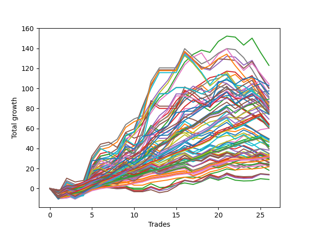

# Short Wallace Doodle 0225_009 
- Symbol: ES
- Date Range: 03/15/2022 - 07/08/2022
- Trading Period: 7:20-12:30
- Number of Trades: 25



| Name | Win Percent | Profit | Avg Profit / Trade |     | Name | Win Percent | Profit | Avg Profit / Trade |
| ---- | ----------- | ------ | ------------------ | --- | ---- | ----------- | ------ | ------------------ |
| Sorted By <br> Profit | | | | | Sorted By <br> Win Percentage ||||
| Seventy-Five | 64.00 | 61750.00 | 2470.00 |     | One | 88.00 | 50000.00 | 2000.00 |
| Two | 72.00 | 57875.00 | 2315.00 |     | Fifty-Six | 88.00 | 39750.00 | 1590.00 |
| Seventy-Three | 80.00 | 54875.00 | 2195.00 |     | Sixty-Four | 88.00 | 36625.00 | 1465.00 |
| Fifty-Seven | 84.00 | 54750.00 | 2190.00 |     | Zero | 88.00 | 28875.00 | 1155.00 |
| Fifty-Eight | 68.00 | 52375.00 | 2095.00 |     | Fifty-Seven | 84.00 | 54750.00 | 2190.00 |
| Fifteen | 36.00 | 50875.00 | 2035.00 |     | Three | 84.00 | 39125.00 | 1565.00 |
| Sixty-Three | 60.00 | 50750.00 | 2030.00 |     | Forty | 84.00 | 32750.00 | 1310.00 |
| One | 88.00 | 50000.00 | 2000.00 |     | Seventy-Three | 80.00 | 54875.00 | 2195.00 |
| Sixty-Five | 76.00 | 50000.00 | 2000.00 |     | Fifty-Nine | 80.00 | 36875.00 | 1475.00 |
| Forty-Two | 56.00 | 49625.00 | 1985.00 |     | Twenty-Four | 80.00 | 28250.00 | 1130.00 |
| Seventy | 76.00 | 49500.00 | 1980.00 |     | Sixty-Five | 76.00 | 50000.00 | 2000.00 |
| Fifty-Four | 76.00 | 49500.00 | 1980.00 |     | Seventy | 76.00 | 49500.00 | 1980.00 |
| Thirty-Eight | 76.00 | 49500.00 | 1980.00 |     | Fifty-Four | 76.00 | 49500.00 | 1980.00 |
| Twenty-Two | 76.00 | 49500.00 | 1980.00 |     | Thirty-Eight | 76.00 | 49500.00 | 1980.00 |
| Six | 76.00 | 49500.00 | 1980.00 |     | Twenty-Two | 76.00 | 49500.00 | 1980.00 |
| Sixty-Six | 56.00 | 48625.00 | 1945.00 |     | Six | 76.00 | 49500.00 | 1980.00 |
| Seventy-One | 60.00 | 48375.00 | 1935.00 |     | Sixty-Two | 76.00 | 48125.00 | 1925.00 |
| Fifty-Five | 60.00 | 48375.00 | 1935.00 |     | Two | 72.00 | 57875.00 | 2315.00 |
| Thirty-Nine | 60.00 | 48375.00 | 1935.00 |     | Four | 72.00 | 47625.00 | 1905.00 |
| Twenty-Three | 60.00 | 48375.00 | 1935.00 |     | Forty-Three | 72.00 | 38000.00 | 1520.00 |
| Sixty-Two | 76.00 | 48125.00 | 1925.00 |     | Fifty-Eight | 68.00 | 52375.00 | 2095.00 |
| Four | 72.00 | 47625.00 | 1905.00 |     | Forty-One | 68.00 | 42125.00 | 1685.00 |
| Five | 56.00 | 47125.00 | 1885.00 |     | Sixty | 68.00 | 40625.00 | 1625.00 |
| Sixty-Nine | 48.00 | 46625.00 | 1865.00 |     | Forty-Six | 68.00 | 40125.00 | 1605.00 |
| Seventy-Four | 44.00 | 46375.00 | 1855.00 |     | twenty-Seven | 68.00 | 29250.00 | 1170.00 |
| Forty-Seven | 48.00 | 44625.00 | 1785.00 |     | Eight | 68.00 | 15875.00 | 635.00 |
| Thirty-One | 36.00 | 43875.00 | 1755.00 |     | Seventy-Five | 64.00 | 61750.00 | 2470.00 |
| Sixty-Eight | 56.00 | 42625.00 | 1705.00 |     | Seventy-Two | 64.00 | 36375.00 | 1455.00 |
| Sixty-One | 52.00 | 42375.00 | 1695.00 |     | Sixty-Seven | 64.00 | 31500.00 | 1260.00 |
| Forty-One | 68.00 | 42125.00 | 1685.00 |     | Twenty-Five | 64.00 | 28500.00 | 1140.00 |
| Forty-Four | 56.00 | 41750.00 | 1670.00 |     | Forty-Eight | 64.00 | 22750.00 | 910.00 |
| Seven | 60.00 | 41250.00 | 1650.00 |     | Thirty-Two | 64.00 | 15250.00 | 610.00 |
| Sixty | 68.00 | 40625.00 | 1625.00 |     | Sixty-Three | 60.00 | 50750.00 | 2030.00 |
| Forty-Five | 40.00 | 40375.00 | 1615.00 |     | Seventy-One | 60.00 | 48375.00 | 1935.00 |
| Forty-Six | 68.00 | 40125.00 | 1605.00 |     | Fifty-Five | 60.00 | 48375.00 | 1935.00 |
| Fifty-Six | 88.00 | 39750.00 | 1590.00 |     | Thirty-Nine | 60.00 | 48375.00 | 1935.00 |
| Three | 84.00 | 39125.00 | 1565.00 |     | Twenty-Three | 60.00 | 48375.00 | 1935.00 |
| Thirty | 60.00 | 38375.00 | 1535.00 |     | Seven | 60.00 | 41250.00 | 1650.00 |
| Forty-Three | 72.00 | 38000.00 | 1520.00 |     | Thirty | 60.00 | 38375.00 | 1535.00 |
| Fifty-Nine | 80.00 | 36875.00 | 1475.00 |     | Thirty-Five | 60.00 | 16125.00 | 645.00 |
| Sixty-Four | 88.00 | 36625.00 | 1465.00 |     | Forty-Two | 56.00 | 49625.00 | 1985.00 |
| Seventy-Two | 64.00 | 36375.00 | 1455.00 |     | Sixty-Six | 56.00 | 48625.00 | 1945.00 |
| Twenty-Eight | 56.00 | 35750.00 | 1430.00 |     | Five | 56.00 | 47125.00 | 1885.00 |
| Twenty-Six | 52.00 | 34125.00 | 1365.00 |     | Sixty-Eight | 56.00 | 42625.00 | 1705.00 |
| Forty | 84.00 | 32750.00 | 1310.00 |     | Forty-Four | 56.00 | 41750.00 | 1670.00 |
| Fourteen | 52.00 | 32625.00 | 1305.00 |     | Twenty-Eight | 56.00 | 35750.00 | 1430.00 |
| Twenty-Nine | 44.00 | 32000.00 | 1280.00 |     | Thirty-Six | 56.00 | 23000.00 | 920.00 |
| Sixty-Seven | 64.00 | 31500.00 | 1260.00 |     | Eleven | 56.00 | 18875.00 | 755.00 |
| twenty-Seven | 68.00 | 29250.00 | 1170.00 |     | Fifty-One | 56.00 | 18375.00 | 735.00 |
| Zero | 88.00 | 28875.00 | 1155.00 |     | Nine | 56.00 | 16500.00 | 660.00 |
| Twenty-Five | 64.00 | 28500.00 | 1140.00 |     | Thirty-Three | 56.00 | 15875.00 | 635.00 |
| Twenty-Four | 80.00 | 28250.00 | 1130.00 |     | Sixten | 56.00 | 8375.00 | 335.00 |
| Fifty-Two | 52.00 | 25375.00 | 1015.00 |     | Sixty-One | 52.00 | 42375.00 | 1695.00 |
| Fifty-Three | 48.00 | 25000.00 | 1000.00 |     | Twenty-Six | 52.00 | 34125.00 | 1365.00 |
| Fifty | 48.00 | 23500.00 | 940.00 |     | Fourteen | 52.00 | 32625.00 | 1305.00 |
| Thirty-Six | 56.00 | 23000.00 | 920.00 |     | Fifty-Two | 52.00 | 25375.00 | 1015.00 |
| Forty-Eight | 64.00 | 22750.00 | 910.00 |     | Thirty-Seven | 52.00 | 19375.00 | 775.00 |
| Thirty-Seven | 52.00 | 19375.00 | 775.00 |     | Thirty-Four | 52.00 | 17500.00 | 700.00 |
| Eleven | 56.00 | 18875.00 | 755.00 |     | Forty-Nine | 52.00 | 12625.00 | 505.00 |
| Fifty-One | 56.00 | 18375.00 | 735.00 |     | Sixty-Nine | 48.00 | 46625.00 | 1865.00 |
| Thirty-Four | 52.00 | 17500.00 | 700.00 |     | Forty-Seven | 48.00 | 44625.00 | 1785.00 |
| Nine | 56.00 | 16500.00 | 660.00 |     | Fifty-Three | 48.00 | 25000.00 | 1000.00 |
| Thirty-Five | 60.00 | 16125.00 | 645.00 |     | Fifty | 48.00 | 23500.00 | 940.00 |
| Eight | 68.00 | 15875.00 | 635.00 |     | Nineteen | 48.00 | 6125.00 | 245.00 |
| Thirty-Three | 56.00 | 15875.00 | 635.00 |     | Seventy-Four | 44.00 | 46375.00 | 1855.00 |
| Thirty-Two | 64.00 | 15250.00 | 610.00 |     | Twenty-Nine | 44.00 | 32000.00 | 1280.00 |
| Forty-Nine | 52.00 | 12625.00 | 505.00 |     | Twelve | 44.00 | 11750.00 | 470.00 |
| Twelve | 44.00 | 11750.00 | 470.00 |     | Ten | 44.00 | 7250.00 | 290.00 |
| Sixten | 56.00 | 8375.00 | 335.00 |     | Twenty | 44.00 | 5375.00 | 215.00 |
| Ten | 44.00 | 7250.00 | 290.00 |     | Seventeen | 44.00 | 4625.00 | 185.00 |
| Nineteen | 48.00 | 6125.00 | 245.00 |     | Twenty-One | 44.00 | 4500.00 | 180.00 |
| Twenty | 44.00 | 5375.00 | 215.00 |     | Eighteen | 44.00 | 4500.00 | 180.00 |
| Seventeen | 44.00 | 4625.00 | 185.00 |     | Forty-Five | 40.00 | 40375.00 | 1615.00 |
| Twenty-One | 44.00 | 4500.00 | 180.00 |     | Fifteen | 36.00 | 50875.00 | 2035.00 |
| Eighteen | 44.00 | 4500.00 | 180.00 |     | Thirty-One | 36.00 | 43875.00 | 1755.00 |
| Thirteen | 36.00 | 2250.00 | 90.00 |     | Thirteen | 36.00 | 2250.00 | 90.00 |

## NO STOPLOSS

### Test Zero
* Sell when price hits the middle line of the 20p bollinger
* No Stoploss
* Results:
```
Total Trades: 25
Percent Up: 12.00
Percent Down: 88.00
Total Points Moved Down: 57.75
Potential Profit: 28875.00
Total Points Ups: 40.50 Count Ups: 3
Total Points Downs: 98.25 Count Downs: 22
```

<details><summary>Trades</summary>

<code>In: 2022-03-16 11:57:00		Out: 2022-03-16 12:26:55		Total Position Time: 29:55		Total Move Down: -31.75		Total to Date: -31.75</code> <br />
<code>In: 2022-03-25 10:52:00		Out: 2022-03-25 11:17:40		Total Position Time: 25:40		Total Move Down: -8.50		Total to Date: -40.25</code> <br />
<code>In: 2022-03-25 11:57:00		Out: 2022-03-25 11:57:20		Total Position Time: 00:20		Total Move Down: 0.75		Total to Date: -39.50</code> <br />
<code>In: 2022-03-28 11:12:00		Out: 2022-03-28 11:12:10		Total Position Time: 00:10		Total Move Down: 2.00		Total to Date: -37.50</code> <br />
<code>In: 2022-04-01 11:34:00		Out: 2022-04-01 11:42:20		Total Position Time: 08:20		Total Move Down: 2.50		Total to Date: -35.00</code> <br />
<code>In: 2022-04-06 11:05:00		Out: 2022-04-06 11:05:40		Total Position Time: 00:40		Total Move Down: 7.75		Total to Date: -27.25</code> <br />
<code>In: 2022-04-14 11:06:00		Out: 2022-04-14 11:14:05		Total Position Time: 08:05		Total Move Down: 3.50		Total to Date: -23.75</code> <br />
<code>In: 2022-04-20 09:54:00		Out: 2022-04-20 09:59:05		Total Position Time: 05:05		Total Move Down: 2.75		Total to Date: -21.00</code> <br />
<code>In: 2022-04-25 09:27:00		Out: 2022-04-25 09:31:05		Total Position Time: 04:05		Total Move Down: 7.25		Total to Date: -13.75</code> <br />
<code>In: 2022-04-26 10:01:00		Out: 2022-04-26 10:02:25		Total Position Time: 01:25		Total Move Down: 6.75		Total to Date: -7.00</code> <br />
<code>In: 2022-04-26 11:23:00		Out: 2022-04-26 11:31:35		Total Position Time: 08:35		Total Move Down: 1.75		Total to Date: -5.25</code> <br />
<code>In: 2022-04-29 10:39:00		Out: 2022-04-29 10:40:30		Total Position Time: 01:30		Total Move Down: 4.50		Total to Date: -0.75</code> <br />
<code>In: 2022-05-10 12:08:00		Out: 2022-05-10 12:09:45		Total Position Time: 01:45		Total Move Down: 7.75		Total to Date: 7.00</code> <br />
<code>In: 2022-05-25 11:04:00		Out: 2022-05-25 11:06:25		Total Position Time: 02:25		Total Move Down: 4.50		Total to Date: 11.50</code> <br />
<code>In: 2022-06-03 11:31:00		Out: 2022-06-03 11:33:25		Total Position Time: 02:25		Total Move Down: 3.50		Total to Date: 15.00</code> <br />
<code>In: 2022-06-10 10:52:00		Out: 2022-06-10 10:54:30		Total Position Time: 02:30		Total Move Down: 6.00		Total to Date: 21.00</code> <br />
<code>In: 2022-06-10 12:29:00		Out: 2022-06-10 12:30:30		Total Position Time: 01:30		Total Move Down: 6.25		Total to Date: 27.25</code> <br />
<code>In: 2022-06-13 08:42:00		Out: 2022-06-13 08:47:40		Total Position Time: 05:40		Total Move Down: 2.75		Total to Date: 30.00</code> <br />
<code>In: 2022-06-13 09:14:00		Out: 2022-06-13 09:17:05		Total Position Time: 03:05		Total Move Down: 6.00		Total to Date: 36.00</code> <br />
<code>In: 2022-06-14 10:02:00		Out: 2022-06-14 10:02:20		Total Position Time: 00:20		Total Move Down: 5.50		Total to Date: 41.50</code> <br />
<code>In: 2022-06-15 11:02:00		Out: 2022-06-15 11:02:10		Total Position Time: 00:10		Total Move Down: 2.00		Total to Date: 43.50</code> <br />
<code>In: 2022-06-16 09:31:00		Out: 2022-06-16 09:31:30		Total Position Time: 00:30		Total Move Down: 5.75		Total to Date: 49.25</code> <br />
<code>In: 2022-06-17 08:09:00		Out: 2022-06-17 08:23:10		Total Position Time: 14:10		Total Move Down: -0.25		Total to Date: 49.00</code> <br />
<code>In: 2022-06-30 07:36:00		Out: 2022-06-30 07:42:05		Total Position Time: 06:05		Total Move Down: 6.50		Total to Date: 55.50</code> <br />
<code>In: 2022-07-06 11:00:00		Out: 2022-07-06 11:00:15		Total Position Time: 00:15		Total Move Down: 2.25		Total to Date: 57.75</code> <br />


</details>

### Test One
* Sell when the price hits the upper line of the 20p 1std bollinger
* No Stoploss
* Results:
```
Total Trades: 25
Percent Up: 12.00
Percent Down: 88.00
Total Points Moved Down: 100.00
Potential Profit: 50000.00
Total Points Ups: 47.00 Count Ups: 3
Total Points Downs: 147.00 Count Downs: 22
```

<details><summary>Trades</summary>

<code>In: 2022-03-16 11:57:00		Out: 2022-03-16 12:26:55		Total Position Time: 29:55		Total Move Down: -31.75		Total to Date: -31.75</code> <br />
<code>In: 2022-03-25 10:52:00		Out: 2022-03-25 11:19:35		Total Position Time: 27:35		Total Move Down: -7.25		Total to Date: -39.00</code> <br />
<code>In: 2022-03-25 11:57:00		Out: 2022-03-25 12:00:50		Total Position Time: 03:50		Total Move Down: 2.75		Total to Date: -36.25</code> <br />
<code>In: 2022-03-28 11:12:00		Out: 2022-03-28 11:19:35		Total Position Time: 07:35		Total Move Down: 2.50		Total to Date: -33.75</code> <br />
<code>In: 2022-04-01 11:34:00		Out: 2022-04-01 11:50:15		Total Position Time: 16:15		Total Move Down: 3.25		Total to Date: -30.50</code> <br />
<code>In: 2022-04-06 11:05:00		Out: 2022-04-06 11:07:20		Total Position Time: 02:20		Total Move Down: 12.50		Total to Date: -18.00</code> <br />
<code>In: 2022-04-14 11:06:00		Out: 2022-04-14 11:17:10		Total Position Time: 11:10		Total Move Down: 4.25		Total to Date: -13.75</code> <br />
<code>In: 2022-04-20 09:54:00		Out: 2022-04-20 10:08:15		Total Position Time: 14:15		Total Move Down: 4.25		Total to Date: -9.50</code> <br />
<code>In: 2022-04-25 09:27:00		Out: 2022-04-25 09:42:40		Total Position Time: 15:40		Total Move Down: 5.25		Total to Date: -4.25</code> <br />
<code>In: 2022-04-26 10:01:00		Out: 2022-04-26 10:03:55		Total Position Time: 02:55		Total Move Down: 11.50		Total to Date: 7.25</code> <br />
<code>In: 2022-04-26 11:23:00		Out: 2022-04-26 11:33:45		Total Position Time: 10:45		Total Move Down: 4.50		Total to Date: 11.75</code> <br />
<code>In: 2022-04-29 10:39:00		Out: 2022-04-29 10:41:00		Total Position Time: 02:00		Total Move Down: 6.50		Total to Date: 18.25</code> <br />
<code>In: 2022-05-10 12:08:00		Out: 2022-05-10 12:17:05		Total Position Time: 09:05		Total Move Down: 9.00		Total to Date: 27.25</code> <br />
<code>In: 2022-05-25 11:04:00		Out: 2022-05-25 11:06:40		Total Position Time: 02:40		Total Move Down: 12.25		Total to Date: 39.50</code> <br />
<code>In: 2022-06-03 11:31:00		Out: 2022-06-03 11:36:05		Total Position Time: 05:05		Total Move Down: 4.75		Total to Date: 44.25</code> <br />
<code>In: 2022-06-10 10:52:00		Out: 2022-06-10 10:56:15		Total Position Time: 04:15		Total Move Down: 9.50		Total to Date: 53.75</code> <br />
<code>In: 2022-06-10 12:29:00		Out: 2022-06-10 12:35:55		Total Position Time: 06:55		Total Move Down: 10.25		Total to Date: 64.00</code> <br />
<code>In: 2022-06-13 08:42:00		Out: 2022-06-13 08:52:05		Total Position Time: 10:05		Total Move Down: 6.75		Total to Date: 70.75</code> <br />
<code>In: 2022-06-13 09:14:00		Out: 2022-06-13 09:24:05		Total Position Time: 10:05		Total Move Down: 5.50		Total to Date: 76.25</code> <br />
<code>In: 2022-06-14 10:02:00		Out: 2022-06-14 10:28:55		Total Position Time: 26:55		Total Move Down: -8.00		Total to Date: 68.25</code> <br />
<code>In: 2022-06-15 11:02:00		Out: 2022-06-15 11:03:00		Total Position Time: 01:00		Total Move Down: 6.75		Total to Date: 75.00</code> <br />
<code>In: 2022-06-16 09:31:00		Out: 2022-06-16 09:36:05		Total Position Time: 05:05		Total Move Down: 7.50		Total to Date: 82.50</code> <br />
<code>In: 2022-06-17 08:09:00		Out: 2022-06-17 08:25:20		Total Position Time: 16:20		Total Move Down: 3.75		Total to Date: 86.25</code> <br />
<code>In: 2022-06-30 07:36:00		Out: 2022-06-30 07:48:55		Total Position Time: 12:55		Total Move Down: 9.25		Total to Date: 95.50</code> <br />
<code>In: 2022-07-06 11:00:00		Out: 2022-07-06 11:00:40		Total Position Time: 00:40		Total Move Down: 4.50		Total to Date: 100.00</code> <br />


</details>

### Test Two
* Sell when the price hits the upper line of the 20p 2std bollinger
* No Stoploss
* Results:
```
Total Trades: 25
Percent Up: 28.00
Percent Down: 72.00
Total Points Moved Down: 115.75
Potential Profit: 57875.00
Total Points Ups: 54.25 Count Ups: 7
Total Points Downs: 170.00 Count Downs: 18
```

<details><summary>Trades</summary>

<code>In: 2022-03-16 11:57:00		Out: 2022-03-16 12:26:55		Total Position Time: 29:55		Total Move Down: -31.75		Total to Date: -31.75</code> <br />
<code>In: 2022-03-25 10:52:00		Out: 2022-03-25 11:21:55		Total Position Time: 29:55		Total Move Down: -7.50		Total to Date: -39.25</code> <br />
<code>In: 2022-03-25 11:57:00		Out: 2022-03-25 12:01:50		Total Position Time: 04:50		Total Move Down: 4.75		Total to Date: -34.50</code> <br />
<code>In: 2022-03-28 11:12:00		Out: 2022-03-28 11:41:55		Total Position Time: 29:55		Total Move Down: -3.75		Total to Date: -38.25</code> <br />
<code>In: 2022-04-01 11:34:00		Out: 2022-04-01 11:50:55		Total Position Time: 16:55		Total Move Down: 4.25		Total to Date: -34.00</code> <br />
<code>In: 2022-04-06 11:05:00		Out: 2022-04-06 11:08:20		Total Position Time: 03:20		Total Move Down: 18.50		Total to Date: -15.50</code> <br />
<code>In: 2022-04-14 11:06:00		Out: 2022-04-14 11:19:25		Total Position Time: 13:25		Total Move Down: 5.75		Total to Date: -9.75</code> <br />
<code>In: 2022-04-20 09:54:00		Out: 2022-04-20 10:08:15		Total Position Time: 14:15		Total Move Down: 4.25		Total to Date: -5.50</code> <br />
<code>In: 2022-04-25 09:27:00		Out: 2022-04-25 09:56:55		Total Position Time: 29:55		Total Move Down: 5.50		Total to Date: 0.00</code> <br />
<code>In: 2022-04-26 10:01:00		Out: 2022-04-26 10:30:55		Total Position Time: 29:55		Total Move Down: 26.75		Total to Date: 26.75</code> <br />
<code>In: 2022-04-26 11:23:00		Out: 2022-04-26 11:41:30		Total Position Time: 18:30		Total Move Down: 4.50		Total to Date: 31.25</code> <br />
<code>In: 2022-04-29 10:39:00		Out: 2022-04-29 10:43:50		Total Position Time: 04:50		Total Move Down: 9.50		Total to Date: 40.75</code> <br />
<code>In: 2022-05-10 12:08:00		Out: 2022-05-10 12:17:35		Total Position Time: 09:35		Total Move Down: 12.75		Total to Date: 53.50</code> <br />
<code>In: 2022-05-25 11:04:00		Out: 2022-05-25 11:06:50		Total Position Time: 02:50		Total Move Down: 16.00		Total to Date: 69.50</code> <br />
<code>In: 2022-06-03 11:31:00		Out: 2022-06-03 11:37:25		Total Position Time: 06:25		Total Move Down: 7.75		Total to Date: 77.25</code> <br />
<code>In: 2022-06-10 10:52:00		Out: 2022-06-10 11:21:55		Total Position Time: 29:55		Total Move Down: -0.00		Total to Date: 77.25</code> <br />
<code>In: 2022-06-10 12:29:00		Out: 2022-06-10 12:43:25		Total Position Time: 14:25		Total Move Down: 15.25		Total to Date: 92.50</code> <br />
<code>In: 2022-06-13 08:42:00		Out: 2022-06-13 08:54:15		Total Position Time: 12:15		Total Move Down: 7.75		Total to Date: 100.25</code> <br />
<code>In: 2022-06-13 09:14:00		Out: 2022-06-13 09:30:35		Total Position Time: 16:35		Total Move Down: 5.25		Total to Date: 105.50</code> <br />
<code>In: 2022-06-14 10:02:00		Out: 2022-06-14 10:31:10		Total Position Time: 29:10		Total Move Down: -2.25		Total to Date: 103.25</code> <br />
<code>In: 2022-06-15 11:02:00		Out: 2022-06-15 11:03:15		Total Position Time: 01:15		Total Move Down: 13.00		Total to Date: 116.25</code> <br />
<code>In: 2022-06-16 09:31:00		Out: 2022-06-16 09:59:35		Total Position Time: 28:35		Total Move Down: 3.75		Total to Date: 120.00</code> <br />
<code>In: 2022-06-17 08:09:00		Out: 2022-06-17 08:38:55		Total Position Time: 29:55		Total Move Down: -1.00		Total to Date: 119.00</code> <br />
<code>In: 2022-06-30 07:36:00		Out: 2022-06-30 08:05:55		Total Position Time: 29:55		Total Move Down: -8.00		Total to Date: 111.00</code> <br />
<code>In: 2022-07-06 11:00:00		Out: 2022-07-06 11:01:15		Total Position Time: 01:15		Total Move Down: 4.75		Total to Date: 115.75</code> <br />


</details>

### Test Three
* Sell when price hits the middle line of the 50p bollinger
* No Stoploss
* Results:
```
Total Trades: 25
Percent Up: 16.00
Percent Down: 84.00
Total Points Moved Down: 78.25
Potential Profit: 39125.00
Total Points Ups: 48.25 Count Ups: 4
Total Points Downs: 126.50 Count Downs: 21
```

<details><summary>Trades</summary>

<code>In: 2022-03-16 11:57:00		Out: 2022-03-16 12:26:55		Total Position Time: 29:55		Total Move Down: -31.75		Total to Date: -31.75</code> <br />
<code>In: 2022-03-25 10:52:00		Out: 2022-03-25 11:21:55		Total Position Time: 29:55		Total Move Down: -7.50		Total to Date: -39.25</code> <br />
<code>In: 2022-03-25 11:57:00		Out: 2022-03-25 12:00:45		Total Position Time: 03:45		Total Move Down: 1.75		Total to Date: -37.50</code> <br />
<code>In: 2022-03-28 11:12:00		Out: 2022-03-28 11:19:20		Total Position Time: 07:20		Total Move Down: 2.00		Total to Date: -35.50</code> <br />
<code>In: 2022-04-01 11:34:00		Out: 2022-04-01 11:54:05		Total Position Time: 20:05		Total Move Down: 4.75		Total to Date: -30.75</code> <br />
<code>In: 2022-04-06 11:05:00		Out: 2022-04-06 11:07:20		Total Position Time: 02:20		Total Move Down: 12.50		Total to Date: -18.25</code> <br />
<code>In: 2022-04-14 11:06:00		Out: 2022-04-14 11:20:05		Total Position Time: 14:05		Total Move Down: 7.50		Total to Date: -10.75</code> <br />
<code>In: 2022-04-20 09:54:00		Out: 2022-04-20 10:19:10		Total Position Time: 25:10		Total Move Down: 3.00		Total to Date: -7.75</code> <br />
<code>In: 2022-04-25 09:27:00		Out: 2022-04-25 09:55:10		Total Position Time: 28:10		Total Move Down: 4.50		Total to Date: -3.25</code> <br />
<code>In: 2022-04-26 10:01:00		Out: 2022-04-26 10:02:20		Total Position Time: 01:20		Total Move Down: 5.25		Total to Date: 2.00</code> <br />
<code>In: 2022-04-26 11:23:00		Out: 2022-04-26 11:41:30		Total Position Time: 18:30		Total Move Down: 4.50		Total to Date: 6.50</code> <br />
<code>In: 2022-04-29 10:39:00		Out: 2022-04-29 10:43:40		Total Position Time: 04:40		Total Move Down: 9.25		Total to Date: 15.75</code> <br />
<code>In: 2022-05-10 12:08:00		Out: 2022-05-10 12:17:15		Total Position Time: 09:15		Total Move Down: 9.50		Total to Date: 25.25</code> <br />
<code>In: 2022-05-25 11:04:00		Out: 2022-05-25 11:06:35		Total Position Time: 02:35		Total Move Down: 9.25		Total to Date: 34.50</code> <br />
<code>In: 2022-06-03 11:31:00		Out: 2022-06-03 11:37:10		Total Position Time: 06:10		Total Move Down: 6.25		Total to Date: 40.75</code> <br />
<code>In: 2022-06-10 10:52:00		Out: 2022-06-10 11:00:50		Total Position Time: 08:50		Total Move Down: 12.25		Total to Date: 53.00</code> <br />
<code>In: 2022-06-10 12:29:00		Out: 2022-06-10 12:33:40		Total Position Time: 04:40		Total Move Down: 9.00		Total to Date: 62.00</code> <br />
<code>In: 2022-06-13 08:42:00		Out: 2022-06-13 09:07:15		Total Position Time: 25:15		Total Move Down: 3.00		Total to Date: 65.00</code> <br />
<code>In: 2022-06-13 09:14:00		Out: 2022-06-13 09:24:05		Total Position Time: 10:05		Total Move Down: 5.50		Total to Date: 70.50</code> <br />
<code>In: 2022-06-14 10:02:00		Out: 2022-06-14 10:02:25		Total Position Time: 00:25		Total Move Down: 5.75		Total to Date: 76.25</code> <br />
<code>In: 2022-06-15 11:02:00		Out: 2022-06-15 11:02:10		Total Position Time: 00:10		Total Move Down: 2.00		Total to Date: 78.25</code> <br />
<code>In: 2022-06-16 09:31:00		Out: 2022-06-16 09:31:15		Total Position Time: 00:15		Total Move Down: 4.50		Total to Date: 82.75</code> <br />
<code>In: 2022-06-17 08:09:00		Out: 2022-06-17 08:38:55		Total Position Time: 29:55		Total Move Down: -1.00		Total to Date: 81.75</code> <br />
<code>In: 2022-06-30 07:36:00		Out: 2022-06-30 08:05:55		Total Position Time: 29:55		Total Move Down: -8.00		Total to Date: 73.75</code> <br />
<code>In: 2022-07-06 11:00:00		Out: 2022-07-06 11:00:40		Total Position Time: 00:40		Total Move Down: 4.50		Total to Date: 78.25</code> <br />


</details>

### Test Four
* Sell when the price hits the upper line of the 50p 1std bollinger
* No Stoploss
* Results:
```
Total Trades: 25
Percent Up: 28.00
Percent Down: 72.00
Total Points Moved Down: 95.25
Potential Profit: 47625.00
Total Points Ups: 65.50 Count Ups: 7
Total Points Downs: 160.75 Count Downs: 18
```

<details><summary>Trades</summary>

<code>In: 2022-03-16 11:57:00		Out: 2022-03-16 12:26:55		Total Position Time: 29:55		Total Move Down: -31.75		Total to Date: -31.75</code> <br />
<code>In: 2022-03-25 10:52:00		Out: 2022-03-25 11:21:55		Total Position Time: 29:55		Total Move Down: -7.50		Total to Date: -39.25</code> <br />
<code>In: 2022-03-25 11:57:00		Out: 2022-03-25 12:01:40		Total Position Time: 04:40		Total Move Down: 3.75		Total to Date: -35.50</code> <br />
<code>In: 2022-03-28 11:12:00		Out: 2022-03-28 11:20:40		Total Position Time: 08:40		Total Move Down: 2.75		Total to Date: -32.75</code> <br />
<code>In: 2022-04-01 11:34:00		Out: 2022-04-01 12:03:55		Total Position Time: 29:55		Total Move Down: 1.50		Total to Date: -31.25</code> <br />
<code>In: 2022-04-06 11:05:00		Out: 2022-04-06 11:08:10		Total Position Time: 03:10		Total Move Down: 18.50		Total to Date: -12.75</code> <br />
<code>In: 2022-04-14 11:06:00		Out: 2022-04-14 11:23:55		Total Position Time: 17:55		Total Move Down: 10.75		Total to Date: -2.00</code> <br />
<code>In: 2022-04-20 09:54:00		Out: 2022-04-20 10:23:55		Total Position Time: 29:55		Total Move Down: 2.00		Total to Date: 0.00</code> <br />
<code>In: 2022-04-25 09:27:00		Out: 2022-04-25 09:56:55		Total Position Time: 29:55		Total Move Down: 5.50		Total to Date: 5.50</code> <br />
<code>In: 2022-04-26 10:01:00		Out: 2022-04-26 10:02:55		Total Position Time: 01:55		Total Move Down: 9.75		Total to Date: 15.25</code> <br />
<code>In: 2022-04-26 11:23:00		Out: 2022-04-26 11:45:00		Total Position Time: 22:00		Total Move Down: 9.25		Total to Date: 24.50</code> <br />
<code>In: 2022-04-29 10:39:00		Out: 2022-04-29 10:47:20		Total Position Time: 08:20		Total Move Down: 14.50		Total to Date: 39.00</code> <br />
<code>In: 2022-05-10 12:08:00		Out: 2022-05-10 12:22:05		Total Position Time: 14:05		Total Move Down: 14.25		Total to Date: 53.25</code> <br />
<code>In: 2022-05-25 11:04:00		Out: 2022-05-25 11:06:40		Total Position Time: 02:40		Total Move Down: 12.25		Total to Date: 65.50</code> <br />
<code>In: 2022-06-03 11:31:00		Out: 2022-06-03 11:38:55		Total Position Time: 07:55		Total Move Down: 9.75		Total to Date: 75.25</code> <br />
<code>In: 2022-06-10 10:52:00		Out: 2022-06-10 11:15:25		Total Position Time: 23:25		Total Move Down: 14.25		Total to Date: 89.50</code> <br />
<code>In: 2022-06-10 12:29:00		Out: 2022-06-10 12:42:40		Total Position Time: 13:40		Total Move Down: 13.25		Total to Date: 102.75</code> <br />
<code>In: 2022-06-13 08:42:00		Out: 2022-06-13 09:11:55		Total Position Time: 29:55		Total Move Down: -7.75		Total to Date: 95.00</code> <br />
<code>In: 2022-06-13 09:14:00		Out: 2022-06-13 09:43:55		Total Position Time: 29:55		Total Move Down: -7.50		Total to Date: 87.50</code> <br />
<code>In: 2022-06-14 10:02:00		Out: 2022-06-14 10:31:55		Total Position Time: 29:55		Total Move Down: -2.00		Total to Date: 85.50</code> <br />
<code>In: 2022-06-15 11:02:00		Out: 2022-06-15 11:03:00		Total Position Time: 01:00		Total Move Down: 6.75		Total to Date: 92.25</code> <br />
<code>In: 2022-06-16 09:31:00		Out: 2022-06-16 09:31:50		Total Position Time: 00:50		Total Move Down: 7.25		Total to Date: 99.50</code> <br />
<code>In: 2022-06-17 08:09:00		Out: 2022-06-17 08:38:55		Total Position Time: 29:55		Total Move Down: -1.00		Total to Date: 98.50</code> <br />
<code>In: 2022-06-30 07:36:00		Out: 2022-06-30 08:05:55		Total Position Time: 29:55		Total Move Down: -8.00		Total to Date: 90.50</code> <br />
<code>In: 2022-07-06 11:00:00		Out: 2022-07-06 11:01:15		Total Position Time: 01:15		Total Move Down: 4.75		Total to Date: 95.25</code> <br />


</details>

### Test Five
* Sell when the price hits the upper line of the 50p 2std bollinger
* No Stoploss
* Results:
```
Total Trades: 25
Percent Up: 44.00
Percent Down: 56.00
Total Points Moved Down: 94.25
Potential Profit: 47125.00
Total Points Ups: 69.75 Count Ups: 11
Total Points Downs: 164.00 Count Downs: 14
```

<details><summary>Trades</summary>

<code>In: 2022-03-16 11:57:00		Out: 2022-03-16 12:26:55		Total Position Time: 29:55		Total Move Down: -31.75		Total to Date: -31.75</code> <br />
<code>In: 2022-03-25 10:52:00		Out: 2022-03-25 11:21:55		Total Position Time: 29:55		Total Move Down: -7.50		Total to Date: -39.25</code> <br />
<code>In: 2022-03-25 11:57:00		Out: 2022-03-25 12:02:00		Total Position Time: 05:00		Total Move Down: 6.25		Total to Date: -33.00</code> <br />
<code>In: 2022-03-28 11:12:00		Out: 2022-03-28 11:41:55		Total Position Time: 29:55		Total Move Down: -3.75		Total to Date: -36.75</code> <br />
<code>In: 2022-04-01 11:34:00		Out: 2022-04-01 12:03:55		Total Position Time: 29:55		Total Move Down: 1.50		Total to Date: -35.25</code> <br />
<code>In: 2022-04-06 11:05:00		Out: 2022-04-06 11:09:40		Total Position Time: 04:40		Total Move Down: 24.50		Total to Date: -10.75</code> <br />
<code>In: 2022-04-14 11:06:00		Out: 2022-04-14 11:34:00		Total Position Time: 28:00		Total Move Down: 12.25		Total to Date: 1.50</code> <br />
<code>In: 2022-04-20 09:54:00		Out: 2022-04-20 10:23:55		Total Position Time: 29:55		Total Move Down: 2.00		Total to Date: 3.50</code> <br />
<code>In: 2022-04-25 09:27:00		Out: 2022-04-25 09:56:55		Total Position Time: 29:55		Total Move Down: 5.50		Total to Date: 9.00</code> <br />
<code>In: 2022-04-26 10:01:00		Out: 2022-04-26 10:15:00		Total Position Time: 14:00		Total Move Down: 16.75		Total to Date: 25.75</code> <br />
<code>In: 2022-04-26 11:23:00		Out: 2022-04-26 11:52:55		Total Position Time: 29:55		Total Move Down: 3.50		Total to Date: 29.25</code> <br />
<code>In: 2022-04-29 10:39:00		Out: 2022-04-29 11:01:15		Total Position Time: 22:15		Total Move Down: 22.25		Total to Date: 51.50</code> <br />
<code>In: 2022-05-10 12:08:00		Out: 2022-05-10 12:24:35		Total Position Time: 16:35		Total Move Down: 20.75		Total to Date: 72.25</code> <br />
<code>In: 2022-05-25 11:04:00		Out: 2022-05-25 11:06:50		Total Position Time: 02:50		Total Move Down: 16.00		Total to Date: 88.25</code> <br />
<code>In: 2022-06-03 11:31:00		Out: 2022-06-03 12:00:55		Total Position Time: 29:55		Total Move Down: -0.00		Total to Date: 88.25</code> <br />
<code>In: 2022-06-10 10:52:00		Out: 2022-06-10 11:21:55		Total Position Time: 29:55		Total Move Down: -0.00		Total to Date: 88.25</code> <br />
<code>In: 2022-06-10 12:29:00		Out: 2022-06-10 12:45:00		Total Position Time: 16:00		Total Move Down: 14.75		Total to Date: 103.00</code> <br />
<code>In: 2022-06-13 08:42:00		Out: 2022-06-13 09:11:55		Total Position Time: 29:55		Total Move Down: -7.75		Total to Date: 95.25</code> <br />
<code>In: 2022-06-13 09:14:00		Out: 2022-06-13 09:43:55		Total Position Time: 29:55		Total Move Down: -7.50		Total to Date: 87.75</code> <br />
<code>In: 2022-06-14 10:02:00		Out: 2022-06-14 10:31:55		Total Position Time: 29:55		Total Move Down: -2.00		Total to Date: 85.75</code> <br />
<code>In: 2022-06-15 11:02:00		Out: 2022-06-15 11:03:10		Total Position Time: 01:10		Total Move Down: 11.00		Total to Date: 96.75</code> <br />
<code>In: 2022-06-16 09:31:00		Out: 2022-06-16 10:00:55		Total Position Time: 29:55		Total Move Down: -0.50		Total to Date: 96.25</code> <br />
<code>In: 2022-06-17 08:09:00		Out: 2022-06-17 08:38:55		Total Position Time: 29:55		Total Move Down: -1.00		Total to Date: 95.25</code> <br />
<code>In: 2022-06-30 07:36:00		Out: 2022-06-30 08:05:55		Total Position Time: 29:55		Total Move Down: -8.00		Total to Date: 87.25</code> <br />
<code>In: 2022-07-06 11:00:00		Out: 2022-07-06 11:02:25		Total Position Time: 02:25		Total Move Down: 7.00		Total to Date: 94.25</code> <br />


</details>

### Test Six
* Sell when the price hits the middle line of the 1std VWAP
* No Stoploss
* Results:
```
Total Trades: 25
Percent Up: 24.00
Percent Down: 76.00
Total Points Moved Down: 99.00
Potential Profit: 49500.00
Total Points Ups: 18.50 Count Ups: 6
Total Points Downs: 117.50 Count Downs: 19
```

<details><summary>Trades</summary>

<code>In: 2022-03-16 11:57:00		Out: 2022-03-16 11:57:30		Total Position Time: 00:30		Total Move Down: -5.00		Total to Date: -5.00</code> <br />
<code>In: 2022-03-25 10:52:00		Out: 2022-03-25 11:21:55		Total Position Time: 29:55		Total Move Down: -7.50		Total to Date: -12.50</code> <br />
<code>In: 2022-03-25 11:57:00		Out: 2022-03-25 12:20:30		Total Position Time: 23:30		Total Move Down: 11.50		Total to Date: -1.00</code> <br />
<code>In: 2022-03-28 11:12:00		Out: 2022-03-28 11:41:55		Total Position Time: 29:55		Total Move Down: -3.75		Total to Date: -4.75</code> <br />
<code>In: 2022-04-01 11:34:00		Out: 2022-04-01 12:03:55		Total Position Time: 29:55		Total Move Down: 1.50		Total to Date: -3.25</code> <br />
<code>In: 2022-04-06 11:05:00		Out: 2022-04-06 11:08:10		Total Position Time: 03:10		Total Move Down: 18.50		Total to Date: 15.25</code> <br />
<code>In: 2022-04-14 11:06:00		Out: 2022-04-14 11:07:40		Total Position Time: 01:40		Total Move Down: 2.00		Total to Date: 17.25</code> <br />
<code>In: 2022-04-20 09:54:00		Out: 2022-04-20 10:23:55		Total Position Time: 29:55		Total Move Down: 2.00		Total to Date: 19.25</code> <br />
<code>In: 2022-04-25 09:27:00		Out: 2022-04-25 09:31:10		Total Position Time: 04:10		Total Move Down: 8.50		Total to Date: 27.75</code> <br />
<code>In: 2022-04-26 10:01:00		Out: 2022-04-26 10:01:10		Total Position Time: 00:10		Total Move Down: 0.50		Total to Date: 28.25</code> <br />
<code>In: 2022-04-26 11:23:00		Out: 2022-04-26 11:23:10		Total Position Time: 00:10		Total Move Down: -1.00		Total to Date: 27.25</code> <br />
<code>In: 2022-04-29 10:39:00		Out: 2022-04-29 10:39:10		Total Position Time: 00:10		Total Move Down: -0.00		Total to Date: 27.25</code> <br />
<code>In: 2022-05-10 12:08:00		Out: 2022-05-10 12:24:35		Total Position Time: 16:35		Total Move Down: 20.75		Total to Date: 48.00</code> <br />
<code>In: 2022-05-25 11:04:00		Out: 2022-05-25 11:06:20		Total Position Time: 02:20		Total Move Down: 2.75		Total to Date: 50.75</code> <br />
<code>In: 2022-06-03 11:31:00		Out: 2022-06-03 11:32:25		Total Position Time: 01:25		Total Move Down: 0.25		Total to Date: 51.00</code> <br />
<code>In: 2022-06-10 10:52:00		Out: 2022-06-10 10:55:10		Total Position Time: 03:10		Total Move Down: 7.50		Total to Date: 58.50</code> <br />
<code>In: 2022-06-10 12:29:00		Out: 2022-06-10 12:44:00		Total Position Time: 15:00		Total Move Down: 16.25		Total to Date: 74.75</code> <br />
<code>In: 2022-06-13 08:42:00		Out: 2022-06-13 08:42:10		Total Position Time: 00:10		Total Move Down: 0.25		Total to Date: 75.00</code> <br />
<code>In: 2022-06-13 09:14:00		Out: 2022-06-13 09:17:20		Total Position Time: 03:20		Total Move Down: 6.75		Total to Date: 81.75</code> <br />
<code>In: 2022-06-14 10:02:00		Out: 2022-06-14 10:02:10		Total Position Time: 00:10		Total Move Down: 4.00		Total to Date: 85.75</code> <br />
<code>In: 2022-06-15 11:02:00		Out: 2022-06-15 11:02:10		Total Position Time: 00:10		Total Move Down: 2.00		Total to Date: 87.75</code> <br />
<code>In: 2022-06-16 09:31:00		Out: 2022-06-16 09:31:10		Total Position Time: 00:10		Total Move Down: 3.00		Total to Date: 90.75</code> <br />
<code>In: 2022-06-17 08:09:00		Out: 2022-06-17 08:09:10		Total Position Time: 00:10		Total Move Down: -1.25		Total to Date: 89.50</code> <br />
<code>In: 2022-06-30 07:36:00		Out: 2022-06-30 07:39:55		Total Position Time: 03:55		Total Move Down: 4.75		Total to Date: 94.25</code> <br />
<code>In: 2022-07-06 11:00:00		Out: 2022-07-06 11:01:15		Total Position Time: 01:15		Total Move Down: 4.75		Total to Date: 99.00</code> <br />


</details>

### Test Seven
* Sell when the price hits the upper line of the 1std VWAP
* No Stoploss
* Results:
```
Total Trades: 25
Percent Up: 40.00
Percent Down: 60.00
Total Points Moved Down: 82.50
Potential Profit: 41250.00
Total Points Ups: 79.25 Count Ups: 10
Total Points Downs: 161.75 Count Downs: 15
```

<details><summary>Trades</summary>

<code>In: 2022-03-16 11:57:00		Out: 2022-03-16 12:26:55		Total Position Time: 29:55		Total Move Down: -31.75		Total to Date: -31.75</code> <br />
<code>In: 2022-03-25 10:52:00		Out: 2022-03-25 11:21:55		Total Position Time: 29:55		Total Move Down: -7.50		Total to Date: -39.25</code> <br />
<code>In: 2022-03-25 11:57:00		Out: 2022-03-25 12:26:55		Total Position Time: 29:55		Total Move Down: 15.25		Total to Date: -24.00</code> <br />
<code>In: 2022-03-28 11:12:00		Out: 2022-03-28 11:41:55		Total Position Time: 29:55		Total Move Down: -3.75		Total to Date: -27.75</code> <br />
<code>In: 2022-04-01 11:34:00		Out: 2022-04-01 12:03:55		Total Position Time: 29:55		Total Move Down: 1.50		Total to Date: -26.25</code> <br />
<code>In: 2022-04-06 11:05:00		Out: 2022-04-06 11:09:40		Total Position Time: 04:40		Total Move Down: 24.50		Total to Date: -1.75</code> <br />
<code>In: 2022-04-14 11:06:00		Out: 2022-04-14 11:35:55		Total Position Time: 29:55		Total Move Down: 11.75		Total to Date: 10.00</code> <br />
<code>In: 2022-04-20 09:54:00		Out: 2022-04-20 10:23:55		Total Position Time: 29:55		Total Move Down: 2.00		Total to Date: 12.00</code> <br />
<code>In: 2022-04-25 09:27:00		Out: 2022-04-25 09:56:55		Total Position Time: 29:55		Total Move Down: 5.50		Total to Date: 17.50</code> <br />
<code>In: 2022-04-26 10:01:00		Out: 2022-04-26 10:14:15		Total Position Time: 13:15		Total Move Down: 14.50		Total to Date: 32.00</code> <br />
<code>In: 2022-04-26 11:23:00		Out: 2022-04-26 11:42:05		Total Position Time: 19:05		Total Move Down: 5.75		Total to Date: 37.75</code> <br />
<code>In: 2022-04-29 10:39:00		Out: 2022-04-29 10:40:25		Total Position Time: 01:25		Total Move Down: 3.25		Total to Date: 41.00</code> <br />
<code>In: 2022-05-10 12:08:00		Out: 2022-05-10 12:37:55		Total Position Time: 29:55		Total Move Down: 34.25		Total to Date: 75.25</code> <br />
<code>In: 2022-05-25 11:04:00		Out: 2022-05-25 11:06:45		Total Position Time: 02:45		Total Move Down: 13.50		Total to Date: 88.75</code> <br />
<code>In: 2022-06-03 11:31:00		Out: 2022-06-03 12:00:55		Total Position Time: 29:55		Total Move Down: -0.00		Total to Date: 88.75</code> <br />
<code>In: 2022-06-10 10:52:00		Out: 2022-06-10 11:21:55		Total Position Time: 29:55		Total Move Down: -0.00		Total to Date: 88.75</code> <br />
<code>In: 2022-06-10 12:29:00		Out: 2022-06-10 12:45:00		Total Position Time: 16:00		Total Move Down: 14.75		Total to Date: 103.50</code> <br />
<code>In: 2022-06-13 08:42:00		Out: 2022-06-13 09:11:55		Total Position Time: 29:55		Total Move Down: -7.75		Total to Date: 95.75</code> <br />
<code>In: 2022-06-13 09:14:00		Out: 2022-06-13 09:43:55		Total Position Time: 29:55		Total Move Down: -7.50		Total to Date: 88.25</code> <br />
<code>In: 2022-06-14 10:02:00		Out: 2022-06-14 10:02:10		Total Position Time: 00:10		Total Move Down: 4.00		Total to Date: 92.25</code> <br />
<code>In: 2022-06-15 11:02:00		Out: 2022-06-15 11:03:00		Total Position Time: 01:00		Total Move Down: 6.75		Total to Date: 99.00</code> <br />
<code>In: 2022-06-16 09:31:00		Out: 2022-06-16 09:31:15		Total Position Time: 00:15		Total Move Down: 4.50		Total to Date: 103.50</code> <br />
<code>In: 2022-06-17 08:09:00		Out: 2022-06-17 08:38:55		Total Position Time: 29:55		Total Move Down: -1.00		Total to Date: 102.50</code> <br />
<code>In: 2022-06-30 07:36:00		Out: 2022-06-30 08:05:55		Total Position Time: 29:55		Total Move Down: -8.00		Total to Date: 94.50</code> <br />
<code>In: 2022-07-06 11:00:00		Out: 2022-07-06 11:29:55		Total Position Time: 29:55		Total Move Down: -12.00		Total to Date: 82.50</code> <br />


</details>

## STOPLOSS OF 2

### Test Eight
* Sell when price hits the middle line of the 20p bollinger
* Stoploss is -2 points
* Results:
```
Total Trades: 25
Percent Up: 32.00
Percent Down: 68.00
Total Points Moved Down: 31.75
Potential Profit: 15875.00
Total Points Ups: 25.75 Count Ups: 8
Total Points Downs: 57.50 Count Downs: 17
```

<details><summary>Trades</summary>

<code>In: 2022-03-16 11:57:00		Out: 2022-03-16 11:57:10		Total Position Time: 00:10		Total Move Down: -8.00		Total to Date: -8.00</code> <br />
<code>In: 2022-03-25 10:52:00		Out: 2022-03-25 10:52:25		Total Position Time: 00:25		Total Move Down: -1.50		Total to Date: -9.50</code> <br />
<code>In: 2022-03-25 11:57:00		Out: 2022-03-25 11:57:20		Total Position Time: 00:20		Total Move Down: 0.75		Total to Date: -8.75</code> <br />
<code>In: 2022-03-28 11:12:00		Out: 2022-03-28 11:12:10		Total Position Time: 00:10		Total Move Down: 2.00		Total to Date: -6.75</code> <br />
<code>In: 2022-04-01 11:34:00		Out: 2022-04-01 11:42:20		Total Position Time: 08:20		Total Move Down: 2.50		Total to Date: -4.25</code> <br />
<code>In: 2022-04-06 11:05:00		Out: 2022-04-06 11:05:10		Total Position Time: 00:10		Total Move Down: 4.00		Total to Date: -0.25</code> <br />
<code>In: 2022-04-14 11:06:00		Out: 2022-04-14 11:14:05		Total Position Time: 08:05		Total Move Down: 3.50		Total to Date: 3.25</code> <br />
<code>In: 2022-04-20 09:54:00		Out: 2022-04-20 09:59:05		Total Position Time: 05:05		Total Move Down: 2.75		Total to Date: 6.00</code> <br />
<code>In: 2022-04-25 09:27:00		Out: 2022-04-25 09:27:10		Total Position Time: 00:10		Total Move Down: -1.00		Total to Date: 5.00</code> <br />
<code>In: 2022-04-26 10:01:00		Out: 2022-04-26 10:01:10		Total Position Time: 00:10		Total Move Down: 0.50		Total to Date: 5.50</code> <br />
<code>In: 2022-04-26 11:23:00		Out: 2022-04-26 11:31:35		Total Position Time: 08:35		Total Move Down: 1.75		Total to Date: 7.25</code> <br />
<code>In: 2022-04-29 10:39:00		Out: 2022-04-29 10:39:10		Total Position Time: 00:10		Total Move Down: -0.00		Total to Date: 7.25</code> <br />
<code>In: 2022-05-10 12:08:00		Out: 2022-05-10 12:09:45		Total Position Time: 01:45		Total Move Down: 7.75		Total to Date: 15.00</code> <br />
<code>In: 2022-05-25 11:04:00		Out: 2022-05-25 11:04:40		Total Position Time: 00:40		Total Move Down: -5.50		Total to Date: 9.50</code> <br />
<code>In: 2022-06-03 11:31:00		Out: 2022-06-03 11:33:25		Total Position Time: 02:25		Total Move Down: 3.50		Total to Date: 13.00</code> <br />
<code>In: 2022-06-10 10:52:00		Out: 2022-06-10 10:54:30		Total Position Time: 02:30		Total Move Down: 6.00		Total to Date: 19.00</code> <br />
<code>In: 2022-06-10 12:29:00		Out: 2022-06-10 12:30:30		Total Position Time: 01:30		Total Move Down: 6.25		Total to Date: 25.25</code> <br />
<code>In: 2022-06-13 08:42:00		Out: 2022-06-13 08:47:40		Total Position Time: 05:40		Total Move Down: 2.75		Total to Date: 28.00</code> <br />
<code>In: 2022-06-13 09:14:00		Out: 2022-06-13 09:15:35		Total Position Time: 01:35		Total Move Down: -1.50		Total to Date: 26.50</code> <br />
<code>In: 2022-06-14 10:02:00		Out: 2022-06-14 10:02:20		Total Position Time: 00:20		Total Move Down: 5.50		Total to Date: 32.00</code> <br />
<code>In: 2022-06-15 11:02:00		Out: 2022-06-15 11:02:10		Total Position Time: 00:10		Total Move Down: 2.00		Total to Date: 34.00</code> <br />
<code>In: 2022-06-16 09:31:00		Out: 2022-06-16 09:31:30		Total Position Time: 00:30		Total Move Down: 5.75		Total to Date: 39.75</code> <br />
<code>In: 2022-06-17 08:09:00		Out: 2022-06-17 08:18:50		Total Position Time: 09:50		Total Move Down: -6.50		Total to Date: 33.25</code> <br />
<code>In: 2022-06-30 07:36:00		Out: 2022-06-30 07:37:55		Total Position Time: 01:55		Total Move Down: -1.75		Total to Date: 31.50</code> <br />
<code>In: 2022-07-06 11:00:00		Out: 2022-07-06 11:00:10		Total Position Time: 00:10		Total Move Down: 0.25		Total to Date: 31.75</code> <br />


</details>

### Test Nine
* Sell when the price hits the upper line of the 20p 1std bollinger
* Stoploss is -2 points
* Results:
```
Total Trades: 25
Percent Up: 44.00
Percent Down: 56.00
Total Points Moved Down: 33.00
Potential Profit: 16500.00
Total Points Ups: 29.75 Count Ups: 11
Total Points Downs: 62.75 Count Downs: 14
```

<details><summary>Trades</summary>

<code>In: 2022-03-16 11:57:00		Out: 2022-03-16 11:57:10		Total Position Time: 00:10		Total Move Down: -8.00		Total to Date: -8.00</code> <br />
<code>In: 2022-03-25 10:52:00		Out: 2022-03-25 10:52:25		Total Position Time: 00:25		Total Move Down: -1.50		Total to Date: -9.50</code> <br />
<code>In: 2022-03-25 11:57:00		Out: 2022-03-25 12:00:50		Total Position Time: 03:50		Total Move Down: 2.75		Total to Date: -6.75</code> <br />
<code>In: 2022-03-28 11:12:00		Out: 2022-03-28 11:14:35		Total Position Time: 02:35		Total Move Down: -0.25		Total to Date: -7.00</code> <br />
<code>In: 2022-04-01 11:34:00		Out: 2022-04-01 11:50:15		Total Position Time: 16:15		Total Move Down: 3.25		Total to Date: -3.75</code> <br />
<code>In: 2022-04-06 11:05:00		Out: 2022-04-06 11:05:10		Total Position Time: 00:10		Total Move Down: 4.00		Total to Date: 0.25</code> <br />
<code>In: 2022-04-14 11:06:00		Out: 2022-04-14 11:17:10		Total Position Time: 11:10		Total Move Down: 4.25		Total to Date: 4.50</code> <br />
<code>In: 2022-04-20 09:54:00		Out: 2022-04-20 10:04:00		Total Position Time: 10:00		Total Move Down: -1.25		Total to Date: 3.25</code> <br />
<code>In: 2022-04-25 09:27:00		Out: 2022-04-25 09:27:10		Total Position Time: 00:10		Total Move Down: -1.00		Total to Date: 2.25</code> <br />
<code>In: 2022-04-26 10:01:00		Out: 2022-04-26 10:01:10		Total Position Time: 00:10		Total Move Down: 0.50		Total to Date: 2.75</code> <br />
<code>In: 2022-04-26 11:23:00		Out: 2022-04-26 11:33:45		Total Position Time: 10:45		Total Move Down: 4.50		Total to Date: 7.25</code> <br />
<code>In: 2022-04-29 10:39:00		Out: 2022-04-29 10:39:10		Total Position Time: 00:10		Total Move Down: -0.00		Total to Date: 7.25</code> <br />
<code>In: 2022-05-10 12:08:00		Out: 2022-05-10 12:17:05		Total Position Time: 09:05		Total Move Down: 9.00		Total to Date: 16.25</code> <br />
<code>In: 2022-05-25 11:04:00		Out: 2022-05-25 11:04:40		Total Position Time: 00:40		Total Move Down: -5.50		Total to Date: 10.75</code> <br />
<code>In: 2022-06-03 11:31:00		Out: 2022-06-03 11:36:05		Total Position Time: 05:05		Total Move Down: 4.75		Total to Date: 15.50</code> <br />
<code>In: 2022-06-10 10:52:00		Out: 2022-06-10 10:56:15		Total Position Time: 04:15		Total Move Down: 9.50		Total to Date: 25.00</code> <br />
<code>In: 2022-06-10 12:29:00		Out: 2022-06-10 12:35:55		Total Position Time: 06:55		Total Move Down: 10.25		Total to Date: 35.25</code> <br />
<code>In: 2022-06-13 08:42:00		Out: 2022-06-13 08:52:05		Total Position Time: 10:05		Total Move Down: 6.75		Total to Date: 42.00</code> <br />
<code>In: 2022-06-13 09:14:00		Out: 2022-06-13 09:15:35		Total Position Time: 01:35		Total Move Down: -1.50		Total to Date: 40.50</code> <br />
<code>In: 2022-06-14 10:02:00		Out: 2022-06-14 10:07:05		Total Position Time: 05:05		Total Move Down: 0.75		Total to Date: 41.25</code> <br />
<code>In: 2022-06-15 11:02:00		Out: 2022-06-15 11:02:15		Total Position Time: 00:15		Total Move Down: -2.50		Total to Date: 38.75</code> <br />
<code>In: 2022-06-16 09:31:00		Out: 2022-06-16 09:33:05		Total Position Time: 02:05		Total Move Down: 2.25		Total to Date: 41.00</code> <br />
<code>In: 2022-06-17 08:09:00		Out: 2022-06-17 08:18:50		Total Position Time: 09:50		Total Move Down: -6.50		Total to Date: 34.50</code> <br />
<code>In: 2022-06-30 07:36:00		Out: 2022-06-30 07:37:55		Total Position Time: 01:55		Total Move Down: -1.75		Total to Date: 32.75</code> <br />
<code>In: 2022-07-06 11:00:00		Out: 2022-07-06 11:00:10		Total Position Time: 00:10		Total Move Down: 0.25		Total to Date: 33.00</code> <br />


</details>

### Test Ten
* Sell when the price hits the upper line of the 20p 2std bollinger
* Stoploss is -2 points
* Results:
```
Total Trades: 25
Percent Up: 56.00
Percent Down: 44.00
Total Points Moved Down: 14.50
Potential Profit: 7250.00
Total Points Ups: 36.25 Count Ups: 14
Total Points Downs: 50.75 Count Downs: 11
```

<details><summary>Trades</summary>

<code>In: 2022-03-16 11:57:00		Out: 2022-03-16 11:57:10		Total Position Time: 00:10		Total Move Down: -8.00		Total to Date: -8.00</code> <br />
<code>In: 2022-03-25 10:52:00		Out: 2022-03-25 10:52:25		Total Position Time: 00:25		Total Move Down: -1.50		Total to Date: -9.50</code> <br />
<code>In: 2022-03-25 11:57:00		Out: 2022-03-25 12:01:50		Total Position Time: 04:50		Total Move Down: 4.75		Total to Date: -4.75</code> <br />
<code>In: 2022-03-28 11:12:00		Out: 2022-03-28 11:14:35		Total Position Time: 02:35		Total Move Down: -0.25		Total to Date: -5.00</code> <br />
<code>In: 2022-04-01 11:34:00		Out: 2022-04-01 11:50:55		Total Position Time: 16:55		Total Move Down: 4.25		Total to Date: -0.75</code> <br />
<code>In: 2022-04-06 11:05:00		Out: 2022-04-06 11:05:10		Total Position Time: 00:10		Total Move Down: 4.00		Total to Date: 3.25</code> <br />
<code>In: 2022-04-14 11:06:00		Out: 2022-04-14 11:19:25		Total Position Time: 13:25		Total Move Down: 5.75		Total to Date: 9.00</code> <br />
<code>In: 2022-04-20 09:54:00		Out: 2022-04-20 10:04:00		Total Position Time: 10:00		Total Move Down: -1.25		Total to Date: 7.75</code> <br />
<code>In: 2022-04-25 09:27:00		Out: 2022-04-25 09:27:10		Total Position Time: 00:10		Total Move Down: -1.00		Total to Date: 6.75</code> <br />
<code>In: 2022-04-26 10:01:00		Out: 2022-04-26 10:01:10		Total Position Time: 00:10		Total Move Down: 0.50		Total to Date: 7.25</code> <br />
<code>In: 2022-04-26 11:23:00		Out: 2022-04-26 11:37:35		Total Position Time: 14:35		Total Move Down: -6.00		Total to Date: 1.25</code> <br />
<code>In: 2022-04-29 10:39:00		Out: 2022-04-29 10:39:10		Total Position Time: 00:10		Total Move Down: -0.00		Total to Date: 1.25</code> <br />
<code>In: 2022-05-10 12:08:00		Out: 2022-05-10 12:17:35		Total Position Time: 09:35		Total Move Down: 12.75		Total to Date: 14.00</code> <br />
<code>In: 2022-05-25 11:04:00		Out: 2022-05-25 11:04:40		Total Position Time: 00:40		Total Move Down: -5.50		Total to Date: 8.50</code> <br />
<code>In: 2022-06-03 11:31:00		Out: 2022-06-03 11:37:25		Total Position Time: 06:25		Total Move Down: 7.75		Total to Date: 16.25</code> <br />
<code>In: 2022-06-10 10:52:00		Out: 2022-06-10 11:21:50		Total Position Time: 29:50		Total Move Down: -0.50		Total to Date: 15.75</code> <br />
<code>In: 2022-06-10 12:29:00		Out: 2022-06-10 12:37:20		Total Position Time: 08:20		Total Move Down: -0.00		Total to Date: 15.75</code> <br />
<code>In: 2022-06-13 08:42:00		Out: 2022-06-13 08:54:15		Total Position Time: 12:15		Total Move Down: 7.75		Total to Date: 23.50</code> <br />
<code>In: 2022-06-13 09:14:00		Out: 2022-06-13 09:15:35		Total Position Time: 01:35		Total Move Down: -1.50		Total to Date: 22.00</code> <br />
<code>In: 2022-06-14 10:02:00		Out: 2022-06-14 10:07:05		Total Position Time: 05:05		Total Move Down: 0.75		Total to Date: 22.75</code> <br />
<code>In: 2022-06-15 11:02:00		Out: 2022-06-15 11:02:15		Total Position Time: 00:15		Total Move Down: -2.50		Total to Date: 20.25</code> <br />
<code>In: 2022-06-16 09:31:00		Out: 2022-06-16 09:33:05		Total Position Time: 02:05		Total Move Down: 2.25		Total to Date: 22.50</code> <br />
<code>In: 2022-06-17 08:09:00		Out: 2022-06-17 08:18:50		Total Position Time: 09:50		Total Move Down: -6.50		Total to Date: 16.00</code> <br />
<code>In: 2022-06-30 07:36:00		Out: 2022-06-30 07:37:55		Total Position Time: 01:55		Total Move Down: -1.75		Total to Date: 14.25</code> <br />
<code>In: 2022-07-06 11:00:00		Out: 2022-07-06 11:00:10		Total Position Time: 00:10		Total Move Down: 0.25		Total to Date: 14.50</code> <br />


</details>

### Test Eleven
* Sell when price hits the middle line of the 50p bollinger
* Stoploss is -2 points
* Results:
```
Total Trades: 25
Percent Up: 44.00
Percent Down: 56.00
Total Points Moved Down: 37.75
Potential Profit: 18875.00
Total Points Ups: 33.25 Count Ups: 11
Total Points Downs: 71.00 Count Downs: 14
```

<details><summary>Trades</summary>

<code>In: 2022-03-16 11:57:00		Out: 2022-03-16 11:57:10		Total Position Time: 00:10		Total Move Down: -8.00		Total to Date: -8.00</code> <br />
<code>In: 2022-03-25 10:52:00		Out: 2022-03-25 10:52:25		Total Position Time: 00:25		Total Move Down: -1.50		Total to Date: -9.50</code> <br />
<code>In: 2022-03-25 11:57:00		Out: 2022-03-25 12:00:45		Total Position Time: 03:45		Total Move Down: 1.75		Total to Date: -7.75</code> <br />
<code>In: 2022-03-28 11:12:00		Out: 2022-03-28 11:14:35		Total Position Time: 02:35		Total Move Down: -0.25		Total to Date: -8.00</code> <br />
<code>In: 2022-04-01 11:34:00		Out: 2022-04-01 11:54:05		Total Position Time: 20:05		Total Move Down: 4.75		Total to Date: -3.25</code> <br />
<code>In: 2022-04-06 11:05:00		Out: 2022-04-06 11:05:10		Total Position Time: 00:10		Total Move Down: 4.00		Total to Date: 0.75</code> <br />
<code>In: 2022-04-14 11:06:00		Out: 2022-04-14 11:20:05		Total Position Time: 14:05		Total Move Down: 7.50		Total to Date: 8.25</code> <br />
<code>In: 2022-04-20 09:54:00		Out: 2022-04-20 10:04:00		Total Position Time: 10:00		Total Move Down: -1.25		Total to Date: 7.00</code> <br />
<code>In: 2022-04-25 09:27:00		Out: 2022-04-25 09:27:10		Total Position Time: 00:10		Total Move Down: -1.00		Total to Date: 6.00</code> <br />
<code>In: 2022-04-26 10:01:00		Out: 2022-04-26 10:01:10		Total Position Time: 00:10		Total Move Down: 0.50		Total to Date: 6.50</code> <br />
<code>In: 2022-04-26 11:23:00		Out: 2022-04-26 11:37:35		Total Position Time: 14:35		Total Move Down: -6.00		Total to Date: 0.50</code> <br />
<code>In: 2022-04-29 10:39:00		Out: 2022-04-29 10:39:10		Total Position Time: 00:10		Total Move Down: -0.00		Total to Date: 0.50</code> <br />
<code>In: 2022-05-10 12:08:00		Out: 2022-05-10 12:17:15		Total Position Time: 09:15		Total Move Down: 9.50		Total to Date: 10.00</code> <br />
<code>In: 2022-05-25 11:04:00		Out: 2022-05-25 11:04:40		Total Position Time: 00:40		Total Move Down: -5.50		Total to Date: 4.50</code> <br />
<code>In: 2022-06-03 11:31:00		Out: 2022-06-03 11:37:10		Total Position Time: 06:10		Total Move Down: 6.25		Total to Date: 10.75</code> <br />
<code>In: 2022-06-10 10:52:00		Out: 2022-06-10 11:00:50		Total Position Time: 08:50		Total Move Down: 12.25		Total to Date: 23.00</code> <br />
<code>In: 2022-06-10 12:29:00		Out: 2022-06-10 12:33:40		Total Position Time: 04:40		Total Move Down: 9.00		Total to Date: 32.00</code> <br />
<code>In: 2022-06-13 08:42:00		Out: 2022-06-13 09:07:15		Total Position Time: 25:15		Total Move Down: 3.00		Total to Date: 35.00</code> <br />
<code>In: 2022-06-13 09:14:00		Out: 2022-06-13 09:15:35		Total Position Time: 01:35		Total Move Down: -1.50		Total to Date: 33.50</code> <br />
<code>In: 2022-06-14 10:02:00		Out: 2022-06-14 10:02:25		Total Position Time: 00:25		Total Move Down: 5.75		Total to Date: 39.25</code> <br />
<code>In: 2022-06-15 11:02:00		Out: 2022-06-15 11:02:10		Total Position Time: 00:10		Total Move Down: 2.00		Total to Date: 41.25</code> <br />
<code>In: 2022-06-16 09:31:00		Out: 2022-06-16 09:31:15		Total Position Time: 00:15		Total Move Down: 4.50		Total to Date: 45.75</code> <br />
<code>In: 2022-06-17 08:09:00		Out: 2022-06-17 08:18:50		Total Position Time: 09:50		Total Move Down: -6.50		Total to Date: 39.25</code> <br />
<code>In: 2022-06-30 07:36:00		Out: 2022-06-30 07:37:55		Total Position Time: 01:55		Total Move Down: -1.75		Total to Date: 37.50</code> <br />
<code>In: 2022-07-06 11:00:00		Out: 2022-07-06 11:00:10		Total Position Time: 00:10		Total Move Down: 0.25		Total to Date: 37.75</code> <br />


</details>

### Test Twelve
* Sell when the price hits the upper line of the 50p 1std bollinger
* Stoploss is -2 points
* Results:
```
Total Trades: 25
Percent Up: 56.00
Percent Down: 44.00
Total Points Moved Down: 23.50
Potential Profit: 11750.00
Total Points Ups: 43.50 Count Ups: 14
Total Points Downs: 67.00 Count Downs: 11
```

<details><summary>Trades</summary>

<code>In: 2022-03-16 11:57:00		Out: 2022-03-16 11:57:10		Total Position Time: 00:10		Total Move Down: -8.00		Total to Date: -8.00</code> <br />
<code>In: 2022-03-25 10:52:00		Out: 2022-03-25 10:52:25		Total Position Time: 00:25		Total Move Down: -1.50		Total to Date: -9.50</code> <br />
<code>In: 2022-03-25 11:57:00		Out: 2022-03-25 12:01:40		Total Position Time: 04:40		Total Move Down: 3.75		Total to Date: -5.75</code> <br />
<code>In: 2022-03-28 11:12:00		Out: 2022-03-28 11:14:35		Total Position Time: 02:35		Total Move Down: -0.25		Total to Date: -6.00</code> <br />
<code>In: 2022-04-01 11:34:00		Out: 2022-04-01 12:03:55		Total Position Time: 29:55		Total Move Down: 1.50		Total to Date: -4.50</code> <br />
<code>In: 2022-04-06 11:05:00		Out: 2022-04-06 11:05:10		Total Position Time: 00:10		Total Move Down: 4.00		Total to Date: -0.50</code> <br />
<code>In: 2022-04-14 11:06:00		Out: 2022-04-14 11:23:55		Total Position Time: 17:55		Total Move Down: 10.75		Total to Date: 10.25</code> <br />
<code>In: 2022-04-20 09:54:00		Out: 2022-04-20 10:04:00		Total Position Time: 10:00		Total Move Down: -1.25		Total to Date: 9.00</code> <br />
<code>In: 2022-04-25 09:27:00		Out: 2022-04-25 09:27:10		Total Position Time: 00:10		Total Move Down: -1.00		Total to Date: 8.00</code> <br />
<code>In: 2022-04-26 10:01:00		Out: 2022-04-26 10:01:10		Total Position Time: 00:10		Total Move Down: 0.50		Total to Date: 8.50</code> <br />
<code>In: 2022-04-26 11:23:00		Out: 2022-04-26 11:37:35		Total Position Time: 14:35		Total Move Down: -6.00		Total to Date: 2.50</code> <br />
<code>In: 2022-04-29 10:39:00		Out: 2022-04-29 10:39:10		Total Position Time: 00:10		Total Move Down: -0.00		Total to Date: 2.50</code> <br />
<code>In: 2022-05-10 12:08:00		Out: 2022-05-10 12:22:05		Total Position Time: 14:05		Total Move Down: 14.25		Total to Date: 16.75</code> <br />
<code>In: 2022-05-25 11:04:00		Out: 2022-05-25 11:04:40		Total Position Time: 00:40		Total Move Down: -5.50		Total to Date: 11.25</code> <br />
<code>In: 2022-06-03 11:31:00		Out: 2022-06-03 11:38:55		Total Position Time: 07:55		Total Move Down: 9.75		Total to Date: 21.00</code> <br />
<code>In: 2022-06-10 10:52:00		Out: 2022-06-10 11:15:25		Total Position Time: 23:25		Total Move Down: 14.25		Total to Date: 35.25</code> <br />
<code>In: 2022-06-10 12:29:00		Out: 2022-06-10 12:37:20		Total Position Time: 08:20		Total Move Down: -0.00		Total to Date: 35.25</code> <br />
<code>In: 2022-06-13 08:42:00		Out: 2022-06-13 09:11:55		Total Position Time: 29:55		Total Move Down: -7.75		Total to Date: 27.50</code> <br />
<code>In: 2022-06-13 09:14:00		Out: 2022-06-13 09:15:35		Total Position Time: 01:35		Total Move Down: -1.50		Total to Date: 26.00</code> <br />
<code>In: 2022-06-14 10:02:00		Out: 2022-06-14 10:07:05		Total Position Time: 05:05		Total Move Down: 0.75		Total to Date: 26.75</code> <br />
<code>In: 2022-06-15 11:02:00		Out: 2022-06-15 11:02:15		Total Position Time: 00:15		Total Move Down: -2.50		Total to Date: 24.25</code> <br />
<code>In: 2022-06-16 09:31:00		Out: 2022-06-16 09:31:50		Total Position Time: 00:50		Total Move Down: 7.25		Total to Date: 31.50</code> <br />
<code>In: 2022-06-17 08:09:00		Out: 2022-06-17 08:18:50		Total Position Time: 09:50		Total Move Down: -6.50		Total to Date: 25.00</code> <br />
<code>In: 2022-06-30 07:36:00		Out: 2022-06-30 07:37:55		Total Position Time: 01:55		Total Move Down: -1.75		Total to Date: 23.25</code> <br />
<code>In: 2022-07-06 11:00:00		Out: 2022-07-06 11:00:10		Total Position Time: 00:10		Total Move Down: 0.25		Total to Date: 23.50</code> <br />


</details>

### Test Thirteen
* Sell when the price hits the upper line of the 50p 2std bollinger
* Stoploss is -2 points
* Results:
```
Total Trades: 25
Percent Up: 64.00
Percent Down: 36.00
Total Points Moved Down: 4.50
Potential Profit: 2250.00
Total Points Ups: 44.00 Count Ups: 16
Total Points Downs: 48.50 Count Downs: 9
```

<details><summary>Trades</summary>

<code>In: 2022-03-16 11:57:00		Out: 2022-03-16 11:57:10		Total Position Time: 00:10		Total Move Down: -8.00		Total to Date: -8.00</code> <br />
<code>In: 2022-03-25 10:52:00		Out: 2022-03-25 10:52:25		Total Position Time: 00:25		Total Move Down: -1.50		Total to Date: -9.50</code> <br />
<code>In: 2022-03-25 11:57:00		Out: 2022-03-25 12:02:00		Total Position Time: 05:00		Total Move Down: 6.25		Total to Date: -3.25</code> <br />
<code>In: 2022-03-28 11:12:00		Out: 2022-03-28 11:14:35		Total Position Time: 02:35		Total Move Down: -0.25		Total to Date: -3.50</code> <br />
<code>In: 2022-04-01 11:34:00		Out: 2022-04-01 12:03:55		Total Position Time: 29:55		Total Move Down: 1.50		Total to Date: -2.00</code> <br />
<code>In: 2022-04-06 11:05:00		Out: 2022-04-06 11:05:10		Total Position Time: 00:10		Total Move Down: 4.00		Total to Date: 2.00</code> <br />
<code>In: 2022-04-14 11:06:00		Out: 2022-04-14 11:34:00		Total Position Time: 28:00		Total Move Down: 12.25		Total to Date: 14.25</code> <br />
<code>In: 2022-04-20 09:54:00		Out: 2022-04-20 10:04:00		Total Position Time: 10:00		Total Move Down: -1.25		Total to Date: 13.00</code> <br />
<code>In: 2022-04-25 09:27:00		Out: 2022-04-25 09:27:10		Total Position Time: 00:10		Total Move Down: -1.00		Total to Date: 12.00</code> <br />
<code>In: 2022-04-26 10:01:00		Out: 2022-04-26 10:01:10		Total Position Time: 00:10		Total Move Down: 0.50		Total to Date: 12.50</code> <br />
<code>In: 2022-04-26 11:23:00		Out: 2022-04-26 11:37:35		Total Position Time: 14:35		Total Move Down: -6.00		Total to Date: 6.50</code> <br />
<code>In: 2022-04-29 10:39:00		Out: 2022-04-29 10:39:10		Total Position Time: 00:10		Total Move Down: -0.00		Total to Date: 6.50</code> <br />
<code>In: 2022-05-10 12:08:00		Out: 2022-05-10 12:24:35		Total Position Time: 16:35		Total Move Down: 20.75		Total to Date: 27.25</code> <br />
<code>In: 2022-05-25 11:04:00		Out: 2022-05-25 11:04:40		Total Position Time: 00:40		Total Move Down: -5.50		Total to Date: 21.75</code> <br />
<code>In: 2022-06-03 11:31:00		Out: 2022-06-03 12:00:55		Total Position Time: 29:55		Total Move Down: -0.00		Total to Date: 21.75</code> <br />
<code>In: 2022-06-10 10:52:00		Out: 2022-06-10 11:21:50		Total Position Time: 29:50		Total Move Down: -0.50		Total to Date: 21.25</code> <br />
<code>In: 2022-06-10 12:29:00		Out: 2022-06-10 12:37:20		Total Position Time: 08:20		Total Move Down: -0.00		Total to Date: 21.25</code> <br />
<code>In: 2022-06-13 08:42:00		Out: 2022-06-13 09:11:55		Total Position Time: 29:55		Total Move Down: -7.75		Total to Date: 13.50</code> <br />
<code>In: 2022-06-13 09:14:00		Out: 2022-06-13 09:15:35		Total Position Time: 01:35		Total Move Down: -1.50		Total to Date: 12.00</code> <br />
<code>In: 2022-06-14 10:02:00		Out: 2022-06-14 10:07:05		Total Position Time: 05:05		Total Move Down: 0.75		Total to Date: 12.75</code> <br />
<code>In: 2022-06-15 11:02:00		Out: 2022-06-15 11:02:15		Total Position Time: 00:15		Total Move Down: -2.50		Total to Date: 10.25</code> <br />
<code>In: 2022-06-16 09:31:00		Out: 2022-06-16 09:33:05		Total Position Time: 02:05		Total Move Down: 2.25		Total to Date: 12.50</code> <br />
<code>In: 2022-06-17 08:09:00		Out: 2022-06-17 08:18:50		Total Position Time: 09:50		Total Move Down: -6.50		Total to Date: 6.00</code> <br />
<code>In: 2022-06-30 07:36:00		Out: 2022-06-30 07:37:55		Total Position Time: 01:55		Total Move Down: -1.75		Total to Date: 4.25</code> <br />
<code>In: 2022-07-06 11:00:00		Out: 2022-07-06 11:00:10		Total Position Time: 00:10		Total Move Down: 0.25		Total to Date: 4.50</code> <br />


</details>

### Test Fourteen
* Sell when the price hits the middle line of the 1std VWAP
* Stoploss is -2 points
* Results:
```
Total Trades: 25
Percent Up: 48.00
Percent Down: 52.00
Total Points Moved Down: 65.25
Potential Profit: 32625.00
Total Points Ups: 29.75 Count Ups: 12
Total Points Downs: 95.00 Count Downs: 13
```

<details><summary>Trades</summary>

<code>In: 2022-03-16 11:57:00		Out: 2022-03-16 11:57:10		Total Position Time: 00:10		Total Move Down: -8.00		Total to Date: -8.00</code> <br />
<code>In: 2022-03-25 10:52:00		Out: 2022-03-25 10:55:50		Total Position Time: 03:50		Total Move Down: -2.50		Total to Date: -10.50</code> <br />
<code>In: 2022-03-25 11:57:00		Out: 2022-03-25 12:20:30		Total Position Time: 23:30		Total Move Down: 11.50		Total to Date: 1.00</code> <br />
<code>In: 2022-03-28 11:12:00		Out: 2022-03-28 11:28:15		Total Position Time: 16:15		Total Move Down: -2.00		Total to Date: -1.00</code> <br />
<code>In: 2022-04-01 11:34:00		Out: 2022-04-01 11:35:15		Total Position Time: 01:15		Total Move Down: -1.75		Total to Date: -2.75</code> <br />
<code>In: 2022-04-06 11:05:00		Out: 2022-04-06 11:08:10		Total Position Time: 03:10		Total Move Down: 18.50		Total to Date: 15.75</code> <br />
<code>In: 2022-04-14 11:06:00		Out: 2022-04-14 11:07:40		Total Position Time: 01:40		Total Move Down: 2.00		Total to Date: 17.75</code> <br />
<code>In: 2022-04-20 09:54:00		Out: 2022-04-20 10:04:15		Total Position Time: 10:15		Total Move Down: -2.50		Total to Date: 15.25</code> <br />
<code>In: 2022-04-25 09:27:00		Out: 2022-04-25 09:31:10		Total Position Time: 04:10		Total Move Down: 8.50		Total to Date: 23.75</code> <br />
<code>In: 2022-04-26 10:01:00		Out: 2022-04-26 10:01:10		Total Position Time: 00:10		Total Move Down: 0.50		Total to Date: 24.25</code> <br />
<code>In: 2022-04-26 11:23:00		Out: 2022-04-26 11:23:10		Total Position Time: 00:10		Total Move Down: -1.00		Total to Date: 23.25</code> <br />
<code>In: 2022-04-29 10:39:00		Out: 2022-04-29 10:39:10		Total Position Time: 00:10		Total Move Down: -0.00		Total to Date: 23.25</code> <br />
<code>In: 2022-05-10 12:08:00		Out: 2022-05-10 12:24:35		Total Position Time: 16:35		Total Move Down: 20.75		Total to Date: 44.00</code> <br />
<code>In: 2022-05-25 11:04:00		Out: 2022-05-25 11:04:20		Total Position Time: 00:20		Total Move Down: -3.00		Total to Date: 41.00</code> <br />
<code>In: 2022-06-03 11:31:00		Out: 2022-06-03 11:32:25		Total Position Time: 01:25		Total Move Down: 0.25		Total to Date: 41.25</code> <br />
<code>In: 2022-06-10 10:52:00		Out: 2022-06-10 10:55:10		Total Position Time: 03:10		Total Move Down: 7.50		Total to Date: 48.75</code> <br />
<code>In: 2022-06-10 12:29:00		Out: 2022-06-10 12:44:00		Total Position Time: 15:00		Total Move Down: 16.25		Total to Date: 65.00</code> <br />
<code>In: 2022-06-13 08:42:00		Out: 2022-06-13 08:42:10		Total Position Time: 00:10		Total Move Down: 0.25		Total to Date: 65.25</code> <br />
<code>In: 2022-06-13 09:14:00		Out: 2022-06-13 09:15:40		Total Position Time: 01:40		Total Move Down: -2.25		Total to Date: 63.00</code> <br />
<code>In: 2022-06-14 10:02:00		Out: 2022-06-14 10:02:10		Total Position Time: 00:10		Total Move Down: 4.00		Total to Date: 67.00</code> <br />
<code>In: 2022-06-15 11:02:00		Out: 2022-06-15 11:02:10		Total Position Time: 00:10		Total Move Down: 2.00		Total to Date: 69.00</code> <br />
<code>In: 2022-06-16 09:31:00		Out: 2022-06-16 09:31:10		Total Position Time: 00:10		Total Move Down: 3.00		Total to Date: 72.00</code> <br />
<code>In: 2022-06-17 08:09:00		Out: 2022-06-17 08:09:10		Total Position Time: 00:10		Total Move Down: -1.25		Total to Date: 70.75</code> <br />
<code>In: 2022-06-30 07:36:00		Out: 2022-06-30 07:37:55		Total Position Time: 01:55		Total Move Down: -1.75		Total to Date: 69.00</code> <br />
<code>In: 2022-07-06 11:00:00		Out: 2022-07-06 11:00:25		Total Position Time: 00:25		Total Move Down: -3.75		Total to Date: 65.25</code> <br />


</details>

### Test Fifteen
* Sell when the price hits the upper line of the 1std VWAP
* Stoploss is -2 points
* Results:
```
Total Trades: 25
Percent Up: 64.00
Percent Down: 36.00
Total Points Moved Down: 101.75
Potential Profit: 50875.00
Total Points Ups: 39.25 Count Ups: 16
Total Points Downs: 141.00 Count Downs: 9
```

<details><summary>Trades</summary>

<code>In: 2022-03-16 11:57:00		Out: 2022-03-16 11:57:10		Total Position Time: 00:10		Total Move Down: -8.00		Total to Date: -8.00</code> <br />
<code>In: 2022-03-25 10:52:00		Out: 2022-03-25 10:55:50		Total Position Time: 03:50		Total Move Down: -2.50		Total to Date: -10.50</code> <br />
<code>In: 2022-03-25 11:57:00		Out: 2022-03-25 12:26:55		Total Position Time: 29:55		Total Move Down: 15.25		Total to Date: 4.75</code> <br />
<code>In: 2022-03-28 11:12:00		Out: 2022-03-28 11:28:15		Total Position Time: 16:15		Total Move Down: -2.00		Total to Date: 2.75</code> <br />
<code>In: 2022-04-01 11:34:00		Out: 2022-04-01 11:35:15		Total Position Time: 01:15		Total Move Down: -1.75		Total to Date: 1.00</code> <br />
<code>In: 2022-04-06 11:05:00		Out: 2022-04-06 11:09:40		Total Position Time: 04:40		Total Move Down: 24.50		Total to Date: 25.50</code> <br />
<code>In: 2022-04-14 11:06:00		Out: 2022-04-14 11:35:55		Total Position Time: 29:55		Total Move Down: 11.75		Total to Date: 37.25</code> <br />
<code>In: 2022-04-20 09:54:00		Out: 2022-04-20 10:04:15		Total Position Time: 10:15		Total Move Down: -2.50		Total to Date: 34.75</code> <br />
<code>In: 2022-04-25 09:27:00		Out: 2022-04-25 09:32:40		Total Position Time: 05:40		Total Move Down: -2.50		Total to Date: 32.25</code> <br />
<code>In: 2022-04-26 10:01:00		Out: 2022-04-26 10:14:15		Total Position Time: 13:15		Total Move Down: 14.50		Total to Date: 46.75</code> <br />
<code>In: 2022-04-26 11:23:00		Out: 2022-04-26 11:23:20		Total Position Time: 00:20		Total Move Down: -1.75		Total to Date: 45.00</code> <br />
<code>In: 2022-04-29 10:39:00		Out: 2022-04-29 10:40:25		Total Position Time: 01:25		Total Move Down: 3.25		Total to Date: 48.25</code> <br />
<code>In: 2022-05-10 12:08:00		Out: 2022-05-10 12:37:55		Total Position Time: 29:55		Total Move Down: 34.25		Total to Date: 82.50</code> <br />
<code>In: 2022-05-25 11:04:00		Out: 2022-05-25 11:04:20		Total Position Time: 00:20		Total Move Down: -3.00		Total to Date: 79.50</code> <br />
<code>In: 2022-06-03 11:31:00		Out: 2022-06-03 12:00:55		Total Position Time: 29:55		Total Move Down: -0.00		Total to Date: 79.50</code> <br />
<code>In: 2022-06-10 10:52:00		Out: 2022-06-10 11:21:55		Total Position Time: 29:55		Total Move Down: -0.00		Total to Date: 79.50</code> <br />
<code>In: 2022-06-10 12:29:00		Out: 2022-06-10 12:58:55		Total Position Time: 29:55		Total Move Down: 29.00		Total to Date: 108.50</code> <br />
<code>In: 2022-06-13 08:42:00		Out: 2022-06-13 08:42:45		Total Position Time: 00:45		Total Move Down: -2.50		Total to Date: 106.00</code> <br />
<code>In: 2022-06-13 09:14:00		Out: 2022-06-13 09:15:40		Total Position Time: 01:40		Total Move Down: -2.25		Total to Date: 103.75</code> <br />
<code>In: 2022-06-14 10:02:00		Out: 2022-06-14 10:02:10		Total Position Time: 00:10		Total Move Down: 4.00		Total to Date: 107.75</code> <br />
<code>In: 2022-06-15 11:02:00		Out: 2022-06-15 11:02:15		Total Position Time: 00:15		Total Move Down: -2.50		Total to Date: 105.25</code> <br />
<code>In: 2022-06-16 09:31:00		Out: 2022-06-16 09:31:15		Total Position Time: 00:15		Total Move Down: 4.50		Total to Date: 109.75</code> <br />
<code>In: 2022-06-17 08:09:00		Out: 2022-06-17 08:09:20		Total Position Time: 00:20		Total Move Down: -2.50		Total to Date: 107.25</code> <br />
<code>In: 2022-06-30 07:36:00		Out: 2022-06-30 07:37:55		Total Position Time: 01:55		Total Move Down: -1.75		Total to Date: 105.50</code> <br />
<code>In: 2022-07-06 11:00:00		Out: 2022-07-06 11:00:25		Total Position Time: 00:25		Total Move Down: -3.75		Total to Date: 101.75</code> <br />


</details>

## TRAIL STOP OF 2

### Test Sixten
* Sell when price hits the middle line of the 20p bollinger
* Trailing Stop is -2 points
* Results:
```
Total Trades: 25
Percent Up: 44.00
Percent Down: 56.00
Total Points Moved Down: 16.75
Potential Profit: 8375.00
Total Points Ups: 24.50 Count Ups: 11
Total Points Downs: 41.25 Count Downs: 14
```

<details><summary>Trades</summary>

<code>In: 2022-03-16 11:57:00		Out: 2022-03-16 11:57:10		Total Position Time: 00:10		Total Move Down: -8.00		Total to Date: -8.00</code> <br />
<code>In: 2022-03-25 10:52:00		Out: 2022-03-25 10:52:25		Total Position Time: 00:25		Total Move Down: -1.50		Total to Date: -9.50</code> <br />
<code>In: 2022-03-25 11:57:00		Out: 2022-03-25 11:57:20		Total Position Time: 00:20		Total Move Down: 0.75		Total to Date: -8.75</code> <br />
<code>In: 2022-03-28 11:12:00		Out: 2022-03-28 11:12:10		Total Position Time: 00:10		Total Move Down: 2.00		Total to Date: -6.75</code> <br />
<code>In: 2022-04-01 11:34:00		Out: 2022-04-01 11:34:55		Total Position Time: 00:55		Total Move Down: -1.50		Total to Date: -8.25</code> <br />
<code>In: 2022-04-06 11:05:00		Out: 2022-04-06 11:05:10		Total Position Time: 00:10		Total Move Down: 4.00		Total to Date: -4.25</code> <br />
<code>In: 2022-04-14 11:06:00		Out: 2022-04-14 11:12:05		Total Position Time: 06:05		Total Move Down: 2.00		Total to Date: -2.25</code> <br />
<code>In: 2022-04-20 09:54:00		Out: 2022-04-20 09:56:10		Total Position Time: 02:10		Total Move Down: -0.75		Total to Date: -3.00</code> <br />
<code>In: 2022-04-25 09:27:00		Out: 2022-04-25 09:27:10		Total Position Time: 00:10		Total Move Down: -1.00		Total to Date: -4.00</code> <br />
<code>In: 2022-04-26 10:01:00		Out: 2022-04-26 10:01:10		Total Position Time: 00:10		Total Move Down: 0.50		Total to Date: -3.50</code> <br />
<code>In: 2022-04-26 11:23:00		Out: 2022-04-26 11:23:25		Total Position Time: 00:25		Total Move Down: -3.50		Total to Date: -7.00</code> <br />
<code>In: 2022-04-29 10:39:00		Out: 2022-04-29 10:39:10		Total Position Time: 00:10		Total Move Down: -0.00		Total to Date: -7.00</code> <br />
<code>In: 2022-05-10 12:08:00		Out: 2022-05-10 12:08:50		Total Position Time: 00:50		Total Move Down: 2.00		Total to Date: -5.00</code> <br />
<code>In: 2022-05-25 11:04:00		Out: 2022-05-25 11:04:20		Total Position Time: 00:20		Total Move Down: -3.00		Total to Date: -8.00</code> <br />
<code>In: 2022-06-03 11:31:00		Out: 2022-06-03 11:33:25		Total Position Time: 02:25		Total Move Down: 3.50		Total to Date: -4.50</code> <br />
<code>In: 2022-06-10 10:52:00		Out: 2022-06-10 10:54:30		Total Position Time: 02:30		Total Move Down: 6.00		Total to Date: 1.50</code> <br />
<code>In: 2022-06-10 12:29:00		Out: 2022-06-10 12:30:30		Total Position Time: 01:30		Total Move Down: 6.25		Total to Date: 7.75</code> <br />
<code>In: 2022-06-13 08:42:00		Out: 2022-06-13 08:42:35		Total Position Time: 00:35		Total Move Down: -1.50		Total to Date: 6.25</code> <br />
<code>In: 2022-06-13 09:14:00		Out: 2022-06-13 09:14:25		Total Position Time: 00:25		Total Move Down: 0.75		Total to Date: 7.00</code> <br />
<code>In: 2022-06-14 10:02:00		Out: 2022-06-14 10:02:20		Total Position Time: 00:20		Total Move Down: 5.50		Total to Date: 12.50</code> <br />
<code>In: 2022-06-15 11:02:00		Out: 2022-06-15 11:02:10		Total Position Time: 00:10		Total Move Down: 2.00		Total to Date: 14.50</code> <br />
<code>In: 2022-06-16 09:31:00		Out: 2022-06-16 09:31:30		Total Position Time: 00:30		Total Move Down: 5.75		Total to Date: 20.25</code> <br />
<code>In: 2022-06-17 08:09:00		Out: 2022-06-17 08:09:25		Total Position Time: 00:25		Total Move Down: -3.00		Total to Date: 17.25</code> <br />
<code>In: 2022-06-30 07:36:00		Out: 2022-06-30 07:37:50		Total Position Time: 01:50		Total Move Down: -0.75		Total to Date: 16.50</code> <br />
<code>In: 2022-07-06 11:00:00		Out: 2022-07-06 11:00:10		Total Position Time: 00:10		Total Move Down: 0.25		Total to Date: 16.75</code> <br />


</details>

### Test Seventeen
* Sell when the price hits the upper line of the 20p 1std bollinger
* Trailing Stop is -2 points
* Results:
```
Total Trades: 25
Percent Up: 56.00
Percent Down: 44.00
Total Points Moved Down: 9.25
Potential Profit: 4625.00
Total Points Ups: 28.50 Count Ups: 14
Total Points Downs: 37.75 Count Downs: 11
```

<details><summary>Trades</summary>

<code>In: 2022-03-16 11:57:00		Out: 2022-03-16 11:57:10		Total Position Time: 00:10		Total Move Down: -8.00		Total to Date: -8.00</code> <br />
<code>In: 2022-03-25 10:52:00		Out: 2022-03-25 10:52:25		Total Position Time: 00:25		Total Move Down: -1.50		Total to Date: -9.50</code> <br />
<code>In: 2022-03-25 11:57:00		Out: 2022-03-25 11:59:40		Total Position Time: 02:40		Total Move Down: -1.25		Total to Date: -10.75</code> <br />
<code>In: 2022-03-28 11:12:00		Out: 2022-03-28 11:14:35		Total Position Time: 02:35		Total Move Down: -0.25		Total to Date: -11.00</code> <br />
<code>In: 2022-04-01 11:34:00		Out: 2022-04-01 11:34:55		Total Position Time: 00:55		Total Move Down: -1.50		Total to Date: -12.50</code> <br />
<code>In: 2022-04-06 11:05:00		Out: 2022-04-06 11:05:10		Total Position Time: 00:10		Total Move Down: 4.00		Total to Date: -8.50</code> <br />
<code>In: 2022-04-14 11:06:00		Out: 2022-04-14 11:12:05		Total Position Time: 06:05		Total Move Down: 2.00		Total to Date: -6.50</code> <br />
<code>In: 2022-04-20 09:54:00		Out: 2022-04-20 09:56:10		Total Position Time: 02:10		Total Move Down: -0.75		Total to Date: -7.25</code> <br />
<code>In: 2022-04-25 09:27:00		Out: 2022-04-25 09:27:10		Total Position Time: 00:10		Total Move Down: -1.00		Total to Date: -8.25</code> <br />
<code>In: 2022-04-26 10:01:00		Out: 2022-04-26 10:01:10		Total Position Time: 00:10		Total Move Down: 0.50		Total to Date: -7.75</code> <br />
<code>In: 2022-04-26 11:23:00		Out: 2022-04-26 11:23:25		Total Position Time: 00:25		Total Move Down: -3.50		Total to Date: -11.25</code> <br />
<code>In: 2022-04-29 10:39:00		Out: 2022-04-29 10:39:10		Total Position Time: 00:10		Total Move Down: -0.00		Total to Date: -11.25</code> <br />
<code>In: 2022-05-10 12:08:00		Out: 2022-05-10 12:08:50		Total Position Time: 00:50		Total Move Down: 2.00		Total to Date: -9.25</code> <br />
<code>In: 2022-05-25 11:04:00		Out: 2022-05-25 11:04:20		Total Position Time: 00:20		Total Move Down: -3.00		Total to Date: -12.25</code> <br />
<code>In: 2022-06-03 11:31:00		Out: 2022-06-03 11:33:45		Total Position Time: 02:45		Total Move Down: 1.50		Total to Date: -10.75</code> <br />
<code>In: 2022-06-10 10:52:00		Out: 2022-06-10 10:56:15		Total Position Time: 04:15		Total Move Down: 9.50		Total to Date: -1.25</code> <br />
<code>In: 2022-06-10 12:29:00		Out: 2022-06-10 12:31:15		Total Position Time: 02:15		Total Move Down: 5.75		Total to Date: 4.50</code> <br />
<code>In: 2022-06-13 08:42:00		Out: 2022-06-13 08:42:35		Total Position Time: 00:35		Total Move Down: -1.50		Total to Date: 3.00</code> <br />
<code>In: 2022-06-13 09:14:00		Out: 2022-06-13 09:14:25		Total Position Time: 00:25		Total Move Down: 0.75		Total to Date: 3.75</code> <br />
<code>In: 2022-06-14 10:02:00		Out: 2022-06-14 10:04:10		Total Position Time: 02:10		Total Move Down: 6.00		Total to Date: 9.75</code> <br />
<code>In: 2022-06-15 11:02:00		Out: 2022-06-15 11:02:15		Total Position Time: 00:15		Total Move Down: -2.50		Total to Date: 7.25</code> <br />
<code>In: 2022-06-16 09:31:00		Out: 2022-06-16 09:32:05		Total Position Time: 01:05		Total Move Down: 5.50		Total to Date: 12.75</code> <br />
<code>In: 2022-06-17 08:09:00		Out: 2022-06-17 08:09:25		Total Position Time: 00:25		Total Move Down: -3.00		Total to Date: 9.75</code> <br />
<code>In: 2022-06-30 07:36:00		Out: 2022-06-30 07:37:50		Total Position Time: 01:50		Total Move Down: -0.75		Total to Date: 9.00</code> <br />
<code>In: 2022-07-06 11:00:00		Out: 2022-07-06 11:00:10		Total Position Time: 00:10		Total Move Down: 0.25		Total to Date: 9.25</code> <br />


</details>

### Test Eighteen
* Sell when the price hits the upper line of the 20p 2std bollinger
* Trailing Stop is -2 points
* Results:
```
Total Trades: 25
Percent Up: 56.00
Percent Down: 44.00
Total Points Moved Down: 9.00
Potential Profit: 4500.00
Total Points Ups: 28.50 Count Ups: 14
Total Points Downs: 37.50 Count Downs: 11
```

<details><summary>Trades</summary>

<code>In: 2022-03-16 11:57:00		Out: 2022-03-16 11:57:10		Total Position Time: 00:10		Total Move Down: -8.00		Total to Date: -8.00</code> <br />
<code>In: 2022-03-25 10:52:00		Out: 2022-03-25 10:52:25		Total Position Time: 00:25		Total Move Down: -1.50		Total to Date: -9.50</code> <br />
<code>In: 2022-03-25 11:57:00		Out: 2022-03-25 11:59:40		Total Position Time: 02:40		Total Move Down: -1.25		Total to Date: -10.75</code> <br />
<code>In: 2022-03-28 11:12:00		Out: 2022-03-28 11:14:35		Total Position Time: 02:35		Total Move Down: -0.25		Total to Date: -11.00</code> <br />
<code>In: 2022-04-01 11:34:00		Out: 2022-04-01 11:34:55		Total Position Time: 00:55		Total Move Down: -1.50		Total to Date: -12.50</code> <br />
<code>In: 2022-04-06 11:05:00		Out: 2022-04-06 11:05:10		Total Position Time: 00:10		Total Move Down: 4.00		Total to Date: -8.50</code> <br />
<code>In: 2022-04-14 11:06:00		Out: 2022-04-14 11:12:05		Total Position Time: 06:05		Total Move Down: 2.00		Total to Date: -6.50</code> <br />
<code>In: 2022-04-20 09:54:00		Out: 2022-04-20 09:56:10		Total Position Time: 02:10		Total Move Down: -0.75		Total to Date: -7.25</code> <br />
<code>In: 2022-04-25 09:27:00		Out: 2022-04-25 09:27:10		Total Position Time: 00:10		Total Move Down: -1.00		Total to Date: -8.25</code> <br />
<code>In: 2022-04-26 10:01:00		Out: 2022-04-26 10:01:10		Total Position Time: 00:10		Total Move Down: 0.50		Total to Date: -7.75</code> <br />
<code>In: 2022-04-26 11:23:00		Out: 2022-04-26 11:23:25		Total Position Time: 00:25		Total Move Down: -3.50		Total to Date: -11.25</code> <br />
<code>In: 2022-04-29 10:39:00		Out: 2022-04-29 10:39:10		Total Position Time: 00:10		Total Move Down: -0.00		Total to Date: -11.25</code> <br />
<code>In: 2022-05-10 12:08:00		Out: 2022-05-10 12:08:50		Total Position Time: 00:50		Total Move Down: 2.00		Total to Date: -9.25</code> <br />
<code>In: 2022-05-25 11:04:00		Out: 2022-05-25 11:04:20		Total Position Time: 00:20		Total Move Down: -3.00		Total to Date: -12.25</code> <br />
<code>In: 2022-06-03 11:31:00		Out: 2022-06-03 11:33:45		Total Position Time: 02:45		Total Move Down: 1.50		Total to Date: -10.75</code> <br />
<code>In: 2022-06-10 10:52:00		Out: 2022-06-10 10:58:40		Total Position Time: 06:40		Total Move Down: 9.25		Total to Date: -1.50</code> <br />
<code>In: 2022-06-10 12:29:00		Out: 2022-06-10 12:31:15		Total Position Time: 02:15		Total Move Down: 5.75		Total to Date: 4.25</code> <br />
<code>In: 2022-06-13 08:42:00		Out: 2022-06-13 08:42:35		Total Position Time: 00:35		Total Move Down: -1.50		Total to Date: 2.75</code> <br />
<code>In: 2022-06-13 09:14:00		Out: 2022-06-13 09:14:25		Total Position Time: 00:25		Total Move Down: 0.75		Total to Date: 3.50</code> <br />
<code>In: 2022-06-14 10:02:00		Out: 2022-06-14 10:04:10		Total Position Time: 02:10		Total Move Down: 6.00		Total to Date: 9.50</code> <br />
<code>In: 2022-06-15 11:02:00		Out: 2022-06-15 11:02:15		Total Position Time: 00:15		Total Move Down: -2.50		Total to Date: 7.00</code> <br />
<code>In: 2022-06-16 09:31:00		Out: 2022-06-16 09:32:05		Total Position Time: 01:05		Total Move Down: 5.50		Total to Date: 12.50</code> <br />
<code>In: 2022-06-17 08:09:00		Out: 2022-06-17 08:09:25		Total Position Time: 00:25		Total Move Down: -3.00		Total to Date: 9.50</code> <br />
<code>In: 2022-06-30 07:36:00		Out: 2022-06-30 07:37:50		Total Position Time: 01:50		Total Move Down: -0.75		Total to Date: 8.75</code> <br />
<code>In: 2022-07-06 11:00:00		Out: 2022-07-06 11:00:10		Total Position Time: 00:10		Total Move Down: 0.25		Total to Date: 9.00</code> <br />


</details>

### Test Nineteen
* Sell when price hits the middle line of the 50p bollinger
* Trailing Stop is -2 points
* Results:
```
Total Trades: 25
Percent Up: 52.00
Percent Down: 48.00
Total Points Moved Down: 12.25
Potential Profit: 6125.00
Total Points Ups: 26.00 Count Ups: 13
Total Points Downs: 38.25 Count Downs: 12
```

<details><summary>Trades</summary>

<code>In: 2022-03-16 11:57:00		Out: 2022-03-16 11:57:10		Total Position Time: 00:10		Total Move Down: -8.00		Total to Date: -8.00</code> <br />
<code>In: 2022-03-25 10:52:00		Out: 2022-03-25 10:52:25		Total Position Time: 00:25		Total Move Down: -1.50		Total to Date: -9.50</code> <br />
<code>In: 2022-03-25 11:57:00		Out: 2022-03-25 11:59:40		Total Position Time: 02:40		Total Move Down: -1.25		Total to Date: -10.75</code> <br />
<code>In: 2022-03-28 11:12:00		Out: 2022-03-28 11:14:35		Total Position Time: 02:35		Total Move Down: -0.25		Total to Date: -11.00</code> <br />
<code>In: 2022-04-01 11:34:00		Out: 2022-04-01 11:34:55		Total Position Time: 00:55		Total Move Down: -1.50		Total to Date: -12.50</code> <br />
<code>In: 2022-04-06 11:05:00		Out: 2022-04-06 11:05:10		Total Position Time: 00:10		Total Move Down: 4.00		Total to Date: -8.50</code> <br />
<code>In: 2022-04-14 11:06:00		Out: 2022-04-14 11:12:05		Total Position Time: 06:05		Total Move Down: 2.00		Total to Date: -6.50</code> <br />
<code>In: 2022-04-20 09:54:00		Out: 2022-04-20 09:56:10		Total Position Time: 02:10		Total Move Down: -0.75		Total to Date: -7.25</code> <br />
<code>In: 2022-04-25 09:27:00		Out: 2022-04-25 09:27:10		Total Position Time: 00:10		Total Move Down: -1.00		Total to Date: -8.25</code> <br />
<code>In: 2022-04-26 10:01:00		Out: 2022-04-26 10:01:10		Total Position Time: 00:10		Total Move Down: 0.50		Total to Date: -7.75</code> <br />
<code>In: 2022-04-26 11:23:00		Out: 2022-04-26 11:23:25		Total Position Time: 00:25		Total Move Down: -3.50		Total to Date: -11.25</code> <br />
<code>In: 2022-04-29 10:39:00		Out: 2022-04-29 10:39:10		Total Position Time: 00:10		Total Move Down: -0.00		Total to Date: -11.25</code> <br />
<code>In: 2022-05-10 12:08:00		Out: 2022-05-10 12:08:50		Total Position Time: 00:50		Total Move Down: 2.00		Total to Date: -9.25</code> <br />
<code>In: 2022-05-25 11:04:00		Out: 2022-05-25 11:04:20		Total Position Time: 00:20		Total Move Down: -3.00		Total to Date: -12.25</code> <br />
<code>In: 2022-06-03 11:31:00		Out: 2022-06-03 11:33:45		Total Position Time: 02:45		Total Move Down: 1.50		Total to Date: -10.75</code> <br />
<code>In: 2022-06-10 10:52:00		Out: 2022-06-10 10:58:40		Total Position Time: 06:40		Total Move Down: 9.25		Total to Date: -1.50</code> <br />
<code>In: 2022-06-10 12:29:00		Out: 2022-06-10 12:31:15		Total Position Time: 02:15		Total Move Down: 5.75		Total to Date: 4.25</code> <br />
<code>In: 2022-06-13 08:42:00		Out: 2022-06-13 08:42:35		Total Position Time: 00:35		Total Move Down: -1.50		Total to Date: 2.75</code> <br />
<code>In: 2022-06-13 09:14:00		Out: 2022-06-13 09:14:25		Total Position Time: 00:25		Total Move Down: 0.75		Total to Date: 3.50</code> <br />
<code>In: 2022-06-14 10:02:00		Out: 2022-06-14 10:02:25		Total Position Time: 00:25		Total Move Down: 5.75		Total to Date: 9.25</code> <br />
<code>In: 2022-06-15 11:02:00		Out: 2022-06-15 11:02:10		Total Position Time: 00:10		Total Move Down: 2.00		Total to Date: 11.25</code> <br />
<code>In: 2022-06-16 09:31:00		Out: 2022-06-16 09:31:15		Total Position Time: 00:15		Total Move Down: 4.50		Total to Date: 15.75</code> <br />
<code>In: 2022-06-17 08:09:00		Out: 2022-06-17 08:09:25		Total Position Time: 00:25		Total Move Down: -3.00		Total to Date: 12.75</code> <br />
<code>In: 2022-06-30 07:36:00		Out: 2022-06-30 07:37:50		Total Position Time: 01:50		Total Move Down: -0.75		Total to Date: 12.00</code> <br />
<code>In: 2022-07-06 11:00:00		Out: 2022-07-06 11:00:10		Total Position Time: 00:10		Total Move Down: 0.25		Total to Date: 12.25</code> <br />


</details>

### Test Twenty
* Sell when the price hits the upper line of the 50p 1std bollinger
* Trailing Stop is -2 points
* Results:
```
Total Trades: 25
Percent Up: 56.00
Percent Down: 44.00
Total Points Moved Down: 10.75
Potential Profit: 5375.00
Total Points Ups: 28.50 Count Ups: 14
Total Points Downs: 39.25 Count Downs: 11
```

<details><summary>Trades</summary>

<code>In: 2022-03-16 11:57:00		Out: 2022-03-16 11:57:10		Total Position Time: 00:10		Total Move Down: -8.00		Total to Date: -8.00</code> <br />
<code>In: 2022-03-25 10:52:00		Out: 2022-03-25 10:52:25		Total Position Time: 00:25		Total Move Down: -1.50		Total to Date: -9.50</code> <br />
<code>In: 2022-03-25 11:57:00		Out: 2022-03-25 11:59:40		Total Position Time: 02:40		Total Move Down: -1.25		Total to Date: -10.75</code> <br />
<code>In: 2022-03-28 11:12:00		Out: 2022-03-28 11:14:35		Total Position Time: 02:35		Total Move Down: -0.25		Total to Date: -11.00</code> <br />
<code>In: 2022-04-01 11:34:00		Out: 2022-04-01 11:34:55		Total Position Time: 00:55		Total Move Down: -1.50		Total to Date: -12.50</code> <br />
<code>In: 2022-04-06 11:05:00		Out: 2022-04-06 11:05:10		Total Position Time: 00:10		Total Move Down: 4.00		Total to Date: -8.50</code> <br />
<code>In: 2022-04-14 11:06:00		Out: 2022-04-14 11:12:05		Total Position Time: 06:05		Total Move Down: 2.00		Total to Date: -6.50</code> <br />
<code>In: 2022-04-20 09:54:00		Out: 2022-04-20 09:56:10		Total Position Time: 02:10		Total Move Down: -0.75		Total to Date: -7.25</code> <br />
<code>In: 2022-04-25 09:27:00		Out: 2022-04-25 09:27:10		Total Position Time: 00:10		Total Move Down: -1.00		Total to Date: -8.25</code> <br />
<code>In: 2022-04-26 10:01:00		Out: 2022-04-26 10:01:10		Total Position Time: 00:10		Total Move Down: 0.50		Total to Date: -7.75</code> <br />
<code>In: 2022-04-26 11:23:00		Out: 2022-04-26 11:23:25		Total Position Time: 00:25		Total Move Down: -3.50		Total to Date: -11.25</code> <br />
<code>In: 2022-04-29 10:39:00		Out: 2022-04-29 10:39:10		Total Position Time: 00:10		Total Move Down: -0.00		Total to Date: -11.25</code> <br />
<code>In: 2022-05-10 12:08:00		Out: 2022-05-10 12:08:50		Total Position Time: 00:50		Total Move Down: 2.00		Total to Date: -9.25</code> <br />
<code>In: 2022-05-25 11:04:00		Out: 2022-05-25 11:04:20		Total Position Time: 00:20		Total Move Down: -3.00		Total to Date: -12.25</code> <br />
<code>In: 2022-06-03 11:31:00		Out: 2022-06-03 11:33:45		Total Position Time: 02:45		Total Move Down: 1.50		Total to Date: -10.75</code> <br />
<code>In: 2022-06-10 10:52:00		Out: 2022-06-10 10:58:40		Total Position Time: 06:40		Total Move Down: 9.25		Total to Date: -1.50</code> <br />
<code>In: 2022-06-10 12:29:00		Out: 2022-06-10 12:31:15		Total Position Time: 02:15		Total Move Down: 5.75		Total to Date: 4.25</code> <br />
<code>In: 2022-06-13 08:42:00		Out: 2022-06-13 08:42:35		Total Position Time: 00:35		Total Move Down: -1.50		Total to Date: 2.75</code> <br />
<code>In: 2022-06-13 09:14:00		Out: 2022-06-13 09:14:25		Total Position Time: 00:25		Total Move Down: 0.75		Total to Date: 3.50</code> <br />
<code>In: 2022-06-14 10:02:00		Out: 2022-06-14 10:04:10		Total Position Time: 02:10		Total Move Down: 6.00		Total to Date: 9.50</code> <br />
<code>In: 2022-06-15 11:02:00		Out: 2022-06-15 11:02:15		Total Position Time: 00:15		Total Move Down: -2.50		Total to Date: 7.00</code> <br />
<code>In: 2022-06-16 09:31:00		Out: 2022-06-16 09:31:50		Total Position Time: 00:50		Total Move Down: 7.25		Total to Date: 14.25</code> <br />
<code>In: 2022-06-17 08:09:00		Out: 2022-06-17 08:09:25		Total Position Time: 00:25		Total Move Down: -3.00		Total to Date: 11.25</code> <br />
<code>In: 2022-06-30 07:36:00		Out: 2022-06-30 07:37:50		Total Position Time: 01:50		Total Move Down: -0.75		Total to Date: 10.50</code> <br />
<code>In: 2022-07-06 11:00:00		Out: 2022-07-06 11:00:10		Total Position Time: 00:10		Total Move Down: 0.25		Total to Date: 10.75</code> <br />


</details>

### Test Twenty-One
* Sell when the price hits the upper line of the 50p 2std bollinger
* Trailing Stop is -2 points
* Results:
```
Total Trades: 25
Percent Up: 56.00
Percent Down: 44.00
Total Points Moved Down: 9.00
Potential Profit: 4500.00
Total Points Ups: 28.50 Count Ups: 14
Total Points Downs: 37.50 Count Downs: 11
```

<details><summary>Trades</summary>

<code>In: 2022-03-16 11:57:00		Out: 2022-03-16 11:57:10		Total Position Time: 00:10		Total Move Down: -8.00		Total to Date: -8.00</code> <br />
<code>In: 2022-03-25 10:52:00		Out: 2022-03-25 10:52:25		Total Position Time: 00:25		Total Move Down: -1.50		Total to Date: -9.50</code> <br />
<code>In: 2022-03-25 11:57:00		Out: 2022-03-25 11:59:40		Total Position Time: 02:40		Total Move Down: -1.25		Total to Date: -10.75</code> <br />
<code>In: 2022-03-28 11:12:00		Out: 2022-03-28 11:14:35		Total Position Time: 02:35		Total Move Down: -0.25		Total to Date: -11.00</code> <br />
<code>In: 2022-04-01 11:34:00		Out: 2022-04-01 11:34:55		Total Position Time: 00:55		Total Move Down: -1.50		Total to Date: -12.50</code> <br />
<code>In: 2022-04-06 11:05:00		Out: 2022-04-06 11:05:10		Total Position Time: 00:10		Total Move Down: 4.00		Total to Date: -8.50</code> <br />
<code>In: 2022-04-14 11:06:00		Out: 2022-04-14 11:12:05		Total Position Time: 06:05		Total Move Down: 2.00		Total to Date: -6.50</code> <br />
<code>In: 2022-04-20 09:54:00		Out: 2022-04-20 09:56:10		Total Position Time: 02:10		Total Move Down: -0.75		Total to Date: -7.25</code> <br />
<code>In: 2022-04-25 09:27:00		Out: 2022-04-25 09:27:10		Total Position Time: 00:10		Total Move Down: -1.00		Total to Date: -8.25</code> <br />
<code>In: 2022-04-26 10:01:00		Out: 2022-04-26 10:01:10		Total Position Time: 00:10		Total Move Down: 0.50		Total to Date: -7.75</code> <br />
<code>In: 2022-04-26 11:23:00		Out: 2022-04-26 11:23:25		Total Position Time: 00:25		Total Move Down: -3.50		Total to Date: -11.25</code> <br />
<code>In: 2022-04-29 10:39:00		Out: 2022-04-29 10:39:10		Total Position Time: 00:10		Total Move Down: -0.00		Total to Date: -11.25</code> <br />
<code>In: 2022-05-10 12:08:00		Out: 2022-05-10 12:08:50		Total Position Time: 00:50		Total Move Down: 2.00		Total to Date: -9.25</code> <br />
<code>In: 2022-05-25 11:04:00		Out: 2022-05-25 11:04:20		Total Position Time: 00:20		Total Move Down: -3.00		Total to Date: -12.25</code> <br />
<code>In: 2022-06-03 11:31:00		Out: 2022-06-03 11:33:45		Total Position Time: 02:45		Total Move Down: 1.50		Total to Date: -10.75</code> <br />
<code>In: 2022-06-10 10:52:00		Out: 2022-06-10 10:58:40		Total Position Time: 06:40		Total Move Down: 9.25		Total to Date: -1.50</code> <br />
<code>In: 2022-06-10 12:29:00		Out: 2022-06-10 12:31:15		Total Position Time: 02:15		Total Move Down: 5.75		Total to Date: 4.25</code> <br />
<code>In: 2022-06-13 08:42:00		Out: 2022-06-13 08:42:35		Total Position Time: 00:35		Total Move Down: -1.50		Total to Date: 2.75</code> <br />
<code>In: 2022-06-13 09:14:00		Out: 2022-06-13 09:14:25		Total Position Time: 00:25		Total Move Down: 0.75		Total to Date: 3.50</code> <br />
<code>In: 2022-06-14 10:02:00		Out: 2022-06-14 10:04:10		Total Position Time: 02:10		Total Move Down: 6.00		Total to Date: 9.50</code> <br />
<code>In: 2022-06-15 11:02:00		Out: 2022-06-15 11:02:15		Total Position Time: 00:15		Total Move Down: -2.50		Total to Date: 7.00</code> <br />
<code>In: 2022-06-16 09:31:00		Out: 2022-06-16 09:32:05		Total Position Time: 01:05		Total Move Down: 5.50		Total to Date: 12.50</code> <br />
<code>In: 2022-06-17 08:09:00		Out: 2022-06-17 08:09:25		Total Position Time: 00:25		Total Move Down: -3.00		Total to Date: 9.50</code> <br />
<code>In: 2022-06-30 07:36:00		Out: 2022-06-30 07:37:50		Total Position Time: 01:50		Total Move Down: -0.75		Total to Date: 8.75</code> <br />
<code>In: 2022-07-06 11:00:00		Out: 2022-07-06 11:00:10		Total Position Time: 00:10		Total Move Down: 0.25		Total to Date: 9.00</code> <br />


</details>

### Test Twenty-Two
* Sell when the price hits the middle line of the 1std VWAP
* Trailing Stop is -2 points
* Results:
```
Total Trades: 25
Percent Up: 24.00
Percent Down: 76.00
Total Points Moved Down: 99.00
Potential Profit: 49500.00
Total Points Ups: 18.50 Count Ups: 6
Total Points Downs: 117.50 Count Downs: 19
```

<details><summary>Trades</summary>

<code>In: 2022-03-16 11:57:00		Out: 2022-03-16 11:57:30		Total Position Time: 00:30		Total Move Down: -5.00		Total to Date: -5.00</code> <br />
<code>In: 2022-03-25 10:52:00		Out: 2022-03-25 11:21:55		Total Position Time: 29:55		Total Move Down: -7.50		Total to Date: -12.50</code> <br />
<code>In: 2022-03-25 11:57:00		Out: 2022-03-25 12:20:30		Total Position Time: 23:30		Total Move Down: 11.50		Total to Date: -1.00</code> <br />
<code>In: 2022-03-28 11:12:00		Out: 2022-03-28 11:41:55		Total Position Time: 29:55		Total Move Down: -3.75		Total to Date: -4.75</code> <br />
<code>In: 2022-04-01 11:34:00		Out: 2022-04-01 12:03:55		Total Position Time: 29:55		Total Move Down: 1.50		Total to Date: -3.25</code> <br />
<code>In: 2022-04-06 11:05:00		Out: 2022-04-06 11:08:10		Total Position Time: 03:10		Total Move Down: 18.50		Total to Date: 15.25</code> <br />
<code>In: 2022-04-14 11:06:00		Out: 2022-04-14 11:07:40		Total Position Time: 01:40		Total Move Down: 2.00		Total to Date: 17.25</code> <br />
<code>In: 2022-04-20 09:54:00		Out: 2022-04-20 10:23:55		Total Position Time: 29:55		Total Move Down: 2.00		Total to Date: 19.25</code> <br />
<code>In: 2022-04-25 09:27:00		Out: 2022-04-25 09:31:10		Total Position Time: 04:10		Total Move Down: 8.50		Total to Date: 27.75</code> <br />
<code>In: 2022-04-26 10:01:00		Out: 2022-04-26 10:01:10		Total Position Time: 00:10		Total Move Down: 0.50		Total to Date: 28.25</code> <br />
<code>In: 2022-04-26 11:23:00		Out: 2022-04-26 11:23:10		Total Position Time: 00:10		Total Move Down: -1.00		Total to Date: 27.25</code> <br />
<code>In: 2022-04-29 10:39:00		Out: 2022-04-29 10:39:10		Total Position Time: 00:10		Total Move Down: -0.00		Total to Date: 27.25</code> <br />
<code>In: 2022-05-10 12:08:00		Out: 2022-05-10 12:24:35		Total Position Time: 16:35		Total Move Down: 20.75		Total to Date: 48.00</code> <br />
<code>In: 2022-05-25 11:04:00		Out: 2022-05-25 11:06:20		Total Position Time: 02:20		Total Move Down: 2.75		Total to Date: 50.75</code> <br />
<code>In: 2022-06-03 11:31:00		Out: 2022-06-03 11:32:25		Total Position Time: 01:25		Total Move Down: 0.25		Total to Date: 51.00</code> <br />
<code>In: 2022-06-10 10:52:00		Out: 2022-06-10 10:55:10		Total Position Time: 03:10		Total Move Down: 7.50		Total to Date: 58.50</code> <br />
<code>In: 2022-06-10 12:29:00		Out: 2022-06-10 12:44:00		Total Position Time: 15:00		Total Move Down: 16.25		Total to Date: 74.75</code> <br />
<code>In: 2022-06-13 08:42:00		Out: 2022-06-13 08:42:10		Total Position Time: 00:10		Total Move Down: 0.25		Total to Date: 75.00</code> <br />
<code>In: 2022-06-13 09:14:00		Out: 2022-06-13 09:17:20		Total Position Time: 03:20		Total Move Down: 6.75		Total to Date: 81.75</code> <br />
<code>In: 2022-06-14 10:02:00		Out: 2022-06-14 10:02:10		Total Position Time: 00:10		Total Move Down: 4.00		Total to Date: 85.75</code> <br />
<code>In: 2022-06-15 11:02:00		Out: 2022-06-15 11:02:10		Total Position Time: 00:10		Total Move Down: 2.00		Total to Date: 87.75</code> <br />
<code>In: 2022-06-16 09:31:00		Out: 2022-06-16 09:31:10		Total Position Time: 00:10		Total Move Down: 3.00		Total to Date: 90.75</code> <br />
<code>In: 2022-06-17 08:09:00		Out: 2022-06-17 08:09:10		Total Position Time: 00:10		Total Move Down: -1.25		Total to Date: 89.50</code> <br />
<code>In: 2022-06-30 07:36:00		Out: 2022-06-30 07:39:55		Total Position Time: 03:55		Total Move Down: 4.75		Total to Date: 94.25</code> <br />
<code>In: 2022-07-06 11:00:00		Out: 2022-07-06 11:01:15		Total Position Time: 01:15		Total Move Down: 4.75		Total to Date: 99.00</code> <br />


</details>

### Test Twenty-Three
* Sell when the price hits the upper line of the 1std VWAP
* Trailing Stop is -2 points
* Results:
```
Total Trades: 25
Percent Up: 40.00
Percent Down: 60.00
Total Points Moved Down: 96.75
Potential Profit: 48375.00
Total Points Ups: 79.25 Count Ups: 10
Total Points Downs: 176.00 Count Downs: 15
```

<details><summary>Trades</summary>

<code>In: 2022-03-16 11:57:00		Out: 2022-03-16 12:26:55		Total Position Time: 29:55		Total Move Down: -31.75		Total to Date: -31.75</code> <br />
<code>In: 2022-03-25 10:52:00		Out: 2022-03-25 11:21:55		Total Position Time: 29:55		Total Move Down: -7.50		Total to Date: -39.25</code> <br />
<code>In: 2022-03-25 11:57:00		Out: 2022-03-25 12:26:55		Total Position Time: 29:55		Total Move Down: 15.25		Total to Date: -24.00</code> <br />
<code>In: 2022-03-28 11:12:00		Out: 2022-03-28 11:41:55		Total Position Time: 29:55		Total Move Down: -3.75		Total to Date: -27.75</code> <br />
<code>In: 2022-04-01 11:34:00		Out: 2022-04-01 12:03:55		Total Position Time: 29:55		Total Move Down: 1.50		Total to Date: -26.25</code> <br />
<code>In: 2022-04-06 11:05:00		Out: 2022-04-06 11:09:40		Total Position Time: 04:40		Total Move Down: 24.50		Total to Date: -1.75</code> <br />
<code>In: 2022-04-14 11:06:00		Out: 2022-04-14 11:35:55		Total Position Time: 29:55		Total Move Down: 11.75		Total to Date: 10.00</code> <br />
<code>In: 2022-04-20 09:54:00		Out: 2022-04-20 10:23:55		Total Position Time: 29:55		Total Move Down: 2.00		Total to Date: 12.00</code> <br />
<code>In: 2022-04-25 09:27:00		Out: 2022-04-25 09:56:55		Total Position Time: 29:55		Total Move Down: 5.50		Total to Date: 17.50</code> <br />
<code>In: 2022-04-26 10:01:00		Out: 2022-04-26 10:14:15		Total Position Time: 13:15		Total Move Down: 14.50		Total to Date: 32.00</code> <br />
<code>In: 2022-04-26 11:23:00		Out: 2022-04-26 11:42:05		Total Position Time: 19:05		Total Move Down: 5.75		Total to Date: 37.75</code> <br />
<code>In: 2022-04-29 10:39:00		Out: 2022-04-29 10:40:25		Total Position Time: 01:25		Total Move Down: 3.25		Total to Date: 41.00</code> <br />
<code>In: 2022-05-10 12:08:00		Out: 2022-05-10 12:37:55		Total Position Time: 29:55		Total Move Down: 34.25		Total to Date: 75.25</code> <br />
<code>In: 2022-05-25 11:04:00		Out: 2022-05-25 11:06:45		Total Position Time: 02:45		Total Move Down: 13.50		Total to Date: 88.75</code> <br />
<code>In: 2022-06-03 11:31:00		Out: 2022-06-03 12:00:55		Total Position Time: 29:55		Total Move Down: -0.00		Total to Date: 88.75</code> <br />
<code>In: 2022-06-10 10:52:00		Out: 2022-06-10 11:21:55		Total Position Time: 29:55		Total Move Down: -0.00		Total to Date: 88.75</code> <br />
<code>In: 2022-06-10 12:29:00		Out: 2022-06-10 12:58:55		Total Position Time: 29:55		Total Move Down: 29.00		Total to Date: 117.75</code> <br />
<code>In: 2022-06-13 08:42:00		Out: 2022-06-13 09:11:55		Total Position Time: 29:55		Total Move Down: -7.75		Total to Date: 110.00</code> <br />
<code>In: 2022-06-13 09:14:00		Out: 2022-06-13 09:43:55		Total Position Time: 29:55		Total Move Down: -7.50		Total to Date: 102.50</code> <br />
<code>In: 2022-06-14 10:02:00		Out: 2022-06-14 10:02:10		Total Position Time: 00:10		Total Move Down: 4.00		Total to Date: 106.50</code> <br />
<code>In: 2022-06-15 11:02:00		Out: 2022-06-15 11:03:00		Total Position Time: 01:00		Total Move Down: 6.75		Total to Date: 113.25</code> <br />
<code>In: 2022-06-16 09:31:00		Out: 2022-06-16 09:31:15		Total Position Time: 00:15		Total Move Down: 4.50		Total to Date: 117.75</code> <br />
<code>In: 2022-06-17 08:09:00		Out: 2022-06-17 08:38:55		Total Position Time: 29:55		Total Move Down: -1.00		Total to Date: 116.75</code> <br />
<code>In: 2022-06-30 07:36:00		Out: 2022-06-30 08:05:55		Total Position Time: 29:55		Total Move Down: -8.00		Total to Date: 108.75</code> <br />
<code>In: 2022-07-06 11:00:00		Out: 2022-07-06 11:29:55		Total Position Time: 29:55		Total Move Down: -12.00		Total to Date: 96.75</code> <br />


</details>

## STOPLOSS OF 3

### Test Twenty-Four
* Sell when price hits the middle line of the 20p bollinger
* Stoploss is -3 points
* Results:
```
Total Trades: 25
Percent Up: 20.00
Percent Down: 80.00
Total Points Moved Down: 56.50
Potential Profit: 28250.00
Total Points Ups: 24.25 Count Ups: 5
Total Points Downs: 80.75 Count Downs: 20
```

<details><summary>Trades</summary>

<code>In: 2022-03-16 11:57:00		Out: 2022-03-16 11:57:10		Total Position Time: 00:10		Total Move Down: -8.00		Total to Date: -8.00</code> <br />
<code>In: 2022-03-25 10:52:00		Out: 2022-03-25 10:56:05		Total Position Time: 04:05		Total Move Down: -2.50		Total to Date: -10.50</code> <br />
<code>In: 2022-03-25 11:57:00		Out: 2022-03-25 11:57:20		Total Position Time: 00:20		Total Move Down: 0.75		Total to Date: -9.75</code> <br />
<code>In: 2022-03-28 11:12:00		Out: 2022-03-28 11:12:10		Total Position Time: 00:10		Total Move Down: 2.00		Total to Date: -7.75</code> <br />
<code>In: 2022-04-01 11:34:00		Out: 2022-04-01 11:42:20		Total Position Time: 08:20		Total Move Down: 2.50		Total to Date: -5.25</code> <br />
<code>In: 2022-04-06 11:05:00		Out: 2022-04-06 11:05:10		Total Position Time: 00:10		Total Move Down: 4.00		Total to Date: -1.25</code> <br />
<code>In: 2022-04-14 11:06:00		Out: 2022-04-14 11:14:05		Total Position Time: 08:05		Total Move Down: 3.50		Total to Date: 2.25</code> <br />
<code>In: 2022-04-20 09:54:00		Out: 2022-04-20 09:59:05		Total Position Time: 05:05		Total Move Down: 2.75		Total to Date: 5.00</code> <br />
<code>In: 2022-04-25 09:27:00		Out: 2022-04-25 09:27:10		Total Position Time: 00:10		Total Move Down: -1.00		Total to Date: 4.00</code> <br />
<code>In: 2022-04-26 10:01:00		Out: 2022-04-26 10:02:25		Total Position Time: 01:25		Total Move Down: 6.75		Total to Date: 10.75</code> <br />
<code>In: 2022-04-26 11:23:00		Out: 2022-04-26 11:31:35		Total Position Time: 08:35		Total Move Down: 1.75		Total to Date: 12.50</code> <br />
<code>In: 2022-04-29 10:39:00		Out: 2022-04-29 10:40:30		Total Position Time: 01:30		Total Move Down: 4.50		Total to Date: 17.00</code> <br />
<code>In: 2022-05-10 12:08:00		Out: 2022-05-10 12:09:45		Total Position Time: 01:45		Total Move Down: 7.75		Total to Date: 24.75</code> <br />
<code>In: 2022-05-25 11:04:00		Out: 2022-05-25 11:04:40		Total Position Time: 00:40		Total Move Down: -5.50		Total to Date: 19.25</code> <br />
<code>In: 2022-06-03 11:31:00		Out: 2022-06-03 11:33:25		Total Position Time: 02:25		Total Move Down: 3.50		Total to Date: 22.75</code> <br />
<code>In: 2022-06-10 10:52:00		Out: 2022-06-10 10:54:30		Total Position Time: 02:30		Total Move Down: 6.00		Total to Date: 28.75</code> <br />
<code>In: 2022-06-10 12:29:00		Out: 2022-06-10 12:30:30		Total Position Time: 01:30		Total Move Down: 6.25		Total to Date: 35.00</code> <br />
<code>In: 2022-06-13 08:42:00		Out: 2022-06-13 08:47:40		Total Position Time: 05:40		Total Move Down: 2.75		Total to Date: 37.75</code> <br />
<code>In: 2022-06-13 09:14:00		Out: 2022-06-13 09:17:05		Total Position Time: 03:05		Total Move Down: 6.00		Total to Date: 43.75</code> <br />
<code>In: 2022-06-14 10:02:00		Out: 2022-06-14 10:02:20		Total Position Time: 00:20		Total Move Down: 5.50		Total to Date: 49.25</code> <br />
<code>In: 2022-06-15 11:02:00		Out: 2022-06-15 11:02:10		Total Position Time: 00:10		Total Move Down: 2.00		Total to Date: 51.25</code> <br />
<code>In: 2022-06-16 09:31:00		Out: 2022-06-16 09:31:30		Total Position Time: 00:30		Total Move Down: 5.75		Total to Date: 57.00</code> <br />
<code>In: 2022-06-17 08:09:00		Out: 2022-06-17 08:19:10		Total Position Time: 10:10		Total Move Down: -7.25		Total to Date: 49.75</code> <br />
<code>In: 2022-06-30 07:36:00		Out: 2022-06-30 07:42:05		Total Position Time: 06:05		Total Move Down: 6.50		Total to Date: 56.25</code> <br />
<code>In: 2022-07-06 11:00:00		Out: 2022-07-06 11:00:10		Total Position Time: 00:10		Total Move Down: 0.25		Total to Date: 56.50</code> <br />


</details>

### Test Twenty-Five
* Sell when the price hits the upper line of the 20p 1std bollinger
* Stoploss is -3 points
* Results:
```
Total Trades: 25
Percent Up: 36.00
Percent Down: 64.00
Total Points Moved Down: 57.00
Potential Profit: 28500.00
Total Points Ups: 33.50 Count Ups: 9
Total Points Downs: 90.50 Count Downs: 16
```

<details><summary>Trades</summary>

<code>In: 2022-03-16 11:57:00		Out: 2022-03-16 11:57:10		Total Position Time: 00:10		Total Move Down: -8.00		Total to Date: -8.00</code> <br />
<code>In: 2022-03-25 10:52:00		Out: 2022-03-25 10:56:05		Total Position Time: 04:05		Total Move Down: -2.50		Total to Date: -10.50</code> <br />
<code>In: 2022-03-25 11:57:00		Out: 2022-03-25 12:00:50		Total Position Time: 03:50		Total Move Down: 2.75		Total to Date: -7.75</code> <br />
<code>In: 2022-03-28 11:12:00		Out: 2022-03-28 11:19:35		Total Position Time: 07:35		Total Move Down: 2.50		Total to Date: -5.25</code> <br />
<code>In: 2022-04-01 11:34:00		Out: 2022-04-01 11:50:15		Total Position Time: 16:15		Total Move Down: 3.25		Total to Date: -2.00</code> <br />
<code>In: 2022-04-06 11:05:00		Out: 2022-04-06 11:05:10		Total Position Time: 00:10		Total Move Down: 4.00		Total to Date: 2.00</code> <br />
<code>In: 2022-04-14 11:06:00		Out: 2022-04-14 11:17:10		Total Position Time: 11:10		Total Move Down: 4.25		Total to Date: 6.25</code> <br />
<code>In: 2022-04-20 09:54:00		Out: 2022-04-20 10:04:15		Total Position Time: 10:15		Total Move Down: -2.50		Total to Date: 3.75</code> <br />
<code>In: 2022-04-25 09:27:00		Out: 2022-04-25 09:27:10		Total Position Time: 00:10		Total Move Down: -1.00		Total to Date: 2.75</code> <br />
<code>In: 2022-04-26 10:01:00		Out: 2022-04-26 10:03:55		Total Position Time: 02:55		Total Move Down: 11.50		Total to Date: 14.25</code> <br />
<code>In: 2022-04-26 11:23:00		Out: 2022-04-26 11:33:45		Total Position Time: 10:45		Total Move Down: 4.50		Total to Date: 18.75</code> <br />
<code>In: 2022-04-29 10:39:00		Out: 2022-04-29 10:41:00		Total Position Time: 02:00		Total Move Down: 6.50		Total to Date: 25.25</code> <br />
<code>In: 2022-05-10 12:08:00		Out: 2022-05-10 12:17:05		Total Position Time: 09:05		Total Move Down: 9.00		Total to Date: 34.25</code> <br />
<code>In: 2022-05-25 11:04:00		Out: 2022-05-25 11:04:40		Total Position Time: 00:40		Total Move Down: -5.50		Total to Date: 28.75</code> <br />
<code>In: 2022-06-03 11:31:00		Out: 2022-06-03 11:36:05		Total Position Time: 05:05		Total Move Down: 4.75		Total to Date: 33.50</code> <br />
<code>In: 2022-06-10 10:52:00		Out: 2022-06-10 10:56:15		Total Position Time: 04:15		Total Move Down: 9.50		Total to Date: 43.00</code> <br />
<code>In: 2022-06-10 12:29:00		Out: 2022-06-10 12:35:55		Total Position Time: 06:55		Total Move Down: 10.25		Total to Date: 53.25</code> <br />
<code>In: 2022-06-13 08:42:00		Out: 2022-06-13 08:52:05		Total Position Time: 10:05		Total Move Down: 6.75		Total to Date: 60.00</code> <br />
<code>In: 2022-06-13 09:14:00		Out: 2022-06-13 09:22:40		Total Position Time: 08:40		Total Move Down: -3.75		Total to Date: 56.25</code> <br />
<code>In: 2022-06-14 10:02:00		Out: 2022-06-14 10:07:50		Total Position Time: 05:50		Total Move Down: -0.50		Total to Date: 55.75</code> <br />
<code>In: 2022-06-15 11:02:00		Out: 2022-06-15 11:02:15		Total Position Time: 00:15		Total Move Down: -2.50		Total to Date: 53.25</code> <br />
<code>In: 2022-06-16 09:31:00		Out: 2022-06-16 09:33:10		Total Position Time: 02:10		Total Move Down: 1.50		Total to Date: 54.75</code> <br />
<code>In: 2022-06-17 08:09:00		Out: 2022-06-17 08:19:10		Total Position Time: 10:10		Total Move Down: -7.25		Total to Date: 47.50</code> <br />
<code>In: 2022-06-30 07:36:00		Out: 2022-06-30 07:48:55		Total Position Time: 12:55		Total Move Down: 9.25		Total to Date: 56.75</code> <br />
<code>In: 2022-07-06 11:00:00		Out: 2022-07-06 11:00:10		Total Position Time: 00:10		Total Move Down: 0.25		Total to Date: 57.00</code> <br />


</details>

### Test Twenty-Six
* Sell when the price hits the upper line of the 20p 2std bollinger
* Stoploss is -3 points
* Results:
```
Total Trades: 25
Percent Up: 48.00
Percent Down: 52.00
Total Points Moved Down: 68.25
Potential Profit: 34125.00
Total Points Ups: 36.50 Count Ups: 12
Total Points Downs: 104.75 Count Downs: 13
```

<details><summary>Trades</summary>

<code>In: 2022-03-16 11:57:00		Out: 2022-03-16 11:57:10		Total Position Time: 00:10		Total Move Down: -8.00		Total to Date: -8.00</code> <br />
<code>In: 2022-03-25 10:52:00		Out: 2022-03-25 10:56:05		Total Position Time: 04:05		Total Move Down: -2.50		Total to Date: -10.50</code> <br />
<code>In: 2022-03-25 11:57:00		Out: 2022-03-25 12:01:50		Total Position Time: 04:50		Total Move Down: 4.75		Total to Date: -5.75</code> <br />
<code>In: 2022-03-28 11:12:00		Out: 2022-03-28 11:24:10		Total Position Time: 12:10		Total Move Down: -0.50		Total to Date: -6.25</code> <br />
<code>In: 2022-04-01 11:34:00		Out: 2022-04-01 11:50:55		Total Position Time: 16:55		Total Move Down: 4.25		Total to Date: -2.00</code> <br />
<code>In: 2022-04-06 11:05:00		Out: 2022-04-06 11:05:10		Total Position Time: 00:10		Total Move Down: 4.00		Total to Date: 2.00</code> <br />
<code>In: 2022-04-14 11:06:00		Out: 2022-04-14 11:19:25		Total Position Time: 13:25		Total Move Down: 5.75		Total to Date: 7.75</code> <br />
<code>In: 2022-04-20 09:54:00		Out: 2022-04-20 10:04:15		Total Position Time: 10:15		Total Move Down: -2.50		Total to Date: 5.25</code> <br />
<code>In: 2022-04-25 09:27:00		Out: 2022-04-25 09:27:10		Total Position Time: 00:10		Total Move Down: -1.00		Total to Date: 4.25</code> <br />
<code>In: 2022-04-26 10:01:00		Out: 2022-04-26 10:30:55		Total Position Time: 29:55		Total Move Down: 26.75		Total to Date: 31.00</code> <br />
<code>In: 2022-04-26 11:23:00		Out: 2022-04-26 11:41:30		Total Position Time: 18:30		Total Move Down: 4.50		Total to Date: 35.50</code> <br />
<code>In: 2022-04-29 10:39:00		Out: 2022-04-29 10:43:50		Total Position Time: 04:50		Total Move Down: 9.50		Total to Date: 45.00</code> <br />
<code>In: 2022-05-10 12:08:00		Out: 2022-05-10 12:17:35		Total Position Time: 09:35		Total Move Down: 12.75		Total to Date: 57.75</code> <br />
<code>In: 2022-05-25 11:04:00		Out: 2022-05-25 11:04:40		Total Position Time: 00:40		Total Move Down: -5.50		Total to Date: 52.25</code> <br />
<code>In: 2022-06-03 11:31:00		Out: 2022-06-03 11:37:25		Total Position Time: 06:25		Total Move Down: 7.75		Total to Date: 60.00</code> <br />
<code>In: 2022-06-10 10:52:00		Out: 2022-06-10 11:21:55		Total Position Time: 29:55		Total Move Down: -0.00		Total to Date: 60.00</code> <br />
<code>In: 2022-06-10 12:29:00		Out: 2022-06-10 12:43:25		Total Position Time: 14:25		Total Move Down: 15.25		Total to Date: 75.25</code> <br />
<code>In: 2022-06-13 08:42:00		Out: 2022-06-13 08:54:15		Total Position Time: 12:15		Total Move Down: 7.75		Total to Date: 83.00</code> <br />
<code>In: 2022-06-13 09:14:00		Out: 2022-06-13 09:22:40		Total Position Time: 08:40		Total Move Down: -3.75		Total to Date: 79.25</code> <br />
<code>In: 2022-06-14 10:02:00		Out: 2022-06-14 10:07:50		Total Position Time: 05:50		Total Move Down: -0.50		Total to Date: 78.75</code> <br />
<code>In: 2022-06-15 11:02:00		Out: 2022-06-15 11:02:15		Total Position Time: 00:15		Total Move Down: -2.50		Total to Date: 76.25</code> <br />
<code>In: 2022-06-16 09:31:00		Out: 2022-06-16 09:33:10		Total Position Time: 02:10		Total Move Down: 1.50		Total to Date: 77.75</code> <br />
<code>In: 2022-06-17 08:09:00		Out: 2022-06-17 08:19:10		Total Position Time: 10:10		Total Move Down: -7.25		Total to Date: 70.50</code> <br />
<code>In: 2022-06-30 07:36:00		Out: 2022-06-30 07:53:20		Total Position Time: 17:20		Total Move Down: -2.50		Total to Date: 68.00</code> <br />
<code>In: 2022-07-06 11:00:00		Out: 2022-07-06 11:00:10		Total Position Time: 00:10		Total Move Down: 0.25		Total to Date: 68.25</code> <br />


</details>

### Test twenty-Seven
* Sell when price hits the middle line of the 50p bollinger
* Stoploss is -3 points
* Results:
```
Total Trades: 25
Percent Up: 32.00
Percent Down: 68.00
Total Points Moved Down: 58.50
Potential Profit: 29250.00
Total Points Ups: 33.00 Count Ups: 8
Total Points Downs: 91.50 Count Downs: 17
```

<details><summary>Trades</summary>

<code>In: 2022-03-16 11:57:00		Out: 2022-03-16 11:57:10		Total Position Time: 00:10		Total Move Down: -8.00		Total to Date: -8.00</code> <br />
<code>In: 2022-03-25 10:52:00		Out: 2022-03-25 10:56:05		Total Position Time: 04:05		Total Move Down: -2.50		Total to Date: -10.50</code> <br />
<code>In: 2022-03-25 11:57:00		Out: 2022-03-25 12:00:45		Total Position Time: 03:45		Total Move Down: 1.75		Total to Date: -8.75</code> <br />
<code>In: 2022-03-28 11:12:00		Out: 2022-03-28 11:19:20		Total Position Time: 07:20		Total Move Down: 2.00		Total to Date: -6.75</code> <br />
<code>In: 2022-04-01 11:34:00		Out: 2022-04-01 11:54:05		Total Position Time: 20:05		Total Move Down: 4.75		Total to Date: -2.00</code> <br />
<code>In: 2022-04-06 11:05:00		Out: 2022-04-06 11:05:10		Total Position Time: 00:10		Total Move Down: 4.00		Total to Date: 2.00</code> <br />
<code>In: 2022-04-14 11:06:00		Out: 2022-04-14 11:20:05		Total Position Time: 14:05		Total Move Down: 7.50		Total to Date: 9.50</code> <br />
<code>In: 2022-04-20 09:54:00		Out: 2022-04-20 10:04:15		Total Position Time: 10:15		Total Move Down: -2.50		Total to Date: 7.00</code> <br />
<code>In: 2022-04-25 09:27:00		Out: 2022-04-25 09:27:10		Total Position Time: 00:10		Total Move Down: -1.00		Total to Date: 6.00</code> <br />
<code>In: 2022-04-26 10:01:00		Out: 2022-04-26 10:02:20		Total Position Time: 01:20		Total Move Down: 5.25		Total to Date: 11.25</code> <br />
<code>In: 2022-04-26 11:23:00		Out: 2022-04-26 11:41:30		Total Position Time: 18:30		Total Move Down: 4.50		Total to Date: 15.75</code> <br />
<code>In: 2022-04-29 10:39:00		Out: 2022-04-29 10:43:40		Total Position Time: 04:40		Total Move Down: 9.25		Total to Date: 25.00</code> <br />
<code>In: 2022-05-10 12:08:00		Out: 2022-05-10 12:17:15		Total Position Time: 09:15		Total Move Down: 9.50		Total to Date: 34.50</code> <br />
<code>In: 2022-05-25 11:04:00		Out: 2022-05-25 11:04:40		Total Position Time: 00:40		Total Move Down: -5.50		Total to Date: 29.00</code> <br />
<code>In: 2022-06-03 11:31:00		Out: 2022-06-03 11:37:10		Total Position Time: 06:10		Total Move Down: 6.25		Total to Date: 35.25</code> <br />
<code>In: 2022-06-10 10:52:00		Out: 2022-06-10 11:00:50		Total Position Time: 08:50		Total Move Down: 12.25		Total to Date: 47.50</code> <br />
<code>In: 2022-06-10 12:29:00		Out: 2022-06-10 12:33:40		Total Position Time: 04:40		Total Move Down: 9.00		Total to Date: 56.50</code> <br />
<code>In: 2022-06-13 08:42:00		Out: 2022-06-13 09:07:15		Total Position Time: 25:15		Total Move Down: 3.00		Total to Date: 59.50</code> <br />
<code>In: 2022-06-13 09:14:00		Out: 2022-06-13 09:22:40		Total Position Time: 08:40		Total Move Down: -3.75		Total to Date: 55.75</code> <br />
<code>In: 2022-06-14 10:02:00		Out: 2022-06-14 10:02:25		Total Position Time: 00:25		Total Move Down: 5.75		Total to Date: 61.50</code> <br />
<code>In: 2022-06-15 11:02:00		Out: 2022-06-15 11:02:10		Total Position Time: 00:10		Total Move Down: 2.00		Total to Date: 63.50</code> <br />
<code>In: 2022-06-16 09:31:00		Out: 2022-06-16 09:31:15		Total Position Time: 00:15		Total Move Down: 4.50		Total to Date: 68.00</code> <br />
<code>In: 2022-06-17 08:09:00		Out: 2022-06-17 08:19:10		Total Position Time: 10:10		Total Move Down: -7.25		Total to Date: 60.75</code> <br />
<code>In: 2022-06-30 07:36:00		Out: 2022-06-30 07:53:20		Total Position Time: 17:20		Total Move Down: -2.50		Total to Date: 58.25</code> <br />
<code>In: 2022-07-06 11:00:00		Out: 2022-07-06 11:00:10		Total Position Time: 00:10		Total Move Down: 0.25		Total to Date: 58.50</code> <br />


</details>

### Test Twenty-Eight
* Sell when the price hits the upper line of the 50p 1std bollinger
* Stoploss is -3 points
* Results:
```
Total Trades: 25
Percent Up: 44.00
Percent Down: 56.00
Total Points Moved Down: 71.50
Potential Profit: 35750.00
Total Points Ups: 43.75 Count Ups: 11
Total Points Downs: 115.25 Count Downs: 14
```

<details><summary>Trades</summary>

<code>In: 2022-03-16 11:57:00		Out: 2022-03-16 11:57:10		Total Position Time: 00:10		Total Move Down: -8.00		Total to Date: -8.00</code> <br />
<code>In: 2022-03-25 10:52:00		Out: 2022-03-25 10:56:05		Total Position Time: 04:05		Total Move Down: -2.50		Total to Date: -10.50</code> <br />
<code>In: 2022-03-25 11:57:00		Out: 2022-03-25 12:01:40		Total Position Time: 04:40		Total Move Down: 3.75		Total to Date: -6.75</code> <br />
<code>In: 2022-03-28 11:12:00		Out: 2022-03-28 11:20:40		Total Position Time: 08:40		Total Move Down: 2.75		Total to Date: -4.00</code> <br />
<code>In: 2022-04-01 11:34:00		Out: 2022-04-01 12:03:55		Total Position Time: 29:55		Total Move Down: 1.50		Total to Date: -2.50</code> <br />
<code>In: 2022-04-06 11:05:00		Out: 2022-04-06 11:05:10		Total Position Time: 00:10		Total Move Down: 4.00		Total to Date: 1.50</code> <br />
<code>In: 2022-04-14 11:06:00		Out: 2022-04-14 11:23:55		Total Position Time: 17:55		Total Move Down: 10.75		Total to Date: 12.25</code> <br />
<code>In: 2022-04-20 09:54:00		Out: 2022-04-20 10:04:15		Total Position Time: 10:15		Total Move Down: -2.50		Total to Date: 9.75</code> <br />
<code>In: 2022-04-25 09:27:00		Out: 2022-04-25 09:27:10		Total Position Time: 00:10		Total Move Down: -1.00		Total to Date: 8.75</code> <br />
<code>In: 2022-04-26 10:01:00		Out: 2022-04-26 10:02:55		Total Position Time: 01:55		Total Move Down: 9.75		Total to Date: 18.50</code> <br />
<code>In: 2022-04-26 11:23:00		Out: 2022-04-26 11:45:00		Total Position Time: 22:00		Total Move Down: 9.25		Total to Date: 27.75</code> <br />
<code>In: 2022-04-29 10:39:00		Out: 2022-04-29 10:47:20		Total Position Time: 08:20		Total Move Down: 14.50		Total to Date: 42.25</code> <br />
<code>In: 2022-05-10 12:08:00		Out: 2022-05-10 12:22:05		Total Position Time: 14:05		Total Move Down: 14.25		Total to Date: 56.50</code> <br />
<code>In: 2022-05-25 11:04:00		Out: 2022-05-25 11:04:40		Total Position Time: 00:40		Total Move Down: -5.50		Total to Date: 51.00</code> <br />
<code>In: 2022-06-03 11:31:00		Out: 2022-06-03 11:38:55		Total Position Time: 07:55		Total Move Down: 9.75		Total to Date: 60.75</code> <br />
<code>In: 2022-06-10 10:52:00		Out: 2022-06-10 11:15:25		Total Position Time: 23:25		Total Move Down: 14.25		Total to Date: 75.00</code> <br />
<code>In: 2022-06-10 12:29:00		Out: 2022-06-10 12:42:40		Total Position Time: 13:40		Total Move Down: 13.25		Total to Date: 88.25</code> <br />
<code>In: 2022-06-13 08:42:00		Out: 2022-06-13 09:11:55		Total Position Time: 29:55		Total Move Down: -7.75		Total to Date: 80.50</code> <br />
<code>In: 2022-06-13 09:14:00		Out: 2022-06-13 09:22:40		Total Position Time: 08:40		Total Move Down: -3.75		Total to Date: 76.75</code> <br />
<code>In: 2022-06-14 10:02:00		Out: 2022-06-14 10:07:50		Total Position Time: 05:50		Total Move Down: -0.50		Total to Date: 76.25</code> <br />
<code>In: 2022-06-15 11:02:00		Out: 2022-06-15 11:02:15		Total Position Time: 00:15		Total Move Down: -2.50		Total to Date: 73.75</code> <br />
<code>In: 2022-06-16 09:31:00		Out: 2022-06-16 09:31:50		Total Position Time: 00:50		Total Move Down: 7.25		Total to Date: 81.00</code> <br />
<code>In: 2022-06-17 08:09:00		Out: 2022-06-17 08:19:10		Total Position Time: 10:10		Total Move Down: -7.25		Total to Date: 73.75</code> <br />
<code>In: 2022-06-30 07:36:00		Out: 2022-06-30 07:53:20		Total Position Time: 17:20		Total Move Down: -2.50		Total to Date: 71.25</code> <br />
<code>In: 2022-07-06 11:00:00		Out: 2022-07-06 11:00:10		Total Position Time: 00:10		Total Move Down: 0.25		Total to Date: 71.50</code> <br />


</details>

### Test Twenty-Nine
* Sell when the price hits the upper line of the 50p 2std bollinger
* Stoploss is -3 points
* Results:
```
Total Trades: 25
Percent Up: 56.00
Percent Down: 44.00
Total Points Moved Down: 64.00
Potential Profit: 32000.00
Total Points Ups: 44.25 Count Ups: 14
Total Points Downs: 108.25 Count Downs: 11
```

<details><summary>Trades</summary>

<code>In: 2022-03-16 11:57:00		Out: 2022-03-16 11:57:10		Total Position Time: 00:10		Total Move Down: -8.00		Total to Date: -8.00</code> <br />
<code>In: 2022-03-25 10:52:00		Out: 2022-03-25 10:56:05		Total Position Time: 04:05		Total Move Down: -2.50		Total to Date: -10.50</code> <br />
<code>In: 2022-03-25 11:57:00		Out: 2022-03-25 12:02:00		Total Position Time: 05:00		Total Move Down: 6.25		Total to Date: -4.25</code> <br />
<code>In: 2022-03-28 11:12:00		Out: 2022-03-28 11:24:10		Total Position Time: 12:10		Total Move Down: -0.50		Total to Date: -4.75</code> <br />
<code>In: 2022-04-01 11:34:00		Out: 2022-04-01 12:03:55		Total Position Time: 29:55		Total Move Down: 1.50		Total to Date: -3.25</code> <br />
<code>In: 2022-04-06 11:05:00		Out: 2022-04-06 11:05:10		Total Position Time: 00:10		Total Move Down: 4.00		Total to Date: 0.75</code> <br />
<code>In: 2022-04-14 11:06:00		Out: 2022-04-14 11:34:00		Total Position Time: 28:00		Total Move Down: 12.25		Total to Date: 13.00</code> <br />
<code>In: 2022-04-20 09:54:00		Out: 2022-04-20 10:04:15		Total Position Time: 10:15		Total Move Down: -2.50		Total to Date: 10.50</code> <br />
<code>In: 2022-04-25 09:27:00		Out: 2022-04-25 09:27:10		Total Position Time: 00:10		Total Move Down: -1.00		Total to Date: 9.50</code> <br />
<code>In: 2022-04-26 10:01:00		Out: 2022-04-26 10:15:00		Total Position Time: 14:00		Total Move Down: 16.75		Total to Date: 26.25</code> <br />
<code>In: 2022-04-26 11:23:00		Out: 2022-04-26 11:52:55		Total Position Time: 29:55		Total Move Down: 3.50		Total to Date: 29.75</code> <br />
<code>In: 2022-04-29 10:39:00		Out: 2022-04-29 11:01:15		Total Position Time: 22:15		Total Move Down: 22.25		Total to Date: 52.00</code> <br />
<code>In: 2022-05-10 12:08:00		Out: 2022-05-10 12:24:35		Total Position Time: 16:35		Total Move Down: 20.75		Total to Date: 72.75</code> <br />
<code>In: 2022-05-25 11:04:00		Out: 2022-05-25 11:04:40		Total Position Time: 00:40		Total Move Down: -5.50		Total to Date: 67.25</code> <br />
<code>In: 2022-06-03 11:31:00		Out: 2022-06-03 12:00:55		Total Position Time: 29:55		Total Move Down: -0.00		Total to Date: 67.25</code> <br />
<code>In: 2022-06-10 10:52:00		Out: 2022-06-10 11:21:55		Total Position Time: 29:55		Total Move Down: -0.00		Total to Date: 67.25</code> <br />
<code>In: 2022-06-10 12:29:00		Out: 2022-06-10 12:45:50		Total Position Time: 16:50		Total Move Down: 19.25		Total to Date: 86.50</code> <br />
<code>In: 2022-06-13 08:42:00		Out: 2022-06-13 09:11:55		Total Position Time: 29:55		Total Move Down: -7.75		Total to Date: 78.75</code> <br />
<code>In: 2022-06-13 09:14:00		Out: 2022-06-13 09:22:40		Total Position Time: 08:40		Total Move Down: -3.75		Total to Date: 75.00</code> <br />
<code>In: 2022-06-14 10:02:00		Out: 2022-06-14 10:07:50		Total Position Time: 05:50		Total Move Down: -0.50		Total to Date: 74.50</code> <br />
<code>In: 2022-06-15 11:02:00		Out: 2022-06-15 11:02:15		Total Position Time: 00:15		Total Move Down: -2.50		Total to Date: 72.00</code> <br />
<code>In: 2022-06-16 09:31:00		Out: 2022-06-16 09:33:10		Total Position Time: 02:10		Total Move Down: 1.50		Total to Date: 73.50</code> <br />
<code>In: 2022-06-17 08:09:00		Out: 2022-06-17 08:19:10		Total Position Time: 10:10		Total Move Down: -7.25		Total to Date: 66.25</code> <br />
<code>In: 2022-06-30 07:36:00		Out: 2022-06-30 07:53:20		Total Position Time: 17:20		Total Move Down: -2.50		Total to Date: 63.75</code> <br />
<code>In: 2022-07-06 11:00:00		Out: 2022-07-06 11:00:10		Total Position Time: 00:10		Total Move Down: 0.25		Total to Date: 64.00</code> <br />


</details>

### Test Thirty
* Sell when the price hits the middle line of the 1std VWAP
* Stoploss is -3 points
* Results:
```
Total Trades: 25
Percent Up: 40.00
Percent Down: 60.00
Total Points Moved Down: 76.75
Potential Profit: 38375.00
Total Points Ups: 29.75 Count Ups: 10
Total Points Downs: 106.50 Count Downs: 15
```

<details><summary>Trades</summary>

<code>In: 2022-03-16 11:57:00		Out: 2022-03-16 11:57:10		Total Position Time: 00:10		Total Move Down: -8.00		Total to Date: -8.00</code> <br />
<code>In: 2022-03-25 10:52:00		Out: 2022-03-25 10:56:40		Total Position Time: 04:40		Total Move Down: -3.25		Total to Date: -11.25</code> <br />
<code>In: 2022-03-25 11:57:00		Out: 2022-03-25 12:20:30		Total Position Time: 23:30		Total Move Down: 11.50		Total to Date: 0.25</code> <br />
<code>In: 2022-03-28 11:12:00		Out: 2022-03-28 11:29:05		Total Position Time: 17:05		Total Move Down: -3.25		Total to Date: -3.00</code> <br />
<code>In: 2022-04-01 11:34:00		Out: 2022-04-01 11:45:40		Total Position Time: 11:40		Total Move Down: -3.25		Total to Date: -6.25</code> <br />
<code>In: 2022-04-06 11:05:00		Out: 2022-04-06 11:08:10		Total Position Time: 03:10		Total Move Down: 18.50		Total to Date: 12.25</code> <br />
<code>In: 2022-04-14 11:06:00		Out: 2022-04-14 11:07:40		Total Position Time: 01:40		Total Move Down: 2.00		Total to Date: 14.25</code> <br />
<code>In: 2022-04-20 09:54:00		Out: 2022-04-20 10:14:20		Total Position Time: 20:20		Total Move Down: -3.00		Total to Date: 11.25</code> <br />
<code>In: 2022-04-25 09:27:00		Out: 2022-04-25 09:31:10		Total Position Time: 04:10		Total Move Down: 8.50		Total to Date: 19.75</code> <br />
<code>In: 2022-04-26 10:01:00		Out: 2022-04-26 10:01:10		Total Position Time: 00:10		Total Move Down: 0.50		Total to Date: 20.25</code> <br />
<code>In: 2022-04-26 11:23:00		Out: 2022-04-26 11:23:10		Total Position Time: 00:10		Total Move Down: -1.00		Total to Date: 19.25</code> <br />
<code>In: 2022-04-29 10:39:00		Out: 2022-04-29 10:39:10		Total Position Time: 00:10		Total Move Down: -0.00		Total to Date: 19.25</code> <br />
<code>In: 2022-05-10 12:08:00		Out: 2022-05-10 12:24:35		Total Position Time: 16:35		Total Move Down: 20.75		Total to Date: 40.00</code> <br />
<code>In: 2022-05-25 11:04:00		Out: 2022-05-25 11:04:30		Total Position Time: 00:30		Total Move Down: -3.00		Total to Date: 37.00</code> <br />
<code>In: 2022-06-03 11:31:00		Out: 2022-06-03 11:32:25		Total Position Time: 01:25		Total Move Down: 0.25		Total to Date: 37.25</code> <br />
<code>In: 2022-06-10 10:52:00		Out: 2022-06-10 10:55:10		Total Position Time: 03:10		Total Move Down: 7.50		Total to Date: 44.75</code> <br />
<code>In: 2022-06-10 12:29:00		Out: 2022-06-10 12:44:00		Total Position Time: 15:00		Total Move Down: 16.25		Total to Date: 61.00</code> <br />
<code>In: 2022-06-13 08:42:00		Out: 2022-06-13 08:42:10		Total Position Time: 00:10		Total Move Down: 0.25		Total to Date: 61.25</code> <br />
<code>In: 2022-06-13 09:14:00		Out: 2022-06-13 09:17:20		Total Position Time: 03:20		Total Move Down: 6.75		Total to Date: 68.00</code> <br />
<code>In: 2022-06-14 10:02:00		Out: 2022-06-14 10:02:10		Total Position Time: 00:10		Total Move Down: 4.00		Total to Date: 72.00</code> <br />
<code>In: 2022-06-15 11:02:00		Out: 2022-06-15 11:02:10		Total Position Time: 00:10		Total Move Down: 2.00		Total to Date: 74.00</code> <br />
<code>In: 2022-06-16 09:31:00		Out: 2022-06-16 09:31:10		Total Position Time: 00:10		Total Move Down: 3.00		Total to Date: 77.00</code> <br />
<code>In: 2022-06-17 08:09:00		Out: 2022-06-17 08:09:10		Total Position Time: 00:10		Total Move Down: -1.25		Total to Date: 75.75</code> <br />
<code>In: 2022-06-30 07:36:00		Out: 2022-06-30 07:39:55		Total Position Time: 03:55		Total Move Down: 4.75		Total to Date: 80.50</code> <br />
<code>In: 2022-07-06 11:00:00		Out: 2022-07-06 11:00:25		Total Position Time: 00:25		Total Move Down: -3.75		Total to Date: 76.75</code> <br />


</details>

### Test Thirty-One
* Sell when the price hits the upper line of the 1std VWAP
* Stoploss is -3 points
* Results:
```
Total Trades: 25
Percent Up: 64.00
Percent Down: 36.00
Total Points Moved Down: 87.75
Potential Profit: 43875.00
Total Points Ups: 53.25 Count Ups: 16
Total Points Downs: 141.00 Count Downs: 9
```

<details><summary>Trades</summary>

<code>In: 2022-03-16 11:57:00		Out: 2022-03-16 11:57:10		Total Position Time: 00:10		Total Move Down: -8.00		Total to Date: -8.00</code> <br />
<code>In: 2022-03-25 10:52:00		Out: 2022-03-25 10:56:40		Total Position Time: 04:40		Total Move Down: -3.25		Total to Date: -11.25</code> <br />
<code>In: 2022-03-25 11:57:00		Out: 2022-03-25 12:26:55		Total Position Time: 29:55		Total Move Down: 15.25		Total to Date: 4.00</code> <br />
<code>In: 2022-03-28 11:12:00		Out: 2022-03-28 11:29:05		Total Position Time: 17:05		Total Move Down: -3.25		Total to Date: 0.75</code> <br />
<code>In: 2022-04-01 11:34:00		Out: 2022-04-01 11:45:40		Total Position Time: 11:40		Total Move Down: -3.25		Total to Date: -2.50</code> <br />
<code>In: 2022-04-06 11:05:00		Out: 2022-04-06 11:09:40		Total Position Time: 04:40		Total Move Down: 24.50		Total to Date: 22.00</code> <br />
<code>In: 2022-04-14 11:06:00		Out: 2022-04-14 11:35:55		Total Position Time: 29:55		Total Move Down: 11.75		Total to Date: 33.75</code> <br />
<code>In: 2022-04-20 09:54:00		Out: 2022-04-20 10:14:20		Total Position Time: 20:20		Total Move Down: -3.00		Total to Date: 30.75</code> <br />
<code>In: 2022-04-25 09:27:00		Out: 2022-04-25 09:36:35		Total Position Time: 09:35		Total Move Down: -3.75		Total to Date: 27.00</code> <br />
<code>In: 2022-04-26 10:01:00		Out: 2022-04-26 10:14:15		Total Position Time: 13:15		Total Move Down: 14.50		Total to Date: 41.50</code> <br />
<code>In: 2022-04-26 11:23:00		Out: 2022-04-26 11:23:25		Total Position Time: 00:25		Total Move Down: -3.50		Total to Date: 38.00</code> <br />
<code>In: 2022-04-29 10:39:00		Out: 2022-04-29 10:40:25		Total Position Time: 01:25		Total Move Down: 3.25		Total to Date: 41.25</code> <br />
<code>In: 2022-05-10 12:08:00		Out: 2022-05-10 12:37:55		Total Position Time: 29:55		Total Move Down: 34.25		Total to Date: 75.50</code> <br />
<code>In: 2022-05-25 11:04:00		Out: 2022-05-25 11:04:30		Total Position Time: 00:30		Total Move Down: -3.00		Total to Date: 72.50</code> <br />
<code>In: 2022-06-03 11:31:00		Out: 2022-06-03 12:00:55		Total Position Time: 29:55		Total Move Down: -0.00		Total to Date: 72.50</code> <br />
<code>In: 2022-06-10 10:52:00		Out: 2022-06-10 11:21:55		Total Position Time: 29:55		Total Move Down: -0.00		Total to Date: 72.50</code> <br />
<code>In: 2022-06-10 12:29:00		Out: 2022-06-10 12:58:55		Total Position Time: 29:55		Total Move Down: 29.00		Total to Date: 101.50</code> <br />
<code>In: 2022-06-13 08:42:00		Out: 2022-06-13 08:42:50		Total Position Time: 00:50		Total Move Down: -3.75		Total to Date: 97.75</code> <br />
<code>In: 2022-06-13 09:14:00		Out: 2022-06-13 09:22:40		Total Position Time: 08:40		Total Move Down: -3.75		Total to Date: 94.00</code> <br />
<code>In: 2022-06-14 10:02:00		Out: 2022-06-14 10:02:10		Total Position Time: 00:10		Total Move Down: 4.00		Total to Date: 98.00</code> <br />
<code>In: 2022-06-15 11:02:00		Out: 2022-06-15 11:02:15		Total Position Time: 00:15		Total Move Down: -2.50		Total to Date: 95.50</code> <br />
<code>In: 2022-06-16 09:31:00		Out: 2022-06-16 09:31:15		Total Position Time: 00:15		Total Move Down: 4.50		Total to Date: 100.00</code> <br />
<code>In: 2022-06-17 08:09:00		Out: 2022-06-17 08:09:25		Total Position Time: 00:25		Total Move Down: -3.00		Total to Date: 97.00</code> <br />
<code>In: 2022-06-30 07:36:00		Out: 2022-06-30 07:53:25		Total Position Time: 17:25		Total Move Down: -5.50		Total to Date: 91.50</code> <br />
<code>In: 2022-07-06 11:00:00		Out: 2022-07-06 11:00:25		Total Position Time: 00:25		Total Move Down: -3.75		Total to Date: 87.75</code> <br />


</details>

## TRAIL STOP OF 3

### Test Thirty-Two
* Sell when price hits the middle line of the 20p bollinger
* Trailing Stop is -3 points
* Results:
```
Total Trades: 25
Percent Up: 36.00
Percent Down: 64.00
Total Points Moved Down: 30.50
Potential Profit: 15250.00
Total Points Ups: 24.75 Count Ups: 9
Total Points Downs: 55.25 Count Downs: 16
```

<details><summary>Trades</summary>

<code>In: 2022-03-16 11:57:00		Out: 2022-03-16 11:57:10		Total Position Time: 00:10		Total Move Down: -8.00		Total to Date: -8.00</code> <br />
<code>In: 2022-03-25 10:52:00		Out: 2022-03-25 10:56:05		Total Position Time: 04:05		Total Move Down: -2.50		Total to Date: -10.50</code> <br />
<code>In: 2022-03-25 11:57:00		Out: 2022-03-25 11:57:20		Total Position Time: 00:20		Total Move Down: 0.75		Total to Date: -9.75</code> <br />
<code>In: 2022-03-28 11:12:00		Out: 2022-03-28 11:12:10		Total Position Time: 00:10		Total Move Down: 2.00		Total to Date: -7.75</code> <br />
<code>In: 2022-04-01 11:34:00		Out: 2022-04-01 11:40:35		Total Position Time: 06:35		Total Move Down: 1.00		Total to Date: -6.75</code> <br />
<code>In: 2022-04-06 11:05:00		Out: 2022-04-06 11:05:10		Total Position Time: 00:10		Total Move Down: 4.00		Total to Date: -2.75</code> <br />
<code>In: 2022-04-14 11:06:00		Out: 2022-04-14 11:14:05		Total Position Time: 08:05		Total Move Down: 3.50		Total to Date: 0.75</code> <br />
<code>In: 2022-04-20 09:54:00		Out: 2022-04-20 09:59:05		Total Position Time: 05:05		Total Move Down: 2.75		Total to Date: 3.50</code> <br />
<code>In: 2022-04-25 09:27:00		Out: 2022-04-25 09:27:10		Total Position Time: 00:10		Total Move Down: -1.00		Total to Date: 2.50</code> <br />
<code>In: 2022-04-26 10:01:00		Out: 2022-04-26 10:02:25		Total Position Time: 01:25		Total Move Down: 6.75		Total to Date: 9.25</code> <br />
<code>In: 2022-04-26 11:23:00		Out: 2022-04-26 11:28:55		Total Position Time: 05:55		Total Move Down: -1.75		Total to Date: 7.50</code> <br />
<code>In: 2022-04-29 10:39:00		Out: 2022-04-29 10:40:30		Total Position Time: 01:30		Total Move Down: 4.50		Total to Date: 12.00</code> <br />
<code>In: 2022-05-10 12:08:00		Out: 2022-05-10 12:08:55		Total Position Time: 00:55		Total Move Down: 0.75		Total to Date: 12.75</code> <br />
<code>In: 2022-05-25 11:04:00		Out: 2022-05-25 11:04:20		Total Position Time: 00:20		Total Move Down: -3.00		Total to Date: 9.75</code> <br />
<code>In: 2022-06-03 11:31:00		Out: 2022-06-03 11:33:25		Total Position Time: 02:25		Total Move Down: 3.50		Total to Date: 13.25</code> <br />
<code>In: 2022-06-10 10:52:00		Out: 2022-06-10 10:54:30		Total Position Time: 02:30		Total Move Down: 6.00		Total to Date: 19.25</code> <br />
<code>In: 2022-06-10 12:29:00		Out: 2022-06-10 12:30:30		Total Position Time: 01:30		Total Move Down: 6.25		Total to Date: 25.50</code> <br />
<code>In: 2022-06-13 08:42:00		Out: 2022-06-13 08:42:45		Total Position Time: 00:45		Total Move Down: -2.50		Total to Date: 23.00</code> <br />
<code>In: 2022-06-13 09:14:00		Out: 2022-06-13 09:15:20		Total Position Time: 01:20		Total Move Down: -0.25		Total to Date: 22.75</code> <br />
<code>In: 2022-06-14 10:02:00		Out: 2022-06-14 10:02:20		Total Position Time: 00:20		Total Move Down: 5.50		Total to Date: 28.25</code> <br />
<code>In: 2022-06-15 11:02:00		Out: 2022-06-15 11:02:10		Total Position Time: 00:10		Total Move Down: 2.00		Total to Date: 30.25</code> <br />
<code>In: 2022-06-16 09:31:00		Out: 2022-06-16 09:31:30		Total Position Time: 00:30		Total Move Down: 5.75		Total to Date: 36.00</code> <br />
<code>In: 2022-06-17 08:09:00		Out: 2022-06-17 08:09:30		Total Position Time: 00:30		Total Move Down: -4.00		Total to Date: 32.00</code> <br />
<code>In: 2022-06-30 07:36:00		Out: 2022-06-30 07:37:55		Total Position Time: 01:55		Total Move Down: -1.75		Total to Date: 30.25</code> <br />
<code>In: 2022-07-06 11:00:00		Out: 2022-07-06 11:00:10		Total Position Time: 00:10		Total Move Down: 0.25		Total to Date: 30.50</code> <br />


</details>

### Test Thirty-Three
* Sell when the price hits the upper line of the 20p 1std bollinger
* Trailing Stop is -3 points
* Results:
```
Total Trades: 25
Percent Up: 44.00
Percent Down: 56.00
Total Points Moved Down: 31.75
Potential Profit: 15875.00
Total Points Ups: 27.25 Count Ups: 11
Total Points Downs: 59.00 Count Downs: 14
```

<details><summary>Trades</summary>

<code>In: 2022-03-16 11:57:00		Out: 2022-03-16 11:57:10		Total Position Time: 00:10		Total Move Down: -8.00		Total to Date: -8.00</code> <br />
<code>In: 2022-03-25 10:52:00		Out: 2022-03-25 10:56:05		Total Position Time: 04:05		Total Move Down: -2.50		Total to Date: -10.50</code> <br />
<code>In: 2022-03-25 11:57:00		Out: 2022-03-25 12:00:50		Total Position Time: 03:50		Total Move Down: 2.75		Total to Date: -7.75</code> <br />
<code>In: 2022-03-28 11:12:00		Out: 2022-03-28 11:19:35		Total Position Time: 07:35		Total Move Down: 2.50		Total to Date: -5.25</code> <br />
<code>In: 2022-04-01 11:34:00		Out: 2022-04-01 11:40:35		Total Position Time: 06:35		Total Move Down: 1.00		Total to Date: -4.25</code> <br />
<code>In: 2022-04-06 11:05:00		Out: 2022-04-06 11:05:10		Total Position Time: 00:10		Total Move Down: 4.00		Total to Date: -0.25</code> <br />
<code>In: 2022-04-14 11:06:00		Out: 2022-04-14 11:15:05		Total Position Time: 09:05		Total Move Down: 1.00		Total to Date: 0.75</code> <br />
<code>In: 2022-04-20 09:54:00		Out: 2022-04-20 10:01:00		Total Position Time: 07:00		Total Move Down: -0.00		Total to Date: 0.75</code> <br />
<code>In: 2022-04-25 09:27:00		Out: 2022-04-25 09:27:10		Total Position Time: 00:10		Total Move Down: -1.00		Total to Date: -0.25</code> <br />
<code>In: 2022-04-26 10:01:00		Out: 2022-04-26 10:03:55		Total Position Time: 02:55		Total Move Down: 11.50		Total to Date: 11.25</code> <br />
<code>In: 2022-04-26 11:23:00		Out: 2022-04-26 11:28:55		Total Position Time: 05:55		Total Move Down: -1.75		Total to Date: 9.50</code> <br />
<code>In: 2022-04-29 10:39:00		Out: 2022-04-29 10:41:00		Total Position Time: 02:00		Total Move Down: 6.50		Total to Date: 16.00</code> <br />
<code>In: 2022-05-10 12:08:00		Out: 2022-05-10 12:08:55		Total Position Time: 00:55		Total Move Down: 0.75		Total to Date: 16.75</code> <br />
<code>In: 2022-05-25 11:04:00		Out: 2022-05-25 11:04:20		Total Position Time: 00:20		Total Move Down: -3.00		Total to Date: 13.75</code> <br />
<code>In: 2022-06-03 11:31:00		Out: 2022-06-03 11:36:05		Total Position Time: 05:05		Total Move Down: 4.75		Total to Date: 18.50</code> <br />
<code>In: 2022-06-10 10:52:00		Out: 2022-06-10 10:56:15		Total Position Time: 04:15		Total Move Down: 9.50		Total to Date: 28.00</code> <br />
<code>In: 2022-06-10 12:29:00		Out: 2022-06-10 12:31:20		Total Position Time: 02:20		Total Move Down: 4.50		Total to Date: 32.50</code> <br />
<code>In: 2022-06-13 08:42:00		Out: 2022-06-13 08:42:45		Total Position Time: 00:45		Total Move Down: -2.50		Total to Date: 30.00</code> <br />
<code>In: 2022-06-13 09:14:00		Out: 2022-06-13 09:15:20		Total Position Time: 01:20		Total Move Down: -0.25		Total to Date: 29.75</code> <br />
<code>In: 2022-06-14 10:02:00		Out: 2022-06-14 10:04:55		Total Position Time: 02:55		Total Move Down: 5.25		Total to Date: 35.00</code> <br />
<code>In: 2022-06-15 11:02:00		Out: 2022-06-15 11:02:15		Total Position Time: 00:15		Total Move Down: -2.50		Total to Date: 32.50</code> <br />
<code>In: 2022-06-16 09:31:00		Out: 2022-06-16 09:32:35		Total Position Time: 01:35		Total Move Down: 4.75		Total to Date: 37.25</code> <br />
<code>In: 2022-06-17 08:09:00		Out: 2022-06-17 08:09:30		Total Position Time: 00:30		Total Move Down: -4.00		Total to Date: 33.25</code> <br />
<code>In: 2022-06-30 07:36:00		Out: 2022-06-30 07:37:55		Total Position Time: 01:55		Total Move Down: -1.75		Total to Date: 31.50</code> <br />
<code>In: 2022-07-06 11:00:00		Out: 2022-07-06 11:00:10		Total Position Time: 00:10		Total Move Down: 0.25		Total to Date: 31.75</code> <br />


</details>

### Test Thirty-Four
* Sell when the price hits the upper line of the 20p 2std bollinger
* Trailing Stop is -3 points
* Results:
```
Total Trades: 25
Percent Up: 48.00
Percent Down: 52.00
Total Points Moved Down: 35.00
Potential Profit: 17500.00
Total Points Ups: 27.25 Count Ups: 12
Total Points Downs: 62.25 Count Downs: 13
```

<details><summary>Trades</summary>

<code>In: 2022-03-16 11:57:00		Out: 2022-03-16 11:57:10		Total Position Time: 00:10		Total Move Down: -8.00		Total to Date: -8.00</code> <br />
<code>In: 2022-03-25 10:52:00		Out: 2022-03-25 10:56:05		Total Position Time: 04:05		Total Move Down: -2.50		Total to Date: -10.50</code> <br />
<code>In: 2022-03-25 11:57:00		Out: 2022-03-25 12:01:50		Total Position Time: 04:50		Total Move Down: 4.75		Total to Date: -5.75</code> <br />
<code>In: 2022-03-28 11:12:00		Out: 2022-03-28 11:23:50		Total Position Time: 11:50		Total Move Down: -0.00		Total to Date: -5.75</code> <br />
<code>In: 2022-04-01 11:34:00		Out: 2022-04-01 11:40:35		Total Position Time: 06:35		Total Move Down: 1.00		Total to Date: -4.75</code> <br />
<code>In: 2022-04-06 11:05:00		Out: 2022-04-06 11:05:10		Total Position Time: 00:10		Total Move Down: 4.00		Total to Date: -0.75</code> <br />
<code>In: 2022-04-14 11:06:00		Out: 2022-04-14 11:15:05		Total Position Time: 09:05		Total Move Down: 1.00		Total to Date: 0.25</code> <br />
<code>In: 2022-04-20 09:54:00		Out: 2022-04-20 10:01:00		Total Position Time: 07:00		Total Move Down: -0.00		Total to Date: 0.25</code> <br />
<code>In: 2022-04-25 09:27:00		Out: 2022-04-25 09:27:10		Total Position Time: 00:10		Total Move Down: -1.00		Total to Date: -0.75</code> <br />
<code>In: 2022-04-26 10:01:00		Out: 2022-04-26 10:05:15		Total Position Time: 04:15		Total Move Down: 10.00		Total to Date: 9.25</code> <br />
<code>In: 2022-04-26 11:23:00		Out: 2022-04-26 11:28:55		Total Position Time: 05:55		Total Move Down: -1.75		Total to Date: 7.50</code> <br />
<code>In: 2022-04-29 10:39:00		Out: 2022-04-29 10:43:50		Total Position Time: 04:50		Total Move Down: 9.50		Total to Date: 17.00</code> <br />
<code>In: 2022-05-10 12:08:00		Out: 2022-05-10 12:08:55		Total Position Time: 00:55		Total Move Down: 0.75		Total to Date: 17.75</code> <br />
<code>In: 2022-05-25 11:04:00		Out: 2022-05-25 11:04:20		Total Position Time: 00:20		Total Move Down: -3.00		Total to Date: 14.75</code> <br />
<code>In: 2022-06-03 11:31:00		Out: 2022-06-03 11:37:25		Total Position Time: 06:25		Total Move Down: 7.75		Total to Date: 22.50</code> <br />
<code>In: 2022-06-10 10:52:00		Out: 2022-06-10 10:58:45		Total Position Time: 06:45		Total Move Down: 8.75		Total to Date: 31.25</code> <br />
<code>In: 2022-06-10 12:29:00		Out: 2022-06-10 12:31:20		Total Position Time: 02:20		Total Move Down: 4.50		Total to Date: 35.75</code> <br />
<code>In: 2022-06-13 08:42:00		Out: 2022-06-13 08:42:45		Total Position Time: 00:45		Total Move Down: -2.50		Total to Date: 33.25</code> <br />
<code>In: 2022-06-13 09:14:00		Out: 2022-06-13 09:15:20		Total Position Time: 01:20		Total Move Down: -0.25		Total to Date: 33.00</code> <br />
<code>In: 2022-06-14 10:02:00		Out: 2022-06-14 10:04:55		Total Position Time: 02:55		Total Move Down: 5.25		Total to Date: 38.25</code> <br />
<code>In: 2022-06-15 11:02:00		Out: 2022-06-15 11:02:15		Total Position Time: 00:15		Total Move Down: -2.50		Total to Date: 35.75</code> <br />
<code>In: 2022-06-16 09:31:00		Out: 2022-06-16 09:32:35		Total Position Time: 01:35		Total Move Down: 4.75		Total to Date: 40.50</code> <br />
<code>In: 2022-06-17 08:09:00		Out: 2022-06-17 08:09:30		Total Position Time: 00:30		Total Move Down: -4.00		Total to Date: 36.50</code> <br />
<code>In: 2022-06-30 07:36:00		Out: 2022-06-30 07:37:55		Total Position Time: 01:55		Total Move Down: -1.75		Total to Date: 34.75</code> <br />
<code>In: 2022-07-06 11:00:00		Out: 2022-07-06 11:00:10		Total Position Time: 00:10		Total Move Down: 0.25		Total to Date: 35.00</code> <br />


</details>

### Test Thirty-Five
* Sell when price hits the middle line of the 50p bollinger
* Trailing Stop is -3 points
* Results:
```
Total Trades: 25
Percent Up: 40.00
Percent Down: 60.00
Total Points Moved Down: 32.25
Potential Profit: 16125.00
Total Points Ups: 24.75 Count Ups: 10
Total Points Downs: 57.00 Count Downs: 15
```

<details><summary>Trades</summary>

<code>In: 2022-03-16 11:57:00		Out: 2022-03-16 11:57:10		Total Position Time: 00:10		Total Move Down: -8.00		Total to Date: -8.00</code> <br />
<code>In: 2022-03-25 10:52:00		Out: 2022-03-25 10:56:05		Total Position Time: 04:05		Total Move Down: -2.50		Total to Date: -10.50</code> <br />
<code>In: 2022-03-25 11:57:00		Out: 2022-03-25 12:00:45		Total Position Time: 03:45		Total Move Down: 1.75		Total to Date: -8.75</code> <br />
<code>In: 2022-03-28 11:12:00		Out: 2022-03-28 11:19:20		Total Position Time: 07:20		Total Move Down: 2.00		Total to Date: -6.75</code> <br />
<code>In: 2022-04-01 11:34:00		Out: 2022-04-01 11:40:35		Total Position Time: 06:35		Total Move Down: 1.00		Total to Date: -5.75</code> <br />
<code>In: 2022-04-06 11:05:00		Out: 2022-04-06 11:05:10		Total Position Time: 00:10		Total Move Down: 4.00		Total to Date: -1.75</code> <br />
<code>In: 2022-04-14 11:06:00		Out: 2022-04-14 11:15:05		Total Position Time: 09:05		Total Move Down: 1.00		Total to Date: -0.75</code> <br />
<code>In: 2022-04-20 09:54:00		Out: 2022-04-20 10:01:00		Total Position Time: 07:00		Total Move Down: -0.00		Total to Date: -0.75</code> <br />
<code>In: 2022-04-25 09:27:00		Out: 2022-04-25 09:27:10		Total Position Time: 00:10		Total Move Down: -1.00		Total to Date: -1.75</code> <br />
<code>In: 2022-04-26 10:01:00		Out: 2022-04-26 10:02:20		Total Position Time: 01:20		Total Move Down: 5.25		Total to Date: 3.50</code> <br />
<code>In: 2022-04-26 11:23:00		Out: 2022-04-26 11:28:55		Total Position Time: 05:55		Total Move Down: -1.75		Total to Date: 1.75</code> <br />
<code>In: 2022-04-29 10:39:00		Out: 2022-04-29 10:43:40		Total Position Time: 04:40		Total Move Down: 9.25		Total to Date: 11.00</code> <br />
<code>In: 2022-05-10 12:08:00		Out: 2022-05-10 12:08:55		Total Position Time: 00:55		Total Move Down: 0.75		Total to Date: 11.75</code> <br />
<code>In: 2022-05-25 11:04:00		Out: 2022-05-25 11:04:20		Total Position Time: 00:20		Total Move Down: -3.00		Total to Date: 8.75</code> <br />
<code>In: 2022-06-03 11:31:00		Out: 2022-06-03 11:37:10		Total Position Time: 06:10		Total Move Down: 6.25		Total to Date: 15.00</code> <br />
<code>In: 2022-06-10 10:52:00		Out: 2022-06-10 10:58:45		Total Position Time: 06:45		Total Move Down: 8.75		Total to Date: 23.75</code> <br />
<code>In: 2022-06-10 12:29:00		Out: 2022-06-10 12:31:20		Total Position Time: 02:20		Total Move Down: 4.50		Total to Date: 28.25</code> <br />
<code>In: 2022-06-13 08:42:00		Out: 2022-06-13 08:42:45		Total Position Time: 00:45		Total Move Down: -2.50		Total to Date: 25.75</code> <br />
<code>In: 2022-06-13 09:14:00		Out: 2022-06-13 09:15:20		Total Position Time: 01:20		Total Move Down: -0.25		Total to Date: 25.50</code> <br />
<code>In: 2022-06-14 10:02:00		Out: 2022-06-14 10:02:25		Total Position Time: 00:25		Total Move Down: 5.75		Total to Date: 31.25</code> <br />
<code>In: 2022-06-15 11:02:00		Out: 2022-06-15 11:02:10		Total Position Time: 00:10		Total Move Down: 2.00		Total to Date: 33.25</code> <br />
<code>In: 2022-06-16 09:31:00		Out: 2022-06-16 09:31:15		Total Position Time: 00:15		Total Move Down: 4.50		Total to Date: 37.75</code> <br />
<code>In: 2022-06-17 08:09:00		Out: 2022-06-17 08:09:30		Total Position Time: 00:30		Total Move Down: -4.00		Total to Date: 33.75</code> <br />
<code>In: 2022-06-30 07:36:00		Out: 2022-06-30 07:37:55		Total Position Time: 01:55		Total Move Down: -1.75		Total to Date: 32.00</code> <br />
<code>In: 2022-07-06 11:00:00		Out: 2022-07-06 11:00:10		Total Position Time: 00:10		Total Move Down: 0.25		Total to Date: 32.25</code> <br />


</details>

### Test Thirty-Six
* Sell when the price hits the upper line of the 50p 1std bollinger
* Trailing Stop is -3 points
* Results:
```
Total Trades: 25
Percent Up: 44.00
Percent Down: 56.00
Total Points Moved Down: 46.00
Potential Profit: 23000.00
Total Points Ups: 27.25 Count Ups: 11
Total Points Downs: 73.25 Count Downs: 14
```

<details><summary>Trades</summary>

<code>In: 2022-03-16 11:57:00		Out: 2022-03-16 11:57:10		Total Position Time: 00:10		Total Move Down: -8.00		Total to Date: -8.00</code> <br />
<code>In: 2022-03-25 10:52:00		Out: 2022-03-25 10:56:05		Total Position Time: 04:05		Total Move Down: -2.50		Total to Date: -10.50</code> <br />
<code>In: 2022-03-25 11:57:00		Out: 2022-03-25 12:01:40		Total Position Time: 04:40		Total Move Down: 3.75		Total to Date: -6.75</code> <br />
<code>In: 2022-03-28 11:12:00		Out: 2022-03-28 11:20:40		Total Position Time: 08:40		Total Move Down: 2.75		Total to Date: -4.00</code> <br />
<code>In: 2022-04-01 11:34:00		Out: 2022-04-01 11:40:35		Total Position Time: 06:35		Total Move Down: 1.00		Total to Date: -3.00</code> <br />
<code>In: 2022-04-06 11:05:00		Out: 2022-04-06 11:05:10		Total Position Time: 00:10		Total Move Down: 4.00		Total to Date: 1.00</code> <br />
<code>In: 2022-04-14 11:06:00		Out: 2022-04-14 11:15:05		Total Position Time: 09:05		Total Move Down: 1.00		Total to Date: 2.00</code> <br />
<code>In: 2022-04-20 09:54:00		Out: 2022-04-20 10:01:00		Total Position Time: 07:00		Total Move Down: -0.00		Total to Date: 2.00</code> <br />
<code>In: 2022-04-25 09:27:00		Out: 2022-04-25 09:27:10		Total Position Time: 00:10		Total Move Down: -1.00		Total to Date: 1.00</code> <br />
<code>In: 2022-04-26 10:01:00		Out: 2022-04-26 10:02:55		Total Position Time: 01:55		Total Move Down: 9.75		Total to Date: 10.75</code> <br />
<code>In: 2022-04-26 11:23:00		Out: 2022-04-26 11:28:55		Total Position Time: 05:55		Total Move Down: -1.75		Total to Date: 9.00</code> <br />
<code>In: 2022-04-29 10:39:00		Out: 2022-04-29 10:47:20		Total Position Time: 08:20		Total Move Down: 14.50		Total to Date: 23.50</code> <br />
<code>In: 2022-05-10 12:08:00		Out: 2022-05-10 12:08:55		Total Position Time: 00:55		Total Move Down: 0.75		Total to Date: 24.25</code> <br />
<code>In: 2022-05-25 11:04:00		Out: 2022-05-25 11:04:20		Total Position Time: 00:20		Total Move Down: -3.00		Total to Date: 21.25</code> <br />
<code>In: 2022-06-03 11:31:00		Out: 2022-06-03 11:38:55		Total Position Time: 07:55		Total Move Down: 9.75		Total to Date: 31.00</code> <br />
<code>In: 2022-06-10 10:52:00		Out: 2022-06-10 10:58:45		Total Position Time: 06:45		Total Move Down: 8.75		Total to Date: 39.75</code> <br />
<code>In: 2022-06-10 12:29:00		Out: 2022-06-10 12:31:20		Total Position Time: 02:20		Total Move Down: 4.50		Total to Date: 44.25</code> <br />
<code>In: 2022-06-13 08:42:00		Out: 2022-06-13 08:42:45		Total Position Time: 00:45		Total Move Down: -2.50		Total to Date: 41.75</code> <br />
<code>In: 2022-06-13 09:14:00		Out: 2022-06-13 09:15:20		Total Position Time: 01:20		Total Move Down: -0.25		Total to Date: 41.50</code> <br />
<code>In: 2022-06-14 10:02:00		Out: 2022-06-14 10:04:55		Total Position Time: 02:55		Total Move Down: 5.25		Total to Date: 46.75</code> <br />
<code>In: 2022-06-15 11:02:00		Out: 2022-06-15 11:02:15		Total Position Time: 00:15		Total Move Down: -2.50		Total to Date: 44.25</code> <br />
<code>In: 2022-06-16 09:31:00		Out: 2022-06-16 09:31:50		Total Position Time: 00:50		Total Move Down: 7.25		Total to Date: 51.50</code> <br />
<code>In: 2022-06-17 08:09:00		Out: 2022-06-17 08:09:30		Total Position Time: 00:30		Total Move Down: -4.00		Total to Date: 47.50</code> <br />
<code>In: 2022-06-30 07:36:00		Out: 2022-06-30 07:37:55		Total Position Time: 01:55		Total Move Down: -1.75		Total to Date: 45.75</code> <br />
<code>In: 2022-07-06 11:00:00		Out: 2022-07-06 11:00:10		Total Position Time: 00:10		Total Move Down: 0.25		Total to Date: 46.00</code> <br />


</details>

### Test Thirty-Seven
* Sell when the price hits the upper line of the 50p 2std bollinger
* Trailing Stop is -3 points
* Results:
```
Total Trades: 25
Percent Up: 48.00
Percent Down: 52.00
Total Points Moved Down: 38.75
Potential Profit: 19375.00
Total Points Ups: 27.25 Count Ups: 12
Total Points Downs: 66.00 Count Downs: 13
```

<details><summary>Trades</summary>

<code>In: 2022-03-16 11:57:00		Out: 2022-03-16 11:57:10		Total Position Time: 00:10		Total Move Down: -8.00		Total to Date: -8.00</code> <br />
<code>In: 2022-03-25 10:52:00		Out: 2022-03-25 10:56:05		Total Position Time: 04:05		Total Move Down: -2.50		Total to Date: -10.50</code> <br />
<code>In: 2022-03-25 11:57:00		Out: 2022-03-25 12:02:00		Total Position Time: 05:00		Total Move Down: 6.25		Total to Date: -4.25</code> <br />
<code>In: 2022-03-28 11:12:00		Out: 2022-03-28 11:23:50		Total Position Time: 11:50		Total Move Down: -0.00		Total to Date: -4.25</code> <br />
<code>In: 2022-04-01 11:34:00		Out: 2022-04-01 11:40:35		Total Position Time: 06:35		Total Move Down: 1.00		Total to Date: -3.25</code> <br />
<code>In: 2022-04-06 11:05:00		Out: 2022-04-06 11:05:10		Total Position Time: 00:10		Total Move Down: 4.00		Total to Date: 0.75</code> <br />
<code>In: 2022-04-14 11:06:00		Out: 2022-04-14 11:15:05		Total Position Time: 09:05		Total Move Down: 1.00		Total to Date: 1.75</code> <br />
<code>In: 2022-04-20 09:54:00		Out: 2022-04-20 10:01:00		Total Position Time: 07:00		Total Move Down: -0.00		Total to Date: 1.75</code> <br />
<code>In: 2022-04-25 09:27:00		Out: 2022-04-25 09:27:10		Total Position Time: 00:10		Total Move Down: -1.00		Total to Date: 0.75</code> <br />
<code>In: 2022-04-26 10:01:00		Out: 2022-04-26 10:05:15		Total Position Time: 04:15		Total Move Down: 10.00		Total to Date: 10.75</code> <br />
<code>In: 2022-04-26 11:23:00		Out: 2022-04-26 11:28:55		Total Position Time: 05:55		Total Move Down: -1.75		Total to Date: 9.00</code> <br />
<code>In: 2022-04-29 10:39:00		Out: 2022-04-29 10:51:30		Total Position Time: 12:30		Total Move Down: 12.50		Total to Date: 21.50</code> <br />
<code>In: 2022-05-10 12:08:00		Out: 2022-05-10 12:08:55		Total Position Time: 00:55		Total Move Down: 0.75		Total to Date: 22.25</code> <br />
<code>In: 2022-05-25 11:04:00		Out: 2022-05-25 11:04:20		Total Position Time: 00:20		Total Move Down: -3.00		Total to Date: 19.25</code> <br />
<code>In: 2022-06-03 11:31:00		Out: 2022-06-03 11:44:05		Total Position Time: 13:05		Total Move Down: 7.00		Total to Date: 26.25</code> <br />
<code>In: 2022-06-10 10:52:00		Out: 2022-06-10 10:58:45		Total Position Time: 06:45		Total Move Down: 8.75		Total to Date: 35.00</code> <br />
<code>In: 2022-06-10 12:29:00		Out: 2022-06-10 12:31:20		Total Position Time: 02:20		Total Move Down: 4.50		Total to Date: 39.50</code> <br />
<code>In: 2022-06-13 08:42:00		Out: 2022-06-13 08:42:45		Total Position Time: 00:45		Total Move Down: -2.50		Total to Date: 37.00</code> <br />
<code>In: 2022-06-13 09:14:00		Out: 2022-06-13 09:15:20		Total Position Time: 01:20		Total Move Down: -0.25		Total to Date: 36.75</code> <br />
<code>In: 2022-06-14 10:02:00		Out: 2022-06-14 10:04:55		Total Position Time: 02:55		Total Move Down: 5.25		Total to Date: 42.00</code> <br />
<code>In: 2022-06-15 11:02:00		Out: 2022-06-15 11:02:15		Total Position Time: 00:15		Total Move Down: -2.50		Total to Date: 39.50</code> <br />
<code>In: 2022-06-16 09:31:00		Out: 2022-06-16 09:32:35		Total Position Time: 01:35		Total Move Down: 4.75		Total to Date: 44.25</code> <br />
<code>In: 2022-06-17 08:09:00		Out: 2022-06-17 08:09:30		Total Position Time: 00:30		Total Move Down: -4.00		Total to Date: 40.25</code> <br />
<code>In: 2022-06-30 07:36:00		Out: 2022-06-30 07:37:55		Total Position Time: 01:55		Total Move Down: -1.75		Total to Date: 38.50</code> <br />
<code>In: 2022-07-06 11:00:00		Out: 2022-07-06 11:00:10		Total Position Time: 00:10		Total Move Down: 0.25		Total to Date: 38.75</code> <br />


</details>

### Test Thirty-Eight
* Sell when the price hits the middle line of the 1std VWAP
* Trailing Stop is -3 points
* Results:
```
Total Trades: 25
Percent Up: 24.00
Percent Down: 76.00
Total Points Moved Down: 99.00
Potential Profit: 49500.00
Total Points Ups: 18.50 Count Ups: 6
Total Points Downs: 117.50 Count Downs: 19
```

<details><summary>Trades</summary>

<code>In: 2022-03-16 11:57:00		Out: 2022-03-16 11:57:30		Total Position Time: 00:30		Total Move Down: -5.00		Total to Date: -5.00</code> <br />
<code>In: 2022-03-25 10:52:00		Out: 2022-03-25 11:21:55		Total Position Time: 29:55		Total Move Down: -7.50		Total to Date: -12.50</code> <br />
<code>In: 2022-03-25 11:57:00		Out: 2022-03-25 12:20:30		Total Position Time: 23:30		Total Move Down: 11.50		Total to Date: -1.00</code> <br />
<code>In: 2022-03-28 11:12:00		Out: 2022-03-28 11:41:55		Total Position Time: 29:55		Total Move Down: -3.75		Total to Date: -4.75</code> <br />
<code>In: 2022-04-01 11:34:00		Out: 2022-04-01 12:03:55		Total Position Time: 29:55		Total Move Down: 1.50		Total to Date: -3.25</code> <br />
<code>In: 2022-04-06 11:05:00		Out: 2022-04-06 11:08:10		Total Position Time: 03:10		Total Move Down: 18.50		Total to Date: 15.25</code> <br />
<code>In: 2022-04-14 11:06:00		Out: 2022-04-14 11:07:40		Total Position Time: 01:40		Total Move Down: 2.00		Total to Date: 17.25</code> <br />
<code>In: 2022-04-20 09:54:00		Out: 2022-04-20 10:23:55		Total Position Time: 29:55		Total Move Down: 2.00		Total to Date: 19.25</code> <br />
<code>In: 2022-04-25 09:27:00		Out: 2022-04-25 09:31:10		Total Position Time: 04:10		Total Move Down: 8.50		Total to Date: 27.75</code> <br />
<code>In: 2022-04-26 10:01:00		Out: 2022-04-26 10:01:10		Total Position Time: 00:10		Total Move Down: 0.50		Total to Date: 28.25</code> <br />
<code>In: 2022-04-26 11:23:00		Out: 2022-04-26 11:23:10		Total Position Time: 00:10		Total Move Down: -1.00		Total to Date: 27.25</code> <br />
<code>In: 2022-04-29 10:39:00		Out: 2022-04-29 10:39:10		Total Position Time: 00:10		Total Move Down: -0.00		Total to Date: 27.25</code> <br />
<code>In: 2022-05-10 12:08:00		Out: 2022-05-10 12:24:35		Total Position Time: 16:35		Total Move Down: 20.75		Total to Date: 48.00</code> <br />
<code>In: 2022-05-25 11:04:00		Out: 2022-05-25 11:06:20		Total Position Time: 02:20		Total Move Down: 2.75		Total to Date: 50.75</code> <br />
<code>In: 2022-06-03 11:31:00		Out: 2022-06-03 11:32:25		Total Position Time: 01:25		Total Move Down: 0.25		Total to Date: 51.00</code> <br />
<code>In: 2022-06-10 10:52:00		Out: 2022-06-10 10:55:10		Total Position Time: 03:10		Total Move Down: 7.50		Total to Date: 58.50</code> <br />
<code>In: 2022-06-10 12:29:00		Out: 2022-06-10 12:44:00		Total Position Time: 15:00		Total Move Down: 16.25		Total to Date: 74.75</code> <br />
<code>In: 2022-06-13 08:42:00		Out: 2022-06-13 08:42:10		Total Position Time: 00:10		Total Move Down: 0.25		Total to Date: 75.00</code> <br />
<code>In: 2022-06-13 09:14:00		Out: 2022-06-13 09:17:20		Total Position Time: 03:20		Total Move Down: 6.75		Total to Date: 81.75</code> <br />
<code>In: 2022-06-14 10:02:00		Out: 2022-06-14 10:02:10		Total Position Time: 00:10		Total Move Down: 4.00		Total to Date: 85.75</code> <br />
<code>In: 2022-06-15 11:02:00		Out: 2022-06-15 11:02:10		Total Position Time: 00:10		Total Move Down: 2.00		Total to Date: 87.75</code> <br />
<code>In: 2022-06-16 09:31:00		Out: 2022-06-16 09:31:10		Total Position Time: 00:10		Total Move Down: 3.00		Total to Date: 90.75</code> <br />
<code>In: 2022-06-17 08:09:00		Out: 2022-06-17 08:09:10		Total Position Time: 00:10		Total Move Down: -1.25		Total to Date: 89.50</code> <br />
<code>In: 2022-06-30 07:36:00		Out: 2022-06-30 07:39:55		Total Position Time: 03:55		Total Move Down: 4.75		Total to Date: 94.25</code> <br />
<code>In: 2022-07-06 11:00:00		Out: 2022-07-06 11:01:15		Total Position Time: 01:15		Total Move Down: 4.75		Total to Date: 99.00</code> <br />


</details>

### Test Thirty-Nine
* Sell when the price hits the upper line of the 1std VWAP
* Trailing Stop is -3 points
* Results:
```
Total Trades: 25
Percent Up: 40.00
Percent Down: 60.00
Total Points Moved Down: 96.75
Potential Profit: 48375.00
Total Points Ups: 79.25 Count Ups: 10
Total Points Downs: 176.00 Count Downs: 15
```

<details><summary>Trades</summary>

<code>In: 2022-03-16 11:57:00		Out: 2022-03-16 12:26:55		Total Position Time: 29:55		Total Move Down: -31.75		Total to Date: -31.75</code> <br />
<code>In: 2022-03-25 10:52:00		Out: 2022-03-25 11:21:55		Total Position Time: 29:55		Total Move Down: -7.50		Total to Date: -39.25</code> <br />
<code>In: 2022-03-25 11:57:00		Out: 2022-03-25 12:26:55		Total Position Time: 29:55		Total Move Down: 15.25		Total to Date: -24.00</code> <br />
<code>In: 2022-03-28 11:12:00		Out: 2022-03-28 11:41:55		Total Position Time: 29:55		Total Move Down: -3.75		Total to Date: -27.75</code> <br />
<code>In: 2022-04-01 11:34:00		Out: 2022-04-01 12:03:55		Total Position Time: 29:55		Total Move Down: 1.50		Total to Date: -26.25</code> <br />
<code>In: 2022-04-06 11:05:00		Out: 2022-04-06 11:09:40		Total Position Time: 04:40		Total Move Down: 24.50		Total to Date: -1.75</code> <br />
<code>In: 2022-04-14 11:06:00		Out: 2022-04-14 11:35:55		Total Position Time: 29:55		Total Move Down: 11.75		Total to Date: 10.00</code> <br />
<code>In: 2022-04-20 09:54:00		Out: 2022-04-20 10:23:55		Total Position Time: 29:55		Total Move Down: 2.00		Total to Date: 12.00</code> <br />
<code>In: 2022-04-25 09:27:00		Out: 2022-04-25 09:56:55		Total Position Time: 29:55		Total Move Down: 5.50		Total to Date: 17.50</code> <br />
<code>In: 2022-04-26 10:01:00		Out: 2022-04-26 10:14:15		Total Position Time: 13:15		Total Move Down: 14.50		Total to Date: 32.00</code> <br />
<code>In: 2022-04-26 11:23:00		Out: 2022-04-26 11:42:05		Total Position Time: 19:05		Total Move Down: 5.75		Total to Date: 37.75</code> <br />
<code>In: 2022-04-29 10:39:00		Out: 2022-04-29 10:40:25		Total Position Time: 01:25		Total Move Down: 3.25		Total to Date: 41.00</code> <br />
<code>In: 2022-05-10 12:08:00		Out: 2022-05-10 12:37:55		Total Position Time: 29:55		Total Move Down: 34.25		Total to Date: 75.25</code> <br />
<code>In: 2022-05-25 11:04:00		Out: 2022-05-25 11:06:45		Total Position Time: 02:45		Total Move Down: 13.50		Total to Date: 88.75</code> <br />
<code>In: 2022-06-03 11:31:00		Out: 2022-06-03 12:00:55		Total Position Time: 29:55		Total Move Down: -0.00		Total to Date: 88.75</code> <br />
<code>In: 2022-06-10 10:52:00		Out: 2022-06-10 11:21:55		Total Position Time: 29:55		Total Move Down: -0.00		Total to Date: 88.75</code> <br />
<code>In: 2022-06-10 12:29:00		Out: 2022-06-10 12:58:55		Total Position Time: 29:55		Total Move Down: 29.00		Total to Date: 117.75</code> <br />
<code>In: 2022-06-13 08:42:00		Out: 2022-06-13 09:11:55		Total Position Time: 29:55		Total Move Down: -7.75		Total to Date: 110.00</code> <br />
<code>In: 2022-06-13 09:14:00		Out: 2022-06-13 09:43:55		Total Position Time: 29:55		Total Move Down: -7.50		Total to Date: 102.50</code> <br />
<code>In: 2022-06-14 10:02:00		Out: 2022-06-14 10:02:10		Total Position Time: 00:10		Total Move Down: 4.00		Total to Date: 106.50</code> <br />
<code>In: 2022-06-15 11:02:00		Out: 2022-06-15 11:03:00		Total Position Time: 01:00		Total Move Down: 6.75		Total to Date: 113.25</code> <br />
<code>In: 2022-06-16 09:31:00		Out: 2022-06-16 09:31:15		Total Position Time: 00:15		Total Move Down: 4.50		Total to Date: 117.75</code> <br />
<code>In: 2022-06-17 08:09:00		Out: 2022-06-17 08:38:55		Total Position Time: 29:55		Total Move Down: -1.00		Total to Date: 116.75</code> <br />
<code>In: 2022-06-30 07:36:00		Out: 2022-06-30 08:05:55		Total Position Time: 29:55		Total Move Down: -8.00		Total to Date: 108.75</code> <br />
<code>In: 2022-07-06 11:00:00		Out: 2022-07-06 11:29:55		Total Position Time: 29:55		Total Move Down: -12.00		Total to Date: 96.75</code> <br />


</details>

## STOPLOSS OF 5

### Test Forty
* Sell when price hits the middle line of the 20p bollinger
* Stoploss is -5 points
* Results:
```
Total Trades: 25
Percent Up: 16.00
Percent Down: 84.00
Total Points Moved Down: 65.50
Potential Profit: 32750.00
Total Points Ups: 25.50 Count Ups: 4
Total Points Downs: 91.00 Count Downs: 21
```

<details><summary>Trades</summary>

<code>In: 2022-03-16 11:57:00		Out: 2022-03-16 11:57:10		Total Position Time: 00:10		Total Move Down: -8.00		Total to Date: -8.00</code> <br />
<code>In: 2022-03-25 10:52:00		Out: 2022-03-25 10:57:10		Total Position Time: 05:10		Total Move Down: -5.00		Total to Date: -13.00</code> <br />
<code>In: 2022-03-25 11:57:00		Out: 2022-03-25 11:57:20		Total Position Time: 00:20		Total Move Down: 0.75		Total to Date: -12.25</code> <br />
<code>In: 2022-03-28 11:12:00		Out: 2022-03-28 11:12:10		Total Position Time: 00:10		Total Move Down: 2.00		Total to Date: -10.25</code> <br />
<code>In: 2022-04-01 11:34:00		Out: 2022-04-01 11:42:20		Total Position Time: 08:20		Total Move Down: 2.50		Total to Date: -7.75</code> <br />
<code>In: 2022-04-06 11:05:00		Out: 2022-04-06 11:05:40		Total Position Time: 00:40		Total Move Down: 7.75		Total to Date: 0.00</code> <br />
<code>In: 2022-04-14 11:06:00		Out: 2022-04-14 11:14:05		Total Position Time: 08:05		Total Move Down: 3.50		Total to Date: 3.50</code> <br />
<code>In: 2022-04-20 09:54:00		Out: 2022-04-20 09:59:05		Total Position Time: 05:05		Total Move Down: 2.75		Total to Date: 6.25</code> <br />
<code>In: 2022-04-25 09:27:00		Out: 2022-04-25 09:27:10		Total Position Time: 00:10		Total Move Down: -1.00		Total to Date: 5.25</code> <br />
<code>In: 2022-04-26 10:01:00		Out: 2022-04-26 10:02:25		Total Position Time: 01:25		Total Move Down: 6.75		Total to Date: 12.00</code> <br />
<code>In: 2022-04-26 11:23:00		Out: 2022-04-26 11:31:35		Total Position Time: 08:35		Total Move Down: 1.75		Total to Date: 13.75</code> <br />
<code>In: 2022-04-29 10:39:00		Out: 2022-04-29 10:40:30		Total Position Time: 01:30		Total Move Down: 4.50		Total to Date: 18.25</code> <br />
<code>In: 2022-05-10 12:08:00		Out: 2022-05-10 12:09:45		Total Position Time: 01:45		Total Move Down: 7.75		Total to Date: 26.00</code> <br />
<code>In: 2022-05-25 11:04:00		Out: 2022-05-25 11:06:25		Total Position Time: 02:25		Total Move Down: 4.50		Total to Date: 30.50</code> <br />
<code>In: 2022-06-03 11:31:00		Out: 2022-06-03 11:33:25		Total Position Time: 02:25		Total Move Down: 3.50		Total to Date: 34.00</code> <br />
<code>In: 2022-06-10 10:52:00		Out: 2022-06-10 10:54:30		Total Position Time: 02:30		Total Move Down: 6.00		Total to Date: 40.00</code> <br />
<code>In: 2022-06-10 12:29:00		Out: 2022-06-10 12:30:30		Total Position Time: 01:30		Total Move Down: 6.25		Total to Date: 46.25</code> <br />
<code>In: 2022-06-13 08:42:00		Out: 2022-06-13 08:47:40		Total Position Time: 05:40		Total Move Down: 2.75		Total to Date: 49.00</code> <br />
<code>In: 2022-06-13 09:14:00		Out: 2022-06-13 09:17:05		Total Position Time: 03:05		Total Move Down: 6.00		Total to Date: 55.00</code> <br />
<code>In: 2022-06-14 10:02:00		Out: 2022-06-14 10:02:20		Total Position Time: 00:20		Total Move Down: 5.50		Total to Date: 60.50</code> <br />
<code>In: 2022-06-15 11:02:00		Out: 2022-06-15 11:02:10		Total Position Time: 00:10		Total Move Down: 2.00		Total to Date: 62.50</code> <br />
<code>In: 2022-06-16 09:31:00		Out: 2022-06-16 09:31:30		Total Position Time: 00:30		Total Move Down: 5.75		Total to Date: 68.25</code> <br />
<code>In: 2022-06-17 08:09:00		Out: 2022-06-17 08:19:15		Total Position Time: 10:15		Total Move Down: -11.50		Total to Date: 56.75</code> <br />
<code>In: 2022-06-30 07:36:00		Out: 2022-06-30 07:42:05		Total Position Time: 06:05		Total Move Down: 6.50		Total to Date: 63.25</code> <br />
<code>In: 2022-07-06 11:00:00		Out: 2022-07-06 11:00:15		Total Position Time: 00:15		Total Move Down: 2.25		Total to Date: 65.50</code> <br />


</details>

### Test Forty-One
* Sell when the price hits the upper line of the 20p 1std bollinger
* Stoploss is -5 points
* Results:
```
Total Trades: 25
Percent Up: 32.00
Percent Down: 68.00
Total Points Moved Down: 84.25
Potential Profit: 42125.00
Total Points Ups: 35.00 Count Ups: 8
Total Points Downs: 119.25 Count Downs: 17
```

<details><summary>Trades</summary>

<code>In: 2022-03-16 11:57:00		Out: 2022-03-16 11:57:10		Total Position Time: 00:10		Total Move Down: -8.00		Total to Date: -8.00</code> <br />
<code>In: 2022-03-25 10:52:00		Out: 2022-03-25 10:57:10		Total Position Time: 05:10		Total Move Down: -5.00		Total to Date: -13.00</code> <br />
<code>In: 2022-03-25 11:57:00		Out: 2022-03-25 12:00:50		Total Position Time: 03:50		Total Move Down: 2.75		Total to Date: -10.25</code> <br />
<code>In: 2022-03-28 11:12:00		Out: 2022-03-28 11:19:35		Total Position Time: 07:35		Total Move Down: 2.50		Total to Date: -7.75</code> <br />
<code>In: 2022-04-01 11:34:00		Out: 2022-04-01 11:50:15		Total Position Time: 16:15		Total Move Down: 3.25		Total to Date: -4.50</code> <br />
<code>In: 2022-04-06 11:05:00		Out: 2022-04-06 11:07:20		Total Position Time: 02:20		Total Move Down: 12.50		Total to Date: 8.00</code> <br />
<code>In: 2022-04-14 11:06:00		Out: 2022-04-14 11:17:10		Total Position Time: 11:10		Total Move Down: 4.25		Total to Date: 12.25</code> <br />
<code>In: 2022-04-20 09:54:00		Out: 2022-04-20 10:08:15		Total Position Time: 14:15		Total Move Down: 4.25		Total to Date: 16.50</code> <br />
<code>In: 2022-04-25 09:27:00		Out: 2022-04-25 09:27:10		Total Position Time: 00:10		Total Move Down: -1.00		Total to Date: 15.50</code> <br />
<code>In: 2022-04-26 10:01:00		Out: 2022-04-26 10:03:55		Total Position Time: 02:55		Total Move Down: 11.50		Total to Date: 27.00</code> <br />
<code>In: 2022-04-26 11:23:00		Out: 2022-04-26 11:33:45		Total Position Time: 10:45		Total Move Down: 4.50		Total to Date: 31.50</code> <br />
<code>In: 2022-04-29 10:39:00		Out: 2022-04-29 10:41:00		Total Position Time: 02:00		Total Move Down: 6.50		Total to Date: 38.00</code> <br />
<code>In: 2022-05-10 12:08:00		Out: 2022-05-10 12:17:05		Total Position Time: 09:05		Total Move Down: 9.00		Total to Date: 47.00</code> <br />
<code>In: 2022-05-25 11:04:00		Out: 2022-05-25 11:06:40		Total Position Time: 02:40		Total Move Down: 12.25		Total to Date: 59.25</code> <br />
<code>In: 2022-06-03 11:31:00		Out: 2022-06-03 11:36:05		Total Position Time: 05:05		Total Move Down: 4.75		Total to Date: 64.00</code> <br />
<code>In: 2022-06-10 10:52:00		Out: 2022-06-10 10:56:15		Total Position Time: 04:15		Total Move Down: 9.50		Total to Date: 73.50</code> <br />
<code>In: 2022-06-10 12:29:00		Out: 2022-06-10 12:35:55		Total Position Time: 06:55		Total Move Down: 10.25		Total to Date: 83.75</code> <br />
<code>In: 2022-06-13 08:42:00		Out: 2022-06-13 08:52:05		Total Position Time: 10:05		Total Move Down: 6.75		Total to Date: 90.50</code> <br />
<code>In: 2022-06-13 09:14:00		Out: 2022-06-13 09:24:05		Total Position Time: 10:05		Total Move Down: 5.50		Total to Date: 96.00</code> <br />
<code>In: 2022-06-14 10:02:00		Out: 2022-06-14 10:08:10		Total Position Time: 06:10		Total Move Down: -2.50		Total to Date: 93.50</code> <br />
<code>In: 2022-06-15 11:02:00		Out: 2022-06-15 11:02:15		Total Position Time: 00:15		Total Move Down: -2.50		Total to Date: 91.00</code> <br />
<code>In: 2022-06-16 09:31:00		Out: 2022-06-16 09:34:10		Total Position Time: 03:10		Total Move Down: -0.75		Total to Date: 90.25</code> <br />
<code>In: 2022-06-17 08:09:00		Out: 2022-06-17 08:19:15		Total Position Time: 10:15		Total Move Down: -11.50		Total to Date: 78.75</code> <br />
<code>In: 2022-06-30 07:36:00		Out: 2022-06-30 07:48:55		Total Position Time: 12:55		Total Move Down: 9.25		Total to Date: 88.00</code> <br />
<code>In: 2022-07-06 11:00:00		Out: 2022-07-06 11:00:25		Total Position Time: 00:25		Total Move Down: -3.75		Total to Date: 84.25</code> <br />


</details>

### Test Forty-Two
* Sell when the price hits the upper line of the 20p 2std bollinger
* Stoploss is -5 points
* Results:
```
Total Trades: 25
Percent Up: 44.00
Percent Down: 56.00
Total Points Moved Down: 99.25
Potential Profit: 49625.00
Total Points Ups: 43.75 Count Ups: 11
Total Points Downs: 143.00 Count Downs: 14
```

<details><summary>Trades</summary>

<code>In: 2022-03-16 11:57:00		Out: 2022-03-16 11:57:10		Total Position Time: 00:10		Total Move Down: -8.00		Total to Date: -8.00</code> <br />
<code>In: 2022-03-25 10:52:00		Out: 2022-03-25 10:57:10		Total Position Time: 05:10		Total Move Down: -5.00		Total to Date: -13.00</code> <br />
<code>In: 2022-03-25 11:57:00		Out: 2022-03-25 12:01:50		Total Position Time: 04:50		Total Move Down: 4.75		Total to Date: -8.25</code> <br />
<code>In: 2022-03-28 11:12:00		Out: 2022-03-28 11:29:05		Total Position Time: 17:05		Total Move Down: -3.25		Total to Date: -11.50</code> <br />
<code>In: 2022-04-01 11:34:00		Out: 2022-04-01 11:50:55		Total Position Time: 16:55		Total Move Down: 4.25		Total to Date: -7.25</code> <br />
<code>In: 2022-04-06 11:05:00		Out: 2022-04-06 11:08:20		Total Position Time: 03:20		Total Move Down: 18.50		Total to Date: 11.25</code> <br />
<code>In: 2022-04-14 11:06:00		Out: 2022-04-14 11:19:25		Total Position Time: 13:25		Total Move Down: 5.75		Total to Date: 17.00</code> <br />
<code>In: 2022-04-20 09:54:00		Out: 2022-04-20 10:08:15		Total Position Time: 14:15		Total Move Down: 4.25		Total to Date: 21.25</code> <br />
<code>In: 2022-04-25 09:27:00		Out: 2022-04-25 09:27:10		Total Position Time: 00:10		Total Move Down: -1.00		Total to Date: 20.25</code> <br />
<code>In: 2022-04-26 10:01:00		Out: 2022-04-26 10:30:55		Total Position Time: 29:55		Total Move Down: 26.75		Total to Date: 47.00</code> <br />
<code>In: 2022-04-26 11:23:00		Out: 2022-04-26 11:41:30		Total Position Time: 18:30		Total Move Down: 4.50		Total to Date: 51.50</code> <br />
<code>In: 2022-04-29 10:39:00		Out: 2022-04-29 10:43:50		Total Position Time: 04:50		Total Move Down: 9.50		Total to Date: 61.00</code> <br />
<code>In: 2022-05-10 12:08:00		Out: 2022-05-10 12:17:35		Total Position Time: 09:35		Total Move Down: 12.75		Total to Date: 73.75</code> <br />
<code>In: 2022-05-25 11:04:00		Out: 2022-05-25 11:06:50		Total Position Time: 02:50		Total Move Down: 16.00		Total to Date: 89.75</code> <br />
<code>In: 2022-06-03 11:31:00		Out: 2022-06-03 11:37:25		Total Position Time: 06:25		Total Move Down: 7.75		Total to Date: 97.50</code> <br />
<code>In: 2022-06-10 10:52:00		Out: 2022-06-10 11:21:55		Total Position Time: 29:55		Total Move Down: -0.00		Total to Date: 97.50</code> <br />
<code>In: 2022-06-10 12:29:00		Out: 2022-06-10 12:43:25		Total Position Time: 14:25		Total Move Down: 15.25		Total to Date: 112.75</code> <br />
<code>In: 2022-06-13 08:42:00		Out: 2022-06-13 08:54:15		Total Position Time: 12:15		Total Move Down: 7.75		Total to Date: 120.50</code> <br />
<code>In: 2022-06-13 09:14:00		Out: 2022-06-13 09:30:35		Total Position Time: 16:35		Total Move Down: 5.25		Total to Date: 125.75</code> <br />
<code>In: 2022-06-14 10:02:00		Out: 2022-06-14 10:08:10		Total Position Time: 06:10		Total Move Down: -2.50		Total to Date: 123.25</code> <br />
<code>In: 2022-06-15 11:02:00		Out: 2022-06-15 11:02:15		Total Position Time: 00:15		Total Move Down: -2.50		Total to Date: 120.75</code> <br />
<code>In: 2022-06-16 09:31:00		Out: 2022-06-16 09:34:10		Total Position Time: 03:10		Total Move Down: -0.75		Total to Date: 120.00</code> <br />
<code>In: 2022-06-17 08:09:00		Out: 2022-06-17 08:19:15		Total Position Time: 10:15		Total Move Down: -11.50		Total to Date: 108.50</code> <br />
<code>In: 2022-06-30 07:36:00		Out: 2022-06-30 07:53:25		Total Position Time: 17:25		Total Move Down: -5.50		Total to Date: 103.00</code> <br />
<code>In: 2022-07-06 11:00:00		Out: 2022-07-06 11:00:25		Total Position Time: 00:25		Total Move Down: -3.75		Total to Date: 99.25</code> <br />


</details>

### Test Forty-Three
* Sell when price hits the middle line of the 50p bollinger
* Stoploss is -5 points
* Results:
```
Total Trades: 25
Percent Up: 28.00
Percent Down: 72.00
Total Points Moved Down: 76.00
Potential Profit: 38000.00
Total Points Ups: 38.50 Count Ups: 7
Total Points Downs: 114.50 Count Downs: 18
```

<details><summary>Trades</summary>

<code>In: 2022-03-16 11:57:00		Out: 2022-03-16 11:57:10		Total Position Time: 00:10		Total Move Down: -8.00		Total to Date: -8.00</code> <br />
<code>In: 2022-03-25 10:52:00		Out: 2022-03-25 10:57:10		Total Position Time: 05:10		Total Move Down: -5.00		Total to Date: -13.00</code> <br />
<code>In: 2022-03-25 11:57:00		Out: 2022-03-25 12:00:45		Total Position Time: 03:45		Total Move Down: 1.75		Total to Date: -11.25</code> <br />
<code>In: 2022-03-28 11:12:00		Out: 2022-03-28 11:19:20		Total Position Time: 07:20		Total Move Down: 2.00		Total to Date: -9.25</code> <br />
<code>In: 2022-04-01 11:34:00		Out: 2022-04-01 11:54:05		Total Position Time: 20:05		Total Move Down: 4.75		Total to Date: -4.50</code> <br />
<code>In: 2022-04-06 11:05:00		Out: 2022-04-06 11:07:20		Total Position Time: 02:20		Total Move Down: 12.50		Total to Date: 8.00</code> <br />
<code>In: 2022-04-14 11:06:00		Out: 2022-04-14 11:20:05		Total Position Time: 14:05		Total Move Down: 7.50		Total to Date: 15.50</code> <br />
<code>In: 2022-04-20 09:54:00		Out: 2022-04-20 10:16:00		Total Position Time: 22:00		Total Move Down: -3.75		Total to Date: 11.75</code> <br />
<code>In: 2022-04-25 09:27:00		Out: 2022-04-25 09:27:10		Total Position Time: 00:10		Total Move Down: -1.00		Total to Date: 10.75</code> <br />
<code>In: 2022-04-26 10:01:00		Out: 2022-04-26 10:02:20		Total Position Time: 01:20		Total Move Down: 5.25		Total to Date: 16.00</code> <br />
<code>In: 2022-04-26 11:23:00		Out: 2022-04-26 11:41:30		Total Position Time: 18:30		Total Move Down: 4.50		Total to Date: 20.50</code> <br />
<code>In: 2022-04-29 10:39:00		Out: 2022-04-29 10:43:40		Total Position Time: 04:40		Total Move Down: 9.25		Total to Date: 29.75</code> <br />
<code>In: 2022-05-10 12:08:00		Out: 2022-05-10 12:17:15		Total Position Time: 09:15		Total Move Down: 9.50		Total to Date: 39.25</code> <br />
<code>In: 2022-05-25 11:04:00		Out: 2022-05-25 11:06:35		Total Position Time: 02:35		Total Move Down: 9.25		Total to Date: 48.50</code> <br />
<code>In: 2022-06-03 11:31:00		Out: 2022-06-03 11:37:10		Total Position Time: 06:10		Total Move Down: 6.25		Total to Date: 54.75</code> <br />
<code>In: 2022-06-10 10:52:00		Out: 2022-06-10 11:00:50		Total Position Time: 08:50		Total Move Down: 12.25		Total to Date: 67.00</code> <br />
<code>In: 2022-06-10 12:29:00		Out: 2022-06-10 12:33:40		Total Position Time: 04:40		Total Move Down: 9.00		Total to Date: 76.00</code> <br />
<code>In: 2022-06-13 08:42:00		Out: 2022-06-13 09:07:15		Total Position Time: 25:15		Total Move Down: 3.00		Total to Date: 79.00</code> <br />
<code>In: 2022-06-13 09:14:00		Out: 2022-06-13 09:24:05		Total Position Time: 10:05		Total Move Down: 5.50		Total to Date: 84.50</code> <br />
<code>In: 2022-06-14 10:02:00		Out: 2022-06-14 10:02:25		Total Position Time: 00:25		Total Move Down: 5.75		Total to Date: 90.25</code> <br />
<code>In: 2022-06-15 11:02:00		Out: 2022-06-15 11:02:10		Total Position Time: 00:10		Total Move Down: 2.00		Total to Date: 92.25</code> <br />
<code>In: 2022-06-16 09:31:00		Out: 2022-06-16 09:31:15		Total Position Time: 00:15		Total Move Down: 4.50		Total to Date: 96.75</code> <br />
<code>In: 2022-06-17 08:09:00		Out: 2022-06-17 08:19:15		Total Position Time: 10:15		Total Move Down: -11.50		Total to Date: 85.25</code> <br />
<code>In: 2022-06-30 07:36:00		Out: 2022-06-30 07:53:25		Total Position Time: 17:25		Total Move Down: -5.50		Total to Date: 79.75</code> <br />
<code>In: 2022-07-06 11:00:00		Out: 2022-07-06 11:00:25		Total Position Time: 00:25		Total Move Down: -3.75		Total to Date: 76.00</code> <br />


</details>

### Test Forty-Four
* Sell when the price hits the upper line of the 50p 1std bollinger
* Stoploss is -5 points
* Results:
```
Total Trades: 25
Percent Up: 44.00
Percent Down: 56.00
Total Points Moved Down: 83.50
Potential Profit: 41750.00
Total Points Ups: 58.25 Count Ups: 11
Total Points Downs: 141.75 Count Downs: 14
```

<details><summary>Trades</summary>

<code>In: 2022-03-16 11:57:00		Out: 2022-03-16 11:57:10		Total Position Time: 00:10		Total Move Down: -8.00		Total to Date: -8.00</code> <br />
<code>In: 2022-03-25 10:52:00		Out: 2022-03-25 10:57:10		Total Position Time: 05:10		Total Move Down: -5.00		Total to Date: -13.00</code> <br />
<code>In: 2022-03-25 11:57:00		Out: 2022-03-25 12:01:40		Total Position Time: 04:40		Total Move Down: 3.75		Total to Date: -9.25</code> <br />
<code>In: 2022-03-28 11:12:00		Out: 2022-03-28 11:20:40		Total Position Time: 08:40		Total Move Down: 2.75		Total to Date: -6.50</code> <br />
<code>In: 2022-04-01 11:34:00		Out: 2022-04-01 12:03:55		Total Position Time: 29:55		Total Move Down: 1.50		Total to Date: -5.00</code> <br />
<code>In: 2022-04-06 11:05:00		Out: 2022-04-06 11:08:10		Total Position Time: 03:10		Total Move Down: 18.50		Total to Date: 13.50</code> <br />
<code>In: 2022-04-14 11:06:00		Out: 2022-04-14 11:23:55		Total Position Time: 17:55		Total Move Down: 10.75		Total to Date: 24.25</code> <br />
<code>In: 2022-04-20 09:54:00		Out: 2022-04-20 10:16:00		Total Position Time: 22:00		Total Move Down: -3.75		Total to Date: 20.50</code> <br />
<code>In: 2022-04-25 09:27:00		Out: 2022-04-25 09:27:10		Total Position Time: 00:10		Total Move Down: -1.00		Total to Date: 19.50</code> <br />
<code>In: 2022-04-26 10:01:00		Out: 2022-04-26 10:02:55		Total Position Time: 01:55		Total Move Down: 9.75		Total to Date: 29.25</code> <br />
<code>In: 2022-04-26 11:23:00		Out: 2022-04-26 11:45:00		Total Position Time: 22:00		Total Move Down: 9.25		Total to Date: 38.50</code> <br />
<code>In: 2022-04-29 10:39:00		Out: 2022-04-29 10:47:20		Total Position Time: 08:20		Total Move Down: 14.50		Total to Date: 53.00</code> <br />
<code>In: 2022-05-10 12:08:00		Out: 2022-05-10 12:22:05		Total Position Time: 14:05		Total Move Down: 14.25		Total to Date: 67.25</code> <br />
<code>In: 2022-05-25 11:04:00		Out: 2022-05-25 11:06:40		Total Position Time: 02:40		Total Move Down: 12.25		Total to Date: 79.50</code> <br />
<code>In: 2022-06-03 11:31:00		Out: 2022-06-03 11:38:55		Total Position Time: 07:55		Total Move Down: 9.75		Total to Date: 89.25</code> <br />
<code>In: 2022-06-10 10:52:00		Out: 2022-06-10 11:15:25		Total Position Time: 23:25		Total Move Down: 14.25		Total to Date: 103.50</code> <br />
<code>In: 2022-06-10 12:29:00		Out: 2022-06-10 12:42:40		Total Position Time: 13:40		Total Move Down: 13.25		Total to Date: 116.75</code> <br />
<code>In: 2022-06-13 08:42:00		Out: 2022-06-13 09:11:55		Total Position Time: 29:55		Total Move Down: -7.75		Total to Date: 109.00</code> <br />
<code>In: 2022-06-13 09:14:00		Out: 2022-06-13 09:33:50		Total Position Time: 19:50		Total Move Down: -7.00		Total to Date: 102.00</code> <br />
<code>In: 2022-06-14 10:02:00		Out: 2022-06-14 10:08:10		Total Position Time: 06:10		Total Move Down: -2.50		Total to Date: 99.50</code> <br />
<code>In: 2022-06-15 11:02:00		Out: 2022-06-15 11:02:15		Total Position Time: 00:15		Total Move Down: -2.50		Total to Date: 97.00</code> <br />
<code>In: 2022-06-16 09:31:00		Out: 2022-06-16 09:31:50		Total Position Time: 00:50		Total Move Down: 7.25		Total to Date: 104.25</code> <br />
<code>In: 2022-06-17 08:09:00		Out: 2022-06-17 08:19:15		Total Position Time: 10:15		Total Move Down: -11.50		Total to Date: 92.75</code> <br />
<code>In: 2022-06-30 07:36:00		Out: 2022-06-30 07:53:25		Total Position Time: 17:25		Total Move Down: -5.50		Total to Date: 87.25</code> <br />
<code>In: 2022-07-06 11:00:00		Out: 2022-07-06 11:00:25		Total Position Time: 00:25		Total Move Down: -3.75		Total to Date: 83.50</code> <br />


</details>

### Test Forty-Five
* Sell when the price hits the upper line of the 50p 2std bollinger
* Stoploss is -5 points
* Results:
```
Total Trades: 25
Percent Up: 60.00
Percent Down: 40.00
Total Points Moved Down: 80.75
Potential Profit: 40375.00
Total Points Ups: 62.25 Count Ups: 15
Total Points Downs: 143.00 Count Downs: 10
```

<details><summary>Trades</summary>

<code>In: 2022-03-16 11:57:00		Out: 2022-03-16 11:57:10		Total Position Time: 00:10		Total Move Down: -8.00		Total to Date: -8.00</code> <br />
<code>In: 2022-03-25 10:52:00		Out: 2022-03-25 10:57:10		Total Position Time: 05:10		Total Move Down: -5.00		Total to Date: -13.00</code> <br />
<code>In: 2022-03-25 11:57:00		Out: 2022-03-25 12:02:00		Total Position Time: 05:00		Total Move Down: 6.25		Total to Date: -6.75</code> <br />
<code>In: 2022-03-28 11:12:00		Out: 2022-03-28 11:29:05		Total Position Time: 17:05		Total Move Down: -3.25		Total to Date: -10.00</code> <br />
<code>In: 2022-04-01 11:34:00		Out: 2022-04-01 12:03:55		Total Position Time: 29:55		Total Move Down: 1.50		Total to Date: -8.50</code> <br />
<code>In: 2022-04-06 11:05:00		Out: 2022-04-06 11:09:40		Total Position Time: 04:40		Total Move Down: 24.50		Total to Date: 16.00</code> <br />
<code>In: 2022-04-14 11:06:00		Out: 2022-04-14 11:34:00		Total Position Time: 28:00		Total Move Down: 12.25		Total to Date: 28.25</code> <br />
<code>In: 2022-04-20 09:54:00		Out: 2022-04-20 10:16:00		Total Position Time: 22:00		Total Move Down: -3.75		Total to Date: 24.50</code> <br />
<code>In: 2022-04-25 09:27:00		Out: 2022-04-25 09:27:10		Total Position Time: 00:10		Total Move Down: -1.00		Total to Date: 23.50</code> <br />
<code>In: 2022-04-26 10:01:00		Out: 2022-04-26 10:15:00		Total Position Time: 14:00		Total Move Down: 16.75		Total to Date: 40.25</code> <br />
<code>In: 2022-04-26 11:23:00		Out: 2022-04-26 11:52:55		Total Position Time: 29:55		Total Move Down: 3.50		Total to Date: 43.75</code> <br />
<code>In: 2022-04-29 10:39:00		Out: 2022-04-29 11:01:15		Total Position Time: 22:15		Total Move Down: 22.25		Total to Date: 66.00</code> <br />
<code>In: 2022-05-10 12:08:00		Out: 2022-05-10 12:24:35		Total Position Time: 16:35		Total Move Down: 20.75		Total to Date: 86.75</code> <br />
<code>In: 2022-05-25 11:04:00		Out: 2022-05-25 11:06:50		Total Position Time: 02:50		Total Move Down: 16.00		Total to Date: 102.75</code> <br />
<code>In: 2022-06-03 11:31:00		Out: 2022-06-03 12:00:55		Total Position Time: 29:55		Total Move Down: -0.00		Total to Date: 102.75</code> <br />
<code>In: 2022-06-10 10:52:00		Out: 2022-06-10 11:21:55		Total Position Time: 29:55		Total Move Down: -0.00		Total to Date: 102.75</code> <br />
<code>In: 2022-06-10 12:29:00		Out: 2022-06-10 12:45:50		Total Position Time: 16:50		Total Move Down: 19.25		Total to Date: 122.00</code> <br />
<code>In: 2022-06-13 08:42:00		Out: 2022-06-13 09:11:55		Total Position Time: 29:55		Total Move Down: -7.75		Total to Date: 114.25</code> <br />
<code>In: 2022-06-13 09:14:00		Out: 2022-06-13 09:33:50		Total Position Time: 19:50		Total Move Down: -7.00		Total to Date: 107.25</code> <br />
<code>In: 2022-06-14 10:02:00		Out: 2022-06-14 10:08:10		Total Position Time: 06:10		Total Move Down: -2.50		Total to Date: 104.75</code> <br />
<code>In: 2022-06-15 11:02:00		Out: 2022-06-15 11:02:15		Total Position Time: 00:15		Total Move Down: -2.50		Total to Date: 102.25</code> <br />
<code>In: 2022-06-16 09:31:00		Out: 2022-06-16 09:34:10		Total Position Time: 03:10		Total Move Down: -0.75		Total to Date: 101.50</code> <br />
<code>In: 2022-06-17 08:09:00		Out: 2022-06-17 08:19:15		Total Position Time: 10:15		Total Move Down: -11.50		Total to Date: 90.00</code> <br />
<code>In: 2022-06-30 07:36:00		Out: 2022-06-30 07:53:25		Total Position Time: 17:25		Total Move Down: -5.50		Total to Date: 84.50</code> <br />
<code>In: 2022-07-06 11:00:00		Out: 2022-07-06 11:00:25		Total Position Time: 00:25		Total Move Down: -3.75		Total to Date: 80.75</code> <br />


</details>

### Test Forty-Six
* Sell when the price hits the middle line of the 1std VWAP
* Stoploss is -5 points
* Results:
```
Total Trades: 25
Percent Up: 32.00
Percent Down: 68.00
Total Points Moved Down: 80.25
Potential Profit: 40125.00
Total Points Ups: 29.75 Count Ups: 8
Total Points Downs: 110.00 Count Downs: 17
```

<details><summary>Trades</summary>

<code>In: 2022-03-16 11:57:00		Out: 2022-03-16 11:57:10		Total Position Time: 00:10		Total Move Down: -8.00		Total to Date: -8.00</code> <br />
<code>In: 2022-03-25 10:52:00		Out: 2022-03-25 10:57:10		Total Position Time: 05:10		Total Move Down: -5.00		Total to Date: -13.00</code> <br />
<code>In: 2022-03-25 11:57:00		Out: 2022-03-25 12:20:30		Total Position Time: 23:30		Total Move Down: 11.50		Total to Date: -1.50</code> <br />
<code>In: 2022-03-28 11:12:00		Out: 2022-03-28 11:41:55		Total Position Time: 29:55		Total Move Down: -3.75		Total to Date: -5.25</code> <br />
<code>In: 2022-04-01 11:34:00		Out: 2022-04-01 12:03:55		Total Position Time: 29:55		Total Move Down: 1.50		Total to Date: -3.75</code> <br />
<code>In: 2022-04-06 11:05:00		Out: 2022-04-06 11:08:10		Total Position Time: 03:10		Total Move Down: 18.50		Total to Date: 14.75</code> <br />
<code>In: 2022-04-14 11:06:00		Out: 2022-04-14 11:07:40		Total Position Time: 01:40		Total Move Down: 2.00		Total to Date: 16.75</code> <br />
<code>In: 2022-04-20 09:54:00		Out: 2022-04-20 10:23:55		Total Position Time: 29:55		Total Move Down: 2.00		Total to Date: 18.75</code> <br />
<code>In: 2022-04-25 09:27:00		Out: 2022-04-25 09:31:10		Total Position Time: 04:10		Total Move Down: 8.50		Total to Date: 27.25</code> <br />
<code>In: 2022-04-26 10:01:00		Out: 2022-04-26 10:01:10		Total Position Time: 00:10		Total Move Down: 0.50		Total to Date: 27.75</code> <br />
<code>In: 2022-04-26 11:23:00		Out: 2022-04-26 11:23:10		Total Position Time: 00:10		Total Move Down: -1.00		Total to Date: 26.75</code> <br />
<code>In: 2022-04-29 10:39:00		Out: 2022-04-29 10:39:10		Total Position Time: 00:10		Total Move Down: -0.00		Total to Date: 26.75</code> <br />
<code>In: 2022-05-10 12:08:00		Out: 2022-05-10 12:24:35		Total Position Time: 16:35		Total Move Down: 20.75		Total to Date: 47.50</code> <br />
<code>In: 2022-05-25 11:04:00		Out: 2022-05-25 11:04:40		Total Position Time: 00:40		Total Move Down: -5.50		Total to Date: 42.00</code> <br />
<code>In: 2022-06-03 11:31:00		Out: 2022-06-03 11:32:25		Total Position Time: 01:25		Total Move Down: 0.25		Total to Date: 42.25</code> <br />
<code>In: 2022-06-10 10:52:00		Out: 2022-06-10 10:55:10		Total Position Time: 03:10		Total Move Down: 7.50		Total to Date: 49.75</code> <br />
<code>In: 2022-06-10 12:29:00		Out: 2022-06-10 12:44:00		Total Position Time: 15:00		Total Move Down: 16.25		Total to Date: 66.00</code> <br />
<code>In: 2022-06-13 08:42:00		Out: 2022-06-13 08:42:10		Total Position Time: 00:10		Total Move Down: 0.25		Total to Date: 66.25</code> <br />
<code>In: 2022-06-13 09:14:00		Out: 2022-06-13 09:17:20		Total Position Time: 03:20		Total Move Down: 6.75		Total to Date: 73.00</code> <br />
<code>In: 2022-06-14 10:02:00		Out: 2022-06-14 10:02:10		Total Position Time: 00:10		Total Move Down: 4.00		Total to Date: 77.00</code> <br />
<code>In: 2022-06-15 11:02:00		Out: 2022-06-15 11:02:10		Total Position Time: 00:10		Total Move Down: 2.00		Total to Date: 79.00</code> <br />
<code>In: 2022-06-16 09:31:00		Out: 2022-06-16 09:31:10		Total Position Time: 00:10		Total Move Down: 3.00		Total to Date: 82.00</code> <br />
<code>In: 2022-06-17 08:09:00		Out: 2022-06-17 08:09:10		Total Position Time: 00:10		Total Move Down: -1.25		Total to Date: 80.75</code> <br />
<code>In: 2022-06-30 07:36:00		Out: 2022-06-30 07:39:55		Total Position Time: 03:55		Total Move Down: 4.75		Total to Date: 85.50</code> <br />
<code>In: 2022-07-06 11:00:00		Out: 2022-07-06 11:00:30		Total Position Time: 00:30		Total Move Down: -5.25		Total to Date: 80.25</code> <br />


</details>

### Test Forty-Seven
* Sell when the price hits the upper line of the 1std VWAP
* Stoploss is -5 points
* Results:
```
Total Trades: 25
Percent Up: 52.00
Percent Down: 48.00
Total Points Moved Down: 89.25
Potential Profit: 44625.00
Total Points Ups: 62.00 Count Ups: 13
Total Points Downs: 151.25 Count Downs: 12
```

<details><summary>Trades</summary>

<code>In: 2022-03-16 11:57:00		Out: 2022-03-16 11:57:10		Total Position Time: 00:10		Total Move Down: -8.00		Total to Date: -8.00</code> <br />
<code>In: 2022-03-25 10:52:00		Out: 2022-03-25 10:57:10		Total Position Time: 05:10		Total Move Down: -5.00		Total to Date: -13.00</code> <br />
<code>In: 2022-03-25 11:57:00		Out: 2022-03-25 12:26:55		Total Position Time: 29:55		Total Move Down: 15.25		Total to Date: 2.25</code> <br />
<code>In: 2022-03-28 11:12:00		Out: 2022-03-28 11:41:55		Total Position Time: 29:55		Total Move Down: -3.75		Total to Date: -1.50</code> <br />
<code>In: 2022-04-01 11:34:00		Out: 2022-04-01 12:03:55		Total Position Time: 29:55		Total Move Down: 1.50		Total to Date: 0.00</code> <br />
<code>In: 2022-04-06 11:05:00		Out: 2022-04-06 11:09:40		Total Position Time: 04:40		Total Move Down: 24.50		Total to Date: 24.50</code> <br />
<code>In: 2022-04-14 11:06:00		Out: 2022-04-14 11:35:55		Total Position Time: 29:55		Total Move Down: 11.75		Total to Date: 36.25</code> <br />
<code>In: 2022-04-20 09:54:00		Out: 2022-04-20 10:23:55		Total Position Time: 29:55		Total Move Down: 2.00		Total to Date: 38.25</code> <br />
<code>In: 2022-04-25 09:27:00		Out: 2022-04-25 09:38:20		Total Position Time: 11:20		Total Move Down: -5.25		Total to Date: 33.00</code> <br />
<code>In: 2022-04-26 10:01:00		Out: 2022-04-26 10:14:15		Total Position Time: 13:15		Total Move Down: 14.50		Total to Date: 47.50</code> <br />
<code>In: 2022-04-26 11:23:00		Out: 2022-04-26 11:37:00		Total Position Time: 14:00		Total Move Down: -5.25		Total to Date: 42.25</code> <br />
<code>In: 2022-04-29 10:39:00		Out: 2022-04-29 10:40:25		Total Position Time: 01:25		Total Move Down: 3.25		Total to Date: 45.50</code> <br />
<code>In: 2022-05-10 12:08:00		Out: 2022-05-10 12:37:55		Total Position Time: 29:55		Total Move Down: 34.25		Total to Date: 79.75</code> <br />
<code>In: 2022-05-25 11:04:00		Out: 2022-05-25 11:04:40		Total Position Time: 00:40		Total Move Down: -5.50		Total to Date: 74.25</code> <br />
<code>In: 2022-06-03 11:31:00		Out: 2022-06-03 12:00:55		Total Position Time: 29:55		Total Move Down: -0.00		Total to Date: 74.25</code> <br />
<code>In: 2022-06-10 10:52:00		Out: 2022-06-10 11:21:55		Total Position Time: 29:55		Total Move Down: -0.00		Total to Date: 74.25</code> <br />
<code>In: 2022-06-10 12:29:00		Out: 2022-06-10 12:58:55		Total Position Time: 29:55		Total Move Down: 29.00		Total to Date: 103.25</code> <br />
<code>In: 2022-06-13 08:42:00		Out: 2022-06-13 08:42:55		Total Position Time: 00:55		Total Move Down: -5.00		Total to Date: 98.25</code> <br />
<code>In: 2022-06-13 09:14:00		Out: 2022-06-13 09:33:50		Total Position Time: 19:50		Total Move Down: -7.00		Total to Date: 91.25</code> <br />
<code>In: 2022-06-14 10:02:00		Out: 2022-06-14 10:02:10		Total Position Time: 00:10		Total Move Down: 4.00		Total to Date: 95.25</code> <br />
<code>In: 2022-06-15 11:02:00		Out: 2022-06-15 11:03:00		Total Position Time: 01:00		Total Move Down: 6.75		Total to Date: 102.00</code> <br />
<code>In: 2022-06-16 09:31:00		Out: 2022-06-16 09:31:15		Total Position Time: 00:15		Total Move Down: 4.50		Total to Date: 106.50</code> <br />
<code>In: 2022-06-17 08:09:00		Out: 2022-06-17 08:18:50		Total Position Time: 09:50		Total Move Down: -6.50		Total to Date: 100.00</code> <br />
<code>In: 2022-06-30 07:36:00		Out: 2022-06-30 07:53:25		Total Position Time: 17:25		Total Move Down: -5.50		Total to Date: 94.50</code> <br />
<code>In: 2022-07-06 11:00:00		Out: 2022-07-06 11:00:30		Total Position Time: 00:30		Total Move Down: -5.25		Total to Date: 89.25</code> <br />


</details>

## TRAIL STOP OF 5

### Test Forty-Eight
* Sell when price hits the middle line of the 20p bollinger
* Trailing Stop is -5 points
* Results:
```
Total Trades: 25
Percent Up: 36.00
Percent Down: 64.00
Total Points Moved Down: 45.50
Potential Profit: 22750.00
Total Points Ups: 28.00 Count Ups: 9
Total Points Downs: 73.50 Count Downs: 16
```

<details><summary>Trades</summary>

<code>In: 2022-03-16 11:57:00		Out: 2022-03-16 11:57:10		Total Position Time: 00:10		Total Move Down: -8.00		Total to Date: -8.00</code> <br />
<code>In: 2022-03-25 10:52:00		Out: 2022-03-25 10:57:10		Total Position Time: 05:10		Total Move Down: -5.00		Total to Date: -13.00</code> <br />
<code>In: 2022-03-25 11:57:00		Out: 2022-03-25 11:57:20		Total Position Time: 00:20		Total Move Down: 0.75		Total to Date: -12.25</code> <br />
<code>In: 2022-03-28 11:12:00		Out: 2022-03-28 11:12:10		Total Position Time: 00:10		Total Move Down: 2.00		Total to Date: -10.25</code> <br />
<code>In: 2022-04-01 11:34:00		Out: 2022-04-01 11:41:10		Total Position Time: 07:10		Total Move Down: -0.75		Total to Date: -11.00</code> <br />
<code>In: 2022-04-06 11:05:00		Out: 2022-04-06 11:05:40		Total Position Time: 00:40		Total Move Down: 7.75		Total to Date: -3.25</code> <br />
<code>In: 2022-04-14 11:06:00		Out: 2022-04-14 11:14:05		Total Position Time: 08:05		Total Move Down: 3.50		Total to Date: 0.25</code> <br />
<code>In: 2022-04-20 09:54:00		Out: 2022-04-20 09:59:05		Total Position Time: 05:05		Total Move Down: 2.75		Total to Date: 3.00</code> <br />
<code>In: 2022-04-25 09:27:00		Out: 2022-04-25 09:27:10		Total Position Time: 00:10		Total Move Down: -1.00		Total to Date: 2.00</code> <br />
<code>In: 2022-04-26 10:01:00		Out: 2022-04-26 10:02:25		Total Position Time: 01:25		Total Move Down: 6.75		Total to Date: 8.75</code> <br />
<code>In: 2022-04-26 11:23:00		Out: 2022-04-26 11:29:15		Total Position Time: 06:15		Total Move Down: -2.50		Total to Date: 6.25</code> <br />
<code>In: 2022-04-29 10:39:00		Out: 2022-04-29 10:40:30		Total Position Time: 01:30		Total Move Down: 4.50		Total to Date: 10.75</code> <br />
<code>In: 2022-05-10 12:08:00		Out: 2022-05-10 12:09:45		Total Position Time: 01:45		Total Move Down: 7.75		Total to Date: 18.50</code> <br />
<code>In: 2022-05-25 11:04:00		Out: 2022-05-25 11:04:35		Total Position Time: 00:35		Total Move Down: -3.75		Total to Date: 14.75</code> <br />
<code>In: 2022-06-03 11:31:00		Out: 2022-06-03 11:33:25		Total Position Time: 02:25		Total Move Down: 3.50		Total to Date: 18.25</code> <br />
<code>In: 2022-06-10 10:52:00		Out: 2022-06-10 10:54:30		Total Position Time: 02:30		Total Move Down: 6.00		Total to Date: 24.25</code> <br />
<code>In: 2022-06-10 12:29:00		Out: 2022-06-10 12:30:30		Total Position Time: 01:30		Total Move Down: 6.25		Total to Date: 30.50</code> <br />
<code>In: 2022-06-13 08:42:00		Out: 2022-06-13 08:42:55		Total Position Time: 00:55		Total Move Down: -5.00		Total to Date: 25.50</code> <br />
<code>In: 2022-06-13 09:14:00		Out: 2022-06-13 09:15:25		Total Position Time: 01:25		Total Move Down: -1.00		Total to Date: 24.50</code> <br />
<code>In: 2022-06-14 10:02:00		Out: 2022-06-14 10:02:20		Total Position Time: 00:20		Total Move Down: 5.50		Total to Date: 30.00</code> <br />
<code>In: 2022-06-15 11:02:00		Out: 2022-06-15 11:02:10		Total Position Time: 00:10		Total Move Down: 2.00		Total to Date: 32.00</code> <br />
<code>In: 2022-06-16 09:31:00		Out: 2022-06-16 09:31:30		Total Position Time: 00:30		Total Move Down: 5.75		Total to Date: 37.75</code> <br />
<code>In: 2022-06-17 08:09:00		Out: 2022-06-17 08:15:50		Total Position Time: 06:50		Total Move Down: -1.00		Total to Date: 36.75</code> <br />
<code>In: 2022-06-30 07:36:00		Out: 2022-06-30 07:42:05		Total Position Time: 06:05		Total Move Down: 6.50		Total to Date: 43.25</code> <br />
<code>In: 2022-07-06 11:00:00		Out: 2022-07-06 11:00:15		Total Position Time: 00:15		Total Move Down: 2.25		Total to Date: 45.50</code> <br />


</details>

### Test Forty-Nine
* Sell when the price hits the upper line of the 20p 1std bollinger
* Trailing Stop is -5 points
* Results:
```
Total Trades: 25
Percent Up: 48.00
Percent Down: 52.00
Total Points Moved Down: 25.25
Potential Profit: 12625.00
Total Points Ups: 36.00 Count Ups: 12
Total Points Downs: 61.25 Count Downs: 13
```

<details><summary>Trades</summary>

<code>In: 2022-03-16 11:57:00		Out: 2022-03-16 11:57:10		Total Position Time: 00:10		Total Move Down: -8.00		Total to Date: -8.00</code> <br />
<code>In: 2022-03-25 10:52:00		Out: 2022-03-25 10:57:10		Total Position Time: 05:10		Total Move Down: -5.00		Total to Date: -13.00</code> <br />
<code>In: 2022-03-25 11:57:00		Out: 2022-03-25 12:00:50		Total Position Time: 03:50		Total Move Down: 2.75		Total to Date: -10.25</code> <br />
<code>In: 2022-03-28 11:12:00		Out: 2022-03-28 11:19:35		Total Position Time: 07:35		Total Move Down: 2.50		Total to Date: -7.75</code> <br />
<code>In: 2022-04-01 11:34:00		Out: 2022-04-01 11:41:10		Total Position Time: 07:10		Total Move Down: -0.75		Total to Date: -8.50</code> <br />
<code>In: 2022-04-06 11:05:00		Out: 2022-04-06 11:06:30		Total Position Time: 01:30		Total Move Down: 3.25		Total to Date: -5.25</code> <br />
<code>In: 2022-04-14 11:06:00		Out: 2022-04-14 11:17:10		Total Position Time: 11:10		Total Move Down: 4.25		Total to Date: -1.00</code> <br />
<code>In: 2022-04-20 09:54:00		Out: 2022-04-20 10:04:10		Total Position Time: 10:10		Total Move Down: -1.75		Total to Date: -2.75</code> <br />
<code>In: 2022-04-25 09:27:00		Out: 2022-04-25 09:27:10		Total Position Time: 00:10		Total Move Down: -1.00		Total to Date: -3.75</code> <br />
<code>In: 2022-04-26 10:01:00		Out: 2022-04-26 10:03:55		Total Position Time: 02:55		Total Move Down: 11.50		Total to Date: 7.75</code> <br />
<code>In: 2022-04-26 11:23:00		Out: 2022-04-26 11:29:15		Total Position Time: 06:15		Total Move Down: -2.50		Total to Date: 5.25</code> <br />
<code>In: 2022-04-29 10:39:00		Out: 2022-04-29 10:41:00		Total Position Time: 02:00		Total Move Down: 6.50		Total to Date: 11.75</code> <br />
<code>In: 2022-05-10 12:08:00		Out: 2022-05-10 12:11:30		Total Position Time: 03:30		Total Move Down: 4.50		Total to Date: 16.25</code> <br />
<code>In: 2022-05-25 11:04:00		Out: 2022-05-25 11:04:35		Total Position Time: 00:35		Total Move Down: -3.75		Total to Date: 12.50</code> <br />
<code>In: 2022-06-03 11:31:00		Out: 2022-06-03 11:36:05		Total Position Time: 05:05		Total Move Down: 4.75		Total to Date: 17.25</code> <br />
<code>In: 2022-06-10 10:52:00		Out: 2022-06-10 10:56:15		Total Position Time: 04:15		Total Move Down: 9.50		Total to Date: 26.75</code> <br />
<code>In: 2022-06-10 12:29:00		Out: 2022-06-10 12:31:30		Total Position Time: 02:30		Total Move Down: 2.50		Total to Date: 29.25</code> <br />
<code>In: 2022-06-13 08:42:00		Out: 2022-06-13 08:42:55		Total Position Time: 00:55		Total Move Down: -5.00		Total to Date: 24.25</code> <br />
<code>In: 2022-06-13 09:14:00		Out: 2022-06-13 09:15:25		Total Position Time: 01:25		Total Move Down: -1.00		Total to Date: 23.25</code> <br />
<code>In: 2022-06-14 10:02:00		Out: 2022-06-14 10:06:55		Total Position Time: 04:55		Total Move Down: 3.50		Total to Date: 26.75</code> <br />
<code>In: 2022-06-15 11:02:00		Out: 2022-06-15 11:02:15		Total Position Time: 00:15		Total Move Down: -2.50		Total to Date: 24.25</code> <br />
<code>In: 2022-06-16 09:31:00		Out: 2022-06-16 09:33:05		Total Position Time: 02:05		Total Move Down: 2.25		Total to Date: 26.50</code> <br />
<code>In: 2022-06-17 08:09:00		Out: 2022-06-17 08:15:50		Total Position Time: 06:50		Total Move Down: -1.00		Total to Date: 25.50</code> <br />
<code>In: 2022-06-30 07:36:00		Out: 2022-06-30 07:48:15		Total Position Time: 12:15		Total Move Down: 3.50		Total to Date: 29.00</code> <br />
<code>In: 2022-07-06 11:00:00		Out: 2022-07-06 11:00:25		Total Position Time: 00:25		Total Move Down: -3.75		Total to Date: 25.25</code> <br />


</details>

### Test Fifty
* Sell when the price hits the upper line of the 20p 2std bollinger
* Trailing Stop is -5 points
* Results:
```
Total Trades: 25
Percent Up: 52.00
Percent Down: 48.00
Total Points Moved Down: 47.00
Potential Profit: 23500.00
Total Points Ups: 38.00 Count Ups: 13
Total Points Downs: 85.00 Count Downs: 12
```

<details><summary>Trades</summary>

<code>In: 2022-03-16 11:57:00		Out: 2022-03-16 11:57:10		Total Position Time: 00:10		Total Move Down: -8.00		Total to Date: -8.00</code> <br />
<code>In: 2022-03-25 10:52:00		Out: 2022-03-25 10:57:10		Total Position Time: 05:10		Total Move Down: -5.00		Total to Date: -13.00</code> <br />
<code>In: 2022-03-25 11:57:00		Out: 2022-03-25 12:01:50		Total Position Time: 04:50		Total Move Down: 4.75		Total to Date: -8.25</code> <br />
<code>In: 2022-03-28 11:12:00		Out: 2022-03-28 11:28:15		Total Position Time: 16:15		Total Move Down: -2.00		Total to Date: -10.25</code> <br />
<code>In: 2022-04-01 11:34:00		Out: 2022-04-01 11:41:10		Total Position Time: 07:10		Total Move Down: -0.75		Total to Date: -11.00</code> <br />
<code>In: 2022-04-06 11:05:00		Out: 2022-04-06 11:06:30		Total Position Time: 01:30		Total Move Down: 3.25		Total to Date: -7.75</code> <br />
<code>In: 2022-04-14 11:06:00		Out: 2022-04-14 11:19:25		Total Position Time: 13:25		Total Move Down: 5.75		Total to Date: -2.00</code> <br />
<code>In: 2022-04-20 09:54:00		Out: 2022-04-20 10:04:10		Total Position Time: 10:10		Total Move Down: -1.75		Total to Date: -3.75</code> <br />
<code>In: 2022-04-25 09:27:00		Out: 2022-04-25 09:27:10		Total Position Time: 00:10		Total Move Down: -1.00		Total to Date: -4.75</code> <br />
<code>In: 2022-04-26 10:01:00		Out: 2022-04-26 10:30:55		Total Position Time: 29:55		Total Move Down: 26.75		Total to Date: 22.00</code> <br />
<code>In: 2022-04-26 11:23:00		Out: 2022-04-26 11:29:15		Total Position Time: 06:15		Total Move Down: -2.50		Total to Date: 19.50</code> <br />
<code>In: 2022-04-29 10:39:00		Out: 2022-04-29 10:43:50		Total Position Time: 04:50		Total Move Down: 9.50		Total to Date: 29.00</code> <br />
<code>In: 2022-05-10 12:08:00		Out: 2022-05-10 12:11:30		Total Position Time: 03:30		Total Move Down: 4.50		Total to Date: 33.50</code> <br />
<code>In: 2022-05-25 11:04:00		Out: 2022-05-25 11:04:35		Total Position Time: 00:35		Total Move Down: -3.75		Total to Date: 29.75</code> <br />
<code>In: 2022-06-03 11:31:00		Out: 2022-06-03 11:37:25		Total Position Time: 06:25		Total Move Down: 7.75		Total to Date: 37.50</code> <br />
<code>In: 2022-06-10 10:52:00		Out: 2022-06-10 11:06:40		Total Position Time: 14:40		Total Move Down: 11.00		Total to Date: 48.50</code> <br />
<code>In: 2022-06-10 12:29:00		Out: 2022-06-10 12:31:30		Total Position Time: 02:30		Total Move Down: 2.50		Total to Date: 51.00</code> <br />
<code>In: 2022-06-13 08:42:00		Out: 2022-06-13 08:42:55		Total Position Time: 00:55		Total Move Down: -5.00		Total to Date: 46.00</code> <br />
<code>In: 2022-06-13 09:14:00		Out: 2022-06-13 09:15:25		Total Position Time: 01:25		Total Move Down: -1.00		Total to Date: 45.00</code> <br />
<code>In: 2022-06-14 10:02:00		Out: 2022-06-14 10:06:55		Total Position Time: 04:55		Total Move Down: 3.50		Total to Date: 48.50</code> <br />
<code>In: 2022-06-15 11:02:00		Out: 2022-06-15 11:02:15		Total Position Time: 00:15		Total Move Down: -2.50		Total to Date: 46.00</code> <br />
<code>In: 2022-06-16 09:31:00		Out: 2022-06-16 09:33:05		Total Position Time: 02:05		Total Move Down: 2.25		Total to Date: 48.25</code> <br />
<code>In: 2022-06-17 08:09:00		Out: 2022-06-17 08:15:50		Total Position Time: 06:50		Total Move Down: -1.00		Total to Date: 47.25</code> <br />
<code>In: 2022-06-30 07:36:00		Out: 2022-06-30 07:48:15		Total Position Time: 12:15		Total Move Down: 3.50		Total to Date: 50.75</code> <br />
<code>In: 2022-07-06 11:00:00		Out: 2022-07-06 11:00:25		Total Position Time: 00:25		Total Move Down: -3.75		Total to Date: 47.00</code> <br />


</details>

### Test Fifty-One
* Sell when price hits the middle line of the 50p bollinger
* Trailing Stop is -5 points
* Results:
```
Total Trades: 25
Percent Up: 44.00
Percent Down: 56.00
Total Points Moved Down: 36.75
Potential Profit: 18375.00
Total Points Ups: 33.50 Count Ups: 11
Total Points Downs: 70.25 Count Downs: 14
```

<details><summary>Trades</summary>

<code>In: 2022-03-16 11:57:00		Out: 2022-03-16 11:57:10		Total Position Time: 00:10		Total Move Down: -8.00		Total to Date: -8.00</code> <br />
<code>In: 2022-03-25 10:52:00		Out: 2022-03-25 10:57:10		Total Position Time: 05:10		Total Move Down: -5.00		Total to Date: -13.00</code> <br />
<code>In: 2022-03-25 11:57:00		Out: 2022-03-25 12:00:45		Total Position Time: 03:45		Total Move Down: 1.75		Total to Date: -11.25</code> <br />
<code>In: 2022-03-28 11:12:00		Out: 2022-03-28 11:19:20		Total Position Time: 07:20		Total Move Down: 2.00		Total to Date: -9.25</code> <br />
<code>In: 2022-04-01 11:34:00		Out: 2022-04-01 11:41:10		Total Position Time: 07:10		Total Move Down: -0.75		Total to Date: -10.00</code> <br />
<code>In: 2022-04-06 11:05:00		Out: 2022-04-06 11:06:30		Total Position Time: 01:30		Total Move Down: 3.25		Total to Date: -6.75</code> <br />
<code>In: 2022-04-14 11:06:00		Out: 2022-04-14 11:20:05		Total Position Time: 14:05		Total Move Down: 7.50		Total to Date: 0.75</code> <br />
<code>In: 2022-04-20 09:54:00		Out: 2022-04-20 10:04:10		Total Position Time: 10:10		Total Move Down: -1.75		Total to Date: -1.00</code> <br />
<code>In: 2022-04-25 09:27:00		Out: 2022-04-25 09:27:10		Total Position Time: 00:10		Total Move Down: -1.00		Total to Date: -2.00</code> <br />
<code>In: 2022-04-26 10:01:00		Out: 2022-04-26 10:02:20		Total Position Time: 01:20		Total Move Down: 5.25		Total to Date: 3.25</code> <br />
<code>In: 2022-04-26 11:23:00		Out: 2022-04-26 11:29:15		Total Position Time: 06:15		Total Move Down: -2.50		Total to Date: 0.75</code> <br />
<code>In: 2022-04-29 10:39:00		Out: 2022-04-29 10:43:40		Total Position Time: 04:40		Total Move Down: 9.25		Total to Date: 10.00</code> <br />
<code>In: 2022-05-10 12:08:00		Out: 2022-05-10 12:11:30		Total Position Time: 03:30		Total Move Down: 4.50		Total to Date: 14.50</code> <br />
<code>In: 2022-05-25 11:04:00		Out: 2022-05-25 11:04:35		Total Position Time: 00:35		Total Move Down: -3.75		Total to Date: 10.75</code> <br />
<code>In: 2022-06-03 11:31:00		Out: 2022-06-03 11:37:10		Total Position Time: 06:10		Total Move Down: 6.25		Total to Date: 17.00</code> <br />
<code>In: 2022-06-10 10:52:00		Out: 2022-06-10 11:00:50		Total Position Time: 08:50		Total Move Down: 12.25		Total to Date: 29.25</code> <br />
<code>In: 2022-06-10 12:29:00		Out: 2022-06-10 12:31:30		Total Position Time: 02:30		Total Move Down: 2.50		Total to Date: 31.75</code> <br />
<code>In: 2022-06-13 08:42:00		Out: 2022-06-13 08:42:55		Total Position Time: 00:55		Total Move Down: -5.00		Total to Date: 26.75</code> <br />
<code>In: 2022-06-13 09:14:00		Out: 2022-06-13 09:15:25		Total Position Time: 01:25		Total Move Down: -1.00		Total to Date: 25.75</code> <br />
<code>In: 2022-06-14 10:02:00		Out: 2022-06-14 10:02:25		Total Position Time: 00:25		Total Move Down: 5.75		Total to Date: 31.50</code> <br />
<code>In: 2022-06-15 11:02:00		Out: 2022-06-15 11:02:10		Total Position Time: 00:10		Total Move Down: 2.00		Total to Date: 33.50</code> <br />
<code>In: 2022-06-16 09:31:00		Out: 2022-06-16 09:31:15		Total Position Time: 00:15		Total Move Down: 4.50		Total to Date: 38.00</code> <br />
<code>In: 2022-06-17 08:09:00		Out: 2022-06-17 08:15:50		Total Position Time: 06:50		Total Move Down: -1.00		Total to Date: 37.00</code> <br />
<code>In: 2022-06-30 07:36:00		Out: 2022-06-30 07:48:15		Total Position Time: 12:15		Total Move Down: 3.50		Total to Date: 40.50</code> <br />
<code>In: 2022-07-06 11:00:00		Out: 2022-07-06 11:00:25		Total Position Time: 00:25		Total Move Down: -3.75		Total to Date: 36.75</code> <br />


</details>

### Test Fifty-Two
* Sell when the price hits the upper line of the 50p 1std bollinger
* Trailing Stop is -5 points
* Results:
```
Total Trades: 25
Percent Up: 48.00
Percent Down: 52.00
Total Points Moved Down: 50.75
Potential Profit: 25375.00
Total Points Ups: 36.00 Count Ups: 12
Total Points Downs: 86.75 Count Downs: 13
```

<details><summary>Trades</summary>

<code>In: 2022-03-16 11:57:00		Out: 2022-03-16 11:57:10		Total Position Time: 00:10		Total Move Down: -8.00		Total to Date: -8.00</code> <br />
<code>In: 2022-03-25 10:52:00		Out: 2022-03-25 10:57:10		Total Position Time: 05:10		Total Move Down: -5.00		Total to Date: -13.00</code> <br />
<code>In: 2022-03-25 11:57:00		Out: 2022-03-25 12:01:40		Total Position Time: 04:40		Total Move Down: 3.75		Total to Date: -9.25</code> <br />
<code>In: 2022-03-28 11:12:00		Out: 2022-03-28 11:20:40		Total Position Time: 08:40		Total Move Down: 2.75		Total to Date: -6.50</code> <br />
<code>In: 2022-04-01 11:34:00		Out: 2022-04-01 11:41:10		Total Position Time: 07:10		Total Move Down: -0.75		Total to Date: -7.25</code> <br />
<code>In: 2022-04-06 11:05:00		Out: 2022-04-06 11:06:30		Total Position Time: 01:30		Total Move Down: 3.25		Total to Date: -4.00</code> <br />
<code>In: 2022-04-14 11:06:00		Out: 2022-04-14 11:23:55		Total Position Time: 17:55		Total Move Down: 10.75		Total to Date: 6.75</code> <br />
<code>In: 2022-04-20 09:54:00		Out: 2022-04-20 10:04:10		Total Position Time: 10:10		Total Move Down: -1.75		Total to Date: 5.00</code> <br />
<code>In: 2022-04-25 09:27:00		Out: 2022-04-25 09:27:10		Total Position Time: 00:10		Total Move Down: -1.00		Total to Date: 4.00</code> <br />
<code>In: 2022-04-26 10:01:00		Out: 2022-04-26 10:02:55		Total Position Time: 01:55		Total Move Down: 9.75		Total to Date: 13.75</code> <br />
<code>In: 2022-04-26 11:23:00		Out: 2022-04-26 11:29:15		Total Position Time: 06:15		Total Move Down: -2.50		Total to Date: 11.25</code> <br />
<code>In: 2022-04-29 10:39:00		Out: 2022-04-29 10:47:20		Total Position Time: 08:20		Total Move Down: 14.50		Total to Date: 25.75</code> <br />
<code>In: 2022-05-10 12:08:00		Out: 2022-05-10 12:11:30		Total Position Time: 03:30		Total Move Down: 4.50		Total to Date: 30.25</code> <br />
<code>In: 2022-05-25 11:04:00		Out: 2022-05-25 11:04:35		Total Position Time: 00:35		Total Move Down: -3.75		Total to Date: 26.50</code> <br />
<code>In: 2022-06-03 11:31:00		Out: 2022-06-03 11:38:55		Total Position Time: 07:55		Total Move Down: 9.75		Total to Date: 36.25</code> <br />
<code>In: 2022-06-10 10:52:00		Out: 2022-06-10 11:06:40		Total Position Time: 14:40		Total Move Down: 11.00		Total to Date: 47.25</code> <br />
<code>In: 2022-06-10 12:29:00		Out: 2022-06-10 12:31:30		Total Position Time: 02:30		Total Move Down: 2.50		Total to Date: 49.75</code> <br />
<code>In: 2022-06-13 08:42:00		Out: 2022-06-13 08:42:55		Total Position Time: 00:55		Total Move Down: -5.00		Total to Date: 44.75</code> <br />
<code>In: 2022-06-13 09:14:00		Out: 2022-06-13 09:15:25		Total Position Time: 01:25		Total Move Down: -1.00		Total to Date: 43.75</code> <br />
<code>In: 2022-06-14 10:02:00		Out: 2022-06-14 10:06:55		Total Position Time: 04:55		Total Move Down: 3.50		Total to Date: 47.25</code> <br />
<code>In: 2022-06-15 11:02:00		Out: 2022-06-15 11:02:15		Total Position Time: 00:15		Total Move Down: -2.50		Total to Date: 44.75</code> <br />
<code>In: 2022-06-16 09:31:00		Out: 2022-06-16 09:31:50		Total Position Time: 00:50		Total Move Down: 7.25		Total to Date: 52.00</code> <br />
<code>In: 2022-06-17 08:09:00		Out: 2022-06-17 08:15:50		Total Position Time: 06:50		Total Move Down: -1.00		Total to Date: 51.00</code> <br />
<code>In: 2022-06-30 07:36:00		Out: 2022-06-30 07:48:15		Total Position Time: 12:15		Total Move Down: 3.50		Total to Date: 54.50</code> <br />
<code>In: 2022-07-06 11:00:00		Out: 2022-07-06 11:00:25		Total Position Time: 00:25		Total Move Down: -3.75		Total to Date: 50.75</code> <br />


</details>

### Test Fifty-Three
* Sell when the price hits the upper line of the 50p 2std bollinger
* Trailing Stop is -5 points
* Results:
```
Total Trades: 25
Percent Up: 52.00
Percent Down: 48.00
Total Points Moved Down: 50.00
Potential Profit: 25000.00
Total Points Ups: 38.00 Count Ups: 13
Total Points Downs: 88.00 Count Downs: 12
```

<details><summary>Trades</summary>

<code>In: 2022-03-16 11:57:00		Out: 2022-03-16 11:57:10		Total Position Time: 00:10		Total Move Down: -8.00		Total to Date: -8.00</code> <br />
<code>In: 2022-03-25 10:52:00		Out: 2022-03-25 10:57:10		Total Position Time: 05:10		Total Move Down: -5.00		Total to Date: -13.00</code> <br />
<code>In: 2022-03-25 11:57:00		Out: 2022-03-25 12:02:00		Total Position Time: 05:00		Total Move Down: 6.25		Total to Date: -6.75</code> <br />
<code>In: 2022-03-28 11:12:00		Out: 2022-03-28 11:28:15		Total Position Time: 16:15		Total Move Down: -2.00		Total to Date: -8.75</code> <br />
<code>In: 2022-04-01 11:34:00		Out: 2022-04-01 11:41:10		Total Position Time: 07:10		Total Move Down: -0.75		Total to Date: -9.50</code> <br />
<code>In: 2022-04-06 11:05:00		Out: 2022-04-06 11:06:30		Total Position Time: 01:30		Total Move Down: 3.25		Total to Date: -6.25</code> <br />
<code>In: 2022-04-14 11:06:00		Out: 2022-04-14 11:28:50		Total Position Time: 22:50		Total Move Down: 6.75		Total to Date: 0.50</code> <br />
<code>In: 2022-04-20 09:54:00		Out: 2022-04-20 10:04:10		Total Position Time: 10:10		Total Move Down: -1.75		Total to Date: -1.25</code> <br />
<code>In: 2022-04-25 09:27:00		Out: 2022-04-25 09:27:10		Total Position Time: 00:10		Total Move Down: -1.00		Total to Date: -2.25</code> <br />
<code>In: 2022-04-26 10:01:00		Out: 2022-04-26 10:15:00		Total Position Time: 14:00		Total Move Down: 16.75		Total to Date: 14.50</code> <br />
<code>In: 2022-04-26 11:23:00		Out: 2022-04-26 11:29:15		Total Position Time: 06:15		Total Move Down: -2.50		Total to Date: 12.00</code> <br />
<code>In: 2022-04-29 10:39:00		Out: 2022-04-29 11:01:15		Total Position Time: 22:15		Total Move Down: 22.25		Total to Date: 34.25</code> <br />
<code>In: 2022-05-10 12:08:00		Out: 2022-05-10 12:11:30		Total Position Time: 03:30		Total Move Down: 4.50		Total to Date: 38.75</code> <br />
<code>In: 2022-05-25 11:04:00		Out: 2022-05-25 11:04:35		Total Position Time: 00:35		Total Move Down: -3.75		Total to Date: 35.00</code> <br />
<code>In: 2022-06-03 11:31:00		Out: 2022-06-03 11:44:55		Total Position Time: 13:55		Total Move Down: 5.50		Total to Date: 40.50</code> <br />
<code>In: 2022-06-10 10:52:00		Out: 2022-06-10 11:06:40		Total Position Time: 14:40		Total Move Down: 11.00		Total to Date: 51.50</code> <br />
<code>In: 2022-06-10 12:29:00		Out: 2022-06-10 12:31:30		Total Position Time: 02:30		Total Move Down: 2.50		Total to Date: 54.00</code> <br />
<code>In: 2022-06-13 08:42:00		Out: 2022-06-13 08:42:55		Total Position Time: 00:55		Total Move Down: -5.00		Total to Date: 49.00</code> <br />
<code>In: 2022-06-13 09:14:00		Out: 2022-06-13 09:15:25		Total Position Time: 01:25		Total Move Down: -1.00		Total to Date: 48.00</code> <br />
<code>In: 2022-06-14 10:02:00		Out: 2022-06-14 10:06:55		Total Position Time: 04:55		Total Move Down: 3.50		Total to Date: 51.50</code> <br />
<code>In: 2022-06-15 11:02:00		Out: 2022-06-15 11:02:15		Total Position Time: 00:15		Total Move Down: -2.50		Total to Date: 49.00</code> <br />
<code>In: 2022-06-16 09:31:00		Out: 2022-06-16 09:33:05		Total Position Time: 02:05		Total Move Down: 2.25		Total to Date: 51.25</code> <br />
<code>In: 2022-06-17 08:09:00		Out: 2022-06-17 08:15:50		Total Position Time: 06:50		Total Move Down: -1.00		Total to Date: 50.25</code> <br />
<code>In: 2022-06-30 07:36:00		Out: 2022-06-30 07:48:15		Total Position Time: 12:15		Total Move Down: 3.50		Total to Date: 53.75</code> <br />
<code>In: 2022-07-06 11:00:00		Out: 2022-07-06 11:00:25		Total Position Time: 00:25		Total Move Down: -3.75		Total to Date: 50.00</code> <br />


</details>

### Test Fifty-Four
* Sell when the price hits the middle line of the 1std VWAP
* Trailing Stop is -5 points
* Results:
```
Total Trades: 25
Percent Up: 24.00
Percent Down: 76.00
Total Points Moved Down: 99.00
Potential Profit: 49500.00
Total Points Ups: 18.50 Count Ups: 6
Total Points Downs: 117.50 Count Downs: 19
```

<details><summary>Trades</summary>

<code>In: 2022-03-16 11:57:00		Out: 2022-03-16 11:57:30		Total Position Time: 00:30		Total Move Down: -5.00		Total to Date: -5.00</code> <br />
<code>In: 2022-03-25 10:52:00		Out: 2022-03-25 11:21:55		Total Position Time: 29:55		Total Move Down: -7.50		Total to Date: -12.50</code> <br />
<code>In: 2022-03-25 11:57:00		Out: 2022-03-25 12:20:30		Total Position Time: 23:30		Total Move Down: 11.50		Total to Date: -1.00</code> <br />
<code>In: 2022-03-28 11:12:00		Out: 2022-03-28 11:41:55		Total Position Time: 29:55		Total Move Down: -3.75		Total to Date: -4.75</code> <br />
<code>In: 2022-04-01 11:34:00		Out: 2022-04-01 12:03:55		Total Position Time: 29:55		Total Move Down: 1.50		Total to Date: -3.25</code> <br />
<code>In: 2022-04-06 11:05:00		Out: 2022-04-06 11:08:10		Total Position Time: 03:10		Total Move Down: 18.50		Total to Date: 15.25</code> <br />
<code>In: 2022-04-14 11:06:00		Out: 2022-04-14 11:07:40		Total Position Time: 01:40		Total Move Down: 2.00		Total to Date: 17.25</code> <br />
<code>In: 2022-04-20 09:54:00		Out: 2022-04-20 10:23:55		Total Position Time: 29:55		Total Move Down: 2.00		Total to Date: 19.25</code> <br />
<code>In: 2022-04-25 09:27:00		Out: 2022-04-25 09:31:10		Total Position Time: 04:10		Total Move Down: 8.50		Total to Date: 27.75</code> <br />
<code>In: 2022-04-26 10:01:00		Out: 2022-04-26 10:01:10		Total Position Time: 00:10		Total Move Down: 0.50		Total to Date: 28.25</code> <br />
<code>In: 2022-04-26 11:23:00		Out: 2022-04-26 11:23:10		Total Position Time: 00:10		Total Move Down: -1.00		Total to Date: 27.25</code> <br />
<code>In: 2022-04-29 10:39:00		Out: 2022-04-29 10:39:10		Total Position Time: 00:10		Total Move Down: -0.00		Total to Date: 27.25</code> <br />
<code>In: 2022-05-10 12:08:00		Out: 2022-05-10 12:24:35		Total Position Time: 16:35		Total Move Down: 20.75		Total to Date: 48.00</code> <br />
<code>In: 2022-05-25 11:04:00		Out: 2022-05-25 11:06:20		Total Position Time: 02:20		Total Move Down: 2.75		Total to Date: 50.75</code> <br />
<code>In: 2022-06-03 11:31:00		Out: 2022-06-03 11:32:25		Total Position Time: 01:25		Total Move Down: 0.25		Total to Date: 51.00</code> <br />
<code>In: 2022-06-10 10:52:00		Out: 2022-06-10 10:55:10		Total Position Time: 03:10		Total Move Down: 7.50		Total to Date: 58.50</code> <br />
<code>In: 2022-06-10 12:29:00		Out: 2022-06-10 12:44:00		Total Position Time: 15:00		Total Move Down: 16.25		Total to Date: 74.75</code> <br />
<code>In: 2022-06-13 08:42:00		Out: 2022-06-13 08:42:10		Total Position Time: 00:10		Total Move Down: 0.25		Total to Date: 75.00</code> <br />
<code>In: 2022-06-13 09:14:00		Out: 2022-06-13 09:17:20		Total Position Time: 03:20		Total Move Down: 6.75		Total to Date: 81.75</code> <br />
<code>In: 2022-06-14 10:02:00		Out: 2022-06-14 10:02:10		Total Position Time: 00:10		Total Move Down: 4.00		Total to Date: 85.75</code> <br />
<code>In: 2022-06-15 11:02:00		Out: 2022-06-15 11:02:10		Total Position Time: 00:10		Total Move Down: 2.00		Total to Date: 87.75</code> <br />
<code>In: 2022-06-16 09:31:00		Out: 2022-06-16 09:31:10		Total Position Time: 00:10		Total Move Down: 3.00		Total to Date: 90.75</code> <br />
<code>In: 2022-06-17 08:09:00		Out: 2022-06-17 08:09:10		Total Position Time: 00:10		Total Move Down: -1.25		Total to Date: 89.50</code> <br />
<code>In: 2022-06-30 07:36:00		Out: 2022-06-30 07:39:55		Total Position Time: 03:55		Total Move Down: 4.75		Total to Date: 94.25</code> <br />
<code>In: 2022-07-06 11:00:00		Out: 2022-07-06 11:01:15		Total Position Time: 01:15		Total Move Down: 4.75		Total to Date: 99.00</code> <br />


</details>

### Test Fifty-Five
* Sell when the price hits the upper line of the 1std VWAP
* Trailing Stop is -5 points
* Results:
```
Total Trades: 25
Percent Up: 40.00
Percent Down: 60.00
Total Points Moved Down: 96.75
Potential Profit: 48375.00
Total Points Ups: 79.25 Count Ups: 10
Total Points Downs: 176.00 Count Downs: 15
```

<details><summary>Trades</summary>

<code>In: 2022-03-16 11:57:00		Out: 2022-03-16 12:26:55		Total Position Time: 29:55		Total Move Down: -31.75		Total to Date: -31.75</code> <br />
<code>In: 2022-03-25 10:52:00		Out: 2022-03-25 11:21:55		Total Position Time: 29:55		Total Move Down: -7.50		Total to Date: -39.25</code> <br />
<code>In: 2022-03-25 11:57:00		Out: 2022-03-25 12:26:55		Total Position Time: 29:55		Total Move Down: 15.25		Total to Date: -24.00</code> <br />
<code>In: 2022-03-28 11:12:00		Out: 2022-03-28 11:41:55		Total Position Time: 29:55		Total Move Down: -3.75		Total to Date: -27.75</code> <br />
<code>In: 2022-04-01 11:34:00		Out: 2022-04-01 12:03:55		Total Position Time: 29:55		Total Move Down: 1.50		Total to Date: -26.25</code> <br />
<code>In: 2022-04-06 11:05:00		Out: 2022-04-06 11:09:40		Total Position Time: 04:40		Total Move Down: 24.50		Total to Date: -1.75</code> <br />
<code>In: 2022-04-14 11:06:00		Out: 2022-04-14 11:35:55		Total Position Time: 29:55		Total Move Down: 11.75		Total to Date: 10.00</code> <br />
<code>In: 2022-04-20 09:54:00		Out: 2022-04-20 10:23:55		Total Position Time: 29:55		Total Move Down: 2.00		Total to Date: 12.00</code> <br />
<code>In: 2022-04-25 09:27:00		Out: 2022-04-25 09:56:55		Total Position Time: 29:55		Total Move Down: 5.50		Total to Date: 17.50</code> <br />
<code>In: 2022-04-26 10:01:00		Out: 2022-04-26 10:14:15		Total Position Time: 13:15		Total Move Down: 14.50		Total to Date: 32.00</code> <br />
<code>In: 2022-04-26 11:23:00		Out: 2022-04-26 11:42:05		Total Position Time: 19:05		Total Move Down: 5.75		Total to Date: 37.75</code> <br />
<code>In: 2022-04-29 10:39:00		Out: 2022-04-29 10:40:25		Total Position Time: 01:25		Total Move Down: 3.25		Total to Date: 41.00</code> <br />
<code>In: 2022-05-10 12:08:00		Out: 2022-05-10 12:37:55		Total Position Time: 29:55		Total Move Down: 34.25		Total to Date: 75.25</code> <br />
<code>In: 2022-05-25 11:04:00		Out: 2022-05-25 11:06:45		Total Position Time: 02:45		Total Move Down: 13.50		Total to Date: 88.75</code> <br />
<code>In: 2022-06-03 11:31:00		Out: 2022-06-03 12:00:55		Total Position Time: 29:55		Total Move Down: -0.00		Total to Date: 88.75</code> <br />
<code>In: 2022-06-10 10:52:00		Out: 2022-06-10 11:21:55		Total Position Time: 29:55		Total Move Down: -0.00		Total to Date: 88.75</code> <br />
<code>In: 2022-06-10 12:29:00		Out: 2022-06-10 12:58:55		Total Position Time: 29:55		Total Move Down: 29.00		Total to Date: 117.75</code> <br />
<code>In: 2022-06-13 08:42:00		Out: 2022-06-13 09:11:55		Total Position Time: 29:55		Total Move Down: -7.75		Total to Date: 110.00</code> <br />
<code>In: 2022-06-13 09:14:00		Out: 2022-06-13 09:43:55		Total Position Time: 29:55		Total Move Down: -7.50		Total to Date: 102.50</code> <br />
<code>In: 2022-06-14 10:02:00		Out: 2022-06-14 10:02:10		Total Position Time: 00:10		Total Move Down: 4.00		Total to Date: 106.50</code> <br />
<code>In: 2022-06-15 11:02:00		Out: 2022-06-15 11:03:00		Total Position Time: 01:00		Total Move Down: 6.75		Total to Date: 113.25</code> <br />
<code>In: 2022-06-16 09:31:00		Out: 2022-06-16 09:31:15		Total Position Time: 00:15		Total Move Down: 4.50		Total to Date: 117.75</code> <br />
<code>In: 2022-06-17 08:09:00		Out: 2022-06-17 08:38:55		Total Position Time: 29:55		Total Move Down: -1.00		Total to Date: 116.75</code> <br />
<code>In: 2022-06-30 07:36:00		Out: 2022-06-30 08:05:55		Total Position Time: 29:55		Total Move Down: -8.00		Total to Date: 108.75</code> <br />
<code>In: 2022-07-06 11:00:00		Out: 2022-07-06 11:29:55		Total Position Time: 29:55		Total Move Down: -12.00		Total to Date: 96.75</code> <br />


</details>

## STOPLOSS OF 10

### Test Fifty-Six
* Sell when price hits the middle line of the 20p bollinger
* Stoploss is -10 points
* Results:
```
Total Trades: 25
Percent Up: 12.00
Percent Down: 88.00
Total Points Moved Down: 79.50
Potential Profit: 39750.00
Total Points Ups: 18.75 Count Ups: 3
Total Points Downs: 98.25 Count Downs: 22
```

<details><summary>Trades</summary>

<code>In: 2022-03-16 11:57:00		Out: 2022-03-16 11:58:20		Total Position Time: 01:20		Total Move Down: -9.25		Total to Date: -9.25</code> <br />
<code>In: 2022-03-25 10:52:00		Out: 2022-03-25 11:04:10		Total Position Time: 12:10		Total Move Down: -9.25		Total to Date: -18.50</code> <br />
<code>In: 2022-03-25 11:57:00		Out: 2022-03-25 11:57:20		Total Position Time: 00:20		Total Move Down: 0.75		Total to Date: -17.75</code> <br />
<code>In: 2022-03-28 11:12:00		Out: 2022-03-28 11:12:10		Total Position Time: 00:10		Total Move Down: 2.00		Total to Date: -15.75</code> <br />
<code>In: 2022-04-01 11:34:00		Out: 2022-04-01 11:42:20		Total Position Time: 08:20		Total Move Down: 2.50		Total to Date: -13.25</code> <br />
<code>In: 2022-04-06 11:05:00		Out: 2022-04-06 11:05:40		Total Position Time: 00:40		Total Move Down: 7.75		Total to Date: -5.50</code> <br />
<code>In: 2022-04-14 11:06:00		Out: 2022-04-14 11:14:05		Total Position Time: 08:05		Total Move Down: 3.50		Total to Date: -2.00</code> <br />
<code>In: 2022-04-20 09:54:00		Out: 2022-04-20 09:59:05		Total Position Time: 05:05		Total Move Down: 2.75		Total to Date: 0.75</code> <br />
<code>In: 2022-04-25 09:27:00		Out: 2022-04-25 09:31:05		Total Position Time: 04:05		Total Move Down: 7.25		Total to Date: 8.00</code> <br />
<code>In: 2022-04-26 10:01:00		Out: 2022-04-26 10:02:25		Total Position Time: 01:25		Total Move Down: 6.75		Total to Date: 14.75</code> <br />
<code>In: 2022-04-26 11:23:00		Out: 2022-04-26 11:31:35		Total Position Time: 08:35		Total Move Down: 1.75		Total to Date: 16.50</code> <br />
<code>In: 2022-04-29 10:39:00		Out: 2022-04-29 10:40:30		Total Position Time: 01:30		Total Move Down: 4.50		Total to Date: 21.00</code> <br />
<code>In: 2022-05-10 12:08:00		Out: 2022-05-10 12:09:45		Total Position Time: 01:45		Total Move Down: 7.75		Total to Date: 28.75</code> <br />
<code>In: 2022-05-25 11:04:00		Out: 2022-05-25 11:06:25		Total Position Time: 02:25		Total Move Down: 4.50		Total to Date: 33.25</code> <br />
<code>In: 2022-06-03 11:31:00		Out: 2022-06-03 11:33:25		Total Position Time: 02:25		Total Move Down: 3.50		Total to Date: 36.75</code> <br />
<code>In: 2022-06-10 10:52:00		Out: 2022-06-10 10:54:30		Total Position Time: 02:30		Total Move Down: 6.00		Total to Date: 42.75</code> <br />
<code>In: 2022-06-10 12:29:00		Out: 2022-06-10 12:30:30		Total Position Time: 01:30		Total Move Down: 6.25		Total to Date: 49.00</code> <br />
<code>In: 2022-06-13 08:42:00		Out: 2022-06-13 08:47:40		Total Position Time: 05:40		Total Move Down: 2.75		Total to Date: 51.75</code> <br />
<code>In: 2022-06-13 09:14:00		Out: 2022-06-13 09:17:05		Total Position Time: 03:05		Total Move Down: 6.00		Total to Date: 57.75</code> <br />
<code>In: 2022-06-14 10:02:00		Out: 2022-06-14 10:02:20		Total Position Time: 00:20		Total Move Down: 5.50		Total to Date: 63.25</code> <br />
<code>In: 2022-06-15 11:02:00		Out: 2022-06-15 11:02:10		Total Position Time: 00:10		Total Move Down: 2.00		Total to Date: 65.25</code> <br />
<code>In: 2022-06-16 09:31:00		Out: 2022-06-16 09:31:30		Total Position Time: 00:30		Total Move Down: 5.75		Total to Date: 71.00</code> <br />
<code>In: 2022-06-17 08:09:00		Out: 2022-06-17 08:23:10		Total Position Time: 14:10		Total Move Down: -0.25		Total to Date: 70.75</code> <br />
<code>In: 2022-06-30 07:36:00		Out: 2022-06-30 07:42:05		Total Position Time: 06:05		Total Move Down: 6.50		Total to Date: 77.25</code> <br />
<code>In: 2022-07-06 11:00:00		Out: 2022-07-06 11:00:15		Total Position Time: 00:15		Total Move Down: 2.25		Total to Date: 79.50</code> <br />


</details>

### Test Fifty-Seven
* Sell when the price hits the upper line of the 20p 1std bollinger
* Stoploss is -10 points
* Results:
```
Total Trades: 25
Percent Up: 16.00
Percent Down: 84.00
Total Points Moved Down: 109.50
Potential Profit: 54750.00
Total Points Ups: 32.25 Count Ups: 4
Total Points Downs: 141.75 Count Downs: 21
```

<details><summary>Trades</summary>

<code>In: 2022-03-16 11:57:00		Out: 2022-03-16 11:58:20		Total Position Time: 01:20		Total Move Down: -9.25		Total to Date: -9.25</code> <br />
<code>In: 2022-03-25 10:52:00		Out: 2022-03-25 11:04:10		Total Position Time: 12:10		Total Move Down: -9.25		Total to Date: -18.50</code> <br />
<code>In: 2022-03-25 11:57:00		Out: 2022-03-25 12:00:50		Total Position Time: 03:50		Total Move Down: 2.75		Total to Date: -15.75</code> <br />
<code>In: 2022-03-28 11:12:00		Out: 2022-03-28 11:19:35		Total Position Time: 07:35		Total Move Down: 2.50		Total to Date: -13.25</code> <br />
<code>In: 2022-04-01 11:34:00		Out: 2022-04-01 11:50:15		Total Position Time: 16:15		Total Move Down: 3.25		Total to Date: -10.00</code> <br />
<code>In: 2022-04-06 11:05:00		Out: 2022-04-06 11:07:20		Total Position Time: 02:20		Total Move Down: 12.50		Total to Date: 2.50</code> <br />
<code>In: 2022-04-14 11:06:00		Out: 2022-04-14 11:17:10		Total Position Time: 11:10		Total Move Down: 4.25		Total to Date: 6.75</code> <br />
<code>In: 2022-04-20 09:54:00		Out: 2022-04-20 10:08:15		Total Position Time: 14:15		Total Move Down: 4.25		Total to Date: 11.00</code> <br />
<code>In: 2022-04-25 09:27:00		Out: 2022-04-25 09:38:50		Total Position Time: 11:50		Total Move Down: -6.00		Total to Date: 5.00</code> <br />
<code>In: 2022-04-26 10:01:00		Out: 2022-04-26 10:03:55		Total Position Time: 02:55		Total Move Down: 11.50		Total to Date: 16.50</code> <br />
<code>In: 2022-04-26 11:23:00		Out: 2022-04-26 11:33:45		Total Position Time: 10:45		Total Move Down: 4.50		Total to Date: 21.00</code> <br />
<code>In: 2022-04-29 10:39:00		Out: 2022-04-29 10:41:00		Total Position Time: 02:00		Total Move Down: 6.50		Total to Date: 27.50</code> <br />
<code>In: 2022-05-10 12:08:00		Out: 2022-05-10 12:17:05		Total Position Time: 09:05		Total Move Down: 9.00		Total to Date: 36.50</code> <br />
<code>In: 2022-05-25 11:04:00		Out: 2022-05-25 11:06:40		Total Position Time: 02:40		Total Move Down: 12.25		Total to Date: 48.75</code> <br />
<code>In: 2022-06-03 11:31:00		Out: 2022-06-03 11:36:05		Total Position Time: 05:05		Total Move Down: 4.75		Total to Date: 53.50</code> <br />
<code>In: 2022-06-10 10:52:00		Out: 2022-06-10 10:56:15		Total Position Time: 04:15		Total Move Down: 9.50		Total to Date: 63.00</code> <br />
<code>In: 2022-06-10 12:29:00		Out: 2022-06-10 12:35:55		Total Position Time: 06:55		Total Move Down: 10.25		Total to Date: 73.25</code> <br />
<code>In: 2022-06-13 08:42:00		Out: 2022-06-13 08:52:05		Total Position Time: 10:05		Total Move Down: 6.75		Total to Date: 80.00</code> <br />
<code>In: 2022-06-13 09:14:00		Out: 2022-06-13 09:24:05		Total Position Time: 10:05		Total Move Down: 5.50		Total to Date: 85.50</code> <br />
<code>In: 2022-06-14 10:02:00		Out: 2022-06-14 10:17:00		Total Position Time: 15:00		Total Move Down: -7.75		Total to Date: 77.75</code> <br />
<code>In: 2022-06-15 11:02:00		Out: 2022-06-15 11:03:00		Total Position Time: 01:00		Total Move Down: 6.75		Total to Date: 84.50</code> <br />
<code>In: 2022-06-16 09:31:00		Out: 2022-06-16 09:36:05		Total Position Time: 05:05		Total Move Down: 7.50		Total to Date: 92.00</code> <br />
<code>In: 2022-06-17 08:09:00		Out: 2022-06-17 08:25:20		Total Position Time: 16:20		Total Move Down: 3.75		Total to Date: 95.75</code> <br />
<code>In: 2022-06-30 07:36:00		Out: 2022-06-30 07:48:55		Total Position Time: 12:55		Total Move Down: 9.25		Total to Date: 105.00</code> <br />
<code>In: 2022-07-06 11:00:00		Out: 2022-07-06 11:00:40		Total Position Time: 00:40		Total Move Down: 4.50		Total to Date: 109.50</code> <br />


</details>

### Test Fifty-Eight
* Sell when the price hits the upper line of the 20p 2std bollinger
* Stoploss is -10 points
* Results:
```
Total Trades: 25
Percent Up: 32.00
Percent Down: 68.00
Total Points Moved Down: 104.75
Potential Profit: 52375.00
Total Points Ups: 59.75 Count Ups: 8
Total Points Downs: 164.50 Count Downs: 17
```

<details><summary>Trades</summary>

<code>In: 2022-03-16 11:57:00		Out: 2022-03-16 11:58:20		Total Position Time: 01:20		Total Move Down: -9.25		Total to Date: -9.25</code> <br />
<code>In: 2022-03-25 10:52:00		Out: 2022-03-25 11:04:10		Total Position Time: 12:10		Total Move Down: -9.25		Total to Date: -18.50</code> <br />
<code>In: 2022-03-25 11:57:00		Out: 2022-03-25 12:01:50		Total Position Time: 04:50		Total Move Down: 4.75		Total to Date: -13.75</code> <br />
<code>In: 2022-03-28 11:12:00		Out: 2022-03-28 11:41:55		Total Position Time: 29:55		Total Move Down: -3.75		Total to Date: -17.50</code> <br />
<code>In: 2022-04-01 11:34:00		Out: 2022-04-01 11:50:55		Total Position Time: 16:55		Total Move Down: 4.25		Total to Date: -13.25</code> <br />
<code>In: 2022-04-06 11:05:00		Out: 2022-04-06 11:08:20		Total Position Time: 03:20		Total Move Down: 18.50		Total to Date: 5.25</code> <br />
<code>In: 2022-04-14 11:06:00		Out: 2022-04-14 11:19:25		Total Position Time: 13:25		Total Move Down: 5.75		Total to Date: 11.00</code> <br />
<code>In: 2022-04-20 09:54:00		Out: 2022-04-20 10:08:15		Total Position Time: 14:15		Total Move Down: 4.25		Total to Date: 15.25</code> <br />
<code>In: 2022-04-25 09:27:00		Out: 2022-04-25 09:38:50		Total Position Time: 11:50		Total Move Down: -6.00		Total to Date: 9.25</code> <br />
<code>In: 2022-04-26 10:01:00		Out: 2022-04-26 10:30:55		Total Position Time: 29:55		Total Move Down: 26.75		Total to Date: 36.00</code> <br />
<code>In: 2022-04-26 11:23:00		Out: 2022-04-26 11:41:30		Total Position Time: 18:30		Total Move Down: 4.50		Total to Date: 40.50</code> <br />
<code>In: 2022-04-29 10:39:00		Out: 2022-04-29 10:43:50		Total Position Time: 04:50		Total Move Down: 9.50		Total to Date: 50.00</code> <br />
<code>In: 2022-05-10 12:08:00		Out: 2022-05-10 12:17:35		Total Position Time: 09:35		Total Move Down: 12.75		Total to Date: 62.75</code> <br />
<code>In: 2022-05-25 11:04:00		Out: 2022-05-25 11:06:50		Total Position Time: 02:50		Total Move Down: 16.00		Total to Date: 78.75</code> <br />
<code>In: 2022-06-03 11:31:00		Out: 2022-06-03 11:37:25		Total Position Time: 06:25		Total Move Down: 7.75		Total to Date: 86.50</code> <br />
<code>In: 2022-06-10 10:52:00		Out: 2022-06-10 11:21:55		Total Position Time: 29:55		Total Move Down: -0.00		Total to Date: 86.50</code> <br />
<code>In: 2022-06-10 12:29:00		Out: 2022-06-10 12:43:25		Total Position Time: 14:25		Total Move Down: 15.25		Total to Date: 101.75</code> <br />
<code>In: 2022-06-13 08:42:00		Out: 2022-06-13 08:54:15		Total Position Time: 12:15		Total Move Down: 7.75		Total to Date: 109.50</code> <br />
<code>In: 2022-06-13 09:14:00		Out: 2022-06-13 09:30:35		Total Position Time: 16:35		Total Move Down: 5.25		Total to Date: 114.75</code> <br />
<code>In: 2022-06-14 10:02:00		Out: 2022-06-14 10:17:00		Total Position Time: 15:00		Total Move Down: -7.75		Total to Date: 107.00</code> <br />
<code>In: 2022-06-15 11:02:00		Out: 2022-06-15 11:03:15		Total Position Time: 01:15		Total Move Down: 13.00		Total to Date: 120.00</code> <br />
<code>In: 2022-06-16 09:31:00		Out: 2022-06-16 09:59:35		Total Position Time: 28:35		Total Move Down: 3.75		Total to Date: 123.75</code> <br />
<code>In: 2022-06-17 08:09:00		Out: 2022-06-17 08:31:05		Total Position Time: 22:05		Total Move Down: -14.25		Total to Date: 109.50</code> <br />
<code>In: 2022-06-30 07:36:00		Out: 2022-06-30 07:58:10		Total Position Time: 22:10		Total Move Down: -9.50		Total to Date: 100.00</code> <br />
<code>In: 2022-07-06 11:00:00		Out: 2022-07-06 11:01:15		Total Position Time: 01:15		Total Move Down: 4.75		Total to Date: 104.75</code> <br />


</details>

### Test Fifty-Nine
* Sell when price hits the middle line of the 50p bollinger
* Stoploss is -10 points
* Results:
```
Total Trades: 25
Percent Up: 20.00
Percent Down: 80.00
Total Points Moved Down: 73.75
Potential Profit: 36875.00
Total Points Ups: 48.25 Count Ups: 5
Total Points Downs: 122.00 Count Downs: 20
```

<details><summary>Trades</summary>

<code>In: 2022-03-16 11:57:00		Out: 2022-03-16 11:58:20		Total Position Time: 01:20		Total Move Down: -9.25		Total to Date: -9.25</code> <br />
<code>In: 2022-03-25 10:52:00		Out: 2022-03-25 11:04:10		Total Position Time: 12:10		Total Move Down: -9.25		Total to Date: -18.50</code> <br />
<code>In: 2022-03-25 11:57:00		Out: 2022-03-25 12:00:45		Total Position Time: 03:45		Total Move Down: 1.75		Total to Date: -16.75</code> <br />
<code>In: 2022-03-28 11:12:00		Out: 2022-03-28 11:19:20		Total Position Time: 07:20		Total Move Down: 2.00		Total to Date: -14.75</code> <br />
<code>In: 2022-04-01 11:34:00		Out: 2022-04-01 11:54:05		Total Position Time: 20:05		Total Move Down: 4.75		Total to Date: -10.00</code> <br />
<code>In: 2022-04-06 11:05:00		Out: 2022-04-06 11:07:20		Total Position Time: 02:20		Total Move Down: 12.50		Total to Date: 2.50</code> <br />
<code>In: 2022-04-14 11:06:00		Out: 2022-04-14 11:20:05		Total Position Time: 14:05		Total Move Down: 7.50		Total to Date: 10.00</code> <br />
<code>In: 2022-04-20 09:54:00		Out: 2022-04-20 10:19:10		Total Position Time: 25:10		Total Move Down: 3.00		Total to Date: 13.00</code> <br />
<code>In: 2022-04-25 09:27:00		Out: 2022-04-25 09:38:50		Total Position Time: 11:50		Total Move Down: -6.00		Total to Date: 7.00</code> <br />
<code>In: 2022-04-26 10:01:00		Out: 2022-04-26 10:02:20		Total Position Time: 01:20		Total Move Down: 5.25		Total to Date: 12.25</code> <br />
<code>In: 2022-04-26 11:23:00		Out: 2022-04-26 11:41:30		Total Position Time: 18:30		Total Move Down: 4.50		Total to Date: 16.75</code> <br />
<code>In: 2022-04-29 10:39:00		Out: 2022-04-29 10:43:40		Total Position Time: 04:40		Total Move Down: 9.25		Total to Date: 26.00</code> <br />
<code>In: 2022-05-10 12:08:00		Out: 2022-05-10 12:17:15		Total Position Time: 09:15		Total Move Down: 9.50		Total to Date: 35.50</code> <br />
<code>In: 2022-05-25 11:04:00		Out: 2022-05-25 11:06:35		Total Position Time: 02:35		Total Move Down: 9.25		Total to Date: 44.75</code> <br />
<code>In: 2022-06-03 11:31:00		Out: 2022-06-03 11:37:10		Total Position Time: 06:10		Total Move Down: 6.25		Total to Date: 51.00</code> <br />
<code>In: 2022-06-10 10:52:00		Out: 2022-06-10 11:00:50		Total Position Time: 08:50		Total Move Down: 12.25		Total to Date: 63.25</code> <br />
<code>In: 2022-06-10 12:29:00		Out: 2022-06-10 12:33:40		Total Position Time: 04:40		Total Move Down: 9.00		Total to Date: 72.25</code> <br />
<code>In: 2022-06-13 08:42:00		Out: 2022-06-13 09:07:15		Total Position Time: 25:15		Total Move Down: 3.00		Total to Date: 75.25</code> <br />
<code>In: 2022-06-13 09:14:00		Out: 2022-06-13 09:24:05		Total Position Time: 10:05		Total Move Down: 5.50		Total to Date: 80.75</code> <br />
<code>In: 2022-06-14 10:02:00		Out: 2022-06-14 10:02:25		Total Position Time: 00:25		Total Move Down: 5.75		Total to Date: 86.50</code> <br />
<code>In: 2022-06-15 11:02:00		Out: 2022-06-15 11:02:10		Total Position Time: 00:10		Total Move Down: 2.00		Total to Date: 88.50</code> <br />
<code>In: 2022-06-16 09:31:00		Out: 2022-06-16 09:31:15		Total Position Time: 00:15		Total Move Down: 4.50		Total to Date: 93.00</code> <br />
<code>In: 2022-06-17 08:09:00		Out: 2022-06-17 08:31:05		Total Position Time: 22:05		Total Move Down: -14.25		Total to Date: 78.75</code> <br />
<code>In: 2022-06-30 07:36:00		Out: 2022-06-30 07:58:10		Total Position Time: 22:10		Total Move Down: -9.50		Total to Date: 69.25</code> <br />
<code>In: 2022-07-06 11:00:00		Out: 2022-07-06 11:00:40		Total Position Time: 00:40		Total Move Down: 4.50		Total to Date: 73.75</code> <br />


</details>

### Test Sixty
* Sell when the price hits the upper line of the 50p 1std bollinger
* Stoploss is -10 points
* Results:
```
Total Trades: 25
Percent Up: 32.00
Percent Down: 68.00
Total Points Moved Down: 81.25
Potential Profit: 40625.00
Total Points Ups: 74.00 Count Ups: 8
Total Points Downs: 155.25 Count Downs: 17
```

<details><summary>Trades</summary>

<code>In: 2022-03-16 11:57:00		Out: 2022-03-16 11:58:20		Total Position Time: 01:20		Total Move Down: -9.25		Total to Date: -9.25</code> <br />
<code>In: 2022-03-25 10:52:00		Out: 2022-03-25 11:04:10		Total Position Time: 12:10		Total Move Down: -9.25		Total to Date: -18.50</code> <br />
<code>In: 2022-03-25 11:57:00		Out: 2022-03-25 12:01:40		Total Position Time: 04:40		Total Move Down: 3.75		Total to Date: -14.75</code> <br />
<code>In: 2022-03-28 11:12:00		Out: 2022-03-28 11:20:40		Total Position Time: 08:40		Total Move Down: 2.75		Total to Date: -12.00</code> <br />
<code>In: 2022-04-01 11:34:00		Out: 2022-04-01 12:03:55		Total Position Time: 29:55		Total Move Down: 1.50		Total to Date: -10.50</code> <br />
<code>In: 2022-04-06 11:05:00		Out: 2022-04-06 11:08:10		Total Position Time: 03:10		Total Move Down: 18.50		Total to Date: 8.00</code> <br />
<code>In: 2022-04-14 11:06:00		Out: 2022-04-14 11:23:55		Total Position Time: 17:55		Total Move Down: 10.75		Total to Date: 18.75</code> <br />
<code>In: 2022-04-20 09:54:00		Out: 2022-04-20 10:23:55		Total Position Time: 29:55		Total Move Down: 2.00		Total to Date: 20.75</code> <br />
<code>In: 2022-04-25 09:27:00		Out: 2022-04-25 09:38:50		Total Position Time: 11:50		Total Move Down: -6.00		Total to Date: 14.75</code> <br />
<code>In: 2022-04-26 10:01:00		Out: 2022-04-26 10:02:55		Total Position Time: 01:55		Total Move Down: 9.75		Total to Date: 24.50</code> <br />
<code>In: 2022-04-26 11:23:00		Out: 2022-04-26 11:45:00		Total Position Time: 22:00		Total Move Down: 9.25		Total to Date: 33.75</code> <br />
<code>In: 2022-04-29 10:39:00		Out: 2022-04-29 10:47:20		Total Position Time: 08:20		Total Move Down: 14.50		Total to Date: 48.25</code> <br />
<code>In: 2022-05-10 12:08:00		Out: 2022-05-10 12:22:05		Total Position Time: 14:05		Total Move Down: 14.25		Total to Date: 62.50</code> <br />
<code>In: 2022-05-25 11:04:00		Out: 2022-05-25 11:06:40		Total Position Time: 02:40		Total Move Down: 12.25		Total to Date: 74.75</code> <br />
<code>In: 2022-06-03 11:31:00		Out: 2022-06-03 11:38:55		Total Position Time: 07:55		Total Move Down: 9.75		Total to Date: 84.50</code> <br />
<code>In: 2022-06-10 10:52:00		Out: 2022-06-10 11:15:25		Total Position Time: 23:25		Total Move Down: 14.25		Total to Date: 98.75</code> <br />
<code>In: 2022-06-10 12:29:00		Out: 2022-06-10 12:42:40		Total Position Time: 13:40		Total Move Down: 13.25		Total to Date: 112.00</code> <br />
<code>In: 2022-06-13 08:42:00		Out: 2022-06-13 09:11:55		Total Position Time: 29:55		Total Move Down: -7.75		Total to Date: 104.25</code> <br />
<code>In: 2022-06-13 09:14:00		Out: 2022-06-13 09:33:55		Total Position Time: 19:55		Total Move Down: -10.25		Total to Date: 94.00</code> <br />
<code>In: 2022-06-14 10:02:00		Out: 2022-06-14 10:17:00		Total Position Time: 15:00		Total Move Down: -7.75		Total to Date: 86.25</code> <br />
<code>In: 2022-06-15 11:02:00		Out: 2022-06-15 11:03:00		Total Position Time: 01:00		Total Move Down: 6.75		Total to Date: 93.00</code> <br />
<code>In: 2022-06-16 09:31:00		Out: 2022-06-16 09:31:50		Total Position Time: 00:50		Total Move Down: 7.25		Total to Date: 100.25</code> <br />
<code>In: 2022-06-17 08:09:00		Out: 2022-06-17 08:31:05		Total Position Time: 22:05		Total Move Down: -14.25		Total to Date: 86.00</code> <br />
<code>In: 2022-06-30 07:36:00		Out: 2022-06-30 07:58:10		Total Position Time: 22:10		Total Move Down: -9.50		Total to Date: 76.50</code> <br />
<code>In: 2022-07-06 11:00:00		Out: 2022-07-06 11:01:15		Total Position Time: 01:15		Total Move Down: 4.75		Total to Date: 81.25</code> <br />


</details>

### Test Sixty-One
* Sell when the price hits the upper line of the 50p 2std bollinger
* Stoploss is -10 points
* Results:
```
Total Trades: 25
Percent Up: 48.00
Percent Down: 52.00
Total Points Moved Down: 84.75
Potential Profit: 42375.00
Total Points Ups: 78.25 Count Ups: 12
Total Points Downs: 163.00 Count Downs: 13
```

<details><summary>Trades</summary>

<code>In: 2022-03-16 11:57:00		Out: 2022-03-16 11:58:20		Total Position Time: 01:20		Total Move Down: -9.25		Total to Date: -9.25</code> <br />
<code>In: 2022-03-25 10:52:00		Out: 2022-03-25 11:04:10		Total Position Time: 12:10		Total Move Down: -9.25		Total to Date: -18.50</code> <br />
<code>In: 2022-03-25 11:57:00		Out: 2022-03-25 12:02:00		Total Position Time: 05:00		Total Move Down: 6.25		Total to Date: -12.25</code> <br />
<code>In: 2022-03-28 11:12:00		Out: 2022-03-28 11:41:55		Total Position Time: 29:55		Total Move Down: -3.75		Total to Date: -16.00</code> <br />
<code>In: 2022-04-01 11:34:00		Out: 2022-04-01 12:03:55		Total Position Time: 29:55		Total Move Down: 1.50		Total to Date: -14.50</code> <br />
<code>In: 2022-04-06 11:05:00		Out: 2022-04-06 11:09:40		Total Position Time: 04:40		Total Move Down: 24.50		Total to Date: 10.00</code> <br />
<code>In: 2022-04-14 11:06:00		Out: 2022-04-14 11:34:00		Total Position Time: 28:00		Total Move Down: 12.25		Total to Date: 22.25</code> <br />
<code>In: 2022-04-20 09:54:00		Out: 2022-04-20 10:23:55		Total Position Time: 29:55		Total Move Down: 2.00		Total to Date: 24.25</code> <br />
<code>In: 2022-04-25 09:27:00		Out: 2022-04-25 09:38:50		Total Position Time: 11:50		Total Move Down: -6.00		Total to Date: 18.25</code> <br />
<code>In: 2022-04-26 10:01:00		Out: 2022-04-26 10:15:00		Total Position Time: 14:00		Total Move Down: 16.75		Total to Date: 35.00</code> <br />
<code>In: 2022-04-26 11:23:00		Out: 2022-04-26 11:52:55		Total Position Time: 29:55		Total Move Down: 3.50		Total to Date: 38.50</code> <br />
<code>In: 2022-04-29 10:39:00		Out: 2022-04-29 11:01:15		Total Position Time: 22:15		Total Move Down: 22.25		Total to Date: 60.75</code> <br />
<code>In: 2022-05-10 12:08:00		Out: 2022-05-10 12:24:35		Total Position Time: 16:35		Total Move Down: 20.75		Total to Date: 81.50</code> <br />
<code>In: 2022-05-25 11:04:00		Out: 2022-05-25 11:06:50		Total Position Time: 02:50		Total Move Down: 16.00		Total to Date: 97.50</code> <br />
<code>In: 2022-06-03 11:31:00		Out: 2022-06-03 12:00:55		Total Position Time: 29:55		Total Move Down: -0.00		Total to Date: 97.50</code> <br />
<code>In: 2022-06-10 10:52:00		Out: 2022-06-10 11:21:55		Total Position Time: 29:55		Total Move Down: -0.00		Total to Date: 97.50</code> <br />
<code>In: 2022-06-10 12:29:00		Out: 2022-06-10 12:45:50		Total Position Time: 16:50		Total Move Down: 19.25		Total to Date: 116.75</code> <br />
<code>In: 2022-06-13 08:42:00		Out: 2022-06-13 09:11:55		Total Position Time: 29:55		Total Move Down: -7.75		Total to Date: 109.00</code> <br />
<code>In: 2022-06-13 09:14:00		Out: 2022-06-13 09:33:55		Total Position Time: 19:55		Total Move Down: -10.25		Total to Date: 98.75</code> <br />
<code>In: 2022-06-14 10:02:00		Out: 2022-06-14 10:17:00		Total Position Time: 15:00		Total Move Down: -7.75		Total to Date: 91.00</code> <br />
<code>In: 2022-06-15 11:02:00		Out: 2022-06-15 11:03:10		Total Position Time: 01:10		Total Move Down: 11.00		Total to Date: 102.00</code> <br />
<code>In: 2022-06-16 09:31:00		Out: 2022-06-16 10:00:55		Total Position Time: 29:55		Total Move Down: -0.50		Total to Date: 101.50</code> <br />
<code>In: 2022-06-17 08:09:00		Out: 2022-06-17 08:31:05		Total Position Time: 22:05		Total Move Down: -14.25		Total to Date: 87.25</code> <br />
<code>In: 2022-06-30 07:36:00		Out: 2022-06-30 07:58:10		Total Position Time: 22:10		Total Move Down: -9.50		Total to Date: 77.75</code> <br />
<code>In: 2022-07-06 11:00:00		Out: 2022-07-06 11:02:25		Total Position Time: 02:25		Total Move Down: 7.00		Total to Date: 84.75</code> <br />


</details>

### Test Sixty-Two
* Sell when the price hits the middle line of the 1std VWAP
* Stoploss is -10 points
* Results:
```
Total Trades: 25
Percent Up: 24.00
Percent Down: 76.00
Total Points Moved Down: 96.25
Potential Profit: 48125.00
Total Points Ups: 21.25 Count Ups: 6
Total Points Downs: 117.50 Count Downs: 19
```

<details><summary>Trades</summary>

<code>In: 2022-03-16 11:57:00		Out: 2022-03-16 11:57:30		Total Position Time: 00:30		Total Move Down: -5.00		Total to Date: -5.00</code> <br />
<code>In: 2022-03-25 10:52:00		Out: 2022-03-25 11:06:05		Total Position Time: 14:05		Total Move Down: -10.25		Total to Date: -15.25</code> <br />
<code>In: 2022-03-25 11:57:00		Out: 2022-03-25 12:20:30		Total Position Time: 23:30		Total Move Down: 11.50		Total to Date: -3.75</code> <br />
<code>In: 2022-03-28 11:12:00		Out: 2022-03-28 11:41:55		Total Position Time: 29:55		Total Move Down: -3.75		Total to Date: -7.50</code> <br />
<code>In: 2022-04-01 11:34:00		Out: 2022-04-01 12:03:55		Total Position Time: 29:55		Total Move Down: 1.50		Total to Date: -6.00</code> <br />
<code>In: 2022-04-06 11:05:00		Out: 2022-04-06 11:08:10		Total Position Time: 03:10		Total Move Down: 18.50		Total to Date: 12.50</code> <br />
<code>In: 2022-04-14 11:06:00		Out: 2022-04-14 11:07:40		Total Position Time: 01:40		Total Move Down: 2.00		Total to Date: 14.50</code> <br />
<code>In: 2022-04-20 09:54:00		Out: 2022-04-20 10:23:55		Total Position Time: 29:55		Total Move Down: 2.00		Total to Date: 16.50</code> <br />
<code>In: 2022-04-25 09:27:00		Out: 2022-04-25 09:31:10		Total Position Time: 04:10		Total Move Down: 8.50		Total to Date: 25.00</code> <br />
<code>In: 2022-04-26 10:01:00		Out: 2022-04-26 10:01:10		Total Position Time: 00:10		Total Move Down: 0.50		Total to Date: 25.50</code> <br />
<code>In: 2022-04-26 11:23:00		Out: 2022-04-26 11:23:10		Total Position Time: 00:10		Total Move Down: -1.00		Total to Date: 24.50</code> <br />
<code>In: 2022-04-29 10:39:00		Out: 2022-04-29 10:39:10		Total Position Time: 00:10		Total Move Down: -0.00		Total to Date: 24.50</code> <br />
<code>In: 2022-05-10 12:08:00		Out: 2022-05-10 12:24:35		Total Position Time: 16:35		Total Move Down: 20.75		Total to Date: 45.25</code> <br />
<code>In: 2022-05-25 11:04:00		Out: 2022-05-25 11:06:20		Total Position Time: 02:20		Total Move Down: 2.75		Total to Date: 48.00</code> <br />
<code>In: 2022-06-03 11:31:00		Out: 2022-06-03 11:32:25		Total Position Time: 01:25		Total Move Down: 0.25		Total to Date: 48.25</code> <br />
<code>In: 2022-06-10 10:52:00		Out: 2022-06-10 10:55:10		Total Position Time: 03:10		Total Move Down: 7.50		Total to Date: 55.75</code> <br />
<code>In: 2022-06-10 12:29:00		Out: 2022-06-10 12:44:00		Total Position Time: 15:00		Total Move Down: 16.25		Total to Date: 72.00</code> <br />
<code>In: 2022-06-13 08:42:00		Out: 2022-06-13 08:42:10		Total Position Time: 00:10		Total Move Down: 0.25		Total to Date: 72.25</code> <br />
<code>In: 2022-06-13 09:14:00		Out: 2022-06-13 09:17:20		Total Position Time: 03:20		Total Move Down: 6.75		Total to Date: 79.00</code> <br />
<code>In: 2022-06-14 10:02:00		Out: 2022-06-14 10:02:10		Total Position Time: 00:10		Total Move Down: 4.00		Total to Date: 83.00</code> <br />
<code>In: 2022-06-15 11:02:00		Out: 2022-06-15 11:02:10		Total Position Time: 00:10		Total Move Down: 2.00		Total to Date: 85.00</code> <br />
<code>In: 2022-06-16 09:31:00		Out: 2022-06-16 09:31:10		Total Position Time: 00:10		Total Move Down: 3.00		Total to Date: 88.00</code> <br />
<code>In: 2022-06-17 08:09:00		Out: 2022-06-17 08:09:10		Total Position Time: 00:10		Total Move Down: -1.25		Total to Date: 86.75</code> <br />
<code>In: 2022-06-30 07:36:00		Out: 2022-06-30 07:39:55		Total Position Time: 03:55		Total Move Down: 4.75		Total to Date: 91.50</code> <br />
<code>In: 2022-07-06 11:00:00		Out: 2022-07-06 11:01:15		Total Position Time: 01:15		Total Move Down: 4.75		Total to Date: 96.25</code> <br />


</details>

### Test Sixty-Three
* Sell when the price hits the upper line of the 1std VWAP
* Stoploss is -10 points
* Results:
```
Total Trades: 25
Percent Up: 40.00
Percent Down: 60.00
Total Points Moved Down: 101.50
Potential Profit: 50750.00
Total Points Ups: 74.50 Count Ups: 10
Total Points Downs: 176.00 Count Downs: 15
```

<details><summary>Trades</summary>

<code>In: 2022-03-16 11:57:00		Out: 2022-03-16 12:04:10		Total Position Time: 07:10		Total Move Down: -11.25		Total to Date: -11.25</code> <br />
<code>In: 2022-03-25 10:52:00		Out: 2022-03-25 11:06:05		Total Position Time: 14:05		Total Move Down: -10.25		Total to Date: -21.50</code> <br />
<code>In: 2022-03-25 11:57:00		Out: 2022-03-25 12:26:55		Total Position Time: 29:55		Total Move Down: 15.25		Total to Date: -6.25</code> <br />
<code>In: 2022-03-28 11:12:00		Out: 2022-03-28 11:41:55		Total Position Time: 29:55		Total Move Down: -3.75		Total to Date: -10.00</code> <br />
<code>In: 2022-04-01 11:34:00		Out: 2022-04-01 12:03:55		Total Position Time: 29:55		Total Move Down: 1.50		Total to Date: -8.50</code> <br />
<code>In: 2022-04-06 11:05:00		Out: 2022-04-06 11:09:40		Total Position Time: 04:40		Total Move Down: 24.50		Total to Date: 16.00</code> <br />
<code>In: 2022-04-14 11:06:00		Out: 2022-04-14 11:35:55		Total Position Time: 29:55		Total Move Down: 11.75		Total to Date: 27.75</code> <br />
<code>In: 2022-04-20 09:54:00		Out: 2022-04-20 10:23:55		Total Position Time: 29:55		Total Move Down: 2.00		Total to Date: 29.75</code> <br />
<code>In: 2022-04-25 09:27:00		Out: 2022-04-25 09:56:55		Total Position Time: 29:55		Total Move Down: 5.50		Total to Date: 35.25</code> <br />
<code>In: 2022-04-26 10:01:00		Out: 2022-04-26 10:14:15		Total Position Time: 13:15		Total Move Down: 14.50		Total to Date: 49.75</code> <br />
<code>In: 2022-04-26 11:23:00		Out: 2022-04-26 11:42:05		Total Position Time: 19:05		Total Move Down: 5.75		Total to Date: 55.50</code> <br />
<code>In: 2022-04-29 10:39:00		Out: 2022-04-29 10:40:25		Total Position Time: 01:25		Total Move Down: 3.25		Total to Date: 58.75</code> <br />
<code>In: 2022-05-10 12:08:00		Out: 2022-05-10 12:37:55		Total Position Time: 29:55		Total Move Down: 34.25		Total to Date: 93.00</code> <br />
<code>In: 2022-05-25 11:04:00		Out: 2022-05-25 11:06:45		Total Position Time: 02:45		Total Move Down: 13.50		Total to Date: 106.50</code> <br />
<code>In: 2022-06-03 11:31:00		Out: 2022-06-03 12:00:55		Total Position Time: 29:55		Total Move Down: -0.00		Total to Date: 106.50</code> <br />
<code>In: 2022-06-10 10:52:00		Out: 2022-06-10 11:21:55		Total Position Time: 29:55		Total Move Down: -0.00		Total to Date: 106.50</code> <br />
<code>In: 2022-06-10 12:29:00		Out: 2022-06-10 12:58:55		Total Position Time: 29:55		Total Move Down: 29.00		Total to Date: 135.50</code> <br />
<code>In: 2022-06-13 08:42:00		Out: 2022-06-13 09:11:55		Total Position Time: 29:55		Total Move Down: -7.75		Total to Date: 127.75</code> <br />
<code>In: 2022-06-13 09:14:00		Out: 2022-06-13 09:33:55		Total Position Time: 19:55		Total Move Down: -10.25		Total to Date: 117.50</code> <br />
<code>In: 2022-06-14 10:02:00		Out: 2022-06-14 10:02:10		Total Position Time: 00:10		Total Move Down: 4.00		Total to Date: 121.50</code> <br />
<code>In: 2022-06-15 11:02:00		Out: 2022-06-15 11:03:00		Total Position Time: 01:00		Total Move Down: 6.75		Total to Date: 128.25</code> <br />
<code>In: 2022-06-16 09:31:00		Out: 2022-06-16 09:31:15		Total Position Time: 00:15		Total Move Down: 4.50		Total to Date: 132.75</code> <br />
<code>In: 2022-06-17 08:09:00		Out: 2022-06-17 08:19:15		Total Position Time: 10:15		Total Move Down: -11.50		Total to Date: 121.25</code> <br />
<code>In: 2022-06-30 07:36:00		Out: 2022-06-30 07:58:25		Total Position Time: 22:25		Total Move Down: -10.00		Total to Date: 111.25</code> <br />
<code>In: 2022-07-06 11:00:00		Out: 2022-07-06 11:06:50		Total Position Time: 06:50		Total Move Down: -9.75		Total to Date: 101.50</code> <br />


</details>

## TRAIL STOP OF 10

### Test Sixty-Four
* Sell when price hits the middle line of the 20p bollinger
* Trailing Stop is -10 points
* Results:
```
Total Trades: 25
Percent Up: 12.00
Percent Down: 88.00
Total Points Moved Down: 73.25
Potential Profit: 36625.00
Total Points Ups: 25.00 Count Ups: 3
Total Points Downs: 98.25 Count Downs: 22
```

<details><summary>Trades</summary>

<code>In: 2022-03-16 11:57:00		Out: 2022-03-16 11:58:20		Total Position Time: 01:20		Total Move Down: -9.25		Total to Date: -9.25</code> <br />
<code>In: 2022-03-25 10:52:00		Out: 2022-03-25 11:04:10		Total Position Time: 12:10		Total Move Down: -9.25		Total to Date: -18.50</code> <br />
<code>In: 2022-03-25 11:57:00		Out: 2022-03-25 11:57:20		Total Position Time: 00:20		Total Move Down: 0.75		Total to Date: -17.75</code> <br />
<code>In: 2022-03-28 11:12:00		Out: 2022-03-28 11:12:10		Total Position Time: 00:10		Total Move Down: 2.00		Total to Date: -15.75</code> <br />
<code>In: 2022-04-01 11:34:00		Out: 2022-04-01 11:42:20		Total Position Time: 08:20		Total Move Down: 2.50		Total to Date: -13.25</code> <br />
<code>In: 2022-04-06 11:05:00		Out: 2022-04-06 11:05:40		Total Position Time: 00:40		Total Move Down: 7.75		Total to Date: -5.50</code> <br />
<code>In: 2022-04-14 11:06:00		Out: 2022-04-14 11:14:05		Total Position Time: 08:05		Total Move Down: 3.50		Total to Date: -2.00</code> <br />
<code>In: 2022-04-20 09:54:00		Out: 2022-04-20 09:59:05		Total Position Time: 05:05		Total Move Down: 2.75		Total to Date: 0.75</code> <br />
<code>In: 2022-04-25 09:27:00		Out: 2022-04-25 09:31:05		Total Position Time: 04:05		Total Move Down: 7.25		Total to Date: 8.00</code> <br />
<code>In: 2022-04-26 10:01:00		Out: 2022-04-26 10:02:25		Total Position Time: 01:25		Total Move Down: 6.75		Total to Date: 14.75</code> <br />
<code>In: 2022-04-26 11:23:00		Out: 2022-04-26 11:31:35		Total Position Time: 08:35		Total Move Down: 1.75		Total to Date: 16.50</code> <br />
<code>In: 2022-04-29 10:39:00		Out: 2022-04-29 10:40:30		Total Position Time: 01:30		Total Move Down: 4.50		Total to Date: 21.00</code> <br />
<code>In: 2022-05-10 12:08:00		Out: 2022-05-10 12:09:45		Total Position Time: 01:45		Total Move Down: 7.75		Total to Date: 28.75</code> <br />
<code>In: 2022-05-25 11:04:00		Out: 2022-05-25 11:06:25		Total Position Time: 02:25		Total Move Down: 4.50		Total to Date: 33.25</code> <br />
<code>In: 2022-06-03 11:31:00		Out: 2022-06-03 11:33:25		Total Position Time: 02:25		Total Move Down: 3.50		Total to Date: 36.75</code> <br />
<code>In: 2022-06-10 10:52:00		Out: 2022-06-10 10:54:30		Total Position Time: 02:30		Total Move Down: 6.00		Total to Date: 42.75</code> <br />
<code>In: 2022-06-10 12:29:00		Out: 2022-06-10 12:30:30		Total Position Time: 01:30		Total Move Down: 6.25		Total to Date: 49.00</code> <br />
<code>In: 2022-06-13 08:42:00		Out: 2022-06-13 08:47:40		Total Position Time: 05:40		Total Move Down: 2.75		Total to Date: 51.75</code> <br />
<code>In: 2022-06-13 09:14:00		Out: 2022-06-13 09:17:05		Total Position Time: 03:05		Total Move Down: 6.00		Total to Date: 57.75</code> <br />
<code>In: 2022-06-14 10:02:00		Out: 2022-06-14 10:02:20		Total Position Time: 00:20		Total Move Down: 5.50		Total to Date: 63.25</code> <br />
<code>In: 2022-06-15 11:02:00		Out: 2022-06-15 11:02:10		Total Position Time: 00:10		Total Move Down: 2.00		Total to Date: 65.25</code> <br />
<code>In: 2022-06-16 09:31:00		Out: 2022-06-16 09:31:30		Total Position Time: 00:30		Total Move Down: 5.75		Total to Date: 71.00</code> <br />
<code>In: 2022-06-17 08:09:00		Out: 2022-06-17 08:18:50		Total Position Time: 09:50		Total Move Down: -6.50		Total to Date: 64.50</code> <br />
<code>In: 2022-06-30 07:36:00		Out: 2022-06-30 07:42:05		Total Position Time: 06:05		Total Move Down: 6.50		Total to Date: 71.00</code> <br />
<code>In: 2022-07-06 11:00:00		Out: 2022-07-06 11:00:15		Total Position Time: 00:15		Total Move Down: 2.25		Total to Date: 73.25</code> <br />


</details>

### Test Sixty-Five
* Sell when the price hits the upper line of the 20p 1std bollinger
* Trailing Stop is -10 points
* Results:
```
Total Trades: 25
Percent Up: 24.00
Percent Down: 76.00
Total Points Moved Down: 100.00
Potential Profit: 50000.00
Total Points Ups: 32.50 Count Ups: 6
Total Points Downs: 132.50 Count Downs: 19
```

<details><summary>Trades</summary>

<code>In: 2022-03-16 11:57:00		Out: 2022-03-16 11:58:20		Total Position Time: 01:20		Total Move Down: -9.25		Total to Date: -9.25</code> <br />
<code>In: 2022-03-25 10:52:00		Out: 2022-03-25 11:04:10		Total Position Time: 12:10		Total Move Down: -9.25		Total to Date: -18.50</code> <br />
<code>In: 2022-03-25 11:57:00		Out: 2022-03-25 12:00:50		Total Position Time: 03:50		Total Move Down: 2.75		Total to Date: -15.75</code> <br />
<code>In: 2022-03-28 11:12:00		Out: 2022-03-28 11:19:35		Total Position Time: 07:35		Total Move Down: 2.50		Total to Date: -13.25</code> <br />
<code>In: 2022-04-01 11:34:00		Out: 2022-04-01 11:50:15		Total Position Time: 16:15		Total Move Down: 3.25		Total to Date: -10.00</code> <br />
<code>In: 2022-04-06 11:05:00		Out: 2022-04-06 11:07:20		Total Position Time: 02:20		Total Move Down: 12.50		Total to Date: 2.50</code> <br />
<code>In: 2022-04-14 11:06:00		Out: 2022-04-14 11:17:10		Total Position Time: 11:10		Total Move Down: 4.25		Total to Date: 6.75</code> <br />
<code>In: 2022-04-20 09:54:00		Out: 2022-04-20 10:08:15		Total Position Time: 14:15		Total Move Down: 4.25		Total to Date: 11.00</code> <br />
<code>In: 2022-04-25 09:27:00		Out: 2022-04-25 09:32:30		Total Position Time: 05:30		Total Move Down: -1.25		Total to Date: 9.75</code> <br />
<code>In: 2022-04-26 10:01:00		Out: 2022-04-26 10:03:55		Total Position Time: 02:55		Total Move Down: 11.50		Total to Date: 21.25</code> <br />
<code>In: 2022-04-26 11:23:00		Out: 2022-04-26 11:33:45		Total Position Time: 10:45		Total Move Down: 4.50		Total to Date: 25.75</code> <br />
<code>In: 2022-04-29 10:39:00		Out: 2022-04-29 10:41:00		Total Position Time: 02:00		Total Move Down: 6.50		Total to Date: 32.25</code> <br />
<code>In: 2022-05-10 12:08:00		Out: 2022-05-10 12:17:05		Total Position Time: 09:05		Total Move Down: 9.00		Total to Date: 41.25</code> <br />
<code>In: 2022-05-25 11:04:00		Out: 2022-05-25 11:06:40		Total Position Time: 02:40		Total Move Down: 12.25		Total to Date: 53.50</code> <br />
<code>In: 2022-06-03 11:31:00		Out: 2022-06-03 11:36:05		Total Position Time: 05:05		Total Move Down: 4.75		Total to Date: 58.25</code> <br />
<code>In: 2022-06-10 10:52:00		Out: 2022-06-10 10:56:15		Total Position Time: 04:15		Total Move Down: 9.50		Total to Date: 67.75</code> <br />
<code>In: 2022-06-10 12:29:00		Out: 2022-06-10 12:35:55		Total Position Time: 06:55		Total Move Down: 10.25		Total to Date: 78.00</code> <br />
<code>In: 2022-06-13 08:42:00		Out: 2022-06-13 08:52:05		Total Position Time: 10:05		Total Move Down: 6.75		Total to Date: 84.75</code> <br />
<code>In: 2022-06-13 09:14:00		Out: 2022-06-13 09:22:40		Total Position Time: 08:40		Total Move Down: -3.75		Total to Date: 81.00</code> <br />
<code>In: 2022-06-14 10:02:00		Out: 2022-06-14 10:08:10		Total Position Time: 06:10		Total Move Down: -2.50		Total to Date: 78.50</code> <br />
<code>In: 2022-06-15 11:02:00		Out: 2022-06-15 11:03:00		Total Position Time: 01:00		Total Move Down: 6.75		Total to Date: 85.25</code> <br />
<code>In: 2022-06-16 09:31:00		Out: 2022-06-16 09:36:05		Total Position Time: 05:05		Total Move Down: 7.50		Total to Date: 92.75</code> <br />
<code>In: 2022-06-17 08:09:00		Out: 2022-06-17 08:18:50		Total Position Time: 09:50		Total Move Down: -6.50		Total to Date: 86.25</code> <br />
<code>In: 2022-06-30 07:36:00		Out: 2022-06-30 07:48:55		Total Position Time: 12:55		Total Move Down: 9.25		Total to Date: 95.50</code> <br />
<code>In: 2022-07-06 11:00:00		Out: 2022-07-06 11:00:40		Total Position Time: 00:40		Total Move Down: 4.50		Total to Date: 100.00</code> <br />


</details>

### Test Sixty-Six
* Sell when the price hits the upper line of the 20p 2std bollinger
* Trailing Stop is -10 points
* Results:
```
Total Trades: 25
Percent Up: 44.00
Percent Down: 56.00
Total Points Moved Down: 97.25
Potential Profit: 48625.00
Total Points Ups: 44.50 Count Ups: 11
Total Points Downs: 141.75 Count Downs: 14
```

<details><summary>Trades</summary>

<code>In: 2022-03-16 11:57:00		Out: 2022-03-16 11:58:20		Total Position Time: 01:20		Total Move Down: -9.25		Total to Date: -9.25</code> <br />
<code>In: 2022-03-25 10:52:00		Out: 2022-03-25 11:04:10		Total Position Time: 12:10		Total Move Down: -9.25		Total to Date: -18.50</code> <br />
<code>In: 2022-03-25 11:57:00		Out: 2022-03-25 12:01:50		Total Position Time: 04:50		Total Move Down: 4.75		Total to Date: -13.75</code> <br />
<code>In: 2022-03-28 11:12:00		Out: 2022-03-28 11:41:55		Total Position Time: 29:55		Total Move Down: -3.75		Total to Date: -17.50</code> <br />
<code>In: 2022-04-01 11:34:00		Out: 2022-04-01 11:50:55		Total Position Time: 16:55		Total Move Down: 4.25		Total to Date: -13.25</code> <br />
<code>In: 2022-04-06 11:05:00		Out: 2022-04-06 11:08:20		Total Position Time: 03:20		Total Move Down: 18.50		Total to Date: 5.25</code> <br />
<code>In: 2022-04-14 11:06:00		Out: 2022-04-14 11:19:25		Total Position Time: 13:25		Total Move Down: 5.75		Total to Date: 11.00</code> <br />
<code>In: 2022-04-20 09:54:00		Out: 2022-04-20 10:08:15		Total Position Time: 14:15		Total Move Down: 4.25		Total to Date: 15.25</code> <br />
<code>In: 2022-04-25 09:27:00		Out: 2022-04-25 09:32:30		Total Position Time: 05:30		Total Move Down: -1.25		Total to Date: 14.00</code> <br />
<code>In: 2022-04-26 10:01:00		Out: 2022-04-26 10:30:55		Total Position Time: 29:55		Total Move Down: 26.75		Total to Date: 40.75</code> <br />
<code>In: 2022-04-26 11:23:00		Out: 2022-04-26 11:37:15		Total Position Time: 14:15		Total Move Down: -5.50		Total to Date: 35.25</code> <br />
<code>In: 2022-04-29 10:39:00		Out: 2022-04-29 10:43:50		Total Position Time: 04:50		Total Move Down: 9.50		Total to Date: 44.75</code> <br />
<code>In: 2022-05-10 12:08:00		Out: 2022-05-10 12:17:35		Total Position Time: 09:35		Total Move Down: 12.75		Total to Date: 57.50</code> <br />
<code>In: 2022-05-25 11:04:00		Out: 2022-05-25 11:06:50		Total Position Time: 02:50		Total Move Down: 16.00		Total to Date: 73.50</code> <br />
<code>In: 2022-06-03 11:31:00		Out: 2022-06-03 11:37:25		Total Position Time: 06:25		Total Move Down: 7.75		Total to Date: 81.25</code> <br />
<code>In: 2022-06-10 10:52:00		Out: 2022-06-10 11:19:05		Total Position Time: 27:05		Total Move Down: 6.00		Total to Date: 87.25</code> <br />
<code>In: 2022-06-10 12:29:00		Out: 2022-06-10 12:37:20		Total Position Time: 08:20		Total Move Down: -0.00		Total to Date: 87.25</code> <br />
<code>In: 2022-06-13 08:42:00		Out: 2022-06-13 08:54:15		Total Position Time: 12:15		Total Move Down: 7.75		Total to Date: 95.00</code> <br />
<code>In: 2022-06-13 09:14:00		Out: 2022-06-13 09:22:40		Total Position Time: 08:40		Total Move Down: -3.75		Total to Date: 91.25</code> <br />
<code>In: 2022-06-14 10:02:00		Out: 2022-06-14 10:08:10		Total Position Time: 06:10		Total Move Down: -2.50		Total to Date: 88.75</code> <br />
<code>In: 2022-06-15 11:02:00		Out: 2022-06-15 11:03:15		Total Position Time: 01:15		Total Move Down: 13.00		Total to Date: 101.75</code> <br />
<code>In: 2022-06-16 09:31:00		Out: 2022-06-16 09:44:30		Total Position Time: 13:30		Total Move Down: -2.00		Total to Date: 99.75</code> <br />
<code>In: 2022-06-17 08:09:00		Out: 2022-06-17 08:18:50		Total Position Time: 09:50		Total Move Down: -6.50		Total to Date: 93.25</code> <br />
<code>In: 2022-06-30 07:36:00		Out: 2022-06-30 07:52:10		Total Position Time: 16:10		Total Move Down: -0.75		Total to Date: 92.50</code> <br />
<code>In: 2022-07-06 11:00:00		Out: 2022-07-06 11:01:15		Total Position Time: 01:15		Total Move Down: 4.75		Total to Date: 97.25</code> <br />


</details>

### Test Sixty-Seven
* Sell when price hits the middle line of the 50p bollinger
* Trailing Stop is -10 points
* Results:
```
Total Trades: 25
Percent Up: 36.00
Percent Down: 64.00
Total Points Moved Down: 63.00
Potential Profit: 31500.00
Total Points Ups: 43.00 Count Ups: 9
Total Points Downs: 106.00 Count Downs: 16
```

<details><summary>Trades</summary>

<code>In: 2022-03-16 11:57:00		Out: 2022-03-16 11:58:20		Total Position Time: 01:20		Total Move Down: -9.25		Total to Date: -9.25</code> <br />
<code>In: 2022-03-25 10:52:00		Out: 2022-03-25 11:04:10		Total Position Time: 12:10		Total Move Down: -9.25		Total to Date: -18.50</code> <br />
<code>In: 2022-03-25 11:57:00		Out: 2022-03-25 12:00:45		Total Position Time: 03:45		Total Move Down: 1.75		Total to Date: -16.75</code> <br />
<code>In: 2022-03-28 11:12:00		Out: 2022-03-28 11:19:20		Total Position Time: 07:20		Total Move Down: 2.00		Total to Date: -14.75</code> <br />
<code>In: 2022-04-01 11:34:00		Out: 2022-04-01 11:54:05		Total Position Time: 20:05		Total Move Down: 4.75		Total to Date: -10.00</code> <br />
<code>In: 2022-04-06 11:05:00		Out: 2022-04-06 11:07:20		Total Position Time: 02:20		Total Move Down: 12.50		Total to Date: 2.50</code> <br />
<code>In: 2022-04-14 11:06:00		Out: 2022-04-14 11:20:05		Total Position Time: 14:05		Total Move Down: 7.50		Total to Date: 10.00</code> <br />
<code>In: 2022-04-20 09:54:00		Out: 2022-04-20 10:16:40		Total Position Time: 22:40		Total Move Down: -4.25		Total to Date: 5.75</code> <br />
<code>In: 2022-04-25 09:27:00		Out: 2022-04-25 09:32:30		Total Position Time: 05:30		Total Move Down: -1.25		Total to Date: 4.50</code> <br />
<code>In: 2022-04-26 10:01:00		Out: 2022-04-26 10:02:20		Total Position Time: 01:20		Total Move Down: 5.25		Total to Date: 9.75</code> <br />
<code>In: 2022-04-26 11:23:00		Out: 2022-04-26 11:37:15		Total Position Time: 14:15		Total Move Down: -5.50		Total to Date: 4.25</code> <br />
<code>In: 2022-04-29 10:39:00		Out: 2022-04-29 10:43:40		Total Position Time: 04:40		Total Move Down: 9.25		Total to Date: 13.50</code> <br />
<code>In: 2022-05-10 12:08:00		Out: 2022-05-10 12:17:15		Total Position Time: 09:15		Total Move Down: 9.50		Total to Date: 23.00</code> <br />
<code>In: 2022-05-25 11:04:00		Out: 2022-05-25 11:06:35		Total Position Time: 02:35		Total Move Down: 9.25		Total to Date: 32.25</code> <br />
<code>In: 2022-06-03 11:31:00		Out: 2022-06-03 11:37:10		Total Position Time: 06:10		Total Move Down: 6.25		Total to Date: 38.50</code> <br />
<code>In: 2022-06-10 10:52:00		Out: 2022-06-10 11:00:50		Total Position Time: 08:50		Total Move Down: 12.25		Total to Date: 50.75</code> <br />
<code>In: 2022-06-10 12:29:00		Out: 2022-06-10 12:33:40		Total Position Time: 04:40		Total Move Down: 9.00		Total to Date: 59.75</code> <br />
<code>In: 2022-06-13 08:42:00		Out: 2022-06-13 09:02:20		Total Position Time: 20:20		Total Move Down: -2.50		Total to Date: 57.25</code> <br />
<code>In: 2022-06-13 09:14:00		Out: 2022-06-13 09:22:40		Total Position Time: 08:40		Total Move Down: -3.75		Total to Date: 53.50</code> <br />
<code>In: 2022-06-14 10:02:00		Out: 2022-06-14 10:02:25		Total Position Time: 00:25		Total Move Down: 5.75		Total to Date: 59.25</code> <br />
<code>In: 2022-06-15 11:02:00		Out: 2022-06-15 11:02:10		Total Position Time: 00:10		Total Move Down: 2.00		Total to Date: 61.25</code> <br />
<code>In: 2022-06-16 09:31:00		Out: 2022-06-16 09:31:15		Total Position Time: 00:15		Total Move Down: 4.50		Total to Date: 65.75</code> <br />
<code>In: 2022-06-17 08:09:00		Out: 2022-06-17 08:18:50		Total Position Time: 09:50		Total Move Down: -6.50		Total to Date: 59.25</code> <br />
<code>In: 2022-06-30 07:36:00		Out: 2022-06-30 07:52:10		Total Position Time: 16:10		Total Move Down: -0.75		Total to Date: 58.50</code> <br />
<code>In: 2022-07-06 11:00:00		Out: 2022-07-06 11:00:40		Total Position Time: 00:40		Total Move Down: 4.50		Total to Date: 63.00</code> <br />


</details>

### Test Sixty-Eight
* Sell when the price hits the upper line of the 50p 1std bollinger
* Trailing Stop is -10 points
* Results:
```
Total Trades: 25
Percent Up: 44.00
Percent Down: 56.00
Total Points Moved Down: 85.25
Potential Profit: 42625.00
Total Points Ups: 45.50 Count Ups: 11
Total Points Downs: 130.75 Count Downs: 14
```

<details><summary>Trades</summary>

<code>In: 2022-03-16 11:57:00		Out: 2022-03-16 11:58:20		Total Position Time: 01:20		Total Move Down: -9.25		Total to Date: -9.25</code> <br />
<code>In: 2022-03-25 10:52:00		Out: 2022-03-25 11:04:10		Total Position Time: 12:10		Total Move Down: -9.25		Total to Date: -18.50</code> <br />
<code>In: 2022-03-25 11:57:00		Out: 2022-03-25 12:01:40		Total Position Time: 04:40		Total Move Down: 3.75		Total to Date: -14.75</code> <br />
<code>In: 2022-03-28 11:12:00		Out: 2022-03-28 11:20:40		Total Position Time: 08:40		Total Move Down: 2.75		Total to Date: -12.00</code> <br />
<code>In: 2022-04-01 11:34:00		Out: 2022-04-01 12:03:55		Total Position Time: 29:55		Total Move Down: 1.50		Total to Date: -10.50</code> <br />
<code>In: 2022-04-06 11:05:00		Out: 2022-04-06 11:08:10		Total Position Time: 03:10		Total Move Down: 18.50		Total to Date: 8.00</code> <br />
<code>In: 2022-04-14 11:06:00		Out: 2022-04-14 11:23:55		Total Position Time: 17:55		Total Move Down: 10.75		Total to Date: 18.75</code> <br />
<code>In: 2022-04-20 09:54:00		Out: 2022-04-20 10:16:40		Total Position Time: 22:40		Total Move Down: -4.25		Total to Date: 14.50</code> <br />
<code>In: 2022-04-25 09:27:00		Out: 2022-04-25 09:32:30		Total Position Time: 05:30		Total Move Down: -1.25		Total to Date: 13.25</code> <br />
<code>In: 2022-04-26 10:01:00		Out: 2022-04-26 10:02:55		Total Position Time: 01:55		Total Move Down: 9.75		Total to Date: 23.00</code> <br />
<code>In: 2022-04-26 11:23:00		Out: 2022-04-26 11:37:15		Total Position Time: 14:15		Total Move Down: -5.50		Total to Date: 17.50</code> <br />
<code>In: 2022-04-29 10:39:00		Out: 2022-04-29 10:47:20		Total Position Time: 08:20		Total Move Down: 14.50		Total to Date: 32.00</code> <br />
<code>In: 2022-05-10 12:08:00		Out: 2022-05-10 12:22:05		Total Position Time: 14:05		Total Move Down: 14.25		Total to Date: 46.25</code> <br />
<code>In: 2022-05-25 11:04:00		Out: 2022-05-25 11:06:40		Total Position Time: 02:40		Total Move Down: 12.25		Total to Date: 58.50</code> <br />
<code>In: 2022-06-03 11:31:00		Out: 2022-06-03 11:38:55		Total Position Time: 07:55		Total Move Down: 9.75		Total to Date: 68.25</code> <br />
<code>In: 2022-06-10 10:52:00		Out: 2022-06-10 11:15:25		Total Position Time: 23:25		Total Move Down: 14.25		Total to Date: 82.50</code> <br />
<code>In: 2022-06-10 12:29:00		Out: 2022-06-10 12:37:20		Total Position Time: 08:20		Total Move Down: -0.00		Total to Date: 82.50</code> <br />
<code>In: 2022-06-13 08:42:00		Out: 2022-06-13 09:02:20		Total Position Time: 20:20		Total Move Down: -2.50		Total to Date: 80.00</code> <br />
<code>In: 2022-06-13 09:14:00		Out: 2022-06-13 09:22:40		Total Position Time: 08:40		Total Move Down: -3.75		Total to Date: 76.25</code> <br />
<code>In: 2022-06-14 10:02:00		Out: 2022-06-14 10:08:10		Total Position Time: 06:10		Total Move Down: -2.50		Total to Date: 73.75</code> <br />
<code>In: 2022-06-15 11:02:00		Out: 2022-06-15 11:03:00		Total Position Time: 01:00		Total Move Down: 6.75		Total to Date: 80.50</code> <br />
<code>In: 2022-06-16 09:31:00		Out: 2022-06-16 09:31:50		Total Position Time: 00:50		Total Move Down: 7.25		Total to Date: 87.75</code> <br />
<code>In: 2022-06-17 08:09:00		Out: 2022-06-17 08:18:50		Total Position Time: 09:50		Total Move Down: -6.50		Total to Date: 81.25</code> <br />
<code>In: 2022-06-30 07:36:00		Out: 2022-06-30 07:52:10		Total Position Time: 16:10		Total Move Down: -0.75		Total to Date: 80.50</code> <br />
<code>In: 2022-07-06 11:00:00		Out: 2022-07-06 11:01:15		Total Position Time: 01:15		Total Move Down: 4.75		Total to Date: 85.25</code> <br />


</details>

### Test Sixty-Nine
* Sell when the price hits the upper line of the 50p 2std bollinger
* Trailing Stop is -10 points
* Results:
```
Total Trades: 25
Percent Up: 52.00
Percent Down: 48.00
Total Points Moved Down: 93.25
Potential Profit: 46625.00
Total Points Ups: 51.25 Count Ups: 13
Total Points Downs: 144.50 Count Downs: 12
```

<details><summary>Trades</summary>

<code>In: 2022-03-16 11:57:00		Out: 2022-03-16 11:58:20		Total Position Time: 01:20		Total Move Down: -9.25		Total to Date: -9.25</code> <br />
<code>In: 2022-03-25 10:52:00		Out: 2022-03-25 11:04:10		Total Position Time: 12:10		Total Move Down: -9.25		Total to Date: -18.50</code> <br />
<code>In: 2022-03-25 11:57:00		Out: 2022-03-25 12:02:00		Total Position Time: 05:00		Total Move Down: 6.25		Total to Date: -12.25</code> <br />
<code>In: 2022-03-28 11:12:00		Out: 2022-03-28 11:41:55		Total Position Time: 29:55		Total Move Down: -3.75		Total to Date: -16.00</code> <br />
<code>In: 2022-04-01 11:34:00		Out: 2022-04-01 12:03:55		Total Position Time: 29:55		Total Move Down: 1.50		Total to Date: -14.50</code> <br />
<code>In: 2022-04-06 11:05:00		Out: 2022-04-06 11:09:40		Total Position Time: 04:40		Total Move Down: 24.50		Total to Date: 10.00</code> <br />
<code>In: 2022-04-14 11:06:00		Out: 2022-04-14 11:34:00		Total Position Time: 28:00		Total Move Down: 12.25		Total to Date: 22.25</code> <br />
<code>In: 2022-04-20 09:54:00		Out: 2022-04-20 10:16:40		Total Position Time: 22:40		Total Move Down: -4.25		Total to Date: 18.00</code> <br />
<code>In: 2022-04-25 09:27:00		Out: 2022-04-25 09:32:30		Total Position Time: 05:30		Total Move Down: -1.25		Total to Date: 16.75</code> <br />
<code>In: 2022-04-26 10:01:00		Out: 2022-04-26 10:15:00		Total Position Time: 14:00		Total Move Down: 16.75		Total to Date: 33.50</code> <br />
<code>In: 2022-04-26 11:23:00		Out: 2022-04-26 11:37:15		Total Position Time: 14:15		Total Move Down: -5.50		Total to Date: 28.00</code> <br />
<code>In: 2022-04-29 10:39:00		Out: 2022-04-29 11:01:15		Total Position Time: 22:15		Total Move Down: 22.25		Total to Date: 50.25</code> <br />
<code>In: 2022-05-10 12:08:00		Out: 2022-05-10 12:24:35		Total Position Time: 16:35		Total Move Down: 20.75		Total to Date: 71.00</code> <br />
<code>In: 2022-05-25 11:04:00		Out: 2022-05-25 11:06:50		Total Position Time: 02:50		Total Move Down: 16.00		Total to Date: 87.00</code> <br />
<code>In: 2022-06-03 11:31:00		Out: 2022-06-03 11:56:45		Total Position Time: 25:45		Total Move Down: 0.25		Total to Date: 87.25</code> <br />
<code>In: 2022-06-10 10:52:00		Out: 2022-06-10 11:19:05		Total Position Time: 27:05		Total Move Down: 6.00		Total to Date: 93.25</code> <br />
<code>In: 2022-06-10 12:29:00		Out: 2022-06-10 12:37:20		Total Position Time: 08:20		Total Move Down: -0.00		Total to Date: 93.25</code> <br />
<code>In: 2022-06-13 08:42:00		Out: 2022-06-13 09:02:20		Total Position Time: 20:20		Total Move Down: -2.50		Total to Date: 90.75</code> <br />
<code>In: 2022-06-13 09:14:00		Out: 2022-06-13 09:22:40		Total Position Time: 08:40		Total Move Down: -3.75		Total to Date: 87.00</code> <br />
<code>In: 2022-06-14 10:02:00		Out: 2022-06-14 10:08:10		Total Position Time: 06:10		Total Move Down: -2.50		Total to Date: 84.50</code> <br />
<code>In: 2022-06-15 11:02:00		Out: 2022-06-15 11:03:10		Total Position Time: 01:10		Total Move Down: 11.00		Total to Date: 95.50</code> <br />
<code>In: 2022-06-16 09:31:00		Out: 2022-06-16 09:44:30		Total Position Time: 13:30		Total Move Down: -2.00		Total to Date: 93.50</code> <br />
<code>In: 2022-06-17 08:09:00		Out: 2022-06-17 08:18:50		Total Position Time: 09:50		Total Move Down: -6.50		Total to Date: 87.00</code> <br />
<code>In: 2022-06-30 07:36:00		Out: 2022-06-30 07:52:10		Total Position Time: 16:10		Total Move Down: -0.75		Total to Date: 86.25</code> <br />
<code>In: 2022-07-06 11:00:00		Out: 2022-07-06 11:02:25		Total Position Time: 02:25		Total Move Down: 7.00		Total to Date: 93.25</code> <br />


</details>

### Test Seventy
* Sell when the price hits the middle line of the 1std VWAP
* Trailing Stop is -10 points
* Results:
```
Total Trades: 25
Percent Up: 24.00
Percent Down: 76.00
Total Points Moved Down: 99.00
Potential Profit: 49500.00
Total Points Ups: 18.50 Count Ups: 6
Total Points Downs: 117.50 Count Downs: 19
```

<details><summary>Trades</summary>

<code>In: 2022-03-16 11:57:00		Out: 2022-03-16 11:57:30		Total Position Time: 00:30		Total Move Down: -5.00		Total to Date: -5.00</code> <br />
<code>In: 2022-03-25 10:52:00		Out: 2022-03-25 11:21:55		Total Position Time: 29:55		Total Move Down: -7.50		Total to Date: -12.50</code> <br />
<code>In: 2022-03-25 11:57:00		Out: 2022-03-25 12:20:30		Total Position Time: 23:30		Total Move Down: 11.50		Total to Date: -1.00</code> <br />
<code>In: 2022-03-28 11:12:00		Out: 2022-03-28 11:41:55		Total Position Time: 29:55		Total Move Down: -3.75		Total to Date: -4.75</code> <br />
<code>In: 2022-04-01 11:34:00		Out: 2022-04-01 12:03:55		Total Position Time: 29:55		Total Move Down: 1.50		Total to Date: -3.25</code> <br />
<code>In: 2022-04-06 11:05:00		Out: 2022-04-06 11:08:10		Total Position Time: 03:10		Total Move Down: 18.50		Total to Date: 15.25</code> <br />
<code>In: 2022-04-14 11:06:00		Out: 2022-04-14 11:07:40		Total Position Time: 01:40		Total Move Down: 2.00		Total to Date: 17.25</code> <br />
<code>In: 2022-04-20 09:54:00		Out: 2022-04-20 10:23:55		Total Position Time: 29:55		Total Move Down: 2.00		Total to Date: 19.25</code> <br />
<code>In: 2022-04-25 09:27:00		Out: 2022-04-25 09:31:10		Total Position Time: 04:10		Total Move Down: 8.50		Total to Date: 27.75</code> <br />
<code>In: 2022-04-26 10:01:00		Out: 2022-04-26 10:01:10		Total Position Time: 00:10		Total Move Down: 0.50		Total to Date: 28.25</code> <br />
<code>In: 2022-04-26 11:23:00		Out: 2022-04-26 11:23:10		Total Position Time: 00:10		Total Move Down: -1.00		Total to Date: 27.25</code> <br />
<code>In: 2022-04-29 10:39:00		Out: 2022-04-29 10:39:10		Total Position Time: 00:10		Total Move Down: -0.00		Total to Date: 27.25</code> <br />
<code>In: 2022-05-10 12:08:00		Out: 2022-05-10 12:24:35		Total Position Time: 16:35		Total Move Down: 20.75		Total to Date: 48.00</code> <br />
<code>In: 2022-05-25 11:04:00		Out: 2022-05-25 11:06:20		Total Position Time: 02:20		Total Move Down: 2.75		Total to Date: 50.75</code> <br />
<code>In: 2022-06-03 11:31:00		Out: 2022-06-03 11:32:25		Total Position Time: 01:25		Total Move Down: 0.25		Total to Date: 51.00</code> <br />
<code>In: 2022-06-10 10:52:00		Out: 2022-06-10 10:55:10		Total Position Time: 03:10		Total Move Down: 7.50		Total to Date: 58.50</code> <br />
<code>In: 2022-06-10 12:29:00		Out: 2022-06-10 12:44:00		Total Position Time: 15:00		Total Move Down: 16.25		Total to Date: 74.75</code> <br />
<code>In: 2022-06-13 08:42:00		Out: 2022-06-13 08:42:10		Total Position Time: 00:10		Total Move Down: 0.25		Total to Date: 75.00</code> <br />
<code>In: 2022-06-13 09:14:00		Out: 2022-06-13 09:17:20		Total Position Time: 03:20		Total Move Down: 6.75		Total to Date: 81.75</code> <br />
<code>In: 2022-06-14 10:02:00		Out: 2022-06-14 10:02:10		Total Position Time: 00:10		Total Move Down: 4.00		Total to Date: 85.75</code> <br />
<code>In: 2022-06-15 11:02:00		Out: 2022-06-15 11:02:10		Total Position Time: 00:10		Total Move Down: 2.00		Total to Date: 87.75</code> <br />
<code>In: 2022-06-16 09:31:00		Out: 2022-06-16 09:31:10		Total Position Time: 00:10		Total Move Down: 3.00		Total to Date: 90.75</code> <br />
<code>In: 2022-06-17 08:09:00		Out: 2022-06-17 08:09:10		Total Position Time: 00:10		Total Move Down: -1.25		Total to Date: 89.50</code> <br />
<code>In: 2022-06-30 07:36:00		Out: 2022-06-30 07:39:55		Total Position Time: 03:55		Total Move Down: 4.75		Total to Date: 94.25</code> <br />
<code>In: 2022-07-06 11:00:00		Out: 2022-07-06 11:01:15		Total Position Time: 01:15		Total Move Down: 4.75		Total to Date: 99.00</code> <br />


</details>

### Test Seventy-One
* Sell when the price hits the upper line of the 1std VWAP
* Trailing Stop is -10 points
* Results:
```
Total Trades: 25
Percent Up: 40.00
Percent Down: 60.00
Total Points Moved Down: 96.75
Potential Profit: 48375.00
Total Points Ups: 79.25 Count Ups: 10
Total Points Downs: 176.00 Count Downs: 15
```

<details><summary>Trades</summary>

<code>In: 2022-03-16 11:57:00		Out: 2022-03-16 12:26:55		Total Position Time: 29:55		Total Move Down: -31.75		Total to Date: -31.75</code> <br />
<code>In: 2022-03-25 10:52:00		Out: 2022-03-25 11:21:55		Total Position Time: 29:55		Total Move Down: -7.50		Total to Date: -39.25</code> <br />
<code>In: 2022-03-25 11:57:00		Out: 2022-03-25 12:26:55		Total Position Time: 29:55		Total Move Down: 15.25		Total to Date: -24.00</code> <br />
<code>In: 2022-03-28 11:12:00		Out: 2022-03-28 11:41:55		Total Position Time: 29:55		Total Move Down: -3.75		Total to Date: -27.75</code> <br />
<code>In: 2022-04-01 11:34:00		Out: 2022-04-01 12:03:55		Total Position Time: 29:55		Total Move Down: 1.50		Total to Date: -26.25</code> <br />
<code>In: 2022-04-06 11:05:00		Out: 2022-04-06 11:09:40		Total Position Time: 04:40		Total Move Down: 24.50		Total to Date: -1.75</code> <br />
<code>In: 2022-04-14 11:06:00		Out: 2022-04-14 11:35:55		Total Position Time: 29:55		Total Move Down: 11.75		Total to Date: 10.00</code> <br />
<code>In: 2022-04-20 09:54:00		Out: 2022-04-20 10:23:55		Total Position Time: 29:55		Total Move Down: 2.00		Total to Date: 12.00</code> <br />
<code>In: 2022-04-25 09:27:00		Out: 2022-04-25 09:56:55		Total Position Time: 29:55		Total Move Down: 5.50		Total to Date: 17.50</code> <br />
<code>In: 2022-04-26 10:01:00		Out: 2022-04-26 10:14:15		Total Position Time: 13:15		Total Move Down: 14.50		Total to Date: 32.00</code> <br />
<code>In: 2022-04-26 11:23:00		Out: 2022-04-26 11:42:05		Total Position Time: 19:05		Total Move Down: 5.75		Total to Date: 37.75</code> <br />
<code>In: 2022-04-29 10:39:00		Out: 2022-04-29 10:40:25		Total Position Time: 01:25		Total Move Down: 3.25		Total to Date: 41.00</code> <br />
<code>In: 2022-05-10 12:08:00		Out: 2022-05-10 12:37:55		Total Position Time: 29:55		Total Move Down: 34.25		Total to Date: 75.25</code> <br />
<code>In: 2022-05-25 11:04:00		Out: 2022-05-25 11:06:45		Total Position Time: 02:45		Total Move Down: 13.50		Total to Date: 88.75</code> <br />
<code>In: 2022-06-03 11:31:00		Out: 2022-06-03 12:00:55		Total Position Time: 29:55		Total Move Down: -0.00		Total to Date: 88.75</code> <br />
<code>In: 2022-06-10 10:52:00		Out: 2022-06-10 11:21:55		Total Position Time: 29:55		Total Move Down: -0.00		Total to Date: 88.75</code> <br />
<code>In: 2022-06-10 12:29:00		Out: 2022-06-10 12:58:55		Total Position Time: 29:55		Total Move Down: 29.00		Total to Date: 117.75</code> <br />
<code>In: 2022-06-13 08:42:00		Out: 2022-06-13 09:11:55		Total Position Time: 29:55		Total Move Down: -7.75		Total to Date: 110.00</code> <br />
<code>In: 2022-06-13 09:14:00		Out: 2022-06-13 09:43:55		Total Position Time: 29:55		Total Move Down: -7.50		Total to Date: 102.50</code> <br />
<code>In: 2022-06-14 10:02:00		Out: 2022-06-14 10:02:10		Total Position Time: 00:10		Total Move Down: 4.00		Total to Date: 106.50</code> <br />
<code>In: 2022-06-15 11:02:00		Out: 2022-06-15 11:03:00		Total Position Time: 01:00		Total Move Down: 6.75		Total to Date: 113.25</code> <br />
<code>In: 2022-06-16 09:31:00		Out: 2022-06-16 09:31:15		Total Position Time: 00:15		Total Move Down: 4.50		Total to Date: 117.75</code> <br />
<code>In: 2022-06-17 08:09:00		Out: 2022-06-17 08:38:55		Total Position Time: 29:55		Total Move Down: -1.00		Total to Date: 116.75</code> <br />
<code>In: 2022-06-30 07:36:00		Out: 2022-06-30 08:05:55		Total Position Time: 29:55		Total Move Down: -8.00		Total to Date: 108.75</code> <br />
<code>In: 2022-07-06 11:00:00		Out: 2022-07-06 11:29:55		Total Position Time: 29:55		Total Move Down: -12.00		Total to Date: 96.75</code> <br />


</details>

## SPECIAL EXIT CONDITIONS 

### Test Seventy-Two
* Sell when the linear regression slope is negative
* No Stoploss
* Results:
```
Total Trades: 25
Percent Up: 36.00
Percent Down: 64.00
Total Points Moved Down: 72.75
Potential Profit: 36375.00
Total Points Ups: 32.00 Count Ups: 9
Total Points Downs: 104.75 Count Downs: 16
```

<details><summary>Trades</summary>

<code>In: 2022-03-16 11:57:00		Out: 2022-03-16 11:58:05		Total Position Time: 01:05		Total Move Down: -8.00		Total to Date: -8.00</code> <br />
<code>In: 2022-03-25 10:52:00		Out: 2022-03-25 10:53:05		Total Position Time: 01:05		Total Move Down: -0.00		Total to Date: -8.00</code> <br />
<code>In: 2022-03-25 11:57:00		Out: 2022-03-25 12:12:05		Total Position Time: 15:05		Total Move Down: 5.50		Total to Date: -2.50</code> <br />
<code>In: 2022-03-28 11:12:00		Out: 2022-03-28 11:14:05		Total Position Time: 02:05		Total Move Down: 1.00		Total to Date: -1.50</code> <br />
<code>In: 2022-04-01 11:34:00		Out: 2022-04-01 11:35:05		Total Position Time: 01:05		Total Move Down: -2.00		Total to Date: -3.50</code> <br />
<code>In: 2022-04-06 11:05:00		Out: 2022-04-06 11:21:05		Total Position Time: 16:05		Total Move Down: 32.25		Total to Date: 28.75</code> <br />
<code>In: 2022-04-14 11:06:00		Out: 2022-04-14 11:07:05		Total Position Time: 01:05		Total Move Down: -0.25		Total to Date: 28.50</code> <br />
<code>In: 2022-04-20 09:54:00		Out: 2022-04-20 09:55:05		Total Position Time: 01:05		Total Move Down: 0.50		Total to Date: 29.00</code> <br />
<code>In: 2022-04-25 09:27:00		Out: 2022-04-25 09:28:05		Total Position Time: 01:05		Total Move Down: 3.75		Total to Date: 32.75</code> <br />
<code>In: 2022-04-26 10:01:00		Out: 2022-04-26 10:12:05		Total Position Time: 11:05		Total Move Down: 12.00		Total to Date: 44.75</code> <br />
<code>In: 2022-04-26 11:23:00		Out: 2022-04-26 11:24:05		Total Position Time: 01:05		Total Move Down: -4.00		Total to Date: 40.75</code> <br />
<code>In: 2022-04-29 10:39:00		Out: 2022-04-29 10:52:05		Total Position Time: 13:05		Total Move Down: 12.50		Total to Date: 53.25</code> <br />
<code>In: 2022-05-10 12:08:00		Out: 2022-05-10 12:09:05		Total Position Time: 01:05		Total Move Down: 1.00		Total to Date: 54.25</code> <br />
<code>In: 2022-05-25 11:04:00		Out: 2022-05-25 11:05:05		Total Position Time: 01:05		Total Move Down: -7.25		Total to Date: 47.00</code> <br />
<code>In: 2022-06-03 11:31:00		Out: 2022-06-03 11:32:05		Total Position Time: 01:05		Total Move Down: -1.25		Total to Date: 45.75</code> <br />
<code>In: 2022-06-10 10:52:00		Out: 2022-06-10 10:53:05		Total Position Time: 01:05		Total Move Down: 2.00		Total to Date: 47.75</code> <br />
<code>In: 2022-06-10 12:29:00		Out: 2022-06-10 12:30:05		Total Position Time: 01:05		Total Move Down: 2.00		Total to Date: 49.75</code> <br />
<code>In: 2022-06-13 08:42:00		Out: 2022-06-13 08:43:05		Total Position Time: 01:05		Total Move Down: -5.50		Total to Date: 44.25</code> <br />
<code>In: 2022-06-13 09:14:00		Out: 2022-06-13 09:15:05		Total Position Time: 01:05		Total Move Down: 2.75		Total to Date: 47.00</code> <br />
<code>In: 2022-06-14 10:02:00		Out: 2022-06-14 10:07:05		Total Position Time: 05:05		Total Move Down: 0.75		Total to Date: 47.75</code> <br />
<code>In: 2022-06-15 11:02:00		Out: 2022-06-15 11:12:05		Total Position Time: 10:05		Total Move Down: 24.00		Total to Date: 71.75</code> <br />
<code>In: 2022-06-16 09:31:00		Out: 2022-06-16 09:33:05		Total Position Time: 02:05		Total Move Down: 2.25		Total to Date: 74.00</code> <br />
<code>In: 2022-06-17 08:09:00		Out: 2022-06-17 08:10:05		Total Position Time: 01:05		Total Move Down: -3.75		Total to Date: 70.25</code> <br />
<code>In: 2022-06-30 07:36:00		Out: 2022-06-30 07:37:05		Total Position Time: 01:05		Total Move Down: 0.50		Total to Date: 70.75</code> <br />
<code>In: 2022-07-06 11:00:00		Out: 2022-07-06 11:03:05		Total Position Time: 03:05		Total Move Down: 2.00		Total to Date: 72.75</code> <br />


</details>

### Test Seventy-Three
* Sell when the linear regression slope changes to negative
* No Stoploss
* Results:
```
Total Trades: 25
Percent Up: 20.00
Percent Down: 80.00
Total Points Moved Down: 109.75
Potential Profit: 54875.00
Total Points Ups: 19.75 Count Ups: 5
Total Points Downs: 129.50 Count Downs: 20
```

<details><summary>Trades</summary>

<code>In: 2022-03-16 11:57:00		Out: 2022-03-16 12:01:05		Total Position Time: 04:05		Total Move Down: -1.75		Total to Date: -1.75</code> <br />
<code>In: 2022-03-25 10:52:00		Out: 2022-03-25 11:10:05		Total Position Time: 18:05		Total Move Down: -10.75		Total to Date: -12.50</code> <br />
<code>In: 2022-03-25 11:57:00		Out: 2022-03-25 12:12:05		Total Position Time: 15:05		Total Move Down: 5.50		Total to Date: -7.00</code> <br />
<code>In: 2022-03-28 11:12:00		Out: 2022-03-28 11:14:05		Total Position Time: 02:05		Total Move Down: 1.00		Total to Date: -6.00</code> <br />
<code>In: 2022-04-01 11:34:00		Out: 2022-04-01 11:45:05		Total Position Time: 11:05		Total Move Down: -0.50		Total to Date: -6.50</code> <br />
<code>In: 2022-04-06 11:05:00		Out: 2022-04-06 11:21:05		Total Position Time: 16:05		Total Move Down: 32.25		Total to Date: 25.75</code> <br />
<code>In: 2022-04-14 11:06:00		Out: 2022-04-14 11:16:05		Total Position Time: 10:05		Total Move Down: 1.75		Total to Date: 27.50</code> <br />
<code>In: 2022-04-20 09:54:00		Out: 2022-04-20 10:01:05		Total Position Time: 07:05		Total Move Down: 0.50		Total to Date: 28.00</code> <br />
<code>In: 2022-04-25 09:27:00		Out: 2022-04-25 09:33:05		Total Position Time: 06:05		Total Move Down: 0.25		Total to Date: 28.25</code> <br />
<code>In: 2022-04-26 10:01:00		Out: 2022-04-26 10:12:05		Total Position Time: 11:05		Total Move Down: 12.00		Total to Date: 40.25</code> <br />
<code>In: 2022-04-26 11:23:00		Out: 2022-04-26 11:29:05		Total Position Time: 06:05		Total Move Down: -2.25		Total to Date: 38.00</code> <br />
<code>In: 2022-04-29 10:39:00		Out: 2022-04-29 10:52:05		Total Position Time: 13:05		Total Move Down: 12.50		Total to Date: 50.50</code> <br />
<code>In: 2022-05-10 12:08:00		Out: 2022-05-10 12:16:05		Total Position Time: 08:05		Total Move Down: 1.50		Total to Date: 52.00</code> <br />
<code>In: 2022-05-25 11:04:00		Out: 2022-05-25 11:11:05		Total Position Time: 07:05		Total Move Down: 4.75		Total to Date: 56.75</code> <br />
<code>In: 2022-06-03 11:31:00		Out: 2022-06-03 11:45:05		Total Position Time: 14:05		Total Move Down: 4.25		Total to Date: 61.00</code> <br />
<code>In: 2022-06-10 10:52:00		Out: 2022-06-10 11:06:05		Total Position Time: 14:05		Total Move Down: 13.00		Total to Date: 74.00</code> <br />
<code>In: 2022-06-10 12:29:00		Out: 2022-06-10 12:39:05		Total Position Time: 10:05		Total Move Down: 1.25		Total to Date: 75.25</code> <br />
<code>In: 2022-06-13 08:42:00		Out: 2022-06-13 08:57:05		Total Position Time: 15:05		Total Move Down: 3.75		Total to Date: 79.00</code> <br />
<code>In: 2022-06-13 09:14:00		Out: 2022-06-13 09:21:05		Total Position Time: 07:05		Total Move Down: 0.75		Total to Date: 79.75</code> <br />
<code>In: 2022-06-14 10:02:00		Out: 2022-06-14 10:07:05		Total Position Time: 05:05		Total Move Down: 0.75		Total to Date: 80.50</code> <br />
<code>In: 2022-06-15 11:02:00		Out: 2022-06-15 11:12:05		Total Position Time: 10:05		Total Move Down: 24.00		Total to Date: 104.50</code> <br />
<code>In: 2022-06-16 09:31:00		Out: 2022-06-16 09:33:05		Total Position Time: 02:05		Total Move Down: 2.25		Total to Date: 106.75</code> <br />
<code>In: 2022-06-17 08:09:00		Out: 2022-06-17 08:17:05		Total Position Time: 08:05		Total Move Down: -4.50		Total to Date: 102.25</code> <br />
<code>In: 2022-06-30 07:36:00		Out: 2022-06-30 07:48:05		Total Position Time: 12:05		Total Move Down: 5.50		Total to Date: 107.75</code> <br />
<code>In: 2022-07-06 11:00:00		Out: 2022-07-06 11:03:05		Total Position Time: 03:05		Total Move Down: 2.00		Total to Date: 109.75</code> <br />


</details>

### Test Seventy-Four
* Sell when the bias changes to negative
* No Stoploss
* Results:
```
Total Trades: 25
Percent Up: 56.00
Percent Down: 44.00
Total Points Moved Down: 92.75
Potential Profit: 46375.00
Total Points Ups: 98.25 Count Ups: 14
Total Points Downs: 191.00 Count Downs: 11
```

<details><summary>Trades</summary>

<code>In: 2022-03-16 11:57:00		Out: 2022-03-16 12:26:55		Total Position Time: 29:55		Total Move Down: -31.75		Total to Date: -31.75</code> <br />
<code>In: 2022-03-25 10:52:00		Out: 2022-03-25 11:21:55		Total Position Time: 29:55		Total Move Down: -7.50		Total to Date: -39.25</code> <br />
<code>In: 2022-03-25 11:57:00		Out: 2022-03-25 12:05:05		Total Position Time: 08:05		Total Move Down: 5.75		Total to Date: -33.50</code> <br />
<code>In: 2022-03-28 11:12:00		Out: 2022-03-28 11:41:55		Total Position Time: 29:55		Total Move Down: -3.75		Total to Date: -37.25</code> <br />
<code>In: 2022-04-01 11:34:00		Out: 2022-04-01 12:03:55		Total Position Time: 29:55		Total Move Down: 1.50		Total to Date: -35.75</code> <br />
<code>In: 2022-04-06 11:05:00		Out: 2022-04-06 11:08:05		Total Position Time: 03:05		Total Move Down: 15.00		Total to Date: -20.75</code> <br />
<code>In: 2022-04-14 11:06:00		Out: 2022-04-14 11:35:55		Total Position Time: 29:55		Total Move Down: 11.75		Total to Date: -9.00</code> <br />
<code>In: 2022-04-20 09:54:00		Out: 2022-04-20 10:03:05		Total Position Time: 09:05		Total Move Down: -0.50		Total to Date: -9.50</code> <br />
<code>In: 2022-04-25 09:27:00		Out: 2022-04-25 09:56:55		Total Position Time: 29:55		Total Move Down: 5.50		Total to Date: -4.00</code> <br />
<code>In: 2022-04-26 10:01:00		Out: 2022-04-26 10:30:55		Total Position Time: 29:55		Total Move Down: 26.75		Total to Date: 22.75</code> <br />
<code>In: 2022-04-26 11:23:00		Out: 2022-04-26 11:52:55		Total Position Time: 29:55		Total Move Down: 3.50		Total to Date: 26.25</code> <br />
<code>In: 2022-04-29 10:39:00		Out: 2022-04-29 11:08:55		Total Position Time: 29:55		Total Move Down: 21.50		Total to Date: 47.75</code> <br />
<code>In: 2022-05-10 12:08:00		Out: 2022-05-10 12:37:55		Total Position Time: 29:55		Total Move Down: 34.25		Total to Date: 82.00</code> <br />
<code>In: 2022-05-25 11:04:00		Out: 2022-05-25 11:33:55		Total Position Time: 29:55		Total Move Down: -16.00		Total to Date: 66.00</code> <br />
<code>In: 2022-06-03 11:31:00		Out: 2022-06-03 12:00:55		Total Position Time: 29:55		Total Move Down: -0.00		Total to Date: 66.00</code> <br />
<code>In: 2022-06-10 10:52:00		Out: 2022-06-10 11:21:55		Total Position Time: 29:55		Total Move Down: -0.00		Total to Date: 66.00</code> <br />
<code>In: 2022-06-10 12:29:00		Out: 2022-06-10 12:58:55		Total Position Time: 29:55		Total Move Down: 29.00		Total to Date: 95.00</code> <br />
<code>In: 2022-06-13 08:42:00		Out: 2022-06-13 09:11:55		Total Position Time: 29:55		Total Move Down: -7.75		Total to Date: 87.25</code> <br />
<code>In: 2022-06-13 09:14:00		Out: 2022-06-13 09:43:55		Total Position Time: 29:55		Total Move Down: -7.50		Total to Date: 79.75</code> <br />
<code>In: 2022-06-14 10:02:00		Out: 2022-06-14 10:31:55		Total Position Time: 29:55		Total Move Down: -2.00		Total to Date: 77.75</code> <br />
<code>In: 2022-06-15 11:02:00		Out: 2022-06-15 11:31:55		Total Position Time: 29:55		Total Move Down: 36.50		Total to Date: 114.25</code> <br />
<code>In: 2022-06-16 09:31:00		Out: 2022-06-16 10:00:55		Total Position Time: 29:55		Total Move Down: -0.50		Total to Date: 113.75</code> <br />
<code>In: 2022-06-17 08:09:00		Out: 2022-06-17 08:38:55		Total Position Time: 29:55		Total Move Down: -1.00		Total to Date: 112.75</code> <br />
<code>In: 2022-06-30 07:36:00		Out: 2022-06-30 08:05:55		Total Position Time: 29:55		Total Move Down: -8.00		Total to Date: 104.75</code> <br />
<code>In: 2022-07-06 11:00:00		Out: 2022-07-06 11:29:55		Total Position Time: 29:55		Total Move Down: -12.00		Total to Date: 92.75</code> <br />


</details>

### Test Seventy-Five
* Sell when the STDEV slope changes to negative
* No Stoploss
* Results:
```
Total Trades: 25
Percent Up: 36.00
Percent Down: 64.00
Total Points Moved Down: 123.50
Potential Profit: 61750.00
Total Points Ups: 44.00 Count Ups: 9
Total Points Downs: 167.50 Count Downs: 16
```

<details><summary>Trades</summary>

<code>In: 2022-03-16 11:57:00		Out: 2022-03-16 12:04:05		Total Position Time: 07:05		Total Move Down: -8.25		Total to Date: -8.25</code> <br />
<code>In: 2022-03-25 10:52:00		Out: 2022-03-25 11:21:55		Total Position Time: 29:55		Total Move Down: -7.50		Total to Date: -15.75</code> <br />
<code>In: 2022-03-25 11:57:00		Out: 2022-03-25 12:26:55		Total Position Time: 29:55		Total Move Down: 15.25		Total to Date: -0.50</code> <br />
<code>In: 2022-03-28 11:12:00		Out: 2022-03-28 11:41:55		Total Position Time: 29:55		Total Move Down: -3.75		Total to Date: -4.25</code> <br />
<code>In: 2022-04-01 11:34:00		Out: 2022-04-01 12:03:55		Total Position Time: 29:55		Total Move Down: 1.50		Total to Date: -2.75</code> <br />
<code>In: 2022-04-06 11:05:00		Out: 2022-04-06 11:33:05		Total Position Time: 28:05		Total Move Down: 11.75		Total to Date: 9.00</code> <br />
<code>In: 2022-04-14 11:06:00		Out: 2022-04-14 11:35:55		Total Position Time: 29:55		Total Move Down: 11.75		Total to Date: 20.75</code> <br />
<code>In: 2022-04-20 09:54:00		Out: 2022-04-20 10:23:55		Total Position Time: 29:55		Total Move Down: 2.00		Total to Date: 22.75</code> <br />
<code>In: 2022-04-25 09:27:00		Out: 2022-04-25 09:56:55		Total Position Time: 29:55		Total Move Down: 5.50		Total to Date: 28.25</code> <br />
<code>In: 2022-04-26 10:01:00		Out: 2022-04-26 10:09:05		Total Position Time: 08:05		Total Move Down: 11.00		Total to Date: 39.25</code> <br />
<code>In: 2022-04-26 11:23:00		Out: 2022-04-26 11:35:05		Total Position Time: 12:05		Total Move Down: -0.25		Total to Date: 39.00</code> <br />
<code>In: 2022-04-29 10:39:00		Out: 2022-04-29 11:08:55		Total Position Time: 29:55		Total Move Down: 21.50		Total to Date: 60.50</code> <br />
<code>In: 2022-05-10 12:08:00		Out: 2022-05-10 12:37:55		Total Position Time: 29:55		Total Move Down: 34.25		Total to Date: 94.75</code> <br />
<code>In: 2022-05-25 11:04:00		Out: 2022-05-25 11:11:05		Total Position Time: 07:05		Total Move Down: 4.75		Total to Date: 99.50</code> <br />
<code>In: 2022-06-03 11:31:00		Out: 2022-06-03 11:45:05		Total Position Time: 14:05		Total Move Down: 4.25		Total to Date: 103.75</code> <br />
<code>In: 2022-06-10 10:52:00		Out: 2022-06-10 11:21:55		Total Position Time: 29:55		Total Move Down: -0.00		Total to Date: 103.75</code> <br />
<code>In: 2022-06-10 12:29:00		Out: 2022-06-10 12:58:55		Total Position Time: 29:55		Total Move Down: 29.00		Total to Date: 132.75</code> <br />
<code>In: 2022-06-13 08:42:00		Out: 2022-06-13 09:11:55		Total Position Time: 29:55		Total Move Down: -7.75		Total to Date: 125.00</code> <br />
<code>In: 2022-06-13 09:14:00		Out: 2022-06-13 09:43:55		Total Position Time: 29:55		Total Move Down: -7.50		Total to Date: 117.50</code> <br />
<code>In: 2022-06-14 10:02:00		Out: 2022-06-14 10:05:05		Total Position Time: 03:05		Total Move Down: 4.75		Total to Date: 122.25</code> <br />
<code>In: 2022-06-15 11:02:00		Out: 2022-06-15 11:17:05		Total Position Time: 15:05		Total Move Down: 3.50		Total to Date: 125.75</code> <br />
<code>In: 2022-06-16 09:31:00		Out: 2022-06-16 09:33:05		Total Position Time: 02:05		Total Move Down: 2.25		Total to Date: 128.00</code> <br />
<code>In: 2022-06-17 08:09:00		Out: 2022-06-17 08:38:55		Total Position Time: 29:55		Total Move Down: -1.00		Total to Date: 127.00</code> <br />
<code>In: 2022-06-30 07:36:00		Out: 2022-06-30 08:05:55		Total Position Time: 29:55		Total Move Down: -8.00		Total to Date: 119.00</code> <br />
<code>In: 2022-07-06 11:00:00		Out: 2022-07-06 11:21:05		Total Position Time: 21:05		Total Move Down: 4.50		Total to Date: 123.50</code> <br />


</details>