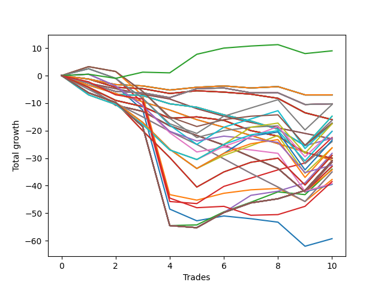

# Short Wallace Doodle 022 
- Symbol: ES
- Date Range: 03/18/2022 - 06/24/2022
- Trading Period: 7:20-12:30
- Number of Trades: 10



| Name | Win Percent | Profit | Avg Profit / Trade |     | Name | Win Percent | Profit | Avg Profit / Trade |
| ---- | ----------- | ------ | ------------------ | --- | ---- | ----------- | ------ | ------------------ |
| Sorted By <br> Profit | | | | | Sorted By <br> Win Percentage ||||
| Seventy-Two | 70.00 | 4500.00 | 450.00 |     | Seventy-Two | 70.00 | 4500.00 | 450.00 |
| Twenty-One | 30.00 | -3500.00 | -350.00 |     | Three | 60.00 | -11250.00 | -1125.00 |
| Twenty | 30.00 | -3500.00 | -350.00 |     | Sixty-Seven | 50.00 | -5250.00 | -525.00 |
| Nineteen | 30.00 | -3500.00 | -350.00 |     | Sixty-Five | 50.00 | -8625.00 | -862.50 |
| Eighteen | 30.00 | -3500.00 | -350.00 |     | Fifty-Nine | 50.00 | -8625.00 | -862.50 |
| Seventeen | 30.00 | -3500.00 | -350.00 |     | Fifty-Seven | 50.00 | -12000.00 | -1200.00 |
| Sixten | 30.00 | -3500.00 | -350.00 |     | Four | 50.00 | -14125.00 | -1412.50 |
| Thirty-Seven | 30.00 | -5125.00 | -512.50 |     | Seventy-Five | 50.00 | -15500.00 | -1550.00 |
| Thirty-Six | 30.00 | -5125.00 | -512.50 |     | Seventy-Four | 50.00 | -15500.00 | -1550.00 |
| Thirty-Five | 30.00 | -5125.00 | -512.50 |     | Seventy-One | 50.00 | -15500.00 | -1550.00 |
| Thirty-Four | 30.00 | -5125.00 | -512.50 |     | Seventy | 50.00 | -15500.00 | -1550.00 |
| Thirty-Three | 30.00 | -5125.00 | -512.50 |     | Fifty-Five | 50.00 | -15500.00 | -1550.00 |
| Thirty-Two | 30.00 | -5125.00 | -512.50 |     | Fifty-Four | 50.00 | -15500.00 | -1550.00 |
| Sixty-Seven | 50.00 | -5250.00 | -525.00 |     | Thirty-Nine | 50.00 | -15500.00 | -1550.00 |
| Twenty-Nine | 10.00 | -7375.00 | -737.50 |     | Thirty-Eight | 50.00 | -15500.00 | -1550.00 |
| Twenty-Eight | 10.00 | -7375.00 | -737.50 |     | Twenty-Three | 50.00 | -15500.00 | -1550.00 |
| Thirteen | 10.00 | -8000.00 | -800.00 |     | Twenty-Two | 50.00 | -15500.00 | -1550.00 |
| Twelve | 10.00 | -8000.00 | -800.00 |     | Seven | 50.00 | -15500.00 | -1550.00 |
| Eleven | 10.00 | -8000.00 | -800.00 |     | Six | 50.00 | -15500.00 | -1550.00 |
| Ten | 10.00 | -8000.00 | -800.00 |     | Five | 50.00 | -15500.00 | -1550.00 |
| Nine | 10.00 | -8000.00 | -800.00 |     | Two | 50.00 | -17000.00 | -1700.00 |
| Eight | 10.00 | -8000.00 | -800.00 |     | One | 50.00 | -18875.00 | -1887.50 |
| twenty-Seven | 10.00 | -8125.00 | -812.50 |     | Sixty-Eight | 40.00 | -8750.00 | -875.00 |
| Twenty-Six | 10.00 | -8125.00 | -812.50 |     | Sixty-Nine | 40.00 | -10125.00 | -1012.50 |
| Sixty-Five | 50.00 | -8625.00 | -862.50 |     | Sixty-Six | 40.00 | -10125.00 | -1012.50 |
| Fifty-Nine | 50.00 | -8625.00 | -862.50 |     | Sixty | 40.00 | -11750.00 | -1175.00 |
| Sixty-Eight | 40.00 | -8750.00 | -875.00 |     | Sixty-One | 40.00 | -13125.00 | -1312.50 |
| Twenty-Five | 10.00 | -8750.00 | -875.00 |     | Fifty-Eight | 40.00 | -13125.00 | -1312.50 |
| Sixty-Nine | 40.00 | -10125.00 | -1012.50 |     | Sixty-Three | 40.00 | -14500.00 | -1450.00 |
| Sixty-Six | 40.00 | -10125.00 | -1012.50 |     | Sixty-Two | 40.00 | -14500.00 | -1450.00 |
| Three | 60.00 | -11250.00 | -1125.00 |     | Seventy-Three | 40.00 | -19250.00 | -1925.00 |
| Twenty-Four | 10.00 | -11375.00 | -1137.50 |     | Twenty-One | 30.00 | -3500.00 | -350.00 |
| Fifteen | 0.00 | -11500.00 | -1150.00 |     | Twenty | 30.00 | -3500.00 | -350.00 |
| Fourteen | 0.00 | -11500.00 | -1150.00 |     | Nineteen | 30.00 | -3500.00 | -350.00 |
| Sixty | 40.00 | -11750.00 | -1175.00 |     | Eighteen | 30.00 | -3500.00 | -350.00 |
| Fifty-Seven | 50.00 | -12000.00 | -1200.00 |     | Seventeen | 30.00 | -3500.00 | -350.00 |
| Sixty-One | 40.00 | -13125.00 | -1312.50 |     | Sixten | 30.00 | -3500.00 | -350.00 |
| Fifty-Eight | 40.00 | -13125.00 | -1312.50 |     | Thirty-Seven | 30.00 | -5125.00 | -512.50 |
| Four | 50.00 | -14125.00 | -1412.50 |     | Thirty-Six | 30.00 | -5125.00 | -512.50 |
| Sixty-Three | 40.00 | -14500.00 | -1450.00 |     | Thirty-Five | 30.00 | -5125.00 | -512.50 |
| Sixty-Two | 40.00 | -14500.00 | -1450.00 |     | Thirty-Four | 30.00 | -5125.00 | -512.50 |
| Fifty-Three | 10.00 | -15000.00 | -1500.00 |     | Thirty-Three | 30.00 | -5125.00 | -512.50 |
| Fifty-Two | 10.00 | -15000.00 | -1500.00 |     | Thirty-Two | 30.00 | -5125.00 | -512.50 |
| Fifty-One | 10.00 | -15000.00 | -1500.00 |     | Sixty-Four | 30.00 | -16250.00 | -1625.00 |
| Fifty | 10.00 | -15000.00 | -1500.00 |     | Fifty-Six | 30.00 | -19625.00 | -1962.50 |
| Forty-Nine | 10.00 | -15000.00 | -1500.00 |     | Zero | 30.00 | -29625.00 | -2962.50 |
| Forty-Eight | 10.00 | -15000.00 | -1500.00 |     | Twenty-Nine | 10.00 | -7375.00 | -737.50 |
| Thirty-One | 0.00 | -15375.00 | -1537.50 |     | Twenty-Eight | 10.00 | -7375.00 | -737.50 |
| Thirty | 0.00 | -15375.00 | -1537.50 |     | Thirteen | 10.00 | -8000.00 | -800.00 |
| Seventy-Five | 50.00 | -15500.00 | -1550.00 |     | Twelve | 10.00 | -8000.00 | -800.00 |
| Seventy-Four | 50.00 | -15500.00 | -1550.00 |     | Eleven | 10.00 | -8000.00 | -800.00 |
| Seventy-One | 50.00 | -15500.00 | -1550.00 |     | Ten | 10.00 | -8000.00 | -800.00 |
| Seventy | 50.00 | -15500.00 | -1550.00 |     | Nine | 10.00 | -8000.00 | -800.00 |
| Fifty-Five | 50.00 | -15500.00 | -1550.00 |     | Eight | 10.00 | -8000.00 | -800.00 |
| Fifty-Four | 50.00 | -15500.00 | -1550.00 |     | twenty-Seven | 10.00 | -8125.00 | -812.50 |
| Thirty-Nine | 50.00 | -15500.00 | -1550.00 |     | Twenty-Six | 10.00 | -8125.00 | -812.50 |
| Thirty-Eight | 50.00 | -15500.00 | -1550.00 |     | Twenty-Five | 10.00 | -8750.00 | -875.00 |
| Twenty-Three | 50.00 | -15500.00 | -1550.00 |     | Twenty-Four | 10.00 | -11375.00 | -1137.50 |
| Twenty-Two | 50.00 | -15500.00 | -1550.00 |     | Fifty-Three | 10.00 | -15000.00 | -1500.00 |
| Seven | 50.00 | -15500.00 | -1550.00 |     | Fifty-Two | 10.00 | -15000.00 | -1500.00 |
| Six | 50.00 | -15500.00 | -1550.00 |     | Fifty-One | 10.00 | -15000.00 | -1500.00 |
| Five | 50.00 | -15500.00 | -1550.00 |     | Fifty | 10.00 | -15000.00 | -1500.00 |
| Forty-Five | 10.00 | -15750.00 | -1575.00 |     | Forty-Nine | 10.00 | -15000.00 | -1500.00 |
| Forty-Four | 10.00 | -15750.00 | -1575.00 |     | Forty-Eight | 10.00 | -15000.00 | -1500.00 |
| Sixty-Four | 30.00 | -16250.00 | -1625.00 |     | Forty-Five | 10.00 | -15750.00 | -1575.00 |
| Forty-Three | 10.00 | -16500.00 | -1650.00 |     | Forty-Four | 10.00 | -15750.00 | -1575.00 |
| Forty-Two | 10.00 | -16500.00 | -1650.00 |     | Forty-Three | 10.00 | -16500.00 | -1650.00 |
| Two | 50.00 | -17000.00 | -1700.00 |     | Forty-Two | 10.00 | -16500.00 | -1650.00 |
| Forty-One | 10.00 | -17125.00 | -1712.50 |     | Forty-One | 10.00 | -17125.00 | -1712.50 |
| Forty-Seven | 10.00 | -17500.00 | -1750.00 |     | Forty-Seven | 10.00 | -17500.00 | -1750.00 |
| Forty-Six | 10.00 | -17500.00 | -1750.00 |     | Forty-Six | 10.00 | -17500.00 | -1750.00 |
| One | 50.00 | -18875.00 | -1887.50 |     | Forty | 10.00 | -19750.00 | -1975.00 |
| Seventy-Three | 40.00 | -19250.00 | -1925.00 |     | Fifteen | 0.00 | -11500.00 | -1150.00 |
| Fifty-Six | 30.00 | -19625.00 | -1962.50 |     | Fourteen | 0.00 | -11500.00 | -1150.00 |
| Forty | 10.00 | -19750.00 | -1975.00 |     | Thirty-One | 0.00 | -15375.00 | -1537.50 |
| Zero | 30.00 | -29625.00 | -2962.50 |     | Thirty | 0.00 | -15375.00 | -1537.50 |

## NO STOPLOSS

### Test Zero
* Sell when price hits the middle line of the 20p bollinger
* No Stoploss
* Results:
```
Total Trades: 10
Percent Up: 70.00
Percent Down: 30.00
Total Points Moved Down: -59.25
Potential Profit: -29625.00
Total Points Ups: 64.25 Count Ups: 7
Total Points Downs: 5.00 Count Downs: 3
```

<details><summary>Trades</summary>

<code>In: 2022-03-18 12:27:00		Out: 2022-03-18 12:37:20		Total Position Time: 10:20		Total Move Down: 0.50		Total to Date: 0.50</code> <br />
<code>In: 2022-03-24 08:28:00		Out: 2022-03-24 08:50:05		Total Position Time: 22:05		Total Move Down: -4.25		Total to Date: -3.75</code> <br />
<code>In: 2022-04-13 08:05:00		Out: 2022-04-13 08:34:55		Total Position Time: 29:55		Total Move Down: -8.75		Total to Date: -12.50</code> <br />
<code>In: 2022-04-28 09:19:00		Out: 2022-04-28 09:48:55		Total Position Time: 29:55		Total Move Down: -36.00		Total to Date: -48.50</code> <br />
<code>In: 2022-05-03 08:10:00		Out: 2022-05-03 08:35:55		Total Position Time: 25:55		Total Move Down: -4.25		Total to Date: -52.75</code> <br />
<code>In: 2022-05-25 12:05:00		Out: 2022-05-25 12:17:30		Total Position Time: 12:30		Total Move Down: 1.75		Total to Date: -51.00</code> <br />
<code>In: 2022-05-26 09:57:00		Out: 2022-05-26 10:12:05		Total Position Time: 15:05		Total Move Down: -1.00		Total to Date: -52.00</code> <br />
<code>In: 2022-05-27 12:09:00		Out: 2022-05-27 12:35:00		Total Position Time: 26:00		Total Move Down: -1.25		Total to Date: -53.25</code> <br />
<code>In: 2022-05-31 08:53:00		Out: 2022-05-31 09:13:00		Total Position Time: 20:00		Total Move Down: -8.75		Total to Date: -62.00</code> <br />
<code>In: 2022-06-22 11:10:00		Out: 2022-06-22 11:21:20		Total Position Time: 11:20		Total Move Down: 2.75		Total to Date: -59.25</code> <br />


</details>

### Test One
* Sell when the price hits the upper line of the 20p 1std bollinger
* No Stoploss
* Results:
```
Total Trades: 10
Percent Up: 50.00
Percent Down: 50.00
Total Points Moved Down: -37.75
Potential Profit: -18875.00
Total Points Ups: 53.25 Count Ups: 5
Total Points Downs: 15.50 Count Downs: 5
```

<details><summary>Trades</summary>

<code>In: 2022-03-18 12:27:00		Out: 2022-03-18 12:39:50		Total Position Time: 12:50		Total Move Down: 3.25		Total to Date: 3.25</code> <br />
<code>In: 2022-03-24 08:28:00		Out: 2022-03-24 08:53:50		Total Position Time: 25:50		Total Move Down: -1.75		Total to Date: 1.50</code> <br />
<code>In: 2022-04-13 08:05:00		Out: 2022-04-13 08:34:55		Total Position Time: 29:55		Total Move Down: -8.75		Total to Date: -7.25</code> <br />
<code>In: 2022-04-28 09:19:00		Out: 2022-04-28 09:48:55		Total Position Time: 29:55		Total Move Down: -36.00		Total to Date: -43.25</code> <br />
<code>In: 2022-05-03 08:10:00		Out: 2022-05-03 08:38:05		Total Position Time: 28:05		Total Move Down: -2.00		Total to Date: -45.25</code> <br />
<code>In: 2022-05-25 12:05:00		Out: 2022-05-25 12:20:15		Total Position Time: 15:15		Total Move Down: 2.50		Total to Date: -42.75</code> <br />
<code>In: 2022-05-26 09:57:00		Out: 2022-05-26 10:12:45		Total Position Time: 15:45		Total Move Down: 1.25		Total to Date: -41.50</code> <br />
<code>In: 2022-05-27 12:09:00		Out: 2022-05-27 12:35:40		Total Position Time: 26:40		Total Move Down: 0.50		Total to Date: -41.00</code> <br />
<code>In: 2022-05-31 08:53:00		Out: 2022-05-31 09:14:40		Total Position Time: 21:40		Total Move Down: -4.75		Total to Date: -45.75</code> <br />
<code>In: 2022-06-22 11:10:00		Out: 2022-06-22 11:21:45		Total Position Time: 11:45		Total Move Down: 8.00		Total to Date: -37.75</code> <br />


</details>

### Test Two
* Sell when the price hits the upper line of the 20p 2std bollinger
* No Stoploss
* Results:
```
Total Trades: 10
Percent Up: 50.00
Percent Down: 50.00
Total Points Moved Down: -34.00
Potential Profit: -17000.00
Total Points Ups: 55.50 Count Ups: 5
Total Points Downs: 21.50 Count Downs: 5
```

<details><summary>Trades</summary>

<code>In: 2022-03-18 12:27:00		Out: 2022-03-18 12:56:55		Total Position Time: 29:55		Total Move Down: -6.25		Total to Date: -6.25</code> <br />
<code>In: 2022-03-24 08:28:00		Out: 2022-03-24 08:57:55		Total Position Time: 29:55		Total Move Down: -3.50		Total to Date: -9.75</code> <br />
<code>In: 2022-04-13 08:05:00		Out: 2022-04-13 08:34:55		Total Position Time: 29:55		Total Move Down: -8.75		Total to Date: -18.50</code> <br />
<code>In: 2022-04-28 09:19:00		Out: 2022-04-28 09:48:55		Total Position Time: 29:55		Total Move Down: -36.00		Total to Date: -54.50</code> <br />
<code>In: 2022-05-03 08:10:00		Out: 2022-05-03 08:39:10		Total Position Time: 29:10		Total Move Down: 0.25		Total to Date: -54.25</code> <br />
<code>In: 2022-05-25 12:05:00		Out: 2022-05-25 12:23:00		Total Position Time: 18:00		Total Move Down: 4.75		Total to Date: -49.50</code> <br />
<code>In: 2022-05-26 09:57:00		Out: 2022-05-26 10:22:50		Total Position Time: 25:50		Total Move Down: 3.50		Total to Date: -46.00</code> <br />
<code>In: 2022-05-27 12:09:00		Out: 2022-05-27 12:38:10		Total Position Time: 29:10		Total Move Down: 3.75		Total to Date: -42.25</code> <br />
<code>In: 2022-05-31 08:53:00		Out: 2022-05-31 09:15:55		Total Position Time: 22:55		Total Move Down: -1.00		Total to Date: -43.25</code> <br />
<code>In: 2022-06-22 11:10:00		Out: 2022-06-22 11:26:30		Total Position Time: 16:30		Total Move Down: 9.25		Total to Date: -34.00</code> <br />


</details>

### Test Three
* Sell when price hits the middle line of the 50p bollinger
* No Stoploss
* Results:
```
Total Trades: 10
Percent Up: 40.00
Percent Down: 60.00
Total Points Moved Down: -22.50
Potential Profit: -11250.00
Total Points Ups: 49.00 Count Ups: 4
Total Points Downs: 26.50 Count Downs: 6
```

<details><summary>Trades</summary>

<code>In: 2022-03-18 12:27:00		Out: 2022-03-18 12:52:55		Total Position Time: 25:55		Total Move Down: 2.50		Total to Date: 2.50</code> <br />
<code>In: 2022-03-24 08:28:00		Out: 2022-03-24 08:57:55		Total Position Time: 29:55		Total Move Down: -3.50		Total to Date: -1.00</code> <br />
<code>In: 2022-04-13 08:05:00		Out: 2022-04-13 08:34:55		Total Position Time: 29:55		Total Move Down: -8.75		Total to Date: -9.75</code> <br />
<code>In: 2022-04-28 09:19:00		Out: 2022-04-28 09:48:55		Total Position Time: 29:55		Total Move Down: -36.00		Total to Date: -45.75</code> <br />
<code>In: 2022-05-03 08:10:00		Out: 2022-05-03 08:39:55		Total Position Time: 29:55		Total Move Down: -0.75		Total to Date: -46.50</code> <br />
<code>In: 2022-05-25 12:05:00		Out: 2022-05-25 12:34:20		Total Position Time: 29:20		Total Move Down: 6.25		Total to Date: -40.25</code> <br />
<code>In: 2022-05-26 09:57:00		Out: 2022-05-26 10:22:45		Total Position Time: 25:45		Total Move Down: 3.00		Total to Date: -37.25</code> <br />
<code>In: 2022-05-27 12:09:00		Out: 2022-05-27 12:38:05		Total Position Time: 29:05		Total Move Down: 3.00		Total to Date: -34.25</code> <br />
<code>In: 2022-05-31 08:53:00		Out: 2022-05-31 09:19:05		Total Position Time: 26:05		Total Move Down: 2.50		Total to Date: -31.75</code> <br />
<code>In: 2022-06-22 11:10:00		Out: 2022-06-22 11:26:30		Total Position Time: 16:30		Total Move Down: 9.25		Total to Date: -22.50</code> <br />


</details>

### Test Four
* Sell when the price hits the upper line of the 50p 1std bollinger
* No Stoploss
* Results:
```
Total Trades: 10
Percent Up: 50.00
Percent Down: 50.00
Total Points Moved Down: -28.25
Potential Profit: -14125.00
Total Points Ups: 55.25 Count Ups: 5
Total Points Downs: 27.00 Count Downs: 5
```

<details><summary>Trades</summary>

<code>In: 2022-03-18 12:27:00		Out: 2022-03-18 12:56:55		Total Position Time: 29:55		Total Move Down: -6.25		Total to Date: -6.25</code> <br />
<code>In: 2022-03-24 08:28:00		Out: 2022-03-24 08:57:55		Total Position Time: 29:55		Total Move Down: -3.50		Total to Date: -9.75</code> <br />
<code>In: 2022-04-13 08:05:00		Out: 2022-04-13 08:34:55		Total Position Time: 29:55		Total Move Down: -8.75		Total to Date: -18.50</code> <br />
<code>In: 2022-04-28 09:19:00		Out: 2022-04-28 09:48:55		Total Position Time: 29:55		Total Move Down: -36.00		Total to Date: -54.50</code> <br />
<code>In: 2022-05-03 08:10:00		Out: 2022-05-03 08:39:55		Total Position Time: 29:55		Total Move Down: -0.75		Total to Date: -55.25</code> <br />
<code>In: 2022-05-25 12:05:00		Out: 2022-05-25 12:34:55		Total Position Time: 29:55		Total Move Down: 5.50		Total to Date: -49.75</code> <br />
<code>In: 2022-05-26 09:57:00		Out: 2022-05-26 10:24:05		Total Position Time: 27:05		Total Move Down: 6.25		Total to Date: -43.50</code> <br />
<code>In: 2022-05-27 12:09:00		Out: 2022-05-27 12:38:55		Total Position Time: 29:55		Total Move Down: 1.50		Total to Date: -42.00</code> <br />
<code>In: 2022-05-31 08:53:00		Out: 2022-05-31 09:22:55		Total Position Time: 29:55		Total Move Down: 3.00		Total to Date: -39.00</code> <br />
<code>In: 2022-06-22 11:10:00		Out: 2022-06-22 11:39:55		Total Position Time: 29:55		Total Move Down: 10.75		Total to Date: -28.25</code> <br />


</details>

### Test Five
* Sell when the price hits the upper line of the 50p 2std bollinger
* No Stoploss
* Results:
```
Total Trades: 10
Percent Up: 50.00
Percent Down: 50.00
Total Points Moved Down: -31.00
Potential Profit: -15500.00
Total Points Ups: 55.25 Count Ups: 5
Total Points Downs: 24.25 Count Downs: 5
```

<details><summary>Trades</summary>

<code>In: 2022-03-18 12:27:00		Out: 2022-03-18 12:56:55		Total Position Time: 29:55		Total Move Down: -6.25		Total to Date: -6.25</code> <br />
<code>In: 2022-03-24 08:28:00		Out: 2022-03-24 08:57:55		Total Position Time: 29:55		Total Move Down: -3.50		Total to Date: -9.75</code> <br />
<code>In: 2022-04-13 08:05:00		Out: 2022-04-13 08:34:55		Total Position Time: 29:55		Total Move Down: -8.75		Total to Date: -18.50</code> <br />
<code>In: 2022-04-28 09:19:00		Out: 2022-04-28 09:48:55		Total Position Time: 29:55		Total Move Down: -36.00		Total to Date: -54.50</code> <br />
<code>In: 2022-05-03 08:10:00		Out: 2022-05-03 08:39:55		Total Position Time: 29:55		Total Move Down: -0.75		Total to Date: -55.25</code> <br />
<code>In: 2022-05-25 12:05:00		Out: 2022-05-25 12:34:55		Total Position Time: 29:55		Total Move Down: 5.50		Total to Date: -49.75</code> <br />
<code>In: 2022-05-26 09:57:00		Out: 2022-05-26 10:26:55		Total Position Time: 29:55		Total Move Down: 3.50		Total to Date: -46.25</code> <br />
<code>In: 2022-05-27 12:09:00		Out: 2022-05-27 12:38:55		Total Position Time: 29:55		Total Move Down: 1.50		Total to Date: -44.75</code> <br />
<code>In: 2022-05-31 08:53:00		Out: 2022-05-31 09:22:55		Total Position Time: 29:55		Total Move Down: 3.00		Total to Date: -41.75</code> <br />
<code>In: 2022-06-22 11:10:00		Out: 2022-06-22 11:39:55		Total Position Time: 29:55		Total Move Down: 10.75		Total to Date: -31.00</code> <br />


</details>

### Test Six
* Sell when the price hits the middle line of the 1std VWAP
* No Stoploss
* Results:
```
Total Trades: 10
Percent Up: 50.00
Percent Down: 50.00
Total Points Moved Down: -31.00
Potential Profit: -15500.00
Total Points Ups: 55.25 Count Ups: 5
Total Points Downs: 24.25 Count Downs: 5
```

<details><summary>Trades</summary>

<code>In: 2022-03-18 12:27:00		Out: 2022-03-18 12:56:55		Total Position Time: 29:55		Total Move Down: -6.25		Total to Date: -6.25</code> <br />
<code>In: 2022-03-24 08:28:00		Out: 2022-03-24 08:57:55		Total Position Time: 29:55		Total Move Down: -3.50		Total to Date: -9.75</code> <br />
<code>In: 2022-04-13 08:05:00		Out: 2022-04-13 08:34:55		Total Position Time: 29:55		Total Move Down: -8.75		Total to Date: -18.50</code> <br />
<code>In: 2022-04-28 09:19:00		Out: 2022-04-28 09:48:55		Total Position Time: 29:55		Total Move Down: -36.00		Total to Date: -54.50</code> <br />
<code>In: 2022-05-03 08:10:00		Out: 2022-05-03 08:39:55		Total Position Time: 29:55		Total Move Down: -0.75		Total to Date: -55.25</code> <br />
<code>In: 2022-05-25 12:05:00		Out: 2022-05-25 12:34:55		Total Position Time: 29:55		Total Move Down: 5.50		Total to Date: -49.75</code> <br />
<code>In: 2022-05-26 09:57:00		Out: 2022-05-26 10:26:55		Total Position Time: 29:55		Total Move Down: 3.50		Total to Date: -46.25</code> <br />
<code>In: 2022-05-27 12:09:00		Out: 2022-05-27 12:38:55		Total Position Time: 29:55		Total Move Down: 1.50		Total to Date: -44.75</code> <br />
<code>In: 2022-05-31 08:53:00		Out: 2022-05-31 09:22:55		Total Position Time: 29:55		Total Move Down: 3.00		Total to Date: -41.75</code> <br />
<code>In: 2022-06-22 11:10:00		Out: 2022-06-22 11:39:55		Total Position Time: 29:55		Total Move Down: 10.75		Total to Date: -31.00</code> <br />


</details>

### Test Seven
* Sell when the price hits the upper line of the 1std VWAP
* No Stoploss
* Results:
```
Total Trades: 10
Percent Up: 50.00
Percent Down: 50.00
Total Points Moved Down: -31.00
Potential Profit: -15500.00
Total Points Ups: 55.25 Count Ups: 5
Total Points Downs: 24.25 Count Downs: 5
```

<details><summary>Trades</summary>

<code>In: 2022-03-18 12:27:00		Out: 2022-03-18 12:56:55		Total Position Time: 29:55		Total Move Down: -6.25		Total to Date: -6.25</code> <br />
<code>In: 2022-03-24 08:28:00		Out: 2022-03-24 08:57:55		Total Position Time: 29:55		Total Move Down: -3.50		Total to Date: -9.75</code> <br />
<code>In: 2022-04-13 08:05:00		Out: 2022-04-13 08:34:55		Total Position Time: 29:55		Total Move Down: -8.75		Total to Date: -18.50</code> <br />
<code>In: 2022-04-28 09:19:00		Out: 2022-04-28 09:48:55		Total Position Time: 29:55		Total Move Down: -36.00		Total to Date: -54.50</code> <br />
<code>In: 2022-05-03 08:10:00		Out: 2022-05-03 08:39:55		Total Position Time: 29:55		Total Move Down: -0.75		Total to Date: -55.25</code> <br />
<code>In: 2022-05-25 12:05:00		Out: 2022-05-25 12:34:55		Total Position Time: 29:55		Total Move Down: 5.50		Total to Date: -49.75</code> <br />
<code>In: 2022-05-26 09:57:00		Out: 2022-05-26 10:26:55		Total Position Time: 29:55		Total Move Down: 3.50		Total to Date: -46.25</code> <br />
<code>In: 2022-05-27 12:09:00		Out: 2022-05-27 12:38:55		Total Position Time: 29:55		Total Move Down: 1.50		Total to Date: -44.75</code> <br />
<code>In: 2022-05-31 08:53:00		Out: 2022-05-31 09:22:55		Total Position Time: 29:55		Total Move Down: 3.00		Total to Date: -41.75</code> <br />
<code>In: 2022-06-22 11:10:00		Out: 2022-06-22 11:39:55		Total Position Time: 29:55		Total Move Down: 10.75		Total to Date: -31.00</code> <br />


</details>

## STOPLOSS OF 2

### Test Eight
* Sell when price hits the middle line of the 20p bollinger
* Stoploss is -2 points
* Results:
```
Total Trades: 10
Percent Up: 90.00
Percent Down: 10.00
Total Points Moved Down: -16.00
Potential Profit: -8000.00
Total Points Ups: 17.00 Count Ups: 9
Total Points Downs: 1.00 Count Downs: 1
```

<details><summary>Trades</summary>

<code>In: 2022-03-18 12:27:00		Out: 2022-03-18 12:31:20		Total Position Time: 04:20		Total Move Down: -1.25		Total to Date: -1.25</code> <br />
<code>In: 2022-03-24 08:28:00		Out: 2022-03-24 08:30:10		Total Position Time: 02:10		Total Move Down: -3.00		Total to Date: -4.25</code> <br />
<code>In: 2022-04-13 08:05:00		Out: 2022-04-13 08:05:10		Total Position Time: 00:10		Total Move Down: -0.50		Total to Date: -4.75</code> <br />
<code>In: 2022-04-28 09:19:00		Out: 2022-04-28 09:21:10		Total Position Time: 02:10		Total Move Down: -1.75		Total to Date: -6.50</code> <br />
<code>In: 2022-05-03 08:10:00		Out: 2022-05-03 08:10:25		Total Position Time: 00:25		Total Move Down: 1.00		Total to Date: -5.50</code> <br />
<code>In: 2022-05-25 12:05:00		Out: 2022-05-25 12:08:05		Total Position Time: 03:05		Total Move Down: -0.50		Total to Date: -6.00</code> <br />
<code>In: 2022-05-26 09:57:00		Out: 2022-05-26 10:01:05		Total Position Time: 04:05		Total Move Down: -0.75		Total to Date: -6.75</code> <br />
<code>In: 2022-05-27 12:09:00		Out: 2022-05-27 12:22:50		Total Position Time: 13:50		Total Move Down: -1.50		Total to Date: -8.25</code> <br />
<code>In: 2022-05-31 08:53:00		Out: 2022-05-31 08:55:35		Total Position Time: 02:35		Total Move Down: -5.25		Total to Date: -13.50</code> <br />
<code>In: 2022-06-22 11:10:00		Out: 2022-06-22 11:16:30		Total Position Time: 06:30		Total Move Down: -2.50		Total to Date: -16.00</code> <br />


</details>

### Test Nine
* Sell when the price hits the upper line of the 20p 1std bollinger
* Stoploss is -2 points
* Results:
```
Total Trades: 10
Percent Up: 90.00
Percent Down: 10.00
Total Points Moved Down: -16.00
Potential Profit: -8000.00
Total Points Ups: 17.00 Count Ups: 9
Total Points Downs: 1.00 Count Downs: 1
```

<details><summary>Trades</summary>

<code>In: 2022-03-18 12:27:00		Out: 2022-03-18 12:31:20		Total Position Time: 04:20		Total Move Down: -1.25		Total to Date: -1.25</code> <br />
<code>In: 2022-03-24 08:28:00		Out: 2022-03-24 08:30:10		Total Position Time: 02:10		Total Move Down: -3.00		Total to Date: -4.25</code> <br />
<code>In: 2022-04-13 08:05:00		Out: 2022-04-13 08:05:10		Total Position Time: 00:10		Total Move Down: -0.50		Total to Date: -4.75</code> <br />
<code>In: 2022-04-28 09:19:00		Out: 2022-04-28 09:21:10		Total Position Time: 02:10		Total Move Down: -1.75		Total to Date: -6.50</code> <br />
<code>In: 2022-05-03 08:10:00		Out: 2022-05-03 08:10:25		Total Position Time: 00:25		Total Move Down: 1.00		Total to Date: -5.50</code> <br />
<code>In: 2022-05-25 12:05:00		Out: 2022-05-25 12:08:05		Total Position Time: 03:05		Total Move Down: -0.50		Total to Date: -6.00</code> <br />
<code>In: 2022-05-26 09:57:00		Out: 2022-05-26 10:01:05		Total Position Time: 04:05		Total Move Down: -0.75		Total to Date: -6.75</code> <br />
<code>In: 2022-05-27 12:09:00		Out: 2022-05-27 12:22:50		Total Position Time: 13:50		Total Move Down: -1.50		Total to Date: -8.25</code> <br />
<code>In: 2022-05-31 08:53:00		Out: 2022-05-31 08:55:35		Total Position Time: 02:35		Total Move Down: -5.25		Total to Date: -13.50</code> <br />
<code>In: 2022-06-22 11:10:00		Out: 2022-06-22 11:16:30		Total Position Time: 06:30		Total Move Down: -2.50		Total to Date: -16.00</code> <br />


</details>

### Test Ten
* Sell when the price hits the upper line of the 20p 2std bollinger
* Stoploss is -2 points
* Results:
```
Total Trades: 10
Percent Up: 90.00
Percent Down: 10.00
Total Points Moved Down: -16.00
Potential Profit: -8000.00
Total Points Ups: 17.00 Count Ups: 9
Total Points Downs: 1.00 Count Downs: 1
```

<details><summary>Trades</summary>

<code>In: 2022-03-18 12:27:00		Out: 2022-03-18 12:31:20		Total Position Time: 04:20		Total Move Down: -1.25		Total to Date: -1.25</code> <br />
<code>In: 2022-03-24 08:28:00		Out: 2022-03-24 08:30:10		Total Position Time: 02:10		Total Move Down: -3.00		Total to Date: -4.25</code> <br />
<code>In: 2022-04-13 08:05:00		Out: 2022-04-13 08:05:10		Total Position Time: 00:10		Total Move Down: -0.50		Total to Date: -4.75</code> <br />
<code>In: 2022-04-28 09:19:00		Out: 2022-04-28 09:21:10		Total Position Time: 02:10		Total Move Down: -1.75		Total to Date: -6.50</code> <br />
<code>In: 2022-05-03 08:10:00		Out: 2022-05-03 08:10:25		Total Position Time: 00:25		Total Move Down: 1.00		Total to Date: -5.50</code> <br />
<code>In: 2022-05-25 12:05:00		Out: 2022-05-25 12:08:05		Total Position Time: 03:05		Total Move Down: -0.50		Total to Date: -6.00</code> <br />
<code>In: 2022-05-26 09:57:00		Out: 2022-05-26 10:01:05		Total Position Time: 04:05		Total Move Down: -0.75		Total to Date: -6.75</code> <br />
<code>In: 2022-05-27 12:09:00		Out: 2022-05-27 12:22:50		Total Position Time: 13:50		Total Move Down: -1.50		Total to Date: -8.25</code> <br />
<code>In: 2022-05-31 08:53:00		Out: 2022-05-31 08:55:35		Total Position Time: 02:35		Total Move Down: -5.25		Total to Date: -13.50</code> <br />
<code>In: 2022-06-22 11:10:00		Out: 2022-06-22 11:16:30		Total Position Time: 06:30		Total Move Down: -2.50		Total to Date: -16.00</code> <br />


</details>

### Test Eleven
* Sell when price hits the middle line of the 50p bollinger
* Stoploss is -2 points
* Results:
```
Total Trades: 10
Percent Up: 90.00
Percent Down: 10.00
Total Points Moved Down: -16.00
Potential Profit: -8000.00
Total Points Ups: 17.00 Count Ups: 9
Total Points Downs: 1.00 Count Downs: 1
```

<details><summary>Trades</summary>

<code>In: 2022-03-18 12:27:00		Out: 2022-03-18 12:31:20		Total Position Time: 04:20		Total Move Down: -1.25		Total to Date: -1.25</code> <br />
<code>In: 2022-03-24 08:28:00		Out: 2022-03-24 08:30:10		Total Position Time: 02:10		Total Move Down: -3.00		Total to Date: -4.25</code> <br />
<code>In: 2022-04-13 08:05:00		Out: 2022-04-13 08:05:10		Total Position Time: 00:10		Total Move Down: -0.50		Total to Date: -4.75</code> <br />
<code>In: 2022-04-28 09:19:00		Out: 2022-04-28 09:21:10		Total Position Time: 02:10		Total Move Down: -1.75		Total to Date: -6.50</code> <br />
<code>In: 2022-05-03 08:10:00		Out: 2022-05-03 08:10:25		Total Position Time: 00:25		Total Move Down: 1.00		Total to Date: -5.50</code> <br />
<code>In: 2022-05-25 12:05:00		Out: 2022-05-25 12:08:05		Total Position Time: 03:05		Total Move Down: -0.50		Total to Date: -6.00</code> <br />
<code>In: 2022-05-26 09:57:00		Out: 2022-05-26 10:01:05		Total Position Time: 04:05		Total Move Down: -0.75		Total to Date: -6.75</code> <br />
<code>In: 2022-05-27 12:09:00		Out: 2022-05-27 12:22:50		Total Position Time: 13:50		Total Move Down: -1.50		Total to Date: -8.25</code> <br />
<code>In: 2022-05-31 08:53:00		Out: 2022-05-31 08:55:35		Total Position Time: 02:35		Total Move Down: -5.25		Total to Date: -13.50</code> <br />
<code>In: 2022-06-22 11:10:00		Out: 2022-06-22 11:16:30		Total Position Time: 06:30		Total Move Down: -2.50		Total to Date: -16.00</code> <br />


</details>

### Test Twelve
* Sell when the price hits the upper line of the 50p 1std bollinger
* Stoploss is -2 points
* Results:
```
Total Trades: 10
Percent Up: 90.00
Percent Down: 10.00
Total Points Moved Down: -16.00
Potential Profit: -8000.00
Total Points Ups: 17.00 Count Ups: 9
Total Points Downs: 1.00 Count Downs: 1
```

<details><summary>Trades</summary>

<code>In: 2022-03-18 12:27:00		Out: 2022-03-18 12:31:20		Total Position Time: 04:20		Total Move Down: -1.25		Total to Date: -1.25</code> <br />
<code>In: 2022-03-24 08:28:00		Out: 2022-03-24 08:30:10		Total Position Time: 02:10		Total Move Down: -3.00		Total to Date: -4.25</code> <br />
<code>In: 2022-04-13 08:05:00		Out: 2022-04-13 08:05:10		Total Position Time: 00:10		Total Move Down: -0.50		Total to Date: -4.75</code> <br />
<code>In: 2022-04-28 09:19:00		Out: 2022-04-28 09:21:10		Total Position Time: 02:10		Total Move Down: -1.75		Total to Date: -6.50</code> <br />
<code>In: 2022-05-03 08:10:00		Out: 2022-05-03 08:10:25		Total Position Time: 00:25		Total Move Down: 1.00		Total to Date: -5.50</code> <br />
<code>In: 2022-05-25 12:05:00		Out: 2022-05-25 12:08:05		Total Position Time: 03:05		Total Move Down: -0.50		Total to Date: -6.00</code> <br />
<code>In: 2022-05-26 09:57:00		Out: 2022-05-26 10:01:05		Total Position Time: 04:05		Total Move Down: -0.75		Total to Date: -6.75</code> <br />
<code>In: 2022-05-27 12:09:00		Out: 2022-05-27 12:22:50		Total Position Time: 13:50		Total Move Down: -1.50		Total to Date: -8.25</code> <br />
<code>In: 2022-05-31 08:53:00		Out: 2022-05-31 08:55:35		Total Position Time: 02:35		Total Move Down: -5.25		Total to Date: -13.50</code> <br />
<code>In: 2022-06-22 11:10:00		Out: 2022-06-22 11:16:30		Total Position Time: 06:30		Total Move Down: -2.50		Total to Date: -16.00</code> <br />


</details>

### Test Thirteen
* Sell when the price hits the upper line of the 50p 2std bollinger
* Stoploss is -2 points
* Results:
```
Total Trades: 10
Percent Up: 90.00
Percent Down: 10.00
Total Points Moved Down: -16.00
Potential Profit: -8000.00
Total Points Ups: 17.00 Count Ups: 9
Total Points Downs: 1.00 Count Downs: 1
```

<details><summary>Trades</summary>

<code>In: 2022-03-18 12:27:00		Out: 2022-03-18 12:31:20		Total Position Time: 04:20		Total Move Down: -1.25		Total to Date: -1.25</code> <br />
<code>In: 2022-03-24 08:28:00		Out: 2022-03-24 08:30:10		Total Position Time: 02:10		Total Move Down: -3.00		Total to Date: -4.25</code> <br />
<code>In: 2022-04-13 08:05:00		Out: 2022-04-13 08:05:10		Total Position Time: 00:10		Total Move Down: -0.50		Total to Date: -4.75</code> <br />
<code>In: 2022-04-28 09:19:00		Out: 2022-04-28 09:21:10		Total Position Time: 02:10		Total Move Down: -1.75		Total to Date: -6.50</code> <br />
<code>In: 2022-05-03 08:10:00		Out: 2022-05-03 08:10:25		Total Position Time: 00:25		Total Move Down: 1.00		Total to Date: -5.50</code> <br />
<code>In: 2022-05-25 12:05:00		Out: 2022-05-25 12:08:05		Total Position Time: 03:05		Total Move Down: -0.50		Total to Date: -6.00</code> <br />
<code>In: 2022-05-26 09:57:00		Out: 2022-05-26 10:01:05		Total Position Time: 04:05		Total Move Down: -0.75		Total to Date: -6.75</code> <br />
<code>In: 2022-05-27 12:09:00		Out: 2022-05-27 12:22:50		Total Position Time: 13:50		Total Move Down: -1.50		Total to Date: -8.25</code> <br />
<code>In: 2022-05-31 08:53:00		Out: 2022-05-31 08:55:35		Total Position Time: 02:35		Total Move Down: -5.25		Total to Date: -13.50</code> <br />
<code>In: 2022-06-22 11:10:00		Out: 2022-06-22 11:16:30		Total Position Time: 06:30		Total Move Down: -2.50		Total to Date: -16.00</code> <br />


</details>

### Test Fourteen
* Sell when the price hits the middle line of the 1std VWAP
* Stoploss is -2 points
* Results:
```
Total Trades: 10
Percent Up: 100.00
Percent Down: 0.00
Total Points Moved Down: -23.00
Potential Profit: -11500.00
Total Points Ups: 23.00 Count Ups: 10
Total Points Downs: 0.00 Count Downs: 0
```

<details><summary>Trades</summary>

<code>In: 2022-03-18 12:27:00		Out: 2022-03-18 12:31:35		Total Position Time: 04:35		Total Move Down: -2.75		Total to Date: -2.75</code> <br />
<code>In: 2022-03-24 08:28:00		Out: 2022-03-24 08:30:05		Total Position Time: 02:05		Total Move Down: -2.00		Total to Date: -4.75</code> <br />
<code>In: 2022-04-13 08:05:00		Out: 2022-04-13 08:14:40		Total Position Time: 09:40		Total Move Down: -2.00		Total to Date: -6.75</code> <br />
<code>In: 2022-04-28 09:19:00		Out: 2022-04-28 09:21:10		Total Position Time: 02:10		Total Move Down: -1.75		Total to Date: -8.50</code> <br />
<code>In: 2022-05-03 08:10:00		Out: 2022-05-03 08:15:05		Total Position Time: 05:05		Total Move Down: -3.50		Total to Date: -12.00</code> <br />
<code>In: 2022-05-25 12:05:00		Out: 2022-05-25 12:08:30		Total Position Time: 03:30		Total Move Down: -2.75		Total to Date: -14.75</code> <br />
<code>In: 2022-05-26 09:57:00		Out: 2022-05-26 10:02:50		Total Position Time: 05:50		Total Move Down: -2.25		Total to Date: -17.00</code> <br />
<code>In: 2022-05-27 12:09:00		Out: 2022-05-27 12:23:50		Total Position Time: 14:50		Total Move Down: -2.00		Total to Date: -19.00</code> <br />
<code>In: 2022-05-31 08:53:00		Out: 2022-05-31 08:53:25		Total Position Time: 00:25		Total Move Down: -2.00		Total to Date: -21.00</code> <br />
<code>In: 2022-06-22 11:10:00		Out: 2022-06-22 11:15:40		Total Position Time: 05:40		Total Move Down: -2.00		Total to Date: -23.00</code> <br />


</details>

### Test Fifteen
* Sell when the price hits the upper line of the 1std VWAP
* Stoploss is -2 points
* Results:
```
Total Trades: 10
Percent Up: 100.00
Percent Down: 0.00
Total Points Moved Down: -23.00
Potential Profit: -11500.00
Total Points Ups: 23.00 Count Ups: 10
Total Points Downs: 0.00 Count Downs: 0
```

<details><summary>Trades</summary>

<code>In: 2022-03-18 12:27:00		Out: 2022-03-18 12:31:35		Total Position Time: 04:35		Total Move Down: -2.75		Total to Date: -2.75</code> <br />
<code>In: 2022-03-24 08:28:00		Out: 2022-03-24 08:30:05		Total Position Time: 02:05		Total Move Down: -2.00		Total to Date: -4.75</code> <br />
<code>In: 2022-04-13 08:05:00		Out: 2022-04-13 08:14:40		Total Position Time: 09:40		Total Move Down: -2.00		Total to Date: -6.75</code> <br />
<code>In: 2022-04-28 09:19:00		Out: 2022-04-28 09:21:10		Total Position Time: 02:10		Total Move Down: -1.75		Total to Date: -8.50</code> <br />
<code>In: 2022-05-03 08:10:00		Out: 2022-05-03 08:15:05		Total Position Time: 05:05		Total Move Down: -3.50		Total to Date: -12.00</code> <br />
<code>In: 2022-05-25 12:05:00		Out: 2022-05-25 12:08:30		Total Position Time: 03:30		Total Move Down: -2.75		Total to Date: -14.75</code> <br />
<code>In: 2022-05-26 09:57:00		Out: 2022-05-26 10:02:50		Total Position Time: 05:50		Total Move Down: -2.25		Total to Date: -17.00</code> <br />
<code>In: 2022-05-27 12:09:00		Out: 2022-05-27 12:23:50		Total Position Time: 14:50		Total Move Down: -2.00		Total to Date: -19.00</code> <br />
<code>In: 2022-05-31 08:53:00		Out: 2022-05-31 08:53:25		Total Position Time: 00:25		Total Move Down: -2.00		Total to Date: -21.00</code> <br />
<code>In: 2022-06-22 11:10:00		Out: 2022-06-22 11:15:40		Total Position Time: 05:40		Total Move Down: -2.00		Total to Date: -23.00</code> <br />


</details>

## TRAIL STOP OF 2

### Test Sixten
* Sell when price hits the middle line of the 20p bollinger
* Trailing Stop is -2 points
* Results:
```
Total Trades: 10
Percent Up: 70.00
Percent Down: 30.00
Total Points Moved Down: -7.00
Potential Profit: -3500.00
Total Points Ups: 9.00 Count Ups: 7
Total Points Downs: 2.00 Count Downs: 3
```

<details><summary>Trades</summary>

<code>In: 2022-03-18 12:27:00		Out: 2022-03-18 12:31:20		Total Position Time: 04:20		Total Move Down: -1.25		Total to Date: -1.25</code> <br />
<code>In: 2022-03-24 08:28:00		Out: 2022-03-24 08:30:05		Total Position Time: 02:05		Total Move Down: -2.00		Total to Date: -3.25</code> <br />
<code>In: 2022-04-13 08:05:00		Out: 2022-04-13 08:05:10		Total Position Time: 00:10		Total Move Down: -0.50		Total to Date: -3.75</code> <br />
<code>In: 2022-04-28 09:19:00		Out: 2022-04-28 09:21:00		Total Position Time: 02:00		Total Move Down: -1.50		Total to Date: -5.25</code> <br />
<code>In: 2022-05-03 08:10:00		Out: 2022-05-03 08:10:25		Total Position Time: 00:25		Total Move Down: 1.00		Total to Date: -4.25</code> <br />
<code>In: 2022-05-25 12:05:00		Out: 2022-05-25 12:05:55		Total Position Time: 00:55		Total Move Down: 0.50		Total to Date: -3.75</code> <br />
<code>In: 2022-05-26 09:57:00		Out: 2022-05-26 09:59:55		Total Position Time: 02:55		Total Move Down: -0.75		Total to Date: -4.50</code> <br />
<code>In: 2022-05-27 12:09:00		Out: 2022-05-27 12:13:55		Total Position Time: 04:55		Total Move Down: 0.50		Total to Date: -4.00</code> <br />
<code>In: 2022-05-31 08:53:00		Out: 2022-05-31 08:53:55		Total Position Time: 00:55		Total Move Down: -3.00		Total to Date: -7.00</code> <br />
<code>In: 2022-06-22 11:10:00		Out: 2022-06-22 11:11:00		Total Position Time: 01:00		Total Move Down: -0.00		Total to Date: -7.00</code> <br />


</details>

### Test Seventeen
* Sell when the price hits the upper line of the 20p 1std bollinger
* Trailing Stop is -2 points
* Results:
```
Total Trades: 10
Percent Up: 70.00
Percent Down: 30.00
Total Points Moved Down: -7.00
Potential Profit: -3500.00
Total Points Ups: 9.00 Count Ups: 7
Total Points Downs: 2.00 Count Downs: 3
```

<details><summary>Trades</summary>

<code>In: 2022-03-18 12:27:00		Out: 2022-03-18 12:31:20		Total Position Time: 04:20		Total Move Down: -1.25		Total to Date: -1.25</code> <br />
<code>In: 2022-03-24 08:28:00		Out: 2022-03-24 08:30:05		Total Position Time: 02:05		Total Move Down: -2.00		Total to Date: -3.25</code> <br />
<code>In: 2022-04-13 08:05:00		Out: 2022-04-13 08:05:10		Total Position Time: 00:10		Total Move Down: -0.50		Total to Date: -3.75</code> <br />
<code>In: 2022-04-28 09:19:00		Out: 2022-04-28 09:21:00		Total Position Time: 02:00		Total Move Down: -1.50		Total to Date: -5.25</code> <br />
<code>In: 2022-05-03 08:10:00		Out: 2022-05-03 08:10:25		Total Position Time: 00:25		Total Move Down: 1.00		Total to Date: -4.25</code> <br />
<code>In: 2022-05-25 12:05:00		Out: 2022-05-25 12:05:55		Total Position Time: 00:55		Total Move Down: 0.50		Total to Date: -3.75</code> <br />
<code>In: 2022-05-26 09:57:00		Out: 2022-05-26 09:59:55		Total Position Time: 02:55		Total Move Down: -0.75		Total to Date: -4.50</code> <br />
<code>In: 2022-05-27 12:09:00		Out: 2022-05-27 12:13:55		Total Position Time: 04:55		Total Move Down: 0.50		Total to Date: -4.00</code> <br />
<code>In: 2022-05-31 08:53:00		Out: 2022-05-31 08:53:55		Total Position Time: 00:55		Total Move Down: -3.00		Total to Date: -7.00</code> <br />
<code>In: 2022-06-22 11:10:00		Out: 2022-06-22 11:11:00		Total Position Time: 01:00		Total Move Down: -0.00		Total to Date: -7.00</code> <br />


</details>

### Test Eighteen
* Sell when the price hits the upper line of the 20p 2std bollinger
* Trailing Stop is -2 points
* Results:
```
Total Trades: 10
Percent Up: 70.00
Percent Down: 30.00
Total Points Moved Down: -7.00
Potential Profit: -3500.00
Total Points Ups: 9.00 Count Ups: 7
Total Points Downs: 2.00 Count Downs: 3
```

<details><summary>Trades</summary>

<code>In: 2022-03-18 12:27:00		Out: 2022-03-18 12:31:20		Total Position Time: 04:20		Total Move Down: -1.25		Total to Date: -1.25</code> <br />
<code>In: 2022-03-24 08:28:00		Out: 2022-03-24 08:30:05		Total Position Time: 02:05		Total Move Down: -2.00		Total to Date: -3.25</code> <br />
<code>In: 2022-04-13 08:05:00		Out: 2022-04-13 08:05:10		Total Position Time: 00:10		Total Move Down: -0.50		Total to Date: -3.75</code> <br />
<code>In: 2022-04-28 09:19:00		Out: 2022-04-28 09:21:00		Total Position Time: 02:00		Total Move Down: -1.50		Total to Date: -5.25</code> <br />
<code>In: 2022-05-03 08:10:00		Out: 2022-05-03 08:10:25		Total Position Time: 00:25		Total Move Down: 1.00		Total to Date: -4.25</code> <br />
<code>In: 2022-05-25 12:05:00		Out: 2022-05-25 12:05:55		Total Position Time: 00:55		Total Move Down: 0.50		Total to Date: -3.75</code> <br />
<code>In: 2022-05-26 09:57:00		Out: 2022-05-26 09:59:55		Total Position Time: 02:55		Total Move Down: -0.75		Total to Date: -4.50</code> <br />
<code>In: 2022-05-27 12:09:00		Out: 2022-05-27 12:13:55		Total Position Time: 04:55		Total Move Down: 0.50		Total to Date: -4.00</code> <br />
<code>In: 2022-05-31 08:53:00		Out: 2022-05-31 08:53:55		Total Position Time: 00:55		Total Move Down: -3.00		Total to Date: -7.00</code> <br />
<code>In: 2022-06-22 11:10:00		Out: 2022-06-22 11:11:00		Total Position Time: 01:00		Total Move Down: -0.00		Total to Date: -7.00</code> <br />


</details>

### Test Nineteen
* Sell when price hits the middle line of the 50p bollinger
* Trailing Stop is -2 points
* Results:
```
Total Trades: 10
Percent Up: 70.00
Percent Down: 30.00
Total Points Moved Down: -7.00
Potential Profit: -3500.00
Total Points Ups: 9.00 Count Ups: 7
Total Points Downs: 2.00 Count Downs: 3
```

<details><summary>Trades</summary>

<code>In: 2022-03-18 12:27:00		Out: 2022-03-18 12:31:20		Total Position Time: 04:20		Total Move Down: -1.25		Total to Date: -1.25</code> <br />
<code>In: 2022-03-24 08:28:00		Out: 2022-03-24 08:30:05		Total Position Time: 02:05		Total Move Down: -2.00		Total to Date: -3.25</code> <br />
<code>In: 2022-04-13 08:05:00		Out: 2022-04-13 08:05:10		Total Position Time: 00:10		Total Move Down: -0.50		Total to Date: -3.75</code> <br />
<code>In: 2022-04-28 09:19:00		Out: 2022-04-28 09:21:00		Total Position Time: 02:00		Total Move Down: -1.50		Total to Date: -5.25</code> <br />
<code>In: 2022-05-03 08:10:00		Out: 2022-05-03 08:10:25		Total Position Time: 00:25		Total Move Down: 1.00		Total to Date: -4.25</code> <br />
<code>In: 2022-05-25 12:05:00		Out: 2022-05-25 12:05:55		Total Position Time: 00:55		Total Move Down: 0.50		Total to Date: -3.75</code> <br />
<code>In: 2022-05-26 09:57:00		Out: 2022-05-26 09:59:55		Total Position Time: 02:55		Total Move Down: -0.75		Total to Date: -4.50</code> <br />
<code>In: 2022-05-27 12:09:00		Out: 2022-05-27 12:13:55		Total Position Time: 04:55		Total Move Down: 0.50		Total to Date: -4.00</code> <br />
<code>In: 2022-05-31 08:53:00		Out: 2022-05-31 08:53:55		Total Position Time: 00:55		Total Move Down: -3.00		Total to Date: -7.00</code> <br />
<code>In: 2022-06-22 11:10:00		Out: 2022-06-22 11:11:00		Total Position Time: 01:00		Total Move Down: -0.00		Total to Date: -7.00</code> <br />


</details>

### Test Twenty
* Sell when the price hits the upper line of the 50p 1std bollinger
* Trailing Stop is -2 points
* Results:
```
Total Trades: 10
Percent Up: 70.00
Percent Down: 30.00
Total Points Moved Down: -7.00
Potential Profit: -3500.00
Total Points Ups: 9.00 Count Ups: 7
Total Points Downs: 2.00 Count Downs: 3
```

<details><summary>Trades</summary>

<code>In: 2022-03-18 12:27:00		Out: 2022-03-18 12:31:20		Total Position Time: 04:20		Total Move Down: -1.25		Total to Date: -1.25</code> <br />
<code>In: 2022-03-24 08:28:00		Out: 2022-03-24 08:30:05		Total Position Time: 02:05		Total Move Down: -2.00		Total to Date: -3.25</code> <br />
<code>In: 2022-04-13 08:05:00		Out: 2022-04-13 08:05:10		Total Position Time: 00:10		Total Move Down: -0.50		Total to Date: -3.75</code> <br />
<code>In: 2022-04-28 09:19:00		Out: 2022-04-28 09:21:00		Total Position Time: 02:00		Total Move Down: -1.50		Total to Date: -5.25</code> <br />
<code>In: 2022-05-03 08:10:00		Out: 2022-05-03 08:10:25		Total Position Time: 00:25		Total Move Down: 1.00		Total to Date: -4.25</code> <br />
<code>In: 2022-05-25 12:05:00		Out: 2022-05-25 12:05:55		Total Position Time: 00:55		Total Move Down: 0.50		Total to Date: -3.75</code> <br />
<code>In: 2022-05-26 09:57:00		Out: 2022-05-26 09:59:55		Total Position Time: 02:55		Total Move Down: -0.75		Total to Date: -4.50</code> <br />
<code>In: 2022-05-27 12:09:00		Out: 2022-05-27 12:13:55		Total Position Time: 04:55		Total Move Down: 0.50		Total to Date: -4.00</code> <br />
<code>In: 2022-05-31 08:53:00		Out: 2022-05-31 08:53:55		Total Position Time: 00:55		Total Move Down: -3.00		Total to Date: -7.00</code> <br />
<code>In: 2022-06-22 11:10:00		Out: 2022-06-22 11:11:00		Total Position Time: 01:00		Total Move Down: -0.00		Total to Date: -7.00</code> <br />


</details>

### Test Twenty-One
* Sell when the price hits the upper line of the 50p 2std bollinger
* Trailing Stop is -2 points
* Results:
```
Total Trades: 10
Percent Up: 70.00
Percent Down: 30.00
Total Points Moved Down: -7.00
Potential Profit: -3500.00
Total Points Ups: 9.00 Count Ups: 7
Total Points Downs: 2.00 Count Downs: 3
```

<details><summary>Trades</summary>

<code>In: 2022-03-18 12:27:00		Out: 2022-03-18 12:31:20		Total Position Time: 04:20		Total Move Down: -1.25		Total to Date: -1.25</code> <br />
<code>In: 2022-03-24 08:28:00		Out: 2022-03-24 08:30:05		Total Position Time: 02:05		Total Move Down: -2.00		Total to Date: -3.25</code> <br />
<code>In: 2022-04-13 08:05:00		Out: 2022-04-13 08:05:10		Total Position Time: 00:10		Total Move Down: -0.50		Total to Date: -3.75</code> <br />
<code>In: 2022-04-28 09:19:00		Out: 2022-04-28 09:21:00		Total Position Time: 02:00		Total Move Down: -1.50		Total to Date: -5.25</code> <br />
<code>In: 2022-05-03 08:10:00		Out: 2022-05-03 08:10:25		Total Position Time: 00:25		Total Move Down: 1.00		Total to Date: -4.25</code> <br />
<code>In: 2022-05-25 12:05:00		Out: 2022-05-25 12:05:55		Total Position Time: 00:55		Total Move Down: 0.50		Total to Date: -3.75</code> <br />
<code>In: 2022-05-26 09:57:00		Out: 2022-05-26 09:59:55		Total Position Time: 02:55		Total Move Down: -0.75		Total to Date: -4.50</code> <br />
<code>In: 2022-05-27 12:09:00		Out: 2022-05-27 12:13:55		Total Position Time: 04:55		Total Move Down: 0.50		Total to Date: -4.00</code> <br />
<code>In: 2022-05-31 08:53:00		Out: 2022-05-31 08:53:55		Total Position Time: 00:55		Total Move Down: -3.00		Total to Date: -7.00</code> <br />
<code>In: 2022-06-22 11:10:00		Out: 2022-06-22 11:11:00		Total Position Time: 01:00		Total Move Down: -0.00		Total to Date: -7.00</code> <br />


</details>

### Test Twenty-Two
* Sell when the price hits the middle line of the 1std VWAP
* Trailing Stop is -2 points
* Results:
```
Total Trades: 10
Percent Up: 50.00
Percent Down: 50.00
Total Points Moved Down: -31.00
Potential Profit: -15500.00
Total Points Ups: 55.25 Count Ups: 5
Total Points Downs: 24.25 Count Downs: 5
```

<details><summary>Trades</summary>

<code>In: 2022-03-18 12:27:00		Out: 2022-03-18 12:56:55		Total Position Time: 29:55		Total Move Down: -6.25		Total to Date: -6.25</code> <br />
<code>In: 2022-03-24 08:28:00		Out: 2022-03-24 08:57:55		Total Position Time: 29:55		Total Move Down: -3.50		Total to Date: -9.75</code> <br />
<code>In: 2022-04-13 08:05:00		Out: 2022-04-13 08:34:55		Total Position Time: 29:55		Total Move Down: -8.75		Total to Date: -18.50</code> <br />
<code>In: 2022-04-28 09:19:00		Out: 2022-04-28 09:48:55		Total Position Time: 29:55		Total Move Down: -36.00		Total to Date: -54.50</code> <br />
<code>In: 2022-05-03 08:10:00		Out: 2022-05-03 08:39:55		Total Position Time: 29:55		Total Move Down: -0.75		Total to Date: -55.25</code> <br />
<code>In: 2022-05-25 12:05:00		Out: 2022-05-25 12:34:55		Total Position Time: 29:55		Total Move Down: 5.50		Total to Date: -49.75</code> <br />
<code>In: 2022-05-26 09:57:00		Out: 2022-05-26 10:26:55		Total Position Time: 29:55		Total Move Down: 3.50		Total to Date: -46.25</code> <br />
<code>In: 2022-05-27 12:09:00		Out: 2022-05-27 12:38:55		Total Position Time: 29:55		Total Move Down: 1.50		Total to Date: -44.75</code> <br />
<code>In: 2022-05-31 08:53:00		Out: 2022-05-31 09:22:55		Total Position Time: 29:55		Total Move Down: 3.00		Total to Date: -41.75</code> <br />
<code>In: 2022-06-22 11:10:00		Out: 2022-06-22 11:39:55		Total Position Time: 29:55		Total Move Down: 10.75		Total to Date: -31.00</code> <br />


</details>

### Test Twenty-Three
* Sell when the price hits the upper line of the 1std VWAP
* Trailing Stop is -2 points
* Results:
```
Total Trades: 10
Percent Up: 50.00
Percent Down: 50.00
Total Points Moved Down: -31.00
Potential Profit: -15500.00
Total Points Ups: 55.25 Count Ups: 5
Total Points Downs: 24.25 Count Downs: 5
```

<details><summary>Trades</summary>

<code>In: 2022-03-18 12:27:00		Out: 2022-03-18 12:56:55		Total Position Time: 29:55		Total Move Down: -6.25		Total to Date: -6.25</code> <br />
<code>In: 2022-03-24 08:28:00		Out: 2022-03-24 08:57:55		Total Position Time: 29:55		Total Move Down: -3.50		Total to Date: -9.75</code> <br />
<code>In: 2022-04-13 08:05:00		Out: 2022-04-13 08:34:55		Total Position Time: 29:55		Total Move Down: -8.75		Total to Date: -18.50</code> <br />
<code>In: 2022-04-28 09:19:00		Out: 2022-04-28 09:48:55		Total Position Time: 29:55		Total Move Down: -36.00		Total to Date: -54.50</code> <br />
<code>In: 2022-05-03 08:10:00		Out: 2022-05-03 08:39:55		Total Position Time: 29:55		Total Move Down: -0.75		Total to Date: -55.25</code> <br />
<code>In: 2022-05-25 12:05:00		Out: 2022-05-25 12:34:55		Total Position Time: 29:55		Total Move Down: 5.50		Total to Date: -49.75</code> <br />
<code>In: 2022-05-26 09:57:00		Out: 2022-05-26 10:26:55		Total Position Time: 29:55		Total Move Down: 3.50		Total to Date: -46.25</code> <br />
<code>In: 2022-05-27 12:09:00		Out: 2022-05-27 12:38:55		Total Position Time: 29:55		Total Move Down: 1.50		Total to Date: -44.75</code> <br />
<code>In: 2022-05-31 08:53:00		Out: 2022-05-31 09:22:55		Total Position Time: 29:55		Total Move Down: 3.00		Total to Date: -41.75</code> <br />
<code>In: 2022-06-22 11:10:00		Out: 2022-06-22 11:39:55		Total Position Time: 29:55		Total Move Down: 10.75		Total to Date: -31.00</code> <br />


</details>

## STOPLOSS OF 3

### Test Twenty-Four
* Sell when price hits the middle line of the 20p bollinger
* Stoploss is -3 points
* Results:
```
Total Trades: 10
Percent Up: 90.00
Percent Down: 10.00
Total Points Moved Down: -22.75
Potential Profit: -11375.00
Total Points Ups: 25.50 Count Ups: 9
Total Points Downs: 2.75 Count Downs: 1
```

<details><summary>Trades</summary>

<code>In: 2022-03-18 12:27:00		Out: 2022-03-18 12:31:35		Total Position Time: 04:35		Total Move Down: -2.75		Total to Date: -2.75</code> <br />
<code>In: 2022-03-24 08:28:00		Out: 2022-03-24 08:40:40		Total Position Time: 12:40		Total Move Down: -4.00		Total to Date: -6.75</code> <br />
<code>In: 2022-04-13 08:05:00		Out: 2022-04-13 08:05:10		Total Position Time: 00:10		Total Move Down: -0.50		Total to Date: -7.25</code> <br />
<code>In: 2022-04-28 09:19:00		Out: 2022-04-28 09:21:35		Total Position Time: 02:35		Total Move Down: -3.00		Total to Date: -10.25</code> <br />
<code>In: 2022-05-03 08:10:00		Out: 2022-05-03 08:15:00		Total Position Time: 05:00		Total Move Down: -1.25		Total to Date: -11.50</code> <br />
<code>In: 2022-05-25 12:05:00		Out: 2022-05-25 12:08:30		Total Position Time: 03:30		Total Move Down: -2.75		Total to Date: -14.25</code> <br />
<code>In: 2022-05-26 09:57:00		Out: 2022-05-26 10:02:50		Total Position Time: 05:50		Total Move Down: -2.25		Total to Date: -16.50</code> <br />
<code>In: 2022-05-27 12:09:00		Out: 2022-05-27 12:24:35		Total Position Time: 15:35		Total Move Down: -3.00		Total to Date: -19.50</code> <br />
<code>In: 2022-05-31 08:53:00		Out: 2022-05-31 08:56:15		Total Position Time: 03:15		Total Move Down: -6.00		Total to Date: -25.50</code> <br />
<code>In: 2022-06-22 11:10:00		Out: 2022-06-22 11:21:20		Total Position Time: 11:20		Total Move Down: 2.75		Total to Date: -22.75</code> <br />


</details>

### Test Twenty-Five
* Sell when the price hits the upper line of the 20p 1std bollinger
* Stoploss is -3 points
* Results:
```
Total Trades: 10
Percent Up: 90.00
Percent Down: 10.00
Total Points Moved Down: -17.50
Potential Profit: -8750.00
Total Points Ups: 25.50 Count Ups: 9
Total Points Downs: 8.00 Count Downs: 1
```

<details><summary>Trades</summary>

<code>In: 2022-03-18 12:27:00		Out: 2022-03-18 12:31:35		Total Position Time: 04:35		Total Move Down: -2.75		Total to Date: -2.75</code> <br />
<code>In: 2022-03-24 08:28:00		Out: 2022-03-24 08:40:40		Total Position Time: 12:40		Total Move Down: -4.00		Total to Date: -6.75</code> <br />
<code>In: 2022-04-13 08:05:00		Out: 2022-04-13 08:05:10		Total Position Time: 00:10		Total Move Down: -0.50		Total to Date: -7.25</code> <br />
<code>In: 2022-04-28 09:19:00		Out: 2022-04-28 09:21:35		Total Position Time: 02:35		Total Move Down: -3.00		Total to Date: -10.25</code> <br />
<code>In: 2022-05-03 08:10:00		Out: 2022-05-03 08:15:00		Total Position Time: 05:00		Total Move Down: -1.25		Total to Date: -11.50</code> <br />
<code>In: 2022-05-25 12:05:00		Out: 2022-05-25 12:08:30		Total Position Time: 03:30		Total Move Down: -2.75		Total to Date: -14.25</code> <br />
<code>In: 2022-05-26 09:57:00		Out: 2022-05-26 10:02:50		Total Position Time: 05:50		Total Move Down: -2.25		Total to Date: -16.50</code> <br />
<code>In: 2022-05-27 12:09:00		Out: 2022-05-27 12:24:35		Total Position Time: 15:35		Total Move Down: -3.00		Total to Date: -19.50</code> <br />
<code>In: 2022-05-31 08:53:00		Out: 2022-05-31 08:56:15		Total Position Time: 03:15		Total Move Down: -6.00		Total to Date: -25.50</code> <br />
<code>In: 2022-06-22 11:10:00		Out: 2022-06-22 11:21:45		Total Position Time: 11:45		Total Move Down: 8.00		Total to Date: -17.50</code> <br />


</details>

### Test Twenty-Six
* Sell when the price hits the upper line of the 20p 2std bollinger
* Stoploss is -3 points
* Results:
```
Total Trades: 10
Percent Up: 90.00
Percent Down: 10.00
Total Points Moved Down: -16.25
Potential Profit: -8125.00
Total Points Ups: 25.50 Count Ups: 9
Total Points Downs: 9.25 Count Downs: 1
```

<details><summary>Trades</summary>

<code>In: 2022-03-18 12:27:00		Out: 2022-03-18 12:31:35		Total Position Time: 04:35		Total Move Down: -2.75		Total to Date: -2.75</code> <br />
<code>In: 2022-03-24 08:28:00		Out: 2022-03-24 08:40:40		Total Position Time: 12:40		Total Move Down: -4.00		Total to Date: -6.75</code> <br />
<code>In: 2022-04-13 08:05:00		Out: 2022-04-13 08:05:10		Total Position Time: 00:10		Total Move Down: -0.50		Total to Date: -7.25</code> <br />
<code>In: 2022-04-28 09:19:00		Out: 2022-04-28 09:21:35		Total Position Time: 02:35		Total Move Down: -3.00		Total to Date: -10.25</code> <br />
<code>In: 2022-05-03 08:10:00		Out: 2022-05-03 08:15:00		Total Position Time: 05:00		Total Move Down: -1.25		Total to Date: -11.50</code> <br />
<code>In: 2022-05-25 12:05:00		Out: 2022-05-25 12:08:30		Total Position Time: 03:30		Total Move Down: -2.75		Total to Date: -14.25</code> <br />
<code>In: 2022-05-26 09:57:00		Out: 2022-05-26 10:02:50		Total Position Time: 05:50		Total Move Down: -2.25		Total to Date: -16.50</code> <br />
<code>In: 2022-05-27 12:09:00		Out: 2022-05-27 12:24:35		Total Position Time: 15:35		Total Move Down: -3.00		Total to Date: -19.50</code> <br />
<code>In: 2022-05-31 08:53:00		Out: 2022-05-31 08:56:15		Total Position Time: 03:15		Total Move Down: -6.00		Total to Date: -25.50</code> <br />
<code>In: 2022-06-22 11:10:00		Out: 2022-06-22 11:26:30		Total Position Time: 16:30		Total Move Down: 9.25		Total to Date: -16.25</code> <br />


</details>

### Test twenty-Seven
* Sell when price hits the middle line of the 50p bollinger
* Stoploss is -3 points
* Results:
```
Total Trades: 10
Percent Up: 90.00
Percent Down: 10.00
Total Points Moved Down: -16.25
Potential Profit: -8125.00
Total Points Ups: 25.50 Count Ups: 9
Total Points Downs: 9.25 Count Downs: 1
```

<details><summary>Trades</summary>

<code>In: 2022-03-18 12:27:00		Out: 2022-03-18 12:31:35		Total Position Time: 04:35		Total Move Down: -2.75		Total to Date: -2.75</code> <br />
<code>In: 2022-03-24 08:28:00		Out: 2022-03-24 08:40:40		Total Position Time: 12:40		Total Move Down: -4.00		Total to Date: -6.75</code> <br />
<code>In: 2022-04-13 08:05:00		Out: 2022-04-13 08:05:10		Total Position Time: 00:10		Total Move Down: -0.50		Total to Date: -7.25</code> <br />
<code>In: 2022-04-28 09:19:00		Out: 2022-04-28 09:21:35		Total Position Time: 02:35		Total Move Down: -3.00		Total to Date: -10.25</code> <br />
<code>In: 2022-05-03 08:10:00		Out: 2022-05-03 08:15:00		Total Position Time: 05:00		Total Move Down: -1.25		Total to Date: -11.50</code> <br />
<code>In: 2022-05-25 12:05:00		Out: 2022-05-25 12:08:30		Total Position Time: 03:30		Total Move Down: -2.75		Total to Date: -14.25</code> <br />
<code>In: 2022-05-26 09:57:00		Out: 2022-05-26 10:02:50		Total Position Time: 05:50		Total Move Down: -2.25		Total to Date: -16.50</code> <br />
<code>In: 2022-05-27 12:09:00		Out: 2022-05-27 12:24:35		Total Position Time: 15:35		Total Move Down: -3.00		Total to Date: -19.50</code> <br />
<code>In: 2022-05-31 08:53:00		Out: 2022-05-31 08:56:15		Total Position Time: 03:15		Total Move Down: -6.00		Total to Date: -25.50</code> <br />
<code>In: 2022-06-22 11:10:00		Out: 2022-06-22 11:26:30		Total Position Time: 16:30		Total Move Down: 9.25		Total to Date: -16.25</code> <br />


</details>

### Test Twenty-Eight
* Sell when the price hits the upper line of the 50p 1std bollinger
* Stoploss is -3 points
* Results:
```
Total Trades: 10
Percent Up: 90.00
Percent Down: 10.00
Total Points Moved Down: -14.75
Potential Profit: -7375.00
Total Points Ups: 25.50 Count Ups: 9
Total Points Downs: 10.75 Count Downs: 1
```

<details><summary>Trades</summary>

<code>In: 2022-03-18 12:27:00		Out: 2022-03-18 12:31:35		Total Position Time: 04:35		Total Move Down: -2.75		Total to Date: -2.75</code> <br />
<code>In: 2022-03-24 08:28:00		Out: 2022-03-24 08:40:40		Total Position Time: 12:40		Total Move Down: -4.00		Total to Date: -6.75</code> <br />
<code>In: 2022-04-13 08:05:00		Out: 2022-04-13 08:05:10		Total Position Time: 00:10		Total Move Down: -0.50		Total to Date: -7.25</code> <br />
<code>In: 2022-04-28 09:19:00		Out: 2022-04-28 09:21:35		Total Position Time: 02:35		Total Move Down: -3.00		Total to Date: -10.25</code> <br />
<code>In: 2022-05-03 08:10:00		Out: 2022-05-03 08:15:00		Total Position Time: 05:00		Total Move Down: -1.25		Total to Date: -11.50</code> <br />
<code>In: 2022-05-25 12:05:00		Out: 2022-05-25 12:08:30		Total Position Time: 03:30		Total Move Down: -2.75		Total to Date: -14.25</code> <br />
<code>In: 2022-05-26 09:57:00		Out: 2022-05-26 10:02:50		Total Position Time: 05:50		Total Move Down: -2.25		Total to Date: -16.50</code> <br />
<code>In: 2022-05-27 12:09:00		Out: 2022-05-27 12:24:35		Total Position Time: 15:35		Total Move Down: -3.00		Total to Date: -19.50</code> <br />
<code>In: 2022-05-31 08:53:00		Out: 2022-05-31 08:56:15		Total Position Time: 03:15		Total Move Down: -6.00		Total to Date: -25.50</code> <br />
<code>In: 2022-06-22 11:10:00		Out: 2022-06-22 11:39:55		Total Position Time: 29:55		Total Move Down: 10.75		Total to Date: -14.75</code> <br />


</details>

### Test Twenty-Nine
* Sell when the price hits the upper line of the 50p 2std bollinger
* Stoploss is -3 points
* Results:
```
Total Trades: 10
Percent Up: 90.00
Percent Down: 10.00
Total Points Moved Down: -14.75
Potential Profit: -7375.00
Total Points Ups: 25.50 Count Ups: 9
Total Points Downs: 10.75 Count Downs: 1
```

<details><summary>Trades</summary>

<code>In: 2022-03-18 12:27:00		Out: 2022-03-18 12:31:35		Total Position Time: 04:35		Total Move Down: -2.75		Total to Date: -2.75</code> <br />
<code>In: 2022-03-24 08:28:00		Out: 2022-03-24 08:40:40		Total Position Time: 12:40		Total Move Down: -4.00		Total to Date: -6.75</code> <br />
<code>In: 2022-04-13 08:05:00		Out: 2022-04-13 08:05:10		Total Position Time: 00:10		Total Move Down: -0.50		Total to Date: -7.25</code> <br />
<code>In: 2022-04-28 09:19:00		Out: 2022-04-28 09:21:35		Total Position Time: 02:35		Total Move Down: -3.00		Total to Date: -10.25</code> <br />
<code>In: 2022-05-03 08:10:00		Out: 2022-05-03 08:15:00		Total Position Time: 05:00		Total Move Down: -1.25		Total to Date: -11.50</code> <br />
<code>In: 2022-05-25 12:05:00		Out: 2022-05-25 12:08:30		Total Position Time: 03:30		Total Move Down: -2.75		Total to Date: -14.25</code> <br />
<code>In: 2022-05-26 09:57:00		Out: 2022-05-26 10:02:50		Total Position Time: 05:50		Total Move Down: -2.25		Total to Date: -16.50</code> <br />
<code>In: 2022-05-27 12:09:00		Out: 2022-05-27 12:24:35		Total Position Time: 15:35		Total Move Down: -3.00		Total to Date: -19.50</code> <br />
<code>In: 2022-05-31 08:53:00		Out: 2022-05-31 08:56:15		Total Position Time: 03:15		Total Move Down: -6.00		Total to Date: -25.50</code> <br />
<code>In: 2022-06-22 11:10:00		Out: 2022-06-22 11:39:55		Total Position Time: 29:55		Total Move Down: 10.75		Total to Date: -14.75</code> <br />


</details>

### Test Thirty
* Sell when the price hits the middle line of the 1std VWAP
* Stoploss is -3 points
* Results:
```
Total Trades: 10
Percent Up: 100.00
Percent Down: 0.00
Total Points Moved Down: -30.75
Potential Profit: -15375.00
Total Points Ups: 30.75 Count Ups: 10
Total Points Downs: 0.00 Count Downs: 0
```

<details><summary>Trades</summary>

<code>In: 2022-03-18 12:27:00		Out: 2022-03-18 12:31:55		Total Position Time: 04:55		Total Move Down: -3.50		Total to Date: -3.50</code> <br />
<code>In: 2022-03-24 08:28:00		Out: 2022-03-24 08:30:10		Total Position Time: 02:10		Total Move Down: -3.00		Total to Date: -6.50</code> <br />
<code>In: 2022-04-13 08:05:00		Out: 2022-04-13 08:15:55		Total Position Time: 10:55		Total Move Down: -3.00		Total to Date: -9.50</code> <br />
<code>In: 2022-04-28 09:19:00		Out: 2022-04-28 09:21:35		Total Position Time: 02:35		Total Move Down: -3.00		Total to Date: -12.50</code> <br />
<code>In: 2022-05-03 08:10:00		Out: 2022-05-03 08:15:05		Total Position Time: 05:05		Total Move Down: -3.50		Total to Date: -16.00</code> <br />
<code>In: 2022-05-25 12:05:00		Out: 2022-05-25 12:08:35		Total Position Time: 03:35		Total Move Down: -2.75		Total to Date: -18.75</code> <br />
<code>In: 2022-05-26 09:57:00		Out: 2022-05-26 10:04:10		Total Position Time: 07:10		Total Move Down: -3.00		Total to Date: -21.75</code> <br />
<code>In: 2022-05-27 12:09:00		Out: 2022-05-27 12:24:35		Total Position Time: 15:35		Total Move Down: -3.00		Total to Date: -24.75</code> <br />
<code>In: 2022-05-31 08:53:00		Out: 2022-05-31 08:53:55		Total Position Time: 00:55		Total Move Down: -3.00		Total to Date: -27.75</code> <br />
<code>In: 2022-06-22 11:10:00		Out: 2022-06-22 11:17:55		Total Position Time: 07:55		Total Move Down: -3.00		Total to Date: -30.75</code> <br />


</details>

### Test Thirty-One
* Sell when the price hits the upper line of the 1std VWAP
* Stoploss is -3 points
* Results:
```
Total Trades: 10
Percent Up: 100.00
Percent Down: 0.00
Total Points Moved Down: -30.75
Potential Profit: -15375.00
Total Points Ups: 30.75 Count Ups: 10
Total Points Downs: 0.00 Count Downs: 0
```

<details><summary>Trades</summary>

<code>In: 2022-03-18 12:27:00		Out: 2022-03-18 12:31:55		Total Position Time: 04:55		Total Move Down: -3.50		Total to Date: -3.50</code> <br />
<code>In: 2022-03-24 08:28:00		Out: 2022-03-24 08:30:10		Total Position Time: 02:10		Total Move Down: -3.00		Total to Date: -6.50</code> <br />
<code>In: 2022-04-13 08:05:00		Out: 2022-04-13 08:15:55		Total Position Time: 10:55		Total Move Down: -3.00		Total to Date: -9.50</code> <br />
<code>In: 2022-04-28 09:19:00		Out: 2022-04-28 09:21:35		Total Position Time: 02:35		Total Move Down: -3.00		Total to Date: -12.50</code> <br />
<code>In: 2022-05-03 08:10:00		Out: 2022-05-03 08:15:05		Total Position Time: 05:05		Total Move Down: -3.50		Total to Date: -16.00</code> <br />
<code>In: 2022-05-25 12:05:00		Out: 2022-05-25 12:08:35		Total Position Time: 03:35		Total Move Down: -2.75		Total to Date: -18.75</code> <br />
<code>In: 2022-05-26 09:57:00		Out: 2022-05-26 10:04:10		Total Position Time: 07:10		Total Move Down: -3.00		Total to Date: -21.75</code> <br />
<code>In: 2022-05-27 12:09:00		Out: 2022-05-27 12:24:35		Total Position Time: 15:35		Total Move Down: -3.00		Total to Date: -24.75</code> <br />
<code>In: 2022-05-31 08:53:00		Out: 2022-05-31 08:53:55		Total Position Time: 00:55		Total Move Down: -3.00		Total to Date: -27.75</code> <br />
<code>In: 2022-06-22 11:10:00		Out: 2022-06-22 11:17:55		Total Position Time: 07:55		Total Move Down: -3.00		Total to Date: -30.75</code> <br />


</details>

## TRAIL STOP OF 3

### Test Thirty-Two
* Sell when price hits the middle line of the 20p bollinger
* Trailing Stop is -3 points
* Results:
```
Total Trades: 10
Percent Up: 70.00
Percent Down: 30.00
Total Points Moved Down: -10.25
Potential Profit: -5125.00
Total Points Ups: 14.00 Count Ups: 7
Total Points Downs: 3.75 Count Downs: 3
```

<details><summary>Trades</summary>

<code>In: 2022-03-18 12:27:00		Out: 2022-03-18 12:31:35		Total Position Time: 04:35		Total Move Down: -2.75		Total to Date: -2.75</code> <br />
<code>In: 2022-03-24 08:28:00		Out: 2022-03-24 08:30:10		Total Position Time: 02:10		Total Move Down: -3.00		Total to Date: -5.75</code> <br />
<code>In: 2022-04-13 08:05:00		Out: 2022-04-13 08:05:10		Total Position Time: 00:10		Total Move Down: -0.50		Total to Date: -6.25</code> <br />
<code>In: 2022-04-28 09:19:00		Out: 2022-04-28 09:21:10		Total Position Time: 02:10		Total Move Down: -1.75		Total to Date: -8.00</code> <br />
<code>In: 2022-05-03 08:10:00		Out: 2022-05-03 08:11:50		Total Position Time: 01:50		Total Move Down: 3.25		Total to Date: -4.75</code> <br />
<code>In: 2022-05-25 12:05:00		Out: 2022-05-25 12:08:00		Total Position Time: 03:00		Total Move Down: 0.25		Total to Date: -4.50</code> <br />
<code>In: 2022-05-26 09:57:00		Out: 2022-05-26 10:02:15		Total Position Time: 05:15		Total Move Down: -1.75		Total to Date: -6.25</code> <br />
<code>In: 2022-05-27 12:09:00		Out: 2022-05-27 12:19:25		Total Position Time: 10:25		Total Move Down: -0.00		Total to Date: -6.25</code> <br />
<code>In: 2022-05-31 08:53:00		Out: 2022-05-31 08:55:20		Total Position Time: 02:20		Total Move Down: -4.25		Total to Date: -10.50</code> <br />
<code>In: 2022-06-22 11:10:00		Out: 2022-06-22 11:14:50		Total Position Time: 04:50		Total Move Down: 0.25		Total to Date: -10.25</code> <br />


</details>

### Test Thirty-Three
* Sell when the price hits the upper line of the 20p 1std bollinger
* Trailing Stop is -3 points
* Results:
```
Total Trades: 10
Percent Up: 70.00
Percent Down: 30.00
Total Points Moved Down: -10.25
Potential Profit: -5125.00
Total Points Ups: 14.00 Count Ups: 7
Total Points Downs: 3.75 Count Downs: 3
```

<details><summary>Trades</summary>

<code>In: 2022-03-18 12:27:00		Out: 2022-03-18 12:31:35		Total Position Time: 04:35		Total Move Down: -2.75		Total to Date: -2.75</code> <br />
<code>In: 2022-03-24 08:28:00		Out: 2022-03-24 08:30:10		Total Position Time: 02:10		Total Move Down: -3.00		Total to Date: -5.75</code> <br />
<code>In: 2022-04-13 08:05:00		Out: 2022-04-13 08:05:10		Total Position Time: 00:10		Total Move Down: -0.50		Total to Date: -6.25</code> <br />
<code>In: 2022-04-28 09:19:00		Out: 2022-04-28 09:21:10		Total Position Time: 02:10		Total Move Down: -1.75		Total to Date: -8.00</code> <br />
<code>In: 2022-05-03 08:10:00		Out: 2022-05-03 08:11:50		Total Position Time: 01:50		Total Move Down: 3.25		Total to Date: -4.75</code> <br />
<code>In: 2022-05-25 12:05:00		Out: 2022-05-25 12:08:00		Total Position Time: 03:00		Total Move Down: 0.25		Total to Date: -4.50</code> <br />
<code>In: 2022-05-26 09:57:00		Out: 2022-05-26 10:02:15		Total Position Time: 05:15		Total Move Down: -1.75		Total to Date: -6.25</code> <br />
<code>In: 2022-05-27 12:09:00		Out: 2022-05-27 12:19:25		Total Position Time: 10:25		Total Move Down: -0.00		Total to Date: -6.25</code> <br />
<code>In: 2022-05-31 08:53:00		Out: 2022-05-31 08:55:20		Total Position Time: 02:20		Total Move Down: -4.25		Total to Date: -10.50</code> <br />
<code>In: 2022-06-22 11:10:00		Out: 2022-06-22 11:14:50		Total Position Time: 04:50		Total Move Down: 0.25		Total to Date: -10.25</code> <br />


</details>

### Test Thirty-Four
* Sell when the price hits the upper line of the 20p 2std bollinger
* Trailing Stop is -3 points
* Results:
```
Total Trades: 10
Percent Up: 70.00
Percent Down: 30.00
Total Points Moved Down: -10.25
Potential Profit: -5125.00
Total Points Ups: 14.00 Count Ups: 7
Total Points Downs: 3.75 Count Downs: 3
```

<details><summary>Trades</summary>

<code>In: 2022-03-18 12:27:00		Out: 2022-03-18 12:31:35		Total Position Time: 04:35		Total Move Down: -2.75		Total to Date: -2.75</code> <br />
<code>In: 2022-03-24 08:28:00		Out: 2022-03-24 08:30:10		Total Position Time: 02:10		Total Move Down: -3.00		Total to Date: -5.75</code> <br />
<code>In: 2022-04-13 08:05:00		Out: 2022-04-13 08:05:10		Total Position Time: 00:10		Total Move Down: -0.50		Total to Date: -6.25</code> <br />
<code>In: 2022-04-28 09:19:00		Out: 2022-04-28 09:21:10		Total Position Time: 02:10		Total Move Down: -1.75		Total to Date: -8.00</code> <br />
<code>In: 2022-05-03 08:10:00		Out: 2022-05-03 08:11:50		Total Position Time: 01:50		Total Move Down: 3.25		Total to Date: -4.75</code> <br />
<code>In: 2022-05-25 12:05:00		Out: 2022-05-25 12:08:00		Total Position Time: 03:00		Total Move Down: 0.25		Total to Date: -4.50</code> <br />
<code>In: 2022-05-26 09:57:00		Out: 2022-05-26 10:02:15		Total Position Time: 05:15		Total Move Down: -1.75		Total to Date: -6.25</code> <br />
<code>In: 2022-05-27 12:09:00		Out: 2022-05-27 12:19:25		Total Position Time: 10:25		Total Move Down: -0.00		Total to Date: -6.25</code> <br />
<code>In: 2022-05-31 08:53:00		Out: 2022-05-31 08:55:20		Total Position Time: 02:20		Total Move Down: -4.25		Total to Date: -10.50</code> <br />
<code>In: 2022-06-22 11:10:00		Out: 2022-06-22 11:14:50		Total Position Time: 04:50		Total Move Down: 0.25		Total to Date: -10.25</code> <br />


</details>

### Test Thirty-Five
* Sell when price hits the middle line of the 50p bollinger
* Trailing Stop is -3 points
* Results:
```
Total Trades: 10
Percent Up: 70.00
Percent Down: 30.00
Total Points Moved Down: -10.25
Potential Profit: -5125.00
Total Points Ups: 14.00 Count Ups: 7
Total Points Downs: 3.75 Count Downs: 3
```

<details><summary>Trades</summary>

<code>In: 2022-03-18 12:27:00		Out: 2022-03-18 12:31:35		Total Position Time: 04:35		Total Move Down: -2.75		Total to Date: -2.75</code> <br />
<code>In: 2022-03-24 08:28:00		Out: 2022-03-24 08:30:10		Total Position Time: 02:10		Total Move Down: -3.00		Total to Date: -5.75</code> <br />
<code>In: 2022-04-13 08:05:00		Out: 2022-04-13 08:05:10		Total Position Time: 00:10		Total Move Down: -0.50		Total to Date: -6.25</code> <br />
<code>In: 2022-04-28 09:19:00		Out: 2022-04-28 09:21:10		Total Position Time: 02:10		Total Move Down: -1.75		Total to Date: -8.00</code> <br />
<code>In: 2022-05-03 08:10:00		Out: 2022-05-03 08:11:50		Total Position Time: 01:50		Total Move Down: 3.25		Total to Date: -4.75</code> <br />
<code>In: 2022-05-25 12:05:00		Out: 2022-05-25 12:08:00		Total Position Time: 03:00		Total Move Down: 0.25		Total to Date: -4.50</code> <br />
<code>In: 2022-05-26 09:57:00		Out: 2022-05-26 10:02:15		Total Position Time: 05:15		Total Move Down: -1.75		Total to Date: -6.25</code> <br />
<code>In: 2022-05-27 12:09:00		Out: 2022-05-27 12:19:25		Total Position Time: 10:25		Total Move Down: -0.00		Total to Date: -6.25</code> <br />
<code>In: 2022-05-31 08:53:00		Out: 2022-05-31 08:55:20		Total Position Time: 02:20		Total Move Down: -4.25		Total to Date: -10.50</code> <br />
<code>In: 2022-06-22 11:10:00		Out: 2022-06-22 11:14:50		Total Position Time: 04:50		Total Move Down: 0.25		Total to Date: -10.25</code> <br />


</details>

### Test Thirty-Six
* Sell when the price hits the upper line of the 50p 1std bollinger
* Trailing Stop is -3 points
* Results:
```
Total Trades: 10
Percent Up: 70.00
Percent Down: 30.00
Total Points Moved Down: -10.25
Potential Profit: -5125.00
Total Points Ups: 14.00 Count Ups: 7
Total Points Downs: 3.75 Count Downs: 3
```

<details><summary>Trades</summary>

<code>In: 2022-03-18 12:27:00		Out: 2022-03-18 12:31:35		Total Position Time: 04:35		Total Move Down: -2.75		Total to Date: -2.75</code> <br />
<code>In: 2022-03-24 08:28:00		Out: 2022-03-24 08:30:10		Total Position Time: 02:10		Total Move Down: -3.00		Total to Date: -5.75</code> <br />
<code>In: 2022-04-13 08:05:00		Out: 2022-04-13 08:05:10		Total Position Time: 00:10		Total Move Down: -0.50		Total to Date: -6.25</code> <br />
<code>In: 2022-04-28 09:19:00		Out: 2022-04-28 09:21:10		Total Position Time: 02:10		Total Move Down: -1.75		Total to Date: -8.00</code> <br />
<code>In: 2022-05-03 08:10:00		Out: 2022-05-03 08:11:50		Total Position Time: 01:50		Total Move Down: 3.25		Total to Date: -4.75</code> <br />
<code>In: 2022-05-25 12:05:00		Out: 2022-05-25 12:08:00		Total Position Time: 03:00		Total Move Down: 0.25		Total to Date: -4.50</code> <br />
<code>In: 2022-05-26 09:57:00		Out: 2022-05-26 10:02:15		Total Position Time: 05:15		Total Move Down: -1.75		Total to Date: -6.25</code> <br />
<code>In: 2022-05-27 12:09:00		Out: 2022-05-27 12:19:25		Total Position Time: 10:25		Total Move Down: -0.00		Total to Date: -6.25</code> <br />
<code>In: 2022-05-31 08:53:00		Out: 2022-05-31 08:55:20		Total Position Time: 02:20		Total Move Down: -4.25		Total to Date: -10.50</code> <br />
<code>In: 2022-06-22 11:10:00		Out: 2022-06-22 11:14:50		Total Position Time: 04:50		Total Move Down: 0.25		Total to Date: -10.25</code> <br />


</details>

### Test Thirty-Seven
* Sell when the price hits the upper line of the 50p 2std bollinger
* Trailing Stop is -3 points
* Results:
```
Total Trades: 10
Percent Up: 70.00
Percent Down: 30.00
Total Points Moved Down: -10.25
Potential Profit: -5125.00
Total Points Ups: 14.00 Count Ups: 7
Total Points Downs: 3.75 Count Downs: 3
```

<details><summary>Trades</summary>

<code>In: 2022-03-18 12:27:00		Out: 2022-03-18 12:31:35		Total Position Time: 04:35		Total Move Down: -2.75		Total to Date: -2.75</code> <br />
<code>In: 2022-03-24 08:28:00		Out: 2022-03-24 08:30:10		Total Position Time: 02:10		Total Move Down: -3.00		Total to Date: -5.75</code> <br />
<code>In: 2022-04-13 08:05:00		Out: 2022-04-13 08:05:10		Total Position Time: 00:10		Total Move Down: -0.50		Total to Date: -6.25</code> <br />
<code>In: 2022-04-28 09:19:00		Out: 2022-04-28 09:21:10		Total Position Time: 02:10		Total Move Down: -1.75		Total to Date: -8.00</code> <br />
<code>In: 2022-05-03 08:10:00		Out: 2022-05-03 08:11:50		Total Position Time: 01:50		Total Move Down: 3.25		Total to Date: -4.75</code> <br />
<code>In: 2022-05-25 12:05:00		Out: 2022-05-25 12:08:00		Total Position Time: 03:00		Total Move Down: 0.25		Total to Date: -4.50</code> <br />
<code>In: 2022-05-26 09:57:00		Out: 2022-05-26 10:02:15		Total Position Time: 05:15		Total Move Down: -1.75		Total to Date: -6.25</code> <br />
<code>In: 2022-05-27 12:09:00		Out: 2022-05-27 12:19:25		Total Position Time: 10:25		Total Move Down: -0.00		Total to Date: -6.25</code> <br />
<code>In: 2022-05-31 08:53:00		Out: 2022-05-31 08:55:20		Total Position Time: 02:20		Total Move Down: -4.25		Total to Date: -10.50</code> <br />
<code>In: 2022-06-22 11:10:00		Out: 2022-06-22 11:14:50		Total Position Time: 04:50		Total Move Down: 0.25		Total to Date: -10.25</code> <br />


</details>

### Test Thirty-Eight
* Sell when the price hits the middle line of the 1std VWAP
* Trailing Stop is -3 points
* Results:
```
Total Trades: 10
Percent Up: 50.00
Percent Down: 50.00
Total Points Moved Down: -31.00
Potential Profit: -15500.00
Total Points Ups: 55.25 Count Ups: 5
Total Points Downs: 24.25 Count Downs: 5
```

<details><summary>Trades</summary>

<code>In: 2022-03-18 12:27:00		Out: 2022-03-18 12:56:55		Total Position Time: 29:55		Total Move Down: -6.25		Total to Date: -6.25</code> <br />
<code>In: 2022-03-24 08:28:00		Out: 2022-03-24 08:57:55		Total Position Time: 29:55		Total Move Down: -3.50		Total to Date: -9.75</code> <br />
<code>In: 2022-04-13 08:05:00		Out: 2022-04-13 08:34:55		Total Position Time: 29:55		Total Move Down: -8.75		Total to Date: -18.50</code> <br />
<code>In: 2022-04-28 09:19:00		Out: 2022-04-28 09:48:55		Total Position Time: 29:55		Total Move Down: -36.00		Total to Date: -54.50</code> <br />
<code>In: 2022-05-03 08:10:00		Out: 2022-05-03 08:39:55		Total Position Time: 29:55		Total Move Down: -0.75		Total to Date: -55.25</code> <br />
<code>In: 2022-05-25 12:05:00		Out: 2022-05-25 12:34:55		Total Position Time: 29:55		Total Move Down: 5.50		Total to Date: -49.75</code> <br />
<code>In: 2022-05-26 09:57:00		Out: 2022-05-26 10:26:55		Total Position Time: 29:55		Total Move Down: 3.50		Total to Date: -46.25</code> <br />
<code>In: 2022-05-27 12:09:00		Out: 2022-05-27 12:38:55		Total Position Time: 29:55		Total Move Down: 1.50		Total to Date: -44.75</code> <br />
<code>In: 2022-05-31 08:53:00		Out: 2022-05-31 09:22:55		Total Position Time: 29:55		Total Move Down: 3.00		Total to Date: -41.75</code> <br />
<code>In: 2022-06-22 11:10:00		Out: 2022-06-22 11:39:55		Total Position Time: 29:55		Total Move Down: 10.75		Total to Date: -31.00</code> <br />


</details>

### Test Thirty-Nine
* Sell when the price hits the upper line of the 1std VWAP
* Trailing Stop is -3 points
* Results:
```
Total Trades: 10
Percent Up: 50.00
Percent Down: 50.00
Total Points Moved Down: -31.00
Potential Profit: -15500.00
Total Points Ups: 55.25 Count Ups: 5
Total Points Downs: 24.25 Count Downs: 5
```

<details><summary>Trades</summary>

<code>In: 2022-03-18 12:27:00		Out: 2022-03-18 12:56:55		Total Position Time: 29:55		Total Move Down: -6.25		Total to Date: -6.25</code> <br />
<code>In: 2022-03-24 08:28:00		Out: 2022-03-24 08:57:55		Total Position Time: 29:55		Total Move Down: -3.50		Total to Date: -9.75</code> <br />
<code>In: 2022-04-13 08:05:00		Out: 2022-04-13 08:34:55		Total Position Time: 29:55		Total Move Down: -8.75		Total to Date: -18.50</code> <br />
<code>In: 2022-04-28 09:19:00		Out: 2022-04-28 09:48:55		Total Position Time: 29:55		Total Move Down: -36.00		Total to Date: -54.50</code> <br />
<code>In: 2022-05-03 08:10:00		Out: 2022-05-03 08:39:55		Total Position Time: 29:55		Total Move Down: -0.75		Total to Date: -55.25</code> <br />
<code>In: 2022-05-25 12:05:00		Out: 2022-05-25 12:34:55		Total Position Time: 29:55		Total Move Down: 5.50		Total to Date: -49.75</code> <br />
<code>In: 2022-05-26 09:57:00		Out: 2022-05-26 10:26:55		Total Position Time: 29:55		Total Move Down: 3.50		Total to Date: -46.25</code> <br />
<code>In: 2022-05-27 12:09:00		Out: 2022-05-27 12:38:55		Total Position Time: 29:55		Total Move Down: 1.50		Total to Date: -44.75</code> <br />
<code>In: 2022-05-31 08:53:00		Out: 2022-05-31 09:22:55		Total Position Time: 29:55		Total Move Down: 3.00		Total to Date: -41.75</code> <br />
<code>In: 2022-06-22 11:10:00		Out: 2022-06-22 11:39:55		Total Position Time: 29:55		Total Move Down: 10.75		Total to Date: -31.00</code> <br />


</details>

## STOPLOSS OF 5

### Test Forty
* Sell when price hits the middle line of the 20p bollinger
* Stoploss is -5 points
* Results:
```
Total Trades: 10
Percent Up: 90.00
Percent Down: 10.00
Total Points Moved Down: -39.50
Potential Profit: -19750.00
Total Points Ups: 42.25 Count Ups: 9
Total Points Downs: 2.75 Count Downs: 1
```

<details><summary>Trades</summary>

<code>In: 2022-03-18 12:27:00		Out: 2022-03-18 12:32:20		Total Position Time: 05:20		Total Move Down: -4.25		Total to Date: -4.25</code> <br />
<code>In: 2022-03-24 08:28:00		Out: 2022-03-24 08:41:20		Total Position Time: 13:20		Total Move Down: -6.50		Total to Date: -10.75</code> <br />
<code>In: 2022-04-13 08:05:00		Out: 2022-04-13 08:14:45		Total Position Time: 09:45		Total Move Down: -2.25		Total to Date: -13.00</code> <br />
<code>In: 2022-04-28 09:19:00		Out: 2022-04-28 09:23:55		Total Position Time: 04:55		Total Move Down: -5.25		Total to Date: -18.25</code> <br />
<code>In: 2022-05-03 08:10:00		Out: 2022-05-03 08:15:05		Total Position Time: 05:05		Total Move Down: -3.50		Total to Date: -21.75</code> <br />
<code>In: 2022-05-25 12:05:00		Out: 2022-05-25 12:11:05		Total Position Time: 06:05		Total Move Down: -3.50		Total to Date: -25.25</code> <br />
<code>In: 2022-05-26 09:57:00		Out: 2022-05-26 10:09:25		Total Position Time: 12:25		Total Move Down: -4.25		Total to Date: -29.50</code> <br />
<code>In: 2022-05-27 12:09:00		Out: 2022-05-27 12:29:40		Total Position Time: 20:40		Total Move Down: -4.25		Total to Date: -33.75</code> <br />
<code>In: 2022-05-31 08:53:00		Out: 2022-05-31 08:56:25		Total Position Time: 03:25		Total Move Down: -8.50		Total to Date: -42.25</code> <br />
<code>In: 2022-06-22 11:10:00		Out: 2022-06-22 11:21:20		Total Position Time: 11:20		Total Move Down: 2.75		Total to Date: -39.50</code> <br />


</details>

### Test Forty-One
* Sell when the price hits the upper line of the 20p 1std bollinger
* Stoploss is -5 points
* Results:
```
Total Trades: 10
Percent Up: 90.00
Percent Down: 10.00
Total Points Moved Down: -34.25
Potential Profit: -17125.00
Total Points Ups: 42.25 Count Ups: 9
Total Points Downs: 8.00 Count Downs: 1
```

<details><summary>Trades</summary>

<code>In: 2022-03-18 12:27:00		Out: 2022-03-18 12:32:20		Total Position Time: 05:20		Total Move Down: -4.25		Total to Date: -4.25</code> <br />
<code>In: 2022-03-24 08:28:00		Out: 2022-03-24 08:41:20		Total Position Time: 13:20		Total Move Down: -6.50		Total to Date: -10.75</code> <br />
<code>In: 2022-04-13 08:05:00		Out: 2022-04-13 08:14:45		Total Position Time: 09:45		Total Move Down: -2.25		Total to Date: -13.00</code> <br />
<code>In: 2022-04-28 09:19:00		Out: 2022-04-28 09:23:55		Total Position Time: 04:55		Total Move Down: -5.25		Total to Date: -18.25</code> <br />
<code>In: 2022-05-03 08:10:00		Out: 2022-05-03 08:15:05		Total Position Time: 05:05		Total Move Down: -3.50		Total to Date: -21.75</code> <br />
<code>In: 2022-05-25 12:05:00		Out: 2022-05-25 12:11:05		Total Position Time: 06:05		Total Move Down: -3.50		Total to Date: -25.25</code> <br />
<code>In: 2022-05-26 09:57:00		Out: 2022-05-26 10:09:25		Total Position Time: 12:25		Total Move Down: -4.25		Total to Date: -29.50</code> <br />
<code>In: 2022-05-27 12:09:00		Out: 2022-05-27 12:29:40		Total Position Time: 20:40		Total Move Down: -4.25		Total to Date: -33.75</code> <br />
<code>In: 2022-05-31 08:53:00		Out: 2022-05-31 08:56:25		Total Position Time: 03:25		Total Move Down: -8.50		Total to Date: -42.25</code> <br />
<code>In: 2022-06-22 11:10:00		Out: 2022-06-22 11:21:45		Total Position Time: 11:45		Total Move Down: 8.00		Total to Date: -34.25</code> <br />


</details>

### Test Forty-Two
* Sell when the price hits the upper line of the 20p 2std bollinger
* Stoploss is -5 points
* Results:
```
Total Trades: 10
Percent Up: 90.00
Percent Down: 10.00
Total Points Moved Down: -33.00
Potential Profit: -16500.00
Total Points Ups: 42.25 Count Ups: 9
Total Points Downs: 9.25 Count Downs: 1
```

<details><summary>Trades</summary>

<code>In: 2022-03-18 12:27:00		Out: 2022-03-18 12:32:20		Total Position Time: 05:20		Total Move Down: -4.25		Total to Date: -4.25</code> <br />
<code>In: 2022-03-24 08:28:00		Out: 2022-03-24 08:41:20		Total Position Time: 13:20		Total Move Down: -6.50		Total to Date: -10.75</code> <br />
<code>In: 2022-04-13 08:05:00		Out: 2022-04-13 08:14:45		Total Position Time: 09:45		Total Move Down: -2.25		Total to Date: -13.00</code> <br />
<code>In: 2022-04-28 09:19:00		Out: 2022-04-28 09:23:55		Total Position Time: 04:55		Total Move Down: -5.25		Total to Date: -18.25</code> <br />
<code>In: 2022-05-03 08:10:00		Out: 2022-05-03 08:15:05		Total Position Time: 05:05		Total Move Down: -3.50		Total to Date: -21.75</code> <br />
<code>In: 2022-05-25 12:05:00		Out: 2022-05-25 12:11:05		Total Position Time: 06:05		Total Move Down: -3.50		Total to Date: -25.25</code> <br />
<code>In: 2022-05-26 09:57:00		Out: 2022-05-26 10:09:25		Total Position Time: 12:25		Total Move Down: -4.25		Total to Date: -29.50</code> <br />
<code>In: 2022-05-27 12:09:00		Out: 2022-05-27 12:29:40		Total Position Time: 20:40		Total Move Down: -4.25		Total to Date: -33.75</code> <br />
<code>In: 2022-05-31 08:53:00		Out: 2022-05-31 08:56:25		Total Position Time: 03:25		Total Move Down: -8.50		Total to Date: -42.25</code> <br />
<code>In: 2022-06-22 11:10:00		Out: 2022-06-22 11:26:30		Total Position Time: 16:30		Total Move Down: 9.25		Total to Date: -33.00</code> <br />


</details>

### Test Forty-Three
* Sell when price hits the middle line of the 50p bollinger
* Stoploss is -5 points
* Results:
```
Total Trades: 10
Percent Up: 90.00
Percent Down: 10.00
Total Points Moved Down: -33.00
Potential Profit: -16500.00
Total Points Ups: 42.25 Count Ups: 9
Total Points Downs: 9.25 Count Downs: 1
```

<details><summary>Trades</summary>

<code>In: 2022-03-18 12:27:00		Out: 2022-03-18 12:32:20		Total Position Time: 05:20		Total Move Down: -4.25		Total to Date: -4.25</code> <br />
<code>In: 2022-03-24 08:28:00		Out: 2022-03-24 08:41:20		Total Position Time: 13:20		Total Move Down: -6.50		Total to Date: -10.75</code> <br />
<code>In: 2022-04-13 08:05:00		Out: 2022-04-13 08:14:45		Total Position Time: 09:45		Total Move Down: -2.25		Total to Date: -13.00</code> <br />
<code>In: 2022-04-28 09:19:00		Out: 2022-04-28 09:23:55		Total Position Time: 04:55		Total Move Down: -5.25		Total to Date: -18.25</code> <br />
<code>In: 2022-05-03 08:10:00		Out: 2022-05-03 08:15:05		Total Position Time: 05:05		Total Move Down: -3.50		Total to Date: -21.75</code> <br />
<code>In: 2022-05-25 12:05:00		Out: 2022-05-25 12:11:05		Total Position Time: 06:05		Total Move Down: -3.50		Total to Date: -25.25</code> <br />
<code>In: 2022-05-26 09:57:00		Out: 2022-05-26 10:09:25		Total Position Time: 12:25		Total Move Down: -4.25		Total to Date: -29.50</code> <br />
<code>In: 2022-05-27 12:09:00		Out: 2022-05-27 12:29:40		Total Position Time: 20:40		Total Move Down: -4.25		Total to Date: -33.75</code> <br />
<code>In: 2022-05-31 08:53:00		Out: 2022-05-31 08:56:25		Total Position Time: 03:25		Total Move Down: -8.50		Total to Date: -42.25</code> <br />
<code>In: 2022-06-22 11:10:00		Out: 2022-06-22 11:26:30		Total Position Time: 16:30		Total Move Down: 9.25		Total to Date: -33.00</code> <br />


</details>

### Test Forty-Four
* Sell when the price hits the upper line of the 50p 1std bollinger
* Stoploss is -5 points
* Results:
```
Total Trades: 10
Percent Up: 90.00
Percent Down: 10.00
Total Points Moved Down: -31.50
Potential Profit: -15750.00
Total Points Ups: 42.25 Count Ups: 9
Total Points Downs: 10.75 Count Downs: 1
```

<details><summary>Trades</summary>

<code>In: 2022-03-18 12:27:00		Out: 2022-03-18 12:32:20		Total Position Time: 05:20		Total Move Down: -4.25		Total to Date: -4.25</code> <br />
<code>In: 2022-03-24 08:28:00		Out: 2022-03-24 08:41:20		Total Position Time: 13:20		Total Move Down: -6.50		Total to Date: -10.75</code> <br />
<code>In: 2022-04-13 08:05:00		Out: 2022-04-13 08:14:45		Total Position Time: 09:45		Total Move Down: -2.25		Total to Date: -13.00</code> <br />
<code>In: 2022-04-28 09:19:00		Out: 2022-04-28 09:23:55		Total Position Time: 04:55		Total Move Down: -5.25		Total to Date: -18.25</code> <br />
<code>In: 2022-05-03 08:10:00		Out: 2022-05-03 08:15:05		Total Position Time: 05:05		Total Move Down: -3.50		Total to Date: -21.75</code> <br />
<code>In: 2022-05-25 12:05:00		Out: 2022-05-25 12:11:05		Total Position Time: 06:05		Total Move Down: -3.50		Total to Date: -25.25</code> <br />
<code>In: 2022-05-26 09:57:00		Out: 2022-05-26 10:09:25		Total Position Time: 12:25		Total Move Down: -4.25		Total to Date: -29.50</code> <br />
<code>In: 2022-05-27 12:09:00		Out: 2022-05-27 12:29:40		Total Position Time: 20:40		Total Move Down: -4.25		Total to Date: -33.75</code> <br />
<code>In: 2022-05-31 08:53:00		Out: 2022-05-31 08:56:25		Total Position Time: 03:25		Total Move Down: -8.50		Total to Date: -42.25</code> <br />
<code>In: 2022-06-22 11:10:00		Out: 2022-06-22 11:39:55		Total Position Time: 29:55		Total Move Down: 10.75		Total to Date: -31.50</code> <br />


</details>

### Test Forty-Five
* Sell when the price hits the upper line of the 50p 2std bollinger
* Stoploss is -5 points
* Results:
```
Total Trades: 10
Percent Up: 90.00
Percent Down: 10.00
Total Points Moved Down: -31.50
Potential Profit: -15750.00
Total Points Ups: 42.25 Count Ups: 9
Total Points Downs: 10.75 Count Downs: 1
```

<details><summary>Trades</summary>

<code>In: 2022-03-18 12:27:00		Out: 2022-03-18 12:32:20		Total Position Time: 05:20		Total Move Down: -4.25		Total to Date: -4.25</code> <br />
<code>In: 2022-03-24 08:28:00		Out: 2022-03-24 08:41:20		Total Position Time: 13:20		Total Move Down: -6.50		Total to Date: -10.75</code> <br />
<code>In: 2022-04-13 08:05:00		Out: 2022-04-13 08:14:45		Total Position Time: 09:45		Total Move Down: -2.25		Total to Date: -13.00</code> <br />
<code>In: 2022-04-28 09:19:00		Out: 2022-04-28 09:23:55		Total Position Time: 04:55		Total Move Down: -5.25		Total to Date: -18.25</code> <br />
<code>In: 2022-05-03 08:10:00		Out: 2022-05-03 08:15:05		Total Position Time: 05:05		Total Move Down: -3.50		Total to Date: -21.75</code> <br />
<code>In: 2022-05-25 12:05:00		Out: 2022-05-25 12:11:05		Total Position Time: 06:05		Total Move Down: -3.50		Total to Date: -25.25</code> <br />
<code>In: 2022-05-26 09:57:00		Out: 2022-05-26 10:09:25		Total Position Time: 12:25		Total Move Down: -4.25		Total to Date: -29.50</code> <br />
<code>In: 2022-05-27 12:09:00		Out: 2022-05-27 12:29:40		Total Position Time: 20:40		Total Move Down: -4.25		Total to Date: -33.75</code> <br />
<code>In: 2022-05-31 08:53:00		Out: 2022-05-31 08:56:25		Total Position Time: 03:25		Total Move Down: -8.50		Total to Date: -42.25</code> <br />
<code>In: 2022-06-22 11:10:00		Out: 2022-06-22 11:39:55		Total Position Time: 29:55		Total Move Down: 10.75		Total to Date: -31.50</code> <br />


</details>

### Test Forty-Six
* Sell when the price hits the middle line of the 1std VWAP
* Stoploss is -5 points
* Results:
```
Total Trades: 10
Percent Up: 90.00
Percent Down: 10.00
Total Points Moved Down: -35.00
Potential Profit: -17500.00
Total Points Ups: 45.75 Count Ups: 9
Total Points Downs: 10.75 Count Downs: 1
```

<details><summary>Trades</summary>

<code>In: 2022-03-18 12:27:00		Out: 2022-03-18 12:32:25		Total Position Time: 05:25		Total Move Down: -5.00		Total to Date: -5.00</code> <br />
<code>In: 2022-03-24 08:28:00		Out: 2022-03-24 08:40:50		Total Position Time: 12:50		Total Move Down: -5.00		Total to Date: -10.00</code> <br />
<code>In: 2022-04-13 08:05:00		Out: 2022-04-13 08:24:15		Total Position Time: 19:15		Total Move Down: -5.00		Total to Date: -15.00</code> <br />
<code>In: 2022-04-28 09:19:00		Out: 2022-04-28 09:23:55		Total Position Time: 04:55		Total Move Down: -5.25		Total to Date: -20.25</code> <br />
<code>In: 2022-05-03 08:10:00		Out: 2022-05-03 08:20:40		Total Position Time: 10:40		Total Move Down: -4.75		Total to Date: -25.00</code> <br />
<code>In: 2022-05-25 12:05:00		Out: 2022-05-25 12:13:35		Total Position Time: 08:35		Total Move Down: -5.25		Total to Date: -30.25</code> <br />
<code>In: 2022-05-26 09:57:00		Out: 2022-05-26 10:09:50		Total Position Time: 12:50		Total Move Down: -5.25		Total to Date: -35.50</code> <br />
<code>In: 2022-05-27 12:09:00		Out: 2022-05-27 12:31:35		Total Position Time: 22:35		Total Move Down: -5.00		Total to Date: -40.50</code> <br />
<code>In: 2022-05-31 08:53:00		Out: 2022-05-31 08:55:30		Total Position Time: 02:30		Total Move Down: -5.25		Total to Date: -45.75</code> <br />
<code>In: 2022-06-22 11:10:00		Out: 2022-06-22 11:39:55		Total Position Time: 29:55		Total Move Down: 10.75		Total to Date: -35.00</code> <br />


</details>

### Test Forty-Seven
* Sell when the price hits the upper line of the 1std VWAP
* Stoploss is -5 points
* Results:
```
Total Trades: 10
Percent Up: 90.00
Percent Down: 10.00
Total Points Moved Down: -35.00
Potential Profit: -17500.00
Total Points Ups: 45.75 Count Ups: 9
Total Points Downs: 10.75 Count Downs: 1
```

<details><summary>Trades</summary>

<code>In: 2022-03-18 12:27:00		Out: 2022-03-18 12:32:25		Total Position Time: 05:25		Total Move Down: -5.00		Total to Date: -5.00</code> <br />
<code>In: 2022-03-24 08:28:00		Out: 2022-03-24 08:40:50		Total Position Time: 12:50		Total Move Down: -5.00		Total to Date: -10.00</code> <br />
<code>In: 2022-04-13 08:05:00		Out: 2022-04-13 08:24:15		Total Position Time: 19:15		Total Move Down: -5.00		Total to Date: -15.00</code> <br />
<code>In: 2022-04-28 09:19:00		Out: 2022-04-28 09:23:55		Total Position Time: 04:55		Total Move Down: -5.25		Total to Date: -20.25</code> <br />
<code>In: 2022-05-03 08:10:00		Out: 2022-05-03 08:20:40		Total Position Time: 10:40		Total Move Down: -4.75		Total to Date: -25.00</code> <br />
<code>In: 2022-05-25 12:05:00		Out: 2022-05-25 12:13:35		Total Position Time: 08:35		Total Move Down: -5.25		Total to Date: -30.25</code> <br />
<code>In: 2022-05-26 09:57:00		Out: 2022-05-26 10:09:50		Total Position Time: 12:50		Total Move Down: -5.25		Total to Date: -35.50</code> <br />
<code>In: 2022-05-27 12:09:00		Out: 2022-05-27 12:31:35		Total Position Time: 22:35		Total Move Down: -5.00		Total to Date: -40.50</code> <br />
<code>In: 2022-05-31 08:53:00		Out: 2022-05-31 08:55:30		Total Position Time: 02:30		Total Move Down: -5.25		Total to Date: -45.75</code> <br />
<code>In: 2022-06-22 11:10:00		Out: 2022-06-22 11:39:55		Total Position Time: 29:55		Total Move Down: 10.75		Total to Date: -35.00</code> <br />


</details>

## TRAIL STOP OF 5

### Test Forty-Eight
* Sell when price hits the middle line of the 20p bollinger
* Trailing Stop is -5 points
* Results:
```
Total Trades: 10
Percent Up: 90.00
Percent Down: 10.00
Total Points Moved Down: -30.00
Potential Profit: -15000.00
Total Points Ups: 30.50 Count Ups: 9
Total Points Downs: 0.50 Count Downs: 1
```

<details><summary>Trades</summary>

<code>In: 2022-03-18 12:27:00		Out: 2022-03-18 12:32:20		Total Position Time: 05:20		Total Move Down: -4.25		Total to Date: -4.25</code> <br />
<code>In: 2022-03-24 08:28:00		Out: 2022-03-24 08:40:45		Total Position Time: 12:45		Total Move Down: -4.75		Total to Date: -9.00</code> <br />
<code>In: 2022-04-13 08:05:00		Out: 2022-04-13 08:14:45		Total Position Time: 09:45		Total Move Down: -2.25		Total to Date: -11.25</code> <br />
<code>In: 2022-04-28 09:19:00		Out: 2022-04-28 09:23:05		Total Position Time: 04:05		Total Move Down: -4.25		Total to Date: -15.50</code> <br />
<code>In: 2022-05-03 08:10:00		Out: 2022-05-03 08:14:55		Total Position Time: 04:55		Total Move Down: 0.50		Total to Date: -15.00</code> <br />
<code>In: 2022-05-25 12:05:00		Out: 2022-05-25 12:08:20		Total Position Time: 03:20		Total Move Down: -1.25		Total to Date: -16.25</code> <br />
<code>In: 2022-05-26 09:57:00		Out: 2022-05-26 10:05:40		Total Position Time: 08:40		Total Move Down: -3.75		Total to Date: -20.00</code> <br />
<code>In: 2022-05-27 12:09:00		Out: 2022-05-27 12:23:35		Total Position Time: 14:35		Total Move Down: -2.00		Total to Date: -22.00</code> <br />
<code>In: 2022-05-31 08:53:00		Out: 2022-05-31 08:56:15		Total Position Time: 03:15		Total Move Down: -6.00		Total to Date: -28.00</code> <br />
<code>In: 2022-06-22 11:10:00		Out: 2022-06-22 11:15:40		Total Position Time: 05:40		Total Move Down: -2.00		Total to Date: -30.00</code> <br />


</details>

### Test Forty-Nine
* Sell when the price hits the upper line of the 20p 1std bollinger
* Trailing Stop is -5 points
* Results:
```
Total Trades: 10
Percent Up: 90.00
Percent Down: 10.00
Total Points Moved Down: -30.00
Potential Profit: -15000.00
Total Points Ups: 30.50 Count Ups: 9
Total Points Downs: 0.50 Count Downs: 1
```

<details><summary>Trades</summary>

<code>In: 2022-03-18 12:27:00		Out: 2022-03-18 12:32:20		Total Position Time: 05:20		Total Move Down: -4.25		Total to Date: -4.25</code> <br />
<code>In: 2022-03-24 08:28:00		Out: 2022-03-24 08:40:45		Total Position Time: 12:45		Total Move Down: -4.75		Total to Date: -9.00</code> <br />
<code>In: 2022-04-13 08:05:00		Out: 2022-04-13 08:14:45		Total Position Time: 09:45		Total Move Down: -2.25		Total to Date: -11.25</code> <br />
<code>In: 2022-04-28 09:19:00		Out: 2022-04-28 09:23:05		Total Position Time: 04:05		Total Move Down: -4.25		Total to Date: -15.50</code> <br />
<code>In: 2022-05-03 08:10:00		Out: 2022-05-03 08:14:55		Total Position Time: 04:55		Total Move Down: 0.50		Total to Date: -15.00</code> <br />
<code>In: 2022-05-25 12:05:00		Out: 2022-05-25 12:08:20		Total Position Time: 03:20		Total Move Down: -1.25		Total to Date: -16.25</code> <br />
<code>In: 2022-05-26 09:57:00		Out: 2022-05-26 10:05:40		Total Position Time: 08:40		Total Move Down: -3.75		Total to Date: -20.00</code> <br />
<code>In: 2022-05-27 12:09:00		Out: 2022-05-27 12:23:35		Total Position Time: 14:35		Total Move Down: -2.00		Total to Date: -22.00</code> <br />
<code>In: 2022-05-31 08:53:00		Out: 2022-05-31 08:56:15		Total Position Time: 03:15		Total Move Down: -6.00		Total to Date: -28.00</code> <br />
<code>In: 2022-06-22 11:10:00		Out: 2022-06-22 11:15:40		Total Position Time: 05:40		Total Move Down: -2.00		Total to Date: -30.00</code> <br />


</details>

### Test Fifty
* Sell when the price hits the upper line of the 20p 2std bollinger
* Trailing Stop is -5 points
* Results:
```
Total Trades: 10
Percent Up: 90.00
Percent Down: 10.00
Total Points Moved Down: -30.00
Potential Profit: -15000.00
Total Points Ups: 30.50 Count Ups: 9
Total Points Downs: 0.50 Count Downs: 1
```

<details><summary>Trades</summary>

<code>In: 2022-03-18 12:27:00		Out: 2022-03-18 12:32:20		Total Position Time: 05:20		Total Move Down: -4.25		Total to Date: -4.25</code> <br />
<code>In: 2022-03-24 08:28:00		Out: 2022-03-24 08:40:45		Total Position Time: 12:45		Total Move Down: -4.75		Total to Date: -9.00</code> <br />
<code>In: 2022-04-13 08:05:00		Out: 2022-04-13 08:14:45		Total Position Time: 09:45		Total Move Down: -2.25		Total to Date: -11.25</code> <br />
<code>In: 2022-04-28 09:19:00		Out: 2022-04-28 09:23:05		Total Position Time: 04:05		Total Move Down: -4.25		Total to Date: -15.50</code> <br />
<code>In: 2022-05-03 08:10:00		Out: 2022-05-03 08:14:55		Total Position Time: 04:55		Total Move Down: 0.50		Total to Date: -15.00</code> <br />
<code>In: 2022-05-25 12:05:00		Out: 2022-05-25 12:08:20		Total Position Time: 03:20		Total Move Down: -1.25		Total to Date: -16.25</code> <br />
<code>In: 2022-05-26 09:57:00		Out: 2022-05-26 10:05:40		Total Position Time: 08:40		Total Move Down: -3.75		Total to Date: -20.00</code> <br />
<code>In: 2022-05-27 12:09:00		Out: 2022-05-27 12:23:35		Total Position Time: 14:35		Total Move Down: -2.00		Total to Date: -22.00</code> <br />
<code>In: 2022-05-31 08:53:00		Out: 2022-05-31 08:56:15		Total Position Time: 03:15		Total Move Down: -6.00		Total to Date: -28.00</code> <br />
<code>In: 2022-06-22 11:10:00		Out: 2022-06-22 11:15:40		Total Position Time: 05:40		Total Move Down: -2.00		Total to Date: -30.00</code> <br />


</details>

### Test Fifty-One
* Sell when price hits the middle line of the 50p bollinger
* Trailing Stop is -5 points
* Results:
```
Total Trades: 10
Percent Up: 90.00
Percent Down: 10.00
Total Points Moved Down: -30.00
Potential Profit: -15000.00
Total Points Ups: 30.50 Count Ups: 9
Total Points Downs: 0.50 Count Downs: 1
```

<details><summary>Trades</summary>

<code>In: 2022-03-18 12:27:00		Out: 2022-03-18 12:32:20		Total Position Time: 05:20		Total Move Down: -4.25		Total to Date: -4.25</code> <br />
<code>In: 2022-03-24 08:28:00		Out: 2022-03-24 08:40:45		Total Position Time: 12:45		Total Move Down: -4.75		Total to Date: -9.00</code> <br />
<code>In: 2022-04-13 08:05:00		Out: 2022-04-13 08:14:45		Total Position Time: 09:45		Total Move Down: -2.25		Total to Date: -11.25</code> <br />
<code>In: 2022-04-28 09:19:00		Out: 2022-04-28 09:23:05		Total Position Time: 04:05		Total Move Down: -4.25		Total to Date: -15.50</code> <br />
<code>In: 2022-05-03 08:10:00		Out: 2022-05-03 08:14:55		Total Position Time: 04:55		Total Move Down: 0.50		Total to Date: -15.00</code> <br />
<code>In: 2022-05-25 12:05:00		Out: 2022-05-25 12:08:20		Total Position Time: 03:20		Total Move Down: -1.25		Total to Date: -16.25</code> <br />
<code>In: 2022-05-26 09:57:00		Out: 2022-05-26 10:05:40		Total Position Time: 08:40		Total Move Down: -3.75		Total to Date: -20.00</code> <br />
<code>In: 2022-05-27 12:09:00		Out: 2022-05-27 12:23:35		Total Position Time: 14:35		Total Move Down: -2.00		Total to Date: -22.00</code> <br />
<code>In: 2022-05-31 08:53:00		Out: 2022-05-31 08:56:15		Total Position Time: 03:15		Total Move Down: -6.00		Total to Date: -28.00</code> <br />
<code>In: 2022-06-22 11:10:00		Out: 2022-06-22 11:15:40		Total Position Time: 05:40		Total Move Down: -2.00		Total to Date: -30.00</code> <br />


</details>

### Test Fifty-Two
* Sell when the price hits the upper line of the 50p 1std bollinger
* Trailing Stop is -5 points
* Results:
```
Total Trades: 10
Percent Up: 90.00
Percent Down: 10.00
Total Points Moved Down: -30.00
Potential Profit: -15000.00
Total Points Ups: 30.50 Count Ups: 9
Total Points Downs: 0.50 Count Downs: 1
```

<details><summary>Trades</summary>

<code>In: 2022-03-18 12:27:00		Out: 2022-03-18 12:32:20		Total Position Time: 05:20		Total Move Down: -4.25		Total to Date: -4.25</code> <br />
<code>In: 2022-03-24 08:28:00		Out: 2022-03-24 08:40:45		Total Position Time: 12:45		Total Move Down: -4.75		Total to Date: -9.00</code> <br />
<code>In: 2022-04-13 08:05:00		Out: 2022-04-13 08:14:45		Total Position Time: 09:45		Total Move Down: -2.25		Total to Date: -11.25</code> <br />
<code>In: 2022-04-28 09:19:00		Out: 2022-04-28 09:23:05		Total Position Time: 04:05		Total Move Down: -4.25		Total to Date: -15.50</code> <br />
<code>In: 2022-05-03 08:10:00		Out: 2022-05-03 08:14:55		Total Position Time: 04:55		Total Move Down: 0.50		Total to Date: -15.00</code> <br />
<code>In: 2022-05-25 12:05:00		Out: 2022-05-25 12:08:20		Total Position Time: 03:20		Total Move Down: -1.25		Total to Date: -16.25</code> <br />
<code>In: 2022-05-26 09:57:00		Out: 2022-05-26 10:05:40		Total Position Time: 08:40		Total Move Down: -3.75		Total to Date: -20.00</code> <br />
<code>In: 2022-05-27 12:09:00		Out: 2022-05-27 12:23:35		Total Position Time: 14:35		Total Move Down: -2.00		Total to Date: -22.00</code> <br />
<code>In: 2022-05-31 08:53:00		Out: 2022-05-31 08:56:15		Total Position Time: 03:15		Total Move Down: -6.00		Total to Date: -28.00</code> <br />
<code>In: 2022-06-22 11:10:00		Out: 2022-06-22 11:15:40		Total Position Time: 05:40		Total Move Down: -2.00		Total to Date: -30.00</code> <br />


</details>

### Test Fifty-Three
* Sell when the price hits the upper line of the 50p 2std bollinger
* Trailing Stop is -5 points
* Results:
```
Total Trades: 10
Percent Up: 90.00
Percent Down: 10.00
Total Points Moved Down: -30.00
Potential Profit: -15000.00
Total Points Ups: 30.50 Count Ups: 9
Total Points Downs: 0.50 Count Downs: 1
```

<details><summary>Trades</summary>

<code>In: 2022-03-18 12:27:00		Out: 2022-03-18 12:32:20		Total Position Time: 05:20		Total Move Down: -4.25		Total to Date: -4.25</code> <br />
<code>In: 2022-03-24 08:28:00		Out: 2022-03-24 08:40:45		Total Position Time: 12:45		Total Move Down: -4.75		Total to Date: -9.00</code> <br />
<code>In: 2022-04-13 08:05:00		Out: 2022-04-13 08:14:45		Total Position Time: 09:45		Total Move Down: -2.25		Total to Date: -11.25</code> <br />
<code>In: 2022-04-28 09:19:00		Out: 2022-04-28 09:23:05		Total Position Time: 04:05		Total Move Down: -4.25		Total to Date: -15.50</code> <br />
<code>In: 2022-05-03 08:10:00		Out: 2022-05-03 08:14:55		Total Position Time: 04:55		Total Move Down: 0.50		Total to Date: -15.00</code> <br />
<code>In: 2022-05-25 12:05:00		Out: 2022-05-25 12:08:20		Total Position Time: 03:20		Total Move Down: -1.25		Total to Date: -16.25</code> <br />
<code>In: 2022-05-26 09:57:00		Out: 2022-05-26 10:05:40		Total Position Time: 08:40		Total Move Down: -3.75		Total to Date: -20.00</code> <br />
<code>In: 2022-05-27 12:09:00		Out: 2022-05-27 12:23:35		Total Position Time: 14:35		Total Move Down: -2.00		Total to Date: -22.00</code> <br />
<code>In: 2022-05-31 08:53:00		Out: 2022-05-31 08:56:15		Total Position Time: 03:15		Total Move Down: -6.00		Total to Date: -28.00</code> <br />
<code>In: 2022-06-22 11:10:00		Out: 2022-06-22 11:15:40		Total Position Time: 05:40		Total Move Down: -2.00		Total to Date: -30.00</code> <br />


</details>

### Test Fifty-Four
* Sell when the price hits the middle line of the 1std VWAP
* Trailing Stop is -5 points
* Results:
```
Total Trades: 10
Percent Up: 50.00
Percent Down: 50.00
Total Points Moved Down: -31.00
Potential Profit: -15500.00
Total Points Ups: 55.25 Count Ups: 5
Total Points Downs: 24.25 Count Downs: 5
```

<details><summary>Trades</summary>

<code>In: 2022-03-18 12:27:00		Out: 2022-03-18 12:56:55		Total Position Time: 29:55		Total Move Down: -6.25		Total to Date: -6.25</code> <br />
<code>In: 2022-03-24 08:28:00		Out: 2022-03-24 08:57:55		Total Position Time: 29:55		Total Move Down: -3.50		Total to Date: -9.75</code> <br />
<code>In: 2022-04-13 08:05:00		Out: 2022-04-13 08:34:55		Total Position Time: 29:55		Total Move Down: -8.75		Total to Date: -18.50</code> <br />
<code>In: 2022-04-28 09:19:00		Out: 2022-04-28 09:48:55		Total Position Time: 29:55		Total Move Down: -36.00		Total to Date: -54.50</code> <br />
<code>In: 2022-05-03 08:10:00		Out: 2022-05-03 08:39:55		Total Position Time: 29:55		Total Move Down: -0.75		Total to Date: -55.25</code> <br />
<code>In: 2022-05-25 12:05:00		Out: 2022-05-25 12:34:55		Total Position Time: 29:55		Total Move Down: 5.50		Total to Date: -49.75</code> <br />
<code>In: 2022-05-26 09:57:00		Out: 2022-05-26 10:26:55		Total Position Time: 29:55		Total Move Down: 3.50		Total to Date: -46.25</code> <br />
<code>In: 2022-05-27 12:09:00		Out: 2022-05-27 12:38:55		Total Position Time: 29:55		Total Move Down: 1.50		Total to Date: -44.75</code> <br />
<code>In: 2022-05-31 08:53:00		Out: 2022-05-31 09:22:55		Total Position Time: 29:55		Total Move Down: 3.00		Total to Date: -41.75</code> <br />
<code>In: 2022-06-22 11:10:00		Out: 2022-06-22 11:39:55		Total Position Time: 29:55		Total Move Down: 10.75		Total to Date: -31.00</code> <br />


</details>

### Test Fifty-Five
* Sell when the price hits the upper line of the 1std VWAP
* Trailing Stop is -5 points
* Results:
```
Total Trades: 10
Percent Up: 50.00
Percent Down: 50.00
Total Points Moved Down: -31.00
Potential Profit: -15500.00
Total Points Ups: 55.25 Count Ups: 5
Total Points Downs: 24.25 Count Downs: 5
```

<details><summary>Trades</summary>

<code>In: 2022-03-18 12:27:00		Out: 2022-03-18 12:56:55		Total Position Time: 29:55		Total Move Down: -6.25		Total to Date: -6.25</code> <br />
<code>In: 2022-03-24 08:28:00		Out: 2022-03-24 08:57:55		Total Position Time: 29:55		Total Move Down: -3.50		Total to Date: -9.75</code> <br />
<code>In: 2022-04-13 08:05:00		Out: 2022-04-13 08:34:55		Total Position Time: 29:55		Total Move Down: -8.75		Total to Date: -18.50</code> <br />
<code>In: 2022-04-28 09:19:00		Out: 2022-04-28 09:48:55		Total Position Time: 29:55		Total Move Down: -36.00		Total to Date: -54.50</code> <br />
<code>In: 2022-05-03 08:10:00		Out: 2022-05-03 08:39:55		Total Position Time: 29:55		Total Move Down: -0.75		Total to Date: -55.25</code> <br />
<code>In: 2022-05-25 12:05:00		Out: 2022-05-25 12:34:55		Total Position Time: 29:55		Total Move Down: 5.50		Total to Date: -49.75</code> <br />
<code>In: 2022-05-26 09:57:00		Out: 2022-05-26 10:26:55		Total Position Time: 29:55		Total Move Down: 3.50		Total to Date: -46.25</code> <br />
<code>In: 2022-05-27 12:09:00		Out: 2022-05-27 12:38:55		Total Position Time: 29:55		Total Move Down: 1.50		Total to Date: -44.75</code> <br />
<code>In: 2022-05-31 08:53:00		Out: 2022-05-31 09:22:55		Total Position Time: 29:55		Total Move Down: 3.00		Total to Date: -41.75</code> <br />
<code>In: 2022-06-22 11:10:00		Out: 2022-06-22 11:39:55		Total Position Time: 29:55		Total Move Down: 10.75		Total to Date: -31.00</code> <br />


</details>

## STOPLOSS OF 10

### Test Fifty-Six
* Sell when price hits the middle line of the 20p bollinger
* Stoploss is -10 points
* Results:
```
Total Trades: 10
Percent Up: 70.00
Percent Down: 30.00
Total Points Moved Down: -39.25
Potential Profit: -19625.00
Total Points Ups: 44.25 Count Ups: 7
Total Points Downs: 5.00 Count Downs: 3
```

<details><summary>Trades</summary>

<code>In: 2022-03-18 12:27:00		Out: 2022-03-18 12:37:20		Total Position Time: 10:20		Total Move Down: 0.50		Total to Date: 0.50</code> <br />
<code>In: 2022-03-24 08:28:00		Out: 2022-03-24 08:50:05		Total Position Time: 22:05		Total Move Down: -4.25		Total to Date: -3.75</code> <br />
<code>In: 2022-04-13 08:05:00		Out: 2022-04-13 08:25:30		Total Position Time: 20:30		Total Move Down: -7.25		Total to Date: -11.00</code> <br />
<code>In: 2022-04-28 09:19:00		Out: 2022-04-28 09:28:20		Total Position Time: 09:20		Total Move Down: -9.75		Total to Date: -20.75</code> <br />
<code>In: 2022-05-03 08:10:00		Out: 2022-05-03 08:24:40		Total Position Time: 14:40		Total Move Down: -7.00		Total to Date: -27.75</code> <br />
<code>In: 2022-05-25 12:05:00		Out: 2022-05-25 12:17:30		Total Position Time: 12:30		Total Move Down: 1.75		Total to Date: -26.00</code> <br />
<code>In: 2022-05-26 09:57:00		Out: 2022-05-26 10:12:05		Total Position Time: 15:05		Total Move Down: -1.00		Total to Date: -27.00</code> <br />
<code>In: 2022-05-27 12:09:00		Out: 2022-05-27 12:35:00		Total Position Time: 26:00		Total Move Down: -1.25		Total to Date: -28.25</code> <br />
<code>In: 2022-05-31 08:53:00		Out: 2022-05-31 09:03:25		Total Position Time: 10:25		Total Move Down: -13.75		Total to Date: -42.00</code> <br />
<code>In: 2022-06-22 11:10:00		Out: 2022-06-22 11:21:20		Total Position Time: 11:20		Total Move Down: 2.75		Total to Date: -39.25</code> <br />


</details>

### Test Fifty-Seven
* Sell when the price hits the upper line of the 20p 1std bollinger
* Stoploss is -10 points
* Results:
```
Total Trades: 10
Percent Up: 50.00
Percent Down: 50.00
Total Points Moved Down: -24.00
Potential Profit: -12000.00
Total Points Ups: 39.50 Count Ups: 5
Total Points Downs: 15.50 Count Downs: 5
```

<details><summary>Trades</summary>

<code>In: 2022-03-18 12:27:00		Out: 2022-03-18 12:39:50		Total Position Time: 12:50		Total Move Down: 3.25		Total to Date: 3.25</code> <br />
<code>In: 2022-03-24 08:28:00		Out: 2022-03-24 08:53:50		Total Position Time: 25:50		Total Move Down: -1.75		Total to Date: 1.50</code> <br />
<code>In: 2022-04-13 08:05:00		Out: 2022-04-13 08:25:30		Total Position Time: 20:30		Total Move Down: -7.25		Total to Date: -5.75</code> <br />
<code>In: 2022-04-28 09:19:00		Out: 2022-04-28 09:28:20		Total Position Time: 09:20		Total Move Down: -9.75		Total to Date: -15.50</code> <br />
<code>In: 2022-05-03 08:10:00		Out: 2022-05-03 08:24:40		Total Position Time: 14:40		Total Move Down: -7.00		Total to Date: -22.50</code> <br />
<code>In: 2022-05-25 12:05:00		Out: 2022-05-25 12:20:15		Total Position Time: 15:15		Total Move Down: 2.50		Total to Date: -20.00</code> <br />
<code>In: 2022-05-26 09:57:00		Out: 2022-05-26 10:12:45		Total Position Time: 15:45		Total Move Down: 1.25		Total to Date: -18.75</code> <br />
<code>In: 2022-05-27 12:09:00		Out: 2022-05-27 12:35:40		Total Position Time: 26:40		Total Move Down: 0.50		Total to Date: -18.25</code> <br />
<code>In: 2022-05-31 08:53:00		Out: 2022-05-31 09:03:25		Total Position Time: 10:25		Total Move Down: -13.75		Total to Date: -32.00</code> <br />
<code>In: 2022-06-22 11:10:00		Out: 2022-06-22 11:21:45		Total Position Time: 11:45		Total Move Down: 8.00		Total to Date: -24.00</code> <br />


</details>

### Test Fifty-Eight
* Sell when the price hits the upper line of the 20p 2std bollinger
* Stoploss is -10 points
* Results:
```
Total Trades: 10
Percent Up: 60.00
Percent Down: 40.00
Total Points Moved Down: -26.25
Potential Profit: -13125.00
Total Points Ups: 47.50 Count Ups: 6
Total Points Downs: 21.25 Count Downs: 4
```

<details><summary>Trades</summary>

<code>In: 2022-03-18 12:27:00		Out: 2022-03-18 12:56:55		Total Position Time: 29:55		Total Move Down: -6.25		Total to Date: -6.25</code> <br />
<code>In: 2022-03-24 08:28:00		Out: 2022-03-24 08:57:55		Total Position Time: 29:55		Total Move Down: -3.50		Total to Date: -9.75</code> <br />
<code>In: 2022-04-13 08:05:00		Out: 2022-04-13 08:25:30		Total Position Time: 20:30		Total Move Down: -7.25		Total to Date: -17.00</code> <br />
<code>In: 2022-04-28 09:19:00		Out: 2022-04-28 09:28:20		Total Position Time: 09:20		Total Move Down: -9.75		Total to Date: -26.75</code> <br />
<code>In: 2022-05-03 08:10:00		Out: 2022-05-03 08:24:40		Total Position Time: 14:40		Total Move Down: -7.00		Total to Date: -33.75</code> <br />
<code>In: 2022-05-25 12:05:00		Out: 2022-05-25 12:23:00		Total Position Time: 18:00		Total Move Down: 4.75		Total to Date: -29.00</code> <br />
<code>In: 2022-05-26 09:57:00		Out: 2022-05-26 10:22:50		Total Position Time: 25:50		Total Move Down: 3.50		Total to Date: -25.50</code> <br />
<code>In: 2022-05-27 12:09:00		Out: 2022-05-27 12:38:10		Total Position Time: 29:10		Total Move Down: 3.75		Total to Date: -21.75</code> <br />
<code>In: 2022-05-31 08:53:00		Out: 2022-05-31 09:03:25		Total Position Time: 10:25		Total Move Down: -13.75		Total to Date: -35.50</code> <br />
<code>In: 2022-06-22 11:10:00		Out: 2022-06-22 11:26:30		Total Position Time: 16:30		Total Move Down: 9.25		Total to Date: -26.25</code> <br />


</details>

### Test Fifty-Nine
* Sell when price hits the middle line of the 50p bollinger
* Stoploss is -10 points
* Results:
```
Total Trades: 10
Percent Up: 50.00
Percent Down: 50.00
Total Points Moved Down: -17.25
Potential Profit: -8625.00
Total Points Ups: 41.25 Count Ups: 5
Total Points Downs: 24.00 Count Downs: 5
```

<details><summary>Trades</summary>

<code>In: 2022-03-18 12:27:00		Out: 2022-03-18 12:52:55		Total Position Time: 25:55		Total Move Down: 2.50		Total to Date: 2.50</code> <br />
<code>In: 2022-03-24 08:28:00		Out: 2022-03-24 08:57:55		Total Position Time: 29:55		Total Move Down: -3.50		Total to Date: -1.00</code> <br />
<code>In: 2022-04-13 08:05:00		Out: 2022-04-13 08:25:30		Total Position Time: 20:30		Total Move Down: -7.25		Total to Date: -8.25</code> <br />
<code>In: 2022-04-28 09:19:00		Out: 2022-04-28 09:28:20		Total Position Time: 09:20		Total Move Down: -9.75		Total to Date: -18.00</code> <br />
<code>In: 2022-05-03 08:10:00		Out: 2022-05-03 08:24:40		Total Position Time: 14:40		Total Move Down: -7.00		Total to Date: -25.00</code> <br />
<code>In: 2022-05-25 12:05:00		Out: 2022-05-25 12:34:20		Total Position Time: 29:20		Total Move Down: 6.25		Total to Date: -18.75</code> <br />
<code>In: 2022-05-26 09:57:00		Out: 2022-05-26 10:22:45		Total Position Time: 25:45		Total Move Down: 3.00		Total to Date: -15.75</code> <br />
<code>In: 2022-05-27 12:09:00		Out: 2022-05-27 12:38:05		Total Position Time: 29:05		Total Move Down: 3.00		Total to Date: -12.75</code> <br />
<code>In: 2022-05-31 08:53:00		Out: 2022-05-31 09:03:25		Total Position Time: 10:25		Total Move Down: -13.75		Total to Date: -26.50</code> <br />
<code>In: 2022-06-22 11:10:00		Out: 2022-06-22 11:26:30		Total Position Time: 16:30		Total Move Down: 9.25		Total to Date: -17.25</code> <br />


</details>

### Test Sixty
* Sell when the price hits the upper line of the 50p 1std bollinger
* Stoploss is -10 points
* Results:
```
Total Trades: 10
Percent Up: 60.00
Percent Down: 40.00
Total Points Moved Down: -23.50
Potential Profit: -11750.00
Total Points Ups: 47.50 Count Ups: 6
Total Points Downs: 24.00 Count Downs: 4
```

<details><summary>Trades</summary>

<code>In: 2022-03-18 12:27:00		Out: 2022-03-18 12:56:55		Total Position Time: 29:55		Total Move Down: -6.25		Total to Date: -6.25</code> <br />
<code>In: 2022-03-24 08:28:00		Out: 2022-03-24 08:57:55		Total Position Time: 29:55		Total Move Down: -3.50		Total to Date: -9.75</code> <br />
<code>In: 2022-04-13 08:05:00		Out: 2022-04-13 08:25:30		Total Position Time: 20:30		Total Move Down: -7.25		Total to Date: -17.00</code> <br />
<code>In: 2022-04-28 09:19:00		Out: 2022-04-28 09:28:20		Total Position Time: 09:20		Total Move Down: -9.75		Total to Date: -26.75</code> <br />
<code>In: 2022-05-03 08:10:00		Out: 2022-05-03 08:24:40		Total Position Time: 14:40		Total Move Down: -7.00		Total to Date: -33.75</code> <br />
<code>In: 2022-05-25 12:05:00		Out: 2022-05-25 12:34:55		Total Position Time: 29:55		Total Move Down: 5.50		Total to Date: -28.25</code> <br />
<code>In: 2022-05-26 09:57:00		Out: 2022-05-26 10:24:05		Total Position Time: 27:05		Total Move Down: 6.25		Total to Date: -22.00</code> <br />
<code>In: 2022-05-27 12:09:00		Out: 2022-05-27 12:38:55		Total Position Time: 29:55		Total Move Down: 1.50		Total to Date: -20.50</code> <br />
<code>In: 2022-05-31 08:53:00		Out: 2022-05-31 09:03:25		Total Position Time: 10:25		Total Move Down: -13.75		Total to Date: -34.25</code> <br />
<code>In: 2022-06-22 11:10:00		Out: 2022-06-22 11:39:55		Total Position Time: 29:55		Total Move Down: 10.75		Total to Date: -23.50</code> <br />


</details>

### Test Sixty-One
* Sell when the price hits the upper line of the 50p 2std bollinger
* Stoploss is -10 points
* Results:
```
Total Trades: 10
Percent Up: 60.00
Percent Down: 40.00
Total Points Moved Down: -26.25
Potential Profit: -13125.00
Total Points Ups: 47.50 Count Ups: 6
Total Points Downs: 21.25 Count Downs: 4
```

<details><summary>Trades</summary>

<code>In: 2022-03-18 12:27:00		Out: 2022-03-18 12:56:55		Total Position Time: 29:55		Total Move Down: -6.25		Total to Date: -6.25</code> <br />
<code>In: 2022-03-24 08:28:00		Out: 2022-03-24 08:57:55		Total Position Time: 29:55		Total Move Down: -3.50		Total to Date: -9.75</code> <br />
<code>In: 2022-04-13 08:05:00		Out: 2022-04-13 08:25:30		Total Position Time: 20:30		Total Move Down: -7.25		Total to Date: -17.00</code> <br />
<code>In: 2022-04-28 09:19:00		Out: 2022-04-28 09:28:20		Total Position Time: 09:20		Total Move Down: -9.75		Total to Date: -26.75</code> <br />
<code>In: 2022-05-03 08:10:00		Out: 2022-05-03 08:24:40		Total Position Time: 14:40		Total Move Down: -7.00		Total to Date: -33.75</code> <br />
<code>In: 2022-05-25 12:05:00		Out: 2022-05-25 12:34:55		Total Position Time: 29:55		Total Move Down: 5.50		Total to Date: -28.25</code> <br />
<code>In: 2022-05-26 09:57:00		Out: 2022-05-26 10:26:55		Total Position Time: 29:55		Total Move Down: 3.50		Total to Date: -24.75</code> <br />
<code>In: 2022-05-27 12:09:00		Out: 2022-05-27 12:38:55		Total Position Time: 29:55		Total Move Down: 1.50		Total to Date: -23.25</code> <br />
<code>In: 2022-05-31 08:53:00		Out: 2022-05-31 09:03:25		Total Position Time: 10:25		Total Move Down: -13.75		Total to Date: -37.00</code> <br />
<code>In: 2022-06-22 11:10:00		Out: 2022-06-22 11:39:55		Total Position Time: 29:55		Total Move Down: 10.75		Total to Date: -26.25</code> <br />


</details>

### Test Sixty-Two
* Sell when the price hits the middle line of the 1std VWAP
* Stoploss is -10 points
* Results:
```
Total Trades: 10
Percent Up: 60.00
Percent Down: 40.00
Total Points Moved Down: -29.00
Potential Profit: -14500.00
Total Points Ups: 50.25 Count Ups: 6
Total Points Downs: 21.25 Count Downs: 4
```

<details><summary>Trades</summary>

<code>In: 2022-03-18 12:27:00		Out: 2022-03-18 12:56:55		Total Position Time: 29:55		Total Move Down: -6.25		Total to Date: -6.25</code> <br />
<code>In: 2022-03-24 08:28:00		Out: 2022-03-24 08:57:55		Total Position Time: 29:55		Total Move Down: -3.50		Total to Date: -9.75</code> <br />
<code>In: 2022-04-13 08:05:00		Out: 2022-04-13 08:33:20		Total Position Time: 28:20		Total Move Down: -10.25		Total to Date: -20.00</code> <br />
<code>In: 2022-04-28 09:19:00		Out: 2022-04-28 09:28:20		Total Position Time: 09:20		Total Move Down: -9.75		Total to Date: -29.75</code> <br />
<code>In: 2022-05-03 08:10:00		Out: 2022-05-03 08:33:10		Total Position Time: 23:10		Total Move Down: -10.75		Total to Date: -40.50</code> <br />
<code>In: 2022-05-25 12:05:00		Out: 2022-05-25 12:34:55		Total Position Time: 29:55		Total Move Down: 5.50		Total to Date: -35.00</code> <br />
<code>In: 2022-05-26 09:57:00		Out: 2022-05-26 10:26:55		Total Position Time: 29:55		Total Move Down: 3.50		Total to Date: -31.50</code> <br />
<code>In: 2022-05-27 12:09:00		Out: 2022-05-27 12:38:55		Total Position Time: 29:55		Total Move Down: 1.50		Total to Date: -30.00</code> <br />
<code>In: 2022-05-31 08:53:00		Out: 2022-05-31 09:01:20		Total Position Time: 08:20		Total Move Down: -9.75		Total to Date: -39.75</code> <br />
<code>In: 2022-06-22 11:10:00		Out: 2022-06-22 11:39:55		Total Position Time: 29:55		Total Move Down: 10.75		Total to Date: -29.00</code> <br />


</details>

### Test Sixty-Three
* Sell when the price hits the upper line of the 1std VWAP
* Stoploss is -10 points
* Results:
```
Total Trades: 10
Percent Up: 60.00
Percent Down: 40.00
Total Points Moved Down: -29.00
Potential Profit: -14500.00
Total Points Ups: 50.25 Count Ups: 6
Total Points Downs: 21.25 Count Downs: 4
```

<details><summary>Trades</summary>

<code>In: 2022-03-18 12:27:00		Out: 2022-03-18 12:56:55		Total Position Time: 29:55		Total Move Down: -6.25		Total to Date: -6.25</code> <br />
<code>In: 2022-03-24 08:28:00		Out: 2022-03-24 08:57:55		Total Position Time: 29:55		Total Move Down: -3.50		Total to Date: -9.75</code> <br />
<code>In: 2022-04-13 08:05:00		Out: 2022-04-13 08:33:20		Total Position Time: 28:20		Total Move Down: -10.25		Total to Date: -20.00</code> <br />
<code>In: 2022-04-28 09:19:00		Out: 2022-04-28 09:28:20		Total Position Time: 09:20		Total Move Down: -9.75		Total to Date: -29.75</code> <br />
<code>In: 2022-05-03 08:10:00		Out: 2022-05-03 08:33:10		Total Position Time: 23:10		Total Move Down: -10.75		Total to Date: -40.50</code> <br />
<code>In: 2022-05-25 12:05:00		Out: 2022-05-25 12:34:55		Total Position Time: 29:55		Total Move Down: 5.50		Total to Date: -35.00</code> <br />
<code>In: 2022-05-26 09:57:00		Out: 2022-05-26 10:26:55		Total Position Time: 29:55		Total Move Down: 3.50		Total to Date: -31.50</code> <br />
<code>In: 2022-05-27 12:09:00		Out: 2022-05-27 12:38:55		Total Position Time: 29:55		Total Move Down: 1.50		Total to Date: -30.00</code> <br />
<code>In: 2022-05-31 08:53:00		Out: 2022-05-31 09:01:20		Total Position Time: 08:20		Total Move Down: -9.75		Total to Date: -39.75</code> <br />
<code>In: 2022-06-22 11:10:00		Out: 2022-06-22 11:39:55		Total Position Time: 29:55		Total Move Down: 10.75		Total to Date: -29.00</code> <br />


</details>

## TRAIL STOP OF 10

### Test Sixty-Four
* Sell when price hits the middle line of the 20p bollinger
* Trailing Stop is -10 points
* Results:
```
Total Trades: 10
Percent Up: 70.00
Percent Down: 30.00
Total Points Moved Down: -32.50
Potential Profit: -16250.00
Total Points Ups: 37.50 Count Ups: 7
Total Points Downs: 5.00 Count Downs: 3
```

<details><summary>Trades</summary>

<code>In: 2022-03-18 12:27:00		Out: 2022-03-18 12:37:20		Total Position Time: 10:20		Total Move Down: 0.50		Total to Date: 0.50</code> <br />
<code>In: 2022-03-24 08:28:00		Out: 2022-03-24 08:50:05		Total Position Time: 22:05		Total Move Down: -4.25		Total to Date: -3.75</code> <br />
<code>In: 2022-04-13 08:05:00		Out: 2022-04-13 08:25:30		Total Position Time: 20:30		Total Move Down: -7.25		Total to Date: -11.00</code> <br />
<code>In: 2022-04-28 09:19:00		Out: 2022-04-28 09:28:05		Total Position Time: 09:05		Total Move Down: -9.25		Total to Date: -20.25</code> <br />
<code>In: 2022-05-03 08:10:00		Out: 2022-05-03 08:15:05		Total Position Time: 05:05		Total Move Down: -3.50		Total to Date: -23.75</code> <br />
<code>In: 2022-05-25 12:05:00		Out: 2022-05-25 12:17:30		Total Position Time: 12:30		Total Move Down: 1.75		Total to Date: -22.00</code> <br />
<code>In: 2022-05-26 09:57:00		Out: 2022-05-26 10:12:05		Total Position Time: 15:05		Total Move Down: -1.00		Total to Date: -23.00</code> <br />
<code>In: 2022-05-27 12:09:00		Out: 2022-05-27 12:35:00		Total Position Time: 26:00		Total Move Down: -1.25		Total to Date: -24.25</code> <br />
<code>In: 2022-05-31 08:53:00		Out: 2022-05-31 09:02:30		Total Position Time: 09:30		Total Move Down: -11.00		Total to Date: -35.25</code> <br />
<code>In: 2022-06-22 11:10:00		Out: 2022-06-22 11:21:20		Total Position Time: 11:20		Total Move Down: 2.75		Total to Date: -32.50</code> <br />


</details>

### Test Sixty-Five
* Sell when the price hits the upper line of the 20p 1std bollinger
* Trailing Stop is -10 points
* Results:
```
Total Trades: 10
Percent Up: 50.00
Percent Down: 50.00
Total Points Moved Down: -17.25
Potential Profit: -8625.00
Total Points Ups: 32.75 Count Ups: 5
Total Points Downs: 15.50 Count Downs: 5
```

<details><summary>Trades</summary>

<code>In: 2022-03-18 12:27:00		Out: 2022-03-18 12:39:50		Total Position Time: 12:50		Total Move Down: 3.25		Total to Date: 3.25</code> <br />
<code>In: 2022-03-24 08:28:00		Out: 2022-03-24 08:53:50		Total Position Time: 25:50		Total Move Down: -1.75		Total to Date: 1.50</code> <br />
<code>In: 2022-04-13 08:05:00		Out: 2022-04-13 08:25:30		Total Position Time: 20:30		Total Move Down: -7.25		Total to Date: -5.75</code> <br />
<code>In: 2022-04-28 09:19:00		Out: 2022-04-28 09:28:05		Total Position Time: 09:05		Total Move Down: -9.25		Total to Date: -15.00</code> <br />
<code>In: 2022-05-03 08:10:00		Out: 2022-05-03 08:15:05		Total Position Time: 05:05		Total Move Down: -3.50		Total to Date: -18.50</code> <br />
<code>In: 2022-05-25 12:05:00		Out: 2022-05-25 12:20:15		Total Position Time: 15:15		Total Move Down: 2.50		Total to Date: -16.00</code> <br />
<code>In: 2022-05-26 09:57:00		Out: 2022-05-26 10:12:45		Total Position Time: 15:45		Total Move Down: 1.25		Total to Date: -14.75</code> <br />
<code>In: 2022-05-27 12:09:00		Out: 2022-05-27 12:35:40		Total Position Time: 26:40		Total Move Down: 0.50		Total to Date: -14.25</code> <br />
<code>In: 2022-05-31 08:53:00		Out: 2022-05-31 09:02:30		Total Position Time: 09:30		Total Move Down: -11.00		Total to Date: -25.25</code> <br />
<code>In: 2022-06-22 11:10:00		Out: 2022-06-22 11:21:45		Total Position Time: 11:45		Total Move Down: 8.00		Total to Date: -17.25</code> <br />


</details>

### Test Sixty-Six
* Sell when the price hits the upper line of the 20p 2std bollinger
* Trailing Stop is -10 points
* Results:
```
Total Trades: 10
Percent Up: 60.00
Percent Down: 40.00
Total Points Moved Down: -20.25
Potential Profit: -10125.00
Total Points Ups: 41.50 Count Ups: 6
Total Points Downs: 21.25 Count Downs: 4
```

<details><summary>Trades</summary>

<code>In: 2022-03-18 12:27:00		Out: 2022-03-18 12:56:30		Total Position Time: 29:30		Total Move Down: -7.00		Total to Date: -7.00</code> <br />
<code>In: 2022-03-24 08:28:00		Out: 2022-03-24 08:57:55		Total Position Time: 29:55		Total Move Down: -3.50		Total to Date: -10.50</code> <br />
<code>In: 2022-04-13 08:05:00		Out: 2022-04-13 08:25:30		Total Position Time: 20:30		Total Move Down: -7.25		Total to Date: -17.75</code> <br />
<code>In: 2022-04-28 09:19:00		Out: 2022-04-28 09:28:05		Total Position Time: 09:05		Total Move Down: -9.25		Total to Date: -27.00</code> <br />
<code>In: 2022-05-03 08:10:00		Out: 2022-05-03 08:15:05		Total Position Time: 05:05		Total Move Down: -3.50		Total to Date: -30.50</code> <br />
<code>In: 2022-05-25 12:05:00		Out: 2022-05-25 12:23:00		Total Position Time: 18:00		Total Move Down: 4.75		Total to Date: -25.75</code> <br />
<code>In: 2022-05-26 09:57:00		Out: 2022-05-26 10:22:50		Total Position Time: 25:50		Total Move Down: 3.50		Total to Date: -22.25</code> <br />
<code>In: 2022-05-27 12:09:00		Out: 2022-05-27 12:38:10		Total Position Time: 29:10		Total Move Down: 3.75		Total to Date: -18.50</code> <br />
<code>In: 2022-05-31 08:53:00		Out: 2022-05-31 09:02:30		Total Position Time: 09:30		Total Move Down: -11.00		Total to Date: -29.50</code> <br />
<code>In: 2022-06-22 11:10:00		Out: 2022-06-22 11:26:30		Total Position Time: 16:30		Total Move Down: 9.25		Total to Date: -20.25</code> <br />


</details>

### Test Sixty-Seven
* Sell when price hits the middle line of the 50p bollinger
* Trailing Stop is -10 points
* Results:
```
Total Trades: 10
Percent Up: 50.00
Percent Down: 50.00
Total Points Moved Down: -10.50
Potential Profit: -5250.00
Total Points Ups: 34.50 Count Ups: 5
Total Points Downs: 24.00 Count Downs: 5
```

<details><summary>Trades</summary>

<code>In: 2022-03-18 12:27:00		Out: 2022-03-18 12:52:55		Total Position Time: 25:55		Total Move Down: 2.50		Total to Date: 2.50</code> <br />
<code>In: 2022-03-24 08:28:00		Out: 2022-03-24 08:57:55		Total Position Time: 29:55		Total Move Down: -3.50		Total to Date: -1.00</code> <br />
<code>In: 2022-04-13 08:05:00		Out: 2022-04-13 08:25:30		Total Position Time: 20:30		Total Move Down: -7.25		Total to Date: -8.25</code> <br />
<code>In: 2022-04-28 09:19:00		Out: 2022-04-28 09:28:05		Total Position Time: 09:05		Total Move Down: -9.25		Total to Date: -17.50</code> <br />
<code>In: 2022-05-03 08:10:00		Out: 2022-05-03 08:15:05		Total Position Time: 05:05		Total Move Down: -3.50		Total to Date: -21.00</code> <br />
<code>In: 2022-05-25 12:05:00		Out: 2022-05-25 12:34:20		Total Position Time: 29:20		Total Move Down: 6.25		Total to Date: -14.75</code> <br />
<code>In: 2022-05-26 09:57:00		Out: 2022-05-26 10:22:45		Total Position Time: 25:45		Total Move Down: 3.00		Total to Date: -11.75</code> <br />
<code>In: 2022-05-27 12:09:00		Out: 2022-05-27 12:38:05		Total Position Time: 29:05		Total Move Down: 3.00		Total to Date: -8.75</code> <br />
<code>In: 2022-05-31 08:53:00		Out: 2022-05-31 09:02:30		Total Position Time: 09:30		Total Move Down: -11.00		Total to Date: -19.75</code> <br />
<code>In: 2022-06-22 11:10:00		Out: 2022-06-22 11:26:30		Total Position Time: 16:30		Total Move Down: 9.25		Total to Date: -10.50</code> <br />


</details>

### Test Sixty-Eight
* Sell when the price hits the upper line of the 50p 1std bollinger
* Trailing Stop is -10 points
* Results:
```
Total Trades: 10
Percent Up: 60.00
Percent Down: 40.00
Total Points Moved Down: -17.50
Potential Profit: -8750.00
Total Points Ups: 41.50 Count Ups: 6
Total Points Downs: 24.00 Count Downs: 4
```

<details><summary>Trades</summary>

<code>In: 2022-03-18 12:27:00		Out: 2022-03-18 12:56:30		Total Position Time: 29:30		Total Move Down: -7.00		Total to Date: -7.00</code> <br />
<code>In: 2022-03-24 08:28:00		Out: 2022-03-24 08:57:55		Total Position Time: 29:55		Total Move Down: -3.50		Total to Date: -10.50</code> <br />
<code>In: 2022-04-13 08:05:00		Out: 2022-04-13 08:25:30		Total Position Time: 20:30		Total Move Down: -7.25		Total to Date: -17.75</code> <br />
<code>In: 2022-04-28 09:19:00		Out: 2022-04-28 09:28:05		Total Position Time: 09:05		Total Move Down: -9.25		Total to Date: -27.00</code> <br />
<code>In: 2022-05-03 08:10:00		Out: 2022-05-03 08:15:05		Total Position Time: 05:05		Total Move Down: -3.50		Total to Date: -30.50</code> <br />
<code>In: 2022-05-25 12:05:00		Out: 2022-05-25 12:34:55		Total Position Time: 29:55		Total Move Down: 5.50		Total to Date: -25.00</code> <br />
<code>In: 2022-05-26 09:57:00		Out: 2022-05-26 10:24:05		Total Position Time: 27:05		Total Move Down: 6.25		Total to Date: -18.75</code> <br />
<code>In: 2022-05-27 12:09:00		Out: 2022-05-27 12:38:55		Total Position Time: 29:55		Total Move Down: 1.50		Total to Date: -17.25</code> <br />
<code>In: 2022-05-31 08:53:00		Out: 2022-05-31 09:02:30		Total Position Time: 09:30		Total Move Down: -11.00		Total to Date: -28.25</code> <br />
<code>In: 2022-06-22 11:10:00		Out: 2022-06-22 11:39:55		Total Position Time: 29:55		Total Move Down: 10.75		Total to Date: -17.50</code> <br />


</details>

### Test Sixty-Nine
* Sell when the price hits the upper line of the 50p 2std bollinger
* Trailing Stop is -10 points
* Results:
```
Total Trades: 10
Percent Up: 60.00
Percent Down: 40.00
Total Points Moved Down: -20.25
Potential Profit: -10125.00
Total Points Ups: 41.50 Count Ups: 6
Total Points Downs: 21.25 Count Downs: 4
```

<details><summary>Trades</summary>

<code>In: 2022-03-18 12:27:00		Out: 2022-03-18 12:56:30		Total Position Time: 29:30		Total Move Down: -7.00		Total to Date: -7.00</code> <br />
<code>In: 2022-03-24 08:28:00		Out: 2022-03-24 08:57:55		Total Position Time: 29:55		Total Move Down: -3.50		Total to Date: -10.50</code> <br />
<code>In: 2022-04-13 08:05:00		Out: 2022-04-13 08:25:30		Total Position Time: 20:30		Total Move Down: -7.25		Total to Date: -17.75</code> <br />
<code>In: 2022-04-28 09:19:00		Out: 2022-04-28 09:28:05		Total Position Time: 09:05		Total Move Down: -9.25		Total to Date: -27.00</code> <br />
<code>In: 2022-05-03 08:10:00		Out: 2022-05-03 08:15:05		Total Position Time: 05:05		Total Move Down: -3.50		Total to Date: -30.50</code> <br />
<code>In: 2022-05-25 12:05:00		Out: 2022-05-25 12:34:55		Total Position Time: 29:55		Total Move Down: 5.50		Total to Date: -25.00</code> <br />
<code>In: 2022-05-26 09:57:00		Out: 2022-05-26 10:26:55		Total Position Time: 29:55		Total Move Down: 3.50		Total to Date: -21.50</code> <br />
<code>In: 2022-05-27 12:09:00		Out: 2022-05-27 12:38:55		Total Position Time: 29:55		Total Move Down: 1.50		Total to Date: -20.00</code> <br />
<code>In: 2022-05-31 08:53:00		Out: 2022-05-31 09:02:30		Total Position Time: 09:30		Total Move Down: -11.00		Total to Date: -31.00</code> <br />
<code>In: 2022-06-22 11:10:00		Out: 2022-06-22 11:39:55		Total Position Time: 29:55		Total Move Down: 10.75		Total to Date: -20.25</code> <br />


</details>

### Test Seventy
* Sell when the price hits the middle line of the 1std VWAP
* Trailing Stop is -10 points
* Results:
```
Total Trades: 10
Percent Up: 50.00
Percent Down: 50.00
Total Points Moved Down: -31.00
Potential Profit: -15500.00
Total Points Ups: 55.25 Count Ups: 5
Total Points Downs: 24.25 Count Downs: 5
```

<details><summary>Trades</summary>

<code>In: 2022-03-18 12:27:00		Out: 2022-03-18 12:56:55		Total Position Time: 29:55		Total Move Down: -6.25		Total to Date: -6.25</code> <br />
<code>In: 2022-03-24 08:28:00		Out: 2022-03-24 08:57:55		Total Position Time: 29:55		Total Move Down: -3.50		Total to Date: -9.75</code> <br />
<code>In: 2022-04-13 08:05:00		Out: 2022-04-13 08:34:55		Total Position Time: 29:55		Total Move Down: -8.75		Total to Date: -18.50</code> <br />
<code>In: 2022-04-28 09:19:00		Out: 2022-04-28 09:48:55		Total Position Time: 29:55		Total Move Down: -36.00		Total to Date: -54.50</code> <br />
<code>In: 2022-05-03 08:10:00		Out: 2022-05-03 08:39:55		Total Position Time: 29:55		Total Move Down: -0.75		Total to Date: -55.25</code> <br />
<code>In: 2022-05-25 12:05:00		Out: 2022-05-25 12:34:55		Total Position Time: 29:55		Total Move Down: 5.50		Total to Date: -49.75</code> <br />
<code>In: 2022-05-26 09:57:00		Out: 2022-05-26 10:26:55		Total Position Time: 29:55		Total Move Down: 3.50		Total to Date: -46.25</code> <br />
<code>In: 2022-05-27 12:09:00		Out: 2022-05-27 12:38:55		Total Position Time: 29:55		Total Move Down: 1.50		Total to Date: -44.75</code> <br />
<code>In: 2022-05-31 08:53:00		Out: 2022-05-31 09:22:55		Total Position Time: 29:55		Total Move Down: 3.00		Total to Date: -41.75</code> <br />
<code>In: 2022-06-22 11:10:00		Out: 2022-06-22 11:39:55		Total Position Time: 29:55		Total Move Down: 10.75		Total to Date: -31.00</code> <br />


</details>

### Test Seventy-One
* Sell when the price hits the upper line of the 1std VWAP
* Trailing Stop is -10 points
* Results:
```
Total Trades: 10
Percent Up: 50.00
Percent Down: 50.00
Total Points Moved Down: -31.00
Potential Profit: -15500.00
Total Points Ups: 55.25 Count Ups: 5
Total Points Downs: 24.25 Count Downs: 5
```

<details><summary>Trades</summary>

<code>In: 2022-03-18 12:27:00		Out: 2022-03-18 12:56:55		Total Position Time: 29:55		Total Move Down: -6.25		Total to Date: -6.25</code> <br />
<code>In: 2022-03-24 08:28:00		Out: 2022-03-24 08:57:55		Total Position Time: 29:55		Total Move Down: -3.50		Total to Date: -9.75</code> <br />
<code>In: 2022-04-13 08:05:00		Out: 2022-04-13 08:34:55		Total Position Time: 29:55		Total Move Down: -8.75		Total to Date: -18.50</code> <br />
<code>In: 2022-04-28 09:19:00		Out: 2022-04-28 09:48:55		Total Position Time: 29:55		Total Move Down: -36.00		Total to Date: -54.50</code> <br />
<code>In: 2022-05-03 08:10:00		Out: 2022-05-03 08:39:55		Total Position Time: 29:55		Total Move Down: -0.75		Total to Date: -55.25</code> <br />
<code>In: 2022-05-25 12:05:00		Out: 2022-05-25 12:34:55		Total Position Time: 29:55		Total Move Down: 5.50		Total to Date: -49.75</code> <br />
<code>In: 2022-05-26 09:57:00		Out: 2022-05-26 10:26:55		Total Position Time: 29:55		Total Move Down: 3.50		Total to Date: -46.25</code> <br />
<code>In: 2022-05-27 12:09:00		Out: 2022-05-27 12:38:55		Total Position Time: 29:55		Total Move Down: 1.50		Total to Date: -44.75</code> <br />
<code>In: 2022-05-31 08:53:00		Out: 2022-05-31 09:22:55		Total Position Time: 29:55		Total Move Down: 3.00		Total to Date: -41.75</code> <br />
<code>In: 2022-06-22 11:10:00		Out: 2022-06-22 11:39:55		Total Position Time: 29:55		Total Move Down: 10.75		Total to Date: -31.00</code> <br />


</details>

## SPECIAL EXIT CONDITIONS 

### Test Seventy-Two
* Sell when the linear regression slope is negative
* No Stoploss
* Results:
```
Total Trades: 10
Percent Up: 30.00
Percent Down: 70.00
Total Points Moved Down: 9.00
Potential Profit: 4500.00
Total Points Ups: 5.00 Count Ups: 3
Total Points Downs: 14.00 Count Downs: 7
```

<details><summary>Trades</summary>

<code>In: 2022-03-18 12:27:00		Out: 2022-03-18 12:28:05		Total Position Time: 01:05		Total Move Down: 0.50		Total to Date: 0.50</code> <br />
<code>In: 2022-03-24 08:28:00		Out: 2022-03-24 08:29:05		Total Position Time: 01:05		Total Move Down: -1.50		Total to Date: -1.00</code> <br />
<code>In: 2022-04-13 08:05:00		Out: 2022-04-13 08:06:05		Total Position Time: 01:05		Total Move Down: 2.25		Total to Date: 1.25</code> <br />
<code>In: 2022-04-28 09:19:00		Out: 2022-04-28 09:20:05		Total Position Time: 01:05		Total Move Down: -0.25		Total to Date: 1.00</code> <br />
<code>In: 2022-05-03 08:10:00		Out: 2022-05-03 08:11:05		Total Position Time: 01:05		Total Move Down: 6.75		Total to Date: 7.75</code> <br />
<code>In: 2022-05-25 12:05:00		Out: 2022-05-25 12:06:05		Total Position Time: 01:05		Total Move Down: 2.25		Total to Date: 10.00</code> <br />
<code>In: 2022-05-26 09:57:00		Out: 2022-05-26 09:58:05		Total Position Time: 01:05		Total Move Down: 0.75		Total to Date: 10.75</code> <br />
<code>In: 2022-05-27 12:09:00		Out: 2022-05-27 12:10:05		Total Position Time: 01:05		Total Move Down: 0.50		Total to Date: 11.25</code> <br />
<code>In: 2022-05-31 08:53:00		Out: 2022-05-31 08:54:05		Total Position Time: 01:05		Total Move Down: -3.25		Total to Date: 8.00</code> <br />
<code>In: 2022-06-22 11:10:00		Out: 2022-06-22 11:11:05		Total Position Time: 01:05		Total Move Down: 1.00		Total to Date: 9.00</code> <br />


</details>

### Test Seventy-Three
* Sell when the linear regression slope changes to negative
* No Stoploss
* Results:
```
Total Trades: 10
Percent Up: 60.00
Percent Down: 40.00
Total Points Moved Down: -38.50
Potential Profit: -19250.00
Total Points Ups: 51.25 Count Ups: 6
Total Points Downs: 12.75 Count Downs: 4
```

<details><summary>Trades</summary>

<code>In: 2022-03-18 12:27:00		Out: 2022-03-18 12:43:05		Total Position Time: 16:05		Total Move Down: -2.25		Total to Date: -2.25</code> <br />
<code>In: 2022-03-24 08:28:00		Out: 2022-03-24 08:41:05		Total Position Time: 13:05		Total Move Down: -4.75		Total to Date: -7.00</code> <br />
<code>In: 2022-04-13 08:05:00		Out: 2022-04-13 08:14:05		Total Position Time: 09:05		Total Move Down: -1.50		Total to Date: -8.50</code> <br />
<code>In: 2022-04-28 09:19:00		Out: 2022-04-28 09:48:55		Total Position Time: 29:55		Total Move Down: -36.00		Total to Date: -44.50</code> <br />
<code>In: 2022-05-03 08:10:00		Out: 2022-05-03 08:15:05		Total Position Time: 05:05		Total Move Down: -3.50		Total to Date: -48.00</code> <br />
<code>In: 2022-05-25 12:05:00		Out: 2022-05-25 12:26:05		Total Position Time: 21:05		Total Move Down: 0.50		Total to Date: -47.50</code> <br />
<code>In: 2022-05-26 09:57:00		Out: 2022-05-26 10:09:05		Total Position Time: 12:05		Total Move Down: -3.25		Total to Date: -50.75</code> <br />
<code>In: 2022-05-27 12:09:00		Out: 2022-05-27 12:20:05		Total Position Time: 11:05		Total Move Down: 0.25		Total to Date: -50.50</code> <br />
<code>In: 2022-05-31 08:53:00		Out: 2022-05-31 09:22:55		Total Position Time: 29:55		Total Move Down: 3.00		Total to Date: -47.50</code> <br />
<code>In: 2022-06-22 11:10:00		Out: 2022-06-22 11:32:05		Total Position Time: 22:05		Total Move Down: 9.00		Total to Date: -38.50</code> <br />


</details>

### Test Seventy-Four
* Sell when the bias changes to negative
* No Stoploss
* Results:
```
Total Trades: 10
Percent Up: 50.00
Percent Down: 50.00
Total Points Moved Down: -31.00
Potential Profit: -15500.00
Total Points Ups: 55.25 Count Ups: 5
Total Points Downs: 24.25 Count Downs: 5
```

<details><summary>Trades</summary>

<code>In: 2022-03-18 12:27:00		Out: 2022-03-18 12:56:55		Total Position Time: 29:55		Total Move Down: -6.25		Total to Date: -6.25</code> <br />
<code>In: 2022-03-24 08:28:00		Out: 2022-03-24 08:57:55		Total Position Time: 29:55		Total Move Down: -3.50		Total to Date: -9.75</code> <br />
<code>In: 2022-04-13 08:05:00		Out: 2022-04-13 08:34:55		Total Position Time: 29:55		Total Move Down: -8.75		Total to Date: -18.50</code> <br />
<code>In: 2022-04-28 09:19:00		Out: 2022-04-28 09:48:55		Total Position Time: 29:55		Total Move Down: -36.00		Total to Date: -54.50</code> <br />
<code>In: 2022-05-03 08:10:00		Out: 2022-05-03 08:39:55		Total Position Time: 29:55		Total Move Down: -0.75		Total to Date: -55.25</code> <br />
<code>In: 2022-05-25 12:05:00		Out: 2022-05-25 12:34:55		Total Position Time: 29:55		Total Move Down: 5.50		Total to Date: -49.75</code> <br />
<code>In: 2022-05-26 09:57:00		Out: 2022-05-26 10:26:55		Total Position Time: 29:55		Total Move Down: 3.50		Total to Date: -46.25</code> <br />
<code>In: 2022-05-27 12:09:00		Out: 2022-05-27 12:38:55		Total Position Time: 29:55		Total Move Down: 1.50		Total to Date: -44.75</code> <br />
<code>In: 2022-05-31 08:53:00		Out: 2022-05-31 09:22:55		Total Position Time: 29:55		Total Move Down: 3.00		Total to Date: -41.75</code> <br />
<code>In: 2022-06-22 11:10:00		Out: 2022-06-22 11:39:55		Total Position Time: 29:55		Total Move Down: 10.75		Total to Date: -31.00</code> <br />


</details>

### Test Seventy-Five
* Sell when the STDEV slope changes to negative
* No Stoploss
* Results:
```
Total Trades: 10
Percent Up: 50.00
Percent Down: 50.00
Total Points Moved Down: -31.00
Potential Profit: -15500.00
Total Points Ups: 55.25 Count Ups: 5
Total Points Downs: 24.25 Count Downs: 5
```

<details><summary>Trades</summary>

<code>In: 2022-03-18 12:27:00		Out: 2022-03-18 12:56:55		Total Position Time: 29:55		Total Move Down: -6.25		Total to Date: -6.25</code> <br />
<code>In: 2022-03-24 08:28:00		Out: 2022-03-24 08:57:55		Total Position Time: 29:55		Total Move Down: -3.50		Total to Date: -9.75</code> <br />
<code>In: 2022-04-13 08:05:00		Out: 2022-04-13 08:34:55		Total Position Time: 29:55		Total Move Down: -8.75		Total to Date: -18.50</code> <br />
<code>In: 2022-04-28 09:19:00		Out: 2022-04-28 09:48:55		Total Position Time: 29:55		Total Move Down: -36.00		Total to Date: -54.50</code> <br />
<code>In: 2022-05-03 08:10:00		Out: 2022-05-03 08:39:55		Total Position Time: 29:55		Total Move Down: -0.75		Total to Date: -55.25</code> <br />
<code>In: 2022-05-25 12:05:00		Out: 2022-05-25 12:34:55		Total Position Time: 29:55		Total Move Down: 5.50		Total to Date: -49.75</code> <br />
<code>In: 2022-05-26 09:57:00		Out: 2022-05-26 10:26:55		Total Position Time: 29:55		Total Move Down: 3.50		Total to Date: -46.25</code> <br />
<code>In: 2022-05-27 12:09:00		Out: 2022-05-27 12:38:55		Total Position Time: 29:55		Total Move Down: 1.50		Total to Date: -44.75</code> <br />
<code>In: 2022-05-31 08:53:00		Out: 2022-05-31 09:22:55		Total Position Time: 29:55		Total Move Down: 3.00		Total to Date: -41.75</code> <br />
<code>In: 2022-06-22 11:10:00		Out: 2022-06-22 11:39:55		Total Position Time: 29:55		Total Move Down: 10.75		Total to Date: -31.00</code> <br />


</details>