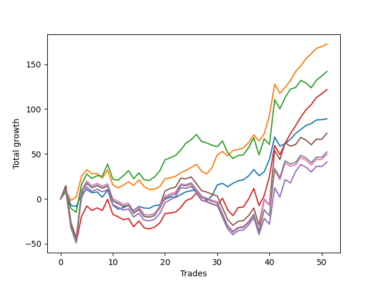

# Long Bulldog 003 
- Symbol: ES1Y
- Date Range: 03/15/2022 - 07/08/2022
- Trading Period: 7:20-12:30
- Number of Trades: 51



| Name | Win Percent | Profit | Avg Profit / Trade |     | Name | Win Percent | Profit | Avg Profit / Trade |
| ---- | ----------- | ------ | ------------------ | --- | ---- | ----------- | ------ | ------------------ |
| Sorted By <br> Profit | | | | | Sorted By <br> Win Percentage ||||
| One | 74.51 | 86250.00 | 1691.18 |     | One | 74.51 | 86250.00 | 1691.18 |
| Two | 60.78 | 71000.00 | 1392.16 |     | Zero | 70.59 | 44625.00 | 875.00 |
| Three | 64.71 | 60875.00 | 1193.63 |     | Three | 64.71 | 60875.00 | 1193.63 |
| Zero | 70.59 | 44625.00 | 875.00 |     | Two | 60.78 | 71000.00 | 1392.16 |
| Five | 49.02 | 36625.00 | 718.14 |     | Five | 49.02 | 36625.00 | 718.14 |
| Seven | 49.02 | 26125.00 | 512.25 |     | Seven | 49.02 | 26125.00 | 512.25 |
| Six | 49.02 | 24875.00 | 487.75 |     | Six | 49.02 | 24875.00 | 487.75 |
| Four | 49.02 | 20500.00 | 401.96 |     | Four | 49.02 | 20500.00 | 401.96 |

### Test Zero
* Sell when price hits the middle line of the 20p bollinger
* No Stoploss
* Results:
```
Total Trades: 51
Percent Up: 70.59
Percent Down: 29.41
Total Points Moved Up: 89.25
Potential Profit: 44625.00
Total Points Ups: 178.25 Count Ups: 36
Total Points Downs: -89.00 Count Downs: 15
```

<details><summary>Trades</summary>

<code>In: 2022-03-16 10:12:00		Out: 2022-03-16 10:12:10		Total Position Time: 00:10		Total Move Up: 8.25		Total to Date: 8.25</code> <br />
<code>In: 2022-03-16 11:03:00		Out: 2022-03-16 11:18:00		Total Position Time: 15:00		Total Move Up: -15.50		Total to Date: -7.25</code> <br />
<code>In: 2022-03-16 11:07:00		Out: 2022-03-16 11:18:00		Total Position Time: 11:00		Total Move Up: -1.25		Total to Date: -8.50</code> <br />
<code>In: 2022-03-16 11:33:00		Out: 2022-03-16 11:36:15		Total Position Time: 03:15		Total Move Up: 13.75		Total to Date: 5.25</code> <br />
<code>In: 2022-03-21 10:21:00		Out: 2022-03-21 10:26:05		Total Position Time: 05:05		Total Move Up: 5.25		Total to Date: 10.50</code> <br />
<code>In: 2022-03-23 10:23:00		Out: 2022-03-23 10:37:45		Total Position Time: 14:45		Total Move Up: -3.75		Total to Date: 6.75</code> <br />
<code>In: 2022-03-23 10:28:00		Out: 2022-03-23 10:37:45		Total Position Time: 09:45		Total Move Up: 1.00		Total to Date: 7.75</code> <br />
<code>In: 2022-03-25 08:14:00		Out: 2022-03-25 08:36:40		Total Position Time: 22:40		Total Move Up: -6.00		Total to Date: 1.75</code> <br />
<code>In: 2022-03-25 08:29:00		Out: 2022-03-25 08:36:40		Total Position Time: 07:40		Total Move Up: 8.00		Total to Date: 9.75</code> <br />
<code>In: 2022-03-28 08:27:00		Out: 2022-03-28 08:56:55		Total Position Time: 29:55		Total Move Up: -16.75		Total to Date: -7.00</code> <br />
<code>In: 2022-03-28 08:38:00		Out: 2022-03-28 09:01:50		Total Position Time: 23:50		Total Move Up: -4.50		Total to Date: -11.50</code> <br />
<code>In: 2022-03-28 08:51:00		Out: 2022-03-28 09:01:50		Total Position Time: 10:50		Total Move Up: 1.75		Total to Date: -9.75</code> <br />
<code>In: 2022-03-28 08:55:00		Out: 2022-03-28 09:01:50		Total Position Time: 06:50		Total Move Up: 2.50		Total to Date: -7.25</code> <br />
<code>In: 2022-03-30 08:02:00		Out: 2022-03-30 08:19:15		Total Position Time: 17:15		Total Move Up: -5.75		Total to Date: -13.00</code> <br />
<code>In: 2022-03-30 08:13:00		Out: 2022-03-30 08:19:15		Total Position Time: 06:15		Total Move Up: 4.50		Total to Date: -8.50</code> <br />
<code>In: 2022-03-30 12:00:00		Out: 2022-03-30 12:15:20		Total Position Time: 15:20		Total Move Up: -1.75		Total to Date: -10.25</code> <br />
<code>In: 2022-03-30 12:06:00		Out: 2022-03-30 12:15:20		Total Position Time: 09:20		Total Move Up: -0.25		Total to Date: -10.50</code> <br />
<code>In: 2022-03-30 12:13:00		Out: 2022-03-30 12:15:20		Total Position Time: 02:20		Total Move Up: 3.00		Total to Date: -7.50</code> <br />
<code>In: 2022-03-30 12:20:00		Out: 2022-03-30 12:28:15		Total Position Time: 08:15		Total Move Up: 0.75		Total to Date: -6.75</code> <br />
<code>In: 2022-03-30 12:26:00		Out: 2022-03-30 12:28:15		Total Position Time: 02:15		Total Move Up: 6.25		Total to Date: -0.50</code> <br />
<code>In: 2022-03-31 10:00:00		Out: 2022-03-31 10:04:00		Total Position Time: 04:00		Total Move Up: 2.50		Total to Date: 2.00</code> <br />
<code>In: 2022-03-31 10:11:00		Out: 2022-03-31 10:19:05		Total Position Time: 08:05		Total Move Up: -0.50		Total to Date: 1.50</code> <br />
<code>In: 2022-04-01 07:24:00		Out: 2022-04-01 07:34:30		Total Position Time: 10:30		Total Move Up: 3.25		Total to Date: 4.75</code> <br />
<code>In: 2022-04-07 07:43:00		Out: 2022-04-07 07:53:05		Total Position Time: 10:05		Total Move Up: 3.00		Total to Date: 7.75</code> <br />
<code>In: 2022-04-12 09:28:00		Out: 2022-04-12 09:41:30		Total Position Time: 13:30		Total Move Up: 1.25		Total to Date: 9.00</code> <br />
<code>In: 2022-04-12 11:35:00		Out: 2022-04-12 11:35:45		Total Position Time: 00:45		Total Move Up: 1.25		Total to Date: 10.25</code> <br />
<code>In: 2022-04-18 08:26:00		Out: 2022-04-18 08:54:55		Total Position Time: 28:55		Total Move Up: -7.00		Total to Date: 3.25</code> <br />
<code>In: 2022-04-18 08:29:00		Out: 2022-04-18 08:54:55		Total Position Time: 25:55		Total Move Up: -5.00		Total to Date: -1.75</code> <br />
<code>In: 2022-05-02 10:02:00		Out: 2022-05-02 10:08:15		Total Position Time: 06:15		Total Move Up: 5.00		Total to Date: 3.25</code> <br />
<code>In: 2022-05-02 10:05:00		Out: 2022-05-02 10:08:15		Total Position Time: 03:15		Total Move Up: 12.25		Total to Date: 15.50</code> <br />
<code>In: 2022-05-02 10:49:00		Out: 2022-05-02 10:59:15		Total Position Time: 10:15		Total Move Up: 1.75		Total to Date: 17.25</code> <br />
<code>In: 2022-05-11 09:59:00		Out: 2022-05-11 10:15:25		Total Position Time: 16:25		Total Move Up: -3.75		Total to Date: 13.50</code> <br />
<code>In: 2022-05-18 08:32:00		Out: 2022-05-18 08:35:35		Total Position Time: 03:35		Total Move Up: 3.75		Total to Date: 17.25</code> <br />
<code>In: 2022-06-06 08:19:00		Out: 2022-06-06 08:31:35		Total Position Time: 12:35		Total Move Up: 2.75		Total to Date: 20.00</code> <br />
<code>In: 2022-06-08 09:41:00		Out: 2022-06-08 09:53:00		Total Position Time: 12:00		Total Move Up: 1.25		Total to Date: 21.25</code> <br />
<code>In: 2022-06-09 08:06:00		Out: 2022-06-09 08:11:10		Total Position Time: 05:10		Total Move Up: 4.25		Total to Date: 25.50</code> <br />
<code>In: 2022-06-09 08:09:00		Out: 2022-06-09 08:11:10		Total Position Time: 02:10		Total Move Up: 7.25		Total to Date: 32.75</code> <br />
<code>In: 2022-06-09 12:03:00		Out: 2022-06-09 12:19:05		Total Position Time: 16:05		Total Move Up: -7.00		Total to Date: 25.75</code> <br />
<code>In: 2022-06-14 12:16:00		Out: 2022-06-14 12:25:45		Total Position Time: 09:45		Total Move Up: 4.50		Total to Date: 30.25</code> <br />
<code>In: 2022-06-15 11:08:00		Out: 2022-06-15 11:16:45		Total Position Time: 08:45		Total Move Up: 13.50		Total to Date: 43.75</code> <br />
<code>In: 2022-06-15 11:34:00		Out: 2022-06-15 11:38:05		Total Position Time: 04:05		Total Move Up: 25.25		Total to Date: 69.00</code> <br />
<code>In: 2022-06-16 11:02:00		Out: 2022-06-16 11:31:55		Total Position Time: 29:55		Total Move Up: -10.25		Total to Date: 58.75</code> <br />
<code>In: 2022-06-17 07:37:00		Out: 2022-06-17 07:55:05		Total Position Time: 18:05		Total Move Up: 2.75		Total to Date: 61.50</code> <br />
<code>In: 2022-06-23 09:06:00		Out: 2022-06-23 09:14:30		Total Position Time: 08:30		Total Move Up: 4.75		Total to Date: 66.25</code> <br />
<code>In: 2022-06-27 12:07:00		Out: 2022-06-27 12:09:50		Total Position Time: 02:50		Total Move Up: 6.50		Total to Date: 72.75</code> <br />
<code>In: 2022-06-29 09:29:00		Out: 2022-06-29 09:36:40		Total Position Time: 07:40		Total Move Up: 4.50		Total to Date: 77.25</code> <br />
<code>In: 2022-07-06 08:05:00		Out: 2022-07-06 08:14:25		Total Position Time: 09:25		Total Move Up: 4.50		Total to Date: 81.75</code> <br />
<code>In: 2022-07-06 08:06:00		Out: 2022-07-06 08:14:25		Total Position Time: 08:25		Total Move Up: 2.00		Total to Date: 83.75</code> <br />
<code>In: 2022-07-06 08:34:00		Out: 2022-07-06 08:46:30		Total Position Time: 12:30		Total Move Up: 4.25		Total to Date: 88.00</code> <br />
<code>In: 2022-07-06 08:35:00		Out: 2022-07-06 08:46:30		Total Position Time: 11:30		Total Move Up: 0.25		Total to Date: 88.25</code> <br />
<code>In: 2022-07-06 08:46:00		Out: 2022-07-06 08:46:30		Total Position Time: 00:30		Total Move Up: 1.00		Total to Date: 89.25</code> <br />


</details>

### Test One
* Sell when the price hits the upper line of the 20p 1std bollinger
* No Stoploss
* Results:
```
Total Trades: 51
Percent Up: 74.51
Percent Down: 25.49
Total Points Moved Up: 172.50
Potential Profit: 86250.00
Total Points Ups: 260.00 Count Ups: 38
Total Points Downs: -87.50 Count Downs: 13
```

<details><summary>Trades</summary>

<code>In: 2022-03-16 10:12:00		Out: 2022-03-16 10:19:05		Total Position Time: 07:05		Total Move Up: 8.75		Total to Date: 8.75</code> <br />
<code>In: 2022-03-16 11:03:00		Out: 2022-03-16 11:20:10		Total Position Time: 17:10		Total Move Up: -10.50		Total to Date: -1.75</code> <br />
<code>In: 2022-03-16 11:07:00		Out: 2022-03-16 11:20:10		Total Position Time: 13:10		Total Move Up: 3.75		Total to Date: 2.00</code> <br />
<code>In: 2022-03-16 11:33:00		Out: 2022-03-16 11:38:10		Total Position Time: 05:10		Total Move Up: 23.00		Total to Date: 25.00</code> <br />
<code>In: 2022-03-21 10:21:00		Out: 2022-03-21 10:31:50		Total Position Time: 10:50		Total Move Up: 7.50		Total to Date: 32.50</code> <br />
<code>In: 2022-03-23 10:23:00		Out: 2022-03-23 10:51:50		Total Position Time: 28:50		Total Move Up: -4.50		Total to Date: 28.00</code> <br />
<code>In: 2022-03-23 10:28:00		Out: 2022-03-23 10:51:50		Total Position Time: 23:50		Total Move Up: 0.25		Total to Date: 28.25</code> <br />
<code>In: 2022-03-25 08:14:00		Out: 2022-03-25 08:40:40		Total Position Time: 26:40		Total Move Up: -5.00		Total to Date: 23.25</code> <br />
<code>In: 2022-03-25 08:29:00		Out: 2022-03-25 08:40:40		Total Position Time: 11:40		Total Move Up: 9.00		Total to Date: 32.25</code> <br />
<code>In: 2022-03-28 08:27:00		Out: 2022-03-28 08:56:55		Total Position Time: 29:55		Total Move Up: -16.75		Total to Date: 15.50</code> <br />
<code>In: 2022-03-28 08:38:00		Out: 2022-03-28 09:04:05		Total Position Time: 26:05		Total Move Up: -3.25		Total to Date: 12.25</code> <br />
<code>In: 2022-03-28 08:51:00		Out: 2022-03-28 09:04:05		Total Position Time: 13:05		Total Move Up: 3.00		Total to Date: 15.25</code> <br />
<code>In: 2022-03-28 08:55:00		Out: 2022-03-28 09:04:05		Total Position Time: 09:05		Total Move Up: 3.75		Total to Date: 19.00</code> <br />
<code>In: 2022-03-30 08:02:00		Out: 2022-03-30 08:23:50		Total Position Time: 21:50		Total Move Up: -4.00		Total to Date: 15.00</code> <br />
<code>In: 2022-03-30 08:13:00		Out: 2022-03-30 08:23:50		Total Position Time: 10:50		Total Move Up: 6.25		Total to Date: 21.25</code> <br />
<code>In: 2022-03-30 12:00:00		Out: 2022-03-30 12:29:55		Total Position Time: 29:55		Total Move Up: -7.75		Total to Date: 13.50</code> <br />
<code>In: 2022-03-30 12:06:00		Out: 2022-03-30 12:32:20		Total Position Time: 26:20		Total Move Up: -3.00		Total to Date: 10.50</code> <br />
<code>In: 2022-03-30 12:13:00		Out: 2022-03-30 12:32:20		Total Position Time: 19:20		Total Move Up: 0.25		Total to Date: 10.75</code> <br />
<code>In: 2022-03-30 12:20:00		Out: 2022-03-30 12:32:20		Total Position Time: 12:20		Total Move Up: 3.00		Total to Date: 13.75</code> <br />
<code>In: 2022-03-30 12:26:00		Out: 2022-03-30 12:32:20		Total Position Time: 06:20		Total Move Up: 8.50		Total to Date: 22.25</code> <br />
<code>In: 2022-03-31 10:00:00		Out: 2022-03-31 10:19:40		Total Position Time: 19:40		Total Move Up: 1.25		Total to Date: 23.50</code> <br />
<code>In: 2022-03-31 10:11:00		Out: 2022-03-31 10:19:40		Total Position Time: 08:40		Total Move Up: 1.50		Total to Date: 25.00</code> <br />
<code>In: 2022-04-01 07:24:00		Out: 2022-04-01 07:37:15		Total Position Time: 13:15		Total Move Up: 4.25		Total to Date: 29.25</code> <br />
<code>In: 2022-04-07 07:43:00		Out: 2022-04-07 07:59:10		Total Position Time: 16:10		Total Move Up: 2.50		Total to Date: 31.75</code> <br />
<code>In: 2022-04-12 09:28:00		Out: 2022-04-12 09:50:15		Total Position Time: 22:15		Total Move Up: 3.25		Total to Date: 35.00</code> <br />
<code>In: 2022-04-12 11:35:00		Out: 2022-04-12 11:37:20		Total Position Time: 02:20		Total Move Up: 3.50		Total to Date: 38.50</code> <br />
<code>In: 2022-04-18 08:26:00		Out: 2022-04-18 08:55:55		Total Position Time: 29:55		Total Move Up: -7.75		Total to Date: 30.75</code> <br />
<code>In: 2022-04-18 08:29:00		Out: 2022-04-18 08:57:20		Total Position Time: 28:20		Total Move Up: -3.00		Total to Date: 27.75</code> <br />
<code>In: 2022-05-02 10:02:00		Out: 2022-05-02 10:10:50		Total Position Time: 08:50		Total Move Up: 7.00		Total to Date: 34.75</code> <br />
<code>In: 2022-05-02 10:05:00		Out: 2022-05-02 10:10:50		Total Position Time: 05:50		Total Move Up: 14.25		Total to Date: 49.00</code> <br />
<code>In: 2022-05-02 10:49:00		Out: 2022-05-02 11:02:25		Total Position Time: 13:25		Total Move Up: 3.75		Total to Date: 52.75</code> <br />
<code>In: 2022-05-11 09:59:00		Out: 2022-05-11 10:24:35		Total Position Time: 25:35		Total Move Up: -4.75		Total to Date: 48.00</code> <br />
<code>In: 2022-05-18 08:32:00		Out: 2022-05-18 08:41:15		Total Position Time: 09:15		Total Move Up: 6.00		Total to Date: 54.00</code> <br />
<code>In: 2022-06-06 08:19:00		Out: 2022-06-06 08:39:15		Total Position Time: 20:15		Total Move Up: 1.00		Total to Date: 55.00</code> <br />
<code>In: 2022-06-08 09:41:00		Out: 2022-06-08 09:57:10		Total Position Time: 16:10		Total Move Up: 1.75		Total to Date: 56.75</code> <br />
<code>In: 2022-06-09 08:06:00		Out: 2022-06-09 08:21:10		Total Position Time: 15:10		Total Move Up: 5.75		Total to Date: 62.50</code> <br />
<code>In: 2022-06-09 08:09:00		Out: 2022-06-09 08:21:10		Total Position Time: 12:10		Total Move Up: 8.75		Total to Date: 71.25</code> <br />
<code>In: 2022-06-09 12:03:00		Out: 2022-06-09 12:24:30		Total Position Time: 21:30		Total Move Up: -7.00		Total to Date: 64.25</code> <br />
<code>In: 2022-06-14 12:16:00		Out: 2022-06-14 12:27:20		Total Position Time: 11:20		Total Move Up: 8.25		Total to Date: 72.50</code> <br />
<code>In: 2022-06-15 11:08:00		Out: 2022-06-15 11:20:35		Total Position Time: 12:35		Total Move Up: 20.75		Total to Date: 93.25</code> <br />
<code>In: 2022-06-15 11:34:00		Out: 2022-06-15 11:38:10		Total Position Time: 04:10		Total Move Up: 34.50		Total to Date: 127.75</code> <br />
<code>In: 2022-06-16 11:02:00		Out: 2022-06-16 11:31:55		Total Position Time: 29:55		Total Move Up: -10.25		Total to Date: 117.50</code> <br />
<code>In: 2022-06-17 07:37:00		Out: 2022-06-17 07:56:25		Total Position Time: 19:25		Total Move Up: 6.75		Total to Date: 124.25</code> <br />
<code>In: 2022-06-23 09:06:00		Out: 2022-06-23 09:18:25		Total Position Time: 12:25		Total Move Up: 7.50		Total to Date: 131.75</code> <br />
<code>In: 2022-06-27 12:07:00		Out: 2022-06-27 12:12:10		Total Position Time: 05:10		Total Move Up: 10.00		Total to Date: 141.75</code> <br />
<code>In: 2022-06-29 09:29:00		Out: 2022-06-29 09:37:10		Total Position Time: 08:10		Total Move Up: 6.50		Total to Date: 148.25</code> <br />
<code>In: 2022-07-06 08:05:00		Out: 2022-07-06 08:17:50		Total Position Time: 12:50		Total Move Up: 8.00		Total to Date: 156.25</code> <br />
<code>In: 2022-07-06 08:06:00		Out: 2022-07-06 08:17:50		Total Position Time: 11:50		Total Move Up: 5.50		Total to Date: 161.75</code> <br />
<code>In: 2022-07-06 08:34:00		Out: 2022-07-06 08:48:05		Total Position Time: 14:05		Total Move Up: 6.00		Total to Date: 167.75</code> <br />
<code>In: 2022-07-06 08:35:00		Out: 2022-07-06 08:48:05		Total Position Time: 13:05		Total Move Up: 2.00		Total to Date: 169.75</code> <br />
<code>In: 2022-07-06 08:46:00		Out: 2022-07-06 08:48:05		Total Position Time: 02:05		Total Move Up: 2.75		Total to Date: 172.50</code> <br />


</details>

### Test Two
* Sell when the price hits the upper line of the 20p 2std bollinger
* No Stoploss
* Results:
```
Total Trades: 51
Percent Up: 60.78
Percent Down: 39.22
Total Points Moved Up: 142.00
Potential Profit: 71000.00
Total Points Ups: 283.00 Count Ups: 31
Total Points Downs: -141.00 Count Downs: 20
```

<details><summary>Trades</summary>

<code>In: 2022-03-16 10:12:00		Out: 2022-03-16 10:23:10		Total Position Time: 11:10		Total Move Up: 7.75		Total to Date: 7.75</code> <br />
<code>In: 2022-03-16 11:03:00		Out: 2022-03-16 11:27:45		Total Position Time: 24:45		Total Move Up: -18.50		Total to Date: -10.75</code> <br />
<code>In: 2022-03-16 11:07:00		Out: 2022-03-16 11:27:45		Total Position Time: 20:45		Total Move Up: -4.25		Total to Date: -15.00</code> <br />
<code>In: 2022-03-16 11:33:00		Out: 2022-03-16 11:39:45		Total Position Time: 06:45		Total Move Up: 30.75		Total to Date: 15.75</code> <br />
<code>In: 2022-03-21 10:21:00		Out: 2022-03-21 10:34:25		Total Position Time: 13:25		Total Move Up: 12.00		Total to Date: 27.75</code> <br />
<code>In: 2022-03-23 10:23:00		Out: 2022-03-23 10:52:55		Total Position Time: 29:55		Total Move Up: -5.00		Total to Date: 22.75</code> <br />
<code>In: 2022-03-23 10:28:00		Out: 2022-03-23 10:54:50		Total Position Time: 26:50		Total Move Up: 3.00		Total to Date: 25.75</code> <br />
<code>In: 2022-03-25 08:14:00		Out: 2022-03-25 08:41:55		Total Position Time: 27:55		Total Move Up: -0.50		Total to Date: 25.25</code> <br />
<code>In: 2022-03-25 08:29:00		Out: 2022-03-25 08:41:55		Total Position Time: 12:55		Total Move Up: 13.50		Total to Date: 38.75</code> <br />
<code>In: 2022-03-28 08:27:00		Out: 2022-03-28 08:56:55		Total Position Time: 29:55		Total Move Up: -16.75		Total to Date: 22.00</code> <br />
<code>In: 2022-03-28 08:38:00		Out: 2022-03-28 09:07:10		Total Position Time: 29:10		Total Move Up: -1.25		Total to Date: 20.75</code> <br />
<code>In: 2022-03-28 08:51:00		Out: 2022-03-28 09:07:10		Total Position Time: 16:10		Total Move Up: 5.00		Total to Date: 25.75</code> <br />
<code>In: 2022-03-28 08:55:00		Out: 2022-03-28 09:07:10		Total Position Time: 12:10		Total Move Up: 5.75		Total to Date: 31.50</code> <br />
<code>In: 2022-03-30 08:02:00		Out: 2022-03-30 08:31:55		Total Position Time: 29:55		Total Move Up: -9.00		Total to Date: 22.50</code> <br />
<code>In: 2022-03-30 08:13:00		Out: 2022-03-30 08:35:15		Total Position Time: 22:15		Total Move Up: 6.50		Total to Date: 29.00</code> <br />
<code>In: 2022-03-30 12:00:00		Out: 2022-03-30 12:29:55		Total Position Time: 29:55		Total Move Up: -7.75		Total to Date: 21.25</code> <br />
<code>In: 2022-03-30 12:06:00		Out: 2022-03-30 12:35:55		Total Position Time: 29:55		Total Move Up: -0.75		Total to Date: 20.50</code> <br />
<code>In: 2022-03-30 12:13:00		Out: 2022-03-30 12:36:55		Total Position Time: 23:55		Total Move Up: 4.00		Total to Date: 24.50</code> <br />
<code>In: 2022-03-30 12:20:00		Out: 2022-03-30 12:36:55		Total Position Time: 16:55		Total Move Up: 6.75		Total to Date: 31.25</code> <br />
<code>In: 2022-03-30 12:26:00		Out: 2022-03-30 12:36:55		Total Position Time: 10:55		Total Move Up: 12.25		Total to Date: 43.50</code> <br />
<code>In: 2022-03-31 10:00:00		Out: 2022-03-31 10:29:20		Total Position Time: 29:20		Total Move Up: 2.25		Total to Date: 45.75</code> <br />
<code>In: 2022-03-31 10:11:00		Out: 2022-03-31 10:29:20		Total Position Time: 18:20		Total Move Up: 2.50		Total to Date: 48.25</code> <br />
<code>In: 2022-04-01 07:24:00		Out: 2022-04-01 07:47:40		Total Position Time: 23:40		Total Move Up: 6.00		Total to Date: 54.25</code> <br />
<code>In: 2022-04-07 07:43:00		Out: 2022-04-07 08:00:05		Total Position Time: 17:05		Total Move Up: 7.75		Total to Date: 62.00</code> <br />
<code>In: 2022-04-12 09:28:00		Out: 2022-04-12 09:50:30		Total Position Time: 22:30		Total Move Up: 3.75		Total to Date: 65.75</code> <br />
<code>In: 2022-04-12 11:35:00		Out: 2022-04-12 11:47:05		Total Position Time: 12:05		Total Move Up: 6.00		Total to Date: 71.75</code> <br />
<code>In: 2022-04-18 08:26:00		Out: 2022-04-18 08:55:55		Total Position Time: 29:55		Total Move Up: -7.75		Total to Date: 64.00</code> <br />
<code>In: 2022-04-18 08:29:00		Out: 2022-04-18 08:58:55		Total Position Time: 29:55		Total Move Up: -1.75		Total to Date: 62.25</code> <br />
<code>In: 2022-05-02 10:02:00		Out: 2022-05-02 10:31:55		Total Position Time: 29:55		Total Move Up: -2.50		Total to Date: 59.75</code> <br />
<code>In: 2022-05-02 10:05:00		Out: 2022-05-02 10:34:55		Total Position Time: 29:55		Total Move Up: -1.75		Total to Date: 58.00</code> <br />
<code>In: 2022-05-02 10:49:00		Out: 2022-05-02 11:03:45		Total Position Time: 14:45		Total Move Up: 6.50		Total to Date: 64.50</code> <br />
<code>In: 2022-05-11 09:59:00		Out: 2022-05-11 10:28:55		Total Position Time: 29:55		Total Move Up: -13.00		Total to Date: 51.50</code> <br />
<code>In: 2022-05-18 08:32:00		Out: 2022-05-18 09:01:55		Total Position Time: 29:55		Total Move Up: -6.50		Total to Date: 45.00</code> <br />
<code>In: 2022-06-06 08:19:00		Out: 2022-06-06 08:43:00		Total Position Time: 24:00		Total Move Up: 3.25		Total to Date: 48.25</code> <br />
<code>In: 2022-06-08 09:41:00		Out: 2022-06-08 10:10:55		Total Position Time: 29:55		Total Move Up: 0.75		Total to Date: 49.00</code> <br />
<code>In: 2022-06-09 08:06:00		Out: 2022-06-09 08:22:35		Total Position Time: 16:35		Total Move Up: 8.00		Total to Date: 57.00</code> <br />
<code>In: 2022-06-09 08:09:00		Out: 2022-06-09 08:22:35		Total Position Time: 13:35		Total Move Up: 11.00		Total to Date: 68.00</code> <br />
<code>In: 2022-06-09 12:03:00		Out: 2022-06-09 12:32:55		Total Position Time: 29:55		Total Move Up: -19.00		Total to Date: 49.00</code> <br />
<code>In: 2022-06-14 12:16:00		Out: 2022-06-14 12:30:35		Total Position Time: 14:35		Total Move Up: 18.00		Total to Date: 67.00</code> <br />
<code>In: 2022-06-15 11:08:00		Out: 2022-06-15 11:37:55		Total Position Time: 29:55		Total Move Up: -6.50		Total to Date: 60.50</code> <br />
<code>In: 2022-06-15 11:34:00		Out: 2022-06-15 11:39:00		Total Position Time: 05:00		Total Move Up: 50.00		Total to Date: 110.50</code> <br />
<code>In: 2022-06-16 11:02:00		Out: 2022-06-16 11:31:55		Total Position Time: 29:55		Total Move Up: -10.25		Total to Date: 100.25</code> <br />
<code>In: 2022-06-17 07:37:00		Out: 2022-06-17 08:02:30		Total Position Time: 25:30		Total Move Up: 12.50		Total to Date: 112.75</code> <br />
<code>In: 2022-06-23 09:06:00		Out: 2022-06-23 09:19:00		Total Position Time: 13:00		Total Move Up: 9.50		Total to Date: 122.25</code> <br />
<code>In: 2022-06-27 12:07:00		Out: 2022-06-27 12:36:55		Total Position Time: 29:55		Total Move Up: 1.75		Total to Date: 124.00</code> <br />
<code>In: 2022-06-29 09:29:00		Out: 2022-06-29 09:58:55		Total Position Time: 29:55		Total Move Up: 8.00		Total to Date: 132.00</code> <br />
<code>In: 2022-07-06 08:05:00		Out: 2022-07-06 08:34:55		Total Position Time: 29:55		Total Move Up: -3.00		Total to Date: 129.00</code> <br />
<code>In: 2022-07-06 08:06:00		Out: 2022-07-06 08:35:55		Total Position Time: 29:55		Total Move Up: -5.25		Total to Date: 123.75</code> <br />
<code>In: 2022-07-06 08:34:00		Out: 2022-07-06 08:51:20		Total Position Time: 17:20		Total Move Up: 8.50		Total to Date: 132.25</code> <br />
<code>In: 2022-07-06 08:35:00		Out: 2022-07-06 08:51:20		Total Position Time: 16:20		Total Move Up: 4.50		Total to Date: 136.75</code> <br />
<code>In: 2022-07-06 08:46:00		Out: 2022-07-06 08:51:20		Total Position Time: 05:20		Total Move Up: 5.25		Total to Date: 142.00</code> <br />


</details>

### Test Three
* Sell when price hits the middle line of the 50p bollinger
* No Stoploss
* Results:
```
Total Trades: 51
Percent Up: 64.71
Percent Down: 35.29
Total Points Moved Up: 121.75
Potential Profit: 60875.00
Total Points Ups: 291.50 Count Ups: 33
Total Points Downs: -169.75 Count Downs: 18
```

<details><summary>Trades</summary>

<code>In: 2022-03-16 10:12:00		Out: 2022-03-16 10:24:05		Total Position Time: 12:05		Total Move Up: 9.75		Total to Date: 9.75</code> <br />
<code>In: 2022-03-16 11:03:00		Out: 2022-03-16 11:32:55		Total Position Time: 29:55		Total Move Up: -41.50		Total to Date: -31.75</code> <br />
<code>In: 2022-03-16 11:07:00		Out: 2022-03-16 11:36:55		Total Position Time: 29:55		Total Move Up: -17.00		Total to Date: -48.75</code> <br />
<code>In: 2022-03-16 11:33:00		Out: 2022-03-16 11:39:40		Total Position Time: 06:40		Total Move Up: 29.00		Total to Date: -19.75</code> <br />
<code>In: 2022-03-21 10:21:00		Out: 2022-03-21 10:34:15		Total Position Time: 13:15		Total Move Up: 11.75		Total to Date: -8.00</code> <br />
<code>In: 2022-03-23 10:23:00		Out: 2022-03-23 10:52:55		Total Position Time: 29:55		Total Move Up: -5.00		Total to Date: -13.00</code> <br />
<code>In: 2022-03-23 10:28:00		Out: 2022-03-23 10:54:50		Total Position Time: 26:50		Total Move Up: 3.00		Total to Date: -10.00</code> <br />
<code>In: 2022-03-25 08:14:00		Out: 2022-03-25 08:43:55		Total Position Time: 29:55		Total Move Up: -3.00		Total to Date: -13.00</code> <br />
<code>In: 2022-03-25 08:29:00		Out: 2022-03-25 08:52:45		Total Position Time: 23:45		Total Move Up: 12.50		Total to Date: -0.50</code> <br />
<code>In: 2022-03-28 08:27:00		Out: 2022-03-28 08:56:55		Total Position Time: 29:55		Total Move Up: -16.75		Total to Date: -17.25</code> <br />
<code>In: 2022-03-28 08:38:00		Out: 2022-03-28 09:07:55		Total Position Time: 29:55		Total Move Up: -2.75		Total to Date: -20.00</code> <br />
<code>In: 2022-03-28 08:51:00		Out: 2022-03-28 09:20:55		Total Position Time: 29:55		Total Move Up: -3.25		Total to Date: -23.25</code> <br />
<code>In: 2022-03-28 08:55:00		Out: 2022-03-28 09:24:55		Total Position Time: 29:55		Total Move Up: 1.25		Total to Date: -22.00</code> <br />
<code>In: 2022-03-30 08:02:00		Out: 2022-03-30 08:31:55		Total Position Time: 29:55		Total Move Up: -9.00		Total to Date: -31.00</code> <br />
<code>In: 2022-03-30 08:13:00		Out: 2022-03-30 08:35:15		Total Position Time: 22:15		Total Move Up: 6.50		Total to Date: -24.50</code> <br />
<code>In: 2022-03-30 12:00:00		Out: 2022-03-30 12:29:55		Total Position Time: 29:55		Total Move Up: -7.75		Total to Date: -32.25</code> <br />
<code>In: 2022-03-30 12:06:00		Out: 2022-03-30 12:33:25		Total Position Time: 27:25		Total Move Up: -1.25		Total to Date: -33.50</code> <br />
<code>In: 2022-03-30 12:13:00		Out: 2022-03-30 12:33:25		Total Position Time: 20:25		Total Move Up: 2.00		Total to Date: -31.50</code> <br />
<code>In: 2022-03-30 12:20:00		Out: 2022-03-30 12:33:25		Total Position Time: 13:25		Total Move Up: 4.75		Total to Date: -26.75</code> <br />
<code>In: 2022-03-30 12:26:00		Out: 2022-03-30 12:33:25		Total Position Time: 07:25		Total Move Up: 10.25		Total to Date: -16.50</code> <br />
<code>In: 2022-03-31 10:00:00		Out: 2022-03-31 10:28:00		Total Position Time: 28:00		Total Move Up: 0.75		Total to Date: -15.75</code> <br />
<code>In: 2022-03-31 10:11:00		Out: 2022-03-31 10:28:00		Total Position Time: 17:00		Total Move Up: 1.00		Total to Date: -14.75</code> <br />
<code>In: 2022-04-01 07:24:00		Out: 2022-04-01 07:46:50		Total Position Time: 22:50		Total Move Up: 5.00		Total to Date: -9.75</code> <br />
<code>In: 2022-04-07 07:43:00		Out: 2022-04-07 08:00:05		Total Position Time: 17:05		Total Move Up: 7.75		Total to Date: -2.00</code> <br />
<code>In: 2022-04-12 09:28:00		Out: 2022-04-12 09:57:55		Total Position Time: 29:55		Total Move Up: 2.25		Total to Date: 0.25</code> <br />
<code>In: 2022-04-12 11:35:00		Out: 2022-04-12 11:47:05		Total Position Time: 12:05		Total Move Up: 6.00		Total to Date: 6.25</code> <br />
<code>In: 2022-04-18 08:26:00		Out: 2022-04-18 08:55:55		Total Position Time: 29:55		Total Move Up: -7.75		Total to Date: -1.50</code> <br />
<code>In: 2022-04-18 08:29:00		Out: 2022-04-18 08:58:55		Total Position Time: 29:55		Total Move Up: -1.75		Total to Date: -3.25</code> <br />
<code>In: 2022-05-02 10:02:00		Out: 2022-05-02 10:31:55		Total Position Time: 29:55		Total Move Up: -2.50		Total to Date: -5.75</code> <br />
<code>In: 2022-05-02 10:05:00		Out: 2022-05-02 10:34:55		Total Position Time: 29:55		Total Move Up: -1.75		Total to Date: -7.50</code> <br />
<code>In: 2022-05-02 10:49:00		Out: 2022-05-02 11:04:00		Total Position Time: 15:00		Total Move Up: 8.25		Total to Date: 0.75</code> <br />
<code>In: 2022-05-11 09:59:00		Out: 2022-05-11 10:28:55		Total Position Time: 29:55		Total Move Up: -13.00		Total to Date: -12.25</code> <br />
<code>In: 2022-05-18 08:32:00		Out: 2022-05-18 09:01:55		Total Position Time: 29:55		Total Move Up: -6.50		Total to Date: -18.75</code> <br />
<code>In: 2022-06-06 08:19:00		Out: 2022-06-06 08:46:10		Total Position Time: 27:10		Total Move Up: 9.00		Total to Date: -9.75</code> <br />
<code>In: 2022-06-08 09:41:00		Out: 2022-06-08 10:10:55		Total Position Time: 29:55		Total Move Up: 0.75		Total to Date: -9.00</code> <br />
<code>In: 2022-06-09 08:06:00		Out: 2022-06-09 08:22:45		Total Position Time: 16:45		Total Move Up: 8.75		Total to Date: -0.25</code> <br />
<code>In: 2022-06-09 08:09:00		Out: 2022-06-09 08:22:45		Total Position Time: 13:45		Total Move Up: 11.75		Total to Date: 11.50</code> <br />
<code>In: 2022-06-09 12:03:00		Out: 2022-06-09 12:32:55		Total Position Time: 29:55		Total Move Up: -19.00		Total to Date: -7.50</code> <br />
<code>In: 2022-06-14 12:16:00		Out: 2022-06-14 12:29:10		Total Position Time: 13:10		Total Move Up: 11.25		Total to Date: 3.75</code> <br />
<code>In: 2022-06-15 11:08:00		Out: 2022-06-15 11:17:05		Total Position Time: 09:05		Total Move Up: 21.25		Total to Date: 25.00</code> <br />
<code>In: 2022-06-15 11:34:00		Out: 2022-06-15 11:38:10		Total Position Time: 04:10		Total Move Up: 34.50		Total to Date: 59.50</code> <br />
<code>In: 2022-06-16 11:02:00		Out: 2022-06-16 11:31:55		Total Position Time: 29:55		Total Move Up: -10.25		Total to Date: 49.25</code> <br />
<code>In: 2022-06-17 07:37:00		Out: 2022-06-17 08:02:30		Total Position Time: 25:30		Total Move Up: 12.50		Total to Date: 61.75</code> <br />
<code>In: 2022-06-23 09:06:00		Out: 2022-06-23 09:21:10		Total Position Time: 15:10		Total Move Up: 10.75		Total to Date: 72.50</code> <br />
<code>In: 2022-06-27 12:07:00		Out: 2022-06-27 12:10:30		Total Position Time: 03:30		Total Move Up: 9.00		Total to Date: 81.50</code> <br />
<code>In: 2022-06-29 09:29:00		Out: 2022-06-29 09:38:30		Total Position Time: 09:30		Total Move Up: 9.50		Total to Date: 91.00</code> <br />
<code>In: 2022-07-06 08:05:00		Out: 2022-07-06 08:21:30		Total Position Time: 16:30		Total Move Up: 8.25		Total to Date: 99.25</code> <br />
<code>In: 2022-07-06 08:06:00		Out: 2022-07-06 08:21:30		Total Position Time: 15:30		Total Move Up: 5.75		Total to Date: 105.00</code> <br />
<code>In: 2022-07-06 08:34:00		Out: 2022-07-06 08:51:15		Total Position Time: 17:15		Total Move Up: 8.00		Total to Date: 113.00</code> <br />
<code>In: 2022-07-06 08:35:00		Out: 2022-07-06 08:51:15		Total Position Time: 16:15		Total Move Up: 4.00		Total to Date: 117.00</code> <br />
<code>In: 2022-07-06 08:46:00		Out: 2022-07-06 08:51:15		Total Position Time: 05:15		Total Move Up: 4.75		Total to Date: 121.75</code> <br />


</details>

### Test Four
* Sell when the price hits the upper line of the 50p 1std bollinger
* No Stoploss
* Results:
```
Total Trades: 51
Percent Up: 49.02
Percent Down: 50.98
Total Points Moved Up: 41.00
Potential Profit: 20500.00
Total Points Ups: 250.50 Count Ups: 25
Total Points Downs: -209.50 Count Downs: 26
```

<details><summary>Trades</summary>

<code>In: 2022-03-16 10:12:00		Out: 2022-03-16 10:31:20		Total Position Time: 19:20		Total Move Up: 13.50		Total to Date: 13.50</code> <br />
<code>In: 2022-03-16 11:03:00		Out: 2022-03-16 11:32:55		Total Position Time: 29:55		Total Move Up: -41.50		Total to Date: -28.00</code> <br />
<code>In: 2022-03-16 11:07:00		Out: 2022-03-16 11:36:55		Total Position Time: 29:55		Total Move Up: -17.00		Total to Date: -45.00</code> <br />
<code>In: 2022-03-16 11:33:00		Out: 2022-03-16 11:42:25		Total Position Time: 09:25		Total Move Up: 45.75		Total to Date: 0.75</code> <br />
<code>In: 2022-03-21 10:21:00		Out: 2022-03-21 10:49:05		Total Position Time: 28:05		Total Move Up: 12.50		Total to Date: 13.25</code> <br />
<code>In: 2022-03-23 10:23:00		Out: 2022-03-23 10:52:55		Total Position Time: 29:55		Total Move Up: -5.00		Total to Date: 8.25</code> <br />
<code>In: 2022-03-23 10:28:00		Out: 2022-03-23 10:57:55		Total Position Time: 29:55		Total Move Up: 2.50		Total to Date: 10.75</code> <br />
<code>In: 2022-03-25 08:14:00		Out: 2022-03-25 08:43:55		Total Position Time: 29:55		Total Move Up: -3.00		Total to Date: 7.75</code> <br />
<code>In: 2022-03-25 08:29:00		Out: 2022-03-25 08:58:55		Total Position Time: 29:55		Total Move Up: 2.50		Total to Date: 10.25</code> <br />
<code>In: 2022-03-28 08:27:00		Out: 2022-03-28 08:56:55		Total Position Time: 29:55		Total Move Up: -16.75		Total to Date: -6.50</code> <br />
<code>In: 2022-03-28 08:38:00		Out: 2022-03-28 09:07:55		Total Position Time: 29:55		Total Move Up: -2.75		Total to Date: -9.25</code> <br />
<code>In: 2022-03-28 08:51:00		Out: 2022-03-28 09:20:55		Total Position Time: 29:55		Total Move Up: -3.25		Total to Date: -12.50</code> <br />
<code>In: 2022-03-28 08:55:00		Out: 2022-03-28 09:24:55		Total Position Time: 29:55		Total Move Up: 1.25		Total to Date: -11.25</code> <br />
<code>In: 2022-03-30 08:02:00		Out: 2022-03-30 08:31:55		Total Position Time: 29:55		Total Move Up: -9.00		Total to Date: -20.25</code> <br />
<code>In: 2022-03-30 08:13:00		Out: 2022-03-30 08:42:55		Total Position Time: 29:55		Total Move Up: 4.25		Total to Date: -16.00</code> <br />
<code>In: 2022-03-30 12:00:00		Out: 2022-03-30 12:29:55		Total Position Time: 29:55		Total Move Up: -7.75		Total to Date: -23.75</code> <br />
<code>In: 2022-03-30 12:06:00		Out: 2022-03-30 12:35:55		Total Position Time: 29:55		Total Move Up: -0.75		Total to Date: -24.50</code> <br />
<code>In: 2022-03-30 12:13:00		Out: 2022-03-30 12:42:55		Total Position Time: 29:55		Total Move Up: 1.75		Total to Date: -22.75</code> <br />
<code>In: 2022-03-30 12:20:00		Out: 2022-03-30 12:45:25		Total Position Time: 25:25		Total Move Up: 6.50		Total to Date: -16.25</code> <br />
<code>In: 2022-03-30 12:26:00		Out: 2022-03-30 12:45:25		Total Position Time: 19:25		Total Move Up: 12.00		Total to Date: -4.25</code> <br />
<code>In: 2022-03-31 10:00:00		Out: 2022-03-31 10:29:50		Total Position Time: 29:50		Total Move Up: 3.25		Total to Date: -1.00</code> <br />
<code>In: 2022-03-31 10:11:00		Out: 2022-03-31 10:29:50		Total Position Time: 18:50		Total Move Up: 3.50		Total to Date: 2.50</code> <br />
<code>In: 2022-04-01 07:24:00		Out: 2022-04-01 07:52:25		Total Position Time: 28:25		Total Move Up: 10.00		Total to Date: 12.50</code> <br />
<code>In: 2022-04-07 07:43:00		Out: 2022-04-07 08:12:55		Total Position Time: 29:55		Total Move Up: -0.75		Total to Date: 11.75</code> <br />
<code>In: 2022-04-12 09:28:00		Out: 2022-04-12 09:57:55		Total Position Time: 29:55		Total Move Up: 2.25		Total to Date: 14.00</code> <br />
<code>In: 2022-04-12 11:35:00		Out: 2022-04-12 12:04:55		Total Position Time: 29:55		Total Move Up: -7.50		Total to Date: 6.50</code> <br />
<code>In: 2022-04-18 08:26:00		Out: 2022-04-18 08:55:55		Total Position Time: 29:55		Total Move Up: -7.75		Total to Date: -1.25</code> <br />
<code>In: 2022-04-18 08:29:00		Out: 2022-04-18 08:58:55		Total Position Time: 29:55		Total Move Up: -1.75		Total to Date: -3.00</code> <br />
<code>In: 2022-05-02 10:02:00		Out: 2022-05-02 10:31:55		Total Position Time: 29:55		Total Move Up: -2.50		Total to Date: -5.50</code> <br />
<code>In: 2022-05-02 10:05:00		Out: 2022-05-02 10:34:55		Total Position Time: 29:55		Total Move Up: -1.75		Total to Date: -7.25</code> <br />
<code>In: 2022-05-02 10:49:00		Out: 2022-05-02 11:18:55		Total Position Time: 29:55		Total Move Up: -13.25		Total to Date: -20.50</code> <br />
<code>In: 2022-05-11 09:59:00		Out: 2022-05-11 10:28:55		Total Position Time: 29:55		Total Move Up: -13.00		Total to Date: -33.50</code> <br />
<code>In: 2022-05-18 08:32:00		Out: 2022-05-18 09:01:55		Total Position Time: 29:55		Total Move Up: -6.50		Total to Date: -40.00</code> <br />
<code>In: 2022-06-06 08:19:00		Out: 2022-06-06 08:48:55		Total Position Time: 29:55		Total Move Up: 4.50		Total to Date: -35.50</code> <br />
<code>In: 2022-06-08 09:41:00		Out: 2022-06-08 10:10:55		Total Position Time: 29:55		Total Move Up: 0.75		Total to Date: -34.75</code> <br />
<code>In: 2022-06-09 08:06:00		Out: 2022-06-09 08:35:55		Total Position Time: 29:55		Total Move Up: 5.50		Total to Date: -29.25</code> <br />
<code>In: 2022-06-09 08:09:00		Out: 2022-06-09 08:38:55		Total Position Time: 29:55		Total Move Up: 8.50		Total to Date: -20.75</code> <br />
<code>In: 2022-06-09 12:03:00		Out: 2022-06-09 12:32:55		Total Position Time: 29:55		Total Move Up: -19.00		Total to Date: -39.75</code> <br />
<code>In: 2022-06-14 12:16:00		Out: 2022-06-14 12:30:35		Total Position Time: 14:35		Total Move Up: 18.00		Total to Date: -21.75</code> <br />
<code>In: 2022-06-15 11:08:00		Out: 2022-06-15 11:37:55		Total Position Time: 29:55		Total Move Up: -6.50		Total to Date: -28.25</code> <br />
<code>In: 2022-06-15 11:34:00		Out: 2022-06-15 11:38:50		Total Position Time: 04:50		Total Move Up: 40.50		Total to Date: 12.25</code> <br />
<code>In: 2022-06-16 11:02:00		Out: 2022-06-16 11:31:55		Total Position Time: 29:55		Total Move Up: -10.25		Total to Date: 2.00</code> <br />
<code>In: 2022-06-17 07:37:00		Out: 2022-06-17 08:04:10		Total Position Time: 27:10		Total Move Up: 19.50		Total to Date: 21.50</code> <br />
<code>In: 2022-06-23 09:06:00		Out: 2022-06-23 09:35:55		Total Position Time: 29:55		Total Move Up: -3.75		Total to Date: 17.75</code> <br />
<code>In: 2022-06-27 12:07:00		Out: 2022-06-27 12:15:30		Total Position Time: 08:30		Total Move Up: 12.50		Total to Date: 30.25</code> <br />
<code>In: 2022-06-29 09:29:00		Out: 2022-06-29 09:58:55		Total Position Time: 29:55		Total Move Up: 8.00		Total to Date: 38.25</code> <br />
<code>In: 2022-07-06 08:05:00		Out: 2022-07-06 08:34:55		Total Position Time: 29:55		Total Move Up: -3.00		Total to Date: 35.25</code> <br />
<code>In: 2022-07-06 08:06:00		Out: 2022-07-06 08:35:55		Total Position Time: 29:55		Total Move Up: -5.25		Total to Date: 30.00</code> <br />
<code>In: 2022-07-06 08:34:00		Out: 2022-07-06 09:03:55		Total Position Time: 29:55		Total Move Up: 6.25		Total to Date: 36.25</code> <br />
<code>In: 2022-07-06 08:35:00		Out: 2022-07-06 09:04:55		Total Position Time: 29:55		Total Move Up: -0.25		Total to Date: 36.00</code> <br />
<code>In: 2022-07-06 08:46:00		Out: 2022-07-06 09:13:25		Total Position Time: 27:25		Total Move Up: 5.00		Total to Date: 41.00</code> <br />


</details>

### Test Five
* Sell when the price hits the upper line of the 50p 2std bollinger
* No Stoploss
* Results:
```
Total Trades: 51
Percent Up: 49.02
Percent Down: 50.98
Total Points Moved Up: 73.25
Potential Profit: 36625.00
Total Points Ups: 282.75 Count Ups: 25
Total Points Downs: -209.50 Count Downs: 26
```

<details><summary>Trades</summary>

<code>In: 2022-03-16 10:12:00		Out: 2022-03-16 10:35:25		Total Position Time: 23:25		Total Move Up: 14.75		Total to Date: 14.75</code> <br />
<code>In: 2022-03-16 11:03:00		Out: 2022-03-16 11:32:55		Total Position Time: 29:55		Total Move Up: -41.50		Total to Date: -26.75</code> <br />
<code>In: 2022-03-16 11:07:00		Out: 2022-03-16 11:36:55		Total Position Time: 29:55		Total Move Up: -17.00		Total to Date: -43.75</code> <br />
<code>In: 2022-03-16 11:33:00		Out: 2022-03-16 11:52:00		Total Position Time: 19:00		Total Move Up: 50.25		Total to Date: 6.50</code> <br />
<code>In: 2022-03-21 10:21:00		Out: 2022-03-21 10:50:55		Total Position Time: 29:55		Total Move Up: 10.75		Total to Date: 17.25</code> <br />
<code>In: 2022-03-23 10:23:00		Out: 2022-03-23 10:52:55		Total Position Time: 29:55		Total Move Up: -5.00		Total to Date: 12.25</code> <br />
<code>In: 2022-03-23 10:28:00		Out: 2022-03-23 10:57:55		Total Position Time: 29:55		Total Move Up: 2.50		Total to Date: 14.75</code> <br />
<code>In: 2022-03-25 08:14:00		Out: 2022-03-25 08:43:55		Total Position Time: 29:55		Total Move Up: -3.00		Total to Date: 11.75</code> <br />
<code>In: 2022-03-25 08:29:00		Out: 2022-03-25 08:58:55		Total Position Time: 29:55		Total Move Up: 2.50		Total to Date: 14.25</code> <br />
<code>In: 2022-03-28 08:27:00		Out: 2022-03-28 08:56:55		Total Position Time: 29:55		Total Move Up: -16.75		Total to Date: -2.50</code> <br />
<code>In: 2022-03-28 08:38:00		Out: 2022-03-28 09:07:55		Total Position Time: 29:55		Total Move Up: -2.75		Total to Date: -5.25</code> <br />
<code>In: 2022-03-28 08:51:00		Out: 2022-03-28 09:20:55		Total Position Time: 29:55		Total Move Up: -3.25		Total to Date: -8.50</code> <br />
<code>In: 2022-03-28 08:55:00		Out: 2022-03-28 09:24:55		Total Position Time: 29:55		Total Move Up: 1.25		Total to Date: -7.25</code> <br />
<code>In: 2022-03-30 08:02:00		Out: 2022-03-30 08:31:55		Total Position Time: 29:55		Total Move Up: -9.00		Total to Date: -16.25</code> <br />
<code>In: 2022-03-30 08:13:00		Out: 2022-03-30 08:42:55		Total Position Time: 29:55		Total Move Up: 4.25		Total to Date: -12.00</code> <br />
<code>In: 2022-03-30 12:00:00		Out: 2022-03-30 12:29:55		Total Position Time: 29:55		Total Move Up: -7.75		Total to Date: -19.75</code> <br />
<code>In: 2022-03-30 12:06:00		Out: 2022-03-30 12:35:55		Total Position Time: 29:55		Total Move Up: -0.75		Total to Date: -20.50</code> <br />
<code>In: 2022-03-30 12:13:00		Out: 2022-03-30 12:42:55		Total Position Time: 29:55		Total Move Up: 1.75		Total to Date: -18.75</code> <br />
<code>In: 2022-03-30 12:20:00		Out: 2022-03-30 12:49:00		Total Position Time: 29:00		Total Move Up: 11.00		Total to Date: -7.75</code> <br />
<code>In: 2022-03-30 12:26:00		Out: 2022-03-30 12:49:00		Total Position Time: 23:00		Total Move Up: 16.50		Total to Date: 8.75</code> <br />
<code>In: 2022-03-31 10:00:00		Out: 2022-03-31 10:29:55		Total Position Time: 29:55		Total Move Up: 2.75		Total to Date: 11.50</code> <br />
<code>In: 2022-03-31 10:11:00		Out: 2022-03-31 10:40:55		Total Position Time: 29:55		Total Move Up: 1.50		Total to Date: 13.00</code> <br />
<code>In: 2022-04-01 07:24:00		Out: 2022-04-01 07:53:55		Total Position Time: 29:55		Total Move Up: 10.00		Total to Date: 23.00</code> <br />
<code>In: 2022-04-07 07:43:00		Out: 2022-04-07 08:12:55		Total Position Time: 29:55		Total Move Up: -0.75		Total to Date: 22.25</code> <br />
<code>In: 2022-04-12 09:28:00		Out: 2022-04-12 09:57:55		Total Position Time: 29:55		Total Move Up: 2.25		Total to Date: 24.50</code> <br />
<code>In: 2022-04-12 11:35:00		Out: 2022-04-12 12:04:55		Total Position Time: 29:55		Total Move Up: -7.50		Total to Date: 17.00</code> <br />
<code>In: 2022-04-18 08:26:00		Out: 2022-04-18 08:55:55		Total Position Time: 29:55		Total Move Up: -7.75		Total to Date: 9.25</code> <br />
<code>In: 2022-04-18 08:29:00		Out: 2022-04-18 08:58:55		Total Position Time: 29:55		Total Move Up: -1.75		Total to Date: 7.50</code> <br />
<code>In: 2022-05-02 10:02:00		Out: 2022-05-02 10:31:55		Total Position Time: 29:55		Total Move Up: -2.50		Total to Date: 5.00</code> <br />
<code>In: 2022-05-02 10:05:00		Out: 2022-05-02 10:34:55		Total Position Time: 29:55		Total Move Up: -1.75		Total to Date: 3.25</code> <br />
<code>In: 2022-05-02 10:49:00		Out: 2022-05-02 11:18:55		Total Position Time: 29:55		Total Move Up: -13.25		Total to Date: -10.00</code> <br />
<code>In: 2022-05-11 09:59:00		Out: 2022-05-11 10:28:55		Total Position Time: 29:55		Total Move Up: -13.00		Total to Date: -23.00</code> <br />
<code>In: 2022-05-18 08:32:00		Out: 2022-05-18 09:01:55		Total Position Time: 29:55		Total Move Up: -6.50		Total to Date: -29.50</code> <br />
<code>In: 2022-06-06 08:19:00		Out: 2022-06-06 08:48:55		Total Position Time: 29:55		Total Move Up: 4.50		Total to Date: -25.00</code> <br />
<code>In: 2022-06-08 09:41:00		Out: 2022-06-08 10:10:55		Total Position Time: 29:55		Total Move Up: 0.75		Total to Date: -24.25</code> <br />
<code>In: 2022-06-09 08:06:00		Out: 2022-06-09 08:35:55		Total Position Time: 29:55		Total Move Up: 5.50		Total to Date: -18.75</code> <br />
<code>In: 2022-06-09 08:09:00		Out: 2022-06-09 08:38:55		Total Position Time: 29:55		Total Move Up: 8.50		Total to Date: -10.25</code> <br />
<code>In: 2022-06-09 12:03:00		Out: 2022-06-09 12:32:55		Total Position Time: 29:55		Total Move Up: -19.00		Total to Date: -29.25</code> <br />
<code>In: 2022-06-14 12:16:00		Out: 2022-06-14 12:38:10		Total Position Time: 22:10		Total Move Up: 29.00		Total to Date: -0.25</code> <br />
<code>In: 2022-06-15 11:08:00		Out: 2022-06-15 11:37:55		Total Position Time: 29:55		Total Move Up: -6.50		Total to Date: -6.75</code> <br />
<code>In: 2022-06-15 11:34:00		Out: 2022-06-15 11:41:05		Total Position Time: 07:05		Total Move Up: 60.75		Total to Date: 54.00</code> <br />
<code>In: 2022-06-16 11:02:00		Out: 2022-06-16 11:31:55		Total Position Time: 29:55		Total Move Up: -10.25		Total to Date: 43.75</code> <br />
<code>In: 2022-06-17 07:37:00		Out: 2022-06-17 08:06:55		Total Position Time: 29:55		Total Move Up: 18.75		Total to Date: 62.50</code> <br />
<code>In: 2022-06-23 09:06:00		Out: 2022-06-23 09:35:55		Total Position Time: 29:55		Total Move Up: -3.75		Total to Date: 58.75</code> <br />
<code>In: 2022-06-27 12:07:00		Out: 2022-06-27 12:36:55		Total Position Time: 29:55		Total Move Up: 1.75		Total to Date: 60.50</code> <br />
<code>In: 2022-06-29 09:29:00		Out: 2022-06-29 09:58:55		Total Position Time: 29:55		Total Move Up: 8.00		Total to Date: 68.50</code> <br />
<code>In: 2022-07-06 08:05:00		Out: 2022-07-06 08:34:55		Total Position Time: 29:55		Total Move Up: -3.00		Total to Date: 65.50</code> <br />
<code>In: 2022-07-06 08:06:00		Out: 2022-07-06 08:35:55		Total Position Time: 29:55		Total Move Up: -5.25		Total to Date: 60.25</code> <br />
<code>In: 2022-07-06 08:34:00		Out: 2022-07-06 09:03:55		Total Position Time: 29:55		Total Move Up: 6.25		Total to Date: 66.50</code> <br />
<code>In: 2022-07-06 08:35:00		Out: 2022-07-06 09:04:55		Total Position Time: 29:55		Total Move Up: -0.25		Total to Date: 66.25</code> <br />
<code>In: 2022-07-06 08:46:00		Out: 2022-07-06 09:15:05		Total Position Time: 29:05		Total Move Up: 7.00		Total to Date: 73.25</code> <br />


</details>

### Test Six
* Sell when the price hits the middle line of the 1std VWAP
* No Stoploss
* Results:
```
Total Trades: 51
Percent Up: 49.02
Percent Down: 50.98
Total Points Moved Up: 49.75
Potential Profit: 24875.00
Total Points Ups: 259.25 Count Ups: 25
Total Points Downs: -209.50 Count Downs: 26
```

<details><summary>Trades</summary>

<code>In: 2022-03-16 10:12:00		Out: 2022-03-16 10:41:55		Total Position Time: 29:55		Total Move Up: 9.50		Total to Date: 9.50</code> <br />
<code>In: 2022-03-16 11:03:00		Out: 2022-03-16 11:32:55		Total Position Time: 29:55		Total Move Up: -41.50		Total to Date: -32.00</code> <br />
<code>In: 2022-03-16 11:07:00		Out: 2022-03-16 11:36:55		Total Position Time: 29:55		Total Move Up: -17.00		Total to Date: -49.00</code> <br />
<code>In: 2022-03-16 11:33:00		Out: 2022-03-16 11:54:15		Total Position Time: 21:15		Total Move Up: 58.00		Total to Date: 9.00</code> <br />
<code>In: 2022-03-21 10:21:00		Out: 2022-03-21 10:50:55		Total Position Time: 29:55		Total Move Up: 10.75		Total to Date: 19.75</code> <br />
<code>In: 2022-03-23 10:23:00		Out: 2022-03-23 10:52:55		Total Position Time: 29:55		Total Move Up: -5.00		Total to Date: 14.75</code> <br />
<code>In: 2022-03-23 10:28:00		Out: 2022-03-23 10:57:55		Total Position Time: 29:55		Total Move Up: 2.50		Total to Date: 17.25</code> <br />
<code>In: 2022-03-25 08:14:00		Out: 2022-03-25 08:43:55		Total Position Time: 29:55		Total Move Up: -3.00		Total to Date: 14.25</code> <br />
<code>In: 2022-03-25 08:29:00		Out: 2022-03-25 08:58:55		Total Position Time: 29:55		Total Move Up: 2.50		Total to Date: 16.75</code> <br />
<code>In: 2022-03-28 08:27:00		Out: 2022-03-28 08:56:55		Total Position Time: 29:55		Total Move Up: -16.75		Total to Date: 0.00</code> <br />
<code>In: 2022-03-28 08:38:00		Out: 2022-03-28 09:07:55		Total Position Time: 29:55		Total Move Up: -2.75		Total to Date: -2.75</code> <br />
<code>In: 2022-03-28 08:51:00		Out: 2022-03-28 09:20:55		Total Position Time: 29:55		Total Move Up: -3.25		Total to Date: -6.00</code> <br />
<code>In: 2022-03-28 08:55:00		Out: 2022-03-28 09:24:55		Total Position Time: 29:55		Total Move Up: 1.25		Total to Date: -4.75</code> <br />
<code>In: 2022-03-30 08:02:00		Out: 2022-03-30 08:31:55		Total Position Time: 29:55		Total Move Up: -9.00		Total to Date: -13.75</code> <br />
<code>In: 2022-03-30 08:13:00		Out: 2022-03-30 08:42:55		Total Position Time: 29:55		Total Move Up: 4.25		Total to Date: -9.50</code> <br />
<code>In: 2022-03-30 12:00:00		Out: 2022-03-30 12:29:55		Total Position Time: 29:55		Total Move Up: -7.75		Total to Date: -17.25</code> <br />
<code>In: 2022-03-30 12:06:00		Out: 2022-03-30 12:35:55		Total Position Time: 29:55		Total Move Up: -0.75		Total to Date: -18.00</code> <br />
<code>In: 2022-03-30 12:13:00		Out: 2022-03-30 12:42:55		Total Position Time: 29:55		Total Move Up: 1.75		Total to Date: -16.25</code> <br />
<code>In: 2022-03-30 12:20:00		Out: 2022-03-30 12:49:55		Total Position Time: 29:55		Total Move Up: 8.00		Total to Date: -8.25</code> <br />
<code>In: 2022-03-30 12:26:00		Out: 2022-03-30 12:55:55		Total Position Time: 29:55		Total Move Up: 11.25		Total to Date: 3.00</code> <br />
<code>In: 2022-03-31 10:00:00		Out: 2022-03-31 10:29:55		Total Position Time: 29:55		Total Move Up: 2.75		Total to Date: 5.75</code> <br />
<code>In: 2022-03-31 10:11:00		Out: 2022-03-31 10:40:55		Total Position Time: 29:55		Total Move Up: 1.50		Total to Date: 7.25</code> <br />
<code>In: 2022-04-01 07:24:00		Out: 2022-04-01 07:51:50		Total Position Time: 27:50		Total Move Up: 9.25		Total to Date: 16.50</code> <br />
<code>In: 2022-04-07 07:43:00		Out: 2022-04-07 08:12:55		Total Position Time: 29:55		Total Move Up: -0.75		Total to Date: 15.75</code> <br />
<code>In: 2022-04-12 09:28:00		Out: 2022-04-12 09:57:55		Total Position Time: 29:55		Total Move Up: 2.25		Total to Date: 18.00</code> <br />
<code>In: 2022-04-12 11:35:00		Out: 2022-04-12 12:04:55		Total Position Time: 29:55		Total Move Up: -7.50		Total to Date: 10.50</code> <br />
<code>In: 2022-04-18 08:26:00		Out: 2022-04-18 08:55:55		Total Position Time: 29:55		Total Move Up: -7.75		Total to Date: 2.75</code> <br />
<code>In: 2022-04-18 08:29:00		Out: 2022-04-18 08:58:55		Total Position Time: 29:55		Total Move Up: -1.75		Total to Date: 1.00</code> <br />
<code>In: 2022-05-02 10:02:00		Out: 2022-05-02 10:31:55		Total Position Time: 29:55		Total Move Up: -2.50		Total to Date: -1.50</code> <br />
<code>In: 2022-05-02 10:05:00		Out: 2022-05-02 10:34:55		Total Position Time: 29:55		Total Move Up: -1.75		Total to Date: -3.25</code> <br />
<code>In: 2022-05-02 10:49:00		Out: 2022-05-02 11:18:55		Total Position Time: 29:55		Total Move Up: -13.25		Total to Date: -16.50</code> <br />
<code>In: 2022-05-11 09:59:00		Out: 2022-05-11 10:28:55		Total Position Time: 29:55		Total Move Up: -13.00		Total to Date: -29.50</code> <br />
<code>In: 2022-05-18 08:32:00		Out: 2022-05-18 09:01:55		Total Position Time: 29:55		Total Move Up: -6.50		Total to Date: -36.00</code> <br />
<code>In: 2022-06-06 08:19:00		Out: 2022-06-06 08:48:55		Total Position Time: 29:55		Total Move Up: 4.50		Total to Date: -31.50</code> <br />
<code>In: 2022-06-08 09:41:00		Out: 2022-06-08 10:10:55		Total Position Time: 29:55		Total Move Up: 0.75		Total to Date: -30.75</code> <br />
<code>In: 2022-06-09 08:06:00		Out: 2022-06-09 08:35:55		Total Position Time: 29:55		Total Move Up: 5.50		Total to Date: -25.25</code> <br />
<code>In: 2022-06-09 08:09:00		Out: 2022-06-09 08:38:55		Total Position Time: 29:55		Total Move Up: 8.50		Total to Date: -16.75</code> <br />
<code>In: 2022-06-09 12:03:00		Out: 2022-06-09 12:32:55		Total Position Time: 29:55		Total Move Up: -19.00		Total to Date: -35.75</code> <br />
<code>In: 2022-06-14 12:16:00		Out: 2022-06-14 12:42:00		Total Position Time: 26:00		Total Move Up: 35.00		Total to Date: -0.75</code> <br />
<code>In: 2022-06-15 11:08:00		Out: 2022-06-15 11:37:55		Total Position Time: 29:55		Total Move Up: -6.50		Total to Date: -7.25</code> <br />
<code>In: 2022-06-15 11:34:00		Out: 2022-06-15 11:38:45		Total Position Time: 04:45		Total Move Up: 38.75		Total to Date: 31.50</code> <br />
<code>In: 2022-06-16 11:02:00		Out: 2022-06-16 11:31:55		Total Position Time: 29:55		Total Move Up: -10.25		Total to Date: 21.25</code> <br />
<code>In: 2022-06-17 07:37:00		Out: 2022-06-17 08:06:55		Total Position Time: 29:55		Total Move Up: 18.75		Total to Date: 40.00</code> <br />
<code>In: 2022-06-23 09:06:00		Out: 2022-06-23 09:35:55		Total Position Time: 29:55		Total Move Up: -3.75		Total to Date: 36.25</code> <br />
<code>In: 2022-06-27 12:07:00		Out: 2022-06-27 12:36:55		Total Position Time: 29:55		Total Move Up: 1.75		Total to Date: 38.00</code> <br />
<code>In: 2022-06-29 09:29:00		Out: 2022-06-29 09:58:55		Total Position Time: 29:55		Total Move Up: 8.00		Total to Date: 46.00</code> <br />
<code>In: 2022-07-06 08:05:00		Out: 2022-07-06 08:34:55		Total Position Time: 29:55		Total Move Up: -3.00		Total to Date: 43.00</code> <br />
<code>In: 2022-07-06 08:06:00		Out: 2022-07-06 08:35:55		Total Position Time: 29:55		Total Move Up: -5.25		Total to Date: 37.75</code> <br />
<code>In: 2022-07-06 08:34:00		Out: 2022-07-06 09:03:55		Total Position Time: 29:55		Total Move Up: 6.25		Total to Date: 44.00</code> <br />
<code>In: 2022-07-06 08:35:00		Out: 2022-07-06 09:04:55		Total Position Time: 29:55		Total Move Up: -0.25		Total to Date: 43.75</code> <br />
<code>In: 2022-07-06 08:46:00		Out: 2022-07-06 09:15:55		Total Position Time: 29:55		Total Move Up: 6.00		Total to Date: 49.75</code> <br />


</details>

### Test Seven
* Sell when the price hits the upper line of the 1std VWAP
* No Stoploss
* Results:
```
Total Trades: 51
Percent Up: 49.02
Percent Down: 50.98
Total Points Moved Up: 52.25
Potential Profit: 26125.00
Total Points Ups: 261.75 Count Ups: 25
Total Points Downs: -209.50 Count Downs: 26
```

<details><summary>Trades</summary>

<code>In: 2022-03-16 10:12:00		Out: 2022-03-16 10:41:55		Total Position Time: 29:55		Total Move Up: 9.50		Total to Date: 9.50</code> <br />
<code>In: 2022-03-16 11:03:00		Out: 2022-03-16 11:32:55		Total Position Time: 29:55		Total Move Up: -41.50		Total to Date: -32.00</code> <br />
<code>In: 2022-03-16 11:07:00		Out: 2022-03-16 11:36:55		Total Position Time: 29:55		Total Move Up: -17.00		Total to Date: -49.00</code> <br />
<code>In: 2022-03-16 11:33:00		Out: 2022-03-16 12:02:55		Total Position Time: 29:55		Total Move Up: 56.00		Total to Date: 7.00</code> <br />
<code>In: 2022-03-21 10:21:00		Out: 2022-03-21 10:50:55		Total Position Time: 29:55		Total Move Up: 10.75		Total to Date: 17.75</code> <br />
<code>In: 2022-03-23 10:23:00		Out: 2022-03-23 10:52:55		Total Position Time: 29:55		Total Move Up: -5.00		Total to Date: 12.75</code> <br />
<code>In: 2022-03-23 10:28:00		Out: 2022-03-23 10:57:55		Total Position Time: 29:55		Total Move Up: 2.50		Total to Date: 15.25</code> <br />
<code>In: 2022-03-25 08:14:00		Out: 2022-03-25 08:43:55		Total Position Time: 29:55		Total Move Up: -3.00		Total to Date: 12.25</code> <br />
<code>In: 2022-03-25 08:29:00		Out: 2022-03-25 08:58:55		Total Position Time: 29:55		Total Move Up: 2.50		Total to Date: 14.75</code> <br />
<code>In: 2022-03-28 08:27:00		Out: 2022-03-28 08:56:55		Total Position Time: 29:55		Total Move Up: -16.75		Total to Date: -2.00</code> <br />
<code>In: 2022-03-28 08:38:00		Out: 2022-03-28 09:07:55		Total Position Time: 29:55		Total Move Up: -2.75		Total to Date: -4.75</code> <br />
<code>In: 2022-03-28 08:51:00		Out: 2022-03-28 09:20:55		Total Position Time: 29:55		Total Move Up: -3.25		Total to Date: -8.00</code> <br />
<code>In: 2022-03-28 08:55:00		Out: 2022-03-28 09:24:55		Total Position Time: 29:55		Total Move Up: 1.25		Total to Date: -6.75</code> <br />
<code>In: 2022-03-30 08:02:00		Out: 2022-03-30 08:31:55		Total Position Time: 29:55		Total Move Up: -9.00		Total to Date: -15.75</code> <br />
<code>In: 2022-03-30 08:13:00		Out: 2022-03-30 08:42:55		Total Position Time: 29:55		Total Move Up: 4.25		Total to Date: -11.50</code> <br />
<code>In: 2022-03-30 12:00:00		Out: 2022-03-30 12:29:55		Total Position Time: 29:55		Total Move Up: -7.75		Total to Date: -19.25</code> <br />
<code>In: 2022-03-30 12:06:00		Out: 2022-03-30 12:35:55		Total Position Time: 29:55		Total Move Up: -0.75		Total to Date: -20.00</code> <br />
<code>In: 2022-03-30 12:13:00		Out: 2022-03-30 12:42:55		Total Position Time: 29:55		Total Move Up: 1.75		Total to Date: -18.25</code> <br />
<code>In: 2022-03-30 12:20:00		Out: 2022-03-30 12:49:55		Total Position Time: 29:55		Total Move Up: 8.00		Total to Date: -10.25</code> <br />
<code>In: 2022-03-30 12:26:00		Out: 2022-03-30 12:55:55		Total Position Time: 29:55		Total Move Up: 11.25		Total to Date: 1.00</code> <br />
<code>In: 2022-03-31 10:00:00		Out: 2022-03-31 10:29:55		Total Position Time: 29:55		Total Move Up: 2.75		Total to Date: 3.75</code> <br />
<code>In: 2022-03-31 10:11:00		Out: 2022-03-31 10:40:55		Total Position Time: 29:55		Total Move Up: 1.50		Total to Date: 5.25</code> <br />
<code>In: 2022-04-01 07:24:00		Out: 2022-04-01 07:53:55		Total Position Time: 29:55		Total Move Up: 10.00		Total to Date: 15.25</code> <br />
<code>In: 2022-04-07 07:43:00		Out: 2022-04-07 08:12:55		Total Position Time: 29:55		Total Move Up: -0.75		Total to Date: 14.50</code> <br />
<code>In: 2022-04-12 09:28:00		Out: 2022-04-12 09:57:55		Total Position Time: 29:55		Total Move Up: 2.25		Total to Date: 16.75</code> <br />
<code>In: 2022-04-12 11:35:00		Out: 2022-04-12 12:04:55		Total Position Time: 29:55		Total Move Up: -7.50		Total to Date: 9.25</code> <br />
<code>In: 2022-04-18 08:26:00		Out: 2022-04-18 08:55:55		Total Position Time: 29:55		Total Move Up: -7.75		Total to Date: 1.50</code> <br />
<code>In: 2022-04-18 08:29:00		Out: 2022-04-18 08:58:55		Total Position Time: 29:55		Total Move Up: -1.75		Total to Date: -0.25</code> <br />
<code>In: 2022-05-02 10:02:00		Out: 2022-05-02 10:31:55		Total Position Time: 29:55		Total Move Up: -2.50		Total to Date: -2.75</code> <br />
<code>In: 2022-05-02 10:05:00		Out: 2022-05-02 10:34:55		Total Position Time: 29:55		Total Move Up: -1.75		Total to Date: -4.50</code> <br />
<code>In: 2022-05-02 10:49:00		Out: 2022-05-02 11:18:55		Total Position Time: 29:55		Total Move Up: -13.25		Total to Date: -17.75</code> <br />
<code>In: 2022-05-11 09:59:00		Out: 2022-05-11 10:28:55		Total Position Time: 29:55		Total Move Up: -13.00		Total to Date: -30.75</code> <br />
<code>In: 2022-05-18 08:32:00		Out: 2022-05-18 09:01:55		Total Position Time: 29:55		Total Move Up: -6.50		Total to Date: -37.25</code> <br />
<code>In: 2022-06-06 08:19:00		Out: 2022-06-06 08:48:55		Total Position Time: 29:55		Total Move Up: 4.50		Total to Date: -32.75</code> <br />
<code>In: 2022-06-08 09:41:00		Out: 2022-06-08 10:10:55		Total Position Time: 29:55		Total Move Up: 0.75		Total to Date: -32.00</code> <br />
<code>In: 2022-06-09 08:06:00		Out: 2022-06-09 08:35:55		Total Position Time: 29:55		Total Move Up: 5.50		Total to Date: -26.50</code> <br />
<code>In: 2022-06-09 08:09:00		Out: 2022-06-09 08:38:55		Total Position Time: 29:55		Total Move Up: 8.50		Total to Date: -18.00</code> <br />
<code>In: 2022-06-09 12:03:00		Out: 2022-06-09 12:32:55		Total Position Time: 29:55		Total Move Up: -19.00		Total to Date: -37.00</code> <br />
<code>In: 2022-06-14 12:16:00		Out: 2022-06-14 12:45:55		Total Position Time: 29:55		Total Move Up: 24.75		Total to Date: -12.25</code> <br />
<code>In: 2022-06-15 11:08:00		Out: 2022-06-15 11:37:55		Total Position Time: 29:55		Total Move Up: -6.50		Total to Date: -18.75</code> <br />
<code>In: 2022-06-15 11:34:00		Out: 2022-06-15 11:40:55		Total Position Time: 06:55		Total Move Up: 52.75		Total to Date: 34.00</code> <br />
<code>In: 2022-06-16 11:02:00		Out: 2022-06-16 11:31:55		Total Position Time: 29:55		Total Move Up: -10.25		Total to Date: 23.75</code> <br />
<code>In: 2022-06-17 07:37:00		Out: 2022-06-17 08:06:55		Total Position Time: 29:55		Total Move Up: 18.75		Total to Date: 42.50</code> <br />
<code>In: 2022-06-23 09:06:00		Out: 2022-06-23 09:35:55		Total Position Time: 29:55		Total Move Up: -3.75		Total to Date: 38.75</code> <br />
<code>In: 2022-06-27 12:07:00		Out: 2022-06-27 12:36:55		Total Position Time: 29:55		Total Move Up: 1.75		Total to Date: 40.50</code> <br />
<code>In: 2022-06-29 09:29:00		Out: 2022-06-29 09:58:55		Total Position Time: 29:55		Total Move Up: 8.00		Total to Date: 48.50</code> <br />
<code>In: 2022-07-06 08:05:00		Out: 2022-07-06 08:34:55		Total Position Time: 29:55		Total Move Up: -3.00		Total to Date: 45.50</code> <br />
<code>In: 2022-07-06 08:06:00		Out: 2022-07-06 08:35:55		Total Position Time: 29:55		Total Move Up: -5.25		Total to Date: 40.25</code> <br />
<code>In: 2022-07-06 08:34:00		Out: 2022-07-06 09:03:55		Total Position Time: 29:55		Total Move Up: 6.25		Total to Date: 46.50</code> <br />
<code>In: 2022-07-06 08:35:00		Out: 2022-07-06 09:04:55		Total Position Time: 29:55		Total Move Up: -0.25		Total to Date: 46.25</code> <br />
<code>In: 2022-07-06 08:46:00		Out: 2022-07-06 09:15:55		Total Position Time: 29:55		Total Move Up: 6.00		Total to Date: 52.25</code> <br />


</details>