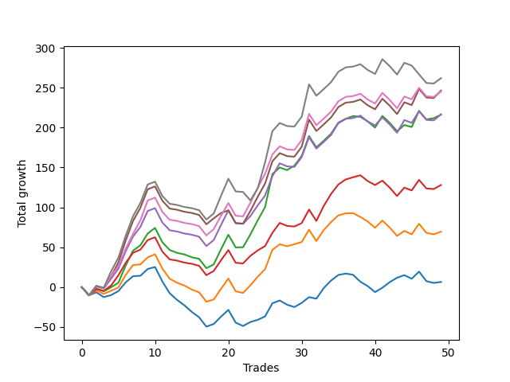

# Short Bulldog 003 
- Symbol: ES1Y
- Date Range: 03/15/2022 - 07/08/2022
- Trading Period: 7:20-12:30
- Number of Trades: 49



| Name | Win Percent | Profit | Avg Profit / Trade |     | Name | Win Percent | Profit | Avg Profit / Trade |
| ---- | ----------- | ------ | ------------------ | --- | ---- | ----------- | ------ | ------------------ |
| Sorted By <br> Profit | | | | | Sorted By <br> Win Percentage ||||
| Seven | 53.06 | 131000.00 | 2673.47 |     | Two | 61.22 | 108125.00 | 2206.63 |
| Five | 57.14 | 123250.00 | 2515.31 |     | Five | 57.14 | 123250.00 | 2515.31 |
| Six | 57.14 | 122625.00 | 2502.55 |     | Six | 57.14 | 122625.00 | 2502.55 |
| Four | 57.14 | 108375.00 | 2211.73 |     | Four | 57.14 | 108375.00 | 2211.73 |
| Two | 61.22 | 108125.00 | 2206.63 |     | Three | 57.14 | 64000.00 | 1306.12 |
| Three | 57.14 | 64000.00 | 1306.12 |     | One | 57.14 | 34750.00 | 709.18 |
| One | 57.14 | 34750.00 | 709.18 |     | Zero | 57.14 | 3250.00 | 66.33 |
| Zero | 57.14 | 3250.00 | 66.33 |     | Seven | 53.06 | 131000.00 | 2673.47 |

### Test Zero
* Sell when price hits the middle line of the 20p bollinger
* No Stoploss
* Results:
```
Total Trades: 49
Percent Up: 42.86
Percent Down: 57.14
Total Points Moved Down: 6.50
Potential Profit: 3250.00
Total Points Ups: 163.50 Count Ups: 21
Total Points Downs: 170.00 Count Downs: 28
```

<details><summary>Trades</summary>

<code>In: 2022-03-17 09:25:00		Out: 2022-03-17 09:54:55		Total Position Time: 29:55		Total Move Down: -10.25		Total to Date: -10.25</code> <br />
<code>In: 2022-03-24 08:44:00		Out: 2022-03-24 08:50:05		Total Position Time: 06:05		Total Move Down: 3.75		Total to Date: -6.50</code> <br />
<code>In: 2022-03-25 07:26:00		Out: 2022-03-25 07:51:05		Total Position Time: 25:05		Total Move Down: -6.00		Total to Date: -12.50</code> <br />
<code>In: 2022-03-25 07:44:00		Out: 2022-03-25 07:51:05		Total Position Time: 07:05		Total Move Down: 2.50		Total to Date: -10.00</code> <br />
<code>In: 2022-04-06 10:43:00		Out: 2022-04-06 10:47:15		Total Position Time: 04:15		Total Move Down: 5.00		Total to Date: -5.00</code> <br />
<code>In: 2022-04-06 11:04:00		Out: 2022-04-06 11:05:40		Total Position Time: 01:40		Total Move Down: 11.00		Total to Date: 6.00</code> <br />
<code>In: 2022-04-06 11:05:00		Out: 2022-04-06 11:05:40		Total Position Time: 00:40		Total Move Down: 7.75		Total to Date: 13.75</code> <br />
<code>In: 2022-04-06 11:57:00		Out: 2022-04-06 12:07:45		Total Position Time: 10:45		Total Move Down: 0.50		Total to Date: 14.25</code> <br />
<code>In: 2022-04-06 12:02:00		Out: 2022-04-06 12:07:45		Total Position Time: 05:45		Total Move Down: 8.50		Total to Date: 22.75</code> <br />
<code>In: 2022-04-07 11:03:00		Out: 2022-04-07 11:15:15		Total Position Time: 12:15		Total Move Down: 2.50		Total to Date: 25.25</code> <br />
<code>In: 2022-04-07 11:50:00		Out: 2022-04-07 12:19:10		Total Position Time: 29:10		Total Move Down: -18.25		Total to Date: 7.00</code> <br />
<code>In: 2022-04-07 11:54:00		Out: 2022-04-07 12:19:10		Total Position Time: 25:10		Total Move Down: -14.75		Total to Date: -7.75</code> <br />
<code>In: 2022-04-08 07:54:00		Out: 2022-04-08 08:15:30		Total Position Time: 21:30		Total Move Down: -8.25		Total to Date: -16.00</code> <br />
<code>In: 2022-04-08 07:57:00		Out: 2022-04-08 08:15:30		Total Position Time: 18:30		Total Move Down: -6.75		Total to Date: -22.75</code> <br />
<code>In: 2022-04-08 07:54:00		Out: 2022-04-08 08:15:30		Total Position Time: 21:30		Total Move Down: -8.25		Total to Date: -31.00</code> <br />
<code>In: 2022-04-08 07:57:00		Out: 2022-04-08 08:15:30		Total Position Time: 18:30		Total Move Down: -6.75		Total to Date: -37.75</code> <br />
<code>In: 2022-04-13 08:06:00		Out: 2022-04-13 08:35:55		Total Position Time: 29:55		Total Move Down: -11.75		Total to Date: -49.50</code> <br />
<code>In: 2022-04-18 07:27:00		Out: 2022-04-18 07:36:40		Total Position Time: 09:40		Total Move Down: 3.25		Total to Date: -46.25</code> <br />
<code>In: 2022-05-03 07:34:00		Out: 2022-05-03 07:37:55		Total Position Time: 03:55		Total Move Down: 9.25		Total to Date: -37.00</code> <br />
<code>In: 2022-05-03 07:35:00		Out: 2022-05-03 07:37:55		Total Position Time: 02:55		Total Move Down: 8.50		Total to Date: -28.50</code> <br />
<code>In: 2022-05-03 08:06:00		Out: 2022-05-03 08:35:55		Total Position Time: 29:55		Total Move Down: -16.00		Total to Date: -44.50</code> <br />
<code>In: 2022-05-03 08:10:00		Out: 2022-05-03 08:35:55		Total Position Time: 25:55		Total Move Down: -4.25		Total to Date: -48.75</code> <br />
<code>In: 2022-05-04 10:59:00		Out: 2022-05-04 11:00:20		Total Position Time: 01:20		Total Move Down: 5.00		Total to Date: -43.75</code> <br />
<code>In: 2022-05-04 11:03:00		Out: 2022-05-04 11:06:50		Total Position Time: 03:50		Total Move Down: 2.75		Total to Date: -41.00</code> <br />
<code>In: 2022-05-04 11:07:00		Out: 2022-05-04 11:07:10		Total Position Time: 00:10		Total Move Down: 4.25		Total to Date: -36.75</code> <br />
<code>In: 2022-05-04 11:30:00		Out: 2022-05-04 11:30:45		Total Position Time: 00:45		Total Move Down: 16.50		Total to Date: -20.25</code> <br />
<code>In: 2022-05-16 09:05:00		Out: 2022-05-16 09:05:45		Total Position Time: 00:45		Total Move Down: 3.50		Total to Date: -16.75</code> <br />
<code>In: 2022-05-16 10:25:00		Out: 2022-05-16 10:42:15		Total Position Time: 17:15		Total Move Down: -5.25		Total to Date: -22.00</code> <br />
<code>In: 2022-05-19 08:40:00		Out: 2022-05-19 08:53:35		Total Position Time: 13:35		Total Move Down: -3.00		Total to Date: -25.00</code> <br />
<code>In: 2022-05-19 11:52:00		Out: 2022-05-19 11:57:50		Total Position Time: 05:50		Total Move Down: 5.25		Total to Date: -19.75</code> <br />
<code>In: 2022-05-19 12:05:00		Out: 2022-05-19 12:09:40		Total Position Time: 04:40		Total Move Down: 7.25		Total to Date: -12.50</code> <br />
<code>In: 2022-05-23 08:07:00		Out: 2022-05-23 08:21:15		Total Position Time: 14:15		Total Move Down: -2.00		Total to Date: -14.50</code> <br />
<code>In: 2022-05-24 11:13:00		Out: 2022-05-24 11:18:25		Total Position Time: 05:25		Total Move Down: 13.25		Total to Date: -1.25</code> <br />
<code>In: 2022-05-24 11:14:00		Out: 2022-05-24 11:18:25		Total Position Time: 04:25		Total Move Down: 9.50		Total to Date: 8.25</code> <br />
<code>In: 2022-05-25 07:36:00		Out: 2022-05-25 07:42:00		Total Position Time: 06:00		Total Move Down: 7.00		Total to Date: 15.25</code> <br />
<code>In: 2022-05-25 12:05:00		Out: 2022-05-25 12:17:30		Total Position Time: 12:30		Total Move Down: 1.75		Total to Date: 17.00</code> <br />
<code>In: 2022-05-27 12:10:00		Out: 2022-05-27 12:35:00		Total Position Time: 25:00		Total Move Down: -1.50		Total to Date: 15.50</code> <br />
<code>In: 2022-05-31 08:53:00		Out: 2022-05-31 09:13:00		Total Position Time: 20:00		Total Move Down: -8.75		Total to Date: 6.75</code> <br />
<code>In: 2022-06-02 08:05:00		Out: 2022-06-02 08:22:05		Total Position Time: 17:05		Total Move Down: -5.50		Total to Date: 1.25</code> <br />
<code>In: 2022-06-02 08:06:00		Out: 2022-06-02 08:22:05		Total Position Time: 16:05		Total Move Down: -7.50		Total to Date: -6.25</code> <br />
<code>In: 2022-06-23 08:15:00		Out: 2022-06-23 08:21:05		Total Position Time: 06:05		Total Move Down: 5.50		Total to Date: -0.75</code> <br />
<code>In: 2022-06-30 08:29:00		Out: 2022-06-30 08:35:10		Total Position Time: 06:10		Total Move Down: 7.00		Total to Date: 6.25</code> <br />
<code>In: 2022-06-30 08:30:00		Out: 2022-06-30 08:35:10		Total Position Time: 05:10		Total Move Down: 5.50		Total to Date: 11.75</code> <br />
<code>In: 2022-07-05 09:27:00		Out: 2022-07-05 09:40:05		Total Position Time: 13:05		Total Move Down: 3.25		Total to Date: 15.00</code> <br />
<code>In: 2022-07-05 11:34:00		Out: 2022-07-05 11:48:05		Total Position Time: 14:05		Total Move Down: -4.50		Total to Date: 10.50</code> <br />
<code>In: 2022-07-06 11:09:00		Out: 2022-07-06 11:10:10		Total Position Time: 01:10		Total Move Down: 9.00		Total to Date: 19.50</code> <br />
<code>In: 2022-07-06 11:31:00		Out: 2022-07-06 11:48:45		Total Position Time: 17:45		Total Move Down: -12.00		Total to Date: 7.50</code> <br />
<code>In: 2022-07-06 11:35:00		Out: 2022-07-06 11:48:45		Total Position Time: 13:45		Total Move Down: -2.25		Total to Date: 5.25</code> <br />
<code>In: 2022-07-07 12:18:00		Out: 2022-07-07 12:24:15		Total Position Time: 06:15		Total Move Down: 1.25		Total to Date: 6.50</code> <br />


</details>

### Test One
* Sell when the price hits the upper line of the 20p 1std bollinger
* No Stoploss
* Results:
```
Total Trades: 49
Percent Up: 42.86
Percent Down: 57.14
Total Points Moved Down: 69.50
Potential Profit: 34750.00
Total Points Ups: 164.00 Count Ups: 21
Total Points Downs: 233.50 Count Downs: 28
```

<details><summary>Trades</summary>

<code>In: 2022-03-17 09:25:00		Out: 2022-03-17 09:54:55		Total Position Time: 29:55		Total Move Down: -10.25		Total to Date: -10.25</code> <br />
<code>In: 2022-03-24 08:44:00		Out: 2022-03-24 08:53:50		Total Position Time: 09:50		Total Move Down: 6.25		Total to Date: -4.00</code> <br />
<code>In: 2022-03-25 07:26:00		Out: 2022-03-25 07:53:50		Total Position Time: 27:50		Total Move Down: -4.50		Total to Date: -8.50</code> <br />
<code>In: 2022-03-25 07:44:00		Out: 2022-03-25 07:53:50		Total Position Time: 09:50		Total Move Down: 4.00		Total to Date: -4.50</code> <br />
<code>In: 2022-04-06 10:43:00		Out: 2022-04-06 10:56:55		Total Position Time: 13:55		Total Move Down: 4.00		Total to Date: -0.50</code> <br />
<code>In: 2022-04-06 11:04:00		Out: 2022-04-06 11:07:20		Total Position Time: 03:20		Total Move Down: 15.75		Total to Date: 15.25</code> <br />
<code>In: 2022-04-06 11:05:00		Out: 2022-04-06 11:07:20		Total Position Time: 02:20		Total Move Down: 12.50		Total to Date: 27.75</code> <br />
<code>In: 2022-04-06 11:57:00		Out: 2022-04-06 12:13:35		Total Position Time: 16:35		Total Move Down: 0.75		Total to Date: 28.50</code> <br />
<code>In: 2022-04-06 12:02:00		Out: 2022-04-06 12:13:35		Total Position Time: 11:35		Total Move Down: 8.75		Total to Date: 37.25</code> <br />
<code>In: 2022-04-07 11:03:00		Out: 2022-04-07 11:16:10		Total Position Time: 13:10		Total Move Down: 4.00		Total to Date: 41.25</code> <br />
<code>In: 2022-04-07 11:50:00		Out: 2022-04-07 12:19:55		Total Position Time: 29:55		Total Move Down: -18.00		Total to Date: 23.25</code> <br />
<code>In: 2022-04-07 11:54:00		Out: 2022-04-07 12:20:20		Total Position Time: 26:20		Total Move Down: -12.75		Total to Date: 10.50</code> <br />
<code>In: 2022-04-08 07:54:00		Out: 2022-04-08 08:17:05		Total Position Time: 23:05		Total Move Down: -5.00		Total to Date: 5.50</code> <br />
<code>In: 2022-04-08 07:57:00		Out: 2022-04-08 08:17:05		Total Position Time: 20:05		Total Move Down: -3.50		Total to Date: 2.00</code> <br />
<code>In: 2022-04-08 07:54:00		Out: 2022-04-08 08:17:05		Total Position Time: 23:05		Total Move Down: -5.00		Total to Date: -3.00</code> <br />
<code>In: 2022-04-08 07:57:00		Out: 2022-04-08 08:17:05		Total Position Time: 20:05		Total Move Down: -3.50		Total to Date: -6.50</code> <br />
<code>In: 2022-04-13 08:06:00		Out: 2022-04-13 08:35:55		Total Position Time: 29:55		Total Move Down: -11.75		Total to Date: -18.25</code> <br />
<code>In: 2022-04-18 07:27:00		Out: 2022-04-18 07:51:30		Total Position Time: 24:30		Total Move Down: 2.75		Total to Date: -15.50</code> <br />
<code>In: 2022-05-03 07:34:00		Out: 2022-05-03 07:41:20		Total Position Time: 07:20		Total Move Down: 13.50		Total to Date: -2.00</code> <br />
<code>In: 2022-05-03 07:35:00		Out: 2022-05-03 07:41:20		Total Position Time: 06:20		Total Move Down: 12.75		Total to Date: 10.75</code> <br />
<code>In: 2022-05-03 08:06:00		Out: 2022-05-03 08:35:55		Total Position Time: 29:55		Total Move Down: -16.00		Total to Date: -5.25</code> <br />
<code>In: 2022-05-03 08:10:00		Out: 2022-05-03 08:38:05		Total Position Time: 28:05		Total Move Down: -2.00		Total to Date: -7.25</code> <br />
<code>In: 2022-05-04 10:59:00		Out: 2022-05-04 11:00:25		Total Position Time: 01:25		Total Move Down: 9.50		Total to Date: 2.25</code> <br />
<code>In: 2022-05-04 11:03:00		Out: 2022-05-04 11:07:20		Total Position Time: 04:20		Total Move Down: 10.75		Total to Date: 13.00</code> <br />
<code>In: 2022-05-04 11:07:00		Out: 2022-05-04 11:07:20		Total Position Time: 00:20		Total Move Down: 9.50		Total to Date: 22.50</code> <br />
<code>In: 2022-05-04 11:30:00		Out: 2022-05-04 11:30:50		Total Position Time: 00:50		Total Move Down: 24.25		Total to Date: 46.75</code> <br />
<code>In: 2022-05-16 09:05:00		Out: 2022-05-16 09:06:10		Total Position Time: 01:10		Total Move Down: 7.00		Total to Date: 53.75</code> <br />
<code>In: 2022-05-16 10:25:00		Out: 2022-05-16 10:42:30		Total Position Time: 17:30		Total Move Down: -2.50		Total to Date: 51.25</code> <br />
<code>In: 2022-05-19 08:40:00		Out: 2022-05-19 08:54:40		Total Position Time: 14:40		Total Move Down: 2.50		Total to Date: 53.75</code> <br />
<code>In: 2022-05-19 11:52:00		Out: 2022-05-19 12:10:15		Total Position Time: 18:15		Total Move Down: 2.75		Total to Date: 56.50</code> <br />
<code>In: 2022-05-19 12:05:00		Out: 2022-05-19 12:10:15		Total Position Time: 05:15		Total Move Down: 15.50		Total to Date: 72.00</code> <br />
<code>In: 2022-05-23 08:07:00		Out: 2022-05-23 08:36:55		Total Position Time: 29:55		Total Move Down: -14.25		Total to Date: 57.75</code> <br />
<code>In: 2022-05-24 11:13:00		Out: 2022-05-24 11:31:25		Total Position Time: 18:25		Total Move Down: 13.75		Total to Date: 71.50</code> <br />
<code>In: 2022-05-24 11:14:00		Out: 2022-05-24 11:31:25		Total Position Time: 17:25		Total Move Down: 10.00		Total to Date: 81.50</code> <br />
<code>In: 2022-05-25 07:36:00		Out: 2022-05-25 07:46:40		Total Position Time: 10:40		Total Move Down: 8.50		Total to Date: 90.00</code> <br />
<code>In: 2022-05-25 12:05:00		Out: 2022-05-25 12:20:15		Total Position Time: 15:15		Total Move Down: 2.50		Total to Date: 92.50</code> <br />
<code>In: 2022-05-27 12:10:00		Out: 2022-05-27 12:35:40		Total Position Time: 25:40		Total Move Down: 0.25		Total to Date: 92.75</code> <br />
<code>In: 2022-05-31 08:53:00		Out: 2022-05-31 09:14:40		Total Position Time: 21:40		Total Move Down: -4.75		Total to Date: 88.00</code> <br />
<code>In: 2022-06-02 08:05:00		Out: 2022-06-02 08:27:30		Total Position Time: 22:30		Total Move Down: -5.75		Total to Date: 82.25</code> <br />
<code>In: 2022-06-02 08:06:00		Out: 2022-06-02 08:27:30		Total Position Time: 21:30		Total Move Down: -7.75		Total to Date: 74.50</code> <br />
<code>In: 2022-06-23 08:15:00		Out: 2022-06-23 08:23:35		Total Position Time: 08:35		Total Move Down: 9.00		Total to Date: 83.50</code> <br />
<code>In: 2022-06-30 08:29:00		Out: 2022-06-30 08:58:55		Total Position Time: 29:55		Total Move Down: -8.75		Total to Date: 74.75</code> <br />
<code>In: 2022-06-30 08:30:00		Out: 2022-06-30 08:59:55		Total Position Time: 29:55		Total Move Down: -10.50		Total to Date: 64.25</code> <br />
<code>In: 2022-07-05 09:27:00		Out: 2022-07-05 09:42:00		Total Position Time: 15:00		Total Move Down: 6.25		Total to Date: 70.50</code> <br />
<code>In: 2022-07-05 11:34:00		Out: 2022-07-05 11:53:20		Total Position Time: 19:20		Total Move Down: -4.25		Total to Date: 66.25</code> <br />
<code>In: 2022-07-06 11:09:00		Out: 2022-07-06 11:11:10		Total Position Time: 02:10		Total Move Down: 13.25		Total to Date: 79.50</code> <br />
<code>In: 2022-07-06 11:31:00		Out: 2022-07-06 12:00:50		Total Position Time: 29:50		Total Move Down: -11.50		Total to Date: 68.00</code> <br />
<code>In: 2022-07-06 11:35:00		Out: 2022-07-06 12:00:50		Total Position Time: 25:50		Total Move Down: -1.75		Total to Date: 66.25</code> <br />
<code>In: 2022-07-07 12:18:00		Out: 2022-07-07 12:25:10		Total Position Time: 07:10		Total Move Down: 3.25		Total to Date: 69.50</code> <br />


</details>

### Test Two
* Sell when the price hits the upper line of the 20p 2std bollinger
* No Stoploss
* Results:
```
Total Trades: 49
Percent Up: 38.78
Percent Down: 61.22
Total Points Moved Down: 216.25
Potential Profit: 108125.00
Total Points Ups: 144.75 Count Ups: 19
Total Points Downs: 361.00 Count Downs: 30
```

<details><summary>Trades</summary>

<code>In: 2022-03-17 09:25:00		Out: 2022-03-17 09:54:55		Total Position Time: 29:55		Total Move Down: -10.25		Total to Date: -10.25</code> <br />
<code>In: 2022-03-24 08:44:00		Out: 2022-03-24 09:03:15		Total Position Time: 19:15		Total Move Down: 8.50		Total to Date: -1.75</code> <br />
<code>In: 2022-03-25 07:26:00		Out: 2022-03-25 07:54:10		Total Position Time: 28:10		Total Move Down: -3.50		Total to Date: -5.25</code> <br />
<code>In: 2022-03-25 07:44:00		Out: 2022-03-25 07:54:10		Total Position Time: 10:10		Total Move Down: 5.00		Total to Date: -0.25</code> <br />
<code>In: 2022-04-06 10:43:00		Out: 2022-04-06 10:58:00		Total Position Time: 15:00		Total Move Down: 5.75		Total to Date: 5.50</code> <br />
<code>In: 2022-04-06 11:04:00		Out: 2022-04-06 11:08:20		Total Position Time: 04:20		Total Move Down: 21.75		Total to Date: 27.25</code> <br />
<code>In: 2022-04-06 11:05:00		Out: 2022-04-06 11:08:20		Total Position Time: 03:20		Total Move Down: 18.50		Total to Date: 45.75</code> <br />
<code>In: 2022-04-06 11:57:00		Out: 2022-04-06 12:20:25		Total Position Time: 23:25		Total Move Down: 6.75		Total to Date: 52.50</code> <br />
<code>In: 2022-04-06 12:02:00		Out: 2022-04-06 12:20:25		Total Position Time: 18:25		Total Move Down: 14.75		Total to Date: 67.25</code> <br />
<code>In: 2022-04-07 11:03:00		Out: 2022-04-07 11:18:40		Total Position Time: 15:40		Total Move Down: 7.00		Total to Date: 74.25</code> <br />
<code>In: 2022-04-07 11:50:00		Out: 2022-04-07 12:19:55		Total Position Time: 29:55		Total Move Down: -18.00		Total to Date: 56.25</code> <br />
<code>In: 2022-04-07 11:54:00		Out: 2022-04-07 12:23:55		Total Position Time: 29:55		Total Move Down: -9.75		Total to Date: 46.50</code> <br />
<code>In: 2022-04-08 07:54:00		Out: 2022-04-08 08:20:35		Total Position Time: 26:35		Total Move Down: -3.50		Total to Date: 43.00</code> <br />
<code>In: 2022-04-08 07:57:00		Out: 2022-04-08 08:20:35		Total Position Time: 23:35		Total Move Down: -2.00		Total to Date: 41.00</code> <br />
<code>In: 2022-04-08 07:54:00		Out: 2022-04-08 08:20:35		Total Position Time: 26:35		Total Move Down: -3.50		Total to Date: 37.50</code> <br />
<code>In: 2022-04-08 07:57:00		Out: 2022-04-08 08:20:35		Total Position Time: 23:35		Total Move Down: -2.00		Total to Date: 35.50</code> <br />
<code>In: 2022-04-13 08:06:00		Out: 2022-04-13 08:35:55		Total Position Time: 29:55		Total Move Down: -11.75		Total to Date: 23.75</code> <br />
<code>In: 2022-04-18 07:27:00		Out: 2022-04-18 07:51:45		Total Position Time: 24:45		Total Move Down: 4.75		Total to Date: 28.50</code> <br />
<code>In: 2022-05-03 07:34:00		Out: 2022-05-03 07:43:50		Total Position Time: 09:50		Total Move Down: 19.00		Total to Date: 47.50</code> <br />
<code>In: 2022-05-03 07:35:00		Out: 2022-05-03 07:43:50		Total Position Time: 08:50		Total Move Down: 18.25		Total to Date: 65.75</code> <br />
<code>In: 2022-05-03 08:06:00		Out: 2022-05-03 08:35:55		Total Position Time: 29:55		Total Move Down: -16.00		Total to Date: 49.75</code> <br />
<code>In: 2022-05-03 08:10:00		Out: 2022-05-03 08:39:10		Total Position Time: 29:10		Total Move Down: 0.25		Total to Date: 50.00</code> <br />
<code>In: 2022-05-04 10:59:00		Out: 2022-05-04 11:08:05		Total Position Time: 09:05		Total Move Down: 16.00		Total to Date: 66.00</code> <br />
<code>In: 2022-05-04 11:03:00		Out: 2022-05-04 11:08:05		Total Position Time: 05:05		Total Move Down: 17.75		Total to Date: 83.75</code> <br />
<code>In: 2022-05-04 11:07:00		Out: 2022-05-04 11:08:05		Total Position Time: 01:05		Total Move Down: 16.50		Total to Date: 100.25</code> <br />
<code>In: 2022-05-04 11:30:00		Out: 2022-05-04 11:34:15		Total Position Time: 04:15		Total Move Down: 41.50		Total to Date: 141.75</code> <br />
<code>In: 2022-05-16 09:05:00		Out: 2022-05-16 09:11:40		Total Position Time: 06:40		Total Move Down: 8.25		Total to Date: 150.00</code> <br />
<code>In: 2022-05-16 10:25:00		Out: 2022-05-16 10:46:35		Total Position Time: 21:35		Total Move Down: -3.25		Total to Date: 146.75</code> <br />
<code>In: 2022-05-19 08:40:00		Out: 2022-05-19 08:55:35		Total Position Time: 15:35		Total Move Down: 5.50		Total to Date: 152.25</code> <br />
<code>In: 2022-05-19 11:52:00		Out: 2022-05-19 12:18:25		Total Position Time: 26:25		Total Move Down: 12.25		Total to Date: 164.50</code> <br />
<code>In: 2022-05-19 12:05:00		Out: 2022-05-19 12:18:25		Total Position Time: 13:25		Total Move Down: 25.00		Total to Date: 189.50</code> <br />
<code>In: 2022-05-23 08:07:00		Out: 2022-05-23 08:36:55		Total Position Time: 29:55		Total Move Down: -14.25		Total to Date: 175.25</code> <br />
<code>In: 2022-05-24 11:13:00		Out: 2022-05-24 11:42:55		Total Position Time: 29:55		Total Move Down: 8.25		Total to Date: 183.50</code> <br />
<code>In: 2022-05-24 11:14:00		Out: 2022-05-24 11:43:55		Total Position Time: 29:55		Total Move Down: 8.75		Total to Date: 192.25</code> <br />
<code>In: 2022-05-25 07:36:00		Out: 2022-05-25 07:48:20		Total Position Time: 12:20		Total Move Down: 14.00		Total to Date: 206.25</code> <br />
<code>In: 2022-05-25 12:05:00		Out: 2022-05-25 12:23:00		Total Position Time: 18:00		Total Move Down: 4.75		Total to Date: 211.00</code> <br />
<code>In: 2022-05-27 12:10:00		Out: 2022-05-27 12:38:10		Total Position Time: 28:10		Total Move Down: 3.50		Total to Date: 214.50</code> <br />
<code>In: 2022-05-31 08:53:00		Out: 2022-05-31 09:15:55		Total Position Time: 22:55		Total Move Down: -1.00		Total to Date: 213.50</code> <br />
<code>In: 2022-06-02 08:05:00		Out: 2022-06-02 08:29:05		Total Position Time: 24:05		Total Move Down: -5.75		Total to Date: 207.75</code> <br />
<code>In: 2022-06-02 08:06:00		Out: 2022-06-02 08:29:05		Total Position Time: 23:05		Total Move Down: -7.75		Total to Date: 200.00</code> <br />
<code>In: 2022-06-23 08:15:00		Out: 2022-06-23 08:31:25		Total Position Time: 16:25		Total Move Down: 14.75		Total to Date: 214.75</code> <br />
<code>In: 2022-06-30 08:29:00		Out: 2022-06-30 08:58:55		Total Position Time: 29:55		Total Move Down: -8.75		Total to Date: 206.00</code> <br />
<code>In: 2022-06-30 08:30:00		Out: 2022-06-30 08:59:55		Total Position Time: 29:55		Total Move Down: -10.50		Total to Date: 195.50</code> <br />
<code>In: 2022-07-05 09:27:00		Out: 2022-07-05 09:42:35		Total Position Time: 15:35		Total Move Down: 7.75		Total to Date: 203.25</code> <br />
<code>In: 2022-07-05 11:34:00		Out: 2022-07-05 12:01:50		Total Position Time: 27:50		Total Move Down: -2.50		Total to Date: 200.75</code> <br />
<code>In: 2022-07-06 11:09:00		Out: 2022-07-06 11:12:15		Total Position Time: 03:15		Total Move Down: 20.25		Total to Date: 221.00</code> <br />
<code>In: 2022-07-06 11:31:00		Out: 2022-07-06 12:00:55		Total Position Time: 29:55		Total Move Down: -10.75		Total to Date: 210.25</code> <br />
<code>In: 2022-07-06 11:35:00		Out: 2022-07-06 12:01:30		Total Position Time: 26:30		Total Move Down: 1.50		Total to Date: 211.75</code> <br />
<code>In: 2022-07-07 12:18:00		Out: 2022-07-07 12:28:30		Total Position Time: 10:30		Total Move Down: 4.50		Total to Date: 216.25</code> <br />


</details>

### Test Three
* Sell when price hits the middle line of the 50p bollinger
* No Stoploss
* Results:
```
Total Trades: 49
Percent Up: 42.86
Percent Down: 57.14
Total Points Moved Down: 128.00
Potential Profit: 64000.00
Total Points Ups: 142.25 Count Ups: 21
Total Points Downs: 270.25 Count Downs: 28
```

<details><summary>Trades</summary>

<code>In: 2022-03-17 09:25:00		Out: 2022-03-17 09:54:55		Total Position Time: 29:55		Total Move Down: -10.25		Total to Date: -10.25</code> <br />
<code>In: 2022-03-24 08:44:00		Out: 2022-03-24 09:03:10		Total Position Time: 19:10		Total Move Down: 8.00		Total to Date: -2.25</code> <br />
<code>In: 2022-03-25 07:26:00		Out: 2022-03-25 07:55:55		Total Position Time: 29:55		Total Move Down: -2.50		Total to Date: -4.75</code> <br />
<code>In: 2022-03-25 07:44:00		Out: 2022-03-25 08:00:25		Total Position Time: 16:25		Total Move Down: 6.75		Total to Date: 2.00</code> <br />
<code>In: 2022-04-06 10:43:00		Out: 2022-04-06 11:00:10		Total Position Time: 17:10		Total Move Down: 12.75		Total to Date: 14.75</code> <br />
<code>In: 2022-04-06 11:04:00		Out: 2022-04-06 11:07:20		Total Position Time: 03:20		Total Move Down: 15.75		Total to Date: 30.50</code> <br />
<code>In: 2022-04-06 11:05:00		Out: 2022-04-06 11:07:20		Total Position Time: 02:20		Total Move Down: 12.50		Total to Date: 43.00</code> <br />
<code>In: 2022-04-06 11:57:00		Out: 2022-04-06 12:20:15		Total Position Time: 23:15		Total Move Down: 4.00		Total to Date: 47.00</code> <br />
<code>In: 2022-04-06 12:02:00		Out: 2022-04-06 12:20:15		Total Position Time: 18:15		Total Move Down: 12.00		Total to Date: 59.00</code> <br />
<code>In: 2022-04-07 11:03:00		Out: 2022-04-07 11:32:55		Total Position Time: 29:55		Total Move Down: 3.50		Total to Date: 62.50</code> <br />
<code>In: 2022-04-07 11:50:00		Out: 2022-04-07 12:19:55		Total Position Time: 29:55		Total Move Down: -18.00		Total to Date: 44.50</code> <br />
<code>In: 2022-04-07 11:54:00		Out: 2022-04-07 12:23:55		Total Position Time: 29:55		Total Move Down: -9.75		Total to Date: 34.75</code> <br />
<code>In: 2022-04-08 07:54:00		Out: 2022-04-08 08:23:55		Total Position Time: 29:55		Total Move Down: -1.50		Total to Date: 33.25</code> <br />
<code>In: 2022-04-08 07:57:00		Out: 2022-04-08 08:26:55		Total Position Time: 29:55		Total Move Down: -2.50		Total to Date: 30.75</code> <br />
<code>In: 2022-04-08 07:54:00		Out: 2022-04-08 08:23:55		Total Position Time: 29:55		Total Move Down: -1.50		Total to Date: 29.25</code> <br />
<code>In: 2022-04-08 07:57:00		Out: 2022-04-08 08:26:55		Total Position Time: 29:55		Total Move Down: -2.50		Total to Date: 26.75</code> <br />
<code>In: 2022-04-13 08:06:00		Out: 2022-04-13 08:35:55		Total Position Time: 29:55		Total Move Down: -11.75		Total to Date: 15.00</code> <br />
<code>In: 2022-04-18 07:27:00		Out: 2022-04-18 07:51:50		Total Position Time: 24:50		Total Move Down: 5.25		Total to Date: 20.25</code> <br />
<code>In: 2022-05-03 07:34:00		Out: 2022-05-03 07:40:40		Total Position Time: 06:40		Total Move Down: 13.50		Total to Date: 33.75</code> <br />
<code>In: 2022-05-03 07:35:00		Out: 2022-05-03 07:40:40		Total Position Time: 05:40		Total Move Down: 12.75		Total to Date: 46.50</code> <br />
<code>In: 2022-05-03 08:06:00		Out: 2022-05-03 08:35:55		Total Position Time: 29:55		Total Move Down: -16.00		Total to Date: 30.50</code> <br />
<code>In: 2022-05-03 08:10:00		Out: 2022-05-03 08:39:55		Total Position Time: 29:55		Total Move Down: -0.75		Total to Date: 29.75</code> <br />
<code>In: 2022-05-04 10:59:00		Out: 2022-05-04 11:00:25		Total Position Time: 01:25		Total Move Down: 9.50		Total to Date: 39.25</code> <br />
<code>In: 2022-05-04 11:03:00		Out: 2022-05-04 11:07:15		Total Position Time: 04:15		Total Move Down: 6.75		Total to Date: 46.00</code> <br />
<code>In: 2022-05-04 11:07:00		Out: 2022-05-04 11:07:15		Total Position Time: 00:15		Total Move Down: 5.50		Total to Date: 51.50</code> <br />
<code>In: 2022-05-04 11:30:00		Out: 2022-05-04 11:30:45		Total Position Time: 00:45		Total Move Down: 16.50		Total to Date: 68.00</code> <br />
<code>In: 2022-05-16 09:05:00		Out: 2022-05-16 09:15:55		Total Position Time: 10:55		Total Move Down: 12.50		Total to Date: 80.50</code> <br />
<code>In: 2022-05-16 10:25:00		Out: 2022-05-16 10:54:55		Total Position Time: 29:55		Total Move Down: -3.75		Total to Date: 76.75</code> <br />
<code>In: 2022-05-19 08:40:00		Out: 2022-05-19 09:09:55		Total Position Time: 29:55		Total Move Down: -0.75		Total to Date: 76.00</code> <br />
<code>In: 2022-05-19 11:52:00		Out: 2022-05-19 12:13:40		Total Position Time: 21:40		Total Move Down: 4.25		Total to Date: 80.25</code> <br />
<code>In: 2022-05-19 12:05:00		Out: 2022-05-19 12:13:40		Total Position Time: 08:40		Total Move Down: 17.00		Total to Date: 97.25</code> <br />
<code>In: 2022-05-23 08:07:00		Out: 2022-05-23 08:36:55		Total Position Time: 29:55		Total Move Down: -14.25		Total to Date: 83.00</code> <br />
<code>In: 2022-05-24 11:13:00		Out: 2022-05-24 11:20:25		Total Position Time: 07:25		Total Move Down: 18.75		Total to Date: 101.75</code> <br />
<code>In: 2022-05-24 11:14:00		Out: 2022-05-24 11:20:25		Total Position Time: 06:25		Total Move Down: 15.00		Total to Date: 116.75</code> <br />
<code>In: 2022-05-25 07:36:00		Out: 2022-05-25 07:57:20		Total Position Time: 21:20		Total Move Down: 12.00		Total to Date: 128.75</code> <br />
<code>In: 2022-05-25 12:05:00		Out: 2022-05-25 12:34:20		Total Position Time: 29:20		Total Move Down: 6.25		Total to Date: 135.00</code> <br />
<code>In: 2022-05-27 12:10:00		Out: 2022-05-27 12:38:05		Total Position Time: 28:05		Total Move Down: 2.75		Total to Date: 137.75</code> <br />
<code>In: 2022-05-31 08:53:00		Out: 2022-05-31 09:19:05		Total Position Time: 26:05		Total Move Down: 2.50		Total to Date: 140.25</code> <br />
<code>In: 2022-06-02 08:05:00		Out: 2022-06-02 08:34:55		Total Position Time: 29:55		Total Move Down: -7.25		Total to Date: 133.00</code> <br />
<code>In: 2022-06-02 08:06:00		Out: 2022-06-02 08:35:55		Total Position Time: 29:55		Total Move Down: -5.00		Total to Date: 128.00</code> <br />
<code>In: 2022-06-23 08:15:00		Out: 2022-06-23 08:21:05		Total Position Time: 06:05		Total Move Down: 5.50		Total to Date: 133.50</code> <br />
<code>In: 2022-06-30 08:29:00		Out: 2022-06-30 08:58:55		Total Position Time: 29:55		Total Move Down: -8.75		Total to Date: 124.75</code> <br />
<code>In: 2022-06-30 08:30:00		Out: 2022-06-30 08:59:55		Total Position Time: 29:55		Total Move Down: -10.50		Total to Date: 114.25</code> <br />
<code>In: 2022-07-05 09:27:00		Out: 2022-07-05 09:43:40		Total Position Time: 16:40		Total Move Down: 10.50		Total to Date: 124.75</code> <br />
<code>In: 2022-07-05 11:34:00		Out: 2022-07-05 12:03:55		Total Position Time: 29:55		Total Move Down: -3.50		Total to Date: 121.25</code> <br />
<code>In: 2022-07-06 11:09:00		Out: 2022-07-06 11:11:10		Total Position Time: 02:10		Total Move Down: 13.25		Total to Date: 134.50</code> <br />
<code>In: 2022-07-06 11:31:00		Out: 2022-07-06 12:00:55		Total Position Time: 29:55		Total Move Down: -10.75		Total to Date: 123.75</code> <br />
<code>In: 2022-07-06 11:35:00		Out: 2022-07-06 12:04:55		Total Position Time: 29:55		Total Move Down: -0.75		Total to Date: 123.00</code> <br />
<code>In: 2022-07-07 12:18:00		Out: 2022-07-07 12:28:40		Total Position Time: 10:40		Total Move Down: 5.00		Total to Date: 128.00</code> <br />


</details>

### Test Four
* Sell when the price hits the upper line of the 50p 1std bollinger
* No Stoploss
* Results:
```
Total Trades: 49
Percent Up: 42.86
Percent Down: 57.14
Total Points Moved Down: 216.75
Potential Profit: 108375.00
Total Points Ups: 142.25 Count Ups: 21
Total Points Downs: 359.00 Count Downs: 28
```

<details><summary>Trades</summary>

<code>In: 2022-03-17 09:25:00		Out: 2022-03-17 09:54:55		Total Position Time: 29:55		Total Move Down: -10.25		Total to Date: -10.25</code> <br />
<code>In: 2022-03-24 08:44:00		Out: 2022-03-24 09:06:25		Total Position Time: 22:25		Total Move Down: 11.00		Total to Date: 0.75</code> <br />
<code>In: 2022-03-25 07:26:00		Out: 2022-03-25 07:55:55		Total Position Time: 29:55		Total Move Down: -2.50		Total to Date: -1.75</code> <br />
<code>In: 2022-03-25 07:44:00		Out: 2022-03-25 08:01:45		Total Position Time: 17:45		Total Move Down: 12.25		Total to Date: 10.50</code> <br />
<code>In: 2022-04-06 10:43:00		Out: 2022-04-06 11:00:10		Total Position Time: 17:10		Total Move Down: 12.75		Total to Date: 23.25</code> <br />
<code>In: 2022-04-06 11:04:00		Out: 2022-04-06 11:08:10		Total Position Time: 04:10		Total Move Down: 21.75		Total to Date: 45.00</code> <br />
<code>In: 2022-04-06 11:05:00		Out: 2022-04-06 11:08:10		Total Position Time: 03:10		Total Move Down: 18.50		Total to Date: 63.50</code> <br />
<code>In: 2022-04-06 11:57:00		Out: 2022-04-06 12:23:20		Total Position Time: 26:20		Total Move Down: 12.00		Total to Date: 75.50</code> <br />
<code>In: 2022-04-06 12:02:00		Out: 2022-04-06 12:23:20		Total Position Time: 21:20		Total Move Down: 20.00		Total to Date: 95.50</code> <br />
<code>In: 2022-04-07 11:03:00		Out: 2022-04-07 11:32:55		Total Position Time: 29:55		Total Move Down: 3.50		Total to Date: 99.00</code> <br />
<code>In: 2022-04-07 11:50:00		Out: 2022-04-07 12:19:55		Total Position Time: 29:55		Total Move Down: -18.00		Total to Date: 81.00</code> <br />
<code>In: 2022-04-07 11:54:00		Out: 2022-04-07 12:23:55		Total Position Time: 29:55		Total Move Down: -9.75		Total to Date: 71.25</code> <br />
<code>In: 2022-04-08 07:54:00		Out: 2022-04-08 08:23:55		Total Position Time: 29:55		Total Move Down: -1.50		Total to Date: 69.75</code> <br />
<code>In: 2022-04-08 07:57:00		Out: 2022-04-08 08:26:55		Total Position Time: 29:55		Total Move Down: -2.50		Total to Date: 67.25</code> <br />
<code>In: 2022-04-08 07:54:00		Out: 2022-04-08 08:23:55		Total Position Time: 29:55		Total Move Down: -1.50		Total to Date: 65.75</code> <br />
<code>In: 2022-04-08 07:57:00		Out: 2022-04-08 08:26:55		Total Position Time: 29:55		Total Move Down: -2.50		Total to Date: 63.25</code> <br />
<code>In: 2022-04-13 08:06:00		Out: 2022-04-13 08:35:55		Total Position Time: 29:55		Total Move Down: -11.75		Total to Date: 51.50</code> <br />
<code>In: 2022-04-18 07:27:00		Out: 2022-04-18 07:56:55		Total Position Time: 29:55		Total Move Down: 7.50		Total to Date: 59.00</code> <br />
<code>In: 2022-05-03 07:34:00		Out: 2022-05-03 07:43:50		Total Position Time: 09:50		Total Move Down: 19.00		Total to Date: 78.00</code> <br />
<code>In: 2022-05-03 07:35:00		Out: 2022-05-03 07:43:50		Total Position Time: 08:50		Total Move Down: 18.25		Total to Date: 96.25</code> <br />
<code>In: 2022-05-03 08:06:00		Out: 2022-05-03 08:35:55		Total Position Time: 29:55		Total Move Down: -16.00		Total to Date: 80.25</code> <br />
<code>In: 2022-05-03 08:10:00		Out: 2022-05-03 08:39:55		Total Position Time: 29:55		Total Move Down: -0.75		Total to Date: 79.50</code> <br />
<code>In: 2022-05-04 10:59:00		Out: 2022-05-04 11:00:25		Total Position Time: 01:25		Total Move Down: 9.50		Total to Date: 89.00</code> <br />
<code>In: 2022-05-04 11:03:00		Out: 2022-05-04 11:07:25		Total Position Time: 04:25		Total Move Down: 13.50		Total to Date: 102.50</code> <br />
<code>In: 2022-05-04 11:07:00		Out: 2022-05-04 11:07:25		Total Position Time: 00:25		Total Move Down: 12.25		Total to Date: 114.75</code> <br />
<code>In: 2022-05-04 11:30:00		Out: 2022-05-04 11:30:50		Total Position Time: 00:50		Total Move Down: 24.25		Total to Date: 139.00</code> <br />
<code>In: 2022-05-16 09:05:00		Out: 2022-05-16 09:25:35		Total Position Time: 20:35		Total Move Down: 16.25		Total to Date: 155.25</code> <br />
<code>In: 2022-05-16 10:25:00		Out: 2022-05-16 10:54:55		Total Position Time: 29:55		Total Move Down: -3.75		Total to Date: 151.50</code> <br />
<code>In: 2022-05-19 08:40:00		Out: 2022-05-19 09:09:55		Total Position Time: 29:55		Total Move Down: -0.75		Total to Date: 150.75</code> <br />
<code>In: 2022-05-19 11:52:00		Out: 2022-05-19 12:18:25		Total Position Time: 26:25		Total Move Down: 12.25		Total to Date: 163.00</code> <br />
<code>In: 2022-05-19 12:05:00		Out: 2022-05-19 12:18:25		Total Position Time: 13:25		Total Move Down: 25.00		Total to Date: 188.00</code> <br />
<code>In: 2022-05-23 08:07:00		Out: 2022-05-23 08:36:55		Total Position Time: 29:55		Total Move Down: -14.25		Total to Date: 173.75</code> <br />
<code>In: 2022-05-24 11:13:00		Out: 2022-05-24 11:42:55		Total Position Time: 29:55		Total Move Down: 8.25		Total to Date: 182.00</code> <br />
<code>In: 2022-05-24 11:14:00		Out: 2022-05-24 11:43:55		Total Position Time: 29:55		Total Move Down: 8.75		Total to Date: 190.75</code> <br />
<code>In: 2022-05-25 07:36:00		Out: 2022-05-25 08:04:45		Total Position Time: 28:45		Total Move Down: 14.75		Total to Date: 205.50</code> <br />
<code>In: 2022-05-25 12:05:00		Out: 2022-05-25 12:34:55		Total Position Time: 29:55		Total Move Down: 5.50		Total to Date: 211.00</code> <br />
<code>In: 2022-05-27 12:10:00		Out: 2022-05-27 12:39:55		Total Position Time: 29:55		Total Move Down: 1.00		Total to Date: 212.00</code> <br />
<code>In: 2022-05-31 08:53:00		Out: 2022-05-31 09:22:55		Total Position Time: 29:55		Total Move Down: 3.00		Total to Date: 215.00</code> <br />
<code>In: 2022-06-02 08:05:00		Out: 2022-06-02 08:34:55		Total Position Time: 29:55		Total Move Down: -7.25		Total to Date: 207.75</code> <br />
<code>In: 2022-06-02 08:06:00		Out: 2022-06-02 08:35:55		Total Position Time: 29:55		Total Move Down: -5.00		Total to Date: 202.75</code> <br />
<code>In: 2022-06-23 08:15:00		Out: 2022-06-23 08:23:40		Total Position Time: 08:40		Total Move Down: 10.00		Total to Date: 212.75</code> <br />
<code>In: 2022-06-30 08:29:00		Out: 2022-06-30 08:58:55		Total Position Time: 29:55		Total Move Down: -8.75		Total to Date: 204.00</code> <br />
<code>In: 2022-06-30 08:30:00		Out: 2022-06-30 08:59:55		Total Position Time: 29:55		Total Move Down: -10.50		Total to Date: 193.50</code> <br />
<code>In: 2022-07-05 09:27:00		Out: 2022-07-05 09:51:05		Total Position Time: 24:05		Total Move Down: 16.00		Total to Date: 209.50</code> <br />
<code>In: 2022-07-05 11:34:00		Out: 2022-07-05 12:03:55		Total Position Time: 29:55		Total Move Down: -3.50		Total to Date: 206.00</code> <br />
<code>In: 2022-07-06 11:09:00		Out: 2022-07-06 11:11:35		Total Position Time: 02:35		Total Move Down: 14.50		Total to Date: 220.50</code> <br />
<code>In: 2022-07-06 11:31:00		Out: 2022-07-06 12:00:55		Total Position Time: 29:55		Total Move Down: -10.75		Total to Date: 209.75</code> <br />
<code>In: 2022-07-06 11:35:00		Out: 2022-07-06 12:04:55		Total Position Time: 29:55		Total Move Down: -0.75		Total to Date: 209.00</code> <br />
<code>In: 2022-07-07 12:18:00		Out: 2022-07-07 12:38:50		Total Position Time: 20:50		Total Move Down: 7.75		Total to Date: 216.75</code> <br />


</details>

### Test Five
* Sell when the price hits the upper line of the 50p 2std bollinger
* No Stoploss
* Results:
```
Total Trades: 49
Percent Up: 42.86
Percent Down: 57.14
Total Points Moved Down: 246.50
Potential Profit: 123250.00
Total Points Ups: 142.25 Count Ups: 21
Total Points Downs: 388.75 Count Downs: 28
```

<details><summary>Trades</summary>

<code>In: 2022-03-17 09:25:00		Out: 2022-03-17 09:54:55		Total Position Time: 29:55		Total Move Down: -10.25		Total to Date: -10.25</code> <br />
<code>In: 2022-03-24 08:44:00		Out: 2022-03-24 09:13:55		Total Position Time: 29:55		Total Move Down: 11.75		Total to Date: 1.50</code> <br />
<code>In: 2022-03-25 07:26:00		Out: 2022-03-25 07:55:55		Total Position Time: 29:55		Total Move Down: -2.50		Total to Date: -1.00</code> <br />
<code>In: 2022-03-25 07:44:00		Out: 2022-03-25 08:08:15		Total Position Time: 24:15		Total Move Down: 14.75		Total to Date: 13.75</code> <br />
<code>In: 2022-04-06 10:43:00		Out: 2022-04-06 11:09:40		Total Position Time: 26:40		Total Move Down: 17.00		Total to Date: 30.75</code> <br />
<code>In: 2022-04-06 11:04:00		Out: 2022-04-06 11:09:40		Total Position Time: 05:40		Total Move Down: 27.75		Total to Date: 58.50</code> <br />
<code>In: 2022-04-06 11:05:00		Out: 2022-04-06 11:09:40		Total Position Time: 04:40		Total Move Down: 24.50		Total to Date: 83.00</code> <br />
<code>In: 2022-04-06 11:57:00		Out: 2022-04-06 12:26:55		Total Position Time: 29:55		Total Move Down: 16.50		Total to Date: 99.50</code> <br />
<code>In: 2022-04-06 12:02:00		Out: 2022-04-06 12:31:55		Total Position Time: 29:55		Total Move Down: 23.25		Total to Date: 122.75</code> <br />
<code>In: 2022-04-07 11:03:00		Out: 2022-04-07 11:32:55		Total Position Time: 29:55		Total Move Down: 3.50		Total to Date: 126.25</code> <br />
<code>In: 2022-04-07 11:50:00		Out: 2022-04-07 12:19:55		Total Position Time: 29:55		Total Move Down: -18.00		Total to Date: 108.25</code> <br />
<code>In: 2022-04-07 11:54:00		Out: 2022-04-07 12:23:55		Total Position Time: 29:55		Total Move Down: -9.75		Total to Date: 98.50</code> <br />
<code>In: 2022-04-08 07:54:00		Out: 2022-04-08 08:23:55		Total Position Time: 29:55		Total Move Down: -1.50		Total to Date: 97.00</code> <br />
<code>In: 2022-04-08 07:57:00		Out: 2022-04-08 08:26:55		Total Position Time: 29:55		Total Move Down: -2.50		Total to Date: 94.50</code> <br />
<code>In: 2022-04-08 07:54:00		Out: 2022-04-08 08:23:55		Total Position Time: 29:55		Total Move Down: -1.50		Total to Date: 93.00</code> <br />
<code>In: 2022-04-08 07:57:00		Out: 2022-04-08 08:26:55		Total Position Time: 29:55		Total Move Down: -2.50		Total to Date: 90.50</code> <br />
<code>In: 2022-04-13 08:06:00		Out: 2022-04-13 08:35:55		Total Position Time: 29:55		Total Move Down: -11.75		Total to Date: 78.75</code> <br />
<code>In: 2022-04-18 07:27:00		Out: 2022-04-18 07:56:55		Total Position Time: 29:55		Total Move Down: 7.50		Total to Date: 86.25</code> <br />
<code>In: 2022-05-03 07:34:00		Out: 2022-05-03 08:03:55		Total Position Time: 29:55		Total Move Down: 6.75		Total to Date: 93.00</code> <br />
<code>In: 2022-05-03 07:35:00		Out: 2022-05-03 08:04:55		Total Position Time: 29:55		Total Move Down: 3.25		Total to Date: 96.25</code> <br />
<code>In: 2022-05-03 08:06:00		Out: 2022-05-03 08:35:55		Total Position Time: 29:55		Total Move Down: -16.00		Total to Date: 80.25</code> <br />
<code>In: 2022-05-03 08:10:00		Out: 2022-05-03 08:39:55		Total Position Time: 29:55		Total Move Down: -0.75		Total to Date: 79.50</code> <br />
<code>In: 2022-05-04 10:59:00		Out: 2022-05-04 11:08:05		Total Position Time: 09:05		Total Move Down: 16.00		Total to Date: 95.50</code> <br />
<code>In: 2022-05-04 11:03:00		Out: 2022-05-04 11:08:05		Total Position Time: 05:05		Total Move Down: 17.75		Total to Date: 113.25</code> <br />
<code>In: 2022-05-04 11:07:00		Out: 2022-05-04 11:08:05		Total Position Time: 01:05		Total Move Down: 16.50		Total to Date: 129.75</code> <br />
<code>In: 2022-05-04 11:30:00		Out: 2022-05-04 11:32:05		Total Position Time: 02:05		Total Move Down: 28.00		Total to Date: 157.75</code> <br />
<code>In: 2022-05-16 09:05:00		Out: 2022-05-16 09:34:55		Total Position Time: 29:55		Total Move Down: 10.25		Total to Date: 168.00</code> <br />
<code>In: 2022-05-16 10:25:00		Out: 2022-05-16 10:54:55		Total Position Time: 29:55		Total Move Down: -3.75		Total to Date: 164.25</code> <br />
<code>In: 2022-05-19 08:40:00		Out: 2022-05-19 09:09:55		Total Position Time: 29:55		Total Move Down: -0.75		Total to Date: 163.50</code> <br />
<code>In: 2022-05-19 11:52:00		Out: 2022-05-19 12:21:55		Total Position Time: 29:55		Total Move Down: 12.50		Total to Date: 176.00</code> <br />
<code>In: 2022-05-19 12:05:00		Out: 2022-05-19 12:24:45		Total Position Time: 19:45		Total Move Down: 34.00		Total to Date: 210.00</code> <br />
<code>In: 2022-05-23 08:07:00		Out: 2022-05-23 08:36:55		Total Position Time: 29:55		Total Move Down: -14.25		Total to Date: 195.75</code> <br />
<code>In: 2022-05-24 11:13:00		Out: 2022-05-24 11:42:55		Total Position Time: 29:55		Total Move Down: 8.25		Total to Date: 204.00</code> <br />
<code>In: 2022-05-24 11:14:00		Out: 2022-05-24 11:43:55		Total Position Time: 29:55		Total Move Down: 8.75		Total to Date: 212.75</code> <br />
<code>In: 2022-05-25 07:36:00		Out: 2022-05-25 08:05:55		Total Position Time: 29:55		Total Move Down: 13.00		Total to Date: 225.75</code> <br />
<code>In: 2022-05-25 12:05:00		Out: 2022-05-25 12:34:55		Total Position Time: 29:55		Total Move Down: 5.50		Total to Date: 231.25</code> <br />
<code>In: 2022-05-27 12:10:00		Out: 2022-05-27 12:39:55		Total Position Time: 29:55		Total Move Down: 1.00		Total to Date: 232.25</code> <br />
<code>In: 2022-05-31 08:53:00		Out: 2022-05-31 09:22:55		Total Position Time: 29:55		Total Move Down: 3.00		Total to Date: 235.25</code> <br />
<code>In: 2022-06-02 08:05:00		Out: 2022-06-02 08:34:55		Total Position Time: 29:55		Total Move Down: -7.25		Total to Date: 228.00</code> <br />
<code>In: 2022-06-02 08:06:00		Out: 2022-06-02 08:35:55		Total Position Time: 29:55		Total Move Down: -5.00		Total to Date: 223.00</code> <br />
<code>In: 2022-06-23 08:15:00		Out: 2022-06-23 08:31:10		Total Position Time: 16:10		Total Move Down: 13.25		Total to Date: 236.25</code> <br />
<code>In: 2022-06-30 08:29:00		Out: 2022-06-30 08:58:55		Total Position Time: 29:55		Total Move Down: -8.75		Total to Date: 227.50</code> <br />
<code>In: 2022-06-30 08:30:00		Out: 2022-06-30 08:59:55		Total Position Time: 29:55		Total Move Down: -10.50		Total to Date: 217.00</code> <br />
<code>In: 2022-07-05 09:27:00		Out: 2022-07-05 09:56:55		Total Position Time: 29:55		Total Move Down: 14.75		Total to Date: 231.75</code> <br />
<code>In: 2022-07-05 11:34:00		Out: 2022-07-05 12:03:55		Total Position Time: 29:55		Total Move Down: -3.50		Total to Date: 228.25</code> <br />
<code>In: 2022-07-06 11:09:00		Out: 2022-07-06 11:12:15		Total Position Time: 03:15		Total Move Down: 20.25		Total to Date: 248.50</code> <br />
<code>In: 2022-07-06 11:31:00		Out: 2022-07-06 12:00:55		Total Position Time: 29:55		Total Move Down: -10.75		Total to Date: 237.75</code> <br />
<code>In: 2022-07-06 11:35:00		Out: 2022-07-06 12:04:55		Total Position Time: 29:55		Total Move Down: -0.75		Total to Date: 237.00</code> <br />
<code>In: 2022-07-07 12:18:00		Out: 2022-07-07 12:46:45		Total Position Time: 28:45		Total Move Down: 9.50		Total to Date: 246.50</code> <br />


</details>

### Test Six
* Sell when the price hits the middle line of the 1std VWAP
* No Stoploss
* Results:
```
Total Trades: 49
Percent Up: 42.86
Percent Down: 57.14
Total Points Moved Down: 245.25
Potential Profit: 122625.00
Total Points Ups: 142.25 Count Ups: 21
Total Points Downs: 387.50 Count Downs: 28
```

<details><summary>Trades</summary>

<code>In: 2022-03-17 09:25:00		Out: 2022-03-17 09:54:55		Total Position Time: 29:55		Total Move Down: -10.25		Total to Date: -10.25</code> <br />
<code>In: 2022-03-24 08:44:00		Out: 2022-03-24 09:13:55		Total Position Time: 29:55		Total Move Down: 11.75		Total to Date: 1.50</code> <br />
<code>In: 2022-03-25 07:26:00		Out: 2022-03-25 07:55:55		Total Position Time: 29:55		Total Move Down: -2.50		Total to Date: -1.00</code> <br />
<code>In: 2022-03-25 07:44:00		Out: 2022-03-25 08:08:15		Total Position Time: 24:15		Total Move Down: 14.75		Total to Date: 13.75</code> <br />
<code>In: 2022-04-06 10:43:00		Out: 2022-04-06 11:00:10		Total Position Time: 17:10		Total Move Down: 12.75		Total to Date: 26.50</code> <br />
<code>In: 2022-04-06 11:04:00		Out: 2022-04-06 11:08:10		Total Position Time: 04:10		Total Move Down: 21.75		Total to Date: 48.25</code> <br />
<code>In: 2022-04-06 11:05:00		Out: 2022-04-06 11:08:10		Total Position Time: 03:10		Total Move Down: 18.50		Total to Date: 66.75</code> <br />
<code>In: 2022-04-06 11:57:00		Out: 2022-04-06 12:26:50		Total Position Time: 29:50		Total Move Down: 17.00		Total to Date: 83.75</code> <br />
<code>In: 2022-04-06 12:02:00		Out: 2022-04-06 12:26:50		Total Position Time: 24:50		Total Move Down: 25.00		Total to Date: 108.75</code> <br />
<code>In: 2022-04-07 11:03:00		Out: 2022-04-07 11:32:55		Total Position Time: 29:55		Total Move Down: 3.50		Total to Date: 112.25</code> <br />
<code>In: 2022-04-07 11:50:00		Out: 2022-04-07 12:19:55		Total Position Time: 29:55		Total Move Down: -18.00		Total to Date: 94.25</code> <br />
<code>In: 2022-04-07 11:54:00		Out: 2022-04-07 12:23:55		Total Position Time: 29:55		Total Move Down: -9.75		Total to Date: 84.50</code> <br />
<code>In: 2022-04-08 07:54:00		Out: 2022-04-08 08:23:55		Total Position Time: 29:55		Total Move Down: -1.50		Total to Date: 83.00</code> <br />
<code>In: 2022-04-08 07:57:00		Out: 2022-04-08 08:26:55		Total Position Time: 29:55		Total Move Down: -2.50		Total to Date: 80.50</code> <br />
<code>In: 2022-04-08 07:54:00		Out: 2022-04-08 08:23:55		Total Position Time: 29:55		Total Move Down: -1.50		Total to Date: 79.00</code> <br />
<code>In: 2022-04-08 07:57:00		Out: 2022-04-08 08:26:55		Total Position Time: 29:55		Total Move Down: -2.50		Total to Date: 76.50</code> <br />
<code>In: 2022-04-13 08:06:00		Out: 2022-04-13 08:35:55		Total Position Time: 29:55		Total Move Down: -11.75		Total to Date: 64.75</code> <br />
<code>In: 2022-04-18 07:27:00		Out: 2022-04-18 07:55:15		Total Position Time: 28:15		Total Move Down: 8.00		Total to Date: 72.75</code> <br />
<code>In: 2022-05-03 07:34:00		Out: 2022-05-03 07:42:15		Total Position Time: 08:15		Total Move Down: 16.75		Total to Date: 89.50</code> <br />
<code>In: 2022-05-03 07:35:00		Out: 2022-05-03 07:42:15		Total Position Time: 07:15		Total Move Down: 16.00		Total to Date: 105.50</code> <br />
<code>In: 2022-05-03 08:06:00		Out: 2022-05-03 08:35:55		Total Position Time: 29:55		Total Move Down: -16.00		Total to Date: 89.50</code> <br />
<code>In: 2022-05-03 08:10:00		Out: 2022-05-03 08:39:55		Total Position Time: 29:55		Total Move Down: -0.75		Total to Date: 88.75</code> <br />
<code>In: 2022-05-04 10:59:00		Out: 2022-05-04 11:20:20		Total Position Time: 21:20		Total Move Down: 17.00		Total to Date: 105.75</code> <br />
<code>In: 2022-05-04 11:03:00		Out: 2022-05-04 11:20:20		Total Position Time: 17:20		Total Move Down: 18.75		Total to Date: 124.50</code> <br />
<code>In: 2022-05-04 11:07:00		Out: 2022-05-04 11:20:20		Total Position Time: 13:20		Total Move Down: 17.50		Total to Date: 142.00</code> <br />
<code>In: 2022-05-04 11:30:00		Out: 2022-05-04 11:30:50		Total Position Time: 00:50		Total Move Down: 24.25		Total to Date: 166.25</code> <br />
<code>In: 2022-05-16 09:05:00		Out: 2022-05-16 09:34:55		Total Position Time: 29:55		Total Move Down: 10.25		Total to Date: 176.50</code> <br />
<code>In: 2022-05-16 10:25:00		Out: 2022-05-16 10:54:55		Total Position Time: 29:55		Total Move Down: -3.75		Total to Date: 172.75</code> <br />
<code>In: 2022-05-19 08:40:00		Out: 2022-05-19 09:09:55		Total Position Time: 29:55		Total Move Down: -0.75		Total to Date: 172.00</code> <br />
<code>In: 2022-05-19 11:52:00		Out: 2022-05-19 12:21:55		Total Position Time: 29:55		Total Move Down: 12.50		Total to Date: 184.50</code> <br />
<code>In: 2022-05-19 12:05:00		Out: 2022-05-19 12:24:40		Total Position Time: 19:40		Total Move Down: 32.75		Total to Date: 217.25</code> <br />
<code>In: 2022-05-23 08:07:00		Out: 2022-05-23 08:36:55		Total Position Time: 29:55		Total Move Down: -14.25		Total to Date: 203.00</code> <br />
<code>In: 2022-05-24 11:13:00		Out: 2022-05-24 11:42:55		Total Position Time: 29:55		Total Move Down: 8.25		Total to Date: 211.25</code> <br />
<code>In: 2022-05-24 11:14:00		Out: 2022-05-24 11:43:55		Total Position Time: 29:55		Total Move Down: 8.75		Total to Date: 220.00</code> <br />
<code>In: 2022-05-25 07:36:00		Out: 2022-05-25 08:05:55		Total Position Time: 29:55		Total Move Down: 13.00		Total to Date: 233.00</code> <br />
<code>In: 2022-05-25 12:05:00		Out: 2022-05-25 12:34:55		Total Position Time: 29:55		Total Move Down: 5.50		Total to Date: 238.50</code> <br />
<code>In: 2022-05-27 12:10:00		Out: 2022-05-27 12:39:55		Total Position Time: 29:55		Total Move Down: 1.00		Total to Date: 239.50</code> <br />
<code>In: 2022-05-31 08:53:00		Out: 2022-05-31 09:22:55		Total Position Time: 29:55		Total Move Down: 3.00		Total to Date: 242.50</code> <br />
<code>In: 2022-06-02 08:05:00		Out: 2022-06-02 08:34:55		Total Position Time: 29:55		Total Move Down: -7.25		Total to Date: 235.25</code> <br />
<code>In: 2022-06-02 08:06:00		Out: 2022-06-02 08:35:55		Total Position Time: 29:55		Total Move Down: -5.00		Total to Date: 230.25</code> <br />
<code>In: 2022-06-23 08:15:00		Out: 2022-06-23 08:31:10		Total Position Time: 16:10		Total Move Down: 13.25		Total to Date: 243.50</code> <br />
<code>In: 2022-06-30 08:29:00		Out: 2022-06-30 08:58:55		Total Position Time: 29:55		Total Move Down: -8.75		Total to Date: 234.75</code> <br />
<code>In: 2022-06-30 08:30:00		Out: 2022-06-30 08:59:55		Total Position Time: 29:55		Total Move Down: -10.50		Total to Date: 224.25</code> <br />
<code>In: 2022-07-05 09:27:00		Out: 2022-07-05 09:56:55		Total Position Time: 29:55		Total Move Down: 14.75		Total to Date: 239.00</code> <br />
<code>In: 2022-07-05 11:34:00		Out: 2022-07-05 12:03:55		Total Position Time: 29:55		Total Move Down: -3.50		Total to Date: 235.50</code> <br />
<code>In: 2022-07-06 11:09:00		Out: 2022-07-06 11:11:35		Total Position Time: 02:35		Total Move Down: 14.50		Total to Date: 250.00</code> <br />
<code>In: 2022-07-06 11:31:00		Out: 2022-07-06 12:00:55		Total Position Time: 29:55		Total Move Down: -10.75		Total to Date: 239.25</code> <br />
<code>In: 2022-07-06 11:35:00		Out: 2022-07-06 12:04:55		Total Position Time: 29:55		Total Move Down: -0.75		Total to Date: 238.50</code> <br />
<code>In: 2022-07-07 12:18:00		Out: 2022-07-07 12:47:55		Total Position Time: 29:55		Total Move Down: 6.75		Total to Date: 245.25</code> <br />


</details>

### Test Seven
* Sell when the price hits the upper line of the 1std VWAP
* No Stoploss
* Results:
```
Total Trades: 49
Percent Up: 46.94
Percent Down: 53.06
Total Points Moved Down: 262.00
Potential Profit: 131000.00
Total Points Ups: 163.75 Count Ups: 23
Total Points Downs: 425.75 Count Downs: 26
```

<details><summary>Trades</summary>

<code>In: 2022-03-17 09:25:00		Out: 2022-03-17 09:54:55		Total Position Time: 29:55		Total Move Down: -10.25		Total to Date: -10.25</code> <br />
<code>In: 2022-03-24 08:44:00		Out: 2022-03-24 09:13:55		Total Position Time: 29:55		Total Move Down: 11.75		Total to Date: 1.50</code> <br />
<code>In: 2022-03-25 07:26:00		Out: 2022-03-25 07:55:55		Total Position Time: 29:55		Total Move Down: -2.50		Total to Date: -1.00</code> <br />
<code>In: 2022-03-25 07:44:00		Out: 2022-03-25 08:09:20		Total Position Time: 25:20		Total Move Down: 20.75		Total to Date: 19.75</code> <br />
<code>In: 2022-04-06 10:43:00		Out: 2022-04-06 11:09:40		Total Position Time: 26:40		Total Move Down: 17.00		Total to Date: 36.75</code> <br />
<code>In: 2022-04-06 11:04:00		Out: 2022-04-06 11:09:40		Total Position Time: 05:40		Total Move Down: 27.75		Total to Date: 64.50</code> <br />
<code>In: 2022-04-06 11:05:00		Out: 2022-04-06 11:09:40		Total Position Time: 04:40		Total Move Down: 24.50		Total to Date: 89.00</code> <br />
<code>In: 2022-04-06 11:57:00		Out: 2022-04-06 12:26:55		Total Position Time: 29:55		Total Move Down: 16.50		Total to Date: 105.50</code> <br />
<code>In: 2022-04-06 12:02:00		Out: 2022-04-06 12:31:55		Total Position Time: 29:55		Total Move Down: 23.25		Total to Date: 128.75</code> <br />
<code>In: 2022-04-07 11:03:00		Out: 2022-04-07 11:32:55		Total Position Time: 29:55		Total Move Down: 3.50		Total to Date: 132.25</code> <br />
<code>In: 2022-04-07 11:50:00		Out: 2022-04-07 12:19:55		Total Position Time: 29:55		Total Move Down: -18.00		Total to Date: 114.25</code> <br />
<code>In: 2022-04-07 11:54:00		Out: 2022-04-07 12:23:55		Total Position Time: 29:55		Total Move Down: -9.75		Total to Date: 104.50</code> <br />
<code>In: 2022-04-08 07:54:00		Out: 2022-04-08 08:23:55		Total Position Time: 29:55		Total Move Down: -1.50		Total to Date: 103.00</code> <br />
<code>In: 2022-04-08 07:57:00		Out: 2022-04-08 08:26:55		Total Position Time: 29:55		Total Move Down: -2.50		Total to Date: 100.50</code> <br />
<code>In: 2022-04-08 07:54:00		Out: 2022-04-08 08:23:55		Total Position Time: 29:55		Total Move Down: -1.50		Total to Date: 99.00</code> <br />
<code>In: 2022-04-08 07:57:00		Out: 2022-04-08 08:26:55		Total Position Time: 29:55		Total Move Down: -2.50		Total to Date: 96.50</code> <br />
<code>In: 2022-04-13 08:06:00		Out: 2022-04-13 08:35:55		Total Position Time: 29:55		Total Move Down: -11.75		Total to Date: 84.75</code> <br />
<code>In: 2022-04-18 07:27:00		Out: 2022-04-18 07:56:55		Total Position Time: 29:55		Total Move Down: 7.50		Total to Date: 92.25</code> <br />
<code>In: 2022-05-03 07:34:00		Out: 2022-05-03 07:46:45		Total Position Time: 12:45		Total Move Down: 22.25		Total to Date: 114.50</code> <br />
<code>In: 2022-05-03 07:35:00		Out: 2022-05-03 07:46:45		Total Position Time: 11:45		Total Move Down: 21.50		Total to Date: 136.00</code> <br />
<code>In: 2022-05-03 08:06:00		Out: 2022-05-03 08:35:55		Total Position Time: 29:55		Total Move Down: -16.00		Total to Date: 120.00</code> <br />
<code>In: 2022-05-03 08:10:00		Out: 2022-05-03 08:39:55		Total Position Time: 29:55		Total Move Down: -0.75		Total to Date: 119.25</code> <br />
<code>In: 2022-05-04 10:59:00		Out: 2022-05-04 11:28:55		Total Position Time: 29:55		Total Move Down: -10.50		Total to Date: 108.75</code> <br />
<code>In: 2022-05-04 11:03:00		Out: 2022-05-04 11:32:55		Total Position Time: 29:55		Total Move Down: 15.00		Total to Date: 123.75</code> <br />
<code>In: 2022-05-04 11:07:00		Out: 2022-05-04 11:34:05		Total Position Time: 27:05		Total Move Down: 32.50		Total to Date: 156.25</code> <br />
<code>In: 2022-05-04 11:30:00		Out: 2022-05-04 11:34:05		Total Position Time: 04:05		Total Move Down: 39.25		Total to Date: 195.50</code> <br />
<code>In: 2022-05-16 09:05:00		Out: 2022-05-16 09:34:55		Total Position Time: 29:55		Total Move Down: 10.25		Total to Date: 205.75</code> <br />
<code>In: 2022-05-16 10:25:00		Out: 2022-05-16 10:54:55		Total Position Time: 29:55		Total Move Down: -3.75		Total to Date: 202.00</code> <br />
<code>In: 2022-05-19 08:40:00		Out: 2022-05-19 09:09:55		Total Position Time: 29:55		Total Move Down: -0.75		Total to Date: 201.25</code> <br />
<code>In: 2022-05-19 11:52:00		Out: 2022-05-19 12:21:55		Total Position Time: 29:55		Total Move Down: 12.50		Total to Date: 213.75</code> <br />
<code>In: 2022-05-19 12:05:00		Out: 2022-05-19 12:34:55		Total Position Time: 29:55		Total Move Down: 40.50		Total to Date: 254.25</code> <br />
<code>In: 2022-05-23 08:07:00		Out: 2022-05-23 08:36:55		Total Position Time: 29:55		Total Move Down: -14.25		Total to Date: 240.00</code> <br />
<code>In: 2022-05-24 11:13:00		Out: 2022-05-24 11:42:55		Total Position Time: 29:55		Total Move Down: 8.25		Total to Date: 248.25</code> <br />
<code>In: 2022-05-24 11:14:00		Out: 2022-05-24 11:43:55		Total Position Time: 29:55		Total Move Down: 8.75		Total to Date: 257.00</code> <br />
<code>In: 2022-05-25 07:36:00		Out: 2022-05-25 08:05:55		Total Position Time: 29:55		Total Move Down: 13.00		Total to Date: 270.00</code> <br />
<code>In: 2022-05-25 12:05:00		Out: 2022-05-25 12:34:55		Total Position Time: 29:55		Total Move Down: 5.50		Total to Date: 275.50</code> <br />
<code>In: 2022-05-27 12:10:00		Out: 2022-05-27 12:39:55		Total Position Time: 29:55		Total Move Down: 1.00		Total to Date: 276.50</code> <br />
<code>In: 2022-05-31 08:53:00		Out: 2022-05-31 09:22:55		Total Position Time: 29:55		Total Move Down: 3.00		Total to Date: 279.50</code> <br />
<code>In: 2022-06-02 08:05:00		Out: 2022-06-02 08:34:55		Total Position Time: 29:55		Total Move Down: -7.25		Total to Date: 272.25</code> <br />
<code>In: 2022-06-02 08:06:00		Out: 2022-06-02 08:35:55		Total Position Time: 29:55		Total Move Down: -5.00		Total to Date: 267.25</code> <br />
<code>In: 2022-06-23 08:15:00		Out: 2022-06-23 08:35:20		Total Position Time: 20:20		Total Move Down: 18.50		Total to Date: 285.75</code> <br />
<code>In: 2022-06-30 08:29:00		Out: 2022-06-30 08:58:55		Total Position Time: 29:55		Total Move Down: -8.75		Total to Date: 277.00</code> <br />
<code>In: 2022-06-30 08:30:00		Out: 2022-06-30 08:59:55		Total Position Time: 29:55		Total Move Down: -10.50		Total to Date: 266.50</code> <br />
<code>In: 2022-07-05 09:27:00		Out: 2022-07-05 09:56:55		Total Position Time: 29:55		Total Move Down: 14.75		Total to Date: 281.25</code> <br />
<code>In: 2022-07-05 11:34:00		Out: 2022-07-05 12:03:55		Total Position Time: 29:55		Total Move Down: -3.50		Total to Date: 277.75</code> <br />
<code>In: 2022-07-06 11:09:00		Out: 2022-07-06 11:38:55		Total Position Time: 29:55		Total Move Down: -11.00		Total to Date: 266.75</code> <br />
<code>In: 2022-07-06 11:31:00		Out: 2022-07-06 12:00:55		Total Position Time: 29:55		Total Move Down: -10.75		Total to Date: 256.00</code> <br />
<code>In: 2022-07-06 11:35:00		Out: 2022-07-06 12:04:55		Total Position Time: 29:55		Total Move Down: -0.75		Total to Date: 255.25</code> <br />
<code>In: 2022-07-07 12:18:00		Out: 2022-07-07 12:47:55		Total Position Time: 29:55		Total Move Down: 6.75		Total to Date: 262.00</code> <br />


</details>