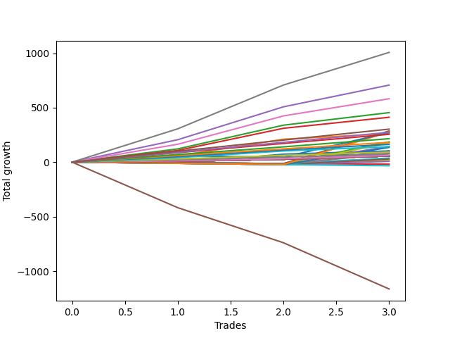

# Long Bulldog 002 
- Symbol: ES1y1d
- Date Range: 07/19/2021 - 07/08/2022
- Trading Period: 7:20-12:30
- Number of Trades: 3



| Name | Win Percent | Profit | Avg Profit / Trade | Avg Time / Trade | Avg Profit / Time |      | Name | Win Percent | Profit | Avg Profit / Trade | Avg Time / Trade | Avg Profit / Time |
| ---- | ----------- | ------ | ------------------ | ---------------- | ----------------- | ---- | ---- | ----------- | ------ | ------------------ | ---------------- | ----------------- |
| Sorted By <br> Profit | | | | | | | Sorted By <br> Win Percentage ||||||
| Seven | 100.00 | 503625.00 | 167875.00 | 20 05:14:00 | 8303.22 |     | Seven | 100.00 | 503625.00 | 167875.00 | 20 05:14:00 | 8303.22 |
| Four | 100.00 | 353625.00 | 117875.00 | 18 23:09:00 | 6215.53 |     | Four | 100.00 | 353625.00 | 117875.00 | 18 23:09:00 | 6215.53 |
| Six | 100.00 | 291000.00 | 97000.00 | 12 23:40:00 | 7469.52 |     | Six | 100.00 | 291000.00 | 97000.00 | 12 23:40:00 | 7469.52 |
| Two | 100.00 | 227250.00 | 75750.00 | 09 04:59:00 | 8226.86 |     | Two | 100.00 | 227250.00 | 75750.00 | 09 04:59:00 | 8226.86 |
| Two Hundred Fifteen | 100.00 | 227000.00 | 75666.67 | 11 08:32:40 | 6663.13 |     | Two Hundred Fifteen | 100.00 | 227000.00 | 75666.67 | 11 08:32:40 | 6663.13 |
| Two Hundred Fourteen.Five | 100.00 | 218625.00 | 72875.00 | 11 00:30:00 | 6612.48 |     | Two Hundred Fourteen.Five | 100.00 | 218625.00 | 72875.00 | 11 00:30:00 | 6612.48 |
| Two Hundred Fourteen | 100.00 | 212375.00 | 70791.67 | 10 16:10:40 | 6632.11 |     | Two Hundred Fourteen | 100.00 | 212375.00 | 70791.67 | 10 16:10:40 | 6632.11 |
| Three | 100.00 | 205875.00 | 68625.00 | 09 03:09:00 | 7515.40 |     | Three | 100.00 | 205875.00 | 68625.00 | 09 03:09:00 | 7515.40 |
| Two Hundred Thirteen.Five | 100.00 | 203500.00 | 67833.33 | 10 09:34:00 | 6523.31 |     | Two Hundred Thirteen.Five | 100.00 | 203500.00 | 67833.33 | 10 09:34:00 | 6523.31 |
| Two Hundred Thirteen | 100.00 | 197625.00 | 65875.00 | 09 11:29:00 | 6949.96 |     | Two Hundred Thirteen | 100.00 | 197625.00 | 65875.00 | 09 11:29:00 | 6949.96 |
| Two Hundred Twelve.Five | 100.00 | 190375.00 | 63458.33 | 08 13:25:20 | 7414.00 |     | Two Hundred Twelve.Five | 100.00 | 190375.00 | 63458.33 | 08 13:25:20 | 7414.00 |
| Two Hundred Twelve | 100.00 | 182750.00 | 60916.67 | 08 13:14:20 | 7123.41 |     | Two Hundred Twelve | 100.00 | 182750.00 | 60916.67 | 08 13:14:20 | 7123.41 |
| Two Hundred Eleven.Five | 100.00 | 172750.00 | 57583.33 | 08 13:08:20 | 6736.90 |     | Two Hundred Eleven.Five | 100.00 | 172750.00 | 57583.33 | 08 13:08:20 | 6736.90 |
| Two Hundred Eleven | 100.00 | 166000.00 | 55333.33 | 08 11:01:00 | 6541.33 |     | Two Hundred Eleven | 100.00 | 166000.00 | 55333.33 | 08 11:01:00 | 6541.33 |
| Two Hundred Ten.Five | 100.00 | 158250.00 | 52750.00 | 08 10:34:20 | 6249.62 |     | Two Hundred Ten.Five | 100.00 | 158250.00 | 52750.00 | 08 10:34:20 | 6249.62 |
| Two Hundred Ten | 100.00 | 151625.00 | 50541.67 | 08 09:48:00 | 6010.90 |     | Two Hundred Ten | 100.00 | 151625.00 | 50541.67 | 08 09:48:00 | 6010.90 |
| Two Hundred Nine.Five | 100.00 | 145250.00 | 48416.67 | 08 09:37:20 | 5763.25 |     | Two Hundred Nine.Five | 100.00 | 145250.00 | 48416.67 | 08 09:37:20 | 5763.25 |
| Two Hundred Nine | 100.00 | 136875.00 | 45625.00 | 08 08:30:20 | 5461.20 |     | Two Hundred Nine | 100.00 | 136875.00 | 45625.00 | 08 08:30:20 | 5461.20 |
| Seventy-Three | 66.67 | 135750.00 | 45250.00 | 09 01:21:00 | 4996.55 |     | One | 100.00 | 130875.00 | 43625.00 | 08 03:08:00 | 5365.56 |
| One | 100.00 | 130875.00 | 43625.00 | 08 03:08:00 | 5365.56 |     | Two Hundred Eight.Five | 100.00 | 129250.00 | 43083.33 | 03 08:11:00 | 12895.45 |
| Two Hundred Eight.Five | 100.00 | 129250.00 | 43083.33 | 03 08:11:00 | 12895.45 |     | Two Hundred Eight | 100.00 | 127625.00 | 42541.67 | 03 07:26:00 | 12853.55 |
| Two Hundred Eight | 100.00 | 127625.00 | 42541.67 | 03 07:26:00 | 12853.55 |     | Two Hundred Seven.Five | 100.00 | 119000.00 | 39666.67 | 03 01:21:20 | 12977.89 |
| Two Hundred Seven.Five | 100.00 | 119000.00 | 39666.67 | 03 01:21:20 | 12977.89 |     | Two Hundred Seven | 100.00 | 107625.00 | 35875.00 | 02 18:34:00 | 12934.40 |
| Two Hundred Seven | 100.00 | 107625.00 | 35875.00 | 02 18:34:00 | 12934.40 |     | Two Hundred Six.Five | 100.00 | 99875.00 | 33291.67 | 02 18:25:20 | 12029.11 |
| Two Hundred Six.Five | 100.00 | 99875.00 | 33291.67 | 02 18:25:20 | 12029.11 |     | Two Hundred Six | 100.00 | 90750.00 | 30250.00 | 00 09:17:20 | 78157.89 |
| Two Hundred Six | 100.00 | 90750.00 | 30250.00 | 00 09:17:20 | 78157.89 |     | Two Hundred Five.Five | 100.00 | 87125.00 | 29041.67 | 00 09:12:40 | 75669.48 |
| Two Hundred Five.Five | 100.00 | 87125.00 | 29041.67 | 00 09:12:40 | 75669.48 |     | Two Hundred Five | 100.00 | 81500.00 | 27166.67 | 00 09:06:40 | 71560.98 |
| Two Hundred Five | 100.00 | 81500.00 | 27166.67 | 00 09:06:40 | 71560.98 |     | Two Hundred Four.Five | 100.00 | 78125.00 | 26041.67 | 00 09:04:40 | 68849.45 |
| Two Hundred Four.Five | 100.00 | 78125.00 | 26041.67 | 00 09:04:40 | 68849.45 |     | Two Hundred Four | 100.00 | 71125.00 | 23708.33 | 00 08:38:20 | 65864.95 |
| Two Hundred Four | 100.00 | 71125.00 | 23708.33 | 00 08:38:20 | 65864.95 |     | Two Hundred Three.Five | 100.00 | 55625.00 | 18541.67 | 00 02:38:40 | 168277.31 |
| Two Hundred Three.Five | 100.00 | 55625.00 | 18541.67 | 00 02:38:40 | 168277.31 |     | Two Hundred Three | 100.00 | 46250.00 | 15416.67 | 00 01:37:00 | 228865.98 |
| Zero | 66.67 | 51375.00 | 17125.00 | 07 07:33:00 | 2341.21 |     | Two Hundred Two.Five | 100.00 | 40875.00 | 13625.00 | 00 01:30:40 | 216397.06 |
| Two Hundred Three | 100.00 | 46250.00 | 15416.67 | 00 01:37:00 | 228865.98 |     | Two Hundred Two | 100.00 | 37750.00 | 12583.33 | 00 01:20:00 | 226500.00 |
| Two Hundred Two.Five | 100.00 | 40875.00 | 13625.00 | 00 01:30:40 | 216397.06 |     | Two Hundred One.Five | 100.00 | 32250.00 | 10750.00 | 00 00:05:40 | 2731764.71 |
| Two Hundred Two | 100.00 | 37750.00 | 12583.33 | 00 01:20:00 | 226500.00 |     | Two Hundred One | 100.00 | 30625.00 | 10208.33 | 00 00:04:20 | 3392307.69 |
| Two Hundred One.Five | 100.00 | 32250.00 | 10750.00 | 00 00:05:40 | 2731764.71 |     | Ninety | 100.00 | 30625.00 | 10208.33 | 00 00:04:20 | 3392307.69 |
| Two Hundred One | 100.00 | 30625.00 | 10208.33 | 00 00:04:20 | 3392307.69 |     | Eighty-Nine | 100.00 | 28875.00 | 9625.00 | 00 00:03:20 | 4158000.00 |
| Ninety | 100.00 | 30625.00 | 10208.33 | 00 00:04:20 | 3392307.69 |     | Eighty-Eight | 100.00 | 28375.00 | 9458.33 | 00 00:03:00 | 4540000.00 |
| Eighty-Nine | 100.00 | 28875.00 | 9625.00 | 00 00:03:20 | 4158000.00 |     | Eighty-Seven | 100.00 | 28375.00 | 9458.33 | 00 00:03:00 | 4540000.00 |
| Eighty-Eight | 100.00 | 28375.00 | 9458.33 | 00 00:03:00 | 4540000.00 |     | Eighty-Six | 100.00 | 28375.00 | 9458.33 | 00 00:03:00 | 4540000.00 |
| Eighty-Seven | 100.00 | 28375.00 | 9458.33 | 00 00:03:00 | 4540000.00 |     | Eighty-Five | 100.00 | 28375.00 | 9458.33 | 00 00:03:00 | 4540000.00 |
| Eighty-Six | 100.00 | 28375.00 | 9458.33 | 00 00:03:00 | 4540000.00 |     | Eighty-Four | 100.00 | 28375.00 | 9458.33 | 00 00:03:00 | 4540000.00 |
| Eighty-Five | 100.00 | 28375.00 | 9458.33 | 00 00:03:00 | 4540000.00 |     | Eighty-Three | 100.00 | 28375.00 | 9458.33 | 00 00:03:00 | 4540000.00 |
| Eighty-Four | 100.00 | 28375.00 | 9458.33 | 00 00:03:00 | 4540000.00 |     | Eighty-Two | 100.00 | 28375.00 | 9458.33 | 00 00:03:00 | 4540000.00 |
| Eighty-Three | 100.00 | 28375.00 | 9458.33 | 00 00:03:00 | 4540000.00 |     | Eighty-One | 100.00 | 28375.00 | 9458.33 | 00 00:03:00 | 4540000.00 |
| Eighty-Two | 100.00 | 28375.00 | 9458.33 | 00 00:03:00 | 4540000.00 |     | Seventy-Three | 66.67 | 135750.00 | 45250.00 | 09 01:21:00 | 4996.55 |
| Eighty-One | 100.00 | 28375.00 | 9458.33 | 00 00:03:00 | 4540000.00 |     | Zero | 66.67 | 51375.00 | 17125.00 | 07 07:33:00 | 2341.21 |
| Five | 0.00 | -582000.00 | -194000.00 | 121 05:37:00 | -1600.21 |     | Five | 0.00 | -582000.00 | -194000.00 | 121 05:37:00 | -1600.21 |

## NO STOPLOSS

### Test Zero
* Sell when price hits the middle line of the 20p bollinger
* No Stoploss
* Results:
```
Total Trades: 3
Percent Up: 66.67
Percent Down: 33.33
Total Points Moved Up: 102.75
Potential Profit: 51375.00
Total Points Ups: 114.00 Count Ups: 2
Total Points Downs: -11.25 Count Downs: 1
```

<details><summary>Trades</summary>

<code>In: 2022-02-28 07:21:00		Out: 2022-03-16 06:39:00		Total Position Time: 15 23:18:00		Total Move Up: -11.25		Total to Date: -11.25</code> <br />
<code>In: 2022-03-10 07:21:00		Out: 2022-03-16 06:39:00		Total Position Time: 05 23:18:00		Total Move Up: 84.50		Total to Date: 73.25</code> <br />
<code>In: 2022-03-17 07:21:00		Out: 2022-03-17 07:24:00		Total Position Time: 00 00:03:00		Total Move Up: 29.50		Total to Date: 102.75</code> <br />


</details>

### Test One
* Sell when the price hits the upper line of the 20p 1std bollinger
* No Stoploss
* Results:
```
Total Trades: 3
Percent Up: 100.00
Percent Down: 0.00
Total Points Moved Up: 261.75
Potential Profit: 130875.00
Total Points Ups: 261.75 Count Ups: 3
Total Points Downs: 0.00 Count Downs: 0
```

<details><summary>Trades</summary>

<code>In: 2022-02-28 07:21:00		Out: 2022-03-17 10:29:00		Total Position Time: 17 03:08:00		Total Move Up: 57.50		Total to Date: 57.50</code> <br />
<code>In: 2022-03-10 07:21:00		Out: 2022-03-17 10:29:00		Total Position Time: 07 03:08:00		Total Move Up: 153.25		Total to Date: 210.75</code> <br />
<code>In: 2022-03-17 07:21:00		Out: 2022-03-17 10:29:00		Total Position Time: 00 03:08:00		Total Move Up: 51.00		Total to Date: 261.75</code> <br />


</details>

### Test Two
* Sell when the price hits the upper line of the 20p 2std bollinger
* No Stoploss
* Results:
```
Total Trades: 3
Percent Up: 100.00
Percent Down: 0.00
Total Points Moved Up: 454.50
Potential Profit: 227250.00
Total Points Ups: 454.50 Count Ups: 3
Total Points Downs: 0.00 Count Downs: 0
```

<details><summary>Trades</summary>

<code>In: 2022-02-28 07:21:00		Out: 2022-03-18 12:20:00		Total Position Time: 18 04:59:00		Total Move Up: 121.75		Total to Date: 121.75</code> <br />
<code>In: 2022-03-10 07:21:00		Out: 2022-03-18 12:20:00		Total Position Time: 08 04:59:00		Total Move Up: 217.50		Total to Date: 339.25</code> <br />
<code>In: 2022-03-17 07:21:00		Out: 2022-03-18 12:20:00		Total Position Time: 01 04:59:00		Total Move Up: 115.25		Total to Date: 454.50</code> <br />


</details>

### Test Three
* Sell when price hits the middle line of the 50p bollinger
* No Stoploss
* Results:
```
Total Trades: 3
Percent Up: 100.00
Percent Down: 0.00
Total Points Moved Up: 411.75
Potential Profit: 205875.00
Total Points Ups: 411.75 Count Ups: 3
Total Points Downs: 0.00 Count Downs: 0
```

<details><summary>Trades</summary>

<code>In: 2022-02-28 07:21:00		Out: 2022-03-18 10:30:00		Total Position Time: 18 03:09:00		Total Move Up: 107.50		Total to Date: 107.50</code> <br />
<code>In: 2022-03-10 07:21:00		Out: 2022-03-18 10:30:00		Total Position Time: 08 03:09:00		Total Move Up: 203.25		Total to Date: 310.75</code> <br />
<code>In: 2022-03-17 07:21:00		Out: 2022-03-18 10:30:00		Total Position Time: 01 03:09:00		Total Move Up: 101.00		Total to Date: 411.75</code> <br />


</details>

### Test Four
* Sell when the price hits the upper line of the 50p 1std bollinger
* No Stoploss
* Results:
```
Total Trades: 3
Percent Up: 100.00
Percent Down: 0.00
Total Points Moved Up: 707.25
Potential Profit: 353625.00
Total Points Ups: 707.25 Count Ups: 3
Total Points Downs: 0.00 Count Downs: 0
```

<details><summary>Trades</summary>

<code>In: 2022-02-28 07:21:00		Out: 2022-03-28 06:30:00		Total Position Time: 27 23:09:00		Total Move Up: 206.00		Total to Date: 206.00</code> <br />
<code>In: 2022-03-10 07:21:00		Out: 2022-03-28 06:30:00		Total Position Time: 17 23:09:00		Total Move Up: 301.75		Total to Date: 507.75</code> <br />
<code>In: 2022-03-17 07:21:00		Out: 2022-03-28 06:30:00		Total Position Time: 10 23:09:00		Total Move Up: 199.50		Total to Date: 707.25</code> <br />


</details>

### Test Five
* Sell when the price hits the upper line of the 50p 2std bollinger
* No Stoploss
* Results:
```
Total Trades: 3
Percent Up: 0.00
Percent Down: 100.00
Total Points Moved Up: -1164.00
Potential Profit: -582000.00
Total Points Ups: 0.00 Count Ups: 0
Total Points Downs: -1164.00 Count Downs: 3
```

<details><summary>Trades</summary>

<code>In: 2022-02-28 07:21:00		Out: 2022-07-08 12:58:00		Total Position Time: 130 05:37:00		Total Move Up: -417.75		Total to Date: -417.75</code> <br />
<code>In: 2022-03-10 07:21:00		Out: 2022-07-08 12:58:00		Total Position Time: 120 05:37:00		Total Move Up: -322.00		Total to Date: -739.75</code> <br />
<code>In: 2022-03-17 07:21:00		Out: 2022-07-08 12:58:00		Total Position Time: 113 05:37:00		Total Move Up: -424.25		Total to Date: -1164.00</code> <br />


</details>

### Test Six
* Sell when the price hits the middle line of the 1std VWAP
* No Stoploss
* Results:
```
Total Trades: 3
Percent Up: 100.00
Percent Down: 0.00
Total Points Moved Up: 582.00
Potential Profit: 291000.00
Total Points Ups: 582.00 Count Ups: 3
Total Points Downs: 0.00 Count Downs: 0
```

<details><summary>Trades</summary>

<code>In: 2022-02-28 07:21:00		Out: 2022-03-22 07:01:00		Total Position Time: 21 23:40:00		Total Move Up: 164.25		Total to Date: 164.25</code> <br />
<code>In: 2022-03-10 07:21:00		Out: 2022-03-22 07:01:00		Total Position Time: 11 23:40:00		Total Move Up: 260.00		Total to Date: 424.25</code> <br />
<code>In: 2022-03-17 07:21:00		Out: 2022-03-22 07:01:00		Total Position Time: 04 23:40:00		Total Move Up: 157.75		Total to Date: 582.00</code> <br />


</details>

### Test Seven
* Sell when the price hits the upper line of the 1std VWAP
* No Stoploss
* Results:
```
Total Trades: 3
Percent Up: 100.00
Percent Down: 0.00
Total Points Moved Up: 1007.25
Potential Profit: 503625.00
Total Points Ups: 1007.25 Count Ups: 3
Total Points Downs: 0.00 Count Downs: 0
```

<details><summary>Trades</summary>

<code>In: 2022-02-28 07:21:00		Out: 2022-03-29 12:35:00		Total Position Time: 29 05:14:00		Total Move Up: 306.00		Total to Date: 306.00</code> <br />
<code>In: 2022-03-10 07:21:00		Out: 2022-03-29 12:35:00		Total Position Time: 19 05:14:00		Total Move Up: 401.75		Total to Date: 707.75</code> <br />
<code>In: 2022-03-17 07:21:00		Out: 2022-03-29 12:35:00		Total Position Time: 12 05:14:00		Total Move Up: 299.50		Total to Date: 1007.25</code> <br />


</details>

## SPECIAL EXIT CONDITIONS 

### Test Seventy-Three
* Sell when the linear regression slope changes to negative
* No Stoploss
* Results:
```
Total Trades: 3
Percent Up: 66.67
Percent Down: 33.33
Total Points Moved Up: 271.50
Potential Profit: 135750.00
Total Points Ups: 284.75 Count Ups: 2
Total Points Downs: -13.25 Count Downs: 1
```

<details><summary>Trades</summary>

<code>In: 2022-02-28 07:21:00		Out: 2022-03-03 07:22:00		Total Position Time: 03 00:01:00		Total Move Up: 58.75		Total to Date: 58.75</code> <br />
<code>In: 2022-03-10 07:21:00		Out: 2022-03-15 08:22:00		Total Position Time: 05 01:01:00		Total Move Up: -13.25		Total to Date: 45.50</code> <br />
<code>In: 2022-03-17 07:21:00		Out: 2022-04-05 10:22:00		Total Position Time: 19 03:01:00		Total Move Up: 226.00		Total to Date: 271.50</code> <br />


</details>

## TAKE PROFIT

### Test Eighty-One
* Take Profit of 1 Point
* No Stoploss
* Results:
```
Total Trades: 3
Percent Up: 100.00
Percent Down: 0.00
Total Points Moved Up: 56.75
Potential Profit: 28375.00
Total Points Ups: 56.75 Count Ups: 3
Total Points Downs: 0.00 Count Downs: 0
```

<details><summary>Trades</summary>

<code>In: 2022-02-28 07:21:00		Out: 2022-02-28 07:24:00		Total Position Time: 00 00:03:00		Total Move Up: 8.00		Total to Date: 8.00</code> <br />
<code>In: 2022-03-10 07:21:00		Out: 2022-03-10 07:24:00		Total Position Time: 00 00:03:00		Total Move Up: 19.25		Total to Date: 27.25</code> <br />
<code>In: 2022-03-17 07:21:00		Out: 2022-03-17 07:24:00		Total Position Time: 00 00:03:00		Total Move Up: 29.50		Total to Date: 56.75</code> <br />


</details>

### Test Eighty-Two
* Take Profit of 2 Point
* No Stoploss
* Results:
```
Total Trades: 3
Percent Up: 100.00
Percent Down: 0.00
Total Points Moved Up: 56.75
Potential Profit: 28375.00
Total Points Ups: 56.75 Count Ups: 3
Total Points Downs: 0.00 Count Downs: 0
```

<details><summary>Trades</summary>

<code>In: 2022-02-28 07:21:00		Out: 2022-02-28 07:24:00		Total Position Time: 00 00:03:00		Total Move Up: 8.00		Total to Date: 8.00</code> <br />
<code>In: 2022-03-10 07:21:00		Out: 2022-03-10 07:24:00		Total Position Time: 00 00:03:00		Total Move Up: 19.25		Total to Date: 27.25</code> <br />
<code>In: 2022-03-17 07:21:00		Out: 2022-03-17 07:24:00		Total Position Time: 00 00:03:00		Total Move Up: 29.50		Total to Date: 56.75</code> <br />


</details>

### Test Eighty-Three
* Take Profit of 3 Point
* No Stoploss
* Results:
```
Total Trades: 3
Percent Up: 100.00
Percent Down: 0.00
Total Points Moved Up: 56.75
Potential Profit: 28375.00
Total Points Ups: 56.75 Count Ups: 3
Total Points Downs: 0.00 Count Downs: 0
```

<details><summary>Trades</summary>

<code>In: 2022-02-28 07:21:00		Out: 2022-02-28 07:24:00		Total Position Time: 00 00:03:00		Total Move Up: 8.00		Total to Date: 8.00</code> <br />
<code>In: 2022-03-10 07:21:00		Out: 2022-03-10 07:24:00		Total Position Time: 00 00:03:00		Total Move Up: 19.25		Total to Date: 27.25</code> <br />
<code>In: 2022-03-17 07:21:00		Out: 2022-03-17 07:24:00		Total Position Time: 00 00:03:00		Total Move Up: 29.50		Total to Date: 56.75</code> <br />


</details>

### Test Eighty-Four
* Take Profit of 4 Point
* No Stoploss
* Results:
```
Total Trades: 3
Percent Up: 100.00
Percent Down: 0.00
Total Points Moved Up: 56.75
Potential Profit: 28375.00
Total Points Ups: 56.75 Count Ups: 3
Total Points Downs: 0.00 Count Downs: 0
```

<details><summary>Trades</summary>

<code>In: 2022-02-28 07:21:00		Out: 2022-02-28 07:24:00		Total Position Time: 00 00:03:00		Total Move Up: 8.00		Total to Date: 8.00</code> <br />
<code>In: 2022-03-10 07:21:00		Out: 2022-03-10 07:24:00		Total Position Time: 00 00:03:00		Total Move Up: 19.25		Total to Date: 27.25</code> <br />
<code>In: 2022-03-17 07:21:00		Out: 2022-03-17 07:24:00		Total Position Time: 00 00:03:00		Total Move Up: 29.50		Total to Date: 56.75</code> <br />


</details>

### Test Eighty-Five
* Take Profit of 5 Point
* No Stoploss
* Results:
```
Total Trades: 3
Percent Up: 100.00
Percent Down: 0.00
Total Points Moved Up: 56.75
Potential Profit: 28375.00
Total Points Ups: 56.75 Count Ups: 3
Total Points Downs: 0.00 Count Downs: 0
```

<details><summary>Trades</summary>

<code>In: 2022-02-28 07:21:00		Out: 2022-02-28 07:24:00		Total Position Time: 00 00:03:00		Total Move Up: 8.00		Total to Date: 8.00</code> <br />
<code>In: 2022-03-10 07:21:00		Out: 2022-03-10 07:24:00		Total Position Time: 00 00:03:00		Total Move Up: 19.25		Total to Date: 27.25</code> <br />
<code>In: 2022-03-17 07:21:00		Out: 2022-03-17 07:24:00		Total Position Time: 00 00:03:00		Total Move Up: 29.50		Total to Date: 56.75</code> <br />


</details>

### Test Eighty-Six
* Take Profit of 6 Point
* No Stoploss
* Results:
```
Total Trades: 3
Percent Up: 100.00
Percent Down: 0.00
Total Points Moved Up: 56.75
Potential Profit: 28375.00
Total Points Ups: 56.75 Count Ups: 3
Total Points Downs: 0.00 Count Downs: 0
```

<details><summary>Trades</summary>

<code>In: 2022-02-28 07:21:00		Out: 2022-02-28 07:24:00		Total Position Time: 00 00:03:00		Total Move Up: 8.00		Total to Date: 8.00</code> <br />
<code>In: 2022-03-10 07:21:00		Out: 2022-03-10 07:24:00		Total Position Time: 00 00:03:00		Total Move Up: 19.25		Total to Date: 27.25</code> <br />
<code>In: 2022-03-17 07:21:00		Out: 2022-03-17 07:24:00		Total Position Time: 00 00:03:00		Total Move Up: 29.50		Total to Date: 56.75</code> <br />


</details>

### Test Eighty-Seven
* Take Profit of 7 Point
* No Stoploss
* Results:
```
Total Trades: 3
Percent Up: 100.00
Percent Down: 0.00
Total Points Moved Up: 56.75
Potential Profit: 28375.00
Total Points Ups: 56.75 Count Ups: 3
Total Points Downs: 0.00 Count Downs: 0
```

<details><summary>Trades</summary>

<code>In: 2022-02-28 07:21:00		Out: 2022-02-28 07:24:00		Total Position Time: 00 00:03:00		Total Move Up: 8.00		Total to Date: 8.00</code> <br />
<code>In: 2022-03-10 07:21:00		Out: 2022-03-10 07:24:00		Total Position Time: 00 00:03:00		Total Move Up: 19.25		Total to Date: 27.25</code> <br />
<code>In: 2022-03-17 07:21:00		Out: 2022-03-17 07:24:00		Total Position Time: 00 00:03:00		Total Move Up: 29.50		Total to Date: 56.75</code> <br />


</details>

### Test Eighty-Eight
* Take Profit of 8 Point
* No Stoploss
* Results:
```
Total Trades: 3
Percent Up: 100.00
Percent Down: 0.00
Total Points Moved Up: 56.75
Potential Profit: 28375.00
Total Points Ups: 56.75 Count Ups: 3
Total Points Downs: 0.00 Count Downs: 0
```

<details><summary>Trades</summary>

<code>In: 2022-02-28 07:21:00		Out: 2022-02-28 07:24:00		Total Position Time: 00 00:03:00		Total Move Up: 8.00		Total to Date: 8.00</code> <br />
<code>In: 2022-03-10 07:21:00		Out: 2022-03-10 07:24:00		Total Position Time: 00 00:03:00		Total Move Up: 19.25		Total to Date: 27.25</code> <br />
<code>In: 2022-03-17 07:21:00		Out: 2022-03-17 07:24:00		Total Position Time: 00 00:03:00		Total Move Up: 29.50		Total to Date: 56.75</code> <br />


</details>

### Test Eighty-Nine
* Take Profit of 9 Point
* No Stoploss
* Results:
```
Total Trades: 3
Percent Up: 100.00
Percent Down: 0.00
Total Points Moved Up: 57.75
Potential Profit: 28875.00
Total Points Ups: 57.75 Count Ups: 3
Total Points Downs: 0.00 Count Downs: 0
```

<details><summary>Trades</summary>

<code>In: 2022-02-28 07:21:00		Out: 2022-02-28 07:25:00		Total Position Time: 00 00:04:00		Total Move Up: 9.00		Total to Date: 9.00</code> <br />
<code>In: 2022-03-10 07:21:00		Out: 2022-03-10 07:24:00		Total Position Time: 00 00:03:00		Total Move Up: 19.25		Total to Date: 28.25</code> <br />
<code>In: 2022-03-17 07:21:00		Out: 2022-03-17 07:24:00		Total Position Time: 00 00:03:00		Total Move Up: 29.50		Total to Date: 57.75</code> <br />


</details>

### Test Ninety
* Take Profit of 10 Point
* No Stoploss
* Results:
```
Total Trades: 3
Percent Up: 100.00
Percent Down: 0.00
Total Points Moved Up: 61.25
Potential Profit: 30625.00
Total Points Ups: 61.25 Count Ups: 3
Total Points Downs: 0.00 Count Downs: 0
```

<details><summary>Trades</summary>

<code>In: 2022-02-28 07:21:00		Out: 2022-02-28 07:28:00		Total Position Time: 00 00:07:00		Total Move Up: 12.50		Total to Date: 12.50</code> <br />
<code>In: 2022-03-10 07:21:00		Out: 2022-03-10 07:24:00		Total Position Time: 00 00:03:00		Total Move Up: 19.25		Total to Date: 31.75</code> <br />
<code>In: 2022-03-17 07:21:00		Out: 2022-03-17 07:24:00		Total Position Time: 00 00:03:00		Total Move Up: 29.50		Total to Date: 61.25</code> <br />


</details>

## DAILY TAKE PROFITS

### Test Two Hundred One
* Take Profit of 10 Point
* No Stoploss
* Results:
```
Total Trades: 3
Percent Up: 100.00
Percent Down: 0.00
Total Points Moved Up: 61.25
Potential Profit: 30625.00
Total Points Ups: 61.25 Count Ups: 3
Total Points Downs: 0.00 Count Downs: 0
```

<details><summary>Trades</summary>

<code>In: 2022-02-28 07:21:00		Out: 2022-02-28 07:28:00		Total Position Time: 00 00:07:00		Total Move Up: 12.50		Total to Date: 12.50</code> <br />
<code>In: 2022-03-10 07:21:00		Out: 2022-03-10 07:24:00		Total Position Time: 00 00:03:00		Total Move Up: 19.25		Total to Date: 31.75</code> <br />
<code>In: 2022-03-17 07:21:00		Out: 2022-03-17 07:24:00		Total Position Time: 00 00:03:00		Total Move Up: 29.50		Total to Date: 61.25</code> <br />


</details>

### Test Two Hundred One.Five
* Take Profit of 15 Point
* No Stoploss
* Results:
```
Total Trades: 3
Percent Up: 100.00
Percent Down: 0.00
Total Points Moved Up: 64.50
Potential Profit: 32250.00
Total Points Ups: 64.50 Count Ups: 3
Total Points Downs: 0.00 Count Downs: 0
```

<details><summary>Trades</summary>

<code>In: 2022-02-28 07:21:00		Out: 2022-02-28 07:32:00		Total Position Time: 00 00:11:00		Total Move Up: 15.75		Total to Date: 15.75</code> <br />
<code>In: 2022-03-10 07:21:00		Out: 2022-03-10 07:24:00		Total Position Time: 00 00:03:00		Total Move Up: 19.25		Total to Date: 35.00</code> <br />
<code>In: 2022-03-17 07:21:00		Out: 2022-03-17 07:24:00		Total Position Time: 00 00:03:00		Total Move Up: 29.50		Total to Date: 64.50</code> <br />


</details>

### Test Two Hundred Two
* Take Profit of 20 Point
* No Stoploss
* Results:
```
Total Trades: 3
Percent Up: 100.00
Percent Down: 0.00
Total Points Moved Up: 75.50
Potential Profit: 37750.00
Total Points Ups: 75.50 Count Ups: 3
Total Points Downs: 0.00 Count Downs: 0
```

<details><summary>Trades</summary>

<code>In: 2022-02-28 07:21:00		Out: 2022-02-28 07:34:00		Total Position Time: 00 00:13:00		Total Move Up: 21.50		Total to Date: 21.50</code> <br />
<code>In: 2022-03-10 07:21:00		Out: 2022-03-10 11:05:00		Total Position Time: 00 03:44:00		Total Move Up: 24.50		Total to Date: 46.00</code> <br />
<code>In: 2022-03-17 07:21:00		Out: 2022-03-17 07:24:00		Total Position Time: 00 00:03:00		Total Move Up: 29.50		Total to Date: 75.50</code> <br />


</details>

### Test Two Hundred Two.Five
* Take Profit of 25 Point
* No Stoploss
* Results:
```
Total Trades: 3
Percent Up: 100.00
Percent Down: 0.00
Total Points Moved Up: 81.75
Potential Profit: 40875.00
Total Points Ups: 81.75 Count Ups: 3
Total Points Downs: 0.00 Count Downs: 0
```

<details><summary>Trades</summary>

<code>In: 2022-02-28 07:21:00		Out: 2022-02-28 07:39:00		Total Position Time: 00 00:18:00		Total Move Up: 27.00		Total to Date: 27.00</code> <br />
<code>In: 2022-03-10 07:21:00		Out: 2022-03-10 11:32:00		Total Position Time: 00 04:11:00		Total Move Up: 25.25		Total to Date: 52.25</code> <br />
<code>In: 2022-03-17 07:21:00		Out: 2022-03-17 07:24:00		Total Position Time: 00 00:03:00		Total Move Up: 29.50		Total to Date: 81.75</code> <br />


</details>

### Test Two Hundred Three
* Take Profit of 30 Point
* No Stoploss
* Results:
```
Total Trades: 3
Percent Up: 100.00
Percent Down: 0.00
Total Points Moved Up: 92.50
Potential Profit: 46250.00
Total Points Ups: 92.50 Count Ups: 3
Total Points Downs: 0.00 Count Downs: 0
```

<details><summary>Trades</summary>

<code>In: 2022-02-28 07:21:00		Out: 2022-02-28 07:40:00		Total Position Time: 00 00:19:00		Total Move Up: 29.75		Total to Date: 29.75</code> <br />
<code>In: 2022-03-10 07:21:00		Out: 2022-03-10 11:49:00		Total Position Time: 00 04:28:00		Total Move Up: 32.50		Total to Date: 62.25</code> <br />
<code>In: 2022-03-17 07:21:00		Out: 2022-03-17 07:25:00		Total Position Time: 00 00:04:00		Total Move Up: 30.25		Total to Date: 92.50</code> <br />


</details>

### Test Two Hundred Three.Five
* Take Profit of 35 Point
* No Stoploss
* Results:
```
Total Trades: 3
Percent Up: 100.00
Percent Down: 0.00
Total Points Moved Up: 111.25
Potential Profit: 55625.00
Total Points Ups: 111.25 Count Ups: 3
Total Points Downs: 0.00 Count Downs: 0
```

<details><summary>Trades</summary>

<code>In: 2022-02-28 07:21:00		Out: 2022-02-28 07:43:00		Total Position Time: 00 00:22:00		Total Move Up: 35.50		Total to Date: 35.50</code> <br />
<code>In: 2022-03-10 07:21:00		Out: 2022-03-10 12:54:00		Total Position Time: 00 05:33:00		Total Move Up: 38.25		Total to Date: 73.75</code> <br />
<code>In: 2022-03-17 07:21:00		Out: 2022-03-17 09:22:00		Total Position Time: 00 02:01:00		Total Move Up: 37.50		Total to Date: 111.25</code> <br />


</details>

### Test Two Hundred Four
* Take Profit of 40 Point
* No Stoploss
* Results:
```
Total Trades: 3
Percent Up: 100.00
Percent Down: 0.00
Total Points Moved Up: 142.25
Potential Profit: 71125.00
Total Points Ups: 142.25 Count Ups: 3
Total Points Downs: 0.00 Count Downs: 0
```

<details><summary>Trades</summary>

<code>In: 2022-02-28 07:21:00		Out: 2022-02-28 07:57:00		Total Position Time: 00 00:36:00		Total Move Up: 41.75		Total to Date: 41.75</code> <br />
<code>In: 2022-03-10 07:21:00		Out: 2022-03-11 06:31:00		Total Position Time: 00 23:10:00		Total Move Up: 60.75		Total to Date: 102.50</code> <br />
<code>In: 2022-03-17 07:21:00		Out: 2022-03-17 09:30:00		Total Position Time: 00 02:09:00		Total Move Up: 39.75		Total to Date: 142.25</code> <br />


</details>

### Test Two Hundred Four.Five
* Take Profit of 45 Point
* No Stoploss
* Results:
```
Total Trades: 3
Percent Up: 100.00
Percent Down: 0.00
Total Points Moved Up: 156.25
Potential Profit: 78125.00
Total Points Ups: 156.25 Count Ups: 3
Total Points Downs: 0.00 Count Downs: 0
```

<details><summary>Trades</summary>

<code>In: 2022-02-28 07:21:00		Out: 2022-02-28 08:19:00		Total Position Time: 00 00:58:00		Total Move Up: 47.00		Total to Date: 47.00</code> <br />
<code>In: 2022-03-10 07:21:00		Out: 2022-03-11 06:31:00		Total Position Time: 00 23:10:00		Total Move Up: 60.75		Total to Date: 107.75</code> <br />
<code>In: 2022-03-17 07:21:00		Out: 2022-03-17 10:27:00		Total Position Time: 00 03:06:00		Total Move Up: 48.50		Total to Date: 156.25</code> <br />


</details>

### Test Two Hundred Five
* Take Profit of 50 Point
* No Stoploss
* Results:
```
Total Trades: 3
Percent Up: 100.00
Percent Down: 0.00
Total Points Moved Up: 163.00
Potential Profit: 81500.00
Total Points Ups: 163.00 Count Ups: 3
Total Points Downs: 0.00 Count Downs: 0
```

<details><summary>Trades</summary>

<code>In: 2022-02-28 07:21:00		Out: 2022-02-28 08:23:00		Total Position Time: 00 01:02:00		Total Move Up: 51.25		Total to Date: 51.25</code> <br />
<code>In: 2022-03-10 07:21:00		Out: 2022-03-11 06:31:00		Total Position Time: 00 23:10:00		Total Move Up: 60.75		Total to Date: 112.00</code> <br />
<code>In: 2022-03-17 07:21:00		Out: 2022-03-17 10:29:00		Total Position Time: 00 03:08:00		Total Move Up: 51.00		Total to Date: 163.00</code> <br />


</details>

### Test Two Hundred Five.Five
* Take Profit of 55 Point
* No Stoploss
* Results:
```
Total Trades: 3
Percent Up: 100.00
Percent Down: 0.00
Total Points Moved Up: 174.25
Potential Profit: 87125.00
Total Points Ups: 174.25 Count Ups: 3
Total Points Downs: 0.00 Count Downs: 0
```

<details><summary>Trades</summary>

<code>In: 2022-02-28 07:21:00		Out: 2022-02-28 08:29:00		Total Position Time: 00 01:08:00		Total Move Up: 58.00		Total to Date: 58.00</code> <br />
<code>In: 2022-03-10 07:21:00		Out: 2022-03-11 06:31:00		Total Position Time: 00 23:10:00		Total Move Up: 60.75		Total to Date: 118.75</code> <br />
<code>In: 2022-03-17 07:21:00		Out: 2022-03-17 10:41:00		Total Position Time: 00 03:20:00		Total Move Up: 55.50		Total to Date: 174.25</code> <br />


</details>

### Test Two Hundred Six
* Take Profit of 60 Point
* No Stoploss
* Results:
```
Total Trades: 3
Percent Up: 100.00
Percent Down: 0.00
Total Points Moved Up: 181.50
Potential Profit: 90750.00
Total Points Ups: 181.50 Count Ups: 3
Total Points Downs: 0.00 Count Downs: 0
```

<details><summary>Trades</summary>

<code>In: 2022-02-28 07:21:00		Out: 2022-02-28 08:33:00		Total Position Time: 00 01:12:00		Total Move Up: 60.75		Total to Date: 60.75</code> <br />
<code>In: 2022-03-10 07:21:00		Out: 2022-03-11 06:31:00		Total Position Time: 00 23:10:00		Total Move Up: 60.75		Total to Date: 121.50</code> <br />
<code>In: 2022-03-17 07:21:00		Out: 2022-03-17 10:51:00		Total Position Time: 00 03:30:00		Total Move Up: 60.00		Total to Date: 181.50</code> <br />


</details>

### Test Two Hundred Six.Five
* Take Profit of 65 Point
* No Stoploss
* Results:
```
Total Trades: 3
Percent Up: 100.00
Percent Down: 0.00
Total Points Moved Up: 199.75
Potential Profit: 99875.00
Total Points Ups: 199.75 Count Ups: 3
Total Points Downs: 0.00 Count Downs: 0
```

<details><summary>Trades</summary>

<code>In: 2022-02-28 07:21:00		Out: 2022-03-02 10:05:00		Total Position Time: 02 02:44:00		Total Move Up: 66.25		Total to Date: 66.25</code> <br />
<code>In: 2022-03-10 07:21:00		Out: 2022-03-16 06:31:00		Total Position Time: 05 23:10:00		Total Move Up: 67.00		Total to Date: 133.25</code> <br />
<code>In: 2022-03-17 07:21:00		Out: 2022-03-17 12:43:00		Total Position Time: 00 05:22:00		Total Move Up: 66.50		Total to Date: 199.75</code> <br />


</details>

### Test Two Hundred Seven
* Take Profit of 70 Point
* No Stoploss
* Results:
```
Total Trades: 3
Percent Up: 100.00
Percent Down: 0.00
Total Points Moved Up: 215.25
Potential Profit: 107625.00
Total Points Ups: 215.25 Count Ups: 3
Total Points Downs: 0.00 Count Downs: 0
```

<details><summary>Trades</summary>

<code>In: 2022-02-28 07:21:00		Out: 2022-03-02 10:11:00		Total Position Time: 02 02:50:00		Total Move Up: 70.00		Total to Date: 70.00</code> <br />
<code>In: 2022-03-10 07:21:00		Out: 2022-03-16 06:34:00		Total Position Time: 05 23:13:00		Total Move Up: 70.25		Total to Date: 140.25</code> <br />
<code>In: 2022-03-17 07:21:00		Out: 2022-03-17 13:00:00		Total Position Time: 00 05:39:00		Total Move Up: 75.00		Total to Date: 215.25</code> <br />


</details>

### Test Two Hundred Seven.Five
* Take Profit of 75 Point
* No Stoploss
* Results:
```
Total Trades: 3
Percent Up: 100.00
Percent Down: 0.00
Total Points Moved Up: 238.00
Potential Profit: 119000.00
Total Points Ups: 238.00 Count Ups: 3
Total Points Downs: 0.00 Count Downs: 0
```

<details><summary>Trades</summary>

<code>In: 2022-02-28 07:21:00		Out: 2022-03-03 06:31:00		Total Position Time: 02 23:10:00		Total Move Up: 87.25		Total to Date: 87.25</code> <br />
<code>In: 2022-03-10 07:21:00		Out: 2022-03-16 06:36:00		Total Position Time: 05 23:15:00		Total Move Up: 75.75		Total to Date: 163.00</code> <br />
<code>In: 2022-03-17 07:21:00		Out: 2022-03-17 13:00:00		Total Position Time: 00 05:39:00		Total Move Up: 75.00		Total to Date: 238.00</code> <br />


</details>

### Test Two Hundred Eight
* Take Profit of 80 Point
* No Stoploss
* Results:
```
Total Trades: 3
Percent Up: 100.00
Percent Down: 0.00
Total Points Moved Up: 255.25
Potential Profit: 127625.00
Total Points Ups: 255.25 Count Ups: 3
Total Points Downs: 0.00 Count Downs: 0
```

<details><summary>Trades</summary>

<code>In: 2022-02-28 07:21:00		Out: 2022-03-03 06:31:00		Total Position Time: 02 23:10:00		Total Move Up: 87.25		Total to Date: 87.25</code> <br />
<code>In: 2022-03-10 07:21:00		Out: 2022-03-16 06:39:00		Total Position Time: 05 23:18:00		Total Move Up: 84.50		Total to Date: 171.75</code> <br />
<code>In: 2022-03-17 07:21:00		Out: 2022-03-18 07:11:00		Total Position Time: 00 23:50:00		Total Move Up: 83.50		Total to Date: 255.25</code> <br />


</details>

### Test Two Hundred Eight.Five
* Take Profit of 85 Point
* No Stoploss
* Results:
```
Total Trades: 3
Percent Up: 100.00
Percent Down: 0.00
Total Points Moved Up: 258.50
Potential Profit: 129250.00
Total Points Ups: 258.50 Count Ups: 3
Total Points Downs: 0.00 Count Downs: 0
```

<details><summary>Trades</summary>

<code>In: 2022-02-28 07:21:00		Out: 2022-03-03 06:31:00		Total Position Time: 02 23:10:00		Total Move Up: 87.25		Total to Date: 87.25</code> <br />
<code>In: 2022-03-10 07:21:00		Out: 2022-03-16 06:40:00		Total Position Time: 05 23:19:00		Total Move Up: 85.50		Total to Date: 172.75</code> <br />
<code>In: 2022-03-17 07:21:00		Out: 2022-03-18 09:25:00		Total Position Time: 01 02:04:00		Total Move Up: 85.75		Total to Date: 258.50</code> <br />


</details>

### Test Two Hundred Nine
* Take Profit of 90 Point
* No Stoploss
* Results:
```
Total Trades: 3
Percent Up: 100.00
Percent Down: 0.00
Total Points Moved Up: 273.75
Potential Profit: 136875.00
Total Points Ups: 273.75 Count Ups: 3
Total Points Downs: 0.00 Count Downs: 0
```

<details><summary>Trades</summary>

<code>In: 2022-02-28 07:21:00		Out: 2022-03-18 07:11:00		Total Position Time: 17 23:50:00		Total Move Up: 90.00		Total to Date: 90.00</code> <br />
<code>In: 2022-03-10 07:21:00		Out: 2022-03-16 06:47:00		Total Position Time: 05 23:26:00		Total Move Up: 91.75		Total to Date: 181.75</code> <br />
<code>In: 2022-03-17 07:21:00		Out: 2022-03-18 09:36:00		Total Position Time: 01 02:15:00		Total Move Up: 92.00		Total to Date: 273.75</code> <br />


</details>

### Test Two Hundred Nine.Five
* Take Profit of 95 Point
* No Stoploss
* Results:
```
Total Trades: 3
Percent Up: 100.00
Percent Down: 0.00
Total Points Moved Up: 290.50
Potential Profit: 145250.00
Total Points Ups: 290.50 Count Ups: 3
Total Points Downs: 0.00 Count Downs: 0
```

<details><summary>Trades</summary>

<code>In: 2022-02-28 07:21:00		Out: 2022-03-18 09:31:00		Total Position Time: 18 02:10:00		Total Move Up: 95.50		Total to Date: 95.50</code> <br />
<code>In: 2022-03-10 07:21:00		Out: 2022-03-16 07:16:00		Total Position Time: 05 23:55:00		Total Move Up: 99.75		Total to Date: 195.25</code> <br />
<code>In: 2022-03-17 07:21:00		Out: 2022-03-18 10:08:00		Total Position Time: 01 02:47:00		Total Move Up: 95.25		Total to Date: 290.50</code> <br />


</details>

### Test Two Hundred Ten
* Take Profit of 100 Point
* No Stoploss
* Results:
```
Total Trades: 3
Percent Up: 100.00
Percent Down: 0.00
Total Points Moved Up: 303.25
Potential Profit: 151625.00
Total Points Ups: 303.25 Count Ups: 3
Total Points Downs: 0.00 Count Downs: 0
```

<details><summary>Trades</summary>

<code>In: 2022-02-28 07:21:00		Out: 2022-03-18 09:41:00		Total Position Time: 18 02:20:00		Total Move Up: 100.25		Total to Date: 100.25</code> <br />
<code>In: 2022-03-10 07:21:00		Out: 2022-03-16 07:17:00		Total Position Time: 05 23:56:00		Total Move Up: 102.25		Total to Date: 202.50</code> <br />
<code>In: 2022-03-17 07:21:00		Out: 2022-03-18 10:29:00		Total Position Time: 01 03:08:00		Total Move Up: 100.75		Total to Date: 303.25</code> <br />


</details>

### Test Two Hundred Ten.Five
* Take Profit of 105 Point
* No Stoploss
* Results:
```
Total Trades: 3
Percent Up: 100.00
Percent Down: 0.00
Total Points Moved Up: 316.50
Potential Profit: 158250.00
Total Points Ups: 316.50 Count Ups: 3
Total Points Downs: 0.00 Count Downs: 0
```

<details><summary>Trades</summary>

<code>In: 2022-02-28 07:21:00		Out: 2022-03-18 10:26:00		Total Position Time: 18 03:05:00		Total Move Up: 105.25		Total to Date: 105.25</code> <br />
<code>In: 2022-03-10 07:21:00		Out: 2022-03-16 07:18:00		Total Position Time: 05 23:57:00		Total Move Up: 105.75		Total to Date: 211.00</code> <br />
<code>In: 2022-03-17 07:21:00		Out: 2022-03-18 12:02:00		Total Position Time: 01 04:41:00		Total Move Up: 105.50		Total to Date: 316.50</code> <br />


</details>

### Test Two Hundred Eleven
* Take Profit of 110 Point
* No Stoploss
* Results:
```
Total Trades: 3
Percent Up: 100.00
Percent Down: 0.00
Total Points Moved Up: 332.00
Potential Profit: 166000.00
Total Points Ups: 332.00 Count Ups: 3
Total Points Downs: 0.00 Count Downs: 0
```

<details><summary>Trades</summary>

<code>In: 2022-02-28 07:21:00		Out: 2022-03-18 11:37:00		Total Position Time: 18 04:16:00		Total Move Up: 111.00		Total to Date: 111.00</code> <br />
<code>In: 2022-03-10 07:21:00		Out: 2022-03-16 07:19:00		Total Position Time: 05 23:58:00		Total Move Up: 110.75		Total to Date: 221.75</code> <br />
<code>In: 2022-03-17 07:21:00		Out: 2022-03-18 12:10:00		Total Position Time: 01 04:49:00		Total Move Up: 110.25		Total to Date: 332.00</code> <br />


</details>

### Test Two Hundred Eleven.Five
* Take Profit of 115 Point
* No Stoploss
* Results:
```
Total Trades: 3
Percent Up: 100.00
Percent Down: 0.00
Total Points Moved Up: 345.50
Potential Profit: 172750.00
Total Points Ups: 345.50 Count Ups: 3
Total Points Downs: 0.00 Count Downs: 0
```

<details><summary>Trades</summary>

<code>In: 2022-02-28 07:21:00		Out: 2022-03-18 12:09:00		Total Position Time: 18 04:48:00		Total Move Up: 115.00		Total to Date: 115.00</code> <br />
<code>In: 2022-03-10 07:21:00		Out: 2022-03-16 12:59:00		Total Position Time: 06 05:38:00		Total Move Up: 115.25		Total to Date: 230.25</code> <br />
<code>In: 2022-03-17 07:21:00		Out: 2022-03-18 12:20:00		Total Position Time: 01 04:59:00		Total Move Up: 115.25		Total to Date: 345.50</code> <br />


</details>

### Test Two Hundred Twelve
* Take Profit of 120 Point
* No Stoploss
* Results:
```
Total Trades: 3
Percent Up: 100.00
Percent Down: 0.00
Total Points Moved Up: 365.50
Potential Profit: 182750.00
Total Points Ups: 365.50 Count Ups: 3
Total Points Downs: 0.00 Count Downs: 0
```

<details><summary>Trades</summary>

<code>In: 2022-02-28 07:21:00		Out: 2022-03-18 12:20:00		Total Position Time: 18 04:59:00		Total Move Up: 121.75		Total to Date: 121.75</code> <br />
<code>In: 2022-03-10 07:21:00		Out: 2022-03-16 13:00:00		Total Position Time: 06 05:39:00		Total Move Up: 123.25		Total to Date: 245.00</code> <br />
<code>In: 2022-03-17 07:21:00		Out: 2022-03-18 12:26:00		Total Position Time: 01 05:05:00		Total Move Up: 120.50		Total to Date: 365.50</code> <br />


</details>

### Test Two Hundred Twelve.Five
* Take Profit of 125 Point
* No Stoploss
* Results:
```
Total Trades: 3
Percent Up: 100.00
Percent Down: 0.00
Total Points Moved Up: 380.75
Potential Profit: 190375.00
Total Points Ups: 380.75 Count Ups: 3
Total Points Downs: 0.00 Count Downs: 0
```

<details><summary>Trades</summary>

<code>In: 2022-02-28 07:21:00		Out: 2022-03-18 12:26:00		Total Position Time: 18 05:05:00		Total Move Up: 127.00		Total to Date: 127.00</code> <br />
<code>In: 2022-03-10 07:21:00		Out: 2022-03-16 13:18:00		Total Position Time: 06 05:57:00		Total Move Up: 127.50		Total to Date: 254.50</code> <br />
<code>In: 2022-03-17 07:21:00		Out: 2022-03-18 12:35:00		Total Position Time: 01 05:14:00		Total Move Up: 126.25		Total to Date: 380.75</code> <br />


</details>

### Test Two Hundred Thirteen
* Take Profit of 130 Point
* No Stoploss
* Results:
```
Total Trades: 3
Percent Up: 100.00
Percent Down: 0.00
Total Points Moved Up: 395.25
Potential Profit: 197625.00
Total Points Ups: 395.25 Count Ups: 3
Total Points Downs: 0.00 Count Downs: 0
```

<details><summary>Trades</summary>

<code>In: 2022-02-28 07:21:00		Out: 2022-03-18 12:33:00		Total Position Time: 18 05:12:00		Total Move Up: 131.50		Total to Date: 131.50</code> <br />
<code>In: 2022-03-10 07:21:00		Out: 2022-03-16 13:23:00		Total Position Time: 06 06:02:00		Total Move Up: 131.25		Total to Date: 262.75</code> <br />
<code>In: 2022-03-17 07:21:00		Out: 2022-03-21 06:34:00		Total Position Time: 03 23:13:00		Total Move Up: 132.50		Total to Date: 395.25</code> <br />


</details>

### Test Two Hundred Thirteen.Five
* Take Profit of 135 Point
* No Stoploss
* Results:
```
Total Trades: 3
Percent Up: 100.00
Percent Down: 0.00
Total Points Moved Up: 407.00
Potential Profit: 203500.00
Total Points Ups: 407.00 Count Ups: 3
Total Points Downs: 0.00 Count Downs: 0
```

<details><summary>Trades</summary>

<code>In: 2022-02-28 07:21:00		Out: 2022-03-21 06:33:00		Total Position Time: 20 23:12:00		Total Move Up: 136.00		Total to Date: 136.00</code> <br />
<code>In: 2022-03-10 07:21:00		Out: 2022-03-16 13:37:00		Total Position Time: 06 06:16:00		Total Move Up: 134.75		Total to Date: 270.75</code> <br />
<code>In: 2022-03-17 07:21:00		Out: 2022-03-21 06:35:00		Total Position Time: 03 23:14:00		Total Move Up: 136.25		Total to Date: 407.00</code> <br />


</details>

### Test Two Hundred Fourteen
* Take Profit of 140 Point
* No Stoploss
* Results:
```
Total Trades: 3
Percent Up: 100.00
Percent Down: 0.00
Total Points Moved Up: 424.75
Potential Profit: 212375.00
Total Points Ups: 424.75 Count Ups: 3
Total Points Downs: 0.00 Count Downs: 0
```

<details><summary>Trades</summary>

<code>In: 2022-02-28 07:21:00		Out: 2022-03-21 06:35:00		Total Position Time: 20 23:14:00		Total Move Up: 142.75		Total to Date: 142.75</code> <br />
<code>In: 2022-03-10 07:21:00		Out: 2022-03-17 09:23:00		Total Position Time: 07 02:02:00		Total Move Up: 141.25		Total to Date: 284.00</code> <br />
<code>In: 2022-03-17 07:21:00		Out: 2022-03-21 06:37:00		Total Position Time: 03 23:16:00		Total Move Up: 140.75		Total to Date: 424.75</code> <br />


</details>

### Test Two Hundred Fourteen.Five
* Take Profit of 145 Point
* No Stoploss
* Results:
```
Total Trades: 3
Percent Up: 100.00
Percent Down: 0.00
Total Points Moved Up: 437.25
Potential Profit: 218625.00
Total Points Ups: 437.25 Count Ups: 3
Total Points Downs: 0.00 Count Downs: 0
```

<details><summary>Trades</summary>

<code>In: 2022-02-28 07:21:00		Out: 2022-03-21 06:36:00		Total Position Time: 20 23:15:00		Total Move Up: 145.50		Total to Date: 145.50</code> <br />
<code>In: 2022-03-10 07:21:00		Out: 2022-03-17 10:21:00		Total Position Time: 07 03:00:00		Total Move Up: 145.25		Total to Date: 290.75</code> <br />
<code>In: 2022-03-17 07:21:00		Out: 2022-03-22 06:36:00		Total Position Time: 04 23:15:00		Total Move Up: 146.50		Total to Date: 437.25</code> <br />


</details>

### Test Two Hundred Fifteen
* Take Profit of 150 Point
* No Stoploss
* Results:
```
Total Trades: 3
Percent Up: 100.00
Percent Down: 0.00
Total Points Moved Up: 454.00
Potential Profit: 227000.00
Total Points Ups: 454.00 Count Ups: 3
Total Points Downs: 0.00 Count Downs: 0
```

<details><summary>Trades</summary>

<code>In: 2022-02-28 07:21:00		Out: 2022-03-22 06:36:00		Total Position Time: 21 23:15:00		Total Move Up: 153.00		Total to Date: 153.00</code> <br />
<code>In: 2022-03-10 07:21:00		Out: 2022-03-17 10:27:00		Total Position Time: 07 03:06:00		Total Move Up: 150.75		Total to Date: 303.75</code> <br />
<code>In: 2022-03-17 07:21:00		Out: 2022-03-22 06:38:00		Total Position Time: 04 23:17:00		Total Move Up: 150.25		Total to Date: 454.00</code> <br />


</details>