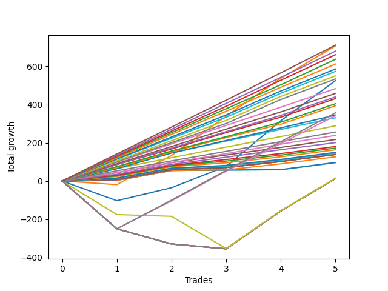

# Long Bulldog 003 
- Symbol: ES1y1d
- Date Range: 07/19/2021 - 07/08/2022
- Trading Period: 7:20-12:30
- Number of Trades: 5



| Name | Win Percent | Profit | Avg Profit / Trade | Avg Time / Trade |      | Name | Win Percent | Profit | Avg Profit / Trade | Avg Time / Trade |
| ---- | ----------- | ------ | ------------------ | ---------------- | ---- | ---- | ----------- | ------ | ------------------ | ---------------- |
| Sorted By <br> Profit | | | | | | Sorted By <br> Win Percentage ||||
| One | 80.00 | 353750.00 | 70750.00 | 16 19:29:12 |     | Three Hundred | 100.00 | 267125.00 | 53425.00 | 04 06:20:00 |
| Three Hundred | 100.00 | 267125.00 | 53425.00 | 04 06:20:00 |     | Two Hundred Nine | 100.00 | 229250.00 | 45850.00 | 03 21:12:12 |
| Zero | 80.00 | 262750.00 | 52550.00 | 12 00:34:36 |     | Two Hundred Eight | 100.00 | 215625.00 | 43125.00 | 03 19:40:24 |
| Two Hundred Nine | 100.00 | 229250.00 | 45850.00 | 03 21:12:12 |     | Two Hundred Seven | 100.00 | 197000.00 | 39400.00 | 03 14:53:48 |
| Two Hundred Eight | 100.00 | 215625.00 | 43125.00 | 03 19:40:24 |     | Two Hundred Six | 100.00 | 165500.00 | 33100.00 | 03 01:40:12 |
| Two Hundred Seven | 100.00 | 197000.00 | 39400.00 | 03 14:53:48 |     | Two Hundred Five | 100.00 | 128125.00 | 25625.00 | 01 11:33:00 |
| Two Hundred Six | 100.00 | 165500.00 | 33100.00 | 03 01:40:12 |     | Two Hundred Four | 100.00 | 108625.00 | 21725.00 | 01 05:44:36 |
| Two Hundred Five | 100.00 | 128125.00 | 25625.00 | 01 11:33:00 |     | Two Hundred Three | 100.00 | 90375.00 | 18075.00 | 01 00:14:12 |
| Two Hundred Four | 100.00 | 108625.00 | 21725.00 | 01 05:44:36 |     | Two Hundred Two | 100.00 | 81750.00 | 16350.00 | 01 00:06:12 |
| Two Hundred Three | 100.00 | 90375.00 | 18075.00 | 01 00:14:12 |     | Two Hundred One | 100.00 | 73500.00 | 14700.00 | 00 23:55:24 |
| Two Hundred Two | 100.00 | 81750.00 | 16350.00 | 01 00:06:12 |     | Eighty-Five | 100.00 | 69500.00 | 13900.00 | 00 23:54:12 |
| Two Hundred One | 100.00 | 73500.00 | 14700.00 | 00 23:55:24 |     | Eighty-Four | 100.00 | 69500.00 | 13900.00 | 00 23:54:12 |
| Eighty-Five | 100.00 | 69500.00 | 13900.00 | 00 23:54:12 |     | Eighty-Three | 100.00 | 63375.00 | 12675.00 | 00 23:53:24 |
| Eighty-Four | 100.00 | 69500.00 | 13900.00 | 00 23:54:12 |     | Eighty-Two | 100.00 | 48375.00 | 9675.00 | 00 04:45:36 |
| Eighty-Three | 100.00 | 63375.00 | 12675.00 | 00 23:53:24 |     | Eighty-One | 100.00 | 48125.00 | 9625.00 | 00 04:45:24 |
| Eighty-Two | 100.00 | 48375.00 | 9675.00 | 00 04:45:36 |     | One | 80.00 | 353750.00 | 70750.00 | 16 19:29:12 |
| Eighty-One | 100.00 | 48125.00 | 9625.00 | 00 04:45:24 |     | Zero | 80.00 | 262750.00 | 52550.00 | 12 00:34:36 |
| One Hundred Twenty-Five | 80.00 | 44750.00 | 8950.00 | 00 00:04:48 |     | One Hundred Twenty-Five | 80.00 | 44750.00 | 8950.00 | 00 00:04:48 |
| One Hundred Twenty-Four | 80.00 | 44750.00 | 8950.00 | 00 00:04:48 |     | One Hundred Twenty-Four | 80.00 | 44750.00 | 8950.00 | 00 00:04:48 |
| One Hundred Twenty-Three | 80.00 | 38625.00 | 7725.00 | 00 00:04:00 |     | One Hundred Twenty-Three | 80.00 | 38625.00 | 7725.00 | 00 00:04:00 |
| One Hundred Thirteen | 80.00 | 38625.00 | 7725.00 | 00 00:04:00 |     | One Hundred Thirteen | 80.00 | 38625.00 | 7725.00 | 00 00:04:00 |
| One Hundred Twenty-Two | 80.00 | 38250.00 | 7650.00 | 00 00:03:36 |     | One Hundred Twenty-Two | 80.00 | 38250.00 | 7650.00 | 00 00:03:36 |
| One Hundred Twelve | 80.00 | 38250.00 | 7650.00 | 00 00:03:36 |     | One Hundred Twelve | 80.00 | 38250.00 | 7650.00 | 00 00:03:36 |
| One Hundred Twenty-One | 80.00 | 38000.00 | 7600.00 | 00 00:03:24 |     | One Hundred Twenty-One | 80.00 | 38000.00 | 7600.00 | 00 00:03:24 |
| One Hundred Eleven | 80.00 | 38000.00 | 7600.00 | 00 00:03:24 |     | One Hundred Eleven | 80.00 | 38000.00 | 7600.00 | 00 00:03:24 |
| One Hundred Fifteen | 60.00 | 34875.00 | 6975.00 | 00 00:04:24 |     | One Hundred Fifteen | 60.00 | 34875.00 | 6975.00 | 00 00:04:24 |
| One Hundred Fourteen | 60.00 | 34875.00 | 6975.00 | 00 00:04:24 |     | One Hundred Fourteen | 60.00 | 34875.00 | 6975.00 | 00 00:04:24 |
| One Hundred Twenty | 60.00 | 32750.00 | 6550.00 | 00 00:05:24 |     | One Hundred Twenty | 60.00 | 32750.00 | 6550.00 | 00 00:05:24 |
| One Hundred Ninteen | 60.00 | 32750.00 | 6550.00 | 00 00:05:24 |     | One Hundred Ninteen | 60.00 | 32750.00 | 6550.00 | 00 00:05:24 |
| One Hundred Eighteen | 60.00 | 32750.00 | 6550.00 | 00 00:05:24 |     | One Hundred Eighteen | 60.00 | 32750.00 | 6550.00 | 00 00:05:24 |
| One Hundred Seventeen | 60.00 | 32750.00 | 6550.00 | 00 00:05:24 |     | One Hundred Seventeen | 60.00 | 32750.00 | 6550.00 | 00 00:05:24 |
| One Hundred Sixteen | 60.00 | 32750.00 | 6550.00 | 00 00:05:24 |     | One Hundred Sixteen | 60.00 | 32750.00 | 6550.00 | 00 00:05:24 |
| One Hundred Thirty | 60.00 | 30000.00 | 6000.00 | 00 00:06:12 |     | One Hundred Thirty | 60.00 | 30000.00 | 6000.00 | 00 00:06:12 |
| One Hundred Twenty-Nine | 60.00 | 30000.00 | 6000.00 | 00 00:06:12 |     | One Hundred Twenty-Nine | 60.00 | 30000.00 | 6000.00 | 00 00:06:12 |
| One Hundred Twenty-Eight | 60.00 | 30000.00 | 6000.00 | 00 00:06:12 |     | One Hundred Twenty-Eight | 60.00 | 30000.00 | 6000.00 | 00 00:06:12 |
| One Hundred Twenty-Seven | 60.00 | 30000.00 | 6000.00 | 00 00:06:12 |     | One Hundred Twenty-Seven | 60.00 | 30000.00 | 6000.00 | 00 00:06:12 |
| One Hundred Twenty-Six | 60.00 | 30000.00 | 6000.00 | 00 00:06:12 |     | One Hundred Twenty-Six | 60.00 | 30000.00 | 6000.00 | 00 00:06:12 |
| Fifty-Five | 60.00 | 26000.00 | 5200.00 | 00 00:06:36 |     | Fifty-Five | 60.00 | 26000.00 | 5200.00 | 00 00:06:36 |
| Fifty-Four | 60.00 | 26000.00 | 5200.00 | 00 00:06:36 |     | Fifty-Four | 60.00 | 26000.00 | 5200.00 | 00 00:06:36 |
| Fifty-Three | 60.00 | 26000.00 | 5200.00 | 00 00:06:36 |     | Fifty-Three | 60.00 | 26000.00 | 5200.00 | 00 00:06:36 |
| Fifty-Two | 60.00 | 26000.00 | 5200.00 | 00 00:06:36 |     | Fifty-Two | 60.00 | 26000.00 | 5200.00 | 00 00:06:36 |
| Fifty-One | 60.00 | 26000.00 | 5200.00 | 00 00:06:36 |     | Fifty-One | 60.00 | 26000.00 | 5200.00 | 00 00:06:36 |
| Fifty | 60.00 | 26000.00 | 5200.00 | 00 00:06:36 |     | Fifty | 60.00 | 26000.00 | 5200.00 | 00 00:06:36 |
| Forty-Nine | 60.00 | 26000.00 | 5200.00 | 00 00:06:36 |     | Forty-Nine | 60.00 | 26000.00 | 5200.00 | 00 00:06:36 |
| Forty-Eight | 60.00 | 26000.00 | 5200.00 | 00 00:06:36 |     | Forty-Eight | 60.00 | 26000.00 | 5200.00 | 00 00:06:36 |
| Seventy-One | 60.00 | 22125.00 | 4425.00 | 00 00:19:48 |     | Seventy-One | 60.00 | 22125.00 | 4425.00 | 00 00:19:48 |
| Seventy | 60.00 | 22125.00 | 4425.00 | 00 00:19:48 |     | Seventy | 60.00 | 22125.00 | 4425.00 | 00 00:19:48 |
| Sixty-Nine | 60.00 | 22125.00 | 4425.00 | 00 00:19:48 |     | Sixty-Nine | 60.00 | 22125.00 | 4425.00 | 00 00:19:48 |
| Sixty-Eight | 60.00 | 22125.00 | 4425.00 | 00 00:19:48 |     | Sixty-Eight | 60.00 | 22125.00 | 4425.00 | 00 00:19:48 |
| Sixty-Seven | 60.00 | 22125.00 | 4425.00 | 00 00:19:48 |     | Sixty-Seven | 60.00 | 22125.00 | 4425.00 | 00 00:19:48 |
| Sixty-Six | 60.00 | 22125.00 | 4425.00 | 00 00:19:48 |     | Sixty-Six | 60.00 | 22125.00 | 4425.00 | 00 00:19:48 |
| Sixty-Five | 60.00 | 22125.00 | 4425.00 | 00 00:19:48 |     | Sixty-Five | 60.00 | 22125.00 | 4425.00 | 00 00:19:48 |
| Sixty-Four | 60.00 | 22125.00 | 4425.00 | 00 00:19:48 |     | Sixty-Four | 60.00 | 22125.00 | 4425.00 | 00 00:19:48 |
| Seventy-Three | 40.00 | 7250.00 | 1450.00 | 16 03:27:24 |     | Seventy-Three | 40.00 | 7250.00 | 1450.00 | 16 03:27:24 |
| Seven | 40.00 | 6500.00 | 1300.00 | 42 00:49:00 |     | Seven | 40.00 | 6500.00 | 1300.00 | 42 00:49:00 |
| Six | 40.00 | 6500.00 | 1300.00 | 42 00:49:00 |     | Six | 40.00 | 6500.00 | 1300.00 | 42 00:49:00 |
| Five | 40.00 | 6500.00 | 1300.00 | 42 00:49:00 |     | Five | 40.00 | 6500.00 | 1300.00 | 42 00:49:00 |
| Four | 40.00 | 6500.00 | 1300.00 | 42 00:49:00 |     | Four | 40.00 | 6500.00 | 1300.00 | 42 00:49:00 |
| Three | 40.00 | 6500.00 | 1300.00 | 42 00:49:00 |     | Three | 40.00 | 6500.00 | 1300.00 | 42 00:49:00 |
| Two | 40.00 | 6500.00 | 1300.00 | 42 00:49:00 |     | Two | 40.00 | 6500.00 | 1300.00 | 42 00:49:00 |
| Forty-Seven | 0.00 | -23750.00 | -4750.00 | 00 05:15:36 |     | Forty-Seven | 0.00 | -23750.00 | -4750.00 | 00 05:15:36 |
| Forty-Six | 0.00 | -23750.00 | -4750.00 | 00 05:15:36 |     | Forty-Six | 0.00 | -23750.00 | -4750.00 | 00 05:15:36 |
| Forty-Five | 0.00 | -23750.00 | -4750.00 | 00 05:15:36 |     | Forty-Five | 0.00 | -23750.00 | -4750.00 | 00 05:15:36 |
| Forty-Four | 0.00 | -23750.00 | -4750.00 | 00 05:15:36 |     | Forty-Four | 0.00 | -23750.00 | -4750.00 | 00 05:15:36 |
| Forty-Three | 0.00 | -23750.00 | -4750.00 | 00 05:15:36 |     | Forty-Three | 0.00 | -23750.00 | -4750.00 | 00 05:15:36 |
| Forty-Two | 0.00 | -23750.00 | -4750.00 | 00 05:15:36 |     | Forty-Two | 0.00 | -23750.00 | -4750.00 | 00 05:15:36 |
| Forty-One | 0.00 | -23750.00 | -4750.00 | 00 05:15:36 |     | Forty-One | 0.00 | -23750.00 | -4750.00 | 00 05:15:36 |
| Forty | 0.00 | -23750.00 | -4750.00 | 00 05:15:36 |     | Forty | 0.00 | -23750.00 | -4750.00 | 00 05:15:36 |
| Sixty-Three | 0.00 | -31375.00 | -6275.00 | 00 14:51:24 |     | Sixty-Three | 0.00 | -31375.00 | -6275.00 | 00 14:51:24 |
| Sixty-Two | 0.00 | -31375.00 | -6275.00 | 00 14:51:24 |     | Sixty-Two | 0.00 | -31375.00 | -6275.00 | 00 14:51:24 |
| Sixty-One | 0.00 | -31375.00 | -6275.00 | 00 14:51:24 |     | Sixty-One | 0.00 | -31375.00 | -6275.00 | 00 14:51:24 |
| Sixty | 0.00 | -31375.00 | -6275.00 | 00 14:51:24 |     | Sixty | 0.00 | -31375.00 | -6275.00 | 00 14:51:24 |
| Fifty-Nine | 0.00 | -31375.00 | -6275.00 | 00 14:51:24 |     | Fifty-Nine | 0.00 | -31375.00 | -6275.00 | 00 14:51:24 |
| Fifty-Eight | 0.00 | -31375.00 | -6275.00 | 00 14:51:24 |     | Fifty-Eight | 0.00 | -31375.00 | -6275.00 | 00 14:51:24 |
| Fifty-Seven | 0.00 | -31375.00 | -6275.00 | 00 14:51:24 |     | Fifty-Seven | 0.00 | -31375.00 | -6275.00 | 00 14:51:24 |
| Fifty-Six | 0.00 | -31375.00 | -6275.00 | 00 14:51:24 |     | Fifty-Six | 0.00 | -31375.00 | -6275.00 | 00 14:51:24 |

## NO STOPLOSS

### Test Zero
* Sell when price hits the middle line of the 20p bollinger
* No Stoploss
* Results:
```
Total Trades: 5
Percent Up: 80.00
Percent Down: 20.00
Total Points Moved Up: 525.50
Potential Profit: 262750.00
Total Points Ups: 628.50 Count Ups: 4
Total Points Downs: -103.00 Count Downs: 1
```

<details><summary>Trades</summary>

<code>In: 2022-05-03 07:21:00		Out: 2022-05-26 09:12:00		Total Position Time: 23 01:51:00		Total Move Up: -103.00		Total to Date: -103.00</code> <br />
<code>In: 2022-05-11 07:21:00		Out: 2022-05-26 09:12:00		Total Position Time: 15 01:51:00		Total Move Up: 68.00		Total to Date: -35.00</code> <br />
<code>In: 2022-05-23 07:21:00		Out: 2022-05-26 08:00:00		Total Position Time: 03 00:39:00		Total Move Up: 111.75		Total to Date: 76.75</code> <br />
<code>In: 2022-06-16 07:21:00		Out: 2022-06-28 06:37:00		Total Position Time: 11 23:16:00		Total Move Up: 238.75		Total to Date: 315.50</code> <br />
<code>In: 2022-06-21 07:21:00		Out: 2022-06-28 06:37:00		Total Position Time: 06 23:16:00		Total Move Up: 210.00		Total to Date: 525.50</code> <br />


</details>

### Test One
* Sell when the price hits the upper line of the 20p 1std bollinger
* No Stoploss
* Results:
```
Total Trades: 5
Percent Up: 80.00
Percent Down: 20.00
Total Points Moved Up: 707.50
Potential Profit: 353750.00
Total Points Ups: 726.25 Count Ups: 4
Total Points Downs: -18.75 Count Downs: 1
```

<details><summary>Trades</summary>

<code>In: 2022-05-03 07:21:00		Out: 2022-05-27 12:05:00		Total Position Time: 24 04:44:00		Total Move Up: -18.75		Total to Date: -18.75</code> <br />
<code>In: 2022-05-11 07:21:00		Out: 2022-05-27 12:05:00		Total Position Time: 16 04:44:00		Total Move Up: 152.25		Total to Date: 133.50</code> <br />
<code>In: 2022-05-23 07:21:00		Out: 2022-05-27 12:05:00		Total Position Time: 04 04:44:00		Total Move Up: 206.25		Total to Date: 339.75</code> <br />
<code>In: 2022-06-16 07:21:00		Out: 2022-07-08 12:58:00		Total Position Time: 22 05:37:00		Total Move Up: 198.25		Total to Date: 538.00</code> <br />
<code>In: 2022-06-21 07:21:00		Out: 2022-07-08 12:58:00		Total Position Time: 17 05:37:00		Total Move Up: 169.50		Total to Date: 707.50</code> <br />


</details>

### Test Two
* Sell when the price hits the upper line of the 20p 2std bollinger
* No Stoploss
* Results:
```
Total Trades: 5
Percent Up: 40.00
Percent Down: 60.00
Total Points Moved Up: 13.00
Potential Profit: 6500.00
Total Points Ups: 367.75 Count Ups: 2
Total Points Downs: -354.75 Count Downs: 3
```

<details><summary>Trades</summary>

<code>In: 2022-05-03 07:21:00		Out: 2022-07-08 12:58:00		Total Position Time: 66 05:37:00		Total Move Up: -250.25		Total to Date: -250.25</code> <br />
<code>In: 2022-05-11 07:21:00		Out: 2022-07-08 12:58:00		Total Position Time: 58 05:37:00		Total Move Up: -79.25		Total to Date: -329.50</code> <br />
<code>In: 2022-05-23 07:21:00		Out: 2022-07-08 12:58:00		Total Position Time: 46 05:37:00		Total Move Up: -25.25		Total to Date: -354.75</code> <br />
<code>In: 2022-06-16 07:21:00		Out: 2022-07-08 12:58:00		Total Position Time: 22 05:37:00		Total Move Up: 198.25		Total to Date: -156.50</code> <br />
<code>In: 2022-06-21 07:21:00		Out: 2022-07-08 12:58:00		Total Position Time: 17 05:37:00		Total Move Up: 169.50		Total to Date: 13.00</code> <br />


</details>

### Test Three
* Sell when price hits the middle line of the 50p bollinger
* No Stoploss
* Results:
```
Total Trades: 5
Percent Up: 40.00
Percent Down: 60.00
Total Points Moved Up: 13.00
Potential Profit: 6500.00
Total Points Ups: 367.75 Count Ups: 2
Total Points Downs: -354.75 Count Downs: 3
```

<details><summary>Trades</summary>

<code>In: 2022-05-03 07:21:00		Out: 2022-07-08 12:58:00		Total Position Time: 66 05:37:00		Total Move Up: -250.25		Total to Date: -250.25</code> <br />
<code>In: 2022-05-11 07:21:00		Out: 2022-07-08 12:58:00		Total Position Time: 58 05:37:00		Total Move Up: -79.25		Total to Date: -329.50</code> <br />
<code>In: 2022-05-23 07:21:00		Out: 2022-07-08 12:58:00		Total Position Time: 46 05:37:00		Total Move Up: -25.25		Total to Date: -354.75</code> <br />
<code>In: 2022-06-16 07:21:00		Out: 2022-07-08 12:58:00		Total Position Time: 22 05:37:00		Total Move Up: 198.25		Total to Date: -156.50</code> <br />
<code>In: 2022-06-21 07:21:00		Out: 2022-07-08 12:58:00		Total Position Time: 17 05:37:00		Total Move Up: 169.50		Total to Date: 13.00</code> <br />


</details>

### Test Four
* Sell when the price hits the upper line of the 50p 1std bollinger
* No Stoploss
* Results:
```
Total Trades: 5
Percent Up: 40.00
Percent Down: 60.00
Total Points Moved Up: 13.00
Potential Profit: 6500.00
Total Points Ups: 367.75 Count Ups: 2
Total Points Downs: -354.75 Count Downs: 3
```

<details><summary>Trades</summary>

<code>In: 2022-05-03 07:21:00		Out: 2022-07-08 12:58:00		Total Position Time: 66 05:37:00		Total Move Up: -250.25		Total to Date: -250.25</code> <br />
<code>In: 2022-05-11 07:21:00		Out: 2022-07-08 12:58:00		Total Position Time: 58 05:37:00		Total Move Up: -79.25		Total to Date: -329.50</code> <br />
<code>In: 2022-05-23 07:21:00		Out: 2022-07-08 12:58:00		Total Position Time: 46 05:37:00		Total Move Up: -25.25		Total to Date: -354.75</code> <br />
<code>In: 2022-06-16 07:21:00		Out: 2022-07-08 12:58:00		Total Position Time: 22 05:37:00		Total Move Up: 198.25		Total to Date: -156.50</code> <br />
<code>In: 2022-06-21 07:21:00		Out: 2022-07-08 12:58:00		Total Position Time: 17 05:37:00		Total Move Up: 169.50		Total to Date: 13.00</code> <br />


</details>

### Test Five
* Sell when the price hits the upper line of the 50p 2std bollinger
* No Stoploss
* Results:
```
Total Trades: 5
Percent Up: 40.00
Percent Down: 60.00
Total Points Moved Up: 13.00
Potential Profit: 6500.00
Total Points Ups: 367.75 Count Ups: 2
Total Points Downs: -354.75 Count Downs: 3
```

<details><summary>Trades</summary>

<code>In: 2022-05-03 07:21:00		Out: 2022-07-08 12:58:00		Total Position Time: 66 05:37:00		Total Move Up: -250.25		Total to Date: -250.25</code> <br />
<code>In: 2022-05-11 07:21:00		Out: 2022-07-08 12:58:00		Total Position Time: 58 05:37:00		Total Move Up: -79.25		Total to Date: -329.50</code> <br />
<code>In: 2022-05-23 07:21:00		Out: 2022-07-08 12:58:00		Total Position Time: 46 05:37:00		Total Move Up: -25.25		Total to Date: -354.75</code> <br />
<code>In: 2022-06-16 07:21:00		Out: 2022-07-08 12:58:00		Total Position Time: 22 05:37:00		Total Move Up: 198.25		Total to Date: -156.50</code> <br />
<code>In: 2022-06-21 07:21:00		Out: 2022-07-08 12:58:00		Total Position Time: 17 05:37:00		Total Move Up: 169.50		Total to Date: 13.00</code> <br />


</details>

### Test Six
* Sell when the price hits the middle line of the 1std VWAP
* No Stoploss
* Results:
```
Total Trades: 5
Percent Up: 40.00
Percent Down: 60.00
Total Points Moved Up: 13.00
Potential Profit: 6500.00
Total Points Ups: 367.75 Count Ups: 2
Total Points Downs: -354.75 Count Downs: 3
```

<details><summary>Trades</summary>

<code>In: 2022-05-03 07:21:00		Out: 2022-07-08 12:58:00		Total Position Time: 66 05:37:00		Total Move Up: -250.25		Total to Date: -250.25</code> <br />
<code>In: 2022-05-11 07:21:00		Out: 2022-07-08 12:58:00		Total Position Time: 58 05:37:00		Total Move Up: -79.25		Total to Date: -329.50</code> <br />
<code>In: 2022-05-23 07:21:00		Out: 2022-07-08 12:58:00		Total Position Time: 46 05:37:00		Total Move Up: -25.25		Total to Date: -354.75</code> <br />
<code>In: 2022-06-16 07:21:00		Out: 2022-07-08 12:58:00		Total Position Time: 22 05:37:00		Total Move Up: 198.25		Total to Date: -156.50</code> <br />
<code>In: 2022-06-21 07:21:00		Out: 2022-07-08 12:58:00		Total Position Time: 17 05:37:00		Total Move Up: 169.50		Total to Date: 13.00</code> <br />


</details>

### Test Seven
* Sell when the price hits the upper line of the 1std VWAP
* No Stoploss
* Results:
```
Total Trades: 5
Percent Up: 40.00
Percent Down: 60.00
Total Points Moved Up: 13.00
Potential Profit: 6500.00
Total Points Ups: 367.75 Count Ups: 2
Total Points Downs: -354.75 Count Downs: 3
```

<details><summary>Trades</summary>

<code>In: 2022-05-03 07:21:00		Out: 2022-07-08 12:58:00		Total Position Time: 66 05:37:00		Total Move Up: -250.25		Total to Date: -250.25</code> <br />
<code>In: 2022-05-11 07:21:00		Out: 2022-07-08 12:58:00		Total Position Time: 58 05:37:00		Total Move Up: -79.25		Total to Date: -329.50</code> <br />
<code>In: 2022-05-23 07:21:00		Out: 2022-07-08 12:58:00		Total Position Time: 46 05:37:00		Total Move Up: -25.25		Total to Date: -354.75</code> <br />
<code>In: 2022-06-16 07:21:00		Out: 2022-07-08 12:58:00		Total Position Time: 22 05:37:00		Total Move Up: 198.25		Total to Date: -156.50</code> <br />
<code>In: 2022-06-21 07:21:00		Out: 2022-07-08 12:58:00		Total Position Time: 17 05:37:00		Total Move Up: 169.50		Total to Date: 13.00</code> <br />


</details>

## STOPLOSS OF 5

### Test Forty
* Sell when price hits the middle line of the 20p bollinger
* Stoploss is 5 points
* Results:
```
Total Trades: 5
Percent Up: 0.00
Percent Down: 100.00
Total Points Moved Up: -47.50
Potential Profit: -23750.00
Total Points Ups: 0.00 Count Ups: 0
Total Points Downs: -47.50 Count Downs: 5
```

<details><summary>Trades</summary>

<code>In: 2022-05-03 07:21:00		Out: 2022-05-03 07:45:00		Total Position Time: 00 00:24:00		Total Move Up: -4.75		Total to Date: -4.75</code> <br />
<code>In: 2022-05-11 07:21:00		Out: 2022-05-11 09:55:00		Total Position Time: 00 02:34:00		Total Move Up: -5.25		Total to Date: -10.00</code> <br />
<code>In: 2022-05-23 07:21:00		Out: 2022-05-23 07:28:00		Total Position Time: 00 00:07:00		Total Move Up: -7.75		Total to Date: -17.75</code> <br />
<code>In: 2022-06-16 07:21:00		Out: 2022-06-16 07:24:00		Total Position Time: 00 00:03:00		Total Move Up: -18.25		Total to Date: -36.00</code> <br />
<code>In: 2022-06-21 07:21:00		Out: 2022-06-22 06:31:00		Total Position Time: 00 23:10:00		Total Move Up: -11.50		Total to Date: -47.50</code> <br />


</details>

### Test Forty-One
* Sell when the price hits the upper line of the 20p 1std bollinger
* Stoploss is 5 points
* Results:
```
Total Trades: 5
Percent Up: 0.00
Percent Down: 100.00
Total Points Moved Up: -47.50
Potential Profit: -23750.00
Total Points Ups: 0.00 Count Ups: 0
Total Points Downs: -47.50 Count Downs: 5
```

<details><summary>Trades</summary>

<code>In: 2022-05-03 07:21:00		Out: 2022-05-03 07:45:00		Total Position Time: 00 00:24:00		Total Move Up: -4.75		Total to Date: -4.75</code> <br />
<code>In: 2022-05-11 07:21:00		Out: 2022-05-11 09:55:00		Total Position Time: 00 02:34:00		Total Move Up: -5.25		Total to Date: -10.00</code> <br />
<code>In: 2022-05-23 07:21:00		Out: 2022-05-23 07:28:00		Total Position Time: 00 00:07:00		Total Move Up: -7.75		Total to Date: -17.75</code> <br />
<code>In: 2022-06-16 07:21:00		Out: 2022-06-16 07:24:00		Total Position Time: 00 00:03:00		Total Move Up: -18.25		Total to Date: -36.00</code> <br />
<code>In: 2022-06-21 07:21:00		Out: 2022-06-22 06:31:00		Total Position Time: 00 23:10:00		Total Move Up: -11.50		Total to Date: -47.50</code> <br />


</details>

### Test Forty-Two
* Sell when the price hits the upper line of the 20p 2std bollinger
* Stoploss is 5 points
* Results:
```
Total Trades: 5
Percent Up: 0.00
Percent Down: 100.00
Total Points Moved Up: -47.50
Potential Profit: -23750.00
Total Points Ups: 0.00 Count Ups: 0
Total Points Downs: -47.50 Count Downs: 5
```

<details><summary>Trades</summary>

<code>In: 2022-05-03 07:21:00		Out: 2022-05-03 07:45:00		Total Position Time: 00 00:24:00		Total Move Up: -4.75		Total to Date: -4.75</code> <br />
<code>In: 2022-05-11 07:21:00		Out: 2022-05-11 09:55:00		Total Position Time: 00 02:34:00		Total Move Up: -5.25		Total to Date: -10.00</code> <br />
<code>In: 2022-05-23 07:21:00		Out: 2022-05-23 07:28:00		Total Position Time: 00 00:07:00		Total Move Up: -7.75		Total to Date: -17.75</code> <br />
<code>In: 2022-06-16 07:21:00		Out: 2022-06-16 07:24:00		Total Position Time: 00 00:03:00		Total Move Up: -18.25		Total to Date: -36.00</code> <br />
<code>In: 2022-06-21 07:21:00		Out: 2022-06-22 06:31:00		Total Position Time: 00 23:10:00		Total Move Up: -11.50		Total to Date: -47.50</code> <br />


</details>

### Test Forty-Three
* Sell when price hits the middle line of the 50p bollinger
* Stoploss is 5 points
* Results:
```
Total Trades: 5
Percent Up: 0.00
Percent Down: 100.00
Total Points Moved Up: -47.50
Potential Profit: -23750.00
Total Points Ups: 0.00 Count Ups: 0
Total Points Downs: -47.50 Count Downs: 5
```

<details><summary>Trades</summary>

<code>In: 2022-05-03 07:21:00		Out: 2022-05-03 07:45:00		Total Position Time: 00 00:24:00		Total Move Up: -4.75		Total to Date: -4.75</code> <br />
<code>In: 2022-05-11 07:21:00		Out: 2022-05-11 09:55:00		Total Position Time: 00 02:34:00		Total Move Up: -5.25		Total to Date: -10.00</code> <br />
<code>In: 2022-05-23 07:21:00		Out: 2022-05-23 07:28:00		Total Position Time: 00 00:07:00		Total Move Up: -7.75		Total to Date: -17.75</code> <br />
<code>In: 2022-06-16 07:21:00		Out: 2022-06-16 07:24:00		Total Position Time: 00 00:03:00		Total Move Up: -18.25		Total to Date: -36.00</code> <br />
<code>In: 2022-06-21 07:21:00		Out: 2022-06-22 06:31:00		Total Position Time: 00 23:10:00		Total Move Up: -11.50		Total to Date: -47.50</code> <br />


</details>

### Test Forty-Four
* Sell when the price hits the upper line of the 50p 1std bollinger
* Stoploss is 5 points
* Results:
```
Total Trades: 5
Percent Up: 0.00
Percent Down: 100.00
Total Points Moved Up: -47.50
Potential Profit: -23750.00
Total Points Ups: 0.00 Count Ups: 0
Total Points Downs: -47.50 Count Downs: 5
```

<details><summary>Trades</summary>

<code>In: 2022-05-03 07:21:00		Out: 2022-05-03 07:45:00		Total Position Time: 00 00:24:00		Total Move Up: -4.75		Total to Date: -4.75</code> <br />
<code>In: 2022-05-11 07:21:00		Out: 2022-05-11 09:55:00		Total Position Time: 00 02:34:00		Total Move Up: -5.25		Total to Date: -10.00</code> <br />
<code>In: 2022-05-23 07:21:00		Out: 2022-05-23 07:28:00		Total Position Time: 00 00:07:00		Total Move Up: -7.75		Total to Date: -17.75</code> <br />
<code>In: 2022-06-16 07:21:00		Out: 2022-06-16 07:24:00		Total Position Time: 00 00:03:00		Total Move Up: -18.25		Total to Date: -36.00</code> <br />
<code>In: 2022-06-21 07:21:00		Out: 2022-06-22 06:31:00		Total Position Time: 00 23:10:00		Total Move Up: -11.50		Total to Date: -47.50</code> <br />


</details>

### Test Forty-Five
* Sell when the price hits the upper line of the 50p 2std bollinger
* Stoploss is 5 points
* Results:
```
Total Trades: 5
Percent Up: 0.00
Percent Down: 100.00
Total Points Moved Up: -47.50
Potential Profit: -23750.00
Total Points Ups: 0.00 Count Ups: 0
Total Points Downs: -47.50 Count Downs: 5
```

<details><summary>Trades</summary>

<code>In: 2022-05-03 07:21:00		Out: 2022-05-03 07:45:00		Total Position Time: 00 00:24:00		Total Move Up: -4.75		Total to Date: -4.75</code> <br />
<code>In: 2022-05-11 07:21:00		Out: 2022-05-11 09:55:00		Total Position Time: 00 02:34:00		Total Move Up: -5.25		Total to Date: -10.00</code> <br />
<code>In: 2022-05-23 07:21:00		Out: 2022-05-23 07:28:00		Total Position Time: 00 00:07:00		Total Move Up: -7.75		Total to Date: -17.75</code> <br />
<code>In: 2022-06-16 07:21:00		Out: 2022-06-16 07:24:00		Total Position Time: 00 00:03:00		Total Move Up: -18.25		Total to Date: -36.00</code> <br />
<code>In: 2022-06-21 07:21:00		Out: 2022-06-22 06:31:00		Total Position Time: 00 23:10:00		Total Move Up: -11.50		Total to Date: -47.50</code> <br />


</details>

### Test Forty-Six
* Sell when the price hits the middle line of the 1std VWAP
* Stoploss is 5 points
* Results:
```
Total Trades: 5
Percent Up: 0.00
Percent Down: 100.00
Total Points Moved Up: -47.50
Potential Profit: -23750.00
Total Points Ups: 0.00 Count Ups: 0
Total Points Downs: -47.50 Count Downs: 5
```

<details><summary>Trades</summary>

<code>In: 2022-05-03 07:21:00		Out: 2022-05-03 07:45:00		Total Position Time: 00 00:24:00		Total Move Up: -4.75		Total to Date: -4.75</code> <br />
<code>In: 2022-05-11 07:21:00		Out: 2022-05-11 09:55:00		Total Position Time: 00 02:34:00		Total Move Up: -5.25		Total to Date: -10.00</code> <br />
<code>In: 2022-05-23 07:21:00		Out: 2022-05-23 07:28:00		Total Position Time: 00 00:07:00		Total Move Up: -7.75		Total to Date: -17.75</code> <br />
<code>In: 2022-06-16 07:21:00		Out: 2022-06-16 07:24:00		Total Position Time: 00 00:03:00		Total Move Up: -18.25		Total to Date: -36.00</code> <br />
<code>In: 2022-06-21 07:21:00		Out: 2022-06-22 06:31:00		Total Position Time: 00 23:10:00		Total Move Up: -11.50		Total to Date: -47.50</code> <br />


</details>

### Test Forty-Seven
* Sell when the price hits the upper line of the 1std VWAP
* Stoploss is 5 points
* Results:
```
Total Trades: 5
Percent Up: 0.00
Percent Down: 100.00
Total Points Moved Up: -47.50
Potential Profit: -23750.00
Total Points Ups: 0.00 Count Ups: 0
Total Points Downs: -47.50 Count Downs: 5
```

<details><summary>Trades</summary>

<code>In: 2022-05-03 07:21:00		Out: 2022-05-03 07:45:00		Total Position Time: 00 00:24:00		Total Move Up: -4.75		Total to Date: -4.75</code> <br />
<code>In: 2022-05-11 07:21:00		Out: 2022-05-11 09:55:00		Total Position Time: 00 02:34:00		Total Move Up: -5.25		Total to Date: -10.00</code> <br />
<code>In: 2022-05-23 07:21:00		Out: 2022-05-23 07:28:00		Total Position Time: 00 00:07:00		Total Move Up: -7.75		Total to Date: -17.75</code> <br />
<code>In: 2022-06-16 07:21:00		Out: 2022-06-16 07:24:00		Total Position Time: 00 00:03:00		Total Move Up: -18.25		Total to Date: -36.00</code> <br />
<code>In: 2022-06-21 07:21:00		Out: 2022-06-22 06:31:00		Total Position Time: 00 23:10:00		Total Move Up: -11.50		Total to Date: -47.50</code> <br />


</details>

## TRAIL STOP OF 5

### Test Forty-Eight
* Sell when price hits the middle line of the 20p bollinger
* Trailing Stop is 5 points
* Results:
```
Total Trades: 5
Percent Up: 60.00
Percent Down: 40.00
Total Points Moved Up: 52.00
Potential Profit: 26000.00
Total Points Ups: 77.25 Count Ups: 3
Total Points Downs: -25.25 Count Downs: 2
```

<details><summary>Trades</summary>

<code>In: 2022-05-03 07:21:00		Out: 2022-05-03 07:24:00		Total Position Time: 00 00:03:00		Total Move Up: -2.50		Total to Date: -2.50</code> <br />
<code>In: 2022-05-11 07:21:00		Out: 2022-05-11 07:26:00		Total Position Time: 00 00:05:00		Total Move Up: 43.75		Total to Date: 41.25</code> <br />
<code>In: 2022-05-23 07:21:00		Out: 2022-05-23 07:24:00		Total Position Time: 00 00:03:00		Total Move Up: 2.00		Total to Date: 43.25</code> <br />
<code>In: 2022-06-16 07:21:00		Out: 2022-06-16 07:36:00		Total Position Time: 00 00:15:00		Total Move Up: -22.75		Total to Date: 20.50</code> <br />
<code>In: 2022-06-21 07:21:00		Out: 2022-06-21 07:28:00		Total Position Time: 00 00:07:00		Total Move Up: 31.50		Total to Date: 52.00</code> <br />


</details>

### Test Forty-Nine
* Sell when the price hits the upper line of the 20p 1std bollinger
* Trailing Stop is 5 points
* Results:
```
Total Trades: 5
Percent Up: 60.00
Percent Down: 40.00
Total Points Moved Up: 52.00
Potential Profit: 26000.00
Total Points Ups: 77.25 Count Ups: 3
Total Points Downs: -25.25 Count Downs: 2
```

<details><summary>Trades</summary>

<code>In: 2022-05-03 07:21:00		Out: 2022-05-03 07:24:00		Total Position Time: 00 00:03:00		Total Move Up: -2.50		Total to Date: -2.50</code> <br />
<code>In: 2022-05-11 07:21:00		Out: 2022-05-11 07:26:00		Total Position Time: 00 00:05:00		Total Move Up: 43.75		Total to Date: 41.25</code> <br />
<code>In: 2022-05-23 07:21:00		Out: 2022-05-23 07:24:00		Total Position Time: 00 00:03:00		Total Move Up: 2.00		Total to Date: 43.25</code> <br />
<code>In: 2022-06-16 07:21:00		Out: 2022-06-16 07:36:00		Total Position Time: 00 00:15:00		Total Move Up: -22.75		Total to Date: 20.50</code> <br />
<code>In: 2022-06-21 07:21:00		Out: 2022-06-21 07:28:00		Total Position Time: 00 00:07:00		Total Move Up: 31.50		Total to Date: 52.00</code> <br />


</details>

### Test Fifty
* Sell when the price hits the upper line of the 20p 2std bollinger
* Trailing Stop is 5 points
* Results:
```
Total Trades: 5
Percent Up: 60.00
Percent Down: 40.00
Total Points Moved Up: 52.00
Potential Profit: 26000.00
Total Points Ups: 77.25 Count Ups: 3
Total Points Downs: -25.25 Count Downs: 2
```

<details><summary>Trades</summary>

<code>In: 2022-05-03 07:21:00		Out: 2022-05-03 07:24:00		Total Position Time: 00 00:03:00		Total Move Up: -2.50		Total to Date: -2.50</code> <br />
<code>In: 2022-05-11 07:21:00		Out: 2022-05-11 07:26:00		Total Position Time: 00 00:05:00		Total Move Up: 43.75		Total to Date: 41.25</code> <br />
<code>In: 2022-05-23 07:21:00		Out: 2022-05-23 07:24:00		Total Position Time: 00 00:03:00		Total Move Up: 2.00		Total to Date: 43.25</code> <br />
<code>In: 2022-06-16 07:21:00		Out: 2022-06-16 07:36:00		Total Position Time: 00 00:15:00		Total Move Up: -22.75		Total to Date: 20.50</code> <br />
<code>In: 2022-06-21 07:21:00		Out: 2022-06-21 07:28:00		Total Position Time: 00 00:07:00		Total Move Up: 31.50		Total to Date: 52.00</code> <br />


</details>

### Test Fifty-One
* Sell when price hits the middle line of the 50p bollinger
* Trailing Stop is 5 points
* Results:
```
Total Trades: 5
Percent Up: 60.00
Percent Down: 40.00
Total Points Moved Up: 52.00
Potential Profit: 26000.00
Total Points Ups: 77.25 Count Ups: 3
Total Points Downs: -25.25 Count Downs: 2
```

<details><summary>Trades</summary>

<code>In: 2022-05-03 07:21:00		Out: 2022-05-03 07:24:00		Total Position Time: 00 00:03:00		Total Move Up: -2.50		Total to Date: -2.50</code> <br />
<code>In: 2022-05-11 07:21:00		Out: 2022-05-11 07:26:00		Total Position Time: 00 00:05:00		Total Move Up: 43.75		Total to Date: 41.25</code> <br />
<code>In: 2022-05-23 07:21:00		Out: 2022-05-23 07:24:00		Total Position Time: 00 00:03:00		Total Move Up: 2.00		Total to Date: 43.25</code> <br />
<code>In: 2022-06-16 07:21:00		Out: 2022-06-16 07:36:00		Total Position Time: 00 00:15:00		Total Move Up: -22.75		Total to Date: 20.50</code> <br />
<code>In: 2022-06-21 07:21:00		Out: 2022-06-21 07:28:00		Total Position Time: 00 00:07:00		Total Move Up: 31.50		Total to Date: 52.00</code> <br />


</details>

### Test Fifty-Two
* Sell when the price hits the upper line of the 50p 1std bollinger
* Trailing Stop is 5 points
* Results:
```
Total Trades: 5
Percent Up: 60.00
Percent Down: 40.00
Total Points Moved Up: 52.00
Potential Profit: 26000.00
Total Points Ups: 77.25 Count Ups: 3
Total Points Downs: -25.25 Count Downs: 2
```

<details><summary>Trades</summary>

<code>In: 2022-05-03 07:21:00		Out: 2022-05-03 07:24:00		Total Position Time: 00 00:03:00		Total Move Up: -2.50		Total to Date: -2.50</code> <br />
<code>In: 2022-05-11 07:21:00		Out: 2022-05-11 07:26:00		Total Position Time: 00 00:05:00		Total Move Up: 43.75		Total to Date: 41.25</code> <br />
<code>In: 2022-05-23 07:21:00		Out: 2022-05-23 07:24:00		Total Position Time: 00 00:03:00		Total Move Up: 2.00		Total to Date: 43.25</code> <br />
<code>In: 2022-06-16 07:21:00		Out: 2022-06-16 07:36:00		Total Position Time: 00 00:15:00		Total Move Up: -22.75		Total to Date: 20.50</code> <br />
<code>In: 2022-06-21 07:21:00		Out: 2022-06-21 07:28:00		Total Position Time: 00 00:07:00		Total Move Up: 31.50		Total to Date: 52.00</code> <br />


</details>

### Test Fifty-Three
* Sell when the price hits the upper line of the 50p 2std bollinger
* Trailing Stop is 5 points
* Results:
```
Total Trades: 5
Percent Up: 60.00
Percent Down: 40.00
Total Points Moved Up: 52.00
Potential Profit: 26000.00
Total Points Ups: 77.25 Count Ups: 3
Total Points Downs: -25.25 Count Downs: 2
```

<details><summary>Trades</summary>

<code>In: 2022-05-03 07:21:00		Out: 2022-05-03 07:24:00		Total Position Time: 00 00:03:00		Total Move Up: -2.50		Total to Date: -2.50</code> <br />
<code>In: 2022-05-11 07:21:00		Out: 2022-05-11 07:26:00		Total Position Time: 00 00:05:00		Total Move Up: 43.75		Total to Date: 41.25</code> <br />
<code>In: 2022-05-23 07:21:00		Out: 2022-05-23 07:24:00		Total Position Time: 00 00:03:00		Total Move Up: 2.00		Total to Date: 43.25</code> <br />
<code>In: 2022-06-16 07:21:00		Out: 2022-06-16 07:36:00		Total Position Time: 00 00:15:00		Total Move Up: -22.75		Total to Date: 20.50</code> <br />
<code>In: 2022-06-21 07:21:00		Out: 2022-06-21 07:28:00		Total Position Time: 00 00:07:00		Total Move Up: 31.50		Total to Date: 52.00</code> <br />


</details>

### Test Fifty-Four
* Sell when the price hits the middle line of the 1std VWAP
* Trailing Stop is 5 points
* Results:
```
Total Trades: 5
Percent Up: 60.00
Percent Down: 40.00
Total Points Moved Up: 52.00
Potential Profit: 26000.00
Total Points Ups: 77.25 Count Ups: 3
Total Points Downs: -25.25 Count Downs: 2
```

<details><summary>Trades</summary>

<code>In: 2022-05-03 07:21:00		Out: 2022-05-03 07:24:00		Total Position Time: 00 00:03:00		Total Move Up: -2.50		Total to Date: -2.50</code> <br />
<code>In: 2022-05-11 07:21:00		Out: 2022-05-11 07:26:00		Total Position Time: 00 00:05:00		Total Move Up: 43.75		Total to Date: 41.25</code> <br />
<code>In: 2022-05-23 07:21:00		Out: 2022-05-23 07:24:00		Total Position Time: 00 00:03:00		Total Move Up: 2.00		Total to Date: 43.25</code> <br />
<code>In: 2022-06-16 07:21:00		Out: 2022-06-16 07:36:00		Total Position Time: 00 00:15:00		Total Move Up: -22.75		Total to Date: 20.50</code> <br />
<code>In: 2022-06-21 07:21:00		Out: 2022-06-21 07:28:00		Total Position Time: 00 00:07:00		Total Move Up: 31.50		Total to Date: 52.00</code> <br />


</details>

### Test Fifty-Five
* Sell when the price hits the upper line of the 1std VWAP
* Trailing Stop is 5 points
* Results:
```
Total Trades: 5
Percent Up: 60.00
Percent Down: 40.00
Total Points Moved Up: 52.00
Potential Profit: 26000.00
Total Points Ups: 77.25 Count Ups: 3
Total Points Downs: -25.25 Count Downs: 2
```

<details><summary>Trades</summary>

<code>In: 2022-05-03 07:21:00		Out: 2022-05-03 07:24:00		Total Position Time: 00 00:03:00		Total Move Up: -2.50		Total to Date: -2.50</code> <br />
<code>In: 2022-05-11 07:21:00		Out: 2022-05-11 07:26:00		Total Position Time: 00 00:05:00		Total Move Up: 43.75		Total to Date: 41.25</code> <br />
<code>In: 2022-05-23 07:21:00		Out: 2022-05-23 07:24:00		Total Position Time: 00 00:03:00		Total Move Up: 2.00		Total to Date: 43.25</code> <br />
<code>In: 2022-06-16 07:21:00		Out: 2022-06-16 07:36:00		Total Position Time: 00 00:15:00		Total Move Up: -22.75		Total to Date: 20.50</code> <br />
<code>In: 2022-06-21 07:21:00		Out: 2022-06-21 07:28:00		Total Position Time: 00 00:07:00		Total Move Up: 31.50		Total to Date: 52.00</code> <br />


</details>

## STOPLOSS OF 10

### Test Fifty-Six
* Sell when price hits the middle line of the 20p bollinger
* Stoploss is 10 points
* Results:
```
Total Trades: 5
Percent Up: 0.00
Percent Down: 100.00
Total Points Moved Up: -62.75
Potential Profit: -31375.00
Total Points Ups: 0.00 Count Ups: 0
Total Points Downs: -62.75 Count Downs: 5
```

<details><summary>Trades</summary>

<code>In: 2022-05-03 07:21:00		Out: 2022-05-04 08:31:00		Total Position Time: 01 01:10:00		Total Move Up: -11.00		Total to Date: -11.00</code> <br />
<code>In: 2022-05-11 07:21:00		Out: 2022-05-11 09:58:00		Total Position Time: 00 02:37:00		Total Move Up: -10.75		Total to Date: -21.75</code> <br />
<code>In: 2022-05-23 07:21:00		Out: 2022-05-24 06:38:00		Total Position Time: 00 23:17:00		Total Move Up: -11.25		Total to Date: -33.00</code> <br />
<code>In: 2022-06-16 07:21:00		Out: 2022-06-16 07:24:00		Total Position Time: 00 00:03:00		Total Move Up: -18.25		Total to Date: -51.25</code> <br />
<code>In: 2022-06-21 07:21:00		Out: 2022-06-22 06:31:00		Total Position Time: 00 23:10:00		Total Move Up: -11.50		Total to Date: -62.75</code> <br />


</details>

### Test Fifty-Seven
* Sell when the price hits the upper line of the 20p 1std bollinger
* Stoploss is 10 points
* Results:
```
Total Trades: 5
Percent Up: 0.00
Percent Down: 100.00
Total Points Moved Up: -62.75
Potential Profit: -31375.00
Total Points Ups: 0.00 Count Ups: 0
Total Points Downs: -62.75 Count Downs: 5
```

<details><summary>Trades</summary>

<code>In: 2022-05-03 07:21:00		Out: 2022-05-04 08:31:00		Total Position Time: 01 01:10:00		Total Move Up: -11.00		Total to Date: -11.00</code> <br />
<code>In: 2022-05-11 07:21:00		Out: 2022-05-11 09:58:00		Total Position Time: 00 02:37:00		Total Move Up: -10.75		Total to Date: -21.75</code> <br />
<code>In: 2022-05-23 07:21:00		Out: 2022-05-24 06:38:00		Total Position Time: 00 23:17:00		Total Move Up: -11.25		Total to Date: -33.00</code> <br />
<code>In: 2022-06-16 07:21:00		Out: 2022-06-16 07:24:00		Total Position Time: 00 00:03:00		Total Move Up: -18.25		Total to Date: -51.25</code> <br />
<code>In: 2022-06-21 07:21:00		Out: 2022-06-22 06:31:00		Total Position Time: 00 23:10:00		Total Move Up: -11.50		Total to Date: -62.75</code> <br />


</details>

### Test Fifty-Eight
* Sell when the price hits the upper line of the 20p 2std bollinger
* Stoploss is 10 points
* Results:
```
Total Trades: 5
Percent Up: 0.00
Percent Down: 100.00
Total Points Moved Up: -62.75
Potential Profit: -31375.00
Total Points Ups: 0.00 Count Ups: 0
Total Points Downs: -62.75 Count Downs: 5
```

<details><summary>Trades</summary>

<code>In: 2022-05-03 07:21:00		Out: 2022-05-04 08:31:00		Total Position Time: 01 01:10:00		Total Move Up: -11.00		Total to Date: -11.00</code> <br />
<code>In: 2022-05-11 07:21:00		Out: 2022-05-11 09:58:00		Total Position Time: 00 02:37:00		Total Move Up: -10.75		Total to Date: -21.75</code> <br />
<code>In: 2022-05-23 07:21:00		Out: 2022-05-24 06:38:00		Total Position Time: 00 23:17:00		Total Move Up: -11.25		Total to Date: -33.00</code> <br />
<code>In: 2022-06-16 07:21:00		Out: 2022-06-16 07:24:00		Total Position Time: 00 00:03:00		Total Move Up: -18.25		Total to Date: -51.25</code> <br />
<code>In: 2022-06-21 07:21:00		Out: 2022-06-22 06:31:00		Total Position Time: 00 23:10:00		Total Move Up: -11.50		Total to Date: -62.75</code> <br />


</details>

### Test Fifty-Nine
* Sell when price hits the middle line of the 50p bollinger
* Stoploss is 10 points
* Results:
```
Total Trades: 5
Percent Up: 0.00
Percent Down: 100.00
Total Points Moved Up: -62.75
Potential Profit: -31375.00
Total Points Ups: 0.00 Count Ups: 0
Total Points Downs: -62.75 Count Downs: 5
```

<details><summary>Trades</summary>

<code>In: 2022-05-03 07:21:00		Out: 2022-05-04 08:31:00		Total Position Time: 01 01:10:00		Total Move Up: -11.00		Total to Date: -11.00</code> <br />
<code>In: 2022-05-11 07:21:00		Out: 2022-05-11 09:58:00		Total Position Time: 00 02:37:00		Total Move Up: -10.75		Total to Date: -21.75</code> <br />
<code>In: 2022-05-23 07:21:00		Out: 2022-05-24 06:38:00		Total Position Time: 00 23:17:00		Total Move Up: -11.25		Total to Date: -33.00</code> <br />
<code>In: 2022-06-16 07:21:00		Out: 2022-06-16 07:24:00		Total Position Time: 00 00:03:00		Total Move Up: -18.25		Total to Date: -51.25</code> <br />
<code>In: 2022-06-21 07:21:00		Out: 2022-06-22 06:31:00		Total Position Time: 00 23:10:00		Total Move Up: -11.50		Total to Date: -62.75</code> <br />


</details>

### Test Sixty
* Sell when the price hits the upper line of the 50p 1std bollinger
* Stoploss is 10 points
* Results:
```
Total Trades: 5
Percent Up: 0.00
Percent Down: 100.00
Total Points Moved Up: -62.75
Potential Profit: -31375.00
Total Points Ups: 0.00 Count Ups: 0
Total Points Downs: -62.75 Count Downs: 5
```

<details><summary>Trades</summary>

<code>In: 2022-05-03 07:21:00		Out: 2022-05-04 08:31:00		Total Position Time: 01 01:10:00		Total Move Up: -11.00		Total to Date: -11.00</code> <br />
<code>In: 2022-05-11 07:21:00		Out: 2022-05-11 09:58:00		Total Position Time: 00 02:37:00		Total Move Up: -10.75		Total to Date: -21.75</code> <br />
<code>In: 2022-05-23 07:21:00		Out: 2022-05-24 06:38:00		Total Position Time: 00 23:17:00		Total Move Up: -11.25		Total to Date: -33.00</code> <br />
<code>In: 2022-06-16 07:21:00		Out: 2022-06-16 07:24:00		Total Position Time: 00 00:03:00		Total Move Up: -18.25		Total to Date: -51.25</code> <br />
<code>In: 2022-06-21 07:21:00		Out: 2022-06-22 06:31:00		Total Position Time: 00 23:10:00		Total Move Up: -11.50		Total to Date: -62.75</code> <br />


</details>

### Test Sixty-One
* Sell when the price hits the upper line of the 50p 2std bollinger
* Stoploss is 10 points
* Results:
```
Total Trades: 5
Percent Up: 0.00
Percent Down: 100.00
Total Points Moved Up: -62.75
Potential Profit: -31375.00
Total Points Ups: 0.00 Count Ups: 0
Total Points Downs: -62.75 Count Downs: 5
```

<details><summary>Trades</summary>

<code>In: 2022-05-03 07:21:00		Out: 2022-05-04 08:31:00		Total Position Time: 01 01:10:00		Total Move Up: -11.00		Total to Date: -11.00</code> <br />
<code>In: 2022-05-11 07:21:00		Out: 2022-05-11 09:58:00		Total Position Time: 00 02:37:00		Total Move Up: -10.75		Total to Date: -21.75</code> <br />
<code>In: 2022-05-23 07:21:00		Out: 2022-05-24 06:38:00		Total Position Time: 00 23:17:00		Total Move Up: -11.25		Total to Date: -33.00</code> <br />
<code>In: 2022-06-16 07:21:00		Out: 2022-06-16 07:24:00		Total Position Time: 00 00:03:00		Total Move Up: -18.25		Total to Date: -51.25</code> <br />
<code>In: 2022-06-21 07:21:00		Out: 2022-06-22 06:31:00		Total Position Time: 00 23:10:00		Total Move Up: -11.50		Total to Date: -62.75</code> <br />


</details>

### Test Sixty-Two
* Sell when the price hits the middle line of the 1std VWAP
* Stoploss is 10 points
* Results:
```
Total Trades: 5
Percent Up: 0.00
Percent Down: 100.00
Total Points Moved Up: -62.75
Potential Profit: -31375.00
Total Points Ups: 0.00 Count Ups: 0
Total Points Downs: -62.75 Count Downs: 5
```

<details><summary>Trades</summary>

<code>In: 2022-05-03 07:21:00		Out: 2022-05-04 08:31:00		Total Position Time: 01 01:10:00		Total Move Up: -11.00		Total to Date: -11.00</code> <br />
<code>In: 2022-05-11 07:21:00		Out: 2022-05-11 09:58:00		Total Position Time: 00 02:37:00		Total Move Up: -10.75		Total to Date: -21.75</code> <br />
<code>In: 2022-05-23 07:21:00		Out: 2022-05-24 06:38:00		Total Position Time: 00 23:17:00		Total Move Up: -11.25		Total to Date: -33.00</code> <br />
<code>In: 2022-06-16 07:21:00		Out: 2022-06-16 07:24:00		Total Position Time: 00 00:03:00		Total Move Up: -18.25		Total to Date: -51.25</code> <br />
<code>In: 2022-06-21 07:21:00		Out: 2022-06-22 06:31:00		Total Position Time: 00 23:10:00		Total Move Up: -11.50		Total to Date: -62.75</code> <br />


</details>

### Test Sixty-Three
* Sell when the price hits the upper line of the 1std VWAP
* Stoploss is 10 points
* Results:
```
Total Trades: 5
Percent Up: 0.00
Percent Down: 100.00
Total Points Moved Up: -62.75
Potential Profit: -31375.00
Total Points Ups: 0.00 Count Ups: 0
Total Points Downs: -62.75 Count Downs: 5
```

<details><summary>Trades</summary>

<code>In: 2022-05-03 07:21:00		Out: 2022-05-04 08:31:00		Total Position Time: 01 01:10:00		Total Move Up: -11.00		Total to Date: -11.00</code> <br />
<code>In: 2022-05-11 07:21:00		Out: 2022-05-11 09:58:00		Total Position Time: 00 02:37:00		Total Move Up: -10.75		Total to Date: -21.75</code> <br />
<code>In: 2022-05-23 07:21:00		Out: 2022-05-24 06:38:00		Total Position Time: 00 23:17:00		Total Move Up: -11.25		Total to Date: -33.00</code> <br />
<code>In: 2022-06-16 07:21:00		Out: 2022-06-16 07:24:00		Total Position Time: 00 00:03:00		Total Move Up: -18.25		Total to Date: -51.25</code> <br />
<code>In: 2022-06-21 07:21:00		Out: 2022-06-22 06:31:00		Total Position Time: 00 23:10:00		Total Move Up: -11.50		Total to Date: -62.75</code> <br />


</details>

## TRAIL STOP OF 10

### Test Sixty-Four
* Sell when price hits the middle line of the 20p bollinger
* Trailing Stop is 10 points
* Results:
```
Total Trades: 5
Percent Up: 60.00
Percent Down: 40.00
Total Points Moved Up: 44.25
Potential Profit: 22125.00
Total Points Ups: 75.00 Count Ups: 3
Total Points Downs: -30.75 Count Downs: 2
```

<details><summary>Trades</summary>

<code>In: 2022-05-03 07:21:00		Out: 2022-05-03 07:24:00		Total Position Time: 00 00:03:00		Total Move Up: -2.50		Total to Date: -2.50</code> <br />
<code>In: 2022-05-11 07:21:00		Out: 2022-05-11 07:32:00		Total Position Time: 00 00:11:00		Total Move Up: 38.50		Total to Date: 36.00</code> <br />
<code>In: 2022-05-23 07:21:00		Out: 2022-05-23 07:24:00		Total Position Time: 00 00:03:00		Total Move Up: 2.00		Total to Date: 38.00</code> <br />
<code>In: 2022-06-16 07:21:00		Out: 2022-06-16 07:40:00		Total Position Time: 00 00:19:00		Total Move Up: -28.25		Total to Date: 9.75</code> <br />
<code>In: 2022-06-21 07:21:00		Out: 2022-06-21 08:24:00		Total Position Time: 00 01:03:00		Total Move Up: 34.50		Total to Date: 44.25</code> <br />


</details>

### Test Sixty-Five
* Sell when the price hits the upper line of the 20p 1std bollinger
* Trailing Stop is 10 points
* Results:
```
Total Trades: 5
Percent Up: 60.00
Percent Down: 40.00
Total Points Moved Up: 44.25
Potential Profit: 22125.00
Total Points Ups: 75.00 Count Ups: 3
Total Points Downs: -30.75 Count Downs: 2
```

<details><summary>Trades</summary>

<code>In: 2022-05-03 07:21:00		Out: 2022-05-03 07:24:00		Total Position Time: 00 00:03:00		Total Move Up: -2.50		Total to Date: -2.50</code> <br />
<code>In: 2022-05-11 07:21:00		Out: 2022-05-11 07:32:00		Total Position Time: 00 00:11:00		Total Move Up: 38.50		Total to Date: 36.00</code> <br />
<code>In: 2022-05-23 07:21:00		Out: 2022-05-23 07:24:00		Total Position Time: 00 00:03:00		Total Move Up: 2.00		Total to Date: 38.00</code> <br />
<code>In: 2022-06-16 07:21:00		Out: 2022-06-16 07:40:00		Total Position Time: 00 00:19:00		Total Move Up: -28.25		Total to Date: 9.75</code> <br />
<code>In: 2022-06-21 07:21:00		Out: 2022-06-21 08:24:00		Total Position Time: 00 01:03:00		Total Move Up: 34.50		Total to Date: 44.25</code> <br />


</details>

### Test Sixty-Six
* Sell when the price hits the upper line of the 20p 2std bollinger
* Trailing Stop is 10 points
* Results:
```
Total Trades: 5
Percent Up: 60.00
Percent Down: 40.00
Total Points Moved Up: 44.25
Potential Profit: 22125.00
Total Points Ups: 75.00 Count Ups: 3
Total Points Downs: -30.75 Count Downs: 2
```

<details><summary>Trades</summary>

<code>In: 2022-05-03 07:21:00		Out: 2022-05-03 07:24:00		Total Position Time: 00 00:03:00		Total Move Up: -2.50		Total to Date: -2.50</code> <br />
<code>In: 2022-05-11 07:21:00		Out: 2022-05-11 07:32:00		Total Position Time: 00 00:11:00		Total Move Up: 38.50		Total to Date: 36.00</code> <br />
<code>In: 2022-05-23 07:21:00		Out: 2022-05-23 07:24:00		Total Position Time: 00 00:03:00		Total Move Up: 2.00		Total to Date: 38.00</code> <br />
<code>In: 2022-06-16 07:21:00		Out: 2022-06-16 07:40:00		Total Position Time: 00 00:19:00		Total Move Up: -28.25		Total to Date: 9.75</code> <br />
<code>In: 2022-06-21 07:21:00		Out: 2022-06-21 08:24:00		Total Position Time: 00 01:03:00		Total Move Up: 34.50		Total to Date: 44.25</code> <br />


</details>

### Test Sixty-Seven
* Sell when price hits the middle line of the 50p bollinger
* Trailing Stop is 10 points
* Results:
```
Total Trades: 5
Percent Up: 60.00
Percent Down: 40.00
Total Points Moved Up: 44.25
Potential Profit: 22125.00
Total Points Ups: 75.00 Count Ups: 3
Total Points Downs: -30.75 Count Downs: 2
```

<details><summary>Trades</summary>

<code>In: 2022-05-03 07:21:00		Out: 2022-05-03 07:24:00		Total Position Time: 00 00:03:00		Total Move Up: -2.50		Total to Date: -2.50</code> <br />
<code>In: 2022-05-11 07:21:00		Out: 2022-05-11 07:32:00		Total Position Time: 00 00:11:00		Total Move Up: 38.50		Total to Date: 36.00</code> <br />
<code>In: 2022-05-23 07:21:00		Out: 2022-05-23 07:24:00		Total Position Time: 00 00:03:00		Total Move Up: 2.00		Total to Date: 38.00</code> <br />
<code>In: 2022-06-16 07:21:00		Out: 2022-06-16 07:40:00		Total Position Time: 00 00:19:00		Total Move Up: -28.25		Total to Date: 9.75</code> <br />
<code>In: 2022-06-21 07:21:00		Out: 2022-06-21 08:24:00		Total Position Time: 00 01:03:00		Total Move Up: 34.50		Total to Date: 44.25</code> <br />


</details>

### Test Sixty-Eight
* Sell when the price hits the upper line of the 50p 1std bollinger
* Trailing Stop is 10 points
* Results:
```
Total Trades: 5
Percent Up: 60.00
Percent Down: 40.00
Total Points Moved Up: 44.25
Potential Profit: 22125.00
Total Points Ups: 75.00 Count Ups: 3
Total Points Downs: -30.75 Count Downs: 2
```

<details><summary>Trades</summary>

<code>In: 2022-05-03 07:21:00		Out: 2022-05-03 07:24:00		Total Position Time: 00 00:03:00		Total Move Up: -2.50		Total to Date: -2.50</code> <br />
<code>In: 2022-05-11 07:21:00		Out: 2022-05-11 07:32:00		Total Position Time: 00 00:11:00		Total Move Up: 38.50		Total to Date: 36.00</code> <br />
<code>In: 2022-05-23 07:21:00		Out: 2022-05-23 07:24:00		Total Position Time: 00 00:03:00		Total Move Up: 2.00		Total to Date: 38.00</code> <br />
<code>In: 2022-06-16 07:21:00		Out: 2022-06-16 07:40:00		Total Position Time: 00 00:19:00		Total Move Up: -28.25		Total to Date: 9.75</code> <br />
<code>In: 2022-06-21 07:21:00		Out: 2022-06-21 08:24:00		Total Position Time: 00 01:03:00		Total Move Up: 34.50		Total to Date: 44.25</code> <br />


</details>

### Test Sixty-Nine
* Sell when the price hits the upper line of the 50p 2std bollinger
* Trailing Stop is 10 points
* Results:
```
Total Trades: 5
Percent Up: 60.00
Percent Down: 40.00
Total Points Moved Up: 44.25
Potential Profit: 22125.00
Total Points Ups: 75.00 Count Ups: 3
Total Points Downs: -30.75 Count Downs: 2
```

<details><summary>Trades</summary>

<code>In: 2022-05-03 07:21:00		Out: 2022-05-03 07:24:00		Total Position Time: 00 00:03:00		Total Move Up: -2.50		Total to Date: -2.50</code> <br />
<code>In: 2022-05-11 07:21:00		Out: 2022-05-11 07:32:00		Total Position Time: 00 00:11:00		Total Move Up: 38.50		Total to Date: 36.00</code> <br />
<code>In: 2022-05-23 07:21:00		Out: 2022-05-23 07:24:00		Total Position Time: 00 00:03:00		Total Move Up: 2.00		Total to Date: 38.00</code> <br />
<code>In: 2022-06-16 07:21:00		Out: 2022-06-16 07:40:00		Total Position Time: 00 00:19:00		Total Move Up: -28.25		Total to Date: 9.75</code> <br />
<code>In: 2022-06-21 07:21:00		Out: 2022-06-21 08:24:00		Total Position Time: 00 01:03:00		Total Move Up: 34.50		Total to Date: 44.25</code> <br />


</details>

### Test Seventy
* Sell when the price hits the middle line of the 1std VWAP
* Trailing Stop is 10 points
* Results:
```
Total Trades: 5
Percent Up: 60.00
Percent Down: 40.00
Total Points Moved Up: 44.25
Potential Profit: 22125.00
Total Points Ups: 75.00 Count Ups: 3
Total Points Downs: -30.75 Count Downs: 2
```

<details><summary>Trades</summary>

<code>In: 2022-05-03 07:21:00		Out: 2022-05-03 07:24:00		Total Position Time: 00 00:03:00		Total Move Up: -2.50		Total to Date: -2.50</code> <br />
<code>In: 2022-05-11 07:21:00		Out: 2022-05-11 07:32:00		Total Position Time: 00 00:11:00		Total Move Up: 38.50		Total to Date: 36.00</code> <br />
<code>In: 2022-05-23 07:21:00		Out: 2022-05-23 07:24:00		Total Position Time: 00 00:03:00		Total Move Up: 2.00		Total to Date: 38.00</code> <br />
<code>In: 2022-06-16 07:21:00		Out: 2022-06-16 07:40:00		Total Position Time: 00 00:19:00		Total Move Up: -28.25		Total to Date: 9.75</code> <br />
<code>In: 2022-06-21 07:21:00		Out: 2022-06-21 08:24:00		Total Position Time: 00 01:03:00		Total Move Up: 34.50		Total to Date: 44.25</code> <br />


</details>

### Test Seventy-One
* Sell when the price hits the upper line of the 1std VWAP
* Trailing Stop is 10 points
* Results:
```
Total Trades: 5
Percent Up: 60.00
Percent Down: 40.00
Total Points Moved Up: 44.25
Potential Profit: 22125.00
Total Points Ups: 75.00 Count Ups: 3
Total Points Downs: -30.75 Count Downs: 2
```

<details><summary>Trades</summary>

<code>In: 2022-05-03 07:21:00		Out: 2022-05-03 07:24:00		Total Position Time: 00 00:03:00		Total Move Up: -2.50		Total to Date: -2.50</code> <br />
<code>In: 2022-05-11 07:21:00		Out: 2022-05-11 07:32:00		Total Position Time: 00 00:11:00		Total Move Up: 38.50		Total to Date: 36.00</code> <br />
<code>In: 2022-05-23 07:21:00		Out: 2022-05-23 07:24:00		Total Position Time: 00 00:03:00		Total Move Up: 2.00		Total to Date: 38.00</code> <br />
<code>In: 2022-06-16 07:21:00		Out: 2022-06-16 07:40:00		Total Position Time: 00 00:19:00		Total Move Up: -28.25		Total to Date: 9.75</code> <br />
<code>In: 2022-06-21 07:21:00		Out: 2022-06-21 08:24:00		Total Position Time: 00 01:03:00		Total Move Up: 34.50		Total to Date: 44.25</code> <br />


</details>

## SPECIAL EXIT CONDITIONS 

### Test Seventy-Three
* Sell when the linear regression slope changes to negative
* No Stoploss
* Results:
```
Total Trades: 5
Percent Up: 40.00
Percent Down: 60.00
Total Points Moved Up: 14.50
Potential Profit: 7250.00
Total Points Ups: 367.75 Count Ups: 2
Total Points Downs: -353.25 Count Downs: 3
```

<details><summary>Trades</summary>

<code>In: 2022-05-03 07:21:00		Out: 2022-05-10 08:22:00		Total Position Time: 07 01:01:00		Total Move Up: -175.50		Total to Date: -175.50</code> <br />
<code>In: 2022-05-11 07:21:00		Out: 2022-05-23 09:22:00		Total Position Time: 12 02:01:00		Total Move Up: -9.25		Total to Date: -184.75</code> <br />
<code>In: 2022-05-23 07:21:00		Out: 2022-06-14 10:22:00		Total Position Time: 22 03:01:00		Total Move Up: -168.50		Total to Date: -353.25</code> <br />
<code>In: 2022-06-16 07:21:00		Out: 2022-07-08 12:58:00		Total Position Time: 22 05:37:00		Total Move Up: 198.25		Total to Date: -155.00</code> <br />
<code>In: 2022-06-21 07:21:00		Out: 2022-07-08 12:58:00		Total Position Time: 17 05:37:00		Total Move Up: 169.50		Total to Date: 14.50</code> <br />


</details>

## TAKE PROFIT

### Test Eighty-One
* Take Profit of 1 Point
* No Stoploss
* Results:
```
Total Trades: 5
Percent Up: 100.00
Percent Down: 0.00
Total Points Moved Up: 96.25
Potential Profit: 48125.00
Total Points Ups: 96.25 Count Ups: 5
Total Points Downs: 0.00 Count Downs: 0
```

<details><summary>Trades</summary>

<code>In: 2022-05-03 07:21:00		Out: 2022-05-03 07:26:00		Total Position Time: 00 00:05:00		Total Move Up: 3.50		Total to Date: 3.50</code> <br />
<code>In: 2022-05-11 07:21:00		Out: 2022-05-11 07:24:00		Total Position Time: 00 00:03:00		Total Move Up: 51.75		Total to Date: 55.25</code> <br />
<code>In: 2022-05-23 07:21:00		Out: 2022-05-23 07:24:00		Total Position Time: 00 00:03:00		Total Move Up: 2.00		Total to Date: 57.25</code> <br />
<code>In: 2022-06-16 07:21:00		Out: 2022-06-17 06:54:00		Total Position Time: 00 23:33:00		Total Move Up: 2.00		Total to Date: 59.25</code> <br />
<code>In: 2022-06-21 07:21:00		Out: 2022-06-21 07:24:00		Total Position Time: 00 00:03:00		Total Move Up: 37.00		Total to Date: 96.25</code> <br />


</details>

### Test Eighty-Two
* Take Profit of 2 Point
* No Stoploss
* Results:
```
Total Trades: 5
Percent Up: 100.00
Percent Down: 0.00
Total Points Moved Up: 96.75
Potential Profit: 48375.00
Total Points Ups: 96.75 Count Ups: 5
Total Points Downs: 0.00 Count Downs: 0
```

<details><summary>Trades</summary>

<code>In: 2022-05-03 07:21:00		Out: 2022-05-03 07:26:00		Total Position Time: 00 00:05:00		Total Move Up: 3.50		Total to Date: 3.50</code> <br />
<code>In: 2022-05-11 07:21:00		Out: 2022-05-11 07:24:00		Total Position Time: 00 00:03:00		Total Move Up: 51.75		Total to Date: 55.25</code> <br />
<code>In: 2022-05-23 07:21:00		Out: 2022-05-23 07:25:00		Total Position Time: 00 00:04:00		Total Move Up: 2.50		Total to Date: 57.75</code> <br />
<code>In: 2022-06-16 07:21:00		Out: 2022-06-17 06:54:00		Total Position Time: 00 23:33:00		Total Move Up: 2.00		Total to Date: 59.75</code> <br />
<code>In: 2022-06-21 07:21:00		Out: 2022-06-21 07:24:00		Total Position Time: 00 00:03:00		Total Move Up: 37.00		Total to Date: 96.75</code> <br />


</details>

### Test Eighty-Three
* Take Profit of 3 Point
* No Stoploss
* Results:
```
Total Trades: 5
Percent Up: 100.00
Percent Down: 0.00
Total Points Moved Up: 126.75
Potential Profit: 63375.00
Total Points Ups: 126.75 Count Ups: 5
Total Points Downs: 0.00 Count Downs: 0
```

<details><summary>Trades</summary>

<code>In: 2022-05-03 07:21:00		Out: 2022-05-03 07:26:00		Total Position Time: 00 00:05:00		Total Move Up: 3.50		Total to Date: 3.50</code> <br />
<code>In: 2022-05-11 07:21:00		Out: 2022-05-11 07:24:00		Total Position Time: 00 00:03:00		Total Move Up: 51.75		Total to Date: 55.25</code> <br />
<code>In: 2022-05-23 07:21:00		Out: 2022-05-23 07:27:00		Total Position Time: 00 00:06:00		Total Move Up: 3.25		Total to Date: 58.50</code> <br />
<code>In: 2022-06-16 07:21:00		Out: 2022-06-21 06:31:00		Total Position Time: 04 23:10:00		Total Move Up: 31.25		Total to Date: 89.75</code> <br />
<code>In: 2022-06-21 07:21:00		Out: 2022-06-21 07:24:00		Total Position Time: 00 00:03:00		Total Move Up: 37.00		Total to Date: 126.75</code> <br />


</details>

### Test Eighty-Four
* Take Profit of 4 Point
* No Stoploss
* Results:
```
Total Trades: 5
Percent Up: 100.00
Percent Down: 0.00
Total Points Moved Up: 139.00
Potential Profit: 69500.00
Total Points Ups: 139.00 Count Ups: 5
Total Points Downs: 0.00 Count Downs: 0
```

<details><summary>Trades</summary>

<code>In: 2022-05-03 07:21:00		Out: 2022-05-03 07:27:00		Total Position Time: 00 00:06:00		Total Move Up: 7.00		Total to Date: 7.00</code> <br />
<code>In: 2022-05-11 07:21:00		Out: 2022-05-11 07:24:00		Total Position Time: 00 00:03:00		Total Move Up: 51.75		Total to Date: 58.75</code> <br />
<code>In: 2022-05-23 07:21:00		Out: 2022-05-23 07:30:00		Total Position Time: 00 00:09:00		Total Move Up: 12.00		Total to Date: 70.75</code> <br />
<code>In: 2022-06-16 07:21:00		Out: 2022-06-21 06:31:00		Total Position Time: 04 23:10:00		Total Move Up: 31.25		Total to Date: 102.00</code> <br />
<code>In: 2022-06-21 07:21:00		Out: 2022-06-21 07:24:00		Total Position Time: 00 00:03:00		Total Move Up: 37.00		Total to Date: 139.00</code> <br />


</details>

### Test Eighty-Five
* Take Profit of 5 Point
* No Stoploss
* Results:
```
Total Trades: 5
Percent Up: 100.00
Percent Down: 0.00
Total Points Moved Up: 139.00
Potential Profit: 69500.00
Total Points Ups: 139.00 Count Ups: 5
Total Points Downs: 0.00 Count Downs: 0
```

<details><summary>Trades</summary>

<code>In: 2022-05-03 07:21:00		Out: 2022-05-03 07:27:00		Total Position Time: 00 00:06:00		Total Move Up: 7.00		Total to Date: 7.00</code> <br />
<code>In: 2022-05-11 07:21:00		Out: 2022-05-11 07:24:00		Total Position Time: 00 00:03:00		Total Move Up: 51.75		Total to Date: 58.75</code> <br />
<code>In: 2022-05-23 07:21:00		Out: 2022-05-23 07:30:00		Total Position Time: 00 00:09:00		Total Move Up: 12.00		Total to Date: 70.75</code> <br />
<code>In: 2022-06-16 07:21:00		Out: 2022-06-21 06:31:00		Total Position Time: 04 23:10:00		Total Move Up: 31.25		Total to Date: 102.00</code> <br />
<code>In: 2022-06-21 07:21:00		Out: 2022-06-21 07:24:00		Total Position Time: 00 00:03:00		Total Move Up: 37.00		Total to Date: 139.00</code> <br />


</details>

## TAKE PROFIT Stoploss of Five

### Test One Hundred Eleven
* Take Profit of 1 Point
* Stoploss is 5 points
* Results:
```
Total Trades: 5
Percent Up: 80.00
Percent Down: 20.00
Total Points Moved Up: 76.00
Potential Profit: 38000.00
Total Points Ups: 94.25 Count Ups: 4
Total Points Downs: -18.25 Count Downs: 1
```

<details><summary>Trades</summary>

<code>In: 2022-05-03 07:21:00		Out: 2022-05-03 07:26:00		Total Position Time: 00 00:05:00		Total Move Up: 3.50		Total to Date: 3.50</code> <br />
<code>In: 2022-05-11 07:21:00		Out: 2022-05-11 07:24:00		Total Position Time: 00 00:03:00		Total Move Up: 51.75		Total to Date: 55.25</code> <br />
<code>In: 2022-05-23 07:21:00		Out: 2022-05-23 07:24:00		Total Position Time: 00 00:03:00		Total Move Up: 2.00		Total to Date: 57.25</code> <br />
<code>In: 2022-06-16 07:21:00		Out: 2022-06-16 07:24:00		Total Position Time: 00 00:03:00		Total Move Up: -18.25		Total to Date: 39.00</code> <br />
<code>In: 2022-06-21 07:21:00		Out: 2022-06-21 07:24:00		Total Position Time: 00 00:03:00		Total Move Up: 37.00		Total to Date: 76.00</code> <br />


</details>

### Test One Hundred Twelve
* Take Profit of 2 Point
* Stoploss is 5 points
* Results:
```
Total Trades: 5
Percent Up: 80.00
Percent Down: 20.00
Total Points Moved Up: 76.50
Potential Profit: 38250.00
Total Points Ups: 94.75 Count Ups: 4
Total Points Downs: -18.25 Count Downs: 1
```

<details><summary>Trades</summary>

<code>In: 2022-05-03 07:21:00		Out: 2022-05-03 07:26:00		Total Position Time: 00 00:05:00		Total Move Up: 3.50		Total to Date: 3.50</code> <br />
<code>In: 2022-05-11 07:21:00		Out: 2022-05-11 07:24:00		Total Position Time: 00 00:03:00		Total Move Up: 51.75		Total to Date: 55.25</code> <br />
<code>In: 2022-05-23 07:21:00		Out: 2022-05-23 07:25:00		Total Position Time: 00 00:04:00		Total Move Up: 2.50		Total to Date: 57.75</code> <br />
<code>In: 2022-06-16 07:21:00		Out: 2022-06-16 07:24:00		Total Position Time: 00 00:03:00		Total Move Up: -18.25		Total to Date: 39.50</code> <br />
<code>In: 2022-06-21 07:21:00		Out: 2022-06-21 07:24:00		Total Position Time: 00 00:03:00		Total Move Up: 37.00		Total to Date: 76.50</code> <br />


</details>

### Test One Hundred Thirteen
* Take Profit of 3 Point
* Stoploss is 5 points
* Results:
```
Total Trades: 5
Percent Up: 80.00
Percent Down: 20.00
Total Points Moved Up: 77.25
Potential Profit: 38625.00
Total Points Ups: 95.50 Count Ups: 4
Total Points Downs: -18.25 Count Downs: 1
```

<details><summary>Trades</summary>

<code>In: 2022-05-03 07:21:00		Out: 2022-05-03 07:26:00		Total Position Time: 00 00:05:00		Total Move Up: 3.50		Total to Date: 3.50</code> <br />
<code>In: 2022-05-11 07:21:00		Out: 2022-05-11 07:24:00		Total Position Time: 00 00:03:00		Total Move Up: 51.75		Total to Date: 55.25</code> <br />
<code>In: 2022-05-23 07:21:00		Out: 2022-05-23 07:27:00		Total Position Time: 00 00:06:00		Total Move Up: 3.25		Total to Date: 58.50</code> <br />
<code>In: 2022-06-16 07:21:00		Out: 2022-06-16 07:24:00		Total Position Time: 00 00:03:00		Total Move Up: -18.25		Total to Date: 40.25</code> <br />
<code>In: 2022-06-21 07:21:00		Out: 2022-06-21 07:24:00		Total Position Time: 00 00:03:00		Total Move Up: 37.00		Total to Date: 77.25</code> <br />


</details>

### Test One Hundred Fourteen
* Take Profit of 4 Point
* Stoploss is 5 points
* Results:
```
Total Trades: 5
Percent Up: 60.00
Percent Down: 40.00
Total Points Moved Up: 69.75
Potential Profit: 34875.00
Total Points Ups: 95.75 Count Ups: 3
Total Points Downs: -26.00 Count Downs: 2
```

<details><summary>Trades</summary>

<code>In: 2022-05-03 07:21:00		Out: 2022-05-03 07:27:00		Total Position Time: 00 00:06:00		Total Move Up: 7.00		Total to Date: 7.00</code> <br />
<code>In: 2022-05-11 07:21:00		Out: 2022-05-11 07:24:00		Total Position Time: 00 00:03:00		Total Move Up: 51.75		Total to Date: 58.75</code> <br />
<code>In: 2022-05-23 07:21:00		Out: 2022-05-23 07:28:00		Total Position Time: 00 00:07:00		Total Move Up: -7.75		Total to Date: 51.00</code> <br />
<code>In: 2022-06-16 07:21:00		Out: 2022-06-16 07:24:00		Total Position Time: 00 00:03:00		Total Move Up: -18.25		Total to Date: 32.75</code> <br />
<code>In: 2022-06-21 07:21:00		Out: 2022-06-21 07:24:00		Total Position Time: 00 00:03:00		Total Move Up: 37.00		Total to Date: 69.75</code> <br />


</details>

### Test One Hundred Fifteen
* Take Profit of 5 Point
* Stoploss is 5 points
* Results:
```
Total Trades: 5
Percent Up: 60.00
Percent Down: 40.00
Total Points Moved Up: 69.75
Potential Profit: 34875.00
Total Points Ups: 95.75 Count Ups: 3
Total Points Downs: -26.00 Count Downs: 2
```

<details><summary>Trades</summary>

<code>In: 2022-05-03 07:21:00		Out: 2022-05-03 07:27:00		Total Position Time: 00 00:06:00		Total Move Up: 7.00		Total to Date: 7.00</code> <br />
<code>In: 2022-05-11 07:21:00		Out: 2022-05-11 07:24:00		Total Position Time: 00 00:03:00		Total Move Up: 51.75		Total to Date: 58.75</code> <br />
<code>In: 2022-05-23 07:21:00		Out: 2022-05-23 07:28:00		Total Position Time: 00 00:07:00		Total Move Up: -7.75		Total to Date: 51.00</code> <br />
<code>In: 2022-06-16 07:21:00		Out: 2022-06-16 07:24:00		Total Position Time: 00 00:03:00		Total Move Up: -18.25		Total to Date: 32.75</code> <br />
<code>In: 2022-06-21 07:21:00		Out: 2022-06-21 07:24:00		Total Position Time: 00 00:03:00		Total Move Up: 37.00		Total to Date: 69.75</code> <br />


</details>

## TAKE PROFIT Trailstop of Five

### Test One Hundred Sixteen
* Take Profit of 1 Point
* Trailing stop is 5 points
* Results:
```
Total Trades: 5
Percent Up: 60.00
Percent Down: 40.00
Total Points Moved Up: 65.50
Potential Profit: 32750.00
Total Points Ups: 90.75 Count Ups: 3
Total Points Downs: -25.25 Count Downs: 2
```

<details><summary>Trades</summary>

<code>In: 2022-05-03 07:21:00		Out: 2022-05-03 07:24:00		Total Position Time: 00 00:03:00		Total Move Up: -2.50		Total to Date: -2.50</code> <br />
<code>In: 2022-05-11 07:21:00		Out: 2022-05-11 07:24:00		Total Position Time: 00 00:03:00		Total Move Up: 51.75		Total to Date: 49.25</code> <br />
<code>In: 2022-05-23 07:21:00		Out: 2022-05-23 07:24:00		Total Position Time: 00 00:03:00		Total Move Up: 2.00		Total to Date: 51.25</code> <br />
<code>In: 2022-06-16 07:21:00		Out: 2022-06-16 07:36:00		Total Position Time: 00 00:15:00		Total Move Up: -22.75		Total to Date: 28.50</code> <br />
<code>In: 2022-06-21 07:21:00		Out: 2022-06-21 07:24:00		Total Position Time: 00 00:03:00		Total Move Up: 37.00		Total to Date: 65.50</code> <br />


</details>

### Test One Hundred Seventeen
* Take Profit of 2 Point
* Trailing stop is 5 points
* Results:
```
Total Trades: 5
Percent Up: 60.00
Percent Down: 40.00
Total Points Moved Up: 65.50
Potential Profit: 32750.00
Total Points Ups: 90.75 Count Ups: 3
Total Points Downs: -25.25 Count Downs: 2
```

<details><summary>Trades</summary>

<code>In: 2022-05-03 07:21:00		Out: 2022-05-03 07:24:00		Total Position Time: 00 00:03:00		Total Move Up: -2.50		Total to Date: -2.50</code> <br />
<code>In: 2022-05-11 07:21:00		Out: 2022-05-11 07:24:00		Total Position Time: 00 00:03:00		Total Move Up: 51.75		Total to Date: 49.25</code> <br />
<code>In: 2022-05-23 07:21:00		Out: 2022-05-23 07:24:00		Total Position Time: 00 00:03:00		Total Move Up: 2.00		Total to Date: 51.25</code> <br />
<code>In: 2022-06-16 07:21:00		Out: 2022-06-16 07:36:00		Total Position Time: 00 00:15:00		Total Move Up: -22.75		Total to Date: 28.50</code> <br />
<code>In: 2022-06-21 07:21:00		Out: 2022-06-21 07:24:00		Total Position Time: 00 00:03:00		Total Move Up: 37.00		Total to Date: 65.50</code> <br />


</details>

### Test One Hundred Eighteen
* Take Profit of 3 Point
* Trailing stop is 5 points
* Results:
```
Total Trades: 5
Percent Up: 60.00
Percent Down: 40.00
Total Points Moved Up: 65.50
Potential Profit: 32750.00
Total Points Ups: 90.75 Count Ups: 3
Total Points Downs: -25.25 Count Downs: 2
```

<details><summary>Trades</summary>

<code>In: 2022-05-03 07:21:00		Out: 2022-05-03 07:24:00		Total Position Time: 00 00:03:00		Total Move Up: -2.50		Total to Date: -2.50</code> <br />
<code>In: 2022-05-11 07:21:00		Out: 2022-05-11 07:24:00		Total Position Time: 00 00:03:00		Total Move Up: 51.75		Total to Date: 49.25</code> <br />
<code>In: 2022-05-23 07:21:00		Out: 2022-05-23 07:24:00		Total Position Time: 00 00:03:00		Total Move Up: 2.00		Total to Date: 51.25</code> <br />
<code>In: 2022-06-16 07:21:00		Out: 2022-06-16 07:36:00		Total Position Time: 00 00:15:00		Total Move Up: -22.75		Total to Date: 28.50</code> <br />
<code>In: 2022-06-21 07:21:00		Out: 2022-06-21 07:24:00		Total Position Time: 00 00:03:00		Total Move Up: 37.00		Total to Date: 65.50</code> <br />


</details>

### Test One Hundred Ninteen
* Take Profit of 4 Point
* Trailing stop is 5 points
* Results:
```
Total Trades: 5
Percent Up: 60.00
Percent Down: 40.00
Total Points Moved Up: 65.50
Potential Profit: 32750.00
Total Points Ups: 90.75 Count Ups: 3
Total Points Downs: -25.25 Count Downs: 2
```

<details><summary>Trades</summary>

<code>In: 2022-05-03 07:21:00		Out: 2022-05-03 07:24:00		Total Position Time: 00 00:03:00		Total Move Up: -2.50		Total to Date: -2.50</code> <br />
<code>In: 2022-05-11 07:21:00		Out: 2022-05-11 07:24:00		Total Position Time: 00 00:03:00		Total Move Up: 51.75		Total to Date: 49.25</code> <br />
<code>In: 2022-05-23 07:21:00		Out: 2022-05-23 07:24:00		Total Position Time: 00 00:03:00		Total Move Up: 2.00		Total to Date: 51.25</code> <br />
<code>In: 2022-06-16 07:21:00		Out: 2022-06-16 07:36:00		Total Position Time: 00 00:15:00		Total Move Up: -22.75		Total to Date: 28.50</code> <br />
<code>In: 2022-06-21 07:21:00		Out: 2022-06-21 07:24:00		Total Position Time: 00 00:03:00		Total Move Up: 37.00		Total to Date: 65.50</code> <br />


</details>

### Test One Hundred Twenty
* Take Profit of 5 Point
* Trailing stop is 5 points
* Results:
```
Total Trades: 5
Percent Up: 60.00
Percent Down: 40.00
Total Points Moved Up: 65.50
Potential Profit: 32750.00
Total Points Ups: 90.75 Count Ups: 3
Total Points Downs: -25.25 Count Downs: 2
```

<details><summary>Trades</summary>

<code>In: 2022-05-03 07:21:00		Out: 2022-05-03 07:24:00		Total Position Time: 00 00:03:00		Total Move Up: -2.50		Total to Date: -2.50</code> <br />
<code>In: 2022-05-11 07:21:00		Out: 2022-05-11 07:24:00		Total Position Time: 00 00:03:00		Total Move Up: 51.75		Total to Date: 49.25</code> <br />
<code>In: 2022-05-23 07:21:00		Out: 2022-05-23 07:24:00		Total Position Time: 00 00:03:00		Total Move Up: 2.00		Total to Date: 51.25</code> <br />
<code>In: 2022-06-16 07:21:00		Out: 2022-06-16 07:36:00		Total Position Time: 00 00:15:00		Total Move Up: -22.75		Total to Date: 28.50</code> <br />
<code>In: 2022-06-21 07:21:00		Out: 2022-06-21 07:24:00		Total Position Time: 00 00:03:00		Total Move Up: 37.00		Total to Date: 65.50</code> <br />


</details>

## TAKE PROFIT Stoploss of Ten

### Test One Hundred Twenty-One
* Take Profit of 1 Point
* Stoploss is 10 points
* Results:
```
Total Trades: 5
Percent Up: 80.00
Percent Down: 20.00
Total Points Moved Up: 76.00
Potential Profit: 38000.00
Total Points Ups: 94.25 Count Ups: 4
Total Points Downs: -18.25 Count Downs: 1
```

<details><summary>Trades</summary>

<code>In: 2022-05-03 07:21:00		Out: 2022-05-03 07:26:00		Total Position Time: 00 00:05:00		Total Move Up: 3.50		Total to Date: 3.50</code> <br />
<code>In: 2022-05-11 07:21:00		Out: 2022-05-11 07:24:00		Total Position Time: 00 00:03:00		Total Move Up: 51.75		Total to Date: 55.25</code> <br />
<code>In: 2022-05-23 07:21:00		Out: 2022-05-23 07:24:00		Total Position Time: 00 00:03:00		Total Move Up: 2.00		Total to Date: 57.25</code> <br />
<code>In: 2022-06-16 07:21:00		Out: 2022-06-16 07:24:00		Total Position Time: 00 00:03:00		Total Move Up: -18.25		Total to Date: 39.00</code> <br />
<code>In: 2022-06-21 07:21:00		Out: 2022-06-21 07:24:00		Total Position Time: 00 00:03:00		Total Move Up: 37.00		Total to Date: 76.00</code> <br />


</details>

### Test One Hundred Twenty-Two
* Take Profit of 2 Point
* Stoploss is 10 points
* Results:
```
Total Trades: 5
Percent Up: 80.00
Percent Down: 20.00
Total Points Moved Up: 76.50
Potential Profit: 38250.00
Total Points Ups: 94.75 Count Ups: 4
Total Points Downs: -18.25 Count Downs: 1
```

<details><summary>Trades</summary>

<code>In: 2022-05-03 07:21:00		Out: 2022-05-03 07:26:00		Total Position Time: 00 00:05:00		Total Move Up: 3.50		Total to Date: 3.50</code> <br />
<code>In: 2022-05-11 07:21:00		Out: 2022-05-11 07:24:00		Total Position Time: 00 00:03:00		Total Move Up: 51.75		Total to Date: 55.25</code> <br />
<code>In: 2022-05-23 07:21:00		Out: 2022-05-23 07:25:00		Total Position Time: 00 00:04:00		Total Move Up: 2.50		Total to Date: 57.75</code> <br />
<code>In: 2022-06-16 07:21:00		Out: 2022-06-16 07:24:00		Total Position Time: 00 00:03:00		Total Move Up: -18.25		Total to Date: 39.50</code> <br />
<code>In: 2022-06-21 07:21:00		Out: 2022-06-21 07:24:00		Total Position Time: 00 00:03:00		Total Move Up: 37.00		Total to Date: 76.50</code> <br />


</details>

### Test One Hundred Twenty-Three
* Take Profit of 3 Point
* Stoploss is 10 points
* Results:
```
Total Trades: 5
Percent Up: 80.00
Percent Down: 20.00
Total Points Moved Up: 77.25
Potential Profit: 38625.00
Total Points Ups: 95.50 Count Ups: 4
Total Points Downs: -18.25 Count Downs: 1
```

<details><summary>Trades</summary>

<code>In: 2022-05-03 07:21:00		Out: 2022-05-03 07:26:00		Total Position Time: 00 00:05:00		Total Move Up: 3.50		Total to Date: 3.50</code> <br />
<code>In: 2022-05-11 07:21:00		Out: 2022-05-11 07:24:00		Total Position Time: 00 00:03:00		Total Move Up: 51.75		Total to Date: 55.25</code> <br />
<code>In: 2022-05-23 07:21:00		Out: 2022-05-23 07:27:00		Total Position Time: 00 00:06:00		Total Move Up: 3.25		Total to Date: 58.50</code> <br />
<code>In: 2022-06-16 07:21:00		Out: 2022-06-16 07:24:00		Total Position Time: 00 00:03:00		Total Move Up: -18.25		Total to Date: 40.25</code> <br />
<code>In: 2022-06-21 07:21:00		Out: 2022-06-21 07:24:00		Total Position Time: 00 00:03:00		Total Move Up: 37.00		Total to Date: 77.25</code> <br />


</details>

### Test One Hundred Twenty-Four
* Take Profit of 4 Point
* Stoploss is 10 points
* Results:
```
Total Trades: 5
Percent Up: 80.00
Percent Down: 20.00
Total Points Moved Up: 89.50
Potential Profit: 44750.00
Total Points Ups: 107.75 Count Ups: 4
Total Points Downs: -18.25 Count Downs: 1
```

<details><summary>Trades</summary>

<code>In: 2022-05-03 07:21:00		Out: 2022-05-03 07:27:00		Total Position Time: 00 00:06:00		Total Move Up: 7.00		Total to Date: 7.00</code> <br />
<code>In: 2022-05-11 07:21:00		Out: 2022-05-11 07:24:00		Total Position Time: 00 00:03:00		Total Move Up: 51.75		Total to Date: 58.75</code> <br />
<code>In: 2022-05-23 07:21:00		Out: 2022-05-23 07:30:00		Total Position Time: 00 00:09:00		Total Move Up: 12.00		Total to Date: 70.75</code> <br />
<code>In: 2022-06-16 07:21:00		Out: 2022-06-16 07:24:00		Total Position Time: 00 00:03:00		Total Move Up: -18.25		Total to Date: 52.50</code> <br />
<code>In: 2022-06-21 07:21:00		Out: 2022-06-21 07:24:00		Total Position Time: 00 00:03:00		Total Move Up: 37.00		Total to Date: 89.50</code> <br />


</details>

### Test One Hundred Twenty-Five
* Take Profit of 5 Point
* Stoploss is 10 points
* Results:
```
Total Trades: 5
Percent Up: 80.00
Percent Down: 20.00
Total Points Moved Up: 89.50
Potential Profit: 44750.00
Total Points Ups: 107.75 Count Ups: 4
Total Points Downs: -18.25 Count Downs: 1
```

<details><summary>Trades</summary>

<code>In: 2022-05-03 07:21:00		Out: 2022-05-03 07:27:00		Total Position Time: 00 00:06:00		Total Move Up: 7.00		Total to Date: 7.00</code> <br />
<code>In: 2022-05-11 07:21:00		Out: 2022-05-11 07:24:00		Total Position Time: 00 00:03:00		Total Move Up: 51.75		Total to Date: 58.75</code> <br />
<code>In: 2022-05-23 07:21:00		Out: 2022-05-23 07:30:00		Total Position Time: 00 00:09:00		Total Move Up: 12.00		Total to Date: 70.75</code> <br />
<code>In: 2022-06-16 07:21:00		Out: 2022-06-16 07:24:00		Total Position Time: 00 00:03:00		Total Move Up: -18.25		Total to Date: 52.50</code> <br />
<code>In: 2022-06-21 07:21:00		Out: 2022-06-21 07:24:00		Total Position Time: 00 00:03:00		Total Move Up: 37.00		Total to Date: 89.50</code> <br />


</details>

## TAKE PROFIT Trailstop of Ten

### Test One Hundred Twenty-Six
* Take Profit of 1 Point
* Trailing stop is 10 points
* Results:
```
Total Trades: 5
Percent Up: 60.00
Percent Down: 40.00
Total Points Moved Up: 60.00
Potential Profit: 30000.00
Total Points Ups: 90.75 Count Ups: 3
Total Points Downs: -30.75 Count Downs: 2
```

<details><summary>Trades</summary>

<code>In: 2022-05-03 07:21:00		Out: 2022-05-03 07:24:00		Total Position Time: 00 00:03:00		Total Move Up: -2.50		Total to Date: -2.50</code> <br />
<code>In: 2022-05-11 07:21:00		Out: 2022-05-11 07:24:00		Total Position Time: 00 00:03:00		Total Move Up: 51.75		Total to Date: 49.25</code> <br />
<code>In: 2022-05-23 07:21:00		Out: 2022-05-23 07:24:00		Total Position Time: 00 00:03:00		Total Move Up: 2.00		Total to Date: 51.25</code> <br />
<code>In: 2022-06-16 07:21:00		Out: 2022-06-16 07:40:00		Total Position Time: 00 00:19:00		Total Move Up: -28.25		Total to Date: 23.00</code> <br />
<code>In: 2022-06-21 07:21:00		Out: 2022-06-21 07:24:00		Total Position Time: 00 00:03:00		Total Move Up: 37.00		Total to Date: 60.00</code> <br />


</details>

### Test One Hundred Twenty-Seven
* Take Profit of 2 Point
* Trailing stop is 10 points
* Results:
```
Total Trades: 5
Percent Up: 60.00
Percent Down: 40.00
Total Points Moved Up: 60.00
Potential Profit: 30000.00
Total Points Ups: 90.75 Count Ups: 3
Total Points Downs: -30.75 Count Downs: 2
```

<details><summary>Trades</summary>

<code>In: 2022-05-03 07:21:00		Out: 2022-05-03 07:24:00		Total Position Time: 00 00:03:00		Total Move Up: -2.50		Total to Date: -2.50</code> <br />
<code>In: 2022-05-11 07:21:00		Out: 2022-05-11 07:24:00		Total Position Time: 00 00:03:00		Total Move Up: 51.75		Total to Date: 49.25</code> <br />
<code>In: 2022-05-23 07:21:00		Out: 2022-05-23 07:24:00		Total Position Time: 00 00:03:00		Total Move Up: 2.00		Total to Date: 51.25</code> <br />
<code>In: 2022-06-16 07:21:00		Out: 2022-06-16 07:40:00		Total Position Time: 00 00:19:00		Total Move Up: -28.25		Total to Date: 23.00</code> <br />
<code>In: 2022-06-21 07:21:00		Out: 2022-06-21 07:24:00		Total Position Time: 00 00:03:00		Total Move Up: 37.00		Total to Date: 60.00</code> <br />


</details>

### Test One Hundred Twenty-Eight
* Take Profit of 3 Point
* Trailing stop is 10 points
* Results:
```
Total Trades: 5
Percent Up: 60.00
Percent Down: 40.00
Total Points Moved Up: 60.00
Potential Profit: 30000.00
Total Points Ups: 90.75 Count Ups: 3
Total Points Downs: -30.75 Count Downs: 2
```

<details><summary>Trades</summary>

<code>In: 2022-05-03 07:21:00		Out: 2022-05-03 07:24:00		Total Position Time: 00 00:03:00		Total Move Up: -2.50		Total to Date: -2.50</code> <br />
<code>In: 2022-05-11 07:21:00		Out: 2022-05-11 07:24:00		Total Position Time: 00 00:03:00		Total Move Up: 51.75		Total to Date: 49.25</code> <br />
<code>In: 2022-05-23 07:21:00		Out: 2022-05-23 07:24:00		Total Position Time: 00 00:03:00		Total Move Up: 2.00		Total to Date: 51.25</code> <br />
<code>In: 2022-06-16 07:21:00		Out: 2022-06-16 07:40:00		Total Position Time: 00 00:19:00		Total Move Up: -28.25		Total to Date: 23.00</code> <br />
<code>In: 2022-06-21 07:21:00		Out: 2022-06-21 07:24:00		Total Position Time: 00 00:03:00		Total Move Up: 37.00		Total to Date: 60.00</code> <br />


</details>

### Test One Hundred Twenty-Nine
* Take Profit of 4 Point
* Trailing stop is 10 points
* Results:
```
Total Trades: 5
Percent Up: 60.00
Percent Down: 40.00
Total Points Moved Up: 60.00
Potential Profit: 30000.00
Total Points Ups: 90.75 Count Ups: 3
Total Points Downs: -30.75 Count Downs: 2
```

<details><summary>Trades</summary>

<code>In: 2022-05-03 07:21:00		Out: 2022-05-03 07:24:00		Total Position Time: 00 00:03:00		Total Move Up: -2.50		Total to Date: -2.50</code> <br />
<code>In: 2022-05-11 07:21:00		Out: 2022-05-11 07:24:00		Total Position Time: 00 00:03:00		Total Move Up: 51.75		Total to Date: 49.25</code> <br />
<code>In: 2022-05-23 07:21:00		Out: 2022-05-23 07:24:00		Total Position Time: 00 00:03:00		Total Move Up: 2.00		Total to Date: 51.25</code> <br />
<code>In: 2022-06-16 07:21:00		Out: 2022-06-16 07:40:00		Total Position Time: 00 00:19:00		Total Move Up: -28.25		Total to Date: 23.00</code> <br />
<code>In: 2022-06-21 07:21:00		Out: 2022-06-21 07:24:00		Total Position Time: 00 00:03:00		Total Move Up: 37.00		Total to Date: 60.00</code> <br />


</details>

### Test One Hundred Thirty
* Take Profit of 5 Point
* Trailing stop is 10 points
* Results:
```
Total Trades: 5
Percent Up: 60.00
Percent Down: 40.00
Total Points Moved Up: 60.00
Potential Profit: 30000.00
Total Points Ups: 90.75 Count Ups: 3
Total Points Downs: -30.75 Count Downs: 2
```

<details><summary>Trades</summary>

<code>In: 2022-05-03 07:21:00		Out: 2022-05-03 07:24:00		Total Position Time: 00 00:03:00		Total Move Up: -2.50		Total to Date: -2.50</code> <br />
<code>In: 2022-05-11 07:21:00		Out: 2022-05-11 07:24:00		Total Position Time: 00 00:03:00		Total Move Up: 51.75		Total to Date: 49.25</code> <br />
<code>In: 2022-05-23 07:21:00		Out: 2022-05-23 07:24:00		Total Position Time: 00 00:03:00		Total Move Up: 2.00		Total to Date: 51.25</code> <br />
<code>In: 2022-06-16 07:21:00		Out: 2022-06-16 07:40:00		Total Position Time: 00 00:19:00		Total Move Up: -28.25		Total to Date: 23.00</code> <br />
<code>In: 2022-06-21 07:21:00		Out: 2022-06-21 07:24:00		Total Position Time: 00 00:03:00		Total Move Up: 37.00		Total to Date: 60.00</code> <br />


</details>

## DAILY TAKE PROFITS

### Test Two Hundred One
* Take Profit of 10 Point
* No Stoploss
* Results:
```
Total Trades: 5
Percent Up: 100.00
Percent Down: 0.00
Total Points Moved Up: 147.00
Potential Profit: 73500.00
Total Points Ups: 147.00 Count Ups: 5
Total Points Downs: 0.00 Count Downs: 0
```

<details><summary>Trades</summary>

<code>In: 2022-05-03 07:21:00		Out: 2022-05-03 07:33:00		Total Position Time: 00 00:12:00		Total Move Up: 15.00		Total to Date: 15.00</code> <br />
<code>In: 2022-05-11 07:21:00		Out: 2022-05-11 07:24:00		Total Position Time: 00 00:03:00		Total Move Up: 51.75		Total to Date: 66.75</code> <br />
<code>In: 2022-05-23 07:21:00		Out: 2022-05-23 07:30:00		Total Position Time: 00 00:09:00		Total Move Up: 12.00		Total to Date: 78.75</code> <br />
<code>In: 2022-06-16 07:21:00		Out: 2022-06-21 06:31:00		Total Position Time: 04 23:10:00		Total Move Up: 31.25		Total to Date: 110.00</code> <br />
<code>In: 2022-06-21 07:21:00		Out: 2022-06-21 07:24:00		Total Position Time: 00 00:03:00		Total Move Up: 37.00		Total to Date: 147.00</code> <br />


</details>

### Test Two Hundred Two
* Take Profit of 20 Point
* No Stoploss
* Results:
```
Total Trades: 5
Percent Up: 100.00
Percent Down: 0.00
Total Points Moved Up: 163.50
Potential Profit: 81750.00
Total Points Ups: 163.50 Count Ups: 5
Total Points Downs: 0.00 Count Downs: 0
```

<details><summary>Trades</summary>

<code>In: 2022-05-03 07:21:00		Out: 2022-05-03 08:08:00		Total Position Time: 00 00:47:00		Total Move Up: 23.50		Total to Date: 23.50</code> <br />
<code>In: 2022-05-11 07:21:00		Out: 2022-05-11 07:24:00		Total Position Time: 00 00:03:00		Total Move Up: 51.75		Total to Date: 75.25</code> <br />
<code>In: 2022-05-23 07:21:00		Out: 2022-05-23 07:49:00		Total Position Time: 00 00:28:00		Total Move Up: 20.00		Total to Date: 95.25</code> <br />
<code>In: 2022-06-16 07:21:00		Out: 2022-06-21 06:31:00		Total Position Time: 04 23:10:00		Total Move Up: 31.25		Total to Date: 126.50</code> <br />
<code>In: 2022-06-21 07:21:00		Out: 2022-06-21 07:24:00		Total Position Time: 00 00:03:00		Total Move Up: 37.00		Total to Date: 163.50</code> <br />


</details>

### Test Two Hundred Three
* Take Profit of 30 Point
* No Stoploss
* Results:
```
Total Trades: 5
Percent Up: 100.00
Percent Down: 0.00
Total Points Moved Up: 180.75
Potential Profit: 90375.00
Total Points Ups: 180.75 Count Ups: 5
Total Points Downs: 0.00 Count Downs: 0
```

<details><summary>Trades</summary>

<code>In: 2022-05-03 07:21:00		Out: 2022-05-03 08:22:00		Total Position Time: 00 01:01:00		Total Move Up: 30.25		Total to Date: 30.25</code> <br />
<code>In: 2022-05-11 07:21:00		Out: 2022-05-11 07:24:00		Total Position Time: 00 00:03:00		Total Move Up: 51.75		Total to Date: 82.00</code> <br />
<code>In: 2022-05-23 07:21:00		Out: 2022-05-23 08:15:00		Total Position Time: 00 00:54:00		Total Move Up: 30.50		Total to Date: 112.50</code> <br />
<code>In: 2022-06-16 07:21:00		Out: 2022-06-21 06:31:00		Total Position Time: 04 23:10:00		Total Move Up: 31.25		Total to Date: 143.75</code> <br />
<code>In: 2022-06-21 07:21:00		Out: 2022-06-21 07:24:00		Total Position Time: 00 00:03:00		Total Move Up: 37.00		Total to Date: 180.75</code> <br />


</details>

### Test Two Hundred Four
* Take Profit of 40 Point
* No Stoploss
* Results:
```
Total Trades: 5
Percent Up: 100.00
Percent Down: 0.00
Total Points Moved Up: 217.25
Potential Profit: 108625.00
Total Points Ups: 217.25 Count Ups: 5
Total Points Downs: 0.00 Count Downs: 0
```

<details><summary>Trades</summary>

<code>In: 2022-05-03 07:21:00		Out: 2022-05-04 11:02:00		Total Position Time: 01 03:41:00		Total Move Up: 44.00		Total to Date: 44.00</code> <br />
<code>In: 2022-05-11 07:21:00		Out: 2022-05-11 07:24:00		Total Position Time: 00 00:03:00		Total Move Up: 51.75		Total to Date: 95.75</code> <br />
<code>In: 2022-05-23 07:21:00		Out: 2022-05-23 08:35:00		Total Position Time: 00 01:14:00		Total Move Up: 40.25		Total to Date: 136.00</code> <br />
<code>In: 2022-06-16 07:21:00		Out: 2022-06-21 06:38:00		Total Position Time: 04 23:17:00		Total Move Up: 40.00		Total to Date: 176.00</code> <br />
<code>In: 2022-06-21 07:21:00		Out: 2022-06-21 07:49:00		Total Position Time: 00 00:28:00		Total Move Up: 41.25		Total to Date: 217.25</code> <br />


</details>

### Test Two Hundred Five
* Take Profit of 50 Point
* No Stoploss
* Results:
```
Total Trades: 5
Percent Up: 100.00
Percent Down: 0.00
Total Points Moved Up: 256.25
Potential Profit: 128125.00
Total Points Ups: 256.25 Count Ups: 5
Total Points Downs: 0.00 Count Downs: 0
```

<details><summary>Trades</summary>

<code>In: 2022-05-03 07:21:00		Out: 2022-05-04 11:46:00		Total Position Time: 01 04:25:00		Total Move Up: 53.50		Total to Date: 53.50</code> <br />
<code>In: 2022-05-11 07:21:00		Out: 2022-05-11 07:24:00		Total Position Time: 00 00:03:00		Total Move Up: 51.75		Total to Date: 105.25</code> <br />
<code>In: 2022-05-23 07:21:00		Out: 2022-05-23 13:09:00		Total Position Time: 00 05:48:00		Total Move Up: 50.00		Total to Date: 155.25</code> <br />
<code>In: 2022-06-16 07:21:00		Out: 2022-06-21 06:43:00		Total Position Time: 04 23:22:00		Total Move Up: 50.75		Total to Date: 206.00</code> <br />
<code>In: 2022-06-21 07:21:00		Out: 2022-06-22 07:28:00		Total Position Time: 01 00:07:00		Total Move Up: 50.25		Total to Date: 256.25</code> <br />


</details>

### Test Two Hundred Six
* Take Profit of 60 Point
* No Stoploss
* Results:
```
Total Trades: 5
Percent Up: 100.00
Percent Down: 0.00
Total Points Moved Up: 331.00
Potential Profit: 165500.00
Total Points Ups: 331.00 Count Ups: 5
Total Points Downs: 0.00 Count Downs: 0
```

<details><summary>Trades</summary>

<code>In: 2022-05-03 07:21:00		Out: 2022-05-04 11:47:00		Total Position Time: 01 04:26:00		Total Move Up: 65.00		Total to Date: 65.00</code> <br />
<code>In: 2022-05-11 07:21:00		Out: 2022-05-17 06:31:00		Total Position Time: 05 23:10:00		Total Move Up: 81.75		Total to Date: 146.75</code> <br />
<code>In: 2022-05-23 07:21:00		Out: 2022-05-25 12:04:00		Total Position Time: 02 04:43:00		Total Move Up: 62.25		Total to Date: 209.00</code> <br />
<code>In: 2022-06-16 07:21:00		Out: 2022-06-21 07:05:00		Total Position Time: 04 23:44:00		Total Move Up: 61.25		Total to Date: 270.25</code> <br />
<code>In: 2022-06-21 07:21:00		Out: 2022-06-22 07:39:00		Total Position Time: 01 00:18:00		Total Move Up: 60.75		Total to Date: 331.00</code> <br />


</details>

### Test Two Hundred Seven
* Take Profit of 70 Point
* No Stoploss
* Results:
```
Total Trades: 5
Percent Up: 100.00
Percent Down: 0.00
Total Points Moved Up: 394.00
Potential Profit: 197000.00
Total Points Ups: 394.00 Count Ups: 5
Total Points Downs: 0.00 Count Downs: 0
```

<details><summary>Trades</summary>

<code>In: 2022-05-03 07:21:00		Out: 2022-05-04 11:48:00		Total Position Time: 01 04:27:00		Total Move Up: 70.50		Total to Date: 70.50</code> <br />
<code>In: 2022-05-11 07:21:00		Out: 2022-05-17 06:31:00		Total Position Time: 05 23:10:00		Total Move Up: 81.75		Total to Date: 152.25</code> <br />
<code>In: 2022-05-23 07:21:00		Out: 2022-05-26 06:35:00		Total Position Time: 02 23:14:00		Total Move Up: 75.00		Total to Date: 227.25</code> <br />
<code>In: 2022-06-16 07:21:00		Out: 2022-06-21 07:49:00		Total Position Time: 05 00:28:00		Total Move Up: 70.00		Total to Date: 297.25</code> <br />
<code>In: 2022-06-21 07:21:00		Out: 2022-06-24 06:31:00		Total Position Time: 02 23:10:00		Total Move Up: 96.75		Total to Date: 394.00</code> <br />


</details>

### Test Two Hundred Eight
* Take Profit of 80 Point
* No Stoploss
* Results:
```
Total Trades: 5
Percent Up: 100.00
Percent Down: 0.00
Total Points Moved Up: 431.25
Potential Profit: 215625.00
Total Points Ups: 431.25 Count Ups: 5
Total Points Downs: 0.00 Count Downs: 0
```

<details><summary>Trades</summary>

<code>In: 2022-05-03 07:21:00		Out: 2022-05-04 11:54:00		Total Position Time: 01 04:33:00		Total Move Up: 86.00		Total to Date: 86.00</code> <br />
<code>In: 2022-05-11 07:21:00		Out: 2022-05-17 06:31:00		Total Position Time: 05 23:10:00		Total Move Up: 81.75		Total to Date: 167.75</code> <br />
<code>In: 2022-05-23 07:21:00		Out: 2022-05-26 06:39:00		Total Position Time: 02 23:18:00		Total Move Up: 86.00		Total to Date: 253.75</code> <br />
<code>In: 2022-06-16 07:21:00		Out: 2022-06-22 07:32:00		Total Position Time: 06 00:11:00		Total Move Up: 80.75		Total to Date: 334.50</code> <br />
<code>In: 2022-06-21 07:21:00		Out: 2022-06-24 06:31:00		Total Position Time: 02 23:10:00		Total Move Up: 96.75		Total to Date: 431.25</code> <br />


</details>

### Test Two Hundred Nine
* Take Profit of 90 Point
* No Stoploss
* Results:
```
Total Trades: 5
Percent Up: 100.00
Percent Down: 0.00
Total Points Moved Up: 458.50
Potential Profit: 229250.00
Total Points Ups: 458.50 Count Ups: 5
Total Points Downs: 0.00 Count Downs: 0
```

<details><summary>Trades</summary>

<code>In: 2022-05-03 07:21:00		Out: 2022-05-04 12:01:00		Total Position Time: 01 04:40:00		Total Move Up: 90.50		Total to Date: 90.50</code> <br />
<code>In: 2022-05-11 07:21:00		Out: 2022-05-17 10:18:00		Total Position Time: 06 02:57:00		Total Move Up: 90.25		Total to Date: 180.75</code> <br />
<code>In: 2022-05-23 07:21:00		Out: 2022-05-26 06:49:00		Total Position Time: 02 23:28:00		Total Move Up: 91.00		Total to Date: 271.75</code> <br />
<code>In: 2022-06-16 07:21:00		Out: 2022-06-22 11:07:00		Total Position Time: 06 03:46:00		Total Move Up: 90.00		Total to Date: 361.75</code> <br />
<code>In: 2022-06-21 07:21:00		Out: 2022-06-24 06:31:00		Total Position Time: 02 23:10:00		Total Move Up: 96.75		Total to Date: 458.50</code> <br />


</details>

### Test Three Hundred
* Take Profit of 100 Point
* No Stoploss
* Results:
```
Total Trades: 5
Percent Up: 100.00
Percent Down: 0.00
Total Points Moved Up: 534.25
Potential Profit: 267125.00
Total Points Ups: 534.25 Count Ups: 5
Total Points Downs: 0.00 Count Downs: 0
```

<details><summary>Trades</summary>

<code>In: 2022-05-03 07:21:00		Out: 2022-05-04 12:12:00		Total Position Time: 01 04:51:00		Total Move Up: 100.75		Total to Date: 100.75</code> <br />
<code>In: 2022-05-11 07:21:00		Out: 2022-05-17 12:07:00		Total Position Time: 06 04:46:00		Total Move Up: 100.25		Total to Date: 201.00</code> <br />
<code>In: 2022-05-23 07:21:00		Out: 2022-05-26 07:02:00		Total Position Time: 02 23:41:00		Total Move Up: 100.25		Total to Date: 301.25</code> <br />
<code>In: 2022-06-16 07:21:00		Out: 2022-06-24 06:31:00		Total Position Time: 07 23:10:00		Total Move Up: 125.50		Total to Date: 426.75</code> <br />
<code>In: 2022-06-21 07:21:00		Out: 2022-06-24 06:33:00		Total Position Time: 02 23:12:00		Total Move Up: 107.50		Total to Date: 534.25</code> <br />


</details>