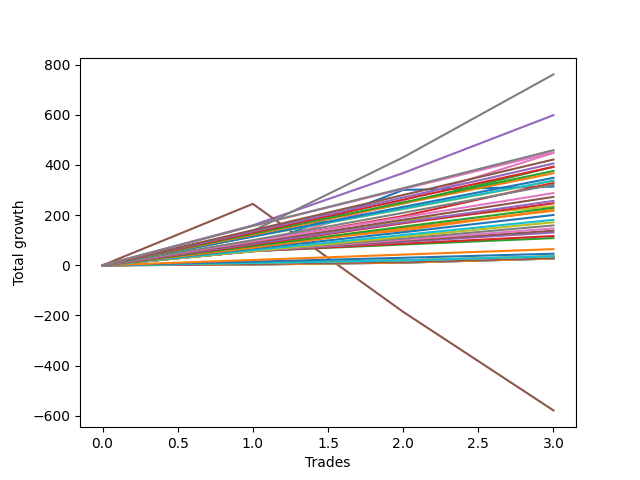

# Long Bulldog 005 DB 
- Symbol: ES1y1d
- Date Range: 07/19/2021 - 07/08/2022
- Trading Period: 7:20-12:30
- Number of Trades: 3



| Name | Win Percent | Profit | Avg Profit / Trade | Avg Time / Trade | Avg Profit / Time |      | Name | Win Percent | Profit | Avg Profit / Trade | Avg Time / Trade | Avg Profit / Time |
| ---- | ----------- | ------ | ------------------ | ---------------- | ----------------- | ---- | ---- | ----------- | ------ | ------------------ | ---------------- | ----------------- |
| Sorted By <br> Profit | | | | | | | Sorted By <br> Win Percentage ||||||
| Seven | 100.00 | 380625.00 | 126875.00 | 36 11:49:00 | 3476.76 |     | Seven | 100.00 | 380625.00 | 126875.00 | 36 11:49:00 | 3476.76 |
| Four | 100.00 | 299375.00 | 99791.67 | 35 23:22:20 | 2774.01 |     | Four | 100.00 | 299375.00 | 99791.67 | 35 23:22:20 | 2774.01 |
| Two Hundred Fifteen | 100.00 | 229625.00 | 76541.67 | 14 02:46:20 | 5422.52 |     | Two Hundred Fifteen | 100.00 | 229625.00 | 76541.67 | 14 02:46:20 | 5422.52 |
| Two Hundred Fourteen.Five | 100.00 | 225375.00 | 75125.00 | 14 02:38:00 | 5324.34 |     | Two Hundred Fourteen.Five | 100.00 | 225375.00 | 75125.00 | 14 02:38:00 | 5324.34 |
| Six | 100.00 | 224125.00 | 74708.33 | 11 17:20:20 | 6373.10 |     | Six | 100.00 | 224125.00 | 74708.33 | 11 17:20:20 | 6373.10 |
| Two Hundred Fourteen | 100.00 | 210875.00 | 70291.67 | 13 19:57:40 | 5081.92 |     | Two Hundred Fourteen | 100.00 | 210875.00 | 70291.67 | 13 19:57:40 | 5081.92 |
| Two Hundred Thirteen.Five | 100.00 | 203000.00 | 67666.67 | 13 18:15:40 | 4917.32 |     | Two Hundred Thirteen.Five | 100.00 | 203000.00 | 67666.67 | 13 18:15:40 | 4917.32 |
| Two Hundred Thirteen | 100.00 | 196375.00 | 65458.33 | 12 18:47:20 | 5120.79 |     | Two Hundred Thirteen | 100.00 | 196375.00 | 65458.33 | 12 18:47:20 | 5120.79 |
| Two | 100.00 | 196375.00 | 65458.33 | 29 01:44:20 | 2251.56 |     | Two | 100.00 | 196375.00 | 65458.33 | 29 01:44:20 | 2251.56 |
| Two Hundred Twelve.Five | 100.00 | 188125.00 | 62708.33 | 12 16:43:00 | 4939.01 |     | Two Hundred Twelve.Five | 100.00 | 188125.00 | 62708.33 | 12 16:43:00 | 4939.01 |
| Two Hundred Twelve | 100.00 | 183500.00 | 61166.67 | 12 16:36:00 | 4819.44 |     | Two Hundred Twelve | 100.00 | 183500.00 | 61166.67 | 12 16:36:00 | 4819.44 |
| Two Hundred Eleven.Five | 100.00 | 174375.00 | 58125.00 | 12 15:37:00 | 4594.61 |     | Two Hundred Eleven.Five | 100.00 | 174375.00 | 58125.00 | 12 15:37:00 | 4594.61 |
| Two Hundred Eleven | 100.00 | 168875.00 | 56291.67 | 07 15:22:20 | 7367.53 |     | Two Hundred Eleven | 100.00 | 168875.00 | 56291.67 | 07 15:22:20 | 7367.53 |
| Two Hundred Ten.Five | 100.00 | 168000.00 | 56000.00 | 06 00:40:40 | 9289.61 |     | Two Hundred Ten.Five | 100.00 | 168000.00 | 56000.00 | 06 00:40:40 | 9289.61 |
| Three | 100.00 | 164250.00 | 54750.00 | 27 19:51:00 | 1967.51 |     | Three | 100.00 | 164250.00 | 54750.00 | 27 19:51:00 | 1967.51 |
| Two Hundred Ten | 100.00 | 160625.00 | 53541.67 | 05 18:57:40 | 9247.19 |     | Two Hundred Ten | 100.00 | 160625.00 | 53541.67 | 05 18:57:40 | 9247.19 |
| Zero | 100.00 | 157000.00 | 52333.33 | 09 23:17:00 | 5249.01 |     | Zero | 100.00 | 157000.00 | 52333.33 | 09 23:17:00 | 5249.01 |
| Two Hundred Nine.Five | 100.00 | 144000.00 | 48000.00 | 05 10:24:00 | 8834.36 |     | Two Hundred Nine.Five | 100.00 | 144000.00 | 48000.00 | 05 10:24:00 | 8834.36 |
| Two Hundred Nine | 100.00 | 136375.00 | 45458.33 | 05 09:27:40 | 8427.24 |     | Two Hundred Nine | 100.00 | 136375.00 | 45458.33 | 05 09:27:40 | 8427.24 |
| Two Hundred Eight.Five | 100.00 | 128375.00 | 42791.67 | 02 08:13:20 | 18266.80 |     | Two Hundred Eight.Five | 100.00 | 128375.00 | 42791.67 | 02 08:13:20 | 18266.80 |
| Two Hundred Eight | 100.00 | 123625.00 | 41208.33 | 01 08:53:00 | 30076.03 |     | Two Hundred Eight | 100.00 | 123625.00 | 41208.33 | 01 08:53:00 | 30076.03 |
| Seventy-Three | 100.00 | 117625.00 | 39208.33 | 12 17:41:00 | 3078.35 |     | Seventy-Three | 100.00 | 117625.00 | 39208.33 | 12 17:41:00 | 3078.35 |
| Two Hundred Seven.Five | 100.00 | 114750.00 | 38250.00 | 01 08:20:40 | 28382.00 |     | Two Hundred Seven.Five | 100.00 | 114750.00 | 38250.00 | 01 08:20:40 | 28382.00 |
| One | 100.00 | 110750.00 | 36916.67 | 27 02:39:20 | 1361.70 |     | One | 100.00 | 110750.00 | 36916.67 | 27 02:39:20 | 1361.70 |
| Two Hundred Seven | 100.00 | 108875.00 | 36291.67 | 01 08:01:00 | 27204.58 |     | Two Hundred Seven | 100.00 | 108875.00 | 36291.67 | 01 08:01:00 | 27204.58 |
| Two Hundred Six.Five | 100.00 | 100375.00 | 33458.33 | 01 01:48:40 | 31110.63 |     | Two Hundred Six.Five | 100.00 | 100375.00 | 33458.33 | 01 01:48:40 | 31110.63 |
| Two Hundred Six | 100.00 | 90625.00 | 30208.33 | 01 01:36:20 | 28314.17 |     | Two Hundred Six | 100.00 | 90625.00 | 30208.33 | 01 01:36:20 | 28314.17 |
| Two Hundred Five.Five | 100.00 | 85750.00 | 28583.33 | 01 01:33:40 | 26837.64 |     | Two Hundred Five.Five | 100.00 | 85750.00 | 28583.33 | 01 01:33:40 | 26837.64 |
| Two Hundred Five | 100.00 | 79500.00 | 26500.00 | 01 01:28:20 | 24968.38 |     | Two Hundred Five | 100.00 | 79500.00 | 26500.00 | 01 01:28:20 | 24968.38 |
| Two Hundred Four.Five | 100.00 | 73500.00 | 24500.00 | 01 01:18:20 | 23236.00 |     | Two Hundred Four.Five | 100.00 | 73500.00 | 24500.00 | 01 01:18:20 | 23236.00 |
| Two Hundred Four | 100.00 | 69000.00 | 23000.00 | 01 01:14:20 | 21871.01 |     | Two Hundred Four | 100.00 | 69000.00 | 23000.00 | 01 01:14:20 | 21871.01 |
| Two Hundred Three.Five | 100.00 | 65375.00 | 21791.67 | 01 01:10:00 | 20781.46 |     | Two Hundred Three.Five | 100.00 | 65375.00 | 21791.67 | 01 01:10:00 | 20781.46 |
| Two Hundred Three | 100.00 | 58375.00 | 19458.33 | 01 01:04:00 | 18630.32 |     | Two Hundred Three | 100.00 | 58375.00 | 19458.33 | 01 01:04:00 | 18630.32 |
| Two Hundred Two.Five | 100.00 | 54250.00 | 18083.33 | 01 01:01:00 | 17348.43 |     | Two Hundred Two.Five | 100.00 | 54250.00 | 18083.33 | 01 01:01:00 | 17348.43 |
| Two Hundred Two | 100.00 | 32250.00 | 10750.00 | 00 09:27:00 | 27301.59 |     | Two Hundred Two | 100.00 | 32250.00 | 10750.00 | 00 09:27:00 | 27301.59 |
| Two Hundred One.Five | 100.00 | 23125.00 | 7708.33 | 00 09:22:20 | 19739.18 |     | Two Hundred One.Five | 100.00 | 23125.00 | 7708.33 | 00 09:22:20 | 19739.18 |
| Two Hundred One | 100.00 | 18000.00 | 6000.00 | 00 09:08:40 | 15747.27 |     | Two Hundred One | 100.00 | 18000.00 | 6000.00 | 00 09:08:40 | 15747.27 |
| Ninety | 100.00 | 18000.00 | 6000.00 | 00 09:08:40 | 15747.27 |     | Ninety | 100.00 | 18000.00 | 6000.00 | 00 09:08:40 | 15747.27 |
| Eighty-Nine | 100.00 | 17750.00 | 5916.67 | 00 09:08:20 | 15537.99 |     | Eighty-Nine | 100.00 | 17750.00 | 5916.67 | 00 09:08:20 | 15537.99 |
| Eighty-Eight | 100.00 | 17750.00 | 5916.67 | 00 09:08:20 | 15537.99 |     | Eighty-Eight | 100.00 | 17750.00 | 5916.67 | 00 09:08:20 | 15537.99 |
| Eighty-Seven | 100.00 | 15375.00 | 5125.00 | 00 08:12:20 | 14989.84 |     | Eighty-Seven | 100.00 | 15375.00 | 5125.00 | 00 08:12:20 | 14989.84 |
| Eighty-Six | 100.00 | 15375.00 | 5125.00 | 00 08:12:20 | 14989.84 |     | Eighty-Six | 100.00 | 15375.00 | 5125.00 | 00 08:12:20 | 14989.84 |
| Eighty-Five | 100.00 | 15375.00 | 5125.00 | 00 08:12:20 | 14989.84 |     | Eighty-Five | 100.00 | 15375.00 | 5125.00 | 00 08:12:20 | 14989.84 |
| Eighty-Four | 100.00 | 15375.00 | 5125.00 | 00 08:12:20 | 14989.84 |     | Eighty-Four | 100.00 | 15375.00 | 5125.00 | 00 08:12:20 | 14989.84 |
| Eighty-Three | 100.00 | 13500.00 | 4500.00 | 00 08:11:00 | 13197.56 |     | Eighty-Three | 100.00 | 13500.00 | 4500.00 | 00 08:11:00 | 13197.56 |
| Eighty-Two | 100.00 | 13500.00 | 4500.00 | 00 08:11:00 | 13197.56 |     | Eighty-Two | 100.00 | 13500.00 | 4500.00 | 00 08:11:00 | 13197.56 |
| Eighty-One | 100.00 | 13500.00 | 4500.00 | 00 08:11:00 | 13197.56 |     | Eighty-One | 100.00 | 13500.00 | 4500.00 | 00 08:11:00 | 13197.56 |
| Five | 33.33 | -289250.00 | -96416.67 | 106 11:29:40 | -905.50 |     | Five | 33.33 | -289250.00 | -96416.67 | 106 11:29:40 | -905.50 |

## NO STOPLOSS

### Test Zero
* Sell when price hits the middle line of the 20p bollinger
* No Stoploss
* Results:
```
Total Trades: 3
Percent Up: 100.00
Percent Down: 0.00
Total Points Moved Up: 314.00
Potential Profit: 157000.00
Total Points Ups: 314.00 Count Ups: 3
Total Points Downs: 0.00 Count Downs: 0
```

<details><summary>Trades</summary>

<code>In: 2021-10-04 07:21:00		Out: 2021-10-07 06:36:00		Total Position Time: 02 23:15:00		Total Move Up: 70.00		Total to Date: 70.00</code> <br />
<code>In: 2022-01-25 07:21:00		Out: 2022-02-02 06:39:00		Total Position Time: 07 23:18:00		Total Move Up: 230.50		Total to Date: 300.50</code> <br />
<code>In: 2022-02-25 07:21:00		Out: 2022-03-16 06:39:00		Total Position Time: 18 23:18:00		Total Move Up: 13.50		Total to Date: 314.00</code> <br />


</details>

### Test One
* Sell when the price hits the upper line of the 20p 1std bollinger
* No Stoploss
* Results:
```
Total Trades: 3
Percent Up: 100.00
Percent Down: 0.00
Total Points Moved Up: 221.50
Potential Profit: 110750.00
Total Points Ups: 221.50 Count Ups: 3
Total Points Downs: 0.00 Count Downs: 0
```

<details><summary>Trades</summary>

<code>In: 2021-10-04 07:21:00		Out: 2021-10-14 08:40:00		Total Position Time: 10 01:19:00		Total Move Up: 83.25		Total to Date: 83.25</code> <br />
<code>In: 2022-01-25 07:21:00		Out: 2022-03-17 10:52:00		Total Position Time: 51 03:31:00		Total Move Up: 56.00		Total to Date: 139.25</code> <br />
<code>In: 2022-02-25 07:21:00		Out: 2022-03-17 10:29:00		Total Position Time: 20 03:08:00		Total Move Up: 82.25		Total to Date: 221.50</code> <br />


</details>

### Test Two
* Sell when the price hits the upper line of the 20p 2std bollinger
* No Stoploss
* Results:
```
Total Trades: 3
Percent Up: 100.00
Percent Down: 0.00
Total Points Moved Up: 392.75
Potential Profit: 196375.00
Total Points Ups: 392.75 Count Ups: 3
Total Points Downs: 0.00 Count Downs: 0
```

<details><summary>Trades</summary>

<code>In: 2021-10-04 07:21:00		Out: 2021-10-15 08:23:00		Total Position Time: 11 01:02:00		Total Move Up: 123.00		Total to Date: 123.00</code> <br />
<code>In: 2022-01-25 07:21:00		Out: 2022-03-21 06:33:00		Total Position Time: 54 23:12:00		Total Move Up: 123.25		Total to Date: 246.25</code> <br />
<code>In: 2022-02-25 07:21:00		Out: 2022-03-18 12:20:00		Total Position Time: 21 04:59:00		Total Move Up: 146.50		Total to Date: 392.75</code> <br />


</details>

### Test Three
* Sell when price hits the middle line of the 50p bollinger
* No Stoploss
* Results:
```
Total Trades: 3
Percent Up: 100.00
Percent Down: 0.00
Total Points Moved Up: 328.50
Potential Profit: 164250.00
Total Points Ups: 328.50 Count Ups: 3
Total Points Downs: 0.00 Count Downs: 0
```

<details><summary>Trades</summary>

<code>In: 2021-10-04 07:21:00		Out: 2021-10-14 10:57:00		Total Position Time: 10 03:36:00		Total Move Up: 94.00		Total to Date: 94.00</code> <br />
<code>In: 2022-01-25 07:21:00		Out: 2022-03-18 12:09:00		Total Position Time: 52 04:48:00		Total Move Up: 102.25		Total to Date: 196.25</code> <br />
<code>In: 2022-02-25 07:21:00		Out: 2022-03-18 10:30:00		Total Position Time: 21 03:09:00		Total Move Up: 132.25		Total to Date: 328.50</code> <br />


</details>

### Test Four
* Sell when the price hits the upper line of the 50p 1std bollinger
* No Stoploss
* Results:
```
Total Trades: 3
Percent Up: 100.00
Percent Down: 0.00
Total Points Moved Up: 598.75
Potential Profit: 299375.00
Total Points Ups: 598.75 Count Ups: 3
Total Points Downs: 0.00 Count Downs: 0
```

<details><summary>Trades</summary>

<code>In: 2021-10-04 07:21:00		Out: 2021-10-19 06:40:00		Total Position Time: 14 23:19:00		Total Move Up: 159.50		Total to Date: 159.50</code> <br />
<code>In: 2022-01-25 07:21:00		Out: 2022-03-28 07:00:00		Total Position Time: 61 23:39:00		Total Move Up: 208.50		Total to Date: 368.00</code> <br />
<code>In: 2022-02-25 07:21:00		Out: 2022-03-28 06:30:00		Total Position Time: 30 23:09:00		Total Move Up: 230.75		Total to Date: 598.75</code> <br />


</details>

### Test Five
* Sell when the price hits the upper line of the 50p 2std bollinger
* No Stoploss
* Results:
```
Total Trades: 3
Percent Up: 33.33
Percent Down: 66.67
Total Points Moved Up: -578.50
Potential Profit: -289250.00
Total Points Ups: 245.00 Count Ups: 1
Total Points Downs: -823.50 Count Downs: 2
```

<details><summary>Trades</summary>

<code>In: 2021-10-04 07:21:00		Out: 2021-10-26 06:36:00		Total Position Time: 21 23:15:00		Total Move Up: 245.00		Total to Date: 245.00</code> <br />
<code>In: 2022-01-25 07:21:00		Out: 2022-07-08 12:58:00		Total Position Time: 164 05:37:00		Total Move Up: -430.50		Total to Date: -185.50</code> <br />
<code>In: 2022-02-25 07:21:00		Out: 2022-07-08 12:58:00		Total Position Time: 133 05:37:00		Total Move Up: -393.00		Total to Date: -578.50</code> <br />


</details>

### Test Six
* Sell when the price hits the middle line of the 1std VWAP
* No Stoploss
* Results:
```
Total Trades: 3
Percent Up: 100.00
Percent Down: 0.00
Total Points Moved Up: 448.25
Potential Profit: 224125.00
Total Points Ups: 448.25 Count Ups: 3
Total Points Downs: 0.00 Count Downs: 0
```

<details><summary>Trades</summary>

<code>In: 2021-10-04 07:21:00		Out: 2021-10-07 07:00:00		Total Position Time: 02 23:39:00		Total Move Up: 76.50		Total to Date: 76.50</code> <br />
<code>In: 2022-01-25 07:21:00		Out: 2022-02-01 12:03:00		Total Position Time: 07 04:42:00		Total Move Up: 182.75		Total to Date: 259.25</code> <br />
<code>In: 2022-02-25 07:21:00		Out: 2022-03-22 07:01:00		Total Position Time: 24 23:40:00		Total Move Up: 189.00		Total to Date: 448.25</code> <br />


</details>

### Test Seven
* Sell when the price hits the upper line of the 1std VWAP
* No Stoploss
* Results:
```
Total Trades: 3
Percent Up: 100.00
Percent Down: 0.00
Total Points Moved Up: 761.25
Potential Profit: 380625.00
Total Points Ups: 761.25 Count Ups: 3
Total Points Downs: 0.00 Count Downs: 0
```

<details><summary>Trades</summary>

<code>In: 2021-10-04 07:21:00		Out: 2021-10-18 08:20:00		Total Position Time: 14 00:59:00		Total Move Up: 137.25		Total to Date: 137.25</code> <br />
<code>In: 2022-01-25 07:21:00		Out: 2022-03-29 12:35:00		Total Position Time: 63 05:14:00		Total Move Up: 293.25		Total to Date: 430.50</code> <br />
<code>In: 2022-02-25 07:21:00		Out: 2022-03-29 12:35:00		Total Position Time: 32 05:14:00		Total Move Up: 330.75		Total to Date: 761.25</code> <br />


</details>

## SPECIAL EXIT CONDITIONS 

### Test Seventy-Three
* Sell when the linear regression slope changes to negative
* No Stoploss
* Results:
```
Total Trades: 3
Percent Up: 100.00
Percent Down: 0.00
Total Points Moved Up: 235.25
Potential Profit: 117625.00
Total Points Ups: 235.25 Count Ups: 3
Total Points Downs: 0.00 Count Downs: 0
```

<details><summary>Trades</summary>

<code>In: 2021-10-04 07:21:00		Out: 2021-10-14 08:22:00		Total Position Time: 10 01:01:00		Total Move Up: 81.25		Total to Date: 81.25</code> <br />
<code>In: 2022-01-25 07:21:00		Out: 2022-02-16 10:22:00		Total Position Time: 22 03:01:00		Total Move Up: 98.00		Total to Date: 179.25</code> <br />
<code>In: 2022-02-25 07:21:00		Out: 2022-03-03 08:22:00		Total Position Time: 06 01:01:00		Total Move Up: 56.00		Total to Date: 235.25</code> <br />


</details>

## TAKE PROFIT

### Test Eighty-One
* Take Profit of 1 Point
* No Stoploss
* Results:
```
Total Trades: 3
Percent Up: 100.00
Percent Down: 0.00
Total Points Moved Up: 27.00
Potential Profit: 13500.00
Total Points Ups: 27.00 Count Ups: 3
Total Points Downs: 0.00 Count Downs: 0
```

<details><summary>Trades</summary>

<code>In: 2021-10-04 07:21:00		Out: 2021-10-05 07:23:00		Total Position Time: 01 00:02:00		Total Move Up: 3.25		Total to Date: 3.25</code> <br />
<code>In: 2022-01-25 07:21:00		Out: 2022-01-25 07:49:00		Total Position Time: 00 00:28:00		Total Move Up: 7.50		Total to Date: 10.75</code> <br />
<code>In: 2022-02-25 07:21:00		Out: 2022-02-25 07:24:00		Total Position Time: 00 00:03:00		Total Move Up: 16.25		Total to Date: 27.00</code> <br />


</details>

### Test Eighty-Two
* Take Profit of 2 Point
* No Stoploss
* Results:
```
Total Trades: 3
Percent Up: 100.00
Percent Down: 0.00
Total Points Moved Up: 27.00
Potential Profit: 13500.00
Total Points Ups: 27.00 Count Ups: 3
Total Points Downs: 0.00 Count Downs: 0
```

<details><summary>Trades</summary>

<code>In: 2021-10-04 07:21:00		Out: 2021-10-05 07:23:00		Total Position Time: 01 00:02:00		Total Move Up: 3.25		Total to Date: 3.25</code> <br />
<code>In: 2022-01-25 07:21:00		Out: 2022-01-25 07:49:00		Total Position Time: 00 00:28:00		Total Move Up: 7.50		Total to Date: 10.75</code> <br />
<code>In: 2022-02-25 07:21:00		Out: 2022-02-25 07:24:00		Total Position Time: 00 00:03:00		Total Move Up: 16.25		Total to Date: 27.00</code> <br />


</details>

### Test Eighty-Three
* Take Profit of 3 Point
* No Stoploss
* Results:
```
Total Trades: 3
Percent Up: 100.00
Percent Down: 0.00
Total Points Moved Up: 27.00
Potential Profit: 13500.00
Total Points Ups: 27.00 Count Ups: 3
Total Points Downs: 0.00 Count Downs: 0
```

<details><summary>Trades</summary>

<code>In: 2021-10-04 07:21:00		Out: 2021-10-05 07:23:00		Total Position Time: 01 00:02:00		Total Move Up: 3.25		Total to Date: 3.25</code> <br />
<code>In: 2022-01-25 07:21:00		Out: 2022-01-25 07:49:00		Total Position Time: 00 00:28:00		Total Move Up: 7.50		Total to Date: 10.75</code> <br />
<code>In: 2022-02-25 07:21:00		Out: 2022-02-25 07:24:00		Total Position Time: 00 00:03:00		Total Move Up: 16.25		Total to Date: 27.00</code> <br />


</details>

### Test Eighty-Four
* Take Profit of 4 Point
* No Stoploss
* Results:
```
Total Trades: 3
Percent Up: 100.00
Percent Down: 0.00
Total Points Moved Up: 30.75
Potential Profit: 15375.00
Total Points Ups: 30.75 Count Ups: 3
Total Points Downs: 0.00 Count Downs: 0
```

<details><summary>Trades</summary>

<code>In: 2021-10-04 07:21:00		Out: 2021-10-05 07:27:00		Total Position Time: 01 00:06:00		Total Move Up: 7.00		Total to Date: 7.00</code> <br />
<code>In: 2022-01-25 07:21:00		Out: 2022-01-25 07:49:00		Total Position Time: 00 00:28:00		Total Move Up: 7.50		Total to Date: 14.50</code> <br />
<code>In: 2022-02-25 07:21:00		Out: 2022-02-25 07:24:00		Total Position Time: 00 00:03:00		Total Move Up: 16.25		Total to Date: 30.75</code> <br />


</details>

### Test Eighty-Five
* Take Profit of 5 Point
* No Stoploss
* Results:
```
Total Trades: 3
Percent Up: 100.00
Percent Down: 0.00
Total Points Moved Up: 30.75
Potential Profit: 15375.00
Total Points Ups: 30.75 Count Ups: 3
Total Points Downs: 0.00 Count Downs: 0
```

<details><summary>Trades</summary>

<code>In: 2021-10-04 07:21:00		Out: 2021-10-05 07:27:00		Total Position Time: 01 00:06:00		Total Move Up: 7.00		Total to Date: 7.00</code> <br />
<code>In: 2022-01-25 07:21:00		Out: 2022-01-25 07:49:00		Total Position Time: 00 00:28:00		Total Move Up: 7.50		Total to Date: 14.50</code> <br />
<code>In: 2022-02-25 07:21:00		Out: 2022-02-25 07:24:00		Total Position Time: 00 00:03:00		Total Move Up: 16.25		Total to Date: 30.75</code> <br />


</details>

### Test Eighty-Six
* Take Profit of 6 Point
* No Stoploss
* Results:
```
Total Trades: 3
Percent Up: 100.00
Percent Down: 0.00
Total Points Moved Up: 30.75
Potential Profit: 15375.00
Total Points Ups: 30.75 Count Ups: 3
Total Points Downs: 0.00 Count Downs: 0
```

<details><summary>Trades</summary>

<code>In: 2021-10-04 07:21:00		Out: 2021-10-05 07:27:00		Total Position Time: 01 00:06:00		Total Move Up: 7.00		Total to Date: 7.00</code> <br />
<code>In: 2022-01-25 07:21:00		Out: 2022-01-25 07:49:00		Total Position Time: 00 00:28:00		Total Move Up: 7.50		Total to Date: 14.50</code> <br />
<code>In: 2022-02-25 07:21:00		Out: 2022-02-25 07:24:00		Total Position Time: 00 00:03:00		Total Move Up: 16.25		Total to Date: 30.75</code> <br />


</details>

### Test Eighty-Seven
* Take Profit of 7 Point
* No Stoploss
* Results:
```
Total Trades: 3
Percent Up: 100.00
Percent Down: 0.00
Total Points Moved Up: 30.75
Potential Profit: 15375.00
Total Points Ups: 30.75 Count Ups: 3
Total Points Downs: 0.00 Count Downs: 0
```

<details><summary>Trades</summary>

<code>In: 2021-10-04 07:21:00		Out: 2021-10-05 07:27:00		Total Position Time: 01 00:06:00		Total Move Up: 7.00		Total to Date: 7.00</code> <br />
<code>In: 2022-01-25 07:21:00		Out: 2022-01-25 07:49:00		Total Position Time: 00 00:28:00		Total Move Up: 7.50		Total to Date: 14.50</code> <br />
<code>In: 2022-02-25 07:21:00		Out: 2022-02-25 07:24:00		Total Position Time: 00 00:03:00		Total Move Up: 16.25		Total to Date: 30.75</code> <br />


</details>

### Test Eighty-Eight
* Take Profit of 8 Point
* No Stoploss
* Results:
```
Total Trades: 3
Percent Up: 100.00
Percent Down: 0.00
Total Points Moved Up: 35.50
Potential Profit: 17750.00
Total Points Ups: 35.50 Count Ups: 3
Total Points Downs: 0.00 Count Downs: 0
```

<details><summary>Trades</summary>

<code>In: 2021-10-04 07:21:00		Out: 2021-10-05 07:31:00		Total Position Time: 01 00:10:00		Total Move Up: 9.75		Total to Date: 9.75</code> <br />
<code>In: 2022-01-25 07:21:00		Out: 2022-01-25 10:33:00		Total Position Time: 00 03:12:00		Total Move Up: 9.50		Total to Date: 19.25</code> <br />
<code>In: 2022-02-25 07:21:00		Out: 2022-02-25 07:24:00		Total Position Time: 00 00:03:00		Total Move Up: 16.25		Total to Date: 35.50</code> <br />


</details>

### Test Eighty-Nine
* Take Profit of 9 Point
* No Stoploss
* Results:
```
Total Trades: 3
Percent Up: 100.00
Percent Down: 0.00
Total Points Moved Up: 35.50
Potential Profit: 17750.00
Total Points Ups: 35.50 Count Ups: 3
Total Points Downs: 0.00 Count Downs: 0
```

<details><summary>Trades</summary>

<code>In: 2021-10-04 07:21:00		Out: 2021-10-05 07:31:00		Total Position Time: 01 00:10:00		Total Move Up: 9.75		Total to Date: 9.75</code> <br />
<code>In: 2022-01-25 07:21:00		Out: 2022-01-25 10:33:00		Total Position Time: 00 03:12:00		Total Move Up: 9.50		Total to Date: 19.25</code> <br />
<code>In: 2022-02-25 07:21:00		Out: 2022-02-25 07:24:00		Total Position Time: 00 00:03:00		Total Move Up: 16.25		Total to Date: 35.50</code> <br />


</details>

### Test Ninety
* Take Profit of 10 Point
* No Stoploss
* Results:
```
Total Trades: 3
Percent Up: 100.00
Percent Down: 0.00
Total Points Moved Up: 36.00
Potential Profit: 18000.00
Total Points Ups: 36.00 Count Ups: 3
Total Points Downs: 0.00 Count Downs: 0
```

<details><summary>Trades</summary>

<code>In: 2021-10-04 07:21:00		Out: 2021-10-05 07:31:00		Total Position Time: 01 00:10:00		Total Move Up: 9.75		Total to Date: 9.75</code> <br />
<code>In: 2022-01-25 07:21:00		Out: 2022-01-25 10:34:00		Total Position Time: 00 03:13:00		Total Move Up: 10.00		Total to Date: 19.75</code> <br />
<code>In: 2022-02-25 07:21:00		Out: 2022-02-25 07:24:00		Total Position Time: 00 00:03:00		Total Move Up: 16.25		Total to Date: 36.00</code> <br />


</details>

## DAILY TAKE PROFITS

### Test Two Hundred One
* Take Profit of 10 Point
* No Stoploss
* Results:
```
Total Trades: 3
Percent Up: 100.00
Percent Down: 0.00
Total Points Moved Up: 36.00
Potential Profit: 18000.00
Total Points Ups: 36.00 Count Ups: 3
Total Points Downs: 0.00 Count Downs: 0
```

<details><summary>Trades</summary>

<code>In: 2021-10-04 07:21:00		Out: 2021-10-05 07:31:00		Total Position Time: 01 00:10:00		Total Move Up: 9.75		Total to Date: 9.75</code> <br />
<code>In: 2022-01-25 07:21:00		Out: 2022-01-25 10:34:00		Total Position Time: 00 03:13:00		Total Move Up: 10.00		Total to Date: 19.75</code> <br />
<code>In: 2022-02-25 07:21:00		Out: 2022-02-25 07:24:00		Total Position Time: 00 00:03:00		Total Move Up: 16.25		Total to Date: 36.00</code> <br />


</details>

### Test Two Hundred One.Five
* Take Profit of 15 Point
* No Stoploss
* Results:
```
Total Trades: 3
Percent Up: 100.00
Percent Down: 0.00
Total Points Moved Up: 46.25
Potential Profit: 23125.00
Total Points Ups: 46.25 Count Ups: 3
Total Points Downs: 0.00 Count Downs: 0
```

<details><summary>Trades</summary>

<code>In: 2021-10-04 07:21:00		Out: 2021-10-05 08:00:00		Total Position Time: 01 00:39:00		Total Move Up: 14.75		Total to Date: 14.75</code> <br />
<code>In: 2022-01-25 07:21:00		Out: 2022-01-25 10:46:00		Total Position Time: 00 03:25:00		Total Move Up: 15.25		Total to Date: 30.00</code> <br />
<code>In: 2022-02-25 07:21:00		Out: 2022-02-25 07:24:00		Total Position Time: 00 00:03:00		Total Move Up: 16.25		Total to Date: 46.25</code> <br />


</details>

### Test Two Hundred Two
* Take Profit of 20 Point
* No Stoploss
* Results:
```
Total Trades: 3
Percent Up: 100.00
Percent Down: 0.00
Total Points Moved Up: 64.50
Potential Profit: 32250.00
Total Points Ups: 64.50 Count Ups: 3
Total Points Downs: 0.00 Count Downs: 0
```

<details><summary>Trades</summary>

<code>In: 2021-10-04 07:21:00		Out: 2021-10-05 08:08:00		Total Position Time: 01 00:47:00		Total Move Up: 21.25		Total to Date: 21.25</code> <br />
<code>In: 2022-01-25 07:21:00		Out: 2022-01-25 10:50:00		Total Position Time: 00 03:29:00		Total Move Up: 21.50		Total to Date: 42.75</code> <br />
<code>In: 2022-02-25 07:21:00		Out: 2022-02-25 07:26:00		Total Position Time: 00 00:05:00		Total Move Up: 21.75		Total to Date: 64.50</code> <br />


</details>

### Test Two Hundred Two.Five
* Take Profit of 25 Point
* No Stoploss
* Results:
```
Total Trades: 3
Percent Up: 100.00
Percent Down: 0.00
Total Points Moved Up: 108.50
Potential Profit: 54250.00
Total Points Ups: 108.50 Count Ups: 3
Total Points Downs: 0.00 Count Downs: 0
```

<details><summary>Trades</summary>

<code>In: 2021-10-04 07:21:00		Out: 2021-10-07 06:31:00		Total Position Time: 02 23:10:00		Total Move Up: 56.50		Total to Date: 56.50</code> <br />
<code>In: 2022-01-25 07:21:00		Out: 2022-01-25 10:53:00		Total Position Time: 00 03:32:00		Total Move Up: 26.50		Total to Date: 83.00</code> <br />
<code>In: 2022-02-25 07:21:00		Out: 2022-02-25 07:42:00		Total Position Time: 00 00:21:00		Total Move Up: 25.50		Total to Date: 108.50</code> <br />


</details>

### Test Two Hundred Three
* Take Profit of 30 Point
* No Stoploss
* Results:
```
Total Trades: 3
Percent Up: 100.00
Percent Down: 0.00
Total Points Moved Up: 116.75
Potential Profit: 58375.00
Total Points Ups: 116.75 Count Ups: 3
Total Points Downs: 0.00 Count Downs: 0
```

<details><summary>Trades</summary>

<code>In: 2021-10-04 07:21:00		Out: 2021-10-07 06:31:00		Total Position Time: 02 23:10:00		Total Move Up: 56.50		Total to Date: 56.50</code> <br />
<code>In: 2022-01-25 07:21:00		Out: 2022-01-25 10:59:00		Total Position Time: 00 03:38:00		Total Move Up: 30.00		Total to Date: 86.50</code> <br />
<code>In: 2022-02-25 07:21:00		Out: 2022-02-25 07:45:00		Total Position Time: 00 00:24:00		Total Move Up: 30.25		Total to Date: 116.75</code> <br />


</details>

### Test Two Hundred Three.Five
* Take Profit of 35 Point
* No Stoploss
* Results:
```
Total Trades: 3
Percent Up: 100.00
Percent Down: 0.00
Total Points Moved Up: 130.75
Potential Profit: 65375.00
Total Points Ups: 130.75 Count Ups: 3
Total Points Downs: 0.00 Count Downs: 0
```

<details><summary>Trades</summary>

<code>In: 2021-10-04 07:21:00		Out: 2021-10-07 06:31:00		Total Position Time: 02 23:10:00		Total Move Up: 56.50		Total to Date: 56.50</code> <br />
<code>In: 2022-01-25 07:21:00		Out: 2022-01-25 11:14:00		Total Position Time: 00 03:53:00		Total Move Up: 37.00		Total to Date: 93.50</code> <br />
<code>In: 2022-02-25 07:21:00		Out: 2022-02-25 07:48:00		Total Position Time: 00 00:27:00		Total Move Up: 37.25		Total to Date: 130.75</code> <br />


</details>

### Test Two Hundred Four
* Take Profit of 40 Point
* No Stoploss
* Results:
```
Total Trades: 3
Percent Up: 100.00
Percent Down: 0.00
Total Points Moved Up: 138.00
Potential Profit: 69000.00
Total Points Ups: 138.00 Count Ups: 3
Total Points Downs: 0.00 Count Downs: 0
```

<details><summary>Trades</summary>

<code>In: 2021-10-04 07:21:00		Out: 2021-10-07 06:31:00		Total Position Time: 02 23:10:00		Total Move Up: 56.50		Total to Date: 56.50</code> <br />
<code>In: 2022-01-25 07:21:00		Out: 2022-01-25 11:19:00		Total Position Time: 00 03:58:00		Total Move Up: 40.75		Total to Date: 97.25</code> <br />
<code>In: 2022-02-25 07:21:00		Out: 2022-02-25 07:56:00		Total Position Time: 00 00:35:00		Total Move Up: 40.75		Total to Date: 138.00</code> <br />


</details>

### Test Two Hundred Four.Five
* Take Profit of 45 Point
* No Stoploss
* Results:
```
Total Trades: 3
Percent Up: 100.00
Percent Down: 0.00
Total Points Moved Up: 147.00
Potential Profit: 73500.00
Total Points Ups: 147.00 Count Ups: 3
Total Points Downs: 0.00 Count Downs: 0
```

<details><summary>Trades</summary>

<code>In: 2021-10-04 07:21:00		Out: 2021-10-07 06:31:00		Total Position Time: 02 23:10:00		Total Move Up: 56.50		Total to Date: 56.50</code> <br />
<code>In: 2022-01-25 07:21:00		Out: 2022-01-25 11:22:00		Total Position Time: 00 04:01:00		Total Move Up: 45.25		Total to Date: 101.75</code> <br />
<code>In: 2022-02-25 07:21:00		Out: 2022-02-25 08:05:00		Total Position Time: 00 00:44:00		Total Move Up: 45.25		Total to Date: 147.00</code> <br />


</details>

### Test Two Hundred Five
* Take Profit of 50 Point
* No Stoploss
* Results:
```
Total Trades: 3
Percent Up: 100.00
Percent Down: 0.00
Total Points Moved Up: 159.00
Potential Profit: 79500.00
Total Points Ups: 159.00 Count Ups: 3
Total Points Downs: 0.00 Count Downs: 0
```

<details><summary>Trades</summary>

<code>In: 2021-10-04 07:21:00		Out: 2021-10-07 06:31:00		Total Position Time: 02 23:10:00		Total Move Up: 56.50		Total to Date: 56.50</code> <br />
<code>In: 2022-01-25 07:21:00		Out: 2022-01-25 11:43:00		Total Position Time: 00 04:22:00		Total Move Up: 50.25		Total to Date: 106.75</code> <br />
<code>In: 2022-02-25 07:21:00		Out: 2022-02-25 08:14:00		Total Position Time: 00 00:53:00		Total Move Up: 52.25		Total to Date: 159.00</code> <br />


</details>

### Test Two Hundred Five.Five
* Take Profit of 55 Point
* No Stoploss
* Results:
```
Total Trades: 3
Percent Up: 100.00
Percent Down: 0.00
Total Points Moved Up: 171.50
Potential Profit: 85750.00
Total Points Ups: 171.50 Count Ups: 3
Total Points Downs: 0.00 Count Downs: 0
```

<details><summary>Trades</summary>

<code>In: 2021-10-04 07:21:00		Out: 2021-10-07 06:31:00		Total Position Time: 02 23:10:00		Total Move Up: 56.50		Total to Date: 56.50</code> <br />
<code>In: 2022-01-25 07:21:00		Out: 2022-01-25 11:53:00		Total Position Time: 00 04:32:00		Total Move Up: 57.25		Total to Date: 113.75</code> <br />
<code>In: 2022-02-25 07:21:00		Out: 2022-02-25 08:20:00		Total Position Time: 00 00:59:00		Total Move Up: 57.75		Total to Date: 171.50</code> <br />


</details>

### Test Two Hundred Six
* Take Profit of 60 Point
* No Stoploss
* Results:
```
Total Trades: 3
Percent Up: 100.00
Percent Down: 0.00
Total Points Moved Up: 181.25
Potential Profit: 90625.00
Total Points Ups: 181.25 Count Ups: 3
Total Points Downs: 0.00 Count Downs: 0
```

<details><summary>Trades</summary>

<code>In: 2021-10-04 07:21:00		Out: 2021-10-07 06:33:00		Total Position Time: 02 23:12:00		Total Move Up: 60.25		Total to Date: 60.25</code> <br />
<code>In: 2022-01-25 07:21:00		Out: 2022-01-25 11:56:00		Total Position Time: 00 04:35:00		Total Move Up: 60.75		Total to Date: 121.00</code> <br />
<code>In: 2022-02-25 07:21:00		Out: 2022-02-25 08:23:00		Total Position Time: 00 01:02:00		Total Move Up: 60.25		Total to Date: 181.25</code> <br />


</details>

### Test Two Hundred Six.Five
* Take Profit of 65 Point
* No Stoploss
* Results:
```
Total Trades: 3
Percent Up: 100.00
Percent Down: 0.00
Total Points Moved Up: 200.75
Potential Profit: 100375.00
Total Points Ups: 200.75 Count Ups: 3
Total Points Downs: 0.00 Count Downs: 0
```

<details><summary>Trades</summary>

<code>In: 2021-10-04 07:21:00		Out: 2021-10-07 06:35:00		Total Position Time: 02 23:14:00		Total Move Up: 66.75		Total to Date: 66.75</code> <br />
<code>In: 2022-01-25 07:21:00		Out: 2022-01-25 11:58:00		Total Position Time: 00 04:37:00		Total Move Up: 65.00		Total to Date: 131.75</code> <br />
<code>In: 2022-02-25 07:21:00		Out: 2022-02-25 08:56:00		Total Position Time: 00 01:35:00		Total Move Up: 69.00		Total to Date: 200.75</code> <br />


</details>

### Test Two Hundred Seven
* Take Profit of 70 Point
* No Stoploss
* Results:
```
Total Trades: 3
Percent Up: 100.00
Percent Down: 0.00
Total Points Moved Up: 217.75
Potential Profit: 108875.00
Total Points Ups: 217.75 Count Ups: 3
Total Points Downs: 0.00 Count Downs: 0
```

<details><summary>Trades</summary>

<code>In: 2021-10-04 07:21:00		Out: 2021-10-07 06:36:00		Total Position Time: 02 23:15:00		Total Move Up: 70.00		Total to Date: 70.00</code> <br />
<code>In: 2022-01-25 07:21:00		Out: 2022-01-26 06:31:00		Total Position Time: 00 23:10:00		Total Move Up: 77.50		Total to Date: 147.50</code> <br />
<code>In: 2022-02-25 07:21:00		Out: 2022-02-25 08:59:00		Total Position Time: 00 01:38:00		Total Move Up: 70.25		Total to Date: 217.75</code> <br />


</details>

### Test Two Hundred Seven.Five
* Take Profit of 75 Point
* No Stoploss
* Results:
```
Total Trades: 3
Percent Up: 100.00
Percent Down: 0.00
Total Points Moved Up: 229.50
Potential Profit: 114750.00
Total Points Ups: 229.50 Count Ups: 3
Total Points Downs: 0.00 Count Downs: 0
```

<details><summary>Trades</summary>

<code>In: 2021-10-04 07:21:00		Out: 2021-10-07 07:00:00		Total Position Time: 02 23:39:00		Total Move Up: 76.50		Total to Date: 76.50</code> <br />
<code>In: 2022-01-25 07:21:00		Out: 2022-01-26 06:31:00		Total Position Time: 00 23:10:00		Total Move Up: 77.50		Total to Date: 154.00</code> <br />
<code>In: 2022-02-25 07:21:00		Out: 2022-02-25 09:34:00		Total Position Time: 00 02:13:00		Total Move Up: 75.50		Total to Date: 229.50</code> <br />


</details>

### Test Two Hundred Eight
* Take Profit of 80 Point
* No Stoploss
* Results:
```
Total Trades: 3
Percent Up: 100.00
Percent Down: 0.00
Total Points Moved Up: 247.25
Potential Profit: 123625.00
Total Points Ups: 247.25 Count Ups: 3
Total Points Downs: 0.00 Count Downs: 0
```

<details><summary>Trades</summary>

<code>In: 2021-10-04 07:21:00		Out: 2021-10-07 07:03:00		Total Position Time: 02 23:42:00		Total Move Up: 82.00		Total to Date: 82.00</code> <br />
<code>In: 2022-01-25 07:21:00		Out: 2022-01-26 06:52:00		Total Position Time: 00 23:31:00		Total Move Up: 85.50		Total to Date: 167.50</code> <br />
<code>In: 2022-02-25 07:21:00		Out: 2022-02-25 10:47:00		Total Position Time: 00 03:26:00		Total Move Up: 79.75		Total to Date: 247.25</code> <br />


</details>

### Test Two Hundred Eight.Five
* Take Profit of 85 Point
* No Stoploss
* Results:
```
Total Trades: 3
Percent Up: 100.00
Percent Down: 0.00
Total Points Moved Up: 256.75
Potential Profit: 128375.00
Total Points Ups: 256.75 Count Ups: 3
Total Points Downs: 0.00 Count Downs: 0
```

<details><summary>Trades</summary>

<code>In: 2021-10-04 07:21:00		Out: 2021-10-07 07:18:00		Total Position Time: 02 23:57:00		Total Move Up: 85.75		Total to Date: 85.75</code> <br />
<code>In: 2022-01-25 07:21:00		Out: 2022-01-26 06:52:00		Total Position Time: 00 23:31:00		Total Move Up: 85.50		Total to Date: 171.25</code> <br />
<code>In: 2022-02-25 07:21:00		Out: 2022-02-28 08:33:00		Total Position Time: 03 01:12:00		Total Move Up: 85.50		Total to Date: 256.75</code> <br />


</details>

### Test Two Hundred Nine
* Take Profit of 90 Point
* No Stoploss
* Results:
```
Total Trades: 3
Percent Up: 100.00
Percent Down: 0.00
Total Points Moved Up: 272.75
Potential Profit: 136375.00
Total Points Ups: 272.75 Count Ups: 3
Total Points Downs: 0.00 Count Downs: 0
```

<details><summary>Trades</summary>

<code>In: 2021-10-04 07:21:00		Out: 2021-10-14 09:27:00		Total Position Time: 10 02:06:00		Total Move Up: 90.00		Total to Date: 90.00</code> <br />
<code>In: 2022-01-25 07:21:00		Out: 2022-01-26 06:54:00		Total Position Time: 00 23:33:00		Total Move Up: 91.75		Total to Date: 181.75</code> <br />
<code>In: 2022-02-25 07:21:00		Out: 2022-03-02 10:05:00		Total Position Time: 05 02:44:00		Total Move Up: 91.00		Total to Date: 272.75</code> <br />


</details>

### Test Two Hundred Nine.Five
* Take Profit of 95 Point
* No Stoploss
* Results:
```
Total Trades: 3
Percent Up: 100.00
Percent Down: 0.00
Total Points Moved Up: 288.00
Potential Profit: 144000.00
Total Points Ups: 288.00 Count Ups: 3
Total Points Downs: 0.00 Count Downs: 0
```

<details><summary>Trades</summary>

<code>In: 2021-10-04 07:21:00		Out: 2021-10-14 11:39:00		Total Position Time: 10 04:18:00		Total Move Up: 95.25		Total to Date: 95.25</code> <br />
<code>In: 2022-01-25 07:21:00		Out: 2022-01-26 07:02:00		Total Position Time: 00 23:41:00		Total Move Up: 96.25		Total to Date: 191.50</code> <br />
<code>In: 2022-02-25 07:21:00		Out: 2022-03-02 10:34:00		Total Position Time: 05 03:13:00		Total Move Up: 96.50		Total to Date: 288.00</code> <br />


</details>

### Test Two Hundred Ten
* Take Profit of 100 Point
* No Stoploss
* Results:
```
Total Trades: 3
Percent Up: 100.00
Percent Down: 0.00
Total Points Moved Up: 321.25
Potential Profit: 160625.00
Total Points Ups: 321.25 Count Ups: 3
Total Points Downs: 0.00 Count Downs: 0
```

<details><summary>Trades</summary>

<code>In: 2021-10-04 07:21:00		Out: 2021-10-14 13:22:00		Total Position Time: 10 06:01:00		Total Move Up: 100.25		Total to Date: 100.25</code> <br />
<code>In: 2022-01-25 07:21:00		Out: 2022-01-26 11:03:00		Total Position Time: 01 03:42:00		Total Move Up: 109.00		Total to Date: 209.25</code> <br />
<code>In: 2022-02-25 07:21:00		Out: 2022-03-03 06:31:00		Total Position Time: 05 23:10:00		Total Move Up: 112.00		Total to Date: 321.25</code> <br />


</details>

### Test Two Hundred Ten.Five
* Take Profit of 105 Point
* No Stoploss
* Results:
```
Total Trades: 3
Percent Up: 100.00
Percent Down: 0.00
Total Points Moved Up: 336.00
Potential Profit: 168000.00
Total Points Ups: 336.00 Count Ups: 3
Total Points Downs: 0.00 Count Downs: 0
```

<details><summary>Trades</summary>

<code>In: 2021-10-04 07:21:00		Out: 2021-10-15 06:31:00		Total Position Time: 10 23:10:00		Total Move Up: 115.00		Total to Date: 115.00</code> <br />
<code>In: 2022-01-25 07:21:00		Out: 2022-01-26 11:03:00		Total Position Time: 01 03:42:00		Total Move Up: 109.00		Total to Date: 224.00</code> <br />
<code>In: 2022-02-25 07:21:00		Out: 2022-03-03 06:31:00		Total Position Time: 05 23:10:00		Total Move Up: 112.00		Total to Date: 336.00</code> <br />


</details>

### Test Two Hundred Eleven
* Take Profit of 110 Point
* No Stoploss
* Results:
```
Total Trades: 3
Percent Up: 100.00
Percent Down: 0.00
Total Points Moved Up: 337.75
Potential Profit: 168875.00
Total Points Ups: 337.75 Count Ups: 3
Total Points Downs: 0.00 Count Downs: 0
```

<details><summary>Trades</summary>

<code>In: 2021-10-04 07:21:00		Out: 2021-10-15 06:31:00		Total Position Time: 10 23:10:00		Total Move Up: 115.00		Total to Date: 115.00</code> <br />
<code>In: 2022-01-25 07:21:00		Out: 2022-01-31 07:08:00		Total Position Time: 05 23:47:00		Total Move Up: 110.75		Total to Date: 225.75</code> <br />
<code>In: 2022-02-25 07:21:00		Out: 2022-03-03 06:31:00		Total Position Time: 05 23:10:00		Total Move Up: 112.00		Total to Date: 337.75</code> <br />


</details>

### Test Two Hundred Eleven.Five
* Take Profit of 115 Point
* No Stoploss
* Results:
```
Total Trades: 3
Percent Up: 100.00
Percent Down: 0.00
Total Points Moved Up: 348.75
Potential Profit: 174375.00
Total Points Ups: 348.75 Count Ups: 3
Total Points Downs: 0.00 Count Downs: 0
```

<details><summary>Trades</summary>

<code>In: 2021-10-04 07:21:00		Out: 2021-10-15 06:31:00		Total Position Time: 10 23:10:00		Total Move Up: 115.00		Total to Date: 115.00</code> <br />
<code>In: 2022-01-25 07:21:00		Out: 2022-01-31 07:10:00		Total Position Time: 05 23:49:00		Total Move Up: 118.00		Total to Date: 233.00</code> <br />
<code>In: 2022-02-25 07:21:00		Out: 2022-03-18 07:13:00		Total Position Time: 20 23:52:00		Total Move Up: 115.75		Total to Date: 348.75</code> <br />


</details>

### Test Two Hundred Twelve
* Take Profit of 120 Point
* No Stoploss
* Results:
```
Total Trades: 3
Percent Up: 100.00
Percent Down: 0.00
Total Points Moved Up: 367.00
Potential Profit: 183500.00
Total Points Ups: 367.00 Count Ups: 3
Total Points Downs: 0.00 Count Downs: 0
```

<details><summary>Trades</summary>

<code>In: 2021-10-04 07:21:00		Out: 2021-10-15 06:57:00		Total Position Time: 10 23:36:00		Total Move Up: 121.50		Total to Date: 121.50</code> <br />
<code>In: 2022-01-25 07:21:00		Out: 2022-01-31 07:23:00		Total Position Time: 06 00:02:00		Total Move Up: 125.25		Total to Date: 246.75</code> <br />
<code>In: 2022-02-25 07:21:00		Out: 2022-03-18 09:31:00		Total Position Time: 21 02:10:00		Total Move Up: 120.25		Total to Date: 367.00</code> <br />


</details>

### Test Two Hundred Twelve.Five
* Take Profit of 125 Point
* No Stoploss
* Results:
```
Total Trades: 3
Percent Up: 100.00
Percent Down: 0.00
Total Points Moved Up: 376.25
Potential Profit: 188125.00
Total Points Ups: 376.25 Count Ups: 3
Total Points Downs: 0.00 Count Downs: 0
```

<details><summary>Trades</summary>

<code>In: 2021-10-04 07:21:00		Out: 2021-10-15 07:07:00		Total Position Time: 10 23:46:00		Total Move Up: 125.50		Total to Date: 125.50</code> <br />
<code>In: 2022-01-25 07:21:00		Out: 2022-01-31 07:23:00		Total Position Time: 06 00:02:00		Total Move Up: 125.25		Total to Date: 250.75</code> <br />
<code>In: 2022-02-25 07:21:00		Out: 2022-03-18 09:42:00		Total Position Time: 21 02:21:00		Total Move Up: 125.50		Total to Date: 376.25</code> <br />


</details>

### Test Two Hundred Thirteen
* Take Profit of 130 Point
* No Stoploss
* Results:
```
Total Trades: 3
Percent Up: 100.00
Percent Down: 0.00
Total Points Moved Up: 392.75
Potential Profit: 196375.00
Total Points Ups: 392.75 Count Ups: 3
Total Points Downs: 0.00 Count Downs: 0
```

<details><summary>Trades</summary>

<code>In: 2021-10-04 07:21:00		Out: 2021-10-15 11:05:00		Total Position Time: 11 03:44:00		Total Move Up: 130.25		Total to Date: 130.25</code> <br />
<code>In: 2022-01-25 07:21:00		Out: 2022-01-31 08:52:00		Total Position Time: 06 01:31:00		Total Move Up: 131.50		Total to Date: 261.75</code> <br />
<code>In: 2022-02-25 07:21:00		Out: 2022-03-18 10:28:00		Total Position Time: 21 03:07:00		Total Move Up: 131.00		Total to Date: 392.75</code> <br />


</details>

### Test Two Hundred Thirteen.Five
* Take Profit of 135 Point
* No Stoploss
* Results:
```
Total Trades: 3
Percent Up: 100.00
Percent Down: 0.00
Total Points Moved Up: 406.00
Potential Profit: 203000.00
Total Points Ups: 406.00 Count Ups: 3
Total Points Downs: 0.00 Count Downs: 0
```

<details><summary>Trades</summary>

<code>In: 2021-10-04 07:21:00		Out: 2021-10-18 08:19:00		Total Position Time: 14 00:58:00		Total Move Up: 135.00		Total to Date: 135.00</code> <br />
<code>In: 2022-01-25 07:21:00		Out: 2022-01-31 08:54:00		Total Position Time: 06 01:33:00		Total Move Up: 135.25		Total to Date: 270.25</code> <br />
<code>In: 2022-02-25 07:21:00		Out: 2022-03-18 11:37:00		Total Position Time: 21 04:16:00		Total Move Up: 135.75		Total to Date: 406.00</code> <br />


</details>

### Test Two Hundred Fourteen
* Take Profit of 140 Point
* No Stoploss
* Results:
```
Total Trades: 3
Percent Up: 100.00
Percent Down: 0.00
Total Points Moved Up: 421.75
Potential Profit: 210875.00
Total Points Ups: 421.75 Count Ups: 3
Total Points Downs: 0.00 Count Downs: 0
```

<details><summary>Trades</summary>

<code>In: 2021-10-04 07:21:00		Out: 2021-10-18 11:56:00		Total Position Time: 14 04:35:00		Total Move Up: 140.00		Total to Date: 140.00</code> <br />
<code>In: 2022-01-25 07:21:00		Out: 2022-01-31 09:50:00		Total Position Time: 06 02:29:00		Total Move Up: 140.25		Total to Date: 280.25</code> <br />
<code>In: 2022-02-25 07:21:00		Out: 2022-03-18 12:10:00		Total Position Time: 21 04:49:00		Total Move Up: 141.50		Total to Date: 421.75</code> <br />


</details>

### Test Two Hundred Fourteen.Five
* Take Profit of 145 Point
* No Stoploss
* Results:
```
Total Trades: 3
Percent Up: 100.00
Percent Down: 0.00
Total Points Moved Up: 450.75
Potential Profit: 225375.00
Total Points Ups: 450.75 Count Ups: 3
Total Points Downs: 0.00 Count Downs: 0
```

<details><summary>Trades</summary>

<code>In: 2021-10-04 07:21:00		Out: 2021-10-19 06:31:00		Total Position Time: 14 23:10:00		Total Move Up: 157.25		Total to Date: 157.25</code> <br />
<code>In: 2022-01-25 07:21:00		Out: 2022-01-31 11:06:00		Total Position Time: 06 03:45:00		Total Move Up: 147.00		Total to Date: 304.25</code> <br />
<code>In: 2022-02-25 07:21:00		Out: 2022-03-18 12:20:00		Total Position Time: 21 04:59:00		Total Move Up: 146.50		Total to Date: 450.75</code> <br />


</details>

### Test Two Hundred Fifteen
* Take Profit of 150 Point
* No Stoploss
* Results:
```
Total Trades: 3
Percent Up: 100.00
Percent Down: 0.00
Total Points Moved Up: 459.25
Potential Profit: 229625.00
Total Points Ups: 459.25 Count Ups: 3
Total Points Downs: 0.00 Count Downs: 0
```

<details><summary>Trades</summary>

<code>In: 2021-10-04 07:21:00		Out: 2021-10-19 06:31:00		Total Position Time: 14 23:10:00		Total Move Up: 157.25		Total to Date: 157.25</code> <br />
<code>In: 2022-01-25 07:21:00		Out: 2022-01-31 11:25:00		Total Position Time: 06 04:04:00		Total Move Up: 150.25		Total to Date: 307.50</code> <br />
<code>In: 2022-02-25 07:21:00		Out: 2022-03-18 12:26:00		Total Position Time: 21 05:05:00		Total Move Up: 151.75		Total to Date: 459.25</code> <br />


</details>