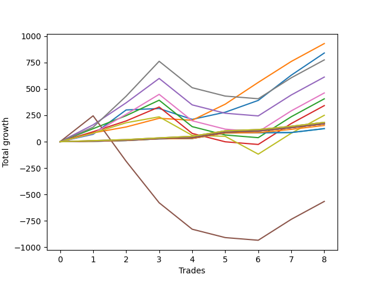

# Long Bulldog 005 
- Symbol: ES1y1d
- Date Range: 07/19/2021 - 07/08/2022
- Trading Period: 7:20-12:30
- Number of Trades: 8



| Name | Win Percent | Profit | Avg Profit / Trade | Avg Time / Trade |      | Name | Win Percent | Profit | Avg Profit / Trade | Avg Time / Trade |
| ---- | ----------- | ------ | ------------------ | ---------------- | ---- | ---- | ----------- | ------ | ------------------ | ---------------- |
| Sorted By <br> Profit | | | | | | Sorted By <br> Win Percentage ||||
| One | 100.00 | 497625.00 | 62203.12 | 00:00 |     | One | 100.00 | 497625.00 | 62203.12 | 00:00 |
| Zero | 87.50 | 446750.00 | 55843.75 | 00:00 |     | Eighty-Five | 100.00 | 129125.00 | 16140.62 | 00:00 |
| Seven | 62.50 | 387125.00 | 48390.62 | 00:00 |     | Eighty-Four | 100.00 | 128125.00 | 16015.62 | 00:00 |
| Four | 62.50 | 314500.00 | 39312.50 | 00:00 |     | Eighty-Three | 100.00 | 126250.00 | 15781.25 | 00:00 |
| Six | 62.50 | 230625.00 | 28828.12 | 00:00 |     | Eighty-Two | 100.00 | 123125.00 | 15390.62 | 00:00 |
| Two | 62.50 | 213375.00 | 26671.88 | 00:00 |     | Eighty-One | 100.00 | 123125.00 | 15390.62 | 00:00 |
| Three | 62.50 | 179750.00 | 22468.75 | 00:00 |     | Zero | 87.50 | 446750.00 | 55843.75 | 00:00 |
| Eighty-Five | 100.00 | 129125.00 | 16140.62 | 00:00 |     | Seven | 62.50 | 387125.00 | 48390.62 | 00:00 |
| Eighty-Four | 100.00 | 128125.00 | 16015.62 | 00:00 |     | Four | 62.50 | 314500.00 | 39312.50 | 00:00 |
| Eighty-Three | 100.00 | 126250.00 | 15781.25 | 00:00 |     | Six | 62.50 | 230625.00 | 28828.12 | 00:00 |
| Seventy-Three | 62.50 | 124875.00 | 15609.38 | 00:00 |     | Two | 62.50 | 213375.00 | 26671.88 | 00:00 |
| Eighty-Two | 100.00 | 123125.00 | 15390.62 | 00:00 |     | Three | 62.50 | 179750.00 | 22468.75 | 00:00 |
| Eighty-One | 100.00 | 123125.00 | 15390.62 | 00:00 |     | Seventy-Three | 62.50 | 124875.00 | 15609.38 | 00:00 |
| One Hundred Twenty-Four | 62.50 | 32500.00 | 4062.50 | 00:00 |     | One Hundred Twenty-Four | 62.50 | 32500.00 | 4062.50 | 00:00 |
| One Hundred Fourteen | 62.50 | 32500.00 | 4062.50 | 00:00 |     | One Hundred Fourteen | 62.50 | 32500.00 | 4062.50 | 00:00 |
| Fifty-Five | 50.00 | 30750.00 | 3843.75 | 00:00 |     | One Hundred Twenty-Three | 62.50 | 30625.00 | 3828.12 | 00:00 |
| Fifty-Four | 50.00 | 30750.00 | 3843.75 | 00:00 |     | One Hundred Twenty-Two | 62.50 | 30625.00 | 3828.12 | 00:00 |
| Fifty-Three | 50.00 | 30750.00 | 3843.75 | 00:00 |     | One Hundred Twenty-One | 62.50 | 30625.00 | 3828.12 | 00:00 |
| Fifty-Two | 50.00 | 30750.00 | 3843.75 | 00:00 |     | One Hundred Thirteen | 62.50 | 30625.00 | 3828.12 | 00:00 |
| Fifty-One | 50.00 | 30750.00 | 3843.75 | 00:00 |     | One Hundred Twelve | 62.50 | 30625.00 | 3828.12 | 00:00 |
| Fifty | 50.00 | 30750.00 | 3843.75 | 00:00 |     | One Hundred Eleven | 62.50 | 30625.00 | 3828.12 | 00:00 |
| Forty-Nine | 50.00 | 30750.00 | 3843.75 | 00:00 |     | Fifty-Five | 50.00 | 30750.00 | 3843.75 | 00:00 |
| Forty-Eight | 50.00 | 30750.00 | 3843.75 | 00:00 |     | Fifty-Four | 50.00 | 30750.00 | 3843.75 | 00:00 |
| One Hundred Twenty-Three | 62.50 | 30625.00 | 3828.12 | 00:00 |     | Fifty-Three | 50.00 | 30750.00 | 3843.75 | 00:00 |
| One Hundred Twenty-Two | 62.50 | 30625.00 | 3828.12 | 00:00 |     | Fifty-Two | 50.00 | 30750.00 | 3843.75 | 00:00 |
| One Hundred Twenty-One | 62.50 | 30625.00 | 3828.12 | 00:00 |     | Fifty-One | 50.00 | 30750.00 | 3843.75 | 00:00 |
| One Hundred Thirteen | 62.50 | 30625.00 | 3828.12 | 00:00 |     | Fifty | 50.00 | 30750.00 | 3843.75 | 00:00 |
| One Hundred Twelve | 62.50 | 30625.00 | 3828.12 | 00:00 |     | Forty-Nine | 50.00 | 30750.00 | 3843.75 | 00:00 |
| One Hundred Eleven | 62.50 | 30625.00 | 3828.12 | 00:00 |     | Forty-Eight | 50.00 | 30750.00 | 3843.75 | 00:00 |
| One Hundred Twenty | 50.00 | 30625.00 | 3828.12 | 00:00 |     | One Hundred Twenty | 50.00 | 30625.00 | 3828.12 | 00:00 |
| One Hundred Ninteen | 50.00 | 30625.00 | 3828.12 | 00:00 |     | One Hundred Ninteen | 50.00 | 30625.00 | 3828.12 | 00:00 |
| One Hundred Eighteen | 50.00 | 28750.00 | 3593.75 | 00:00 |     | One Hundred Eighteen | 50.00 | 28750.00 | 3593.75 | 00:00 |
| One Hundred Seventeen | 50.00 | 28750.00 | 3593.75 | 00:00 |     | One Hundred Seventeen | 50.00 | 28750.00 | 3593.75 | 00:00 |
| One Hundred Sixteen | 50.00 | 28750.00 | 3593.75 | 00:00 |     | One Hundred Sixteen | 50.00 | 28750.00 | 3593.75 | 00:00 |
| One Hundred Fifteen | 50.00 | 27625.00 | 3453.12 | 00:00 |     | One Hundred Fifteen | 50.00 | 27625.00 | 3453.12 | 00:00 |
| One Hundred Thirty | 50.00 | 27375.00 | 3421.88 | 00:00 |     | One Hundred Thirty | 50.00 | 27375.00 | 3421.88 | 00:00 |
| One Hundred Twenty-Nine | 50.00 | 27375.00 | 3421.88 | 00:00 |     | One Hundred Twenty-Nine | 50.00 | 27375.00 | 3421.88 | 00:00 |
| Seventy-One | 50.00 | 27125.00 | 3390.62 | 00:00 |     | Seventy-One | 50.00 | 27125.00 | 3390.62 | 00:00 |
| Seventy | 50.00 | 27125.00 | 3390.62 | 00:00 |     | Seventy | 50.00 | 27125.00 | 3390.62 | 00:00 |
| Sixty-Nine | 50.00 | 27125.00 | 3390.62 | 00:00 |     | Sixty-Nine | 50.00 | 27125.00 | 3390.62 | 00:00 |
| Sixty-Eight | 50.00 | 27125.00 | 3390.62 | 00:00 |     | Sixty-Eight | 50.00 | 27125.00 | 3390.62 | 00:00 |
| Sixty-Seven | 50.00 | 27125.00 | 3390.62 | 00:00 |     | Sixty-Seven | 50.00 | 27125.00 | 3390.62 | 00:00 |
| Sixty-Six | 50.00 | 27125.00 | 3390.62 | 00:00 |     | Sixty-Six | 50.00 | 27125.00 | 3390.62 | 00:00 |
| Sixty-Five | 50.00 | 27125.00 | 3390.62 | 00:00 |     | Sixty-Five | 50.00 | 27125.00 | 3390.62 | 00:00 |
| Sixty-Four | 50.00 | 27125.00 | 3390.62 | 00:00 |     | Sixty-Four | 50.00 | 27125.00 | 3390.62 | 00:00 |
| One Hundred Twenty-Eight | 50.00 | 25500.00 | 3187.50 | 00:00 |     | One Hundred Twenty-Eight | 50.00 | 25500.00 | 3187.50 | 00:00 |
| One Hundred Twenty-Seven | 50.00 | 25500.00 | 3187.50 | 00:00 |     | One Hundred Twenty-Seven | 50.00 | 25500.00 | 3187.50 | 00:00 |
| One Hundred Twenty-Six | 50.00 | 25500.00 | 3187.50 | 00:00 |     | One Hundred Twenty-Six | 50.00 | 25500.00 | 3187.50 | 00:00 |
| One Hundred Twenty-Five | 50.00 | 24875.00 | 3109.38 | 00:00 |     | One Hundred Twenty-Five | 50.00 | 24875.00 | 3109.38 | 00:00 |
| Forty | 12.50 | 4625.00 | 578.12 | 00:00 |     | Five | 37.50 | -285500.00 | -35687.50 | 00:00 |
| Fifty-Six | 12.50 | -2250.00 | -281.25 | 00:00 |     | Forty | 12.50 | 4625.00 | 578.12 | 00:00 |
| Forty-Seven | 12.50 | -16875.00 | -2109.38 | 00:00 |     | Fifty-Six | 12.50 | -2250.00 | -281.25 | 00:00 |
| Forty-Six | 12.50 | -16875.00 | -2109.38 | 00:00 |     | Forty-Seven | 12.50 | -16875.00 | -2109.38 | 00:00 |
| Forty-Five | 12.50 | -16875.00 | -2109.38 | 00:00 |     | Forty-Six | 12.50 | -16875.00 | -2109.38 | 00:00 |
| Forty-Four | 12.50 | -16875.00 | -2109.38 | 00:00 |     | Forty-Five | 12.50 | -16875.00 | -2109.38 | 00:00 |
| Forty-Three | 12.50 | -16875.00 | -2109.38 | 00:00 |     | Forty-Four | 12.50 | -16875.00 | -2109.38 | 00:00 |
| Forty-Two | 12.50 | -16875.00 | -2109.38 | 00:00 |     | Forty-Three | 12.50 | -16875.00 | -2109.38 | 00:00 |
| Forty-One | 12.50 | -16875.00 | -2109.38 | 00:00 |     | Forty-Two | 12.50 | -16875.00 | -2109.38 | 00:00 |
| Sixty-Three | 12.50 | -23750.00 | -2968.75 | 00:00 |     | Forty-One | 12.50 | -16875.00 | -2109.38 | 00:00 |
| Sixty-Two | 12.50 | -23750.00 | -2968.75 | 00:00 |     | Sixty-Three | 12.50 | -23750.00 | -2968.75 | 00:00 |
| Sixty-One | 12.50 | -23750.00 | -2968.75 | 00:00 |     | Sixty-Two | 12.50 | -23750.00 | -2968.75 | 00:00 |
| Sixty | 12.50 | -23750.00 | -2968.75 | 00:00 |     | Sixty-One | 12.50 | -23750.00 | -2968.75 | 00:00 |
| Fifty-Nine | 12.50 | -23750.00 | -2968.75 | 00:00 |     | Sixty | 12.50 | -23750.00 | -2968.75 | 00:00 |
| Fifty-Eight | 12.50 | -23750.00 | -2968.75 | 00:00 |     | Fifty-Nine | 12.50 | -23750.00 | -2968.75 | 00:00 |
| Fifty-Seven | 12.50 | -23750.00 | -2968.75 | 00:00 |     | Fifty-Eight | 12.50 | -23750.00 | -2968.75 | 00:00 |
| Five | 37.50 | -285500.00 | -35687.50 | 00:00 |     | Fifty-Seven | 12.50 | -23750.00 | -2968.75 | 00:00 |

## NO STOPLOSS

### Test Zero
* Sell when price hits the middle line of the 20p bollinger
* No Stoploss
* Results:
```
Total Trades: 8
Percent Up: 87.50
Percent Down: 12.50
Total Points Moved Up: 893.50
Potential Profit: 446750.00
Total Points Ups: 984.25 Count Ups: 7
Total Points Downs: -90.75 Count Downs: 1
```

<details><summary>Trades</summary>

<code>In: 2021-10-04 07:21:00		Out: 2021-10-07 07:01:00		Total Position Time: 1420:00		Total Move Up: 78.25		Total to Date: 78.25</code> <br />
<code>In: 2022-01-25 07:21:00		Out: 2022-02-02 09:46:00		Total Position Time: 145:00		Total Move Up: 230.00		Total to Date: 308.25</code> <br />
<code>In: 2022-02-25 07:21:00		Out: 2022-03-16 07:16:00		Total Position Time: 1435:00		Total Move Up: 28.75		Total to Date: 337.00</code> <br />
<code>In: 2022-05-03 07:21:00		Out: 2022-05-26 09:56:00		Total Position Time: 155:00		Total Move Up: -90.75		Total to Date: 246.25</code> <br />
<code>In: 2022-05-11 07:21:00		Out: 2022-05-26 09:22:00		Total Position Time: 121:00		Total Move Up: 71.50		Total to Date: 317.75</code> <br />
<code>In: 2022-05-23 07:21:00		Out: 2022-05-26 09:12:00		Total Position Time: 111:00		Total Move Up: 122.00		Total to Date: 439.75</code> <br />
<code>In: 2022-06-16 07:21:00		Out: 2022-06-28 06:39:00		Total Position Time: 1398:00		Total Move Up: 241.25		Total to Date: 681.00</code> <br />
<code>In: 2022-06-21 07:21:00		Out: 2022-06-28 06:39:00		Total Position Time: 1398:00		Total Move Up: 212.50		Total to Date: 893.50</code> <br />


</details>

### Test One
* Sell when the price hits the upper line of the 20p 1std bollinger
* No Stoploss
* Results:
```
Total Trades: 8
Percent Up: 100.00
Percent Down: 0.00
Total Points Moved Up: 995.25
Potential Profit: 497625.00
Total Points Ups: 995.25 Count Ups: 8
Total Points Downs: 0.00 Count Downs: 0
```

<details><summary>Trades</summary>

<code>In: 2021-10-04 07:21:00		Out: 2021-10-14 10:57:00		Total Position Time: 216:00		Total Move Up: 94.00		Total to Date: 94.00</code> <br />
<code>In: 2022-01-25 07:21:00		Out: 2022-03-17 13:00:00		Total Position Time: 339:00		Total Move Up: 68.75		Total to Date: 162.75</code> <br />
<code>In: 2022-02-25 07:21:00		Out: 2022-03-17 10:52:00		Total Position Time: 211:00		Total Move Up: 93.50		Total to Date: 256.25</code> <br />
<code>In: 2022-05-03 07:21:00		Out: 2022-05-31 10:54:00		Total Position Time: 213:00		Total Move Up: 6.25		Total to Date: 262.50</code> <br />
<code>In: 2022-05-11 07:21:00		Out: 2022-05-31 10:22:00		Total Position Time: 181:00		Total Move Up: 159.00		Total to Date: 421.50</code> <br />
<code>In: 2022-05-23 07:21:00		Out: 2022-05-31 08:50:00		Total Position Time: 89:00		Total Move Up: 206.00		Total to Date: 627.50</code> <br />
<code>In: 2022-06-16 07:21:00		Out: 2022-07-08 12:58:00		Total Position Time: 337:00		Total Move Up: 198.25		Total to Date: 825.75</code> <br />
<code>In: 2022-06-21 07:21:00		Out: 2022-07-08 12:58:00		Total Position Time: 337:00		Total Move Up: 169.50		Total to Date: 995.25</code> <br />


</details>

### Test Two
* Sell when the price hits the upper line of the 20p 2std bollinger
* No Stoploss
* Results:
```
Total Trades: 8
Percent Up: 62.50
Percent Down: 37.50
Total Points Moved Up: 426.75
Potential Profit: 213375.00
Total Points Ups: 781.50 Count Ups: 5
Total Points Downs: -354.75 Count Downs: 3
```

<details><summary>Trades</summary>

<code>In: 2021-10-04 07:21:00		Out: 2021-10-15 11:05:00		Total Position Time: 224:00		Total Move Up: 130.25		Total to Date: 130.25</code> <br />
<code>In: 2022-01-25 07:21:00		Out: 2022-03-21 08:01:00		Total Position Time: 40:00		Total Move Up: 122.75		Total to Date: 253.00</code> <br />
<code>In: 2022-02-25 07:21:00		Out: 2022-03-21 06:33:00		Total Position Time: 1392:00		Total Move Up: 160.75		Total to Date: 413.75</code> <br />
<code>In: 2022-05-03 07:21:00		Out: 2022-07-08 12:58:00		Total Position Time: 337:00		Total Move Up: -250.25		Total to Date: 163.50</code> <br />
<code>In: 2022-05-11 07:21:00		Out: 2022-07-08 12:58:00		Total Position Time: 337:00		Total Move Up: -79.25		Total to Date: 84.25</code> <br />
<code>In: 2022-05-23 07:21:00		Out: 2022-07-08 12:58:00		Total Position Time: 337:00		Total Move Up: -25.25		Total to Date: 59.00</code> <br />
<code>In: 2022-06-16 07:21:00		Out: 2022-07-08 12:58:00		Total Position Time: 337:00		Total Move Up: 198.25		Total to Date: 257.25</code> <br />
<code>In: 2022-06-21 07:21:00		Out: 2022-07-08 12:58:00		Total Position Time: 337:00		Total Move Up: 169.50		Total to Date: 426.75</code> <br />


</details>

### Test Three
* Sell when price hits the middle line of the 50p bollinger
* No Stoploss
* Results:
```
Total Trades: 8
Percent Up: 62.50
Percent Down: 37.50
Total Points Moved Up: 359.50
Potential Profit: 179750.00
Total Points Ups: 714.25 Count Ups: 5
Total Points Downs: -354.75 Count Downs: 3
```

<details><summary>Trades</summary>

<code>In: 2021-10-04 07:21:00		Out: 2021-10-14 11:39:00		Total Position Time: 258:00		Total Move Up: 95.25		Total to Date: 95.25</code> <br />
<code>In: 2022-01-25 07:21:00		Out: 2022-03-18 12:24:00		Total Position Time: 303:00		Total Move Up: 111.50		Total to Date: 206.75</code> <br />
<code>In: 2022-02-25 07:21:00		Out: 2022-03-18 12:09:00		Total Position Time: 288:00		Total Move Up: 139.75		Total to Date: 346.50</code> <br />
<code>In: 2022-05-03 07:21:00		Out: 2022-07-08 12:58:00		Total Position Time: 337:00		Total Move Up: -250.25		Total to Date: 96.25</code> <br />
<code>In: 2022-05-11 07:21:00		Out: 2022-07-08 12:58:00		Total Position Time: 337:00		Total Move Up: -79.25		Total to Date: 17.00</code> <br />
<code>In: 2022-05-23 07:21:00		Out: 2022-07-08 12:58:00		Total Position Time: 337:00		Total Move Up: -25.25		Total to Date: -8.25</code> <br />
<code>In: 2022-06-16 07:21:00		Out: 2022-07-08 12:58:00		Total Position Time: 337:00		Total Move Up: 198.25		Total to Date: 190.00</code> <br />
<code>In: 2022-06-21 07:21:00		Out: 2022-07-08 12:58:00		Total Position Time: 337:00		Total Move Up: 169.50		Total to Date: 359.50</code> <br />


</details>

### Test Four
* Sell when the price hits the upper line of the 50p 1std bollinger
* No Stoploss
* Results:
```
Total Trades: 8
Percent Up: 62.50
Percent Down: 37.50
Total Points Moved Up: 629.00
Potential Profit: 314500.00
Total Points Ups: 983.75 Count Ups: 5
Total Points Downs: -354.75 Count Downs: 3
```

<details><summary>Trades</summary>

<code>In: 2021-10-04 07:21:00		Out: 2021-10-19 06:40:00		Total Position Time: 1399:00		Total Move Up: 159.50		Total to Date: 159.50</code> <br />
<code>In: 2022-01-25 07:21:00		Out: 2022-03-28 11:51:00		Total Position Time: 270:00		Total Move Up: 210.50		Total to Date: 370.00</code> <br />
<code>In: 2022-02-25 07:21:00		Out: 2022-03-28 07:00:00		Total Position Time: 1419:00		Total Move Up: 246.00		Total to Date: 616.00</code> <br />
<code>In: 2022-05-03 07:21:00		Out: 2022-07-08 12:58:00		Total Position Time: 337:00		Total Move Up: -250.25		Total to Date: 365.75</code> <br />
<code>In: 2022-05-11 07:21:00		Out: 2022-07-08 12:58:00		Total Position Time: 337:00		Total Move Up: -79.25		Total to Date: 286.50</code> <br />
<code>In: 2022-05-23 07:21:00		Out: 2022-07-08 12:58:00		Total Position Time: 337:00		Total Move Up: -25.25		Total to Date: 261.25</code> <br />
<code>In: 2022-06-16 07:21:00		Out: 2022-07-08 12:58:00		Total Position Time: 337:00		Total Move Up: 198.25		Total to Date: 459.50</code> <br />
<code>In: 2022-06-21 07:21:00		Out: 2022-07-08 12:58:00		Total Position Time: 337:00		Total Move Up: 169.50		Total to Date: 629.00</code> <br />


</details>

### Test Five
* Sell when the price hits the upper line of the 50p 2std bollinger
* No Stoploss
* Results:
```
Total Trades: 8
Percent Up: 37.50
Percent Down: 62.50
Total Points Moved Up: -571.00
Potential Profit: -285500.00
Total Points Ups: 607.25 Count Ups: 3
Total Points Downs: -1178.25 Count Downs: 5
```

<details><summary>Trades</summary>

<code>In: 2021-10-04 07:21:00		Out: 2021-10-26 06:31:00		Total Position Time: 1390:00		Total Move Up: 239.50		Total to Date: 239.50</code> <br />
<code>In: 2022-01-25 07:21:00		Out: 2022-07-08 12:58:00		Total Position Time: 337:00		Total Move Up: -430.50		Total to Date: -191.00</code> <br />
<code>In: 2022-02-25 07:21:00		Out: 2022-07-08 12:58:00		Total Position Time: 337:00		Total Move Up: -393.00		Total to Date: -584.00</code> <br />
<code>In: 2022-05-03 07:21:00		Out: 2022-07-08 12:58:00		Total Position Time: 337:00		Total Move Up: -250.25		Total to Date: -834.25</code> <br />
<code>In: 2022-05-11 07:21:00		Out: 2022-07-08 12:58:00		Total Position Time: 337:00		Total Move Up: -79.25		Total to Date: -913.50</code> <br />
<code>In: 2022-05-23 07:21:00		Out: 2022-07-08 12:58:00		Total Position Time: 337:00		Total Move Up: -25.25		Total to Date: -938.75</code> <br />
<code>In: 2022-06-16 07:21:00		Out: 2022-07-08 12:58:00		Total Position Time: 337:00		Total Move Up: 198.25		Total to Date: -740.50</code> <br />
<code>In: 2022-06-21 07:21:00		Out: 2022-07-08 12:58:00		Total Position Time: 337:00		Total Move Up: 169.50		Total to Date: -571.00</code> <br />


</details>

### Test Six
* Sell when the price hits the middle line of the 1std VWAP
* No Stoploss
* Results:
```
Total Trades: 8
Percent Up: 62.50
Percent Down: 37.50
Total Points Moved Up: 461.25
Potential Profit: 230625.00
Total Points Ups: 816.00 Count Ups: 5
Total Points Downs: -354.75 Count Downs: 3
```

<details><summary>Trades</summary>

<code>In: 2021-10-04 07:21:00		Out: 2021-10-07 07:00:00		Total Position Time: 1419:00		Total Move Up: 76.50		Total to Date: 76.50</code> <br />
<code>In: 2022-01-25 07:21:00		Out: 2022-02-01 12:03:00		Total Position Time: 282:00		Total Move Up: 182.75		Total to Date: 259.25</code> <br />
<code>In: 2022-02-25 07:21:00		Out: 2022-03-22 07:01:00		Total Position Time: 1420:00		Total Move Up: 189.00		Total to Date: 448.25</code> <br />
<code>In: 2022-05-03 07:21:00		Out: 2022-07-08 12:58:00		Total Position Time: 337:00		Total Move Up: -250.25		Total to Date: 198.00</code> <br />
<code>In: 2022-05-11 07:21:00		Out: 2022-07-08 12:58:00		Total Position Time: 337:00		Total Move Up: -79.25		Total to Date: 118.75</code> <br />
<code>In: 2022-05-23 07:21:00		Out: 2022-07-08 12:58:00		Total Position Time: 337:00		Total Move Up: -25.25		Total to Date: 93.50</code> <br />
<code>In: 2022-06-16 07:21:00		Out: 2022-07-08 12:58:00		Total Position Time: 337:00		Total Move Up: 198.25		Total to Date: 291.75</code> <br />
<code>In: 2022-06-21 07:21:00		Out: 2022-07-08 12:58:00		Total Position Time: 337:00		Total Move Up: 169.50		Total to Date: 461.25</code> <br />


</details>

### Test Seven
* Sell when the price hits the upper line of the 1std VWAP
* No Stoploss
* Results:
```
Total Trades: 8
Percent Up: 62.50
Percent Down: 37.50
Total Points Moved Up: 774.25
Potential Profit: 387125.00
Total Points Ups: 1129.00 Count Ups: 5
Total Points Downs: -354.75 Count Downs: 3
```

<details><summary>Trades</summary>

<code>In: 2021-10-04 07:21:00		Out: 2021-10-18 08:20:00		Total Position Time: 59:00		Total Move Up: 137.25		Total to Date: 137.25</code> <br />
<code>In: 2022-01-25 07:21:00		Out: 2022-03-29 12:35:00		Total Position Time: 314:00		Total Move Up: 293.25		Total to Date: 430.50</code> <br />
<code>In: 2022-02-25 07:21:00		Out: 2022-03-29 12:35:00		Total Position Time: 314:00		Total Move Up: 330.75		Total to Date: 761.25</code> <br />
<code>In: 2022-05-03 07:21:00		Out: 2022-07-08 12:58:00		Total Position Time: 337:00		Total Move Up: -250.25		Total to Date: 511.00</code> <br />
<code>In: 2022-05-11 07:21:00		Out: 2022-07-08 12:58:00		Total Position Time: 337:00		Total Move Up: -79.25		Total to Date: 431.75</code> <br />
<code>In: 2022-05-23 07:21:00		Out: 2022-07-08 12:58:00		Total Position Time: 337:00		Total Move Up: -25.25		Total to Date: 406.50</code> <br />
<code>In: 2022-06-16 07:21:00		Out: 2022-07-08 12:58:00		Total Position Time: 337:00		Total Move Up: 198.25		Total to Date: 604.75</code> <br />
<code>In: 2022-06-21 07:21:00		Out: 2022-07-08 12:58:00		Total Position Time: 337:00		Total Move Up: 169.50		Total to Date: 774.25</code> <br />


</details>

## STOPLOSS OF 5

### Test Forty
* Sell when price hits the middle line of the 20p bollinger
* Stoploss is 5 points
* Results:
```
Total Trades: 8
Percent Up: 12.50
Percent Down: 87.50
Total Points Moved Up: 9.25
Potential Profit: 4625.00
Total Points Ups: 212.50 Count Ups: 1
Total Points Downs: -203.25 Count Downs: 7
```

<details><summary>Trades</summary>

<code>In: 2021-10-04 07:21:00		Out: 2021-10-06 06:31:00		Total Position Time: 1390:00		Total Move Up: -37.50		Total to Date: -37.50</code> <br />
<code>In: 2022-01-25 07:21:00		Out: 2022-01-26 12:04:00		Total Position Time: 283:00		Total Move Up: -8.00		Total to Date: -45.50</code> <br />
<code>In: 2022-02-25 07:21:00		Out: 2022-03-01 09:09:00		Total Position Time: 108:00		Total Move Up: -6.75		Total to Date: -52.25</code> <br />
<code>In: 2022-05-03 07:21:00		Out: 2022-05-04 07:35:00		Total Position Time: 14:00		Total Move Up: -5.50		Total to Date: -57.75</code> <br />
<code>In: 2022-05-11 07:21:00		Out: 2022-05-12 07:23:00		Total Position Time: 02:00		Total Move Up: -58.00		Total to Date: -115.75</code> <br />
<code>In: 2022-05-23 07:21:00		Out: 2022-05-24 07:23:00		Total Position Time: 02:00		Total Move Up: -44.00		Total to Date: -159.75</code> <br />
<code>In: 2022-06-16 07:21:00		Out: 2022-06-17 07:23:00		Total Position Time: 02:00		Total Move Up: -43.50		Total to Date: -203.25</code> <br />
<code>In: 2022-06-21 07:21:00		Out: 2022-06-28 06:39:00		Total Position Time: 1398:00		Total Move Up: 212.50		Total to Date: 9.25</code> <br />


</details>

### Test Forty-One
* Sell when the price hits the upper line of the 20p 1std bollinger
* Stoploss is 5 points
* Results:
```
Total Trades: 8
Percent Up: 12.50
Percent Down: 87.50
Total Points Moved Up: -33.75
Potential Profit: -16875.00
Total Points Ups: 169.50 Count Ups: 1
Total Points Downs: -203.25 Count Downs: 7
```

<details><summary>Trades</summary>

<code>In: 2021-10-04 07:21:00		Out: 2021-10-06 06:31:00		Total Position Time: 1390:00		Total Move Up: -37.50		Total to Date: -37.50</code> <br />
<code>In: 2022-01-25 07:21:00		Out: 2022-01-26 12:04:00		Total Position Time: 283:00		Total Move Up: -8.00		Total to Date: -45.50</code> <br />
<code>In: 2022-02-25 07:21:00		Out: 2022-03-01 09:09:00		Total Position Time: 108:00		Total Move Up: -6.75		Total to Date: -52.25</code> <br />
<code>In: 2022-05-03 07:21:00		Out: 2022-05-04 07:35:00		Total Position Time: 14:00		Total Move Up: -5.50		Total to Date: -57.75</code> <br />
<code>In: 2022-05-11 07:21:00		Out: 2022-05-12 07:23:00		Total Position Time: 02:00		Total Move Up: -58.00		Total to Date: -115.75</code> <br />
<code>In: 2022-05-23 07:21:00		Out: 2022-05-24 07:23:00		Total Position Time: 02:00		Total Move Up: -44.00		Total to Date: -159.75</code> <br />
<code>In: 2022-06-16 07:21:00		Out: 2022-06-17 07:23:00		Total Position Time: 02:00		Total Move Up: -43.50		Total to Date: -203.25</code> <br />
<code>In: 2022-06-21 07:21:00		Out: 2022-07-08 12:58:00		Total Position Time: 337:00		Total Move Up: 169.50		Total to Date: -33.75</code> <br />


</details>

### Test Forty-Two
* Sell when the price hits the upper line of the 20p 2std bollinger
* Stoploss is 5 points
* Results:
```
Total Trades: 8
Percent Up: 12.50
Percent Down: 87.50
Total Points Moved Up: -33.75
Potential Profit: -16875.00
Total Points Ups: 169.50 Count Ups: 1
Total Points Downs: -203.25 Count Downs: 7
```

<details><summary>Trades</summary>

<code>In: 2021-10-04 07:21:00		Out: 2021-10-06 06:31:00		Total Position Time: 1390:00		Total Move Up: -37.50		Total to Date: -37.50</code> <br />
<code>In: 2022-01-25 07:21:00		Out: 2022-01-26 12:04:00		Total Position Time: 283:00		Total Move Up: -8.00		Total to Date: -45.50</code> <br />
<code>In: 2022-02-25 07:21:00		Out: 2022-03-01 09:09:00		Total Position Time: 108:00		Total Move Up: -6.75		Total to Date: -52.25</code> <br />
<code>In: 2022-05-03 07:21:00		Out: 2022-05-04 07:35:00		Total Position Time: 14:00		Total Move Up: -5.50		Total to Date: -57.75</code> <br />
<code>In: 2022-05-11 07:21:00		Out: 2022-05-12 07:23:00		Total Position Time: 02:00		Total Move Up: -58.00		Total to Date: -115.75</code> <br />
<code>In: 2022-05-23 07:21:00		Out: 2022-05-24 07:23:00		Total Position Time: 02:00		Total Move Up: -44.00		Total to Date: -159.75</code> <br />
<code>In: 2022-06-16 07:21:00		Out: 2022-06-17 07:23:00		Total Position Time: 02:00		Total Move Up: -43.50		Total to Date: -203.25</code> <br />
<code>In: 2022-06-21 07:21:00		Out: 2022-07-08 12:58:00		Total Position Time: 337:00		Total Move Up: 169.50		Total to Date: -33.75</code> <br />


</details>

### Test Forty-Three
* Sell when price hits the middle line of the 50p bollinger
* Stoploss is 5 points
* Results:
```
Total Trades: 8
Percent Up: 12.50
Percent Down: 87.50
Total Points Moved Up: -33.75
Potential Profit: -16875.00
Total Points Ups: 169.50 Count Ups: 1
Total Points Downs: -203.25 Count Downs: 7
```

<details><summary>Trades</summary>

<code>In: 2021-10-04 07:21:00		Out: 2021-10-06 06:31:00		Total Position Time: 1390:00		Total Move Up: -37.50		Total to Date: -37.50</code> <br />
<code>In: 2022-01-25 07:21:00		Out: 2022-01-26 12:04:00		Total Position Time: 283:00		Total Move Up: -8.00		Total to Date: -45.50</code> <br />
<code>In: 2022-02-25 07:21:00		Out: 2022-03-01 09:09:00		Total Position Time: 108:00		Total Move Up: -6.75		Total to Date: -52.25</code> <br />
<code>In: 2022-05-03 07:21:00		Out: 2022-05-04 07:35:00		Total Position Time: 14:00		Total Move Up: -5.50		Total to Date: -57.75</code> <br />
<code>In: 2022-05-11 07:21:00		Out: 2022-05-12 07:23:00		Total Position Time: 02:00		Total Move Up: -58.00		Total to Date: -115.75</code> <br />
<code>In: 2022-05-23 07:21:00		Out: 2022-05-24 07:23:00		Total Position Time: 02:00		Total Move Up: -44.00		Total to Date: -159.75</code> <br />
<code>In: 2022-06-16 07:21:00		Out: 2022-06-17 07:23:00		Total Position Time: 02:00		Total Move Up: -43.50		Total to Date: -203.25</code> <br />
<code>In: 2022-06-21 07:21:00		Out: 2022-07-08 12:58:00		Total Position Time: 337:00		Total Move Up: 169.50		Total to Date: -33.75</code> <br />


</details>

### Test Forty-Four
* Sell when the price hits the upper line of the 50p 1std bollinger
* Stoploss is 5 points
* Results:
```
Total Trades: 8
Percent Up: 12.50
Percent Down: 87.50
Total Points Moved Up: -33.75
Potential Profit: -16875.00
Total Points Ups: 169.50 Count Ups: 1
Total Points Downs: -203.25 Count Downs: 7
```

<details><summary>Trades</summary>

<code>In: 2021-10-04 07:21:00		Out: 2021-10-06 06:31:00		Total Position Time: 1390:00		Total Move Up: -37.50		Total to Date: -37.50</code> <br />
<code>In: 2022-01-25 07:21:00		Out: 2022-01-26 12:04:00		Total Position Time: 283:00		Total Move Up: -8.00		Total to Date: -45.50</code> <br />
<code>In: 2022-02-25 07:21:00		Out: 2022-03-01 09:09:00		Total Position Time: 108:00		Total Move Up: -6.75		Total to Date: -52.25</code> <br />
<code>In: 2022-05-03 07:21:00		Out: 2022-05-04 07:35:00		Total Position Time: 14:00		Total Move Up: -5.50		Total to Date: -57.75</code> <br />
<code>In: 2022-05-11 07:21:00		Out: 2022-05-12 07:23:00		Total Position Time: 02:00		Total Move Up: -58.00		Total to Date: -115.75</code> <br />
<code>In: 2022-05-23 07:21:00		Out: 2022-05-24 07:23:00		Total Position Time: 02:00		Total Move Up: -44.00		Total to Date: -159.75</code> <br />
<code>In: 2022-06-16 07:21:00		Out: 2022-06-17 07:23:00		Total Position Time: 02:00		Total Move Up: -43.50		Total to Date: -203.25</code> <br />
<code>In: 2022-06-21 07:21:00		Out: 2022-07-08 12:58:00		Total Position Time: 337:00		Total Move Up: 169.50		Total to Date: -33.75</code> <br />


</details>

### Test Forty-Five
* Sell when the price hits the upper line of the 50p 2std bollinger
* Stoploss is 5 points
* Results:
```
Total Trades: 8
Percent Up: 12.50
Percent Down: 87.50
Total Points Moved Up: -33.75
Potential Profit: -16875.00
Total Points Ups: 169.50 Count Ups: 1
Total Points Downs: -203.25 Count Downs: 7
```

<details><summary>Trades</summary>

<code>In: 2021-10-04 07:21:00		Out: 2021-10-06 06:31:00		Total Position Time: 1390:00		Total Move Up: -37.50		Total to Date: -37.50</code> <br />
<code>In: 2022-01-25 07:21:00		Out: 2022-01-26 12:04:00		Total Position Time: 283:00		Total Move Up: -8.00		Total to Date: -45.50</code> <br />
<code>In: 2022-02-25 07:21:00		Out: 2022-03-01 09:09:00		Total Position Time: 108:00		Total Move Up: -6.75		Total to Date: -52.25</code> <br />
<code>In: 2022-05-03 07:21:00		Out: 2022-05-04 07:35:00		Total Position Time: 14:00		Total Move Up: -5.50		Total to Date: -57.75</code> <br />
<code>In: 2022-05-11 07:21:00		Out: 2022-05-12 07:23:00		Total Position Time: 02:00		Total Move Up: -58.00		Total to Date: -115.75</code> <br />
<code>In: 2022-05-23 07:21:00		Out: 2022-05-24 07:23:00		Total Position Time: 02:00		Total Move Up: -44.00		Total to Date: -159.75</code> <br />
<code>In: 2022-06-16 07:21:00		Out: 2022-06-17 07:23:00		Total Position Time: 02:00		Total Move Up: -43.50		Total to Date: -203.25</code> <br />
<code>In: 2022-06-21 07:21:00		Out: 2022-07-08 12:58:00		Total Position Time: 337:00		Total Move Up: 169.50		Total to Date: -33.75</code> <br />


</details>

### Test Forty-Six
* Sell when the price hits the middle line of the 1std VWAP
* Stoploss is 5 points
* Results:
```
Total Trades: 8
Percent Up: 12.50
Percent Down: 87.50
Total Points Moved Up: -33.75
Potential Profit: -16875.00
Total Points Ups: 169.50 Count Ups: 1
Total Points Downs: -203.25 Count Downs: 7
```

<details><summary>Trades</summary>

<code>In: 2021-10-04 07:21:00		Out: 2021-10-06 06:31:00		Total Position Time: 1390:00		Total Move Up: -37.50		Total to Date: -37.50</code> <br />
<code>In: 2022-01-25 07:21:00		Out: 2022-01-26 12:04:00		Total Position Time: 283:00		Total Move Up: -8.00		Total to Date: -45.50</code> <br />
<code>In: 2022-02-25 07:21:00		Out: 2022-03-01 09:09:00		Total Position Time: 108:00		Total Move Up: -6.75		Total to Date: -52.25</code> <br />
<code>In: 2022-05-03 07:21:00		Out: 2022-05-04 07:35:00		Total Position Time: 14:00		Total Move Up: -5.50		Total to Date: -57.75</code> <br />
<code>In: 2022-05-11 07:21:00		Out: 2022-05-12 07:23:00		Total Position Time: 02:00		Total Move Up: -58.00		Total to Date: -115.75</code> <br />
<code>In: 2022-05-23 07:21:00		Out: 2022-05-24 07:23:00		Total Position Time: 02:00		Total Move Up: -44.00		Total to Date: -159.75</code> <br />
<code>In: 2022-06-16 07:21:00		Out: 2022-06-17 07:23:00		Total Position Time: 02:00		Total Move Up: -43.50		Total to Date: -203.25</code> <br />
<code>In: 2022-06-21 07:21:00		Out: 2022-07-08 12:58:00		Total Position Time: 337:00		Total Move Up: 169.50		Total to Date: -33.75</code> <br />


</details>

### Test Forty-Seven
* Sell when the price hits the upper line of the 1std VWAP
* Stoploss is 5 points
* Results:
```
Total Trades: 8
Percent Up: 12.50
Percent Down: 87.50
Total Points Moved Up: -33.75
Potential Profit: -16875.00
Total Points Ups: 169.50 Count Ups: 1
Total Points Downs: -203.25 Count Downs: 7
```

<details><summary>Trades</summary>

<code>In: 2021-10-04 07:21:00		Out: 2021-10-06 06:31:00		Total Position Time: 1390:00		Total Move Up: -37.50		Total to Date: -37.50</code> <br />
<code>In: 2022-01-25 07:21:00		Out: 2022-01-26 12:04:00		Total Position Time: 283:00		Total Move Up: -8.00		Total to Date: -45.50</code> <br />
<code>In: 2022-02-25 07:21:00		Out: 2022-03-01 09:09:00		Total Position Time: 108:00		Total Move Up: -6.75		Total to Date: -52.25</code> <br />
<code>In: 2022-05-03 07:21:00		Out: 2022-05-04 07:35:00		Total Position Time: 14:00		Total Move Up: -5.50		Total to Date: -57.75</code> <br />
<code>In: 2022-05-11 07:21:00		Out: 2022-05-12 07:23:00		Total Position Time: 02:00		Total Move Up: -58.00		Total to Date: -115.75</code> <br />
<code>In: 2022-05-23 07:21:00		Out: 2022-05-24 07:23:00		Total Position Time: 02:00		Total Move Up: -44.00		Total to Date: -159.75</code> <br />
<code>In: 2022-06-16 07:21:00		Out: 2022-06-17 07:23:00		Total Position Time: 02:00		Total Move Up: -43.50		Total to Date: -203.25</code> <br />
<code>In: 2022-06-21 07:21:00		Out: 2022-07-08 12:58:00		Total Position Time: 337:00		Total Move Up: 169.50		Total to Date: -33.75</code> <br />


</details>

## TRAIL STOP OF 5

### Test Forty-Eight
* Sell when price hits the middle line of the 20p bollinger
* Trailing Stop is 5 points
* Results:
```
Total Trades: 8
Percent Up: 50.00
Percent Down: 50.00
Total Points Moved Up: 61.50
Potential Profit: 30750.00
Total Points Ups: 206.50 Count Ups: 4
Total Points Downs: -145.00 Count Downs: 4
```

<details><summary>Trades</summary>

<code>In: 2021-10-04 07:21:00		Out: 2021-10-05 07:33:00		Total Position Time: 12:00		Total Move Up: 5.75		Total to Date: 5.75</code> <br />
<code>In: 2022-01-25 07:21:00		Out: 2022-01-26 07:25:00		Total Position Time: 04:00		Total Move Up: 70.75		Total to Date: 76.50</code> <br />
<code>In: 2022-02-25 07:21:00		Out: 2022-02-28 08:23:00		Total Position Time: 62:00		Total Move Up: 76.00		Total to Date: 152.50</code> <br />
<code>In: 2022-05-03 07:21:00		Out: 2022-05-04 07:23:00		Total Position Time: 02:00		Total Move Up: -0.50		Total to Date: 152.00</code> <br />
<code>In: 2022-05-11 07:21:00		Out: 2022-05-12 07:28:00		Total Position Time: 07:00		Total Move Up: -57.00		Total to Date: 95.00</code> <br />
<code>In: 2022-05-23 07:21:00		Out: 2022-05-24 07:23:00		Total Position Time: 02:00		Total Move Up: -44.00		Total to Date: 51.00</code> <br />
<code>In: 2022-06-16 07:21:00		Out: 2022-06-17 07:23:00		Total Position Time: 02:00		Total Move Up: -43.50		Total to Date: 7.50</code> <br />
<code>In: 2022-06-21 07:21:00		Out: 2022-06-22 07:43:00		Total Position Time: 22:00		Total Move Up: 54.00		Total to Date: 61.50</code> <br />


</details>

### Test Forty-Nine
* Sell when the price hits the upper line of the 20p 1std bollinger
* Trailing Stop is 5 points
* Results:
```
Total Trades: 8
Percent Up: 50.00
Percent Down: 50.00
Total Points Moved Up: 61.50
Potential Profit: 30750.00
Total Points Ups: 206.50 Count Ups: 4
Total Points Downs: -145.00 Count Downs: 4
```

<details><summary>Trades</summary>

<code>In: 2021-10-04 07:21:00		Out: 2021-10-05 07:33:00		Total Position Time: 12:00		Total Move Up: 5.75		Total to Date: 5.75</code> <br />
<code>In: 2022-01-25 07:21:00		Out: 2022-01-26 07:25:00		Total Position Time: 04:00		Total Move Up: 70.75		Total to Date: 76.50</code> <br />
<code>In: 2022-02-25 07:21:00		Out: 2022-02-28 08:23:00		Total Position Time: 62:00		Total Move Up: 76.00		Total to Date: 152.50</code> <br />
<code>In: 2022-05-03 07:21:00		Out: 2022-05-04 07:23:00		Total Position Time: 02:00		Total Move Up: -0.50		Total to Date: 152.00</code> <br />
<code>In: 2022-05-11 07:21:00		Out: 2022-05-12 07:28:00		Total Position Time: 07:00		Total Move Up: -57.00		Total to Date: 95.00</code> <br />
<code>In: 2022-05-23 07:21:00		Out: 2022-05-24 07:23:00		Total Position Time: 02:00		Total Move Up: -44.00		Total to Date: 51.00</code> <br />
<code>In: 2022-06-16 07:21:00		Out: 2022-06-17 07:23:00		Total Position Time: 02:00		Total Move Up: -43.50		Total to Date: 7.50</code> <br />
<code>In: 2022-06-21 07:21:00		Out: 2022-06-22 07:43:00		Total Position Time: 22:00		Total Move Up: 54.00		Total to Date: 61.50</code> <br />


</details>

### Test Fifty
* Sell when the price hits the upper line of the 20p 2std bollinger
* Trailing Stop is 5 points
* Results:
```
Total Trades: 8
Percent Up: 50.00
Percent Down: 50.00
Total Points Moved Up: 61.50
Potential Profit: 30750.00
Total Points Ups: 206.50 Count Ups: 4
Total Points Downs: -145.00 Count Downs: 4
```

<details><summary>Trades</summary>

<code>In: 2021-10-04 07:21:00		Out: 2021-10-05 07:33:00		Total Position Time: 12:00		Total Move Up: 5.75		Total to Date: 5.75</code> <br />
<code>In: 2022-01-25 07:21:00		Out: 2022-01-26 07:25:00		Total Position Time: 04:00		Total Move Up: 70.75		Total to Date: 76.50</code> <br />
<code>In: 2022-02-25 07:21:00		Out: 2022-02-28 08:23:00		Total Position Time: 62:00		Total Move Up: 76.00		Total to Date: 152.50</code> <br />
<code>In: 2022-05-03 07:21:00		Out: 2022-05-04 07:23:00		Total Position Time: 02:00		Total Move Up: -0.50		Total to Date: 152.00</code> <br />
<code>In: 2022-05-11 07:21:00		Out: 2022-05-12 07:28:00		Total Position Time: 07:00		Total Move Up: -57.00		Total to Date: 95.00</code> <br />
<code>In: 2022-05-23 07:21:00		Out: 2022-05-24 07:23:00		Total Position Time: 02:00		Total Move Up: -44.00		Total to Date: 51.00</code> <br />
<code>In: 2022-06-16 07:21:00		Out: 2022-06-17 07:23:00		Total Position Time: 02:00		Total Move Up: -43.50		Total to Date: 7.50</code> <br />
<code>In: 2022-06-21 07:21:00		Out: 2022-06-22 07:43:00		Total Position Time: 22:00		Total Move Up: 54.00		Total to Date: 61.50</code> <br />


</details>

### Test Fifty-One
* Sell when price hits the middle line of the 50p bollinger
* Trailing Stop is 5 points
* Results:
```
Total Trades: 8
Percent Up: 50.00
Percent Down: 50.00
Total Points Moved Up: 61.50
Potential Profit: 30750.00
Total Points Ups: 206.50 Count Ups: 4
Total Points Downs: -145.00 Count Downs: 4
```

<details><summary>Trades</summary>

<code>In: 2021-10-04 07:21:00		Out: 2021-10-05 07:33:00		Total Position Time: 12:00		Total Move Up: 5.75		Total to Date: 5.75</code> <br />
<code>In: 2022-01-25 07:21:00		Out: 2022-01-26 07:25:00		Total Position Time: 04:00		Total Move Up: 70.75		Total to Date: 76.50</code> <br />
<code>In: 2022-02-25 07:21:00		Out: 2022-02-28 08:23:00		Total Position Time: 62:00		Total Move Up: 76.00		Total to Date: 152.50</code> <br />
<code>In: 2022-05-03 07:21:00		Out: 2022-05-04 07:23:00		Total Position Time: 02:00		Total Move Up: -0.50		Total to Date: 152.00</code> <br />
<code>In: 2022-05-11 07:21:00		Out: 2022-05-12 07:28:00		Total Position Time: 07:00		Total Move Up: -57.00		Total to Date: 95.00</code> <br />
<code>In: 2022-05-23 07:21:00		Out: 2022-05-24 07:23:00		Total Position Time: 02:00		Total Move Up: -44.00		Total to Date: 51.00</code> <br />
<code>In: 2022-06-16 07:21:00		Out: 2022-06-17 07:23:00		Total Position Time: 02:00		Total Move Up: -43.50		Total to Date: 7.50</code> <br />
<code>In: 2022-06-21 07:21:00		Out: 2022-06-22 07:43:00		Total Position Time: 22:00		Total Move Up: 54.00		Total to Date: 61.50</code> <br />


</details>

### Test Fifty-Two
* Sell when the price hits the upper line of the 50p 1std bollinger
* Trailing Stop is 5 points
* Results:
```
Total Trades: 8
Percent Up: 50.00
Percent Down: 50.00
Total Points Moved Up: 61.50
Potential Profit: 30750.00
Total Points Ups: 206.50 Count Ups: 4
Total Points Downs: -145.00 Count Downs: 4
```

<details><summary>Trades</summary>

<code>In: 2021-10-04 07:21:00		Out: 2021-10-05 07:33:00		Total Position Time: 12:00		Total Move Up: 5.75		Total to Date: 5.75</code> <br />
<code>In: 2022-01-25 07:21:00		Out: 2022-01-26 07:25:00		Total Position Time: 04:00		Total Move Up: 70.75		Total to Date: 76.50</code> <br />
<code>In: 2022-02-25 07:21:00		Out: 2022-02-28 08:23:00		Total Position Time: 62:00		Total Move Up: 76.00		Total to Date: 152.50</code> <br />
<code>In: 2022-05-03 07:21:00		Out: 2022-05-04 07:23:00		Total Position Time: 02:00		Total Move Up: -0.50		Total to Date: 152.00</code> <br />
<code>In: 2022-05-11 07:21:00		Out: 2022-05-12 07:28:00		Total Position Time: 07:00		Total Move Up: -57.00		Total to Date: 95.00</code> <br />
<code>In: 2022-05-23 07:21:00		Out: 2022-05-24 07:23:00		Total Position Time: 02:00		Total Move Up: -44.00		Total to Date: 51.00</code> <br />
<code>In: 2022-06-16 07:21:00		Out: 2022-06-17 07:23:00		Total Position Time: 02:00		Total Move Up: -43.50		Total to Date: 7.50</code> <br />
<code>In: 2022-06-21 07:21:00		Out: 2022-06-22 07:43:00		Total Position Time: 22:00		Total Move Up: 54.00		Total to Date: 61.50</code> <br />


</details>

### Test Fifty-Three
* Sell when the price hits the upper line of the 50p 2std bollinger
* Trailing Stop is 5 points
* Results:
```
Total Trades: 8
Percent Up: 50.00
Percent Down: 50.00
Total Points Moved Up: 61.50
Potential Profit: 30750.00
Total Points Ups: 206.50 Count Ups: 4
Total Points Downs: -145.00 Count Downs: 4
```

<details><summary>Trades</summary>

<code>In: 2021-10-04 07:21:00		Out: 2021-10-05 07:33:00		Total Position Time: 12:00		Total Move Up: 5.75		Total to Date: 5.75</code> <br />
<code>In: 2022-01-25 07:21:00		Out: 2022-01-26 07:25:00		Total Position Time: 04:00		Total Move Up: 70.75		Total to Date: 76.50</code> <br />
<code>In: 2022-02-25 07:21:00		Out: 2022-02-28 08:23:00		Total Position Time: 62:00		Total Move Up: 76.00		Total to Date: 152.50</code> <br />
<code>In: 2022-05-03 07:21:00		Out: 2022-05-04 07:23:00		Total Position Time: 02:00		Total Move Up: -0.50		Total to Date: 152.00</code> <br />
<code>In: 2022-05-11 07:21:00		Out: 2022-05-12 07:28:00		Total Position Time: 07:00		Total Move Up: -57.00		Total to Date: 95.00</code> <br />
<code>In: 2022-05-23 07:21:00		Out: 2022-05-24 07:23:00		Total Position Time: 02:00		Total Move Up: -44.00		Total to Date: 51.00</code> <br />
<code>In: 2022-06-16 07:21:00		Out: 2022-06-17 07:23:00		Total Position Time: 02:00		Total Move Up: -43.50		Total to Date: 7.50</code> <br />
<code>In: 2022-06-21 07:21:00		Out: 2022-06-22 07:43:00		Total Position Time: 22:00		Total Move Up: 54.00		Total to Date: 61.50</code> <br />


</details>

### Test Fifty-Four
* Sell when the price hits the middle line of the 1std VWAP
* Trailing Stop is 5 points
* Results:
```
Total Trades: 8
Percent Up: 50.00
Percent Down: 50.00
Total Points Moved Up: 61.50
Potential Profit: 30750.00
Total Points Ups: 206.50 Count Ups: 4
Total Points Downs: -145.00 Count Downs: 4
```

<details><summary>Trades</summary>

<code>In: 2021-10-04 07:21:00		Out: 2021-10-05 07:33:00		Total Position Time: 12:00		Total Move Up: 5.75		Total to Date: 5.75</code> <br />
<code>In: 2022-01-25 07:21:00		Out: 2022-01-26 07:25:00		Total Position Time: 04:00		Total Move Up: 70.75		Total to Date: 76.50</code> <br />
<code>In: 2022-02-25 07:21:00		Out: 2022-02-28 08:23:00		Total Position Time: 62:00		Total Move Up: 76.00		Total to Date: 152.50</code> <br />
<code>In: 2022-05-03 07:21:00		Out: 2022-05-04 07:23:00		Total Position Time: 02:00		Total Move Up: -0.50		Total to Date: 152.00</code> <br />
<code>In: 2022-05-11 07:21:00		Out: 2022-05-12 07:28:00		Total Position Time: 07:00		Total Move Up: -57.00		Total to Date: 95.00</code> <br />
<code>In: 2022-05-23 07:21:00		Out: 2022-05-24 07:23:00		Total Position Time: 02:00		Total Move Up: -44.00		Total to Date: 51.00</code> <br />
<code>In: 2022-06-16 07:21:00		Out: 2022-06-17 07:23:00		Total Position Time: 02:00		Total Move Up: -43.50		Total to Date: 7.50</code> <br />
<code>In: 2022-06-21 07:21:00		Out: 2022-06-22 07:43:00		Total Position Time: 22:00		Total Move Up: 54.00		Total to Date: 61.50</code> <br />


</details>

### Test Fifty-Five
* Sell when the price hits the upper line of the 1std VWAP
* Trailing Stop is 5 points
* Results:
```
Total Trades: 8
Percent Up: 50.00
Percent Down: 50.00
Total Points Moved Up: 61.50
Potential Profit: 30750.00
Total Points Ups: 206.50 Count Ups: 4
Total Points Downs: -145.00 Count Downs: 4
```

<details><summary>Trades</summary>

<code>In: 2021-10-04 07:21:00		Out: 2021-10-05 07:33:00		Total Position Time: 12:00		Total Move Up: 5.75		Total to Date: 5.75</code> <br />
<code>In: 2022-01-25 07:21:00		Out: 2022-01-26 07:25:00		Total Position Time: 04:00		Total Move Up: 70.75		Total to Date: 76.50</code> <br />
<code>In: 2022-02-25 07:21:00		Out: 2022-02-28 08:23:00		Total Position Time: 62:00		Total Move Up: 76.00		Total to Date: 152.50</code> <br />
<code>In: 2022-05-03 07:21:00		Out: 2022-05-04 07:23:00		Total Position Time: 02:00		Total Move Up: -0.50		Total to Date: 152.00</code> <br />
<code>In: 2022-05-11 07:21:00		Out: 2022-05-12 07:28:00		Total Position Time: 07:00		Total Move Up: -57.00		Total to Date: 95.00</code> <br />
<code>In: 2022-05-23 07:21:00		Out: 2022-05-24 07:23:00		Total Position Time: 02:00		Total Move Up: -44.00		Total to Date: 51.00</code> <br />
<code>In: 2022-06-16 07:21:00		Out: 2022-06-17 07:23:00		Total Position Time: 02:00		Total Move Up: -43.50		Total to Date: 7.50</code> <br />
<code>In: 2022-06-21 07:21:00		Out: 2022-06-22 07:43:00		Total Position Time: 22:00		Total Move Up: 54.00		Total to Date: 61.50</code> <br />


</details>

## STOPLOSS OF 10

### Test Fifty-Six
* Sell when price hits the middle line of the 20p bollinger
* Stoploss is 10 points
* Results:
```
Total Trades: 8
Percent Up: 12.50
Percent Down: 87.50
Total Points Moved Up: -4.50
Potential Profit: -2250.00
Total Points Ups: 212.50 Count Ups: 1
Total Points Downs: -217.00 Count Downs: 7
```

<details><summary>Trades</summary>

<code>In: 2021-10-04 07:21:00		Out: 2021-10-06 06:31:00		Total Position Time: 1390:00		Total Move Up: -37.50		Total to Date: -37.50</code> <br />
<code>In: 2022-01-25 07:21:00		Out: 2022-01-26 12:06:00		Total Position Time: 285:00		Total Move Up: -12.75		Total to Date: -50.25</code> <br />
<code>In: 2022-02-25 07:21:00		Out: 2022-03-01 09:11:00		Total Position Time: 110:00		Total Move Up: -10.25		Total to Date: -60.50</code> <br />
<code>In: 2022-05-03 07:21:00		Out: 2022-05-04 08:31:00		Total Position Time: 70:00		Total Move Up: -11.00		Total to Date: -71.50</code> <br />
<code>In: 2022-05-11 07:21:00		Out: 2022-05-12 07:23:00		Total Position Time: 02:00		Total Move Up: -58.00		Total to Date: -129.50</code> <br />
<code>In: 2022-05-23 07:21:00		Out: 2022-05-24 07:23:00		Total Position Time: 02:00		Total Move Up: -44.00		Total to Date: -173.50</code> <br />
<code>In: 2022-06-16 07:21:00		Out: 2022-06-17 07:23:00		Total Position Time: 02:00		Total Move Up: -43.50		Total to Date: -217.00</code> <br />
<code>In: 2022-06-21 07:21:00		Out: 2022-06-28 06:39:00		Total Position Time: 1398:00		Total Move Up: 212.50		Total to Date: -4.50</code> <br />


</details>

### Test Fifty-Seven
* Sell when the price hits the upper line of the 20p 1std bollinger
* Stoploss is 10 points
* Results:
```
Total Trades: 8
Percent Up: 12.50
Percent Down: 87.50
Total Points Moved Up: -47.50
Potential Profit: -23750.00
Total Points Ups: 169.50 Count Ups: 1
Total Points Downs: -217.00 Count Downs: 7
```

<details><summary>Trades</summary>

<code>In: 2021-10-04 07:21:00		Out: 2021-10-06 06:31:00		Total Position Time: 1390:00		Total Move Up: -37.50		Total to Date: -37.50</code> <br />
<code>In: 2022-01-25 07:21:00		Out: 2022-01-26 12:06:00		Total Position Time: 285:00		Total Move Up: -12.75		Total to Date: -50.25</code> <br />
<code>In: 2022-02-25 07:21:00		Out: 2022-03-01 09:11:00		Total Position Time: 110:00		Total Move Up: -10.25		Total to Date: -60.50</code> <br />
<code>In: 2022-05-03 07:21:00		Out: 2022-05-04 08:31:00		Total Position Time: 70:00		Total Move Up: -11.00		Total to Date: -71.50</code> <br />
<code>In: 2022-05-11 07:21:00		Out: 2022-05-12 07:23:00		Total Position Time: 02:00		Total Move Up: -58.00		Total to Date: -129.50</code> <br />
<code>In: 2022-05-23 07:21:00		Out: 2022-05-24 07:23:00		Total Position Time: 02:00		Total Move Up: -44.00		Total to Date: -173.50</code> <br />
<code>In: 2022-06-16 07:21:00		Out: 2022-06-17 07:23:00		Total Position Time: 02:00		Total Move Up: -43.50		Total to Date: -217.00</code> <br />
<code>In: 2022-06-21 07:21:00		Out: 2022-07-08 12:58:00		Total Position Time: 337:00		Total Move Up: 169.50		Total to Date: -47.50</code> <br />


</details>

### Test Fifty-Eight
* Sell when the price hits the upper line of the 20p 2std bollinger
* Stoploss is 10 points
* Results:
```
Total Trades: 8
Percent Up: 12.50
Percent Down: 87.50
Total Points Moved Up: -47.50
Potential Profit: -23750.00
Total Points Ups: 169.50 Count Ups: 1
Total Points Downs: -217.00 Count Downs: 7
```

<details><summary>Trades</summary>

<code>In: 2021-10-04 07:21:00		Out: 2021-10-06 06:31:00		Total Position Time: 1390:00		Total Move Up: -37.50		Total to Date: -37.50</code> <br />
<code>In: 2022-01-25 07:21:00		Out: 2022-01-26 12:06:00		Total Position Time: 285:00		Total Move Up: -12.75		Total to Date: -50.25</code> <br />
<code>In: 2022-02-25 07:21:00		Out: 2022-03-01 09:11:00		Total Position Time: 110:00		Total Move Up: -10.25		Total to Date: -60.50</code> <br />
<code>In: 2022-05-03 07:21:00		Out: 2022-05-04 08:31:00		Total Position Time: 70:00		Total Move Up: -11.00		Total to Date: -71.50</code> <br />
<code>In: 2022-05-11 07:21:00		Out: 2022-05-12 07:23:00		Total Position Time: 02:00		Total Move Up: -58.00		Total to Date: -129.50</code> <br />
<code>In: 2022-05-23 07:21:00		Out: 2022-05-24 07:23:00		Total Position Time: 02:00		Total Move Up: -44.00		Total to Date: -173.50</code> <br />
<code>In: 2022-06-16 07:21:00		Out: 2022-06-17 07:23:00		Total Position Time: 02:00		Total Move Up: -43.50		Total to Date: -217.00</code> <br />
<code>In: 2022-06-21 07:21:00		Out: 2022-07-08 12:58:00		Total Position Time: 337:00		Total Move Up: 169.50		Total to Date: -47.50</code> <br />


</details>

### Test Fifty-Nine
* Sell when price hits the middle line of the 50p bollinger
* Stoploss is 10 points
* Results:
```
Total Trades: 8
Percent Up: 12.50
Percent Down: 87.50
Total Points Moved Up: -47.50
Potential Profit: -23750.00
Total Points Ups: 169.50 Count Ups: 1
Total Points Downs: -217.00 Count Downs: 7
```

<details><summary>Trades</summary>

<code>In: 2021-10-04 07:21:00		Out: 2021-10-06 06:31:00		Total Position Time: 1390:00		Total Move Up: -37.50		Total to Date: -37.50</code> <br />
<code>In: 2022-01-25 07:21:00		Out: 2022-01-26 12:06:00		Total Position Time: 285:00		Total Move Up: -12.75		Total to Date: -50.25</code> <br />
<code>In: 2022-02-25 07:21:00		Out: 2022-03-01 09:11:00		Total Position Time: 110:00		Total Move Up: -10.25		Total to Date: -60.50</code> <br />
<code>In: 2022-05-03 07:21:00		Out: 2022-05-04 08:31:00		Total Position Time: 70:00		Total Move Up: -11.00		Total to Date: -71.50</code> <br />
<code>In: 2022-05-11 07:21:00		Out: 2022-05-12 07:23:00		Total Position Time: 02:00		Total Move Up: -58.00		Total to Date: -129.50</code> <br />
<code>In: 2022-05-23 07:21:00		Out: 2022-05-24 07:23:00		Total Position Time: 02:00		Total Move Up: -44.00		Total to Date: -173.50</code> <br />
<code>In: 2022-06-16 07:21:00		Out: 2022-06-17 07:23:00		Total Position Time: 02:00		Total Move Up: -43.50		Total to Date: -217.00</code> <br />
<code>In: 2022-06-21 07:21:00		Out: 2022-07-08 12:58:00		Total Position Time: 337:00		Total Move Up: 169.50		Total to Date: -47.50</code> <br />


</details>

### Test Sixty
* Sell when the price hits the upper line of the 50p 1std bollinger
* Stoploss is 10 points
* Results:
```
Total Trades: 8
Percent Up: 12.50
Percent Down: 87.50
Total Points Moved Up: -47.50
Potential Profit: -23750.00
Total Points Ups: 169.50 Count Ups: 1
Total Points Downs: -217.00 Count Downs: 7
```

<details><summary>Trades</summary>

<code>In: 2021-10-04 07:21:00		Out: 2021-10-06 06:31:00		Total Position Time: 1390:00		Total Move Up: -37.50		Total to Date: -37.50</code> <br />
<code>In: 2022-01-25 07:21:00		Out: 2022-01-26 12:06:00		Total Position Time: 285:00		Total Move Up: -12.75		Total to Date: -50.25</code> <br />
<code>In: 2022-02-25 07:21:00		Out: 2022-03-01 09:11:00		Total Position Time: 110:00		Total Move Up: -10.25		Total to Date: -60.50</code> <br />
<code>In: 2022-05-03 07:21:00		Out: 2022-05-04 08:31:00		Total Position Time: 70:00		Total Move Up: -11.00		Total to Date: -71.50</code> <br />
<code>In: 2022-05-11 07:21:00		Out: 2022-05-12 07:23:00		Total Position Time: 02:00		Total Move Up: -58.00		Total to Date: -129.50</code> <br />
<code>In: 2022-05-23 07:21:00		Out: 2022-05-24 07:23:00		Total Position Time: 02:00		Total Move Up: -44.00		Total to Date: -173.50</code> <br />
<code>In: 2022-06-16 07:21:00		Out: 2022-06-17 07:23:00		Total Position Time: 02:00		Total Move Up: -43.50		Total to Date: -217.00</code> <br />
<code>In: 2022-06-21 07:21:00		Out: 2022-07-08 12:58:00		Total Position Time: 337:00		Total Move Up: 169.50		Total to Date: -47.50</code> <br />


</details>

### Test Sixty-One
* Sell when the price hits the upper line of the 50p 2std bollinger
* Stoploss is 10 points
* Results:
```
Total Trades: 8
Percent Up: 12.50
Percent Down: 87.50
Total Points Moved Up: -47.50
Potential Profit: -23750.00
Total Points Ups: 169.50 Count Ups: 1
Total Points Downs: -217.00 Count Downs: 7
```

<details><summary>Trades</summary>

<code>In: 2021-10-04 07:21:00		Out: 2021-10-06 06:31:00		Total Position Time: 1390:00		Total Move Up: -37.50		Total to Date: -37.50</code> <br />
<code>In: 2022-01-25 07:21:00		Out: 2022-01-26 12:06:00		Total Position Time: 285:00		Total Move Up: -12.75		Total to Date: -50.25</code> <br />
<code>In: 2022-02-25 07:21:00		Out: 2022-03-01 09:11:00		Total Position Time: 110:00		Total Move Up: -10.25		Total to Date: -60.50</code> <br />
<code>In: 2022-05-03 07:21:00		Out: 2022-05-04 08:31:00		Total Position Time: 70:00		Total Move Up: -11.00		Total to Date: -71.50</code> <br />
<code>In: 2022-05-11 07:21:00		Out: 2022-05-12 07:23:00		Total Position Time: 02:00		Total Move Up: -58.00		Total to Date: -129.50</code> <br />
<code>In: 2022-05-23 07:21:00		Out: 2022-05-24 07:23:00		Total Position Time: 02:00		Total Move Up: -44.00		Total to Date: -173.50</code> <br />
<code>In: 2022-06-16 07:21:00		Out: 2022-06-17 07:23:00		Total Position Time: 02:00		Total Move Up: -43.50		Total to Date: -217.00</code> <br />
<code>In: 2022-06-21 07:21:00		Out: 2022-07-08 12:58:00		Total Position Time: 337:00		Total Move Up: 169.50		Total to Date: -47.50</code> <br />


</details>

### Test Sixty-Two
* Sell when the price hits the middle line of the 1std VWAP
* Stoploss is 10 points
* Results:
```
Total Trades: 8
Percent Up: 12.50
Percent Down: 87.50
Total Points Moved Up: -47.50
Potential Profit: -23750.00
Total Points Ups: 169.50 Count Ups: 1
Total Points Downs: -217.00 Count Downs: 7
```

<details><summary>Trades</summary>

<code>In: 2021-10-04 07:21:00		Out: 2021-10-06 06:31:00		Total Position Time: 1390:00		Total Move Up: -37.50		Total to Date: -37.50</code> <br />
<code>In: 2022-01-25 07:21:00		Out: 2022-01-26 12:06:00		Total Position Time: 285:00		Total Move Up: -12.75		Total to Date: -50.25</code> <br />
<code>In: 2022-02-25 07:21:00		Out: 2022-03-01 09:11:00		Total Position Time: 110:00		Total Move Up: -10.25		Total to Date: -60.50</code> <br />
<code>In: 2022-05-03 07:21:00		Out: 2022-05-04 08:31:00		Total Position Time: 70:00		Total Move Up: -11.00		Total to Date: -71.50</code> <br />
<code>In: 2022-05-11 07:21:00		Out: 2022-05-12 07:23:00		Total Position Time: 02:00		Total Move Up: -58.00		Total to Date: -129.50</code> <br />
<code>In: 2022-05-23 07:21:00		Out: 2022-05-24 07:23:00		Total Position Time: 02:00		Total Move Up: -44.00		Total to Date: -173.50</code> <br />
<code>In: 2022-06-16 07:21:00		Out: 2022-06-17 07:23:00		Total Position Time: 02:00		Total Move Up: -43.50		Total to Date: -217.00</code> <br />
<code>In: 2022-06-21 07:21:00		Out: 2022-07-08 12:58:00		Total Position Time: 337:00		Total Move Up: 169.50		Total to Date: -47.50</code> <br />


</details>

### Test Sixty-Three
* Sell when the price hits the upper line of the 1std VWAP
* Stoploss is 10 points
* Results:
```
Total Trades: 8
Percent Up: 12.50
Percent Down: 87.50
Total Points Moved Up: -47.50
Potential Profit: -23750.00
Total Points Ups: 169.50 Count Ups: 1
Total Points Downs: -217.00 Count Downs: 7
```

<details><summary>Trades</summary>

<code>In: 2021-10-04 07:21:00		Out: 2021-10-06 06:31:00		Total Position Time: 1390:00		Total Move Up: -37.50		Total to Date: -37.50</code> <br />
<code>In: 2022-01-25 07:21:00		Out: 2022-01-26 12:06:00		Total Position Time: 285:00		Total Move Up: -12.75		Total to Date: -50.25</code> <br />
<code>In: 2022-02-25 07:21:00		Out: 2022-03-01 09:11:00		Total Position Time: 110:00		Total Move Up: -10.25		Total to Date: -60.50</code> <br />
<code>In: 2022-05-03 07:21:00		Out: 2022-05-04 08:31:00		Total Position Time: 70:00		Total Move Up: -11.00		Total to Date: -71.50</code> <br />
<code>In: 2022-05-11 07:21:00		Out: 2022-05-12 07:23:00		Total Position Time: 02:00		Total Move Up: -58.00		Total to Date: -129.50</code> <br />
<code>In: 2022-05-23 07:21:00		Out: 2022-05-24 07:23:00		Total Position Time: 02:00		Total Move Up: -44.00		Total to Date: -173.50</code> <br />
<code>In: 2022-06-16 07:21:00		Out: 2022-06-17 07:23:00		Total Position Time: 02:00		Total Move Up: -43.50		Total to Date: -217.00</code> <br />
<code>In: 2022-06-21 07:21:00		Out: 2022-07-08 12:58:00		Total Position Time: 337:00		Total Move Up: 169.50		Total to Date: -47.50</code> <br />


</details>

## TRAIL STOP OF 10

### Test Sixty-Four
* Sell when price hits the middle line of the 20p bollinger
* Trailing Stop is 10 points
* Results:
```
Total Trades: 8
Percent Up: 50.00
Percent Down: 50.00
Total Points Moved Up: 54.25
Potential Profit: 27125.00
Total Points Ups: 205.75 Count Ups: 4
Total Points Downs: -151.50 Count Downs: 4
```

<details><summary>Trades</summary>

<code>In: 2021-10-04 07:21:00		Out: 2021-10-05 08:41:00		Total Position Time: 80:00		Total Move Up: 11.00		Total to Date: 11.00</code> <br />
<code>In: 2022-01-25 07:21:00		Out: 2022-01-26 07:25:00		Total Position Time: 04:00		Total Move Up: 70.75		Total to Date: 81.75</code> <br />
<code>In: 2022-02-25 07:21:00		Out: 2022-02-28 08:39:00		Total Position Time: 78:00		Total Move Up: 75.25		Total to Date: 157.00</code> <br />
<code>In: 2022-05-03 07:21:00		Out: 2022-05-04 07:23:00		Total Position Time: 02:00		Total Move Up: -0.50		Total to Date: 156.50</code> <br />
<code>In: 2022-05-11 07:21:00		Out: 2022-05-12 07:29:00		Total Position Time: 08:00		Total Move Up: -60.00		Total to Date: 96.50</code> <br />
<code>In: 2022-05-23 07:21:00		Out: 2022-05-24 07:23:00		Total Position Time: 02:00		Total Move Up: -44.00		Total to Date: 52.50</code> <br />
<code>In: 2022-06-16 07:21:00		Out: 2022-06-17 07:32:00		Total Position Time: 11:00		Total Move Up: -47.00		Total to Date: 5.50</code> <br />
<code>In: 2022-06-21 07:21:00		Out: 2022-06-22 07:47:00		Total Position Time: 26:00		Total Move Up: 48.75		Total to Date: 54.25</code> <br />


</details>

### Test Sixty-Five
* Sell when the price hits the upper line of the 20p 1std bollinger
* Trailing Stop is 10 points
* Results:
```
Total Trades: 8
Percent Up: 50.00
Percent Down: 50.00
Total Points Moved Up: 54.25
Potential Profit: 27125.00
Total Points Ups: 205.75 Count Ups: 4
Total Points Downs: -151.50 Count Downs: 4
```

<details><summary>Trades</summary>

<code>In: 2021-10-04 07:21:00		Out: 2021-10-05 08:41:00		Total Position Time: 80:00		Total Move Up: 11.00		Total to Date: 11.00</code> <br />
<code>In: 2022-01-25 07:21:00		Out: 2022-01-26 07:25:00		Total Position Time: 04:00		Total Move Up: 70.75		Total to Date: 81.75</code> <br />
<code>In: 2022-02-25 07:21:00		Out: 2022-02-28 08:39:00		Total Position Time: 78:00		Total Move Up: 75.25		Total to Date: 157.00</code> <br />
<code>In: 2022-05-03 07:21:00		Out: 2022-05-04 07:23:00		Total Position Time: 02:00		Total Move Up: -0.50		Total to Date: 156.50</code> <br />
<code>In: 2022-05-11 07:21:00		Out: 2022-05-12 07:29:00		Total Position Time: 08:00		Total Move Up: -60.00		Total to Date: 96.50</code> <br />
<code>In: 2022-05-23 07:21:00		Out: 2022-05-24 07:23:00		Total Position Time: 02:00		Total Move Up: -44.00		Total to Date: 52.50</code> <br />
<code>In: 2022-06-16 07:21:00		Out: 2022-06-17 07:32:00		Total Position Time: 11:00		Total Move Up: -47.00		Total to Date: 5.50</code> <br />
<code>In: 2022-06-21 07:21:00		Out: 2022-06-22 07:47:00		Total Position Time: 26:00		Total Move Up: 48.75		Total to Date: 54.25</code> <br />


</details>

### Test Sixty-Six
* Sell when the price hits the upper line of the 20p 2std bollinger
* Trailing Stop is 10 points
* Results:
```
Total Trades: 8
Percent Up: 50.00
Percent Down: 50.00
Total Points Moved Up: 54.25
Potential Profit: 27125.00
Total Points Ups: 205.75 Count Ups: 4
Total Points Downs: -151.50 Count Downs: 4
```

<details><summary>Trades</summary>

<code>In: 2021-10-04 07:21:00		Out: 2021-10-05 08:41:00		Total Position Time: 80:00		Total Move Up: 11.00		Total to Date: 11.00</code> <br />
<code>In: 2022-01-25 07:21:00		Out: 2022-01-26 07:25:00		Total Position Time: 04:00		Total Move Up: 70.75		Total to Date: 81.75</code> <br />
<code>In: 2022-02-25 07:21:00		Out: 2022-02-28 08:39:00		Total Position Time: 78:00		Total Move Up: 75.25		Total to Date: 157.00</code> <br />
<code>In: 2022-05-03 07:21:00		Out: 2022-05-04 07:23:00		Total Position Time: 02:00		Total Move Up: -0.50		Total to Date: 156.50</code> <br />
<code>In: 2022-05-11 07:21:00		Out: 2022-05-12 07:29:00		Total Position Time: 08:00		Total Move Up: -60.00		Total to Date: 96.50</code> <br />
<code>In: 2022-05-23 07:21:00		Out: 2022-05-24 07:23:00		Total Position Time: 02:00		Total Move Up: -44.00		Total to Date: 52.50</code> <br />
<code>In: 2022-06-16 07:21:00		Out: 2022-06-17 07:32:00		Total Position Time: 11:00		Total Move Up: -47.00		Total to Date: 5.50</code> <br />
<code>In: 2022-06-21 07:21:00		Out: 2022-06-22 07:47:00		Total Position Time: 26:00		Total Move Up: 48.75		Total to Date: 54.25</code> <br />


</details>

### Test Sixty-Seven
* Sell when price hits the middle line of the 50p bollinger
* Trailing Stop is 10 points
* Results:
```
Total Trades: 8
Percent Up: 50.00
Percent Down: 50.00
Total Points Moved Up: 54.25
Potential Profit: 27125.00
Total Points Ups: 205.75 Count Ups: 4
Total Points Downs: -151.50 Count Downs: 4
```

<details><summary>Trades</summary>

<code>In: 2021-10-04 07:21:00		Out: 2021-10-05 08:41:00		Total Position Time: 80:00		Total Move Up: 11.00		Total to Date: 11.00</code> <br />
<code>In: 2022-01-25 07:21:00		Out: 2022-01-26 07:25:00		Total Position Time: 04:00		Total Move Up: 70.75		Total to Date: 81.75</code> <br />
<code>In: 2022-02-25 07:21:00		Out: 2022-02-28 08:39:00		Total Position Time: 78:00		Total Move Up: 75.25		Total to Date: 157.00</code> <br />
<code>In: 2022-05-03 07:21:00		Out: 2022-05-04 07:23:00		Total Position Time: 02:00		Total Move Up: -0.50		Total to Date: 156.50</code> <br />
<code>In: 2022-05-11 07:21:00		Out: 2022-05-12 07:29:00		Total Position Time: 08:00		Total Move Up: -60.00		Total to Date: 96.50</code> <br />
<code>In: 2022-05-23 07:21:00		Out: 2022-05-24 07:23:00		Total Position Time: 02:00		Total Move Up: -44.00		Total to Date: 52.50</code> <br />
<code>In: 2022-06-16 07:21:00		Out: 2022-06-17 07:32:00		Total Position Time: 11:00		Total Move Up: -47.00		Total to Date: 5.50</code> <br />
<code>In: 2022-06-21 07:21:00		Out: 2022-06-22 07:47:00		Total Position Time: 26:00		Total Move Up: 48.75		Total to Date: 54.25</code> <br />


</details>

### Test Sixty-Eight
* Sell when the price hits the upper line of the 50p 1std bollinger
* Trailing Stop is 10 points
* Results:
```
Total Trades: 8
Percent Up: 50.00
Percent Down: 50.00
Total Points Moved Up: 54.25
Potential Profit: 27125.00
Total Points Ups: 205.75 Count Ups: 4
Total Points Downs: -151.50 Count Downs: 4
```

<details><summary>Trades</summary>

<code>In: 2021-10-04 07:21:00		Out: 2021-10-05 08:41:00		Total Position Time: 80:00		Total Move Up: 11.00		Total to Date: 11.00</code> <br />
<code>In: 2022-01-25 07:21:00		Out: 2022-01-26 07:25:00		Total Position Time: 04:00		Total Move Up: 70.75		Total to Date: 81.75</code> <br />
<code>In: 2022-02-25 07:21:00		Out: 2022-02-28 08:39:00		Total Position Time: 78:00		Total Move Up: 75.25		Total to Date: 157.00</code> <br />
<code>In: 2022-05-03 07:21:00		Out: 2022-05-04 07:23:00		Total Position Time: 02:00		Total Move Up: -0.50		Total to Date: 156.50</code> <br />
<code>In: 2022-05-11 07:21:00		Out: 2022-05-12 07:29:00		Total Position Time: 08:00		Total Move Up: -60.00		Total to Date: 96.50</code> <br />
<code>In: 2022-05-23 07:21:00		Out: 2022-05-24 07:23:00		Total Position Time: 02:00		Total Move Up: -44.00		Total to Date: 52.50</code> <br />
<code>In: 2022-06-16 07:21:00		Out: 2022-06-17 07:32:00		Total Position Time: 11:00		Total Move Up: -47.00		Total to Date: 5.50</code> <br />
<code>In: 2022-06-21 07:21:00		Out: 2022-06-22 07:47:00		Total Position Time: 26:00		Total Move Up: 48.75		Total to Date: 54.25</code> <br />


</details>

### Test Sixty-Nine
* Sell when the price hits the upper line of the 50p 2std bollinger
* Trailing Stop is 10 points
* Results:
```
Total Trades: 8
Percent Up: 50.00
Percent Down: 50.00
Total Points Moved Up: 54.25
Potential Profit: 27125.00
Total Points Ups: 205.75 Count Ups: 4
Total Points Downs: -151.50 Count Downs: 4
```

<details><summary>Trades</summary>

<code>In: 2021-10-04 07:21:00		Out: 2021-10-05 08:41:00		Total Position Time: 80:00		Total Move Up: 11.00		Total to Date: 11.00</code> <br />
<code>In: 2022-01-25 07:21:00		Out: 2022-01-26 07:25:00		Total Position Time: 04:00		Total Move Up: 70.75		Total to Date: 81.75</code> <br />
<code>In: 2022-02-25 07:21:00		Out: 2022-02-28 08:39:00		Total Position Time: 78:00		Total Move Up: 75.25		Total to Date: 157.00</code> <br />
<code>In: 2022-05-03 07:21:00		Out: 2022-05-04 07:23:00		Total Position Time: 02:00		Total Move Up: -0.50		Total to Date: 156.50</code> <br />
<code>In: 2022-05-11 07:21:00		Out: 2022-05-12 07:29:00		Total Position Time: 08:00		Total Move Up: -60.00		Total to Date: 96.50</code> <br />
<code>In: 2022-05-23 07:21:00		Out: 2022-05-24 07:23:00		Total Position Time: 02:00		Total Move Up: -44.00		Total to Date: 52.50</code> <br />
<code>In: 2022-06-16 07:21:00		Out: 2022-06-17 07:32:00		Total Position Time: 11:00		Total Move Up: -47.00		Total to Date: 5.50</code> <br />
<code>In: 2022-06-21 07:21:00		Out: 2022-06-22 07:47:00		Total Position Time: 26:00		Total Move Up: 48.75		Total to Date: 54.25</code> <br />


</details>

### Test Seventy
* Sell when the price hits the middle line of the 1std VWAP
* Trailing Stop is 10 points
* Results:
```
Total Trades: 8
Percent Up: 50.00
Percent Down: 50.00
Total Points Moved Up: 54.25
Potential Profit: 27125.00
Total Points Ups: 205.75 Count Ups: 4
Total Points Downs: -151.50 Count Downs: 4
```

<details><summary>Trades</summary>

<code>In: 2021-10-04 07:21:00		Out: 2021-10-05 08:41:00		Total Position Time: 80:00		Total Move Up: 11.00		Total to Date: 11.00</code> <br />
<code>In: 2022-01-25 07:21:00		Out: 2022-01-26 07:25:00		Total Position Time: 04:00		Total Move Up: 70.75		Total to Date: 81.75</code> <br />
<code>In: 2022-02-25 07:21:00		Out: 2022-02-28 08:39:00		Total Position Time: 78:00		Total Move Up: 75.25		Total to Date: 157.00</code> <br />
<code>In: 2022-05-03 07:21:00		Out: 2022-05-04 07:23:00		Total Position Time: 02:00		Total Move Up: -0.50		Total to Date: 156.50</code> <br />
<code>In: 2022-05-11 07:21:00		Out: 2022-05-12 07:29:00		Total Position Time: 08:00		Total Move Up: -60.00		Total to Date: 96.50</code> <br />
<code>In: 2022-05-23 07:21:00		Out: 2022-05-24 07:23:00		Total Position Time: 02:00		Total Move Up: -44.00		Total to Date: 52.50</code> <br />
<code>In: 2022-06-16 07:21:00		Out: 2022-06-17 07:32:00		Total Position Time: 11:00		Total Move Up: -47.00		Total to Date: 5.50</code> <br />
<code>In: 2022-06-21 07:21:00		Out: 2022-06-22 07:47:00		Total Position Time: 26:00		Total Move Up: 48.75		Total to Date: 54.25</code> <br />


</details>

### Test Seventy-One
* Sell when the price hits the upper line of the 1std VWAP
* Trailing Stop is 10 points
* Results:
```
Total Trades: 8
Percent Up: 50.00
Percent Down: 50.00
Total Points Moved Up: 54.25
Potential Profit: 27125.00
Total Points Ups: 205.75 Count Ups: 4
Total Points Downs: -151.50 Count Downs: 4
```

<details><summary>Trades</summary>

<code>In: 2021-10-04 07:21:00		Out: 2021-10-05 08:41:00		Total Position Time: 80:00		Total Move Up: 11.00		Total to Date: 11.00</code> <br />
<code>In: 2022-01-25 07:21:00		Out: 2022-01-26 07:25:00		Total Position Time: 04:00		Total Move Up: 70.75		Total to Date: 81.75</code> <br />
<code>In: 2022-02-25 07:21:00		Out: 2022-02-28 08:39:00		Total Position Time: 78:00		Total Move Up: 75.25		Total to Date: 157.00</code> <br />
<code>In: 2022-05-03 07:21:00		Out: 2022-05-04 07:23:00		Total Position Time: 02:00		Total Move Up: -0.50		Total to Date: 156.50</code> <br />
<code>In: 2022-05-11 07:21:00		Out: 2022-05-12 07:29:00		Total Position Time: 08:00		Total Move Up: -60.00		Total to Date: 96.50</code> <br />
<code>In: 2022-05-23 07:21:00		Out: 2022-05-24 07:23:00		Total Position Time: 02:00		Total Move Up: -44.00		Total to Date: 52.50</code> <br />
<code>In: 2022-06-16 07:21:00		Out: 2022-06-17 07:32:00		Total Position Time: 11:00		Total Move Up: -47.00		Total to Date: 5.50</code> <br />
<code>In: 2022-06-21 07:21:00		Out: 2022-06-22 07:47:00		Total Position Time: 26:00		Total Move Up: 48.75		Total to Date: 54.25</code> <br />


</details>

## SPECIAL EXIT CONDITIONS 

### Test Seventy-Three
* Sell when the linear regression slope changes to negative
* No Stoploss
* Results:
```
Total Trades: 8
Percent Up: 62.50
Percent Down: 37.50
Total Points Moved Up: 249.75
Potential Profit: 124875.00
Total Points Ups: 603.00 Count Ups: 5
Total Points Downs: -353.25 Count Downs: 3
```

<details><summary>Trades</summary>

<code>In: 2021-10-04 07:21:00		Out: 2021-10-14 08:22:00		Total Position Time: 61:00		Total Move Up: 81.25		Total to Date: 81.25</code> <br />
<code>In: 2022-01-25 07:21:00		Out: 2022-02-16 10:22:00		Total Position Time: 181:00		Total Move Up: 98.00		Total to Date: 179.25</code> <br />
<code>In: 2022-02-25 07:21:00		Out: 2022-03-03 08:22:00		Total Position Time: 61:00		Total Move Up: 56.00		Total to Date: 235.25</code> <br />
<code>In: 2022-05-03 07:21:00		Out: 2022-05-10 08:22:00		Total Position Time: 61:00		Total Move Up: -175.50		Total to Date: 59.75</code> <br />
<code>In: 2022-05-11 07:21:00		Out: 2022-05-23 09:22:00		Total Position Time: 121:00		Total Move Up: -9.25		Total to Date: 50.50</code> <br />
<code>In: 2022-05-23 07:21:00		Out: 2022-06-14 10:22:00		Total Position Time: 181:00		Total Move Up: -168.50		Total to Date: -118.00</code> <br />
<code>In: 2022-06-16 07:21:00		Out: 2022-07-08 12:58:00		Total Position Time: 337:00		Total Move Up: 198.25		Total to Date: 80.25</code> <br />
<code>In: 2022-06-21 07:21:00		Out: 2022-07-08 12:58:00		Total Position Time: 337:00		Total Move Up: 169.50		Total to Date: 249.75</code> <br />


</details>

## TAKE PROFIT

### Test Eighty-One
* Take Profit of 1 Point
* No Stoploss
* Results:
```
Total Trades: 8
Percent Up: 100.00
Percent Down: 0.00
Total Points Moved Up: 246.25
Potential Profit: 123125.00
Total Points Ups: 246.25 Count Ups: 8
Total Points Downs: 0.00 Count Downs: 0
```

<details><summary>Trades</summary>

<code>In: 2021-10-04 07:21:00		Out: 2021-10-05 07:23:00		Total Position Time: 02:00		Total Move Up: 3.25		Total to Date: 3.25</code> <br />
<code>In: 2022-01-25 07:21:00		Out: 2022-01-26 07:23:00		Total Position Time: 02:00		Total Move Up: 81.00		Total to Date: 84.25</code> <br />
<code>In: 2022-02-25 07:21:00		Out: 2022-02-28 08:23:00		Total Position Time: 62:00		Total Move Up: 76.00		Total to Date: 160.25</code> <br />
<code>In: 2022-05-03 07:21:00		Out: 2022-05-04 07:27:00		Total Position Time: 06:00		Total Move Up: 4.25		Total to Date: 164.50</code> <br />
<code>In: 2022-05-11 07:21:00		Out: 2022-05-13 06:54:00		Total Position Time: 1413:00		Total Move Up: 5.75		Total to Date: 170.25</code> <br />
<code>In: 2022-05-23 07:21:00		Out: 2022-05-24 11:12:00		Total Position Time: 231:00		Total Move Up: 2.50		Total to Date: 172.75</code> <br />
<code>In: 2022-06-16 07:21:00		Out: 2022-06-21 06:31:00		Total Position Time: 1390:00		Total Move Up: 31.25		Total to Date: 204.00</code> <br />
<code>In: 2022-06-21 07:21:00		Out: 2022-06-22 07:23:00		Total Position Time: 02:00		Total Move Up: 42.25		Total to Date: 246.25</code> <br />


</details>

### Test Eighty-Two
* Take Profit of 2 Point
* No Stoploss
* Results:
```
Total Trades: 8
Percent Up: 100.00
Percent Down: 0.00
Total Points Moved Up: 246.25
Potential Profit: 123125.00
Total Points Ups: 246.25 Count Ups: 8
Total Points Downs: 0.00 Count Downs: 0
```

<details><summary>Trades</summary>

<code>In: 2021-10-04 07:21:00		Out: 2021-10-05 07:23:00		Total Position Time: 02:00		Total Move Up: 3.25		Total to Date: 3.25</code> <br />
<code>In: 2022-01-25 07:21:00		Out: 2022-01-26 07:23:00		Total Position Time: 02:00		Total Move Up: 81.00		Total to Date: 84.25</code> <br />
<code>In: 2022-02-25 07:21:00		Out: 2022-02-28 08:23:00		Total Position Time: 62:00		Total Move Up: 76.00		Total to Date: 160.25</code> <br />
<code>In: 2022-05-03 07:21:00		Out: 2022-05-04 07:27:00		Total Position Time: 06:00		Total Move Up: 4.25		Total to Date: 164.50</code> <br />
<code>In: 2022-05-11 07:21:00		Out: 2022-05-13 06:54:00		Total Position Time: 1413:00		Total Move Up: 5.75		Total to Date: 170.25</code> <br />
<code>In: 2022-05-23 07:21:00		Out: 2022-05-24 11:12:00		Total Position Time: 231:00		Total Move Up: 2.50		Total to Date: 172.75</code> <br />
<code>In: 2022-06-16 07:21:00		Out: 2022-06-21 06:31:00		Total Position Time: 1390:00		Total Move Up: 31.25		Total to Date: 204.00</code> <br />
<code>In: 2022-06-21 07:21:00		Out: 2022-06-22 07:23:00		Total Position Time: 02:00		Total Move Up: 42.25		Total to Date: 246.25</code> <br />


</details>

### Test Eighty-Three
* Take Profit of 3 Point
* No Stoploss
* Results:
```
Total Trades: 8
Percent Up: 100.00
Percent Down: 0.00
Total Points Moved Up: 252.50
Potential Profit: 126250.00
Total Points Ups: 252.50 Count Ups: 8
Total Points Downs: 0.00 Count Downs: 0
```

<details><summary>Trades</summary>

<code>In: 2021-10-04 07:21:00		Out: 2021-10-05 07:23:00		Total Position Time: 02:00		Total Move Up: 3.25		Total to Date: 3.25</code> <br />
<code>In: 2022-01-25 07:21:00		Out: 2022-01-26 07:23:00		Total Position Time: 02:00		Total Move Up: 81.00		Total to Date: 84.25</code> <br />
<code>In: 2022-02-25 07:21:00		Out: 2022-02-28 08:23:00		Total Position Time: 62:00		Total Move Up: 76.00		Total to Date: 160.25</code> <br />
<code>In: 2022-05-03 07:21:00		Out: 2022-05-04 07:27:00		Total Position Time: 06:00		Total Move Up: 4.25		Total to Date: 164.50</code> <br />
<code>In: 2022-05-11 07:21:00		Out: 2022-05-13 06:54:00		Total Position Time: 1413:00		Total Move Up: 5.75		Total to Date: 170.25</code> <br />
<code>In: 2022-05-23 07:21:00		Out: 2022-05-24 12:36:00		Total Position Time: 315:00		Total Move Up: 8.75		Total to Date: 179.00</code> <br />
<code>In: 2022-06-16 07:21:00		Out: 2022-06-21 06:31:00		Total Position Time: 1390:00		Total Move Up: 31.25		Total to Date: 210.25</code> <br />
<code>In: 2022-06-21 07:21:00		Out: 2022-06-22 07:23:00		Total Position Time: 02:00		Total Move Up: 42.25		Total to Date: 252.50</code> <br />


</details>

### Test Eighty-Four
* Take Profit of 4 Point
* No Stoploss
* Results:
```
Total Trades: 8
Percent Up: 100.00
Percent Down: 0.00
Total Points Moved Up: 256.25
Potential Profit: 128125.00
Total Points Ups: 256.25 Count Ups: 8
Total Points Downs: 0.00 Count Downs: 0
```

<details><summary>Trades</summary>

<code>In: 2021-10-04 07:21:00		Out: 2021-10-05 07:27:00		Total Position Time: 06:00		Total Move Up: 7.00		Total to Date: 7.00</code> <br />
<code>In: 2022-01-25 07:21:00		Out: 2022-01-26 07:23:00		Total Position Time: 02:00		Total Move Up: 81.00		Total to Date: 88.00</code> <br />
<code>In: 2022-02-25 07:21:00		Out: 2022-02-28 08:23:00		Total Position Time: 62:00		Total Move Up: 76.00		Total to Date: 164.00</code> <br />
<code>In: 2022-05-03 07:21:00		Out: 2022-05-04 07:27:00		Total Position Time: 06:00		Total Move Up: 4.25		Total to Date: 168.25</code> <br />
<code>In: 2022-05-11 07:21:00		Out: 2022-05-13 06:54:00		Total Position Time: 1413:00		Total Move Up: 5.75		Total to Date: 174.00</code> <br />
<code>In: 2022-05-23 07:21:00		Out: 2022-05-24 12:36:00		Total Position Time: 315:00		Total Move Up: 8.75		Total to Date: 182.75</code> <br />
<code>In: 2022-06-16 07:21:00		Out: 2022-06-21 06:31:00		Total Position Time: 1390:00		Total Move Up: 31.25		Total to Date: 214.00</code> <br />
<code>In: 2022-06-21 07:21:00		Out: 2022-06-22 07:23:00		Total Position Time: 02:00		Total Move Up: 42.25		Total to Date: 256.25</code> <br />


</details>

### Test Eighty-Five
* Take Profit of 5 Point
* No Stoploss
* Results:
```
Total Trades: 8
Percent Up: 100.00
Percent Down: 0.00
Total Points Moved Up: 258.25
Potential Profit: 129125.00
Total Points Ups: 258.25 Count Ups: 8
Total Points Downs: 0.00 Count Downs: 0
```

<details><summary>Trades</summary>

<code>In: 2021-10-04 07:21:00		Out: 2021-10-05 07:27:00		Total Position Time: 06:00		Total Move Up: 7.00		Total to Date: 7.00</code> <br />
<code>In: 2022-01-25 07:21:00		Out: 2022-01-26 07:23:00		Total Position Time: 02:00		Total Move Up: 81.00		Total to Date: 88.00</code> <br />
<code>In: 2022-02-25 07:21:00		Out: 2022-02-28 08:23:00		Total Position Time: 62:00		Total Move Up: 76.00		Total to Date: 164.00</code> <br />
<code>In: 2022-05-03 07:21:00		Out: 2022-05-04 08:55:00		Total Position Time: 94:00		Total Move Up: 6.25		Total to Date: 170.25</code> <br />
<code>In: 2022-05-11 07:21:00		Out: 2022-05-13 06:54:00		Total Position Time: 1413:00		Total Move Up: 5.75		Total to Date: 176.00</code> <br />
<code>In: 2022-05-23 07:21:00		Out: 2022-05-24 12:36:00		Total Position Time: 315:00		Total Move Up: 8.75		Total to Date: 184.75</code> <br />
<code>In: 2022-06-16 07:21:00		Out: 2022-06-21 06:31:00		Total Position Time: 1390:00		Total Move Up: 31.25		Total to Date: 216.00</code> <br />
<code>In: 2022-06-21 07:21:00		Out: 2022-06-22 07:23:00		Total Position Time: 02:00		Total Move Up: 42.25		Total to Date: 258.25</code> <br />


</details>

## TAKE PROFIT Stoploss of Five

### Test One Hundred Eleven
* Take Profit of 1 Point
* Stoploss is 5 points
* Results:
```
Total Trades: 8
Percent Up: 62.50
Percent Down: 37.50
Total Points Moved Up: 61.25
Potential Profit: 30625.00
Total Points Ups: 206.75 Count Ups: 5
Total Points Downs: -145.50 Count Downs: 3
```

<details><summary>Trades</summary>

<code>In: 2021-10-04 07:21:00		Out: 2021-10-05 07:23:00		Total Position Time: 02:00		Total Move Up: 3.25		Total to Date: 3.25</code> <br />
<code>In: 2022-01-25 07:21:00		Out: 2022-01-26 07:23:00		Total Position Time: 02:00		Total Move Up: 81.00		Total to Date: 84.25</code> <br />
<code>In: 2022-02-25 07:21:00		Out: 2022-02-28 08:23:00		Total Position Time: 62:00		Total Move Up: 76.00		Total to Date: 160.25</code> <br />
<code>In: 2022-05-03 07:21:00		Out: 2022-05-04 07:27:00		Total Position Time: 06:00		Total Move Up: 4.25		Total to Date: 164.50</code> <br />
<code>In: 2022-05-11 07:21:00		Out: 2022-05-12 07:23:00		Total Position Time: 02:00		Total Move Up: -58.00		Total to Date: 106.50</code> <br />
<code>In: 2022-05-23 07:21:00		Out: 2022-05-24 07:23:00		Total Position Time: 02:00		Total Move Up: -44.00		Total to Date: 62.50</code> <br />
<code>In: 2022-06-16 07:21:00		Out: 2022-06-17 07:23:00		Total Position Time: 02:00		Total Move Up: -43.50		Total to Date: 19.00</code> <br />
<code>In: 2022-06-21 07:21:00		Out: 2022-06-22 07:23:00		Total Position Time: 02:00		Total Move Up: 42.25		Total to Date: 61.25</code> <br />


</details>

### Test One Hundred Twelve
* Take Profit of 2 Point
* Stoploss is 5 points
* Results:
```
Total Trades: 8
Percent Up: 62.50
Percent Down: 37.50
Total Points Moved Up: 61.25
Potential Profit: 30625.00
Total Points Ups: 206.75 Count Ups: 5
Total Points Downs: -145.50 Count Downs: 3
```

<details><summary>Trades</summary>

<code>In: 2021-10-04 07:21:00		Out: 2021-10-05 07:23:00		Total Position Time: 02:00		Total Move Up: 3.25		Total to Date: 3.25</code> <br />
<code>In: 2022-01-25 07:21:00		Out: 2022-01-26 07:23:00		Total Position Time: 02:00		Total Move Up: 81.00		Total to Date: 84.25</code> <br />
<code>In: 2022-02-25 07:21:00		Out: 2022-02-28 08:23:00		Total Position Time: 62:00		Total Move Up: 76.00		Total to Date: 160.25</code> <br />
<code>In: 2022-05-03 07:21:00		Out: 2022-05-04 07:27:00		Total Position Time: 06:00		Total Move Up: 4.25		Total to Date: 164.50</code> <br />
<code>In: 2022-05-11 07:21:00		Out: 2022-05-12 07:23:00		Total Position Time: 02:00		Total Move Up: -58.00		Total to Date: 106.50</code> <br />
<code>In: 2022-05-23 07:21:00		Out: 2022-05-24 07:23:00		Total Position Time: 02:00		Total Move Up: -44.00		Total to Date: 62.50</code> <br />
<code>In: 2022-06-16 07:21:00		Out: 2022-06-17 07:23:00		Total Position Time: 02:00		Total Move Up: -43.50		Total to Date: 19.00</code> <br />
<code>In: 2022-06-21 07:21:00		Out: 2022-06-22 07:23:00		Total Position Time: 02:00		Total Move Up: 42.25		Total to Date: 61.25</code> <br />


</details>

### Test One Hundred Thirteen
* Take Profit of 3 Point
* Stoploss is 5 points
* Results:
```
Total Trades: 8
Percent Up: 62.50
Percent Down: 37.50
Total Points Moved Up: 61.25
Potential Profit: 30625.00
Total Points Ups: 206.75 Count Ups: 5
Total Points Downs: -145.50 Count Downs: 3
```

<details><summary>Trades</summary>

<code>In: 2021-10-04 07:21:00		Out: 2021-10-05 07:23:00		Total Position Time: 02:00		Total Move Up: 3.25		Total to Date: 3.25</code> <br />
<code>In: 2022-01-25 07:21:00		Out: 2022-01-26 07:23:00		Total Position Time: 02:00		Total Move Up: 81.00		Total to Date: 84.25</code> <br />
<code>In: 2022-02-25 07:21:00		Out: 2022-02-28 08:23:00		Total Position Time: 62:00		Total Move Up: 76.00		Total to Date: 160.25</code> <br />
<code>In: 2022-05-03 07:21:00		Out: 2022-05-04 07:27:00		Total Position Time: 06:00		Total Move Up: 4.25		Total to Date: 164.50</code> <br />
<code>In: 2022-05-11 07:21:00		Out: 2022-05-12 07:23:00		Total Position Time: 02:00		Total Move Up: -58.00		Total to Date: 106.50</code> <br />
<code>In: 2022-05-23 07:21:00		Out: 2022-05-24 07:23:00		Total Position Time: 02:00		Total Move Up: -44.00		Total to Date: 62.50</code> <br />
<code>In: 2022-06-16 07:21:00		Out: 2022-06-17 07:23:00		Total Position Time: 02:00		Total Move Up: -43.50		Total to Date: 19.00</code> <br />
<code>In: 2022-06-21 07:21:00		Out: 2022-06-22 07:23:00		Total Position Time: 02:00		Total Move Up: 42.25		Total to Date: 61.25</code> <br />


</details>

### Test One Hundred Fourteen
* Take Profit of 4 Point
* Stoploss is 5 points
* Results:
```
Total Trades: 8
Percent Up: 62.50
Percent Down: 37.50
Total Points Moved Up: 65.00
Potential Profit: 32500.00
Total Points Ups: 210.50 Count Ups: 5
Total Points Downs: -145.50 Count Downs: 3
```

<details><summary>Trades</summary>

<code>In: 2021-10-04 07:21:00		Out: 2021-10-05 07:27:00		Total Position Time: 06:00		Total Move Up: 7.00		Total to Date: 7.00</code> <br />
<code>In: 2022-01-25 07:21:00		Out: 2022-01-26 07:23:00		Total Position Time: 02:00		Total Move Up: 81.00		Total to Date: 88.00</code> <br />
<code>In: 2022-02-25 07:21:00		Out: 2022-02-28 08:23:00		Total Position Time: 62:00		Total Move Up: 76.00		Total to Date: 164.00</code> <br />
<code>In: 2022-05-03 07:21:00		Out: 2022-05-04 07:27:00		Total Position Time: 06:00		Total Move Up: 4.25		Total to Date: 168.25</code> <br />
<code>In: 2022-05-11 07:21:00		Out: 2022-05-12 07:23:00		Total Position Time: 02:00		Total Move Up: -58.00		Total to Date: 110.25</code> <br />
<code>In: 2022-05-23 07:21:00		Out: 2022-05-24 07:23:00		Total Position Time: 02:00		Total Move Up: -44.00		Total to Date: 66.25</code> <br />
<code>In: 2022-06-16 07:21:00		Out: 2022-06-17 07:23:00		Total Position Time: 02:00		Total Move Up: -43.50		Total to Date: 22.75</code> <br />
<code>In: 2022-06-21 07:21:00		Out: 2022-06-22 07:23:00		Total Position Time: 02:00		Total Move Up: 42.25		Total to Date: 65.00</code> <br />


</details>

### Test One Hundred Fifteen
* Take Profit of 5 Point
* Stoploss is 5 points
* Results:
```
Total Trades: 8
Percent Up: 50.00
Percent Down: 50.00
Total Points Moved Up: 55.25
Potential Profit: 27625.00
Total Points Ups: 206.25 Count Ups: 4
Total Points Downs: -151.00 Count Downs: 4
```

<details><summary>Trades</summary>

<code>In: 2021-10-04 07:21:00		Out: 2021-10-05 07:27:00		Total Position Time: 06:00		Total Move Up: 7.00		Total to Date: 7.00</code> <br />
<code>In: 2022-01-25 07:21:00		Out: 2022-01-26 07:23:00		Total Position Time: 02:00		Total Move Up: 81.00		Total to Date: 88.00</code> <br />
<code>In: 2022-02-25 07:21:00		Out: 2022-02-28 08:23:00		Total Position Time: 62:00		Total Move Up: 76.00		Total to Date: 164.00</code> <br />
<code>In: 2022-05-03 07:21:00		Out: 2022-05-04 07:35:00		Total Position Time: 14:00		Total Move Up: -5.50		Total to Date: 158.50</code> <br />
<code>In: 2022-05-11 07:21:00		Out: 2022-05-12 07:23:00		Total Position Time: 02:00		Total Move Up: -58.00		Total to Date: 100.50</code> <br />
<code>In: 2022-05-23 07:21:00		Out: 2022-05-24 07:23:00		Total Position Time: 02:00		Total Move Up: -44.00		Total to Date: 56.50</code> <br />
<code>In: 2022-06-16 07:21:00		Out: 2022-06-17 07:23:00		Total Position Time: 02:00		Total Move Up: -43.50		Total to Date: 13.00</code> <br />
<code>In: 2022-06-21 07:21:00		Out: 2022-06-22 07:23:00		Total Position Time: 02:00		Total Move Up: 42.25		Total to Date: 55.25</code> <br />


</details>

## TAKE PROFIT Trailstop of Five

### Test One Hundred Sixteen
* Take Profit of 1 Point
* Trailing stop is 5 points
* Results:
```
Total Trades: 8
Percent Up: 50.00
Percent Down: 50.00
Total Points Moved Up: 57.50
Potential Profit: 28750.00
Total Points Ups: 202.50 Count Ups: 4
Total Points Downs: -145.00 Count Downs: 4
```

<details><summary>Trades</summary>

<code>In: 2021-10-04 07:21:00		Out: 2021-10-05 07:23:00		Total Position Time: 02:00		Total Move Up: 3.25		Total to Date: 3.25</code> <br />
<code>In: 2022-01-25 07:21:00		Out: 2022-01-26 07:23:00		Total Position Time: 02:00		Total Move Up: 81.00		Total to Date: 84.25</code> <br />
<code>In: 2022-02-25 07:21:00		Out: 2022-02-28 08:23:00		Total Position Time: 62:00		Total Move Up: 76.00		Total to Date: 160.25</code> <br />
<code>In: 2022-05-03 07:21:00		Out: 2022-05-04 07:23:00		Total Position Time: 02:00		Total Move Up: -0.50		Total to Date: 159.75</code> <br />
<code>In: 2022-05-11 07:21:00		Out: 2022-05-12 07:28:00		Total Position Time: 07:00		Total Move Up: -57.00		Total to Date: 102.75</code> <br />
<code>In: 2022-05-23 07:21:00		Out: 2022-05-24 07:23:00		Total Position Time: 02:00		Total Move Up: -44.00		Total to Date: 58.75</code> <br />
<code>In: 2022-06-16 07:21:00		Out: 2022-06-17 07:23:00		Total Position Time: 02:00		Total Move Up: -43.50		Total to Date: 15.25</code> <br />
<code>In: 2022-06-21 07:21:00		Out: 2022-06-22 07:23:00		Total Position Time: 02:00		Total Move Up: 42.25		Total to Date: 57.50</code> <br />


</details>

### Test One Hundred Seventeen
* Take Profit of 2 Point
* Trailing stop is 5 points
* Results:
```
Total Trades: 8
Percent Up: 50.00
Percent Down: 50.00
Total Points Moved Up: 57.50
Potential Profit: 28750.00
Total Points Ups: 202.50 Count Ups: 4
Total Points Downs: -145.00 Count Downs: 4
```

<details><summary>Trades</summary>

<code>In: 2021-10-04 07:21:00		Out: 2021-10-05 07:23:00		Total Position Time: 02:00		Total Move Up: 3.25		Total to Date: 3.25</code> <br />
<code>In: 2022-01-25 07:21:00		Out: 2022-01-26 07:23:00		Total Position Time: 02:00		Total Move Up: 81.00		Total to Date: 84.25</code> <br />
<code>In: 2022-02-25 07:21:00		Out: 2022-02-28 08:23:00		Total Position Time: 62:00		Total Move Up: 76.00		Total to Date: 160.25</code> <br />
<code>In: 2022-05-03 07:21:00		Out: 2022-05-04 07:23:00		Total Position Time: 02:00		Total Move Up: -0.50		Total to Date: 159.75</code> <br />
<code>In: 2022-05-11 07:21:00		Out: 2022-05-12 07:28:00		Total Position Time: 07:00		Total Move Up: -57.00		Total to Date: 102.75</code> <br />
<code>In: 2022-05-23 07:21:00		Out: 2022-05-24 07:23:00		Total Position Time: 02:00		Total Move Up: -44.00		Total to Date: 58.75</code> <br />
<code>In: 2022-06-16 07:21:00		Out: 2022-06-17 07:23:00		Total Position Time: 02:00		Total Move Up: -43.50		Total to Date: 15.25</code> <br />
<code>In: 2022-06-21 07:21:00		Out: 2022-06-22 07:23:00		Total Position Time: 02:00		Total Move Up: 42.25		Total to Date: 57.50</code> <br />


</details>

### Test One Hundred Eighteen
* Take Profit of 3 Point
* Trailing stop is 5 points
* Results:
```
Total Trades: 8
Percent Up: 50.00
Percent Down: 50.00
Total Points Moved Up: 57.50
Potential Profit: 28750.00
Total Points Ups: 202.50 Count Ups: 4
Total Points Downs: -145.00 Count Downs: 4
```

<details><summary>Trades</summary>

<code>In: 2021-10-04 07:21:00		Out: 2021-10-05 07:23:00		Total Position Time: 02:00		Total Move Up: 3.25		Total to Date: 3.25</code> <br />
<code>In: 2022-01-25 07:21:00		Out: 2022-01-26 07:23:00		Total Position Time: 02:00		Total Move Up: 81.00		Total to Date: 84.25</code> <br />
<code>In: 2022-02-25 07:21:00		Out: 2022-02-28 08:23:00		Total Position Time: 62:00		Total Move Up: 76.00		Total to Date: 160.25</code> <br />
<code>In: 2022-05-03 07:21:00		Out: 2022-05-04 07:23:00		Total Position Time: 02:00		Total Move Up: -0.50		Total to Date: 159.75</code> <br />
<code>In: 2022-05-11 07:21:00		Out: 2022-05-12 07:28:00		Total Position Time: 07:00		Total Move Up: -57.00		Total to Date: 102.75</code> <br />
<code>In: 2022-05-23 07:21:00		Out: 2022-05-24 07:23:00		Total Position Time: 02:00		Total Move Up: -44.00		Total to Date: 58.75</code> <br />
<code>In: 2022-06-16 07:21:00		Out: 2022-06-17 07:23:00		Total Position Time: 02:00		Total Move Up: -43.50		Total to Date: 15.25</code> <br />
<code>In: 2022-06-21 07:21:00		Out: 2022-06-22 07:23:00		Total Position Time: 02:00		Total Move Up: 42.25		Total to Date: 57.50</code> <br />


</details>

### Test One Hundred Ninteen
* Take Profit of 4 Point
* Trailing stop is 5 points
* Results:
```
Total Trades: 8
Percent Up: 50.00
Percent Down: 50.00
Total Points Moved Up: 61.25
Potential Profit: 30625.00
Total Points Ups: 206.25 Count Ups: 4
Total Points Downs: -145.00 Count Downs: 4
```

<details><summary>Trades</summary>

<code>In: 2021-10-04 07:21:00		Out: 2021-10-05 07:27:00		Total Position Time: 06:00		Total Move Up: 7.00		Total to Date: 7.00</code> <br />
<code>In: 2022-01-25 07:21:00		Out: 2022-01-26 07:23:00		Total Position Time: 02:00		Total Move Up: 81.00		Total to Date: 88.00</code> <br />
<code>In: 2022-02-25 07:21:00		Out: 2022-02-28 08:23:00		Total Position Time: 62:00		Total Move Up: 76.00		Total to Date: 164.00</code> <br />
<code>In: 2022-05-03 07:21:00		Out: 2022-05-04 07:23:00		Total Position Time: 02:00		Total Move Up: -0.50		Total to Date: 163.50</code> <br />
<code>In: 2022-05-11 07:21:00		Out: 2022-05-12 07:28:00		Total Position Time: 07:00		Total Move Up: -57.00		Total to Date: 106.50</code> <br />
<code>In: 2022-05-23 07:21:00		Out: 2022-05-24 07:23:00		Total Position Time: 02:00		Total Move Up: -44.00		Total to Date: 62.50</code> <br />
<code>In: 2022-06-16 07:21:00		Out: 2022-06-17 07:23:00		Total Position Time: 02:00		Total Move Up: -43.50		Total to Date: 19.00</code> <br />
<code>In: 2022-06-21 07:21:00		Out: 2022-06-22 07:23:00		Total Position Time: 02:00		Total Move Up: 42.25		Total to Date: 61.25</code> <br />


</details>

### Test One Hundred Twenty
* Take Profit of 5 Point
* Trailing stop is 5 points
* Results:
```
Total Trades: 8
Percent Up: 50.00
Percent Down: 50.00
Total Points Moved Up: 61.25
Potential Profit: 30625.00
Total Points Ups: 206.25 Count Ups: 4
Total Points Downs: -145.00 Count Downs: 4
```

<details><summary>Trades</summary>

<code>In: 2021-10-04 07:21:00		Out: 2021-10-05 07:27:00		Total Position Time: 06:00		Total Move Up: 7.00		Total to Date: 7.00</code> <br />
<code>In: 2022-01-25 07:21:00		Out: 2022-01-26 07:23:00		Total Position Time: 02:00		Total Move Up: 81.00		Total to Date: 88.00</code> <br />
<code>In: 2022-02-25 07:21:00		Out: 2022-02-28 08:23:00		Total Position Time: 62:00		Total Move Up: 76.00		Total to Date: 164.00</code> <br />
<code>In: 2022-05-03 07:21:00		Out: 2022-05-04 07:23:00		Total Position Time: 02:00		Total Move Up: -0.50		Total to Date: 163.50</code> <br />
<code>In: 2022-05-11 07:21:00		Out: 2022-05-12 07:28:00		Total Position Time: 07:00		Total Move Up: -57.00		Total to Date: 106.50</code> <br />
<code>In: 2022-05-23 07:21:00		Out: 2022-05-24 07:23:00		Total Position Time: 02:00		Total Move Up: -44.00		Total to Date: 62.50</code> <br />
<code>In: 2022-06-16 07:21:00		Out: 2022-06-17 07:23:00		Total Position Time: 02:00		Total Move Up: -43.50		Total to Date: 19.00</code> <br />
<code>In: 2022-06-21 07:21:00		Out: 2022-06-22 07:23:00		Total Position Time: 02:00		Total Move Up: 42.25		Total to Date: 61.25</code> <br />


</details>

## TAKE PROFIT Stoploss of Ten

### Test One Hundred Twenty-One
* Take Profit of 1 Point
* Stoploss is 10 points
* Results:
```
Total Trades: 8
Percent Up: 62.50
Percent Down: 37.50
Total Points Moved Up: 61.25
Potential Profit: 30625.00
Total Points Ups: 206.75 Count Ups: 5
Total Points Downs: -145.50 Count Downs: 3
```

<details><summary>Trades</summary>

<code>In: 2021-10-04 07:21:00		Out: 2021-10-05 07:23:00		Total Position Time: 02:00		Total Move Up: 3.25		Total to Date: 3.25</code> <br />
<code>In: 2022-01-25 07:21:00		Out: 2022-01-26 07:23:00		Total Position Time: 02:00		Total Move Up: 81.00		Total to Date: 84.25</code> <br />
<code>In: 2022-02-25 07:21:00		Out: 2022-02-28 08:23:00		Total Position Time: 62:00		Total Move Up: 76.00		Total to Date: 160.25</code> <br />
<code>In: 2022-05-03 07:21:00		Out: 2022-05-04 07:27:00		Total Position Time: 06:00		Total Move Up: 4.25		Total to Date: 164.50</code> <br />
<code>In: 2022-05-11 07:21:00		Out: 2022-05-12 07:23:00		Total Position Time: 02:00		Total Move Up: -58.00		Total to Date: 106.50</code> <br />
<code>In: 2022-05-23 07:21:00		Out: 2022-05-24 07:23:00		Total Position Time: 02:00		Total Move Up: -44.00		Total to Date: 62.50</code> <br />
<code>In: 2022-06-16 07:21:00		Out: 2022-06-17 07:23:00		Total Position Time: 02:00		Total Move Up: -43.50		Total to Date: 19.00</code> <br />
<code>In: 2022-06-21 07:21:00		Out: 2022-06-22 07:23:00		Total Position Time: 02:00		Total Move Up: 42.25		Total to Date: 61.25</code> <br />


</details>

### Test One Hundred Twenty-Two
* Take Profit of 2 Point
* Stoploss is 10 points
* Results:
```
Total Trades: 8
Percent Up: 62.50
Percent Down: 37.50
Total Points Moved Up: 61.25
Potential Profit: 30625.00
Total Points Ups: 206.75 Count Ups: 5
Total Points Downs: -145.50 Count Downs: 3
```

<details><summary>Trades</summary>

<code>In: 2021-10-04 07:21:00		Out: 2021-10-05 07:23:00		Total Position Time: 02:00		Total Move Up: 3.25		Total to Date: 3.25</code> <br />
<code>In: 2022-01-25 07:21:00		Out: 2022-01-26 07:23:00		Total Position Time: 02:00		Total Move Up: 81.00		Total to Date: 84.25</code> <br />
<code>In: 2022-02-25 07:21:00		Out: 2022-02-28 08:23:00		Total Position Time: 62:00		Total Move Up: 76.00		Total to Date: 160.25</code> <br />
<code>In: 2022-05-03 07:21:00		Out: 2022-05-04 07:27:00		Total Position Time: 06:00		Total Move Up: 4.25		Total to Date: 164.50</code> <br />
<code>In: 2022-05-11 07:21:00		Out: 2022-05-12 07:23:00		Total Position Time: 02:00		Total Move Up: -58.00		Total to Date: 106.50</code> <br />
<code>In: 2022-05-23 07:21:00		Out: 2022-05-24 07:23:00		Total Position Time: 02:00		Total Move Up: -44.00		Total to Date: 62.50</code> <br />
<code>In: 2022-06-16 07:21:00		Out: 2022-06-17 07:23:00		Total Position Time: 02:00		Total Move Up: -43.50		Total to Date: 19.00</code> <br />
<code>In: 2022-06-21 07:21:00		Out: 2022-06-22 07:23:00		Total Position Time: 02:00		Total Move Up: 42.25		Total to Date: 61.25</code> <br />


</details>

### Test One Hundred Twenty-Three
* Take Profit of 3 Point
* Stoploss is 10 points
* Results:
```
Total Trades: 8
Percent Up: 62.50
Percent Down: 37.50
Total Points Moved Up: 61.25
Potential Profit: 30625.00
Total Points Ups: 206.75 Count Ups: 5
Total Points Downs: -145.50 Count Downs: 3
```

<details><summary>Trades</summary>

<code>In: 2021-10-04 07:21:00		Out: 2021-10-05 07:23:00		Total Position Time: 02:00		Total Move Up: 3.25		Total to Date: 3.25</code> <br />
<code>In: 2022-01-25 07:21:00		Out: 2022-01-26 07:23:00		Total Position Time: 02:00		Total Move Up: 81.00		Total to Date: 84.25</code> <br />
<code>In: 2022-02-25 07:21:00		Out: 2022-02-28 08:23:00		Total Position Time: 62:00		Total Move Up: 76.00		Total to Date: 160.25</code> <br />
<code>In: 2022-05-03 07:21:00		Out: 2022-05-04 07:27:00		Total Position Time: 06:00		Total Move Up: 4.25		Total to Date: 164.50</code> <br />
<code>In: 2022-05-11 07:21:00		Out: 2022-05-12 07:23:00		Total Position Time: 02:00		Total Move Up: -58.00		Total to Date: 106.50</code> <br />
<code>In: 2022-05-23 07:21:00		Out: 2022-05-24 07:23:00		Total Position Time: 02:00		Total Move Up: -44.00		Total to Date: 62.50</code> <br />
<code>In: 2022-06-16 07:21:00		Out: 2022-06-17 07:23:00		Total Position Time: 02:00		Total Move Up: -43.50		Total to Date: 19.00</code> <br />
<code>In: 2022-06-21 07:21:00		Out: 2022-06-22 07:23:00		Total Position Time: 02:00		Total Move Up: 42.25		Total to Date: 61.25</code> <br />


</details>

### Test One Hundred Twenty-Four
* Take Profit of 4 Point
* Stoploss is 10 points
* Results:
```
Total Trades: 8
Percent Up: 62.50
Percent Down: 37.50
Total Points Moved Up: 65.00
Potential Profit: 32500.00
Total Points Ups: 210.50 Count Ups: 5
Total Points Downs: -145.50 Count Downs: 3
```

<details><summary>Trades</summary>

<code>In: 2021-10-04 07:21:00		Out: 2021-10-05 07:27:00		Total Position Time: 06:00		Total Move Up: 7.00		Total to Date: 7.00</code> <br />
<code>In: 2022-01-25 07:21:00		Out: 2022-01-26 07:23:00		Total Position Time: 02:00		Total Move Up: 81.00		Total to Date: 88.00</code> <br />
<code>In: 2022-02-25 07:21:00		Out: 2022-02-28 08:23:00		Total Position Time: 62:00		Total Move Up: 76.00		Total to Date: 164.00</code> <br />
<code>In: 2022-05-03 07:21:00		Out: 2022-05-04 07:27:00		Total Position Time: 06:00		Total Move Up: 4.25		Total to Date: 168.25</code> <br />
<code>In: 2022-05-11 07:21:00		Out: 2022-05-12 07:23:00		Total Position Time: 02:00		Total Move Up: -58.00		Total to Date: 110.25</code> <br />
<code>In: 2022-05-23 07:21:00		Out: 2022-05-24 07:23:00		Total Position Time: 02:00		Total Move Up: -44.00		Total to Date: 66.25</code> <br />
<code>In: 2022-06-16 07:21:00		Out: 2022-06-17 07:23:00		Total Position Time: 02:00		Total Move Up: -43.50		Total to Date: 22.75</code> <br />
<code>In: 2022-06-21 07:21:00		Out: 2022-06-22 07:23:00		Total Position Time: 02:00		Total Move Up: 42.25		Total to Date: 65.00</code> <br />


</details>

### Test One Hundred Twenty-Five
* Take Profit of 5 Point
* Stoploss is 10 points
* Results:
```
Total Trades: 8
Percent Up: 50.00
Percent Down: 50.00
Total Points Moved Up: 49.75
Potential Profit: 24875.00
Total Points Ups: 206.25 Count Ups: 4
Total Points Downs: -156.50 Count Downs: 4
```

<details><summary>Trades</summary>

<code>In: 2021-10-04 07:21:00		Out: 2021-10-05 07:27:00		Total Position Time: 06:00		Total Move Up: 7.00		Total to Date: 7.00</code> <br />
<code>In: 2022-01-25 07:21:00		Out: 2022-01-26 07:23:00		Total Position Time: 02:00		Total Move Up: 81.00		Total to Date: 88.00</code> <br />
<code>In: 2022-02-25 07:21:00		Out: 2022-02-28 08:23:00		Total Position Time: 62:00		Total Move Up: 76.00		Total to Date: 164.00</code> <br />
<code>In: 2022-05-03 07:21:00		Out: 2022-05-04 08:31:00		Total Position Time: 70:00		Total Move Up: -11.00		Total to Date: 153.00</code> <br />
<code>In: 2022-05-11 07:21:00		Out: 2022-05-12 07:23:00		Total Position Time: 02:00		Total Move Up: -58.00		Total to Date: 95.00</code> <br />
<code>In: 2022-05-23 07:21:00		Out: 2022-05-24 07:23:00		Total Position Time: 02:00		Total Move Up: -44.00		Total to Date: 51.00</code> <br />
<code>In: 2022-06-16 07:21:00		Out: 2022-06-17 07:23:00		Total Position Time: 02:00		Total Move Up: -43.50		Total to Date: 7.50</code> <br />
<code>In: 2022-06-21 07:21:00		Out: 2022-06-22 07:23:00		Total Position Time: 02:00		Total Move Up: 42.25		Total to Date: 49.75</code> <br />


</details>

## TAKE PROFIT Trailstop of Ten

### Test One Hundred Twenty-Six
* Take Profit of 1 Point
* Trailing stop is 10 points
* Results:
```
Total Trades: 8
Percent Up: 50.00
Percent Down: 50.00
Total Points Moved Up: 51.00
Potential Profit: 25500.00
Total Points Ups: 202.50 Count Ups: 4
Total Points Downs: -151.50 Count Downs: 4
```

<details><summary>Trades</summary>

<code>In: 2021-10-04 07:21:00		Out: 2021-10-05 07:23:00		Total Position Time: 02:00		Total Move Up: 3.25		Total to Date: 3.25</code> <br />
<code>In: 2022-01-25 07:21:00		Out: 2022-01-26 07:23:00		Total Position Time: 02:00		Total Move Up: 81.00		Total to Date: 84.25</code> <br />
<code>In: 2022-02-25 07:21:00		Out: 2022-02-28 08:23:00		Total Position Time: 62:00		Total Move Up: 76.00		Total to Date: 160.25</code> <br />
<code>In: 2022-05-03 07:21:00		Out: 2022-05-04 07:23:00		Total Position Time: 02:00		Total Move Up: -0.50		Total to Date: 159.75</code> <br />
<code>In: 2022-05-11 07:21:00		Out: 2022-05-12 07:29:00		Total Position Time: 08:00		Total Move Up: -60.00		Total to Date: 99.75</code> <br />
<code>In: 2022-05-23 07:21:00		Out: 2022-05-24 07:23:00		Total Position Time: 02:00		Total Move Up: -44.00		Total to Date: 55.75</code> <br />
<code>In: 2022-06-16 07:21:00		Out: 2022-06-17 07:32:00		Total Position Time: 11:00		Total Move Up: -47.00		Total to Date: 8.75</code> <br />
<code>In: 2022-06-21 07:21:00		Out: 2022-06-22 07:23:00		Total Position Time: 02:00		Total Move Up: 42.25		Total to Date: 51.00</code> <br />


</details>

### Test One Hundred Twenty-Seven
* Take Profit of 2 Point
* Trailing stop is 10 points
* Results:
```
Total Trades: 8
Percent Up: 50.00
Percent Down: 50.00
Total Points Moved Up: 51.00
Potential Profit: 25500.00
Total Points Ups: 202.50 Count Ups: 4
Total Points Downs: -151.50 Count Downs: 4
```

<details><summary>Trades</summary>

<code>In: 2021-10-04 07:21:00		Out: 2021-10-05 07:23:00		Total Position Time: 02:00		Total Move Up: 3.25		Total to Date: 3.25</code> <br />
<code>In: 2022-01-25 07:21:00		Out: 2022-01-26 07:23:00		Total Position Time: 02:00		Total Move Up: 81.00		Total to Date: 84.25</code> <br />
<code>In: 2022-02-25 07:21:00		Out: 2022-02-28 08:23:00		Total Position Time: 62:00		Total Move Up: 76.00		Total to Date: 160.25</code> <br />
<code>In: 2022-05-03 07:21:00		Out: 2022-05-04 07:23:00		Total Position Time: 02:00		Total Move Up: -0.50		Total to Date: 159.75</code> <br />
<code>In: 2022-05-11 07:21:00		Out: 2022-05-12 07:29:00		Total Position Time: 08:00		Total Move Up: -60.00		Total to Date: 99.75</code> <br />
<code>In: 2022-05-23 07:21:00		Out: 2022-05-24 07:23:00		Total Position Time: 02:00		Total Move Up: -44.00		Total to Date: 55.75</code> <br />
<code>In: 2022-06-16 07:21:00		Out: 2022-06-17 07:32:00		Total Position Time: 11:00		Total Move Up: -47.00		Total to Date: 8.75</code> <br />
<code>In: 2022-06-21 07:21:00		Out: 2022-06-22 07:23:00		Total Position Time: 02:00		Total Move Up: 42.25		Total to Date: 51.00</code> <br />


</details>

### Test One Hundred Twenty-Eight
* Take Profit of 3 Point
* Trailing stop is 10 points
* Results:
```
Total Trades: 8
Percent Up: 50.00
Percent Down: 50.00
Total Points Moved Up: 51.00
Potential Profit: 25500.00
Total Points Ups: 202.50 Count Ups: 4
Total Points Downs: -151.50 Count Downs: 4
```

<details><summary>Trades</summary>

<code>In: 2021-10-04 07:21:00		Out: 2021-10-05 07:23:00		Total Position Time: 02:00		Total Move Up: 3.25		Total to Date: 3.25</code> <br />
<code>In: 2022-01-25 07:21:00		Out: 2022-01-26 07:23:00		Total Position Time: 02:00		Total Move Up: 81.00		Total to Date: 84.25</code> <br />
<code>In: 2022-02-25 07:21:00		Out: 2022-02-28 08:23:00		Total Position Time: 62:00		Total Move Up: 76.00		Total to Date: 160.25</code> <br />
<code>In: 2022-05-03 07:21:00		Out: 2022-05-04 07:23:00		Total Position Time: 02:00		Total Move Up: -0.50		Total to Date: 159.75</code> <br />
<code>In: 2022-05-11 07:21:00		Out: 2022-05-12 07:29:00		Total Position Time: 08:00		Total Move Up: -60.00		Total to Date: 99.75</code> <br />
<code>In: 2022-05-23 07:21:00		Out: 2022-05-24 07:23:00		Total Position Time: 02:00		Total Move Up: -44.00		Total to Date: 55.75</code> <br />
<code>In: 2022-06-16 07:21:00		Out: 2022-06-17 07:32:00		Total Position Time: 11:00		Total Move Up: -47.00		Total to Date: 8.75</code> <br />
<code>In: 2022-06-21 07:21:00		Out: 2022-06-22 07:23:00		Total Position Time: 02:00		Total Move Up: 42.25		Total to Date: 51.00</code> <br />


</details>

### Test One Hundred Twenty-Nine
* Take Profit of 4 Point
* Trailing stop is 10 points
* Results:
```
Total Trades: 8
Percent Up: 50.00
Percent Down: 50.00
Total Points Moved Up: 54.75
Potential Profit: 27375.00
Total Points Ups: 206.25 Count Ups: 4
Total Points Downs: -151.50 Count Downs: 4
```

<details><summary>Trades</summary>

<code>In: 2021-10-04 07:21:00		Out: 2021-10-05 07:27:00		Total Position Time: 06:00		Total Move Up: 7.00		Total to Date: 7.00</code> <br />
<code>In: 2022-01-25 07:21:00		Out: 2022-01-26 07:23:00		Total Position Time: 02:00		Total Move Up: 81.00		Total to Date: 88.00</code> <br />
<code>In: 2022-02-25 07:21:00		Out: 2022-02-28 08:23:00		Total Position Time: 62:00		Total Move Up: 76.00		Total to Date: 164.00</code> <br />
<code>In: 2022-05-03 07:21:00		Out: 2022-05-04 07:23:00		Total Position Time: 02:00		Total Move Up: -0.50		Total to Date: 163.50</code> <br />
<code>In: 2022-05-11 07:21:00		Out: 2022-05-12 07:29:00		Total Position Time: 08:00		Total Move Up: -60.00		Total to Date: 103.50</code> <br />
<code>In: 2022-05-23 07:21:00		Out: 2022-05-24 07:23:00		Total Position Time: 02:00		Total Move Up: -44.00		Total to Date: 59.50</code> <br />
<code>In: 2022-06-16 07:21:00		Out: 2022-06-17 07:32:00		Total Position Time: 11:00		Total Move Up: -47.00		Total to Date: 12.50</code> <br />
<code>In: 2022-06-21 07:21:00		Out: 2022-06-22 07:23:00		Total Position Time: 02:00		Total Move Up: 42.25		Total to Date: 54.75</code> <br />


</details>

### Test One Hundred Thirty
* Take Profit of 5 Point
* Trailing stop is 10 points
* Results:
```
Total Trades: 8
Percent Up: 50.00
Percent Down: 50.00
Total Points Moved Up: 54.75
Potential Profit: 27375.00
Total Points Ups: 206.25 Count Ups: 4
Total Points Downs: -151.50 Count Downs: 4
```

<details><summary>Trades</summary>

<code>In: 2021-10-04 07:21:00		Out: 2021-10-05 07:27:00		Total Position Time: 06:00		Total Move Up: 7.00		Total to Date: 7.00</code> <br />
<code>In: 2022-01-25 07:21:00		Out: 2022-01-26 07:23:00		Total Position Time: 02:00		Total Move Up: 81.00		Total to Date: 88.00</code> <br />
<code>In: 2022-02-25 07:21:00		Out: 2022-02-28 08:23:00		Total Position Time: 62:00		Total Move Up: 76.00		Total to Date: 164.00</code> <br />
<code>In: 2022-05-03 07:21:00		Out: 2022-05-04 07:23:00		Total Position Time: 02:00		Total Move Up: -0.50		Total to Date: 163.50</code> <br />
<code>In: 2022-05-11 07:21:00		Out: 2022-05-12 07:29:00		Total Position Time: 08:00		Total Move Up: -60.00		Total to Date: 103.50</code> <br />
<code>In: 2022-05-23 07:21:00		Out: 2022-05-24 07:23:00		Total Position Time: 02:00		Total Move Up: -44.00		Total to Date: 59.50</code> <br />
<code>In: 2022-06-16 07:21:00		Out: 2022-06-17 07:32:00		Total Position Time: 11:00		Total Move Up: -47.00		Total to Date: 12.50</code> <br />
<code>In: 2022-06-21 07:21:00		Out: 2022-06-22 07:23:00		Total Position Time: 02:00		Total Move Up: 42.25		Total to Date: 54.75</code> <br />


</details>