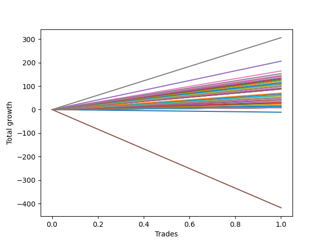

# Long Bulldog 006 DB 
- Symbol: ES1y1d
- Date Range: 07/19/2021 - 07/08/2022
- Trading Period: 7:20-12:30
- Number of Trades: 1



| Name | Win Percent | Profit | Avg Profit / Trade | Avg Time / Trade | Avg Profit / Time |      | Name | Win Percent | Profit | Avg Profit / Trade | Avg Time / Trade | Avg Profit / Time |
| ---- | ----------- | ------ | ------------------ | ---------------- | ----------------- | ---- | ---- | ----------- | ------ | ------------------ | ---------------- | ----------------- |
| Sorted By <br> Profit | | | | | | | Sorted By <br> Win Percentage ||||||
| Seven | 100.00 | 153000.00 | 153000.00 | 29 05:14:00 | 5236.49 |     | Seven | 100.00 | 153000.00 | 153000.00 | 29 05:14:00 | 5236.49 |
| Four | 100.00 | 103000.00 | 103000.00 | 27 23:09:00 | 3683.23 |     | Four | 100.00 | 103000.00 | 103000.00 | 27 23:09:00 | 3683.23 |
| Six | 100.00 | 82125.00 | 82125.00 | 21 23:40:00 | 3735.31 |     | Six | 100.00 | 82125.00 | 82125.00 | 21 23:40:00 | 3735.31 |
| Two Hundred Fifteen | 100.00 | 76500.00 | 76500.00 | 21 23:15:00 | 3482.22 |     | Two Hundred Fifteen | 100.00 | 76500.00 | 76500.00 | 21 23:15:00 | 3482.22 |
| Two Hundred Fourteen.Five | 100.00 | 72750.00 | 72750.00 | 20 23:15:00 | 3469.45 |     | Two Hundred Fourteen.Five | 100.00 | 72750.00 | 72750.00 | 20 23:15:00 | 3469.45 |
| Two Hundred Fourteen | 100.00 | 71375.00 | 71375.00 | 20 23:14:00 | 3403.99 |     | Two Hundred Fourteen | 100.00 | 71375.00 | 71375.00 | 20 23:14:00 | 3403.99 |
| Two Hundred Thirteen.Five | 100.00 | 68000.00 | 68000.00 | 20 23:12:00 | 3243.24 |     | Two Hundred Thirteen.Five | 100.00 | 68000.00 | 68000.00 | 20 23:12:00 | 3243.24 |
| Two Hundred Thirteen | 100.00 | 65750.00 | 65750.00 | 18 05:12:00 | 3609.33 |     | Two Hundred Thirteen | 100.00 | 65750.00 | 65750.00 | 18 05:12:00 | 3609.33 |
| Two Hundred Twelve.Five | 100.00 | 63500.00 | 63500.00 | 18 05:05:00 | 3486.75 |     | Two Hundred Twelve.Five | 100.00 | 63500.00 | 63500.00 | 18 05:05:00 | 3486.75 |
| Two Hundred Twelve | 100.00 | 60875.00 | 60875.00 | 18 04:59:00 | 3343.38 |     | Two Hundred Twelve | 100.00 | 60875.00 | 60875.00 | 18 04:59:00 | 3343.38 |
| Two | 100.00 | 60875.00 | 60875.00 | 18 04:59:00 | 3343.38 |     | Two | 100.00 | 60875.00 | 60875.00 | 18 04:59:00 | 3343.38 |
| Two Hundred Eleven.Five | 100.00 | 57500.00 | 57500.00 | 18 04:48:00 | 3159.34 |     | Two Hundred Eleven.Five | 100.00 | 57500.00 | 57500.00 | 18 04:48:00 | 3159.34 |
| Two Hundred Eleven | 100.00 | 55500.00 | 55500.00 | 18 04:16:00 | 3053.18 |     | Two Hundred Eleven | 100.00 | 55500.00 | 55500.00 | 18 04:16:00 | 3053.18 |
| Three | 100.00 | 53750.00 | 53750.00 | 18 03:09:00 | 2964.50 |     | Three | 100.00 | 53750.00 | 53750.00 | 18 03:09:00 | 2964.50 |
| Two Hundred Ten.Five | 100.00 | 52625.00 | 52625.00 | 18 03:05:00 | 2902.89 |     | Two Hundred Ten.Five | 100.00 | 52625.00 | 52625.00 | 18 03:05:00 | 2902.89 |
| Two Hundred Ten | 100.00 | 50125.00 | 50125.00 | 18 02:20:00 | 2769.76 |     | Two Hundred Ten | 100.00 | 50125.00 | 50125.00 | 18 02:20:00 | 2769.76 |
| Two Hundred Nine.Five | 100.00 | 47750.00 | 47750.00 | 18 02:10:00 | 2639.54 |     | Two Hundred Nine.Five | 100.00 | 47750.00 | 47750.00 | 18 02:10:00 | 2639.54 |
| Two Hundred Nine | 100.00 | 45000.00 | 45000.00 | 17 23:50:00 | 2500.96 |     | Two Hundred Nine | 100.00 | 45000.00 | 45000.00 | 17 23:50:00 | 2500.96 |
| Two Hundred Eight.Five | 100.00 | 43625.00 | 43625.00 | 02 23:10:00 | 14711.94 |     | Two Hundred Eight.Five | 100.00 | 43625.00 | 43625.00 | 02 23:10:00 | 14711.94 |
| Two Hundred Eight | 100.00 | 43625.00 | 43625.00 | 02 23:10:00 | 14711.94 |     | Two Hundred Eight | 100.00 | 43625.00 | 43625.00 | 02 23:10:00 | 14711.94 |
| Two Hundred Seven.Five | 100.00 | 43625.00 | 43625.00 | 02 23:10:00 | 14711.94 |     | Two Hundred Seven.Five | 100.00 | 43625.00 | 43625.00 | 02 23:10:00 | 14711.94 |
| Two Hundred Seven | 100.00 | 35000.00 | 35000.00 | 02 02:50:00 | 16524.59 |     | Two Hundred Seven | 100.00 | 35000.00 | 35000.00 | 02 02:50:00 | 16524.59 |
| Two Hundred Six.Five | 100.00 | 33125.00 | 33125.00 | 02 02:44:00 | 15670.17 |     | Two Hundred Six.Five | 100.00 | 33125.00 | 33125.00 | 02 02:44:00 | 15670.17 |
| Two Hundred Six | 100.00 | 30375.00 | 30375.00 | 00 01:12:00 | 607500.00 |     | Two Hundred Six | 100.00 | 30375.00 | 30375.00 | 00 01:12:00 | 607500.00 |
| Seventy-Three | 100.00 | 29375.00 | 29375.00 | 03 00:01:00 | 9789.40 |     | Seventy-Three | 100.00 | 29375.00 | 29375.00 | 03 00:01:00 | 9789.40 |
| Two Hundred Five.Five | 100.00 | 29000.00 | 29000.00 | 00 01:08:00 | 614117.65 |     | Two Hundred Five.Five | 100.00 | 29000.00 | 29000.00 | 00 01:08:00 | 614117.65 |
| One | 100.00 | 28750.00 | 28750.00 | 17 03:08:00 | 1678.29 |     | One | 100.00 | 28750.00 | 28750.00 | 17 03:08:00 | 1678.29 |
| Two Hundred Five | 100.00 | 25625.00 | 25625.00 | 00 01:02:00 | 595161.29 |     | Two Hundred Five | 100.00 | 25625.00 | 25625.00 | 00 01:02:00 | 595161.29 |
| Two Hundred Four.Five | 100.00 | 23500.00 | 23500.00 | 00 00:58:00 | 583448.28 |     | Two Hundred Four.Five | 100.00 | 23500.00 | 23500.00 | 00 00:58:00 | 583448.28 |
| Two Hundred Four | 100.00 | 20875.00 | 20875.00 | 00 00:36:00 | 835000.00 |     | Two Hundred Four | 100.00 | 20875.00 | 20875.00 | 00 00:36:00 | 835000.00 |
| Two Hundred Three.Five | 100.00 | 17750.00 | 17750.00 | 00 00:22:00 | 1161818.18 |     | Two Hundred Three.Five | 100.00 | 17750.00 | 17750.00 | 00 00:22:00 | 1161818.18 |
| Two Hundred Three | 100.00 | 14875.00 | 14875.00 | 00 00:19:00 | 1127368.42 |     | Two Hundred Three | 100.00 | 14875.00 | 14875.00 | 00 00:19:00 | 1127368.42 |
| Two Hundred Two.Five | 100.00 | 13500.00 | 13500.00 | 00 00:18:00 | 1080000.00 |     | Two Hundred Two.Five | 100.00 | 13500.00 | 13500.00 | 00 00:18:00 | 1080000.00 |
| Two Hundred Two | 100.00 | 10750.00 | 10750.00 | 00 00:13:00 | 1190769.23 |     | Two Hundred Two | 100.00 | 10750.00 | 10750.00 | 00 00:13:00 | 1190769.23 |
| Two Hundred One.Five | 100.00 | 7875.00 | 7875.00 | 00 00:11:00 | 1030909.09 |     | Two Hundred One.Five | 100.00 | 7875.00 | 7875.00 | 00 00:11:00 | 1030909.09 |
| Two Hundred One | 100.00 | 6250.00 | 6250.00 | 00 00:07:00 | 1285714.29 |     | Two Hundred One | 100.00 | 6250.00 | 6250.00 | 00 00:07:00 | 1285714.29 |
| Ninety | 100.00 | 6250.00 | 6250.00 | 00 00:07:00 | 1285714.29 |     | Ninety | 100.00 | 6250.00 | 6250.00 | 00 00:07:00 | 1285714.29 |
| Eighty-Nine | 100.00 | 4500.00 | 4500.00 | 00 00:04:00 | 1620000.00 |     | Eighty-Nine | 100.00 | 4500.00 | 4500.00 | 00 00:04:00 | 1620000.00 |
| Eighty-Eight | 100.00 | 4000.00 | 4000.00 | 00 00:03:00 | 1920000.00 |     | Eighty-Eight | 100.00 | 4000.00 | 4000.00 | 00 00:03:00 | 1920000.00 |
| Eighty-Seven | 100.00 | 4000.00 | 4000.00 | 00 00:03:00 | 1920000.00 |     | Eighty-Seven | 100.00 | 4000.00 | 4000.00 | 00 00:03:00 | 1920000.00 |
| Eighty-Six | 100.00 | 4000.00 | 4000.00 | 00 00:03:00 | 1920000.00 |     | Eighty-Six | 100.00 | 4000.00 | 4000.00 | 00 00:03:00 | 1920000.00 |
| Eighty-Five | 100.00 | 4000.00 | 4000.00 | 00 00:03:00 | 1920000.00 |     | Eighty-Five | 100.00 | 4000.00 | 4000.00 | 00 00:03:00 | 1920000.00 |
| Eighty-Four | 100.00 | 4000.00 | 4000.00 | 00 00:03:00 | 1920000.00 |     | Eighty-Four | 100.00 | 4000.00 | 4000.00 | 00 00:03:00 | 1920000.00 |
| Eighty-Three | 100.00 | 4000.00 | 4000.00 | 00 00:03:00 | 1920000.00 |     | Eighty-Three | 100.00 | 4000.00 | 4000.00 | 00 00:03:00 | 1920000.00 |
| Eighty-Two | 100.00 | 4000.00 | 4000.00 | 00 00:03:00 | 1920000.00 |     | Eighty-Two | 100.00 | 4000.00 | 4000.00 | 00 00:03:00 | 1920000.00 |
| Eighty-One | 100.00 | 4000.00 | 4000.00 | 00 00:03:00 | 1920000.00 |     | Eighty-One | 100.00 | 4000.00 | 4000.00 | 00 00:03:00 | 1920000.00 |
| Zero | 0.00 | -5625.00 | -5625.00 | 15 23:18:00 | -352.20 |     | Zero | 0.00 | -5625.00 | -5625.00 | 15 23:18:00 | -352.20 |
| Five | 0.00 | -208875.00 | -208875.00 | 130 05:37:00 | -1603.84 |     | Five | 0.00 | -208875.00 | -208875.00 | 130 05:37:00 | -1603.84 |

## NO STOPLOSS

### Test Zero
* Sell when price hits the middle line of the 20p bollinger
* No Stoploss
* Results:
```
Total Trades: 1
Percent Up: 0.00
Percent Down: 100.00
Total Points Moved Up: -11.25
Potential Profit: -5625.00
Total Points Ups: 0.00 Count Ups: 0
Total Points Downs: -11.25 Count Downs: 1
```

<details><summary>Trades</summary>

<code>In: 2022-02-28 07:21:00		Out: 2022-03-16 06:39:00		Total Position Time: 15 23:18:00		Total Move Up: -11.25		Total to Date: -11.25</code> <br />


</details>

### Test One
* Sell when the price hits the upper line of the 20p 1std bollinger
* No Stoploss
* Results:
```
Total Trades: 1
Percent Up: 100.00
Percent Down: 0.00
Total Points Moved Up: 57.50
Potential Profit: 28750.00
Total Points Ups: 57.50 Count Ups: 1
Total Points Downs: 0.00 Count Downs: 0
```

<details><summary>Trades</summary>

<code>In: 2022-02-28 07:21:00		Out: 2022-03-17 10:29:00		Total Position Time: 17 03:08:00		Total Move Up: 57.50		Total to Date: 57.50</code> <br />


</details>

### Test Two
* Sell when the price hits the upper line of the 20p 2std bollinger
* No Stoploss
* Results:
```
Total Trades: 1
Percent Up: 100.00
Percent Down: 0.00
Total Points Moved Up: 121.75
Potential Profit: 60875.00
Total Points Ups: 121.75 Count Ups: 1
Total Points Downs: 0.00 Count Downs: 0
```

<details><summary>Trades</summary>

<code>In: 2022-02-28 07:21:00		Out: 2022-03-18 12:20:00		Total Position Time: 18 04:59:00		Total Move Up: 121.75		Total to Date: 121.75</code> <br />


</details>

### Test Three
* Sell when price hits the middle line of the 50p bollinger
* No Stoploss
* Results:
```
Total Trades: 1
Percent Up: 100.00
Percent Down: 0.00
Total Points Moved Up: 107.50
Potential Profit: 53750.00
Total Points Ups: 107.50 Count Ups: 1
Total Points Downs: 0.00 Count Downs: 0
```

<details><summary>Trades</summary>

<code>In: 2022-02-28 07:21:00		Out: 2022-03-18 10:30:00		Total Position Time: 18 03:09:00		Total Move Up: 107.50		Total to Date: 107.50</code> <br />


</details>

### Test Four
* Sell when the price hits the upper line of the 50p 1std bollinger
* No Stoploss
* Results:
```
Total Trades: 1
Percent Up: 100.00
Percent Down: 0.00
Total Points Moved Up: 206.00
Potential Profit: 103000.00
Total Points Ups: 206.00 Count Ups: 1
Total Points Downs: 0.00 Count Downs: 0
```

<details><summary>Trades</summary>

<code>In: 2022-02-28 07:21:00		Out: 2022-03-28 06:30:00		Total Position Time: 27 23:09:00		Total Move Up: 206.00		Total to Date: 206.00</code> <br />


</details>

### Test Five
* Sell when the price hits the upper line of the 50p 2std bollinger
* No Stoploss
* Results:
```
Total Trades: 1
Percent Up: 0.00
Percent Down: 100.00
Total Points Moved Up: -417.75
Potential Profit: -208875.00
Total Points Ups: 0.00 Count Ups: 0
Total Points Downs: -417.75 Count Downs: 1
```

<details><summary>Trades</summary>

<code>In: 2022-02-28 07:21:00		Out: 2022-07-08 12:58:00		Total Position Time: 130 05:37:00		Total Move Up: -417.75		Total to Date: -417.75</code> <br />


</details>

### Test Six
* Sell when the price hits the middle line of the 1std VWAP
* No Stoploss
* Results:
```
Total Trades: 1
Percent Up: 100.00
Percent Down: 0.00
Total Points Moved Up: 164.25
Potential Profit: 82125.00
Total Points Ups: 164.25 Count Ups: 1
Total Points Downs: 0.00 Count Downs: 0
```

<details><summary>Trades</summary>

<code>In: 2022-02-28 07:21:00		Out: 2022-03-22 07:01:00		Total Position Time: 21 23:40:00		Total Move Up: 164.25		Total to Date: 164.25</code> <br />


</details>

### Test Seven
* Sell when the price hits the upper line of the 1std VWAP
* No Stoploss
* Results:
```
Total Trades: 1
Percent Up: 100.00
Percent Down: 0.00
Total Points Moved Up: 306.00
Potential Profit: 153000.00
Total Points Ups: 306.00 Count Ups: 1
Total Points Downs: 0.00 Count Downs: 0
```

<details><summary>Trades</summary>

<code>In: 2022-02-28 07:21:00		Out: 2022-03-29 12:35:00		Total Position Time: 29 05:14:00		Total Move Up: 306.00		Total to Date: 306.00</code> <br />


</details>

## SPECIAL EXIT CONDITIONS 

### Test Seventy-Three
* Sell when the linear regression slope changes to negative
* No Stoploss
* Results:
```
Total Trades: 1
Percent Up: 100.00
Percent Down: 0.00
Total Points Moved Up: 58.75
Potential Profit: 29375.00
Total Points Ups: 58.75 Count Ups: 1
Total Points Downs: 0.00 Count Downs: 0
```

<details><summary>Trades</summary>

<code>In: 2022-02-28 07:21:00		Out: 2022-03-03 07:22:00		Total Position Time: 03 00:01:00		Total Move Up: 58.75		Total to Date: 58.75</code> <br />


</details>

## TAKE PROFIT

### Test Eighty-One
* Take Profit of 1 Point
* No Stoploss
* Results:
```
Total Trades: 1
Percent Up: 100.00
Percent Down: 0.00
Total Points Moved Up: 8.00
Potential Profit: 4000.00
Total Points Ups: 8.00 Count Ups: 1
Total Points Downs: 0.00 Count Downs: 0
```

<details><summary>Trades</summary>

<code>In: 2022-02-28 07:21:00		Out: 2022-02-28 07:24:00		Total Position Time: 00 00:03:00		Total Move Up: 8.00		Total to Date: 8.00</code> <br />


</details>

### Test Eighty-Two
* Take Profit of 2 Point
* No Stoploss
* Results:
```
Total Trades: 1
Percent Up: 100.00
Percent Down: 0.00
Total Points Moved Up: 8.00
Potential Profit: 4000.00
Total Points Ups: 8.00 Count Ups: 1
Total Points Downs: 0.00 Count Downs: 0
```

<details><summary>Trades</summary>

<code>In: 2022-02-28 07:21:00		Out: 2022-02-28 07:24:00		Total Position Time: 00 00:03:00		Total Move Up: 8.00		Total to Date: 8.00</code> <br />


</details>

### Test Eighty-Three
* Take Profit of 3 Point
* No Stoploss
* Results:
```
Total Trades: 1
Percent Up: 100.00
Percent Down: 0.00
Total Points Moved Up: 8.00
Potential Profit: 4000.00
Total Points Ups: 8.00 Count Ups: 1
Total Points Downs: 0.00 Count Downs: 0
```

<details><summary>Trades</summary>

<code>In: 2022-02-28 07:21:00		Out: 2022-02-28 07:24:00		Total Position Time: 00 00:03:00		Total Move Up: 8.00		Total to Date: 8.00</code> <br />


</details>

### Test Eighty-Four
* Take Profit of 4 Point
* No Stoploss
* Results:
```
Total Trades: 1
Percent Up: 100.00
Percent Down: 0.00
Total Points Moved Up: 8.00
Potential Profit: 4000.00
Total Points Ups: 8.00 Count Ups: 1
Total Points Downs: 0.00 Count Downs: 0
```

<details><summary>Trades</summary>

<code>In: 2022-02-28 07:21:00		Out: 2022-02-28 07:24:00		Total Position Time: 00 00:03:00		Total Move Up: 8.00		Total to Date: 8.00</code> <br />


</details>

### Test Eighty-Five
* Take Profit of 5 Point
* No Stoploss
* Results:
```
Total Trades: 1
Percent Up: 100.00
Percent Down: 0.00
Total Points Moved Up: 8.00
Potential Profit: 4000.00
Total Points Ups: 8.00 Count Ups: 1
Total Points Downs: 0.00 Count Downs: 0
```

<details><summary>Trades</summary>

<code>In: 2022-02-28 07:21:00		Out: 2022-02-28 07:24:00		Total Position Time: 00 00:03:00		Total Move Up: 8.00		Total to Date: 8.00</code> <br />


</details>

### Test Eighty-Six
* Take Profit of 6 Point
* No Stoploss
* Results:
```
Total Trades: 1
Percent Up: 100.00
Percent Down: 0.00
Total Points Moved Up: 8.00
Potential Profit: 4000.00
Total Points Ups: 8.00 Count Ups: 1
Total Points Downs: 0.00 Count Downs: 0
```

<details><summary>Trades</summary>

<code>In: 2022-02-28 07:21:00		Out: 2022-02-28 07:24:00		Total Position Time: 00 00:03:00		Total Move Up: 8.00		Total to Date: 8.00</code> <br />


</details>

### Test Eighty-Seven
* Take Profit of 7 Point
* No Stoploss
* Results:
```
Total Trades: 1
Percent Up: 100.00
Percent Down: 0.00
Total Points Moved Up: 8.00
Potential Profit: 4000.00
Total Points Ups: 8.00 Count Ups: 1
Total Points Downs: 0.00 Count Downs: 0
```

<details><summary>Trades</summary>

<code>In: 2022-02-28 07:21:00		Out: 2022-02-28 07:24:00		Total Position Time: 00 00:03:00		Total Move Up: 8.00		Total to Date: 8.00</code> <br />


</details>

### Test Eighty-Eight
* Take Profit of 8 Point
* No Stoploss
* Results:
```
Total Trades: 1
Percent Up: 100.00
Percent Down: 0.00
Total Points Moved Up: 8.00
Potential Profit: 4000.00
Total Points Ups: 8.00 Count Ups: 1
Total Points Downs: 0.00 Count Downs: 0
```

<details><summary>Trades</summary>

<code>In: 2022-02-28 07:21:00		Out: 2022-02-28 07:24:00		Total Position Time: 00 00:03:00		Total Move Up: 8.00		Total to Date: 8.00</code> <br />


</details>

### Test Eighty-Nine
* Take Profit of 9 Point
* No Stoploss
* Results:
```
Total Trades: 1
Percent Up: 100.00
Percent Down: 0.00
Total Points Moved Up: 9.00
Potential Profit: 4500.00
Total Points Ups: 9.00 Count Ups: 1
Total Points Downs: 0.00 Count Downs: 0
```

<details><summary>Trades</summary>

<code>In: 2022-02-28 07:21:00		Out: 2022-02-28 07:25:00		Total Position Time: 00 00:04:00		Total Move Up: 9.00		Total to Date: 9.00</code> <br />


</details>

### Test Ninety
* Take Profit of 10 Point
* No Stoploss
* Results:
```
Total Trades: 1
Percent Up: 100.00
Percent Down: 0.00
Total Points Moved Up: 12.50
Potential Profit: 6250.00
Total Points Ups: 12.50 Count Ups: 1
Total Points Downs: 0.00 Count Downs: 0
```

<details><summary>Trades</summary>

<code>In: 2022-02-28 07:21:00		Out: 2022-02-28 07:28:00		Total Position Time: 00 00:07:00		Total Move Up: 12.50		Total to Date: 12.50</code> <br />


</details>

## DAILY TAKE PROFITS

### Test Two Hundred One
* Take Profit of 10 Point
* No Stoploss
* Results:
```
Total Trades: 1
Percent Up: 100.00
Percent Down: 0.00
Total Points Moved Up: 12.50
Potential Profit: 6250.00
Total Points Ups: 12.50 Count Ups: 1
Total Points Downs: 0.00 Count Downs: 0
```

<details><summary>Trades</summary>

<code>In: 2022-02-28 07:21:00		Out: 2022-02-28 07:28:00		Total Position Time: 00 00:07:00		Total Move Up: 12.50		Total to Date: 12.50</code> <br />


</details>

### Test Two Hundred One.Five
* Take Profit of 15 Point
* No Stoploss
* Results:
```
Total Trades: 1
Percent Up: 100.00
Percent Down: 0.00
Total Points Moved Up: 15.75
Potential Profit: 7875.00
Total Points Ups: 15.75 Count Ups: 1
Total Points Downs: 0.00 Count Downs: 0
```

<details><summary>Trades</summary>

<code>In: 2022-02-28 07:21:00		Out: 2022-02-28 07:32:00		Total Position Time: 00 00:11:00		Total Move Up: 15.75		Total to Date: 15.75</code> <br />


</details>

### Test Two Hundred Two
* Take Profit of 20 Point
* No Stoploss
* Results:
```
Total Trades: 1
Percent Up: 100.00
Percent Down: 0.00
Total Points Moved Up: 21.50
Potential Profit: 10750.00
Total Points Ups: 21.50 Count Ups: 1
Total Points Downs: 0.00 Count Downs: 0
```

<details><summary>Trades</summary>

<code>In: 2022-02-28 07:21:00		Out: 2022-02-28 07:34:00		Total Position Time: 00 00:13:00		Total Move Up: 21.50		Total to Date: 21.50</code> <br />


</details>

### Test Two Hundred Two.Five
* Take Profit of 25 Point
* No Stoploss
* Results:
```
Total Trades: 1
Percent Up: 100.00
Percent Down: 0.00
Total Points Moved Up: 27.00
Potential Profit: 13500.00
Total Points Ups: 27.00 Count Ups: 1
Total Points Downs: 0.00 Count Downs: 0
```

<details><summary>Trades</summary>

<code>In: 2022-02-28 07:21:00		Out: 2022-02-28 07:39:00		Total Position Time: 00 00:18:00		Total Move Up: 27.00		Total to Date: 27.00</code> <br />


</details>

### Test Two Hundred Three
* Take Profit of 30 Point
* No Stoploss
* Results:
```
Total Trades: 1
Percent Up: 100.00
Percent Down: 0.00
Total Points Moved Up: 29.75
Potential Profit: 14875.00
Total Points Ups: 29.75 Count Ups: 1
Total Points Downs: 0.00 Count Downs: 0
```

<details><summary>Trades</summary>

<code>In: 2022-02-28 07:21:00		Out: 2022-02-28 07:40:00		Total Position Time: 00 00:19:00		Total Move Up: 29.75		Total to Date: 29.75</code> <br />


</details>

### Test Two Hundred Three.Five
* Take Profit of 35 Point
* No Stoploss
* Results:
```
Total Trades: 1
Percent Up: 100.00
Percent Down: 0.00
Total Points Moved Up: 35.50
Potential Profit: 17750.00
Total Points Ups: 35.50 Count Ups: 1
Total Points Downs: 0.00 Count Downs: 0
```

<details><summary>Trades</summary>

<code>In: 2022-02-28 07:21:00		Out: 2022-02-28 07:43:00		Total Position Time: 00 00:22:00		Total Move Up: 35.50		Total to Date: 35.50</code> <br />


</details>

### Test Two Hundred Four
* Take Profit of 40 Point
* No Stoploss
* Results:
```
Total Trades: 1
Percent Up: 100.00
Percent Down: 0.00
Total Points Moved Up: 41.75
Potential Profit: 20875.00
Total Points Ups: 41.75 Count Ups: 1
Total Points Downs: 0.00 Count Downs: 0
```

<details><summary>Trades</summary>

<code>In: 2022-02-28 07:21:00		Out: 2022-02-28 07:57:00		Total Position Time: 00 00:36:00		Total Move Up: 41.75		Total to Date: 41.75</code> <br />


</details>

### Test Two Hundred Four.Five
* Take Profit of 45 Point
* No Stoploss
* Results:
```
Total Trades: 1
Percent Up: 100.00
Percent Down: 0.00
Total Points Moved Up: 47.00
Potential Profit: 23500.00
Total Points Ups: 47.00 Count Ups: 1
Total Points Downs: 0.00 Count Downs: 0
```

<details><summary>Trades</summary>

<code>In: 2022-02-28 07:21:00		Out: 2022-02-28 08:19:00		Total Position Time: 00 00:58:00		Total Move Up: 47.00		Total to Date: 47.00</code> <br />


</details>

### Test Two Hundred Five
* Take Profit of 50 Point
* No Stoploss
* Results:
```
Total Trades: 1
Percent Up: 100.00
Percent Down: 0.00
Total Points Moved Up: 51.25
Potential Profit: 25625.00
Total Points Ups: 51.25 Count Ups: 1
Total Points Downs: 0.00 Count Downs: 0
```

<details><summary>Trades</summary>

<code>In: 2022-02-28 07:21:00		Out: 2022-02-28 08:23:00		Total Position Time: 00 01:02:00		Total Move Up: 51.25		Total to Date: 51.25</code> <br />


</details>

### Test Two Hundred Five.Five
* Take Profit of 55 Point
* No Stoploss
* Results:
```
Total Trades: 1
Percent Up: 100.00
Percent Down: 0.00
Total Points Moved Up: 58.00
Potential Profit: 29000.00
Total Points Ups: 58.00 Count Ups: 1
Total Points Downs: 0.00 Count Downs: 0
```

<details><summary>Trades</summary>

<code>In: 2022-02-28 07:21:00		Out: 2022-02-28 08:29:00		Total Position Time: 00 01:08:00		Total Move Up: 58.00		Total to Date: 58.00</code> <br />


</details>

### Test Two Hundred Six
* Take Profit of 60 Point
* No Stoploss
* Results:
```
Total Trades: 1
Percent Up: 100.00
Percent Down: 0.00
Total Points Moved Up: 60.75
Potential Profit: 30375.00
Total Points Ups: 60.75 Count Ups: 1
Total Points Downs: 0.00 Count Downs: 0
```

<details><summary>Trades</summary>

<code>In: 2022-02-28 07:21:00		Out: 2022-02-28 08:33:00		Total Position Time: 00 01:12:00		Total Move Up: 60.75		Total to Date: 60.75</code> <br />


</details>

### Test Two Hundred Six.Five
* Take Profit of 65 Point
* No Stoploss
* Results:
```
Total Trades: 1
Percent Up: 100.00
Percent Down: 0.00
Total Points Moved Up: 66.25
Potential Profit: 33125.00
Total Points Ups: 66.25 Count Ups: 1
Total Points Downs: 0.00 Count Downs: 0
```

<details><summary>Trades</summary>

<code>In: 2022-02-28 07:21:00		Out: 2022-03-02 10:05:00		Total Position Time: 02 02:44:00		Total Move Up: 66.25		Total to Date: 66.25</code> <br />


</details>

### Test Two Hundred Seven
* Take Profit of 70 Point
* No Stoploss
* Results:
```
Total Trades: 1
Percent Up: 100.00
Percent Down: 0.00
Total Points Moved Up: 70.00
Potential Profit: 35000.00
Total Points Ups: 70.00 Count Ups: 1
Total Points Downs: 0.00 Count Downs: 0
```

<details><summary>Trades</summary>

<code>In: 2022-02-28 07:21:00		Out: 2022-03-02 10:11:00		Total Position Time: 02 02:50:00		Total Move Up: 70.00		Total to Date: 70.00</code> <br />


</details>

### Test Two Hundred Seven.Five
* Take Profit of 75 Point
* No Stoploss
* Results:
```
Total Trades: 1
Percent Up: 100.00
Percent Down: 0.00
Total Points Moved Up: 87.25
Potential Profit: 43625.00
Total Points Ups: 87.25 Count Ups: 1
Total Points Downs: 0.00 Count Downs: 0
```

<details><summary>Trades</summary>

<code>In: 2022-02-28 07:21:00		Out: 2022-03-03 06:31:00		Total Position Time: 02 23:10:00		Total Move Up: 87.25		Total to Date: 87.25</code> <br />


</details>

### Test Two Hundred Eight
* Take Profit of 80 Point
* No Stoploss
* Results:
```
Total Trades: 1
Percent Up: 100.00
Percent Down: 0.00
Total Points Moved Up: 87.25
Potential Profit: 43625.00
Total Points Ups: 87.25 Count Ups: 1
Total Points Downs: 0.00 Count Downs: 0
```

<details><summary>Trades</summary>

<code>In: 2022-02-28 07:21:00		Out: 2022-03-03 06:31:00		Total Position Time: 02 23:10:00		Total Move Up: 87.25		Total to Date: 87.25</code> <br />


</details>

### Test Two Hundred Eight.Five
* Take Profit of 85 Point
* No Stoploss
* Results:
```
Total Trades: 1
Percent Up: 100.00
Percent Down: 0.00
Total Points Moved Up: 87.25
Potential Profit: 43625.00
Total Points Ups: 87.25 Count Ups: 1
Total Points Downs: 0.00 Count Downs: 0
```

<details><summary>Trades</summary>

<code>In: 2022-02-28 07:21:00		Out: 2022-03-03 06:31:00		Total Position Time: 02 23:10:00		Total Move Up: 87.25		Total to Date: 87.25</code> <br />


</details>

### Test Two Hundred Nine
* Take Profit of 90 Point
* No Stoploss
* Results:
```
Total Trades: 1
Percent Up: 100.00
Percent Down: 0.00
Total Points Moved Up: 90.00
Potential Profit: 45000.00
Total Points Ups: 90.00 Count Ups: 1
Total Points Downs: 0.00 Count Downs: 0
```

<details><summary>Trades</summary>

<code>In: 2022-02-28 07:21:00		Out: 2022-03-18 07:11:00		Total Position Time: 17 23:50:00		Total Move Up: 90.00		Total to Date: 90.00</code> <br />


</details>

### Test Two Hundred Nine.Five
* Take Profit of 95 Point
* No Stoploss
* Results:
```
Total Trades: 1
Percent Up: 100.00
Percent Down: 0.00
Total Points Moved Up: 95.50
Potential Profit: 47750.00
Total Points Ups: 95.50 Count Ups: 1
Total Points Downs: 0.00 Count Downs: 0
```

<details><summary>Trades</summary>

<code>In: 2022-02-28 07:21:00		Out: 2022-03-18 09:31:00		Total Position Time: 18 02:10:00		Total Move Up: 95.50		Total to Date: 95.50</code> <br />


</details>

### Test Two Hundred Ten
* Take Profit of 100 Point
* No Stoploss
* Results:
```
Total Trades: 1
Percent Up: 100.00
Percent Down: 0.00
Total Points Moved Up: 100.25
Potential Profit: 50125.00
Total Points Ups: 100.25 Count Ups: 1
Total Points Downs: 0.00 Count Downs: 0
```

<details><summary>Trades</summary>

<code>In: 2022-02-28 07:21:00		Out: 2022-03-18 09:41:00		Total Position Time: 18 02:20:00		Total Move Up: 100.25		Total to Date: 100.25</code> <br />


</details>

### Test Two Hundred Ten.Five
* Take Profit of 105 Point
* No Stoploss
* Results:
```
Total Trades: 1
Percent Up: 100.00
Percent Down: 0.00
Total Points Moved Up: 105.25
Potential Profit: 52625.00
Total Points Ups: 105.25 Count Ups: 1
Total Points Downs: 0.00 Count Downs: 0
```

<details><summary>Trades</summary>

<code>In: 2022-02-28 07:21:00		Out: 2022-03-18 10:26:00		Total Position Time: 18 03:05:00		Total Move Up: 105.25		Total to Date: 105.25</code> <br />


</details>

### Test Two Hundred Eleven
* Take Profit of 110 Point
* No Stoploss
* Results:
```
Total Trades: 1
Percent Up: 100.00
Percent Down: 0.00
Total Points Moved Up: 111.00
Potential Profit: 55500.00
Total Points Ups: 111.00 Count Ups: 1
Total Points Downs: 0.00 Count Downs: 0
```

<details><summary>Trades</summary>

<code>In: 2022-02-28 07:21:00		Out: 2022-03-18 11:37:00		Total Position Time: 18 04:16:00		Total Move Up: 111.00		Total to Date: 111.00</code> <br />


</details>

### Test Two Hundred Eleven.Five
* Take Profit of 115 Point
* No Stoploss
* Results:
```
Total Trades: 1
Percent Up: 100.00
Percent Down: 0.00
Total Points Moved Up: 115.00
Potential Profit: 57500.00
Total Points Ups: 115.00 Count Ups: 1
Total Points Downs: 0.00 Count Downs: 0
```

<details><summary>Trades</summary>

<code>In: 2022-02-28 07:21:00		Out: 2022-03-18 12:09:00		Total Position Time: 18 04:48:00		Total Move Up: 115.00		Total to Date: 115.00</code> <br />


</details>

### Test Two Hundred Twelve
* Take Profit of 120 Point
* No Stoploss
* Results:
```
Total Trades: 1
Percent Up: 100.00
Percent Down: 0.00
Total Points Moved Up: 121.75
Potential Profit: 60875.00
Total Points Ups: 121.75 Count Ups: 1
Total Points Downs: 0.00 Count Downs: 0
```

<details><summary>Trades</summary>

<code>In: 2022-02-28 07:21:00		Out: 2022-03-18 12:20:00		Total Position Time: 18 04:59:00		Total Move Up: 121.75		Total to Date: 121.75</code> <br />


</details>

### Test Two Hundred Twelve.Five
* Take Profit of 125 Point
* No Stoploss
* Results:
```
Total Trades: 1
Percent Up: 100.00
Percent Down: 0.00
Total Points Moved Up: 127.00
Potential Profit: 63500.00
Total Points Ups: 127.00 Count Ups: 1
Total Points Downs: 0.00 Count Downs: 0
```

<details><summary>Trades</summary>

<code>In: 2022-02-28 07:21:00		Out: 2022-03-18 12:26:00		Total Position Time: 18 05:05:00		Total Move Up: 127.00		Total to Date: 127.00</code> <br />


</details>

### Test Two Hundred Thirteen
* Take Profit of 130 Point
* No Stoploss
* Results:
```
Total Trades: 1
Percent Up: 100.00
Percent Down: 0.00
Total Points Moved Up: 131.50
Potential Profit: 65750.00
Total Points Ups: 131.50 Count Ups: 1
Total Points Downs: 0.00 Count Downs: 0
```

<details><summary>Trades</summary>

<code>In: 2022-02-28 07:21:00		Out: 2022-03-18 12:33:00		Total Position Time: 18 05:12:00		Total Move Up: 131.50		Total to Date: 131.50</code> <br />


</details>

### Test Two Hundred Thirteen.Five
* Take Profit of 135 Point
* No Stoploss
* Results:
```
Total Trades: 1
Percent Up: 100.00
Percent Down: 0.00
Total Points Moved Up: 136.00
Potential Profit: 68000.00
Total Points Ups: 136.00 Count Ups: 1
Total Points Downs: 0.00 Count Downs: 0
```

<details><summary>Trades</summary>

<code>In: 2022-02-28 07:21:00		Out: 2022-03-21 06:33:00		Total Position Time: 20 23:12:00		Total Move Up: 136.00		Total to Date: 136.00</code> <br />


</details>

### Test Two Hundred Fourteen
* Take Profit of 140 Point
* No Stoploss
* Results:
```
Total Trades: 1
Percent Up: 100.00
Percent Down: 0.00
Total Points Moved Up: 142.75
Potential Profit: 71375.00
Total Points Ups: 142.75 Count Ups: 1
Total Points Downs: 0.00 Count Downs: 0
```

<details><summary>Trades</summary>

<code>In: 2022-02-28 07:21:00		Out: 2022-03-21 06:35:00		Total Position Time: 20 23:14:00		Total Move Up: 142.75		Total to Date: 142.75</code> <br />


</details>

### Test Two Hundred Fourteen.Five
* Take Profit of 145 Point
* No Stoploss
* Results:
```
Total Trades: 1
Percent Up: 100.00
Percent Down: 0.00
Total Points Moved Up: 145.50
Potential Profit: 72750.00
Total Points Ups: 145.50 Count Ups: 1
Total Points Downs: 0.00 Count Downs: 0
```

<details><summary>Trades</summary>

<code>In: 2022-02-28 07:21:00		Out: 2022-03-21 06:36:00		Total Position Time: 20 23:15:00		Total Move Up: 145.50		Total to Date: 145.50</code> <br />


</details>

### Test Two Hundred Fifteen
* Take Profit of 150 Point
* No Stoploss
* Results:
```
Total Trades: 1
Percent Up: 100.00
Percent Down: 0.00
Total Points Moved Up: 153.00
Potential Profit: 76500.00
Total Points Ups: 153.00 Count Ups: 1
Total Points Downs: 0.00 Count Downs: 0
```

<details><summary>Trades</summary>

<code>In: 2022-02-28 07:21:00		Out: 2022-03-22 06:36:00		Total Position Time: 21 23:15:00		Total Move Up: 153.00		Total to Date: 153.00</code> <br />


</details>