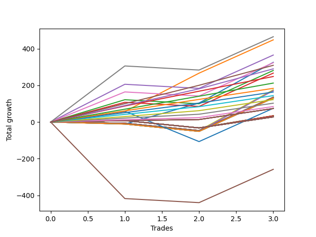

# Long Bulldog 006 
- Symbol: ES1y1d
- Date Range: 07/19/2021 - 07/08/2022
- Trading Period: 7:20-12:30
- Number of Trades: 3



| Name | Win Percent | Profit | Avg Profit / Trade | Avg Time / Trade |      | Name | Win Percent | Profit | Avg Profit / Trade | Avg Time / Trade |
| ---- | ----------- | ------ | ------------------ | ---------------- | ---- | ---- | ----------- | ------ | ------------------ | ---------------- |
| Sorted By <br> Profit | | | | | | Sorted By <br> Win Percentage ||||
| Seven | 66.67 | 232750.00 | 77583.33 | 30 05:29:20 |     | One | 100.00 | 224250.00 | 74750.00 | 12 04:29:40 |
| One | 100.00 | 224250.00 | 74750.00 | 12 04:29:40 |     | Three Hundred | 100.00 | 154750.00 | 51583.33 | 07 08:22:00 |
| Four | 66.67 | 182750.00 | 60916.67 | 29 19:27:40 |     | Two Hundred Nine | 100.00 | 145125.00 | 48375.00 | 07 07:29:00 |
| Zero | 66.67 | 162875.00 | 54291.67 | 07 23:44:20 |     | Two Hundred Eight | 100.00 | 124250.00 | 41416.67 | 01 16:47:40 |
| Six | 66.67 | 161875.00 | 53958.33 | 27 19:38:00 |     | Two Hundred Seven | 100.00 | 106250.00 | 35416.67 | 01 08:46:40 |
| Three Hundred | 100.00 | 154750.00 | 51583.33 | 07 08:22:00 |     | Two Hundred Six | 100.00 | 91875.00 | 30625.00 | 00 09:59:00 |
| Two Hundred Nine | 100.00 | 145125.00 | 48375.00 | 07 07:29:00 |     | Two Hundred Five | 100.00 | 81875.00 | 27291.67 | 00 09:53:00 |
| Two | 66.67 | 140625.00 | 46875.00 | 26 13:24:20 |     | Two Hundred Four | 100.00 | 72000.00 | 24000.00 | 00 08:17:20 |
| Three | 66.67 | 133500.00 | 44500.00 | 26 12:47:40 |     | Two Hundred Three | 100.00 | 61125.00 | 20375.00 | 00 08:06:40 |
| Two Hundred Eight | 100.00 | 124250.00 | 41416.67 | 01 16:47:40 |     | Two Hundred Two | 100.00 | 51375.00 | 17125.00 | 00 01:51:20 |
| Two Hundred Seven | 100.00 | 106250.00 | 35416.67 | 01 08:46:40 |     | Two Hundred One | 100.00 | 42250.00 | 14083.33 | 00 01:48:20 |
| Two Hundred Six | 100.00 | 91875.00 | 30625.00 | 00 09:59:00 |     | Eighty-Five | 100.00 | 36875.00 | 12291.67 | 00 01:19:00 |
| Forty | 33.33 | 87750.00 | 29250.00 | 02 01:02:20 |     | Eighty-Four | 100.00 | 36875.00 | 12291.67 | 00 01:19:00 |
| Fifty-Six | 33.33 | 85625.00 | 28541.67 | 02 01:03:00 |     | Eighty-Three | 100.00 | 36875.00 | 12291.67 | 00 01:19:00 |
| Two Hundred Five | 100.00 | 81875.00 | 27291.67 | 00 09:53:00 |     | Eighty-Two | 100.00 | 36875.00 | 12291.67 | 00 01:19:00 |
| Two Hundred Four | 100.00 | 72000.00 | 24000.00 | 00 08:17:20 |     | Eighty-One | 100.00 | 36875.00 | 12291.67 | 00 01:19:00 |
| Forty-Seven | 33.33 | 67500.00 | 22500.00 | 05 11:09:20 |     | Seven | 66.67 | 232750.00 | 77583.33 | 30 05:29:20 |
| Forty-Six | 33.33 | 67500.00 | 22500.00 | 05 11:09:20 |     | Four | 66.67 | 182750.00 | 60916.67 | 29 19:27:40 |
| Forty-Five | 33.33 | 67500.00 | 22500.00 | 05 11:09:20 |     | Zero | 66.67 | 162875.00 | 54291.67 | 07 23:44:20 |
| Forty-Four | 33.33 | 67500.00 | 22500.00 | 05 11:09:20 |     | Six | 66.67 | 161875.00 | 53958.33 | 27 19:38:00 |
| Forty-Three | 33.33 | 67500.00 | 22500.00 | 05 11:09:20 |     | Two | 66.67 | 140625.00 | 46875.00 | 26 13:24:20 |
| Forty-Two | 33.33 | 67500.00 | 22500.00 | 05 11:09:20 |     | Three | 66.67 | 133500.00 | 44500.00 | 26 12:47:40 |
| Forty-One | 33.33 | 67500.00 | 22500.00 | 05 11:09:20 |     | Seventy-Three | 66.67 | 37500.00 | 12500.00 | 13 10:53:00 |
| Sixty-Three | 33.33 | 65375.00 | 21791.67 | 05 11:10:00 |     | Fifty-Five | 66.67 | 17000.00 | 5666.67 | 00 00:09:20 |
| Sixty-Two | 33.33 | 65375.00 | 21791.67 | 05 11:10:00 |     | Fifty-Four | 66.67 | 17000.00 | 5666.67 | 00 00:09:20 |
| Sixty-One | 33.33 | 65375.00 | 21791.67 | 05 11:10:00 |     | Fifty-Three | 66.67 | 17000.00 | 5666.67 | 00 00:09:20 |
| Sixty | 33.33 | 65375.00 | 21791.67 | 05 11:10:00 |     | Fifty-Two | 66.67 | 17000.00 | 5666.67 | 00 00:09:20 |
| Fifty-Nine | 33.33 | 65375.00 | 21791.67 | 05 11:10:00 |     | Fifty-One | 66.67 | 17000.00 | 5666.67 | 00 00:09:20 |
| Fifty-Eight | 33.33 | 65375.00 | 21791.67 | 05 11:10:00 |     | Fifty | 66.67 | 17000.00 | 5666.67 | 00 00:09:20 |
| Fifty-Seven | 33.33 | 65375.00 | 21791.67 | 05 11:10:00 |     | Forty-Nine | 66.67 | 17000.00 | 5666.67 | 00 00:09:20 |
| Two Hundred Three | 100.00 | 61125.00 | 20375.00 | 00 08:06:40 |     | Forty-Eight | 66.67 | 17000.00 | 5666.67 | 00 00:09:20 |
| Two Hundred Two | 100.00 | 51375.00 | 17125.00 | 00 01:51:20 |     | Seventy-One | 66.67 | 14375.00 | 4791.67 | 00 00:10:40 |
| Two Hundred One | 100.00 | 42250.00 | 14083.33 | 00 01:48:20 |     | Seventy | 66.67 | 14375.00 | 4791.67 | 00 00:10:40 |
| Seventy-Three | 66.67 | 37500.00 | 12500.00 | 13 10:53:00 |     | Sixty-Nine | 66.67 | 14375.00 | 4791.67 | 00 00:10:40 |
| Eighty-Five | 100.00 | 36875.00 | 12291.67 | 00 01:19:00 |     | Sixty-Eight | 66.67 | 14375.00 | 4791.67 | 00 00:10:40 |
| Eighty-Four | 100.00 | 36875.00 | 12291.67 | 00 01:19:00 |     | Sixty-Seven | 66.67 | 14375.00 | 4791.67 | 00 00:10:40 |
| Eighty-Three | 100.00 | 36875.00 | 12291.67 | 00 01:19:00 |     | Sixty-Six | 66.67 | 14375.00 | 4791.67 | 00 00:10:40 |
| Eighty-Two | 100.00 | 36875.00 | 12291.67 | 00 01:19:00 |     | Sixty-Five | 66.67 | 14375.00 | 4791.67 | 00 00:10:40 |
| Eighty-One | 100.00 | 36875.00 | 12291.67 | 00 01:19:00 |     | Sixty-Four | 66.67 | 14375.00 | 4791.67 | 00 00:10:40 |
| Fifty-Five | 66.67 | 17000.00 | 5666.67 | 00 00:09:20 |     | One Hundred Thirty | 66.67 | 14000.00 | 4666.67 | 00 00:03:00 |
| Fifty-Four | 66.67 | 17000.00 | 5666.67 | 00 00:09:20 |     | One Hundred Twenty-Nine | 66.67 | 14000.00 | 4666.67 | 00 00:03:00 |
| Fifty-Three | 66.67 | 17000.00 | 5666.67 | 00 00:09:20 |     | One Hundred Twenty-Eight | 66.67 | 14000.00 | 4666.67 | 00 00:03:00 |
| Fifty-Two | 66.67 | 17000.00 | 5666.67 | 00 00:09:20 |     | One Hundred Twenty-Seven | 66.67 | 14000.00 | 4666.67 | 00 00:03:00 |
| Fifty-One | 66.67 | 17000.00 | 5666.67 | 00 00:09:20 |     | One Hundred Twenty-Six | 66.67 | 14000.00 | 4666.67 | 00 00:03:00 |
| Fifty | 66.67 | 17000.00 | 5666.67 | 00 00:09:20 |     | One Hundred Twenty-Five | 66.67 | 14000.00 | 4666.67 | 00 00:03:00 |
| Forty-Nine | 66.67 | 17000.00 | 5666.67 | 00 00:09:20 |     | One Hundred Twenty-Four | 66.67 | 14000.00 | 4666.67 | 00 00:03:00 |
| Forty-Eight | 66.67 | 17000.00 | 5666.67 | 00 00:09:20 |     | One Hundred Twenty-Three | 66.67 | 14000.00 | 4666.67 | 00 00:03:00 |
| Seventy-One | 66.67 | 14375.00 | 4791.67 | 00 00:10:40 |     | One Hundred Twenty-Two | 66.67 | 14000.00 | 4666.67 | 00 00:03:00 |
| Seventy | 66.67 | 14375.00 | 4791.67 | 00 00:10:40 |     | One Hundred Twenty-One | 66.67 | 14000.00 | 4666.67 | 00 00:03:00 |
| Sixty-Nine | 66.67 | 14375.00 | 4791.67 | 00 00:10:40 |     | One Hundred Twenty | 66.67 | 14000.00 | 4666.67 | 00 00:03:00 |
| Sixty-Eight | 66.67 | 14375.00 | 4791.67 | 00 00:10:40 |     | One Hundred Ninteen | 66.67 | 14000.00 | 4666.67 | 00 00:03:00 |
| Sixty-Seven | 66.67 | 14375.00 | 4791.67 | 00 00:10:40 |     | One Hundred Eighteen | 66.67 | 14000.00 | 4666.67 | 00 00:03:00 |
| Sixty-Six | 66.67 | 14375.00 | 4791.67 | 00 00:10:40 |     | One Hundred Seventeen | 66.67 | 14000.00 | 4666.67 | 00 00:03:00 |
| Sixty-Five | 66.67 | 14375.00 | 4791.67 | 00 00:10:40 |     | One Hundred Sixteen | 66.67 | 14000.00 | 4666.67 | 00 00:03:00 |
| Sixty-Four | 66.67 | 14375.00 | 4791.67 | 00 00:10:40 |     | One Hundred Fifteen | 66.67 | 14000.00 | 4666.67 | 00 00:03:00 |
| One Hundred Thirty | 66.67 | 14000.00 | 4666.67 | 00 00:03:00 |     | One Hundred Fourteen | 66.67 | 14000.00 | 4666.67 | 00 00:03:00 |
| One Hundred Twenty-Nine | 66.67 | 14000.00 | 4666.67 | 00 00:03:00 |     | One Hundred Thirteen | 66.67 | 14000.00 | 4666.67 | 00 00:03:00 |
| One Hundred Twenty-Eight | 66.67 | 14000.00 | 4666.67 | 00 00:03:00 |     | One Hundred Twelve | 66.67 | 14000.00 | 4666.67 | 00 00:03:00 |
| One Hundred Twenty-Seven | 66.67 | 14000.00 | 4666.67 | 00 00:03:00 |     | One Hundred Eleven | 66.67 | 14000.00 | 4666.67 | 00 00:03:00 |
| One Hundred Twenty-Six | 66.67 | 14000.00 | 4666.67 | 00 00:03:00 |     | Forty | 33.33 | 87750.00 | 29250.00 | 02 01:02:20 |
| One Hundred Twenty-Five | 66.67 | 14000.00 | 4666.67 | 00 00:03:00 |     | Fifty-Six | 33.33 | 85625.00 | 28541.67 | 02 01:03:00 |
| One Hundred Twenty-Four | 66.67 | 14000.00 | 4666.67 | 00 00:03:00 |     | Forty-Seven | 33.33 | 67500.00 | 22500.00 | 05 11:09:20 |
| One Hundred Twenty-Three | 66.67 | 14000.00 | 4666.67 | 00 00:03:00 |     | Forty-Six | 33.33 | 67500.00 | 22500.00 | 05 11:09:20 |
| One Hundred Twenty-Two | 66.67 | 14000.00 | 4666.67 | 00 00:03:00 |     | Forty-Five | 33.33 | 67500.00 | 22500.00 | 05 11:09:20 |
| One Hundred Twenty-One | 66.67 | 14000.00 | 4666.67 | 00 00:03:00 |     | Forty-Four | 33.33 | 67500.00 | 22500.00 | 05 11:09:20 |
| One Hundred Twenty | 66.67 | 14000.00 | 4666.67 | 00 00:03:00 |     | Forty-Three | 33.33 | 67500.00 | 22500.00 | 05 11:09:20 |
| One Hundred Ninteen | 66.67 | 14000.00 | 4666.67 | 00 00:03:00 |     | Forty-Two | 33.33 | 67500.00 | 22500.00 | 05 11:09:20 |
| One Hundred Eighteen | 66.67 | 14000.00 | 4666.67 | 00 00:03:00 |     | Forty-One | 33.33 | 67500.00 | 22500.00 | 05 11:09:20 |
| One Hundred Seventeen | 66.67 | 14000.00 | 4666.67 | 00 00:03:00 |     | Sixty-Three | 33.33 | 65375.00 | 21791.67 | 05 11:10:00 |
| One Hundred Sixteen | 66.67 | 14000.00 | 4666.67 | 00 00:03:00 |     | Sixty-Two | 33.33 | 65375.00 | 21791.67 | 05 11:10:00 |
| One Hundred Fifteen | 66.67 | 14000.00 | 4666.67 | 00 00:03:00 |     | Sixty-One | 33.33 | 65375.00 | 21791.67 | 05 11:10:00 |
| One Hundred Fourteen | 66.67 | 14000.00 | 4666.67 | 00 00:03:00 |     | Sixty | 33.33 | 65375.00 | 21791.67 | 05 11:10:00 |
| One Hundred Thirteen | 66.67 | 14000.00 | 4666.67 | 00 00:03:00 |     | Fifty-Nine | 33.33 | 65375.00 | 21791.67 | 05 11:10:00 |
| One Hundred Twelve | 66.67 | 14000.00 | 4666.67 | 00 00:03:00 |     | Fifty-Eight | 33.33 | 65375.00 | 21791.67 | 05 11:10:00 |
| One Hundred Eleven | 66.67 | 14000.00 | 4666.67 | 00 00:03:00 |     | Fifty-Seven | 33.33 | 65375.00 | 21791.67 | 05 11:10:00 |
| Five | 33.33 | -129125.00 | -43041.67 | 63 21:37:00 |     | Five | 33.33 | -129125.00 | -43041.67 | 63 21:37:00 |

## NO STOPLOSS

### Test Zero
* Sell when price hits the middle line of the 20p bollinger
* No Stoploss
* Results:
```
Total Trades: 3
Percent Up: 66.67
Percent Down: 33.33
Total Points Moved Up: 325.75
Potential Profit: 162875.00
Total Points Ups: 337.00 Count Ups: 2
Total Points Downs: -11.25 Count Downs: 1
```

<details><summary>Trades</summary>

<code>In: 2022-02-28 07:21:00		Out: 2022-03-16 06:39:00		Total Position Time: 15 23:18:00		Total Move Up: -11.25		Total to Date: -11.25</code> <br />
<code>In: 2022-05-24 07:21:00		Out: 2022-05-26 08:00:00		Total Position Time: 02 00:39:00		Total Move Up: 114.75		Total to Date: 103.50</code> <br />
<code>In: 2022-06-22 07:21:00		Out: 2022-06-28 06:37:00		Total Position Time: 05 23:16:00		Total Move Up: 222.25		Total to Date: 325.75</code> <br />


</details>

### Test One
* Sell when the price hits the upper line of the 20p 1std bollinger
* No Stoploss
* Results:
```
Total Trades: 3
Percent Up: 100.00
Percent Down: 0.00
Total Points Moved Up: 448.50
Potential Profit: 224250.00
Total Points Ups: 448.50 Count Ups: 3
Total Points Downs: 0.00 Count Downs: 0
```

<details><summary>Trades</summary>

<code>In: 2022-02-28 07:21:00		Out: 2022-03-17 10:29:00		Total Position Time: 17 03:08:00		Total Move Up: 57.50		Total to Date: 57.50</code> <br />
<code>In: 2022-05-24 07:21:00		Out: 2022-05-27 12:05:00		Total Position Time: 03 04:44:00		Total Move Up: 209.25		Total to Date: 266.75</code> <br />
<code>In: 2022-06-22 07:21:00		Out: 2022-07-08 12:58:00		Total Position Time: 16 05:37:00		Total Move Up: 181.75		Total to Date: 448.50</code> <br />


</details>

### Test Two
* Sell when the price hits the upper line of the 20p 2std bollinger
* No Stoploss
* Results:
```
Total Trades: 3
Percent Up: 66.67
Percent Down: 33.33
Total Points Moved Up: 281.25
Potential Profit: 140625.00
Total Points Ups: 303.50 Count Ups: 2
Total Points Downs: -22.25 Count Downs: 1
```

<details><summary>Trades</summary>

<code>In: 2022-02-28 07:21:00		Out: 2022-03-18 12:20:00		Total Position Time: 18 04:59:00		Total Move Up: 121.75		Total to Date: 121.75</code> <br />
<code>In: 2022-05-24 07:21:00		Out: 2022-07-08 12:58:00		Total Position Time: 45 05:37:00		Total Move Up: -22.25		Total to Date: 99.50</code> <br />
<code>In: 2022-06-22 07:21:00		Out: 2022-07-08 12:58:00		Total Position Time: 16 05:37:00		Total Move Up: 181.75		Total to Date: 281.25</code> <br />


</details>

### Test Three
* Sell when price hits the middle line of the 50p bollinger
* No Stoploss
* Results:
```
Total Trades: 3
Percent Up: 66.67
Percent Down: 33.33
Total Points Moved Up: 267.00
Potential Profit: 133500.00
Total Points Ups: 289.25 Count Ups: 2
Total Points Downs: -22.25 Count Downs: 1
```

<details><summary>Trades</summary>

<code>In: 2022-02-28 07:21:00		Out: 2022-03-18 10:30:00		Total Position Time: 18 03:09:00		Total Move Up: 107.50		Total to Date: 107.50</code> <br />
<code>In: 2022-05-24 07:21:00		Out: 2022-07-08 12:58:00		Total Position Time: 45 05:37:00		Total Move Up: -22.25		Total to Date: 85.25</code> <br />
<code>In: 2022-06-22 07:21:00		Out: 2022-07-08 12:58:00		Total Position Time: 16 05:37:00		Total Move Up: 181.75		Total to Date: 267.00</code> <br />


</details>

### Test Four
* Sell when the price hits the upper line of the 50p 1std bollinger
* No Stoploss
* Results:
```
Total Trades: 3
Percent Up: 66.67
Percent Down: 33.33
Total Points Moved Up: 365.50
Potential Profit: 182750.00
Total Points Ups: 387.75 Count Ups: 2
Total Points Downs: -22.25 Count Downs: 1
```

<details><summary>Trades</summary>

<code>In: 2022-02-28 07:21:00		Out: 2022-03-28 06:30:00		Total Position Time: 27 23:09:00		Total Move Up: 206.00		Total to Date: 206.00</code> <br />
<code>In: 2022-05-24 07:21:00		Out: 2022-07-08 12:58:00		Total Position Time: 45 05:37:00		Total Move Up: -22.25		Total to Date: 183.75</code> <br />
<code>In: 2022-06-22 07:21:00		Out: 2022-07-08 12:58:00		Total Position Time: 16 05:37:00		Total Move Up: 181.75		Total to Date: 365.50</code> <br />


</details>

### Test Five
* Sell when the price hits the upper line of the 50p 2std bollinger
* No Stoploss
* Results:
```
Total Trades: 3
Percent Up: 33.33
Percent Down: 66.67
Total Points Moved Up: -258.25
Potential Profit: -129125.00
Total Points Ups: 181.75 Count Ups: 1
Total Points Downs: -440.00 Count Downs: 2
```

<details><summary>Trades</summary>

<code>In: 2022-02-28 07:21:00		Out: 2022-07-08 12:58:00		Total Position Time: 130 05:37:00		Total Move Up: -417.75		Total to Date: -417.75</code> <br />
<code>In: 2022-05-24 07:21:00		Out: 2022-07-08 12:58:00		Total Position Time: 45 05:37:00		Total Move Up: -22.25		Total to Date: -440.00</code> <br />
<code>In: 2022-06-22 07:21:00		Out: 2022-07-08 12:58:00		Total Position Time: 16 05:37:00		Total Move Up: 181.75		Total to Date: -258.25</code> <br />


</details>

### Test Six
* Sell when the price hits the middle line of the 1std VWAP
* No Stoploss
* Results:
```
Total Trades: 3
Percent Up: 66.67
Percent Down: 33.33
Total Points Moved Up: 323.75
Potential Profit: 161875.00
Total Points Ups: 346.00 Count Ups: 2
Total Points Downs: -22.25 Count Downs: 1
```

<details><summary>Trades</summary>

<code>In: 2022-02-28 07:21:00		Out: 2022-03-22 07:01:00		Total Position Time: 21 23:40:00		Total Move Up: 164.25		Total to Date: 164.25</code> <br />
<code>In: 2022-05-24 07:21:00		Out: 2022-07-08 12:58:00		Total Position Time: 45 05:37:00		Total Move Up: -22.25		Total to Date: 142.00</code> <br />
<code>In: 2022-06-22 07:21:00		Out: 2022-07-08 12:58:00		Total Position Time: 16 05:37:00		Total Move Up: 181.75		Total to Date: 323.75</code> <br />


</details>

### Test Seven
* Sell when the price hits the upper line of the 1std VWAP
* No Stoploss
* Results:
```
Total Trades: 3
Percent Up: 66.67
Percent Down: 33.33
Total Points Moved Up: 465.50
Potential Profit: 232750.00
Total Points Ups: 487.75 Count Ups: 2
Total Points Downs: -22.25 Count Downs: 1
```

<details><summary>Trades</summary>

<code>In: 2022-02-28 07:21:00		Out: 2022-03-29 12:35:00		Total Position Time: 29 05:14:00		Total Move Up: 306.00		Total to Date: 306.00</code> <br />
<code>In: 2022-05-24 07:21:00		Out: 2022-07-08 12:58:00		Total Position Time: 45 05:37:00		Total Move Up: -22.25		Total to Date: 283.75</code> <br />
<code>In: 2022-06-22 07:21:00		Out: 2022-07-08 12:58:00		Total Position Time: 16 05:37:00		Total Move Up: 181.75		Total to Date: 465.50</code> <br />


</details>

## STOPLOSS OF 5

### Test Forty
* Sell when price hits the middle line of the 20p bollinger
* Stoploss is 5 points
* Results:
```
Total Trades: 3
Percent Up: 33.33
Percent Down: 66.67
Total Points Moved Up: 175.50
Potential Profit: 87750.00
Total Points Ups: 222.25 Count Ups: 1
Total Points Downs: -46.75 Count Downs: 2
```

<details><summary>Trades</summary>

<code>In: 2022-02-28 07:21:00		Out: 2022-02-28 11:09:00		Total Position Time: 00 03:48:00		Total Move Up: -6.50		Total to Date: -6.50</code> <br />
<code>In: 2022-05-24 07:21:00		Out: 2022-05-24 07:24:00		Total Position Time: 00 00:03:00		Total Move Up: -40.25		Total to Date: -46.75</code> <br />
<code>In: 2022-06-22 07:21:00		Out: 2022-06-28 06:37:00		Total Position Time: 05 23:16:00		Total Move Up: 222.25		Total to Date: 175.50</code> <br />


</details>

### Test Forty-One
* Sell when the price hits the upper line of the 20p 1std bollinger
* Stoploss is 5 points
* Results:
```
Total Trades: 3
Percent Up: 33.33
Percent Down: 66.67
Total Points Moved Up: 135.00
Potential Profit: 67500.00
Total Points Ups: 181.75 Count Ups: 1
Total Points Downs: -46.75 Count Downs: 2
```

<details><summary>Trades</summary>

<code>In: 2022-02-28 07:21:00		Out: 2022-02-28 11:09:00		Total Position Time: 00 03:48:00		Total Move Up: -6.50		Total to Date: -6.50</code> <br />
<code>In: 2022-05-24 07:21:00		Out: 2022-05-24 07:24:00		Total Position Time: 00 00:03:00		Total Move Up: -40.25		Total to Date: -46.75</code> <br />
<code>In: 2022-06-22 07:21:00		Out: 2022-07-08 12:58:00		Total Position Time: 16 05:37:00		Total Move Up: 181.75		Total to Date: 135.00</code> <br />


</details>

### Test Forty-Two
* Sell when the price hits the upper line of the 20p 2std bollinger
* Stoploss is 5 points
* Results:
```
Total Trades: 3
Percent Up: 33.33
Percent Down: 66.67
Total Points Moved Up: 135.00
Potential Profit: 67500.00
Total Points Ups: 181.75 Count Ups: 1
Total Points Downs: -46.75 Count Downs: 2
```

<details><summary>Trades</summary>

<code>In: 2022-02-28 07:21:00		Out: 2022-02-28 11:09:00		Total Position Time: 00 03:48:00		Total Move Up: -6.50		Total to Date: -6.50</code> <br />
<code>In: 2022-05-24 07:21:00		Out: 2022-05-24 07:24:00		Total Position Time: 00 00:03:00		Total Move Up: -40.25		Total to Date: -46.75</code> <br />
<code>In: 2022-06-22 07:21:00		Out: 2022-07-08 12:58:00		Total Position Time: 16 05:37:00		Total Move Up: 181.75		Total to Date: 135.00</code> <br />


</details>

### Test Forty-Three
* Sell when price hits the middle line of the 50p bollinger
* Stoploss is 5 points
* Results:
```
Total Trades: 3
Percent Up: 33.33
Percent Down: 66.67
Total Points Moved Up: 135.00
Potential Profit: 67500.00
Total Points Ups: 181.75 Count Ups: 1
Total Points Downs: -46.75 Count Downs: 2
```

<details><summary>Trades</summary>

<code>In: 2022-02-28 07:21:00		Out: 2022-02-28 11:09:00		Total Position Time: 00 03:48:00		Total Move Up: -6.50		Total to Date: -6.50</code> <br />
<code>In: 2022-05-24 07:21:00		Out: 2022-05-24 07:24:00		Total Position Time: 00 00:03:00		Total Move Up: -40.25		Total to Date: -46.75</code> <br />
<code>In: 2022-06-22 07:21:00		Out: 2022-07-08 12:58:00		Total Position Time: 16 05:37:00		Total Move Up: 181.75		Total to Date: 135.00</code> <br />


</details>

### Test Forty-Four
* Sell when the price hits the upper line of the 50p 1std bollinger
* Stoploss is 5 points
* Results:
```
Total Trades: 3
Percent Up: 33.33
Percent Down: 66.67
Total Points Moved Up: 135.00
Potential Profit: 67500.00
Total Points Ups: 181.75 Count Ups: 1
Total Points Downs: -46.75 Count Downs: 2
```

<details><summary>Trades</summary>

<code>In: 2022-02-28 07:21:00		Out: 2022-02-28 11:09:00		Total Position Time: 00 03:48:00		Total Move Up: -6.50		Total to Date: -6.50</code> <br />
<code>In: 2022-05-24 07:21:00		Out: 2022-05-24 07:24:00		Total Position Time: 00 00:03:00		Total Move Up: -40.25		Total to Date: -46.75</code> <br />
<code>In: 2022-06-22 07:21:00		Out: 2022-07-08 12:58:00		Total Position Time: 16 05:37:00		Total Move Up: 181.75		Total to Date: 135.00</code> <br />


</details>

### Test Forty-Five
* Sell when the price hits the upper line of the 50p 2std bollinger
* Stoploss is 5 points
* Results:
```
Total Trades: 3
Percent Up: 33.33
Percent Down: 66.67
Total Points Moved Up: 135.00
Potential Profit: 67500.00
Total Points Ups: 181.75 Count Ups: 1
Total Points Downs: -46.75 Count Downs: 2
```

<details><summary>Trades</summary>

<code>In: 2022-02-28 07:21:00		Out: 2022-02-28 11:09:00		Total Position Time: 00 03:48:00		Total Move Up: -6.50		Total to Date: -6.50</code> <br />
<code>In: 2022-05-24 07:21:00		Out: 2022-05-24 07:24:00		Total Position Time: 00 00:03:00		Total Move Up: -40.25		Total to Date: -46.75</code> <br />
<code>In: 2022-06-22 07:21:00		Out: 2022-07-08 12:58:00		Total Position Time: 16 05:37:00		Total Move Up: 181.75		Total to Date: 135.00</code> <br />


</details>

### Test Forty-Six
* Sell when the price hits the middle line of the 1std VWAP
* Stoploss is 5 points
* Results:
```
Total Trades: 3
Percent Up: 33.33
Percent Down: 66.67
Total Points Moved Up: 135.00
Potential Profit: 67500.00
Total Points Ups: 181.75 Count Ups: 1
Total Points Downs: -46.75 Count Downs: 2
```

<details><summary>Trades</summary>

<code>In: 2022-02-28 07:21:00		Out: 2022-02-28 11:09:00		Total Position Time: 00 03:48:00		Total Move Up: -6.50		Total to Date: -6.50</code> <br />
<code>In: 2022-05-24 07:21:00		Out: 2022-05-24 07:24:00		Total Position Time: 00 00:03:00		Total Move Up: -40.25		Total to Date: -46.75</code> <br />
<code>In: 2022-06-22 07:21:00		Out: 2022-07-08 12:58:00		Total Position Time: 16 05:37:00		Total Move Up: 181.75		Total to Date: 135.00</code> <br />


</details>

### Test Forty-Seven
* Sell when the price hits the upper line of the 1std VWAP
* Stoploss is 5 points
* Results:
```
Total Trades: 3
Percent Up: 33.33
Percent Down: 66.67
Total Points Moved Up: 135.00
Potential Profit: 67500.00
Total Points Ups: 181.75 Count Ups: 1
Total Points Downs: -46.75 Count Downs: 2
```

<details><summary>Trades</summary>

<code>In: 2022-02-28 07:21:00		Out: 2022-02-28 11:09:00		Total Position Time: 00 03:48:00		Total Move Up: -6.50		Total to Date: -6.50</code> <br />
<code>In: 2022-05-24 07:21:00		Out: 2022-05-24 07:24:00		Total Position Time: 00 00:03:00		Total Move Up: -40.25		Total to Date: -46.75</code> <br />
<code>In: 2022-06-22 07:21:00		Out: 2022-07-08 12:58:00		Total Position Time: 16 05:37:00		Total Move Up: 181.75		Total to Date: 135.00</code> <br />


</details>

## TRAIL STOP OF 5

### Test Forty-Eight
* Sell when price hits the middle line of the 20p bollinger
* Trailing Stop is 5 points
* Results:
```
Total Trades: 3
Percent Up: 66.67
Percent Down: 33.33
Total Points Moved Up: 34.00
Potential Profit: 17000.00
Total Points Ups: 74.25 Count Ups: 2
Total Points Downs: -40.25 Count Downs: 1
```

<details><summary>Trades</summary>

<code>In: 2022-02-28 07:21:00		Out: 2022-02-28 07:24:00		Total Position Time: 00 00:03:00		Total Move Up: 8.00		Total to Date: 8.00</code> <br />
<code>In: 2022-05-24 07:21:00		Out: 2022-05-24 07:24:00		Total Position Time: 00 00:03:00		Total Move Up: -40.25		Total to Date: -32.25</code> <br />
<code>In: 2022-06-22 07:21:00		Out: 2022-06-22 07:43:00		Total Position Time: 00 00:22:00		Total Move Up: 66.25		Total to Date: 34.00</code> <br />


</details>

### Test Forty-Nine
* Sell when the price hits the upper line of the 20p 1std bollinger
* Trailing Stop is 5 points
* Results:
```
Total Trades: 3
Percent Up: 66.67
Percent Down: 33.33
Total Points Moved Up: 34.00
Potential Profit: 17000.00
Total Points Ups: 74.25 Count Ups: 2
Total Points Downs: -40.25 Count Downs: 1
```

<details><summary>Trades</summary>

<code>In: 2022-02-28 07:21:00		Out: 2022-02-28 07:24:00		Total Position Time: 00 00:03:00		Total Move Up: 8.00		Total to Date: 8.00</code> <br />
<code>In: 2022-05-24 07:21:00		Out: 2022-05-24 07:24:00		Total Position Time: 00 00:03:00		Total Move Up: -40.25		Total to Date: -32.25</code> <br />
<code>In: 2022-06-22 07:21:00		Out: 2022-06-22 07:43:00		Total Position Time: 00 00:22:00		Total Move Up: 66.25		Total to Date: 34.00</code> <br />


</details>

### Test Fifty
* Sell when the price hits the upper line of the 20p 2std bollinger
* Trailing Stop is 5 points
* Results:
```
Total Trades: 3
Percent Up: 66.67
Percent Down: 33.33
Total Points Moved Up: 34.00
Potential Profit: 17000.00
Total Points Ups: 74.25 Count Ups: 2
Total Points Downs: -40.25 Count Downs: 1
```

<details><summary>Trades</summary>

<code>In: 2022-02-28 07:21:00		Out: 2022-02-28 07:24:00		Total Position Time: 00 00:03:00		Total Move Up: 8.00		Total to Date: 8.00</code> <br />
<code>In: 2022-05-24 07:21:00		Out: 2022-05-24 07:24:00		Total Position Time: 00 00:03:00		Total Move Up: -40.25		Total to Date: -32.25</code> <br />
<code>In: 2022-06-22 07:21:00		Out: 2022-06-22 07:43:00		Total Position Time: 00 00:22:00		Total Move Up: 66.25		Total to Date: 34.00</code> <br />


</details>

### Test Fifty-One
* Sell when price hits the middle line of the 50p bollinger
* Trailing Stop is 5 points
* Results:
```
Total Trades: 3
Percent Up: 66.67
Percent Down: 33.33
Total Points Moved Up: 34.00
Potential Profit: 17000.00
Total Points Ups: 74.25 Count Ups: 2
Total Points Downs: -40.25 Count Downs: 1
```

<details><summary>Trades</summary>

<code>In: 2022-02-28 07:21:00		Out: 2022-02-28 07:24:00		Total Position Time: 00 00:03:00		Total Move Up: 8.00		Total to Date: 8.00</code> <br />
<code>In: 2022-05-24 07:21:00		Out: 2022-05-24 07:24:00		Total Position Time: 00 00:03:00		Total Move Up: -40.25		Total to Date: -32.25</code> <br />
<code>In: 2022-06-22 07:21:00		Out: 2022-06-22 07:43:00		Total Position Time: 00 00:22:00		Total Move Up: 66.25		Total to Date: 34.00</code> <br />


</details>

### Test Fifty-Two
* Sell when the price hits the upper line of the 50p 1std bollinger
* Trailing Stop is 5 points
* Results:
```
Total Trades: 3
Percent Up: 66.67
Percent Down: 33.33
Total Points Moved Up: 34.00
Potential Profit: 17000.00
Total Points Ups: 74.25 Count Ups: 2
Total Points Downs: -40.25 Count Downs: 1
```

<details><summary>Trades</summary>

<code>In: 2022-02-28 07:21:00		Out: 2022-02-28 07:24:00		Total Position Time: 00 00:03:00		Total Move Up: 8.00		Total to Date: 8.00</code> <br />
<code>In: 2022-05-24 07:21:00		Out: 2022-05-24 07:24:00		Total Position Time: 00 00:03:00		Total Move Up: -40.25		Total to Date: -32.25</code> <br />
<code>In: 2022-06-22 07:21:00		Out: 2022-06-22 07:43:00		Total Position Time: 00 00:22:00		Total Move Up: 66.25		Total to Date: 34.00</code> <br />


</details>

### Test Fifty-Three
* Sell when the price hits the upper line of the 50p 2std bollinger
* Trailing Stop is 5 points
* Results:
```
Total Trades: 3
Percent Up: 66.67
Percent Down: 33.33
Total Points Moved Up: 34.00
Potential Profit: 17000.00
Total Points Ups: 74.25 Count Ups: 2
Total Points Downs: -40.25 Count Downs: 1
```

<details><summary>Trades</summary>

<code>In: 2022-02-28 07:21:00		Out: 2022-02-28 07:24:00		Total Position Time: 00 00:03:00		Total Move Up: 8.00		Total to Date: 8.00</code> <br />
<code>In: 2022-05-24 07:21:00		Out: 2022-05-24 07:24:00		Total Position Time: 00 00:03:00		Total Move Up: -40.25		Total to Date: -32.25</code> <br />
<code>In: 2022-06-22 07:21:00		Out: 2022-06-22 07:43:00		Total Position Time: 00 00:22:00		Total Move Up: 66.25		Total to Date: 34.00</code> <br />


</details>

### Test Fifty-Four
* Sell when the price hits the middle line of the 1std VWAP
* Trailing Stop is 5 points
* Results:
```
Total Trades: 3
Percent Up: 66.67
Percent Down: 33.33
Total Points Moved Up: 34.00
Potential Profit: 17000.00
Total Points Ups: 74.25 Count Ups: 2
Total Points Downs: -40.25 Count Downs: 1
```

<details><summary>Trades</summary>

<code>In: 2022-02-28 07:21:00		Out: 2022-02-28 07:24:00		Total Position Time: 00 00:03:00		Total Move Up: 8.00		Total to Date: 8.00</code> <br />
<code>In: 2022-05-24 07:21:00		Out: 2022-05-24 07:24:00		Total Position Time: 00 00:03:00		Total Move Up: -40.25		Total to Date: -32.25</code> <br />
<code>In: 2022-06-22 07:21:00		Out: 2022-06-22 07:43:00		Total Position Time: 00 00:22:00		Total Move Up: 66.25		Total to Date: 34.00</code> <br />


</details>

### Test Fifty-Five
* Sell when the price hits the upper line of the 1std VWAP
* Trailing Stop is 5 points
* Results:
```
Total Trades: 3
Percent Up: 66.67
Percent Down: 33.33
Total Points Moved Up: 34.00
Potential Profit: 17000.00
Total Points Ups: 74.25 Count Ups: 2
Total Points Downs: -40.25 Count Downs: 1
```

<details><summary>Trades</summary>

<code>In: 2022-02-28 07:21:00		Out: 2022-02-28 07:24:00		Total Position Time: 00 00:03:00		Total Move Up: 8.00		Total to Date: 8.00</code> <br />
<code>In: 2022-05-24 07:21:00		Out: 2022-05-24 07:24:00		Total Position Time: 00 00:03:00		Total Move Up: -40.25		Total to Date: -32.25</code> <br />
<code>In: 2022-06-22 07:21:00		Out: 2022-06-22 07:43:00		Total Position Time: 00 00:22:00		Total Move Up: 66.25		Total to Date: 34.00</code> <br />


</details>

## STOPLOSS OF 10

### Test Fifty-Six
* Sell when price hits the middle line of the 20p bollinger
* Stoploss is 10 points
* Results:
```
Total Trades: 3
Percent Up: 33.33
Percent Down: 66.67
Total Points Moved Up: 171.25
Potential Profit: 85625.00
Total Points Ups: 222.25 Count Ups: 1
Total Points Downs: -51.00 Count Downs: 2
```

<details><summary>Trades</summary>

<code>In: 2022-02-28 07:21:00		Out: 2022-02-28 11:11:00		Total Position Time: 00 03:50:00		Total Move Up: -10.75		Total to Date: -10.75</code> <br />
<code>In: 2022-05-24 07:21:00		Out: 2022-05-24 07:24:00		Total Position Time: 00 00:03:00		Total Move Up: -40.25		Total to Date: -51.00</code> <br />
<code>In: 2022-06-22 07:21:00		Out: 2022-06-28 06:37:00		Total Position Time: 05 23:16:00		Total Move Up: 222.25		Total to Date: 171.25</code> <br />


</details>

### Test Fifty-Seven
* Sell when the price hits the upper line of the 20p 1std bollinger
* Stoploss is 10 points
* Results:
```
Total Trades: 3
Percent Up: 33.33
Percent Down: 66.67
Total Points Moved Up: 130.75
Potential Profit: 65375.00
Total Points Ups: 181.75 Count Ups: 1
Total Points Downs: -51.00 Count Downs: 2
```

<details><summary>Trades</summary>

<code>In: 2022-02-28 07:21:00		Out: 2022-02-28 11:11:00		Total Position Time: 00 03:50:00		Total Move Up: -10.75		Total to Date: -10.75</code> <br />
<code>In: 2022-05-24 07:21:00		Out: 2022-05-24 07:24:00		Total Position Time: 00 00:03:00		Total Move Up: -40.25		Total to Date: -51.00</code> <br />
<code>In: 2022-06-22 07:21:00		Out: 2022-07-08 12:58:00		Total Position Time: 16 05:37:00		Total Move Up: 181.75		Total to Date: 130.75</code> <br />


</details>

### Test Fifty-Eight
* Sell when the price hits the upper line of the 20p 2std bollinger
* Stoploss is 10 points
* Results:
```
Total Trades: 3
Percent Up: 33.33
Percent Down: 66.67
Total Points Moved Up: 130.75
Potential Profit: 65375.00
Total Points Ups: 181.75 Count Ups: 1
Total Points Downs: -51.00 Count Downs: 2
```

<details><summary>Trades</summary>

<code>In: 2022-02-28 07:21:00		Out: 2022-02-28 11:11:00		Total Position Time: 00 03:50:00		Total Move Up: -10.75		Total to Date: -10.75</code> <br />
<code>In: 2022-05-24 07:21:00		Out: 2022-05-24 07:24:00		Total Position Time: 00 00:03:00		Total Move Up: -40.25		Total to Date: -51.00</code> <br />
<code>In: 2022-06-22 07:21:00		Out: 2022-07-08 12:58:00		Total Position Time: 16 05:37:00		Total Move Up: 181.75		Total to Date: 130.75</code> <br />


</details>

### Test Fifty-Nine
* Sell when price hits the middle line of the 50p bollinger
* Stoploss is 10 points
* Results:
```
Total Trades: 3
Percent Up: 33.33
Percent Down: 66.67
Total Points Moved Up: 130.75
Potential Profit: 65375.00
Total Points Ups: 181.75 Count Ups: 1
Total Points Downs: -51.00 Count Downs: 2
```

<details><summary>Trades</summary>

<code>In: 2022-02-28 07:21:00		Out: 2022-02-28 11:11:00		Total Position Time: 00 03:50:00		Total Move Up: -10.75		Total to Date: -10.75</code> <br />
<code>In: 2022-05-24 07:21:00		Out: 2022-05-24 07:24:00		Total Position Time: 00 00:03:00		Total Move Up: -40.25		Total to Date: -51.00</code> <br />
<code>In: 2022-06-22 07:21:00		Out: 2022-07-08 12:58:00		Total Position Time: 16 05:37:00		Total Move Up: 181.75		Total to Date: 130.75</code> <br />


</details>

### Test Sixty
* Sell when the price hits the upper line of the 50p 1std bollinger
* Stoploss is 10 points
* Results:
```
Total Trades: 3
Percent Up: 33.33
Percent Down: 66.67
Total Points Moved Up: 130.75
Potential Profit: 65375.00
Total Points Ups: 181.75 Count Ups: 1
Total Points Downs: -51.00 Count Downs: 2
```

<details><summary>Trades</summary>

<code>In: 2022-02-28 07:21:00		Out: 2022-02-28 11:11:00		Total Position Time: 00 03:50:00		Total Move Up: -10.75		Total to Date: -10.75</code> <br />
<code>In: 2022-05-24 07:21:00		Out: 2022-05-24 07:24:00		Total Position Time: 00 00:03:00		Total Move Up: -40.25		Total to Date: -51.00</code> <br />
<code>In: 2022-06-22 07:21:00		Out: 2022-07-08 12:58:00		Total Position Time: 16 05:37:00		Total Move Up: 181.75		Total to Date: 130.75</code> <br />


</details>

### Test Sixty-One
* Sell when the price hits the upper line of the 50p 2std bollinger
* Stoploss is 10 points
* Results:
```
Total Trades: 3
Percent Up: 33.33
Percent Down: 66.67
Total Points Moved Up: 130.75
Potential Profit: 65375.00
Total Points Ups: 181.75 Count Ups: 1
Total Points Downs: -51.00 Count Downs: 2
```

<details><summary>Trades</summary>

<code>In: 2022-02-28 07:21:00		Out: 2022-02-28 11:11:00		Total Position Time: 00 03:50:00		Total Move Up: -10.75		Total to Date: -10.75</code> <br />
<code>In: 2022-05-24 07:21:00		Out: 2022-05-24 07:24:00		Total Position Time: 00 00:03:00		Total Move Up: -40.25		Total to Date: -51.00</code> <br />
<code>In: 2022-06-22 07:21:00		Out: 2022-07-08 12:58:00		Total Position Time: 16 05:37:00		Total Move Up: 181.75		Total to Date: 130.75</code> <br />


</details>

### Test Sixty-Two
* Sell when the price hits the middle line of the 1std VWAP
* Stoploss is 10 points
* Results:
```
Total Trades: 3
Percent Up: 33.33
Percent Down: 66.67
Total Points Moved Up: 130.75
Potential Profit: 65375.00
Total Points Ups: 181.75 Count Ups: 1
Total Points Downs: -51.00 Count Downs: 2
```

<details><summary>Trades</summary>

<code>In: 2022-02-28 07:21:00		Out: 2022-02-28 11:11:00		Total Position Time: 00 03:50:00		Total Move Up: -10.75		Total to Date: -10.75</code> <br />
<code>In: 2022-05-24 07:21:00		Out: 2022-05-24 07:24:00		Total Position Time: 00 00:03:00		Total Move Up: -40.25		Total to Date: -51.00</code> <br />
<code>In: 2022-06-22 07:21:00		Out: 2022-07-08 12:58:00		Total Position Time: 16 05:37:00		Total Move Up: 181.75		Total to Date: 130.75</code> <br />


</details>

### Test Sixty-Three
* Sell when the price hits the upper line of the 1std VWAP
* Stoploss is 10 points
* Results:
```
Total Trades: 3
Percent Up: 33.33
Percent Down: 66.67
Total Points Moved Up: 130.75
Potential Profit: 65375.00
Total Points Ups: 181.75 Count Ups: 1
Total Points Downs: -51.00 Count Downs: 2
```

<details><summary>Trades</summary>

<code>In: 2022-02-28 07:21:00		Out: 2022-02-28 11:11:00		Total Position Time: 00 03:50:00		Total Move Up: -10.75		Total to Date: -10.75</code> <br />
<code>In: 2022-05-24 07:21:00		Out: 2022-05-24 07:24:00		Total Position Time: 00 00:03:00		Total Move Up: -40.25		Total to Date: -51.00</code> <br />
<code>In: 2022-06-22 07:21:00		Out: 2022-07-08 12:58:00		Total Position Time: 16 05:37:00		Total Move Up: 181.75		Total to Date: 130.75</code> <br />


</details>

## TRAIL STOP OF 10

### Test Sixty-Four
* Sell when price hits the middle line of the 20p bollinger
* Trailing Stop is 10 points
* Results:
```
Total Trades: 3
Percent Up: 66.67
Percent Down: 33.33
Total Points Moved Up: 28.75
Potential Profit: 14375.00
Total Points Ups: 69.00 Count Ups: 2
Total Points Downs: -40.25 Count Downs: 1
```

<details><summary>Trades</summary>

<code>In: 2022-02-28 07:21:00		Out: 2022-02-28 07:24:00		Total Position Time: 00 00:03:00		Total Move Up: 8.00		Total to Date: 8.00</code> <br />
<code>In: 2022-05-24 07:21:00		Out: 2022-05-24 07:24:00		Total Position Time: 00 00:03:00		Total Move Up: -40.25		Total to Date: -32.25</code> <br />
<code>In: 2022-06-22 07:21:00		Out: 2022-06-22 07:47:00		Total Position Time: 00 00:26:00		Total Move Up: 61.00		Total to Date: 28.75</code> <br />


</details>

### Test Sixty-Five
* Sell when the price hits the upper line of the 20p 1std bollinger
* Trailing Stop is 10 points
* Results:
```
Total Trades: 3
Percent Up: 66.67
Percent Down: 33.33
Total Points Moved Up: 28.75
Potential Profit: 14375.00
Total Points Ups: 69.00 Count Ups: 2
Total Points Downs: -40.25 Count Downs: 1
```

<details><summary>Trades</summary>

<code>In: 2022-02-28 07:21:00		Out: 2022-02-28 07:24:00		Total Position Time: 00 00:03:00		Total Move Up: 8.00		Total to Date: 8.00</code> <br />
<code>In: 2022-05-24 07:21:00		Out: 2022-05-24 07:24:00		Total Position Time: 00 00:03:00		Total Move Up: -40.25		Total to Date: -32.25</code> <br />
<code>In: 2022-06-22 07:21:00		Out: 2022-06-22 07:47:00		Total Position Time: 00 00:26:00		Total Move Up: 61.00		Total to Date: 28.75</code> <br />


</details>

### Test Sixty-Six
* Sell when the price hits the upper line of the 20p 2std bollinger
* Trailing Stop is 10 points
* Results:
```
Total Trades: 3
Percent Up: 66.67
Percent Down: 33.33
Total Points Moved Up: 28.75
Potential Profit: 14375.00
Total Points Ups: 69.00 Count Ups: 2
Total Points Downs: -40.25 Count Downs: 1
```

<details><summary>Trades</summary>

<code>In: 2022-02-28 07:21:00		Out: 2022-02-28 07:24:00		Total Position Time: 00 00:03:00		Total Move Up: 8.00		Total to Date: 8.00</code> <br />
<code>In: 2022-05-24 07:21:00		Out: 2022-05-24 07:24:00		Total Position Time: 00 00:03:00		Total Move Up: -40.25		Total to Date: -32.25</code> <br />
<code>In: 2022-06-22 07:21:00		Out: 2022-06-22 07:47:00		Total Position Time: 00 00:26:00		Total Move Up: 61.00		Total to Date: 28.75</code> <br />


</details>

### Test Sixty-Seven
* Sell when price hits the middle line of the 50p bollinger
* Trailing Stop is 10 points
* Results:
```
Total Trades: 3
Percent Up: 66.67
Percent Down: 33.33
Total Points Moved Up: 28.75
Potential Profit: 14375.00
Total Points Ups: 69.00 Count Ups: 2
Total Points Downs: -40.25 Count Downs: 1
```

<details><summary>Trades</summary>

<code>In: 2022-02-28 07:21:00		Out: 2022-02-28 07:24:00		Total Position Time: 00 00:03:00		Total Move Up: 8.00		Total to Date: 8.00</code> <br />
<code>In: 2022-05-24 07:21:00		Out: 2022-05-24 07:24:00		Total Position Time: 00 00:03:00		Total Move Up: -40.25		Total to Date: -32.25</code> <br />
<code>In: 2022-06-22 07:21:00		Out: 2022-06-22 07:47:00		Total Position Time: 00 00:26:00		Total Move Up: 61.00		Total to Date: 28.75</code> <br />


</details>

### Test Sixty-Eight
* Sell when the price hits the upper line of the 50p 1std bollinger
* Trailing Stop is 10 points
* Results:
```
Total Trades: 3
Percent Up: 66.67
Percent Down: 33.33
Total Points Moved Up: 28.75
Potential Profit: 14375.00
Total Points Ups: 69.00 Count Ups: 2
Total Points Downs: -40.25 Count Downs: 1
```

<details><summary>Trades</summary>

<code>In: 2022-02-28 07:21:00		Out: 2022-02-28 07:24:00		Total Position Time: 00 00:03:00		Total Move Up: 8.00		Total to Date: 8.00</code> <br />
<code>In: 2022-05-24 07:21:00		Out: 2022-05-24 07:24:00		Total Position Time: 00 00:03:00		Total Move Up: -40.25		Total to Date: -32.25</code> <br />
<code>In: 2022-06-22 07:21:00		Out: 2022-06-22 07:47:00		Total Position Time: 00 00:26:00		Total Move Up: 61.00		Total to Date: 28.75</code> <br />


</details>

### Test Sixty-Nine
* Sell when the price hits the upper line of the 50p 2std bollinger
* Trailing Stop is 10 points
* Results:
```
Total Trades: 3
Percent Up: 66.67
Percent Down: 33.33
Total Points Moved Up: 28.75
Potential Profit: 14375.00
Total Points Ups: 69.00 Count Ups: 2
Total Points Downs: -40.25 Count Downs: 1
```

<details><summary>Trades</summary>

<code>In: 2022-02-28 07:21:00		Out: 2022-02-28 07:24:00		Total Position Time: 00 00:03:00		Total Move Up: 8.00		Total to Date: 8.00</code> <br />
<code>In: 2022-05-24 07:21:00		Out: 2022-05-24 07:24:00		Total Position Time: 00 00:03:00		Total Move Up: -40.25		Total to Date: -32.25</code> <br />
<code>In: 2022-06-22 07:21:00		Out: 2022-06-22 07:47:00		Total Position Time: 00 00:26:00		Total Move Up: 61.00		Total to Date: 28.75</code> <br />


</details>

### Test Seventy
* Sell when the price hits the middle line of the 1std VWAP
* Trailing Stop is 10 points
* Results:
```
Total Trades: 3
Percent Up: 66.67
Percent Down: 33.33
Total Points Moved Up: 28.75
Potential Profit: 14375.00
Total Points Ups: 69.00 Count Ups: 2
Total Points Downs: -40.25 Count Downs: 1
```

<details><summary>Trades</summary>

<code>In: 2022-02-28 07:21:00		Out: 2022-02-28 07:24:00		Total Position Time: 00 00:03:00		Total Move Up: 8.00		Total to Date: 8.00</code> <br />
<code>In: 2022-05-24 07:21:00		Out: 2022-05-24 07:24:00		Total Position Time: 00 00:03:00		Total Move Up: -40.25		Total to Date: -32.25</code> <br />
<code>In: 2022-06-22 07:21:00		Out: 2022-06-22 07:47:00		Total Position Time: 00 00:26:00		Total Move Up: 61.00		Total to Date: 28.75</code> <br />


</details>

### Test Seventy-One
* Sell when the price hits the upper line of the 1std VWAP
* Trailing Stop is 10 points
* Results:
```
Total Trades: 3
Percent Up: 66.67
Percent Down: 33.33
Total Points Moved Up: 28.75
Potential Profit: 14375.00
Total Points Ups: 69.00 Count Ups: 2
Total Points Downs: -40.25 Count Downs: 1
```

<details><summary>Trades</summary>

<code>In: 2022-02-28 07:21:00		Out: 2022-02-28 07:24:00		Total Position Time: 00 00:03:00		Total Move Up: 8.00		Total to Date: 8.00</code> <br />
<code>In: 2022-05-24 07:21:00		Out: 2022-05-24 07:24:00		Total Position Time: 00 00:03:00		Total Move Up: -40.25		Total to Date: -32.25</code> <br />
<code>In: 2022-06-22 07:21:00		Out: 2022-06-22 07:47:00		Total Position Time: 00 00:26:00		Total Move Up: 61.00		Total to Date: 28.75</code> <br />


</details>

## SPECIAL EXIT CONDITIONS 

### Test Seventy-Three
* Sell when the linear regression slope changes to negative
* No Stoploss
* Results:
```
Total Trades: 3
Percent Up: 66.67
Percent Down: 33.33
Total Points Moved Up: 75.00
Potential Profit: 37500.00
Total Points Ups: 240.50 Count Ups: 2
Total Points Downs: -165.50 Count Downs: 1
```

<details><summary>Trades</summary>

<code>In: 2022-02-28 07:21:00		Out: 2022-03-03 07:22:00		Total Position Time: 03 00:01:00		Total Move Up: 58.75		Total to Date: 58.75</code> <br />
<code>In: 2022-05-24 07:21:00		Out: 2022-06-14 10:22:00		Total Position Time: 21 03:01:00		Total Move Up: -165.50		Total to Date: -106.75</code> <br />
<code>In: 2022-06-22 07:21:00		Out: 2022-07-08 12:58:00		Total Position Time: 16 05:37:00		Total Move Up: 181.75		Total to Date: 75.00</code> <br />


</details>

## TAKE PROFIT

### Test Eighty-One
* Take Profit of 1 Point
* No Stoploss
* Results:
```
Total Trades: 3
Percent Up: 100.00
Percent Down: 0.00
Total Points Moved Up: 73.75
Potential Profit: 36875.00
Total Points Ups: 73.75 Count Ups: 3
Total Points Downs: 0.00 Count Downs: 0
```

<details><summary>Trades</summary>

<code>In: 2022-02-28 07:21:00		Out: 2022-02-28 07:24:00		Total Position Time: 00 00:03:00		Total Move Up: 8.00		Total to Date: 8.00</code> <br />
<code>In: 2022-05-24 07:21:00		Out: 2022-05-24 11:12:00		Total Position Time: 00 03:51:00		Total Move Up: 5.50		Total to Date: 13.50</code> <br />
<code>In: 2022-06-22 07:21:00		Out: 2022-06-22 07:24:00		Total Position Time: 00 00:03:00		Total Move Up: 60.25		Total to Date: 73.75</code> <br />


</details>

### Test Eighty-Two
* Take Profit of 2 Point
* No Stoploss
* Results:
```
Total Trades: 3
Percent Up: 100.00
Percent Down: 0.00
Total Points Moved Up: 73.75
Potential Profit: 36875.00
Total Points Ups: 73.75 Count Ups: 3
Total Points Downs: 0.00 Count Downs: 0
```

<details><summary>Trades</summary>

<code>In: 2022-02-28 07:21:00		Out: 2022-02-28 07:24:00		Total Position Time: 00 00:03:00		Total Move Up: 8.00		Total to Date: 8.00</code> <br />
<code>In: 2022-05-24 07:21:00		Out: 2022-05-24 11:12:00		Total Position Time: 00 03:51:00		Total Move Up: 5.50		Total to Date: 13.50</code> <br />
<code>In: 2022-06-22 07:21:00		Out: 2022-06-22 07:24:00		Total Position Time: 00 00:03:00		Total Move Up: 60.25		Total to Date: 73.75</code> <br />


</details>

### Test Eighty-Three
* Take Profit of 3 Point
* No Stoploss
* Results:
```
Total Trades: 3
Percent Up: 100.00
Percent Down: 0.00
Total Points Moved Up: 73.75
Potential Profit: 36875.00
Total Points Ups: 73.75 Count Ups: 3
Total Points Downs: 0.00 Count Downs: 0
```

<details><summary>Trades</summary>

<code>In: 2022-02-28 07:21:00		Out: 2022-02-28 07:24:00		Total Position Time: 00 00:03:00		Total Move Up: 8.00		Total to Date: 8.00</code> <br />
<code>In: 2022-05-24 07:21:00		Out: 2022-05-24 11:12:00		Total Position Time: 00 03:51:00		Total Move Up: 5.50		Total to Date: 13.50</code> <br />
<code>In: 2022-06-22 07:21:00		Out: 2022-06-22 07:24:00		Total Position Time: 00 00:03:00		Total Move Up: 60.25		Total to Date: 73.75</code> <br />


</details>

### Test Eighty-Four
* Take Profit of 4 Point
* No Stoploss
* Results:
```
Total Trades: 3
Percent Up: 100.00
Percent Down: 0.00
Total Points Moved Up: 73.75
Potential Profit: 36875.00
Total Points Ups: 73.75 Count Ups: 3
Total Points Downs: 0.00 Count Downs: 0
```

<details><summary>Trades</summary>

<code>In: 2022-02-28 07:21:00		Out: 2022-02-28 07:24:00		Total Position Time: 00 00:03:00		Total Move Up: 8.00		Total to Date: 8.00</code> <br />
<code>In: 2022-05-24 07:21:00		Out: 2022-05-24 11:12:00		Total Position Time: 00 03:51:00		Total Move Up: 5.50		Total to Date: 13.50</code> <br />
<code>In: 2022-06-22 07:21:00		Out: 2022-06-22 07:24:00		Total Position Time: 00 00:03:00		Total Move Up: 60.25		Total to Date: 73.75</code> <br />


</details>

### Test Eighty-Five
* Take Profit of 5 Point
* No Stoploss
* Results:
```
Total Trades: 3
Percent Up: 100.00
Percent Down: 0.00
Total Points Moved Up: 73.75
Potential Profit: 36875.00
Total Points Ups: 73.75 Count Ups: 3
Total Points Downs: 0.00 Count Downs: 0
```

<details><summary>Trades</summary>

<code>In: 2022-02-28 07:21:00		Out: 2022-02-28 07:24:00		Total Position Time: 00 00:03:00		Total Move Up: 8.00		Total to Date: 8.00</code> <br />
<code>In: 2022-05-24 07:21:00		Out: 2022-05-24 11:12:00		Total Position Time: 00 03:51:00		Total Move Up: 5.50		Total to Date: 13.50</code> <br />
<code>In: 2022-06-22 07:21:00		Out: 2022-06-22 07:24:00		Total Position Time: 00 00:03:00		Total Move Up: 60.25		Total to Date: 73.75</code> <br />


</details>

## TAKE PROFIT Stoploss of Five

### Test One Hundred Eleven
* Take Profit of 1 Point
* Stoploss is 5 points
* Results:
```
Total Trades: 3
Percent Up: 66.67
Percent Down: 33.33
Total Points Moved Up: 28.00
Potential Profit: 14000.00
Total Points Ups: 68.25 Count Ups: 2
Total Points Downs: -40.25 Count Downs: 1
```

<details><summary>Trades</summary>

<code>In: 2022-02-28 07:21:00		Out: 2022-02-28 07:24:00		Total Position Time: 00 00:03:00		Total Move Up: 8.00		Total to Date: 8.00</code> <br />
<code>In: 2022-05-24 07:21:00		Out: 2022-05-24 07:24:00		Total Position Time: 00 00:03:00		Total Move Up: -40.25		Total to Date: -32.25</code> <br />
<code>In: 2022-06-22 07:21:00		Out: 2022-06-22 07:24:00		Total Position Time: 00 00:03:00		Total Move Up: 60.25		Total to Date: 28.00</code> <br />


</details>

### Test One Hundred Twelve
* Take Profit of 2 Point
* Stoploss is 5 points
* Results:
```
Total Trades: 3
Percent Up: 66.67
Percent Down: 33.33
Total Points Moved Up: 28.00
Potential Profit: 14000.00
Total Points Ups: 68.25 Count Ups: 2
Total Points Downs: -40.25 Count Downs: 1
```

<details><summary>Trades</summary>

<code>In: 2022-02-28 07:21:00		Out: 2022-02-28 07:24:00		Total Position Time: 00 00:03:00		Total Move Up: 8.00		Total to Date: 8.00</code> <br />
<code>In: 2022-05-24 07:21:00		Out: 2022-05-24 07:24:00		Total Position Time: 00 00:03:00		Total Move Up: -40.25		Total to Date: -32.25</code> <br />
<code>In: 2022-06-22 07:21:00		Out: 2022-06-22 07:24:00		Total Position Time: 00 00:03:00		Total Move Up: 60.25		Total to Date: 28.00</code> <br />


</details>

### Test One Hundred Thirteen
* Take Profit of 3 Point
* Stoploss is 5 points
* Results:
```
Total Trades: 3
Percent Up: 66.67
Percent Down: 33.33
Total Points Moved Up: 28.00
Potential Profit: 14000.00
Total Points Ups: 68.25 Count Ups: 2
Total Points Downs: -40.25 Count Downs: 1
```

<details><summary>Trades</summary>

<code>In: 2022-02-28 07:21:00		Out: 2022-02-28 07:24:00		Total Position Time: 00 00:03:00		Total Move Up: 8.00		Total to Date: 8.00</code> <br />
<code>In: 2022-05-24 07:21:00		Out: 2022-05-24 07:24:00		Total Position Time: 00 00:03:00		Total Move Up: -40.25		Total to Date: -32.25</code> <br />
<code>In: 2022-06-22 07:21:00		Out: 2022-06-22 07:24:00		Total Position Time: 00 00:03:00		Total Move Up: 60.25		Total to Date: 28.00</code> <br />


</details>

### Test One Hundred Fourteen
* Take Profit of 4 Point
* Stoploss is 5 points
* Results:
```
Total Trades: 3
Percent Up: 66.67
Percent Down: 33.33
Total Points Moved Up: 28.00
Potential Profit: 14000.00
Total Points Ups: 68.25 Count Ups: 2
Total Points Downs: -40.25 Count Downs: 1
```

<details><summary>Trades</summary>

<code>In: 2022-02-28 07:21:00		Out: 2022-02-28 07:24:00		Total Position Time: 00 00:03:00		Total Move Up: 8.00		Total to Date: 8.00</code> <br />
<code>In: 2022-05-24 07:21:00		Out: 2022-05-24 07:24:00		Total Position Time: 00 00:03:00		Total Move Up: -40.25		Total to Date: -32.25</code> <br />
<code>In: 2022-06-22 07:21:00		Out: 2022-06-22 07:24:00		Total Position Time: 00 00:03:00		Total Move Up: 60.25		Total to Date: 28.00</code> <br />


</details>

### Test One Hundred Fifteen
* Take Profit of 5 Point
* Stoploss is 5 points
* Results:
```
Total Trades: 3
Percent Up: 66.67
Percent Down: 33.33
Total Points Moved Up: 28.00
Potential Profit: 14000.00
Total Points Ups: 68.25 Count Ups: 2
Total Points Downs: -40.25 Count Downs: 1
```

<details><summary>Trades</summary>

<code>In: 2022-02-28 07:21:00		Out: 2022-02-28 07:24:00		Total Position Time: 00 00:03:00		Total Move Up: 8.00		Total to Date: 8.00</code> <br />
<code>In: 2022-05-24 07:21:00		Out: 2022-05-24 07:24:00		Total Position Time: 00 00:03:00		Total Move Up: -40.25		Total to Date: -32.25</code> <br />
<code>In: 2022-06-22 07:21:00		Out: 2022-06-22 07:24:00		Total Position Time: 00 00:03:00		Total Move Up: 60.25		Total to Date: 28.00</code> <br />


</details>

## TAKE PROFIT Trailstop of Five

### Test One Hundred Sixteen
* Take Profit of 1 Point
* Trailing stop is 5 points
* Results:
```
Total Trades: 3
Percent Up: 66.67
Percent Down: 33.33
Total Points Moved Up: 28.00
Potential Profit: 14000.00
Total Points Ups: 68.25 Count Ups: 2
Total Points Downs: -40.25 Count Downs: 1
```

<details><summary>Trades</summary>

<code>In: 2022-02-28 07:21:00		Out: 2022-02-28 07:24:00		Total Position Time: 00 00:03:00		Total Move Up: 8.00		Total to Date: 8.00</code> <br />
<code>In: 2022-05-24 07:21:00		Out: 2022-05-24 07:24:00		Total Position Time: 00 00:03:00		Total Move Up: -40.25		Total to Date: -32.25</code> <br />
<code>In: 2022-06-22 07:21:00		Out: 2022-06-22 07:24:00		Total Position Time: 00 00:03:00		Total Move Up: 60.25		Total to Date: 28.00</code> <br />


</details>

### Test One Hundred Seventeen
* Take Profit of 2 Point
* Trailing stop is 5 points
* Results:
```
Total Trades: 3
Percent Up: 66.67
Percent Down: 33.33
Total Points Moved Up: 28.00
Potential Profit: 14000.00
Total Points Ups: 68.25 Count Ups: 2
Total Points Downs: -40.25 Count Downs: 1
```

<details><summary>Trades</summary>

<code>In: 2022-02-28 07:21:00		Out: 2022-02-28 07:24:00		Total Position Time: 00 00:03:00		Total Move Up: 8.00		Total to Date: 8.00</code> <br />
<code>In: 2022-05-24 07:21:00		Out: 2022-05-24 07:24:00		Total Position Time: 00 00:03:00		Total Move Up: -40.25		Total to Date: -32.25</code> <br />
<code>In: 2022-06-22 07:21:00		Out: 2022-06-22 07:24:00		Total Position Time: 00 00:03:00		Total Move Up: 60.25		Total to Date: 28.00</code> <br />


</details>

### Test One Hundred Eighteen
* Take Profit of 3 Point
* Trailing stop is 5 points
* Results:
```
Total Trades: 3
Percent Up: 66.67
Percent Down: 33.33
Total Points Moved Up: 28.00
Potential Profit: 14000.00
Total Points Ups: 68.25 Count Ups: 2
Total Points Downs: -40.25 Count Downs: 1
```

<details><summary>Trades</summary>

<code>In: 2022-02-28 07:21:00		Out: 2022-02-28 07:24:00		Total Position Time: 00 00:03:00		Total Move Up: 8.00		Total to Date: 8.00</code> <br />
<code>In: 2022-05-24 07:21:00		Out: 2022-05-24 07:24:00		Total Position Time: 00 00:03:00		Total Move Up: -40.25		Total to Date: -32.25</code> <br />
<code>In: 2022-06-22 07:21:00		Out: 2022-06-22 07:24:00		Total Position Time: 00 00:03:00		Total Move Up: 60.25		Total to Date: 28.00</code> <br />


</details>

### Test One Hundred Ninteen
* Take Profit of 4 Point
* Trailing stop is 5 points
* Results:
```
Total Trades: 3
Percent Up: 66.67
Percent Down: 33.33
Total Points Moved Up: 28.00
Potential Profit: 14000.00
Total Points Ups: 68.25 Count Ups: 2
Total Points Downs: -40.25 Count Downs: 1
```

<details><summary>Trades</summary>

<code>In: 2022-02-28 07:21:00		Out: 2022-02-28 07:24:00		Total Position Time: 00 00:03:00		Total Move Up: 8.00		Total to Date: 8.00</code> <br />
<code>In: 2022-05-24 07:21:00		Out: 2022-05-24 07:24:00		Total Position Time: 00 00:03:00		Total Move Up: -40.25		Total to Date: -32.25</code> <br />
<code>In: 2022-06-22 07:21:00		Out: 2022-06-22 07:24:00		Total Position Time: 00 00:03:00		Total Move Up: 60.25		Total to Date: 28.00</code> <br />


</details>

### Test One Hundred Twenty
* Take Profit of 5 Point
* Trailing stop is 5 points
* Results:
```
Total Trades: 3
Percent Up: 66.67
Percent Down: 33.33
Total Points Moved Up: 28.00
Potential Profit: 14000.00
Total Points Ups: 68.25 Count Ups: 2
Total Points Downs: -40.25 Count Downs: 1
```

<details><summary>Trades</summary>

<code>In: 2022-02-28 07:21:00		Out: 2022-02-28 07:24:00		Total Position Time: 00 00:03:00		Total Move Up: 8.00		Total to Date: 8.00</code> <br />
<code>In: 2022-05-24 07:21:00		Out: 2022-05-24 07:24:00		Total Position Time: 00 00:03:00		Total Move Up: -40.25		Total to Date: -32.25</code> <br />
<code>In: 2022-06-22 07:21:00		Out: 2022-06-22 07:24:00		Total Position Time: 00 00:03:00		Total Move Up: 60.25		Total to Date: 28.00</code> <br />


</details>

## TAKE PROFIT Stoploss of Ten

### Test One Hundred Twenty-One
* Take Profit of 1 Point
* Stoploss is 10 points
* Results:
```
Total Trades: 3
Percent Up: 66.67
Percent Down: 33.33
Total Points Moved Up: 28.00
Potential Profit: 14000.00
Total Points Ups: 68.25 Count Ups: 2
Total Points Downs: -40.25 Count Downs: 1
```

<details><summary>Trades</summary>

<code>In: 2022-02-28 07:21:00		Out: 2022-02-28 07:24:00		Total Position Time: 00 00:03:00		Total Move Up: 8.00		Total to Date: 8.00</code> <br />
<code>In: 2022-05-24 07:21:00		Out: 2022-05-24 07:24:00		Total Position Time: 00 00:03:00		Total Move Up: -40.25		Total to Date: -32.25</code> <br />
<code>In: 2022-06-22 07:21:00		Out: 2022-06-22 07:24:00		Total Position Time: 00 00:03:00		Total Move Up: 60.25		Total to Date: 28.00</code> <br />


</details>

### Test One Hundred Twenty-Two
* Take Profit of 2 Point
* Stoploss is 10 points
* Results:
```
Total Trades: 3
Percent Up: 66.67
Percent Down: 33.33
Total Points Moved Up: 28.00
Potential Profit: 14000.00
Total Points Ups: 68.25 Count Ups: 2
Total Points Downs: -40.25 Count Downs: 1
```

<details><summary>Trades</summary>

<code>In: 2022-02-28 07:21:00		Out: 2022-02-28 07:24:00		Total Position Time: 00 00:03:00		Total Move Up: 8.00		Total to Date: 8.00</code> <br />
<code>In: 2022-05-24 07:21:00		Out: 2022-05-24 07:24:00		Total Position Time: 00 00:03:00		Total Move Up: -40.25		Total to Date: -32.25</code> <br />
<code>In: 2022-06-22 07:21:00		Out: 2022-06-22 07:24:00		Total Position Time: 00 00:03:00		Total Move Up: 60.25		Total to Date: 28.00</code> <br />


</details>

### Test One Hundred Twenty-Three
* Take Profit of 3 Point
* Stoploss is 10 points
* Results:
```
Total Trades: 3
Percent Up: 66.67
Percent Down: 33.33
Total Points Moved Up: 28.00
Potential Profit: 14000.00
Total Points Ups: 68.25 Count Ups: 2
Total Points Downs: -40.25 Count Downs: 1
```

<details><summary>Trades</summary>

<code>In: 2022-02-28 07:21:00		Out: 2022-02-28 07:24:00		Total Position Time: 00 00:03:00		Total Move Up: 8.00		Total to Date: 8.00</code> <br />
<code>In: 2022-05-24 07:21:00		Out: 2022-05-24 07:24:00		Total Position Time: 00 00:03:00		Total Move Up: -40.25		Total to Date: -32.25</code> <br />
<code>In: 2022-06-22 07:21:00		Out: 2022-06-22 07:24:00		Total Position Time: 00 00:03:00		Total Move Up: 60.25		Total to Date: 28.00</code> <br />


</details>

### Test One Hundred Twenty-Four
* Take Profit of 4 Point
* Stoploss is 10 points
* Results:
```
Total Trades: 3
Percent Up: 66.67
Percent Down: 33.33
Total Points Moved Up: 28.00
Potential Profit: 14000.00
Total Points Ups: 68.25 Count Ups: 2
Total Points Downs: -40.25 Count Downs: 1
```

<details><summary>Trades</summary>

<code>In: 2022-02-28 07:21:00		Out: 2022-02-28 07:24:00		Total Position Time: 00 00:03:00		Total Move Up: 8.00		Total to Date: 8.00</code> <br />
<code>In: 2022-05-24 07:21:00		Out: 2022-05-24 07:24:00		Total Position Time: 00 00:03:00		Total Move Up: -40.25		Total to Date: -32.25</code> <br />
<code>In: 2022-06-22 07:21:00		Out: 2022-06-22 07:24:00		Total Position Time: 00 00:03:00		Total Move Up: 60.25		Total to Date: 28.00</code> <br />


</details>

### Test One Hundred Twenty-Five
* Take Profit of 5 Point
* Stoploss is 10 points
* Results:
```
Total Trades: 3
Percent Up: 66.67
Percent Down: 33.33
Total Points Moved Up: 28.00
Potential Profit: 14000.00
Total Points Ups: 68.25 Count Ups: 2
Total Points Downs: -40.25 Count Downs: 1
```

<details><summary>Trades</summary>

<code>In: 2022-02-28 07:21:00		Out: 2022-02-28 07:24:00		Total Position Time: 00 00:03:00		Total Move Up: 8.00		Total to Date: 8.00</code> <br />
<code>In: 2022-05-24 07:21:00		Out: 2022-05-24 07:24:00		Total Position Time: 00 00:03:00		Total Move Up: -40.25		Total to Date: -32.25</code> <br />
<code>In: 2022-06-22 07:21:00		Out: 2022-06-22 07:24:00		Total Position Time: 00 00:03:00		Total Move Up: 60.25		Total to Date: 28.00</code> <br />


</details>

## TAKE PROFIT Trailstop of Ten

### Test One Hundred Twenty-Six
* Take Profit of 1 Point
* Trailing stop is 10 points
* Results:
```
Total Trades: 3
Percent Up: 66.67
Percent Down: 33.33
Total Points Moved Up: 28.00
Potential Profit: 14000.00
Total Points Ups: 68.25 Count Ups: 2
Total Points Downs: -40.25 Count Downs: 1
```

<details><summary>Trades</summary>

<code>In: 2022-02-28 07:21:00		Out: 2022-02-28 07:24:00		Total Position Time: 00 00:03:00		Total Move Up: 8.00		Total to Date: 8.00</code> <br />
<code>In: 2022-05-24 07:21:00		Out: 2022-05-24 07:24:00		Total Position Time: 00 00:03:00		Total Move Up: -40.25		Total to Date: -32.25</code> <br />
<code>In: 2022-06-22 07:21:00		Out: 2022-06-22 07:24:00		Total Position Time: 00 00:03:00		Total Move Up: 60.25		Total to Date: 28.00</code> <br />


</details>

### Test One Hundred Twenty-Seven
* Take Profit of 2 Point
* Trailing stop is 10 points
* Results:
```
Total Trades: 3
Percent Up: 66.67
Percent Down: 33.33
Total Points Moved Up: 28.00
Potential Profit: 14000.00
Total Points Ups: 68.25 Count Ups: 2
Total Points Downs: -40.25 Count Downs: 1
```

<details><summary>Trades</summary>

<code>In: 2022-02-28 07:21:00		Out: 2022-02-28 07:24:00		Total Position Time: 00 00:03:00		Total Move Up: 8.00		Total to Date: 8.00</code> <br />
<code>In: 2022-05-24 07:21:00		Out: 2022-05-24 07:24:00		Total Position Time: 00 00:03:00		Total Move Up: -40.25		Total to Date: -32.25</code> <br />
<code>In: 2022-06-22 07:21:00		Out: 2022-06-22 07:24:00		Total Position Time: 00 00:03:00		Total Move Up: 60.25		Total to Date: 28.00</code> <br />


</details>

### Test One Hundred Twenty-Eight
* Take Profit of 3 Point
* Trailing stop is 10 points
* Results:
```
Total Trades: 3
Percent Up: 66.67
Percent Down: 33.33
Total Points Moved Up: 28.00
Potential Profit: 14000.00
Total Points Ups: 68.25 Count Ups: 2
Total Points Downs: -40.25 Count Downs: 1
```

<details><summary>Trades</summary>

<code>In: 2022-02-28 07:21:00		Out: 2022-02-28 07:24:00		Total Position Time: 00 00:03:00		Total Move Up: 8.00		Total to Date: 8.00</code> <br />
<code>In: 2022-05-24 07:21:00		Out: 2022-05-24 07:24:00		Total Position Time: 00 00:03:00		Total Move Up: -40.25		Total to Date: -32.25</code> <br />
<code>In: 2022-06-22 07:21:00		Out: 2022-06-22 07:24:00		Total Position Time: 00 00:03:00		Total Move Up: 60.25		Total to Date: 28.00</code> <br />


</details>

### Test One Hundred Twenty-Nine
* Take Profit of 4 Point
* Trailing stop is 10 points
* Results:
```
Total Trades: 3
Percent Up: 66.67
Percent Down: 33.33
Total Points Moved Up: 28.00
Potential Profit: 14000.00
Total Points Ups: 68.25 Count Ups: 2
Total Points Downs: -40.25 Count Downs: 1
```

<details><summary>Trades</summary>

<code>In: 2022-02-28 07:21:00		Out: 2022-02-28 07:24:00		Total Position Time: 00 00:03:00		Total Move Up: 8.00		Total to Date: 8.00</code> <br />
<code>In: 2022-05-24 07:21:00		Out: 2022-05-24 07:24:00		Total Position Time: 00 00:03:00		Total Move Up: -40.25		Total to Date: -32.25</code> <br />
<code>In: 2022-06-22 07:21:00		Out: 2022-06-22 07:24:00		Total Position Time: 00 00:03:00		Total Move Up: 60.25		Total to Date: 28.00</code> <br />


</details>

### Test One Hundred Thirty
* Take Profit of 5 Point
* Trailing stop is 10 points
* Results:
```
Total Trades: 3
Percent Up: 66.67
Percent Down: 33.33
Total Points Moved Up: 28.00
Potential Profit: 14000.00
Total Points Ups: 68.25 Count Ups: 2
Total Points Downs: -40.25 Count Downs: 1
```

<details><summary>Trades</summary>

<code>In: 2022-02-28 07:21:00		Out: 2022-02-28 07:24:00		Total Position Time: 00 00:03:00		Total Move Up: 8.00		Total to Date: 8.00</code> <br />
<code>In: 2022-05-24 07:21:00		Out: 2022-05-24 07:24:00		Total Position Time: 00 00:03:00		Total Move Up: -40.25		Total to Date: -32.25</code> <br />
<code>In: 2022-06-22 07:21:00		Out: 2022-06-22 07:24:00		Total Position Time: 00 00:03:00		Total Move Up: 60.25		Total to Date: 28.00</code> <br />


</details>

## DAILY TAKE PROFITS

### Test Two Hundred One
* Take Profit of 10 Point
* No Stoploss
* Results:
```
Total Trades: 3
Percent Up: 100.00
Percent Down: 0.00
Total Points Moved Up: 84.50
Potential Profit: 42250.00
Total Points Ups: 84.50 Count Ups: 3
Total Points Downs: 0.00 Count Downs: 0
```

<details><summary>Trades</summary>

<code>In: 2022-02-28 07:21:00		Out: 2022-02-28 07:28:00		Total Position Time: 00 00:07:00		Total Move Up: 12.50		Total to Date: 12.50</code> <br />
<code>In: 2022-05-24 07:21:00		Out: 2022-05-24 12:36:00		Total Position Time: 00 05:15:00		Total Move Up: 11.75		Total to Date: 24.25</code> <br />
<code>In: 2022-06-22 07:21:00		Out: 2022-06-22 07:24:00		Total Position Time: 00 00:03:00		Total Move Up: 60.25		Total to Date: 84.50</code> <br />


</details>

### Test Two Hundred Two
* Take Profit of 20 Point
* No Stoploss
* Results:
```
Total Trades: 3
Percent Up: 100.00
Percent Down: 0.00
Total Points Moved Up: 102.75
Potential Profit: 51375.00
Total Points Ups: 102.75 Count Ups: 3
Total Points Downs: 0.00 Count Downs: 0
```

<details><summary>Trades</summary>

<code>In: 2022-02-28 07:21:00		Out: 2022-02-28 07:34:00		Total Position Time: 00 00:13:00		Total Move Up: 21.50		Total to Date: 21.50</code> <br />
<code>In: 2022-05-24 07:21:00		Out: 2022-05-24 12:39:00		Total Position Time: 00 05:18:00		Total Move Up: 21.00		Total to Date: 42.50</code> <br />
<code>In: 2022-06-22 07:21:00		Out: 2022-06-22 07:24:00		Total Position Time: 00 00:03:00		Total Move Up: 60.25		Total to Date: 102.75</code> <br />


</details>

### Test Two Hundred Three
* Take Profit of 30 Point
* No Stoploss
* Results:
```
Total Trades: 3
Percent Up: 100.00
Percent Down: 0.00
Total Points Moved Up: 122.25
Potential Profit: 61125.00
Total Points Ups: 122.25 Count Ups: 3
Total Points Downs: 0.00 Count Downs: 0
```

<details><summary>Trades</summary>

<code>In: 2022-02-28 07:21:00		Out: 2022-02-28 07:40:00		Total Position Time: 00 00:19:00		Total Move Up: 29.75		Total to Date: 29.75</code> <br />
<code>In: 2022-05-24 07:21:00		Out: 2022-05-25 07:19:00		Total Position Time: 00 23:58:00		Total Move Up: 32.25		Total to Date: 62.00</code> <br />
<code>In: 2022-06-22 07:21:00		Out: 2022-06-22 07:24:00		Total Position Time: 00 00:03:00		Total Move Up: 60.25		Total to Date: 122.25</code> <br />


</details>

### Test Two Hundred Four
* Take Profit of 40 Point
* No Stoploss
* Results:
```
Total Trades: 3
Percent Up: 100.00
Percent Down: 0.00
Total Points Moved Up: 144.00
Potential Profit: 72000.00
Total Points Ups: 144.00 Count Ups: 3
Total Points Downs: 0.00 Count Downs: 0
```

<details><summary>Trades</summary>

<code>In: 2022-02-28 07:21:00		Out: 2022-02-28 07:57:00		Total Position Time: 00 00:36:00		Total Move Up: 41.75		Total to Date: 41.75</code> <br />
<code>In: 2022-05-24 07:21:00		Out: 2022-05-25 07:34:00		Total Position Time: 01 00:13:00		Total Move Up: 42.00		Total to Date: 83.75</code> <br />
<code>In: 2022-06-22 07:21:00		Out: 2022-06-22 07:24:00		Total Position Time: 00 00:03:00		Total Move Up: 60.25		Total to Date: 144.00</code> <br />


</details>

### Test Two Hundred Five
* Take Profit of 50 Point
* No Stoploss
* Results:
```
Total Trades: 3
Percent Up: 100.00
Percent Down: 0.00
Total Points Moved Up: 163.75
Potential Profit: 81875.00
Total Points Ups: 163.75 Count Ups: 3
Total Points Downs: 0.00 Count Downs: 0
```

<details><summary>Trades</summary>

<code>In: 2022-02-28 07:21:00		Out: 2022-02-28 08:23:00		Total Position Time: 00 01:02:00		Total Move Up: 51.25		Total to Date: 51.25</code> <br />
<code>In: 2022-05-24 07:21:00		Out: 2022-05-25 11:55:00		Total Position Time: 01 04:34:00		Total Move Up: 52.25		Total to Date: 103.50</code> <br />
<code>In: 2022-06-22 07:21:00		Out: 2022-06-22 07:24:00		Total Position Time: 00 00:03:00		Total Move Up: 60.25		Total to Date: 163.75</code> <br />


</details>

### Test Two Hundred Six
* Take Profit of 60 Point
* No Stoploss
* Results:
```
Total Trades: 3
Percent Up: 100.00
Percent Down: 0.00
Total Points Moved Up: 183.75
Potential Profit: 91875.00
Total Points Ups: 183.75 Count Ups: 3
Total Points Downs: 0.00 Count Downs: 0
```

<details><summary>Trades</summary>

<code>In: 2022-02-28 07:21:00		Out: 2022-02-28 08:33:00		Total Position Time: 00 01:12:00		Total Move Up: 60.75		Total to Date: 60.75</code> <br />
<code>In: 2022-05-24 07:21:00		Out: 2022-05-25 12:03:00		Total Position Time: 01 04:42:00		Total Move Up: 62.75		Total to Date: 123.50</code> <br />
<code>In: 2022-06-22 07:21:00		Out: 2022-06-22 07:24:00		Total Position Time: 00 00:03:00		Total Move Up: 60.25		Total to Date: 183.75</code> <br />


</details>

### Test Two Hundred Seven
* Take Profit of 70 Point
* No Stoploss
* Results:
```
Total Trades: 3
Percent Up: 100.00
Percent Down: 0.00
Total Points Moved Up: 212.50
Potential Profit: 106250.00
Total Points Ups: 212.50 Count Ups: 3
Total Points Downs: 0.00 Count Downs: 0
```

<details><summary>Trades</summary>

<code>In: 2022-02-28 07:21:00		Out: 2022-03-02 10:11:00		Total Position Time: 02 02:50:00		Total Move Up: 70.00		Total to Date: 70.00</code> <br />
<code>In: 2022-05-24 07:21:00		Out: 2022-05-26 06:34:00		Total Position Time: 01 23:13:00		Total Move Up: 70.75		Total to Date: 140.75</code> <br />
<code>In: 2022-06-22 07:21:00		Out: 2022-06-22 07:38:00		Total Position Time: 00 00:17:00		Total Move Up: 71.75		Total to Date: 212.50</code> <br />


</details>

### Test Two Hundred Eight
* Take Profit of 80 Point
* No Stoploss
* Results:
```
Total Trades: 3
Percent Up: 100.00
Percent Down: 0.00
Total Points Moved Up: 248.50
Potential Profit: 124250.00
Total Points Ups: 248.50 Count Ups: 3
Total Points Downs: 0.00 Count Downs: 0
```

<details><summary>Trades</summary>

<code>In: 2022-02-28 07:21:00		Out: 2022-03-03 06:31:00		Total Position Time: 02 23:10:00		Total Move Up: 87.25		Total to Date: 87.25</code> <br />
<code>In: 2022-05-24 07:21:00		Out: 2022-05-26 06:38:00		Total Position Time: 01 23:17:00		Total Move Up: 81.00		Total to Date: 168.25</code> <br />
<code>In: 2022-06-22 07:21:00		Out: 2022-06-22 11:17:00		Total Position Time: 00 03:56:00		Total Move Up: 80.25		Total to Date: 248.50</code> <br />


</details>

### Test Two Hundred Nine
* Take Profit of 90 Point
* No Stoploss
* Results:
```
Total Trades: 3
Percent Up: 100.00
Percent Down: 0.00
Total Points Moved Up: 290.25
Potential Profit: 145125.00
Total Points Ups: 290.25 Count Ups: 3
Total Points Downs: 0.00 Count Downs: 0
```

<details><summary>Trades</summary>

<code>In: 2022-02-28 07:21:00		Out: 2022-03-18 07:11:00		Total Position Time: 17 23:50:00		Total Move Up: 90.00		Total to Date: 90.00</code> <br />
<code>In: 2022-05-24 07:21:00		Out: 2022-05-26 06:48:00		Total Position Time: 01 23:27:00		Total Move Up: 91.25		Total to Date: 181.25</code> <br />
<code>In: 2022-06-22 07:21:00		Out: 2022-06-24 06:31:00		Total Position Time: 01 23:10:00		Total Move Up: 109.00		Total to Date: 290.25</code> <br />


</details>

### Test Three Hundred
* Take Profit of 100 Point
* No Stoploss
* Results:
```
Total Trades: 3
Percent Up: 100.00
Percent Down: 0.00
Total Points Moved Up: 309.50
Potential Profit: 154750.00
Total Points Ups: 309.50 Count Ups: 3
Total Points Downs: 0.00 Count Downs: 0
```

<details><summary>Trades</summary>

<code>In: 2022-02-28 07:21:00		Out: 2022-03-18 09:41:00		Total Position Time: 18 02:20:00		Total Move Up: 100.25		Total to Date: 100.25</code> <br />
<code>In: 2022-05-24 07:21:00		Out: 2022-05-26 06:57:00		Total Position Time: 01 23:36:00		Total Move Up: 100.25		Total to Date: 200.50</code> <br />
<code>In: 2022-06-22 07:21:00		Out: 2022-06-24 06:31:00		Total Position Time: 01 23:10:00		Total Move Up: 109.00		Total to Date: 309.50</code> <br />


</details>