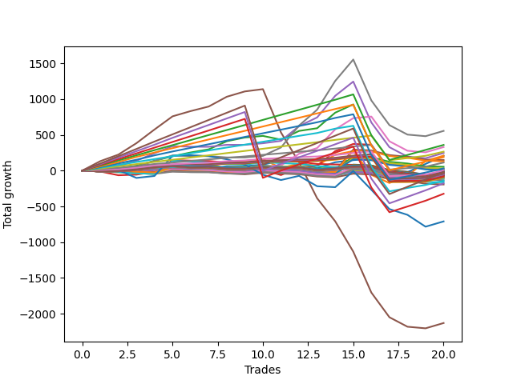

# Long Golden 001 
- Symbol: ES1y1d
- Date Range: 07/19/2021 - 07/08/2022
- Trading Period: 7:20-12:30
- Number of Trades: 20



| Name | Win Percent | Profit | Avg Profit / Trade | Avg Time / Trade |      | Name | Win Percent | Profit | Avg Profit / Trade | Avg Time / Trade |
| ---- | ----------- | ------ | ------------------ | ---------------- | ---- | ---- | ----------- | ------ | ------------------ | ---------------- |
| Sorted By <br> Profit | | | | | | Sorted By <br> Win Percentage ||||
| Seven | 55.00 | 277750.00 | 13887.50 | 21 19:40:39 |     | Two Hundred Three | 95.00 | 132625.00 | 6631.25 | 06 11:31:12 |
| Two Hundred Seven | 90.00 | 179750.00 | 8987.50 | 20 21:10:15 |     | Two Hundred Two | 95.00 | 56625.00 | 2831.25 | 05 07:37:24 |
| Six | 60.00 | 164875.00 | 8243.75 | 11 16:52:30 |     | Two Hundred One | 95.00 | 1875.00 | 93.75 | 04 18:23:42 |
| Two Hundred Three | 95.00 | 132625.00 | 6631.25 | 06 11:31:12 |     | Eighty-Five | 95.00 | -21625.00 | -1081.25 | 04 16:55:21 |
| Four | 65.00 | 123625.00 | 6181.25 | 28 01:09:12 |     | Eighty-Four | 95.00 | -26125.00 | -1306.25 | 04 16:40:54 |
| One | 70.00 | 104750.00 | 5237.50 | 10 16:09:12 |     | Eighty-Three | 95.00 | -40375.00 | -2018.75 | 04 15:16:54 |
| Zero | 60.00 | 104125.00 | 5206.25 | 04 15:42:15 |     | Eighty-Two | 95.00 | -42750.00 | -2137.50 | 04 15:13:00 |
| Two Hundred Six | 90.00 | 94250.00 | 4712.50 | 19 15:46:27 |     | Eighty-One | 95.00 | -48250.00 | -2412.50 | 04 15:10:24 |
| Forty-Seven | 20.00 | 74125.00 | 3706.25 | 01 06:50:39 |     | Two Hundred Seven | 90.00 | 179750.00 | 8987.50 | 20 21:10:15 |
| Sixty-Three | 20.00 | 64625.00 | 3231.25 | 01 07:50:00 |     | Two Hundred Six | 90.00 | 94250.00 | 4712.50 | 19 15:46:27 |
| Two Hundred Two | 95.00 | 56625.00 | 2831.25 | 05 07:37:24 |     | Two Hundred Five | 90.00 | 15625.00 | 781.25 | 16 20:18:12 |
| Forty-Four | 15.00 | 27250.00 | 1362.50 | 01 08:52:09 |     | Two Hundred Four | 90.00 | -71125.00 | -3556.25 | 13 23:51:21 |
| Two Hundred Five | 90.00 | 15625.00 | 781.25 | 16 20:18:12 |     | Three Hundred | 85.00 | -7875.00 | -393.75 | 35 19:32:54 |
| Sixty | 15.00 | 15000.00 | 750.00 | 01 09:53:33 |     | Two Hundred Nine | 85.00 | -88750.00 | -4437.50 | 34 17:26:36 |
| Forty-Six | 30.00 | 10375.00 | 518.75 | 00 11:15:30 |     | Two Hundred Eight | 85.00 | -161625.00 | -8081.25 | 33 12:43:00 |
| Sixty-Two | 30.00 | 3125.00 | 156.25 | 00 12:12:30 |     | Two | 75.00 | -36125.00 | -1806.25 | 25 20:26:39 |
| Two Hundred One | 95.00 | 1875.00 | 93.75 | 04 18:23:42 |     | One | 70.00 | 104750.00 | 5237.50 | 10 16:09:12 |
| Fifty-Four | 45.00 | -3500.00 | -175.00 | 00 00:06:06 |     | Four | 65.00 | 123625.00 | 6181.25 | 28 01:09:12 |
| Fifty-Five | 45.00 | -6875.00 | -343.75 | 00 00:07:00 |     | Six | 60.00 | 164875.00 | 8243.75 | 11 16:52:30 |
| One Hundred Fifteen | 45.00 | -7000.00 | -350.00 | 00 00:17:18 |     | Zero | 60.00 | 104125.00 | 5206.25 | 04 15:42:15 |
| One Hundred Fourteen | 45.00 | -7500.00 | -375.00 | 00 00:04:18 |     | Seven | 55.00 | 277750.00 | 13887.50 | 21 19:40:39 |
| Three Hundred | 85.00 | -7875.00 | -393.75 | 35 19:32:54 |     | One Hundred Twenty-Eight | 55.00 | -12875.00 | -643.75 | 00 00:17:45 |
| One Hundred Eighteen | 50.00 | -7875.00 | -393.75 | 00 00:12:27 |     | One Hundred Twenty-Seven | 55.00 | -13250.00 | -662.50 | 00 00:17:36 |
| One Hundred Thirteen | 45.00 | -8000.00 | -400.00 | 00 00:04:06 |     | One Hundred Twenty-Six | 55.00 | -14625.00 | -731.25 | 00 00:16:21 |
| Forty-Eight | 45.00 | -8000.00 | -400.00 | 00 00:08:36 |     | Five | 55.00 | -1065125.00 | -53256.25 | 61 17:23:09 |
| One Hundred Seventeen | 50.00 | -8125.00 | -406.25 | 00 00:12:21 |     | One Hundred Eighteen | 50.00 | -7875.00 | -393.75 | 00 00:12:27 |
| One Hundred Twelve | 45.00 | -8250.00 | -412.50 | 00 00:04:00 |     | One Hundred Seventeen | 50.00 | -8125.00 | -406.25 | 00 00:12:21 |
| One Hundred Eleven | 45.00 | -8250.00 | -412.50 | 00 00:04:00 |     | One Hundred Sixteen | 50.00 | -8625.00 | -431.25 | 00 00:12:12 |
| One Hundred Sixteen | 50.00 | -8625.00 | -431.25 | 00 00:12:12 |     | One Hundred Twenty-Five | 50.00 | -8875.00 | -443.75 | 00 00:22:18 |
| One Hundred Twenty-Five | 50.00 | -8875.00 | -443.75 | 00 00:22:18 |     | One Hundred Twenty-Four | 50.00 | -9875.00 | -493.75 | 00 00:09:12 |
| Seventy | 45.00 | -9750.00 | -487.50 | 00 00:06:30 |     | One Hundred Twenty-Three | 50.00 | -11000.00 | -550.00 | 00 00:08:30 |
| One Hundred Twenty-Four | 50.00 | -9875.00 | -493.75 | 00 00:09:12 |     | One Hundred Twenty-Two | 50.00 | -11375.00 | -568.75 | 00 00:08:21 |
| Forty-Nine | 45.00 | -10625.00 | -531.25 | 00 00:09:24 |     | One Hundred Twenty-One | 50.00 | -12250.00 | -612.50 | 00 00:07:15 |
| One Hundred Twenty-Three | 50.00 | -11000.00 | -550.00 | 00 00:08:30 |     | One Hundred Thirty | 50.00 | -16750.00 | -837.50 | 00 00:32:00 |
| One Hundred Ninteen | 45.00 | -11125.00 | -556.25 | 00 00:12:54 |     | One Hundred Twenty-Nine | 50.00 | -17750.00 | -887.50 | 00 00:18:54 |
| One Hundred Twenty-Two | 50.00 | -11375.00 | -568.75 | 00 00:08:21 |     | Sixty-Nine | 50.00 | -26250.00 | -1312.50 | 00 02:57:36 |
| Fifty-Two | 40.00 | -12125.00 | -606.25 | 00 00:12:45 |     | Sixty-Six | 50.00 | -27250.00 | -1362.50 | 00 00:35:48 |
| One Hundred Twenty-One | 50.00 | -12250.00 | -612.50 | 00 00:07:15 |     | Fifty-Four | 45.00 | -3500.00 | -175.00 | 00 00:06:06 |
| One Hundred Twenty-Eight | 55.00 | -12875.00 | -643.75 | 00 00:17:45 |     | Fifty-Five | 45.00 | -6875.00 | -343.75 | 00 00:07:00 |
| One Hundred Twenty-Seven | 55.00 | -13250.00 | -662.50 | 00 00:17:36 |     | One Hundred Fifteen | 45.00 | -7000.00 | -350.00 | 00 00:17:18 |
| One Hundred Twenty | 40.00 | -13375.00 | -668.75 | 00 00:15:57 |     | One Hundred Fourteen | 45.00 | -7500.00 | -375.00 | 00 00:04:18 |
| Forty | 30.00 | -14250.00 | -712.50 | 00 09:47:27 |     | One Hundred Thirteen | 45.00 | -8000.00 | -400.00 | 00 00:04:06 |
| Fifty-One | 40.00 | -14500.00 | -725.00 | 00 00:10:27 |     | Forty-Eight | 45.00 | -8000.00 | -400.00 | 00 00:08:36 |
| One Hundred Twenty-Six | 55.00 | -14625.00 | -731.25 | 00 00:16:21 |     | One Hundred Twelve | 45.00 | -8250.00 | -412.50 | 00 00:04:00 |
| Fifty | 45.00 | -15250.00 | -762.50 | 00 00:13:30 |     | One Hundred Eleven | 45.00 | -8250.00 | -412.50 | 00 00:04:00 |
| One Hundred Thirty | 50.00 | -16750.00 | -837.50 | 00 00:32:00 |     | Seventy | 45.00 | -9750.00 | -487.50 | 00 00:06:30 |
| Fifty-Three | 40.00 | -16750.00 | -837.50 | 00 00:16:51 |     | Forty-Nine | 45.00 | -10625.00 | -531.25 | 00 00:09:24 |
| One Hundred Twenty-Nine | 50.00 | -17750.00 | -887.50 | 00 00:18:54 |     | One Hundred Ninteen | 45.00 | -11125.00 | -556.25 | 00 00:12:54 |
| Seventy-One | 45.00 | -17750.00 | -887.50 | 00 00:17:39 |     | Fifty | 45.00 | -15250.00 | -762.50 | 00 00:13:30 |
| Sixty-Four | 45.00 | -19125.00 | -956.25 | 00 00:12:24 |     | Seventy-One | 45.00 | -17750.00 | -887.50 | 00 00:17:39 |
| Fifty-Six | 30.00 | -21500.00 | -1075.00 | 00 09:49:54 |     | Sixty-Four | 45.00 | -19125.00 | -956.25 | 00 00:12:24 |
| Eighty-Five | 95.00 | -21625.00 | -1081.25 | 04 16:55:21 |     | Sixty-Seven | 45.00 | -22625.00 | -1131.25 | 00 02:41:30 |
| Sixty-Seven | 45.00 | -22625.00 | -1131.25 | 00 02:41:30 |     | Sixty-Eight | 45.00 | -22750.00 | -1137.50 | 00 02:44:54 |
| Sixty-Eight | 45.00 | -22750.00 | -1137.50 | 00 02:44:54 |     | Sixty-Five | 45.00 | -24125.00 | -1206.25 | 00 00:23:12 |
| Sixty-Five | 45.00 | -24125.00 | -1206.25 | 00 00:23:12 |     | Three | 45.00 | -32125.00 | -1606.25 | 20 06:34:42 |
| Eighty-Four | 95.00 | -26125.00 | -1306.25 | 04 16:40:54 |     | Fifty-Two | 40.00 | -12125.00 | -606.25 | 00 00:12:45 |
| Sixty-Nine | 50.00 | -26250.00 | -1312.50 | 00 02:57:36 |     | One Hundred Twenty | 40.00 | -13375.00 | -668.75 | 00 00:15:57 |
| Sixty-Six | 50.00 | -27250.00 | -1362.50 | 00 00:35:48 |     | Fifty-One | 40.00 | -14500.00 | -725.00 | 00 00:10:27 |
| Forty-Two | 20.00 | -30625.00 | -1531.25 | 00 14:00:03 |     | Fifty-Three | 40.00 | -16750.00 | -837.50 | 00 00:16:51 |
| Three | 45.00 | -32125.00 | -1606.25 | 20 06:34:42 |     | Seventy-Three | 35.00 | -354750.00 | -17737.50 | 10 23:35:03 |
| Forty-Five | 10.00 | -32250.00 | -1612.50 | 02 23:24:57 |     | Forty-Six | 30.00 | 10375.00 | 518.75 | 00 11:15:30 |
| Two | 75.00 | -36125.00 | -1806.25 | 25 20:26:39 |     | Sixty-Two | 30.00 | 3125.00 | 156.25 | 00 12:12:30 |
| Eighty-Three | 95.00 | -40375.00 | -2018.75 | 04 15:16:54 |     | Forty | 30.00 | -14250.00 | -712.50 | 00 09:47:27 |
| Eighty-Two | 95.00 | -42750.00 | -2137.50 | 04 15:13:00 |     | Fifty-Six | 30.00 | -21500.00 | -1075.00 | 00 09:49:54 |
| Eighty-One | 95.00 | -48250.00 | -2412.50 | 04 15:10:24 |     | Forty-Seven | 20.00 | 74125.00 | 3706.25 | 01 06:50:39 |
| Fifty-Eight | 20.00 | -50750.00 | -2537.50 | 00 18:54:15 |     | Sixty-Three | 20.00 | 64625.00 | 3231.25 | 01 07:50:00 |
| Forty-Three | 15.00 | -54750.00 | -2737.50 | 00 15:17:00 |     | Forty-Two | 20.00 | -30625.00 | -1531.25 | 00 14:00:03 |
| Sixty-One | 10.00 | -55250.00 | -2762.50 | 03 04:19:18 |     | Fifty-Eight | 20.00 | -50750.00 | -2537.50 | 00 18:54:15 |
| Fifty-Nine | 15.00 | -67000.00 | -3350.00 | 00 16:18:24 |     | Forty-One | 20.00 | -81125.00 | -4056.25 | 00 11:34:12 |
| Two Hundred Four | 90.00 | -71125.00 | -3556.25 | 13 23:51:21 |     | Fifty-Seven | 20.00 | -96750.00 | -4837.50 | 00 12:35:39 |
| Forty-One | 20.00 | -81125.00 | -4056.25 | 00 11:34:12 |     | Forty-Four | 15.00 | 27250.00 | 1362.50 | 01 08:52:09 |
| Two Hundred Nine | 85.00 | -88750.00 | -4437.50 | 34 17:26:36 |     | Sixty | 15.00 | 15000.00 | 750.00 | 01 09:53:33 |
| Fifty-Seven | 20.00 | -96750.00 | -4837.50 | 00 12:35:39 |     | Forty-Three | 15.00 | -54750.00 | -2737.50 | 00 15:17:00 |
| Two Hundred Eight | 85.00 | -161625.00 | -8081.25 | 33 12:43:00 |     | Fifty-Nine | 15.00 | -67000.00 | -3350.00 | 00 16:18:24 |
| Seventy-Three | 35.00 | -354750.00 | -17737.50 | 10 23:35:03 |     | Forty-Five | 10.00 | -32250.00 | -1612.50 | 02 23:24:57 |
| Five | 55.00 | -1065125.00 | -53256.25 | 61 17:23:09 |     | Sixty-One | 10.00 | -55250.00 | -2762.50 | 03 04:19:18 |

## NO STOPLOSS

### Test Zero
* Sell when price hits the middle line of the 20p bollinger
* No Stoploss
* Results:
```
Total Trades: 20
Percent Up: 60.00
Percent Down: 40.00
Total Points Moved Up: 208.25
Potential Profit: 104125.00
Total Points Ups: 538.75 Count Ups: 12
Total Points Downs: -330.50 Count Downs: 8
```

<details><summary>Trades</summary>

<code>In: 2021-08-11 07:21:00		Out: 2021-08-16 08:23:00		Total Position Time: 05 01:02:00		Total Move Up: -0.75		Total to Date: -0.75</code> <br />
<code>In: 2021-08-24 07:21:00		Out: 2021-08-24 07:24:00		Total Position Time: 00 00:03:00		Total Move Up: 2.50		Total to Date: 1.75</code> <br />
<code>In: 2021-09-24 07:21:00		Out: 2021-10-07 06:36:00		Total Position Time: 12 23:15:00		Total Move Up: -15.50		Total to Date: -13.75</code> <br />
<code>In: 2021-10-07 07:21:00		Out: 2021-10-07 07:24:00		Total Position Time: 00 00:03:00		Total Move Up: 30.50		Total to Date: 16.75</code> <br />
<code>In: 2021-10-14 07:21:00		Out: 2021-10-14 07:24:00		Total Position Time: 00 00:03:00		Total Move Up: 17.25		Total to Date: 34.00</code> <br />
<code>In: 2021-11-15 07:21:00		Out: 2021-11-15 07:24:00		Total Position Time: 00 00:03:00		Total Move Up: -8.25		Total to Date: 25.75</code> <br />
<code>In: 2021-11-19 07:21:00		Out: 2021-11-19 07:24:00		Total Position Time: 00 00:03:00		Total Move Up: -1.00		Total to Date: 24.75</code> <br />
<code>In: 2021-11-26 07:21:00		Out: 2021-11-29 09:35:00		Total Position Time: 03 02:14:00		Total Move Up: 37.50		Total to Date: 62.25</code> <br />
<code>In: 2021-12-08 07:21:00		Out: 2021-12-08 07:24:00		Total Position Time: 00 00:03:00		Total Move Up: -0.50		Total to Date: 61.75</code> <br />
<code>In: 2021-12-27 07:21:00		Out: 2021-12-27 07:24:00		Total Position Time: 00 00:03:00		Total Move Up: 22.50		Total to Date: 84.25</code> <br />
<code>In: 2022-02-01 07:21:00		Out: 2022-02-02 06:39:00		Total Position Time: 00 23:18:00		Total Move Up: 55.00		Total to Date: 139.25</code> <br />
<code>In: 2022-02-28 07:21:00		Out: 2022-03-16 06:39:00		Total Position Time: 15 23:18:00		Total Move Up: -11.25		Total to Date: 128.00</code> <br />
<code>In: 2022-03-03 07:21:00		Out: 2022-03-16 06:39:00		Total Position Time: 12 23:18:00		Total Move Up: -95.25		Total to Date: 32.75</code> <br />
<code>In: 2022-03-10 07:21:00		Out: 2022-03-16 06:39:00		Total Position Time: 05 23:18:00		Total Move Up: 84.50		Total to Date: 117.25</code> <br />
<code>In: 2022-03-17 07:21:00		Out: 2022-03-17 07:24:00		Total Position Time: 00 00:03:00		Total Move Up: 29.50		Total to Date: 146.75</code> <br />
<code>In: 2022-04-20 07:21:00		Out: 2022-04-21 06:31:00		Total Position Time: 00 23:10:00		Total Move Up: 22.00		Total to Date: 168.75</code> <br />
<code>In: 2022-05-05 07:21:00		Out: 2022-05-26 09:12:00		Total Position Time: 21 01:51:00		Total Move Up: -198.00		Total to Date: -29.25</code> <br />
<code>In: 2022-05-18 07:21:00		Out: 2022-05-26 08:23:00		Total Position Time: 08 01:02:00		Total Move Up: 8.25		Total to Date: -21.00</code> <br />
<code>In: 2022-05-24 07:21:00		Out: 2022-05-26 08:00:00		Total Position Time: 02 00:39:00		Total Move Up: 114.75		Total to Date: 93.75</code> <br />
<code>In: 2022-06-24 07:21:00		Out: 2022-06-28 06:37:00		Total Position Time: 03 23:16:00		Total Move Up: 114.50		Total to Date: 208.25</code> <br />


</details>

### Test One
* Sell when the price hits the upper line of the 20p 1std bollinger
* No Stoploss
* Results:
```
Total Trades: 20
Percent Up: 70.00
Percent Down: 30.00
Total Points Moved Up: 209.50
Potential Profit: 104750.00
Total Points Ups: 811.25 Count Ups: 14
Total Points Downs: -601.75 Count Downs: 6
```

<details><summary>Trades</summary>

<code>In: 2021-08-11 07:21:00		Out: 2021-08-16 08:35:00		Total Position Time: 05 01:14:00		Total Move Up: 3.25		Total to Date: 3.25</code> <br />
<code>In: 2021-08-24 07:21:00		Out: 2021-08-24 07:24:00		Total Position Time: 00 00:03:00		Total Move Up: 2.50		Total to Date: 5.75</code> <br />
<code>In: 2021-09-24 07:21:00		Out: 2021-10-14 10:23:00		Total Position Time: 20 03:02:00		Total Move Up: 0.50		Total to Date: 6.25</code> <br />
<code>In: 2021-10-07 07:21:00		Out: 2021-10-14 08:40:00		Total Position Time: 07 01:19:00		Total Move Up: 29.50		Total to Date: 35.75</code> <br />
<code>In: 2021-10-14 07:21:00		Out: 2021-10-14 08:40:00		Total Position Time: 00 01:19:00		Total Move Up: 22.50		Total to Date: 58.25</code> <br />
<code>In: 2021-11-15 07:21:00		Out: 2021-11-15 07:24:00		Total Position Time: 00 00:03:00		Total Move Up: -8.25		Total to Date: 50.00</code> <br />
<code>In: 2021-11-19 07:21:00		Out: 2021-11-19 07:24:00		Total Position Time: 00 00:03:00		Total Move Up: -1.00		Total to Date: 49.00</code> <br />
<code>In: 2021-11-26 07:21:00		Out: 2021-12-08 12:53:00		Total Position Time: 12 05:32:00		Total Move Up: 74.25		Total to Date: 123.25</code> <br />
<code>In: 2021-12-08 07:21:00		Out: 2021-12-08 12:53:00		Total Position Time: 00 05:32:00		Total Move Up: 12.25		Total to Date: 135.50</code> <br />
<code>In: 2021-12-27 07:21:00		Out: 2021-12-27 07:24:00		Total Position Time: 00 00:03:00		Total Move Up: 22.50		Total to Date: 158.00</code> <br />
<code>In: 2022-02-01 07:21:00		Out: 2022-03-17 10:52:00		Total Position Time: 44 03:31:00		Total Move Up: -119.50		Total to Date: 38.50</code> <br />
<code>In: 2022-02-28 07:21:00		Out: 2022-03-17 10:29:00		Total Position Time: 17 03:08:00		Total Move Up: 57.50		Total to Date: 96.00</code> <br />
<code>In: 2022-03-03 07:21:00		Out: 2022-03-17 10:29:00		Total Position Time: 14 03:08:00		Total Move Up: -26.50		Total to Date: 69.50</code> <br />
<code>In: 2022-03-10 07:21:00		Out: 2022-03-17 10:29:00		Total Position Time: 07 03:08:00		Total Move Up: 153.25		Total to Date: 222.75</code> <br />
<code>In: 2022-03-17 07:21:00		Out: 2022-03-17 10:29:00		Total Position Time: 00 03:08:00		Total Move Up: 51.00		Total to Date: 273.75</code> <br />
<code>In: 2022-04-20 07:21:00		Out: 2022-05-27 12:23:00		Total Position Time: 37 05:02:00		Total Move Up: -332.75		Total to Date: -59.00</code> <br />
<code>In: 2022-05-05 07:21:00		Out: 2022-05-27 12:05:00		Total Position Time: 22 04:44:00		Total Move Up: -113.75		Total to Date: -172.75</code> <br />
<code>In: 2022-05-18 07:21:00		Out: 2022-05-27 12:05:00		Total Position Time: 09 04:44:00		Total Move Up: 99.00		Total to Date: -73.75</code> <br />
<code>In: 2022-05-24 07:21:00		Out: 2022-05-27 12:05:00		Total Position Time: 03 04:44:00		Total Move Up: 209.25		Total to Date: 135.50</code> <br />
<code>In: 2022-06-24 07:21:00		Out: 2022-07-08 12:58:00		Total Position Time: 14 05:37:00		Total Move Up: 74.00		Total to Date: 209.50</code> <br />


</details>

### Test Two
* Sell when the price hits the upper line of the 20p 2std bollinger
* No Stoploss
* Results:
```
Total Trades: 20
Percent Up: 75.00
Percent Down: 25.00
Total Points Moved Up: -72.25
Potential Profit: -36125.00
Total Points Ups: 1051.75 Count Ups: 15
Total Points Downs: -1124.00 Count Downs: 5
```

<details><summary>Trades</summary>

<code>In: 2021-08-11 07:21:00		Out: 2021-08-23 07:03:00		Total Position Time: 11 23:42:00		Total Move Up: 29.50		Total to Date: 29.50</code> <br />
<code>In: 2021-08-24 07:21:00		Out: 2021-08-24 07:24:00		Total Position Time: 00 00:03:00		Total Move Up: 2.50		Total to Date: 32.00</code> <br />
<code>In: 2021-09-24 07:21:00		Out: 2021-10-15 10:27:00		Total Position Time: 21 03:06:00		Total Move Up: 36.50		Total to Date: 68.50</code> <br />
<code>In: 2021-10-07 07:21:00		Out: 2021-10-15 08:23:00		Total Position Time: 08 01:02:00		Total Move Up: 69.25		Total to Date: 137.75</code> <br />
<code>In: 2021-10-14 07:21:00		Out: 2021-10-15 07:23:00		Total Position Time: 01 00:02:00		Total Move Up: 63.50		Total to Date: 201.25</code> <br />
<code>In: 2021-11-15 07:21:00		Out: 2021-12-27 06:50:00		Total Position Time: 41 23:29:00		Total Move Up: 52.75		Total to Date: 254.00</code> <br />
<code>In: 2021-11-19 07:21:00		Out: 2021-12-27 06:50:00		Total Position Time: 37 23:29:00		Total Move Up: 43.50		Total to Date: 297.50</code> <br />
<code>In: 2021-11-26 07:21:00		Out: 2021-12-27 06:43:00		Total Position Time: 30 23:22:00		Total Move Up: 113.75		Total to Date: 411.25</code> <br />
<code>In: 2021-12-08 07:21:00		Out: 2021-12-27 06:43:00		Total Position Time: 18 23:22:00		Total Move Up: 51.75		Total to Date: 463.00</code> <br />
<code>In: 2021-12-27 07:21:00		Out: 2021-12-27 07:24:00		Total Position Time: 00 00:03:00		Total Move Up: 22.50		Total to Date: 485.50</code> <br />
<code>In: 2022-02-01 07:21:00		Out: 2022-03-21 06:33:00		Total Position Time: 47 23:12:00		Total Move Up: -52.25		Total to Date: 433.25</code> <br />
<code>In: 2022-02-28 07:21:00		Out: 2022-03-18 12:20:00		Total Position Time: 18 04:59:00		Total Move Up: 121.75		Total to Date: 555.00</code> <br />
<code>In: 2022-03-03 07:21:00		Out: 2022-03-18 12:20:00		Total Position Time: 15 04:59:00		Total Move Up: 37.75		Total to Date: 592.75</code> <br />
<code>In: 2022-03-10 07:21:00		Out: 2022-03-18 12:20:00		Total Position Time: 08 04:59:00		Total Move Up: 217.50		Total to Date: 810.25</code> <br />
<code>In: 2022-03-17 07:21:00		Out: 2022-03-18 12:20:00		Total Position Time: 01 04:59:00		Total Move Up: 115.25		Total to Date: 925.50</code> <br />
<code>In: 2022-04-20 07:21:00		Out: 2022-07-08 12:58:00		Total Position Time: 79 05:37:00		Total Move Up: -571.75		Total to Date: 353.75</code> <br />
<code>In: 2022-05-05 07:21:00		Out: 2022-07-08 12:58:00		Total Position Time: 64 05:37:00		Total Move Up: -345.25		Total to Date: 8.50</code> <br />
<code>In: 2022-05-18 07:21:00		Out: 2022-07-08 12:58:00		Total Position Time: 51 05:37:00		Total Move Up: -132.50		Total to Date: -124.00</code> <br />
<code>In: 2022-05-24 07:21:00		Out: 2022-07-08 12:58:00		Total Position Time: 45 05:37:00		Total Move Up: -22.25		Total to Date: -146.25</code> <br />
<code>In: 2022-06-24 07:21:00		Out: 2022-07-08 12:58:00		Total Position Time: 14 05:37:00		Total Move Up: 74.00		Total to Date: -72.25</code> <br />


</details>

### Test Three
* Sell when price hits the middle line of the 50p bollinger
* No Stoploss
* Results:
```
Total Trades: 20
Percent Up: 45.00
Percent Down: 55.00
Total Points Moved Up: -64.25
Potential Profit: -32125.00
Total Points Ups: 613.75 Count Ups: 9
Total Points Downs: -678.00 Count Downs: 11
```

<details><summary>Trades</summary>

<code>In: 2021-08-11 07:21:00		Out: 2021-10-14 11:39:00		Total Position Time: 64 04:18:00		Total Move Up: -11.75		Total to Date: -11.75</code> <br />
<code>In: 2021-08-24 07:21:00		Out: 2021-10-14 11:39:00		Total Position Time: 51 04:18:00		Total Move Up: -52.75		Total to Date: -64.50</code> <br />
<code>In: 2021-09-24 07:21:00		Out: 2021-10-14 10:57:00		Total Position Time: 20 03:36:00		Total Move Up: 8.50		Total to Date: -56.00</code> <br />
<code>In: 2021-10-07 07:21:00		Out: 2021-10-14 10:57:00		Total Position Time: 07 03:36:00		Total Move Up: 40.25		Total to Date: -15.75</code> <br />
<code>In: 2021-10-14 07:21:00		Out: 2021-10-14 10:57:00		Total Position Time: 00 03:36:00		Total Move Up: 33.25		Total to Date: 17.50</code> <br />
<code>In: 2021-11-15 07:21:00		Out: 2021-11-15 07:24:00		Total Position Time: 00 00:03:00		Total Move Up: -8.25		Total to Date: 9.25</code> <br />
<code>In: 2021-11-19 07:21:00		Out: 2021-11-19 07:24:00		Total Position Time: 00 00:03:00		Total Move Up: -1.00		Total to Date: 8.25</code> <br />
<code>In: 2021-11-26 07:21:00		Out: 2021-11-26 07:24:00		Total Position Time: 00 00:03:00		Total Move Up: -18.75		Total to Date: -10.50</code> <br />
<code>In: 2021-12-08 07:21:00		Out: 2021-12-08 07:24:00		Total Position Time: 00 00:03:00		Total Move Up: -0.50		Total to Date: -11.00</code> <br />
<code>In: 2021-12-27 07:21:00		Out: 2021-12-27 07:24:00		Total Position Time: 00 00:03:00		Total Move Up: 22.50		Total to Date: 11.50</code> <br />
<code>In: 2022-02-01 07:21:00		Out: 2022-03-18 12:09:00		Total Position Time: 45 04:48:00		Total Move Up: -73.25		Total to Date: -61.75</code> <br />
<code>In: 2022-02-28 07:21:00		Out: 2022-03-18 10:30:00		Total Position Time: 18 03:09:00		Total Move Up: 107.50		Total to Date: 45.75</code> <br />
<code>In: 2022-03-03 07:21:00		Out: 2022-03-18 10:30:00		Total Position Time: 15 03:09:00		Total Move Up: 23.50		Total to Date: 69.25</code> <br />
<code>In: 2022-03-10 07:21:00		Out: 2022-03-18 10:30:00		Total Position Time: 08 03:09:00		Total Move Up: 203.25		Total to Date: 272.50</code> <br />
<code>In: 2022-03-17 07:21:00		Out: 2022-03-18 10:30:00		Total Position Time: 01 03:09:00		Total Move Up: 101.00		Total to Date: 373.50</code> <br />
<code>In: 2022-04-20 07:21:00		Out: 2022-04-20 07:24:00		Total Position Time: 00 00:03:00		Total Move Up: -11.75		Total to Date: 361.75</code> <br />
<code>In: 2022-05-05 07:21:00		Out: 2022-07-08 12:58:00		Total Position Time: 64 05:37:00		Total Move Up: -345.25		Total to Date: 16.50</code> <br />
<code>In: 2022-05-18 07:21:00		Out: 2022-07-08 12:58:00		Total Position Time: 51 05:37:00		Total Move Up: -132.50		Total to Date: -116.00</code> <br />
<code>In: 2022-05-24 07:21:00		Out: 2022-07-08 12:58:00		Total Position Time: 45 05:37:00		Total Move Up: -22.25		Total to Date: -138.25</code> <br />
<code>In: 2022-06-24 07:21:00		Out: 2022-07-08 12:58:00		Total Position Time: 14 05:37:00		Total Move Up: 74.00		Total to Date: -64.25</code> <br />


</details>

### Test Four
* Sell when the price hits the upper line of the 50p 1std bollinger
* No Stoploss
* Results:
```
Total Trades: 20
Percent Up: 65.00
Percent Down: 35.00
Total Points Moved Up: 247.25
Potential Profit: 123625.00
Total Points Ups: 1328.75 Count Ups: 13
Total Points Downs: -1081.50 Count Downs: 7
```

<details><summary>Trades</summary>

<code>In: 2021-08-11 07:21:00		Out: 2021-10-19 06:40:00		Total Position Time: 68 23:19:00		Total Move Up: 52.50		Total to Date: 52.50</code> <br />
<code>In: 2021-08-24 07:21:00		Out: 2021-10-19 06:40:00		Total Position Time: 55 23:19:00		Total Move Up: 11.50		Total to Date: 64.00</code> <br />
<code>In: 2021-09-24 07:21:00		Out: 2021-10-19 06:40:00		Total Position Time: 24 23:19:00		Total Move Up: 74.00		Total to Date: 138.00</code> <br />
<code>In: 2021-10-07 07:21:00		Out: 2021-10-19 06:40:00		Total Position Time: 11 23:19:00		Total Move Up: 105.75		Total to Date: 243.75</code> <br />
<code>In: 2021-10-14 07:21:00		Out: 2021-10-19 06:40:00		Total Position Time: 04 23:19:00		Total Move Up: 98.75		Total to Date: 342.50</code> <br />
<code>In: 2021-11-15 07:21:00		Out: 2021-11-15 07:24:00		Total Position Time: 00 00:03:00		Total Move Up: -8.25		Total to Date: 334.25</code> <br />
<code>In: 2021-11-19 07:21:00		Out: 2021-11-19 07:24:00		Total Position Time: 00 00:03:00		Total Move Up: -1.00		Total to Date: 333.25</code> <br />
<code>In: 2021-11-26 07:21:00		Out: 2021-11-29 09:18:00		Total Position Time: 03 01:57:00		Total Move Up: 27.50		Total to Date: 360.75</code> <br />
<code>In: 2021-12-08 07:21:00		Out: 2021-12-08 07:24:00		Total Position Time: 00 00:03:00		Total Move Up: -0.50		Total to Date: 360.25</code> <br />
<code>In: 2021-12-27 07:21:00		Out: 2021-12-27 07:24:00		Total Position Time: 00 00:03:00		Total Move Up: 22.50		Total to Date: 382.75</code> <br />
<code>In: 2022-02-01 07:21:00		Out: 2022-03-28 07:00:00		Total Position Time: 54 23:39:00		Total Move Up: 33.00		Total to Date: 415.75</code> <br />
<code>In: 2022-02-28 07:21:00		Out: 2022-03-28 06:30:00		Total Position Time: 27 23:09:00		Total Move Up: 206.00		Total to Date: 621.75</code> <br />
<code>In: 2022-03-03 07:21:00		Out: 2022-03-28 06:30:00		Total Position Time: 24 23:09:00		Total Move Up: 122.00		Total to Date: 743.75</code> <br />
<code>In: 2022-03-10 07:21:00		Out: 2022-03-28 06:30:00		Total Position Time: 17 23:09:00		Total Move Up: 301.75		Total to Date: 1045.50</code> <br />
<code>In: 2022-03-17 07:21:00		Out: 2022-03-28 06:30:00		Total Position Time: 10 23:09:00		Total Move Up: 199.50		Total to Date: 1245.00</code> <br />
<code>In: 2022-04-20 07:21:00		Out: 2022-07-08 12:58:00		Total Position Time: 79 05:37:00		Total Move Up: -571.75		Total to Date: 673.25</code> <br />
<code>In: 2022-05-05 07:21:00		Out: 2022-07-08 12:58:00		Total Position Time: 64 05:37:00		Total Move Up: -345.25		Total to Date: 328.00</code> <br />
<code>In: 2022-05-18 07:21:00		Out: 2022-07-08 12:58:00		Total Position Time: 51 05:37:00		Total Move Up: -132.50		Total to Date: 195.50</code> <br />
<code>In: 2022-05-24 07:21:00		Out: 2022-07-08 12:58:00		Total Position Time: 45 05:37:00		Total Move Up: -22.25		Total to Date: 173.25</code> <br />
<code>In: 2022-06-24 07:21:00		Out: 2022-07-08 12:58:00		Total Position Time: 14 05:37:00		Total Move Up: 74.00		Total to Date: 247.25</code> <br />


</details>

### Test Five
* Sell when the price hits the upper line of the 50p 2std bollinger
* No Stoploss
* Results:
```
Total Trades: 20
Percent Up: 55.00
Percent Down: 45.00
Total Points Moved Up: -2130.25
Potential Profit: -1065125.00
Total Points Ups: 1213.25 Count Ups: 11
Total Points Downs: -3343.50 Count Downs: 9
```

<details><summary>Trades</summary>

<code>In: 2021-08-11 07:21:00		Out: 2021-10-26 06:31:00		Total Position Time: 75 23:10:00		Total Move Up: 132.50		Total to Date: 132.50</code> <br />
<code>In: 2021-08-24 07:21:00		Out: 2021-10-26 06:31:00		Total Position Time: 62 23:10:00		Total Move Up: 91.50		Total to Date: 224.00</code> <br />
<code>In: 2021-09-24 07:21:00		Out: 2021-10-26 06:36:00		Total Position Time: 31 23:15:00		Total Move Up: 159.50		Total to Date: 383.50</code> <br />
<code>In: 2021-10-07 07:21:00		Out: 2021-10-26 06:36:00		Total Position Time: 18 23:15:00		Total Move Up: 191.25		Total to Date: 574.75</code> <br />
<code>In: 2021-10-14 07:21:00		Out: 2021-10-26 06:36:00		Total Position Time: 11 23:15:00		Total Move Up: 184.25		Total to Date: 759.00</code> <br />
<code>In: 2021-11-15 07:21:00		Out: 2021-12-27 09:02:00		Total Position Time: 42 01:41:00		Total Move Up: 73.25		Total to Date: 832.25</code> <br />
<code>In: 2021-11-19 07:21:00		Out: 2021-12-27 09:02:00		Total Position Time: 38 01:41:00		Total Move Up: 64.00		Total to Date: 896.25</code> <br />
<code>In: 2021-11-26 07:21:00		Out: 2021-12-27 09:02:00		Total Position Time: 31 01:41:00		Total Move Up: 136.50		Total to Date: 1032.75</code> <br />
<code>In: 2021-12-08 07:21:00		Out: 2021-12-27 09:02:00		Total Position Time: 19 01:41:00		Total Move Up: 74.50		Total to Date: 1107.25</code> <br />
<code>In: 2021-12-27 07:21:00		Out: 2021-12-27 08:05:00		Total Position Time: 00 00:44:00		Total Move Up: 32.00		Total to Date: 1139.25</code> <br />
<code>In: 2022-02-01 07:21:00		Out: 2022-07-08 12:58:00		Total Position Time: 157 05:37:00		Total Move Up: -606.00		Total to Date: 533.25</code> <br />
<code>In: 2022-02-28 07:21:00		Out: 2022-07-08 12:58:00		Total Position Time: 130 05:37:00		Total Move Up: -417.75		Total to Date: 115.50</code> <br />
<code>In: 2022-03-03 07:21:00		Out: 2022-07-08 12:58:00		Total Position Time: 127 05:37:00		Total Move Up: -501.75		Total to Date: -386.25</code> <br />
<code>In: 2022-03-10 07:21:00		Out: 2022-07-08 12:58:00		Total Position Time: 120 05:37:00		Total Move Up: -322.00		Total to Date: -708.25</code> <br />
<code>In: 2022-03-17 07:21:00		Out: 2022-07-08 12:58:00		Total Position Time: 113 05:37:00		Total Move Up: -424.25		Total to Date: -1132.50</code> <br />
<code>In: 2022-04-20 07:21:00		Out: 2022-07-08 12:58:00		Total Position Time: 79 05:37:00		Total Move Up: -571.75		Total to Date: -1704.25</code> <br />
<code>In: 2022-05-05 07:21:00		Out: 2022-07-08 12:58:00		Total Position Time: 64 05:37:00		Total Move Up: -345.25		Total to Date: -2049.50</code> <br />
<code>In: 2022-05-18 07:21:00		Out: 2022-07-08 12:58:00		Total Position Time: 51 05:37:00		Total Move Up: -132.50		Total to Date: -2182.00</code> <br />
<code>In: 2022-05-24 07:21:00		Out: 2022-07-08 12:58:00		Total Position Time: 45 05:37:00		Total Move Up: -22.25		Total to Date: -2204.25</code> <br />
<code>In: 2022-06-24 07:21:00		Out: 2022-07-08 12:58:00		Total Position Time: 14 05:37:00		Total Move Up: 74.00		Total to Date: -2130.25</code> <br />


</details>

### Test Six
* Sell when the price hits the middle line of the 1std VWAP
* No Stoploss
* Results:
```
Total Trades: 20
Percent Up: 60.00
Percent Down: 40.00
Total Points Moved Up: 329.75
Potential Profit: 164875.00
Total Points Ups: 860.25 Count Ups: 12
Total Points Downs: -530.50 Count Downs: 8
```

<details><summary>Trades</summary>

<code>In: 2021-08-11 07:21:00		Out: 2021-08-11 07:24:00		Total Position Time: 00 00:03:00		Total Move Up: -2.00		Total to Date: -2.00</code> <br />
<code>In: 2021-08-24 07:21:00		Out: 2021-08-24 07:24:00		Total Position Time: 00 00:03:00		Total Move Up: 2.50		Total to Date: 0.50</code> <br />
<code>In: 2021-09-24 07:21:00		Out: 2021-09-24 07:24:00		Total Position Time: 00 00:03:00		Total Move Up: 22.00		Total to Date: 22.50</code> <br />
<code>In: 2021-10-07 07:21:00		Out: 2021-10-07 07:24:00		Total Position Time: 00 00:03:00		Total Move Up: 30.50		Total to Date: 53.00</code> <br />
<code>In: 2021-10-14 07:21:00		Out: 2021-10-14 07:24:00		Total Position Time: 00 00:03:00		Total Move Up: 17.25		Total to Date: 70.25</code> <br />
<code>In: 2021-11-15 07:21:00		Out: 2021-11-15 07:24:00		Total Position Time: 00 00:03:00		Total Move Up: -8.25		Total to Date: 62.00</code> <br />
<code>In: 2021-11-19 07:21:00		Out: 2021-11-19 07:24:00		Total Position Time: 00 00:03:00		Total Move Up: -1.00		Total to Date: 61.00</code> <br />
<code>In: 2021-11-26 07:21:00		Out: 2021-11-26 07:24:00		Total Position Time: 00 00:03:00		Total Move Up: -18.75		Total to Date: 42.25</code> <br />
<code>In: 2021-12-08 07:21:00		Out: 2021-12-08 07:24:00		Total Position Time: 00 00:03:00		Total Move Up: -0.50		Total to Date: 41.75</code> <br />
<code>In: 2021-12-27 07:21:00		Out: 2021-12-27 07:24:00		Total Position Time: 00 00:03:00		Total Move Up: 22.50		Total to Date: 64.25</code> <br />
<code>In: 2022-02-01 07:21:00		Out: 2022-02-01 12:03:00		Total Position Time: 00 04:42:00		Total Move Up: 7.25		Total to Date: 71.50</code> <br />
<code>In: 2022-02-28 07:21:00		Out: 2022-03-22 07:01:00		Total Position Time: 21 23:40:00		Total Move Up: 164.25		Total to Date: 235.75</code> <br />
<code>In: 2022-03-03 07:21:00		Out: 2022-03-22 07:01:00		Total Position Time: 18 23:40:00		Total Move Up: 80.25		Total to Date: 316.00</code> <br />
<code>In: 2022-03-10 07:21:00		Out: 2022-03-22 07:01:00		Total Position Time: 11 23:40:00		Total Move Up: 260.00		Total to Date: 576.00</code> <br />
<code>In: 2022-03-17 07:21:00		Out: 2022-03-22 07:01:00		Total Position Time: 04 23:40:00		Total Move Up: 157.75		Total to Date: 733.75</code> <br />
<code>In: 2022-04-20 07:21:00		Out: 2022-04-21 06:31:00		Total Position Time: 00 23:10:00		Total Move Up: 22.00		Total to Date: 755.75</code> <br />
<code>In: 2022-05-05 07:21:00		Out: 2022-07-08 12:58:00		Total Position Time: 64 05:37:00		Total Move Up: -345.25		Total to Date: 410.50</code> <br />
<code>In: 2022-05-18 07:21:00		Out: 2022-07-08 12:58:00		Total Position Time: 51 05:37:00		Total Move Up: -132.50		Total to Date: 278.00</code> <br />
<code>In: 2022-05-24 07:21:00		Out: 2022-07-08 12:58:00		Total Position Time: 45 05:37:00		Total Move Up: -22.25		Total to Date: 255.75</code> <br />
<code>In: 2022-06-24 07:21:00		Out: 2022-07-08 12:58:00		Total Position Time: 14 05:37:00		Total Move Up: 74.00		Total to Date: 329.75</code> <br />


</details>

### Test Seven
* Sell when the price hits the upper line of the 1std VWAP
* No Stoploss
* Results:
```
Total Trades: 20
Percent Up: 55.00
Percent Down: 45.00
Total Points Moved Up: 555.50
Potential Profit: 277750.00
Total Points Ups: 1657.75 Count Ups: 11
Total Points Downs: -1102.25 Count Downs: 9
```

<details><summary>Trades</summary>

<code>In: 2021-08-11 07:21:00		Out: 2021-08-11 07:24:00		Total Position Time: 00 00:03:00		Total Move Up: -2.00		Total to Date: -2.00</code> <br />
<code>In: 2021-08-24 07:21:00		Out: 2021-08-24 07:24:00		Total Position Time: 00 00:03:00		Total Move Up: 2.50		Total to Date: 0.50</code> <br />
<code>In: 2021-09-24 07:21:00		Out: 2021-10-18 08:20:00		Total Position Time: 24 00:59:00		Total Move Up: 51.75		Total to Date: 52.25</code> <br />
<code>In: 2021-10-07 07:21:00		Out: 2021-10-18 08:20:00		Total Position Time: 11 00:59:00		Total Move Up: 83.50		Total to Date: 135.75</code> <br />
<code>In: 2021-10-14 07:21:00		Out: 2021-10-18 08:20:00		Total Position Time: 04 00:59:00		Total Move Up: 76.50		Total to Date: 212.25</code> <br />
<code>In: 2021-11-15 07:21:00		Out: 2021-11-15 07:24:00		Total Position Time: 00 00:03:00		Total Move Up: -8.25		Total to Date: 204.00</code> <br />
<code>In: 2021-11-19 07:21:00		Out: 2021-11-19 07:24:00		Total Position Time: 00 00:03:00		Total Move Up: -1.00		Total to Date: 203.00</code> <br />
<code>In: 2021-11-26 07:21:00		Out: 2021-11-26 07:24:00		Total Position Time: 00 00:03:00		Total Move Up: -18.75		Total to Date: 184.25</code> <br />
<code>In: 2021-12-08 07:21:00		Out: 2021-12-08 07:24:00		Total Position Time: 00 00:03:00		Total Move Up: -0.50		Total to Date: 183.75</code> <br />
<code>In: 2021-12-27 07:21:00		Out: 2021-12-27 07:24:00		Total Position Time: 00 00:03:00		Total Move Up: 22.50		Total to Date: 206.25</code> <br />
<code>In: 2022-02-01 07:21:00		Out: 2022-03-29 12:35:00		Total Position Time: 56 05:14:00		Total Move Up: 117.75		Total to Date: 324.00</code> <br />
<code>In: 2022-02-28 07:21:00		Out: 2022-03-29 12:35:00		Total Position Time: 29 05:14:00		Total Move Up: 306.00		Total to Date: 630.00</code> <br />
<code>In: 2022-03-03 07:21:00		Out: 2022-03-29 12:35:00		Total Position Time: 26 05:14:00		Total Move Up: 222.00		Total to Date: 852.00</code> <br />
<code>In: 2022-03-10 07:21:00		Out: 2022-03-29 12:35:00		Total Position Time: 19 05:14:00		Total Move Up: 401.75		Total to Date: 1253.75</code> <br />
<code>In: 2022-03-17 07:21:00		Out: 2022-03-29 12:35:00		Total Position Time: 12 05:14:00		Total Move Up: 299.50		Total to Date: 1553.25</code> <br />
<code>In: 2022-04-20 07:21:00		Out: 2022-07-08 12:58:00		Total Position Time: 79 05:37:00		Total Move Up: -571.75		Total to Date: 981.50</code> <br />
<code>In: 2022-05-05 07:21:00		Out: 2022-07-08 12:58:00		Total Position Time: 64 05:37:00		Total Move Up: -345.25		Total to Date: 636.25</code> <br />
<code>In: 2022-05-18 07:21:00		Out: 2022-07-08 12:58:00		Total Position Time: 51 05:37:00		Total Move Up: -132.50		Total to Date: 503.75</code> <br />
<code>In: 2022-05-24 07:21:00		Out: 2022-07-08 12:58:00		Total Position Time: 45 05:37:00		Total Move Up: -22.25		Total to Date: 481.50</code> <br />
<code>In: 2022-06-24 07:21:00		Out: 2022-07-08 12:58:00		Total Position Time: 14 05:37:00		Total Move Up: 74.00		Total to Date: 555.50</code> <br />


</details>

## STOPLOSS OF 5

### Test Forty
* Sell when price hits the middle line of the 20p bollinger
* Stoploss is 5 points
* Results:
```
Total Trades: 20
Percent Up: 30.00
Percent Down: 70.00
Total Points Moved Up: -28.50
Potential Profit: -14250.00
Total Points Ups: 216.75 Count Ups: 6
Total Points Downs: -245.25 Count Downs: 14
```

<details><summary>Trades</summary>

<code>In: 2021-08-11 07:21:00		Out: 2021-08-11 07:36:00		Total Position Time: 00 00:15:00		Total Move Up: -5.00		Total to Date: -5.00</code> <br />
<code>In: 2021-08-24 07:21:00		Out: 2021-08-24 07:24:00		Total Position Time: 00 00:03:00		Total Move Up: 2.50		Total to Date: -2.50</code> <br />
<code>In: 2021-09-24 07:21:00		Out: 2021-09-28 06:31:00		Total Position Time: 03 23:10:00		Total Move Up: -15.50		Total to Date: -18.00</code> <br />
<code>In: 2021-10-07 07:21:00		Out: 2021-10-07 07:24:00		Total Position Time: 00 00:03:00		Total Move Up: 30.50		Total to Date: 12.50</code> <br />
<code>In: 2021-10-14 07:21:00		Out: 2021-10-14 07:24:00		Total Position Time: 00 00:03:00		Total Move Up: 17.25		Total to Date: 29.75</code> <br />
<code>In: 2021-11-15 07:21:00		Out: 2021-11-15 07:24:00		Total Position Time: 00 00:03:00		Total Move Up: -8.25		Total to Date: 21.50</code> <br />
<code>In: 2021-11-19 07:21:00		Out: 2021-11-19 07:24:00		Total Position Time: 00 00:03:00		Total Move Up: -1.00		Total to Date: 20.50</code> <br />
<code>In: 2021-11-26 07:21:00		Out: 2021-11-26 07:24:00		Total Position Time: 00 00:03:00		Total Move Up: -18.75		Total to Date: 1.75</code> <br />
<code>In: 2021-12-08 07:21:00		Out: 2021-12-08 07:24:00		Total Position Time: 00 00:03:00		Total Move Up: -0.50		Total to Date: 1.25</code> <br />
<code>In: 2021-12-27 07:21:00		Out: 2021-12-27 07:24:00		Total Position Time: 00 00:03:00		Total Move Up: 22.50		Total to Date: 23.75</code> <br />
<code>In: 2022-02-01 07:21:00		Out: 2022-02-01 07:24:00		Total Position Time: 00 00:03:00		Total Move Up: -11.25		Total to Date: 12.50</code> <br />
<code>In: 2022-02-28 07:21:00		Out: 2022-02-28 11:09:00		Total Position Time: 00 03:48:00		Total Move Up: -6.50		Total to Date: 6.00</code> <br />
<code>In: 2022-03-03 07:21:00		Out: 2022-03-03 07:24:00		Total Position Time: 00 00:03:00		Total Move Up: -31.00		Total to Date: -25.00</code> <br />
<code>In: 2022-03-10 07:21:00		Out: 2022-03-10 07:56:00		Total Position Time: 00 00:35:00		Total Move Up: -6.75		Total to Date: -31.75</code> <br />
<code>In: 2022-03-17 07:21:00		Out: 2022-03-17 07:24:00		Total Position Time: 00 00:03:00		Total Move Up: 29.50		Total to Date: -2.25</code> <br />
<code>In: 2022-04-20 07:21:00		Out: 2022-04-20 07:24:00		Total Position Time: 00 00:03:00		Total Move Up: -11.75		Total to Date: -14.00</code> <br />
<code>In: 2022-05-05 07:21:00		Out: 2022-05-05 07:24:00		Total Position Time: 00 00:03:00		Total Move Up: -65.00		Total to Date: -79.00</code> <br />
<code>In: 2022-05-18 07:21:00		Out: 2022-05-18 07:24:00		Total Position Time: 00 00:03:00		Total Move Up: -23.75		Total to Date: -102.75</code> <br />
<code>In: 2022-05-24 07:21:00		Out: 2022-05-24 07:24:00		Total Position Time: 00 00:03:00		Total Move Up: -40.25		Total to Date: -143.00</code> <br />
<code>In: 2022-06-24 07:21:00		Out: 2022-06-28 06:37:00		Total Position Time: 03 23:16:00		Total Move Up: 114.50		Total to Date: -28.50</code> <br />


</details>

### Test Forty-One
* Sell when the price hits the upper line of the 20p 1std bollinger
* Stoploss is 5 points
* Results:
```
Total Trades: 20
Percent Up: 20.00
Percent Down: 80.00
Total Points Moved Up: -162.25
Potential Profit: -81125.00
Total Points Ups: 98.50 Count Ups: 4
Total Points Downs: -260.75 Count Downs: 16
```

<details><summary>Trades</summary>

<code>In: 2021-08-11 07:21:00		Out: 2021-08-11 07:36:00		Total Position Time: 00 00:15:00		Total Move Up: -5.00		Total to Date: -5.00</code> <br />
<code>In: 2021-08-24 07:21:00		Out: 2021-08-24 07:24:00		Total Position Time: 00 00:03:00		Total Move Up: 2.50		Total to Date: -2.50</code> <br />
<code>In: 2021-09-24 07:21:00		Out: 2021-09-28 06:31:00		Total Position Time: 03 23:10:00		Total Move Up: -15.50		Total to Date: -18.00</code> <br />
<code>In: 2021-10-07 07:21:00		Out: 2021-10-08 09:30:00		Total Position Time: 01 02:09:00		Total Move Up: -5.50		Total to Date: -23.50</code> <br />
<code>In: 2021-10-14 07:21:00		Out: 2021-10-14 08:40:00		Total Position Time: 00 01:19:00		Total Move Up: 22.50		Total to Date: -1.00</code> <br />
<code>In: 2021-11-15 07:21:00		Out: 2021-11-15 07:24:00		Total Position Time: 00 00:03:00		Total Move Up: -8.25		Total to Date: -9.25</code> <br />
<code>In: 2021-11-19 07:21:00		Out: 2021-11-19 07:24:00		Total Position Time: 00 00:03:00		Total Move Up: -1.00		Total to Date: -10.25</code> <br />
<code>In: 2021-11-26 07:21:00		Out: 2021-11-26 07:24:00		Total Position Time: 00 00:03:00		Total Move Up: -18.75		Total to Date: -29.00</code> <br />
<code>In: 2021-12-08 07:21:00		Out: 2021-12-08 07:29:00		Total Position Time: 00 00:08:00		Total Move Up: -5.50		Total to Date: -34.50</code> <br />
<code>In: 2021-12-27 07:21:00		Out: 2021-12-27 07:24:00		Total Position Time: 00 00:03:00		Total Move Up: 22.50		Total to Date: -12.00</code> <br />
<code>In: 2022-02-01 07:21:00		Out: 2022-02-01 07:24:00		Total Position Time: 00 00:03:00		Total Move Up: -11.25		Total to Date: -23.25</code> <br />
<code>In: 2022-02-28 07:21:00		Out: 2022-02-28 11:09:00		Total Position Time: 00 03:48:00		Total Move Up: -6.50		Total to Date: -29.75</code> <br />
<code>In: 2022-03-03 07:21:00		Out: 2022-03-03 07:24:00		Total Position Time: 00 00:03:00		Total Move Up: -31.00		Total to Date: -60.75</code> <br />
<code>In: 2022-03-10 07:21:00		Out: 2022-03-10 07:56:00		Total Position Time: 00 00:35:00		Total Move Up: -6.75		Total to Date: -67.50</code> <br />
<code>In: 2022-03-17 07:21:00		Out: 2022-03-17 10:29:00		Total Position Time: 00 03:08:00		Total Move Up: 51.00		Total to Date: -16.50</code> <br />
<code>In: 2022-04-20 07:21:00		Out: 2022-04-20 07:24:00		Total Position Time: 00 00:03:00		Total Move Up: -11.75		Total to Date: -28.25</code> <br />
<code>In: 2022-05-05 07:21:00		Out: 2022-05-05 07:24:00		Total Position Time: 00 00:03:00		Total Move Up: -65.00		Total to Date: -93.25</code> <br />
<code>In: 2022-05-18 07:21:00		Out: 2022-05-18 07:24:00		Total Position Time: 00 00:03:00		Total Move Up: -23.75		Total to Date: -117.00</code> <br />
<code>In: 2022-05-24 07:21:00		Out: 2022-05-24 07:24:00		Total Position Time: 00 00:03:00		Total Move Up: -40.25		Total to Date: -157.25</code> <br />
<code>In: 2022-06-24 07:21:00		Out: 2022-06-28 11:40:00		Total Position Time: 04 04:19:00		Total Move Up: -5.00		Total to Date: -162.25</code> <br />


</details>

### Test Forty-Two
* Sell when the price hits the upper line of the 20p 2std bollinger
* Stoploss is 5 points
* Results:
```
Total Trades: 20
Percent Up: 20.00
Percent Down: 80.00
Total Points Moved Up: -61.25
Potential Profit: -30625.00
Total Points Ups: 203.75 Count Ups: 4
Total Points Downs: -265.00 Count Downs: 16
```

<details><summary>Trades</summary>

<code>In: 2021-08-11 07:21:00		Out: 2021-08-11 07:36:00		Total Position Time: 00 00:15:00		Total Move Up: -5.00		Total to Date: -5.00</code> <br />
<code>In: 2021-08-24 07:21:00		Out: 2021-08-24 07:24:00		Total Position Time: 00 00:03:00		Total Move Up: 2.50		Total to Date: -2.50</code> <br />
<code>In: 2021-09-24 07:21:00		Out: 2021-09-28 06:31:00		Total Position Time: 03 23:10:00		Total Move Up: -15.50		Total to Date: -18.00</code> <br />
<code>In: 2021-10-07 07:21:00		Out: 2021-10-08 09:30:00		Total Position Time: 01 02:09:00		Total Move Up: -5.50		Total to Date: -23.50</code> <br />
<code>In: 2021-10-14 07:21:00		Out: 2021-10-15 07:23:00		Total Position Time: 01 00:02:00		Total Move Up: 63.50		Total to Date: 40.00</code> <br />
<code>In: 2021-11-15 07:21:00		Out: 2021-11-15 07:24:00		Total Position Time: 00 00:03:00		Total Move Up: -8.25		Total to Date: 31.75</code> <br />
<code>In: 2021-11-19 07:21:00		Out: 2021-11-19 07:27:00		Total Position Time: 00 00:06:00		Total Move Up: -5.25		Total to Date: 26.50</code> <br />
<code>In: 2021-11-26 07:21:00		Out: 2021-11-26 07:24:00		Total Position Time: 00 00:03:00		Total Move Up: -18.75		Total to Date: 7.75</code> <br />
<code>In: 2021-12-08 07:21:00		Out: 2021-12-08 07:29:00		Total Position Time: 00 00:08:00		Total Move Up: -5.50		Total to Date: 2.25</code> <br />
<code>In: 2021-12-27 07:21:00		Out: 2021-12-27 07:24:00		Total Position Time: 00 00:03:00		Total Move Up: 22.50		Total to Date: 24.75</code> <br />
<code>In: 2022-02-01 07:21:00		Out: 2022-02-01 07:24:00		Total Position Time: 00 00:03:00		Total Move Up: -11.25		Total to Date: 13.50</code> <br />
<code>In: 2022-02-28 07:21:00		Out: 2022-02-28 11:09:00		Total Position Time: 00 03:48:00		Total Move Up: -6.50		Total to Date: 7.00</code> <br />
<code>In: 2022-03-03 07:21:00		Out: 2022-03-03 07:24:00		Total Position Time: 00 00:03:00		Total Move Up: -31.00		Total to Date: -24.00</code> <br />
<code>In: 2022-03-10 07:21:00		Out: 2022-03-10 07:56:00		Total Position Time: 00 00:35:00		Total Move Up: -6.75		Total to Date: -30.75</code> <br />
<code>In: 2022-03-17 07:21:00		Out: 2022-03-18 12:20:00		Total Position Time: 01 04:59:00		Total Move Up: 115.25		Total to Date: 84.50</code> <br />
<code>In: 2022-04-20 07:21:00		Out: 2022-04-20 07:24:00		Total Position Time: 00 00:03:00		Total Move Up: -11.75		Total to Date: 72.75</code> <br />
<code>In: 2022-05-05 07:21:00		Out: 2022-05-05 07:24:00		Total Position Time: 00 00:03:00		Total Move Up: -65.00		Total to Date: 7.75</code> <br />
<code>In: 2022-05-18 07:21:00		Out: 2022-05-18 07:24:00		Total Position Time: 00 00:03:00		Total Move Up: -23.75		Total to Date: -16.00</code> <br />
<code>In: 2022-05-24 07:21:00		Out: 2022-05-24 07:24:00		Total Position Time: 00 00:03:00		Total Move Up: -40.25		Total to Date: -56.25</code> <br />
<code>In: 2022-06-24 07:21:00		Out: 2022-06-28 11:40:00		Total Position Time: 04 04:19:00		Total Move Up: -5.00		Total to Date: -61.25</code> <br />


</details>

### Test Forty-Three
* Sell when price hits the middle line of the 50p bollinger
* Stoploss is 5 points
* Results:
```
Total Trades: 20
Percent Up: 15.00
Percent Down: 85.00
Total Points Moved Up: -109.50
Potential Profit: -54750.00
Total Points Ups: 156.75 Count Ups: 3
Total Points Downs: -266.25 Count Downs: 17
```

<details><summary>Trades</summary>

<code>In: 2021-08-11 07:21:00		Out: 2021-08-11 07:36:00		Total Position Time: 00 00:15:00		Total Move Up: -5.00		Total to Date: -5.00</code> <br />
<code>In: 2021-08-24 07:21:00		Out: 2021-08-26 07:27:00		Total Position Time: 02 00:06:00		Total Move Up: -10.50		Total to Date: -15.50</code> <br />
<code>In: 2021-09-24 07:21:00		Out: 2021-09-28 06:31:00		Total Position Time: 03 23:10:00		Total Move Up: -15.50		Total to Date: -31.00</code> <br />
<code>In: 2021-10-07 07:21:00		Out: 2021-10-08 09:30:00		Total Position Time: 01 02:09:00		Total Move Up: -5.50		Total to Date: -36.50</code> <br />
<code>In: 2021-10-14 07:21:00		Out: 2021-10-14 10:57:00		Total Position Time: 00 03:36:00		Total Move Up: 33.25		Total to Date: -3.25</code> <br />
<code>In: 2021-11-15 07:21:00		Out: 2021-11-15 07:24:00		Total Position Time: 00 00:03:00		Total Move Up: -8.25		Total to Date: -11.50</code> <br />
<code>In: 2021-11-19 07:21:00		Out: 2021-11-19 07:24:00		Total Position Time: 00 00:03:00		Total Move Up: -1.00		Total to Date: -12.50</code> <br />
<code>In: 2021-11-26 07:21:00		Out: 2021-11-26 07:24:00		Total Position Time: 00 00:03:00		Total Move Up: -18.75		Total to Date: -31.25</code> <br />
<code>In: 2021-12-08 07:21:00		Out: 2021-12-08 07:24:00		Total Position Time: 00 00:03:00		Total Move Up: -0.50		Total to Date: -31.75</code> <br />
<code>In: 2021-12-27 07:21:00		Out: 2021-12-27 07:24:00		Total Position Time: 00 00:03:00		Total Move Up: 22.50		Total to Date: -9.25</code> <br />
<code>In: 2022-02-01 07:21:00		Out: 2022-02-01 07:24:00		Total Position Time: 00 00:03:00		Total Move Up: -11.25		Total to Date: -20.50</code> <br />
<code>In: 2022-02-28 07:21:00		Out: 2022-02-28 11:09:00		Total Position Time: 00 03:48:00		Total Move Up: -6.50		Total to Date: -27.00</code> <br />
<code>In: 2022-03-03 07:21:00		Out: 2022-03-03 07:24:00		Total Position Time: 00 00:03:00		Total Move Up: -31.00		Total to Date: -58.00</code> <br />
<code>In: 2022-03-10 07:21:00		Out: 2022-03-10 07:56:00		Total Position Time: 00 00:35:00		Total Move Up: -6.75		Total to Date: -64.75</code> <br />
<code>In: 2022-03-17 07:21:00		Out: 2022-03-18 10:30:00		Total Position Time: 01 03:09:00		Total Move Up: 101.00		Total to Date: 36.25</code> <br />
<code>In: 2022-04-20 07:21:00		Out: 2022-04-20 07:24:00		Total Position Time: 00 00:03:00		Total Move Up: -11.75		Total to Date: 24.50</code> <br />
<code>In: 2022-05-05 07:21:00		Out: 2022-05-05 07:24:00		Total Position Time: 00 00:03:00		Total Move Up: -65.00		Total to Date: -40.50</code> <br />
<code>In: 2022-05-18 07:21:00		Out: 2022-05-18 07:24:00		Total Position Time: 00 00:03:00		Total Move Up: -23.75		Total to Date: -64.25</code> <br />
<code>In: 2022-05-24 07:21:00		Out: 2022-05-24 07:24:00		Total Position Time: 00 00:03:00		Total Move Up: -40.25		Total to Date: -104.50</code> <br />
<code>In: 2022-06-24 07:21:00		Out: 2022-06-28 11:40:00		Total Position Time: 04 04:19:00		Total Move Up: -5.00		Total to Date: -109.50</code> <br />


</details>

### Test Forty-Four
* Sell when the price hits the upper line of the 50p 1std bollinger
* Stoploss is 5 points
* Results:
```
Total Trades: 20
Percent Up: 15.00
Percent Down: 85.00
Total Points Moved Up: 54.50
Potential Profit: 27250.00
Total Points Ups: 320.75 Count Ups: 3
Total Points Downs: -266.25 Count Downs: 17
```

<details><summary>Trades</summary>

<code>In: 2021-08-11 07:21:00		Out: 2021-08-11 07:36:00		Total Position Time: 00 00:15:00		Total Move Up: -5.00		Total to Date: -5.00</code> <br />
<code>In: 2021-08-24 07:21:00		Out: 2021-08-26 07:27:00		Total Position Time: 02 00:06:00		Total Move Up: -10.50		Total to Date: -15.50</code> <br />
<code>In: 2021-09-24 07:21:00		Out: 2021-09-28 06:31:00		Total Position Time: 03 23:10:00		Total Move Up: -15.50		Total to Date: -31.00</code> <br />
<code>In: 2021-10-07 07:21:00		Out: 2021-10-08 09:30:00		Total Position Time: 01 02:09:00		Total Move Up: -5.50		Total to Date: -36.50</code> <br />
<code>In: 2021-10-14 07:21:00		Out: 2021-10-19 06:40:00		Total Position Time: 04 23:19:00		Total Move Up: 98.75		Total to Date: 62.25</code> <br />
<code>In: 2021-11-15 07:21:00		Out: 2021-11-15 07:24:00		Total Position Time: 00 00:03:00		Total Move Up: -8.25		Total to Date: 54.00</code> <br />
<code>In: 2021-11-19 07:21:00		Out: 2021-11-19 07:24:00		Total Position Time: 00 00:03:00		Total Move Up: -1.00		Total to Date: 53.00</code> <br />
<code>In: 2021-11-26 07:21:00		Out: 2021-11-26 07:24:00		Total Position Time: 00 00:03:00		Total Move Up: -18.75		Total to Date: 34.25</code> <br />
<code>In: 2021-12-08 07:21:00		Out: 2021-12-08 07:24:00		Total Position Time: 00 00:03:00		Total Move Up: -0.50		Total to Date: 33.75</code> <br />
<code>In: 2021-12-27 07:21:00		Out: 2021-12-27 07:24:00		Total Position Time: 00 00:03:00		Total Move Up: 22.50		Total to Date: 56.25</code> <br />
<code>In: 2022-02-01 07:21:00		Out: 2022-02-01 07:24:00		Total Position Time: 00 00:03:00		Total Move Up: -11.25		Total to Date: 45.00</code> <br />
<code>In: 2022-02-28 07:21:00		Out: 2022-02-28 11:09:00		Total Position Time: 00 03:48:00		Total Move Up: -6.50		Total to Date: 38.50</code> <br />
<code>In: 2022-03-03 07:21:00		Out: 2022-03-03 07:24:00		Total Position Time: 00 00:03:00		Total Move Up: -31.00		Total to Date: 7.50</code> <br />
<code>In: 2022-03-10 07:21:00		Out: 2022-03-10 07:56:00		Total Position Time: 00 00:35:00		Total Move Up: -6.75		Total to Date: 0.75</code> <br />
<code>In: 2022-03-17 07:21:00		Out: 2022-03-28 06:30:00		Total Position Time: 10 23:09:00		Total Move Up: 199.50		Total to Date: 200.25</code> <br />
<code>In: 2022-04-20 07:21:00		Out: 2022-04-20 07:24:00		Total Position Time: 00 00:03:00		Total Move Up: -11.75		Total to Date: 188.50</code> <br />
<code>In: 2022-05-05 07:21:00		Out: 2022-05-05 07:24:00		Total Position Time: 00 00:03:00		Total Move Up: -65.00		Total to Date: 123.50</code> <br />
<code>In: 2022-05-18 07:21:00		Out: 2022-05-18 07:24:00		Total Position Time: 00 00:03:00		Total Move Up: -23.75		Total to Date: 99.75</code> <br />
<code>In: 2022-05-24 07:21:00		Out: 2022-05-24 07:24:00		Total Position Time: 00 00:03:00		Total Move Up: -40.25		Total to Date: 59.50</code> <br />
<code>In: 2022-06-24 07:21:00		Out: 2022-06-28 11:40:00		Total Position Time: 04 04:19:00		Total Move Up: -5.00		Total to Date: 54.50</code> <br />


</details>

### Test Forty-Five
* Sell when the price hits the upper line of the 50p 2std bollinger
* Stoploss is 5 points
* Results:
```
Total Trades: 20
Percent Up: 10.00
Percent Down: 90.00
Total Points Moved Up: -64.50
Potential Profit: -32250.00
Total Points Ups: 216.25 Count Ups: 2
Total Points Downs: -280.75 Count Downs: 18
```

<details><summary>Trades</summary>

<code>In: 2021-08-11 07:21:00		Out: 2021-08-11 07:36:00		Total Position Time: 00 00:15:00		Total Move Up: -5.00		Total to Date: -5.00</code> <br />
<code>In: 2021-08-24 07:21:00		Out: 2021-08-26 07:27:00		Total Position Time: 02 00:06:00		Total Move Up: -10.50		Total to Date: -15.50</code> <br />
<code>In: 2021-09-24 07:21:00		Out: 2021-09-28 06:31:00		Total Position Time: 03 23:10:00		Total Move Up: -15.50		Total to Date: -31.00</code> <br />
<code>In: 2021-10-07 07:21:00		Out: 2021-10-08 09:30:00		Total Position Time: 01 02:09:00		Total Move Up: -5.50		Total to Date: -36.50</code> <br />
<code>In: 2021-10-14 07:21:00		Out: 2021-10-26 06:36:00		Total Position Time: 11 23:15:00		Total Move Up: 184.25		Total to Date: 147.75</code> <br />
<code>In: 2021-11-15 07:21:00		Out: 2021-11-15 07:24:00		Total Position Time: 00 00:03:00		Total Move Up: -8.25		Total to Date: 139.50</code> <br />
<code>In: 2021-11-19 07:21:00		Out: 2021-11-19 07:27:00		Total Position Time: 00 00:06:00		Total Move Up: -5.25		Total to Date: 134.25</code> <br />
<code>In: 2021-11-26 07:21:00		Out: 2021-11-26 07:24:00		Total Position Time: 00 00:03:00		Total Move Up: -18.75		Total to Date: 115.50</code> <br />
<code>In: 2021-12-08 07:21:00		Out: 2021-12-08 07:29:00		Total Position Time: 00 00:08:00		Total Move Up: -5.50		Total to Date: 110.00</code> <br />
<code>In: 2021-12-27 07:21:00		Out: 2021-12-27 08:05:00		Total Position Time: 00 00:44:00		Total Move Up: 32.00		Total to Date: 142.00</code> <br />
<code>In: 2022-02-01 07:21:00		Out: 2022-02-01 07:24:00		Total Position Time: 00 00:03:00		Total Move Up: -11.25		Total to Date: 130.75</code> <br />
<code>In: 2022-02-28 07:21:00		Out: 2022-02-28 11:09:00		Total Position Time: 00 03:48:00		Total Move Up: -6.50		Total to Date: 124.25</code> <br />
<code>In: 2022-03-03 07:21:00		Out: 2022-03-03 07:24:00		Total Position Time: 00 00:03:00		Total Move Up: -31.00		Total to Date: 93.25</code> <br />
<code>In: 2022-03-10 07:21:00		Out: 2022-03-10 07:56:00		Total Position Time: 00 00:35:00		Total Move Up: -6.75		Total to Date: 86.50</code> <br />
<code>In: 2022-03-17 07:21:00		Out: 2022-04-22 08:41:00		Total Position Time: 36 01:20:00		Total Move Up: -5.25		Total to Date: 81.25</code> <br />
<code>In: 2022-04-20 07:21:00		Out: 2022-04-20 07:24:00		Total Position Time: 00 00:03:00		Total Move Up: -11.75		Total to Date: 69.50</code> <br />
<code>In: 2022-05-05 07:21:00		Out: 2022-05-05 07:24:00		Total Position Time: 00 00:03:00		Total Move Up: -65.00		Total to Date: 4.50</code> <br />
<code>In: 2022-05-18 07:21:00		Out: 2022-05-18 07:24:00		Total Position Time: 00 00:03:00		Total Move Up: -23.75		Total to Date: -19.25</code> <br />
<code>In: 2022-05-24 07:21:00		Out: 2022-05-24 07:24:00		Total Position Time: 00 00:03:00		Total Move Up: -40.25		Total to Date: -59.50</code> <br />
<code>In: 2022-06-24 07:21:00		Out: 2022-06-28 11:40:00		Total Position Time: 04 04:19:00		Total Move Up: -5.00		Total to Date: -64.50</code> <br />


</details>

### Test Forty-Six
* Sell when the price hits the middle line of the 1std VWAP
* Stoploss is 5 points
* Results:
```
Total Trades: 20
Percent Up: 30.00
Percent Down: 70.00
Total Points Moved Up: 20.75
Potential Profit: 10375.00
Total Points Ups: 252.50 Count Ups: 6
Total Points Downs: -231.75 Count Downs: 14
```

<details><summary>Trades</summary>

<code>In: 2021-08-11 07:21:00		Out: 2021-08-11 07:24:00		Total Position Time: 00 00:03:00		Total Move Up: -2.00		Total to Date: -2.00</code> <br />
<code>In: 2021-08-24 07:21:00		Out: 2021-08-24 07:24:00		Total Position Time: 00 00:03:00		Total Move Up: 2.50		Total to Date: 0.50</code> <br />
<code>In: 2021-09-24 07:21:00		Out: 2021-09-24 07:24:00		Total Position Time: 00 00:03:00		Total Move Up: 22.00		Total to Date: 22.50</code> <br />
<code>In: 2021-10-07 07:21:00		Out: 2021-10-07 07:24:00		Total Position Time: 00 00:03:00		Total Move Up: 30.50		Total to Date: 53.00</code> <br />
<code>In: 2021-10-14 07:21:00		Out: 2021-10-14 07:24:00		Total Position Time: 00 00:03:00		Total Move Up: 17.25		Total to Date: 70.25</code> <br />
<code>In: 2021-11-15 07:21:00		Out: 2021-11-15 07:24:00		Total Position Time: 00 00:03:00		Total Move Up: -8.25		Total to Date: 62.00</code> <br />
<code>In: 2021-11-19 07:21:00		Out: 2021-11-19 07:24:00		Total Position Time: 00 00:03:00		Total Move Up: -1.00		Total to Date: 61.00</code> <br />
<code>In: 2021-11-26 07:21:00		Out: 2021-11-26 07:24:00		Total Position Time: 00 00:03:00		Total Move Up: -18.75		Total to Date: 42.25</code> <br />
<code>In: 2021-12-08 07:21:00		Out: 2021-12-08 07:24:00		Total Position Time: 00 00:03:00		Total Move Up: -0.50		Total to Date: 41.75</code> <br />
<code>In: 2021-12-27 07:21:00		Out: 2021-12-27 07:24:00		Total Position Time: 00 00:03:00		Total Move Up: 22.50		Total to Date: 64.25</code> <br />
<code>In: 2022-02-01 07:21:00		Out: 2022-02-01 07:24:00		Total Position Time: 00 00:03:00		Total Move Up: -11.25		Total to Date: 53.00</code> <br />
<code>In: 2022-02-28 07:21:00		Out: 2022-02-28 11:09:00		Total Position Time: 00 03:48:00		Total Move Up: -6.50		Total to Date: 46.50</code> <br />
<code>In: 2022-03-03 07:21:00		Out: 2022-03-03 07:24:00		Total Position Time: 00 00:03:00		Total Move Up: -31.00		Total to Date: 15.50</code> <br />
<code>In: 2022-03-10 07:21:00		Out: 2022-03-10 07:56:00		Total Position Time: 00 00:35:00		Total Move Up: -6.75		Total to Date: 8.75</code> <br />
<code>In: 2022-03-17 07:21:00		Out: 2022-03-22 07:01:00		Total Position Time: 04 23:40:00		Total Move Up: 157.75		Total to Date: 166.50</code> <br />
<code>In: 2022-04-20 07:21:00		Out: 2022-04-20 07:24:00		Total Position Time: 00 00:03:00		Total Move Up: -11.75		Total to Date: 154.75</code> <br />
<code>In: 2022-05-05 07:21:00		Out: 2022-05-05 07:24:00		Total Position Time: 00 00:03:00		Total Move Up: -65.00		Total to Date: 89.75</code> <br />
<code>In: 2022-05-18 07:21:00		Out: 2022-05-18 07:24:00		Total Position Time: 00 00:03:00		Total Move Up: -23.75		Total to Date: 66.00</code> <br />
<code>In: 2022-05-24 07:21:00		Out: 2022-05-24 07:24:00		Total Position Time: 00 00:03:00		Total Move Up: -40.25		Total to Date: 25.75</code> <br />
<code>In: 2022-06-24 07:21:00		Out: 2022-06-28 11:40:00		Total Position Time: 04 04:19:00		Total Move Up: -5.00		Total to Date: 20.75</code> <br />


</details>

### Test Forty-Seven
* Sell when the price hits the upper line of the 1std VWAP
* Stoploss is 5 points
* Results:
```
Total Trades: 20
Percent Up: 20.00
Percent Down: 80.00
Total Points Moved Up: 148.25
Potential Profit: 74125.00
Total Points Ups: 401.00 Count Ups: 4
Total Points Downs: -252.75 Count Downs: 16
```

<details><summary>Trades</summary>

<code>In: 2021-08-11 07:21:00		Out: 2021-08-11 07:24:00		Total Position Time: 00 00:03:00		Total Move Up: -2.00		Total to Date: -2.00</code> <br />
<code>In: 2021-08-24 07:21:00		Out: 2021-08-24 07:24:00		Total Position Time: 00 00:03:00		Total Move Up: 2.50		Total to Date: 0.50</code> <br />
<code>In: 2021-09-24 07:21:00		Out: 2021-09-28 06:31:00		Total Position Time: 03 23:10:00		Total Move Up: -15.50		Total to Date: -15.00</code> <br />
<code>In: 2021-10-07 07:21:00		Out: 2021-10-08 09:30:00		Total Position Time: 01 02:09:00		Total Move Up: -5.50		Total to Date: -20.50</code> <br />
<code>In: 2021-10-14 07:21:00		Out: 2021-10-18 08:20:00		Total Position Time: 04 00:59:00		Total Move Up: 76.50		Total to Date: 56.00</code> <br />
<code>In: 2021-11-15 07:21:00		Out: 2021-11-15 07:24:00		Total Position Time: 00 00:03:00		Total Move Up: -8.25		Total to Date: 47.75</code> <br />
<code>In: 2021-11-19 07:21:00		Out: 2021-11-19 07:24:00		Total Position Time: 00 00:03:00		Total Move Up: -1.00		Total to Date: 46.75</code> <br />
<code>In: 2021-11-26 07:21:00		Out: 2021-11-26 07:24:00		Total Position Time: 00 00:03:00		Total Move Up: -18.75		Total to Date: 28.00</code> <br />
<code>In: 2021-12-08 07:21:00		Out: 2021-12-08 07:24:00		Total Position Time: 00 00:03:00		Total Move Up: -0.50		Total to Date: 27.50</code> <br />
<code>In: 2021-12-27 07:21:00		Out: 2021-12-27 07:24:00		Total Position Time: 00 00:03:00		Total Move Up: 22.50		Total to Date: 50.00</code> <br />
<code>In: 2022-02-01 07:21:00		Out: 2022-02-01 07:24:00		Total Position Time: 00 00:03:00		Total Move Up: -11.25		Total to Date: 38.75</code> <br />
<code>In: 2022-02-28 07:21:00		Out: 2022-02-28 11:09:00		Total Position Time: 00 03:48:00		Total Move Up: -6.50		Total to Date: 32.25</code> <br />
<code>In: 2022-03-03 07:21:00		Out: 2022-03-03 07:24:00		Total Position Time: 00 00:03:00		Total Move Up: -31.00		Total to Date: 1.25</code> <br />
<code>In: 2022-03-10 07:21:00		Out: 2022-03-10 07:56:00		Total Position Time: 00 00:35:00		Total Move Up: -6.75		Total to Date: -5.50</code> <br />
<code>In: 2022-03-17 07:21:00		Out: 2022-03-29 12:35:00		Total Position Time: 12 05:14:00		Total Move Up: 299.50		Total to Date: 294.00</code> <br />
<code>In: 2022-04-20 07:21:00		Out: 2022-04-20 07:24:00		Total Position Time: 00 00:03:00		Total Move Up: -11.75		Total to Date: 282.25</code> <br />
<code>In: 2022-05-05 07:21:00		Out: 2022-05-05 07:24:00		Total Position Time: 00 00:03:00		Total Move Up: -65.00		Total to Date: 217.25</code> <br />
<code>In: 2022-05-18 07:21:00		Out: 2022-05-18 07:24:00		Total Position Time: 00 00:03:00		Total Move Up: -23.75		Total to Date: 193.50</code> <br />
<code>In: 2022-05-24 07:21:00		Out: 2022-05-24 07:24:00		Total Position Time: 00 00:03:00		Total Move Up: -40.25		Total to Date: 153.25</code> <br />
<code>In: 2022-06-24 07:21:00		Out: 2022-06-28 11:40:00		Total Position Time: 04 04:19:00		Total Move Up: -5.00		Total to Date: 148.25</code> <br />


</details>

## TRAIL STOP OF 5

### Test Forty-Eight
* Sell when price hits the middle line of the 20p bollinger
* Trailing Stop is 5 points
* Results:
```
Total Trades: 20
Percent Up: 45.00
Percent Down: 55.00
Total Points Moved Up: -16.00
Potential Profit: -8000.00
Total Points Ups: 207.75 Count Ups: 9
Total Points Downs: -223.75 Count Downs: 11
```

<details><summary>Trades</summary>

<code>In: 2021-08-11 07:21:00		Out: 2021-08-11 08:03:00		Total Position Time: 00 00:42:00		Total Move Up: -7.00		Total to Date: -7.00</code> <br />
<code>In: 2021-08-24 07:21:00		Out: 2021-08-24 07:24:00		Total Position Time: 00 00:03:00		Total Move Up: 2.50		Total to Date: -4.50</code> <br />
<code>In: 2021-09-24 07:21:00		Out: 2021-09-24 07:26:00		Total Position Time: 00 00:05:00		Total Move Up: 20.50		Total to Date: 16.00</code> <br />
<code>In: 2021-10-07 07:21:00		Out: 2021-10-07 07:24:00		Total Position Time: 00 00:03:00		Total Move Up: 30.50		Total to Date: 46.50</code> <br />
<code>In: 2021-10-14 07:21:00		Out: 2021-10-14 07:24:00		Total Position Time: 00 00:03:00		Total Move Up: 17.25		Total to Date: 63.75</code> <br />
<code>In: 2021-11-15 07:21:00		Out: 2021-11-15 07:24:00		Total Position Time: 00 00:03:00		Total Move Up: -8.25		Total to Date: 55.50</code> <br />
<code>In: 2021-11-19 07:21:00		Out: 2021-11-19 07:24:00		Total Position Time: 00 00:03:00		Total Move Up: -1.00		Total to Date: 54.50</code> <br />
<code>In: 2021-11-26 07:21:00		Out: 2021-11-26 07:33:00		Total Position Time: 00 00:12:00		Total Move Up: -21.25		Total to Date: 33.25</code> <br />
<code>In: 2021-12-08 07:21:00		Out: 2021-12-08 07:24:00		Total Position Time: 00 00:03:00		Total Move Up: -0.50		Total to Date: 32.75</code> <br />
<code>In: 2021-12-27 07:21:00		Out: 2021-12-27 07:24:00		Total Position Time: 00 00:03:00		Total Move Up: 22.50		Total to Date: 55.25</code> <br />
<code>In: 2022-02-01 07:21:00		Out: 2022-02-01 07:24:00		Total Position Time: 00 00:03:00		Total Move Up: -11.25		Total to Date: 44.00</code> <br />
<code>In: 2022-02-28 07:21:00		Out: 2022-02-28 07:24:00		Total Position Time: 00 00:03:00		Total Move Up: 8.00		Total to Date: 52.00</code> <br />
<code>In: 2022-03-03 07:21:00		Out: 2022-03-03 07:37:00		Total Position Time: 00 00:16:00		Total Move Up: -34.25		Total to Date: 17.75</code> <br />
<code>In: 2022-03-10 07:21:00		Out: 2022-03-10 07:24:00		Total Position Time: 00 00:03:00		Total Move Up: 19.25		Total to Date: 37.00</code> <br />
<code>In: 2022-03-17 07:21:00		Out: 2022-03-17 07:24:00		Total Position Time: 00 00:03:00		Total Move Up: 29.50		Total to Date: 66.50</code> <br />
<code>In: 2022-04-20 07:21:00		Out: 2022-04-20 08:01:00		Total Position Time: 00 00:40:00		Total Move Up: -4.50		Total to Date: 62.00</code> <br />
<code>In: 2022-05-05 07:21:00		Out: 2022-05-05 07:30:00		Total Position Time: 00 00:09:00		Total Move Up: -65.00		Total to Date: -3.00</code> <br />
<code>In: 2022-05-18 07:21:00		Out: 2022-05-18 07:30:00		Total Position Time: 00 00:09:00		Total Move Up: -30.50		Total to Date: -33.50</code> <br />
<code>In: 2022-05-24 07:21:00		Out: 2022-05-24 07:24:00		Total Position Time: 00 00:03:00		Total Move Up: -40.25		Total to Date: -73.75</code> <br />
<code>In: 2022-06-24 07:21:00		Out: 2022-06-24 07:24:00		Total Position Time: 00 00:03:00		Total Move Up: 57.75		Total to Date: -16.00</code> <br />


</details>

### Test Forty-Nine
* Sell when the price hits the upper line of the 20p 1std bollinger
* Trailing Stop is 5 points
* Results:
```
Total Trades: 20
Percent Up: 45.00
Percent Down: 55.00
Total Points Moved Up: -21.25
Potential Profit: -10625.00
Total Points Ups: 202.50 Count Ups: 9
Total Points Downs: -223.75 Count Downs: 11
```

<details><summary>Trades</summary>

<code>In: 2021-08-11 07:21:00		Out: 2021-08-11 08:03:00		Total Position Time: 00 00:42:00		Total Move Up: -7.00		Total to Date: -7.00</code> <br />
<code>In: 2021-08-24 07:21:00		Out: 2021-08-24 07:24:00		Total Position Time: 00 00:03:00		Total Move Up: 2.50		Total to Date: -4.50</code> <br />
<code>In: 2021-09-24 07:21:00		Out: 2021-09-24 07:26:00		Total Position Time: 00 00:05:00		Total Move Up: 20.50		Total to Date: 16.00</code> <br />
<code>In: 2021-10-07 07:21:00		Out: 2021-10-07 07:40:00		Total Position Time: 00 00:19:00		Total Move Up: 25.25		Total to Date: 41.25</code> <br />
<code>In: 2021-10-14 07:21:00		Out: 2021-10-14 07:24:00		Total Position Time: 00 00:03:00		Total Move Up: 17.25		Total to Date: 58.50</code> <br />
<code>In: 2021-11-15 07:21:00		Out: 2021-11-15 07:24:00		Total Position Time: 00 00:03:00		Total Move Up: -8.25		Total to Date: 50.25</code> <br />
<code>In: 2021-11-19 07:21:00		Out: 2021-11-19 07:24:00		Total Position Time: 00 00:03:00		Total Move Up: -1.00		Total to Date: 49.25</code> <br />
<code>In: 2021-11-26 07:21:00		Out: 2021-11-26 07:33:00		Total Position Time: 00 00:12:00		Total Move Up: -21.25		Total to Date: 28.00</code> <br />
<code>In: 2021-12-08 07:21:00		Out: 2021-12-08 07:24:00		Total Position Time: 00 00:03:00		Total Move Up: -0.50		Total to Date: 27.50</code> <br />
<code>In: 2021-12-27 07:21:00		Out: 2021-12-27 07:24:00		Total Position Time: 00 00:03:00		Total Move Up: 22.50		Total to Date: 50.00</code> <br />
<code>In: 2022-02-01 07:21:00		Out: 2022-02-01 07:24:00		Total Position Time: 00 00:03:00		Total Move Up: -11.25		Total to Date: 38.75</code> <br />
<code>In: 2022-02-28 07:21:00		Out: 2022-02-28 07:24:00		Total Position Time: 00 00:03:00		Total Move Up: 8.00		Total to Date: 46.75</code> <br />
<code>In: 2022-03-03 07:21:00		Out: 2022-03-03 07:37:00		Total Position Time: 00 00:16:00		Total Move Up: -34.25		Total to Date: 12.50</code> <br />
<code>In: 2022-03-10 07:21:00		Out: 2022-03-10 07:24:00		Total Position Time: 00 00:03:00		Total Move Up: 19.25		Total to Date: 31.75</code> <br />
<code>In: 2022-03-17 07:21:00		Out: 2022-03-17 07:24:00		Total Position Time: 00 00:03:00		Total Move Up: 29.50		Total to Date: 61.25</code> <br />
<code>In: 2022-04-20 07:21:00		Out: 2022-04-20 08:01:00		Total Position Time: 00 00:40:00		Total Move Up: -4.50		Total to Date: 56.75</code> <br />
<code>In: 2022-05-05 07:21:00		Out: 2022-05-05 07:30:00		Total Position Time: 00 00:09:00		Total Move Up: -65.00		Total to Date: -8.25</code> <br />
<code>In: 2022-05-18 07:21:00		Out: 2022-05-18 07:30:00		Total Position Time: 00 00:09:00		Total Move Up: -30.50		Total to Date: -38.75</code> <br />
<code>In: 2022-05-24 07:21:00		Out: 2022-05-24 07:24:00		Total Position Time: 00 00:03:00		Total Move Up: -40.25		Total to Date: -79.00</code> <br />
<code>In: 2022-06-24 07:21:00		Out: 2022-06-24 07:24:00		Total Position Time: 00 00:03:00		Total Move Up: 57.75		Total to Date: -21.25</code> <br />


</details>

### Test Fifty
* Sell when the price hits the upper line of the 20p 2std bollinger
* Trailing Stop is 5 points
* Results:
```
Total Trades: 20
Percent Up: 45.00
Percent Down: 55.00
Total Points Moved Up: -30.50
Potential Profit: -15250.00
Total Points Ups: 202.50 Count Ups: 9
Total Points Downs: -233.00 Count Downs: 11
```

<details><summary>Trades</summary>

<code>In: 2021-08-11 07:21:00		Out: 2021-08-11 08:03:00		Total Position Time: 00 00:42:00		Total Move Up: -7.00		Total to Date: -7.00</code> <br />
<code>In: 2021-08-24 07:21:00		Out: 2021-08-24 07:24:00		Total Position Time: 00 00:03:00		Total Move Up: 2.50		Total to Date: -4.50</code> <br />
<code>In: 2021-09-24 07:21:00		Out: 2021-09-24 07:26:00		Total Position Time: 00 00:05:00		Total Move Up: 20.50		Total to Date: 16.00</code> <br />
<code>In: 2021-10-07 07:21:00		Out: 2021-10-07 07:40:00		Total Position Time: 00 00:19:00		Total Move Up: 25.25		Total to Date: 41.25</code> <br />
<code>In: 2021-10-14 07:21:00		Out: 2021-10-14 07:24:00		Total Position Time: 00 00:03:00		Total Move Up: 17.25		Total to Date: 58.50</code> <br />
<code>In: 2021-11-15 07:21:00		Out: 2021-11-15 08:42:00		Total Position Time: 00 01:21:00		Total Move Up: -11.75		Total to Date: 46.75</code> <br />
<code>In: 2021-11-19 07:21:00		Out: 2021-11-19 07:28:00		Total Position Time: 00 00:07:00		Total Move Up: -6.75		Total to Date: 40.00</code> <br />
<code>In: 2021-11-26 07:21:00		Out: 2021-11-26 07:33:00		Total Position Time: 00 00:12:00		Total Move Up: -21.25		Total to Date: 18.75</code> <br />
<code>In: 2021-12-08 07:21:00		Out: 2021-12-08 07:24:00		Total Position Time: 00 00:03:00		Total Move Up: -0.50		Total to Date: 18.25</code> <br />
<code>In: 2021-12-27 07:21:00		Out: 2021-12-27 07:24:00		Total Position Time: 00 00:03:00		Total Move Up: 22.50		Total to Date: 40.75</code> <br />
<code>In: 2022-02-01 07:21:00		Out: 2022-02-01 07:24:00		Total Position Time: 00 00:03:00		Total Move Up: -11.25		Total to Date: 29.50</code> <br />
<code>In: 2022-02-28 07:21:00		Out: 2022-02-28 07:24:00		Total Position Time: 00 00:03:00		Total Move Up: 8.00		Total to Date: 37.50</code> <br />
<code>In: 2022-03-03 07:21:00		Out: 2022-03-03 07:37:00		Total Position Time: 00 00:16:00		Total Move Up: -34.25		Total to Date: 3.25</code> <br />
<code>In: 2022-03-10 07:21:00		Out: 2022-03-10 07:24:00		Total Position Time: 00 00:03:00		Total Move Up: 19.25		Total to Date: 22.50</code> <br />
<code>In: 2022-03-17 07:21:00		Out: 2022-03-17 07:24:00		Total Position Time: 00 00:03:00		Total Move Up: 29.50		Total to Date: 52.00</code> <br />
<code>In: 2022-04-20 07:21:00		Out: 2022-04-20 08:01:00		Total Position Time: 00 00:40:00		Total Move Up: -4.50		Total to Date: 47.50</code> <br />
<code>In: 2022-05-05 07:21:00		Out: 2022-05-05 07:30:00		Total Position Time: 00 00:09:00		Total Move Up: -65.00		Total to Date: -17.50</code> <br />
<code>In: 2022-05-18 07:21:00		Out: 2022-05-18 07:30:00		Total Position Time: 00 00:09:00		Total Move Up: -30.50		Total to Date: -48.00</code> <br />
<code>In: 2022-05-24 07:21:00		Out: 2022-05-24 07:24:00		Total Position Time: 00 00:03:00		Total Move Up: -40.25		Total to Date: -88.25</code> <br />
<code>In: 2022-06-24 07:21:00		Out: 2022-06-24 07:24:00		Total Position Time: 00 00:03:00		Total Move Up: 57.75		Total to Date: -30.50</code> <br />


</details>

### Test Fifty-One
* Sell when price hits the middle line of the 50p bollinger
* Trailing Stop is 5 points
* Results:
```
Total Trades: 20
Percent Up: 40.00
Percent Down: 60.00
Total Points Moved Up: -29.00
Potential Profit: -14500.00
Total Points Ups: 200.00 Count Ups: 8
Total Points Downs: -229.00 Count Downs: 12
```

<details><summary>Trades</summary>

<code>In: 2021-08-11 07:21:00		Out: 2021-08-11 08:03:00		Total Position Time: 00 00:42:00		Total Move Up: -7.00		Total to Date: -7.00</code> <br />
<code>In: 2021-08-24 07:21:00		Out: 2021-08-24 08:31:00		Total Position Time: 00 01:10:00		Total Move Up: -0.50		Total to Date: -7.50</code> <br />
<code>In: 2021-09-24 07:21:00		Out: 2021-09-24 07:26:00		Total Position Time: 00 00:05:00		Total Move Up: 20.50		Total to Date: 13.00</code> <br />
<code>In: 2021-10-07 07:21:00		Out: 2021-10-07 07:40:00		Total Position Time: 00 00:19:00		Total Move Up: 25.25		Total to Date: 38.25</code> <br />
<code>In: 2021-10-14 07:21:00		Out: 2021-10-14 07:24:00		Total Position Time: 00 00:03:00		Total Move Up: 17.25		Total to Date: 55.50</code> <br />
<code>In: 2021-11-15 07:21:00		Out: 2021-11-15 07:24:00		Total Position Time: 00 00:03:00		Total Move Up: -8.25		Total to Date: 47.25</code> <br />
<code>In: 2021-11-19 07:21:00		Out: 2021-11-19 07:24:00		Total Position Time: 00 00:03:00		Total Move Up: -1.00		Total to Date: 46.25</code> <br />
<code>In: 2021-11-26 07:21:00		Out: 2021-11-26 07:24:00		Total Position Time: 00 00:03:00		Total Move Up: -18.75		Total to Date: 27.50</code> <br />
<code>In: 2021-12-08 07:21:00		Out: 2021-12-08 07:24:00		Total Position Time: 00 00:03:00		Total Move Up: -0.50		Total to Date: 27.00</code> <br />
<code>In: 2021-12-27 07:21:00		Out: 2021-12-27 07:24:00		Total Position Time: 00 00:03:00		Total Move Up: 22.50		Total to Date: 49.50</code> <br />
<code>In: 2022-02-01 07:21:00		Out: 2022-02-01 07:24:00		Total Position Time: 00 00:03:00		Total Move Up: -11.25		Total to Date: 38.25</code> <br />
<code>In: 2022-02-28 07:21:00		Out: 2022-02-28 07:24:00		Total Position Time: 00 00:03:00		Total Move Up: 8.00		Total to Date: 46.25</code> <br />
<code>In: 2022-03-03 07:21:00		Out: 2022-03-03 07:37:00		Total Position Time: 00 00:16:00		Total Move Up: -34.25		Total to Date: 12.00</code> <br />
<code>In: 2022-03-10 07:21:00		Out: 2022-03-10 07:24:00		Total Position Time: 00 00:03:00		Total Move Up: 19.25		Total to Date: 31.25</code> <br />
<code>In: 2022-03-17 07:21:00		Out: 2022-03-17 07:24:00		Total Position Time: 00 00:03:00		Total Move Up: 29.50		Total to Date: 60.75</code> <br />
<code>In: 2022-04-20 07:21:00		Out: 2022-04-20 07:24:00		Total Position Time: 00 00:03:00		Total Move Up: -11.75		Total to Date: 49.00</code> <br />
<code>In: 2022-05-05 07:21:00		Out: 2022-05-05 07:30:00		Total Position Time: 00 00:09:00		Total Move Up: -65.00		Total to Date: -16.00</code> <br />
<code>In: 2022-05-18 07:21:00		Out: 2022-05-18 07:30:00		Total Position Time: 00 00:09:00		Total Move Up: -30.50		Total to Date: -46.50</code> <br />
<code>In: 2022-05-24 07:21:00		Out: 2022-05-24 07:24:00		Total Position Time: 00 00:03:00		Total Move Up: -40.25		Total to Date: -86.75</code> <br />
<code>In: 2022-06-24 07:21:00		Out: 2022-06-24 07:24:00		Total Position Time: 00 00:03:00		Total Move Up: 57.75		Total to Date: -29.00</code> <br />


</details>

### Test Fifty-Two
* Sell when the price hits the upper line of the 50p 1std bollinger
* Trailing Stop is 5 points
* Results:
```
Total Trades: 20
Percent Up: 40.00
Percent Down: 60.00
Total Points Moved Up: -24.25
Potential Profit: -12125.00
Total Points Ups: 200.00 Count Ups: 8
Total Points Downs: -224.25 Count Downs: 12
```

<details><summary>Trades</summary>

<code>In: 2021-08-11 07:21:00		Out: 2021-08-11 08:03:00		Total Position Time: 00 00:42:00		Total Move Up: -7.00		Total to Date: -7.00</code> <br />
<code>In: 2021-08-24 07:21:00		Out: 2021-08-24 08:31:00		Total Position Time: 00 01:10:00		Total Move Up: -0.50		Total to Date: -7.50</code> <br />
<code>In: 2021-09-24 07:21:00		Out: 2021-09-24 07:26:00		Total Position Time: 00 00:05:00		Total Move Up: 20.50		Total to Date: 13.00</code> <br />
<code>In: 2021-10-07 07:21:00		Out: 2021-10-07 07:40:00		Total Position Time: 00 00:19:00		Total Move Up: 25.25		Total to Date: 38.25</code> <br />
<code>In: 2021-10-14 07:21:00		Out: 2021-10-14 07:24:00		Total Position Time: 00 00:03:00		Total Move Up: 17.25		Total to Date: 55.50</code> <br />
<code>In: 2021-11-15 07:21:00		Out: 2021-11-15 07:24:00		Total Position Time: 00 00:03:00		Total Move Up: -8.25		Total to Date: 47.25</code> <br />
<code>In: 2021-11-19 07:21:00		Out: 2021-11-19 07:24:00		Total Position Time: 00 00:03:00		Total Move Up: -1.00		Total to Date: 46.25</code> <br />
<code>In: 2021-11-26 07:21:00		Out: 2021-11-26 07:33:00		Total Position Time: 00 00:12:00		Total Move Up: -21.25		Total to Date: 25.00</code> <br />
<code>In: 2021-12-08 07:21:00		Out: 2021-12-08 07:24:00		Total Position Time: 00 00:03:00		Total Move Up: -0.50		Total to Date: 24.50</code> <br />
<code>In: 2021-12-27 07:21:00		Out: 2021-12-27 07:24:00		Total Position Time: 00 00:03:00		Total Move Up: 22.50		Total to Date: 47.00</code> <br />
<code>In: 2022-02-01 07:21:00		Out: 2022-02-01 07:24:00		Total Position Time: 00 00:03:00		Total Move Up: -11.25		Total to Date: 35.75</code> <br />
<code>In: 2022-02-28 07:21:00		Out: 2022-02-28 07:24:00		Total Position Time: 00 00:03:00		Total Move Up: 8.00		Total to Date: 43.75</code> <br />
<code>In: 2022-03-03 07:21:00		Out: 2022-03-03 07:37:00		Total Position Time: 00 00:16:00		Total Move Up: -34.25		Total to Date: 9.50</code> <br />
<code>In: 2022-03-10 07:21:00		Out: 2022-03-10 07:24:00		Total Position Time: 00 00:03:00		Total Move Up: 19.25		Total to Date: 28.75</code> <br />
<code>In: 2022-03-17 07:21:00		Out: 2022-03-17 07:24:00		Total Position Time: 00 00:03:00		Total Move Up: 29.50		Total to Date: 58.25</code> <br />
<code>In: 2022-04-20 07:21:00		Out: 2022-04-20 08:01:00		Total Position Time: 00 00:40:00		Total Move Up: -4.50		Total to Date: 53.75</code> <br />
<code>In: 2022-05-05 07:21:00		Out: 2022-05-05 07:30:00		Total Position Time: 00 00:09:00		Total Move Up: -65.00		Total to Date: -11.25</code> <br />
<code>In: 2022-05-18 07:21:00		Out: 2022-05-18 07:30:00		Total Position Time: 00 00:09:00		Total Move Up: -30.50		Total to Date: -41.75</code> <br />
<code>In: 2022-05-24 07:21:00		Out: 2022-05-24 07:24:00		Total Position Time: 00 00:03:00		Total Move Up: -40.25		Total to Date: -82.00</code> <br />
<code>In: 2022-06-24 07:21:00		Out: 2022-06-24 07:24:00		Total Position Time: 00 00:03:00		Total Move Up: 57.75		Total to Date: -24.25</code> <br />


</details>

### Test Fifty-Three
* Sell when the price hits the upper line of the 50p 2std bollinger
* Trailing Stop is 5 points
* Results:
```
Total Trades: 20
Percent Up: 40.00
Percent Down: 60.00
Total Points Moved Up: -33.50
Potential Profit: -16750.00
Total Points Ups: 200.00 Count Ups: 8
Total Points Downs: -233.50 Count Downs: 12
```

<details><summary>Trades</summary>

<code>In: 2021-08-11 07:21:00		Out: 2021-08-11 08:03:00		Total Position Time: 00 00:42:00		Total Move Up: -7.00		Total to Date: -7.00</code> <br />
<code>In: 2021-08-24 07:21:00		Out: 2021-08-24 08:31:00		Total Position Time: 00 01:10:00		Total Move Up: -0.50		Total to Date: -7.50</code> <br />
<code>In: 2021-09-24 07:21:00		Out: 2021-09-24 07:26:00		Total Position Time: 00 00:05:00		Total Move Up: 20.50		Total to Date: 13.00</code> <br />
<code>In: 2021-10-07 07:21:00		Out: 2021-10-07 07:40:00		Total Position Time: 00 00:19:00		Total Move Up: 25.25		Total to Date: 38.25</code> <br />
<code>In: 2021-10-14 07:21:00		Out: 2021-10-14 07:24:00		Total Position Time: 00 00:03:00		Total Move Up: 17.25		Total to Date: 55.50</code> <br />
<code>In: 2021-11-15 07:21:00		Out: 2021-11-15 08:42:00		Total Position Time: 00 01:21:00		Total Move Up: -11.75		Total to Date: 43.75</code> <br />
<code>In: 2021-11-19 07:21:00		Out: 2021-11-19 07:28:00		Total Position Time: 00 00:07:00		Total Move Up: -6.75		Total to Date: 37.00</code> <br />
<code>In: 2021-11-26 07:21:00		Out: 2021-11-26 07:33:00		Total Position Time: 00 00:12:00		Total Move Up: -21.25		Total to Date: 15.75</code> <br />
<code>In: 2021-12-08 07:21:00		Out: 2021-12-08 07:24:00		Total Position Time: 00 00:03:00		Total Move Up: -0.50		Total to Date: 15.25</code> <br />
<code>In: 2021-12-27 07:21:00		Out: 2021-12-27 07:24:00		Total Position Time: 00 00:03:00		Total Move Up: 22.50		Total to Date: 37.75</code> <br />
<code>In: 2022-02-01 07:21:00		Out: 2022-02-01 07:24:00		Total Position Time: 00 00:03:00		Total Move Up: -11.25		Total to Date: 26.50</code> <br />
<code>In: 2022-02-28 07:21:00		Out: 2022-02-28 07:24:00		Total Position Time: 00 00:03:00		Total Move Up: 8.00		Total to Date: 34.50</code> <br />
<code>In: 2022-03-03 07:21:00		Out: 2022-03-03 07:37:00		Total Position Time: 00 00:16:00		Total Move Up: -34.25		Total to Date: 0.25</code> <br />
<code>In: 2022-03-10 07:21:00		Out: 2022-03-10 07:24:00		Total Position Time: 00 00:03:00		Total Move Up: 19.25		Total to Date: 19.50</code> <br />
<code>In: 2022-03-17 07:21:00		Out: 2022-03-17 07:24:00		Total Position Time: 00 00:03:00		Total Move Up: 29.50		Total to Date: 49.00</code> <br />
<code>In: 2022-04-20 07:21:00		Out: 2022-04-20 08:01:00		Total Position Time: 00 00:40:00		Total Move Up: -4.50		Total to Date: 44.50</code> <br />
<code>In: 2022-05-05 07:21:00		Out: 2022-05-05 07:30:00		Total Position Time: 00 00:09:00		Total Move Up: -65.00		Total to Date: -20.50</code> <br />
<code>In: 2022-05-18 07:21:00		Out: 2022-05-18 07:30:00		Total Position Time: 00 00:09:00		Total Move Up: -30.50		Total to Date: -51.00</code> <br />
<code>In: 2022-05-24 07:21:00		Out: 2022-05-24 07:24:00		Total Position Time: 00 00:03:00		Total Move Up: -40.25		Total to Date: -91.25</code> <br />
<code>In: 2022-06-24 07:21:00		Out: 2022-06-24 07:24:00		Total Position Time: 00 00:03:00		Total Move Up: 57.75		Total to Date: -33.50</code> <br />


</details>

### Test Fifty-Four
* Sell when the price hits the middle line of the 1std VWAP
* Trailing Stop is 5 points
* Results:
```
Total Trades: 20
Percent Up: 45.00
Percent Down: 55.00
Total Points Moved Up: -7.00
Potential Profit: -3500.00
Total Points Ups: 209.25 Count Ups: 9
Total Points Downs: -216.25 Count Downs: 11
```

<details><summary>Trades</summary>

<code>In: 2021-08-11 07:21:00		Out: 2021-08-11 07:24:00		Total Position Time: 00 00:03:00		Total Move Up: -2.00		Total to Date: -2.00</code> <br />
<code>In: 2021-08-24 07:21:00		Out: 2021-08-24 07:24:00		Total Position Time: 00 00:03:00		Total Move Up: 2.50		Total to Date: 0.50</code> <br />
<code>In: 2021-09-24 07:21:00		Out: 2021-09-24 07:24:00		Total Position Time: 00 00:03:00		Total Move Up: 22.00		Total to Date: 22.50</code> <br />
<code>In: 2021-10-07 07:21:00		Out: 2021-10-07 07:24:00		Total Position Time: 00 00:03:00		Total Move Up: 30.50		Total to Date: 53.00</code> <br />
<code>In: 2021-10-14 07:21:00		Out: 2021-10-14 07:24:00		Total Position Time: 00 00:03:00		Total Move Up: 17.25		Total to Date: 70.25</code> <br />
<code>In: 2021-11-15 07:21:00		Out: 2021-11-15 07:24:00		Total Position Time: 00 00:03:00		Total Move Up: -8.25		Total to Date: 62.00</code> <br />
<code>In: 2021-11-19 07:21:00		Out: 2021-11-19 07:24:00		Total Position Time: 00 00:03:00		Total Move Up: -1.00		Total to Date: 61.00</code> <br />
<code>In: 2021-11-26 07:21:00		Out: 2021-11-26 07:24:00		Total Position Time: 00 00:03:00		Total Move Up: -18.75		Total to Date: 42.25</code> <br />
<code>In: 2021-12-08 07:21:00		Out: 2021-12-08 07:24:00		Total Position Time: 00 00:03:00		Total Move Up: -0.50		Total to Date: 41.75</code> <br />
<code>In: 2021-12-27 07:21:00		Out: 2021-12-27 07:24:00		Total Position Time: 00 00:03:00		Total Move Up: 22.50		Total to Date: 64.25</code> <br />
<code>In: 2022-02-01 07:21:00		Out: 2022-02-01 07:24:00		Total Position Time: 00 00:03:00		Total Move Up: -11.25		Total to Date: 53.00</code> <br />
<code>In: 2022-02-28 07:21:00		Out: 2022-02-28 07:24:00		Total Position Time: 00 00:03:00		Total Move Up: 8.00		Total to Date: 61.00</code> <br />
<code>In: 2022-03-03 07:21:00		Out: 2022-03-03 07:37:00		Total Position Time: 00 00:16:00		Total Move Up: -34.25		Total to Date: 26.75</code> <br />
<code>In: 2022-03-10 07:21:00		Out: 2022-03-10 07:24:00		Total Position Time: 00 00:03:00		Total Move Up: 19.25		Total to Date: 46.00</code> <br />
<code>In: 2022-03-17 07:21:00		Out: 2022-03-17 07:24:00		Total Position Time: 00 00:03:00		Total Move Up: 29.50		Total to Date: 75.50</code> <br />
<code>In: 2022-04-20 07:21:00		Out: 2022-04-20 08:01:00		Total Position Time: 00 00:40:00		Total Move Up: -4.50		Total to Date: 71.00</code> <br />
<code>In: 2022-05-05 07:21:00		Out: 2022-05-05 07:30:00		Total Position Time: 00 00:09:00		Total Move Up: -65.00		Total to Date: 6.00</code> <br />
<code>In: 2022-05-18 07:21:00		Out: 2022-05-18 07:30:00		Total Position Time: 00 00:09:00		Total Move Up: -30.50		Total to Date: -24.50</code> <br />
<code>In: 2022-05-24 07:21:00		Out: 2022-05-24 07:24:00		Total Position Time: 00 00:03:00		Total Move Up: -40.25		Total to Date: -64.75</code> <br />
<code>In: 2022-06-24 07:21:00		Out: 2022-06-24 07:24:00		Total Position Time: 00 00:03:00		Total Move Up: 57.75		Total to Date: -7.00</code> <br />


</details>

### Test Fifty-Five
* Sell when the price hits the upper line of the 1std VWAP
* Trailing Stop is 5 points
* Results:
```
Total Trades: 20
Percent Up: 45.00
Percent Down: 55.00
Total Points Moved Up: -13.75
Potential Profit: -6875.00
Total Points Ups: 202.50 Count Ups: 9
Total Points Downs: -216.25 Count Downs: 11
```

<details><summary>Trades</summary>

<code>In: 2021-08-11 07:21:00		Out: 2021-08-11 07:24:00		Total Position Time: 00 00:03:00		Total Move Up: -2.00		Total to Date: -2.00</code> <br />
<code>In: 2021-08-24 07:21:00		Out: 2021-08-24 07:24:00		Total Position Time: 00 00:03:00		Total Move Up: 2.50		Total to Date: 0.50</code> <br />
<code>In: 2021-09-24 07:21:00		Out: 2021-09-24 07:26:00		Total Position Time: 00 00:05:00		Total Move Up: 20.50		Total to Date: 21.00</code> <br />
<code>In: 2021-10-07 07:21:00		Out: 2021-10-07 07:40:00		Total Position Time: 00 00:19:00		Total Move Up: 25.25		Total to Date: 46.25</code> <br />
<code>In: 2021-10-14 07:21:00		Out: 2021-10-14 07:24:00		Total Position Time: 00 00:03:00		Total Move Up: 17.25		Total to Date: 63.50</code> <br />
<code>In: 2021-11-15 07:21:00		Out: 2021-11-15 07:24:00		Total Position Time: 00 00:03:00		Total Move Up: -8.25		Total to Date: 55.25</code> <br />
<code>In: 2021-11-19 07:21:00		Out: 2021-11-19 07:24:00		Total Position Time: 00 00:03:00		Total Move Up: -1.00		Total to Date: 54.25</code> <br />
<code>In: 2021-11-26 07:21:00		Out: 2021-11-26 07:24:00		Total Position Time: 00 00:03:00		Total Move Up: -18.75		Total to Date: 35.50</code> <br />
<code>In: 2021-12-08 07:21:00		Out: 2021-12-08 07:24:00		Total Position Time: 00 00:03:00		Total Move Up: -0.50		Total to Date: 35.00</code> <br />
<code>In: 2021-12-27 07:21:00		Out: 2021-12-27 07:24:00		Total Position Time: 00 00:03:00		Total Move Up: 22.50		Total to Date: 57.50</code> <br />
<code>In: 2022-02-01 07:21:00		Out: 2022-02-01 07:24:00		Total Position Time: 00 00:03:00		Total Move Up: -11.25		Total to Date: 46.25</code> <br />
<code>In: 2022-02-28 07:21:00		Out: 2022-02-28 07:24:00		Total Position Time: 00 00:03:00		Total Move Up: 8.00		Total to Date: 54.25</code> <br />
<code>In: 2022-03-03 07:21:00		Out: 2022-03-03 07:37:00		Total Position Time: 00 00:16:00		Total Move Up: -34.25		Total to Date: 20.00</code> <br />
<code>In: 2022-03-10 07:21:00		Out: 2022-03-10 07:24:00		Total Position Time: 00 00:03:00		Total Move Up: 19.25		Total to Date: 39.25</code> <br />
<code>In: 2022-03-17 07:21:00		Out: 2022-03-17 07:24:00		Total Position Time: 00 00:03:00		Total Move Up: 29.50		Total to Date: 68.75</code> <br />
<code>In: 2022-04-20 07:21:00		Out: 2022-04-20 08:01:00		Total Position Time: 00 00:40:00		Total Move Up: -4.50		Total to Date: 64.25</code> <br />
<code>In: 2022-05-05 07:21:00		Out: 2022-05-05 07:30:00		Total Position Time: 00 00:09:00		Total Move Up: -65.00		Total to Date: -0.75</code> <br />
<code>In: 2022-05-18 07:21:00		Out: 2022-05-18 07:30:00		Total Position Time: 00 00:09:00		Total Move Up: -30.50		Total to Date: -31.25</code> <br />
<code>In: 2022-05-24 07:21:00		Out: 2022-05-24 07:24:00		Total Position Time: 00 00:03:00		Total Move Up: -40.25		Total to Date: -71.50</code> <br />
<code>In: 2022-06-24 07:21:00		Out: 2022-06-24 07:24:00		Total Position Time: 00 00:03:00		Total Move Up: 57.75		Total to Date: -13.75</code> <br />


</details>

## STOPLOSS OF 10

### Test Fifty-Six
* Sell when price hits the middle line of the 20p bollinger
* Stoploss is 10 points
* Results:
```
Total Trades: 20
Percent Up: 30.00
Percent Down: 70.00
Total Points Moved Up: -43.00
Potential Profit: -21500.00
Total Points Ups: 216.75 Count Ups: 6
Total Points Downs: -259.75 Count Downs: 14
```

<details><summary>Trades</summary>

<code>In: 2021-08-11 07:21:00		Out: 2021-08-11 08:17:00		Total Position Time: 00 00:56:00		Total Move Up: -10.50		Total to Date: -10.50</code> <br />
<code>In: 2021-08-24 07:21:00		Out: 2021-08-24 07:24:00		Total Position Time: 00 00:03:00		Total Move Up: 2.50		Total to Date: -8.00</code> <br />
<code>In: 2021-09-24 07:21:00		Out: 2021-09-28 06:31:00		Total Position Time: 03 23:10:00		Total Move Up: -15.50		Total to Date: -23.50</code> <br />
<code>In: 2021-10-07 07:21:00		Out: 2021-10-07 07:24:00		Total Position Time: 00 00:03:00		Total Move Up: 30.50		Total to Date: 7.00</code> <br />
<code>In: 2021-10-14 07:21:00		Out: 2021-10-14 07:24:00		Total Position Time: 00 00:03:00		Total Move Up: 17.25		Total to Date: 24.25</code> <br />
<code>In: 2021-11-15 07:21:00		Out: 2021-11-15 07:24:00		Total Position Time: 00 00:03:00		Total Move Up: -8.25		Total to Date: 16.00</code> <br />
<code>In: 2021-11-19 07:21:00		Out: 2021-11-19 07:24:00		Total Position Time: 00 00:03:00		Total Move Up: -1.00		Total to Date: 15.00</code> <br />
<code>In: 2021-11-26 07:21:00		Out: 2021-11-26 07:24:00		Total Position Time: 00 00:03:00		Total Move Up: -18.75		Total to Date: -3.75</code> <br />
<code>In: 2021-12-08 07:21:00		Out: 2021-12-08 07:24:00		Total Position Time: 00 00:03:00		Total Move Up: -0.50		Total to Date: -4.25</code> <br />
<code>In: 2021-12-27 07:21:00		Out: 2021-12-27 07:24:00		Total Position Time: 00 00:03:00		Total Move Up: 22.50		Total to Date: 18.25</code> <br />
<code>In: 2022-02-01 07:21:00		Out: 2022-02-01 07:24:00		Total Position Time: 00 00:03:00		Total Move Up: -11.25		Total to Date: 7.00</code> <br />
<code>In: 2022-02-28 07:21:00		Out: 2022-02-28 11:11:00		Total Position Time: 00 03:50:00		Total Move Up: -10.75		Total to Date: -3.75</code> <br />
<code>In: 2022-03-03 07:21:00		Out: 2022-03-03 07:24:00		Total Position Time: 00 00:03:00		Total Move Up: -31.00		Total to Date: -34.75</code> <br />
<code>In: 2022-03-10 07:21:00		Out: 2022-03-10 08:02:00		Total Position Time: 00 00:41:00		Total Move Up: -11.50		Total to Date: -46.25</code> <br />
<code>In: 2022-03-17 07:21:00		Out: 2022-03-17 07:24:00		Total Position Time: 00 00:03:00		Total Move Up: 29.50		Total to Date: -16.75</code> <br />
<code>In: 2022-04-20 07:21:00		Out: 2022-04-20 07:24:00		Total Position Time: 00 00:03:00		Total Move Up: -11.75		Total to Date: -28.50</code> <br />
<code>In: 2022-05-05 07:21:00		Out: 2022-05-05 07:24:00		Total Position Time: 00 00:03:00		Total Move Up: -65.00		Total to Date: -93.50</code> <br />
<code>In: 2022-05-18 07:21:00		Out: 2022-05-18 07:24:00		Total Position Time: 00 00:03:00		Total Move Up: -23.75		Total to Date: -117.25</code> <br />
<code>In: 2022-05-24 07:21:00		Out: 2022-05-24 07:24:00		Total Position Time: 00 00:03:00		Total Move Up: -40.25		Total to Date: -157.50</code> <br />
<code>In: 2022-06-24 07:21:00		Out: 2022-06-28 06:37:00		Total Position Time: 03 23:16:00		Total Move Up: 114.50		Total to Date: -43.00</code> <br />


</details>

### Test Fifty-Seven
* Sell when the price hits the upper line of the 20p 1std bollinger
* Stoploss is 10 points
* Results:
```
Total Trades: 20
Percent Up: 20.00
Percent Down: 80.00
Total Points Moved Up: -193.50
Potential Profit: -96750.00
Total Points Ups: 98.50 Count Ups: 4
Total Points Downs: -292.00 Count Downs: 16
```

<details><summary>Trades</summary>

<code>In: 2021-08-11 07:21:00		Out: 2021-08-11 08:17:00		Total Position Time: 00 00:56:00		Total Move Up: -10.50		Total to Date: -10.50</code> <br />
<code>In: 2021-08-24 07:21:00		Out: 2021-08-24 07:24:00		Total Position Time: 00 00:03:00		Total Move Up: 2.50		Total to Date: -8.00</code> <br />
<code>In: 2021-09-24 07:21:00		Out: 2021-09-28 06:31:00		Total Position Time: 03 23:10:00		Total Move Up: -15.50		Total to Date: -23.50</code> <br />
<code>In: 2021-10-07 07:21:00		Out: 2021-10-08 10:17:00		Total Position Time: 01 02:56:00		Total Move Up: -10.00		Total to Date: -33.50</code> <br />
<code>In: 2021-10-14 07:21:00		Out: 2021-10-14 08:40:00		Total Position Time: 00 01:19:00		Total Move Up: 22.50		Total to Date: -11.00</code> <br />
<code>In: 2021-11-15 07:21:00		Out: 2021-11-15 07:24:00		Total Position Time: 00 00:03:00		Total Move Up: -8.25		Total to Date: -19.25</code> <br />
<code>In: 2021-11-19 07:21:00		Out: 2021-11-19 07:24:00		Total Position Time: 00 00:03:00		Total Move Up: -1.00		Total to Date: -20.25</code> <br />
<code>In: 2021-11-26 07:21:00		Out: 2021-11-26 07:24:00		Total Position Time: 00 00:03:00		Total Move Up: -18.75		Total to Date: -39.00</code> <br />
<code>In: 2021-12-08 07:21:00		Out: 2021-12-08 07:30:00		Total Position Time: 00 00:09:00		Total Move Up: -12.25		Total to Date: -51.25</code> <br />
<code>In: 2021-12-27 07:21:00		Out: 2021-12-27 07:24:00		Total Position Time: 00 00:03:00		Total Move Up: 22.50		Total to Date: -28.75</code> <br />
<code>In: 2022-02-01 07:21:00		Out: 2022-02-01 07:24:00		Total Position Time: 00 00:03:00		Total Move Up: -11.25		Total to Date: -40.00</code> <br />
<code>In: 2022-02-28 07:21:00		Out: 2022-02-28 11:11:00		Total Position Time: 00 03:50:00		Total Move Up: -10.75		Total to Date: -50.75</code> <br />
<code>In: 2022-03-03 07:21:00		Out: 2022-03-03 07:24:00		Total Position Time: 00 00:03:00		Total Move Up: -31.00		Total to Date: -81.75</code> <br />
<code>In: 2022-03-10 07:21:00		Out: 2022-03-10 08:02:00		Total Position Time: 00 00:41:00		Total Move Up: -11.50		Total to Date: -93.25</code> <br />
<code>In: 2022-03-17 07:21:00		Out: 2022-03-17 10:29:00		Total Position Time: 00 03:08:00		Total Move Up: 51.00		Total to Date: -42.25</code> <br />
<code>In: 2022-04-20 07:21:00		Out: 2022-04-20 07:24:00		Total Position Time: 00 00:03:00		Total Move Up: -11.75		Total to Date: -54.00</code> <br />
<code>In: 2022-05-05 07:21:00		Out: 2022-05-05 07:24:00		Total Position Time: 00 00:03:00		Total Move Up: -65.00		Total to Date: -119.00</code> <br />
<code>In: 2022-05-18 07:21:00		Out: 2022-05-18 07:24:00		Total Position Time: 00 00:03:00		Total Move Up: -23.75		Total to Date: -142.75</code> <br />
<code>In: 2022-05-24 07:21:00		Out: 2022-05-24 07:24:00		Total Position Time: 00 00:03:00		Total Move Up: -40.25		Total to Date: -183.00</code> <br />
<code>In: 2022-06-24 07:21:00		Out: 2022-06-29 06:32:00		Total Position Time: 04 23:11:00		Total Move Up: -10.50		Total to Date: -193.50</code> <br />


</details>

### Test Fifty-Eight
* Sell when the price hits the upper line of the 20p 2std bollinger
* Stoploss is 10 points
* Results:
```
Total Trades: 20
Percent Up: 20.00
Percent Down: 80.00
Total Points Moved Up: -101.50
Potential Profit: -50750.00
Total Points Ups: 203.75 Count Ups: 4
Total Points Downs: -305.25 Count Downs: 16
```

<details><summary>Trades</summary>

<code>In: 2021-08-11 07:21:00		Out: 2021-08-11 08:17:00		Total Position Time: 00 00:56:00		Total Move Up: -10.50		Total to Date: -10.50</code> <br />
<code>In: 2021-08-24 07:21:00		Out: 2021-08-24 07:24:00		Total Position Time: 00 00:03:00		Total Move Up: 2.50		Total to Date: -8.00</code> <br />
<code>In: 2021-09-24 07:21:00		Out: 2021-09-28 06:31:00		Total Position Time: 03 23:10:00		Total Move Up: -15.50		Total to Date: -23.50</code> <br />
<code>In: 2021-10-07 07:21:00		Out: 2021-10-08 10:17:00		Total Position Time: 01 02:56:00		Total Move Up: -10.00		Total to Date: -33.50</code> <br />
<code>In: 2021-10-14 07:21:00		Out: 2021-10-15 07:23:00		Total Position Time: 01 00:02:00		Total Move Up: 63.50		Total to Date: 30.00</code> <br />
<code>In: 2021-11-15 07:21:00		Out: 2021-11-15 07:31:00		Total Position Time: 00 00:10:00		Total Move Up: -10.25		Total to Date: 19.75</code> <br />
<code>In: 2021-11-19 07:21:00		Out: 2021-11-22 12:55:00		Total Position Time: 03 05:34:00		Total Move Up: -12.25		Total to Date: 7.50</code> <br />
<code>In: 2021-11-26 07:21:00		Out: 2021-11-26 07:24:00		Total Position Time: 00 00:03:00		Total Move Up: -18.75		Total to Date: -11.25</code> <br />
<code>In: 2021-12-08 07:21:00		Out: 2021-12-08 07:30:00		Total Position Time: 00 00:09:00		Total Move Up: -12.25		Total to Date: -23.50</code> <br />
<code>In: 2021-12-27 07:21:00		Out: 2021-12-27 07:24:00		Total Position Time: 00 00:03:00		Total Move Up: 22.50		Total to Date: -1.00</code> <br />
<code>In: 2022-02-01 07:21:00		Out: 2022-02-01 07:24:00		Total Position Time: 00 00:03:00		Total Move Up: -11.25		Total to Date: -12.25</code> <br />
<code>In: 2022-02-28 07:21:00		Out: 2022-02-28 11:11:00		Total Position Time: 00 03:50:00		Total Move Up: -10.75		Total to Date: -23.00</code> <br />
<code>In: 2022-03-03 07:21:00		Out: 2022-03-03 07:24:00		Total Position Time: 00 00:03:00		Total Move Up: -31.00		Total to Date: -54.00</code> <br />
<code>In: 2022-03-10 07:21:00		Out: 2022-03-10 08:02:00		Total Position Time: 00 00:41:00		Total Move Up: -11.50		Total to Date: -65.50</code> <br />
<code>In: 2022-03-17 07:21:00		Out: 2022-03-18 12:20:00		Total Position Time: 01 04:59:00		Total Move Up: 115.25		Total to Date: 49.75</code> <br />
<code>In: 2022-04-20 07:21:00		Out: 2022-04-20 07:24:00		Total Position Time: 00 00:03:00		Total Move Up: -11.75		Total to Date: 38.00</code> <br />
<code>In: 2022-05-05 07:21:00		Out: 2022-05-05 07:24:00		Total Position Time: 00 00:03:00		Total Move Up: -65.00		Total to Date: -27.00</code> <br />
<code>In: 2022-05-18 07:21:00		Out: 2022-05-18 07:24:00		Total Position Time: 00 00:03:00		Total Move Up: -23.75		Total to Date: -50.75</code> <br />
<code>In: 2022-05-24 07:21:00		Out: 2022-05-24 07:24:00		Total Position Time: 00 00:03:00		Total Move Up: -40.25		Total to Date: -91.00</code> <br />
<code>In: 2022-06-24 07:21:00		Out: 2022-06-29 06:32:00		Total Position Time: 04 23:11:00		Total Move Up: -10.50		Total to Date: -101.50</code> <br />


</details>

### Test Fifty-Nine
* Sell when price hits the middle line of the 50p bollinger
* Stoploss is 10 points
* Results:
```
Total Trades: 20
Percent Up: 15.00
Percent Down: 85.00
Total Points Moved Up: -134.00
Potential Profit: -67000.00
Total Points Ups: 156.75 Count Ups: 3
Total Points Downs: -290.75 Count Downs: 17
```

<details><summary>Trades</summary>

<code>In: 2021-08-11 07:21:00		Out: 2021-08-11 08:17:00		Total Position Time: 00 00:56:00		Total Move Up: -10.50		Total to Date: -10.50</code> <br />
<code>In: 2021-08-24 07:21:00		Out: 2021-08-26 07:27:00		Total Position Time: 02 00:06:00		Total Move Up: -10.50		Total to Date: -21.00</code> <br />
<code>In: 2021-09-24 07:21:00		Out: 2021-09-28 06:31:00		Total Position Time: 03 23:10:00		Total Move Up: -15.50		Total to Date: -36.50</code> <br />
<code>In: 2021-10-07 07:21:00		Out: 2021-10-08 10:17:00		Total Position Time: 01 02:56:00		Total Move Up: -10.00		Total to Date: -46.50</code> <br />
<code>In: 2021-10-14 07:21:00		Out: 2021-10-14 10:57:00		Total Position Time: 00 03:36:00		Total Move Up: 33.25		Total to Date: -13.25</code> <br />
<code>In: 2021-11-15 07:21:00		Out: 2021-11-15 07:24:00		Total Position Time: 00 00:03:00		Total Move Up: -8.25		Total to Date: -21.50</code> <br />
<code>In: 2021-11-19 07:21:00		Out: 2021-11-19 07:24:00		Total Position Time: 00 00:03:00		Total Move Up: -1.00		Total to Date: -22.50</code> <br />
<code>In: 2021-11-26 07:21:00		Out: 2021-11-26 07:24:00		Total Position Time: 00 00:03:00		Total Move Up: -18.75		Total to Date: -41.25</code> <br />
<code>In: 2021-12-08 07:21:00		Out: 2021-12-08 07:24:00		Total Position Time: 00 00:03:00		Total Move Up: -0.50		Total to Date: -41.75</code> <br />
<code>In: 2021-12-27 07:21:00		Out: 2021-12-27 07:24:00		Total Position Time: 00 00:03:00		Total Move Up: 22.50		Total to Date: -19.25</code> <br />
<code>In: 2022-02-01 07:21:00		Out: 2022-02-01 07:24:00		Total Position Time: 00 00:03:00		Total Move Up: -11.25		Total to Date: -30.50</code> <br />
<code>In: 2022-02-28 07:21:00		Out: 2022-02-28 11:11:00		Total Position Time: 00 03:50:00		Total Move Up: -10.75		Total to Date: -41.25</code> <br />
<code>In: 2022-03-03 07:21:00		Out: 2022-03-03 07:24:00		Total Position Time: 00 00:03:00		Total Move Up: -31.00		Total to Date: -72.25</code> <br />
<code>In: 2022-03-10 07:21:00		Out: 2022-03-10 08:02:00		Total Position Time: 00 00:41:00		Total Move Up: -11.50		Total to Date: -83.75</code> <br />
<code>In: 2022-03-17 07:21:00		Out: 2022-03-18 10:30:00		Total Position Time: 01 03:09:00		Total Move Up: 101.00		Total to Date: 17.25</code> <br />
<code>In: 2022-04-20 07:21:00		Out: 2022-04-20 07:24:00		Total Position Time: 00 00:03:00		Total Move Up: -11.75		Total to Date: 5.50</code> <br />
<code>In: 2022-05-05 07:21:00		Out: 2022-05-05 07:24:00		Total Position Time: 00 00:03:00		Total Move Up: -65.00		Total to Date: -59.50</code> <br />
<code>In: 2022-05-18 07:21:00		Out: 2022-05-18 07:24:00		Total Position Time: 00 00:03:00		Total Move Up: -23.75		Total to Date: -83.25</code> <br />
<code>In: 2022-05-24 07:21:00		Out: 2022-05-24 07:24:00		Total Position Time: 00 00:03:00		Total Move Up: -40.25		Total to Date: -123.50</code> <br />
<code>In: 2022-06-24 07:21:00		Out: 2022-06-29 06:32:00		Total Position Time: 04 23:11:00		Total Move Up: -10.50		Total to Date: -134.00</code> <br />


</details>

### Test Sixty
* Sell when the price hits the upper line of the 50p 1std bollinger
* Stoploss is 10 points
* Results:
```
Total Trades: 20
Percent Up: 15.00
Percent Down: 85.00
Total Points Moved Up: 30.00
Potential Profit: 15000.00
Total Points Ups: 320.75 Count Ups: 3
Total Points Downs: -290.75 Count Downs: 17
```

<details><summary>Trades</summary>

<code>In: 2021-08-11 07:21:00		Out: 2021-08-11 08:17:00		Total Position Time: 00 00:56:00		Total Move Up: -10.50		Total to Date: -10.50</code> <br />
<code>In: 2021-08-24 07:21:00		Out: 2021-08-26 07:27:00		Total Position Time: 02 00:06:00		Total Move Up: -10.50		Total to Date: -21.00</code> <br />
<code>In: 2021-09-24 07:21:00		Out: 2021-09-28 06:31:00		Total Position Time: 03 23:10:00		Total Move Up: -15.50		Total to Date: -36.50</code> <br />
<code>In: 2021-10-07 07:21:00		Out: 2021-10-08 10:17:00		Total Position Time: 01 02:56:00		Total Move Up: -10.00		Total to Date: -46.50</code> <br />
<code>In: 2021-10-14 07:21:00		Out: 2021-10-19 06:40:00		Total Position Time: 04 23:19:00		Total Move Up: 98.75		Total to Date: 52.25</code> <br />
<code>In: 2021-11-15 07:21:00		Out: 2021-11-15 07:24:00		Total Position Time: 00 00:03:00		Total Move Up: -8.25		Total to Date: 44.00</code> <br />
<code>In: 2021-11-19 07:21:00		Out: 2021-11-19 07:24:00		Total Position Time: 00 00:03:00		Total Move Up: -1.00		Total to Date: 43.00</code> <br />
<code>In: 2021-11-26 07:21:00		Out: 2021-11-26 07:24:00		Total Position Time: 00 00:03:00		Total Move Up: -18.75		Total to Date: 24.25</code> <br />
<code>In: 2021-12-08 07:21:00		Out: 2021-12-08 07:24:00		Total Position Time: 00 00:03:00		Total Move Up: -0.50		Total to Date: 23.75</code> <br />
<code>In: 2021-12-27 07:21:00		Out: 2021-12-27 07:24:00		Total Position Time: 00 00:03:00		Total Move Up: 22.50		Total to Date: 46.25</code> <br />
<code>In: 2022-02-01 07:21:00		Out: 2022-02-01 07:24:00		Total Position Time: 00 00:03:00		Total Move Up: -11.25		Total to Date: 35.00</code> <br />
<code>In: 2022-02-28 07:21:00		Out: 2022-02-28 11:11:00		Total Position Time: 00 03:50:00		Total Move Up: -10.75		Total to Date: 24.25</code> <br />
<code>In: 2022-03-03 07:21:00		Out: 2022-03-03 07:24:00		Total Position Time: 00 00:03:00		Total Move Up: -31.00		Total to Date: -6.75</code> <br />
<code>In: 2022-03-10 07:21:00		Out: 2022-03-10 08:02:00		Total Position Time: 00 00:41:00		Total Move Up: -11.50		Total to Date: -18.25</code> <br />
<code>In: 2022-03-17 07:21:00		Out: 2022-03-28 06:30:00		Total Position Time: 10 23:09:00		Total Move Up: 199.50		Total to Date: 181.25</code> <br />
<code>In: 2022-04-20 07:21:00		Out: 2022-04-20 07:24:00		Total Position Time: 00 00:03:00		Total Move Up: -11.75		Total to Date: 169.50</code> <br />
<code>In: 2022-05-05 07:21:00		Out: 2022-05-05 07:24:00		Total Position Time: 00 00:03:00		Total Move Up: -65.00		Total to Date: 104.50</code> <br />
<code>In: 2022-05-18 07:21:00		Out: 2022-05-18 07:24:00		Total Position Time: 00 00:03:00		Total Move Up: -23.75		Total to Date: 80.75</code> <br />
<code>In: 2022-05-24 07:21:00		Out: 2022-05-24 07:24:00		Total Position Time: 00 00:03:00		Total Move Up: -40.25		Total to Date: 40.50</code> <br />
<code>In: 2022-06-24 07:21:00		Out: 2022-06-29 06:32:00		Total Position Time: 04 23:11:00		Total Move Up: -10.50		Total to Date: 30.00</code> <br />


</details>

### Test Sixty-One
* Sell when the price hits the upper line of the 50p 2std bollinger
* Stoploss is 10 points
* Results:
```
Total Trades: 20
Percent Up: 10.00
Percent Down: 90.00
Total Points Moved Up: -110.50
Potential Profit: -55250.00
Total Points Ups: 216.25 Count Ups: 2
Total Points Downs: -326.75 Count Downs: 18
```

<details><summary>Trades</summary>

<code>In: 2021-08-11 07:21:00		Out: 2021-08-11 08:17:00		Total Position Time: 00 00:56:00		Total Move Up: -10.50		Total to Date: -10.50</code> <br />
<code>In: 2021-08-24 07:21:00		Out: 2021-08-26 07:27:00		Total Position Time: 02 00:06:00		Total Move Up: -10.50		Total to Date: -21.00</code> <br />
<code>In: 2021-09-24 07:21:00		Out: 2021-09-28 06:31:00		Total Position Time: 03 23:10:00		Total Move Up: -15.50		Total to Date: -36.50</code> <br />
<code>In: 2021-10-07 07:21:00		Out: 2021-10-08 10:17:00		Total Position Time: 01 02:56:00		Total Move Up: -10.00		Total to Date: -46.50</code> <br />
<code>In: 2021-10-14 07:21:00		Out: 2021-10-26 06:36:00		Total Position Time: 11 23:15:00		Total Move Up: 184.25		Total to Date: 137.75</code> <br />
<code>In: 2021-11-15 07:21:00		Out: 2021-11-15 07:31:00		Total Position Time: 00 00:10:00		Total Move Up: -10.25		Total to Date: 127.50</code> <br />
<code>In: 2021-11-19 07:21:00		Out: 2021-11-22 12:55:00		Total Position Time: 03 05:34:00		Total Move Up: -12.25		Total to Date: 115.25</code> <br />
<code>In: 2021-11-26 07:21:00		Out: 2021-11-26 07:24:00		Total Position Time: 00 00:03:00		Total Move Up: -18.75		Total to Date: 96.50</code> <br />
<code>In: 2021-12-08 07:21:00		Out: 2021-12-08 07:30:00		Total Position Time: 00 00:09:00		Total Move Up: -12.25		Total to Date: 84.25</code> <br />
<code>In: 2021-12-27 07:21:00		Out: 2021-12-27 08:05:00		Total Position Time: 00 00:44:00		Total Move Up: 32.00		Total to Date: 116.25</code> <br />
<code>In: 2022-02-01 07:21:00		Out: 2022-02-01 07:24:00		Total Position Time: 00 00:03:00		Total Move Up: -11.25		Total to Date: 105.00</code> <br />
<code>In: 2022-02-28 07:21:00		Out: 2022-02-28 11:11:00		Total Position Time: 00 03:50:00		Total Move Up: -10.75		Total to Date: 94.25</code> <br />
<code>In: 2022-03-03 07:21:00		Out: 2022-03-03 07:24:00		Total Position Time: 00 00:03:00		Total Move Up: -31.00		Total to Date: 63.25</code> <br />
<code>In: 2022-03-10 07:21:00		Out: 2022-03-10 08:02:00		Total Position Time: 00 00:41:00		Total Move Up: -11.50		Total to Date: 51.75</code> <br />
<code>In: 2022-03-17 07:21:00		Out: 2022-04-22 08:44:00		Total Position Time: 36 01:23:00		Total Move Up: -11.00		Total to Date: 40.75</code> <br />
<code>In: 2022-04-20 07:21:00		Out: 2022-04-20 07:24:00		Total Position Time: 00 00:03:00		Total Move Up: -11.75		Total to Date: 29.00</code> <br />
<code>In: 2022-05-05 07:21:00		Out: 2022-05-05 07:24:00		Total Position Time: 00 00:03:00		Total Move Up: -65.00		Total to Date: -36.00</code> <br />
<code>In: 2022-05-18 07:21:00		Out: 2022-05-18 07:24:00		Total Position Time: 00 00:03:00		Total Move Up: -23.75		Total to Date: -59.75</code> <br />
<code>In: 2022-05-24 07:21:00		Out: 2022-05-24 07:24:00		Total Position Time: 00 00:03:00		Total Move Up: -40.25		Total to Date: -100.00</code> <br />
<code>In: 2022-06-24 07:21:00		Out: 2022-06-29 06:32:00		Total Position Time: 04 23:11:00		Total Move Up: -10.50		Total to Date: -110.50</code> <br />


</details>

### Test Sixty-Two
* Sell when the price hits the middle line of the 1std VWAP
* Stoploss is 10 points
* Results:
```
Total Trades: 20
Percent Up: 30.00
Percent Down: 70.00
Total Points Moved Up: 6.25
Potential Profit: 3125.00
Total Points Ups: 252.50 Count Ups: 6
Total Points Downs: -246.25 Count Downs: 14
```

<details><summary>Trades</summary>

<code>In: 2021-08-11 07:21:00		Out: 2021-08-11 07:24:00		Total Position Time: 00 00:03:00		Total Move Up: -2.00		Total to Date: -2.00</code> <br />
<code>In: 2021-08-24 07:21:00		Out: 2021-08-24 07:24:00		Total Position Time: 00 00:03:00		Total Move Up: 2.50		Total to Date: 0.50</code> <br />
<code>In: 2021-09-24 07:21:00		Out: 2021-09-24 07:24:00		Total Position Time: 00 00:03:00		Total Move Up: 22.00		Total to Date: 22.50</code> <br />
<code>In: 2021-10-07 07:21:00		Out: 2021-10-07 07:24:00		Total Position Time: 00 00:03:00		Total Move Up: 30.50		Total to Date: 53.00</code> <br />
<code>In: 2021-10-14 07:21:00		Out: 2021-10-14 07:24:00		Total Position Time: 00 00:03:00		Total Move Up: 17.25		Total to Date: 70.25</code> <br />
<code>In: 2021-11-15 07:21:00		Out: 2021-11-15 07:24:00		Total Position Time: 00 00:03:00		Total Move Up: -8.25		Total to Date: 62.00</code> <br />
<code>In: 2021-11-19 07:21:00		Out: 2021-11-19 07:24:00		Total Position Time: 00 00:03:00		Total Move Up: -1.00		Total to Date: 61.00</code> <br />
<code>In: 2021-11-26 07:21:00		Out: 2021-11-26 07:24:00		Total Position Time: 00 00:03:00		Total Move Up: -18.75		Total to Date: 42.25</code> <br />
<code>In: 2021-12-08 07:21:00		Out: 2021-12-08 07:24:00		Total Position Time: 00 00:03:00		Total Move Up: -0.50		Total to Date: 41.75</code> <br />
<code>In: 2021-12-27 07:21:00		Out: 2021-12-27 07:24:00		Total Position Time: 00 00:03:00		Total Move Up: 22.50		Total to Date: 64.25</code> <br />
<code>In: 2022-02-01 07:21:00		Out: 2022-02-01 07:24:00		Total Position Time: 00 00:03:00		Total Move Up: -11.25		Total to Date: 53.00</code> <br />
<code>In: 2022-02-28 07:21:00		Out: 2022-02-28 11:11:00		Total Position Time: 00 03:50:00		Total Move Up: -10.75		Total to Date: 42.25</code> <br />
<code>In: 2022-03-03 07:21:00		Out: 2022-03-03 07:24:00		Total Position Time: 00 00:03:00		Total Move Up: -31.00		Total to Date: 11.25</code> <br />
<code>In: 2022-03-10 07:21:00		Out: 2022-03-10 08:02:00		Total Position Time: 00 00:41:00		Total Move Up: -11.50		Total to Date: -0.25</code> <br />
<code>In: 2022-03-17 07:21:00		Out: 2022-03-22 07:01:00		Total Position Time: 04 23:40:00		Total Move Up: 157.75		Total to Date: 157.50</code> <br />
<code>In: 2022-04-20 07:21:00		Out: 2022-04-20 07:24:00		Total Position Time: 00 00:03:00		Total Move Up: -11.75		Total to Date: 145.75</code> <br />
<code>In: 2022-05-05 07:21:00		Out: 2022-05-05 07:24:00		Total Position Time: 00 00:03:00		Total Move Up: -65.00		Total to Date: 80.75</code> <br />
<code>In: 2022-05-18 07:21:00		Out: 2022-05-18 07:24:00		Total Position Time: 00 00:03:00		Total Move Up: -23.75		Total to Date: 57.00</code> <br />
<code>In: 2022-05-24 07:21:00		Out: 2022-05-24 07:24:00		Total Position Time: 00 00:03:00		Total Move Up: -40.25		Total to Date: 16.75</code> <br />
<code>In: 2022-06-24 07:21:00		Out: 2022-06-29 06:32:00		Total Position Time: 04 23:11:00		Total Move Up: -10.50		Total to Date: 6.25</code> <br />


</details>

### Test Sixty-Three
* Sell when the price hits the upper line of the 1std VWAP
* Stoploss is 10 points
* Results:
```
Total Trades: 20
Percent Up: 20.00
Percent Down: 80.00
Total Points Moved Up: 129.25
Potential Profit: 64625.00
Total Points Ups: 401.00 Count Ups: 4
Total Points Downs: -271.75 Count Downs: 16
```

<details><summary>Trades</summary>

<code>In: 2021-08-11 07:21:00		Out: 2021-08-11 07:24:00		Total Position Time: 00 00:03:00		Total Move Up: -2.00		Total to Date: -2.00</code> <br />
<code>In: 2021-08-24 07:21:00		Out: 2021-08-24 07:24:00		Total Position Time: 00 00:03:00		Total Move Up: 2.50		Total to Date: 0.50</code> <br />
<code>In: 2021-09-24 07:21:00		Out: 2021-09-28 06:31:00		Total Position Time: 03 23:10:00		Total Move Up: -15.50		Total to Date: -15.00</code> <br />
<code>In: 2021-10-07 07:21:00		Out: 2021-10-08 10:17:00		Total Position Time: 01 02:56:00		Total Move Up: -10.00		Total to Date: -25.00</code> <br />
<code>In: 2021-10-14 07:21:00		Out: 2021-10-18 08:20:00		Total Position Time: 04 00:59:00		Total Move Up: 76.50		Total to Date: 51.50</code> <br />
<code>In: 2021-11-15 07:21:00		Out: 2021-11-15 07:24:00		Total Position Time: 00 00:03:00		Total Move Up: -8.25		Total to Date: 43.25</code> <br />
<code>In: 2021-11-19 07:21:00		Out: 2021-11-19 07:24:00		Total Position Time: 00 00:03:00		Total Move Up: -1.00		Total to Date: 42.25</code> <br />
<code>In: 2021-11-26 07:21:00		Out: 2021-11-26 07:24:00		Total Position Time: 00 00:03:00		Total Move Up: -18.75		Total to Date: 23.50</code> <br />
<code>In: 2021-12-08 07:21:00		Out: 2021-12-08 07:24:00		Total Position Time: 00 00:03:00		Total Move Up: -0.50		Total to Date: 23.00</code> <br />
<code>In: 2021-12-27 07:21:00		Out: 2021-12-27 07:24:00		Total Position Time: 00 00:03:00		Total Move Up: 22.50		Total to Date: 45.50</code> <br />
<code>In: 2022-02-01 07:21:00		Out: 2022-02-01 07:24:00		Total Position Time: 00 00:03:00		Total Move Up: -11.25		Total to Date: 34.25</code> <br />
<code>In: 2022-02-28 07:21:00		Out: 2022-02-28 11:11:00		Total Position Time: 00 03:50:00		Total Move Up: -10.75		Total to Date: 23.50</code> <br />
<code>In: 2022-03-03 07:21:00		Out: 2022-03-03 07:24:00		Total Position Time: 00 00:03:00		Total Move Up: -31.00		Total to Date: -7.50</code> <br />
<code>In: 2022-03-10 07:21:00		Out: 2022-03-10 08:02:00		Total Position Time: 00 00:41:00		Total Move Up: -11.50		Total to Date: -19.00</code> <br />
<code>In: 2022-03-17 07:21:00		Out: 2022-03-29 12:35:00		Total Position Time: 12 05:14:00		Total Move Up: 299.50		Total to Date: 280.50</code> <br />
<code>In: 2022-04-20 07:21:00		Out: 2022-04-20 07:24:00		Total Position Time: 00 00:03:00		Total Move Up: -11.75		Total to Date: 268.75</code> <br />
<code>In: 2022-05-05 07:21:00		Out: 2022-05-05 07:24:00		Total Position Time: 00 00:03:00		Total Move Up: -65.00		Total to Date: 203.75</code> <br />
<code>In: 2022-05-18 07:21:00		Out: 2022-05-18 07:24:00		Total Position Time: 00 00:03:00		Total Move Up: -23.75		Total to Date: 180.00</code> <br />
<code>In: 2022-05-24 07:21:00		Out: 2022-05-24 07:24:00		Total Position Time: 00 00:03:00		Total Move Up: -40.25		Total to Date: 139.75</code> <br />
<code>In: 2022-06-24 07:21:00		Out: 2022-06-29 06:32:00		Total Position Time: 04 23:11:00		Total Move Up: -10.50		Total to Date: 129.25</code> <br />


</details>

## TRAIL STOP OF 10

### Test Sixty-Four
* Sell when price hits the middle line of the 20p bollinger
* Trailing Stop is 10 points
* Results:
```
Total Trades: 20
Percent Up: 45.00
Percent Down: 55.00
Total Points Moved Up: -38.25
Potential Profit: -19125.00
Total Points Ups: 202.50 Count Ups: 9
Total Points Downs: -240.75 Count Downs: 11
```

<details><summary>Trades</summary>

<code>In: 2021-08-11 07:21:00		Out: 2021-08-11 08:46:00		Total Position Time: 00 01:25:00		Total Move Up: -11.00		Total to Date: -11.00</code> <br />
<code>In: 2021-08-24 07:21:00		Out: 2021-08-24 07:24:00		Total Position Time: 00 00:03:00		Total Move Up: 2.50		Total to Date: -8.50</code> <br />
<code>In: 2021-09-24 07:21:00		Out: 2021-09-24 07:33:00		Total Position Time: 00 00:12:00		Total Move Up: 15.25		Total to Date: 6.75</code> <br />
<code>In: 2021-10-07 07:21:00		Out: 2021-10-07 07:24:00		Total Position Time: 00 00:03:00		Total Move Up: 30.50		Total to Date: 37.25</code> <br />
<code>In: 2021-10-14 07:21:00		Out: 2021-10-14 07:24:00		Total Position Time: 00 00:03:00		Total Move Up: 17.25		Total to Date: 54.50</code> <br />
<code>In: 2021-11-15 07:21:00		Out: 2021-11-15 07:24:00		Total Position Time: 00 00:03:00		Total Move Up: -8.25		Total to Date: 46.25</code> <br />
<code>In: 2021-11-19 07:21:00		Out: 2021-11-19 07:24:00		Total Position Time: 00 00:03:00		Total Move Up: -1.00		Total to Date: 45.25</code> <br />
<code>In: 2021-11-26 07:21:00		Out: 2021-11-26 07:51:00		Total Position Time: 00 00:30:00		Total Move Up: -21.75		Total to Date: 23.50</code> <br />
<code>In: 2021-12-08 07:21:00		Out: 2021-12-08 07:24:00		Total Position Time: 00 00:03:00		Total Move Up: -0.50		Total to Date: 23.00</code> <br />
<code>In: 2021-12-27 07:21:00		Out: 2021-12-27 07:24:00		Total Position Time: 00 00:03:00		Total Move Up: 22.50		Total to Date: 45.50</code> <br />
<code>In: 2022-02-01 07:21:00		Out: 2022-02-01 07:24:00		Total Position Time: 00 00:03:00		Total Move Up: -11.25		Total to Date: 34.25</code> <br />
<code>In: 2022-02-28 07:21:00		Out: 2022-02-28 07:24:00		Total Position Time: 00 00:03:00		Total Move Up: 8.00		Total to Date: 42.25</code> <br />
<code>In: 2022-03-03 07:21:00		Out: 2022-03-03 07:38:00		Total Position Time: 00 00:17:00		Total Move Up: -37.50		Total to Date: 4.75</code> <br />
<code>In: 2022-03-10 07:21:00		Out: 2022-03-10 07:24:00		Total Position Time: 00 00:03:00		Total Move Up: 19.25		Total to Date: 24.00</code> <br />
<code>In: 2022-03-17 07:21:00		Out: 2022-03-17 07:24:00		Total Position Time: 00 00:03:00		Total Move Up: 29.50		Total to Date: 53.50</code> <br />
<code>In: 2022-04-20 07:21:00		Out: 2022-04-20 08:05:00		Total Position Time: 00 00:44:00		Total Move Up: -9.00		Total to Date: 44.50</code> <br />
<code>In: 2022-05-05 07:21:00		Out: 2022-05-05 07:33:00		Total Position Time: 00 00:12:00		Total Move Up: -69.75		Total to Date: -25.25</code> <br />
<code>In: 2022-05-18 07:21:00		Out: 2022-05-18 07:30:00		Total Position Time: 00 00:09:00		Total Move Up: -30.50		Total to Date: -55.75</code> <br />
<code>In: 2022-05-24 07:21:00		Out: 2022-05-24 07:24:00		Total Position Time: 00 00:03:00		Total Move Up: -40.25		Total to Date: -96.00</code> <br />
<code>In: 2022-06-24 07:21:00		Out: 2022-06-24 07:24:00		Total Position Time: 00 00:03:00		Total Move Up: 57.75		Total to Date: -38.25</code> <br />


</details>

### Test Sixty-Five
* Sell when the price hits the upper line of the 20p 1std bollinger
* Trailing Stop is 10 points
* Results:
```
Total Trades: 20
Percent Up: 45.00
Percent Down: 55.00
Total Points Moved Up: -48.25
Potential Profit: -24125.00
Total Points Ups: 193.25 Count Ups: 9
Total Points Downs: -241.50 Count Downs: 11
```

<details><summary>Trades</summary>

<code>In: 2021-08-11 07:21:00		Out: 2021-08-11 08:46:00		Total Position Time: 00 01:25:00		Total Move Up: -11.00		Total to Date: -11.00</code> <br />
<code>In: 2021-08-24 07:21:00		Out: 2021-08-24 07:24:00		Total Position Time: 00 00:03:00		Total Move Up: 2.50		Total to Date: -8.50</code> <br />
<code>In: 2021-09-24 07:21:00		Out: 2021-09-24 07:33:00		Total Position Time: 00 00:12:00		Total Move Up: 15.25		Total to Date: 6.75</code> <br />
<code>In: 2021-10-07 07:21:00		Out: 2021-10-07 10:58:00		Total Position Time: 00 03:37:00		Total Move Up: 21.25		Total to Date: 28.00</code> <br />
<code>In: 2021-10-14 07:21:00		Out: 2021-10-14 07:24:00		Total Position Time: 00 00:03:00		Total Move Up: 17.25		Total to Date: 45.25</code> <br />
<code>In: 2021-11-15 07:21:00		Out: 2021-11-15 07:24:00		Total Position Time: 00 00:03:00		Total Move Up: -8.25		Total to Date: 37.00</code> <br />
<code>In: 2021-11-19 07:21:00		Out: 2021-11-19 07:24:00		Total Position Time: 00 00:03:00		Total Move Up: -1.00		Total to Date: 36.00</code> <br />
<code>In: 2021-11-26 07:21:00		Out: 2021-11-26 07:51:00		Total Position Time: 00 00:30:00		Total Move Up: -21.75		Total to Date: 14.25</code> <br />
<code>In: 2021-12-08 07:21:00		Out: 2021-12-08 07:26:00		Total Position Time: 00 00:05:00		Total Move Up: -1.25		Total to Date: 13.00</code> <br />
<code>In: 2021-12-27 07:21:00		Out: 2021-12-27 07:24:00		Total Position Time: 00 00:03:00		Total Move Up: 22.50		Total to Date: 35.50</code> <br />
<code>In: 2022-02-01 07:21:00		Out: 2022-02-01 07:24:00		Total Position Time: 00 00:03:00		Total Move Up: -11.25		Total to Date: 24.25</code> <br />
<code>In: 2022-02-28 07:21:00		Out: 2022-02-28 07:24:00		Total Position Time: 00 00:03:00		Total Move Up: 8.00		Total to Date: 32.25</code> <br />
<code>In: 2022-03-03 07:21:00		Out: 2022-03-03 07:38:00		Total Position Time: 00 00:17:00		Total Move Up: -37.50		Total to Date: -5.25</code> <br />
<code>In: 2022-03-10 07:21:00		Out: 2022-03-10 07:24:00		Total Position Time: 00 00:03:00		Total Move Up: 19.25		Total to Date: 14.00</code> <br />
<code>In: 2022-03-17 07:21:00		Out: 2022-03-17 07:24:00		Total Position Time: 00 00:03:00		Total Move Up: 29.50		Total to Date: 43.50</code> <br />
<code>In: 2022-04-20 07:21:00		Out: 2022-04-20 08:05:00		Total Position Time: 00 00:44:00		Total Move Up: -9.00		Total to Date: 34.50</code> <br />
<code>In: 2022-05-05 07:21:00		Out: 2022-05-05 07:33:00		Total Position Time: 00 00:12:00		Total Move Up: -69.75		Total to Date: -35.25</code> <br />
<code>In: 2022-05-18 07:21:00		Out: 2022-05-18 07:30:00		Total Position Time: 00 00:09:00		Total Move Up: -30.50		Total to Date: -65.75</code> <br />
<code>In: 2022-05-24 07:21:00		Out: 2022-05-24 07:24:00		Total Position Time: 00 00:03:00		Total Move Up: -40.25		Total to Date: -106.00</code> <br />
<code>In: 2022-06-24 07:21:00		Out: 2022-06-24 07:24:00		Total Position Time: 00 00:03:00		Total Move Up: 57.75		Total to Date: -48.25</code> <br />


</details>

### Test Sixty-Six
* Sell when the price hits the upper line of the 20p 2std bollinger
* Trailing Stop is 10 points
* Results:
```
Total Trades: 20
Percent Up: 50.00
Percent Down: 50.00
Total Points Moved Up: -54.50
Potential Profit: -27250.00
Total Points Ups: 196.00 Count Ups: 10
Total Points Downs: -250.50 Count Downs: 10
```

<details><summary>Trades</summary>

<code>In: 2021-08-11 07:21:00		Out: 2021-08-11 08:46:00		Total Position Time: 00 01:25:00		Total Move Up: -11.00		Total to Date: -11.00</code> <br />
<code>In: 2021-08-24 07:21:00		Out: 2021-08-24 07:24:00		Total Position Time: 00 00:03:00		Total Move Up: 2.50		Total to Date: -8.50</code> <br />
<code>In: 2021-09-24 07:21:00		Out: 2021-09-24 07:33:00		Total Position Time: 00 00:12:00		Total Move Up: 15.25		Total to Date: 6.75</code> <br />
<code>In: 2021-10-07 07:21:00		Out: 2021-10-07 10:58:00		Total Position Time: 00 03:37:00		Total Move Up: 21.25		Total to Date: 28.00</code> <br />
<code>In: 2021-10-14 07:21:00		Out: 2021-10-14 07:24:00		Total Position Time: 00 00:03:00		Total Move Up: 17.25		Total to Date: 45.25</code> <br />
<code>In: 2021-11-15 07:21:00		Out: 2021-11-15 08:43:00		Total Position Time: 00 01:22:00		Total Move Up: -18.25		Total to Date: 27.00</code> <br />
<code>In: 2021-11-19 07:21:00		Out: 2021-11-19 10:17:00		Total Position Time: 00 02:56:00		Total Move Up: 2.75		Total to Date: 29.75</code> <br />
<code>In: 2021-11-26 07:21:00		Out: 2021-11-26 07:51:00		Total Position Time: 00 00:30:00		Total Move Up: -21.75		Total to Date: 8.00</code> <br />
<code>In: 2021-12-08 07:21:00		Out: 2021-12-08 07:26:00		Total Position Time: 00 00:05:00		Total Move Up: -1.25		Total to Date: 6.75</code> <br />
<code>In: 2021-12-27 07:21:00		Out: 2021-12-27 07:24:00		Total Position Time: 00 00:03:00		Total Move Up: 22.50		Total to Date: 29.25</code> <br />
<code>In: 2022-02-01 07:21:00		Out: 2022-02-01 07:24:00		Total Position Time: 00 00:03:00		Total Move Up: -11.25		Total to Date: 18.00</code> <br />
<code>In: 2022-02-28 07:21:00		Out: 2022-02-28 07:24:00		Total Position Time: 00 00:03:00		Total Move Up: 8.00		Total to Date: 26.00</code> <br />
<code>In: 2022-03-03 07:21:00		Out: 2022-03-03 07:38:00		Total Position Time: 00 00:17:00		Total Move Up: -37.50		Total to Date: -11.50</code> <br />
<code>In: 2022-03-10 07:21:00		Out: 2022-03-10 07:24:00		Total Position Time: 00 00:03:00		Total Move Up: 19.25		Total to Date: 7.75</code> <br />
<code>In: 2022-03-17 07:21:00		Out: 2022-03-17 07:24:00		Total Position Time: 00 00:03:00		Total Move Up: 29.50		Total to Date: 37.25</code> <br />
<code>In: 2022-04-20 07:21:00		Out: 2022-04-20 08:05:00		Total Position Time: 00 00:44:00		Total Move Up: -9.00		Total to Date: 28.25</code> <br />
<code>In: 2022-05-05 07:21:00		Out: 2022-05-05 07:33:00		Total Position Time: 00 00:12:00		Total Move Up: -69.75		Total to Date: -41.50</code> <br />
<code>In: 2022-05-18 07:21:00		Out: 2022-05-18 07:30:00		Total Position Time: 00 00:09:00		Total Move Up: -30.50		Total to Date: -72.00</code> <br />
<code>In: 2022-05-24 07:21:00		Out: 2022-05-24 07:24:00		Total Position Time: 00 00:03:00		Total Move Up: -40.25		Total to Date: -112.25</code> <br />
<code>In: 2022-06-24 07:21:00		Out: 2022-06-24 07:24:00		Total Position Time: 00 00:03:00		Total Move Up: 57.75		Total to Date: -54.50</code> <br />


</details>

### Test Sixty-Seven
* Sell when price hits the middle line of the 50p bollinger
* Trailing Stop is 10 points
* Results:
```
Total Trades: 20
Percent Up: 45.00
Percent Down: 55.00
Total Points Moved Up: -45.25
Potential Profit: -22625.00
Total Points Ups: 195.25 Count Ups: 9
Total Points Downs: -240.50 Count Downs: 11
```

<details><summary>Trades</summary>

<code>In: 2021-08-11 07:21:00		Out: 2021-08-11 08:46:00		Total Position Time: 00 01:25:00		Total Move Up: -11.00		Total to Date: -11.00</code> <br />
<code>In: 2021-08-24 07:21:00		Out: 2021-08-26 06:40:00		Total Position Time: 01 23:19:00		Total Move Up: 4.50		Total to Date: -6.50</code> <br />
<code>In: 2021-09-24 07:21:00		Out: 2021-09-24 07:33:00		Total Position Time: 00 00:12:00		Total Move Up: 15.25		Total to Date: 8.75</code> <br />
<code>In: 2021-10-07 07:21:00		Out: 2021-10-07 10:58:00		Total Position Time: 00 03:37:00		Total Move Up: 21.25		Total to Date: 30.00</code> <br />
<code>In: 2021-10-14 07:21:00		Out: 2021-10-14 07:24:00		Total Position Time: 00 00:03:00		Total Move Up: 17.25		Total to Date: 47.25</code> <br />
<code>In: 2021-11-15 07:21:00		Out: 2021-11-15 07:24:00		Total Position Time: 00 00:03:00		Total Move Up: -8.25		Total to Date: 39.00</code> <br />
<code>In: 2021-11-19 07:21:00		Out: 2021-11-19 07:24:00		Total Position Time: 00 00:03:00		Total Move Up: -1.00		Total to Date: 38.00</code> <br />
<code>In: 2021-11-26 07:21:00		Out: 2021-11-26 07:24:00		Total Position Time: 00 00:03:00		Total Move Up: -18.75		Total to Date: 19.25</code> <br />
<code>In: 2021-12-08 07:21:00		Out: 2021-12-08 07:24:00		Total Position Time: 00 00:03:00		Total Move Up: -0.50		Total to Date: 18.75</code> <br />
<code>In: 2021-12-27 07:21:00		Out: 2021-12-27 07:24:00		Total Position Time: 00 00:03:00		Total Move Up: 22.50		Total to Date: 41.25</code> <br />
<code>In: 2022-02-01 07:21:00		Out: 2022-02-01 07:24:00		Total Position Time: 00 00:03:00		Total Move Up: -11.25		Total to Date: 30.00</code> <br />
<code>In: 2022-02-28 07:21:00		Out: 2022-02-28 07:24:00		Total Position Time: 00 00:03:00		Total Move Up: 8.00		Total to Date: 38.00</code> <br />
<code>In: 2022-03-03 07:21:00		Out: 2022-03-03 07:38:00		Total Position Time: 00 00:17:00		Total Move Up: -37.50		Total to Date: 0.50</code> <br />
<code>In: 2022-03-10 07:21:00		Out: 2022-03-10 07:24:00		Total Position Time: 00 00:03:00		Total Move Up: 19.25		Total to Date: 19.75</code> <br />
<code>In: 2022-03-17 07:21:00		Out: 2022-03-17 07:24:00		Total Position Time: 00 00:03:00		Total Move Up: 29.50		Total to Date: 49.25</code> <br />
<code>In: 2022-04-20 07:21:00		Out: 2022-04-20 07:24:00		Total Position Time: 00 00:03:00		Total Move Up: -11.75		Total to Date: 37.50</code> <br />
<code>In: 2022-05-05 07:21:00		Out: 2022-05-05 07:33:00		Total Position Time: 00 00:12:00		Total Move Up: -69.75		Total to Date: -32.25</code> <br />
<code>In: 2022-05-18 07:21:00		Out: 2022-05-18 07:30:00		Total Position Time: 00 00:09:00		Total Move Up: -30.50		Total to Date: -62.75</code> <br />
<code>In: 2022-05-24 07:21:00		Out: 2022-05-24 07:24:00		Total Position Time: 00 00:03:00		Total Move Up: -40.25		Total to Date: -103.00</code> <br />
<code>In: 2022-06-24 07:21:00		Out: 2022-06-24 07:24:00		Total Position Time: 00 00:03:00		Total Move Up: 57.75		Total to Date: -45.25</code> <br />


</details>

### Test Sixty-Eight
* Sell when the price hits the upper line of the 50p 1std bollinger
* Trailing Stop is 10 points
* Results:
```
Total Trades: 20
Percent Up: 45.00
Percent Down: 55.00
Total Points Moved Up: -45.50
Potential Profit: -22750.00
Total Points Ups: 195.25 Count Ups: 9
Total Points Downs: -240.75 Count Downs: 11
```

<details><summary>Trades</summary>

<code>In: 2021-08-11 07:21:00		Out: 2021-08-11 08:46:00		Total Position Time: 00 01:25:00		Total Move Up: -11.00		Total to Date: -11.00</code> <br />
<code>In: 2021-08-24 07:21:00		Out: 2021-08-26 06:40:00		Total Position Time: 01 23:19:00		Total Move Up: 4.50		Total to Date: -6.50</code> <br />
<code>In: 2021-09-24 07:21:00		Out: 2021-09-24 07:33:00		Total Position Time: 00 00:12:00		Total Move Up: 15.25		Total to Date: 8.75</code> <br />
<code>In: 2021-10-07 07:21:00		Out: 2021-10-07 10:58:00		Total Position Time: 00 03:37:00		Total Move Up: 21.25		Total to Date: 30.00</code> <br />
<code>In: 2021-10-14 07:21:00		Out: 2021-10-14 07:24:00		Total Position Time: 00 00:03:00		Total Move Up: 17.25		Total to Date: 47.25</code> <br />
<code>In: 2021-11-15 07:21:00		Out: 2021-11-15 07:24:00		Total Position Time: 00 00:03:00		Total Move Up: -8.25		Total to Date: 39.00</code> <br />
<code>In: 2021-11-19 07:21:00		Out: 2021-11-19 07:24:00		Total Position Time: 00 00:03:00		Total Move Up: -1.00		Total to Date: 38.00</code> <br />
<code>In: 2021-11-26 07:21:00		Out: 2021-11-26 07:51:00		Total Position Time: 00 00:30:00		Total Move Up: -21.75		Total to Date: 16.25</code> <br />
<code>In: 2021-12-08 07:21:00		Out: 2021-12-08 07:24:00		Total Position Time: 00 00:03:00		Total Move Up: -0.50		Total to Date: 15.75</code> <br />
<code>In: 2021-12-27 07:21:00		Out: 2021-12-27 07:24:00		Total Position Time: 00 00:03:00		Total Move Up: 22.50		Total to Date: 38.25</code> <br />
<code>In: 2022-02-01 07:21:00		Out: 2022-02-01 07:24:00		Total Position Time: 00 00:03:00		Total Move Up: -11.25		Total to Date: 27.00</code> <br />
<code>In: 2022-02-28 07:21:00		Out: 2022-02-28 07:24:00		Total Position Time: 00 00:03:00		Total Move Up: 8.00		Total to Date: 35.00</code> <br />
<code>In: 2022-03-03 07:21:00		Out: 2022-03-03 07:38:00		Total Position Time: 00 00:17:00		Total Move Up: -37.50		Total to Date: -2.50</code> <br />
<code>In: 2022-03-10 07:21:00		Out: 2022-03-10 07:24:00		Total Position Time: 00 00:03:00		Total Move Up: 19.25		Total to Date: 16.75</code> <br />
<code>In: 2022-03-17 07:21:00		Out: 2022-03-17 07:24:00		Total Position Time: 00 00:03:00		Total Move Up: 29.50		Total to Date: 46.25</code> <br />
<code>In: 2022-04-20 07:21:00		Out: 2022-04-20 08:05:00		Total Position Time: 00 00:44:00		Total Move Up: -9.00		Total to Date: 37.25</code> <br />
<code>In: 2022-05-05 07:21:00		Out: 2022-05-05 07:33:00		Total Position Time: 00 00:12:00		Total Move Up: -69.75		Total to Date: -32.50</code> <br />
<code>In: 2022-05-18 07:21:00		Out: 2022-05-18 07:30:00		Total Position Time: 00 00:09:00		Total Move Up: -30.50		Total to Date: -63.00</code> <br />
<code>In: 2022-05-24 07:21:00		Out: 2022-05-24 07:24:00		Total Position Time: 00 00:03:00		Total Move Up: -40.25		Total to Date: -103.25</code> <br />
<code>In: 2022-06-24 07:21:00		Out: 2022-06-24 07:24:00		Total Position Time: 00 00:03:00		Total Move Up: 57.75		Total to Date: -45.50</code> <br />


</details>

### Test Sixty-Nine
* Sell when the price hits the upper line of the 50p 2std bollinger
* Trailing Stop is 10 points
* Results:
```
Total Trades: 20
Percent Up: 50.00
Percent Down: 50.00
Total Points Moved Up: -52.50
Potential Profit: -26250.00
Total Points Ups: 198.00 Count Ups: 10
Total Points Downs: -250.50 Count Downs: 10
```

<details><summary>Trades</summary>

<code>In: 2021-08-11 07:21:00		Out: 2021-08-11 08:46:00		Total Position Time: 00 01:25:00		Total Move Up: -11.00		Total to Date: -11.00</code> <br />
<code>In: 2021-08-24 07:21:00		Out: 2021-08-26 06:40:00		Total Position Time: 01 23:19:00		Total Move Up: 4.50		Total to Date: -6.50</code> <br />
<code>In: 2021-09-24 07:21:00		Out: 2021-09-24 07:33:00		Total Position Time: 00 00:12:00		Total Move Up: 15.25		Total to Date: 8.75</code> <br />
<code>In: 2021-10-07 07:21:00		Out: 2021-10-07 10:58:00		Total Position Time: 00 03:37:00		Total Move Up: 21.25		Total to Date: 30.00</code> <br />
<code>In: 2021-10-14 07:21:00		Out: 2021-10-14 07:24:00		Total Position Time: 00 00:03:00		Total Move Up: 17.25		Total to Date: 47.25</code> <br />
<code>In: 2021-11-15 07:21:00		Out: 2021-11-15 08:43:00		Total Position Time: 00 01:22:00		Total Move Up: -18.25		Total to Date: 29.00</code> <br />
<code>In: 2021-11-19 07:21:00		Out: 2021-11-19 10:17:00		Total Position Time: 00 02:56:00		Total Move Up: 2.75		Total to Date: 31.75</code> <br />
<code>In: 2021-11-26 07:21:00		Out: 2021-11-26 07:51:00		Total Position Time: 00 00:30:00		Total Move Up: -21.75		Total to Date: 10.00</code> <br />
<code>In: 2021-12-08 07:21:00		Out: 2021-12-08 07:26:00		Total Position Time: 00 00:05:00		Total Move Up: -1.25		Total to Date: 8.75</code> <br />
<code>In: 2021-12-27 07:21:00		Out: 2021-12-27 07:24:00		Total Position Time: 00 00:03:00		Total Move Up: 22.50		Total to Date: 31.25</code> <br />
<code>In: 2022-02-01 07:21:00		Out: 2022-02-01 07:24:00		Total Position Time: 00 00:03:00		Total Move Up: -11.25		Total to Date: 20.00</code> <br />
<code>In: 2022-02-28 07:21:00		Out: 2022-02-28 07:24:00		Total Position Time: 00 00:03:00		Total Move Up: 8.00		Total to Date: 28.00</code> <br />
<code>In: 2022-03-03 07:21:00		Out: 2022-03-03 07:38:00		Total Position Time: 00 00:17:00		Total Move Up: -37.50		Total to Date: -9.50</code> <br />
<code>In: 2022-03-10 07:21:00		Out: 2022-03-10 07:24:00		Total Position Time: 00 00:03:00		Total Move Up: 19.25		Total to Date: 9.75</code> <br />
<code>In: 2022-03-17 07:21:00		Out: 2022-03-17 07:24:00		Total Position Time: 00 00:03:00		Total Move Up: 29.50		Total to Date: 39.25</code> <br />
<code>In: 2022-04-20 07:21:00		Out: 2022-04-20 08:05:00		Total Position Time: 00 00:44:00		Total Move Up: -9.00		Total to Date: 30.25</code> <br />
<code>In: 2022-05-05 07:21:00		Out: 2022-05-05 07:33:00		Total Position Time: 00 00:12:00		Total Move Up: -69.75		Total to Date: -39.50</code> <br />
<code>In: 2022-05-18 07:21:00		Out: 2022-05-18 07:30:00		Total Position Time: 00 00:09:00		Total Move Up: -30.50		Total to Date: -70.00</code> <br />
<code>In: 2022-05-24 07:21:00		Out: 2022-05-24 07:24:00		Total Position Time: 00 00:03:00		Total Move Up: -40.25		Total to Date: -110.25</code> <br />
<code>In: 2022-06-24 07:21:00		Out: 2022-06-24 07:24:00		Total Position Time: 00 00:03:00		Total Move Up: 57.75		Total to Date: -52.50</code> <br />


</details>

### Test Seventy
* Sell when the price hits the middle line of the 1std VWAP
* Trailing Stop is 10 points
* Results:
```
Total Trades: 20
Percent Up: 45.00
Percent Down: 55.00
Total Points Moved Up: -19.50
Potential Profit: -9750.00
Total Points Ups: 209.25 Count Ups: 9
Total Points Downs: -228.75 Count Downs: 11
```

<details><summary>Trades</summary>

<code>In: 2021-08-11 07:21:00		Out: 2021-08-11 07:24:00		Total Position Time: 00 00:03:00		Total Move Up: -2.00		Total to Date: -2.00</code> <br />
<code>In: 2021-08-24 07:21:00		Out: 2021-08-24 07:24:00		Total Position Time: 00 00:03:00		Total Move Up: 2.50		Total to Date: 0.50</code> <br />
<code>In: 2021-09-24 07:21:00		Out: 2021-09-24 07:24:00		Total Position Time: 00 00:03:00		Total Move Up: 22.00		Total to Date: 22.50</code> <br />
<code>In: 2021-10-07 07:21:00		Out: 2021-10-07 07:24:00		Total Position Time: 00 00:03:00		Total Move Up: 30.50		Total to Date: 53.00</code> <br />
<code>In: 2021-10-14 07:21:00		Out: 2021-10-14 07:24:00		Total Position Time: 00 00:03:00		Total Move Up: 17.25		Total to Date: 70.25</code> <br />
<code>In: 2021-11-15 07:21:00		Out: 2021-11-15 07:24:00		Total Position Time: 00 00:03:00		Total Move Up: -8.25		Total to Date: 62.00</code> <br />
<code>In: 2021-11-19 07:21:00		Out: 2021-11-19 07:24:00		Total Position Time: 00 00:03:00		Total Move Up: -1.00		Total to Date: 61.00</code> <br />
<code>In: 2021-11-26 07:21:00		Out: 2021-11-26 07:24:00		Total Position Time: 00 00:03:00		Total Move Up: -18.75		Total to Date: 42.25</code> <br />
<code>In: 2021-12-08 07:21:00		Out: 2021-12-08 07:24:00		Total Position Time: 00 00:03:00		Total Move Up: -0.50		Total to Date: 41.75</code> <br />
<code>In: 2021-12-27 07:21:00		Out: 2021-12-27 07:24:00		Total Position Time: 00 00:03:00		Total Move Up: 22.50		Total to Date: 64.25</code> <br />
<code>In: 2022-02-01 07:21:00		Out: 2022-02-01 07:24:00		Total Position Time: 00 00:03:00		Total Move Up: -11.25		Total to Date: 53.00</code> <br />
<code>In: 2022-02-28 07:21:00		Out: 2022-02-28 07:24:00		Total Position Time: 00 00:03:00		Total Move Up: 8.00		Total to Date: 61.00</code> <br />
<code>In: 2022-03-03 07:21:00		Out: 2022-03-03 07:38:00		Total Position Time: 00 00:17:00		Total Move Up: -37.50		Total to Date: 23.50</code> <br />
<code>In: 2022-03-10 07:21:00		Out: 2022-03-10 07:24:00		Total Position Time: 00 00:03:00		Total Move Up: 19.25		Total to Date: 42.75</code> <br />
<code>In: 2022-03-17 07:21:00		Out: 2022-03-17 07:24:00		Total Position Time: 00 00:03:00		Total Move Up: 29.50		Total to Date: 72.25</code> <br />
<code>In: 2022-04-20 07:21:00		Out: 2022-04-20 08:05:00		Total Position Time: 00 00:44:00		Total Move Up: -9.00		Total to Date: 63.25</code> <br />
<code>In: 2022-05-05 07:21:00		Out: 2022-05-05 07:33:00		Total Position Time: 00 00:12:00		Total Move Up: -69.75		Total to Date: -6.50</code> <br />
<code>In: 2022-05-18 07:21:00		Out: 2022-05-18 07:30:00		Total Position Time: 00 00:09:00		Total Move Up: -30.50		Total to Date: -37.00</code> <br />
<code>In: 2022-05-24 07:21:00		Out: 2022-05-24 07:24:00		Total Position Time: 00 00:03:00		Total Move Up: -40.25		Total to Date: -77.25</code> <br />
<code>In: 2022-06-24 07:21:00		Out: 2022-06-24 07:24:00		Total Position Time: 00 00:03:00		Total Move Up: 57.75		Total to Date: -19.50</code> <br />


</details>

### Test Seventy-One
* Sell when the price hits the upper line of the 1std VWAP
* Trailing Stop is 10 points
* Results:
```
Total Trades: 20
Percent Up: 45.00
Percent Down: 55.00
Total Points Moved Up: -35.50
Potential Profit: -17750.00
Total Points Ups: 193.25 Count Ups: 9
Total Points Downs: -228.75 Count Downs: 11
```

<details><summary>Trades</summary>

<code>In: 2021-08-11 07:21:00		Out: 2021-08-11 07:24:00		Total Position Time: 00 00:03:00		Total Move Up: -2.00		Total to Date: -2.00</code> <br />
<code>In: 2021-08-24 07:21:00		Out: 2021-08-24 07:24:00		Total Position Time: 00 00:03:00		Total Move Up: 2.50		Total to Date: 0.50</code> <br />
<code>In: 2021-09-24 07:21:00		Out: 2021-09-24 07:33:00		Total Position Time: 00 00:12:00		Total Move Up: 15.25		Total to Date: 15.75</code> <br />
<code>In: 2021-10-07 07:21:00		Out: 2021-10-07 10:58:00		Total Position Time: 00 03:37:00		Total Move Up: 21.25		Total to Date: 37.00</code> <br />
<code>In: 2021-10-14 07:21:00		Out: 2021-10-14 07:24:00		Total Position Time: 00 00:03:00		Total Move Up: 17.25		Total to Date: 54.25</code> <br />
<code>In: 2021-11-15 07:21:00		Out: 2021-11-15 07:24:00		Total Position Time: 00 00:03:00		Total Move Up: -8.25		Total to Date: 46.00</code> <br />
<code>In: 2021-11-19 07:21:00		Out: 2021-11-19 07:24:00		Total Position Time: 00 00:03:00		Total Move Up: -1.00		Total to Date: 45.00</code> <br />
<code>In: 2021-11-26 07:21:00		Out: 2021-11-26 07:24:00		Total Position Time: 00 00:03:00		Total Move Up: -18.75		Total to Date: 26.25</code> <br />
<code>In: 2021-12-08 07:21:00		Out: 2021-12-08 07:24:00		Total Position Time: 00 00:03:00		Total Move Up: -0.50		Total to Date: 25.75</code> <br />
<code>In: 2021-12-27 07:21:00		Out: 2021-12-27 07:24:00		Total Position Time: 00 00:03:00		Total Move Up: 22.50		Total to Date: 48.25</code> <br />
<code>In: 2022-02-01 07:21:00		Out: 2022-02-01 07:24:00		Total Position Time: 00 00:03:00		Total Move Up: -11.25		Total to Date: 37.00</code> <br />
<code>In: 2022-02-28 07:21:00		Out: 2022-02-28 07:24:00		Total Position Time: 00 00:03:00		Total Move Up: 8.00		Total to Date: 45.00</code> <br />
<code>In: 2022-03-03 07:21:00		Out: 2022-03-03 07:38:00		Total Position Time: 00 00:17:00		Total Move Up: -37.50		Total to Date: 7.50</code> <br />
<code>In: 2022-03-10 07:21:00		Out: 2022-03-10 07:24:00		Total Position Time: 00 00:03:00		Total Move Up: 19.25		Total to Date: 26.75</code> <br />
<code>In: 2022-03-17 07:21:00		Out: 2022-03-17 07:24:00		Total Position Time: 00 00:03:00		Total Move Up: 29.50		Total to Date: 56.25</code> <br />
<code>In: 2022-04-20 07:21:00		Out: 2022-04-20 08:05:00		Total Position Time: 00 00:44:00		Total Move Up: -9.00		Total to Date: 47.25</code> <br />
<code>In: 2022-05-05 07:21:00		Out: 2022-05-05 07:33:00		Total Position Time: 00 00:12:00		Total Move Up: -69.75		Total to Date: -22.50</code> <br />
<code>In: 2022-05-18 07:21:00		Out: 2022-05-18 07:30:00		Total Position Time: 00 00:09:00		Total Move Up: -30.50		Total to Date: -53.00</code> <br />
<code>In: 2022-05-24 07:21:00		Out: 2022-05-24 07:24:00		Total Position Time: 00 00:03:00		Total Move Up: -40.25		Total to Date: -93.25</code> <br />
<code>In: 2022-06-24 07:21:00		Out: 2022-06-24 07:24:00		Total Position Time: 00 00:03:00		Total Move Up: 57.75		Total to Date: -35.50</code> <br />


</details>

## SPECIAL EXIT CONDITIONS 

### Test Seventy-Three
* Sell when the linear regression slope changes to negative
* No Stoploss
* Results:
```
Total Trades: 20
Percent Up: 35.00
Percent Down: 65.00
Total Points Moved Up: -709.50
Potential Profit: -354750.00
Total Points Ups: 716.25 Count Ups: 7
Total Points Downs: -1425.75 Count Downs: 13
```

<details><summary>Trades</summary>

<code>In: 2021-08-11 07:21:00		Out: 2021-08-23 09:22:00		Total Position Time: 12 02:01:00		Total Move Up: 39.50		Total to Date: 39.50</code> <br />
<code>In: 2021-08-24 07:21:00		Out: 2021-09-13 10:22:00		Total Position Time: 20 03:01:00		Total Move Up: -32.00		Total to Date: 7.50</code> <br />
<code>In: 2021-09-24 07:21:00		Out: 2021-10-01 08:22:00		Total Position Time: 07 01:01:00		Total Move Up: -109.50		Total to Date: -102.00</code> <br />
<code>In: 2021-10-07 07:21:00		Out: 2021-10-14 08:22:00		Total Position Time: 07 01:01:00		Total Move Up: 27.50		Total to Date: -74.50</code> <br />
<code>In: 2021-10-14 07:21:00		Out: 2021-11-15 12:22:00		Total Position Time: 32 05:01:00		Total Move Up: 282.25		Total to Date: 207.75</code> <br />
<code>In: 2021-11-15 07:21:00		Out: 2021-11-19 07:22:00		Total Position Time: 04 00:01:00		Total Move Up: 8.25		Total to Date: 216.00</code> <br />
<code>In: 2021-11-19 07:21:00		Out: 2021-11-24 08:22:00		Total Position Time: 05 01:01:00		Total Move Up: -13.25		Total to Date: 202.75</code> <br />
<code>In: 2021-11-26 07:21:00		Out: 2021-12-01 11:07:00		Total Position Time: 05 03:46:00		Total Move Up: -43.75		Total to Date: 159.00</code> <br />
<code>In: 2021-12-08 07:21:00		Out: 2021-12-21 09:22:00		Total Position Time: 13 02:01:00		Total Move Up: -75.00		Total to Date: 84.00</code> <br />
<code>In: 2021-12-27 07:21:00		Out: 2022-01-10 09:22:00		Total Position Time: 14 02:01:00		Total Move Up: -140.75		Total to Date: -56.75</code> <br />
<code>In: 2022-02-01 07:21:00		Out: 2022-02-16 09:22:00		Total Position Time: 15 02:01:00		Total Move Up: -74.75		Total to Date: -131.50</code> <br />
<code>In: 2022-02-28 07:21:00		Out: 2022-03-03 07:22:00		Total Position Time: 03 00:01:00		Total Move Up: 58.75		Total to Date: -72.75</code> <br />
<code>In: 2022-03-03 07:21:00		Out: 2022-03-09 08:22:00		Total Position Time: 06 01:01:00		Total Move Up: -145.25		Total to Date: -218.00</code> <br />
<code>In: 2022-03-10 07:21:00		Out: 2022-03-15 08:22:00		Total Position Time: 05 01:01:00		Total Move Up: -13.25		Total to Date: -231.25</code> <br />
<code>In: 2022-03-17 07:21:00		Out: 2022-04-05 10:22:00		Total Position Time: 19 03:01:00		Total Move Up: 226.00		Total to Date: -5.25</code> <br />
<code>In: 2022-04-20 07:21:00		Out: 2022-04-26 08:22:00		Total Position Time: 06 01:01:00		Total Move Up: -261.50		Total to Date: -266.75</code> <br />
<code>In: 2022-05-05 07:21:00		Out: 2022-05-10 08:22:00		Total Position Time: 05 01:01:00		Total Move Up: -270.50		Total to Date: -537.25</code> <br />
<code>In: 2022-05-18 07:21:00		Out: 2022-05-23 08:22:00		Total Position Time: 05 01:01:00		Total Move Up: -80.75		Total to Date: -618.00</code> <br />
<code>In: 2022-05-24 07:21:00		Out: 2022-06-14 10:22:00		Total Position Time: 21 03:01:00		Total Move Up: -165.50		Total to Date: -783.50</code> <br />
<code>In: 2022-06-24 07:21:00		Out: 2022-07-08 12:58:00		Total Position Time: 14 05:37:00		Total Move Up: 74.00		Total to Date: -709.50</code> <br />


</details>

## TAKE PROFIT

### Test Eighty-One
* Take Profit of 1 Point
* No Stoploss
* Results:
```
Total Trades: 20
Percent Up: 95.00
Percent Down: 5.00
Total Points Moved Up: -96.50
Potential Profit: -48250.00
Total Points Ups: 248.75 Count Ups: 19
Total Points Downs: -345.25 Count Downs: 1
```

<details><summary>Trades</summary>

<code>In: 2021-08-11 07:21:00		Out: 2021-08-12 08:34:00		Total Position Time: 01 01:13:00		Total Move Up: 1.00		Total to Date: 1.00</code> <br />
<code>In: 2021-08-24 07:21:00		Out: 2021-08-24 07:24:00		Total Position Time: 00 00:03:00		Total Move Up: 2.50		Total to Date: 3.50</code> <br />
<code>In: 2021-09-24 07:21:00		Out: 2021-09-24 07:24:00		Total Position Time: 00 00:03:00		Total Move Up: 22.00		Total to Date: 25.50</code> <br />
<code>In: 2021-10-07 07:21:00		Out: 2021-10-07 07:24:00		Total Position Time: 00 00:03:00		Total Move Up: 30.50		Total to Date: 56.00</code> <br />
<code>In: 2021-10-14 07:21:00		Out: 2021-10-14 07:24:00		Total Position Time: 00 00:03:00		Total Move Up: 17.25		Total to Date: 73.25</code> <br />
<code>In: 2021-11-15 07:21:00		Out: 2021-11-16 06:50:00		Total Position Time: 00 23:29:00		Total Move Up: 2.00		Total to Date: 75.25</code> <br />
<code>In: 2021-11-19 07:21:00		Out: 2021-11-19 07:43:00		Total Position Time: 00 00:22:00		Total Move Up: 1.00		Total to Date: 76.25</code> <br />
<code>In: 2021-11-26 07:21:00		Out: 2021-11-29 06:31:00		Total Position Time: 02 23:10:00		Total Move Up: 20.75		Total to Date: 97.00</code> <br />
<code>In: 2021-12-08 07:21:00		Out: 2021-12-08 10:42:00		Total Position Time: 00 03:21:00		Total Move Up: 1.50		Total to Date: 98.50</code> <br />
<code>In: 2021-12-27 07:21:00		Out: 2021-12-27 07:24:00		Total Position Time: 00 00:03:00		Total Move Up: 22.50		Total to Date: 121.00</code> <br />
<code>In: 2022-02-01 07:21:00		Out: 2022-02-01 08:59:00		Total Position Time: 00 01:38:00		Total Move Up: 3.00		Total to Date: 124.00</code> <br />
<code>In: 2022-02-28 07:21:00		Out: 2022-02-28 07:24:00		Total Position Time: 00 00:03:00		Total Move Up: 8.00		Total to Date: 132.00</code> <br />
<code>In: 2022-03-03 07:21:00		Out: 2022-03-18 07:10:00		Total Position Time: 14 23:49:00		Total Move Up: 1.25		Total to Date: 133.25</code> <br />
<code>In: 2022-03-10 07:21:00		Out: 2022-03-10 07:24:00		Total Position Time: 00 00:03:00		Total Move Up: 19.25		Total to Date: 152.50</code> <br />
<code>In: 2022-03-17 07:21:00		Out: 2022-03-17 07:24:00		Total Position Time: 00 00:03:00		Total Move Up: 29.50		Total to Date: 182.00</code> <br />
<code>In: 2022-04-20 07:21:00		Out: 2022-04-20 07:53:00		Total Position Time: 00 00:32:00		Total Move Up: 2.00		Total to Date: 184.00</code> <br />
<code>In: 2022-05-05 07:21:00		Out: 2022-07-08 12:58:00		Total Position Time: 64 05:37:00		Total Move Up: -345.25		Total to Date: -161.25</code> <br />
<code>In: 2022-05-18 07:21:00		Out: 2022-05-26 07:20:00		Total Position Time: 07 23:59:00		Total Move Up: 1.50		Total to Date: -159.75</code> <br />
<code>In: 2022-05-24 07:21:00		Out: 2022-05-24 11:12:00		Total Position Time: 00 03:51:00		Total Move Up: 5.50		Total to Date: -154.25</code> <br />
<code>In: 2022-06-24 07:21:00		Out: 2022-06-24 07:24:00		Total Position Time: 00 00:03:00		Total Move Up: 57.75		Total to Date: -96.50</code> <br />


</details>

### Test Eighty-Two
* Take Profit of 2 Point
* No Stoploss
* Results:
```
Total Trades: 20
Percent Up: 95.00
Percent Down: 5.00
Total Points Moved Up: -85.50
Potential Profit: -42750.00
Total Points Ups: 259.75 Count Ups: 19
Total Points Downs: -345.25 Count Downs: 1
```

<details><summary>Trades</summary>

<code>In: 2021-08-11 07:21:00		Out: 2021-08-12 08:54:00		Total Position Time: 01 01:33:00		Total Move Up: 2.50		Total to Date: 2.50</code> <br />
<code>In: 2021-08-24 07:21:00		Out: 2021-08-24 07:24:00		Total Position Time: 00 00:03:00		Total Move Up: 2.50		Total to Date: 5.00</code> <br />
<code>In: 2021-09-24 07:21:00		Out: 2021-09-24 07:24:00		Total Position Time: 00 00:03:00		Total Move Up: 22.00		Total to Date: 27.00</code> <br />
<code>In: 2021-10-07 07:21:00		Out: 2021-10-07 07:24:00		Total Position Time: 00 00:03:00		Total Move Up: 30.50		Total to Date: 57.50</code> <br />
<code>In: 2021-10-14 07:21:00		Out: 2021-10-14 07:24:00		Total Position Time: 00 00:03:00		Total Move Up: 17.25		Total to Date: 74.75</code> <br />
<code>In: 2021-11-15 07:21:00		Out: 2021-11-16 06:50:00		Total Position Time: 00 23:29:00		Total Move Up: 2.00		Total to Date: 76.75</code> <br />
<code>In: 2021-11-19 07:21:00		Out: 2021-11-19 08:05:00		Total Position Time: 00 00:44:00		Total Move Up: 2.75		Total to Date: 79.50</code> <br />
<code>In: 2021-11-26 07:21:00		Out: 2021-11-29 06:31:00		Total Position Time: 02 23:10:00		Total Move Up: 20.75		Total to Date: 100.25</code> <br />
<code>In: 2021-12-08 07:21:00		Out: 2021-12-08 10:45:00		Total Position Time: 00 03:24:00		Total Move Up: 2.50		Total to Date: 102.75</code> <br />
<code>In: 2021-12-27 07:21:00		Out: 2021-12-27 07:24:00		Total Position Time: 00 00:03:00		Total Move Up: 22.50		Total to Date: 125.25</code> <br />
<code>In: 2022-02-01 07:21:00		Out: 2022-02-01 08:59:00		Total Position Time: 00 01:38:00		Total Move Up: 3.00		Total to Date: 128.25</code> <br />
<code>In: 2022-02-28 07:21:00		Out: 2022-02-28 07:24:00		Total Position Time: 00 00:03:00		Total Move Up: 8.00		Total to Date: 136.25</code> <br />
<code>In: 2022-03-03 07:21:00		Out: 2022-03-18 07:11:00		Total Position Time: 14 23:50:00		Total Move Up: 6.00		Total to Date: 142.25</code> <br />
<code>In: 2022-03-10 07:21:00		Out: 2022-03-10 07:24:00		Total Position Time: 00 00:03:00		Total Move Up: 19.25		Total to Date: 161.50</code> <br />
<code>In: 2022-03-17 07:21:00		Out: 2022-03-17 07:24:00		Total Position Time: 00 00:03:00		Total Move Up: 29.50		Total to Date: 191.00</code> <br />
<code>In: 2022-04-20 07:21:00		Out: 2022-04-20 07:56:00		Total Position Time: 00 00:35:00		Total Move Up: 3.00		Total to Date: 194.00</code> <br />
<code>In: 2022-05-05 07:21:00		Out: 2022-07-08 12:58:00		Total Position Time: 64 05:37:00		Total Move Up: -345.25		Total to Date: -151.25</code> <br />
<code>In: 2022-05-18 07:21:00		Out: 2022-05-26 07:23:00		Total Position Time: 08 00:02:00		Total Move Up: 2.50		Total to Date: -148.75</code> <br />
<code>In: 2022-05-24 07:21:00		Out: 2022-05-24 11:12:00		Total Position Time: 00 03:51:00		Total Move Up: 5.50		Total to Date: -143.25</code> <br />
<code>In: 2022-06-24 07:21:00		Out: 2022-06-24 07:24:00		Total Position Time: 00 00:03:00		Total Move Up: 57.75		Total to Date: -85.50</code> <br />


</details>

### Test Eighty-Three
* Take Profit of 3 Point
* No Stoploss
* Results:
```
Total Trades: 20
Percent Up: 95.00
Percent Down: 5.00
Total Points Moved Up: -80.75
Potential Profit: -40375.00
Total Points Ups: 264.50 Count Ups: 19
Total Points Downs: -345.25 Count Downs: 1
```

<details><summary>Trades</summary>

<code>In: 2021-08-11 07:21:00		Out: 2021-08-12 09:10:00		Total Position Time: 01 01:49:00		Total Move Up: 3.50		Total to Date: 3.50</code> <br />
<code>In: 2021-08-24 07:21:00		Out: 2021-08-24 07:26:00		Total Position Time: 00 00:05:00		Total Move Up: 3.00		Total to Date: 6.50</code> <br />
<code>In: 2021-09-24 07:21:00		Out: 2021-09-24 07:24:00		Total Position Time: 00 00:03:00		Total Move Up: 22.00		Total to Date: 28.50</code> <br />
<code>In: 2021-10-07 07:21:00		Out: 2021-10-07 07:24:00		Total Position Time: 00 00:03:00		Total Move Up: 30.50		Total to Date: 59.00</code> <br />
<code>In: 2021-10-14 07:21:00		Out: 2021-10-14 07:24:00		Total Position Time: 00 00:03:00		Total Move Up: 17.25		Total to Date: 76.25</code> <br />
<code>In: 2021-11-15 07:21:00		Out: 2021-11-16 07:17:00		Total Position Time: 00 23:56:00		Total Move Up: 3.50		Total to Date: 79.75</code> <br />
<code>In: 2021-11-19 07:21:00		Out: 2021-11-19 08:06:00		Total Position Time: 00 00:45:00		Total Move Up: 3.00		Total to Date: 82.75</code> <br />
<code>In: 2021-11-26 07:21:00		Out: 2021-11-29 06:31:00		Total Position Time: 02 23:10:00		Total Move Up: 20.75		Total to Date: 103.50</code> <br />
<code>In: 2021-12-08 07:21:00		Out: 2021-12-08 10:49:00		Total Position Time: 00 03:28:00		Total Move Up: 3.25		Total to Date: 106.75</code> <br />
<code>In: 2021-12-27 07:21:00		Out: 2021-12-27 07:24:00		Total Position Time: 00 00:03:00		Total Move Up: 22.50		Total to Date: 129.25</code> <br />
<code>In: 2022-02-01 07:21:00		Out: 2022-02-01 08:59:00		Total Position Time: 00 01:38:00		Total Move Up: 3.00		Total to Date: 132.25</code> <br />
<code>In: 2022-02-28 07:21:00		Out: 2022-02-28 07:24:00		Total Position Time: 00 00:03:00		Total Move Up: 8.00		Total to Date: 140.25</code> <br />
<code>In: 2022-03-03 07:21:00		Out: 2022-03-18 07:11:00		Total Position Time: 14 23:50:00		Total Move Up: 6.00		Total to Date: 146.25</code> <br />
<code>In: 2022-03-10 07:21:00		Out: 2022-03-10 07:24:00		Total Position Time: 00 00:03:00		Total Move Up: 19.25		Total to Date: 165.50</code> <br />
<code>In: 2022-03-17 07:21:00		Out: 2022-03-17 07:24:00		Total Position Time: 00 00:03:00		Total Move Up: 29.50		Total to Date: 195.00</code> <br />
<code>In: 2022-04-20 07:21:00		Out: 2022-04-20 07:56:00		Total Position Time: 00 00:35:00		Total Move Up: 3.00		Total to Date: 198.00</code> <br />
<code>In: 2022-05-05 07:21:00		Out: 2022-07-08 12:58:00		Total Position Time: 64 05:37:00		Total Move Up: -345.25		Total to Date: -147.25</code> <br />
<code>In: 2022-05-18 07:21:00		Out: 2022-05-26 07:51:00		Total Position Time: 08 00:30:00		Total Move Up: 3.25		Total to Date: -144.00</code> <br />
<code>In: 2022-05-24 07:21:00		Out: 2022-05-24 11:12:00		Total Position Time: 00 03:51:00		Total Move Up: 5.50		Total to Date: -138.50</code> <br />
<code>In: 2022-06-24 07:21:00		Out: 2022-06-24 07:24:00		Total Position Time: 00 00:03:00		Total Move Up: 57.75		Total to Date: -80.75</code> <br />


</details>

### Test Eighty-Four
* Take Profit of 4 Point
* No Stoploss
* Results:
```
Total Trades: 20
Percent Up: 95.00
Percent Down: 5.00
Total Points Moved Up: -52.25
Potential Profit: -26125.00
Total Points Ups: 293.00 Count Ups: 19
Total Points Downs: -345.25 Count Downs: 1
```

<details><summary>Trades</summary>

<code>In: 2021-08-11 07:21:00		Out: 2021-08-12 09:11:00		Total Position Time: 01 01:50:00		Total Move Up: 4.25		Total to Date: 4.25</code> <br />
<code>In: 2021-08-24 07:21:00		Out: 2021-08-24 07:30:00		Total Position Time: 00 00:09:00		Total Move Up: 4.00		Total to Date: 8.25</code> <br />
<code>In: 2021-09-24 07:21:00		Out: 2021-09-24 07:24:00		Total Position Time: 00 00:03:00		Total Move Up: 22.00		Total to Date: 30.25</code> <br />
<code>In: 2021-10-07 07:21:00		Out: 2021-10-07 07:24:00		Total Position Time: 00 00:03:00		Total Move Up: 30.50		Total to Date: 60.75</code> <br />
<code>In: 2021-10-14 07:21:00		Out: 2021-10-14 07:24:00		Total Position Time: 00 00:03:00		Total Move Up: 17.25		Total to Date: 78.00</code> <br />
<code>In: 2021-11-15 07:21:00		Out: 2021-11-16 08:13:00		Total Position Time: 01 00:52:00		Total Move Up: 4.00		Total to Date: 82.00</code> <br />
<code>In: 2021-11-19 07:21:00		Out: 2021-11-19 08:16:00		Total Position Time: 00 00:55:00		Total Move Up: 4.25		Total to Date: 86.25</code> <br />
<code>In: 2021-11-26 07:21:00		Out: 2021-11-29 06:31:00		Total Position Time: 02 23:10:00		Total Move Up: 20.75		Total to Date: 107.00</code> <br />
<code>In: 2021-12-08 07:21:00		Out: 2021-12-08 11:58:00		Total Position Time: 00 04:37:00		Total Move Up: 4.25		Total to Date: 111.25</code> <br />
<code>In: 2021-12-27 07:21:00		Out: 2021-12-27 07:24:00		Total Position Time: 00 00:03:00		Total Move Up: 22.50		Total to Date: 133.75</code> <br />
<code>In: 2022-02-01 07:21:00		Out: 2022-02-01 12:03:00		Total Position Time: 00 04:42:00		Total Move Up: 7.25		Total to Date: 141.00</code> <br />
<code>In: 2022-02-28 07:21:00		Out: 2022-02-28 07:24:00		Total Position Time: 00 00:03:00		Total Move Up: 8.00		Total to Date: 149.00</code> <br />
<code>In: 2022-03-03 07:21:00		Out: 2022-03-18 07:11:00		Total Position Time: 14 23:50:00		Total Move Up: 6.00		Total to Date: 155.00</code> <br />
<code>In: 2022-03-10 07:21:00		Out: 2022-03-10 07:24:00		Total Position Time: 00 00:03:00		Total Move Up: 19.25		Total to Date: 174.25</code> <br />
<code>In: 2022-03-17 07:21:00		Out: 2022-03-17 07:24:00		Total Position Time: 00 00:03:00		Total Move Up: 29.50		Total to Date: 203.75</code> <br />
<code>In: 2022-04-20 07:21:00		Out: 2022-04-21 06:31:00		Total Position Time: 00 23:10:00		Total Move Up: 22.00		Total to Date: 225.75</code> <br />
<code>In: 2022-05-05 07:21:00		Out: 2022-07-08 12:58:00		Total Position Time: 64 05:37:00		Total Move Up: -345.25		Total to Date: -119.50</code> <br />
<code>In: 2022-05-18 07:21:00		Out: 2022-05-26 07:52:00		Total Position Time: 08 00:31:00		Total Move Up: 4.00		Total to Date: -115.50</code> <br />
<code>In: 2022-05-24 07:21:00		Out: 2022-05-24 11:12:00		Total Position Time: 00 03:51:00		Total Move Up: 5.50		Total to Date: -110.00</code> <br />
<code>In: 2022-06-24 07:21:00		Out: 2022-06-24 07:24:00		Total Position Time: 00 00:03:00		Total Move Up: 57.75		Total to Date: -52.25</code> <br />


</details>

### Test Eighty-Five
* Take Profit of 5 Point
* No Stoploss
* Results:
```
Total Trades: 20
Percent Up: 95.00
Percent Down: 5.00
Total Points Moved Up: -43.25
Potential Profit: -21625.00
Total Points Ups: 302.00 Count Ups: 19
Total Points Downs: -345.25 Count Downs: 1
```

<details><summary>Trades</summary>

<code>In: 2021-08-11 07:21:00		Out: 2021-08-12 09:13:00		Total Position Time: 01 01:52:00		Total Move Up: 5.25		Total to Date: 5.25</code> <br />
<code>In: 2021-08-24 07:21:00		Out: 2021-08-24 11:50:00		Total Position Time: 00 04:29:00		Total Move Up: 5.00		Total to Date: 10.25</code> <br />
<code>In: 2021-09-24 07:21:00		Out: 2021-09-24 07:24:00		Total Position Time: 00 00:03:00		Total Move Up: 22.00		Total to Date: 32.25</code> <br />
<code>In: 2021-10-07 07:21:00		Out: 2021-10-07 07:24:00		Total Position Time: 00 00:03:00		Total Move Up: 30.50		Total to Date: 62.75</code> <br />
<code>In: 2021-10-14 07:21:00		Out: 2021-10-14 07:24:00		Total Position Time: 00 00:03:00		Total Move Up: 17.25		Total to Date: 80.00</code> <br />
<code>In: 2021-11-15 07:21:00		Out: 2021-11-16 08:15:00		Total Position Time: 01 00:54:00		Total Move Up: 6.00		Total to Date: 86.00</code> <br />
<code>In: 2021-11-19 07:21:00		Out: 2021-11-19 08:18:00		Total Position Time: 00 00:57:00		Total Move Up: 5.25		Total to Date: 91.25</code> <br />
<code>In: 2021-11-26 07:21:00		Out: 2021-11-29 06:31:00		Total Position Time: 02 23:10:00		Total Move Up: 20.75		Total to Date: 112.00</code> <br />
<code>In: 2021-12-08 07:21:00		Out: 2021-12-08 12:12:00		Total Position Time: 00 04:51:00		Total Move Up: 5.00		Total to Date: 117.00</code> <br />
<code>In: 2021-12-27 07:21:00		Out: 2021-12-27 07:24:00		Total Position Time: 00 00:03:00		Total Move Up: 22.50		Total to Date: 139.50</code> <br />
<code>In: 2022-02-01 07:21:00		Out: 2022-02-01 12:03:00		Total Position Time: 00 04:42:00		Total Move Up: 7.25		Total to Date: 146.75</code> <br />
<code>In: 2022-02-28 07:21:00		Out: 2022-02-28 07:24:00		Total Position Time: 00 00:03:00		Total Move Up: 8.00		Total to Date: 154.75</code> <br />
<code>In: 2022-03-03 07:21:00		Out: 2022-03-18 07:11:00		Total Position Time: 14 23:50:00		Total Move Up: 6.00		Total to Date: 160.75</code> <br />
<code>In: 2022-03-10 07:21:00		Out: 2022-03-10 07:24:00		Total Position Time: 00 00:03:00		Total Move Up: 19.25		Total to Date: 180.00</code> <br />
<code>In: 2022-03-17 07:21:00		Out: 2022-03-17 07:24:00		Total Position Time: 00 00:03:00		Total Move Up: 29.50		Total to Date: 209.50</code> <br />
<code>In: 2022-04-20 07:21:00		Out: 2022-04-21 06:31:00		Total Position Time: 00 23:10:00		Total Move Up: 22.00		Total to Date: 231.50</code> <br />
<code>In: 2022-05-05 07:21:00		Out: 2022-07-08 12:58:00		Total Position Time: 64 05:37:00		Total Move Up: -345.25		Total to Date: -113.75</code> <br />
<code>In: 2022-05-18 07:21:00		Out: 2022-05-26 08:01:00		Total Position Time: 08 00:40:00		Total Move Up: 7.25		Total to Date: -106.50</code> <br />
<code>In: 2022-05-24 07:21:00		Out: 2022-05-24 11:12:00		Total Position Time: 00 03:51:00		Total Move Up: 5.50		Total to Date: -101.00</code> <br />
<code>In: 2022-06-24 07:21:00		Out: 2022-06-24 07:24:00		Total Position Time: 00 00:03:00		Total Move Up: 57.75		Total to Date: -43.25</code> <br />


</details>

## TAKE PROFIT Stoploss of Five

### Test One Hundred Eleven
* Take Profit of 1 Point
* Stoploss is 5 points
* Results:
```
Total Trades: 20
Percent Up: 45.00
Percent Down: 55.00
Total Points Moved Up: -16.50
Potential Profit: -8250.00
Total Points Ups: 209.25 Count Ups: 9
Total Points Downs: -225.75 Count Downs: 11
```

<details><summary>Trades</summary>

<code>In: 2021-08-11 07:21:00		Out: 2021-08-11 07:36:00		Total Position Time: 00 00:15:00		Total Move Up: -5.00		Total to Date: -5.00</code> <br />
<code>In: 2021-08-24 07:21:00		Out: 2021-08-24 07:24:00		Total Position Time: 00 00:03:00		Total Move Up: 2.50		Total to Date: -2.50</code> <br />
<code>In: 2021-09-24 07:21:00		Out: 2021-09-24 07:24:00		Total Position Time: 00 00:03:00		Total Move Up: 22.00		Total to Date: 19.50</code> <br />
<code>In: 2021-10-07 07:21:00		Out: 2021-10-07 07:24:00		Total Position Time: 00 00:03:00		Total Move Up: 30.50		Total to Date: 50.00</code> <br />
<code>In: 2021-10-14 07:21:00		Out: 2021-10-14 07:24:00		Total Position Time: 00 00:03:00		Total Move Up: 17.25		Total to Date: 67.25</code> <br />
<code>In: 2021-11-15 07:21:00		Out: 2021-11-15 07:24:00		Total Position Time: 00 00:03:00		Total Move Up: -8.25		Total to Date: 59.00</code> <br />
<code>In: 2021-11-19 07:21:00		Out: 2021-11-19 07:27:00		Total Position Time: 00 00:06:00		Total Move Up: -5.25		Total to Date: 53.75</code> <br />
<code>In: 2021-11-26 07:21:00		Out: 2021-11-26 07:24:00		Total Position Time: 00 00:03:00		Total Move Up: -18.75		Total to Date: 35.00</code> <br />
<code>In: 2021-12-08 07:21:00		Out: 2021-12-08 07:29:00		Total Position Time: 00 00:08:00		Total Move Up: -5.50		Total to Date: 29.50</code> <br />
<code>In: 2021-12-27 07:21:00		Out: 2021-12-27 07:24:00		Total Position Time: 00 00:03:00		Total Move Up: 22.50		Total to Date: 52.00</code> <br />
<code>In: 2022-02-01 07:21:00		Out: 2022-02-01 07:24:00		Total Position Time: 00 00:03:00		Total Move Up: -11.25		Total to Date: 40.75</code> <br />
<code>In: 2022-02-28 07:21:00		Out: 2022-02-28 07:24:00		Total Position Time: 00 00:03:00		Total Move Up: 8.00		Total to Date: 48.75</code> <br />
<code>In: 2022-03-03 07:21:00		Out: 2022-03-03 07:24:00		Total Position Time: 00 00:03:00		Total Move Up: -31.00		Total to Date: 17.75</code> <br />
<code>In: 2022-03-10 07:21:00		Out: 2022-03-10 07:24:00		Total Position Time: 00 00:03:00		Total Move Up: 19.25		Total to Date: 37.00</code> <br />
<code>In: 2022-03-17 07:21:00		Out: 2022-03-17 07:24:00		Total Position Time: 00 00:03:00		Total Move Up: 29.50		Total to Date: 66.50</code> <br />
<code>In: 2022-04-20 07:21:00		Out: 2022-04-20 07:24:00		Total Position Time: 00 00:03:00		Total Move Up: -11.75		Total to Date: 54.75</code> <br />
<code>In: 2022-05-05 07:21:00		Out: 2022-05-05 07:24:00		Total Position Time: 00 00:03:00		Total Move Up: -65.00		Total to Date: -10.25</code> <br />
<code>In: 2022-05-18 07:21:00		Out: 2022-05-18 07:24:00		Total Position Time: 00 00:03:00		Total Move Up: -23.75		Total to Date: -34.00</code> <br />
<code>In: 2022-05-24 07:21:00		Out: 2022-05-24 07:24:00		Total Position Time: 00 00:03:00		Total Move Up: -40.25		Total to Date: -74.25</code> <br />
<code>In: 2022-06-24 07:21:00		Out: 2022-06-24 07:24:00		Total Position Time: 00 00:03:00		Total Move Up: 57.75		Total to Date: -16.50</code> <br />


</details>

### Test One Hundred Twelve
* Take Profit of 2 Point
* Stoploss is 5 points
* Results:
```
Total Trades: 20
Percent Up: 45.00
Percent Down: 55.00
Total Points Moved Up: -16.50
Potential Profit: -8250.00
Total Points Ups: 209.25 Count Ups: 9
Total Points Downs: -225.75 Count Downs: 11
```

<details><summary>Trades</summary>

<code>In: 2021-08-11 07:21:00		Out: 2021-08-11 07:36:00		Total Position Time: 00 00:15:00		Total Move Up: -5.00		Total to Date: -5.00</code> <br />
<code>In: 2021-08-24 07:21:00		Out: 2021-08-24 07:24:00		Total Position Time: 00 00:03:00		Total Move Up: 2.50		Total to Date: -2.50</code> <br />
<code>In: 2021-09-24 07:21:00		Out: 2021-09-24 07:24:00		Total Position Time: 00 00:03:00		Total Move Up: 22.00		Total to Date: 19.50</code> <br />
<code>In: 2021-10-07 07:21:00		Out: 2021-10-07 07:24:00		Total Position Time: 00 00:03:00		Total Move Up: 30.50		Total to Date: 50.00</code> <br />
<code>In: 2021-10-14 07:21:00		Out: 2021-10-14 07:24:00		Total Position Time: 00 00:03:00		Total Move Up: 17.25		Total to Date: 67.25</code> <br />
<code>In: 2021-11-15 07:21:00		Out: 2021-11-15 07:24:00		Total Position Time: 00 00:03:00		Total Move Up: -8.25		Total to Date: 59.00</code> <br />
<code>In: 2021-11-19 07:21:00		Out: 2021-11-19 07:27:00		Total Position Time: 00 00:06:00		Total Move Up: -5.25		Total to Date: 53.75</code> <br />
<code>In: 2021-11-26 07:21:00		Out: 2021-11-26 07:24:00		Total Position Time: 00 00:03:00		Total Move Up: -18.75		Total to Date: 35.00</code> <br />
<code>In: 2021-12-08 07:21:00		Out: 2021-12-08 07:29:00		Total Position Time: 00 00:08:00		Total Move Up: -5.50		Total to Date: 29.50</code> <br />
<code>In: 2021-12-27 07:21:00		Out: 2021-12-27 07:24:00		Total Position Time: 00 00:03:00		Total Move Up: 22.50		Total to Date: 52.00</code> <br />
<code>In: 2022-02-01 07:21:00		Out: 2022-02-01 07:24:00		Total Position Time: 00 00:03:00		Total Move Up: -11.25		Total to Date: 40.75</code> <br />
<code>In: 2022-02-28 07:21:00		Out: 2022-02-28 07:24:00		Total Position Time: 00 00:03:00		Total Move Up: 8.00		Total to Date: 48.75</code> <br />
<code>In: 2022-03-03 07:21:00		Out: 2022-03-03 07:24:00		Total Position Time: 00 00:03:00		Total Move Up: -31.00		Total to Date: 17.75</code> <br />
<code>In: 2022-03-10 07:21:00		Out: 2022-03-10 07:24:00		Total Position Time: 00 00:03:00		Total Move Up: 19.25		Total to Date: 37.00</code> <br />
<code>In: 2022-03-17 07:21:00		Out: 2022-03-17 07:24:00		Total Position Time: 00 00:03:00		Total Move Up: 29.50		Total to Date: 66.50</code> <br />
<code>In: 2022-04-20 07:21:00		Out: 2022-04-20 07:24:00		Total Position Time: 00 00:03:00		Total Move Up: -11.75		Total to Date: 54.75</code> <br />
<code>In: 2022-05-05 07:21:00		Out: 2022-05-05 07:24:00		Total Position Time: 00 00:03:00		Total Move Up: -65.00		Total to Date: -10.25</code> <br />
<code>In: 2022-05-18 07:21:00		Out: 2022-05-18 07:24:00		Total Position Time: 00 00:03:00		Total Move Up: -23.75		Total to Date: -34.00</code> <br />
<code>In: 2022-05-24 07:21:00		Out: 2022-05-24 07:24:00		Total Position Time: 00 00:03:00		Total Move Up: -40.25		Total to Date: -74.25</code> <br />
<code>In: 2022-06-24 07:21:00		Out: 2022-06-24 07:24:00		Total Position Time: 00 00:03:00		Total Move Up: 57.75		Total to Date: -16.50</code> <br />


</details>

### Test One Hundred Thirteen
* Take Profit of 3 Point
* Stoploss is 5 points
* Results:
```
Total Trades: 20
Percent Up: 45.00
Percent Down: 55.00
Total Points Moved Up: -16.00
Potential Profit: -8000.00
Total Points Ups: 209.75 Count Ups: 9
Total Points Downs: -225.75 Count Downs: 11
```

<details><summary>Trades</summary>

<code>In: 2021-08-11 07:21:00		Out: 2021-08-11 07:36:00		Total Position Time: 00 00:15:00		Total Move Up: -5.00		Total to Date: -5.00</code> <br />
<code>In: 2021-08-24 07:21:00		Out: 2021-08-24 07:26:00		Total Position Time: 00 00:05:00		Total Move Up: 3.00		Total to Date: -2.00</code> <br />
<code>In: 2021-09-24 07:21:00		Out: 2021-09-24 07:24:00		Total Position Time: 00 00:03:00		Total Move Up: 22.00		Total to Date: 20.00</code> <br />
<code>In: 2021-10-07 07:21:00		Out: 2021-10-07 07:24:00		Total Position Time: 00 00:03:00		Total Move Up: 30.50		Total to Date: 50.50</code> <br />
<code>In: 2021-10-14 07:21:00		Out: 2021-10-14 07:24:00		Total Position Time: 00 00:03:00		Total Move Up: 17.25		Total to Date: 67.75</code> <br />
<code>In: 2021-11-15 07:21:00		Out: 2021-11-15 07:24:00		Total Position Time: 00 00:03:00		Total Move Up: -8.25		Total to Date: 59.50</code> <br />
<code>In: 2021-11-19 07:21:00		Out: 2021-11-19 07:27:00		Total Position Time: 00 00:06:00		Total Move Up: -5.25		Total to Date: 54.25</code> <br />
<code>In: 2021-11-26 07:21:00		Out: 2021-11-26 07:24:00		Total Position Time: 00 00:03:00		Total Move Up: -18.75		Total to Date: 35.50</code> <br />
<code>In: 2021-12-08 07:21:00		Out: 2021-12-08 07:29:00		Total Position Time: 00 00:08:00		Total Move Up: -5.50		Total to Date: 30.00</code> <br />
<code>In: 2021-12-27 07:21:00		Out: 2021-12-27 07:24:00		Total Position Time: 00 00:03:00		Total Move Up: 22.50		Total to Date: 52.50</code> <br />
<code>In: 2022-02-01 07:21:00		Out: 2022-02-01 07:24:00		Total Position Time: 00 00:03:00		Total Move Up: -11.25		Total to Date: 41.25</code> <br />
<code>In: 2022-02-28 07:21:00		Out: 2022-02-28 07:24:00		Total Position Time: 00 00:03:00		Total Move Up: 8.00		Total to Date: 49.25</code> <br />
<code>In: 2022-03-03 07:21:00		Out: 2022-03-03 07:24:00		Total Position Time: 00 00:03:00		Total Move Up: -31.00		Total to Date: 18.25</code> <br />
<code>In: 2022-03-10 07:21:00		Out: 2022-03-10 07:24:00		Total Position Time: 00 00:03:00		Total Move Up: 19.25		Total to Date: 37.50</code> <br />
<code>In: 2022-03-17 07:21:00		Out: 2022-03-17 07:24:00		Total Position Time: 00 00:03:00		Total Move Up: 29.50		Total to Date: 67.00</code> <br />
<code>In: 2022-04-20 07:21:00		Out: 2022-04-20 07:24:00		Total Position Time: 00 00:03:00		Total Move Up: -11.75		Total to Date: 55.25</code> <br />
<code>In: 2022-05-05 07:21:00		Out: 2022-05-05 07:24:00		Total Position Time: 00 00:03:00		Total Move Up: -65.00		Total to Date: -9.75</code> <br />
<code>In: 2022-05-18 07:21:00		Out: 2022-05-18 07:24:00		Total Position Time: 00 00:03:00		Total Move Up: -23.75		Total to Date: -33.50</code> <br />
<code>In: 2022-05-24 07:21:00		Out: 2022-05-24 07:24:00		Total Position Time: 00 00:03:00		Total Move Up: -40.25		Total to Date: -73.75</code> <br />
<code>In: 2022-06-24 07:21:00		Out: 2022-06-24 07:24:00		Total Position Time: 00 00:03:00		Total Move Up: 57.75		Total to Date: -16.00</code> <br />


</details>

### Test One Hundred Fourteen
* Take Profit of 4 Point
* Stoploss is 5 points
* Results:
```
Total Trades: 20
Percent Up: 45.00
Percent Down: 55.00
Total Points Moved Up: -15.00
Potential Profit: -7500.00
Total Points Ups: 210.75 Count Ups: 9
Total Points Downs: -225.75 Count Downs: 11
```

<details><summary>Trades</summary>

<code>In: 2021-08-11 07:21:00		Out: 2021-08-11 07:36:00		Total Position Time: 00 00:15:00		Total Move Up: -5.00		Total to Date: -5.00</code> <br />
<code>In: 2021-08-24 07:21:00		Out: 2021-08-24 07:30:00		Total Position Time: 00 00:09:00		Total Move Up: 4.00		Total to Date: -1.00</code> <br />
<code>In: 2021-09-24 07:21:00		Out: 2021-09-24 07:24:00		Total Position Time: 00 00:03:00		Total Move Up: 22.00		Total to Date: 21.00</code> <br />
<code>In: 2021-10-07 07:21:00		Out: 2021-10-07 07:24:00		Total Position Time: 00 00:03:00		Total Move Up: 30.50		Total to Date: 51.50</code> <br />
<code>In: 2021-10-14 07:21:00		Out: 2021-10-14 07:24:00		Total Position Time: 00 00:03:00		Total Move Up: 17.25		Total to Date: 68.75</code> <br />
<code>In: 2021-11-15 07:21:00		Out: 2021-11-15 07:24:00		Total Position Time: 00 00:03:00		Total Move Up: -8.25		Total to Date: 60.50</code> <br />
<code>In: 2021-11-19 07:21:00		Out: 2021-11-19 07:27:00		Total Position Time: 00 00:06:00		Total Move Up: -5.25		Total to Date: 55.25</code> <br />
<code>In: 2021-11-26 07:21:00		Out: 2021-11-26 07:24:00		Total Position Time: 00 00:03:00		Total Move Up: -18.75		Total to Date: 36.50</code> <br />
<code>In: 2021-12-08 07:21:00		Out: 2021-12-08 07:29:00		Total Position Time: 00 00:08:00		Total Move Up: -5.50		Total to Date: 31.00</code> <br />
<code>In: 2021-12-27 07:21:00		Out: 2021-12-27 07:24:00		Total Position Time: 00 00:03:00		Total Move Up: 22.50		Total to Date: 53.50</code> <br />
<code>In: 2022-02-01 07:21:00		Out: 2022-02-01 07:24:00		Total Position Time: 00 00:03:00		Total Move Up: -11.25		Total to Date: 42.25</code> <br />
<code>In: 2022-02-28 07:21:00		Out: 2022-02-28 07:24:00		Total Position Time: 00 00:03:00		Total Move Up: 8.00		Total to Date: 50.25</code> <br />
<code>In: 2022-03-03 07:21:00		Out: 2022-03-03 07:24:00		Total Position Time: 00 00:03:00		Total Move Up: -31.00		Total to Date: 19.25</code> <br />
<code>In: 2022-03-10 07:21:00		Out: 2022-03-10 07:24:00		Total Position Time: 00 00:03:00		Total Move Up: 19.25		Total to Date: 38.50</code> <br />
<code>In: 2022-03-17 07:21:00		Out: 2022-03-17 07:24:00		Total Position Time: 00 00:03:00		Total Move Up: 29.50		Total to Date: 68.00</code> <br />
<code>In: 2022-04-20 07:21:00		Out: 2022-04-20 07:24:00		Total Position Time: 00 00:03:00		Total Move Up: -11.75		Total to Date: 56.25</code> <br />
<code>In: 2022-05-05 07:21:00		Out: 2022-05-05 07:24:00		Total Position Time: 00 00:03:00		Total Move Up: -65.00		Total to Date: -8.75</code> <br />
<code>In: 2022-05-18 07:21:00		Out: 2022-05-18 07:24:00		Total Position Time: 00 00:03:00		Total Move Up: -23.75		Total to Date: -32.50</code> <br />
<code>In: 2022-05-24 07:21:00		Out: 2022-05-24 07:24:00		Total Position Time: 00 00:03:00		Total Move Up: -40.25		Total to Date: -72.75</code> <br />
<code>In: 2022-06-24 07:21:00		Out: 2022-06-24 07:24:00		Total Position Time: 00 00:03:00		Total Move Up: 57.75		Total to Date: -15.00</code> <br />


</details>

### Test One Hundred Fifteen
* Take Profit of 5 Point
* Stoploss is 5 points
* Results:
```
Total Trades: 20
Percent Up: 45.00
Percent Down: 55.00
Total Points Moved Up: -14.00
Potential Profit: -7000.00
Total Points Ups: 211.75 Count Ups: 9
Total Points Downs: -225.75 Count Downs: 11
```

<details><summary>Trades</summary>

<code>In: 2021-08-11 07:21:00		Out: 2021-08-11 07:36:00		Total Position Time: 00 00:15:00		Total Move Up: -5.00		Total to Date: -5.00</code> <br />
<code>In: 2021-08-24 07:21:00		Out: 2021-08-24 11:50:00		Total Position Time: 00 04:29:00		Total Move Up: 5.00		Total to Date: 0.00</code> <br />
<code>In: 2021-09-24 07:21:00		Out: 2021-09-24 07:24:00		Total Position Time: 00 00:03:00		Total Move Up: 22.00		Total to Date: 22.00</code> <br />
<code>In: 2021-10-07 07:21:00		Out: 2021-10-07 07:24:00		Total Position Time: 00 00:03:00		Total Move Up: 30.50		Total to Date: 52.50</code> <br />
<code>In: 2021-10-14 07:21:00		Out: 2021-10-14 07:24:00		Total Position Time: 00 00:03:00		Total Move Up: 17.25		Total to Date: 69.75</code> <br />
<code>In: 2021-11-15 07:21:00		Out: 2021-11-15 07:24:00		Total Position Time: 00 00:03:00		Total Move Up: -8.25		Total to Date: 61.50</code> <br />
<code>In: 2021-11-19 07:21:00		Out: 2021-11-19 07:27:00		Total Position Time: 00 00:06:00		Total Move Up: -5.25		Total to Date: 56.25</code> <br />
<code>In: 2021-11-26 07:21:00		Out: 2021-11-26 07:24:00		Total Position Time: 00 00:03:00		Total Move Up: -18.75		Total to Date: 37.50</code> <br />
<code>In: 2021-12-08 07:21:00		Out: 2021-12-08 07:29:00		Total Position Time: 00 00:08:00		Total Move Up: -5.50		Total to Date: 32.00</code> <br />
<code>In: 2021-12-27 07:21:00		Out: 2021-12-27 07:24:00		Total Position Time: 00 00:03:00		Total Move Up: 22.50		Total to Date: 54.50</code> <br />
<code>In: 2022-02-01 07:21:00		Out: 2022-02-01 07:24:00		Total Position Time: 00 00:03:00		Total Move Up: -11.25		Total to Date: 43.25</code> <br />
<code>In: 2022-02-28 07:21:00		Out: 2022-02-28 07:24:00		Total Position Time: 00 00:03:00		Total Move Up: 8.00		Total to Date: 51.25</code> <br />
<code>In: 2022-03-03 07:21:00		Out: 2022-03-03 07:24:00		Total Position Time: 00 00:03:00		Total Move Up: -31.00		Total to Date: 20.25</code> <br />
<code>In: 2022-03-10 07:21:00		Out: 2022-03-10 07:24:00		Total Position Time: 00 00:03:00		Total Move Up: 19.25		Total to Date: 39.50</code> <br />
<code>In: 2022-03-17 07:21:00		Out: 2022-03-17 07:24:00		Total Position Time: 00 00:03:00		Total Move Up: 29.50		Total to Date: 69.00</code> <br />
<code>In: 2022-04-20 07:21:00		Out: 2022-04-20 07:24:00		Total Position Time: 00 00:03:00		Total Move Up: -11.75		Total to Date: 57.25</code> <br />
<code>In: 2022-05-05 07:21:00		Out: 2022-05-05 07:24:00		Total Position Time: 00 00:03:00		Total Move Up: -65.00		Total to Date: -7.75</code> <br />
<code>In: 2022-05-18 07:21:00		Out: 2022-05-18 07:24:00		Total Position Time: 00 00:03:00		Total Move Up: -23.75		Total to Date: -31.50</code> <br />
<code>In: 2022-05-24 07:21:00		Out: 2022-05-24 07:24:00		Total Position Time: 00 00:03:00		Total Move Up: -40.25		Total to Date: -71.75</code> <br />
<code>In: 2022-06-24 07:21:00		Out: 2022-06-24 07:24:00		Total Position Time: 00 00:03:00		Total Move Up: 57.75		Total to Date: -14.00</code> <br />


</details>

## TAKE PROFIT Trailstop of Five

### Test One Hundred Sixteen
* Take Profit of 1 Point
* Trailing stop is 5 points
* Results:
```
Total Trades: 20
Percent Up: 50.00
Percent Down: 50.00
Total Points Moved Up: -17.25
Potential Profit: -8625.00
Total Points Ups: 211.25 Count Ups: 10
Total Points Downs: -228.50 Count Downs: 10
```

<details><summary>Trades</summary>

<code>In: 2021-08-11 07:21:00		Out: 2021-08-11 08:03:00		Total Position Time: 00 00:42:00		Total Move Up: -7.00		Total to Date: -7.00</code> <br />
<code>In: 2021-08-24 07:21:00		Out: 2021-08-24 07:24:00		Total Position Time: 00 00:03:00		Total Move Up: 2.50		Total to Date: -4.50</code> <br />
<code>In: 2021-09-24 07:21:00		Out: 2021-09-24 07:24:00		Total Position Time: 00 00:03:00		Total Move Up: 22.00		Total to Date: 17.50</code> <br />
<code>In: 2021-10-07 07:21:00		Out: 2021-10-07 07:24:00		Total Position Time: 00 00:03:00		Total Move Up: 30.50		Total to Date: 48.00</code> <br />
<code>In: 2021-10-14 07:21:00		Out: 2021-10-14 07:24:00		Total Position Time: 00 00:03:00		Total Move Up: 17.25		Total to Date: 65.25</code> <br />
<code>In: 2021-11-15 07:21:00		Out: 2021-11-15 08:42:00		Total Position Time: 00 01:21:00		Total Move Up: -11.75		Total to Date: 53.50</code> <br />
<code>In: 2021-11-19 07:21:00		Out: 2021-11-19 07:28:00		Total Position Time: 00 00:07:00		Total Move Up: -6.75		Total to Date: 46.75</code> <br />
<code>In: 2021-11-26 07:21:00		Out: 2021-11-26 07:33:00		Total Position Time: 00 00:12:00		Total Move Up: -21.25		Total to Date: 25.50</code> <br />
<code>In: 2021-12-08 07:21:00		Out: 2021-12-08 07:24:00		Total Position Time: 00 00:03:00		Total Move Up: -0.50		Total to Date: 25.00</code> <br />
<code>In: 2021-12-27 07:21:00		Out: 2021-12-27 07:24:00		Total Position Time: 00 00:03:00		Total Move Up: 22.50		Total to Date: 47.50</code> <br />
<code>In: 2022-02-01 07:21:00		Out: 2022-02-01 07:24:00		Total Position Time: 00 00:03:00		Total Move Up: -11.25		Total to Date: 36.25</code> <br />
<code>In: 2022-02-28 07:21:00		Out: 2022-02-28 07:24:00		Total Position Time: 00 00:03:00		Total Move Up: 8.00		Total to Date: 44.25</code> <br />
<code>In: 2022-03-03 07:21:00		Out: 2022-03-03 07:37:00		Total Position Time: 00 00:16:00		Total Move Up: -34.25		Total to Date: 10.00</code> <br />
<code>In: 2022-03-10 07:21:00		Out: 2022-03-10 07:24:00		Total Position Time: 00 00:03:00		Total Move Up: 19.25		Total to Date: 29.25</code> <br />
<code>In: 2022-03-17 07:21:00		Out: 2022-03-17 07:24:00		Total Position Time: 00 00:03:00		Total Move Up: 29.50		Total to Date: 58.75</code> <br />
<code>In: 2022-04-20 07:21:00		Out: 2022-04-20 07:53:00		Total Position Time: 00 00:32:00		Total Move Up: 2.00		Total to Date: 60.75</code> <br />
<code>In: 2022-05-05 07:21:00		Out: 2022-05-05 07:30:00		Total Position Time: 00 00:09:00		Total Move Up: -65.00		Total to Date: -4.25</code> <br />
<code>In: 2022-05-18 07:21:00		Out: 2022-05-18 07:30:00		Total Position Time: 00 00:09:00		Total Move Up: -30.50		Total to Date: -34.75</code> <br />
<code>In: 2022-05-24 07:21:00		Out: 2022-05-24 07:24:00		Total Position Time: 00 00:03:00		Total Move Up: -40.25		Total to Date: -75.00</code> <br />
<code>In: 2022-06-24 07:21:00		Out: 2022-06-24 07:24:00		Total Position Time: 00 00:03:00		Total Move Up: 57.75		Total to Date: -17.25</code> <br />


</details>

### Test One Hundred Seventeen
* Take Profit of 2 Point
* Trailing stop is 5 points
* Results:
```
Total Trades: 20
Percent Up: 50.00
Percent Down: 50.00
Total Points Moved Up: -16.25
Potential Profit: -8125.00
Total Points Ups: 212.25 Count Ups: 10
Total Points Downs: -228.50 Count Downs: 10
```

<details><summary>Trades</summary>

<code>In: 2021-08-11 07:21:00		Out: 2021-08-11 08:03:00		Total Position Time: 00 00:42:00		Total Move Up: -7.00		Total to Date: -7.00</code> <br />
<code>In: 2021-08-24 07:21:00		Out: 2021-08-24 07:24:00		Total Position Time: 00 00:03:00		Total Move Up: 2.50		Total to Date: -4.50</code> <br />
<code>In: 2021-09-24 07:21:00		Out: 2021-09-24 07:24:00		Total Position Time: 00 00:03:00		Total Move Up: 22.00		Total to Date: 17.50</code> <br />
<code>In: 2021-10-07 07:21:00		Out: 2021-10-07 07:24:00		Total Position Time: 00 00:03:00		Total Move Up: 30.50		Total to Date: 48.00</code> <br />
<code>In: 2021-10-14 07:21:00		Out: 2021-10-14 07:24:00		Total Position Time: 00 00:03:00		Total Move Up: 17.25		Total to Date: 65.25</code> <br />
<code>In: 2021-11-15 07:21:00		Out: 2021-11-15 08:42:00		Total Position Time: 00 01:21:00		Total Move Up: -11.75		Total to Date: 53.50</code> <br />
<code>In: 2021-11-19 07:21:00		Out: 2021-11-19 07:28:00		Total Position Time: 00 00:07:00		Total Move Up: -6.75		Total to Date: 46.75</code> <br />
<code>In: 2021-11-26 07:21:00		Out: 2021-11-26 07:33:00		Total Position Time: 00 00:12:00		Total Move Up: -21.25		Total to Date: 25.50</code> <br />
<code>In: 2021-12-08 07:21:00		Out: 2021-12-08 07:24:00		Total Position Time: 00 00:03:00		Total Move Up: -0.50		Total to Date: 25.00</code> <br />
<code>In: 2021-12-27 07:21:00		Out: 2021-12-27 07:24:00		Total Position Time: 00 00:03:00		Total Move Up: 22.50		Total to Date: 47.50</code> <br />
<code>In: 2022-02-01 07:21:00		Out: 2022-02-01 07:24:00		Total Position Time: 00 00:03:00		Total Move Up: -11.25		Total to Date: 36.25</code> <br />
<code>In: 2022-02-28 07:21:00		Out: 2022-02-28 07:24:00		Total Position Time: 00 00:03:00		Total Move Up: 8.00		Total to Date: 44.25</code> <br />
<code>In: 2022-03-03 07:21:00		Out: 2022-03-03 07:37:00		Total Position Time: 00 00:16:00		Total Move Up: -34.25		Total to Date: 10.00</code> <br />
<code>In: 2022-03-10 07:21:00		Out: 2022-03-10 07:24:00		Total Position Time: 00 00:03:00		Total Move Up: 19.25		Total to Date: 29.25</code> <br />
<code>In: 2022-03-17 07:21:00		Out: 2022-03-17 07:24:00		Total Position Time: 00 00:03:00		Total Move Up: 29.50		Total to Date: 58.75</code> <br />
<code>In: 2022-04-20 07:21:00		Out: 2022-04-20 07:56:00		Total Position Time: 00 00:35:00		Total Move Up: 3.00		Total to Date: 61.75</code> <br />
<code>In: 2022-05-05 07:21:00		Out: 2022-05-05 07:30:00		Total Position Time: 00 00:09:00		Total Move Up: -65.00		Total to Date: -3.25</code> <br />
<code>In: 2022-05-18 07:21:00		Out: 2022-05-18 07:30:00		Total Position Time: 00 00:09:00		Total Move Up: -30.50		Total to Date: -33.75</code> <br />
<code>In: 2022-05-24 07:21:00		Out: 2022-05-24 07:24:00		Total Position Time: 00 00:03:00		Total Move Up: -40.25		Total to Date: -74.00</code> <br />
<code>In: 2022-06-24 07:21:00		Out: 2022-06-24 07:24:00		Total Position Time: 00 00:03:00		Total Move Up: 57.75		Total to Date: -16.25</code> <br />


</details>

### Test One Hundred Eighteen
* Take Profit of 3 Point
* Trailing stop is 5 points
* Results:
```
Total Trades: 20
Percent Up: 50.00
Percent Down: 50.00
Total Points Moved Up: -15.75
Potential Profit: -7875.00
Total Points Ups: 212.75 Count Ups: 10
Total Points Downs: -228.50 Count Downs: 10
```

<details><summary>Trades</summary>

<code>In: 2021-08-11 07:21:00		Out: 2021-08-11 08:03:00		Total Position Time: 00 00:42:00		Total Move Up: -7.00		Total to Date: -7.00</code> <br />
<code>In: 2021-08-24 07:21:00		Out: 2021-08-24 07:26:00		Total Position Time: 00 00:05:00		Total Move Up: 3.00		Total to Date: -4.00</code> <br />
<code>In: 2021-09-24 07:21:00		Out: 2021-09-24 07:24:00		Total Position Time: 00 00:03:00		Total Move Up: 22.00		Total to Date: 18.00</code> <br />
<code>In: 2021-10-07 07:21:00		Out: 2021-10-07 07:24:00		Total Position Time: 00 00:03:00		Total Move Up: 30.50		Total to Date: 48.50</code> <br />
<code>In: 2021-10-14 07:21:00		Out: 2021-10-14 07:24:00		Total Position Time: 00 00:03:00		Total Move Up: 17.25		Total to Date: 65.75</code> <br />
<code>In: 2021-11-15 07:21:00		Out: 2021-11-15 08:42:00		Total Position Time: 00 01:21:00		Total Move Up: -11.75		Total to Date: 54.00</code> <br />
<code>In: 2021-11-19 07:21:00		Out: 2021-11-19 07:28:00		Total Position Time: 00 00:07:00		Total Move Up: -6.75		Total to Date: 47.25</code> <br />
<code>In: 2021-11-26 07:21:00		Out: 2021-11-26 07:33:00		Total Position Time: 00 00:12:00		Total Move Up: -21.25		Total to Date: 26.00</code> <br />
<code>In: 2021-12-08 07:21:00		Out: 2021-12-08 07:24:00		Total Position Time: 00 00:03:00		Total Move Up: -0.50		Total to Date: 25.50</code> <br />
<code>In: 2021-12-27 07:21:00		Out: 2021-12-27 07:24:00		Total Position Time: 00 00:03:00		Total Move Up: 22.50		Total to Date: 48.00</code> <br />
<code>In: 2022-02-01 07:21:00		Out: 2022-02-01 07:24:00		Total Position Time: 00 00:03:00		Total Move Up: -11.25		Total to Date: 36.75</code> <br />
<code>In: 2022-02-28 07:21:00		Out: 2022-02-28 07:24:00		Total Position Time: 00 00:03:00		Total Move Up: 8.00		Total to Date: 44.75</code> <br />
<code>In: 2022-03-03 07:21:00		Out: 2022-03-03 07:37:00		Total Position Time: 00 00:16:00		Total Move Up: -34.25		Total to Date: 10.50</code> <br />
<code>In: 2022-03-10 07:21:00		Out: 2022-03-10 07:24:00		Total Position Time: 00 00:03:00		Total Move Up: 19.25		Total to Date: 29.75</code> <br />
<code>In: 2022-03-17 07:21:00		Out: 2022-03-17 07:24:00		Total Position Time: 00 00:03:00		Total Move Up: 29.50		Total to Date: 59.25</code> <br />
<code>In: 2022-04-20 07:21:00		Out: 2022-04-20 07:56:00		Total Position Time: 00 00:35:00		Total Move Up: 3.00		Total to Date: 62.25</code> <br />
<code>In: 2022-05-05 07:21:00		Out: 2022-05-05 07:30:00		Total Position Time: 00 00:09:00		Total Move Up: -65.00		Total to Date: -2.75</code> <br />
<code>In: 2022-05-18 07:21:00		Out: 2022-05-18 07:30:00		Total Position Time: 00 00:09:00		Total Move Up: -30.50		Total to Date: -33.25</code> <br />
<code>In: 2022-05-24 07:21:00		Out: 2022-05-24 07:24:00		Total Position Time: 00 00:03:00		Total Move Up: -40.25		Total to Date: -73.50</code> <br />
<code>In: 2022-06-24 07:21:00		Out: 2022-06-24 07:24:00		Total Position Time: 00 00:03:00		Total Move Up: 57.75		Total to Date: -15.75</code> <br />


</details>

### Test One Hundred Ninteen
* Take Profit of 4 Point
* Trailing stop is 5 points
* Results:
```
Total Trades: 20
Percent Up: 45.00
Percent Down: 55.00
Total Points Moved Up: -22.25
Potential Profit: -11125.00
Total Points Ups: 210.75 Count Ups: 9
Total Points Downs: -233.00 Count Downs: 11
```

<details><summary>Trades</summary>

<code>In: 2021-08-11 07:21:00		Out: 2021-08-11 08:03:00		Total Position Time: 00 00:42:00		Total Move Up: -7.00		Total to Date: -7.00</code> <br />
<code>In: 2021-08-24 07:21:00		Out: 2021-08-24 07:30:00		Total Position Time: 00 00:09:00		Total Move Up: 4.00		Total to Date: -3.00</code> <br />
<code>In: 2021-09-24 07:21:00		Out: 2021-09-24 07:24:00		Total Position Time: 00 00:03:00		Total Move Up: 22.00		Total to Date: 19.00</code> <br />
<code>In: 2021-10-07 07:21:00		Out: 2021-10-07 07:24:00		Total Position Time: 00 00:03:00		Total Move Up: 30.50		Total to Date: 49.50</code> <br />
<code>In: 2021-10-14 07:21:00		Out: 2021-10-14 07:24:00		Total Position Time: 00 00:03:00		Total Move Up: 17.25		Total to Date: 66.75</code> <br />
<code>In: 2021-11-15 07:21:00		Out: 2021-11-15 08:42:00		Total Position Time: 00 01:21:00		Total Move Up: -11.75		Total to Date: 55.00</code> <br />
<code>In: 2021-11-19 07:21:00		Out: 2021-11-19 07:28:00		Total Position Time: 00 00:07:00		Total Move Up: -6.75		Total to Date: 48.25</code> <br />
<code>In: 2021-11-26 07:21:00		Out: 2021-11-26 07:33:00		Total Position Time: 00 00:12:00		Total Move Up: -21.25		Total to Date: 27.00</code> <br />
<code>In: 2021-12-08 07:21:00		Out: 2021-12-08 07:24:00		Total Position Time: 00 00:03:00		Total Move Up: -0.50		Total to Date: 26.50</code> <br />
<code>In: 2021-12-27 07:21:00		Out: 2021-12-27 07:24:00		Total Position Time: 00 00:03:00		Total Move Up: 22.50		Total to Date: 49.00</code> <br />
<code>In: 2022-02-01 07:21:00		Out: 2022-02-01 07:24:00		Total Position Time: 00 00:03:00		Total Move Up: -11.25		Total to Date: 37.75</code> <br />
<code>In: 2022-02-28 07:21:00		Out: 2022-02-28 07:24:00		Total Position Time: 00 00:03:00		Total Move Up: 8.00		Total to Date: 45.75</code> <br />
<code>In: 2022-03-03 07:21:00		Out: 2022-03-03 07:37:00		Total Position Time: 00 00:16:00		Total Move Up: -34.25		Total to Date: 11.50</code> <br />
<code>In: 2022-03-10 07:21:00		Out: 2022-03-10 07:24:00		Total Position Time: 00 00:03:00		Total Move Up: 19.25		Total to Date: 30.75</code> <br />
<code>In: 2022-03-17 07:21:00		Out: 2022-03-17 07:24:00		Total Position Time: 00 00:03:00		Total Move Up: 29.50		Total to Date: 60.25</code> <br />
<code>In: 2022-04-20 07:21:00		Out: 2022-04-20 08:01:00		Total Position Time: 00 00:40:00		Total Move Up: -4.50		Total to Date: 55.75</code> <br />
<code>In: 2022-05-05 07:21:00		Out: 2022-05-05 07:30:00		Total Position Time: 00 00:09:00		Total Move Up: -65.00		Total to Date: -9.25</code> <br />
<code>In: 2022-05-18 07:21:00		Out: 2022-05-18 07:30:00		Total Position Time: 00 00:09:00		Total Move Up: -30.50		Total to Date: -39.75</code> <br />
<code>In: 2022-05-24 07:21:00		Out: 2022-05-24 07:24:00		Total Position Time: 00 00:03:00		Total Move Up: -40.25		Total to Date: -80.00</code> <br />
<code>In: 2022-06-24 07:21:00		Out: 2022-06-24 07:24:00		Total Position Time: 00 00:03:00		Total Move Up: 57.75		Total to Date: -22.25</code> <br />


</details>

### Test One Hundred Twenty
* Take Profit of 5 Point
* Trailing stop is 5 points
* Results:
```
Total Trades: 20
Percent Up: 40.00
Percent Down: 60.00
Total Points Moved Up: -26.75
Potential Profit: -13375.00
Total Points Ups: 206.75 Count Ups: 8
Total Points Downs: -233.50 Count Downs: 12
```

<details><summary>Trades</summary>

<code>In: 2021-08-11 07:21:00		Out: 2021-08-11 08:03:00		Total Position Time: 00 00:42:00		Total Move Up: -7.00		Total to Date: -7.00</code> <br />
<code>In: 2021-08-24 07:21:00		Out: 2021-08-24 08:31:00		Total Position Time: 00 01:10:00		Total Move Up: -0.50		Total to Date: -7.50</code> <br />
<code>In: 2021-09-24 07:21:00		Out: 2021-09-24 07:24:00		Total Position Time: 00 00:03:00		Total Move Up: 22.00		Total to Date: 14.50</code> <br />
<code>In: 2021-10-07 07:21:00		Out: 2021-10-07 07:24:00		Total Position Time: 00 00:03:00		Total Move Up: 30.50		Total to Date: 45.00</code> <br />
<code>In: 2021-10-14 07:21:00		Out: 2021-10-14 07:24:00		Total Position Time: 00 00:03:00		Total Move Up: 17.25		Total to Date: 62.25</code> <br />
<code>In: 2021-11-15 07:21:00		Out: 2021-11-15 08:42:00		Total Position Time: 00 01:21:00		Total Move Up: -11.75		Total to Date: 50.50</code> <br />
<code>In: 2021-11-19 07:21:00		Out: 2021-11-19 07:28:00		Total Position Time: 00 00:07:00		Total Move Up: -6.75		Total to Date: 43.75</code> <br />
<code>In: 2021-11-26 07:21:00		Out: 2021-11-26 07:33:00		Total Position Time: 00 00:12:00		Total Move Up: -21.25		Total to Date: 22.50</code> <br />
<code>In: 2021-12-08 07:21:00		Out: 2021-12-08 07:24:00		Total Position Time: 00 00:03:00		Total Move Up: -0.50		Total to Date: 22.00</code> <br />
<code>In: 2021-12-27 07:21:00		Out: 2021-12-27 07:24:00		Total Position Time: 00 00:03:00		Total Move Up: 22.50		Total to Date: 44.50</code> <br />
<code>In: 2022-02-01 07:21:00		Out: 2022-02-01 07:24:00		Total Position Time: 00 00:03:00		Total Move Up: -11.25		Total to Date: 33.25</code> <br />
<code>In: 2022-02-28 07:21:00		Out: 2022-02-28 07:24:00		Total Position Time: 00 00:03:00		Total Move Up: 8.00		Total to Date: 41.25</code> <br />
<code>In: 2022-03-03 07:21:00		Out: 2022-03-03 07:37:00		Total Position Time: 00 00:16:00		Total Move Up: -34.25		Total to Date: 7.00</code> <br />
<code>In: 2022-03-10 07:21:00		Out: 2022-03-10 07:24:00		Total Position Time: 00 00:03:00		Total Move Up: 19.25		Total to Date: 26.25</code> <br />
<code>In: 2022-03-17 07:21:00		Out: 2022-03-17 07:24:00		Total Position Time: 00 00:03:00		Total Move Up: 29.50		Total to Date: 55.75</code> <br />
<code>In: 2022-04-20 07:21:00		Out: 2022-04-20 08:01:00		Total Position Time: 00 00:40:00		Total Move Up: -4.50		Total to Date: 51.25</code> <br />
<code>In: 2022-05-05 07:21:00		Out: 2022-05-05 07:30:00		Total Position Time: 00 00:09:00		Total Move Up: -65.00		Total to Date: -13.75</code> <br />
<code>In: 2022-05-18 07:21:00		Out: 2022-05-18 07:30:00		Total Position Time: 00 00:09:00		Total Move Up: -30.50		Total to Date: -44.25</code> <br />
<code>In: 2022-05-24 07:21:00		Out: 2022-05-24 07:24:00		Total Position Time: 00 00:03:00		Total Move Up: -40.25		Total to Date: -84.50</code> <br />
<code>In: 2022-06-24 07:21:00		Out: 2022-06-24 07:24:00		Total Position Time: 00 00:03:00		Total Move Up: 57.75		Total to Date: -26.75</code> <br />


</details>

## TAKE PROFIT Stoploss of Ten

### Test One Hundred Twenty-One
* Take Profit of 1 Point
* Stoploss is 10 points
* Results:
```
Total Trades: 20
Percent Up: 50.00
Percent Down: 50.00
Total Points Moved Up: -24.50
Potential Profit: -12250.00
Total Points Ups: 210.25 Count Ups: 10
Total Points Downs: -234.75 Count Downs: 10
```

<details><summary>Trades</summary>

<code>In: 2021-08-11 07:21:00		Out: 2021-08-11 08:17:00		Total Position Time: 00 00:56:00		Total Move Up: -10.50		Total to Date: -10.50</code> <br />
<code>In: 2021-08-24 07:21:00		Out: 2021-08-24 07:24:00		Total Position Time: 00 00:03:00		Total Move Up: 2.50		Total to Date: -8.00</code> <br />
<code>In: 2021-09-24 07:21:00		Out: 2021-09-24 07:24:00		Total Position Time: 00 00:03:00		Total Move Up: 22.00		Total to Date: 14.00</code> <br />
<code>In: 2021-10-07 07:21:00		Out: 2021-10-07 07:24:00		Total Position Time: 00 00:03:00		Total Move Up: 30.50		Total to Date: 44.50</code> <br />
<code>In: 2021-10-14 07:21:00		Out: 2021-10-14 07:24:00		Total Position Time: 00 00:03:00		Total Move Up: 17.25		Total to Date: 61.75</code> <br />
<code>In: 2021-11-15 07:21:00		Out: 2021-11-15 07:31:00		Total Position Time: 00 00:10:00		Total Move Up: -10.25		Total to Date: 51.50</code> <br />
<code>In: 2021-11-19 07:21:00		Out: 2021-11-19 07:43:00		Total Position Time: 00 00:22:00		Total Move Up: 1.00		Total to Date: 52.50</code> <br />
<code>In: 2021-11-26 07:21:00		Out: 2021-11-26 07:24:00		Total Position Time: 00 00:03:00		Total Move Up: -18.75		Total to Date: 33.75</code> <br />
<code>In: 2021-12-08 07:21:00		Out: 2021-12-08 07:30:00		Total Position Time: 00 00:09:00		Total Move Up: -12.25		Total to Date: 21.50</code> <br />
<code>In: 2021-12-27 07:21:00		Out: 2021-12-27 07:24:00		Total Position Time: 00 00:03:00		Total Move Up: 22.50		Total to Date: 44.00</code> <br />
<code>In: 2022-02-01 07:21:00		Out: 2022-02-01 07:24:00		Total Position Time: 00 00:03:00		Total Move Up: -11.25		Total to Date: 32.75</code> <br />
<code>In: 2022-02-28 07:21:00		Out: 2022-02-28 07:24:00		Total Position Time: 00 00:03:00		Total Move Up: 8.00		Total to Date: 40.75</code> <br />
<code>In: 2022-03-03 07:21:00		Out: 2022-03-03 07:24:00		Total Position Time: 00 00:03:00		Total Move Up: -31.00		Total to Date: 9.75</code> <br />
<code>In: 2022-03-10 07:21:00		Out: 2022-03-10 07:24:00		Total Position Time: 00 00:03:00		Total Move Up: 19.25		Total to Date: 29.00</code> <br />
<code>In: 2022-03-17 07:21:00		Out: 2022-03-17 07:24:00		Total Position Time: 00 00:03:00		Total Move Up: 29.50		Total to Date: 58.50</code> <br />
<code>In: 2022-04-20 07:21:00		Out: 2022-04-20 07:24:00		Total Position Time: 00 00:03:00		Total Move Up: -11.75		Total to Date: 46.75</code> <br />
<code>In: 2022-05-05 07:21:00		Out: 2022-05-05 07:24:00		Total Position Time: 00 00:03:00		Total Move Up: -65.00		Total to Date: -18.25</code> <br />
<code>In: 2022-05-18 07:21:00		Out: 2022-05-18 07:24:00		Total Position Time: 00 00:03:00		Total Move Up: -23.75		Total to Date: -42.00</code> <br />
<code>In: 2022-05-24 07:21:00		Out: 2022-05-24 07:24:00		Total Position Time: 00 00:03:00		Total Move Up: -40.25		Total to Date: -82.25</code> <br />
<code>In: 2022-06-24 07:21:00		Out: 2022-06-24 07:24:00		Total Position Time: 00 00:03:00		Total Move Up: 57.75		Total to Date: -24.50</code> <br />


</details>

### Test One Hundred Twenty-Two
* Take Profit of 2 Point
* Stoploss is 10 points
* Results:
```
Total Trades: 20
Percent Up: 50.00
Percent Down: 50.00
Total Points Moved Up: -22.75
Potential Profit: -11375.00
Total Points Ups: 212.00 Count Ups: 10
Total Points Downs: -234.75 Count Downs: 10
```

<details><summary>Trades</summary>

<code>In: 2021-08-11 07:21:00		Out: 2021-08-11 08:17:00		Total Position Time: 00 00:56:00		Total Move Up: -10.50		Total to Date: -10.50</code> <br />
<code>In: 2021-08-24 07:21:00		Out: 2021-08-24 07:24:00		Total Position Time: 00 00:03:00		Total Move Up: 2.50		Total to Date: -8.00</code> <br />
<code>In: 2021-09-24 07:21:00		Out: 2021-09-24 07:24:00		Total Position Time: 00 00:03:00		Total Move Up: 22.00		Total to Date: 14.00</code> <br />
<code>In: 2021-10-07 07:21:00		Out: 2021-10-07 07:24:00		Total Position Time: 00 00:03:00		Total Move Up: 30.50		Total to Date: 44.50</code> <br />
<code>In: 2021-10-14 07:21:00		Out: 2021-10-14 07:24:00		Total Position Time: 00 00:03:00		Total Move Up: 17.25		Total to Date: 61.75</code> <br />
<code>In: 2021-11-15 07:21:00		Out: 2021-11-15 07:31:00		Total Position Time: 00 00:10:00		Total Move Up: -10.25		Total to Date: 51.50</code> <br />
<code>In: 2021-11-19 07:21:00		Out: 2021-11-19 08:05:00		Total Position Time: 00 00:44:00		Total Move Up: 2.75		Total to Date: 54.25</code> <br />
<code>In: 2021-11-26 07:21:00		Out: 2021-11-26 07:24:00		Total Position Time: 00 00:03:00		Total Move Up: -18.75		Total to Date: 35.50</code> <br />
<code>In: 2021-12-08 07:21:00		Out: 2021-12-08 07:30:00		Total Position Time: 00 00:09:00		Total Move Up: -12.25		Total to Date: 23.25</code> <br />
<code>In: 2021-12-27 07:21:00		Out: 2021-12-27 07:24:00		Total Position Time: 00 00:03:00		Total Move Up: 22.50		Total to Date: 45.75</code> <br />
<code>In: 2022-02-01 07:21:00		Out: 2022-02-01 07:24:00		Total Position Time: 00 00:03:00		Total Move Up: -11.25		Total to Date: 34.50</code> <br />
<code>In: 2022-02-28 07:21:00		Out: 2022-02-28 07:24:00		Total Position Time: 00 00:03:00		Total Move Up: 8.00		Total to Date: 42.50</code> <br />
<code>In: 2022-03-03 07:21:00		Out: 2022-03-03 07:24:00		Total Position Time: 00 00:03:00		Total Move Up: -31.00		Total to Date: 11.50</code> <br />
<code>In: 2022-03-10 07:21:00		Out: 2022-03-10 07:24:00		Total Position Time: 00 00:03:00		Total Move Up: 19.25		Total to Date: 30.75</code> <br />
<code>In: 2022-03-17 07:21:00		Out: 2022-03-17 07:24:00		Total Position Time: 00 00:03:00		Total Move Up: 29.50		Total to Date: 60.25</code> <br />
<code>In: 2022-04-20 07:21:00		Out: 2022-04-20 07:24:00		Total Position Time: 00 00:03:00		Total Move Up: -11.75		Total to Date: 48.50</code> <br />
<code>In: 2022-05-05 07:21:00		Out: 2022-05-05 07:24:00		Total Position Time: 00 00:03:00		Total Move Up: -65.00		Total to Date: -16.50</code> <br />
<code>In: 2022-05-18 07:21:00		Out: 2022-05-18 07:24:00		Total Position Time: 00 00:03:00		Total Move Up: -23.75		Total to Date: -40.25</code> <br />
<code>In: 2022-05-24 07:21:00		Out: 2022-05-24 07:24:00		Total Position Time: 00 00:03:00		Total Move Up: -40.25		Total to Date: -80.50</code> <br />
<code>In: 2022-06-24 07:21:00		Out: 2022-06-24 07:24:00		Total Position Time: 00 00:03:00		Total Move Up: 57.75		Total to Date: -22.75</code> <br />


</details>

### Test One Hundred Twenty-Three
* Take Profit of 3 Point
* Stoploss is 10 points
* Results:
```
Total Trades: 20
Percent Up: 50.00
Percent Down: 50.00
Total Points Moved Up: -22.00
Potential Profit: -11000.00
Total Points Ups: 212.75 Count Ups: 10
Total Points Downs: -234.75 Count Downs: 10
```

<details><summary>Trades</summary>

<code>In: 2021-08-11 07:21:00		Out: 2021-08-11 08:17:00		Total Position Time: 00 00:56:00		Total Move Up: -10.50		Total to Date: -10.50</code> <br />
<code>In: 2021-08-24 07:21:00		Out: 2021-08-24 07:26:00		Total Position Time: 00 00:05:00		Total Move Up: 3.00		Total to Date: -7.50</code> <br />
<code>In: 2021-09-24 07:21:00		Out: 2021-09-24 07:24:00		Total Position Time: 00 00:03:00		Total Move Up: 22.00		Total to Date: 14.50</code> <br />
<code>In: 2021-10-07 07:21:00		Out: 2021-10-07 07:24:00		Total Position Time: 00 00:03:00		Total Move Up: 30.50		Total to Date: 45.00</code> <br />
<code>In: 2021-10-14 07:21:00		Out: 2021-10-14 07:24:00		Total Position Time: 00 00:03:00		Total Move Up: 17.25		Total to Date: 62.25</code> <br />
<code>In: 2021-11-15 07:21:00		Out: 2021-11-15 07:31:00		Total Position Time: 00 00:10:00		Total Move Up: -10.25		Total to Date: 52.00</code> <br />
<code>In: 2021-11-19 07:21:00		Out: 2021-11-19 08:06:00		Total Position Time: 00 00:45:00		Total Move Up: 3.00		Total to Date: 55.00</code> <br />
<code>In: 2021-11-26 07:21:00		Out: 2021-11-26 07:24:00		Total Position Time: 00 00:03:00		Total Move Up: -18.75		Total to Date: 36.25</code> <br />
<code>In: 2021-12-08 07:21:00		Out: 2021-12-08 07:30:00		Total Position Time: 00 00:09:00		Total Move Up: -12.25		Total to Date: 24.00</code> <br />
<code>In: 2021-12-27 07:21:00		Out: 2021-12-27 07:24:00		Total Position Time: 00 00:03:00		Total Move Up: 22.50		Total to Date: 46.50</code> <br />
<code>In: 2022-02-01 07:21:00		Out: 2022-02-01 07:24:00		Total Position Time: 00 00:03:00		Total Move Up: -11.25		Total to Date: 35.25</code> <br />
<code>In: 2022-02-28 07:21:00		Out: 2022-02-28 07:24:00		Total Position Time: 00 00:03:00		Total Move Up: 8.00		Total to Date: 43.25</code> <br />
<code>In: 2022-03-03 07:21:00		Out: 2022-03-03 07:24:00		Total Position Time: 00 00:03:00		Total Move Up: -31.00		Total to Date: 12.25</code> <br />
<code>In: 2022-03-10 07:21:00		Out: 2022-03-10 07:24:00		Total Position Time: 00 00:03:00		Total Move Up: 19.25		Total to Date: 31.50</code> <br />
<code>In: 2022-03-17 07:21:00		Out: 2022-03-17 07:24:00		Total Position Time: 00 00:03:00		Total Move Up: 29.50		Total to Date: 61.00</code> <br />
<code>In: 2022-04-20 07:21:00		Out: 2022-04-20 07:24:00		Total Position Time: 00 00:03:00		Total Move Up: -11.75		Total to Date: 49.25</code> <br />
<code>In: 2022-05-05 07:21:00		Out: 2022-05-05 07:24:00		Total Position Time: 00 00:03:00		Total Move Up: -65.00		Total to Date: -15.75</code> <br />
<code>In: 2022-05-18 07:21:00		Out: 2022-05-18 07:24:00		Total Position Time: 00 00:03:00		Total Move Up: -23.75		Total to Date: -39.50</code> <br />
<code>In: 2022-05-24 07:21:00		Out: 2022-05-24 07:24:00		Total Position Time: 00 00:03:00		Total Move Up: -40.25		Total to Date: -79.75</code> <br />
<code>In: 2022-06-24 07:21:00		Out: 2022-06-24 07:24:00		Total Position Time: 00 00:03:00		Total Move Up: 57.75		Total to Date: -22.00</code> <br />


</details>

### Test One Hundred Twenty-Four
* Take Profit of 4 Point
* Stoploss is 10 points
* Results:
```
Total Trades: 20
Percent Up: 50.00
Percent Down: 50.00
Total Points Moved Up: -19.75
Potential Profit: -9875.00
Total Points Ups: 215.00 Count Ups: 10
Total Points Downs: -234.75 Count Downs: 10
```

<details><summary>Trades</summary>

<code>In: 2021-08-11 07:21:00		Out: 2021-08-11 08:17:00		Total Position Time: 00 00:56:00		Total Move Up: -10.50		Total to Date: -10.50</code> <br />
<code>In: 2021-08-24 07:21:00		Out: 2021-08-24 07:30:00		Total Position Time: 00 00:09:00		Total Move Up: 4.00		Total to Date: -6.50</code> <br />
<code>In: 2021-09-24 07:21:00		Out: 2021-09-24 07:24:00		Total Position Time: 00 00:03:00		Total Move Up: 22.00		Total to Date: 15.50</code> <br />
<code>In: 2021-10-07 07:21:00		Out: 2021-10-07 07:24:00		Total Position Time: 00 00:03:00		Total Move Up: 30.50		Total to Date: 46.00</code> <br />
<code>In: 2021-10-14 07:21:00		Out: 2021-10-14 07:24:00		Total Position Time: 00 00:03:00		Total Move Up: 17.25		Total to Date: 63.25</code> <br />
<code>In: 2021-11-15 07:21:00		Out: 2021-11-15 07:31:00		Total Position Time: 00 00:10:00		Total Move Up: -10.25		Total to Date: 53.00</code> <br />
<code>In: 2021-11-19 07:21:00		Out: 2021-11-19 08:16:00		Total Position Time: 00 00:55:00		Total Move Up: 4.25		Total to Date: 57.25</code> <br />
<code>In: 2021-11-26 07:21:00		Out: 2021-11-26 07:24:00		Total Position Time: 00 00:03:00		Total Move Up: -18.75		Total to Date: 38.50</code> <br />
<code>In: 2021-12-08 07:21:00		Out: 2021-12-08 07:30:00		Total Position Time: 00 00:09:00		Total Move Up: -12.25		Total to Date: 26.25</code> <br />
<code>In: 2021-12-27 07:21:00		Out: 2021-12-27 07:24:00		Total Position Time: 00 00:03:00		Total Move Up: 22.50		Total to Date: 48.75</code> <br />
<code>In: 2022-02-01 07:21:00		Out: 2022-02-01 07:24:00		Total Position Time: 00 00:03:00		Total Move Up: -11.25		Total to Date: 37.50</code> <br />
<code>In: 2022-02-28 07:21:00		Out: 2022-02-28 07:24:00		Total Position Time: 00 00:03:00		Total Move Up: 8.00		Total to Date: 45.50</code> <br />
<code>In: 2022-03-03 07:21:00		Out: 2022-03-03 07:24:00		Total Position Time: 00 00:03:00		Total Move Up: -31.00		Total to Date: 14.50</code> <br />
<code>In: 2022-03-10 07:21:00		Out: 2022-03-10 07:24:00		Total Position Time: 00 00:03:00		Total Move Up: 19.25		Total to Date: 33.75</code> <br />
<code>In: 2022-03-17 07:21:00		Out: 2022-03-17 07:24:00		Total Position Time: 00 00:03:00		Total Move Up: 29.50		Total to Date: 63.25</code> <br />
<code>In: 2022-04-20 07:21:00		Out: 2022-04-20 07:24:00		Total Position Time: 00 00:03:00		Total Move Up: -11.75		Total to Date: 51.50</code> <br />
<code>In: 2022-05-05 07:21:00		Out: 2022-05-05 07:24:00		Total Position Time: 00 00:03:00		Total Move Up: -65.00		Total to Date: -13.50</code> <br />
<code>In: 2022-05-18 07:21:00		Out: 2022-05-18 07:24:00		Total Position Time: 00 00:03:00		Total Move Up: -23.75		Total to Date: -37.25</code> <br />
<code>In: 2022-05-24 07:21:00		Out: 2022-05-24 07:24:00		Total Position Time: 00 00:03:00		Total Move Up: -40.25		Total to Date: -77.50</code> <br />
<code>In: 2022-06-24 07:21:00		Out: 2022-06-24 07:24:00		Total Position Time: 00 00:03:00		Total Move Up: 57.75		Total to Date: -19.75</code> <br />


</details>

### Test One Hundred Twenty-Five
* Take Profit of 5 Point
* Stoploss is 10 points
* Results:
```
Total Trades: 20
Percent Up: 50.00
Percent Down: 50.00
Total Points Moved Up: -17.75
Potential Profit: -8875.00
Total Points Ups: 217.00 Count Ups: 10
Total Points Downs: -234.75 Count Downs: 10
```

<details><summary>Trades</summary>

<code>In: 2021-08-11 07:21:00		Out: 2021-08-11 08:17:00		Total Position Time: 00 00:56:00		Total Move Up: -10.50		Total to Date: -10.50</code> <br />
<code>In: 2021-08-24 07:21:00		Out: 2021-08-24 11:50:00		Total Position Time: 00 04:29:00		Total Move Up: 5.00		Total to Date: -5.50</code> <br />
<code>In: 2021-09-24 07:21:00		Out: 2021-09-24 07:24:00		Total Position Time: 00 00:03:00		Total Move Up: 22.00		Total to Date: 16.50</code> <br />
<code>In: 2021-10-07 07:21:00		Out: 2021-10-07 07:24:00		Total Position Time: 00 00:03:00		Total Move Up: 30.50		Total to Date: 47.00</code> <br />
<code>In: 2021-10-14 07:21:00		Out: 2021-10-14 07:24:00		Total Position Time: 00 00:03:00		Total Move Up: 17.25		Total to Date: 64.25</code> <br />
<code>In: 2021-11-15 07:21:00		Out: 2021-11-15 07:31:00		Total Position Time: 00 00:10:00		Total Move Up: -10.25		Total to Date: 54.00</code> <br />
<code>In: 2021-11-19 07:21:00		Out: 2021-11-19 08:18:00		Total Position Time: 00 00:57:00		Total Move Up: 5.25		Total to Date: 59.25</code> <br />
<code>In: 2021-11-26 07:21:00		Out: 2021-11-26 07:24:00		Total Position Time: 00 00:03:00		Total Move Up: -18.75		Total to Date: 40.50</code> <br />
<code>In: 2021-12-08 07:21:00		Out: 2021-12-08 07:30:00		Total Position Time: 00 00:09:00		Total Move Up: -12.25		Total to Date: 28.25</code> <br />
<code>In: 2021-12-27 07:21:00		Out: 2021-12-27 07:24:00		Total Position Time: 00 00:03:00		Total Move Up: 22.50		Total to Date: 50.75</code> <br />
<code>In: 2022-02-01 07:21:00		Out: 2022-02-01 07:24:00		Total Position Time: 00 00:03:00		Total Move Up: -11.25		Total to Date: 39.50</code> <br />
<code>In: 2022-02-28 07:21:00		Out: 2022-02-28 07:24:00		Total Position Time: 00 00:03:00		Total Move Up: 8.00		Total to Date: 47.50</code> <br />
<code>In: 2022-03-03 07:21:00		Out: 2022-03-03 07:24:00		Total Position Time: 00 00:03:00		Total Move Up: -31.00		Total to Date: 16.50</code> <br />
<code>In: 2022-03-10 07:21:00		Out: 2022-03-10 07:24:00		Total Position Time: 00 00:03:00		Total Move Up: 19.25		Total to Date: 35.75</code> <br />
<code>In: 2022-03-17 07:21:00		Out: 2022-03-17 07:24:00		Total Position Time: 00 00:03:00		Total Move Up: 29.50		Total to Date: 65.25</code> <br />
<code>In: 2022-04-20 07:21:00		Out: 2022-04-20 07:24:00		Total Position Time: 00 00:03:00		Total Move Up: -11.75		Total to Date: 53.50</code> <br />
<code>In: 2022-05-05 07:21:00		Out: 2022-05-05 07:24:00		Total Position Time: 00 00:03:00		Total Move Up: -65.00		Total to Date: -11.50</code> <br />
<code>In: 2022-05-18 07:21:00		Out: 2022-05-18 07:24:00		Total Position Time: 00 00:03:00		Total Move Up: -23.75		Total to Date: -35.25</code> <br />
<code>In: 2022-05-24 07:21:00		Out: 2022-05-24 07:24:00		Total Position Time: 00 00:03:00		Total Move Up: -40.25		Total to Date: -75.50</code> <br />
<code>In: 2022-06-24 07:21:00		Out: 2022-06-24 07:24:00		Total Position Time: 00 00:03:00		Total Move Up: 57.75		Total to Date: -17.75</code> <br />


</details>

## TAKE PROFIT Trailstop of Ten

### Test One Hundred Twenty-Six
* Take Profit of 1 Point
* Trailing stop is 10 points
* Results:
```
Total Trades: 20
Percent Up: 55.00
Percent Down: 45.00
Total Points Moved Up: -29.25
Potential Profit: -14625.00
Total Points Ups: 212.25 Count Ups: 11
Total Points Downs: -241.50 Count Downs: 9
```

<details><summary>Trades</summary>

<code>In: 2021-08-11 07:21:00		Out: 2021-08-11 08:46:00		Total Position Time: 00 01:25:00		Total Move Up: -11.00		Total to Date: -11.00</code> <br />
<code>In: 2021-08-24 07:21:00		Out: 2021-08-24 07:24:00		Total Position Time: 00 00:03:00		Total Move Up: 2.50		Total to Date: -8.50</code> <br />
<code>In: 2021-09-24 07:21:00		Out: 2021-09-24 07:24:00		Total Position Time: 00 00:03:00		Total Move Up: 22.00		Total to Date: 13.50</code> <br />
<code>In: 2021-10-07 07:21:00		Out: 2021-10-07 07:24:00		Total Position Time: 00 00:03:00		Total Move Up: 30.50		Total to Date: 44.00</code> <br />
<code>In: 2021-10-14 07:21:00		Out: 2021-10-14 07:24:00		Total Position Time: 00 00:03:00		Total Move Up: 17.25		Total to Date: 61.25</code> <br />
<code>In: 2021-11-15 07:21:00		Out: 2021-11-15 08:43:00		Total Position Time: 00 01:22:00		Total Move Up: -18.25		Total to Date: 43.00</code> <br />
<code>In: 2021-11-19 07:21:00		Out: 2021-11-19 07:43:00		Total Position Time: 00 00:22:00		Total Move Up: 1.00		Total to Date: 44.00</code> <br />
<code>In: 2021-11-26 07:21:00		Out: 2021-11-26 07:51:00		Total Position Time: 00 00:30:00		Total Move Up: -21.75		Total to Date: 22.25</code> <br />
<code>In: 2021-12-08 07:21:00		Out: 2021-12-08 07:26:00		Total Position Time: 00 00:05:00		Total Move Up: -1.25		Total to Date: 21.00</code> <br />
<code>In: 2021-12-27 07:21:00		Out: 2021-12-27 07:24:00		Total Position Time: 00 00:03:00		Total Move Up: 22.50		Total to Date: 43.50</code> <br />
<code>In: 2022-02-01 07:21:00		Out: 2022-02-01 07:24:00		Total Position Time: 00 00:03:00		Total Move Up: -11.25		Total to Date: 32.25</code> <br />
<code>In: 2022-02-28 07:21:00		Out: 2022-02-28 07:24:00		Total Position Time: 00 00:03:00		Total Move Up: 8.00		Total to Date: 40.25</code> <br />
<code>In: 2022-03-03 07:21:00		Out: 2022-03-03 07:38:00		Total Position Time: 00 00:17:00		Total Move Up: -37.50		Total to Date: 2.75</code> <br />
<code>In: 2022-03-10 07:21:00		Out: 2022-03-10 07:24:00		Total Position Time: 00 00:03:00		Total Move Up: 19.25		Total to Date: 22.00</code> <br />
<code>In: 2022-03-17 07:21:00		Out: 2022-03-17 07:24:00		Total Position Time: 00 00:03:00		Total Move Up: 29.50		Total to Date: 51.50</code> <br />
<code>In: 2022-04-20 07:21:00		Out: 2022-04-20 07:53:00		Total Position Time: 00 00:32:00		Total Move Up: 2.00		Total to Date: 53.50</code> <br />
<code>In: 2022-05-05 07:21:00		Out: 2022-05-05 07:33:00		Total Position Time: 00 00:12:00		Total Move Up: -69.75		Total to Date: -16.25</code> <br />
<code>In: 2022-05-18 07:21:00		Out: 2022-05-18 07:30:00		Total Position Time: 00 00:09:00		Total Move Up: -30.50		Total to Date: -46.75</code> <br />
<code>In: 2022-05-24 07:21:00		Out: 2022-05-24 07:24:00		Total Position Time: 00 00:03:00		Total Move Up: -40.25		Total to Date: -87.00</code> <br />
<code>In: 2022-06-24 07:21:00		Out: 2022-06-24 07:24:00		Total Position Time: 00 00:03:00		Total Move Up: 57.75		Total to Date: -29.25</code> <br />


</details>

### Test One Hundred Twenty-Seven
* Take Profit of 2 Point
* Trailing stop is 10 points
* Results:
```
Total Trades: 20
Percent Up: 55.00
Percent Down: 45.00
Total Points Moved Up: -26.50
Potential Profit: -13250.00
Total Points Ups: 215.00 Count Ups: 11
Total Points Downs: -241.50 Count Downs: 9
```

<details><summary>Trades</summary>

<code>In: 2021-08-11 07:21:00		Out: 2021-08-11 08:46:00		Total Position Time: 00 01:25:00		Total Move Up: -11.00		Total to Date: -11.00</code> <br />
<code>In: 2021-08-24 07:21:00		Out: 2021-08-24 07:24:00		Total Position Time: 00 00:03:00		Total Move Up: 2.50		Total to Date: -8.50</code> <br />
<code>In: 2021-09-24 07:21:00		Out: 2021-09-24 07:24:00		Total Position Time: 00 00:03:00		Total Move Up: 22.00		Total to Date: 13.50</code> <br />
<code>In: 2021-10-07 07:21:00		Out: 2021-10-07 07:24:00		Total Position Time: 00 00:03:00		Total Move Up: 30.50		Total to Date: 44.00</code> <br />
<code>In: 2021-10-14 07:21:00		Out: 2021-10-14 07:24:00		Total Position Time: 00 00:03:00		Total Move Up: 17.25		Total to Date: 61.25</code> <br />
<code>In: 2021-11-15 07:21:00		Out: 2021-11-15 08:43:00		Total Position Time: 00 01:22:00		Total Move Up: -18.25		Total to Date: 43.00</code> <br />
<code>In: 2021-11-19 07:21:00		Out: 2021-11-19 08:05:00		Total Position Time: 00 00:44:00		Total Move Up: 2.75		Total to Date: 45.75</code> <br />
<code>In: 2021-11-26 07:21:00		Out: 2021-11-26 07:51:00		Total Position Time: 00 00:30:00		Total Move Up: -21.75		Total to Date: 24.00</code> <br />
<code>In: 2021-12-08 07:21:00		Out: 2021-12-08 07:26:00		Total Position Time: 00 00:05:00		Total Move Up: -1.25		Total to Date: 22.75</code> <br />
<code>In: 2021-12-27 07:21:00		Out: 2021-12-27 07:24:00		Total Position Time: 00 00:03:00		Total Move Up: 22.50		Total to Date: 45.25</code> <br />
<code>In: 2022-02-01 07:21:00		Out: 2022-02-01 07:24:00		Total Position Time: 00 00:03:00		Total Move Up: -11.25		Total to Date: 34.00</code> <br />
<code>In: 2022-02-28 07:21:00		Out: 2022-02-28 07:24:00		Total Position Time: 00 00:03:00		Total Move Up: 8.00		Total to Date: 42.00</code> <br />
<code>In: 2022-03-03 07:21:00		Out: 2022-03-03 07:38:00		Total Position Time: 00 00:17:00		Total Move Up: -37.50		Total to Date: 4.50</code> <br />
<code>In: 2022-03-10 07:21:00		Out: 2022-03-10 07:24:00		Total Position Time: 00 00:03:00		Total Move Up: 19.25		Total to Date: 23.75</code> <br />
<code>In: 2022-03-17 07:21:00		Out: 2022-03-17 07:24:00		Total Position Time: 00 00:03:00		Total Move Up: 29.50		Total to Date: 53.25</code> <br />
<code>In: 2022-04-20 07:21:00		Out: 2022-04-20 07:56:00		Total Position Time: 00 00:35:00		Total Move Up: 3.00		Total to Date: 56.25</code> <br />
<code>In: 2022-05-05 07:21:00		Out: 2022-05-05 07:33:00		Total Position Time: 00 00:12:00		Total Move Up: -69.75		Total to Date: -13.50</code> <br />
<code>In: 2022-05-18 07:21:00		Out: 2022-05-18 07:30:00		Total Position Time: 00 00:09:00		Total Move Up: -30.50		Total to Date: -44.00</code> <br />
<code>In: 2022-05-24 07:21:00		Out: 2022-05-24 07:24:00		Total Position Time: 00 00:03:00		Total Move Up: -40.25		Total to Date: -84.25</code> <br />
<code>In: 2022-06-24 07:21:00		Out: 2022-06-24 07:24:00		Total Position Time: 00 00:03:00		Total Move Up: 57.75		Total to Date: -26.50</code> <br />


</details>

### Test One Hundred Twenty-Eight
* Take Profit of 3 Point
* Trailing stop is 10 points
* Results:
```
Total Trades: 20
Percent Up: 55.00
Percent Down: 45.00
Total Points Moved Up: -25.75
Potential Profit: -12875.00
Total Points Ups: 215.75 Count Ups: 11
Total Points Downs: -241.50 Count Downs: 9
```

<details><summary>Trades</summary>

<code>In: 2021-08-11 07:21:00		Out: 2021-08-11 08:46:00		Total Position Time: 00 01:25:00		Total Move Up: -11.00		Total to Date: -11.00</code> <br />
<code>In: 2021-08-24 07:21:00		Out: 2021-08-24 07:26:00		Total Position Time: 00 00:05:00		Total Move Up: 3.00		Total to Date: -8.00</code> <br />
<code>In: 2021-09-24 07:21:00		Out: 2021-09-24 07:24:00		Total Position Time: 00 00:03:00		Total Move Up: 22.00		Total to Date: 14.00</code> <br />
<code>In: 2021-10-07 07:21:00		Out: 2021-10-07 07:24:00		Total Position Time: 00 00:03:00		Total Move Up: 30.50		Total to Date: 44.50</code> <br />
<code>In: 2021-10-14 07:21:00		Out: 2021-10-14 07:24:00		Total Position Time: 00 00:03:00		Total Move Up: 17.25		Total to Date: 61.75</code> <br />
<code>In: 2021-11-15 07:21:00		Out: 2021-11-15 08:43:00		Total Position Time: 00 01:22:00		Total Move Up: -18.25		Total to Date: 43.50</code> <br />
<code>In: 2021-11-19 07:21:00		Out: 2021-11-19 08:06:00		Total Position Time: 00 00:45:00		Total Move Up: 3.00		Total to Date: 46.50</code> <br />
<code>In: 2021-11-26 07:21:00		Out: 2021-11-26 07:51:00		Total Position Time: 00 00:30:00		Total Move Up: -21.75		Total to Date: 24.75</code> <br />
<code>In: 2021-12-08 07:21:00		Out: 2021-12-08 07:26:00		Total Position Time: 00 00:05:00		Total Move Up: -1.25		Total to Date: 23.50</code> <br />
<code>In: 2021-12-27 07:21:00		Out: 2021-12-27 07:24:00		Total Position Time: 00 00:03:00		Total Move Up: 22.50		Total to Date: 46.00</code> <br />
<code>In: 2022-02-01 07:21:00		Out: 2022-02-01 07:24:00		Total Position Time: 00 00:03:00		Total Move Up: -11.25		Total to Date: 34.75</code> <br />
<code>In: 2022-02-28 07:21:00		Out: 2022-02-28 07:24:00		Total Position Time: 00 00:03:00		Total Move Up: 8.00		Total to Date: 42.75</code> <br />
<code>In: 2022-03-03 07:21:00		Out: 2022-03-03 07:38:00		Total Position Time: 00 00:17:00		Total Move Up: -37.50		Total to Date: 5.25</code> <br />
<code>In: 2022-03-10 07:21:00		Out: 2022-03-10 07:24:00		Total Position Time: 00 00:03:00		Total Move Up: 19.25		Total to Date: 24.50</code> <br />
<code>In: 2022-03-17 07:21:00		Out: 2022-03-17 07:24:00		Total Position Time: 00 00:03:00		Total Move Up: 29.50		Total to Date: 54.00</code> <br />
<code>In: 2022-04-20 07:21:00		Out: 2022-04-20 07:56:00		Total Position Time: 00 00:35:00		Total Move Up: 3.00		Total to Date: 57.00</code> <br />
<code>In: 2022-05-05 07:21:00		Out: 2022-05-05 07:33:00		Total Position Time: 00 00:12:00		Total Move Up: -69.75		Total to Date: -12.75</code> <br />
<code>In: 2022-05-18 07:21:00		Out: 2022-05-18 07:30:00		Total Position Time: 00 00:09:00		Total Move Up: -30.50		Total to Date: -43.25</code> <br />
<code>In: 2022-05-24 07:21:00		Out: 2022-05-24 07:24:00		Total Position Time: 00 00:03:00		Total Move Up: -40.25		Total to Date: -83.50</code> <br />
<code>In: 2022-06-24 07:21:00		Out: 2022-06-24 07:24:00		Total Position Time: 00 00:03:00		Total Move Up: 57.75		Total to Date: -25.75</code> <br />


</details>

### Test One Hundred Twenty-Nine
* Take Profit of 4 Point
* Trailing stop is 10 points
* Results:
```
Total Trades: 20
Percent Up: 50.00
Percent Down: 50.00
Total Points Moved Up: -35.50
Potential Profit: -17750.00
Total Points Ups: 215.00 Count Ups: 10
Total Points Downs: -250.50 Count Downs: 10
```

<details><summary>Trades</summary>

<code>In: 2021-08-11 07:21:00		Out: 2021-08-11 08:46:00		Total Position Time: 00 01:25:00		Total Move Up: -11.00		Total to Date: -11.00</code> <br />
<code>In: 2021-08-24 07:21:00		Out: 2021-08-24 07:30:00		Total Position Time: 00 00:09:00		Total Move Up: 4.00		Total to Date: -7.00</code> <br />
<code>In: 2021-09-24 07:21:00		Out: 2021-09-24 07:24:00		Total Position Time: 00 00:03:00		Total Move Up: 22.00		Total to Date: 15.00</code> <br />
<code>In: 2021-10-07 07:21:00		Out: 2021-10-07 07:24:00		Total Position Time: 00 00:03:00		Total Move Up: 30.50		Total to Date: 45.50</code> <br />
<code>In: 2021-10-14 07:21:00		Out: 2021-10-14 07:24:00		Total Position Time: 00 00:03:00		Total Move Up: 17.25		Total to Date: 62.75</code> <br />
<code>In: 2021-11-15 07:21:00		Out: 2021-11-15 08:43:00		Total Position Time: 00 01:22:00		Total Move Up: -18.25		Total to Date: 44.50</code> <br />
<code>In: 2021-11-19 07:21:00		Out: 2021-11-19 08:16:00		Total Position Time: 00 00:55:00		Total Move Up: 4.25		Total to Date: 48.75</code> <br />
<code>In: 2021-11-26 07:21:00		Out: 2021-11-26 07:51:00		Total Position Time: 00 00:30:00		Total Move Up: -21.75		Total to Date: 27.00</code> <br />
<code>In: 2021-12-08 07:21:00		Out: 2021-12-08 07:26:00		Total Position Time: 00 00:05:00		Total Move Up: -1.25		Total to Date: 25.75</code> <br />
<code>In: 2021-12-27 07:21:00		Out: 2021-12-27 07:24:00		Total Position Time: 00 00:03:00		Total Move Up: 22.50		Total to Date: 48.25</code> <br />
<code>In: 2022-02-01 07:21:00		Out: 2022-02-01 07:24:00		Total Position Time: 00 00:03:00		Total Move Up: -11.25		Total to Date: 37.00</code> <br />
<code>In: 2022-02-28 07:21:00		Out: 2022-02-28 07:24:00		Total Position Time: 00 00:03:00		Total Move Up: 8.00		Total to Date: 45.00</code> <br />
<code>In: 2022-03-03 07:21:00		Out: 2022-03-03 07:38:00		Total Position Time: 00 00:17:00		Total Move Up: -37.50		Total to Date: 7.50</code> <br />
<code>In: 2022-03-10 07:21:00		Out: 2022-03-10 07:24:00		Total Position Time: 00 00:03:00		Total Move Up: 19.25		Total to Date: 26.75</code> <br />
<code>In: 2022-03-17 07:21:00		Out: 2022-03-17 07:24:00		Total Position Time: 00 00:03:00		Total Move Up: 29.50		Total to Date: 56.25</code> <br />
<code>In: 2022-04-20 07:21:00		Out: 2022-04-20 08:05:00		Total Position Time: 00 00:44:00		Total Move Up: -9.00		Total to Date: 47.25</code> <br />
<code>In: 2022-05-05 07:21:00		Out: 2022-05-05 07:33:00		Total Position Time: 00 00:12:00		Total Move Up: -69.75		Total to Date: -22.50</code> <br />
<code>In: 2022-05-18 07:21:00		Out: 2022-05-18 07:30:00		Total Position Time: 00 00:09:00		Total Move Up: -30.50		Total to Date: -53.00</code> <br />
<code>In: 2022-05-24 07:21:00		Out: 2022-05-24 07:24:00		Total Position Time: 00 00:03:00		Total Move Up: -40.25		Total to Date: -93.25</code> <br />
<code>In: 2022-06-24 07:21:00		Out: 2022-06-24 07:24:00		Total Position Time: 00 00:03:00		Total Move Up: 57.75		Total to Date: -35.50</code> <br />


</details>

### Test One Hundred Thirty
* Take Profit of 5 Point
* Trailing stop is 10 points
* Results:
```
Total Trades: 20
Percent Up: 50.00
Percent Down: 50.00
Total Points Moved Up: -33.50
Potential Profit: -16750.00
Total Points Ups: 217.00 Count Ups: 10
Total Points Downs: -250.50 Count Downs: 10
```

<details><summary>Trades</summary>

<code>In: 2021-08-11 07:21:00		Out: 2021-08-11 08:46:00		Total Position Time: 00 01:25:00		Total Move Up: -11.00		Total to Date: -11.00</code> <br />
<code>In: 2021-08-24 07:21:00		Out: 2021-08-24 11:50:00		Total Position Time: 00 04:29:00		Total Move Up: 5.00		Total to Date: -6.00</code> <br />
<code>In: 2021-09-24 07:21:00		Out: 2021-09-24 07:24:00		Total Position Time: 00 00:03:00		Total Move Up: 22.00		Total to Date: 16.00</code> <br />
<code>In: 2021-10-07 07:21:00		Out: 2021-10-07 07:24:00		Total Position Time: 00 00:03:00		Total Move Up: 30.50		Total to Date: 46.50</code> <br />
<code>In: 2021-10-14 07:21:00		Out: 2021-10-14 07:24:00		Total Position Time: 00 00:03:00		Total Move Up: 17.25		Total to Date: 63.75</code> <br />
<code>In: 2021-11-15 07:21:00		Out: 2021-11-15 08:43:00		Total Position Time: 00 01:22:00		Total Move Up: -18.25		Total to Date: 45.50</code> <br />
<code>In: 2021-11-19 07:21:00		Out: 2021-11-19 08:18:00		Total Position Time: 00 00:57:00		Total Move Up: 5.25		Total to Date: 50.75</code> <br />
<code>In: 2021-11-26 07:21:00		Out: 2021-11-26 07:51:00		Total Position Time: 00 00:30:00		Total Move Up: -21.75		Total to Date: 29.00</code> <br />
<code>In: 2021-12-08 07:21:00		Out: 2021-12-08 07:26:00		Total Position Time: 00 00:05:00		Total Move Up: -1.25		Total to Date: 27.75</code> <br />
<code>In: 2021-12-27 07:21:00		Out: 2021-12-27 07:24:00		Total Position Time: 00 00:03:00		Total Move Up: 22.50		Total to Date: 50.25</code> <br />
<code>In: 2022-02-01 07:21:00		Out: 2022-02-01 07:24:00		Total Position Time: 00 00:03:00		Total Move Up: -11.25		Total to Date: 39.00</code> <br />
<code>In: 2022-02-28 07:21:00		Out: 2022-02-28 07:24:00		Total Position Time: 00 00:03:00		Total Move Up: 8.00		Total to Date: 47.00</code> <br />
<code>In: 2022-03-03 07:21:00		Out: 2022-03-03 07:38:00		Total Position Time: 00 00:17:00		Total Move Up: -37.50		Total to Date: 9.50</code> <br />
<code>In: 2022-03-10 07:21:00		Out: 2022-03-10 07:24:00		Total Position Time: 00 00:03:00		Total Move Up: 19.25		Total to Date: 28.75</code> <br />
<code>In: 2022-03-17 07:21:00		Out: 2022-03-17 07:24:00		Total Position Time: 00 00:03:00		Total Move Up: 29.50		Total to Date: 58.25</code> <br />
<code>In: 2022-04-20 07:21:00		Out: 2022-04-20 08:05:00		Total Position Time: 00 00:44:00		Total Move Up: -9.00		Total to Date: 49.25</code> <br />
<code>In: 2022-05-05 07:21:00		Out: 2022-05-05 07:33:00		Total Position Time: 00 00:12:00		Total Move Up: -69.75		Total to Date: -20.50</code> <br />
<code>In: 2022-05-18 07:21:00		Out: 2022-05-18 07:30:00		Total Position Time: 00 00:09:00		Total Move Up: -30.50		Total to Date: -51.00</code> <br />
<code>In: 2022-05-24 07:21:00		Out: 2022-05-24 07:24:00		Total Position Time: 00 00:03:00		Total Move Up: -40.25		Total to Date: -91.25</code> <br />
<code>In: 2022-06-24 07:21:00		Out: 2022-06-24 07:24:00		Total Position Time: 00 00:03:00		Total Move Up: 57.75		Total to Date: -33.50</code> <br />


</details>

## DAILY TAKE PROFITS

### Test Two Hundred One
* Take Profit of 10 Point
* No Stoploss
* Results:
```
Total Trades: 20
Percent Up: 95.00
Percent Down: 5.00
Total Points Moved Up: 3.75
Potential Profit: 1875.00
Total Points Ups: 349.00 Count Ups: 19
Total Points Downs: -345.25 Count Downs: 1
```

<details><summary>Trades</summary>

<code>In: 2021-08-11 07:21:00		Out: 2021-08-12 11:55:00		Total Position Time: 01 04:34:00		Total Move Up: 10.25		Total to Date: 10.25</code> <br />
<code>In: 2021-08-24 07:21:00		Out: 2021-08-25 08:43:00		Total Position Time: 01 01:22:00		Total Move Up: 10.25		Total to Date: 20.50</code> <br />
<code>In: 2021-09-24 07:21:00		Out: 2021-09-24 07:24:00		Total Position Time: 00 00:03:00		Total Move Up: 22.00		Total to Date: 42.50</code> <br />
<code>In: 2021-10-07 07:21:00		Out: 2021-10-07 07:24:00		Total Position Time: 00 00:03:00		Total Move Up: 30.50		Total to Date: 73.00</code> <br />
<code>In: 2021-10-14 07:21:00		Out: 2021-10-14 07:24:00		Total Position Time: 00 00:03:00		Total Move Up: 17.25		Total to Date: 90.25</code> <br />
<code>In: 2021-11-15 07:21:00		Out: 2021-11-16 08:21:00		Total Position Time: 01 01:00:00		Total Move Up: 11.25		Total to Date: 101.50</code> <br />
<code>In: 2021-11-19 07:21:00		Out: 2021-11-19 09:32:00		Total Position Time: 00 02:11:00		Total Move Up: 10.00		Total to Date: 111.50</code> <br />
<code>In: 2021-11-26 07:21:00		Out: 2021-11-29 06:31:00		Total Position Time: 02 23:10:00		Total Move Up: 20.75		Total to Date: 132.25</code> <br />
<code>In: 2021-12-08 07:21:00		Out: 2021-12-08 12:51:00		Total Position Time: 00 05:30:00		Total Move Up: 10.00		Total to Date: 142.25</code> <br />
<code>In: 2021-12-27 07:21:00		Out: 2021-12-27 07:24:00		Total Position Time: 00 00:03:00		Total Move Up: 22.50		Total to Date: 164.75</code> <br />
<code>In: 2022-02-01 07:21:00		Out: 2022-02-01 12:07:00		Total Position Time: 00 04:46:00		Total Move Up: 11.00		Total to Date: 175.75</code> <br />
<code>In: 2022-02-28 07:21:00		Out: 2022-02-28 07:28:00		Total Position Time: 00 00:07:00		Total Move Up: 12.50		Total to Date: 188.25</code> <br />
<code>In: 2022-03-03 07:21:00		Out: 2022-03-18 09:28:00		Total Position Time: 15 02:07:00		Total Move Up: 10.00		Total to Date: 198.25</code> <br />
<code>In: 2022-03-10 07:21:00		Out: 2022-03-10 07:24:00		Total Position Time: 00 00:03:00		Total Move Up: 19.25		Total to Date: 217.50</code> <br />
<code>In: 2022-03-17 07:21:00		Out: 2022-03-17 07:24:00		Total Position Time: 00 00:03:00		Total Move Up: 29.50		Total to Date: 247.00</code> <br />
<code>In: 2022-04-20 07:21:00		Out: 2022-04-21 06:31:00		Total Position Time: 00 23:10:00		Total Move Up: 22.00		Total to Date: 269.00</code> <br />
<code>In: 2022-05-05 07:21:00		Out: 2022-07-08 12:58:00		Total Position Time: 64 05:37:00		Total Move Up: -345.25		Total to Date: -76.25</code> <br />
<code>In: 2022-05-18 07:21:00		Out: 2022-05-26 08:05:00		Total Position Time: 08 00:44:00		Total Move Up: 10.50		Total to Date: -65.75</code> <br />
<code>In: 2022-05-24 07:21:00		Out: 2022-05-24 12:36:00		Total Position Time: 00 05:15:00		Total Move Up: 11.75		Total to Date: -54.00</code> <br />
<code>In: 2022-06-24 07:21:00		Out: 2022-06-24 07:24:00		Total Position Time: 00 00:03:00		Total Move Up: 57.75		Total to Date: 3.75</code> <br />


</details>

### Test Two Hundred Two
* Take Profit of 20 Point
* No Stoploss
* Results:
```
Total Trades: 20
Percent Up: 95.00
Percent Down: 5.00
Total Points Moved Up: 113.25
Potential Profit: 56625.00
Total Points Ups: 458.50 Count Ups: 19
Total Points Downs: -345.25 Count Downs: 1
```

<details><summary>Trades</summary>

<code>In: 2021-08-11 07:21:00		Out: 2021-08-13 06:49:00		Total Position Time: 01 23:28:00		Total Move Up: 20.25		Total to Date: 20.25</code> <br />
<code>In: 2021-08-24 07:21:00		Out: 2021-08-27 08:59:00		Total Position Time: 03 01:38:00		Total Move Up: 20.25		Total to Date: 40.50</code> <br />
<code>In: 2021-09-24 07:21:00		Out: 2021-09-24 07:24:00		Total Position Time: 00 00:03:00		Total Move Up: 22.00		Total to Date: 62.50</code> <br />
<code>In: 2021-10-07 07:21:00		Out: 2021-10-07 07:24:00		Total Position Time: 00 00:03:00		Total Move Up: 30.50		Total to Date: 93.00</code> <br />
<code>In: 2021-10-14 07:21:00		Out: 2021-10-14 07:51:00		Total Position Time: 00 00:30:00		Total Move Up: 20.25		Total to Date: 113.25</code> <br />
<code>In: 2021-11-15 07:21:00		Out: 2021-11-19 09:38:00		Total Position Time: 04 02:17:00		Total Move Up: 22.50		Total to Date: 135.75</code> <br />
<code>In: 2021-11-19 07:21:00		Out: 2021-11-22 06:45:00		Total Position Time: 02 23:24:00		Total Move Up: 22.00		Total to Date: 157.75</code> <br />
<code>In: 2021-11-26 07:21:00		Out: 2021-11-29 06:31:00		Total Position Time: 02 23:10:00		Total Move Up: 20.75		Total to Date: 178.50</code> <br />
<code>In: 2021-12-08 07:21:00		Out: 2021-12-10 12:57:00		Total Position Time: 02 05:36:00		Total Move Up: 20.00		Total to Date: 198.50</code> <br />
<code>In: 2021-12-27 07:21:00		Out: 2021-12-27 07:24:00		Total Position Time: 00 00:03:00		Total Move Up: 22.50		Total to Date: 221.00</code> <br />
<code>In: 2022-02-01 07:21:00		Out: 2022-02-01 12:33:00		Total Position Time: 00 05:12:00		Total Move Up: 21.00		Total to Date: 242.00</code> <br />
<code>In: 2022-02-28 07:21:00		Out: 2022-02-28 07:34:00		Total Position Time: 00 00:13:00		Total Move Up: 21.50		Total to Date: 263.50</code> <br />
<code>In: 2022-03-03 07:21:00		Out: 2022-03-18 10:09:00		Total Position Time: 15 02:48:00		Total Move Up: 20.25		Total to Date: 283.75</code> <br />
<code>In: 2022-03-10 07:21:00		Out: 2022-03-10 11:05:00		Total Position Time: 00 03:44:00		Total Move Up: 24.50		Total to Date: 308.25</code> <br />
<code>In: 2022-03-17 07:21:00		Out: 2022-03-17 07:24:00		Total Position Time: 00 00:03:00		Total Move Up: 29.50		Total to Date: 337.75</code> <br />
<code>In: 2022-04-20 07:21:00		Out: 2022-04-21 06:31:00		Total Position Time: 00 23:10:00		Total Move Up: 22.00		Total to Date: 359.75</code> <br />
<code>In: 2022-05-05 07:21:00		Out: 2022-07-08 12:58:00		Total Position Time: 64 05:37:00		Total Move Up: -345.25		Total to Date: 14.50</code> <br />
<code>In: 2022-05-18 07:21:00		Out: 2022-05-26 09:29:00		Total Position Time: 08 02:08:00		Total Move Up: 20.00		Total to Date: 34.50</code> <br />
<code>In: 2022-05-24 07:21:00		Out: 2022-05-24 12:39:00		Total Position Time: 00 05:18:00		Total Move Up: 21.00		Total to Date: 55.50</code> <br />
<code>In: 2022-06-24 07:21:00		Out: 2022-06-24 07:24:00		Total Position Time: 00 00:03:00		Total Move Up: 57.75		Total to Date: 113.25</code> <br />


</details>

### Test Two Hundred Three
* Take Profit of 30 Point
* No Stoploss
* Results:
```
Total Trades: 20
Percent Up: 95.00
Percent Down: 5.00
Total Points Moved Up: 265.25
Potential Profit: 132625.00
Total Points Ups: 610.50 Count Ups: 19
Total Points Downs: -345.25 Count Downs: 1
```

<details><summary>Trades</summary>

<code>In: 2021-08-11 07:21:00		Out: 2021-08-16 12:52:00		Total Position Time: 05 05:31:00		Total Move Up: 30.00		Total to Date: 30.00</code> <br />
<code>In: 2021-08-24 07:21:00		Out: 2021-08-30 06:31:00		Total Position Time: 05 23:10:00		Total Move Up: 31.50		Total to Date: 61.50</code> <br />
<code>In: 2021-09-24 07:21:00		Out: 2021-09-24 12:46:00		Total Position Time: 00 05:25:00		Total Move Up: 30.00		Total to Date: 91.50</code> <br />
<code>In: 2021-10-07 07:21:00		Out: 2021-10-07 07:24:00		Total Position Time: 00 00:03:00		Total Move Up: 30.50		Total to Date: 122.00</code> <br />
<code>In: 2021-10-14 07:21:00		Out: 2021-10-14 10:00:00		Total Position Time: 00 02:39:00		Total Move Up: 30.00		Total to Date: 152.00</code> <br />
<code>In: 2021-11-15 07:21:00		Out: 2021-11-22 06:45:00		Total Position Time: 06 23:24:00		Total Move Up: 31.25		Total to Date: 183.25</code> <br />
<code>In: 2021-11-19 07:21:00		Out: 2021-11-22 06:54:00		Total Position Time: 02 23:33:00		Total Move Up: 30.50		Total to Date: 213.75</code> <br />
<code>In: 2021-11-26 07:21:00		Out: 2021-11-29 09:22:00		Total Position Time: 03 02:01:00		Total Move Up: 31.50		Total to Date: 245.25</code> <br />
<code>In: 2021-12-08 07:21:00		Out: 2021-12-23 08:00:00		Total Position Time: 15 00:39:00		Total Move Up: 30.25		Total to Date: 275.50</code> <br />
<code>In: 2021-12-27 07:21:00		Out: 2021-12-27 08:01:00		Total Position Time: 00 00:40:00		Total Move Up: 30.25		Total to Date: 305.75</code> <br />
<code>In: 2022-02-01 07:21:00		Out: 2022-02-01 13:16:00		Total Position Time: 00 05:55:00		Total Move Up: 31.75		Total to Date: 337.50</code> <br />
<code>In: 2022-02-28 07:21:00		Out: 2022-02-28 07:40:00		Total Position Time: 00 00:19:00		Total Move Up: 29.75		Total to Date: 367.25</code> <br />
<code>In: 2022-03-03 07:21:00		Out: 2022-03-18 12:04:00		Total Position Time: 15 04:43:00		Total Move Up: 30.25		Total to Date: 397.50</code> <br />
<code>In: 2022-03-10 07:21:00		Out: 2022-03-10 11:49:00		Total Position Time: 00 04:28:00		Total Move Up: 32.50		Total to Date: 430.00</code> <br />
<code>In: 2022-03-17 07:21:00		Out: 2022-03-17 07:25:00		Total Position Time: 00 00:04:00		Total Move Up: 30.25		Total to Date: 460.25</code> <br />
<code>In: 2022-04-20 07:21:00		Out: 2022-04-21 06:51:00		Total Position Time: 00 23:30:00		Total Move Up: 30.00		Total to Date: 490.25</code> <br />
<code>In: 2022-05-05 07:21:00		Out: 2022-07-08 12:58:00		Total Position Time: 64 05:37:00		Total Move Up: -345.25		Total to Date: 145.00</code> <br />
<code>In: 2022-05-18 07:21:00		Out: 2022-05-26 10:03:00		Total Position Time: 08 02:42:00		Total Move Up: 30.25		Total to Date: 175.25</code> <br />
<code>In: 2022-05-24 07:21:00		Out: 2022-05-25 07:19:00		Total Position Time: 00 23:58:00		Total Move Up: 32.25		Total to Date: 207.50</code> <br />
<code>In: 2022-06-24 07:21:00		Out: 2022-06-24 07:24:00		Total Position Time: 00 00:03:00		Total Move Up: 57.75		Total to Date: 265.25</code> <br />


</details>

### Test Two Hundred Four
* Take Profit of 40 Point
* No Stoploss
* Results:
```
Total Trades: 20
Percent Up: 90.00
Percent Down: 10.00
Total Points Moved Up: -142.25
Potential Profit: -71125.00
Total Points Ups: 774.75 Count Ups: 18
Total Points Downs: -917.00 Count Downs: 2
```

<details><summary>Trades</summary>

<code>In: 2021-08-11 07:21:00		Out: 2021-08-23 09:01:00		Total Position Time: 12 01:40:00		Total Move Up: 40.25		Total to Date: 40.25</code> <br />
<code>In: 2021-08-24 07:21:00		Out: 2021-08-30 07:23:00		Total Position Time: 06 00:02:00		Total Move Up: 40.00		Total to Date: 80.25</code> <br />
<code>In: 2021-09-24 07:21:00		Out: 2021-10-15 07:08:00		Total Position Time: 20 23:47:00		Total Move Up: 40.75		Total to Date: 121.00</code> <br />
<code>In: 2021-10-07 07:21:00		Out: 2021-10-14 10:57:00		Total Position Time: 07 03:36:00		Total Move Up: 40.25		Total to Date: 161.25</code> <br />
<code>In: 2021-10-14 07:21:00		Out: 2021-10-14 13:23:00		Total Position Time: 00 06:02:00		Total Move Up: 40.75		Total to Date: 202.00</code> <br />
<code>In: 2021-11-15 07:21:00		Out: 2021-11-22 06:56:00		Total Position Time: 06 23:35:00		Total Move Up: 40.25		Total to Date: 242.25</code> <br />
<code>In: 2021-11-19 07:21:00		Out: 2021-12-27 06:33:00		Total Position Time: 37 23:12:00		Total Move Up: 40.00		Total to Date: 282.25</code> <br />
<code>In: 2021-11-26 07:21:00		Out: 2021-11-29 10:08:00		Total Position Time: 03 02:47:00		Total Move Up: 40.75		Total to Date: 323.00</code> <br />
<code>In: 2021-12-08 07:21:00		Out: 2021-12-23 12:51:00		Total Position Time: 15 05:30:00		Total Move Up: 40.25		Total to Date: 363.25</code> <br />
<code>In: 2021-12-27 07:21:00		Out: 2021-12-27 10:26:00		Total Position Time: 00 03:05:00		Total Move Up: 40.25		Total to Date: 403.50</code> <br />
<code>In: 2022-02-01 07:21:00		Out: 2022-02-01 13:34:00		Total Position Time: 00 06:13:00		Total Move Up: 40.75		Total to Date: 444.25</code> <br />
<code>In: 2022-02-28 07:21:00		Out: 2022-02-28 07:57:00		Total Position Time: 00 00:36:00		Total Move Up: 41.75		Total to Date: 486.00</code> <br />
<code>In: 2022-03-03 07:21:00		Out: 2022-03-18 12:24:00		Total Position Time: 15 05:03:00		Total Move Up: 40.25		Total to Date: 526.25</code> <br />
<code>In: 2022-03-10 07:21:00		Out: 2022-03-11 06:31:00		Total Position Time: 00 23:10:00		Total Move Up: 60.75		Total to Date: 587.00</code> <br />
<code>In: 2022-03-17 07:21:00		Out: 2022-03-17 09:30:00		Total Position Time: 00 02:09:00		Total Move Up: 39.75		Total to Date: 626.75</code> <br />
<code>In: 2022-04-20 07:21:00		Out: 2022-07-08 12:58:00		Total Position Time: 79 05:37:00		Total Move Up: -571.75		Total to Date: 55.00</code> <br />
<code>In: 2022-05-05 07:21:00		Out: 2022-07-08 12:58:00		Total Position Time: 64 05:37:00		Total Move Up: -345.25		Total to Date: -290.25</code> <br />
<code>In: 2022-05-18 07:21:00		Out: 2022-05-27 06:31:00		Total Position Time: 08 23:10:00		Total Move Up: 48.25		Total to Date: -242.00</code> <br />
<code>In: 2022-05-24 07:21:00		Out: 2022-05-25 07:34:00		Total Position Time: 01 00:13:00		Total Move Up: 42.00		Total to Date: -200.00</code> <br />
<code>In: 2022-06-24 07:21:00		Out: 2022-06-24 07:24:00		Total Position Time: 00 00:03:00		Total Move Up: 57.75		Total to Date: -142.25</code> <br />


</details>

### Test Two Hundred Five
* Take Profit of 50 Point
* No Stoploss
* Results:
```
Total Trades: 20
Percent Up: 90.00
Percent Down: 10.00
Total Points Moved Up: 31.25
Potential Profit: 15625.00
Total Points Ups: 948.25 Count Ups: 18
Total Points Downs: -917.00 Count Downs: 2
```

<details><summary>Trades</summary>

<code>In: 2021-08-11 07:21:00		Out: 2021-08-25 08:30:00		Total Position Time: 14 01:09:00		Total Move Up: 50.25		Total to Date: 50.25</code> <br />
<code>In: 2021-08-24 07:21:00		Out: 2021-08-30 08:09:00		Total Position Time: 06 00:48:00		Total Move Up: 50.25		Total to Date: 100.50</code> <br />
<code>In: 2021-09-24 07:21:00		Out: 2021-10-18 08:20:00		Total Position Time: 24 00:59:00		Total Move Up: 51.75		Total to Date: 152.25</code> <br />
<code>In: 2021-10-07 07:21:00		Out: 2021-10-15 06:31:00		Total Position Time: 07 23:10:00		Total Move Up: 61.25		Total to Date: 213.50</code> <br />
<code>In: 2021-10-14 07:21:00		Out: 2021-10-15 06:31:00		Total Position Time: 00 23:10:00		Total Move Up: 54.25		Total to Date: 267.75</code> <br />
<code>In: 2021-11-15 07:21:00		Out: 2021-12-27 06:43:00		Total Position Time: 41 23:22:00		Total Move Up: 50.50		Total to Date: 318.25</code> <br />
<code>In: 2021-11-19 07:21:00		Out: 2021-12-27 07:22:00		Total Position Time: 38 00:01:00		Total Move Up: 50.75		Total to Date: 369.00</code> <br />
<code>In: 2021-11-26 07:21:00		Out: 2021-12-07 07:12:00		Total Position Time: 10 23:51:00		Total Move Up: 51.75		Total to Date: 420.75</code> <br />
<code>In: 2021-12-08 07:21:00		Out: 2021-12-27 06:33:00		Total Position Time: 18 23:12:00		Total Move Up: 50.50		Total to Date: 471.25</code> <br />
<code>In: 2021-12-27 07:21:00		Out: 2021-12-27 12:52:00		Total Position Time: 00 05:31:00		Total Move Up: 51.00		Total to Date: 522.25</code> <br />
<code>In: 2022-02-01 07:21:00		Out: 2022-02-02 06:38:00		Total Position Time: 00 23:17:00		Total Move Up: 50.50		Total to Date: 572.75</code> <br />
<code>In: 2022-02-28 07:21:00		Out: 2022-02-28 08:23:00		Total Position Time: 00 01:02:00		Total Move Up: 51.25		Total to Date: 624.00</code> <br />
<code>In: 2022-03-03 07:21:00		Out: 2022-03-21 06:33:00		Total Position Time: 17 23:12:00		Total Move Up: 52.00		Total to Date: 676.00</code> <br />
<code>In: 2022-03-10 07:21:00		Out: 2022-03-11 06:31:00		Total Position Time: 00 23:10:00		Total Move Up: 60.75		Total to Date: 736.75</code> <br />
<code>In: 2022-03-17 07:21:00		Out: 2022-03-17 10:29:00		Total Position Time: 00 03:08:00		Total Move Up: 51.00		Total to Date: 787.75</code> <br />
<code>In: 2022-04-20 07:21:00		Out: 2022-07-08 12:58:00		Total Position Time: 79 05:37:00		Total Move Up: -571.75		Total to Date: 216.00</code> <br />
<code>In: 2022-05-05 07:21:00		Out: 2022-07-08 12:58:00		Total Position Time: 64 05:37:00		Total Move Up: -345.25		Total to Date: -129.25</code> <br />
<code>In: 2022-05-18 07:21:00		Out: 2022-05-27 06:32:00		Total Position Time: 08 23:11:00		Total Move Up: 50.50		Total to Date: -78.75</code> <br />
<code>In: 2022-05-24 07:21:00		Out: 2022-05-25 11:55:00		Total Position Time: 01 04:34:00		Total Move Up: 52.25		Total to Date: -26.50</code> <br />
<code>In: 2022-06-24 07:21:00		Out: 2022-06-24 07:24:00		Total Position Time: 00 00:03:00		Total Move Up: 57.75		Total to Date: 31.25</code> <br />


</details>

### Test Two Hundred Six
* Take Profit of 60 Point
* No Stoploss
* Results:
```
Total Trades: 20
Percent Up: 90.00
Percent Down: 10.00
Total Points Moved Up: 188.50
Potential Profit: 94250.00
Total Points Ups: 1105.50 Count Ups: 18
Total Points Downs: -917.00 Count Downs: 2
```

<details><summary>Trades</summary>

<code>In: 2021-08-11 07:21:00		Out: 2021-08-27 07:57:00		Total Position Time: 16 00:36:00		Total Move Up: 60.00		Total to Date: 60.00</code> <br />
<code>In: 2021-08-24 07:21:00		Out: 2021-10-21 12:59:00		Total Position Time: 58 05:38:00		Total Move Up: 60.25		Total to Date: 120.25</code> <br />
<code>In: 2021-09-24 07:21:00		Out: 2021-10-19 06:31:00		Total Position Time: 24 23:10:00		Total Move Up: 71.75		Total to Date: 192.00</code> <br />
<code>In: 2021-10-07 07:21:00		Out: 2021-10-15 06:31:00		Total Position Time: 07 23:10:00		Total Move Up: 61.25		Total to Date: 253.25</code> <br />
<code>In: 2021-10-14 07:21:00		Out: 2021-10-15 06:57:00		Total Position Time: 00 23:36:00		Total Move Up: 60.75		Total to Date: 314.00</code> <br />
<code>In: 2021-11-15 07:21:00		Out: 2021-12-27 07:23:00		Total Position Time: 42 00:02:00		Total Move Up: 60.75		Total to Date: 374.75</code> <br />
<code>In: 2021-11-19 07:21:00		Out: 2021-12-27 08:05:00		Total Position Time: 38 00:44:00		Total Move Up: 61.00		Total to Date: 435.75</code> <br />
<code>In: 2021-11-26 07:21:00		Out: 2021-12-07 07:47:00		Total Position Time: 11 00:26:00		Total Move Up: 60.25		Total to Date: 496.00</code> <br />
<code>In: 2021-12-08 07:21:00		Out: 2021-12-27 07:21:00		Total Position Time: 19 00:00:00		Total Move Up: 60.25		Total to Date: 556.25</code> <br />
<code>In: 2021-12-27 07:21:00		Out: 2021-12-28 06:42:00		Total Position Time: 00 23:21:00		Total Move Up: 60.75		Total to Date: 617.00</code> <br />
<code>In: 2022-02-01 07:21:00		Out: 2022-02-02 10:00:00		Total Position Time: 01 02:39:00		Total Move Up: 61.25		Total to Date: 678.25</code> <br />
<code>In: 2022-02-28 07:21:00		Out: 2022-02-28 08:33:00		Total Position Time: 00 01:12:00		Total Move Up: 60.75		Total to Date: 739.00</code> <br />
<code>In: 2022-03-03 07:21:00		Out: 2022-03-21 06:36:00		Total Position Time: 17 23:15:00		Total Move Up: 61.50		Total to Date: 800.50</code> <br />
<code>In: 2022-03-10 07:21:00		Out: 2022-03-11 06:31:00		Total Position Time: 00 23:10:00		Total Move Up: 60.75		Total to Date: 861.25</code> <br />
<code>In: 2022-03-17 07:21:00		Out: 2022-03-17 10:51:00		Total Position Time: 00 03:30:00		Total Move Up: 60.00		Total to Date: 921.25</code> <br />
<code>In: 2022-04-20 07:21:00		Out: 2022-07-08 12:58:00		Total Position Time: 79 05:37:00		Total Move Up: -571.75		Total to Date: 349.50</code> <br />
<code>In: 2022-05-05 07:21:00		Out: 2022-07-08 12:58:00		Total Position Time: 64 05:37:00		Total Move Up: -345.25		Total to Date: 4.25</code> <br />
<code>In: 2022-05-18 07:21:00		Out: 2022-05-27 06:39:00		Total Position Time: 08 23:18:00		Total Move Up: 61.50		Total to Date: 65.75</code> <br />
<code>In: 2022-05-24 07:21:00		Out: 2022-05-25 12:03:00		Total Position Time: 01 04:42:00		Total Move Up: 62.75		Total to Date: 128.50</code> <br />
<code>In: 2022-06-24 07:21:00		Out: 2022-06-24 09:07:00		Total Position Time: 00 01:46:00		Total Move Up: 60.00		Total to Date: 188.50</code> <br />


</details>

### Test Two Hundred Seven
* Take Profit of 70 Point
* No Stoploss
* Results:
```
Total Trades: 20
Percent Up: 90.00
Percent Down: 10.00
Total Points Moved Up: 359.50
Potential Profit: 179750.00
Total Points Ups: 1276.50 Count Ups: 18
Total Points Downs: -917.00 Count Downs: 2
```

<details><summary>Trades</summary>

<code>In: 2021-08-11 07:21:00		Out: 2021-08-30 06:31:00		Total Position Time: 18 23:10:00		Total Move Up: 72.50		Total to Date: 72.50</code> <br />
<code>In: 2021-08-24 07:21:00		Out: 2021-10-25 08:54:00		Total Position Time: 62 01:33:00		Total Move Up: 70.50		Total to Date: 143.00</code> <br />
<code>In: 2021-09-24 07:21:00		Out: 2021-10-19 06:31:00		Total Position Time: 24 23:10:00		Total Move Up: 71.75		Total to Date: 214.75</code> <br />
<code>In: 2021-10-07 07:21:00		Out: 2021-10-15 07:07:00		Total Position Time: 07 23:46:00		Total Move Up: 71.75		Total to Date: 286.50</code> <br />
<code>In: 2021-10-14 07:21:00		Out: 2021-10-15 11:09:00		Total Position Time: 01 03:48:00		Total Move Up: 70.00		Total to Date: 356.50</code> <br />
<code>In: 2021-11-15 07:21:00		Out: 2021-12-27 08:05:00		Total Position Time: 42 00:44:00		Total Move Up: 70.25		Total to Date: 426.75</code> <br />
<code>In: 2021-11-19 07:21:00		Out: 2021-12-27 10:27:00		Total Position Time: 38 03:06:00		Total Move Up: 70.50		Total to Date: 497.25</code> <br />
<code>In: 2021-11-26 07:21:00		Out: 2021-12-08 12:26:00		Total Position Time: 12 05:05:00		Total Move Up: 70.25		Total to Date: 567.50</code> <br />
<code>In: 2021-12-08 07:21:00		Out: 2021-12-27 08:02:00		Total Position Time: 19 00:41:00		Total Move Up: 70.00		Total to Date: 637.50</code> <br />
<code>In: 2021-12-27 07:21:00		Out: 2022-01-04 06:31:00		Total Position Time: 07 23:10:00		Total Move Up: 71.75		Total to Date: 709.25</code> <br />
<code>In: 2022-02-01 07:21:00		Out: 2022-02-02 12:19:00		Total Position Time: 01 04:58:00		Total Move Up: 71.00		Total to Date: 780.25</code> <br />
<code>In: 2022-02-28 07:21:00		Out: 2022-03-02 10:11:00		Total Position Time: 02 02:50:00		Total Move Up: 70.00		Total to Date: 850.25</code> <br />
<code>In: 2022-03-03 07:21:00		Out: 2022-03-22 06:37:00		Total Position Time: 18 23:16:00		Total Move Up: 70.50		Total to Date: 920.75</code> <br />
<code>In: 2022-03-10 07:21:00		Out: 2022-03-16 06:34:00		Total Position Time: 05 23:13:00		Total Move Up: 70.25		Total to Date: 991.00</code> <br />
<code>In: 2022-03-17 07:21:00		Out: 2022-03-17 13:00:00		Total Position Time: 00 05:39:00		Total Move Up: 75.00		Total to Date: 1066.00</code> <br />
<code>In: 2022-04-20 07:21:00		Out: 2022-07-08 12:58:00		Total Position Time: 79 05:37:00		Total Move Up: -571.75		Total to Date: 494.25</code> <br />
<code>In: 2022-05-05 07:21:00		Out: 2022-07-08 12:58:00		Total Position Time: 64 05:37:00		Total Move Up: -345.25		Total to Date: 149.00</code> <br />
<code>In: 2022-05-18 07:21:00		Out: 2022-05-27 06:49:00		Total Position Time: 08 23:28:00		Total Move Up: 70.00		Total to Date: 219.00</code> <br />
<code>In: 2022-05-24 07:21:00		Out: 2022-05-26 06:34:00		Total Position Time: 01 23:13:00		Total Move Up: 70.75		Total to Date: 289.75</code> <br />
<code>In: 2022-06-24 07:21:00		Out: 2022-06-24 12:42:00		Total Position Time: 00 05:21:00		Total Move Up: 69.75		Total to Date: 359.50</code> <br />


</details>

### Test Two Hundred Eight
* Take Profit of 80 Point
* No Stoploss
* Results:
```
Total Trades: 20
Percent Up: 85.00
Percent Down: 15.00
Total Points Moved Up: -323.25
Potential Profit: -161625.00
Total Points Ups: 1417.75 Count Ups: 17
Total Points Downs: -1741.00 Count Downs: 3
```

<details><summary>Trades</summary>

<code>In: 2021-08-11 07:21:00		Out: 2021-08-30 07:23:00		Total Position Time: 19 00:02:00		Total Move Up: 81.00		Total to Date: 81.00</code> <br />
<code>In: 2021-08-24 07:21:00		Out: 2021-10-25 10:13:00		Total Position Time: 62 02:52:00		Total Move Up: 80.25		Total to Date: 161.25</code> <br />
<code>In: 2021-09-24 07:21:00		Out: 2021-10-19 07:12:00		Total Position Time: 24 23:51:00		Total Move Up: 80.00		Total to Date: 241.25</code> <br />
<code>In: 2021-10-07 07:21:00		Out: 2021-10-18 08:08:00		Total Position Time: 11 00:47:00		Total Move Up: 80.00		Total to Date: 321.25</code> <br />
<code>In: 2021-10-14 07:21:00		Out: 2021-10-18 12:13:00		Total Position Time: 04 04:52:00		Total Move Up: 80.00		Total to Date: 401.25</code> <br />
<code>In: 2021-11-15 07:21:00		Out: 2021-12-27 10:54:00		Total Position Time: 42 03:33:00		Total Move Up: 80.00		Total to Date: 481.25</code> <br />
<code>In: 2021-11-19 07:21:00		Out: 2021-12-27 12:52:00		Total Position Time: 38 05:31:00		Total Move Up: 80.00		Total to Date: 561.25</code> <br />
<code>In: 2021-11-26 07:21:00		Out: 2021-12-10 12:51:00		Total Position Time: 14 05:30:00		Total Move Up: 81.25		Total to Date: 642.50</code> <br />
<code>In: 2021-12-08 07:21:00		Out: 2021-12-27 10:27:00		Total Position Time: 19 03:06:00		Total Move Up: 81.00		Total to Date: 723.50</code> <br />
<code>In: 2021-12-27 07:21:00		Out: 2022-07-08 12:58:00		Total Position Time: 193 05:37:00		Total Move Up: -824.00		Total to Date: -100.50</code> <br />
<code>In: 2022-02-01 07:21:00		Out: 2022-03-29 06:31:00		Total Position Time: 55 23:10:00		Total Move Up: 100.75		Total to Date: 0.25</code> <br />
<code>In: 2022-02-28 07:21:00		Out: 2022-03-03 06:31:00		Total Position Time: 02 23:10:00		Total Move Up: 87.25		Total to Date: 87.50</code> <br />
<code>In: 2022-03-03 07:21:00		Out: 2022-03-22 07:01:00		Total Position Time: 18 23:40:00		Total Move Up: 80.25		Total to Date: 167.75</code> <br />
<code>In: 2022-03-10 07:21:00		Out: 2022-03-16 06:39:00		Total Position Time: 05 23:18:00		Total Move Up: 84.50		Total to Date: 252.25</code> <br />
<code>In: 2022-03-17 07:21:00		Out: 2022-03-18 07:11:00		Total Position Time: 00 23:50:00		Total Move Up: 83.50		Total to Date: 335.75</code> <br />
<code>In: 2022-04-20 07:21:00		Out: 2022-07-08 12:58:00		Total Position Time: 79 05:37:00		Total Move Up: -571.75		Total to Date: -236.00</code> <br />
<code>In: 2022-05-05 07:21:00		Out: 2022-07-08 12:58:00		Total Position Time: 64 05:37:00		Total Move Up: -345.25		Total to Date: -581.25</code> <br />
<code>In: 2022-05-18 07:21:00		Out: 2022-05-27 07:12:00		Total Position Time: 08 23:51:00		Total Move Up: 80.00		Total to Date: -501.25</code> <br />
<code>In: 2022-05-24 07:21:00		Out: 2022-05-26 06:38:00		Total Position Time: 01 23:17:00		Total Move Up: 81.00		Total to Date: -420.25</code> <br />
<code>In: 2022-06-24 07:21:00		Out: 2022-06-27 06:30:00		Total Position Time: 02 23:09:00		Total Move Up: 97.00		Total to Date: -323.25</code> <br />


</details>

### Test Two Hundred Nine
* Take Profit of 90 Point
* No Stoploss
* Results:
```
Total Trades: 20
Percent Up: 85.00
Percent Down: 15.00
Total Points Moved Up: -177.50
Potential Profit: -88750.00
Total Points Ups: 1563.50 Count Ups: 17
Total Points Downs: -1741.00 Count Downs: 3
```

<details><summary>Trades</summary>

<code>In: 2021-08-11 07:21:00		Out: 2021-08-30 08:00:00		Total Position Time: 19 00:39:00		Total Move Up: 90.00		Total to Date: 90.00</code> <br />
<code>In: 2021-08-24 07:21:00		Out: 2021-10-26 06:31:00		Total Position Time: 62 23:10:00		Total Move Up: 91.50		Total to Date: 181.50</code> <br />
<code>In: 2021-09-24 07:21:00		Out: 2021-10-19 12:19:00		Total Position Time: 25 04:58:00		Total Move Up: 90.50		Total to Date: 272.00</code> <br />
<code>In: 2021-10-07 07:21:00		Out: 2021-10-18 12:51:00		Total Position Time: 11 05:30:00		Total Move Up: 90.25		Total to Date: 362.25</code> <br />
<code>In: 2021-10-14 07:21:00		Out: 2021-10-19 06:31:00		Total Position Time: 04 23:10:00		Total Move Up: 96.50		Total to Date: 458.75</code> <br />
<code>In: 2021-11-15 07:21:00		Out: 2021-12-27 12:58:00		Total Position Time: 42 05:37:00		Total Move Up: 90.00		Total to Date: 548.75</code> <br />
<code>In: 2021-11-19 07:21:00		Out: 2021-12-28 06:42:00		Total Position Time: 38 23:21:00		Total Move Up: 89.75		Total to Date: 638.50</code> <br />
<code>In: 2021-11-26 07:21:00		Out: 2021-12-16 06:31:00		Total Position Time: 19 23:10:00		Total Move Up: 90.75		Total to Date: 729.25</code> <br />
<code>In: 2021-12-08 07:21:00		Out: 2021-12-27 12:52:00		Total Position Time: 19 05:31:00		Total Move Up: 90.50		Total to Date: 819.75</code> <br />
<code>In: 2021-12-27 07:21:00		Out: 2022-07-08 12:58:00		Total Position Time: 193 05:37:00		Total Move Up: -824.00		Total to Date: -4.25</code> <br />
<code>In: 2022-02-01 07:21:00		Out: 2022-03-29 06:31:00		Total Position Time: 55 23:10:00		Total Move Up: 100.75		Total to Date: 96.50</code> <br />
<code>In: 2022-02-28 07:21:00		Out: 2022-03-18 07:11:00		Total Position Time: 17 23:50:00		Total Move Up: 90.00		Total to Date: 186.50</code> <br />
<code>In: 2022-03-03 07:21:00		Out: 2022-03-22 07:32:00		Total Position Time: 19 00:11:00		Total Move Up: 90.00		Total to Date: 276.50</code> <br />
<code>In: 2022-03-10 07:21:00		Out: 2022-03-16 06:47:00		Total Position Time: 05 23:26:00		Total Move Up: 91.75		Total to Date: 368.25</code> <br />
<code>In: 2022-03-17 07:21:00		Out: 2022-03-18 09:36:00		Total Position Time: 01 02:15:00		Total Move Up: 92.00		Total to Date: 460.25</code> <br />
<code>In: 2022-04-20 07:21:00		Out: 2022-07-08 12:58:00		Total Position Time: 79 05:37:00		Total Move Up: -571.75		Total to Date: -111.50</code> <br />
<code>In: 2022-05-05 07:21:00		Out: 2022-07-08 12:58:00		Total Position Time: 64 05:37:00		Total Move Up: -345.25		Total to Date: -456.75</code> <br />
<code>In: 2022-05-18 07:21:00		Out: 2022-05-27 08:47:00		Total Position Time: 09 01:26:00		Total Move Up: 90.25		Total to Date: -366.50</code> <br />
<code>In: 2022-05-24 07:21:00		Out: 2022-05-26 06:48:00		Total Position Time: 01 23:27:00		Total Move Up: 91.25		Total to Date: -275.25</code> <br />
<code>In: 2022-06-24 07:21:00		Out: 2022-06-27 06:31:00		Total Position Time: 02 23:10:00		Total Move Up: 97.75		Total to Date: -177.50</code> <br />


</details>

### Test Three Hundred
* Take Profit of 100 Point
* No Stoploss
* Results:
```
Total Trades: 20
Percent Up: 85.00
Percent Down: 15.00
Total Points Moved Up: -15.75
Potential Profit: -7875.00
Total Points Ups: 1725.25 Count Ups: 17
Total Points Downs: -1741.00 Count Downs: 3
```

<details><summary>Trades</summary>

<code>In: 2021-08-11 07:21:00		Out: 2021-09-02 06:46:00		Total Position Time: 21 23:25:00		Total Move Up: 100.25		Total to Date: 100.25</code> <br />
<code>In: 2021-08-24 07:21:00		Out: 2021-10-26 07:13:00		Total Position Time: 62 23:52:00		Total Move Up: 101.00		Total to Date: 201.25</code> <br />
<code>In: 2021-09-24 07:21:00		Out: 2021-10-20 06:49:00		Total Position Time: 25 23:28:00		Total Move Up: 101.75		Total to Date: 303.00</code> <br />
<code>In: 2021-10-07 07:21:00		Out: 2021-10-19 06:31:00		Total Position Time: 11 23:10:00		Total Move Up: 103.50		Total to Date: 406.50</code> <br />
<code>In: 2021-10-14 07:21:00		Out: 2021-10-19 06:41:00		Total Position Time: 04 23:20:00		Total Move Up: 100.75		Total to Date: 507.25</code> <br />
<code>In: 2021-11-15 07:21:00		Out: 2021-12-28 06:46:00		Total Position Time: 42 23:25:00		Total Move Up: 100.25		Total to Date: 607.50</code> <br />
<code>In: 2021-11-19 07:21:00		Out: 2022-01-04 06:31:00		Total Position Time: 45 23:10:00		Total Move Up: 100.75		Total to Date: 708.25</code> <br />
<code>In: 2021-11-26 07:21:00		Out: 2021-12-23 12:46:00		Total Position Time: 27 05:25:00		Total Move Up: 100.75		Total to Date: 809.00</code> <br />
<code>In: 2021-12-08 07:21:00		Out: 2021-12-28 06:42:00		Total Position Time: 19 23:21:00		Total Move Up: 100.25		Total to Date: 909.25</code> <br />
<code>In: 2021-12-27 07:21:00		Out: 2022-07-08 12:58:00		Total Position Time: 193 05:37:00		Total Move Up: -824.00		Total to Date: 85.25</code> <br />
<code>In: 2022-02-01 07:21:00		Out: 2022-03-29 06:31:00		Total Position Time: 55 23:10:00		Total Move Up: 100.75		Total to Date: 186.00</code> <br />
<code>In: 2022-02-28 07:21:00		Out: 2022-03-18 09:41:00		Total Position Time: 18 02:20:00		Total Move Up: 100.25		Total to Date: 286.25</code> <br />
<code>In: 2022-03-03 07:21:00		Out: 2022-03-22 12:45:00		Total Position Time: 19 05:24:00		Total Move Up: 100.00		Total to Date: 386.25</code> <br />
<code>In: 2022-03-10 07:21:00		Out: 2022-03-16 07:17:00		Total Position Time: 05 23:56:00		Total Move Up: 102.25		Total to Date: 488.50</code> <br />
<code>In: 2022-03-17 07:21:00		Out: 2022-03-18 10:29:00		Total Position Time: 01 03:08:00		Total Move Up: 100.75		Total to Date: 589.25</code> <br />
<code>In: 2022-04-20 07:21:00		Out: 2022-07-08 12:58:00		Total Position Time: 79 05:37:00		Total Move Up: -571.75		Total to Date: 17.50</code> <br />
<code>In: 2022-05-05 07:21:00		Out: 2022-07-08 12:58:00		Total Position Time: 64 05:37:00		Total Move Up: -345.25		Total to Date: -327.75</code> <br />
<code>In: 2022-05-18 07:21:00		Out: 2022-05-27 12:06:00		Total Position Time: 09 04:45:00		Total Move Up: 102.25		Total to Date: -225.50</code> <br />
<code>In: 2022-05-24 07:21:00		Out: 2022-05-26 06:57:00		Total Position Time: 01 23:36:00		Total Move Up: 100.25		Total to Date: -125.25</code> <br />
<code>In: 2022-06-24 07:21:00		Out: 2022-06-28 06:33:00		Total Position Time: 03 23:12:00		Total Move Up: 109.50		Total to Date: -15.75</code> <br />


</details>