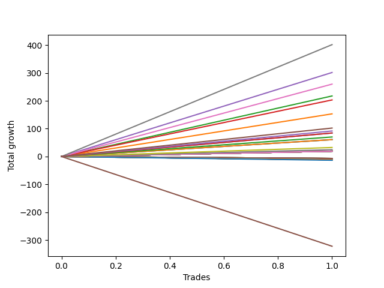

# Long Pointer 001 DB 
- Symbol: ES1y1d
- Date Range: 07/19/2021 - 07/08/2022
- Trading Period: 7:20-12:30
- Number of Trades: 1



| Name | Win Percent | Profit | Avg Profit / Trade | Avg Time / Trade | Avg Profit / Time |      | Name | Win Percent | Profit | Avg Profit / Trade | Avg Time / Trade | Avg Profit / Time |
| ---- | ----------- | ------ | ------------------ | ---------------- | ----------------- | ---- | ---- | ----------- | ------ | ------------------ | ---------------- | ----------------- |
| Sorted By <br> Profit | | | | | | | Sorted By <br> Win Percentage ||||||
| Seven | 100.00 | 200875.00 | 200875.00 | 19 05:14:00 | 10452.41 |     | Seven | 100.00 | 200875.00 | 200875.00 | 19 05:14:00 | 10452.41 |
| Four | 100.00 | 150875.00 | 150875.00 | 17 23:09:00 | 8398.47 |     | Four | 100.00 | 150875.00 | 150875.00 | 17 23:09:00 | 8398.47 |
| Six | 100.00 | 130000.00 | 130000.00 | 11 23:40:00 | 10845.89 |     | Six | 100.00 | 130000.00 | 130000.00 | 11 23:40:00 | 10845.89 |
| Two | 100.00 | 108750.00 | 108750.00 | 08 04:59:00 | 13249.85 |     | Two | 100.00 | 108750.00 | 108750.00 | 08 04:59:00 | 13249.85 |
| Three | 100.00 | 101625.00 | 101625.00 | 08 03:09:00 | 12498.08 |     | Three | 100.00 | 101625.00 | 101625.00 | 08 03:09:00 | 12498.08 |
| One | 100.00 | 76625.00 | 76625.00 | 07 03:08:00 | 10746.01 |     | One | 100.00 | 76625.00 | 76625.00 | 07 03:08:00 | 10746.01 |
| Two Hundred Fifteen | 100.00 | 75375.00 | 75375.00 | 07 03:06:00 | 10572.76 |     | Two Hundred Fifteen | 100.00 | 75375.00 | 75375.00 | 07 03:06:00 | 10572.76 |
| Two Hundred Fourteen.Five | 100.00 | 72625.00 | 72625.00 | 07 03:00:00 | 10192.98 |     | Two Hundred Fourteen.Five | 100.00 | 72625.00 | 72625.00 | 07 03:00:00 | 10192.98 |
| Two Hundred Fourteen | 100.00 | 70625.00 | 70625.00 | 07 02:02:00 | 9968.63 |     | Two Hundred Fourteen | 100.00 | 70625.00 | 70625.00 | 07 02:02:00 | 9968.63 |
| Two Hundred Thirteen.Five | 100.00 | 67375.00 | 67375.00 | 06 06:16:00 | 10760.87 |     | Two Hundred Thirteen.Five | 100.00 | 67375.00 | 67375.00 | 06 06:16:00 | 10760.87 |
| Two Hundred Thirteen | 100.00 | 65625.00 | 65625.00 | 06 06:02:00 | 10497.67 |     | Two Hundred Thirteen | 100.00 | 65625.00 | 65625.00 | 06 06:02:00 | 10497.67 |
| Two Hundred Twelve.Five | 100.00 | 63750.00 | 63750.00 | 06 05:57:00 | 10203.40 |     | Two Hundred Twelve.Five | 100.00 | 63750.00 | 63750.00 | 06 05:57:00 | 10203.40 |
| Two Hundred Twelve | 100.00 | 61625.00 | 61625.00 | 06 05:39:00 | 9883.06 |     | Two Hundred Twelve | 100.00 | 61625.00 | 61625.00 | 06 05:39:00 | 9883.06 |
| Two Hundred Eleven.Five | 100.00 | 57625.00 | 57625.00 | 06 05:38:00 | 9242.59 |     | Two Hundred Eleven.Five | 100.00 | 57625.00 | 57625.00 | 06 05:38:00 | 9242.59 |
| Two Hundred Eleven | 100.00 | 55375.00 | 55375.00 | 05 23:58:00 | 9231.30 |     | Two Hundred Eleven | 100.00 | 55375.00 | 55375.00 | 05 23:58:00 | 9231.30 |
| Two Hundred Ten.Five | 100.00 | 52875.00 | 52875.00 | 05 23:57:00 | 8815.56 |     | Two Hundred Ten.Five | 100.00 | 52875.00 | 52875.00 | 05 23:57:00 | 8815.56 |
| Two Hundred Ten | 100.00 | 51125.00 | 51125.00 | 05 23:56:00 | 8524.78 |     | Two Hundred Ten | 100.00 | 51125.00 | 51125.00 | 05 23:56:00 | 8524.78 |
| Two Hundred Nine.Five | 100.00 | 49875.00 | 49875.00 | 05 23:55:00 | 8317.31 |     | Two Hundred Nine.Five | 100.00 | 49875.00 | 49875.00 | 05 23:55:00 | 8317.31 |
| Two Hundred Nine | 100.00 | 45875.00 | 45875.00 | 05 23:26:00 | 7676.04 |     | Two Hundred Nine | 100.00 | 45875.00 | 45875.00 | 05 23:26:00 | 7676.04 |
| Two Hundred Eight.Five | 100.00 | 42750.00 | 42750.00 | 05 23:19:00 | 7158.97 |     | Two Hundred Eight.Five | 100.00 | 42750.00 | 42750.00 | 05 23:19:00 | 7158.97 |
| Two Hundred Eight | 100.00 | 42250.00 | 42250.00 | 05 23:18:00 | 7076.06 |     | Two Hundred Eight | 100.00 | 42250.00 | 42250.00 | 05 23:18:00 | 7076.06 |
| Zero | 100.00 | 42250.00 | 42250.00 | 05 23:18:00 | 7076.06 |     | Zero | 100.00 | 42250.00 | 42250.00 | 05 23:18:00 | 7076.06 |
| Two Hundred Seven.Five | 100.00 | 37875.00 | 37875.00 | 05 23:15:00 | 6345.55 |     | Two Hundred Seven.Five | 100.00 | 37875.00 | 37875.00 | 05 23:15:00 | 6345.55 |
| Two Hundred Seven | 100.00 | 35125.00 | 35125.00 | 05 23:13:00 | 5886.19 |     | Two Hundred Seven | 100.00 | 35125.00 | 35125.00 | 05 23:13:00 | 5886.19 |
| Two Hundred Six.Five | 100.00 | 33500.00 | 33500.00 | 05 23:10:00 | 5615.83 |     | Two Hundred Six.Five | 100.00 | 33500.00 | 33500.00 | 05 23:10:00 | 5615.83 |
| Two Hundred Six | 100.00 | 30375.00 | 30375.00 | 00 23:10:00 | 31467.63 |     | Two Hundred Six | 100.00 | 30375.00 | 30375.00 | 00 23:10:00 | 31467.63 |
| Two Hundred Five.Five | 100.00 | 30375.00 | 30375.00 | 00 23:10:00 | 31467.63 |     | Two Hundred Five.Five | 100.00 | 30375.00 | 30375.00 | 00 23:10:00 | 31467.63 |
| Two Hundred Five | 100.00 | 30375.00 | 30375.00 | 00 23:10:00 | 31467.63 |     | Two Hundred Five | 100.00 | 30375.00 | 30375.00 | 00 23:10:00 | 31467.63 |
| Two Hundred Four.Five | 100.00 | 30375.00 | 30375.00 | 00 23:10:00 | 31467.63 |     | Two Hundred Four.Five | 100.00 | 30375.00 | 30375.00 | 00 23:10:00 | 31467.63 |
| Two Hundred Four | 100.00 | 30375.00 | 30375.00 | 00 23:10:00 | 31467.63 |     | Two Hundred Four | 100.00 | 30375.00 | 30375.00 | 00 23:10:00 | 31467.63 |
| Two Hundred Three.Five | 100.00 | 19125.00 | 19125.00 | 00 05:33:00 | 82702.70 |     | Two Hundred Three.Five | 100.00 | 19125.00 | 19125.00 | 00 05:33:00 | 82702.70 |
| Two Hundred Three | 100.00 | 16250.00 | 16250.00 | 00 04:28:00 | 87313.43 |     | Two Hundred Three | 100.00 | 16250.00 | 16250.00 | 00 04:28:00 | 87313.43 |
| Two Hundred Two.Five | 100.00 | 12625.00 | 12625.00 | 00 04:11:00 | 72430.28 |     | Two Hundred Two.Five | 100.00 | 12625.00 | 12625.00 | 00 04:11:00 | 72430.28 |
| Two Hundred Two | 100.00 | 12250.00 | 12250.00 | 00 03:44:00 | 78750.00 |     | Two Hundred Two | 100.00 | 12250.00 | 12250.00 | 00 03:44:00 | 78750.00 |
| Two Hundred One.Five | 100.00 | 9625.00 | 9625.00 | 00 00:03:00 | 4620000.00 |     | Two Hundred One.Five | 100.00 | 9625.00 | 9625.00 | 00 00:03:00 | 4620000.00 |
| Two Hundred One | 100.00 | 9625.00 | 9625.00 | 00 00:03:00 | 4620000.00 |     | Two Hundred One | 100.00 | 9625.00 | 9625.00 | 00 00:03:00 | 4620000.00 |
| Ninety | 100.00 | 9625.00 | 9625.00 | 00 00:03:00 | 4620000.00 |     | Ninety | 100.00 | 9625.00 | 9625.00 | 00 00:03:00 | 4620000.00 |
| Eighty-Nine | 100.00 | 9625.00 | 9625.00 | 00 00:03:00 | 4620000.00 |     | Eighty-Nine | 100.00 | 9625.00 | 9625.00 | 00 00:03:00 | 4620000.00 |
| Eighty-Eight | 100.00 | 9625.00 | 9625.00 | 00 00:03:00 | 4620000.00 |     | Eighty-Eight | 100.00 | 9625.00 | 9625.00 | 00 00:03:00 | 4620000.00 |
| Eighty-Seven | 100.00 | 9625.00 | 9625.00 | 00 00:03:00 | 4620000.00 |     | Eighty-Seven | 100.00 | 9625.00 | 9625.00 | 00 00:03:00 | 4620000.00 |
| Eighty-Six | 100.00 | 9625.00 | 9625.00 | 00 00:03:00 | 4620000.00 |     | Eighty-Six | 100.00 | 9625.00 | 9625.00 | 00 00:03:00 | 4620000.00 |
| Eighty-Five | 100.00 | 9625.00 | 9625.00 | 00 00:03:00 | 4620000.00 |     | Eighty-Five | 100.00 | 9625.00 | 9625.00 | 00 00:03:00 | 4620000.00 |
| Eighty-Four | 100.00 | 9625.00 | 9625.00 | 00 00:03:00 | 4620000.00 |     | Eighty-Four | 100.00 | 9625.00 | 9625.00 | 00 00:03:00 | 4620000.00 |
| Eighty-Three | 100.00 | 9625.00 | 9625.00 | 00 00:03:00 | 4620000.00 |     | Eighty-Three | 100.00 | 9625.00 | 9625.00 | 00 00:03:00 | 4620000.00 |
| Eighty-Two | 100.00 | 9625.00 | 9625.00 | 00 00:03:00 | 4620000.00 |     | Eighty-Two | 100.00 | 9625.00 | 9625.00 | 00 00:03:00 | 4620000.00 |
| Eighty-One | 100.00 | 9625.00 | 9625.00 | 00 00:03:00 | 4620000.00 |     | Eighty-One | 100.00 | 9625.00 | 9625.00 | 00 00:03:00 | 4620000.00 |
| Seventy-Three | 0.00 | -6625.00 | -6625.00 | 05 01:01:00 | -1313.87 |     | Seventy-Three | 0.00 | -6625.00 | -6625.00 | 05 01:01:00 | -1313.87 |
| Five | 0.00 | -161000.00 | -161000.00 | 120 05:37:00 | -1339.06 |     | Five | 0.00 | -161000.00 | -161000.00 | 120 05:37:00 | -1339.06 |

## NO STOPLOSS

### Test Zero
* Sell when price hits the middle line of the 20p bollinger
* No Stoploss
* Results:
```
Total Trades: 1
Percent Up: 100.00
Percent Down: 0.00
Total Points Moved Up: 84.50
Potential Profit: 42250.00
Total Points Ups: 84.50 Count Ups: 1
Total Points Downs: 0.00 Count Downs: 0
```

<details><summary>Trades</summary>

<code>In: 2022-03-10 07:21:00		Out: 2022-03-16 06:39:00		Total Position Time: 05 23:18:00		Total Move Up: 84.50		Total to Date: 84.50</code> <br />


</details>

### Test One
* Sell when the price hits the upper line of the 20p 1std bollinger
* No Stoploss
* Results:
```
Total Trades: 1
Percent Up: 100.00
Percent Down: 0.00
Total Points Moved Up: 153.25
Potential Profit: 76625.00
Total Points Ups: 153.25 Count Ups: 1
Total Points Downs: 0.00 Count Downs: 0
```

<details><summary>Trades</summary>

<code>In: 2022-03-10 07:21:00		Out: 2022-03-17 10:29:00		Total Position Time: 07 03:08:00		Total Move Up: 153.25		Total to Date: 153.25</code> <br />


</details>

### Test Two
* Sell when the price hits the upper line of the 20p 2std bollinger
* No Stoploss
* Results:
```
Total Trades: 1
Percent Up: 100.00
Percent Down: 0.00
Total Points Moved Up: 217.50
Potential Profit: 108750.00
Total Points Ups: 217.50 Count Ups: 1
Total Points Downs: 0.00 Count Downs: 0
```

<details><summary>Trades</summary>

<code>In: 2022-03-10 07:21:00		Out: 2022-03-18 12:20:00		Total Position Time: 08 04:59:00		Total Move Up: 217.50		Total to Date: 217.50</code> <br />


</details>

### Test Three
* Sell when price hits the middle line of the 50p bollinger
* No Stoploss
* Results:
```
Total Trades: 1
Percent Up: 100.00
Percent Down: 0.00
Total Points Moved Up: 203.25
Potential Profit: 101625.00
Total Points Ups: 203.25 Count Ups: 1
Total Points Downs: 0.00 Count Downs: 0
```

<details><summary>Trades</summary>

<code>In: 2022-03-10 07:21:00		Out: 2022-03-18 10:30:00		Total Position Time: 08 03:09:00		Total Move Up: 203.25		Total to Date: 203.25</code> <br />


</details>

### Test Four
* Sell when the price hits the upper line of the 50p 1std bollinger
* No Stoploss
* Results:
```
Total Trades: 1
Percent Up: 100.00
Percent Down: 0.00
Total Points Moved Up: 301.75
Potential Profit: 150875.00
Total Points Ups: 301.75 Count Ups: 1
Total Points Downs: 0.00 Count Downs: 0
```

<details><summary>Trades</summary>

<code>In: 2022-03-10 07:21:00		Out: 2022-03-28 06:30:00		Total Position Time: 17 23:09:00		Total Move Up: 301.75		Total to Date: 301.75</code> <br />


</details>

### Test Five
* Sell when the price hits the upper line of the 50p 2std bollinger
* No Stoploss
* Results:
```
Total Trades: 1
Percent Up: 0.00
Percent Down: 100.00
Total Points Moved Up: -322.00
Potential Profit: -161000.00
Total Points Ups: 0.00 Count Ups: 0
Total Points Downs: -322.00 Count Downs: 1
```

<details><summary>Trades</summary>

<code>In: 2022-03-10 07:21:00		Out: 2022-07-08 12:58:00		Total Position Time: 120 05:37:00		Total Move Up: -322.00		Total to Date: -322.00</code> <br />


</details>

### Test Six
* Sell when the price hits the middle line of the 1std VWAP
* No Stoploss
* Results:
```
Total Trades: 1
Percent Up: 100.00
Percent Down: 0.00
Total Points Moved Up: 260.00
Potential Profit: 130000.00
Total Points Ups: 260.00 Count Ups: 1
Total Points Downs: 0.00 Count Downs: 0
```

<details><summary>Trades</summary>

<code>In: 2022-03-10 07:21:00		Out: 2022-03-22 07:01:00		Total Position Time: 11 23:40:00		Total Move Up: 260.00		Total to Date: 260.00</code> <br />


</details>

### Test Seven
* Sell when the price hits the upper line of the 1std VWAP
* No Stoploss
* Results:
```
Total Trades: 1
Percent Up: 100.00
Percent Down: 0.00
Total Points Moved Up: 401.75
Potential Profit: 200875.00
Total Points Ups: 401.75 Count Ups: 1
Total Points Downs: 0.00 Count Downs: 0
```

<details><summary>Trades</summary>

<code>In: 2022-03-10 07:21:00		Out: 2022-03-29 12:35:00		Total Position Time: 19 05:14:00		Total Move Up: 401.75		Total to Date: 401.75</code> <br />


</details>

## SPECIAL EXIT CONDITIONS 

### Test Seventy-Three
* Sell when the linear regression slope changes to negative
* No Stoploss
* Results:
```
Total Trades: 1
Percent Up: 0.00
Percent Down: 100.00
Total Points Moved Up: -13.25
Potential Profit: -6625.00
Total Points Ups: 0.00 Count Ups: 0
Total Points Downs: -13.25 Count Downs: 1
```

<details><summary>Trades</summary>

<code>In: 2022-03-10 07:21:00		Out: 2022-03-15 08:22:00		Total Position Time: 05 01:01:00		Total Move Up: -13.25		Total to Date: -13.25</code> <br />


</details>

## TAKE PROFIT

### Test Eighty-One
* Take Profit of 1 Point
* No Stoploss
* Results:
```
Total Trades: 1
Percent Up: 100.00
Percent Down: 0.00
Total Points Moved Up: 19.25
Potential Profit: 9625.00
Total Points Ups: 19.25 Count Ups: 1
Total Points Downs: 0.00 Count Downs: 0
```

<details><summary>Trades</summary>

<code>In: 2022-03-10 07:21:00		Out: 2022-03-10 07:24:00		Total Position Time: 00 00:03:00		Total Move Up: 19.25		Total to Date: 19.25</code> <br />


</details>

### Test Eighty-Two
* Take Profit of 2 Point
* No Stoploss
* Results:
```
Total Trades: 1
Percent Up: 100.00
Percent Down: 0.00
Total Points Moved Up: 19.25
Potential Profit: 9625.00
Total Points Ups: 19.25 Count Ups: 1
Total Points Downs: 0.00 Count Downs: 0
```

<details><summary>Trades</summary>

<code>In: 2022-03-10 07:21:00		Out: 2022-03-10 07:24:00		Total Position Time: 00 00:03:00		Total Move Up: 19.25		Total to Date: 19.25</code> <br />


</details>

### Test Eighty-Three
* Take Profit of 3 Point
* No Stoploss
* Results:
```
Total Trades: 1
Percent Up: 100.00
Percent Down: 0.00
Total Points Moved Up: 19.25
Potential Profit: 9625.00
Total Points Ups: 19.25 Count Ups: 1
Total Points Downs: 0.00 Count Downs: 0
```

<details><summary>Trades</summary>

<code>In: 2022-03-10 07:21:00		Out: 2022-03-10 07:24:00		Total Position Time: 00 00:03:00		Total Move Up: 19.25		Total to Date: 19.25</code> <br />


</details>

### Test Eighty-Four
* Take Profit of 4 Point
* No Stoploss
* Results:
```
Total Trades: 1
Percent Up: 100.00
Percent Down: 0.00
Total Points Moved Up: 19.25
Potential Profit: 9625.00
Total Points Ups: 19.25 Count Ups: 1
Total Points Downs: 0.00 Count Downs: 0
```

<details><summary>Trades</summary>

<code>In: 2022-03-10 07:21:00		Out: 2022-03-10 07:24:00		Total Position Time: 00 00:03:00		Total Move Up: 19.25		Total to Date: 19.25</code> <br />


</details>

### Test Eighty-Five
* Take Profit of 5 Point
* No Stoploss
* Results:
```
Total Trades: 1
Percent Up: 100.00
Percent Down: 0.00
Total Points Moved Up: 19.25
Potential Profit: 9625.00
Total Points Ups: 19.25 Count Ups: 1
Total Points Downs: 0.00 Count Downs: 0
```

<details><summary>Trades</summary>

<code>In: 2022-03-10 07:21:00		Out: 2022-03-10 07:24:00		Total Position Time: 00 00:03:00		Total Move Up: 19.25		Total to Date: 19.25</code> <br />


</details>

### Test Eighty-Six
* Take Profit of 6 Point
* No Stoploss
* Results:
```
Total Trades: 1
Percent Up: 100.00
Percent Down: 0.00
Total Points Moved Up: 19.25
Potential Profit: 9625.00
Total Points Ups: 19.25 Count Ups: 1
Total Points Downs: 0.00 Count Downs: 0
```

<details><summary>Trades</summary>

<code>In: 2022-03-10 07:21:00		Out: 2022-03-10 07:24:00		Total Position Time: 00 00:03:00		Total Move Up: 19.25		Total to Date: 19.25</code> <br />


</details>

### Test Eighty-Seven
* Take Profit of 7 Point
* No Stoploss
* Results:
```
Total Trades: 1
Percent Up: 100.00
Percent Down: 0.00
Total Points Moved Up: 19.25
Potential Profit: 9625.00
Total Points Ups: 19.25 Count Ups: 1
Total Points Downs: 0.00 Count Downs: 0
```

<details><summary>Trades</summary>

<code>In: 2022-03-10 07:21:00		Out: 2022-03-10 07:24:00		Total Position Time: 00 00:03:00		Total Move Up: 19.25		Total to Date: 19.25</code> <br />


</details>

### Test Eighty-Eight
* Take Profit of 8 Point
* No Stoploss
* Results:
```
Total Trades: 1
Percent Up: 100.00
Percent Down: 0.00
Total Points Moved Up: 19.25
Potential Profit: 9625.00
Total Points Ups: 19.25 Count Ups: 1
Total Points Downs: 0.00 Count Downs: 0
```

<details><summary>Trades</summary>

<code>In: 2022-03-10 07:21:00		Out: 2022-03-10 07:24:00		Total Position Time: 00 00:03:00		Total Move Up: 19.25		Total to Date: 19.25</code> <br />


</details>

### Test Eighty-Nine
* Take Profit of 9 Point
* No Stoploss
* Results:
```
Total Trades: 1
Percent Up: 100.00
Percent Down: 0.00
Total Points Moved Up: 19.25
Potential Profit: 9625.00
Total Points Ups: 19.25 Count Ups: 1
Total Points Downs: 0.00 Count Downs: 0
```

<details><summary>Trades</summary>

<code>In: 2022-03-10 07:21:00		Out: 2022-03-10 07:24:00		Total Position Time: 00 00:03:00		Total Move Up: 19.25		Total to Date: 19.25</code> <br />


</details>

### Test Ninety
* Take Profit of 10 Point
* No Stoploss
* Results:
```
Total Trades: 1
Percent Up: 100.00
Percent Down: 0.00
Total Points Moved Up: 19.25
Potential Profit: 9625.00
Total Points Ups: 19.25 Count Ups: 1
Total Points Downs: 0.00 Count Downs: 0
```

<details><summary>Trades</summary>

<code>In: 2022-03-10 07:21:00		Out: 2022-03-10 07:24:00		Total Position Time: 00 00:03:00		Total Move Up: 19.25		Total to Date: 19.25</code> <br />


</details>

## DAILY TAKE PROFITS

### Test Two Hundred One
* Take Profit of 10 Point
* No Stoploss
* Results:
```
Total Trades: 1
Percent Up: 100.00
Percent Down: 0.00
Total Points Moved Up: 19.25
Potential Profit: 9625.00
Total Points Ups: 19.25 Count Ups: 1
Total Points Downs: 0.00 Count Downs: 0
```

<details><summary>Trades</summary>

<code>In: 2022-03-10 07:21:00		Out: 2022-03-10 07:24:00		Total Position Time: 00 00:03:00		Total Move Up: 19.25		Total to Date: 19.25</code> <br />


</details>

### Test Two Hundred One.Five
* Take Profit of 15 Point
* No Stoploss
* Results:
```
Total Trades: 1
Percent Up: 100.00
Percent Down: 0.00
Total Points Moved Up: 19.25
Potential Profit: 9625.00
Total Points Ups: 19.25 Count Ups: 1
Total Points Downs: 0.00 Count Downs: 0
```

<details><summary>Trades</summary>

<code>In: 2022-03-10 07:21:00		Out: 2022-03-10 07:24:00		Total Position Time: 00 00:03:00		Total Move Up: 19.25		Total to Date: 19.25</code> <br />


</details>

### Test Two Hundred Two
* Take Profit of 20 Point
* No Stoploss
* Results:
```
Total Trades: 1
Percent Up: 100.00
Percent Down: 0.00
Total Points Moved Up: 24.50
Potential Profit: 12250.00
Total Points Ups: 24.50 Count Ups: 1
Total Points Downs: 0.00 Count Downs: 0
```

<details><summary>Trades</summary>

<code>In: 2022-03-10 07:21:00		Out: 2022-03-10 11:05:00		Total Position Time: 00 03:44:00		Total Move Up: 24.50		Total to Date: 24.50</code> <br />


</details>

### Test Two Hundred Two.Five
* Take Profit of 25 Point
* No Stoploss
* Results:
```
Total Trades: 1
Percent Up: 100.00
Percent Down: 0.00
Total Points Moved Up: 25.25
Potential Profit: 12625.00
Total Points Ups: 25.25 Count Ups: 1
Total Points Downs: 0.00 Count Downs: 0
```

<details><summary>Trades</summary>

<code>In: 2022-03-10 07:21:00		Out: 2022-03-10 11:32:00		Total Position Time: 00 04:11:00		Total Move Up: 25.25		Total to Date: 25.25</code> <br />


</details>

### Test Two Hundred Three
* Take Profit of 30 Point
* No Stoploss
* Results:
```
Total Trades: 1
Percent Up: 100.00
Percent Down: 0.00
Total Points Moved Up: 32.50
Potential Profit: 16250.00
Total Points Ups: 32.50 Count Ups: 1
Total Points Downs: 0.00 Count Downs: 0
```

<details><summary>Trades</summary>

<code>In: 2022-03-10 07:21:00		Out: 2022-03-10 11:49:00		Total Position Time: 00 04:28:00		Total Move Up: 32.50		Total to Date: 32.50</code> <br />


</details>

### Test Two Hundred Three.Five
* Take Profit of 35 Point
* No Stoploss
* Results:
```
Total Trades: 1
Percent Up: 100.00
Percent Down: 0.00
Total Points Moved Up: 38.25
Potential Profit: 19125.00
Total Points Ups: 38.25 Count Ups: 1
Total Points Downs: 0.00 Count Downs: 0
```

<details><summary>Trades</summary>

<code>In: 2022-03-10 07:21:00		Out: 2022-03-10 12:54:00		Total Position Time: 00 05:33:00		Total Move Up: 38.25		Total to Date: 38.25</code> <br />


</details>

### Test Two Hundred Four
* Take Profit of 40 Point
* No Stoploss
* Results:
```
Total Trades: 1
Percent Up: 100.00
Percent Down: 0.00
Total Points Moved Up: 60.75
Potential Profit: 30375.00
Total Points Ups: 60.75 Count Ups: 1
Total Points Downs: 0.00 Count Downs: 0
```

<details><summary>Trades</summary>

<code>In: 2022-03-10 07:21:00		Out: 2022-03-11 06:31:00		Total Position Time: 00 23:10:00		Total Move Up: 60.75		Total to Date: 60.75</code> <br />


</details>

### Test Two Hundred Four.Five
* Take Profit of 45 Point
* No Stoploss
* Results:
```
Total Trades: 1
Percent Up: 100.00
Percent Down: 0.00
Total Points Moved Up: 60.75
Potential Profit: 30375.00
Total Points Ups: 60.75 Count Ups: 1
Total Points Downs: 0.00 Count Downs: 0
```

<details><summary>Trades</summary>

<code>In: 2022-03-10 07:21:00		Out: 2022-03-11 06:31:00		Total Position Time: 00 23:10:00		Total Move Up: 60.75		Total to Date: 60.75</code> <br />


</details>

### Test Two Hundred Five
* Take Profit of 50 Point
* No Stoploss
* Results:
```
Total Trades: 1
Percent Up: 100.00
Percent Down: 0.00
Total Points Moved Up: 60.75
Potential Profit: 30375.00
Total Points Ups: 60.75 Count Ups: 1
Total Points Downs: 0.00 Count Downs: 0
```

<details><summary>Trades</summary>

<code>In: 2022-03-10 07:21:00		Out: 2022-03-11 06:31:00		Total Position Time: 00 23:10:00		Total Move Up: 60.75		Total to Date: 60.75</code> <br />


</details>

### Test Two Hundred Five.Five
* Take Profit of 55 Point
* No Stoploss
* Results:
```
Total Trades: 1
Percent Up: 100.00
Percent Down: 0.00
Total Points Moved Up: 60.75
Potential Profit: 30375.00
Total Points Ups: 60.75 Count Ups: 1
Total Points Downs: 0.00 Count Downs: 0
```

<details><summary>Trades</summary>

<code>In: 2022-03-10 07:21:00		Out: 2022-03-11 06:31:00		Total Position Time: 00 23:10:00		Total Move Up: 60.75		Total to Date: 60.75</code> <br />


</details>

### Test Two Hundred Six
* Take Profit of 60 Point
* No Stoploss
* Results:
```
Total Trades: 1
Percent Up: 100.00
Percent Down: 0.00
Total Points Moved Up: 60.75
Potential Profit: 30375.00
Total Points Ups: 60.75 Count Ups: 1
Total Points Downs: 0.00 Count Downs: 0
```

<details><summary>Trades</summary>

<code>In: 2022-03-10 07:21:00		Out: 2022-03-11 06:31:00		Total Position Time: 00 23:10:00		Total Move Up: 60.75		Total to Date: 60.75</code> <br />


</details>

### Test Two Hundred Six.Five
* Take Profit of 65 Point
* No Stoploss
* Results:
```
Total Trades: 1
Percent Up: 100.00
Percent Down: 0.00
Total Points Moved Up: 67.00
Potential Profit: 33500.00
Total Points Ups: 67.00 Count Ups: 1
Total Points Downs: 0.00 Count Downs: 0
```

<details><summary>Trades</summary>

<code>In: 2022-03-10 07:21:00		Out: 2022-03-16 06:31:00		Total Position Time: 05 23:10:00		Total Move Up: 67.00		Total to Date: 67.00</code> <br />


</details>

### Test Two Hundred Seven
* Take Profit of 70 Point
* No Stoploss
* Results:
```
Total Trades: 1
Percent Up: 100.00
Percent Down: 0.00
Total Points Moved Up: 70.25
Potential Profit: 35125.00
Total Points Ups: 70.25 Count Ups: 1
Total Points Downs: 0.00 Count Downs: 0
```

<details><summary>Trades</summary>

<code>In: 2022-03-10 07:21:00		Out: 2022-03-16 06:34:00		Total Position Time: 05 23:13:00		Total Move Up: 70.25		Total to Date: 70.25</code> <br />


</details>

### Test Two Hundred Seven.Five
* Take Profit of 75 Point
* No Stoploss
* Results:
```
Total Trades: 1
Percent Up: 100.00
Percent Down: 0.00
Total Points Moved Up: 75.75
Potential Profit: 37875.00
Total Points Ups: 75.75 Count Ups: 1
Total Points Downs: 0.00 Count Downs: 0
```

<details><summary>Trades</summary>

<code>In: 2022-03-10 07:21:00		Out: 2022-03-16 06:36:00		Total Position Time: 05 23:15:00		Total Move Up: 75.75		Total to Date: 75.75</code> <br />


</details>

### Test Two Hundred Eight
* Take Profit of 80 Point
* No Stoploss
* Results:
```
Total Trades: 1
Percent Up: 100.00
Percent Down: 0.00
Total Points Moved Up: 84.50
Potential Profit: 42250.00
Total Points Ups: 84.50 Count Ups: 1
Total Points Downs: 0.00 Count Downs: 0
```

<details><summary>Trades</summary>

<code>In: 2022-03-10 07:21:00		Out: 2022-03-16 06:39:00		Total Position Time: 05 23:18:00		Total Move Up: 84.50		Total to Date: 84.50</code> <br />


</details>

### Test Two Hundred Eight.Five
* Take Profit of 85 Point
* No Stoploss
* Results:
```
Total Trades: 1
Percent Up: 100.00
Percent Down: 0.00
Total Points Moved Up: 85.50
Potential Profit: 42750.00
Total Points Ups: 85.50 Count Ups: 1
Total Points Downs: 0.00 Count Downs: 0
```

<details><summary>Trades</summary>

<code>In: 2022-03-10 07:21:00		Out: 2022-03-16 06:40:00		Total Position Time: 05 23:19:00		Total Move Up: 85.50		Total to Date: 85.50</code> <br />


</details>

### Test Two Hundred Nine
* Take Profit of 90 Point
* No Stoploss
* Results:
```
Total Trades: 1
Percent Up: 100.00
Percent Down: 0.00
Total Points Moved Up: 91.75
Potential Profit: 45875.00
Total Points Ups: 91.75 Count Ups: 1
Total Points Downs: 0.00 Count Downs: 0
```

<details><summary>Trades</summary>

<code>In: 2022-03-10 07:21:00		Out: 2022-03-16 06:47:00		Total Position Time: 05 23:26:00		Total Move Up: 91.75		Total to Date: 91.75</code> <br />


</details>

### Test Two Hundred Nine.Five
* Take Profit of 95 Point
* No Stoploss
* Results:
```
Total Trades: 1
Percent Up: 100.00
Percent Down: 0.00
Total Points Moved Up: 99.75
Potential Profit: 49875.00
Total Points Ups: 99.75 Count Ups: 1
Total Points Downs: 0.00 Count Downs: 0
```

<details><summary>Trades</summary>

<code>In: 2022-03-10 07:21:00		Out: 2022-03-16 07:16:00		Total Position Time: 05 23:55:00		Total Move Up: 99.75		Total to Date: 99.75</code> <br />


</details>

### Test Two Hundred Ten
* Take Profit of 100 Point
* No Stoploss
* Results:
```
Total Trades: 1
Percent Up: 100.00
Percent Down: 0.00
Total Points Moved Up: 102.25
Potential Profit: 51125.00
Total Points Ups: 102.25 Count Ups: 1
Total Points Downs: 0.00 Count Downs: 0
```

<details><summary>Trades</summary>

<code>In: 2022-03-10 07:21:00		Out: 2022-03-16 07:17:00		Total Position Time: 05 23:56:00		Total Move Up: 102.25		Total to Date: 102.25</code> <br />


</details>

### Test Two Hundred Ten.Five
* Take Profit of 105 Point
* No Stoploss
* Results:
```
Total Trades: 1
Percent Up: 100.00
Percent Down: 0.00
Total Points Moved Up: 105.75
Potential Profit: 52875.00
Total Points Ups: 105.75 Count Ups: 1
Total Points Downs: 0.00 Count Downs: 0
```

<details><summary>Trades</summary>

<code>In: 2022-03-10 07:21:00		Out: 2022-03-16 07:18:00		Total Position Time: 05 23:57:00		Total Move Up: 105.75		Total to Date: 105.75</code> <br />


</details>

### Test Two Hundred Eleven
* Take Profit of 110 Point
* No Stoploss
* Results:
```
Total Trades: 1
Percent Up: 100.00
Percent Down: 0.00
Total Points Moved Up: 110.75
Potential Profit: 55375.00
Total Points Ups: 110.75 Count Ups: 1
Total Points Downs: 0.00 Count Downs: 0
```

<details><summary>Trades</summary>

<code>In: 2022-03-10 07:21:00		Out: 2022-03-16 07:19:00		Total Position Time: 05 23:58:00		Total Move Up: 110.75		Total to Date: 110.75</code> <br />


</details>

### Test Two Hundred Eleven.Five
* Take Profit of 115 Point
* No Stoploss
* Results:
```
Total Trades: 1
Percent Up: 100.00
Percent Down: 0.00
Total Points Moved Up: 115.25
Potential Profit: 57625.00
Total Points Ups: 115.25 Count Ups: 1
Total Points Downs: 0.00 Count Downs: 0
```

<details><summary>Trades</summary>

<code>In: 2022-03-10 07:21:00		Out: 2022-03-16 12:59:00		Total Position Time: 06 05:38:00		Total Move Up: 115.25		Total to Date: 115.25</code> <br />


</details>

### Test Two Hundred Twelve
* Take Profit of 120 Point
* No Stoploss
* Results:
```
Total Trades: 1
Percent Up: 100.00
Percent Down: 0.00
Total Points Moved Up: 123.25
Potential Profit: 61625.00
Total Points Ups: 123.25 Count Ups: 1
Total Points Downs: 0.00 Count Downs: 0
```

<details><summary>Trades</summary>

<code>In: 2022-03-10 07:21:00		Out: 2022-03-16 13:00:00		Total Position Time: 06 05:39:00		Total Move Up: 123.25		Total to Date: 123.25</code> <br />


</details>

### Test Two Hundred Twelve.Five
* Take Profit of 125 Point
* No Stoploss
* Results:
```
Total Trades: 1
Percent Up: 100.00
Percent Down: 0.00
Total Points Moved Up: 127.50
Potential Profit: 63750.00
Total Points Ups: 127.50 Count Ups: 1
Total Points Downs: 0.00 Count Downs: 0
```

<details><summary>Trades</summary>

<code>In: 2022-03-10 07:21:00		Out: 2022-03-16 13:18:00		Total Position Time: 06 05:57:00		Total Move Up: 127.50		Total to Date: 127.50</code> <br />


</details>

### Test Two Hundred Thirteen
* Take Profit of 130 Point
* No Stoploss
* Results:
```
Total Trades: 1
Percent Up: 100.00
Percent Down: 0.00
Total Points Moved Up: 131.25
Potential Profit: 65625.00
Total Points Ups: 131.25 Count Ups: 1
Total Points Downs: 0.00 Count Downs: 0
```

<details><summary>Trades</summary>

<code>In: 2022-03-10 07:21:00		Out: 2022-03-16 13:23:00		Total Position Time: 06 06:02:00		Total Move Up: 131.25		Total to Date: 131.25</code> <br />


</details>

### Test Two Hundred Thirteen.Five
* Take Profit of 135 Point
* No Stoploss
* Results:
```
Total Trades: 1
Percent Up: 100.00
Percent Down: 0.00
Total Points Moved Up: 134.75
Potential Profit: 67375.00
Total Points Ups: 134.75 Count Ups: 1
Total Points Downs: 0.00 Count Downs: 0
```

<details><summary>Trades</summary>

<code>In: 2022-03-10 07:21:00		Out: 2022-03-16 13:37:00		Total Position Time: 06 06:16:00		Total Move Up: 134.75		Total to Date: 134.75</code> <br />


</details>

### Test Two Hundred Fourteen
* Take Profit of 140 Point
* No Stoploss
* Results:
```
Total Trades: 1
Percent Up: 100.00
Percent Down: 0.00
Total Points Moved Up: 141.25
Potential Profit: 70625.00
Total Points Ups: 141.25 Count Ups: 1
Total Points Downs: 0.00 Count Downs: 0
```

<details><summary>Trades</summary>

<code>In: 2022-03-10 07:21:00		Out: 2022-03-17 09:23:00		Total Position Time: 07 02:02:00		Total Move Up: 141.25		Total to Date: 141.25</code> <br />


</details>

### Test Two Hundred Fourteen.Five
* Take Profit of 145 Point
* No Stoploss
* Results:
```
Total Trades: 1
Percent Up: 100.00
Percent Down: 0.00
Total Points Moved Up: 145.25
Potential Profit: 72625.00
Total Points Ups: 145.25 Count Ups: 1
Total Points Downs: 0.00 Count Downs: 0
```

<details><summary>Trades</summary>

<code>In: 2022-03-10 07:21:00		Out: 2022-03-17 10:21:00		Total Position Time: 07 03:00:00		Total Move Up: 145.25		Total to Date: 145.25</code> <br />


</details>

### Test Two Hundred Fifteen
* Take Profit of 150 Point
* No Stoploss
* Results:
```
Total Trades: 1
Percent Up: 100.00
Percent Down: 0.00
Total Points Moved Up: 150.75
Potential Profit: 75375.00
Total Points Ups: 150.75 Count Ups: 1
Total Points Downs: 0.00 Count Downs: 0
```

<details><summary>Trades</summary>

<code>In: 2022-03-10 07:21:00		Out: 2022-03-17 10:27:00		Total Position Time: 07 03:06:00		Total Move Up: 150.75		Total to Date: 150.75</code> <br />


</details>