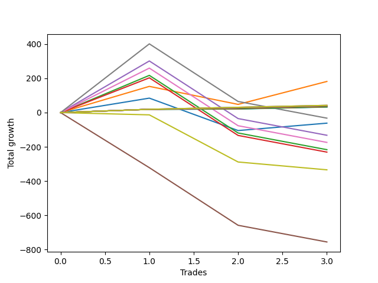

# Long Pointer 001 SD 
- Symbol: ES1y1d
- Date Range: 07/19/2021 - 07/07/2022
- Trading Period: 7:20-12:30
- Number of Trades: 3



| Name | Win Percent | Profit | Avg Profit / Trade | Avg Time / Trade | Avg Profit / Time |      | Name | Win Percent | Profit | Avg Profit / Trade | Avg Time / Trade | Avg Profit / Time |
| ---- | ----------- | ------ | ------------------ | ---------------- | ----------------- | ---- | ---- | ----------- | ------ | ------------------ | ---------------- | ----------------- |
| Sorted By <br> Profit | | | | | | | Sorted By <br> Win Percentage ||||||
| One | 66.67 | 91000.00 | 30333.33 | 15 12:12:00 | 1955.94 |     | Ninety | 100.00 | 21125.00 | 7041.67 | 01 17:38:00 | 4059.25 |
| Ninety | 100.00 | 21125.00 | 7041.67 | 01 17:38:00 | 4059.25 |     | Eighty-Nine | 100.00 | 21125.00 | 7041.67 | 01 17:38:00 | 4059.25 |
| Eighty-Nine | 100.00 | 21125.00 | 7041.67 | 01 17:38:00 | 4059.25 |     | Eighty-Eight | 100.00 | 21125.00 | 7041.67 | 01 17:38:00 | 4059.25 |
| Eighty-Eight | 100.00 | 21125.00 | 7041.67 | 01 17:38:00 | 4059.25 |     | Eighty-Seven | 100.00 | 19125.00 | 6375.00 | 01 17:35:40 | 3678.38 |
| Eighty-Seven | 100.00 | 19125.00 | 6375.00 | 01 17:35:40 | 3678.38 |     | Eighty-Six | 100.00 | 19125.00 | 6375.00 | 01 17:35:40 | 3678.38 |
| Eighty-Six | 100.00 | 19125.00 | 6375.00 | 01 17:35:40 | 3678.38 |     | Eighty-Five | 100.00 | 19125.00 | 6375.00 | 01 17:35:40 | 3678.38 |
| Eighty-Five | 100.00 | 19125.00 | 6375.00 | 01 17:35:40 | 3678.38 |     | Eighty-Four | 100.00 | 17375.00 | 5791.67 | 01 17:35:20 | 3342.24 |
| Eighty-Four | 100.00 | 17375.00 | 5791.67 | 01 17:35:20 | 3342.24 |     | Eighty-Three | 100.00 | 16750.00 | 5583.33 | 01 17:34:00 | 3223.74 |
| Eighty-Three | 100.00 | 16750.00 | 5583.33 | 01 17:34:00 | 3223.74 |     | Eighty-Two | 100.00 | 16500.00 | 5500.00 | 01 17:33:40 | 3176.05 |
| Eighty-Two | 100.00 | 16500.00 | 5500.00 | 01 17:33:40 | 3176.05 |     | Eighty-One | 100.00 | 16125.00 | 5375.00 | 01 17:33:20 | 3104.28 |
| Eighty-One | 100.00 | 16125.00 | 5375.00 | 01 17:33:20 | 3104.28 |     | One | 66.67 | 91000.00 | 30333.33 | 15 12:12:00 | 1955.94 |
| Seven | 33.33 | -16250.00 | -5416.67 | 47 13:29:20 | -113.89 |     | Zero | 66.67 | -30875.00 | -10291.67 | 14 08:43:40 | -716.51 |
| Zero | 66.67 | -30875.00 | -10291.67 | 14 08:43:40 | -716.51 |     | Seven | 33.33 | -16250.00 | -5416.67 | 47 13:29:20 | -113.89 |
| Four | 33.33 | -66250.00 | -22083.33 | 47 03:27:40 | -468.42 |     | Four | 33.33 | -66250.00 | -22083.33 | 47 03:27:40 | -468.42 |
| Six | 33.33 | -87125.00 | -29041.67 | 45 03:38:00 | -643.21 |     | Six | 33.33 | -87125.00 | -29041.67 | 45 03:38:00 | -643.21 |
| Two | 33.33 | -108375.00 | -36125.00 | 43 21:24:20 | -823.04 |     | Two | 33.33 | -108375.00 | -36125.00 | 43 21:24:20 | -823.04 |
| Three | 33.33 | -115500.00 | -38500.00 | 43 20:47:40 | -877.66 |     | Three | 33.33 | -115500.00 | -38500.00 | 43 20:47:40 | -877.66 |
| Seventy-Three | 0.00 | -167250.00 | -55750.00 | 07 17:21:00 | -7218.78 |     | Seventy-Three | 0.00 | -167250.00 | -55750.00 | 07 17:21:00 | -7218.78 |
| Five | 0.00 | -378125.00 | -126041.67 | 81 05:37:00 | -1551.59 |     | Five | 0.00 | -378125.00 | -126041.67 | 81 05:37:00 | -1551.59 |

## NO STOPLOSS

### Test Zero
* Sell when price hits the middle line of the 20p bollinger
* No Stoploss
* Results:
```
Total Trades: 3
Percent Up: 66.67
Percent Down: 33.33
Total Points Moved Up: -61.75
Potential Profit: -30875.00
Total Points Ups: 127.75 Count Ups: 2
Total Points Downs: -189.50 Count Downs: 1
```

<details><summary>Trades</summary>

<code>In: 2022-03-10 07:21:00		Out: 2022-03-16 06:39:00		Total Position Time: 05 23:18:00		Total Move Up: 84.50		Total to Date: 84.50</code> <br />
<code>In: 2022-04-29 07:21:00		Out: 2022-05-26 09:12:00		Total Position Time: 27 01:51:00		Total Move Up: -189.50		Total to Date: -105.00</code> <br />
<code>In: 2022-05-16 07:21:00		Out: 2022-05-26 08:23:00		Total Position Time: 10 01:02:00		Total Move Up: 43.25		Total to Date: -61.75</code> <br />


</details>

### Test One
* Sell when the price hits the upper line of the 20p 1std bollinger
* No Stoploss
* Results:
```
Total Trades: 3
Percent Up: 66.67
Percent Down: 33.33
Total Points Moved Up: 182.00
Potential Profit: 91000.00
Total Points Ups: 287.25 Count Ups: 2
Total Points Downs: -105.25 Count Downs: 1
```

<details><summary>Trades</summary>

<code>In: 2022-03-10 07:21:00		Out: 2022-03-17 10:29:00		Total Position Time: 07 03:08:00		Total Move Up: 153.25		Total to Date: 153.25</code> <br />
<code>In: 2022-04-29 07:21:00		Out: 2022-05-27 12:05:00		Total Position Time: 28 04:44:00		Total Move Up: -105.25		Total to Date: 48.00</code> <br />
<code>In: 2022-05-16 07:21:00		Out: 2022-05-27 12:05:00		Total Position Time: 11 04:44:00		Total Move Up: 134.00		Total to Date: 182.00</code> <br />


</details>

### Test Two
* Sell when the price hits the upper line of the 20p 2std bollinger
* No Stoploss
* Results:
```
Total Trades: 3
Percent Up: 33.33
Percent Down: 66.67
Total Points Moved Up: -216.75
Potential Profit: -108375.00
Total Points Ups: 217.50 Count Ups: 1
Total Points Downs: -434.25 Count Downs: 2
```

<details><summary>Trades</summary>

<code>In: 2022-03-10 07:21:00		Out: 2022-03-18 12:20:00		Total Position Time: 08 04:59:00		Total Move Up: 217.50		Total to Date: 217.50</code> <br />
<code>In: 2022-04-29 07:21:00		Out: 2022-07-08 12:58:00		Total Position Time: 70 05:37:00		Total Move Up: -336.75		Total to Date: -119.25</code> <br />
<code>In: 2022-05-16 07:21:00		Out: 2022-07-08 12:58:00		Total Position Time: 53 05:37:00		Total Move Up: -97.50		Total to Date: -216.75</code> <br />


</details>

### Test Three
* Sell when price hits the middle line of the 50p bollinger
* No Stoploss
* Results:
```
Total Trades: 3
Percent Up: 33.33
Percent Down: 66.67
Total Points Moved Up: -231.00
Potential Profit: -115500.00
Total Points Ups: 203.25 Count Ups: 1
Total Points Downs: -434.25 Count Downs: 2
```

<details><summary>Trades</summary>

<code>In: 2022-03-10 07:21:00		Out: 2022-03-18 10:30:00		Total Position Time: 08 03:09:00		Total Move Up: 203.25		Total to Date: 203.25</code> <br />
<code>In: 2022-04-29 07:21:00		Out: 2022-07-08 12:58:00		Total Position Time: 70 05:37:00		Total Move Up: -336.75		Total to Date: -133.50</code> <br />
<code>In: 2022-05-16 07:21:00		Out: 2022-07-08 12:58:00		Total Position Time: 53 05:37:00		Total Move Up: -97.50		Total to Date: -231.00</code> <br />


</details>

### Test Four
* Sell when the price hits the upper line of the 50p 1std bollinger
* No Stoploss
* Results:
```
Total Trades: 3
Percent Up: 33.33
Percent Down: 66.67
Total Points Moved Up: -132.50
Potential Profit: -66250.00
Total Points Ups: 301.75 Count Ups: 1
Total Points Downs: -434.25 Count Downs: 2
```

<details><summary>Trades</summary>

<code>In: 2022-03-10 07:21:00		Out: 2022-03-28 06:30:00		Total Position Time: 17 23:09:00		Total Move Up: 301.75		Total to Date: 301.75</code> <br />
<code>In: 2022-04-29 07:21:00		Out: 2022-07-08 12:58:00		Total Position Time: 70 05:37:00		Total Move Up: -336.75		Total to Date: -35.00</code> <br />
<code>In: 2022-05-16 07:21:00		Out: 2022-07-08 12:58:00		Total Position Time: 53 05:37:00		Total Move Up: -97.50		Total to Date: -132.50</code> <br />


</details>

### Test Five
* Sell when the price hits the upper line of the 50p 2std bollinger
* No Stoploss
* Results:
```
Total Trades: 3
Percent Up: 0.00
Percent Down: 100.00
Total Points Moved Up: -756.25
Potential Profit: -378125.00
Total Points Ups: 0.00 Count Ups: 0
Total Points Downs: -756.25 Count Downs: 3
```

<details><summary>Trades</summary>

<code>In: 2022-03-10 07:21:00		Out: 2022-07-08 12:58:00		Total Position Time: 120 05:37:00		Total Move Up: -322.00		Total to Date: -322.00</code> <br />
<code>In: 2022-04-29 07:21:00		Out: 2022-07-08 12:58:00		Total Position Time: 70 05:37:00		Total Move Up: -336.75		Total to Date: -658.75</code> <br />
<code>In: 2022-05-16 07:21:00		Out: 2022-07-08 12:58:00		Total Position Time: 53 05:37:00		Total Move Up: -97.50		Total to Date: -756.25</code> <br />


</details>

### Test Six
* Sell when the price hits the middle line of the 1std VWAP
* No Stoploss
* Results:
```
Total Trades: 3
Percent Up: 33.33
Percent Down: 66.67
Total Points Moved Up: -174.25
Potential Profit: -87125.00
Total Points Ups: 260.00 Count Ups: 1
Total Points Downs: -434.25 Count Downs: 2
```

<details><summary>Trades</summary>

<code>In: 2022-03-10 07:21:00		Out: 2022-03-22 07:01:00		Total Position Time: 11 23:40:00		Total Move Up: 260.00		Total to Date: 260.00</code> <br />
<code>In: 2022-04-29 07:21:00		Out: 2022-07-08 12:58:00		Total Position Time: 70 05:37:00		Total Move Up: -336.75		Total to Date: -76.75</code> <br />
<code>In: 2022-05-16 07:21:00		Out: 2022-07-08 12:58:00		Total Position Time: 53 05:37:00		Total Move Up: -97.50		Total to Date: -174.25</code> <br />


</details>

### Test Seven
* Sell when the price hits the upper line of the 1std VWAP
* No Stoploss
* Results:
```
Total Trades: 3
Percent Up: 33.33
Percent Down: 66.67
Total Points Moved Up: -32.50
Potential Profit: -16250.00
Total Points Ups: 401.75 Count Ups: 1
Total Points Downs: -434.25 Count Downs: 2
```

<details><summary>Trades</summary>

<code>In: 2022-03-10 07:21:00		Out: 2022-03-29 12:35:00		Total Position Time: 19 05:14:00		Total Move Up: 401.75		Total to Date: 401.75</code> <br />
<code>In: 2022-04-29 07:21:00		Out: 2022-07-08 12:58:00		Total Position Time: 70 05:37:00		Total Move Up: -336.75		Total to Date: 65.00</code> <br />
<code>In: 2022-05-16 07:21:00		Out: 2022-07-08 12:58:00		Total Position Time: 53 05:37:00		Total Move Up: -97.50		Total to Date: -32.50</code> <br />


</details>

## SPECIAL EXIT CONDITIONS 

### Test Seventy-Three
* Sell when the linear regression slope changes to negative
* No Stoploss
* Results:
```
Total Trades: 3
Percent Up: 0.00
Percent Down: 100.00
Total Points Moved Up: -334.50
Potential Profit: -167250.00
Total Points Ups: 0.00 Count Ups: 0
Total Points Downs: -334.50 Count Downs: 3
```

<details><summary>Trades</summary>

<code>In: 2022-03-10 07:21:00		Out: 2022-03-15 08:22:00		Total Position Time: 05 01:01:00		Total Move Up: -13.25		Total to Date: -13.25</code> <br />
<code>In: 2022-04-29 07:21:00		Out: 2022-05-10 09:22:00		Total Position Time: 11 02:01:00		Total Move Up: -275.50		Total to Date: -288.75</code> <br />
<code>In: 2022-05-16 07:21:00		Out: 2022-05-23 08:22:00		Total Position Time: 07 01:01:00		Total Move Up: -45.75		Total to Date: -334.50</code> <br />


</details>

## TAKE PROFIT

### Test Eighty-One
* Take Profit of 1 Point
* No Stoploss
* Results:
```
Total Trades: 3
Percent Up: 100.00
Percent Down: 0.00
Total Points Moved Up: 32.25
Potential Profit: 16125.00
Total Points Ups: 32.25 Count Ups: 3
Total Points Downs: 0.00 Count Downs: 0
```

<details><summary>Trades</summary>

<code>In: 2022-03-10 07:21:00		Out: 2022-03-10 07:24:00		Total Position Time: 00 00:03:00		Total Move Up: 19.25		Total to Date: 19.25</code> <br />
<code>In: 2022-04-29 07:21:00		Out: 2022-05-04 11:55:00		Total Position Time: 05 04:34:00		Total Move Up: 1.50		Total to Date: 20.75</code> <br />
<code>In: 2022-05-16 07:21:00		Out: 2022-05-16 07:24:00		Total Position Time: 00 00:03:00		Total Move Up: 11.50		Total to Date: 32.25</code> <br />


</details>

### Test Eighty-Two
* Take Profit of 2 Point
* No Stoploss
* Results:
```
Total Trades: 3
Percent Up: 100.00
Percent Down: 0.00
Total Points Moved Up: 33.00
Potential Profit: 16500.00
Total Points Ups: 33.00 Count Ups: 3
Total Points Downs: 0.00 Count Downs: 0
```

<details><summary>Trades</summary>

<code>In: 2022-03-10 07:21:00		Out: 2022-03-10 07:24:00		Total Position Time: 00 00:03:00		Total Move Up: 19.25		Total to Date: 19.25</code> <br />
<code>In: 2022-04-29 07:21:00		Out: 2022-05-04 11:56:00		Total Position Time: 05 04:35:00		Total Move Up: 2.25		Total to Date: 21.50</code> <br />
<code>In: 2022-05-16 07:21:00		Out: 2022-05-16 07:24:00		Total Position Time: 00 00:03:00		Total Move Up: 11.50		Total to Date: 33.00</code> <br />


</details>

### Test Eighty-Three
* Take Profit of 3 Point
* No Stoploss
* Results:
```
Total Trades: 3
Percent Up: 100.00
Percent Down: 0.00
Total Points Moved Up: 33.50
Potential Profit: 16750.00
Total Points Ups: 33.50 Count Ups: 3
Total Points Downs: 0.00 Count Downs: 0
```

<details><summary>Trades</summary>

<code>In: 2022-03-10 07:21:00		Out: 2022-03-10 07:24:00		Total Position Time: 00 00:03:00		Total Move Up: 19.25		Total to Date: 19.25</code> <br />
<code>In: 2022-04-29 07:21:00		Out: 2022-05-04 11:57:00		Total Position Time: 05 04:36:00		Total Move Up: 2.75		Total to Date: 22.00</code> <br />
<code>In: 2022-05-16 07:21:00		Out: 2022-05-16 07:24:00		Total Position Time: 00 00:03:00		Total Move Up: 11.50		Total to Date: 33.50</code> <br />


</details>

### Test Eighty-Four
* Take Profit of 4 Point
* No Stoploss
* Results:
```
Total Trades: 3
Percent Up: 100.00
Percent Down: 0.00
Total Points Moved Up: 34.75
Potential Profit: 17375.00
Total Points Ups: 34.75 Count Ups: 3
Total Points Downs: 0.00 Count Downs: 0
```

<details><summary>Trades</summary>

<code>In: 2022-03-10 07:21:00		Out: 2022-03-10 07:24:00		Total Position Time: 00 00:03:00		Total Move Up: 19.25		Total to Date: 19.25</code> <br />
<code>In: 2022-04-29 07:21:00		Out: 2022-05-04 12:01:00		Total Position Time: 05 04:40:00		Total Move Up: 4.00		Total to Date: 23.25</code> <br />
<code>In: 2022-05-16 07:21:00		Out: 2022-05-16 07:24:00		Total Position Time: 00 00:03:00		Total Move Up: 11.50		Total to Date: 34.75</code> <br />


</details>

### Test Eighty-Five
* Take Profit of 5 Point
* No Stoploss
* Results:
```
Total Trades: 3
Percent Up: 100.00
Percent Down: 0.00
Total Points Moved Up: 38.25
Potential Profit: 19125.00
Total Points Ups: 38.25 Count Ups: 3
Total Points Downs: 0.00 Count Downs: 0
```

<details><summary>Trades</summary>

<code>In: 2022-03-10 07:21:00		Out: 2022-03-10 07:24:00		Total Position Time: 00 00:03:00		Total Move Up: 19.25		Total to Date: 19.25</code> <br />
<code>In: 2022-04-29 07:21:00		Out: 2022-05-04 12:02:00		Total Position Time: 05 04:41:00		Total Move Up: 7.50		Total to Date: 26.75</code> <br />
<code>In: 2022-05-16 07:21:00		Out: 2022-05-16 07:24:00		Total Position Time: 00 00:03:00		Total Move Up: 11.50		Total to Date: 38.25</code> <br />


</details>

### Test Eighty-Six
* Take Profit of 6 Point
* No Stoploss
* Results:
```
Total Trades: 3
Percent Up: 100.00
Percent Down: 0.00
Total Points Moved Up: 38.25
Potential Profit: 19125.00
Total Points Ups: 38.25 Count Ups: 3
Total Points Downs: 0.00 Count Downs: 0
```

<details><summary>Trades</summary>

<code>In: 2022-03-10 07:21:00		Out: 2022-03-10 07:24:00		Total Position Time: 00 00:03:00		Total Move Up: 19.25		Total to Date: 19.25</code> <br />
<code>In: 2022-04-29 07:21:00		Out: 2022-05-04 12:02:00		Total Position Time: 05 04:41:00		Total Move Up: 7.50		Total to Date: 26.75</code> <br />
<code>In: 2022-05-16 07:21:00		Out: 2022-05-16 07:24:00		Total Position Time: 00 00:03:00		Total Move Up: 11.50		Total to Date: 38.25</code> <br />


</details>

### Test Eighty-Seven
* Take Profit of 7 Point
* No Stoploss
* Results:
```
Total Trades: 3
Percent Up: 100.00
Percent Down: 0.00
Total Points Moved Up: 38.25
Potential Profit: 19125.00
Total Points Ups: 38.25 Count Ups: 3
Total Points Downs: 0.00 Count Downs: 0
```

<details><summary>Trades</summary>

<code>In: 2022-03-10 07:21:00		Out: 2022-03-10 07:24:00		Total Position Time: 00 00:03:00		Total Move Up: 19.25		Total to Date: 19.25</code> <br />
<code>In: 2022-04-29 07:21:00		Out: 2022-05-04 12:02:00		Total Position Time: 05 04:41:00		Total Move Up: 7.50		Total to Date: 26.75</code> <br />
<code>In: 2022-05-16 07:21:00		Out: 2022-05-16 07:24:00		Total Position Time: 00 00:03:00		Total Move Up: 11.50		Total to Date: 38.25</code> <br />


</details>

### Test Eighty-Eight
* Take Profit of 8 Point
* No Stoploss
* Results:
```
Total Trades: 3
Percent Up: 100.00
Percent Down: 0.00
Total Points Moved Up: 42.25
Potential Profit: 21125.00
Total Points Ups: 42.25 Count Ups: 3
Total Points Downs: 0.00 Count Downs: 0
```

<details><summary>Trades</summary>

<code>In: 2022-03-10 07:21:00		Out: 2022-03-10 07:24:00		Total Position Time: 00 00:03:00		Total Move Up: 19.25		Total to Date: 19.25</code> <br />
<code>In: 2022-04-29 07:21:00		Out: 2022-05-04 12:09:00		Total Position Time: 05 04:48:00		Total Move Up: 11.50		Total to Date: 30.75</code> <br />
<code>In: 2022-05-16 07:21:00		Out: 2022-05-16 07:24:00		Total Position Time: 00 00:03:00		Total Move Up: 11.50		Total to Date: 42.25</code> <br />


</details>

### Test Eighty-Nine
* Take Profit of 9 Point
* No Stoploss
* Results:
```
Total Trades: 3
Percent Up: 100.00
Percent Down: 0.00
Total Points Moved Up: 42.25
Potential Profit: 21125.00
Total Points Ups: 42.25 Count Ups: 3
Total Points Downs: 0.00 Count Downs: 0
```

<details><summary>Trades</summary>

<code>In: 2022-03-10 07:21:00		Out: 2022-03-10 07:24:00		Total Position Time: 00 00:03:00		Total Move Up: 19.25		Total to Date: 19.25</code> <br />
<code>In: 2022-04-29 07:21:00		Out: 2022-05-04 12:09:00		Total Position Time: 05 04:48:00		Total Move Up: 11.50		Total to Date: 30.75</code> <br />
<code>In: 2022-05-16 07:21:00		Out: 2022-05-16 07:24:00		Total Position Time: 00 00:03:00		Total Move Up: 11.50		Total to Date: 42.25</code> <br />


</details>

### Test Ninety
* Take Profit of 10 Point
* No Stoploss
* Results:
```
Total Trades: 3
Percent Up: 100.00
Percent Down: 0.00
Total Points Moved Up: 42.25
Potential Profit: 21125.00
Total Points Ups: 42.25 Count Ups: 3
Total Points Downs: 0.00 Count Downs: 0
```

<details><summary>Trades</summary>

<code>In: 2022-03-10 07:21:00		Out: 2022-03-10 07:24:00		Total Position Time: 00 00:03:00		Total Move Up: 19.25		Total to Date: 19.25</code> <br />
<code>In: 2022-04-29 07:21:00		Out: 2022-05-04 12:09:00		Total Position Time: 05 04:48:00		Total Move Up: 11.50		Total to Date: 30.75</code> <br />
<code>In: 2022-05-16 07:21:00		Out: 2022-05-16 07:24:00		Total Position Time: 00 00:03:00		Total Move Up: 11.50		Total to Date: 42.25</code> <br />


</details>