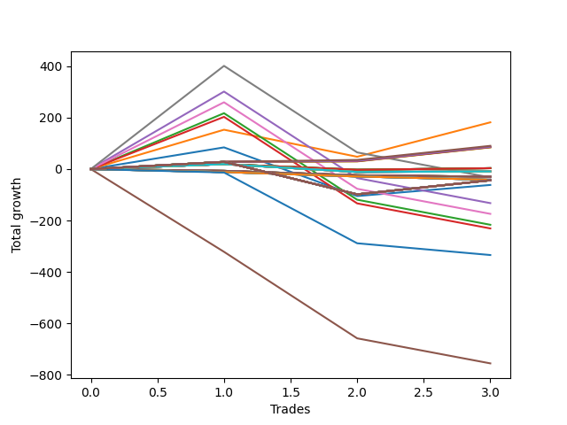

# Long Pointer 001 
- Symbol: ES1y1d
- Date Range: 07/19/2021 - 07/08/2022
- Trading Period: 7:20-12:30
- Number of Trades: 3



| Name | Win Percent | Profit | Avg Profit / Trade | Avg Time / Trade |      | Name | Win Percent | Profit | Avg Profit / Trade | Avg Time / Trade |
| ---- | ----------- | ------ | ------------------ | ---------------- | ---- | ---- | ----------- | ------ | ------------------ | ---------------- |
| Sorted By <br> Profit | | | | | | Sorted By <br> Win Percentage ||||
| One | 66.67 | 91000.00 | 30333.33 | 15 12:12:00 |     | Two Hundred Five | 100.00 | 89750.00 | 29916.67 | 02 09:16:20 |
| Two Hundred Five | 100.00 | 89750.00 | 29916.67 | 02 09:16:20 |     | Two Hundred Four | 100.00 | 83875.00 | 27958.33 | 02 09:10:40 |
| Two Hundred Four | 100.00 | 83875.00 | 27958.33 | 02 09:10:40 |     | Two Hundred Three | 100.00 | 47625.00 | 15875.00 | 01 20:33:40 |
| Two Hundred Three | 100.00 | 47625.00 | 15875.00 | 01 20:33:40 |     | Two Hundred Two | 100.00 | 33875.00 | 11291.67 | 01 19:55:00 |
| Two Hundred Two | 100.00 | 33875.00 | 11291.67 | 01 19:55:00 |     | Two Hundred One | 100.00 | 21125.00 | 7041.67 | 01 17:38:00 |
| Two Hundred One | 100.00 | 21125.00 | 7041.67 | 01 17:38:00 |     | Eighty-Five | 100.00 | 19125.00 | 6375.00 | 01 17:35:40 |
| Eighty-Five | 100.00 | 19125.00 | 6375.00 | 01 17:35:40 |     | Eighty-Four | 100.00 | 17375.00 | 5791.67 | 01 17:35:20 |
| Eighty-Four | 100.00 | 17375.00 | 5791.67 | 01 17:35:20 |     | Eighty-Three | 100.00 | 16750.00 | 5583.33 | 01 17:34:00 |
| Eighty-Three | 100.00 | 16750.00 | 5583.33 | 01 17:34:00 |     | Eighty-Two | 100.00 | 16500.00 | 5500.00 | 01 17:33:40 |
| Eighty-Two | 100.00 | 16500.00 | 5500.00 | 01 17:33:40 |     | Eighty-One | 100.00 | 16125.00 | 5375.00 | 01 17:33:20 |
| Eighty-One | 100.00 | 16125.00 | 5375.00 | 01 17:33:20 |     | One | 66.67 | 91000.00 | 30333.33 | 15 12:12:00 |
| One Hundred Twenty-Five | 66.67 | 6750.00 | 2250.00 | 00 00:03:00 |     | One Hundred Twenty-Five | 66.67 | 6750.00 | 2250.00 | 00 00:03:00 |
| One Hundred Twenty-Four | 66.67 | 6750.00 | 2250.00 | 00 00:03:00 |     | One Hundred Twenty-Four | 66.67 | 6750.00 | 2250.00 | 00 00:03:00 |
| One Hundred Twenty-Three | 66.67 | 6750.00 | 2250.00 | 00 00:03:00 |     | One Hundred Twenty-Three | 66.67 | 6750.00 | 2250.00 | 00 00:03:00 |
| One Hundred Twenty-Two | 66.67 | 6750.00 | 2250.00 | 00 00:03:00 |     | One Hundred Twenty-Two | 66.67 | 6750.00 | 2250.00 | 00 00:03:00 |
| One Hundred Twenty-One | 66.67 | 6750.00 | 2250.00 | 00 00:03:00 |     | One Hundred Twenty-One | 66.67 | 6750.00 | 2250.00 | 00 00:03:00 |
| One Hundred Fifteen | 66.67 | 6750.00 | 2250.00 | 00 00:03:00 |     | One Hundred Fifteen | 66.67 | 6750.00 | 2250.00 | 00 00:03:00 |
| One Hundred Fourteen | 66.67 | 6750.00 | 2250.00 | 00 00:03:00 |     | One Hundred Fourteen | 66.67 | 6750.00 | 2250.00 | 00 00:03:00 |
| One Hundred Thirteen | 66.67 | 6750.00 | 2250.00 | 00 00:03:00 |     | One Hundred Thirteen | 66.67 | 6750.00 | 2250.00 | 00 00:03:00 |
| One Hundred Twelve | 66.67 | 6750.00 | 2250.00 | 00 00:03:00 |     | One Hundred Twelve | 66.67 | 6750.00 | 2250.00 | 00 00:03:00 |
| One Hundred Eleven | 66.67 | 6750.00 | 2250.00 | 00 00:03:00 |     | One Hundred Eleven | 66.67 | 6750.00 | 2250.00 | 00 00:03:00 |
| One Hundred Twenty | 66.67 | 4375.00 | 1458.33 | 00 00:04:20 |     | One Hundred Twenty | 66.67 | 4375.00 | 1458.33 | 00 00:04:20 |
| One Hundred Ninteen | 66.67 | 4375.00 | 1458.33 | 00 00:04:20 |     | One Hundred Ninteen | 66.67 | 4375.00 | 1458.33 | 00 00:04:20 |
| One Hundred Eighteen | 66.67 | 4375.00 | 1458.33 | 00 00:04:20 |     | One Hundred Eighteen | 66.67 | 4375.00 | 1458.33 | 00 00:04:20 |
| One Hundred Seventeen | 66.67 | 4375.00 | 1458.33 | 00 00:04:20 |     | One Hundred Seventeen | 66.67 | 4375.00 | 1458.33 | 00 00:04:20 |
| One Hundred Sixteen | 66.67 | 4375.00 | 1458.33 | 00 00:04:20 |     | One Hundred Sixteen | 66.67 | 4375.00 | 1458.33 | 00 00:04:20 |
| Fifty-Five | 66.67 | 1750.00 | 583.33 | 00 00:05:20 |     | Fifty-Five | 66.67 | 1750.00 | 583.33 | 00 00:05:20 |
| Fifty-Four | 66.67 | 1750.00 | 583.33 | 00 00:05:20 |     | Fifty-Four | 66.67 | 1750.00 | 583.33 | 00 00:05:20 |
| Fifty-Three | 66.67 | 1750.00 | 583.33 | 00 00:05:20 |     | Fifty-Three | 66.67 | 1750.00 | 583.33 | 00 00:05:20 |
| Fifty-Two | 66.67 | 1750.00 | 583.33 | 00 00:05:20 |     | Fifty-Two | 66.67 | 1750.00 | 583.33 | 00 00:05:20 |
| Fifty-One | 66.67 | 1750.00 | 583.33 | 00 00:05:20 |     | Fifty-One | 66.67 | 1750.00 | 583.33 | 00 00:05:20 |
| Fifty | 66.67 | 1750.00 | 583.33 | 00 00:05:20 |     | Fifty | 66.67 | 1750.00 | 583.33 | 00 00:05:20 |
| Forty-Nine | 66.67 | 1750.00 | 583.33 | 00 00:05:20 |     | Forty-Nine | 66.67 | 1750.00 | 583.33 | 00 00:05:20 |
| Forty-Eight | 66.67 | 1750.00 | 583.33 | 00 00:05:20 |     | Forty-Eight | 66.67 | 1750.00 | 583.33 | 00 00:05:20 |
| One Hundred Thirty | 66.67 | 125.00 | 41.67 | 00 00:07:00 |     | One Hundred Thirty | 66.67 | 125.00 | 41.67 | 00 00:07:00 |
| One Hundred Twenty-Nine | 66.67 | 125.00 | 41.67 | 00 00:07:00 |     | One Hundred Twenty-Nine | 66.67 | 125.00 | 41.67 | 00 00:07:00 |
| One Hundred Twenty-Eight | 66.67 | 125.00 | 41.67 | 00 00:07:00 |     | One Hundred Twenty-Eight | 66.67 | 125.00 | 41.67 | 00 00:07:00 |
| One Hundred Twenty-Seven | 66.67 | 125.00 | 41.67 | 00 00:07:00 |     | One Hundred Twenty-Seven | 66.67 | 125.00 | 41.67 | 00 00:07:00 |
| One Hundred Twenty-Six | 66.67 | 125.00 | 41.67 | 00 00:07:00 |     | One Hundred Twenty-Six | 66.67 | 125.00 | 41.67 | 00 00:07:00 |
| Seventy-One | 66.67 | -4500.00 | -1500.00 | 00 00:10:20 |     | Seventy-One | 66.67 | -4500.00 | -1500.00 | 00 00:10:20 |
| Seventy | 66.67 | -4500.00 | -1500.00 | 00 00:10:20 |     | Seventy | 66.67 | -4500.00 | -1500.00 | 00 00:10:20 |
| Sixty-Nine | 66.67 | -4500.00 | -1500.00 | 00 00:10:20 |     | Sixty-Nine | 66.67 | -4500.00 | -1500.00 | 00 00:10:20 |
| Sixty-Eight | 66.67 | -4500.00 | -1500.00 | 00 00:10:20 |     | Sixty-Eight | 66.67 | -4500.00 | -1500.00 | 00 00:10:20 |
| Sixty-Seven | 66.67 | -4500.00 | -1500.00 | 00 00:10:20 |     | Sixty-Seven | 66.67 | -4500.00 | -1500.00 | 00 00:10:20 |
| Sixty-Six | 66.67 | -4500.00 | -1500.00 | 00 00:10:20 |     | Sixty-Six | 66.67 | -4500.00 | -1500.00 | 00 00:10:20 |
| Sixty-Five | 66.67 | -4500.00 | -1500.00 | 00 00:10:20 |     | Sixty-Five | 66.67 | -4500.00 | -1500.00 | 00 00:10:20 |
| Sixty-Four | 66.67 | -4500.00 | -1500.00 | 00 00:10:20 |     | Sixty-Four | 66.67 | -4500.00 | -1500.00 | 00 00:10:20 |
| Forty-Seven | 0.00 | -14750.00 | -4916.67 | 00 00:21:20 |     | Zero | 66.67 | -30875.00 | -10291.67 | 14 08:43:40 |
| Forty-Six | 0.00 | -14750.00 | -4916.67 | 00 00:21:20 |     | Three Hundred | 66.67 | -66500.00 | -22166.67 | 29 01:40:00 |
| Forty-Five | 0.00 | -14750.00 | -4916.67 | 00 00:21:20 |     | Two Hundred Nine | 66.67 | -76750.00 | -25583.33 | 29 01:26:20 |
| Forty-Four | 0.00 | -14750.00 | -4916.67 | 00 00:21:20 |     | Two Hundred Eight | 66.67 | -85125.00 | -28375.00 | 25 19:13:40 |
| Forty-Three | 0.00 | -14750.00 | -4916.67 | 00 00:21:20 |     | Two Hundred Seven | 66.67 | -97875.00 | -32625.00 | 25 18:35:20 |
| Forty-Two | 0.00 | -14750.00 | -4916.67 | 00 00:21:20 |     | Two Hundred Six | 66.67 | -106250.00 | -35416.67 | 24 01:19:00 |
| Forty-One | 0.00 | -14750.00 | -4916.67 | 00 00:21:20 |     | Seven | 33.33 | -16250.00 | -5416.67 | 47 13:29:20 |
| Forty | 0.00 | -14750.00 | -4916.67 | 00 00:21:20 |     | Four | 33.33 | -66250.00 | -22083.33 | 47 03:27:40 |
| Seven | 33.33 | -16250.00 | -5416.67 | 47 13:29:20 |     | Six | 33.33 | -87125.00 | -29041.67 | 45 03:38:00 |
| Sixty-Three | 0.00 | -20750.00 | -6916.67 | 00 00:25:40 |     | Two | 33.33 | -108375.00 | -36125.00 | 43 21:24:20 |
| Sixty-Two | 0.00 | -20750.00 | -6916.67 | 00 00:25:40 |     | Three | 33.33 | -115500.00 | -38500.00 | 43 20:47:40 |
| Sixty-One | 0.00 | -20750.00 | -6916.67 | 00 00:25:40 |     | Forty-Seven | 0.00 | -14750.00 | -4916.67 | 00 00:21:20 |
| Sixty | 0.00 | -20750.00 | -6916.67 | 00 00:25:40 |     | Forty-Six | 0.00 | -14750.00 | -4916.67 | 00 00:21:20 |
| Fifty-Nine | 0.00 | -20750.00 | -6916.67 | 00 00:25:40 |     | Forty-Five | 0.00 | -14750.00 | -4916.67 | 00 00:21:20 |
| Fifty-Eight | 0.00 | -20750.00 | -6916.67 | 00 00:25:40 |     | Forty-Four | 0.00 | -14750.00 | -4916.67 | 00 00:21:20 |
| Fifty-Seven | 0.00 | -20750.00 | -6916.67 | 00 00:25:40 |     | Forty-Three | 0.00 | -14750.00 | -4916.67 | 00 00:21:20 |
| Fifty-Six | 0.00 | -20750.00 | -6916.67 | 00 00:25:40 |     | Forty-Two | 0.00 | -14750.00 | -4916.67 | 00 00:21:20 |
| Zero | 66.67 | -30875.00 | -10291.67 | 14 08:43:40 |     | Forty-One | 0.00 | -14750.00 | -4916.67 | 00 00:21:20 |
| Four | 33.33 | -66250.00 | -22083.33 | 47 03:27:40 |     | Forty | 0.00 | -14750.00 | -4916.67 | 00 00:21:20 |
| Three Hundred | 66.67 | -66500.00 | -22166.67 | 29 01:40:00 |     | Sixty-Three | 0.00 | -20750.00 | -6916.67 | 00 00:25:40 |
| Two Hundred Nine | 66.67 | -76750.00 | -25583.33 | 29 01:26:20 |     | Sixty-Two | 0.00 | -20750.00 | -6916.67 | 00 00:25:40 |
| Two Hundred Eight | 66.67 | -85125.00 | -28375.00 | 25 19:13:40 |     | Sixty-One | 0.00 | -20750.00 | -6916.67 | 00 00:25:40 |
| Six | 33.33 | -87125.00 | -29041.67 | 45 03:38:00 |     | Sixty | 0.00 | -20750.00 | -6916.67 | 00 00:25:40 |
| Two Hundred Seven | 66.67 | -97875.00 | -32625.00 | 25 18:35:20 |     | Fifty-Nine | 0.00 | -20750.00 | -6916.67 | 00 00:25:40 |
| Two Hundred Six | 66.67 | -106250.00 | -35416.67 | 24 01:19:00 |     | Fifty-Eight | 0.00 | -20750.00 | -6916.67 | 00 00:25:40 |
| Two | 33.33 | -108375.00 | -36125.00 | 43 21:24:20 |     | Fifty-Seven | 0.00 | -20750.00 | -6916.67 | 00 00:25:40 |
| Three | 33.33 | -115500.00 | -38500.00 | 43 20:47:40 |     | Fifty-Six | 0.00 | -20750.00 | -6916.67 | 00 00:25:40 |
| Seventy-Three | 0.00 | -167250.00 | -55750.00 | 07 17:21:00 |     | Seventy-Three | 0.00 | -167250.00 | -55750.00 | 07 17:21:00 |
| Five | 0.00 | -378125.00 | -126041.67 | 81 05:37:00 |     | Five | 0.00 | -378125.00 | -126041.67 | 81 05:37:00 |

## NO STOPLOSS

### Test Zero
* Sell when price hits the middle line of the 20p bollinger
* No Stoploss
* Results:
```
Total Trades: 3
Percent Up: 66.67
Percent Down: 33.33
Total Points Moved Up: -61.75
Potential Profit: -30875.00
Total Points Ups: 127.75 Count Ups: 2
Total Points Downs: -189.50 Count Downs: 1
```

<details><summary>Trades</summary>

<code>In: 2022-03-10 07:21:00		Out: 2022-03-16 06:39:00		Total Position Time: 05 23:18:00		Total Move Up: 84.50		Total to Date: 84.50</code> <br />
<code>In: 2022-04-29 07:21:00		Out: 2022-05-26 09:12:00		Total Position Time: 27 01:51:00		Total Move Up: -189.50		Total to Date: -105.00</code> <br />
<code>In: 2022-05-16 07:21:00		Out: 2022-05-26 08:23:00		Total Position Time: 10 01:02:00		Total Move Up: 43.25		Total to Date: -61.75</code> <br />


</details>

### Test One
* Sell when the price hits the upper line of the 20p 1std bollinger
* No Stoploss
* Results:
```
Total Trades: 3
Percent Up: 66.67
Percent Down: 33.33
Total Points Moved Up: 182.00
Potential Profit: 91000.00
Total Points Ups: 287.25 Count Ups: 2
Total Points Downs: -105.25 Count Downs: 1
```

<details><summary>Trades</summary>

<code>In: 2022-03-10 07:21:00		Out: 2022-03-17 10:29:00		Total Position Time: 07 03:08:00		Total Move Up: 153.25		Total to Date: 153.25</code> <br />
<code>In: 2022-04-29 07:21:00		Out: 2022-05-27 12:05:00		Total Position Time: 28 04:44:00		Total Move Up: -105.25		Total to Date: 48.00</code> <br />
<code>In: 2022-05-16 07:21:00		Out: 2022-05-27 12:05:00		Total Position Time: 11 04:44:00		Total Move Up: 134.00		Total to Date: 182.00</code> <br />


</details>

### Test Two
* Sell when the price hits the upper line of the 20p 2std bollinger
* No Stoploss
* Results:
```
Total Trades: 3
Percent Up: 33.33
Percent Down: 66.67
Total Points Moved Up: -216.75
Potential Profit: -108375.00
Total Points Ups: 217.50 Count Ups: 1
Total Points Downs: -434.25 Count Downs: 2
```

<details><summary>Trades</summary>

<code>In: 2022-03-10 07:21:00		Out: 2022-03-18 12:20:00		Total Position Time: 08 04:59:00		Total Move Up: 217.50		Total to Date: 217.50</code> <br />
<code>In: 2022-04-29 07:21:00		Out: 2022-07-08 12:58:00		Total Position Time: 70 05:37:00		Total Move Up: -336.75		Total to Date: -119.25</code> <br />
<code>In: 2022-05-16 07:21:00		Out: 2022-07-08 12:58:00		Total Position Time: 53 05:37:00		Total Move Up: -97.50		Total to Date: -216.75</code> <br />


</details>

### Test Three
* Sell when price hits the middle line of the 50p bollinger
* No Stoploss
* Results:
```
Total Trades: 3
Percent Up: 33.33
Percent Down: 66.67
Total Points Moved Up: -231.00
Potential Profit: -115500.00
Total Points Ups: 203.25 Count Ups: 1
Total Points Downs: -434.25 Count Downs: 2
```

<details><summary>Trades</summary>

<code>In: 2022-03-10 07:21:00		Out: 2022-03-18 10:30:00		Total Position Time: 08 03:09:00		Total Move Up: 203.25		Total to Date: 203.25</code> <br />
<code>In: 2022-04-29 07:21:00		Out: 2022-07-08 12:58:00		Total Position Time: 70 05:37:00		Total Move Up: -336.75		Total to Date: -133.50</code> <br />
<code>In: 2022-05-16 07:21:00		Out: 2022-07-08 12:58:00		Total Position Time: 53 05:37:00		Total Move Up: -97.50		Total to Date: -231.00</code> <br />


</details>

### Test Four
* Sell when the price hits the upper line of the 50p 1std bollinger
* No Stoploss
* Results:
```
Total Trades: 3
Percent Up: 33.33
Percent Down: 66.67
Total Points Moved Up: -132.50
Potential Profit: -66250.00
Total Points Ups: 301.75 Count Ups: 1
Total Points Downs: -434.25 Count Downs: 2
```

<details><summary>Trades</summary>

<code>In: 2022-03-10 07:21:00		Out: 2022-03-28 06:30:00		Total Position Time: 17 23:09:00		Total Move Up: 301.75		Total to Date: 301.75</code> <br />
<code>In: 2022-04-29 07:21:00		Out: 2022-07-08 12:58:00		Total Position Time: 70 05:37:00		Total Move Up: -336.75		Total to Date: -35.00</code> <br />
<code>In: 2022-05-16 07:21:00		Out: 2022-07-08 12:58:00		Total Position Time: 53 05:37:00		Total Move Up: -97.50		Total to Date: -132.50</code> <br />


</details>

### Test Five
* Sell when the price hits the upper line of the 50p 2std bollinger
* No Stoploss
* Results:
```
Total Trades: 3
Percent Up: 0.00
Percent Down: 100.00
Total Points Moved Up: -756.25
Potential Profit: -378125.00
Total Points Ups: 0.00 Count Ups: 0
Total Points Downs: -756.25 Count Downs: 3
```

<details><summary>Trades</summary>

<code>In: 2022-03-10 07:21:00		Out: 2022-07-08 12:58:00		Total Position Time: 120 05:37:00		Total Move Up: -322.00		Total to Date: -322.00</code> <br />
<code>In: 2022-04-29 07:21:00		Out: 2022-07-08 12:58:00		Total Position Time: 70 05:37:00		Total Move Up: -336.75		Total to Date: -658.75</code> <br />
<code>In: 2022-05-16 07:21:00		Out: 2022-07-08 12:58:00		Total Position Time: 53 05:37:00		Total Move Up: -97.50		Total to Date: -756.25</code> <br />


</details>

### Test Six
* Sell when the price hits the middle line of the 1std VWAP
* No Stoploss
* Results:
```
Total Trades: 3
Percent Up: 33.33
Percent Down: 66.67
Total Points Moved Up: -174.25
Potential Profit: -87125.00
Total Points Ups: 260.00 Count Ups: 1
Total Points Downs: -434.25 Count Downs: 2
```

<details><summary>Trades</summary>

<code>In: 2022-03-10 07:21:00		Out: 2022-03-22 07:01:00		Total Position Time: 11 23:40:00		Total Move Up: 260.00		Total to Date: 260.00</code> <br />
<code>In: 2022-04-29 07:21:00		Out: 2022-07-08 12:58:00		Total Position Time: 70 05:37:00		Total Move Up: -336.75		Total to Date: -76.75</code> <br />
<code>In: 2022-05-16 07:21:00		Out: 2022-07-08 12:58:00		Total Position Time: 53 05:37:00		Total Move Up: -97.50		Total to Date: -174.25</code> <br />


</details>

### Test Seven
* Sell when the price hits the upper line of the 1std VWAP
* No Stoploss
* Results:
```
Total Trades: 3
Percent Up: 33.33
Percent Down: 66.67
Total Points Moved Up: -32.50
Potential Profit: -16250.00
Total Points Ups: 401.75 Count Ups: 1
Total Points Downs: -434.25 Count Downs: 2
```

<details><summary>Trades</summary>

<code>In: 2022-03-10 07:21:00		Out: 2022-03-29 12:35:00		Total Position Time: 19 05:14:00		Total Move Up: 401.75		Total to Date: 401.75</code> <br />
<code>In: 2022-04-29 07:21:00		Out: 2022-07-08 12:58:00		Total Position Time: 70 05:37:00		Total Move Up: -336.75		Total to Date: 65.00</code> <br />
<code>In: 2022-05-16 07:21:00		Out: 2022-07-08 12:58:00		Total Position Time: 53 05:37:00		Total Move Up: -97.50		Total to Date: -32.50</code> <br />


</details>

## STOPLOSS OF 5

### Test Forty
* Sell when price hits the middle line of the 20p bollinger
* Stoploss is 5 points
* Results:
```
Total Trades: 3
Percent Up: 0.00
Percent Down: 100.00
Total Points Moved Up: -29.50
Potential Profit: -14750.00
Total Points Ups: 0.00 Count Ups: 0
Total Points Downs: -29.50 Count Downs: 3
```

<details><summary>Trades</summary>

<code>In: 2022-03-10 07:21:00		Out: 2022-03-10 07:56:00		Total Position Time: 00 00:35:00		Total Move Up: -6.75		Total to Date: -6.75</code> <br />
<code>In: 2022-04-29 07:21:00		Out: 2022-04-29 07:24:00		Total Position Time: 00 00:03:00		Total Move Up: -17.25		Total to Date: -24.00</code> <br />
<code>In: 2022-05-16 07:21:00		Out: 2022-05-16 07:47:00		Total Position Time: 00 00:26:00		Total Move Up: -5.50		Total to Date: -29.50</code> <br />


</details>

### Test Forty-One
* Sell when the price hits the upper line of the 20p 1std bollinger
* Stoploss is 5 points
* Results:
```
Total Trades: 3
Percent Up: 0.00
Percent Down: 100.00
Total Points Moved Up: -29.50
Potential Profit: -14750.00
Total Points Ups: 0.00 Count Ups: 0
Total Points Downs: -29.50 Count Downs: 3
```

<details><summary>Trades</summary>

<code>In: 2022-03-10 07:21:00		Out: 2022-03-10 07:56:00		Total Position Time: 00 00:35:00		Total Move Up: -6.75		Total to Date: -6.75</code> <br />
<code>In: 2022-04-29 07:21:00		Out: 2022-04-29 07:24:00		Total Position Time: 00 00:03:00		Total Move Up: -17.25		Total to Date: -24.00</code> <br />
<code>In: 2022-05-16 07:21:00		Out: 2022-05-16 07:47:00		Total Position Time: 00 00:26:00		Total Move Up: -5.50		Total to Date: -29.50</code> <br />


</details>

### Test Forty-Two
* Sell when the price hits the upper line of the 20p 2std bollinger
* Stoploss is 5 points
* Results:
```
Total Trades: 3
Percent Up: 0.00
Percent Down: 100.00
Total Points Moved Up: -29.50
Potential Profit: -14750.00
Total Points Ups: 0.00 Count Ups: 0
Total Points Downs: -29.50 Count Downs: 3
```

<details><summary>Trades</summary>

<code>In: 2022-03-10 07:21:00		Out: 2022-03-10 07:56:00		Total Position Time: 00 00:35:00		Total Move Up: -6.75		Total to Date: -6.75</code> <br />
<code>In: 2022-04-29 07:21:00		Out: 2022-04-29 07:24:00		Total Position Time: 00 00:03:00		Total Move Up: -17.25		Total to Date: -24.00</code> <br />
<code>In: 2022-05-16 07:21:00		Out: 2022-05-16 07:47:00		Total Position Time: 00 00:26:00		Total Move Up: -5.50		Total to Date: -29.50</code> <br />


</details>

### Test Forty-Three
* Sell when price hits the middle line of the 50p bollinger
* Stoploss is 5 points
* Results:
```
Total Trades: 3
Percent Up: 0.00
Percent Down: 100.00
Total Points Moved Up: -29.50
Potential Profit: -14750.00
Total Points Ups: 0.00 Count Ups: 0
Total Points Downs: -29.50 Count Downs: 3
```

<details><summary>Trades</summary>

<code>In: 2022-03-10 07:21:00		Out: 2022-03-10 07:56:00		Total Position Time: 00 00:35:00		Total Move Up: -6.75		Total to Date: -6.75</code> <br />
<code>In: 2022-04-29 07:21:00		Out: 2022-04-29 07:24:00		Total Position Time: 00 00:03:00		Total Move Up: -17.25		Total to Date: -24.00</code> <br />
<code>In: 2022-05-16 07:21:00		Out: 2022-05-16 07:47:00		Total Position Time: 00 00:26:00		Total Move Up: -5.50		Total to Date: -29.50</code> <br />


</details>

### Test Forty-Four
* Sell when the price hits the upper line of the 50p 1std bollinger
* Stoploss is 5 points
* Results:
```
Total Trades: 3
Percent Up: 0.00
Percent Down: 100.00
Total Points Moved Up: -29.50
Potential Profit: -14750.00
Total Points Ups: 0.00 Count Ups: 0
Total Points Downs: -29.50 Count Downs: 3
```

<details><summary>Trades</summary>

<code>In: 2022-03-10 07:21:00		Out: 2022-03-10 07:56:00		Total Position Time: 00 00:35:00		Total Move Up: -6.75		Total to Date: -6.75</code> <br />
<code>In: 2022-04-29 07:21:00		Out: 2022-04-29 07:24:00		Total Position Time: 00 00:03:00		Total Move Up: -17.25		Total to Date: -24.00</code> <br />
<code>In: 2022-05-16 07:21:00		Out: 2022-05-16 07:47:00		Total Position Time: 00 00:26:00		Total Move Up: -5.50		Total to Date: -29.50</code> <br />


</details>

### Test Forty-Five
* Sell when the price hits the upper line of the 50p 2std bollinger
* Stoploss is 5 points
* Results:
```
Total Trades: 3
Percent Up: 0.00
Percent Down: 100.00
Total Points Moved Up: -29.50
Potential Profit: -14750.00
Total Points Ups: 0.00 Count Ups: 0
Total Points Downs: -29.50 Count Downs: 3
```

<details><summary>Trades</summary>

<code>In: 2022-03-10 07:21:00		Out: 2022-03-10 07:56:00		Total Position Time: 00 00:35:00		Total Move Up: -6.75		Total to Date: -6.75</code> <br />
<code>In: 2022-04-29 07:21:00		Out: 2022-04-29 07:24:00		Total Position Time: 00 00:03:00		Total Move Up: -17.25		Total to Date: -24.00</code> <br />
<code>In: 2022-05-16 07:21:00		Out: 2022-05-16 07:47:00		Total Position Time: 00 00:26:00		Total Move Up: -5.50		Total to Date: -29.50</code> <br />


</details>

### Test Forty-Six
* Sell when the price hits the middle line of the 1std VWAP
* Stoploss is 5 points
* Results:
```
Total Trades: 3
Percent Up: 0.00
Percent Down: 100.00
Total Points Moved Up: -29.50
Potential Profit: -14750.00
Total Points Ups: 0.00 Count Ups: 0
Total Points Downs: -29.50 Count Downs: 3
```

<details><summary>Trades</summary>

<code>In: 2022-03-10 07:21:00		Out: 2022-03-10 07:56:00		Total Position Time: 00 00:35:00		Total Move Up: -6.75		Total to Date: -6.75</code> <br />
<code>In: 2022-04-29 07:21:00		Out: 2022-04-29 07:24:00		Total Position Time: 00 00:03:00		Total Move Up: -17.25		Total to Date: -24.00</code> <br />
<code>In: 2022-05-16 07:21:00		Out: 2022-05-16 07:47:00		Total Position Time: 00 00:26:00		Total Move Up: -5.50		Total to Date: -29.50</code> <br />


</details>

### Test Forty-Seven
* Sell when the price hits the upper line of the 1std VWAP
* Stoploss is 5 points
* Results:
```
Total Trades: 3
Percent Up: 0.00
Percent Down: 100.00
Total Points Moved Up: -29.50
Potential Profit: -14750.00
Total Points Ups: 0.00 Count Ups: 0
Total Points Downs: -29.50 Count Downs: 3
```

<details><summary>Trades</summary>

<code>In: 2022-03-10 07:21:00		Out: 2022-03-10 07:56:00		Total Position Time: 00 00:35:00		Total Move Up: -6.75		Total to Date: -6.75</code> <br />
<code>In: 2022-04-29 07:21:00		Out: 2022-04-29 07:24:00		Total Position Time: 00 00:03:00		Total Move Up: -17.25		Total to Date: -24.00</code> <br />
<code>In: 2022-05-16 07:21:00		Out: 2022-05-16 07:47:00		Total Position Time: 00 00:26:00		Total Move Up: -5.50		Total to Date: -29.50</code> <br />


</details>

## TRAIL STOP OF 5

### Test Forty-Eight
* Sell when price hits the middle line of the 20p bollinger
* Trailing Stop is 5 points
* Results:
```
Total Trades: 3
Percent Up: 66.67
Percent Down: 33.33
Total Points Moved Up: 3.50
Potential Profit: 1750.00
Total Points Ups: 25.50 Count Ups: 2
Total Points Downs: -22.00 Count Downs: 1
```

<details><summary>Trades</summary>

<code>In: 2022-03-10 07:21:00		Out: 2022-03-10 07:24:00		Total Position Time: 00 00:03:00		Total Move Up: 19.25		Total to Date: 19.25</code> <br />
<code>In: 2022-04-29 07:21:00		Out: 2022-04-29 07:28:00		Total Position Time: 00 00:07:00		Total Move Up: -22.00		Total to Date: -2.75</code> <br />
<code>In: 2022-05-16 07:21:00		Out: 2022-05-16 07:27:00		Total Position Time: 00 00:06:00		Total Move Up: 6.25		Total to Date: 3.50</code> <br />


</details>

### Test Forty-Nine
* Sell when the price hits the upper line of the 20p 1std bollinger
* Trailing Stop is 5 points
* Results:
```
Total Trades: 3
Percent Up: 66.67
Percent Down: 33.33
Total Points Moved Up: 3.50
Potential Profit: 1750.00
Total Points Ups: 25.50 Count Ups: 2
Total Points Downs: -22.00 Count Downs: 1
```

<details><summary>Trades</summary>

<code>In: 2022-03-10 07:21:00		Out: 2022-03-10 07:24:00		Total Position Time: 00 00:03:00		Total Move Up: 19.25		Total to Date: 19.25</code> <br />
<code>In: 2022-04-29 07:21:00		Out: 2022-04-29 07:28:00		Total Position Time: 00 00:07:00		Total Move Up: -22.00		Total to Date: -2.75</code> <br />
<code>In: 2022-05-16 07:21:00		Out: 2022-05-16 07:27:00		Total Position Time: 00 00:06:00		Total Move Up: 6.25		Total to Date: 3.50</code> <br />


</details>

### Test Fifty
* Sell when the price hits the upper line of the 20p 2std bollinger
* Trailing Stop is 5 points
* Results:
```
Total Trades: 3
Percent Up: 66.67
Percent Down: 33.33
Total Points Moved Up: 3.50
Potential Profit: 1750.00
Total Points Ups: 25.50 Count Ups: 2
Total Points Downs: -22.00 Count Downs: 1
```

<details><summary>Trades</summary>

<code>In: 2022-03-10 07:21:00		Out: 2022-03-10 07:24:00		Total Position Time: 00 00:03:00		Total Move Up: 19.25		Total to Date: 19.25</code> <br />
<code>In: 2022-04-29 07:21:00		Out: 2022-04-29 07:28:00		Total Position Time: 00 00:07:00		Total Move Up: -22.00		Total to Date: -2.75</code> <br />
<code>In: 2022-05-16 07:21:00		Out: 2022-05-16 07:27:00		Total Position Time: 00 00:06:00		Total Move Up: 6.25		Total to Date: 3.50</code> <br />


</details>

### Test Fifty-One
* Sell when price hits the middle line of the 50p bollinger
* Trailing Stop is 5 points
* Results:
```
Total Trades: 3
Percent Up: 66.67
Percent Down: 33.33
Total Points Moved Up: 3.50
Potential Profit: 1750.00
Total Points Ups: 25.50 Count Ups: 2
Total Points Downs: -22.00 Count Downs: 1
```

<details><summary>Trades</summary>

<code>In: 2022-03-10 07:21:00		Out: 2022-03-10 07:24:00		Total Position Time: 00 00:03:00		Total Move Up: 19.25		Total to Date: 19.25</code> <br />
<code>In: 2022-04-29 07:21:00		Out: 2022-04-29 07:28:00		Total Position Time: 00 00:07:00		Total Move Up: -22.00		Total to Date: -2.75</code> <br />
<code>In: 2022-05-16 07:21:00		Out: 2022-05-16 07:27:00		Total Position Time: 00 00:06:00		Total Move Up: 6.25		Total to Date: 3.50</code> <br />


</details>

### Test Fifty-Two
* Sell when the price hits the upper line of the 50p 1std bollinger
* Trailing Stop is 5 points
* Results:
```
Total Trades: 3
Percent Up: 66.67
Percent Down: 33.33
Total Points Moved Up: 3.50
Potential Profit: 1750.00
Total Points Ups: 25.50 Count Ups: 2
Total Points Downs: -22.00 Count Downs: 1
```

<details><summary>Trades</summary>

<code>In: 2022-03-10 07:21:00		Out: 2022-03-10 07:24:00		Total Position Time: 00 00:03:00		Total Move Up: 19.25		Total to Date: 19.25</code> <br />
<code>In: 2022-04-29 07:21:00		Out: 2022-04-29 07:28:00		Total Position Time: 00 00:07:00		Total Move Up: -22.00		Total to Date: -2.75</code> <br />
<code>In: 2022-05-16 07:21:00		Out: 2022-05-16 07:27:00		Total Position Time: 00 00:06:00		Total Move Up: 6.25		Total to Date: 3.50</code> <br />


</details>

### Test Fifty-Three
* Sell when the price hits the upper line of the 50p 2std bollinger
* Trailing Stop is 5 points
* Results:
```
Total Trades: 3
Percent Up: 66.67
Percent Down: 33.33
Total Points Moved Up: 3.50
Potential Profit: 1750.00
Total Points Ups: 25.50 Count Ups: 2
Total Points Downs: -22.00 Count Downs: 1
```

<details><summary>Trades</summary>

<code>In: 2022-03-10 07:21:00		Out: 2022-03-10 07:24:00		Total Position Time: 00 00:03:00		Total Move Up: 19.25		Total to Date: 19.25</code> <br />
<code>In: 2022-04-29 07:21:00		Out: 2022-04-29 07:28:00		Total Position Time: 00 00:07:00		Total Move Up: -22.00		Total to Date: -2.75</code> <br />
<code>In: 2022-05-16 07:21:00		Out: 2022-05-16 07:27:00		Total Position Time: 00 00:06:00		Total Move Up: 6.25		Total to Date: 3.50</code> <br />


</details>

### Test Fifty-Four
* Sell when the price hits the middle line of the 1std VWAP
* Trailing Stop is 5 points
* Results:
```
Total Trades: 3
Percent Up: 66.67
Percent Down: 33.33
Total Points Moved Up: 3.50
Potential Profit: 1750.00
Total Points Ups: 25.50 Count Ups: 2
Total Points Downs: -22.00 Count Downs: 1
```

<details><summary>Trades</summary>

<code>In: 2022-03-10 07:21:00		Out: 2022-03-10 07:24:00		Total Position Time: 00 00:03:00		Total Move Up: 19.25		Total to Date: 19.25</code> <br />
<code>In: 2022-04-29 07:21:00		Out: 2022-04-29 07:28:00		Total Position Time: 00 00:07:00		Total Move Up: -22.00		Total to Date: -2.75</code> <br />
<code>In: 2022-05-16 07:21:00		Out: 2022-05-16 07:27:00		Total Position Time: 00 00:06:00		Total Move Up: 6.25		Total to Date: 3.50</code> <br />


</details>

### Test Fifty-Five
* Sell when the price hits the upper line of the 1std VWAP
* Trailing Stop is 5 points
* Results:
```
Total Trades: 3
Percent Up: 66.67
Percent Down: 33.33
Total Points Moved Up: 3.50
Potential Profit: 1750.00
Total Points Ups: 25.50 Count Ups: 2
Total Points Downs: -22.00 Count Downs: 1
```

<details><summary>Trades</summary>

<code>In: 2022-03-10 07:21:00		Out: 2022-03-10 07:24:00		Total Position Time: 00 00:03:00		Total Move Up: 19.25		Total to Date: 19.25</code> <br />
<code>In: 2022-04-29 07:21:00		Out: 2022-04-29 07:28:00		Total Position Time: 00 00:07:00		Total Move Up: -22.00		Total to Date: -2.75</code> <br />
<code>In: 2022-05-16 07:21:00		Out: 2022-05-16 07:27:00		Total Position Time: 00 00:06:00		Total Move Up: 6.25		Total to Date: 3.50</code> <br />


</details>

## STOPLOSS OF 10

### Test Fifty-Six
* Sell when price hits the middle line of the 20p bollinger
* Stoploss is 10 points
* Results:
```
Total Trades: 3
Percent Up: 0.00
Percent Down: 100.00
Total Points Moved Up: -41.50
Potential Profit: -20750.00
Total Points Ups: 0.00 Count Ups: 0
Total Points Downs: -41.50 Count Downs: 3
```

<details><summary>Trades</summary>

<code>In: 2022-03-10 07:21:00		Out: 2022-03-10 08:02:00		Total Position Time: 00 00:41:00		Total Move Up: -11.50		Total to Date: -11.50</code> <br />
<code>In: 2022-04-29 07:21:00		Out: 2022-04-29 07:24:00		Total Position Time: 00 00:03:00		Total Move Up: -17.25		Total to Date: -28.75</code> <br />
<code>In: 2022-05-16 07:21:00		Out: 2022-05-16 07:54:00		Total Position Time: 00 00:33:00		Total Move Up: -12.75		Total to Date: -41.50</code> <br />


</details>

### Test Fifty-Seven
* Sell when the price hits the upper line of the 20p 1std bollinger
* Stoploss is 10 points
* Results:
```
Total Trades: 3
Percent Up: 0.00
Percent Down: 100.00
Total Points Moved Up: -41.50
Potential Profit: -20750.00
Total Points Ups: 0.00 Count Ups: 0
Total Points Downs: -41.50 Count Downs: 3
```

<details><summary>Trades</summary>

<code>In: 2022-03-10 07:21:00		Out: 2022-03-10 08:02:00		Total Position Time: 00 00:41:00		Total Move Up: -11.50		Total to Date: -11.50</code> <br />
<code>In: 2022-04-29 07:21:00		Out: 2022-04-29 07:24:00		Total Position Time: 00 00:03:00		Total Move Up: -17.25		Total to Date: -28.75</code> <br />
<code>In: 2022-05-16 07:21:00		Out: 2022-05-16 07:54:00		Total Position Time: 00 00:33:00		Total Move Up: -12.75		Total to Date: -41.50</code> <br />


</details>

### Test Fifty-Eight
* Sell when the price hits the upper line of the 20p 2std bollinger
* Stoploss is 10 points
* Results:
```
Total Trades: 3
Percent Up: 0.00
Percent Down: 100.00
Total Points Moved Up: -41.50
Potential Profit: -20750.00
Total Points Ups: 0.00 Count Ups: 0
Total Points Downs: -41.50 Count Downs: 3
```

<details><summary>Trades</summary>

<code>In: 2022-03-10 07:21:00		Out: 2022-03-10 08:02:00		Total Position Time: 00 00:41:00		Total Move Up: -11.50		Total to Date: -11.50</code> <br />
<code>In: 2022-04-29 07:21:00		Out: 2022-04-29 07:24:00		Total Position Time: 00 00:03:00		Total Move Up: -17.25		Total to Date: -28.75</code> <br />
<code>In: 2022-05-16 07:21:00		Out: 2022-05-16 07:54:00		Total Position Time: 00 00:33:00		Total Move Up: -12.75		Total to Date: -41.50</code> <br />


</details>

### Test Fifty-Nine
* Sell when price hits the middle line of the 50p bollinger
* Stoploss is 10 points
* Results:
```
Total Trades: 3
Percent Up: 0.00
Percent Down: 100.00
Total Points Moved Up: -41.50
Potential Profit: -20750.00
Total Points Ups: 0.00 Count Ups: 0
Total Points Downs: -41.50 Count Downs: 3
```

<details><summary>Trades</summary>

<code>In: 2022-03-10 07:21:00		Out: 2022-03-10 08:02:00		Total Position Time: 00 00:41:00		Total Move Up: -11.50		Total to Date: -11.50</code> <br />
<code>In: 2022-04-29 07:21:00		Out: 2022-04-29 07:24:00		Total Position Time: 00 00:03:00		Total Move Up: -17.25		Total to Date: -28.75</code> <br />
<code>In: 2022-05-16 07:21:00		Out: 2022-05-16 07:54:00		Total Position Time: 00 00:33:00		Total Move Up: -12.75		Total to Date: -41.50</code> <br />


</details>

### Test Sixty
* Sell when the price hits the upper line of the 50p 1std bollinger
* Stoploss is 10 points
* Results:
```
Total Trades: 3
Percent Up: 0.00
Percent Down: 100.00
Total Points Moved Up: -41.50
Potential Profit: -20750.00
Total Points Ups: 0.00 Count Ups: 0
Total Points Downs: -41.50 Count Downs: 3
```

<details><summary>Trades</summary>

<code>In: 2022-03-10 07:21:00		Out: 2022-03-10 08:02:00		Total Position Time: 00 00:41:00		Total Move Up: -11.50		Total to Date: -11.50</code> <br />
<code>In: 2022-04-29 07:21:00		Out: 2022-04-29 07:24:00		Total Position Time: 00 00:03:00		Total Move Up: -17.25		Total to Date: -28.75</code> <br />
<code>In: 2022-05-16 07:21:00		Out: 2022-05-16 07:54:00		Total Position Time: 00 00:33:00		Total Move Up: -12.75		Total to Date: -41.50</code> <br />


</details>

### Test Sixty-One
* Sell when the price hits the upper line of the 50p 2std bollinger
* Stoploss is 10 points
* Results:
```
Total Trades: 3
Percent Up: 0.00
Percent Down: 100.00
Total Points Moved Up: -41.50
Potential Profit: -20750.00
Total Points Ups: 0.00 Count Ups: 0
Total Points Downs: -41.50 Count Downs: 3
```

<details><summary>Trades</summary>

<code>In: 2022-03-10 07:21:00		Out: 2022-03-10 08:02:00		Total Position Time: 00 00:41:00		Total Move Up: -11.50		Total to Date: -11.50</code> <br />
<code>In: 2022-04-29 07:21:00		Out: 2022-04-29 07:24:00		Total Position Time: 00 00:03:00		Total Move Up: -17.25		Total to Date: -28.75</code> <br />
<code>In: 2022-05-16 07:21:00		Out: 2022-05-16 07:54:00		Total Position Time: 00 00:33:00		Total Move Up: -12.75		Total to Date: -41.50</code> <br />


</details>

### Test Sixty-Two
* Sell when the price hits the middle line of the 1std VWAP
* Stoploss is 10 points
* Results:
```
Total Trades: 3
Percent Up: 0.00
Percent Down: 100.00
Total Points Moved Up: -41.50
Potential Profit: -20750.00
Total Points Ups: 0.00 Count Ups: 0
Total Points Downs: -41.50 Count Downs: 3
```

<details><summary>Trades</summary>

<code>In: 2022-03-10 07:21:00		Out: 2022-03-10 08:02:00		Total Position Time: 00 00:41:00		Total Move Up: -11.50		Total to Date: -11.50</code> <br />
<code>In: 2022-04-29 07:21:00		Out: 2022-04-29 07:24:00		Total Position Time: 00 00:03:00		Total Move Up: -17.25		Total to Date: -28.75</code> <br />
<code>In: 2022-05-16 07:21:00		Out: 2022-05-16 07:54:00		Total Position Time: 00 00:33:00		Total Move Up: -12.75		Total to Date: -41.50</code> <br />


</details>

### Test Sixty-Three
* Sell when the price hits the upper line of the 1std VWAP
* Stoploss is 10 points
* Results:
```
Total Trades: 3
Percent Up: 0.00
Percent Down: 100.00
Total Points Moved Up: -41.50
Potential Profit: -20750.00
Total Points Ups: 0.00 Count Ups: 0
Total Points Downs: -41.50 Count Downs: 3
```

<details><summary>Trades</summary>

<code>In: 2022-03-10 07:21:00		Out: 2022-03-10 08:02:00		Total Position Time: 00 00:41:00		Total Move Up: -11.50		Total to Date: -11.50</code> <br />
<code>In: 2022-04-29 07:21:00		Out: 2022-04-29 07:24:00		Total Position Time: 00 00:03:00		Total Move Up: -17.25		Total to Date: -28.75</code> <br />
<code>In: 2022-05-16 07:21:00		Out: 2022-05-16 07:54:00		Total Position Time: 00 00:33:00		Total Move Up: -12.75		Total to Date: -41.50</code> <br />


</details>

## TRAIL STOP OF 10

### Test Sixty-Four
* Sell when price hits the middle line of the 20p bollinger
* Trailing Stop is 10 points
* Results:
```
Total Trades: 3
Percent Up: 66.67
Percent Down: 33.33
Total Points Moved Up: -9.00
Potential Profit: -4500.00
Total Points Ups: 21.50 Count Ups: 2
Total Points Downs: -30.50 Count Downs: 1
```

<details><summary>Trades</summary>

<code>In: 2022-03-10 07:21:00		Out: 2022-03-10 07:24:00		Total Position Time: 00 00:03:00		Total Move Up: 19.25		Total to Date: 19.25</code> <br />
<code>In: 2022-04-29 07:21:00		Out: 2022-04-29 07:36:00		Total Position Time: 00 00:15:00		Total Move Up: -30.50		Total to Date: -11.25</code> <br />
<code>In: 2022-05-16 07:21:00		Out: 2022-05-16 07:34:00		Total Position Time: 00 00:13:00		Total Move Up: 2.25		Total to Date: -9.00</code> <br />


</details>

### Test Sixty-Five
* Sell when the price hits the upper line of the 20p 1std bollinger
* Trailing Stop is 10 points
* Results:
```
Total Trades: 3
Percent Up: 66.67
Percent Down: 33.33
Total Points Moved Up: -9.00
Potential Profit: -4500.00
Total Points Ups: 21.50 Count Ups: 2
Total Points Downs: -30.50 Count Downs: 1
```

<details><summary>Trades</summary>

<code>In: 2022-03-10 07:21:00		Out: 2022-03-10 07:24:00		Total Position Time: 00 00:03:00		Total Move Up: 19.25		Total to Date: 19.25</code> <br />
<code>In: 2022-04-29 07:21:00		Out: 2022-04-29 07:36:00		Total Position Time: 00 00:15:00		Total Move Up: -30.50		Total to Date: -11.25</code> <br />
<code>In: 2022-05-16 07:21:00		Out: 2022-05-16 07:34:00		Total Position Time: 00 00:13:00		Total Move Up: 2.25		Total to Date: -9.00</code> <br />


</details>

### Test Sixty-Six
* Sell when the price hits the upper line of the 20p 2std bollinger
* Trailing Stop is 10 points
* Results:
```
Total Trades: 3
Percent Up: 66.67
Percent Down: 33.33
Total Points Moved Up: -9.00
Potential Profit: -4500.00
Total Points Ups: 21.50 Count Ups: 2
Total Points Downs: -30.50 Count Downs: 1
```

<details><summary>Trades</summary>

<code>In: 2022-03-10 07:21:00		Out: 2022-03-10 07:24:00		Total Position Time: 00 00:03:00		Total Move Up: 19.25		Total to Date: 19.25</code> <br />
<code>In: 2022-04-29 07:21:00		Out: 2022-04-29 07:36:00		Total Position Time: 00 00:15:00		Total Move Up: -30.50		Total to Date: -11.25</code> <br />
<code>In: 2022-05-16 07:21:00		Out: 2022-05-16 07:34:00		Total Position Time: 00 00:13:00		Total Move Up: 2.25		Total to Date: -9.00</code> <br />


</details>

### Test Sixty-Seven
* Sell when price hits the middle line of the 50p bollinger
* Trailing Stop is 10 points
* Results:
```
Total Trades: 3
Percent Up: 66.67
Percent Down: 33.33
Total Points Moved Up: -9.00
Potential Profit: -4500.00
Total Points Ups: 21.50 Count Ups: 2
Total Points Downs: -30.50 Count Downs: 1
```

<details><summary>Trades</summary>

<code>In: 2022-03-10 07:21:00		Out: 2022-03-10 07:24:00		Total Position Time: 00 00:03:00		Total Move Up: 19.25		Total to Date: 19.25</code> <br />
<code>In: 2022-04-29 07:21:00		Out: 2022-04-29 07:36:00		Total Position Time: 00 00:15:00		Total Move Up: -30.50		Total to Date: -11.25</code> <br />
<code>In: 2022-05-16 07:21:00		Out: 2022-05-16 07:34:00		Total Position Time: 00 00:13:00		Total Move Up: 2.25		Total to Date: -9.00</code> <br />


</details>

### Test Sixty-Eight
* Sell when the price hits the upper line of the 50p 1std bollinger
* Trailing Stop is 10 points
* Results:
```
Total Trades: 3
Percent Up: 66.67
Percent Down: 33.33
Total Points Moved Up: -9.00
Potential Profit: -4500.00
Total Points Ups: 21.50 Count Ups: 2
Total Points Downs: -30.50 Count Downs: 1
```

<details><summary>Trades</summary>

<code>In: 2022-03-10 07:21:00		Out: 2022-03-10 07:24:00		Total Position Time: 00 00:03:00		Total Move Up: 19.25		Total to Date: 19.25</code> <br />
<code>In: 2022-04-29 07:21:00		Out: 2022-04-29 07:36:00		Total Position Time: 00 00:15:00		Total Move Up: -30.50		Total to Date: -11.25</code> <br />
<code>In: 2022-05-16 07:21:00		Out: 2022-05-16 07:34:00		Total Position Time: 00 00:13:00		Total Move Up: 2.25		Total to Date: -9.00</code> <br />


</details>

### Test Sixty-Nine
* Sell when the price hits the upper line of the 50p 2std bollinger
* Trailing Stop is 10 points
* Results:
```
Total Trades: 3
Percent Up: 66.67
Percent Down: 33.33
Total Points Moved Up: -9.00
Potential Profit: -4500.00
Total Points Ups: 21.50 Count Ups: 2
Total Points Downs: -30.50 Count Downs: 1
```

<details><summary>Trades</summary>

<code>In: 2022-03-10 07:21:00		Out: 2022-03-10 07:24:00		Total Position Time: 00 00:03:00		Total Move Up: 19.25		Total to Date: 19.25</code> <br />
<code>In: 2022-04-29 07:21:00		Out: 2022-04-29 07:36:00		Total Position Time: 00 00:15:00		Total Move Up: -30.50		Total to Date: -11.25</code> <br />
<code>In: 2022-05-16 07:21:00		Out: 2022-05-16 07:34:00		Total Position Time: 00 00:13:00		Total Move Up: 2.25		Total to Date: -9.00</code> <br />


</details>

### Test Seventy
* Sell when the price hits the middle line of the 1std VWAP
* Trailing Stop is 10 points
* Results:
```
Total Trades: 3
Percent Up: 66.67
Percent Down: 33.33
Total Points Moved Up: -9.00
Potential Profit: -4500.00
Total Points Ups: 21.50 Count Ups: 2
Total Points Downs: -30.50 Count Downs: 1
```

<details><summary>Trades</summary>

<code>In: 2022-03-10 07:21:00		Out: 2022-03-10 07:24:00		Total Position Time: 00 00:03:00		Total Move Up: 19.25		Total to Date: 19.25</code> <br />
<code>In: 2022-04-29 07:21:00		Out: 2022-04-29 07:36:00		Total Position Time: 00 00:15:00		Total Move Up: -30.50		Total to Date: -11.25</code> <br />
<code>In: 2022-05-16 07:21:00		Out: 2022-05-16 07:34:00		Total Position Time: 00 00:13:00		Total Move Up: 2.25		Total to Date: -9.00</code> <br />


</details>

### Test Seventy-One
* Sell when the price hits the upper line of the 1std VWAP
* Trailing Stop is 10 points
* Results:
```
Total Trades: 3
Percent Up: 66.67
Percent Down: 33.33
Total Points Moved Up: -9.00
Potential Profit: -4500.00
Total Points Ups: 21.50 Count Ups: 2
Total Points Downs: -30.50 Count Downs: 1
```

<details><summary>Trades</summary>

<code>In: 2022-03-10 07:21:00		Out: 2022-03-10 07:24:00		Total Position Time: 00 00:03:00		Total Move Up: 19.25		Total to Date: 19.25</code> <br />
<code>In: 2022-04-29 07:21:00		Out: 2022-04-29 07:36:00		Total Position Time: 00 00:15:00		Total Move Up: -30.50		Total to Date: -11.25</code> <br />
<code>In: 2022-05-16 07:21:00		Out: 2022-05-16 07:34:00		Total Position Time: 00 00:13:00		Total Move Up: 2.25		Total to Date: -9.00</code> <br />


</details>

## SPECIAL EXIT CONDITIONS 

### Test Seventy-Three
* Sell when the linear regression slope changes to negative
* No Stoploss
* Results:
```
Total Trades: 3
Percent Up: 0.00
Percent Down: 100.00
Total Points Moved Up: -334.50
Potential Profit: -167250.00
Total Points Ups: 0.00 Count Ups: 0
Total Points Downs: -334.50 Count Downs: 3
```

<details><summary>Trades</summary>

<code>In: 2022-03-10 07:21:00		Out: 2022-03-15 08:22:00		Total Position Time: 05 01:01:00		Total Move Up: -13.25		Total to Date: -13.25</code> <br />
<code>In: 2022-04-29 07:21:00		Out: 2022-05-10 09:22:00		Total Position Time: 11 02:01:00		Total Move Up: -275.50		Total to Date: -288.75</code> <br />
<code>In: 2022-05-16 07:21:00		Out: 2022-05-23 08:22:00		Total Position Time: 07 01:01:00		Total Move Up: -45.75		Total to Date: -334.50</code> <br />


</details>

## TAKE PROFIT

### Test Eighty-One
* Take Profit of 1 Point
* No Stoploss
* Results:
```
Total Trades: 3
Percent Up: 100.00
Percent Down: 0.00
Total Points Moved Up: 32.25
Potential Profit: 16125.00
Total Points Ups: 32.25 Count Ups: 3
Total Points Downs: 0.00 Count Downs: 0
```

<details><summary>Trades</summary>

<code>In: 2022-03-10 07:21:00		Out: 2022-03-10 07:24:00		Total Position Time: 00 00:03:00		Total Move Up: 19.25		Total to Date: 19.25</code> <br />
<code>In: 2022-04-29 07:21:00		Out: 2022-05-04 11:55:00		Total Position Time: 05 04:34:00		Total Move Up: 1.50		Total to Date: 20.75</code> <br />
<code>In: 2022-05-16 07:21:00		Out: 2022-05-16 07:24:00		Total Position Time: 00 00:03:00		Total Move Up: 11.50		Total to Date: 32.25</code> <br />


</details>

### Test Eighty-Two
* Take Profit of 2 Point
* No Stoploss
* Results:
```
Total Trades: 3
Percent Up: 100.00
Percent Down: 0.00
Total Points Moved Up: 33.00
Potential Profit: 16500.00
Total Points Ups: 33.00 Count Ups: 3
Total Points Downs: 0.00 Count Downs: 0
```

<details><summary>Trades</summary>

<code>In: 2022-03-10 07:21:00		Out: 2022-03-10 07:24:00		Total Position Time: 00 00:03:00		Total Move Up: 19.25		Total to Date: 19.25</code> <br />
<code>In: 2022-04-29 07:21:00		Out: 2022-05-04 11:56:00		Total Position Time: 05 04:35:00		Total Move Up: 2.25		Total to Date: 21.50</code> <br />
<code>In: 2022-05-16 07:21:00		Out: 2022-05-16 07:24:00		Total Position Time: 00 00:03:00		Total Move Up: 11.50		Total to Date: 33.00</code> <br />


</details>

### Test Eighty-Three
* Take Profit of 3 Point
* No Stoploss
* Results:
```
Total Trades: 3
Percent Up: 100.00
Percent Down: 0.00
Total Points Moved Up: 33.50
Potential Profit: 16750.00
Total Points Ups: 33.50 Count Ups: 3
Total Points Downs: 0.00 Count Downs: 0
```

<details><summary>Trades</summary>

<code>In: 2022-03-10 07:21:00		Out: 2022-03-10 07:24:00		Total Position Time: 00 00:03:00		Total Move Up: 19.25		Total to Date: 19.25</code> <br />
<code>In: 2022-04-29 07:21:00		Out: 2022-05-04 11:57:00		Total Position Time: 05 04:36:00		Total Move Up: 2.75		Total to Date: 22.00</code> <br />
<code>In: 2022-05-16 07:21:00		Out: 2022-05-16 07:24:00		Total Position Time: 00 00:03:00		Total Move Up: 11.50		Total to Date: 33.50</code> <br />


</details>

### Test Eighty-Four
* Take Profit of 4 Point
* No Stoploss
* Results:
```
Total Trades: 3
Percent Up: 100.00
Percent Down: 0.00
Total Points Moved Up: 34.75
Potential Profit: 17375.00
Total Points Ups: 34.75 Count Ups: 3
Total Points Downs: 0.00 Count Downs: 0
```

<details><summary>Trades</summary>

<code>In: 2022-03-10 07:21:00		Out: 2022-03-10 07:24:00		Total Position Time: 00 00:03:00		Total Move Up: 19.25		Total to Date: 19.25</code> <br />
<code>In: 2022-04-29 07:21:00		Out: 2022-05-04 12:01:00		Total Position Time: 05 04:40:00		Total Move Up: 4.00		Total to Date: 23.25</code> <br />
<code>In: 2022-05-16 07:21:00		Out: 2022-05-16 07:24:00		Total Position Time: 00 00:03:00		Total Move Up: 11.50		Total to Date: 34.75</code> <br />


</details>

### Test Eighty-Five
* Take Profit of 5 Point
* No Stoploss
* Results:
```
Total Trades: 3
Percent Up: 100.00
Percent Down: 0.00
Total Points Moved Up: 38.25
Potential Profit: 19125.00
Total Points Ups: 38.25 Count Ups: 3
Total Points Downs: 0.00 Count Downs: 0
```

<details><summary>Trades</summary>

<code>In: 2022-03-10 07:21:00		Out: 2022-03-10 07:24:00		Total Position Time: 00 00:03:00		Total Move Up: 19.25		Total to Date: 19.25</code> <br />
<code>In: 2022-04-29 07:21:00		Out: 2022-05-04 12:02:00		Total Position Time: 05 04:41:00		Total Move Up: 7.50		Total to Date: 26.75</code> <br />
<code>In: 2022-05-16 07:21:00		Out: 2022-05-16 07:24:00		Total Position Time: 00 00:03:00		Total Move Up: 11.50		Total to Date: 38.25</code> <br />


</details>

## TAKE PROFIT Stoploss of Five

### Test One Hundred Eleven
* Take Profit of 1 Point
* Stoploss is 5 points
* Results:
```
Total Trades: 3
Percent Up: 66.67
Percent Down: 33.33
Total Points Moved Up: 13.50
Potential Profit: 6750.00
Total Points Ups: 30.75 Count Ups: 2
Total Points Downs: -17.25 Count Downs: 1
```

<details><summary>Trades</summary>

<code>In: 2022-03-10 07:21:00		Out: 2022-03-10 07:24:00		Total Position Time: 00 00:03:00		Total Move Up: 19.25		Total to Date: 19.25</code> <br />
<code>In: 2022-04-29 07:21:00		Out: 2022-04-29 07:24:00		Total Position Time: 00 00:03:00		Total Move Up: -17.25		Total to Date: 2.00</code> <br />
<code>In: 2022-05-16 07:21:00		Out: 2022-05-16 07:24:00		Total Position Time: 00 00:03:00		Total Move Up: 11.50		Total to Date: 13.50</code> <br />


</details>

### Test One Hundred Twelve
* Take Profit of 2 Point
* Stoploss is 5 points
* Results:
```
Total Trades: 3
Percent Up: 66.67
Percent Down: 33.33
Total Points Moved Up: 13.50
Potential Profit: 6750.00
Total Points Ups: 30.75 Count Ups: 2
Total Points Downs: -17.25 Count Downs: 1
```

<details><summary>Trades</summary>

<code>In: 2022-03-10 07:21:00		Out: 2022-03-10 07:24:00		Total Position Time: 00 00:03:00		Total Move Up: 19.25		Total to Date: 19.25</code> <br />
<code>In: 2022-04-29 07:21:00		Out: 2022-04-29 07:24:00		Total Position Time: 00 00:03:00		Total Move Up: -17.25		Total to Date: 2.00</code> <br />
<code>In: 2022-05-16 07:21:00		Out: 2022-05-16 07:24:00		Total Position Time: 00 00:03:00		Total Move Up: 11.50		Total to Date: 13.50</code> <br />


</details>

### Test One Hundred Thirteen
* Take Profit of 3 Point
* Stoploss is 5 points
* Results:
```
Total Trades: 3
Percent Up: 66.67
Percent Down: 33.33
Total Points Moved Up: 13.50
Potential Profit: 6750.00
Total Points Ups: 30.75 Count Ups: 2
Total Points Downs: -17.25 Count Downs: 1
```

<details><summary>Trades</summary>

<code>In: 2022-03-10 07:21:00		Out: 2022-03-10 07:24:00		Total Position Time: 00 00:03:00		Total Move Up: 19.25		Total to Date: 19.25</code> <br />
<code>In: 2022-04-29 07:21:00		Out: 2022-04-29 07:24:00		Total Position Time: 00 00:03:00		Total Move Up: -17.25		Total to Date: 2.00</code> <br />
<code>In: 2022-05-16 07:21:00		Out: 2022-05-16 07:24:00		Total Position Time: 00 00:03:00		Total Move Up: 11.50		Total to Date: 13.50</code> <br />


</details>

### Test One Hundred Fourteen
* Take Profit of 4 Point
* Stoploss is 5 points
* Results:
```
Total Trades: 3
Percent Up: 66.67
Percent Down: 33.33
Total Points Moved Up: 13.50
Potential Profit: 6750.00
Total Points Ups: 30.75 Count Ups: 2
Total Points Downs: -17.25 Count Downs: 1
```

<details><summary>Trades</summary>

<code>In: 2022-03-10 07:21:00		Out: 2022-03-10 07:24:00		Total Position Time: 00 00:03:00		Total Move Up: 19.25		Total to Date: 19.25</code> <br />
<code>In: 2022-04-29 07:21:00		Out: 2022-04-29 07:24:00		Total Position Time: 00 00:03:00		Total Move Up: -17.25		Total to Date: 2.00</code> <br />
<code>In: 2022-05-16 07:21:00		Out: 2022-05-16 07:24:00		Total Position Time: 00 00:03:00		Total Move Up: 11.50		Total to Date: 13.50</code> <br />


</details>

### Test One Hundred Fifteen
* Take Profit of 5 Point
* Stoploss is 5 points
* Results:
```
Total Trades: 3
Percent Up: 66.67
Percent Down: 33.33
Total Points Moved Up: 13.50
Potential Profit: 6750.00
Total Points Ups: 30.75 Count Ups: 2
Total Points Downs: -17.25 Count Downs: 1
```

<details><summary>Trades</summary>

<code>In: 2022-03-10 07:21:00		Out: 2022-03-10 07:24:00		Total Position Time: 00 00:03:00		Total Move Up: 19.25		Total to Date: 19.25</code> <br />
<code>In: 2022-04-29 07:21:00		Out: 2022-04-29 07:24:00		Total Position Time: 00 00:03:00		Total Move Up: -17.25		Total to Date: 2.00</code> <br />
<code>In: 2022-05-16 07:21:00		Out: 2022-05-16 07:24:00		Total Position Time: 00 00:03:00		Total Move Up: 11.50		Total to Date: 13.50</code> <br />


</details>

## TAKE PROFIT Trailstop of Five

### Test One Hundred Sixteen
* Take Profit of 1 Point
* Trailing stop is 5 points
* Results:
```
Total Trades: 3
Percent Up: 66.67
Percent Down: 33.33
Total Points Moved Up: 8.75
Potential Profit: 4375.00
Total Points Ups: 30.75 Count Ups: 2
Total Points Downs: -22.00 Count Downs: 1
```

<details><summary>Trades</summary>

<code>In: 2022-03-10 07:21:00		Out: 2022-03-10 07:24:00		Total Position Time: 00 00:03:00		Total Move Up: 19.25		Total to Date: 19.25</code> <br />
<code>In: 2022-04-29 07:21:00		Out: 2022-04-29 07:28:00		Total Position Time: 00 00:07:00		Total Move Up: -22.00		Total to Date: -2.75</code> <br />
<code>In: 2022-05-16 07:21:00		Out: 2022-05-16 07:24:00		Total Position Time: 00 00:03:00		Total Move Up: 11.50		Total to Date: 8.75</code> <br />


</details>

### Test One Hundred Seventeen
* Take Profit of 2 Point
* Trailing stop is 5 points
* Results:
```
Total Trades: 3
Percent Up: 66.67
Percent Down: 33.33
Total Points Moved Up: 8.75
Potential Profit: 4375.00
Total Points Ups: 30.75 Count Ups: 2
Total Points Downs: -22.00 Count Downs: 1
```

<details><summary>Trades</summary>

<code>In: 2022-03-10 07:21:00		Out: 2022-03-10 07:24:00		Total Position Time: 00 00:03:00		Total Move Up: 19.25		Total to Date: 19.25</code> <br />
<code>In: 2022-04-29 07:21:00		Out: 2022-04-29 07:28:00		Total Position Time: 00 00:07:00		Total Move Up: -22.00		Total to Date: -2.75</code> <br />
<code>In: 2022-05-16 07:21:00		Out: 2022-05-16 07:24:00		Total Position Time: 00 00:03:00		Total Move Up: 11.50		Total to Date: 8.75</code> <br />


</details>

### Test One Hundred Eighteen
* Take Profit of 3 Point
* Trailing stop is 5 points
* Results:
```
Total Trades: 3
Percent Up: 66.67
Percent Down: 33.33
Total Points Moved Up: 8.75
Potential Profit: 4375.00
Total Points Ups: 30.75 Count Ups: 2
Total Points Downs: -22.00 Count Downs: 1
```

<details><summary>Trades</summary>

<code>In: 2022-03-10 07:21:00		Out: 2022-03-10 07:24:00		Total Position Time: 00 00:03:00		Total Move Up: 19.25		Total to Date: 19.25</code> <br />
<code>In: 2022-04-29 07:21:00		Out: 2022-04-29 07:28:00		Total Position Time: 00 00:07:00		Total Move Up: -22.00		Total to Date: -2.75</code> <br />
<code>In: 2022-05-16 07:21:00		Out: 2022-05-16 07:24:00		Total Position Time: 00 00:03:00		Total Move Up: 11.50		Total to Date: 8.75</code> <br />


</details>

### Test One Hundred Ninteen
* Take Profit of 4 Point
* Trailing stop is 5 points
* Results:
```
Total Trades: 3
Percent Up: 66.67
Percent Down: 33.33
Total Points Moved Up: 8.75
Potential Profit: 4375.00
Total Points Ups: 30.75 Count Ups: 2
Total Points Downs: -22.00 Count Downs: 1
```

<details><summary>Trades</summary>

<code>In: 2022-03-10 07:21:00		Out: 2022-03-10 07:24:00		Total Position Time: 00 00:03:00		Total Move Up: 19.25		Total to Date: 19.25</code> <br />
<code>In: 2022-04-29 07:21:00		Out: 2022-04-29 07:28:00		Total Position Time: 00 00:07:00		Total Move Up: -22.00		Total to Date: -2.75</code> <br />
<code>In: 2022-05-16 07:21:00		Out: 2022-05-16 07:24:00		Total Position Time: 00 00:03:00		Total Move Up: 11.50		Total to Date: 8.75</code> <br />


</details>

### Test One Hundred Twenty
* Take Profit of 5 Point
* Trailing stop is 5 points
* Results:
```
Total Trades: 3
Percent Up: 66.67
Percent Down: 33.33
Total Points Moved Up: 8.75
Potential Profit: 4375.00
Total Points Ups: 30.75 Count Ups: 2
Total Points Downs: -22.00 Count Downs: 1
```

<details><summary>Trades</summary>

<code>In: 2022-03-10 07:21:00		Out: 2022-03-10 07:24:00		Total Position Time: 00 00:03:00		Total Move Up: 19.25		Total to Date: 19.25</code> <br />
<code>In: 2022-04-29 07:21:00		Out: 2022-04-29 07:28:00		Total Position Time: 00 00:07:00		Total Move Up: -22.00		Total to Date: -2.75</code> <br />
<code>In: 2022-05-16 07:21:00		Out: 2022-05-16 07:24:00		Total Position Time: 00 00:03:00		Total Move Up: 11.50		Total to Date: 8.75</code> <br />


</details>

## TAKE PROFIT Stoploss of Ten

### Test One Hundred Twenty-One
* Take Profit of 1 Point
* Stoploss is 10 points
* Results:
```
Total Trades: 3
Percent Up: 66.67
Percent Down: 33.33
Total Points Moved Up: 13.50
Potential Profit: 6750.00
Total Points Ups: 30.75 Count Ups: 2
Total Points Downs: -17.25 Count Downs: 1
```

<details><summary>Trades</summary>

<code>In: 2022-03-10 07:21:00		Out: 2022-03-10 07:24:00		Total Position Time: 00 00:03:00		Total Move Up: 19.25		Total to Date: 19.25</code> <br />
<code>In: 2022-04-29 07:21:00		Out: 2022-04-29 07:24:00		Total Position Time: 00 00:03:00		Total Move Up: -17.25		Total to Date: 2.00</code> <br />
<code>In: 2022-05-16 07:21:00		Out: 2022-05-16 07:24:00		Total Position Time: 00 00:03:00		Total Move Up: 11.50		Total to Date: 13.50</code> <br />


</details>

### Test One Hundred Twenty-Two
* Take Profit of 2 Point
* Stoploss is 10 points
* Results:
```
Total Trades: 3
Percent Up: 66.67
Percent Down: 33.33
Total Points Moved Up: 13.50
Potential Profit: 6750.00
Total Points Ups: 30.75 Count Ups: 2
Total Points Downs: -17.25 Count Downs: 1
```

<details><summary>Trades</summary>

<code>In: 2022-03-10 07:21:00		Out: 2022-03-10 07:24:00		Total Position Time: 00 00:03:00		Total Move Up: 19.25		Total to Date: 19.25</code> <br />
<code>In: 2022-04-29 07:21:00		Out: 2022-04-29 07:24:00		Total Position Time: 00 00:03:00		Total Move Up: -17.25		Total to Date: 2.00</code> <br />
<code>In: 2022-05-16 07:21:00		Out: 2022-05-16 07:24:00		Total Position Time: 00 00:03:00		Total Move Up: 11.50		Total to Date: 13.50</code> <br />


</details>

### Test One Hundred Twenty-Three
* Take Profit of 3 Point
* Stoploss is 10 points
* Results:
```
Total Trades: 3
Percent Up: 66.67
Percent Down: 33.33
Total Points Moved Up: 13.50
Potential Profit: 6750.00
Total Points Ups: 30.75 Count Ups: 2
Total Points Downs: -17.25 Count Downs: 1
```

<details><summary>Trades</summary>

<code>In: 2022-03-10 07:21:00		Out: 2022-03-10 07:24:00		Total Position Time: 00 00:03:00		Total Move Up: 19.25		Total to Date: 19.25</code> <br />
<code>In: 2022-04-29 07:21:00		Out: 2022-04-29 07:24:00		Total Position Time: 00 00:03:00		Total Move Up: -17.25		Total to Date: 2.00</code> <br />
<code>In: 2022-05-16 07:21:00		Out: 2022-05-16 07:24:00		Total Position Time: 00 00:03:00		Total Move Up: 11.50		Total to Date: 13.50</code> <br />


</details>

### Test One Hundred Twenty-Four
* Take Profit of 4 Point
* Stoploss is 10 points
* Results:
```
Total Trades: 3
Percent Up: 66.67
Percent Down: 33.33
Total Points Moved Up: 13.50
Potential Profit: 6750.00
Total Points Ups: 30.75 Count Ups: 2
Total Points Downs: -17.25 Count Downs: 1
```

<details><summary>Trades</summary>

<code>In: 2022-03-10 07:21:00		Out: 2022-03-10 07:24:00		Total Position Time: 00 00:03:00		Total Move Up: 19.25		Total to Date: 19.25</code> <br />
<code>In: 2022-04-29 07:21:00		Out: 2022-04-29 07:24:00		Total Position Time: 00 00:03:00		Total Move Up: -17.25		Total to Date: 2.00</code> <br />
<code>In: 2022-05-16 07:21:00		Out: 2022-05-16 07:24:00		Total Position Time: 00 00:03:00		Total Move Up: 11.50		Total to Date: 13.50</code> <br />


</details>

### Test One Hundred Twenty-Five
* Take Profit of 5 Point
* Stoploss is 10 points
* Results:
```
Total Trades: 3
Percent Up: 66.67
Percent Down: 33.33
Total Points Moved Up: 13.50
Potential Profit: 6750.00
Total Points Ups: 30.75 Count Ups: 2
Total Points Downs: -17.25 Count Downs: 1
```

<details><summary>Trades</summary>

<code>In: 2022-03-10 07:21:00		Out: 2022-03-10 07:24:00		Total Position Time: 00 00:03:00		Total Move Up: 19.25		Total to Date: 19.25</code> <br />
<code>In: 2022-04-29 07:21:00		Out: 2022-04-29 07:24:00		Total Position Time: 00 00:03:00		Total Move Up: -17.25		Total to Date: 2.00</code> <br />
<code>In: 2022-05-16 07:21:00		Out: 2022-05-16 07:24:00		Total Position Time: 00 00:03:00		Total Move Up: 11.50		Total to Date: 13.50</code> <br />


</details>

## TAKE PROFIT Trailstop of Ten

### Test One Hundred Twenty-Six
* Take Profit of 1 Point
* Trailing stop is 10 points
* Results:
```
Total Trades: 3
Percent Up: 66.67
Percent Down: 33.33
Total Points Moved Up: 0.25
Potential Profit: 125.00
Total Points Ups: 30.75 Count Ups: 2
Total Points Downs: -30.50 Count Downs: 1
```

<details><summary>Trades</summary>

<code>In: 2022-03-10 07:21:00		Out: 2022-03-10 07:24:00		Total Position Time: 00 00:03:00		Total Move Up: 19.25		Total to Date: 19.25</code> <br />
<code>In: 2022-04-29 07:21:00		Out: 2022-04-29 07:36:00		Total Position Time: 00 00:15:00		Total Move Up: -30.50		Total to Date: -11.25</code> <br />
<code>In: 2022-05-16 07:21:00		Out: 2022-05-16 07:24:00		Total Position Time: 00 00:03:00		Total Move Up: 11.50		Total to Date: 0.25</code> <br />


</details>

### Test One Hundred Twenty-Seven
* Take Profit of 2 Point
* Trailing stop is 10 points
* Results:
```
Total Trades: 3
Percent Up: 66.67
Percent Down: 33.33
Total Points Moved Up: 0.25
Potential Profit: 125.00
Total Points Ups: 30.75 Count Ups: 2
Total Points Downs: -30.50 Count Downs: 1
```

<details><summary>Trades</summary>

<code>In: 2022-03-10 07:21:00		Out: 2022-03-10 07:24:00		Total Position Time: 00 00:03:00		Total Move Up: 19.25		Total to Date: 19.25</code> <br />
<code>In: 2022-04-29 07:21:00		Out: 2022-04-29 07:36:00		Total Position Time: 00 00:15:00		Total Move Up: -30.50		Total to Date: -11.25</code> <br />
<code>In: 2022-05-16 07:21:00		Out: 2022-05-16 07:24:00		Total Position Time: 00 00:03:00		Total Move Up: 11.50		Total to Date: 0.25</code> <br />


</details>

### Test One Hundred Twenty-Eight
* Take Profit of 3 Point
* Trailing stop is 10 points
* Results:
```
Total Trades: 3
Percent Up: 66.67
Percent Down: 33.33
Total Points Moved Up: 0.25
Potential Profit: 125.00
Total Points Ups: 30.75 Count Ups: 2
Total Points Downs: -30.50 Count Downs: 1
```

<details><summary>Trades</summary>

<code>In: 2022-03-10 07:21:00		Out: 2022-03-10 07:24:00		Total Position Time: 00 00:03:00		Total Move Up: 19.25		Total to Date: 19.25</code> <br />
<code>In: 2022-04-29 07:21:00		Out: 2022-04-29 07:36:00		Total Position Time: 00 00:15:00		Total Move Up: -30.50		Total to Date: -11.25</code> <br />
<code>In: 2022-05-16 07:21:00		Out: 2022-05-16 07:24:00		Total Position Time: 00 00:03:00		Total Move Up: 11.50		Total to Date: 0.25</code> <br />


</details>

### Test One Hundred Twenty-Nine
* Take Profit of 4 Point
* Trailing stop is 10 points
* Results:
```
Total Trades: 3
Percent Up: 66.67
Percent Down: 33.33
Total Points Moved Up: 0.25
Potential Profit: 125.00
Total Points Ups: 30.75 Count Ups: 2
Total Points Downs: -30.50 Count Downs: 1
```

<details><summary>Trades</summary>

<code>In: 2022-03-10 07:21:00		Out: 2022-03-10 07:24:00		Total Position Time: 00 00:03:00		Total Move Up: 19.25		Total to Date: 19.25</code> <br />
<code>In: 2022-04-29 07:21:00		Out: 2022-04-29 07:36:00		Total Position Time: 00 00:15:00		Total Move Up: -30.50		Total to Date: -11.25</code> <br />
<code>In: 2022-05-16 07:21:00		Out: 2022-05-16 07:24:00		Total Position Time: 00 00:03:00		Total Move Up: 11.50		Total to Date: 0.25</code> <br />


</details>

### Test One Hundred Thirty
* Take Profit of 5 Point
* Trailing stop is 10 points
* Results:
```
Total Trades: 3
Percent Up: 66.67
Percent Down: 33.33
Total Points Moved Up: 0.25
Potential Profit: 125.00
Total Points Ups: 30.75 Count Ups: 2
Total Points Downs: -30.50 Count Downs: 1
```

<details><summary>Trades</summary>

<code>In: 2022-03-10 07:21:00		Out: 2022-03-10 07:24:00		Total Position Time: 00 00:03:00		Total Move Up: 19.25		Total to Date: 19.25</code> <br />
<code>In: 2022-04-29 07:21:00		Out: 2022-04-29 07:36:00		Total Position Time: 00 00:15:00		Total Move Up: -30.50		Total to Date: -11.25</code> <br />
<code>In: 2022-05-16 07:21:00		Out: 2022-05-16 07:24:00		Total Position Time: 00 00:03:00		Total Move Up: 11.50		Total to Date: 0.25</code> <br />


</details>

## DAILY TAKE PROFITS

### Test Two Hundred One
* Take Profit of 10 Point
* No Stoploss
* Results:
```
Total Trades: 3
Percent Up: 100.00
Percent Down: 0.00
Total Points Moved Up: 42.25
Potential Profit: 21125.00
Total Points Ups: 42.25 Count Ups: 3
Total Points Downs: 0.00 Count Downs: 0
```

<details><summary>Trades</summary>

<code>In: 2022-03-10 07:21:00		Out: 2022-03-10 07:24:00		Total Position Time: 00 00:03:00		Total Move Up: 19.25		Total to Date: 19.25</code> <br />
<code>In: 2022-04-29 07:21:00		Out: 2022-05-04 12:09:00		Total Position Time: 05 04:48:00		Total Move Up: 11.50		Total to Date: 30.75</code> <br />
<code>In: 2022-05-16 07:21:00		Out: 2022-05-16 07:24:00		Total Position Time: 00 00:03:00		Total Move Up: 11.50		Total to Date: 42.25</code> <br />


</details>

### Test Two Hundred Two
* Take Profit of 20 Point
* No Stoploss
* Results:
```
Total Trades: 3
Percent Up: 100.00
Percent Down: 0.00
Total Points Moved Up: 67.75
Potential Profit: 33875.00
Total Points Ups: 67.75 Count Ups: 3
Total Points Downs: 0.00 Count Downs: 0
```

<details><summary>Trades</summary>

<code>In: 2022-03-10 07:21:00		Out: 2022-03-10 11:05:00		Total Position Time: 00 03:44:00		Total Move Up: 24.50		Total to Date: 24.50</code> <br />
<code>In: 2022-04-29 07:21:00		Out: 2022-05-04 12:14:00		Total Position Time: 05 04:53:00		Total Move Up: 20.50		Total to Date: 45.00</code> <br />
<code>In: 2022-05-16 07:21:00		Out: 2022-05-16 10:29:00		Total Position Time: 00 03:08:00		Total Move Up: 22.75		Total to Date: 67.75</code> <br />


</details>

### Test Two Hundred Three
* Take Profit of 30 Point
* No Stoploss
* Results:
```
Total Trades: 3
Percent Up: 100.00
Percent Down: 0.00
Total Points Moved Up: 95.25
Potential Profit: 47625.00
Total Points Ups: 95.25 Count Ups: 3
Total Points Downs: 0.00 Count Downs: 0
```

<details><summary>Trades</summary>

<code>In: 2022-03-10 07:21:00		Out: 2022-03-10 11:49:00		Total Position Time: 00 04:28:00		Total Move Up: 32.50		Total to Date: 32.50</code> <br />
<code>In: 2022-04-29 07:21:00		Out: 2022-05-04 12:28:00		Total Position Time: 05 05:07:00		Total Move Up: 31.75		Total to Date: 64.25</code> <br />
<code>In: 2022-05-16 07:21:00		Out: 2022-05-16 11:27:00		Total Position Time: 00 04:06:00		Total Move Up: 31.00		Total to Date: 95.25</code> <br />


</details>

### Test Two Hundred Four
* Take Profit of 40 Point
* No Stoploss
* Results:
```
Total Trades: 3
Percent Up: 100.00
Percent Down: 0.00
Total Points Moved Up: 167.75
Potential Profit: 83875.00
Total Points Ups: 167.75 Count Ups: 3
Total Points Downs: 0.00 Count Downs: 0
```

<details><summary>Trades</summary>

<code>In: 2022-03-10 07:21:00		Out: 2022-03-11 06:31:00		Total Position Time: 00 23:10:00		Total Move Up: 60.75		Total to Date: 60.75</code> <br />
<code>In: 2022-04-29 07:21:00		Out: 2022-05-04 12:33:00		Total Position Time: 05 05:12:00		Total Move Up: 43.50		Total to Date: 104.25</code> <br />
<code>In: 2022-05-16 07:21:00		Out: 2022-05-17 06:31:00		Total Position Time: 00 23:10:00		Total Move Up: 63.50		Total to Date: 167.75</code> <br />


</details>

### Test Two Hundred Five
* Take Profit of 50 Point
* No Stoploss
* Results:
```
Total Trades: 3
Percent Up: 100.00
Percent Down: 0.00
Total Points Moved Up: 179.50
Potential Profit: 89750.00
Total Points Ups: 179.50 Count Ups: 3
Total Points Downs: 0.00 Count Downs: 0
```

<details><summary>Trades</summary>

<code>In: 2022-03-10 07:21:00		Out: 2022-03-11 06:31:00		Total Position Time: 00 23:10:00		Total Move Up: 60.75		Total to Date: 60.75</code> <br />
<code>In: 2022-04-29 07:21:00		Out: 2022-05-04 12:50:00		Total Position Time: 05 05:29:00		Total Move Up: 55.25		Total to Date: 116.00</code> <br />
<code>In: 2022-05-16 07:21:00		Out: 2022-05-17 06:31:00		Total Position Time: 00 23:10:00		Total Move Up: 63.50		Total to Date: 179.50</code> <br />


</details>

### Test Two Hundred Six
* Take Profit of 60 Point
* No Stoploss
* Results:
```
Total Trades: 3
Percent Up: 66.67
Percent Down: 33.33
Total Points Moved Up: -212.50
Potential Profit: -106250.00
Total Points Ups: 124.25 Count Ups: 2
Total Points Downs: -336.75 Count Downs: 1
```

<details><summary>Trades</summary>

<code>In: 2022-03-10 07:21:00		Out: 2022-03-11 06:31:00		Total Position Time: 00 23:10:00		Total Move Up: 60.75		Total to Date: 60.75</code> <br />
<code>In: 2022-04-29 07:21:00		Out: 2022-07-08 12:58:00		Total Position Time: 70 05:37:00		Total Move Up: -336.75		Total to Date: -276.00</code> <br />
<code>In: 2022-05-16 07:21:00		Out: 2022-05-17 06:31:00		Total Position Time: 00 23:10:00		Total Move Up: 63.50		Total to Date: -212.50</code> <br />


</details>

### Test Two Hundred Seven
* Take Profit of 70 Point
* No Stoploss
* Results:
```
Total Trades: 3
Percent Up: 66.67
Percent Down: 33.33
Total Points Moved Up: -195.75
Potential Profit: -97875.00
Total Points Ups: 141.00 Count Ups: 2
Total Points Downs: -336.75 Count Downs: 1
```

<details><summary>Trades</summary>

<code>In: 2022-03-10 07:21:00		Out: 2022-03-16 06:34:00		Total Position Time: 05 23:13:00		Total Move Up: 70.25		Total to Date: 70.25</code> <br />
<code>In: 2022-04-29 07:21:00		Out: 2022-07-08 12:58:00		Total Position Time: 70 05:37:00		Total Move Up: -336.75		Total to Date: -266.50</code> <br />
<code>In: 2022-05-16 07:21:00		Out: 2022-05-17 10:17:00		Total Position Time: 01 02:56:00		Total Move Up: 70.75		Total to Date: -195.75</code> <br />


</details>

### Test Two Hundred Eight
* Take Profit of 80 Point
* No Stoploss
* Results:
```
Total Trades: 3
Percent Up: 66.67
Percent Down: 33.33
Total Points Moved Up: -170.25
Potential Profit: -85125.00
Total Points Ups: 166.50 Count Ups: 2
Total Points Downs: -336.75 Count Downs: 1
```

<details><summary>Trades</summary>

<code>In: 2022-03-10 07:21:00		Out: 2022-03-16 06:39:00		Total Position Time: 05 23:18:00		Total Move Up: 84.50		Total to Date: 84.50</code> <br />
<code>In: 2022-04-29 07:21:00		Out: 2022-07-08 12:58:00		Total Position Time: 70 05:37:00		Total Move Up: -336.75		Total to Date: -252.25</code> <br />
<code>In: 2022-05-16 07:21:00		Out: 2022-05-17 12:07:00		Total Position Time: 01 04:46:00		Total Move Up: 82.00		Total to Date: -170.25</code> <br />


</details>

### Test Two Hundred Nine
* Take Profit of 90 Point
* No Stoploss
* Results:
```
Total Trades: 3
Percent Up: 66.67
Percent Down: 33.33
Total Points Moved Up: -153.50
Potential Profit: -76750.00
Total Points Ups: 183.25 Count Ups: 2
Total Points Downs: -336.75 Count Downs: 1
```

<details><summary>Trades</summary>

<code>In: 2022-03-10 07:21:00		Out: 2022-03-16 06:47:00		Total Position Time: 05 23:26:00		Total Move Up: 91.75		Total to Date: 91.75</code> <br />
<code>In: 2022-04-29 07:21:00		Out: 2022-07-08 12:58:00		Total Position Time: 70 05:37:00		Total Move Up: -336.75		Total to Date: -245.00</code> <br />
<code>In: 2022-05-16 07:21:00		Out: 2022-05-27 06:37:00		Total Position Time: 10 23:16:00		Total Move Up: 91.50		Total to Date: -153.50</code> <br />


</details>

### Test Three Hundred
* Take Profit of 100 Point
* No Stoploss
* Results:
```
Total Trades: 3
Percent Up: 66.67
Percent Down: 33.33
Total Points Moved Up: -133.00
Potential Profit: -66500.00
Total Points Ups: 203.75 Count Ups: 2
Total Points Downs: -336.75 Count Downs: 1
```

<details><summary>Trades</summary>

<code>In: 2022-03-10 07:21:00		Out: 2022-03-16 07:17:00		Total Position Time: 05 23:56:00		Total Move Up: 102.25		Total to Date: 102.25</code> <br />
<code>In: 2022-04-29 07:21:00		Out: 2022-07-08 12:58:00		Total Position Time: 70 05:37:00		Total Move Up: -336.75		Total to Date: -234.50</code> <br />
<code>In: 2022-05-16 07:21:00		Out: 2022-05-27 06:48:00		Total Position Time: 10 23:27:00		Total Move Up: 101.50		Total to Date: -133.00</code> <br />


</details>