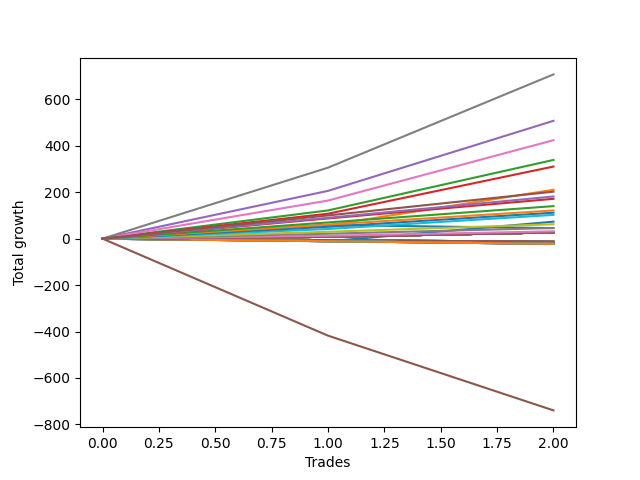

# Long Pointer 002 DB 
- Symbol: ES1y1d
- Date Range: 07/19/2021 - 07/08/2022
- Trading Period: 7:20-12:30
- Number of Trades: 2



| Name | Win Percent | Profit | Avg Profit / Trade | Avg Time / Trade | Avg Profit / Time |      | Name | Win Percent | Profit | Avg Profit / Trade | Avg Time / Trade | Avg Profit / Time |
| ---- | ----------- | ------ | ------------------ | ---------------- | ----------------- | ---- | ---- | ----------- | ------ | ------------------ | ---------------- | ----------------- |
| Sorted By <br> Profit | | | | | | | Sorted By <br> Win Percentage ||||||
| Seven | 100.00 | 353875.00 | 176937.50 | 24 05:14:00 | 7306.02 |     | Seven | 100.00 | 353875.00 | 176937.50 | 24 05:14:00 | 7306.02 |
| Four | 100.00 | 253875.00 | 126937.50 | 22 23:09:00 | 5527.53 |     | Four | 100.00 | 253875.00 | 126937.50 | 22 23:09:00 | 5527.53 |
| Six | 100.00 | 212125.00 | 106062.50 | 16 23:40:00 | 6244.07 |     | Six | 100.00 | 212125.00 | 106062.50 | 16 23:40:00 | 6244.07 |
| Two | 100.00 | 169625.00 | 84812.50 | 13 04:59:00 | 6421.47 |     | Two | 100.00 | 169625.00 | 84812.50 | 13 04:59:00 | 6421.47 |
| Three | 100.00 | 155375.00 | 77687.50 | 13 03:09:00 | 5916.23 |     | Three | 100.00 | 155375.00 | 77687.50 | 13 03:09:00 | 5916.23 |
| Two Hundred Fifteen | 100.00 | 151875.00 | 75937.50 | 14 13:10:30 | 5219.45 |     | Two Hundred Fifteen | 100.00 | 151875.00 | 75937.50 | 14 13:10:30 | 5219.45 |
| Two Hundred Fourteen.Five | 100.00 | 145375.00 | 72687.50 | 14 01:07:30 | 5174.64 |     | Two Hundred Fourteen.Five | 100.00 | 145375.00 | 72687.50 | 14 01:07:30 | 5174.64 |
| Two Hundred Fourteen | 100.00 | 142000.00 | 71000.00 | 14 00:38:00 | 5061.89 |     | Two Hundred Fourteen | 100.00 | 142000.00 | 71000.00 | 14 00:38:00 | 5061.89 |
| Two Hundred Thirteen.Five | 100.00 | 135375.00 | 67687.50 | 13 14:44:00 | 4971.94 |     | Two Hundred Thirteen.Five | 100.00 | 135375.00 | 67687.50 | 13 14:44:00 | 4971.94 |
| Two Hundred Thirteen | 100.00 | 131375.00 | 65687.50 | 12 05:37:00 | 5369.25 |     | Two Hundred Thirteen | 100.00 | 131375.00 | 65687.50 | 12 05:37:00 | 5369.25 |
| Two Hundred Twelve.Five | 100.00 | 127250.00 | 63625.00 | 12 05:31:00 | 5202.43 |     | Two Hundred Twelve.Five | 100.00 | 127250.00 | 63625.00 | 12 05:31:00 | 5202.43 |
| Two Hundred Twelve | 100.00 | 122500.00 | 61250.00 | 12 05:19:00 | 5011.65 |     | Two Hundred Twelve | 100.00 | 122500.00 | 61250.00 | 12 05:19:00 | 5011.65 |
| Two Hundred Eleven.Five | 100.00 | 115125.00 | 57562.50 | 12 05:13:00 | 4711.53 |     | Two Hundred Eleven.Five | 100.00 | 115125.00 | 57562.50 | 12 05:13:00 | 4711.53 |
| Two Hundred Eleven | 100.00 | 110875.00 | 55437.50 | 12 02:07:00 | 4586.09 |     | Two Hundred Eleven | 100.00 | 110875.00 | 55437.50 | 12 02:07:00 | 4586.09 |
| Two Hundred Ten.Five | 100.00 | 105500.00 | 52750.00 | 12 01:31:00 | 4372.81 |     | Two Hundred Ten.Five | 100.00 | 105500.00 | 52750.00 | 12 01:31:00 | 4372.81 |
| One | 100.00 | 105375.00 | 52687.50 | 12 03:08:00 | 4343.37 |     | One | 100.00 | 105375.00 | 52687.50 | 12 03:08:00 | 4343.37 |
| Two Hundred Ten | 100.00 | 101250.00 | 50625.00 | 12 01:08:00 | 4202.21 |     | Two Hundred Ten | 100.00 | 101250.00 | 50625.00 | 12 01:08:00 | 4202.21 |
| Two Hundred Nine.Five | 100.00 | 97625.00 | 48812.50 | 12 01:02:30 | 4053.05 |     | Two Hundred Nine.Five | 100.00 | 97625.00 | 48812.50 | 12 01:02:30 | 4053.05 |
| Two Hundred Nine | 100.00 | 90875.00 | 45437.50 | 11 23:38:00 | 3791.29 |     | Two Hundred Nine | 100.00 | 90875.00 | 45437.50 | 11 23:38:00 | 3791.29 |
| Two Hundred Eight.Five | 100.00 | 86375.00 | 43187.50 | 04 11:14:30 | 9665.09 |     | Two Hundred Eight.Five | 100.00 | 86375.00 | 43187.50 | 04 11:14:30 | 9665.09 |
| Two Hundred Eight | 100.00 | 85875.00 | 42937.50 | 04 11:14:00 | 9609.88 |     | Two Hundred Eight | 100.00 | 85875.00 | 42937.50 | 04 11:14:00 | 9609.88 |
| Two Hundred Seven.Five | 100.00 | 81500.00 | 40750.00 | 04 11:12:30 | 9122.43 |     | Two Hundred Seven.Five | 100.00 | 81500.00 | 40750.00 | 04 11:12:30 | 9122.43 |
| Two Hundred Seven | 100.00 | 70125.00 | 35062.50 | 04 01:01:30 | 8673.02 |     | Two Hundred Seven | 100.00 | 70125.00 | 35062.50 | 04 01:01:30 | 8673.02 |
| Two Hundred Six.Five | 100.00 | 66625.00 | 33312.50 | 04 00:57:00 | 8246.52 |     | Two Hundred Six.Five | 100.00 | 66625.00 | 33312.50 | 04 00:57:00 | 8246.52 |
| Two Hundred Six | 100.00 | 60750.00 | 30375.00 | 00 12:11:00 | 59835.84 |     | Two Hundred Six | 100.00 | 60750.00 | 30375.00 | 00 12:11:00 | 59835.84 |
| Two Hundred Five.Five | 100.00 | 59375.00 | 29687.50 | 00 12:09:00 | 58641.98 |     | Two Hundred Five.Five | 100.00 | 59375.00 | 29687.50 | 00 12:09:00 | 58641.98 |
| Two Hundred Five | 100.00 | 56000.00 | 28000.00 | 00 12:06:00 | 55537.19 |     | Two Hundred Five | 100.00 | 56000.00 | 28000.00 | 00 12:06:00 | 55537.19 |
| Two Hundred Four.Five | 100.00 | 53875.00 | 26937.50 | 00 12:04:00 | 53577.35 |     | Two Hundred Four.Five | 100.00 | 53875.00 | 26937.50 | 00 12:04:00 | 53577.35 |
| Two Hundred Four | 100.00 | 51250.00 | 25625.00 | 00 11:53:00 | 51753.16 |     | Two Hundred Four | 100.00 | 51250.00 | 25625.00 | 00 11:53:00 | 51753.16 |
| Two Hundred Three.Five | 100.00 | 36875.00 | 18437.50 | 00 02:57:30 | 149577.46 |     | Two Hundred Three.Five | 100.00 | 36875.00 | 18437.50 | 00 02:57:30 | 149577.46 |
| Zero | 50.00 | 36625.00 | 18312.50 | 10 23:18:00 | 1669.20 |     | Two Hundred Three | 100.00 | 31125.00 | 15562.50 | 00 02:23:30 | 156167.25 |
| Two Hundred Three | 100.00 | 31125.00 | 15562.50 | 00 02:23:30 | 156167.25 |     | Two Hundred Two.Five | 100.00 | 26125.00 | 13062.50 | 00 02:14:30 | 139851.30 |
| Two Hundred Two.Five | 100.00 | 26125.00 | 13062.50 | 00 02:14:30 | 139851.30 |     | Two Hundred Two | 100.00 | 23000.00 | 11500.00 | 00 01:58:30 | 139746.84 |
| Two Hundred Two | 100.00 | 23000.00 | 11500.00 | 00 01:58:30 | 139746.84 |     | Two Hundred One.Five | 100.00 | 17500.00 | 8750.00 | 00 00:07:00 | 1800000.00 |
| Seventy-Three | 50.00 | 22750.00 | 11375.00 | 04 00:31:00 | 2828.53 |     | Two Hundred One | 100.00 | 15875.00 | 7937.50 | 00 00:05:00 | 2286000.00 |
| Two Hundred One.Five | 100.00 | 17500.00 | 8750.00 | 00 00:07:00 | 1800000.00 |     | Ninety | 100.00 | 15875.00 | 7937.50 | 00 00:05:00 | 2286000.00 |
| Two Hundred One | 100.00 | 15875.00 | 7937.50 | 00 00:05:00 | 2286000.00 |     | Eighty-Nine | 100.00 | 14125.00 | 7062.50 | 00 00:03:30 | 2905714.29 |
| Ninety | 100.00 | 15875.00 | 7937.50 | 00 00:05:00 | 2286000.00 |     | Eighty-Eight | 100.00 | 13625.00 | 6812.50 | 00 00:03:00 | 3270000.00 |
| Eighty-Nine | 100.00 | 14125.00 | 7062.50 | 00 00:03:30 | 2905714.29 |     | Eighty-Seven | 100.00 | 13625.00 | 6812.50 | 00 00:03:00 | 3270000.00 |
| Eighty-Eight | 100.00 | 13625.00 | 6812.50 | 00 00:03:00 | 3270000.00 |     | Eighty-Six | 100.00 | 13625.00 | 6812.50 | 00 00:03:00 | 3270000.00 |
| Eighty-Seven | 100.00 | 13625.00 | 6812.50 | 00 00:03:00 | 3270000.00 |     | Eighty-Five | 100.00 | 13625.00 | 6812.50 | 00 00:03:00 | 3270000.00 |
| Eighty-Six | 100.00 | 13625.00 | 6812.50 | 00 00:03:00 | 3270000.00 |     | Eighty-Four | 100.00 | 13625.00 | 6812.50 | 00 00:03:00 | 3270000.00 |
| Eighty-Five | 100.00 | 13625.00 | 6812.50 | 00 00:03:00 | 3270000.00 |     | Eighty-Three | 100.00 | 13625.00 | 6812.50 | 00 00:03:00 | 3270000.00 |
| Eighty-Four | 100.00 | 13625.00 | 6812.50 | 00 00:03:00 | 3270000.00 |     | Eighty-Two | 100.00 | 13625.00 | 6812.50 | 00 00:03:00 | 3270000.00 |
| Eighty-Three | 100.00 | 13625.00 | 6812.50 | 00 00:03:00 | 3270000.00 |     | Eighty-One | 100.00 | 13625.00 | 6812.50 | 00 00:03:00 | 3270000.00 |
| Eighty-Two | 100.00 | 13625.00 | 6812.50 | 00 00:03:00 | 3270000.00 |     | Zero | 50.00 | 36625.00 | 18312.50 | 10 23:18:00 | 1669.20 |
| Eighty-One | 100.00 | 13625.00 | 6812.50 | 00 00:03:00 | 3270000.00 |     | Seventy-Three | 50.00 | 22750.00 | 11375.00 | 04 00:31:00 | 2828.53 |
| Five | 0.00 | -369875.00 | -184937.50 | 125 05:37:00 | -1476.74 |     | Five | 0.00 | -369875.00 | -184937.50 | 125 05:37:00 | -1476.74 |

## NO STOPLOSS

### Test Zero
* Sell when price hits the middle line of the 20p bollinger
* No Stoploss
* Results:
```
Total Trades: 2
Percent Up: 50.00
Percent Down: 50.00
Total Points Moved Up: 73.25
Potential Profit: 36625.00
Total Points Ups: 84.50 Count Ups: 1
Total Points Downs: -11.25 Count Downs: 1
```

<details><summary>Trades</summary>

<code>In: 2022-02-28 07:21:00		Out: 2022-03-16 06:39:00		Total Position Time: 15 23:18:00		Total Move Up: -11.25		Total to Date: -11.25</code> <br />
<code>In: 2022-03-10 07:21:00		Out: 2022-03-16 06:39:00		Total Position Time: 05 23:18:00		Total Move Up: 84.50		Total to Date: 73.25</code> <br />


</details>

### Test One
* Sell when the price hits the upper line of the 20p 1std bollinger
* No Stoploss
* Results:
```
Total Trades: 2
Percent Up: 100.00
Percent Down: 0.00
Total Points Moved Up: 210.75
Potential Profit: 105375.00
Total Points Ups: 210.75 Count Ups: 2
Total Points Downs: 0.00 Count Downs: 0
```

<details><summary>Trades</summary>

<code>In: 2022-02-28 07:21:00		Out: 2022-03-17 10:29:00		Total Position Time: 17 03:08:00		Total Move Up: 57.50		Total to Date: 57.50</code> <br />
<code>In: 2022-03-10 07:21:00		Out: 2022-03-17 10:29:00		Total Position Time: 07 03:08:00		Total Move Up: 153.25		Total to Date: 210.75</code> <br />


</details>

### Test Two
* Sell when the price hits the upper line of the 20p 2std bollinger
* No Stoploss
* Results:
```
Total Trades: 2
Percent Up: 100.00
Percent Down: 0.00
Total Points Moved Up: 339.25
Potential Profit: 169625.00
Total Points Ups: 339.25 Count Ups: 2
Total Points Downs: 0.00 Count Downs: 0
```

<details><summary>Trades</summary>

<code>In: 2022-02-28 07:21:00		Out: 2022-03-18 12:20:00		Total Position Time: 18 04:59:00		Total Move Up: 121.75		Total to Date: 121.75</code> <br />
<code>In: 2022-03-10 07:21:00		Out: 2022-03-18 12:20:00		Total Position Time: 08 04:59:00		Total Move Up: 217.50		Total to Date: 339.25</code> <br />


</details>

### Test Three
* Sell when price hits the middle line of the 50p bollinger
* No Stoploss
* Results:
```
Total Trades: 2
Percent Up: 100.00
Percent Down: 0.00
Total Points Moved Up: 310.75
Potential Profit: 155375.00
Total Points Ups: 310.75 Count Ups: 2
Total Points Downs: 0.00 Count Downs: 0
```

<details><summary>Trades</summary>

<code>In: 2022-02-28 07:21:00		Out: 2022-03-18 10:30:00		Total Position Time: 18 03:09:00		Total Move Up: 107.50		Total to Date: 107.50</code> <br />
<code>In: 2022-03-10 07:21:00		Out: 2022-03-18 10:30:00		Total Position Time: 08 03:09:00		Total Move Up: 203.25		Total to Date: 310.75</code> <br />


</details>

### Test Four
* Sell when the price hits the upper line of the 50p 1std bollinger
* No Stoploss
* Results:
```
Total Trades: 2
Percent Up: 100.00
Percent Down: 0.00
Total Points Moved Up: 507.75
Potential Profit: 253875.00
Total Points Ups: 507.75 Count Ups: 2
Total Points Downs: 0.00 Count Downs: 0
```

<details><summary>Trades</summary>

<code>In: 2022-02-28 07:21:00		Out: 2022-03-28 06:30:00		Total Position Time: 27 23:09:00		Total Move Up: 206.00		Total to Date: 206.00</code> <br />
<code>In: 2022-03-10 07:21:00		Out: 2022-03-28 06:30:00		Total Position Time: 17 23:09:00		Total Move Up: 301.75		Total to Date: 507.75</code> <br />


</details>

### Test Five
* Sell when the price hits the upper line of the 50p 2std bollinger
* No Stoploss
* Results:
```
Total Trades: 2
Percent Up: 0.00
Percent Down: 100.00
Total Points Moved Up: -739.75
Potential Profit: -369875.00
Total Points Ups: 0.00 Count Ups: 0
Total Points Downs: -739.75 Count Downs: 2
```

<details><summary>Trades</summary>

<code>In: 2022-02-28 07:21:00		Out: 2022-07-08 12:58:00		Total Position Time: 130 05:37:00		Total Move Up: -417.75		Total to Date: -417.75</code> <br />
<code>In: 2022-03-10 07:21:00		Out: 2022-07-08 12:58:00		Total Position Time: 120 05:37:00		Total Move Up: -322.00		Total to Date: -739.75</code> <br />


</details>

### Test Six
* Sell when the price hits the middle line of the 1std VWAP
* No Stoploss
* Results:
```
Total Trades: 2
Percent Up: 100.00
Percent Down: 0.00
Total Points Moved Up: 424.25
Potential Profit: 212125.00
Total Points Ups: 424.25 Count Ups: 2
Total Points Downs: 0.00 Count Downs: 0
```

<details><summary>Trades</summary>

<code>In: 2022-02-28 07:21:00		Out: 2022-03-22 07:01:00		Total Position Time: 21 23:40:00		Total Move Up: 164.25		Total to Date: 164.25</code> <br />
<code>In: 2022-03-10 07:21:00		Out: 2022-03-22 07:01:00		Total Position Time: 11 23:40:00		Total Move Up: 260.00		Total to Date: 424.25</code> <br />


</details>

### Test Seven
* Sell when the price hits the upper line of the 1std VWAP
* No Stoploss
* Results:
```
Total Trades: 2
Percent Up: 100.00
Percent Down: 0.00
Total Points Moved Up: 707.75
Potential Profit: 353875.00
Total Points Ups: 707.75 Count Ups: 2
Total Points Downs: 0.00 Count Downs: 0
```

<details><summary>Trades</summary>

<code>In: 2022-02-28 07:21:00		Out: 2022-03-29 12:35:00		Total Position Time: 29 05:14:00		Total Move Up: 306.00		Total to Date: 306.00</code> <br />
<code>In: 2022-03-10 07:21:00		Out: 2022-03-29 12:35:00		Total Position Time: 19 05:14:00		Total Move Up: 401.75		Total to Date: 707.75</code> <br />


</details>

## SPECIAL EXIT CONDITIONS 

### Test Seventy-Three
* Sell when the linear regression slope changes to negative
* No Stoploss
* Results:
```
Total Trades: 2
Percent Up: 50.00
Percent Down: 50.00
Total Points Moved Up: 45.50
Potential Profit: 22750.00
Total Points Ups: 58.75 Count Ups: 1
Total Points Downs: -13.25 Count Downs: 1
```

<details><summary>Trades</summary>

<code>In: 2022-02-28 07:21:00		Out: 2022-03-03 07:22:00		Total Position Time: 03 00:01:00		Total Move Up: 58.75		Total to Date: 58.75</code> <br />
<code>In: 2022-03-10 07:21:00		Out: 2022-03-15 08:22:00		Total Position Time: 05 01:01:00		Total Move Up: -13.25		Total to Date: 45.50</code> <br />


</details>

## TAKE PROFIT

### Test Eighty-One
* Take Profit of 1 Point
* No Stoploss
* Results:
```
Total Trades: 2
Percent Up: 100.00
Percent Down: 0.00
Total Points Moved Up: 27.25
Potential Profit: 13625.00
Total Points Ups: 27.25 Count Ups: 2
Total Points Downs: 0.00 Count Downs: 0
```

<details><summary>Trades</summary>

<code>In: 2022-02-28 07:21:00		Out: 2022-02-28 07:24:00		Total Position Time: 00 00:03:00		Total Move Up: 8.00		Total to Date: 8.00</code> <br />
<code>In: 2022-03-10 07:21:00		Out: 2022-03-10 07:24:00		Total Position Time: 00 00:03:00		Total Move Up: 19.25		Total to Date: 27.25</code> <br />


</details>

### Test Eighty-Two
* Take Profit of 2 Point
* No Stoploss
* Results:
```
Total Trades: 2
Percent Up: 100.00
Percent Down: 0.00
Total Points Moved Up: 27.25
Potential Profit: 13625.00
Total Points Ups: 27.25 Count Ups: 2
Total Points Downs: 0.00 Count Downs: 0
```

<details><summary>Trades</summary>

<code>In: 2022-02-28 07:21:00		Out: 2022-02-28 07:24:00		Total Position Time: 00 00:03:00		Total Move Up: 8.00		Total to Date: 8.00</code> <br />
<code>In: 2022-03-10 07:21:00		Out: 2022-03-10 07:24:00		Total Position Time: 00 00:03:00		Total Move Up: 19.25		Total to Date: 27.25</code> <br />


</details>

### Test Eighty-Three
* Take Profit of 3 Point
* No Stoploss
* Results:
```
Total Trades: 2
Percent Up: 100.00
Percent Down: 0.00
Total Points Moved Up: 27.25
Potential Profit: 13625.00
Total Points Ups: 27.25 Count Ups: 2
Total Points Downs: 0.00 Count Downs: 0
```

<details><summary>Trades</summary>

<code>In: 2022-02-28 07:21:00		Out: 2022-02-28 07:24:00		Total Position Time: 00 00:03:00		Total Move Up: 8.00		Total to Date: 8.00</code> <br />
<code>In: 2022-03-10 07:21:00		Out: 2022-03-10 07:24:00		Total Position Time: 00 00:03:00		Total Move Up: 19.25		Total to Date: 27.25</code> <br />


</details>

### Test Eighty-Four
* Take Profit of 4 Point
* No Stoploss
* Results:
```
Total Trades: 2
Percent Up: 100.00
Percent Down: 0.00
Total Points Moved Up: 27.25
Potential Profit: 13625.00
Total Points Ups: 27.25 Count Ups: 2
Total Points Downs: 0.00 Count Downs: 0
```

<details><summary>Trades</summary>

<code>In: 2022-02-28 07:21:00		Out: 2022-02-28 07:24:00		Total Position Time: 00 00:03:00		Total Move Up: 8.00		Total to Date: 8.00</code> <br />
<code>In: 2022-03-10 07:21:00		Out: 2022-03-10 07:24:00		Total Position Time: 00 00:03:00		Total Move Up: 19.25		Total to Date: 27.25</code> <br />


</details>

### Test Eighty-Five
* Take Profit of 5 Point
* No Stoploss
* Results:
```
Total Trades: 2
Percent Up: 100.00
Percent Down: 0.00
Total Points Moved Up: 27.25
Potential Profit: 13625.00
Total Points Ups: 27.25 Count Ups: 2
Total Points Downs: 0.00 Count Downs: 0
```

<details><summary>Trades</summary>

<code>In: 2022-02-28 07:21:00		Out: 2022-02-28 07:24:00		Total Position Time: 00 00:03:00		Total Move Up: 8.00		Total to Date: 8.00</code> <br />
<code>In: 2022-03-10 07:21:00		Out: 2022-03-10 07:24:00		Total Position Time: 00 00:03:00		Total Move Up: 19.25		Total to Date: 27.25</code> <br />


</details>

### Test Eighty-Six
* Take Profit of 6 Point
* No Stoploss
* Results:
```
Total Trades: 2
Percent Up: 100.00
Percent Down: 0.00
Total Points Moved Up: 27.25
Potential Profit: 13625.00
Total Points Ups: 27.25 Count Ups: 2
Total Points Downs: 0.00 Count Downs: 0
```

<details><summary>Trades</summary>

<code>In: 2022-02-28 07:21:00		Out: 2022-02-28 07:24:00		Total Position Time: 00 00:03:00		Total Move Up: 8.00		Total to Date: 8.00</code> <br />
<code>In: 2022-03-10 07:21:00		Out: 2022-03-10 07:24:00		Total Position Time: 00 00:03:00		Total Move Up: 19.25		Total to Date: 27.25</code> <br />


</details>

### Test Eighty-Seven
* Take Profit of 7 Point
* No Stoploss
* Results:
```
Total Trades: 2
Percent Up: 100.00
Percent Down: 0.00
Total Points Moved Up: 27.25
Potential Profit: 13625.00
Total Points Ups: 27.25 Count Ups: 2
Total Points Downs: 0.00 Count Downs: 0
```

<details><summary>Trades</summary>

<code>In: 2022-02-28 07:21:00		Out: 2022-02-28 07:24:00		Total Position Time: 00 00:03:00		Total Move Up: 8.00		Total to Date: 8.00</code> <br />
<code>In: 2022-03-10 07:21:00		Out: 2022-03-10 07:24:00		Total Position Time: 00 00:03:00		Total Move Up: 19.25		Total to Date: 27.25</code> <br />


</details>

### Test Eighty-Eight
* Take Profit of 8 Point
* No Stoploss
* Results:
```
Total Trades: 2
Percent Up: 100.00
Percent Down: 0.00
Total Points Moved Up: 27.25
Potential Profit: 13625.00
Total Points Ups: 27.25 Count Ups: 2
Total Points Downs: 0.00 Count Downs: 0
```

<details><summary>Trades</summary>

<code>In: 2022-02-28 07:21:00		Out: 2022-02-28 07:24:00		Total Position Time: 00 00:03:00		Total Move Up: 8.00		Total to Date: 8.00</code> <br />
<code>In: 2022-03-10 07:21:00		Out: 2022-03-10 07:24:00		Total Position Time: 00 00:03:00		Total Move Up: 19.25		Total to Date: 27.25</code> <br />


</details>

### Test Eighty-Nine
* Take Profit of 9 Point
* No Stoploss
* Results:
```
Total Trades: 2
Percent Up: 100.00
Percent Down: 0.00
Total Points Moved Up: 28.25
Potential Profit: 14125.00
Total Points Ups: 28.25 Count Ups: 2
Total Points Downs: 0.00 Count Downs: 0
```

<details><summary>Trades</summary>

<code>In: 2022-02-28 07:21:00		Out: 2022-02-28 07:25:00		Total Position Time: 00 00:04:00		Total Move Up: 9.00		Total to Date: 9.00</code> <br />
<code>In: 2022-03-10 07:21:00		Out: 2022-03-10 07:24:00		Total Position Time: 00 00:03:00		Total Move Up: 19.25		Total to Date: 28.25</code> <br />


</details>

### Test Ninety
* Take Profit of 10 Point
* No Stoploss
* Results:
```
Total Trades: 2
Percent Up: 100.00
Percent Down: 0.00
Total Points Moved Up: 31.75
Potential Profit: 15875.00
Total Points Ups: 31.75 Count Ups: 2
Total Points Downs: 0.00 Count Downs: 0
```

<details><summary>Trades</summary>

<code>In: 2022-02-28 07:21:00		Out: 2022-02-28 07:28:00		Total Position Time: 00 00:07:00		Total Move Up: 12.50		Total to Date: 12.50</code> <br />
<code>In: 2022-03-10 07:21:00		Out: 2022-03-10 07:24:00		Total Position Time: 00 00:03:00		Total Move Up: 19.25		Total to Date: 31.75</code> <br />


</details>

## DAILY TAKE PROFITS

### Test Two Hundred One
* Take Profit of 10 Point
* No Stoploss
* Results:
```
Total Trades: 2
Percent Up: 100.00
Percent Down: 0.00
Total Points Moved Up: 31.75
Potential Profit: 15875.00
Total Points Ups: 31.75 Count Ups: 2
Total Points Downs: 0.00 Count Downs: 0
```

<details><summary>Trades</summary>

<code>In: 2022-02-28 07:21:00		Out: 2022-02-28 07:28:00		Total Position Time: 00 00:07:00		Total Move Up: 12.50		Total to Date: 12.50</code> <br />
<code>In: 2022-03-10 07:21:00		Out: 2022-03-10 07:24:00		Total Position Time: 00 00:03:00		Total Move Up: 19.25		Total to Date: 31.75</code> <br />


</details>

### Test Two Hundred One.Five
* Take Profit of 15 Point
* No Stoploss
* Results:
```
Total Trades: 2
Percent Up: 100.00
Percent Down: 0.00
Total Points Moved Up: 35.00
Potential Profit: 17500.00
Total Points Ups: 35.00 Count Ups: 2
Total Points Downs: 0.00 Count Downs: 0
```

<details><summary>Trades</summary>

<code>In: 2022-02-28 07:21:00		Out: 2022-02-28 07:32:00		Total Position Time: 00 00:11:00		Total Move Up: 15.75		Total to Date: 15.75</code> <br />
<code>In: 2022-03-10 07:21:00		Out: 2022-03-10 07:24:00		Total Position Time: 00 00:03:00		Total Move Up: 19.25		Total to Date: 35.00</code> <br />


</details>

### Test Two Hundred Two
* Take Profit of 20 Point
* No Stoploss
* Results:
```
Total Trades: 2
Percent Up: 100.00
Percent Down: 0.00
Total Points Moved Up: 46.00
Potential Profit: 23000.00
Total Points Ups: 46.00 Count Ups: 2
Total Points Downs: 0.00 Count Downs: 0
```

<details><summary>Trades</summary>

<code>In: 2022-02-28 07:21:00		Out: 2022-02-28 07:34:00		Total Position Time: 00 00:13:00		Total Move Up: 21.50		Total to Date: 21.50</code> <br />
<code>In: 2022-03-10 07:21:00		Out: 2022-03-10 11:05:00		Total Position Time: 00 03:44:00		Total Move Up: 24.50		Total to Date: 46.00</code> <br />


</details>

### Test Two Hundred Two.Five
* Take Profit of 25 Point
* No Stoploss
* Results:
```
Total Trades: 2
Percent Up: 100.00
Percent Down: 0.00
Total Points Moved Up: 52.25
Potential Profit: 26125.00
Total Points Ups: 52.25 Count Ups: 2
Total Points Downs: 0.00 Count Downs: 0
```

<details><summary>Trades</summary>

<code>In: 2022-02-28 07:21:00		Out: 2022-02-28 07:39:00		Total Position Time: 00 00:18:00		Total Move Up: 27.00		Total to Date: 27.00</code> <br />
<code>In: 2022-03-10 07:21:00		Out: 2022-03-10 11:32:00		Total Position Time: 00 04:11:00		Total Move Up: 25.25		Total to Date: 52.25</code> <br />


</details>

### Test Two Hundred Three
* Take Profit of 30 Point
* No Stoploss
* Results:
```
Total Trades: 2
Percent Up: 100.00
Percent Down: 0.00
Total Points Moved Up: 62.25
Potential Profit: 31125.00
Total Points Ups: 62.25 Count Ups: 2
Total Points Downs: 0.00 Count Downs: 0
```

<details><summary>Trades</summary>

<code>In: 2022-02-28 07:21:00		Out: 2022-02-28 07:40:00		Total Position Time: 00 00:19:00		Total Move Up: 29.75		Total to Date: 29.75</code> <br />
<code>In: 2022-03-10 07:21:00		Out: 2022-03-10 11:49:00		Total Position Time: 00 04:28:00		Total Move Up: 32.50		Total to Date: 62.25</code> <br />


</details>

### Test Two Hundred Three.Five
* Take Profit of 35 Point
* No Stoploss
* Results:
```
Total Trades: 2
Percent Up: 100.00
Percent Down: 0.00
Total Points Moved Up: 73.75
Potential Profit: 36875.00
Total Points Ups: 73.75 Count Ups: 2
Total Points Downs: 0.00 Count Downs: 0
```

<details><summary>Trades</summary>

<code>In: 2022-02-28 07:21:00		Out: 2022-02-28 07:43:00		Total Position Time: 00 00:22:00		Total Move Up: 35.50		Total to Date: 35.50</code> <br />
<code>In: 2022-03-10 07:21:00		Out: 2022-03-10 12:54:00		Total Position Time: 00 05:33:00		Total Move Up: 38.25		Total to Date: 73.75</code> <br />


</details>

### Test Two Hundred Four
* Take Profit of 40 Point
* No Stoploss
* Results:
```
Total Trades: 2
Percent Up: 100.00
Percent Down: 0.00
Total Points Moved Up: 102.50
Potential Profit: 51250.00
Total Points Ups: 102.50 Count Ups: 2
Total Points Downs: 0.00 Count Downs: 0
```

<details><summary>Trades</summary>

<code>In: 2022-02-28 07:21:00		Out: 2022-02-28 07:57:00		Total Position Time: 00 00:36:00		Total Move Up: 41.75		Total to Date: 41.75</code> <br />
<code>In: 2022-03-10 07:21:00		Out: 2022-03-11 06:31:00		Total Position Time: 00 23:10:00		Total Move Up: 60.75		Total to Date: 102.50</code> <br />


</details>

### Test Two Hundred Four.Five
* Take Profit of 45 Point
* No Stoploss
* Results:
```
Total Trades: 2
Percent Up: 100.00
Percent Down: 0.00
Total Points Moved Up: 107.75
Potential Profit: 53875.00
Total Points Ups: 107.75 Count Ups: 2
Total Points Downs: 0.00 Count Downs: 0
```

<details><summary>Trades</summary>

<code>In: 2022-02-28 07:21:00		Out: 2022-02-28 08:19:00		Total Position Time: 00 00:58:00		Total Move Up: 47.00		Total to Date: 47.00</code> <br />
<code>In: 2022-03-10 07:21:00		Out: 2022-03-11 06:31:00		Total Position Time: 00 23:10:00		Total Move Up: 60.75		Total to Date: 107.75</code> <br />


</details>

### Test Two Hundred Five
* Take Profit of 50 Point
* No Stoploss
* Results:
```
Total Trades: 2
Percent Up: 100.00
Percent Down: 0.00
Total Points Moved Up: 112.00
Potential Profit: 56000.00
Total Points Ups: 112.00 Count Ups: 2
Total Points Downs: 0.00 Count Downs: 0
```

<details><summary>Trades</summary>

<code>In: 2022-02-28 07:21:00		Out: 2022-02-28 08:23:00		Total Position Time: 00 01:02:00		Total Move Up: 51.25		Total to Date: 51.25</code> <br />
<code>In: 2022-03-10 07:21:00		Out: 2022-03-11 06:31:00		Total Position Time: 00 23:10:00		Total Move Up: 60.75		Total to Date: 112.00</code> <br />


</details>

### Test Two Hundred Five.Five
* Take Profit of 55 Point
* No Stoploss
* Results:
```
Total Trades: 2
Percent Up: 100.00
Percent Down: 0.00
Total Points Moved Up: 118.75
Potential Profit: 59375.00
Total Points Ups: 118.75 Count Ups: 2
Total Points Downs: 0.00 Count Downs: 0
```

<details><summary>Trades</summary>

<code>In: 2022-02-28 07:21:00		Out: 2022-02-28 08:29:00		Total Position Time: 00 01:08:00		Total Move Up: 58.00		Total to Date: 58.00</code> <br />
<code>In: 2022-03-10 07:21:00		Out: 2022-03-11 06:31:00		Total Position Time: 00 23:10:00		Total Move Up: 60.75		Total to Date: 118.75</code> <br />


</details>

### Test Two Hundred Six
* Take Profit of 60 Point
* No Stoploss
* Results:
```
Total Trades: 2
Percent Up: 100.00
Percent Down: 0.00
Total Points Moved Up: 121.50
Potential Profit: 60750.00
Total Points Ups: 121.50 Count Ups: 2
Total Points Downs: 0.00 Count Downs: 0
```

<details><summary>Trades</summary>

<code>In: 2022-02-28 07:21:00		Out: 2022-02-28 08:33:00		Total Position Time: 00 01:12:00		Total Move Up: 60.75		Total to Date: 60.75</code> <br />
<code>In: 2022-03-10 07:21:00		Out: 2022-03-11 06:31:00		Total Position Time: 00 23:10:00		Total Move Up: 60.75		Total to Date: 121.50</code> <br />


</details>

### Test Two Hundred Six.Five
* Take Profit of 65 Point
* No Stoploss
* Results:
```
Total Trades: 2
Percent Up: 100.00
Percent Down: 0.00
Total Points Moved Up: 133.25
Potential Profit: 66625.00
Total Points Ups: 133.25 Count Ups: 2
Total Points Downs: 0.00 Count Downs: 0
```

<details><summary>Trades</summary>

<code>In: 2022-02-28 07:21:00		Out: 2022-03-02 10:05:00		Total Position Time: 02 02:44:00		Total Move Up: 66.25		Total to Date: 66.25</code> <br />
<code>In: 2022-03-10 07:21:00		Out: 2022-03-16 06:31:00		Total Position Time: 05 23:10:00		Total Move Up: 67.00		Total to Date: 133.25</code> <br />


</details>

### Test Two Hundred Seven
* Take Profit of 70 Point
* No Stoploss
* Results:
```
Total Trades: 2
Percent Up: 100.00
Percent Down: 0.00
Total Points Moved Up: 140.25
Potential Profit: 70125.00
Total Points Ups: 140.25 Count Ups: 2
Total Points Downs: 0.00 Count Downs: 0
```

<details><summary>Trades</summary>

<code>In: 2022-02-28 07:21:00		Out: 2022-03-02 10:11:00		Total Position Time: 02 02:50:00		Total Move Up: 70.00		Total to Date: 70.00</code> <br />
<code>In: 2022-03-10 07:21:00		Out: 2022-03-16 06:34:00		Total Position Time: 05 23:13:00		Total Move Up: 70.25		Total to Date: 140.25</code> <br />


</details>

### Test Two Hundred Seven.Five
* Take Profit of 75 Point
* No Stoploss
* Results:
```
Total Trades: 2
Percent Up: 100.00
Percent Down: 0.00
Total Points Moved Up: 163.00
Potential Profit: 81500.00
Total Points Ups: 163.00 Count Ups: 2
Total Points Downs: 0.00 Count Downs: 0
```

<details><summary>Trades</summary>

<code>In: 2022-02-28 07:21:00		Out: 2022-03-03 06:31:00		Total Position Time: 02 23:10:00		Total Move Up: 87.25		Total to Date: 87.25</code> <br />
<code>In: 2022-03-10 07:21:00		Out: 2022-03-16 06:36:00		Total Position Time: 05 23:15:00		Total Move Up: 75.75		Total to Date: 163.00</code> <br />


</details>

### Test Two Hundred Eight
* Take Profit of 80 Point
* No Stoploss
* Results:
```
Total Trades: 2
Percent Up: 100.00
Percent Down: 0.00
Total Points Moved Up: 171.75
Potential Profit: 85875.00
Total Points Ups: 171.75 Count Ups: 2
Total Points Downs: 0.00 Count Downs: 0
```

<details><summary>Trades</summary>

<code>In: 2022-02-28 07:21:00		Out: 2022-03-03 06:31:00		Total Position Time: 02 23:10:00		Total Move Up: 87.25		Total to Date: 87.25</code> <br />
<code>In: 2022-03-10 07:21:00		Out: 2022-03-16 06:39:00		Total Position Time: 05 23:18:00		Total Move Up: 84.50		Total to Date: 171.75</code> <br />


</details>

### Test Two Hundred Eight.Five
* Take Profit of 85 Point
* No Stoploss
* Results:
```
Total Trades: 2
Percent Up: 100.00
Percent Down: 0.00
Total Points Moved Up: 172.75
Potential Profit: 86375.00
Total Points Ups: 172.75 Count Ups: 2
Total Points Downs: 0.00 Count Downs: 0
```

<details><summary>Trades</summary>

<code>In: 2022-02-28 07:21:00		Out: 2022-03-03 06:31:00		Total Position Time: 02 23:10:00		Total Move Up: 87.25		Total to Date: 87.25</code> <br />
<code>In: 2022-03-10 07:21:00		Out: 2022-03-16 06:40:00		Total Position Time: 05 23:19:00		Total Move Up: 85.50		Total to Date: 172.75</code> <br />


</details>

### Test Two Hundred Nine
* Take Profit of 90 Point
* No Stoploss
* Results:
```
Total Trades: 2
Percent Up: 100.00
Percent Down: 0.00
Total Points Moved Up: 181.75
Potential Profit: 90875.00
Total Points Ups: 181.75 Count Ups: 2
Total Points Downs: 0.00 Count Downs: 0
```

<details><summary>Trades</summary>

<code>In: 2022-02-28 07:21:00		Out: 2022-03-18 07:11:00		Total Position Time: 17 23:50:00		Total Move Up: 90.00		Total to Date: 90.00</code> <br />
<code>In: 2022-03-10 07:21:00		Out: 2022-03-16 06:47:00		Total Position Time: 05 23:26:00		Total Move Up: 91.75		Total to Date: 181.75</code> <br />


</details>

### Test Two Hundred Nine.Five
* Take Profit of 95 Point
* No Stoploss
* Results:
```
Total Trades: 2
Percent Up: 100.00
Percent Down: 0.00
Total Points Moved Up: 195.25
Potential Profit: 97625.00
Total Points Ups: 195.25 Count Ups: 2
Total Points Downs: 0.00 Count Downs: 0
```

<details><summary>Trades</summary>

<code>In: 2022-02-28 07:21:00		Out: 2022-03-18 09:31:00		Total Position Time: 18 02:10:00		Total Move Up: 95.50		Total to Date: 95.50</code> <br />
<code>In: 2022-03-10 07:21:00		Out: 2022-03-16 07:16:00		Total Position Time: 05 23:55:00		Total Move Up: 99.75		Total to Date: 195.25</code> <br />


</details>

### Test Two Hundred Ten
* Take Profit of 100 Point
* No Stoploss
* Results:
```
Total Trades: 2
Percent Up: 100.00
Percent Down: 0.00
Total Points Moved Up: 202.50
Potential Profit: 101250.00
Total Points Ups: 202.50 Count Ups: 2
Total Points Downs: 0.00 Count Downs: 0
```

<details><summary>Trades</summary>

<code>In: 2022-02-28 07:21:00		Out: 2022-03-18 09:41:00		Total Position Time: 18 02:20:00		Total Move Up: 100.25		Total to Date: 100.25</code> <br />
<code>In: 2022-03-10 07:21:00		Out: 2022-03-16 07:17:00		Total Position Time: 05 23:56:00		Total Move Up: 102.25		Total to Date: 202.50</code> <br />


</details>

### Test Two Hundred Ten.Five
* Take Profit of 105 Point
* No Stoploss
* Results:
```
Total Trades: 2
Percent Up: 100.00
Percent Down: 0.00
Total Points Moved Up: 211.00
Potential Profit: 105500.00
Total Points Ups: 211.00 Count Ups: 2
Total Points Downs: 0.00 Count Downs: 0
```

<details><summary>Trades</summary>

<code>In: 2022-02-28 07:21:00		Out: 2022-03-18 10:26:00		Total Position Time: 18 03:05:00		Total Move Up: 105.25		Total to Date: 105.25</code> <br />
<code>In: 2022-03-10 07:21:00		Out: 2022-03-16 07:18:00		Total Position Time: 05 23:57:00		Total Move Up: 105.75		Total to Date: 211.00</code> <br />


</details>

### Test Two Hundred Eleven
* Take Profit of 110 Point
* No Stoploss
* Results:
```
Total Trades: 2
Percent Up: 100.00
Percent Down: 0.00
Total Points Moved Up: 221.75
Potential Profit: 110875.00
Total Points Ups: 221.75 Count Ups: 2
Total Points Downs: 0.00 Count Downs: 0
```

<details><summary>Trades</summary>

<code>In: 2022-02-28 07:21:00		Out: 2022-03-18 11:37:00		Total Position Time: 18 04:16:00		Total Move Up: 111.00		Total to Date: 111.00</code> <br />
<code>In: 2022-03-10 07:21:00		Out: 2022-03-16 07:19:00		Total Position Time: 05 23:58:00		Total Move Up: 110.75		Total to Date: 221.75</code> <br />


</details>

### Test Two Hundred Eleven.Five
* Take Profit of 115 Point
* No Stoploss
* Results:
```
Total Trades: 2
Percent Up: 100.00
Percent Down: 0.00
Total Points Moved Up: 230.25
Potential Profit: 115125.00
Total Points Ups: 230.25 Count Ups: 2
Total Points Downs: 0.00 Count Downs: 0
```

<details><summary>Trades</summary>

<code>In: 2022-02-28 07:21:00		Out: 2022-03-18 12:09:00		Total Position Time: 18 04:48:00		Total Move Up: 115.00		Total to Date: 115.00</code> <br />
<code>In: 2022-03-10 07:21:00		Out: 2022-03-16 12:59:00		Total Position Time: 06 05:38:00		Total Move Up: 115.25		Total to Date: 230.25</code> <br />


</details>

### Test Two Hundred Twelve
* Take Profit of 120 Point
* No Stoploss
* Results:
```
Total Trades: 2
Percent Up: 100.00
Percent Down: 0.00
Total Points Moved Up: 245.00
Potential Profit: 122500.00
Total Points Ups: 245.00 Count Ups: 2
Total Points Downs: 0.00 Count Downs: 0
```

<details><summary>Trades</summary>

<code>In: 2022-02-28 07:21:00		Out: 2022-03-18 12:20:00		Total Position Time: 18 04:59:00		Total Move Up: 121.75		Total to Date: 121.75</code> <br />
<code>In: 2022-03-10 07:21:00		Out: 2022-03-16 13:00:00		Total Position Time: 06 05:39:00		Total Move Up: 123.25		Total to Date: 245.00</code> <br />


</details>

### Test Two Hundred Twelve.Five
* Take Profit of 125 Point
* No Stoploss
* Results:
```
Total Trades: 2
Percent Up: 100.00
Percent Down: 0.00
Total Points Moved Up: 254.50
Potential Profit: 127250.00
Total Points Ups: 254.50 Count Ups: 2
Total Points Downs: 0.00 Count Downs: 0
```

<details><summary>Trades</summary>

<code>In: 2022-02-28 07:21:00		Out: 2022-03-18 12:26:00		Total Position Time: 18 05:05:00		Total Move Up: 127.00		Total to Date: 127.00</code> <br />
<code>In: 2022-03-10 07:21:00		Out: 2022-03-16 13:18:00		Total Position Time: 06 05:57:00		Total Move Up: 127.50		Total to Date: 254.50</code> <br />


</details>

### Test Two Hundred Thirteen
* Take Profit of 130 Point
* No Stoploss
* Results:
```
Total Trades: 2
Percent Up: 100.00
Percent Down: 0.00
Total Points Moved Up: 262.75
Potential Profit: 131375.00
Total Points Ups: 262.75 Count Ups: 2
Total Points Downs: 0.00 Count Downs: 0
```

<details><summary>Trades</summary>

<code>In: 2022-02-28 07:21:00		Out: 2022-03-18 12:33:00		Total Position Time: 18 05:12:00		Total Move Up: 131.50		Total to Date: 131.50</code> <br />
<code>In: 2022-03-10 07:21:00		Out: 2022-03-16 13:23:00		Total Position Time: 06 06:02:00		Total Move Up: 131.25		Total to Date: 262.75</code> <br />


</details>

### Test Two Hundred Thirteen.Five
* Take Profit of 135 Point
* No Stoploss
* Results:
```
Total Trades: 2
Percent Up: 100.00
Percent Down: 0.00
Total Points Moved Up: 270.75
Potential Profit: 135375.00
Total Points Ups: 270.75 Count Ups: 2
Total Points Downs: 0.00 Count Downs: 0
```

<details><summary>Trades</summary>

<code>In: 2022-02-28 07:21:00		Out: 2022-03-21 06:33:00		Total Position Time: 20 23:12:00		Total Move Up: 136.00		Total to Date: 136.00</code> <br />
<code>In: 2022-03-10 07:21:00		Out: 2022-03-16 13:37:00		Total Position Time: 06 06:16:00		Total Move Up: 134.75		Total to Date: 270.75</code> <br />


</details>

### Test Two Hundred Fourteen
* Take Profit of 140 Point
* No Stoploss
* Results:
```
Total Trades: 2
Percent Up: 100.00
Percent Down: 0.00
Total Points Moved Up: 284.00
Potential Profit: 142000.00
Total Points Ups: 284.00 Count Ups: 2
Total Points Downs: 0.00 Count Downs: 0
```

<details><summary>Trades</summary>

<code>In: 2022-02-28 07:21:00		Out: 2022-03-21 06:35:00		Total Position Time: 20 23:14:00		Total Move Up: 142.75		Total to Date: 142.75</code> <br />
<code>In: 2022-03-10 07:21:00		Out: 2022-03-17 09:23:00		Total Position Time: 07 02:02:00		Total Move Up: 141.25		Total to Date: 284.00</code> <br />


</details>

### Test Two Hundred Fourteen.Five
* Take Profit of 145 Point
* No Stoploss
* Results:
```
Total Trades: 2
Percent Up: 100.00
Percent Down: 0.00
Total Points Moved Up: 290.75
Potential Profit: 145375.00
Total Points Ups: 290.75 Count Ups: 2
Total Points Downs: 0.00 Count Downs: 0
```

<details><summary>Trades</summary>

<code>In: 2022-02-28 07:21:00		Out: 2022-03-21 06:36:00		Total Position Time: 20 23:15:00		Total Move Up: 145.50		Total to Date: 145.50</code> <br />
<code>In: 2022-03-10 07:21:00		Out: 2022-03-17 10:21:00		Total Position Time: 07 03:00:00		Total Move Up: 145.25		Total to Date: 290.75</code> <br />


</details>

### Test Two Hundred Fifteen
* Take Profit of 150 Point
* No Stoploss
* Results:
```
Total Trades: 2
Percent Up: 100.00
Percent Down: 0.00
Total Points Moved Up: 303.75
Potential Profit: 151875.00
Total Points Ups: 303.75 Count Ups: 2
Total Points Downs: 0.00 Count Downs: 0
```

<details><summary>Trades</summary>

<code>In: 2022-02-28 07:21:00		Out: 2022-03-22 06:36:00		Total Position Time: 21 23:15:00		Total Move Up: 153.00		Total to Date: 153.00</code> <br />
<code>In: 2022-03-10 07:21:00		Out: 2022-03-17 10:27:00		Total Position Time: 07 03:06:00		Total Move Up: 150.75		Total to Date: 303.75</code> <br />


</details>