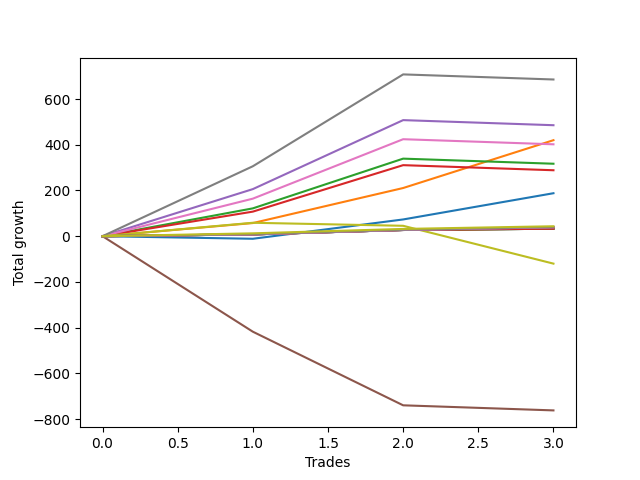

# Long Pointer 002 SD 
- Symbol: ES1y1d
- Date Range: 07/19/2021 - 07/07/2022
- Trading Period: 7:20-12:30
- Number of Trades: 3



| Name | Win Percent | Profit | Avg Profit / Trade | Avg Time / Trade | Avg Profit / Time |      | Name | Win Percent | Profit | Avg Profit / Trade | Avg Time / Trade | Avg Profit / Time |
| ---- | ----------- | ------ | ------------------ | ---------------- | ----------------- | ---- | ---- | ----------- | ------ | ------------------ | ---------------- | ----------------- |
| Sorted By <br> Profit | | | | | | | Sorted By <br> Win Percentage ||||||
| Seven | 66.67 | 342750.00 | 114250.00 | 31 05:21:40 | 3659.12 |     | One | 100.00 | 210000.00 | 70000.00 | 09 03:40:00 | 7647.95 |
| Four | 66.67 | 242750.00 | 80916.67 | 30 09:18:20 | 2662.81 |     | Ninety | 100.00 | 21750.00 | 7250.00 | 00 01:48:20 | 96369.23 |
| One | 100.00 | 210000.00 | 70000.00 | 09 03:40:00 | 7647.95 |     | Eighty-Nine | 100.00 | 20000.00 | 6666.67 | 00 01:47:20 | 89440.99 |
| Six | 66.67 | 201000.00 | 67000.00 | 26 09:39:00 | 2537.68 |     | Eighty-Eight | 100.00 | 19500.00 | 6500.00 | 00 01:47:00 | 87476.64 |
| Two | 66.67 | 158500.00 | 52833.33 | 23 21:11:40 | 2212.16 |     | Eighty-Seven | 100.00 | 19500.00 | 6500.00 | 00 01:47:00 | 87476.64 |
| Three | 66.67 | 144250.00 | 48083.33 | 23 19:58:20 | 2017.58 |     | Eighty-Six | 100.00 | 19500.00 | 6500.00 | 00 01:47:00 | 87476.64 |
| Zero | 66.67 | 94000.00 | 31333.33 | 07 23:45:00 | 3921.77 |     | Eighty-Five | 100.00 | 16375.00 | 5458.33 | 00 01:19:00 | 99493.67 |
| Ninety | 100.00 | 21750.00 | 7250.00 | 00 01:48:20 | 96369.23 |     | Eighty-Four | 100.00 | 16375.00 | 5458.33 | 00 01:19:00 | 99493.67 |
| Eighty-Nine | 100.00 | 20000.00 | 6666.67 | 00 01:47:20 | 89440.99 |     | Eighty-Three | 100.00 | 16375.00 | 5458.33 | 00 01:19:00 | 99493.67 |
| Eighty-Eight | 100.00 | 19500.00 | 6500.00 | 00 01:47:00 | 87476.64 |     | Eighty-Two | 100.00 | 16375.00 | 5458.33 | 00 01:19:00 | 99493.67 |
| Eighty-Seven | 100.00 | 19500.00 | 6500.00 | 00 01:47:00 | 87476.64 |     | Eighty-One | 100.00 | 16375.00 | 5458.33 | 00 01:19:00 | 99493.67 |
| Eighty-Six | 100.00 | 19500.00 | 6500.00 | 00 01:47:00 | 87476.64 |     | Seven | 66.67 | 342750.00 | 114250.00 | 31 05:21:40 | 3659.12 |
| Eighty-Five | 100.00 | 16375.00 | 5458.33 | 00 01:19:00 | 99493.67 |     | Four | 66.67 | 242750.00 | 80916.67 | 30 09:18:20 | 2662.81 |
| Eighty-Four | 100.00 | 16375.00 | 5458.33 | 00 01:19:00 | 99493.67 |     | Six | 66.67 | 201000.00 | 67000.00 | 26 09:39:00 | 2537.68 |
| Eighty-Three | 100.00 | 16375.00 | 5458.33 | 00 01:19:00 | 99493.67 |     | Two | 66.67 | 158500.00 | 52833.33 | 23 21:11:40 | 2212.16 |
| Eighty-Two | 100.00 | 16375.00 | 5458.33 | 00 01:19:00 | 99493.67 |     | Three | 66.67 | 144250.00 | 48083.33 | 23 19:58:20 | 2017.58 |
| Eighty-One | 100.00 | 16375.00 | 5458.33 | 00 01:19:00 | 99493.67 |     | Zero | 66.67 | 94000.00 | 31333.33 | 07 23:45:00 | 3921.77 |
| Seventy-Three | 33.33 | -60000.00 | -20000.00 | 09 17:21:00 | -2057.00 |     | Seventy-Three | 33.33 | -60000.00 | -20000.00 | 09 17:21:00 | -2057.00 |
| Five | 0.00 | -381000.00 | -127000.00 | 98 13:37:00 | -1288.46 |     | Five | 0.00 | -381000.00 | -127000.00 | 98 13:37:00 | -1288.46 |

## NO STOPLOSS

### Test Zero
* Sell when price hits the middle line of the 20p bollinger
* No Stoploss
* Results:
```
Total Trades: 3
Percent Up: 66.67
Percent Down: 33.33
Total Points Moved Up: 188.00
Potential Profit: 94000.00
Total Points Ups: 199.25 Count Ups: 2
Total Points Downs: -11.25 Count Downs: 1
```

<details><summary>Trades</summary>

<code>In: 2022-02-28 07:21:00		Out: 2022-03-16 06:39:00		Total Position Time: 15 23:18:00		Total Move Up: -11.25		Total to Date: -11.25</code> <br />
<code>In: 2022-03-10 07:21:00		Out: 2022-03-16 06:39:00		Total Position Time: 05 23:18:00		Total Move Up: 84.50		Total to Date: 73.25</code> <br />
<code>In: 2022-05-24 07:21:00		Out: 2022-05-26 08:00:00		Total Position Time: 02 00:39:00		Total Move Up: 114.75		Total to Date: 188.00</code> <br />


</details>

### Test One
* Sell when the price hits the upper line of the 20p 1std bollinger
* No Stoploss
* Results:
```
Total Trades: 3
Percent Up: 100.00
Percent Down: 0.00
Total Points Moved Up: 420.00
Potential Profit: 210000.00
Total Points Ups: 420.00 Count Ups: 3
Total Points Downs: 0.00 Count Downs: 0
```

<details><summary>Trades</summary>

<code>In: 2022-02-28 07:21:00		Out: 2022-03-17 10:29:00		Total Position Time: 17 03:08:00		Total Move Up: 57.50		Total to Date: 57.50</code> <br />
<code>In: 2022-03-10 07:21:00		Out: 2022-03-17 10:29:00		Total Position Time: 07 03:08:00		Total Move Up: 153.25		Total to Date: 210.75</code> <br />
<code>In: 2022-05-24 07:21:00		Out: 2022-05-27 12:05:00		Total Position Time: 03 04:44:00		Total Move Up: 209.25		Total to Date: 420.00</code> <br />


</details>

### Test Two
* Sell when the price hits the upper line of the 20p 2std bollinger
* No Stoploss
* Results:
```
Total Trades: 3
Percent Up: 66.67
Percent Down: 33.33
Total Points Moved Up: 317.00
Potential Profit: 158500.00
Total Points Ups: 339.25 Count Ups: 2
Total Points Downs: -22.25 Count Downs: 1
```

<details><summary>Trades</summary>

<code>In: 2022-02-28 07:21:00		Out: 2022-03-18 12:20:00		Total Position Time: 18 04:59:00		Total Move Up: 121.75		Total to Date: 121.75</code> <br />
<code>In: 2022-03-10 07:21:00		Out: 2022-03-18 12:20:00		Total Position Time: 08 04:59:00		Total Move Up: 217.50		Total to Date: 339.25</code> <br />
<code>In: 2022-05-24 07:21:00		Out: 2022-07-08 12:58:00		Total Position Time: 45 05:37:00		Total Move Up: -22.25		Total to Date: 317.00</code> <br />


</details>

### Test Three
* Sell when price hits the middle line of the 50p bollinger
* No Stoploss
* Results:
```
Total Trades: 3
Percent Up: 66.67
Percent Down: 33.33
Total Points Moved Up: 288.50
Potential Profit: 144250.00
Total Points Ups: 310.75 Count Ups: 2
Total Points Downs: -22.25 Count Downs: 1
```

<details><summary>Trades</summary>

<code>In: 2022-02-28 07:21:00		Out: 2022-03-18 10:30:00		Total Position Time: 18 03:09:00		Total Move Up: 107.50		Total to Date: 107.50</code> <br />
<code>In: 2022-03-10 07:21:00		Out: 2022-03-18 10:30:00		Total Position Time: 08 03:09:00		Total Move Up: 203.25		Total to Date: 310.75</code> <br />
<code>In: 2022-05-24 07:21:00		Out: 2022-07-08 12:58:00		Total Position Time: 45 05:37:00		Total Move Up: -22.25		Total to Date: 288.50</code> <br />


</details>

### Test Four
* Sell when the price hits the upper line of the 50p 1std bollinger
* No Stoploss
* Results:
```
Total Trades: 3
Percent Up: 66.67
Percent Down: 33.33
Total Points Moved Up: 485.50
Potential Profit: 242750.00
Total Points Ups: 507.75 Count Ups: 2
Total Points Downs: -22.25 Count Downs: 1
```

<details><summary>Trades</summary>

<code>In: 2022-02-28 07:21:00		Out: 2022-03-28 06:30:00		Total Position Time: 27 23:09:00		Total Move Up: 206.00		Total to Date: 206.00</code> <br />
<code>In: 2022-03-10 07:21:00		Out: 2022-03-28 06:30:00		Total Position Time: 17 23:09:00		Total Move Up: 301.75		Total to Date: 507.75</code> <br />
<code>In: 2022-05-24 07:21:00		Out: 2022-07-08 12:58:00		Total Position Time: 45 05:37:00		Total Move Up: -22.25		Total to Date: 485.50</code> <br />


</details>

### Test Five
* Sell when the price hits the upper line of the 50p 2std bollinger
* No Stoploss
* Results:
```
Total Trades: 3
Percent Up: 0.00
Percent Down: 100.00
Total Points Moved Up: -762.00
Potential Profit: -381000.00
Total Points Ups: 0.00 Count Ups: 0
Total Points Downs: -762.00 Count Downs: 3
```

<details><summary>Trades</summary>

<code>In: 2022-02-28 07:21:00		Out: 2022-07-08 12:58:00		Total Position Time: 130 05:37:00		Total Move Up: -417.75		Total to Date: -417.75</code> <br />
<code>In: 2022-03-10 07:21:00		Out: 2022-07-08 12:58:00		Total Position Time: 120 05:37:00		Total Move Up: -322.00		Total to Date: -739.75</code> <br />
<code>In: 2022-05-24 07:21:00		Out: 2022-07-08 12:58:00		Total Position Time: 45 05:37:00		Total Move Up: -22.25		Total to Date: -762.00</code> <br />


</details>

### Test Six
* Sell when the price hits the middle line of the 1std VWAP
* No Stoploss
* Results:
```
Total Trades: 3
Percent Up: 66.67
Percent Down: 33.33
Total Points Moved Up: 402.00
Potential Profit: 201000.00
Total Points Ups: 424.25 Count Ups: 2
Total Points Downs: -22.25 Count Downs: 1
```

<details><summary>Trades</summary>

<code>In: 2022-02-28 07:21:00		Out: 2022-03-22 07:01:00		Total Position Time: 21 23:40:00		Total Move Up: 164.25		Total to Date: 164.25</code> <br />
<code>In: 2022-03-10 07:21:00		Out: 2022-03-22 07:01:00		Total Position Time: 11 23:40:00		Total Move Up: 260.00		Total to Date: 424.25</code> <br />
<code>In: 2022-05-24 07:21:00		Out: 2022-07-08 12:58:00		Total Position Time: 45 05:37:00		Total Move Up: -22.25		Total to Date: 402.00</code> <br />


</details>

### Test Seven
* Sell when the price hits the upper line of the 1std VWAP
* No Stoploss
* Results:
```
Total Trades: 3
Percent Up: 66.67
Percent Down: 33.33
Total Points Moved Up: 685.50
Potential Profit: 342750.00
Total Points Ups: 707.75 Count Ups: 2
Total Points Downs: -22.25 Count Downs: 1
```

<details><summary>Trades</summary>

<code>In: 2022-02-28 07:21:00		Out: 2022-03-29 12:35:00		Total Position Time: 29 05:14:00		Total Move Up: 306.00		Total to Date: 306.00</code> <br />
<code>In: 2022-03-10 07:21:00		Out: 2022-03-29 12:35:00		Total Position Time: 19 05:14:00		Total Move Up: 401.75		Total to Date: 707.75</code> <br />
<code>In: 2022-05-24 07:21:00		Out: 2022-07-08 12:58:00		Total Position Time: 45 05:37:00		Total Move Up: -22.25		Total to Date: 685.50</code> <br />


</details>

## SPECIAL EXIT CONDITIONS 

### Test Seventy-Three
* Sell when the linear regression slope changes to negative
* No Stoploss
* Results:
```
Total Trades: 3
Percent Up: 33.33
Percent Down: 66.67
Total Points Moved Up: -120.00
Potential Profit: -60000.00
Total Points Ups: 58.75 Count Ups: 1
Total Points Downs: -178.75 Count Downs: 2
```

<details><summary>Trades</summary>

<code>In: 2022-02-28 07:21:00		Out: 2022-03-03 07:22:00		Total Position Time: 03 00:01:00		Total Move Up: 58.75		Total to Date: 58.75</code> <br />
<code>In: 2022-03-10 07:21:00		Out: 2022-03-15 08:22:00		Total Position Time: 05 01:01:00		Total Move Up: -13.25		Total to Date: 45.50</code> <br />
<code>In: 2022-05-24 07:21:00		Out: 2022-06-14 10:22:00		Total Position Time: 21 03:01:00		Total Move Up: -165.50		Total to Date: -120.00</code> <br />


</details>

## TAKE PROFIT

### Test Eighty-One
* Take Profit of 1 Point
* No Stoploss
* Results:
```
Total Trades: 3
Percent Up: 100.00
Percent Down: 0.00
Total Points Moved Up: 32.75
Potential Profit: 16375.00
Total Points Ups: 32.75 Count Ups: 3
Total Points Downs: 0.00 Count Downs: 0
```

<details><summary>Trades</summary>

<code>In: 2022-02-28 07:21:00		Out: 2022-02-28 07:24:00		Total Position Time: 00 00:03:00		Total Move Up: 8.00		Total to Date: 8.00</code> <br />
<code>In: 2022-03-10 07:21:00		Out: 2022-03-10 07:24:00		Total Position Time: 00 00:03:00		Total Move Up: 19.25		Total to Date: 27.25</code> <br />
<code>In: 2022-05-24 07:21:00		Out: 2022-05-24 11:12:00		Total Position Time: 00 03:51:00		Total Move Up: 5.50		Total to Date: 32.75</code> <br />


</details>

### Test Eighty-Two
* Take Profit of 2 Point
* No Stoploss
* Results:
```
Total Trades: 3
Percent Up: 100.00
Percent Down: 0.00
Total Points Moved Up: 32.75
Potential Profit: 16375.00
Total Points Ups: 32.75 Count Ups: 3
Total Points Downs: 0.00 Count Downs: 0
```

<details><summary>Trades</summary>

<code>In: 2022-02-28 07:21:00		Out: 2022-02-28 07:24:00		Total Position Time: 00 00:03:00		Total Move Up: 8.00		Total to Date: 8.00</code> <br />
<code>In: 2022-03-10 07:21:00		Out: 2022-03-10 07:24:00		Total Position Time: 00 00:03:00		Total Move Up: 19.25		Total to Date: 27.25</code> <br />
<code>In: 2022-05-24 07:21:00		Out: 2022-05-24 11:12:00		Total Position Time: 00 03:51:00		Total Move Up: 5.50		Total to Date: 32.75</code> <br />


</details>

### Test Eighty-Three
* Take Profit of 3 Point
* No Stoploss
* Results:
```
Total Trades: 3
Percent Up: 100.00
Percent Down: 0.00
Total Points Moved Up: 32.75
Potential Profit: 16375.00
Total Points Ups: 32.75 Count Ups: 3
Total Points Downs: 0.00 Count Downs: 0
```

<details><summary>Trades</summary>

<code>In: 2022-02-28 07:21:00		Out: 2022-02-28 07:24:00		Total Position Time: 00 00:03:00		Total Move Up: 8.00		Total to Date: 8.00</code> <br />
<code>In: 2022-03-10 07:21:00		Out: 2022-03-10 07:24:00		Total Position Time: 00 00:03:00		Total Move Up: 19.25		Total to Date: 27.25</code> <br />
<code>In: 2022-05-24 07:21:00		Out: 2022-05-24 11:12:00		Total Position Time: 00 03:51:00		Total Move Up: 5.50		Total to Date: 32.75</code> <br />


</details>

### Test Eighty-Four
* Take Profit of 4 Point
* No Stoploss
* Results:
```
Total Trades: 3
Percent Up: 100.00
Percent Down: 0.00
Total Points Moved Up: 32.75
Potential Profit: 16375.00
Total Points Ups: 32.75 Count Ups: 3
Total Points Downs: 0.00 Count Downs: 0
```

<details><summary>Trades</summary>

<code>In: 2022-02-28 07:21:00		Out: 2022-02-28 07:24:00		Total Position Time: 00 00:03:00		Total Move Up: 8.00		Total to Date: 8.00</code> <br />
<code>In: 2022-03-10 07:21:00		Out: 2022-03-10 07:24:00		Total Position Time: 00 00:03:00		Total Move Up: 19.25		Total to Date: 27.25</code> <br />
<code>In: 2022-05-24 07:21:00		Out: 2022-05-24 11:12:00		Total Position Time: 00 03:51:00		Total Move Up: 5.50		Total to Date: 32.75</code> <br />


</details>

### Test Eighty-Five
* Take Profit of 5 Point
* No Stoploss
* Results:
```
Total Trades: 3
Percent Up: 100.00
Percent Down: 0.00
Total Points Moved Up: 32.75
Potential Profit: 16375.00
Total Points Ups: 32.75 Count Ups: 3
Total Points Downs: 0.00 Count Downs: 0
```

<details><summary>Trades</summary>

<code>In: 2022-02-28 07:21:00		Out: 2022-02-28 07:24:00		Total Position Time: 00 00:03:00		Total Move Up: 8.00		Total to Date: 8.00</code> <br />
<code>In: 2022-03-10 07:21:00		Out: 2022-03-10 07:24:00		Total Position Time: 00 00:03:00		Total Move Up: 19.25		Total to Date: 27.25</code> <br />
<code>In: 2022-05-24 07:21:00		Out: 2022-05-24 11:12:00		Total Position Time: 00 03:51:00		Total Move Up: 5.50		Total to Date: 32.75</code> <br />


</details>

### Test Eighty-Six
* Take Profit of 6 Point
* No Stoploss
* Results:
```
Total Trades: 3
Percent Up: 100.00
Percent Down: 0.00
Total Points Moved Up: 39.00
Potential Profit: 19500.00
Total Points Ups: 39.00 Count Ups: 3
Total Points Downs: 0.00 Count Downs: 0
```

<details><summary>Trades</summary>

<code>In: 2022-02-28 07:21:00		Out: 2022-02-28 07:24:00		Total Position Time: 00 00:03:00		Total Move Up: 8.00		Total to Date: 8.00</code> <br />
<code>In: 2022-03-10 07:21:00		Out: 2022-03-10 07:24:00		Total Position Time: 00 00:03:00		Total Move Up: 19.25		Total to Date: 27.25</code> <br />
<code>In: 2022-05-24 07:21:00		Out: 2022-05-24 12:36:00		Total Position Time: 00 05:15:00		Total Move Up: 11.75		Total to Date: 39.00</code> <br />


</details>

### Test Eighty-Seven
* Take Profit of 7 Point
* No Stoploss
* Results:
```
Total Trades: 3
Percent Up: 100.00
Percent Down: 0.00
Total Points Moved Up: 39.00
Potential Profit: 19500.00
Total Points Ups: 39.00 Count Ups: 3
Total Points Downs: 0.00 Count Downs: 0
```

<details><summary>Trades</summary>

<code>In: 2022-02-28 07:21:00		Out: 2022-02-28 07:24:00		Total Position Time: 00 00:03:00		Total Move Up: 8.00		Total to Date: 8.00</code> <br />
<code>In: 2022-03-10 07:21:00		Out: 2022-03-10 07:24:00		Total Position Time: 00 00:03:00		Total Move Up: 19.25		Total to Date: 27.25</code> <br />
<code>In: 2022-05-24 07:21:00		Out: 2022-05-24 12:36:00		Total Position Time: 00 05:15:00		Total Move Up: 11.75		Total to Date: 39.00</code> <br />


</details>

### Test Eighty-Eight
* Take Profit of 8 Point
* No Stoploss
* Results:
```
Total Trades: 3
Percent Up: 100.00
Percent Down: 0.00
Total Points Moved Up: 39.00
Potential Profit: 19500.00
Total Points Ups: 39.00 Count Ups: 3
Total Points Downs: 0.00 Count Downs: 0
```

<details><summary>Trades</summary>

<code>In: 2022-02-28 07:21:00		Out: 2022-02-28 07:24:00		Total Position Time: 00 00:03:00		Total Move Up: 8.00		Total to Date: 8.00</code> <br />
<code>In: 2022-03-10 07:21:00		Out: 2022-03-10 07:24:00		Total Position Time: 00 00:03:00		Total Move Up: 19.25		Total to Date: 27.25</code> <br />
<code>In: 2022-05-24 07:21:00		Out: 2022-05-24 12:36:00		Total Position Time: 00 05:15:00		Total Move Up: 11.75		Total to Date: 39.00</code> <br />


</details>

### Test Eighty-Nine
* Take Profit of 9 Point
* No Stoploss
* Results:
```
Total Trades: 3
Percent Up: 100.00
Percent Down: 0.00
Total Points Moved Up: 40.00
Potential Profit: 20000.00
Total Points Ups: 40.00 Count Ups: 3
Total Points Downs: 0.00 Count Downs: 0
```

<details><summary>Trades</summary>

<code>In: 2022-02-28 07:21:00		Out: 2022-02-28 07:25:00		Total Position Time: 00 00:04:00		Total Move Up: 9.00		Total to Date: 9.00</code> <br />
<code>In: 2022-03-10 07:21:00		Out: 2022-03-10 07:24:00		Total Position Time: 00 00:03:00		Total Move Up: 19.25		Total to Date: 28.25</code> <br />
<code>In: 2022-05-24 07:21:00		Out: 2022-05-24 12:36:00		Total Position Time: 00 05:15:00		Total Move Up: 11.75		Total to Date: 40.00</code> <br />


</details>

### Test Ninety
* Take Profit of 10 Point
* No Stoploss
* Results:
```
Total Trades: 3
Percent Up: 100.00
Percent Down: 0.00
Total Points Moved Up: 43.50
Potential Profit: 21750.00
Total Points Ups: 43.50 Count Ups: 3
Total Points Downs: 0.00 Count Downs: 0
```

<details><summary>Trades</summary>

<code>In: 2022-02-28 07:21:00		Out: 2022-02-28 07:28:00		Total Position Time: 00 00:07:00		Total Move Up: 12.50		Total to Date: 12.50</code> <br />
<code>In: 2022-03-10 07:21:00		Out: 2022-03-10 07:24:00		Total Position Time: 00 00:03:00		Total Move Up: 19.25		Total to Date: 31.75</code> <br />
<code>In: 2022-05-24 07:21:00		Out: 2022-05-24 12:36:00		Total Position Time: 00 05:15:00		Total Move Up: 11.75		Total to Date: 43.50</code> <br />


</details>