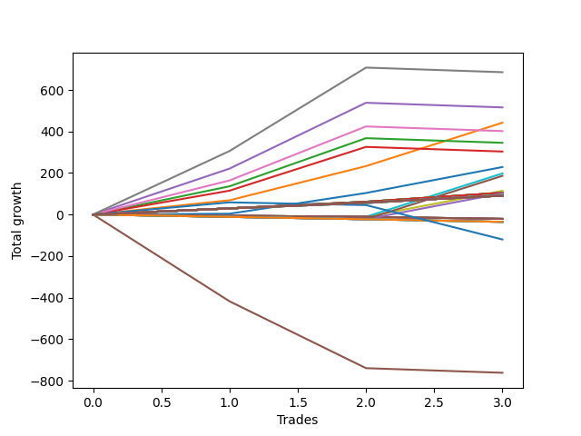

# Long Pointer 002 
- Symbol: ES1y1d
- Date Range: 07/19/2021 - 07/08/2022
- Trading Period: 7:20-12:30
- Number of Trades: 3



| Name | Win Percent | Profit | Avg Profit / Trade | Avg Time / Trade |      | Name | Win Percent | Profit | Avg Profit / Trade | Avg Time / Trade |
| ---- | ----------- | ------ | ------------------ | ---------------- | ---- | ---- | ----------- | ------ | ------------------ | ---------------- |
| Sorted By <br> Profit | | | | | | Sorted By <br> Win Percentage ||||
| Seven | 66.67 | 342750.00 | 114250.00 | 31 05:21:40 |     | One | 100.00 | 210000.00 | 70000.00 | 09 03:40:00 |
| Four | 66.67 | 242750.00 | 80916.67 | 30 09:18:20 |     | Three Hundred | 100.00 | 151375.00 | 50458.33 | 08 16:37:20 |
| One | 100.00 | 210000.00 | 70000.00 | 09 03:40:00 |     | Two Hundred Nine | 100.00 | 136500.00 | 45500.00 | 08 15:34:20 |
| Six | 66.67 | 201000.00 | 67000.00 | 26 09:39:00 |     | Two Hundred Eight | 100.00 | 126375.00 | 42125.00 | 03 15:15:00 |
| Two | 66.67 | 158500.00 | 52833.33 | 23 21:11:40 |     | Two Hundred Seven | 100.00 | 105500.00 | 35166.67 | 03 08:25:20 |
| Three Hundred | 100.00 | 151375.00 | 50458.33 | 08 16:37:20 |     | Two Hundred Six | 100.00 | 92125.00 | 30708.33 | 00 17:41:20 |
| Three | 66.67 | 144250.00 | 48083.33 | 23 19:58:20 |     | Two Hundred Five | 100.00 | 82125.00 | 27375.00 | 00 17:35:20 |
| Two Hundred Nine | 100.00 | 136500.00 | 45500.00 | 08 15:34:20 |     | Two Hundred Four | 100.00 | 72250.00 | 24083.33 | 00 15:59:40 |
| Two Hundred Eight | 100.00 | 126375.00 | 42125.00 | 03 15:15:00 |     | Two Hundred Three | 100.00 | 47250.00 | 15750.00 | 00 09:35:00 |
| Two Hundred Seven | 100.00 | 105500.00 | 35166.67 | 03 08:25:20 |     | Two Hundred Two | 100.00 | 33500.00 | 11166.67 | 00 03:05:00 |
| Zero | 66.67 | 94000.00 | 31333.33 | 07 23:45:00 |     | Two Hundred One | 100.00 | 21750.00 | 7250.00 | 00 01:48:20 |
| Two Hundred Six | 100.00 | 92125.00 | 30708.33 | 00 17:41:20 |     | Eighty-Five | 100.00 | 16375.00 | 5458.33 | 00 01:19:00 |
| Two Hundred Five | 100.00 | 82125.00 | 27375.00 | 00 17:35:20 |     | Eighty-Four | 100.00 | 16375.00 | 5458.33 | 00 01:19:00 |
| Two Hundred Four | 100.00 | 72250.00 | 24083.33 | 00 15:59:40 |     | Eighty-Three | 100.00 | 16375.00 | 5458.33 | 00 01:19:00 |
| Two Hundred Three | 100.00 | 47250.00 | 15750.00 | 00 09:35:00 |     | Eighty-Two | 100.00 | 16375.00 | 5458.33 | 00 01:19:00 |
| Two Hundred Two | 100.00 | 33500.00 | 11166.67 | 00 03:05:00 |     | Eighty-One | 100.00 | 16375.00 | 5458.33 | 00 01:19:00 |
| Two Hundred One | 100.00 | 21750.00 | 7250.00 | 00 01:48:20 |     | Seven | 66.67 | 342750.00 | 114250.00 | 31 05:21:40 |
| Eighty-Five | 100.00 | 16375.00 | 5458.33 | 00 01:19:00 |     | Four | 66.67 | 242750.00 | 80916.67 | 30 09:18:20 |
| Eighty-Four | 100.00 | 16375.00 | 5458.33 | 00 01:19:00 |     | Six | 66.67 | 201000.00 | 67000.00 | 26 09:39:00 |
| Eighty-Three | 100.00 | 16375.00 | 5458.33 | 00 01:19:00 |     | Two | 66.67 | 158500.00 | 52833.33 | 23 21:11:40 |
| Eighty-Two | 100.00 | 16375.00 | 5458.33 | 00 01:19:00 |     | Three | 66.67 | 144250.00 | 48083.33 | 23 19:58:20 |
| Eighty-One | 100.00 | 16375.00 | 5458.33 | 00 01:19:00 |     | Zero | 66.67 | 94000.00 | 31333.33 | 07 23:45:00 |
| One Hundred Thirty | 66.67 | -6500.00 | -2166.67 | 00 00:03:00 |     | One Hundred Thirty | 66.67 | -6500.00 | -2166.67 | 00 00:03:00 |
| One Hundred Twenty-Nine | 66.67 | -6500.00 | -2166.67 | 00 00:03:00 |     | One Hundred Twenty-Nine | 66.67 | -6500.00 | -2166.67 | 00 00:03:00 |
| One Hundred Twenty-Eight | 66.67 | -6500.00 | -2166.67 | 00 00:03:00 |     | One Hundred Twenty-Eight | 66.67 | -6500.00 | -2166.67 | 00 00:03:00 |
| One Hundred Twenty-Seven | 66.67 | -6500.00 | -2166.67 | 00 00:03:00 |     | One Hundred Twenty-Seven | 66.67 | -6500.00 | -2166.67 | 00 00:03:00 |
| One Hundred Twenty-Six | 66.67 | -6500.00 | -2166.67 | 00 00:03:00 |     | One Hundred Twenty-Six | 66.67 | -6500.00 | -2166.67 | 00 00:03:00 |
| One Hundred Twenty-Five | 66.67 | -6500.00 | -2166.67 | 00 00:03:00 |     | One Hundred Twenty-Five | 66.67 | -6500.00 | -2166.67 | 00 00:03:00 |
| One Hundred Twenty-Four | 66.67 | -6500.00 | -2166.67 | 00 00:03:00 |     | One Hundred Twenty-Four | 66.67 | -6500.00 | -2166.67 | 00 00:03:00 |
| One Hundred Twenty-Three | 66.67 | -6500.00 | -2166.67 | 00 00:03:00 |     | One Hundred Twenty-Three | 66.67 | -6500.00 | -2166.67 | 00 00:03:00 |
| One Hundred Twenty-Two | 66.67 | -6500.00 | -2166.67 | 00 00:03:00 |     | One Hundred Twenty-Two | 66.67 | -6500.00 | -2166.67 | 00 00:03:00 |
| One Hundred Twenty-One | 66.67 | -6500.00 | -2166.67 | 00 00:03:00 |     | One Hundred Twenty-One | 66.67 | -6500.00 | -2166.67 | 00 00:03:00 |
| One Hundred Twenty | 66.67 | -6500.00 | -2166.67 | 00 00:03:00 |     | One Hundred Twenty | 66.67 | -6500.00 | -2166.67 | 00 00:03:00 |
| One Hundred Ninteen | 66.67 | -6500.00 | -2166.67 | 00 00:03:00 |     | One Hundred Ninteen | 66.67 | -6500.00 | -2166.67 | 00 00:03:00 |
| One Hundred Eighteen | 66.67 | -6500.00 | -2166.67 | 00 00:03:00 |     | One Hundred Eighteen | 66.67 | -6500.00 | -2166.67 | 00 00:03:00 |
| One Hundred Seventeen | 66.67 | -6500.00 | -2166.67 | 00 00:03:00 |     | One Hundred Seventeen | 66.67 | -6500.00 | -2166.67 | 00 00:03:00 |
| One Hundred Sixteen | 66.67 | -6500.00 | -2166.67 | 00 00:03:00 |     | One Hundred Sixteen | 66.67 | -6500.00 | -2166.67 | 00 00:03:00 |
| One Hundred Fifteen | 66.67 | -6500.00 | -2166.67 | 00 00:03:00 |     | One Hundred Fifteen | 66.67 | -6500.00 | -2166.67 | 00 00:03:00 |
| One Hundred Fourteen | 66.67 | -6500.00 | -2166.67 | 00 00:03:00 |     | One Hundred Fourteen | 66.67 | -6500.00 | -2166.67 | 00 00:03:00 |
| One Hundred Thirteen | 66.67 | -6500.00 | -2166.67 | 00 00:03:00 |     | One Hundred Thirteen | 66.67 | -6500.00 | -2166.67 | 00 00:03:00 |
| One Hundred Twelve | 66.67 | -6500.00 | -2166.67 | 00 00:03:00 |     | One Hundred Twelve | 66.67 | -6500.00 | -2166.67 | 00 00:03:00 |
| One Hundred Eleven | 66.67 | -6500.00 | -2166.67 | 00 00:03:00 |     | One Hundred Eleven | 66.67 | -6500.00 | -2166.67 | 00 00:03:00 |
| Seventy-One | 66.67 | -6500.00 | -2166.67 | 00 00:03:00 |     | Seventy-One | 66.67 | -6500.00 | -2166.67 | 00 00:03:00 |
| Seventy | 66.67 | -6500.00 | -2166.67 | 00 00:03:00 |     | Seventy | 66.67 | -6500.00 | -2166.67 | 00 00:03:00 |
| Sixty-Nine | 66.67 | -6500.00 | -2166.67 | 00 00:03:00 |     | Sixty-Nine | 66.67 | -6500.00 | -2166.67 | 00 00:03:00 |
| Sixty-Eight | 66.67 | -6500.00 | -2166.67 | 00 00:03:00 |     | Sixty-Eight | 66.67 | -6500.00 | -2166.67 | 00 00:03:00 |
| Sixty-Seven | 66.67 | -6500.00 | -2166.67 | 00 00:03:00 |     | Sixty-Seven | 66.67 | -6500.00 | -2166.67 | 00 00:03:00 |
| Sixty-Six | 66.67 | -6500.00 | -2166.67 | 00 00:03:00 |     | Sixty-Six | 66.67 | -6500.00 | -2166.67 | 00 00:03:00 |
| Sixty-Five | 66.67 | -6500.00 | -2166.67 | 00 00:03:00 |     | Sixty-Five | 66.67 | -6500.00 | -2166.67 | 00 00:03:00 |
| Sixty-Four | 66.67 | -6500.00 | -2166.67 | 00 00:03:00 |     | Sixty-Four | 66.67 | -6500.00 | -2166.67 | 00 00:03:00 |
| Fifty-Five | 66.67 | -6500.00 | -2166.67 | 00 00:03:00 |     | Fifty-Five | 66.67 | -6500.00 | -2166.67 | 00 00:03:00 |
| Fifty-Four | 66.67 | -6500.00 | -2166.67 | 00 00:03:00 |     | Fifty-Four | 66.67 | -6500.00 | -2166.67 | 00 00:03:00 |
| Fifty-Three | 66.67 | -6500.00 | -2166.67 | 00 00:03:00 |     | Fifty-Three | 66.67 | -6500.00 | -2166.67 | 00 00:03:00 |
| Fifty-Two | 66.67 | -6500.00 | -2166.67 | 00 00:03:00 |     | Fifty-Two | 66.67 | -6500.00 | -2166.67 | 00 00:03:00 |
| Fifty-One | 66.67 | -6500.00 | -2166.67 | 00 00:03:00 |     | Fifty-One | 66.67 | -6500.00 | -2166.67 | 00 00:03:00 |
| Fifty | 66.67 | -6500.00 | -2166.67 | 00 00:03:00 |     | Fifty | 66.67 | -6500.00 | -2166.67 | 00 00:03:00 |
| Forty-Nine | 66.67 | -6500.00 | -2166.67 | 00 00:03:00 |     | Forty-Nine | 66.67 | -6500.00 | -2166.67 | 00 00:03:00 |
| Forty-Eight | 66.67 | -6500.00 | -2166.67 | 00 00:03:00 |     | Forty-Eight | 66.67 | -6500.00 | -2166.67 | 00 00:03:00 |
| Forty-Seven | 0.00 | -26750.00 | -8916.67 | 00 01:28:40 |     | Seventy-Three | 33.33 | -60000.00 | -20000.00 | 09 17:21:00 |
| Forty-Six | 0.00 | -26750.00 | -8916.67 | 00 01:28:40 |     | Forty-Seven | 0.00 | -26750.00 | -8916.67 | 00 01:28:40 |
| Forty-Five | 0.00 | -26750.00 | -8916.67 | 00 01:28:40 |     | Forty-Six | 0.00 | -26750.00 | -8916.67 | 00 01:28:40 |
| Forty-Four | 0.00 | -26750.00 | -8916.67 | 00 01:28:40 |     | Forty-Five | 0.00 | -26750.00 | -8916.67 | 00 01:28:40 |
| Forty-Three | 0.00 | -26750.00 | -8916.67 | 00 01:28:40 |     | Forty-Four | 0.00 | -26750.00 | -8916.67 | 00 01:28:40 |
| Forty-Two | 0.00 | -26750.00 | -8916.67 | 00 01:28:40 |     | Forty-Three | 0.00 | -26750.00 | -8916.67 | 00 01:28:40 |
| Forty-One | 0.00 | -26750.00 | -8916.67 | 00 01:28:40 |     | Forty-Two | 0.00 | -26750.00 | -8916.67 | 00 01:28:40 |
| Forty | 0.00 | -26750.00 | -8916.67 | 00 01:28:40 |     | Forty-One | 0.00 | -26750.00 | -8916.67 | 00 01:28:40 |
| Sixty-Three | 0.00 | -31250.00 | -10416.67 | 00 01:31:20 |     | Forty | 0.00 | -26750.00 | -8916.67 | 00 01:28:40 |
| Sixty-Two | 0.00 | -31250.00 | -10416.67 | 00 01:31:20 |     | Sixty-Three | 0.00 | -31250.00 | -10416.67 | 00 01:31:20 |
| Sixty-One | 0.00 | -31250.00 | -10416.67 | 00 01:31:20 |     | Sixty-Two | 0.00 | -31250.00 | -10416.67 | 00 01:31:20 |
| Sixty | 0.00 | -31250.00 | -10416.67 | 00 01:31:20 |     | Sixty-One | 0.00 | -31250.00 | -10416.67 | 00 01:31:20 |
| Fifty-Nine | 0.00 | -31250.00 | -10416.67 | 00 01:31:20 |     | Sixty | 0.00 | -31250.00 | -10416.67 | 00 01:31:20 |
| Fifty-Eight | 0.00 | -31250.00 | -10416.67 | 00 01:31:20 |     | Fifty-Nine | 0.00 | -31250.00 | -10416.67 | 00 01:31:20 |
| Fifty-Seven | 0.00 | -31250.00 | -10416.67 | 00 01:31:20 |     | Fifty-Eight | 0.00 | -31250.00 | -10416.67 | 00 01:31:20 |
| Fifty-Six | 0.00 | -31250.00 | -10416.67 | 00 01:31:20 |     | Fifty-Seven | 0.00 | -31250.00 | -10416.67 | 00 01:31:20 |
| Seventy-Three | 33.33 | -60000.00 | -20000.00 | 09 17:21:00 |     | Fifty-Six | 0.00 | -31250.00 | -10416.67 | 00 01:31:20 |
| Five | 0.00 | -381000.00 | -127000.00 | 98 13:37:00 |     | Five | 0.00 | -381000.00 | -127000.00 | 98 13:37:00 |

## NO STOPLOSS

### Test Zero
* Sell when price hits the middle line of the 20p bollinger
* No Stoploss
* Results:
```
Total Trades: 3
Percent Up: 66.67
Percent Down: 33.33
Total Points Moved Up: 188.00
Potential Profit: 94000.00
Total Points Ups: 199.25 Count Ups: 2
Total Points Downs: -11.25 Count Downs: 1
```

<details><summary>Trades</summary>

<code>In: 2022-02-28 07:21:00		Out: 2022-03-16 06:39:00		Total Position Time: 15 23:18:00		Total Move Up: -11.25		Total to Date: -11.25</code> <br />
<code>In: 2022-03-10 07:21:00		Out: 2022-03-16 06:39:00		Total Position Time: 05 23:18:00		Total Move Up: 84.50		Total to Date: 73.25</code> <br />
<code>In: 2022-05-24 07:21:00		Out: 2022-05-26 08:00:00		Total Position Time: 02 00:39:00		Total Move Up: 114.75		Total to Date: 188.00</code> <br />


</details>

### Test One
* Sell when the price hits the upper line of the 20p 1std bollinger
* No Stoploss
* Results:
```
Total Trades: 3
Percent Up: 100.00
Percent Down: 0.00
Total Points Moved Up: 420.00
Potential Profit: 210000.00
Total Points Ups: 420.00 Count Ups: 3
Total Points Downs: 0.00 Count Downs: 0
```

<details><summary>Trades</summary>

<code>In: 2022-02-28 07:21:00		Out: 2022-03-17 10:29:00		Total Position Time: 17 03:08:00		Total Move Up: 57.50		Total to Date: 57.50</code> <br />
<code>In: 2022-03-10 07:21:00		Out: 2022-03-17 10:29:00		Total Position Time: 07 03:08:00		Total Move Up: 153.25		Total to Date: 210.75</code> <br />
<code>In: 2022-05-24 07:21:00		Out: 2022-05-27 12:05:00		Total Position Time: 03 04:44:00		Total Move Up: 209.25		Total to Date: 420.00</code> <br />


</details>

### Test Two
* Sell when the price hits the upper line of the 20p 2std bollinger
* No Stoploss
* Results:
```
Total Trades: 3
Percent Up: 66.67
Percent Down: 33.33
Total Points Moved Up: 317.00
Potential Profit: 158500.00
Total Points Ups: 339.25 Count Ups: 2
Total Points Downs: -22.25 Count Downs: 1
```

<details><summary>Trades</summary>

<code>In: 2022-02-28 07:21:00		Out: 2022-03-18 12:20:00		Total Position Time: 18 04:59:00		Total Move Up: 121.75		Total to Date: 121.75</code> <br />
<code>In: 2022-03-10 07:21:00		Out: 2022-03-18 12:20:00		Total Position Time: 08 04:59:00		Total Move Up: 217.50		Total to Date: 339.25</code> <br />
<code>In: 2022-05-24 07:21:00		Out: 2022-07-08 12:58:00		Total Position Time: 45 05:37:00		Total Move Up: -22.25		Total to Date: 317.00</code> <br />


</details>

### Test Three
* Sell when price hits the middle line of the 50p bollinger
* No Stoploss
* Results:
```
Total Trades: 3
Percent Up: 66.67
Percent Down: 33.33
Total Points Moved Up: 288.50
Potential Profit: 144250.00
Total Points Ups: 310.75 Count Ups: 2
Total Points Downs: -22.25 Count Downs: 1
```

<details><summary>Trades</summary>

<code>In: 2022-02-28 07:21:00		Out: 2022-03-18 10:30:00		Total Position Time: 18 03:09:00		Total Move Up: 107.50		Total to Date: 107.50</code> <br />
<code>In: 2022-03-10 07:21:00		Out: 2022-03-18 10:30:00		Total Position Time: 08 03:09:00		Total Move Up: 203.25		Total to Date: 310.75</code> <br />
<code>In: 2022-05-24 07:21:00		Out: 2022-07-08 12:58:00		Total Position Time: 45 05:37:00		Total Move Up: -22.25		Total to Date: 288.50</code> <br />


</details>

### Test Four
* Sell when the price hits the upper line of the 50p 1std bollinger
* No Stoploss
* Results:
```
Total Trades: 3
Percent Up: 66.67
Percent Down: 33.33
Total Points Moved Up: 485.50
Potential Profit: 242750.00
Total Points Ups: 507.75 Count Ups: 2
Total Points Downs: -22.25 Count Downs: 1
```

<details><summary>Trades</summary>

<code>In: 2022-02-28 07:21:00		Out: 2022-03-28 06:30:00		Total Position Time: 27 23:09:00		Total Move Up: 206.00		Total to Date: 206.00</code> <br />
<code>In: 2022-03-10 07:21:00		Out: 2022-03-28 06:30:00		Total Position Time: 17 23:09:00		Total Move Up: 301.75		Total to Date: 507.75</code> <br />
<code>In: 2022-05-24 07:21:00		Out: 2022-07-08 12:58:00		Total Position Time: 45 05:37:00		Total Move Up: -22.25		Total to Date: 485.50</code> <br />


</details>

### Test Five
* Sell when the price hits the upper line of the 50p 2std bollinger
* No Stoploss
* Results:
```
Total Trades: 3
Percent Up: 0.00
Percent Down: 100.00
Total Points Moved Up: -762.00
Potential Profit: -381000.00
Total Points Ups: 0.00 Count Ups: 0
Total Points Downs: -762.00 Count Downs: 3
```

<details><summary>Trades</summary>

<code>In: 2022-02-28 07:21:00		Out: 2022-07-08 12:58:00		Total Position Time: 130 05:37:00		Total Move Up: -417.75		Total to Date: -417.75</code> <br />
<code>In: 2022-03-10 07:21:00		Out: 2022-07-08 12:58:00		Total Position Time: 120 05:37:00		Total Move Up: -322.00		Total to Date: -739.75</code> <br />
<code>In: 2022-05-24 07:21:00		Out: 2022-07-08 12:58:00		Total Position Time: 45 05:37:00		Total Move Up: -22.25		Total to Date: -762.00</code> <br />


</details>

### Test Six
* Sell when the price hits the middle line of the 1std VWAP
* No Stoploss
* Results:
```
Total Trades: 3
Percent Up: 66.67
Percent Down: 33.33
Total Points Moved Up: 402.00
Potential Profit: 201000.00
Total Points Ups: 424.25 Count Ups: 2
Total Points Downs: -22.25 Count Downs: 1
```

<details><summary>Trades</summary>

<code>In: 2022-02-28 07:21:00		Out: 2022-03-22 07:01:00		Total Position Time: 21 23:40:00		Total Move Up: 164.25		Total to Date: 164.25</code> <br />
<code>In: 2022-03-10 07:21:00		Out: 2022-03-22 07:01:00		Total Position Time: 11 23:40:00		Total Move Up: 260.00		Total to Date: 424.25</code> <br />
<code>In: 2022-05-24 07:21:00		Out: 2022-07-08 12:58:00		Total Position Time: 45 05:37:00		Total Move Up: -22.25		Total to Date: 402.00</code> <br />


</details>

### Test Seven
* Sell when the price hits the upper line of the 1std VWAP
* No Stoploss
* Results:
```
Total Trades: 3
Percent Up: 66.67
Percent Down: 33.33
Total Points Moved Up: 685.50
Potential Profit: 342750.00
Total Points Ups: 707.75 Count Ups: 2
Total Points Downs: -22.25 Count Downs: 1
```

<details><summary>Trades</summary>

<code>In: 2022-02-28 07:21:00		Out: 2022-03-29 12:35:00		Total Position Time: 29 05:14:00		Total Move Up: 306.00		Total to Date: 306.00</code> <br />
<code>In: 2022-03-10 07:21:00		Out: 2022-03-29 12:35:00		Total Position Time: 19 05:14:00		Total Move Up: 401.75		Total to Date: 707.75</code> <br />
<code>In: 2022-05-24 07:21:00		Out: 2022-07-08 12:58:00		Total Position Time: 45 05:37:00		Total Move Up: -22.25		Total to Date: 685.50</code> <br />


</details>

## STOPLOSS OF 5

### Test Forty
* Sell when price hits the middle line of the 20p bollinger
* Stoploss is 5 points
* Results:
```
Total Trades: 3
Percent Up: 0.00
Percent Down: 100.00
Total Points Moved Up: -53.50
Potential Profit: -26750.00
Total Points Ups: 0.00 Count Ups: 0
Total Points Downs: -53.50 Count Downs: 3
```

<details><summary>Trades</summary>

<code>In: 2022-02-28 07:21:00		Out: 2022-02-28 11:09:00		Total Position Time: 00 03:48:00		Total Move Up: -6.50		Total to Date: -6.50</code> <br />
<code>In: 2022-03-10 07:21:00		Out: 2022-03-10 07:56:00		Total Position Time: 00 00:35:00		Total Move Up: -6.75		Total to Date: -13.25</code> <br />
<code>In: 2022-05-24 07:21:00		Out: 2022-05-24 07:24:00		Total Position Time: 00 00:03:00		Total Move Up: -40.25		Total to Date: -53.50</code> <br />


</details>

### Test Forty-One
* Sell when the price hits the upper line of the 20p 1std bollinger
* Stoploss is 5 points
* Results:
```
Total Trades: 3
Percent Up: 0.00
Percent Down: 100.00
Total Points Moved Up: -53.50
Potential Profit: -26750.00
Total Points Ups: 0.00 Count Ups: 0
Total Points Downs: -53.50 Count Downs: 3
```

<details><summary>Trades</summary>

<code>In: 2022-02-28 07:21:00		Out: 2022-02-28 11:09:00		Total Position Time: 00 03:48:00		Total Move Up: -6.50		Total to Date: -6.50</code> <br />
<code>In: 2022-03-10 07:21:00		Out: 2022-03-10 07:56:00		Total Position Time: 00 00:35:00		Total Move Up: -6.75		Total to Date: -13.25</code> <br />
<code>In: 2022-05-24 07:21:00		Out: 2022-05-24 07:24:00		Total Position Time: 00 00:03:00		Total Move Up: -40.25		Total to Date: -53.50</code> <br />


</details>

### Test Forty-Two
* Sell when the price hits the upper line of the 20p 2std bollinger
* Stoploss is 5 points
* Results:
```
Total Trades: 3
Percent Up: 0.00
Percent Down: 100.00
Total Points Moved Up: -53.50
Potential Profit: -26750.00
Total Points Ups: 0.00 Count Ups: 0
Total Points Downs: -53.50 Count Downs: 3
```

<details><summary>Trades</summary>

<code>In: 2022-02-28 07:21:00		Out: 2022-02-28 11:09:00		Total Position Time: 00 03:48:00		Total Move Up: -6.50		Total to Date: -6.50</code> <br />
<code>In: 2022-03-10 07:21:00		Out: 2022-03-10 07:56:00		Total Position Time: 00 00:35:00		Total Move Up: -6.75		Total to Date: -13.25</code> <br />
<code>In: 2022-05-24 07:21:00		Out: 2022-05-24 07:24:00		Total Position Time: 00 00:03:00		Total Move Up: -40.25		Total to Date: -53.50</code> <br />


</details>

### Test Forty-Three
* Sell when price hits the middle line of the 50p bollinger
* Stoploss is 5 points
* Results:
```
Total Trades: 3
Percent Up: 0.00
Percent Down: 100.00
Total Points Moved Up: -53.50
Potential Profit: -26750.00
Total Points Ups: 0.00 Count Ups: 0
Total Points Downs: -53.50 Count Downs: 3
```

<details><summary>Trades</summary>

<code>In: 2022-02-28 07:21:00		Out: 2022-02-28 11:09:00		Total Position Time: 00 03:48:00		Total Move Up: -6.50		Total to Date: -6.50</code> <br />
<code>In: 2022-03-10 07:21:00		Out: 2022-03-10 07:56:00		Total Position Time: 00 00:35:00		Total Move Up: -6.75		Total to Date: -13.25</code> <br />
<code>In: 2022-05-24 07:21:00		Out: 2022-05-24 07:24:00		Total Position Time: 00 00:03:00		Total Move Up: -40.25		Total to Date: -53.50</code> <br />


</details>

### Test Forty-Four
* Sell when the price hits the upper line of the 50p 1std bollinger
* Stoploss is 5 points
* Results:
```
Total Trades: 3
Percent Up: 0.00
Percent Down: 100.00
Total Points Moved Up: -53.50
Potential Profit: -26750.00
Total Points Ups: 0.00 Count Ups: 0
Total Points Downs: -53.50 Count Downs: 3
```

<details><summary>Trades</summary>

<code>In: 2022-02-28 07:21:00		Out: 2022-02-28 11:09:00		Total Position Time: 00 03:48:00		Total Move Up: -6.50		Total to Date: -6.50</code> <br />
<code>In: 2022-03-10 07:21:00		Out: 2022-03-10 07:56:00		Total Position Time: 00 00:35:00		Total Move Up: -6.75		Total to Date: -13.25</code> <br />
<code>In: 2022-05-24 07:21:00		Out: 2022-05-24 07:24:00		Total Position Time: 00 00:03:00		Total Move Up: -40.25		Total to Date: -53.50</code> <br />


</details>

### Test Forty-Five
* Sell when the price hits the upper line of the 50p 2std bollinger
* Stoploss is 5 points
* Results:
```
Total Trades: 3
Percent Up: 0.00
Percent Down: 100.00
Total Points Moved Up: -53.50
Potential Profit: -26750.00
Total Points Ups: 0.00 Count Ups: 0
Total Points Downs: -53.50 Count Downs: 3
```

<details><summary>Trades</summary>

<code>In: 2022-02-28 07:21:00		Out: 2022-02-28 11:09:00		Total Position Time: 00 03:48:00		Total Move Up: -6.50		Total to Date: -6.50</code> <br />
<code>In: 2022-03-10 07:21:00		Out: 2022-03-10 07:56:00		Total Position Time: 00 00:35:00		Total Move Up: -6.75		Total to Date: -13.25</code> <br />
<code>In: 2022-05-24 07:21:00		Out: 2022-05-24 07:24:00		Total Position Time: 00 00:03:00		Total Move Up: -40.25		Total to Date: -53.50</code> <br />


</details>

### Test Forty-Six
* Sell when the price hits the middle line of the 1std VWAP
* Stoploss is 5 points
* Results:
```
Total Trades: 3
Percent Up: 0.00
Percent Down: 100.00
Total Points Moved Up: -53.50
Potential Profit: -26750.00
Total Points Ups: 0.00 Count Ups: 0
Total Points Downs: -53.50 Count Downs: 3
```

<details><summary>Trades</summary>

<code>In: 2022-02-28 07:21:00		Out: 2022-02-28 11:09:00		Total Position Time: 00 03:48:00		Total Move Up: -6.50		Total to Date: -6.50</code> <br />
<code>In: 2022-03-10 07:21:00		Out: 2022-03-10 07:56:00		Total Position Time: 00 00:35:00		Total Move Up: -6.75		Total to Date: -13.25</code> <br />
<code>In: 2022-05-24 07:21:00		Out: 2022-05-24 07:24:00		Total Position Time: 00 00:03:00		Total Move Up: -40.25		Total to Date: -53.50</code> <br />


</details>

### Test Forty-Seven
* Sell when the price hits the upper line of the 1std VWAP
* Stoploss is 5 points
* Results:
```
Total Trades: 3
Percent Up: 0.00
Percent Down: 100.00
Total Points Moved Up: -53.50
Potential Profit: -26750.00
Total Points Ups: 0.00 Count Ups: 0
Total Points Downs: -53.50 Count Downs: 3
```

<details><summary>Trades</summary>

<code>In: 2022-02-28 07:21:00		Out: 2022-02-28 11:09:00		Total Position Time: 00 03:48:00		Total Move Up: -6.50		Total to Date: -6.50</code> <br />
<code>In: 2022-03-10 07:21:00		Out: 2022-03-10 07:56:00		Total Position Time: 00 00:35:00		Total Move Up: -6.75		Total to Date: -13.25</code> <br />
<code>In: 2022-05-24 07:21:00		Out: 2022-05-24 07:24:00		Total Position Time: 00 00:03:00		Total Move Up: -40.25		Total to Date: -53.50</code> <br />


</details>

## TRAIL STOP OF 5

### Test Forty-Eight
* Sell when price hits the middle line of the 20p bollinger
* Trailing Stop is 5 points
* Results:
```
Total Trades: 3
Percent Up: 66.67
Percent Down: 33.33
Total Points Moved Up: -13.00
Potential Profit: -6500.00
Total Points Ups: 27.25 Count Ups: 2
Total Points Downs: -40.25 Count Downs: 1
```

<details><summary>Trades</summary>

<code>In: 2022-02-28 07:21:00		Out: 2022-02-28 07:24:00		Total Position Time: 00 00:03:00		Total Move Up: 8.00		Total to Date: 8.00</code> <br />
<code>In: 2022-03-10 07:21:00		Out: 2022-03-10 07:24:00		Total Position Time: 00 00:03:00		Total Move Up: 19.25		Total to Date: 27.25</code> <br />
<code>In: 2022-05-24 07:21:00		Out: 2022-05-24 07:24:00		Total Position Time: 00 00:03:00		Total Move Up: -40.25		Total to Date: -13.00</code> <br />


</details>

### Test Forty-Nine
* Sell when the price hits the upper line of the 20p 1std bollinger
* Trailing Stop is 5 points
* Results:
```
Total Trades: 3
Percent Up: 66.67
Percent Down: 33.33
Total Points Moved Up: -13.00
Potential Profit: -6500.00
Total Points Ups: 27.25 Count Ups: 2
Total Points Downs: -40.25 Count Downs: 1
```

<details><summary>Trades</summary>

<code>In: 2022-02-28 07:21:00		Out: 2022-02-28 07:24:00		Total Position Time: 00 00:03:00		Total Move Up: 8.00		Total to Date: 8.00</code> <br />
<code>In: 2022-03-10 07:21:00		Out: 2022-03-10 07:24:00		Total Position Time: 00 00:03:00		Total Move Up: 19.25		Total to Date: 27.25</code> <br />
<code>In: 2022-05-24 07:21:00		Out: 2022-05-24 07:24:00		Total Position Time: 00 00:03:00		Total Move Up: -40.25		Total to Date: -13.00</code> <br />


</details>

### Test Fifty
* Sell when the price hits the upper line of the 20p 2std bollinger
* Trailing Stop is 5 points
* Results:
```
Total Trades: 3
Percent Up: 66.67
Percent Down: 33.33
Total Points Moved Up: -13.00
Potential Profit: -6500.00
Total Points Ups: 27.25 Count Ups: 2
Total Points Downs: -40.25 Count Downs: 1
```

<details><summary>Trades</summary>

<code>In: 2022-02-28 07:21:00		Out: 2022-02-28 07:24:00		Total Position Time: 00 00:03:00		Total Move Up: 8.00		Total to Date: 8.00</code> <br />
<code>In: 2022-03-10 07:21:00		Out: 2022-03-10 07:24:00		Total Position Time: 00 00:03:00		Total Move Up: 19.25		Total to Date: 27.25</code> <br />
<code>In: 2022-05-24 07:21:00		Out: 2022-05-24 07:24:00		Total Position Time: 00 00:03:00		Total Move Up: -40.25		Total to Date: -13.00</code> <br />


</details>

### Test Fifty-One
* Sell when price hits the middle line of the 50p bollinger
* Trailing Stop is 5 points
* Results:
```
Total Trades: 3
Percent Up: 66.67
Percent Down: 33.33
Total Points Moved Up: -13.00
Potential Profit: -6500.00
Total Points Ups: 27.25 Count Ups: 2
Total Points Downs: -40.25 Count Downs: 1
```

<details><summary>Trades</summary>

<code>In: 2022-02-28 07:21:00		Out: 2022-02-28 07:24:00		Total Position Time: 00 00:03:00		Total Move Up: 8.00		Total to Date: 8.00</code> <br />
<code>In: 2022-03-10 07:21:00		Out: 2022-03-10 07:24:00		Total Position Time: 00 00:03:00		Total Move Up: 19.25		Total to Date: 27.25</code> <br />
<code>In: 2022-05-24 07:21:00		Out: 2022-05-24 07:24:00		Total Position Time: 00 00:03:00		Total Move Up: -40.25		Total to Date: -13.00</code> <br />


</details>

### Test Fifty-Two
* Sell when the price hits the upper line of the 50p 1std bollinger
* Trailing Stop is 5 points
* Results:
```
Total Trades: 3
Percent Up: 66.67
Percent Down: 33.33
Total Points Moved Up: -13.00
Potential Profit: -6500.00
Total Points Ups: 27.25 Count Ups: 2
Total Points Downs: -40.25 Count Downs: 1
```

<details><summary>Trades</summary>

<code>In: 2022-02-28 07:21:00		Out: 2022-02-28 07:24:00		Total Position Time: 00 00:03:00		Total Move Up: 8.00		Total to Date: 8.00</code> <br />
<code>In: 2022-03-10 07:21:00		Out: 2022-03-10 07:24:00		Total Position Time: 00 00:03:00		Total Move Up: 19.25		Total to Date: 27.25</code> <br />
<code>In: 2022-05-24 07:21:00		Out: 2022-05-24 07:24:00		Total Position Time: 00 00:03:00		Total Move Up: -40.25		Total to Date: -13.00</code> <br />


</details>

### Test Fifty-Three
* Sell when the price hits the upper line of the 50p 2std bollinger
* Trailing Stop is 5 points
* Results:
```
Total Trades: 3
Percent Up: 66.67
Percent Down: 33.33
Total Points Moved Up: -13.00
Potential Profit: -6500.00
Total Points Ups: 27.25 Count Ups: 2
Total Points Downs: -40.25 Count Downs: 1
```

<details><summary>Trades</summary>

<code>In: 2022-02-28 07:21:00		Out: 2022-02-28 07:24:00		Total Position Time: 00 00:03:00		Total Move Up: 8.00		Total to Date: 8.00</code> <br />
<code>In: 2022-03-10 07:21:00		Out: 2022-03-10 07:24:00		Total Position Time: 00 00:03:00		Total Move Up: 19.25		Total to Date: 27.25</code> <br />
<code>In: 2022-05-24 07:21:00		Out: 2022-05-24 07:24:00		Total Position Time: 00 00:03:00		Total Move Up: -40.25		Total to Date: -13.00</code> <br />


</details>

### Test Fifty-Four
* Sell when the price hits the middle line of the 1std VWAP
* Trailing Stop is 5 points
* Results:
```
Total Trades: 3
Percent Up: 66.67
Percent Down: 33.33
Total Points Moved Up: -13.00
Potential Profit: -6500.00
Total Points Ups: 27.25 Count Ups: 2
Total Points Downs: -40.25 Count Downs: 1
```

<details><summary>Trades</summary>

<code>In: 2022-02-28 07:21:00		Out: 2022-02-28 07:24:00		Total Position Time: 00 00:03:00		Total Move Up: 8.00		Total to Date: 8.00</code> <br />
<code>In: 2022-03-10 07:21:00		Out: 2022-03-10 07:24:00		Total Position Time: 00 00:03:00		Total Move Up: 19.25		Total to Date: 27.25</code> <br />
<code>In: 2022-05-24 07:21:00		Out: 2022-05-24 07:24:00		Total Position Time: 00 00:03:00		Total Move Up: -40.25		Total to Date: -13.00</code> <br />


</details>

### Test Fifty-Five
* Sell when the price hits the upper line of the 1std VWAP
* Trailing Stop is 5 points
* Results:
```
Total Trades: 3
Percent Up: 66.67
Percent Down: 33.33
Total Points Moved Up: -13.00
Potential Profit: -6500.00
Total Points Ups: 27.25 Count Ups: 2
Total Points Downs: -40.25 Count Downs: 1
```

<details><summary>Trades</summary>

<code>In: 2022-02-28 07:21:00		Out: 2022-02-28 07:24:00		Total Position Time: 00 00:03:00		Total Move Up: 8.00		Total to Date: 8.00</code> <br />
<code>In: 2022-03-10 07:21:00		Out: 2022-03-10 07:24:00		Total Position Time: 00 00:03:00		Total Move Up: 19.25		Total to Date: 27.25</code> <br />
<code>In: 2022-05-24 07:21:00		Out: 2022-05-24 07:24:00		Total Position Time: 00 00:03:00		Total Move Up: -40.25		Total to Date: -13.00</code> <br />


</details>

## STOPLOSS OF 10

### Test Fifty-Six
* Sell when price hits the middle line of the 20p bollinger
* Stoploss is 10 points
* Results:
```
Total Trades: 3
Percent Up: 0.00
Percent Down: 100.00
Total Points Moved Up: -62.50
Potential Profit: -31250.00
Total Points Ups: 0.00 Count Ups: 0
Total Points Downs: -62.50 Count Downs: 3
```

<details><summary>Trades</summary>

<code>In: 2022-02-28 07:21:00		Out: 2022-02-28 11:11:00		Total Position Time: 00 03:50:00		Total Move Up: -10.75		Total to Date: -10.75</code> <br />
<code>In: 2022-03-10 07:21:00		Out: 2022-03-10 08:02:00		Total Position Time: 00 00:41:00		Total Move Up: -11.50		Total to Date: -22.25</code> <br />
<code>In: 2022-05-24 07:21:00		Out: 2022-05-24 07:24:00		Total Position Time: 00 00:03:00		Total Move Up: -40.25		Total to Date: -62.50</code> <br />


</details>

### Test Fifty-Seven
* Sell when the price hits the upper line of the 20p 1std bollinger
* Stoploss is 10 points
* Results:
```
Total Trades: 3
Percent Up: 0.00
Percent Down: 100.00
Total Points Moved Up: -62.50
Potential Profit: -31250.00
Total Points Ups: 0.00 Count Ups: 0
Total Points Downs: -62.50 Count Downs: 3
```

<details><summary>Trades</summary>

<code>In: 2022-02-28 07:21:00		Out: 2022-02-28 11:11:00		Total Position Time: 00 03:50:00		Total Move Up: -10.75		Total to Date: -10.75</code> <br />
<code>In: 2022-03-10 07:21:00		Out: 2022-03-10 08:02:00		Total Position Time: 00 00:41:00		Total Move Up: -11.50		Total to Date: -22.25</code> <br />
<code>In: 2022-05-24 07:21:00		Out: 2022-05-24 07:24:00		Total Position Time: 00 00:03:00		Total Move Up: -40.25		Total to Date: -62.50</code> <br />


</details>

### Test Fifty-Eight
* Sell when the price hits the upper line of the 20p 2std bollinger
* Stoploss is 10 points
* Results:
```
Total Trades: 3
Percent Up: 0.00
Percent Down: 100.00
Total Points Moved Up: -62.50
Potential Profit: -31250.00
Total Points Ups: 0.00 Count Ups: 0
Total Points Downs: -62.50 Count Downs: 3
```

<details><summary>Trades</summary>

<code>In: 2022-02-28 07:21:00		Out: 2022-02-28 11:11:00		Total Position Time: 00 03:50:00		Total Move Up: -10.75		Total to Date: -10.75</code> <br />
<code>In: 2022-03-10 07:21:00		Out: 2022-03-10 08:02:00		Total Position Time: 00 00:41:00		Total Move Up: -11.50		Total to Date: -22.25</code> <br />
<code>In: 2022-05-24 07:21:00		Out: 2022-05-24 07:24:00		Total Position Time: 00 00:03:00		Total Move Up: -40.25		Total to Date: -62.50</code> <br />


</details>

### Test Fifty-Nine
* Sell when price hits the middle line of the 50p bollinger
* Stoploss is 10 points
* Results:
```
Total Trades: 3
Percent Up: 0.00
Percent Down: 100.00
Total Points Moved Up: -62.50
Potential Profit: -31250.00
Total Points Ups: 0.00 Count Ups: 0
Total Points Downs: -62.50 Count Downs: 3
```

<details><summary>Trades</summary>

<code>In: 2022-02-28 07:21:00		Out: 2022-02-28 11:11:00		Total Position Time: 00 03:50:00		Total Move Up: -10.75		Total to Date: -10.75</code> <br />
<code>In: 2022-03-10 07:21:00		Out: 2022-03-10 08:02:00		Total Position Time: 00 00:41:00		Total Move Up: -11.50		Total to Date: -22.25</code> <br />
<code>In: 2022-05-24 07:21:00		Out: 2022-05-24 07:24:00		Total Position Time: 00 00:03:00		Total Move Up: -40.25		Total to Date: -62.50</code> <br />


</details>

### Test Sixty
* Sell when the price hits the upper line of the 50p 1std bollinger
* Stoploss is 10 points
* Results:
```
Total Trades: 3
Percent Up: 0.00
Percent Down: 100.00
Total Points Moved Up: -62.50
Potential Profit: -31250.00
Total Points Ups: 0.00 Count Ups: 0
Total Points Downs: -62.50 Count Downs: 3
```

<details><summary>Trades</summary>

<code>In: 2022-02-28 07:21:00		Out: 2022-02-28 11:11:00		Total Position Time: 00 03:50:00		Total Move Up: -10.75		Total to Date: -10.75</code> <br />
<code>In: 2022-03-10 07:21:00		Out: 2022-03-10 08:02:00		Total Position Time: 00 00:41:00		Total Move Up: -11.50		Total to Date: -22.25</code> <br />
<code>In: 2022-05-24 07:21:00		Out: 2022-05-24 07:24:00		Total Position Time: 00 00:03:00		Total Move Up: -40.25		Total to Date: -62.50</code> <br />


</details>

### Test Sixty-One
* Sell when the price hits the upper line of the 50p 2std bollinger
* Stoploss is 10 points
* Results:
```
Total Trades: 3
Percent Up: 0.00
Percent Down: 100.00
Total Points Moved Up: -62.50
Potential Profit: -31250.00
Total Points Ups: 0.00 Count Ups: 0
Total Points Downs: -62.50 Count Downs: 3
```

<details><summary>Trades</summary>

<code>In: 2022-02-28 07:21:00		Out: 2022-02-28 11:11:00		Total Position Time: 00 03:50:00		Total Move Up: -10.75		Total to Date: -10.75</code> <br />
<code>In: 2022-03-10 07:21:00		Out: 2022-03-10 08:02:00		Total Position Time: 00 00:41:00		Total Move Up: -11.50		Total to Date: -22.25</code> <br />
<code>In: 2022-05-24 07:21:00		Out: 2022-05-24 07:24:00		Total Position Time: 00 00:03:00		Total Move Up: -40.25		Total to Date: -62.50</code> <br />


</details>

### Test Sixty-Two
* Sell when the price hits the middle line of the 1std VWAP
* Stoploss is 10 points
* Results:
```
Total Trades: 3
Percent Up: 0.00
Percent Down: 100.00
Total Points Moved Up: -62.50
Potential Profit: -31250.00
Total Points Ups: 0.00 Count Ups: 0
Total Points Downs: -62.50 Count Downs: 3
```

<details><summary>Trades</summary>

<code>In: 2022-02-28 07:21:00		Out: 2022-02-28 11:11:00		Total Position Time: 00 03:50:00		Total Move Up: -10.75		Total to Date: -10.75</code> <br />
<code>In: 2022-03-10 07:21:00		Out: 2022-03-10 08:02:00		Total Position Time: 00 00:41:00		Total Move Up: -11.50		Total to Date: -22.25</code> <br />
<code>In: 2022-05-24 07:21:00		Out: 2022-05-24 07:24:00		Total Position Time: 00 00:03:00		Total Move Up: -40.25		Total to Date: -62.50</code> <br />


</details>

### Test Sixty-Three
* Sell when the price hits the upper line of the 1std VWAP
* Stoploss is 10 points
* Results:
```
Total Trades: 3
Percent Up: 0.00
Percent Down: 100.00
Total Points Moved Up: -62.50
Potential Profit: -31250.00
Total Points Ups: 0.00 Count Ups: 0
Total Points Downs: -62.50 Count Downs: 3
```

<details><summary>Trades</summary>

<code>In: 2022-02-28 07:21:00		Out: 2022-02-28 11:11:00		Total Position Time: 00 03:50:00		Total Move Up: -10.75		Total to Date: -10.75</code> <br />
<code>In: 2022-03-10 07:21:00		Out: 2022-03-10 08:02:00		Total Position Time: 00 00:41:00		Total Move Up: -11.50		Total to Date: -22.25</code> <br />
<code>In: 2022-05-24 07:21:00		Out: 2022-05-24 07:24:00		Total Position Time: 00 00:03:00		Total Move Up: -40.25		Total to Date: -62.50</code> <br />


</details>

## TRAIL STOP OF 10

### Test Sixty-Four
* Sell when price hits the middle line of the 20p bollinger
* Trailing Stop is 10 points
* Results:
```
Total Trades: 3
Percent Up: 66.67
Percent Down: 33.33
Total Points Moved Up: -13.00
Potential Profit: -6500.00
Total Points Ups: 27.25 Count Ups: 2
Total Points Downs: -40.25 Count Downs: 1
```

<details><summary>Trades</summary>

<code>In: 2022-02-28 07:21:00		Out: 2022-02-28 07:24:00		Total Position Time: 00 00:03:00		Total Move Up: 8.00		Total to Date: 8.00</code> <br />
<code>In: 2022-03-10 07:21:00		Out: 2022-03-10 07:24:00		Total Position Time: 00 00:03:00		Total Move Up: 19.25		Total to Date: 27.25</code> <br />
<code>In: 2022-05-24 07:21:00		Out: 2022-05-24 07:24:00		Total Position Time: 00 00:03:00		Total Move Up: -40.25		Total to Date: -13.00</code> <br />


</details>

### Test Sixty-Five
* Sell when the price hits the upper line of the 20p 1std bollinger
* Trailing Stop is 10 points
* Results:
```
Total Trades: 3
Percent Up: 66.67
Percent Down: 33.33
Total Points Moved Up: -13.00
Potential Profit: -6500.00
Total Points Ups: 27.25 Count Ups: 2
Total Points Downs: -40.25 Count Downs: 1
```

<details><summary>Trades</summary>

<code>In: 2022-02-28 07:21:00		Out: 2022-02-28 07:24:00		Total Position Time: 00 00:03:00		Total Move Up: 8.00		Total to Date: 8.00</code> <br />
<code>In: 2022-03-10 07:21:00		Out: 2022-03-10 07:24:00		Total Position Time: 00 00:03:00		Total Move Up: 19.25		Total to Date: 27.25</code> <br />
<code>In: 2022-05-24 07:21:00		Out: 2022-05-24 07:24:00		Total Position Time: 00 00:03:00		Total Move Up: -40.25		Total to Date: -13.00</code> <br />


</details>

### Test Sixty-Six
* Sell when the price hits the upper line of the 20p 2std bollinger
* Trailing Stop is 10 points
* Results:
```
Total Trades: 3
Percent Up: 66.67
Percent Down: 33.33
Total Points Moved Up: -13.00
Potential Profit: -6500.00
Total Points Ups: 27.25 Count Ups: 2
Total Points Downs: -40.25 Count Downs: 1
```

<details><summary>Trades</summary>

<code>In: 2022-02-28 07:21:00		Out: 2022-02-28 07:24:00		Total Position Time: 00 00:03:00		Total Move Up: 8.00		Total to Date: 8.00</code> <br />
<code>In: 2022-03-10 07:21:00		Out: 2022-03-10 07:24:00		Total Position Time: 00 00:03:00		Total Move Up: 19.25		Total to Date: 27.25</code> <br />
<code>In: 2022-05-24 07:21:00		Out: 2022-05-24 07:24:00		Total Position Time: 00 00:03:00		Total Move Up: -40.25		Total to Date: -13.00</code> <br />


</details>

### Test Sixty-Seven
* Sell when price hits the middle line of the 50p bollinger
* Trailing Stop is 10 points
* Results:
```
Total Trades: 3
Percent Up: 66.67
Percent Down: 33.33
Total Points Moved Up: -13.00
Potential Profit: -6500.00
Total Points Ups: 27.25 Count Ups: 2
Total Points Downs: -40.25 Count Downs: 1
```

<details><summary>Trades</summary>

<code>In: 2022-02-28 07:21:00		Out: 2022-02-28 07:24:00		Total Position Time: 00 00:03:00		Total Move Up: 8.00		Total to Date: 8.00</code> <br />
<code>In: 2022-03-10 07:21:00		Out: 2022-03-10 07:24:00		Total Position Time: 00 00:03:00		Total Move Up: 19.25		Total to Date: 27.25</code> <br />
<code>In: 2022-05-24 07:21:00		Out: 2022-05-24 07:24:00		Total Position Time: 00 00:03:00		Total Move Up: -40.25		Total to Date: -13.00</code> <br />


</details>

### Test Sixty-Eight
* Sell when the price hits the upper line of the 50p 1std bollinger
* Trailing Stop is 10 points
* Results:
```
Total Trades: 3
Percent Up: 66.67
Percent Down: 33.33
Total Points Moved Up: -13.00
Potential Profit: -6500.00
Total Points Ups: 27.25 Count Ups: 2
Total Points Downs: -40.25 Count Downs: 1
```

<details><summary>Trades</summary>

<code>In: 2022-02-28 07:21:00		Out: 2022-02-28 07:24:00		Total Position Time: 00 00:03:00		Total Move Up: 8.00		Total to Date: 8.00</code> <br />
<code>In: 2022-03-10 07:21:00		Out: 2022-03-10 07:24:00		Total Position Time: 00 00:03:00		Total Move Up: 19.25		Total to Date: 27.25</code> <br />
<code>In: 2022-05-24 07:21:00		Out: 2022-05-24 07:24:00		Total Position Time: 00 00:03:00		Total Move Up: -40.25		Total to Date: -13.00</code> <br />


</details>

### Test Sixty-Nine
* Sell when the price hits the upper line of the 50p 2std bollinger
* Trailing Stop is 10 points
* Results:
```
Total Trades: 3
Percent Up: 66.67
Percent Down: 33.33
Total Points Moved Up: -13.00
Potential Profit: -6500.00
Total Points Ups: 27.25 Count Ups: 2
Total Points Downs: -40.25 Count Downs: 1
```

<details><summary>Trades</summary>

<code>In: 2022-02-28 07:21:00		Out: 2022-02-28 07:24:00		Total Position Time: 00 00:03:00		Total Move Up: 8.00		Total to Date: 8.00</code> <br />
<code>In: 2022-03-10 07:21:00		Out: 2022-03-10 07:24:00		Total Position Time: 00 00:03:00		Total Move Up: 19.25		Total to Date: 27.25</code> <br />
<code>In: 2022-05-24 07:21:00		Out: 2022-05-24 07:24:00		Total Position Time: 00 00:03:00		Total Move Up: -40.25		Total to Date: -13.00</code> <br />


</details>

### Test Seventy
* Sell when the price hits the middle line of the 1std VWAP
* Trailing Stop is 10 points
* Results:
```
Total Trades: 3
Percent Up: 66.67
Percent Down: 33.33
Total Points Moved Up: -13.00
Potential Profit: -6500.00
Total Points Ups: 27.25 Count Ups: 2
Total Points Downs: -40.25 Count Downs: 1
```

<details><summary>Trades</summary>

<code>In: 2022-02-28 07:21:00		Out: 2022-02-28 07:24:00		Total Position Time: 00 00:03:00		Total Move Up: 8.00		Total to Date: 8.00</code> <br />
<code>In: 2022-03-10 07:21:00		Out: 2022-03-10 07:24:00		Total Position Time: 00 00:03:00		Total Move Up: 19.25		Total to Date: 27.25</code> <br />
<code>In: 2022-05-24 07:21:00		Out: 2022-05-24 07:24:00		Total Position Time: 00 00:03:00		Total Move Up: -40.25		Total to Date: -13.00</code> <br />


</details>

### Test Seventy-One
* Sell when the price hits the upper line of the 1std VWAP
* Trailing Stop is 10 points
* Results:
```
Total Trades: 3
Percent Up: 66.67
Percent Down: 33.33
Total Points Moved Up: -13.00
Potential Profit: -6500.00
Total Points Ups: 27.25 Count Ups: 2
Total Points Downs: -40.25 Count Downs: 1
```

<details><summary>Trades</summary>

<code>In: 2022-02-28 07:21:00		Out: 2022-02-28 07:24:00		Total Position Time: 00 00:03:00		Total Move Up: 8.00		Total to Date: 8.00</code> <br />
<code>In: 2022-03-10 07:21:00		Out: 2022-03-10 07:24:00		Total Position Time: 00 00:03:00		Total Move Up: 19.25		Total to Date: 27.25</code> <br />
<code>In: 2022-05-24 07:21:00		Out: 2022-05-24 07:24:00		Total Position Time: 00 00:03:00		Total Move Up: -40.25		Total to Date: -13.00</code> <br />


</details>

## SPECIAL EXIT CONDITIONS 

### Test Seventy-Three
* Sell when the linear regression slope changes to negative
* No Stoploss
* Results:
```
Total Trades: 3
Percent Up: 33.33
Percent Down: 66.67
Total Points Moved Up: -120.00
Potential Profit: -60000.00
Total Points Ups: 58.75 Count Ups: 1
Total Points Downs: -178.75 Count Downs: 2
```

<details><summary>Trades</summary>

<code>In: 2022-02-28 07:21:00		Out: 2022-03-03 07:22:00		Total Position Time: 03 00:01:00		Total Move Up: 58.75		Total to Date: 58.75</code> <br />
<code>In: 2022-03-10 07:21:00		Out: 2022-03-15 08:22:00		Total Position Time: 05 01:01:00		Total Move Up: -13.25		Total to Date: 45.50</code> <br />
<code>In: 2022-05-24 07:21:00		Out: 2022-06-14 10:22:00		Total Position Time: 21 03:01:00		Total Move Up: -165.50		Total to Date: -120.00</code> <br />


</details>

## TAKE PROFIT

### Test Eighty-One
* Take Profit of 1 Point
* No Stoploss
* Results:
```
Total Trades: 3
Percent Up: 100.00
Percent Down: 0.00
Total Points Moved Up: 32.75
Potential Profit: 16375.00
Total Points Ups: 32.75 Count Ups: 3
Total Points Downs: 0.00 Count Downs: 0
```

<details><summary>Trades</summary>

<code>In: 2022-02-28 07:21:00		Out: 2022-02-28 07:24:00		Total Position Time: 00 00:03:00		Total Move Up: 8.00		Total to Date: 8.00</code> <br />
<code>In: 2022-03-10 07:21:00		Out: 2022-03-10 07:24:00		Total Position Time: 00 00:03:00		Total Move Up: 19.25		Total to Date: 27.25</code> <br />
<code>In: 2022-05-24 07:21:00		Out: 2022-05-24 11:12:00		Total Position Time: 00 03:51:00		Total Move Up: 5.50		Total to Date: 32.75</code> <br />


</details>

### Test Eighty-Two
* Take Profit of 2 Point
* No Stoploss
* Results:
```
Total Trades: 3
Percent Up: 100.00
Percent Down: 0.00
Total Points Moved Up: 32.75
Potential Profit: 16375.00
Total Points Ups: 32.75 Count Ups: 3
Total Points Downs: 0.00 Count Downs: 0
```

<details><summary>Trades</summary>

<code>In: 2022-02-28 07:21:00		Out: 2022-02-28 07:24:00		Total Position Time: 00 00:03:00		Total Move Up: 8.00		Total to Date: 8.00</code> <br />
<code>In: 2022-03-10 07:21:00		Out: 2022-03-10 07:24:00		Total Position Time: 00 00:03:00		Total Move Up: 19.25		Total to Date: 27.25</code> <br />
<code>In: 2022-05-24 07:21:00		Out: 2022-05-24 11:12:00		Total Position Time: 00 03:51:00		Total Move Up: 5.50		Total to Date: 32.75</code> <br />


</details>

### Test Eighty-Three
* Take Profit of 3 Point
* No Stoploss
* Results:
```
Total Trades: 3
Percent Up: 100.00
Percent Down: 0.00
Total Points Moved Up: 32.75
Potential Profit: 16375.00
Total Points Ups: 32.75 Count Ups: 3
Total Points Downs: 0.00 Count Downs: 0
```

<details><summary>Trades</summary>

<code>In: 2022-02-28 07:21:00		Out: 2022-02-28 07:24:00		Total Position Time: 00 00:03:00		Total Move Up: 8.00		Total to Date: 8.00</code> <br />
<code>In: 2022-03-10 07:21:00		Out: 2022-03-10 07:24:00		Total Position Time: 00 00:03:00		Total Move Up: 19.25		Total to Date: 27.25</code> <br />
<code>In: 2022-05-24 07:21:00		Out: 2022-05-24 11:12:00		Total Position Time: 00 03:51:00		Total Move Up: 5.50		Total to Date: 32.75</code> <br />


</details>

### Test Eighty-Four
* Take Profit of 4 Point
* No Stoploss
* Results:
```
Total Trades: 3
Percent Up: 100.00
Percent Down: 0.00
Total Points Moved Up: 32.75
Potential Profit: 16375.00
Total Points Ups: 32.75 Count Ups: 3
Total Points Downs: 0.00 Count Downs: 0
```

<details><summary>Trades</summary>

<code>In: 2022-02-28 07:21:00		Out: 2022-02-28 07:24:00		Total Position Time: 00 00:03:00		Total Move Up: 8.00		Total to Date: 8.00</code> <br />
<code>In: 2022-03-10 07:21:00		Out: 2022-03-10 07:24:00		Total Position Time: 00 00:03:00		Total Move Up: 19.25		Total to Date: 27.25</code> <br />
<code>In: 2022-05-24 07:21:00		Out: 2022-05-24 11:12:00		Total Position Time: 00 03:51:00		Total Move Up: 5.50		Total to Date: 32.75</code> <br />


</details>

### Test Eighty-Five
* Take Profit of 5 Point
* No Stoploss
* Results:
```
Total Trades: 3
Percent Up: 100.00
Percent Down: 0.00
Total Points Moved Up: 32.75
Potential Profit: 16375.00
Total Points Ups: 32.75 Count Ups: 3
Total Points Downs: 0.00 Count Downs: 0
```

<details><summary>Trades</summary>

<code>In: 2022-02-28 07:21:00		Out: 2022-02-28 07:24:00		Total Position Time: 00 00:03:00		Total Move Up: 8.00		Total to Date: 8.00</code> <br />
<code>In: 2022-03-10 07:21:00		Out: 2022-03-10 07:24:00		Total Position Time: 00 00:03:00		Total Move Up: 19.25		Total to Date: 27.25</code> <br />
<code>In: 2022-05-24 07:21:00		Out: 2022-05-24 11:12:00		Total Position Time: 00 03:51:00		Total Move Up: 5.50		Total to Date: 32.75</code> <br />


</details>

## TAKE PROFIT Stoploss of Five

### Test One Hundred Eleven
* Take Profit of 1 Point
* Stoploss is 5 points
* Results:
```
Total Trades: 3
Percent Up: 66.67
Percent Down: 33.33
Total Points Moved Up: -13.00
Potential Profit: -6500.00
Total Points Ups: 27.25 Count Ups: 2
Total Points Downs: -40.25 Count Downs: 1
```

<details><summary>Trades</summary>

<code>In: 2022-02-28 07:21:00		Out: 2022-02-28 07:24:00		Total Position Time: 00 00:03:00		Total Move Up: 8.00		Total to Date: 8.00</code> <br />
<code>In: 2022-03-10 07:21:00		Out: 2022-03-10 07:24:00		Total Position Time: 00 00:03:00		Total Move Up: 19.25		Total to Date: 27.25</code> <br />
<code>In: 2022-05-24 07:21:00		Out: 2022-05-24 07:24:00		Total Position Time: 00 00:03:00		Total Move Up: -40.25		Total to Date: -13.00</code> <br />


</details>

### Test One Hundred Twelve
* Take Profit of 2 Point
* Stoploss is 5 points
* Results:
```
Total Trades: 3
Percent Up: 66.67
Percent Down: 33.33
Total Points Moved Up: -13.00
Potential Profit: -6500.00
Total Points Ups: 27.25 Count Ups: 2
Total Points Downs: -40.25 Count Downs: 1
```

<details><summary>Trades</summary>

<code>In: 2022-02-28 07:21:00		Out: 2022-02-28 07:24:00		Total Position Time: 00 00:03:00		Total Move Up: 8.00		Total to Date: 8.00</code> <br />
<code>In: 2022-03-10 07:21:00		Out: 2022-03-10 07:24:00		Total Position Time: 00 00:03:00		Total Move Up: 19.25		Total to Date: 27.25</code> <br />
<code>In: 2022-05-24 07:21:00		Out: 2022-05-24 07:24:00		Total Position Time: 00 00:03:00		Total Move Up: -40.25		Total to Date: -13.00</code> <br />


</details>

### Test One Hundred Thirteen
* Take Profit of 3 Point
* Stoploss is 5 points
* Results:
```
Total Trades: 3
Percent Up: 66.67
Percent Down: 33.33
Total Points Moved Up: -13.00
Potential Profit: -6500.00
Total Points Ups: 27.25 Count Ups: 2
Total Points Downs: -40.25 Count Downs: 1
```

<details><summary>Trades</summary>

<code>In: 2022-02-28 07:21:00		Out: 2022-02-28 07:24:00		Total Position Time: 00 00:03:00		Total Move Up: 8.00		Total to Date: 8.00</code> <br />
<code>In: 2022-03-10 07:21:00		Out: 2022-03-10 07:24:00		Total Position Time: 00 00:03:00		Total Move Up: 19.25		Total to Date: 27.25</code> <br />
<code>In: 2022-05-24 07:21:00		Out: 2022-05-24 07:24:00		Total Position Time: 00 00:03:00		Total Move Up: -40.25		Total to Date: -13.00</code> <br />


</details>

### Test One Hundred Fourteen
* Take Profit of 4 Point
* Stoploss is 5 points
* Results:
```
Total Trades: 3
Percent Up: 66.67
Percent Down: 33.33
Total Points Moved Up: -13.00
Potential Profit: -6500.00
Total Points Ups: 27.25 Count Ups: 2
Total Points Downs: -40.25 Count Downs: 1
```

<details><summary>Trades</summary>

<code>In: 2022-02-28 07:21:00		Out: 2022-02-28 07:24:00		Total Position Time: 00 00:03:00		Total Move Up: 8.00		Total to Date: 8.00</code> <br />
<code>In: 2022-03-10 07:21:00		Out: 2022-03-10 07:24:00		Total Position Time: 00 00:03:00		Total Move Up: 19.25		Total to Date: 27.25</code> <br />
<code>In: 2022-05-24 07:21:00		Out: 2022-05-24 07:24:00		Total Position Time: 00 00:03:00		Total Move Up: -40.25		Total to Date: -13.00</code> <br />


</details>

### Test One Hundred Fifteen
* Take Profit of 5 Point
* Stoploss is 5 points
* Results:
```
Total Trades: 3
Percent Up: 66.67
Percent Down: 33.33
Total Points Moved Up: -13.00
Potential Profit: -6500.00
Total Points Ups: 27.25 Count Ups: 2
Total Points Downs: -40.25 Count Downs: 1
```

<details><summary>Trades</summary>

<code>In: 2022-02-28 07:21:00		Out: 2022-02-28 07:24:00		Total Position Time: 00 00:03:00		Total Move Up: 8.00		Total to Date: 8.00</code> <br />
<code>In: 2022-03-10 07:21:00		Out: 2022-03-10 07:24:00		Total Position Time: 00 00:03:00		Total Move Up: 19.25		Total to Date: 27.25</code> <br />
<code>In: 2022-05-24 07:21:00		Out: 2022-05-24 07:24:00		Total Position Time: 00 00:03:00		Total Move Up: -40.25		Total to Date: -13.00</code> <br />


</details>

## TAKE PROFIT Trailstop of Five

### Test One Hundred Sixteen
* Take Profit of 1 Point
* Trailing stop is 5 points
* Results:
```
Total Trades: 3
Percent Up: 66.67
Percent Down: 33.33
Total Points Moved Up: -13.00
Potential Profit: -6500.00
Total Points Ups: 27.25 Count Ups: 2
Total Points Downs: -40.25 Count Downs: 1
```

<details><summary>Trades</summary>

<code>In: 2022-02-28 07:21:00		Out: 2022-02-28 07:24:00		Total Position Time: 00 00:03:00		Total Move Up: 8.00		Total to Date: 8.00</code> <br />
<code>In: 2022-03-10 07:21:00		Out: 2022-03-10 07:24:00		Total Position Time: 00 00:03:00		Total Move Up: 19.25		Total to Date: 27.25</code> <br />
<code>In: 2022-05-24 07:21:00		Out: 2022-05-24 07:24:00		Total Position Time: 00 00:03:00		Total Move Up: -40.25		Total to Date: -13.00</code> <br />


</details>

### Test One Hundred Seventeen
* Take Profit of 2 Point
* Trailing stop is 5 points
* Results:
```
Total Trades: 3
Percent Up: 66.67
Percent Down: 33.33
Total Points Moved Up: -13.00
Potential Profit: -6500.00
Total Points Ups: 27.25 Count Ups: 2
Total Points Downs: -40.25 Count Downs: 1
```

<details><summary>Trades</summary>

<code>In: 2022-02-28 07:21:00		Out: 2022-02-28 07:24:00		Total Position Time: 00 00:03:00		Total Move Up: 8.00		Total to Date: 8.00</code> <br />
<code>In: 2022-03-10 07:21:00		Out: 2022-03-10 07:24:00		Total Position Time: 00 00:03:00		Total Move Up: 19.25		Total to Date: 27.25</code> <br />
<code>In: 2022-05-24 07:21:00		Out: 2022-05-24 07:24:00		Total Position Time: 00 00:03:00		Total Move Up: -40.25		Total to Date: -13.00</code> <br />


</details>

### Test One Hundred Eighteen
* Take Profit of 3 Point
* Trailing stop is 5 points
* Results:
```
Total Trades: 3
Percent Up: 66.67
Percent Down: 33.33
Total Points Moved Up: -13.00
Potential Profit: -6500.00
Total Points Ups: 27.25 Count Ups: 2
Total Points Downs: -40.25 Count Downs: 1
```

<details><summary>Trades</summary>

<code>In: 2022-02-28 07:21:00		Out: 2022-02-28 07:24:00		Total Position Time: 00 00:03:00		Total Move Up: 8.00		Total to Date: 8.00</code> <br />
<code>In: 2022-03-10 07:21:00		Out: 2022-03-10 07:24:00		Total Position Time: 00 00:03:00		Total Move Up: 19.25		Total to Date: 27.25</code> <br />
<code>In: 2022-05-24 07:21:00		Out: 2022-05-24 07:24:00		Total Position Time: 00 00:03:00		Total Move Up: -40.25		Total to Date: -13.00</code> <br />


</details>

### Test One Hundred Ninteen
* Take Profit of 4 Point
* Trailing stop is 5 points
* Results:
```
Total Trades: 3
Percent Up: 66.67
Percent Down: 33.33
Total Points Moved Up: -13.00
Potential Profit: -6500.00
Total Points Ups: 27.25 Count Ups: 2
Total Points Downs: -40.25 Count Downs: 1
```

<details><summary>Trades</summary>

<code>In: 2022-02-28 07:21:00		Out: 2022-02-28 07:24:00		Total Position Time: 00 00:03:00		Total Move Up: 8.00		Total to Date: 8.00</code> <br />
<code>In: 2022-03-10 07:21:00		Out: 2022-03-10 07:24:00		Total Position Time: 00 00:03:00		Total Move Up: 19.25		Total to Date: 27.25</code> <br />
<code>In: 2022-05-24 07:21:00		Out: 2022-05-24 07:24:00		Total Position Time: 00 00:03:00		Total Move Up: -40.25		Total to Date: -13.00</code> <br />


</details>

### Test One Hundred Twenty
* Take Profit of 5 Point
* Trailing stop is 5 points
* Results:
```
Total Trades: 3
Percent Up: 66.67
Percent Down: 33.33
Total Points Moved Up: -13.00
Potential Profit: -6500.00
Total Points Ups: 27.25 Count Ups: 2
Total Points Downs: -40.25 Count Downs: 1
```

<details><summary>Trades</summary>

<code>In: 2022-02-28 07:21:00		Out: 2022-02-28 07:24:00		Total Position Time: 00 00:03:00		Total Move Up: 8.00		Total to Date: 8.00</code> <br />
<code>In: 2022-03-10 07:21:00		Out: 2022-03-10 07:24:00		Total Position Time: 00 00:03:00		Total Move Up: 19.25		Total to Date: 27.25</code> <br />
<code>In: 2022-05-24 07:21:00		Out: 2022-05-24 07:24:00		Total Position Time: 00 00:03:00		Total Move Up: -40.25		Total to Date: -13.00</code> <br />


</details>

## TAKE PROFIT Stoploss of Ten

### Test One Hundred Twenty-One
* Take Profit of 1 Point
* Stoploss is 10 points
* Results:
```
Total Trades: 3
Percent Up: 66.67
Percent Down: 33.33
Total Points Moved Up: -13.00
Potential Profit: -6500.00
Total Points Ups: 27.25 Count Ups: 2
Total Points Downs: -40.25 Count Downs: 1
```

<details><summary>Trades</summary>

<code>In: 2022-02-28 07:21:00		Out: 2022-02-28 07:24:00		Total Position Time: 00 00:03:00		Total Move Up: 8.00		Total to Date: 8.00</code> <br />
<code>In: 2022-03-10 07:21:00		Out: 2022-03-10 07:24:00		Total Position Time: 00 00:03:00		Total Move Up: 19.25		Total to Date: 27.25</code> <br />
<code>In: 2022-05-24 07:21:00		Out: 2022-05-24 07:24:00		Total Position Time: 00 00:03:00		Total Move Up: -40.25		Total to Date: -13.00</code> <br />


</details>

### Test One Hundred Twenty-Two
* Take Profit of 2 Point
* Stoploss is 10 points
* Results:
```
Total Trades: 3
Percent Up: 66.67
Percent Down: 33.33
Total Points Moved Up: -13.00
Potential Profit: -6500.00
Total Points Ups: 27.25 Count Ups: 2
Total Points Downs: -40.25 Count Downs: 1
```

<details><summary>Trades</summary>

<code>In: 2022-02-28 07:21:00		Out: 2022-02-28 07:24:00		Total Position Time: 00 00:03:00		Total Move Up: 8.00		Total to Date: 8.00</code> <br />
<code>In: 2022-03-10 07:21:00		Out: 2022-03-10 07:24:00		Total Position Time: 00 00:03:00		Total Move Up: 19.25		Total to Date: 27.25</code> <br />
<code>In: 2022-05-24 07:21:00		Out: 2022-05-24 07:24:00		Total Position Time: 00 00:03:00		Total Move Up: -40.25		Total to Date: -13.00</code> <br />


</details>

### Test One Hundred Twenty-Three
* Take Profit of 3 Point
* Stoploss is 10 points
* Results:
```
Total Trades: 3
Percent Up: 66.67
Percent Down: 33.33
Total Points Moved Up: -13.00
Potential Profit: -6500.00
Total Points Ups: 27.25 Count Ups: 2
Total Points Downs: -40.25 Count Downs: 1
```

<details><summary>Trades</summary>

<code>In: 2022-02-28 07:21:00		Out: 2022-02-28 07:24:00		Total Position Time: 00 00:03:00		Total Move Up: 8.00		Total to Date: 8.00</code> <br />
<code>In: 2022-03-10 07:21:00		Out: 2022-03-10 07:24:00		Total Position Time: 00 00:03:00		Total Move Up: 19.25		Total to Date: 27.25</code> <br />
<code>In: 2022-05-24 07:21:00		Out: 2022-05-24 07:24:00		Total Position Time: 00 00:03:00		Total Move Up: -40.25		Total to Date: -13.00</code> <br />


</details>

### Test One Hundred Twenty-Four
* Take Profit of 4 Point
* Stoploss is 10 points
* Results:
```
Total Trades: 3
Percent Up: 66.67
Percent Down: 33.33
Total Points Moved Up: -13.00
Potential Profit: -6500.00
Total Points Ups: 27.25 Count Ups: 2
Total Points Downs: -40.25 Count Downs: 1
```

<details><summary>Trades</summary>

<code>In: 2022-02-28 07:21:00		Out: 2022-02-28 07:24:00		Total Position Time: 00 00:03:00		Total Move Up: 8.00		Total to Date: 8.00</code> <br />
<code>In: 2022-03-10 07:21:00		Out: 2022-03-10 07:24:00		Total Position Time: 00 00:03:00		Total Move Up: 19.25		Total to Date: 27.25</code> <br />
<code>In: 2022-05-24 07:21:00		Out: 2022-05-24 07:24:00		Total Position Time: 00 00:03:00		Total Move Up: -40.25		Total to Date: -13.00</code> <br />


</details>

### Test One Hundred Twenty-Five
* Take Profit of 5 Point
* Stoploss is 10 points
* Results:
```
Total Trades: 3
Percent Up: 66.67
Percent Down: 33.33
Total Points Moved Up: -13.00
Potential Profit: -6500.00
Total Points Ups: 27.25 Count Ups: 2
Total Points Downs: -40.25 Count Downs: 1
```

<details><summary>Trades</summary>

<code>In: 2022-02-28 07:21:00		Out: 2022-02-28 07:24:00		Total Position Time: 00 00:03:00		Total Move Up: 8.00		Total to Date: 8.00</code> <br />
<code>In: 2022-03-10 07:21:00		Out: 2022-03-10 07:24:00		Total Position Time: 00 00:03:00		Total Move Up: 19.25		Total to Date: 27.25</code> <br />
<code>In: 2022-05-24 07:21:00		Out: 2022-05-24 07:24:00		Total Position Time: 00 00:03:00		Total Move Up: -40.25		Total to Date: -13.00</code> <br />


</details>

## TAKE PROFIT Trailstop of Ten

### Test One Hundred Twenty-Six
* Take Profit of 1 Point
* Trailing stop is 10 points
* Results:
```
Total Trades: 3
Percent Up: 66.67
Percent Down: 33.33
Total Points Moved Up: -13.00
Potential Profit: -6500.00
Total Points Ups: 27.25 Count Ups: 2
Total Points Downs: -40.25 Count Downs: 1
```

<details><summary>Trades</summary>

<code>In: 2022-02-28 07:21:00		Out: 2022-02-28 07:24:00		Total Position Time: 00 00:03:00		Total Move Up: 8.00		Total to Date: 8.00</code> <br />
<code>In: 2022-03-10 07:21:00		Out: 2022-03-10 07:24:00		Total Position Time: 00 00:03:00		Total Move Up: 19.25		Total to Date: 27.25</code> <br />
<code>In: 2022-05-24 07:21:00		Out: 2022-05-24 07:24:00		Total Position Time: 00 00:03:00		Total Move Up: -40.25		Total to Date: -13.00</code> <br />


</details>

### Test One Hundred Twenty-Seven
* Take Profit of 2 Point
* Trailing stop is 10 points
* Results:
```
Total Trades: 3
Percent Up: 66.67
Percent Down: 33.33
Total Points Moved Up: -13.00
Potential Profit: -6500.00
Total Points Ups: 27.25 Count Ups: 2
Total Points Downs: -40.25 Count Downs: 1
```

<details><summary>Trades</summary>

<code>In: 2022-02-28 07:21:00		Out: 2022-02-28 07:24:00		Total Position Time: 00 00:03:00		Total Move Up: 8.00		Total to Date: 8.00</code> <br />
<code>In: 2022-03-10 07:21:00		Out: 2022-03-10 07:24:00		Total Position Time: 00 00:03:00		Total Move Up: 19.25		Total to Date: 27.25</code> <br />
<code>In: 2022-05-24 07:21:00		Out: 2022-05-24 07:24:00		Total Position Time: 00 00:03:00		Total Move Up: -40.25		Total to Date: -13.00</code> <br />


</details>

### Test One Hundred Twenty-Eight
* Take Profit of 3 Point
* Trailing stop is 10 points
* Results:
```
Total Trades: 3
Percent Up: 66.67
Percent Down: 33.33
Total Points Moved Up: -13.00
Potential Profit: -6500.00
Total Points Ups: 27.25 Count Ups: 2
Total Points Downs: -40.25 Count Downs: 1
```

<details><summary>Trades</summary>

<code>In: 2022-02-28 07:21:00		Out: 2022-02-28 07:24:00		Total Position Time: 00 00:03:00		Total Move Up: 8.00		Total to Date: 8.00</code> <br />
<code>In: 2022-03-10 07:21:00		Out: 2022-03-10 07:24:00		Total Position Time: 00 00:03:00		Total Move Up: 19.25		Total to Date: 27.25</code> <br />
<code>In: 2022-05-24 07:21:00		Out: 2022-05-24 07:24:00		Total Position Time: 00 00:03:00		Total Move Up: -40.25		Total to Date: -13.00</code> <br />


</details>

### Test One Hundred Twenty-Nine
* Take Profit of 4 Point
* Trailing stop is 10 points
* Results:
```
Total Trades: 3
Percent Up: 66.67
Percent Down: 33.33
Total Points Moved Up: -13.00
Potential Profit: -6500.00
Total Points Ups: 27.25 Count Ups: 2
Total Points Downs: -40.25 Count Downs: 1
```

<details><summary>Trades</summary>

<code>In: 2022-02-28 07:21:00		Out: 2022-02-28 07:24:00		Total Position Time: 00 00:03:00		Total Move Up: 8.00		Total to Date: 8.00</code> <br />
<code>In: 2022-03-10 07:21:00		Out: 2022-03-10 07:24:00		Total Position Time: 00 00:03:00		Total Move Up: 19.25		Total to Date: 27.25</code> <br />
<code>In: 2022-05-24 07:21:00		Out: 2022-05-24 07:24:00		Total Position Time: 00 00:03:00		Total Move Up: -40.25		Total to Date: -13.00</code> <br />


</details>

### Test One Hundred Thirty
* Take Profit of 5 Point
* Trailing stop is 10 points
* Results:
```
Total Trades: 3
Percent Up: 66.67
Percent Down: 33.33
Total Points Moved Up: -13.00
Potential Profit: -6500.00
Total Points Ups: 27.25 Count Ups: 2
Total Points Downs: -40.25 Count Downs: 1
```

<details><summary>Trades</summary>

<code>In: 2022-02-28 07:21:00		Out: 2022-02-28 07:24:00		Total Position Time: 00 00:03:00		Total Move Up: 8.00		Total to Date: 8.00</code> <br />
<code>In: 2022-03-10 07:21:00		Out: 2022-03-10 07:24:00		Total Position Time: 00 00:03:00		Total Move Up: 19.25		Total to Date: 27.25</code> <br />
<code>In: 2022-05-24 07:21:00		Out: 2022-05-24 07:24:00		Total Position Time: 00 00:03:00		Total Move Up: -40.25		Total to Date: -13.00</code> <br />


</details>

## DAILY TAKE PROFITS

### Test Two Hundred One
* Take Profit of 10 Point
* No Stoploss
* Results:
```
Total Trades: 3
Percent Up: 100.00
Percent Down: 0.00
Total Points Moved Up: 43.50
Potential Profit: 21750.00
Total Points Ups: 43.50 Count Ups: 3
Total Points Downs: 0.00 Count Downs: 0
```

<details><summary>Trades</summary>

<code>In: 2022-02-28 07:21:00		Out: 2022-02-28 07:28:00		Total Position Time: 00 00:07:00		Total Move Up: 12.50		Total to Date: 12.50</code> <br />
<code>In: 2022-03-10 07:21:00		Out: 2022-03-10 07:24:00		Total Position Time: 00 00:03:00		Total Move Up: 19.25		Total to Date: 31.75</code> <br />
<code>In: 2022-05-24 07:21:00		Out: 2022-05-24 12:36:00		Total Position Time: 00 05:15:00		Total Move Up: 11.75		Total to Date: 43.50</code> <br />


</details>

### Test Two Hundred Two
* Take Profit of 20 Point
* No Stoploss
* Results:
```
Total Trades: 3
Percent Up: 100.00
Percent Down: 0.00
Total Points Moved Up: 67.00
Potential Profit: 33500.00
Total Points Ups: 67.00 Count Ups: 3
Total Points Downs: 0.00 Count Downs: 0
```

<details><summary>Trades</summary>

<code>In: 2022-02-28 07:21:00		Out: 2022-02-28 07:34:00		Total Position Time: 00 00:13:00		Total Move Up: 21.50		Total to Date: 21.50</code> <br />
<code>In: 2022-03-10 07:21:00		Out: 2022-03-10 11:05:00		Total Position Time: 00 03:44:00		Total Move Up: 24.50		Total to Date: 46.00</code> <br />
<code>In: 2022-05-24 07:21:00		Out: 2022-05-24 12:39:00		Total Position Time: 00 05:18:00		Total Move Up: 21.00		Total to Date: 67.00</code> <br />


</details>

### Test Two Hundred Three
* Take Profit of 30 Point
* No Stoploss
* Results:
```
Total Trades: 3
Percent Up: 100.00
Percent Down: 0.00
Total Points Moved Up: 94.50
Potential Profit: 47250.00
Total Points Ups: 94.50 Count Ups: 3
Total Points Downs: 0.00 Count Downs: 0
```

<details><summary>Trades</summary>

<code>In: 2022-02-28 07:21:00		Out: 2022-02-28 07:40:00		Total Position Time: 00 00:19:00		Total Move Up: 29.75		Total to Date: 29.75</code> <br />
<code>In: 2022-03-10 07:21:00		Out: 2022-03-10 11:49:00		Total Position Time: 00 04:28:00		Total Move Up: 32.50		Total to Date: 62.25</code> <br />
<code>In: 2022-05-24 07:21:00		Out: 2022-05-25 07:19:00		Total Position Time: 00 23:58:00		Total Move Up: 32.25		Total to Date: 94.50</code> <br />


</details>

### Test Two Hundred Four
* Take Profit of 40 Point
* No Stoploss
* Results:
```
Total Trades: 3
Percent Up: 100.00
Percent Down: 0.00
Total Points Moved Up: 144.50
Potential Profit: 72250.00
Total Points Ups: 144.50 Count Ups: 3
Total Points Downs: 0.00 Count Downs: 0
```

<details><summary>Trades</summary>

<code>In: 2022-02-28 07:21:00		Out: 2022-02-28 07:57:00		Total Position Time: 00 00:36:00		Total Move Up: 41.75		Total to Date: 41.75</code> <br />
<code>In: 2022-03-10 07:21:00		Out: 2022-03-11 06:31:00		Total Position Time: 00 23:10:00		Total Move Up: 60.75		Total to Date: 102.50</code> <br />
<code>In: 2022-05-24 07:21:00		Out: 2022-05-25 07:34:00		Total Position Time: 01 00:13:00		Total Move Up: 42.00		Total to Date: 144.50</code> <br />


</details>

### Test Two Hundred Five
* Take Profit of 50 Point
* No Stoploss
* Results:
```
Total Trades: 3
Percent Up: 100.00
Percent Down: 0.00
Total Points Moved Up: 164.25
Potential Profit: 82125.00
Total Points Ups: 164.25 Count Ups: 3
Total Points Downs: 0.00 Count Downs: 0
```

<details><summary>Trades</summary>

<code>In: 2022-02-28 07:21:00		Out: 2022-02-28 08:23:00		Total Position Time: 00 01:02:00		Total Move Up: 51.25		Total to Date: 51.25</code> <br />
<code>In: 2022-03-10 07:21:00		Out: 2022-03-11 06:31:00		Total Position Time: 00 23:10:00		Total Move Up: 60.75		Total to Date: 112.00</code> <br />
<code>In: 2022-05-24 07:21:00		Out: 2022-05-25 11:55:00		Total Position Time: 01 04:34:00		Total Move Up: 52.25		Total to Date: 164.25</code> <br />


</details>

### Test Two Hundred Six
* Take Profit of 60 Point
* No Stoploss
* Results:
```
Total Trades: 3
Percent Up: 100.00
Percent Down: 0.00
Total Points Moved Up: 184.25
Potential Profit: 92125.00
Total Points Ups: 184.25 Count Ups: 3
Total Points Downs: 0.00 Count Downs: 0
```

<details><summary>Trades</summary>

<code>In: 2022-02-28 07:21:00		Out: 2022-02-28 08:33:00		Total Position Time: 00 01:12:00		Total Move Up: 60.75		Total to Date: 60.75</code> <br />
<code>In: 2022-03-10 07:21:00		Out: 2022-03-11 06:31:00		Total Position Time: 00 23:10:00		Total Move Up: 60.75		Total to Date: 121.50</code> <br />
<code>In: 2022-05-24 07:21:00		Out: 2022-05-25 12:03:00		Total Position Time: 01 04:42:00		Total Move Up: 62.75		Total to Date: 184.25</code> <br />


</details>

### Test Two Hundred Seven
* Take Profit of 70 Point
* No Stoploss
* Results:
```
Total Trades: 3
Percent Up: 100.00
Percent Down: 0.00
Total Points Moved Up: 211.00
Potential Profit: 105500.00
Total Points Ups: 211.00 Count Ups: 3
Total Points Downs: 0.00 Count Downs: 0
```

<details><summary>Trades</summary>

<code>In: 2022-02-28 07:21:00		Out: 2022-03-02 10:11:00		Total Position Time: 02 02:50:00		Total Move Up: 70.00		Total to Date: 70.00</code> <br />
<code>In: 2022-03-10 07:21:00		Out: 2022-03-16 06:34:00		Total Position Time: 05 23:13:00		Total Move Up: 70.25		Total to Date: 140.25</code> <br />
<code>In: 2022-05-24 07:21:00		Out: 2022-05-26 06:34:00		Total Position Time: 01 23:13:00		Total Move Up: 70.75		Total to Date: 211.00</code> <br />


</details>

### Test Two Hundred Eight
* Take Profit of 80 Point
* No Stoploss
* Results:
```
Total Trades: 3
Percent Up: 100.00
Percent Down: 0.00
Total Points Moved Up: 252.75
Potential Profit: 126375.00
Total Points Ups: 252.75 Count Ups: 3
Total Points Downs: 0.00 Count Downs: 0
```

<details><summary>Trades</summary>

<code>In: 2022-02-28 07:21:00		Out: 2022-03-03 06:31:00		Total Position Time: 02 23:10:00		Total Move Up: 87.25		Total to Date: 87.25</code> <br />
<code>In: 2022-03-10 07:21:00		Out: 2022-03-16 06:39:00		Total Position Time: 05 23:18:00		Total Move Up: 84.50		Total to Date: 171.75</code> <br />
<code>In: 2022-05-24 07:21:00		Out: 2022-05-26 06:38:00		Total Position Time: 01 23:17:00		Total Move Up: 81.00		Total to Date: 252.75</code> <br />


</details>

### Test Two Hundred Nine
* Take Profit of 90 Point
* No Stoploss
* Results:
```
Total Trades: 3
Percent Up: 100.00
Percent Down: 0.00
Total Points Moved Up: 273.00
Potential Profit: 136500.00
Total Points Ups: 273.00 Count Ups: 3
Total Points Downs: 0.00 Count Downs: 0
```

<details><summary>Trades</summary>

<code>In: 2022-02-28 07:21:00		Out: 2022-03-18 07:11:00		Total Position Time: 17 23:50:00		Total Move Up: 90.00		Total to Date: 90.00</code> <br />
<code>In: 2022-03-10 07:21:00		Out: 2022-03-16 06:47:00		Total Position Time: 05 23:26:00		Total Move Up: 91.75		Total to Date: 181.75</code> <br />
<code>In: 2022-05-24 07:21:00		Out: 2022-05-26 06:48:00		Total Position Time: 01 23:27:00		Total Move Up: 91.25		Total to Date: 273.00</code> <br />


</details>

### Test Three Hundred
* Take Profit of 100 Point
* No Stoploss
* Results:
```
Total Trades: 3
Percent Up: 100.00
Percent Down: 0.00
Total Points Moved Up: 302.75
Potential Profit: 151375.00
Total Points Ups: 302.75 Count Ups: 3
Total Points Downs: 0.00 Count Downs: 0
```

<details><summary>Trades</summary>

<code>In: 2022-02-28 07:21:00		Out: 2022-03-18 09:41:00		Total Position Time: 18 02:20:00		Total Move Up: 100.25		Total to Date: 100.25</code> <br />
<code>In: 2022-03-10 07:21:00		Out: 2022-03-16 07:17:00		Total Position Time: 05 23:56:00		Total Move Up: 102.25		Total to Date: 202.50</code> <br />
<code>In: 2022-05-24 07:21:00		Out: 2022-05-26 06:57:00		Total Position Time: 01 23:36:00		Total Move Up: 100.25		Total to Date: 302.75</code> <br />


</details>