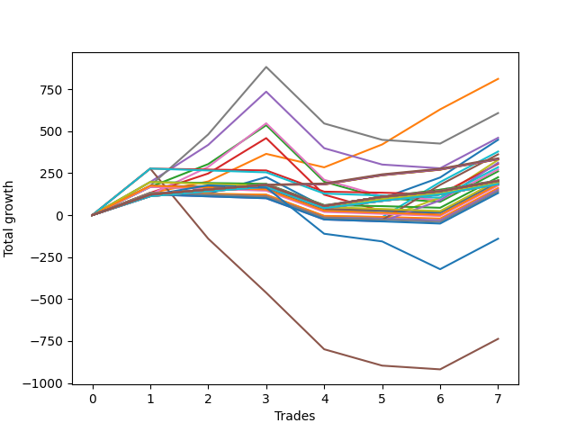

# Long Pointer 003 
- Symbol: ES1y1d
- Date Range: 07/19/2021 - 07/08/2022
- Trading Period: 7:20-12:30
- Number of Trades: 7



| Name | Win Percent | Profit | Avg Profit / Trade | Avg Time / Trade |      | Name | Win Percent | Profit | Avg Profit / Trade | Avg Time / Trade |
| ---- | ----------- | ------ | ------------------ | ---------------- | ---- | ---- | ----------- | ------ | ------------------ | ---------------- |
| Sorted By <br> Profit | | | | | | Sorted By <br> Win Percentage ||||
| One | 85.71 | 384375.00 | 54910.71 | 350:12:00 |     | Eighty-Five | 100.00 | 88750.00 | 12678.57 | 57:12:17 |
| Seven | 57.14 | 312625.00 | 44660.71 | 879:07:51 |     | Eighty-Four | 100.00 | 88750.00 | 12678.57 | 57:12:17 |
| Four | 57.14 | 223750.00 | 31964.29 | 873:43:34 |     | Eighty-Three | 100.00 | 88750.00 | 12678.57 | 57:12:17 |
| Zero | 85.71 | 197750.00 | 28250.00 | 271:04:00 |     | Eighty-Two | 100.00 | 80375.00 | 11482.14 | 57:00:08 |
| Six | 57.14 | 140500.00 | 20071.43 | 791:38:08 |     | Eighty-One | 100.00 | 80375.00 | 11482.14 | 57:00:08 |
| Two | 57.14 | 121250.00 | 17321.43 | 793:21:08 |     | One | 85.71 | 384375.00 | 54910.71 | 350:12:00 |
| Three | 57.14 | 92500.00 | 13214.29 | 789:46:00 |     | Zero | 85.71 | 197750.00 | 28250.00 | 271:04:00 |
| Eighty-Five | 100.00 | 88750.00 | 12678.57 | 57:12:17 |     | Seven | 57.14 | 312625.00 | 44660.71 | 879:07:51 |
| Eighty-Four | 100.00 | 88750.00 | 12678.57 | 57:12:17 |     | Four | 57.14 | 223750.00 | 31964.29 | 873:43:34 |
| Eighty-Three | 100.00 | 88750.00 | 12678.57 | 57:12:17 |     | Six | 57.14 | 140500.00 | 20071.43 | 791:38:08 |
| Eighty-Two | 100.00 | 80375.00 | 11482.14 | 57:00:08 |     | Two | 57.14 | 121250.00 | 17321.43 | 793:21:08 |
| Eighty-One | 100.00 | 80375.00 | 11482.14 | 57:00:08 |     | Three | 57.14 | 92500.00 | 13214.29 | 789:46:00 |
| Forty | 14.29 | 66125.00 | 9446.43 | 69:03:51 |     | One Hundred Fifteen | 57.14 | 46375.00 | 6625.00 | 38:03:00 |
| Fifty-Six | 14.29 | 55500.00 | 7928.57 | 69:11:17 |     | One Hundred Fourteen | 57.14 | 46375.00 | 6625.00 | 38:03:00 |
| Fifty-Five | 42.86 | 53750.00 | 7678.57 | 38:04:51 |     | One Hundred Thirteen | 57.14 | 46375.00 | 6625.00 | 38:03:00 |
| Fifty-Four | 42.86 | 53750.00 | 7678.57 | 38:04:51 |     | One Hundred Twelve | 57.14 | 46375.00 | 6625.00 | 38:03:00 |
| Fifty-Three | 42.86 | 53750.00 | 7678.57 | 38:04:51 |     | One Hundred Eleven | 57.14 | 46375.00 | 6625.00 | 38:03:00 |
| Fifty-Two | 42.86 | 53750.00 | 7678.57 | 38:04:51 |     | One Hundred Twenty-Five | 57.14 | 41250.00 | 5892.86 | 38:03:25 |
| Fifty-One | 42.86 | 53750.00 | 7678.57 | 38:04:51 |     | One Hundred Twenty-Four | 57.14 | 41250.00 | 5892.86 | 38:03:25 |
| Fifty | 42.86 | 53750.00 | 7678.57 | 38:04:51 |     | One Hundred Twenty-Three | 57.14 | 41250.00 | 5892.86 | 38:03:25 |
| Forty-Nine | 42.86 | 53750.00 | 7678.57 | 38:04:51 |     | One Hundred Twenty-Two | 57.14 | 41250.00 | 5892.86 | 38:03:25 |
| Forty-Eight | 42.86 | 53750.00 | 7678.57 | 38:04:51 |     | One Hundred Twenty-One | 57.14 | 41250.00 | 5892.86 | 38:03:25 |
| Seventy-One | 42.86 | 50750.00 | 7250.00 | 38:07:42 |     | Fifty-Five | 42.86 | 53750.00 | 7678.57 | 38:04:51 |
| Seventy | 42.86 | 50750.00 | 7250.00 | 38:07:42 |     | Fifty-Four | 42.86 | 53750.00 | 7678.57 | 38:04:51 |
| Sixty-Nine | 42.86 | 50750.00 | 7250.00 | 38:07:42 |     | Fifty-Three | 42.86 | 53750.00 | 7678.57 | 38:04:51 |
| Sixty-Eight | 42.86 | 50750.00 | 7250.00 | 38:07:42 |     | Fifty-Two | 42.86 | 53750.00 | 7678.57 | 38:04:51 |
| Sixty-Seven | 42.86 | 50750.00 | 7250.00 | 38:07:42 |     | Fifty-One | 42.86 | 53750.00 | 7678.57 | 38:04:51 |
| Sixty-Six | 42.86 | 50750.00 | 7250.00 | 38:07:42 |     | Fifty | 42.86 | 53750.00 | 7678.57 | 38:04:51 |
| Sixty-Five | 42.86 | 50750.00 | 7250.00 | 38:07:42 |     | Forty-Nine | 42.86 | 53750.00 | 7678.57 | 38:04:51 |
| Sixty-Four | 42.86 | 50750.00 | 7250.00 | 38:07:42 |     | Forty-Eight | 42.86 | 53750.00 | 7678.57 | 38:04:51 |
| One Hundred Thirty | 42.86 | 47875.00 | 6839.29 | 38:02:00 |     | Seventy-One | 42.86 | 50750.00 | 7250.00 | 38:07:42 |
| One Hundred Twenty-Nine | 42.86 | 47875.00 | 6839.29 | 38:02:00 |     | Seventy | 42.86 | 50750.00 | 7250.00 | 38:07:42 |
| One Hundred Twenty-Eight | 42.86 | 47875.00 | 6839.29 | 38:02:00 |     | Sixty-Nine | 42.86 | 50750.00 | 7250.00 | 38:07:42 |
| One Hundred Twenty-Seven | 42.86 | 47875.00 | 6839.29 | 38:02:00 |     | Sixty-Eight | 42.86 | 50750.00 | 7250.00 | 38:07:42 |
| One Hundred Twenty-Six | 42.86 | 47875.00 | 6839.29 | 38:02:00 |     | Sixty-Seven | 42.86 | 50750.00 | 7250.00 | 38:07:42 |
| One Hundred Twenty | 42.86 | 47875.00 | 6839.29 | 38:02:00 |     | Sixty-Six | 42.86 | 50750.00 | 7250.00 | 38:07:42 |
| One Hundred Ninteen | 42.86 | 47875.00 | 6839.29 | 38:02:00 |     | Sixty-Five | 42.86 | 50750.00 | 7250.00 | 38:07:42 |
| One Hundred Eighteen | 42.86 | 47875.00 | 6839.29 | 38:02:00 |     | Sixty-Four | 42.86 | 50750.00 | 7250.00 | 38:07:42 |
| One Hundred Seventeen | 42.86 | 47875.00 | 6839.29 | 38:02:00 |     | One Hundred Thirty | 42.86 | 47875.00 | 6839.29 | 38:02:00 |
| One Hundred Sixteen | 42.86 | 47875.00 | 6839.29 | 38:02:00 |     | One Hundred Twenty-Nine | 42.86 | 47875.00 | 6839.29 | 38:02:00 |
| One Hundred Fifteen | 57.14 | 46375.00 | 6625.00 | 38:03:00 |     | One Hundred Twenty-Eight | 42.86 | 47875.00 | 6839.29 | 38:02:00 |
| One Hundred Fourteen | 57.14 | 46375.00 | 6625.00 | 38:03:00 |     | One Hundred Twenty-Seven | 42.86 | 47875.00 | 6839.29 | 38:02:00 |
| One Hundred Thirteen | 57.14 | 46375.00 | 6625.00 | 38:03:00 |     | One Hundred Twenty-Six | 42.86 | 47875.00 | 6839.29 | 38:02:00 |
| One Hundred Twelve | 57.14 | 46375.00 | 6625.00 | 38:03:00 |     | One Hundred Twenty | 42.86 | 47875.00 | 6839.29 | 38:02:00 |
| One Hundred Eleven | 57.14 | 46375.00 | 6625.00 | 38:03:00 |     | One Hundred Ninteen | 42.86 | 47875.00 | 6839.29 | 38:02:00 |
| Forty-Seven | 14.29 | 45875.00 | 6553.57 | 104:15:25 |     | One Hundred Eighteen | 42.86 | 47875.00 | 6839.29 | 38:02:00 |
| Forty-Six | 14.29 | 45875.00 | 6553.57 | 104:15:25 |     | One Hundred Seventeen | 42.86 | 47875.00 | 6839.29 | 38:02:00 |
| Forty-Five | 14.29 | 45875.00 | 6553.57 | 104:15:25 |     | One Hundred Sixteen | 42.86 | 47875.00 | 6839.29 | 38:02:00 |
| Forty-Four | 14.29 | 45875.00 | 6553.57 | 104:15:25 |     | Seventy-Three | 42.86 | -112750.00 | -16107.14 | 255:49:00 |
| Forty-Three | 14.29 | 45875.00 | 6553.57 | 104:15:25 |     | Five | 28.57 | -357250.00 | -51035.71 | 1598:59:34 |
| Forty-Two | 14.29 | 45875.00 | 6553.57 | 104:15:25 |     | Forty | 14.29 | 66125.00 | 9446.43 | 69:03:51 |
| Forty-One | 14.29 | 45875.00 | 6553.57 | 104:15:25 |     | Fifty-Six | 14.29 | 55500.00 | 7928.57 | 69:11:17 |
| One Hundred Twenty-Five | 57.14 | 41250.00 | 5892.86 | 38:03:25 |     | Forty-Seven | 14.29 | 45875.00 | 6553.57 | 104:15:25 |
| One Hundred Twenty-Four | 57.14 | 41250.00 | 5892.86 | 38:03:25 |     | Forty-Six | 14.29 | 45875.00 | 6553.57 | 104:15:25 |
| One Hundred Twenty-Three | 57.14 | 41250.00 | 5892.86 | 38:03:25 |     | Forty-Five | 14.29 | 45875.00 | 6553.57 | 104:15:25 |
| One Hundred Twenty-Two | 57.14 | 41250.00 | 5892.86 | 38:03:25 |     | Forty-Four | 14.29 | 45875.00 | 6553.57 | 104:15:25 |
| One Hundred Twenty-One | 57.14 | 41250.00 | 5892.86 | 38:03:25 |     | Forty-Three | 14.29 | 45875.00 | 6553.57 | 104:15:25 |
| Sixty-Three | 14.29 | 35250.00 | 5035.71 | 104:22:51 |     | Forty-Two | 14.29 | 45875.00 | 6553.57 | 104:15:25 |
| Sixty-Two | 14.29 | 35250.00 | 5035.71 | 104:22:51 |     | Forty-One | 14.29 | 45875.00 | 6553.57 | 104:15:25 |
| Sixty-One | 14.29 | 35250.00 | 5035.71 | 104:22:51 |     | Sixty-Three | 14.29 | 35250.00 | 5035.71 | 104:22:51 |
| Sixty | 14.29 | 35250.00 | 5035.71 | 104:22:51 |     | Sixty-Two | 14.29 | 35250.00 | 5035.71 | 104:22:51 |
| Fifty-Nine | 14.29 | 35250.00 | 5035.71 | 104:22:51 |     | Sixty-One | 14.29 | 35250.00 | 5035.71 | 104:22:51 |
| Fifty-Eight | 14.29 | 35250.00 | 5035.71 | 104:22:51 |     | Sixty | 14.29 | 35250.00 | 5035.71 | 104:22:51 |
| Fifty-Seven | 14.29 | 35250.00 | 5035.71 | 104:22:51 |     | Fifty-Nine | 14.29 | 35250.00 | 5035.71 | 104:22:51 |
| Seventy-Three | 42.86 | -112750.00 | -16107.14 | 255:49:00 |     | Fifty-Eight | 14.29 | 35250.00 | 5035.71 | 104:22:51 |
| Five | 28.57 | -357250.00 | -51035.71 | 1598:59:34 |     | Fifty-Seven | 14.29 | 35250.00 | 5035.71 | 104:22:51 |

## NO STOPLOSS

### Test Zero
* Sell when price hits the middle line of the 20p bollinger
* No Stoploss
* Results:
```
Total Trades: 7
Percent Up: 85.71
Percent Down: 14.29
Total Points Moved Up: 395.50
Potential Profit: 197750.00
Total Points Ups: 572.25 Count Ups: 6
Total Points Downs: -176.75 Count Downs: 1
```

<details><summary>Trades</summary>

<code>In: 2021-10-05 07:21:00		Out: 2021-10-07 06:36:00		Total Position Time: 47:15:00		Total Move Up: 97.25		Total to Date: 97.25</code> <br />
<code>In: 2022-02-25 07:21:00		Out: 2022-03-16 06:39:00		Total Position Time: 455:18:00		Total Move Up: 13.50		Total to Date: 110.75</code> <br />
<code>In: 2022-03-09 07:21:00		Out: 2022-03-16 06:39:00		Total Position Time: 167:18:00		Total Move Up: 57.50		Total to Date: 168.25</code> <br />
<code>In: 2022-04-28 07:21:00		Out: 2022-05-26 09:12:00		Total Position Time: 673:51:00		Total Move Up: -176.75		Total to Date: -8.50</code> <br />
<code>In: 2022-05-13 07:21:00		Out: 2022-05-26 09:12:00		Total Position Time: 313:51:00		Total Move Up: 82.25		Total to Date: 73.75</code> <br />
<code>In: 2022-05-23 07:21:00		Out: 2022-05-26 08:00:00		Total Position Time: 72:39:00		Total Move Up: 111.75		Total to Date: 185.50</code> <br />
<code>In: 2022-06-21 07:21:00		Out: 2022-06-28 06:37:00		Total Position Time: 167:16:00		Total Move Up: 210.00		Total to Date: 395.50</code> <br />


</details>

### Test One
* Sell when the price hits the upper line of the 20p 1std bollinger
* No Stoploss
* Results:
```
Total Trades: 7
Percent Up: 85.71
Percent Down: 14.29
Total Points Moved Up: 768.75
Potential Profit: 384375.00
Total Points Ups: 861.25 Count Ups: 6
Total Points Downs: -92.50 Count Downs: 1
```

<details><summary>Trades</summary>

<code>In: 2021-10-05 07:21:00		Out: 2021-10-14 08:40:00		Total Position Time: 217:19:00		Total Move Up: 110.50		Total to Date: 110.50</code> <br />
<code>In: 2022-02-25 07:21:00		Out: 2022-03-17 10:29:00		Total Position Time: 483:08:00		Total Move Up: 82.25		Total to Date: 192.75</code> <br />
<code>In: 2022-03-09 07:21:00		Out: 2022-03-17 10:29:00		Total Position Time: 195:08:00		Total Move Up: 126.25		Total to Date: 319.00</code> <br />
<code>In: 2022-04-28 07:21:00		Out: 2022-05-27 12:05:00		Total Position Time: 700:44:00		Total Move Up: -92.50		Total to Date: 226.50</code> <br />
<code>In: 2022-05-13 07:21:00		Out: 2022-05-27 12:05:00		Total Position Time: 340:44:00		Total Move Up: 166.50		Total to Date: 393.00</code> <br />
<code>In: 2022-05-23 07:21:00		Out: 2022-05-27 12:05:00		Total Position Time: 100:44:00		Total Move Up: 206.25		Total to Date: 599.25</code> <br />
<code>In: 2022-06-21 07:21:00		Out: 2022-07-08 12:58:00		Total Position Time: 413:37:00		Total Move Up: 169.50		Total to Date: 768.75</code> <br />


</details>

### Test Two
* Sell when the price hits the upper line of the 20p 2std bollinger
* No Stoploss
* Results:
```
Total Trades: 7
Percent Up: 57.14
Percent Down: 42.86
Total Points Moved Up: 242.50
Potential Profit: 121250.00
Total Points Ups: 656.75 Count Ups: 4
Total Points Downs: -414.25 Count Downs: 3
```

<details><summary>Trades</summary>

<code>In: 2021-10-05 07:21:00		Out: 2021-10-15 08:23:00		Total Position Time: 241:02:00		Total Move Up: 150.25		Total to Date: 150.25</code> <br />
<code>In: 2022-02-25 07:21:00		Out: 2022-03-18 12:20:00		Total Position Time: 508:59:00		Total Move Up: 146.50		Total to Date: 296.75</code> <br />
<code>In: 2022-03-09 07:21:00		Out: 2022-03-18 12:20:00		Total Position Time: 220:59:00		Total Move Up: 190.50		Total to Date: 487.25</code> <br />
<code>In: 2022-04-28 07:21:00		Out: 2022-07-08 12:58:00		Total Position Time: 1709:37:00		Total Move Up: -324.00		Total to Date: 163.25</code> <br />
<code>In: 2022-05-13 07:21:00		Out: 2022-07-08 12:58:00		Total Position Time: 1349:37:00		Total Move Up: -65.00		Total to Date: 98.25</code> <br />
<code>In: 2022-05-23 07:21:00		Out: 2022-07-08 12:58:00		Total Position Time: 1109:37:00		Total Move Up: -25.25		Total to Date: 73.00</code> <br />
<code>In: 2022-06-21 07:21:00		Out: 2022-07-08 12:58:00		Total Position Time: 413:37:00		Total Move Up: 169.50		Total to Date: 242.50</code> <br />


</details>

### Test Three
* Sell when price hits the middle line of the 50p bollinger
* No Stoploss
* Results:
```
Total Trades: 7
Percent Up: 57.14
Percent Down: 42.86
Total Points Moved Up: 185.00
Potential Profit: 92500.00
Total Points Ups: 599.25 Count Ups: 4
Total Points Downs: -414.25 Count Downs: 3
```

<details><summary>Trades</summary>

<code>In: 2021-10-05 07:21:00		Out: 2021-10-14 10:57:00		Total Position Time: 219:36:00		Total Move Up: 121.25		Total to Date: 121.25</code> <br />
<code>In: 2022-02-25 07:21:00		Out: 2022-03-18 10:30:00		Total Position Time: 507:09:00		Total Move Up: 132.25		Total to Date: 253.50</code> <br />
<code>In: 2022-03-09 07:21:00		Out: 2022-03-18 10:30:00		Total Position Time: 219:09:00		Total Move Up: 176.25		Total to Date: 429.75</code> <br />
<code>In: 2022-04-28 07:21:00		Out: 2022-07-08 12:58:00		Total Position Time: 1709:37:00		Total Move Up: -324.00		Total to Date: 105.75</code> <br />
<code>In: 2022-05-13 07:21:00		Out: 2022-07-08 12:58:00		Total Position Time: 1349:37:00		Total Move Up: -65.00		Total to Date: 40.75</code> <br />
<code>In: 2022-05-23 07:21:00		Out: 2022-07-08 12:58:00		Total Position Time: 1109:37:00		Total Move Up: -25.25		Total to Date: 15.50</code> <br />
<code>In: 2022-06-21 07:21:00		Out: 2022-07-08 12:58:00		Total Position Time: 413:37:00		Total Move Up: 169.50		Total to Date: 185.00</code> <br />


</details>

### Test Four
* Sell when the price hits the upper line of the 50p 1std bollinger
* No Stoploss
* Results:
```
Total Trades: 7
Percent Up: 57.14
Percent Down: 42.86
Total Points Moved Up: 447.50
Potential Profit: 223750.00
Total Points Ups: 861.75 Count Ups: 4
Total Points Downs: -414.25 Count Downs: 3
```

<details><summary>Trades</summary>

<code>In: 2021-10-05 07:21:00		Out: 2021-10-19 06:40:00		Total Position Time: 335:19:00		Total Move Up: 186.75		Total to Date: 186.75</code> <br />
<code>In: 2022-02-25 07:21:00		Out: 2022-03-28 06:30:00		Total Position Time: 743:09:00		Total Move Up: 230.75		Total to Date: 417.50</code> <br />
<code>In: 2022-03-09 07:21:00		Out: 2022-03-28 06:30:00		Total Position Time: 455:09:00		Total Move Up: 274.75		Total to Date: 692.25</code> <br />
<code>In: 2022-04-28 07:21:00		Out: 2022-07-08 12:58:00		Total Position Time: 1709:37:00		Total Move Up: -324.00		Total to Date: 368.25</code> <br />
<code>In: 2022-05-13 07:21:00		Out: 2022-07-08 12:58:00		Total Position Time: 1349:37:00		Total Move Up: -65.00		Total to Date: 303.25</code> <br />
<code>In: 2022-05-23 07:21:00		Out: 2022-07-08 12:58:00		Total Position Time: 1109:37:00		Total Move Up: -25.25		Total to Date: 278.00</code> <br />
<code>In: 2022-06-21 07:21:00		Out: 2022-07-08 12:58:00		Total Position Time: 413:37:00		Total Move Up: 169.50		Total to Date: 447.50</code> <br />


</details>

### Test Five
* Sell when the price hits the upper line of the 50p 2std bollinger
* No Stoploss
* Results:
```
Total Trades: 7
Percent Up: 28.57
Percent Down: 71.43
Total Points Moved Up: -714.50
Potential Profit: -357250.00
Total Points Ups: 441.75 Count Ups: 2
Total Points Downs: -1156.25 Count Downs: 5
```

<details><summary>Trades</summary>

<code>In: 2021-10-05 07:21:00		Out: 2021-10-26 06:36:00		Total Position Time: 503:15:00		Total Move Up: 272.25		Total to Date: 272.25</code> <br />
<code>In: 2022-02-25 07:21:00		Out: 2022-07-08 12:58:00		Total Position Time: 3197:37:00		Total Move Up: -393.00		Total to Date: -120.75</code> <br />
<code>In: 2022-03-09 07:21:00		Out: 2022-07-08 12:58:00		Total Position Time: 2909:37:00		Total Move Up: -349.00		Total to Date: -469.75</code> <br />
<code>In: 2022-04-28 07:21:00		Out: 2022-07-08 12:58:00		Total Position Time: 1709:37:00		Total Move Up: -324.00		Total to Date: -793.75</code> <br />
<code>In: 2022-05-13 07:21:00		Out: 2022-07-08 12:58:00		Total Position Time: 1349:37:00		Total Move Up: -65.00		Total to Date: -858.75</code> <br />
<code>In: 2022-05-23 07:21:00		Out: 2022-07-08 12:58:00		Total Position Time: 1109:37:00		Total Move Up: -25.25		Total to Date: -884.00</code> <br />
<code>In: 2022-06-21 07:21:00		Out: 2022-07-08 12:58:00		Total Position Time: 413:37:00		Total Move Up: 169.50		Total to Date: -714.50</code> <br />


</details>

### Test Six
* Sell when the price hits the middle line of the 1std VWAP
* No Stoploss
* Results:
```
Total Trades: 7
Percent Up: 57.14
Percent Down: 42.86
Total Points Moved Up: 281.00
Potential Profit: 140500.00
Total Points Ups: 695.25 Count Ups: 4
Total Points Downs: -414.25 Count Downs: 3
```

<details><summary>Trades</summary>

<code>In: 2021-10-05 07:21:00		Out: 2021-10-07 07:00:00		Total Position Time: 47:39:00		Total Move Up: 103.75		Total to Date: 103.75</code> <br />
<code>In: 2022-02-25 07:21:00		Out: 2022-03-22 07:01:00		Total Position Time: 599:40:00		Total Move Up: 189.00		Total to Date: 292.75</code> <br />
<code>In: 2022-03-09 07:21:00		Out: 2022-03-22 07:01:00		Total Position Time: 311:40:00		Total Move Up: 233.00		Total to Date: 525.75</code> <br />
<code>In: 2022-04-28 07:21:00		Out: 2022-07-08 12:58:00		Total Position Time: 1709:37:00		Total Move Up: -324.00		Total to Date: 201.75</code> <br />
<code>In: 2022-05-13 07:21:00		Out: 2022-07-08 12:58:00		Total Position Time: 1349:37:00		Total Move Up: -65.00		Total to Date: 136.75</code> <br />
<code>In: 2022-05-23 07:21:00		Out: 2022-07-08 12:58:00		Total Position Time: 1109:37:00		Total Move Up: -25.25		Total to Date: 111.50</code> <br />
<code>In: 2022-06-21 07:21:00		Out: 2022-07-08 12:58:00		Total Position Time: 413:37:00		Total Move Up: 169.50		Total to Date: 281.00</code> <br />


</details>

### Test Seven
* Sell when the price hits the upper line of the 1std VWAP
* No Stoploss
* Results:
```
Total Trades: 7
Percent Up: 57.14
Percent Down: 42.86
Total Points Moved Up: 625.25
Potential Profit: 312625.00
Total Points Ups: 1039.50 Count Ups: 4
Total Points Downs: -414.25 Count Downs: 3
```

<details><summary>Trades</summary>

<code>In: 2021-10-05 07:21:00		Out: 2021-10-18 08:20:00		Total Position Time: 312:59:00		Total Move Up: 164.50		Total to Date: 164.50</code> <br />
<code>In: 2022-02-25 07:21:00		Out: 2022-03-29 12:35:00		Total Position Time: 773:14:00		Total Move Up: 330.75		Total to Date: 495.25</code> <br />
<code>In: 2022-03-09 07:21:00		Out: 2022-03-29 12:35:00		Total Position Time: 485:14:00		Total Move Up: 374.75		Total to Date: 870.00</code> <br />
<code>In: 2022-04-28 07:21:00		Out: 2022-07-08 12:58:00		Total Position Time: 1709:37:00		Total Move Up: -324.00		Total to Date: 546.00</code> <br />
<code>In: 2022-05-13 07:21:00		Out: 2022-07-08 12:58:00		Total Position Time: 1349:37:00		Total Move Up: -65.00		Total to Date: 481.00</code> <br />
<code>In: 2022-05-23 07:21:00		Out: 2022-07-08 12:58:00		Total Position Time: 1109:37:00		Total Move Up: -25.25		Total to Date: 455.75</code> <br />
<code>In: 2022-06-21 07:21:00		Out: 2022-07-08 12:58:00		Total Position Time: 413:37:00		Total Move Up: 169.50		Total to Date: 625.25</code> <br />


</details>

## STOPLOSS OF 5

### Test Forty
* Sell when price hits the middle line of the 20p bollinger
* Stoploss is 5 points
* Results:
```
Total Trades: 7
Percent Up: 14.29
Percent Down: 85.71
Total Points Moved Up: 132.25
Potential Profit: 66125.00
Total Points Ups: 210.00 Count Ups: 1
Total Points Downs: -77.75 Count Downs: 6
```

<details><summary>Trades</summary>

<code>In: 2021-10-05 07:21:00		Out: 2021-10-06 07:48:00		Total Position Time: 24:27:00		Total Move Up: -5.50		Total to Date: -5.50</code> <br />
<code>In: 2022-02-25 07:21:00		Out: 2022-03-01 09:09:00		Total Position Time: 97:48:00		Total Move Up: -6.75		Total to Date: -12.25</code> <br />
<code>In: 2022-03-09 07:21:00		Out: 2022-03-10 07:24:00		Total Position Time: 24:03:00		Total Move Up: -7.75		Total to Date: -20.00</code> <br />
<code>In: 2022-04-28 07:21:00		Out: 2022-04-29 07:27:00		Total Position Time: 24:06:00		Total Move Up: -6.50		Total to Date: -26.50</code> <br />
<code>In: 2022-05-13 07:21:00		Out: 2022-05-18 09:06:00		Total Position Time: 121:45:00		Total Move Up: -7.25		Total to Date: -33.75</code> <br />
<code>In: 2022-05-23 07:21:00		Out: 2022-05-24 07:23:00		Total Position Time: 24:02:00		Total Move Up: -44.00		Total to Date: -77.75</code> <br />
<code>In: 2022-06-21 07:21:00		Out: 2022-06-28 06:37:00		Total Position Time: 167:16:00		Total Move Up: 210.00		Total to Date: 132.25</code> <br />


</details>

### Test Forty-One
* Sell when the price hits the upper line of the 20p 1std bollinger
* Stoploss is 5 points
* Results:
```
Total Trades: 7
Percent Up: 14.29
Percent Down: 85.71
Total Points Moved Up: 91.75
Potential Profit: 45875.00
Total Points Ups: 169.50 Count Ups: 1
Total Points Downs: -77.75 Count Downs: 6
```

<details><summary>Trades</summary>

<code>In: 2021-10-05 07:21:00		Out: 2021-10-06 07:48:00		Total Position Time: 24:27:00		Total Move Up: -5.50		Total to Date: -5.50</code> <br />
<code>In: 2022-02-25 07:21:00		Out: 2022-03-01 09:09:00		Total Position Time: 97:48:00		Total Move Up: -6.75		Total to Date: -12.25</code> <br />
<code>In: 2022-03-09 07:21:00		Out: 2022-03-10 07:24:00		Total Position Time: 24:03:00		Total Move Up: -7.75		Total to Date: -20.00</code> <br />
<code>In: 2022-04-28 07:21:00		Out: 2022-04-29 07:27:00		Total Position Time: 24:06:00		Total Move Up: -6.50		Total to Date: -26.50</code> <br />
<code>In: 2022-05-13 07:21:00		Out: 2022-05-18 09:06:00		Total Position Time: 121:45:00		Total Move Up: -7.25		Total to Date: -33.75</code> <br />
<code>In: 2022-05-23 07:21:00		Out: 2022-05-24 07:23:00		Total Position Time: 24:02:00		Total Move Up: -44.00		Total to Date: -77.75</code> <br />
<code>In: 2022-06-21 07:21:00		Out: 2022-07-08 12:58:00		Total Position Time: 413:37:00		Total Move Up: 169.50		Total to Date: 91.75</code> <br />


</details>

### Test Forty-Two
* Sell when the price hits the upper line of the 20p 2std bollinger
* Stoploss is 5 points
* Results:
```
Total Trades: 7
Percent Up: 14.29
Percent Down: 85.71
Total Points Moved Up: 91.75
Potential Profit: 45875.00
Total Points Ups: 169.50 Count Ups: 1
Total Points Downs: -77.75 Count Downs: 6
```

<details><summary>Trades</summary>

<code>In: 2021-10-05 07:21:00		Out: 2021-10-06 07:48:00		Total Position Time: 24:27:00		Total Move Up: -5.50		Total to Date: -5.50</code> <br />
<code>In: 2022-02-25 07:21:00		Out: 2022-03-01 09:09:00		Total Position Time: 97:48:00		Total Move Up: -6.75		Total to Date: -12.25</code> <br />
<code>In: 2022-03-09 07:21:00		Out: 2022-03-10 07:24:00		Total Position Time: 24:03:00		Total Move Up: -7.75		Total to Date: -20.00</code> <br />
<code>In: 2022-04-28 07:21:00		Out: 2022-04-29 07:27:00		Total Position Time: 24:06:00		Total Move Up: -6.50		Total to Date: -26.50</code> <br />
<code>In: 2022-05-13 07:21:00		Out: 2022-05-18 09:06:00		Total Position Time: 121:45:00		Total Move Up: -7.25		Total to Date: -33.75</code> <br />
<code>In: 2022-05-23 07:21:00		Out: 2022-05-24 07:23:00		Total Position Time: 24:02:00		Total Move Up: -44.00		Total to Date: -77.75</code> <br />
<code>In: 2022-06-21 07:21:00		Out: 2022-07-08 12:58:00		Total Position Time: 413:37:00		Total Move Up: 169.50		Total to Date: 91.75</code> <br />


</details>

### Test Forty-Three
* Sell when price hits the middle line of the 50p bollinger
* Stoploss is 5 points
* Results:
```
Total Trades: 7
Percent Up: 14.29
Percent Down: 85.71
Total Points Moved Up: 91.75
Potential Profit: 45875.00
Total Points Ups: 169.50 Count Ups: 1
Total Points Downs: -77.75 Count Downs: 6
```

<details><summary>Trades</summary>

<code>In: 2021-10-05 07:21:00		Out: 2021-10-06 07:48:00		Total Position Time: 24:27:00		Total Move Up: -5.50		Total to Date: -5.50</code> <br />
<code>In: 2022-02-25 07:21:00		Out: 2022-03-01 09:09:00		Total Position Time: 97:48:00		Total Move Up: -6.75		Total to Date: -12.25</code> <br />
<code>In: 2022-03-09 07:21:00		Out: 2022-03-10 07:24:00		Total Position Time: 24:03:00		Total Move Up: -7.75		Total to Date: -20.00</code> <br />
<code>In: 2022-04-28 07:21:00		Out: 2022-04-29 07:27:00		Total Position Time: 24:06:00		Total Move Up: -6.50		Total to Date: -26.50</code> <br />
<code>In: 2022-05-13 07:21:00		Out: 2022-05-18 09:06:00		Total Position Time: 121:45:00		Total Move Up: -7.25		Total to Date: -33.75</code> <br />
<code>In: 2022-05-23 07:21:00		Out: 2022-05-24 07:23:00		Total Position Time: 24:02:00		Total Move Up: -44.00		Total to Date: -77.75</code> <br />
<code>In: 2022-06-21 07:21:00		Out: 2022-07-08 12:58:00		Total Position Time: 413:37:00		Total Move Up: 169.50		Total to Date: 91.75</code> <br />


</details>

### Test Forty-Four
* Sell when the price hits the upper line of the 50p 1std bollinger
* Stoploss is 5 points
* Results:
```
Total Trades: 7
Percent Up: 14.29
Percent Down: 85.71
Total Points Moved Up: 91.75
Potential Profit: 45875.00
Total Points Ups: 169.50 Count Ups: 1
Total Points Downs: -77.75 Count Downs: 6
```

<details><summary>Trades</summary>

<code>In: 2021-10-05 07:21:00		Out: 2021-10-06 07:48:00		Total Position Time: 24:27:00		Total Move Up: -5.50		Total to Date: -5.50</code> <br />
<code>In: 2022-02-25 07:21:00		Out: 2022-03-01 09:09:00		Total Position Time: 97:48:00		Total Move Up: -6.75		Total to Date: -12.25</code> <br />
<code>In: 2022-03-09 07:21:00		Out: 2022-03-10 07:24:00		Total Position Time: 24:03:00		Total Move Up: -7.75		Total to Date: -20.00</code> <br />
<code>In: 2022-04-28 07:21:00		Out: 2022-04-29 07:27:00		Total Position Time: 24:06:00		Total Move Up: -6.50		Total to Date: -26.50</code> <br />
<code>In: 2022-05-13 07:21:00		Out: 2022-05-18 09:06:00		Total Position Time: 121:45:00		Total Move Up: -7.25		Total to Date: -33.75</code> <br />
<code>In: 2022-05-23 07:21:00		Out: 2022-05-24 07:23:00		Total Position Time: 24:02:00		Total Move Up: -44.00		Total to Date: -77.75</code> <br />
<code>In: 2022-06-21 07:21:00		Out: 2022-07-08 12:58:00		Total Position Time: 413:37:00		Total Move Up: 169.50		Total to Date: 91.75</code> <br />


</details>

### Test Forty-Five
* Sell when the price hits the upper line of the 50p 2std bollinger
* Stoploss is 5 points
* Results:
```
Total Trades: 7
Percent Up: 14.29
Percent Down: 85.71
Total Points Moved Up: 91.75
Potential Profit: 45875.00
Total Points Ups: 169.50 Count Ups: 1
Total Points Downs: -77.75 Count Downs: 6
```

<details><summary>Trades</summary>

<code>In: 2021-10-05 07:21:00		Out: 2021-10-06 07:48:00		Total Position Time: 24:27:00		Total Move Up: -5.50		Total to Date: -5.50</code> <br />
<code>In: 2022-02-25 07:21:00		Out: 2022-03-01 09:09:00		Total Position Time: 97:48:00		Total Move Up: -6.75		Total to Date: -12.25</code> <br />
<code>In: 2022-03-09 07:21:00		Out: 2022-03-10 07:24:00		Total Position Time: 24:03:00		Total Move Up: -7.75		Total to Date: -20.00</code> <br />
<code>In: 2022-04-28 07:21:00		Out: 2022-04-29 07:27:00		Total Position Time: 24:06:00		Total Move Up: -6.50		Total to Date: -26.50</code> <br />
<code>In: 2022-05-13 07:21:00		Out: 2022-05-18 09:06:00		Total Position Time: 121:45:00		Total Move Up: -7.25		Total to Date: -33.75</code> <br />
<code>In: 2022-05-23 07:21:00		Out: 2022-05-24 07:23:00		Total Position Time: 24:02:00		Total Move Up: -44.00		Total to Date: -77.75</code> <br />
<code>In: 2022-06-21 07:21:00		Out: 2022-07-08 12:58:00		Total Position Time: 413:37:00		Total Move Up: 169.50		Total to Date: 91.75</code> <br />


</details>

### Test Forty-Six
* Sell when the price hits the middle line of the 1std VWAP
* Stoploss is 5 points
* Results:
```
Total Trades: 7
Percent Up: 14.29
Percent Down: 85.71
Total Points Moved Up: 91.75
Potential Profit: 45875.00
Total Points Ups: 169.50 Count Ups: 1
Total Points Downs: -77.75 Count Downs: 6
```

<details><summary>Trades</summary>

<code>In: 2021-10-05 07:21:00		Out: 2021-10-06 07:48:00		Total Position Time: 24:27:00		Total Move Up: -5.50		Total to Date: -5.50</code> <br />
<code>In: 2022-02-25 07:21:00		Out: 2022-03-01 09:09:00		Total Position Time: 97:48:00		Total Move Up: -6.75		Total to Date: -12.25</code> <br />
<code>In: 2022-03-09 07:21:00		Out: 2022-03-10 07:24:00		Total Position Time: 24:03:00		Total Move Up: -7.75		Total to Date: -20.00</code> <br />
<code>In: 2022-04-28 07:21:00		Out: 2022-04-29 07:27:00		Total Position Time: 24:06:00		Total Move Up: -6.50		Total to Date: -26.50</code> <br />
<code>In: 2022-05-13 07:21:00		Out: 2022-05-18 09:06:00		Total Position Time: 121:45:00		Total Move Up: -7.25		Total to Date: -33.75</code> <br />
<code>In: 2022-05-23 07:21:00		Out: 2022-05-24 07:23:00		Total Position Time: 24:02:00		Total Move Up: -44.00		Total to Date: -77.75</code> <br />
<code>In: 2022-06-21 07:21:00		Out: 2022-07-08 12:58:00		Total Position Time: 413:37:00		Total Move Up: 169.50		Total to Date: 91.75</code> <br />


</details>

### Test Forty-Seven
* Sell when the price hits the upper line of the 1std VWAP
* Stoploss is 5 points
* Results:
```
Total Trades: 7
Percent Up: 14.29
Percent Down: 85.71
Total Points Moved Up: 91.75
Potential Profit: 45875.00
Total Points Ups: 169.50 Count Ups: 1
Total Points Downs: -77.75 Count Downs: 6
```

<details><summary>Trades</summary>

<code>In: 2021-10-05 07:21:00		Out: 2021-10-06 07:48:00		Total Position Time: 24:27:00		Total Move Up: -5.50		Total to Date: -5.50</code> <br />
<code>In: 2022-02-25 07:21:00		Out: 2022-03-01 09:09:00		Total Position Time: 97:48:00		Total Move Up: -6.75		Total to Date: -12.25</code> <br />
<code>In: 2022-03-09 07:21:00		Out: 2022-03-10 07:24:00		Total Position Time: 24:03:00		Total Move Up: -7.75		Total to Date: -20.00</code> <br />
<code>In: 2022-04-28 07:21:00		Out: 2022-04-29 07:27:00		Total Position Time: 24:06:00		Total Move Up: -6.50		Total to Date: -26.50</code> <br />
<code>In: 2022-05-13 07:21:00		Out: 2022-05-18 09:06:00		Total Position Time: 121:45:00		Total Move Up: -7.25		Total to Date: -33.75</code> <br />
<code>In: 2022-05-23 07:21:00		Out: 2022-05-24 07:23:00		Total Position Time: 24:02:00		Total Move Up: -44.00		Total to Date: -77.75</code> <br />
<code>In: 2022-06-21 07:21:00		Out: 2022-07-08 12:58:00		Total Position Time: 413:37:00		Total Move Up: 169.50		Total to Date: 91.75</code> <br />


</details>

## TRAIL STOP OF 5

### Test Forty-Eight
* Sell when price hits the middle line of the 20p bollinger
* Trailing Stop is 5 points
* Results:
```
Total Trades: 7
Percent Up: 42.86
Percent Down: 57.14
Total Points Moved Up: 107.50
Potential Profit: 53750.00
Total Points Ups: 157.25 Count Ups: 3
Total Points Downs: -49.75 Count Downs: 4
```

<details><summary>Trades</summary>

<code>In: 2021-10-05 07:21:00		Out: 2021-10-06 07:23:00		Total Position Time: 24:02:00		Total Move Up: -2.25		Total to Date: -2.25</code> <br />
<code>In: 2022-02-25 07:21:00		Out: 2022-02-28 08:23:00		Total Position Time: 73:02:00		Total Move Up: 76.00		Total to Date: 73.75</code> <br />
<code>In: 2022-03-09 07:21:00		Out: 2022-03-10 07:23:00		Total Position Time: 24:02:00		Total Move Up: -2.50		Total to Date: 71.25</code> <br />
<code>In: 2022-04-28 07:21:00		Out: 2022-04-29 07:23:00		Total Position Time: 24:02:00		Total Move Up: -1.00		Total to Date: 70.25</code> <br />
<code>In: 2022-05-13 07:21:00		Out: 2022-05-16 08:23:00		Total Position Time: 73:02:00		Total Move Up: 27.25		Total to Date: 97.50</code> <br />
<code>In: 2022-05-23 07:21:00		Out: 2022-05-24 07:23:00		Total Position Time: 24:02:00		Total Move Up: -44.00		Total to Date: 53.50</code> <br />
<code>In: 2022-06-21 07:21:00		Out: 2022-06-22 07:43:00		Total Position Time: 24:22:00		Total Move Up: 54.00		Total to Date: 107.50</code> <br />


</details>

### Test Forty-Nine
* Sell when the price hits the upper line of the 20p 1std bollinger
* Trailing Stop is 5 points
* Results:
```
Total Trades: 7
Percent Up: 42.86
Percent Down: 57.14
Total Points Moved Up: 107.50
Potential Profit: 53750.00
Total Points Ups: 157.25 Count Ups: 3
Total Points Downs: -49.75 Count Downs: 4
```

<details><summary>Trades</summary>

<code>In: 2021-10-05 07:21:00		Out: 2021-10-06 07:23:00		Total Position Time: 24:02:00		Total Move Up: -2.25		Total to Date: -2.25</code> <br />
<code>In: 2022-02-25 07:21:00		Out: 2022-02-28 08:23:00		Total Position Time: 73:02:00		Total Move Up: 76.00		Total to Date: 73.75</code> <br />
<code>In: 2022-03-09 07:21:00		Out: 2022-03-10 07:23:00		Total Position Time: 24:02:00		Total Move Up: -2.50		Total to Date: 71.25</code> <br />
<code>In: 2022-04-28 07:21:00		Out: 2022-04-29 07:23:00		Total Position Time: 24:02:00		Total Move Up: -1.00		Total to Date: 70.25</code> <br />
<code>In: 2022-05-13 07:21:00		Out: 2022-05-16 08:23:00		Total Position Time: 73:02:00		Total Move Up: 27.25		Total to Date: 97.50</code> <br />
<code>In: 2022-05-23 07:21:00		Out: 2022-05-24 07:23:00		Total Position Time: 24:02:00		Total Move Up: -44.00		Total to Date: 53.50</code> <br />
<code>In: 2022-06-21 07:21:00		Out: 2022-06-22 07:43:00		Total Position Time: 24:22:00		Total Move Up: 54.00		Total to Date: 107.50</code> <br />


</details>

### Test Fifty
* Sell when the price hits the upper line of the 20p 2std bollinger
* Trailing Stop is 5 points
* Results:
```
Total Trades: 7
Percent Up: 42.86
Percent Down: 57.14
Total Points Moved Up: 107.50
Potential Profit: 53750.00
Total Points Ups: 157.25 Count Ups: 3
Total Points Downs: -49.75 Count Downs: 4
```

<details><summary>Trades</summary>

<code>In: 2021-10-05 07:21:00		Out: 2021-10-06 07:23:00		Total Position Time: 24:02:00		Total Move Up: -2.25		Total to Date: -2.25</code> <br />
<code>In: 2022-02-25 07:21:00		Out: 2022-02-28 08:23:00		Total Position Time: 73:02:00		Total Move Up: 76.00		Total to Date: 73.75</code> <br />
<code>In: 2022-03-09 07:21:00		Out: 2022-03-10 07:23:00		Total Position Time: 24:02:00		Total Move Up: -2.50		Total to Date: 71.25</code> <br />
<code>In: 2022-04-28 07:21:00		Out: 2022-04-29 07:23:00		Total Position Time: 24:02:00		Total Move Up: -1.00		Total to Date: 70.25</code> <br />
<code>In: 2022-05-13 07:21:00		Out: 2022-05-16 08:23:00		Total Position Time: 73:02:00		Total Move Up: 27.25		Total to Date: 97.50</code> <br />
<code>In: 2022-05-23 07:21:00		Out: 2022-05-24 07:23:00		Total Position Time: 24:02:00		Total Move Up: -44.00		Total to Date: 53.50</code> <br />
<code>In: 2022-06-21 07:21:00		Out: 2022-06-22 07:43:00		Total Position Time: 24:22:00		Total Move Up: 54.00		Total to Date: 107.50</code> <br />


</details>

### Test Fifty-One
* Sell when price hits the middle line of the 50p bollinger
* Trailing Stop is 5 points
* Results:
```
Total Trades: 7
Percent Up: 42.86
Percent Down: 57.14
Total Points Moved Up: 107.50
Potential Profit: 53750.00
Total Points Ups: 157.25 Count Ups: 3
Total Points Downs: -49.75 Count Downs: 4
```

<details><summary>Trades</summary>

<code>In: 2021-10-05 07:21:00		Out: 2021-10-06 07:23:00		Total Position Time: 24:02:00		Total Move Up: -2.25		Total to Date: -2.25</code> <br />
<code>In: 2022-02-25 07:21:00		Out: 2022-02-28 08:23:00		Total Position Time: 73:02:00		Total Move Up: 76.00		Total to Date: 73.75</code> <br />
<code>In: 2022-03-09 07:21:00		Out: 2022-03-10 07:23:00		Total Position Time: 24:02:00		Total Move Up: -2.50		Total to Date: 71.25</code> <br />
<code>In: 2022-04-28 07:21:00		Out: 2022-04-29 07:23:00		Total Position Time: 24:02:00		Total Move Up: -1.00		Total to Date: 70.25</code> <br />
<code>In: 2022-05-13 07:21:00		Out: 2022-05-16 08:23:00		Total Position Time: 73:02:00		Total Move Up: 27.25		Total to Date: 97.50</code> <br />
<code>In: 2022-05-23 07:21:00		Out: 2022-05-24 07:23:00		Total Position Time: 24:02:00		Total Move Up: -44.00		Total to Date: 53.50</code> <br />
<code>In: 2022-06-21 07:21:00		Out: 2022-06-22 07:43:00		Total Position Time: 24:22:00		Total Move Up: 54.00		Total to Date: 107.50</code> <br />


</details>

### Test Fifty-Two
* Sell when the price hits the upper line of the 50p 1std bollinger
* Trailing Stop is 5 points
* Results:
```
Total Trades: 7
Percent Up: 42.86
Percent Down: 57.14
Total Points Moved Up: 107.50
Potential Profit: 53750.00
Total Points Ups: 157.25 Count Ups: 3
Total Points Downs: -49.75 Count Downs: 4
```

<details><summary>Trades</summary>

<code>In: 2021-10-05 07:21:00		Out: 2021-10-06 07:23:00		Total Position Time: 24:02:00		Total Move Up: -2.25		Total to Date: -2.25</code> <br />
<code>In: 2022-02-25 07:21:00		Out: 2022-02-28 08:23:00		Total Position Time: 73:02:00		Total Move Up: 76.00		Total to Date: 73.75</code> <br />
<code>In: 2022-03-09 07:21:00		Out: 2022-03-10 07:23:00		Total Position Time: 24:02:00		Total Move Up: -2.50		Total to Date: 71.25</code> <br />
<code>In: 2022-04-28 07:21:00		Out: 2022-04-29 07:23:00		Total Position Time: 24:02:00		Total Move Up: -1.00		Total to Date: 70.25</code> <br />
<code>In: 2022-05-13 07:21:00		Out: 2022-05-16 08:23:00		Total Position Time: 73:02:00		Total Move Up: 27.25		Total to Date: 97.50</code> <br />
<code>In: 2022-05-23 07:21:00		Out: 2022-05-24 07:23:00		Total Position Time: 24:02:00		Total Move Up: -44.00		Total to Date: 53.50</code> <br />
<code>In: 2022-06-21 07:21:00		Out: 2022-06-22 07:43:00		Total Position Time: 24:22:00		Total Move Up: 54.00		Total to Date: 107.50</code> <br />


</details>

### Test Fifty-Three
* Sell when the price hits the upper line of the 50p 2std bollinger
* Trailing Stop is 5 points
* Results:
```
Total Trades: 7
Percent Up: 42.86
Percent Down: 57.14
Total Points Moved Up: 107.50
Potential Profit: 53750.00
Total Points Ups: 157.25 Count Ups: 3
Total Points Downs: -49.75 Count Downs: 4
```

<details><summary>Trades</summary>

<code>In: 2021-10-05 07:21:00		Out: 2021-10-06 07:23:00		Total Position Time: 24:02:00		Total Move Up: -2.25		Total to Date: -2.25</code> <br />
<code>In: 2022-02-25 07:21:00		Out: 2022-02-28 08:23:00		Total Position Time: 73:02:00		Total Move Up: 76.00		Total to Date: 73.75</code> <br />
<code>In: 2022-03-09 07:21:00		Out: 2022-03-10 07:23:00		Total Position Time: 24:02:00		Total Move Up: -2.50		Total to Date: 71.25</code> <br />
<code>In: 2022-04-28 07:21:00		Out: 2022-04-29 07:23:00		Total Position Time: 24:02:00		Total Move Up: -1.00		Total to Date: 70.25</code> <br />
<code>In: 2022-05-13 07:21:00		Out: 2022-05-16 08:23:00		Total Position Time: 73:02:00		Total Move Up: 27.25		Total to Date: 97.50</code> <br />
<code>In: 2022-05-23 07:21:00		Out: 2022-05-24 07:23:00		Total Position Time: 24:02:00		Total Move Up: -44.00		Total to Date: 53.50</code> <br />
<code>In: 2022-06-21 07:21:00		Out: 2022-06-22 07:43:00		Total Position Time: 24:22:00		Total Move Up: 54.00		Total to Date: 107.50</code> <br />


</details>

### Test Fifty-Four
* Sell when the price hits the middle line of the 1std VWAP
* Trailing Stop is 5 points
* Results:
```
Total Trades: 7
Percent Up: 42.86
Percent Down: 57.14
Total Points Moved Up: 107.50
Potential Profit: 53750.00
Total Points Ups: 157.25 Count Ups: 3
Total Points Downs: -49.75 Count Downs: 4
```

<details><summary>Trades</summary>

<code>In: 2021-10-05 07:21:00		Out: 2021-10-06 07:23:00		Total Position Time: 24:02:00		Total Move Up: -2.25		Total to Date: -2.25</code> <br />
<code>In: 2022-02-25 07:21:00		Out: 2022-02-28 08:23:00		Total Position Time: 73:02:00		Total Move Up: 76.00		Total to Date: 73.75</code> <br />
<code>In: 2022-03-09 07:21:00		Out: 2022-03-10 07:23:00		Total Position Time: 24:02:00		Total Move Up: -2.50		Total to Date: 71.25</code> <br />
<code>In: 2022-04-28 07:21:00		Out: 2022-04-29 07:23:00		Total Position Time: 24:02:00		Total Move Up: -1.00		Total to Date: 70.25</code> <br />
<code>In: 2022-05-13 07:21:00		Out: 2022-05-16 08:23:00		Total Position Time: 73:02:00		Total Move Up: 27.25		Total to Date: 97.50</code> <br />
<code>In: 2022-05-23 07:21:00		Out: 2022-05-24 07:23:00		Total Position Time: 24:02:00		Total Move Up: -44.00		Total to Date: 53.50</code> <br />
<code>In: 2022-06-21 07:21:00		Out: 2022-06-22 07:43:00		Total Position Time: 24:22:00		Total Move Up: 54.00		Total to Date: 107.50</code> <br />


</details>

### Test Fifty-Five
* Sell when the price hits the upper line of the 1std VWAP
* Trailing Stop is 5 points
* Results:
```
Total Trades: 7
Percent Up: 42.86
Percent Down: 57.14
Total Points Moved Up: 107.50
Potential Profit: 53750.00
Total Points Ups: 157.25 Count Ups: 3
Total Points Downs: -49.75 Count Downs: 4
```

<details><summary>Trades</summary>

<code>In: 2021-10-05 07:21:00		Out: 2021-10-06 07:23:00		Total Position Time: 24:02:00		Total Move Up: -2.25		Total to Date: -2.25</code> <br />
<code>In: 2022-02-25 07:21:00		Out: 2022-02-28 08:23:00		Total Position Time: 73:02:00		Total Move Up: 76.00		Total to Date: 73.75</code> <br />
<code>In: 2022-03-09 07:21:00		Out: 2022-03-10 07:23:00		Total Position Time: 24:02:00		Total Move Up: -2.50		Total to Date: 71.25</code> <br />
<code>In: 2022-04-28 07:21:00		Out: 2022-04-29 07:23:00		Total Position Time: 24:02:00		Total Move Up: -1.00		Total to Date: 70.25</code> <br />
<code>In: 2022-05-13 07:21:00		Out: 2022-05-16 08:23:00		Total Position Time: 73:02:00		Total Move Up: 27.25		Total to Date: 97.50</code> <br />
<code>In: 2022-05-23 07:21:00		Out: 2022-05-24 07:23:00		Total Position Time: 24:02:00		Total Move Up: -44.00		Total to Date: 53.50</code> <br />
<code>In: 2022-06-21 07:21:00		Out: 2022-06-22 07:43:00		Total Position Time: 24:22:00		Total Move Up: 54.00		Total to Date: 107.50</code> <br />


</details>

## STOPLOSS OF 10

### Test Fifty-Six
* Sell when price hits the middle line of the 20p bollinger
* Stoploss is 10 points
* Results:
```
Total Trades: 7
Percent Up: 14.29
Percent Down: 85.71
Total Points Moved Up: 111.00
Potential Profit: 55500.00
Total Points Ups: 210.00 Count Ups: 1
Total Points Downs: -99.00 Count Downs: 6
```

<details><summary>Trades</summary>

<code>In: 2021-10-05 07:21:00		Out: 2021-10-06 08:32:00		Total Position Time: 25:11:00		Total Move Up: -10.00		Total to Date: -10.00</code> <br />
<code>In: 2022-02-25 07:21:00		Out: 2022-03-01 09:11:00		Total Position Time: 97:50:00		Total Move Up: -10.25		Total to Date: -20.25</code> <br />
<code>In: 2022-03-09 07:21:00		Out: 2022-03-10 07:25:00		Total Position Time: 24:04:00		Total Move Up: -11.75		Total to Date: -32.00</code> <br />
<code>In: 2022-04-28 07:21:00		Out: 2022-04-29 07:29:00		Total Position Time: 24:08:00		Total Move Up: -12.75		Total to Date: -44.75</code> <br />
<code>In: 2022-05-13 07:21:00		Out: 2022-05-18 09:09:00		Total Position Time: 121:48:00		Total Move Up: -10.25		Total to Date: -55.00</code> <br />
<code>In: 2022-05-23 07:21:00		Out: 2022-05-24 07:23:00		Total Position Time: 24:02:00		Total Move Up: -44.00		Total to Date: -99.00</code> <br />
<code>In: 2022-06-21 07:21:00		Out: 2022-06-28 06:37:00		Total Position Time: 167:16:00		Total Move Up: 210.00		Total to Date: 111.00</code> <br />


</details>

### Test Fifty-Seven
* Sell when the price hits the upper line of the 20p 1std bollinger
* Stoploss is 10 points
* Results:
```
Total Trades: 7
Percent Up: 14.29
Percent Down: 85.71
Total Points Moved Up: 70.50
Potential Profit: 35250.00
Total Points Ups: 169.50 Count Ups: 1
Total Points Downs: -99.00 Count Downs: 6
```

<details><summary>Trades</summary>

<code>In: 2021-10-05 07:21:00		Out: 2021-10-06 08:32:00		Total Position Time: 25:11:00		Total Move Up: -10.00		Total to Date: -10.00</code> <br />
<code>In: 2022-02-25 07:21:00		Out: 2022-03-01 09:11:00		Total Position Time: 97:50:00		Total Move Up: -10.25		Total to Date: -20.25</code> <br />
<code>In: 2022-03-09 07:21:00		Out: 2022-03-10 07:25:00		Total Position Time: 24:04:00		Total Move Up: -11.75		Total to Date: -32.00</code> <br />
<code>In: 2022-04-28 07:21:00		Out: 2022-04-29 07:29:00		Total Position Time: 24:08:00		Total Move Up: -12.75		Total to Date: -44.75</code> <br />
<code>In: 2022-05-13 07:21:00		Out: 2022-05-18 09:09:00		Total Position Time: 121:48:00		Total Move Up: -10.25		Total to Date: -55.00</code> <br />
<code>In: 2022-05-23 07:21:00		Out: 2022-05-24 07:23:00		Total Position Time: 24:02:00		Total Move Up: -44.00		Total to Date: -99.00</code> <br />
<code>In: 2022-06-21 07:21:00		Out: 2022-07-08 12:58:00		Total Position Time: 413:37:00		Total Move Up: 169.50		Total to Date: 70.50</code> <br />


</details>

### Test Fifty-Eight
* Sell when the price hits the upper line of the 20p 2std bollinger
* Stoploss is 10 points
* Results:
```
Total Trades: 7
Percent Up: 14.29
Percent Down: 85.71
Total Points Moved Up: 70.50
Potential Profit: 35250.00
Total Points Ups: 169.50 Count Ups: 1
Total Points Downs: -99.00 Count Downs: 6
```

<details><summary>Trades</summary>

<code>In: 2021-10-05 07:21:00		Out: 2021-10-06 08:32:00		Total Position Time: 25:11:00		Total Move Up: -10.00		Total to Date: -10.00</code> <br />
<code>In: 2022-02-25 07:21:00		Out: 2022-03-01 09:11:00		Total Position Time: 97:50:00		Total Move Up: -10.25		Total to Date: -20.25</code> <br />
<code>In: 2022-03-09 07:21:00		Out: 2022-03-10 07:25:00		Total Position Time: 24:04:00		Total Move Up: -11.75		Total to Date: -32.00</code> <br />
<code>In: 2022-04-28 07:21:00		Out: 2022-04-29 07:29:00		Total Position Time: 24:08:00		Total Move Up: -12.75		Total to Date: -44.75</code> <br />
<code>In: 2022-05-13 07:21:00		Out: 2022-05-18 09:09:00		Total Position Time: 121:48:00		Total Move Up: -10.25		Total to Date: -55.00</code> <br />
<code>In: 2022-05-23 07:21:00		Out: 2022-05-24 07:23:00		Total Position Time: 24:02:00		Total Move Up: -44.00		Total to Date: -99.00</code> <br />
<code>In: 2022-06-21 07:21:00		Out: 2022-07-08 12:58:00		Total Position Time: 413:37:00		Total Move Up: 169.50		Total to Date: 70.50</code> <br />


</details>

### Test Fifty-Nine
* Sell when price hits the middle line of the 50p bollinger
* Stoploss is 10 points
* Results:
```
Total Trades: 7
Percent Up: 14.29
Percent Down: 85.71
Total Points Moved Up: 70.50
Potential Profit: 35250.00
Total Points Ups: 169.50 Count Ups: 1
Total Points Downs: -99.00 Count Downs: 6
```

<details><summary>Trades</summary>

<code>In: 2021-10-05 07:21:00		Out: 2021-10-06 08:32:00		Total Position Time: 25:11:00		Total Move Up: -10.00		Total to Date: -10.00</code> <br />
<code>In: 2022-02-25 07:21:00		Out: 2022-03-01 09:11:00		Total Position Time: 97:50:00		Total Move Up: -10.25		Total to Date: -20.25</code> <br />
<code>In: 2022-03-09 07:21:00		Out: 2022-03-10 07:25:00		Total Position Time: 24:04:00		Total Move Up: -11.75		Total to Date: -32.00</code> <br />
<code>In: 2022-04-28 07:21:00		Out: 2022-04-29 07:29:00		Total Position Time: 24:08:00		Total Move Up: -12.75		Total to Date: -44.75</code> <br />
<code>In: 2022-05-13 07:21:00		Out: 2022-05-18 09:09:00		Total Position Time: 121:48:00		Total Move Up: -10.25		Total to Date: -55.00</code> <br />
<code>In: 2022-05-23 07:21:00		Out: 2022-05-24 07:23:00		Total Position Time: 24:02:00		Total Move Up: -44.00		Total to Date: -99.00</code> <br />
<code>In: 2022-06-21 07:21:00		Out: 2022-07-08 12:58:00		Total Position Time: 413:37:00		Total Move Up: 169.50		Total to Date: 70.50</code> <br />


</details>

### Test Sixty
* Sell when the price hits the upper line of the 50p 1std bollinger
* Stoploss is 10 points
* Results:
```
Total Trades: 7
Percent Up: 14.29
Percent Down: 85.71
Total Points Moved Up: 70.50
Potential Profit: 35250.00
Total Points Ups: 169.50 Count Ups: 1
Total Points Downs: -99.00 Count Downs: 6
```

<details><summary>Trades</summary>

<code>In: 2021-10-05 07:21:00		Out: 2021-10-06 08:32:00		Total Position Time: 25:11:00		Total Move Up: -10.00		Total to Date: -10.00</code> <br />
<code>In: 2022-02-25 07:21:00		Out: 2022-03-01 09:11:00		Total Position Time: 97:50:00		Total Move Up: -10.25		Total to Date: -20.25</code> <br />
<code>In: 2022-03-09 07:21:00		Out: 2022-03-10 07:25:00		Total Position Time: 24:04:00		Total Move Up: -11.75		Total to Date: -32.00</code> <br />
<code>In: 2022-04-28 07:21:00		Out: 2022-04-29 07:29:00		Total Position Time: 24:08:00		Total Move Up: -12.75		Total to Date: -44.75</code> <br />
<code>In: 2022-05-13 07:21:00		Out: 2022-05-18 09:09:00		Total Position Time: 121:48:00		Total Move Up: -10.25		Total to Date: -55.00</code> <br />
<code>In: 2022-05-23 07:21:00		Out: 2022-05-24 07:23:00		Total Position Time: 24:02:00		Total Move Up: -44.00		Total to Date: -99.00</code> <br />
<code>In: 2022-06-21 07:21:00		Out: 2022-07-08 12:58:00		Total Position Time: 413:37:00		Total Move Up: 169.50		Total to Date: 70.50</code> <br />


</details>

### Test Sixty-One
* Sell when the price hits the upper line of the 50p 2std bollinger
* Stoploss is 10 points
* Results:
```
Total Trades: 7
Percent Up: 14.29
Percent Down: 85.71
Total Points Moved Up: 70.50
Potential Profit: 35250.00
Total Points Ups: 169.50 Count Ups: 1
Total Points Downs: -99.00 Count Downs: 6
```

<details><summary>Trades</summary>

<code>In: 2021-10-05 07:21:00		Out: 2021-10-06 08:32:00		Total Position Time: 25:11:00		Total Move Up: -10.00		Total to Date: -10.00</code> <br />
<code>In: 2022-02-25 07:21:00		Out: 2022-03-01 09:11:00		Total Position Time: 97:50:00		Total Move Up: -10.25		Total to Date: -20.25</code> <br />
<code>In: 2022-03-09 07:21:00		Out: 2022-03-10 07:25:00		Total Position Time: 24:04:00		Total Move Up: -11.75		Total to Date: -32.00</code> <br />
<code>In: 2022-04-28 07:21:00		Out: 2022-04-29 07:29:00		Total Position Time: 24:08:00		Total Move Up: -12.75		Total to Date: -44.75</code> <br />
<code>In: 2022-05-13 07:21:00		Out: 2022-05-18 09:09:00		Total Position Time: 121:48:00		Total Move Up: -10.25		Total to Date: -55.00</code> <br />
<code>In: 2022-05-23 07:21:00		Out: 2022-05-24 07:23:00		Total Position Time: 24:02:00		Total Move Up: -44.00		Total to Date: -99.00</code> <br />
<code>In: 2022-06-21 07:21:00		Out: 2022-07-08 12:58:00		Total Position Time: 413:37:00		Total Move Up: 169.50		Total to Date: 70.50</code> <br />


</details>

### Test Sixty-Two
* Sell when the price hits the middle line of the 1std VWAP
* Stoploss is 10 points
* Results:
```
Total Trades: 7
Percent Up: 14.29
Percent Down: 85.71
Total Points Moved Up: 70.50
Potential Profit: 35250.00
Total Points Ups: 169.50 Count Ups: 1
Total Points Downs: -99.00 Count Downs: 6
```

<details><summary>Trades</summary>

<code>In: 2021-10-05 07:21:00		Out: 2021-10-06 08:32:00		Total Position Time: 25:11:00		Total Move Up: -10.00		Total to Date: -10.00</code> <br />
<code>In: 2022-02-25 07:21:00		Out: 2022-03-01 09:11:00		Total Position Time: 97:50:00		Total Move Up: -10.25		Total to Date: -20.25</code> <br />
<code>In: 2022-03-09 07:21:00		Out: 2022-03-10 07:25:00		Total Position Time: 24:04:00		Total Move Up: -11.75		Total to Date: -32.00</code> <br />
<code>In: 2022-04-28 07:21:00		Out: 2022-04-29 07:29:00		Total Position Time: 24:08:00		Total Move Up: -12.75		Total to Date: -44.75</code> <br />
<code>In: 2022-05-13 07:21:00		Out: 2022-05-18 09:09:00		Total Position Time: 121:48:00		Total Move Up: -10.25		Total to Date: -55.00</code> <br />
<code>In: 2022-05-23 07:21:00		Out: 2022-05-24 07:23:00		Total Position Time: 24:02:00		Total Move Up: -44.00		Total to Date: -99.00</code> <br />
<code>In: 2022-06-21 07:21:00		Out: 2022-07-08 12:58:00		Total Position Time: 413:37:00		Total Move Up: 169.50		Total to Date: 70.50</code> <br />


</details>

### Test Sixty-Three
* Sell when the price hits the upper line of the 1std VWAP
* Stoploss is 10 points
* Results:
```
Total Trades: 7
Percent Up: 14.29
Percent Down: 85.71
Total Points Moved Up: 70.50
Potential Profit: 35250.00
Total Points Ups: 169.50 Count Ups: 1
Total Points Downs: -99.00 Count Downs: 6
```

<details><summary>Trades</summary>

<code>In: 2021-10-05 07:21:00		Out: 2021-10-06 08:32:00		Total Position Time: 25:11:00		Total Move Up: -10.00		Total to Date: -10.00</code> <br />
<code>In: 2022-02-25 07:21:00		Out: 2022-03-01 09:11:00		Total Position Time: 97:50:00		Total Move Up: -10.25		Total to Date: -20.25</code> <br />
<code>In: 2022-03-09 07:21:00		Out: 2022-03-10 07:25:00		Total Position Time: 24:04:00		Total Move Up: -11.75		Total to Date: -32.00</code> <br />
<code>In: 2022-04-28 07:21:00		Out: 2022-04-29 07:29:00		Total Position Time: 24:08:00		Total Move Up: -12.75		Total to Date: -44.75</code> <br />
<code>In: 2022-05-13 07:21:00		Out: 2022-05-18 09:09:00		Total Position Time: 121:48:00		Total Move Up: -10.25		Total to Date: -55.00</code> <br />
<code>In: 2022-05-23 07:21:00		Out: 2022-05-24 07:23:00		Total Position Time: 24:02:00		Total Move Up: -44.00		Total to Date: -99.00</code> <br />
<code>In: 2022-06-21 07:21:00		Out: 2022-07-08 12:58:00		Total Position Time: 413:37:00		Total Move Up: 169.50		Total to Date: 70.50</code> <br />


</details>

## TRAIL STOP OF 10

### Test Sixty-Four
* Sell when price hits the middle line of the 20p bollinger
* Trailing Stop is 10 points
* Results:
```
Total Trades: 7
Percent Up: 42.86
Percent Down: 57.14
Total Points Moved Up: 101.50
Potential Profit: 50750.00
Total Points Ups: 151.25 Count Ups: 3
Total Points Downs: -49.75 Count Downs: 4
```

<details><summary>Trades</summary>

<code>In: 2021-10-05 07:21:00		Out: 2021-10-06 07:23:00		Total Position Time: 24:02:00		Total Move Up: -2.25		Total to Date: -2.25</code> <br />
<code>In: 2022-02-25 07:21:00		Out: 2022-02-28 08:39:00		Total Position Time: 73:18:00		Total Move Up: 75.25		Total to Date: 73.00</code> <br />
<code>In: 2022-03-09 07:21:00		Out: 2022-03-10 07:23:00		Total Position Time: 24:02:00		Total Move Up: -2.50		Total to Date: 70.50</code> <br />
<code>In: 2022-04-28 07:21:00		Out: 2022-04-29 07:23:00		Total Position Time: 24:02:00		Total Move Up: -1.00		Total to Date: 69.50</code> <br />
<code>In: 2022-05-13 07:21:00		Out: 2022-05-16 08:23:00		Total Position Time: 73:02:00		Total Move Up: 27.25		Total to Date: 96.75</code> <br />
<code>In: 2022-05-23 07:21:00		Out: 2022-05-24 07:23:00		Total Position Time: 24:02:00		Total Move Up: -44.00		Total to Date: 52.75</code> <br />
<code>In: 2022-06-21 07:21:00		Out: 2022-06-22 07:47:00		Total Position Time: 24:26:00		Total Move Up: 48.75		Total to Date: 101.50</code> <br />


</details>

### Test Sixty-Five
* Sell when the price hits the upper line of the 20p 1std bollinger
* Trailing Stop is 10 points
* Results:
```
Total Trades: 7
Percent Up: 42.86
Percent Down: 57.14
Total Points Moved Up: 101.50
Potential Profit: 50750.00
Total Points Ups: 151.25 Count Ups: 3
Total Points Downs: -49.75 Count Downs: 4
```

<details><summary>Trades</summary>

<code>In: 2021-10-05 07:21:00		Out: 2021-10-06 07:23:00		Total Position Time: 24:02:00		Total Move Up: -2.25		Total to Date: -2.25</code> <br />
<code>In: 2022-02-25 07:21:00		Out: 2022-02-28 08:39:00		Total Position Time: 73:18:00		Total Move Up: 75.25		Total to Date: 73.00</code> <br />
<code>In: 2022-03-09 07:21:00		Out: 2022-03-10 07:23:00		Total Position Time: 24:02:00		Total Move Up: -2.50		Total to Date: 70.50</code> <br />
<code>In: 2022-04-28 07:21:00		Out: 2022-04-29 07:23:00		Total Position Time: 24:02:00		Total Move Up: -1.00		Total to Date: 69.50</code> <br />
<code>In: 2022-05-13 07:21:00		Out: 2022-05-16 08:23:00		Total Position Time: 73:02:00		Total Move Up: 27.25		Total to Date: 96.75</code> <br />
<code>In: 2022-05-23 07:21:00		Out: 2022-05-24 07:23:00		Total Position Time: 24:02:00		Total Move Up: -44.00		Total to Date: 52.75</code> <br />
<code>In: 2022-06-21 07:21:00		Out: 2022-06-22 07:47:00		Total Position Time: 24:26:00		Total Move Up: 48.75		Total to Date: 101.50</code> <br />


</details>

### Test Sixty-Six
* Sell when the price hits the upper line of the 20p 2std bollinger
* Trailing Stop is 10 points
* Results:
```
Total Trades: 7
Percent Up: 42.86
Percent Down: 57.14
Total Points Moved Up: 101.50
Potential Profit: 50750.00
Total Points Ups: 151.25 Count Ups: 3
Total Points Downs: -49.75 Count Downs: 4
```

<details><summary>Trades</summary>

<code>In: 2021-10-05 07:21:00		Out: 2021-10-06 07:23:00		Total Position Time: 24:02:00		Total Move Up: -2.25		Total to Date: -2.25</code> <br />
<code>In: 2022-02-25 07:21:00		Out: 2022-02-28 08:39:00		Total Position Time: 73:18:00		Total Move Up: 75.25		Total to Date: 73.00</code> <br />
<code>In: 2022-03-09 07:21:00		Out: 2022-03-10 07:23:00		Total Position Time: 24:02:00		Total Move Up: -2.50		Total to Date: 70.50</code> <br />
<code>In: 2022-04-28 07:21:00		Out: 2022-04-29 07:23:00		Total Position Time: 24:02:00		Total Move Up: -1.00		Total to Date: 69.50</code> <br />
<code>In: 2022-05-13 07:21:00		Out: 2022-05-16 08:23:00		Total Position Time: 73:02:00		Total Move Up: 27.25		Total to Date: 96.75</code> <br />
<code>In: 2022-05-23 07:21:00		Out: 2022-05-24 07:23:00		Total Position Time: 24:02:00		Total Move Up: -44.00		Total to Date: 52.75</code> <br />
<code>In: 2022-06-21 07:21:00		Out: 2022-06-22 07:47:00		Total Position Time: 24:26:00		Total Move Up: 48.75		Total to Date: 101.50</code> <br />


</details>

### Test Sixty-Seven
* Sell when price hits the middle line of the 50p bollinger
* Trailing Stop is 10 points
* Results:
```
Total Trades: 7
Percent Up: 42.86
Percent Down: 57.14
Total Points Moved Up: 101.50
Potential Profit: 50750.00
Total Points Ups: 151.25 Count Ups: 3
Total Points Downs: -49.75 Count Downs: 4
```

<details><summary>Trades</summary>

<code>In: 2021-10-05 07:21:00		Out: 2021-10-06 07:23:00		Total Position Time: 24:02:00		Total Move Up: -2.25		Total to Date: -2.25</code> <br />
<code>In: 2022-02-25 07:21:00		Out: 2022-02-28 08:39:00		Total Position Time: 73:18:00		Total Move Up: 75.25		Total to Date: 73.00</code> <br />
<code>In: 2022-03-09 07:21:00		Out: 2022-03-10 07:23:00		Total Position Time: 24:02:00		Total Move Up: -2.50		Total to Date: 70.50</code> <br />
<code>In: 2022-04-28 07:21:00		Out: 2022-04-29 07:23:00		Total Position Time: 24:02:00		Total Move Up: -1.00		Total to Date: 69.50</code> <br />
<code>In: 2022-05-13 07:21:00		Out: 2022-05-16 08:23:00		Total Position Time: 73:02:00		Total Move Up: 27.25		Total to Date: 96.75</code> <br />
<code>In: 2022-05-23 07:21:00		Out: 2022-05-24 07:23:00		Total Position Time: 24:02:00		Total Move Up: -44.00		Total to Date: 52.75</code> <br />
<code>In: 2022-06-21 07:21:00		Out: 2022-06-22 07:47:00		Total Position Time: 24:26:00		Total Move Up: 48.75		Total to Date: 101.50</code> <br />


</details>

### Test Sixty-Eight
* Sell when the price hits the upper line of the 50p 1std bollinger
* Trailing Stop is 10 points
* Results:
```
Total Trades: 7
Percent Up: 42.86
Percent Down: 57.14
Total Points Moved Up: 101.50
Potential Profit: 50750.00
Total Points Ups: 151.25 Count Ups: 3
Total Points Downs: -49.75 Count Downs: 4
```

<details><summary>Trades</summary>

<code>In: 2021-10-05 07:21:00		Out: 2021-10-06 07:23:00		Total Position Time: 24:02:00		Total Move Up: -2.25		Total to Date: -2.25</code> <br />
<code>In: 2022-02-25 07:21:00		Out: 2022-02-28 08:39:00		Total Position Time: 73:18:00		Total Move Up: 75.25		Total to Date: 73.00</code> <br />
<code>In: 2022-03-09 07:21:00		Out: 2022-03-10 07:23:00		Total Position Time: 24:02:00		Total Move Up: -2.50		Total to Date: 70.50</code> <br />
<code>In: 2022-04-28 07:21:00		Out: 2022-04-29 07:23:00		Total Position Time: 24:02:00		Total Move Up: -1.00		Total to Date: 69.50</code> <br />
<code>In: 2022-05-13 07:21:00		Out: 2022-05-16 08:23:00		Total Position Time: 73:02:00		Total Move Up: 27.25		Total to Date: 96.75</code> <br />
<code>In: 2022-05-23 07:21:00		Out: 2022-05-24 07:23:00		Total Position Time: 24:02:00		Total Move Up: -44.00		Total to Date: 52.75</code> <br />
<code>In: 2022-06-21 07:21:00		Out: 2022-06-22 07:47:00		Total Position Time: 24:26:00		Total Move Up: 48.75		Total to Date: 101.50</code> <br />


</details>

### Test Sixty-Nine
* Sell when the price hits the upper line of the 50p 2std bollinger
* Trailing Stop is 10 points
* Results:
```
Total Trades: 7
Percent Up: 42.86
Percent Down: 57.14
Total Points Moved Up: 101.50
Potential Profit: 50750.00
Total Points Ups: 151.25 Count Ups: 3
Total Points Downs: -49.75 Count Downs: 4
```

<details><summary>Trades</summary>

<code>In: 2021-10-05 07:21:00		Out: 2021-10-06 07:23:00		Total Position Time: 24:02:00		Total Move Up: -2.25		Total to Date: -2.25</code> <br />
<code>In: 2022-02-25 07:21:00		Out: 2022-02-28 08:39:00		Total Position Time: 73:18:00		Total Move Up: 75.25		Total to Date: 73.00</code> <br />
<code>In: 2022-03-09 07:21:00		Out: 2022-03-10 07:23:00		Total Position Time: 24:02:00		Total Move Up: -2.50		Total to Date: 70.50</code> <br />
<code>In: 2022-04-28 07:21:00		Out: 2022-04-29 07:23:00		Total Position Time: 24:02:00		Total Move Up: -1.00		Total to Date: 69.50</code> <br />
<code>In: 2022-05-13 07:21:00		Out: 2022-05-16 08:23:00		Total Position Time: 73:02:00		Total Move Up: 27.25		Total to Date: 96.75</code> <br />
<code>In: 2022-05-23 07:21:00		Out: 2022-05-24 07:23:00		Total Position Time: 24:02:00		Total Move Up: -44.00		Total to Date: 52.75</code> <br />
<code>In: 2022-06-21 07:21:00		Out: 2022-06-22 07:47:00		Total Position Time: 24:26:00		Total Move Up: 48.75		Total to Date: 101.50</code> <br />


</details>

### Test Seventy
* Sell when the price hits the middle line of the 1std VWAP
* Trailing Stop is 10 points
* Results:
```
Total Trades: 7
Percent Up: 42.86
Percent Down: 57.14
Total Points Moved Up: 101.50
Potential Profit: 50750.00
Total Points Ups: 151.25 Count Ups: 3
Total Points Downs: -49.75 Count Downs: 4
```

<details><summary>Trades</summary>

<code>In: 2021-10-05 07:21:00		Out: 2021-10-06 07:23:00		Total Position Time: 24:02:00		Total Move Up: -2.25		Total to Date: -2.25</code> <br />
<code>In: 2022-02-25 07:21:00		Out: 2022-02-28 08:39:00		Total Position Time: 73:18:00		Total Move Up: 75.25		Total to Date: 73.00</code> <br />
<code>In: 2022-03-09 07:21:00		Out: 2022-03-10 07:23:00		Total Position Time: 24:02:00		Total Move Up: -2.50		Total to Date: 70.50</code> <br />
<code>In: 2022-04-28 07:21:00		Out: 2022-04-29 07:23:00		Total Position Time: 24:02:00		Total Move Up: -1.00		Total to Date: 69.50</code> <br />
<code>In: 2022-05-13 07:21:00		Out: 2022-05-16 08:23:00		Total Position Time: 73:02:00		Total Move Up: 27.25		Total to Date: 96.75</code> <br />
<code>In: 2022-05-23 07:21:00		Out: 2022-05-24 07:23:00		Total Position Time: 24:02:00		Total Move Up: -44.00		Total to Date: 52.75</code> <br />
<code>In: 2022-06-21 07:21:00		Out: 2022-06-22 07:47:00		Total Position Time: 24:26:00		Total Move Up: 48.75		Total to Date: 101.50</code> <br />


</details>

### Test Seventy-One
* Sell when the price hits the upper line of the 1std VWAP
* Trailing Stop is 10 points
* Results:
```
Total Trades: 7
Percent Up: 42.86
Percent Down: 57.14
Total Points Moved Up: 101.50
Potential Profit: 50750.00
Total Points Ups: 151.25 Count Ups: 3
Total Points Downs: -49.75 Count Downs: 4
```

<details><summary>Trades</summary>

<code>In: 2021-10-05 07:21:00		Out: 2021-10-06 07:23:00		Total Position Time: 24:02:00		Total Move Up: -2.25		Total to Date: -2.25</code> <br />
<code>In: 2022-02-25 07:21:00		Out: 2022-02-28 08:39:00		Total Position Time: 73:18:00		Total Move Up: 75.25		Total to Date: 73.00</code> <br />
<code>In: 2022-03-09 07:21:00		Out: 2022-03-10 07:23:00		Total Position Time: 24:02:00		Total Move Up: -2.50		Total to Date: 70.50</code> <br />
<code>In: 2022-04-28 07:21:00		Out: 2022-04-29 07:23:00		Total Position Time: 24:02:00		Total Move Up: -1.00		Total to Date: 69.50</code> <br />
<code>In: 2022-05-13 07:21:00		Out: 2022-05-16 08:23:00		Total Position Time: 73:02:00		Total Move Up: 27.25		Total to Date: 96.75</code> <br />
<code>In: 2022-05-23 07:21:00		Out: 2022-05-24 07:23:00		Total Position Time: 24:02:00		Total Move Up: -44.00		Total to Date: 52.75</code> <br />
<code>In: 2022-06-21 07:21:00		Out: 2022-06-22 07:47:00		Total Position Time: 24:26:00		Total Move Up: 48.75		Total to Date: 101.50</code> <br />


</details>

## SPECIAL EXIT CONDITIONS 

### Test Seventy-Three
* Sell when the linear regression slope changes to negative
* No Stoploss
* Results:
```
Total Trades: 7
Percent Up: 42.86
Percent Down: 57.14
Total Points Moved Up: -225.50
Potential Profit: -112750.00
Total Points Ups: 268.75 Count Ups: 3
Total Points Downs: -494.25 Count Downs: 4
```

<details><summary>Trades</summary>

<code>In: 2021-10-05 07:21:00		Out: 2021-10-13 08:22:00		Total Position Time: 193:01:00		Total Move Up: 26.75		Total to Date: 26.75</code> <br />
<code>In: 2022-02-25 07:21:00		Out: 2022-03-02 08:22:00		Total Position Time: 121:01:00		Total Move Up: 72.50		Total to Date: 99.25</code> <br />
<code>In: 2022-03-09 07:21:00		Out: 2022-03-14 08:22:00		Total Position Time: 121:01:00		Total Move Up: -34.75		Total to Date: 64.50</code> <br />
<code>In: 2022-04-28 07:21:00		Out: 2022-05-09 09:22:00		Total Position Time: 266:01:00		Total Move Up: -194.75		Total to Date: -130.25</code> <br />
<code>In: 2022-05-13 07:21:00		Out: 2022-05-20 08:22:00		Total Position Time: 169:01:00		Total Move Up: -111.75		Total to Date: -242.00</code> <br />
<code>In: 2022-05-23 07:21:00		Out: 2022-06-13 10:22:00		Total Position Time: 507:01:00		Total Move Up: -153.00		Total to Date: -395.00</code> <br />
<code>In: 2022-06-21 07:21:00		Out: 2022-07-08 12:58:00		Total Position Time: 413:37:00		Total Move Up: 169.50		Total to Date: -225.50</code> <br />


</details>

## TAKE PROFIT

### Test Eighty-One
* Take Profit of 1 Point
* No Stoploss
* Results:
```
Total Trades: 7
Percent Up: 100.00
Percent Down: 0.00
Total Points Moved Up: 160.75
Potential Profit: 80375.00
Total Points Ups: 160.75 Count Ups: 7
Total Points Downs: 0.00 Count Downs: 0
```

<details><summary>Trades</summary>

<code>In: 2021-10-05 07:21:00		Out: 2021-10-06 07:25:00		Total Position Time: 24:04:00		Total Move Up: 5.50		Total to Date: 5.50</code> <br />
<code>In: 2022-02-25 07:21:00		Out: 2022-02-28 08:23:00		Total Position Time: 73:02:00		Total Move Up: 76.00		Total to Date: 81.50</code> <br />
<code>In: 2022-03-09 07:21:00		Out: 2022-03-10 11:49:00		Total Position Time: 28:28:00		Total Move Up: 5.50		Total to Date: 87.00</code> <br />
<code>In: 2022-04-28 07:21:00		Out: 2022-05-04 11:53:00		Total Position Time: 148:32:00		Total Move Up: 1.75		Total to Date: 88.75</code> <br />
<code>In: 2022-05-13 07:21:00		Out: 2022-05-16 08:23:00		Total Position Time: 73:02:00		Total Move Up: 27.25		Total to Date: 116.00</code> <br />
<code>In: 2022-05-23 07:21:00		Out: 2022-05-24 11:12:00		Total Position Time: 27:51:00		Total Move Up: 2.50		Total to Date: 118.50</code> <br />
<code>In: 2022-06-21 07:21:00		Out: 2022-06-22 07:23:00		Total Position Time: 24:02:00		Total Move Up: 42.25		Total to Date: 160.75</code> <br />


</details>

### Test Eighty-Two
* Take Profit of 2 Point
* No Stoploss
* Results:
```
Total Trades: 7
Percent Up: 100.00
Percent Down: 0.00
Total Points Moved Up: 160.75
Potential Profit: 80375.00
Total Points Ups: 160.75 Count Ups: 7
Total Points Downs: 0.00 Count Downs: 0
```

<details><summary>Trades</summary>

<code>In: 2021-10-05 07:21:00		Out: 2021-10-06 07:25:00		Total Position Time: 24:04:00		Total Move Up: 5.50		Total to Date: 5.50</code> <br />
<code>In: 2022-02-25 07:21:00		Out: 2022-02-28 08:23:00		Total Position Time: 73:02:00		Total Move Up: 76.00		Total to Date: 81.50</code> <br />
<code>In: 2022-03-09 07:21:00		Out: 2022-03-10 11:49:00		Total Position Time: 28:28:00		Total Move Up: 5.50		Total to Date: 87.00</code> <br />
<code>In: 2022-04-28 07:21:00		Out: 2022-05-04 11:53:00		Total Position Time: 148:32:00		Total Move Up: 1.75		Total to Date: 88.75</code> <br />
<code>In: 2022-05-13 07:21:00		Out: 2022-05-16 08:23:00		Total Position Time: 73:02:00		Total Move Up: 27.25		Total to Date: 116.00</code> <br />
<code>In: 2022-05-23 07:21:00		Out: 2022-05-24 11:12:00		Total Position Time: 27:51:00		Total Move Up: 2.50		Total to Date: 118.50</code> <br />
<code>In: 2022-06-21 07:21:00		Out: 2022-06-22 07:23:00		Total Position Time: 24:02:00		Total Move Up: 42.25		Total to Date: 160.75</code> <br />


</details>

### Test Eighty-Three
* Take Profit of 3 Point
* No Stoploss
* Results:
```
Total Trades: 7
Percent Up: 100.00
Percent Down: 0.00
Total Points Moved Up: 177.50
Potential Profit: 88750.00
Total Points Ups: 177.50 Count Ups: 7
Total Points Downs: 0.00 Count Downs: 0
```

<details><summary>Trades</summary>

<code>In: 2021-10-05 07:21:00		Out: 2021-10-06 07:25:00		Total Position Time: 24:04:00		Total Move Up: 5.50		Total to Date: 5.50</code> <br />
<code>In: 2022-02-25 07:21:00		Out: 2022-02-28 08:23:00		Total Position Time: 73:02:00		Total Move Up: 76.00		Total to Date: 81.50</code> <br />
<code>In: 2022-03-09 07:21:00		Out: 2022-03-10 11:49:00		Total Position Time: 28:28:00		Total Move Up: 5.50		Total to Date: 87.00</code> <br />
<code>In: 2022-04-28 07:21:00		Out: 2022-05-04 11:54:00		Total Position Time: 148:33:00		Total Move Up: 12.25		Total to Date: 99.25</code> <br />
<code>In: 2022-05-13 07:21:00		Out: 2022-05-16 08:23:00		Total Position Time: 73:02:00		Total Move Up: 27.25		Total to Date: 126.50</code> <br />
<code>In: 2022-05-23 07:21:00		Out: 2022-05-24 12:36:00		Total Position Time: 29:15:00		Total Move Up: 8.75		Total to Date: 135.25</code> <br />
<code>In: 2022-06-21 07:21:00		Out: 2022-06-22 07:23:00		Total Position Time: 24:02:00		Total Move Up: 42.25		Total to Date: 177.50</code> <br />


</details>

### Test Eighty-Four
* Take Profit of 4 Point
* No Stoploss
* Results:
```
Total Trades: 7
Percent Up: 100.00
Percent Down: 0.00
Total Points Moved Up: 177.50
Potential Profit: 88750.00
Total Points Ups: 177.50 Count Ups: 7
Total Points Downs: 0.00 Count Downs: 0
```

<details><summary>Trades</summary>

<code>In: 2021-10-05 07:21:00		Out: 2021-10-06 07:25:00		Total Position Time: 24:04:00		Total Move Up: 5.50		Total to Date: 5.50</code> <br />
<code>In: 2022-02-25 07:21:00		Out: 2022-02-28 08:23:00		Total Position Time: 73:02:00		Total Move Up: 76.00		Total to Date: 81.50</code> <br />
<code>In: 2022-03-09 07:21:00		Out: 2022-03-10 11:49:00		Total Position Time: 28:28:00		Total Move Up: 5.50		Total to Date: 87.00</code> <br />
<code>In: 2022-04-28 07:21:00		Out: 2022-05-04 11:54:00		Total Position Time: 148:33:00		Total Move Up: 12.25		Total to Date: 99.25</code> <br />
<code>In: 2022-05-13 07:21:00		Out: 2022-05-16 08:23:00		Total Position Time: 73:02:00		Total Move Up: 27.25		Total to Date: 126.50</code> <br />
<code>In: 2022-05-23 07:21:00		Out: 2022-05-24 12:36:00		Total Position Time: 29:15:00		Total Move Up: 8.75		Total to Date: 135.25</code> <br />
<code>In: 2022-06-21 07:21:00		Out: 2022-06-22 07:23:00		Total Position Time: 24:02:00		Total Move Up: 42.25		Total to Date: 177.50</code> <br />


</details>

### Test Eighty-Five
* Take Profit of 5 Point
* No Stoploss
* Results:
```
Total Trades: 7
Percent Up: 100.00
Percent Down: 0.00
Total Points Moved Up: 177.50
Potential Profit: 88750.00
Total Points Ups: 177.50 Count Ups: 7
Total Points Downs: 0.00 Count Downs: 0
```

<details><summary>Trades</summary>

<code>In: 2021-10-05 07:21:00		Out: 2021-10-06 07:25:00		Total Position Time: 24:04:00		Total Move Up: 5.50		Total to Date: 5.50</code> <br />
<code>In: 2022-02-25 07:21:00		Out: 2022-02-28 08:23:00		Total Position Time: 73:02:00		Total Move Up: 76.00		Total to Date: 81.50</code> <br />
<code>In: 2022-03-09 07:21:00		Out: 2022-03-10 11:49:00		Total Position Time: 28:28:00		Total Move Up: 5.50		Total to Date: 87.00</code> <br />
<code>In: 2022-04-28 07:21:00		Out: 2022-05-04 11:54:00		Total Position Time: 148:33:00		Total Move Up: 12.25		Total to Date: 99.25</code> <br />
<code>In: 2022-05-13 07:21:00		Out: 2022-05-16 08:23:00		Total Position Time: 73:02:00		Total Move Up: 27.25		Total to Date: 126.50</code> <br />
<code>In: 2022-05-23 07:21:00		Out: 2022-05-24 12:36:00		Total Position Time: 29:15:00		Total Move Up: 8.75		Total to Date: 135.25</code> <br />
<code>In: 2022-06-21 07:21:00		Out: 2022-06-22 07:23:00		Total Position Time: 24:02:00		Total Move Up: 42.25		Total to Date: 177.50</code> <br />


</details>

## TAKE PROFIT Stoploss of Five

### Test One Hundred Eleven
* Take Profit of 1 Point
* Stoploss is 5 points
* Results:
```
Total Trades: 7
Percent Up: 57.14
Percent Down: 42.86
Total Points Moved Up: 92.75
Potential Profit: 46375.00
Total Points Ups: 151.00 Count Ups: 4
Total Points Downs: -58.25 Count Downs: 3
```

<details><summary>Trades</summary>

<code>In: 2021-10-05 07:21:00		Out: 2021-10-06 07:25:00		Total Position Time: 24:04:00		Total Move Up: 5.50		Total to Date: 5.50</code> <br />
<code>In: 2022-02-25 07:21:00		Out: 2022-02-28 08:23:00		Total Position Time: 73:02:00		Total Move Up: 76.00		Total to Date: 81.50</code> <br />
<code>In: 2022-03-09 07:21:00		Out: 2022-03-10 07:24:00		Total Position Time: 24:03:00		Total Move Up: -7.75		Total to Date: 73.75</code> <br />
<code>In: 2022-04-28 07:21:00		Out: 2022-04-29 07:27:00		Total Position Time: 24:06:00		Total Move Up: -6.50		Total to Date: 67.25</code> <br />
<code>In: 2022-05-13 07:21:00		Out: 2022-05-16 08:23:00		Total Position Time: 73:02:00		Total Move Up: 27.25		Total to Date: 94.50</code> <br />
<code>In: 2022-05-23 07:21:00		Out: 2022-05-24 07:23:00		Total Position Time: 24:02:00		Total Move Up: -44.00		Total to Date: 50.50</code> <br />
<code>In: 2022-06-21 07:21:00		Out: 2022-06-22 07:23:00		Total Position Time: 24:02:00		Total Move Up: 42.25		Total to Date: 92.75</code> <br />


</details>

### Test One Hundred Twelve
* Take Profit of 2 Point
* Stoploss is 5 points
* Results:
```
Total Trades: 7
Percent Up: 57.14
Percent Down: 42.86
Total Points Moved Up: 92.75
Potential Profit: 46375.00
Total Points Ups: 151.00 Count Ups: 4
Total Points Downs: -58.25 Count Downs: 3
```

<details><summary>Trades</summary>

<code>In: 2021-10-05 07:21:00		Out: 2021-10-06 07:25:00		Total Position Time: 24:04:00		Total Move Up: 5.50		Total to Date: 5.50</code> <br />
<code>In: 2022-02-25 07:21:00		Out: 2022-02-28 08:23:00		Total Position Time: 73:02:00		Total Move Up: 76.00		Total to Date: 81.50</code> <br />
<code>In: 2022-03-09 07:21:00		Out: 2022-03-10 07:24:00		Total Position Time: 24:03:00		Total Move Up: -7.75		Total to Date: 73.75</code> <br />
<code>In: 2022-04-28 07:21:00		Out: 2022-04-29 07:27:00		Total Position Time: 24:06:00		Total Move Up: -6.50		Total to Date: 67.25</code> <br />
<code>In: 2022-05-13 07:21:00		Out: 2022-05-16 08:23:00		Total Position Time: 73:02:00		Total Move Up: 27.25		Total to Date: 94.50</code> <br />
<code>In: 2022-05-23 07:21:00		Out: 2022-05-24 07:23:00		Total Position Time: 24:02:00		Total Move Up: -44.00		Total to Date: 50.50</code> <br />
<code>In: 2022-06-21 07:21:00		Out: 2022-06-22 07:23:00		Total Position Time: 24:02:00		Total Move Up: 42.25		Total to Date: 92.75</code> <br />


</details>

### Test One Hundred Thirteen
* Take Profit of 3 Point
* Stoploss is 5 points
* Results:
```
Total Trades: 7
Percent Up: 57.14
Percent Down: 42.86
Total Points Moved Up: 92.75
Potential Profit: 46375.00
Total Points Ups: 151.00 Count Ups: 4
Total Points Downs: -58.25 Count Downs: 3
```

<details><summary>Trades</summary>

<code>In: 2021-10-05 07:21:00		Out: 2021-10-06 07:25:00		Total Position Time: 24:04:00		Total Move Up: 5.50		Total to Date: 5.50</code> <br />
<code>In: 2022-02-25 07:21:00		Out: 2022-02-28 08:23:00		Total Position Time: 73:02:00		Total Move Up: 76.00		Total to Date: 81.50</code> <br />
<code>In: 2022-03-09 07:21:00		Out: 2022-03-10 07:24:00		Total Position Time: 24:03:00		Total Move Up: -7.75		Total to Date: 73.75</code> <br />
<code>In: 2022-04-28 07:21:00		Out: 2022-04-29 07:27:00		Total Position Time: 24:06:00		Total Move Up: -6.50		Total to Date: 67.25</code> <br />
<code>In: 2022-05-13 07:21:00		Out: 2022-05-16 08:23:00		Total Position Time: 73:02:00		Total Move Up: 27.25		Total to Date: 94.50</code> <br />
<code>In: 2022-05-23 07:21:00		Out: 2022-05-24 07:23:00		Total Position Time: 24:02:00		Total Move Up: -44.00		Total to Date: 50.50</code> <br />
<code>In: 2022-06-21 07:21:00		Out: 2022-06-22 07:23:00		Total Position Time: 24:02:00		Total Move Up: 42.25		Total to Date: 92.75</code> <br />


</details>

### Test One Hundred Fourteen
* Take Profit of 4 Point
* Stoploss is 5 points
* Results:
```
Total Trades: 7
Percent Up: 57.14
Percent Down: 42.86
Total Points Moved Up: 92.75
Potential Profit: 46375.00
Total Points Ups: 151.00 Count Ups: 4
Total Points Downs: -58.25 Count Downs: 3
```

<details><summary>Trades</summary>

<code>In: 2021-10-05 07:21:00		Out: 2021-10-06 07:25:00		Total Position Time: 24:04:00		Total Move Up: 5.50		Total to Date: 5.50</code> <br />
<code>In: 2022-02-25 07:21:00		Out: 2022-02-28 08:23:00		Total Position Time: 73:02:00		Total Move Up: 76.00		Total to Date: 81.50</code> <br />
<code>In: 2022-03-09 07:21:00		Out: 2022-03-10 07:24:00		Total Position Time: 24:03:00		Total Move Up: -7.75		Total to Date: 73.75</code> <br />
<code>In: 2022-04-28 07:21:00		Out: 2022-04-29 07:27:00		Total Position Time: 24:06:00		Total Move Up: -6.50		Total to Date: 67.25</code> <br />
<code>In: 2022-05-13 07:21:00		Out: 2022-05-16 08:23:00		Total Position Time: 73:02:00		Total Move Up: 27.25		Total to Date: 94.50</code> <br />
<code>In: 2022-05-23 07:21:00		Out: 2022-05-24 07:23:00		Total Position Time: 24:02:00		Total Move Up: -44.00		Total to Date: 50.50</code> <br />
<code>In: 2022-06-21 07:21:00		Out: 2022-06-22 07:23:00		Total Position Time: 24:02:00		Total Move Up: 42.25		Total to Date: 92.75</code> <br />


</details>

### Test One Hundred Fifteen
* Take Profit of 5 Point
* Stoploss is 5 points
* Results:
```
Total Trades: 7
Percent Up: 57.14
Percent Down: 42.86
Total Points Moved Up: 92.75
Potential Profit: 46375.00
Total Points Ups: 151.00 Count Ups: 4
Total Points Downs: -58.25 Count Downs: 3
```

<details><summary>Trades</summary>

<code>In: 2021-10-05 07:21:00		Out: 2021-10-06 07:25:00		Total Position Time: 24:04:00		Total Move Up: 5.50		Total to Date: 5.50</code> <br />
<code>In: 2022-02-25 07:21:00		Out: 2022-02-28 08:23:00		Total Position Time: 73:02:00		Total Move Up: 76.00		Total to Date: 81.50</code> <br />
<code>In: 2022-03-09 07:21:00		Out: 2022-03-10 07:24:00		Total Position Time: 24:03:00		Total Move Up: -7.75		Total to Date: 73.75</code> <br />
<code>In: 2022-04-28 07:21:00		Out: 2022-04-29 07:27:00		Total Position Time: 24:06:00		Total Move Up: -6.50		Total to Date: 67.25</code> <br />
<code>In: 2022-05-13 07:21:00		Out: 2022-05-16 08:23:00		Total Position Time: 73:02:00		Total Move Up: 27.25		Total to Date: 94.50</code> <br />
<code>In: 2022-05-23 07:21:00		Out: 2022-05-24 07:23:00		Total Position Time: 24:02:00		Total Move Up: -44.00		Total to Date: 50.50</code> <br />
<code>In: 2022-06-21 07:21:00		Out: 2022-06-22 07:23:00		Total Position Time: 24:02:00		Total Move Up: 42.25		Total to Date: 92.75</code> <br />


</details>

## TAKE PROFIT Trailstop of Five

### Test One Hundred Sixteen
* Take Profit of 1 Point
* Trailing stop is 5 points
* Results:
```
Total Trades: 7
Percent Up: 42.86
Percent Down: 57.14
Total Points Moved Up: 95.75
Potential Profit: 47875.00
Total Points Ups: 145.50 Count Ups: 3
Total Points Downs: -49.75 Count Downs: 4
```

<details><summary>Trades</summary>

<code>In: 2021-10-05 07:21:00		Out: 2021-10-06 07:23:00		Total Position Time: 24:02:00		Total Move Up: -2.25		Total to Date: -2.25</code> <br />
<code>In: 2022-02-25 07:21:00		Out: 2022-02-28 08:23:00		Total Position Time: 73:02:00		Total Move Up: 76.00		Total to Date: 73.75</code> <br />
<code>In: 2022-03-09 07:21:00		Out: 2022-03-10 07:23:00		Total Position Time: 24:02:00		Total Move Up: -2.50		Total to Date: 71.25</code> <br />
<code>In: 2022-04-28 07:21:00		Out: 2022-04-29 07:23:00		Total Position Time: 24:02:00		Total Move Up: -1.00		Total to Date: 70.25</code> <br />
<code>In: 2022-05-13 07:21:00		Out: 2022-05-16 08:23:00		Total Position Time: 73:02:00		Total Move Up: 27.25		Total to Date: 97.50</code> <br />
<code>In: 2022-05-23 07:21:00		Out: 2022-05-24 07:23:00		Total Position Time: 24:02:00		Total Move Up: -44.00		Total to Date: 53.50</code> <br />
<code>In: 2022-06-21 07:21:00		Out: 2022-06-22 07:23:00		Total Position Time: 24:02:00		Total Move Up: 42.25		Total to Date: 95.75</code> <br />


</details>

### Test One Hundred Seventeen
* Take Profit of 2 Point
* Trailing stop is 5 points
* Results:
```
Total Trades: 7
Percent Up: 42.86
Percent Down: 57.14
Total Points Moved Up: 95.75
Potential Profit: 47875.00
Total Points Ups: 145.50 Count Ups: 3
Total Points Downs: -49.75 Count Downs: 4
```

<details><summary>Trades</summary>

<code>In: 2021-10-05 07:21:00		Out: 2021-10-06 07:23:00		Total Position Time: 24:02:00		Total Move Up: -2.25		Total to Date: -2.25</code> <br />
<code>In: 2022-02-25 07:21:00		Out: 2022-02-28 08:23:00		Total Position Time: 73:02:00		Total Move Up: 76.00		Total to Date: 73.75</code> <br />
<code>In: 2022-03-09 07:21:00		Out: 2022-03-10 07:23:00		Total Position Time: 24:02:00		Total Move Up: -2.50		Total to Date: 71.25</code> <br />
<code>In: 2022-04-28 07:21:00		Out: 2022-04-29 07:23:00		Total Position Time: 24:02:00		Total Move Up: -1.00		Total to Date: 70.25</code> <br />
<code>In: 2022-05-13 07:21:00		Out: 2022-05-16 08:23:00		Total Position Time: 73:02:00		Total Move Up: 27.25		Total to Date: 97.50</code> <br />
<code>In: 2022-05-23 07:21:00		Out: 2022-05-24 07:23:00		Total Position Time: 24:02:00		Total Move Up: -44.00		Total to Date: 53.50</code> <br />
<code>In: 2022-06-21 07:21:00		Out: 2022-06-22 07:23:00		Total Position Time: 24:02:00		Total Move Up: 42.25		Total to Date: 95.75</code> <br />


</details>

### Test One Hundred Eighteen
* Take Profit of 3 Point
* Trailing stop is 5 points
* Results:
```
Total Trades: 7
Percent Up: 42.86
Percent Down: 57.14
Total Points Moved Up: 95.75
Potential Profit: 47875.00
Total Points Ups: 145.50 Count Ups: 3
Total Points Downs: -49.75 Count Downs: 4
```

<details><summary>Trades</summary>

<code>In: 2021-10-05 07:21:00		Out: 2021-10-06 07:23:00		Total Position Time: 24:02:00		Total Move Up: -2.25		Total to Date: -2.25</code> <br />
<code>In: 2022-02-25 07:21:00		Out: 2022-02-28 08:23:00		Total Position Time: 73:02:00		Total Move Up: 76.00		Total to Date: 73.75</code> <br />
<code>In: 2022-03-09 07:21:00		Out: 2022-03-10 07:23:00		Total Position Time: 24:02:00		Total Move Up: -2.50		Total to Date: 71.25</code> <br />
<code>In: 2022-04-28 07:21:00		Out: 2022-04-29 07:23:00		Total Position Time: 24:02:00		Total Move Up: -1.00		Total to Date: 70.25</code> <br />
<code>In: 2022-05-13 07:21:00		Out: 2022-05-16 08:23:00		Total Position Time: 73:02:00		Total Move Up: 27.25		Total to Date: 97.50</code> <br />
<code>In: 2022-05-23 07:21:00		Out: 2022-05-24 07:23:00		Total Position Time: 24:02:00		Total Move Up: -44.00		Total to Date: 53.50</code> <br />
<code>In: 2022-06-21 07:21:00		Out: 2022-06-22 07:23:00		Total Position Time: 24:02:00		Total Move Up: 42.25		Total to Date: 95.75</code> <br />


</details>

### Test One Hundred Ninteen
* Take Profit of 4 Point
* Trailing stop is 5 points
* Results:
```
Total Trades: 7
Percent Up: 42.86
Percent Down: 57.14
Total Points Moved Up: 95.75
Potential Profit: 47875.00
Total Points Ups: 145.50 Count Ups: 3
Total Points Downs: -49.75 Count Downs: 4
```

<details><summary>Trades</summary>

<code>In: 2021-10-05 07:21:00		Out: 2021-10-06 07:23:00		Total Position Time: 24:02:00		Total Move Up: -2.25		Total to Date: -2.25</code> <br />
<code>In: 2022-02-25 07:21:00		Out: 2022-02-28 08:23:00		Total Position Time: 73:02:00		Total Move Up: 76.00		Total to Date: 73.75</code> <br />
<code>In: 2022-03-09 07:21:00		Out: 2022-03-10 07:23:00		Total Position Time: 24:02:00		Total Move Up: -2.50		Total to Date: 71.25</code> <br />
<code>In: 2022-04-28 07:21:00		Out: 2022-04-29 07:23:00		Total Position Time: 24:02:00		Total Move Up: -1.00		Total to Date: 70.25</code> <br />
<code>In: 2022-05-13 07:21:00		Out: 2022-05-16 08:23:00		Total Position Time: 73:02:00		Total Move Up: 27.25		Total to Date: 97.50</code> <br />
<code>In: 2022-05-23 07:21:00		Out: 2022-05-24 07:23:00		Total Position Time: 24:02:00		Total Move Up: -44.00		Total to Date: 53.50</code> <br />
<code>In: 2022-06-21 07:21:00		Out: 2022-06-22 07:23:00		Total Position Time: 24:02:00		Total Move Up: 42.25		Total to Date: 95.75</code> <br />


</details>

### Test One Hundred Twenty
* Take Profit of 5 Point
* Trailing stop is 5 points
* Results:
```
Total Trades: 7
Percent Up: 42.86
Percent Down: 57.14
Total Points Moved Up: 95.75
Potential Profit: 47875.00
Total Points Ups: 145.50 Count Ups: 3
Total Points Downs: -49.75 Count Downs: 4
```

<details><summary>Trades</summary>

<code>In: 2021-10-05 07:21:00		Out: 2021-10-06 07:23:00		Total Position Time: 24:02:00		Total Move Up: -2.25		Total to Date: -2.25</code> <br />
<code>In: 2022-02-25 07:21:00		Out: 2022-02-28 08:23:00		Total Position Time: 73:02:00		Total Move Up: 76.00		Total to Date: 73.75</code> <br />
<code>In: 2022-03-09 07:21:00		Out: 2022-03-10 07:23:00		Total Position Time: 24:02:00		Total Move Up: -2.50		Total to Date: 71.25</code> <br />
<code>In: 2022-04-28 07:21:00		Out: 2022-04-29 07:23:00		Total Position Time: 24:02:00		Total Move Up: -1.00		Total to Date: 70.25</code> <br />
<code>In: 2022-05-13 07:21:00		Out: 2022-05-16 08:23:00		Total Position Time: 73:02:00		Total Move Up: 27.25		Total to Date: 97.50</code> <br />
<code>In: 2022-05-23 07:21:00		Out: 2022-05-24 07:23:00		Total Position Time: 24:02:00		Total Move Up: -44.00		Total to Date: 53.50</code> <br />
<code>In: 2022-06-21 07:21:00		Out: 2022-06-22 07:23:00		Total Position Time: 24:02:00		Total Move Up: 42.25		Total to Date: 95.75</code> <br />


</details>

## TAKE PROFIT Stoploss of Ten

### Test One Hundred Twenty-One
* Take Profit of 1 Point
* Stoploss is 10 points
* Results:
```
Total Trades: 7
Percent Up: 57.14
Percent Down: 42.86
Total Points Moved Up: 82.50
Potential Profit: 41250.00
Total Points Ups: 151.00 Count Ups: 4
Total Points Downs: -68.50 Count Downs: 3
```

<details><summary>Trades</summary>

<code>In: 2021-10-05 07:21:00		Out: 2021-10-06 07:25:00		Total Position Time: 24:04:00		Total Move Up: 5.50		Total to Date: 5.50</code> <br />
<code>In: 2022-02-25 07:21:00		Out: 2022-02-28 08:23:00		Total Position Time: 73:02:00		Total Move Up: 76.00		Total to Date: 81.50</code> <br />
<code>In: 2022-03-09 07:21:00		Out: 2022-03-10 07:25:00		Total Position Time: 24:04:00		Total Move Up: -11.75		Total to Date: 69.75</code> <br />
<code>In: 2022-04-28 07:21:00		Out: 2022-04-29 07:29:00		Total Position Time: 24:08:00		Total Move Up: -12.75		Total to Date: 57.00</code> <br />
<code>In: 2022-05-13 07:21:00		Out: 2022-05-16 08:23:00		Total Position Time: 73:02:00		Total Move Up: 27.25		Total to Date: 84.25</code> <br />
<code>In: 2022-05-23 07:21:00		Out: 2022-05-24 07:23:00		Total Position Time: 24:02:00		Total Move Up: -44.00		Total to Date: 40.25</code> <br />
<code>In: 2022-06-21 07:21:00		Out: 2022-06-22 07:23:00		Total Position Time: 24:02:00		Total Move Up: 42.25		Total to Date: 82.50</code> <br />


</details>

### Test One Hundred Twenty-Two
* Take Profit of 2 Point
* Stoploss is 10 points
* Results:
```
Total Trades: 7
Percent Up: 57.14
Percent Down: 42.86
Total Points Moved Up: 82.50
Potential Profit: 41250.00
Total Points Ups: 151.00 Count Ups: 4
Total Points Downs: -68.50 Count Downs: 3
```

<details><summary>Trades</summary>

<code>In: 2021-10-05 07:21:00		Out: 2021-10-06 07:25:00		Total Position Time: 24:04:00		Total Move Up: 5.50		Total to Date: 5.50</code> <br />
<code>In: 2022-02-25 07:21:00		Out: 2022-02-28 08:23:00		Total Position Time: 73:02:00		Total Move Up: 76.00		Total to Date: 81.50</code> <br />
<code>In: 2022-03-09 07:21:00		Out: 2022-03-10 07:25:00		Total Position Time: 24:04:00		Total Move Up: -11.75		Total to Date: 69.75</code> <br />
<code>In: 2022-04-28 07:21:00		Out: 2022-04-29 07:29:00		Total Position Time: 24:08:00		Total Move Up: -12.75		Total to Date: 57.00</code> <br />
<code>In: 2022-05-13 07:21:00		Out: 2022-05-16 08:23:00		Total Position Time: 73:02:00		Total Move Up: 27.25		Total to Date: 84.25</code> <br />
<code>In: 2022-05-23 07:21:00		Out: 2022-05-24 07:23:00		Total Position Time: 24:02:00		Total Move Up: -44.00		Total to Date: 40.25</code> <br />
<code>In: 2022-06-21 07:21:00		Out: 2022-06-22 07:23:00		Total Position Time: 24:02:00		Total Move Up: 42.25		Total to Date: 82.50</code> <br />


</details>

### Test One Hundred Twenty-Three
* Take Profit of 3 Point
* Stoploss is 10 points
* Results:
```
Total Trades: 7
Percent Up: 57.14
Percent Down: 42.86
Total Points Moved Up: 82.50
Potential Profit: 41250.00
Total Points Ups: 151.00 Count Ups: 4
Total Points Downs: -68.50 Count Downs: 3
```

<details><summary>Trades</summary>

<code>In: 2021-10-05 07:21:00		Out: 2021-10-06 07:25:00		Total Position Time: 24:04:00		Total Move Up: 5.50		Total to Date: 5.50</code> <br />
<code>In: 2022-02-25 07:21:00		Out: 2022-02-28 08:23:00		Total Position Time: 73:02:00		Total Move Up: 76.00		Total to Date: 81.50</code> <br />
<code>In: 2022-03-09 07:21:00		Out: 2022-03-10 07:25:00		Total Position Time: 24:04:00		Total Move Up: -11.75		Total to Date: 69.75</code> <br />
<code>In: 2022-04-28 07:21:00		Out: 2022-04-29 07:29:00		Total Position Time: 24:08:00		Total Move Up: -12.75		Total to Date: 57.00</code> <br />
<code>In: 2022-05-13 07:21:00		Out: 2022-05-16 08:23:00		Total Position Time: 73:02:00		Total Move Up: 27.25		Total to Date: 84.25</code> <br />
<code>In: 2022-05-23 07:21:00		Out: 2022-05-24 07:23:00		Total Position Time: 24:02:00		Total Move Up: -44.00		Total to Date: 40.25</code> <br />
<code>In: 2022-06-21 07:21:00		Out: 2022-06-22 07:23:00		Total Position Time: 24:02:00		Total Move Up: 42.25		Total to Date: 82.50</code> <br />


</details>

### Test One Hundred Twenty-Four
* Take Profit of 4 Point
* Stoploss is 10 points
* Results:
```
Total Trades: 7
Percent Up: 57.14
Percent Down: 42.86
Total Points Moved Up: 82.50
Potential Profit: 41250.00
Total Points Ups: 151.00 Count Ups: 4
Total Points Downs: -68.50 Count Downs: 3
```

<details><summary>Trades</summary>

<code>In: 2021-10-05 07:21:00		Out: 2021-10-06 07:25:00		Total Position Time: 24:04:00		Total Move Up: 5.50		Total to Date: 5.50</code> <br />
<code>In: 2022-02-25 07:21:00		Out: 2022-02-28 08:23:00		Total Position Time: 73:02:00		Total Move Up: 76.00		Total to Date: 81.50</code> <br />
<code>In: 2022-03-09 07:21:00		Out: 2022-03-10 07:25:00		Total Position Time: 24:04:00		Total Move Up: -11.75		Total to Date: 69.75</code> <br />
<code>In: 2022-04-28 07:21:00		Out: 2022-04-29 07:29:00		Total Position Time: 24:08:00		Total Move Up: -12.75		Total to Date: 57.00</code> <br />
<code>In: 2022-05-13 07:21:00		Out: 2022-05-16 08:23:00		Total Position Time: 73:02:00		Total Move Up: 27.25		Total to Date: 84.25</code> <br />
<code>In: 2022-05-23 07:21:00		Out: 2022-05-24 07:23:00		Total Position Time: 24:02:00		Total Move Up: -44.00		Total to Date: 40.25</code> <br />
<code>In: 2022-06-21 07:21:00		Out: 2022-06-22 07:23:00		Total Position Time: 24:02:00		Total Move Up: 42.25		Total to Date: 82.50</code> <br />


</details>

### Test One Hundred Twenty-Five
* Take Profit of 5 Point
* Stoploss is 10 points
* Results:
```
Total Trades: 7
Percent Up: 57.14
Percent Down: 42.86
Total Points Moved Up: 82.50
Potential Profit: 41250.00
Total Points Ups: 151.00 Count Ups: 4
Total Points Downs: -68.50 Count Downs: 3
```

<details><summary>Trades</summary>

<code>In: 2021-10-05 07:21:00		Out: 2021-10-06 07:25:00		Total Position Time: 24:04:00		Total Move Up: 5.50		Total to Date: 5.50</code> <br />
<code>In: 2022-02-25 07:21:00		Out: 2022-02-28 08:23:00		Total Position Time: 73:02:00		Total Move Up: 76.00		Total to Date: 81.50</code> <br />
<code>In: 2022-03-09 07:21:00		Out: 2022-03-10 07:25:00		Total Position Time: 24:04:00		Total Move Up: -11.75		Total to Date: 69.75</code> <br />
<code>In: 2022-04-28 07:21:00		Out: 2022-04-29 07:29:00		Total Position Time: 24:08:00		Total Move Up: -12.75		Total to Date: 57.00</code> <br />
<code>In: 2022-05-13 07:21:00		Out: 2022-05-16 08:23:00		Total Position Time: 73:02:00		Total Move Up: 27.25		Total to Date: 84.25</code> <br />
<code>In: 2022-05-23 07:21:00		Out: 2022-05-24 07:23:00		Total Position Time: 24:02:00		Total Move Up: -44.00		Total to Date: 40.25</code> <br />
<code>In: 2022-06-21 07:21:00		Out: 2022-06-22 07:23:00		Total Position Time: 24:02:00		Total Move Up: 42.25		Total to Date: 82.50</code> <br />


</details>

## TAKE PROFIT Trailstop of Ten

### Test One Hundred Twenty-Six
* Take Profit of 1 Point
* Trailing stop is 10 points
* Results:
```
Total Trades: 7
Percent Up: 42.86
Percent Down: 57.14
Total Points Moved Up: 95.75
Potential Profit: 47875.00
Total Points Ups: 145.50 Count Ups: 3
Total Points Downs: -49.75 Count Downs: 4
```

<details><summary>Trades</summary>

<code>In: 2021-10-05 07:21:00		Out: 2021-10-06 07:23:00		Total Position Time: 24:02:00		Total Move Up: -2.25		Total to Date: -2.25</code> <br />
<code>In: 2022-02-25 07:21:00		Out: 2022-02-28 08:23:00		Total Position Time: 73:02:00		Total Move Up: 76.00		Total to Date: 73.75</code> <br />
<code>In: 2022-03-09 07:21:00		Out: 2022-03-10 07:23:00		Total Position Time: 24:02:00		Total Move Up: -2.50		Total to Date: 71.25</code> <br />
<code>In: 2022-04-28 07:21:00		Out: 2022-04-29 07:23:00		Total Position Time: 24:02:00		Total Move Up: -1.00		Total to Date: 70.25</code> <br />
<code>In: 2022-05-13 07:21:00		Out: 2022-05-16 08:23:00		Total Position Time: 73:02:00		Total Move Up: 27.25		Total to Date: 97.50</code> <br />
<code>In: 2022-05-23 07:21:00		Out: 2022-05-24 07:23:00		Total Position Time: 24:02:00		Total Move Up: -44.00		Total to Date: 53.50</code> <br />
<code>In: 2022-06-21 07:21:00		Out: 2022-06-22 07:23:00		Total Position Time: 24:02:00		Total Move Up: 42.25		Total to Date: 95.75</code> <br />


</details>

### Test One Hundred Twenty-Seven
* Take Profit of 2 Point
* Trailing stop is 10 points
* Results:
```
Total Trades: 7
Percent Up: 42.86
Percent Down: 57.14
Total Points Moved Up: 95.75
Potential Profit: 47875.00
Total Points Ups: 145.50 Count Ups: 3
Total Points Downs: -49.75 Count Downs: 4
```

<details><summary>Trades</summary>

<code>In: 2021-10-05 07:21:00		Out: 2021-10-06 07:23:00		Total Position Time: 24:02:00		Total Move Up: -2.25		Total to Date: -2.25</code> <br />
<code>In: 2022-02-25 07:21:00		Out: 2022-02-28 08:23:00		Total Position Time: 73:02:00		Total Move Up: 76.00		Total to Date: 73.75</code> <br />
<code>In: 2022-03-09 07:21:00		Out: 2022-03-10 07:23:00		Total Position Time: 24:02:00		Total Move Up: -2.50		Total to Date: 71.25</code> <br />
<code>In: 2022-04-28 07:21:00		Out: 2022-04-29 07:23:00		Total Position Time: 24:02:00		Total Move Up: -1.00		Total to Date: 70.25</code> <br />
<code>In: 2022-05-13 07:21:00		Out: 2022-05-16 08:23:00		Total Position Time: 73:02:00		Total Move Up: 27.25		Total to Date: 97.50</code> <br />
<code>In: 2022-05-23 07:21:00		Out: 2022-05-24 07:23:00		Total Position Time: 24:02:00		Total Move Up: -44.00		Total to Date: 53.50</code> <br />
<code>In: 2022-06-21 07:21:00		Out: 2022-06-22 07:23:00		Total Position Time: 24:02:00		Total Move Up: 42.25		Total to Date: 95.75</code> <br />


</details>

### Test One Hundred Twenty-Eight
* Take Profit of 3 Point
* Trailing stop is 10 points
* Results:
```
Total Trades: 7
Percent Up: 42.86
Percent Down: 57.14
Total Points Moved Up: 95.75
Potential Profit: 47875.00
Total Points Ups: 145.50 Count Ups: 3
Total Points Downs: -49.75 Count Downs: 4
```

<details><summary>Trades</summary>

<code>In: 2021-10-05 07:21:00		Out: 2021-10-06 07:23:00		Total Position Time: 24:02:00		Total Move Up: -2.25		Total to Date: -2.25</code> <br />
<code>In: 2022-02-25 07:21:00		Out: 2022-02-28 08:23:00		Total Position Time: 73:02:00		Total Move Up: 76.00		Total to Date: 73.75</code> <br />
<code>In: 2022-03-09 07:21:00		Out: 2022-03-10 07:23:00		Total Position Time: 24:02:00		Total Move Up: -2.50		Total to Date: 71.25</code> <br />
<code>In: 2022-04-28 07:21:00		Out: 2022-04-29 07:23:00		Total Position Time: 24:02:00		Total Move Up: -1.00		Total to Date: 70.25</code> <br />
<code>In: 2022-05-13 07:21:00		Out: 2022-05-16 08:23:00		Total Position Time: 73:02:00		Total Move Up: 27.25		Total to Date: 97.50</code> <br />
<code>In: 2022-05-23 07:21:00		Out: 2022-05-24 07:23:00		Total Position Time: 24:02:00		Total Move Up: -44.00		Total to Date: 53.50</code> <br />
<code>In: 2022-06-21 07:21:00		Out: 2022-06-22 07:23:00		Total Position Time: 24:02:00		Total Move Up: 42.25		Total to Date: 95.75</code> <br />


</details>

### Test One Hundred Twenty-Nine
* Take Profit of 4 Point
* Trailing stop is 10 points
* Results:
```
Total Trades: 7
Percent Up: 42.86
Percent Down: 57.14
Total Points Moved Up: 95.75
Potential Profit: 47875.00
Total Points Ups: 145.50 Count Ups: 3
Total Points Downs: -49.75 Count Downs: 4
```

<details><summary>Trades</summary>

<code>In: 2021-10-05 07:21:00		Out: 2021-10-06 07:23:00		Total Position Time: 24:02:00		Total Move Up: -2.25		Total to Date: -2.25</code> <br />
<code>In: 2022-02-25 07:21:00		Out: 2022-02-28 08:23:00		Total Position Time: 73:02:00		Total Move Up: 76.00		Total to Date: 73.75</code> <br />
<code>In: 2022-03-09 07:21:00		Out: 2022-03-10 07:23:00		Total Position Time: 24:02:00		Total Move Up: -2.50		Total to Date: 71.25</code> <br />
<code>In: 2022-04-28 07:21:00		Out: 2022-04-29 07:23:00		Total Position Time: 24:02:00		Total Move Up: -1.00		Total to Date: 70.25</code> <br />
<code>In: 2022-05-13 07:21:00		Out: 2022-05-16 08:23:00		Total Position Time: 73:02:00		Total Move Up: 27.25		Total to Date: 97.50</code> <br />
<code>In: 2022-05-23 07:21:00		Out: 2022-05-24 07:23:00		Total Position Time: 24:02:00		Total Move Up: -44.00		Total to Date: 53.50</code> <br />
<code>In: 2022-06-21 07:21:00		Out: 2022-06-22 07:23:00		Total Position Time: 24:02:00		Total Move Up: 42.25		Total to Date: 95.75</code> <br />


</details>

### Test One Hundred Thirty
* Take Profit of 5 Point
* Trailing stop is 10 points
* Results:
```
Total Trades: 7
Percent Up: 42.86
Percent Down: 57.14
Total Points Moved Up: 95.75
Potential Profit: 47875.00
Total Points Ups: 145.50 Count Ups: 3
Total Points Downs: -49.75 Count Downs: 4
```

<details><summary>Trades</summary>

<code>In: 2021-10-05 07:21:00		Out: 2021-10-06 07:23:00		Total Position Time: 24:02:00		Total Move Up: -2.25		Total to Date: -2.25</code> <br />
<code>In: 2022-02-25 07:21:00		Out: 2022-02-28 08:23:00		Total Position Time: 73:02:00		Total Move Up: 76.00		Total to Date: 73.75</code> <br />
<code>In: 2022-03-09 07:21:00		Out: 2022-03-10 07:23:00		Total Position Time: 24:02:00		Total Move Up: -2.50		Total to Date: 71.25</code> <br />
<code>In: 2022-04-28 07:21:00		Out: 2022-04-29 07:23:00		Total Position Time: 24:02:00		Total Move Up: -1.00		Total to Date: 70.25</code> <br />
<code>In: 2022-05-13 07:21:00		Out: 2022-05-16 08:23:00		Total Position Time: 73:02:00		Total Move Up: 27.25		Total to Date: 97.50</code> <br />
<code>In: 2022-05-23 07:21:00		Out: 2022-05-24 07:23:00		Total Position Time: 24:02:00		Total Move Up: -44.00		Total to Date: 53.50</code> <br />
<code>In: 2022-06-21 07:21:00		Out: 2022-06-22 07:23:00		Total Position Time: 24:02:00		Total Move Up: 42.25		Total to Date: 95.75</code> <br />


</details>