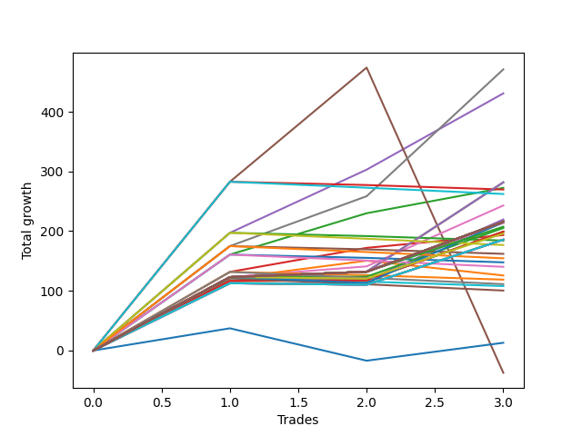

# Long Pointer 006 
- Symbol: ES1y1d
- Date Range: 07/19/2021 - 07/08/2022
- Trading Period: 7:20-12:30
- Number of Trades: 3



| Name | Win Percent | Profit | Avg Profit / Trade | Avg Time / Trade |      | Name | Win Percent | Profit | Avg Profit / Trade | Avg Time / Trade |
| ---- | ----------- | ------ | ------------------ | ---------------- | ---- | ---- | ----------- | ------ | ------------------ | ---------------- |
| Sorted By <br> Profit | | | | | | Sorted By <br> Win Percentage ||||
| Seven | 100.00 | 137000.00 | 45666.67 | 25 18:24:00 |     | Seven | 100.00 | 137000.00 | 45666.67 | 25 18:24:00 |
| Four | 100.00 | 116875.00 | 38958.33 | 25 23:25:40 |     | Four | 100.00 | 116875.00 | 38958.33 | 25 23:25:40 |
| Zero | 66.67 | 41000.00 | 13666.67 | 00 07:48:00 |     | Six | 100.00 | 22500.00 | 7500.00 | 02 01:28:40 |
| Two | 66.67 | 37750.00 | 12583.33 | 21 00:25:20 |     | Eighty-Five | 100.00 | 21375.00 | 7125.00 | 01 01:34:20 |
| Six | 100.00 | 22500.00 | 7500.00 | 02 01:28:40 |     | Eighty-Four | 100.00 | 21125.00 | 7041.67 | 01 01:31:40 |
| Eighty-Five | 100.00 | 21375.00 | 7125.00 | 01 01:34:20 |     | Eighty-Three | 100.00 | 19000.00 | 6333.33 | 01 00:30:20 |
| Eighty-Four | 100.00 | 21125.00 | 7041.67 | 01 01:31:40 |     | Eighty-Two | 100.00 | 17875.00 | 5958.33 | 01 00:27:00 |
| Eighty-Three | 100.00 | 19000.00 | 6333.33 | 01 00:30:20 |     | Eighty-One | 100.00 | 17875.00 | 5958.33 | 01 00:27:00 |
| Eighty-Two | 100.00 | 17875.00 | 5958.33 | 01 00:27:00 |     | Zero | 66.67 | 41000.00 | 13666.67 | 00 07:48:00 |
| Eighty-One | 100.00 | 17875.00 | 5958.33 | 01 00:27:00 |     | Two | 66.67 | 37750.00 | 12583.33 | 21 00:25:20 |
| Sixty-Four | 33.33 | 7875.00 | 2625.00 | 00 00:03:00 |     | Three | 66.67 | -1750.00 | -583.33 | 19 12:00:00 |
| Fifty-Six | 33.33 | 7875.00 | 2625.00 | 00 00:03:00 |     | Seventy-Three | 66.67 | -15250.00 | -5083.33 | 09 09:21:00 |
| Forty-Eight | 33.33 | 7875.00 | 2625.00 | 00 00:03:00 |     | One | 66.67 | -35625.00 | -11875.00 | 19 02:03:00 |
| Forty | 33.33 | 7875.00 | 2625.00 | 00 00:03:00 |     | Five | 66.67 | -117125.00 | -39041.67 | 64 17:22:20 |
| One Hundred Fifteen | 33.33 | 7000.00 | 2333.33 | 00 00:03:40 |     | Sixty-Four | 33.33 | 7875.00 | 2625.00 | 00 00:03:00 |
| One Hundred Fourteen | 33.33 | 7000.00 | 2333.33 | 00 00:03:40 |     | Fifty-Six | 33.33 | 7875.00 | 2625.00 | 00 00:03:00 |
| One Hundred Thirteen | 33.33 | 7000.00 | 2333.33 | 00 00:03:40 |     | Forty-Eight | 33.33 | 7875.00 | 2625.00 | 00 00:03:00 |
| One Hundred Twelve | 33.33 | 7000.00 | 2333.33 | 00 00:03:40 |     | Forty | 33.33 | 7875.00 | 2625.00 | 00 00:03:00 |
| One Hundred Eleven | 33.33 | 7000.00 | 2333.33 | 00 00:03:40 |     | One Hundred Fifteen | 33.33 | 7000.00 | 2333.33 | 00 00:03:40 |
| Forty-Six | 33.33 | 7000.00 | 2333.33 | 00 00:03:40 |     | One Hundred Fourteen | 33.33 | 7000.00 | 2333.33 | 00 00:03:40 |
| One Hundred Twenty-Five | 33.33 | 4625.00 | 1541.67 | 00 00:08:40 |     | One Hundred Thirteen | 33.33 | 7000.00 | 2333.33 | 00 00:03:40 |
| One Hundred Twenty-Four | 33.33 | 4625.00 | 1541.67 | 00 00:08:40 |     | One Hundred Twelve | 33.33 | 7000.00 | 2333.33 | 00 00:03:40 |
| One Hundred Twenty-Three | 33.33 | 4625.00 | 1541.67 | 00 00:08:40 |     | One Hundred Eleven | 33.33 | 7000.00 | 2333.33 | 00 00:03:40 |
| One Hundred Twenty-Two | 33.33 | 4625.00 | 1541.67 | 00 00:08:40 |     | Forty-Six | 33.33 | 7000.00 | 2333.33 | 00 00:03:40 |
| One Hundred Twenty-One | 33.33 | 4625.00 | 1541.67 | 00 00:08:40 |     | One Hundred Twenty-Five | 33.33 | 4625.00 | 1541.67 | 00 00:08:40 |
| One Hundred Twenty | 33.33 | 4625.00 | 1541.67 | 00 00:08:40 |     | One Hundred Twenty-Four | 33.33 | 4625.00 | 1541.67 | 00 00:08:40 |
| One Hundred Ninteen | 33.33 | 4625.00 | 1541.67 | 00 00:08:40 |     | One Hundred Twenty-Three | 33.33 | 4625.00 | 1541.67 | 00 00:08:40 |
| One Hundred Eighteen | 33.33 | 4625.00 | 1541.67 | 00 00:08:40 |     | One Hundred Twenty-Two | 33.33 | 4625.00 | 1541.67 | 00 00:08:40 |
| One Hundred Seventeen | 33.33 | 4625.00 | 1541.67 | 00 00:08:40 |     | One Hundred Twenty-One | 33.33 | 4625.00 | 1541.67 | 00 00:08:40 |
| One Hundred Sixteen | 33.33 | 4625.00 | 1541.67 | 00 00:08:40 |     | One Hundred Twenty | 33.33 | 4625.00 | 1541.67 | 00 00:08:40 |
| Sixty-Two | 33.33 | 4625.00 | 1541.67 | 00 00:08:40 |     | One Hundred Ninteen | 33.33 | 4625.00 | 1541.67 | 00 00:08:40 |
| Fifty-Four | 33.33 | 4625.00 | 1541.67 | 00 00:08:40 |     | One Hundred Eighteen | 33.33 | 4625.00 | 1541.67 | 00 00:08:40 |
| One Hundred Thirty | 33.33 | 3000.00 | 1000.00 | 00 00:09:20 |     | One Hundred Seventeen | 33.33 | 4625.00 | 1541.67 | 00 00:08:40 |
| One Hundred Twenty-Nine | 33.33 | 3000.00 | 1000.00 | 00 00:09:20 |     | One Hundred Sixteen | 33.33 | 4625.00 | 1541.67 | 00 00:08:40 |
| One Hundred Twenty-Eight | 33.33 | 3000.00 | 1000.00 | 00 00:09:20 |     | Sixty-Two | 33.33 | 4625.00 | 1541.67 | 00 00:08:40 |
| One Hundred Twenty-Seven | 33.33 | 3000.00 | 1000.00 | 00 00:09:20 |     | Fifty-Four | 33.33 | 4625.00 | 1541.67 | 00 00:08:40 |
| One Hundred Twenty-Six | 33.33 | 3000.00 | 1000.00 | 00 00:09:20 |     | One Hundred Thirty | 33.33 | 3000.00 | 1000.00 | 00 00:09:20 |
| Seventy | 33.33 | 3000.00 | 1000.00 | 00 00:09:20 |     | One Hundred Twenty-Nine | 33.33 | 3000.00 | 1000.00 | 00 00:09:20 |
| Fifty-Five | 33.33 | 2000.00 | 666.67 | 00 00:14:00 |     | One Hundred Twenty-Eight | 33.33 | 3000.00 | 1000.00 | 00 00:09:20 |
| Fifty-Three | 33.33 | 2000.00 | 666.67 | 00 00:14:00 |     | One Hundred Twenty-Seven | 33.33 | 3000.00 | 1000.00 | 00 00:09:20 |
| Fifty-Two | 33.33 | 2000.00 | 666.67 | 00 00:14:00 |     | One Hundred Twenty-Six | 33.33 | 3000.00 | 1000.00 | 00 00:09:20 |
| Fifty-One | 33.33 | 2000.00 | 666.67 | 00 00:14:00 |     | Seventy | 33.33 | 3000.00 | 1000.00 | 00 00:09:20 |
| Fifty | 33.33 | 2000.00 | 666.67 | 00 00:14:00 |     | Fifty-Five | 33.33 | 2000.00 | 666.67 | 00 00:14:00 |
| Forty-Nine | 33.33 | 2000.00 | 666.67 | 00 00:14:00 |     | Fifty-Three | 33.33 | 2000.00 | 666.67 | 00 00:14:00 |
| Seventy-One | 33.33 | -1625.00 | -541.67 | 00 01:20:40 |     | Fifty-Two | 33.33 | 2000.00 | 666.67 | 00 00:14:00 |
| Sixty-Nine | 33.33 | -1625.00 | -541.67 | 00 01:20:40 |     | Fifty-One | 33.33 | 2000.00 | 666.67 | 00 00:14:00 |
| Sixty-Eight | 33.33 | -1625.00 | -541.67 | 00 01:20:40 |     | Fifty | 33.33 | 2000.00 | 666.67 | 00 00:14:00 |
| Sixty-Seven | 33.33 | -1625.00 | -541.67 | 00 01:20:40 |     | Forty-Nine | 33.33 | 2000.00 | 666.67 | 00 00:14:00 |
| Sixty-Six | 33.33 | -1625.00 | -541.67 | 00 01:20:40 |     | Seventy-One | 33.33 | -1625.00 | -541.67 | 00 01:20:40 |
| Sixty-Five | 33.33 | -1625.00 | -541.67 | 00 01:20:40 |     | Sixty-Nine | 33.33 | -1625.00 | -541.67 | 00 01:20:40 |
| Three | 66.67 | -1750.00 | -583.33 | 19 12:00:00 |     | Sixty-Eight | 33.33 | -1625.00 | -541.67 | 00 01:20:40 |
| Forty-Seven | 0.00 | -11000.00 | -3666.67 | 00 08:45:40 |     | Sixty-Seven | 33.33 | -1625.00 | -541.67 | 00 01:20:40 |
| Forty-Five | 0.00 | -11000.00 | -3666.67 | 00 08:45:40 |     | Sixty-Six | 33.33 | -1625.00 | -541.67 | 00 01:20:40 |
| Forty-Four | 0.00 | -11000.00 | -3666.67 | 00 08:45:40 |     | Sixty-Five | 33.33 | -1625.00 | -541.67 | 00 01:20:40 |
| Forty-Three | 0.00 | -11000.00 | -3666.67 | 00 08:45:40 |     | Forty-Seven | 0.00 | -11000.00 | -3666.67 | 00 08:45:40 |
| Forty-Two | 0.00 | -11000.00 | -3666.67 | 00 08:45:40 |     | Forty-Five | 0.00 | -11000.00 | -3666.67 | 00 08:45:40 |
| Forty-One | 0.00 | -11000.00 | -3666.67 | 00 08:45:40 |     | Forty-Four | 0.00 | -11000.00 | -3666.67 | 00 08:45:40 |
| Seventy-Three | 66.67 | -15250.00 | -5083.33 | 09 09:21:00 |     | Forty-Three | 0.00 | -11000.00 | -3666.67 | 00 08:45:40 |
| Sixty-Three | 0.00 | -15625.00 | -5208.33 | 00 09:06:20 |     | Forty-Two | 0.00 | -11000.00 | -3666.67 | 00 08:45:40 |
| Sixty-One | 0.00 | -15625.00 | -5208.33 | 00 09:06:20 |     | Forty-One | 0.00 | -11000.00 | -3666.67 | 00 08:45:40 |
| Sixty | 0.00 | -15625.00 | -5208.33 | 00 09:06:20 |     | Sixty-Three | 0.00 | -15625.00 | -5208.33 | 00 09:06:20 |
| Fifty-Nine | 0.00 | -15625.00 | -5208.33 | 00 09:06:20 |     | Sixty-One | 0.00 | -15625.00 | -5208.33 | 00 09:06:20 |
| Fifty-Eight | 0.00 | -15625.00 | -5208.33 | 00 09:06:20 |     | Sixty | 0.00 | -15625.00 | -5208.33 | 00 09:06:20 |
| Fifty-Seven | 0.00 | -15625.00 | -5208.33 | 00 09:06:20 |     | Fifty-Nine | 0.00 | -15625.00 | -5208.33 | 00 09:06:20 |
| One | 66.67 | -35625.00 | -11875.00 | 19 02:03:00 |     | Fifty-Eight | 0.00 | -15625.00 | -5208.33 | 00 09:06:20 |
| Five | 66.67 | -117125.00 | -39041.67 | 64 17:22:20 |     | Fifty-Seven | 0.00 | -15625.00 | -5208.33 | 00 09:06:20 |

## NO STOPLOSS

### Test Zero
* Sell when price hits the middle line of the 20p bollinger
* No Stoploss
* Results:
```
Total Trades: 3
Percent Up: 66.67
Percent Down: 33.33
Total Points Moved Up: 82.00
Potential Profit: 41000.00
Total Points Ups: 85.50 Count Ups: 2
Total Points Downs: -3.50 Count Downs: 1
```

<details><summary>Trades</summary>

<code>In: 2021-10-07 07:21:00		Out: 2021-10-07 07:24:00		Total Position Time: 00 00:03:00		Total Move Up: 30.50		Total to Date: 30.50</code> <br />
<code>In: 2021-10-08 07:21:00		Out: 2021-10-08 07:24:00		Total Position Time: 00 00:03:00		Total Move Up: -3.50		Total to Date: 27.00</code> <br />
<code>In: 2022-02-01 07:21:00		Out: 2022-02-02 06:39:00		Total Position Time: 00 23:18:00		Total Move Up: 55.00		Total to Date: 82.00</code> <br />


</details>

### Test One
* Sell when the price hits the upper line of the 20p 1std bollinger
* No Stoploss
* Results:
```
Total Trades: 3
Percent Up: 66.67
Percent Down: 33.33
Total Points Moved Up: -71.25
Potential Profit: -35625.00
Total Points Ups: 48.25 Count Ups: 2
Total Points Downs: -119.50 Count Downs: 1
```

<details><summary>Trades</summary>

<code>In: 2021-10-07 07:21:00		Out: 2021-10-14 08:40:00		Total Position Time: 07 01:19:00		Total Move Up: 29.50		Total to Date: 29.50</code> <br />
<code>In: 2021-10-08 07:21:00		Out: 2021-10-14 08:40:00		Total Position Time: 06 01:19:00		Total Move Up: 18.75		Total to Date: 48.25</code> <br />
<code>In: 2022-02-01 07:21:00		Out: 2022-03-17 10:52:00		Total Position Time: 44 03:31:00		Total Move Up: -119.50		Total to Date: -71.25</code> <br />


</details>

### Test Two
* Sell when the price hits the upper line of the 20p 2std bollinger
* No Stoploss
* Results:
```
Total Trades: 3
Percent Up: 66.67
Percent Down: 33.33
Total Points Moved Up: 75.50
Potential Profit: 37750.00
Total Points Ups: 127.75 Count Ups: 2
Total Points Downs: -52.25 Count Downs: 1
```

<details><summary>Trades</summary>

<code>In: 2021-10-07 07:21:00		Out: 2021-10-15 08:23:00		Total Position Time: 08 01:02:00		Total Move Up: 69.25		Total to Date: 69.25</code> <br />
<code>In: 2021-10-08 07:21:00		Out: 2021-10-15 08:23:00		Total Position Time: 07 01:02:00		Total Move Up: 58.50		Total to Date: 127.75</code> <br />
<code>In: 2022-02-01 07:21:00		Out: 2022-03-21 06:33:00		Total Position Time: 47 23:12:00		Total Move Up: -52.25		Total to Date: 75.50</code> <br />


</details>

### Test Three
* Sell when price hits the middle line of the 50p bollinger
* No Stoploss
* Results:
```
Total Trades: 3
Percent Up: 66.67
Percent Down: 33.33
Total Points Moved Up: -3.50
Potential Profit: -1750.00
Total Points Ups: 69.75 Count Ups: 2
Total Points Downs: -73.25 Count Downs: 1
```

<details><summary>Trades</summary>

<code>In: 2021-10-07 07:21:00		Out: 2021-10-14 10:57:00		Total Position Time: 07 03:36:00		Total Move Up: 40.25		Total to Date: 40.25</code> <br />
<code>In: 2021-10-08 07:21:00		Out: 2021-10-14 10:57:00		Total Position Time: 06 03:36:00		Total Move Up: 29.50		Total to Date: 69.75</code> <br />
<code>In: 2022-02-01 07:21:00		Out: 2022-03-18 12:09:00		Total Position Time: 45 04:48:00		Total Move Up: -73.25		Total to Date: -3.50</code> <br />


</details>

### Test Four
* Sell when the price hits the upper line of the 50p 1std bollinger
* No Stoploss
* Results:
```
Total Trades: 3
Percent Up: 100.00
Percent Down: 0.00
Total Points Moved Up: 233.75
Potential Profit: 116875.00
Total Points Ups: 233.75 Count Ups: 3
Total Points Downs: 0.00 Count Downs: 0
```

<details><summary>Trades</summary>

<code>In: 2021-10-07 07:21:00		Out: 2021-10-19 06:40:00		Total Position Time: 11 23:19:00		Total Move Up: 105.75		Total to Date: 105.75</code> <br />
<code>In: 2021-10-08 07:21:00		Out: 2021-10-19 06:40:00		Total Position Time: 10 23:19:00		Total Move Up: 95.00		Total to Date: 200.75</code> <br />
<code>In: 2022-02-01 07:21:00		Out: 2022-03-28 07:00:00		Total Position Time: 54 23:39:00		Total Move Up: 33.00		Total to Date: 233.75</code> <br />


</details>

### Test Five
* Sell when the price hits the upper line of the 50p 2std bollinger
* No Stoploss
* Results:
```
Total Trades: 3
Percent Up: 66.67
Percent Down: 33.33
Total Points Moved Up: -234.25
Potential Profit: -117125.00
Total Points Ups: 371.75 Count Ups: 2
Total Points Downs: -606.00 Count Downs: 1
```

<details><summary>Trades</summary>

<code>In: 2021-10-07 07:21:00		Out: 2021-10-26 06:36:00		Total Position Time: 18 23:15:00		Total Move Up: 191.25		Total to Date: 191.25</code> <br />
<code>In: 2021-10-08 07:21:00		Out: 2021-10-26 06:36:00		Total Position Time: 17 23:15:00		Total Move Up: 180.50		Total to Date: 371.75</code> <br />
<code>In: 2022-02-01 07:21:00		Out: 2022-07-08 12:58:00		Total Position Time: 157 05:37:00		Total Move Up: -606.00		Total to Date: -234.25</code> <br />


</details>

### Test Six
* Sell when the price hits the middle line of the 1std VWAP
* No Stoploss
* Results:
```
Total Trades: 3
Percent Up: 100.00
Percent Down: 0.00
Total Points Moved Up: 45.00
Potential Profit: 22500.00
Total Points Ups: 45.00 Count Ups: 3
Total Points Downs: 0.00 Count Downs: 0
```

<details><summary>Trades</summary>

<code>In: 2021-10-07 07:21:00		Out: 2021-10-07 07:24:00		Total Position Time: 00 00:03:00		Total Move Up: 30.50		Total to Date: 30.50</code> <br />
<code>In: 2021-10-08 07:21:00		Out: 2021-10-14 07:02:00		Total Position Time: 05 23:41:00		Total Move Up: 7.25		Total to Date: 37.75</code> <br />
<code>In: 2022-02-01 07:21:00		Out: 2022-02-01 12:03:00		Total Position Time: 00 04:42:00		Total Move Up: 7.25		Total to Date: 45.00</code> <br />


</details>

### Test Seven
* Sell when the price hits the upper line of the 1std VWAP
* No Stoploss
* Results:
```
Total Trades: 3
Percent Up: 100.00
Percent Down: 0.00
Total Points Moved Up: 274.00
Potential Profit: 137000.00
Total Points Ups: 274.00 Count Ups: 3
Total Points Downs: 0.00 Count Downs: 0
```

<details><summary>Trades</summary>

<code>In: 2021-10-07 07:21:00		Out: 2021-10-18 08:20:00		Total Position Time: 11 00:59:00		Total Move Up: 83.50		Total to Date: 83.50</code> <br />
<code>In: 2021-10-08 07:21:00		Out: 2021-10-18 08:20:00		Total Position Time: 10 00:59:00		Total Move Up: 72.75		Total to Date: 156.25</code> <br />
<code>In: 2022-02-01 07:21:00		Out: 2022-03-29 12:35:00		Total Position Time: 56 05:14:00		Total Move Up: 117.75		Total to Date: 274.00</code> <br />


</details>

## STOPLOSS OF 5

### Test Forty
* Sell when price hits the middle line of the 20p bollinger
* Stoploss is 5 points
* Results:
```
Total Trades: 3
Percent Up: 33.33
Percent Down: 66.67
Total Points Moved Up: 15.75
Potential Profit: 7875.00
Total Points Ups: 30.50 Count Ups: 1
Total Points Downs: -14.75 Count Downs: 2
```

<details><summary>Trades</summary>

<code>In: 2021-10-07 07:21:00		Out: 2021-10-07 07:24:00		Total Position Time: 00 00:03:00		Total Move Up: 30.50		Total to Date: 30.50</code> <br />
<code>In: 2021-10-08 07:21:00		Out: 2021-10-08 07:24:00		Total Position Time: 00 00:03:00		Total Move Up: -3.50		Total to Date: 27.00</code> <br />
<code>In: 2022-02-01 07:21:00		Out: 2022-02-01 07:24:00		Total Position Time: 00 00:03:00		Total Move Up: -11.25		Total to Date: 15.75</code> <br />


</details>

### Test Forty-One
* Sell when the price hits the upper line of the 20p 1std bollinger
* Stoploss is 5 points
* Results:
```
Total Trades: 3
Percent Up: 0.00
Percent Down: 100.00
Total Points Moved Up: -22.00
Potential Profit: -11000.00
Total Points Ups: 0.00 Count Ups: 0
Total Points Downs: -22.00 Count Downs: 3
```

<details><summary>Trades</summary>

<code>In: 2021-10-07 07:21:00		Out: 2021-10-08 09:30:00		Total Position Time: 01 02:09:00		Total Move Up: -5.50		Total to Date: -5.50</code> <br />
<code>In: 2021-10-08 07:21:00		Out: 2021-10-08 07:26:00		Total Position Time: 00 00:05:00		Total Move Up: -5.25		Total to Date: -10.75</code> <br />
<code>In: 2022-02-01 07:21:00		Out: 2022-02-01 07:24:00		Total Position Time: 00 00:03:00		Total Move Up: -11.25		Total to Date: -22.00</code> <br />


</details>

### Test Forty-Two
* Sell when the price hits the upper line of the 20p 2std bollinger
* Stoploss is 5 points
* Results:
```
Total Trades: 3
Percent Up: 0.00
Percent Down: 100.00
Total Points Moved Up: -22.00
Potential Profit: -11000.00
Total Points Ups: 0.00 Count Ups: 0
Total Points Downs: -22.00 Count Downs: 3
```

<details><summary>Trades</summary>

<code>In: 2021-10-07 07:21:00		Out: 2021-10-08 09:30:00		Total Position Time: 01 02:09:00		Total Move Up: -5.50		Total to Date: -5.50</code> <br />
<code>In: 2021-10-08 07:21:00		Out: 2021-10-08 07:26:00		Total Position Time: 00 00:05:00		Total Move Up: -5.25		Total to Date: -10.75</code> <br />
<code>In: 2022-02-01 07:21:00		Out: 2022-02-01 07:24:00		Total Position Time: 00 00:03:00		Total Move Up: -11.25		Total to Date: -22.00</code> <br />


</details>

### Test Forty-Three
* Sell when price hits the middle line of the 50p bollinger
* Stoploss is 5 points
* Results:
```
Total Trades: 3
Percent Up: 0.00
Percent Down: 100.00
Total Points Moved Up: -22.00
Potential Profit: -11000.00
Total Points Ups: 0.00 Count Ups: 0
Total Points Downs: -22.00 Count Downs: 3
```

<details><summary>Trades</summary>

<code>In: 2021-10-07 07:21:00		Out: 2021-10-08 09:30:00		Total Position Time: 01 02:09:00		Total Move Up: -5.50		Total to Date: -5.50</code> <br />
<code>In: 2021-10-08 07:21:00		Out: 2021-10-08 07:26:00		Total Position Time: 00 00:05:00		Total Move Up: -5.25		Total to Date: -10.75</code> <br />
<code>In: 2022-02-01 07:21:00		Out: 2022-02-01 07:24:00		Total Position Time: 00 00:03:00		Total Move Up: -11.25		Total to Date: -22.00</code> <br />


</details>

### Test Forty-Four
* Sell when the price hits the upper line of the 50p 1std bollinger
* Stoploss is 5 points
* Results:
```
Total Trades: 3
Percent Up: 0.00
Percent Down: 100.00
Total Points Moved Up: -22.00
Potential Profit: -11000.00
Total Points Ups: 0.00 Count Ups: 0
Total Points Downs: -22.00 Count Downs: 3
```

<details><summary>Trades</summary>

<code>In: 2021-10-07 07:21:00		Out: 2021-10-08 09:30:00		Total Position Time: 01 02:09:00		Total Move Up: -5.50		Total to Date: -5.50</code> <br />
<code>In: 2021-10-08 07:21:00		Out: 2021-10-08 07:26:00		Total Position Time: 00 00:05:00		Total Move Up: -5.25		Total to Date: -10.75</code> <br />
<code>In: 2022-02-01 07:21:00		Out: 2022-02-01 07:24:00		Total Position Time: 00 00:03:00		Total Move Up: -11.25		Total to Date: -22.00</code> <br />


</details>

### Test Forty-Five
* Sell when the price hits the upper line of the 50p 2std bollinger
* Stoploss is 5 points
* Results:
```
Total Trades: 3
Percent Up: 0.00
Percent Down: 100.00
Total Points Moved Up: -22.00
Potential Profit: -11000.00
Total Points Ups: 0.00 Count Ups: 0
Total Points Downs: -22.00 Count Downs: 3
```

<details><summary>Trades</summary>

<code>In: 2021-10-07 07:21:00		Out: 2021-10-08 09:30:00		Total Position Time: 01 02:09:00		Total Move Up: -5.50		Total to Date: -5.50</code> <br />
<code>In: 2021-10-08 07:21:00		Out: 2021-10-08 07:26:00		Total Position Time: 00 00:05:00		Total Move Up: -5.25		Total to Date: -10.75</code> <br />
<code>In: 2022-02-01 07:21:00		Out: 2022-02-01 07:24:00		Total Position Time: 00 00:03:00		Total Move Up: -11.25		Total to Date: -22.00</code> <br />


</details>

### Test Forty-Six
* Sell when the price hits the middle line of the 1std VWAP
* Stoploss is 5 points
* Results:
```
Total Trades: 3
Percent Up: 33.33
Percent Down: 66.67
Total Points Moved Up: 14.00
Potential Profit: 7000.00
Total Points Ups: 30.50 Count Ups: 1
Total Points Downs: -16.50 Count Downs: 2
```

<details><summary>Trades</summary>

<code>In: 2021-10-07 07:21:00		Out: 2021-10-07 07:24:00		Total Position Time: 00 00:03:00		Total Move Up: 30.50		Total to Date: 30.50</code> <br />
<code>In: 2021-10-08 07:21:00		Out: 2021-10-08 07:26:00		Total Position Time: 00 00:05:00		Total Move Up: -5.25		Total to Date: 25.25</code> <br />
<code>In: 2022-02-01 07:21:00		Out: 2022-02-01 07:24:00		Total Position Time: 00 00:03:00		Total Move Up: -11.25		Total to Date: 14.00</code> <br />


</details>

### Test Forty-Seven
* Sell when the price hits the upper line of the 1std VWAP
* Stoploss is 5 points
* Results:
```
Total Trades: 3
Percent Up: 0.00
Percent Down: 100.00
Total Points Moved Up: -22.00
Potential Profit: -11000.00
Total Points Ups: 0.00 Count Ups: 0
Total Points Downs: -22.00 Count Downs: 3
```

<details><summary>Trades</summary>

<code>In: 2021-10-07 07:21:00		Out: 2021-10-08 09:30:00		Total Position Time: 01 02:09:00		Total Move Up: -5.50		Total to Date: -5.50</code> <br />
<code>In: 2021-10-08 07:21:00		Out: 2021-10-08 07:26:00		Total Position Time: 00 00:05:00		Total Move Up: -5.25		Total to Date: -10.75</code> <br />
<code>In: 2022-02-01 07:21:00		Out: 2022-02-01 07:24:00		Total Position Time: 00 00:03:00		Total Move Up: -11.25		Total to Date: -22.00</code> <br />


</details>

## TRAIL STOP OF 5

### Test Forty-Eight
* Sell when price hits the middle line of the 20p bollinger
* Trailing Stop is 5 points
* Results:
```
Total Trades: 3
Percent Up: 33.33
Percent Down: 66.67
Total Points Moved Up: 15.75
Potential Profit: 7875.00
Total Points Ups: 30.50 Count Ups: 1
Total Points Downs: -14.75 Count Downs: 2
```

<details><summary>Trades</summary>

<code>In: 2021-10-07 07:21:00		Out: 2021-10-07 07:24:00		Total Position Time: 00 00:03:00		Total Move Up: 30.50		Total to Date: 30.50</code> <br />
<code>In: 2021-10-08 07:21:00		Out: 2021-10-08 07:24:00		Total Position Time: 00 00:03:00		Total Move Up: -3.50		Total to Date: 27.00</code> <br />
<code>In: 2022-02-01 07:21:00		Out: 2022-02-01 07:24:00		Total Position Time: 00 00:03:00		Total Move Up: -11.25		Total to Date: 15.75</code> <br />


</details>

### Test Forty-Nine
* Sell when the price hits the upper line of the 20p 1std bollinger
* Trailing Stop is 5 points
* Results:
```
Total Trades: 3
Percent Up: 33.33
Percent Down: 66.67
Total Points Moved Up: 4.00
Potential Profit: 2000.00
Total Points Ups: 25.25 Count Ups: 1
Total Points Downs: -21.25 Count Downs: 2
```

<details><summary>Trades</summary>

<code>In: 2021-10-07 07:21:00		Out: 2021-10-07 07:40:00		Total Position Time: 00 00:19:00		Total Move Up: 25.25		Total to Date: 25.25</code> <br />
<code>In: 2021-10-08 07:21:00		Out: 2021-10-08 07:41:00		Total Position Time: 00 00:20:00		Total Move Up: -10.00		Total to Date: 15.25</code> <br />
<code>In: 2022-02-01 07:21:00		Out: 2022-02-01 07:24:00		Total Position Time: 00 00:03:00		Total Move Up: -11.25		Total to Date: 4.00</code> <br />


</details>

### Test Fifty
* Sell when the price hits the upper line of the 20p 2std bollinger
* Trailing Stop is 5 points
* Results:
```
Total Trades: 3
Percent Up: 33.33
Percent Down: 66.67
Total Points Moved Up: 4.00
Potential Profit: 2000.00
Total Points Ups: 25.25 Count Ups: 1
Total Points Downs: -21.25 Count Downs: 2
```

<details><summary>Trades</summary>

<code>In: 2021-10-07 07:21:00		Out: 2021-10-07 07:40:00		Total Position Time: 00 00:19:00		Total Move Up: 25.25		Total to Date: 25.25</code> <br />
<code>In: 2021-10-08 07:21:00		Out: 2021-10-08 07:41:00		Total Position Time: 00 00:20:00		Total Move Up: -10.00		Total to Date: 15.25</code> <br />
<code>In: 2022-02-01 07:21:00		Out: 2022-02-01 07:24:00		Total Position Time: 00 00:03:00		Total Move Up: -11.25		Total to Date: 4.00</code> <br />


</details>

### Test Fifty-One
* Sell when price hits the middle line of the 50p bollinger
* Trailing Stop is 5 points
* Results:
```
Total Trades: 3
Percent Up: 33.33
Percent Down: 66.67
Total Points Moved Up: 4.00
Potential Profit: 2000.00
Total Points Ups: 25.25 Count Ups: 1
Total Points Downs: -21.25 Count Downs: 2
```

<details><summary>Trades</summary>

<code>In: 2021-10-07 07:21:00		Out: 2021-10-07 07:40:00		Total Position Time: 00 00:19:00		Total Move Up: 25.25		Total to Date: 25.25</code> <br />
<code>In: 2021-10-08 07:21:00		Out: 2021-10-08 07:41:00		Total Position Time: 00 00:20:00		Total Move Up: -10.00		Total to Date: 15.25</code> <br />
<code>In: 2022-02-01 07:21:00		Out: 2022-02-01 07:24:00		Total Position Time: 00 00:03:00		Total Move Up: -11.25		Total to Date: 4.00</code> <br />


</details>

### Test Fifty-Two
* Sell when the price hits the upper line of the 50p 1std bollinger
* Trailing Stop is 5 points
* Results:
```
Total Trades: 3
Percent Up: 33.33
Percent Down: 66.67
Total Points Moved Up: 4.00
Potential Profit: 2000.00
Total Points Ups: 25.25 Count Ups: 1
Total Points Downs: -21.25 Count Downs: 2
```

<details><summary>Trades</summary>

<code>In: 2021-10-07 07:21:00		Out: 2021-10-07 07:40:00		Total Position Time: 00 00:19:00		Total Move Up: 25.25		Total to Date: 25.25</code> <br />
<code>In: 2021-10-08 07:21:00		Out: 2021-10-08 07:41:00		Total Position Time: 00 00:20:00		Total Move Up: -10.00		Total to Date: 15.25</code> <br />
<code>In: 2022-02-01 07:21:00		Out: 2022-02-01 07:24:00		Total Position Time: 00 00:03:00		Total Move Up: -11.25		Total to Date: 4.00</code> <br />


</details>

### Test Fifty-Three
* Sell when the price hits the upper line of the 50p 2std bollinger
* Trailing Stop is 5 points
* Results:
```
Total Trades: 3
Percent Up: 33.33
Percent Down: 66.67
Total Points Moved Up: 4.00
Potential Profit: 2000.00
Total Points Ups: 25.25 Count Ups: 1
Total Points Downs: -21.25 Count Downs: 2
```

<details><summary>Trades</summary>

<code>In: 2021-10-07 07:21:00		Out: 2021-10-07 07:40:00		Total Position Time: 00 00:19:00		Total Move Up: 25.25		Total to Date: 25.25</code> <br />
<code>In: 2021-10-08 07:21:00		Out: 2021-10-08 07:41:00		Total Position Time: 00 00:20:00		Total Move Up: -10.00		Total to Date: 15.25</code> <br />
<code>In: 2022-02-01 07:21:00		Out: 2022-02-01 07:24:00		Total Position Time: 00 00:03:00		Total Move Up: -11.25		Total to Date: 4.00</code> <br />


</details>

### Test Fifty-Four
* Sell when the price hits the middle line of the 1std VWAP
* Trailing Stop is 5 points
* Results:
```
Total Trades: 3
Percent Up: 33.33
Percent Down: 66.67
Total Points Moved Up: 9.25
Potential Profit: 4625.00
Total Points Ups: 30.50 Count Ups: 1
Total Points Downs: -21.25 Count Downs: 2
```

<details><summary>Trades</summary>

<code>In: 2021-10-07 07:21:00		Out: 2021-10-07 07:24:00		Total Position Time: 00 00:03:00		Total Move Up: 30.50		Total to Date: 30.50</code> <br />
<code>In: 2021-10-08 07:21:00		Out: 2021-10-08 07:41:00		Total Position Time: 00 00:20:00		Total Move Up: -10.00		Total to Date: 20.50</code> <br />
<code>In: 2022-02-01 07:21:00		Out: 2022-02-01 07:24:00		Total Position Time: 00 00:03:00		Total Move Up: -11.25		Total to Date: 9.25</code> <br />


</details>

### Test Fifty-Five
* Sell when the price hits the upper line of the 1std VWAP
* Trailing Stop is 5 points
* Results:
```
Total Trades: 3
Percent Up: 33.33
Percent Down: 66.67
Total Points Moved Up: 4.00
Potential Profit: 2000.00
Total Points Ups: 25.25 Count Ups: 1
Total Points Downs: -21.25 Count Downs: 2
```

<details><summary>Trades</summary>

<code>In: 2021-10-07 07:21:00		Out: 2021-10-07 07:40:00		Total Position Time: 00 00:19:00		Total Move Up: 25.25		Total to Date: 25.25</code> <br />
<code>In: 2021-10-08 07:21:00		Out: 2021-10-08 07:41:00		Total Position Time: 00 00:20:00		Total Move Up: -10.00		Total to Date: 15.25</code> <br />
<code>In: 2022-02-01 07:21:00		Out: 2022-02-01 07:24:00		Total Position Time: 00 00:03:00		Total Move Up: -11.25		Total to Date: 4.00</code> <br />


</details>

## STOPLOSS OF 10

### Test Fifty-Six
* Sell when price hits the middle line of the 20p bollinger
* Stoploss is 10 points
* Results:
```
Total Trades: 3
Percent Up: 33.33
Percent Down: 66.67
Total Points Moved Up: 15.75
Potential Profit: 7875.00
Total Points Ups: 30.50 Count Ups: 1
Total Points Downs: -14.75 Count Downs: 2
```

<details><summary>Trades</summary>

<code>In: 2021-10-07 07:21:00		Out: 2021-10-07 07:24:00		Total Position Time: 00 00:03:00		Total Move Up: 30.50		Total to Date: 30.50</code> <br />
<code>In: 2021-10-08 07:21:00		Out: 2021-10-08 07:24:00		Total Position Time: 00 00:03:00		Total Move Up: -3.50		Total to Date: 27.00</code> <br />
<code>In: 2022-02-01 07:21:00		Out: 2022-02-01 07:24:00		Total Position Time: 00 00:03:00		Total Move Up: -11.25		Total to Date: 15.75</code> <br />


</details>

### Test Fifty-Seven
* Sell when the price hits the upper line of the 20p 1std bollinger
* Stoploss is 10 points
* Results:
```
Total Trades: 3
Percent Up: 0.00
Percent Down: 100.00
Total Points Moved Up: -31.25
Potential Profit: -15625.00
Total Points Ups: 0.00 Count Ups: 0
Total Points Downs: -31.25 Count Downs: 3
```

<details><summary>Trades</summary>

<code>In: 2021-10-07 07:21:00		Out: 2021-10-08 10:17:00		Total Position Time: 01 02:56:00		Total Move Up: -10.00		Total to Date: -10.00</code> <br />
<code>In: 2021-10-08 07:21:00		Out: 2021-10-08 07:41:00		Total Position Time: 00 00:20:00		Total Move Up: -10.00		Total to Date: -20.00</code> <br />
<code>In: 2022-02-01 07:21:00		Out: 2022-02-01 07:24:00		Total Position Time: 00 00:03:00		Total Move Up: -11.25		Total to Date: -31.25</code> <br />


</details>

### Test Fifty-Eight
* Sell when the price hits the upper line of the 20p 2std bollinger
* Stoploss is 10 points
* Results:
```
Total Trades: 3
Percent Up: 0.00
Percent Down: 100.00
Total Points Moved Up: -31.25
Potential Profit: -15625.00
Total Points Ups: 0.00 Count Ups: 0
Total Points Downs: -31.25 Count Downs: 3
```

<details><summary>Trades</summary>

<code>In: 2021-10-07 07:21:00		Out: 2021-10-08 10:17:00		Total Position Time: 01 02:56:00		Total Move Up: -10.00		Total to Date: -10.00</code> <br />
<code>In: 2021-10-08 07:21:00		Out: 2021-10-08 07:41:00		Total Position Time: 00 00:20:00		Total Move Up: -10.00		Total to Date: -20.00</code> <br />
<code>In: 2022-02-01 07:21:00		Out: 2022-02-01 07:24:00		Total Position Time: 00 00:03:00		Total Move Up: -11.25		Total to Date: -31.25</code> <br />


</details>

### Test Fifty-Nine
* Sell when price hits the middle line of the 50p bollinger
* Stoploss is 10 points
* Results:
```
Total Trades: 3
Percent Up: 0.00
Percent Down: 100.00
Total Points Moved Up: -31.25
Potential Profit: -15625.00
Total Points Ups: 0.00 Count Ups: 0
Total Points Downs: -31.25 Count Downs: 3
```

<details><summary>Trades</summary>

<code>In: 2021-10-07 07:21:00		Out: 2021-10-08 10:17:00		Total Position Time: 01 02:56:00		Total Move Up: -10.00		Total to Date: -10.00</code> <br />
<code>In: 2021-10-08 07:21:00		Out: 2021-10-08 07:41:00		Total Position Time: 00 00:20:00		Total Move Up: -10.00		Total to Date: -20.00</code> <br />
<code>In: 2022-02-01 07:21:00		Out: 2022-02-01 07:24:00		Total Position Time: 00 00:03:00		Total Move Up: -11.25		Total to Date: -31.25</code> <br />


</details>

### Test Sixty
* Sell when the price hits the upper line of the 50p 1std bollinger
* Stoploss is 10 points
* Results:
```
Total Trades: 3
Percent Up: 0.00
Percent Down: 100.00
Total Points Moved Up: -31.25
Potential Profit: -15625.00
Total Points Ups: 0.00 Count Ups: 0
Total Points Downs: -31.25 Count Downs: 3
```

<details><summary>Trades</summary>

<code>In: 2021-10-07 07:21:00		Out: 2021-10-08 10:17:00		Total Position Time: 01 02:56:00		Total Move Up: -10.00		Total to Date: -10.00</code> <br />
<code>In: 2021-10-08 07:21:00		Out: 2021-10-08 07:41:00		Total Position Time: 00 00:20:00		Total Move Up: -10.00		Total to Date: -20.00</code> <br />
<code>In: 2022-02-01 07:21:00		Out: 2022-02-01 07:24:00		Total Position Time: 00 00:03:00		Total Move Up: -11.25		Total to Date: -31.25</code> <br />


</details>

### Test Sixty-One
* Sell when the price hits the upper line of the 50p 2std bollinger
* Stoploss is 10 points
* Results:
```
Total Trades: 3
Percent Up: 0.00
Percent Down: 100.00
Total Points Moved Up: -31.25
Potential Profit: -15625.00
Total Points Ups: 0.00 Count Ups: 0
Total Points Downs: -31.25 Count Downs: 3
```

<details><summary>Trades</summary>

<code>In: 2021-10-07 07:21:00		Out: 2021-10-08 10:17:00		Total Position Time: 01 02:56:00		Total Move Up: -10.00		Total to Date: -10.00</code> <br />
<code>In: 2021-10-08 07:21:00		Out: 2021-10-08 07:41:00		Total Position Time: 00 00:20:00		Total Move Up: -10.00		Total to Date: -20.00</code> <br />
<code>In: 2022-02-01 07:21:00		Out: 2022-02-01 07:24:00		Total Position Time: 00 00:03:00		Total Move Up: -11.25		Total to Date: -31.25</code> <br />


</details>

### Test Sixty-Two
* Sell when the price hits the middle line of the 1std VWAP
* Stoploss is 10 points
* Results:
```
Total Trades: 3
Percent Up: 33.33
Percent Down: 66.67
Total Points Moved Up: 9.25
Potential Profit: 4625.00
Total Points Ups: 30.50 Count Ups: 1
Total Points Downs: -21.25 Count Downs: 2
```

<details><summary>Trades</summary>

<code>In: 2021-10-07 07:21:00		Out: 2021-10-07 07:24:00		Total Position Time: 00 00:03:00		Total Move Up: 30.50		Total to Date: 30.50</code> <br />
<code>In: 2021-10-08 07:21:00		Out: 2021-10-08 07:41:00		Total Position Time: 00 00:20:00		Total Move Up: -10.00		Total to Date: 20.50</code> <br />
<code>In: 2022-02-01 07:21:00		Out: 2022-02-01 07:24:00		Total Position Time: 00 00:03:00		Total Move Up: -11.25		Total to Date: 9.25</code> <br />


</details>

### Test Sixty-Three
* Sell when the price hits the upper line of the 1std VWAP
* Stoploss is 10 points
* Results:
```
Total Trades: 3
Percent Up: 0.00
Percent Down: 100.00
Total Points Moved Up: -31.25
Potential Profit: -15625.00
Total Points Ups: 0.00 Count Ups: 0
Total Points Downs: -31.25 Count Downs: 3
```

<details><summary>Trades</summary>

<code>In: 2021-10-07 07:21:00		Out: 2021-10-08 10:17:00		Total Position Time: 01 02:56:00		Total Move Up: -10.00		Total to Date: -10.00</code> <br />
<code>In: 2021-10-08 07:21:00		Out: 2021-10-08 07:41:00		Total Position Time: 00 00:20:00		Total Move Up: -10.00		Total to Date: -20.00</code> <br />
<code>In: 2022-02-01 07:21:00		Out: 2022-02-01 07:24:00		Total Position Time: 00 00:03:00		Total Move Up: -11.25		Total to Date: -31.25</code> <br />


</details>

## TRAIL STOP OF 10

### Test Sixty-Four
* Sell when price hits the middle line of the 20p bollinger
* Trailing Stop is 10 points
* Results:
```
Total Trades: 3
Percent Up: 33.33
Percent Down: 66.67
Total Points Moved Up: 15.75
Potential Profit: 7875.00
Total Points Ups: 30.50 Count Ups: 1
Total Points Downs: -14.75 Count Downs: 2
```

<details><summary>Trades</summary>

<code>In: 2021-10-07 07:21:00		Out: 2021-10-07 07:24:00		Total Position Time: 00 00:03:00		Total Move Up: 30.50		Total to Date: 30.50</code> <br />
<code>In: 2021-10-08 07:21:00		Out: 2021-10-08 07:24:00		Total Position Time: 00 00:03:00		Total Move Up: -3.50		Total to Date: 27.00</code> <br />
<code>In: 2022-02-01 07:21:00		Out: 2022-02-01 07:24:00		Total Position Time: 00 00:03:00		Total Move Up: -11.25		Total to Date: 15.75</code> <br />


</details>

### Test Sixty-Five
* Sell when the price hits the upper line of the 20p 1std bollinger
* Trailing Stop is 10 points
* Results:
```
Total Trades: 3
Percent Up: 33.33
Percent Down: 66.67
Total Points Moved Up: -3.25
Potential Profit: -1625.00
Total Points Ups: 21.25 Count Ups: 1
Total Points Downs: -24.50 Count Downs: 2
```

<details><summary>Trades</summary>

<code>In: 2021-10-07 07:21:00		Out: 2021-10-07 10:58:00		Total Position Time: 00 03:37:00		Total Move Up: 21.25		Total to Date: 21.25</code> <br />
<code>In: 2021-10-08 07:21:00		Out: 2021-10-08 07:43:00		Total Position Time: 00 00:22:00		Total Move Up: -13.25		Total to Date: 8.00</code> <br />
<code>In: 2022-02-01 07:21:00		Out: 2022-02-01 07:24:00		Total Position Time: 00 00:03:00		Total Move Up: -11.25		Total to Date: -3.25</code> <br />


</details>

### Test Sixty-Six
* Sell when the price hits the upper line of the 20p 2std bollinger
* Trailing Stop is 10 points
* Results:
```
Total Trades: 3
Percent Up: 33.33
Percent Down: 66.67
Total Points Moved Up: -3.25
Potential Profit: -1625.00
Total Points Ups: 21.25 Count Ups: 1
Total Points Downs: -24.50 Count Downs: 2
```

<details><summary>Trades</summary>

<code>In: 2021-10-07 07:21:00		Out: 2021-10-07 10:58:00		Total Position Time: 00 03:37:00		Total Move Up: 21.25		Total to Date: 21.25</code> <br />
<code>In: 2021-10-08 07:21:00		Out: 2021-10-08 07:43:00		Total Position Time: 00 00:22:00		Total Move Up: -13.25		Total to Date: 8.00</code> <br />
<code>In: 2022-02-01 07:21:00		Out: 2022-02-01 07:24:00		Total Position Time: 00 00:03:00		Total Move Up: -11.25		Total to Date: -3.25</code> <br />


</details>

### Test Sixty-Seven
* Sell when price hits the middle line of the 50p bollinger
* Trailing Stop is 10 points
* Results:
```
Total Trades: 3
Percent Up: 33.33
Percent Down: 66.67
Total Points Moved Up: -3.25
Potential Profit: -1625.00
Total Points Ups: 21.25 Count Ups: 1
Total Points Downs: -24.50 Count Downs: 2
```

<details><summary>Trades</summary>

<code>In: 2021-10-07 07:21:00		Out: 2021-10-07 10:58:00		Total Position Time: 00 03:37:00		Total Move Up: 21.25		Total to Date: 21.25</code> <br />
<code>In: 2021-10-08 07:21:00		Out: 2021-10-08 07:43:00		Total Position Time: 00 00:22:00		Total Move Up: -13.25		Total to Date: 8.00</code> <br />
<code>In: 2022-02-01 07:21:00		Out: 2022-02-01 07:24:00		Total Position Time: 00 00:03:00		Total Move Up: -11.25		Total to Date: -3.25</code> <br />


</details>

### Test Sixty-Eight
* Sell when the price hits the upper line of the 50p 1std bollinger
* Trailing Stop is 10 points
* Results:
```
Total Trades: 3
Percent Up: 33.33
Percent Down: 66.67
Total Points Moved Up: -3.25
Potential Profit: -1625.00
Total Points Ups: 21.25 Count Ups: 1
Total Points Downs: -24.50 Count Downs: 2
```

<details><summary>Trades</summary>

<code>In: 2021-10-07 07:21:00		Out: 2021-10-07 10:58:00		Total Position Time: 00 03:37:00		Total Move Up: 21.25		Total to Date: 21.25</code> <br />
<code>In: 2021-10-08 07:21:00		Out: 2021-10-08 07:43:00		Total Position Time: 00 00:22:00		Total Move Up: -13.25		Total to Date: 8.00</code> <br />
<code>In: 2022-02-01 07:21:00		Out: 2022-02-01 07:24:00		Total Position Time: 00 00:03:00		Total Move Up: -11.25		Total to Date: -3.25</code> <br />


</details>

### Test Sixty-Nine
* Sell when the price hits the upper line of the 50p 2std bollinger
* Trailing Stop is 10 points
* Results:
```
Total Trades: 3
Percent Up: 33.33
Percent Down: 66.67
Total Points Moved Up: -3.25
Potential Profit: -1625.00
Total Points Ups: 21.25 Count Ups: 1
Total Points Downs: -24.50 Count Downs: 2
```

<details><summary>Trades</summary>

<code>In: 2021-10-07 07:21:00		Out: 2021-10-07 10:58:00		Total Position Time: 00 03:37:00		Total Move Up: 21.25		Total to Date: 21.25</code> <br />
<code>In: 2021-10-08 07:21:00		Out: 2021-10-08 07:43:00		Total Position Time: 00 00:22:00		Total Move Up: -13.25		Total to Date: 8.00</code> <br />
<code>In: 2022-02-01 07:21:00		Out: 2022-02-01 07:24:00		Total Position Time: 00 00:03:00		Total Move Up: -11.25		Total to Date: -3.25</code> <br />


</details>

### Test Seventy
* Sell when the price hits the middle line of the 1std VWAP
* Trailing Stop is 10 points
* Results:
```
Total Trades: 3
Percent Up: 33.33
Percent Down: 66.67
Total Points Moved Up: 6.00
Potential Profit: 3000.00
Total Points Ups: 30.50 Count Ups: 1
Total Points Downs: -24.50 Count Downs: 2
```

<details><summary>Trades</summary>

<code>In: 2021-10-07 07:21:00		Out: 2021-10-07 07:24:00		Total Position Time: 00 00:03:00		Total Move Up: 30.50		Total to Date: 30.50</code> <br />
<code>In: 2021-10-08 07:21:00		Out: 2021-10-08 07:43:00		Total Position Time: 00 00:22:00		Total Move Up: -13.25		Total to Date: 17.25</code> <br />
<code>In: 2022-02-01 07:21:00		Out: 2022-02-01 07:24:00		Total Position Time: 00 00:03:00		Total Move Up: -11.25		Total to Date: 6.00</code> <br />


</details>

### Test Seventy-One
* Sell when the price hits the upper line of the 1std VWAP
* Trailing Stop is 10 points
* Results:
```
Total Trades: 3
Percent Up: 33.33
Percent Down: 66.67
Total Points Moved Up: -3.25
Potential Profit: -1625.00
Total Points Ups: 21.25 Count Ups: 1
Total Points Downs: -24.50 Count Downs: 2
```

<details><summary>Trades</summary>

<code>In: 2021-10-07 07:21:00		Out: 2021-10-07 10:58:00		Total Position Time: 00 03:37:00		Total Move Up: 21.25		Total to Date: 21.25</code> <br />
<code>In: 2021-10-08 07:21:00		Out: 2021-10-08 07:43:00		Total Position Time: 00 00:22:00		Total Move Up: -13.25		Total to Date: 8.00</code> <br />
<code>In: 2022-02-01 07:21:00		Out: 2022-02-01 07:24:00		Total Position Time: 00 00:03:00		Total Move Up: -11.25		Total to Date: -3.25</code> <br />


</details>

## SPECIAL EXIT CONDITIONS 

### Test Seventy-Three
* Sell when the linear regression slope changes to negative
* No Stoploss
* Results:
```
Total Trades: 3
Percent Up: 66.67
Percent Down: 33.33
Total Points Moved Up: -30.50
Potential Profit: -15250.00
Total Points Ups: 44.25 Count Ups: 2
Total Points Downs: -74.75 Count Downs: 1
```

<details><summary>Trades</summary>

<code>In: 2021-10-07 07:21:00		Out: 2021-10-14 08:22:00		Total Position Time: 07 01:01:00		Total Move Up: 27.50		Total to Date: 27.50</code> <br />
<code>In: 2021-10-08 07:21:00		Out: 2021-10-14 08:22:00		Total Position Time: 06 01:01:00		Total Move Up: 16.75		Total to Date: 44.25</code> <br />
<code>In: 2022-02-01 07:21:00		Out: 2022-02-16 09:22:00		Total Position Time: 15 02:01:00		Total Move Up: -74.75		Total to Date: -30.50</code> <br />


</details>

## TAKE PROFIT

### Test Eighty-One
* Take Profit of 1 Point
* No Stoploss
* Results:
```
Total Trades: 3
Percent Up: 100.00
Percent Down: 0.00
Total Points Moved Up: 35.75
Potential Profit: 17875.00
Total Points Ups: 35.75 Count Ups: 3
Total Points Downs: 0.00 Count Downs: 0
```

<details><summary>Trades</summary>

<code>In: 2021-10-07 07:21:00		Out: 2021-10-07 07:24:00		Total Position Time: 00 00:03:00		Total Move Up: 30.50		Total to Date: 30.50</code> <br />
<code>In: 2021-10-08 07:21:00		Out: 2021-10-11 07:01:00		Total Position Time: 02 23:40:00		Total Move Up: 2.25		Total to Date: 32.75</code> <br />
<code>In: 2022-02-01 07:21:00		Out: 2022-02-01 08:59:00		Total Position Time: 00 01:38:00		Total Move Up: 3.00		Total to Date: 35.75</code> <br />


</details>

### Test Eighty-Two
* Take Profit of 2 Point
* No Stoploss
* Results:
```
Total Trades: 3
Percent Up: 100.00
Percent Down: 0.00
Total Points Moved Up: 35.75
Potential Profit: 17875.00
Total Points Ups: 35.75 Count Ups: 3
Total Points Downs: 0.00 Count Downs: 0
```

<details><summary>Trades</summary>

<code>In: 2021-10-07 07:21:00		Out: 2021-10-07 07:24:00		Total Position Time: 00 00:03:00		Total Move Up: 30.50		Total to Date: 30.50</code> <br />
<code>In: 2021-10-08 07:21:00		Out: 2021-10-11 07:01:00		Total Position Time: 02 23:40:00		Total Move Up: 2.25		Total to Date: 32.75</code> <br />
<code>In: 2022-02-01 07:21:00		Out: 2022-02-01 08:59:00		Total Position Time: 00 01:38:00		Total Move Up: 3.00		Total to Date: 35.75</code> <br />


</details>

### Test Eighty-Three
* Take Profit of 3 Point
* No Stoploss
* Results:
```
Total Trades: 3
Percent Up: 100.00
Percent Down: 0.00
Total Points Moved Up: 38.00
Potential Profit: 19000.00
Total Points Ups: 38.00 Count Ups: 3
Total Points Downs: 0.00 Count Downs: 0
```

<details><summary>Trades</summary>

<code>In: 2021-10-07 07:21:00		Out: 2021-10-07 07:24:00		Total Position Time: 00 00:03:00		Total Move Up: 30.50		Total to Date: 30.50</code> <br />
<code>In: 2021-10-08 07:21:00		Out: 2021-10-11 07:11:00		Total Position Time: 02 23:50:00		Total Move Up: 4.50		Total to Date: 35.00</code> <br />
<code>In: 2022-02-01 07:21:00		Out: 2022-02-01 08:59:00		Total Position Time: 00 01:38:00		Total Move Up: 3.00		Total to Date: 38.00</code> <br />


</details>

### Test Eighty-Four
* Take Profit of 4 Point
* No Stoploss
* Results:
```
Total Trades: 3
Percent Up: 100.00
Percent Down: 0.00
Total Points Moved Up: 42.25
Potential Profit: 21125.00
Total Points Ups: 42.25 Count Ups: 3
Total Points Downs: 0.00 Count Downs: 0
```

<details><summary>Trades</summary>

<code>In: 2021-10-07 07:21:00		Out: 2021-10-07 07:24:00		Total Position Time: 00 00:03:00		Total Move Up: 30.50		Total to Date: 30.50</code> <br />
<code>In: 2021-10-08 07:21:00		Out: 2021-10-11 07:11:00		Total Position Time: 02 23:50:00		Total Move Up: 4.50		Total to Date: 35.00</code> <br />
<code>In: 2022-02-01 07:21:00		Out: 2022-02-01 12:03:00		Total Position Time: 00 04:42:00		Total Move Up: 7.25		Total to Date: 42.25</code> <br />


</details>

### Test Eighty-Five
* Take Profit of 5 Point
* No Stoploss
* Results:
```
Total Trades: 3
Percent Up: 100.00
Percent Down: 0.00
Total Points Moved Up: 42.75
Potential Profit: 21375.00
Total Points Ups: 42.75 Count Ups: 3
Total Points Downs: 0.00 Count Downs: 0
```

<details><summary>Trades</summary>

<code>In: 2021-10-07 07:21:00		Out: 2021-10-07 07:24:00		Total Position Time: 00 00:03:00		Total Move Up: 30.50		Total to Date: 30.50</code> <br />
<code>In: 2021-10-08 07:21:00		Out: 2021-10-11 07:19:00		Total Position Time: 02 23:58:00		Total Move Up: 5.00		Total to Date: 35.50</code> <br />
<code>In: 2022-02-01 07:21:00		Out: 2022-02-01 12:03:00		Total Position Time: 00 04:42:00		Total Move Up: 7.25		Total to Date: 42.75</code> <br />


</details>

## TAKE PROFIT Stoploss of Five

### Test One Hundred Eleven
* Take Profit of 1 Point
* Stoploss is 5 points
* Results:
```
Total Trades: 3
Percent Up: 33.33
Percent Down: 66.67
Total Points Moved Up: 14.00
Potential Profit: 7000.00
Total Points Ups: 30.50 Count Ups: 1
Total Points Downs: -16.50 Count Downs: 2
```

<details><summary>Trades</summary>

<code>In: 2021-10-07 07:21:00		Out: 2021-10-07 07:24:00		Total Position Time: 00 00:03:00		Total Move Up: 30.50		Total to Date: 30.50</code> <br />
<code>In: 2021-10-08 07:21:00		Out: 2021-10-08 07:26:00		Total Position Time: 00 00:05:00		Total Move Up: -5.25		Total to Date: 25.25</code> <br />
<code>In: 2022-02-01 07:21:00		Out: 2022-02-01 07:24:00		Total Position Time: 00 00:03:00		Total Move Up: -11.25		Total to Date: 14.00</code> <br />


</details>

### Test One Hundred Twelve
* Take Profit of 2 Point
* Stoploss is 5 points
* Results:
```
Total Trades: 3
Percent Up: 33.33
Percent Down: 66.67
Total Points Moved Up: 14.00
Potential Profit: 7000.00
Total Points Ups: 30.50 Count Ups: 1
Total Points Downs: -16.50 Count Downs: 2
```

<details><summary>Trades</summary>

<code>In: 2021-10-07 07:21:00		Out: 2021-10-07 07:24:00		Total Position Time: 00 00:03:00		Total Move Up: 30.50		Total to Date: 30.50</code> <br />
<code>In: 2021-10-08 07:21:00		Out: 2021-10-08 07:26:00		Total Position Time: 00 00:05:00		Total Move Up: -5.25		Total to Date: 25.25</code> <br />
<code>In: 2022-02-01 07:21:00		Out: 2022-02-01 07:24:00		Total Position Time: 00 00:03:00		Total Move Up: -11.25		Total to Date: 14.00</code> <br />


</details>

### Test One Hundred Thirteen
* Take Profit of 3 Point
* Stoploss is 5 points
* Results:
```
Total Trades: 3
Percent Up: 33.33
Percent Down: 66.67
Total Points Moved Up: 14.00
Potential Profit: 7000.00
Total Points Ups: 30.50 Count Ups: 1
Total Points Downs: -16.50 Count Downs: 2
```

<details><summary>Trades</summary>

<code>In: 2021-10-07 07:21:00		Out: 2021-10-07 07:24:00		Total Position Time: 00 00:03:00		Total Move Up: 30.50		Total to Date: 30.50</code> <br />
<code>In: 2021-10-08 07:21:00		Out: 2021-10-08 07:26:00		Total Position Time: 00 00:05:00		Total Move Up: -5.25		Total to Date: 25.25</code> <br />
<code>In: 2022-02-01 07:21:00		Out: 2022-02-01 07:24:00		Total Position Time: 00 00:03:00		Total Move Up: -11.25		Total to Date: 14.00</code> <br />


</details>

### Test One Hundred Fourteen
* Take Profit of 4 Point
* Stoploss is 5 points
* Results:
```
Total Trades: 3
Percent Up: 33.33
Percent Down: 66.67
Total Points Moved Up: 14.00
Potential Profit: 7000.00
Total Points Ups: 30.50 Count Ups: 1
Total Points Downs: -16.50 Count Downs: 2
```

<details><summary>Trades</summary>

<code>In: 2021-10-07 07:21:00		Out: 2021-10-07 07:24:00		Total Position Time: 00 00:03:00		Total Move Up: 30.50		Total to Date: 30.50</code> <br />
<code>In: 2021-10-08 07:21:00		Out: 2021-10-08 07:26:00		Total Position Time: 00 00:05:00		Total Move Up: -5.25		Total to Date: 25.25</code> <br />
<code>In: 2022-02-01 07:21:00		Out: 2022-02-01 07:24:00		Total Position Time: 00 00:03:00		Total Move Up: -11.25		Total to Date: 14.00</code> <br />


</details>

### Test One Hundred Fifteen
* Take Profit of 5 Point
* Stoploss is 5 points
* Results:
```
Total Trades: 3
Percent Up: 33.33
Percent Down: 66.67
Total Points Moved Up: 14.00
Potential Profit: 7000.00
Total Points Ups: 30.50 Count Ups: 1
Total Points Downs: -16.50 Count Downs: 2
```

<details><summary>Trades</summary>

<code>In: 2021-10-07 07:21:00		Out: 2021-10-07 07:24:00		Total Position Time: 00 00:03:00		Total Move Up: 30.50		Total to Date: 30.50</code> <br />
<code>In: 2021-10-08 07:21:00		Out: 2021-10-08 07:26:00		Total Position Time: 00 00:05:00		Total Move Up: -5.25		Total to Date: 25.25</code> <br />
<code>In: 2022-02-01 07:21:00		Out: 2022-02-01 07:24:00		Total Position Time: 00 00:03:00		Total Move Up: -11.25		Total to Date: 14.00</code> <br />


</details>

## TAKE PROFIT Trailstop of Five

### Test One Hundred Sixteen
* Take Profit of 1 Point
* Trailing stop is 5 points
* Results:
```
Total Trades: 3
Percent Up: 33.33
Percent Down: 66.67
Total Points Moved Up: 9.25
Potential Profit: 4625.00
Total Points Ups: 30.50 Count Ups: 1
Total Points Downs: -21.25 Count Downs: 2
```

<details><summary>Trades</summary>

<code>In: 2021-10-07 07:21:00		Out: 2021-10-07 07:24:00		Total Position Time: 00 00:03:00		Total Move Up: 30.50		Total to Date: 30.50</code> <br />
<code>In: 2021-10-08 07:21:00		Out: 2021-10-08 07:41:00		Total Position Time: 00 00:20:00		Total Move Up: -10.00		Total to Date: 20.50</code> <br />
<code>In: 2022-02-01 07:21:00		Out: 2022-02-01 07:24:00		Total Position Time: 00 00:03:00		Total Move Up: -11.25		Total to Date: 9.25</code> <br />


</details>

### Test One Hundred Seventeen
* Take Profit of 2 Point
* Trailing stop is 5 points
* Results:
```
Total Trades: 3
Percent Up: 33.33
Percent Down: 66.67
Total Points Moved Up: 9.25
Potential Profit: 4625.00
Total Points Ups: 30.50 Count Ups: 1
Total Points Downs: -21.25 Count Downs: 2
```

<details><summary>Trades</summary>

<code>In: 2021-10-07 07:21:00		Out: 2021-10-07 07:24:00		Total Position Time: 00 00:03:00		Total Move Up: 30.50		Total to Date: 30.50</code> <br />
<code>In: 2021-10-08 07:21:00		Out: 2021-10-08 07:41:00		Total Position Time: 00 00:20:00		Total Move Up: -10.00		Total to Date: 20.50</code> <br />
<code>In: 2022-02-01 07:21:00		Out: 2022-02-01 07:24:00		Total Position Time: 00 00:03:00		Total Move Up: -11.25		Total to Date: 9.25</code> <br />


</details>

### Test One Hundred Eighteen
* Take Profit of 3 Point
* Trailing stop is 5 points
* Results:
```
Total Trades: 3
Percent Up: 33.33
Percent Down: 66.67
Total Points Moved Up: 9.25
Potential Profit: 4625.00
Total Points Ups: 30.50 Count Ups: 1
Total Points Downs: -21.25 Count Downs: 2
```

<details><summary>Trades</summary>

<code>In: 2021-10-07 07:21:00		Out: 2021-10-07 07:24:00		Total Position Time: 00 00:03:00		Total Move Up: 30.50		Total to Date: 30.50</code> <br />
<code>In: 2021-10-08 07:21:00		Out: 2021-10-08 07:41:00		Total Position Time: 00 00:20:00		Total Move Up: -10.00		Total to Date: 20.50</code> <br />
<code>In: 2022-02-01 07:21:00		Out: 2022-02-01 07:24:00		Total Position Time: 00 00:03:00		Total Move Up: -11.25		Total to Date: 9.25</code> <br />


</details>

### Test One Hundred Ninteen
* Take Profit of 4 Point
* Trailing stop is 5 points
* Results:
```
Total Trades: 3
Percent Up: 33.33
Percent Down: 66.67
Total Points Moved Up: 9.25
Potential Profit: 4625.00
Total Points Ups: 30.50 Count Ups: 1
Total Points Downs: -21.25 Count Downs: 2
```

<details><summary>Trades</summary>

<code>In: 2021-10-07 07:21:00		Out: 2021-10-07 07:24:00		Total Position Time: 00 00:03:00		Total Move Up: 30.50		Total to Date: 30.50</code> <br />
<code>In: 2021-10-08 07:21:00		Out: 2021-10-08 07:41:00		Total Position Time: 00 00:20:00		Total Move Up: -10.00		Total to Date: 20.50</code> <br />
<code>In: 2022-02-01 07:21:00		Out: 2022-02-01 07:24:00		Total Position Time: 00 00:03:00		Total Move Up: -11.25		Total to Date: 9.25</code> <br />


</details>

### Test One Hundred Twenty
* Take Profit of 5 Point
* Trailing stop is 5 points
* Results:
```
Total Trades: 3
Percent Up: 33.33
Percent Down: 66.67
Total Points Moved Up: 9.25
Potential Profit: 4625.00
Total Points Ups: 30.50 Count Ups: 1
Total Points Downs: -21.25 Count Downs: 2
```

<details><summary>Trades</summary>

<code>In: 2021-10-07 07:21:00		Out: 2021-10-07 07:24:00		Total Position Time: 00 00:03:00		Total Move Up: 30.50		Total to Date: 30.50</code> <br />
<code>In: 2021-10-08 07:21:00		Out: 2021-10-08 07:41:00		Total Position Time: 00 00:20:00		Total Move Up: -10.00		Total to Date: 20.50</code> <br />
<code>In: 2022-02-01 07:21:00		Out: 2022-02-01 07:24:00		Total Position Time: 00 00:03:00		Total Move Up: -11.25		Total to Date: 9.25</code> <br />


</details>

## TAKE PROFIT Stoploss of Ten

### Test One Hundred Twenty-One
* Take Profit of 1 Point
* Stoploss is 10 points
* Results:
```
Total Trades: 3
Percent Up: 33.33
Percent Down: 66.67
Total Points Moved Up: 9.25
Potential Profit: 4625.00
Total Points Ups: 30.50 Count Ups: 1
Total Points Downs: -21.25 Count Downs: 2
```

<details><summary>Trades</summary>

<code>In: 2021-10-07 07:21:00		Out: 2021-10-07 07:24:00		Total Position Time: 00 00:03:00		Total Move Up: 30.50		Total to Date: 30.50</code> <br />
<code>In: 2021-10-08 07:21:00		Out: 2021-10-08 07:41:00		Total Position Time: 00 00:20:00		Total Move Up: -10.00		Total to Date: 20.50</code> <br />
<code>In: 2022-02-01 07:21:00		Out: 2022-02-01 07:24:00		Total Position Time: 00 00:03:00		Total Move Up: -11.25		Total to Date: 9.25</code> <br />


</details>

### Test One Hundred Twenty-Two
* Take Profit of 2 Point
* Stoploss is 10 points
* Results:
```
Total Trades: 3
Percent Up: 33.33
Percent Down: 66.67
Total Points Moved Up: 9.25
Potential Profit: 4625.00
Total Points Ups: 30.50 Count Ups: 1
Total Points Downs: -21.25 Count Downs: 2
```

<details><summary>Trades</summary>

<code>In: 2021-10-07 07:21:00		Out: 2021-10-07 07:24:00		Total Position Time: 00 00:03:00		Total Move Up: 30.50		Total to Date: 30.50</code> <br />
<code>In: 2021-10-08 07:21:00		Out: 2021-10-08 07:41:00		Total Position Time: 00 00:20:00		Total Move Up: -10.00		Total to Date: 20.50</code> <br />
<code>In: 2022-02-01 07:21:00		Out: 2022-02-01 07:24:00		Total Position Time: 00 00:03:00		Total Move Up: -11.25		Total to Date: 9.25</code> <br />


</details>

### Test One Hundred Twenty-Three
* Take Profit of 3 Point
* Stoploss is 10 points
* Results:
```
Total Trades: 3
Percent Up: 33.33
Percent Down: 66.67
Total Points Moved Up: 9.25
Potential Profit: 4625.00
Total Points Ups: 30.50 Count Ups: 1
Total Points Downs: -21.25 Count Downs: 2
```

<details><summary>Trades</summary>

<code>In: 2021-10-07 07:21:00		Out: 2021-10-07 07:24:00		Total Position Time: 00 00:03:00		Total Move Up: 30.50		Total to Date: 30.50</code> <br />
<code>In: 2021-10-08 07:21:00		Out: 2021-10-08 07:41:00		Total Position Time: 00 00:20:00		Total Move Up: -10.00		Total to Date: 20.50</code> <br />
<code>In: 2022-02-01 07:21:00		Out: 2022-02-01 07:24:00		Total Position Time: 00 00:03:00		Total Move Up: -11.25		Total to Date: 9.25</code> <br />


</details>

### Test One Hundred Twenty-Four
* Take Profit of 4 Point
* Stoploss is 10 points
* Results:
```
Total Trades: 3
Percent Up: 33.33
Percent Down: 66.67
Total Points Moved Up: 9.25
Potential Profit: 4625.00
Total Points Ups: 30.50 Count Ups: 1
Total Points Downs: -21.25 Count Downs: 2
```

<details><summary>Trades</summary>

<code>In: 2021-10-07 07:21:00		Out: 2021-10-07 07:24:00		Total Position Time: 00 00:03:00		Total Move Up: 30.50		Total to Date: 30.50</code> <br />
<code>In: 2021-10-08 07:21:00		Out: 2021-10-08 07:41:00		Total Position Time: 00 00:20:00		Total Move Up: -10.00		Total to Date: 20.50</code> <br />
<code>In: 2022-02-01 07:21:00		Out: 2022-02-01 07:24:00		Total Position Time: 00 00:03:00		Total Move Up: -11.25		Total to Date: 9.25</code> <br />


</details>

### Test One Hundred Twenty-Five
* Take Profit of 5 Point
* Stoploss is 10 points
* Results:
```
Total Trades: 3
Percent Up: 33.33
Percent Down: 66.67
Total Points Moved Up: 9.25
Potential Profit: 4625.00
Total Points Ups: 30.50 Count Ups: 1
Total Points Downs: -21.25 Count Downs: 2
```

<details><summary>Trades</summary>

<code>In: 2021-10-07 07:21:00		Out: 2021-10-07 07:24:00		Total Position Time: 00 00:03:00		Total Move Up: 30.50		Total to Date: 30.50</code> <br />
<code>In: 2021-10-08 07:21:00		Out: 2021-10-08 07:41:00		Total Position Time: 00 00:20:00		Total Move Up: -10.00		Total to Date: 20.50</code> <br />
<code>In: 2022-02-01 07:21:00		Out: 2022-02-01 07:24:00		Total Position Time: 00 00:03:00		Total Move Up: -11.25		Total to Date: 9.25</code> <br />


</details>

## TAKE PROFIT Trailstop of Ten

### Test One Hundred Twenty-Six
* Take Profit of 1 Point
* Trailing stop is 10 points
* Results:
```
Total Trades: 3
Percent Up: 33.33
Percent Down: 66.67
Total Points Moved Up: 6.00
Potential Profit: 3000.00
Total Points Ups: 30.50 Count Ups: 1
Total Points Downs: -24.50 Count Downs: 2
```

<details><summary>Trades</summary>

<code>In: 2021-10-07 07:21:00		Out: 2021-10-07 07:24:00		Total Position Time: 00 00:03:00		Total Move Up: 30.50		Total to Date: 30.50</code> <br />
<code>In: 2021-10-08 07:21:00		Out: 2021-10-08 07:43:00		Total Position Time: 00 00:22:00		Total Move Up: -13.25		Total to Date: 17.25</code> <br />
<code>In: 2022-02-01 07:21:00		Out: 2022-02-01 07:24:00		Total Position Time: 00 00:03:00		Total Move Up: -11.25		Total to Date: 6.00</code> <br />


</details>

### Test One Hundred Twenty-Seven
* Take Profit of 2 Point
* Trailing stop is 10 points
* Results:
```
Total Trades: 3
Percent Up: 33.33
Percent Down: 66.67
Total Points Moved Up: 6.00
Potential Profit: 3000.00
Total Points Ups: 30.50 Count Ups: 1
Total Points Downs: -24.50 Count Downs: 2
```

<details><summary>Trades</summary>

<code>In: 2021-10-07 07:21:00		Out: 2021-10-07 07:24:00		Total Position Time: 00 00:03:00		Total Move Up: 30.50		Total to Date: 30.50</code> <br />
<code>In: 2021-10-08 07:21:00		Out: 2021-10-08 07:43:00		Total Position Time: 00 00:22:00		Total Move Up: -13.25		Total to Date: 17.25</code> <br />
<code>In: 2022-02-01 07:21:00		Out: 2022-02-01 07:24:00		Total Position Time: 00 00:03:00		Total Move Up: -11.25		Total to Date: 6.00</code> <br />


</details>

### Test One Hundred Twenty-Eight
* Take Profit of 3 Point
* Trailing stop is 10 points
* Results:
```
Total Trades: 3
Percent Up: 33.33
Percent Down: 66.67
Total Points Moved Up: 6.00
Potential Profit: 3000.00
Total Points Ups: 30.50 Count Ups: 1
Total Points Downs: -24.50 Count Downs: 2
```

<details><summary>Trades</summary>

<code>In: 2021-10-07 07:21:00		Out: 2021-10-07 07:24:00		Total Position Time: 00 00:03:00		Total Move Up: 30.50		Total to Date: 30.50</code> <br />
<code>In: 2021-10-08 07:21:00		Out: 2021-10-08 07:43:00		Total Position Time: 00 00:22:00		Total Move Up: -13.25		Total to Date: 17.25</code> <br />
<code>In: 2022-02-01 07:21:00		Out: 2022-02-01 07:24:00		Total Position Time: 00 00:03:00		Total Move Up: -11.25		Total to Date: 6.00</code> <br />


</details>

### Test One Hundred Twenty-Nine
* Take Profit of 4 Point
* Trailing stop is 10 points
* Results:
```
Total Trades: 3
Percent Up: 33.33
Percent Down: 66.67
Total Points Moved Up: 6.00
Potential Profit: 3000.00
Total Points Ups: 30.50 Count Ups: 1
Total Points Downs: -24.50 Count Downs: 2
```

<details><summary>Trades</summary>

<code>In: 2021-10-07 07:21:00		Out: 2021-10-07 07:24:00		Total Position Time: 00 00:03:00		Total Move Up: 30.50		Total to Date: 30.50</code> <br />
<code>In: 2021-10-08 07:21:00		Out: 2021-10-08 07:43:00		Total Position Time: 00 00:22:00		Total Move Up: -13.25		Total to Date: 17.25</code> <br />
<code>In: 2022-02-01 07:21:00		Out: 2022-02-01 07:24:00		Total Position Time: 00 00:03:00		Total Move Up: -11.25		Total to Date: 6.00</code> <br />


</details>

### Test One Hundred Thirty
* Take Profit of 5 Point
* Trailing stop is 10 points
* Results:
```
Total Trades: 3
Percent Up: 33.33
Percent Down: 66.67
Total Points Moved Up: 6.00
Potential Profit: 3000.00
Total Points Ups: 30.50 Count Ups: 1
Total Points Downs: -24.50 Count Downs: 2
```

<details><summary>Trades</summary>

<code>In: 2021-10-07 07:21:00		Out: 2021-10-07 07:24:00		Total Position Time: 00 00:03:00		Total Move Up: 30.50		Total to Date: 30.50</code> <br />
<code>In: 2021-10-08 07:21:00		Out: 2021-10-08 07:43:00		Total Position Time: 00 00:22:00		Total Move Up: -13.25		Total to Date: 17.25</code> <br />
<code>In: 2022-02-01 07:21:00		Out: 2022-02-01 07:24:00		Total Position Time: 00 00:03:00		Total Move Up: -11.25		Total to Date: 6.00</code> <br />


</details>