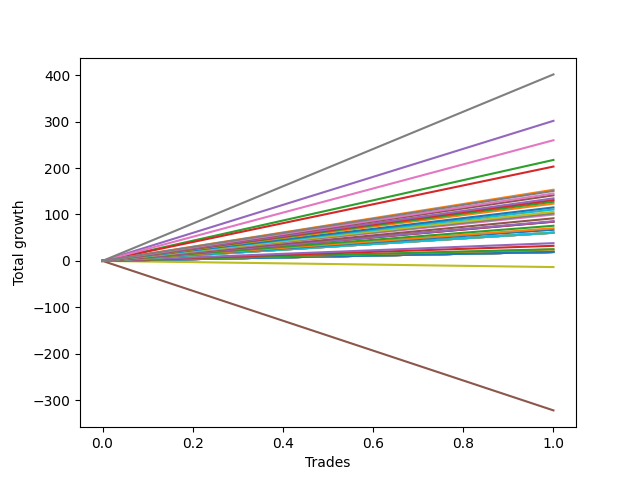

# Long Pointer 009 DB 
- Symbol: ES1y1d
- Date Range: 07/19/2021 - 07/07/2022
- Trading Period: 7:20-12:30
- Number of Trades: 1



| Name | Win Percent | Profit | Avg Profit / Trade | Avg Time / Trade | Avg Profit / Time |      | Name | Win Percent | Profit | Avg Profit / Trade | Avg Time / Trade | Avg Profit / Time |
| ---- | ----------- | ------ | ------------------ | ---------------- | ----------------- | ---- | ---- | ----------- | ------ | ------------------ | ---------------- | ----------------- |
| Sorted By <br> Profit | | | | | | | Sorted By <br> Win Percentage ||||||
| Seven | 100.00 | 200875.00 | 200875.00 | 19 05:14:00 | 10452.41 |     | Seven | 100.00 | 200875.00 | 200875.00 | 19 05:14:00 | 10452.41 |
| Four | 100.00 | 150875.00 | 150875.00 | 17 23:09:00 | 8398.47 |     | Four | 100.00 | 150875.00 | 150875.00 | 17 23:09:00 | 8398.47 |
| Six | 100.00 | 130000.00 | 130000.00 | 11 23:40:00 | 10845.89 |     | Six | 100.00 | 130000.00 | 130000.00 | 11 23:40:00 | 10845.89 |
| Two | 100.00 | 108750.00 | 108750.00 | 08 04:59:00 | 13249.85 |     | Two | 100.00 | 108750.00 | 108750.00 | 08 04:59:00 | 13249.85 |
| Three | 100.00 | 101625.00 | 101625.00 | 08 03:09:00 | 12498.08 |     | Three | 100.00 | 101625.00 | 101625.00 | 08 03:09:00 | 12498.08 |
| One | 100.00 | 76625.00 | 76625.00 | 07 03:08:00 | 10746.01 |     | One | 100.00 | 76625.00 | 76625.00 | 07 03:08:00 | 10746.01 |
| Zero | 100.00 | 42250.00 | 42250.00 | 05 23:18:00 | 7076.06 |     | Zero | 100.00 | 42250.00 | 42250.00 | 05 23:18:00 | 7076.06 |
| Ninety | 100.00 | 9625.00 | 9625.00 | 00 00:03:00 | 4620000.00 |     | Ninety | 100.00 | 9625.00 | 9625.00 | 00 00:03:00 | 4620000.00 |
| Eighty-Nine | 100.00 | 9625.00 | 9625.00 | 00 00:03:00 | 4620000.00 |     | Eighty-Nine | 100.00 | 9625.00 | 9625.00 | 00 00:03:00 | 4620000.00 |
| Eighty-Eight | 100.00 | 9625.00 | 9625.00 | 00 00:03:00 | 4620000.00 |     | Eighty-Eight | 100.00 | 9625.00 | 9625.00 | 00 00:03:00 | 4620000.00 |
| Eighty-Seven | 100.00 | 9625.00 | 9625.00 | 00 00:03:00 | 4620000.00 |     | Eighty-Seven | 100.00 | 9625.00 | 9625.00 | 00 00:03:00 | 4620000.00 |
| Eighty-Six | 100.00 | 9625.00 | 9625.00 | 00 00:03:00 | 4620000.00 |     | Eighty-Six | 100.00 | 9625.00 | 9625.00 | 00 00:03:00 | 4620000.00 |
| Eighty-Five | 100.00 | 9625.00 | 9625.00 | 00 00:03:00 | 4620000.00 |     | Eighty-Five | 100.00 | 9625.00 | 9625.00 | 00 00:03:00 | 4620000.00 |
| Eighty-Four | 100.00 | 9625.00 | 9625.00 | 00 00:03:00 | 4620000.00 |     | Eighty-Four | 100.00 | 9625.00 | 9625.00 | 00 00:03:00 | 4620000.00 |
| Eighty-Three | 100.00 | 9625.00 | 9625.00 | 00 00:03:00 | 4620000.00 |     | Eighty-Three | 100.00 | 9625.00 | 9625.00 | 00 00:03:00 | 4620000.00 |
| Eighty-Two | 100.00 | 9625.00 | 9625.00 | 00 00:03:00 | 4620000.00 |     | Eighty-Two | 100.00 | 9625.00 | 9625.00 | 00 00:03:00 | 4620000.00 |
| Eighty-One | 100.00 | 9625.00 | 9625.00 | 00 00:03:00 | 4620000.00 |     | Eighty-One | 100.00 | 9625.00 | 9625.00 | 00 00:03:00 | 4620000.00 |
| Seventy-Three | 0.00 | -6625.00 | -6625.00 | 05 01:01:00 | -1313.87 |     | Seventy-Three | 0.00 | -6625.00 | -6625.00 | 05 01:01:00 | -1313.87 |
| Five | 0.00 | -161000.00 | -161000.00 | 120 05:37:00 | -1339.06 |     | Five | 0.00 | -161000.00 | -161000.00 | 120 05:37:00 | -1339.06 |

## NO STOPLOSS

### Test Zero
* Sell when price hits the middle line of the 20p bollinger
* No Stoploss
* Results:
```
Total Trades: 1
Percent Up: 100.00
Percent Down: 0.00
Total Points Moved Up: 84.50
Potential Profit: 42250.00
Total Points Ups: 84.50 Count Ups: 1
Total Points Downs: 0.00 Count Downs: 0
```

<details><summary>Trades</summary>

<code>In: 2022-03-10 07:21:00		Out: 2022-03-16 06:39:00		Total Position Time: 05 23:18:00		Total Move Up: 84.50		Total to Date: 84.50</code> <br />


</details>

### Test One
* Sell when the price hits the upper line of the 20p 1std bollinger
* No Stoploss
* Results:
```
Total Trades: 1
Percent Up: 100.00
Percent Down: 0.00
Total Points Moved Up: 153.25
Potential Profit: 76625.00
Total Points Ups: 153.25 Count Ups: 1
Total Points Downs: 0.00 Count Downs: 0
```

<details><summary>Trades</summary>

<code>In: 2022-03-10 07:21:00		Out: 2022-03-17 10:29:00		Total Position Time: 07 03:08:00		Total Move Up: 153.25		Total to Date: 153.25</code> <br />


</details>

### Test Two
* Sell when the price hits the upper line of the 20p 2std bollinger
* No Stoploss
* Results:
```
Total Trades: 1
Percent Up: 100.00
Percent Down: 0.00
Total Points Moved Up: 217.50
Potential Profit: 108750.00
Total Points Ups: 217.50 Count Ups: 1
Total Points Downs: 0.00 Count Downs: 0
```

<details><summary>Trades</summary>

<code>In: 2022-03-10 07:21:00		Out: 2022-03-18 12:20:00		Total Position Time: 08 04:59:00		Total Move Up: 217.50		Total to Date: 217.50</code> <br />


</details>

### Test Three
* Sell when price hits the middle line of the 50p bollinger
* No Stoploss
* Results:
```
Total Trades: 1
Percent Up: 100.00
Percent Down: 0.00
Total Points Moved Up: 203.25
Potential Profit: 101625.00
Total Points Ups: 203.25 Count Ups: 1
Total Points Downs: 0.00 Count Downs: 0
```

<details><summary>Trades</summary>

<code>In: 2022-03-10 07:21:00		Out: 2022-03-18 10:30:00		Total Position Time: 08 03:09:00		Total Move Up: 203.25		Total to Date: 203.25</code> <br />


</details>

### Test Four
* Sell when the price hits the upper line of the 50p 1std bollinger
* No Stoploss
* Results:
```
Total Trades: 1
Percent Up: 100.00
Percent Down: 0.00
Total Points Moved Up: 301.75
Potential Profit: 150875.00
Total Points Ups: 301.75 Count Ups: 1
Total Points Downs: 0.00 Count Downs: 0
```

<details><summary>Trades</summary>

<code>In: 2022-03-10 07:21:00		Out: 2022-03-28 06:30:00		Total Position Time: 17 23:09:00		Total Move Up: 301.75		Total to Date: 301.75</code> <br />


</details>

### Test Five
* Sell when the price hits the upper line of the 50p 2std bollinger
* No Stoploss
* Results:
```
Total Trades: 1
Percent Up: 0.00
Percent Down: 100.00
Total Points Moved Up: -322.00
Potential Profit: -161000.00
Total Points Ups: 0.00 Count Ups: 0
Total Points Downs: -322.00 Count Downs: 1
```

<details><summary>Trades</summary>

<code>In: 2022-03-10 07:21:00		Out: 2022-07-08 12:58:00		Total Position Time: 120 05:37:00		Total Move Up: -322.00		Total to Date: -322.00</code> <br />


</details>

### Test Six
* Sell when the price hits the middle line of the 1std VWAP
* No Stoploss
* Results:
```
Total Trades: 1
Percent Up: 100.00
Percent Down: 0.00
Total Points Moved Up: 260.00
Potential Profit: 130000.00
Total Points Ups: 260.00 Count Ups: 1
Total Points Downs: 0.00 Count Downs: 0
```

<details><summary>Trades</summary>

<code>In: 2022-03-10 07:21:00		Out: 2022-03-22 07:01:00		Total Position Time: 11 23:40:00		Total Move Up: 260.00		Total to Date: 260.00</code> <br />


</details>

### Test Seven
* Sell when the price hits the upper line of the 1std VWAP
* No Stoploss
* Results:
```
Total Trades: 1
Percent Up: 100.00
Percent Down: 0.00
Total Points Moved Up: 401.75
Potential Profit: 200875.00
Total Points Ups: 401.75 Count Ups: 1
Total Points Downs: 0.00 Count Downs: 0
```

<details><summary>Trades</summary>

<code>In: 2022-03-10 07:21:00		Out: 2022-03-29 12:35:00		Total Position Time: 19 05:14:00		Total Move Up: 401.75		Total to Date: 401.75</code> <br />


</details>

## SPECIAL EXIT CONDITIONS 

### Test Seventy-Three
* Sell when the linear regression slope changes to negative
* No Stoploss
* Results:
```
Total Trades: 1
Percent Up: 0.00
Percent Down: 100.00
Total Points Moved Up: -13.25
Potential Profit: -6625.00
Total Points Ups: 0.00 Count Ups: 0
Total Points Downs: -13.25 Count Downs: 1
```

<details><summary>Trades</summary>

<code>In: 2022-03-10 07:21:00		Out: 2022-03-15 08:22:00		Total Position Time: 05 01:01:00		Total Move Up: -13.25		Total to Date: -13.25</code> <br />


</details>

## TAKE PROFIT

### Test Eighty-One
* Take Profit of 1 Point
* No Stoploss
* Results:
```
Total Trades: 1
Percent Up: 100.00
Percent Down: 0.00
Total Points Moved Up: 19.25
Potential Profit: 9625.00
Total Points Ups: 19.25 Count Ups: 1
Total Points Downs: 0.00 Count Downs: 0
```

<details><summary>Trades</summary>

<code>In: 2022-03-10 07:21:00		Out: 2022-03-10 07:24:00		Total Position Time: 00 00:03:00		Total Move Up: 19.25		Total to Date: 19.25</code> <br />


</details>

### Test Eighty-Two
* Take Profit of 2 Point
* No Stoploss
* Results:
```
Total Trades: 1
Percent Up: 100.00
Percent Down: 0.00
Total Points Moved Up: 19.25
Potential Profit: 9625.00
Total Points Ups: 19.25 Count Ups: 1
Total Points Downs: 0.00 Count Downs: 0
```

<details><summary>Trades</summary>

<code>In: 2022-03-10 07:21:00		Out: 2022-03-10 07:24:00		Total Position Time: 00 00:03:00		Total Move Up: 19.25		Total to Date: 19.25</code> <br />


</details>

### Test Eighty-Three
* Take Profit of 3 Point
* No Stoploss
* Results:
```
Total Trades: 1
Percent Up: 100.00
Percent Down: 0.00
Total Points Moved Up: 19.25
Potential Profit: 9625.00
Total Points Ups: 19.25 Count Ups: 1
Total Points Downs: 0.00 Count Downs: 0
```

<details><summary>Trades</summary>

<code>In: 2022-03-10 07:21:00		Out: 2022-03-10 07:24:00		Total Position Time: 00 00:03:00		Total Move Up: 19.25		Total to Date: 19.25</code> <br />


</details>

### Test Eighty-Four
* Take Profit of 4 Point
* No Stoploss
* Results:
```
Total Trades: 1
Percent Up: 100.00
Percent Down: 0.00
Total Points Moved Up: 19.25
Potential Profit: 9625.00
Total Points Ups: 19.25 Count Ups: 1
Total Points Downs: 0.00 Count Downs: 0
```

<details><summary>Trades</summary>

<code>In: 2022-03-10 07:21:00		Out: 2022-03-10 07:24:00		Total Position Time: 00 00:03:00		Total Move Up: 19.25		Total to Date: 19.25</code> <br />


</details>

### Test Eighty-Five
* Take Profit of 5 Point
* No Stoploss
* Results:
```
Total Trades: 1
Percent Up: 100.00
Percent Down: 0.00
Total Points Moved Up: 19.25
Potential Profit: 9625.00
Total Points Ups: 19.25 Count Ups: 1
Total Points Downs: 0.00 Count Downs: 0
```

<details><summary>Trades</summary>

<code>In: 2022-03-10 07:21:00		Out: 2022-03-10 07:24:00		Total Position Time: 00 00:03:00		Total Move Up: 19.25		Total to Date: 19.25</code> <br />


</details>

### Test Eighty-Six
* Take Profit of 6 Point
* No Stoploss
* Results:
```
Total Trades: 1
Percent Up: 100.00
Percent Down: 0.00
Total Points Moved Up: 19.25
Potential Profit: 9625.00
Total Points Ups: 19.25 Count Ups: 1
Total Points Downs: 0.00 Count Downs: 0
```

<details><summary>Trades</summary>

<code>In: 2022-03-10 07:21:00		Out: 2022-03-10 07:24:00		Total Position Time: 00 00:03:00		Total Move Up: 19.25		Total to Date: 19.25</code> <br />


</details>

### Test Eighty-Seven
* Take Profit of 7 Point
* No Stoploss
* Results:
```
Total Trades: 1
Percent Up: 100.00
Percent Down: 0.00
Total Points Moved Up: 19.25
Potential Profit: 9625.00
Total Points Ups: 19.25 Count Ups: 1
Total Points Downs: 0.00 Count Downs: 0
```

<details><summary>Trades</summary>

<code>In: 2022-03-10 07:21:00		Out: 2022-03-10 07:24:00		Total Position Time: 00 00:03:00		Total Move Up: 19.25		Total to Date: 19.25</code> <br />


</details>

### Test Eighty-Eight
* Take Profit of 8 Point
* No Stoploss
* Results:
```
Total Trades: 1
Percent Up: 100.00
Percent Down: 0.00
Total Points Moved Up: 19.25
Potential Profit: 9625.00
Total Points Ups: 19.25 Count Ups: 1
Total Points Downs: 0.00 Count Downs: 0
```

<details><summary>Trades</summary>

<code>In: 2022-03-10 07:21:00		Out: 2022-03-10 07:24:00		Total Position Time: 00 00:03:00		Total Move Up: 19.25		Total to Date: 19.25</code> <br />


</details>

### Test Eighty-Nine
* Take Profit of 9 Point
* No Stoploss
* Results:
```
Total Trades: 1
Percent Up: 100.00
Percent Down: 0.00
Total Points Moved Up: 19.25
Potential Profit: 9625.00
Total Points Ups: 19.25 Count Ups: 1
Total Points Downs: 0.00 Count Downs: 0
```

<details><summary>Trades</summary>

<code>In: 2022-03-10 07:21:00		Out: 2022-03-10 07:24:00		Total Position Time: 00 00:03:00		Total Move Up: 19.25		Total to Date: 19.25</code> <br />


</details>

### Test Ninety
* Take Profit of 10 Point
* No Stoploss
* Results:
```
Total Trades: 1
Percent Up: 100.00
Percent Down: 0.00
Total Points Moved Up: 19.25
Potential Profit: 9625.00
Total Points Ups: 19.25 Count Ups: 1
Total Points Downs: 0.00 Count Downs: 0
```

<details><summary>Trades</summary>

<code>In: 2022-03-10 07:21:00		Out: 2022-03-10 07:24:00		Total Position Time: 00 00:03:00		Total Move Up: 19.25		Total to Date: 19.25</code> <br />


</details>