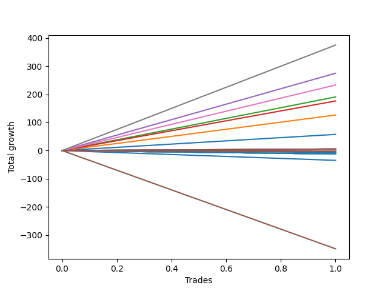

# Long Pointer 009 
- Symbol: ES1y1d
- Date Range: 07/19/2021 - 07/15/2022
- Trading Period: 7:20-12:30
- Number of Trades: 1



| Name | Win Percent | Profit | Avg Profit / Trade | Avg Time / Trade |      | Name | Win Percent | Profit | Avg Profit / Trade | Avg Time / Trade |
| ---- | ----------- | ------ | ------------------ | ---------------- | ---- | ---- | ----------- | ------ | ------------------ | ---------------- |
| Sorted By <br> Profit | | | | | | Sorted By <br> Win Percentage ||||
| Seven | 100.00 | 200875.00 | 200875.00 | 00:00 |     | Seven | 100.00 | 200875.00 | 200875.00 | 00:00 |
| Four | 100.00 | 158500.00 | 158500.00 | 00:00 |     | Four | 100.00 | 158500.00 | 158500.00 | 00:00 |
| Six | 100.00 | 130000.00 | 130000.00 | 00:00 |     | Six | 100.00 | 130000.00 | 130000.00 | 00:00 |
| Two | 100.00 | 115875.00 | 115875.00 | 00:00 |     | Two | 100.00 | 115875.00 | 115875.00 | 00:00 |
| Three | 100.00 | 105375.00 | 105375.00 | 00:00 |     | Three | 100.00 | 105375.00 | 105375.00 | 00:00 |
| One | 100.00 | 82250.00 | 82250.00 | 00:00 |     | One | 100.00 | 82250.00 | 82250.00 | 00:00 |
| Zero | 100.00 | 49875.00 | 49875.00 | 00:00 |     | Zero | 100.00 | 49875.00 | 49875.00 | 00:00 |
| Fifty-Five | 100.00 | 15875.00 | 15875.00 | 00:00 |     | Fifty-Five | 100.00 | 15875.00 | 15875.00 | 00:00 |
| Fifty-Four | 100.00 | 15875.00 | 15875.00 | 00:00 |     | Fifty-Four | 100.00 | 15875.00 | 15875.00 | 00:00 |
| Fifty-Three | 100.00 | 15875.00 | 15875.00 | 00:00 |     | Fifty-Three | 100.00 | 15875.00 | 15875.00 | 00:00 |
| Fifty-Two | 100.00 | 15875.00 | 15875.00 | 00:00 |     | Fifty-Two | 100.00 | 15875.00 | 15875.00 | 00:00 |
| Fifty-One | 100.00 | 15875.00 | 15875.00 | 00:00 |     | Fifty-One | 100.00 | 15875.00 | 15875.00 | 00:00 |
| Fifty | 100.00 | 15875.00 | 15875.00 | 00:00 |     | Fifty | 100.00 | 15875.00 | 15875.00 | 00:00 |
| Forty-Nine | 100.00 | 15875.00 | 15875.00 | 00:00 |     | Forty-Nine | 100.00 | 15875.00 | 15875.00 | 00:00 |
| Forty-Eight | 100.00 | 15875.00 | 15875.00 | 00:00 |     | Forty-Eight | 100.00 | 15875.00 | 15875.00 | 00:00 |
| One Hundred Thirty | 100.00 | 14125.00 | 14125.00 | 00:00 |     | One Hundred Thirty | 100.00 | 14125.00 | 14125.00 | 00:00 |
| One Hundred Twenty-Nine | 100.00 | 14125.00 | 14125.00 | 00:00 |     | One Hundred Twenty-Nine | 100.00 | 14125.00 | 14125.00 | 00:00 |
| One Hundred Twenty-Eight | 100.00 | 14125.00 | 14125.00 | 00:00 |     | One Hundred Twenty-Eight | 100.00 | 14125.00 | 14125.00 | 00:00 |
| One Hundred Twenty-Seven | 100.00 | 14125.00 | 14125.00 | 00:00 |     | One Hundred Twenty-Seven | 100.00 | 14125.00 | 14125.00 | 00:00 |
| One Hundred Twenty-Six | 100.00 | 14125.00 | 14125.00 | 00:00 |     | One Hundred Twenty-Six | 100.00 | 14125.00 | 14125.00 | 00:00 |
| One Hundred Twenty-Five | 100.00 | 14125.00 | 14125.00 | 00:00 |     | One Hundred Twenty-Five | 100.00 | 14125.00 | 14125.00 | 00:00 |
| One Hundred Twenty-Four | 100.00 | 14125.00 | 14125.00 | 00:00 |     | One Hundred Twenty-Four | 100.00 | 14125.00 | 14125.00 | 00:00 |
| One Hundred Twenty-Three | 100.00 | 14125.00 | 14125.00 | 00:00 |     | One Hundred Twenty-Three | 100.00 | 14125.00 | 14125.00 | 00:00 |
| One Hundred Twenty-Two | 100.00 | 14125.00 | 14125.00 | 00:00 |     | One Hundred Twenty-Two | 100.00 | 14125.00 | 14125.00 | 00:00 |
| One Hundred Twenty-One | 100.00 | 14125.00 | 14125.00 | 00:00 |     | One Hundred Twenty-One | 100.00 | 14125.00 | 14125.00 | 00:00 |
| One Hundred Twenty | 100.00 | 14125.00 | 14125.00 | 00:00 |     | One Hundred Twenty | 100.00 | 14125.00 | 14125.00 | 00:00 |
| One Hundred Ninteen | 100.00 | 14125.00 | 14125.00 | 00:00 |     | One Hundred Ninteen | 100.00 | 14125.00 | 14125.00 | 00:00 |
| One Hundred Eighteen | 100.00 | 14125.00 | 14125.00 | 00:00 |     | One Hundred Eighteen | 100.00 | 14125.00 | 14125.00 | 00:00 |
| One Hundred Seventeen | 100.00 | 14125.00 | 14125.00 | 00:00 |     | One Hundred Seventeen | 100.00 | 14125.00 | 14125.00 | 00:00 |
| One Hundred Sixteen | 100.00 | 14125.00 | 14125.00 | 00:00 |     | One Hundred Sixteen | 100.00 | 14125.00 | 14125.00 | 00:00 |
| One Hundred Fifteen | 100.00 | 14125.00 | 14125.00 | 00:00 |     | One Hundred Fifteen | 100.00 | 14125.00 | 14125.00 | 00:00 |
| One Hundred Fourteen | 100.00 | 14125.00 | 14125.00 | 00:00 |     | One Hundred Fourteen | 100.00 | 14125.00 | 14125.00 | 00:00 |
| One Hundred Thirteen | 100.00 | 14125.00 | 14125.00 | 00:00 |     | One Hundred Thirteen | 100.00 | 14125.00 | 14125.00 | 00:00 |
| One Hundred Twelve | 100.00 | 14125.00 | 14125.00 | 00:00 |     | One Hundred Twelve | 100.00 | 14125.00 | 14125.00 | 00:00 |
| One Hundred Eleven | 100.00 | 14125.00 | 14125.00 | 00:00 |     | One Hundred Eleven | 100.00 | 14125.00 | 14125.00 | 00:00 |
| Eighty-Five | 100.00 | 14125.00 | 14125.00 | 00:00 |     | Eighty-Five | 100.00 | 14125.00 | 14125.00 | 00:00 |
| Eighty-Four | 100.00 | 14125.00 | 14125.00 | 00:00 |     | Eighty-Four | 100.00 | 14125.00 | 14125.00 | 00:00 |
| Eighty-Three | 100.00 | 14125.00 | 14125.00 | 00:00 |     | Eighty-Three | 100.00 | 14125.00 | 14125.00 | 00:00 |
| Eighty-Two | 100.00 | 14125.00 | 14125.00 | 00:00 |     | Eighty-Two | 100.00 | 14125.00 | 14125.00 | 00:00 |
| Eighty-One | 100.00 | 14125.00 | 14125.00 | 00:00 |     | Eighty-One | 100.00 | 14125.00 | 14125.00 | 00:00 |
| Seventy-One | 100.00 | 13000.00 | 13000.00 | 00:00 |     | Seventy-One | 100.00 | 13000.00 | 13000.00 | 00:00 |
| Seventy | 100.00 | 13000.00 | 13000.00 | 00:00 |     | Seventy | 100.00 | 13000.00 | 13000.00 | 00:00 |
| Sixty-Nine | 100.00 | 13000.00 | 13000.00 | 00:00 |     | Sixty-Nine | 100.00 | 13000.00 | 13000.00 | 00:00 |
| Sixty-Eight | 100.00 | 13000.00 | 13000.00 | 00:00 |     | Sixty-Eight | 100.00 | 13000.00 | 13000.00 | 00:00 |
| Sixty-Seven | 100.00 | 13000.00 | 13000.00 | 00:00 |     | Sixty-Seven | 100.00 | 13000.00 | 13000.00 | 00:00 |
| Sixty-Six | 100.00 | 13000.00 | 13000.00 | 00:00 |     | Sixty-Six | 100.00 | 13000.00 | 13000.00 | 00:00 |
| Sixty-Five | 100.00 | 13000.00 | 13000.00 | 00:00 |     | Sixty-Five | 100.00 | 13000.00 | 13000.00 | 00:00 |
| Sixty-Four | 100.00 | 13000.00 | 13000.00 | 00:00 |     | Sixty-Four | 100.00 | 13000.00 | 13000.00 | 00:00 |
| Forty-Seven | 0.00 | -2625.00 | -2625.00 | 00:00 |     | Forty-Seven | 0.00 | -2625.00 | -2625.00 | 00:00 |
| Forty-Six | 0.00 | -2625.00 | -2625.00 | 00:00 |     | Forty-Six | 0.00 | -2625.00 | -2625.00 | 00:00 |
| Forty-Five | 0.00 | -2625.00 | -2625.00 | 00:00 |     | Forty-Five | 0.00 | -2625.00 | -2625.00 | 00:00 |
| Forty-Four | 0.00 | -2625.00 | -2625.00 | 00:00 |     | Forty-Four | 0.00 | -2625.00 | -2625.00 | 00:00 |
| Forty-Three | 0.00 | -2625.00 | -2625.00 | 00:00 |     | Forty-Three | 0.00 | -2625.00 | -2625.00 | 00:00 |
| Forty-Two | 0.00 | -2625.00 | -2625.00 | 00:00 |     | Forty-Two | 0.00 | -2625.00 | -2625.00 | 00:00 |
| Forty-One | 0.00 | -2625.00 | -2625.00 | 00:00 |     | Forty-One | 0.00 | -2625.00 | -2625.00 | 00:00 |
| Forty | 0.00 | -2625.00 | -2625.00 | 00:00 |     | Forty | 0.00 | -2625.00 | -2625.00 | 00:00 |
| Sixty-Three | 0.00 | -5625.00 | -5625.00 | 00:00 |     | Sixty-Three | 0.00 | -5625.00 | -5625.00 | 00:00 |
| Sixty-Two | 0.00 | -5625.00 | -5625.00 | 00:00 |     | Sixty-Two | 0.00 | -5625.00 | -5625.00 | 00:00 |
| Sixty-One | 0.00 | -5625.00 | -5625.00 | 00:00 |     | Sixty-One | 0.00 | -5625.00 | -5625.00 | 00:00 |
| Sixty | 0.00 | -5625.00 | -5625.00 | 00:00 |     | Sixty | 0.00 | -5625.00 | -5625.00 | 00:00 |
| Fifty-Nine | 0.00 | -5625.00 | -5625.00 | 00:00 |     | Fifty-Nine | 0.00 | -5625.00 | -5625.00 | 00:00 |
| Fifty-Eight | 0.00 | -5625.00 | -5625.00 | 00:00 |     | Fifty-Eight | 0.00 | -5625.00 | -5625.00 | 00:00 |
| Fifty-Seven | 0.00 | -5625.00 | -5625.00 | 00:00 |     | Fifty-Seven | 0.00 | -5625.00 | -5625.00 | 00:00 |
| Fifty-Six | 0.00 | -5625.00 | -5625.00 | 00:00 |     | Fifty-Six | 0.00 | -5625.00 | -5625.00 | 00:00 |
| Seventy-Three | 0.00 | -6625.00 | -6625.00 | 00:00 |     | Seventy-Three | 0.00 | -6625.00 | -6625.00 | 00:00 |
| Five | 0.00 | -161000.00 | -161000.00 | 00:00 |     | Five | 0.00 | -161000.00 | -161000.00 | 00:00 |

## NO STOPLOSS

### Test Zero
* Sell when price hits the middle line of the 20p bollinger
* No Stoploss
* Results:
```
Total Trades: 1
Percent Up: 100.00
Percent Down: 0.00
Total Points Moved Up: 99.75
Potential Profit: 49875.00
Total Points Ups: 99.75 Count Ups: 1
Total Points Downs: 0.00 Count Downs: 0
```

<details><summary>Trades</summary>

<code>In: 2022-03-10 07:21:00		Out: 2022-03-16 07:16:00		Total Position Time: 1435:00		Total Move Up: 99.75		Total to Date: 99.75</code> <br />


</details>

### Test One
* Sell when the price hits the upper line of the 20p 1std bollinger
* No Stoploss
* Results:
```
Total Trades: 1
Percent Up: 100.00
Percent Down: 0.00
Total Points Moved Up: 164.50
Potential Profit: 82250.00
Total Points Ups: 164.50 Count Ups: 1
Total Points Downs: 0.00 Count Downs: 0
```

<details><summary>Trades</summary>

<code>In: 2022-03-10 07:21:00		Out: 2022-03-17 10:52:00		Total Position Time: 211:00		Total Move Up: 164.50		Total to Date: 164.50</code> <br />


</details>

### Test Two
* Sell when the price hits the upper line of the 20p 2std bollinger
* No Stoploss
* Results:
```
Total Trades: 1
Percent Up: 100.00
Percent Down: 0.00
Total Points Moved Up: 231.75
Potential Profit: 115875.00
Total Points Ups: 231.75 Count Ups: 1
Total Points Downs: 0.00 Count Downs: 0
```

<details><summary>Trades</summary>

<code>In: 2022-03-10 07:21:00		Out: 2022-03-21 06:33:00		Total Position Time: 1392:00		Total Move Up: 231.75		Total to Date: 231.75</code> <br />


</details>

### Test Three
* Sell when price hits the middle line of the 50p bollinger
* No Stoploss
* Results:
```
Total Trades: 1
Percent Up: 100.00
Percent Down: 0.00
Total Points Moved Up: 210.75
Potential Profit: 105375.00
Total Points Ups: 210.75 Count Ups: 1
Total Points Downs: 0.00 Count Downs: 0
```

<details><summary>Trades</summary>

<code>In: 2022-03-10 07:21:00		Out: 2022-03-18 12:09:00		Total Position Time: 288:00		Total Move Up: 210.75		Total to Date: 210.75</code> <br />


</details>

### Test Four
* Sell when the price hits the upper line of the 50p 1std bollinger
* No Stoploss
* Results:
```
Total Trades: 1
Percent Up: 100.00
Percent Down: 0.00
Total Points Moved Up: 317.00
Potential Profit: 158500.00
Total Points Ups: 317.00 Count Ups: 1
Total Points Downs: 0.00 Count Downs: 0
```

<details><summary>Trades</summary>

<code>In: 2022-03-10 07:21:00		Out: 2022-03-28 07:00:00		Total Position Time: 1419:00		Total Move Up: 317.00		Total to Date: 317.00</code> <br />


</details>

### Test Five
* Sell when the price hits the upper line of the 50p 2std bollinger
* No Stoploss
* Results:
```
Total Trades: 1
Percent Up: 0.00
Percent Down: 100.00
Total Points Moved Up: -322.00
Potential Profit: -161000.00
Total Points Ups: 0.00 Count Ups: 0
Total Points Downs: -322.00 Count Downs: 1
```

<details><summary>Trades</summary>

<code>In: 2022-03-10 07:21:00		Out: 2022-07-08 12:58:00		Total Position Time: 337:00		Total Move Up: -322.00		Total to Date: -322.00</code> <br />


</details>

### Test Six
* Sell when the price hits the middle line of the 1std VWAP
* No Stoploss
* Results:
```
Total Trades: 1
Percent Up: 100.00
Percent Down: 0.00
Total Points Moved Up: 260.00
Potential Profit: 130000.00
Total Points Ups: 260.00 Count Ups: 1
Total Points Downs: 0.00 Count Downs: 0
```

<details><summary>Trades</summary>

<code>In: 2022-03-10 07:21:00		Out: 2022-03-22 07:01:00		Total Position Time: 1420:00		Total Move Up: 260.00		Total to Date: 260.00</code> <br />


</details>

### Test Seven
* Sell when the price hits the upper line of the 1std VWAP
* No Stoploss
* Results:
```
Total Trades: 1
Percent Up: 100.00
Percent Down: 0.00
Total Points Moved Up: 401.75
Potential Profit: 200875.00
Total Points Ups: 401.75 Count Ups: 1
Total Points Downs: 0.00 Count Downs: 0
```

<details><summary>Trades</summary>

<code>In: 2022-03-10 07:21:00		Out: 2022-03-29 12:35:00		Total Position Time: 314:00		Total Move Up: 401.75		Total to Date: 401.75</code> <br />


</details>

## STOPLOSS OF 5

### Test Forty
* Sell when price hits the middle line of the 20p bollinger
* Stoploss is 5 points
* Results:
```
Total Trades: 1
Percent Up: 0.00
Percent Down: 100.00
Total Points Moved Up: -5.25
Potential Profit: -2625.00
Total Points Ups: 0.00 Count Ups: 0
Total Points Downs: -5.25 Count Downs: 1
```

<details><summary>Trades</summary>

<code>In: 2022-03-10 07:21:00		Out: 2022-03-11 12:30:00		Total Position Time: 309:00		Total Move Up: -5.25		Total to Date: -5.25</code> <br />


</details>

### Test Forty-One
* Sell when the price hits the upper line of the 20p 1std bollinger
* Stoploss is 5 points
* Results:
```
Total Trades: 1
Percent Up: 0.00
Percent Down: 100.00
Total Points Moved Up: -5.25
Potential Profit: -2625.00
Total Points Ups: 0.00 Count Ups: 0
Total Points Downs: -5.25 Count Downs: 1
```

<details><summary>Trades</summary>

<code>In: 2022-03-10 07:21:00		Out: 2022-03-11 12:30:00		Total Position Time: 309:00		Total Move Up: -5.25		Total to Date: -5.25</code> <br />


</details>

### Test Forty-Two
* Sell when the price hits the upper line of the 20p 2std bollinger
* Stoploss is 5 points
* Results:
```
Total Trades: 1
Percent Up: 0.00
Percent Down: 100.00
Total Points Moved Up: -5.25
Potential Profit: -2625.00
Total Points Ups: 0.00 Count Ups: 0
Total Points Downs: -5.25 Count Downs: 1
```

<details><summary>Trades</summary>

<code>In: 2022-03-10 07:21:00		Out: 2022-03-11 12:30:00		Total Position Time: 309:00		Total Move Up: -5.25		Total to Date: -5.25</code> <br />


</details>

### Test Forty-Three
* Sell when price hits the middle line of the 50p bollinger
* Stoploss is 5 points
* Results:
```
Total Trades: 1
Percent Up: 0.00
Percent Down: 100.00
Total Points Moved Up: -5.25
Potential Profit: -2625.00
Total Points Ups: 0.00 Count Ups: 0
Total Points Downs: -5.25 Count Downs: 1
```

<details><summary>Trades</summary>

<code>In: 2022-03-10 07:21:00		Out: 2022-03-11 12:30:00		Total Position Time: 309:00		Total Move Up: -5.25		Total to Date: -5.25</code> <br />


</details>

### Test Forty-Four
* Sell when the price hits the upper line of the 50p 1std bollinger
* Stoploss is 5 points
* Results:
```
Total Trades: 1
Percent Up: 0.00
Percent Down: 100.00
Total Points Moved Up: -5.25
Potential Profit: -2625.00
Total Points Ups: 0.00 Count Ups: 0
Total Points Downs: -5.25 Count Downs: 1
```

<details><summary>Trades</summary>

<code>In: 2022-03-10 07:21:00		Out: 2022-03-11 12:30:00		Total Position Time: 309:00		Total Move Up: -5.25		Total to Date: -5.25</code> <br />


</details>

### Test Forty-Five
* Sell when the price hits the upper line of the 50p 2std bollinger
* Stoploss is 5 points
* Results:
```
Total Trades: 1
Percent Up: 0.00
Percent Down: 100.00
Total Points Moved Up: -5.25
Potential Profit: -2625.00
Total Points Ups: 0.00 Count Ups: 0
Total Points Downs: -5.25 Count Downs: 1
```

<details><summary>Trades</summary>

<code>In: 2022-03-10 07:21:00		Out: 2022-03-11 12:30:00		Total Position Time: 309:00		Total Move Up: -5.25		Total to Date: -5.25</code> <br />


</details>

### Test Forty-Six
* Sell when the price hits the middle line of the 1std VWAP
* Stoploss is 5 points
* Results:
```
Total Trades: 1
Percent Up: 0.00
Percent Down: 100.00
Total Points Moved Up: -5.25
Potential Profit: -2625.00
Total Points Ups: 0.00 Count Ups: 0
Total Points Downs: -5.25 Count Downs: 1
```

<details><summary>Trades</summary>

<code>In: 2022-03-10 07:21:00		Out: 2022-03-11 12:30:00		Total Position Time: 309:00		Total Move Up: -5.25		Total to Date: -5.25</code> <br />


</details>

### Test Forty-Seven
* Sell when the price hits the upper line of the 1std VWAP
* Stoploss is 5 points
* Results:
```
Total Trades: 1
Percent Up: 0.00
Percent Down: 100.00
Total Points Moved Up: -5.25
Potential Profit: -2625.00
Total Points Ups: 0.00 Count Ups: 0
Total Points Downs: -5.25 Count Downs: 1
```

<details><summary>Trades</summary>

<code>In: 2022-03-10 07:21:00		Out: 2022-03-11 12:30:00		Total Position Time: 309:00		Total Move Up: -5.25		Total to Date: -5.25</code> <br />


</details>

## TRAIL STOP OF 5

### Test Forty-Eight
* Sell when price hits the middle line of the 20p bollinger
* Trailing Stop is 5 points
* Results:
```
Total Trades: 1
Percent Up: 100.00
Percent Down: 0.00
Total Points Moved Up: 31.75
Potential Profit: 15875.00
Total Points Ups: 31.75 Count Ups: 1
Total Points Downs: 0.00 Count Downs: 0
```

<details><summary>Trades</summary>

<code>In: 2022-03-10 07:21:00		Out: 2022-03-11 07:30:00		Total Position Time: 09:00		Total Move Up: 31.75		Total to Date: 31.75</code> <br />


</details>

### Test Forty-Nine
* Sell when the price hits the upper line of the 20p 1std bollinger
* Trailing Stop is 5 points
* Results:
```
Total Trades: 1
Percent Up: 100.00
Percent Down: 0.00
Total Points Moved Up: 31.75
Potential Profit: 15875.00
Total Points Ups: 31.75 Count Ups: 1
Total Points Downs: 0.00 Count Downs: 0
```

<details><summary>Trades</summary>

<code>In: 2022-03-10 07:21:00		Out: 2022-03-11 07:30:00		Total Position Time: 09:00		Total Move Up: 31.75		Total to Date: 31.75</code> <br />


</details>

### Test Fifty
* Sell when the price hits the upper line of the 20p 2std bollinger
* Trailing Stop is 5 points
* Results:
```
Total Trades: 1
Percent Up: 100.00
Percent Down: 0.00
Total Points Moved Up: 31.75
Potential Profit: 15875.00
Total Points Ups: 31.75 Count Ups: 1
Total Points Downs: 0.00 Count Downs: 0
```

<details><summary>Trades</summary>

<code>In: 2022-03-10 07:21:00		Out: 2022-03-11 07:30:00		Total Position Time: 09:00		Total Move Up: 31.75		Total to Date: 31.75</code> <br />


</details>

### Test Fifty-One
* Sell when price hits the middle line of the 50p bollinger
* Trailing Stop is 5 points
* Results:
```
Total Trades: 1
Percent Up: 100.00
Percent Down: 0.00
Total Points Moved Up: 31.75
Potential Profit: 15875.00
Total Points Ups: 31.75 Count Ups: 1
Total Points Downs: 0.00 Count Downs: 0
```

<details><summary>Trades</summary>

<code>In: 2022-03-10 07:21:00		Out: 2022-03-11 07:30:00		Total Position Time: 09:00		Total Move Up: 31.75		Total to Date: 31.75</code> <br />


</details>

### Test Fifty-Two
* Sell when the price hits the upper line of the 50p 1std bollinger
* Trailing Stop is 5 points
* Results:
```
Total Trades: 1
Percent Up: 100.00
Percent Down: 0.00
Total Points Moved Up: 31.75
Potential Profit: 15875.00
Total Points Ups: 31.75 Count Ups: 1
Total Points Downs: 0.00 Count Downs: 0
```

<details><summary>Trades</summary>

<code>In: 2022-03-10 07:21:00		Out: 2022-03-11 07:30:00		Total Position Time: 09:00		Total Move Up: 31.75		Total to Date: 31.75</code> <br />


</details>

### Test Fifty-Three
* Sell when the price hits the upper line of the 50p 2std bollinger
* Trailing Stop is 5 points
* Results:
```
Total Trades: 1
Percent Up: 100.00
Percent Down: 0.00
Total Points Moved Up: 31.75
Potential Profit: 15875.00
Total Points Ups: 31.75 Count Ups: 1
Total Points Downs: 0.00 Count Downs: 0
```

<details><summary>Trades</summary>

<code>In: 2022-03-10 07:21:00		Out: 2022-03-11 07:30:00		Total Position Time: 09:00		Total Move Up: 31.75		Total to Date: 31.75</code> <br />


</details>

### Test Fifty-Four
* Sell when the price hits the middle line of the 1std VWAP
* Trailing Stop is 5 points
* Results:
```
Total Trades: 1
Percent Up: 100.00
Percent Down: 0.00
Total Points Moved Up: 31.75
Potential Profit: 15875.00
Total Points Ups: 31.75 Count Ups: 1
Total Points Downs: 0.00 Count Downs: 0
```

<details><summary>Trades</summary>

<code>In: 2022-03-10 07:21:00		Out: 2022-03-11 07:30:00		Total Position Time: 09:00		Total Move Up: 31.75		Total to Date: 31.75</code> <br />


</details>

### Test Fifty-Five
* Sell when the price hits the upper line of the 1std VWAP
* Trailing Stop is 5 points
* Results:
```
Total Trades: 1
Percent Up: 100.00
Percent Down: 0.00
Total Points Moved Up: 31.75
Potential Profit: 15875.00
Total Points Ups: 31.75 Count Ups: 1
Total Points Downs: 0.00 Count Downs: 0
```

<details><summary>Trades</summary>

<code>In: 2022-03-10 07:21:00		Out: 2022-03-11 07:30:00		Total Position Time: 09:00		Total Move Up: 31.75		Total to Date: 31.75</code> <br />


</details>

## STOPLOSS OF 10

### Test Fifty-Six
* Sell when price hits the middle line of the 20p bollinger
* Stoploss is 10 points
* Results:
```
Total Trades: 1
Percent Up: 0.00
Percent Down: 100.00
Total Points Moved Up: -11.25
Potential Profit: -5625.00
Total Points Ups: 0.00 Count Ups: 0
Total Points Downs: -11.25 Count Downs: 1
```

<details><summary>Trades</summary>

<code>In: 2022-03-10 07:21:00		Out: 2022-03-11 12:33:00		Total Position Time: 312:00		Total Move Up: -11.25		Total to Date: -11.25</code> <br />


</details>

### Test Fifty-Seven
* Sell when the price hits the upper line of the 20p 1std bollinger
* Stoploss is 10 points
* Results:
```
Total Trades: 1
Percent Up: 0.00
Percent Down: 100.00
Total Points Moved Up: -11.25
Potential Profit: -5625.00
Total Points Ups: 0.00 Count Ups: 0
Total Points Downs: -11.25 Count Downs: 1
```

<details><summary>Trades</summary>

<code>In: 2022-03-10 07:21:00		Out: 2022-03-11 12:33:00		Total Position Time: 312:00		Total Move Up: -11.25		Total to Date: -11.25</code> <br />


</details>

### Test Fifty-Eight
* Sell when the price hits the upper line of the 20p 2std bollinger
* Stoploss is 10 points
* Results:
```
Total Trades: 1
Percent Up: 0.00
Percent Down: 100.00
Total Points Moved Up: -11.25
Potential Profit: -5625.00
Total Points Ups: 0.00 Count Ups: 0
Total Points Downs: -11.25 Count Downs: 1
```

<details><summary>Trades</summary>

<code>In: 2022-03-10 07:21:00		Out: 2022-03-11 12:33:00		Total Position Time: 312:00		Total Move Up: -11.25		Total to Date: -11.25</code> <br />


</details>

### Test Fifty-Nine
* Sell when price hits the middle line of the 50p bollinger
* Stoploss is 10 points
* Results:
```
Total Trades: 1
Percent Up: 0.00
Percent Down: 100.00
Total Points Moved Up: -11.25
Potential Profit: -5625.00
Total Points Ups: 0.00 Count Ups: 0
Total Points Downs: -11.25 Count Downs: 1
```

<details><summary>Trades</summary>

<code>In: 2022-03-10 07:21:00		Out: 2022-03-11 12:33:00		Total Position Time: 312:00		Total Move Up: -11.25		Total to Date: -11.25</code> <br />


</details>

### Test Sixty
* Sell when the price hits the upper line of the 50p 1std bollinger
* Stoploss is 10 points
* Results:
```
Total Trades: 1
Percent Up: 0.00
Percent Down: 100.00
Total Points Moved Up: -11.25
Potential Profit: -5625.00
Total Points Ups: 0.00 Count Ups: 0
Total Points Downs: -11.25 Count Downs: 1
```

<details><summary>Trades</summary>

<code>In: 2022-03-10 07:21:00		Out: 2022-03-11 12:33:00		Total Position Time: 312:00		Total Move Up: -11.25		Total to Date: -11.25</code> <br />


</details>

### Test Sixty-One
* Sell when the price hits the upper line of the 50p 2std bollinger
* Stoploss is 10 points
* Results:
```
Total Trades: 1
Percent Up: 0.00
Percent Down: 100.00
Total Points Moved Up: -11.25
Potential Profit: -5625.00
Total Points Ups: 0.00 Count Ups: 0
Total Points Downs: -11.25 Count Downs: 1
```

<details><summary>Trades</summary>

<code>In: 2022-03-10 07:21:00		Out: 2022-03-11 12:33:00		Total Position Time: 312:00		Total Move Up: -11.25		Total to Date: -11.25</code> <br />


</details>

### Test Sixty-Two
* Sell when the price hits the middle line of the 1std VWAP
* Stoploss is 10 points
* Results:
```
Total Trades: 1
Percent Up: 0.00
Percent Down: 100.00
Total Points Moved Up: -11.25
Potential Profit: -5625.00
Total Points Ups: 0.00 Count Ups: 0
Total Points Downs: -11.25 Count Downs: 1
```

<details><summary>Trades</summary>

<code>In: 2022-03-10 07:21:00		Out: 2022-03-11 12:33:00		Total Position Time: 312:00		Total Move Up: -11.25		Total to Date: -11.25</code> <br />


</details>

### Test Sixty-Three
* Sell when the price hits the upper line of the 1std VWAP
* Stoploss is 10 points
* Results:
```
Total Trades: 1
Percent Up: 0.00
Percent Down: 100.00
Total Points Moved Up: -11.25
Potential Profit: -5625.00
Total Points Ups: 0.00 Count Ups: 0
Total Points Downs: -11.25 Count Downs: 1
```

<details><summary>Trades</summary>

<code>In: 2022-03-10 07:21:00		Out: 2022-03-11 12:33:00		Total Position Time: 312:00		Total Move Up: -11.25		Total to Date: -11.25</code> <br />


</details>

## TRAIL STOP OF 10

### Test Sixty-Four
* Sell when price hits the middle line of the 20p bollinger
* Trailing Stop is 10 points
* Results:
```
Total Trades: 1
Percent Up: 100.00
Percent Down: 0.00
Total Points Moved Up: 26.00
Potential Profit: 13000.00
Total Points Ups: 26.00 Count Ups: 1
Total Points Downs: 0.00 Count Downs: 0
```

<details><summary>Trades</summary>

<code>In: 2022-03-10 07:21:00		Out: 2022-03-11 07:32:00		Total Position Time: 11:00		Total Move Up: 26.00		Total to Date: 26.00</code> <br />


</details>

### Test Sixty-Five
* Sell when the price hits the upper line of the 20p 1std bollinger
* Trailing Stop is 10 points
* Results:
```
Total Trades: 1
Percent Up: 100.00
Percent Down: 0.00
Total Points Moved Up: 26.00
Potential Profit: 13000.00
Total Points Ups: 26.00 Count Ups: 1
Total Points Downs: 0.00 Count Downs: 0
```

<details><summary>Trades</summary>

<code>In: 2022-03-10 07:21:00		Out: 2022-03-11 07:32:00		Total Position Time: 11:00		Total Move Up: 26.00		Total to Date: 26.00</code> <br />


</details>

### Test Sixty-Six
* Sell when the price hits the upper line of the 20p 2std bollinger
* Trailing Stop is 10 points
* Results:
```
Total Trades: 1
Percent Up: 100.00
Percent Down: 0.00
Total Points Moved Up: 26.00
Potential Profit: 13000.00
Total Points Ups: 26.00 Count Ups: 1
Total Points Downs: 0.00 Count Downs: 0
```

<details><summary>Trades</summary>

<code>In: 2022-03-10 07:21:00		Out: 2022-03-11 07:32:00		Total Position Time: 11:00		Total Move Up: 26.00		Total to Date: 26.00</code> <br />


</details>

### Test Sixty-Seven
* Sell when price hits the middle line of the 50p bollinger
* Trailing Stop is 10 points
* Results:
```
Total Trades: 1
Percent Up: 100.00
Percent Down: 0.00
Total Points Moved Up: 26.00
Potential Profit: 13000.00
Total Points Ups: 26.00 Count Ups: 1
Total Points Downs: 0.00 Count Downs: 0
```

<details><summary>Trades</summary>

<code>In: 2022-03-10 07:21:00		Out: 2022-03-11 07:32:00		Total Position Time: 11:00		Total Move Up: 26.00		Total to Date: 26.00</code> <br />


</details>

### Test Sixty-Eight
* Sell when the price hits the upper line of the 50p 1std bollinger
* Trailing Stop is 10 points
* Results:
```
Total Trades: 1
Percent Up: 100.00
Percent Down: 0.00
Total Points Moved Up: 26.00
Potential Profit: 13000.00
Total Points Ups: 26.00 Count Ups: 1
Total Points Downs: 0.00 Count Downs: 0
```

<details><summary>Trades</summary>

<code>In: 2022-03-10 07:21:00		Out: 2022-03-11 07:32:00		Total Position Time: 11:00		Total Move Up: 26.00		Total to Date: 26.00</code> <br />


</details>

### Test Sixty-Nine
* Sell when the price hits the upper line of the 50p 2std bollinger
* Trailing Stop is 10 points
* Results:
```
Total Trades: 1
Percent Up: 100.00
Percent Down: 0.00
Total Points Moved Up: 26.00
Potential Profit: 13000.00
Total Points Ups: 26.00 Count Ups: 1
Total Points Downs: 0.00 Count Downs: 0
```

<details><summary>Trades</summary>

<code>In: 2022-03-10 07:21:00		Out: 2022-03-11 07:32:00		Total Position Time: 11:00		Total Move Up: 26.00		Total to Date: 26.00</code> <br />


</details>

### Test Seventy
* Sell when the price hits the middle line of the 1std VWAP
* Trailing Stop is 10 points
* Results:
```
Total Trades: 1
Percent Up: 100.00
Percent Down: 0.00
Total Points Moved Up: 26.00
Potential Profit: 13000.00
Total Points Ups: 26.00 Count Ups: 1
Total Points Downs: 0.00 Count Downs: 0
```

<details><summary>Trades</summary>

<code>In: 2022-03-10 07:21:00		Out: 2022-03-11 07:32:00		Total Position Time: 11:00		Total Move Up: 26.00		Total to Date: 26.00</code> <br />


</details>

### Test Seventy-One
* Sell when the price hits the upper line of the 1std VWAP
* Trailing Stop is 10 points
* Results:
```
Total Trades: 1
Percent Up: 100.00
Percent Down: 0.00
Total Points Moved Up: 26.00
Potential Profit: 13000.00
Total Points Ups: 26.00 Count Ups: 1
Total Points Downs: 0.00 Count Downs: 0
```

<details><summary>Trades</summary>

<code>In: 2022-03-10 07:21:00		Out: 2022-03-11 07:32:00		Total Position Time: 11:00		Total Move Up: 26.00		Total to Date: 26.00</code> <br />


</details>

## SPECIAL EXIT CONDITIONS 

### Test Seventy-Three
* Sell when the linear regression slope changes to negative
* No Stoploss
* Results:
```
Total Trades: 1
Percent Up: 0.00
Percent Down: 100.00
Total Points Moved Up: -13.25
Potential Profit: -6625.00
Total Points Ups: 0.00 Count Ups: 0
Total Points Downs: -13.25 Count Downs: 1
```

<details><summary>Trades</summary>

<code>In: 2022-03-10 07:21:00		Out: 2022-03-15 08:22:00		Total Position Time: 61:00		Total Move Up: -13.25		Total to Date: -13.25</code> <br />


</details>

## TAKE PROFIT

### Test Eighty-One
* Take Profit of 1 Point
* No Stoploss
* Results:
```
Total Trades: 1
Percent Up: 100.00
Percent Down: 0.00
Total Points Moved Up: 28.25
Potential Profit: 14125.00
Total Points Ups: 28.25 Count Ups: 1
Total Points Downs: 0.00 Count Downs: 0
```

<details><summary>Trades</summary>

<code>In: 2022-03-10 07:21:00		Out: 2022-03-11 07:23:00		Total Position Time: 02:00		Total Move Up: 28.25		Total to Date: 28.25</code> <br />


</details>

### Test Eighty-Two
* Take Profit of 2 Point
* No Stoploss
* Results:
```
Total Trades: 1
Percent Up: 100.00
Percent Down: 0.00
Total Points Moved Up: 28.25
Potential Profit: 14125.00
Total Points Ups: 28.25 Count Ups: 1
Total Points Downs: 0.00 Count Downs: 0
```

<details><summary>Trades</summary>

<code>In: 2022-03-10 07:21:00		Out: 2022-03-11 07:23:00		Total Position Time: 02:00		Total Move Up: 28.25		Total to Date: 28.25</code> <br />


</details>

### Test Eighty-Three
* Take Profit of 3 Point
* No Stoploss
* Results:
```
Total Trades: 1
Percent Up: 100.00
Percent Down: 0.00
Total Points Moved Up: 28.25
Potential Profit: 14125.00
Total Points Ups: 28.25 Count Ups: 1
Total Points Downs: 0.00 Count Downs: 0
```

<details><summary>Trades</summary>

<code>In: 2022-03-10 07:21:00		Out: 2022-03-11 07:23:00		Total Position Time: 02:00		Total Move Up: 28.25		Total to Date: 28.25</code> <br />


</details>

### Test Eighty-Four
* Take Profit of 4 Point
* No Stoploss
* Results:
```
Total Trades: 1
Percent Up: 100.00
Percent Down: 0.00
Total Points Moved Up: 28.25
Potential Profit: 14125.00
Total Points Ups: 28.25 Count Ups: 1
Total Points Downs: 0.00 Count Downs: 0
```

<details><summary>Trades</summary>

<code>In: 2022-03-10 07:21:00		Out: 2022-03-11 07:23:00		Total Position Time: 02:00		Total Move Up: 28.25		Total to Date: 28.25</code> <br />


</details>

### Test Eighty-Five
* Take Profit of 5 Point
* No Stoploss
* Results:
```
Total Trades: 1
Percent Up: 100.00
Percent Down: 0.00
Total Points Moved Up: 28.25
Potential Profit: 14125.00
Total Points Ups: 28.25 Count Ups: 1
Total Points Downs: 0.00 Count Downs: 0
```

<details><summary>Trades</summary>

<code>In: 2022-03-10 07:21:00		Out: 2022-03-11 07:23:00		Total Position Time: 02:00		Total Move Up: 28.25		Total to Date: 28.25</code> <br />


</details>

## TAKE PROFIT Stoploss of Five

### Test One Hundred Eleven
* Take Profit of 1 Point
* Stoploss is 5 points
* Results:
```
Total Trades: 1
Percent Up: 100.00
Percent Down: 0.00
Total Points Moved Up: 28.25
Potential Profit: 14125.00
Total Points Ups: 28.25 Count Ups: 1
Total Points Downs: 0.00 Count Downs: 0
```

<details><summary>Trades</summary>

<code>In: 2022-03-10 07:21:00		Out: 2022-03-11 07:23:00		Total Position Time: 02:00		Total Move Up: 28.25		Total to Date: 28.25</code> <br />


</details>

### Test One Hundred Twelve
* Take Profit of 2 Point
* Stoploss is 5 points
* Results:
```
Total Trades: 1
Percent Up: 100.00
Percent Down: 0.00
Total Points Moved Up: 28.25
Potential Profit: 14125.00
Total Points Ups: 28.25 Count Ups: 1
Total Points Downs: 0.00 Count Downs: 0
```

<details><summary>Trades</summary>

<code>In: 2022-03-10 07:21:00		Out: 2022-03-11 07:23:00		Total Position Time: 02:00		Total Move Up: 28.25		Total to Date: 28.25</code> <br />


</details>

### Test One Hundred Thirteen
* Take Profit of 3 Point
* Stoploss is 5 points
* Results:
```
Total Trades: 1
Percent Up: 100.00
Percent Down: 0.00
Total Points Moved Up: 28.25
Potential Profit: 14125.00
Total Points Ups: 28.25 Count Ups: 1
Total Points Downs: 0.00 Count Downs: 0
```

<details><summary>Trades</summary>

<code>In: 2022-03-10 07:21:00		Out: 2022-03-11 07:23:00		Total Position Time: 02:00		Total Move Up: 28.25		Total to Date: 28.25</code> <br />


</details>

### Test One Hundred Fourteen
* Take Profit of 4 Point
* Stoploss is 5 points
* Results:
```
Total Trades: 1
Percent Up: 100.00
Percent Down: 0.00
Total Points Moved Up: 28.25
Potential Profit: 14125.00
Total Points Ups: 28.25 Count Ups: 1
Total Points Downs: 0.00 Count Downs: 0
```

<details><summary>Trades</summary>

<code>In: 2022-03-10 07:21:00		Out: 2022-03-11 07:23:00		Total Position Time: 02:00		Total Move Up: 28.25		Total to Date: 28.25</code> <br />


</details>

### Test One Hundred Fifteen
* Take Profit of 5 Point
* Stoploss is 5 points
* Results:
```
Total Trades: 1
Percent Up: 100.00
Percent Down: 0.00
Total Points Moved Up: 28.25
Potential Profit: 14125.00
Total Points Ups: 28.25 Count Ups: 1
Total Points Downs: 0.00 Count Downs: 0
```

<details><summary>Trades</summary>

<code>In: 2022-03-10 07:21:00		Out: 2022-03-11 07:23:00		Total Position Time: 02:00		Total Move Up: 28.25		Total to Date: 28.25</code> <br />


</details>

## TAKE PROFIT Trailstop of Five

### Test One Hundred Sixteen
* Take Profit of 1 Point
* Trailing stop is 5 points
* Results:
```
Total Trades: 1
Percent Up: 100.00
Percent Down: 0.00
Total Points Moved Up: 28.25
Potential Profit: 14125.00
Total Points Ups: 28.25 Count Ups: 1
Total Points Downs: 0.00 Count Downs: 0
```

<details><summary>Trades</summary>

<code>In: 2022-03-10 07:21:00		Out: 2022-03-11 07:23:00		Total Position Time: 02:00		Total Move Up: 28.25		Total to Date: 28.25</code> <br />


</details>

### Test One Hundred Seventeen
* Take Profit of 2 Point
* Trailing stop is 5 points
* Results:
```
Total Trades: 1
Percent Up: 100.00
Percent Down: 0.00
Total Points Moved Up: 28.25
Potential Profit: 14125.00
Total Points Ups: 28.25 Count Ups: 1
Total Points Downs: 0.00 Count Downs: 0
```

<details><summary>Trades</summary>

<code>In: 2022-03-10 07:21:00		Out: 2022-03-11 07:23:00		Total Position Time: 02:00		Total Move Up: 28.25		Total to Date: 28.25</code> <br />


</details>

### Test One Hundred Eighteen
* Take Profit of 3 Point
* Trailing stop is 5 points
* Results:
```
Total Trades: 1
Percent Up: 100.00
Percent Down: 0.00
Total Points Moved Up: 28.25
Potential Profit: 14125.00
Total Points Ups: 28.25 Count Ups: 1
Total Points Downs: 0.00 Count Downs: 0
```

<details><summary>Trades</summary>

<code>In: 2022-03-10 07:21:00		Out: 2022-03-11 07:23:00		Total Position Time: 02:00		Total Move Up: 28.25		Total to Date: 28.25</code> <br />


</details>

### Test One Hundred Ninteen
* Take Profit of 4 Point
* Trailing stop is 5 points
* Results:
```
Total Trades: 1
Percent Up: 100.00
Percent Down: 0.00
Total Points Moved Up: 28.25
Potential Profit: 14125.00
Total Points Ups: 28.25 Count Ups: 1
Total Points Downs: 0.00 Count Downs: 0
```

<details><summary>Trades</summary>

<code>In: 2022-03-10 07:21:00		Out: 2022-03-11 07:23:00		Total Position Time: 02:00		Total Move Up: 28.25		Total to Date: 28.25</code> <br />


</details>

### Test One Hundred Twenty
* Take Profit of 5 Point
* Trailing stop is 5 points
* Results:
```
Total Trades: 1
Percent Up: 100.00
Percent Down: 0.00
Total Points Moved Up: 28.25
Potential Profit: 14125.00
Total Points Ups: 28.25 Count Ups: 1
Total Points Downs: 0.00 Count Downs: 0
```

<details><summary>Trades</summary>

<code>In: 2022-03-10 07:21:00		Out: 2022-03-11 07:23:00		Total Position Time: 02:00		Total Move Up: 28.25		Total to Date: 28.25</code> <br />


</details>

## TAKE PROFIT Stoploss of Ten

### Test One Hundred Twenty-One
* Take Profit of 1 Point
* Stoploss is 10 points
* Results:
```
Total Trades: 1
Percent Up: 100.00
Percent Down: 0.00
Total Points Moved Up: 28.25
Potential Profit: 14125.00
Total Points Ups: 28.25 Count Ups: 1
Total Points Downs: 0.00 Count Downs: 0
```

<details><summary>Trades</summary>

<code>In: 2022-03-10 07:21:00		Out: 2022-03-11 07:23:00		Total Position Time: 02:00		Total Move Up: 28.25		Total to Date: 28.25</code> <br />


</details>

### Test One Hundred Twenty-Two
* Take Profit of 2 Point
* Stoploss is 10 points
* Results:
```
Total Trades: 1
Percent Up: 100.00
Percent Down: 0.00
Total Points Moved Up: 28.25
Potential Profit: 14125.00
Total Points Ups: 28.25 Count Ups: 1
Total Points Downs: 0.00 Count Downs: 0
```

<details><summary>Trades</summary>

<code>In: 2022-03-10 07:21:00		Out: 2022-03-11 07:23:00		Total Position Time: 02:00		Total Move Up: 28.25		Total to Date: 28.25</code> <br />


</details>

### Test One Hundred Twenty-Three
* Take Profit of 3 Point
* Stoploss is 10 points
* Results:
```
Total Trades: 1
Percent Up: 100.00
Percent Down: 0.00
Total Points Moved Up: 28.25
Potential Profit: 14125.00
Total Points Ups: 28.25 Count Ups: 1
Total Points Downs: 0.00 Count Downs: 0
```

<details><summary>Trades</summary>

<code>In: 2022-03-10 07:21:00		Out: 2022-03-11 07:23:00		Total Position Time: 02:00		Total Move Up: 28.25		Total to Date: 28.25</code> <br />


</details>

### Test One Hundred Twenty-Four
* Take Profit of 4 Point
* Stoploss is 10 points
* Results:
```
Total Trades: 1
Percent Up: 100.00
Percent Down: 0.00
Total Points Moved Up: 28.25
Potential Profit: 14125.00
Total Points Ups: 28.25 Count Ups: 1
Total Points Downs: 0.00 Count Downs: 0
```

<details><summary>Trades</summary>

<code>In: 2022-03-10 07:21:00		Out: 2022-03-11 07:23:00		Total Position Time: 02:00		Total Move Up: 28.25		Total to Date: 28.25</code> <br />


</details>

### Test One Hundred Twenty-Five
* Take Profit of 5 Point
* Stoploss is 10 points
* Results:
```
Total Trades: 1
Percent Up: 100.00
Percent Down: 0.00
Total Points Moved Up: 28.25
Potential Profit: 14125.00
Total Points Ups: 28.25 Count Ups: 1
Total Points Downs: 0.00 Count Downs: 0
```

<details><summary>Trades</summary>

<code>In: 2022-03-10 07:21:00		Out: 2022-03-11 07:23:00		Total Position Time: 02:00		Total Move Up: 28.25		Total to Date: 28.25</code> <br />


</details>

## TAKE PROFIT Trailstop of Ten

### Test One Hundred Twenty-Six
* Take Profit of 1 Point
* Trailing stop is 10 points
* Results:
```
Total Trades: 1
Percent Up: 100.00
Percent Down: 0.00
Total Points Moved Up: 28.25
Potential Profit: 14125.00
Total Points Ups: 28.25 Count Ups: 1
Total Points Downs: 0.00 Count Downs: 0
```

<details><summary>Trades</summary>

<code>In: 2022-03-10 07:21:00		Out: 2022-03-11 07:23:00		Total Position Time: 02:00		Total Move Up: 28.25		Total to Date: 28.25</code> <br />


</details>

### Test One Hundred Twenty-Seven
* Take Profit of 2 Point
* Trailing stop is 10 points
* Results:
```
Total Trades: 1
Percent Up: 100.00
Percent Down: 0.00
Total Points Moved Up: 28.25
Potential Profit: 14125.00
Total Points Ups: 28.25 Count Ups: 1
Total Points Downs: 0.00 Count Downs: 0
```

<details><summary>Trades</summary>

<code>In: 2022-03-10 07:21:00		Out: 2022-03-11 07:23:00		Total Position Time: 02:00		Total Move Up: 28.25		Total to Date: 28.25</code> <br />


</details>

### Test One Hundred Twenty-Eight
* Take Profit of 3 Point
* Trailing stop is 10 points
* Results:
```
Total Trades: 1
Percent Up: 100.00
Percent Down: 0.00
Total Points Moved Up: 28.25
Potential Profit: 14125.00
Total Points Ups: 28.25 Count Ups: 1
Total Points Downs: 0.00 Count Downs: 0
```

<details><summary>Trades</summary>

<code>In: 2022-03-10 07:21:00		Out: 2022-03-11 07:23:00		Total Position Time: 02:00		Total Move Up: 28.25		Total to Date: 28.25</code> <br />


</details>

### Test One Hundred Twenty-Nine
* Take Profit of 4 Point
* Trailing stop is 10 points
* Results:
```
Total Trades: 1
Percent Up: 100.00
Percent Down: 0.00
Total Points Moved Up: 28.25
Potential Profit: 14125.00
Total Points Ups: 28.25 Count Ups: 1
Total Points Downs: 0.00 Count Downs: 0
```

<details><summary>Trades</summary>

<code>In: 2022-03-10 07:21:00		Out: 2022-03-11 07:23:00		Total Position Time: 02:00		Total Move Up: 28.25		Total to Date: 28.25</code> <br />


</details>

### Test One Hundred Thirty
* Take Profit of 5 Point
* Trailing stop is 10 points
* Results:
```
Total Trades: 1
Percent Up: 100.00
Percent Down: 0.00
Total Points Moved Up: 28.25
Potential Profit: 14125.00
Total Points Ups: 28.25 Count Ups: 1
Total Points Downs: 0.00 Count Downs: 0
```

<details><summary>Trades</summary>

<code>In: 2022-03-10 07:21:00		Out: 2022-03-11 07:23:00		Total Position Time: 02:00		Total Move Up: 28.25		Total to Date: 28.25</code> <br />


</details>