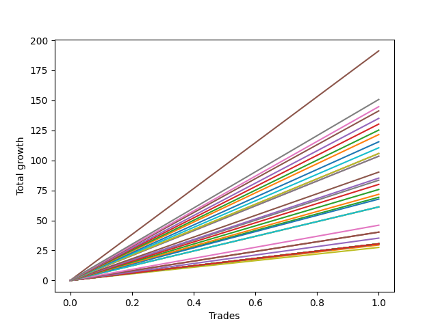

# Long Shepard 002 
- Symbol: ES1y1d
- Date Range: 07/19/2021 - 07/08/2022
- Trading Period: 7:20-12:30
- Number of Trades: 1



| Name | Win Percent | Profit | Avg Profit / Trade | Avg Time / Trade | Avg Profit / Time |      | Name | Win Percent | Profit | Avg Profit / Trade | Avg Time / Trade | Avg Profit / Time |
| ---- | ----------- | ------ | ------------------ | ---------------- | ----------------- | ---- | ---- | ----------- | ------ | ------------------ | ---------------- | ----------------- |
| Sorted By <br> Profit | | | | | | | Sorted By <br> Win Percentage ||||||
| Five | 100.00 | 95625.00 | 95625.00 | 18 23:15:00 | 5041.19 |     | Five | 100.00 | 95625.00 | 95625.00 | 18 23:15:00 | 5041.19 |
| Two Hundred Fifteen | 100.00 | 75375.00 | 75375.00 | 14 05:35:00 | 5295.93 |     | Two Hundred Fifteen | 100.00 | 75375.00 | 75375.00 | 14 05:35:00 | 5295.93 |
| Two Hundred Fourteen.Five | 100.00 | 72375.00 | 72375.00 | 14 04:57:00 | 5094.59 |     | Two Hundred Fourteen.Five | 100.00 | 72375.00 | 72375.00 | 14 04:57:00 | 5094.59 |
| Two Hundred Fourteen | 100.00 | 70625.00 | 70625.00 | 13 00:09:00 | 5430.08 |     | Two Hundred Fourteen | 100.00 | 70625.00 | 70625.00 | 13 00:09:00 | 5430.08 |
| Two Hundred Thirteen.Five | 100.00 | 67500.00 | 67500.00 | 12 23:29:00 | 5200.92 |     | Two Hundred Thirteen.Five | 100.00 | 67500.00 | 67500.00 | 12 23:29:00 | 5200.92 |
| Two Hundred Thirteen | 100.00 | 65125.00 | 65125.00 | 12 23:26:00 | 5018.73 |     | Two Hundred Thirteen | 100.00 | 65125.00 | 65125.00 | 12 23:26:00 | 5018.73 |
| Two Hundred Twelve.Five | 100.00 | 62625.00 | 62625.00 | 12 05:42:00 | 5117.47 |     | Two Hundred Twelve.Five | 100.00 | 62625.00 | 62625.00 | 12 05:42:00 | 5117.47 |
| Two Hundred Twelve | 100.00 | 60750.00 | 60750.00 | 12 02:36:00 | 5017.21 |     | Two Hundred Twelve | 100.00 | 60750.00 | 60750.00 | 12 02:36:00 | 5017.21 |
| Two Hundred Eleven.Five | 100.00 | 57750.00 | 57750.00 | 12 00:38:00 | 4801.94 |     | Two Hundred Eleven.Five | 100.00 | 57750.00 | 57750.00 | 12 00:38:00 | 4801.94 |
| Two Hundred Eleven | 100.00 | 55250.00 | 55250.00 | 11 23:48:00 | 4607.37 |     | Two Hundred Eleven | 100.00 | 55250.00 | 55250.00 | 11 23:48:00 | 4607.37 |
| Two Hundred Ten.Five | 100.00 | 52875.00 | 52875.00 | 11 23:19:00 | 4416.73 |     | Two Hundred Ten.Five | 100.00 | 52875.00 | 52875.00 | 11 23:19:00 | 4416.73 |
| Four | 100.00 | 52875.00 | 52875.00 | 11 23:19:00 | 4416.73 |     | Four | 100.00 | 52875.00 | 52875.00 | 11 23:19:00 | 4416.73 |
| Two Hundred Ten | 100.00 | 51750.00 | 51750.00 | 11 23:10:00 | 4325.01 |     | Two Hundred Ten | 100.00 | 51750.00 | 51750.00 | 11 23:10:00 | 4325.01 |
| Two Hundred Nine.Five | 100.00 | 51750.00 | 51750.00 | 11 23:10:00 | 4325.01 |     | Two Hundred Nine.Five | 100.00 | 51750.00 | 51750.00 | 11 23:10:00 | 4325.01 |
| Two Hundred Nine | 100.00 | 45125.00 | 45125.00 | 11 05:30:00 | 4018.55 |     | Two Hundred Nine | 100.00 | 45125.00 | 45125.00 | 11 05:30:00 | 4018.55 |
| Two Hundred Eight.Five | 100.00 | 42625.00 | 42625.00 | 11 01:01:00 | 3860.13 |     | Two Hundred Eight.Five | 100.00 | 42625.00 | 42625.00 | 11 01:01:00 | 3860.13 |
| Seven | 100.00 | 41750.00 | 41750.00 | 11 00:59:00 | 3781.37 |     | Seven | 100.00 | 41750.00 | 41750.00 | 11 00:59:00 | 3781.37 |
| Two Hundred Eight | 100.00 | 40000.00 | 40000.00 | 11 00:47:00 | 3625.61 |     | Two Hundred Eight | 100.00 | 40000.00 | 40000.00 | 11 00:47:00 | 3625.61 |
| Two Hundred Seven.Five | 100.00 | 37875.00 | 37875.00 | 08 03:43:00 | 4644.47 |     | Two Hundred Seven.Five | 100.00 | 37875.00 | 37875.00 | 08 03:43:00 | 4644.47 |
| Two Hundred Seven | 100.00 | 35875.00 | 35875.00 | 07 23:46:00 | 4489.83 |     | Two Hundred Seven | 100.00 | 35875.00 | 35875.00 | 07 23:46:00 | 4489.83 |
| Two | 100.00 | 34625.00 | 34625.00 | 08 01:02:00 | 4304.96 |     | Two | 100.00 | 34625.00 | 34625.00 | 08 01:02:00 | 4304.96 |
| Two Hundred Six.Five | 100.00 | 33875.00 | 33875.00 | 07 23:36:00 | 4243.22 |     | Two Hundred Six.Five | 100.00 | 33875.00 | 33875.00 | 07 23:36:00 | 4243.22 |
| Two Hundred Six | 100.00 | 30625.00 | 30625.00 | 07 23:10:00 | 3844.81 |     | Two Hundred Six | 100.00 | 30625.00 | 30625.00 | 07 23:10:00 | 3844.81 |
| Two Hundred Five.Five | 100.00 | 30625.00 | 30625.00 | 07 23:10:00 | 3844.81 |     | Two Hundred Five.Five | 100.00 | 30625.00 | 30625.00 | 07 23:10:00 | 3844.81 |
| Two Hundred Five | 100.00 | 30625.00 | 30625.00 | 07 23:10:00 | 3844.81 |     | Two Hundred Five | 100.00 | 30625.00 | 30625.00 | 07 23:10:00 | 3844.81 |
| Two Hundred Four.Five | 100.00 | 23000.00 | 23000.00 | 07 05:58:00 | 3173.02 |     | Two Hundred Four.Five | 100.00 | 23000.00 | 23000.00 | 07 05:58:00 | 3173.02 |
| Two Hundred Four | 100.00 | 20125.00 | 20125.00 | 07 03:36:00 | 2814.69 |     | Two Hundred Four | 100.00 | 20125.00 | 20125.00 | 07 03:36:00 | 2814.69 |
| Three | 100.00 | 20125.00 | 20125.00 | 07 03:36:00 | 2814.69 |     | Three | 100.00 | 20125.00 | 20125.00 | 07 03:36:00 | 2814.69 |
| Two Hundred Three.Five | 100.00 | 17625.00 | 17625.00 | 07 01:45:00 | 2491.90 |     | Two Hundred Three.Five | 100.00 | 17625.00 | 17625.00 | 07 01:45:00 | 2491.90 |
| Two Hundred Three | 100.00 | 15250.00 | 15250.00 | 00 00:03:00 | 7320000.00 |     | Two Hundred Three | 100.00 | 15250.00 | 15250.00 | 00 00:03:00 | 7320000.00 |
| Two Hundred Two.Five | 100.00 | 15250.00 | 15250.00 | 00 00:03:00 | 7320000.00 |     | Two Hundred Two.Five | 100.00 | 15250.00 | 15250.00 | 00 00:03:00 | 7320000.00 |
| Two Hundred Two | 100.00 | 15250.00 | 15250.00 | 00 00:03:00 | 7320000.00 |     | Two Hundred Two | 100.00 | 15250.00 | 15250.00 | 00 00:03:00 | 7320000.00 |
| Two Hundred One.Five | 100.00 | 15250.00 | 15250.00 | 00 00:03:00 | 7320000.00 |     | Two Hundred One.Five | 100.00 | 15250.00 | 15250.00 | 00 00:03:00 | 7320000.00 |
| Two Hundred One | 100.00 | 15250.00 | 15250.00 | 00 00:03:00 | 7320000.00 |     | Two Hundred One | 100.00 | 15250.00 | 15250.00 | 00 00:03:00 | 7320000.00 |
| Ninety | 100.00 | 15250.00 | 15250.00 | 00 00:03:00 | 7320000.00 |     | Ninety | 100.00 | 15250.00 | 15250.00 | 00 00:03:00 | 7320000.00 |
| Eighty-Nine | 100.00 | 15250.00 | 15250.00 | 00 00:03:00 | 7320000.00 |     | Eighty-Nine | 100.00 | 15250.00 | 15250.00 | 00 00:03:00 | 7320000.00 |
| Eighty-Eight | 100.00 | 15250.00 | 15250.00 | 00 00:03:00 | 7320000.00 |     | Eighty-Eight | 100.00 | 15250.00 | 15250.00 | 00 00:03:00 | 7320000.00 |
| Eighty-Seven | 100.00 | 15250.00 | 15250.00 | 00 00:03:00 | 7320000.00 |     | Eighty-Seven | 100.00 | 15250.00 | 15250.00 | 00 00:03:00 | 7320000.00 |
| Eighty-Six | 100.00 | 15250.00 | 15250.00 | 00 00:03:00 | 7320000.00 |     | Eighty-Six | 100.00 | 15250.00 | 15250.00 | 00 00:03:00 | 7320000.00 |
| Eighty-Five | 100.00 | 15250.00 | 15250.00 | 00 00:03:00 | 7320000.00 |     | Eighty-Five | 100.00 | 15250.00 | 15250.00 | 00 00:03:00 | 7320000.00 |
| Eighty-Four | 100.00 | 15250.00 | 15250.00 | 00 00:03:00 | 7320000.00 |     | Eighty-Four | 100.00 | 15250.00 | 15250.00 | 00 00:03:00 | 7320000.00 |
| Eighty-Three | 100.00 | 15250.00 | 15250.00 | 00 00:03:00 | 7320000.00 |     | Eighty-Three | 100.00 | 15250.00 | 15250.00 | 00 00:03:00 | 7320000.00 |
| Eighty-Two | 100.00 | 15250.00 | 15250.00 | 00 00:03:00 | 7320000.00 |     | Eighty-Two | 100.00 | 15250.00 | 15250.00 | 00 00:03:00 | 7320000.00 |
| Eighty-One | 100.00 | 15250.00 | 15250.00 | 00 00:03:00 | 7320000.00 |     | Eighty-One | 100.00 | 15250.00 | 15250.00 | 00 00:03:00 | 7320000.00 |
| Six | 100.00 | 15250.00 | 15250.00 | 00 00:03:00 | 7320000.00 |     | Six | 100.00 | 15250.00 | 15250.00 | 00 00:03:00 | 7320000.00 |
| Zero | 100.00 | 15250.00 | 15250.00 | 00 00:03:00 | 7320000.00 |     | Zero | 100.00 | 15250.00 | 15250.00 | 00 00:03:00 | 7320000.00 |
| One | 100.00 | 14750.00 | 14750.00 | 07 01:19:00 | 2090.76 |     | One | 100.00 | 14750.00 | 14750.00 | 07 01:19:00 | 2090.76 |
| Seventy-Three | 100.00 | 13750.00 | 13750.00 | 07 01:01:00 | 1952.47 |     | Seventy-Three | 100.00 | 13750.00 | 13750.00 | 07 01:01:00 | 1952.47 |

## NO STOPLOSS

### Test Zero
* Sell when price hits the middle line of the 20p bollinger
* No Stoploss
* Results:
```
Total Trades: 1
Percent Up: 100.00
Percent Down: 0.00
Total Points Moved Up: 30.50
Potential Profit: 15250.00
Total Points Ups: 30.50 Count Ups: 1
Total Points Downs: 0.00 Count Downs: 0
```

<details><summary>Trades</summary>

<code>In: 2021-10-07 07:21:00		Out: 2021-10-07 07:24:00		Total Position Time: 00 00:03:00		Total Move Up: 30.50		Total to Date: 30.50</code> <br />


</details>

### Test One
* Sell when the price hits the upper line of the 20p 1std bollinger
* No Stoploss
* Results:
```
Total Trades: 1
Percent Up: 100.00
Percent Down: 0.00
Total Points Moved Up: 29.50
Potential Profit: 14750.00
Total Points Ups: 29.50 Count Ups: 1
Total Points Downs: 0.00 Count Downs: 0
```

<details><summary>Trades</summary>

<code>In: 2021-10-07 07:21:00		Out: 2021-10-14 08:40:00		Total Position Time: 07 01:19:00		Total Move Up: 29.50		Total to Date: 29.50</code> <br />


</details>

### Test Two
* Sell when the price hits the upper line of the 20p 2std bollinger
* No Stoploss
* Results:
```
Total Trades: 1
Percent Up: 100.00
Percent Down: 0.00
Total Points Moved Up: 69.25
Potential Profit: 34625.00
Total Points Ups: 69.25 Count Ups: 1
Total Points Downs: 0.00 Count Downs: 0
```

<details><summary>Trades</summary>

<code>In: 2021-10-07 07:21:00		Out: 2021-10-15 08:23:00		Total Position Time: 08 01:02:00		Total Move Up: 69.25		Total to Date: 69.25</code> <br />


</details>

### Test Three
* Sell when price hits the middle line of the 50p bollinger
* No Stoploss
* Results:
```
Total Trades: 1
Percent Up: 100.00
Percent Down: 0.00
Total Points Moved Up: 40.25
Potential Profit: 20125.00
Total Points Ups: 40.25 Count Ups: 1
Total Points Downs: 0.00 Count Downs: 0
```

<details><summary>Trades</summary>

<code>In: 2021-10-07 07:21:00		Out: 2021-10-14 10:57:00		Total Position Time: 07 03:36:00		Total Move Up: 40.25		Total to Date: 40.25</code> <br />


</details>

### Test Four
* Sell when the price hits the upper line of the 50p 1std bollinger
* No Stoploss
* Results:
```
Total Trades: 1
Percent Up: 100.00
Percent Down: 0.00
Total Points Moved Up: 105.75
Potential Profit: 52875.00
Total Points Ups: 105.75 Count Ups: 1
Total Points Downs: 0.00 Count Downs: 0
```

<details><summary>Trades</summary>

<code>In: 2021-10-07 07:21:00		Out: 2021-10-19 06:40:00		Total Position Time: 11 23:19:00		Total Move Up: 105.75		Total to Date: 105.75</code> <br />


</details>

### Test Five
* Sell when the price hits the upper line of the 50p 2std bollinger
* No Stoploss
* Results:
```
Total Trades: 1
Percent Up: 100.00
Percent Down: 0.00
Total Points Moved Up: 191.25
Potential Profit: 95625.00
Total Points Ups: 191.25 Count Ups: 1
Total Points Downs: 0.00 Count Downs: 0
```

<details><summary>Trades</summary>

<code>In: 2021-10-07 07:21:00		Out: 2021-10-26 06:36:00		Total Position Time: 18 23:15:00		Total Move Up: 191.25		Total to Date: 191.25</code> <br />


</details>

### Test Six
* Sell when the price hits the middle line of the 1std VWAP
* No Stoploss
* Results:
```
Total Trades: 1
Percent Up: 100.00
Percent Down: 0.00
Total Points Moved Up: 30.50
Potential Profit: 15250.00
Total Points Ups: 30.50 Count Ups: 1
Total Points Downs: 0.00 Count Downs: 0
```

<details><summary>Trades</summary>

<code>In: 2021-10-07 07:21:00		Out: 2021-10-07 07:24:00		Total Position Time: 00 00:03:00		Total Move Up: 30.50		Total to Date: 30.50</code> <br />


</details>

### Test Seven
* Sell when the price hits the upper line of the 1std VWAP
* No Stoploss
* Results:
```
Total Trades: 1
Percent Up: 100.00
Percent Down: 0.00
Total Points Moved Up: 83.50
Potential Profit: 41750.00
Total Points Ups: 83.50 Count Ups: 1
Total Points Downs: 0.00 Count Downs: 0
```

<details><summary>Trades</summary>

<code>In: 2021-10-07 07:21:00		Out: 2021-10-18 08:20:00		Total Position Time: 11 00:59:00		Total Move Up: 83.50		Total to Date: 83.50</code> <br />


</details>

## SPECIAL EXIT CONDITIONS 

### Test Seventy-Three
* Sell when the linear regression slope changes to negative
* No Stoploss
* Results:
```
Total Trades: 1
Percent Up: 100.00
Percent Down: 0.00
Total Points Moved Up: 27.50
Potential Profit: 13750.00
Total Points Ups: 27.50 Count Ups: 1
Total Points Downs: 0.00 Count Downs: 0
```

<details><summary>Trades</summary>

<code>In: 2021-10-07 07:21:00		Out: 2021-10-14 08:22:00		Total Position Time: 07 01:01:00		Total Move Up: 27.50		Total to Date: 27.50</code> <br />


</details>

## TAKE PROFIT

### Test Eighty-One
* Take Profit of 1 Point
* No Stoploss
* Results:
```
Total Trades: 1
Percent Up: 100.00
Percent Down: 0.00
Total Points Moved Up: 30.50
Potential Profit: 15250.00
Total Points Ups: 30.50 Count Ups: 1
Total Points Downs: 0.00 Count Downs: 0
```

<details><summary>Trades</summary>

<code>In: 2021-10-07 07:21:00		Out: 2021-10-07 07:24:00		Total Position Time: 00 00:03:00		Total Move Up: 30.50		Total to Date: 30.50</code> <br />


</details>

### Test Eighty-Two
* Take Profit of 2 Point
* No Stoploss
* Results:
```
Total Trades: 1
Percent Up: 100.00
Percent Down: 0.00
Total Points Moved Up: 30.50
Potential Profit: 15250.00
Total Points Ups: 30.50 Count Ups: 1
Total Points Downs: 0.00 Count Downs: 0
```

<details><summary>Trades</summary>

<code>In: 2021-10-07 07:21:00		Out: 2021-10-07 07:24:00		Total Position Time: 00 00:03:00		Total Move Up: 30.50		Total to Date: 30.50</code> <br />


</details>

### Test Eighty-Three
* Take Profit of 3 Point
* No Stoploss
* Results:
```
Total Trades: 1
Percent Up: 100.00
Percent Down: 0.00
Total Points Moved Up: 30.50
Potential Profit: 15250.00
Total Points Ups: 30.50 Count Ups: 1
Total Points Downs: 0.00 Count Downs: 0
```

<details><summary>Trades</summary>

<code>In: 2021-10-07 07:21:00		Out: 2021-10-07 07:24:00		Total Position Time: 00 00:03:00		Total Move Up: 30.50		Total to Date: 30.50</code> <br />


</details>

### Test Eighty-Four
* Take Profit of 4 Point
* No Stoploss
* Results:
```
Total Trades: 1
Percent Up: 100.00
Percent Down: 0.00
Total Points Moved Up: 30.50
Potential Profit: 15250.00
Total Points Ups: 30.50 Count Ups: 1
Total Points Downs: 0.00 Count Downs: 0
```

<details><summary>Trades</summary>

<code>In: 2021-10-07 07:21:00		Out: 2021-10-07 07:24:00		Total Position Time: 00 00:03:00		Total Move Up: 30.50		Total to Date: 30.50</code> <br />


</details>

### Test Eighty-Five
* Take Profit of 5 Point
* No Stoploss
* Results:
```
Total Trades: 1
Percent Up: 100.00
Percent Down: 0.00
Total Points Moved Up: 30.50
Potential Profit: 15250.00
Total Points Ups: 30.50 Count Ups: 1
Total Points Downs: 0.00 Count Downs: 0
```

<details><summary>Trades</summary>

<code>In: 2021-10-07 07:21:00		Out: 2021-10-07 07:24:00		Total Position Time: 00 00:03:00		Total Move Up: 30.50		Total to Date: 30.50</code> <br />


</details>

### Test Eighty-Six
* Take Profit of 6 Point
* No Stoploss
* Results:
```
Total Trades: 1
Percent Up: 100.00
Percent Down: 0.00
Total Points Moved Up: 30.50
Potential Profit: 15250.00
Total Points Ups: 30.50 Count Ups: 1
Total Points Downs: 0.00 Count Downs: 0
```

<details><summary>Trades</summary>

<code>In: 2021-10-07 07:21:00		Out: 2021-10-07 07:24:00		Total Position Time: 00 00:03:00		Total Move Up: 30.50		Total to Date: 30.50</code> <br />


</details>

### Test Eighty-Seven
* Take Profit of 7 Point
* No Stoploss
* Results:
```
Total Trades: 1
Percent Up: 100.00
Percent Down: 0.00
Total Points Moved Up: 30.50
Potential Profit: 15250.00
Total Points Ups: 30.50 Count Ups: 1
Total Points Downs: 0.00 Count Downs: 0
```

<details><summary>Trades</summary>

<code>In: 2021-10-07 07:21:00		Out: 2021-10-07 07:24:00		Total Position Time: 00 00:03:00		Total Move Up: 30.50		Total to Date: 30.50</code> <br />


</details>

### Test Eighty-Eight
* Take Profit of 8 Point
* No Stoploss
* Results:
```
Total Trades: 1
Percent Up: 100.00
Percent Down: 0.00
Total Points Moved Up: 30.50
Potential Profit: 15250.00
Total Points Ups: 30.50 Count Ups: 1
Total Points Downs: 0.00 Count Downs: 0
```

<details><summary>Trades</summary>

<code>In: 2021-10-07 07:21:00		Out: 2021-10-07 07:24:00		Total Position Time: 00 00:03:00		Total Move Up: 30.50		Total to Date: 30.50</code> <br />


</details>

### Test Eighty-Nine
* Take Profit of 9 Point
* No Stoploss
* Results:
```
Total Trades: 1
Percent Up: 100.00
Percent Down: 0.00
Total Points Moved Up: 30.50
Potential Profit: 15250.00
Total Points Ups: 30.50 Count Ups: 1
Total Points Downs: 0.00 Count Downs: 0
```

<details><summary>Trades</summary>

<code>In: 2021-10-07 07:21:00		Out: 2021-10-07 07:24:00		Total Position Time: 00 00:03:00		Total Move Up: 30.50		Total to Date: 30.50</code> <br />


</details>

### Test Ninety
* Take Profit of 10 Point
* No Stoploss
* Results:
```
Total Trades: 1
Percent Up: 100.00
Percent Down: 0.00
Total Points Moved Up: 30.50
Potential Profit: 15250.00
Total Points Ups: 30.50 Count Ups: 1
Total Points Downs: 0.00 Count Downs: 0
```

<details><summary>Trades</summary>

<code>In: 2021-10-07 07:21:00		Out: 2021-10-07 07:24:00		Total Position Time: 00 00:03:00		Total Move Up: 30.50		Total to Date: 30.50</code> <br />


</details>

## DAILY TAKE PROFITS

### Test Two Hundred One
* Take Profit of 10 Point
* No Stoploss
* Results:
```
Total Trades: 1
Percent Up: 100.00
Percent Down: 0.00
Total Points Moved Up: 30.50
Potential Profit: 15250.00
Total Points Ups: 30.50 Count Ups: 1
Total Points Downs: 0.00 Count Downs: 0
```

<details><summary>Trades</summary>

<code>In: 2021-10-07 07:21:00		Out: 2021-10-07 07:24:00		Total Position Time: 00 00:03:00		Total Move Up: 30.50		Total to Date: 30.50</code> <br />


</details>

### Test Two Hundred One.Five
* Take Profit of 15 Point
* No Stoploss
* Results:
```
Total Trades: 1
Percent Up: 100.00
Percent Down: 0.00
Total Points Moved Up: 30.50
Potential Profit: 15250.00
Total Points Ups: 30.50 Count Ups: 1
Total Points Downs: 0.00 Count Downs: 0
```

<details><summary>Trades</summary>

<code>In: 2021-10-07 07:21:00		Out: 2021-10-07 07:24:00		Total Position Time: 00 00:03:00		Total Move Up: 30.50		Total to Date: 30.50</code> <br />


</details>

### Test Two Hundred Two
* Take Profit of 20 Point
* No Stoploss
* Results:
```
Total Trades: 1
Percent Up: 100.00
Percent Down: 0.00
Total Points Moved Up: 30.50
Potential Profit: 15250.00
Total Points Ups: 30.50 Count Ups: 1
Total Points Downs: 0.00 Count Downs: 0
```

<details><summary>Trades</summary>

<code>In: 2021-10-07 07:21:00		Out: 2021-10-07 07:24:00		Total Position Time: 00 00:03:00		Total Move Up: 30.50		Total to Date: 30.50</code> <br />


</details>

### Test Two Hundred Two.Five
* Take Profit of 25 Point
* No Stoploss
* Results:
```
Total Trades: 1
Percent Up: 100.00
Percent Down: 0.00
Total Points Moved Up: 30.50
Potential Profit: 15250.00
Total Points Ups: 30.50 Count Ups: 1
Total Points Downs: 0.00 Count Downs: 0
```

<details><summary>Trades</summary>

<code>In: 2021-10-07 07:21:00		Out: 2021-10-07 07:24:00		Total Position Time: 00 00:03:00		Total Move Up: 30.50		Total to Date: 30.50</code> <br />


</details>

### Test Two Hundred Three
* Take Profit of 30 Point
* No Stoploss
* Results:
```
Total Trades: 1
Percent Up: 100.00
Percent Down: 0.00
Total Points Moved Up: 30.50
Potential Profit: 15250.00
Total Points Ups: 30.50 Count Ups: 1
Total Points Downs: 0.00 Count Downs: 0
```

<details><summary>Trades</summary>

<code>In: 2021-10-07 07:21:00		Out: 2021-10-07 07:24:00		Total Position Time: 00 00:03:00		Total Move Up: 30.50		Total to Date: 30.50</code> <br />


</details>

### Test Two Hundred Three.Five
* Take Profit of 35 Point
* No Stoploss
* Results:
```
Total Trades: 1
Percent Up: 100.00
Percent Down: 0.00
Total Points Moved Up: 35.25
Potential Profit: 17625.00
Total Points Ups: 35.25 Count Ups: 1
Total Points Downs: 0.00 Count Downs: 0
```

<details><summary>Trades</summary>

<code>In: 2021-10-07 07:21:00		Out: 2021-10-14 09:06:00		Total Position Time: 07 01:45:00		Total Move Up: 35.25		Total to Date: 35.25</code> <br />


</details>

### Test Two Hundred Four
* Take Profit of 40 Point
* No Stoploss
* Results:
```
Total Trades: 1
Percent Up: 100.00
Percent Down: 0.00
Total Points Moved Up: 40.25
Potential Profit: 20125.00
Total Points Ups: 40.25 Count Ups: 1
Total Points Downs: 0.00 Count Downs: 0
```

<details><summary>Trades</summary>

<code>In: 2021-10-07 07:21:00		Out: 2021-10-14 10:57:00		Total Position Time: 07 03:36:00		Total Move Up: 40.25		Total to Date: 40.25</code> <br />


</details>

### Test Two Hundred Four.Five
* Take Profit of 45 Point
* No Stoploss
* Results:
```
Total Trades: 1
Percent Up: 100.00
Percent Down: 0.00
Total Points Moved Up: 46.00
Potential Profit: 23000.00
Total Points Ups: 46.00 Count Ups: 1
Total Points Downs: 0.00 Count Downs: 0
```

<details><summary>Trades</summary>

<code>In: 2021-10-07 07:21:00		Out: 2021-10-14 13:19:00		Total Position Time: 07 05:58:00		Total Move Up: 46.00		Total to Date: 46.00</code> <br />


</details>

### Test Two Hundred Five
* Take Profit of 50 Point
* No Stoploss
* Results:
```
Total Trades: 1
Percent Up: 100.00
Percent Down: 0.00
Total Points Moved Up: 61.25
Potential Profit: 30625.00
Total Points Ups: 61.25 Count Ups: 1
Total Points Downs: 0.00 Count Downs: 0
```

<details><summary>Trades</summary>

<code>In: 2021-10-07 07:21:00		Out: 2021-10-15 06:31:00		Total Position Time: 07 23:10:00		Total Move Up: 61.25		Total to Date: 61.25</code> <br />


</details>

### Test Two Hundred Five.Five
* Take Profit of 55 Point
* No Stoploss
* Results:
```
Total Trades: 1
Percent Up: 100.00
Percent Down: 0.00
Total Points Moved Up: 61.25
Potential Profit: 30625.00
Total Points Ups: 61.25 Count Ups: 1
Total Points Downs: 0.00 Count Downs: 0
```

<details><summary>Trades</summary>

<code>In: 2021-10-07 07:21:00		Out: 2021-10-15 06:31:00		Total Position Time: 07 23:10:00		Total Move Up: 61.25		Total to Date: 61.25</code> <br />


</details>

### Test Two Hundred Six
* Take Profit of 60 Point
* No Stoploss
* Results:
```
Total Trades: 1
Percent Up: 100.00
Percent Down: 0.00
Total Points Moved Up: 61.25
Potential Profit: 30625.00
Total Points Ups: 61.25 Count Ups: 1
Total Points Downs: 0.00 Count Downs: 0
```

<details><summary>Trades</summary>

<code>In: 2021-10-07 07:21:00		Out: 2021-10-15 06:31:00		Total Position Time: 07 23:10:00		Total Move Up: 61.25		Total to Date: 61.25</code> <br />


</details>

### Test Two Hundred Six.Five
* Take Profit of 65 Point
* No Stoploss
* Results:
```
Total Trades: 1
Percent Up: 100.00
Percent Down: 0.00
Total Points Moved Up: 67.75
Potential Profit: 33875.00
Total Points Ups: 67.75 Count Ups: 1
Total Points Downs: 0.00 Count Downs: 0
```

<details><summary>Trades</summary>

<code>In: 2021-10-07 07:21:00		Out: 2021-10-15 06:57:00		Total Position Time: 07 23:36:00		Total Move Up: 67.75		Total to Date: 67.75</code> <br />


</details>

### Test Two Hundred Seven
* Take Profit of 70 Point
* No Stoploss
* Results:
```
Total Trades: 1
Percent Up: 100.00
Percent Down: 0.00
Total Points Moved Up: 71.75
Potential Profit: 35875.00
Total Points Ups: 71.75 Count Ups: 1
Total Points Downs: 0.00 Count Downs: 0
```

<details><summary>Trades</summary>

<code>In: 2021-10-07 07:21:00		Out: 2021-10-15 07:07:00		Total Position Time: 07 23:46:00		Total Move Up: 71.75		Total to Date: 71.75</code> <br />


</details>

### Test Two Hundred Seven.Five
* Take Profit of 75 Point
* No Stoploss
* Results:
```
Total Trades: 1
Percent Up: 100.00
Percent Down: 0.00
Total Points Moved Up: 75.75
Potential Profit: 37875.00
Total Points Ups: 75.75 Count Ups: 1
Total Points Downs: 0.00 Count Downs: 0
```

<details><summary>Trades</summary>

<code>In: 2021-10-07 07:21:00		Out: 2021-10-15 11:04:00		Total Position Time: 08 03:43:00		Total Move Up: 75.75		Total to Date: 75.75</code> <br />


</details>

### Test Two Hundred Eight
* Take Profit of 80 Point
* No Stoploss
* Results:
```
Total Trades: 1
Percent Up: 100.00
Percent Down: 0.00
Total Points Moved Up: 80.00
Potential Profit: 40000.00
Total Points Ups: 80.00 Count Ups: 1
Total Points Downs: 0.00 Count Downs: 0
```

<details><summary>Trades</summary>

<code>In: 2021-10-07 07:21:00		Out: 2021-10-18 08:08:00		Total Position Time: 11 00:47:00		Total Move Up: 80.00		Total to Date: 80.00</code> <br />


</details>

### Test Two Hundred Eight.Five
* Take Profit of 85 Point
* No Stoploss
* Results:
```
Total Trades: 1
Percent Up: 100.00
Percent Down: 0.00
Total Points Moved Up: 85.25
Potential Profit: 42625.00
Total Points Ups: 85.25 Count Ups: 1
Total Points Downs: 0.00 Count Downs: 0
```

<details><summary>Trades</summary>

<code>In: 2021-10-07 07:21:00		Out: 2021-10-18 08:22:00		Total Position Time: 11 01:01:00		Total Move Up: 85.25		Total to Date: 85.25</code> <br />


</details>

### Test Two Hundred Nine
* Take Profit of 90 Point
* No Stoploss
* Results:
```
Total Trades: 1
Percent Up: 100.00
Percent Down: 0.00
Total Points Moved Up: 90.25
Potential Profit: 45125.00
Total Points Ups: 90.25 Count Ups: 1
Total Points Downs: 0.00 Count Downs: 0
```

<details><summary>Trades</summary>

<code>In: 2021-10-07 07:21:00		Out: 2021-10-18 12:51:00		Total Position Time: 11 05:30:00		Total Move Up: 90.25		Total to Date: 90.25</code> <br />


</details>

### Test Two Hundred Nine.Five
* Take Profit of 95 Point
* No Stoploss
* Results:
```
Total Trades: 1
Percent Up: 100.00
Percent Down: 0.00
Total Points Moved Up: 103.50
Potential Profit: 51750.00
Total Points Ups: 103.50 Count Ups: 1
Total Points Downs: 0.00 Count Downs: 0
```

<details><summary>Trades</summary>

<code>In: 2021-10-07 07:21:00		Out: 2021-10-19 06:31:00		Total Position Time: 11 23:10:00		Total Move Up: 103.50		Total to Date: 103.50</code> <br />


</details>

### Test Two Hundred Ten
* Take Profit of 100 Point
* No Stoploss
* Results:
```
Total Trades: 1
Percent Up: 100.00
Percent Down: 0.00
Total Points Moved Up: 103.50
Potential Profit: 51750.00
Total Points Ups: 103.50 Count Ups: 1
Total Points Downs: 0.00 Count Downs: 0
```

<details><summary>Trades</summary>

<code>In: 2021-10-07 07:21:00		Out: 2021-10-19 06:31:00		Total Position Time: 11 23:10:00		Total Move Up: 103.50		Total to Date: 103.50</code> <br />


</details>

### Test Two Hundred Ten.Five
* Take Profit of 105 Point
* No Stoploss
* Results:
```
Total Trades: 1
Percent Up: 100.00
Percent Down: 0.00
Total Points Moved Up: 105.75
Potential Profit: 52875.00
Total Points Ups: 105.75 Count Ups: 1
Total Points Downs: 0.00 Count Downs: 0
```

<details><summary>Trades</summary>

<code>In: 2021-10-07 07:21:00		Out: 2021-10-19 06:40:00		Total Position Time: 11 23:19:00		Total Move Up: 105.75		Total to Date: 105.75</code> <br />


</details>

### Test Two Hundred Eleven
* Take Profit of 110 Point
* No Stoploss
* Results:
```
Total Trades: 1
Percent Up: 100.00
Percent Down: 0.00
Total Points Moved Up: 110.50
Potential Profit: 55250.00
Total Points Ups: 110.50 Count Ups: 1
Total Points Downs: 0.00 Count Downs: 0
```

<details><summary>Trades</summary>

<code>In: 2021-10-07 07:21:00		Out: 2021-10-19 07:09:00		Total Position Time: 11 23:48:00		Total Move Up: 110.50		Total to Date: 110.50</code> <br />


</details>

### Test Two Hundred Eleven.Five
* Take Profit of 115 Point
* No Stoploss
* Results:
```
Total Trades: 1
Percent Up: 100.00
Percent Down: 0.00
Total Points Moved Up: 115.50
Potential Profit: 57750.00
Total Points Ups: 115.50 Count Ups: 1
Total Points Downs: 0.00 Count Downs: 0
```

<details><summary>Trades</summary>

<code>In: 2021-10-07 07:21:00		Out: 2021-10-19 07:59:00		Total Position Time: 12 00:38:00		Total Move Up: 115.50		Total to Date: 115.50</code> <br />


</details>

### Test Two Hundred Twelve
* Take Profit of 120 Point
* No Stoploss
* Results:
```
Total Trades: 1
Percent Up: 100.00
Percent Down: 0.00
Total Points Moved Up: 121.50
Potential Profit: 60750.00
Total Points Ups: 121.50 Count Ups: 1
Total Points Downs: 0.00 Count Downs: 0
```

<details><summary>Trades</summary>

<code>In: 2021-10-07 07:21:00		Out: 2021-10-19 09:57:00		Total Position Time: 12 02:36:00		Total Move Up: 121.50		Total to Date: 121.50</code> <br />


</details>

### Test Two Hundred Twelve.Five
* Take Profit of 125 Point
* No Stoploss
* Results:
```
Total Trades: 1
Percent Up: 100.00
Percent Down: 0.00
Total Points Moved Up: 125.25
Potential Profit: 62625.00
Total Points Ups: 125.25 Count Ups: 1
Total Points Downs: 0.00 Count Downs: 0
```

<details><summary>Trades</summary>

<code>In: 2021-10-07 07:21:00		Out: 2021-10-19 13:03:00		Total Position Time: 12 05:42:00		Total Move Up: 125.25		Total to Date: 125.25</code> <br />


</details>

### Test Two Hundred Thirteen
* Take Profit of 130 Point
* No Stoploss
* Results:
```
Total Trades: 1
Percent Up: 100.00
Percent Down: 0.00
Total Points Moved Up: 130.25
Potential Profit: 65125.00
Total Points Ups: 130.25 Count Ups: 1
Total Points Downs: 0.00 Count Downs: 0
```

<details><summary>Trades</summary>

<code>In: 2021-10-07 07:21:00		Out: 2021-10-20 06:47:00		Total Position Time: 12 23:26:00		Total Move Up: 130.25		Total to Date: 130.25</code> <br />


</details>

### Test Two Hundred Thirteen.Five
* Take Profit of 135 Point
* No Stoploss
* Results:
```
Total Trades: 1
Percent Up: 100.00
Percent Down: 0.00
Total Points Moved Up: 135.00
Potential Profit: 67500.00
Total Points Ups: 135.00 Count Ups: 1
Total Points Downs: 0.00 Count Downs: 0
```

<details><summary>Trades</summary>

<code>In: 2021-10-07 07:21:00		Out: 2021-10-20 06:50:00		Total Position Time: 12 23:29:00		Total Move Up: 135.00		Total to Date: 135.00</code> <br />


</details>

### Test Two Hundred Fourteen
* Take Profit of 140 Point
* No Stoploss
* Results:
```
Total Trades: 1
Percent Up: 100.00
Percent Down: 0.00
Total Points Moved Up: 141.25
Potential Profit: 70625.00
Total Points Ups: 141.25 Count Ups: 1
Total Points Downs: 0.00 Count Downs: 0
```

<details><summary>Trades</summary>

<code>In: 2021-10-07 07:21:00		Out: 2021-10-20 07:30:00		Total Position Time: 13 00:09:00		Total Move Up: 141.25		Total to Date: 141.25</code> <br />


</details>

### Test Two Hundred Fourteen.Five
* Take Profit of 145 Point
* No Stoploss
* Results:
```
Total Trades: 1
Percent Up: 100.00
Percent Down: 0.00
Total Points Moved Up: 144.75
Potential Profit: 72375.00
Total Points Ups: 144.75 Count Ups: 1
Total Points Downs: 0.00 Count Downs: 0
```

<details><summary>Trades</summary>

<code>In: 2021-10-07 07:21:00		Out: 2021-10-21 12:18:00		Total Position Time: 14 04:57:00		Total Move Up: 144.75		Total to Date: 144.75</code> <br />


</details>

### Test Two Hundred Fifteen
* Take Profit of 150 Point
* No Stoploss
* Results:
```
Total Trades: 1
Percent Up: 100.00
Percent Down: 0.00
Total Points Moved Up: 150.75
Potential Profit: 75375.00
Total Points Ups: 150.75 Count Ups: 1
Total Points Downs: 0.00 Count Downs: 0
```

<details><summary>Trades</summary>

<code>In: 2021-10-07 07:21:00		Out: 2021-10-21 12:56:00		Total Position Time: 14 05:35:00		Total Move Up: 150.75		Total to Date: 150.75</code> <br />


</details>