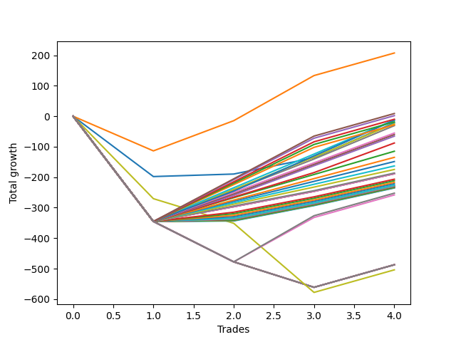

# Long Shepard 003 AB 
- Symbol: ES1y1d
- Date Range: 07/19/2021 - 07/08/2022
- Trading Period: 7:20-12:30
- Number of Trades: 4



| Name | Win Percent | Profit | Avg Profit / Trade | Avg Time / Trade | Avg Profit / Time |      | Name | Win Percent | Profit | Avg Profit / Trade | Avg Time / Trade | Avg Profit / Time |
| ---- | ----------- | ------ | ------------------ | ---------------- | ----------------- | ---- | ---- | ----------- | ------ | ------------------ | ---------------- | ----------------- |
| Sorted By <br> Profit | | | | | | | Sorted By <br> Win Percentage ||||||
| One | 75.00 | 103625.00 | 25906.25 | 11 16:57:15 | 2212.99 |     | One | 75.00 | 103625.00 | 25906.25 | 11 16:57:15 | 2212.99 |
| Two Hundred Fourteen | 75.00 | 4375.00 | 1093.75 | 23 16:49:15 | 46.15 |     | Two Hundred Fourteen | 75.00 | 4375.00 | 1093.75 | 23 16:49:15 | 46.15 |
| Two Hundred Thirteen.Five | 75.00 | 875.00 | 218.75 | 23 16:13:15 | 9.24 |     | Two Hundred Thirteen.Five | 75.00 | 875.00 | 218.75 | 23 16:13:15 | 9.24 |
| Two Hundred Thirteen | 75.00 | -5000.00 | -1250.00 | 23 16:10:45 | -52.80 |     | Two Hundred Thirteen | 75.00 | -5000.00 | -1250.00 | 23 16:10:45 | -52.80 |
| Two Hundred Eleven | 75.00 | -6125.00 | -1531.25 | 19 14:20:00 | -78.14 |     | Two Hundred Eleven | 75.00 | -6125.00 | -1531.25 | 19 14:20:00 | -78.14 |
| Two Hundred Eleven.Five | 75.00 | -6625.00 | -1656.25 | 20 12:52:45 | -80.65 |     | Two Hundred Eleven.Five | 75.00 | -6625.00 | -1656.25 | 20 12:52:45 | -80.65 |
| Two Hundred Twelve.Five | 75.00 | -9375.00 | -2343.75 | 23 03:36:15 | -101.24 |     | Two Hundred Twelve.Five | 75.00 | -9375.00 | -2343.75 | 23 03:36:15 | -101.24 |
| Zero | 75.00 | -10875.00 | -2718.75 | 08 06:42:00 | -328.38 |     | Zero | 75.00 | -10875.00 | -2718.75 | 08 06:42:00 | -328.38 |
| Two Hundred Ten.Five | 75.00 | -12500.00 | -3125.00 | 19 14:13:15 | -159.50 |     | Two Hundred Ten.Five | 75.00 | -12500.00 | -3125.00 | 19 14:13:15 | -159.50 |
| Two Hundred Twelve | 75.00 | -14125.00 | -3531.25 | 23 03:17:00 | -152.62 |     | Two Hundred Twelve | 75.00 | -14125.00 | -3531.25 | 23 03:17:00 | -152.62 |
| Two Hundred Ten | 75.00 | -15500.00 | -3875.00 | 19 14:11:30 | -197.79 |     | Two Hundred Ten | 75.00 | -15500.00 | -3875.00 | 19 14:11:30 | -197.79 |
| Two Hundred Nine.Five | 75.00 | -27625.00 | -6906.25 | 19 08:07:15 | -357.13 |     | Two Hundred Nine.Five | 75.00 | -27625.00 | -6906.25 | 19 08:07:15 | -357.13 |
| Two Hundred Nine | 75.00 | -30000.00 | -7500.00 | 19 07:20:45 | -388.48 |     | Two Hundred Nine | 75.00 | -30000.00 | -7500.00 | 19 07:20:45 | -388.48 |
| Two Hundred Eight.Five | 75.00 | -32750.00 | -8187.50 | 19 06:59:30 | -424.41 |     | Two Hundred Eight.Five | 75.00 | -32750.00 | -8187.50 | 19 06:59:30 | -424.41 |
| Two Hundred Eight | 75.00 | -44000.00 | -11000.00 | 19 01:50:30 | -576.62 |     | Two Hundred Eight | 75.00 | -44000.00 | -11000.00 | 19 01:50:30 | -576.62 |
| Two Hundred Seven.Five | 75.00 | -57500.00 | -14375.00 | 18 09:19:30 | -781.74 |     | Two Hundred Seven.Five | 75.00 | -57500.00 | -14375.00 | 18 09:19:30 | -781.74 |
| Two Hundred Seven | 75.00 | -67500.00 | -16875.00 | 18 09:08:45 | -918.06 |     | Two Hundred Seven | 75.00 | -67500.00 | -16875.00 | 18 09:08:45 | -918.06 |
| Two Hundred Six.Five | 75.00 | -74375.00 | -18593.75 | 18 08:53:45 | -1012.14 |     | Two Hundred Six.Five | 75.00 | -74375.00 | -18593.75 | 18 08:53:45 | -1012.14 |
| Two Hundred Six | 75.00 | -81625.00 | -20406.25 | 18 07:53:45 | -1113.33 |     | Two Hundred Six | 75.00 | -81625.00 | -20406.25 | 18 07:53:45 | -1113.33 |
| Two Hundred Five.Five | 75.00 | -87375.00 | -21843.75 | 18 07:24:00 | -1193.10 |     | Two Hundred Five.Five | 75.00 | -87375.00 | -21843.75 | 18 07:24:00 | -1193.10 |
| Two Hundred Five | 75.00 | -93250.00 | -23312.50 | 18 07:13:30 | -1273.83 |     | Two Hundred Five | 75.00 | -93250.00 | -23312.50 | 18 07:13:30 | -1273.83 |
| Two Hundred Four.Five | 75.00 | -94375.00 | -23593.75 | 18 07:13:15 | -1289.21 |     | Two Hundred Four.Five | 75.00 | -94375.00 | -23593.75 | 18 07:13:15 | -1289.21 |
| Two Hundred Four | 75.00 | -94375.00 | -23593.75 | 18 07:13:15 | -1289.21 |     | Two Hundred Four | 75.00 | -94375.00 | -23593.75 | 18 07:13:15 | -1289.21 |
| Two Hundred Three.Five | 75.00 | -94375.00 | -23593.75 | 18 07:13:15 | -1289.21 |     | Two Hundred Three.Five | 75.00 | -94375.00 | -23593.75 | 18 07:13:15 | -1289.21 |
| Two Hundred Three | 75.00 | -103375.00 | -25843.75 | 18 02:06:15 | -1428.80 |     | Two Hundred Three | 75.00 | -103375.00 | -25843.75 | 18 02:06:15 | -1428.80 |
| Two Hundred Two.Five | 75.00 | -105750.00 | -26437.50 | 18 02:04:15 | -1461.74 |     | Two Hundred Two.Five | 75.00 | -105750.00 | -26437.50 | 18 02:04:15 | -1461.74 |
| Two Hundred Two | 75.00 | -108500.00 | -27125.00 | 18 01:57:45 | -1500.13 |     | Two Hundred Two | 75.00 | -108500.00 | -27125.00 | 18 01:57:45 | -1500.13 |
| Two Hundred One.Five | 75.00 | -110625.00 | -27656.25 | 18 01:54:00 | -1529.73 |     | Two Hundred One.Five | 75.00 | -110625.00 | -27656.25 | 18 01:54:00 | -1529.73 |
| Two Hundred One | 75.00 | -113250.00 | -28312.50 | 18 01:36:45 | -1567.07 |     | Two Hundred One | 75.00 | -113250.00 | -28312.50 | 18 01:36:45 | -1567.07 |
| Ninety | 75.00 | -113250.00 | -28312.50 | 18 01:36:45 | -1567.07 |     | Ninety | 75.00 | -113250.00 | -28312.50 | 18 01:36:45 | -1567.07 |
| Eighty-Nine | 75.00 | -113875.00 | -28468.75 | 18 01:36:15 | -1575.75 |     | Eighty-Nine | 75.00 | -113875.00 | -28468.75 | 18 01:36:15 | -1575.75 |
| Eighty-Eight | 75.00 | -114375.00 | -28593.75 | 18 01:36:00 | -1582.68 |     | Eighty-Eight | 75.00 | -114375.00 | -28593.75 | 18 01:36:00 | -1582.68 |
| Eighty-Seven | 75.00 | -114875.00 | -28718.75 | 18 01:35:45 | -1589.61 |     | Eighty-Seven | 75.00 | -114875.00 | -28718.75 | 18 01:35:45 | -1589.61 |
| Eighty-Six | 75.00 | -114875.00 | -28718.75 | 18 01:35:45 | -1589.61 |     | Eighty-Six | 75.00 | -114875.00 | -28718.75 | 18 01:35:45 | -1589.61 |
| Eighty-Five | 75.00 | -114875.00 | -28718.75 | 18 01:35:45 | -1589.61 |     | Eighty-Five | 75.00 | -114875.00 | -28718.75 | 18 01:35:45 | -1589.61 |
| Eighty-Four | 75.00 | -116500.00 | -29125.00 | 18 01:33:30 | -1612.24 |     | Eighty-Four | 75.00 | -116500.00 | -29125.00 | 18 01:33:30 | -1612.24 |
| Eighty-Three | 75.00 | -116875.00 | -29218.75 | 18 01:33:15 | -1617.44 |     | Eighty-Three | 75.00 | -116875.00 | -29218.75 | 18 01:33:15 | -1617.44 |
| Eighty-Two | 75.00 | -117250.00 | -29312.50 | 18 01:26:15 | -1623.07 |     | Eighty-Two | 75.00 | -117250.00 | -29312.50 | 18 01:26:15 | -1623.07 |
| Eighty-One | 75.00 | -117750.00 | -29437.50 | 18 01:25:30 | -1630.04 |     | Eighty-One | 75.00 | -117750.00 | -29437.50 | 18 01:25:30 | -1630.04 |
| Two Hundred Fifteen | 50.00 | -126250.00 | -31562.50 | 32 17:24:00 | -964.48 |     | Two Hundred Fifteen | 50.00 | -126250.00 | -31562.50 | 32 17:24:00 | -964.48 |
| Two Hundred Fourteen.Five | 50.00 | -129125.00 | -32281.25 | 32 17:22:00 | -986.48 |     | Two Hundred Fourteen.Five | 50.00 | -129125.00 | -32281.25 | 32 17:22:00 | -986.48 |
| Seven | 25.00 | -243625.00 | -60906.25 | 43 05:37:00 | -1408.76 |     | Seven | 25.00 | -243625.00 | -60906.25 | 43 05:37:00 | -1408.76 |
| Six | 25.00 | -243625.00 | -60906.25 | 43 05:37:00 | -1408.76 |     | Six | 25.00 | -243625.00 | -60906.25 | 43 05:37:00 | -1408.76 |
| Five | 25.00 | -243625.00 | -60906.25 | 43 05:37:00 | -1408.76 |     | Five | 25.00 | -243625.00 | -60906.25 | 43 05:37:00 | -1408.76 |
| Four | 25.00 | -243625.00 | -60906.25 | 43 05:37:00 | -1408.76 |     | Four | 25.00 | -243625.00 | -60906.25 | 43 05:37:00 | -1408.76 |
| Three | 25.00 | -243625.00 | -60906.25 | 43 05:37:00 | -1408.76 |     | Three | 25.00 | -243625.00 | -60906.25 | 43 05:37:00 | -1408.76 |
| Two | 25.00 | -243625.00 | -60906.25 | 43 05:37:00 | -1408.76 |     | Two | 25.00 | -243625.00 | -60906.25 | 43 05:37:00 | -1408.76 |
| Seventy-Three | 25.00 | -252000.00 | -63000.00 | 10 20:40:00 | -5800.51 |     | Seventy-Three | 25.00 | -252000.00 | -63000.00 | 10 20:40:00 | -5800.51 |

## NO STOPLOSS

### Test Zero
* Sell when price hits the middle line of the 20p bollinger
* No Stoploss
* Results:
```
Total Trades: 4
Percent Up: 75.00
Percent Down: 25.00
Total Points Moved Up: -21.75
Potential Profit: -10875.00
Total Points Ups: 176.25 Count Ups: 3
Total Points Downs: -198.00 Count Downs: 1
```

<details><summary>Trades</summary>

<code>In: 2022-05-05 07:21:00		Out: 2022-05-26 09:12:00		Total Position Time: 21 01:51:00		Total Move Up: -198.00		Total to Date: -198.00</code> <br />
<code>In: 2022-05-18 07:21:00		Out: 2022-05-26 08:23:00		Total Position Time: 08 01:02:00		Total Move Up: 8.25		Total to Date: -189.75</code> <br />
<code>In: 2022-05-26 07:21:00		Out: 2022-05-26 08:00:00		Total Position Time: 00 00:39:00		Total Move Up: 53.50		Total to Date: -136.25</code> <br />
<code>In: 2022-06-24 07:21:00		Out: 2022-06-28 06:37:00		Total Position Time: 03 23:16:00		Total Move Up: 114.50		Total to Date: -21.75</code> <br />


</details>

### Test One
* Sell when the price hits the upper line of the 20p 1std bollinger
* No Stoploss
* Results:
```
Total Trades: 4
Percent Up: 75.00
Percent Down: 25.00
Total Points Moved Up: 207.25
Potential Profit: 103625.00
Total Points Ups: 321.00 Count Ups: 3
Total Points Downs: -113.75 Count Downs: 1
```

<details><summary>Trades</summary>

<code>In: 2022-05-05 07:21:00		Out: 2022-05-27 12:05:00		Total Position Time: 22 04:44:00		Total Move Up: -113.75		Total to Date: -113.75</code> <br />
<code>In: 2022-05-18 07:21:00		Out: 2022-05-27 12:05:00		Total Position Time: 09 04:44:00		Total Move Up: 99.00		Total to Date: -14.75</code> <br />
<code>In: 2022-05-26 07:21:00		Out: 2022-05-27 12:05:00		Total Position Time: 01 04:44:00		Total Move Up: 148.00		Total to Date: 133.25</code> <br />
<code>In: 2022-06-24 07:21:00		Out: 2022-07-08 12:58:00		Total Position Time: 14 05:37:00		Total Move Up: 74.00		Total to Date: 207.25</code> <br />


</details>

### Test Two
* Sell when the price hits the upper line of the 20p 2std bollinger
* No Stoploss
* Results:
```
Total Trades: 4
Percent Up: 25.00
Percent Down: 75.00
Total Points Moved Up: -487.25
Potential Profit: -243625.00
Total Points Ups: 74.00 Count Ups: 1
Total Points Downs: -561.25 Count Downs: 3
```

<details><summary>Trades</summary>

<code>In: 2022-05-05 07:21:00		Out: 2022-07-08 12:58:00		Total Position Time: 64 05:37:00		Total Move Up: -345.25		Total to Date: -345.25</code> <br />
<code>In: 2022-05-18 07:21:00		Out: 2022-07-08 12:58:00		Total Position Time: 51 05:37:00		Total Move Up: -132.50		Total to Date: -477.75</code> <br />
<code>In: 2022-05-26 07:21:00		Out: 2022-07-08 12:58:00		Total Position Time: 43 05:37:00		Total Move Up: -83.50		Total to Date: -561.25</code> <br />
<code>In: 2022-06-24 07:21:00		Out: 2022-07-08 12:58:00		Total Position Time: 14 05:37:00		Total Move Up: 74.00		Total to Date: -487.25</code> <br />


</details>

### Test Three
* Sell when price hits the middle line of the 50p bollinger
* No Stoploss
* Results:
```
Total Trades: 4
Percent Up: 25.00
Percent Down: 75.00
Total Points Moved Up: -487.25
Potential Profit: -243625.00
Total Points Ups: 74.00 Count Ups: 1
Total Points Downs: -561.25 Count Downs: 3
```

<details><summary>Trades</summary>

<code>In: 2022-05-05 07:21:00		Out: 2022-07-08 12:58:00		Total Position Time: 64 05:37:00		Total Move Up: -345.25		Total to Date: -345.25</code> <br />
<code>In: 2022-05-18 07:21:00		Out: 2022-07-08 12:58:00		Total Position Time: 51 05:37:00		Total Move Up: -132.50		Total to Date: -477.75</code> <br />
<code>In: 2022-05-26 07:21:00		Out: 2022-07-08 12:58:00		Total Position Time: 43 05:37:00		Total Move Up: -83.50		Total to Date: -561.25</code> <br />
<code>In: 2022-06-24 07:21:00		Out: 2022-07-08 12:58:00		Total Position Time: 14 05:37:00		Total Move Up: 74.00		Total to Date: -487.25</code> <br />


</details>

### Test Four
* Sell when the price hits the upper line of the 50p 1std bollinger
* No Stoploss
* Results:
```
Total Trades: 4
Percent Up: 25.00
Percent Down: 75.00
Total Points Moved Up: -487.25
Potential Profit: -243625.00
Total Points Ups: 74.00 Count Ups: 1
Total Points Downs: -561.25 Count Downs: 3
```

<details><summary>Trades</summary>

<code>In: 2022-05-05 07:21:00		Out: 2022-07-08 12:58:00		Total Position Time: 64 05:37:00		Total Move Up: -345.25		Total to Date: -345.25</code> <br />
<code>In: 2022-05-18 07:21:00		Out: 2022-07-08 12:58:00		Total Position Time: 51 05:37:00		Total Move Up: -132.50		Total to Date: -477.75</code> <br />
<code>In: 2022-05-26 07:21:00		Out: 2022-07-08 12:58:00		Total Position Time: 43 05:37:00		Total Move Up: -83.50		Total to Date: -561.25</code> <br />
<code>In: 2022-06-24 07:21:00		Out: 2022-07-08 12:58:00		Total Position Time: 14 05:37:00		Total Move Up: 74.00		Total to Date: -487.25</code> <br />


</details>

### Test Five
* Sell when the price hits the upper line of the 50p 2std bollinger
* No Stoploss
* Results:
```
Total Trades: 4
Percent Up: 25.00
Percent Down: 75.00
Total Points Moved Up: -487.25
Potential Profit: -243625.00
Total Points Ups: 74.00 Count Ups: 1
Total Points Downs: -561.25 Count Downs: 3
```

<details><summary>Trades</summary>

<code>In: 2022-05-05 07:21:00		Out: 2022-07-08 12:58:00		Total Position Time: 64 05:37:00		Total Move Up: -345.25		Total to Date: -345.25</code> <br />
<code>In: 2022-05-18 07:21:00		Out: 2022-07-08 12:58:00		Total Position Time: 51 05:37:00		Total Move Up: -132.50		Total to Date: -477.75</code> <br />
<code>In: 2022-05-26 07:21:00		Out: 2022-07-08 12:58:00		Total Position Time: 43 05:37:00		Total Move Up: -83.50		Total to Date: -561.25</code> <br />
<code>In: 2022-06-24 07:21:00		Out: 2022-07-08 12:58:00		Total Position Time: 14 05:37:00		Total Move Up: 74.00		Total to Date: -487.25</code> <br />


</details>

### Test Six
* Sell when the price hits the middle line of the 1std VWAP
* No Stoploss
* Results:
```
Total Trades: 4
Percent Up: 25.00
Percent Down: 75.00
Total Points Moved Up: -487.25
Potential Profit: -243625.00
Total Points Ups: 74.00 Count Ups: 1
Total Points Downs: -561.25 Count Downs: 3
```

<details><summary>Trades</summary>

<code>In: 2022-05-05 07:21:00		Out: 2022-07-08 12:58:00		Total Position Time: 64 05:37:00		Total Move Up: -345.25		Total to Date: -345.25</code> <br />
<code>In: 2022-05-18 07:21:00		Out: 2022-07-08 12:58:00		Total Position Time: 51 05:37:00		Total Move Up: -132.50		Total to Date: -477.75</code> <br />
<code>In: 2022-05-26 07:21:00		Out: 2022-07-08 12:58:00		Total Position Time: 43 05:37:00		Total Move Up: -83.50		Total to Date: -561.25</code> <br />
<code>In: 2022-06-24 07:21:00		Out: 2022-07-08 12:58:00		Total Position Time: 14 05:37:00		Total Move Up: 74.00		Total to Date: -487.25</code> <br />


</details>

### Test Seven
* Sell when the price hits the upper line of the 1std VWAP
* No Stoploss
* Results:
```
Total Trades: 4
Percent Up: 25.00
Percent Down: 75.00
Total Points Moved Up: -487.25
Potential Profit: -243625.00
Total Points Ups: 74.00 Count Ups: 1
Total Points Downs: -561.25 Count Downs: 3
```

<details><summary>Trades</summary>

<code>In: 2022-05-05 07:21:00		Out: 2022-07-08 12:58:00		Total Position Time: 64 05:37:00		Total Move Up: -345.25		Total to Date: -345.25</code> <br />
<code>In: 2022-05-18 07:21:00		Out: 2022-07-08 12:58:00		Total Position Time: 51 05:37:00		Total Move Up: -132.50		Total to Date: -477.75</code> <br />
<code>In: 2022-05-26 07:21:00		Out: 2022-07-08 12:58:00		Total Position Time: 43 05:37:00		Total Move Up: -83.50		Total to Date: -561.25</code> <br />
<code>In: 2022-06-24 07:21:00		Out: 2022-07-08 12:58:00		Total Position Time: 14 05:37:00		Total Move Up: 74.00		Total to Date: -487.25</code> <br />


</details>

## SPECIAL EXIT CONDITIONS 

### Test Seventy-Three
* Sell when the linear regression slope changes to negative
* No Stoploss
* Results:
```
Total Trades: 4
Percent Up: 25.00
Percent Down: 75.00
Total Points Moved Up: -504.00
Potential Profit: -252000.00
Total Points Ups: 74.00 Count Ups: 1
Total Points Downs: -578.00 Count Downs: 3
```

<details><summary>Trades</summary>

<code>In: 2022-05-05 07:21:00		Out: 2022-05-10 08:22:00		Total Position Time: 05 01:01:00		Total Move Up: -270.50		Total to Date: -270.50</code> <br />
<code>In: 2022-05-18 07:21:00		Out: 2022-05-23 08:22:00		Total Position Time: 05 01:01:00		Total Move Up: -80.75		Total to Date: -351.25</code> <br />
<code>In: 2022-05-26 07:21:00		Out: 2022-06-14 10:22:00		Total Position Time: 19 03:01:00		Total Move Up: -226.75		Total to Date: -578.00</code> <br />
<code>In: 2022-06-24 07:21:00		Out: 2022-07-08 12:58:00		Total Position Time: 14 05:37:00		Total Move Up: 74.00		Total to Date: -504.00</code> <br />


</details>

## TAKE PROFIT

### Test Eighty-One
* Take Profit of 1 Point
* No Stoploss
* Results:
```
Total Trades: 4
Percent Up: 75.00
Percent Down: 25.00
Total Points Moved Up: -235.50
Potential Profit: -117750.00
Total Points Ups: 109.75 Count Ups: 3
Total Points Downs: -345.25 Count Downs: 1
```

<details><summary>Trades</summary>

<code>In: 2022-05-05 07:21:00		Out: 2022-07-08 12:58:00		Total Position Time: 64 05:37:00		Total Move Up: -345.25		Total to Date: -345.25</code> <br />
<code>In: 2022-05-18 07:21:00		Out: 2022-05-26 07:20:00		Total Position Time: 07 23:59:00		Total Move Up: 1.50		Total to Date: -343.75</code> <br />
<code>In: 2022-05-26 07:21:00		Out: 2022-05-26 07:24:00		Total Position Time: 00 00:03:00		Total Move Up: 50.50		Total to Date: -293.25</code> <br />
<code>In: 2022-06-24 07:21:00		Out: 2022-06-24 07:24:00		Total Position Time: 00 00:03:00		Total Move Up: 57.75		Total to Date: -235.50</code> <br />


</details>

### Test Eighty-Two
* Take Profit of 2 Point
* No Stoploss
* Results:
```
Total Trades: 4
Percent Up: 75.00
Percent Down: 25.00
Total Points Moved Up: -234.50
Potential Profit: -117250.00
Total Points Ups: 110.75 Count Ups: 3
Total Points Downs: -345.25 Count Downs: 1
```

<details><summary>Trades</summary>

<code>In: 2022-05-05 07:21:00		Out: 2022-07-08 12:58:00		Total Position Time: 64 05:37:00		Total Move Up: -345.25		Total to Date: -345.25</code> <br />
<code>In: 2022-05-18 07:21:00		Out: 2022-05-26 07:23:00		Total Position Time: 08 00:02:00		Total Move Up: 2.50		Total to Date: -342.75</code> <br />
<code>In: 2022-05-26 07:21:00		Out: 2022-05-26 07:24:00		Total Position Time: 00 00:03:00		Total Move Up: 50.50		Total to Date: -292.25</code> <br />
<code>In: 2022-06-24 07:21:00		Out: 2022-06-24 07:24:00		Total Position Time: 00 00:03:00		Total Move Up: 57.75		Total to Date: -234.50</code> <br />


</details>

### Test Eighty-Three
* Take Profit of 3 Point
* No Stoploss
* Results:
```
Total Trades: 4
Percent Up: 75.00
Percent Down: 25.00
Total Points Moved Up: -233.75
Potential Profit: -116875.00
Total Points Ups: 111.50 Count Ups: 3
Total Points Downs: -345.25 Count Downs: 1
```

<details><summary>Trades</summary>

<code>In: 2022-05-05 07:21:00		Out: 2022-07-08 12:58:00		Total Position Time: 64 05:37:00		Total Move Up: -345.25		Total to Date: -345.25</code> <br />
<code>In: 2022-05-18 07:21:00		Out: 2022-05-26 07:51:00		Total Position Time: 08 00:30:00		Total Move Up: 3.25		Total to Date: -342.00</code> <br />
<code>In: 2022-05-26 07:21:00		Out: 2022-05-26 07:24:00		Total Position Time: 00 00:03:00		Total Move Up: 50.50		Total to Date: -291.50</code> <br />
<code>In: 2022-06-24 07:21:00		Out: 2022-06-24 07:24:00		Total Position Time: 00 00:03:00		Total Move Up: 57.75		Total to Date: -233.75</code> <br />


</details>

### Test Eighty-Four
* Take Profit of 4 Point
* No Stoploss
* Results:
```
Total Trades: 4
Percent Up: 75.00
Percent Down: 25.00
Total Points Moved Up: -233.00
Potential Profit: -116500.00
Total Points Ups: 112.25 Count Ups: 3
Total Points Downs: -345.25 Count Downs: 1
```

<details><summary>Trades</summary>

<code>In: 2022-05-05 07:21:00		Out: 2022-07-08 12:58:00		Total Position Time: 64 05:37:00		Total Move Up: -345.25		Total to Date: -345.25</code> <br />
<code>In: 2022-05-18 07:21:00		Out: 2022-05-26 07:52:00		Total Position Time: 08 00:31:00		Total Move Up: 4.00		Total to Date: -341.25</code> <br />
<code>In: 2022-05-26 07:21:00		Out: 2022-05-26 07:24:00		Total Position Time: 00 00:03:00		Total Move Up: 50.50		Total to Date: -290.75</code> <br />
<code>In: 2022-06-24 07:21:00		Out: 2022-06-24 07:24:00		Total Position Time: 00 00:03:00		Total Move Up: 57.75		Total to Date: -233.00</code> <br />


</details>

### Test Eighty-Five
* Take Profit of 5 Point
* No Stoploss
* Results:
```
Total Trades: 4
Percent Up: 75.00
Percent Down: 25.00
Total Points Moved Up: -229.75
Potential Profit: -114875.00
Total Points Ups: 115.50 Count Ups: 3
Total Points Downs: -345.25 Count Downs: 1
```

<details><summary>Trades</summary>

<code>In: 2022-05-05 07:21:00		Out: 2022-07-08 12:58:00		Total Position Time: 64 05:37:00		Total Move Up: -345.25		Total to Date: -345.25</code> <br />
<code>In: 2022-05-18 07:21:00		Out: 2022-05-26 08:01:00		Total Position Time: 08 00:40:00		Total Move Up: 7.25		Total to Date: -338.00</code> <br />
<code>In: 2022-05-26 07:21:00		Out: 2022-05-26 07:24:00		Total Position Time: 00 00:03:00		Total Move Up: 50.50		Total to Date: -287.50</code> <br />
<code>In: 2022-06-24 07:21:00		Out: 2022-06-24 07:24:00		Total Position Time: 00 00:03:00		Total Move Up: 57.75		Total to Date: -229.75</code> <br />


</details>

### Test Eighty-Six
* Take Profit of 6 Point
* No Stoploss
* Results:
```
Total Trades: 4
Percent Up: 75.00
Percent Down: 25.00
Total Points Moved Up: -229.75
Potential Profit: -114875.00
Total Points Ups: 115.50 Count Ups: 3
Total Points Downs: -345.25 Count Downs: 1
```

<details><summary>Trades</summary>

<code>In: 2022-05-05 07:21:00		Out: 2022-07-08 12:58:00		Total Position Time: 64 05:37:00		Total Move Up: -345.25		Total to Date: -345.25</code> <br />
<code>In: 2022-05-18 07:21:00		Out: 2022-05-26 08:01:00		Total Position Time: 08 00:40:00		Total Move Up: 7.25		Total to Date: -338.00</code> <br />
<code>In: 2022-05-26 07:21:00		Out: 2022-05-26 07:24:00		Total Position Time: 00 00:03:00		Total Move Up: 50.50		Total to Date: -287.50</code> <br />
<code>In: 2022-06-24 07:21:00		Out: 2022-06-24 07:24:00		Total Position Time: 00 00:03:00		Total Move Up: 57.75		Total to Date: -229.75</code> <br />


</details>

### Test Eighty-Seven
* Take Profit of 7 Point
* No Stoploss
* Results:
```
Total Trades: 4
Percent Up: 75.00
Percent Down: 25.00
Total Points Moved Up: -229.75
Potential Profit: -114875.00
Total Points Ups: 115.50 Count Ups: 3
Total Points Downs: -345.25 Count Downs: 1
```

<details><summary>Trades</summary>

<code>In: 2022-05-05 07:21:00		Out: 2022-07-08 12:58:00		Total Position Time: 64 05:37:00		Total Move Up: -345.25		Total to Date: -345.25</code> <br />
<code>In: 2022-05-18 07:21:00		Out: 2022-05-26 08:01:00		Total Position Time: 08 00:40:00		Total Move Up: 7.25		Total to Date: -338.00</code> <br />
<code>In: 2022-05-26 07:21:00		Out: 2022-05-26 07:24:00		Total Position Time: 00 00:03:00		Total Move Up: 50.50		Total to Date: -287.50</code> <br />
<code>In: 2022-06-24 07:21:00		Out: 2022-06-24 07:24:00		Total Position Time: 00 00:03:00		Total Move Up: 57.75		Total to Date: -229.75</code> <br />


</details>

### Test Eighty-Eight
* Take Profit of 8 Point
* No Stoploss
* Results:
```
Total Trades: 4
Percent Up: 75.00
Percent Down: 25.00
Total Points Moved Up: -228.75
Potential Profit: -114375.00
Total Points Ups: 116.50 Count Ups: 3
Total Points Downs: -345.25 Count Downs: 1
```

<details><summary>Trades</summary>

<code>In: 2022-05-05 07:21:00		Out: 2022-07-08 12:58:00		Total Position Time: 64 05:37:00		Total Move Up: -345.25		Total to Date: -345.25</code> <br />
<code>In: 2022-05-18 07:21:00		Out: 2022-05-26 08:02:00		Total Position Time: 08 00:41:00		Total Move Up: 8.25		Total to Date: -337.00</code> <br />
<code>In: 2022-05-26 07:21:00		Out: 2022-05-26 07:24:00		Total Position Time: 00 00:03:00		Total Move Up: 50.50		Total to Date: -286.50</code> <br />
<code>In: 2022-06-24 07:21:00		Out: 2022-06-24 07:24:00		Total Position Time: 00 00:03:00		Total Move Up: 57.75		Total to Date: -228.75</code> <br />


</details>

### Test Eighty-Nine
* Take Profit of 9 Point
* No Stoploss
* Results:
```
Total Trades: 4
Percent Up: 75.00
Percent Down: 25.00
Total Points Moved Up: -227.75
Potential Profit: -113875.00
Total Points Ups: 117.50 Count Ups: 3
Total Points Downs: -345.25 Count Downs: 1
```

<details><summary>Trades</summary>

<code>In: 2022-05-05 07:21:00		Out: 2022-07-08 12:58:00		Total Position Time: 64 05:37:00		Total Move Up: -345.25		Total to Date: -345.25</code> <br />
<code>In: 2022-05-18 07:21:00		Out: 2022-05-26 08:03:00		Total Position Time: 08 00:42:00		Total Move Up: 9.25		Total to Date: -336.00</code> <br />
<code>In: 2022-05-26 07:21:00		Out: 2022-05-26 07:24:00		Total Position Time: 00 00:03:00		Total Move Up: 50.50		Total to Date: -285.50</code> <br />
<code>In: 2022-06-24 07:21:00		Out: 2022-06-24 07:24:00		Total Position Time: 00 00:03:00		Total Move Up: 57.75		Total to Date: -227.75</code> <br />


</details>

### Test Ninety
* Take Profit of 10 Point
* No Stoploss
* Results:
```
Total Trades: 4
Percent Up: 75.00
Percent Down: 25.00
Total Points Moved Up: -226.50
Potential Profit: -113250.00
Total Points Ups: 118.75 Count Ups: 3
Total Points Downs: -345.25 Count Downs: 1
```

<details><summary>Trades</summary>

<code>In: 2022-05-05 07:21:00		Out: 2022-07-08 12:58:00		Total Position Time: 64 05:37:00		Total Move Up: -345.25		Total to Date: -345.25</code> <br />
<code>In: 2022-05-18 07:21:00		Out: 2022-05-26 08:05:00		Total Position Time: 08 00:44:00		Total Move Up: 10.50		Total to Date: -334.75</code> <br />
<code>In: 2022-05-26 07:21:00		Out: 2022-05-26 07:24:00		Total Position Time: 00 00:03:00		Total Move Up: 50.50		Total to Date: -284.25</code> <br />
<code>In: 2022-06-24 07:21:00		Out: 2022-06-24 07:24:00		Total Position Time: 00 00:03:00		Total Move Up: 57.75		Total to Date: -226.50</code> <br />


</details>

## DAILY TAKE PROFITS

### Test Two Hundred One
* Take Profit of 10 Point
* No Stoploss
* Results:
```
Total Trades: 4
Percent Up: 75.00
Percent Down: 25.00
Total Points Moved Up: -226.50
Potential Profit: -113250.00
Total Points Ups: 118.75 Count Ups: 3
Total Points Downs: -345.25 Count Downs: 1
```

<details><summary>Trades</summary>

<code>In: 2022-05-05 07:21:00		Out: 2022-07-08 12:58:00		Total Position Time: 64 05:37:00		Total Move Up: -345.25		Total to Date: -345.25</code> <br />
<code>In: 2022-05-18 07:21:00		Out: 2022-05-26 08:05:00		Total Position Time: 08 00:44:00		Total Move Up: 10.50		Total to Date: -334.75</code> <br />
<code>In: 2022-05-26 07:21:00		Out: 2022-05-26 07:24:00		Total Position Time: 00 00:03:00		Total Move Up: 50.50		Total to Date: -284.25</code> <br />
<code>In: 2022-06-24 07:21:00		Out: 2022-06-24 07:24:00		Total Position Time: 00 00:03:00		Total Move Up: 57.75		Total to Date: -226.50</code> <br />


</details>

### Test Two Hundred One.Five
* Take Profit of 15 Point
* No Stoploss
* Results:
```
Total Trades: 4
Percent Up: 75.00
Percent Down: 25.00
Total Points Moved Up: -221.25
Potential Profit: -110625.00
Total Points Ups: 124.00 Count Ups: 3
Total Points Downs: -345.25 Count Downs: 1
```

<details><summary>Trades</summary>

<code>In: 2022-05-05 07:21:00		Out: 2022-07-08 12:58:00		Total Position Time: 64 05:37:00		Total Move Up: -345.25		Total to Date: -345.25</code> <br />
<code>In: 2022-05-18 07:21:00		Out: 2022-05-26 09:14:00		Total Position Time: 08 01:53:00		Total Move Up: 15.75		Total to Date: -329.50</code> <br />
<code>In: 2022-05-26 07:21:00		Out: 2022-05-26 07:24:00		Total Position Time: 00 00:03:00		Total Move Up: 50.50		Total to Date: -279.00</code> <br />
<code>In: 2022-06-24 07:21:00		Out: 2022-06-24 07:24:00		Total Position Time: 00 00:03:00		Total Move Up: 57.75		Total to Date: -221.25</code> <br />


</details>

### Test Two Hundred Two
* Take Profit of 20 Point
* No Stoploss
* Results:
```
Total Trades: 4
Percent Up: 75.00
Percent Down: 25.00
Total Points Moved Up: -217.00
Potential Profit: -108500.00
Total Points Ups: 128.25 Count Ups: 3
Total Points Downs: -345.25 Count Downs: 1
```

<details><summary>Trades</summary>

<code>In: 2022-05-05 07:21:00		Out: 2022-07-08 12:58:00		Total Position Time: 64 05:37:00		Total Move Up: -345.25		Total to Date: -345.25</code> <br />
<code>In: 2022-05-18 07:21:00		Out: 2022-05-26 09:29:00		Total Position Time: 08 02:08:00		Total Move Up: 20.00		Total to Date: -325.25</code> <br />
<code>In: 2022-05-26 07:21:00		Out: 2022-05-26 07:24:00		Total Position Time: 00 00:03:00		Total Move Up: 50.50		Total to Date: -274.75</code> <br />
<code>In: 2022-06-24 07:21:00		Out: 2022-06-24 07:24:00		Total Position Time: 00 00:03:00		Total Move Up: 57.75		Total to Date: -217.00</code> <br />


</details>

### Test Two Hundred Two.Five
* Take Profit of 25 Point
* No Stoploss
* Results:
```
Total Trades: 4
Percent Up: 75.00
Percent Down: 25.00
Total Points Moved Up: -211.50
Potential Profit: -105750.00
Total Points Ups: 133.75 Count Ups: 3
Total Points Downs: -345.25 Count Downs: 1
```

<details><summary>Trades</summary>

<code>In: 2022-05-05 07:21:00		Out: 2022-07-08 12:58:00		Total Position Time: 64 05:37:00		Total Move Up: -345.25		Total to Date: -345.25</code> <br />
<code>In: 2022-05-18 07:21:00		Out: 2022-05-26 09:55:00		Total Position Time: 08 02:34:00		Total Move Up: 25.50		Total to Date: -319.75</code> <br />
<code>In: 2022-05-26 07:21:00		Out: 2022-05-26 07:24:00		Total Position Time: 00 00:03:00		Total Move Up: 50.50		Total to Date: -269.25</code> <br />
<code>In: 2022-06-24 07:21:00		Out: 2022-06-24 07:24:00		Total Position Time: 00 00:03:00		Total Move Up: 57.75		Total to Date: -211.50</code> <br />


</details>

### Test Two Hundred Three
* Take Profit of 30 Point
* No Stoploss
* Results:
```
Total Trades: 4
Percent Up: 75.00
Percent Down: 25.00
Total Points Moved Up: -206.75
Potential Profit: -103375.00
Total Points Ups: 138.50 Count Ups: 3
Total Points Downs: -345.25 Count Downs: 1
```

<details><summary>Trades</summary>

<code>In: 2022-05-05 07:21:00		Out: 2022-07-08 12:58:00		Total Position Time: 64 05:37:00		Total Move Up: -345.25		Total to Date: -345.25</code> <br />
<code>In: 2022-05-18 07:21:00		Out: 2022-05-26 10:03:00		Total Position Time: 08 02:42:00		Total Move Up: 30.25		Total to Date: -315.00</code> <br />
<code>In: 2022-05-26 07:21:00		Out: 2022-05-26 07:24:00		Total Position Time: 00 00:03:00		Total Move Up: 50.50		Total to Date: -264.50</code> <br />
<code>In: 2022-06-24 07:21:00		Out: 2022-06-24 07:24:00		Total Position Time: 00 00:03:00		Total Move Up: 57.75		Total to Date: -206.75</code> <br />


</details>

### Test Two Hundred Three.Five
* Take Profit of 35 Point
* No Stoploss
* Results:
```
Total Trades: 4
Percent Up: 75.00
Percent Down: 25.00
Total Points Moved Up: -188.75
Potential Profit: -94375.00
Total Points Ups: 156.50 Count Ups: 3
Total Points Downs: -345.25 Count Downs: 1
```

<details><summary>Trades</summary>

<code>In: 2022-05-05 07:21:00		Out: 2022-07-08 12:58:00		Total Position Time: 64 05:37:00		Total Move Up: -345.25		Total to Date: -345.25</code> <br />
<code>In: 2022-05-18 07:21:00		Out: 2022-05-27 06:31:00		Total Position Time: 08 23:10:00		Total Move Up: 48.25		Total to Date: -297.00</code> <br />
<code>In: 2022-05-26 07:21:00		Out: 2022-05-26 07:24:00		Total Position Time: 00 00:03:00		Total Move Up: 50.50		Total to Date: -246.50</code> <br />
<code>In: 2022-06-24 07:21:00		Out: 2022-06-24 07:24:00		Total Position Time: 00 00:03:00		Total Move Up: 57.75		Total to Date: -188.75</code> <br />


</details>

### Test Two Hundred Four
* Take Profit of 40 Point
* No Stoploss
* Results:
```
Total Trades: 4
Percent Up: 75.00
Percent Down: 25.00
Total Points Moved Up: -188.75
Potential Profit: -94375.00
Total Points Ups: 156.50 Count Ups: 3
Total Points Downs: -345.25 Count Downs: 1
```

<details><summary>Trades</summary>

<code>In: 2022-05-05 07:21:00		Out: 2022-07-08 12:58:00		Total Position Time: 64 05:37:00		Total Move Up: -345.25		Total to Date: -345.25</code> <br />
<code>In: 2022-05-18 07:21:00		Out: 2022-05-27 06:31:00		Total Position Time: 08 23:10:00		Total Move Up: 48.25		Total to Date: -297.00</code> <br />
<code>In: 2022-05-26 07:21:00		Out: 2022-05-26 07:24:00		Total Position Time: 00 00:03:00		Total Move Up: 50.50		Total to Date: -246.50</code> <br />
<code>In: 2022-06-24 07:21:00		Out: 2022-06-24 07:24:00		Total Position Time: 00 00:03:00		Total Move Up: 57.75		Total to Date: -188.75</code> <br />


</details>

### Test Two Hundred Four.Five
* Take Profit of 45 Point
* No Stoploss
* Results:
```
Total Trades: 4
Percent Up: 75.00
Percent Down: 25.00
Total Points Moved Up: -188.75
Potential Profit: -94375.00
Total Points Ups: 156.50 Count Ups: 3
Total Points Downs: -345.25 Count Downs: 1
```

<details><summary>Trades</summary>

<code>In: 2022-05-05 07:21:00		Out: 2022-07-08 12:58:00		Total Position Time: 64 05:37:00		Total Move Up: -345.25		Total to Date: -345.25</code> <br />
<code>In: 2022-05-18 07:21:00		Out: 2022-05-27 06:31:00		Total Position Time: 08 23:10:00		Total Move Up: 48.25		Total to Date: -297.00</code> <br />
<code>In: 2022-05-26 07:21:00		Out: 2022-05-26 07:24:00		Total Position Time: 00 00:03:00		Total Move Up: 50.50		Total to Date: -246.50</code> <br />
<code>In: 2022-06-24 07:21:00		Out: 2022-06-24 07:24:00		Total Position Time: 00 00:03:00		Total Move Up: 57.75		Total to Date: -188.75</code> <br />


</details>

### Test Two Hundred Five
* Take Profit of 50 Point
* No Stoploss
* Results:
```
Total Trades: 4
Percent Up: 75.00
Percent Down: 25.00
Total Points Moved Up: -186.50
Potential Profit: -93250.00
Total Points Ups: 158.75 Count Ups: 3
Total Points Downs: -345.25 Count Downs: 1
```

<details><summary>Trades</summary>

<code>In: 2022-05-05 07:21:00		Out: 2022-07-08 12:58:00		Total Position Time: 64 05:37:00		Total Move Up: -345.25		Total to Date: -345.25</code> <br />
<code>In: 2022-05-18 07:21:00		Out: 2022-05-27 06:32:00		Total Position Time: 08 23:11:00		Total Move Up: 50.50		Total to Date: -294.75</code> <br />
<code>In: 2022-05-26 07:21:00		Out: 2022-05-26 07:24:00		Total Position Time: 00 00:03:00		Total Move Up: 50.50		Total to Date: -244.25</code> <br />
<code>In: 2022-06-24 07:21:00		Out: 2022-06-24 07:24:00		Total Position Time: 00 00:03:00		Total Move Up: 57.75		Total to Date: -186.50</code> <br />


</details>

### Test Two Hundred Five.Five
* Take Profit of 55 Point
* No Stoploss
* Results:
```
Total Trades: 4
Percent Up: 75.00
Percent Down: 25.00
Total Points Moved Up: -174.75
Potential Profit: -87375.00
Total Points Ups: 170.50 Count Ups: 3
Total Points Downs: -345.25 Count Downs: 1
```

<details><summary>Trades</summary>

<code>In: 2022-05-05 07:21:00		Out: 2022-07-08 12:58:00		Total Position Time: 64 05:37:00		Total Move Up: -345.25		Total to Date: -345.25</code> <br />
<code>In: 2022-05-18 07:21:00		Out: 2022-05-27 06:37:00		Total Position Time: 08 23:16:00		Total Move Up: 56.50		Total to Date: -288.75</code> <br />
<code>In: 2022-05-26 07:21:00		Out: 2022-05-26 08:01:00		Total Position Time: 00 00:40:00		Total Move Up: 56.25		Total to Date: -232.50</code> <br />
<code>In: 2022-06-24 07:21:00		Out: 2022-06-24 07:24:00		Total Position Time: 00 00:03:00		Total Move Up: 57.75		Total to Date: -174.75</code> <br />


</details>

### Test Two Hundred Six
* Take Profit of 60 Point
* No Stoploss
* Results:
```
Total Trades: 4
Percent Up: 75.00
Percent Down: 25.00
Total Points Moved Up: -163.25
Potential Profit: -81625.00
Total Points Ups: 182.00 Count Ups: 3
Total Points Downs: -345.25 Count Downs: 1
```

<details><summary>Trades</summary>

<code>In: 2022-05-05 07:21:00		Out: 2022-07-08 12:58:00		Total Position Time: 64 05:37:00		Total Move Up: -345.25		Total to Date: -345.25</code> <br />
<code>In: 2022-05-18 07:21:00		Out: 2022-05-27 06:39:00		Total Position Time: 08 23:18:00		Total Move Up: 61.50		Total to Date: -283.75</code> <br />
<code>In: 2022-05-26 07:21:00		Out: 2022-05-26 08:15:00		Total Position Time: 00 00:54:00		Total Move Up: 60.50		Total to Date: -223.25</code> <br />
<code>In: 2022-06-24 07:21:00		Out: 2022-06-24 09:07:00		Total Position Time: 00 01:46:00		Total Move Up: 60.00		Total to Date: -163.25</code> <br />


</details>

### Test Two Hundred Six.Five
* Take Profit of 65 Point
* No Stoploss
* Results:
```
Total Trades: 4
Percent Up: 75.00
Percent Down: 25.00
Total Points Moved Up: -148.75
Potential Profit: -74375.00
Total Points Ups: 196.50 Count Ups: 3
Total Points Downs: -345.25 Count Downs: 1
```

<details><summary>Trades</summary>

<code>In: 2022-05-05 07:21:00		Out: 2022-07-08 12:58:00		Total Position Time: 64 05:37:00		Total Move Up: -345.25		Total to Date: -345.25</code> <br />
<code>In: 2022-05-18 07:21:00		Out: 2022-05-27 06:48:00		Total Position Time: 08 23:27:00		Total Move Up: 66.50		Total to Date: -278.75</code> <br />
<code>In: 2022-05-26 07:21:00		Out: 2022-05-26 09:15:00		Total Position Time: 00 01:54:00		Total Move Up: 65.00		Total to Date: -213.75</code> <br />
<code>In: 2022-06-24 07:21:00		Out: 2022-06-24 11:58:00		Total Position Time: 00 04:37:00		Total Move Up: 65.00		Total to Date: -148.75</code> <br />


</details>

### Test Two Hundred Seven
* Take Profit of 70 Point
* No Stoploss
* Results:
```
Total Trades: 4
Percent Up: 75.00
Percent Down: 25.00
Total Points Moved Up: -135.00
Potential Profit: -67500.00
Total Points Ups: 210.25 Count Ups: 3
Total Points Downs: -345.25 Count Downs: 1
```

<details><summary>Trades</summary>

<code>In: 2022-05-05 07:21:00		Out: 2022-07-08 12:58:00		Total Position Time: 64 05:37:00		Total Move Up: -345.25		Total to Date: -345.25</code> <br />
<code>In: 2022-05-18 07:21:00		Out: 2022-05-27 06:49:00		Total Position Time: 08 23:28:00		Total Move Up: 70.00		Total to Date: -275.25</code> <br />
<code>In: 2022-05-26 07:21:00		Out: 2022-05-26 09:30:00		Total Position Time: 00 02:09:00		Total Move Up: 70.50		Total to Date: -204.75</code> <br />
<code>In: 2022-06-24 07:21:00		Out: 2022-06-24 12:42:00		Total Position Time: 00 05:21:00		Total Move Up: 69.75		Total to Date: -135.00</code> <br />


</details>

### Test Two Hundred Seven.Five
* Take Profit of 75 Point
* No Stoploss
* Results:
```
Total Trades: 4
Percent Up: 75.00
Percent Down: 25.00
Total Points Moved Up: -115.00
Potential Profit: -57500.00
Total Points Ups: 230.25 Count Ups: 3
Total Points Downs: -345.25 Count Downs: 1
```

<details><summary>Trades</summary>

<code>In: 2022-05-05 07:21:00		Out: 2022-07-08 12:58:00		Total Position Time: 64 05:37:00		Total Move Up: -345.25		Total to Date: -345.25</code> <br />
<code>In: 2022-05-18 07:21:00		Out: 2022-05-27 06:56:00		Total Position Time: 08 23:35:00		Total Move Up: 78.00		Total to Date: -267.25</code> <br />
<code>In: 2022-05-26 07:21:00		Out: 2022-05-26 09:56:00		Total Position Time: 00 02:35:00		Total Move Up: 76.00		Total to Date: -191.25</code> <br />
<code>In: 2022-06-24 07:21:00		Out: 2022-06-24 12:52:00		Total Position Time: 00 05:31:00		Total Move Up: 76.25		Total to Date: -115.00</code> <br />


</details>

### Test Two Hundred Eight
* Take Profit of 80 Point
* No Stoploss
* Results:
```
Total Trades: 4
Percent Up: 75.00
Percent Down: 25.00
Total Points Moved Up: -88.00
Potential Profit: -44000.00
Total Points Ups: 257.25 Count Ups: 3
Total Points Downs: -345.25 Count Downs: 1
```

<details><summary>Trades</summary>

<code>In: 2022-05-05 07:21:00		Out: 2022-07-08 12:58:00		Total Position Time: 64 05:37:00		Total Move Up: -345.25		Total to Date: -345.25</code> <br />
<code>In: 2022-05-18 07:21:00		Out: 2022-05-27 07:12:00		Total Position Time: 08 23:51:00		Total Move Up: 80.00		Total to Date: -265.25</code> <br />
<code>In: 2022-05-26 07:21:00		Out: 2022-05-26 10:06:00		Total Position Time: 00 02:45:00		Total Move Up: 80.25		Total to Date: -185.00</code> <br />
<code>In: 2022-06-24 07:21:00		Out: 2022-06-27 06:30:00		Total Position Time: 02 23:09:00		Total Move Up: 97.00		Total to Date: -88.00</code> <br />


</details>

### Test Two Hundred Eight.Five
* Take Profit of 85 Point
* No Stoploss
* Results:
```
Total Trades: 4
Percent Up: 75.00
Percent Down: 25.00
Total Points Moved Up: -65.50
Potential Profit: -32750.00
Total Points Ups: 279.75 Count Ups: 3
Total Points Downs: -345.25 Count Downs: 1
```

<details><summary>Trades</summary>

<code>In: 2022-05-05 07:21:00		Out: 2022-07-08 12:58:00		Total Position Time: 64 05:37:00		Total Move Up: -345.25		Total to Date: -345.25</code> <br />
<code>In: 2022-05-18 07:21:00		Out: 2022-05-27 07:23:00		Total Position Time: 09 00:02:00		Total Move Up: 85.50		Total to Date: -259.75</code> <br />
<code>In: 2022-05-26 07:21:00		Out: 2022-05-27 06:31:00		Total Position Time: 00 23:10:00		Total Move Up: 97.25		Total to Date: -162.50</code> <br />
<code>In: 2022-06-24 07:21:00		Out: 2022-06-27 06:30:00		Total Position Time: 02 23:09:00		Total Move Up: 97.00		Total to Date: -65.50</code> <br />


</details>

### Test Two Hundred Nine
* Take Profit of 90 Point
* No Stoploss
* Results:
```
Total Trades: 4
Percent Up: 75.00
Percent Down: 25.00
Total Points Moved Up: -60.00
Potential Profit: -30000.00
Total Points Ups: 285.25 Count Ups: 3
Total Points Downs: -345.25 Count Downs: 1
```

<details><summary>Trades</summary>

<code>In: 2022-05-05 07:21:00		Out: 2022-07-08 12:58:00		Total Position Time: 64 05:37:00		Total Move Up: -345.25		Total to Date: -345.25</code> <br />
<code>In: 2022-05-18 07:21:00		Out: 2022-05-27 08:47:00		Total Position Time: 09 01:26:00		Total Move Up: 90.25		Total to Date: -255.00</code> <br />
<code>In: 2022-05-26 07:21:00		Out: 2022-05-27 06:31:00		Total Position Time: 00 23:10:00		Total Move Up: 97.25		Total to Date: -157.75</code> <br />
<code>In: 2022-06-24 07:21:00		Out: 2022-06-27 06:31:00		Total Position Time: 02 23:10:00		Total Move Up: 97.75		Total to Date: -60.00</code> <br />


</details>

### Test Two Hundred Nine.Five
* Take Profit of 95 Point
* No Stoploss
* Results:
```
Total Trades: 4
Percent Up: 75.00
Percent Down: 25.00
Total Points Moved Up: -55.25
Potential Profit: -27625.00
Total Points Ups: 290.00 Count Ups: 3
Total Points Downs: -345.25 Count Downs: 1
```

<details><summary>Trades</summary>

<code>In: 2022-05-05 07:21:00		Out: 2022-07-08 12:58:00		Total Position Time: 64 05:37:00		Total Move Up: -345.25		Total to Date: -345.25</code> <br />
<code>In: 2022-05-18 07:21:00		Out: 2022-05-27 11:53:00		Total Position Time: 09 04:32:00		Total Move Up: 95.00		Total to Date: -250.25</code> <br />
<code>In: 2022-05-26 07:21:00		Out: 2022-05-27 06:31:00		Total Position Time: 00 23:10:00		Total Move Up: 97.25		Total to Date: -153.00</code> <br />
<code>In: 2022-06-24 07:21:00		Out: 2022-06-27 06:31:00		Total Position Time: 02 23:10:00		Total Move Up: 97.75		Total to Date: -55.25</code> <br />


</details>

### Test Two Hundred Ten
* Take Profit of 100 Point
* No Stoploss
* Results:
```
Total Trades: 4
Percent Up: 75.00
Percent Down: 25.00
Total Points Moved Up: -31.00
Potential Profit: -15500.00
Total Points Ups: 314.25 Count Ups: 3
Total Points Downs: -345.25 Count Downs: 1
```

<details><summary>Trades</summary>

<code>In: 2022-05-05 07:21:00		Out: 2022-07-08 12:58:00		Total Position Time: 64 05:37:00		Total Move Up: -345.25		Total to Date: -345.25</code> <br />
<code>In: 2022-05-18 07:21:00		Out: 2022-05-27 12:06:00		Total Position Time: 09 04:45:00		Total Move Up: 102.25		Total to Date: -243.00</code> <br />
<code>In: 2022-05-26 07:21:00		Out: 2022-05-27 06:33:00		Total Position Time: 00 23:12:00		Total Move Up: 102.50		Total to Date: -140.50</code> <br />
<code>In: 2022-06-24 07:21:00		Out: 2022-06-28 06:33:00		Total Position Time: 03 23:12:00		Total Move Up: 109.50		Total to Date: -31.00</code> <br />


</details>

### Test Two Hundred Ten.Five
* Take Profit of 105 Point
* No Stoploss
* Results:
```
Total Trades: 4
Percent Up: 75.00
Percent Down: 25.00
Total Points Moved Up: -25.00
Potential Profit: -12500.00
Total Points Ups: 320.25 Count Ups: 3
Total Points Downs: -345.25 Count Downs: 1
```

<details><summary>Trades</summary>

<code>In: 2022-05-05 07:21:00		Out: 2022-07-08 12:58:00		Total Position Time: 64 05:37:00		Total Move Up: -345.25		Total to Date: -345.25</code> <br />
<code>In: 2022-05-18 07:21:00		Out: 2022-05-27 12:09:00		Total Position Time: 09 04:48:00		Total Move Up: 105.25		Total to Date: -240.00</code> <br />
<code>In: 2022-05-26 07:21:00		Out: 2022-05-27 06:37:00		Total Position Time: 00 23:16:00		Total Move Up: 105.50		Total to Date: -134.50</code> <br />
<code>In: 2022-06-24 07:21:00		Out: 2022-06-28 06:33:00		Total Position Time: 03 23:12:00		Total Move Up: 109.50		Total to Date: -25.00</code> <br />


</details>

### Test Two Hundred Eleven
* Take Profit of 110 Point
* No Stoploss
* Results:
```
Total Trades: 4
Percent Up: 75.00
Percent Down: 25.00
Total Points Moved Up: -12.25
Potential Profit: -6125.00
Total Points Ups: 333.00 Count Ups: 3
Total Points Downs: -345.25 Count Downs: 1
```

<details><summary>Trades</summary>

<code>In: 2022-05-05 07:21:00		Out: 2022-07-08 12:58:00		Total Position Time: 64 05:37:00		Total Move Up: -345.25		Total to Date: -345.25</code> <br />
<code>In: 2022-05-18 07:21:00		Out: 2022-05-27 12:33:00		Total Position Time: 09 05:12:00		Total Move Up: 110.50		Total to Date: -234.75</code> <br />
<code>In: 2022-05-26 07:21:00		Out: 2022-05-27 06:39:00		Total Position Time: 00 23:18:00		Total Move Up: 110.50		Total to Date: -124.25</code> <br />
<code>In: 2022-06-24 07:21:00		Out: 2022-06-28 06:34:00		Total Position Time: 03 23:13:00		Total Move Up: 112.00		Total to Date: -12.25</code> <br />


</details>

### Test Two Hundred Eleven.Five
* Take Profit of 115 Point
* No Stoploss
* Results:
```
Total Trades: 4
Percent Up: 75.00
Percent Down: 25.00
Total Points Moved Up: -13.25
Potential Profit: -6625.00
Total Points Ups: 332.00 Count Ups: 3
Total Points Downs: -345.25 Count Downs: 1
```

<details><summary>Trades</summary>

<code>In: 2022-05-05 07:21:00		Out: 2022-07-08 12:58:00		Total Position Time: 64 05:37:00		Total Move Up: -345.25		Total to Date: -345.25</code> <br />
<code>In: 2022-05-18 07:21:00		Out: 2022-05-31 06:30:00		Total Position Time: 12 23:09:00		Total Move Up: 99.50		Total to Date: -245.75</code> <br />
<code>In: 2022-05-26 07:21:00		Out: 2022-05-27 06:48:00		Total Position Time: 00 23:27:00		Total Move Up: 115.50		Total to Date: -130.25</code> <br />
<code>In: 2022-06-24 07:21:00		Out: 2022-06-28 06:39:00		Total Position Time: 03 23:18:00		Total Move Up: 117.00		Total to Date: -13.25</code> <br />


</details>

### Test Two Hundred Twelve
* Take Profit of 120 Point
* No Stoploss
* Results:
```
Total Trades: 4
Percent Up: 75.00
Percent Down: 25.00
Total Points Moved Up: -28.25
Potential Profit: -14125.00
Total Points Ups: 317.00 Count Ups: 3
Total Points Downs: -345.25 Count Downs: 1
```

<details><summary>Trades</summary>

<code>In: 2022-05-05 07:21:00		Out: 2022-07-08 12:58:00		Total Position Time: 64 05:37:00		Total Move Up: -345.25		Total to Date: -345.25</code> <br />
<code>In: 2022-05-18 07:21:00		Out: 2022-05-31 09:44:00		Total Position Time: 13 02:23:00		Total Move Up: 120.75		Total to Date: -224.50</code> <br />
<code>In: 2022-05-26 07:21:00		Out: 2022-05-27 06:52:00		Total Position Time: 00 23:31:00		Total Move Up: 122.25		Total to Date: -102.25</code> <br />
<code>In: 2022-06-24 07:21:00		Out: 2022-07-08 12:58:00		Total Position Time: 14 05:37:00		Total Move Up: 74.00		Total to Date: -28.25</code> <br />


</details>

### Test Two Hundred Twelve.Five
* Take Profit of 125 Point
* No Stoploss
* Results:
```
Total Trades: 4
Percent Up: 75.00
Percent Down: 25.00
Total Points Moved Up: -18.75
Potential Profit: -9375.00
Total Points Ups: 326.50 Count Ups: 3
Total Points Downs: -345.25 Count Downs: 1
```

<details><summary>Trades</summary>

<code>In: 2022-05-05 07:21:00		Out: 2022-07-08 12:58:00		Total Position Time: 64 05:37:00		Total Move Up: -345.25		Total to Date: -345.25</code> <br />
<code>In: 2022-05-18 07:21:00		Out: 2022-05-31 10:57:00		Total Position Time: 13 03:36:00		Total Move Up: 125.50		Total to Date: -219.75</code> <br />
<code>In: 2022-05-26 07:21:00		Out: 2022-05-27 06:56:00		Total Position Time: 00 23:35:00		Total Move Up: 127.00		Total to Date: -92.75</code> <br />
<code>In: 2022-06-24 07:21:00		Out: 2022-07-08 12:58:00		Total Position Time: 14 05:37:00		Total Move Up: 74.00		Total to Date: -18.75</code> <br />


</details>

### Test Two Hundred Thirteen
* Take Profit of 130 Point
* No Stoploss
* Results:
```
Total Trades: 4
Percent Up: 75.00
Percent Down: 25.00
Total Points Moved Up: -10.00
Potential Profit: -5000.00
Total Points Ups: 335.25 Count Ups: 3
Total Points Downs: -345.25 Count Downs: 1
```

<details><summary>Trades</summary>

<code>In: 2022-05-05 07:21:00		Out: 2022-07-08 12:58:00		Total Position Time: 64 05:37:00		Total Move Up: -345.25		Total to Date: -345.25</code> <br />
<code>In: 2022-05-18 07:21:00		Out: 2022-06-02 12:53:00		Total Position Time: 15 05:32:00		Total Move Up: 130.00		Total to Date: -215.25</code> <br />
<code>In: 2022-05-26 07:21:00		Out: 2022-05-27 07:18:00		Total Position Time: 00 23:57:00		Total Move Up: 131.25		Total to Date: -84.00</code> <br />
<code>In: 2022-06-24 07:21:00		Out: 2022-07-08 12:58:00		Total Position Time: 14 05:37:00		Total Move Up: 74.00		Total to Date: -10.00</code> <br />


</details>

### Test Two Hundred Thirteen.Five
* Take Profit of 135 Point
* No Stoploss
* Results:
```
Total Trades: 4
Percent Up: 75.00
Percent Down: 25.00
Total Points Moved Up: 1.75
Potential Profit: 875.00
Total Points Ups: 347.00 Count Ups: 3
Total Points Downs: -345.25 Count Downs: 1
```

<details><summary>Trades</summary>

<code>In: 2022-05-05 07:21:00		Out: 2022-07-08 12:58:00		Total Position Time: 64 05:37:00		Total Move Up: -345.25		Total to Date: -345.25</code> <br />
<code>In: 2022-05-18 07:21:00		Out: 2022-06-02 12:57:00		Total Position Time: 15 05:36:00		Total Move Up: 136.75		Total to Date: -208.50</code> <br />
<code>In: 2022-05-26 07:21:00		Out: 2022-05-27 07:24:00		Total Position Time: 01 00:03:00		Total Move Up: 136.25		Total to Date: -72.25</code> <br />
<code>In: 2022-06-24 07:21:00		Out: 2022-07-08 12:58:00		Total Position Time: 14 05:37:00		Total Move Up: 74.00		Total to Date: 1.75</code> <br />


</details>

### Test Two Hundred Fourteen
* Take Profit of 140 Point
* No Stoploss
* Results:
```
Total Trades: 4
Percent Up: 75.00
Percent Down: 25.00
Total Points Moved Up: 8.75
Potential Profit: 4375.00
Total Points Ups: 354.00 Count Ups: 3
Total Points Downs: -345.25 Count Downs: 1
```

<details><summary>Trades</summary>

<code>In: 2022-05-05 07:21:00		Out: 2022-07-08 12:58:00		Total Position Time: 64 05:37:00		Total Move Up: -345.25		Total to Date: -345.25</code> <br />
<code>In: 2022-05-18 07:21:00		Out: 2022-06-02 13:44:00		Total Position Time: 15 06:23:00		Total Move Up: 139.75		Total to Date: -205.50</code> <br />
<code>In: 2022-05-26 07:21:00		Out: 2022-05-27 09:01:00		Total Position Time: 01 01:40:00		Total Move Up: 140.25		Total to Date: -65.25</code> <br />
<code>In: 2022-06-24 07:21:00		Out: 2022-07-08 12:58:00		Total Position Time: 14 05:37:00		Total Move Up: 74.00		Total to Date: 8.75</code> <br />


</details>

### Test Two Hundred Fourteen.Five
* Take Profit of 145 Point
* No Stoploss
* Results:
```
Total Trades: 4
Percent Up: 50.00
Percent Down: 50.00
Total Points Moved Up: -258.25
Potential Profit: -129125.00
Total Points Ups: 219.50 Count Ups: 2
Total Points Downs: -477.75 Count Downs: 2
```

<details><summary>Trades</summary>

<code>In: 2022-05-05 07:21:00		Out: 2022-07-08 12:58:00		Total Position Time: 64 05:37:00		Total Move Up: -345.25		Total to Date: -345.25</code> <br />
<code>In: 2022-05-18 07:21:00		Out: 2022-07-08 12:58:00		Total Position Time: 51 05:37:00		Total Move Up: -132.50		Total to Date: -477.75</code> <br />
<code>In: 2022-05-26 07:21:00		Out: 2022-05-27 11:58:00		Total Position Time: 01 04:37:00		Total Move Up: 145.50		Total to Date: -332.25</code> <br />
<code>In: 2022-06-24 07:21:00		Out: 2022-07-08 12:58:00		Total Position Time: 14 05:37:00		Total Move Up: 74.00		Total to Date: -258.25</code> <br />


</details>

### Test Two Hundred Fifteen
* Take Profit of 150 Point
* No Stoploss
* Results:
```
Total Trades: 4
Percent Up: 50.00
Percent Down: 50.00
Total Points Moved Up: -252.50
Potential Profit: -126250.00
Total Points Ups: 225.25 Count Ups: 2
Total Points Downs: -477.75 Count Downs: 2
```

<details><summary>Trades</summary>

<code>In: 2022-05-05 07:21:00		Out: 2022-07-08 12:58:00		Total Position Time: 64 05:37:00		Total Move Up: -345.25		Total to Date: -345.25</code> <br />
<code>In: 2022-05-18 07:21:00		Out: 2022-07-08 12:58:00		Total Position Time: 51 05:37:00		Total Move Up: -132.50		Total to Date: -477.75</code> <br />
<code>In: 2022-05-26 07:21:00		Out: 2022-05-27 12:06:00		Total Position Time: 01 04:45:00		Total Move Up: 151.25		Total to Date: -326.50</code> <br />
<code>In: 2022-06-24 07:21:00		Out: 2022-07-08 12:58:00		Total Position Time: 14 05:37:00		Total Move Up: 74.00		Total to Date: -252.50</code> <br />


</details>