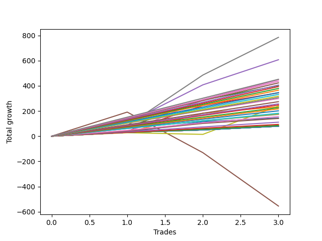

# Long Shepard 003 DB 
- Symbol: ES1y1d
- Date Range: 07/19/2021 - 07/08/2022
- Trading Period: 7:20-12:30
- Number of Trades: 3



| Name | Win Percent | Profit | Avg Profit / Trade | Avg Time / Trade | Avg Profit / Time |      | Name | Win Percent | Profit | Avg Profit / Trade | Avg Time / Trade | Avg Profit / Time |
| ---- | ----------- | ------ | ------------------ | ---------------- | ----------------- | ---- | ---- | ----------- | ------ | ------------------ | ---------------- | ----------------- |
| Sorted By <br> Profit | | | | | | | Sorted By <br> Win Percentage ||||||
| Seven | 100.00 | 392375.00 | 130791.67 | 14 03:49:00 | 9237.33 |     | Seven | 100.00 | 392375.00 | 130791.67 | 14 03:49:00 | 9237.33 |
| Four | 100.00 | 303500.00 | 101166.67 | 13 15:12:20 | 7420.41 |     | Four | 100.00 | 303500.00 | 101166.67 | 13 15:12:20 | 7420.41 |
| Two Hundred Fifteen | 100.00 | 225875.00 | 75291.67 | 08 18:39:20 | 8577.98 |     | Two Hundred Fifteen | 100.00 | 225875.00 | 75291.67 | 08 18:39:20 | 8577.98 |
| Six | 100.00 | 224125.00 | 74708.33 | 05 15:47:40 | 13203.78 |     | Six | 100.00 | 224125.00 | 74708.33 | 05 15:47:40 | 13203.78 |
| Two Hundred Fourteen.Five | 100.00 | 218250.00 | 72750.00 | 08 18:24:00 | 8298.48 |     | Two Hundred Fourteen.Five | 100.00 | 218250.00 | 72750.00 | 08 18:24:00 | 8298.48 |
| Two Hundred Fourteen | 100.00 | 211625.00 | 70541.67 | 08 00:29:00 | 8795.57 |     | Two Hundred Fourteen | 100.00 | 211625.00 | 70541.67 | 08 00:29:00 | 8795.57 |
| Two Hundred Thirteen.Five | 100.00 | 203000.00 | 67666.67 | 07 17:39:40 | 8747.12 |     | Two Hundred Thirteen.Five | 100.00 | 203000.00 | 67666.67 | 07 17:39:40 | 8747.12 |
| Two | 100.00 | 201000.00 | 67000.00 | 05 19:40:00 | 11513.13 |     | Two | 100.00 | 201000.00 | 67000.00 | 05 19:40:00 | 11513.13 |
| Two Hundred Thirteen | 100.00 | 197000.00 | 65666.67 | 07 17:33:40 | 8493.16 |     | Two Hundred Thirteen | 100.00 | 197000.00 | 65666.67 | 07 17:33:40 | 8493.16 |
| Two Hundred Twelve.Five | 100.00 | 189500.00 | 63166.67 | 06 13:37:40 | 9617.59 |     | Two Hundred Twelve.Five | 100.00 | 189500.00 | 63166.67 | 06 13:37:40 | 9617.59 |
| Two Hundred Twelve | 100.00 | 182625.00 | 60875.00 | 06 12:26:40 | 9338.78 |     | Two Hundred Twelve | 100.00 | 182625.00 | 60875.00 | 06 12:26:40 | 9338.78 |
| Two Hundred Eleven.Five | 100.00 | 173000.00 | 57666.67 | 06 11:45:00 | 8886.04 |     | Two Hundred Eleven.Five | 100.00 | 173000.00 | 57666.67 | 06 11:45:00 | 8886.04 |
| Three | 100.00 | 172250.00 | 57416.67 | 05 11:18:00 | 10495.05 |     | Three | 100.00 | 172250.00 | 57416.67 | 05 11:18:00 | 10495.05 |
| Two Hundred Eleven | 100.00 | 165750.00 | 55250.00 | 06 09:31:40 | 8636.87 |     | Two Hundred Eleven | 100.00 | 165750.00 | 55250.00 | 06 09:31:40 | 8636.87 |
| Two Hundred Ten.Five | 100.00 | 158500.00 | 52833.33 | 06 09:19:00 | 8270.46 |     | Two Hundred Ten.Five | 100.00 | 158500.00 | 52833.33 | 06 09:19:00 | 8270.46 |
| Two Hundred Ten | 100.00 | 153250.00 | 51083.33 | 06 08:44:40 | 8026.48 |     | Two Hundred Ten | 100.00 | 153250.00 | 51083.33 | 06 08:44:40 | 8026.48 |
| Two Hundred Nine.Five | 100.00 | 149250.00 | 49750.00 | 06 08:37:20 | 7823.24 |     | Two Hundred Nine.Five | 100.00 | 149250.00 | 49750.00 | 06 08:37:20 | 7823.24 |
| Two Hundred Nine | 100.00 | 137000.00 | 45666.67 | 06 02:23:40 | 7486.62 |     | Two Hundred Nine | 100.00 | 137000.00 | 45666.67 | 06 02:23:40 | 7486.62 |
| Two Hundred Eight.Five | 100.00 | 128250.00 | 42750.00 | 06 00:48:00 | 7085.64 |     | Two Hundred Eight.Five | 100.00 | 128250.00 | 42750.00 | 06 00:48:00 | 7085.64 |
| Two Hundred Eight | 100.00 | 124000.00 | 41333.33 | 05 23:58:20 | 6890.22 |     | Two Hundred Eight | 100.00 | 124000.00 | 41333.33 | 05 23:58:20 | 6890.22 |
| Seventy-Three | 66.67 | 120125.00 | 40041.67 | 10 09:41:00 | 3848.88 |     | One | 100.00 | 116875.00 | 38958.33 | 04 18:31:40 | 8163.96 |
| One | 100.00 | 116875.00 | 38958.33 | 04 18:31:40 | 8163.96 |     | Two Hundred Seven.Five | 100.00 | 113250.00 | 37750.00 | 04 18:52:20 | 7887.02 |
| Two Hundred Seven.Five | 100.00 | 113250.00 | 37750.00 | 04 18:52:20 | 7887.02 |     | Two Hundred Seven | 100.00 | 108500.00 | 36166.67 | 04 17:32:40 | 7644.58 |
| Two Hundred Seven | 100.00 | 108500.00 | 36166.67 | 04 17:32:40 | 7644.58 |     | Two Hundred Six.Five | 100.00 | 100625.00 | 33541.67 | 04 17:22:40 | 7100.16 |
| Two Hundred Six.Five | 100.00 | 100625.00 | 33541.67 | 04 17:22:40 | 7100.16 |     | Two Hundred Six | 100.00 | 91000.00 | 30333.33 | 03 00:36:40 | 10026.01 |
| Two Hundred Six | 100.00 | 91000.00 | 30333.33 | 03 00:36:40 | 10026.01 |     | Two Hundred Five.Five | 100.00 | 88750.00 | 29583.33 | 03 00:33:20 | 9785.60 |
| Two Hundred Five.Five | 100.00 | 88750.00 | 29583.33 | 03 00:33:20 | 9785.60 |     | Two Hundred Five | 100.00 | 86500.00 | 28833.33 | 03 00:29:20 | 9546.29 |
| Two Hundred Five | 100.00 | 86500.00 | 28833.33 | 03 00:29:20 | 9546.29 |     | Two Hundred Four.Five | 100.00 | 77625.00 | 25875.00 | 02 18:44:40 | 9304.15 |
| Two Hundred Four.Five | 100.00 | 77625.00 | 25875.00 | 02 18:44:40 | 9304.15 |     | Zero | 100.00 | 72250.00 | 24083.33 | 01 23:48:00 | 12092.05 |
| Zero | 100.00 | 72250.00 | 24083.33 | 01 23:48:00 | 12092.05 |     | Two Hundred Four | 100.00 | 70375.00 | 23458.33 | 02 17:38:20 | 8577.23 |
| Two Hundred Four | 100.00 | 70375.00 | 23458.33 | 02 17:38:20 | 8577.23 |     | Two Hundred Three.Five | 100.00 | 55500.00 | 18500.00 | 02 11:06:20 | 7511.98 |
| Two Hundred Three.Five | 100.00 | 55500.00 | 18500.00 | 02 11:06:20 | 7511.98 |     | Two Hundred Three | 100.00 | 46625.00 | 15541.67 | 00 01:31:40 | 244145.45 |
| Two Hundred Three | 100.00 | 46625.00 | 15541.67 | 00 01:31:40 | 244145.45 |     | Two Hundred Two.Five | 100.00 | 42625.00 | 14208.33 | 00 01:25:40 | 238832.68 |
| Two Hundred Two.Five | 100.00 | 42625.00 | 14208.33 | 00 01:25:40 | 238832.68 |     | Two Hundred Two | 100.00 | 42250.00 | 14083.33 | 00 01:16:40 | 264521.74 |
| Two Hundred Two | 100.00 | 42250.00 | 14083.33 | 00 01:16:40 | 264521.74 |     | Two Hundred One.Five | 100.00 | 39625.00 | 13208.33 | 00 00:03:00 | 6340000.00 |
| Two Hundred One.Five | 100.00 | 39625.00 | 13208.33 | 00 00:03:00 | 6340000.00 |     | Two Hundred One | 100.00 | 39625.00 | 13208.33 | 00 00:03:00 | 6340000.00 |
| Two Hundred One | 100.00 | 39625.00 | 13208.33 | 00 00:03:00 | 6340000.00 |     | Ninety | 100.00 | 39625.00 | 13208.33 | 00 00:03:00 | 6340000.00 |
| Ninety | 100.00 | 39625.00 | 13208.33 | 00 00:03:00 | 6340000.00 |     | Eighty-Nine | 100.00 | 39625.00 | 13208.33 | 00 00:03:00 | 6340000.00 |
| Eighty-Nine | 100.00 | 39625.00 | 13208.33 | 00 00:03:00 | 6340000.00 |     | Eighty-Eight | 100.00 | 39625.00 | 13208.33 | 00 00:03:00 | 6340000.00 |
| Eighty-Eight | 100.00 | 39625.00 | 13208.33 | 00 00:03:00 | 6340000.00 |     | Eighty-Seven | 100.00 | 39625.00 | 13208.33 | 00 00:03:00 | 6340000.00 |
| Eighty-Seven | 100.00 | 39625.00 | 13208.33 | 00 00:03:00 | 6340000.00 |     | Eighty-Six | 100.00 | 39625.00 | 13208.33 | 00 00:03:00 | 6340000.00 |
| Eighty-Six | 100.00 | 39625.00 | 13208.33 | 00 00:03:00 | 6340000.00 |     | Eighty-Five | 100.00 | 39625.00 | 13208.33 | 00 00:03:00 | 6340000.00 |
| Eighty-Five | 100.00 | 39625.00 | 13208.33 | 00 00:03:00 | 6340000.00 |     | Eighty-Four | 100.00 | 39625.00 | 13208.33 | 00 00:03:00 | 6340000.00 |
| Eighty-Four | 100.00 | 39625.00 | 13208.33 | 00 00:03:00 | 6340000.00 |     | Eighty-Three | 100.00 | 39625.00 | 13208.33 | 00 00:03:00 | 6340000.00 |
| Eighty-Three | 100.00 | 39625.00 | 13208.33 | 00 00:03:00 | 6340000.00 |     | Eighty-Two | 100.00 | 39625.00 | 13208.33 | 00 00:03:00 | 6340000.00 |
| Eighty-Two | 100.00 | 39625.00 | 13208.33 | 00 00:03:00 | 6340000.00 |     | Eighty-One | 100.00 | 39625.00 | 13208.33 | 00 00:03:00 | 6340000.00 |
| Eighty-One | 100.00 | 39625.00 | 13208.33 | 00 00:03:00 | 6340000.00 |     | Seventy-Three | 66.67 | 120125.00 | 40041.67 | 10 09:41:00 | 3848.88 |
| Five | 33.33 | -277500.00 | -92500.00 | 84 03:29:40 | -1099.29 |     | Five | 33.33 | -277500.00 | -92500.00 | 84 03:29:40 | -1099.29 |

## NO STOPLOSS

### Test Zero
* Sell when price hits the middle line of the 20p bollinger
* No Stoploss
* Results:
```
Total Trades: 3
Percent Up: 100.00
Percent Down: 0.00
Total Points Moved Up: 144.50
Potential Profit: 72250.00
Total Points Ups: 144.50 Count Ups: 3
Total Points Downs: 0.00 Count Downs: 0
```

<details><summary>Trades</summary>

<code>In: 2021-10-07 07:21:00		Out: 2021-10-07 07:24:00		Total Position Time: 00 00:03:00		Total Move Up: 30.50		Total to Date: 30.50</code> <br />
<code>In: 2022-03-10 07:21:00		Out: 2022-03-16 06:39:00		Total Position Time: 05 23:18:00		Total Move Up: 84.50		Total to Date: 115.00</code> <br />
<code>In: 2022-03-17 07:21:00		Out: 2022-03-17 07:24:00		Total Position Time: 00 00:03:00		Total Move Up: 29.50		Total to Date: 144.50</code> <br />


</details>

### Test One
* Sell when the price hits the upper line of the 20p 1std bollinger
* No Stoploss
* Results:
```
Total Trades: 3
Percent Up: 100.00
Percent Down: 0.00
Total Points Moved Up: 233.75
Potential Profit: 116875.00
Total Points Ups: 233.75 Count Ups: 3
Total Points Downs: 0.00 Count Downs: 0
```

<details><summary>Trades</summary>

<code>In: 2021-10-07 07:21:00		Out: 2021-10-14 08:40:00		Total Position Time: 07 01:19:00		Total Move Up: 29.50		Total to Date: 29.50</code> <br />
<code>In: 2022-03-10 07:21:00		Out: 2022-03-17 10:29:00		Total Position Time: 07 03:08:00		Total Move Up: 153.25		Total to Date: 182.75</code> <br />
<code>In: 2022-03-17 07:21:00		Out: 2022-03-17 10:29:00		Total Position Time: 00 03:08:00		Total Move Up: 51.00		Total to Date: 233.75</code> <br />


</details>

### Test Two
* Sell when the price hits the upper line of the 20p 2std bollinger
* No Stoploss
* Results:
```
Total Trades: 3
Percent Up: 100.00
Percent Down: 0.00
Total Points Moved Up: 402.00
Potential Profit: 201000.00
Total Points Ups: 402.00 Count Ups: 3
Total Points Downs: 0.00 Count Downs: 0
```

<details><summary>Trades</summary>

<code>In: 2021-10-07 07:21:00		Out: 2021-10-15 08:23:00		Total Position Time: 08 01:02:00		Total Move Up: 69.25		Total to Date: 69.25</code> <br />
<code>In: 2022-03-10 07:21:00		Out: 2022-03-18 12:20:00		Total Position Time: 08 04:59:00		Total Move Up: 217.50		Total to Date: 286.75</code> <br />
<code>In: 2022-03-17 07:21:00		Out: 2022-03-18 12:20:00		Total Position Time: 01 04:59:00		Total Move Up: 115.25		Total to Date: 402.00</code> <br />


</details>

### Test Three
* Sell when price hits the middle line of the 50p bollinger
* No Stoploss
* Results:
```
Total Trades: 3
Percent Up: 100.00
Percent Down: 0.00
Total Points Moved Up: 344.50
Potential Profit: 172250.00
Total Points Ups: 344.50 Count Ups: 3
Total Points Downs: 0.00 Count Downs: 0
```

<details><summary>Trades</summary>

<code>In: 2021-10-07 07:21:00		Out: 2021-10-14 10:57:00		Total Position Time: 07 03:36:00		Total Move Up: 40.25		Total to Date: 40.25</code> <br />
<code>In: 2022-03-10 07:21:00		Out: 2022-03-18 10:30:00		Total Position Time: 08 03:09:00		Total Move Up: 203.25		Total to Date: 243.50</code> <br />
<code>In: 2022-03-17 07:21:00		Out: 2022-03-18 10:30:00		Total Position Time: 01 03:09:00		Total Move Up: 101.00		Total to Date: 344.50</code> <br />


</details>

### Test Four
* Sell when the price hits the upper line of the 50p 1std bollinger
* No Stoploss
* Results:
```
Total Trades: 3
Percent Up: 100.00
Percent Down: 0.00
Total Points Moved Up: 607.00
Potential Profit: 303500.00
Total Points Ups: 607.00 Count Ups: 3
Total Points Downs: 0.00 Count Downs: 0
```

<details><summary>Trades</summary>

<code>In: 2021-10-07 07:21:00		Out: 2021-10-19 06:40:00		Total Position Time: 11 23:19:00		Total Move Up: 105.75		Total to Date: 105.75</code> <br />
<code>In: 2022-03-10 07:21:00		Out: 2022-03-28 06:30:00		Total Position Time: 17 23:09:00		Total Move Up: 301.75		Total to Date: 407.50</code> <br />
<code>In: 2022-03-17 07:21:00		Out: 2022-03-28 06:30:00		Total Position Time: 10 23:09:00		Total Move Up: 199.50		Total to Date: 607.00</code> <br />


</details>

### Test Five
* Sell when the price hits the upper line of the 50p 2std bollinger
* No Stoploss
* Results:
```
Total Trades: 3
Percent Up: 33.33
Percent Down: 66.67
Total Points Moved Up: -555.00
Potential Profit: -277500.00
Total Points Ups: 191.25 Count Ups: 1
Total Points Downs: -746.25 Count Downs: 2
```

<details><summary>Trades</summary>

<code>In: 2021-10-07 07:21:00		Out: 2021-10-26 06:36:00		Total Position Time: 18 23:15:00		Total Move Up: 191.25		Total to Date: 191.25</code> <br />
<code>In: 2022-03-10 07:21:00		Out: 2022-07-08 12:58:00		Total Position Time: 120 05:37:00		Total Move Up: -322.00		Total to Date: -130.75</code> <br />
<code>In: 2022-03-17 07:21:00		Out: 2022-07-08 12:58:00		Total Position Time: 113 05:37:00		Total Move Up: -424.25		Total to Date: -555.00</code> <br />


</details>

### Test Six
* Sell when the price hits the middle line of the 1std VWAP
* No Stoploss
* Results:
```
Total Trades: 3
Percent Up: 100.00
Percent Down: 0.00
Total Points Moved Up: 448.25
Potential Profit: 224125.00
Total Points Ups: 448.25 Count Ups: 3
Total Points Downs: 0.00 Count Downs: 0
```

<details><summary>Trades</summary>

<code>In: 2021-10-07 07:21:00		Out: 2021-10-07 07:24:00		Total Position Time: 00 00:03:00		Total Move Up: 30.50		Total to Date: 30.50</code> <br />
<code>In: 2022-03-10 07:21:00		Out: 2022-03-22 07:01:00		Total Position Time: 11 23:40:00		Total Move Up: 260.00		Total to Date: 290.50</code> <br />
<code>In: 2022-03-17 07:21:00		Out: 2022-03-22 07:01:00		Total Position Time: 04 23:40:00		Total Move Up: 157.75		Total to Date: 448.25</code> <br />


</details>

### Test Seven
* Sell when the price hits the upper line of the 1std VWAP
* No Stoploss
* Results:
```
Total Trades: 3
Percent Up: 100.00
Percent Down: 0.00
Total Points Moved Up: 784.75
Potential Profit: 392375.00
Total Points Ups: 784.75 Count Ups: 3
Total Points Downs: 0.00 Count Downs: 0
```

<details><summary>Trades</summary>

<code>In: 2021-10-07 07:21:00		Out: 2021-10-18 08:20:00		Total Position Time: 11 00:59:00		Total Move Up: 83.50		Total to Date: 83.50</code> <br />
<code>In: 2022-03-10 07:21:00		Out: 2022-03-29 12:35:00		Total Position Time: 19 05:14:00		Total Move Up: 401.75		Total to Date: 485.25</code> <br />
<code>In: 2022-03-17 07:21:00		Out: 2022-03-29 12:35:00		Total Position Time: 12 05:14:00		Total Move Up: 299.50		Total to Date: 784.75</code> <br />


</details>

## SPECIAL EXIT CONDITIONS 

### Test Seventy-Three
* Sell when the linear regression slope changes to negative
* No Stoploss
* Results:
```
Total Trades: 3
Percent Up: 66.67
Percent Down: 33.33
Total Points Moved Up: 240.25
Potential Profit: 120125.00
Total Points Ups: 253.50 Count Ups: 2
Total Points Downs: -13.25 Count Downs: 1
```

<details><summary>Trades</summary>

<code>In: 2021-10-07 07:21:00		Out: 2021-10-14 08:22:00		Total Position Time: 07 01:01:00		Total Move Up: 27.50		Total to Date: 27.50</code> <br />
<code>In: 2022-03-10 07:21:00		Out: 2022-03-15 08:22:00		Total Position Time: 05 01:01:00		Total Move Up: -13.25		Total to Date: 14.25</code> <br />
<code>In: 2022-03-17 07:21:00		Out: 2022-04-05 10:22:00		Total Position Time: 19 03:01:00		Total Move Up: 226.00		Total to Date: 240.25</code> <br />


</details>

## TAKE PROFIT

### Test Eighty-One
* Take Profit of 1 Point
* No Stoploss
* Results:
```
Total Trades: 3
Percent Up: 100.00
Percent Down: 0.00
Total Points Moved Up: 79.25
Potential Profit: 39625.00
Total Points Ups: 79.25 Count Ups: 3
Total Points Downs: 0.00 Count Downs: 0
```

<details><summary>Trades</summary>

<code>In: 2021-10-07 07:21:00		Out: 2021-10-07 07:24:00		Total Position Time: 00 00:03:00		Total Move Up: 30.50		Total to Date: 30.50</code> <br />
<code>In: 2022-03-10 07:21:00		Out: 2022-03-10 07:24:00		Total Position Time: 00 00:03:00		Total Move Up: 19.25		Total to Date: 49.75</code> <br />
<code>In: 2022-03-17 07:21:00		Out: 2022-03-17 07:24:00		Total Position Time: 00 00:03:00		Total Move Up: 29.50		Total to Date: 79.25</code> <br />


</details>

### Test Eighty-Two
* Take Profit of 2 Point
* No Stoploss
* Results:
```
Total Trades: 3
Percent Up: 100.00
Percent Down: 0.00
Total Points Moved Up: 79.25
Potential Profit: 39625.00
Total Points Ups: 79.25 Count Ups: 3
Total Points Downs: 0.00 Count Downs: 0
```

<details><summary>Trades</summary>

<code>In: 2021-10-07 07:21:00		Out: 2021-10-07 07:24:00		Total Position Time: 00 00:03:00		Total Move Up: 30.50		Total to Date: 30.50</code> <br />
<code>In: 2022-03-10 07:21:00		Out: 2022-03-10 07:24:00		Total Position Time: 00 00:03:00		Total Move Up: 19.25		Total to Date: 49.75</code> <br />
<code>In: 2022-03-17 07:21:00		Out: 2022-03-17 07:24:00		Total Position Time: 00 00:03:00		Total Move Up: 29.50		Total to Date: 79.25</code> <br />


</details>

### Test Eighty-Three
* Take Profit of 3 Point
* No Stoploss
* Results:
```
Total Trades: 3
Percent Up: 100.00
Percent Down: 0.00
Total Points Moved Up: 79.25
Potential Profit: 39625.00
Total Points Ups: 79.25 Count Ups: 3
Total Points Downs: 0.00 Count Downs: 0
```

<details><summary>Trades</summary>

<code>In: 2021-10-07 07:21:00		Out: 2021-10-07 07:24:00		Total Position Time: 00 00:03:00		Total Move Up: 30.50		Total to Date: 30.50</code> <br />
<code>In: 2022-03-10 07:21:00		Out: 2022-03-10 07:24:00		Total Position Time: 00 00:03:00		Total Move Up: 19.25		Total to Date: 49.75</code> <br />
<code>In: 2022-03-17 07:21:00		Out: 2022-03-17 07:24:00		Total Position Time: 00 00:03:00		Total Move Up: 29.50		Total to Date: 79.25</code> <br />


</details>

### Test Eighty-Four
* Take Profit of 4 Point
* No Stoploss
* Results:
```
Total Trades: 3
Percent Up: 100.00
Percent Down: 0.00
Total Points Moved Up: 79.25
Potential Profit: 39625.00
Total Points Ups: 79.25 Count Ups: 3
Total Points Downs: 0.00 Count Downs: 0
```

<details><summary>Trades</summary>

<code>In: 2021-10-07 07:21:00		Out: 2021-10-07 07:24:00		Total Position Time: 00 00:03:00		Total Move Up: 30.50		Total to Date: 30.50</code> <br />
<code>In: 2022-03-10 07:21:00		Out: 2022-03-10 07:24:00		Total Position Time: 00 00:03:00		Total Move Up: 19.25		Total to Date: 49.75</code> <br />
<code>In: 2022-03-17 07:21:00		Out: 2022-03-17 07:24:00		Total Position Time: 00 00:03:00		Total Move Up: 29.50		Total to Date: 79.25</code> <br />


</details>

### Test Eighty-Five
* Take Profit of 5 Point
* No Stoploss
* Results:
```
Total Trades: 3
Percent Up: 100.00
Percent Down: 0.00
Total Points Moved Up: 79.25
Potential Profit: 39625.00
Total Points Ups: 79.25 Count Ups: 3
Total Points Downs: 0.00 Count Downs: 0
```

<details><summary>Trades</summary>

<code>In: 2021-10-07 07:21:00		Out: 2021-10-07 07:24:00		Total Position Time: 00 00:03:00		Total Move Up: 30.50		Total to Date: 30.50</code> <br />
<code>In: 2022-03-10 07:21:00		Out: 2022-03-10 07:24:00		Total Position Time: 00 00:03:00		Total Move Up: 19.25		Total to Date: 49.75</code> <br />
<code>In: 2022-03-17 07:21:00		Out: 2022-03-17 07:24:00		Total Position Time: 00 00:03:00		Total Move Up: 29.50		Total to Date: 79.25</code> <br />


</details>

### Test Eighty-Six
* Take Profit of 6 Point
* No Stoploss
* Results:
```
Total Trades: 3
Percent Up: 100.00
Percent Down: 0.00
Total Points Moved Up: 79.25
Potential Profit: 39625.00
Total Points Ups: 79.25 Count Ups: 3
Total Points Downs: 0.00 Count Downs: 0
```

<details><summary>Trades</summary>

<code>In: 2021-10-07 07:21:00		Out: 2021-10-07 07:24:00		Total Position Time: 00 00:03:00		Total Move Up: 30.50		Total to Date: 30.50</code> <br />
<code>In: 2022-03-10 07:21:00		Out: 2022-03-10 07:24:00		Total Position Time: 00 00:03:00		Total Move Up: 19.25		Total to Date: 49.75</code> <br />
<code>In: 2022-03-17 07:21:00		Out: 2022-03-17 07:24:00		Total Position Time: 00 00:03:00		Total Move Up: 29.50		Total to Date: 79.25</code> <br />


</details>

### Test Eighty-Seven
* Take Profit of 7 Point
* No Stoploss
* Results:
```
Total Trades: 3
Percent Up: 100.00
Percent Down: 0.00
Total Points Moved Up: 79.25
Potential Profit: 39625.00
Total Points Ups: 79.25 Count Ups: 3
Total Points Downs: 0.00 Count Downs: 0
```

<details><summary>Trades</summary>

<code>In: 2021-10-07 07:21:00		Out: 2021-10-07 07:24:00		Total Position Time: 00 00:03:00		Total Move Up: 30.50		Total to Date: 30.50</code> <br />
<code>In: 2022-03-10 07:21:00		Out: 2022-03-10 07:24:00		Total Position Time: 00 00:03:00		Total Move Up: 19.25		Total to Date: 49.75</code> <br />
<code>In: 2022-03-17 07:21:00		Out: 2022-03-17 07:24:00		Total Position Time: 00 00:03:00		Total Move Up: 29.50		Total to Date: 79.25</code> <br />


</details>

### Test Eighty-Eight
* Take Profit of 8 Point
* No Stoploss
* Results:
```
Total Trades: 3
Percent Up: 100.00
Percent Down: 0.00
Total Points Moved Up: 79.25
Potential Profit: 39625.00
Total Points Ups: 79.25 Count Ups: 3
Total Points Downs: 0.00 Count Downs: 0
```

<details><summary>Trades</summary>

<code>In: 2021-10-07 07:21:00		Out: 2021-10-07 07:24:00		Total Position Time: 00 00:03:00		Total Move Up: 30.50		Total to Date: 30.50</code> <br />
<code>In: 2022-03-10 07:21:00		Out: 2022-03-10 07:24:00		Total Position Time: 00 00:03:00		Total Move Up: 19.25		Total to Date: 49.75</code> <br />
<code>In: 2022-03-17 07:21:00		Out: 2022-03-17 07:24:00		Total Position Time: 00 00:03:00		Total Move Up: 29.50		Total to Date: 79.25</code> <br />


</details>

### Test Eighty-Nine
* Take Profit of 9 Point
* No Stoploss
* Results:
```
Total Trades: 3
Percent Up: 100.00
Percent Down: 0.00
Total Points Moved Up: 79.25
Potential Profit: 39625.00
Total Points Ups: 79.25 Count Ups: 3
Total Points Downs: 0.00 Count Downs: 0
```

<details><summary>Trades</summary>

<code>In: 2021-10-07 07:21:00		Out: 2021-10-07 07:24:00		Total Position Time: 00 00:03:00		Total Move Up: 30.50		Total to Date: 30.50</code> <br />
<code>In: 2022-03-10 07:21:00		Out: 2022-03-10 07:24:00		Total Position Time: 00 00:03:00		Total Move Up: 19.25		Total to Date: 49.75</code> <br />
<code>In: 2022-03-17 07:21:00		Out: 2022-03-17 07:24:00		Total Position Time: 00 00:03:00		Total Move Up: 29.50		Total to Date: 79.25</code> <br />


</details>

### Test Ninety
* Take Profit of 10 Point
* No Stoploss
* Results:
```
Total Trades: 3
Percent Up: 100.00
Percent Down: 0.00
Total Points Moved Up: 79.25
Potential Profit: 39625.00
Total Points Ups: 79.25 Count Ups: 3
Total Points Downs: 0.00 Count Downs: 0
```

<details><summary>Trades</summary>

<code>In: 2021-10-07 07:21:00		Out: 2021-10-07 07:24:00		Total Position Time: 00 00:03:00		Total Move Up: 30.50		Total to Date: 30.50</code> <br />
<code>In: 2022-03-10 07:21:00		Out: 2022-03-10 07:24:00		Total Position Time: 00 00:03:00		Total Move Up: 19.25		Total to Date: 49.75</code> <br />
<code>In: 2022-03-17 07:21:00		Out: 2022-03-17 07:24:00		Total Position Time: 00 00:03:00		Total Move Up: 29.50		Total to Date: 79.25</code> <br />


</details>

## DAILY TAKE PROFITS

### Test Two Hundred One
* Take Profit of 10 Point
* No Stoploss
* Results:
```
Total Trades: 3
Percent Up: 100.00
Percent Down: 0.00
Total Points Moved Up: 79.25
Potential Profit: 39625.00
Total Points Ups: 79.25 Count Ups: 3
Total Points Downs: 0.00 Count Downs: 0
```

<details><summary>Trades</summary>

<code>In: 2021-10-07 07:21:00		Out: 2021-10-07 07:24:00		Total Position Time: 00 00:03:00		Total Move Up: 30.50		Total to Date: 30.50</code> <br />
<code>In: 2022-03-10 07:21:00		Out: 2022-03-10 07:24:00		Total Position Time: 00 00:03:00		Total Move Up: 19.25		Total to Date: 49.75</code> <br />
<code>In: 2022-03-17 07:21:00		Out: 2022-03-17 07:24:00		Total Position Time: 00 00:03:00		Total Move Up: 29.50		Total to Date: 79.25</code> <br />


</details>

### Test Two Hundred One.Five
* Take Profit of 15 Point
* No Stoploss
* Results:
```
Total Trades: 3
Percent Up: 100.00
Percent Down: 0.00
Total Points Moved Up: 79.25
Potential Profit: 39625.00
Total Points Ups: 79.25 Count Ups: 3
Total Points Downs: 0.00 Count Downs: 0
```

<details><summary>Trades</summary>

<code>In: 2021-10-07 07:21:00		Out: 2021-10-07 07:24:00		Total Position Time: 00 00:03:00		Total Move Up: 30.50		Total to Date: 30.50</code> <br />
<code>In: 2022-03-10 07:21:00		Out: 2022-03-10 07:24:00		Total Position Time: 00 00:03:00		Total Move Up: 19.25		Total to Date: 49.75</code> <br />
<code>In: 2022-03-17 07:21:00		Out: 2022-03-17 07:24:00		Total Position Time: 00 00:03:00		Total Move Up: 29.50		Total to Date: 79.25</code> <br />


</details>

### Test Two Hundred Two
* Take Profit of 20 Point
* No Stoploss
* Results:
```
Total Trades: 3
Percent Up: 100.00
Percent Down: 0.00
Total Points Moved Up: 84.50
Potential Profit: 42250.00
Total Points Ups: 84.50 Count Ups: 3
Total Points Downs: 0.00 Count Downs: 0
```

<details><summary>Trades</summary>

<code>In: 2021-10-07 07:21:00		Out: 2021-10-07 07:24:00		Total Position Time: 00 00:03:00		Total Move Up: 30.50		Total to Date: 30.50</code> <br />
<code>In: 2022-03-10 07:21:00		Out: 2022-03-10 11:05:00		Total Position Time: 00 03:44:00		Total Move Up: 24.50		Total to Date: 55.00</code> <br />
<code>In: 2022-03-17 07:21:00		Out: 2022-03-17 07:24:00		Total Position Time: 00 00:03:00		Total Move Up: 29.50		Total to Date: 84.50</code> <br />


</details>

### Test Two Hundred Two.Five
* Take Profit of 25 Point
* No Stoploss
* Results:
```
Total Trades: 3
Percent Up: 100.00
Percent Down: 0.00
Total Points Moved Up: 85.25
Potential Profit: 42625.00
Total Points Ups: 85.25 Count Ups: 3
Total Points Downs: 0.00 Count Downs: 0
```

<details><summary>Trades</summary>

<code>In: 2021-10-07 07:21:00		Out: 2021-10-07 07:24:00		Total Position Time: 00 00:03:00		Total Move Up: 30.50		Total to Date: 30.50</code> <br />
<code>In: 2022-03-10 07:21:00		Out: 2022-03-10 11:32:00		Total Position Time: 00 04:11:00		Total Move Up: 25.25		Total to Date: 55.75</code> <br />
<code>In: 2022-03-17 07:21:00		Out: 2022-03-17 07:24:00		Total Position Time: 00 00:03:00		Total Move Up: 29.50		Total to Date: 85.25</code> <br />


</details>

### Test Two Hundred Three
* Take Profit of 30 Point
* No Stoploss
* Results:
```
Total Trades: 3
Percent Up: 100.00
Percent Down: 0.00
Total Points Moved Up: 93.25
Potential Profit: 46625.00
Total Points Ups: 93.25 Count Ups: 3
Total Points Downs: 0.00 Count Downs: 0
```

<details><summary>Trades</summary>

<code>In: 2021-10-07 07:21:00		Out: 2021-10-07 07:24:00		Total Position Time: 00 00:03:00		Total Move Up: 30.50		Total to Date: 30.50</code> <br />
<code>In: 2022-03-10 07:21:00		Out: 2022-03-10 11:49:00		Total Position Time: 00 04:28:00		Total Move Up: 32.50		Total to Date: 63.00</code> <br />
<code>In: 2022-03-17 07:21:00		Out: 2022-03-17 07:25:00		Total Position Time: 00 00:04:00		Total Move Up: 30.25		Total to Date: 93.25</code> <br />


</details>

### Test Two Hundred Three.Five
* Take Profit of 35 Point
* No Stoploss
* Results:
```
Total Trades: 3
Percent Up: 100.00
Percent Down: 0.00
Total Points Moved Up: 111.00
Potential Profit: 55500.00
Total Points Ups: 111.00 Count Ups: 3
Total Points Downs: 0.00 Count Downs: 0
```

<details><summary>Trades</summary>

<code>In: 2021-10-07 07:21:00		Out: 2021-10-14 09:06:00		Total Position Time: 07 01:45:00		Total Move Up: 35.25		Total to Date: 35.25</code> <br />
<code>In: 2022-03-10 07:21:00		Out: 2022-03-10 12:54:00		Total Position Time: 00 05:33:00		Total Move Up: 38.25		Total to Date: 73.50</code> <br />
<code>In: 2022-03-17 07:21:00		Out: 2022-03-17 09:22:00		Total Position Time: 00 02:01:00		Total Move Up: 37.50		Total to Date: 111.00</code> <br />


</details>

### Test Two Hundred Four
* Take Profit of 40 Point
* No Stoploss
* Results:
```
Total Trades: 3
Percent Up: 100.00
Percent Down: 0.00
Total Points Moved Up: 140.75
Potential Profit: 70375.00
Total Points Ups: 140.75 Count Ups: 3
Total Points Downs: 0.00 Count Downs: 0
```

<details><summary>Trades</summary>

<code>In: 2021-10-07 07:21:00		Out: 2021-10-14 10:57:00		Total Position Time: 07 03:36:00		Total Move Up: 40.25		Total to Date: 40.25</code> <br />
<code>In: 2022-03-10 07:21:00		Out: 2022-03-11 06:31:00		Total Position Time: 00 23:10:00		Total Move Up: 60.75		Total to Date: 101.00</code> <br />
<code>In: 2022-03-17 07:21:00		Out: 2022-03-17 09:30:00		Total Position Time: 00 02:09:00		Total Move Up: 39.75		Total to Date: 140.75</code> <br />


</details>

### Test Two Hundred Four.Five
* Take Profit of 45 Point
* No Stoploss
* Results:
```
Total Trades: 3
Percent Up: 100.00
Percent Down: 0.00
Total Points Moved Up: 155.25
Potential Profit: 77625.00
Total Points Ups: 155.25 Count Ups: 3
Total Points Downs: 0.00 Count Downs: 0
```

<details><summary>Trades</summary>

<code>In: 2021-10-07 07:21:00		Out: 2021-10-14 13:19:00		Total Position Time: 07 05:58:00		Total Move Up: 46.00		Total to Date: 46.00</code> <br />
<code>In: 2022-03-10 07:21:00		Out: 2022-03-11 06:31:00		Total Position Time: 00 23:10:00		Total Move Up: 60.75		Total to Date: 106.75</code> <br />
<code>In: 2022-03-17 07:21:00		Out: 2022-03-17 10:27:00		Total Position Time: 00 03:06:00		Total Move Up: 48.50		Total to Date: 155.25</code> <br />


</details>

### Test Two Hundred Five
* Take Profit of 50 Point
* No Stoploss
* Results:
```
Total Trades: 3
Percent Up: 100.00
Percent Down: 0.00
Total Points Moved Up: 173.00
Potential Profit: 86500.00
Total Points Ups: 173.00 Count Ups: 3
Total Points Downs: 0.00 Count Downs: 0
```

<details><summary>Trades</summary>

<code>In: 2021-10-07 07:21:00		Out: 2021-10-15 06:31:00		Total Position Time: 07 23:10:00		Total Move Up: 61.25		Total to Date: 61.25</code> <br />
<code>In: 2022-03-10 07:21:00		Out: 2022-03-11 06:31:00		Total Position Time: 00 23:10:00		Total Move Up: 60.75		Total to Date: 122.00</code> <br />
<code>In: 2022-03-17 07:21:00		Out: 2022-03-17 10:29:00		Total Position Time: 00 03:08:00		Total Move Up: 51.00		Total to Date: 173.00</code> <br />


</details>

### Test Two Hundred Five.Five
* Take Profit of 55 Point
* No Stoploss
* Results:
```
Total Trades: 3
Percent Up: 100.00
Percent Down: 0.00
Total Points Moved Up: 177.50
Potential Profit: 88750.00
Total Points Ups: 177.50 Count Ups: 3
Total Points Downs: 0.00 Count Downs: 0
```

<details><summary>Trades</summary>

<code>In: 2021-10-07 07:21:00		Out: 2021-10-15 06:31:00		Total Position Time: 07 23:10:00		Total Move Up: 61.25		Total to Date: 61.25</code> <br />
<code>In: 2022-03-10 07:21:00		Out: 2022-03-11 06:31:00		Total Position Time: 00 23:10:00		Total Move Up: 60.75		Total to Date: 122.00</code> <br />
<code>In: 2022-03-17 07:21:00		Out: 2022-03-17 10:41:00		Total Position Time: 00 03:20:00		Total Move Up: 55.50		Total to Date: 177.50</code> <br />


</details>

### Test Two Hundred Six
* Take Profit of 60 Point
* No Stoploss
* Results:
```
Total Trades: 3
Percent Up: 100.00
Percent Down: 0.00
Total Points Moved Up: 182.00
Potential Profit: 91000.00
Total Points Ups: 182.00 Count Ups: 3
Total Points Downs: 0.00 Count Downs: 0
```

<details><summary>Trades</summary>

<code>In: 2021-10-07 07:21:00		Out: 2021-10-15 06:31:00		Total Position Time: 07 23:10:00		Total Move Up: 61.25		Total to Date: 61.25</code> <br />
<code>In: 2022-03-10 07:21:00		Out: 2022-03-11 06:31:00		Total Position Time: 00 23:10:00		Total Move Up: 60.75		Total to Date: 122.00</code> <br />
<code>In: 2022-03-17 07:21:00		Out: 2022-03-17 10:51:00		Total Position Time: 00 03:30:00		Total Move Up: 60.00		Total to Date: 182.00</code> <br />


</details>

### Test Two Hundred Six.Five
* Take Profit of 65 Point
* No Stoploss
* Results:
```
Total Trades: 3
Percent Up: 100.00
Percent Down: 0.00
Total Points Moved Up: 201.25
Potential Profit: 100625.00
Total Points Ups: 201.25 Count Ups: 3
Total Points Downs: 0.00 Count Downs: 0
```

<details><summary>Trades</summary>

<code>In: 2021-10-07 07:21:00		Out: 2021-10-15 06:57:00		Total Position Time: 07 23:36:00		Total Move Up: 67.75		Total to Date: 67.75</code> <br />
<code>In: 2022-03-10 07:21:00		Out: 2022-03-16 06:31:00		Total Position Time: 05 23:10:00		Total Move Up: 67.00		Total to Date: 134.75</code> <br />
<code>In: 2022-03-17 07:21:00		Out: 2022-03-17 12:43:00		Total Position Time: 00 05:22:00		Total Move Up: 66.50		Total to Date: 201.25</code> <br />


</details>

### Test Two Hundred Seven
* Take Profit of 70 Point
* No Stoploss
* Results:
```
Total Trades: 3
Percent Up: 100.00
Percent Down: 0.00
Total Points Moved Up: 217.00
Potential Profit: 108500.00
Total Points Ups: 217.00 Count Ups: 3
Total Points Downs: 0.00 Count Downs: 0
```

<details><summary>Trades</summary>

<code>In: 2021-10-07 07:21:00		Out: 2021-10-15 07:07:00		Total Position Time: 07 23:46:00		Total Move Up: 71.75		Total to Date: 71.75</code> <br />
<code>In: 2022-03-10 07:21:00		Out: 2022-03-16 06:34:00		Total Position Time: 05 23:13:00		Total Move Up: 70.25		Total to Date: 142.00</code> <br />
<code>In: 2022-03-17 07:21:00		Out: 2022-03-17 13:00:00		Total Position Time: 00 05:39:00		Total Move Up: 75.00		Total to Date: 217.00</code> <br />


</details>

### Test Two Hundred Seven.Five
* Take Profit of 75 Point
* No Stoploss
* Results:
```
Total Trades: 3
Percent Up: 100.00
Percent Down: 0.00
Total Points Moved Up: 226.50
Potential Profit: 113250.00
Total Points Ups: 226.50 Count Ups: 3
Total Points Downs: 0.00 Count Downs: 0
```

<details><summary>Trades</summary>

<code>In: 2021-10-07 07:21:00		Out: 2021-10-15 11:04:00		Total Position Time: 08 03:43:00		Total Move Up: 75.75		Total to Date: 75.75</code> <br />
<code>In: 2022-03-10 07:21:00		Out: 2022-03-16 06:36:00		Total Position Time: 05 23:15:00		Total Move Up: 75.75		Total to Date: 151.50</code> <br />
<code>In: 2022-03-17 07:21:00		Out: 2022-03-17 13:00:00		Total Position Time: 00 05:39:00		Total Move Up: 75.00		Total to Date: 226.50</code> <br />


</details>

### Test Two Hundred Eight
* Take Profit of 80 Point
* No Stoploss
* Results:
```
Total Trades: 3
Percent Up: 100.00
Percent Down: 0.00
Total Points Moved Up: 248.00
Potential Profit: 124000.00
Total Points Ups: 248.00 Count Ups: 3
Total Points Downs: 0.00 Count Downs: 0
```

<details><summary>Trades</summary>

<code>In: 2021-10-07 07:21:00		Out: 2021-10-18 08:08:00		Total Position Time: 11 00:47:00		Total Move Up: 80.00		Total to Date: 80.00</code> <br />
<code>In: 2022-03-10 07:21:00		Out: 2022-03-16 06:39:00		Total Position Time: 05 23:18:00		Total Move Up: 84.50		Total to Date: 164.50</code> <br />
<code>In: 2022-03-17 07:21:00		Out: 2022-03-18 07:11:00		Total Position Time: 00 23:50:00		Total Move Up: 83.50		Total to Date: 248.00</code> <br />


</details>

### Test Two Hundred Eight.Five
* Take Profit of 85 Point
* No Stoploss
* Results:
```
Total Trades: 3
Percent Up: 100.00
Percent Down: 0.00
Total Points Moved Up: 256.50
Potential Profit: 128250.00
Total Points Ups: 256.50 Count Ups: 3
Total Points Downs: 0.00 Count Downs: 0
```

<details><summary>Trades</summary>

<code>In: 2021-10-07 07:21:00		Out: 2021-10-18 08:22:00		Total Position Time: 11 01:01:00		Total Move Up: 85.25		Total to Date: 85.25</code> <br />
<code>In: 2022-03-10 07:21:00		Out: 2022-03-16 06:40:00		Total Position Time: 05 23:19:00		Total Move Up: 85.50		Total to Date: 170.75</code> <br />
<code>In: 2022-03-17 07:21:00		Out: 2022-03-18 09:25:00		Total Position Time: 01 02:04:00		Total Move Up: 85.75		Total to Date: 256.50</code> <br />


</details>

### Test Two Hundred Nine
* Take Profit of 90 Point
* No Stoploss
* Results:
```
Total Trades: 3
Percent Up: 100.00
Percent Down: 0.00
Total Points Moved Up: 274.00
Potential Profit: 137000.00
Total Points Ups: 274.00 Count Ups: 3
Total Points Downs: 0.00 Count Downs: 0
```

<details><summary>Trades</summary>

<code>In: 2021-10-07 07:21:00		Out: 2021-10-18 12:51:00		Total Position Time: 11 05:30:00		Total Move Up: 90.25		Total to Date: 90.25</code> <br />
<code>In: 2022-03-10 07:21:00		Out: 2022-03-16 06:47:00		Total Position Time: 05 23:26:00		Total Move Up: 91.75		Total to Date: 182.00</code> <br />
<code>In: 2022-03-17 07:21:00		Out: 2022-03-18 09:36:00		Total Position Time: 01 02:15:00		Total Move Up: 92.00		Total to Date: 274.00</code> <br />


</details>

### Test Two Hundred Nine.Five
* Take Profit of 95 Point
* No Stoploss
* Results:
```
Total Trades: 3
Percent Up: 100.00
Percent Down: 0.00
Total Points Moved Up: 298.50
Potential Profit: 149250.00
Total Points Ups: 298.50 Count Ups: 3
Total Points Downs: 0.00 Count Downs: 0
```

<details><summary>Trades</summary>

<code>In: 2021-10-07 07:21:00		Out: 2021-10-19 06:31:00		Total Position Time: 11 23:10:00		Total Move Up: 103.50		Total to Date: 103.50</code> <br />
<code>In: 2022-03-10 07:21:00		Out: 2022-03-16 07:16:00		Total Position Time: 05 23:55:00		Total Move Up: 99.75		Total to Date: 203.25</code> <br />
<code>In: 2022-03-17 07:21:00		Out: 2022-03-18 10:08:00		Total Position Time: 01 02:47:00		Total Move Up: 95.25		Total to Date: 298.50</code> <br />


</details>

### Test Two Hundred Ten
* Take Profit of 100 Point
* No Stoploss
* Results:
```
Total Trades: 3
Percent Up: 100.00
Percent Down: 0.00
Total Points Moved Up: 306.50
Potential Profit: 153250.00
Total Points Ups: 306.50 Count Ups: 3
Total Points Downs: 0.00 Count Downs: 0
```

<details><summary>Trades</summary>

<code>In: 2021-10-07 07:21:00		Out: 2021-10-19 06:31:00		Total Position Time: 11 23:10:00		Total Move Up: 103.50		Total to Date: 103.50</code> <br />
<code>In: 2022-03-10 07:21:00		Out: 2022-03-16 07:17:00		Total Position Time: 05 23:56:00		Total Move Up: 102.25		Total to Date: 205.75</code> <br />
<code>In: 2022-03-17 07:21:00		Out: 2022-03-18 10:29:00		Total Position Time: 01 03:08:00		Total Move Up: 100.75		Total to Date: 306.50</code> <br />


</details>

### Test Two Hundred Ten.Five
* Take Profit of 105 Point
* No Stoploss
* Results:
```
Total Trades: 3
Percent Up: 100.00
Percent Down: 0.00
Total Points Moved Up: 317.00
Potential Profit: 158500.00
Total Points Ups: 317.00 Count Ups: 3
Total Points Downs: 0.00 Count Downs: 0
```

<details><summary>Trades</summary>

<code>In: 2021-10-07 07:21:00		Out: 2021-10-19 06:40:00		Total Position Time: 11 23:19:00		Total Move Up: 105.75		Total to Date: 105.75</code> <br />
<code>In: 2022-03-10 07:21:00		Out: 2022-03-16 07:18:00		Total Position Time: 05 23:57:00		Total Move Up: 105.75		Total to Date: 211.50</code> <br />
<code>In: 2022-03-17 07:21:00		Out: 2022-03-18 12:02:00		Total Position Time: 01 04:41:00		Total Move Up: 105.50		Total to Date: 317.00</code> <br />


</details>

### Test Two Hundred Eleven
* Take Profit of 110 Point
* No Stoploss
* Results:
```
Total Trades: 3
Percent Up: 100.00
Percent Down: 0.00
Total Points Moved Up: 331.50
Potential Profit: 165750.00
Total Points Ups: 331.50 Count Ups: 3
Total Points Downs: 0.00 Count Downs: 0
```

<details><summary>Trades</summary>

<code>In: 2021-10-07 07:21:00		Out: 2021-10-19 07:09:00		Total Position Time: 11 23:48:00		Total Move Up: 110.50		Total to Date: 110.50</code> <br />
<code>In: 2022-03-10 07:21:00		Out: 2022-03-16 07:19:00		Total Position Time: 05 23:58:00		Total Move Up: 110.75		Total to Date: 221.25</code> <br />
<code>In: 2022-03-17 07:21:00		Out: 2022-03-18 12:10:00		Total Position Time: 01 04:49:00		Total Move Up: 110.25		Total to Date: 331.50</code> <br />


</details>

### Test Two Hundred Eleven.Five
* Take Profit of 115 Point
* No Stoploss
* Results:
```
Total Trades: 3
Percent Up: 100.00
Percent Down: 0.00
Total Points Moved Up: 346.00
Potential Profit: 173000.00
Total Points Ups: 346.00 Count Ups: 3
Total Points Downs: 0.00 Count Downs: 0
```

<details><summary>Trades</summary>

<code>In: 2021-10-07 07:21:00		Out: 2021-10-19 07:59:00		Total Position Time: 12 00:38:00		Total Move Up: 115.50		Total to Date: 115.50</code> <br />
<code>In: 2022-03-10 07:21:00		Out: 2022-03-16 12:59:00		Total Position Time: 06 05:38:00		Total Move Up: 115.25		Total to Date: 230.75</code> <br />
<code>In: 2022-03-17 07:21:00		Out: 2022-03-18 12:20:00		Total Position Time: 01 04:59:00		Total Move Up: 115.25		Total to Date: 346.00</code> <br />


</details>

### Test Two Hundred Twelve
* Take Profit of 120 Point
* No Stoploss
* Results:
```
Total Trades: 3
Percent Up: 100.00
Percent Down: 0.00
Total Points Moved Up: 365.25
Potential Profit: 182625.00
Total Points Ups: 365.25 Count Ups: 3
Total Points Downs: 0.00 Count Downs: 0
```

<details><summary>Trades</summary>

<code>In: 2021-10-07 07:21:00		Out: 2021-10-19 09:57:00		Total Position Time: 12 02:36:00		Total Move Up: 121.50		Total to Date: 121.50</code> <br />
<code>In: 2022-03-10 07:21:00		Out: 2022-03-16 13:00:00		Total Position Time: 06 05:39:00		Total Move Up: 123.25		Total to Date: 244.75</code> <br />
<code>In: 2022-03-17 07:21:00		Out: 2022-03-18 12:26:00		Total Position Time: 01 05:05:00		Total Move Up: 120.50		Total to Date: 365.25</code> <br />


</details>

### Test Two Hundred Twelve.Five
* Take Profit of 125 Point
* No Stoploss
* Results:
```
Total Trades: 3
Percent Up: 100.00
Percent Down: 0.00
Total Points Moved Up: 379.00
Potential Profit: 189500.00
Total Points Ups: 379.00 Count Ups: 3
Total Points Downs: 0.00 Count Downs: 0
```

<details><summary>Trades</summary>

<code>In: 2021-10-07 07:21:00		Out: 2021-10-19 13:03:00		Total Position Time: 12 05:42:00		Total Move Up: 125.25		Total to Date: 125.25</code> <br />
<code>In: 2022-03-10 07:21:00		Out: 2022-03-16 13:18:00		Total Position Time: 06 05:57:00		Total Move Up: 127.50		Total to Date: 252.75</code> <br />
<code>In: 2022-03-17 07:21:00		Out: 2022-03-18 12:35:00		Total Position Time: 01 05:14:00		Total Move Up: 126.25		Total to Date: 379.00</code> <br />


</details>

### Test Two Hundred Thirteen
* Take Profit of 130 Point
* No Stoploss
* Results:
```
Total Trades: 3
Percent Up: 100.00
Percent Down: 0.00
Total Points Moved Up: 394.00
Potential Profit: 197000.00
Total Points Ups: 394.00 Count Ups: 3
Total Points Downs: 0.00 Count Downs: 0
```

<details><summary>Trades</summary>

<code>In: 2021-10-07 07:21:00		Out: 2021-10-20 06:47:00		Total Position Time: 12 23:26:00		Total Move Up: 130.25		Total to Date: 130.25</code> <br />
<code>In: 2022-03-10 07:21:00		Out: 2022-03-16 13:23:00		Total Position Time: 06 06:02:00		Total Move Up: 131.25		Total to Date: 261.50</code> <br />
<code>In: 2022-03-17 07:21:00		Out: 2022-03-21 06:34:00		Total Position Time: 03 23:13:00		Total Move Up: 132.50		Total to Date: 394.00</code> <br />


</details>

### Test Two Hundred Thirteen.Five
* Take Profit of 135 Point
* No Stoploss
* Results:
```
Total Trades: 3
Percent Up: 100.00
Percent Down: 0.00
Total Points Moved Up: 406.00
Potential Profit: 203000.00
Total Points Ups: 406.00 Count Ups: 3
Total Points Downs: 0.00 Count Downs: 0
```

<details><summary>Trades</summary>

<code>In: 2021-10-07 07:21:00		Out: 2021-10-20 06:50:00		Total Position Time: 12 23:29:00		Total Move Up: 135.00		Total to Date: 135.00</code> <br />
<code>In: 2022-03-10 07:21:00		Out: 2022-03-16 13:37:00		Total Position Time: 06 06:16:00		Total Move Up: 134.75		Total to Date: 269.75</code> <br />
<code>In: 2022-03-17 07:21:00		Out: 2022-03-21 06:35:00		Total Position Time: 03 23:14:00		Total Move Up: 136.25		Total to Date: 406.00</code> <br />


</details>

### Test Two Hundred Fourteen
* Take Profit of 140 Point
* No Stoploss
* Results:
```
Total Trades: 3
Percent Up: 100.00
Percent Down: 0.00
Total Points Moved Up: 423.25
Potential Profit: 211625.00
Total Points Ups: 423.25 Count Ups: 3
Total Points Downs: 0.00 Count Downs: 0
```

<details><summary>Trades</summary>

<code>In: 2021-10-07 07:21:00		Out: 2021-10-20 07:30:00		Total Position Time: 13 00:09:00		Total Move Up: 141.25		Total to Date: 141.25</code> <br />
<code>In: 2022-03-10 07:21:00		Out: 2022-03-17 09:23:00		Total Position Time: 07 02:02:00		Total Move Up: 141.25		Total to Date: 282.50</code> <br />
<code>In: 2022-03-17 07:21:00		Out: 2022-03-21 06:37:00		Total Position Time: 03 23:16:00		Total Move Up: 140.75		Total to Date: 423.25</code> <br />


</details>

### Test Two Hundred Fourteen.Five
* Take Profit of 145 Point
* No Stoploss
* Results:
```
Total Trades: 3
Percent Up: 100.00
Percent Down: 0.00
Total Points Moved Up: 436.50
Potential Profit: 218250.00
Total Points Ups: 436.50 Count Ups: 3
Total Points Downs: 0.00 Count Downs: 0
```

<details><summary>Trades</summary>

<code>In: 2021-10-07 07:21:00		Out: 2021-10-21 12:18:00		Total Position Time: 14 04:57:00		Total Move Up: 144.75		Total to Date: 144.75</code> <br />
<code>In: 2022-03-10 07:21:00		Out: 2022-03-17 10:21:00		Total Position Time: 07 03:00:00		Total Move Up: 145.25		Total to Date: 290.00</code> <br />
<code>In: 2022-03-17 07:21:00		Out: 2022-03-22 06:36:00		Total Position Time: 04 23:15:00		Total Move Up: 146.50		Total to Date: 436.50</code> <br />


</details>

### Test Two Hundred Fifteen
* Take Profit of 150 Point
* No Stoploss
* Results:
```
Total Trades: 3
Percent Up: 100.00
Percent Down: 0.00
Total Points Moved Up: 451.75
Potential Profit: 225875.00
Total Points Ups: 451.75 Count Ups: 3
Total Points Downs: 0.00 Count Downs: 0
```

<details><summary>Trades</summary>

<code>In: 2021-10-07 07:21:00		Out: 2021-10-21 12:56:00		Total Position Time: 14 05:35:00		Total Move Up: 150.75		Total to Date: 150.75</code> <br />
<code>In: 2022-03-10 07:21:00		Out: 2022-03-17 10:27:00		Total Position Time: 07 03:06:00		Total Move Up: 150.75		Total to Date: 301.50</code> <br />
<code>In: 2022-03-17 07:21:00		Out: 2022-03-22 06:38:00		Total Position Time: 04 23:17:00		Total Move Up: 150.25		Total to Date: 451.75</code> <br />


</details>