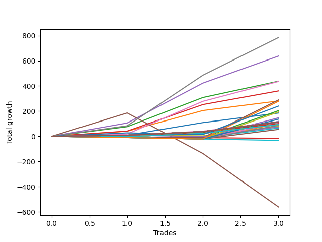

# Long Shepard 003 
- Symbol: ES1y1d
- Date Range: 07/19/2021 - 07/15/2022
- Trading Period: 7:20-12:30
- Number of Trades: 3



| Name | Win Percent | Profit | Avg Profit / Trade | Avg Time / Trade |      | Name | Win Percent | Profit | Avg Profit / Trade | Avg Time / Trade |
| ---- | ----------- | ------ | ------------------ | ---------------- | ---- | ---- | ----------- | ------ | ------------------ | ---------------- |
| Sorted By <br> Profit | | | | | | Sorted By <br> Win Percentage ||||
| Seven | 100.00 | 392375.00 | 130791.67 | 00:00 |     | Seven | 100.00 | 392375.00 | 130791.67 | 00:00 |
| Four | 100.00 | 318750.00 | 106250.00 | 00:00 |     | Four | 100.00 | 318750.00 | 106250.00 | 00:00 |
| Two | 100.00 | 218875.00 | 72958.33 | 00:00 |     | Two | 100.00 | 218875.00 | 72958.33 | 00:00 |
| Six | 100.00 | 217875.00 | 72625.00 | 00:00 |     | Six | 100.00 | 217875.00 | 72625.00 | 00:00 |
| Three | 100.00 | 180375.00 | 60125.00 | 00:00 |     | Three | 100.00 | 180375.00 | 60125.00 | 00:00 |
| Forty-Seven | 33.33 | 144375.00 | 48125.00 | 00:00 |     | One | 100.00 | 140500.00 | 46833.33 | 00:00 |
| One | 100.00 | 140500.00 | 46833.33 | 00:00 |     | Zero | 100.00 | 92500.00 | 30833.33 | 00:00 |
| Sixty-Three | 33.33 | 139125.00 | 46375.00 | 00:00 |     | Forty-Eight | 100.00 | 58500.00 | 19500.00 | 00:00 |
| Seventy-Three | 66.67 | 120125.00 | 40041.67 | 00:00 |     | One Hundred Thirty | 100.00 | 56750.00 | 18916.67 | 00:00 |
| Forty-Four | 33.33 | 102000.00 | 34000.00 | 00:00 |     | One Hundred Twenty-Nine | 100.00 | 56750.00 | 18916.67 | 00:00 |
| Sixty | 33.33 | 96750.00 | 32250.00 | 00:00 |     | One Hundred Twenty-Eight | 100.00 | 56750.00 | 18916.67 | 00:00 |
| Zero | 100.00 | 92500.00 | 30833.33 | 00:00 |     | One Hundred Twenty-Seven | 100.00 | 56750.00 | 18916.67 | 00:00 |
| Forty-Six | 33.33 | 73500.00 | 24500.00 | 00:00 |     | One Hundred Twenty-Six | 100.00 | 56750.00 | 18916.67 | 00:00 |
| Sixty-Two | 33.33 | 68250.00 | 22750.00 | 00:00 |     | One Hundred Twenty-Five | 100.00 | 56750.00 | 18916.67 | 00:00 |
| Forty-Two | 33.33 | 59375.00 | 19791.67 | 00:00 |     | One Hundred Twenty-Four | 100.00 | 56750.00 | 18916.67 | 00:00 |
| Forty-Eight | 100.00 | 58500.00 | 19500.00 | 00:00 |     | One Hundred Twenty-Three | 100.00 | 56750.00 | 18916.67 | 00:00 |
| One Hundred Thirty | 100.00 | 56750.00 | 18916.67 | 00:00 |     | One Hundred Twenty-Two | 100.00 | 56750.00 | 18916.67 | 00:00 |
| One Hundred Twenty-Nine | 100.00 | 56750.00 | 18916.67 | 00:00 |     | One Hundred Twenty-One | 100.00 | 56750.00 | 18916.67 | 00:00 |
| One Hundred Twenty-Eight | 100.00 | 56750.00 | 18916.67 | 00:00 |     | One Hundred Twenty | 100.00 | 56750.00 | 18916.67 | 00:00 |
| One Hundred Twenty-Seven | 100.00 | 56750.00 | 18916.67 | 00:00 |     | One Hundred Ninteen | 100.00 | 56750.00 | 18916.67 | 00:00 |
| One Hundred Twenty-Six | 100.00 | 56750.00 | 18916.67 | 00:00 |     | One Hundred Eighteen | 100.00 | 56750.00 | 18916.67 | 00:00 |
| One Hundred Twenty-Five | 100.00 | 56750.00 | 18916.67 | 00:00 |     | One Hundred Seventeen | 100.00 | 56750.00 | 18916.67 | 00:00 |
| One Hundred Twenty-Four | 100.00 | 56750.00 | 18916.67 | 00:00 |     | One Hundred Sixteen | 100.00 | 56750.00 | 18916.67 | 00:00 |
| One Hundred Twenty-Three | 100.00 | 56750.00 | 18916.67 | 00:00 |     | One Hundred Fifteen | 100.00 | 56750.00 | 18916.67 | 00:00 |
| One Hundred Twenty-Two | 100.00 | 56750.00 | 18916.67 | 00:00 |     | One Hundred Fourteen | 100.00 | 56750.00 | 18916.67 | 00:00 |
| One Hundred Twenty-One | 100.00 | 56750.00 | 18916.67 | 00:00 |     | One Hundred Thirteen | 100.00 | 56750.00 | 18916.67 | 00:00 |
| One Hundred Twenty | 100.00 | 56750.00 | 18916.67 | 00:00 |     | One Hundred Twelve | 100.00 | 56750.00 | 18916.67 | 00:00 |
| One Hundred Ninteen | 100.00 | 56750.00 | 18916.67 | 00:00 |     | One Hundred Eleven | 100.00 | 56750.00 | 18916.67 | 00:00 |
| One Hundred Eighteen | 100.00 | 56750.00 | 18916.67 | 00:00 |     | Eighty-Five | 100.00 | 56750.00 | 18916.67 | 00:00 |
| One Hundred Seventeen | 100.00 | 56750.00 | 18916.67 | 00:00 |     | Eighty-Four | 100.00 | 56750.00 | 18916.67 | 00:00 |
| One Hundred Sixteen | 100.00 | 56750.00 | 18916.67 | 00:00 |     | Eighty-Three | 100.00 | 56750.00 | 18916.67 | 00:00 |
| One Hundred Fifteen | 100.00 | 56750.00 | 18916.67 | 00:00 |     | Eighty-Two | 100.00 | 56750.00 | 18916.67 | 00:00 |
| One Hundred Fourteen | 100.00 | 56750.00 | 18916.67 | 00:00 |     | Eighty-One | 100.00 | 56750.00 | 18916.67 | 00:00 |
| One Hundred Thirteen | 100.00 | 56750.00 | 18916.67 | 00:00 |     | Sixty-Four | 100.00 | 55625.00 | 18541.67 | 00:00 |
| One Hundred Twelve | 100.00 | 56750.00 | 18916.67 | 00:00 |     | Forty-Nine | 100.00 | 54375.00 | 18125.00 | 00:00 |
| One Hundred Eleven | 100.00 | 56750.00 | 18916.67 | 00:00 |     | Fifty-Five | 100.00 | 52875.00 | 17625.00 | 00:00 |
| Eighty-Five | 100.00 | 56750.00 | 18916.67 | 00:00 |     | Fifty-Four | 100.00 | 52875.00 | 17625.00 | 00:00 |
| Eighty-Four | 100.00 | 56750.00 | 18916.67 | 00:00 |     | Fifty-Three | 100.00 | 52875.00 | 17625.00 | 00:00 |
| Eighty-Three | 100.00 | 56750.00 | 18916.67 | 00:00 |     | Fifty-Two | 100.00 | 52875.00 | 17625.00 | 00:00 |
| Eighty-Two | 100.00 | 56750.00 | 18916.67 | 00:00 |     | Fifty-One | 100.00 | 52875.00 | 17625.00 | 00:00 |
| Eighty-One | 100.00 | 56750.00 | 18916.67 | 00:00 |     | Fifty | 100.00 | 52875.00 | 17625.00 | 00:00 |
| Sixty-Four | 100.00 | 55625.00 | 18541.67 | 00:00 |     | Seventy-Three | 66.67 | 120125.00 | 40041.67 | 00:00 |
| Forty-Nine | 100.00 | 54375.00 | 18125.00 | 00:00 |     | Sixty-Five | 66.67 | 49875.00 | 16625.00 | 00:00 |
| Fifty-Eight | 33.33 | 54125.00 | 18041.67 | 00:00 |     | Seventy-One | 66.67 | 46625.00 | 15541.67 | 00:00 |
| Fifty-Five | 100.00 | 52875.00 | 17625.00 | 00:00 |     | Seventy | 66.67 | 46625.00 | 15541.67 | 00:00 |
| Fifty-Four | 100.00 | 52875.00 | 17625.00 | 00:00 |     | Sixty-Nine | 66.67 | 46625.00 | 15541.67 | 00:00 |
| Fifty-Three | 100.00 | 52875.00 | 17625.00 | 00:00 |     | Sixty-Eight | 66.67 | 46625.00 | 15541.67 | 00:00 |
| Fifty-Two | 100.00 | 52875.00 | 17625.00 | 00:00 |     | Sixty-Seven | 66.67 | 46625.00 | 15541.67 | 00:00 |
| Fifty-One | 100.00 | 52875.00 | 17625.00 | 00:00 |     | Sixty-Six | 66.67 | 46625.00 | 15541.67 | 00:00 |
| Fifty | 100.00 | 52875.00 | 17625.00 | 00:00 |     | Forty | 66.67 | 40000.00 | 13333.33 | 00:00 |
| Sixty-Five | 66.67 | 49875.00 | 16625.00 | 00:00 |     | Fifty-Six | 66.67 | 37000.00 | 12333.33 | 00:00 |
| Forty-Three | 33.33 | 48875.00 | 16291.67 | 00:00 |     | Forty-Seven | 33.33 | 144375.00 | 48125.00 | 00:00 |
| Seventy-One | 66.67 | 46625.00 | 15541.67 | 00:00 |     | Sixty-Three | 33.33 | 139125.00 | 46375.00 | 00:00 |
| Seventy | 66.67 | 46625.00 | 15541.67 | 00:00 |     | Forty-Four | 33.33 | 102000.00 | 34000.00 | 00:00 |
| Sixty-Nine | 66.67 | 46625.00 | 15541.67 | 00:00 |     | Sixty | 33.33 | 96750.00 | 32250.00 | 00:00 |
| Sixty-Eight | 66.67 | 46625.00 | 15541.67 | 00:00 |     | Forty-Six | 33.33 | 73500.00 | 24500.00 | 00:00 |
| Sixty-Seven | 66.67 | 46625.00 | 15541.67 | 00:00 |     | Sixty-Two | 33.33 | 68250.00 | 22750.00 | 00:00 |
| Sixty-Six | 66.67 | 46625.00 | 15541.67 | 00:00 |     | Forty-Two | 33.33 | 59375.00 | 19791.67 | 00:00 |
| Fifty-Nine | 33.33 | 43625.00 | 14541.67 | 00:00 |     | Fifty-Eight | 33.33 | 54125.00 | 18041.67 | 00:00 |
| Forty | 66.67 | 40000.00 | 13333.33 | 00:00 |     | Forty-Three | 33.33 | 48875.00 | 16291.67 | 00:00 |
| Fifty-Six | 66.67 | 37000.00 | 12333.33 | 00:00 |     | Fifty-Nine | 33.33 | 43625.00 | 14541.67 | 00:00 |
| Forty-One | 33.33 | 32750.00 | 10916.67 | 00:00 |     | Forty-One | 33.33 | 32750.00 | 10916.67 | 00:00 |
| Fifty-Seven | 33.33 | 27500.00 | 9166.67 | 00:00 |     | Fifty-Seven | 33.33 | 27500.00 | 9166.67 | 00:00 |
| Forty-Five | 0.00 | -8000.00 | -2666.67 | 00:00 |     | Five | 33.33 | -280250.00 | -93416.67 | 00:00 |
| Sixty-One | 0.00 | -16125.00 | -5375.00 | 00:00 |     | Forty-Five | 0.00 | -8000.00 | -2666.67 | 00:00 |
| Five | 33.33 | -280250.00 | -93416.67 | 00:00 |     | Sixty-One | 0.00 | -16125.00 | -5375.00 | 00:00 |

## NO STOPLOSS

### Test Zero
* Sell when price hits the middle line of the 20p bollinger
* No Stoploss
* Results:
```
Total Trades: 3
Percent Up: 100.00
Percent Down: 0.00
Total Points Moved Up: 185.00
Potential Profit: 92500.00
Total Points Ups: 185.00 Count Ups: 3
Total Points Downs: 0.00 Count Downs: 0
```

<details><summary>Trades</summary>

<code>In: 2021-10-07 07:21:00		Out: 2021-10-08 07:23:00		Total Position Time: 02:00		Total Move Up: 9.00		Total to Date: 9.00</code> <br />
<code>In: 2022-03-10 07:21:00		Out: 2022-03-16 07:16:00		Total Position Time: 1435:00		Total Move Up: 99.75		Total to Date: 108.75</code> <br />
<code>In: 2022-03-17 07:21:00		Out: 2022-03-18 07:23:00		Total Position Time: 02:00		Total Move Up: 76.25		Total to Date: 185.00</code> <br />


</details>

### Test One
* Sell when the price hits the upper line of the 20p 1std bollinger
* No Stoploss
* Results:
```
Total Trades: 3
Percent Up: 100.00
Percent Down: 0.00
Total Points Moved Up: 281.00
Potential Profit: 140500.00
Total Points Ups: 281.00 Count Ups: 3
Total Points Downs: 0.00 Count Downs: 0
```

<details><summary>Trades</summary>

<code>In: 2021-10-07 07:21:00		Out: 2021-10-14 10:57:00		Total Position Time: 216:00		Total Move Up: 40.25		Total to Date: 40.25</code> <br />
<code>In: 2022-03-10 07:21:00		Out: 2022-03-17 10:52:00		Total Position Time: 211:00		Total Move Up: 164.50		Total to Date: 204.75</code> <br />
<code>In: 2022-03-17 07:21:00		Out: 2022-03-18 07:23:00		Total Position Time: 02:00		Total Move Up: 76.25		Total to Date: 281.00</code> <br />


</details>

### Test Two
* Sell when the price hits the upper line of the 20p 2std bollinger
* No Stoploss
* Results:
```
Total Trades: 3
Percent Up: 100.00
Percent Down: 0.00
Total Points Moved Up: 437.75
Potential Profit: 218875.00
Total Points Ups: 437.75 Count Ups: 3
Total Points Downs: 0.00 Count Downs: 0
```

<details><summary>Trades</summary>

<code>In: 2021-10-07 07:21:00		Out: 2021-10-15 11:05:00		Total Position Time: 224:00		Total Move Up: 76.50		Total to Date: 76.50</code> <br />
<code>In: 2022-03-10 07:21:00		Out: 2022-03-21 06:33:00		Total Position Time: 1392:00		Total Move Up: 231.75		Total to Date: 308.25</code> <br />
<code>In: 2022-03-17 07:21:00		Out: 2022-03-21 06:33:00		Total Position Time: 1392:00		Total Move Up: 129.50		Total to Date: 437.75</code> <br />


</details>

### Test Three
* Sell when price hits the middle line of the 50p bollinger
* No Stoploss
* Results:
```
Total Trades: 3
Percent Up: 100.00
Percent Down: 0.00
Total Points Moved Up: 360.75
Potential Profit: 180375.00
Total Points Ups: 360.75 Count Ups: 3
Total Points Downs: 0.00 Count Downs: 0
```

<details><summary>Trades</summary>

<code>In: 2021-10-07 07:21:00		Out: 2021-10-14 11:39:00		Total Position Time: 258:00		Total Move Up: 41.50		Total to Date: 41.50</code> <br />
<code>In: 2022-03-10 07:21:00		Out: 2022-03-18 12:09:00		Total Position Time: 288:00		Total Move Up: 210.75		Total to Date: 252.25</code> <br />
<code>In: 2022-03-17 07:21:00		Out: 2022-03-18 12:09:00		Total Position Time: 288:00		Total Move Up: 108.50		Total to Date: 360.75</code> <br />


</details>

### Test Four
* Sell when the price hits the upper line of the 50p 1std bollinger
* No Stoploss
* Results:
```
Total Trades: 3
Percent Up: 100.00
Percent Down: 0.00
Total Points Moved Up: 637.50
Potential Profit: 318750.00
Total Points Ups: 637.50 Count Ups: 3
Total Points Downs: 0.00 Count Downs: 0
```

<details><summary>Trades</summary>

<code>In: 2021-10-07 07:21:00		Out: 2021-10-19 06:40:00		Total Position Time: 1399:00		Total Move Up: 105.75		Total to Date: 105.75</code> <br />
<code>In: 2022-03-10 07:21:00		Out: 2022-03-28 07:00:00		Total Position Time: 1419:00		Total Move Up: 317.00		Total to Date: 422.75</code> <br />
<code>In: 2022-03-17 07:21:00		Out: 2022-03-28 07:00:00		Total Position Time: 1419:00		Total Move Up: 214.75		Total to Date: 637.50</code> <br />


</details>

### Test Five
* Sell when the price hits the upper line of the 50p 2std bollinger
* No Stoploss
* Results:
```
Total Trades: 3
Percent Up: 33.33
Percent Down: 66.67
Total Points Moved Up: -560.50
Potential Profit: -280250.00
Total Points Ups: 185.75 Count Ups: 1
Total Points Downs: -746.25 Count Downs: 2
```

<details><summary>Trades</summary>

<code>In: 2021-10-07 07:21:00		Out: 2021-10-26 06:31:00		Total Position Time: 1390:00		Total Move Up: 185.75		Total to Date: 185.75</code> <br />
<code>In: 2022-03-10 07:21:00		Out: 2022-07-08 12:58:00		Total Position Time: 337:00		Total Move Up: -322.00		Total to Date: -136.25</code> <br />
<code>In: 2022-03-17 07:21:00		Out: 2022-07-08 12:58:00		Total Position Time: 337:00		Total Move Up: -424.25		Total to Date: -560.50</code> <br />


</details>

### Test Six
* Sell when the price hits the middle line of the 1std VWAP
* No Stoploss
* Results:
```
Total Trades: 3
Percent Up: 100.00
Percent Down: 0.00
Total Points Moved Up: 435.75
Potential Profit: 217875.00
Total Points Ups: 435.75 Count Ups: 3
Total Points Downs: 0.00 Count Downs: 0
```

<details><summary>Trades</summary>

<code>In: 2021-10-07 07:21:00		Out: 2021-10-14 07:02:00		Total Position Time: 1421:00		Total Move Up: 18.00		Total to Date: 18.00</code> <br />
<code>In: 2022-03-10 07:21:00		Out: 2022-03-22 07:01:00		Total Position Time: 1420:00		Total Move Up: 260.00		Total to Date: 278.00</code> <br />
<code>In: 2022-03-17 07:21:00		Out: 2022-03-22 07:01:00		Total Position Time: 1420:00		Total Move Up: 157.75		Total to Date: 435.75</code> <br />


</details>

### Test Seven
* Sell when the price hits the upper line of the 1std VWAP
* No Stoploss
* Results:
```
Total Trades: 3
Percent Up: 100.00
Percent Down: 0.00
Total Points Moved Up: 784.75
Potential Profit: 392375.00
Total Points Ups: 784.75 Count Ups: 3
Total Points Downs: 0.00 Count Downs: 0
```

<details><summary>Trades</summary>

<code>In: 2021-10-07 07:21:00		Out: 2021-10-18 08:20:00		Total Position Time: 59:00		Total Move Up: 83.50		Total to Date: 83.50</code> <br />
<code>In: 2022-03-10 07:21:00		Out: 2022-03-29 12:35:00		Total Position Time: 314:00		Total Move Up: 401.75		Total to Date: 485.25</code> <br />
<code>In: 2022-03-17 07:21:00		Out: 2022-03-29 12:35:00		Total Position Time: 314:00		Total Move Up: 299.50		Total to Date: 784.75</code> <br />


</details>

## STOPLOSS OF 5

### Test Forty
* Sell when price hits the middle line of the 20p bollinger
* Stoploss is 5 points
* Results:
```
Total Trades: 3
Percent Up: 66.67
Percent Down: 33.33
Total Points Moved Up: 80.00
Potential Profit: 40000.00
Total Points Ups: 85.25 Count Ups: 2
Total Points Downs: -5.25 Count Downs: 1
```

<details><summary>Trades</summary>

<code>In: 2021-10-07 07:21:00		Out: 2021-10-08 07:23:00		Total Position Time: 02:00		Total Move Up: 9.00		Total to Date: 9.00</code> <br />
<code>In: 2022-03-10 07:21:00		Out: 2022-03-11 12:30:00		Total Position Time: 309:00		Total Move Up: -5.25		Total to Date: 3.75</code> <br />
<code>In: 2022-03-17 07:21:00		Out: 2022-03-18 07:23:00		Total Position Time: 02:00		Total Move Up: 76.25		Total to Date: 80.00</code> <br />


</details>

### Test Forty-One
* Sell when the price hits the upper line of the 20p 1std bollinger
* Stoploss is 5 points
* Results:
```
Total Trades: 3
Percent Up: 33.33
Percent Down: 66.67
Total Points Moved Up: 65.50
Potential Profit: 32750.00
Total Points Ups: 76.25 Count Ups: 1
Total Points Downs: -10.75 Count Downs: 2
```

<details><summary>Trades</summary>

<code>In: 2021-10-07 07:21:00		Out: 2021-10-08 09:30:00		Total Position Time: 129:00		Total Move Up: -5.50		Total to Date: -5.50</code> <br />
<code>In: 2022-03-10 07:21:00		Out: 2022-03-11 12:30:00		Total Position Time: 309:00		Total Move Up: -5.25		Total to Date: -10.75</code> <br />
<code>In: 2022-03-17 07:21:00		Out: 2022-03-18 07:23:00		Total Position Time: 02:00		Total Move Up: 76.25		Total to Date: 65.50</code> <br />


</details>

### Test Forty-Two
* Sell when the price hits the upper line of the 20p 2std bollinger
* Stoploss is 5 points
* Results:
```
Total Trades: 3
Percent Up: 33.33
Percent Down: 66.67
Total Points Moved Up: 118.75
Potential Profit: 59375.00
Total Points Ups: 129.50 Count Ups: 1
Total Points Downs: -10.75 Count Downs: 2
```

<details><summary>Trades</summary>

<code>In: 2021-10-07 07:21:00		Out: 2021-10-08 09:30:00		Total Position Time: 129:00		Total Move Up: -5.50		Total to Date: -5.50</code> <br />
<code>In: 2022-03-10 07:21:00		Out: 2022-03-11 12:30:00		Total Position Time: 309:00		Total Move Up: -5.25		Total to Date: -10.75</code> <br />
<code>In: 2022-03-17 07:21:00		Out: 2022-03-21 06:33:00		Total Position Time: 1392:00		Total Move Up: 129.50		Total to Date: 118.75</code> <br />


</details>

### Test Forty-Three
* Sell when price hits the middle line of the 50p bollinger
* Stoploss is 5 points
* Results:
```
Total Trades: 3
Percent Up: 33.33
Percent Down: 66.67
Total Points Moved Up: 97.75
Potential Profit: 48875.00
Total Points Ups: 108.50 Count Ups: 1
Total Points Downs: -10.75 Count Downs: 2
```

<details><summary>Trades</summary>

<code>In: 2021-10-07 07:21:00		Out: 2021-10-08 09:30:00		Total Position Time: 129:00		Total Move Up: -5.50		Total to Date: -5.50</code> <br />
<code>In: 2022-03-10 07:21:00		Out: 2022-03-11 12:30:00		Total Position Time: 309:00		Total Move Up: -5.25		Total to Date: -10.75</code> <br />
<code>In: 2022-03-17 07:21:00		Out: 2022-03-18 12:09:00		Total Position Time: 288:00		Total Move Up: 108.50		Total to Date: 97.75</code> <br />


</details>

### Test Forty-Four
* Sell when the price hits the upper line of the 50p 1std bollinger
* Stoploss is 5 points
* Results:
```
Total Trades: 3
Percent Up: 33.33
Percent Down: 66.67
Total Points Moved Up: 204.00
Potential Profit: 102000.00
Total Points Ups: 214.75 Count Ups: 1
Total Points Downs: -10.75 Count Downs: 2
```

<details><summary>Trades</summary>

<code>In: 2021-10-07 07:21:00		Out: 2021-10-08 09:30:00		Total Position Time: 129:00		Total Move Up: -5.50		Total to Date: -5.50</code> <br />
<code>In: 2022-03-10 07:21:00		Out: 2022-03-11 12:30:00		Total Position Time: 309:00		Total Move Up: -5.25		Total to Date: -10.75</code> <br />
<code>In: 2022-03-17 07:21:00		Out: 2022-03-28 07:00:00		Total Position Time: 1419:00		Total Move Up: 214.75		Total to Date: 204.00</code> <br />


</details>

### Test Forty-Five
* Sell when the price hits the upper line of the 50p 2std bollinger
* Stoploss is 5 points
* Results:
```
Total Trades: 3
Percent Up: 0.00
Percent Down: 100.00
Total Points Moved Up: -16.00
Potential Profit: -8000.00
Total Points Ups: 0.00 Count Ups: 0
Total Points Downs: -16.00 Count Downs: 3
```

<details><summary>Trades</summary>

<code>In: 2021-10-07 07:21:00		Out: 2021-10-08 09:30:00		Total Position Time: 129:00		Total Move Up: -5.50		Total to Date: -5.50</code> <br />
<code>In: 2022-03-10 07:21:00		Out: 2022-03-11 12:30:00		Total Position Time: 309:00		Total Move Up: -5.25		Total to Date: -10.75</code> <br />
<code>In: 2022-03-17 07:21:00		Out: 2022-04-22 08:41:00		Total Position Time: 80:00		Total Move Up: -5.25		Total to Date: -16.00</code> <br />


</details>

### Test Forty-Six
* Sell when the price hits the middle line of the 1std VWAP
* Stoploss is 5 points
* Results:
```
Total Trades: 3
Percent Up: 33.33
Percent Down: 66.67
Total Points Moved Up: 147.00
Potential Profit: 73500.00
Total Points Ups: 157.75 Count Ups: 1
Total Points Downs: -10.75 Count Downs: 2
```

<details><summary>Trades</summary>

<code>In: 2021-10-07 07:21:00		Out: 2021-10-08 09:30:00		Total Position Time: 129:00		Total Move Up: -5.50		Total to Date: -5.50</code> <br />
<code>In: 2022-03-10 07:21:00		Out: 2022-03-11 12:30:00		Total Position Time: 309:00		Total Move Up: -5.25		Total to Date: -10.75</code> <br />
<code>In: 2022-03-17 07:21:00		Out: 2022-03-22 07:01:00		Total Position Time: 1420:00		Total Move Up: 157.75		Total to Date: 147.00</code> <br />


</details>

### Test Forty-Seven
* Sell when the price hits the upper line of the 1std VWAP
* Stoploss is 5 points
* Results:
```
Total Trades: 3
Percent Up: 33.33
Percent Down: 66.67
Total Points Moved Up: 288.75
Potential Profit: 144375.00
Total Points Ups: 299.50 Count Ups: 1
Total Points Downs: -10.75 Count Downs: 2
```

<details><summary>Trades</summary>

<code>In: 2021-10-07 07:21:00		Out: 2021-10-08 09:30:00		Total Position Time: 129:00		Total Move Up: -5.50		Total to Date: -5.50</code> <br />
<code>In: 2022-03-10 07:21:00		Out: 2022-03-11 12:30:00		Total Position Time: 309:00		Total Move Up: -5.25		Total to Date: -10.75</code> <br />
<code>In: 2022-03-17 07:21:00		Out: 2022-03-29 12:35:00		Total Position Time: 314:00		Total Move Up: 299.50		Total to Date: 288.75</code> <br />


</details>

## TRAIL STOP OF 5

### Test Forty-Eight
* Sell when price hits the middle line of the 20p bollinger
* Trailing Stop is 5 points
* Results:
```
Total Trades: 3
Percent Up: 100.00
Percent Down: 0.00
Total Points Moved Up: 117.00
Potential Profit: 58500.00
Total Points Ups: 117.00 Count Ups: 3
Total Points Downs: 0.00 Count Downs: 0
```

<details><summary>Trades</summary>

<code>In: 2021-10-07 07:21:00		Out: 2021-10-08 07:23:00		Total Position Time: 02:00		Total Move Up: 9.00		Total to Date: 9.00</code> <br />
<code>In: 2022-03-10 07:21:00		Out: 2022-03-11 07:30:00		Total Position Time: 09:00		Total Move Up: 31.75		Total to Date: 40.75</code> <br />
<code>In: 2022-03-17 07:21:00		Out: 2022-03-18 07:23:00		Total Position Time: 02:00		Total Move Up: 76.25		Total to Date: 117.00</code> <br />


</details>

### Test Forty-Nine
* Sell when the price hits the upper line of the 20p 1std bollinger
* Trailing Stop is 5 points
* Results:
```
Total Trades: 3
Percent Up: 100.00
Percent Down: 0.00
Total Points Moved Up: 108.75
Potential Profit: 54375.00
Total Points Ups: 108.75 Count Ups: 3
Total Points Downs: 0.00 Count Downs: 0
```

<details><summary>Trades</summary>

<code>In: 2021-10-07 07:21:00		Out: 2021-10-08 07:41:00		Total Position Time: 20:00		Total Move Up: 0.75		Total to Date: 0.75</code> <br />
<code>In: 2022-03-10 07:21:00		Out: 2022-03-11 07:30:00		Total Position Time: 09:00		Total Move Up: 31.75		Total to Date: 32.50</code> <br />
<code>In: 2022-03-17 07:21:00		Out: 2022-03-18 07:23:00		Total Position Time: 02:00		Total Move Up: 76.25		Total to Date: 108.75</code> <br />


</details>

### Test Fifty
* Sell when the price hits the upper line of the 20p 2std bollinger
* Trailing Stop is 5 points
* Results:
```
Total Trades: 3
Percent Up: 100.00
Percent Down: 0.00
Total Points Moved Up: 105.75
Potential Profit: 52875.00
Total Points Ups: 105.75 Count Ups: 3
Total Points Downs: 0.00 Count Downs: 0
```

<details><summary>Trades</summary>

<code>In: 2021-10-07 07:21:00		Out: 2021-10-08 07:41:00		Total Position Time: 20:00		Total Move Up: 0.75		Total to Date: 0.75</code> <br />
<code>In: 2022-03-10 07:21:00		Out: 2022-03-11 07:30:00		Total Position Time: 09:00		Total Move Up: 31.75		Total to Date: 32.50</code> <br />
<code>In: 2022-03-17 07:21:00		Out: 2022-03-18 07:35:00		Total Position Time: 14:00		Total Move Up: 73.25		Total to Date: 105.75</code> <br />


</details>

### Test Fifty-One
* Sell when price hits the middle line of the 50p bollinger
* Trailing Stop is 5 points
* Results:
```
Total Trades: 3
Percent Up: 100.00
Percent Down: 0.00
Total Points Moved Up: 105.75
Potential Profit: 52875.00
Total Points Ups: 105.75 Count Ups: 3
Total Points Downs: 0.00 Count Downs: 0
```

<details><summary>Trades</summary>

<code>In: 2021-10-07 07:21:00		Out: 2021-10-08 07:41:00		Total Position Time: 20:00		Total Move Up: 0.75		Total to Date: 0.75</code> <br />
<code>In: 2022-03-10 07:21:00		Out: 2022-03-11 07:30:00		Total Position Time: 09:00		Total Move Up: 31.75		Total to Date: 32.50</code> <br />
<code>In: 2022-03-17 07:21:00		Out: 2022-03-18 07:35:00		Total Position Time: 14:00		Total Move Up: 73.25		Total to Date: 105.75</code> <br />


</details>

### Test Fifty-Two
* Sell when the price hits the upper line of the 50p 1std bollinger
* Trailing Stop is 5 points
* Results:
```
Total Trades: 3
Percent Up: 100.00
Percent Down: 0.00
Total Points Moved Up: 105.75
Potential Profit: 52875.00
Total Points Ups: 105.75 Count Ups: 3
Total Points Downs: 0.00 Count Downs: 0
```

<details><summary>Trades</summary>

<code>In: 2021-10-07 07:21:00		Out: 2021-10-08 07:41:00		Total Position Time: 20:00		Total Move Up: 0.75		Total to Date: 0.75</code> <br />
<code>In: 2022-03-10 07:21:00		Out: 2022-03-11 07:30:00		Total Position Time: 09:00		Total Move Up: 31.75		Total to Date: 32.50</code> <br />
<code>In: 2022-03-17 07:21:00		Out: 2022-03-18 07:35:00		Total Position Time: 14:00		Total Move Up: 73.25		Total to Date: 105.75</code> <br />


</details>

### Test Fifty-Three
* Sell when the price hits the upper line of the 50p 2std bollinger
* Trailing Stop is 5 points
* Results:
```
Total Trades: 3
Percent Up: 100.00
Percent Down: 0.00
Total Points Moved Up: 105.75
Potential Profit: 52875.00
Total Points Ups: 105.75 Count Ups: 3
Total Points Downs: 0.00 Count Downs: 0
```

<details><summary>Trades</summary>

<code>In: 2021-10-07 07:21:00		Out: 2021-10-08 07:41:00		Total Position Time: 20:00		Total Move Up: 0.75		Total to Date: 0.75</code> <br />
<code>In: 2022-03-10 07:21:00		Out: 2022-03-11 07:30:00		Total Position Time: 09:00		Total Move Up: 31.75		Total to Date: 32.50</code> <br />
<code>In: 2022-03-17 07:21:00		Out: 2022-03-18 07:35:00		Total Position Time: 14:00		Total Move Up: 73.25		Total to Date: 105.75</code> <br />


</details>

### Test Fifty-Four
* Sell when the price hits the middle line of the 1std VWAP
* Trailing Stop is 5 points
* Results:
```
Total Trades: 3
Percent Up: 100.00
Percent Down: 0.00
Total Points Moved Up: 105.75
Potential Profit: 52875.00
Total Points Ups: 105.75 Count Ups: 3
Total Points Downs: 0.00 Count Downs: 0
```

<details><summary>Trades</summary>

<code>In: 2021-10-07 07:21:00		Out: 2021-10-08 07:41:00		Total Position Time: 20:00		Total Move Up: 0.75		Total to Date: 0.75</code> <br />
<code>In: 2022-03-10 07:21:00		Out: 2022-03-11 07:30:00		Total Position Time: 09:00		Total Move Up: 31.75		Total to Date: 32.50</code> <br />
<code>In: 2022-03-17 07:21:00		Out: 2022-03-18 07:35:00		Total Position Time: 14:00		Total Move Up: 73.25		Total to Date: 105.75</code> <br />


</details>

### Test Fifty-Five
* Sell when the price hits the upper line of the 1std VWAP
* Trailing Stop is 5 points
* Results:
```
Total Trades: 3
Percent Up: 100.00
Percent Down: 0.00
Total Points Moved Up: 105.75
Potential Profit: 52875.00
Total Points Ups: 105.75 Count Ups: 3
Total Points Downs: 0.00 Count Downs: 0
```

<details><summary>Trades</summary>

<code>In: 2021-10-07 07:21:00		Out: 2021-10-08 07:41:00		Total Position Time: 20:00		Total Move Up: 0.75		Total to Date: 0.75</code> <br />
<code>In: 2022-03-10 07:21:00		Out: 2022-03-11 07:30:00		Total Position Time: 09:00		Total Move Up: 31.75		Total to Date: 32.50</code> <br />
<code>In: 2022-03-17 07:21:00		Out: 2022-03-18 07:35:00		Total Position Time: 14:00		Total Move Up: 73.25		Total to Date: 105.75</code> <br />


</details>

## STOPLOSS OF 10

### Test Fifty-Six
* Sell when price hits the middle line of the 20p bollinger
* Stoploss is 10 points
* Results:
```
Total Trades: 3
Percent Up: 66.67
Percent Down: 33.33
Total Points Moved Up: 74.00
Potential Profit: 37000.00
Total Points Ups: 85.25 Count Ups: 2
Total Points Downs: -11.25 Count Downs: 1
```

<details><summary>Trades</summary>

<code>In: 2021-10-07 07:21:00		Out: 2021-10-08 07:23:00		Total Position Time: 02:00		Total Move Up: 9.00		Total to Date: 9.00</code> <br />
<code>In: 2022-03-10 07:21:00		Out: 2022-03-11 12:33:00		Total Position Time: 312:00		Total Move Up: -11.25		Total to Date: -2.25</code> <br />
<code>In: 2022-03-17 07:21:00		Out: 2022-03-18 07:23:00		Total Position Time: 02:00		Total Move Up: 76.25		Total to Date: 74.00</code> <br />


</details>

### Test Fifty-Seven
* Sell when the price hits the upper line of the 20p 1std bollinger
* Stoploss is 10 points
* Results:
```
Total Trades: 3
Percent Up: 33.33
Percent Down: 66.67
Total Points Moved Up: 55.00
Potential Profit: 27500.00
Total Points Ups: 76.25 Count Ups: 1
Total Points Downs: -21.25 Count Downs: 2
```

<details><summary>Trades</summary>

<code>In: 2021-10-07 07:21:00		Out: 2021-10-08 10:17:00		Total Position Time: 176:00		Total Move Up: -10.00		Total to Date: -10.00</code> <br />
<code>In: 2022-03-10 07:21:00		Out: 2022-03-11 12:33:00		Total Position Time: 312:00		Total Move Up: -11.25		Total to Date: -21.25</code> <br />
<code>In: 2022-03-17 07:21:00		Out: 2022-03-18 07:23:00		Total Position Time: 02:00		Total Move Up: 76.25		Total to Date: 55.00</code> <br />


</details>

### Test Fifty-Eight
* Sell when the price hits the upper line of the 20p 2std bollinger
* Stoploss is 10 points
* Results:
```
Total Trades: 3
Percent Up: 33.33
Percent Down: 66.67
Total Points Moved Up: 108.25
Potential Profit: 54125.00
Total Points Ups: 129.50 Count Ups: 1
Total Points Downs: -21.25 Count Downs: 2
```

<details><summary>Trades</summary>

<code>In: 2021-10-07 07:21:00		Out: 2021-10-08 10:17:00		Total Position Time: 176:00		Total Move Up: -10.00		Total to Date: -10.00</code> <br />
<code>In: 2022-03-10 07:21:00		Out: 2022-03-11 12:33:00		Total Position Time: 312:00		Total Move Up: -11.25		Total to Date: -21.25</code> <br />
<code>In: 2022-03-17 07:21:00		Out: 2022-03-21 06:33:00		Total Position Time: 1392:00		Total Move Up: 129.50		Total to Date: 108.25</code> <br />


</details>

### Test Fifty-Nine
* Sell when price hits the middle line of the 50p bollinger
* Stoploss is 10 points
* Results:
```
Total Trades: 3
Percent Up: 33.33
Percent Down: 66.67
Total Points Moved Up: 87.25
Potential Profit: 43625.00
Total Points Ups: 108.50 Count Ups: 1
Total Points Downs: -21.25 Count Downs: 2
```

<details><summary>Trades</summary>

<code>In: 2021-10-07 07:21:00		Out: 2021-10-08 10:17:00		Total Position Time: 176:00		Total Move Up: -10.00		Total to Date: -10.00</code> <br />
<code>In: 2022-03-10 07:21:00		Out: 2022-03-11 12:33:00		Total Position Time: 312:00		Total Move Up: -11.25		Total to Date: -21.25</code> <br />
<code>In: 2022-03-17 07:21:00		Out: 2022-03-18 12:09:00		Total Position Time: 288:00		Total Move Up: 108.50		Total to Date: 87.25</code> <br />


</details>

### Test Sixty
* Sell when the price hits the upper line of the 50p 1std bollinger
* Stoploss is 10 points
* Results:
```
Total Trades: 3
Percent Up: 33.33
Percent Down: 66.67
Total Points Moved Up: 193.50
Potential Profit: 96750.00
Total Points Ups: 214.75 Count Ups: 1
Total Points Downs: -21.25 Count Downs: 2
```

<details><summary>Trades</summary>

<code>In: 2021-10-07 07:21:00		Out: 2021-10-08 10:17:00		Total Position Time: 176:00		Total Move Up: -10.00		Total to Date: -10.00</code> <br />
<code>In: 2022-03-10 07:21:00		Out: 2022-03-11 12:33:00		Total Position Time: 312:00		Total Move Up: -11.25		Total to Date: -21.25</code> <br />
<code>In: 2022-03-17 07:21:00		Out: 2022-03-28 07:00:00		Total Position Time: 1419:00		Total Move Up: 214.75		Total to Date: 193.50</code> <br />


</details>

### Test Sixty-One
* Sell when the price hits the upper line of the 50p 2std bollinger
* Stoploss is 10 points
* Results:
```
Total Trades: 3
Percent Up: 0.00
Percent Down: 100.00
Total Points Moved Up: -32.25
Potential Profit: -16125.00
Total Points Ups: 0.00 Count Ups: 0
Total Points Downs: -32.25 Count Downs: 3
```

<details><summary>Trades</summary>

<code>In: 2021-10-07 07:21:00		Out: 2021-10-08 10:17:00		Total Position Time: 176:00		Total Move Up: -10.00		Total to Date: -10.00</code> <br />
<code>In: 2022-03-10 07:21:00		Out: 2022-03-11 12:33:00		Total Position Time: 312:00		Total Move Up: -11.25		Total to Date: -21.25</code> <br />
<code>In: 2022-03-17 07:21:00		Out: 2022-04-22 08:44:00		Total Position Time: 83:00		Total Move Up: -11.00		Total to Date: -32.25</code> <br />


</details>

### Test Sixty-Two
* Sell when the price hits the middle line of the 1std VWAP
* Stoploss is 10 points
* Results:
```
Total Trades: 3
Percent Up: 33.33
Percent Down: 66.67
Total Points Moved Up: 136.50
Potential Profit: 68250.00
Total Points Ups: 157.75 Count Ups: 1
Total Points Downs: -21.25 Count Downs: 2
```

<details><summary>Trades</summary>

<code>In: 2021-10-07 07:21:00		Out: 2021-10-08 10:17:00		Total Position Time: 176:00		Total Move Up: -10.00		Total to Date: -10.00</code> <br />
<code>In: 2022-03-10 07:21:00		Out: 2022-03-11 12:33:00		Total Position Time: 312:00		Total Move Up: -11.25		Total to Date: -21.25</code> <br />
<code>In: 2022-03-17 07:21:00		Out: 2022-03-22 07:01:00		Total Position Time: 1420:00		Total Move Up: 157.75		Total to Date: 136.50</code> <br />


</details>

### Test Sixty-Three
* Sell when the price hits the upper line of the 1std VWAP
* Stoploss is 10 points
* Results:
```
Total Trades: 3
Percent Up: 33.33
Percent Down: 66.67
Total Points Moved Up: 278.25
Potential Profit: 139125.00
Total Points Ups: 299.50 Count Ups: 1
Total Points Downs: -21.25 Count Downs: 2
```

<details><summary>Trades</summary>

<code>In: 2021-10-07 07:21:00		Out: 2021-10-08 10:17:00		Total Position Time: 176:00		Total Move Up: -10.00		Total to Date: -10.00</code> <br />
<code>In: 2022-03-10 07:21:00		Out: 2022-03-11 12:33:00		Total Position Time: 312:00		Total Move Up: -11.25		Total to Date: -21.25</code> <br />
<code>In: 2022-03-17 07:21:00		Out: 2022-03-29 12:35:00		Total Position Time: 314:00		Total Move Up: 299.50		Total to Date: 278.25</code> <br />


</details>

## TRAIL STOP OF 10

### Test Sixty-Four
* Sell when price hits the middle line of the 20p bollinger
* Trailing Stop is 10 points
* Results:
```
Total Trades: 3
Percent Up: 100.00
Percent Down: 0.00
Total Points Moved Up: 111.25
Potential Profit: 55625.00
Total Points Ups: 111.25 Count Ups: 3
Total Points Downs: 0.00 Count Downs: 0
```

<details><summary>Trades</summary>

<code>In: 2021-10-07 07:21:00		Out: 2021-10-08 07:23:00		Total Position Time: 02:00		Total Move Up: 9.00		Total to Date: 9.00</code> <br />
<code>In: 2022-03-10 07:21:00		Out: 2022-03-11 07:32:00		Total Position Time: 11:00		Total Move Up: 26.00		Total to Date: 35.00</code> <br />
<code>In: 2022-03-17 07:21:00		Out: 2022-03-18 07:23:00		Total Position Time: 02:00		Total Move Up: 76.25		Total to Date: 111.25</code> <br />


</details>

### Test Sixty-Five
* Sell when the price hits the upper line of the 20p 1std bollinger
* Trailing Stop is 10 points
* Results:
```
Total Trades: 3
Percent Up: 66.67
Percent Down: 33.33
Total Points Moved Up: 99.75
Potential Profit: 49875.00
Total Points Ups: 102.25 Count Ups: 2
Total Points Downs: -2.50 Count Downs: 1
```

<details><summary>Trades</summary>

<code>In: 2021-10-07 07:21:00		Out: 2021-10-08 07:43:00		Total Position Time: 22:00		Total Move Up: -2.50		Total to Date: -2.50</code> <br />
<code>In: 2022-03-10 07:21:00		Out: 2022-03-11 07:32:00		Total Position Time: 11:00		Total Move Up: 26.00		Total to Date: 23.50</code> <br />
<code>In: 2022-03-17 07:21:00		Out: 2022-03-18 07:23:00		Total Position Time: 02:00		Total Move Up: 76.25		Total to Date: 99.75</code> <br />


</details>

### Test Sixty-Six
* Sell when the price hits the upper line of the 20p 2std bollinger
* Trailing Stop is 10 points
* Results:
```
Total Trades: 3
Percent Up: 66.67
Percent Down: 33.33
Total Points Moved Up: 93.25
Potential Profit: 46625.00
Total Points Ups: 95.75 Count Ups: 2
Total Points Downs: -2.50 Count Downs: 1
```

<details><summary>Trades</summary>

<code>In: 2021-10-07 07:21:00		Out: 2021-10-08 07:43:00		Total Position Time: 22:00		Total Move Up: -2.50		Total to Date: -2.50</code> <br />
<code>In: 2022-03-10 07:21:00		Out: 2022-03-11 07:32:00		Total Position Time: 11:00		Total Move Up: 26.00		Total to Date: 23.50</code> <br />
<code>In: 2022-03-17 07:21:00		Out: 2022-03-18 07:37:00		Total Position Time: 16:00		Total Move Up: 69.75		Total to Date: 93.25</code> <br />


</details>

### Test Sixty-Seven
* Sell when price hits the middle line of the 50p bollinger
* Trailing Stop is 10 points
* Results:
```
Total Trades: 3
Percent Up: 66.67
Percent Down: 33.33
Total Points Moved Up: 93.25
Potential Profit: 46625.00
Total Points Ups: 95.75 Count Ups: 2
Total Points Downs: -2.50 Count Downs: 1
```

<details><summary>Trades</summary>

<code>In: 2021-10-07 07:21:00		Out: 2021-10-08 07:43:00		Total Position Time: 22:00		Total Move Up: -2.50		Total to Date: -2.50</code> <br />
<code>In: 2022-03-10 07:21:00		Out: 2022-03-11 07:32:00		Total Position Time: 11:00		Total Move Up: 26.00		Total to Date: 23.50</code> <br />
<code>In: 2022-03-17 07:21:00		Out: 2022-03-18 07:37:00		Total Position Time: 16:00		Total Move Up: 69.75		Total to Date: 93.25</code> <br />


</details>

### Test Sixty-Eight
* Sell when the price hits the upper line of the 50p 1std bollinger
* Trailing Stop is 10 points
* Results:
```
Total Trades: 3
Percent Up: 66.67
Percent Down: 33.33
Total Points Moved Up: 93.25
Potential Profit: 46625.00
Total Points Ups: 95.75 Count Ups: 2
Total Points Downs: -2.50 Count Downs: 1
```

<details><summary>Trades</summary>

<code>In: 2021-10-07 07:21:00		Out: 2021-10-08 07:43:00		Total Position Time: 22:00		Total Move Up: -2.50		Total to Date: -2.50</code> <br />
<code>In: 2022-03-10 07:21:00		Out: 2022-03-11 07:32:00		Total Position Time: 11:00		Total Move Up: 26.00		Total to Date: 23.50</code> <br />
<code>In: 2022-03-17 07:21:00		Out: 2022-03-18 07:37:00		Total Position Time: 16:00		Total Move Up: 69.75		Total to Date: 93.25</code> <br />


</details>

### Test Sixty-Nine
* Sell when the price hits the upper line of the 50p 2std bollinger
* Trailing Stop is 10 points
* Results:
```
Total Trades: 3
Percent Up: 66.67
Percent Down: 33.33
Total Points Moved Up: 93.25
Potential Profit: 46625.00
Total Points Ups: 95.75 Count Ups: 2
Total Points Downs: -2.50 Count Downs: 1
```

<details><summary>Trades</summary>

<code>In: 2021-10-07 07:21:00		Out: 2021-10-08 07:43:00		Total Position Time: 22:00		Total Move Up: -2.50		Total to Date: -2.50</code> <br />
<code>In: 2022-03-10 07:21:00		Out: 2022-03-11 07:32:00		Total Position Time: 11:00		Total Move Up: 26.00		Total to Date: 23.50</code> <br />
<code>In: 2022-03-17 07:21:00		Out: 2022-03-18 07:37:00		Total Position Time: 16:00		Total Move Up: 69.75		Total to Date: 93.25</code> <br />


</details>

### Test Seventy
* Sell when the price hits the middle line of the 1std VWAP
* Trailing Stop is 10 points
* Results:
```
Total Trades: 3
Percent Up: 66.67
Percent Down: 33.33
Total Points Moved Up: 93.25
Potential Profit: 46625.00
Total Points Ups: 95.75 Count Ups: 2
Total Points Downs: -2.50 Count Downs: 1
```

<details><summary>Trades</summary>

<code>In: 2021-10-07 07:21:00		Out: 2021-10-08 07:43:00		Total Position Time: 22:00		Total Move Up: -2.50		Total to Date: -2.50</code> <br />
<code>In: 2022-03-10 07:21:00		Out: 2022-03-11 07:32:00		Total Position Time: 11:00		Total Move Up: 26.00		Total to Date: 23.50</code> <br />
<code>In: 2022-03-17 07:21:00		Out: 2022-03-18 07:37:00		Total Position Time: 16:00		Total Move Up: 69.75		Total to Date: 93.25</code> <br />


</details>

### Test Seventy-One
* Sell when the price hits the upper line of the 1std VWAP
* Trailing Stop is 10 points
* Results:
```
Total Trades: 3
Percent Up: 66.67
Percent Down: 33.33
Total Points Moved Up: 93.25
Potential Profit: 46625.00
Total Points Ups: 95.75 Count Ups: 2
Total Points Downs: -2.50 Count Downs: 1
```

<details><summary>Trades</summary>

<code>In: 2021-10-07 07:21:00		Out: 2021-10-08 07:43:00		Total Position Time: 22:00		Total Move Up: -2.50		Total to Date: -2.50</code> <br />
<code>In: 2022-03-10 07:21:00		Out: 2022-03-11 07:32:00		Total Position Time: 11:00		Total Move Up: 26.00		Total to Date: 23.50</code> <br />
<code>In: 2022-03-17 07:21:00		Out: 2022-03-18 07:37:00		Total Position Time: 16:00		Total Move Up: 69.75		Total to Date: 93.25</code> <br />


</details>

## SPECIAL EXIT CONDITIONS 

### Test Seventy-Three
* Sell when the linear regression slope changes to negative
* No Stoploss
* Results:
```
Total Trades: 3
Percent Up: 66.67
Percent Down: 33.33
Total Points Moved Up: 240.25
Potential Profit: 120125.00
Total Points Ups: 253.50 Count Ups: 2
Total Points Downs: -13.25 Count Downs: 1
```

<details><summary>Trades</summary>

<code>In: 2021-10-07 07:21:00		Out: 2021-10-14 08:22:00		Total Position Time: 61:00		Total Move Up: 27.50		Total to Date: 27.50</code> <br />
<code>In: 2022-03-10 07:21:00		Out: 2022-03-15 08:22:00		Total Position Time: 61:00		Total Move Up: -13.25		Total to Date: 14.25</code> <br />
<code>In: 2022-03-17 07:21:00		Out: 2022-04-05 10:22:00		Total Position Time: 181:00		Total Move Up: 226.00		Total to Date: 240.25</code> <br />


</details>

## TAKE PROFIT

### Test Eighty-One
* Take Profit of 1 Point
* No Stoploss
* Results:
```
Total Trades: 3
Percent Up: 100.00
Percent Down: 0.00
Total Points Moved Up: 113.50
Potential Profit: 56750.00
Total Points Ups: 113.50 Count Ups: 3
Total Points Downs: 0.00 Count Downs: 0
```

<details><summary>Trades</summary>

<code>In: 2021-10-07 07:21:00		Out: 2021-10-08 07:23:00		Total Position Time: 02:00		Total Move Up: 9.00		Total to Date: 9.00</code> <br />
<code>In: 2022-03-10 07:21:00		Out: 2022-03-11 07:23:00		Total Position Time: 02:00		Total Move Up: 28.25		Total to Date: 37.25</code> <br />
<code>In: 2022-03-17 07:21:00		Out: 2022-03-18 07:23:00		Total Position Time: 02:00		Total Move Up: 76.25		Total to Date: 113.50</code> <br />


</details>

### Test Eighty-Two
* Take Profit of 2 Point
* No Stoploss
* Results:
```
Total Trades: 3
Percent Up: 100.00
Percent Down: 0.00
Total Points Moved Up: 113.50
Potential Profit: 56750.00
Total Points Ups: 113.50 Count Ups: 3
Total Points Downs: 0.00 Count Downs: 0
```

<details><summary>Trades</summary>

<code>In: 2021-10-07 07:21:00		Out: 2021-10-08 07:23:00		Total Position Time: 02:00		Total Move Up: 9.00		Total to Date: 9.00</code> <br />
<code>In: 2022-03-10 07:21:00		Out: 2022-03-11 07:23:00		Total Position Time: 02:00		Total Move Up: 28.25		Total to Date: 37.25</code> <br />
<code>In: 2022-03-17 07:21:00		Out: 2022-03-18 07:23:00		Total Position Time: 02:00		Total Move Up: 76.25		Total to Date: 113.50</code> <br />


</details>

### Test Eighty-Three
* Take Profit of 3 Point
* No Stoploss
* Results:
```
Total Trades: 3
Percent Up: 100.00
Percent Down: 0.00
Total Points Moved Up: 113.50
Potential Profit: 56750.00
Total Points Ups: 113.50 Count Ups: 3
Total Points Downs: 0.00 Count Downs: 0
```

<details><summary>Trades</summary>

<code>In: 2021-10-07 07:21:00		Out: 2021-10-08 07:23:00		Total Position Time: 02:00		Total Move Up: 9.00		Total to Date: 9.00</code> <br />
<code>In: 2022-03-10 07:21:00		Out: 2022-03-11 07:23:00		Total Position Time: 02:00		Total Move Up: 28.25		Total to Date: 37.25</code> <br />
<code>In: 2022-03-17 07:21:00		Out: 2022-03-18 07:23:00		Total Position Time: 02:00		Total Move Up: 76.25		Total to Date: 113.50</code> <br />


</details>

### Test Eighty-Four
* Take Profit of 4 Point
* No Stoploss
* Results:
```
Total Trades: 3
Percent Up: 100.00
Percent Down: 0.00
Total Points Moved Up: 113.50
Potential Profit: 56750.00
Total Points Ups: 113.50 Count Ups: 3
Total Points Downs: 0.00 Count Downs: 0
```

<details><summary>Trades</summary>

<code>In: 2021-10-07 07:21:00		Out: 2021-10-08 07:23:00		Total Position Time: 02:00		Total Move Up: 9.00		Total to Date: 9.00</code> <br />
<code>In: 2022-03-10 07:21:00		Out: 2022-03-11 07:23:00		Total Position Time: 02:00		Total Move Up: 28.25		Total to Date: 37.25</code> <br />
<code>In: 2022-03-17 07:21:00		Out: 2022-03-18 07:23:00		Total Position Time: 02:00		Total Move Up: 76.25		Total to Date: 113.50</code> <br />


</details>

### Test Eighty-Five
* Take Profit of 5 Point
* No Stoploss
* Results:
```
Total Trades: 3
Percent Up: 100.00
Percent Down: 0.00
Total Points Moved Up: 113.50
Potential Profit: 56750.00
Total Points Ups: 113.50 Count Ups: 3
Total Points Downs: 0.00 Count Downs: 0
```

<details><summary>Trades</summary>

<code>In: 2021-10-07 07:21:00		Out: 2021-10-08 07:23:00		Total Position Time: 02:00		Total Move Up: 9.00		Total to Date: 9.00</code> <br />
<code>In: 2022-03-10 07:21:00		Out: 2022-03-11 07:23:00		Total Position Time: 02:00		Total Move Up: 28.25		Total to Date: 37.25</code> <br />
<code>In: 2022-03-17 07:21:00		Out: 2022-03-18 07:23:00		Total Position Time: 02:00		Total Move Up: 76.25		Total to Date: 113.50</code> <br />


</details>

## TAKE PROFIT Stoploss of Five

### Test One Hundred Eleven
* Take Profit of 1 Point
* Stoploss is 5 points
* Results:
```
Total Trades: 3
Percent Up: 100.00
Percent Down: 0.00
Total Points Moved Up: 113.50
Potential Profit: 56750.00
Total Points Ups: 113.50 Count Ups: 3
Total Points Downs: 0.00 Count Downs: 0
```

<details><summary>Trades</summary>

<code>In: 2021-10-07 07:21:00		Out: 2021-10-08 07:23:00		Total Position Time: 02:00		Total Move Up: 9.00		Total to Date: 9.00</code> <br />
<code>In: 2022-03-10 07:21:00		Out: 2022-03-11 07:23:00		Total Position Time: 02:00		Total Move Up: 28.25		Total to Date: 37.25</code> <br />
<code>In: 2022-03-17 07:21:00		Out: 2022-03-18 07:23:00		Total Position Time: 02:00		Total Move Up: 76.25		Total to Date: 113.50</code> <br />


</details>

### Test One Hundred Twelve
* Take Profit of 2 Point
* Stoploss is 5 points
* Results:
```
Total Trades: 3
Percent Up: 100.00
Percent Down: 0.00
Total Points Moved Up: 113.50
Potential Profit: 56750.00
Total Points Ups: 113.50 Count Ups: 3
Total Points Downs: 0.00 Count Downs: 0
```

<details><summary>Trades</summary>

<code>In: 2021-10-07 07:21:00		Out: 2021-10-08 07:23:00		Total Position Time: 02:00		Total Move Up: 9.00		Total to Date: 9.00</code> <br />
<code>In: 2022-03-10 07:21:00		Out: 2022-03-11 07:23:00		Total Position Time: 02:00		Total Move Up: 28.25		Total to Date: 37.25</code> <br />
<code>In: 2022-03-17 07:21:00		Out: 2022-03-18 07:23:00		Total Position Time: 02:00		Total Move Up: 76.25		Total to Date: 113.50</code> <br />


</details>

### Test One Hundred Thirteen
* Take Profit of 3 Point
* Stoploss is 5 points
* Results:
```
Total Trades: 3
Percent Up: 100.00
Percent Down: 0.00
Total Points Moved Up: 113.50
Potential Profit: 56750.00
Total Points Ups: 113.50 Count Ups: 3
Total Points Downs: 0.00 Count Downs: 0
```

<details><summary>Trades</summary>

<code>In: 2021-10-07 07:21:00		Out: 2021-10-08 07:23:00		Total Position Time: 02:00		Total Move Up: 9.00		Total to Date: 9.00</code> <br />
<code>In: 2022-03-10 07:21:00		Out: 2022-03-11 07:23:00		Total Position Time: 02:00		Total Move Up: 28.25		Total to Date: 37.25</code> <br />
<code>In: 2022-03-17 07:21:00		Out: 2022-03-18 07:23:00		Total Position Time: 02:00		Total Move Up: 76.25		Total to Date: 113.50</code> <br />


</details>

### Test One Hundred Fourteen
* Take Profit of 4 Point
* Stoploss is 5 points
* Results:
```
Total Trades: 3
Percent Up: 100.00
Percent Down: 0.00
Total Points Moved Up: 113.50
Potential Profit: 56750.00
Total Points Ups: 113.50 Count Ups: 3
Total Points Downs: 0.00 Count Downs: 0
```

<details><summary>Trades</summary>

<code>In: 2021-10-07 07:21:00		Out: 2021-10-08 07:23:00		Total Position Time: 02:00		Total Move Up: 9.00		Total to Date: 9.00</code> <br />
<code>In: 2022-03-10 07:21:00		Out: 2022-03-11 07:23:00		Total Position Time: 02:00		Total Move Up: 28.25		Total to Date: 37.25</code> <br />
<code>In: 2022-03-17 07:21:00		Out: 2022-03-18 07:23:00		Total Position Time: 02:00		Total Move Up: 76.25		Total to Date: 113.50</code> <br />


</details>

### Test One Hundred Fifteen
* Take Profit of 5 Point
* Stoploss is 5 points
* Results:
```
Total Trades: 3
Percent Up: 100.00
Percent Down: 0.00
Total Points Moved Up: 113.50
Potential Profit: 56750.00
Total Points Ups: 113.50 Count Ups: 3
Total Points Downs: 0.00 Count Downs: 0
```

<details><summary>Trades</summary>

<code>In: 2021-10-07 07:21:00		Out: 2021-10-08 07:23:00		Total Position Time: 02:00		Total Move Up: 9.00		Total to Date: 9.00</code> <br />
<code>In: 2022-03-10 07:21:00		Out: 2022-03-11 07:23:00		Total Position Time: 02:00		Total Move Up: 28.25		Total to Date: 37.25</code> <br />
<code>In: 2022-03-17 07:21:00		Out: 2022-03-18 07:23:00		Total Position Time: 02:00		Total Move Up: 76.25		Total to Date: 113.50</code> <br />


</details>

## TAKE PROFIT Trailstop of Five

### Test One Hundred Sixteen
* Take Profit of 1 Point
* Trailing stop is 5 points
* Results:
```
Total Trades: 3
Percent Up: 100.00
Percent Down: 0.00
Total Points Moved Up: 113.50
Potential Profit: 56750.00
Total Points Ups: 113.50 Count Ups: 3
Total Points Downs: 0.00 Count Downs: 0
```

<details><summary>Trades</summary>

<code>In: 2021-10-07 07:21:00		Out: 2021-10-08 07:23:00		Total Position Time: 02:00		Total Move Up: 9.00		Total to Date: 9.00</code> <br />
<code>In: 2022-03-10 07:21:00		Out: 2022-03-11 07:23:00		Total Position Time: 02:00		Total Move Up: 28.25		Total to Date: 37.25</code> <br />
<code>In: 2022-03-17 07:21:00		Out: 2022-03-18 07:23:00		Total Position Time: 02:00		Total Move Up: 76.25		Total to Date: 113.50</code> <br />


</details>

### Test One Hundred Seventeen
* Take Profit of 2 Point
* Trailing stop is 5 points
* Results:
```
Total Trades: 3
Percent Up: 100.00
Percent Down: 0.00
Total Points Moved Up: 113.50
Potential Profit: 56750.00
Total Points Ups: 113.50 Count Ups: 3
Total Points Downs: 0.00 Count Downs: 0
```

<details><summary>Trades</summary>

<code>In: 2021-10-07 07:21:00		Out: 2021-10-08 07:23:00		Total Position Time: 02:00		Total Move Up: 9.00		Total to Date: 9.00</code> <br />
<code>In: 2022-03-10 07:21:00		Out: 2022-03-11 07:23:00		Total Position Time: 02:00		Total Move Up: 28.25		Total to Date: 37.25</code> <br />
<code>In: 2022-03-17 07:21:00		Out: 2022-03-18 07:23:00		Total Position Time: 02:00		Total Move Up: 76.25		Total to Date: 113.50</code> <br />


</details>

### Test One Hundred Eighteen
* Take Profit of 3 Point
* Trailing stop is 5 points
* Results:
```
Total Trades: 3
Percent Up: 100.00
Percent Down: 0.00
Total Points Moved Up: 113.50
Potential Profit: 56750.00
Total Points Ups: 113.50 Count Ups: 3
Total Points Downs: 0.00 Count Downs: 0
```

<details><summary>Trades</summary>

<code>In: 2021-10-07 07:21:00		Out: 2021-10-08 07:23:00		Total Position Time: 02:00		Total Move Up: 9.00		Total to Date: 9.00</code> <br />
<code>In: 2022-03-10 07:21:00		Out: 2022-03-11 07:23:00		Total Position Time: 02:00		Total Move Up: 28.25		Total to Date: 37.25</code> <br />
<code>In: 2022-03-17 07:21:00		Out: 2022-03-18 07:23:00		Total Position Time: 02:00		Total Move Up: 76.25		Total to Date: 113.50</code> <br />


</details>

### Test One Hundred Ninteen
* Take Profit of 4 Point
* Trailing stop is 5 points
* Results:
```
Total Trades: 3
Percent Up: 100.00
Percent Down: 0.00
Total Points Moved Up: 113.50
Potential Profit: 56750.00
Total Points Ups: 113.50 Count Ups: 3
Total Points Downs: 0.00 Count Downs: 0
```

<details><summary>Trades</summary>

<code>In: 2021-10-07 07:21:00		Out: 2021-10-08 07:23:00		Total Position Time: 02:00		Total Move Up: 9.00		Total to Date: 9.00</code> <br />
<code>In: 2022-03-10 07:21:00		Out: 2022-03-11 07:23:00		Total Position Time: 02:00		Total Move Up: 28.25		Total to Date: 37.25</code> <br />
<code>In: 2022-03-17 07:21:00		Out: 2022-03-18 07:23:00		Total Position Time: 02:00		Total Move Up: 76.25		Total to Date: 113.50</code> <br />


</details>

### Test One Hundred Twenty
* Take Profit of 5 Point
* Trailing stop is 5 points
* Results:
```
Total Trades: 3
Percent Up: 100.00
Percent Down: 0.00
Total Points Moved Up: 113.50
Potential Profit: 56750.00
Total Points Ups: 113.50 Count Ups: 3
Total Points Downs: 0.00 Count Downs: 0
```

<details><summary>Trades</summary>

<code>In: 2021-10-07 07:21:00		Out: 2021-10-08 07:23:00		Total Position Time: 02:00		Total Move Up: 9.00		Total to Date: 9.00</code> <br />
<code>In: 2022-03-10 07:21:00		Out: 2022-03-11 07:23:00		Total Position Time: 02:00		Total Move Up: 28.25		Total to Date: 37.25</code> <br />
<code>In: 2022-03-17 07:21:00		Out: 2022-03-18 07:23:00		Total Position Time: 02:00		Total Move Up: 76.25		Total to Date: 113.50</code> <br />


</details>

## TAKE PROFIT Stoploss of Ten

### Test One Hundred Twenty-One
* Take Profit of 1 Point
* Stoploss is 10 points
* Results:
```
Total Trades: 3
Percent Up: 100.00
Percent Down: 0.00
Total Points Moved Up: 113.50
Potential Profit: 56750.00
Total Points Ups: 113.50 Count Ups: 3
Total Points Downs: 0.00 Count Downs: 0
```

<details><summary>Trades</summary>

<code>In: 2021-10-07 07:21:00		Out: 2021-10-08 07:23:00		Total Position Time: 02:00		Total Move Up: 9.00		Total to Date: 9.00</code> <br />
<code>In: 2022-03-10 07:21:00		Out: 2022-03-11 07:23:00		Total Position Time: 02:00		Total Move Up: 28.25		Total to Date: 37.25</code> <br />
<code>In: 2022-03-17 07:21:00		Out: 2022-03-18 07:23:00		Total Position Time: 02:00		Total Move Up: 76.25		Total to Date: 113.50</code> <br />


</details>

### Test One Hundred Twenty-Two
* Take Profit of 2 Point
* Stoploss is 10 points
* Results:
```
Total Trades: 3
Percent Up: 100.00
Percent Down: 0.00
Total Points Moved Up: 113.50
Potential Profit: 56750.00
Total Points Ups: 113.50 Count Ups: 3
Total Points Downs: 0.00 Count Downs: 0
```

<details><summary>Trades</summary>

<code>In: 2021-10-07 07:21:00		Out: 2021-10-08 07:23:00		Total Position Time: 02:00		Total Move Up: 9.00		Total to Date: 9.00</code> <br />
<code>In: 2022-03-10 07:21:00		Out: 2022-03-11 07:23:00		Total Position Time: 02:00		Total Move Up: 28.25		Total to Date: 37.25</code> <br />
<code>In: 2022-03-17 07:21:00		Out: 2022-03-18 07:23:00		Total Position Time: 02:00		Total Move Up: 76.25		Total to Date: 113.50</code> <br />


</details>

### Test One Hundred Twenty-Three
* Take Profit of 3 Point
* Stoploss is 10 points
* Results:
```
Total Trades: 3
Percent Up: 100.00
Percent Down: 0.00
Total Points Moved Up: 113.50
Potential Profit: 56750.00
Total Points Ups: 113.50 Count Ups: 3
Total Points Downs: 0.00 Count Downs: 0
```

<details><summary>Trades</summary>

<code>In: 2021-10-07 07:21:00		Out: 2021-10-08 07:23:00		Total Position Time: 02:00		Total Move Up: 9.00		Total to Date: 9.00</code> <br />
<code>In: 2022-03-10 07:21:00		Out: 2022-03-11 07:23:00		Total Position Time: 02:00		Total Move Up: 28.25		Total to Date: 37.25</code> <br />
<code>In: 2022-03-17 07:21:00		Out: 2022-03-18 07:23:00		Total Position Time: 02:00		Total Move Up: 76.25		Total to Date: 113.50</code> <br />


</details>

### Test One Hundred Twenty-Four
* Take Profit of 4 Point
* Stoploss is 10 points
* Results:
```
Total Trades: 3
Percent Up: 100.00
Percent Down: 0.00
Total Points Moved Up: 113.50
Potential Profit: 56750.00
Total Points Ups: 113.50 Count Ups: 3
Total Points Downs: 0.00 Count Downs: 0
```

<details><summary>Trades</summary>

<code>In: 2021-10-07 07:21:00		Out: 2021-10-08 07:23:00		Total Position Time: 02:00		Total Move Up: 9.00		Total to Date: 9.00</code> <br />
<code>In: 2022-03-10 07:21:00		Out: 2022-03-11 07:23:00		Total Position Time: 02:00		Total Move Up: 28.25		Total to Date: 37.25</code> <br />
<code>In: 2022-03-17 07:21:00		Out: 2022-03-18 07:23:00		Total Position Time: 02:00		Total Move Up: 76.25		Total to Date: 113.50</code> <br />


</details>

### Test One Hundred Twenty-Five
* Take Profit of 5 Point
* Stoploss is 10 points
* Results:
```
Total Trades: 3
Percent Up: 100.00
Percent Down: 0.00
Total Points Moved Up: 113.50
Potential Profit: 56750.00
Total Points Ups: 113.50 Count Ups: 3
Total Points Downs: 0.00 Count Downs: 0
```

<details><summary>Trades</summary>

<code>In: 2021-10-07 07:21:00		Out: 2021-10-08 07:23:00		Total Position Time: 02:00		Total Move Up: 9.00		Total to Date: 9.00</code> <br />
<code>In: 2022-03-10 07:21:00		Out: 2022-03-11 07:23:00		Total Position Time: 02:00		Total Move Up: 28.25		Total to Date: 37.25</code> <br />
<code>In: 2022-03-17 07:21:00		Out: 2022-03-18 07:23:00		Total Position Time: 02:00		Total Move Up: 76.25		Total to Date: 113.50</code> <br />


</details>

## TAKE PROFIT Trailstop of Ten

### Test One Hundred Twenty-Six
* Take Profit of 1 Point
* Trailing stop is 10 points
* Results:
```
Total Trades: 3
Percent Up: 100.00
Percent Down: 0.00
Total Points Moved Up: 113.50
Potential Profit: 56750.00
Total Points Ups: 113.50 Count Ups: 3
Total Points Downs: 0.00 Count Downs: 0
```

<details><summary>Trades</summary>

<code>In: 2021-10-07 07:21:00		Out: 2021-10-08 07:23:00		Total Position Time: 02:00		Total Move Up: 9.00		Total to Date: 9.00</code> <br />
<code>In: 2022-03-10 07:21:00		Out: 2022-03-11 07:23:00		Total Position Time: 02:00		Total Move Up: 28.25		Total to Date: 37.25</code> <br />
<code>In: 2022-03-17 07:21:00		Out: 2022-03-18 07:23:00		Total Position Time: 02:00		Total Move Up: 76.25		Total to Date: 113.50</code> <br />


</details>

### Test One Hundred Twenty-Seven
* Take Profit of 2 Point
* Trailing stop is 10 points
* Results:
```
Total Trades: 3
Percent Up: 100.00
Percent Down: 0.00
Total Points Moved Up: 113.50
Potential Profit: 56750.00
Total Points Ups: 113.50 Count Ups: 3
Total Points Downs: 0.00 Count Downs: 0
```

<details><summary>Trades</summary>

<code>In: 2021-10-07 07:21:00		Out: 2021-10-08 07:23:00		Total Position Time: 02:00		Total Move Up: 9.00		Total to Date: 9.00</code> <br />
<code>In: 2022-03-10 07:21:00		Out: 2022-03-11 07:23:00		Total Position Time: 02:00		Total Move Up: 28.25		Total to Date: 37.25</code> <br />
<code>In: 2022-03-17 07:21:00		Out: 2022-03-18 07:23:00		Total Position Time: 02:00		Total Move Up: 76.25		Total to Date: 113.50</code> <br />


</details>

### Test One Hundred Twenty-Eight
* Take Profit of 3 Point
* Trailing stop is 10 points
* Results:
```
Total Trades: 3
Percent Up: 100.00
Percent Down: 0.00
Total Points Moved Up: 113.50
Potential Profit: 56750.00
Total Points Ups: 113.50 Count Ups: 3
Total Points Downs: 0.00 Count Downs: 0
```

<details><summary>Trades</summary>

<code>In: 2021-10-07 07:21:00		Out: 2021-10-08 07:23:00		Total Position Time: 02:00		Total Move Up: 9.00		Total to Date: 9.00</code> <br />
<code>In: 2022-03-10 07:21:00		Out: 2022-03-11 07:23:00		Total Position Time: 02:00		Total Move Up: 28.25		Total to Date: 37.25</code> <br />
<code>In: 2022-03-17 07:21:00		Out: 2022-03-18 07:23:00		Total Position Time: 02:00		Total Move Up: 76.25		Total to Date: 113.50</code> <br />


</details>

### Test One Hundred Twenty-Nine
* Take Profit of 4 Point
* Trailing stop is 10 points
* Results:
```
Total Trades: 3
Percent Up: 100.00
Percent Down: 0.00
Total Points Moved Up: 113.50
Potential Profit: 56750.00
Total Points Ups: 113.50 Count Ups: 3
Total Points Downs: 0.00 Count Downs: 0
```

<details><summary>Trades</summary>

<code>In: 2021-10-07 07:21:00		Out: 2021-10-08 07:23:00		Total Position Time: 02:00		Total Move Up: 9.00		Total to Date: 9.00</code> <br />
<code>In: 2022-03-10 07:21:00		Out: 2022-03-11 07:23:00		Total Position Time: 02:00		Total Move Up: 28.25		Total to Date: 37.25</code> <br />
<code>In: 2022-03-17 07:21:00		Out: 2022-03-18 07:23:00		Total Position Time: 02:00		Total Move Up: 76.25		Total to Date: 113.50</code> <br />


</details>

### Test One Hundred Thirty
* Take Profit of 5 Point
* Trailing stop is 10 points
* Results:
```
Total Trades: 3
Percent Up: 100.00
Percent Down: 0.00
Total Points Moved Up: 113.50
Potential Profit: 56750.00
Total Points Ups: 113.50 Count Ups: 3
Total Points Downs: 0.00 Count Downs: 0
```

<details><summary>Trades</summary>

<code>In: 2021-10-07 07:21:00		Out: 2021-10-08 07:23:00		Total Position Time: 02:00		Total Move Up: 9.00		Total to Date: 9.00</code> <br />
<code>In: 2022-03-10 07:21:00		Out: 2022-03-11 07:23:00		Total Position Time: 02:00		Total Move Up: 28.25		Total to Date: 37.25</code> <br />
<code>In: 2022-03-17 07:21:00		Out: 2022-03-18 07:23:00		Total Position Time: 02:00		Total Move Up: 76.25		Total to Date: 113.50</code> <br />


</details>