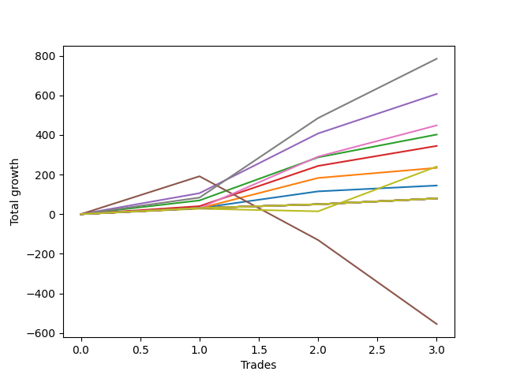

# Long Shepard 003 v2 
- Symbol: ES1y1d
- Date Range: 07/19/2021 - 07/07/2022
- Trading Period: 7:20-12:30
- Number of Trades: 3



| Name | Win Percent | Profit | Avg Profit / Trade | Avg Time / Trade | Avg Profit / Time |      | Name | Win Percent | Profit | Avg Profit / Trade | Avg Time / Trade | Avg Profit / Time |
| ---- | ----------- | ------ | ------------------ | ---------------- | ----------------- | ---- | ---- | ----------- | ------ | ------------------ | ---------------- | ----------------- |
| Sorted By <br> Profit | | | | | | | Sorted By <br> Win Percentage ||||||
| Seven | 100.00 | 392375.00 | 130791.67 | 14 03:49:00 | 9237.33 |     | Seven | 100.00 | 392375.00 | 130791.67 | 14 03:49:00 | 9237.33 |
| Four | 100.00 | 303500.00 | 101166.67 | 13 15:12:20 | 7420.41 |     | Four | 100.00 | 303500.00 | 101166.67 | 13 15:12:20 | 7420.41 |
| Six | 100.00 | 224125.00 | 74708.33 | 05 15:47:40 | 13203.78 |     | Six | 100.00 | 224125.00 | 74708.33 | 05 15:47:40 | 13203.78 |
| Two | 100.00 | 201000.00 | 67000.00 | 05 19:40:00 | 11513.13 |     | Two | 100.00 | 201000.00 | 67000.00 | 05 19:40:00 | 11513.13 |
| Three | 100.00 | 172250.00 | 57416.67 | 05 11:18:00 | 10495.05 |     | Three | 100.00 | 172250.00 | 57416.67 | 05 11:18:00 | 10495.05 |
| Seventy-Three | 66.67 | 120125.00 | 40041.67 | 10 09:41:00 | 3848.88 |     | One | 100.00 | 116875.00 | 38958.33 | 04 18:31:40 | 8163.96 |
| One | 100.00 | 116875.00 | 38958.33 | 04 18:31:40 | 8163.96 |     | Zero | 100.00 | 72250.00 | 24083.33 | 01 23:48:00 | 12092.05 |
| Zero | 100.00 | 72250.00 | 24083.33 | 01 23:48:00 | 12092.05 |     | Ninety | 100.00 | 39625.00 | 13208.33 | 00 00:03:00 | 6340000.00 |
| Ninety | 100.00 | 39625.00 | 13208.33 | 00 00:03:00 | 6340000.00 |     | Eighty-Nine | 100.00 | 39625.00 | 13208.33 | 00 00:03:00 | 6340000.00 |
| Eighty-Nine | 100.00 | 39625.00 | 13208.33 | 00 00:03:00 | 6340000.00 |     | Eighty-Eight | 100.00 | 39625.00 | 13208.33 | 00 00:03:00 | 6340000.00 |
| Eighty-Eight | 100.00 | 39625.00 | 13208.33 | 00 00:03:00 | 6340000.00 |     | Eighty-Seven | 100.00 | 39625.00 | 13208.33 | 00 00:03:00 | 6340000.00 |
| Eighty-Seven | 100.00 | 39625.00 | 13208.33 | 00 00:03:00 | 6340000.00 |     | Eighty-Six | 100.00 | 39625.00 | 13208.33 | 00 00:03:00 | 6340000.00 |
| Eighty-Six | 100.00 | 39625.00 | 13208.33 | 00 00:03:00 | 6340000.00 |     | Eighty-Five | 100.00 | 39625.00 | 13208.33 | 00 00:03:00 | 6340000.00 |
| Eighty-Five | 100.00 | 39625.00 | 13208.33 | 00 00:03:00 | 6340000.00 |     | Eighty-Four | 100.00 | 39625.00 | 13208.33 | 00 00:03:00 | 6340000.00 |
| Eighty-Four | 100.00 | 39625.00 | 13208.33 | 00 00:03:00 | 6340000.00 |     | Eighty-Three | 100.00 | 39625.00 | 13208.33 | 00 00:03:00 | 6340000.00 |
| Eighty-Three | 100.00 | 39625.00 | 13208.33 | 00 00:03:00 | 6340000.00 |     | Eighty-Two | 100.00 | 39625.00 | 13208.33 | 00 00:03:00 | 6340000.00 |
| Eighty-Two | 100.00 | 39625.00 | 13208.33 | 00 00:03:00 | 6340000.00 |     | Eighty-One | 100.00 | 39625.00 | 13208.33 | 00 00:03:00 | 6340000.00 |
| Eighty-One | 100.00 | 39625.00 | 13208.33 | 00 00:03:00 | 6340000.00 |     | Seventy-Three | 66.67 | 120125.00 | 40041.67 | 10 09:41:00 | 3848.88 |
| Five | 33.33 | -277500.00 | -92500.00 | 84 03:29:40 | -1099.29 |     | Five | 33.33 | -277500.00 | -92500.00 | 84 03:29:40 | -1099.29 |

## NO STOPLOSS

### Test Zero
* Sell when price hits the middle line of the 20p bollinger
* No Stoploss
* Results:
```
Total Trades: 3
Percent Up: 100.00
Percent Down: 0.00
Total Points Moved Up: 144.50
Potential Profit: 72250.00
Total Points Ups: 144.50 Count Ups: 3
Total Points Downs: 0.00 Count Downs: 0
```

<details><summary>Trades</summary>

<code>In: 2021-10-07 07:21:00		Out: 2021-10-07 07:24:00		Total Position Time: 00 00:03:00		Total Move Up: 30.50		Total to Date: 30.50</code> <br />
<code>In: 2022-03-10 07:21:00		Out: 2022-03-16 06:39:00		Total Position Time: 05 23:18:00		Total Move Up: 84.50		Total to Date: 115.00</code> <br />
<code>In: 2022-03-17 07:21:00		Out: 2022-03-17 07:24:00		Total Position Time: 00 00:03:00		Total Move Up: 29.50		Total to Date: 144.50</code> <br />


</details>

### Test One
* Sell when the price hits the upper line of the 20p 1std bollinger
* No Stoploss
* Results:
```
Total Trades: 3
Percent Up: 100.00
Percent Down: 0.00
Total Points Moved Up: 233.75
Potential Profit: 116875.00
Total Points Ups: 233.75 Count Ups: 3
Total Points Downs: 0.00 Count Downs: 0
```

<details><summary>Trades</summary>

<code>In: 2021-10-07 07:21:00		Out: 2021-10-14 08:40:00		Total Position Time: 07 01:19:00		Total Move Up: 29.50		Total to Date: 29.50</code> <br />
<code>In: 2022-03-10 07:21:00		Out: 2022-03-17 10:29:00		Total Position Time: 07 03:08:00		Total Move Up: 153.25		Total to Date: 182.75</code> <br />
<code>In: 2022-03-17 07:21:00		Out: 2022-03-17 10:29:00		Total Position Time: 00 03:08:00		Total Move Up: 51.00		Total to Date: 233.75</code> <br />


</details>

### Test Two
* Sell when the price hits the upper line of the 20p 2std bollinger
* No Stoploss
* Results:
```
Total Trades: 3
Percent Up: 100.00
Percent Down: 0.00
Total Points Moved Up: 402.00
Potential Profit: 201000.00
Total Points Ups: 402.00 Count Ups: 3
Total Points Downs: 0.00 Count Downs: 0
```

<details><summary>Trades</summary>

<code>In: 2021-10-07 07:21:00		Out: 2021-10-15 08:23:00		Total Position Time: 08 01:02:00		Total Move Up: 69.25		Total to Date: 69.25</code> <br />
<code>In: 2022-03-10 07:21:00		Out: 2022-03-18 12:20:00		Total Position Time: 08 04:59:00		Total Move Up: 217.50		Total to Date: 286.75</code> <br />
<code>In: 2022-03-17 07:21:00		Out: 2022-03-18 12:20:00		Total Position Time: 01 04:59:00		Total Move Up: 115.25		Total to Date: 402.00</code> <br />


</details>

### Test Three
* Sell when price hits the middle line of the 50p bollinger
* No Stoploss
* Results:
```
Total Trades: 3
Percent Up: 100.00
Percent Down: 0.00
Total Points Moved Up: 344.50
Potential Profit: 172250.00
Total Points Ups: 344.50 Count Ups: 3
Total Points Downs: 0.00 Count Downs: 0
```

<details><summary>Trades</summary>

<code>In: 2021-10-07 07:21:00		Out: 2021-10-14 10:57:00		Total Position Time: 07 03:36:00		Total Move Up: 40.25		Total to Date: 40.25</code> <br />
<code>In: 2022-03-10 07:21:00		Out: 2022-03-18 10:30:00		Total Position Time: 08 03:09:00		Total Move Up: 203.25		Total to Date: 243.50</code> <br />
<code>In: 2022-03-17 07:21:00		Out: 2022-03-18 10:30:00		Total Position Time: 01 03:09:00		Total Move Up: 101.00		Total to Date: 344.50</code> <br />


</details>

### Test Four
* Sell when the price hits the upper line of the 50p 1std bollinger
* No Stoploss
* Results:
```
Total Trades: 3
Percent Up: 100.00
Percent Down: 0.00
Total Points Moved Up: 607.00
Potential Profit: 303500.00
Total Points Ups: 607.00 Count Ups: 3
Total Points Downs: 0.00 Count Downs: 0
```

<details><summary>Trades</summary>

<code>In: 2021-10-07 07:21:00		Out: 2021-10-19 06:40:00		Total Position Time: 11 23:19:00		Total Move Up: 105.75		Total to Date: 105.75</code> <br />
<code>In: 2022-03-10 07:21:00		Out: 2022-03-28 06:30:00		Total Position Time: 17 23:09:00		Total Move Up: 301.75		Total to Date: 407.50</code> <br />
<code>In: 2022-03-17 07:21:00		Out: 2022-03-28 06:30:00		Total Position Time: 10 23:09:00		Total Move Up: 199.50		Total to Date: 607.00</code> <br />


</details>

### Test Five
* Sell when the price hits the upper line of the 50p 2std bollinger
* No Stoploss
* Results:
```
Total Trades: 3
Percent Up: 33.33
Percent Down: 66.67
Total Points Moved Up: -555.00
Potential Profit: -277500.00
Total Points Ups: 191.25 Count Ups: 1
Total Points Downs: -746.25 Count Downs: 2
```

<details><summary>Trades</summary>

<code>In: 2021-10-07 07:21:00		Out: 2021-10-26 06:36:00		Total Position Time: 18 23:15:00		Total Move Up: 191.25		Total to Date: 191.25</code> <br />
<code>In: 2022-03-10 07:21:00		Out: 2022-07-08 12:58:00		Total Position Time: 120 05:37:00		Total Move Up: -322.00		Total to Date: -130.75</code> <br />
<code>In: 2022-03-17 07:21:00		Out: 2022-07-08 12:58:00		Total Position Time: 113 05:37:00		Total Move Up: -424.25		Total to Date: -555.00</code> <br />


</details>

### Test Six
* Sell when the price hits the middle line of the 1std VWAP
* No Stoploss
* Results:
```
Total Trades: 3
Percent Up: 100.00
Percent Down: 0.00
Total Points Moved Up: 448.25
Potential Profit: 224125.00
Total Points Ups: 448.25 Count Ups: 3
Total Points Downs: 0.00 Count Downs: 0
```

<details><summary>Trades</summary>

<code>In: 2021-10-07 07:21:00		Out: 2021-10-07 07:24:00		Total Position Time: 00 00:03:00		Total Move Up: 30.50		Total to Date: 30.50</code> <br />
<code>In: 2022-03-10 07:21:00		Out: 2022-03-22 07:01:00		Total Position Time: 11 23:40:00		Total Move Up: 260.00		Total to Date: 290.50</code> <br />
<code>In: 2022-03-17 07:21:00		Out: 2022-03-22 07:01:00		Total Position Time: 04 23:40:00		Total Move Up: 157.75		Total to Date: 448.25</code> <br />


</details>

### Test Seven
* Sell when the price hits the upper line of the 1std VWAP
* No Stoploss
* Results:
```
Total Trades: 3
Percent Up: 100.00
Percent Down: 0.00
Total Points Moved Up: 784.75
Potential Profit: 392375.00
Total Points Ups: 784.75 Count Ups: 3
Total Points Downs: 0.00 Count Downs: 0
```

<details><summary>Trades</summary>

<code>In: 2021-10-07 07:21:00		Out: 2021-10-18 08:20:00		Total Position Time: 11 00:59:00		Total Move Up: 83.50		Total to Date: 83.50</code> <br />
<code>In: 2022-03-10 07:21:00		Out: 2022-03-29 12:35:00		Total Position Time: 19 05:14:00		Total Move Up: 401.75		Total to Date: 485.25</code> <br />
<code>In: 2022-03-17 07:21:00		Out: 2022-03-29 12:35:00		Total Position Time: 12 05:14:00		Total Move Up: 299.50		Total to Date: 784.75</code> <br />


</details>

## SPECIAL EXIT CONDITIONS 

### Test Seventy-Three
* Sell when the linear regression slope changes to negative
* No Stoploss
* Results:
```
Total Trades: 3
Percent Up: 66.67
Percent Down: 33.33
Total Points Moved Up: 240.25
Potential Profit: 120125.00
Total Points Ups: 253.50 Count Ups: 2
Total Points Downs: -13.25 Count Downs: 1
```

<details><summary>Trades</summary>

<code>In: 2021-10-07 07:21:00		Out: 2021-10-14 08:22:00		Total Position Time: 07 01:01:00		Total Move Up: 27.50		Total to Date: 27.50</code> <br />
<code>In: 2022-03-10 07:21:00		Out: 2022-03-15 08:22:00		Total Position Time: 05 01:01:00		Total Move Up: -13.25		Total to Date: 14.25</code> <br />
<code>In: 2022-03-17 07:21:00		Out: 2022-04-05 10:22:00		Total Position Time: 19 03:01:00		Total Move Up: 226.00		Total to Date: 240.25</code> <br />


</details>

## TAKE PROFIT

### Test Eighty-One
* Take Profit of 1 Point
* No Stoploss
* Results:
```
Total Trades: 3
Percent Up: 100.00
Percent Down: 0.00
Total Points Moved Up: 79.25
Potential Profit: 39625.00
Total Points Ups: 79.25 Count Ups: 3
Total Points Downs: 0.00 Count Downs: 0
```

<details><summary>Trades</summary>

<code>In: 2021-10-07 07:21:00		Out: 2021-10-07 07:24:00		Total Position Time: 00 00:03:00		Total Move Up: 30.50		Total to Date: 30.50</code> <br />
<code>In: 2022-03-10 07:21:00		Out: 2022-03-10 07:24:00		Total Position Time: 00 00:03:00		Total Move Up: 19.25		Total to Date: 49.75</code> <br />
<code>In: 2022-03-17 07:21:00		Out: 2022-03-17 07:24:00		Total Position Time: 00 00:03:00		Total Move Up: 29.50		Total to Date: 79.25</code> <br />


</details>

### Test Eighty-Two
* Take Profit of 2 Point
* No Stoploss
* Results:
```
Total Trades: 3
Percent Up: 100.00
Percent Down: 0.00
Total Points Moved Up: 79.25
Potential Profit: 39625.00
Total Points Ups: 79.25 Count Ups: 3
Total Points Downs: 0.00 Count Downs: 0
```

<details><summary>Trades</summary>

<code>In: 2021-10-07 07:21:00		Out: 2021-10-07 07:24:00		Total Position Time: 00 00:03:00		Total Move Up: 30.50		Total to Date: 30.50</code> <br />
<code>In: 2022-03-10 07:21:00		Out: 2022-03-10 07:24:00		Total Position Time: 00 00:03:00		Total Move Up: 19.25		Total to Date: 49.75</code> <br />
<code>In: 2022-03-17 07:21:00		Out: 2022-03-17 07:24:00		Total Position Time: 00 00:03:00		Total Move Up: 29.50		Total to Date: 79.25</code> <br />


</details>

### Test Eighty-Three
* Take Profit of 3 Point
* No Stoploss
* Results:
```
Total Trades: 3
Percent Up: 100.00
Percent Down: 0.00
Total Points Moved Up: 79.25
Potential Profit: 39625.00
Total Points Ups: 79.25 Count Ups: 3
Total Points Downs: 0.00 Count Downs: 0
```

<details><summary>Trades</summary>

<code>In: 2021-10-07 07:21:00		Out: 2021-10-07 07:24:00		Total Position Time: 00 00:03:00		Total Move Up: 30.50		Total to Date: 30.50</code> <br />
<code>In: 2022-03-10 07:21:00		Out: 2022-03-10 07:24:00		Total Position Time: 00 00:03:00		Total Move Up: 19.25		Total to Date: 49.75</code> <br />
<code>In: 2022-03-17 07:21:00		Out: 2022-03-17 07:24:00		Total Position Time: 00 00:03:00		Total Move Up: 29.50		Total to Date: 79.25</code> <br />


</details>

### Test Eighty-Four
* Take Profit of 4 Point
* No Stoploss
* Results:
```
Total Trades: 3
Percent Up: 100.00
Percent Down: 0.00
Total Points Moved Up: 79.25
Potential Profit: 39625.00
Total Points Ups: 79.25 Count Ups: 3
Total Points Downs: 0.00 Count Downs: 0
```

<details><summary>Trades</summary>

<code>In: 2021-10-07 07:21:00		Out: 2021-10-07 07:24:00		Total Position Time: 00 00:03:00		Total Move Up: 30.50		Total to Date: 30.50</code> <br />
<code>In: 2022-03-10 07:21:00		Out: 2022-03-10 07:24:00		Total Position Time: 00 00:03:00		Total Move Up: 19.25		Total to Date: 49.75</code> <br />
<code>In: 2022-03-17 07:21:00		Out: 2022-03-17 07:24:00		Total Position Time: 00 00:03:00		Total Move Up: 29.50		Total to Date: 79.25</code> <br />


</details>

### Test Eighty-Five
* Take Profit of 5 Point
* No Stoploss
* Results:
```
Total Trades: 3
Percent Up: 100.00
Percent Down: 0.00
Total Points Moved Up: 79.25
Potential Profit: 39625.00
Total Points Ups: 79.25 Count Ups: 3
Total Points Downs: 0.00 Count Downs: 0
```

<details><summary>Trades</summary>

<code>In: 2021-10-07 07:21:00		Out: 2021-10-07 07:24:00		Total Position Time: 00 00:03:00		Total Move Up: 30.50		Total to Date: 30.50</code> <br />
<code>In: 2022-03-10 07:21:00		Out: 2022-03-10 07:24:00		Total Position Time: 00 00:03:00		Total Move Up: 19.25		Total to Date: 49.75</code> <br />
<code>In: 2022-03-17 07:21:00		Out: 2022-03-17 07:24:00		Total Position Time: 00 00:03:00		Total Move Up: 29.50		Total to Date: 79.25</code> <br />


</details>

### Test Eighty-Six
* Take Profit of 6 Point
* No Stoploss
* Results:
```
Total Trades: 3
Percent Up: 100.00
Percent Down: 0.00
Total Points Moved Up: 79.25
Potential Profit: 39625.00
Total Points Ups: 79.25 Count Ups: 3
Total Points Downs: 0.00 Count Downs: 0
```

<details><summary>Trades</summary>

<code>In: 2021-10-07 07:21:00		Out: 2021-10-07 07:24:00		Total Position Time: 00 00:03:00		Total Move Up: 30.50		Total to Date: 30.50</code> <br />
<code>In: 2022-03-10 07:21:00		Out: 2022-03-10 07:24:00		Total Position Time: 00 00:03:00		Total Move Up: 19.25		Total to Date: 49.75</code> <br />
<code>In: 2022-03-17 07:21:00		Out: 2022-03-17 07:24:00		Total Position Time: 00 00:03:00		Total Move Up: 29.50		Total to Date: 79.25</code> <br />


</details>

### Test Eighty-Seven
* Take Profit of 7 Point
* No Stoploss
* Results:
```
Total Trades: 3
Percent Up: 100.00
Percent Down: 0.00
Total Points Moved Up: 79.25
Potential Profit: 39625.00
Total Points Ups: 79.25 Count Ups: 3
Total Points Downs: 0.00 Count Downs: 0
```

<details><summary>Trades</summary>

<code>In: 2021-10-07 07:21:00		Out: 2021-10-07 07:24:00		Total Position Time: 00 00:03:00		Total Move Up: 30.50		Total to Date: 30.50</code> <br />
<code>In: 2022-03-10 07:21:00		Out: 2022-03-10 07:24:00		Total Position Time: 00 00:03:00		Total Move Up: 19.25		Total to Date: 49.75</code> <br />
<code>In: 2022-03-17 07:21:00		Out: 2022-03-17 07:24:00		Total Position Time: 00 00:03:00		Total Move Up: 29.50		Total to Date: 79.25</code> <br />


</details>

### Test Eighty-Eight
* Take Profit of 8 Point
* No Stoploss
* Results:
```
Total Trades: 3
Percent Up: 100.00
Percent Down: 0.00
Total Points Moved Up: 79.25
Potential Profit: 39625.00
Total Points Ups: 79.25 Count Ups: 3
Total Points Downs: 0.00 Count Downs: 0
```

<details><summary>Trades</summary>

<code>In: 2021-10-07 07:21:00		Out: 2021-10-07 07:24:00		Total Position Time: 00 00:03:00		Total Move Up: 30.50		Total to Date: 30.50</code> <br />
<code>In: 2022-03-10 07:21:00		Out: 2022-03-10 07:24:00		Total Position Time: 00 00:03:00		Total Move Up: 19.25		Total to Date: 49.75</code> <br />
<code>In: 2022-03-17 07:21:00		Out: 2022-03-17 07:24:00		Total Position Time: 00 00:03:00		Total Move Up: 29.50		Total to Date: 79.25</code> <br />


</details>

### Test Eighty-Nine
* Take Profit of 9 Point
* No Stoploss
* Results:
```
Total Trades: 3
Percent Up: 100.00
Percent Down: 0.00
Total Points Moved Up: 79.25
Potential Profit: 39625.00
Total Points Ups: 79.25 Count Ups: 3
Total Points Downs: 0.00 Count Downs: 0
```

<details><summary>Trades</summary>

<code>In: 2021-10-07 07:21:00		Out: 2021-10-07 07:24:00		Total Position Time: 00 00:03:00		Total Move Up: 30.50		Total to Date: 30.50</code> <br />
<code>In: 2022-03-10 07:21:00		Out: 2022-03-10 07:24:00		Total Position Time: 00 00:03:00		Total Move Up: 19.25		Total to Date: 49.75</code> <br />
<code>In: 2022-03-17 07:21:00		Out: 2022-03-17 07:24:00		Total Position Time: 00 00:03:00		Total Move Up: 29.50		Total to Date: 79.25</code> <br />


</details>

### Test Ninety
* Take Profit of 10 Point
* No Stoploss
* Results:
```
Total Trades: 3
Percent Up: 100.00
Percent Down: 0.00
Total Points Moved Up: 79.25
Potential Profit: 39625.00
Total Points Ups: 79.25 Count Ups: 3
Total Points Downs: 0.00 Count Downs: 0
```

<details><summary>Trades</summary>

<code>In: 2021-10-07 07:21:00		Out: 2021-10-07 07:24:00		Total Position Time: 00 00:03:00		Total Move Up: 30.50		Total to Date: 30.50</code> <br />
<code>In: 2022-03-10 07:21:00		Out: 2022-03-10 07:24:00		Total Position Time: 00 00:03:00		Total Move Up: 19.25		Total to Date: 49.75</code> <br />
<code>In: 2022-03-17 07:21:00		Out: 2022-03-17 07:24:00		Total Position Time: 00 00:03:00		Total Move Up: 29.50		Total to Date: 79.25</code> <br />


</details>