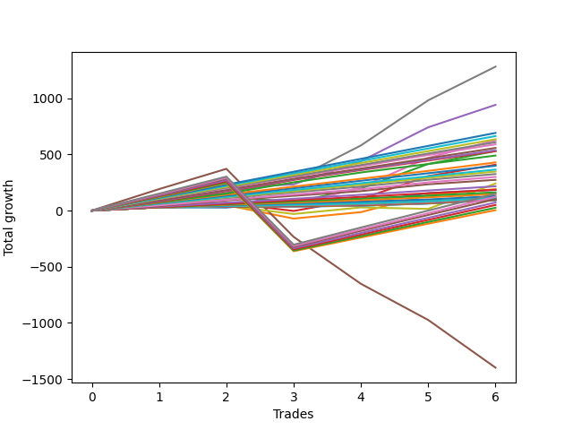

# Long Shepard 006 
- Symbol: ES1y1d
- Date Range: 07/19/2021 - 07/08/2022
- Trading Period: 7:20-12:30
- Number of Trades: 6



| Name | Win Percent | Profit | Avg Profit / Trade | Avg Time / Trade | Avg Profit / Time |      | Name | Win Percent | Profit | Avg Profit / Trade | Avg Time / Trade | Avg Profit / Time |
| ---- | ----------- | ------ | ------------------ | ---------------- | ----------------- | ---- | ---- | ----------- | ------ | ------------------ | ---------------- | ----------------- |
| Sorted By <br> Profit | | | | | | | Sorted By <br> Win Percentage ||||||
| Seven | 100.00 | 640625.00 | 106770.83 | 22 23:49:00 | 4643.75 |     | Seven | 100.00 | 640625.00 | 106770.83 | 22 23:49:00 | 4643.75 |
| Four | 100.00 | 470500.00 | 78416.67 | 22 11:17:20 | 3489.78 |     | Four | 100.00 | 470500.00 | 78416.67 | 22 11:17:20 | 3489.78 |
| Two Hundred Eleven.Five | 100.00 | 345625.00 | 57604.17 | 17 12:29:50 | 3287.77 |     | Two Hundred Eleven.Five | 100.00 | 345625.00 | 57604.17 | 17 12:29:50 | 3287.77 |
| Two Hundred Eleven | 100.00 | 331625.00 | 55270.83 | 17 10:42:30 | 3168.08 |     | Two Hundred Eleven | 100.00 | 331625.00 | 55270.83 | 17 10:42:30 | 3168.08 |
| Two Hundred Ten.Five | 100.00 | 317375.00 | 52895.83 | 17 09:09:10 | 3043.25 |     | Two Hundred Ten.Five | 100.00 | 317375.00 | 52895.83 | 17 09:09:10 | 3043.25 |
| Six | 100.00 | 313500.00 | 52250.00 | 07 12:34:20 | 6944.59 |     | Six | 100.00 | 313500.00 | 52250.00 | 07 12:34:20 | 6944.59 |
| Two Hundred Ten | 100.00 | 304250.00 | 50708.33 | 17 08:35:50 | 2921.29 |     | Two Hundred Ten | 100.00 | 304250.00 | 50708.33 | 17 08:35:50 | 2921.29 |
| Two Hundred Nine.Five | 100.00 | 294875.00 | 49145.83 | 17 08:25:10 | 2832.48 |     | Two Hundred Nine.Five | 100.00 | 294875.00 | 49145.83 | 17 08:25:10 | 2832.48 |
| Two Hundred Nine | 100.00 | 278750.00 | 46458.33 | 17 04:53:30 | 2700.47 |     | Two Hundred Nine | 100.00 | 278750.00 | 46458.33 | 17 04:53:30 | 2700.47 |
| Two Hundred Eight.Five | 100.00 | 268625.00 | 44770.83 | 14 15:59:00 | 3052.70 |     | Two Hundred Eight.Five | 100.00 | 268625.00 | 44770.83 | 14 15:59:00 | 3052.70 |
| Two | 83.33 | 265000.00 | 44166.67 | 15 02:42:10 | 2922.50 |     | Two Hundred Eight | 100.00 | 264375.00 | 44062.50 | 14 15:34:10 | 3007.94 |
| Two Hundred Eight | 100.00 | 264375.00 | 44062.50 | 14 15:34:10 | 3007.94 |     | Two Hundred Seven.Five | 100.00 | 244875.00 | 40812.50 | 13 21:27:30 | 2937.40 |
| Two Hundred Seven.Five | 100.00 | 244875.00 | 40812.50 | 13 21:27:30 | 2937.40 |     | Two Hundred Seven | 100.00 | 214250.00 | 35708.33 | 04 14:14:00 | 7774.42 |
| Two Hundred Seven | 100.00 | 214250.00 | 35708.33 | 04 14:14:00 | 7774.42 |     | Two Hundred Six.Five | 100.00 | 199500.00 | 33250.00 | 04 02:29:30 | 8102.21 |
| Three | 83.33 | 204125.00 | 34020.83 | 14 07:34:30 | 2376.48 |     | Two Hundred Six | 100.00 | 182500.00 | 30416.67 | 02 20:54:30 | 10593.78 |
| Two Hundred Six.Five | 100.00 | 199500.00 | 33250.00 | 04 02:29:30 | 8102.21 |     | Two Hundred Five.Five | 100.00 | 173750.00 | 28958.33 | 02 20:17:00 | 10178.18 |
| Two Hundred Six | 100.00 | 182500.00 | 30416.67 | 02 20:54:30 | 10593.78 |     | Two Hundred Five | 100.00 | 162625.00 | 27104.17 | 02 20:09:30 | 9543.95 |
| Two Hundred Five.Five | 100.00 | 173750.00 | 28958.33 | 02 20:17:00 | 10178.18 |     | Two Hundred Four.Five | 100.00 | 149750.00 | 24958.33 | 02 17:15:20 | 9179.30 |
| Two Hundred Five | 100.00 | 162625.00 | 27104.17 | 02 20:09:30 | 9543.95 |     | Two Hundred Four | 100.00 | 136875.00 | 22812.50 | 02 13:49:00 | 8856.83 |
| Two Hundred Four.Five | 100.00 | 149750.00 | 24958.33 | 02 17:15:20 | 9179.30 |     | Two Hundred Three.Five | 100.00 | 108125.00 | 18020.83 | 02 07:37:00 | 7776.45 |
| Two Hundred Four | 100.00 | 136875.00 | 22812.50 | 02 13:49:00 | 8856.83 |     | Two Hundred Three | 100.00 | 92375.00 | 15395.83 | 01 02:29:40 | 13946.32 |
| Seventy-Three | 66.67 | 120500.00 | 20083.33 | 09 05:21:00 | 2177.55 |     | Two Hundred Two.Five | 100.00 | 81250.00 | 13541.67 | 01 01:59:30 | 12504.01 |
| Two Hundred Three.Five | 100.00 | 108125.00 | 18020.83 | 02 07:37:00 | 7776.45 |     | Two Hundred Two | 100.00 | 73750.00 | 12291.67 | 01 01:46:40 | 11443.97 |
| One | 83.33 | 95250.00 | 15875.00 | 13 14:35:30 | 1166.59 |     | Two Hundred One.Five | 100.00 | 64375.00 | 10729.17 | 01 00:59:40 | 10302.29 |
| Two Hundred Three | 100.00 | 92375.00 | 15395.83 | 01 02:29:40 | 13946.32 |     | Two Hundred One | 100.00 | 56500.00 | 9416.67 | 01 00:47:40 | 9114.95 |
| Zero | 66.67 | 92375.00 | 15395.83 | 03 19:40:30 | 4030.54 |     | Ninety | 100.00 | 56500.00 | 9416.67 | 01 00:47:40 | 9114.95 |
| Two Hundred Two.Five | 100.00 | 81250.00 | 13541.67 | 01 01:59:30 | 12504.01 |     | Eighty-Nine | 100.00 | 53500.00 | 8916.67 | 01 00:46:40 | 8636.77 |
| Two Hundred Fifteen | 83.33 | 75125.00 | 12520.83 | 36 14:09:40 | 342.19 |     | Eighty-Eight | 100.00 | 52500.00 | 8750.00 | 01 00:46:20 | 8477.24 |
| Two Hundred Two | 100.00 | 73750.00 | 12291.67 | 01 01:46:40 | 11443.97 |     | Eighty-Seven | 100.00 | 50750.00 | 8458.33 | 00 12:49:40 | 15825.03 |
| Two Hundred One.Five | 100.00 | 64375.00 | 10729.17 | 01 00:59:40 | 10302.29 |     | Eighty-Six | 100.00 | 50750.00 | 8458.33 | 00 12:49:40 | 15825.03 |
| Two Hundred Fourteen.Five | 83.33 | 61500.00 | 10250.00 | 36 09:53:20 | 281.50 |     | Eighty-Five | 100.00 | 49750.00 | 8291.67 | 00 12:48:40 | 15533.39 |
| Two Hundred One | 100.00 | 56500.00 | 9416.67 | 01 00:47:40 | 9114.95 |     | Eighty-Four | 100.00 | 49500.00 | 8250.00 | 00 12:47:20 | 15482.19 |
| Ninety | 100.00 | 56500.00 | 9416.67 | 01 00:47:40 | 9114.95 |     | Eighty-Three | 100.00 | 47375.00 | 7895.83 | 00 12:16:40 | 15434.39 |
| Eighty-Nine | 100.00 | 53500.00 | 8916.67 | 01 00:46:40 | 8636.77 |     | Eighty-Two | 100.00 | 46250.00 | 7708.33 | 00 12:15:00 | 15102.04 |
| Eighty-Eight | 100.00 | 52500.00 | 8750.00 | 01 00:46:20 | 8477.24 |     | Eighty-One | 100.00 | 46250.00 | 7708.33 | 00 12:15:00 | 15102.04 |
| Two Hundred Fourteen | 83.33 | 50875.00 | 8479.17 | 35 21:59:10 | 236.08 |     | Two | 83.33 | 265000.00 | 44166.67 | 15 02:42:10 | 2922.50 |
| Eighty-Seven | 100.00 | 50750.00 | 8458.33 | 00 12:49:40 | 15825.03 |     | Three | 83.33 | 204125.00 | 34020.83 | 14 07:34:30 | 2376.48 |
| Eighty-Six | 100.00 | 50750.00 | 8458.33 | 00 12:49:40 | 15825.03 |     | One | 83.33 | 95250.00 | 15875.00 | 13 14:35:30 | 1166.59 |
| Eighty-Five | 100.00 | 49750.00 | 8291.67 | 00 12:48:40 | 15533.39 |     | Two Hundred Fifteen | 83.33 | 75125.00 | 12520.83 | 36 14:09:40 | 342.19 |
| Eighty-Four | 100.00 | 49500.00 | 8250.00 | 00 12:47:20 | 15482.19 |     | Two Hundred Fourteen.Five | 83.33 | 61500.00 | 10250.00 | 36 09:53:20 | 281.50 |
| Eighty-Three | 100.00 | 47375.00 | 7895.83 | 00 12:16:40 | 15434.39 |     | Two Hundred Fourteen | 83.33 | 50875.00 | 8479.17 | 35 21:59:10 | 236.08 |
| Eighty-Two | 100.00 | 46250.00 | 7708.33 | 00 12:15:00 | 15102.04 |     | Two Hundred Thirteen.Five | 83.33 | 36000.00 | 6000.00 | 35 18:27:40 | 167.74 |
| Eighty-One | 100.00 | 46250.00 | 7708.33 | 00 12:15:00 | 15102.04 |     | Two Hundred Thirteen | 83.33 | 25000.00 | 4166.67 | 35 02:36:30 | 118.68 |
| Two Hundred Thirteen.Five | 83.33 | 36000.00 | 6000.00 | 35 18:27:40 | 167.74 |     | Two Hundred Twelve.Five | 83.33 | 12625.00 | 2104.17 | 34 12:30:50 | 60.95 |
| Two Hundred Thirteen | 83.33 | 25000.00 | 4166.67 | 35 02:36:30 | 118.68 |     | Two Hundred Twelve | 83.33 | 1875.00 | 312.50 | 34 11:54:00 | 9.06 |
| Two Hundred Twelve.Five | 83.33 | 12625.00 | 2104.17 | 34 12:30:50 | 60.95 |     | Seventy-Three | 66.67 | 120500.00 | 20083.33 | 09 05:21:00 | 2177.55 |
| Two Hundred Twelve | 83.33 | 1875.00 | 312.50 | 34 11:54:00 | 9.06 |     | Zero | 66.67 | 92375.00 | 15395.83 | 03 19:40:30 | 4030.54 |
| Five | 33.33 | -699125.00 | -116520.83 | 92 23:29:40 | -1253.20 |     | Five | 33.33 | -699125.00 | -116520.83 | 92 23:29:40 | -1253.20 |

## NO STOPLOSS

### Test Zero
* Sell when price hits the middle line of the 20p bollinger
* No Stoploss
* Results:
```
Total Trades: 6
Percent Up: 66.67
Percent Down: 33.33
Total Points Moved Up: 184.75
Potential Profit: 92375.00
Total Points Ups: 199.50 Count Ups: 4
Total Points Downs: -14.75 Count Downs: 2
```

<details><summary>Trades</summary>

<code>In: 2021-10-07 07:21:00		Out: 2021-10-07 07:24:00		Total Position Time: 00 00:03:00		Total Move Up: 30.50		Total to Date: 30.50</code> <br />
<code>In: 2021-10-08 07:21:00		Out: 2021-10-08 07:24:00		Total Position Time: 00 00:03:00		Total Move Up: -3.50		Total to Date: 27.00</code> <br />
<code>In: 2022-02-01 07:21:00		Out: 2022-02-02 06:39:00		Total Position Time: 00 23:18:00		Total Move Up: 55.00		Total to Date: 82.00</code> <br />
<code>In: 2022-02-28 07:21:00		Out: 2022-03-16 06:39:00		Total Position Time: 15 23:18:00		Total Move Up: -11.25		Total to Date: 70.75</code> <br />
<code>In: 2022-03-10 07:21:00		Out: 2022-03-16 06:39:00		Total Position Time: 05 23:18:00		Total Move Up: 84.50		Total to Date: 155.25</code> <br />
<code>In: 2022-03-17 07:21:00		Out: 2022-03-17 07:24:00		Total Position Time: 00 00:03:00		Total Move Up: 29.50		Total to Date: 184.75</code> <br />


</details>

### Test One
* Sell when the price hits the upper line of the 20p 1std bollinger
* No Stoploss
* Results:
```
Total Trades: 6
Percent Up: 83.33
Percent Down: 16.67
Total Points Moved Up: 190.50
Potential Profit: 95250.00
Total Points Ups: 310.00 Count Ups: 5
Total Points Downs: -119.50 Count Downs: 1
```

<details><summary>Trades</summary>

<code>In: 2021-10-07 07:21:00		Out: 2021-10-14 08:40:00		Total Position Time: 07 01:19:00		Total Move Up: 29.50		Total to Date: 29.50</code> <br />
<code>In: 2021-10-08 07:21:00		Out: 2021-10-14 08:40:00		Total Position Time: 06 01:19:00		Total Move Up: 18.75		Total to Date: 48.25</code> <br />
<code>In: 2022-02-01 07:21:00		Out: 2022-03-17 10:52:00		Total Position Time: 44 03:31:00		Total Move Up: -119.50		Total to Date: -71.25</code> <br />
<code>In: 2022-02-28 07:21:00		Out: 2022-03-17 10:29:00		Total Position Time: 17 03:08:00		Total Move Up: 57.50		Total to Date: -13.75</code> <br />
<code>In: 2022-03-10 07:21:00		Out: 2022-03-17 10:29:00		Total Position Time: 07 03:08:00		Total Move Up: 153.25		Total to Date: 139.50</code> <br />
<code>In: 2022-03-17 07:21:00		Out: 2022-03-17 10:29:00		Total Position Time: 00 03:08:00		Total Move Up: 51.00		Total to Date: 190.50</code> <br />


</details>

### Test Two
* Sell when the price hits the upper line of the 20p 2std bollinger
* No Stoploss
* Results:
```
Total Trades: 6
Percent Up: 83.33
Percent Down: 16.67
Total Points Moved Up: 530.00
Potential Profit: 265000.00
Total Points Ups: 582.25 Count Ups: 5
Total Points Downs: -52.25 Count Downs: 1
```

<details><summary>Trades</summary>

<code>In: 2021-10-07 07:21:00		Out: 2021-10-15 08:23:00		Total Position Time: 08 01:02:00		Total Move Up: 69.25		Total to Date: 69.25</code> <br />
<code>In: 2021-10-08 07:21:00		Out: 2021-10-15 08:23:00		Total Position Time: 07 01:02:00		Total Move Up: 58.50		Total to Date: 127.75</code> <br />
<code>In: 2022-02-01 07:21:00		Out: 2022-03-21 06:33:00		Total Position Time: 47 23:12:00		Total Move Up: -52.25		Total to Date: 75.50</code> <br />
<code>In: 2022-02-28 07:21:00		Out: 2022-03-18 12:20:00		Total Position Time: 18 04:59:00		Total Move Up: 121.75		Total to Date: 197.25</code> <br />
<code>In: 2022-03-10 07:21:00		Out: 2022-03-18 12:20:00		Total Position Time: 08 04:59:00		Total Move Up: 217.50		Total to Date: 414.75</code> <br />
<code>In: 2022-03-17 07:21:00		Out: 2022-03-18 12:20:00		Total Position Time: 01 04:59:00		Total Move Up: 115.25		Total to Date: 530.00</code> <br />


</details>

### Test Three
* Sell when price hits the middle line of the 50p bollinger
* No Stoploss
* Results:
```
Total Trades: 6
Percent Up: 83.33
Percent Down: 16.67
Total Points Moved Up: 408.25
Potential Profit: 204125.00
Total Points Ups: 481.50 Count Ups: 5
Total Points Downs: -73.25 Count Downs: 1
```

<details><summary>Trades</summary>

<code>In: 2021-10-07 07:21:00		Out: 2021-10-14 10:57:00		Total Position Time: 07 03:36:00		Total Move Up: 40.25		Total to Date: 40.25</code> <br />
<code>In: 2021-10-08 07:21:00		Out: 2021-10-14 10:57:00		Total Position Time: 06 03:36:00		Total Move Up: 29.50		Total to Date: 69.75</code> <br />
<code>In: 2022-02-01 07:21:00		Out: 2022-03-18 12:09:00		Total Position Time: 45 04:48:00		Total Move Up: -73.25		Total to Date: -3.50</code> <br />
<code>In: 2022-02-28 07:21:00		Out: 2022-03-18 10:30:00		Total Position Time: 18 03:09:00		Total Move Up: 107.50		Total to Date: 104.00</code> <br />
<code>In: 2022-03-10 07:21:00		Out: 2022-03-18 10:30:00		Total Position Time: 08 03:09:00		Total Move Up: 203.25		Total to Date: 307.25</code> <br />
<code>In: 2022-03-17 07:21:00		Out: 2022-03-18 10:30:00		Total Position Time: 01 03:09:00		Total Move Up: 101.00		Total to Date: 408.25</code> <br />


</details>

### Test Four
* Sell when the price hits the upper line of the 50p 1std bollinger
* No Stoploss
* Results:
```
Total Trades: 6
Percent Up: 100.00
Percent Down: 0.00
Total Points Moved Up: 941.00
Potential Profit: 470500.00
Total Points Ups: 941.00 Count Ups: 6
Total Points Downs: 0.00 Count Downs: 0
```

<details><summary>Trades</summary>

<code>In: 2021-10-07 07:21:00		Out: 2021-10-19 06:40:00		Total Position Time: 11 23:19:00		Total Move Up: 105.75		Total to Date: 105.75</code> <br />
<code>In: 2021-10-08 07:21:00		Out: 2021-10-19 06:40:00		Total Position Time: 10 23:19:00		Total Move Up: 95.00		Total to Date: 200.75</code> <br />
<code>In: 2022-02-01 07:21:00		Out: 2022-03-28 07:00:00		Total Position Time: 54 23:39:00		Total Move Up: 33.00		Total to Date: 233.75</code> <br />
<code>In: 2022-02-28 07:21:00		Out: 2022-03-28 06:30:00		Total Position Time: 27 23:09:00		Total Move Up: 206.00		Total to Date: 439.75</code> <br />
<code>In: 2022-03-10 07:21:00		Out: 2022-03-28 06:30:00		Total Position Time: 17 23:09:00		Total Move Up: 301.75		Total to Date: 741.50</code> <br />
<code>In: 2022-03-17 07:21:00		Out: 2022-03-28 06:30:00		Total Position Time: 10 23:09:00		Total Move Up: 199.50		Total to Date: 941.00</code> <br />


</details>

### Test Five
* Sell when the price hits the upper line of the 50p 2std bollinger
* No Stoploss
* Results:
```
Total Trades: 6
Percent Up: 33.33
Percent Down: 66.67
Total Points Moved Up: -1398.25
Potential Profit: -699125.00
Total Points Ups: 371.75 Count Ups: 2
Total Points Downs: -1770.00 Count Downs: 4
```

<details><summary>Trades</summary>

<code>In: 2021-10-07 07:21:00		Out: 2021-10-26 06:36:00		Total Position Time: 18 23:15:00		Total Move Up: 191.25		Total to Date: 191.25</code> <br />
<code>In: 2021-10-08 07:21:00		Out: 2021-10-26 06:36:00		Total Position Time: 17 23:15:00		Total Move Up: 180.50		Total to Date: 371.75</code> <br />
<code>In: 2022-02-01 07:21:00		Out: 2022-07-08 12:58:00		Total Position Time: 157 05:37:00		Total Move Up: -606.00		Total to Date: -234.25</code> <br />
<code>In: 2022-02-28 07:21:00		Out: 2022-07-08 12:58:00		Total Position Time: 130 05:37:00		Total Move Up: -417.75		Total to Date: -652.00</code> <br />
<code>In: 2022-03-10 07:21:00		Out: 2022-07-08 12:58:00		Total Position Time: 120 05:37:00		Total Move Up: -322.00		Total to Date: -974.00</code> <br />
<code>In: 2022-03-17 07:21:00		Out: 2022-07-08 12:58:00		Total Position Time: 113 05:37:00		Total Move Up: -424.25		Total to Date: -1398.25</code> <br />


</details>

### Test Six
* Sell when the price hits the middle line of the 1std VWAP
* No Stoploss
* Results:
```
Total Trades: 6
Percent Up: 100.00
Percent Down: 0.00
Total Points Moved Up: 627.00
Potential Profit: 313500.00
Total Points Ups: 627.00 Count Ups: 6
Total Points Downs: 0.00 Count Downs: 0
```

<details><summary>Trades</summary>

<code>In: 2021-10-07 07:21:00		Out: 2021-10-07 07:24:00		Total Position Time: 00 00:03:00		Total Move Up: 30.50		Total to Date: 30.50</code> <br />
<code>In: 2021-10-08 07:21:00		Out: 2021-10-14 07:02:00		Total Position Time: 05 23:41:00		Total Move Up: 7.25		Total to Date: 37.75</code> <br />
<code>In: 2022-02-01 07:21:00		Out: 2022-02-01 12:03:00		Total Position Time: 00 04:42:00		Total Move Up: 7.25		Total to Date: 45.00</code> <br />
<code>In: 2022-02-28 07:21:00		Out: 2022-03-22 07:01:00		Total Position Time: 21 23:40:00		Total Move Up: 164.25		Total to Date: 209.25</code> <br />
<code>In: 2022-03-10 07:21:00		Out: 2022-03-22 07:01:00		Total Position Time: 11 23:40:00		Total Move Up: 260.00		Total to Date: 469.25</code> <br />
<code>In: 2022-03-17 07:21:00		Out: 2022-03-22 07:01:00		Total Position Time: 04 23:40:00		Total Move Up: 157.75		Total to Date: 627.00</code> <br />


</details>

### Test Seven
* Sell when the price hits the upper line of the 1std VWAP
* No Stoploss
* Results:
```
Total Trades: 6
Percent Up: 100.00
Percent Down: 0.00
Total Points Moved Up: 1281.25
Potential Profit: 640625.00
Total Points Ups: 1281.25 Count Ups: 6
Total Points Downs: 0.00 Count Downs: 0
```

<details><summary>Trades</summary>

<code>In: 2021-10-07 07:21:00		Out: 2021-10-18 08:20:00		Total Position Time: 11 00:59:00		Total Move Up: 83.50		Total to Date: 83.50</code> <br />
<code>In: 2021-10-08 07:21:00		Out: 2021-10-18 08:20:00		Total Position Time: 10 00:59:00		Total Move Up: 72.75		Total to Date: 156.25</code> <br />
<code>In: 2022-02-01 07:21:00		Out: 2022-03-29 12:35:00		Total Position Time: 56 05:14:00		Total Move Up: 117.75		Total to Date: 274.00</code> <br />
<code>In: 2022-02-28 07:21:00		Out: 2022-03-29 12:35:00		Total Position Time: 29 05:14:00		Total Move Up: 306.00		Total to Date: 580.00</code> <br />
<code>In: 2022-03-10 07:21:00		Out: 2022-03-29 12:35:00		Total Position Time: 19 05:14:00		Total Move Up: 401.75		Total to Date: 981.75</code> <br />
<code>In: 2022-03-17 07:21:00		Out: 2022-03-29 12:35:00		Total Position Time: 12 05:14:00		Total Move Up: 299.50		Total to Date: 1281.25</code> <br />


</details>

## SPECIAL EXIT CONDITIONS 

### Test Seventy-Three
* Sell when the linear regression slope changes to negative
* No Stoploss
* Results:
```
Total Trades: 6
Percent Up: 66.67
Percent Down: 33.33
Total Points Moved Up: 241.00
Potential Profit: 120500.00
Total Points Ups: 329.00 Count Ups: 4
Total Points Downs: -88.00 Count Downs: 2
```

<details><summary>Trades</summary>

<code>In: 2021-10-07 07:21:00		Out: 2021-10-14 08:22:00		Total Position Time: 07 01:01:00		Total Move Up: 27.50		Total to Date: 27.50</code> <br />
<code>In: 2021-10-08 07:21:00		Out: 2021-10-14 08:22:00		Total Position Time: 06 01:01:00		Total Move Up: 16.75		Total to Date: 44.25</code> <br />
<code>In: 2022-02-01 07:21:00		Out: 2022-02-16 09:22:00		Total Position Time: 15 02:01:00		Total Move Up: -74.75		Total to Date: -30.50</code> <br />
<code>In: 2022-02-28 07:21:00		Out: 2022-03-03 07:22:00		Total Position Time: 03 00:01:00		Total Move Up: 58.75		Total to Date: 28.25</code> <br />
<code>In: 2022-03-10 07:21:00		Out: 2022-03-15 08:22:00		Total Position Time: 05 01:01:00		Total Move Up: -13.25		Total to Date: 15.00</code> <br />
<code>In: 2022-03-17 07:21:00		Out: 2022-04-05 10:22:00		Total Position Time: 19 03:01:00		Total Move Up: 226.00		Total to Date: 241.00</code> <br />


</details>

## TAKE PROFIT

### Test Eighty-One
* Take Profit of 1 Point
* No Stoploss
* Results:
```
Total Trades: 6
Percent Up: 100.00
Percent Down: 0.00
Total Points Moved Up: 92.50
Potential Profit: 46250.00
Total Points Ups: 92.50 Count Ups: 6
Total Points Downs: 0.00 Count Downs: 0
```

<details><summary>Trades</summary>

<code>In: 2021-10-07 07:21:00		Out: 2021-10-07 07:24:00		Total Position Time: 00 00:03:00		Total Move Up: 30.50		Total to Date: 30.50</code> <br />
<code>In: 2021-10-08 07:21:00		Out: 2021-10-11 07:01:00		Total Position Time: 02 23:40:00		Total Move Up: 2.25		Total to Date: 32.75</code> <br />
<code>In: 2022-02-01 07:21:00		Out: 2022-02-01 08:59:00		Total Position Time: 00 01:38:00		Total Move Up: 3.00		Total to Date: 35.75</code> <br />
<code>In: 2022-02-28 07:21:00		Out: 2022-02-28 07:24:00		Total Position Time: 00 00:03:00		Total Move Up: 8.00		Total to Date: 43.75</code> <br />
<code>In: 2022-03-10 07:21:00		Out: 2022-03-10 07:24:00		Total Position Time: 00 00:03:00		Total Move Up: 19.25		Total to Date: 63.00</code> <br />
<code>In: 2022-03-17 07:21:00		Out: 2022-03-17 07:24:00		Total Position Time: 00 00:03:00		Total Move Up: 29.50		Total to Date: 92.50</code> <br />


</details>

### Test Eighty-Two
* Take Profit of 2 Point
* No Stoploss
* Results:
```
Total Trades: 6
Percent Up: 100.00
Percent Down: 0.00
Total Points Moved Up: 92.50
Potential Profit: 46250.00
Total Points Ups: 92.50 Count Ups: 6
Total Points Downs: 0.00 Count Downs: 0
```

<details><summary>Trades</summary>

<code>In: 2021-10-07 07:21:00		Out: 2021-10-07 07:24:00		Total Position Time: 00 00:03:00		Total Move Up: 30.50		Total to Date: 30.50</code> <br />
<code>In: 2021-10-08 07:21:00		Out: 2021-10-11 07:01:00		Total Position Time: 02 23:40:00		Total Move Up: 2.25		Total to Date: 32.75</code> <br />
<code>In: 2022-02-01 07:21:00		Out: 2022-02-01 08:59:00		Total Position Time: 00 01:38:00		Total Move Up: 3.00		Total to Date: 35.75</code> <br />
<code>In: 2022-02-28 07:21:00		Out: 2022-02-28 07:24:00		Total Position Time: 00 00:03:00		Total Move Up: 8.00		Total to Date: 43.75</code> <br />
<code>In: 2022-03-10 07:21:00		Out: 2022-03-10 07:24:00		Total Position Time: 00 00:03:00		Total Move Up: 19.25		Total to Date: 63.00</code> <br />
<code>In: 2022-03-17 07:21:00		Out: 2022-03-17 07:24:00		Total Position Time: 00 00:03:00		Total Move Up: 29.50		Total to Date: 92.50</code> <br />


</details>

### Test Eighty-Three
* Take Profit of 3 Point
* No Stoploss
* Results:
```
Total Trades: 6
Percent Up: 100.00
Percent Down: 0.00
Total Points Moved Up: 94.75
Potential Profit: 47375.00
Total Points Ups: 94.75 Count Ups: 6
Total Points Downs: 0.00 Count Downs: 0
```

<details><summary>Trades</summary>

<code>In: 2021-10-07 07:21:00		Out: 2021-10-07 07:24:00		Total Position Time: 00 00:03:00		Total Move Up: 30.50		Total to Date: 30.50</code> <br />
<code>In: 2021-10-08 07:21:00		Out: 2021-10-11 07:11:00		Total Position Time: 02 23:50:00		Total Move Up: 4.50		Total to Date: 35.00</code> <br />
<code>In: 2022-02-01 07:21:00		Out: 2022-02-01 08:59:00		Total Position Time: 00 01:38:00		Total Move Up: 3.00		Total to Date: 38.00</code> <br />
<code>In: 2022-02-28 07:21:00		Out: 2022-02-28 07:24:00		Total Position Time: 00 00:03:00		Total Move Up: 8.00		Total to Date: 46.00</code> <br />
<code>In: 2022-03-10 07:21:00		Out: 2022-03-10 07:24:00		Total Position Time: 00 00:03:00		Total Move Up: 19.25		Total to Date: 65.25</code> <br />
<code>In: 2022-03-17 07:21:00		Out: 2022-03-17 07:24:00		Total Position Time: 00 00:03:00		Total Move Up: 29.50		Total to Date: 94.75</code> <br />


</details>

### Test Eighty-Four
* Take Profit of 4 Point
* No Stoploss
* Results:
```
Total Trades: 6
Percent Up: 100.00
Percent Down: 0.00
Total Points Moved Up: 99.00
Potential Profit: 49500.00
Total Points Ups: 99.00 Count Ups: 6
Total Points Downs: 0.00 Count Downs: 0
```

<details><summary>Trades</summary>

<code>In: 2021-10-07 07:21:00		Out: 2021-10-07 07:24:00		Total Position Time: 00 00:03:00		Total Move Up: 30.50		Total to Date: 30.50</code> <br />
<code>In: 2021-10-08 07:21:00		Out: 2021-10-11 07:11:00		Total Position Time: 02 23:50:00		Total Move Up: 4.50		Total to Date: 35.00</code> <br />
<code>In: 2022-02-01 07:21:00		Out: 2022-02-01 12:03:00		Total Position Time: 00 04:42:00		Total Move Up: 7.25		Total to Date: 42.25</code> <br />
<code>In: 2022-02-28 07:21:00		Out: 2022-02-28 07:24:00		Total Position Time: 00 00:03:00		Total Move Up: 8.00		Total to Date: 50.25</code> <br />
<code>In: 2022-03-10 07:21:00		Out: 2022-03-10 07:24:00		Total Position Time: 00 00:03:00		Total Move Up: 19.25		Total to Date: 69.50</code> <br />
<code>In: 2022-03-17 07:21:00		Out: 2022-03-17 07:24:00		Total Position Time: 00 00:03:00		Total Move Up: 29.50		Total to Date: 99.00</code> <br />


</details>

### Test Eighty-Five
* Take Profit of 5 Point
* No Stoploss
* Results:
```
Total Trades: 6
Percent Up: 100.00
Percent Down: 0.00
Total Points Moved Up: 99.50
Potential Profit: 49750.00
Total Points Ups: 99.50 Count Ups: 6
Total Points Downs: 0.00 Count Downs: 0
```

<details><summary>Trades</summary>

<code>In: 2021-10-07 07:21:00		Out: 2021-10-07 07:24:00		Total Position Time: 00 00:03:00		Total Move Up: 30.50		Total to Date: 30.50</code> <br />
<code>In: 2021-10-08 07:21:00		Out: 2021-10-11 07:19:00		Total Position Time: 02 23:58:00		Total Move Up: 5.00		Total to Date: 35.50</code> <br />
<code>In: 2022-02-01 07:21:00		Out: 2022-02-01 12:03:00		Total Position Time: 00 04:42:00		Total Move Up: 7.25		Total to Date: 42.75</code> <br />
<code>In: 2022-02-28 07:21:00		Out: 2022-02-28 07:24:00		Total Position Time: 00 00:03:00		Total Move Up: 8.00		Total to Date: 50.75</code> <br />
<code>In: 2022-03-10 07:21:00		Out: 2022-03-10 07:24:00		Total Position Time: 00 00:03:00		Total Move Up: 19.25		Total to Date: 70.00</code> <br />
<code>In: 2022-03-17 07:21:00		Out: 2022-03-17 07:24:00		Total Position Time: 00 00:03:00		Total Move Up: 29.50		Total to Date: 99.50</code> <br />


</details>

### Test Eighty-Six
* Take Profit of 6 Point
* No Stoploss
* Results:
```
Total Trades: 6
Percent Up: 100.00
Percent Down: 0.00
Total Points Moved Up: 101.50
Potential Profit: 50750.00
Total Points Ups: 101.50 Count Ups: 6
Total Points Downs: 0.00 Count Downs: 0
```

<details><summary>Trades</summary>

<code>In: 2021-10-07 07:21:00		Out: 2021-10-07 07:24:00		Total Position Time: 00 00:03:00		Total Move Up: 30.50		Total to Date: 30.50</code> <br />
<code>In: 2021-10-08 07:21:00		Out: 2021-10-11 07:25:00		Total Position Time: 03 00:04:00		Total Move Up: 7.00		Total to Date: 37.50</code> <br />
<code>In: 2022-02-01 07:21:00		Out: 2022-02-01 12:03:00		Total Position Time: 00 04:42:00		Total Move Up: 7.25		Total to Date: 44.75</code> <br />
<code>In: 2022-02-28 07:21:00		Out: 2022-02-28 07:24:00		Total Position Time: 00 00:03:00		Total Move Up: 8.00		Total to Date: 52.75</code> <br />
<code>In: 2022-03-10 07:21:00		Out: 2022-03-10 07:24:00		Total Position Time: 00 00:03:00		Total Move Up: 19.25		Total to Date: 72.00</code> <br />
<code>In: 2022-03-17 07:21:00		Out: 2022-03-17 07:24:00		Total Position Time: 00 00:03:00		Total Move Up: 29.50		Total to Date: 101.50</code> <br />


</details>

### Test Eighty-Seven
* Take Profit of 7 Point
* No Stoploss
* Results:
```
Total Trades: 6
Percent Up: 100.00
Percent Down: 0.00
Total Points Moved Up: 101.50
Potential Profit: 50750.00
Total Points Ups: 101.50 Count Ups: 6
Total Points Downs: 0.00 Count Downs: 0
```

<details><summary>Trades</summary>

<code>In: 2021-10-07 07:21:00		Out: 2021-10-07 07:24:00		Total Position Time: 00 00:03:00		Total Move Up: 30.50		Total to Date: 30.50</code> <br />
<code>In: 2021-10-08 07:21:00		Out: 2021-10-11 07:25:00		Total Position Time: 03 00:04:00		Total Move Up: 7.00		Total to Date: 37.50</code> <br />
<code>In: 2022-02-01 07:21:00		Out: 2022-02-01 12:03:00		Total Position Time: 00 04:42:00		Total Move Up: 7.25		Total to Date: 44.75</code> <br />
<code>In: 2022-02-28 07:21:00		Out: 2022-02-28 07:24:00		Total Position Time: 00 00:03:00		Total Move Up: 8.00		Total to Date: 52.75</code> <br />
<code>In: 2022-03-10 07:21:00		Out: 2022-03-10 07:24:00		Total Position Time: 00 00:03:00		Total Move Up: 19.25		Total to Date: 72.00</code> <br />
<code>In: 2022-03-17 07:21:00		Out: 2022-03-17 07:24:00		Total Position Time: 00 00:03:00		Total Move Up: 29.50		Total to Date: 101.50</code> <br />


</details>

### Test Eighty-Eight
* Take Profit of 8 Point
* No Stoploss
* Results:
```
Total Trades: 6
Percent Up: 100.00
Percent Down: 0.00
Total Points Moved Up: 105.00
Potential Profit: 52500.00
Total Points Ups: 105.00 Count Ups: 6
Total Points Downs: 0.00 Count Downs: 0
```

<details><summary>Trades</summary>

<code>In: 2021-10-07 07:21:00		Out: 2021-10-07 07:24:00		Total Position Time: 00 00:03:00		Total Move Up: 30.50		Total to Date: 30.50</code> <br />
<code>In: 2021-10-08 07:21:00		Out: 2021-10-14 07:03:00		Total Position Time: 05 23:42:00		Total Move Up: 9.50		Total to Date: 40.00</code> <br />
<code>In: 2022-02-01 07:21:00		Out: 2022-02-01 12:05:00		Total Position Time: 00 04:44:00		Total Move Up: 8.25		Total to Date: 48.25</code> <br />
<code>In: 2022-02-28 07:21:00		Out: 2022-02-28 07:24:00		Total Position Time: 00 00:03:00		Total Move Up: 8.00		Total to Date: 56.25</code> <br />
<code>In: 2022-03-10 07:21:00		Out: 2022-03-10 07:24:00		Total Position Time: 00 00:03:00		Total Move Up: 19.25		Total to Date: 75.50</code> <br />
<code>In: 2022-03-17 07:21:00		Out: 2022-03-17 07:24:00		Total Position Time: 00 00:03:00		Total Move Up: 29.50		Total to Date: 105.00</code> <br />


</details>

### Test Eighty-Nine
* Take Profit of 9 Point
* No Stoploss
* Results:
```
Total Trades: 6
Percent Up: 100.00
Percent Down: 0.00
Total Points Moved Up: 107.00
Potential Profit: 53500.00
Total Points Ups: 107.00 Count Ups: 6
Total Points Downs: 0.00 Count Downs: 0
```

<details><summary>Trades</summary>

<code>In: 2021-10-07 07:21:00		Out: 2021-10-07 07:24:00		Total Position Time: 00 00:03:00		Total Move Up: 30.50		Total to Date: 30.50</code> <br />
<code>In: 2021-10-08 07:21:00		Out: 2021-10-14 07:03:00		Total Position Time: 05 23:42:00		Total Move Up: 9.50		Total to Date: 40.00</code> <br />
<code>In: 2022-02-01 07:21:00		Out: 2022-02-01 12:06:00		Total Position Time: 00 04:45:00		Total Move Up: 9.25		Total to Date: 49.25</code> <br />
<code>In: 2022-02-28 07:21:00		Out: 2022-02-28 07:25:00		Total Position Time: 00 00:04:00		Total Move Up: 9.00		Total to Date: 58.25</code> <br />
<code>In: 2022-03-10 07:21:00		Out: 2022-03-10 07:24:00		Total Position Time: 00 00:03:00		Total Move Up: 19.25		Total to Date: 77.50</code> <br />
<code>In: 2022-03-17 07:21:00		Out: 2022-03-17 07:24:00		Total Position Time: 00 00:03:00		Total Move Up: 29.50		Total to Date: 107.00</code> <br />


</details>

### Test Ninety
* Take Profit of 10 Point
* No Stoploss
* Results:
```
Total Trades: 6
Percent Up: 100.00
Percent Down: 0.00
Total Points Moved Up: 113.00
Potential Profit: 56500.00
Total Points Ups: 113.00 Count Ups: 6
Total Points Downs: 0.00 Count Downs: 0
```

<details><summary>Trades</summary>

<code>In: 2021-10-07 07:21:00		Out: 2021-10-07 07:24:00		Total Position Time: 00 00:03:00		Total Move Up: 30.50		Total to Date: 30.50</code> <br />
<code>In: 2021-10-08 07:21:00		Out: 2021-10-14 07:05:00		Total Position Time: 05 23:44:00		Total Move Up: 10.25		Total to Date: 40.75</code> <br />
<code>In: 2022-02-01 07:21:00		Out: 2022-02-01 12:07:00		Total Position Time: 00 04:46:00		Total Move Up: 11.00		Total to Date: 51.75</code> <br />
<code>In: 2022-02-28 07:21:00		Out: 2022-02-28 07:28:00		Total Position Time: 00 00:07:00		Total Move Up: 12.50		Total to Date: 64.25</code> <br />
<code>In: 2022-03-10 07:21:00		Out: 2022-03-10 07:24:00		Total Position Time: 00 00:03:00		Total Move Up: 19.25		Total to Date: 83.50</code> <br />
<code>In: 2022-03-17 07:21:00		Out: 2022-03-17 07:24:00		Total Position Time: 00 00:03:00		Total Move Up: 29.50		Total to Date: 113.00</code> <br />


</details>

## DAILY TAKE PROFITS

### Test Two Hundred One
* Take Profit of 10 Point
* No Stoploss
* Results:
```
Total Trades: 6
Percent Up: 100.00
Percent Down: 0.00
Total Points Moved Up: 113.00
Potential Profit: 56500.00
Total Points Ups: 113.00 Count Ups: 6
Total Points Downs: 0.00 Count Downs: 0
```

<details><summary>Trades</summary>

<code>In: 2021-10-07 07:21:00		Out: 2021-10-07 07:24:00		Total Position Time: 00 00:03:00		Total Move Up: 30.50		Total to Date: 30.50</code> <br />
<code>In: 2021-10-08 07:21:00		Out: 2021-10-14 07:05:00		Total Position Time: 05 23:44:00		Total Move Up: 10.25		Total to Date: 40.75</code> <br />
<code>In: 2022-02-01 07:21:00		Out: 2022-02-01 12:07:00		Total Position Time: 00 04:46:00		Total Move Up: 11.00		Total to Date: 51.75</code> <br />
<code>In: 2022-02-28 07:21:00		Out: 2022-02-28 07:28:00		Total Position Time: 00 00:07:00		Total Move Up: 12.50		Total to Date: 64.25</code> <br />
<code>In: 2022-03-10 07:21:00		Out: 2022-03-10 07:24:00		Total Position Time: 00 00:03:00		Total Move Up: 19.25		Total to Date: 83.50</code> <br />
<code>In: 2022-03-17 07:21:00		Out: 2022-03-17 07:24:00		Total Position Time: 00 00:03:00		Total Move Up: 29.50		Total to Date: 113.00</code> <br />


</details>

### Test Two Hundred One.Five
* Take Profit of 15 Point
* No Stoploss
* Results:
```
Total Trades: 6
Percent Up: 100.00
Percent Down: 0.00
Total Points Moved Up: 128.75
Potential Profit: 64375.00
Total Points Ups: 128.75 Count Ups: 6
Total Points Downs: 0.00 Count Downs: 0
```

<details><summary>Trades</summary>

<code>In: 2021-10-07 07:21:00		Out: 2021-10-07 07:24:00		Total Position Time: 00 00:03:00		Total Move Up: 30.50		Total to Date: 30.50</code> <br />
<code>In: 2021-10-08 07:21:00		Out: 2021-10-14 07:51:00		Total Position Time: 06 00:30:00		Total Move Up: 16.50		Total to Date: 47.00</code> <br />
<code>In: 2022-02-01 07:21:00		Out: 2022-02-01 12:29:00		Total Position Time: 00 05:08:00		Total Move Up: 17.25		Total to Date: 64.25</code> <br />
<code>In: 2022-02-28 07:21:00		Out: 2022-02-28 07:32:00		Total Position Time: 00 00:11:00		Total Move Up: 15.75		Total to Date: 80.00</code> <br />
<code>In: 2022-03-10 07:21:00		Out: 2022-03-10 07:24:00		Total Position Time: 00 00:03:00		Total Move Up: 19.25		Total to Date: 99.25</code> <br />
<code>In: 2022-03-17 07:21:00		Out: 2022-03-17 07:24:00		Total Position Time: 00 00:03:00		Total Move Up: 29.50		Total to Date: 128.75</code> <br />


</details>

### Test Two Hundred Two
* Take Profit of 20 Point
* No Stoploss
* Results:
```
Total Trades: 6
Percent Up: 100.00
Percent Down: 0.00
Total Points Moved Up: 147.50
Potential Profit: 73750.00
Total Points Ups: 147.50 Count Ups: 6
Total Points Downs: 0.00 Count Downs: 0
```

<details><summary>Trades</summary>

<code>In: 2021-10-07 07:21:00		Out: 2021-10-07 07:24:00		Total Position Time: 00 00:03:00		Total Move Up: 30.50		Total to Date: 30.50</code> <br />
<code>In: 2021-10-08 07:21:00		Out: 2021-10-14 08:46:00		Total Position Time: 06 01:25:00		Total Move Up: 20.50		Total to Date: 51.00</code> <br />
<code>In: 2022-02-01 07:21:00		Out: 2022-02-01 12:33:00		Total Position Time: 00 05:12:00		Total Move Up: 21.00		Total to Date: 72.00</code> <br />
<code>In: 2022-02-28 07:21:00		Out: 2022-02-28 07:34:00		Total Position Time: 00 00:13:00		Total Move Up: 21.50		Total to Date: 93.50</code> <br />
<code>In: 2022-03-10 07:21:00		Out: 2022-03-10 11:05:00		Total Position Time: 00 03:44:00		Total Move Up: 24.50		Total to Date: 118.00</code> <br />
<code>In: 2022-03-17 07:21:00		Out: 2022-03-17 07:24:00		Total Position Time: 00 00:03:00		Total Move Up: 29.50		Total to Date: 147.50</code> <br />


</details>

### Test Two Hundred Two.Five
* Take Profit of 25 Point
* No Stoploss
* Results:
```
Total Trades: 6
Percent Up: 100.00
Percent Down: 0.00
Total Points Moved Up: 162.50
Potential Profit: 81250.00
Total Points Ups: 162.50 Count Ups: 6
Total Points Downs: 0.00 Count Downs: 0
```

<details><summary>Trades</summary>

<code>In: 2021-10-07 07:21:00		Out: 2021-10-07 07:24:00		Total Position Time: 00 00:03:00		Total Move Up: 30.50		Total to Date: 30.50</code> <br />
<code>In: 2021-10-08 07:21:00		Out: 2021-10-14 09:14:00		Total Position Time: 06 01:53:00		Total Move Up: 25.00		Total to Date: 55.50</code> <br />
<code>In: 2022-02-01 07:21:00		Out: 2022-02-01 12:50:00		Total Position Time: 00 05:29:00		Total Move Up: 25.25		Total to Date: 80.75</code> <br />
<code>In: 2022-02-28 07:21:00		Out: 2022-02-28 07:39:00		Total Position Time: 00 00:18:00		Total Move Up: 27.00		Total to Date: 107.75</code> <br />
<code>In: 2022-03-10 07:21:00		Out: 2022-03-10 11:32:00		Total Position Time: 00 04:11:00		Total Move Up: 25.25		Total to Date: 133.00</code> <br />
<code>In: 2022-03-17 07:21:00		Out: 2022-03-17 07:24:00		Total Position Time: 00 00:03:00		Total Move Up: 29.50		Total to Date: 162.50</code> <br />


</details>

### Test Two Hundred Three
* Take Profit of 30 Point
* No Stoploss
* Results:
```
Total Trades: 6
Percent Up: 100.00
Percent Down: 0.00
Total Points Moved Up: 184.75
Potential Profit: 92375.00
Total Points Ups: 184.75 Count Ups: 6
Total Points Downs: 0.00 Count Downs: 0
```

<details><summary>Trades</summary>

<code>In: 2021-10-07 07:21:00		Out: 2021-10-07 07:24:00		Total Position Time: 00 00:03:00		Total Move Up: 30.50		Total to Date: 30.50</code> <br />
<code>In: 2021-10-08 07:21:00		Out: 2021-10-14 11:30:00		Total Position Time: 06 04:09:00		Total Move Up: 30.00		Total to Date: 60.50</code> <br />
<code>In: 2022-02-01 07:21:00		Out: 2022-02-01 13:16:00		Total Position Time: 00 05:55:00		Total Move Up: 31.75		Total to Date: 92.25</code> <br />
<code>In: 2022-02-28 07:21:00		Out: 2022-02-28 07:40:00		Total Position Time: 00 00:19:00		Total Move Up: 29.75		Total to Date: 122.00</code> <br />
<code>In: 2022-03-10 07:21:00		Out: 2022-03-10 11:49:00		Total Position Time: 00 04:28:00		Total Move Up: 32.50		Total to Date: 154.50</code> <br />
<code>In: 2022-03-17 07:21:00		Out: 2022-03-17 07:25:00		Total Position Time: 00 00:04:00		Total Move Up: 30.25		Total to Date: 184.75</code> <br />


</details>

### Test Two Hundred Three.Five
* Take Profit of 35 Point
* No Stoploss
* Results:
```
Total Trades: 6
Percent Up: 100.00
Percent Down: 0.00
Total Points Moved Up: 216.25
Potential Profit: 108125.00
Total Points Ups: 216.25 Count Ups: 6
Total Points Downs: 0.00 Count Downs: 0
```

<details><summary>Trades</summary>

<code>In: 2021-10-07 07:21:00		Out: 2021-10-14 09:06:00		Total Position Time: 07 01:45:00		Total Move Up: 35.25		Total to Date: 35.25</code> <br />
<code>In: 2021-10-08 07:21:00		Out: 2021-10-14 13:19:00		Total Position Time: 06 05:58:00		Total Move Up: 35.25		Total to Date: 70.50</code> <br />
<code>In: 2022-02-01 07:21:00		Out: 2022-02-01 13:24:00		Total Position Time: 00 06:03:00		Total Move Up: 34.50		Total to Date: 105.00</code> <br />
<code>In: 2022-02-28 07:21:00		Out: 2022-02-28 07:43:00		Total Position Time: 00 00:22:00		Total Move Up: 35.50		Total to Date: 140.50</code> <br />
<code>In: 2022-03-10 07:21:00		Out: 2022-03-10 12:54:00		Total Position Time: 00 05:33:00		Total Move Up: 38.25		Total to Date: 178.75</code> <br />
<code>In: 2022-03-17 07:21:00		Out: 2022-03-17 09:22:00		Total Position Time: 00 02:01:00		Total Move Up: 37.50		Total to Date: 216.25</code> <br />


</details>

### Test Two Hundred Four
* Take Profit of 40 Point
* No Stoploss
* Results:
```
Total Trades: 6
Percent Up: 100.00
Percent Down: 0.00
Total Points Moved Up: 273.75
Potential Profit: 136875.00
Total Points Ups: 273.75 Count Ups: 6
Total Points Downs: 0.00 Count Downs: 0
```

<details><summary>Trades</summary>

<code>In: 2021-10-07 07:21:00		Out: 2021-10-14 10:57:00		Total Position Time: 07 03:36:00		Total Move Up: 40.25		Total to Date: 40.25</code> <br />
<code>In: 2021-10-08 07:21:00		Out: 2021-10-15 06:31:00		Total Position Time: 06 23:10:00		Total Move Up: 50.50		Total to Date: 90.75</code> <br />
<code>In: 2022-02-01 07:21:00		Out: 2022-02-01 13:34:00		Total Position Time: 00 06:13:00		Total Move Up: 40.75		Total to Date: 131.50</code> <br />
<code>In: 2022-02-28 07:21:00		Out: 2022-02-28 07:57:00		Total Position Time: 00 00:36:00		Total Move Up: 41.75		Total to Date: 173.25</code> <br />
<code>In: 2022-03-10 07:21:00		Out: 2022-03-11 06:31:00		Total Position Time: 00 23:10:00		Total Move Up: 60.75		Total to Date: 234.00</code> <br />
<code>In: 2022-03-17 07:21:00		Out: 2022-03-17 09:30:00		Total Position Time: 00 02:09:00		Total Move Up: 39.75		Total to Date: 273.75</code> <br />


</details>

### Test Two Hundred Four.Five
* Take Profit of 45 Point
* No Stoploss
* Results:
```
Total Trades: 6
Percent Up: 100.00
Percent Down: 0.00
Total Points Moved Up: 299.50
Potential Profit: 149750.00
Total Points Ups: 299.50 Count Ups: 6
Total Points Downs: 0.00 Count Downs: 0
```

<details><summary>Trades</summary>

<code>In: 2021-10-07 07:21:00		Out: 2021-10-14 13:19:00		Total Position Time: 07 05:58:00		Total Move Up: 46.00		Total to Date: 46.00</code> <br />
<code>In: 2021-10-08 07:21:00		Out: 2021-10-15 06:31:00		Total Position Time: 06 23:10:00		Total Move Up: 50.50		Total to Date: 96.50</code> <br />
<code>In: 2022-02-01 07:21:00		Out: 2022-02-02 06:31:00		Total Position Time: 00 23:10:00		Total Move Up: 46.75		Total to Date: 143.25</code> <br />
<code>In: 2022-02-28 07:21:00		Out: 2022-02-28 08:19:00		Total Position Time: 00 00:58:00		Total Move Up: 47.00		Total to Date: 190.25</code> <br />
<code>In: 2022-03-10 07:21:00		Out: 2022-03-11 06:31:00		Total Position Time: 00 23:10:00		Total Move Up: 60.75		Total to Date: 251.00</code> <br />
<code>In: 2022-03-17 07:21:00		Out: 2022-03-17 10:27:00		Total Position Time: 00 03:06:00		Total Move Up: 48.50		Total to Date: 299.50</code> <br />


</details>

### Test Two Hundred Five
* Take Profit of 50 Point
* No Stoploss
* Results:
```
Total Trades: 6
Percent Up: 100.00
Percent Down: 0.00
Total Points Moved Up: 325.25
Potential Profit: 162625.00
Total Points Ups: 325.25 Count Ups: 6
Total Points Downs: 0.00 Count Downs: 0
```

<details><summary>Trades</summary>

<code>In: 2021-10-07 07:21:00		Out: 2021-10-15 06:31:00		Total Position Time: 07 23:10:00		Total Move Up: 61.25		Total to Date: 61.25</code> <br />
<code>In: 2021-10-08 07:21:00		Out: 2021-10-15 06:31:00		Total Position Time: 06 23:10:00		Total Move Up: 50.50		Total to Date: 111.75</code> <br />
<code>In: 2022-02-01 07:21:00		Out: 2022-02-02 06:38:00		Total Position Time: 00 23:17:00		Total Move Up: 50.50		Total to Date: 162.25</code> <br />
<code>In: 2022-02-28 07:21:00		Out: 2022-02-28 08:23:00		Total Position Time: 00 01:02:00		Total Move Up: 51.25		Total to Date: 213.50</code> <br />
<code>In: 2022-03-10 07:21:00		Out: 2022-03-11 06:31:00		Total Position Time: 00 23:10:00		Total Move Up: 60.75		Total to Date: 274.25</code> <br />
<code>In: 2022-03-17 07:21:00		Out: 2022-03-17 10:29:00		Total Position Time: 00 03:08:00		Total Move Up: 51.00		Total to Date: 325.25</code> <br />


</details>

### Test Two Hundred Five.Five
* Take Profit of 55 Point
* No Stoploss
* Results:
```
Total Trades: 6
Percent Up: 100.00
Percent Down: 0.00
Total Points Moved Up: 347.50
Potential Profit: 173750.00
Total Points Ups: 347.50 Count Ups: 6
Total Points Downs: 0.00 Count Downs: 0
```

<details><summary>Trades</summary>

<code>In: 2021-10-07 07:21:00		Out: 2021-10-15 06:31:00		Total Position Time: 07 23:10:00		Total Move Up: 61.25		Total to Date: 61.25</code> <br />
<code>In: 2021-10-08 07:21:00		Out: 2021-10-15 06:57:00		Total Position Time: 06 23:36:00		Total Move Up: 57.00		Total to Date: 118.25</code> <br />
<code>In: 2022-02-01 07:21:00		Out: 2022-02-02 06:39:00		Total Position Time: 00 23:18:00		Total Move Up: 55.00		Total to Date: 173.25</code> <br />
<code>In: 2022-02-28 07:21:00		Out: 2022-02-28 08:29:00		Total Position Time: 00 01:08:00		Total Move Up: 58.00		Total to Date: 231.25</code> <br />
<code>In: 2022-03-10 07:21:00		Out: 2022-03-11 06:31:00		Total Position Time: 00 23:10:00		Total Move Up: 60.75		Total to Date: 292.00</code> <br />
<code>In: 2022-03-17 07:21:00		Out: 2022-03-17 10:41:00		Total Position Time: 00 03:20:00		Total Move Up: 55.50		Total to Date: 347.50</code> <br />


</details>

### Test Two Hundred Six
* Take Profit of 60 Point
* No Stoploss
* Results:
```
Total Trades: 6
Percent Up: 100.00
Percent Down: 0.00
Total Points Moved Up: 365.00
Potential Profit: 182500.00
Total Points Ups: 365.00 Count Ups: 6
Total Points Downs: 0.00 Count Downs: 0
```

<details><summary>Trades</summary>

<code>In: 2021-10-07 07:21:00		Out: 2021-10-15 06:31:00		Total Position Time: 07 23:10:00		Total Move Up: 61.25		Total to Date: 61.25</code> <br />
<code>In: 2021-10-08 07:21:00		Out: 2021-10-15 07:07:00		Total Position Time: 06 23:46:00		Total Move Up: 61.00		Total to Date: 122.25</code> <br />
<code>In: 2022-02-01 07:21:00		Out: 2022-02-02 10:00:00		Total Position Time: 01 02:39:00		Total Move Up: 61.25		Total to Date: 183.50</code> <br />
<code>In: 2022-02-28 07:21:00		Out: 2022-02-28 08:33:00		Total Position Time: 00 01:12:00		Total Move Up: 60.75		Total to Date: 244.25</code> <br />
<code>In: 2022-03-10 07:21:00		Out: 2022-03-11 06:31:00		Total Position Time: 00 23:10:00		Total Move Up: 60.75		Total to Date: 305.00</code> <br />
<code>In: 2022-03-17 07:21:00		Out: 2022-03-17 10:51:00		Total Position Time: 00 03:30:00		Total Move Up: 60.00		Total to Date: 365.00</code> <br />


</details>

### Test Two Hundred Six.Five
* Take Profit of 65 Point
* No Stoploss
* Results:
```
Total Trades: 6
Percent Up: 100.00
Percent Down: 0.00
Total Points Moved Up: 399.00
Potential Profit: 199500.00
Total Points Ups: 399.00 Count Ups: 6
Total Points Downs: 0.00 Count Downs: 0
```

<details><summary>Trades</summary>

<code>In: 2021-10-07 07:21:00		Out: 2021-10-15 06:57:00		Total Position Time: 07 23:36:00		Total Move Up: 67.75		Total to Date: 67.75</code> <br />
<code>In: 2021-10-08 07:21:00		Out: 2021-10-15 11:05:00		Total Position Time: 07 03:44:00		Total Move Up: 65.75		Total to Date: 133.50</code> <br />
<code>In: 2022-02-01 07:21:00		Out: 2022-02-02 11:42:00		Total Position Time: 01 04:21:00		Total Move Up: 65.75		Total to Date: 199.25</code> <br />
<code>In: 2022-02-28 07:21:00		Out: 2022-03-02 10:05:00		Total Position Time: 02 02:44:00		Total Move Up: 66.25		Total to Date: 265.50</code> <br />
<code>In: 2022-03-10 07:21:00		Out: 2022-03-16 06:31:00		Total Position Time: 05 23:10:00		Total Move Up: 67.00		Total to Date: 332.50</code> <br />
<code>In: 2022-03-17 07:21:00		Out: 2022-03-17 12:43:00		Total Position Time: 00 05:22:00		Total Move Up: 66.50		Total to Date: 399.00</code> <br />


</details>

### Test Two Hundred Seven
* Take Profit of 70 Point
* No Stoploss
* Results:
```
Total Trades: 6
Percent Up: 100.00
Percent Down: 0.00
Total Points Moved Up: 428.50
Potential Profit: 214250.00
Total Points Ups: 428.50 Count Ups: 6
Total Points Downs: 0.00 Count Downs: 0
```

<details><summary>Trades</summary>

<code>In: 2021-10-07 07:21:00		Out: 2021-10-15 07:07:00		Total Position Time: 07 23:46:00		Total Move Up: 71.75		Total to Date: 71.75</code> <br />
<code>In: 2021-10-08 07:21:00		Out: 2021-10-18 08:19:00		Total Position Time: 10 00:58:00		Total Move Up: 70.50		Total to Date: 142.25</code> <br />
<code>In: 2022-02-01 07:21:00		Out: 2022-02-02 12:19:00		Total Position Time: 01 04:58:00		Total Move Up: 71.00		Total to Date: 213.25</code> <br />
<code>In: 2022-02-28 07:21:00		Out: 2022-03-02 10:11:00		Total Position Time: 02 02:50:00		Total Move Up: 70.00		Total to Date: 283.25</code> <br />
<code>In: 2022-03-10 07:21:00		Out: 2022-03-16 06:34:00		Total Position Time: 05 23:13:00		Total Move Up: 70.25		Total to Date: 353.50</code> <br />
<code>In: 2022-03-17 07:21:00		Out: 2022-03-17 13:00:00		Total Position Time: 00 05:39:00		Total Move Up: 75.00		Total to Date: 428.50</code> <br />


</details>

### Test Two Hundred Seven.Five
* Take Profit of 75 Point
* No Stoploss
* Results:
```
Total Trades: 6
Percent Up: 100.00
Percent Down: 0.00
Total Points Moved Up: 489.75
Potential Profit: 244875.00
Total Points Ups: 489.75 Count Ups: 6
Total Points Downs: 0.00 Count Downs: 0
```

<details><summary>Trades</summary>

<code>In: 2021-10-07 07:21:00		Out: 2021-10-15 11:04:00		Total Position Time: 08 03:43:00		Total Move Up: 75.75		Total to Date: 75.75</code> <br />
<code>In: 2021-10-08 07:21:00		Out: 2021-10-18 09:09:00		Total Position Time: 10 01:48:00		Total Move Up: 75.25		Total to Date: 151.00</code> <br />
<code>In: 2022-02-01 07:21:00		Out: 2022-03-29 06:31:00		Total Position Time: 55 23:10:00		Total Move Up: 100.75		Total to Date: 251.75</code> <br />
<code>In: 2022-02-28 07:21:00		Out: 2022-03-03 06:31:00		Total Position Time: 02 23:10:00		Total Move Up: 87.25		Total to Date: 339.00</code> <br />
<code>In: 2022-03-10 07:21:00		Out: 2022-03-16 06:36:00		Total Position Time: 05 23:15:00		Total Move Up: 75.75		Total to Date: 414.75</code> <br />
<code>In: 2022-03-17 07:21:00		Out: 2022-03-17 13:00:00		Total Position Time: 00 05:39:00		Total Move Up: 75.00		Total to Date: 489.75</code> <br />


</details>

### Test Two Hundred Eight
* Take Profit of 80 Point
* No Stoploss
* Results:
```
Total Trades: 6
Percent Up: 100.00
Percent Down: 0.00
Total Points Moved Up: 528.75
Potential Profit: 264375.00
Total Points Ups: 528.75 Count Ups: 6
Total Points Downs: 0.00 Count Downs: 0
```

<details><summary>Trades</summary>

<code>In: 2021-10-07 07:21:00		Out: 2021-10-18 08:08:00		Total Position Time: 11 00:47:00		Total Move Up: 80.00		Total to Date: 80.00</code> <br />
<code>In: 2021-10-08 07:21:00		Out: 2021-10-19 06:31:00		Total Position Time: 10 23:10:00		Total Move Up: 92.75		Total to Date: 172.75</code> <br />
<code>In: 2022-02-01 07:21:00		Out: 2022-03-29 06:31:00		Total Position Time: 55 23:10:00		Total Move Up: 100.75		Total to Date: 273.50</code> <br />
<code>In: 2022-02-28 07:21:00		Out: 2022-03-03 06:31:00		Total Position Time: 02 23:10:00		Total Move Up: 87.25		Total to Date: 360.75</code> <br />
<code>In: 2022-03-10 07:21:00		Out: 2022-03-16 06:39:00		Total Position Time: 05 23:18:00		Total Move Up: 84.50		Total to Date: 445.25</code> <br />
<code>In: 2022-03-17 07:21:00		Out: 2022-03-18 07:11:00		Total Position Time: 00 23:50:00		Total Move Up: 83.50		Total to Date: 528.75</code> <br />


</details>

### Test Two Hundred Eight.Five
* Take Profit of 85 Point
* No Stoploss
* Results:
```
Total Trades: 6
Percent Up: 100.00
Percent Down: 0.00
Total Points Moved Up: 537.25
Potential Profit: 268625.00
Total Points Ups: 537.25 Count Ups: 6
Total Points Downs: 0.00 Count Downs: 0
```

<details><summary>Trades</summary>

<code>In: 2021-10-07 07:21:00		Out: 2021-10-18 08:22:00		Total Position Time: 11 01:01:00		Total Move Up: 85.25		Total to Date: 85.25</code> <br />
<code>In: 2021-10-08 07:21:00		Out: 2021-10-19 06:31:00		Total Position Time: 10 23:10:00		Total Move Up: 92.75		Total to Date: 178.00</code> <br />
<code>In: 2022-02-01 07:21:00		Out: 2022-03-29 06:31:00		Total Position Time: 55 23:10:00		Total Move Up: 100.75		Total to Date: 278.75</code> <br />
<code>In: 2022-02-28 07:21:00		Out: 2022-03-03 06:31:00		Total Position Time: 02 23:10:00		Total Move Up: 87.25		Total to Date: 366.00</code> <br />
<code>In: 2022-03-10 07:21:00		Out: 2022-03-16 06:40:00		Total Position Time: 05 23:19:00		Total Move Up: 85.50		Total to Date: 451.50</code> <br />
<code>In: 2022-03-17 07:21:00		Out: 2022-03-18 09:25:00		Total Position Time: 01 02:04:00		Total Move Up: 85.75		Total to Date: 537.25</code> <br />


</details>

### Test Two Hundred Nine
* Take Profit of 90 Point
* No Stoploss
* Results:
```
Total Trades: 6
Percent Up: 100.00
Percent Down: 0.00
Total Points Moved Up: 557.50
Potential Profit: 278750.00
Total Points Ups: 557.50 Count Ups: 6
Total Points Downs: 0.00 Count Downs: 0
```

<details><summary>Trades</summary>

<code>In: 2021-10-07 07:21:00		Out: 2021-10-18 12:51:00		Total Position Time: 11 05:30:00		Total Move Up: 90.25		Total to Date: 90.25</code> <br />
<code>In: 2021-10-08 07:21:00		Out: 2021-10-19 06:31:00		Total Position Time: 10 23:10:00		Total Move Up: 92.75		Total to Date: 183.00</code> <br />
<code>In: 2022-02-01 07:21:00		Out: 2022-03-29 06:31:00		Total Position Time: 55 23:10:00		Total Move Up: 100.75		Total to Date: 283.75</code> <br />
<code>In: 2022-02-28 07:21:00		Out: 2022-03-18 07:11:00		Total Position Time: 17 23:50:00		Total Move Up: 90.00		Total to Date: 373.75</code> <br />
<code>In: 2022-03-10 07:21:00		Out: 2022-03-16 06:47:00		Total Position Time: 05 23:26:00		Total Move Up: 91.75		Total to Date: 465.50</code> <br />
<code>In: 2022-03-17 07:21:00		Out: 2022-03-18 09:36:00		Total Position Time: 01 02:15:00		Total Move Up: 92.00		Total to Date: 557.50</code> <br />


</details>

### Test Two Hundred Nine.Five
* Take Profit of 95 Point
* No Stoploss
* Results:
```
Total Trades: 6
Percent Up: 100.00
Percent Down: 0.00
Total Points Moved Up: 589.75
Potential Profit: 294875.00
Total Points Ups: 589.75 Count Ups: 6
Total Points Downs: 0.00 Count Downs: 0
```

<details><summary>Trades</summary>

<code>In: 2021-10-07 07:21:00		Out: 2021-10-19 06:31:00		Total Position Time: 11 23:10:00		Total Move Up: 103.50		Total to Date: 103.50</code> <br />
<code>In: 2021-10-08 07:21:00		Out: 2021-10-19 06:40:00		Total Position Time: 10 23:19:00		Total Move Up: 95.00		Total to Date: 198.50</code> <br />
<code>In: 2022-02-01 07:21:00		Out: 2022-03-29 06:31:00		Total Position Time: 55 23:10:00		Total Move Up: 100.75		Total to Date: 299.25</code> <br />
<code>In: 2022-02-28 07:21:00		Out: 2022-03-18 09:31:00		Total Position Time: 18 02:10:00		Total Move Up: 95.50		Total to Date: 394.75</code> <br />
<code>In: 2022-03-10 07:21:00		Out: 2022-03-16 07:16:00		Total Position Time: 05 23:55:00		Total Move Up: 99.75		Total to Date: 494.50</code> <br />
<code>In: 2022-03-17 07:21:00		Out: 2022-03-18 10:08:00		Total Position Time: 01 02:47:00		Total Move Up: 95.25		Total to Date: 589.75</code> <br />


</details>

### Test Two Hundred Ten
* Take Profit of 100 Point
* No Stoploss
* Results:
```
Total Trades: 6
Percent Up: 100.00
Percent Down: 0.00
Total Points Moved Up: 608.50
Potential Profit: 304250.00
Total Points Ups: 608.50 Count Ups: 6
Total Points Downs: 0.00 Count Downs: 0
```

<details><summary>Trades</summary>

<code>In: 2021-10-07 07:21:00		Out: 2021-10-19 06:31:00		Total Position Time: 11 23:10:00		Total Move Up: 103.50		Total to Date: 103.50</code> <br />
<code>In: 2021-10-08 07:21:00		Out: 2021-10-19 07:12:00		Total Position Time: 10 23:51:00		Total Move Up: 101.00		Total to Date: 204.50</code> <br />
<code>In: 2022-02-01 07:21:00		Out: 2022-03-29 06:31:00		Total Position Time: 55 23:10:00		Total Move Up: 100.75		Total to Date: 305.25</code> <br />
<code>In: 2022-02-28 07:21:00		Out: 2022-03-18 09:41:00		Total Position Time: 18 02:20:00		Total Move Up: 100.25		Total to Date: 405.50</code> <br />
<code>In: 2022-03-10 07:21:00		Out: 2022-03-16 07:17:00		Total Position Time: 05 23:56:00		Total Move Up: 102.25		Total to Date: 507.75</code> <br />
<code>In: 2022-03-17 07:21:00		Out: 2022-03-18 10:29:00		Total Position Time: 01 03:08:00		Total Move Up: 100.75		Total to Date: 608.50</code> <br />


</details>

### Test Two Hundred Ten.Five
* Take Profit of 105 Point
* No Stoploss
* Results:
```
Total Trades: 6
Percent Up: 100.00
Percent Down: 0.00
Total Points Moved Up: 634.75
Potential Profit: 317375.00
Total Points Ups: 634.75 Count Ups: 6
Total Points Downs: 0.00 Count Downs: 0
```

<details><summary>Trades</summary>

<code>In: 2021-10-07 07:21:00		Out: 2021-10-19 06:40:00		Total Position Time: 11 23:19:00		Total Move Up: 105.75		Total to Date: 105.75</code> <br />
<code>In: 2021-10-08 07:21:00		Out: 2021-10-19 08:03:00		Total Position Time: 11 00:42:00		Total Move Up: 105.75		Total to Date: 211.50</code> <br />
<code>In: 2022-02-01 07:21:00		Out: 2022-03-29 06:32:00		Total Position Time: 55 23:11:00		Total Move Up: 106.75		Total to Date: 318.25</code> <br />
<code>In: 2022-02-28 07:21:00		Out: 2022-03-18 10:26:00		Total Position Time: 18 03:05:00		Total Move Up: 105.25		Total to Date: 423.50</code> <br />
<code>In: 2022-03-10 07:21:00		Out: 2022-03-16 07:18:00		Total Position Time: 05 23:57:00		Total Move Up: 105.75		Total to Date: 529.25</code> <br />
<code>In: 2022-03-17 07:21:00		Out: 2022-03-18 12:02:00		Total Position Time: 01 04:41:00		Total Move Up: 105.50		Total to Date: 634.75</code> <br />


</details>

### Test Two Hundred Eleven
* Take Profit of 110 Point
* No Stoploss
* Results:
```
Total Trades: 6
Percent Up: 100.00
Percent Down: 0.00
Total Points Moved Up: 663.25
Potential Profit: 331625.00
Total Points Ups: 663.25 Count Ups: 6
Total Points Downs: 0.00 Count Downs: 0
```

<details><summary>Trades</summary>

<code>In: 2021-10-07 07:21:00		Out: 2021-10-19 07:09:00		Total Position Time: 11 23:48:00		Total Move Up: 110.50		Total to Date: 110.50</code> <br />
<code>In: 2021-10-08 07:21:00		Out: 2021-10-19 09:57:00		Total Position Time: 11 02:36:00		Total Move Up: 110.75		Total to Date: 221.25</code> <br />
<code>In: 2022-02-01 07:21:00		Out: 2022-03-29 12:09:00		Total Position Time: 56 04:48:00		Total Move Up: 110.00		Total to Date: 331.25</code> <br />
<code>In: 2022-02-28 07:21:00		Out: 2022-03-18 11:37:00		Total Position Time: 18 04:16:00		Total Move Up: 111.00		Total to Date: 442.25</code> <br />
<code>In: 2022-03-10 07:21:00		Out: 2022-03-16 07:19:00		Total Position Time: 05 23:58:00		Total Move Up: 110.75		Total to Date: 553.00</code> <br />
<code>In: 2022-03-17 07:21:00		Out: 2022-03-18 12:10:00		Total Position Time: 01 04:49:00		Total Move Up: 110.25		Total to Date: 663.25</code> <br />


</details>

### Test Two Hundred Eleven.Five
* Take Profit of 115 Point
* No Stoploss
* Results:
```
Total Trades: 6
Percent Up: 100.00
Percent Down: 0.00
Total Points Moved Up: 691.25
Potential Profit: 345625.00
Total Points Ups: 691.25 Count Ups: 6
Total Points Downs: 0.00 Count Downs: 0
```

<details><summary>Trades</summary>

<code>In: 2021-10-07 07:21:00		Out: 2021-10-19 07:59:00		Total Position Time: 12 00:38:00		Total Move Up: 115.50		Total to Date: 115.50</code> <br />
<code>In: 2021-10-08 07:21:00		Out: 2021-10-19 13:04:00		Total Position Time: 11 05:43:00		Total Move Up: 115.25		Total to Date: 230.75</code> <br />
<code>In: 2022-02-01 07:21:00		Out: 2022-03-29 12:34:00		Total Position Time: 56 05:13:00		Total Move Up: 115.00		Total to Date: 345.75</code> <br />
<code>In: 2022-02-28 07:21:00		Out: 2022-03-18 12:09:00		Total Position Time: 18 04:48:00		Total Move Up: 115.00		Total to Date: 460.75</code> <br />
<code>In: 2022-03-10 07:21:00		Out: 2022-03-16 12:59:00		Total Position Time: 06 05:38:00		Total Move Up: 115.25		Total to Date: 576.00</code> <br />
<code>In: 2022-03-17 07:21:00		Out: 2022-03-18 12:20:00		Total Position Time: 01 04:59:00		Total Move Up: 115.25		Total to Date: 691.25</code> <br />


</details>

### Test Two Hundred Twelve
* Take Profit of 120 Point
* No Stoploss
* Results:
```
Total Trades: 6
Percent Up: 83.33
Percent Down: 16.67
Total Points Moved Up: 3.75
Potential Profit: 1875.00
Total Points Ups: 609.75 Count Ups: 5
Total Points Downs: -606.00 Count Downs: 1
```

<details><summary>Trades</summary>

<code>In: 2021-10-07 07:21:00		Out: 2021-10-19 09:57:00		Total Position Time: 12 02:36:00		Total Move Up: 121.50		Total to Date: 121.50</code> <br />
<code>In: 2021-10-08 07:21:00		Out: 2021-10-20 06:49:00		Total Position Time: 11 23:28:00		Total Move Up: 122.75		Total to Date: 244.25</code> <br />
<code>In: 2022-02-01 07:21:00		Out: 2022-07-08 12:58:00		Total Position Time: 157 05:37:00		Total Move Up: -606.00		Total to Date: -361.75</code> <br />
<code>In: 2022-02-28 07:21:00		Out: 2022-03-18 12:20:00		Total Position Time: 18 04:59:00		Total Move Up: 121.75		Total to Date: -240.00</code> <br />
<code>In: 2022-03-10 07:21:00		Out: 2022-03-16 13:00:00		Total Position Time: 06 05:39:00		Total Move Up: 123.25		Total to Date: -116.75</code> <br />
<code>In: 2022-03-17 07:21:00		Out: 2022-03-18 12:26:00		Total Position Time: 01 05:05:00		Total Move Up: 120.50		Total to Date: 3.75</code> <br />


</details>

### Test Two Hundred Twelve.Five
* Take Profit of 125 Point
* No Stoploss
* Results:
```
Total Trades: 6
Percent Up: 83.33
Percent Down: 16.67
Total Points Moved Up: 25.25
Potential Profit: 12625.00
Total Points Ups: 631.25 Count Ups: 5
Total Points Downs: -606.00 Count Downs: 1
```

<details><summary>Trades</summary>

<code>In: 2021-10-07 07:21:00		Out: 2021-10-19 13:03:00		Total Position Time: 12 05:42:00		Total Move Up: 125.25		Total to Date: 125.25</code> <br />
<code>In: 2021-10-08 07:21:00		Out: 2021-10-20 06:51:00		Total Position Time: 11 23:30:00		Total Move Up: 125.25		Total to Date: 250.50</code> <br />
<code>In: 2022-02-01 07:21:00		Out: 2022-07-08 12:58:00		Total Position Time: 157 05:37:00		Total Move Up: -606.00		Total to Date: -355.50</code> <br />
<code>In: 2022-02-28 07:21:00		Out: 2022-03-18 12:26:00		Total Position Time: 18 05:05:00		Total Move Up: 127.00		Total to Date: -228.50</code> <br />
<code>In: 2022-03-10 07:21:00		Out: 2022-03-16 13:18:00		Total Position Time: 06 05:57:00		Total Move Up: 127.50		Total to Date: -101.00</code> <br />
<code>In: 2022-03-17 07:21:00		Out: 2022-03-18 12:35:00		Total Position Time: 01 05:14:00		Total Move Up: 126.25		Total to Date: 25.25</code> <br />


</details>

### Test Two Hundred Thirteen
* Take Profit of 130 Point
* No Stoploss
* Results:
```
Total Trades: 6
Percent Up: 83.33
Percent Down: 16.67
Total Points Moved Up: 50.00
Potential Profit: 25000.00
Total Points Ups: 656.00 Count Ups: 5
Total Points Downs: -606.00 Count Downs: 1
```

<details><summary>Trades</summary>

<code>In: 2021-10-07 07:21:00		Out: 2021-10-20 06:47:00		Total Position Time: 12 23:26:00		Total Move Up: 130.25		Total to Date: 130.25</code> <br />
<code>In: 2021-10-08 07:21:00		Out: 2021-10-20 07:30:00		Total Position Time: 12 00:09:00		Total Move Up: 130.50		Total to Date: 260.75</code> <br />
<code>In: 2022-02-01 07:21:00		Out: 2022-07-08 12:58:00		Total Position Time: 157 05:37:00		Total Move Up: -606.00		Total to Date: -345.25</code> <br />
<code>In: 2022-02-28 07:21:00		Out: 2022-03-18 12:33:00		Total Position Time: 18 05:12:00		Total Move Up: 131.50		Total to Date: -213.75</code> <br />
<code>In: 2022-03-10 07:21:00		Out: 2022-03-16 13:23:00		Total Position Time: 06 06:02:00		Total Move Up: 131.25		Total to Date: -82.50</code> <br />
<code>In: 2022-03-17 07:21:00		Out: 2022-03-21 06:34:00		Total Position Time: 03 23:13:00		Total Move Up: 132.50		Total to Date: 50.00</code> <br />


</details>

### Test Two Hundred Thirteen.Five
* Take Profit of 135 Point
* No Stoploss
* Results:
```
Total Trades: 6
Percent Up: 83.33
Percent Down: 16.67
Total Points Moved Up: 72.00
Potential Profit: 36000.00
Total Points Ups: 678.00 Count Ups: 5
Total Points Downs: -606.00 Count Downs: 1
```

<details><summary>Trades</summary>

<code>In: 2021-10-07 07:21:00		Out: 2021-10-20 06:50:00		Total Position Time: 12 23:29:00		Total Move Up: 135.00		Total to Date: 135.00</code> <br />
<code>In: 2021-10-08 07:21:00		Out: 2021-10-21 12:19:00		Total Position Time: 13 04:58:00		Total Move Up: 136.00		Total to Date: 271.00</code> <br />
<code>In: 2022-02-01 07:21:00		Out: 2022-07-08 12:58:00		Total Position Time: 157 05:37:00		Total Move Up: -606.00		Total to Date: -335.00</code> <br />
<code>In: 2022-02-28 07:21:00		Out: 2022-03-21 06:33:00		Total Position Time: 20 23:12:00		Total Move Up: 136.00		Total to Date: -199.00</code> <br />
<code>In: 2022-03-10 07:21:00		Out: 2022-03-16 13:37:00		Total Position Time: 06 06:16:00		Total Move Up: 134.75		Total to Date: -64.25</code> <br />
<code>In: 2022-03-17 07:21:00		Out: 2022-03-21 06:35:00		Total Position Time: 03 23:14:00		Total Move Up: 136.25		Total to Date: 72.00</code> <br />


</details>

### Test Two Hundred Fourteen
* Take Profit of 140 Point
* No Stoploss
* Results:
```
Total Trades: 6
Percent Up: 83.33
Percent Down: 16.67
Total Points Moved Up: 101.75
Potential Profit: 50875.00
Total Points Ups: 707.75 Count Ups: 5
Total Points Downs: -606.00 Count Downs: 1
```

<details><summary>Trades</summary>

<code>In: 2021-10-07 07:21:00		Out: 2021-10-20 07:30:00		Total Position Time: 13 00:09:00		Total Move Up: 141.25		Total to Date: 141.25</code> <br />
<code>In: 2021-10-08 07:21:00		Out: 2021-10-21 12:58:00		Total Position Time: 13 05:37:00		Total Move Up: 141.75		Total to Date: 283.00</code> <br />
<code>In: 2022-02-01 07:21:00		Out: 2022-07-08 12:58:00		Total Position Time: 157 05:37:00		Total Move Up: -606.00		Total to Date: -323.00</code> <br />
<code>In: 2022-02-28 07:21:00		Out: 2022-03-21 06:35:00		Total Position Time: 20 23:14:00		Total Move Up: 142.75		Total to Date: -180.25</code> <br />
<code>In: 2022-03-10 07:21:00		Out: 2022-03-17 09:23:00		Total Position Time: 07 02:02:00		Total Move Up: 141.25		Total to Date: -39.00</code> <br />
<code>In: 2022-03-17 07:21:00		Out: 2022-03-21 06:37:00		Total Position Time: 03 23:16:00		Total Move Up: 140.75		Total to Date: 101.75</code> <br />


</details>

### Test Two Hundred Fourteen.Five
* Take Profit of 145 Point
* No Stoploss
* Results:
```
Total Trades: 6
Percent Up: 83.33
Percent Down: 16.67
Total Points Moved Up: 123.00
Potential Profit: 61500.00
Total Points Ups: 729.00 Count Ups: 5
Total Points Downs: -606.00 Count Downs: 1
```

<details><summary>Trades</summary>

<code>In: 2021-10-07 07:21:00		Out: 2021-10-21 12:18:00		Total Position Time: 14 04:57:00		Total Move Up: 144.75		Total to Date: 144.75</code> <br />
<code>In: 2021-10-08 07:21:00		Out: 2021-10-22 06:37:00		Total Position Time: 13 23:16:00		Total Move Up: 147.00		Total to Date: 291.75</code> <br />
<code>In: 2022-02-01 07:21:00		Out: 2022-07-08 12:58:00		Total Position Time: 157 05:37:00		Total Move Up: -606.00		Total to Date: -314.25</code> <br />
<code>In: 2022-02-28 07:21:00		Out: 2022-03-21 06:36:00		Total Position Time: 20 23:15:00		Total Move Up: 145.50		Total to Date: -168.75</code> <br />
<code>In: 2022-03-10 07:21:00		Out: 2022-03-17 10:21:00		Total Position Time: 07 03:00:00		Total Move Up: 145.25		Total to Date: -23.50</code> <br />
<code>In: 2022-03-17 07:21:00		Out: 2022-03-22 06:36:00		Total Position Time: 04 23:15:00		Total Move Up: 146.50		Total to Date: 123.00</code> <br />


</details>

### Test Two Hundred Fifteen
* Take Profit of 150 Point
* No Stoploss
* Results:
```
Total Trades: 6
Percent Up: 83.33
Percent Down: 16.67
Total Points Moved Up: 150.25
Potential Profit: 75125.00
Total Points Ups: 756.25 Count Ups: 5
Total Points Downs: -606.00 Count Downs: 1
```

<details><summary>Trades</summary>

<code>In: 2021-10-07 07:21:00		Out: 2021-10-21 12:56:00		Total Position Time: 14 05:35:00		Total Move Up: 150.75		Total to Date: 150.75</code> <br />
<code>In: 2021-10-08 07:21:00		Out: 2021-10-22 07:29:00		Total Position Time: 14 00:08:00		Total Move Up: 151.50		Total to Date: 302.25</code> <br />
<code>In: 2022-02-01 07:21:00		Out: 2022-07-08 12:58:00		Total Position Time: 157 05:37:00		Total Move Up: -606.00		Total to Date: -303.75</code> <br />
<code>In: 2022-02-28 07:21:00		Out: 2022-03-22 06:36:00		Total Position Time: 21 23:15:00		Total Move Up: 153.00		Total to Date: -150.75</code> <br />
<code>In: 2022-03-10 07:21:00		Out: 2022-03-17 10:27:00		Total Position Time: 07 03:06:00		Total Move Up: 150.75		Total to Date: 0.00</code> <br />
<code>In: 2022-03-17 07:21:00		Out: 2022-03-22 06:38:00		Total Position Time: 04 23:17:00		Total Move Up: 150.25		Total to Date: 150.25</code> <br />


</details>