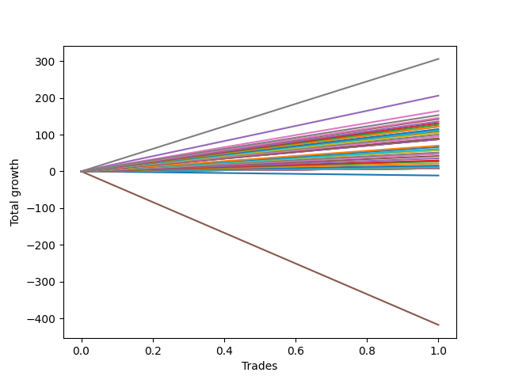

# Long Shepard 007 DB 
- Symbol: ES1y1d
- Date Range: 07/19/2021 - 07/07/2022
- Trading Period: 7:20-12:30
- Number of Trades: 1



| Name | Win Percent | Profit | Avg Profit / Trade | Avg Time / Trade | Avg Profit / Time |      | Name | Win Percent | Profit | Avg Profit / Trade | Avg Time / Trade | Avg Profit / Time |
| ---- | ----------- | ------ | ------------------ | ---------------- | ----------------- | ---- | ---- | ----------- | ------ | ------------------ | ---------------- | ----------------- |
| Sorted By <br> Profit | | | | | | | Sorted By <br> Win Percentage ||||||
| Seven | 100.00 | 153000.00 | 153000.00 | 29 05:14:00 | 5236.49 |     | Seven | 100.00 | 153000.00 | 153000.00 | 29 05:14:00 | 5236.49 |
| Four | 100.00 | 103000.00 | 103000.00 | 27 23:09:00 | 3683.23 |     | Four | 100.00 | 103000.00 | 103000.00 | 27 23:09:00 | 3683.23 |
| Six | 100.00 | 82125.00 | 82125.00 | 21 23:40:00 | 3735.31 |     | Six | 100.00 | 82125.00 | 82125.00 | 21 23:40:00 | 3735.31 |
| Two | 100.00 | 60875.00 | 60875.00 | 18 04:59:00 | 3343.38 |     | Two | 100.00 | 60875.00 | 60875.00 | 18 04:59:00 | 3343.38 |
| Three | 100.00 | 53750.00 | 53750.00 | 18 03:09:00 | 2964.50 |     | Three | 100.00 | 53750.00 | 53750.00 | 18 03:09:00 | 2964.50 |
| Seventy-Three | 100.00 | 29375.00 | 29375.00 | 03 00:01:00 | 9789.40 |     | Seventy-Three | 100.00 | 29375.00 | 29375.00 | 03 00:01:00 | 9789.40 |
| One | 100.00 | 28750.00 | 28750.00 | 17 03:08:00 | 1678.29 |     | One | 100.00 | 28750.00 | 28750.00 | 17 03:08:00 | 1678.29 |
| Ninety | 100.00 | 6250.00 | 6250.00 | 00 00:07:00 | 1285714.29 |     | Ninety | 100.00 | 6250.00 | 6250.00 | 00 00:07:00 | 1285714.29 |
| Eighty-Nine | 100.00 | 4500.00 | 4500.00 | 00 00:04:00 | 1620000.00 |     | Eighty-Nine | 100.00 | 4500.00 | 4500.00 | 00 00:04:00 | 1620000.00 |
| Eighty-Eight | 100.00 | 4000.00 | 4000.00 | 00 00:03:00 | 1920000.00 |     | Eighty-Eight | 100.00 | 4000.00 | 4000.00 | 00 00:03:00 | 1920000.00 |
| Eighty-Seven | 100.00 | 4000.00 | 4000.00 | 00 00:03:00 | 1920000.00 |     | Eighty-Seven | 100.00 | 4000.00 | 4000.00 | 00 00:03:00 | 1920000.00 |
| Eighty-Six | 100.00 | 4000.00 | 4000.00 | 00 00:03:00 | 1920000.00 |     | Eighty-Six | 100.00 | 4000.00 | 4000.00 | 00 00:03:00 | 1920000.00 |
| Eighty-Five | 100.00 | 4000.00 | 4000.00 | 00 00:03:00 | 1920000.00 |     | Eighty-Five | 100.00 | 4000.00 | 4000.00 | 00 00:03:00 | 1920000.00 |
| Eighty-Four | 100.00 | 4000.00 | 4000.00 | 00 00:03:00 | 1920000.00 |     | Eighty-Four | 100.00 | 4000.00 | 4000.00 | 00 00:03:00 | 1920000.00 |
| Eighty-Three | 100.00 | 4000.00 | 4000.00 | 00 00:03:00 | 1920000.00 |     | Eighty-Three | 100.00 | 4000.00 | 4000.00 | 00 00:03:00 | 1920000.00 |
| Eighty-Two | 100.00 | 4000.00 | 4000.00 | 00 00:03:00 | 1920000.00 |     | Eighty-Two | 100.00 | 4000.00 | 4000.00 | 00 00:03:00 | 1920000.00 |
| Eighty-One | 100.00 | 4000.00 | 4000.00 | 00 00:03:00 | 1920000.00 |     | Eighty-One | 100.00 | 4000.00 | 4000.00 | 00 00:03:00 | 1920000.00 |
| Zero | 0.00 | -5625.00 | -5625.00 | 15 23:18:00 | -352.20 |     | Zero | 0.00 | -5625.00 | -5625.00 | 15 23:18:00 | -352.20 |
| Five | 0.00 | -208875.00 | -208875.00 | 130 05:37:00 | -1603.84 |     | Five | 0.00 | -208875.00 | -208875.00 | 130 05:37:00 | -1603.84 |

## NO STOPLOSS

### Test Zero
* Sell when price hits the middle line of the 20p bollinger
* No Stoploss
* Results:
```
Total Trades: 1
Percent Up: 0.00
Percent Down: 100.00
Total Points Moved Up: -11.25
Potential Profit: -5625.00
Total Points Ups: 0.00 Count Ups: 0
Total Points Downs: -11.25 Count Downs: 1
```

<details><summary>Trades</summary>

<code>In: 2022-02-28 07:21:00		Out: 2022-03-16 06:39:00		Total Position Time: 15 23:18:00		Total Move Up: -11.25		Total to Date: -11.25</code> <br />


</details>

### Test One
* Sell when the price hits the upper line of the 20p 1std bollinger
* No Stoploss
* Results:
```
Total Trades: 1
Percent Up: 100.00
Percent Down: 0.00
Total Points Moved Up: 57.50
Potential Profit: 28750.00
Total Points Ups: 57.50 Count Ups: 1
Total Points Downs: 0.00 Count Downs: 0
```

<details><summary>Trades</summary>

<code>In: 2022-02-28 07:21:00		Out: 2022-03-17 10:29:00		Total Position Time: 17 03:08:00		Total Move Up: 57.50		Total to Date: 57.50</code> <br />


</details>

### Test Two
* Sell when the price hits the upper line of the 20p 2std bollinger
* No Stoploss
* Results:
```
Total Trades: 1
Percent Up: 100.00
Percent Down: 0.00
Total Points Moved Up: 121.75
Potential Profit: 60875.00
Total Points Ups: 121.75 Count Ups: 1
Total Points Downs: 0.00 Count Downs: 0
```

<details><summary>Trades</summary>

<code>In: 2022-02-28 07:21:00		Out: 2022-03-18 12:20:00		Total Position Time: 18 04:59:00		Total Move Up: 121.75		Total to Date: 121.75</code> <br />


</details>

### Test Three
* Sell when price hits the middle line of the 50p bollinger
* No Stoploss
* Results:
```
Total Trades: 1
Percent Up: 100.00
Percent Down: 0.00
Total Points Moved Up: 107.50
Potential Profit: 53750.00
Total Points Ups: 107.50 Count Ups: 1
Total Points Downs: 0.00 Count Downs: 0
```

<details><summary>Trades</summary>

<code>In: 2022-02-28 07:21:00		Out: 2022-03-18 10:30:00		Total Position Time: 18 03:09:00		Total Move Up: 107.50		Total to Date: 107.50</code> <br />


</details>

### Test Four
* Sell when the price hits the upper line of the 50p 1std bollinger
* No Stoploss
* Results:
```
Total Trades: 1
Percent Up: 100.00
Percent Down: 0.00
Total Points Moved Up: 206.00
Potential Profit: 103000.00
Total Points Ups: 206.00 Count Ups: 1
Total Points Downs: 0.00 Count Downs: 0
```

<details><summary>Trades</summary>

<code>In: 2022-02-28 07:21:00		Out: 2022-03-28 06:30:00		Total Position Time: 27 23:09:00		Total Move Up: 206.00		Total to Date: 206.00</code> <br />


</details>

### Test Five
* Sell when the price hits the upper line of the 50p 2std bollinger
* No Stoploss
* Results:
```
Total Trades: 1
Percent Up: 0.00
Percent Down: 100.00
Total Points Moved Up: -417.75
Potential Profit: -208875.00
Total Points Ups: 0.00 Count Ups: 0
Total Points Downs: -417.75 Count Downs: 1
```

<details><summary>Trades</summary>

<code>In: 2022-02-28 07:21:00		Out: 2022-07-08 12:58:00		Total Position Time: 130 05:37:00		Total Move Up: -417.75		Total to Date: -417.75</code> <br />


</details>

### Test Six
* Sell when the price hits the middle line of the 1std VWAP
* No Stoploss
* Results:
```
Total Trades: 1
Percent Up: 100.00
Percent Down: 0.00
Total Points Moved Up: 164.25
Potential Profit: 82125.00
Total Points Ups: 164.25 Count Ups: 1
Total Points Downs: 0.00 Count Downs: 0
```

<details><summary>Trades</summary>

<code>In: 2022-02-28 07:21:00		Out: 2022-03-22 07:01:00		Total Position Time: 21 23:40:00		Total Move Up: 164.25		Total to Date: 164.25</code> <br />


</details>

### Test Seven
* Sell when the price hits the upper line of the 1std VWAP
* No Stoploss
* Results:
```
Total Trades: 1
Percent Up: 100.00
Percent Down: 0.00
Total Points Moved Up: 306.00
Potential Profit: 153000.00
Total Points Ups: 306.00 Count Ups: 1
Total Points Downs: 0.00 Count Downs: 0
```

<details><summary>Trades</summary>

<code>In: 2022-02-28 07:21:00		Out: 2022-03-29 12:35:00		Total Position Time: 29 05:14:00		Total Move Up: 306.00		Total to Date: 306.00</code> <br />


</details>

## SPECIAL EXIT CONDITIONS 

### Test Seventy-Three
* Sell when the linear regression slope changes to negative
* No Stoploss
* Results:
```
Total Trades: 1
Percent Up: 100.00
Percent Down: 0.00
Total Points Moved Up: 58.75
Potential Profit: 29375.00
Total Points Ups: 58.75 Count Ups: 1
Total Points Downs: 0.00 Count Downs: 0
```

<details><summary>Trades</summary>

<code>In: 2022-02-28 07:21:00		Out: 2022-03-03 07:22:00		Total Position Time: 03 00:01:00		Total Move Up: 58.75		Total to Date: 58.75</code> <br />


</details>

## TAKE PROFIT

### Test Eighty-One
* Take Profit of 1 Point
* No Stoploss
* Results:
```
Total Trades: 1
Percent Up: 100.00
Percent Down: 0.00
Total Points Moved Up: 8.00
Potential Profit: 4000.00
Total Points Ups: 8.00 Count Ups: 1
Total Points Downs: 0.00 Count Downs: 0
```

<details><summary>Trades</summary>

<code>In: 2022-02-28 07:21:00		Out: 2022-02-28 07:24:00		Total Position Time: 00 00:03:00		Total Move Up: 8.00		Total to Date: 8.00</code> <br />


</details>

### Test Eighty-Two
* Take Profit of 2 Point
* No Stoploss
* Results:
```
Total Trades: 1
Percent Up: 100.00
Percent Down: 0.00
Total Points Moved Up: 8.00
Potential Profit: 4000.00
Total Points Ups: 8.00 Count Ups: 1
Total Points Downs: 0.00 Count Downs: 0
```

<details><summary>Trades</summary>

<code>In: 2022-02-28 07:21:00		Out: 2022-02-28 07:24:00		Total Position Time: 00 00:03:00		Total Move Up: 8.00		Total to Date: 8.00</code> <br />


</details>

### Test Eighty-Three
* Take Profit of 3 Point
* No Stoploss
* Results:
```
Total Trades: 1
Percent Up: 100.00
Percent Down: 0.00
Total Points Moved Up: 8.00
Potential Profit: 4000.00
Total Points Ups: 8.00 Count Ups: 1
Total Points Downs: 0.00 Count Downs: 0
```

<details><summary>Trades</summary>

<code>In: 2022-02-28 07:21:00		Out: 2022-02-28 07:24:00		Total Position Time: 00 00:03:00		Total Move Up: 8.00		Total to Date: 8.00</code> <br />


</details>

### Test Eighty-Four
* Take Profit of 4 Point
* No Stoploss
* Results:
```
Total Trades: 1
Percent Up: 100.00
Percent Down: 0.00
Total Points Moved Up: 8.00
Potential Profit: 4000.00
Total Points Ups: 8.00 Count Ups: 1
Total Points Downs: 0.00 Count Downs: 0
```

<details><summary>Trades</summary>

<code>In: 2022-02-28 07:21:00		Out: 2022-02-28 07:24:00		Total Position Time: 00 00:03:00		Total Move Up: 8.00		Total to Date: 8.00</code> <br />


</details>

### Test Eighty-Five
* Take Profit of 5 Point
* No Stoploss
* Results:
```
Total Trades: 1
Percent Up: 100.00
Percent Down: 0.00
Total Points Moved Up: 8.00
Potential Profit: 4000.00
Total Points Ups: 8.00 Count Ups: 1
Total Points Downs: 0.00 Count Downs: 0
```

<details><summary>Trades</summary>

<code>In: 2022-02-28 07:21:00		Out: 2022-02-28 07:24:00		Total Position Time: 00 00:03:00		Total Move Up: 8.00		Total to Date: 8.00</code> <br />


</details>

### Test Eighty-Six
* Take Profit of 6 Point
* No Stoploss
* Results:
```
Total Trades: 1
Percent Up: 100.00
Percent Down: 0.00
Total Points Moved Up: 8.00
Potential Profit: 4000.00
Total Points Ups: 8.00 Count Ups: 1
Total Points Downs: 0.00 Count Downs: 0
```

<details><summary>Trades</summary>

<code>In: 2022-02-28 07:21:00		Out: 2022-02-28 07:24:00		Total Position Time: 00 00:03:00		Total Move Up: 8.00		Total to Date: 8.00</code> <br />


</details>

### Test Eighty-Seven
* Take Profit of 7 Point
* No Stoploss
* Results:
```
Total Trades: 1
Percent Up: 100.00
Percent Down: 0.00
Total Points Moved Up: 8.00
Potential Profit: 4000.00
Total Points Ups: 8.00 Count Ups: 1
Total Points Downs: 0.00 Count Downs: 0
```

<details><summary>Trades</summary>

<code>In: 2022-02-28 07:21:00		Out: 2022-02-28 07:24:00		Total Position Time: 00 00:03:00		Total Move Up: 8.00		Total to Date: 8.00</code> <br />


</details>

### Test Eighty-Eight
* Take Profit of 8 Point
* No Stoploss
* Results:
```
Total Trades: 1
Percent Up: 100.00
Percent Down: 0.00
Total Points Moved Up: 8.00
Potential Profit: 4000.00
Total Points Ups: 8.00 Count Ups: 1
Total Points Downs: 0.00 Count Downs: 0
```

<details><summary>Trades</summary>

<code>In: 2022-02-28 07:21:00		Out: 2022-02-28 07:24:00		Total Position Time: 00 00:03:00		Total Move Up: 8.00		Total to Date: 8.00</code> <br />


</details>

### Test Eighty-Nine
* Take Profit of 9 Point
* No Stoploss
* Results:
```
Total Trades: 1
Percent Up: 100.00
Percent Down: 0.00
Total Points Moved Up: 9.00
Potential Profit: 4500.00
Total Points Ups: 9.00 Count Ups: 1
Total Points Downs: 0.00 Count Downs: 0
```

<details><summary>Trades</summary>

<code>In: 2022-02-28 07:21:00		Out: 2022-02-28 07:25:00		Total Position Time: 00 00:04:00		Total Move Up: 9.00		Total to Date: 9.00</code> <br />


</details>

### Test Ninety
* Take Profit of 10 Point
* No Stoploss
* Results:
```
Total Trades: 1
Percent Up: 100.00
Percent Down: 0.00
Total Points Moved Up: 12.50
Potential Profit: 6250.00
Total Points Ups: 12.50 Count Ups: 1
Total Points Downs: 0.00 Count Downs: 0
```

<details><summary>Trades</summary>

<code>In: 2022-02-28 07:21:00		Out: 2022-02-28 07:28:00		Total Position Time: 00 00:07:00		Total Move Up: 12.50		Total to Date: 12.50</code> <br />


</details>