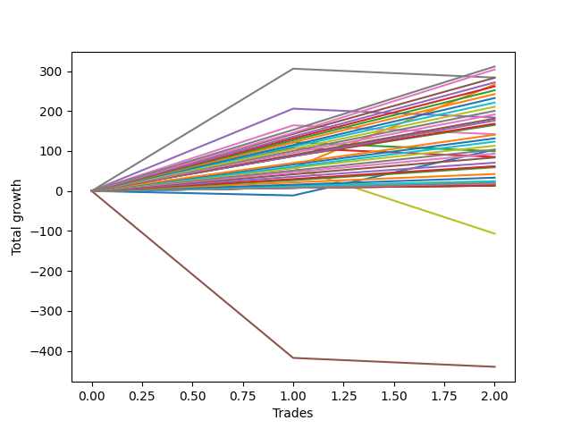

# Long Shepard 007 
- Symbol: ES1y1d
- Date Range: 07/19/2021 - 07/08/2022
- Trading Period: 7:20-12:30
- Number of Trades: 2



| Name | Win Percent | Profit | Avg Profit / Trade | Avg Time / Trade |      | Name | Win Percent | Profit | Avg Profit / Trade | Avg Time / Trade |
| ---- | ----------- | ------ | ------------------ | ---------------- | ---- | ---- | ----------- | ------ | ------------------ | ---------------- |
| Sorted By <br> Profit | | | | | | Sorted By <br> Win Percentage ||||
| Seven | 50.00 | 141875.00 | 70937.50 | 37 05:25:30 |     | One | 100.00 | 133375.00 | 66687.50 | 10 03:56:00 |
| One | 100.00 | 133375.00 | 66687.50 | 10 03:56:00 |     | Three Hundred | 100.00 | 100250.00 | 50125.00 | 10 00:58:00 |
| Three Hundred | 100.00 | 100250.00 | 50125.00 | 10 00:58:00 |     | Two Hundred Nine | 100.00 | 90625.00 | 45312.50 | 09 23:38:30 |
| Four | 50.00 | 91875.00 | 45937.50 | 36 14:23:00 |     | Two Hundred Eight | 100.00 | 84125.00 | 42062.50 | 02 11:13:30 |
| Two Hundred Nine | 100.00 | 90625.00 | 45312.50 | 09 23:38:30 |     | Two Hundred Seven | 100.00 | 70375.00 | 35187.50 | 02 01:01:30 |
| Two Hundred Eight | 100.00 | 84125.00 | 42062.50 | 02 11:13:30 |     | Two Hundred Six | 100.00 | 61750.00 | 30875.00 | 00 14:57:00 |
| Six | 50.00 | 71000.00 | 35500.00 | 33 14:38:30 |     | Two Hundred Five | 100.00 | 51750.00 | 25875.00 | 00 14:48:00 |
| Two Hundred Seven | 100.00 | 70375.00 | 35187.50 | 02 01:01:30 |     | Two Hundred Four | 100.00 | 41875.00 | 20937.50 | 00 12:24:30 |
| Two Hundred Six | 100.00 | 61750.00 | 30875.00 | 00 14:57:00 |     | Two Hundred Three | 100.00 | 31000.00 | 15500.00 | 00 12:08:30 |
| Two Hundred Five | 100.00 | 51750.00 | 25875.00 | 00 14:48:00 |     | Two Hundred Two | 100.00 | 21250.00 | 10625.00 | 00 02:45:30 |
| Zero | 50.00 | 51750.00 | 25875.00 | 08 23:58:30 |     | Two Hundred One | 100.00 | 12125.00 | 6062.50 | 00 02:41:00 |
| Two | 50.00 | 49750.00 | 24875.00 | 31 17:18:00 |     | Eighty-Five | 100.00 | 6750.00 | 3375.00 | 00 01:57:00 |
| Three | 50.00 | 42625.00 | 21312.50 | 31 16:23:00 |     | Eighty-Four | 100.00 | 6750.00 | 3375.00 | 00 01:57:00 |
| Two Hundred Four | 100.00 | 41875.00 | 20937.50 | 00 12:24:30 |     | Eighty-Three | 100.00 | 6750.00 | 3375.00 | 00 01:57:00 |
| Two Hundred Three | 100.00 | 31000.00 | 15500.00 | 00 12:08:30 |     | Eighty-Two | 100.00 | 6750.00 | 3375.00 | 00 01:57:00 |
| Two Hundred Two | 100.00 | 21250.00 | 10625.00 | 00 02:45:30 |     | Eighty-One | 100.00 | 6750.00 | 3375.00 | 00 01:57:00 |
| Two Hundred One | 100.00 | 12125.00 | 6062.50 | 00 02:41:00 |     | Seven | 50.00 | 141875.00 | 70937.50 | 37 05:25:30 |
| Eighty-Five | 100.00 | 6750.00 | 3375.00 | 00 01:57:00 |     | Four | 50.00 | 91875.00 | 45937.50 | 36 14:23:00 |
| Eighty-Four | 100.00 | 6750.00 | 3375.00 | 00 01:57:00 |     | Six | 50.00 | 71000.00 | 35500.00 | 33 14:38:30 |
| Eighty-Three | 100.00 | 6750.00 | 3375.00 | 00 01:57:00 |     | Zero | 50.00 | 51750.00 | 25875.00 | 08 23:58:30 |
| Eighty-Two | 100.00 | 6750.00 | 3375.00 | 00 01:57:00 |     | Two | 50.00 | 49750.00 | 24875.00 | 31 17:18:00 |
| Eighty-One | 100.00 | 6750.00 | 3375.00 | 00 01:57:00 |     | Three | 50.00 | 42625.00 | 21312.50 | 31 16:23:00 |
| One Hundred Thirty | 50.00 | -16125.00 | -8062.50 | 00 00:03:00 |     | One Hundred Thirty | 50.00 | -16125.00 | -8062.50 | 00 00:03:00 |
| One Hundred Twenty-Nine | 50.00 | -16125.00 | -8062.50 | 00 00:03:00 |     | One Hundred Twenty-Nine | 50.00 | -16125.00 | -8062.50 | 00 00:03:00 |
| One Hundred Twenty-Eight | 50.00 | -16125.00 | -8062.50 | 00 00:03:00 |     | One Hundred Twenty-Eight | 50.00 | -16125.00 | -8062.50 | 00 00:03:00 |
| One Hundred Twenty-Seven | 50.00 | -16125.00 | -8062.50 | 00 00:03:00 |     | One Hundred Twenty-Seven | 50.00 | -16125.00 | -8062.50 | 00 00:03:00 |
| One Hundred Twenty-Six | 50.00 | -16125.00 | -8062.50 | 00 00:03:00 |     | One Hundred Twenty-Six | 50.00 | -16125.00 | -8062.50 | 00 00:03:00 |
| One Hundred Twenty-Five | 50.00 | -16125.00 | -8062.50 | 00 00:03:00 |     | One Hundred Twenty-Five | 50.00 | -16125.00 | -8062.50 | 00 00:03:00 |
| One Hundred Twenty-Four | 50.00 | -16125.00 | -8062.50 | 00 00:03:00 |     | One Hundred Twenty-Four | 50.00 | -16125.00 | -8062.50 | 00 00:03:00 |
| One Hundred Twenty-Three | 50.00 | -16125.00 | -8062.50 | 00 00:03:00 |     | One Hundred Twenty-Three | 50.00 | -16125.00 | -8062.50 | 00 00:03:00 |
| One Hundred Twenty-Two | 50.00 | -16125.00 | -8062.50 | 00 00:03:00 |     | One Hundred Twenty-Two | 50.00 | -16125.00 | -8062.50 | 00 00:03:00 |
| One Hundred Twenty-One | 50.00 | -16125.00 | -8062.50 | 00 00:03:00 |     | One Hundred Twenty-One | 50.00 | -16125.00 | -8062.50 | 00 00:03:00 |
| One Hundred Twenty | 50.00 | -16125.00 | -8062.50 | 00 00:03:00 |     | One Hundred Twenty | 50.00 | -16125.00 | -8062.50 | 00 00:03:00 |
| One Hundred Ninteen | 50.00 | -16125.00 | -8062.50 | 00 00:03:00 |     | One Hundred Ninteen | 50.00 | -16125.00 | -8062.50 | 00 00:03:00 |
| One Hundred Eighteen | 50.00 | -16125.00 | -8062.50 | 00 00:03:00 |     | One Hundred Eighteen | 50.00 | -16125.00 | -8062.50 | 00 00:03:00 |
| One Hundred Seventeen | 50.00 | -16125.00 | -8062.50 | 00 00:03:00 |     | One Hundred Seventeen | 50.00 | -16125.00 | -8062.50 | 00 00:03:00 |
| One Hundred Sixteen | 50.00 | -16125.00 | -8062.50 | 00 00:03:00 |     | One Hundred Sixteen | 50.00 | -16125.00 | -8062.50 | 00 00:03:00 |
| One Hundred Fifteen | 50.00 | -16125.00 | -8062.50 | 00 00:03:00 |     | One Hundred Fifteen | 50.00 | -16125.00 | -8062.50 | 00 00:03:00 |
| One Hundred Fourteen | 50.00 | -16125.00 | -8062.50 | 00 00:03:00 |     | One Hundred Fourteen | 50.00 | -16125.00 | -8062.50 | 00 00:03:00 |
| One Hundred Thirteen | 50.00 | -16125.00 | -8062.50 | 00 00:03:00 |     | One Hundred Thirteen | 50.00 | -16125.00 | -8062.50 | 00 00:03:00 |
| One Hundred Twelve | 50.00 | -16125.00 | -8062.50 | 00 00:03:00 |     | One Hundred Twelve | 50.00 | -16125.00 | -8062.50 | 00 00:03:00 |
| One Hundred Eleven | 50.00 | -16125.00 | -8062.50 | 00 00:03:00 |     | One Hundred Eleven | 50.00 | -16125.00 | -8062.50 | 00 00:03:00 |
| Seventy-One | 50.00 | -16125.00 | -8062.50 | 00 00:03:00 |     | Seventy-One | 50.00 | -16125.00 | -8062.50 | 00 00:03:00 |
| Seventy | 50.00 | -16125.00 | -8062.50 | 00 00:03:00 |     | Seventy | 50.00 | -16125.00 | -8062.50 | 00 00:03:00 |
| Sixty-Nine | 50.00 | -16125.00 | -8062.50 | 00 00:03:00 |     | Sixty-Nine | 50.00 | -16125.00 | -8062.50 | 00 00:03:00 |
| Sixty-Eight | 50.00 | -16125.00 | -8062.50 | 00 00:03:00 |     | Sixty-Eight | 50.00 | -16125.00 | -8062.50 | 00 00:03:00 |
| Sixty-Seven | 50.00 | -16125.00 | -8062.50 | 00 00:03:00 |     | Sixty-Seven | 50.00 | -16125.00 | -8062.50 | 00 00:03:00 |
| Sixty-Six | 50.00 | -16125.00 | -8062.50 | 00 00:03:00 |     | Sixty-Six | 50.00 | -16125.00 | -8062.50 | 00 00:03:00 |
| Sixty-Five | 50.00 | -16125.00 | -8062.50 | 00 00:03:00 |     | Sixty-Five | 50.00 | -16125.00 | -8062.50 | 00 00:03:00 |
| Sixty-Four | 50.00 | -16125.00 | -8062.50 | 00 00:03:00 |     | Sixty-Four | 50.00 | -16125.00 | -8062.50 | 00 00:03:00 |
| Fifty-Five | 50.00 | -16125.00 | -8062.50 | 00 00:03:00 |     | Fifty-Five | 50.00 | -16125.00 | -8062.50 | 00 00:03:00 |
| Fifty-Four | 50.00 | -16125.00 | -8062.50 | 00 00:03:00 |     | Fifty-Four | 50.00 | -16125.00 | -8062.50 | 00 00:03:00 |
| Fifty-Three | 50.00 | -16125.00 | -8062.50 | 00 00:03:00 |     | Fifty-Three | 50.00 | -16125.00 | -8062.50 | 00 00:03:00 |
| Fifty-Two | 50.00 | -16125.00 | -8062.50 | 00 00:03:00 |     | Fifty-Two | 50.00 | -16125.00 | -8062.50 | 00 00:03:00 |
| Fifty-One | 50.00 | -16125.00 | -8062.50 | 00 00:03:00 |     | Fifty-One | 50.00 | -16125.00 | -8062.50 | 00 00:03:00 |
| Fifty | 50.00 | -16125.00 | -8062.50 | 00 00:03:00 |     | Fifty | 50.00 | -16125.00 | -8062.50 | 00 00:03:00 |
| Forty-Nine | 50.00 | -16125.00 | -8062.50 | 00 00:03:00 |     | Forty-Nine | 50.00 | -16125.00 | -8062.50 | 00 00:03:00 |
| Forty-Eight | 50.00 | -16125.00 | -8062.50 | 00 00:03:00 |     | Forty-Eight | 50.00 | -16125.00 | -8062.50 | 00 00:03:00 |
| Forty-Seven | 0.00 | -23375.00 | -11687.50 | 00 01:55:30 |     | Seventy-Three | 50.00 | -53375.00 | -26687.50 | 12 01:31:00 |
| Forty-Six | 0.00 | -23375.00 | -11687.50 | 00 01:55:30 |     | Forty-Seven | 0.00 | -23375.00 | -11687.50 | 00 01:55:30 |
| Forty-Five | 0.00 | -23375.00 | -11687.50 | 00 01:55:30 |     | Forty-Six | 0.00 | -23375.00 | -11687.50 | 00 01:55:30 |
| Forty-Four | 0.00 | -23375.00 | -11687.50 | 00 01:55:30 |     | Forty-Five | 0.00 | -23375.00 | -11687.50 | 00 01:55:30 |
| Forty-Three | 0.00 | -23375.00 | -11687.50 | 00 01:55:30 |     | Forty-Four | 0.00 | -23375.00 | -11687.50 | 00 01:55:30 |
| Forty-Two | 0.00 | -23375.00 | -11687.50 | 00 01:55:30 |     | Forty-Three | 0.00 | -23375.00 | -11687.50 | 00 01:55:30 |
| Forty-One | 0.00 | -23375.00 | -11687.50 | 00 01:55:30 |     | Forty-Two | 0.00 | -23375.00 | -11687.50 | 00 01:55:30 |
| Forty | 0.00 | -23375.00 | -11687.50 | 00 01:55:30 |     | Forty-One | 0.00 | -23375.00 | -11687.50 | 00 01:55:30 |
| Sixty-Three | 0.00 | -25500.00 | -12750.00 | 00 01:56:30 |     | Forty | 0.00 | -23375.00 | -11687.50 | 00 01:55:30 |
| Sixty-Two | 0.00 | -25500.00 | -12750.00 | 00 01:56:30 |     | Sixty-Three | 0.00 | -25500.00 | -12750.00 | 00 01:56:30 |
| Sixty-One | 0.00 | -25500.00 | -12750.00 | 00 01:56:30 |     | Sixty-Two | 0.00 | -25500.00 | -12750.00 | 00 01:56:30 |
| Sixty | 0.00 | -25500.00 | -12750.00 | 00 01:56:30 |     | Sixty-One | 0.00 | -25500.00 | -12750.00 | 00 01:56:30 |
| Fifty-Nine | 0.00 | -25500.00 | -12750.00 | 00 01:56:30 |     | Sixty | 0.00 | -25500.00 | -12750.00 | 00 01:56:30 |
| Fifty-Eight | 0.00 | -25500.00 | -12750.00 | 00 01:56:30 |     | Fifty-Nine | 0.00 | -25500.00 | -12750.00 | 00 01:56:30 |
| Fifty-Seven | 0.00 | -25500.00 | -12750.00 | 00 01:56:30 |     | Fifty-Eight | 0.00 | -25500.00 | -12750.00 | 00 01:56:30 |
| Fifty-Six | 0.00 | -25500.00 | -12750.00 | 00 01:56:30 |     | Fifty-Seven | 0.00 | -25500.00 | -12750.00 | 00 01:56:30 |
| Seventy-Three | 50.00 | -53375.00 | -26687.50 | 12 01:31:00 |     | Fifty-Six | 0.00 | -25500.00 | -12750.00 | 00 01:56:30 |
| Five | 0.00 | -220000.00 | -110000.00 | 87 17:37:00 |     | Five | 0.00 | -220000.00 | -110000.00 | 87 17:37:00 |

## NO STOPLOSS

### Test Zero
* Sell when price hits the middle line of the 20p bollinger
* No Stoploss
* Results:
```
Total Trades: 2
Percent Up: 50.00
Percent Down: 50.00
Total Points Moved Up: 103.50
Potential Profit: 51750.00
Total Points Ups: 114.75 Count Ups: 1
Total Points Downs: -11.25 Count Downs: 1
```

<details><summary>Trades</summary>

<code>In: 2022-02-28 07:21:00		Out: 2022-03-16 06:39:00		Total Position Time: 15 23:18:00		Total Move Up: -11.25		Total to Date: -11.25</code> <br />
<code>In: 2022-05-24 07:21:00		Out: 2022-05-26 08:00:00		Total Position Time: 02 00:39:00		Total Move Up: 114.75		Total to Date: 103.50</code> <br />


</details>

### Test One
* Sell when the price hits the upper line of the 20p 1std bollinger
* No Stoploss
* Results:
```
Total Trades: 2
Percent Up: 100.00
Percent Down: 0.00
Total Points Moved Up: 266.75
Potential Profit: 133375.00
Total Points Ups: 266.75 Count Ups: 2
Total Points Downs: 0.00 Count Downs: 0
```

<details><summary>Trades</summary>

<code>In: 2022-02-28 07:21:00		Out: 2022-03-17 10:29:00		Total Position Time: 17 03:08:00		Total Move Up: 57.50		Total to Date: 57.50</code> <br />
<code>In: 2022-05-24 07:21:00		Out: 2022-05-27 12:05:00		Total Position Time: 03 04:44:00		Total Move Up: 209.25		Total to Date: 266.75</code> <br />


</details>

### Test Two
* Sell when the price hits the upper line of the 20p 2std bollinger
* No Stoploss
* Results:
```
Total Trades: 2
Percent Up: 50.00
Percent Down: 50.00
Total Points Moved Up: 99.50
Potential Profit: 49750.00
Total Points Ups: 121.75 Count Ups: 1
Total Points Downs: -22.25 Count Downs: 1
```

<details><summary>Trades</summary>

<code>In: 2022-02-28 07:21:00		Out: 2022-03-18 12:20:00		Total Position Time: 18 04:59:00		Total Move Up: 121.75		Total to Date: 121.75</code> <br />
<code>In: 2022-05-24 07:21:00		Out: 2022-07-08 12:58:00		Total Position Time: 45 05:37:00		Total Move Up: -22.25		Total to Date: 99.50</code> <br />


</details>

### Test Three
* Sell when price hits the middle line of the 50p bollinger
* No Stoploss
* Results:
```
Total Trades: 2
Percent Up: 50.00
Percent Down: 50.00
Total Points Moved Up: 85.25
Potential Profit: 42625.00
Total Points Ups: 107.50 Count Ups: 1
Total Points Downs: -22.25 Count Downs: 1
```

<details><summary>Trades</summary>

<code>In: 2022-02-28 07:21:00		Out: 2022-03-18 10:30:00		Total Position Time: 18 03:09:00		Total Move Up: 107.50		Total to Date: 107.50</code> <br />
<code>In: 2022-05-24 07:21:00		Out: 2022-07-08 12:58:00		Total Position Time: 45 05:37:00		Total Move Up: -22.25		Total to Date: 85.25</code> <br />


</details>

### Test Four
* Sell when the price hits the upper line of the 50p 1std bollinger
* No Stoploss
* Results:
```
Total Trades: 2
Percent Up: 50.00
Percent Down: 50.00
Total Points Moved Up: 183.75
Potential Profit: 91875.00
Total Points Ups: 206.00 Count Ups: 1
Total Points Downs: -22.25 Count Downs: 1
```

<details><summary>Trades</summary>

<code>In: 2022-02-28 07:21:00		Out: 2022-03-28 06:30:00		Total Position Time: 27 23:09:00		Total Move Up: 206.00		Total to Date: 206.00</code> <br />
<code>In: 2022-05-24 07:21:00		Out: 2022-07-08 12:58:00		Total Position Time: 45 05:37:00		Total Move Up: -22.25		Total to Date: 183.75</code> <br />


</details>

### Test Five
* Sell when the price hits the upper line of the 50p 2std bollinger
* No Stoploss
* Results:
```
Total Trades: 2
Percent Up: 0.00
Percent Down: 100.00
Total Points Moved Up: -440.00
Potential Profit: -220000.00
Total Points Ups: 0.00 Count Ups: 0
Total Points Downs: -440.00 Count Downs: 2
```

<details><summary>Trades</summary>

<code>In: 2022-02-28 07:21:00		Out: 2022-07-08 12:58:00		Total Position Time: 130 05:37:00		Total Move Up: -417.75		Total to Date: -417.75</code> <br />
<code>In: 2022-05-24 07:21:00		Out: 2022-07-08 12:58:00		Total Position Time: 45 05:37:00		Total Move Up: -22.25		Total to Date: -440.00</code> <br />


</details>

### Test Six
* Sell when the price hits the middle line of the 1std VWAP
* No Stoploss
* Results:
```
Total Trades: 2
Percent Up: 50.00
Percent Down: 50.00
Total Points Moved Up: 142.00
Potential Profit: 71000.00
Total Points Ups: 164.25 Count Ups: 1
Total Points Downs: -22.25 Count Downs: 1
```

<details><summary>Trades</summary>

<code>In: 2022-02-28 07:21:00		Out: 2022-03-22 07:01:00		Total Position Time: 21 23:40:00		Total Move Up: 164.25		Total to Date: 164.25</code> <br />
<code>In: 2022-05-24 07:21:00		Out: 2022-07-08 12:58:00		Total Position Time: 45 05:37:00		Total Move Up: -22.25		Total to Date: 142.00</code> <br />


</details>

### Test Seven
* Sell when the price hits the upper line of the 1std VWAP
* No Stoploss
* Results:
```
Total Trades: 2
Percent Up: 50.00
Percent Down: 50.00
Total Points Moved Up: 283.75
Potential Profit: 141875.00
Total Points Ups: 306.00 Count Ups: 1
Total Points Downs: -22.25 Count Downs: 1
```

<details><summary>Trades</summary>

<code>In: 2022-02-28 07:21:00		Out: 2022-03-29 12:35:00		Total Position Time: 29 05:14:00		Total Move Up: 306.00		Total to Date: 306.00</code> <br />
<code>In: 2022-05-24 07:21:00		Out: 2022-07-08 12:58:00		Total Position Time: 45 05:37:00		Total Move Up: -22.25		Total to Date: 283.75</code> <br />


</details>

## STOPLOSS OF 5

### Test Forty
* Sell when price hits the middle line of the 20p bollinger
* Stoploss is 5 points
* Results:
```
Total Trades: 2
Percent Up: 0.00
Percent Down: 100.00
Total Points Moved Up: -46.75
Potential Profit: -23375.00
Total Points Ups: 0.00 Count Ups: 0
Total Points Downs: -46.75 Count Downs: 2
```

<details><summary>Trades</summary>

<code>In: 2022-02-28 07:21:00		Out: 2022-02-28 11:09:00		Total Position Time: 00 03:48:00		Total Move Up: -6.50		Total to Date: -6.50</code> <br />
<code>In: 2022-05-24 07:21:00		Out: 2022-05-24 07:24:00		Total Position Time: 00 00:03:00		Total Move Up: -40.25		Total to Date: -46.75</code> <br />


</details>

### Test Forty-One
* Sell when the price hits the upper line of the 20p 1std bollinger
* Stoploss is 5 points
* Results:
```
Total Trades: 2
Percent Up: 0.00
Percent Down: 100.00
Total Points Moved Up: -46.75
Potential Profit: -23375.00
Total Points Ups: 0.00 Count Ups: 0
Total Points Downs: -46.75 Count Downs: 2
```

<details><summary>Trades</summary>

<code>In: 2022-02-28 07:21:00		Out: 2022-02-28 11:09:00		Total Position Time: 00 03:48:00		Total Move Up: -6.50		Total to Date: -6.50</code> <br />
<code>In: 2022-05-24 07:21:00		Out: 2022-05-24 07:24:00		Total Position Time: 00 00:03:00		Total Move Up: -40.25		Total to Date: -46.75</code> <br />


</details>

### Test Forty-Two
* Sell when the price hits the upper line of the 20p 2std bollinger
* Stoploss is 5 points
* Results:
```
Total Trades: 2
Percent Up: 0.00
Percent Down: 100.00
Total Points Moved Up: -46.75
Potential Profit: -23375.00
Total Points Ups: 0.00 Count Ups: 0
Total Points Downs: -46.75 Count Downs: 2
```

<details><summary>Trades</summary>

<code>In: 2022-02-28 07:21:00		Out: 2022-02-28 11:09:00		Total Position Time: 00 03:48:00		Total Move Up: -6.50		Total to Date: -6.50</code> <br />
<code>In: 2022-05-24 07:21:00		Out: 2022-05-24 07:24:00		Total Position Time: 00 00:03:00		Total Move Up: -40.25		Total to Date: -46.75</code> <br />


</details>

### Test Forty-Three
* Sell when price hits the middle line of the 50p bollinger
* Stoploss is 5 points
* Results:
```
Total Trades: 2
Percent Up: 0.00
Percent Down: 100.00
Total Points Moved Up: -46.75
Potential Profit: -23375.00
Total Points Ups: 0.00 Count Ups: 0
Total Points Downs: -46.75 Count Downs: 2
```

<details><summary>Trades</summary>

<code>In: 2022-02-28 07:21:00		Out: 2022-02-28 11:09:00		Total Position Time: 00 03:48:00		Total Move Up: -6.50		Total to Date: -6.50</code> <br />
<code>In: 2022-05-24 07:21:00		Out: 2022-05-24 07:24:00		Total Position Time: 00 00:03:00		Total Move Up: -40.25		Total to Date: -46.75</code> <br />


</details>

### Test Forty-Four
* Sell when the price hits the upper line of the 50p 1std bollinger
* Stoploss is 5 points
* Results:
```
Total Trades: 2
Percent Up: 0.00
Percent Down: 100.00
Total Points Moved Up: -46.75
Potential Profit: -23375.00
Total Points Ups: 0.00 Count Ups: 0
Total Points Downs: -46.75 Count Downs: 2
```

<details><summary>Trades</summary>

<code>In: 2022-02-28 07:21:00		Out: 2022-02-28 11:09:00		Total Position Time: 00 03:48:00		Total Move Up: -6.50		Total to Date: -6.50</code> <br />
<code>In: 2022-05-24 07:21:00		Out: 2022-05-24 07:24:00		Total Position Time: 00 00:03:00		Total Move Up: -40.25		Total to Date: -46.75</code> <br />


</details>

### Test Forty-Five
* Sell when the price hits the upper line of the 50p 2std bollinger
* Stoploss is 5 points
* Results:
```
Total Trades: 2
Percent Up: 0.00
Percent Down: 100.00
Total Points Moved Up: -46.75
Potential Profit: -23375.00
Total Points Ups: 0.00 Count Ups: 0
Total Points Downs: -46.75 Count Downs: 2
```

<details><summary>Trades</summary>

<code>In: 2022-02-28 07:21:00		Out: 2022-02-28 11:09:00		Total Position Time: 00 03:48:00		Total Move Up: -6.50		Total to Date: -6.50</code> <br />
<code>In: 2022-05-24 07:21:00		Out: 2022-05-24 07:24:00		Total Position Time: 00 00:03:00		Total Move Up: -40.25		Total to Date: -46.75</code> <br />


</details>

### Test Forty-Six
* Sell when the price hits the middle line of the 1std VWAP
* Stoploss is 5 points
* Results:
```
Total Trades: 2
Percent Up: 0.00
Percent Down: 100.00
Total Points Moved Up: -46.75
Potential Profit: -23375.00
Total Points Ups: 0.00 Count Ups: 0
Total Points Downs: -46.75 Count Downs: 2
```

<details><summary>Trades</summary>

<code>In: 2022-02-28 07:21:00		Out: 2022-02-28 11:09:00		Total Position Time: 00 03:48:00		Total Move Up: -6.50		Total to Date: -6.50</code> <br />
<code>In: 2022-05-24 07:21:00		Out: 2022-05-24 07:24:00		Total Position Time: 00 00:03:00		Total Move Up: -40.25		Total to Date: -46.75</code> <br />


</details>

### Test Forty-Seven
* Sell when the price hits the upper line of the 1std VWAP
* Stoploss is 5 points
* Results:
```
Total Trades: 2
Percent Up: 0.00
Percent Down: 100.00
Total Points Moved Up: -46.75
Potential Profit: -23375.00
Total Points Ups: 0.00 Count Ups: 0
Total Points Downs: -46.75 Count Downs: 2
```

<details><summary>Trades</summary>

<code>In: 2022-02-28 07:21:00		Out: 2022-02-28 11:09:00		Total Position Time: 00 03:48:00		Total Move Up: -6.50		Total to Date: -6.50</code> <br />
<code>In: 2022-05-24 07:21:00		Out: 2022-05-24 07:24:00		Total Position Time: 00 00:03:00		Total Move Up: -40.25		Total to Date: -46.75</code> <br />


</details>

## TRAIL STOP OF 5

### Test Forty-Eight
* Sell when price hits the middle line of the 20p bollinger
* Trailing Stop is 5 points
* Results:
```
Total Trades: 2
Percent Up: 50.00
Percent Down: 50.00
Total Points Moved Up: -32.25
Potential Profit: -16125.00
Total Points Ups: 8.00 Count Ups: 1
Total Points Downs: -40.25 Count Downs: 1
```

<details><summary>Trades</summary>

<code>In: 2022-02-28 07:21:00		Out: 2022-02-28 07:24:00		Total Position Time: 00 00:03:00		Total Move Up: 8.00		Total to Date: 8.00</code> <br />
<code>In: 2022-05-24 07:21:00		Out: 2022-05-24 07:24:00		Total Position Time: 00 00:03:00		Total Move Up: -40.25		Total to Date: -32.25</code> <br />


</details>

### Test Forty-Nine
* Sell when the price hits the upper line of the 20p 1std bollinger
* Trailing Stop is 5 points
* Results:
```
Total Trades: 2
Percent Up: 50.00
Percent Down: 50.00
Total Points Moved Up: -32.25
Potential Profit: -16125.00
Total Points Ups: 8.00 Count Ups: 1
Total Points Downs: -40.25 Count Downs: 1
```

<details><summary>Trades</summary>

<code>In: 2022-02-28 07:21:00		Out: 2022-02-28 07:24:00		Total Position Time: 00 00:03:00		Total Move Up: 8.00		Total to Date: 8.00</code> <br />
<code>In: 2022-05-24 07:21:00		Out: 2022-05-24 07:24:00		Total Position Time: 00 00:03:00		Total Move Up: -40.25		Total to Date: -32.25</code> <br />


</details>

### Test Fifty
* Sell when the price hits the upper line of the 20p 2std bollinger
* Trailing Stop is 5 points
* Results:
```
Total Trades: 2
Percent Up: 50.00
Percent Down: 50.00
Total Points Moved Up: -32.25
Potential Profit: -16125.00
Total Points Ups: 8.00 Count Ups: 1
Total Points Downs: -40.25 Count Downs: 1
```

<details><summary>Trades</summary>

<code>In: 2022-02-28 07:21:00		Out: 2022-02-28 07:24:00		Total Position Time: 00 00:03:00		Total Move Up: 8.00		Total to Date: 8.00</code> <br />
<code>In: 2022-05-24 07:21:00		Out: 2022-05-24 07:24:00		Total Position Time: 00 00:03:00		Total Move Up: -40.25		Total to Date: -32.25</code> <br />


</details>

### Test Fifty-One
* Sell when price hits the middle line of the 50p bollinger
* Trailing Stop is 5 points
* Results:
```
Total Trades: 2
Percent Up: 50.00
Percent Down: 50.00
Total Points Moved Up: -32.25
Potential Profit: -16125.00
Total Points Ups: 8.00 Count Ups: 1
Total Points Downs: -40.25 Count Downs: 1
```

<details><summary>Trades</summary>

<code>In: 2022-02-28 07:21:00		Out: 2022-02-28 07:24:00		Total Position Time: 00 00:03:00		Total Move Up: 8.00		Total to Date: 8.00</code> <br />
<code>In: 2022-05-24 07:21:00		Out: 2022-05-24 07:24:00		Total Position Time: 00 00:03:00		Total Move Up: -40.25		Total to Date: -32.25</code> <br />


</details>

### Test Fifty-Two
* Sell when the price hits the upper line of the 50p 1std bollinger
* Trailing Stop is 5 points
* Results:
```
Total Trades: 2
Percent Up: 50.00
Percent Down: 50.00
Total Points Moved Up: -32.25
Potential Profit: -16125.00
Total Points Ups: 8.00 Count Ups: 1
Total Points Downs: -40.25 Count Downs: 1
```

<details><summary>Trades</summary>

<code>In: 2022-02-28 07:21:00		Out: 2022-02-28 07:24:00		Total Position Time: 00 00:03:00		Total Move Up: 8.00		Total to Date: 8.00</code> <br />
<code>In: 2022-05-24 07:21:00		Out: 2022-05-24 07:24:00		Total Position Time: 00 00:03:00		Total Move Up: -40.25		Total to Date: -32.25</code> <br />


</details>

### Test Fifty-Three
* Sell when the price hits the upper line of the 50p 2std bollinger
* Trailing Stop is 5 points
* Results:
```
Total Trades: 2
Percent Up: 50.00
Percent Down: 50.00
Total Points Moved Up: -32.25
Potential Profit: -16125.00
Total Points Ups: 8.00 Count Ups: 1
Total Points Downs: -40.25 Count Downs: 1
```

<details><summary>Trades</summary>

<code>In: 2022-02-28 07:21:00		Out: 2022-02-28 07:24:00		Total Position Time: 00 00:03:00		Total Move Up: 8.00		Total to Date: 8.00</code> <br />
<code>In: 2022-05-24 07:21:00		Out: 2022-05-24 07:24:00		Total Position Time: 00 00:03:00		Total Move Up: -40.25		Total to Date: -32.25</code> <br />


</details>

### Test Fifty-Four
* Sell when the price hits the middle line of the 1std VWAP
* Trailing Stop is 5 points
* Results:
```
Total Trades: 2
Percent Up: 50.00
Percent Down: 50.00
Total Points Moved Up: -32.25
Potential Profit: -16125.00
Total Points Ups: 8.00 Count Ups: 1
Total Points Downs: -40.25 Count Downs: 1
```

<details><summary>Trades</summary>

<code>In: 2022-02-28 07:21:00		Out: 2022-02-28 07:24:00		Total Position Time: 00 00:03:00		Total Move Up: 8.00		Total to Date: 8.00</code> <br />
<code>In: 2022-05-24 07:21:00		Out: 2022-05-24 07:24:00		Total Position Time: 00 00:03:00		Total Move Up: -40.25		Total to Date: -32.25</code> <br />


</details>

### Test Fifty-Five
* Sell when the price hits the upper line of the 1std VWAP
* Trailing Stop is 5 points
* Results:
```
Total Trades: 2
Percent Up: 50.00
Percent Down: 50.00
Total Points Moved Up: -32.25
Potential Profit: -16125.00
Total Points Ups: 8.00 Count Ups: 1
Total Points Downs: -40.25 Count Downs: 1
```

<details><summary>Trades</summary>

<code>In: 2022-02-28 07:21:00		Out: 2022-02-28 07:24:00		Total Position Time: 00 00:03:00		Total Move Up: 8.00		Total to Date: 8.00</code> <br />
<code>In: 2022-05-24 07:21:00		Out: 2022-05-24 07:24:00		Total Position Time: 00 00:03:00		Total Move Up: -40.25		Total to Date: -32.25</code> <br />


</details>

## STOPLOSS OF 10

### Test Fifty-Six
* Sell when price hits the middle line of the 20p bollinger
* Stoploss is 10 points
* Results:
```
Total Trades: 2
Percent Up: 0.00
Percent Down: 100.00
Total Points Moved Up: -51.00
Potential Profit: -25500.00
Total Points Ups: 0.00 Count Ups: 0
Total Points Downs: -51.00 Count Downs: 2
```

<details><summary>Trades</summary>

<code>In: 2022-02-28 07:21:00		Out: 2022-02-28 11:11:00		Total Position Time: 00 03:50:00		Total Move Up: -10.75		Total to Date: -10.75</code> <br />
<code>In: 2022-05-24 07:21:00		Out: 2022-05-24 07:24:00		Total Position Time: 00 00:03:00		Total Move Up: -40.25		Total to Date: -51.00</code> <br />


</details>

### Test Fifty-Seven
* Sell when the price hits the upper line of the 20p 1std bollinger
* Stoploss is 10 points
* Results:
```
Total Trades: 2
Percent Up: 0.00
Percent Down: 100.00
Total Points Moved Up: -51.00
Potential Profit: -25500.00
Total Points Ups: 0.00 Count Ups: 0
Total Points Downs: -51.00 Count Downs: 2
```

<details><summary>Trades</summary>

<code>In: 2022-02-28 07:21:00		Out: 2022-02-28 11:11:00		Total Position Time: 00 03:50:00		Total Move Up: -10.75		Total to Date: -10.75</code> <br />
<code>In: 2022-05-24 07:21:00		Out: 2022-05-24 07:24:00		Total Position Time: 00 00:03:00		Total Move Up: -40.25		Total to Date: -51.00</code> <br />


</details>

### Test Fifty-Eight
* Sell when the price hits the upper line of the 20p 2std bollinger
* Stoploss is 10 points
* Results:
```
Total Trades: 2
Percent Up: 0.00
Percent Down: 100.00
Total Points Moved Up: -51.00
Potential Profit: -25500.00
Total Points Ups: 0.00 Count Ups: 0
Total Points Downs: -51.00 Count Downs: 2
```

<details><summary>Trades</summary>

<code>In: 2022-02-28 07:21:00		Out: 2022-02-28 11:11:00		Total Position Time: 00 03:50:00		Total Move Up: -10.75		Total to Date: -10.75</code> <br />
<code>In: 2022-05-24 07:21:00		Out: 2022-05-24 07:24:00		Total Position Time: 00 00:03:00		Total Move Up: -40.25		Total to Date: -51.00</code> <br />


</details>

### Test Fifty-Nine
* Sell when price hits the middle line of the 50p bollinger
* Stoploss is 10 points
* Results:
```
Total Trades: 2
Percent Up: 0.00
Percent Down: 100.00
Total Points Moved Up: -51.00
Potential Profit: -25500.00
Total Points Ups: 0.00 Count Ups: 0
Total Points Downs: -51.00 Count Downs: 2
```

<details><summary>Trades</summary>

<code>In: 2022-02-28 07:21:00		Out: 2022-02-28 11:11:00		Total Position Time: 00 03:50:00		Total Move Up: -10.75		Total to Date: -10.75</code> <br />
<code>In: 2022-05-24 07:21:00		Out: 2022-05-24 07:24:00		Total Position Time: 00 00:03:00		Total Move Up: -40.25		Total to Date: -51.00</code> <br />


</details>

### Test Sixty
* Sell when the price hits the upper line of the 50p 1std bollinger
* Stoploss is 10 points
* Results:
```
Total Trades: 2
Percent Up: 0.00
Percent Down: 100.00
Total Points Moved Up: -51.00
Potential Profit: -25500.00
Total Points Ups: 0.00 Count Ups: 0
Total Points Downs: -51.00 Count Downs: 2
```

<details><summary>Trades</summary>

<code>In: 2022-02-28 07:21:00		Out: 2022-02-28 11:11:00		Total Position Time: 00 03:50:00		Total Move Up: -10.75		Total to Date: -10.75</code> <br />
<code>In: 2022-05-24 07:21:00		Out: 2022-05-24 07:24:00		Total Position Time: 00 00:03:00		Total Move Up: -40.25		Total to Date: -51.00</code> <br />


</details>

### Test Sixty-One
* Sell when the price hits the upper line of the 50p 2std bollinger
* Stoploss is 10 points
* Results:
```
Total Trades: 2
Percent Up: 0.00
Percent Down: 100.00
Total Points Moved Up: -51.00
Potential Profit: -25500.00
Total Points Ups: 0.00 Count Ups: 0
Total Points Downs: -51.00 Count Downs: 2
```

<details><summary>Trades</summary>

<code>In: 2022-02-28 07:21:00		Out: 2022-02-28 11:11:00		Total Position Time: 00 03:50:00		Total Move Up: -10.75		Total to Date: -10.75</code> <br />
<code>In: 2022-05-24 07:21:00		Out: 2022-05-24 07:24:00		Total Position Time: 00 00:03:00		Total Move Up: -40.25		Total to Date: -51.00</code> <br />


</details>

### Test Sixty-Two
* Sell when the price hits the middle line of the 1std VWAP
* Stoploss is 10 points
* Results:
```
Total Trades: 2
Percent Up: 0.00
Percent Down: 100.00
Total Points Moved Up: -51.00
Potential Profit: -25500.00
Total Points Ups: 0.00 Count Ups: 0
Total Points Downs: -51.00 Count Downs: 2
```

<details><summary>Trades</summary>

<code>In: 2022-02-28 07:21:00		Out: 2022-02-28 11:11:00		Total Position Time: 00 03:50:00		Total Move Up: -10.75		Total to Date: -10.75</code> <br />
<code>In: 2022-05-24 07:21:00		Out: 2022-05-24 07:24:00		Total Position Time: 00 00:03:00		Total Move Up: -40.25		Total to Date: -51.00</code> <br />


</details>

### Test Sixty-Three
* Sell when the price hits the upper line of the 1std VWAP
* Stoploss is 10 points
* Results:
```
Total Trades: 2
Percent Up: 0.00
Percent Down: 100.00
Total Points Moved Up: -51.00
Potential Profit: -25500.00
Total Points Ups: 0.00 Count Ups: 0
Total Points Downs: -51.00 Count Downs: 2
```

<details><summary>Trades</summary>

<code>In: 2022-02-28 07:21:00		Out: 2022-02-28 11:11:00		Total Position Time: 00 03:50:00		Total Move Up: -10.75		Total to Date: -10.75</code> <br />
<code>In: 2022-05-24 07:21:00		Out: 2022-05-24 07:24:00		Total Position Time: 00 00:03:00		Total Move Up: -40.25		Total to Date: -51.00</code> <br />


</details>

## TRAIL STOP OF 10

### Test Sixty-Four
* Sell when price hits the middle line of the 20p bollinger
* Trailing Stop is 10 points
* Results:
```
Total Trades: 2
Percent Up: 50.00
Percent Down: 50.00
Total Points Moved Up: -32.25
Potential Profit: -16125.00
Total Points Ups: 8.00 Count Ups: 1
Total Points Downs: -40.25 Count Downs: 1
```

<details><summary>Trades</summary>

<code>In: 2022-02-28 07:21:00		Out: 2022-02-28 07:24:00		Total Position Time: 00 00:03:00		Total Move Up: 8.00		Total to Date: 8.00</code> <br />
<code>In: 2022-05-24 07:21:00		Out: 2022-05-24 07:24:00		Total Position Time: 00 00:03:00		Total Move Up: -40.25		Total to Date: -32.25</code> <br />


</details>

### Test Sixty-Five
* Sell when the price hits the upper line of the 20p 1std bollinger
* Trailing Stop is 10 points
* Results:
```
Total Trades: 2
Percent Up: 50.00
Percent Down: 50.00
Total Points Moved Up: -32.25
Potential Profit: -16125.00
Total Points Ups: 8.00 Count Ups: 1
Total Points Downs: -40.25 Count Downs: 1
```

<details><summary>Trades</summary>

<code>In: 2022-02-28 07:21:00		Out: 2022-02-28 07:24:00		Total Position Time: 00 00:03:00		Total Move Up: 8.00		Total to Date: 8.00</code> <br />
<code>In: 2022-05-24 07:21:00		Out: 2022-05-24 07:24:00		Total Position Time: 00 00:03:00		Total Move Up: -40.25		Total to Date: -32.25</code> <br />


</details>

### Test Sixty-Six
* Sell when the price hits the upper line of the 20p 2std bollinger
* Trailing Stop is 10 points
* Results:
```
Total Trades: 2
Percent Up: 50.00
Percent Down: 50.00
Total Points Moved Up: -32.25
Potential Profit: -16125.00
Total Points Ups: 8.00 Count Ups: 1
Total Points Downs: -40.25 Count Downs: 1
```

<details><summary>Trades</summary>

<code>In: 2022-02-28 07:21:00		Out: 2022-02-28 07:24:00		Total Position Time: 00 00:03:00		Total Move Up: 8.00		Total to Date: 8.00</code> <br />
<code>In: 2022-05-24 07:21:00		Out: 2022-05-24 07:24:00		Total Position Time: 00 00:03:00		Total Move Up: -40.25		Total to Date: -32.25</code> <br />


</details>

### Test Sixty-Seven
* Sell when price hits the middle line of the 50p bollinger
* Trailing Stop is 10 points
* Results:
```
Total Trades: 2
Percent Up: 50.00
Percent Down: 50.00
Total Points Moved Up: -32.25
Potential Profit: -16125.00
Total Points Ups: 8.00 Count Ups: 1
Total Points Downs: -40.25 Count Downs: 1
```

<details><summary>Trades</summary>

<code>In: 2022-02-28 07:21:00		Out: 2022-02-28 07:24:00		Total Position Time: 00 00:03:00		Total Move Up: 8.00		Total to Date: 8.00</code> <br />
<code>In: 2022-05-24 07:21:00		Out: 2022-05-24 07:24:00		Total Position Time: 00 00:03:00		Total Move Up: -40.25		Total to Date: -32.25</code> <br />


</details>

### Test Sixty-Eight
* Sell when the price hits the upper line of the 50p 1std bollinger
* Trailing Stop is 10 points
* Results:
```
Total Trades: 2
Percent Up: 50.00
Percent Down: 50.00
Total Points Moved Up: -32.25
Potential Profit: -16125.00
Total Points Ups: 8.00 Count Ups: 1
Total Points Downs: -40.25 Count Downs: 1
```

<details><summary>Trades</summary>

<code>In: 2022-02-28 07:21:00		Out: 2022-02-28 07:24:00		Total Position Time: 00 00:03:00		Total Move Up: 8.00		Total to Date: 8.00</code> <br />
<code>In: 2022-05-24 07:21:00		Out: 2022-05-24 07:24:00		Total Position Time: 00 00:03:00		Total Move Up: -40.25		Total to Date: -32.25</code> <br />


</details>

### Test Sixty-Nine
* Sell when the price hits the upper line of the 50p 2std bollinger
* Trailing Stop is 10 points
* Results:
```
Total Trades: 2
Percent Up: 50.00
Percent Down: 50.00
Total Points Moved Up: -32.25
Potential Profit: -16125.00
Total Points Ups: 8.00 Count Ups: 1
Total Points Downs: -40.25 Count Downs: 1
```

<details><summary>Trades</summary>

<code>In: 2022-02-28 07:21:00		Out: 2022-02-28 07:24:00		Total Position Time: 00 00:03:00		Total Move Up: 8.00		Total to Date: 8.00</code> <br />
<code>In: 2022-05-24 07:21:00		Out: 2022-05-24 07:24:00		Total Position Time: 00 00:03:00		Total Move Up: -40.25		Total to Date: -32.25</code> <br />


</details>

### Test Seventy
* Sell when the price hits the middle line of the 1std VWAP
* Trailing Stop is 10 points
* Results:
```
Total Trades: 2
Percent Up: 50.00
Percent Down: 50.00
Total Points Moved Up: -32.25
Potential Profit: -16125.00
Total Points Ups: 8.00 Count Ups: 1
Total Points Downs: -40.25 Count Downs: 1
```

<details><summary>Trades</summary>

<code>In: 2022-02-28 07:21:00		Out: 2022-02-28 07:24:00		Total Position Time: 00 00:03:00		Total Move Up: 8.00		Total to Date: 8.00</code> <br />
<code>In: 2022-05-24 07:21:00		Out: 2022-05-24 07:24:00		Total Position Time: 00 00:03:00		Total Move Up: -40.25		Total to Date: -32.25</code> <br />


</details>

### Test Seventy-One
* Sell when the price hits the upper line of the 1std VWAP
* Trailing Stop is 10 points
* Results:
```
Total Trades: 2
Percent Up: 50.00
Percent Down: 50.00
Total Points Moved Up: -32.25
Potential Profit: -16125.00
Total Points Ups: 8.00 Count Ups: 1
Total Points Downs: -40.25 Count Downs: 1
```

<details><summary>Trades</summary>

<code>In: 2022-02-28 07:21:00		Out: 2022-02-28 07:24:00		Total Position Time: 00 00:03:00		Total Move Up: 8.00		Total to Date: 8.00</code> <br />
<code>In: 2022-05-24 07:21:00		Out: 2022-05-24 07:24:00		Total Position Time: 00 00:03:00		Total Move Up: -40.25		Total to Date: -32.25</code> <br />


</details>

## SPECIAL EXIT CONDITIONS 

### Test Seventy-Three
* Sell when the linear regression slope changes to negative
* No Stoploss
* Results:
```
Total Trades: 2
Percent Up: 50.00
Percent Down: 50.00
Total Points Moved Up: -106.75
Potential Profit: -53375.00
Total Points Ups: 58.75 Count Ups: 1
Total Points Downs: -165.50 Count Downs: 1
```

<details><summary>Trades</summary>

<code>In: 2022-02-28 07:21:00		Out: 2022-03-03 07:22:00		Total Position Time: 03 00:01:00		Total Move Up: 58.75		Total to Date: 58.75</code> <br />
<code>In: 2022-05-24 07:21:00		Out: 2022-06-14 10:22:00		Total Position Time: 21 03:01:00		Total Move Up: -165.50		Total to Date: -106.75</code> <br />


</details>

## TAKE PROFIT

### Test Eighty-One
* Take Profit of 1 Point
* No Stoploss
* Results:
```
Total Trades: 2
Percent Up: 100.00
Percent Down: 0.00
Total Points Moved Up: 13.50
Potential Profit: 6750.00
Total Points Ups: 13.50 Count Ups: 2
Total Points Downs: 0.00 Count Downs: 0
```

<details><summary>Trades</summary>

<code>In: 2022-02-28 07:21:00		Out: 2022-02-28 07:24:00		Total Position Time: 00 00:03:00		Total Move Up: 8.00		Total to Date: 8.00</code> <br />
<code>In: 2022-05-24 07:21:00		Out: 2022-05-24 11:12:00		Total Position Time: 00 03:51:00		Total Move Up: 5.50		Total to Date: 13.50</code> <br />


</details>

### Test Eighty-Two
* Take Profit of 2 Point
* No Stoploss
* Results:
```
Total Trades: 2
Percent Up: 100.00
Percent Down: 0.00
Total Points Moved Up: 13.50
Potential Profit: 6750.00
Total Points Ups: 13.50 Count Ups: 2
Total Points Downs: 0.00 Count Downs: 0
```

<details><summary>Trades</summary>

<code>In: 2022-02-28 07:21:00		Out: 2022-02-28 07:24:00		Total Position Time: 00 00:03:00		Total Move Up: 8.00		Total to Date: 8.00</code> <br />
<code>In: 2022-05-24 07:21:00		Out: 2022-05-24 11:12:00		Total Position Time: 00 03:51:00		Total Move Up: 5.50		Total to Date: 13.50</code> <br />


</details>

### Test Eighty-Three
* Take Profit of 3 Point
* No Stoploss
* Results:
```
Total Trades: 2
Percent Up: 100.00
Percent Down: 0.00
Total Points Moved Up: 13.50
Potential Profit: 6750.00
Total Points Ups: 13.50 Count Ups: 2
Total Points Downs: 0.00 Count Downs: 0
```

<details><summary>Trades</summary>

<code>In: 2022-02-28 07:21:00		Out: 2022-02-28 07:24:00		Total Position Time: 00 00:03:00		Total Move Up: 8.00		Total to Date: 8.00</code> <br />
<code>In: 2022-05-24 07:21:00		Out: 2022-05-24 11:12:00		Total Position Time: 00 03:51:00		Total Move Up: 5.50		Total to Date: 13.50</code> <br />


</details>

### Test Eighty-Four
* Take Profit of 4 Point
* No Stoploss
* Results:
```
Total Trades: 2
Percent Up: 100.00
Percent Down: 0.00
Total Points Moved Up: 13.50
Potential Profit: 6750.00
Total Points Ups: 13.50 Count Ups: 2
Total Points Downs: 0.00 Count Downs: 0
```

<details><summary>Trades</summary>

<code>In: 2022-02-28 07:21:00		Out: 2022-02-28 07:24:00		Total Position Time: 00 00:03:00		Total Move Up: 8.00		Total to Date: 8.00</code> <br />
<code>In: 2022-05-24 07:21:00		Out: 2022-05-24 11:12:00		Total Position Time: 00 03:51:00		Total Move Up: 5.50		Total to Date: 13.50</code> <br />


</details>

### Test Eighty-Five
* Take Profit of 5 Point
* No Stoploss
* Results:
```
Total Trades: 2
Percent Up: 100.00
Percent Down: 0.00
Total Points Moved Up: 13.50
Potential Profit: 6750.00
Total Points Ups: 13.50 Count Ups: 2
Total Points Downs: 0.00 Count Downs: 0
```

<details><summary>Trades</summary>

<code>In: 2022-02-28 07:21:00		Out: 2022-02-28 07:24:00		Total Position Time: 00 00:03:00		Total Move Up: 8.00		Total to Date: 8.00</code> <br />
<code>In: 2022-05-24 07:21:00		Out: 2022-05-24 11:12:00		Total Position Time: 00 03:51:00		Total Move Up: 5.50		Total to Date: 13.50</code> <br />


</details>

## TAKE PROFIT Stoploss of Five

### Test One Hundred Eleven
* Take Profit of 1 Point
* Stoploss is 5 points
* Results:
```
Total Trades: 2
Percent Up: 50.00
Percent Down: 50.00
Total Points Moved Up: -32.25
Potential Profit: -16125.00
Total Points Ups: 8.00 Count Ups: 1
Total Points Downs: -40.25 Count Downs: 1
```

<details><summary>Trades</summary>

<code>In: 2022-02-28 07:21:00		Out: 2022-02-28 07:24:00		Total Position Time: 00 00:03:00		Total Move Up: 8.00		Total to Date: 8.00</code> <br />
<code>In: 2022-05-24 07:21:00		Out: 2022-05-24 07:24:00		Total Position Time: 00 00:03:00		Total Move Up: -40.25		Total to Date: -32.25</code> <br />


</details>

### Test One Hundred Twelve
* Take Profit of 2 Point
* Stoploss is 5 points
* Results:
```
Total Trades: 2
Percent Up: 50.00
Percent Down: 50.00
Total Points Moved Up: -32.25
Potential Profit: -16125.00
Total Points Ups: 8.00 Count Ups: 1
Total Points Downs: -40.25 Count Downs: 1
```

<details><summary>Trades</summary>

<code>In: 2022-02-28 07:21:00		Out: 2022-02-28 07:24:00		Total Position Time: 00 00:03:00		Total Move Up: 8.00		Total to Date: 8.00</code> <br />
<code>In: 2022-05-24 07:21:00		Out: 2022-05-24 07:24:00		Total Position Time: 00 00:03:00		Total Move Up: -40.25		Total to Date: -32.25</code> <br />


</details>

### Test One Hundred Thirteen
* Take Profit of 3 Point
* Stoploss is 5 points
* Results:
```
Total Trades: 2
Percent Up: 50.00
Percent Down: 50.00
Total Points Moved Up: -32.25
Potential Profit: -16125.00
Total Points Ups: 8.00 Count Ups: 1
Total Points Downs: -40.25 Count Downs: 1
```

<details><summary>Trades</summary>

<code>In: 2022-02-28 07:21:00		Out: 2022-02-28 07:24:00		Total Position Time: 00 00:03:00		Total Move Up: 8.00		Total to Date: 8.00</code> <br />
<code>In: 2022-05-24 07:21:00		Out: 2022-05-24 07:24:00		Total Position Time: 00 00:03:00		Total Move Up: -40.25		Total to Date: -32.25</code> <br />


</details>

### Test One Hundred Fourteen
* Take Profit of 4 Point
* Stoploss is 5 points
* Results:
```
Total Trades: 2
Percent Up: 50.00
Percent Down: 50.00
Total Points Moved Up: -32.25
Potential Profit: -16125.00
Total Points Ups: 8.00 Count Ups: 1
Total Points Downs: -40.25 Count Downs: 1
```

<details><summary>Trades</summary>

<code>In: 2022-02-28 07:21:00		Out: 2022-02-28 07:24:00		Total Position Time: 00 00:03:00		Total Move Up: 8.00		Total to Date: 8.00</code> <br />
<code>In: 2022-05-24 07:21:00		Out: 2022-05-24 07:24:00		Total Position Time: 00 00:03:00		Total Move Up: -40.25		Total to Date: -32.25</code> <br />


</details>

### Test One Hundred Fifteen
* Take Profit of 5 Point
* Stoploss is 5 points
* Results:
```
Total Trades: 2
Percent Up: 50.00
Percent Down: 50.00
Total Points Moved Up: -32.25
Potential Profit: -16125.00
Total Points Ups: 8.00 Count Ups: 1
Total Points Downs: -40.25 Count Downs: 1
```

<details><summary>Trades</summary>

<code>In: 2022-02-28 07:21:00		Out: 2022-02-28 07:24:00		Total Position Time: 00 00:03:00		Total Move Up: 8.00		Total to Date: 8.00</code> <br />
<code>In: 2022-05-24 07:21:00		Out: 2022-05-24 07:24:00		Total Position Time: 00 00:03:00		Total Move Up: -40.25		Total to Date: -32.25</code> <br />


</details>

## TAKE PROFIT Trailstop of Five

### Test One Hundred Sixteen
* Take Profit of 1 Point
* Trailing stop is 5 points
* Results:
```
Total Trades: 2
Percent Up: 50.00
Percent Down: 50.00
Total Points Moved Up: -32.25
Potential Profit: -16125.00
Total Points Ups: 8.00 Count Ups: 1
Total Points Downs: -40.25 Count Downs: 1
```

<details><summary>Trades</summary>

<code>In: 2022-02-28 07:21:00		Out: 2022-02-28 07:24:00		Total Position Time: 00 00:03:00		Total Move Up: 8.00		Total to Date: 8.00</code> <br />
<code>In: 2022-05-24 07:21:00		Out: 2022-05-24 07:24:00		Total Position Time: 00 00:03:00		Total Move Up: -40.25		Total to Date: -32.25</code> <br />


</details>

### Test One Hundred Seventeen
* Take Profit of 2 Point
* Trailing stop is 5 points
* Results:
```
Total Trades: 2
Percent Up: 50.00
Percent Down: 50.00
Total Points Moved Up: -32.25
Potential Profit: -16125.00
Total Points Ups: 8.00 Count Ups: 1
Total Points Downs: -40.25 Count Downs: 1
```

<details><summary>Trades</summary>

<code>In: 2022-02-28 07:21:00		Out: 2022-02-28 07:24:00		Total Position Time: 00 00:03:00		Total Move Up: 8.00		Total to Date: 8.00</code> <br />
<code>In: 2022-05-24 07:21:00		Out: 2022-05-24 07:24:00		Total Position Time: 00 00:03:00		Total Move Up: -40.25		Total to Date: -32.25</code> <br />


</details>

### Test One Hundred Eighteen
* Take Profit of 3 Point
* Trailing stop is 5 points
* Results:
```
Total Trades: 2
Percent Up: 50.00
Percent Down: 50.00
Total Points Moved Up: -32.25
Potential Profit: -16125.00
Total Points Ups: 8.00 Count Ups: 1
Total Points Downs: -40.25 Count Downs: 1
```

<details><summary>Trades</summary>

<code>In: 2022-02-28 07:21:00		Out: 2022-02-28 07:24:00		Total Position Time: 00 00:03:00		Total Move Up: 8.00		Total to Date: 8.00</code> <br />
<code>In: 2022-05-24 07:21:00		Out: 2022-05-24 07:24:00		Total Position Time: 00 00:03:00		Total Move Up: -40.25		Total to Date: -32.25</code> <br />


</details>

### Test One Hundred Ninteen
* Take Profit of 4 Point
* Trailing stop is 5 points
* Results:
```
Total Trades: 2
Percent Up: 50.00
Percent Down: 50.00
Total Points Moved Up: -32.25
Potential Profit: -16125.00
Total Points Ups: 8.00 Count Ups: 1
Total Points Downs: -40.25 Count Downs: 1
```

<details><summary>Trades</summary>

<code>In: 2022-02-28 07:21:00		Out: 2022-02-28 07:24:00		Total Position Time: 00 00:03:00		Total Move Up: 8.00		Total to Date: 8.00</code> <br />
<code>In: 2022-05-24 07:21:00		Out: 2022-05-24 07:24:00		Total Position Time: 00 00:03:00		Total Move Up: -40.25		Total to Date: -32.25</code> <br />


</details>

### Test One Hundred Twenty
* Take Profit of 5 Point
* Trailing stop is 5 points
* Results:
```
Total Trades: 2
Percent Up: 50.00
Percent Down: 50.00
Total Points Moved Up: -32.25
Potential Profit: -16125.00
Total Points Ups: 8.00 Count Ups: 1
Total Points Downs: -40.25 Count Downs: 1
```

<details><summary>Trades</summary>

<code>In: 2022-02-28 07:21:00		Out: 2022-02-28 07:24:00		Total Position Time: 00 00:03:00		Total Move Up: 8.00		Total to Date: 8.00</code> <br />
<code>In: 2022-05-24 07:21:00		Out: 2022-05-24 07:24:00		Total Position Time: 00 00:03:00		Total Move Up: -40.25		Total to Date: -32.25</code> <br />


</details>

## TAKE PROFIT Stoploss of Ten

### Test One Hundred Twenty-One
* Take Profit of 1 Point
* Stoploss is 10 points
* Results:
```
Total Trades: 2
Percent Up: 50.00
Percent Down: 50.00
Total Points Moved Up: -32.25
Potential Profit: -16125.00
Total Points Ups: 8.00 Count Ups: 1
Total Points Downs: -40.25 Count Downs: 1
```

<details><summary>Trades</summary>

<code>In: 2022-02-28 07:21:00		Out: 2022-02-28 07:24:00		Total Position Time: 00 00:03:00		Total Move Up: 8.00		Total to Date: 8.00</code> <br />
<code>In: 2022-05-24 07:21:00		Out: 2022-05-24 07:24:00		Total Position Time: 00 00:03:00		Total Move Up: -40.25		Total to Date: -32.25</code> <br />


</details>

### Test One Hundred Twenty-Two
* Take Profit of 2 Point
* Stoploss is 10 points
* Results:
```
Total Trades: 2
Percent Up: 50.00
Percent Down: 50.00
Total Points Moved Up: -32.25
Potential Profit: -16125.00
Total Points Ups: 8.00 Count Ups: 1
Total Points Downs: -40.25 Count Downs: 1
```

<details><summary>Trades</summary>

<code>In: 2022-02-28 07:21:00		Out: 2022-02-28 07:24:00		Total Position Time: 00 00:03:00		Total Move Up: 8.00		Total to Date: 8.00</code> <br />
<code>In: 2022-05-24 07:21:00		Out: 2022-05-24 07:24:00		Total Position Time: 00 00:03:00		Total Move Up: -40.25		Total to Date: -32.25</code> <br />


</details>

### Test One Hundred Twenty-Three
* Take Profit of 3 Point
* Stoploss is 10 points
* Results:
```
Total Trades: 2
Percent Up: 50.00
Percent Down: 50.00
Total Points Moved Up: -32.25
Potential Profit: -16125.00
Total Points Ups: 8.00 Count Ups: 1
Total Points Downs: -40.25 Count Downs: 1
```

<details><summary>Trades</summary>

<code>In: 2022-02-28 07:21:00		Out: 2022-02-28 07:24:00		Total Position Time: 00 00:03:00		Total Move Up: 8.00		Total to Date: 8.00</code> <br />
<code>In: 2022-05-24 07:21:00		Out: 2022-05-24 07:24:00		Total Position Time: 00 00:03:00		Total Move Up: -40.25		Total to Date: -32.25</code> <br />


</details>

### Test One Hundred Twenty-Four
* Take Profit of 4 Point
* Stoploss is 10 points
* Results:
```
Total Trades: 2
Percent Up: 50.00
Percent Down: 50.00
Total Points Moved Up: -32.25
Potential Profit: -16125.00
Total Points Ups: 8.00 Count Ups: 1
Total Points Downs: -40.25 Count Downs: 1
```

<details><summary>Trades</summary>

<code>In: 2022-02-28 07:21:00		Out: 2022-02-28 07:24:00		Total Position Time: 00 00:03:00		Total Move Up: 8.00		Total to Date: 8.00</code> <br />
<code>In: 2022-05-24 07:21:00		Out: 2022-05-24 07:24:00		Total Position Time: 00 00:03:00		Total Move Up: -40.25		Total to Date: -32.25</code> <br />


</details>

### Test One Hundred Twenty-Five
* Take Profit of 5 Point
* Stoploss is 10 points
* Results:
```
Total Trades: 2
Percent Up: 50.00
Percent Down: 50.00
Total Points Moved Up: -32.25
Potential Profit: -16125.00
Total Points Ups: 8.00 Count Ups: 1
Total Points Downs: -40.25 Count Downs: 1
```

<details><summary>Trades</summary>

<code>In: 2022-02-28 07:21:00		Out: 2022-02-28 07:24:00		Total Position Time: 00 00:03:00		Total Move Up: 8.00		Total to Date: 8.00</code> <br />
<code>In: 2022-05-24 07:21:00		Out: 2022-05-24 07:24:00		Total Position Time: 00 00:03:00		Total Move Up: -40.25		Total to Date: -32.25</code> <br />


</details>

## TAKE PROFIT Trailstop of Ten

### Test One Hundred Twenty-Six
* Take Profit of 1 Point
* Trailing stop is 10 points
* Results:
```
Total Trades: 2
Percent Up: 50.00
Percent Down: 50.00
Total Points Moved Up: -32.25
Potential Profit: -16125.00
Total Points Ups: 8.00 Count Ups: 1
Total Points Downs: -40.25 Count Downs: 1
```

<details><summary>Trades</summary>

<code>In: 2022-02-28 07:21:00		Out: 2022-02-28 07:24:00		Total Position Time: 00 00:03:00		Total Move Up: 8.00		Total to Date: 8.00</code> <br />
<code>In: 2022-05-24 07:21:00		Out: 2022-05-24 07:24:00		Total Position Time: 00 00:03:00		Total Move Up: -40.25		Total to Date: -32.25</code> <br />


</details>

### Test One Hundred Twenty-Seven
* Take Profit of 2 Point
* Trailing stop is 10 points
* Results:
```
Total Trades: 2
Percent Up: 50.00
Percent Down: 50.00
Total Points Moved Up: -32.25
Potential Profit: -16125.00
Total Points Ups: 8.00 Count Ups: 1
Total Points Downs: -40.25 Count Downs: 1
```

<details><summary>Trades</summary>

<code>In: 2022-02-28 07:21:00		Out: 2022-02-28 07:24:00		Total Position Time: 00 00:03:00		Total Move Up: 8.00		Total to Date: 8.00</code> <br />
<code>In: 2022-05-24 07:21:00		Out: 2022-05-24 07:24:00		Total Position Time: 00 00:03:00		Total Move Up: -40.25		Total to Date: -32.25</code> <br />


</details>

### Test One Hundred Twenty-Eight
* Take Profit of 3 Point
* Trailing stop is 10 points
* Results:
```
Total Trades: 2
Percent Up: 50.00
Percent Down: 50.00
Total Points Moved Up: -32.25
Potential Profit: -16125.00
Total Points Ups: 8.00 Count Ups: 1
Total Points Downs: -40.25 Count Downs: 1
```

<details><summary>Trades</summary>

<code>In: 2022-02-28 07:21:00		Out: 2022-02-28 07:24:00		Total Position Time: 00 00:03:00		Total Move Up: 8.00		Total to Date: 8.00</code> <br />
<code>In: 2022-05-24 07:21:00		Out: 2022-05-24 07:24:00		Total Position Time: 00 00:03:00		Total Move Up: -40.25		Total to Date: -32.25</code> <br />


</details>

### Test One Hundred Twenty-Nine
* Take Profit of 4 Point
* Trailing stop is 10 points
* Results:
```
Total Trades: 2
Percent Up: 50.00
Percent Down: 50.00
Total Points Moved Up: -32.25
Potential Profit: -16125.00
Total Points Ups: 8.00 Count Ups: 1
Total Points Downs: -40.25 Count Downs: 1
```

<details><summary>Trades</summary>

<code>In: 2022-02-28 07:21:00		Out: 2022-02-28 07:24:00		Total Position Time: 00 00:03:00		Total Move Up: 8.00		Total to Date: 8.00</code> <br />
<code>In: 2022-05-24 07:21:00		Out: 2022-05-24 07:24:00		Total Position Time: 00 00:03:00		Total Move Up: -40.25		Total to Date: -32.25</code> <br />


</details>

### Test One Hundred Thirty
* Take Profit of 5 Point
* Trailing stop is 10 points
* Results:
```
Total Trades: 2
Percent Up: 50.00
Percent Down: 50.00
Total Points Moved Up: -32.25
Potential Profit: -16125.00
Total Points Ups: 8.00 Count Ups: 1
Total Points Downs: -40.25 Count Downs: 1
```

<details><summary>Trades</summary>

<code>In: 2022-02-28 07:21:00		Out: 2022-02-28 07:24:00		Total Position Time: 00 00:03:00		Total Move Up: 8.00		Total to Date: 8.00</code> <br />
<code>In: 2022-05-24 07:21:00		Out: 2022-05-24 07:24:00		Total Position Time: 00 00:03:00		Total Move Up: -40.25		Total to Date: -32.25</code> <br />


</details>

## DAILY TAKE PROFITS

### Test Two Hundred One
* Take Profit of 10 Point
* No Stoploss
* Results:
```
Total Trades: 2
Percent Up: 100.00
Percent Down: 0.00
Total Points Moved Up: 24.25
Potential Profit: 12125.00
Total Points Ups: 24.25 Count Ups: 2
Total Points Downs: 0.00 Count Downs: 0
```

<details><summary>Trades</summary>

<code>In: 2022-02-28 07:21:00		Out: 2022-02-28 07:28:00		Total Position Time: 00 00:07:00		Total Move Up: 12.50		Total to Date: 12.50</code> <br />
<code>In: 2022-05-24 07:21:00		Out: 2022-05-24 12:36:00		Total Position Time: 00 05:15:00		Total Move Up: 11.75		Total to Date: 24.25</code> <br />


</details>

### Test Two Hundred Two
* Take Profit of 20 Point
* No Stoploss
* Results:
```
Total Trades: 2
Percent Up: 100.00
Percent Down: 0.00
Total Points Moved Up: 42.50
Potential Profit: 21250.00
Total Points Ups: 42.50 Count Ups: 2
Total Points Downs: 0.00 Count Downs: 0
```

<details><summary>Trades</summary>

<code>In: 2022-02-28 07:21:00		Out: 2022-02-28 07:34:00		Total Position Time: 00 00:13:00		Total Move Up: 21.50		Total to Date: 21.50</code> <br />
<code>In: 2022-05-24 07:21:00		Out: 2022-05-24 12:39:00		Total Position Time: 00 05:18:00		Total Move Up: 21.00		Total to Date: 42.50</code> <br />


</details>

### Test Two Hundred Three
* Take Profit of 30 Point
* No Stoploss
* Results:
```
Total Trades: 2
Percent Up: 100.00
Percent Down: 0.00
Total Points Moved Up: 62.00
Potential Profit: 31000.00
Total Points Ups: 62.00 Count Ups: 2
Total Points Downs: 0.00 Count Downs: 0
```

<details><summary>Trades</summary>

<code>In: 2022-02-28 07:21:00		Out: 2022-02-28 07:40:00		Total Position Time: 00 00:19:00		Total Move Up: 29.75		Total to Date: 29.75</code> <br />
<code>In: 2022-05-24 07:21:00		Out: 2022-05-25 07:19:00		Total Position Time: 00 23:58:00		Total Move Up: 32.25		Total to Date: 62.00</code> <br />


</details>

### Test Two Hundred Four
* Take Profit of 40 Point
* No Stoploss
* Results:
```
Total Trades: 2
Percent Up: 100.00
Percent Down: 0.00
Total Points Moved Up: 83.75
Potential Profit: 41875.00
Total Points Ups: 83.75 Count Ups: 2
Total Points Downs: 0.00 Count Downs: 0
```

<details><summary>Trades</summary>

<code>In: 2022-02-28 07:21:00		Out: 2022-02-28 07:57:00		Total Position Time: 00 00:36:00		Total Move Up: 41.75		Total to Date: 41.75</code> <br />
<code>In: 2022-05-24 07:21:00		Out: 2022-05-25 07:34:00		Total Position Time: 01 00:13:00		Total Move Up: 42.00		Total to Date: 83.75</code> <br />


</details>

### Test Two Hundred Five
* Take Profit of 50 Point
* No Stoploss
* Results:
```
Total Trades: 2
Percent Up: 100.00
Percent Down: 0.00
Total Points Moved Up: 103.50
Potential Profit: 51750.00
Total Points Ups: 103.50 Count Ups: 2
Total Points Downs: 0.00 Count Downs: 0
```

<details><summary>Trades</summary>

<code>In: 2022-02-28 07:21:00		Out: 2022-02-28 08:23:00		Total Position Time: 00 01:02:00		Total Move Up: 51.25		Total to Date: 51.25</code> <br />
<code>In: 2022-05-24 07:21:00		Out: 2022-05-25 11:55:00		Total Position Time: 01 04:34:00		Total Move Up: 52.25		Total to Date: 103.50</code> <br />


</details>

### Test Two Hundred Six
* Take Profit of 60 Point
* No Stoploss
* Results:
```
Total Trades: 2
Percent Up: 100.00
Percent Down: 0.00
Total Points Moved Up: 123.50
Potential Profit: 61750.00
Total Points Ups: 123.50 Count Ups: 2
Total Points Downs: 0.00 Count Downs: 0
```

<details><summary>Trades</summary>

<code>In: 2022-02-28 07:21:00		Out: 2022-02-28 08:33:00		Total Position Time: 00 01:12:00		Total Move Up: 60.75		Total to Date: 60.75</code> <br />
<code>In: 2022-05-24 07:21:00		Out: 2022-05-25 12:03:00		Total Position Time: 01 04:42:00		Total Move Up: 62.75		Total to Date: 123.50</code> <br />


</details>

### Test Two Hundred Seven
* Take Profit of 70 Point
* No Stoploss
* Results:
```
Total Trades: 2
Percent Up: 100.00
Percent Down: 0.00
Total Points Moved Up: 140.75
Potential Profit: 70375.00
Total Points Ups: 140.75 Count Ups: 2
Total Points Downs: 0.00 Count Downs: 0
```

<details><summary>Trades</summary>

<code>In: 2022-02-28 07:21:00		Out: 2022-03-02 10:11:00		Total Position Time: 02 02:50:00		Total Move Up: 70.00		Total to Date: 70.00</code> <br />
<code>In: 2022-05-24 07:21:00		Out: 2022-05-26 06:34:00		Total Position Time: 01 23:13:00		Total Move Up: 70.75		Total to Date: 140.75</code> <br />


</details>

### Test Two Hundred Eight
* Take Profit of 80 Point
* No Stoploss
* Results:
```
Total Trades: 2
Percent Up: 100.00
Percent Down: 0.00
Total Points Moved Up: 168.25
Potential Profit: 84125.00
Total Points Ups: 168.25 Count Ups: 2
Total Points Downs: 0.00 Count Downs: 0
```

<details><summary>Trades</summary>

<code>In: 2022-02-28 07:21:00		Out: 2022-03-03 06:31:00		Total Position Time: 02 23:10:00		Total Move Up: 87.25		Total to Date: 87.25</code> <br />
<code>In: 2022-05-24 07:21:00		Out: 2022-05-26 06:38:00		Total Position Time: 01 23:17:00		Total Move Up: 81.00		Total to Date: 168.25</code> <br />


</details>

### Test Two Hundred Nine
* Take Profit of 90 Point
* No Stoploss
* Results:
```
Total Trades: 2
Percent Up: 100.00
Percent Down: 0.00
Total Points Moved Up: 181.25
Potential Profit: 90625.00
Total Points Ups: 181.25 Count Ups: 2
Total Points Downs: 0.00 Count Downs: 0
```

<details><summary>Trades</summary>

<code>In: 2022-02-28 07:21:00		Out: 2022-03-18 07:11:00		Total Position Time: 17 23:50:00		Total Move Up: 90.00		Total to Date: 90.00</code> <br />
<code>In: 2022-05-24 07:21:00		Out: 2022-05-26 06:48:00		Total Position Time: 01 23:27:00		Total Move Up: 91.25		Total to Date: 181.25</code> <br />


</details>

### Test Three Hundred
* Take Profit of 100 Point
* No Stoploss
* Results:
```
Total Trades: 2
Percent Up: 100.00
Percent Down: 0.00
Total Points Moved Up: 200.50
Potential Profit: 100250.00
Total Points Ups: 200.50 Count Ups: 2
Total Points Downs: 0.00 Count Downs: 0
```

<details><summary>Trades</summary>

<code>In: 2022-02-28 07:21:00		Out: 2022-03-18 09:41:00		Total Position Time: 18 02:20:00		Total Move Up: 100.25		Total to Date: 100.25</code> <br />
<code>In: 2022-05-24 07:21:00		Out: 2022-05-26 06:57:00		Total Position Time: 01 23:36:00		Total Move Up: 100.25		Total to Date: 200.50</code> <br />


</details>