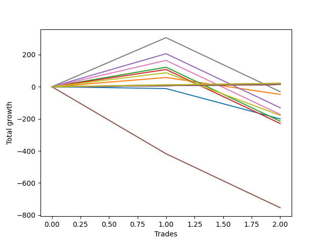

# Long Wallace 003 
- Symbol: ES1y1d
- Date Range: 07/19/2021 - 07/08/2022
- Trading Period: 7:20-12:30
- Number of Trades: 2



| Name | Win Percent | Profit | Avg Profit / Trade | Avg Time / Trade |      | Name | Win Percent | Profit | Avg Profit / Trade | Avg Time / Trade |
| ---- | ----------- | ------ | ------------------ | ---------------- | ---- | ---- | ----------- | ------ | ------------------ | ---------------- |
| Sorted By <br> Profit | | | | | | Sorted By <br> Win Percentage ||||
| Eighty-Five | 100.00 | 7750.00 | 3875.00 | 02 14:22:00 |     | Eighty-Five | 100.00 | 7750.00 | 3875.00 | 02 14:22:00 |
| Eighty-Four | 100.00 | 6000.00 | 3000.00 | 02 14:21:30 |     | Eighty-Four | 100.00 | 6000.00 | 3000.00 | 02 14:21:30 |
| Eighty-Three | 100.00 | 5375.00 | 2687.50 | 02 14:19:30 |     | Eighty-Three | 100.00 | 5375.00 | 2687.50 | 02 14:19:30 |
| Eighty-Two | 100.00 | 5125.00 | 2562.50 | 02 14:19:00 |     | Eighty-Two | 100.00 | 5125.00 | 2562.50 | 02 14:19:00 |
| Eighty-One | 100.00 | 4750.00 | 2375.00 | 02 14:18:30 |     | Eighty-One | 100.00 | 4750.00 | 2375.00 | 02 14:18:30 |
| One Hundred Twenty-Five | 50.00 | -4625.00 | -2312.50 | 00 00:03:00 |     | One Hundred Twenty-Five | 50.00 | -4625.00 | -2312.50 | 00 00:03:00 |
| One Hundred Twenty-Four | 50.00 | -4625.00 | -2312.50 | 00 00:03:00 |     | One Hundred Twenty-Four | 50.00 | -4625.00 | -2312.50 | 00 00:03:00 |
| One Hundred Twenty-Three | 50.00 | -4625.00 | -2312.50 | 00 00:03:00 |     | One Hundred Twenty-Three | 50.00 | -4625.00 | -2312.50 | 00 00:03:00 |
| One Hundred Twenty-Two | 50.00 | -4625.00 | -2312.50 | 00 00:03:00 |     | One Hundred Twenty-Two | 50.00 | -4625.00 | -2312.50 | 00 00:03:00 |
| One Hundred Twenty-One | 50.00 | -4625.00 | -2312.50 | 00 00:03:00 |     | One Hundred Twenty-One | 50.00 | -4625.00 | -2312.50 | 00 00:03:00 |
| One Hundred Fifteen | 50.00 | -4625.00 | -2312.50 | 00 00:03:00 |     | One Hundred Fifteen | 50.00 | -4625.00 | -2312.50 | 00 00:03:00 |
| One Hundred Fourteen | 50.00 | -4625.00 | -2312.50 | 00 00:03:00 |     | One Hundred Fourteen | 50.00 | -4625.00 | -2312.50 | 00 00:03:00 |
| One Hundred Thirteen | 50.00 | -4625.00 | -2312.50 | 00 00:03:00 |     | One Hundred Thirteen | 50.00 | -4625.00 | -2312.50 | 00 00:03:00 |
| One Hundred Twelve | 50.00 | -4625.00 | -2312.50 | 00 00:03:00 |     | One Hundred Twelve | 50.00 | -4625.00 | -2312.50 | 00 00:03:00 |
| One Hundred Eleven | 50.00 | -4625.00 | -2312.50 | 00 00:03:00 |     | One Hundred Eleven | 50.00 | -4625.00 | -2312.50 | 00 00:03:00 |
| One Hundred Twenty | 50.00 | -7000.00 | -3500.00 | 00 00:05:00 |     | One Hundred Twenty | 50.00 | -7000.00 | -3500.00 | 00 00:05:00 |
| One Hundred Ninteen | 50.00 | -7000.00 | -3500.00 | 00 00:05:00 |     | One Hundred Ninteen | 50.00 | -7000.00 | -3500.00 | 00 00:05:00 |
| One Hundred Eighteen | 50.00 | -7000.00 | -3500.00 | 00 00:05:00 |     | One Hundred Eighteen | 50.00 | -7000.00 | -3500.00 | 00 00:05:00 |
| One Hundred Seventeen | 50.00 | -7000.00 | -3500.00 | 00 00:05:00 |     | One Hundred Seventeen | 50.00 | -7000.00 | -3500.00 | 00 00:05:00 |
| One Hundred Sixteen | 50.00 | -7000.00 | -3500.00 | 00 00:05:00 |     | One Hundred Sixteen | 50.00 | -7000.00 | -3500.00 | 00 00:05:00 |
| Fifty-Five | 50.00 | -7000.00 | -3500.00 | 00 00:05:00 |     | Fifty-Five | 50.00 | -7000.00 | -3500.00 | 00 00:05:00 |
| Fifty-Four | 50.00 | -7000.00 | -3500.00 | 00 00:05:00 |     | Fifty-Four | 50.00 | -7000.00 | -3500.00 | 00 00:05:00 |
| Fifty-Three | 50.00 | -7000.00 | -3500.00 | 00 00:05:00 |     | Fifty-Three | 50.00 | -7000.00 | -3500.00 | 00 00:05:00 |
| Fifty-Two | 50.00 | -7000.00 | -3500.00 | 00 00:05:00 |     | Fifty-Two | 50.00 | -7000.00 | -3500.00 | 00 00:05:00 |
| Fifty-One | 50.00 | -7000.00 | -3500.00 | 00 00:05:00 |     | Fifty-One | 50.00 | -7000.00 | -3500.00 | 00 00:05:00 |
| Fifty | 50.00 | -7000.00 | -3500.00 | 00 00:05:00 |     | Fifty | 50.00 | -7000.00 | -3500.00 | 00 00:05:00 |
| Forty-Nine | 50.00 | -7000.00 | -3500.00 | 00 00:05:00 |     | Forty-Nine | 50.00 | -7000.00 | -3500.00 | 00 00:05:00 |
| Forty-Eight | 50.00 | -7000.00 | -3500.00 | 00 00:05:00 |     | Forty-Eight | 50.00 | -7000.00 | -3500.00 | 00 00:05:00 |
| One Hundred Thirty | 50.00 | -11250.00 | -5625.00 | 00 00:09:00 |     | One Hundred Thirty | 50.00 | -11250.00 | -5625.00 | 00 00:09:00 |
| One Hundred Twenty-Nine | 50.00 | -11250.00 | -5625.00 | 00 00:09:00 |     | One Hundred Twenty-Nine | 50.00 | -11250.00 | -5625.00 | 00 00:09:00 |
| One Hundred Twenty-Eight | 50.00 | -11250.00 | -5625.00 | 00 00:09:00 |     | One Hundred Twenty-Eight | 50.00 | -11250.00 | -5625.00 | 00 00:09:00 |
| One Hundred Twenty-Seven | 50.00 | -11250.00 | -5625.00 | 00 00:09:00 |     | One Hundred Twenty-Seven | 50.00 | -11250.00 | -5625.00 | 00 00:09:00 |
| One Hundred Twenty-Six | 50.00 | -11250.00 | -5625.00 | 00 00:09:00 |     | One Hundred Twenty-Six | 50.00 | -11250.00 | -5625.00 | 00 00:09:00 |
| Seventy-One | 50.00 | -11250.00 | -5625.00 | 00 00:09:00 |     | Seventy-One | 50.00 | -11250.00 | -5625.00 | 00 00:09:00 |
| Seventy | 50.00 | -11250.00 | -5625.00 | 00 00:09:00 |     | Seventy | 50.00 | -11250.00 | -5625.00 | 00 00:09:00 |
| Sixty-Nine | 50.00 | -11250.00 | -5625.00 | 00 00:09:00 |     | Sixty-Nine | 50.00 | -11250.00 | -5625.00 | 00 00:09:00 |
| Sixty-Eight | 50.00 | -11250.00 | -5625.00 | 00 00:09:00 |     | Sixty-Eight | 50.00 | -11250.00 | -5625.00 | 00 00:09:00 |
| Sixty-Seven | 50.00 | -11250.00 | -5625.00 | 00 00:09:00 |     | Sixty-Seven | 50.00 | -11250.00 | -5625.00 | 00 00:09:00 |
| Sixty-Six | 50.00 | -11250.00 | -5625.00 | 00 00:09:00 |     | Sixty-Six | 50.00 | -11250.00 | -5625.00 | 00 00:09:00 |
| Sixty-Five | 50.00 | -11250.00 | -5625.00 | 00 00:09:00 |     | Sixty-Five | 50.00 | -11250.00 | -5625.00 | 00 00:09:00 |
| Sixty-Four | 50.00 | -11250.00 | -5625.00 | 00 00:09:00 |     | Sixty-Four | 50.00 | -11250.00 | -5625.00 | 00 00:09:00 |
| Forty-Seven | 0.00 | -11875.00 | -5937.50 | 00 01:55:30 |     | Seven | 50.00 | -15375.00 | -7687.50 | 49 17:25:30 |
| Forty-Six | 0.00 | -11875.00 | -5937.50 | 00 01:55:30 |     | One | 50.00 | -23875.00 | -11937.50 | 22 15:56:00 |
| Forty-Five | 0.00 | -11875.00 | -5937.50 | 00 01:55:30 |     | Four | 50.00 | -65375.00 | -32687.50 | 49 02:23:00 |
| Forty-Four | 0.00 | -11875.00 | -5937.50 | 00 01:55:30 |     | Six | 50.00 | -86250.00 | -43125.00 | 46 02:38:30 |
| Forty-Three | 0.00 | -11875.00 | -5937.50 | 00 01:55:30 |     | Two | 50.00 | -107500.00 | -53750.00 | 44 05:18:00 |
| Forty-Two | 0.00 | -11875.00 | -5937.50 | 00 01:55:30 |     | Seventy-Three | 50.00 | -108375.00 | -54187.50 | 07 01:01:00 |
| Forty-One | 0.00 | -11875.00 | -5937.50 | 00 01:55:30 |     | Three | 50.00 | -114625.00 | -57312.50 | 44 04:23:00 |
| Forty | 0.00 | -11875.00 | -5937.50 | 00 01:55:30 |     | Forty-Seven | 0.00 | -11875.00 | -5937.50 | 00 01:55:30 |
| Sixty-Three | 0.00 | -14000.00 | -7000.00 | 00 01:56:30 |     | Forty-Six | 0.00 | -11875.00 | -5937.50 | 00 01:55:30 |
| Sixty-Two | 0.00 | -14000.00 | -7000.00 | 00 01:56:30 |     | Forty-Five | 0.00 | -11875.00 | -5937.50 | 00 01:55:30 |
| Sixty-One | 0.00 | -14000.00 | -7000.00 | 00 01:56:30 |     | Forty-Four | 0.00 | -11875.00 | -5937.50 | 00 01:55:30 |
| Sixty | 0.00 | -14000.00 | -7000.00 | 00 01:56:30 |     | Forty-Three | 0.00 | -11875.00 | -5937.50 | 00 01:55:30 |
| Fifty-Nine | 0.00 | -14000.00 | -7000.00 | 00 01:56:30 |     | Forty-Two | 0.00 | -11875.00 | -5937.50 | 00 01:55:30 |
| Fifty-Eight | 0.00 | -14000.00 | -7000.00 | 00 01:56:30 |     | Forty-One | 0.00 | -11875.00 | -5937.50 | 00 01:55:30 |
| Fifty-Seven | 0.00 | -14000.00 | -7000.00 | 00 01:56:30 |     | Forty | 0.00 | -11875.00 | -5937.50 | 00 01:55:30 |
| Fifty-Six | 0.00 | -14000.00 | -7000.00 | 00 01:56:30 |     | Sixty-Three | 0.00 | -14000.00 | -7000.00 | 00 01:56:30 |
| Seven | 50.00 | -15375.00 | -7687.50 | 49 17:25:30 |     | Sixty-Two | 0.00 | -14000.00 | -7000.00 | 00 01:56:30 |
| One | 50.00 | -23875.00 | -11937.50 | 22 15:56:00 |     | Sixty-One | 0.00 | -14000.00 | -7000.00 | 00 01:56:30 |
| Four | 50.00 | -65375.00 | -32687.50 | 49 02:23:00 |     | Sixty | 0.00 | -14000.00 | -7000.00 | 00 01:56:30 |
| Six | 50.00 | -86250.00 | -43125.00 | 46 02:38:30 |     | Fifty-Nine | 0.00 | -14000.00 | -7000.00 | 00 01:56:30 |
| Zero | 0.00 | -100375.00 | -50187.50 | 21 12:34:30 |     | Fifty-Eight | 0.00 | -14000.00 | -7000.00 | 00 01:56:30 |
| Two | 50.00 | -107500.00 | -53750.00 | 44 05:18:00 |     | Fifty-Seven | 0.00 | -14000.00 | -7000.00 | 00 01:56:30 |
| Seventy-Three | 50.00 | -108375.00 | -54187.50 | 07 01:01:00 |     | Fifty-Six | 0.00 | -14000.00 | -7000.00 | 00 01:56:30 |
| Three | 50.00 | -114625.00 | -57312.50 | 44 04:23:00 |     | Zero | 0.00 | -100375.00 | -50187.50 | 21 12:34:30 |
| Five | 0.00 | -377250.00 | -188625.00 | 100 05:37:00 |     | Five | 0.00 | -377250.00 | -188625.00 | 100 05:37:00 |

## NO STOPLOSS

### Test Zero
* Sell when price hits the middle line of the 20p bollinger
* No Stoploss
* Results:
```
Total Trades: 2
Percent Up: 0.00
Percent Down: 100.00
Total Points Moved Up: -200.75
Potential Profit: -100375.00
Total Points Ups: 0.00 Count Ups: 0
Total Points Downs: -200.75 Count Downs: 2
```

<details><summary>Trades</summary>

<code>In: 2022-02-28 07:21:00		Out: 2022-03-16 06:39:00		Total Position Time: 15 23:18:00		Total Move Up: -11.25		Total to Date: -11.25</code> <br />
<code>In: 2022-04-29 07:21:00		Out: 2022-05-26 09:12:00		Total Position Time: 27 01:51:00		Total Move Up: -189.50		Total to Date: -200.75</code> <br />


</details>

### Test One
* Sell when the price hits the upper line of the 20p 1std bollinger
* No Stoploss
* Results:
```
Total Trades: 2
Percent Up: 50.00
Percent Down: 50.00
Total Points Moved Up: -47.75
Potential Profit: -23875.00
Total Points Ups: 57.50 Count Ups: 1
Total Points Downs: -105.25 Count Downs: 1
```

<details><summary>Trades</summary>

<code>In: 2022-02-28 07:21:00		Out: 2022-03-17 10:29:00		Total Position Time: 17 03:08:00		Total Move Up: 57.50		Total to Date: 57.50</code> <br />
<code>In: 2022-04-29 07:21:00		Out: 2022-05-27 12:05:00		Total Position Time: 28 04:44:00		Total Move Up: -105.25		Total to Date: -47.75</code> <br />


</details>

### Test Two
* Sell when the price hits the upper line of the 20p 2std bollinger
* No Stoploss
* Results:
```
Total Trades: 2
Percent Up: 50.00
Percent Down: 50.00
Total Points Moved Up: -215.00
Potential Profit: -107500.00
Total Points Ups: 121.75 Count Ups: 1
Total Points Downs: -336.75 Count Downs: 1
```

<details><summary>Trades</summary>

<code>In: 2022-02-28 07:21:00		Out: 2022-03-18 12:20:00		Total Position Time: 18 04:59:00		Total Move Up: 121.75		Total to Date: 121.75</code> <br />
<code>In: 2022-04-29 07:21:00		Out: 2022-07-08 12:58:00		Total Position Time: 70 05:37:00		Total Move Up: -336.75		Total to Date: -215.00</code> <br />


</details>

### Test Three
* Sell when price hits the middle line of the 50p bollinger
* No Stoploss
* Results:
```
Total Trades: 2
Percent Up: 50.00
Percent Down: 50.00
Total Points Moved Up: -229.25
Potential Profit: -114625.00
Total Points Ups: 107.50 Count Ups: 1
Total Points Downs: -336.75 Count Downs: 1
```

<details><summary>Trades</summary>

<code>In: 2022-02-28 07:21:00		Out: 2022-03-18 10:30:00		Total Position Time: 18 03:09:00		Total Move Up: 107.50		Total to Date: 107.50</code> <br />
<code>In: 2022-04-29 07:21:00		Out: 2022-07-08 12:58:00		Total Position Time: 70 05:37:00		Total Move Up: -336.75		Total to Date: -229.25</code> <br />


</details>

### Test Four
* Sell when the price hits the upper line of the 50p 1std bollinger
* No Stoploss
* Results:
```
Total Trades: 2
Percent Up: 50.00
Percent Down: 50.00
Total Points Moved Up: -130.75
Potential Profit: -65375.00
Total Points Ups: 206.00 Count Ups: 1
Total Points Downs: -336.75 Count Downs: 1
```

<details><summary>Trades</summary>

<code>In: 2022-02-28 07:21:00		Out: 2022-03-28 06:30:00		Total Position Time: 27 23:09:00		Total Move Up: 206.00		Total to Date: 206.00</code> <br />
<code>In: 2022-04-29 07:21:00		Out: 2022-07-08 12:58:00		Total Position Time: 70 05:37:00		Total Move Up: -336.75		Total to Date: -130.75</code> <br />


</details>

### Test Five
* Sell when the price hits the upper line of the 50p 2std bollinger
* No Stoploss
* Results:
```
Total Trades: 2
Percent Up: 0.00
Percent Down: 100.00
Total Points Moved Up: -754.50
Potential Profit: -377250.00
Total Points Ups: 0.00 Count Ups: 0
Total Points Downs: -754.50 Count Downs: 2
```

<details><summary>Trades</summary>

<code>In: 2022-02-28 07:21:00		Out: 2022-07-08 12:58:00		Total Position Time: 130 05:37:00		Total Move Up: -417.75		Total to Date: -417.75</code> <br />
<code>In: 2022-04-29 07:21:00		Out: 2022-07-08 12:58:00		Total Position Time: 70 05:37:00		Total Move Up: -336.75		Total to Date: -754.50</code> <br />


</details>

### Test Six
* Sell when the price hits the middle line of the 1std VWAP
* No Stoploss
* Results:
```
Total Trades: 2
Percent Up: 50.00
Percent Down: 50.00
Total Points Moved Up: -172.50
Potential Profit: -86250.00
Total Points Ups: 164.25 Count Ups: 1
Total Points Downs: -336.75 Count Downs: 1
```

<details><summary>Trades</summary>

<code>In: 2022-02-28 07:21:00		Out: 2022-03-22 07:01:00		Total Position Time: 21 23:40:00		Total Move Up: 164.25		Total to Date: 164.25</code> <br />
<code>In: 2022-04-29 07:21:00		Out: 2022-07-08 12:58:00		Total Position Time: 70 05:37:00		Total Move Up: -336.75		Total to Date: -172.50</code> <br />


</details>

### Test Seven
* Sell when the price hits the upper line of the 1std VWAP
* No Stoploss
* Results:
```
Total Trades: 2
Percent Up: 50.00
Percent Down: 50.00
Total Points Moved Up: -30.75
Potential Profit: -15375.00
Total Points Ups: 306.00 Count Ups: 1
Total Points Downs: -336.75 Count Downs: 1
```

<details><summary>Trades</summary>

<code>In: 2022-02-28 07:21:00		Out: 2022-03-29 12:35:00		Total Position Time: 29 05:14:00		Total Move Up: 306.00		Total to Date: 306.00</code> <br />
<code>In: 2022-04-29 07:21:00		Out: 2022-07-08 12:58:00		Total Position Time: 70 05:37:00		Total Move Up: -336.75		Total to Date: -30.75</code> <br />


</details>

## STOPLOSS OF 5

### Test Forty
* Sell when price hits the middle line of the 20p bollinger
* Stoploss is 5 points
* Results:
```
Total Trades: 2
Percent Up: 0.00
Percent Down: 100.00
Total Points Moved Up: -23.75
Potential Profit: -11875.00
Total Points Ups: 0.00 Count Ups: 0
Total Points Downs: -23.75 Count Downs: 2
```

<details><summary>Trades</summary>

<code>In: 2022-02-28 07:21:00		Out: 2022-02-28 11:09:00		Total Position Time: 00 03:48:00		Total Move Up: -6.50		Total to Date: -6.50</code> <br />
<code>In: 2022-04-29 07:21:00		Out: 2022-04-29 07:24:00		Total Position Time: 00 00:03:00		Total Move Up: -17.25		Total to Date: -23.75</code> <br />


</details>

### Test Forty-One
* Sell when the price hits the upper line of the 20p 1std bollinger
* Stoploss is 5 points
* Results:
```
Total Trades: 2
Percent Up: 0.00
Percent Down: 100.00
Total Points Moved Up: -23.75
Potential Profit: -11875.00
Total Points Ups: 0.00 Count Ups: 0
Total Points Downs: -23.75 Count Downs: 2
```

<details><summary>Trades</summary>

<code>In: 2022-02-28 07:21:00		Out: 2022-02-28 11:09:00		Total Position Time: 00 03:48:00		Total Move Up: -6.50		Total to Date: -6.50</code> <br />
<code>In: 2022-04-29 07:21:00		Out: 2022-04-29 07:24:00		Total Position Time: 00 00:03:00		Total Move Up: -17.25		Total to Date: -23.75</code> <br />


</details>

### Test Forty-Two
* Sell when the price hits the upper line of the 20p 2std bollinger
* Stoploss is 5 points
* Results:
```
Total Trades: 2
Percent Up: 0.00
Percent Down: 100.00
Total Points Moved Up: -23.75
Potential Profit: -11875.00
Total Points Ups: 0.00 Count Ups: 0
Total Points Downs: -23.75 Count Downs: 2
```

<details><summary>Trades</summary>

<code>In: 2022-02-28 07:21:00		Out: 2022-02-28 11:09:00		Total Position Time: 00 03:48:00		Total Move Up: -6.50		Total to Date: -6.50</code> <br />
<code>In: 2022-04-29 07:21:00		Out: 2022-04-29 07:24:00		Total Position Time: 00 00:03:00		Total Move Up: -17.25		Total to Date: -23.75</code> <br />


</details>

### Test Forty-Three
* Sell when price hits the middle line of the 50p bollinger
* Stoploss is 5 points
* Results:
```
Total Trades: 2
Percent Up: 0.00
Percent Down: 100.00
Total Points Moved Up: -23.75
Potential Profit: -11875.00
Total Points Ups: 0.00 Count Ups: 0
Total Points Downs: -23.75 Count Downs: 2
```

<details><summary>Trades</summary>

<code>In: 2022-02-28 07:21:00		Out: 2022-02-28 11:09:00		Total Position Time: 00 03:48:00		Total Move Up: -6.50		Total to Date: -6.50</code> <br />
<code>In: 2022-04-29 07:21:00		Out: 2022-04-29 07:24:00		Total Position Time: 00 00:03:00		Total Move Up: -17.25		Total to Date: -23.75</code> <br />


</details>

### Test Forty-Four
* Sell when the price hits the upper line of the 50p 1std bollinger
* Stoploss is 5 points
* Results:
```
Total Trades: 2
Percent Up: 0.00
Percent Down: 100.00
Total Points Moved Up: -23.75
Potential Profit: -11875.00
Total Points Ups: 0.00 Count Ups: 0
Total Points Downs: -23.75 Count Downs: 2
```

<details><summary>Trades</summary>

<code>In: 2022-02-28 07:21:00		Out: 2022-02-28 11:09:00		Total Position Time: 00 03:48:00		Total Move Up: -6.50		Total to Date: -6.50</code> <br />
<code>In: 2022-04-29 07:21:00		Out: 2022-04-29 07:24:00		Total Position Time: 00 00:03:00		Total Move Up: -17.25		Total to Date: -23.75</code> <br />


</details>

### Test Forty-Five
* Sell when the price hits the upper line of the 50p 2std bollinger
* Stoploss is 5 points
* Results:
```
Total Trades: 2
Percent Up: 0.00
Percent Down: 100.00
Total Points Moved Up: -23.75
Potential Profit: -11875.00
Total Points Ups: 0.00 Count Ups: 0
Total Points Downs: -23.75 Count Downs: 2
```

<details><summary>Trades</summary>

<code>In: 2022-02-28 07:21:00		Out: 2022-02-28 11:09:00		Total Position Time: 00 03:48:00		Total Move Up: -6.50		Total to Date: -6.50</code> <br />
<code>In: 2022-04-29 07:21:00		Out: 2022-04-29 07:24:00		Total Position Time: 00 00:03:00		Total Move Up: -17.25		Total to Date: -23.75</code> <br />


</details>

### Test Forty-Six
* Sell when the price hits the middle line of the 1std VWAP
* Stoploss is 5 points
* Results:
```
Total Trades: 2
Percent Up: 0.00
Percent Down: 100.00
Total Points Moved Up: -23.75
Potential Profit: -11875.00
Total Points Ups: 0.00 Count Ups: 0
Total Points Downs: -23.75 Count Downs: 2
```

<details><summary>Trades</summary>

<code>In: 2022-02-28 07:21:00		Out: 2022-02-28 11:09:00		Total Position Time: 00 03:48:00		Total Move Up: -6.50		Total to Date: -6.50</code> <br />
<code>In: 2022-04-29 07:21:00		Out: 2022-04-29 07:24:00		Total Position Time: 00 00:03:00		Total Move Up: -17.25		Total to Date: -23.75</code> <br />


</details>

### Test Forty-Seven
* Sell when the price hits the upper line of the 1std VWAP
* Stoploss is 5 points
* Results:
```
Total Trades: 2
Percent Up: 0.00
Percent Down: 100.00
Total Points Moved Up: -23.75
Potential Profit: -11875.00
Total Points Ups: 0.00 Count Ups: 0
Total Points Downs: -23.75 Count Downs: 2
```

<details><summary>Trades</summary>

<code>In: 2022-02-28 07:21:00		Out: 2022-02-28 11:09:00		Total Position Time: 00 03:48:00		Total Move Up: -6.50		Total to Date: -6.50</code> <br />
<code>In: 2022-04-29 07:21:00		Out: 2022-04-29 07:24:00		Total Position Time: 00 00:03:00		Total Move Up: -17.25		Total to Date: -23.75</code> <br />


</details>

## TRAIL STOP OF 5

### Test Forty-Eight
* Sell when price hits the middle line of the 20p bollinger
* Trailing Stop is 5 points
* Results:
```
Total Trades: 2
Percent Up: 50.00
Percent Down: 50.00
Total Points Moved Up: -14.00
Potential Profit: -7000.00
Total Points Ups: 8.00 Count Ups: 1
Total Points Downs: -22.00 Count Downs: 1
```

<details><summary>Trades</summary>

<code>In: 2022-02-28 07:21:00		Out: 2022-02-28 07:24:00		Total Position Time: 00 00:03:00		Total Move Up: 8.00		Total to Date: 8.00</code> <br />
<code>In: 2022-04-29 07:21:00		Out: 2022-04-29 07:28:00		Total Position Time: 00 00:07:00		Total Move Up: -22.00		Total to Date: -14.00</code> <br />


</details>

### Test Forty-Nine
* Sell when the price hits the upper line of the 20p 1std bollinger
* Trailing Stop is 5 points
* Results:
```
Total Trades: 2
Percent Up: 50.00
Percent Down: 50.00
Total Points Moved Up: -14.00
Potential Profit: -7000.00
Total Points Ups: 8.00 Count Ups: 1
Total Points Downs: -22.00 Count Downs: 1
```

<details><summary>Trades</summary>

<code>In: 2022-02-28 07:21:00		Out: 2022-02-28 07:24:00		Total Position Time: 00 00:03:00		Total Move Up: 8.00		Total to Date: 8.00</code> <br />
<code>In: 2022-04-29 07:21:00		Out: 2022-04-29 07:28:00		Total Position Time: 00 00:07:00		Total Move Up: -22.00		Total to Date: -14.00</code> <br />


</details>

### Test Fifty
* Sell when the price hits the upper line of the 20p 2std bollinger
* Trailing Stop is 5 points
* Results:
```
Total Trades: 2
Percent Up: 50.00
Percent Down: 50.00
Total Points Moved Up: -14.00
Potential Profit: -7000.00
Total Points Ups: 8.00 Count Ups: 1
Total Points Downs: -22.00 Count Downs: 1
```

<details><summary>Trades</summary>

<code>In: 2022-02-28 07:21:00		Out: 2022-02-28 07:24:00		Total Position Time: 00 00:03:00		Total Move Up: 8.00		Total to Date: 8.00</code> <br />
<code>In: 2022-04-29 07:21:00		Out: 2022-04-29 07:28:00		Total Position Time: 00 00:07:00		Total Move Up: -22.00		Total to Date: -14.00</code> <br />


</details>

### Test Fifty-One
* Sell when price hits the middle line of the 50p bollinger
* Trailing Stop is 5 points
* Results:
```
Total Trades: 2
Percent Up: 50.00
Percent Down: 50.00
Total Points Moved Up: -14.00
Potential Profit: -7000.00
Total Points Ups: 8.00 Count Ups: 1
Total Points Downs: -22.00 Count Downs: 1
```

<details><summary>Trades</summary>

<code>In: 2022-02-28 07:21:00		Out: 2022-02-28 07:24:00		Total Position Time: 00 00:03:00		Total Move Up: 8.00		Total to Date: 8.00</code> <br />
<code>In: 2022-04-29 07:21:00		Out: 2022-04-29 07:28:00		Total Position Time: 00 00:07:00		Total Move Up: -22.00		Total to Date: -14.00</code> <br />


</details>

### Test Fifty-Two
* Sell when the price hits the upper line of the 50p 1std bollinger
* Trailing Stop is 5 points
* Results:
```
Total Trades: 2
Percent Up: 50.00
Percent Down: 50.00
Total Points Moved Up: -14.00
Potential Profit: -7000.00
Total Points Ups: 8.00 Count Ups: 1
Total Points Downs: -22.00 Count Downs: 1
```

<details><summary>Trades</summary>

<code>In: 2022-02-28 07:21:00		Out: 2022-02-28 07:24:00		Total Position Time: 00 00:03:00		Total Move Up: 8.00		Total to Date: 8.00</code> <br />
<code>In: 2022-04-29 07:21:00		Out: 2022-04-29 07:28:00		Total Position Time: 00 00:07:00		Total Move Up: -22.00		Total to Date: -14.00</code> <br />


</details>

### Test Fifty-Three
* Sell when the price hits the upper line of the 50p 2std bollinger
* Trailing Stop is 5 points
* Results:
```
Total Trades: 2
Percent Up: 50.00
Percent Down: 50.00
Total Points Moved Up: -14.00
Potential Profit: -7000.00
Total Points Ups: 8.00 Count Ups: 1
Total Points Downs: -22.00 Count Downs: 1
```

<details><summary>Trades</summary>

<code>In: 2022-02-28 07:21:00		Out: 2022-02-28 07:24:00		Total Position Time: 00 00:03:00		Total Move Up: 8.00		Total to Date: 8.00</code> <br />
<code>In: 2022-04-29 07:21:00		Out: 2022-04-29 07:28:00		Total Position Time: 00 00:07:00		Total Move Up: -22.00		Total to Date: -14.00</code> <br />


</details>

### Test Fifty-Four
* Sell when the price hits the middle line of the 1std VWAP
* Trailing Stop is 5 points
* Results:
```
Total Trades: 2
Percent Up: 50.00
Percent Down: 50.00
Total Points Moved Up: -14.00
Potential Profit: -7000.00
Total Points Ups: 8.00 Count Ups: 1
Total Points Downs: -22.00 Count Downs: 1
```

<details><summary>Trades</summary>

<code>In: 2022-02-28 07:21:00		Out: 2022-02-28 07:24:00		Total Position Time: 00 00:03:00		Total Move Up: 8.00		Total to Date: 8.00</code> <br />
<code>In: 2022-04-29 07:21:00		Out: 2022-04-29 07:28:00		Total Position Time: 00 00:07:00		Total Move Up: -22.00		Total to Date: -14.00</code> <br />


</details>

### Test Fifty-Five
* Sell when the price hits the upper line of the 1std VWAP
* Trailing Stop is 5 points
* Results:
```
Total Trades: 2
Percent Up: 50.00
Percent Down: 50.00
Total Points Moved Up: -14.00
Potential Profit: -7000.00
Total Points Ups: 8.00 Count Ups: 1
Total Points Downs: -22.00 Count Downs: 1
```

<details><summary>Trades</summary>

<code>In: 2022-02-28 07:21:00		Out: 2022-02-28 07:24:00		Total Position Time: 00 00:03:00		Total Move Up: 8.00		Total to Date: 8.00</code> <br />
<code>In: 2022-04-29 07:21:00		Out: 2022-04-29 07:28:00		Total Position Time: 00 00:07:00		Total Move Up: -22.00		Total to Date: -14.00</code> <br />


</details>

## STOPLOSS OF 10

### Test Fifty-Six
* Sell when price hits the middle line of the 20p bollinger
* Stoploss is 10 points
* Results:
```
Total Trades: 2
Percent Up: 0.00
Percent Down: 100.00
Total Points Moved Up: -28.00
Potential Profit: -14000.00
Total Points Ups: 0.00 Count Ups: 0
Total Points Downs: -28.00 Count Downs: 2
```

<details><summary>Trades</summary>

<code>In: 2022-02-28 07:21:00		Out: 2022-02-28 11:11:00		Total Position Time: 00 03:50:00		Total Move Up: -10.75		Total to Date: -10.75</code> <br />
<code>In: 2022-04-29 07:21:00		Out: 2022-04-29 07:24:00		Total Position Time: 00 00:03:00		Total Move Up: -17.25		Total to Date: -28.00</code> <br />


</details>

### Test Fifty-Seven
* Sell when the price hits the upper line of the 20p 1std bollinger
* Stoploss is 10 points
* Results:
```
Total Trades: 2
Percent Up: 0.00
Percent Down: 100.00
Total Points Moved Up: -28.00
Potential Profit: -14000.00
Total Points Ups: 0.00 Count Ups: 0
Total Points Downs: -28.00 Count Downs: 2
```

<details><summary>Trades</summary>

<code>In: 2022-02-28 07:21:00		Out: 2022-02-28 11:11:00		Total Position Time: 00 03:50:00		Total Move Up: -10.75		Total to Date: -10.75</code> <br />
<code>In: 2022-04-29 07:21:00		Out: 2022-04-29 07:24:00		Total Position Time: 00 00:03:00		Total Move Up: -17.25		Total to Date: -28.00</code> <br />


</details>

### Test Fifty-Eight
* Sell when the price hits the upper line of the 20p 2std bollinger
* Stoploss is 10 points
* Results:
```
Total Trades: 2
Percent Up: 0.00
Percent Down: 100.00
Total Points Moved Up: -28.00
Potential Profit: -14000.00
Total Points Ups: 0.00 Count Ups: 0
Total Points Downs: -28.00 Count Downs: 2
```

<details><summary>Trades</summary>

<code>In: 2022-02-28 07:21:00		Out: 2022-02-28 11:11:00		Total Position Time: 00 03:50:00		Total Move Up: -10.75		Total to Date: -10.75</code> <br />
<code>In: 2022-04-29 07:21:00		Out: 2022-04-29 07:24:00		Total Position Time: 00 00:03:00		Total Move Up: -17.25		Total to Date: -28.00</code> <br />


</details>

### Test Fifty-Nine
* Sell when price hits the middle line of the 50p bollinger
* Stoploss is 10 points
* Results:
```
Total Trades: 2
Percent Up: 0.00
Percent Down: 100.00
Total Points Moved Up: -28.00
Potential Profit: -14000.00
Total Points Ups: 0.00 Count Ups: 0
Total Points Downs: -28.00 Count Downs: 2
```

<details><summary>Trades</summary>

<code>In: 2022-02-28 07:21:00		Out: 2022-02-28 11:11:00		Total Position Time: 00 03:50:00		Total Move Up: -10.75		Total to Date: -10.75</code> <br />
<code>In: 2022-04-29 07:21:00		Out: 2022-04-29 07:24:00		Total Position Time: 00 00:03:00		Total Move Up: -17.25		Total to Date: -28.00</code> <br />


</details>

### Test Sixty
* Sell when the price hits the upper line of the 50p 1std bollinger
* Stoploss is 10 points
* Results:
```
Total Trades: 2
Percent Up: 0.00
Percent Down: 100.00
Total Points Moved Up: -28.00
Potential Profit: -14000.00
Total Points Ups: 0.00 Count Ups: 0
Total Points Downs: -28.00 Count Downs: 2
```

<details><summary>Trades</summary>

<code>In: 2022-02-28 07:21:00		Out: 2022-02-28 11:11:00		Total Position Time: 00 03:50:00		Total Move Up: -10.75		Total to Date: -10.75</code> <br />
<code>In: 2022-04-29 07:21:00		Out: 2022-04-29 07:24:00		Total Position Time: 00 00:03:00		Total Move Up: -17.25		Total to Date: -28.00</code> <br />


</details>

### Test Sixty-One
* Sell when the price hits the upper line of the 50p 2std bollinger
* Stoploss is 10 points
* Results:
```
Total Trades: 2
Percent Up: 0.00
Percent Down: 100.00
Total Points Moved Up: -28.00
Potential Profit: -14000.00
Total Points Ups: 0.00 Count Ups: 0
Total Points Downs: -28.00 Count Downs: 2
```

<details><summary>Trades</summary>

<code>In: 2022-02-28 07:21:00		Out: 2022-02-28 11:11:00		Total Position Time: 00 03:50:00		Total Move Up: -10.75		Total to Date: -10.75</code> <br />
<code>In: 2022-04-29 07:21:00		Out: 2022-04-29 07:24:00		Total Position Time: 00 00:03:00		Total Move Up: -17.25		Total to Date: -28.00</code> <br />


</details>

### Test Sixty-Two
* Sell when the price hits the middle line of the 1std VWAP
* Stoploss is 10 points
* Results:
```
Total Trades: 2
Percent Up: 0.00
Percent Down: 100.00
Total Points Moved Up: -28.00
Potential Profit: -14000.00
Total Points Ups: 0.00 Count Ups: 0
Total Points Downs: -28.00 Count Downs: 2
```

<details><summary>Trades</summary>

<code>In: 2022-02-28 07:21:00		Out: 2022-02-28 11:11:00		Total Position Time: 00 03:50:00		Total Move Up: -10.75		Total to Date: -10.75</code> <br />
<code>In: 2022-04-29 07:21:00		Out: 2022-04-29 07:24:00		Total Position Time: 00 00:03:00		Total Move Up: -17.25		Total to Date: -28.00</code> <br />


</details>

### Test Sixty-Three
* Sell when the price hits the upper line of the 1std VWAP
* Stoploss is 10 points
* Results:
```
Total Trades: 2
Percent Up: 0.00
Percent Down: 100.00
Total Points Moved Up: -28.00
Potential Profit: -14000.00
Total Points Ups: 0.00 Count Ups: 0
Total Points Downs: -28.00 Count Downs: 2
```

<details><summary>Trades</summary>

<code>In: 2022-02-28 07:21:00		Out: 2022-02-28 11:11:00		Total Position Time: 00 03:50:00		Total Move Up: -10.75		Total to Date: -10.75</code> <br />
<code>In: 2022-04-29 07:21:00		Out: 2022-04-29 07:24:00		Total Position Time: 00 00:03:00		Total Move Up: -17.25		Total to Date: -28.00</code> <br />


</details>

## TRAIL STOP OF 10

### Test Sixty-Four
* Sell when price hits the middle line of the 20p bollinger
* Trailing Stop is 10 points
* Results:
```
Total Trades: 2
Percent Up: 50.00
Percent Down: 50.00
Total Points Moved Up: -22.50
Potential Profit: -11250.00
Total Points Ups: 8.00 Count Ups: 1
Total Points Downs: -30.50 Count Downs: 1
```

<details><summary>Trades</summary>

<code>In: 2022-02-28 07:21:00		Out: 2022-02-28 07:24:00		Total Position Time: 00 00:03:00		Total Move Up: 8.00		Total to Date: 8.00</code> <br />
<code>In: 2022-04-29 07:21:00		Out: 2022-04-29 07:36:00		Total Position Time: 00 00:15:00		Total Move Up: -30.50		Total to Date: -22.50</code> <br />


</details>

### Test Sixty-Five
* Sell when the price hits the upper line of the 20p 1std bollinger
* Trailing Stop is 10 points
* Results:
```
Total Trades: 2
Percent Up: 50.00
Percent Down: 50.00
Total Points Moved Up: -22.50
Potential Profit: -11250.00
Total Points Ups: 8.00 Count Ups: 1
Total Points Downs: -30.50 Count Downs: 1
```

<details><summary>Trades</summary>

<code>In: 2022-02-28 07:21:00		Out: 2022-02-28 07:24:00		Total Position Time: 00 00:03:00		Total Move Up: 8.00		Total to Date: 8.00</code> <br />
<code>In: 2022-04-29 07:21:00		Out: 2022-04-29 07:36:00		Total Position Time: 00 00:15:00		Total Move Up: -30.50		Total to Date: -22.50</code> <br />


</details>

### Test Sixty-Six
* Sell when the price hits the upper line of the 20p 2std bollinger
* Trailing Stop is 10 points
* Results:
```
Total Trades: 2
Percent Up: 50.00
Percent Down: 50.00
Total Points Moved Up: -22.50
Potential Profit: -11250.00
Total Points Ups: 8.00 Count Ups: 1
Total Points Downs: -30.50 Count Downs: 1
```

<details><summary>Trades</summary>

<code>In: 2022-02-28 07:21:00		Out: 2022-02-28 07:24:00		Total Position Time: 00 00:03:00		Total Move Up: 8.00		Total to Date: 8.00</code> <br />
<code>In: 2022-04-29 07:21:00		Out: 2022-04-29 07:36:00		Total Position Time: 00 00:15:00		Total Move Up: -30.50		Total to Date: -22.50</code> <br />


</details>

### Test Sixty-Seven
* Sell when price hits the middle line of the 50p bollinger
* Trailing Stop is 10 points
* Results:
```
Total Trades: 2
Percent Up: 50.00
Percent Down: 50.00
Total Points Moved Up: -22.50
Potential Profit: -11250.00
Total Points Ups: 8.00 Count Ups: 1
Total Points Downs: -30.50 Count Downs: 1
```

<details><summary>Trades</summary>

<code>In: 2022-02-28 07:21:00		Out: 2022-02-28 07:24:00		Total Position Time: 00 00:03:00		Total Move Up: 8.00		Total to Date: 8.00</code> <br />
<code>In: 2022-04-29 07:21:00		Out: 2022-04-29 07:36:00		Total Position Time: 00 00:15:00		Total Move Up: -30.50		Total to Date: -22.50</code> <br />


</details>

### Test Sixty-Eight
* Sell when the price hits the upper line of the 50p 1std bollinger
* Trailing Stop is 10 points
* Results:
```
Total Trades: 2
Percent Up: 50.00
Percent Down: 50.00
Total Points Moved Up: -22.50
Potential Profit: -11250.00
Total Points Ups: 8.00 Count Ups: 1
Total Points Downs: -30.50 Count Downs: 1
```

<details><summary>Trades</summary>

<code>In: 2022-02-28 07:21:00		Out: 2022-02-28 07:24:00		Total Position Time: 00 00:03:00		Total Move Up: 8.00		Total to Date: 8.00</code> <br />
<code>In: 2022-04-29 07:21:00		Out: 2022-04-29 07:36:00		Total Position Time: 00 00:15:00		Total Move Up: -30.50		Total to Date: -22.50</code> <br />


</details>

### Test Sixty-Nine
* Sell when the price hits the upper line of the 50p 2std bollinger
* Trailing Stop is 10 points
* Results:
```
Total Trades: 2
Percent Up: 50.00
Percent Down: 50.00
Total Points Moved Up: -22.50
Potential Profit: -11250.00
Total Points Ups: 8.00 Count Ups: 1
Total Points Downs: -30.50 Count Downs: 1
```

<details><summary>Trades</summary>

<code>In: 2022-02-28 07:21:00		Out: 2022-02-28 07:24:00		Total Position Time: 00 00:03:00		Total Move Up: 8.00		Total to Date: 8.00</code> <br />
<code>In: 2022-04-29 07:21:00		Out: 2022-04-29 07:36:00		Total Position Time: 00 00:15:00		Total Move Up: -30.50		Total to Date: -22.50</code> <br />


</details>

### Test Seventy
* Sell when the price hits the middle line of the 1std VWAP
* Trailing Stop is 10 points
* Results:
```
Total Trades: 2
Percent Up: 50.00
Percent Down: 50.00
Total Points Moved Up: -22.50
Potential Profit: -11250.00
Total Points Ups: 8.00 Count Ups: 1
Total Points Downs: -30.50 Count Downs: 1
```

<details><summary>Trades</summary>

<code>In: 2022-02-28 07:21:00		Out: 2022-02-28 07:24:00		Total Position Time: 00 00:03:00		Total Move Up: 8.00		Total to Date: 8.00</code> <br />
<code>In: 2022-04-29 07:21:00		Out: 2022-04-29 07:36:00		Total Position Time: 00 00:15:00		Total Move Up: -30.50		Total to Date: -22.50</code> <br />


</details>

### Test Seventy-One
* Sell when the price hits the upper line of the 1std VWAP
* Trailing Stop is 10 points
* Results:
```
Total Trades: 2
Percent Up: 50.00
Percent Down: 50.00
Total Points Moved Up: -22.50
Potential Profit: -11250.00
Total Points Ups: 8.00 Count Ups: 1
Total Points Downs: -30.50 Count Downs: 1
```

<details><summary>Trades</summary>

<code>In: 2022-02-28 07:21:00		Out: 2022-02-28 07:24:00		Total Position Time: 00 00:03:00		Total Move Up: 8.00		Total to Date: 8.00</code> <br />
<code>In: 2022-04-29 07:21:00		Out: 2022-04-29 07:36:00		Total Position Time: 00 00:15:00		Total Move Up: -30.50		Total to Date: -22.50</code> <br />


</details>

## SPECIAL EXIT CONDITIONS 

### Test Seventy-Three
* Sell when the linear regression slope changes to negative
* No Stoploss
* Results:
```
Total Trades: 2
Percent Up: 50.00
Percent Down: 50.00
Total Points Moved Up: -216.75
Potential Profit: -108375.00
Total Points Ups: 58.75 Count Ups: 1
Total Points Downs: -275.50 Count Downs: 1
```

<details><summary>Trades</summary>

<code>In: 2022-02-28 07:21:00		Out: 2022-03-03 07:22:00		Total Position Time: 03 00:01:00		Total Move Up: 58.75		Total to Date: 58.75</code> <br />
<code>In: 2022-04-29 07:21:00		Out: 2022-05-10 09:22:00		Total Position Time: 11 02:01:00		Total Move Up: -275.50		Total to Date: -216.75</code> <br />


</details>

## TAKE PROFIT

### Test Eighty-One
* Take Profit of 1 Point
* No Stoploss
* Results:
```
Total Trades: 2
Percent Up: 100.00
Percent Down: 0.00
Total Points Moved Up: 9.50
Potential Profit: 4750.00
Total Points Ups: 9.50 Count Ups: 2
Total Points Downs: 0.00 Count Downs: 0
```

<details><summary>Trades</summary>

<code>In: 2022-02-28 07:21:00		Out: 2022-02-28 07:24:00		Total Position Time: 00 00:03:00		Total Move Up: 8.00		Total to Date: 8.00</code> <br />
<code>In: 2022-04-29 07:21:00		Out: 2022-05-04 11:55:00		Total Position Time: 05 04:34:00		Total Move Up: 1.50		Total to Date: 9.50</code> <br />


</details>

### Test Eighty-Two
* Take Profit of 2 Point
* No Stoploss
* Results:
```
Total Trades: 2
Percent Up: 100.00
Percent Down: 0.00
Total Points Moved Up: 10.25
Potential Profit: 5125.00
Total Points Ups: 10.25 Count Ups: 2
Total Points Downs: 0.00 Count Downs: 0
```

<details><summary>Trades</summary>

<code>In: 2022-02-28 07:21:00		Out: 2022-02-28 07:24:00		Total Position Time: 00 00:03:00		Total Move Up: 8.00		Total to Date: 8.00</code> <br />
<code>In: 2022-04-29 07:21:00		Out: 2022-05-04 11:56:00		Total Position Time: 05 04:35:00		Total Move Up: 2.25		Total to Date: 10.25</code> <br />


</details>

### Test Eighty-Three
* Take Profit of 3 Point
* No Stoploss
* Results:
```
Total Trades: 2
Percent Up: 100.00
Percent Down: 0.00
Total Points Moved Up: 10.75
Potential Profit: 5375.00
Total Points Ups: 10.75 Count Ups: 2
Total Points Downs: 0.00 Count Downs: 0
```

<details><summary>Trades</summary>

<code>In: 2022-02-28 07:21:00		Out: 2022-02-28 07:24:00		Total Position Time: 00 00:03:00		Total Move Up: 8.00		Total to Date: 8.00</code> <br />
<code>In: 2022-04-29 07:21:00		Out: 2022-05-04 11:57:00		Total Position Time: 05 04:36:00		Total Move Up: 2.75		Total to Date: 10.75</code> <br />


</details>

### Test Eighty-Four
* Take Profit of 4 Point
* No Stoploss
* Results:
```
Total Trades: 2
Percent Up: 100.00
Percent Down: 0.00
Total Points Moved Up: 12.00
Potential Profit: 6000.00
Total Points Ups: 12.00 Count Ups: 2
Total Points Downs: 0.00 Count Downs: 0
```

<details><summary>Trades</summary>

<code>In: 2022-02-28 07:21:00		Out: 2022-02-28 07:24:00		Total Position Time: 00 00:03:00		Total Move Up: 8.00		Total to Date: 8.00</code> <br />
<code>In: 2022-04-29 07:21:00		Out: 2022-05-04 12:01:00		Total Position Time: 05 04:40:00		Total Move Up: 4.00		Total to Date: 12.00</code> <br />


</details>

### Test Eighty-Five
* Take Profit of 5 Point
* No Stoploss
* Results:
```
Total Trades: 2
Percent Up: 100.00
Percent Down: 0.00
Total Points Moved Up: 15.50
Potential Profit: 7750.00
Total Points Ups: 15.50 Count Ups: 2
Total Points Downs: 0.00 Count Downs: 0
```

<details><summary>Trades</summary>

<code>In: 2022-02-28 07:21:00		Out: 2022-02-28 07:24:00		Total Position Time: 00 00:03:00		Total Move Up: 8.00		Total to Date: 8.00</code> <br />
<code>In: 2022-04-29 07:21:00		Out: 2022-05-04 12:02:00		Total Position Time: 05 04:41:00		Total Move Up: 7.50		Total to Date: 15.50</code> <br />


</details>

## TAKE PROFIT Stoploss of Five

### Test One Hundred Eleven
* Take Profit of 1 Point
* Stoploss is 5 points
* Results:
```
Total Trades: 2
Percent Up: 50.00
Percent Down: 50.00
Total Points Moved Up: -9.25
Potential Profit: -4625.00
Total Points Ups: 8.00 Count Ups: 1
Total Points Downs: -17.25 Count Downs: 1
```

<details><summary>Trades</summary>

<code>In: 2022-02-28 07:21:00		Out: 2022-02-28 07:24:00		Total Position Time: 00 00:03:00		Total Move Up: 8.00		Total to Date: 8.00</code> <br />
<code>In: 2022-04-29 07:21:00		Out: 2022-04-29 07:24:00		Total Position Time: 00 00:03:00		Total Move Up: -17.25		Total to Date: -9.25</code> <br />


</details>

### Test One Hundred Twelve
* Take Profit of 2 Point
* Stoploss is 5 points
* Results:
```
Total Trades: 2
Percent Up: 50.00
Percent Down: 50.00
Total Points Moved Up: -9.25
Potential Profit: -4625.00
Total Points Ups: 8.00 Count Ups: 1
Total Points Downs: -17.25 Count Downs: 1
```

<details><summary>Trades</summary>

<code>In: 2022-02-28 07:21:00		Out: 2022-02-28 07:24:00		Total Position Time: 00 00:03:00		Total Move Up: 8.00		Total to Date: 8.00</code> <br />
<code>In: 2022-04-29 07:21:00		Out: 2022-04-29 07:24:00		Total Position Time: 00 00:03:00		Total Move Up: -17.25		Total to Date: -9.25</code> <br />


</details>

### Test One Hundred Thirteen
* Take Profit of 3 Point
* Stoploss is 5 points
* Results:
```
Total Trades: 2
Percent Up: 50.00
Percent Down: 50.00
Total Points Moved Up: -9.25
Potential Profit: -4625.00
Total Points Ups: 8.00 Count Ups: 1
Total Points Downs: -17.25 Count Downs: 1
```

<details><summary>Trades</summary>

<code>In: 2022-02-28 07:21:00		Out: 2022-02-28 07:24:00		Total Position Time: 00 00:03:00		Total Move Up: 8.00		Total to Date: 8.00</code> <br />
<code>In: 2022-04-29 07:21:00		Out: 2022-04-29 07:24:00		Total Position Time: 00 00:03:00		Total Move Up: -17.25		Total to Date: -9.25</code> <br />


</details>

### Test One Hundred Fourteen
* Take Profit of 4 Point
* Stoploss is 5 points
* Results:
```
Total Trades: 2
Percent Up: 50.00
Percent Down: 50.00
Total Points Moved Up: -9.25
Potential Profit: -4625.00
Total Points Ups: 8.00 Count Ups: 1
Total Points Downs: -17.25 Count Downs: 1
```

<details><summary>Trades</summary>

<code>In: 2022-02-28 07:21:00		Out: 2022-02-28 07:24:00		Total Position Time: 00 00:03:00		Total Move Up: 8.00		Total to Date: 8.00</code> <br />
<code>In: 2022-04-29 07:21:00		Out: 2022-04-29 07:24:00		Total Position Time: 00 00:03:00		Total Move Up: -17.25		Total to Date: -9.25</code> <br />


</details>

### Test One Hundred Fifteen
* Take Profit of 5 Point
* Stoploss is 5 points
* Results:
```
Total Trades: 2
Percent Up: 50.00
Percent Down: 50.00
Total Points Moved Up: -9.25
Potential Profit: -4625.00
Total Points Ups: 8.00 Count Ups: 1
Total Points Downs: -17.25 Count Downs: 1
```

<details><summary>Trades</summary>

<code>In: 2022-02-28 07:21:00		Out: 2022-02-28 07:24:00		Total Position Time: 00 00:03:00		Total Move Up: 8.00		Total to Date: 8.00</code> <br />
<code>In: 2022-04-29 07:21:00		Out: 2022-04-29 07:24:00		Total Position Time: 00 00:03:00		Total Move Up: -17.25		Total to Date: -9.25</code> <br />


</details>

## TAKE PROFIT Trailstop of Five

### Test One Hundred Sixteen
* Take Profit of 1 Point
* Trailing stop is 5 points
* Results:
```
Total Trades: 2
Percent Up: 50.00
Percent Down: 50.00
Total Points Moved Up: -14.00
Potential Profit: -7000.00
Total Points Ups: 8.00 Count Ups: 1
Total Points Downs: -22.00 Count Downs: 1
```

<details><summary>Trades</summary>

<code>In: 2022-02-28 07:21:00		Out: 2022-02-28 07:24:00		Total Position Time: 00 00:03:00		Total Move Up: 8.00		Total to Date: 8.00</code> <br />
<code>In: 2022-04-29 07:21:00		Out: 2022-04-29 07:28:00		Total Position Time: 00 00:07:00		Total Move Up: -22.00		Total to Date: -14.00</code> <br />


</details>

### Test One Hundred Seventeen
* Take Profit of 2 Point
* Trailing stop is 5 points
* Results:
```
Total Trades: 2
Percent Up: 50.00
Percent Down: 50.00
Total Points Moved Up: -14.00
Potential Profit: -7000.00
Total Points Ups: 8.00 Count Ups: 1
Total Points Downs: -22.00 Count Downs: 1
```

<details><summary>Trades</summary>

<code>In: 2022-02-28 07:21:00		Out: 2022-02-28 07:24:00		Total Position Time: 00 00:03:00		Total Move Up: 8.00		Total to Date: 8.00</code> <br />
<code>In: 2022-04-29 07:21:00		Out: 2022-04-29 07:28:00		Total Position Time: 00 00:07:00		Total Move Up: -22.00		Total to Date: -14.00</code> <br />


</details>

### Test One Hundred Eighteen
* Take Profit of 3 Point
* Trailing stop is 5 points
* Results:
```
Total Trades: 2
Percent Up: 50.00
Percent Down: 50.00
Total Points Moved Up: -14.00
Potential Profit: -7000.00
Total Points Ups: 8.00 Count Ups: 1
Total Points Downs: -22.00 Count Downs: 1
```

<details><summary>Trades</summary>

<code>In: 2022-02-28 07:21:00		Out: 2022-02-28 07:24:00		Total Position Time: 00 00:03:00		Total Move Up: 8.00		Total to Date: 8.00</code> <br />
<code>In: 2022-04-29 07:21:00		Out: 2022-04-29 07:28:00		Total Position Time: 00 00:07:00		Total Move Up: -22.00		Total to Date: -14.00</code> <br />


</details>

### Test One Hundred Ninteen
* Take Profit of 4 Point
* Trailing stop is 5 points
* Results:
```
Total Trades: 2
Percent Up: 50.00
Percent Down: 50.00
Total Points Moved Up: -14.00
Potential Profit: -7000.00
Total Points Ups: 8.00 Count Ups: 1
Total Points Downs: -22.00 Count Downs: 1
```

<details><summary>Trades</summary>

<code>In: 2022-02-28 07:21:00		Out: 2022-02-28 07:24:00		Total Position Time: 00 00:03:00		Total Move Up: 8.00		Total to Date: 8.00</code> <br />
<code>In: 2022-04-29 07:21:00		Out: 2022-04-29 07:28:00		Total Position Time: 00 00:07:00		Total Move Up: -22.00		Total to Date: -14.00</code> <br />


</details>

### Test One Hundred Twenty
* Take Profit of 5 Point
* Trailing stop is 5 points
* Results:
```
Total Trades: 2
Percent Up: 50.00
Percent Down: 50.00
Total Points Moved Up: -14.00
Potential Profit: -7000.00
Total Points Ups: 8.00 Count Ups: 1
Total Points Downs: -22.00 Count Downs: 1
```

<details><summary>Trades</summary>

<code>In: 2022-02-28 07:21:00		Out: 2022-02-28 07:24:00		Total Position Time: 00 00:03:00		Total Move Up: 8.00		Total to Date: 8.00</code> <br />
<code>In: 2022-04-29 07:21:00		Out: 2022-04-29 07:28:00		Total Position Time: 00 00:07:00		Total Move Up: -22.00		Total to Date: -14.00</code> <br />


</details>

## TAKE PROFIT Stoploss of Ten

### Test One Hundred Twenty-One
* Take Profit of 1 Point
* Stoploss is 10 points
* Results:
```
Total Trades: 2
Percent Up: 50.00
Percent Down: 50.00
Total Points Moved Up: -9.25
Potential Profit: -4625.00
Total Points Ups: 8.00 Count Ups: 1
Total Points Downs: -17.25 Count Downs: 1
```

<details><summary>Trades</summary>

<code>In: 2022-02-28 07:21:00		Out: 2022-02-28 07:24:00		Total Position Time: 00 00:03:00		Total Move Up: 8.00		Total to Date: 8.00</code> <br />
<code>In: 2022-04-29 07:21:00		Out: 2022-04-29 07:24:00		Total Position Time: 00 00:03:00		Total Move Up: -17.25		Total to Date: -9.25</code> <br />


</details>

### Test One Hundred Twenty-Two
* Take Profit of 2 Point
* Stoploss is 10 points
* Results:
```
Total Trades: 2
Percent Up: 50.00
Percent Down: 50.00
Total Points Moved Up: -9.25
Potential Profit: -4625.00
Total Points Ups: 8.00 Count Ups: 1
Total Points Downs: -17.25 Count Downs: 1
```

<details><summary>Trades</summary>

<code>In: 2022-02-28 07:21:00		Out: 2022-02-28 07:24:00		Total Position Time: 00 00:03:00		Total Move Up: 8.00		Total to Date: 8.00</code> <br />
<code>In: 2022-04-29 07:21:00		Out: 2022-04-29 07:24:00		Total Position Time: 00 00:03:00		Total Move Up: -17.25		Total to Date: -9.25</code> <br />


</details>

### Test One Hundred Twenty-Three
* Take Profit of 3 Point
* Stoploss is 10 points
* Results:
```
Total Trades: 2
Percent Up: 50.00
Percent Down: 50.00
Total Points Moved Up: -9.25
Potential Profit: -4625.00
Total Points Ups: 8.00 Count Ups: 1
Total Points Downs: -17.25 Count Downs: 1
```

<details><summary>Trades</summary>

<code>In: 2022-02-28 07:21:00		Out: 2022-02-28 07:24:00		Total Position Time: 00 00:03:00		Total Move Up: 8.00		Total to Date: 8.00</code> <br />
<code>In: 2022-04-29 07:21:00		Out: 2022-04-29 07:24:00		Total Position Time: 00 00:03:00		Total Move Up: -17.25		Total to Date: -9.25</code> <br />


</details>

### Test One Hundred Twenty-Four
* Take Profit of 4 Point
* Stoploss is 10 points
* Results:
```
Total Trades: 2
Percent Up: 50.00
Percent Down: 50.00
Total Points Moved Up: -9.25
Potential Profit: -4625.00
Total Points Ups: 8.00 Count Ups: 1
Total Points Downs: -17.25 Count Downs: 1
```

<details><summary>Trades</summary>

<code>In: 2022-02-28 07:21:00		Out: 2022-02-28 07:24:00		Total Position Time: 00 00:03:00		Total Move Up: 8.00		Total to Date: 8.00</code> <br />
<code>In: 2022-04-29 07:21:00		Out: 2022-04-29 07:24:00		Total Position Time: 00 00:03:00		Total Move Up: -17.25		Total to Date: -9.25</code> <br />


</details>

### Test One Hundred Twenty-Five
* Take Profit of 5 Point
* Stoploss is 10 points
* Results:
```
Total Trades: 2
Percent Up: 50.00
Percent Down: 50.00
Total Points Moved Up: -9.25
Potential Profit: -4625.00
Total Points Ups: 8.00 Count Ups: 1
Total Points Downs: -17.25 Count Downs: 1
```

<details><summary>Trades</summary>

<code>In: 2022-02-28 07:21:00		Out: 2022-02-28 07:24:00		Total Position Time: 00 00:03:00		Total Move Up: 8.00		Total to Date: 8.00</code> <br />
<code>In: 2022-04-29 07:21:00		Out: 2022-04-29 07:24:00		Total Position Time: 00 00:03:00		Total Move Up: -17.25		Total to Date: -9.25</code> <br />


</details>

## TAKE PROFIT Trailstop of Ten

### Test One Hundred Twenty-Six
* Take Profit of 1 Point
* Trailing stop is 10 points
* Results:
```
Total Trades: 2
Percent Up: 50.00
Percent Down: 50.00
Total Points Moved Up: -22.50
Potential Profit: -11250.00
Total Points Ups: 8.00 Count Ups: 1
Total Points Downs: -30.50 Count Downs: 1
```

<details><summary>Trades</summary>

<code>In: 2022-02-28 07:21:00		Out: 2022-02-28 07:24:00		Total Position Time: 00 00:03:00		Total Move Up: 8.00		Total to Date: 8.00</code> <br />
<code>In: 2022-04-29 07:21:00		Out: 2022-04-29 07:36:00		Total Position Time: 00 00:15:00		Total Move Up: -30.50		Total to Date: -22.50</code> <br />


</details>

### Test One Hundred Twenty-Seven
* Take Profit of 2 Point
* Trailing stop is 10 points
* Results:
```
Total Trades: 2
Percent Up: 50.00
Percent Down: 50.00
Total Points Moved Up: -22.50
Potential Profit: -11250.00
Total Points Ups: 8.00 Count Ups: 1
Total Points Downs: -30.50 Count Downs: 1
```

<details><summary>Trades</summary>

<code>In: 2022-02-28 07:21:00		Out: 2022-02-28 07:24:00		Total Position Time: 00 00:03:00		Total Move Up: 8.00		Total to Date: 8.00</code> <br />
<code>In: 2022-04-29 07:21:00		Out: 2022-04-29 07:36:00		Total Position Time: 00 00:15:00		Total Move Up: -30.50		Total to Date: -22.50</code> <br />


</details>

### Test One Hundred Twenty-Eight
* Take Profit of 3 Point
* Trailing stop is 10 points
* Results:
```
Total Trades: 2
Percent Up: 50.00
Percent Down: 50.00
Total Points Moved Up: -22.50
Potential Profit: -11250.00
Total Points Ups: 8.00 Count Ups: 1
Total Points Downs: -30.50 Count Downs: 1
```

<details><summary>Trades</summary>

<code>In: 2022-02-28 07:21:00		Out: 2022-02-28 07:24:00		Total Position Time: 00 00:03:00		Total Move Up: 8.00		Total to Date: 8.00</code> <br />
<code>In: 2022-04-29 07:21:00		Out: 2022-04-29 07:36:00		Total Position Time: 00 00:15:00		Total Move Up: -30.50		Total to Date: -22.50</code> <br />


</details>

### Test One Hundred Twenty-Nine
* Take Profit of 4 Point
* Trailing stop is 10 points
* Results:
```
Total Trades: 2
Percent Up: 50.00
Percent Down: 50.00
Total Points Moved Up: -22.50
Potential Profit: -11250.00
Total Points Ups: 8.00 Count Ups: 1
Total Points Downs: -30.50 Count Downs: 1
```

<details><summary>Trades</summary>

<code>In: 2022-02-28 07:21:00		Out: 2022-02-28 07:24:00		Total Position Time: 00 00:03:00		Total Move Up: 8.00		Total to Date: 8.00</code> <br />
<code>In: 2022-04-29 07:21:00		Out: 2022-04-29 07:36:00		Total Position Time: 00 00:15:00		Total Move Up: -30.50		Total to Date: -22.50</code> <br />


</details>

### Test One Hundred Thirty
* Take Profit of 5 Point
* Trailing stop is 10 points
* Results:
```
Total Trades: 2
Percent Up: 50.00
Percent Down: 50.00
Total Points Moved Up: -22.50
Potential Profit: -11250.00
Total Points Ups: 8.00 Count Ups: 1
Total Points Downs: -30.50 Count Downs: 1
```

<details><summary>Trades</summary>

<code>In: 2022-02-28 07:21:00		Out: 2022-02-28 07:24:00		Total Position Time: 00 00:03:00		Total Move Up: 8.00		Total to Date: 8.00</code> <br />
<code>In: 2022-04-29 07:21:00		Out: 2022-04-29 07:36:00		Total Position Time: 00 00:15:00		Total Move Up: -30.50		Total to Date: -22.50</code> <br />


</details>