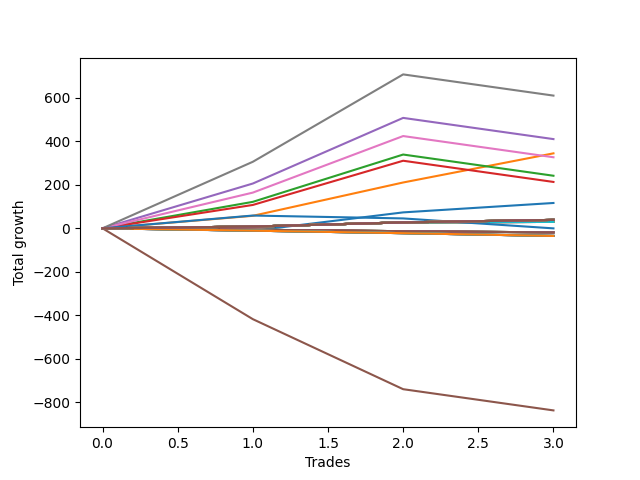

# Long Wallace 004 
- Symbol: ES1y1d
- Date Range: 07/19/2021 - 07/08/2022
- Trading Period: 7:20-12:30
- Number of Trades: 3



| Name | Win Percent | Profit | Avg Profit / Trade | Avg Time / Trade | Avg Profit / Time |      | Name | Win Percent | Profit | Avg Profit / Trade | Avg Time / Trade | Avg Profit / Time |
| ---- | ----------- | ------ | ------------------ | ---------------- | ----------------- | ---- | ---- | ----------- | ------ | ------------------ | ---------------- | ----------------- |
| Sorted By <br> Profit | | | | | | | Sorted By <br> Win Percentage ||||||
| Seven | 66.67 | 305125.00 | 101708.33 | 33 22:12:40 | 2997.99 |     | One | 100.00 | 172375.00 | 57458.33 | 11 20:31:00 | 4846.82 |
| Four | 66.67 | 205125.00 | 68375.00 | 33 02:09:20 | 2066.35 |     | Ninety | 100.00 | 18375.00 | 6125.00 | 00 00:14:00 | 630000.00 |
| One | 100.00 | 172375.00 | 57458.33 | 11 20:31:00 | 4846.82 |     | Eighty-Nine | 100.00 | 18375.00 | 6125.00 | 00 00:14:00 | 630000.00 |
| Six | 66.67 | 163375.00 | 54458.33 | 29 02:30:00 | 1871.15 |     | Eighty-Eight | 100.00 | 18375.00 | 6125.00 | 00 00:14:00 | 630000.00 |
| Two | 66.67 | 120875.00 | 40291.67 | 26 14:02:40 | 1515.57 |     | Eighty-Seven | 100.00 | 16000.00 | 5333.33 | 00 00:13:00 | 590769.23 |
| Three | 66.67 | 106625.00 | 35541.67 | 26 12:49:20 | 1339.46 |     | Eighty-Six | 100.00 | 10000.00 | 3333.33 | 00 00:09:20 | 514285.71 |
| Zero | 66.67 | 56375.00 | 18791.67 | 10 16:36:00 | 1757.60 |     | Eighty-Five | 100.00 | 9625.00 | 3208.33 | 00 00:05:20 | 866250.00 |
| Ninety | 100.00 | 18375.00 | 6125.00 | 00 00:14:00 | 630000.00 |     | Eighty-Four | 100.00 | 9625.00 | 3208.33 | 00 00:05:20 | 866250.00 |
| Eighty-Nine | 100.00 | 18375.00 | 6125.00 | 00 00:14:00 | 630000.00 |     | Eighty-Three | 100.00 | 9625.00 | 3208.33 | 00 00:05:20 | 866250.00 |
| Eighty-Eight | 100.00 | 18375.00 | 6125.00 | 00 00:14:00 | 630000.00 |     | Eighty-Two | 100.00 | 9625.00 | 3208.33 | 00 00:05:20 | 866250.00 |
| Eighty-Seven | 100.00 | 16000.00 | 5333.33 | 00 00:13:00 | 590769.23 |     | Eighty-One | 100.00 | 9625.00 | 3208.33 | 00 00:05:20 | 866250.00 |
| Eighty-Six | 100.00 | 10000.00 | 3333.33 | 00 00:09:20 | 514285.71 |     | Seven | 66.67 | 305125.00 | 101708.33 | 33 22:12:40 | 2997.99 |
| Eighty-Five | 100.00 | 9625.00 | 3208.33 | 00 00:05:20 | 866250.00 |     | Four | 66.67 | 205125.00 | 68375.00 | 33 02:09:20 | 2066.35 |
| Eighty-Four | 100.00 | 9625.00 | 3208.33 | 00 00:05:20 | 866250.00 |     | Six | 66.67 | 163375.00 | 54458.33 | 29 02:30:00 | 1871.15 |
| Eighty-Three | 100.00 | 9625.00 | 3208.33 | 00 00:05:20 | 866250.00 |     | Two | 66.67 | 120875.00 | 40291.67 | 26 14:02:40 | 1515.57 |
| Eighty-Two | 100.00 | 9625.00 | 3208.33 | 00 00:05:20 | 866250.00 |     | Three | 66.67 | 106625.00 | 35541.67 | 26 12:49:20 | 1339.46 |
| Eighty-One | 100.00 | 9625.00 | 3208.33 | 00 00:05:20 | 866250.00 |     | Zero | 66.67 | 56375.00 | 18791.67 | 10 16:36:00 | 1757.60 |
| Seventy-Three | 33.33 | 5000.00 | 1666.67 | 05 00:41:00 | 331.45 |     | Seventy-Three | 33.33 | 5000.00 | 1666.67 | 05 00:41:00 | 331.45 |
| Five | 0.00 | -418625.00 | -139541.67 | 101 06:28:00 | -1377.92 |     | Five | 0.00 | -418625.00 | -139541.67 | 101 06:28:00 | -1377.92 |

## NO STOPLOSS

### Test Zero
* Sell when price hits the middle line of the 20p bollinger
* No Stoploss
* Results:
```
Total Trades: 3
Percent Up: 66.67
Percent Down: 33.33
Total Points Moved Up: 112.75
Potential Profit: 56375.00
Total Points Ups: 124.00 Count Ups: 2
Total Points Downs: -11.25 Count Downs: 1
```

<details><summary>Trades</summary>

<code>In: 2022-02-28 06:30:00		Out: 2022-03-16 06:39:00		Total Position Time: 16 00:09:00		Total Move Up: -11.25		Total to Date: -11.25</code> <br />
<code>In: 2022-03-10 06:30:00		Out: 2022-03-16 06:39:00		Total Position Time: 06 00:09:00		Total Move Up: 84.50		Total to Date: 73.25</code> <br />
<code>In: 2022-05-16 06:30:00		Out: 2022-05-26 08:00:00		Total Position Time: 10 01:30:00		Total Move Up: 39.50		Total to Date: 112.75</code> <br />


</details>

### Test One
* Sell when the price hits the upper line of the 20p 1std bollinger
* No Stoploss
* Results:
```
Total Trades: 3
Percent Up: 100.00
Percent Down: 0.00
Total Points Moved Up: 344.75
Potential Profit: 172375.00
Total Points Ups: 344.75 Count Ups: 3
Total Points Downs: 0.00 Count Downs: 0
```

<details><summary>Trades</summary>

<code>In: 2022-02-28 06:30:00		Out: 2022-03-17 10:29:00		Total Position Time: 17 03:59:00		Total Move Up: 57.50		Total to Date: 57.50</code> <br />
<code>In: 2022-03-10 06:30:00		Out: 2022-03-17 10:29:00		Total Position Time: 07 03:59:00		Total Move Up: 153.25		Total to Date: 210.75</code> <br />
<code>In: 2022-05-16 06:30:00		Out: 2022-05-27 12:05:00		Total Position Time: 11 05:35:00		Total Move Up: 134.00		Total to Date: 344.75</code> <br />


</details>

### Test Two
* Sell when the price hits the upper line of the 20p 2std bollinger
* No Stoploss
* Results:
```
Total Trades: 3
Percent Up: 66.67
Percent Down: 33.33
Total Points Moved Up: 241.75
Potential Profit: 120875.00
Total Points Ups: 339.25 Count Ups: 2
Total Points Downs: -97.50 Count Downs: 1
```

<details><summary>Trades</summary>

<code>In: 2022-02-28 06:30:00		Out: 2022-03-18 12:20:00		Total Position Time: 18 05:50:00		Total Move Up: 121.75		Total to Date: 121.75</code> <br />
<code>In: 2022-03-10 06:30:00		Out: 2022-03-18 12:20:00		Total Position Time: 08 05:50:00		Total Move Up: 217.50		Total to Date: 339.25</code> <br />
<code>In: 2022-05-16 06:30:00		Out: 2022-07-08 12:58:00		Total Position Time: 53 06:28:00		Total Move Up: -97.50		Total to Date: 241.75</code> <br />


</details>

### Test Three
* Sell when price hits the middle line of the 50p bollinger
* No Stoploss
* Results:
```
Total Trades: 3
Percent Up: 66.67
Percent Down: 33.33
Total Points Moved Up: 213.25
Potential Profit: 106625.00
Total Points Ups: 310.75 Count Ups: 2
Total Points Downs: -97.50 Count Downs: 1
```

<details><summary>Trades</summary>

<code>In: 2022-02-28 06:30:00		Out: 2022-03-18 10:30:00		Total Position Time: 18 04:00:00		Total Move Up: 107.50		Total to Date: 107.50</code> <br />
<code>In: 2022-03-10 06:30:00		Out: 2022-03-18 10:30:00		Total Position Time: 08 04:00:00		Total Move Up: 203.25		Total to Date: 310.75</code> <br />
<code>In: 2022-05-16 06:30:00		Out: 2022-07-08 12:58:00		Total Position Time: 53 06:28:00		Total Move Up: -97.50		Total to Date: 213.25</code> <br />


</details>

### Test Four
* Sell when the price hits the upper line of the 50p 1std bollinger
* No Stoploss
* Results:
```
Total Trades: 3
Percent Up: 66.67
Percent Down: 33.33
Total Points Moved Up: 410.25
Potential Profit: 205125.00
Total Points Ups: 507.75 Count Ups: 2
Total Points Downs: -97.50 Count Downs: 1
```

<details><summary>Trades</summary>

<code>In: 2022-02-28 06:30:00		Out: 2022-03-28 06:30:00		Total Position Time: 28 00:00:00		Total Move Up: 206.00		Total to Date: 206.00</code> <br />
<code>In: 2022-03-10 06:30:00		Out: 2022-03-28 06:30:00		Total Position Time: 18 00:00:00		Total Move Up: 301.75		Total to Date: 507.75</code> <br />
<code>In: 2022-05-16 06:30:00		Out: 2022-07-08 12:58:00		Total Position Time: 53 06:28:00		Total Move Up: -97.50		Total to Date: 410.25</code> <br />


</details>

### Test Five
* Sell when the price hits the upper line of the 50p 2std bollinger
* No Stoploss
* Results:
```
Total Trades: 3
Percent Up: 0.00
Percent Down: 100.00
Total Points Moved Up: -837.25
Potential Profit: -418625.00
Total Points Ups: 0.00 Count Ups: 0
Total Points Downs: -837.25 Count Downs: 3
```

<details><summary>Trades</summary>

<code>In: 2022-02-28 06:30:00		Out: 2022-07-08 12:58:00		Total Position Time: 130 06:28:00		Total Move Up: -417.75		Total to Date: -417.75</code> <br />
<code>In: 2022-03-10 06:30:00		Out: 2022-07-08 12:58:00		Total Position Time: 120 06:28:00		Total Move Up: -322.00		Total to Date: -739.75</code> <br />
<code>In: 2022-05-16 06:30:00		Out: 2022-07-08 12:58:00		Total Position Time: 53 06:28:00		Total Move Up: -97.50		Total to Date: -837.25</code> <br />


</details>

### Test Six
* Sell when the price hits the middle line of the 1std VWAP
* No Stoploss
* Results:
```
Total Trades: 3
Percent Up: 66.67
Percent Down: 33.33
Total Points Moved Up: 326.75
Potential Profit: 163375.00
Total Points Ups: 424.25 Count Ups: 2
Total Points Downs: -97.50 Count Downs: 1
```

<details><summary>Trades</summary>

<code>In: 2022-02-28 06:30:00		Out: 2022-03-22 07:01:00		Total Position Time: 22 00:31:00		Total Move Up: 164.25		Total to Date: 164.25</code> <br />
<code>In: 2022-03-10 06:30:00		Out: 2022-03-22 07:01:00		Total Position Time: 12 00:31:00		Total Move Up: 260.00		Total to Date: 424.25</code> <br />
<code>In: 2022-05-16 06:30:00		Out: 2022-07-08 12:58:00		Total Position Time: 53 06:28:00		Total Move Up: -97.50		Total to Date: 326.75</code> <br />


</details>

### Test Seven
* Sell when the price hits the upper line of the 1std VWAP
* No Stoploss
* Results:
```
Total Trades: 3
Percent Up: 66.67
Percent Down: 33.33
Total Points Moved Up: 610.25
Potential Profit: 305125.00
Total Points Ups: 707.75 Count Ups: 2
Total Points Downs: -97.50 Count Downs: 1
```

<details><summary>Trades</summary>

<code>In: 2022-02-28 06:30:00		Out: 2022-03-29 12:35:00		Total Position Time: 29 06:05:00		Total Move Up: 306.00		Total to Date: 306.00</code> <br />
<code>In: 2022-03-10 06:30:00		Out: 2022-03-29 12:35:00		Total Position Time: 19 06:05:00		Total Move Up: 401.75		Total to Date: 707.75</code> <br />
<code>In: 2022-05-16 06:30:00		Out: 2022-07-08 12:58:00		Total Position Time: 53 06:28:00		Total Move Up: -97.50		Total to Date: 610.25</code> <br />


</details>

## SPECIAL EXIT CONDITIONS 

### Test Seventy-Three
* Sell when the linear regression slope changes to negative
* No Stoploss
* Results:
```
Total Trades: 3
Percent Up: 33.33
Percent Down: 66.67
Total Points Moved Up: 10.00
Potential Profit: 5000.00
Total Points Ups: 87.25 Count Ups: 1
Total Points Downs: -77.25 Count Downs: 2
```

<details><summary>Trades</summary>

<code>In: 2022-02-28 06:30:00		Out: 2022-03-03 06:31:00		Total Position Time: 03 00:01:00		Total Move Up: 87.25		Total to Date: 87.25</code> <br />
<code>In: 2022-03-10 06:30:00		Out: 2022-03-15 07:31:00		Total Position Time: 05 01:01:00		Total Move Up: -13.50		Total to Date: 73.75</code> <br />
<code>In: 2022-05-16 06:30:00		Out: 2022-05-23 07:31:00		Total Position Time: 07 01:01:00		Total Move Up: -63.75		Total to Date: 10.00</code> <br />


</details>

## TAKE PROFIT

### Test Eighty-One
* Take Profit of 1 Point
* No Stoploss
* Results:
```
Total Trades: 3
Percent Up: 100.00
Percent Down: 0.00
Total Points Moved Up: 19.25
Potential Profit: 9625.00
Total Points Ups: 19.25 Count Ups: 3
Total Points Downs: 0.00 Count Downs: 0
```

<details><summary>Trades</summary>

<code>In: 2022-02-28 06:30:00		Out: 2022-02-28 06:33:00		Total Position Time: 00 00:03:00		Total Move Up: 7.00		Total to Date: 7.00</code> <br />
<code>In: 2022-03-10 06:30:00		Out: 2022-03-10 06:34:00		Total Position Time: 00 00:04:00		Total Move Up: 5.50		Total to Date: 12.50</code> <br />
<code>In: 2022-05-16 06:30:00		Out: 2022-05-16 06:39:00		Total Position Time: 00 00:09:00		Total Move Up: 6.75		Total to Date: 19.25</code> <br />


</details>

### Test Eighty-Two
* Take Profit of 2 Point
* No Stoploss
* Results:
```
Total Trades: 3
Percent Up: 100.00
Percent Down: 0.00
Total Points Moved Up: 19.25
Potential Profit: 9625.00
Total Points Ups: 19.25 Count Ups: 3
Total Points Downs: 0.00 Count Downs: 0
```

<details><summary>Trades</summary>

<code>In: 2022-02-28 06:30:00		Out: 2022-02-28 06:33:00		Total Position Time: 00 00:03:00		Total Move Up: 7.00		Total to Date: 7.00</code> <br />
<code>In: 2022-03-10 06:30:00		Out: 2022-03-10 06:34:00		Total Position Time: 00 00:04:00		Total Move Up: 5.50		Total to Date: 12.50</code> <br />
<code>In: 2022-05-16 06:30:00		Out: 2022-05-16 06:39:00		Total Position Time: 00 00:09:00		Total Move Up: 6.75		Total to Date: 19.25</code> <br />


</details>

### Test Eighty-Three
* Take Profit of 3 Point
* No Stoploss
* Results:
```
Total Trades: 3
Percent Up: 100.00
Percent Down: 0.00
Total Points Moved Up: 19.25
Potential Profit: 9625.00
Total Points Ups: 19.25 Count Ups: 3
Total Points Downs: 0.00 Count Downs: 0
```

<details><summary>Trades</summary>

<code>In: 2022-02-28 06:30:00		Out: 2022-02-28 06:33:00		Total Position Time: 00 00:03:00		Total Move Up: 7.00		Total to Date: 7.00</code> <br />
<code>In: 2022-03-10 06:30:00		Out: 2022-03-10 06:34:00		Total Position Time: 00 00:04:00		Total Move Up: 5.50		Total to Date: 12.50</code> <br />
<code>In: 2022-05-16 06:30:00		Out: 2022-05-16 06:39:00		Total Position Time: 00 00:09:00		Total Move Up: 6.75		Total to Date: 19.25</code> <br />


</details>

### Test Eighty-Four
* Take Profit of 4 Point
* No Stoploss
* Results:
```
Total Trades: 3
Percent Up: 100.00
Percent Down: 0.00
Total Points Moved Up: 19.25
Potential Profit: 9625.00
Total Points Ups: 19.25 Count Ups: 3
Total Points Downs: 0.00 Count Downs: 0
```

<details><summary>Trades</summary>

<code>In: 2022-02-28 06:30:00		Out: 2022-02-28 06:33:00		Total Position Time: 00 00:03:00		Total Move Up: 7.00		Total to Date: 7.00</code> <br />
<code>In: 2022-03-10 06:30:00		Out: 2022-03-10 06:34:00		Total Position Time: 00 00:04:00		Total Move Up: 5.50		Total to Date: 12.50</code> <br />
<code>In: 2022-05-16 06:30:00		Out: 2022-05-16 06:39:00		Total Position Time: 00 00:09:00		Total Move Up: 6.75		Total to Date: 19.25</code> <br />


</details>

### Test Eighty-Five
* Take Profit of 5 Point
* No Stoploss
* Results:
```
Total Trades: 3
Percent Up: 100.00
Percent Down: 0.00
Total Points Moved Up: 19.25
Potential Profit: 9625.00
Total Points Ups: 19.25 Count Ups: 3
Total Points Downs: 0.00 Count Downs: 0
```

<details><summary>Trades</summary>

<code>In: 2022-02-28 06:30:00		Out: 2022-02-28 06:33:00		Total Position Time: 00 00:03:00		Total Move Up: 7.00		Total to Date: 7.00</code> <br />
<code>In: 2022-03-10 06:30:00		Out: 2022-03-10 06:34:00		Total Position Time: 00 00:04:00		Total Move Up: 5.50		Total to Date: 12.50</code> <br />
<code>In: 2022-05-16 06:30:00		Out: 2022-05-16 06:39:00		Total Position Time: 00 00:09:00		Total Move Up: 6.75		Total to Date: 19.25</code> <br />


</details>

### Test Eighty-Six
* Take Profit of 6 Point
* No Stoploss
* Results:
```
Total Trades: 3
Percent Up: 100.00
Percent Down: 0.00
Total Points Moved Up: 20.00
Potential Profit: 10000.00
Total Points Ups: 20.00 Count Ups: 3
Total Points Downs: 0.00 Count Downs: 0
```

<details><summary>Trades</summary>

<code>In: 2022-02-28 06:30:00		Out: 2022-02-28 06:33:00		Total Position Time: 00 00:03:00		Total Move Up: 7.00		Total to Date: 7.00</code> <br />
<code>In: 2022-03-10 06:30:00		Out: 2022-03-10 06:46:00		Total Position Time: 00 00:16:00		Total Move Up: 6.25		Total to Date: 13.25</code> <br />
<code>In: 2022-05-16 06:30:00		Out: 2022-05-16 06:39:00		Total Position Time: 00 00:09:00		Total Move Up: 6.75		Total to Date: 20.00</code> <br />


</details>

### Test Eighty-Seven
* Take Profit of 7 Point
* No Stoploss
* Results:
```
Total Trades: 3
Percent Up: 100.00
Percent Down: 0.00
Total Points Moved Up: 32.00
Potential Profit: 16000.00
Total Points Ups: 32.00 Count Ups: 3
Total Points Downs: 0.00 Count Downs: 0
```

<details><summary>Trades</summary>

<code>In: 2022-02-28 06:30:00		Out: 2022-02-28 06:33:00		Total Position Time: 00 00:03:00		Total Move Up: 7.00		Total to Date: 7.00</code> <br />
<code>In: 2022-03-10 06:30:00		Out: 2022-03-10 06:56:00		Total Position Time: 00 00:26:00		Total Move Up: 13.75		Total to Date: 20.75</code> <br />
<code>In: 2022-05-16 06:30:00		Out: 2022-05-16 06:40:00		Total Position Time: 00 00:10:00		Total Move Up: 11.25		Total to Date: 32.00</code> <br />


</details>

### Test Eighty-Eight
* Take Profit of 8 Point
* No Stoploss
* Results:
```
Total Trades: 3
Percent Up: 100.00
Percent Down: 0.00
Total Points Moved Up: 36.75
Potential Profit: 18375.00
Total Points Ups: 36.75 Count Ups: 3
Total Points Downs: 0.00 Count Downs: 0
```

<details><summary>Trades</summary>

<code>In: 2022-02-28 06:30:00		Out: 2022-02-28 06:36:00		Total Position Time: 00 00:06:00		Total Move Up: 11.75		Total to Date: 11.75</code> <br />
<code>In: 2022-03-10 06:30:00		Out: 2022-03-10 06:56:00		Total Position Time: 00 00:26:00		Total Move Up: 13.75		Total to Date: 25.50</code> <br />
<code>In: 2022-05-16 06:30:00		Out: 2022-05-16 06:40:00		Total Position Time: 00 00:10:00		Total Move Up: 11.25		Total to Date: 36.75</code> <br />


</details>

### Test Eighty-Nine
* Take Profit of 9 Point
* No Stoploss
* Results:
```
Total Trades: 3
Percent Up: 100.00
Percent Down: 0.00
Total Points Moved Up: 36.75
Potential Profit: 18375.00
Total Points Ups: 36.75 Count Ups: 3
Total Points Downs: 0.00 Count Downs: 0
```

<details><summary>Trades</summary>

<code>In: 2022-02-28 06:30:00		Out: 2022-02-28 06:36:00		Total Position Time: 00 00:06:00		Total Move Up: 11.75		Total to Date: 11.75</code> <br />
<code>In: 2022-03-10 06:30:00		Out: 2022-03-10 06:56:00		Total Position Time: 00 00:26:00		Total Move Up: 13.75		Total to Date: 25.50</code> <br />
<code>In: 2022-05-16 06:30:00		Out: 2022-05-16 06:40:00		Total Position Time: 00 00:10:00		Total Move Up: 11.25		Total to Date: 36.75</code> <br />


</details>

### Test Ninety
* Take Profit of 10 Point
* No Stoploss
* Results:
```
Total Trades: 3
Percent Up: 100.00
Percent Down: 0.00
Total Points Moved Up: 36.75
Potential Profit: 18375.00
Total Points Ups: 36.75 Count Ups: 3
Total Points Downs: 0.00 Count Downs: 0
```

<details><summary>Trades</summary>

<code>In: 2022-02-28 06:30:00		Out: 2022-02-28 06:36:00		Total Position Time: 00 00:06:00		Total Move Up: 11.75		Total to Date: 11.75</code> <br />
<code>In: 2022-03-10 06:30:00		Out: 2022-03-10 06:56:00		Total Position Time: 00 00:26:00		Total Move Up: 13.75		Total to Date: 25.50</code> <br />
<code>In: 2022-05-16 06:30:00		Out: 2022-05-16 06:40:00		Total Position Time: 00 00:10:00		Total Move Up: 11.25		Total to Date: 36.75</code> <br />


</details>