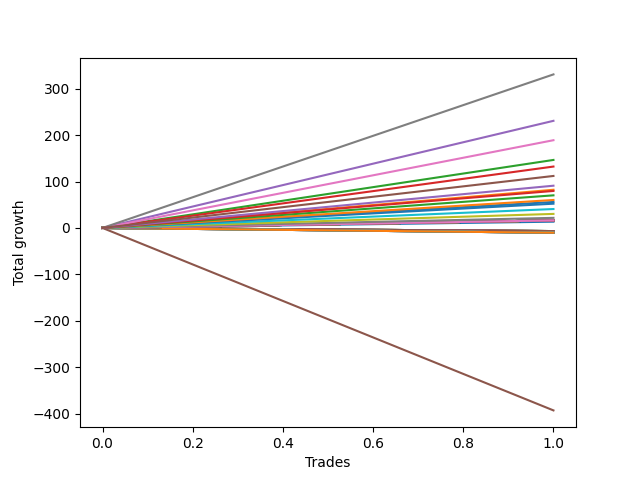

# Long Wallace 009 
- Symbol: ES1y1d
- Date Range: 07/19/2021 - 07/08/2022
- Trading Period: 7:20-12:30
- Number of Trades: 1



| Name | Win Percent | Profit | Avg Profit / Trade | Avg Time / Trade | Avg Profit / Time |      | Name | Win Percent | Profit | Avg Profit / Trade | Avg Time / Trade | Avg Profit / Time |
| ---- | ----------- | ------ | ------------------ | ---------------- | ----------------- | ---- | ---- | ----------- | ------ | ------------------ | ---------------- | ----------------- |
| Sorted By <br> Profit | | | | | | | Sorted By <br> Win Percentage ||||||
| Seven | 100.00 | 165375.00 | 165375.00 | 32 06:05:00 | 5127.35 |     | Seven | 100.00 | 165375.00 | 165375.00 | 32 06:05:00 | 5127.35 |
| Four | 100.00 | 115375.00 | 115375.00 | 31 00:00:00 | 3721.77 |     | Four | 100.00 | 115375.00 | 115375.00 | 31 00:00:00 | 3721.77 |
| Six | 100.00 | 94500.00 | 94500.00 | 25 00:31:00 | 3776.75 |     | Six | 100.00 | 94500.00 | 94500.00 | 25 00:31:00 | 3776.75 |
| Two | 100.00 | 73250.00 | 73250.00 | 21 05:50:00 | 3448.19 |     | Two | 100.00 | 73250.00 | 73250.00 | 21 05:50:00 | 3448.19 |
| Three | 100.00 | 66125.00 | 66125.00 | 21 04:00:00 | 3124.02 |     | Three | 100.00 | 66125.00 | 66125.00 | 21 04:00:00 | 3124.02 |
| One | 100.00 | 41125.00 | 41125.00 | 20 03:59:00 | 2039.33 |     | One | 100.00 | 41125.00 | 41125.00 | 20 03:59:00 | 2039.33 |
| Seventy-Three | 100.00 | 39750.00 | 39750.00 | 06 01:01:00 | 6578.55 |     | Seventy-Three | 100.00 | 39750.00 | 39750.00 | 06 01:01:00 | 6578.55 |
| Zero | 100.00 | 6750.00 | 6750.00 | 19 00:09:00 | 355.15 |     | Zero | 100.00 | 6750.00 | 6750.00 | 19 00:09:00 | 355.15 |
| Ninety | 100.00 | 6250.00 | 6250.00 | 00 00:05:00 | 1800000.00 |     | Ninety | 100.00 | 6250.00 | 6250.00 | 00 00:05:00 | 1800000.00 |
| Eighty-Nine | 100.00 | 6250.00 | 6250.00 | 00 00:05:00 | 1800000.00 |     | Eighty-Nine | 100.00 | 6250.00 | 6250.00 | 00 00:05:00 | 1800000.00 |
| Eighty-Eight | 100.00 | 6250.00 | 6250.00 | 00 00:05:00 | 1800000.00 |     | Eighty-Eight | 100.00 | 6250.00 | 6250.00 | 00 00:05:00 | 1800000.00 |
| Eighty-Seven | 100.00 | 3750.00 | 3750.00 | 00 00:04:00 | 1350000.00 |     | Eighty-Seven | 100.00 | 3750.00 | 3750.00 | 00 00:04:00 | 1350000.00 |
| Eighty-Six | 100.00 | 3750.00 | 3750.00 | 00 00:04:00 | 1350000.00 |     | Eighty-Six | 100.00 | 3750.00 | 3750.00 | 00 00:04:00 | 1350000.00 |
| Eighty-Five | 100.00 | 3750.00 | 3750.00 | 00 00:04:00 | 1350000.00 |     | Eighty-Five | 100.00 | 3750.00 | 3750.00 | 00 00:04:00 | 1350000.00 |
| Eighty-Four | 100.00 | 3750.00 | 3750.00 | 00 00:04:00 | 1350000.00 |     | Eighty-Four | 100.00 | 3750.00 | 3750.00 | 00 00:04:00 | 1350000.00 |
| Eighty-Three | 100.00 | 3750.00 | 3750.00 | 00 00:04:00 | 1350000.00 |     | Eighty-Three | 100.00 | 3750.00 | 3750.00 | 00 00:04:00 | 1350000.00 |
| Eighty-Two | 100.00 | 3750.00 | 3750.00 | 00 00:04:00 | 1350000.00 |     | Eighty-Two | 100.00 | 3750.00 | 3750.00 | 00 00:04:00 | 1350000.00 |
| Eighty-One | 100.00 | 3750.00 | 3750.00 | 00 00:04:00 | 1350000.00 |     | Eighty-One | 100.00 | 3750.00 | 3750.00 | 00 00:04:00 | 1350000.00 |
| Five | 0.00 | -196500.00 | -196500.00 | 133 06:28:00 | -1474.46 |     | Five | 0.00 | -196500.00 | -196500.00 | 133 06:28:00 | -1474.46 |

## NO STOPLOSS

### Test Zero
* Sell when price hits the middle line of the 20p bollinger
* No Stoploss
* Results:
```
Total Trades: 1
Percent Up: 100.00
Percent Down: 0.00
Total Points Moved Up: 13.50
Potential Profit: 6750.00
Total Points Ups: 13.50 Count Ups: 1
Total Points Downs: 0.00 Count Downs: 0
```

<details><summary>Trades</summary>

<code>In: 2022-02-25 06:30:00		Out: 2022-03-16 06:39:00		Total Position Time: 19 00:09:00		Total Move Up: 13.50		Total to Date: 13.50</code> <br />


</details>

### Test One
* Sell when the price hits the upper line of the 20p 1std bollinger
* No Stoploss
* Results:
```
Total Trades: 1
Percent Up: 100.00
Percent Down: 0.00
Total Points Moved Up: 82.25
Potential Profit: 41125.00
Total Points Ups: 82.25 Count Ups: 1
Total Points Downs: 0.00 Count Downs: 0
```

<details><summary>Trades</summary>

<code>In: 2022-02-25 06:30:00		Out: 2022-03-17 10:29:00		Total Position Time: 20 03:59:00		Total Move Up: 82.25		Total to Date: 82.25</code> <br />


</details>

### Test Two
* Sell when the price hits the upper line of the 20p 2std bollinger
* No Stoploss
* Results:
```
Total Trades: 1
Percent Up: 100.00
Percent Down: 0.00
Total Points Moved Up: 146.50
Potential Profit: 73250.00
Total Points Ups: 146.50 Count Ups: 1
Total Points Downs: 0.00 Count Downs: 0
```

<details><summary>Trades</summary>

<code>In: 2022-02-25 06:30:00		Out: 2022-03-18 12:20:00		Total Position Time: 21 05:50:00		Total Move Up: 146.50		Total to Date: 146.50</code> <br />


</details>

### Test Three
* Sell when price hits the middle line of the 50p bollinger
* No Stoploss
* Results:
```
Total Trades: 1
Percent Up: 100.00
Percent Down: 0.00
Total Points Moved Up: 132.25
Potential Profit: 66125.00
Total Points Ups: 132.25 Count Ups: 1
Total Points Downs: 0.00 Count Downs: 0
```

<details><summary>Trades</summary>

<code>In: 2022-02-25 06:30:00		Out: 2022-03-18 10:30:00		Total Position Time: 21 04:00:00		Total Move Up: 132.25		Total to Date: 132.25</code> <br />


</details>

### Test Four
* Sell when the price hits the upper line of the 50p 1std bollinger
* No Stoploss
* Results:
```
Total Trades: 1
Percent Up: 100.00
Percent Down: 0.00
Total Points Moved Up: 230.75
Potential Profit: 115375.00
Total Points Ups: 230.75 Count Ups: 1
Total Points Downs: 0.00 Count Downs: 0
```

<details><summary>Trades</summary>

<code>In: 2022-02-25 06:30:00		Out: 2022-03-28 06:30:00		Total Position Time: 31 00:00:00		Total Move Up: 230.75		Total to Date: 230.75</code> <br />


</details>

### Test Five
* Sell when the price hits the upper line of the 50p 2std bollinger
* No Stoploss
* Results:
```
Total Trades: 1
Percent Up: 0.00
Percent Down: 100.00
Total Points Moved Up: -393.00
Potential Profit: -196500.00
Total Points Ups: 0.00 Count Ups: 0
Total Points Downs: -393.00 Count Downs: 1
```

<details><summary>Trades</summary>

<code>In: 2022-02-25 06:30:00		Out: 2022-07-08 12:58:00		Total Position Time: 133 06:28:00		Total Move Up: -393.00		Total to Date: -393.00</code> <br />


</details>

### Test Six
* Sell when the price hits the middle line of the 1std VWAP
* No Stoploss
* Results:
```
Total Trades: 1
Percent Up: 100.00
Percent Down: 0.00
Total Points Moved Up: 189.00
Potential Profit: 94500.00
Total Points Ups: 189.00 Count Ups: 1
Total Points Downs: 0.00 Count Downs: 0
```

<details><summary>Trades</summary>

<code>In: 2022-02-25 06:30:00		Out: 2022-03-22 07:01:00		Total Position Time: 25 00:31:00		Total Move Up: 189.00		Total to Date: 189.00</code> <br />


</details>

### Test Seven
* Sell when the price hits the upper line of the 1std VWAP
* No Stoploss
* Results:
```
Total Trades: 1
Percent Up: 100.00
Percent Down: 0.00
Total Points Moved Up: 330.75
Potential Profit: 165375.00
Total Points Ups: 330.75 Count Ups: 1
Total Points Downs: 0.00 Count Downs: 0
```

<details><summary>Trades</summary>

<code>In: 2022-02-25 06:30:00		Out: 2022-03-29 12:35:00		Total Position Time: 32 06:05:00		Total Move Up: 330.75		Total to Date: 330.75</code> <br />


</details>

## SPECIAL EXIT CONDITIONS 

### Test Seventy-Three
* Sell when the linear regression slope changes to negative
* No Stoploss
* Results:
```
Total Trades: 1
Percent Up: 100.00
Percent Down: 0.00
Total Points Moved Up: 79.50
Potential Profit: 39750.00
Total Points Ups: 79.50 Count Ups: 1
Total Points Downs: 0.00 Count Downs: 0
```

<details><summary>Trades</summary>

<code>In: 2022-02-25 06:30:00		Out: 2022-03-03 07:31:00		Total Position Time: 06 01:01:00		Total Move Up: 79.50		Total to Date: 79.50</code> <br />


</details>

## TAKE PROFIT

### Test Eighty-One
* Take Profit of 1 Point
* No Stoploss
* Results:
```
Total Trades: 1
Percent Up: 100.00
Percent Down: 0.00
Total Points Moved Up: 7.50
Potential Profit: 3750.00
Total Points Ups: 7.50 Count Ups: 1
Total Points Downs: 0.00 Count Downs: 0
```

<details><summary>Trades</summary>

<code>In: 2022-02-25 06:30:00		Out: 2022-02-25 06:34:00		Total Position Time: 00 00:04:00		Total Move Up: 7.50		Total to Date: 7.50</code> <br />


</details>

### Test Eighty-Two
* Take Profit of 2 Point
* No Stoploss
* Results:
```
Total Trades: 1
Percent Up: 100.00
Percent Down: 0.00
Total Points Moved Up: 7.50
Potential Profit: 3750.00
Total Points Ups: 7.50 Count Ups: 1
Total Points Downs: 0.00 Count Downs: 0
```

<details><summary>Trades</summary>

<code>In: 2022-02-25 06:30:00		Out: 2022-02-25 06:34:00		Total Position Time: 00 00:04:00		Total Move Up: 7.50		Total to Date: 7.50</code> <br />


</details>

### Test Eighty-Three
* Take Profit of 3 Point
* No Stoploss
* Results:
```
Total Trades: 1
Percent Up: 100.00
Percent Down: 0.00
Total Points Moved Up: 7.50
Potential Profit: 3750.00
Total Points Ups: 7.50 Count Ups: 1
Total Points Downs: 0.00 Count Downs: 0
```

<details><summary>Trades</summary>

<code>In: 2022-02-25 06:30:00		Out: 2022-02-25 06:34:00		Total Position Time: 00 00:04:00		Total Move Up: 7.50		Total to Date: 7.50</code> <br />


</details>

### Test Eighty-Four
* Take Profit of 4 Point
* No Stoploss
* Results:
```
Total Trades: 1
Percent Up: 100.00
Percent Down: 0.00
Total Points Moved Up: 7.50
Potential Profit: 3750.00
Total Points Ups: 7.50 Count Ups: 1
Total Points Downs: 0.00 Count Downs: 0
```

<details><summary>Trades</summary>

<code>In: 2022-02-25 06:30:00		Out: 2022-02-25 06:34:00		Total Position Time: 00 00:04:00		Total Move Up: 7.50		Total to Date: 7.50</code> <br />


</details>

### Test Eighty-Five
* Take Profit of 5 Point
* No Stoploss
* Results:
```
Total Trades: 1
Percent Up: 100.00
Percent Down: 0.00
Total Points Moved Up: 7.50
Potential Profit: 3750.00
Total Points Ups: 7.50 Count Ups: 1
Total Points Downs: 0.00 Count Downs: 0
```

<details><summary>Trades</summary>

<code>In: 2022-02-25 06:30:00		Out: 2022-02-25 06:34:00		Total Position Time: 00 00:04:00		Total Move Up: 7.50		Total to Date: 7.50</code> <br />


</details>

### Test Eighty-Six
* Take Profit of 6 Point
* No Stoploss
* Results:
```
Total Trades: 1
Percent Up: 100.00
Percent Down: 0.00
Total Points Moved Up: 7.50
Potential Profit: 3750.00
Total Points Ups: 7.50 Count Ups: 1
Total Points Downs: 0.00 Count Downs: 0
```

<details><summary>Trades</summary>

<code>In: 2022-02-25 06:30:00		Out: 2022-02-25 06:34:00		Total Position Time: 00 00:04:00		Total Move Up: 7.50		Total to Date: 7.50</code> <br />


</details>

### Test Eighty-Seven
* Take Profit of 7 Point
* No Stoploss
* Results:
```
Total Trades: 1
Percent Up: 100.00
Percent Down: 0.00
Total Points Moved Up: 7.50
Potential Profit: 3750.00
Total Points Ups: 7.50 Count Ups: 1
Total Points Downs: 0.00 Count Downs: 0
```

<details><summary>Trades</summary>

<code>In: 2022-02-25 06:30:00		Out: 2022-02-25 06:34:00		Total Position Time: 00 00:04:00		Total Move Up: 7.50		Total to Date: 7.50</code> <br />


</details>

### Test Eighty-Eight
* Take Profit of 8 Point
* No Stoploss
* Results:
```
Total Trades: 1
Percent Up: 100.00
Percent Down: 0.00
Total Points Moved Up: 12.50
Potential Profit: 6250.00
Total Points Ups: 12.50 Count Ups: 1
Total Points Downs: 0.00 Count Downs: 0
```

<details><summary>Trades</summary>

<code>In: 2022-02-25 06:30:00		Out: 2022-02-25 06:35:00		Total Position Time: 00 00:05:00		Total Move Up: 12.50		Total to Date: 12.50</code> <br />


</details>

### Test Eighty-Nine
* Take Profit of 9 Point
* No Stoploss
* Results:
```
Total Trades: 1
Percent Up: 100.00
Percent Down: 0.00
Total Points Moved Up: 12.50
Potential Profit: 6250.00
Total Points Ups: 12.50 Count Ups: 1
Total Points Downs: 0.00 Count Downs: 0
```

<details><summary>Trades</summary>

<code>In: 2022-02-25 06:30:00		Out: 2022-02-25 06:35:00		Total Position Time: 00 00:05:00		Total Move Up: 12.50		Total to Date: 12.50</code> <br />


</details>

### Test Ninety
* Take Profit of 10 Point
* No Stoploss
* Results:
```
Total Trades: 1
Percent Up: 100.00
Percent Down: 0.00
Total Points Moved Up: 12.50
Potential Profit: 6250.00
Total Points Ups: 12.50 Count Ups: 1
Total Points Downs: 0.00 Count Downs: 0
```

<details><summary>Trades</summary>

<code>In: 2022-02-25 06:30:00		Out: 2022-02-25 06:35:00		Total Position Time: 00 00:05:00		Total Move Up: 12.50		Total to Date: 12.50</code> <br />


</details>