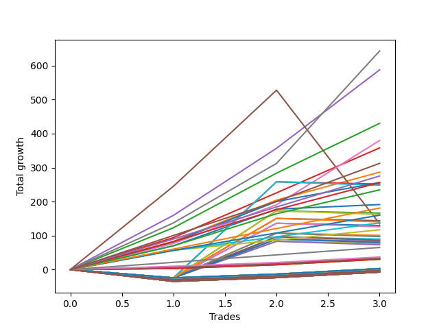

# Long Wallace 011 
- Symbol: ES1y1d
- Date Range: 07/19/2021 - 07/08/2022
- Trading Period: 7:20-12:30
- Number of Trades: 3



| Name | Win Percent | Profit | Avg Profit / Trade | Avg Time / Trade | Avg Profit / Time |      | Name | Win Percent | Profit | Avg Profit / Trade | Avg Time / Trade | Avg Profit / Time |
| ---- | ----------- | ------ | ------------------ | ---------------- | ----------------- | ---- | ---- | ----------- | ------ | ------------------ | ---------------- | ----------------- |
| Sorted By <br> Profit | | | | | | | Sorted By <br> Win Percentage ||||||
| Seven | 100.00 | 321500.00 | 107166.67 | 19 11:15:00 | 5504.55 |     | Seven | 100.00 | 321500.00 | 107166.67 | 19 11:15:00 | 5504.55 |
| Four | 100.00 | 293750.00 | 97916.67 | 19 16:06:40 | 4977.64 |     | Four | 100.00 | 293750.00 | 97916.67 | 19 16:06:40 | 4977.64 |
| Two | 100.00 | 214125.00 | 71375.00 | 13 18:44:40 | 5179.23 |     | Two | 100.00 | 214125.00 | 71375.00 | 13 18:44:40 | 5179.23 |
| Six | 100.00 | 186125.00 | 62041.67 | 09 16:28:20 | 6405.07 |     | Six | 100.00 | 186125.00 | 62041.67 | 09 16:28:20 | 6405.07 |
| Three | 100.00 | 179000.00 | 59666.67 | 13 04:18:00 | 4527.35 |     | Three | 100.00 | 179000.00 | 59666.67 | 13 04:18:00 | 4527.35 |
| One | 100.00 | 143250.00 | 47750.00 | 12 18:46:20 | 3735.67 |     | One | 100.00 | 143250.00 | 47750.00 | 12 18:46:20 | 3735.67 |
| Seventy-Three | 100.00 | 134625.00 | 44875.00 | 08 01:01:00 | 5579.83 |     | Seventy-Three | 100.00 | 134625.00 | 44875.00 | 08 01:01:00 | 5579.83 |
| Zero | 100.00 | 88125.00 | 29375.00 | 07 16:05:40 | 3829.56 |     | Zero | 100.00 | 88125.00 | 29375.00 | 07 16:05:40 | 3829.56 |
| Five | 66.67 | 67375.00 | 22458.33 | 58 10:13:20 | 384.39 |     | Ninety | 100.00 | 17000.00 | 5666.67 | 00 08:23:00 | 16222.66 |
| Ninety | 100.00 | 17000.00 | 5666.67 | 00 08:23:00 | 16222.66 |     | Eighty-Nine | 100.00 | 17000.00 | 5666.67 | 00 08:23:00 | 16222.66 |
| Eighty-Nine | 100.00 | 17000.00 | 5666.67 | 00 08:23:00 | 16222.66 |     | Eighty-Eight | 100.00 | 17000.00 | 5666.67 | 00 08:23:00 | 16222.66 |
| Eighty-Eight | 100.00 | 17000.00 | 5666.67 | 00 08:23:00 | 16222.66 |     | Eighty-Seven | 100.00 | 13250.00 | 4416.67 | 00 00:03:40 | 1734545.45 |
| Eighty-Seven | 100.00 | 13250.00 | 4416.67 | 00 00:03:40 | 1734545.45 |     | Eighty-Six | 100.00 | 13250.00 | 4416.67 | 00 00:03:40 | 1734545.45 |
| Eighty-Six | 100.00 | 13250.00 | 4416.67 | 00 00:03:40 | 1734545.45 |     | Eighty-Five | 100.00 | 12500.00 | 4166.67 | 00 00:03:20 | 1800000.00 |
| Eighty-Five | 100.00 | 12500.00 | 4166.67 | 00 00:03:20 | 1800000.00 |     | Eighty-Four | 100.00 | 12500.00 | 4166.67 | 00 00:03:20 | 1800000.00 |
| Eighty-Four | 100.00 | 12500.00 | 4166.67 | 00 00:03:20 | 1800000.00 |     | Eighty-Three | 100.00 | 12500.00 | 4166.67 | 00 00:03:20 | 1800000.00 |
| Eighty-Three | 100.00 | 12500.00 | 4166.67 | 00 00:03:20 | 1800000.00 |     | Eighty-Two | 100.00 | 12500.00 | 4166.67 | 00 00:03:20 | 1800000.00 |
| Eighty-Two | 100.00 | 12500.00 | 4166.67 | 00 00:03:20 | 1800000.00 |     | Eighty-One | 100.00 | 12500.00 | 4166.67 | 00 00:03:20 | 1800000.00 |
| Eighty-One | 100.00 | 12500.00 | 4166.67 | 00 00:03:20 | 1800000.00 |     | Five | 66.67 | 67375.00 | 22458.33 | 58 10:13:20 | 384.39 |

## NO STOPLOSS

### Test Zero
* Sell when price hits the middle line of the 20p bollinger
* No Stoploss
* Results:
```
Total Trades: 3
Percent Up: 100.00
Percent Down: 0.00
Total Points Moved Up: 176.25
Potential Profit: 88125.00
Total Points Ups: 176.25 Count Ups: 3
Total Points Downs: 0.00 Count Downs: 0
```

<details><summary>Trades</summary>

<code>In: 2021-10-04 06:30:00		Out: 2021-10-07 06:34:00		Total Position Time: 03 00:04:00		Total Move Up: 62.50		Total to Date: 62.50</code> <br />
<code>In: 2021-10-06 06:30:00		Out: 2021-10-07 06:34:00		Total Position Time: 01 00:04:00		Total Move Up: 100.25		Total to Date: 162.75</code> <br />
<code>In: 2022-02-25 06:30:00		Out: 2022-03-16 06:39:00		Total Position Time: 19 00:09:00		Total Move Up: 13.50		Total to Date: 176.25</code> <br />


</details>

### Test One
* Sell when the price hits the upper line of the 20p 1std bollinger
* No Stoploss
* Results:
```
Total Trades: 3
Percent Up: 100.00
Percent Down: 0.00
Total Points Moved Up: 286.50
Potential Profit: 143250.00
Total Points Ups: 286.50 Count Ups: 3
Total Points Downs: 0.00 Count Downs: 0
```

<details><summary>Trades</summary>

<code>In: 2021-10-04 06:30:00		Out: 2021-10-14 08:40:00		Total Position Time: 10 02:10:00		Total Move Up: 83.25		Total to Date: 83.25</code> <br />
<code>In: 2021-10-06 06:30:00		Out: 2021-10-14 08:40:00		Total Position Time: 08 02:10:00		Total Move Up: 121.00		Total to Date: 204.25</code> <br />
<code>In: 2022-02-25 06:30:00		Out: 2022-03-17 10:29:00		Total Position Time: 20 03:59:00		Total Move Up: 82.25		Total to Date: 286.50</code> <br />


</details>

### Test Two
* Sell when the price hits the upper line of the 20p 2std bollinger
* No Stoploss
* Results:
```
Total Trades: 3
Percent Up: 100.00
Percent Down: 0.00
Total Points Moved Up: 428.25
Potential Profit: 214125.00
Total Points Ups: 428.25 Count Ups: 3
Total Points Downs: 0.00 Count Downs: 0
```

<details><summary>Trades</summary>

<code>In: 2021-10-04 06:30:00		Out: 2021-10-15 07:42:00		Total Position Time: 11 01:12:00		Total Move Up: 122.00		Total to Date: 122.00</code> <br />
<code>In: 2021-10-06 06:30:00		Out: 2021-10-15 07:42:00		Total Position Time: 09 01:12:00		Total Move Up: 159.75		Total to Date: 281.75</code> <br />
<code>In: 2022-02-25 06:30:00		Out: 2022-03-18 12:20:00		Total Position Time: 21 05:50:00		Total Move Up: 146.50		Total to Date: 428.25</code> <br />


</details>

### Test Three
* Sell when price hits the middle line of the 50p bollinger
* No Stoploss
* Results:
```
Total Trades: 3
Percent Up: 100.00
Percent Down: 0.00
Total Points Moved Up: 358.00
Potential Profit: 179000.00
Total Points Ups: 358.00 Count Ups: 3
Total Points Downs: 0.00 Count Downs: 0
```

<details><summary>Trades</summary>

<code>In: 2021-10-04 06:30:00		Out: 2021-10-14 10:57:00		Total Position Time: 10 04:27:00		Total Move Up: 94.00		Total to Date: 94.00</code> <br />
<code>In: 2021-10-06 06:30:00		Out: 2021-10-14 10:57:00		Total Position Time: 08 04:27:00		Total Move Up: 131.75		Total to Date: 225.75</code> <br />
<code>In: 2022-02-25 06:30:00		Out: 2022-03-18 10:30:00		Total Position Time: 21 04:00:00		Total Move Up: 132.25		Total to Date: 358.00</code> <br />


</details>

### Test Four
* Sell when the price hits the upper line of the 50p 1std bollinger
* No Stoploss
* Results:
```
Total Trades: 3
Percent Up: 100.00
Percent Down: 0.00
Total Points Moved Up: 587.50
Potential Profit: 293750.00
Total Points Ups: 587.50 Count Ups: 3
Total Points Downs: 0.00 Count Downs: 0
```

<details><summary>Trades</summary>

<code>In: 2021-10-04 06:30:00		Out: 2021-10-19 06:40:00		Total Position Time: 15 00:10:00		Total Move Up: 159.50		Total to Date: 159.50</code> <br />
<code>In: 2021-10-06 06:30:00		Out: 2021-10-19 06:40:00		Total Position Time: 13 00:10:00		Total Move Up: 197.25		Total to Date: 356.75</code> <br />
<code>In: 2022-02-25 06:30:00		Out: 2022-03-28 06:30:00		Total Position Time: 31 00:00:00		Total Move Up: 230.75		Total to Date: 587.50</code> <br />


</details>

### Test Five
* Sell when the price hits the upper line of the 50p 2std bollinger
* No Stoploss
* Results:
```
Total Trades: 3
Percent Up: 66.67
Percent Down: 33.33
Total Points Moved Up: 134.75
Potential Profit: 67375.00
Total Points Ups: 527.75 Count Ups: 2
Total Points Downs: -393.00 Count Downs: 1
```

<details><summary>Trades</summary>

<code>In: 2021-10-04 06:30:00		Out: 2021-10-26 06:36:00		Total Position Time: 22 00:06:00		Total Move Up: 245.00		Total to Date: 245.00</code> <br />
<code>In: 2021-10-06 06:30:00		Out: 2021-10-26 06:36:00		Total Position Time: 20 00:06:00		Total Move Up: 282.75		Total to Date: 527.75</code> <br />
<code>In: 2022-02-25 06:30:00		Out: 2022-07-08 12:58:00		Total Position Time: 133 06:28:00		Total Move Up: -393.00		Total to Date: 134.75</code> <br />


</details>

### Test Six
* Sell when the price hits the middle line of the 1std VWAP
* No Stoploss
* Results:
```
Total Trades: 3
Percent Up: 100.00
Percent Down: 0.00
Total Points Moved Up: 372.25
Potential Profit: 186125.00
Total Points Ups: 372.25 Count Ups: 3
Total Points Downs: 0.00 Count Downs: 0
```

<details><summary>Trades</summary>

<code>In: 2021-10-04 06:30:00		Out: 2021-10-07 06:57:00		Total Position Time: 03 00:27:00		Total Move Up: 72.75		Total to Date: 72.75</code> <br />
<code>In: 2021-10-06 06:30:00		Out: 2021-10-07 06:57:00		Total Position Time: 01 00:27:00		Total Move Up: 110.50		Total to Date: 183.25</code> <br />
<code>In: 2022-02-25 06:30:00		Out: 2022-03-22 07:01:00		Total Position Time: 25 00:31:00		Total Move Up: 189.00		Total to Date: 372.25</code> <br />


</details>

### Test Seven
* Sell when the price hits the upper line of the 1std VWAP
* No Stoploss
* Results:
```
Total Trades: 3
Percent Up: 100.00
Percent Down: 0.00
Total Points Moved Up: 643.00
Potential Profit: 321500.00
Total Points Ups: 643.00 Count Ups: 3
Total Points Downs: 0.00 Count Downs: 0
```

<details><summary>Trades</summary>

<code>In: 2021-10-04 06:30:00		Out: 2021-10-18 08:20:00		Total Position Time: 14 01:50:00		Total Move Up: 137.25		Total to Date: 137.25</code> <br />
<code>In: 2021-10-06 06:30:00		Out: 2021-10-18 08:20:00		Total Position Time: 12 01:50:00		Total Move Up: 175.00		Total to Date: 312.25</code> <br />
<code>In: 2022-02-25 06:30:00		Out: 2022-03-29 12:35:00		Total Position Time: 32 06:05:00		Total Move Up: 330.75		Total to Date: 643.00</code> <br />


</details>

## SPECIAL EXIT CONDITIONS 

### Test Seventy-Three
* Sell when the linear regression slope changes to negative
* No Stoploss
* Results:
```
Total Trades: 3
Percent Up: 100.00
Percent Down: 0.00
Total Points Moved Up: 269.25
Potential Profit: 134625.00
Total Points Ups: 269.25 Count Ups: 3
Total Points Downs: 0.00 Count Downs: 0
```

<details><summary>Trades</summary>

<code>In: 2021-10-04 06:30:00		Out: 2021-10-14 07:31:00		Total Position Time: 10 01:01:00		Total Move Up: 76.00		Total to Date: 76.00</code> <br />
<code>In: 2021-10-06 06:30:00		Out: 2021-10-14 07:31:00		Total Position Time: 08 01:01:00		Total Move Up: 113.75		Total to Date: 189.75</code> <br />
<code>In: 2022-02-25 06:30:00		Out: 2022-03-03 07:31:00		Total Position Time: 06 01:01:00		Total Move Up: 79.50		Total to Date: 269.25</code> <br />


</details>

## TAKE PROFIT

### Test Eighty-One
* Take Profit of 1 Point
* No Stoploss
* Results:
```
Total Trades: 3
Percent Up: 100.00
Percent Down: 0.00
Total Points Moved Up: 25.00
Potential Profit: 12500.00
Total Points Ups: 25.00 Count Ups: 3
Total Points Downs: 0.00 Count Downs: 0
```

<details><summary>Trades</summary>

<code>In: 2021-10-04 06:30:00		Out: 2021-10-04 06:33:00		Total Position Time: 00 00:03:00		Total Move Up: 5.75		Total to Date: 5.75</code> <br />
<code>In: 2021-10-06 06:30:00		Out: 2021-10-06 06:33:00		Total Position Time: 00 00:03:00		Total Move Up: 11.75		Total to Date: 17.50</code> <br />
<code>In: 2022-02-25 06:30:00		Out: 2022-02-25 06:34:00		Total Position Time: 00 00:04:00		Total Move Up: 7.50		Total to Date: 25.00</code> <br />


</details>

### Test Eighty-Two
* Take Profit of 2 Point
* No Stoploss
* Results:
```
Total Trades: 3
Percent Up: 100.00
Percent Down: 0.00
Total Points Moved Up: 25.00
Potential Profit: 12500.00
Total Points Ups: 25.00 Count Ups: 3
Total Points Downs: 0.00 Count Downs: 0
```

<details><summary>Trades</summary>

<code>In: 2021-10-04 06:30:00		Out: 2021-10-04 06:33:00		Total Position Time: 00 00:03:00		Total Move Up: 5.75		Total to Date: 5.75</code> <br />
<code>In: 2021-10-06 06:30:00		Out: 2021-10-06 06:33:00		Total Position Time: 00 00:03:00		Total Move Up: 11.75		Total to Date: 17.50</code> <br />
<code>In: 2022-02-25 06:30:00		Out: 2022-02-25 06:34:00		Total Position Time: 00 00:04:00		Total Move Up: 7.50		Total to Date: 25.00</code> <br />


</details>

### Test Eighty-Three
* Take Profit of 3 Point
* No Stoploss
* Results:
```
Total Trades: 3
Percent Up: 100.00
Percent Down: 0.00
Total Points Moved Up: 25.00
Potential Profit: 12500.00
Total Points Ups: 25.00 Count Ups: 3
Total Points Downs: 0.00 Count Downs: 0
```

<details><summary>Trades</summary>

<code>In: 2021-10-04 06:30:00		Out: 2021-10-04 06:33:00		Total Position Time: 00 00:03:00		Total Move Up: 5.75		Total to Date: 5.75</code> <br />
<code>In: 2021-10-06 06:30:00		Out: 2021-10-06 06:33:00		Total Position Time: 00 00:03:00		Total Move Up: 11.75		Total to Date: 17.50</code> <br />
<code>In: 2022-02-25 06:30:00		Out: 2022-02-25 06:34:00		Total Position Time: 00 00:04:00		Total Move Up: 7.50		Total to Date: 25.00</code> <br />


</details>

### Test Eighty-Four
* Take Profit of 4 Point
* No Stoploss
* Results:
```
Total Trades: 3
Percent Up: 100.00
Percent Down: 0.00
Total Points Moved Up: 25.00
Potential Profit: 12500.00
Total Points Ups: 25.00 Count Ups: 3
Total Points Downs: 0.00 Count Downs: 0
```

<details><summary>Trades</summary>

<code>In: 2021-10-04 06:30:00		Out: 2021-10-04 06:33:00		Total Position Time: 00 00:03:00		Total Move Up: 5.75		Total to Date: 5.75</code> <br />
<code>In: 2021-10-06 06:30:00		Out: 2021-10-06 06:33:00		Total Position Time: 00 00:03:00		Total Move Up: 11.75		Total to Date: 17.50</code> <br />
<code>In: 2022-02-25 06:30:00		Out: 2022-02-25 06:34:00		Total Position Time: 00 00:04:00		Total Move Up: 7.50		Total to Date: 25.00</code> <br />


</details>

### Test Eighty-Five
* Take Profit of 5 Point
* No Stoploss
* Results:
```
Total Trades: 3
Percent Up: 100.00
Percent Down: 0.00
Total Points Moved Up: 25.00
Potential Profit: 12500.00
Total Points Ups: 25.00 Count Ups: 3
Total Points Downs: 0.00 Count Downs: 0
```

<details><summary>Trades</summary>

<code>In: 2021-10-04 06:30:00		Out: 2021-10-04 06:33:00		Total Position Time: 00 00:03:00		Total Move Up: 5.75		Total to Date: 5.75</code> <br />
<code>In: 2021-10-06 06:30:00		Out: 2021-10-06 06:33:00		Total Position Time: 00 00:03:00		Total Move Up: 11.75		Total to Date: 17.50</code> <br />
<code>In: 2022-02-25 06:30:00		Out: 2022-02-25 06:34:00		Total Position Time: 00 00:04:00		Total Move Up: 7.50		Total to Date: 25.00</code> <br />


</details>

### Test Eighty-Six
* Take Profit of 6 Point
* No Stoploss
* Results:
```
Total Trades: 3
Percent Up: 100.00
Percent Down: 0.00
Total Points Moved Up: 26.50
Potential Profit: 13250.00
Total Points Ups: 26.50 Count Ups: 3
Total Points Downs: 0.00 Count Downs: 0
```

<details><summary>Trades</summary>

<code>In: 2021-10-04 06:30:00		Out: 2021-10-04 06:34:00		Total Position Time: 00 00:04:00		Total Move Up: 7.25		Total to Date: 7.25</code> <br />
<code>In: 2021-10-06 06:30:00		Out: 2021-10-06 06:33:00		Total Position Time: 00 00:03:00		Total Move Up: 11.75		Total to Date: 19.00</code> <br />
<code>In: 2022-02-25 06:30:00		Out: 2022-02-25 06:34:00		Total Position Time: 00 00:04:00		Total Move Up: 7.50		Total to Date: 26.50</code> <br />


</details>

### Test Eighty-Seven
* Take Profit of 7 Point
* No Stoploss
* Results:
```
Total Trades: 3
Percent Up: 100.00
Percent Down: 0.00
Total Points Moved Up: 26.50
Potential Profit: 13250.00
Total Points Ups: 26.50 Count Ups: 3
Total Points Downs: 0.00 Count Downs: 0
```

<details><summary>Trades</summary>

<code>In: 2021-10-04 06:30:00		Out: 2021-10-04 06:34:00		Total Position Time: 00 00:04:00		Total Move Up: 7.25		Total to Date: 7.25</code> <br />
<code>In: 2021-10-06 06:30:00		Out: 2021-10-06 06:33:00		Total Position Time: 00 00:03:00		Total Move Up: 11.75		Total to Date: 19.00</code> <br />
<code>In: 2022-02-25 06:30:00		Out: 2022-02-25 06:34:00		Total Position Time: 00 00:04:00		Total Move Up: 7.50		Total to Date: 26.50</code> <br />


</details>

### Test Eighty-Eight
* Take Profit of 8 Point
* No Stoploss
* Results:
```
Total Trades: 3
Percent Up: 100.00
Percent Down: 0.00
Total Points Moved Up: 34.00
Potential Profit: 17000.00
Total Points Ups: 34.00 Count Ups: 3
Total Points Downs: 0.00 Count Downs: 0
```

<details><summary>Trades</summary>

<code>In: 2021-10-04 06:30:00		Out: 2021-10-05 07:31:00		Total Position Time: 01 01:01:00		Total Move Up: 9.75		Total to Date: 9.75</code> <br />
<code>In: 2021-10-06 06:30:00		Out: 2021-10-06 06:33:00		Total Position Time: 00 00:03:00		Total Move Up: 11.75		Total to Date: 21.50</code> <br />
<code>In: 2022-02-25 06:30:00		Out: 2022-02-25 06:35:00		Total Position Time: 00 00:05:00		Total Move Up: 12.50		Total to Date: 34.00</code> <br />


</details>

### Test Eighty-Nine
* Take Profit of 9 Point
* No Stoploss
* Results:
```
Total Trades: 3
Percent Up: 100.00
Percent Down: 0.00
Total Points Moved Up: 34.00
Potential Profit: 17000.00
Total Points Ups: 34.00 Count Ups: 3
Total Points Downs: 0.00 Count Downs: 0
```

<details><summary>Trades</summary>

<code>In: 2021-10-04 06:30:00		Out: 2021-10-05 07:31:00		Total Position Time: 01 01:01:00		Total Move Up: 9.75		Total to Date: 9.75</code> <br />
<code>In: 2021-10-06 06:30:00		Out: 2021-10-06 06:33:00		Total Position Time: 00 00:03:00		Total Move Up: 11.75		Total to Date: 21.50</code> <br />
<code>In: 2022-02-25 06:30:00		Out: 2022-02-25 06:35:00		Total Position Time: 00 00:05:00		Total Move Up: 12.50		Total to Date: 34.00</code> <br />


</details>

### Test Ninety
* Take Profit of 10 Point
* No Stoploss
* Results:
```
Total Trades: 3
Percent Up: 100.00
Percent Down: 0.00
Total Points Moved Up: 34.00
Potential Profit: 17000.00
Total Points Ups: 34.00 Count Ups: 3
Total Points Downs: 0.00 Count Downs: 0
```

<details><summary>Trades</summary>

<code>In: 2021-10-04 06:30:00		Out: 2021-10-05 07:31:00		Total Position Time: 01 01:01:00		Total Move Up: 9.75		Total to Date: 9.75</code> <br />
<code>In: 2021-10-06 06:30:00		Out: 2021-10-06 06:33:00		Total Position Time: 00 00:03:00		Total Move Up: 11.75		Total to Date: 21.50</code> <br />
<code>In: 2022-02-25 06:30:00		Out: 2022-02-25 06:35:00		Total Position Time: 00 00:05:00		Total Move Up: 12.50		Total to Date: 34.00</code> <br />


</details>