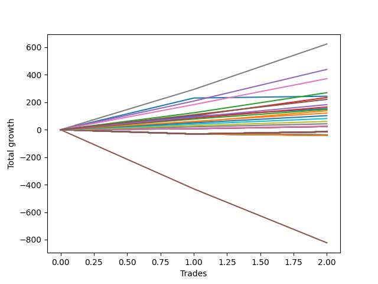

# Long Wallace 013 
- Symbol: ES1y1d
- Date Range: 07/19/2021 - 07/08/2022
- Trading Period: 7:20-12:30
- Number of Trades: 2



| Name | Win Percent | Profit | Avg Profit / Trade | Avg Time / Trade | Avg Profit / Time |      | Name | Win Percent | Profit | Avg Profit / Trade | Avg Time / Trade | Avg Profit / Time |
| ---- | ----------- | ------ | ------------------ | ---------------- | ----------------- | ---- | ---- | ----------- | ------ | ------------------ | ---------------- | ----------------- |
| Sorted By <br> Profit | | | | | | | Sorted By <br> Win Percentage ||||||
| Seven | 100.00 | 312000.00 | 156000.00 | 47 18:05:00 | 3266.78 |     | Seven | 100.00 | 312000.00 | 156000.00 | 47 18:05:00 | 3266.78 |
| Four | 100.00 | 219625.00 | 109812.50 | 46 12:15:00 | 2361.03 |     | Four | 100.00 | 219625.00 | 109812.50 | 46 12:15:00 | 2361.03 |
| Six | 100.00 | 185875.00 | 92937.50 | 16 03:02:00 | 5763.07 |     | Six | 100.00 | 185875.00 | 92937.50 | 16 03:02:00 | 5763.07 |
| Two | 100.00 | 134875.00 | 67437.50 | 38 02:56:30 | 1768.97 |     | Two | 100.00 | 134875.00 | 67437.50 | 38 02:56:30 | 1768.97 |
| Zero | 100.00 | 122000.00 | 61000.00 | 13 12:09:00 | 4516.43 |     | Zero | 100.00 | 122000.00 | 61000.00 | 13 12:09:00 | 4516.43 |
| Three | 100.00 | 117250.00 | 58625.00 | 36 16:49:30 | 1597.37 |     | Three | 100.00 | 117250.00 | 58625.00 | 36 16:49:30 | 1597.37 |
| Seventy-Three | 100.00 | 87750.00 | 43875.00 | 14 02:01:00 | 3115.23 |     | Seventy-Three | 100.00 | 87750.00 | 43875.00 | 14 02:01:00 | 3115.23 |
| One | 100.00 | 69125.00 | 34562.50 | 35 16:10:30 | 968.84 |     | One | 100.00 | 69125.00 | 34562.50 | 35 16:10:30 | 968.84 |
| Ninety | 100.00 | 11250.00 | 5625.00 | 00 02:04:30 | 65060.24 |     | Ninety | 100.00 | 11250.00 | 5625.00 | 00 02:04:30 | 65060.24 |
| Eighty-Nine | 100.00 | 11000.00 | 5500.00 | 00 02:04:00 | 63870.97 |     | Eighty-Nine | 100.00 | 11000.00 | 5500.00 | 00 02:04:00 | 63870.97 |
| Eighty-Eight | 100.00 | 10375.00 | 5187.50 | 00 00:06:00 | 1245000.00 |     | Eighty-Eight | 100.00 | 10375.00 | 5187.50 | 00 00:06:00 | 1245000.00 |
| Eighty-Seven | 100.00 | 7875.00 | 3937.50 | 00 00:05:30 | 1030909.09 |     | Eighty-Seven | 100.00 | 7875.00 | 3937.50 | 00 00:05:30 | 1030909.09 |
| Eighty-Six | 100.00 | 7875.00 | 3937.50 | 00 00:05:30 | 1030909.09 |     | Eighty-Six | 100.00 | 7875.00 | 3937.50 | 00 00:05:30 | 1030909.09 |
| Eighty-Five | 100.00 | 7875.00 | 3937.50 | 00 00:05:30 | 1030909.09 |     | Eighty-Five | 100.00 | 7875.00 | 3937.50 | 00 00:05:30 | 1030909.09 |
| Eighty-Four | 100.00 | 6125.00 | 3062.50 | 00 00:04:00 | 1102500.00 |     | Eighty-Four | 100.00 | 6125.00 | 3062.50 | 00 00:04:00 | 1102500.00 |
| Eighty-Three | 100.00 | 6125.00 | 3062.50 | 00 00:04:00 | 1102500.00 |     | Eighty-Three | 100.00 | 6125.00 | 3062.50 | 00 00:04:00 | 1102500.00 |
| Eighty-Two | 100.00 | 6125.00 | 3062.50 | 00 00:04:00 | 1102500.00 |     | Eighty-Two | 100.00 | 6125.00 | 3062.50 | 00 00:04:00 | 1102500.00 |
| Eighty-One | 100.00 | 6125.00 | 3062.50 | 00 00:04:00 | 1102500.00 |     | Eighty-One | 100.00 | 6125.00 | 3062.50 | 00 00:04:00 | 1102500.00 |
| Five | 0.00 | -411750.00 | -205875.00 | 148 18:28:00 | -1383.85 |     | Five | 0.00 | -411750.00 | -205875.00 | 148 18:28:00 | -1383.85 |

## NO STOPLOSS

### Test Zero
* Sell when price hits the middle line of the 20p bollinger
* No Stoploss
* Results:
```
Total Trades: 2
Percent Up: 100.00
Percent Down: 0.00
Total Points Moved Up: 244.00
Potential Profit: 122000.00
Total Points Ups: 244.00 Count Ups: 2
Total Points Downs: 0.00 Count Downs: 0
```

<details><summary>Trades</summary>

<code>In: 2022-01-25 06:30:00		Out: 2022-02-02 06:39:00		Total Position Time: 08 00:09:00		Total Move Up: 230.50		Total to Date: 230.50</code> <br />
<code>In: 2022-02-25 06:30:00		Out: 2022-03-16 06:39:00		Total Position Time: 19 00:09:00		Total Move Up: 13.50		Total to Date: 244.00</code> <br />


</details>

### Test One
* Sell when the price hits the upper line of the 20p 1std bollinger
* No Stoploss
* Results:
```
Total Trades: 2
Percent Up: 100.00
Percent Down: 0.00
Total Points Moved Up: 138.25
Potential Profit: 69125.00
Total Points Ups: 138.25 Count Ups: 2
Total Points Downs: 0.00 Count Downs: 0
```

<details><summary>Trades</summary>

<code>In: 2022-01-25 06:30:00		Out: 2022-03-17 10:52:00		Total Position Time: 51 04:22:00		Total Move Up: 56.00		Total to Date: 56.00</code> <br />
<code>In: 2022-02-25 06:30:00		Out: 2022-03-17 10:29:00		Total Position Time: 20 03:59:00		Total Move Up: 82.25		Total to Date: 138.25</code> <br />


</details>

### Test Two
* Sell when the price hits the upper line of the 20p 2std bollinger
* No Stoploss
* Results:
```
Total Trades: 2
Percent Up: 100.00
Percent Down: 0.00
Total Points Moved Up: 269.75
Potential Profit: 134875.00
Total Points Ups: 269.75 Count Ups: 2
Total Points Downs: 0.00 Count Downs: 0
```

<details><summary>Trades</summary>

<code>In: 2022-01-25 06:30:00		Out: 2022-03-21 06:33:00		Total Position Time: 55 00:03:00		Total Move Up: 123.25		Total to Date: 123.25</code> <br />
<code>In: 2022-02-25 06:30:00		Out: 2022-03-18 12:20:00		Total Position Time: 21 05:50:00		Total Move Up: 146.50		Total to Date: 269.75</code> <br />


</details>

### Test Three
* Sell when price hits the middle line of the 50p bollinger
* No Stoploss
* Results:
```
Total Trades: 2
Percent Up: 100.00
Percent Down: 0.00
Total Points Moved Up: 234.50
Potential Profit: 117250.00
Total Points Ups: 234.50 Count Ups: 2
Total Points Downs: 0.00 Count Downs: 0
```

<details><summary>Trades</summary>

<code>In: 2022-01-25 06:30:00		Out: 2022-03-18 12:09:00		Total Position Time: 52 05:39:00		Total Move Up: 102.25		Total to Date: 102.25</code> <br />
<code>In: 2022-02-25 06:30:00		Out: 2022-03-18 10:30:00		Total Position Time: 21 04:00:00		Total Move Up: 132.25		Total to Date: 234.50</code> <br />


</details>

### Test Four
* Sell when the price hits the upper line of the 50p 1std bollinger
* No Stoploss
* Results:
```
Total Trades: 2
Percent Up: 100.00
Percent Down: 0.00
Total Points Moved Up: 439.25
Potential Profit: 219625.00
Total Points Ups: 439.25 Count Ups: 2
Total Points Downs: 0.00 Count Downs: 0
```

<details><summary>Trades</summary>

<code>In: 2022-01-25 06:30:00		Out: 2022-03-28 07:00:00		Total Position Time: 62 00:30:00		Total Move Up: 208.50		Total to Date: 208.50</code> <br />
<code>In: 2022-02-25 06:30:00		Out: 2022-03-28 06:30:00		Total Position Time: 31 00:00:00		Total Move Up: 230.75		Total to Date: 439.25</code> <br />


</details>

### Test Five
* Sell when the price hits the upper line of the 50p 2std bollinger
* No Stoploss
* Results:
```
Total Trades: 2
Percent Up: 0.00
Percent Down: 100.00
Total Points Moved Up: -823.50
Potential Profit: -411750.00
Total Points Ups: 0.00 Count Ups: 0
Total Points Downs: -823.50 Count Downs: 2
```

<details><summary>Trades</summary>

<code>In: 2022-01-25 06:30:00		Out: 2022-07-08 12:58:00		Total Position Time: 164 06:28:00		Total Move Up: -430.50		Total to Date: -430.50</code> <br />
<code>In: 2022-02-25 06:30:00		Out: 2022-07-08 12:58:00		Total Position Time: 133 06:28:00		Total Move Up: -393.00		Total to Date: -823.50</code> <br />


</details>

### Test Six
* Sell when the price hits the middle line of the 1std VWAP
* No Stoploss
* Results:
```
Total Trades: 2
Percent Up: 100.00
Percent Down: 0.00
Total Points Moved Up: 371.75
Potential Profit: 185875.00
Total Points Ups: 371.75 Count Ups: 2
Total Points Downs: 0.00 Count Downs: 0
```

<details><summary>Trades</summary>

<code>In: 2022-01-25 06:30:00		Out: 2022-02-01 12:03:00		Total Position Time: 07 05:33:00		Total Move Up: 182.75		Total to Date: 182.75</code> <br />
<code>In: 2022-02-25 06:30:00		Out: 2022-03-22 07:01:00		Total Position Time: 25 00:31:00		Total Move Up: 189.00		Total to Date: 371.75</code> <br />


</details>

### Test Seven
* Sell when the price hits the upper line of the 1std VWAP
* No Stoploss
* Results:
```
Total Trades: 2
Percent Up: 100.00
Percent Down: 0.00
Total Points Moved Up: 624.00
Potential Profit: 312000.00
Total Points Ups: 624.00 Count Ups: 2
Total Points Downs: 0.00 Count Downs: 0
```

<details><summary>Trades</summary>

<code>In: 2022-01-25 06:30:00		Out: 2022-03-29 12:35:00		Total Position Time: 63 06:05:00		Total Move Up: 293.25		Total to Date: 293.25</code> <br />
<code>In: 2022-02-25 06:30:00		Out: 2022-03-29 12:35:00		Total Position Time: 32 06:05:00		Total Move Up: 330.75		Total to Date: 624.00</code> <br />


</details>

## SPECIAL EXIT CONDITIONS 

### Test Seventy-Three
* Sell when the linear regression slope changes to negative
* No Stoploss
* Results:
```
Total Trades: 2
Percent Up: 100.00
Percent Down: 0.00
Total Points Moved Up: 175.50
Potential Profit: 87750.00
Total Points Ups: 175.50 Count Ups: 2
Total Points Downs: 0.00 Count Downs: 0
```

<details><summary>Trades</summary>

<code>In: 2022-01-25 06:30:00		Out: 2022-02-16 09:31:00		Total Position Time: 22 03:01:00		Total Move Up: 96.00		Total to Date: 96.00</code> <br />
<code>In: 2022-02-25 06:30:00		Out: 2022-03-03 07:31:00		Total Position Time: 06 01:01:00		Total Move Up: 79.50		Total to Date: 175.50</code> <br />


</details>

## TAKE PROFIT

### Test Eighty-One
* Take Profit of 1 Point
* No Stoploss
* Results:
```
Total Trades: 2
Percent Up: 100.00
Percent Down: 0.00
Total Points Moved Up: 12.25
Potential Profit: 6125.00
Total Points Ups: 12.25 Count Ups: 2
Total Points Downs: 0.00 Count Downs: 0
```

<details><summary>Trades</summary>

<code>In: 2022-01-25 06:30:00		Out: 2022-01-25 06:34:00		Total Position Time: 00 00:04:00		Total Move Up: 4.75		Total to Date: 4.75</code> <br />
<code>In: 2022-02-25 06:30:00		Out: 2022-02-25 06:34:00		Total Position Time: 00 00:04:00		Total Move Up: 7.50		Total to Date: 12.25</code> <br />


</details>

### Test Eighty-Two
* Take Profit of 2 Point
* No Stoploss
* Results:
```
Total Trades: 2
Percent Up: 100.00
Percent Down: 0.00
Total Points Moved Up: 12.25
Potential Profit: 6125.00
Total Points Ups: 12.25 Count Ups: 2
Total Points Downs: 0.00 Count Downs: 0
```

<details><summary>Trades</summary>

<code>In: 2022-01-25 06:30:00		Out: 2022-01-25 06:34:00		Total Position Time: 00 00:04:00		Total Move Up: 4.75		Total to Date: 4.75</code> <br />
<code>In: 2022-02-25 06:30:00		Out: 2022-02-25 06:34:00		Total Position Time: 00 00:04:00		Total Move Up: 7.50		Total to Date: 12.25</code> <br />


</details>

### Test Eighty-Three
* Take Profit of 3 Point
* No Stoploss
* Results:
```
Total Trades: 2
Percent Up: 100.00
Percent Down: 0.00
Total Points Moved Up: 12.25
Potential Profit: 6125.00
Total Points Ups: 12.25 Count Ups: 2
Total Points Downs: 0.00 Count Downs: 0
```

<details><summary>Trades</summary>

<code>In: 2022-01-25 06:30:00		Out: 2022-01-25 06:34:00		Total Position Time: 00 00:04:00		Total Move Up: 4.75		Total to Date: 4.75</code> <br />
<code>In: 2022-02-25 06:30:00		Out: 2022-02-25 06:34:00		Total Position Time: 00 00:04:00		Total Move Up: 7.50		Total to Date: 12.25</code> <br />


</details>

### Test Eighty-Four
* Take Profit of 4 Point
* No Stoploss
* Results:
```
Total Trades: 2
Percent Up: 100.00
Percent Down: 0.00
Total Points Moved Up: 12.25
Potential Profit: 6125.00
Total Points Ups: 12.25 Count Ups: 2
Total Points Downs: 0.00 Count Downs: 0
```

<details><summary>Trades</summary>

<code>In: 2022-01-25 06:30:00		Out: 2022-01-25 06:34:00		Total Position Time: 00 00:04:00		Total Move Up: 4.75		Total to Date: 4.75</code> <br />
<code>In: 2022-02-25 06:30:00		Out: 2022-02-25 06:34:00		Total Position Time: 00 00:04:00		Total Move Up: 7.50		Total to Date: 12.25</code> <br />


</details>

### Test Eighty-Five
* Take Profit of 5 Point
* No Stoploss
* Results:
```
Total Trades: 2
Percent Up: 100.00
Percent Down: 0.00
Total Points Moved Up: 15.75
Potential Profit: 7875.00
Total Points Ups: 15.75 Count Ups: 2
Total Points Downs: 0.00 Count Downs: 0
```

<details><summary>Trades</summary>

<code>In: 2022-01-25 06:30:00		Out: 2022-01-25 06:37:00		Total Position Time: 00 00:07:00		Total Move Up: 8.25		Total to Date: 8.25</code> <br />
<code>In: 2022-02-25 06:30:00		Out: 2022-02-25 06:34:00		Total Position Time: 00 00:04:00		Total Move Up: 7.50		Total to Date: 15.75</code> <br />


</details>

### Test Eighty-Six
* Take Profit of 6 Point
* No Stoploss
* Results:
```
Total Trades: 2
Percent Up: 100.00
Percent Down: 0.00
Total Points Moved Up: 15.75
Potential Profit: 7875.00
Total Points Ups: 15.75 Count Ups: 2
Total Points Downs: 0.00 Count Downs: 0
```

<details><summary>Trades</summary>

<code>In: 2022-01-25 06:30:00		Out: 2022-01-25 06:37:00		Total Position Time: 00 00:07:00		Total Move Up: 8.25		Total to Date: 8.25</code> <br />
<code>In: 2022-02-25 06:30:00		Out: 2022-02-25 06:34:00		Total Position Time: 00 00:04:00		Total Move Up: 7.50		Total to Date: 15.75</code> <br />


</details>

### Test Eighty-Seven
* Take Profit of 7 Point
* No Stoploss
* Results:
```
Total Trades: 2
Percent Up: 100.00
Percent Down: 0.00
Total Points Moved Up: 15.75
Potential Profit: 7875.00
Total Points Ups: 15.75 Count Ups: 2
Total Points Downs: 0.00 Count Downs: 0
```

<details><summary>Trades</summary>

<code>In: 2022-01-25 06:30:00		Out: 2022-01-25 06:37:00		Total Position Time: 00 00:07:00		Total Move Up: 8.25		Total to Date: 8.25</code> <br />
<code>In: 2022-02-25 06:30:00		Out: 2022-02-25 06:34:00		Total Position Time: 00 00:04:00		Total Move Up: 7.50		Total to Date: 15.75</code> <br />


</details>

### Test Eighty-Eight
* Take Profit of 8 Point
* No Stoploss
* Results:
```
Total Trades: 2
Percent Up: 100.00
Percent Down: 0.00
Total Points Moved Up: 20.75
Potential Profit: 10375.00
Total Points Ups: 20.75 Count Ups: 2
Total Points Downs: 0.00 Count Downs: 0
```

<details><summary>Trades</summary>

<code>In: 2022-01-25 06:30:00		Out: 2022-01-25 06:37:00		Total Position Time: 00 00:07:00		Total Move Up: 8.25		Total to Date: 8.25</code> <br />
<code>In: 2022-02-25 06:30:00		Out: 2022-02-25 06:35:00		Total Position Time: 00 00:05:00		Total Move Up: 12.50		Total to Date: 20.75</code> <br />


</details>

### Test Eighty-Nine
* Take Profit of 9 Point
* No Stoploss
* Results:
```
Total Trades: 2
Percent Up: 100.00
Percent Down: 0.00
Total Points Moved Up: 22.00
Potential Profit: 11000.00
Total Points Ups: 22.00 Count Ups: 2
Total Points Downs: 0.00 Count Downs: 0
```

<details><summary>Trades</summary>

<code>In: 2022-01-25 06:30:00		Out: 2022-01-25 10:33:00		Total Position Time: 00 04:03:00		Total Move Up: 9.50		Total to Date: 9.50</code> <br />
<code>In: 2022-02-25 06:30:00		Out: 2022-02-25 06:35:00		Total Position Time: 00 00:05:00		Total Move Up: 12.50		Total to Date: 22.00</code> <br />


</details>

### Test Ninety
* Take Profit of 10 Point
* No Stoploss
* Results:
```
Total Trades: 2
Percent Up: 100.00
Percent Down: 0.00
Total Points Moved Up: 22.50
Potential Profit: 11250.00
Total Points Ups: 22.50 Count Ups: 2
Total Points Downs: 0.00 Count Downs: 0
```

<details><summary>Trades</summary>

<code>In: 2022-01-25 06:30:00		Out: 2022-01-25 10:34:00		Total Position Time: 00 04:04:00		Total Move Up: 10.00		Total to Date: 10.00</code> <br />
<code>In: 2022-02-25 06:30:00		Out: 2022-02-25 06:35:00		Total Position Time: 00 00:05:00		Total Move Up: 12.50		Total to Date: 22.50</code> <br />


</details>