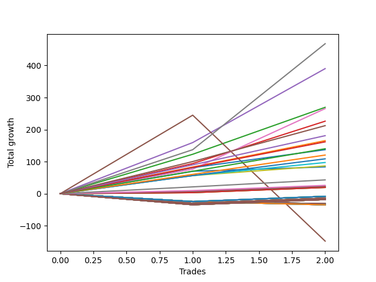

# Long Wallace 014 
- Symbol: ES1y1d
- Date Range: 07/19/2021 - 07/08/2022
- Trading Period: 7:20-12:30
- Number of Trades: 2



| Name | Win Percent | Profit | Avg Profit / Trade | Avg Time / Trade |      | Name | Win Percent | Profit | Avg Profit / Trade | Avg Time / Trade |
| ---- | ----------- | ------ | ------------------ | ---------------- | ---- | ---- | ----------- | ------ | ------------------ | ---------------- |
| Sorted By <br> Profit | | | | | | Sorted By <br> Win Percentage ||||
| Seven | 100.00 | 234000.00 | 117000.00 | 23 03:06:30 |     | Seven | 100.00 | 234000.00 | 117000.00 | 23 03:06:30 |
| Four | 100.00 | 195125.00 | 97562.50 | 22 23:14:00 |     | Four | 100.00 | 195125.00 | 97562.50 | 22 23:14:00 |
| Two | 100.00 | 134750.00 | 67375.00 | 16 03:00:30 |     | Two | 100.00 | 134750.00 | 67375.00 | 16 03:00:30 |
| Six | 100.00 | 132750.00 | 66375.00 | 13 23:39:30 |     | Six | 100.00 | 132750.00 | 66375.00 | 13 23:39:30 |
| Three | 100.00 | 113125.00 | 56562.50 | 15 15:22:30 |     | Three | 100.00 | 113125.00 | 56562.50 | 15 15:22:30 |
| Three Hundred | 100.00 | 106125.00 | 53062.50 | 08 02:35:30 |     | Three Hundred | 100.00 | 106125.00 | 53062.50 | 08 02:35:30 |
| Two Hundred Nine | 100.00 | 90500.00 | 45250.00 | 07 14:25:00 |     | Two Hundred Nine | 100.00 | 90500.00 | 45250.00 | 07 14:25:00 |
| One | 100.00 | 82750.00 | 41375.00 | 15 02:13:30 |     | One | 100.00 | 82750.00 | 41375.00 | 15 02:13:30 |
| Two Hundred Eight | 100.00 | 80875.00 | 40437.50 | 01 13:34:00 |     | Two Hundred Eight | 100.00 | 80875.00 | 40437.50 | 01 13:34:00 |
| Two Hundred Seven | 100.00 | 70125.00 | 35062.50 | 01 12:26:30 |     | Two Hundred Seven | 100.00 | 70125.00 | 35062.50 | 01 12:26:30 |
| Seventy-Three | 100.00 | 68625.00 | 34312.50 | 08 01:01:00 |     | Seventy-Three | 100.00 | 68625.00 | 34312.50 | 08 01:01:00 |
| Two Hundred Six | 100.00 | 60250.00 | 30125.00 | 01 12:07:00 |     | Two Hundred Six | 100.00 | 60250.00 | 30125.00 | 01 12:07:00 |
| Two Hundred Five | 100.00 | 54375.00 | 27187.50 | 01 12:01:30 |     | Two Hundred Five | 100.00 | 54375.00 | 27187.50 | 01 12:01:30 |
| Two Hundred Four | 100.00 | 48625.00 | 24312.50 | 01 11:52:30 |     | Two Hundred Four | 100.00 | 48625.00 | 24312.50 | 01 11:52:30 |
| Two Hundred Three | 100.00 | 43375.00 | 21687.50 | 01 11:47:00 |     | Two Hundred Three | 100.00 | 43375.00 | 21687.50 | 01 11:47:00 |
| Zero | 100.00 | 41750.00 | 20875.00 | 10 23:16:30 |     | Zero | 100.00 | 41750.00 | 20875.00 | 10 23:16:30 |
| Two Hundred Two | 100.00 | 21500.00 | 10750.00 | 00 12:26:00 |     | Two Hundred Two | 100.00 | 21500.00 | 10750.00 | 00 12:26:00 |
| Two Hundred One | 100.00 | 13000.00 | 6500.00 | 00 12:06:30 |     | Two Hundred One | 100.00 | 13000.00 | 6500.00 | 00 12:06:30 |
| Eighty-Five | 100.00 | 11625.00 | 5812.50 | 00 12:04:30 |     | Eighty-Five | 100.00 | 11625.00 | 5812.50 | 00 12:04:30 |
| Eighty-Four | 100.00 | 11625.00 | 5812.50 | 00 12:04:30 |     | Eighty-Four | 100.00 | 11625.00 | 5812.50 | 00 12:04:30 |
| Eighty-Three | 100.00 | 9750.00 | 4875.00 | 00 12:02:30 |     | Eighty-Three | 100.00 | 9750.00 | 4875.00 | 00 12:02:30 |
| Eighty-Two | 100.00 | 9750.00 | 4875.00 | 00 12:02:30 |     | Eighty-Two | 100.00 | 9750.00 | 4875.00 | 00 12:02:30 |
| Eighty-One | 100.00 | 9750.00 | 4875.00 | 00 12:02:30 |     | Eighty-One | 100.00 | 9750.00 | 4875.00 | 00 12:02:30 |
| One Hundred Twenty-Five | 50.00 | -4125.00 | -2062.50 | 00 00:03:00 |     | One Hundred Twenty-Five | 50.00 | -4125.00 | -2062.50 | 00 00:03:00 |
| One Hundred Twenty-Four | 50.00 | -4125.00 | -2062.50 | 00 00:03:00 |     | One Hundred Twenty-Four | 50.00 | -4125.00 | -2062.50 | 00 00:03:00 |
| One Hundred Twenty-Three | 50.00 | -4125.00 | -2062.50 | 00 00:03:00 |     | One Hundred Twenty-Three | 50.00 | -4125.00 | -2062.50 | 00 00:03:00 |
| One Hundred Twenty-Two | 50.00 | -4125.00 | -2062.50 | 00 00:03:00 |     | One Hundred Twenty-Two | 50.00 | -4125.00 | -2062.50 | 00 00:03:00 |
| One Hundred Twenty-One | 50.00 | -4125.00 | -2062.50 | 00 00:03:00 |     | One Hundred Twenty-One | 50.00 | -4125.00 | -2062.50 | 00 00:03:00 |
| One Hundred Fifteen | 50.00 | -4125.00 | -2062.50 | 00 00:03:00 |     | One Hundred Fifteen | 50.00 | -4125.00 | -2062.50 | 00 00:03:00 |
| One Hundred Fourteen | 50.00 | -4125.00 | -2062.50 | 00 00:03:00 |     | One Hundred Fourteen | 50.00 | -4125.00 | -2062.50 | 00 00:03:00 |
| One Hundred Thirteen | 50.00 | -4125.00 | -2062.50 | 00 00:03:00 |     | One Hundred Thirteen | 50.00 | -4125.00 | -2062.50 | 00 00:03:00 |
| One Hundred Twelve | 50.00 | -4125.00 | -2062.50 | 00 00:03:00 |     | One Hundred Twelve | 50.00 | -4125.00 | -2062.50 | 00 00:03:00 |
| One Hundred Eleven | 50.00 | -4125.00 | -2062.50 | 00 00:03:00 |     | One Hundred Eleven | 50.00 | -4125.00 | -2062.50 | 00 00:03:00 |
| One Hundred Twenty | 50.00 | -7000.00 | -3500.00 | 00 00:04:30 |     | One Hundred Twenty | 50.00 | -7000.00 | -3500.00 | 00 00:04:30 |
| One Hundred Ninteen | 50.00 | -7000.00 | -3500.00 | 00 00:04:30 |     | One Hundred Ninteen | 50.00 | -7000.00 | -3500.00 | 00 00:04:30 |
| One Hundred Eighteen | 50.00 | -7000.00 | -3500.00 | 00 00:04:30 |     | One Hundred Eighteen | 50.00 | -7000.00 | -3500.00 | 00 00:04:30 |
| One Hundred Seventeen | 50.00 | -7000.00 | -3500.00 | 00 00:04:30 |     | One Hundred Seventeen | 50.00 | -7000.00 | -3500.00 | 00 00:04:30 |
| One Hundred Sixteen | 50.00 | -7000.00 | -3500.00 | 00 00:04:30 |     | One Hundred Sixteen | 50.00 | -7000.00 | -3500.00 | 00 00:04:30 |
| Fifty-Five | 50.00 | -7000.00 | -3500.00 | 00 00:04:30 |     | Fifty-Five | 50.00 | -7000.00 | -3500.00 | 00 00:04:30 |
| Fifty-Four | 50.00 | -7000.00 | -3500.00 | 00 00:04:30 |     | Fifty-Four | 50.00 | -7000.00 | -3500.00 | 00 00:04:30 |
| Fifty-Three | 50.00 | -7000.00 | -3500.00 | 00 00:04:30 |     | Fifty-Three | 50.00 | -7000.00 | -3500.00 | 00 00:04:30 |
| Fifty-Two | 50.00 | -7000.00 | -3500.00 | 00 00:04:30 |     | Fifty-Two | 50.00 | -7000.00 | -3500.00 | 00 00:04:30 |
| Fifty-One | 50.00 | -7000.00 | -3500.00 | 00 00:04:30 |     | Fifty-One | 50.00 | -7000.00 | -3500.00 | 00 00:04:30 |
| Fifty | 50.00 | -7000.00 | -3500.00 | 00 00:04:30 |     | Fifty | 50.00 | -7000.00 | -3500.00 | 00 00:04:30 |
| Forty-Nine | 50.00 | -7000.00 | -3500.00 | 00 00:04:30 |     | Forty-Nine | 50.00 | -7000.00 | -3500.00 | 00 00:04:30 |
| Forty-Eight | 50.00 | -7000.00 | -3500.00 | 00 00:04:30 |     | Forty-Eight | 50.00 | -7000.00 | -3500.00 | 00 00:04:30 |
| One Hundred Thirty | 50.00 | -9125.00 | -4562.50 | 00 00:06:30 |     | One Hundred Thirty | 50.00 | -9125.00 | -4562.50 | 00 00:06:30 |
| One Hundred Twenty-Nine | 50.00 | -9125.00 | -4562.50 | 00 00:06:30 |     | One Hundred Twenty-Nine | 50.00 | -9125.00 | -4562.50 | 00 00:06:30 |
| One Hundred Twenty-Eight | 50.00 | -9125.00 | -4562.50 | 00 00:06:30 |     | One Hundred Twenty-Eight | 50.00 | -9125.00 | -4562.50 | 00 00:06:30 |
| One Hundred Twenty-Seven | 50.00 | -9125.00 | -4562.50 | 00 00:06:30 |     | One Hundred Twenty-Seven | 50.00 | -9125.00 | -4562.50 | 00 00:06:30 |
| One Hundred Twenty-Six | 50.00 | -9125.00 | -4562.50 | 00 00:06:30 |     | One Hundred Twenty-Six | 50.00 | -9125.00 | -4562.50 | 00 00:06:30 |
| Seventy-One | 50.00 | -9125.00 | -4562.50 | 00 00:06:30 |     | Seventy-One | 50.00 | -9125.00 | -4562.50 | 00 00:06:30 |
| Seventy | 50.00 | -9125.00 | -4562.50 | 00 00:06:30 |     | Seventy | 50.00 | -9125.00 | -4562.50 | 00 00:06:30 |
| Sixty-Nine | 50.00 | -9125.00 | -4562.50 | 00 00:06:30 |     | Sixty-Nine | 50.00 | -9125.00 | -4562.50 | 00 00:06:30 |
| Sixty-Eight | 50.00 | -9125.00 | -4562.50 | 00 00:06:30 |     | Sixty-Eight | 50.00 | -9125.00 | -4562.50 | 00 00:06:30 |
| Sixty-Seven | 50.00 | -9125.00 | -4562.50 | 00 00:06:30 |     | Sixty-Seven | 50.00 | -9125.00 | -4562.50 | 00 00:06:30 |
| Sixty-Six | 50.00 | -9125.00 | -4562.50 | 00 00:06:30 |     | Sixty-Six | 50.00 | -9125.00 | -4562.50 | 00 00:06:30 |
| Sixty-Five | 50.00 | -9125.00 | -4562.50 | 00 00:06:30 |     | Sixty-Five | 50.00 | -9125.00 | -4562.50 | 00 00:06:30 |
| Sixty-Four | 50.00 | -9125.00 | -4562.50 | 00 00:06:30 |     | Sixty-Four | 50.00 | -9125.00 | -4562.50 | 00 00:06:30 |
| Forty-Seven | 0.00 | -15625.00 | -7812.50 | 02 00:55:30 |     | Five | 50.00 | -74000.00 | -37000.00 | 77 14:26:00 |
| Forty-Six | 0.00 | -15625.00 | -7812.50 | 02 00:55:30 |     | Forty-Seven | 0.00 | -15625.00 | -7812.50 | 02 00:55:30 |
| Forty-Five | 0.00 | -15625.00 | -7812.50 | 02 00:55:30 |     | Forty-Six | 0.00 | -15625.00 | -7812.50 | 02 00:55:30 |
| Forty-Four | 0.00 | -15625.00 | -7812.50 | 02 00:55:30 |     | Forty-Five | 0.00 | -15625.00 | -7812.50 | 02 00:55:30 |
| Forty-Three | 0.00 | -15625.00 | -7812.50 | 02 00:55:30 |     | Forty-Four | 0.00 | -15625.00 | -7812.50 | 02 00:55:30 |
| Forty-Two | 0.00 | -15625.00 | -7812.50 | 02 00:55:30 |     | Forty-Three | 0.00 | -15625.00 | -7812.50 | 02 00:55:30 |
| Forty-One | 0.00 | -15625.00 | -7812.50 | 02 00:55:30 |     | Forty-Two | 0.00 | -15625.00 | -7812.50 | 02 00:55:30 |
| Forty | 0.00 | -15625.00 | -7812.50 | 02 00:55:30 |     | Forty-One | 0.00 | -15625.00 | -7812.50 | 02 00:55:30 |
| Sixty-Three | 0.00 | -17375.00 | -8687.50 | 02 00:56:30 |     | Forty | 0.00 | -15625.00 | -7812.50 | 02 00:55:30 |
| Sixty-Two | 0.00 | -17375.00 | -8687.50 | 02 00:56:30 |     | Sixty-Three | 0.00 | -17375.00 | -8687.50 | 02 00:56:30 |
| Sixty-One | 0.00 | -17375.00 | -8687.50 | 02 00:56:30 |     | Sixty-Two | 0.00 | -17375.00 | -8687.50 | 02 00:56:30 |
| Sixty | 0.00 | -17375.00 | -8687.50 | 02 00:56:30 |     | Sixty-One | 0.00 | -17375.00 | -8687.50 | 02 00:56:30 |
| Fifty-Nine | 0.00 | -17375.00 | -8687.50 | 02 00:56:30 |     | Sixty | 0.00 | -17375.00 | -8687.50 | 02 00:56:30 |
| Fifty-Eight | 0.00 | -17375.00 | -8687.50 | 02 00:56:30 |     | Fifty-Nine | 0.00 | -17375.00 | -8687.50 | 02 00:56:30 |
| Fifty-Seven | 0.00 | -17375.00 | -8687.50 | 02 00:56:30 |     | Fifty-Eight | 0.00 | -17375.00 | -8687.50 | 02 00:56:30 |
| Fifty-Six | 0.00 | -17375.00 | -8687.50 | 02 00:56:30 |     | Fifty-Seven | 0.00 | -17375.00 | -8687.50 | 02 00:56:30 |
| Five | 50.00 | -74000.00 | -37000.00 | 77 14:26:00 |     | Fifty-Six | 0.00 | -17375.00 | -8687.50 | 02 00:56:30 |

## NO STOPLOSS

### Test Zero
* Sell when price hits the middle line of the 20p bollinger
* No Stoploss
* Results:
```
Total Trades: 2
Percent Up: 100.00
Percent Down: 0.00
Total Points Moved Up: 83.50
Potential Profit: 41750.00
Total Points Ups: 83.50 Count Ups: 2
Total Points Downs: 0.00 Count Downs: 0
```

<details><summary>Trades</summary>

<code>In: 2021-10-04 07:21:00		Out: 2021-10-07 06:36:00		Total Position Time: 02 23:15:00		Total Move Up: 70.00		Total to Date: 70.00</code> <br />
<code>In: 2022-02-25 07:21:00		Out: 2022-03-16 06:39:00		Total Position Time: 18 23:18:00		Total Move Up: 13.50		Total to Date: 83.50</code> <br />


</details>

### Test One
* Sell when the price hits the upper line of the 20p 1std bollinger
* No Stoploss
* Results:
```
Total Trades: 2
Percent Up: 100.00
Percent Down: 0.00
Total Points Moved Up: 165.50
Potential Profit: 82750.00
Total Points Ups: 165.50 Count Ups: 2
Total Points Downs: 0.00 Count Downs: 0
```

<details><summary>Trades</summary>

<code>In: 2021-10-04 07:21:00		Out: 2021-10-14 08:40:00		Total Position Time: 10 01:19:00		Total Move Up: 83.25		Total to Date: 83.25</code> <br />
<code>In: 2022-02-25 07:21:00		Out: 2022-03-17 10:29:00		Total Position Time: 20 03:08:00		Total Move Up: 82.25		Total to Date: 165.50</code> <br />


</details>

### Test Two
* Sell when the price hits the upper line of the 20p 2std bollinger
* No Stoploss
* Results:
```
Total Trades: 2
Percent Up: 100.00
Percent Down: 0.00
Total Points Moved Up: 269.50
Potential Profit: 134750.00
Total Points Ups: 269.50 Count Ups: 2
Total Points Downs: 0.00 Count Downs: 0
```

<details><summary>Trades</summary>

<code>In: 2021-10-04 07:21:00		Out: 2021-10-15 08:23:00		Total Position Time: 11 01:02:00		Total Move Up: 123.00		Total to Date: 123.00</code> <br />
<code>In: 2022-02-25 07:21:00		Out: 2022-03-18 12:20:00		Total Position Time: 21 04:59:00		Total Move Up: 146.50		Total to Date: 269.50</code> <br />


</details>

### Test Three
* Sell when price hits the middle line of the 50p bollinger
* No Stoploss
* Results:
```
Total Trades: 2
Percent Up: 100.00
Percent Down: 0.00
Total Points Moved Up: 226.25
Potential Profit: 113125.00
Total Points Ups: 226.25 Count Ups: 2
Total Points Downs: 0.00 Count Downs: 0
```

<details><summary>Trades</summary>

<code>In: 2021-10-04 07:21:00		Out: 2021-10-14 10:57:00		Total Position Time: 10 03:36:00		Total Move Up: 94.00		Total to Date: 94.00</code> <br />
<code>In: 2022-02-25 07:21:00		Out: 2022-03-18 10:30:00		Total Position Time: 21 03:09:00		Total Move Up: 132.25		Total to Date: 226.25</code> <br />


</details>

### Test Four
* Sell when the price hits the upper line of the 50p 1std bollinger
* No Stoploss
* Results:
```
Total Trades: 2
Percent Up: 100.00
Percent Down: 0.00
Total Points Moved Up: 390.25
Potential Profit: 195125.00
Total Points Ups: 390.25 Count Ups: 2
Total Points Downs: 0.00 Count Downs: 0
```

<details><summary>Trades</summary>

<code>In: 2021-10-04 07:21:00		Out: 2021-10-19 06:40:00		Total Position Time: 14 23:19:00		Total Move Up: 159.50		Total to Date: 159.50</code> <br />
<code>In: 2022-02-25 07:21:00		Out: 2022-03-28 06:30:00		Total Position Time: 30 23:09:00		Total Move Up: 230.75		Total to Date: 390.25</code> <br />


</details>

### Test Five
* Sell when the price hits the upper line of the 50p 2std bollinger
* No Stoploss
* Results:
```
Total Trades: 2
Percent Up: 50.00
Percent Down: 50.00
Total Points Moved Up: -148.00
Potential Profit: -74000.00
Total Points Ups: 245.00 Count Ups: 1
Total Points Downs: -393.00 Count Downs: 1
```

<details><summary>Trades</summary>

<code>In: 2021-10-04 07:21:00		Out: 2021-10-26 06:36:00		Total Position Time: 21 23:15:00		Total Move Up: 245.00		Total to Date: 245.00</code> <br />
<code>In: 2022-02-25 07:21:00		Out: 2022-07-08 12:58:00		Total Position Time: 133 05:37:00		Total Move Up: -393.00		Total to Date: -148.00</code> <br />


</details>

### Test Six
* Sell when the price hits the middle line of the 1std VWAP
* No Stoploss
* Results:
```
Total Trades: 2
Percent Up: 100.00
Percent Down: 0.00
Total Points Moved Up: 265.50
Potential Profit: 132750.00
Total Points Ups: 265.50 Count Ups: 2
Total Points Downs: 0.00 Count Downs: 0
```

<details><summary>Trades</summary>

<code>In: 2021-10-04 07:21:00		Out: 2021-10-07 07:00:00		Total Position Time: 02 23:39:00		Total Move Up: 76.50		Total to Date: 76.50</code> <br />
<code>In: 2022-02-25 07:21:00		Out: 2022-03-22 07:01:00		Total Position Time: 24 23:40:00		Total Move Up: 189.00		Total to Date: 265.50</code> <br />


</details>

### Test Seven
* Sell when the price hits the upper line of the 1std VWAP
* No Stoploss
* Results:
```
Total Trades: 2
Percent Up: 100.00
Percent Down: 0.00
Total Points Moved Up: 468.00
Potential Profit: 234000.00
Total Points Ups: 468.00 Count Ups: 2
Total Points Downs: 0.00 Count Downs: 0
```

<details><summary>Trades</summary>

<code>In: 2021-10-04 07:21:00		Out: 2021-10-18 08:20:00		Total Position Time: 14 00:59:00		Total Move Up: 137.25		Total to Date: 137.25</code> <br />
<code>In: 2022-02-25 07:21:00		Out: 2022-03-29 12:35:00		Total Position Time: 32 05:14:00		Total Move Up: 330.75		Total to Date: 468.00</code> <br />


</details>

## STOPLOSS OF 5

### Test Forty
* Sell when price hits the middle line of the 20p bollinger
* Stoploss is 5 points
* Results:
```
Total Trades: 2
Percent Up: 0.00
Percent Down: 100.00
Total Points Moved Up: -31.25
Potential Profit: -15625.00
Total Points Ups: 0.00 Count Ups: 0
Total Points Downs: -31.25 Count Downs: 2
```

<details><summary>Trades</summary>

<code>In: 2021-10-04 07:21:00		Out: 2021-10-04 07:24:00		Total Position Time: 00 00:03:00		Total Move Up: -24.50		Total to Date: -24.50</code> <br />
<code>In: 2022-02-25 07:21:00		Out: 2022-03-01 09:09:00		Total Position Time: 04 01:48:00		Total Move Up: -6.75		Total to Date: -31.25</code> <br />


</details>

### Test Forty-One
* Sell when the price hits the upper line of the 20p 1std bollinger
* Stoploss is 5 points
* Results:
```
Total Trades: 2
Percent Up: 0.00
Percent Down: 100.00
Total Points Moved Up: -31.25
Potential Profit: -15625.00
Total Points Ups: 0.00 Count Ups: 0
Total Points Downs: -31.25 Count Downs: 2
```

<details><summary>Trades</summary>

<code>In: 2021-10-04 07:21:00		Out: 2021-10-04 07:24:00		Total Position Time: 00 00:03:00		Total Move Up: -24.50		Total to Date: -24.50</code> <br />
<code>In: 2022-02-25 07:21:00		Out: 2022-03-01 09:09:00		Total Position Time: 04 01:48:00		Total Move Up: -6.75		Total to Date: -31.25</code> <br />


</details>

### Test Forty-Two
* Sell when the price hits the upper line of the 20p 2std bollinger
* Stoploss is 5 points
* Results:
```
Total Trades: 2
Percent Up: 0.00
Percent Down: 100.00
Total Points Moved Up: -31.25
Potential Profit: -15625.00
Total Points Ups: 0.00 Count Ups: 0
Total Points Downs: -31.25 Count Downs: 2
```

<details><summary>Trades</summary>

<code>In: 2021-10-04 07:21:00		Out: 2021-10-04 07:24:00		Total Position Time: 00 00:03:00		Total Move Up: -24.50		Total to Date: -24.50</code> <br />
<code>In: 2022-02-25 07:21:00		Out: 2022-03-01 09:09:00		Total Position Time: 04 01:48:00		Total Move Up: -6.75		Total to Date: -31.25</code> <br />


</details>

### Test Forty-Three
* Sell when price hits the middle line of the 50p bollinger
* Stoploss is 5 points
* Results:
```
Total Trades: 2
Percent Up: 0.00
Percent Down: 100.00
Total Points Moved Up: -31.25
Potential Profit: -15625.00
Total Points Ups: 0.00 Count Ups: 0
Total Points Downs: -31.25 Count Downs: 2
```

<details><summary>Trades</summary>

<code>In: 2021-10-04 07:21:00		Out: 2021-10-04 07:24:00		Total Position Time: 00 00:03:00		Total Move Up: -24.50		Total to Date: -24.50</code> <br />
<code>In: 2022-02-25 07:21:00		Out: 2022-03-01 09:09:00		Total Position Time: 04 01:48:00		Total Move Up: -6.75		Total to Date: -31.25</code> <br />


</details>

### Test Forty-Four
* Sell when the price hits the upper line of the 50p 1std bollinger
* Stoploss is 5 points
* Results:
```
Total Trades: 2
Percent Up: 0.00
Percent Down: 100.00
Total Points Moved Up: -31.25
Potential Profit: -15625.00
Total Points Ups: 0.00 Count Ups: 0
Total Points Downs: -31.25 Count Downs: 2
```

<details><summary>Trades</summary>

<code>In: 2021-10-04 07:21:00		Out: 2021-10-04 07:24:00		Total Position Time: 00 00:03:00		Total Move Up: -24.50		Total to Date: -24.50</code> <br />
<code>In: 2022-02-25 07:21:00		Out: 2022-03-01 09:09:00		Total Position Time: 04 01:48:00		Total Move Up: -6.75		Total to Date: -31.25</code> <br />


</details>

### Test Forty-Five
* Sell when the price hits the upper line of the 50p 2std bollinger
* Stoploss is 5 points
* Results:
```
Total Trades: 2
Percent Up: 0.00
Percent Down: 100.00
Total Points Moved Up: -31.25
Potential Profit: -15625.00
Total Points Ups: 0.00 Count Ups: 0
Total Points Downs: -31.25 Count Downs: 2
```

<details><summary>Trades</summary>

<code>In: 2021-10-04 07:21:00		Out: 2021-10-04 07:24:00		Total Position Time: 00 00:03:00		Total Move Up: -24.50		Total to Date: -24.50</code> <br />
<code>In: 2022-02-25 07:21:00		Out: 2022-03-01 09:09:00		Total Position Time: 04 01:48:00		Total Move Up: -6.75		Total to Date: -31.25</code> <br />


</details>

### Test Forty-Six
* Sell when the price hits the middle line of the 1std VWAP
* Stoploss is 5 points
* Results:
```
Total Trades: 2
Percent Up: 0.00
Percent Down: 100.00
Total Points Moved Up: -31.25
Potential Profit: -15625.00
Total Points Ups: 0.00 Count Ups: 0
Total Points Downs: -31.25 Count Downs: 2
```

<details><summary>Trades</summary>

<code>In: 2021-10-04 07:21:00		Out: 2021-10-04 07:24:00		Total Position Time: 00 00:03:00		Total Move Up: -24.50		Total to Date: -24.50</code> <br />
<code>In: 2022-02-25 07:21:00		Out: 2022-03-01 09:09:00		Total Position Time: 04 01:48:00		Total Move Up: -6.75		Total to Date: -31.25</code> <br />


</details>

### Test Forty-Seven
* Sell when the price hits the upper line of the 1std VWAP
* Stoploss is 5 points
* Results:
```
Total Trades: 2
Percent Up: 0.00
Percent Down: 100.00
Total Points Moved Up: -31.25
Potential Profit: -15625.00
Total Points Ups: 0.00 Count Ups: 0
Total Points Downs: -31.25 Count Downs: 2
```

<details><summary>Trades</summary>

<code>In: 2021-10-04 07:21:00		Out: 2021-10-04 07:24:00		Total Position Time: 00 00:03:00		Total Move Up: -24.50		Total to Date: -24.50</code> <br />
<code>In: 2022-02-25 07:21:00		Out: 2022-03-01 09:09:00		Total Position Time: 04 01:48:00		Total Move Up: -6.75		Total to Date: -31.25</code> <br />


</details>

## TRAIL STOP OF 5

### Test Forty-Eight
* Sell when price hits the middle line of the 20p bollinger
* Trailing Stop is 5 points
* Results:
```
Total Trades: 2
Percent Up: 50.00
Percent Down: 50.00
Total Points Moved Up: -14.00
Potential Profit: -7000.00
Total Points Ups: 16.25 Count Ups: 1
Total Points Downs: -30.25 Count Downs: 1
```

<details><summary>Trades</summary>

<code>In: 2021-10-04 07:21:00		Out: 2021-10-04 07:27:00		Total Position Time: 00 00:06:00		Total Move Up: -30.25		Total to Date: -30.25</code> <br />
<code>In: 2022-02-25 07:21:00		Out: 2022-02-25 07:24:00		Total Position Time: 00 00:03:00		Total Move Up: 16.25		Total to Date: -14.00</code> <br />


</details>

### Test Forty-Nine
* Sell when the price hits the upper line of the 20p 1std bollinger
* Trailing Stop is 5 points
* Results:
```
Total Trades: 2
Percent Up: 50.00
Percent Down: 50.00
Total Points Moved Up: -14.00
Potential Profit: -7000.00
Total Points Ups: 16.25 Count Ups: 1
Total Points Downs: -30.25 Count Downs: 1
```

<details><summary>Trades</summary>

<code>In: 2021-10-04 07:21:00		Out: 2021-10-04 07:27:00		Total Position Time: 00 00:06:00		Total Move Up: -30.25		Total to Date: -30.25</code> <br />
<code>In: 2022-02-25 07:21:00		Out: 2022-02-25 07:24:00		Total Position Time: 00 00:03:00		Total Move Up: 16.25		Total to Date: -14.00</code> <br />


</details>

### Test Fifty
* Sell when the price hits the upper line of the 20p 2std bollinger
* Trailing Stop is 5 points
* Results:
```
Total Trades: 2
Percent Up: 50.00
Percent Down: 50.00
Total Points Moved Up: -14.00
Potential Profit: -7000.00
Total Points Ups: 16.25 Count Ups: 1
Total Points Downs: -30.25 Count Downs: 1
```

<details><summary>Trades</summary>

<code>In: 2021-10-04 07:21:00		Out: 2021-10-04 07:27:00		Total Position Time: 00 00:06:00		Total Move Up: -30.25		Total to Date: -30.25</code> <br />
<code>In: 2022-02-25 07:21:00		Out: 2022-02-25 07:24:00		Total Position Time: 00 00:03:00		Total Move Up: 16.25		Total to Date: -14.00</code> <br />


</details>

### Test Fifty-One
* Sell when price hits the middle line of the 50p bollinger
* Trailing Stop is 5 points
* Results:
```
Total Trades: 2
Percent Up: 50.00
Percent Down: 50.00
Total Points Moved Up: -14.00
Potential Profit: -7000.00
Total Points Ups: 16.25 Count Ups: 1
Total Points Downs: -30.25 Count Downs: 1
```

<details><summary>Trades</summary>

<code>In: 2021-10-04 07:21:00		Out: 2021-10-04 07:27:00		Total Position Time: 00 00:06:00		Total Move Up: -30.25		Total to Date: -30.25</code> <br />
<code>In: 2022-02-25 07:21:00		Out: 2022-02-25 07:24:00		Total Position Time: 00 00:03:00		Total Move Up: 16.25		Total to Date: -14.00</code> <br />


</details>

### Test Fifty-Two
* Sell when the price hits the upper line of the 50p 1std bollinger
* Trailing Stop is 5 points
* Results:
```
Total Trades: 2
Percent Up: 50.00
Percent Down: 50.00
Total Points Moved Up: -14.00
Potential Profit: -7000.00
Total Points Ups: 16.25 Count Ups: 1
Total Points Downs: -30.25 Count Downs: 1
```

<details><summary>Trades</summary>

<code>In: 2021-10-04 07:21:00		Out: 2021-10-04 07:27:00		Total Position Time: 00 00:06:00		Total Move Up: -30.25		Total to Date: -30.25</code> <br />
<code>In: 2022-02-25 07:21:00		Out: 2022-02-25 07:24:00		Total Position Time: 00 00:03:00		Total Move Up: 16.25		Total to Date: -14.00</code> <br />


</details>

### Test Fifty-Three
* Sell when the price hits the upper line of the 50p 2std bollinger
* Trailing Stop is 5 points
* Results:
```
Total Trades: 2
Percent Up: 50.00
Percent Down: 50.00
Total Points Moved Up: -14.00
Potential Profit: -7000.00
Total Points Ups: 16.25 Count Ups: 1
Total Points Downs: -30.25 Count Downs: 1
```

<details><summary>Trades</summary>

<code>In: 2021-10-04 07:21:00		Out: 2021-10-04 07:27:00		Total Position Time: 00 00:06:00		Total Move Up: -30.25		Total to Date: -30.25</code> <br />
<code>In: 2022-02-25 07:21:00		Out: 2022-02-25 07:24:00		Total Position Time: 00 00:03:00		Total Move Up: 16.25		Total to Date: -14.00</code> <br />


</details>

### Test Fifty-Four
* Sell when the price hits the middle line of the 1std VWAP
* Trailing Stop is 5 points
* Results:
```
Total Trades: 2
Percent Up: 50.00
Percent Down: 50.00
Total Points Moved Up: -14.00
Potential Profit: -7000.00
Total Points Ups: 16.25 Count Ups: 1
Total Points Downs: -30.25 Count Downs: 1
```

<details><summary>Trades</summary>

<code>In: 2021-10-04 07:21:00		Out: 2021-10-04 07:27:00		Total Position Time: 00 00:06:00		Total Move Up: -30.25		Total to Date: -30.25</code> <br />
<code>In: 2022-02-25 07:21:00		Out: 2022-02-25 07:24:00		Total Position Time: 00 00:03:00		Total Move Up: 16.25		Total to Date: -14.00</code> <br />


</details>

### Test Fifty-Five
* Sell when the price hits the upper line of the 1std VWAP
* Trailing Stop is 5 points
* Results:
```
Total Trades: 2
Percent Up: 50.00
Percent Down: 50.00
Total Points Moved Up: -14.00
Potential Profit: -7000.00
Total Points Ups: 16.25 Count Ups: 1
Total Points Downs: -30.25 Count Downs: 1
```

<details><summary>Trades</summary>

<code>In: 2021-10-04 07:21:00		Out: 2021-10-04 07:27:00		Total Position Time: 00 00:06:00		Total Move Up: -30.25		Total to Date: -30.25</code> <br />
<code>In: 2022-02-25 07:21:00		Out: 2022-02-25 07:24:00		Total Position Time: 00 00:03:00		Total Move Up: 16.25		Total to Date: -14.00</code> <br />


</details>

## STOPLOSS OF 10

### Test Fifty-Six
* Sell when price hits the middle line of the 20p bollinger
* Stoploss is 10 points
* Results:
```
Total Trades: 2
Percent Up: 0.00
Percent Down: 100.00
Total Points Moved Up: -34.75
Potential Profit: -17375.00
Total Points Ups: 0.00 Count Ups: 0
Total Points Downs: -34.75 Count Downs: 2
```

<details><summary>Trades</summary>

<code>In: 2021-10-04 07:21:00		Out: 2021-10-04 07:24:00		Total Position Time: 00 00:03:00		Total Move Up: -24.50		Total to Date: -24.50</code> <br />
<code>In: 2022-02-25 07:21:00		Out: 2022-03-01 09:11:00		Total Position Time: 04 01:50:00		Total Move Up: -10.25		Total to Date: -34.75</code> <br />


</details>

### Test Fifty-Seven
* Sell when the price hits the upper line of the 20p 1std bollinger
* Stoploss is 10 points
* Results:
```
Total Trades: 2
Percent Up: 0.00
Percent Down: 100.00
Total Points Moved Up: -34.75
Potential Profit: -17375.00
Total Points Ups: 0.00 Count Ups: 0
Total Points Downs: -34.75 Count Downs: 2
```

<details><summary>Trades</summary>

<code>In: 2021-10-04 07:21:00		Out: 2021-10-04 07:24:00		Total Position Time: 00 00:03:00		Total Move Up: -24.50		Total to Date: -24.50</code> <br />
<code>In: 2022-02-25 07:21:00		Out: 2022-03-01 09:11:00		Total Position Time: 04 01:50:00		Total Move Up: -10.25		Total to Date: -34.75</code> <br />


</details>

### Test Fifty-Eight
* Sell when the price hits the upper line of the 20p 2std bollinger
* Stoploss is 10 points
* Results:
```
Total Trades: 2
Percent Up: 0.00
Percent Down: 100.00
Total Points Moved Up: -34.75
Potential Profit: -17375.00
Total Points Ups: 0.00 Count Ups: 0
Total Points Downs: -34.75 Count Downs: 2
```

<details><summary>Trades</summary>

<code>In: 2021-10-04 07:21:00		Out: 2021-10-04 07:24:00		Total Position Time: 00 00:03:00		Total Move Up: -24.50		Total to Date: -24.50</code> <br />
<code>In: 2022-02-25 07:21:00		Out: 2022-03-01 09:11:00		Total Position Time: 04 01:50:00		Total Move Up: -10.25		Total to Date: -34.75</code> <br />


</details>

### Test Fifty-Nine
* Sell when price hits the middle line of the 50p bollinger
* Stoploss is 10 points
* Results:
```
Total Trades: 2
Percent Up: 0.00
Percent Down: 100.00
Total Points Moved Up: -34.75
Potential Profit: -17375.00
Total Points Ups: 0.00 Count Ups: 0
Total Points Downs: -34.75 Count Downs: 2
```

<details><summary>Trades</summary>

<code>In: 2021-10-04 07:21:00		Out: 2021-10-04 07:24:00		Total Position Time: 00 00:03:00		Total Move Up: -24.50		Total to Date: -24.50</code> <br />
<code>In: 2022-02-25 07:21:00		Out: 2022-03-01 09:11:00		Total Position Time: 04 01:50:00		Total Move Up: -10.25		Total to Date: -34.75</code> <br />


</details>

### Test Sixty
* Sell when the price hits the upper line of the 50p 1std bollinger
* Stoploss is 10 points
* Results:
```
Total Trades: 2
Percent Up: 0.00
Percent Down: 100.00
Total Points Moved Up: -34.75
Potential Profit: -17375.00
Total Points Ups: 0.00 Count Ups: 0
Total Points Downs: -34.75 Count Downs: 2
```

<details><summary>Trades</summary>

<code>In: 2021-10-04 07:21:00		Out: 2021-10-04 07:24:00		Total Position Time: 00 00:03:00		Total Move Up: -24.50		Total to Date: -24.50</code> <br />
<code>In: 2022-02-25 07:21:00		Out: 2022-03-01 09:11:00		Total Position Time: 04 01:50:00		Total Move Up: -10.25		Total to Date: -34.75</code> <br />


</details>

### Test Sixty-One
* Sell when the price hits the upper line of the 50p 2std bollinger
* Stoploss is 10 points
* Results:
```
Total Trades: 2
Percent Up: 0.00
Percent Down: 100.00
Total Points Moved Up: -34.75
Potential Profit: -17375.00
Total Points Ups: 0.00 Count Ups: 0
Total Points Downs: -34.75 Count Downs: 2
```

<details><summary>Trades</summary>

<code>In: 2021-10-04 07:21:00		Out: 2021-10-04 07:24:00		Total Position Time: 00 00:03:00		Total Move Up: -24.50		Total to Date: -24.50</code> <br />
<code>In: 2022-02-25 07:21:00		Out: 2022-03-01 09:11:00		Total Position Time: 04 01:50:00		Total Move Up: -10.25		Total to Date: -34.75</code> <br />


</details>

### Test Sixty-Two
* Sell when the price hits the middle line of the 1std VWAP
* Stoploss is 10 points
* Results:
```
Total Trades: 2
Percent Up: 0.00
Percent Down: 100.00
Total Points Moved Up: -34.75
Potential Profit: -17375.00
Total Points Ups: 0.00 Count Ups: 0
Total Points Downs: -34.75 Count Downs: 2
```

<details><summary>Trades</summary>

<code>In: 2021-10-04 07:21:00		Out: 2021-10-04 07:24:00		Total Position Time: 00 00:03:00		Total Move Up: -24.50		Total to Date: -24.50</code> <br />
<code>In: 2022-02-25 07:21:00		Out: 2022-03-01 09:11:00		Total Position Time: 04 01:50:00		Total Move Up: -10.25		Total to Date: -34.75</code> <br />


</details>

### Test Sixty-Three
* Sell when the price hits the upper line of the 1std VWAP
* Stoploss is 10 points
* Results:
```
Total Trades: 2
Percent Up: 0.00
Percent Down: 100.00
Total Points Moved Up: -34.75
Potential Profit: -17375.00
Total Points Ups: 0.00 Count Ups: 0
Total Points Downs: -34.75 Count Downs: 2
```

<details><summary>Trades</summary>

<code>In: 2021-10-04 07:21:00		Out: 2021-10-04 07:24:00		Total Position Time: 00 00:03:00		Total Move Up: -24.50		Total to Date: -24.50</code> <br />
<code>In: 2022-02-25 07:21:00		Out: 2022-03-01 09:11:00		Total Position Time: 04 01:50:00		Total Move Up: -10.25		Total to Date: -34.75</code> <br />


</details>

## TRAIL STOP OF 10

### Test Sixty-Four
* Sell when price hits the middle line of the 20p bollinger
* Trailing Stop is 10 points
* Results:
```
Total Trades: 2
Percent Up: 50.00
Percent Down: 50.00
Total Points Moved Up: -18.25
Potential Profit: -9125.00
Total Points Ups: 16.25 Count Ups: 1
Total Points Downs: -34.50 Count Downs: 1
```

<details><summary>Trades</summary>

<code>In: 2021-10-04 07:21:00		Out: 2021-10-04 07:31:00		Total Position Time: 00 00:10:00		Total Move Up: -34.50		Total to Date: -34.50</code> <br />
<code>In: 2022-02-25 07:21:00		Out: 2022-02-25 07:24:00		Total Position Time: 00 00:03:00		Total Move Up: 16.25		Total to Date: -18.25</code> <br />


</details>

### Test Sixty-Five
* Sell when the price hits the upper line of the 20p 1std bollinger
* Trailing Stop is 10 points
* Results:
```
Total Trades: 2
Percent Up: 50.00
Percent Down: 50.00
Total Points Moved Up: -18.25
Potential Profit: -9125.00
Total Points Ups: 16.25 Count Ups: 1
Total Points Downs: -34.50 Count Downs: 1
```

<details><summary>Trades</summary>

<code>In: 2021-10-04 07:21:00		Out: 2021-10-04 07:31:00		Total Position Time: 00 00:10:00		Total Move Up: -34.50		Total to Date: -34.50</code> <br />
<code>In: 2022-02-25 07:21:00		Out: 2022-02-25 07:24:00		Total Position Time: 00 00:03:00		Total Move Up: 16.25		Total to Date: -18.25</code> <br />


</details>

### Test Sixty-Six
* Sell when the price hits the upper line of the 20p 2std bollinger
* Trailing Stop is 10 points
* Results:
```
Total Trades: 2
Percent Up: 50.00
Percent Down: 50.00
Total Points Moved Up: -18.25
Potential Profit: -9125.00
Total Points Ups: 16.25 Count Ups: 1
Total Points Downs: -34.50 Count Downs: 1
```

<details><summary>Trades</summary>

<code>In: 2021-10-04 07:21:00		Out: 2021-10-04 07:31:00		Total Position Time: 00 00:10:00		Total Move Up: -34.50		Total to Date: -34.50</code> <br />
<code>In: 2022-02-25 07:21:00		Out: 2022-02-25 07:24:00		Total Position Time: 00 00:03:00		Total Move Up: 16.25		Total to Date: -18.25</code> <br />


</details>

### Test Sixty-Seven
* Sell when price hits the middle line of the 50p bollinger
* Trailing Stop is 10 points
* Results:
```
Total Trades: 2
Percent Up: 50.00
Percent Down: 50.00
Total Points Moved Up: -18.25
Potential Profit: -9125.00
Total Points Ups: 16.25 Count Ups: 1
Total Points Downs: -34.50 Count Downs: 1
```

<details><summary>Trades</summary>

<code>In: 2021-10-04 07:21:00		Out: 2021-10-04 07:31:00		Total Position Time: 00 00:10:00		Total Move Up: -34.50		Total to Date: -34.50</code> <br />
<code>In: 2022-02-25 07:21:00		Out: 2022-02-25 07:24:00		Total Position Time: 00 00:03:00		Total Move Up: 16.25		Total to Date: -18.25</code> <br />


</details>

### Test Sixty-Eight
* Sell when the price hits the upper line of the 50p 1std bollinger
* Trailing Stop is 10 points
* Results:
```
Total Trades: 2
Percent Up: 50.00
Percent Down: 50.00
Total Points Moved Up: -18.25
Potential Profit: -9125.00
Total Points Ups: 16.25 Count Ups: 1
Total Points Downs: -34.50 Count Downs: 1
```

<details><summary>Trades</summary>

<code>In: 2021-10-04 07:21:00		Out: 2021-10-04 07:31:00		Total Position Time: 00 00:10:00		Total Move Up: -34.50		Total to Date: -34.50</code> <br />
<code>In: 2022-02-25 07:21:00		Out: 2022-02-25 07:24:00		Total Position Time: 00 00:03:00		Total Move Up: 16.25		Total to Date: -18.25</code> <br />


</details>

### Test Sixty-Nine
* Sell when the price hits the upper line of the 50p 2std bollinger
* Trailing Stop is 10 points
* Results:
```
Total Trades: 2
Percent Up: 50.00
Percent Down: 50.00
Total Points Moved Up: -18.25
Potential Profit: -9125.00
Total Points Ups: 16.25 Count Ups: 1
Total Points Downs: -34.50 Count Downs: 1
```

<details><summary>Trades</summary>

<code>In: 2021-10-04 07:21:00		Out: 2021-10-04 07:31:00		Total Position Time: 00 00:10:00		Total Move Up: -34.50		Total to Date: -34.50</code> <br />
<code>In: 2022-02-25 07:21:00		Out: 2022-02-25 07:24:00		Total Position Time: 00 00:03:00		Total Move Up: 16.25		Total to Date: -18.25</code> <br />


</details>

### Test Seventy
* Sell when the price hits the middle line of the 1std VWAP
* Trailing Stop is 10 points
* Results:
```
Total Trades: 2
Percent Up: 50.00
Percent Down: 50.00
Total Points Moved Up: -18.25
Potential Profit: -9125.00
Total Points Ups: 16.25 Count Ups: 1
Total Points Downs: -34.50 Count Downs: 1
```

<details><summary>Trades</summary>

<code>In: 2021-10-04 07:21:00		Out: 2021-10-04 07:31:00		Total Position Time: 00 00:10:00		Total Move Up: -34.50		Total to Date: -34.50</code> <br />
<code>In: 2022-02-25 07:21:00		Out: 2022-02-25 07:24:00		Total Position Time: 00 00:03:00		Total Move Up: 16.25		Total to Date: -18.25</code> <br />


</details>

### Test Seventy-One
* Sell when the price hits the upper line of the 1std VWAP
* Trailing Stop is 10 points
* Results:
```
Total Trades: 2
Percent Up: 50.00
Percent Down: 50.00
Total Points Moved Up: -18.25
Potential Profit: -9125.00
Total Points Ups: 16.25 Count Ups: 1
Total Points Downs: -34.50 Count Downs: 1
```

<details><summary>Trades</summary>

<code>In: 2021-10-04 07:21:00		Out: 2021-10-04 07:31:00		Total Position Time: 00 00:10:00		Total Move Up: -34.50		Total to Date: -34.50</code> <br />
<code>In: 2022-02-25 07:21:00		Out: 2022-02-25 07:24:00		Total Position Time: 00 00:03:00		Total Move Up: 16.25		Total to Date: -18.25</code> <br />


</details>

## SPECIAL EXIT CONDITIONS 

### Test Seventy-Three
* Sell when the linear regression slope changes to negative
* No Stoploss
* Results:
```
Total Trades: 2
Percent Up: 100.00
Percent Down: 0.00
Total Points Moved Up: 137.25
Potential Profit: 68625.00
Total Points Ups: 137.25 Count Ups: 2
Total Points Downs: 0.00 Count Downs: 0
```

<details><summary>Trades</summary>

<code>In: 2021-10-04 07:21:00		Out: 2021-10-14 08:22:00		Total Position Time: 10 01:01:00		Total Move Up: 81.25		Total to Date: 81.25</code> <br />
<code>In: 2022-02-25 07:21:00		Out: 2022-03-03 08:22:00		Total Position Time: 06 01:01:00		Total Move Up: 56.00		Total to Date: 137.25</code> <br />


</details>

## TAKE PROFIT

### Test Eighty-One
* Take Profit of 1 Point
* No Stoploss
* Results:
```
Total Trades: 2
Percent Up: 100.00
Percent Down: 0.00
Total Points Moved Up: 19.50
Potential Profit: 9750.00
Total Points Ups: 19.50 Count Ups: 2
Total Points Downs: 0.00 Count Downs: 0
```

<details><summary>Trades</summary>

<code>In: 2021-10-04 07:21:00		Out: 2021-10-05 07:23:00		Total Position Time: 01 00:02:00		Total Move Up: 3.25		Total to Date: 3.25</code> <br />
<code>In: 2022-02-25 07:21:00		Out: 2022-02-25 07:24:00		Total Position Time: 00 00:03:00		Total Move Up: 16.25		Total to Date: 19.50</code> <br />


</details>

### Test Eighty-Two
* Take Profit of 2 Point
* No Stoploss
* Results:
```
Total Trades: 2
Percent Up: 100.00
Percent Down: 0.00
Total Points Moved Up: 19.50
Potential Profit: 9750.00
Total Points Ups: 19.50 Count Ups: 2
Total Points Downs: 0.00 Count Downs: 0
```

<details><summary>Trades</summary>

<code>In: 2021-10-04 07:21:00		Out: 2021-10-05 07:23:00		Total Position Time: 01 00:02:00		Total Move Up: 3.25		Total to Date: 3.25</code> <br />
<code>In: 2022-02-25 07:21:00		Out: 2022-02-25 07:24:00		Total Position Time: 00 00:03:00		Total Move Up: 16.25		Total to Date: 19.50</code> <br />


</details>

### Test Eighty-Three
* Take Profit of 3 Point
* No Stoploss
* Results:
```
Total Trades: 2
Percent Up: 100.00
Percent Down: 0.00
Total Points Moved Up: 19.50
Potential Profit: 9750.00
Total Points Ups: 19.50 Count Ups: 2
Total Points Downs: 0.00 Count Downs: 0
```

<details><summary>Trades</summary>

<code>In: 2021-10-04 07:21:00		Out: 2021-10-05 07:23:00		Total Position Time: 01 00:02:00		Total Move Up: 3.25		Total to Date: 3.25</code> <br />
<code>In: 2022-02-25 07:21:00		Out: 2022-02-25 07:24:00		Total Position Time: 00 00:03:00		Total Move Up: 16.25		Total to Date: 19.50</code> <br />


</details>

### Test Eighty-Four
* Take Profit of 4 Point
* No Stoploss
* Results:
```
Total Trades: 2
Percent Up: 100.00
Percent Down: 0.00
Total Points Moved Up: 23.25
Potential Profit: 11625.00
Total Points Ups: 23.25 Count Ups: 2
Total Points Downs: 0.00 Count Downs: 0
```

<details><summary>Trades</summary>

<code>In: 2021-10-04 07:21:00		Out: 2021-10-05 07:27:00		Total Position Time: 01 00:06:00		Total Move Up: 7.00		Total to Date: 7.00</code> <br />
<code>In: 2022-02-25 07:21:00		Out: 2022-02-25 07:24:00		Total Position Time: 00 00:03:00		Total Move Up: 16.25		Total to Date: 23.25</code> <br />


</details>

### Test Eighty-Five
* Take Profit of 5 Point
* No Stoploss
* Results:
```
Total Trades: 2
Percent Up: 100.00
Percent Down: 0.00
Total Points Moved Up: 23.25
Potential Profit: 11625.00
Total Points Ups: 23.25 Count Ups: 2
Total Points Downs: 0.00 Count Downs: 0
```

<details><summary>Trades</summary>

<code>In: 2021-10-04 07:21:00		Out: 2021-10-05 07:27:00		Total Position Time: 01 00:06:00		Total Move Up: 7.00		Total to Date: 7.00</code> <br />
<code>In: 2022-02-25 07:21:00		Out: 2022-02-25 07:24:00		Total Position Time: 00 00:03:00		Total Move Up: 16.25		Total to Date: 23.25</code> <br />


</details>

## TAKE PROFIT Stoploss of Five

### Test One Hundred Eleven
* Take Profit of 1 Point
* Stoploss is 5 points
* Results:
```
Total Trades: 2
Percent Up: 50.00
Percent Down: 50.00
Total Points Moved Up: -8.25
Potential Profit: -4125.00
Total Points Ups: 16.25 Count Ups: 1
Total Points Downs: -24.50 Count Downs: 1
```

<details><summary>Trades</summary>

<code>In: 2021-10-04 07:21:00		Out: 2021-10-04 07:24:00		Total Position Time: 00 00:03:00		Total Move Up: -24.50		Total to Date: -24.50</code> <br />
<code>In: 2022-02-25 07:21:00		Out: 2022-02-25 07:24:00		Total Position Time: 00 00:03:00		Total Move Up: 16.25		Total to Date: -8.25</code> <br />


</details>

### Test One Hundred Twelve
* Take Profit of 2 Point
* Stoploss is 5 points
* Results:
```
Total Trades: 2
Percent Up: 50.00
Percent Down: 50.00
Total Points Moved Up: -8.25
Potential Profit: -4125.00
Total Points Ups: 16.25 Count Ups: 1
Total Points Downs: -24.50 Count Downs: 1
```

<details><summary>Trades</summary>

<code>In: 2021-10-04 07:21:00		Out: 2021-10-04 07:24:00		Total Position Time: 00 00:03:00		Total Move Up: -24.50		Total to Date: -24.50</code> <br />
<code>In: 2022-02-25 07:21:00		Out: 2022-02-25 07:24:00		Total Position Time: 00 00:03:00		Total Move Up: 16.25		Total to Date: -8.25</code> <br />


</details>

### Test One Hundred Thirteen
* Take Profit of 3 Point
* Stoploss is 5 points
* Results:
```
Total Trades: 2
Percent Up: 50.00
Percent Down: 50.00
Total Points Moved Up: -8.25
Potential Profit: -4125.00
Total Points Ups: 16.25 Count Ups: 1
Total Points Downs: -24.50 Count Downs: 1
```

<details><summary>Trades</summary>

<code>In: 2021-10-04 07:21:00		Out: 2021-10-04 07:24:00		Total Position Time: 00 00:03:00		Total Move Up: -24.50		Total to Date: -24.50</code> <br />
<code>In: 2022-02-25 07:21:00		Out: 2022-02-25 07:24:00		Total Position Time: 00 00:03:00		Total Move Up: 16.25		Total to Date: -8.25</code> <br />


</details>

### Test One Hundred Fourteen
* Take Profit of 4 Point
* Stoploss is 5 points
* Results:
```
Total Trades: 2
Percent Up: 50.00
Percent Down: 50.00
Total Points Moved Up: -8.25
Potential Profit: -4125.00
Total Points Ups: 16.25 Count Ups: 1
Total Points Downs: -24.50 Count Downs: 1
```

<details><summary>Trades</summary>

<code>In: 2021-10-04 07:21:00		Out: 2021-10-04 07:24:00		Total Position Time: 00 00:03:00		Total Move Up: -24.50		Total to Date: -24.50</code> <br />
<code>In: 2022-02-25 07:21:00		Out: 2022-02-25 07:24:00		Total Position Time: 00 00:03:00		Total Move Up: 16.25		Total to Date: -8.25</code> <br />


</details>

### Test One Hundred Fifteen
* Take Profit of 5 Point
* Stoploss is 5 points
* Results:
```
Total Trades: 2
Percent Up: 50.00
Percent Down: 50.00
Total Points Moved Up: -8.25
Potential Profit: -4125.00
Total Points Ups: 16.25 Count Ups: 1
Total Points Downs: -24.50 Count Downs: 1
```

<details><summary>Trades</summary>

<code>In: 2021-10-04 07:21:00		Out: 2021-10-04 07:24:00		Total Position Time: 00 00:03:00		Total Move Up: -24.50		Total to Date: -24.50</code> <br />
<code>In: 2022-02-25 07:21:00		Out: 2022-02-25 07:24:00		Total Position Time: 00 00:03:00		Total Move Up: 16.25		Total to Date: -8.25</code> <br />


</details>

## TAKE PROFIT Trailstop of Five

### Test One Hundred Sixteen
* Take Profit of 1 Point
* Trailing stop is 5 points
* Results:
```
Total Trades: 2
Percent Up: 50.00
Percent Down: 50.00
Total Points Moved Up: -14.00
Potential Profit: -7000.00
Total Points Ups: 16.25 Count Ups: 1
Total Points Downs: -30.25 Count Downs: 1
```

<details><summary>Trades</summary>

<code>In: 2021-10-04 07:21:00		Out: 2021-10-04 07:27:00		Total Position Time: 00 00:06:00		Total Move Up: -30.25		Total to Date: -30.25</code> <br />
<code>In: 2022-02-25 07:21:00		Out: 2022-02-25 07:24:00		Total Position Time: 00 00:03:00		Total Move Up: 16.25		Total to Date: -14.00</code> <br />


</details>

### Test One Hundred Seventeen
* Take Profit of 2 Point
* Trailing stop is 5 points
* Results:
```
Total Trades: 2
Percent Up: 50.00
Percent Down: 50.00
Total Points Moved Up: -14.00
Potential Profit: -7000.00
Total Points Ups: 16.25 Count Ups: 1
Total Points Downs: -30.25 Count Downs: 1
```

<details><summary>Trades</summary>

<code>In: 2021-10-04 07:21:00		Out: 2021-10-04 07:27:00		Total Position Time: 00 00:06:00		Total Move Up: -30.25		Total to Date: -30.25</code> <br />
<code>In: 2022-02-25 07:21:00		Out: 2022-02-25 07:24:00		Total Position Time: 00 00:03:00		Total Move Up: 16.25		Total to Date: -14.00</code> <br />


</details>

### Test One Hundred Eighteen
* Take Profit of 3 Point
* Trailing stop is 5 points
* Results:
```
Total Trades: 2
Percent Up: 50.00
Percent Down: 50.00
Total Points Moved Up: -14.00
Potential Profit: -7000.00
Total Points Ups: 16.25 Count Ups: 1
Total Points Downs: -30.25 Count Downs: 1
```

<details><summary>Trades</summary>

<code>In: 2021-10-04 07:21:00		Out: 2021-10-04 07:27:00		Total Position Time: 00 00:06:00		Total Move Up: -30.25		Total to Date: -30.25</code> <br />
<code>In: 2022-02-25 07:21:00		Out: 2022-02-25 07:24:00		Total Position Time: 00 00:03:00		Total Move Up: 16.25		Total to Date: -14.00</code> <br />


</details>

### Test One Hundred Ninteen
* Take Profit of 4 Point
* Trailing stop is 5 points
* Results:
```
Total Trades: 2
Percent Up: 50.00
Percent Down: 50.00
Total Points Moved Up: -14.00
Potential Profit: -7000.00
Total Points Ups: 16.25 Count Ups: 1
Total Points Downs: -30.25 Count Downs: 1
```

<details><summary>Trades</summary>

<code>In: 2021-10-04 07:21:00		Out: 2021-10-04 07:27:00		Total Position Time: 00 00:06:00		Total Move Up: -30.25		Total to Date: -30.25</code> <br />
<code>In: 2022-02-25 07:21:00		Out: 2022-02-25 07:24:00		Total Position Time: 00 00:03:00		Total Move Up: 16.25		Total to Date: -14.00</code> <br />


</details>

### Test One Hundred Twenty
* Take Profit of 5 Point
* Trailing stop is 5 points
* Results:
```
Total Trades: 2
Percent Up: 50.00
Percent Down: 50.00
Total Points Moved Up: -14.00
Potential Profit: -7000.00
Total Points Ups: 16.25 Count Ups: 1
Total Points Downs: -30.25 Count Downs: 1
```

<details><summary>Trades</summary>

<code>In: 2021-10-04 07:21:00		Out: 2021-10-04 07:27:00		Total Position Time: 00 00:06:00		Total Move Up: -30.25		Total to Date: -30.25</code> <br />
<code>In: 2022-02-25 07:21:00		Out: 2022-02-25 07:24:00		Total Position Time: 00 00:03:00		Total Move Up: 16.25		Total to Date: -14.00</code> <br />


</details>

## TAKE PROFIT Stoploss of Ten

### Test One Hundred Twenty-One
* Take Profit of 1 Point
* Stoploss is 10 points
* Results:
```
Total Trades: 2
Percent Up: 50.00
Percent Down: 50.00
Total Points Moved Up: -8.25
Potential Profit: -4125.00
Total Points Ups: 16.25 Count Ups: 1
Total Points Downs: -24.50 Count Downs: 1
```

<details><summary>Trades</summary>

<code>In: 2021-10-04 07:21:00		Out: 2021-10-04 07:24:00		Total Position Time: 00 00:03:00		Total Move Up: -24.50		Total to Date: -24.50</code> <br />
<code>In: 2022-02-25 07:21:00		Out: 2022-02-25 07:24:00		Total Position Time: 00 00:03:00		Total Move Up: 16.25		Total to Date: -8.25</code> <br />


</details>

### Test One Hundred Twenty-Two
* Take Profit of 2 Point
* Stoploss is 10 points
* Results:
```
Total Trades: 2
Percent Up: 50.00
Percent Down: 50.00
Total Points Moved Up: -8.25
Potential Profit: -4125.00
Total Points Ups: 16.25 Count Ups: 1
Total Points Downs: -24.50 Count Downs: 1
```

<details><summary>Trades</summary>

<code>In: 2021-10-04 07:21:00		Out: 2021-10-04 07:24:00		Total Position Time: 00 00:03:00		Total Move Up: -24.50		Total to Date: -24.50</code> <br />
<code>In: 2022-02-25 07:21:00		Out: 2022-02-25 07:24:00		Total Position Time: 00 00:03:00		Total Move Up: 16.25		Total to Date: -8.25</code> <br />


</details>

### Test One Hundred Twenty-Three
* Take Profit of 3 Point
* Stoploss is 10 points
* Results:
```
Total Trades: 2
Percent Up: 50.00
Percent Down: 50.00
Total Points Moved Up: -8.25
Potential Profit: -4125.00
Total Points Ups: 16.25 Count Ups: 1
Total Points Downs: -24.50 Count Downs: 1
```

<details><summary>Trades</summary>

<code>In: 2021-10-04 07:21:00		Out: 2021-10-04 07:24:00		Total Position Time: 00 00:03:00		Total Move Up: -24.50		Total to Date: -24.50</code> <br />
<code>In: 2022-02-25 07:21:00		Out: 2022-02-25 07:24:00		Total Position Time: 00 00:03:00		Total Move Up: 16.25		Total to Date: -8.25</code> <br />


</details>

### Test One Hundred Twenty-Four
* Take Profit of 4 Point
* Stoploss is 10 points
* Results:
```
Total Trades: 2
Percent Up: 50.00
Percent Down: 50.00
Total Points Moved Up: -8.25
Potential Profit: -4125.00
Total Points Ups: 16.25 Count Ups: 1
Total Points Downs: -24.50 Count Downs: 1
```

<details><summary>Trades</summary>

<code>In: 2021-10-04 07:21:00		Out: 2021-10-04 07:24:00		Total Position Time: 00 00:03:00		Total Move Up: -24.50		Total to Date: -24.50</code> <br />
<code>In: 2022-02-25 07:21:00		Out: 2022-02-25 07:24:00		Total Position Time: 00 00:03:00		Total Move Up: 16.25		Total to Date: -8.25</code> <br />


</details>

### Test One Hundred Twenty-Five
* Take Profit of 5 Point
* Stoploss is 10 points
* Results:
```
Total Trades: 2
Percent Up: 50.00
Percent Down: 50.00
Total Points Moved Up: -8.25
Potential Profit: -4125.00
Total Points Ups: 16.25 Count Ups: 1
Total Points Downs: -24.50 Count Downs: 1
```

<details><summary>Trades</summary>

<code>In: 2021-10-04 07:21:00		Out: 2021-10-04 07:24:00		Total Position Time: 00 00:03:00		Total Move Up: -24.50		Total to Date: -24.50</code> <br />
<code>In: 2022-02-25 07:21:00		Out: 2022-02-25 07:24:00		Total Position Time: 00 00:03:00		Total Move Up: 16.25		Total to Date: -8.25</code> <br />


</details>

## TAKE PROFIT Trailstop of Ten

### Test One Hundred Twenty-Six
* Take Profit of 1 Point
* Trailing stop is 10 points
* Results:
```
Total Trades: 2
Percent Up: 50.00
Percent Down: 50.00
Total Points Moved Up: -18.25
Potential Profit: -9125.00
Total Points Ups: 16.25 Count Ups: 1
Total Points Downs: -34.50 Count Downs: 1
```

<details><summary>Trades</summary>

<code>In: 2021-10-04 07:21:00		Out: 2021-10-04 07:31:00		Total Position Time: 00 00:10:00		Total Move Up: -34.50		Total to Date: -34.50</code> <br />
<code>In: 2022-02-25 07:21:00		Out: 2022-02-25 07:24:00		Total Position Time: 00 00:03:00		Total Move Up: 16.25		Total to Date: -18.25</code> <br />


</details>

### Test One Hundred Twenty-Seven
* Take Profit of 2 Point
* Trailing stop is 10 points
* Results:
```
Total Trades: 2
Percent Up: 50.00
Percent Down: 50.00
Total Points Moved Up: -18.25
Potential Profit: -9125.00
Total Points Ups: 16.25 Count Ups: 1
Total Points Downs: -34.50 Count Downs: 1
```

<details><summary>Trades</summary>

<code>In: 2021-10-04 07:21:00		Out: 2021-10-04 07:31:00		Total Position Time: 00 00:10:00		Total Move Up: -34.50		Total to Date: -34.50</code> <br />
<code>In: 2022-02-25 07:21:00		Out: 2022-02-25 07:24:00		Total Position Time: 00 00:03:00		Total Move Up: 16.25		Total to Date: -18.25</code> <br />


</details>

### Test One Hundred Twenty-Eight
* Take Profit of 3 Point
* Trailing stop is 10 points
* Results:
```
Total Trades: 2
Percent Up: 50.00
Percent Down: 50.00
Total Points Moved Up: -18.25
Potential Profit: -9125.00
Total Points Ups: 16.25 Count Ups: 1
Total Points Downs: -34.50 Count Downs: 1
```

<details><summary>Trades</summary>

<code>In: 2021-10-04 07:21:00		Out: 2021-10-04 07:31:00		Total Position Time: 00 00:10:00		Total Move Up: -34.50		Total to Date: -34.50</code> <br />
<code>In: 2022-02-25 07:21:00		Out: 2022-02-25 07:24:00		Total Position Time: 00 00:03:00		Total Move Up: 16.25		Total to Date: -18.25</code> <br />


</details>

### Test One Hundred Twenty-Nine
* Take Profit of 4 Point
* Trailing stop is 10 points
* Results:
```
Total Trades: 2
Percent Up: 50.00
Percent Down: 50.00
Total Points Moved Up: -18.25
Potential Profit: -9125.00
Total Points Ups: 16.25 Count Ups: 1
Total Points Downs: -34.50 Count Downs: 1
```

<details><summary>Trades</summary>

<code>In: 2021-10-04 07:21:00		Out: 2021-10-04 07:31:00		Total Position Time: 00 00:10:00		Total Move Up: -34.50		Total to Date: -34.50</code> <br />
<code>In: 2022-02-25 07:21:00		Out: 2022-02-25 07:24:00		Total Position Time: 00 00:03:00		Total Move Up: 16.25		Total to Date: -18.25</code> <br />


</details>

### Test One Hundred Thirty
* Take Profit of 5 Point
* Trailing stop is 10 points
* Results:
```
Total Trades: 2
Percent Up: 50.00
Percent Down: 50.00
Total Points Moved Up: -18.25
Potential Profit: -9125.00
Total Points Ups: 16.25 Count Ups: 1
Total Points Downs: -34.50 Count Downs: 1
```

<details><summary>Trades</summary>

<code>In: 2021-10-04 07:21:00		Out: 2021-10-04 07:31:00		Total Position Time: 00 00:10:00		Total Move Up: -34.50		Total to Date: -34.50</code> <br />
<code>In: 2022-02-25 07:21:00		Out: 2022-02-25 07:24:00		Total Position Time: 00 00:03:00		Total Move Up: 16.25		Total to Date: -18.25</code> <br />


</details>

## DAILY TAKE PROFITS

### Test Two Hundred One
* Take Profit of 10 Point
* No Stoploss
* Results:
```
Total Trades: 2
Percent Up: 100.00
Percent Down: 0.00
Total Points Moved Up: 26.00
Potential Profit: 13000.00
Total Points Ups: 26.00 Count Ups: 2
Total Points Downs: 0.00 Count Downs: 0
```

<details><summary>Trades</summary>

<code>In: 2021-10-04 07:21:00		Out: 2021-10-05 07:31:00		Total Position Time: 01 00:10:00		Total Move Up: 9.75		Total to Date: 9.75</code> <br />
<code>In: 2022-02-25 07:21:00		Out: 2022-02-25 07:24:00		Total Position Time: 00 00:03:00		Total Move Up: 16.25		Total to Date: 26.00</code> <br />


</details>

### Test Two Hundred Two
* Take Profit of 20 Point
* No Stoploss
* Results:
```
Total Trades: 2
Percent Up: 100.00
Percent Down: 0.00
Total Points Moved Up: 43.00
Potential Profit: 21500.00
Total Points Ups: 43.00 Count Ups: 2
Total Points Downs: 0.00 Count Downs: 0
```

<details><summary>Trades</summary>

<code>In: 2021-10-04 07:21:00		Out: 2021-10-05 08:08:00		Total Position Time: 01 00:47:00		Total Move Up: 21.25		Total to Date: 21.25</code> <br />
<code>In: 2022-02-25 07:21:00		Out: 2022-02-25 07:26:00		Total Position Time: 00 00:05:00		Total Move Up: 21.75		Total to Date: 43.00</code> <br />


</details>

### Test Two Hundred Three
* Take Profit of 30 Point
* No Stoploss
* Results:
```
Total Trades: 2
Percent Up: 100.00
Percent Down: 0.00
Total Points Moved Up: 86.75
Potential Profit: 43375.00
Total Points Ups: 86.75 Count Ups: 2
Total Points Downs: 0.00 Count Downs: 0
```

<details><summary>Trades</summary>

<code>In: 2021-10-04 07:21:00		Out: 2021-10-07 06:31:00		Total Position Time: 02 23:10:00		Total Move Up: 56.50		Total to Date: 56.50</code> <br />
<code>In: 2022-02-25 07:21:00		Out: 2022-02-25 07:45:00		Total Position Time: 00 00:24:00		Total Move Up: 30.25		Total to Date: 86.75</code> <br />


</details>

### Test Two Hundred Four
* Take Profit of 40 Point
* No Stoploss
* Results:
```
Total Trades: 2
Percent Up: 100.00
Percent Down: 0.00
Total Points Moved Up: 97.25
Potential Profit: 48625.00
Total Points Ups: 97.25 Count Ups: 2
Total Points Downs: 0.00 Count Downs: 0
```

<details><summary>Trades</summary>

<code>In: 2021-10-04 07:21:00		Out: 2021-10-07 06:31:00		Total Position Time: 02 23:10:00		Total Move Up: 56.50		Total to Date: 56.50</code> <br />
<code>In: 2022-02-25 07:21:00		Out: 2022-02-25 07:56:00		Total Position Time: 00 00:35:00		Total Move Up: 40.75		Total to Date: 97.25</code> <br />


</details>

### Test Two Hundred Five
* Take Profit of 50 Point
* No Stoploss
* Results:
```
Total Trades: 2
Percent Up: 100.00
Percent Down: 0.00
Total Points Moved Up: 108.75
Potential Profit: 54375.00
Total Points Ups: 108.75 Count Ups: 2
Total Points Downs: 0.00 Count Downs: 0
```

<details><summary>Trades</summary>

<code>In: 2021-10-04 07:21:00		Out: 2021-10-07 06:31:00		Total Position Time: 02 23:10:00		Total Move Up: 56.50		Total to Date: 56.50</code> <br />
<code>In: 2022-02-25 07:21:00		Out: 2022-02-25 08:14:00		Total Position Time: 00 00:53:00		Total Move Up: 52.25		Total to Date: 108.75</code> <br />


</details>

### Test Two Hundred Six
* Take Profit of 60 Point
* No Stoploss
* Results:
```
Total Trades: 2
Percent Up: 100.00
Percent Down: 0.00
Total Points Moved Up: 120.50
Potential Profit: 60250.00
Total Points Ups: 120.50 Count Ups: 2
Total Points Downs: 0.00 Count Downs: 0
```

<details><summary>Trades</summary>

<code>In: 2021-10-04 07:21:00		Out: 2021-10-07 06:33:00		Total Position Time: 02 23:12:00		Total Move Up: 60.25		Total to Date: 60.25</code> <br />
<code>In: 2022-02-25 07:21:00		Out: 2022-02-25 08:23:00		Total Position Time: 00 01:02:00		Total Move Up: 60.25		Total to Date: 120.50</code> <br />


</details>

### Test Two Hundred Seven
* Take Profit of 70 Point
* No Stoploss
* Results:
```
Total Trades: 2
Percent Up: 100.00
Percent Down: 0.00
Total Points Moved Up: 140.25
Potential Profit: 70125.00
Total Points Ups: 140.25 Count Ups: 2
Total Points Downs: 0.00 Count Downs: 0
```

<details><summary>Trades</summary>

<code>In: 2021-10-04 07:21:00		Out: 2021-10-07 06:36:00		Total Position Time: 02 23:15:00		Total Move Up: 70.00		Total to Date: 70.00</code> <br />
<code>In: 2022-02-25 07:21:00		Out: 2022-02-25 08:59:00		Total Position Time: 00 01:38:00		Total Move Up: 70.25		Total to Date: 140.25</code> <br />


</details>

### Test Two Hundred Eight
* Take Profit of 80 Point
* No Stoploss
* Results:
```
Total Trades: 2
Percent Up: 100.00
Percent Down: 0.00
Total Points Moved Up: 161.75
Potential Profit: 80875.00
Total Points Ups: 161.75 Count Ups: 2
Total Points Downs: 0.00 Count Downs: 0
```

<details><summary>Trades</summary>

<code>In: 2021-10-04 07:21:00		Out: 2021-10-07 07:03:00		Total Position Time: 02 23:42:00		Total Move Up: 82.00		Total to Date: 82.00</code> <br />
<code>In: 2022-02-25 07:21:00		Out: 2022-02-25 10:47:00		Total Position Time: 00 03:26:00		Total Move Up: 79.75		Total to Date: 161.75</code> <br />


</details>

### Test Two Hundred Nine
* Take Profit of 90 Point
* No Stoploss
* Results:
```
Total Trades: 2
Percent Up: 100.00
Percent Down: 0.00
Total Points Moved Up: 181.00
Potential Profit: 90500.00
Total Points Ups: 181.00 Count Ups: 2
Total Points Downs: 0.00 Count Downs: 0
```

<details><summary>Trades</summary>

<code>In: 2021-10-04 07:21:00		Out: 2021-10-14 09:27:00		Total Position Time: 10 02:06:00		Total Move Up: 90.00		Total to Date: 90.00</code> <br />
<code>In: 2022-02-25 07:21:00		Out: 2022-03-02 10:05:00		Total Position Time: 05 02:44:00		Total Move Up: 91.00		Total to Date: 181.00</code> <br />


</details>

### Test Three Hundred
* Take Profit of 100 Point
* No Stoploss
* Results:
```
Total Trades: 2
Percent Up: 100.00
Percent Down: 0.00
Total Points Moved Up: 212.25
Potential Profit: 106125.00
Total Points Ups: 212.25 Count Ups: 2
Total Points Downs: 0.00 Count Downs: 0
```

<details><summary>Trades</summary>

<code>In: 2021-10-04 07:21:00		Out: 2021-10-14 13:22:00		Total Position Time: 10 06:01:00		Total Move Up: 100.25		Total to Date: 100.25</code> <br />
<code>In: 2022-02-25 07:21:00		Out: 2022-03-03 06:31:00		Total Position Time: 05 23:10:00		Total Move Up: 112.00		Total to Date: 212.25</code> <br />


</details>