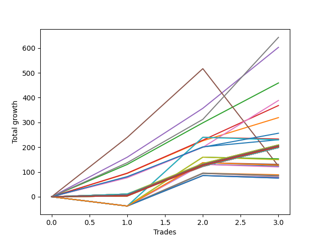

# Long Wallace Doodle 011 
- Symbol: ES1y1d
- Date Range: 07/19/2021 - 07/15/2022
- Trading Period: 7:20-12:30
- Number of Trades: 3



| Name | Win Percent | Profit | Avg Profit / Trade | Avg Time / Trade |      | Name | Win Percent | Profit | Avg Profit / Trade | Avg Time / Trade |
| ---- | ----------- | ------ | ------------------ | ---------------- | ---- | ---- | ----------- | ------ | ------------------ | ---------------- |
| Sorted By <br> Profit | | | | | | Sorted By <br> Win Percentage ||||
| Seven | 100.00 | 321500.00 | 107166.67 | 00:00 |     | Seven | 100.00 | 321500.00 | 107166.67 | 00:00 |
| Four | 100.00 | 301375.00 | 100458.33 | 00:00 |     | Four | 100.00 | 301375.00 | 100458.33 | 00:00 |
| Two | 100.00 | 229500.00 | 76500.00 | 00:00 |     | Two | 100.00 | 229500.00 | 76500.00 | 00:00 |
| Six | 100.00 | 194250.00 | 64750.00 | 00:00 |     | Six | 100.00 | 194250.00 | 64750.00 | 00:00 |
| Three | 100.00 | 184000.00 | 61333.33 | 00:00 |     | Three | 100.00 | 184000.00 | 61333.33 | 00:00 |
| One | 100.00 | 159625.00 | 53208.33 | 00:00 |     | One | 100.00 | 159625.00 | 53208.33 | 00:00 |
| Seventy-Three | 100.00 | 128125.00 | 42708.33 | 00:00 |     | Seventy-Three | 100.00 | 128125.00 | 42708.33 | 00:00 |
| Forty-Five | 33.33 | 116500.00 | 38833.33 | 00:00 |     | Zero | 100.00 | 115000.00 | 38333.33 | 00:00 |
| Zero | 100.00 | 115000.00 | 38333.33 | 00:00 |     | Seventy | 100.00 | 104625.00 | 34875.00 | 00:00 |
| Sixty-One | 33.33 | 114750.00 | 38250.00 | 00:00 |     | Sixty-Four | 100.00 | 104625.00 | 34875.00 | 00:00 |
| Seventy | 100.00 | 104625.00 | 34875.00 | 00:00 |     | One Hundred Thirty | 100.00 | 103000.00 | 34333.33 | 00:00 |
| Sixty-Four | 100.00 | 104625.00 | 34875.00 | 00:00 |     | One Hundred Twenty-Nine | 100.00 | 103000.00 | 34333.33 | 00:00 |
| One Hundred Thirty | 100.00 | 103000.00 | 34333.33 | 00:00 |     | One Hundred Twenty-Five | 100.00 | 103000.00 | 34333.33 | 00:00 |
| One Hundred Twenty-Nine | 100.00 | 103000.00 | 34333.33 | 00:00 |     | One Hundred Twenty-Four | 100.00 | 103000.00 | 34333.33 | 00:00 |
| One Hundred Twenty-Five | 100.00 | 103000.00 | 34333.33 | 00:00 |     | One Hundred Twenty | 100.00 | 103000.00 | 34333.33 | 00:00 |
| One Hundred Twenty-Four | 100.00 | 103000.00 | 34333.33 | 00:00 |     | One Hundred Ninteen | 100.00 | 103000.00 | 34333.33 | 00:00 |
| One Hundred Twenty | 100.00 | 103000.00 | 34333.33 | 00:00 |     | One Hundred Fifteen | 100.00 | 103000.00 | 34333.33 | 00:00 |
| One Hundred Ninteen | 100.00 | 103000.00 | 34333.33 | 00:00 |     | One Hundred Fourteen | 100.00 | 103000.00 | 34333.33 | 00:00 |
| One Hundred Fifteen | 100.00 | 103000.00 | 34333.33 | 00:00 |     | Eighty-Five | 100.00 | 103000.00 | 34333.33 | 00:00 |
| One Hundred Fourteen | 100.00 | 103000.00 | 34333.33 | 00:00 |     | Eighty-Four | 100.00 | 103000.00 | 34333.33 | 00:00 |
| Eighty-Five | 100.00 | 103000.00 | 34333.33 | 00:00 |     | Fifty-Four | 100.00 | 102375.00 | 34125.00 | 00:00 |
| Eighty-Four | 100.00 | 103000.00 | 34333.33 | 00:00 |     | Forty-Eight | 100.00 | 102375.00 | 34125.00 | 00:00 |
| Fifty-Four | 100.00 | 102375.00 | 34125.00 | 00:00 |     | One Hundred Twenty-Eight | 100.00 | 101125.00 | 33708.33 | 00:00 |
| Forty-Eight | 100.00 | 102375.00 | 34125.00 | 00:00 |     | One Hundred Twenty-Seven | 100.00 | 101125.00 | 33708.33 | 00:00 |
| One Hundred Twenty-Eight | 100.00 | 101125.00 | 33708.33 | 00:00 |     | One Hundred Twenty-Six | 100.00 | 101125.00 | 33708.33 | 00:00 |
| One Hundred Twenty-Seven | 100.00 | 101125.00 | 33708.33 | 00:00 |     | One Hundred Twenty-Three | 100.00 | 101125.00 | 33708.33 | 00:00 |
| One Hundred Twenty-Six | 100.00 | 101125.00 | 33708.33 | 00:00 |     | One Hundred Twenty-Two | 100.00 | 101125.00 | 33708.33 | 00:00 |
| One Hundred Twenty-Three | 100.00 | 101125.00 | 33708.33 | 00:00 |     | One Hundred Twenty-One | 100.00 | 101125.00 | 33708.33 | 00:00 |
| One Hundred Twenty-Two | 100.00 | 101125.00 | 33708.33 | 00:00 |     | One Hundred Eighteen | 100.00 | 101125.00 | 33708.33 | 00:00 |
| One Hundred Twenty-One | 100.00 | 101125.00 | 33708.33 | 00:00 |     | One Hundred Seventeen | 100.00 | 101125.00 | 33708.33 | 00:00 |
| One Hundred Eighteen | 100.00 | 101125.00 | 33708.33 | 00:00 |     | One Hundred Sixteen | 100.00 | 101125.00 | 33708.33 | 00:00 |
| One Hundred Seventeen | 100.00 | 101125.00 | 33708.33 | 00:00 |     | One Hundred Thirteen | 100.00 | 101125.00 | 33708.33 | 00:00 |
| One Hundred Sixteen | 100.00 | 101125.00 | 33708.33 | 00:00 |     | One Hundred Twelve | 100.00 | 101125.00 | 33708.33 | 00:00 |
| One Hundred Thirteen | 100.00 | 101125.00 | 33708.33 | 00:00 |     | One Hundred Eleven | 100.00 | 101125.00 | 33708.33 | 00:00 |
| One Hundred Twelve | 100.00 | 101125.00 | 33708.33 | 00:00 |     | Eighty-Three | 100.00 | 101125.00 | 33708.33 | 00:00 |
| One Hundred Eleven | 100.00 | 101125.00 | 33708.33 | 00:00 |     | Eighty-Two | 100.00 | 101125.00 | 33708.33 | 00:00 |
| Eighty-Three | 100.00 | 101125.00 | 33708.33 | 00:00 |     | Eighty-One | 100.00 | 101125.00 | 33708.33 | 00:00 |
| Eighty-Two | 100.00 | 101125.00 | 33708.33 | 00:00 |     | Seventy-One | 100.00 | 99500.00 | 33166.67 | 00:00 |
| Eighty-One | 100.00 | 101125.00 | 33708.33 | 00:00 |     | Sixty-Nine | 100.00 | 99500.00 | 33166.67 | 00:00 |
| Seventy-One | 100.00 | 99500.00 | 33166.67 | 00:00 |     | Sixty-Eight | 100.00 | 99500.00 | 33166.67 | 00:00 |
| Sixty-Nine | 100.00 | 99500.00 | 33166.67 | 00:00 |     | Sixty-Seven | 100.00 | 99500.00 | 33166.67 | 00:00 |
| Sixty-Eight | 100.00 | 99500.00 | 33166.67 | 00:00 |     | Sixty-Six | 100.00 | 99500.00 | 33166.67 | 00:00 |
| Sixty-Seven | 100.00 | 99500.00 | 33166.67 | 00:00 |     | Sixty-Five | 100.00 | 99500.00 | 33166.67 | 00:00 |
| Sixty-Six | 100.00 | 99500.00 | 33166.67 | 00:00 |     | Fifty-Five | 100.00 | 99250.00 | 33083.33 | 00:00 |
| Sixty-Five | 100.00 | 99500.00 | 33166.67 | 00:00 |     | Fifty-Three | 100.00 | 99250.00 | 33083.33 | 00:00 |
| Fifty-Five | 100.00 | 99250.00 | 33083.33 | 00:00 |     | Fifty-Two | 100.00 | 99250.00 | 33083.33 | 00:00 |
| Fifty-Three | 100.00 | 99250.00 | 33083.33 | 00:00 |     | Fifty-One | 100.00 | 99250.00 | 33083.33 | 00:00 |
| Fifty-Two | 100.00 | 99250.00 | 33083.33 | 00:00 |     | Fifty | 100.00 | 99250.00 | 33083.33 | 00:00 |
| Fifty-One | 100.00 | 99250.00 | 33083.33 | 00:00 |     | Forty-Nine | 100.00 | 99250.00 | 33083.33 | 00:00 |
| Fifty | 100.00 | 99250.00 | 33083.33 | 00:00 |     | Five | 66.67 | 61875.00 | 20625.00 | 00:00 |
| Forty-Nine | 100.00 | 99250.00 | 33083.33 | 00:00 |     | Forty-Five | 33.33 | 116500.00 | 38833.33 | 00:00 |
| Forty-Four | 33.33 | 76500.00 | 25500.00 | 00:00 |     | Sixty-One | 33.33 | 114750.00 | 38250.00 | 00:00 |
| Sixty | 33.33 | 74750.00 | 24916.67 | 00:00 |     | Forty-Four | 33.33 | 76500.00 | 25500.00 | 00:00 |
| Forty-Seven | 33.33 | 65375.00 | 21791.67 | 00:00 |     | Sixty | 33.33 | 74750.00 | 24916.67 | 00:00 |
| Sixty-Three | 33.33 | 63625.00 | 21208.33 | 00:00 |     | Forty-Seven | 33.33 | 65375.00 | 21791.67 | 00:00 |
| Five | 66.67 | 61875.00 | 20625.00 | 00:00 |     | Sixty-Three | 33.33 | 63625.00 | 21208.33 | 00:00 |
| Forty-Two | 33.33 | 61875.00 | 20625.00 | 00:00 |     | Forty-Two | 33.33 | 61875.00 | 20625.00 | 00:00 |
| Fifty-Eight | 33.33 | 60125.00 | 20041.67 | 00:00 |     | Fifty-Eight | 33.33 | 60125.00 | 20041.67 | 00:00 |
| Forty-Three | 33.33 | 44375.00 | 14791.67 | 00:00 |     | Forty-Three | 33.33 | 44375.00 | 14791.67 | 00:00 |
| Forty-One | 33.33 | 43750.00 | 14583.33 | 00:00 |     | Forty-One | 33.33 | 43750.00 | 14583.33 | 00:00 |
| Fifty-Nine | 33.33 | 42625.00 | 14208.33 | 00:00 |     | Fifty-Nine | 33.33 | 42625.00 | 14208.33 | 00:00 |
| Fifty-Seven | 33.33 | 42000.00 | 14000.00 | 00:00 |     | Fifty-Seven | 33.33 | 42000.00 | 14000.00 | 00:00 |
| Forty-Six | 33.33 | 39375.00 | 13125.00 | 00:00 |     | Forty-Six | 33.33 | 39375.00 | 13125.00 | 00:00 |
| Forty | 33.33 | 39375.00 | 13125.00 | 00:00 |     | Forty | 33.33 | 39375.00 | 13125.00 | 00:00 |
| Sixty-Two | 33.33 | 37625.00 | 12541.67 | 00:00 |     | Sixty-Two | 33.33 | 37625.00 | 12541.67 | 00:00 |
| Fifty-Six | 33.33 | 37625.00 | 12541.67 | 00:00 |     | Fifty-Six | 33.33 | 37625.00 | 12541.67 | 00:00 |

## NO STOPLOSS

### Test Zero
* Sell when price hits the middle line of the 20p bollinger
* No Stoploss
* Results:
```
Total Trades: 3
Percent Up: 100.00
Percent Down: 0.00
Total Points Moved Up: 230.00
Potential Profit: 115000.00
Total Points Ups: 230.00 Count Ups: 3
Total Points Downs: 0.00 Count Downs: 0
```

<details><summary>Trades</summary>

<code>In: 2021-10-04 07:21:00		Out: 2021-10-07 07:01:00		Total Position Time: 1420:00		Total Move Up: 78.25		Total to Date: 78.25</code> <br />
<code>In: 2021-10-06 07:21:00		Out: 2021-10-07 07:23:00		Total Position Time: 02:00		Total Move Up: 123.00		Total to Date: 201.25</code> <br />
<code>In: 2022-02-25 07:21:00		Out: 2022-03-16 07:16:00		Total Position Time: 1435:00		Total Move Up: 28.75		Total to Date: 230.00</code> <br />


</details>

### Test One
* Sell when the price hits the upper line of the 20p 1std bollinger
* No Stoploss
* Results:
```
Total Trades: 3
Percent Up: 100.00
Percent Down: 0.00
Total Points Moved Up: 319.25
Potential Profit: 159625.00
Total Points Ups: 319.25 Count Ups: 3
Total Points Downs: 0.00 Count Downs: 0
```

<details><summary>Trades</summary>

<code>In: 2021-10-04 07:21:00		Out: 2021-10-14 10:57:00		Total Position Time: 216:00		Total Move Up: 94.00		Total to Date: 94.00</code> <br />
<code>In: 2021-10-06 07:21:00		Out: 2021-10-14 10:57:00		Total Position Time: 216:00		Total Move Up: 131.75		Total to Date: 225.75</code> <br />
<code>In: 2022-02-25 07:21:00		Out: 2022-03-17 10:52:00		Total Position Time: 211:00		Total Move Up: 93.50		Total to Date: 319.25</code> <br />


</details>

### Test Two
* Sell when the price hits the upper line of the 20p 2std bollinger
* No Stoploss
* Results:
```
Total Trades: 3
Percent Up: 100.00
Percent Down: 0.00
Total Points Moved Up: 459.00
Potential Profit: 229500.00
Total Points Ups: 459.00 Count Ups: 3
Total Points Downs: 0.00 Count Downs: 0
```

<details><summary>Trades</summary>

<code>In: 2021-10-04 07:21:00		Out: 2021-10-15 11:05:00		Total Position Time: 224:00		Total Move Up: 130.25		Total to Date: 130.25</code> <br />
<code>In: 2021-10-06 07:21:00		Out: 2021-10-15 11:05:00		Total Position Time: 224:00		Total Move Up: 168.00		Total to Date: 298.25</code> <br />
<code>In: 2022-02-25 07:21:00		Out: 2022-03-21 06:33:00		Total Position Time: 1392:00		Total Move Up: 160.75		Total to Date: 459.00</code> <br />


</details>

### Test Three
* Sell when price hits the middle line of the 50p bollinger
* No Stoploss
* Results:
```
Total Trades: 3
Percent Up: 100.00
Percent Down: 0.00
Total Points Moved Up: 368.00
Potential Profit: 184000.00
Total Points Ups: 368.00 Count Ups: 3
Total Points Downs: 0.00 Count Downs: 0
```

<details><summary>Trades</summary>

<code>In: 2021-10-04 07:21:00		Out: 2021-10-14 11:39:00		Total Position Time: 258:00		Total Move Up: 95.25		Total to Date: 95.25</code> <br />
<code>In: 2021-10-06 07:21:00		Out: 2021-10-14 11:39:00		Total Position Time: 258:00		Total Move Up: 133.00		Total to Date: 228.25</code> <br />
<code>In: 2022-02-25 07:21:00		Out: 2022-03-18 12:09:00		Total Position Time: 288:00		Total Move Up: 139.75		Total to Date: 368.00</code> <br />


</details>

### Test Four
* Sell when the price hits the upper line of the 50p 1std bollinger
* No Stoploss
* Results:
```
Total Trades: 3
Percent Up: 100.00
Percent Down: 0.00
Total Points Moved Up: 602.75
Potential Profit: 301375.00
Total Points Ups: 602.75 Count Ups: 3
Total Points Downs: 0.00 Count Downs: 0
```

<details><summary>Trades</summary>

<code>In: 2021-10-04 07:21:00		Out: 2021-10-19 06:40:00		Total Position Time: 1399:00		Total Move Up: 159.50		Total to Date: 159.50</code> <br />
<code>In: 2021-10-06 07:21:00		Out: 2021-10-19 06:40:00		Total Position Time: 1399:00		Total Move Up: 197.25		Total to Date: 356.75</code> <br />
<code>In: 2022-02-25 07:21:00		Out: 2022-03-28 07:00:00		Total Position Time: 1419:00		Total Move Up: 246.00		Total to Date: 602.75</code> <br />


</details>

### Test Five
* Sell when the price hits the upper line of the 50p 2std bollinger
* No Stoploss
* Results:
```
Total Trades: 3
Percent Up: 66.67
Percent Down: 33.33
Total Points Moved Up: 123.75
Potential Profit: 61875.00
Total Points Ups: 516.75 Count Ups: 2
Total Points Downs: -393.00 Count Downs: 1
```

<details><summary>Trades</summary>

<code>In: 2021-10-04 07:21:00		Out: 2021-10-26 06:31:00		Total Position Time: 1390:00		Total Move Up: 239.50		Total to Date: 239.50</code> <br />
<code>In: 2021-10-06 07:21:00		Out: 2021-10-26 06:31:00		Total Position Time: 1390:00		Total Move Up: 277.25		Total to Date: 516.75</code> <br />
<code>In: 2022-02-25 07:21:00		Out: 2022-07-08 12:58:00		Total Position Time: 337:00		Total Move Up: -393.00		Total to Date: 123.75</code> <br />


</details>

### Test Six
* Sell when the price hits the middle line of the 1std VWAP
* No Stoploss
* Results:
```
Total Trades: 3
Percent Up: 100.00
Percent Down: 0.00
Total Points Moved Up: 388.50
Potential Profit: 194250.00
Total Points Ups: 388.50 Count Ups: 3
Total Points Downs: 0.00 Count Downs: 0
```

<details><summary>Trades</summary>

<code>In: 2021-10-04 07:21:00		Out: 2021-10-07 07:00:00		Total Position Time: 1419:00		Total Move Up: 76.50		Total to Date: 76.50</code> <br />
<code>In: 2021-10-06 07:21:00		Out: 2021-10-07 07:23:00		Total Position Time: 02:00		Total Move Up: 123.00		Total to Date: 199.50</code> <br />
<code>In: 2022-02-25 07:21:00		Out: 2022-03-22 07:01:00		Total Position Time: 1420:00		Total Move Up: 189.00		Total to Date: 388.50</code> <br />


</details>

### Test Seven
* Sell when the price hits the upper line of the 1std VWAP
* No Stoploss
* Results:
```
Total Trades: 3
Percent Up: 100.00
Percent Down: 0.00
Total Points Moved Up: 643.00
Potential Profit: 321500.00
Total Points Ups: 643.00 Count Ups: 3
Total Points Downs: 0.00 Count Downs: 0
```

<details><summary>Trades</summary>

<code>In: 2021-10-04 07:21:00		Out: 2021-10-18 08:20:00		Total Position Time: 59:00		Total Move Up: 137.25		Total to Date: 137.25</code> <br />
<code>In: 2021-10-06 07:21:00		Out: 2021-10-18 08:20:00		Total Position Time: 59:00		Total Move Up: 175.00		Total to Date: 312.25</code> <br />
<code>In: 2022-02-25 07:21:00		Out: 2022-03-29 12:35:00		Total Position Time: 314:00		Total Move Up: 330.75		Total to Date: 643.00</code> <br />


</details>

## STOPLOSS OF 5

### Test Forty
* Sell when price hits the middle line of the 20p bollinger
* Stoploss is 5 points
* Results:
```
Total Trades: 3
Percent Up: 33.33
Percent Down: 66.67
Total Points Moved Up: 78.75
Potential Profit: 39375.00
Total Points Ups: 123.00 Count Ups: 1
Total Points Downs: -44.25 Count Downs: 2
```

<details><summary>Trades</summary>

<code>In: 2021-10-04 07:21:00		Out: 2021-10-06 06:31:00		Total Position Time: 1390:00		Total Move Up: -37.50		Total to Date: -37.50</code> <br />
<code>In: 2021-10-06 07:21:00		Out: 2021-10-07 07:23:00		Total Position Time: 02:00		Total Move Up: 123.00		Total to Date: 85.50</code> <br />
<code>In: 2022-02-25 07:21:00		Out: 2022-03-01 09:09:00		Total Position Time: 108:00		Total Move Up: -6.75		Total to Date: 78.75</code> <br />


</details>

### Test Forty-One
* Sell when the price hits the upper line of the 20p 1std bollinger
* Stoploss is 5 points
* Results:
```
Total Trades: 3
Percent Up: 33.33
Percent Down: 66.67
Total Points Moved Up: 87.50
Potential Profit: 43750.00
Total Points Ups: 131.75 Count Ups: 1
Total Points Downs: -44.25 Count Downs: 2
```

<details><summary>Trades</summary>

<code>In: 2021-10-04 07:21:00		Out: 2021-10-06 06:31:00		Total Position Time: 1390:00		Total Move Up: -37.50		Total to Date: -37.50</code> <br />
<code>In: 2021-10-06 07:21:00		Out: 2021-10-14 10:57:00		Total Position Time: 216:00		Total Move Up: 131.75		Total to Date: 94.25</code> <br />
<code>In: 2022-02-25 07:21:00		Out: 2022-03-01 09:09:00		Total Position Time: 108:00		Total Move Up: -6.75		Total to Date: 87.50</code> <br />


</details>

### Test Forty-Two
* Sell when the price hits the upper line of the 20p 2std bollinger
* Stoploss is 5 points
* Results:
```
Total Trades: 3
Percent Up: 33.33
Percent Down: 66.67
Total Points Moved Up: 123.75
Potential Profit: 61875.00
Total Points Ups: 168.00 Count Ups: 1
Total Points Downs: -44.25 Count Downs: 2
```

<details><summary>Trades</summary>

<code>In: 2021-10-04 07:21:00		Out: 2021-10-06 06:31:00		Total Position Time: 1390:00		Total Move Up: -37.50		Total to Date: -37.50</code> <br />
<code>In: 2021-10-06 07:21:00		Out: 2021-10-15 11:05:00		Total Position Time: 224:00		Total Move Up: 168.00		Total to Date: 130.50</code> <br />
<code>In: 2022-02-25 07:21:00		Out: 2022-03-01 09:09:00		Total Position Time: 108:00		Total Move Up: -6.75		Total to Date: 123.75</code> <br />


</details>

### Test Forty-Three
* Sell when price hits the middle line of the 50p bollinger
* Stoploss is 5 points
* Results:
```
Total Trades: 3
Percent Up: 33.33
Percent Down: 66.67
Total Points Moved Up: 88.75
Potential Profit: 44375.00
Total Points Ups: 133.00 Count Ups: 1
Total Points Downs: -44.25 Count Downs: 2
```

<details><summary>Trades</summary>

<code>In: 2021-10-04 07:21:00		Out: 2021-10-06 06:31:00		Total Position Time: 1390:00		Total Move Up: -37.50		Total to Date: -37.50</code> <br />
<code>In: 2021-10-06 07:21:00		Out: 2021-10-14 11:39:00		Total Position Time: 258:00		Total Move Up: 133.00		Total to Date: 95.50</code> <br />
<code>In: 2022-02-25 07:21:00		Out: 2022-03-01 09:09:00		Total Position Time: 108:00		Total Move Up: -6.75		Total to Date: 88.75</code> <br />


</details>

### Test Forty-Four
* Sell when the price hits the upper line of the 50p 1std bollinger
* Stoploss is 5 points
* Results:
```
Total Trades: 3
Percent Up: 33.33
Percent Down: 66.67
Total Points Moved Up: 153.00
Potential Profit: 76500.00
Total Points Ups: 197.25 Count Ups: 1
Total Points Downs: -44.25 Count Downs: 2
```

<details><summary>Trades</summary>

<code>In: 2021-10-04 07:21:00		Out: 2021-10-06 06:31:00		Total Position Time: 1390:00		Total Move Up: -37.50		Total to Date: -37.50</code> <br />
<code>In: 2021-10-06 07:21:00		Out: 2021-10-19 06:40:00		Total Position Time: 1399:00		Total Move Up: 197.25		Total to Date: 159.75</code> <br />
<code>In: 2022-02-25 07:21:00		Out: 2022-03-01 09:09:00		Total Position Time: 108:00		Total Move Up: -6.75		Total to Date: 153.00</code> <br />


</details>

### Test Forty-Five
* Sell when the price hits the upper line of the 50p 2std bollinger
* Stoploss is 5 points
* Results:
```
Total Trades: 3
Percent Up: 33.33
Percent Down: 66.67
Total Points Moved Up: 233.00
Potential Profit: 116500.00
Total Points Ups: 277.25 Count Ups: 1
Total Points Downs: -44.25 Count Downs: 2
```

<details><summary>Trades</summary>

<code>In: 2021-10-04 07:21:00		Out: 2021-10-06 06:31:00		Total Position Time: 1390:00		Total Move Up: -37.50		Total to Date: -37.50</code> <br />
<code>In: 2021-10-06 07:21:00		Out: 2021-10-26 06:31:00		Total Position Time: 1390:00		Total Move Up: 277.25		Total to Date: 239.75</code> <br />
<code>In: 2022-02-25 07:21:00		Out: 2022-03-01 09:09:00		Total Position Time: 108:00		Total Move Up: -6.75		Total to Date: 233.00</code> <br />


</details>

### Test Forty-Six
* Sell when the price hits the middle line of the 1std VWAP
* Stoploss is 5 points
* Results:
```
Total Trades: 3
Percent Up: 33.33
Percent Down: 66.67
Total Points Moved Up: 78.75
Potential Profit: 39375.00
Total Points Ups: 123.00 Count Ups: 1
Total Points Downs: -44.25 Count Downs: 2
```

<details><summary>Trades</summary>

<code>In: 2021-10-04 07:21:00		Out: 2021-10-06 06:31:00		Total Position Time: 1390:00		Total Move Up: -37.50		Total to Date: -37.50</code> <br />
<code>In: 2021-10-06 07:21:00		Out: 2021-10-07 07:23:00		Total Position Time: 02:00		Total Move Up: 123.00		Total to Date: 85.50</code> <br />
<code>In: 2022-02-25 07:21:00		Out: 2022-03-01 09:09:00		Total Position Time: 108:00		Total Move Up: -6.75		Total to Date: 78.75</code> <br />


</details>

### Test Forty-Seven
* Sell when the price hits the upper line of the 1std VWAP
* Stoploss is 5 points
* Results:
```
Total Trades: 3
Percent Up: 33.33
Percent Down: 66.67
Total Points Moved Up: 130.75
Potential Profit: 65375.00
Total Points Ups: 175.00 Count Ups: 1
Total Points Downs: -44.25 Count Downs: 2
```

<details><summary>Trades</summary>

<code>In: 2021-10-04 07:21:00		Out: 2021-10-06 06:31:00		Total Position Time: 1390:00		Total Move Up: -37.50		Total to Date: -37.50</code> <br />
<code>In: 2021-10-06 07:21:00		Out: 2021-10-18 08:20:00		Total Position Time: 59:00		Total Move Up: 175.00		Total to Date: 137.50</code> <br />
<code>In: 2022-02-25 07:21:00		Out: 2022-03-01 09:09:00		Total Position Time: 108:00		Total Move Up: -6.75		Total to Date: 130.75</code> <br />


</details>

## TRAIL STOP OF 5

### Test Forty-Eight
* Sell when price hits the middle line of the 20p bollinger
* Trailing Stop is 5 points
* Results:
```
Total Trades: 3
Percent Up: 100.00
Percent Down: 0.00
Total Points Moved Up: 204.75
Potential Profit: 102375.00
Total Points Ups: 204.75 Count Ups: 3
Total Points Downs: 0.00 Count Downs: 0
```

<details><summary>Trades</summary>

<code>In: 2021-10-04 07:21:00		Out: 2021-10-05 07:33:00		Total Position Time: 12:00		Total Move Up: 5.75		Total to Date: 5.75</code> <br />
<code>In: 2021-10-06 07:21:00		Out: 2021-10-07 07:23:00		Total Position Time: 02:00		Total Move Up: 123.00		Total to Date: 128.75</code> <br />
<code>In: 2022-02-25 07:21:00		Out: 2022-02-28 08:23:00		Total Position Time: 62:00		Total Move Up: 76.00		Total to Date: 204.75</code> <br />


</details>

### Test Forty-Nine
* Sell when the price hits the upper line of the 20p 1std bollinger
* Trailing Stop is 5 points
* Results:
```
Total Trades: 3
Percent Up: 100.00
Percent Down: 0.00
Total Points Moved Up: 198.50
Potential Profit: 99250.00
Total Points Ups: 198.50 Count Ups: 3
Total Points Downs: 0.00 Count Downs: 0
```

<details><summary>Trades</summary>

<code>In: 2021-10-04 07:21:00		Out: 2021-10-05 07:33:00		Total Position Time: 12:00		Total Move Up: 5.75		Total to Date: 5.75</code> <br />
<code>In: 2021-10-06 07:21:00		Out: 2021-10-07 07:40:00		Total Position Time: 19:00		Total Move Up: 116.75		Total to Date: 122.50</code> <br />
<code>In: 2022-02-25 07:21:00		Out: 2022-02-28 08:23:00		Total Position Time: 62:00		Total Move Up: 76.00		Total to Date: 198.50</code> <br />


</details>

### Test Fifty
* Sell when the price hits the upper line of the 20p 2std bollinger
* Trailing Stop is 5 points
* Results:
```
Total Trades: 3
Percent Up: 100.00
Percent Down: 0.00
Total Points Moved Up: 198.50
Potential Profit: 99250.00
Total Points Ups: 198.50 Count Ups: 3
Total Points Downs: 0.00 Count Downs: 0
```

<details><summary>Trades</summary>

<code>In: 2021-10-04 07:21:00		Out: 2021-10-05 07:33:00		Total Position Time: 12:00		Total Move Up: 5.75		Total to Date: 5.75</code> <br />
<code>In: 2021-10-06 07:21:00		Out: 2021-10-07 07:40:00		Total Position Time: 19:00		Total Move Up: 116.75		Total to Date: 122.50</code> <br />
<code>In: 2022-02-25 07:21:00		Out: 2022-02-28 08:23:00		Total Position Time: 62:00		Total Move Up: 76.00		Total to Date: 198.50</code> <br />


</details>

### Test Fifty-One
* Sell when price hits the middle line of the 50p bollinger
* Trailing Stop is 5 points
* Results:
```
Total Trades: 3
Percent Up: 100.00
Percent Down: 0.00
Total Points Moved Up: 198.50
Potential Profit: 99250.00
Total Points Ups: 198.50 Count Ups: 3
Total Points Downs: 0.00 Count Downs: 0
```

<details><summary>Trades</summary>

<code>In: 2021-10-04 07:21:00		Out: 2021-10-05 07:33:00		Total Position Time: 12:00		Total Move Up: 5.75		Total to Date: 5.75</code> <br />
<code>In: 2021-10-06 07:21:00		Out: 2021-10-07 07:40:00		Total Position Time: 19:00		Total Move Up: 116.75		Total to Date: 122.50</code> <br />
<code>In: 2022-02-25 07:21:00		Out: 2022-02-28 08:23:00		Total Position Time: 62:00		Total Move Up: 76.00		Total to Date: 198.50</code> <br />


</details>

### Test Fifty-Two
* Sell when the price hits the upper line of the 50p 1std bollinger
* Trailing Stop is 5 points
* Results:
```
Total Trades: 3
Percent Up: 100.00
Percent Down: 0.00
Total Points Moved Up: 198.50
Potential Profit: 99250.00
Total Points Ups: 198.50 Count Ups: 3
Total Points Downs: 0.00 Count Downs: 0
```

<details><summary>Trades</summary>

<code>In: 2021-10-04 07:21:00		Out: 2021-10-05 07:33:00		Total Position Time: 12:00		Total Move Up: 5.75		Total to Date: 5.75</code> <br />
<code>In: 2021-10-06 07:21:00		Out: 2021-10-07 07:40:00		Total Position Time: 19:00		Total Move Up: 116.75		Total to Date: 122.50</code> <br />
<code>In: 2022-02-25 07:21:00		Out: 2022-02-28 08:23:00		Total Position Time: 62:00		Total Move Up: 76.00		Total to Date: 198.50</code> <br />


</details>

### Test Fifty-Three
* Sell when the price hits the upper line of the 50p 2std bollinger
* Trailing Stop is 5 points
* Results:
```
Total Trades: 3
Percent Up: 100.00
Percent Down: 0.00
Total Points Moved Up: 198.50
Potential Profit: 99250.00
Total Points Ups: 198.50 Count Ups: 3
Total Points Downs: 0.00 Count Downs: 0
```

<details><summary>Trades</summary>

<code>In: 2021-10-04 07:21:00		Out: 2021-10-05 07:33:00		Total Position Time: 12:00		Total Move Up: 5.75		Total to Date: 5.75</code> <br />
<code>In: 2021-10-06 07:21:00		Out: 2021-10-07 07:40:00		Total Position Time: 19:00		Total Move Up: 116.75		Total to Date: 122.50</code> <br />
<code>In: 2022-02-25 07:21:00		Out: 2022-02-28 08:23:00		Total Position Time: 62:00		Total Move Up: 76.00		Total to Date: 198.50</code> <br />


</details>

### Test Fifty-Four
* Sell when the price hits the middle line of the 1std VWAP
* Trailing Stop is 5 points
* Results:
```
Total Trades: 3
Percent Up: 100.00
Percent Down: 0.00
Total Points Moved Up: 204.75
Potential Profit: 102375.00
Total Points Ups: 204.75 Count Ups: 3
Total Points Downs: 0.00 Count Downs: 0
```

<details><summary>Trades</summary>

<code>In: 2021-10-04 07:21:00		Out: 2021-10-05 07:33:00		Total Position Time: 12:00		Total Move Up: 5.75		Total to Date: 5.75</code> <br />
<code>In: 2021-10-06 07:21:00		Out: 2021-10-07 07:23:00		Total Position Time: 02:00		Total Move Up: 123.00		Total to Date: 128.75</code> <br />
<code>In: 2022-02-25 07:21:00		Out: 2022-02-28 08:23:00		Total Position Time: 62:00		Total Move Up: 76.00		Total to Date: 204.75</code> <br />


</details>

### Test Fifty-Five
* Sell when the price hits the upper line of the 1std VWAP
* Trailing Stop is 5 points
* Results:
```
Total Trades: 3
Percent Up: 100.00
Percent Down: 0.00
Total Points Moved Up: 198.50
Potential Profit: 99250.00
Total Points Ups: 198.50 Count Ups: 3
Total Points Downs: 0.00 Count Downs: 0
```

<details><summary>Trades</summary>

<code>In: 2021-10-04 07:21:00		Out: 2021-10-05 07:33:00		Total Position Time: 12:00		Total Move Up: 5.75		Total to Date: 5.75</code> <br />
<code>In: 2021-10-06 07:21:00		Out: 2021-10-07 07:40:00		Total Position Time: 19:00		Total Move Up: 116.75		Total to Date: 122.50</code> <br />
<code>In: 2022-02-25 07:21:00		Out: 2022-02-28 08:23:00		Total Position Time: 62:00		Total Move Up: 76.00		Total to Date: 198.50</code> <br />


</details>

## STOPLOSS OF 10

### Test Fifty-Six
* Sell when price hits the middle line of the 20p bollinger
* Stoploss is 10 points
* Results:
```
Total Trades: 3
Percent Up: 33.33
Percent Down: 66.67
Total Points Moved Up: 75.25
Potential Profit: 37625.00
Total Points Ups: 123.00 Count Ups: 1
Total Points Downs: -47.75 Count Downs: 2
```

<details><summary>Trades</summary>

<code>In: 2021-10-04 07:21:00		Out: 2021-10-06 06:31:00		Total Position Time: 1390:00		Total Move Up: -37.50		Total to Date: -37.50</code> <br />
<code>In: 2021-10-06 07:21:00		Out: 2021-10-07 07:23:00		Total Position Time: 02:00		Total Move Up: 123.00		Total to Date: 85.50</code> <br />
<code>In: 2022-02-25 07:21:00		Out: 2022-03-01 09:11:00		Total Position Time: 110:00		Total Move Up: -10.25		Total to Date: 75.25</code> <br />


</details>

### Test Fifty-Seven
* Sell when the price hits the upper line of the 20p 1std bollinger
* Stoploss is 10 points
* Results:
```
Total Trades: 3
Percent Up: 33.33
Percent Down: 66.67
Total Points Moved Up: 84.00
Potential Profit: 42000.00
Total Points Ups: 131.75 Count Ups: 1
Total Points Downs: -47.75 Count Downs: 2
```

<details><summary>Trades</summary>

<code>In: 2021-10-04 07:21:00		Out: 2021-10-06 06:31:00		Total Position Time: 1390:00		Total Move Up: -37.50		Total to Date: -37.50</code> <br />
<code>In: 2021-10-06 07:21:00		Out: 2021-10-14 10:57:00		Total Position Time: 216:00		Total Move Up: 131.75		Total to Date: 94.25</code> <br />
<code>In: 2022-02-25 07:21:00		Out: 2022-03-01 09:11:00		Total Position Time: 110:00		Total Move Up: -10.25		Total to Date: 84.00</code> <br />


</details>

### Test Fifty-Eight
* Sell when the price hits the upper line of the 20p 2std bollinger
* Stoploss is 10 points
* Results:
```
Total Trades: 3
Percent Up: 33.33
Percent Down: 66.67
Total Points Moved Up: 120.25
Potential Profit: 60125.00
Total Points Ups: 168.00 Count Ups: 1
Total Points Downs: -47.75 Count Downs: 2
```

<details><summary>Trades</summary>

<code>In: 2021-10-04 07:21:00		Out: 2021-10-06 06:31:00		Total Position Time: 1390:00		Total Move Up: -37.50		Total to Date: -37.50</code> <br />
<code>In: 2021-10-06 07:21:00		Out: 2021-10-15 11:05:00		Total Position Time: 224:00		Total Move Up: 168.00		Total to Date: 130.50</code> <br />
<code>In: 2022-02-25 07:21:00		Out: 2022-03-01 09:11:00		Total Position Time: 110:00		Total Move Up: -10.25		Total to Date: 120.25</code> <br />


</details>

### Test Fifty-Nine
* Sell when price hits the middle line of the 50p bollinger
* Stoploss is 10 points
* Results:
```
Total Trades: 3
Percent Up: 33.33
Percent Down: 66.67
Total Points Moved Up: 85.25
Potential Profit: 42625.00
Total Points Ups: 133.00 Count Ups: 1
Total Points Downs: -47.75 Count Downs: 2
```

<details><summary>Trades</summary>

<code>In: 2021-10-04 07:21:00		Out: 2021-10-06 06:31:00		Total Position Time: 1390:00		Total Move Up: -37.50		Total to Date: -37.50</code> <br />
<code>In: 2021-10-06 07:21:00		Out: 2021-10-14 11:39:00		Total Position Time: 258:00		Total Move Up: 133.00		Total to Date: 95.50</code> <br />
<code>In: 2022-02-25 07:21:00		Out: 2022-03-01 09:11:00		Total Position Time: 110:00		Total Move Up: -10.25		Total to Date: 85.25</code> <br />


</details>

### Test Sixty
* Sell when the price hits the upper line of the 50p 1std bollinger
* Stoploss is 10 points
* Results:
```
Total Trades: 3
Percent Up: 33.33
Percent Down: 66.67
Total Points Moved Up: 149.50
Potential Profit: 74750.00
Total Points Ups: 197.25 Count Ups: 1
Total Points Downs: -47.75 Count Downs: 2
```

<details><summary>Trades</summary>

<code>In: 2021-10-04 07:21:00		Out: 2021-10-06 06:31:00		Total Position Time: 1390:00		Total Move Up: -37.50		Total to Date: -37.50</code> <br />
<code>In: 2021-10-06 07:21:00		Out: 2021-10-19 06:40:00		Total Position Time: 1399:00		Total Move Up: 197.25		Total to Date: 159.75</code> <br />
<code>In: 2022-02-25 07:21:00		Out: 2022-03-01 09:11:00		Total Position Time: 110:00		Total Move Up: -10.25		Total to Date: 149.50</code> <br />


</details>

### Test Sixty-One
* Sell when the price hits the upper line of the 50p 2std bollinger
* Stoploss is 10 points
* Results:
```
Total Trades: 3
Percent Up: 33.33
Percent Down: 66.67
Total Points Moved Up: 229.50
Potential Profit: 114750.00
Total Points Ups: 277.25 Count Ups: 1
Total Points Downs: -47.75 Count Downs: 2
```

<details><summary>Trades</summary>

<code>In: 2021-10-04 07:21:00		Out: 2021-10-06 06:31:00		Total Position Time: 1390:00		Total Move Up: -37.50		Total to Date: -37.50</code> <br />
<code>In: 2021-10-06 07:21:00		Out: 2021-10-26 06:31:00		Total Position Time: 1390:00		Total Move Up: 277.25		Total to Date: 239.75</code> <br />
<code>In: 2022-02-25 07:21:00		Out: 2022-03-01 09:11:00		Total Position Time: 110:00		Total Move Up: -10.25		Total to Date: 229.50</code> <br />


</details>

### Test Sixty-Two
* Sell when the price hits the middle line of the 1std VWAP
* Stoploss is 10 points
* Results:
```
Total Trades: 3
Percent Up: 33.33
Percent Down: 66.67
Total Points Moved Up: 75.25
Potential Profit: 37625.00
Total Points Ups: 123.00 Count Ups: 1
Total Points Downs: -47.75 Count Downs: 2
```

<details><summary>Trades</summary>

<code>In: 2021-10-04 07:21:00		Out: 2021-10-06 06:31:00		Total Position Time: 1390:00		Total Move Up: -37.50		Total to Date: -37.50</code> <br />
<code>In: 2021-10-06 07:21:00		Out: 2021-10-07 07:23:00		Total Position Time: 02:00		Total Move Up: 123.00		Total to Date: 85.50</code> <br />
<code>In: 2022-02-25 07:21:00		Out: 2022-03-01 09:11:00		Total Position Time: 110:00		Total Move Up: -10.25		Total to Date: 75.25</code> <br />


</details>

### Test Sixty-Three
* Sell when the price hits the upper line of the 1std VWAP
* Stoploss is 10 points
* Results:
```
Total Trades: 3
Percent Up: 33.33
Percent Down: 66.67
Total Points Moved Up: 127.25
Potential Profit: 63625.00
Total Points Ups: 175.00 Count Ups: 1
Total Points Downs: -47.75 Count Downs: 2
```

<details><summary>Trades</summary>

<code>In: 2021-10-04 07:21:00		Out: 2021-10-06 06:31:00		Total Position Time: 1390:00		Total Move Up: -37.50		Total to Date: -37.50</code> <br />
<code>In: 2021-10-06 07:21:00		Out: 2021-10-18 08:20:00		Total Position Time: 59:00		Total Move Up: 175.00		Total to Date: 137.50</code> <br />
<code>In: 2022-02-25 07:21:00		Out: 2022-03-01 09:11:00		Total Position Time: 110:00		Total Move Up: -10.25		Total to Date: 127.25</code> <br />


</details>

## TRAIL STOP OF 10

### Test Sixty-Four
* Sell when price hits the middle line of the 20p bollinger
* Trailing Stop is 10 points
* Results:
```
Total Trades: 3
Percent Up: 100.00
Percent Down: 0.00
Total Points Moved Up: 209.25
Potential Profit: 104625.00
Total Points Ups: 209.25 Count Ups: 3
Total Points Downs: 0.00 Count Downs: 0
```

<details><summary>Trades</summary>

<code>In: 2021-10-04 07:21:00		Out: 2021-10-05 08:41:00		Total Position Time: 80:00		Total Move Up: 11.00		Total to Date: 11.00</code> <br />
<code>In: 2021-10-06 07:21:00		Out: 2021-10-07 07:23:00		Total Position Time: 02:00		Total Move Up: 123.00		Total to Date: 134.00</code> <br />
<code>In: 2022-02-25 07:21:00		Out: 2022-02-28 08:39:00		Total Position Time: 78:00		Total Move Up: 75.25		Total to Date: 209.25</code> <br />


</details>

### Test Sixty-Five
* Sell when the price hits the upper line of the 20p 1std bollinger
* Trailing Stop is 10 points
* Results:
```
Total Trades: 3
Percent Up: 100.00
Percent Down: 0.00
Total Points Moved Up: 199.00
Potential Profit: 99500.00
Total Points Ups: 199.00 Count Ups: 3
Total Points Downs: 0.00 Count Downs: 0
```

<details><summary>Trades</summary>

<code>In: 2021-10-04 07:21:00		Out: 2021-10-05 08:41:00		Total Position Time: 80:00		Total Move Up: 11.00		Total to Date: 11.00</code> <br />
<code>In: 2021-10-06 07:21:00		Out: 2021-10-07 10:58:00		Total Position Time: 217:00		Total Move Up: 112.75		Total to Date: 123.75</code> <br />
<code>In: 2022-02-25 07:21:00		Out: 2022-02-28 08:39:00		Total Position Time: 78:00		Total Move Up: 75.25		Total to Date: 199.00</code> <br />


</details>

### Test Sixty-Six
* Sell when the price hits the upper line of the 20p 2std bollinger
* Trailing Stop is 10 points
* Results:
```
Total Trades: 3
Percent Up: 100.00
Percent Down: 0.00
Total Points Moved Up: 199.00
Potential Profit: 99500.00
Total Points Ups: 199.00 Count Ups: 3
Total Points Downs: 0.00 Count Downs: 0
```

<details><summary>Trades</summary>

<code>In: 2021-10-04 07:21:00		Out: 2021-10-05 08:41:00		Total Position Time: 80:00		Total Move Up: 11.00		Total to Date: 11.00</code> <br />
<code>In: 2021-10-06 07:21:00		Out: 2021-10-07 10:58:00		Total Position Time: 217:00		Total Move Up: 112.75		Total to Date: 123.75</code> <br />
<code>In: 2022-02-25 07:21:00		Out: 2022-02-28 08:39:00		Total Position Time: 78:00		Total Move Up: 75.25		Total to Date: 199.00</code> <br />


</details>

### Test Sixty-Seven
* Sell when price hits the middle line of the 50p bollinger
* Trailing Stop is 10 points
* Results:
```
Total Trades: 3
Percent Up: 100.00
Percent Down: 0.00
Total Points Moved Up: 199.00
Potential Profit: 99500.00
Total Points Ups: 199.00 Count Ups: 3
Total Points Downs: 0.00 Count Downs: 0
```

<details><summary>Trades</summary>

<code>In: 2021-10-04 07:21:00		Out: 2021-10-05 08:41:00		Total Position Time: 80:00		Total Move Up: 11.00		Total to Date: 11.00</code> <br />
<code>In: 2021-10-06 07:21:00		Out: 2021-10-07 10:58:00		Total Position Time: 217:00		Total Move Up: 112.75		Total to Date: 123.75</code> <br />
<code>In: 2022-02-25 07:21:00		Out: 2022-02-28 08:39:00		Total Position Time: 78:00		Total Move Up: 75.25		Total to Date: 199.00</code> <br />


</details>

### Test Sixty-Eight
* Sell when the price hits the upper line of the 50p 1std bollinger
* Trailing Stop is 10 points
* Results:
```
Total Trades: 3
Percent Up: 100.00
Percent Down: 0.00
Total Points Moved Up: 199.00
Potential Profit: 99500.00
Total Points Ups: 199.00 Count Ups: 3
Total Points Downs: 0.00 Count Downs: 0
```

<details><summary>Trades</summary>

<code>In: 2021-10-04 07:21:00		Out: 2021-10-05 08:41:00		Total Position Time: 80:00		Total Move Up: 11.00		Total to Date: 11.00</code> <br />
<code>In: 2021-10-06 07:21:00		Out: 2021-10-07 10:58:00		Total Position Time: 217:00		Total Move Up: 112.75		Total to Date: 123.75</code> <br />
<code>In: 2022-02-25 07:21:00		Out: 2022-02-28 08:39:00		Total Position Time: 78:00		Total Move Up: 75.25		Total to Date: 199.00</code> <br />


</details>

### Test Sixty-Nine
* Sell when the price hits the upper line of the 50p 2std bollinger
* Trailing Stop is 10 points
* Results:
```
Total Trades: 3
Percent Up: 100.00
Percent Down: 0.00
Total Points Moved Up: 199.00
Potential Profit: 99500.00
Total Points Ups: 199.00 Count Ups: 3
Total Points Downs: 0.00 Count Downs: 0
```

<details><summary>Trades</summary>

<code>In: 2021-10-04 07:21:00		Out: 2021-10-05 08:41:00		Total Position Time: 80:00		Total Move Up: 11.00		Total to Date: 11.00</code> <br />
<code>In: 2021-10-06 07:21:00		Out: 2021-10-07 10:58:00		Total Position Time: 217:00		Total Move Up: 112.75		Total to Date: 123.75</code> <br />
<code>In: 2022-02-25 07:21:00		Out: 2022-02-28 08:39:00		Total Position Time: 78:00		Total Move Up: 75.25		Total to Date: 199.00</code> <br />


</details>

### Test Seventy
* Sell when the price hits the middle line of the 1std VWAP
* Trailing Stop is 10 points
* Results:
```
Total Trades: 3
Percent Up: 100.00
Percent Down: 0.00
Total Points Moved Up: 209.25
Potential Profit: 104625.00
Total Points Ups: 209.25 Count Ups: 3
Total Points Downs: 0.00 Count Downs: 0
```

<details><summary>Trades</summary>

<code>In: 2021-10-04 07:21:00		Out: 2021-10-05 08:41:00		Total Position Time: 80:00		Total Move Up: 11.00		Total to Date: 11.00</code> <br />
<code>In: 2021-10-06 07:21:00		Out: 2021-10-07 07:23:00		Total Position Time: 02:00		Total Move Up: 123.00		Total to Date: 134.00</code> <br />
<code>In: 2022-02-25 07:21:00		Out: 2022-02-28 08:39:00		Total Position Time: 78:00		Total Move Up: 75.25		Total to Date: 209.25</code> <br />


</details>

### Test Seventy-One
* Sell when the price hits the upper line of the 1std VWAP
* Trailing Stop is 10 points
* Results:
```
Total Trades: 3
Percent Up: 100.00
Percent Down: 0.00
Total Points Moved Up: 199.00
Potential Profit: 99500.00
Total Points Ups: 199.00 Count Ups: 3
Total Points Downs: 0.00 Count Downs: 0
```

<details><summary>Trades</summary>

<code>In: 2021-10-04 07:21:00		Out: 2021-10-05 08:41:00		Total Position Time: 80:00		Total Move Up: 11.00		Total to Date: 11.00</code> <br />
<code>In: 2021-10-06 07:21:00		Out: 2021-10-07 10:58:00		Total Position Time: 217:00		Total Move Up: 112.75		Total to Date: 123.75</code> <br />
<code>In: 2022-02-25 07:21:00		Out: 2022-02-28 08:39:00		Total Position Time: 78:00		Total Move Up: 75.25		Total to Date: 199.00</code> <br />


</details>

## SPECIAL EXIT CONDITIONS 

### Test Seventy-Three
* Sell when the linear regression slope changes to negative
* No Stoploss
* Results:
```
Total Trades: 3
Percent Up: 100.00
Percent Down: 0.00
Total Points Moved Up: 256.25
Potential Profit: 128125.00
Total Points Ups: 256.25 Count Ups: 3
Total Points Downs: 0.00 Count Downs: 0
```

<details><summary>Trades</summary>

<code>In: 2021-10-04 07:21:00		Out: 2021-10-14 08:22:00		Total Position Time: 61:00		Total Move Up: 81.25		Total to Date: 81.25</code> <br />
<code>In: 2021-10-06 07:21:00		Out: 2021-10-14 08:22:00		Total Position Time: 61:00		Total Move Up: 119.00		Total to Date: 200.25</code> <br />
<code>In: 2022-02-25 07:21:00		Out: 2022-03-03 08:22:00		Total Position Time: 61:00		Total Move Up: 56.00		Total to Date: 256.25</code> <br />


</details>

## TAKE PROFIT

### Test Eighty-One
* Take Profit of 1 Point
* No Stoploss
* Results:
```
Total Trades: 3
Percent Up: 100.00
Percent Down: 0.00
Total Points Moved Up: 202.25
Potential Profit: 101125.00
Total Points Ups: 202.25 Count Ups: 3
Total Points Downs: 0.00 Count Downs: 0
```

<details><summary>Trades</summary>

<code>In: 2021-10-04 07:21:00		Out: 2021-10-05 07:23:00		Total Position Time: 02:00		Total Move Up: 3.25		Total to Date: 3.25</code> <br />
<code>In: 2021-10-06 07:21:00		Out: 2021-10-07 07:23:00		Total Position Time: 02:00		Total Move Up: 123.00		Total to Date: 126.25</code> <br />
<code>In: 2022-02-25 07:21:00		Out: 2022-02-28 08:23:00		Total Position Time: 62:00		Total Move Up: 76.00		Total to Date: 202.25</code> <br />


</details>

### Test Eighty-Two
* Take Profit of 2 Point
* No Stoploss
* Results:
```
Total Trades: 3
Percent Up: 100.00
Percent Down: 0.00
Total Points Moved Up: 202.25
Potential Profit: 101125.00
Total Points Ups: 202.25 Count Ups: 3
Total Points Downs: 0.00 Count Downs: 0
```

<details><summary>Trades</summary>

<code>In: 2021-10-04 07:21:00		Out: 2021-10-05 07:23:00		Total Position Time: 02:00		Total Move Up: 3.25		Total to Date: 3.25</code> <br />
<code>In: 2021-10-06 07:21:00		Out: 2021-10-07 07:23:00		Total Position Time: 02:00		Total Move Up: 123.00		Total to Date: 126.25</code> <br />
<code>In: 2022-02-25 07:21:00		Out: 2022-02-28 08:23:00		Total Position Time: 62:00		Total Move Up: 76.00		Total to Date: 202.25</code> <br />


</details>

### Test Eighty-Three
* Take Profit of 3 Point
* No Stoploss
* Results:
```
Total Trades: 3
Percent Up: 100.00
Percent Down: 0.00
Total Points Moved Up: 202.25
Potential Profit: 101125.00
Total Points Ups: 202.25 Count Ups: 3
Total Points Downs: 0.00 Count Downs: 0
```

<details><summary>Trades</summary>

<code>In: 2021-10-04 07:21:00		Out: 2021-10-05 07:23:00		Total Position Time: 02:00		Total Move Up: 3.25		Total to Date: 3.25</code> <br />
<code>In: 2021-10-06 07:21:00		Out: 2021-10-07 07:23:00		Total Position Time: 02:00		Total Move Up: 123.00		Total to Date: 126.25</code> <br />
<code>In: 2022-02-25 07:21:00		Out: 2022-02-28 08:23:00		Total Position Time: 62:00		Total Move Up: 76.00		Total to Date: 202.25</code> <br />


</details>

### Test Eighty-Four
* Take Profit of 4 Point
* No Stoploss
* Results:
```
Total Trades: 3
Percent Up: 100.00
Percent Down: 0.00
Total Points Moved Up: 206.00
Potential Profit: 103000.00
Total Points Ups: 206.00 Count Ups: 3
Total Points Downs: 0.00 Count Downs: 0
```

<details><summary>Trades</summary>

<code>In: 2021-10-04 07:21:00		Out: 2021-10-05 07:27:00		Total Position Time: 06:00		Total Move Up: 7.00		Total to Date: 7.00</code> <br />
<code>In: 2021-10-06 07:21:00		Out: 2021-10-07 07:23:00		Total Position Time: 02:00		Total Move Up: 123.00		Total to Date: 130.00</code> <br />
<code>In: 2022-02-25 07:21:00		Out: 2022-02-28 08:23:00		Total Position Time: 62:00		Total Move Up: 76.00		Total to Date: 206.00</code> <br />


</details>

### Test Eighty-Five
* Take Profit of 5 Point
* No Stoploss
* Results:
```
Total Trades: 3
Percent Up: 100.00
Percent Down: 0.00
Total Points Moved Up: 206.00
Potential Profit: 103000.00
Total Points Ups: 206.00 Count Ups: 3
Total Points Downs: 0.00 Count Downs: 0
```

<details><summary>Trades</summary>

<code>In: 2021-10-04 07:21:00		Out: 2021-10-05 07:27:00		Total Position Time: 06:00		Total Move Up: 7.00		Total to Date: 7.00</code> <br />
<code>In: 2021-10-06 07:21:00		Out: 2021-10-07 07:23:00		Total Position Time: 02:00		Total Move Up: 123.00		Total to Date: 130.00</code> <br />
<code>In: 2022-02-25 07:21:00		Out: 2022-02-28 08:23:00		Total Position Time: 62:00		Total Move Up: 76.00		Total to Date: 206.00</code> <br />


</details>

## TAKE PROFIT Stoploss of Five

### Test One Hundred Eleven
* Take Profit of 1 Point
* Stoploss is 5 points
* Results:
```
Total Trades: 3
Percent Up: 100.00
Percent Down: 0.00
Total Points Moved Up: 202.25
Potential Profit: 101125.00
Total Points Ups: 202.25 Count Ups: 3
Total Points Downs: 0.00 Count Downs: 0
```

<details><summary>Trades</summary>

<code>In: 2021-10-04 07:21:00		Out: 2021-10-05 07:23:00		Total Position Time: 02:00		Total Move Up: 3.25		Total to Date: 3.25</code> <br />
<code>In: 2021-10-06 07:21:00		Out: 2021-10-07 07:23:00		Total Position Time: 02:00		Total Move Up: 123.00		Total to Date: 126.25</code> <br />
<code>In: 2022-02-25 07:21:00		Out: 2022-02-28 08:23:00		Total Position Time: 62:00		Total Move Up: 76.00		Total to Date: 202.25</code> <br />


</details>

### Test One Hundred Twelve
* Take Profit of 2 Point
* Stoploss is 5 points
* Results:
```
Total Trades: 3
Percent Up: 100.00
Percent Down: 0.00
Total Points Moved Up: 202.25
Potential Profit: 101125.00
Total Points Ups: 202.25 Count Ups: 3
Total Points Downs: 0.00 Count Downs: 0
```

<details><summary>Trades</summary>

<code>In: 2021-10-04 07:21:00		Out: 2021-10-05 07:23:00		Total Position Time: 02:00		Total Move Up: 3.25		Total to Date: 3.25</code> <br />
<code>In: 2021-10-06 07:21:00		Out: 2021-10-07 07:23:00		Total Position Time: 02:00		Total Move Up: 123.00		Total to Date: 126.25</code> <br />
<code>In: 2022-02-25 07:21:00		Out: 2022-02-28 08:23:00		Total Position Time: 62:00		Total Move Up: 76.00		Total to Date: 202.25</code> <br />


</details>

### Test One Hundred Thirteen
* Take Profit of 3 Point
* Stoploss is 5 points
* Results:
```
Total Trades: 3
Percent Up: 100.00
Percent Down: 0.00
Total Points Moved Up: 202.25
Potential Profit: 101125.00
Total Points Ups: 202.25 Count Ups: 3
Total Points Downs: 0.00 Count Downs: 0
```

<details><summary>Trades</summary>

<code>In: 2021-10-04 07:21:00		Out: 2021-10-05 07:23:00		Total Position Time: 02:00		Total Move Up: 3.25		Total to Date: 3.25</code> <br />
<code>In: 2021-10-06 07:21:00		Out: 2021-10-07 07:23:00		Total Position Time: 02:00		Total Move Up: 123.00		Total to Date: 126.25</code> <br />
<code>In: 2022-02-25 07:21:00		Out: 2022-02-28 08:23:00		Total Position Time: 62:00		Total Move Up: 76.00		Total to Date: 202.25</code> <br />


</details>

### Test One Hundred Fourteen
* Take Profit of 4 Point
* Stoploss is 5 points
* Results:
```
Total Trades: 3
Percent Up: 100.00
Percent Down: 0.00
Total Points Moved Up: 206.00
Potential Profit: 103000.00
Total Points Ups: 206.00 Count Ups: 3
Total Points Downs: 0.00 Count Downs: 0
```

<details><summary>Trades</summary>

<code>In: 2021-10-04 07:21:00		Out: 2021-10-05 07:27:00		Total Position Time: 06:00		Total Move Up: 7.00		Total to Date: 7.00</code> <br />
<code>In: 2021-10-06 07:21:00		Out: 2021-10-07 07:23:00		Total Position Time: 02:00		Total Move Up: 123.00		Total to Date: 130.00</code> <br />
<code>In: 2022-02-25 07:21:00		Out: 2022-02-28 08:23:00		Total Position Time: 62:00		Total Move Up: 76.00		Total to Date: 206.00</code> <br />


</details>

### Test One Hundred Fifteen
* Take Profit of 5 Point
* Stoploss is 5 points
* Results:
```
Total Trades: 3
Percent Up: 100.00
Percent Down: 0.00
Total Points Moved Up: 206.00
Potential Profit: 103000.00
Total Points Ups: 206.00 Count Ups: 3
Total Points Downs: 0.00 Count Downs: 0
```

<details><summary>Trades</summary>

<code>In: 2021-10-04 07:21:00		Out: 2021-10-05 07:27:00		Total Position Time: 06:00		Total Move Up: 7.00		Total to Date: 7.00</code> <br />
<code>In: 2021-10-06 07:21:00		Out: 2021-10-07 07:23:00		Total Position Time: 02:00		Total Move Up: 123.00		Total to Date: 130.00</code> <br />
<code>In: 2022-02-25 07:21:00		Out: 2022-02-28 08:23:00		Total Position Time: 62:00		Total Move Up: 76.00		Total to Date: 206.00</code> <br />


</details>

## TAKE PROFIT Trailstop of Five

### Test One Hundred Sixteen
* Take Profit of 1 Point
* Trailing stop is 5 points
* Results:
```
Total Trades: 3
Percent Up: 100.00
Percent Down: 0.00
Total Points Moved Up: 202.25
Potential Profit: 101125.00
Total Points Ups: 202.25 Count Ups: 3
Total Points Downs: 0.00 Count Downs: 0
```

<details><summary>Trades</summary>

<code>In: 2021-10-04 07:21:00		Out: 2021-10-05 07:23:00		Total Position Time: 02:00		Total Move Up: 3.25		Total to Date: 3.25</code> <br />
<code>In: 2021-10-06 07:21:00		Out: 2021-10-07 07:23:00		Total Position Time: 02:00		Total Move Up: 123.00		Total to Date: 126.25</code> <br />
<code>In: 2022-02-25 07:21:00		Out: 2022-02-28 08:23:00		Total Position Time: 62:00		Total Move Up: 76.00		Total to Date: 202.25</code> <br />


</details>

### Test One Hundred Seventeen
* Take Profit of 2 Point
* Trailing stop is 5 points
* Results:
```
Total Trades: 3
Percent Up: 100.00
Percent Down: 0.00
Total Points Moved Up: 202.25
Potential Profit: 101125.00
Total Points Ups: 202.25 Count Ups: 3
Total Points Downs: 0.00 Count Downs: 0
```

<details><summary>Trades</summary>

<code>In: 2021-10-04 07:21:00		Out: 2021-10-05 07:23:00		Total Position Time: 02:00		Total Move Up: 3.25		Total to Date: 3.25</code> <br />
<code>In: 2021-10-06 07:21:00		Out: 2021-10-07 07:23:00		Total Position Time: 02:00		Total Move Up: 123.00		Total to Date: 126.25</code> <br />
<code>In: 2022-02-25 07:21:00		Out: 2022-02-28 08:23:00		Total Position Time: 62:00		Total Move Up: 76.00		Total to Date: 202.25</code> <br />


</details>

### Test One Hundred Eighteen
* Take Profit of 3 Point
* Trailing stop is 5 points
* Results:
```
Total Trades: 3
Percent Up: 100.00
Percent Down: 0.00
Total Points Moved Up: 202.25
Potential Profit: 101125.00
Total Points Ups: 202.25 Count Ups: 3
Total Points Downs: 0.00 Count Downs: 0
```

<details><summary>Trades</summary>

<code>In: 2021-10-04 07:21:00		Out: 2021-10-05 07:23:00		Total Position Time: 02:00		Total Move Up: 3.25		Total to Date: 3.25</code> <br />
<code>In: 2021-10-06 07:21:00		Out: 2021-10-07 07:23:00		Total Position Time: 02:00		Total Move Up: 123.00		Total to Date: 126.25</code> <br />
<code>In: 2022-02-25 07:21:00		Out: 2022-02-28 08:23:00		Total Position Time: 62:00		Total Move Up: 76.00		Total to Date: 202.25</code> <br />


</details>

### Test One Hundred Ninteen
* Take Profit of 4 Point
* Trailing stop is 5 points
* Results:
```
Total Trades: 3
Percent Up: 100.00
Percent Down: 0.00
Total Points Moved Up: 206.00
Potential Profit: 103000.00
Total Points Ups: 206.00 Count Ups: 3
Total Points Downs: 0.00 Count Downs: 0
```

<details><summary>Trades</summary>

<code>In: 2021-10-04 07:21:00		Out: 2021-10-05 07:27:00		Total Position Time: 06:00		Total Move Up: 7.00		Total to Date: 7.00</code> <br />
<code>In: 2021-10-06 07:21:00		Out: 2021-10-07 07:23:00		Total Position Time: 02:00		Total Move Up: 123.00		Total to Date: 130.00</code> <br />
<code>In: 2022-02-25 07:21:00		Out: 2022-02-28 08:23:00		Total Position Time: 62:00		Total Move Up: 76.00		Total to Date: 206.00</code> <br />


</details>

### Test One Hundred Twenty
* Take Profit of 5 Point
* Trailing stop is 5 points
* Results:
```
Total Trades: 3
Percent Up: 100.00
Percent Down: 0.00
Total Points Moved Up: 206.00
Potential Profit: 103000.00
Total Points Ups: 206.00 Count Ups: 3
Total Points Downs: 0.00 Count Downs: 0
```

<details><summary>Trades</summary>

<code>In: 2021-10-04 07:21:00		Out: 2021-10-05 07:27:00		Total Position Time: 06:00		Total Move Up: 7.00		Total to Date: 7.00</code> <br />
<code>In: 2021-10-06 07:21:00		Out: 2021-10-07 07:23:00		Total Position Time: 02:00		Total Move Up: 123.00		Total to Date: 130.00</code> <br />
<code>In: 2022-02-25 07:21:00		Out: 2022-02-28 08:23:00		Total Position Time: 62:00		Total Move Up: 76.00		Total to Date: 206.00</code> <br />


</details>

## TAKE PROFIT Stoploss of Ten

### Test One Hundred Twenty-One
* Take Profit of 1 Point
* Stoploss is 10 points
* Results:
```
Total Trades: 3
Percent Up: 100.00
Percent Down: 0.00
Total Points Moved Up: 202.25
Potential Profit: 101125.00
Total Points Ups: 202.25 Count Ups: 3
Total Points Downs: 0.00 Count Downs: 0
```

<details><summary>Trades</summary>

<code>In: 2021-10-04 07:21:00		Out: 2021-10-05 07:23:00		Total Position Time: 02:00		Total Move Up: 3.25		Total to Date: 3.25</code> <br />
<code>In: 2021-10-06 07:21:00		Out: 2021-10-07 07:23:00		Total Position Time: 02:00		Total Move Up: 123.00		Total to Date: 126.25</code> <br />
<code>In: 2022-02-25 07:21:00		Out: 2022-02-28 08:23:00		Total Position Time: 62:00		Total Move Up: 76.00		Total to Date: 202.25</code> <br />


</details>

### Test One Hundred Twenty-Two
* Take Profit of 2 Point
* Stoploss is 10 points
* Results:
```
Total Trades: 3
Percent Up: 100.00
Percent Down: 0.00
Total Points Moved Up: 202.25
Potential Profit: 101125.00
Total Points Ups: 202.25 Count Ups: 3
Total Points Downs: 0.00 Count Downs: 0
```

<details><summary>Trades</summary>

<code>In: 2021-10-04 07:21:00		Out: 2021-10-05 07:23:00		Total Position Time: 02:00		Total Move Up: 3.25		Total to Date: 3.25</code> <br />
<code>In: 2021-10-06 07:21:00		Out: 2021-10-07 07:23:00		Total Position Time: 02:00		Total Move Up: 123.00		Total to Date: 126.25</code> <br />
<code>In: 2022-02-25 07:21:00		Out: 2022-02-28 08:23:00		Total Position Time: 62:00		Total Move Up: 76.00		Total to Date: 202.25</code> <br />


</details>

### Test One Hundred Twenty-Three
* Take Profit of 3 Point
* Stoploss is 10 points
* Results:
```
Total Trades: 3
Percent Up: 100.00
Percent Down: 0.00
Total Points Moved Up: 202.25
Potential Profit: 101125.00
Total Points Ups: 202.25 Count Ups: 3
Total Points Downs: 0.00 Count Downs: 0
```

<details><summary>Trades</summary>

<code>In: 2021-10-04 07:21:00		Out: 2021-10-05 07:23:00		Total Position Time: 02:00		Total Move Up: 3.25		Total to Date: 3.25</code> <br />
<code>In: 2021-10-06 07:21:00		Out: 2021-10-07 07:23:00		Total Position Time: 02:00		Total Move Up: 123.00		Total to Date: 126.25</code> <br />
<code>In: 2022-02-25 07:21:00		Out: 2022-02-28 08:23:00		Total Position Time: 62:00		Total Move Up: 76.00		Total to Date: 202.25</code> <br />


</details>

### Test One Hundred Twenty-Four
* Take Profit of 4 Point
* Stoploss is 10 points
* Results:
```
Total Trades: 3
Percent Up: 100.00
Percent Down: 0.00
Total Points Moved Up: 206.00
Potential Profit: 103000.00
Total Points Ups: 206.00 Count Ups: 3
Total Points Downs: 0.00 Count Downs: 0
```

<details><summary>Trades</summary>

<code>In: 2021-10-04 07:21:00		Out: 2021-10-05 07:27:00		Total Position Time: 06:00		Total Move Up: 7.00		Total to Date: 7.00</code> <br />
<code>In: 2021-10-06 07:21:00		Out: 2021-10-07 07:23:00		Total Position Time: 02:00		Total Move Up: 123.00		Total to Date: 130.00</code> <br />
<code>In: 2022-02-25 07:21:00		Out: 2022-02-28 08:23:00		Total Position Time: 62:00		Total Move Up: 76.00		Total to Date: 206.00</code> <br />


</details>

### Test One Hundred Twenty-Five
* Take Profit of 5 Point
* Stoploss is 10 points
* Results:
```
Total Trades: 3
Percent Up: 100.00
Percent Down: 0.00
Total Points Moved Up: 206.00
Potential Profit: 103000.00
Total Points Ups: 206.00 Count Ups: 3
Total Points Downs: 0.00 Count Downs: 0
```

<details><summary>Trades</summary>

<code>In: 2021-10-04 07:21:00		Out: 2021-10-05 07:27:00		Total Position Time: 06:00		Total Move Up: 7.00		Total to Date: 7.00</code> <br />
<code>In: 2021-10-06 07:21:00		Out: 2021-10-07 07:23:00		Total Position Time: 02:00		Total Move Up: 123.00		Total to Date: 130.00</code> <br />
<code>In: 2022-02-25 07:21:00		Out: 2022-02-28 08:23:00		Total Position Time: 62:00		Total Move Up: 76.00		Total to Date: 206.00</code> <br />


</details>

## TAKE PROFIT Trailstop of Ten

### Test One Hundred Twenty-Six
* Take Profit of 1 Point
* Trailing stop is 10 points
* Results:
```
Total Trades: 3
Percent Up: 100.00
Percent Down: 0.00
Total Points Moved Up: 202.25
Potential Profit: 101125.00
Total Points Ups: 202.25 Count Ups: 3
Total Points Downs: 0.00 Count Downs: 0
```

<details><summary>Trades</summary>

<code>In: 2021-10-04 07:21:00		Out: 2021-10-05 07:23:00		Total Position Time: 02:00		Total Move Up: 3.25		Total to Date: 3.25</code> <br />
<code>In: 2021-10-06 07:21:00		Out: 2021-10-07 07:23:00		Total Position Time: 02:00		Total Move Up: 123.00		Total to Date: 126.25</code> <br />
<code>In: 2022-02-25 07:21:00		Out: 2022-02-28 08:23:00		Total Position Time: 62:00		Total Move Up: 76.00		Total to Date: 202.25</code> <br />


</details>

### Test One Hundred Twenty-Seven
* Take Profit of 2 Point
* Trailing stop is 10 points
* Results:
```
Total Trades: 3
Percent Up: 100.00
Percent Down: 0.00
Total Points Moved Up: 202.25
Potential Profit: 101125.00
Total Points Ups: 202.25 Count Ups: 3
Total Points Downs: 0.00 Count Downs: 0
```

<details><summary>Trades</summary>

<code>In: 2021-10-04 07:21:00		Out: 2021-10-05 07:23:00		Total Position Time: 02:00		Total Move Up: 3.25		Total to Date: 3.25</code> <br />
<code>In: 2021-10-06 07:21:00		Out: 2021-10-07 07:23:00		Total Position Time: 02:00		Total Move Up: 123.00		Total to Date: 126.25</code> <br />
<code>In: 2022-02-25 07:21:00		Out: 2022-02-28 08:23:00		Total Position Time: 62:00		Total Move Up: 76.00		Total to Date: 202.25</code> <br />


</details>

### Test One Hundred Twenty-Eight
* Take Profit of 3 Point
* Trailing stop is 10 points
* Results:
```
Total Trades: 3
Percent Up: 100.00
Percent Down: 0.00
Total Points Moved Up: 202.25
Potential Profit: 101125.00
Total Points Ups: 202.25 Count Ups: 3
Total Points Downs: 0.00 Count Downs: 0
```

<details><summary>Trades</summary>

<code>In: 2021-10-04 07:21:00		Out: 2021-10-05 07:23:00		Total Position Time: 02:00		Total Move Up: 3.25		Total to Date: 3.25</code> <br />
<code>In: 2021-10-06 07:21:00		Out: 2021-10-07 07:23:00		Total Position Time: 02:00		Total Move Up: 123.00		Total to Date: 126.25</code> <br />
<code>In: 2022-02-25 07:21:00		Out: 2022-02-28 08:23:00		Total Position Time: 62:00		Total Move Up: 76.00		Total to Date: 202.25</code> <br />


</details>

### Test One Hundred Twenty-Nine
* Take Profit of 4 Point
* Trailing stop is 10 points
* Results:
```
Total Trades: 3
Percent Up: 100.00
Percent Down: 0.00
Total Points Moved Up: 206.00
Potential Profit: 103000.00
Total Points Ups: 206.00 Count Ups: 3
Total Points Downs: 0.00 Count Downs: 0
```

<details><summary>Trades</summary>

<code>In: 2021-10-04 07:21:00		Out: 2021-10-05 07:27:00		Total Position Time: 06:00		Total Move Up: 7.00		Total to Date: 7.00</code> <br />
<code>In: 2021-10-06 07:21:00		Out: 2021-10-07 07:23:00		Total Position Time: 02:00		Total Move Up: 123.00		Total to Date: 130.00</code> <br />
<code>In: 2022-02-25 07:21:00		Out: 2022-02-28 08:23:00		Total Position Time: 62:00		Total Move Up: 76.00		Total to Date: 206.00</code> <br />


</details>

### Test One Hundred Thirty
* Take Profit of 5 Point
* Trailing stop is 10 points
* Results:
```
Total Trades: 3
Percent Up: 100.00
Percent Down: 0.00
Total Points Moved Up: 206.00
Potential Profit: 103000.00
Total Points Ups: 206.00 Count Ups: 3
Total Points Downs: 0.00 Count Downs: 0
```

<details><summary>Trades</summary>

<code>In: 2021-10-04 07:21:00		Out: 2021-10-05 07:27:00		Total Position Time: 06:00		Total Move Up: 7.00		Total to Date: 7.00</code> <br />
<code>In: 2021-10-06 07:21:00		Out: 2021-10-07 07:23:00		Total Position Time: 02:00		Total Move Up: 123.00		Total to Date: 130.00</code> <br />
<code>In: 2022-02-25 07:21:00		Out: 2022-02-28 08:23:00		Total Position Time: 62:00		Total Move Up: 76.00		Total to Date: 206.00</code> <br />


</details>