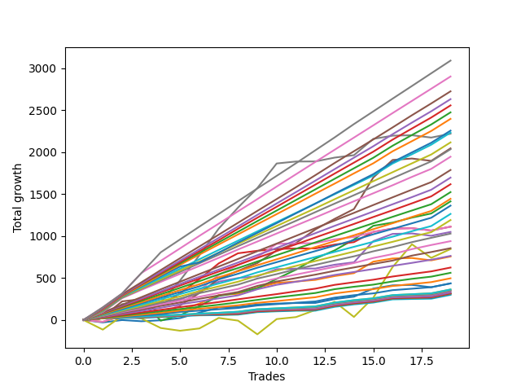

# Short Golden One 
- Symbol: ES1y1d
- Date Range: 07/19/2021 - 07/08/2022
- Trading Period: 7:20-12:30
- Number of Trades: 19



| Name | Win Percent | Profit | Avg Profit / Trade | Avg Time / Trade |      | Name | Win Percent | Profit | Avg Profit / Trade | Avg Time / Trade |
| ---- | ----------- | ------ | ------------------ | ---------------- | ---- | ---- | ----------- | ------ | ------------------ | ---------------- |
| Sorted By <br> Profit | | | | | | Sorted By <br> Win Percentage ||||
| Seven | 94.74 | 1109250.00 | 58381.58 | 19 04:18:25 |     | Three Hundred | 100.00 | 1016875.00 | 53519.74 | 25 20:19:50 |
| Five | 89.47 | 1022250.00 | 53802.63 | 28 16:13:25 |     | Two Hundred Nine | 100.00 | 893375.00 | 47019.74 | 19 11:01:18 |
| Three Hundred | 100.00 | 1016875.00 | 53519.74 | 25 20:19:50 |     | Two Hundred Eight | 100.00 | 808500.00 | 42552.63 | 12 16:00:44 |
| Two Hundred Nine | 100.00 | 893375.00 | 47019.74 | 19 11:01:18 |     | Two Hundred Seven | 100.00 | 721625.00 | 37980.26 | 10 06:21:12 |
| Two Hundred Eight | 100.00 | 808500.00 | 42552.63 | 12 16:00:44 |     | Two Hundred Six | 100.00 | 631625.00 | 33243.42 | 10 00:58:15 |
| Two Hundred Seven | 100.00 | 721625.00 | 37980.26 | 10 06:21:12 |     | Two Hundred Five | 100.00 | 514375.00 | 27072.37 | 09 17:12:06 |
| Two | 94.74 | 706375.00 | 37177.63 | 10 22:45:22 |     | Two Hundred Four | 100.00 | 427500.00 | 22500.00 | 09 02:10:22 |
| Two Hundred Six | 100.00 | 631625.00 | 33243.42 | 10 00:58:15 |     | Two Hundred Three | 100.00 | 312250.00 | 16434.21 | 03 02:31:03 |
| Three | 89.47 | 555750.00 | 29250.00 | 06 03:14:03 |     | Two Hundred Two | 100.00 | 248250.00 | 13065.79 | 02 17:24:37 |
| Six | 84.21 | 555250.00 | 29223.68 | 15 17:08:34 |     | Two Hundred One | 100.00 | 181500.00 | 9552.63 | 01 19:22:34 |
| Four | 89.47 | 524375.00 | 27598.68 | 16 12:08:41 |     | Eighty-Five | 100.00 | 159375.00 | 8388.16 | 01 16:47:18 |
| Two Hundred Five | 100.00 | 514375.00 | 27072.37 | 09 17:12:06 |     | Eighty-Four | 100.00 | 158875.00 | 8361.84 | 01 16:47:12 |
| Two Hundred Four | 100.00 | 427500.00 | 22500.00 | 09 02:10:22 |     | Eighty-Three | 100.00 | 157375.00 | 8282.89 | 01 16:47:00 |
| Seventy-Three | 57.89 | 422375.00 | 22230.26 | 12 04:25:28 |     | Eighty-Two | 100.00 | 153250.00 | 8065.79 | 01 16:46:28 |
| One | 84.21 | 378000.00 | 19894.74 | 02 14:38:28 |     | Eighty-One | 100.00 | 149500.00 | 7868.42 | 01 16:41:22 |
| Two Hundred Three | 100.00 | 312250.00 | 16434.21 | 03 02:31:03 |     | Seven | 94.74 | 1109250.00 | 58381.58 | 19 04:18:25 |
| Two Hundred Two | 100.00 | 248250.00 | 13065.79 | 02 17:24:37 |     | Two | 94.74 | 706375.00 | 37177.63 | 10 22:45:22 |
| Zero | 84.21 | 217750.00 | 11460.53 | 01 16:32:50 |     | Five | 89.47 | 1022250.00 | 53802.63 | 28 16:13:25 |
| Two Hundred One | 100.00 | 181500.00 | 9552.63 | 01 19:22:34 |     | Three | 89.47 | 555750.00 | 29250.00 | 06 03:14:03 |
| Eighty-Five | 100.00 | 159375.00 | 8388.16 | 01 16:47:18 |     | Four | 89.47 | 524375.00 | 27598.68 | 16 12:08:41 |
| Eighty-Four | 100.00 | 158875.00 | 8361.84 | 01 16:47:12 |     | Six | 84.21 | 555250.00 | 29223.68 | 15 17:08:34 |
| Eighty-Three | 100.00 | 157375.00 | 8282.89 | 01 16:47:00 |     | One | 84.21 | 378000.00 | 19894.74 | 02 14:38:28 |
| Eighty-Two | 100.00 | 153250.00 | 8065.79 | 01 16:46:28 |     | Zero | 84.21 | 217750.00 | 11460.53 | 01 16:32:50 |
| Eighty-One | 100.00 | 149500.00 | 7868.42 | 01 16:41:22 |     | One Hundred Twenty | 73.68 | 84625.00 | 4453.95 | 00 00:04:34 |
| Forty-Five | 21.05 | 147125.00 | 7743.42 | 01 02:05:50 |     | One Hundred Ninteen | 73.68 | 84625.00 | 4453.95 | 00 00:04:34 |
| Sixty-One | 21.05 | 127750.00 | 6723.68 | 01 02:24:56 |     | One Hundred Eighteen | 73.68 | 84625.00 | 4453.95 | 00 00:04:34 |
| Forty-Two | 21.05 | 103625.00 | 5453.95 | 00 18:25:00 |     | One Hundred Seventeen | 73.68 | 84625.00 | 4453.95 | 00 00:04:34 |
| One Hundred Twenty | 73.68 | 84625.00 | 4453.95 | 00 00:04:34 |     | One Hundred Sixteen | 73.68 | 84625.00 | 4453.95 | 00 00:04:34 |
| One Hundred Ninteen | 73.68 | 84625.00 | 4453.95 | 00 00:04:34 |     | One Hundred Twenty-Five | 73.68 | 82375.00 | 4335.53 | 00 00:03:15 |
| One Hundred Eighteen | 73.68 | 84625.00 | 4453.95 | 00 00:04:34 |     | One Hundred Twenty-Four | 73.68 | 82375.00 | 4335.53 | 00 00:03:15 |
| One Hundred Seventeen | 73.68 | 84625.00 | 4453.95 | 00 00:04:34 |     | One Hundred Fifteen | 73.68 | 82375.00 | 4335.53 | 00 00:03:15 |
| One Hundred Sixteen | 73.68 | 84625.00 | 4453.95 | 00 00:04:34 |     | One Hundred Fourteen | 73.68 | 82375.00 | 4335.53 | 00 00:03:15 |
| Fifty-Five | 68.42 | 82750.00 | 4355.26 | 00 00:07:09 |     | One Hundred Thirty | 73.68 | 81500.00 | 4289.47 | 00 00:04:41 |
| One Hundred Twenty-Five | 73.68 | 82375.00 | 4335.53 | 00 00:03:15 |     | One Hundred Twenty-Nine | 73.68 | 81500.00 | 4289.47 | 00 00:04:41 |
| One Hundred Twenty-Four | 73.68 | 82375.00 | 4335.53 | 00 00:03:15 |     | One Hundred Twenty-Eight | 73.68 | 81500.00 | 4289.47 | 00 00:04:41 |
| One Hundred Fifteen | 73.68 | 82375.00 | 4335.53 | 00 00:03:15 |     | One Hundred Twenty-Seven | 73.68 | 81500.00 | 4289.47 | 00 00:04:41 |
| One Hundred Fourteen | 73.68 | 82375.00 | 4335.53 | 00 00:03:15 |     | One Hundred Twenty-Six | 73.68 | 81500.00 | 4289.47 | 00 00:04:41 |
| One Hundred Thirty | 73.68 | 81500.00 | 4289.47 | 00 00:04:41 |     | One Hundred Twenty-Three | 73.68 | 80875.00 | 4256.58 | 00 00:03:03 |
| One Hundred Twenty-Nine | 73.68 | 81500.00 | 4289.47 | 00 00:04:41 |     | One Hundred Twenty-Two | 73.68 | 80875.00 | 4256.58 | 00 00:03:03 |
| One Hundred Twenty-Eight | 73.68 | 81500.00 | 4289.47 | 00 00:04:41 |     | One Hundred Thirteen | 73.68 | 80875.00 | 4256.58 | 00 00:03:03 |
| One Hundred Twenty-Seven | 73.68 | 81500.00 | 4289.47 | 00 00:04:41 |     | One Hundred Twelve | 73.68 | 80875.00 | 4256.58 | 00 00:03:03 |
| One Hundred Twenty-Six | 73.68 | 81500.00 | 4289.47 | 00 00:04:41 |     | One Hundred Twenty-One | 73.68 | 79875.00 | 4203.95 | 00 00:03:00 |
| One Hundred Twenty-Three | 73.68 | 80875.00 | 4256.58 | 00 00:03:03 |     | One Hundred Eleven | 73.68 | 79875.00 | 4203.95 | 00 00:03:00 |
| One Hundred Twenty-Two | 73.68 | 80875.00 | 4256.58 | 00 00:03:03 |     | Forty-Eight | 73.68 | 75375.00 | 3967.11 | 00 00:04:12 |
| One Hundred Thirteen | 73.68 | 80875.00 | 4256.58 | 00 00:03:03 |     | Sixty-Four | 73.68 | 67375.00 | 3546.05 | 00 00:13:09 |
| One Hundred Twelve | 73.68 | 80875.00 | 4256.58 | 00 00:03:03 |     | Fifty-Five | 68.42 | 82750.00 | 4355.26 | 00 00:07:09 |
| Fifty-Eight | 21.05 | 80375.00 | 4230.26 | 00 18:44:31 |     | Forty-Nine | 68.42 | 80000.00 | 4210.53 | 00 00:05:44 |
| Forty-Nine | 68.42 | 80000.00 | 4210.53 | 00 00:05:44 |     | Fifty-Three | 68.42 | 77750.00 | 4092.11 | 00 00:07:47 |
| One Hundred Twenty-One | 73.68 | 79875.00 | 4203.95 | 00 00:03:00 |     | Fifty | 68.42 | 77750.00 | 4092.11 | 00 00:07:47 |
| One Hundred Eleven | 73.68 | 79875.00 | 4203.95 | 00 00:03:00 |     | Fifty-One | 68.42 | 77250.00 | 4065.79 | 00 00:06:31 |
| Fifty-Three | 68.42 | 77750.00 | 4092.11 | 00 00:07:47 |     | Fifty-Two | 68.42 | 74500.00 | 3921.05 | 00 00:06:41 |
| Fifty | 68.42 | 77750.00 | 4092.11 | 00 00:07:47 |     | Fifty-Four | 68.42 | 73625.00 | 3875.00 | 00 00:05:37 |
| Fifty-One | 68.42 | 77250.00 | 4065.79 | 00 00:06:31 |     | Seventy-One | 68.42 | 69000.00 | 3631.58 | 00 00:18:41 |
| Forty-Eight | 73.68 | 75375.00 | 3967.11 | 00 00:04:12 |     | Sixty-Five | 68.42 | 68750.00 | 3618.42 | 00 00:15:44 |
| Fifty-Two | 68.42 | 74500.00 | 3921.05 | 00 00:06:41 |     | Sixty-Nine | 68.42 | 67250.00 | 3539.47 | 00 00:19:41 |
| Fifty-Four | 68.42 | 73625.00 | 3875.00 | 00 00:05:37 |     | Sixty-Seven | 68.42 | 66750.00 | 3513.16 | 00 00:17:00 |
| Seventy-One | 68.42 | 69000.00 | 3631.58 | 00 00:18:41 |     | Seventy | 68.42 | 64750.00 | 3407.89 | 00 00:16:09 |
| Sixty-Five | 68.42 | 68750.00 | 3618.42 | 00 00:15:44 |     | Sixty-Eight | 68.42 | 62500.00 | 3289.47 | 00 00:17:18 |
| Sixty-Four | 73.68 | 67375.00 | 3546.05 | 00 00:13:09 |     | Sixty-Six | 68.42 | 62125.00 | 3269.74 | 00 00:19:47 |
| Sixty-Nine | 68.42 | 67250.00 | 3539.47 | 00 00:19:41 |     | Seventy-Three | 57.89 | 422375.00 | 22230.26 | 12 04:25:28 |
| Sixty-Seven | 68.42 | 66750.00 | 3513.16 | 00 00:17:00 |     | Forty | 57.89 | 49625.00 | 2611.84 | 00 06:27:41 |
| Seventy | 68.42 | 64750.00 | 3407.89 | 00 00:16:09 |     | Fifty-Six | 57.89 | 40750.00 | 2144.74 | 00 06:43:25 |
| Sixty-Eight | 68.42 | 62500.00 | 3289.47 | 00 00:17:18 |     | Forty-One | 47.37 | 56125.00 | 2953.95 | 00 06:53:12 |
| Sixty-Six | 68.42 | 62125.00 | 3269.74 | 00 00:19:47 |     | Fifty-Seven | 47.37 | 41750.00 | 2197.37 | 00 07:09:25 |
| Forty-One | 47.37 | 56125.00 | 2953.95 | 00 06:53:12 |     | Forty-Three | 47.37 | 37000.00 | 1947.37 | 00 06:33:03 |
| Forty | 57.89 | 49625.00 | 2611.84 | 00 06:27:41 |     | Fifty-Nine | 47.37 | 22250.00 | 1171.05 | 00 06:49:56 |
| Forty-Four | 42.11 | 42500.00 | 2236.84 | 00 06:45:50 |     | Forty-Four | 42.11 | 42500.00 | 2236.84 | 00 06:45:50 |
| Fifty-Seven | 47.37 | 41750.00 | 2197.37 | 00 07:09:25 |     | Forty-Seven | 42.11 | 32625.00 | 1717.11 | 00 06:51:31 |
| Fifty-Six | 57.89 | 40750.00 | 2144.74 | 00 06:43:25 |     | Sixty | 42.11 | 25250.00 | 1328.95 | 00 07:02:50 |
| Forty-Three | 47.37 | 37000.00 | 1947.37 | 00 06:33:03 |     | Forty-Six | 42.11 | 18625.00 | 980.26 | 00 06:34:12 |
| Forty-Seven | 42.11 | 32625.00 | 1717.11 | 00 06:51:31 |     | Sixty-Three | 42.11 | 15375.00 | 809.21 | 00 07:08:31 |
| Sixty | 42.11 | 25250.00 | 1328.95 | 00 07:02:50 |     | Sixty-Two | 42.11 | 1375.00 | 72.37 | 00 06:51:12 |
| Fifty-Nine | 47.37 | 22250.00 | 1171.05 | 00 06:49:56 |     | Forty-Five | 21.05 | 147125.00 | 7743.42 | 01 02:05:50 |
| Forty-Six | 42.11 | 18625.00 | 980.26 | 00 06:34:12 |     | Sixty-One | 21.05 | 127750.00 | 6723.68 | 01 02:24:56 |
| Sixty-Three | 42.11 | 15375.00 | 809.21 | 00 07:08:31 |     | Forty-Two | 21.05 | 103625.00 | 5453.95 | 00 18:25:00 |
| Sixty-Two | 42.11 | 1375.00 | 72.37 | 00 06:51:12 |     | Fifty-Eight | 21.05 | 80375.00 | 4230.26 | 00 18:44:31 |

## NO STOPLOSS

### Test Zero
* Sell when price hits the middle line of the 20p bollinger
* No Stoploss
* Results:
```
Total Trades: 19
Percent Up: 15.79
Percent Down: 84.21
Total Points Moved Down: 435.50
Potential Profit: 217750.00
Total Points Ups: 71.25 Count Ups: 3
Total Points Downs: 506.75 Count Downs: 16
```

<details><summary>Trades</summary>

<code>In: 2021-08-19 07:21:00		Out: 2021-08-19 07:24:00		Total Position Time: 00 00:03:00		Total Move Down: -29.25		Total to Date: -29.25</code> <br />
<code>In: 2021-09-09 07:21:00		Out: 2021-09-10 07:33:00		Total Position Time: 01 00:12:00		Total Move Down: 28.25		Total to Date: -1.00</code> <br />
<code>In: 2021-09-29 07:21:00		Out: 2021-09-29 07:24:00		Total Position Time: 00 00:03:00		Total Move Down: -14.25		Total to Date: -15.25</code> <br />
<code>In: 2021-10-12 07:21:00		Out: 2021-10-12 07:24:00		Total Position Time: 00 00:03:00		Total Move Down: 11.25		Total to Date: -4.00</code> <br />
<code>In: 2021-11-11 07:21:00		Out: 2021-11-26 06:31:00		Total Position Time: 14 23:10:00		Total Move Down: 26.50		Total to Date: 22.50</code> <br />
<code>In: 2021-11-17 07:21:00		Out: 2021-11-26 06:31:00		Total Position Time: 08 23:10:00		Total Move Down: 64.50		Total to Date: 87.00</code> <br />
<code>In: 2021-11-22 07:21:00		Out: 2021-11-23 08:03:00		Total Position Time: 01 00:42:00		Total Move Down: 63.25		Total to Date: 150.25</code> <br />
<code>In: 2021-11-29 07:21:00		Out: 2021-11-29 07:24:00		Total Position Time: 00 00:03:00		Total Move Down: 5.75		Total to Date: 156.00</code> <br />
<code>In: 2021-12-17 07:21:00		Out: 2021-12-17 07:24:00		Total Position Time: 00 00:03:00		Total Move Down: 29.75		Total to Date: 185.75</code> <br />
<code>In: 2022-01-06 07:21:00		Out: 2022-01-06 07:24:00		Total Position Time: 00 00:03:00		Total Move Down: 9.50		Total to Date: 195.25</code> <br />
<code>In: 2022-02-14 07:21:00		Out: 2022-02-14 07:24:00		Total Position Time: 00 00:03:00		Total Move Down: 6.75		Total to Date: 202.00</code> <br />
<code>In: 2022-03-01 07:21:00		Out: 2022-03-01 07:24:00		Total Position Time: 00 00:03:00		Total Move Down: 1.00		Total to Date: 203.00</code> <br />
<code>In: 2022-03-07 07:21:00		Out: 2022-03-07 07:24:00		Total Position Time: 00 00:03:00		Total Move Down: 45.50		Total to Date: 248.50</code> <br />
<code>In: 2022-03-11 07:21:00		Out: 2022-03-11 07:24:00		Total Position Time: 00 00:03:00		Total Move Down: 29.00		Total to Date: 277.50</code> <br />
<code>In: 2022-04-01 07:21:00		Out: 2022-04-07 09:49:00		Total Position Time: 06 02:28:00		Total Move Down: 96.50		Total to Date: 374.00</code> <br />
<code>In: 2022-04-22 07:21:00		Out: 2022-04-22 07:24:00		Total Position Time: 00 00:03:00		Total Move Down: 38.25		Total to Date: 412.25</code> <br />
<code>In: 2022-05-06 07:21:00		Out: 2022-05-06 07:24:00		Total Position Time: 00 00:03:00		Total Move Down: 5.25		Total to Date: 417.50</code> <br />
<code>In: 2022-05-19 07:21:00		Out: 2022-05-19 07:24:00		Total Position Time: 00 00:03:00		Total Move Down: -27.75		Total to Date: 389.75</code> <br />
<code>In: 2022-06-10 07:21:00		Out: 2022-06-10 07:24:00		Total Position Time: 00 00:03:00		Total Move Down: 45.75		Total to Date: 435.50</code> <br />


</details>

### Test One
* Sell when the price hits the upper line of the 20p 1std bollinger
* No Stoploss
* Results:
```
Total Trades: 19
Percent Up: 15.79
Percent Down: 84.21
Total Points Moved Down: 756.00
Potential Profit: 378000.00
Total Points Ups: 63.50 Count Ups: 3
Total Points Downs: 819.50 Count Downs: 16
```

<details><summary>Trades</summary>

<code>In: 2021-08-19 07:21:00		Out: 2021-08-19 07:34:00		Total Position Time: 00 00:13:00		Total Move Down: -21.50		Total to Date: -21.50</code> <br />
<code>In: 2021-09-09 07:21:00		Out: 2021-09-13 10:51:00		Total Position Time: 04 03:30:00		Total Move Down: 68.75		Total to Date: 47.25</code> <br />
<code>In: 2021-09-29 07:21:00		Out: 2021-09-29 07:24:00		Total Position Time: 00 00:03:00		Total Move Down: -14.25		Total to Date: 33.00</code> <br />
<code>In: 2021-10-12 07:21:00		Out: 2021-10-12 13:24:00		Total Position Time: 00 06:03:00		Total Move Down: 32.25		Total to Date: 65.25</code> <br />
<code>In: 2021-11-11 07:21:00		Out: 2021-11-26 06:48:00		Total Position Time: 14 23:27:00		Total Move Down: 46.00		Total to Date: 111.25</code> <br />
<code>In: 2021-11-17 07:21:00		Out: 2021-11-26 06:48:00		Total Position Time: 08 23:27:00		Total Move Down: 84.00		Total to Date: 195.25</code> <br />
<code>In: 2021-11-22 07:21:00		Out: 2021-11-26 06:48:00		Total Position Time: 03 23:27:00		Total Move Down: 101.75		Total to Date: 297.00</code> <br />
<code>In: 2021-11-29 07:21:00		Out: 2021-11-29 07:30:00		Total Position Time: 00 00:09:00		Total Move Down: 15.00		Total to Date: 312.00</code> <br />
<code>In: 2021-12-17 07:21:00		Out: 2021-12-20 06:31:00		Total Position Time: 02 23:10:00		Total Move Down: 72.25		Total to Date: 384.25</code> <br />
<code>In: 2022-01-06 07:21:00		Out: 2022-01-10 06:32:00		Total Position Time: 03 23:11:00		Total Move Down: 57.25		Total to Date: 441.50</code> <br />
<code>In: 2022-02-14 07:21:00		Out: 2022-02-14 07:32:00		Total Position Time: 00 00:11:00		Total Move Down: 16.50		Total to Date: 458.00</code> <br />
<code>In: 2022-03-01 07:21:00		Out: 2022-03-01 07:42:00		Total Position Time: 00 00:21:00		Total Move Down: 19.50		Total to Date: 477.50</code> <br />
<code>In: 2022-03-07 07:21:00		Out: 2022-03-07 07:24:00		Total Position Time: 00 00:03:00		Total Move Down: 45.50		Total to Date: 523.00</code> <br />
<code>In: 2022-03-11 07:21:00		Out: 2022-03-11 08:32:00		Total Position Time: 00 01:11:00		Total Move Down: 34.75		Total to Date: 557.75</code> <br />
<code>In: 2022-04-01 07:21:00		Out: 2022-04-11 12:54:00		Total Position Time: 10 05:33:00		Total Move Down: 136.75		Total to Date: 694.50</code> <br />
<code>In: 2022-04-22 07:21:00		Out: 2022-04-22 07:24:00		Total Position Time: 00 00:03:00		Total Move Down: 38.25		Total to Date: 732.75</code> <br />
<code>In: 2022-05-06 07:21:00		Out: 2022-05-06 07:24:00		Total Position Time: 00 00:03:00		Total Move Down: 5.25		Total to Date: 738.00</code> <br />
<code>In: 2022-05-19 07:21:00		Out: 2022-05-19 07:24:00		Total Position Time: 00 00:03:00		Total Move Down: -27.75		Total to Date: 710.25</code> <br />
<code>In: 2022-06-10 07:21:00		Out: 2022-06-10 07:24:00		Total Position Time: 00 00:03:00		Total Move Down: 45.75		Total to Date: 756.00</code> <br />


</details>

### Test Two
* Sell when the price hits the upper line of the 20p 2std bollinger
* No Stoploss
* Results:
```
Total Trades: 19
Percent Up: 5.26
Percent Down: 94.74
Total Points Moved Down: 1412.75
Potential Profit: 706375.00
Total Points Ups: 232.75 Count Ups: 1
Total Points Downs: 1645.50 Count Downs: 18
```

<details><summary>Trades</summary>

<code>In: 2021-08-19 07:21:00		Out: 2021-09-20 06:31:00		Total Position Time: 31 23:10:00		Total Move Down: 20.25		Total to Date: 20.25</code> <br />
<code>In: 2021-09-09 07:21:00		Out: 2021-09-20 06:31:00		Total Position Time: 10 23:10:00		Total Move Down: 164.75		Total to Date: 185.00</code> <br />
<code>In: 2021-09-29 07:21:00		Out: 2021-09-30 09:06:00		Total Position Time: 01 01:45:00		Total Move Down: 39.50		Total to Date: 224.50</code> <br />
<code>In: 2021-10-12 07:21:00		Out: 2021-11-30 07:57:00		Total Position Time: 49 00:36:00		Total Move Down: -232.75		Total to Date: -8.25</code> <br />
<code>In: 2021-11-11 07:21:00		Out: 2021-11-26 09:51:00		Total Position Time: 15 02:30:00		Total Move Down: 64.50		Total to Date: 56.25</code> <br />
<code>In: 2021-11-17 07:21:00		Out: 2021-11-26 08:23:00		Total Position Time: 09 01:02:00		Total Move Down: 109.50		Total to Date: 165.75</code> <br />
<code>In: 2021-11-22 07:21:00		Out: 2021-11-26 08:17:00		Total Position Time: 04 00:56:00		Total Move Down: 120.25		Total to Date: 286.00</code> <br />
<code>In: 2021-11-29 07:21:00		Out: 2021-11-30 07:53:00		Total Position Time: 01 00:32:00		Total Move Down: 41.00		Total to Date: 327.00</code> <br />
<code>In: 2021-12-17 07:21:00		Out: 2022-01-18 08:32:00		Total Position Time: 32 01:11:00		Total Move Down: 49.75		Total to Date: 376.75</code> <br />
<code>In: 2022-01-06 07:21:00		Out: 2022-01-18 09:25:00		Total Position Time: 12 02:04:00		Total Move Down: 112.50		Total to Date: 489.25</code> <br />
<code>In: 2022-02-14 07:21:00		Out: 2022-02-22 10:03:00		Total Position Time: 08 02:42:00		Total Move Down: 110.00		Total to Date: 599.25</code> <br />
<code>In: 2022-03-01 07:21:00		Out: 2022-03-07 11:45:00		Total Position Time: 06 04:24:00		Total Move Down: 132.25		Total to Date: 731.50</code> <br />
<code>In: 2022-03-07 07:21:00		Out: 2022-03-07 11:45:00		Total Position Time: 00 04:24:00		Total Move Down: 97.50		Total to Date: 829.00</code> <br />
<code>In: 2022-03-11 07:21:00		Out: 2022-03-14 11:24:00		Total Position Time: 03 04:03:00		Total Move Down: 130.25		Total to Date: 959.25</code> <br />
<code>In: 2022-04-01 07:21:00		Out: 2022-04-18 07:01:00		Total Position Time: 16 23:40:00		Total Move Down: 162.50		Total to Date: 1121.75</code> <br />
<code>In: 2022-04-22 07:21:00		Out: 2022-04-22 07:24:00		Total Position Time: 00 00:03:00		Total Move Down: 38.25		Total to Date: 1160.00</code> <br />
<code>In: 2022-05-06 07:21:00		Out: 2022-05-09 06:31:00		Total Position Time: 02 23:10:00		Total Move Down: 59.00		Total to Date: 1219.00</code> <br />
<code>In: 2022-05-19 07:21:00		Out: 2022-05-20 09:11:00		Total Position Time: 01 01:50:00		Total Move Down: 49.25		Total to Date: 1268.25</code> <br />
<code>In: 2022-06-10 07:21:00		Out: 2022-06-13 06:31:00		Total Position Time: 02 23:10:00		Total Move Down: 144.50		Total to Date: 1412.75</code> <br />


</details>

### Test Three
* Sell when price hits the middle line of the 50p bollinger
* No Stoploss
* Results:
```
Total Trades: 19
Percent Up: 10.53
Percent Down: 89.47
Total Points Moved Down: 1111.50
Potential Profit: 555750.00
Total Points Ups: 42.00 Count Ups: 2
Total Points Downs: 1153.50 Count Downs: 17
```

<details><summary>Trades</summary>

<code>In: 2021-08-19 07:21:00		Out: 2021-09-28 13:23:00		Total Position Time: 40 06:02:00		Total Move Down: 21.50		Total to Date: 21.50</code> <br />
<code>In: 2021-09-09 07:21:00		Out: 2021-09-28 10:23:00		Total Position Time: 19 03:02:00		Total Move Down: 162.75		Total to Date: 184.25</code> <br />
<code>In: 2021-09-29 07:21:00		Out: 2021-09-29 07:24:00		Total Position Time: 00 00:03:00		Total Move Down: -14.25		Total to Date: 170.00</code> <br />
<code>In: 2021-10-12 07:21:00		Out: 2021-10-12 07:24:00		Total Position Time: 00 00:03:00		Total Move Down: 11.25		Total to Date: 181.25</code> <br />
<code>In: 2021-11-11 07:21:00		Out: 2021-12-01 12:57:00		Total Position Time: 20 05:36:00		Total Move Down: 135.25		Total to Date: 316.50</code> <br />
<code>In: 2021-11-17 07:21:00		Out: 2021-12-01 12:56:00		Total Position Time: 14 05:35:00		Total Move Down: 170.00		Total to Date: 486.50</code> <br />
<code>In: 2021-11-22 07:21:00		Out: 2021-12-01 12:56:00		Total Position Time: 09 05:35:00		Total Move Down: 187.75		Total to Date: 674.25</code> <br />
<code>In: 2021-11-29 07:21:00		Out: 2021-12-01 12:56:00		Total Position Time: 02 05:35:00		Total Move Down: 120.25		Total to Date: 794.50</code> <br />
<code>In: 2021-12-17 07:21:00		Out: 2021-12-17 07:24:00		Total Position Time: 00 00:03:00		Total Move Down: 29.75		Total to Date: 824.25</code> <br />
<code>In: 2022-01-06 07:21:00		Out: 2022-01-07 07:44:00		Total Position Time: 01 00:23:00		Total Move Down: 20.75		Total to Date: 845.00</code> <br />
<code>In: 2022-02-14 07:21:00		Out: 2022-02-14 07:24:00		Total Position Time: 00 00:03:00		Total Move Down: 6.75		Total to Date: 851.75</code> <br />
<code>In: 2022-03-01 07:21:00		Out: 2022-03-01 07:24:00		Total Position Time: 00 00:03:00		Total Move Down: 1.00		Total to Date: 852.75</code> <br />
<code>In: 2022-03-07 07:21:00		Out: 2022-03-07 07:24:00		Total Position Time: 00 00:03:00		Total Move Down: 45.50		Total to Date: 898.25</code> <br />
<code>In: 2022-03-11 07:21:00		Out: 2022-03-11 07:24:00		Total Position Time: 00 00:03:00		Total Move Down: 29.00		Total to Date: 927.25</code> <br />
<code>In: 2022-04-01 07:21:00		Out: 2022-04-11 12:27:00		Total Position Time: 10 05:06:00		Total Move Down: 122.75		Total to Date: 1050.00</code> <br />
<code>In: 2022-04-22 07:21:00		Out: 2022-04-22 07:24:00		Total Position Time: 00 00:03:00		Total Move Down: 38.25		Total to Date: 1088.25</code> <br />
<code>In: 2022-05-06 07:21:00		Out: 2022-05-06 07:24:00		Total Position Time: 00 00:03:00		Total Move Down: 5.25		Total to Date: 1093.50</code> <br />
<code>In: 2022-05-19 07:21:00		Out: 2022-05-19 07:24:00		Total Position Time: 00 00:03:00		Total Move Down: -27.75		Total to Date: 1065.75</code> <br />
<code>In: 2022-06-10 07:21:00		Out: 2022-06-10 07:24:00		Total Position Time: 00 00:03:00		Total Move Down: 45.75		Total to Date: 1111.50</code> <br />


</details>

### Test Four
* Sell when the price hits the upper line of the 50p 1std bollinger
* No Stoploss
* Results:
```
Total Trades: 19
Percent Up: 10.53
Percent Down: 89.47
Total Points Moved Down: 1048.75
Potential Profit: 524375.00
Total Points Ups: 42.00 Count Ups: 2
Total Points Downs: 1090.75 Count Downs: 17
```

<details><summary>Trades</summary>

<code>In: 2021-08-19 07:21:00		Out: 2021-09-28 13:23:00		Total Position Time: 40 06:02:00		Total Move Down: 21.50		Total to Date: 21.50</code> <br />
<code>In: 2021-09-09 07:21:00		Out: 2021-09-28 10:23:00		Total Position Time: 19 03:02:00		Total Move Down: 162.75		Total to Date: 184.25</code> <br />
<code>In: 2021-09-29 07:21:00		Out: 2021-09-29 07:24:00		Total Position Time: 00 00:03:00		Total Move Down: -14.25		Total to Date: 170.00</code> <br />
<code>In: 2021-10-12 07:21:00		Out: 2021-10-12 07:24:00		Total Position Time: 00 00:03:00		Total Move Down: 11.25		Total to Date: 181.25</code> <br />
<code>In: 2021-11-11 07:21:00		Out: 2022-01-10 07:02:00		Total Position Time: 59 23:41:00		Total Move Down: 60.25		Total to Date: 241.50</code> <br />
<code>In: 2021-11-17 07:21:00		Out: 2022-01-10 07:02:00		Total Position Time: 53 23:41:00		Total Move Down: 98.25		Total to Date: 339.75</code> <br />
<code>In: 2021-11-22 07:21:00		Out: 2022-01-10 07:02:00		Total Position Time: 48 23:41:00		Total Move Down: 116.00		Total to Date: 455.75</code> <br />
<code>In: 2021-11-29 07:21:00		Out: 2022-01-10 06:56:00		Total Position Time: 41 23:35:00		Total Move Down: 43.50		Total to Date: 499.25</code> <br />
<code>In: 2021-12-17 07:21:00		Out: 2022-01-10 06:54:00		Total Position Time: 23 23:33:00		Total Move Down: 20.00		Total to Date: 519.25</code> <br />
<code>In: 2022-01-06 07:21:00		Out: 2022-01-10 06:56:00		Total Position Time: 03 23:35:00		Total Move Down: 85.75		Total to Date: 605.00</code> <br />
<code>In: 2022-02-14 07:21:00		Out: 2022-02-14 07:24:00		Total Position Time: 00 00:03:00		Total Move Down: 6.75		Total to Date: 611.75</code> <br />
<code>In: 2022-03-01 07:21:00		Out: 2022-03-01 07:24:00		Total Position Time: 00 00:03:00		Total Move Down: 1.00		Total to Date: 612.75</code> <br />
<code>In: 2022-03-07 07:21:00		Out: 2022-03-07 07:24:00		Total Position Time: 00 00:03:00		Total Move Down: 45.50		Total to Date: 658.25</code> <br />
<code>In: 2022-03-11 07:21:00		Out: 2022-03-11 07:24:00		Total Position Time: 00 00:03:00		Total Move Down: 29.00		Total to Date: 687.25</code> <br />
<code>In: 2022-04-01 07:21:00		Out: 2022-04-22 11:05:00		Total Position Time: 21 03:44:00		Total Move Down: 252.25		Total to Date: 939.50</code> <br />
<code>In: 2022-04-22 07:21:00		Out: 2022-04-22 11:05:00		Total Position Time: 00 03:44:00		Total Move Down: 86.00		Total to Date: 1025.50</code> <br />
<code>In: 2022-05-06 07:21:00		Out: 2022-05-06 07:24:00		Total Position Time: 00 00:03:00		Total Move Down: 5.25		Total to Date: 1030.75</code> <br />
<code>In: 2022-05-19 07:21:00		Out: 2022-05-19 07:24:00		Total Position Time: 00 00:03:00		Total Move Down: -27.75		Total to Date: 1003.00</code> <br />
<code>In: 2022-06-10 07:21:00		Out: 2022-06-10 07:24:00		Total Position Time: 00 00:03:00		Total Move Down: 45.75		Total to Date: 1048.75</code> <br />


</details>

### Test Five
* Sell when the price hits the upper line of the 50p 2std bollinger
* No Stoploss
* Results:
```
Total Trades: 19
Percent Up: 10.53
Percent Down: 89.47
Total Points Moved Down: 2044.50
Potential Profit: 1022250.00
Total Points Ups: 213.50 Count Ups: 2
Total Points Downs: 2258.00 Count Downs: 17
```

<details><summary>Trades</summary>

<code>In: 2021-08-19 07:21:00		Out: 2021-09-30 08:42:00		Total Position Time: 42 01:21:00		Total Move Down: 38.50		Total to Date: 38.50</code> <br />
<code>In: 2021-09-09 07:21:00		Out: 2021-09-30 08:42:00		Total Position Time: 21 01:21:00		Total Move Down: 183.00		Total to Date: 221.50</code> <br />
<code>In: 2021-09-29 07:21:00		Out: 2021-09-30 08:41:00		Total Position Time: 01 01:20:00		Total Move Down: 27.00		Total to Date: 248.50</code> <br />
<code>In: 2021-10-12 07:21:00		Out: 2022-01-19 12:33:00		Total Position Time: 99 05:12:00		Total Move Down: -185.75		Total to Date: 62.75</code> <br />
<code>In: 2021-11-11 07:21:00		Out: 2022-01-19 12:33:00		Total Position Time: 69 05:12:00		Total Move Down: 110.25		Total to Date: 173.00</code> <br />
<code>In: 2021-11-17 07:21:00		Out: 2022-01-19 12:33:00		Total Position Time: 63 05:12:00		Total Move Down: 148.25		Total to Date: 321.25</code> <br />
<code>In: 2021-11-22 07:21:00		Out: 2022-01-19 12:33:00		Total Position Time: 58 05:12:00		Total Move Down: 166.00		Total to Date: 487.25</code> <br />
<code>In: 2021-11-29 07:21:00		Out: 2022-01-19 12:33:00		Total Position Time: 51 05:12:00		Total Move Down: 98.50		Total to Date: 585.75</code> <br />
<code>In: 2021-12-17 07:21:00		Out: 2022-01-19 12:54:00		Total Position Time: 33 05:33:00		Total Move Down: 92.25		Total to Date: 678.00</code> <br />
<code>In: 2022-01-06 07:21:00		Out: 2022-01-19 12:51:00		Total Position Time: 13 05:30:00		Total Move Down: 149.75		Total to Date: 827.75</code> <br />
<code>In: 2022-02-14 07:21:00		Out: 2022-02-22 06:34:00		Total Position Time: 07 23:13:00		Total Move Down: 89.00		Total to Date: 916.75</code> <br />
<code>In: 2022-03-01 07:21:00		Out: 2022-03-07 13:05:00		Total Position Time: 06 05:44:00		Total Move Down: 161.25		Total to Date: 1078.00</code> <br />
<code>In: 2022-03-07 07:21:00		Out: 2022-03-07 13:05:00		Total Position Time: 00 05:44:00		Total Move Down: 126.50		Total to Date: 1204.50</code> <br />
<code>In: 2022-03-11 07:21:00		Out: 2022-04-26 13:00:00		Total Position Time: 46 05:39:00		Total Move Down: 116.75		Total to Date: 1321.25</code> <br />
<code>In: 2022-04-01 07:21:00		Out: 2022-04-26 13:00:00		Total Position Time: 25 05:39:00		Total Move Down: 375.50		Total to Date: 1696.75</code> <br />
<code>In: 2022-04-22 07:21:00		Out: 2022-04-26 13:00:00		Total Position Time: 04 05:39:00		Total Move Down: 209.25		Total to Date: 1906.00</code> <br />
<code>In: 2022-05-06 07:21:00		Out: 2022-05-06 07:30:00		Total Position Time: 00 00:09:00		Total Move Down: 17.00		Total to Date: 1923.00</code> <br />
<code>In: 2022-05-19 07:21:00		Out: 2022-05-19 07:24:00		Total Position Time: 00 00:03:00		Total Move Down: -27.75		Total to Date: 1895.25</code> <br />
<code>In: 2022-06-10 07:21:00		Out: 2022-06-13 06:41:00		Total Position Time: 02 23:20:00		Total Move Down: 149.25		Total to Date: 2044.50</code> <br />


</details>

### Test Six
* Sell when the price hits the middle line of the 1std VWAP
* No Stoploss
* Results:
```
Total Trades: 19
Percent Up: 15.79
Percent Down: 84.21
Total Points Moved Down: 1110.50
Potential Profit: 555250.00
Total Points Ups: 63.50 Count Ups: 3
Total Points Downs: 1174.00 Count Downs: 16
```

<details><summary>Trades</summary>

<code>In: 2021-08-19 07:21:00		Out: 2021-08-19 07:34:00		Total Position Time: 00 00:13:00		Total Move Down: -21.50		Total to Date: -21.50</code> <br />
<code>In: 2021-09-09 07:21:00		Out: 2021-09-14 11:37:00		Total Position Time: 05 04:16:00		Total Move Down: 81.25		Total to Date: 59.75</code> <br />
<code>In: 2021-09-29 07:21:00		Out: 2021-09-29 07:24:00		Total Position Time: 00 00:03:00		Total Move Down: -14.25		Total to Date: 45.50</code> <br />
<code>In: 2021-10-12 07:21:00		Out: 2021-10-12 07:24:00		Total Position Time: 00 00:03:00		Total Move Down: 11.25		Total to Date: 56.75</code> <br />
<code>In: 2021-11-11 07:21:00		Out: 2022-01-19 12:57:00		Total Position Time: 69 05:36:00		Total Move Down: 129.00		Total to Date: 185.75</code> <br />
<code>In: 2021-11-17 07:21:00		Out: 2022-01-19 12:57:00		Total Position Time: 63 05:36:00		Total Move Down: 167.00		Total to Date: 352.75</code> <br />
<code>In: 2021-11-22 07:21:00		Out: 2022-01-19 12:57:00		Total Position Time: 58 05:36:00		Total Move Down: 184.75		Total to Date: 537.50</code> <br />
<code>In: 2021-11-29 07:21:00		Out: 2022-01-19 12:57:00		Total Position Time: 51 05:36:00		Total Move Down: 117.25		Total to Date: 654.75</code> <br />
<code>In: 2021-12-17 07:21:00		Out: 2022-01-19 12:56:00		Total Position Time: 33 05:35:00		Total Move Down: 94.75		Total to Date: 749.50</code> <br />
<code>In: 2022-01-06 07:21:00		Out: 2022-01-19 12:56:00		Total Position Time: 13 05:35:00		Total Move Down: 157.25		Total to Date: 906.75</code> <br />
<code>In: 2022-02-14 07:21:00		Out: 2022-02-14 07:24:00		Total Position Time: 00 00:03:00		Total Move Down: 6.75		Total to Date: 913.50</code> <br />
<code>In: 2022-03-01 07:21:00		Out: 2022-03-01 07:24:00		Total Position Time: 00 00:03:00		Total Move Down: 1.00		Total to Date: 914.50</code> <br />
<code>In: 2022-03-07 07:21:00		Out: 2022-03-07 07:24:00		Total Position Time: 00 00:03:00		Total Move Down: 45.50		Total to Date: 960.00</code> <br />
<code>In: 2022-03-11 07:21:00		Out: 2022-03-11 07:24:00		Total Position Time: 00 00:03:00		Total Move Down: 29.00		Total to Date: 989.00</code> <br />
<code>In: 2022-04-01 07:21:00		Out: 2022-04-06 06:31:00		Total Position Time: 04 23:10:00		Total Move Down: 60.00		Total to Date: 1049.00</code> <br />
<code>In: 2022-04-22 07:21:00		Out: 2022-04-22 07:24:00		Total Position Time: 00 00:03:00		Total Move Down: 38.25		Total to Date: 1087.25</code> <br />
<code>In: 2022-05-06 07:21:00		Out: 2022-05-06 07:24:00		Total Position Time: 00 00:03:00		Total Move Down: 5.25		Total to Date: 1092.50</code> <br />
<code>In: 2022-05-19 07:21:00		Out: 2022-05-19 07:24:00		Total Position Time: 00 00:03:00		Total Move Down: -27.75		Total to Date: 1064.75</code> <br />
<code>In: 2022-06-10 07:21:00		Out: 2022-06-10 07:24:00		Total Position Time: 00 00:03:00		Total Move Down: 45.75		Total to Date: 1110.50</code> <br />


</details>

### Test Seven
* Sell when the price hits the upper line of the 1std VWAP
* No Stoploss
* Results:
```
Total Trades: 19
Percent Up: 5.26
Percent Down: 94.74
Total Points Moved Down: 2218.50
Potential Profit: 1109250.00
Total Points Ups: 27.75 Count Ups: 1
Total Points Downs: 2246.25 Count Downs: 18
```

<details><summary>Trades</summary>

<code>In: 2021-08-19 07:21:00		Out: 2021-09-20 06:31:00		Total Position Time: 31 23:10:00		Total Move Down: 20.25		Total to Date: 20.25</code> <br />
<code>In: 2021-09-09 07:21:00		Out: 2021-09-20 06:31:00		Total Position Time: 10 23:10:00		Total Move Down: 164.75		Total to Date: 185.00</code> <br />
<code>In: 2021-09-29 07:21:00		Out: 2021-09-29 08:40:00		Total Position Time: 00 01:19:00		Total Move Down: 0.75		Total to Date: 185.75</code> <br />
<code>In: 2021-10-12 07:21:00		Out: 2021-10-12 12:44:00		Total Position Time: 00 05:23:00		Total Move Down: 22.75		Total to Date: 208.50</code> <br />
<code>In: 2021-11-11 07:21:00		Out: 2022-01-21 12:09:00		Total Position Time: 71 04:48:00		Total Move Down: 262.00		Total to Date: 470.50</code> <br />
<code>In: 2021-11-17 07:21:00		Out: 2022-01-21 12:09:00		Total Position Time: 65 04:48:00		Total Move Down: 300.00		Total to Date: 770.50</code> <br />
<code>In: 2021-11-22 07:21:00		Out: 2022-01-21 12:09:00		Total Position Time: 60 04:48:00		Total Move Down: 317.75		Total to Date: 1088.25</code> <br />
<code>In: 2021-11-29 07:21:00		Out: 2022-01-21 12:09:00		Total Position Time: 53 04:48:00		Total Move Down: 250.25		Total to Date: 1338.50</code> <br />
<code>In: 2021-12-17 07:21:00		Out: 2022-01-21 12:12:00		Total Position Time: 35 04:51:00		Total Move Down: 233.25		Total to Date: 1571.75</code> <br />
<code>In: 2022-01-06 07:21:00		Out: 2022-01-21 12:09:00		Total Position Time: 15 04:48:00		Total Move Down: 292.50		Total to Date: 1864.25</code> <br />
<code>In: 2022-02-14 07:21:00		Out: 2022-02-14 07:33:00		Total Position Time: 00 00:12:00		Total Move Down: 23.25		Total to Date: 1887.50</code> <br />
<code>In: 2022-03-01 07:21:00		Out: 2022-03-01 07:24:00		Total Position Time: 00 00:03:00		Total Move Down: 1.00		Total to Date: 1888.50</code> <br />
<code>In: 2022-03-07 07:21:00		Out: 2022-03-07 07:24:00		Total Position Time: 00 00:03:00		Total Move Down: 45.50		Total to Date: 1934.00</code> <br />
<code>In: 2022-03-11 07:21:00		Out: 2022-03-11 07:24:00		Total Position Time: 00 00:03:00		Total Move Down: 29.00		Total to Date: 1963.00</code> <br />
<code>In: 2022-04-01 07:21:00		Out: 2022-04-22 06:45:00		Total Position Time: 20 23:24:00		Total Move Down: 194.00		Total to Date: 2157.00</code> <br />
<code>In: 2022-04-22 07:21:00		Out: 2022-04-22 07:24:00		Total Position Time: 00 00:03:00		Total Move Down: 38.25		Total to Date: 2195.25</code> <br />
<code>In: 2022-05-06 07:21:00		Out: 2022-05-06 07:24:00		Total Position Time: 00 00:03:00		Total Move Down: 5.25		Total to Date: 2200.50</code> <br />
<code>In: 2022-05-19 07:21:00		Out: 2022-05-19 07:24:00		Total Position Time: 00 00:03:00		Total Move Down: -27.75		Total to Date: 2172.75</code> <br />
<code>In: 2022-06-10 07:21:00		Out: 2022-06-10 07:24:00		Total Position Time: 00 00:03:00		Total Move Down: 45.75		Total to Date: 2218.50</code> <br />


</details>

## STOPLOSS OF 5

### Test Forty
* Sell when price hits the middle line of the 20p bollinger
* Stoploss is -5 points
* Results:
```
Total Trades: 19
Percent Up: 42.11
Percent Down: 57.89
Total Points Moved Down: 99.25
Potential Profit: 49625.00
Total Points Ups: 128.50 Count Ups: 8
Total Points Downs: 227.75 Count Downs: 11
```

<details><summary>Trades</summary>

<code>In: 2021-08-19 07:21:00		Out: 2021-08-19 07:24:00		Total Position Time: 00 00:03:00		Total Move Down: -29.25		Total to Date: -29.25</code> <br />
<code>In: 2021-09-09 07:21:00		Out: 2021-09-09 07:24:00		Total Position Time: 00 00:03:00		Total Move Down: -13.75		Total to Date: -43.00</code> <br />
<code>In: 2021-09-29 07:21:00		Out: 2021-09-29 07:24:00		Total Position Time: 00 00:03:00		Total Move Down: -14.25		Total to Date: -57.25</code> <br />
<code>In: 2021-10-12 07:21:00		Out: 2021-10-12 07:24:00		Total Position Time: 00 00:03:00		Total Move Down: 11.25		Total to Date: -46.00</code> <br />
<code>In: 2021-11-11 07:21:00		Out: 2021-11-12 08:02:00		Total Position Time: 01 00:41:00		Total Move Down: -7.25		Total to Date: -53.25</code> <br />
<code>In: 2021-11-17 07:21:00		Out: 2021-11-18 09:05:00		Total Position Time: 01 01:44:00		Total Move Down: -5.25		Total to Date: -58.50</code> <br />
<code>In: 2021-11-22 07:21:00		Out: 2021-11-22 07:24:00		Total Position Time: 00 00:03:00		Total Move Down: -25.25		Total to Date: -83.75</code> <br />
<code>In: 2021-11-29 07:21:00		Out: 2021-11-29 07:24:00		Total Position Time: 00 00:03:00		Total Move Down: 5.75		Total to Date: -78.00</code> <br />
<code>In: 2021-12-17 07:21:00		Out: 2021-12-17 07:24:00		Total Position Time: 00 00:03:00		Total Move Down: 29.75		Total to Date: -48.25</code> <br />
<code>In: 2022-01-06 07:21:00		Out: 2022-01-06 07:24:00		Total Position Time: 00 00:03:00		Total Move Down: 9.50		Total to Date: -38.75</code> <br />
<code>In: 2022-02-14 07:21:00		Out: 2022-02-14 07:24:00		Total Position Time: 00 00:03:00		Total Move Down: 6.75		Total to Date: -32.00</code> <br />
<code>In: 2022-03-01 07:21:00		Out: 2022-03-01 07:24:00		Total Position Time: 00 00:03:00		Total Move Down: 1.00		Total to Date: -31.00</code> <br />
<code>In: 2022-03-07 07:21:00		Out: 2022-03-07 07:24:00		Total Position Time: 00 00:03:00		Total Move Down: 45.50		Total to Date: 14.50</code> <br />
<code>In: 2022-03-11 07:21:00		Out: 2022-03-11 07:24:00		Total Position Time: 00 00:03:00		Total Move Down: 29.00		Total to Date: 43.50</code> <br />
<code>In: 2022-04-01 07:21:00		Out: 2022-04-04 06:54:00		Total Position Time: 02 23:33:00		Total Move Down: -5.75		Total to Date: 37.75</code> <br />
<code>In: 2022-04-22 07:21:00		Out: 2022-04-22 07:24:00		Total Position Time: 00 00:03:00		Total Move Down: 38.25		Total to Date: 76.00</code> <br />
<code>In: 2022-05-06 07:21:00		Out: 2022-05-06 07:24:00		Total Position Time: 00 00:03:00		Total Move Down: 5.25		Total to Date: 81.25</code> <br />
<code>In: 2022-05-19 07:21:00		Out: 2022-05-19 07:24:00		Total Position Time: 00 00:03:00		Total Move Down: -27.75		Total to Date: 53.50</code> <br />
<code>In: 2022-06-10 07:21:00		Out: 2022-06-10 07:24:00		Total Position Time: 00 00:03:00		Total Move Down: 45.75		Total to Date: 99.25</code> <br />


</details>

### Test Forty-One
* Sell when the price hits the upper line of the 20p 1std bollinger
* Stoploss is -5 points
* Results:
```
Total Trades: 19
Percent Up: 52.63
Percent Down: 47.37
Total Points Moved Down: 112.25
Potential Profit: 56125.00
Total Points Ups: 140.50 Count Ups: 10
Total Points Downs: 252.75 Count Downs: 9
```

<details><summary>Trades</summary>

<code>In: 2021-08-19 07:21:00		Out: 2021-08-19 07:24:00		Total Position Time: 00 00:03:00		Total Move Down: -29.25		Total to Date: -29.25</code> <br />
<code>In: 2021-09-09 07:21:00		Out: 2021-09-09 07:24:00		Total Position Time: 00 00:03:00		Total Move Down: -13.75		Total to Date: -43.00</code> <br />
<code>In: 2021-09-29 07:21:00		Out: 2021-09-29 07:24:00		Total Position Time: 00 00:03:00		Total Move Down: -14.25		Total to Date: -57.25</code> <br />
<code>In: 2021-10-12 07:21:00		Out: 2021-10-12 13:24:00		Total Position Time: 00 06:03:00		Total Move Down: 32.25		Total to Date: -25.00</code> <br />
<code>In: 2021-11-11 07:21:00		Out: 2021-11-12 08:02:00		Total Position Time: 01 00:41:00		Total Move Down: -7.25		Total to Date: -32.25</code> <br />
<code>In: 2021-11-17 07:21:00		Out: 2021-11-18 09:05:00		Total Position Time: 01 01:44:00		Total Move Down: -5.25		Total to Date: -37.50</code> <br />
<code>In: 2021-11-22 07:21:00		Out: 2021-11-22 07:24:00		Total Position Time: 00 00:03:00		Total Move Down: -25.25		Total to Date: -62.75</code> <br />
<code>In: 2021-11-29 07:21:00		Out: 2021-11-29 07:30:00		Total Position Time: 00 00:09:00		Total Move Down: 15.00		Total to Date: -47.75</code> <br />
<code>In: 2021-12-17 07:21:00		Out: 2021-12-17 07:46:00		Total Position Time: 00 00:25:00		Total Move Down: -7.00		Total to Date: -54.75</code> <br />
<code>In: 2022-01-06 07:21:00		Out: 2022-01-06 07:27:00		Total Position Time: 00 00:06:00		Total Move Down: -5.00		Total to Date: -59.75</code> <br />
<code>In: 2022-02-14 07:21:00		Out: 2022-02-14 07:32:00		Total Position Time: 00 00:11:00		Total Move Down: 16.50		Total to Date: -43.25</code> <br />
<code>In: 2022-03-01 07:21:00		Out: 2022-03-01 07:42:00		Total Position Time: 00 00:21:00		Total Move Down: 19.50		Total to Date: -23.75</code> <br />
<code>In: 2022-03-07 07:21:00		Out: 2022-03-07 07:24:00		Total Position Time: 00 00:03:00		Total Move Down: 45.50		Total to Date: 21.75</code> <br />
<code>In: 2022-03-11 07:21:00		Out: 2022-03-11 08:32:00		Total Position Time: 00 01:11:00		Total Move Down: 34.75		Total to Date: 56.50</code> <br />
<code>In: 2022-04-01 07:21:00		Out: 2022-04-04 06:54:00		Total Position Time: 02 23:33:00		Total Move Down: -5.75		Total to Date: 50.75</code> <br />
<code>In: 2022-04-22 07:21:00		Out: 2022-04-22 07:24:00		Total Position Time: 00 00:03:00		Total Move Down: 38.25		Total to Date: 89.00</code> <br />
<code>In: 2022-05-06 07:21:00		Out: 2022-05-06 07:24:00		Total Position Time: 00 00:03:00		Total Move Down: 5.25		Total to Date: 94.25</code> <br />
<code>In: 2022-05-19 07:21:00		Out: 2022-05-19 07:24:00		Total Position Time: 00 00:03:00		Total Move Down: -27.75		Total to Date: 66.50</code> <br />
<code>In: 2022-06-10 07:21:00		Out: 2022-06-10 07:24:00		Total Position Time: 00 00:03:00		Total Move Down: 45.75		Total to Date: 112.25</code> <br />


</details>

### Test Forty-Two
* Sell when the price hits the upper line of the 20p 2std bollinger
* Stoploss is -5 points
* Results:
```
Total Trades: 19
Percent Up: 78.95
Percent Down: 21.05
Total Points Moved Down: 207.25
Potential Profit: 103625.00
Total Points Ups: 203.25 Count Ups: 15
Total Points Downs: 410.50 Count Downs: 4
```

<details><summary>Trades</summary>

<code>In: 2021-08-19 07:21:00		Out: 2021-08-19 07:24:00		Total Position Time: 00 00:03:00		Total Move Down: -29.25		Total to Date: -29.25</code> <br />
<code>In: 2021-09-09 07:21:00		Out: 2021-09-09 07:24:00		Total Position Time: 00 00:03:00		Total Move Down: -13.75		Total to Date: -43.00</code> <br />
<code>In: 2021-09-29 07:21:00		Out: 2021-09-29 07:24:00		Total Position Time: 00 00:03:00		Total Move Down: -14.25		Total to Date: -57.25</code> <br />
<code>In: 2021-10-12 07:21:00		Out: 2021-10-14 06:31:00		Total Position Time: 01 23:10:00		Total Move Down: -35.50		Total to Date: -92.75</code> <br />
<code>In: 2021-11-11 07:21:00		Out: 2021-11-12 08:02:00		Total Position Time: 01 00:41:00		Total Move Down: -7.25		Total to Date: -100.00</code> <br />
<code>In: 2021-11-17 07:21:00		Out: 2021-11-18 09:05:00		Total Position Time: 01 01:44:00		Total Move Down: -5.25		Total to Date: -105.25</code> <br />
<code>In: 2021-11-22 07:21:00		Out: 2021-11-22 07:24:00		Total Position Time: 00 00:03:00		Total Move Down: -25.25		Total to Date: -130.50</code> <br />
<code>In: 2021-11-29 07:21:00		Out: 2021-11-29 09:03:00		Total Position Time: 00 01:42:00		Total Move Down: -5.00		Total to Date: -135.50</code> <br />
<code>In: 2021-12-17 07:21:00		Out: 2021-12-17 07:46:00		Total Position Time: 00 00:25:00		Total Move Down: -7.00		Total to Date: -142.50</code> <br />
<code>In: 2022-01-06 07:21:00		Out: 2022-01-06 07:27:00		Total Position Time: 00 00:06:00		Total Move Down: -5.00		Total to Date: -147.50</code> <br />
<code>In: 2022-02-14 07:21:00		Out: 2022-02-14 08:50:00		Total Position Time: 00 01:29:00		Total Move Down: -5.75		Total to Date: -153.25</code> <br />
<code>In: 2022-03-01 07:21:00		Out: 2022-03-02 08:05:00		Total Position Time: 01 00:44:00		Total Move Down: -11.00		Total to Date: -164.25</code> <br />
<code>In: 2022-03-07 07:21:00		Out: 2022-03-07 11:45:00		Total Position Time: 00 04:24:00		Total Move Down: 97.50		Total to Date: -66.75</code> <br />
<code>In: 2022-03-11 07:21:00		Out: 2022-03-14 11:24:00		Total Position Time: 03 04:03:00		Total Move Down: 130.25		Total to Date: 63.50</code> <br />
<code>In: 2022-04-01 07:21:00		Out: 2022-04-04 06:54:00		Total Position Time: 02 23:33:00		Total Move Down: -5.75		Total to Date: 57.75</code> <br />
<code>In: 2022-04-22 07:21:00		Out: 2022-04-22 07:24:00		Total Position Time: 00 00:03:00		Total Move Down: 38.25		Total to Date: 96.00</code> <br />
<code>In: 2022-05-06 07:21:00		Out: 2022-05-06 07:47:00		Total Position Time: 00 00:26:00		Total Move Down: -5.50		Total to Date: 90.50</code> <br />
<code>In: 2022-05-19 07:21:00		Out: 2022-05-19 07:24:00		Total Position Time: 00 00:03:00		Total Move Down: -27.75		Total to Date: 62.75</code> <br />
<code>In: 2022-06-10 07:21:00		Out: 2022-06-13 06:31:00		Total Position Time: 02 23:10:00		Total Move Down: 144.50		Total to Date: 207.25</code> <br />


</details>

### Test Forty-Three
* Sell when price hits the middle line of the 50p bollinger
* Stoploss is -5 points
* Results:
```
Total Trades: 19
Percent Up: 52.63
Percent Down: 47.37
Total Points Moved Down: 74.00
Potential Profit: 37000.00
Total Points Ups: 138.50 Count Ups: 10
Total Points Downs: 212.50 Count Downs: 9
```

<details><summary>Trades</summary>

<code>In: 2021-08-19 07:21:00		Out: 2021-08-19 07:24:00		Total Position Time: 00 00:03:00		Total Move Down: -29.25		Total to Date: -29.25</code> <br />
<code>In: 2021-09-09 07:21:00		Out: 2021-09-09 07:24:00		Total Position Time: 00 00:03:00		Total Move Down: -13.75		Total to Date: -43.00</code> <br />
<code>In: 2021-09-29 07:21:00		Out: 2021-09-29 07:24:00		Total Position Time: 00 00:03:00		Total Move Down: -14.25		Total to Date: -57.25</code> <br />
<code>In: 2021-10-12 07:21:00		Out: 2021-10-12 07:24:00		Total Position Time: 00 00:03:00		Total Move Down: 11.25		Total to Date: -46.00</code> <br />
<code>In: 2021-11-11 07:21:00		Out: 2021-11-12 08:02:00		Total Position Time: 01 00:41:00		Total Move Down: -7.25		Total to Date: -53.25</code> <br />
<code>In: 2021-11-17 07:21:00		Out: 2021-11-18 09:05:00		Total Position Time: 01 01:44:00		Total Move Down: -5.25		Total to Date: -58.50</code> <br />
<code>In: 2021-11-22 07:21:00		Out: 2021-11-22 07:24:00		Total Position Time: 00 00:03:00		Total Move Down: -25.25		Total to Date: -83.75</code> <br />
<code>In: 2021-11-29 07:21:00		Out: 2021-11-29 09:03:00		Total Position Time: 00 01:42:00		Total Move Down: -5.00		Total to Date: -88.75</code> <br />
<code>In: 2021-12-17 07:21:00		Out: 2021-12-17 07:24:00		Total Position Time: 00 00:03:00		Total Move Down: 29.75		Total to Date: -59.00</code> <br />
<code>In: 2022-01-06 07:21:00		Out: 2022-01-06 07:27:00		Total Position Time: 00 00:06:00		Total Move Down: -5.00		Total to Date: -64.00</code> <br />
<code>In: 2022-02-14 07:21:00		Out: 2022-02-14 07:24:00		Total Position Time: 00 00:03:00		Total Move Down: 6.75		Total to Date: -57.25</code> <br />
<code>In: 2022-03-01 07:21:00		Out: 2022-03-01 07:24:00		Total Position Time: 00 00:03:00		Total Move Down: 1.00		Total to Date: -56.25</code> <br />
<code>In: 2022-03-07 07:21:00		Out: 2022-03-07 07:24:00		Total Position Time: 00 00:03:00		Total Move Down: 45.50		Total to Date: -10.75</code> <br />
<code>In: 2022-03-11 07:21:00		Out: 2022-03-11 07:24:00		Total Position Time: 00 00:03:00		Total Move Down: 29.00		Total to Date: 18.25</code> <br />
<code>In: 2022-04-01 07:21:00		Out: 2022-04-04 06:54:00		Total Position Time: 02 23:33:00		Total Move Down: -5.75		Total to Date: 12.50</code> <br />
<code>In: 2022-04-22 07:21:00		Out: 2022-04-22 07:24:00		Total Position Time: 00 00:03:00		Total Move Down: 38.25		Total to Date: 50.75</code> <br />
<code>In: 2022-05-06 07:21:00		Out: 2022-05-06 07:24:00		Total Position Time: 00 00:03:00		Total Move Down: 5.25		Total to Date: 56.00</code> <br />
<code>In: 2022-05-19 07:21:00		Out: 2022-05-19 07:24:00		Total Position Time: 00 00:03:00		Total Move Down: -27.75		Total to Date: 28.25</code> <br />
<code>In: 2022-06-10 07:21:00		Out: 2022-06-10 07:24:00		Total Position Time: 00 00:03:00		Total Move Down: 45.75		Total to Date: 74.00</code> <br />


</details>

### Test Forty-Four
* Sell when the price hits the upper line of the 50p 1std bollinger
* Stoploss is -5 points
* Results:
```
Total Trades: 19
Percent Up: 57.89
Percent Down: 42.11
Total Points Moved Down: 85.00
Potential Profit: 42500.00
Total Points Ups: 145.50 Count Ups: 11
Total Points Downs: 230.50 Count Downs: 8
```

<details><summary>Trades</summary>

<code>In: 2021-08-19 07:21:00		Out: 2021-08-19 07:24:00		Total Position Time: 00 00:03:00		Total Move Down: -29.25		Total to Date: -29.25</code> <br />
<code>In: 2021-09-09 07:21:00		Out: 2021-09-09 07:24:00		Total Position Time: 00 00:03:00		Total Move Down: -13.75		Total to Date: -43.00</code> <br />
<code>In: 2021-09-29 07:21:00		Out: 2021-09-29 07:24:00		Total Position Time: 00 00:03:00		Total Move Down: -14.25		Total to Date: -57.25</code> <br />
<code>In: 2021-10-12 07:21:00		Out: 2021-10-12 07:24:00		Total Position Time: 00 00:03:00		Total Move Down: 11.25		Total to Date: -46.00</code> <br />
<code>In: 2021-11-11 07:21:00		Out: 2021-11-12 08:02:00		Total Position Time: 01 00:41:00		Total Move Down: -7.25		Total to Date: -53.25</code> <br />
<code>In: 2021-11-17 07:21:00		Out: 2021-11-18 09:05:00		Total Position Time: 01 01:44:00		Total Move Down: -5.25		Total to Date: -58.50</code> <br />
<code>In: 2021-11-22 07:21:00		Out: 2021-11-22 07:24:00		Total Position Time: 00 00:03:00		Total Move Down: -25.25		Total to Date: -83.75</code> <br />
<code>In: 2021-11-29 07:21:00		Out: 2021-11-29 09:03:00		Total Position Time: 00 01:42:00		Total Move Down: -5.00		Total to Date: -88.75</code> <br />
<code>In: 2021-12-17 07:21:00		Out: 2021-12-17 07:46:00		Total Position Time: 00 00:25:00		Total Move Down: -7.00		Total to Date: -95.75</code> <br />
<code>In: 2022-01-06 07:21:00		Out: 2022-01-06 07:27:00		Total Position Time: 00 00:06:00		Total Move Down: -5.00		Total to Date: -100.75</code> <br />
<code>In: 2022-02-14 07:21:00		Out: 2022-02-14 07:24:00		Total Position Time: 00 00:03:00		Total Move Down: 6.75		Total to Date: -94.00</code> <br />
<code>In: 2022-03-01 07:21:00		Out: 2022-03-01 07:24:00		Total Position Time: 00 00:03:00		Total Move Down: 1.00		Total to Date: -93.00</code> <br />
<code>In: 2022-03-07 07:21:00		Out: 2022-03-07 07:24:00		Total Position Time: 00 00:03:00		Total Move Down: 45.50		Total to Date: -47.50</code> <br />
<code>In: 2022-03-11 07:21:00		Out: 2022-03-11 07:24:00		Total Position Time: 00 00:03:00		Total Move Down: 29.00		Total to Date: -18.50</code> <br />
<code>In: 2022-04-01 07:21:00		Out: 2022-04-04 06:54:00		Total Position Time: 02 23:33:00		Total Move Down: -5.75		Total to Date: -24.25</code> <br />
<code>In: 2022-04-22 07:21:00		Out: 2022-04-22 11:05:00		Total Position Time: 00 03:44:00		Total Move Down: 86.00		Total to Date: 61.75</code> <br />
<code>In: 2022-05-06 07:21:00		Out: 2022-05-06 07:24:00		Total Position Time: 00 00:03:00		Total Move Down: 5.25		Total to Date: 67.00</code> <br />
<code>In: 2022-05-19 07:21:00		Out: 2022-05-19 07:24:00		Total Position Time: 00 00:03:00		Total Move Down: -27.75		Total to Date: 39.25</code> <br />
<code>In: 2022-06-10 07:21:00		Out: 2022-06-10 07:24:00		Total Position Time: 00 00:03:00		Total Move Down: 45.75		Total to Date: 85.00</code> <br />


</details>

### Test Forty-Five
* Sell when the price hits the upper line of the 50p 2std bollinger
* Stoploss is -5 points
* Results:
```
Total Trades: 19
Percent Up: 78.95
Percent Down: 21.05
Total Points Moved Down: 294.25
Potential Profit: 147125.00
Total Points Ups: 207.75 Count Ups: 15
Total Points Downs: 502.00 Count Downs: 4
```

<details><summary>Trades</summary>

<code>In: 2021-08-19 07:21:00		Out: 2021-08-19 07:24:00		Total Position Time: 00 00:03:00		Total Move Down: -29.25		Total to Date: -29.25</code> <br />
<code>In: 2021-09-09 07:21:00		Out: 2021-09-09 07:24:00		Total Position Time: 00 00:03:00		Total Move Down: -13.75		Total to Date: -43.00</code> <br />
<code>In: 2021-09-29 07:21:00		Out: 2021-09-29 07:24:00		Total Position Time: 00 00:03:00		Total Move Down: -14.25		Total to Date: -57.25</code> <br />
<code>In: 2021-10-12 07:21:00		Out: 2021-10-14 06:31:00		Total Position Time: 01 23:10:00		Total Move Down: -35.50		Total to Date: -92.75</code> <br />
<code>In: 2021-11-11 07:21:00		Out: 2021-11-12 08:02:00		Total Position Time: 01 00:41:00		Total Move Down: -7.25		Total to Date: -100.00</code> <br />
<code>In: 2021-11-17 07:21:00		Out: 2021-11-18 09:05:00		Total Position Time: 01 01:44:00		Total Move Down: -5.25		Total to Date: -105.25</code> <br />
<code>In: 2021-11-22 07:21:00		Out: 2021-11-22 07:24:00		Total Position Time: 00 00:03:00		Total Move Down: -25.25		Total to Date: -130.50</code> <br />
<code>In: 2021-11-29 07:21:00		Out: 2021-11-29 09:03:00		Total Position Time: 00 01:42:00		Total Move Down: -5.00		Total to Date: -135.50</code> <br />
<code>In: 2021-12-17 07:21:00		Out: 2021-12-17 07:46:00		Total Position Time: 00 00:25:00		Total Move Down: -7.00		Total to Date: -142.50</code> <br />
<code>In: 2022-01-06 07:21:00		Out: 2022-01-06 07:27:00		Total Position Time: 00 00:06:00		Total Move Down: -5.00		Total to Date: -147.50</code> <br />
<code>In: 2022-02-14 07:21:00		Out: 2022-02-14 08:50:00		Total Position Time: 00 01:29:00		Total Move Down: -5.75		Total to Date: -153.25</code> <br />
<code>In: 2022-03-01 07:21:00		Out: 2022-03-02 08:05:00		Total Position Time: 01 00:44:00		Total Move Down: -11.00		Total to Date: -164.25</code> <br />
<code>In: 2022-03-07 07:21:00		Out: 2022-03-07 13:05:00		Total Position Time: 00 05:44:00		Total Move Down: 126.50		Total to Date: -37.75</code> <br />
<code>In: 2022-03-11 07:21:00		Out: 2022-03-16 06:31:00		Total Position Time: 04 23:10:00		Total Move Down: -10.00		Total to Date: -47.75</code> <br />
<code>In: 2022-04-01 07:21:00		Out: 2022-04-04 06:54:00		Total Position Time: 02 23:33:00		Total Move Down: -5.75		Total to Date: -53.50</code> <br />
<code>In: 2022-04-22 07:21:00		Out: 2022-04-26 13:00:00		Total Position Time: 04 05:39:00		Total Move Down: 209.25		Total to Date: 155.75</code> <br />
<code>In: 2022-05-06 07:21:00		Out: 2022-05-06 07:30:00		Total Position Time: 00 00:09:00		Total Move Down: 17.00		Total to Date: 172.75</code> <br />
<code>In: 2022-05-19 07:21:00		Out: 2022-05-19 07:24:00		Total Position Time: 00 00:03:00		Total Move Down: -27.75		Total to Date: 145.00</code> <br />
<code>In: 2022-06-10 07:21:00		Out: 2022-06-13 06:41:00		Total Position Time: 02 23:20:00		Total Move Down: 149.25		Total to Date: 294.25</code> <br />


</details>

### Test Forty-Six
* Sell when the price hits the middle line of the 1std VWAP
* Stoploss is -5 points
* Results:
```
Total Trades: 19
Percent Up: 57.89
Percent Down: 42.11
Total Points Moved Down: 37.25
Potential Profit: 18625.00
Total Points Ups: 145.50 Count Ups: 11
Total Points Downs: 182.75 Count Downs: 8
```

<details><summary>Trades</summary>

<code>In: 2021-08-19 07:21:00		Out: 2021-08-19 07:24:00		Total Position Time: 00 00:03:00		Total Move Down: -29.25		Total to Date: -29.25</code> <br />
<code>In: 2021-09-09 07:21:00		Out: 2021-09-09 07:24:00		Total Position Time: 00 00:03:00		Total Move Down: -13.75		Total to Date: -43.00</code> <br />
<code>In: 2021-09-29 07:21:00		Out: 2021-09-29 07:24:00		Total Position Time: 00 00:03:00		Total Move Down: -14.25		Total to Date: -57.25</code> <br />
<code>In: 2021-10-12 07:21:00		Out: 2021-10-12 07:24:00		Total Position Time: 00 00:03:00		Total Move Down: 11.25		Total to Date: -46.00</code> <br />
<code>In: 2021-11-11 07:21:00		Out: 2021-11-12 08:02:00		Total Position Time: 01 00:41:00		Total Move Down: -7.25		Total to Date: -53.25</code> <br />
<code>In: 2021-11-17 07:21:00		Out: 2021-11-18 09:05:00		Total Position Time: 01 01:44:00		Total Move Down: -5.25		Total to Date: -58.50</code> <br />
<code>In: 2021-11-22 07:21:00		Out: 2021-11-22 07:24:00		Total Position Time: 00 00:03:00		Total Move Down: -25.25		Total to Date: -83.75</code> <br />
<code>In: 2021-11-29 07:21:00		Out: 2021-11-29 09:03:00		Total Position Time: 00 01:42:00		Total Move Down: -5.00		Total to Date: -88.75</code> <br />
<code>In: 2021-12-17 07:21:00		Out: 2021-12-17 07:46:00		Total Position Time: 00 00:25:00		Total Move Down: -7.00		Total to Date: -95.75</code> <br />
<code>In: 2022-01-06 07:21:00		Out: 2022-01-06 07:27:00		Total Position Time: 00 00:06:00		Total Move Down: -5.00		Total to Date: -100.75</code> <br />
<code>In: 2022-02-14 07:21:00		Out: 2022-02-14 07:24:00		Total Position Time: 00 00:03:00		Total Move Down: 6.75		Total to Date: -94.00</code> <br />
<code>In: 2022-03-01 07:21:00		Out: 2022-03-01 07:24:00		Total Position Time: 00 00:03:00		Total Move Down: 1.00		Total to Date: -93.00</code> <br />
<code>In: 2022-03-07 07:21:00		Out: 2022-03-07 07:24:00		Total Position Time: 00 00:03:00		Total Move Down: 45.50		Total to Date: -47.50</code> <br />
<code>In: 2022-03-11 07:21:00		Out: 2022-03-11 07:24:00		Total Position Time: 00 00:03:00		Total Move Down: 29.00		Total to Date: -18.50</code> <br />
<code>In: 2022-04-01 07:21:00		Out: 2022-04-04 06:54:00		Total Position Time: 02 23:33:00		Total Move Down: -5.75		Total to Date: -24.25</code> <br />
<code>In: 2022-04-22 07:21:00		Out: 2022-04-22 07:24:00		Total Position Time: 00 00:03:00		Total Move Down: 38.25		Total to Date: 14.00</code> <br />
<code>In: 2022-05-06 07:21:00		Out: 2022-05-06 07:24:00		Total Position Time: 00 00:03:00		Total Move Down: 5.25		Total to Date: 19.25</code> <br />
<code>In: 2022-05-19 07:21:00		Out: 2022-05-19 07:24:00		Total Position Time: 00 00:03:00		Total Move Down: -27.75		Total to Date: -8.50</code> <br />
<code>In: 2022-06-10 07:21:00		Out: 2022-06-10 07:24:00		Total Position Time: 00 00:03:00		Total Move Down: 45.75		Total to Date: 37.25</code> <br />


</details>

### Test Forty-Seven
* Sell when the price hits the upper line of the 1std VWAP
* Stoploss is -5 points
* Results:
```
Total Trades: 19
Percent Up: 57.89
Percent Down: 42.11
Total Points Moved Down: 65.25
Potential Profit: 32625.00
Total Points Ups: 145.50 Count Ups: 11
Total Points Downs: 210.75 Count Downs: 8
```

<details><summary>Trades</summary>

<code>In: 2021-08-19 07:21:00		Out: 2021-08-19 07:24:00		Total Position Time: 00 00:03:00		Total Move Down: -29.25		Total to Date: -29.25</code> <br />
<code>In: 2021-09-09 07:21:00		Out: 2021-09-09 07:24:00		Total Position Time: 00 00:03:00		Total Move Down: -13.75		Total to Date: -43.00</code> <br />
<code>In: 2021-09-29 07:21:00		Out: 2021-09-29 07:24:00		Total Position Time: 00 00:03:00		Total Move Down: -14.25		Total to Date: -57.25</code> <br />
<code>In: 2021-10-12 07:21:00		Out: 2021-10-12 12:44:00		Total Position Time: 00 05:23:00		Total Move Down: 22.75		Total to Date: -34.50</code> <br />
<code>In: 2021-11-11 07:21:00		Out: 2021-11-12 08:02:00		Total Position Time: 01 00:41:00		Total Move Down: -7.25		Total to Date: -41.75</code> <br />
<code>In: 2021-11-17 07:21:00		Out: 2021-11-18 09:05:00		Total Position Time: 01 01:44:00		Total Move Down: -5.25		Total to Date: -47.00</code> <br />
<code>In: 2021-11-22 07:21:00		Out: 2021-11-22 07:24:00		Total Position Time: 00 00:03:00		Total Move Down: -25.25		Total to Date: -72.25</code> <br />
<code>In: 2021-11-29 07:21:00		Out: 2021-11-29 09:03:00		Total Position Time: 00 01:42:00		Total Move Down: -5.00		Total to Date: -77.25</code> <br />
<code>In: 2021-12-17 07:21:00		Out: 2021-12-17 07:46:00		Total Position Time: 00 00:25:00		Total Move Down: -7.00		Total to Date: -84.25</code> <br />
<code>In: 2022-01-06 07:21:00		Out: 2022-01-06 07:27:00		Total Position Time: 00 00:06:00		Total Move Down: -5.00		Total to Date: -89.25</code> <br />
<code>In: 2022-02-14 07:21:00		Out: 2022-02-14 07:33:00		Total Position Time: 00 00:12:00		Total Move Down: 23.25		Total to Date: -66.00</code> <br />
<code>In: 2022-03-01 07:21:00		Out: 2022-03-01 07:24:00		Total Position Time: 00 00:03:00		Total Move Down: 1.00		Total to Date: -65.00</code> <br />
<code>In: 2022-03-07 07:21:00		Out: 2022-03-07 07:24:00		Total Position Time: 00 00:03:00		Total Move Down: 45.50		Total to Date: -19.50</code> <br />
<code>In: 2022-03-11 07:21:00		Out: 2022-03-11 07:24:00		Total Position Time: 00 00:03:00		Total Move Down: 29.00		Total to Date: 9.50</code> <br />
<code>In: 2022-04-01 07:21:00		Out: 2022-04-04 06:54:00		Total Position Time: 02 23:33:00		Total Move Down: -5.75		Total to Date: 3.75</code> <br />
<code>In: 2022-04-22 07:21:00		Out: 2022-04-22 07:24:00		Total Position Time: 00 00:03:00		Total Move Down: 38.25		Total to Date: 42.00</code> <br />
<code>In: 2022-05-06 07:21:00		Out: 2022-05-06 07:24:00		Total Position Time: 00 00:03:00		Total Move Down: 5.25		Total to Date: 47.25</code> <br />
<code>In: 2022-05-19 07:21:00		Out: 2022-05-19 07:24:00		Total Position Time: 00 00:03:00		Total Move Down: -27.75		Total to Date: 19.50</code> <br />
<code>In: 2022-06-10 07:21:00		Out: 2022-06-10 07:24:00		Total Position Time: 00 00:03:00		Total Move Down: 45.75		Total to Date: 65.25</code> <br />


</details>

## TRAIL STOP OF 5

### Test Forty-Eight
* Sell when price hits the middle line of the 20p bollinger
* Trailing Stop is -5 points
* Results:
```
Total Trades: 19
Percent Up: 26.32
Percent Down: 73.68
Total Points Moved Down: 150.75
Potential Profit: 75375.00
Total Points Ups: 110.25 Count Ups: 5
Total Points Downs: 261.00 Count Downs: 14
```

<details><summary>Trades</summary>

<code>In: 2021-08-19 07:21:00		Out: 2021-08-19 07:24:00		Total Position Time: 00 00:03:00		Total Move Down: -29.25		Total to Date: -29.25</code> <br />
<code>In: 2021-09-09 07:21:00		Out: 2021-09-09 07:24:00		Total Position Time: 00 00:03:00		Total Move Down: -13.75		Total to Date: -43.00</code> <br />
<code>In: 2021-09-29 07:21:00		Out: 2021-09-29 07:24:00		Total Position Time: 00 00:03:00		Total Move Down: -14.25		Total to Date: -57.25</code> <br />
<code>In: 2021-10-12 07:21:00		Out: 2021-10-12 07:24:00		Total Position Time: 00 00:03:00		Total Move Down: 11.25		Total to Date: -46.00</code> <br />
<code>In: 2021-11-11 07:21:00		Out: 2021-11-11 07:25:00		Total Position Time: 00 00:04:00		Total Move Down: 7.25		Total to Date: -38.75</code> <br />
<code>In: 2021-11-17 07:21:00		Out: 2021-11-17 07:37:00		Total Position Time: 00 00:16:00		Total Move Down: 6.25		Total to Date: -32.50</code> <br />
<code>In: 2021-11-22 07:21:00		Out: 2021-11-22 07:24:00		Total Position Time: 00 00:03:00		Total Move Down: -25.25		Total to Date: -57.75</code> <br />
<code>In: 2021-11-29 07:21:00		Out: 2021-11-29 07:24:00		Total Position Time: 00 00:03:00		Total Move Down: 5.75		Total to Date: -52.00</code> <br />
<code>In: 2021-12-17 07:21:00		Out: 2021-12-17 07:24:00		Total Position Time: 00 00:03:00		Total Move Down: 29.75		Total to Date: -22.25</code> <br />
<code>In: 2022-01-06 07:21:00		Out: 2022-01-06 07:24:00		Total Position Time: 00 00:03:00		Total Move Down: 9.50		Total to Date: -12.75</code> <br />
<code>In: 2022-02-14 07:21:00		Out: 2022-02-14 07:24:00		Total Position Time: 00 00:03:00		Total Move Down: 6.75		Total to Date: -6.00</code> <br />
<code>In: 2022-03-01 07:21:00		Out: 2022-03-01 07:24:00		Total Position Time: 00 00:03:00		Total Move Down: 1.00		Total to Date: -5.00</code> <br />
<code>In: 2022-03-07 07:21:00		Out: 2022-03-07 07:24:00		Total Position Time: 00 00:03:00		Total Move Down: 45.50		Total to Date: 40.50</code> <br />
<code>In: 2022-03-11 07:21:00		Out: 2022-03-11 07:24:00		Total Position Time: 00 00:03:00		Total Move Down: 29.00		Total to Date: 69.50</code> <br />
<code>In: 2022-04-01 07:21:00		Out: 2022-04-01 07:33:00		Total Position Time: 00 00:12:00		Total Move Down: 19.75		Total to Date: 89.25</code> <br />
<code>In: 2022-04-22 07:21:00		Out: 2022-04-22 07:24:00		Total Position Time: 00 00:03:00		Total Move Down: 38.25		Total to Date: 127.50</code> <br />
<code>In: 2022-05-06 07:21:00		Out: 2022-05-06 07:24:00		Total Position Time: 00 00:03:00		Total Move Down: 5.25		Total to Date: 132.75</code> <br />
<code>In: 2022-05-19 07:21:00		Out: 2022-05-19 07:24:00		Total Position Time: 00 00:03:00		Total Move Down: -27.75		Total to Date: 105.00</code> <br />
<code>In: 2022-06-10 07:21:00		Out: 2022-06-10 07:24:00		Total Position Time: 00 00:03:00		Total Move Down: 45.75		Total to Date: 150.75</code> <br />


</details>

### Test Forty-Nine
* Sell when the price hits the upper line of the 20p 1std bollinger
* Trailing Stop is -5 points
* Results:
```
Total Trades: 19
Percent Up: 31.58
Percent Down: 68.42
Total Points Moved Down: 160.00
Potential Profit: 80000.00
Total Points Ups: 105.00 Count Ups: 6
Total Points Downs: 265.00 Count Downs: 13
```

<details><summary>Trades</summary>

<code>In: 2021-08-19 07:21:00		Out: 2021-08-19 07:34:00		Total Position Time: 00 00:13:00		Total Move Down: -21.50		Total to Date: -21.50</code> <br />
<code>In: 2021-09-09 07:21:00		Out: 2021-09-09 07:24:00		Total Position Time: 00 00:03:00		Total Move Down: -13.75		Total to Date: -35.25</code> <br />
<code>In: 2021-09-29 07:21:00		Out: 2021-09-29 07:24:00		Total Position Time: 00 00:03:00		Total Move Down: -14.25		Total to Date: -49.50</code> <br />
<code>In: 2021-10-12 07:21:00		Out: 2021-10-12 07:24:00		Total Position Time: 00 00:03:00		Total Move Down: 11.25		Total to Date: -38.25</code> <br />
<code>In: 2021-11-11 07:21:00		Out: 2021-11-11 07:25:00		Total Position Time: 00 00:04:00		Total Move Down: 7.25		Total to Date: -31.00</code> <br />
<code>In: 2021-11-17 07:21:00		Out: 2021-11-17 07:37:00		Total Position Time: 00 00:16:00		Total Move Down: 6.25		Total to Date: -24.75</code> <br />
<code>In: 2021-11-22 07:21:00		Out: 2021-11-22 07:24:00		Total Position Time: 00 00:03:00		Total Move Down: -25.25		Total to Date: -50.00</code> <br />
<code>In: 2021-11-29 07:21:00		Out: 2021-11-29 07:30:00		Total Position Time: 00 00:09:00		Total Move Down: 15.00		Total to Date: -35.00</code> <br />
<code>In: 2021-12-17 07:21:00		Out: 2021-12-17 07:27:00		Total Position Time: 00 00:06:00		Total Move Down: 24.25		Total to Date: -10.75</code> <br />
<code>In: 2022-01-06 07:21:00		Out: 2022-01-06 07:26:00		Total Position Time: 00 00:05:00		Total Move Down: -2.50		Total to Date: -13.25</code> <br />
<code>In: 2022-02-14 07:21:00		Out: 2022-02-14 07:32:00		Total Position Time: 00 00:11:00		Total Move Down: 16.50		Total to Date: 3.25</code> <br />
<code>In: 2022-03-01 07:21:00		Out: 2022-03-01 07:24:00		Total Position Time: 00 00:03:00		Total Move Down: 1.00		Total to Date: 4.25</code> <br />
<code>In: 2022-03-07 07:21:00		Out: 2022-03-07 07:24:00		Total Position Time: 00 00:03:00		Total Move Down: 45.50		Total to Date: 49.75</code> <br />
<code>In: 2022-03-11 07:21:00		Out: 2022-03-11 07:24:00		Total Position Time: 00 00:03:00		Total Move Down: 29.00		Total to Date: 78.75</code> <br />
<code>In: 2022-04-01 07:21:00		Out: 2022-04-01 07:33:00		Total Position Time: 00 00:12:00		Total Move Down: 19.75		Total to Date: 98.50</code> <br />
<code>In: 2022-04-22 07:21:00		Out: 2022-04-22 07:24:00		Total Position Time: 00 00:03:00		Total Move Down: 38.25		Total to Date: 136.75</code> <br />
<code>In: 2022-05-06 07:21:00		Out: 2022-05-06 07:24:00		Total Position Time: 00 00:03:00		Total Move Down: 5.25		Total to Date: 142.00</code> <br />
<code>In: 2022-05-19 07:21:00		Out: 2022-05-19 07:24:00		Total Position Time: 00 00:03:00		Total Move Down: -27.75		Total to Date: 114.25</code> <br />
<code>In: 2022-06-10 07:21:00		Out: 2022-06-10 07:24:00		Total Position Time: 00 00:03:00		Total Move Down: 45.75		Total to Date: 160.00</code> <br />


</details>

### Test Fifty
* Sell when the price hits the upper line of the 20p 2std bollinger
* Trailing Stop is -5 points
* Results:
```
Total Trades: 19
Percent Up: 31.58
Percent Down: 68.42
Total Points Moved Down: 155.50
Potential Profit: 77750.00
Total Points Ups: 103.25 Count Ups: 6
Total Points Downs: 258.75 Count Downs: 13
```

<details><summary>Trades</summary>

<code>In: 2021-08-19 07:21:00		Out: 2021-08-19 07:54:00		Total Position Time: 00 00:33:00		Total Move Down: -19.75		Total to Date: -19.75</code> <br />
<code>In: 2021-09-09 07:21:00		Out: 2021-09-09 07:24:00		Total Position Time: 00 00:03:00		Total Move Down: -13.75		Total to Date: -33.50</code> <br />
<code>In: 2021-09-29 07:21:00		Out: 2021-09-29 07:24:00		Total Position Time: 00 00:03:00		Total Move Down: -14.25		Total to Date: -47.75</code> <br />
<code>In: 2021-10-12 07:21:00		Out: 2021-10-12 07:24:00		Total Position Time: 00 00:03:00		Total Move Down: 11.25		Total to Date: -36.50</code> <br />
<code>In: 2021-11-11 07:21:00		Out: 2021-11-11 07:25:00		Total Position Time: 00 00:04:00		Total Move Down: 7.25		Total to Date: -29.25</code> <br />
<code>In: 2021-11-17 07:21:00		Out: 2021-11-17 07:37:00		Total Position Time: 00 00:16:00		Total Move Down: 6.25		Total to Date: -23.00</code> <br />
<code>In: 2021-11-22 07:21:00		Out: 2021-11-22 07:24:00		Total Position Time: 00 00:03:00		Total Move Down: -25.25		Total to Date: -48.25</code> <br />
<code>In: 2021-11-29 07:21:00		Out: 2021-11-29 07:36:00		Total Position Time: 00 00:15:00		Total Move Down: 12.00		Total to Date: -36.25</code> <br />
<code>In: 2021-12-17 07:21:00		Out: 2021-12-17 07:27:00		Total Position Time: 00 00:06:00		Total Move Down: 24.25		Total to Date: -12.00</code> <br />
<code>In: 2022-01-06 07:21:00		Out: 2022-01-06 07:26:00		Total Position Time: 00 00:05:00		Total Move Down: -2.50		Total to Date: -14.50</code> <br />
<code>In: 2022-02-14 07:21:00		Out: 2022-02-14 07:42:00		Total Position Time: 00 00:21:00		Total Move Down: 17.25		Total to Date: 2.75</code> <br />
<code>In: 2022-03-01 07:21:00		Out: 2022-03-01 07:24:00		Total Position Time: 00 00:03:00		Total Move Down: 1.00		Total to Date: 3.75</code> <br />
<code>In: 2022-03-07 07:21:00		Out: 2022-03-07 07:24:00		Total Position Time: 00 00:03:00		Total Move Down: 45.50		Total to Date: 49.25</code> <br />
<code>In: 2022-03-11 07:21:00		Out: 2022-03-11 07:24:00		Total Position Time: 00 00:03:00		Total Move Down: 29.00		Total to Date: 78.25</code> <br />
<code>In: 2022-04-01 07:21:00		Out: 2022-04-01 07:33:00		Total Position Time: 00 00:12:00		Total Move Down: 19.75		Total to Date: 98.00</code> <br />
<code>In: 2022-04-22 07:21:00		Out: 2022-04-22 07:24:00		Total Position Time: 00 00:03:00		Total Move Down: 38.25		Total to Date: 136.25</code> <br />
<code>In: 2022-05-06 07:21:00		Out: 2022-05-06 07:27:00		Total Position Time: 00 00:06:00		Total Move Down: 1.25		Total to Date: 137.50</code> <br />
<code>In: 2022-05-19 07:21:00		Out: 2022-05-19 07:24:00		Total Position Time: 00 00:03:00		Total Move Down: -27.75		Total to Date: 109.75</code> <br />
<code>In: 2022-06-10 07:21:00		Out: 2022-06-10 07:24:00		Total Position Time: 00 00:03:00		Total Move Down: 45.75		Total to Date: 155.50</code> <br />


</details>

### Test Fifty-One
* Sell when price hits the middle line of the 50p bollinger
* Trailing Stop is -5 points
* Results:
```
Total Trades: 19
Percent Up: 31.58
Percent Down: 68.42
Total Points Moved Down: 154.50
Potential Profit: 77250.00
Total Points Ups: 103.25 Count Ups: 6
Total Points Downs: 257.75 Count Downs: 13
```

<details><summary>Trades</summary>

<code>In: 2021-08-19 07:21:00		Out: 2021-08-19 07:54:00		Total Position Time: 00 00:33:00		Total Move Down: -19.75		Total to Date: -19.75</code> <br />
<code>In: 2021-09-09 07:21:00		Out: 2021-09-09 07:24:00		Total Position Time: 00 00:03:00		Total Move Down: -13.75		Total to Date: -33.50</code> <br />
<code>In: 2021-09-29 07:21:00		Out: 2021-09-29 07:24:00		Total Position Time: 00 00:03:00		Total Move Down: -14.25		Total to Date: -47.75</code> <br />
<code>In: 2021-10-12 07:21:00		Out: 2021-10-12 07:24:00		Total Position Time: 00 00:03:00		Total Move Down: 11.25		Total to Date: -36.50</code> <br />
<code>In: 2021-11-11 07:21:00		Out: 2021-11-11 07:25:00		Total Position Time: 00 00:04:00		Total Move Down: 7.25		Total to Date: -29.25</code> <br />
<code>In: 2021-11-17 07:21:00		Out: 2021-11-17 07:37:00		Total Position Time: 00 00:16:00		Total Move Down: 6.25		Total to Date: -23.00</code> <br />
<code>In: 2021-11-22 07:21:00		Out: 2021-11-22 07:24:00		Total Position Time: 00 00:03:00		Total Move Down: -25.25		Total to Date: -48.25</code> <br />
<code>In: 2021-11-29 07:21:00		Out: 2021-11-29 07:36:00		Total Position Time: 00 00:15:00		Total Move Down: 12.00		Total to Date: -36.25</code> <br />
<code>In: 2021-12-17 07:21:00		Out: 2021-12-17 07:24:00		Total Position Time: 00 00:03:00		Total Move Down: 29.75		Total to Date: -6.50</code> <br />
<code>In: 2022-01-06 07:21:00		Out: 2022-01-06 07:26:00		Total Position Time: 00 00:05:00		Total Move Down: -2.50		Total to Date: -9.00</code> <br />
<code>In: 2022-02-14 07:21:00		Out: 2022-02-14 07:24:00		Total Position Time: 00 00:03:00		Total Move Down: 6.75		Total to Date: -2.25</code> <br />
<code>In: 2022-03-01 07:21:00		Out: 2022-03-01 07:24:00		Total Position Time: 00 00:03:00		Total Move Down: 1.00		Total to Date: -1.25</code> <br />
<code>In: 2022-03-07 07:21:00		Out: 2022-03-07 07:24:00		Total Position Time: 00 00:03:00		Total Move Down: 45.50		Total to Date: 44.25</code> <br />
<code>In: 2022-03-11 07:21:00		Out: 2022-03-11 07:24:00		Total Position Time: 00 00:03:00		Total Move Down: 29.00		Total to Date: 73.25</code> <br />
<code>In: 2022-04-01 07:21:00		Out: 2022-04-01 07:33:00		Total Position Time: 00 00:12:00		Total Move Down: 19.75		Total to Date: 93.00</code> <br />
<code>In: 2022-04-22 07:21:00		Out: 2022-04-22 07:24:00		Total Position Time: 00 00:03:00		Total Move Down: 38.25		Total to Date: 131.25</code> <br />
<code>In: 2022-05-06 07:21:00		Out: 2022-05-06 07:24:00		Total Position Time: 00 00:03:00		Total Move Down: 5.25		Total to Date: 136.50</code> <br />
<code>In: 2022-05-19 07:21:00		Out: 2022-05-19 07:24:00		Total Position Time: 00 00:03:00		Total Move Down: -27.75		Total to Date: 108.75</code> <br />
<code>In: 2022-06-10 07:21:00		Out: 2022-06-10 07:24:00		Total Position Time: 00 00:03:00		Total Move Down: 45.75		Total to Date: 154.50</code> <br />


</details>

### Test Fifty-Two
* Sell when the price hits the upper line of the 50p 1std bollinger
* Trailing Stop is -5 points
* Results:
```
Total Trades: 19
Percent Up: 31.58
Percent Down: 68.42
Total Points Moved Down: 149.00
Potential Profit: 74500.00
Total Points Ups: 103.25 Count Ups: 6
Total Points Downs: 252.25 Count Downs: 13
```

<details><summary>Trades</summary>

<code>In: 2021-08-19 07:21:00		Out: 2021-08-19 07:54:00		Total Position Time: 00 00:33:00		Total Move Down: -19.75		Total to Date: -19.75</code> <br />
<code>In: 2021-09-09 07:21:00		Out: 2021-09-09 07:24:00		Total Position Time: 00 00:03:00		Total Move Down: -13.75		Total to Date: -33.50</code> <br />
<code>In: 2021-09-29 07:21:00		Out: 2021-09-29 07:24:00		Total Position Time: 00 00:03:00		Total Move Down: -14.25		Total to Date: -47.75</code> <br />
<code>In: 2021-10-12 07:21:00		Out: 2021-10-12 07:24:00		Total Position Time: 00 00:03:00		Total Move Down: 11.25		Total to Date: -36.50</code> <br />
<code>In: 2021-11-11 07:21:00		Out: 2021-11-11 07:25:00		Total Position Time: 00 00:04:00		Total Move Down: 7.25		Total to Date: -29.25</code> <br />
<code>In: 2021-11-17 07:21:00		Out: 2021-11-17 07:37:00		Total Position Time: 00 00:16:00		Total Move Down: 6.25		Total to Date: -23.00</code> <br />
<code>In: 2021-11-22 07:21:00		Out: 2021-11-22 07:24:00		Total Position Time: 00 00:03:00		Total Move Down: -25.25		Total to Date: -48.25</code> <br />
<code>In: 2021-11-29 07:21:00		Out: 2021-11-29 07:36:00		Total Position Time: 00 00:15:00		Total Move Down: 12.00		Total to Date: -36.25</code> <br />
<code>In: 2021-12-17 07:21:00		Out: 2021-12-17 07:27:00		Total Position Time: 00 00:06:00		Total Move Down: 24.25		Total to Date: -12.00</code> <br />
<code>In: 2022-01-06 07:21:00		Out: 2022-01-06 07:26:00		Total Position Time: 00 00:05:00		Total Move Down: -2.50		Total to Date: -14.50</code> <br />
<code>In: 2022-02-14 07:21:00		Out: 2022-02-14 07:24:00		Total Position Time: 00 00:03:00		Total Move Down: 6.75		Total to Date: -7.75</code> <br />
<code>In: 2022-03-01 07:21:00		Out: 2022-03-01 07:24:00		Total Position Time: 00 00:03:00		Total Move Down: 1.00		Total to Date: -6.75</code> <br />
<code>In: 2022-03-07 07:21:00		Out: 2022-03-07 07:24:00		Total Position Time: 00 00:03:00		Total Move Down: 45.50		Total to Date: 38.75</code> <br />
<code>In: 2022-03-11 07:21:00		Out: 2022-03-11 07:24:00		Total Position Time: 00 00:03:00		Total Move Down: 29.00		Total to Date: 67.75</code> <br />
<code>In: 2022-04-01 07:21:00		Out: 2022-04-01 07:33:00		Total Position Time: 00 00:12:00		Total Move Down: 19.75		Total to Date: 87.50</code> <br />
<code>In: 2022-04-22 07:21:00		Out: 2022-04-22 07:24:00		Total Position Time: 00 00:03:00		Total Move Down: 38.25		Total to Date: 125.75</code> <br />
<code>In: 2022-05-06 07:21:00		Out: 2022-05-06 07:24:00		Total Position Time: 00 00:03:00		Total Move Down: 5.25		Total to Date: 131.00</code> <br />
<code>In: 2022-05-19 07:21:00		Out: 2022-05-19 07:24:00		Total Position Time: 00 00:03:00		Total Move Down: -27.75		Total to Date: 103.25</code> <br />
<code>In: 2022-06-10 07:21:00		Out: 2022-06-10 07:24:00		Total Position Time: 00 00:03:00		Total Move Down: 45.75		Total to Date: 149.00</code> <br />


</details>

### Test Fifty-Three
* Sell when the price hits the upper line of the 50p 2std bollinger
* Trailing Stop is -5 points
* Results:
```
Total Trades: 19
Percent Up: 31.58
Percent Down: 68.42
Total Points Moved Down: 155.50
Potential Profit: 77750.00
Total Points Ups: 103.25 Count Ups: 6
Total Points Downs: 258.75 Count Downs: 13
```

<details><summary>Trades</summary>

<code>In: 2021-08-19 07:21:00		Out: 2021-08-19 07:54:00		Total Position Time: 00 00:33:00		Total Move Down: -19.75		Total to Date: -19.75</code> <br />
<code>In: 2021-09-09 07:21:00		Out: 2021-09-09 07:24:00		Total Position Time: 00 00:03:00		Total Move Down: -13.75		Total to Date: -33.50</code> <br />
<code>In: 2021-09-29 07:21:00		Out: 2021-09-29 07:24:00		Total Position Time: 00 00:03:00		Total Move Down: -14.25		Total to Date: -47.75</code> <br />
<code>In: 2021-10-12 07:21:00		Out: 2021-10-12 07:24:00		Total Position Time: 00 00:03:00		Total Move Down: 11.25		Total to Date: -36.50</code> <br />
<code>In: 2021-11-11 07:21:00		Out: 2021-11-11 07:25:00		Total Position Time: 00 00:04:00		Total Move Down: 7.25		Total to Date: -29.25</code> <br />
<code>In: 2021-11-17 07:21:00		Out: 2021-11-17 07:37:00		Total Position Time: 00 00:16:00		Total Move Down: 6.25		Total to Date: -23.00</code> <br />
<code>In: 2021-11-22 07:21:00		Out: 2021-11-22 07:24:00		Total Position Time: 00 00:03:00		Total Move Down: -25.25		Total to Date: -48.25</code> <br />
<code>In: 2021-11-29 07:21:00		Out: 2021-11-29 07:36:00		Total Position Time: 00 00:15:00		Total Move Down: 12.00		Total to Date: -36.25</code> <br />
<code>In: 2021-12-17 07:21:00		Out: 2021-12-17 07:27:00		Total Position Time: 00 00:06:00		Total Move Down: 24.25		Total to Date: -12.00</code> <br />
<code>In: 2022-01-06 07:21:00		Out: 2022-01-06 07:26:00		Total Position Time: 00 00:05:00		Total Move Down: -2.50		Total to Date: -14.50</code> <br />
<code>In: 2022-02-14 07:21:00		Out: 2022-02-14 07:42:00		Total Position Time: 00 00:21:00		Total Move Down: 17.25		Total to Date: 2.75</code> <br />
<code>In: 2022-03-01 07:21:00		Out: 2022-03-01 07:24:00		Total Position Time: 00 00:03:00		Total Move Down: 1.00		Total to Date: 3.75</code> <br />
<code>In: 2022-03-07 07:21:00		Out: 2022-03-07 07:24:00		Total Position Time: 00 00:03:00		Total Move Down: 45.50		Total to Date: 49.25</code> <br />
<code>In: 2022-03-11 07:21:00		Out: 2022-03-11 07:24:00		Total Position Time: 00 00:03:00		Total Move Down: 29.00		Total to Date: 78.25</code> <br />
<code>In: 2022-04-01 07:21:00		Out: 2022-04-01 07:33:00		Total Position Time: 00 00:12:00		Total Move Down: 19.75		Total to Date: 98.00</code> <br />
<code>In: 2022-04-22 07:21:00		Out: 2022-04-22 07:24:00		Total Position Time: 00 00:03:00		Total Move Down: 38.25		Total to Date: 136.25</code> <br />
<code>In: 2022-05-06 07:21:00		Out: 2022-05-06 07:27:00		Total Position Time: 00 00:06:00		Total Move Down: 1.25		Total to Date: 137.50</code> <br />
<code>In: 2022-05-19 07:21:00		Out: 2022-05-19 07:24:00		Total Position Time: 00 00:03:00		Total Move Down: -27.75		Total to Date: 109.75</code> <br />
<code>In: 2022-06-10 07:21:00		Out: 2022-06-10 07:24:00		Total Position Time: 00 00:03:00		Total Move Down: 45.75		Total to Date: 155.50</code> <br />


</details>

### Test Fifty-Four
* Sell when the price hits the middle line of the 1std VWAP
* Trailing Stop is -5 points
* Results:
```
Total Trades: 19
Percent Up: 31.58
Percent Down: 68.42
Total Points Moved Down: 147.25
Potential Profit: 73625.00
Total Points Ups: 105.00 Count Ups: 6
Total Points Downs: 252.25 Count Downs: 13
```

<details><summary>Trades</summary>

<code>In: 2021-08-19 07:21:00		Out: 2021-08-19 07:34:00		Total Position Time: 00 00:13:00		Total Move Down: -21.50		Total to Date: -21.50</code> <br />
<code>In: 2021-09-09 07:21:00		Out: 2021-09-09 07:24:00		Total Position Time: 00 00:03:00		Total Move Down: -13.75		Total to Date: -35.25</code> <br />
<code>In: 2021-09-29 07:21:00		Out: 2021-09-29 07:24:00		Total Position Time: 00 00:03:00		Total Move Down: -14.25		Total to Date: -49.50</code> <br />
<code>In: 2021-10-12 07:21:00		Out: 2021-10-12 07:24:00		Total Position Time: 00 00:03:00		Total Move Down: 11.25		Total to Date: -38.25</code> <br />
<code>In: 2021-11-11 07:21:00		Out: 2021-11-11 07:25:00		Total Position Time: 00 00:04:00		Total Move Down: 7.25		Total to Date: -31.00</code> <br />
<code>In: 2021-11-17 07:21:00		Out: 2021-11-17 07:37:00		Total Position Time: 00 00:16:00		Total Move Down: 6.25		Total to Date: -24.75</code> <br />
<code>In: 2021-11-22 07:21:00		Out: 2021-11-22 07:24:00		Total Position Time: 00 00:03:00		Total Move Down: -25.25		Total to Date: -50.00</code> <br />
<code>In: 2021-11-29 07:21:00		Out: 2021-11-29 07:36:00		Total Position Time: 00 00:15:00		Total Move Down: 12.00		Total to Date: -38.00</code> <br />
<code>In: 2021-12-17 07:21:00		Out: 2021-12-17 07:27:00		Total Position Time: 00 00:06:00		Total Move Down: 24.25		Total to Date: -13.75</code> <br />
<code>In: 2022-01-06 07:21:00		Out: 2022-01-06 07:26:00		Total Position Time: 00 00:05:00		Total Move Down: -2.50		Total to Date: -16.25</code> <br />
<code>In: 2022-02-14 07:21:00		Out: 2022-02-14 07:24:00		Total Position Time: 00 00:03:00		Total Move Down: 6.75		Total to Date: -9.50</code> <br />
<code>In: 2022-03-01 07:21:00		Out: 2022-03-01 07:24:00		Total Position Time: 00 00:03:00		Total Move Down: 1.00		Total to Date: -8.50</code> <br />
<code>In: 2022-03-07 07:21:00		Out: 2022-03-07 07:24:00		Total Position Time: 00 00:03:00		Total Move Down: 45.50		Total to Date: 37.00</code> <br />
<code>In: 2022-03-11 07:21:00		Out: 2022-03-11 07:24:00		Total Position Time: 00 00:03:00		Total Move Down: 29.00		Total to Date: 66.00</code> <br />
<code>In: 2022-04-01 07:21:00		Out: 2022-04-01 07:33:00		Total Position Time: 00 00:12:00		Total Move Down: 19.75		Total to Date: 85.75</code> <br />
<code>In: 2022-04-22 07:21:00		Out: 2022-04-22 07:24:00		Total Position Time: 00 00:03:00		Total Move Down: 38.25		Total to Date: 124.00</code> <br />
<code>In: 2022-05-06 07:21:00		Out: 2022-05-06 07:24:00		Total Position Time: 00 00:03:00		Total Move Down: 5.25		Total to Date: 129.25</code> <br />
<code>In: 2022-05-19 07:21:00		Out: 2022-05-19 07:24:00		Total Position Time: 00 00:03:00		Total Move Down: -27.75		Total to Date: 101.50</code> <br />
<code>In: 2022-06-10 07:21:00		Out: 2022-06-10 07:24:00		Total Position Time: 00 00:03:00		Total Move Down: 45.75		Total to Date: 147.25</code> <br />


</details>

### Test Fifty-Five
* Sell when the price hits the upper line of the 1std VWAP
* Trailing Stop is -5 points
* Results:
```
Total Trades: 19
Percent Up: 31.58
Percent Down: 68.42
Total Points Moved Down: 165.50
Potential Profit: 82750.00
Total Points Ups: 103.25 Count Ups: 6
Total Points Downs: 268.75 Count Downs: 13
```

<details><summary>Trades</summary>

<code>In: 2021-08-19 07:21:00		Out: 2021-08-19 07:54:00		Total Position Time: 00 00:33:00		Total Move Down: -19.75		Total to Date: -19.75</code> <br />
<code>In: 2021-09-09 07:21:00		Out: 2021-09-09 07:24:00		Total Position Time: 00 00:03:00		Total Move Down: -13.75		Total to Date: -33.50</code> <br />
<code>In: 2021-09-29 07:21:00		Out: 2021-09-29 07:24:00		Total Position Time: 00 00:03:00		Total Move Down: -14.25		Total to Date: -47.75</code> <br />
<code>In: 2021-10-12 07:21:00		Out: 2021-10-12 07:24:00		Total Position Time: 00 00:03:00		Total Move Down: 11.25		Total to Date: -36.50</code> <br />
<code>In: 2021-11-11 07:21:00		Out: 2021-11-11 07:25:00		Total Position Time: 00 00:04:00		Total Move Down: 7.25		Total to Date: -29.25</code> <br />
<code>In: 2021-11-17 07:21:00		Out: 2021-11-17 07:37:00		Total Position Time: 00 00:16:00		Total Move Down: 6.25		Total to Date: -23.00</code> <br />
<code>In: 2021-11-22 07:21:00		Out: 2021-11-22 07:24:00		Total Position Time: 00 00:03:00		Total Move Down: -25.25		Total to Date: -48.25</code> <br />
<code>In: 2021-11-29 07:21:00		Out: 2021-11-29 07:36:00		Total Position Time: 00 00:15:00		Total Move Down: 12.00		Total to Date: -36.25</code> <br />
<code>In: 2021-12-17 07:21:00		Out: 2021-12-17 07:27:00		Total Position Time: 00 00:06:00		Total Move Down: 24.25		Total to Date: -12.00</code> <br />
<code>In: 2022-01-06 07:21:00		Out: 2022-01-06 07:26:00		Total Position Time: 00 00:05:00		Total Move Down: -2.50		Total to Date: -14.50</code> <br />
<code>In: 2022-02-14 07:21:00		Out: 2022-02-14 07:33:00		Total Position Time: 00 00:12:00		Total Move Down: 23.25		Total to Date: 8.75</code> <br />
<code>In: 2022-03-01 07:21:00		Out: 2022-03-01 07:24:00		Total Position Time: 00 00:03:00		Total Move Down: 1.00		Total to Date: 9.75</code> <br />
<code>In: 2022-03-07 07:21:00		Out: 2022-03-07 07:24:00		Total Position Time: 00 00:03:00		Total Move Down: 45.50		Total to Date: 55.25</code> <br />
<code>In: 2022-03-11 07:21:00		Out: 2022-03-11 07:24:00		Total Position Time: 00 00:03:00		Total Move Down: 29.00		Total to Date: 84.25</code> <br />
<code>In: 2022-04-01 07:21:00		Out: 2022-04-01 07:33:00		Total Position Time: 00 00:12:00		Total Move Down: 19.75		Total to Date: 104.00</code> <br />
<code>In: 2022-04-22 07:21:00		Out: 2022-04-22 07:24:00		Total Position Time: 00 00:03:00		Total Move Down: 38.25		Total to Date: 142.25</code> <br />
<code>In: 2022-05-06 07:21:00		Out: 2022-05-06 07:24:00		Total Position Time: 00 00:03:00		Total Move Down: 5.25		Total to Date: 147.50</code> <br />
<code>In: 2022-05-19 07:21:00		Out: 2022-05-19 07:24:00		Total Position Time: 00 00:03:00		Total Move Down: -27.75		Total to Date: 119.75</code> <br />
<code>In: 2022-06-10 07:21:00		Out: 2022-06-10 07:24:00		Total Position Time: 00 00:03:00		Total Move Down: 45.75		Total to Date: 165.50</code> <br />


</details>

## STOPLOSS OF 10

### Test Fifty-Six
* Sell when price hits the middle line of the 20p bollinger
* Stoploss is -10 points
* Results:
```
Total Trades: 19
Percent Up: 42.11
Percent Down: 57.89
Total Points Moved Down: 81.50
Potential Profit: 40750.00
Total Points Ups: 146.25 Count Ups: 8
Total Points Downs: 227.75 Count Downs: 11
```

<details><summary>Trades</summary>

<code>In: 2021-08-19 07:21:00		Out: 2021-08-19 07:24:00		Total Position Time: 00 00:03:00		Total Move Down: -29.25		Total to Date: -29.25</code> <br />
<code>In: 2021-09-09 07:21:00		Out: 2021-09-09 07:24:00		Total Position Time: 00 00:03:00		Total Move Down: -13.75		Total to Date: -43.00</code> <br />
<code>In: 2021-09-29 07:21:00		Out: 2021-09-29 07:24:00		Total Position Time: 00 00:03:00		Total Move Down: -14.25		Total to Date: -57.25</code> <br />
<code>In: 2021-10-12 07:21:00		Out: 2021-10-12 07:24:00		Total Position Time: 00 00:03:00		Total Move Down: 11.25		Total to Date: -46.00</code> <br />
<code>In: 2021-11-11 07:21:00		Out: 2021-11-12 08:16:00		Total Position Time: 01 00:55:00		Total Move Down: -12.75		Total to Date: -58.75</code> <br />
<code>In: 2021-11-17 07:21:00		Out: 2021-11-18 13:48:00		Total Position Time: 01 06:27:00		Total Move Down: -10.00		Total to Date: -68.75</code> <br />
<code>In: 2021-11-22 07:21:00		Out: 2021-11-22 07:24:00		Total Position Time: 00 00:03:00		Total Move Down: -25.25		Total to Date: -94.00</code> <br />
<code>In: 2021-11-29 07:21:00		Out: 2021-11-29 07:24:00		Total Position Time: 00 00:03:00		Total Move Down: 5.75		Total to Date: -88.25</code> <br />
<code>In: 2021-12-17 07:21:00		Out: 2021-12-17 07:24:00		Total Position Time: 00 00:03:00		Total Move Down: 29.75		Total to Date: -58.50</code> <br />
<code>In: 2022-01-06 07:21:00		Out: 2022-01-06 07:24:00		Total Position Time: 00 00:03:00		Total Move Down: 9.50		Total to Date: -49.00</code> <br />
<code>In: 2022-02-14 07:21:00		Out: 2022-02-14 07:24:00		Total Position Time: 00 00:03:00		Total Move Down: 6.75		Total to Date: -42.25</code> <br />
<code>In: 2022-03-01 07:21:00		Out: 2022-03-01 07:24:00		Total Position Time: 00 00:03:00		Total Move Down: 1.00		Total to Date: -41.25</code> <br />
<code>In: 2022-03-07 07:21:00		Out: 2022-03-07 07:24:00		Total Position Time: 00 00:03:00		Total Move Down: 45.50		Total to Date: 4.25</code> <br />
<code>In: 2022-03-11 07:21:00		Out: 2022-03-11 07:24:00		Total Position Time: 00 00:03:00		Total Move Down: 29.00		Total to Date: 33.25</code> <br />
<code>In: 2022-04-01 07:21:00		Out: 2022-04-04 06:56:00		Total Position Time: 02 23:35:00		Total Move Down: -13.25		Total to Date: 20.00</code> <br />
<code>In: 2022-04-22 07:21:00		Out: 2022-04-22 07:24:00		Total Position Time: 00 00:03:00		Total Move Down: 38.25		Total to Date: 58.25</code> <br />
<code>In: 2022-05-06 07:21:00		Out: 2022-05-06 07:24:00		Total Position Time: 00 00:03:00		Total Move Down: 5.25		Total to Date: 63.50</code> <br />
<code>In: 2022-05-19 07:21:00		Out: 2022-05-19 07:24:00		Total Position Time: 00 00:03:00		Total Move Down: -27.75		Total to Date: 35.75</code> <br />
<code>In: 2022-06-10 07:21:00		Out: 2022-06-10 07:24:00		Total Position Time: 00 00:03:00		Total Move Down: 45.75		Total to Date: 81.50</code> <br />


</details>

### Test Fifty-Seven
* Sell when the price hits the upper line of the 20p 1std bollinger
* Stoploss is -10 points
* Results:
```
Total Trades: 19
Percent Up: 52.63
Percent Down: 47.37
Total Points Moved Down: 83.50
Potential Profit: 41750.00
Total Points Ups: 169.25 Count Ups: 10
Total Points Downs: 252.75 Count Downs: 9
```

<details><summary>Trades</summary>

<code>In: 2021-08-19 07:21:00		Out: 2021-08-19 07:24:00		Total Position Time: 00 00:03:00		Total Move Down: -29.25		Total to Date: -29.25</code> <br />
<code>In: 2021-09-09 07:21:00		Out: 2021-09-09 07:24:00		Total Position Time: 00 00:03:00		Total Move Down: -13.75		Total to Date: -43.00</code> <br />
<code>In: 2021-09-29 07:21:00		Out: 2021-09-29 07:24:00		Total Position Time: 00 00:03:00		Total Move Down: -14.25		Total to Date: -57.25</code> <br />
<code>In: 2021-10-12 07:21:00		Out: 2021-10-12 13:24:00		Total Position Time: 00 06:03:00		Total Move Down: 32.25		Total to Date: -25.00</code> <br />
<code>In: 2021-11-11 07:21:00		Out: 2021-11-12 08:16:00		Total Position Time: 01 00:55:00		Total Move Down: -12.75		Total to Date: -37.75</code> <br />
<code>In: 2021-11-17 07:21:00		Out: 2021-11-18 13:48:00		Total Position Time: 01 06:27:00		Total Move Down: -10.00		Total to Date: -47.75</code> <br />
<code>In: 2021-11-22 07:21:00		Out: 2021-11-22 07:24:00		Total Position Time: 00 00:03:00		Total Move Down: -25.25		Total to Date: -73.00</code> <br />
<code>In: 2021-11-29 07:21:00		Out: 2021-11-29 07:30:00		Total Position Time: 00 00:09:00		Total Move Down: 15.00		Total to Date: -58.00</code> <br />
<code>In: 2021-12-17 07:21:00		Out: 2021-12-17 07:48:00		Total Position Time: 00 00:27:00		Total Move Down: -12.00		Total to Date: -70.00</code> <br />
<code>In: 2022-01-06 07:21:00		Out: 2022-01-06 07:34:00		Total Position Time: 00 00:13:00		Total Move Down: -11.00		Total to Date: -81.00</code> <br />
<code>In: 2022-02-14 07:21:00		Out: 2022-02-14 07:32:00		Total Position Time: 00 00:11:00		Total Move Down: 16.50		Total to Date: -64.50</code> <br />
<code>In: 2022-03-01 07:21:00		Out: 2022-03-01 07:42:00		Total Position Time: 00 00:21:00		Total Move Down: 19.50		Total to Date: -45.00</code> <br />
<code>In: 2022-03-07 07:21:00		Out: 2022-03-07 07:24:00		Total Position Time: 00 00:03:00		Total Move Down: 45.50		Total to Date: 0.50</code> <br />
<code>In: 2022-03-11 07:21:00		Out: 2022-03-11 08:32:00		Total Position Time: 00 01:11:00		Total Move Down: 34.75		Total to Date: 35.25</code> <br />
<code>In: 2022-04-01 07:21:00		Out: 2022-04-04 06:56:00		Total Position Time: 02 23:35:00		Total Move Down: -13.25		Total to Date: 22.00</code> <br />
<code>In: 2022-04-22 07:21:00		Out: 2022-04-22 07:24:00		Total Position Time: 00 00:03:00		Total Move Down: 38.25		Total to Date: 60.25</code> <br />
<code>In: 2022-05-06 07:21:00		Out: 2022-05-06 07:24:00		Total Position Time: 00 00:03:00		Total Move Down: 5.25		Total to Date: 65.50</code> <br />
<code>In: 2022-05-19 07:21:00		Out: 2022-05-19 07:24:00		Total Position Time: 00 00:03:00		Total Move Down: -27.75		Total to Date: 37.75</code> <br />
<code>In: 2022-06-10 07:21:00		Out: 2022-06-10 07:24:00		Total Position Time: 00 00:03:00		Total Move Down: 45.75		Total to Date: 83.50</code> <br />


</details>

### Test Fifty-Eight
* Sell when the price hits the upper line of the 20p 2std bollinger
* Stoploss is -10 points
* Results:
```
Total Trades: 19
Percent Up: 78.95
Percent Down: 21.05
Total Points Moved Down: 160.75
Potential Profit: 80375.00
Total Points Ups: 249.75 Count Ups: 15
Total Points Downs: 410.50 Count Downs: 4
```

<details><summary>Trades</summary>

<code>In: 2021-08-19 07:21:00		Out: 2021-08-19 07:24:00		Total Position Time: 00 00:03:00		Total Move Down: -29.25		Total to Date: -29.25</code> <br />
<code>In: 2021-09-09 07:21:00		Out: 2021-09-09 07:24:00		Total Position Time: 00 00:03:00		Total Move Down: -13.75		Total to Date: -43.00</code> <br />
<code>In: 2021-09-29 07:21:00		Out: 2021-09-29 07:24:00		Total Position Time: 00 00:03:00		Total Move Down: -14.25		Total to Date: -57.25</code> <br />
<code>In: 2021-10-12 07:21:00		Out: 2021-10-14 06:31:00		Total Position Time: 01 23:10:00		Total Move Down: -35.50		Total to Date: -92.75</code> <br />
<code>In: 2021-11-11 07:21:00		Out: 2021-11-12 08:16:00		Total Position Time: 01 00:55:00		Total Move Down: -12.75		Total to Date: -105.50</code> <br />
<code>In: 2021-11-17 07:21:00		Out: 2021-11-18 13:48:00		Total Position Time: 01 06:27:00		Total Move Down: -10.00		Total to Date: -115.50</code> <br />
<code>In: 2021-11-22 07:21:00		Out: 2021-11-22 07:24:00		Total Position Time: 00 00:03:00		Total Move Down: -25.25		Total to Date: -140.75</code> <br />
<code>In: 2021-11-29 07:21:00		Out: 2021-11-29 09:18:00		Total Position Time: 00 01:57:00		Total Move Down: -10.75		Total to Date: -151.50</code> <br />
<code>In: 2021-12-17 07:21:00		Out: 2021-12-17 07:48:00		Total Position Time: 00 00:27:00		Total Move Down: -12.00		Total to Date: -163.50</code> <br />
<code>In: 2022-01-06 07:21:00		Out: 2022-01-06 07:34:00		Total Position Time: 00 00:13:00		Total Move Down: -11.00		Total to Date: -174.50</code> <br />
<code>In: 2022-02-14 07:21:00		Out: 2022-02-14 09:30:00		Total Position Time: 00 02:09:00		Total Move Down: -10.00		Total to Date: -184.50</code> <br />
<code>In: 2022-03-01 07:21:00		Out: 2022-03-02 08:05:00		Total Position Time: 01 00:44:00		Total Move Down: -11.00		Total to Date: -195.50</code> <br />
<code>In: 2022-03-07 07:21:00		Out: 2022-03-07 11:45:00		Total Position Time: 00 04:24:00		Total Move Down: 97.50		Total to Date: -98.00</code> <br />
<code>In: 2022-03-11 07:21:00		Out: 2022-03-14 11:24:00		Total Position Time: 03 04:03:00		Total Move Down: 130.25		Total to Date: 32.25</code> <br />
<code>In: 2022-04-01 07:21:00		Out: 2022-04-04 06:56:00		Total Position Time: 02 23:35:00		Total Move Down: -13.25		Total to Date: 19.00</code> <br />
<code>In: 2022-04-22 07:21:00		Out: 2022-04-22 07:24:00		Total Position Time: 00 00:03:00		Total Move Down: 38.25		Total to Date: 57.25</code> <br />
<code>In: 2022-05-06 07:21:00		Out: 2022-05-06 07:55:00		Total Position Time: 00 00:34:00		Total Move Down: -13.25		Total to Date: 44.00</code> <br />
<code>In: 2022-05-19 07:21:00		Out: 2022-05-19 07:24:00		Total Position Time: 00 00:03:00		Total Move Down: -27.75		Total to Date: 16.25</code> <br />
<code>In: 2022-06-10 07:21:00		Out: 2022-06-13 06:31:00		Total Position Time: 02 23:10:00		Total Move Down: 144.50		Total to Date: 160.75</code> <br />


</details>

### Test Fifty-Nine
* Sell when price hits the middle line of the 50p bollinger
* Stoploss is -10 points
* Results:
```
Total Trades: 19
Percent Up: 52.63
Percent Down: 47.37
Total Points Moved Down: 44.50
Potential Profit: 22250.00
Total Points Ups: 168.00 Count Ups: 10
Total Points Downs: 212.50 Count Downs: 9
```

<details><summary>Trades</summary>

<code>In: 2021-08-19 07:21:00		Out: 2021-08-19 07:24:00		Total Position Time: 00 00:03:00		Total Move Down: -29.25		Total to Date: -29.25</code> <br />
<code>In: 2021-09-09 07:21:00		Out: 2021-09-09 07:24:00		Total Position Time: 00 00:03:00		Total Move Down: -13.75		Total to Date: -43.00</code> <br />
<code>In: 2021-09-29 07:21:00		Out: 2021-09-29 07:24:00		Total Position Time: 00 00:03:00		Total Move Down: -14.25		Total to Date: -57.25</code> <br />
<code>In: 2021-10-12 07:21:00		Out: 2021-10-12 07:24:00		Total Position Time: 00 00:03:00		Total Move Down: 11.25		Total to Date: -46.00</code> <br />
<code>In: 2021-11-11 07:21:00		Out: 2021-11-12 08:16:00		Total Position Time: 01 00:55:00		Total Move Down: -12.75		Total to Date: -58.75</code> <br />
<code>In: 2021-11-17 07:21:00		Out: 2021-11-18 13:48:00		Total Position Time: 01 06:27:00		Total Move Down: -10.00		Total to Date: -68.75</code> <br />
<code>In: 2021-11-22 07:21:00		Out: 2021-11-22 07:24:00		Total Position Time: 00 00:03:00		Total Move Down: -25.25		Total to Date: -94.00</code> <br />
<code>In: 2021-11-29 07:21:00		Out: 2021-11-29 09:18:00		Total Position Time: 00 01:57:00		Total Move Down: -10.75		Total to Date: -104.75</code> <br />
<code>In: 2021-12-17 07:21:00		Out: 2021-12-17 07:24:00		Total Position Time: 00 00:03:00		Total Move Down: 29.75		Total to Date: -75.00</code> <br />
<code>In: 2022-01-06 07:21:00		Out: 2022-01-06 07:34:00		Total Position Time: 00 00:13:00		Total Move Down: -11.00		Total to Date: -86.00</code> <br />
<code>In: 2022-02-14 07:21:00		Out: 2022-02-14 07:24:00		Total Position Time: 00 00:03:00		Total Move Down: 6.75		Total to Date: -79.25</code> <br />
<code>In: 2022-03-01 07:21:00		Out: 2022-03-01 07:24:00		Total Position Time: 00 00:03:00		Total Move Down: 1.00		Total to Date: -78.25</code> <br />
<code>In: 2022-03-07 07:21:00		Out: 2022-03-07 07:24:00		Total Position Time: 00 00:03:00		Total Move Down: 45.50		Total to Date: -32.75</code> <br />
<code>In: 2022-03-11 07:21:00		Out: 2022-03-11 07:24:00		Total Position Time: 00 00:03:00		Total Move Down: 29.00		Total to Date: -3.75</code> <br />
<code>In: 2022-04-01 07:21:00		Out: 2022-04-04 06:56:00		Total Position Time: 02 23:35:00		Total Move Down: -13.25		Total to Date: -17.00</code> <br />
<code>In: 2022-04-22 07:21:00		Out: 2022-04-22 07:24:00		Total Position Time: 00 00:03:00		Total Move Down: 38.25		Total to Date: 21.25</code> <br />
<code>In: 2022-05-06 07:21:00		Out: 2022-05-06 07:24:00		Total Position Time: 00 00:03:00		Total Move Down: 5.25		Total to Date: 26.50</code> <br />
<code>In: 2022-05-19 07:21:00		Out: 2022-05-19 07:24:00		Total Position Time: 00 00:03:00		Total Move Down: -27.75		Total to Date: -1.25</code> <br />
<code>In: 2022-06-10 07:21:00		Out: 2022-06-10 07:24:00		Total Position Time: 00 00:03:00		Total Move Down: 45.75		Total to Date: 44.50</code> <br />


</details>

### Test Sixty
* Sell when the price hits the upper line of the 50p 1std bollinger
* Stoploss is -10 points
* Results:
```
Total Trades: 19
Percent Up: 57.89
Percent Down: 42.11
Total Points Moved Down: 50.50
Potential Profit: 25250.00
Total Points Ups: 180.00 Count Ups: 11
Total Points Downs: 230.50 Count Downs: 8
```

<details><summary>Trades</summary>

<code>In: 2021-08-19 07:21:00		Out: 2021-08-19 07:24:00		Total Position Time: 00 00:03:00		Total Move Down: -29.25		Total to Date: -29.25</code> <br />
<code>In: 2021-09-09 07:21:00		Out: 2021-09-09 07:24:00		Total Position Time: 00 00:03:00		Total Move Down: -13.75		Total to Date: -43.00</code> <br />
<code>In: 2021-09-29 07:21:00		Out: 2021-09-29 07:24:00		Total Position Time: 00 00:03:00		Total Move Down: -14.25		Total to Date: -57.25</code> <br />
<code>In: 2021-10-12 07:21:00		Out: 2021-10-12 07:24:00		Total Position Time: 00 00:03:00		Total Move Down: 11.25		Total to Date: -46.00</code> <br />
<code>In: 2021-11-11 07:21:00		Out: 2021-11-12 08:16:00		Total Position Time: 01 00:55:00		Total Move Down: -12.75		Total to Date: -58.75</code> <br />
<code>In: 2021-11-17 07:21:00		Out: 2021-11-18 13:48:00		Total Position Time: 01 06:27:00		Total Move Down: -10.00		Total to Date: -68.75</code> <br />
<code>In: 2021-11-22 07:21:00		Out: 2021-11-22 07:24:00		Total Position Time: 00 00:03:00		Total Move Down: -25.25		Total to Date: -94.00</code> <br />
<code>In: 2021-11-29 07:21:00		Out: 2021-11-29 09:18:00		Total Position Time: 00 01:57:00		Total Move Down: -10.75		Total to Date: -104.75</code> <br />
<code>In: 2021-12-17 07:21:00		Out: 2021-12-17 07:48:00		Total Position Time: 00 00:27:00		Total Move Down: -12.00		Total to Date: -116.75</code> <br />
<code>In: 2022-01-06 07:21:00		Out: 2022-01-06 07:34:00		Total Position Time: 00 00:13:00		Total Move Down: -11.00		Total to Date: -127.75</code> <br />
<code>In: 2022-02-14 07:21:00		Out: 2022-02-14 07:24:00		Total Position Time: 00 00:03:00		Total Move Down: 6.75		Total to Date: -121.00</code> <br />
<code>In: 2022-03-01 07:21:00		Out: 2022-03-01 07:24:00		Total Position Time: 00 00:03:00		Total Move Down: 1.00		Total to Date: -120.00</code> <br />
<code>In: 2022-03-07 07:21:00		Out: 2022-03-07 07:24:00		Total Position Time: 00 00:03:00		Total Move Down: 45.50		Total to Date: -74.50</code> <br />
<code>In: 2022-03-11 07:21:00		Out: 2022-03-11 07:24:00		Total Position Time: 00 00:03:00		Total Move Down: 29.00		Total to Date: -45.50</code> <br />
<code>In: 2022-04-01 07:21:00		Out: 2022-04-04 06:56:00		Total Position Time: 02 23:35:00		Total Move Down: -13.25		Total to Date: -58.75</code> <br />
<code>In: 2022-04-22 07:21:00		Out: 2022-04-22 11:05:00		Total Position Time: 00 03:44:00		Total Move Down: 86.00		Total to Date: 27.25</code> <br />
<code>In: 2022-05-06 07:21:00		Out: 2022-05-06 07:24:00		Total Position Time: 00 00:03:00		Total Move Down: 5.25		Total to Date: 32.50</code> <br />
<code>In: 2022-05-19 07:21:00		Out: 2022-05-19 07:24:00		Total Position Time: 00 00:03:00		Total Move Down: -27.75		Total to Date: 4.75</code> <br />
<code>In: 2022-06-10 07:21:00		Out: 2022-06-10 07:24:00		Total Position Time: 00 00:03:00		Total Move Down: 45.75		Total to Date: 50.50</code> <br />


</details>

### Test Sixty-One
* Sell when the price hits the upper line of the 50p 2std bollinger
* Stoploss is -10 points
* Results:
```
Total Trades: 19
Percent Up: 78.95
Percent Down: 21.05
Total Points Moved Down: 255.50
Potential Profit: 127750.00
Total Points Ups: 246.50 Count Ups: 15
Total Points Downs: 502.00 Count Downs: 4
```

<details><summary>Trades</summary>

<code>In: 2021-08-19 07:21:00		Out: 2021-08-19 07:24:00		Total Position Time: 00 00:03:00		Total Move Down: -29.25		Total to Date: -29.25</code> <br />
<code>In: 2021-09-09 07:21:00		Out: 2021-09-09 07:24:00		Total Position Time: 00 00:03:00		Total Move Down: -13.75		Total to Date: -43.00</code> <br />
<code>In: 2021-09-29 07:21:00		Out: 2021-09-29 07:24:00		Total Position Time: 00 00:03:00		Total Move Down: -14.25		Total to Date: -57.25</code> <br />
<code>In: 2021-10-12 07:21:00		Out: 2021-10-14 06:31:00		Total Position Time: 01 23:10:00		Total Move Down: -35.50		Total to Date: -92.75</code> <br />
<code>In: 2021-11-11 07:21:00		Out: 2021-11-12 08:16:00		Total Position Time: 01 00:55:00		Total Move Down: -12.75		Total to Date: -105.50</code> <br />
<code>In: 2021-11-17 07:21:00		Out: 2021-11-18 13:48:00		Total Position Time: 01 06:27:00		Total Move Down: -10.00		Total to Date: -115.50</code> <br />
<code>In: 2021-11-22 07:21:00		Out: 2021-11-22 07:24:00		Total Position Time: 00 00:03:00		Total Move Down: -25.25		Total to Date: -140.75</code> <br />
<code>In: 2021-11-29 07:21:00		Out: 2021-11-29 09:18:00		Total Position Time: 00 01:57:00		Total Move Down: -10.75		Total to Date: -151.50</code> <br />
<code>In: 2021-12-17 07:21:00		Out: 2021-12-17 07:48:00		Total Position Time: 00 00:27:00		Total Move Down: -12.00		Total to Date: -163.50</code> <br />
<code>In: 2022-01-06 07:21:00		Out: 2022-01-06 07:34:00		Total Position Time: 00 00:13:00		Total Move Down: -11.00		Total to Date: -174.50</code> <br />
<code>In: 2022-02-14 07:21:00		Out: 2022-02-14 09:30:00		Total Position Time: 00 02:09:00		Total Move Down: -10.00		Total to Date: -184.50</code> <br />
<code>In: 2022-03-01 07:21:00		Out: 2022-03-02 08:05:00		Total Position Time: 01 00:44:00		Total Move Down: -11.00		Total to Date: -195.50</code> <br />
<code>In: 2022-03-07 07:21:00		Out: 2022-03-07 13:05:00		Total Position Time: 00 05:44:00		Total Move Down: 126.50		Total to Date: -69.00</code> <br />
<code>In: 2022-03-11 07:21:00		Out: 2022-03-16 06:31:00		Total Position Time: 04 23:10:00		Total Move Down: -10.00		Total to Date: -79.00</code> <br />
<code>In: 2022-04-01 07:21:00		Out: 2022-04-04 06:56:00		Total Position Time: 02 23:35:00		Total Move Down: -13.25		Total to Date: -92.25</code> <br />
<code>In: 2022-04-22 07:21:00		Out: 2022-04-26 13:00:00		Total Position Time: 04 05:39:00		Total Move Down: 209.25		Total to Date: 117.00</code> <br />
<code>In: 2022-05-06 07:21:00		Out: 2022-05-06 07:30:00		Total Position Time: 00 00:09:00		Total Move Down: 17.00		Total to Date: 134.00</code> <br />
<code>In: 2022-05-19 07:21:00		Out: 2022-05-19 07:24:00		Total Position Time: 00 00:03:00		Total Move Down: -27.75		Total to Date: 106.25</code> <br />
<code>In: 2022-06-10 07:21:00		Out: 2022-06-13 06:41:00		Total Position Time: 02 23:20:00		Total Move Down: 149.25		Total to Date: 255.50</code> <br />


</details>

### Test Sixty-Two
* Sell when the price hits the middle line of the 1std VWAP
* Stoploss is -10 points
* Results:
```
Total Trades: 19
Percent Up: 57.89
Percent Down: 42.11
Total Points Moved Down: 2.75
Potential Profit: 1375.00
Total Points Ups: 180.00 Count Ups: 11
Total Points Downs: 182.75 Count Downs: 8
```

<details><summary>Trades</summary>

<code>In: 2021-08-19 07:21:00		Out: 2021-08-19 07:24:00		Total Position Time: 00 00:03:00		Total Move Down: -29.25		Total to Date: -29.25</code> <br />
<code>In: 2021-09-09 07:21:00		Out: 2021-09-09 07:24:00		Total Position Time: 00 00:03:00		Total Move Down: -13.75		Total to Date: -43.00</code> <br />
<code>In: 2021-09-29 07:21:00		Out: 2021-09-29 07:24:00		Total Position Time: 00 00:03:00		Total Move Down: -14.25		Total to Date: -57.25</code> <br />
<code>In: 2021-10-12 07:21:00		Out: 2021-10-12 07:24:00		Total Position Time: 00 00:03:00		Total Move Down: 11.25		Total to Date: -46.00</code> <br />
<code>In: 2021-11-11 07:21:00		Out: 2021-11-12 08:16:00		Total Position Time: 01 00:55:00		Total Move Down: -12.75		Total to Date: -58.75</code> <br />
<code>In: 2021-11-17 07:21:00		Out: 2021-11-18 13:48:00		Total Position Time: 01 06:27:00		Total Move Down: -10.00		Total to Date: -68.75</code> <br />
<code>In: 2021-11-22 07:21:00		Out: 2021-11-22 07:24:00		Total Position Time: 00 00:03:00		Total Move Down: -25.25		Total to Date: -94.00</code> <br />
<code>In: 2021-11-29 07:21:00		Out: 2021-11-29 09:18:00		Total Position Time: 00 01:57:00		Total Move Down: -10.75		Total to Date: -104.75</code> <br />
<code>In: 2021-12-17 07:21:00		Out: 2021-12-17 07:48:00		Total Position Time: 00 00:27:00		Total Move Down: -12.00		Total to Date: -116.75</code> <br />
<code>In: 2022-01-06 07:21:00		Out: 2022-01-06 07:34:00		Total Position Time: 00 00:13:00		Total Move Down: -11.00		Total to Date: -127.75</code> <br />
<code>In: 2022-02-14 07:21:00		Out: 2022-02-14 07:24:00		Total Position Time: 00 00:03:00		Total Move Down: 6.75		Total to Date: -121.00</code> <br />
<code>In: 2022-03-01 07:21:00		Out: 2022-03-01 07:24:00		Total Position Time: 00 00:03:00		Total Move Down: 1.00		Total to Date: -120.00</code> <br />
<code>In: 2022-03-07 07:21:00		Out: 2022-03-07 07:24:00		Total Position Time: 00 00:03:00		Total Move Down: 45.50		Total to Date: -74.50</code> <br />
<code>In: 2022-03-11 07:21:00		Out: 2022-03-11 07:24:00		Total Position Time: 00 00:03:00		Total Move Down: 29.00		Total to Date: -45.50</code> <br />
<code>In: 2022-04-01 07:21:00		Out: 2022-04-04 06:56:00		Total Position Time: 02 23:35:00		Total Move Down: -13.25		Total to Date: -58.75</code> <br />
<code>In: 2022-04-22 07:21:00		Out: 2022-04-22 07:24:00		Total Position Time: 00 00:03:00		Total Move Down: 38.25		Total to Date: -20.50</code> <br />
<code>In: 2022-05-06 07:21:00		Out: 2022-05-06 07:24:00		Total Position Time: 00 00:03:00		Total Move Down: 5.25		Total to Date: -15.25</code> <br />
<code>In: 2022-05-19 07:21:00		Out: 2022-05-19 07:24:00		Total Position Time: 00 00:03:00		Total Move Down: -27.75		Total to Date: -43.00</code> <br />
<code>In: 2022-06-10 07:21:00		Out: 2022-06-10 07:24:00		Total Position Time: 00 00:03:00		Total Move Down: 45.75		Total to Date: 2.75</code> <br />


</details>

### Test Sixty-Three
* Sell when the price hits the upper line of the 1std VWAP
* Stoploss is -10 points
* Results:
```
Total Trades: 19
Percent Up: 57.89
Percent Down: 42.11
Total Points Moved Down: 30.75
Potential Profit: 15375.00
Total Points Ups: 180.00 Count Ups: 11
Total Points Downs: 210.75 Count Downs: 8
```

<details><summary>Trades</summary>

<code>In: 2021-08-19 07:21:00		Out: 2021-08-19 07:24:00		Total Position Time: 00 00:03:00		Total Move Down: -29.25		Total to Date: -29.25</code> <br />
<code>In: 2021-09-09 07:21:00		Out: 2021-09-09 07:24:00		Total Position Time: 00 00:03:00		Total Move Down: -13.75		Total to Date: -43.00</code> <br />
<code>In: 2021-09-29 07:21:00		Out: 2021-09-29 07:24:00		Total Position Time: 00 00:03:00		Total Move Down: -14.25		Total to Date: -57.25</code> <br />
<code>In: 2021-10-12 07:21:00		Out: 2021-10-12 12:44:00		Total Position Time: 00 05:23:00		Total Move Down: 22.75		Total to Date: -34.50</code> <br />
<code>In: 2021-11-11 07:21:00		Out: 2021-11-12 08:16:00		Total Position Time: 01 00:55:00		Total Move Down: -12.75		Total to Date: -47.25</code> <br />
<code>In: 2021-11-17 07:21:00		Out: 2021-11-18 13:48:00		Total Position Time: 01 06:27:00		Total Move Down: -10.00		Total to Date: -57.25</code> <br />
<code>In: 2021-11-22 07:21:00		Out: 2021-11-22 07:24:00		Total Position Time: 00 00:03:00		Total Move Down: -25.25		Total to Date: -82.50</code> <br />
<code>In: 2021-11-29 07:21:00		Out: 2021-11-29 09:18:00		Total Position Time: 00 01:57:00		Total Move Down: -10.75		Total to Date: -93.25</code> <br />
<code>In: 2021-12-17 07:21:00		Out: 2021-12-17 07:48:00		Total Position Time: 00 00:27:00		Total Move Down: -12.00		Total to Date: -105.25</code> <br />
<code>In: 2022-01-06 07:21:00		Out: 2022-01-06 07:34:00		Total Position Time: 00 00:13:00		Total Move Down: -11.00		Total to Date: -116.25</code> <br />
<code>In: 2022-02-14 07:21:00		Out: 2022-02-14 07:33:00		Total Position Time: 00 00:12:00		Total Move Down: 23.25		Total to Date: -93.00</code> <br />
<code>In: 2022-03-01 07:21:00		Out: 2022-03-01 07:24:00		Total Position Time: 00 00:03:00		Total Move Down: 1.00		Total to Date: -92.00</code> <br />
<code>In: 2022-03-07 07:21:00		Out: 2022-03-07 07:24:00		Total Position Time: 00 00:03:00		Total Move Down: 45.50		Total to Date: -46.50</code> <br />
<code>In: 2022-03-11 07:21:00		Out: 2022-03-11 07:24:00		Total Position Time: 00 00:03:00		Total Move Down: 29.00		Total to Date: -17.50</code> <br />
<code>In: 2022-04-01 07:21:00		Out: 2022-04-04 06:56:00		Total Position Time: 02 23:35:00		Total Move Down: -13.25		Total to Date: -30.75</code> <br />
<code>In: 2022-04-22 07:21:00		Out: 2022-04-22 07:24:00		Total Position Time: 00 00:03:00		Total Move Down: 38.25		Total to Date: 7.50</code> <br />
<code>In: 2022-05-06 07:21:00		Out: 2022-05-06 07:24:00		Total Position Time: 00 00:03:00		Total Move Down: 5.25		Total to Date: 12.75</code> <br />
<code>In: 2022-05-19 07:21:00		Out: 2022-05-19 07:24:00		Total Position Time: 00 00:03:00		Total Move Down: -27.75		Total to Date: -15.00</code> <br />
<code>In: 2022-06-10 07:21:00		Out: 2022-06-10 07:24:00		Total Position Time: 00 00:03:00		Total Move Down: 45.75		Total to Date: 30.75</code> <br />


</details>

## TRAIL STOP OF 10

### Test Sixty-Four
* Sell when price hits the middle line of the 20p bollinger
* Trailing Stop is -10 points
* Results:
```
Total Trades: 19
Percent Up: 26.32
Percent Down: 73.68
Total Points Moved Down: 134.75
Potential Profit: 67375.00
Total Points Ups: 110.25 Count Ups: 5
Total Points Downs: 245.00 Count Downs: 14
```

<details><summary>Trades</summary>

<code>In: 2021-08-19 07:21:00		Out: 2021-08-19 07:24:00		Total Position Time: 00 00:03:00		Total Move Down: -29.25		Total to Date: -29.25</code> <br />
<code>In: 2021-09-09 07:21:00		Out: 2021-09-09 07:24:00		Total Position Time: 00 00:03:00		Total Move Down: -13.75		Total to Date: -43.00</code> <br />
<code>In: 2021-09-29 07:21:00		Out: 2021-09-29 07:24:00		Total Position Time: 00 00:03:00		Total Move Down: -14.25		Total to Date: -57.25</code> <br />
<code>In: 2021-10-12 07:21:00		Out: 2021-10-12 07:24:00		Total Position Time: 00 00:03:00		Total Move Down: 11.25		Total to Date: -46.00</code> <br />
<code>In: 2021-11-11 07:21:00		Out: 2021-11-11 08:37:00		Total Position Time: 00 01:16:00		Total Move Down: 3.00		Total to Date: -43.00</code> <br />
<code>In: 2021-11-17 07:21:00		Out: 2021-11-17 08:56:00		Total Position Time: 00 01:35:00		Total Move Down: 0.75		Total to Date: -42.25</code> <br />
<code>In: 2021-11-22 07:21:00		Out: 2021-11-22 07:24:00		Total Position Time: 00 00:03:00		Total Move Down: -25.25		Total to Date: -67.50</code> <br />
<code>In: 2021-11-29 07:21:00		Out: 2021-11-29 07:24:00		Total Position Time: 00 00:03:00		Total Move Down: 5.75		Total to Date: -61.75</code> <br />
<code>In: 2021-12-17 07:21:00		Out: 2021-12-17 07:24:00		Total Position Time: 00 00:03:00		Total Move Down: 29.75		Total to Date: -32.00</code> <br />
<code>In: 2022-01-06 07:21:00		Out: 2022-01-06 07:24:00		Total Position Time: 00 00:03:00		Total Move Down: 9.50		Total to Date: -22.50</code> <br />
<code>In: 2022-02-14 07:21:00		Out: 2022-02-14 07:24:00		Total Position Time: 00 00:03:00		Total Move Down: 6.75		Total to Date: -15.75</code> <br />
<code>In: 2022-03-01 07:21:00		Out: 2022-03-01 07:24:00		Total Position Time: 00 00:03:00		Total Move Down: 1.00		Total to Date: -14.75</code> <br />
<code>In: 2022-03-07 07:21:00		Out: 2022-03-07 07:24:00		Total Position Time: 00 00:03:00		Total Move Down: 45.50		Total to Date: 30.75</code> <br />
<code>In: 2022-03-11 07:21:00		Out: 2022-03-11 07:24:00		Total Position Time: 00 00:03:00		Total Move Down: 29.00		Total to Date: 59.75</code> <br />
<code>In: 2022-04-01 07:21:00		Out: 2022-04-01 07:52:00		Total Position Time: 00 00:31:00		Total Move Down: 13.50		Total to Date: 73.25</code> <br />
<code>In: 2022-04-22 07:21:00		Out: 2022-04-22 07:24:00		Total Position Time: 00 00:03:00		Total Move Down: 38.25		Total to Date: 111.50</code> <br />
<code>In: 2022-05-06 07:21:00		Out: 2022-05-06 07:24:00		Total Position Time: 00 00:03:00		Total Move Down: 5.25		Total to Date: 116.75</code> <br />
<code>In: 2022-05-19 07:21:00		Out: 2022-05-19 07:24:00		Total Position Time: 00 00:03:00		Total Move Down: -27.75		Total to Date: 89.00</code> <br />
<code>In: 2022-06-10 07:21:00		Out: 2022-06-10 07:24:00		Total Position Time: 00 00:03:00		Total Move Down: 45.75		Total to Date: 134.75</code> <br />


</details>

### Test Sixty-Five
* Sell when the price hits the upper line of the 20p 1std bollinger
* Trailing Stop is -10 points
* Results:
```
Total Trades: 19
Percent Up: 31.58
Percent Down: 68.42
Total Points Moved Down: 137.50
Potential Profit: 68750.00
Total Points Ups: 105.00 Count Ups: 6
Total Points Downs: 242.50 Count Downs: 13
```

<details><summary>Trades</summary>

<code>In: 2021-08-19 07:21:00		Out: 2021-08-19 07:34:00		Total Position Time: 00 00:13:00		Total Move Down: -21.50		Total to Date: -21.50</code> <br />
<code>In: 2021-09-09 07:21:00		Out: 2021-09-09 07:24:00		Total Position Time: 00 00:03:00		Total Move Down: -13.75		Total to Date: -35.25</code> <br />
<code>In: 2021-09-29 07:21:00		Out: 2021-09-29 07:24:00		Total Position Time: 00 00:03:00		Total Move Down: -14.25		Total to Date: -49.50</code> <br />
<code>In: 2021-10-12 07:21:00		Out: 2021-10-12 07:41:00		Total Position Time: 00 00:20:00		Total Move Down: 7.75		Total to Date: -41.75</code> <br />
<code>In: 2021-11-11 07:21:00		Out: 2021-11-11 08:37:00		Total Position Time: 00 01:16:00		Total Move Down: 3.00		Total to Date: -38.75</code> <br />
<code>In: 2021-11-17 07:21:00		Out: 2021-11-17 08:56:00		Total Position Time: 00 01:35:00		Total Move Down: 0.75		Total to Date: -38.00</code> <br />
<code>In: 2021-11-22 07:21:00		Out: 2021-11-22 07:24:00		Total Position Time: 00 00:03:00		Total Move Down: -25.25		Total to Date: -63.25</code> <br />
<code>In: 2021-11-29 07:21:00		Out: 2021-11-29 07:30:00		Total Position Time: 00 00:09:00		Total Move Down: 15.00		Total to Date: -48.25</code> <br />
<code>In: 2021-12-17 07:21:00		Out: 2021-12-17 07:30:00		Total Position Time: 00 00:09:00		Total Move Down: 21.25		Total to Date: -27.00</code> <br />
<code>In: 2022-01-06 07:21:00		Out: 2022-01-06 07:26:00		Total Position Time: 00 00:05:00		Total Move Down: -2.50		Total to Date: -29.50</code> <br />
<code>In: 2022-02-14 07:21:00		Out: 2022-02-14 07:32:00		Total Position Time: 00 00:11:00		Total Move Down: 16.50		Total to Date: -13.00</code> <br />
<code>In: 2022-03-01 07:21:00		Out: 2022-03-01 07:24:00		Total Position Time: 00 00:03:00		Total Move Down: 1.00		Total to Date: -12.00</code> <br />
<code>In: 2022-03-07 07:21:00		Out: 2022-03-07 07:24:00		Total Position Time: 00 00:03:00		Total Move Down: 45.50		Total to Date: 33.50</code> <br />
<code>In: 2022-03-11 07:21:00		Out: 2022-03-11 07:24:00		Total Position Time: 00 00:03:00		Total Move Down: 29.00		Total to Date: 62.50</code> <br />
<code>In: 2022-04-01 07:21:00		Out: 2022-04-01 07:52:00		Total Position Time: 00 00:31:00		Total Move Down: 13.50		Total to Date: 76.00</code> <br />
<code>In: 2022-04-22 07:21:00		Out: 2022-04-22 07:24:00		Total Position Time: 00 00:03:00		Total Move Down: 38.25		Total to Date: 114.25</code> <br />
<code>In: 2022-05-06 07:21:00		Out: 2022-05-06 07:24:00		Total Position Time: 00 00:03:00		Total Move Down: 5.25		Total to Date: 119.50</code> <br />
<code>In: 2022-05-19 07:21:00		Out: 2022-05-19 07:24:00		Total Position Time: 00 00:03:00		Total Move Down: -27.75		Total to Date: 91.75</code> <br />
<code>In: 2022-06-10 07:21:00		Out: 2022-06-10 07:24:00		Total Position Time: 00 00:03:00		Total Move Down: 45.75		Total to Date: 137.50</code> <br />


</details>

### Test Sixty-Six
* Sell when the price hits the upper line of the 20p 2std bollinger
* Trailing Stop is -10 points
* Results:
```
Total Trades: 19
Percent Up: 31.58
Percent Down: 68.42
Total Points Moved Down: 124.25
Potential Profit: 62125.00
Total Points Ups: 109.50 Count Ups: 6
Total Points Downs: 233.75 Count Downs: 13
```

<details><summary>Trades</summary>

<code>In: 2021-08-19 07:21:00		Out: 2021-08-19 07:56:00		Total Position Time: 00 00:35:00		Total Move Down: -26.00		Total to Date: -26.00</code> <br />
<code>In: 2021-09-09 07:21:00		Out: 2021-09-09 07:24:00		Total Position Time: 00 00:03:00		Total Move Down: -13.75		Total to Date: -39.75</code> <br />
<code>In: 2021-09-29 07:21:00		Out: 2021-09-29 07:24:00		Total Position Time: 00 00:03:00		Total Move Down: -14.25		Total to Date: -54.00</code> <br />
<code>In: 2021-10-12 07:21:00		Out: 2021-10-12 07:41:00		Total Position Time: 00 00:20:00		Total Move Down: 7.75		Total to Date: -46.25</code> <br />
<code>In: 2021-11-11 07:21:00		Out: 2021-11-11 08:37:00		Total Position Time: 00 01:16:00		Total Move Down: 3.00		Total to Date: -43.25</code> <br />
<code>In: 2021-11-17 07:21:00		Out: 2021-11-17 08:56:00		Total Position Time: 00 01:35:00		Total Move Down: 0.75		Total to Date: -42.50</code> <br />
<code>In: 2021-11-22 07:21:00		Out: 2021-11-22 07:24:00		Total Position Time: 00 00:03:00		Total Move Down: -25.25		Total to Date: -67.75</code> <br />
<code>In: 2021-11-29 07:21:00		Out: 2021-11-29 08:03:00		Total Position Time: 00 00:42:00		Total Move Down: 13.25		Total to Date: -54.50</code> <br />
<code>In: 2021-12-17 07:21:00		Out: 2021-12-17 07:30:00		Total Position Time: 00 00:09:00		Total Move Down: 21.25		Total to Date: -33.25</code> <br />
<code>In: 2022-01-06 07:21:00		Out: 2022-01-06 07:26:00		Total Position Time: 00 00:05:00		Total Move Down: -2.50		Total to Date: -35.75</code> <br />
<code>In: 2022-02-14 07:21:00		Out: 2022-02-14 07:44:00		Total Position Time: 00 00:23:00		Total Move Down: 13.25		Total to Date: -22.50</code> <br />
<code>In: 2022-03-01 07:21:00		Out: 2022-03-01 07:24:00		Total Position Time: 00 00:03:00		Total Move Down: 1.00		Total to Date: -21.50</code> <br />
<code>In: 2022-03-07 07:21:00		Out: 2022-03-07 07:24:00		Total Position Time: 00 00:03:00		Total Move Down: 45.50		Total to Date: 24.00</code> <br />
<code>In: 2022-03-11 07:21:00		Out: 2022-03-11 07:24:00		Total Position Time: 00 00:03:00		Total Move Down: 29.00		Total to Date: 53.00</code> <br />
<code>In: 2022-04-01 07:21:00		Out: 2022-04-01 07:52:00		Total Position Time: 00 00:31:00		Total Move Down: 13.50		Total to Date: 66.50</code> <br />
<code>In: 2022-04-22 07:21:00		Out: 2022-04-22 07:24:00		Total Position Time: 00 00:03:00		Total Move Down: 38.25		Total to Date: 104.75</code> <br />
<code>In: 2022-05-06 07:21:00		Out: 2022-05-06 07:32:00		Total Position Time: 00 00:11:00		Total Move Down: 6.75		Total to Date: 111.50</code> <br />
<code>In: 2022-05-19 07:21:00		Out: 2022-05-19 07:24:00		Total Position Time: 00 00:03:00		Total Move Down: -27.75		Total to Date: 83.75</code> <br />
<code>In: 2022-06-10 07:21:00		Out: 2022-06-10 07:26:00		Total Position Time: 00 00:05:00		Total Move Down: 40.50		Total to Date: 124.25</code> <br />


</details>

### Test Sixty-Seven
* Sell when price hits the middle line of the 50p bollinger
* Trailing Stop is -10 points
* Results:
```
Total Trades: 19
Percent Up: 31.58
Percent Down: 68.42
Total Points Moved Down: 133.50
Potential Profit: 66750.00
Total Points Ups: 109.50 Count Ups: 6
Total Points Downs: 243.00 Count Downs: 13
```

<details><summary>Trades</summary>

<code>In: 2021-08-19 07:21:00		Out: 2021-08-19 07:56:00		Total Position Time: 00 00:35:00		Total Move Down: -26.00		Total to Date: -26.00</code> <br />
<code>In: 2021-09-09 07:21:00		Out: 2021-09-09 07:24:00		Total Position Time: 00 00:03:00		Total Move Down: -13.75		Total to Date: -39.75</code> <br />
<code>In: 2021-09-29 07:21:00		Out: 2021-09-29 07:24:00		Total Position Time: 00 00:03:00		Total Move Down: -14.25		Total to Date: -54.00</code> <br />
<code>In: 2021-10-12 07:21:00		Out: 2021-10-12 07:24:00		Total Position Time: 00 00:03:00		Total Move Down: 11.25		Total to Date: -42.75</code> <br />
<code>In: 2021-11-11 07:21:00		Out: 2021-11-11 08:37:00		Total Position Time: 00 01:16:00		Total Move Down: 3.00		Total to Date: -39.75</code> <br />
<code>In: 2021-11-17 07:21:00		Out: 2021-11-17 08:56:00		Total Position Time: 00 01:35:00		Total Move Down: 0.75		Total to Date: -39.00</code> <br />
<code>In: 2021-11-22 07:21:00		Out: 2021-11-22 07:24:00		Total Position Time: 00 00:03:00		Total Move Down: -25.25		Total to Date: -64.25</code> <br />
<code>In: 2021-11-29 07:21:00		Out: 2021-11-29 08:03:00		Total Position Time: 00 00:42:00		Total Move Down: 13.25		Total to Date: -51.00</code> <br />
<code>In: 2021-12-17 07:21:00		Out: 2021-12-17 07:24:00		Total Position Time: 00 00:03:00		Total Move Down: 29.75		Total to Date: -21.25</code> <br />
<code>In: 2022-01-06 07:21:00		Out: 2022-01-06 07:26:00		Total Position Time: 00 00:05:00		Total Move Down: -2.50		Total to Date: -23.75</code> <br />
<code>In: 2022-02-14 07:21:00		Out: 2022-02-14 07:24:00		Total Position Time: 00 00:03:00		Total Move Down: 6.75		Total to Date: -17.00</code> <br />
<code>In: 2022-03-01 07:21:00		Out: 2022-03-01 07:24:00		Total Position Time: 00 00:03:00		Total Move Down: 1.00		Total to Date: -16.00</code> <br />
<code>In: 2022-03-07 07:21:00		Out: 2022-03-07 07:24:00		Total Position Time: 00 00:03:00		Total Move Down: 45.50		Total to Date: 29.50</code> <br />
<code>In: 2022-03-11 07:21:00		Out: 2022-03-11 07:24:00		Total Position Time: 00 00:03:00		Total Move Down: 29.00		Total to Date: 58.50</code> <br />
<code>In: 2022-04-01 07:21:00		Out: 2022-04-01 07:52:00		Total Position Time: 00 00:31:00		Total Move Down: 13.50		Total to Date: 72.00</code> <br />
<code>In: 2022-04-22 07:21:00		Out: 2022-04-22 07:24:00		Total Position Time: 00 00:03:00		Total Move Down: 38.25		Total to Date: 110.25</code> <br />
<code>In: 2022-05-06 07:21:00		Out: 2022-05-06 07:24:00		Total Position Time: 00 00:03:00		Total Move Down: 5.25		Total to Date: 115.50</code> <br />
<code>In: 2022-05-19 07:21:00		Out: 2022-05-19 07:24:00		Total Position Time: 00 00:03:00		Total Move Down: -27.75		Total to Date: 87.75</code> <br />
<code>In: 2022-06-10 07:21:00		Out: 2022-06-10 07:24:00		Total Position Time: 00 00:03:00		Total Move Down: 45.75		Total to Date: 133.50</code> <br />


</details>

### Test Sixty-Eight
* Sell when the price hits the upper line of the 50p 1std bollinger
* Trailing Stop is -10 points
* Results:
```
Total Trades: 19
Percent Up: 31.58
Percent Down: 68.42
Total Points Moved Down: 125.00
Potential Profit: 62500.00
Total Points Ups: 109.50 Count Ups: 6
Total Points Downs: 234.50 Count Downs: 13
```

<details><summary>Trades</summary>

<code>In: 2021-08-19 07:21:00		Out: 2021-08-19 07:56:00		Total Position Time: 00 00:35:00		Total Move Down: -26.00		Total to Date: -26.00</code> <br />
<code>In: 2021-09-09 07:21:00		Out: 2021-09-09 07:24:00		Total Position Time: 00 00:03:00		Total Move Down: -13.75		Total to Date: -39.75</code> <br />
<code>In: 2021-09-29 07:21:00		Out: 2021-09-29 07:24:00		Total Position Time: 00 00:03:00		Total Move Down: -14.25		Total to Date: -54.00</code> <br />
<code>In: 2021-10-12 07:21:00		Out: 2021-10-12 07:24:00		Total Position Time: 00 00:03:00		Total Move Down: 11.25		Total to Date: -42.75</code> <br />
<code>In: 2021-11-11 07:21:00		Out: 2021-11-11 08:37:00		Total Position Time: 00 01:16:00		Total Move Down: 3.00		Total to Date: -39.75</code> <br />
<code>In: 2021-11-17 07:21:00		Out: 2021-11-17 08:56:00		Total Position Time: 00 01:35:00		Total Move Down: 0.75		Total to Date: -39.00</code> <br />
<code>In: 2021-11-22 07:21:00		Out: 2021-11-22 07:24:00		Total Position Time: 00 00:03:00		Total Move Down: -25.25		Total to Date: -64.25</code> <br />
<code>In: 2021-11-29 07:21:00		Out: 2021-11-29 08:03:00		Total Position Time: 00 00:42:00		Total Move Down: 13.25		Total to Date: -51.00</code> <br />
<code>In: 2021-12-17 07:21:00		Out: 2021-12-17 07:30:00		Total Position Time: 00 00:09:00		Total Move Down: 21.25		Total to Date: -29.75</code> <br />
<code>In: 2022-01-06 07:21:00		Out: 2022-01-06 07:26:00		Total Position Time: 00 00:05:00		Total Move Down: -2.50		Total to Date: -32.25</code> <br />
<code>In: 2022-02-14 07:21:00		Out: 2022-02-14 07:24:00		Total Position Time: 00 00:03:00		Total Move Down: 6.75		Total to Date: -25.50</code> <br />
<code>In: 2022-03-01 07:21:00		Out: 2022-03-01 07:24:00		Total Position Time: 00 00:03:00		Total Move Down: 1.00		Total to Date: -24.50</code> <br />
<code>In: 2022-03-07 07:21:00		Out: 2022-03-07 07:24:00		Total Position Time: 00 00:03:00		Total Move Down: 45.50		Total to Date: 21.00</code> <br />
<code>In: 2022-03-11 07:21:00		Out: 2022-03-11 07:24:00		Total Position Time: 00 00:03:00		Total Move Down: 29.00		Total to Date: 50.00</code> <br />
<code>In: 2022-04-01 07:21:00		Out: 2022-04-01 07:52:00		Total Position Time: 00 00:31:00		Total Move Down: 13.50		Total to Date: 63.50</code> <br />
<code>In: 2022-04-22 07:21:00		Out: 2022-04-22 07:24:00		Total Position Time: 00 00:03:00		Total Move Down: 38.25		Total to Date: 101.75</code> <br />
<code>In: 2022-05-06 07:21:00		Out: 2022-05-06 07:24:00		Total Position Time: 00 00:03:00		Total Move Down: 5.25		Total to Date: 107.00</code> <br />
<code>In: 2022-05-19 07:21:00		Out: 2022-05-19 07:24:00		Total Position Time: 00 00:03:00		Total Move Down: -27.75		Total to Date: 79.25</code> <br />
<code>In: 2022-06-10 07:21:00		Out: 2022-06-10 07:24:00		Total Position Time: 00 00:03:00		Total Move Down: 45.75		Total to Date: 125.00</code> <br />


</details>

### Test Sixty-Nine
* Sell when the price hits the upper line of the 50p 2std bollinger
* Trailing Stop is -10 points
* Results:
```
Total Trades: 19
Percent Up: 31.58
Percent Down: 68.42
Total Points Moved Down: 134.50
Potential Profit: 67250.00
Total Points Ups: 109.50 Count Ups: 6
Total Points Downs: 244.00 Count Downs: 13
```

<details><summary>Trades</summary>

<code>In: 2021-08-19 07:21:00		Out: 2021-08-19 07:56:00		Total Position Time: 00 00:35:00		Total Move Down: -26.00		Total to Date: -26.00</code> <br />
<code>In: 2021-09-09 07:21:00		Out: 2021-09-09 07:24:00		Total Position Time: 00 00:03:00		Total Move Down: -13.75		Total to Date: -39.75</code> <br />
<code>In: 2021-09-29 07:21:00		Out: 2021-09-29 07:24:00		Total Position Time: 00 00:03:00		Total Move Down: -14.25		Total to Date: -54.00</code> <br />
<code>In: 2021-10-12 07:21:00		Out: 2021-10-12 07:41:00		Total Position Time: 00 00:20:00		Total Move Down: 7.75		Total to Date: -46.25</code> <br />
<code>In: 2021-11-11 07:21:00		Out: 2021-11-11 08:37:00		Total Position Time: 00 01:16:00		Total Move Down: 3.00		Total to Date: -43.25</code> <br />
<code>In: 2021-11-17 07:21:00		Out: 2021-11-17 08:56:00		Total Position Time: 00 01:35:00		Total Move Down: 0.75		Total to Date: -42.50</code> <br />
<code>In: 2021-11-22 07:21:00		Out: 2021-11-22 07:24:00		Total Position Time: 00 00:03:00		Total Move Down: -25.25		Total to Date: -67.75</code> <br />
<code>In: 2021-11-29 07:21:00		Out: 2021-11-29 08:03:00		Total Position Time: 00 00:42:00		Total Move Down: 13.25		Total to Date: -54.50</code> <br />
<code>In: 2021-12-17 07:21:00		Out: 2021-12-17 07:30:00		Total Position Time: 00 00:09:00		Total Move Down: 21.25		Total to Date: -33.25</code> <br />
<code>In: 2022-01-06 07:21:00		Out: 2022-01-06 07:26:00		Total Position Time: 00 00:05:00		Total Move Down: -2.50		Total to Date: -35.75</code> <br />
<code>In: 2022-02-14 07:21:00		Out: 2022-02-14 07:44:00		Total Position Time: 00 00:23:00		Total Move Down: 13.25		Total to Date: -22.50</code> <br />
<code>In: 2022-03-01 07:21:00		Out: 2022-03-01 07:24:00		Total Position Time: 00 00:03:00		Total Move Down: 1.00		Total to Date: -21.50</code> <br />
<code>In: 2022-03-07 07:21:00		Out: 2022-03-07 07:24:00		Total Position Time: 00 00:03:00		Total Move Down: 45.50		Total to Date: 24.00</code> <br />
<code>In: 2022-03-11 07:21:00		Out: 2022-03-11 07:24:00		Total Position Time: 00 00:03:00		Total Move Down: 29.00		Total to Date: 53.00</code> <br />
<code>In: 2022-04-01 07:21:00		Out: 2022-04-01 07:52:00		Total Position Time: 00 00:31:00		Total Move Down: 13.50		Total to Date: 66.50</code> <br />
<code>In: 2022-04-22 07:21:00		Out: 2022-04-22 07:24:00		Total Position Time: 00 00:03:00		Total Move Down: 38.25		Total to Date: 104.75</code> <br />
<code>In: 2022-05-06 07:21:00		Out: 2022-05-06 07:30:00		Total Position Time: 00 00:09:00		Total Move Down: 17.00		Total to Date: 121.75</code> <br />
<code>In: 2022-05-19 07:21:00		Out: 2022-05-19 07:24:00		Total Position Time: 00 00:03:00		Total Move Down: -27.75		Total to Date: 94.00</code> <br />
<code>In: 2022-06-10 07:21:00		Out: 2022-06-10 07:26:00		Total Position Time: 00 00:05:00		Total Move Down: 40.50		Total to Date: 134.50</code> <br />


</details>

### Test Seventy
* Sell when the price hits the middle line of the 1std VWAP
* Trailing Stop is -10 points
* Results:
```
Total Trades: 19
Percent Up: 31.58
Percent Down: 68.42
Total Points Moved Down: 129.50
Potential Profit: 64750.00
Total Points Ups: 105.00 Count Ups: 6
Total Points Downs: 234.50 Count Downs: 13
```

<details><summary>Trades</summary>

<code>In: 2021-08-19 07:21:00		Out: 2021-08-19 07:34:00		Total Position Time: 00 00:13:00		Total Move Down: -21.50		Total to Date: -21.50</code> <br />
<code>In: 2021-09-09 07:21:00		Out: 2021-09-09 07:24:00		Total Position Time: 00 00:03:00		Total Move Down: -13.75		Total to Date: -35.25</code> <br />
<code>In: 2021-09-29 07:21:00		Out: 2021-09-29 07:24:00		Total Position Time: 00 00:03:00		Total Move Down: -14.25		Total to Date: -49.50</code> <br />
<code>In: 2021-10-12 07:21:00		Out: 2021-10-12 07:24:00		Total Position Time: 00 00:03:00		Total Move Down: 11.25		Total to Date: -38.25</code> <br />
<code>In: 2021-11-11 07:21:00		Out: 2021-11-11 08:37:00		Total Position Time: 00 01:16:00		Total Move Down: 3.00		Total to Date: -35.25</code> <br />
<code>In: 2021-11-17 07:21:00		Out: 2021-11-17 08:56:00		Total Position Time: 00 01:35:00		Total Move Down: 0.75		Total to Date: -34.50</code> <br />
<code>In: 2021-11-22 07:21:00		Out: 2021-11-22 07:24:00		Total Position Time: 00 00:03:00		Total Move Down: -25.25		Total to Date: -59.75</code> <br />
<code>In: 2021-11-29 07:21:00		Out: 2021-11-29 08:03:00		Total Position Time: 00 00:42:00		Total Move Down: 13.25		Total to Date: -46.50</code> <br />
<code>In: 2021-12-17 07:21:00		Out: 2021-12-17 07:30:00		Total Position Time: 00 00:09:00		Total Move Down: 21.25		Total to Date: -25.25</code> <br />
<code>In: 2022-01-06 07:21:00		Out: 2022-01-06 07:26:00		Total Position Time: 00 00:05:00		Total Move Down: -2.50		Total to Date: -27.75</code> <br />
<code>In: 2022-02-14 07:21:00		Out: 2022-02-14 07:24:00		Total Position Time: 00 00:03:00		Total Move Down: 6.75		Total to Date: -21.00</code> <br />
<code>In: 2022-03-01 07:21:00		Out: 2022-03-01 07:24:00		Total Position Time: 00 00:03:00		Total Move Down: 1.00		Total to Date: -20.00</code> <br />
<code>In: 2022-03-07 07:21:00		Out: 2022-03-07 07:24:00		Total Position Time: 00 00:03:00		Total Move Down: 45.50		Total to Date: 25.50</code> <br />
<code>In: 2022-03-11 07:21:00		Out: 2022-03-11 07:24:00		Total Position Time: 00 00:03:00		Total Move Down: 29.00		Total to Date: 54.50</code> <br />
<code>In: 2022-04-01 07:21:00		Out: 2022-04-01 07:52:00		Total Position Time: 00 00:31:00		Total Move Down: 13.50		Total to Date: 68.00</code> <br />
<code>In: 2022-04-22 07:21:00		Out: 2022-04-22 07:24:00		Total Position Time: 00 00:03:00		Total Move Down: 38.25		Total to Date: 106.25</code> <br />
<code>In: 2022-05-06 07:21:00		Out: 2022-05-06 07:24:00		Total Position Time: 00 00:03:00		Total Move Down: 5.25		Total to Date: 111.50</code> <br />
<code>In: 2022-05-19 07:21:00		Out: 2022-05-19 07:24:00		Total Position Time: 00 00:03:00		Total Move Down: -27.75		Total to Date: 83.75</code> <br />
<code>In: 2022-06-10 07:21:00		Out: 2022-06-10 07:24:00		Total Position Time: 00 00:03:00		Total Move Down: 45.75		Total to Date: 129.50</code> <br />


</details>

### Test Seventy-One
* Sell when the price hits the upper line of the 1std VWAP
* Trailing Stop is -10 points
* Results:
```
Total Trades: 19
Percent Up: 31.58
Percent Down: 68.42
Total Points Moved Down: 138.00
Potential Profit: 69000.00
Total Points Ups: 109.50 Count Ups: 6
Total Points Downs: 247.50 Count Downs: 13
```

<details><summary>Trades</summary>

<code>In: 2021-08-19 07:21:00		Out: 2021-08-19 07:56:00		Total Position Time: 00 00:35:00		Total Move Down: -26.00		Total to Date: -26.00</code> <br />
<code>In: 2021-09-09 07:21:00		Out: 2021-09-09 07:24:00		Total Position Time: 00 00:03:00		Total Move Down: -13.75		Total to Date: -39.75</code> <br />
<code>In: 2021-09-29 07:21:00		Out: 2021-09-29 07:24:00		Total Position Time: 00 00:03:00		Total Move Down: -14.25		Total to Date: -54.00</code> <br />
<code>In: 2021-10-12 07:21:00		Out: 2021-10-12 07:41:00		Total Position Time: 00 00:20:00		Total Move Down: 7.75		Total to Date: -46.25</code> <br />
<code>In: 2021-11-11 07:21:00		Out: 2021-11-11 08:37:00		Total Position Time: 00 01:16:00		Total Move Down: 3.00		Total to Date: -43.25</code> <br />
<code>In: 2021-11-17 07:21:00		Out: 2021-11-17 08:56:00		Total Position Time: 00 01:35:00		Total Move Down: 0.75		Total to Date: -42.50</code> <br />
<code>In: 2021-11-22 07:21:00		Out: 2021-11-22 07:24:00		Total Position Time: 00 00:03:00		Total Move Down: -25.25		Total to Date: -67.75</code> <br />
<code>In: 2021-11-29 07:21:00		Out: 2021-11-29 08:03:00		Total Position Time: 00 00:42:00		Total Move Down: 13.25		Total to Date: -54.50</code> <br />
<code>In: 2021-12-17 07:21:00		Out: 2021-12-17 07:30:00		Total Position Time: 00 00:09:00		Total Move Down: 21.25		Total to Date: -33.25</code> <br />
<code>In: 2022-01-06 07:21:00		Out: 2022-01-06 07:26:00		Total Position Time: 00 00:05:00		Total Move Down: -2.50		Total to Date: -35.75</code> <br />
<code>In: 2022-02-14 07:21:00		Out: 2022-02-14 07:33:00		Total Position Time: 00 00:12:00		Total Move Down: 23.25		Total to Date: -12.50</code> <br />
<code>In: 2022-03-01 07:21:00		Out: 2022-03-01 07:24:00		Total Position Time: 00 00:03:00		Total Move Down: 1.00		Total to Date: -11.50</code> <br />
<code>In: 2022-03-07 07:21:00		Out: 2022-03-07 07:24:00		Total Position Time: 00 00:03:00		Total Move Down: 45.50		Total to Date: 34.00</code> <br />
<code>In: 2022-03-11 07:21:00		Out: 2022-03-11 07:24:00		Total Position Time: 00 00:03:00		Total Move Down: 29.00		Total to Date: 63.00</code> <br />
<code>In: 2022-04-01 07:21:00		Out: 2022-04-01 07:52:00		Total Position Time: 00 00:31:00		Total Move Down: 13.50		Total to Date: 76.50</code> <br />
<code>In: 2022-04-22 07:21:00		Out: 2022-04-22 07:24:00		Total Position Time: 00 00:03:00		Total Move Down: 38.25		Total to Date: 114.75</code> <br />
<code>In: 2022-05-06 07:21:00		Out: 2022-05-06 07:24:00		Total Position Time: 00 00:03:00		Total Move Down: 5.25		Total to Date: 120.00</code> <br />
<code>In: 2022-05-19 07:21:00		Out: 2022-05-19 07:24:00		Total Position Time: 00 00:03:00		Total Move Down: -27.75		Total to Date: 92.25</code> <br />
<code>In: 2022-06-10 07:21:00		Out: 2022-06-10 07:24:00		Total Position Time: 00 00:03:00		Total Move Down: 45.75		Total to Date: 138.00</code> <br />


</details>

## SPECIAL EXIT CONDITIONS 

### Test Seventy-Three
* Sell when the linear regression slope changes to negative
* No Stoploss
* Results:
```
Total Trades: 19
Percent Up: 42.11
Percent Down: 57.89
Total Points Moved Down: 844.75
Potential Profit: 422375.00
Total Points Ups: 828.25 Count Ups: 8
Total Points Downs: 1673.00 Count Downs: 11
```

<details><summary>Trades</summary>

<code>In: 2021-08-19 07:21:00		Out: 2021-08-26 08:22:00		Total Position Time: 07 01:01:00		Total Move Down: -115.00		Total to Date: -115.00</code> <br />
<code>In: 2021-09-09 07:21:00		Out: 2021-09-28 10:22:00		Total Position Time: 19 03:01:00		Total Move Down: 163.00		Total to Date: 48.00</code> <br />
<code>In: 2021-09-29 07:21:00		Out: 2021-10-11 09:22:00		Total Position Time: 12 02:01:00		Total Move Down: -30.75		Total to Date: 17.25</code> <br />
<code>In: 2021-10-12 07:21:00		Out: 2021-10-18 08:22:00		Total Position Time: 06 01:01:00		Total Move Down: -113.00		Total to Date: -95.75</code> <br />
<code>In: 2021-11-11 07:21:00		Out: 2021-11-17 08:22:00		Total Position Time: 06 01:01:00		Total Move Down: -32.50		Total to Date: -128.25</code> <br />
<code>In: 2021-11-17 07:21:00		Out: 2021-11-23 08:22:00		Total Position Time: 06 01:01:00		Total Move Down: 27.50		Total to Date: -100.75</code> <br />
<code>In: 2021-11-22 07:21:00		Out: 2021-11-30 11:07:00		Total Position Time: 08 03:46:00		Total Move Down: 124.75		Total to Date: 24.00</code> <br />
<code>In: 2021-11-29 07:21:00		Out: 2021-12-10 08:22:00		Total Position Time: 11 01:01:00		Total Move Down: -31.75		Total to Date: -7.75</code> <br />
<code>In: 2021-12-17 07:21:00		Out: 2021-12-28 08:22:00		Total Position Time: 11 01:01:00		Total Move Down: -163.00		Total to Date: -170.75</code> <br />
<code>In: 2022-01-06 07:21:00		Out: 2022-02-03 11:22:00		Total Position Time: 28 04:01:00		Total Move Down: 181.50		Total to Date: 10.75</code> <br />
<code>In: 2022-02-14 07:21:00		Out: 2022-03-02 09:22:00		Total Position Time: 16 02:01:00		Total Move Down: 23.50		Total to Date: 34.25</code> <br />
<code>In: 2022-03-01 07:21:00		Out: 2022-03-07 08:22:00		Total Position Time: 06 01:01:00		Total Move Down: 84.00		Total to Date: 118.25</code> <br />
<code>In: 2022-03-07 07:21:00		Out: 2022-03-14 08:22:00		Total Position Time: 07 01:01:00		Total Move Down: 98.50		Total to Date: 216.75</code> <br />
<code>In: 2022-03-11 07:21:00		Out: 2022-03-21 09:22:00		Total Position Time: 10 02:01:00		Total Move Down: -180.50		Total to Date: 36.25</code> <br />
<code>In: 2022-04-01 07:21:00		Out: 2022-04-22 09:22:00		Total Position Time: 21 02:01:00		Total Move Down: 228.50		Total to Date: 264.75</code> <br />
<code>In: 2022-04-22 07:21:00		Out: 2022-05-09 10:22:00		Total Position Time: 17 03:01:00		Total Move Down: 365.50		Total to Date: 630.25</code> <br />
<code>In: 2022-05-06 07:21:00		Out: 2022-05-20 09:22:00		Total Position Time: 14 02:01:00		Total Move Down: 271.25		Total to Date: 901.50</code> <br />
<code>In: 2022-05-19 07:21:00		Out: 2022-05-26 08:22:00		Total Position Time: 07 01:01:00		Total Move Down: -161.75		Total to Date: 739.75</code> <br />
<code>In: 2022-06-10 07:21:00		Out: 2022-06-28 10:22:00		Total Position Time: 18 03:01:00		Total Move Down: 105.00		Total to Date: 844.75</code> <br />


</details>

## TAKE PROFIT

### Test Eighty-One
* Take Profit of 1 Point
* No Stoploss
* Results:
```
Total Trades: 19
Percent Up: 0.00
Percent Down: 100.00
Total Points Moved Down: 299.00
Potential Profit: 149500.00
Total Points Ups: 0.00 Count Ups: 0
Total Points Downs: 299.00 Count Downs: 19
```

<details><summary>Trades</summary>

<code>In: 2021-08-19 07:21:00		Out: 2021-09-20 06:31:00		Total Position Time: 31 23:10:00		Total Move Down: 20.25		Total to Date: 20.25</code> <br />
<code>In: 2021-09-09 07:21:00		Out: 2021-09-09 09:18:00		Total Position Time: 00 01:57:00		Total Move Down: 1.75		Total to Date: 22.00</code> <br />
<code>In: 2021-09-29 07:21:00		Out: 2021-09-29 08:42:00		Total Position Time: 00 01:21:00		Total Move Down: 1.50		Total to Date: 23.50</code> <br />
<code>In: 2021-10-12 07:21:00		Out: 2021-10-12 07:24:00		Total Position Time: 00 00:03:00		Total Move Down: 11.25		Total to Date: 34.75</code> <br />
<code>In: 2021-11-11 07:21:00		Out: 2021-11-11 07:24:00		Total Position Time: 00 00:03:00		Total Move Down: 9.00		Total to Date: 43.75</code> <br />
<code>In: 2021-11-17 07:21:00		Out: 2021-11-17 07:24:00		Total Position Time: 00 00:03:00		Total Move Down: 11.50		Total to Date: 55.25</code> <br />
<code>In: 2021-11-22 07:21:00		Out: 2021-11-22 08:54:00		Total Position Time: 00 01:33:00		Total Move Down: 2.50		Total to Date: 57.75</code> <br />
<code>In: 2021-11-29 07:21:00		Out: 2021-11-29 07:24:00		Total Position Time: 00 00:03:00		Total Move Down: 5.75		Total to Date: 63.50</code> <br />
<code>In: 2021-12-17 07:21:00		Out: 2021-12-17 07:24:00		Total Position Time: 00 00:03:00		Total Move Down: 29.75		Total to Date: 93.25</code> <br />
<code>In: 2022-01-06 07:21:00		Out: 2022-01-06 07:24:00		Total Position Time: 00 00:03:00		Total Move Down: 9.50		Total to Date: 102.75</code> <br />
<code>In: 2022-02-14 07:21:00		Out: 2022-02-14 07:24:00		Total Position Time: 00 00:03:00		Total Move Down: 6.75		Total to Date: 109.50</code> <br />
<code>In: 2022-03-01 07:21:00		Out: 2022-03-01 07:24:00		Total Position Time: 00 00:03:00		Total Move Down: 1.00		Total to Date: 110.50</code> <br />
<code>In: 2022-03-07 07:21:00		Out: 2022-03-07 07:24:00		Total Position Time: 00 00:03:00		Total Move Down: 45.50		Total to Date: 156.00</code> <br />
<code>In: 2022-03-11 07:21:00		Out: 2022-03-11 07:24:00		Total Position Time: 00 00:03:00		Total Move Down: 29.00		Total to Date: 185.00</code> <br />
<code>In: 2022-04-01 07:21:00		Out: 2022-04-01 07:24:00		Total Position Time: 00 00:03:00		Total Move Down: 21.75		Total to Date: 206.75</code> <br />
<code>In: 2022-04-22 07:21:00		Out: 2022-04-22 07:24:00		Total Position Time: 00 00:03:00		Total Move Down: 38.25		Total to Date: 245.00</code> <br />
<code>In: 2022-05-06 07:21:00		Out: 2022-05-06 07:24:00		Total Position Time: 00 00:03:00		Total Move Down: 5.25		Total to Date: 250.25</code> <br />
<code>In: 2022-05-19 07:21:00		Out: 2022-05-19 07:44:00		Total Position Time: 00 00:23:00		Total Move Down: 3.00		Total to Date: 253.25</code> <br />
<code>In: 2022-06-10 07:21:00		Out: 2022-06-10 07:24:00		Total Position Time: 00 00:03:00		Total Move Down: 45.75		Total to Date: 299.00</code> <br />


</details>

### Test Eighty-Two
* Take Profit of 2 Point
* No Stoploss
* Results:
```
Total Trades: 19
Percent Up: 0.00
Percent Down: 100.00
Total Points Moved Down: 306.50
Potential Profit: 153250.00
Total Points Ups: 0.00 Count Ups: 0
Total Points Downs: 306.50 Count Downs: 19
```

<details><summary>Trades</summary>

<code>In: 2021-08-19 07:21:00		Out: 2021-09-20 06:31:00		Total Position Time: 31 23:10:00		Total Move Down: 20.25		Total to Date: 20.25</code> <br />
<code>In: 2021-09-09 07:21:00		Out: 2021-09-09 10:21:00		Total Position Time: 00 03:00:00		Total Move Down: 6.50		Total to Date: 26.75</code> <br />
<code>In: 2021-09-29 07:21:00		Out: 2021-09-29 09:15:00		Total Position Time: 00 01:54:00		Total Move Down: 2.25		Total to Date: 29.00</code> <br />
<code>In: 2021-10-12 07:21:00		Out: 2021-10-12 07:24:00		Total Position Time: 00 00:03:00		Total Move Down: 11.25		Total to Date: 40.25</code> <br />
<code>In: 2021-11-11 07:21:00		Out: 2021-11-11 07:24:00		Total Position Time: 00 00:03:00		Total Move Down: 9.00		Total to Date: 49.25</code> <br />
<code>In: 2021-11-17 07:21:00		Out: 2021-11-17 07:24:00		Total Position Time: 00 00:03:00		Total Move Down: 11.50		Total to Date: 60.75</code> <br />
<code>In: 2021-11-22 07:21:00		Out: 2021-11-22 08:54:00		Total Position Time: 00 01:33:00		Total Move Down: 2.50		Total to Date: 63.25</code> <br />
<code>In: 2021-11-29 07:21:00		Out: 2021-11-29 07:24:00		Total Position Time: 00 00:03:00		Total Move Down: 5.75		Total to Date: 69.00</code> <br />
<code>In: 2021-12-17 07:21:00		Out: 2021-12-17 07:24:00		Total Position Time: 00 00:03:00		Total Move Down: 29.75		Total to Date: 98.75</code> <br />
<code>In: 2022-01-06 07:21:00		Out: 2022-01-06 07:24:00		Total Position Time: 00 00:03:00		Total Move Down: 9.50		Total to Date: 108.25</code> <br />
<code>In: 2022-02-14 07:21:00		Out: 2022-02-14 07:24:00		Total Position Time: 00 00:03:00		Total Move Down: 6.75		Total to Date: 115.00</code> <br />
<code>In: 2022-03-01 07:21:00		Out: 2022-03-01 07:25:00		Total Position Time: 00 00:04:00		Total Move Down: 3.00		Total to Date: 118.00</code> <br />
<code>In: 2022-03-07 07:21:00		Out: 2022-03-07 07:24:00		Total Position Time: 00 00:03:00		Total Move Down: 45.50		Total to Date: 163.50</code> <br />
<code>In: 2022-03-11 07:21:00		Out: 2022-03-11 07:24:00		Total Position Time: 00 00:03:00		Total Move Down: 29.00		Total to Date: 192.50</code> <br />
<code>In: 2022-04-01 07:21:00		Out: 2022-04-01 07:24:00		Total Position Time: 00 00:03:00		Total Move Down: 21.75		Total to Date: 214.25</code> <br />
<code>In: 2022-04-22 07:21:00		Out: 2022-04-22 07:24:00		Total Position Time: 00 00:03:00		Total Move Down: 38.25		Total to Date: 252.50</code> <br />
<code>In: 2022-05-06 07:21:00		Out: 2022-05-06 07:24:00		Total Position Time: 00 00:03:00		Total Move Down: 5.25		Total to Date: 257.75</code> <br />
<code>In: 2022-05-19 07:21:00		Out: 2022-05-19 07:44:00		Total Position Time: 00 00:23:00		Total Move Down: 3.00		Total to Date: 260.75</code> <br />
<code>In: 2022-06-10 07:21:00		Out: 2022-06-10 07:24:00		Total Position Time: 00 00:03:00		Total Move Down: 45.75		Total to Date: 306.50</code> <br />


</details>

### Test Eighty-Three
* Take Profit of 3 Point
* No Stoploss
* Results:
```
Total Trades: 19
Percent Up: 0.00
Percent Down: 100.00
Total Points Moved Down: 314.75
Potential Profit: 157375.00
Total Points Ups: 0.00 Count Ups: 0
Total Points Downs: 314.75 Count Downs: 19
```

<details><summary>Trades</summary>

<code>In: 2021-08-19 07:21:00		Out: 2021-09-20 06:31:00		Total Position Time: 31 23:10:00		Total Move Down: 20.25		Total to Date: 20.25</code> <br />
<code>In: 2021-09-09 07:21:00		Out: 2021-09-09 10:21:00		Total Position Time: 00 03:00:00		Total Move Down: 6.50		Total to Date: 26.75</code> <br />
<code>In: 2021-09-29 07:21:00		Out: 2021-09-29 09:16:00		Total Position Time: 00 01:55:00		Total Move Down: 4.75		Total to Date: 31.50</code> <br />
<code>In: 2021-10-12 07:21:00		Out: 2021-10-12 07:24:00		Total Position Time: 00 00:03:00		Total Move Down: 11.25		Total to Date: 42.75</code> <br />
<code>In: 2021-11-11 07:21:00		Out: 2021-11-11 07:24:00		Total Position Time: 00 00:03:00		Total Move Down: 9.00		Total to Date: 51.75</code> <br />
<code>In: 2021-11-17 07:21:00		Out: 2021-11-17 07:24:00		Total Position Time: 00 00:03:00		Total Move Down: 11.50		Total to Date: 63.25</code> <br />
<code>In: 2021-11-22 07:21:00		Out: 2021-11-22 08:55:00		Total Position Time: 00 01:34:00		Total Move Down: 4.75		Total to Date: 68.00</code> <br />
<code>In: 2021-11-29 07:21:00		Out: 2021-11-29 07:24:00		Total Position Time: 00 00:03:00		Total Move Down: 5.75		Total to Date: 73.75</code> <br />
<code>In: 2021-12-17 07:21:00		Out: 2021-12-17 07:24:00		Total Position Time: 00 00:03:00		Total Move Down: 29.75		Total to Date: 103.50</code> <br />
<code>In: 2022-01-06 07:21:00		Out: 2022-01-06 07:24:00		Total Position Time: 00 00:03:00		Total Move Down: 9.50		Total to Date: 113.00</code> <br />
<code>In: 2022-02-14 07:21:00		Out: 2022-02-14 07:24:00		Total Position Time: 00 00:03:00		Total Move Down: 6.75		Total to Date: 119.75</code> <br />
<code>In: 2022-03-01 07:21:00		Out: 2022-03-01 07:25:00		Total Position Time: 00 00:04:00		Total Move Down: 3.00		Total to Date: 122.75</code> <br />
<code>In: 2022-03-07 07:21:00		Out: 2022-03-07 07:24:00		Total Position Time: 00 00:03:00		Total Move Down: 45.50		Total to Date: 168.25</code> <br />
<code>In: 2022-03-11 07:21:00		Out: 2022-03-11 07:24:00		Total Position Time: 00 00:03:00		Total Move Down: 29.00		Total to Date: 197.25</code> <br />
<code>In: 2022-04-01 07:21:00		Out: 2022-04-01 07:24:00		Total Position Time: 00 00:03:00		Total Move Down: 21.75		Total to Date: 219.00</code> <br />
<code>In: 2022-04-22 07:21:00		Out: 2022-04-22 07:24:00		Total Position Time: 00 00:03:00		Total Move Down: 38.25		Total to Date: 257.25</code> <br />
<code>In: 2022-05-06 07:21:00		Out: 2022-05-06 07:24:00		Total Position Time: 00 00:03:00		Total Move Down: 5.25		Total to Date: 262.50</code> <br />
<code>In: 2022-05-19 07:21:00		Out: 2022-05-19 07:52:00		Total Position Time: 00 00:31:00		Total Move Down: 6.50		Total to Date: 269.00</code> <br />
<code>In: 2022-06-10 07:21:00		Out: 2022-06-10 07:24:00		Total Position Time: 00 00:03:00		Total Move Down: 45.75		Total to Date: 314.75</code> <br />


</details>

### Test Eighty-Four
* Take Profit of 4 Point
* No Stoploss
* Results:
```
Total Trades: 19
Percent Up: 0.00
Percent Down: 100.00
Total Points Moved Down: 317.75
Potential Profit: 158875.00
Total Points Ups: 0.00 Count Ups: 0
Total Points Downs: 317.75 Count Downs: 19
```

<details><summary>Trades</summary>

<code>In: 2021-08-19 07:21:00		Out: 2021-09-20 06:31:00		Total Position Time: 31 23:10:00		Total Move Down: 20.25		Total to Date: 20.25</code> <br />
<code>In: 2021-09-09 07:21:00		Out: 2021-09-09 10:21:00		Total Position Time: 00 03:00:00		Total Move Down: 6.50		Total to Date: 26.75</code> <br />
<code>In: 2021-09-29 07:21:00		Out: 2021-09-29 09:16:00		Total Position Time: 00 01:55:00		Total Move Down: 4.75		Total to Date: 31.50</code> <br />
<code>In: 2021-10-12 07:21:00		Out: 2021-10-12 07:24:00		Total Position Time: 00 00:03:00		Total Move Down: 11.25		Total to Date: 42.75</code> <br />
<code>In: 2021-11-11 07:21:00		Out: 2021-11-11 07:24:00		Total Position Time: 00 00:03:00		Total Move Down: 9.00		Total to Date: 51.75</code> <br />
<code>In: 2021-11-17 07:21:00		Out: 2021-11-17 07:24:00		Total Position Time: 00 00:03:00		Total Move Down: 11.50		Total to Date: 63.25</code> <br />
<code>In: 2021-11-22 07:21:00		Out: 2021-11-22 08:55:00		Total Position Time: 00 01:34:00		Total Move Down: 4.75		Total to Date: 68.00</code> <br />
<code>In: 2021-11-29 07:21:00		Out: 2021-11-29 07:24:00		Total Position Time: 00 00:03:00		Total Move Down: 5.75		Total to Date: 73.75</code> <br />
<code>In: 2021-12-17 07:21:00		Out: 2021-12-17 07:24:00		Total Position Time: 00 00:03:00		Total Move Down: 29.75		Total to Date: 103.50</code> <br />
<code>In: 2022-01-06 07:21:00		Out: 2022-01-06 07:24:00		Total Position Time: 00 00:03:00		Total Move Down: 9.50		Total to Date: 113.00</code> <br />
<code>In: 2022-02-14 07:21:00		Out: 2022-02-14 07:24:00		Total Position Time: 00 00:03:00		Total Move Down: 6.75		Total to Date: 119.75</code> <br />
<code>In: 2022-03-01 07:21:00		Out: 2022-03-01 07:29:00		Total Position Time: 00 00:08:00		Total Move Down: 6.00		Total to Date: 125.75</code> <br />
<code>In: 2022-03-07 07:21:00		Out: 2022-03-07 07:24:00		Total Position Time: 00 00:03:00		Total Move Down: 45.50		Total to Date: 171.25</code> <br />
<code>In: 2022-03-11 07:21:00		Out: 2022-03-11 07:24:00		Total Position Time: 00 00:03:00		Total Move Down: 29.00		Total to Date: 200.25</code> <br />
<code>In: 2022-04-01 07:21:00		Out: 2022-04-01 07:24:00		Total Position Time: 00 00:03:00		Total Move Down: 21.75		Total to Date: 222.00</code> <br />
<code>In: 2022-04-22 07:21:00		Out: 2022-04-22 07:24:00		Total Position Time: 00 00:03:00		Total Move Down: 38.25		Total to Date: 260.25</code> <br />
<code>In: 2022-05-06 07:21:00		Out: 2022-05-06 07:24:00		Total Position Time: 00 00:03:00		Total Move Down: 5.25		Total to Date: 265.50</code> <br />
<code>In: 2022-05-19 07:21:00		Out: 2022-05-19 07:52:00		Total Position Time: 00 00:31:00		Total Move Down: 6.50		Total to Date: 272.00</code> <br />
<code>In: 2022-06-10 07:21:00		Out: 2022-06-10 07:24:00		Total Position Time: 00 00:03:00		Total Move Down: 45.75		Total to Date: 317.75</code> <br />


</details>

### Test Eighty-Five
* Take Profit of 5 Point
* No Stoploss
* Results:
```
Total Trades: 19
Percent Up: 0.00
Percent Down: 100.00
Total Points Moved Down: 318.75
Potential Profit: 159375.00
Total Points Ups: 0.00 Count Ups: 0
Total Points Downs: 318.75 Count Downs: 19
```

<details><summary>Trades</summary>

<code>In: 2021-08-19 07:21:00		Out: 2021-09-20 06:31:00		Total Position Time: 31 23:10:00		Total Move Down: 20.25		Total to Date: 20.25</code> <br />
<code>In: 2021-09-09 07:21:00		Out: 2021-09-09 10:21:00		Total Position Time: 00 03:00:00		Total Move Down: 6.50		Total to Date: 26.75</code> <br />
<code>In: 2021-09-29 07:21:00		Out: 2021-09-29 09:17:00		Total Position Time: 00 01:56:00		Total Move Down: 5.00		Total to Date: 31.75</code> <br />
<code>In: 2021-10-12 07:21:00		Out: 2021-10-12 07:24:00		Total Position Time: 00 00:03:00		Total Move Down: 11.25		Total to Date: 43.00</code> <br />
<code>In: 2021-11-11 07:21:00		Out: 2021-11-11 07:24:00		Total Position Time: 00 00:03:00		Total Move Down: 9.00		Total to Date: 52.00</code> <br />
<code>In: 2021-11-17 07:21:00		Out: 2021-11-17 07:24:00		Total Position Time: 00 00:03:00		Total Move Down: 11.50		Total to Date: 63.50</code> <br />
<code>In: 2021-11-22 07:21:00		Out: 2021-11-22 08:56:00		Total Position Time: 00 01:35:00		Total Move Down: 5.50		Total to Date: 69.00</code> <br />
<code>In: 2021-11-29 07:21:00		Out: 2021-11-29 07:24:00		Total Position Time: 00 00:03:00		Total Move Down: 5.75		Total to Date: 74.75</code> <br />
<code>In: 2021-12-17 07:21:00		Out: 2021-12-17 07:24:00		Total Position Time: 00 00:03:00		Total Move Down: 29.75		Total to Date: 104.50</code> <br />
<code>In: 2022-01-06 07:21:00		Out: 2022-01-06 07:24:00		Total Position Time: 00 00:03:00		Total Move Down: 9.50		Total to Date: 114.00</code> <br />
<code>In: 2022-02-14 07:21:00		Out: 2022-02-14 07:24:00		Total Position Time: 00 00:03:00		Total Move Down: 6.75		Total to Date: 120.75</code> <br />
<code>In: 2022-03-01 07:21:00		Out: 2022-03-01 07:29:00		Total Position Time: 00 00:08:00		Total Move Down: 6.00		Total to Date: 126.75</code> <br />
<code>In: 2022-03-07 07:21:00		Out: 2022-03-07 07:24:00		Total Position Time: 00 00:03:00		Total Move Down: 45.50		Total to Date: 172.25</code> <br />
<code>In: 2022-03-11 07:21:00		Out: 2022-03-11 07:24:00		Total Position Time: 00 00:03:00		Total Move Down: 29.00		Total to Date: 201.25</code> <br />
<code>In: 2022-04-01 07:21:00		Out: 2022-04-01 07:24:00		Total Position Time: 00 00:03:00		Total Move Down: 21.75		Total to Date: 223.00</code> <br />
<code>In: 2022-04-22 07:21:00		Out: 2022-04-22 07:24:00		Total Position Time: 00 00:03:00		Total Move Down: 38.25		Total to Date: 261.25</code> <br />
<code>In: 2022-05-06 07:21:00		Out: 2022-05-06 07:24:00		Total Position Time: 00 00:03:00		Total Move Down: 5.25		Total to Date: 266.50</code> <br />
<code>In: 2022-05-19 07:21:00		Out: 2022-05-19 07:52:00		Total Position Time: 00 00:31:00		Total Move Down: 6.50		Total to Date: 273.00</code> <br />
<code>In: 2022-06-10 07:21:00		Out: 2022-06-10 07:24:00		Total Position Time: 00 00:03:00		Total Move Down: 45.75		Total to Date: 318.75</code> <br />


</details>

## TAKE PROFIT Stoploss of Five

### Test One Hundred Eleven
* Take Profit of 1 Point
* Stoploss is -5 points
* Results:
```
Total Trades: 19
Percent Up: 26.32
Percent Down: 73.68
Total Points Moved Down: 159.75
Potential Profit: 79875.00
Total Points Ups: 110.25 Count Ups: 5
Total Points Downs: 270.00 Count Downs: 14
```

<details><summary>Trades</summary>

<code>In: 2021-08-19 07:21:00		Out: 2021-08-19 07:24:00		Total Position Time: 00 00:03:00		Total Move Down: -29.25		Total to Date: -29.25</code> <br />
<code>In: 2021-09-09 07:21:00		Out: 2021-09-09 07:24:00		Total Position Time: 00 00:03:00		Total Move Down: -13.75		Total to Date: -43.00</code> <br />
<code>In: 2021-09-29 07:21:00		Out: 2021-09-29 07:24:00		Total Position Time: 00 00:03:00		Total Move Down: -14.25		Total to Date: -57.25</code> <br />
<code>In: 2021-10-12 07:21:00		Out: 2021-10-12 07:24:00		Total Position Time: 00 00:03:00		Total Move Down: 11.25		Total to Date: -46.00</code> <br />
<code>In: 2021-11-11 07:21:00		Out: 2021-11-11 07:24:00		Total Position Time: 00 00:03:00		Total Move Down: 9.00		Total to Date: -37.00</code> <br />
<code>In: 2021-11-17 07:21:00		Out: 2021-11-17 07:24:00		Total Position Time: 00 00:03:00		Total Move Down: 11.50		Total to Date: -25.50</code> <br />
<code>In: 2021-11-22 07:21:00		Out: 2021-11-22 07:24:00		Total Position Time: 00 00:03:00		Total Move Down: -25.25		Total to Date: -50.75</code> <br />
<code>In: 2021-11-29 07:21:00		Out: 2021-11-29 07:24:00		Total Position Time: 00 00:03:00		Total Move Down: 5.75		Total to Date: -45.00</code> <br />
<code>In: 2021-12-17 07:21:00		Out: 2021-12-17 07:24:00		Total Position Time: 00 00:03:00		Total Move Down: 29.75		Total to Date: -15.25</code> <br />
<code>In: 2022-01-06 07:21:00		Out: 2022-01-06 07:24:00		Total Position Time: 00 00:03:00		Total Move Down: 9.50		Total to Date: -5.75</code> <br />
<code>In: 2022-02-14 07:21:00		Out: 2022-02-14 07:24:00		Total Position Time: 00 00:03:00		Total Move Down: 6.75		Total to Date: 1.00</code> <br />
<code>In: 2022-03-01 07:21:00		Out: 2022-03-01 07:24:00		Total Position Time: 00 00:03:00		Total Move Down: 1.00		Total to Date: 2.00</code> <br />
<code>In: 2022-03-07 07:21:00		Out: 2022-03-07 07:24:00		Total Position Time: 00 00:03:00		Total Move Down: 45.50		Total to Date: 47.50</code> <br />
<code>In: 2022-03-11 07:21:00		Out: 2022-03-11 07:24:00		Total Position Time: 00 00:03:00		Total Move Down: 29.00		Total to Date: 76.50</code> <br />
<code>In: 2022-04-01 07:21:00		Out: 2022-04-01 07:24:00		Total Position Time: 00 00:03:00		Total Move Down: 21.75		Total to Date: 98.25</code> <br />
<code>In: 2022-04-22 07:21:00		Out: 2022-04-22 07:24:00		Total Position Time: 00 00:03:00		Total Move Down: 38.25		Total to Date: 136.50</code> <br />
<code>In: 2022-05-06 07:21:00		Out: 2022-05-06 07:24:00		Total Position Time: 00 00:03:00		Total Move Down: 5.25		Total to Date: 141.75</code> <br />
<code>In: 2022-05-19 07:21:00		Out: 2022-05-19 07:24:00		Total Position Time: 00 00:03:00		Total Move Down: -27.75		Total to Date: 114.00</code> <br />
<code>In: 2022-06-10 07:21:00		Out: 2022-06-10 07:24:00		Total Position Time: 00 00:03:00		Total Move Down: 45.75		Total to Date: 159.75</code> <br />


</details>

### Test One Hundred Twelve
* Take Profit of 2 Point
* Stoploss is -5 points
* Results:
```
Total Trades: 19
Percent Up: 26.32
Percent Down: 73.68
Total Points Moved Down: 161.75
Potential Profit: 80875.00
Total Points Ups: 110.25 Count Ups: 5
Total Points Downs: 272.00 Count Downs: 14
```

<details><summary>Trades</summary>

<code>In: 2021-08-19 07:21:00		Out: 2021-08-19 07:24:00		Total Position Time: 00 00:03:00		Total Move Down: -29.25		Total to Date: -29.25</code> <br />
<code>In: 2021-09-09 07:21:00		Out: 2021-09-09 07:24:00		Total Position Time: 00 00:03:00		Total Move Down: -13.75		Total to Date: -43.00</code> <br />
<code>In: 2021-09-29 07:21:00		Out: 2021-09-29 07:24:00		Total Position Time: 00 00:03:00		Total Move Down: -14.25		Total to Date: -57.25</code> <br />
<code>In: 2021-10-12 07:21:00		Out: 2021-10-12 07:24:00		Total Position Time: 00 00:03:00		Total Move Down: 11.25		Total to Date: -46.00</code> <br />
<code>In: 2021-11-11 07:21:00		Out: 2021-11-11 07:24:00		Total Position Time: 00 00:03:00		Total Move Down: 9.00		Total to Date: -37.00</code> <br />
<code>In: 2021-11-17 07:21:00		Out: 2021-11-17 07:24:00		Total Position Time: 00 00:03:00		Total Move Down: 11.50		Total to Date: -25.50</code> <br />
<code>In: 2021-11-22 07:21:00		Out: 2021-11-22 07:24:00		Total Position Time: 00 00:03:00		Total Move Down: -25.25		Total to Date: -50.75</code> <br />
<code>In: 2021-11-29 07:21:00		Out: 2021-11-29 07:24:00		Total Position Time: 00 00:03:00		Total Move Down: 5.75		Total to Date: -45.00</code> <br />
<code>In: 2021-12-17 07:21:00		Out: 2021-12-17 07:24:00		Total Position Time: 00 00:03:00		Total Move Down: 29.75		Total to Date: -15.25</code> <br />
<code>In: 2022-01-06 07:21:00		Out: 2022-01-06 07:24:00		Total Position Time: 00 00:03:00		Total Move Down: 9.50		Total to Date: -5.75</code> <br />
<code>In: 2022-02-14 07:21:00		Out: 2022-02-14 07:24:00		Total Position Time: 00 00:03:00		Total Move Down: 6.75		Total to Date: 1.00</code> <br />
<code>In: 2022-03-01 07:21:00		Out: 2022-03-01 07:25:00		Total Position Time: 00 00:04:00		Total Move Down: 3.00		Total to Date: 4.00</code> <br />
<code>In: 2022-03-07 07:21:00		Out: 2022-03-07 07:24:00		Total Position Time: 00 00:03:00		Total Move Down: 45.50		Total to Date: 49.50</code> <br />
<code>In: 2022-03-11 07:21:00		Out: 2022-03-11 07:24:00		Total Position Time: 00 00:03:00		Total Move Down: 29.00		Total to Date: 78.50</code> <br />
<code>In: 2022-04-01 07:21:00		Out: 2022-04-01 07:24:00		Total Position Time: 00 00:03:00		Total Move Down: 21.75		Total to Date: 100.25</code> <br />
<code>In: 2022-04-22 07:21:00		Out: 2022-04-22 07:24:00		Total Position Time: 00 00:03:00		Total Move Down: 38.25		Total to Date: 138.50</code> <br />
<code>In: 2022-05-06 07:21:00		Out: 2022-05-06 07:24:00		Total Position Time: 00 00:03:00		Total Move Down: 5.25		Total to Date: 143.75</code> <br />
<code>In: 2022-05-19 07:21:00		Out: 2022-05-19 07:24:00		Total Position Time: 00 00:03:00		Total Move Down: -27.75		Total to Date: 116.00</code> <br />
<code>In: 2022-06-10 07:21:00		Out: 2022-06-10 07:24:00		Total Position Time: 00 00:03:00		Total Move Down: 45.75		Total to Date: 161.75</code> <br />


</details>

### Test One Hundred Thirteen
* Take Profit of 3 Point
* Stoploss is -5 points
* Results:
```
Total Trades: 19
Percent Up: 26.32
Percent Down: 73.68
Total Points Moved Down: 161.75
Potential Profit: 80875.00
Total Points Ups: 110.25 Count Ups: 5
Total Points Downs: 272.00 Count Downs: 14
```

<details><summary>Trades</summary>

<code>In: 2021-08-19 07:21:00		Out: 2021-08-19 07:24:00		Total Position Time: 00 00:03:00		Total Move Down: -29.25		Total to Date: -29.25</code> <br />
<code>In: 2021-09-09 07:21:00		Out: 2021-09-09 07:24:00		Total Position Time: 00 00:03:00		Total Move Down: -13.75		Total to Date: -43.00</code> <br />
<code>In: 2021-09-29 07:21:00		Out: 2021-09-29 07:24:00		Total Position Time: 00 00:03:00		Total Move Down: -14.25		Total to Date: -57.25</code> <br />
<code>In: 2021-10-12 07:21:00		Out: 2021-10-12 07:24:00		Total Position Time: 00 00:03:00		Total Move Down: 11.25		Total to Date: -46.00</code> <br />
<code>In: 2021-11-11 07:21:00		Out: 2021-11-11 07:24:00		Total Position Time: 00 00:03:00		Total Move Down: 9.00		Total to Date: -37.00</code> <br />
<code>In: 2021-11-17 07:21:00		Out: 2021-11-17 07:24:00		Total Position Time: 00 00:03:00		Total Move Down: 11.50		Total to Date: -25.50</code> <br />
<code>In: 2021-11-22 07:21:00		Out: 2021-11-22 07:24:00		Total Position Time: 00 00:03:00		Total Move Down: -25.25		Total to Date: -50.75</code> <br />
<code>In: 2021-11-29 07:21:00		Out: 2021-11-29 07:24:00		Total Position Time: 00 00:03:00		Total Move Down: 5.75		Total to Date: -45.00</code> <br />
<code>In: 2021-12-17 07:21:00		Out: 2021-12-17 07:24:00		Total Position Time: 00 00:03:00		Total Move Down: 29.75		Total to Date: -15.25</code> <br />
<code>In: 2022-01-06 07:21:00		Out: 2022-01-06 07:24:00		Total Position Time: 00 00:03:00		Total Move Down: 9.50		Total to Date: -5.75</code> <br />
<code>In: 2022-02-14 07:21:00		Out: 2022-02-14 07:24:00		Total Position Time: 00 00:03:00		Total Move Down: 6.75		Total to Date: 1.00</code> <br />
<code>In: 2022-03-01 07:21:00		Out: 2022-03-01 07:25:00		Total Position Time: 00 00:04:00		Total Move Down: 3.00		Total to Date: 4.00</code> <br />
<code>In: 2022-03-07 07:21:00		Out: 2022-03-07 07:24:00		Total Position Time: 00 00:03:00		Total Move Down: 45.50		Total to Date: 49.50</code> <br />
<code>In: 2022-03-11 07:21:00		Out: 2022-03-11 07:24:00		Total Position Time: 00 00:03:00		Total Move Down: 29.00		Total to Date: 78.50</code> <br />
<code>In: 2022-04-01 07:21:00		Out: 2022-04-01 07:24:00		Total Position Time: 00 00:03:00		Total Move Down: 21.75		Total to Date: 100.25</code> <br />
<code>In: 2022-04-22 07:21:00		Out: 2022-04-22 07:24:00		Total Position Time: 00 00:03:00		Total Move Down: 38.25		Total to Date: 138.50</code> <br />
<code>In: 2022-05-06 07:21:00		Out: 2022-05-06 07:24:00		Total Position Time: 00 00:03:00		Total Move Down: 5.25		Total to Date: 143.75</code> <br />
<code>In: 2022-05-19 07:21:00		Out: 2022-05-19 07:24:00		Total Position Time: 00 00:03:00		Total Move Down: -27.75		Total to Date: 116.00</code> <br />
<code>In: 2022-06-10 07:21:00		Out: 2022-06-10 07:24:00		Total Position Time: 00 00:03:00		Total Move Down: 45.75		Total to Date: 161.75</code> <br />


</details>

### Test One Hundred Fourteen
* Take Profit of 4 Point
* Stoploss is -5 points
* Results:
```
Total Trades: 19
Percent Up: 26.32
Percent Down: 73.68
Total Points Moved Down: 164.75
Potential Profit: 82375.00
Total Points Ups: 110.25 Count Ups: 5
Total Points Downs: 275.00 Count Downs: 14
```

<details><summary>Trades</summary>

<code>In: 2021-08-19 07:21:00		Out: 2021-08-19 07:24:00		Total Position Time: 00 00:03:00		Total Move Down: -29.25		Total to Date: -29.25</code> <br />
<code>In: 2021-09-09 07:21:00		Out: 2021-09-09 07:24:00		Total Position Time: 00 00:03:00		Total Move Down: -13.75		Total to Date: -43.00</code> <br />
<code>In: 2021-09-29 07:21:00		Out: 2021-09-29 07:24:00		Total Position Time: 00 00:03:00		Total Move Down: -14.25		Total to Date: -57.25</code> <br />
<code>In: 2021-10-12 07:21:00		Out: 2021-10-12 07:24:00		Total Position Time: 00 00:03:00		Total Move Down: 11.25		Total to Date: -46.00</code> <br />
<code>In: 2021-11-11 07:21:00		Out: 2021-11-11 07:24:00		Total Position Time: 00 00:03:00		Total Move Down: 9.00		Total to Date: -37.00</code> <br />
<code>In: 2021-11-17 07:21:00		Out: 2021-11-17 07:24:00		Total Position Time: 00 00:03:00		Total Move Down: 11.50		Total to Date: -25.50</code> <br />
<code>In: 2021-11-22 07:21:00		Out: 2021-11-22 07:24:00		Total Position Time: 00 00:03:00		Total Move Down: -25.25		Total to Date: -50.75</code> <br />
<code>In: 2021-11-29 07:21:00		Out: 2021-11-29 07:24:00		Total Position Time: 00 00:03:00		Total Move Down: 5.75		Total to Date: -45.00</code> <br />
<code>In: 2021-12-17 07:21:00		Out: 2021-12-17 07:24:00		Total Position Time: 00 00:03:00		Total Move Down: 29.75		Total to Date: -15.25</code> <br />
<code>In: 2022-01-06 07:21:00		Out: 2022-01-06 07:24:00		Total Position Time: 00 00:03:00		Total Move Down: 9.50		Total to Date: -5.75</code> <br />
<code>In: 2022-02-14 07:21:00		Out: 2022-02-14 07:24:00		Total Position Time: 00 00:03:00		Total Move Down: 6.75		Total to Date: 1.00</code> <br />
<code>In: 2022-03-01 07:21:00		Out: 2022-03-01 07:29:00		Total Position Time: 00 00:08:00		Total Move Down: 6.00		Total to Date: 7.00</code> <br />
<code>In: 2022-03-07 07:21:00		Out: 2022-03-07 07:24:00		Total Position Time: 00 00:03:00		Total Move Down: 45.50		Total to Date: 52.50</code> <br />
<code>In: 2022-03-11 07:21:00		Out: 2022-03-11 07:24:00		Total Position Time: 00 00:03:00		Total Move Down: 29.00		Total to Date: 81.50</code> <br />
<code>In: 2022-04-01 07:21:00		Out: 2022-04-01 07:24:00		Total Position Time: 00 00:03:00		Total Move Down: 21.75		Total to Date: 103.25</code> <br />
<code>In: 2022-04-22 07:21:00		Out: 2022-04-22 07:24:00		Total Position Time: 00 00:03:00		Total Move Down: 38.25		Total to Date: 141.50</code> <br />
<code>In: 2022-05-06 07:21:00		Out: 2022-05-06 07:24:00		Total Position Time: 00 00:03:00		Total Move Down: 5.25		Total to Date: 146.75</code> <br />
<code>In: 2022-05-19 07:21:00		Out: 2022-05-19 07:24:00		Total Position Time: 00 00:03:00		Total Move Down: -27.75		Total to Date: 119.00</code> <br />
<code>In: 2022-06-10 07:21:00		Out: 2022-06-10 07:24:00		Total Position Time: 00 00:03:00		Total Move Down: 45.75		Total to Date: 164.75</code> <br />


</details>

### Test One Hundred Fifteen
* Take Profit of 5 Point
* Stoploss is -5 points
* Results:
```
Total Trades: 19
Percent Up: 26.32
Percent Down: 73.68
Total Points Moved Down: 164.75
Potential Profit: 82375.00
Total Points Ups: 110.25 Count Ups: 5
Total Points Downs: 275.00 Count Downs: 14
```

<details><summary>Trades</summary>

<code>In: 2021-08-19 07:21:00		Out: 2021-08-19 07:24:00		Total Position Time: 00 00:03:00		Total Move Down: -29.25		Total to Date: -29.25</code> <br />
<code>In: 2021-09-09 07:21:00		Out: 2021-09-09 07:24:00		Total Position Time: 00 00:03:00		Total Move Down: -13.75		Total to Date: -43.00</code> <br />
<code>In: 2021-09-29 07:21:00		Out: 2021-09-29 07:24:00		Total Position Time: 00 00:03:00		Total Move Down: -14.25		Total to Date: -57.25</code> <br />
<code>In: 2021-10-12 07:21:00		Out: 2021-10-12 07:24:00		Total Position Time: 00 00:03:00		Total Move Down: 11.25		Total to Date: -46.00</code> <br />
<code>In: 2021-11-11 07:21:00		Out: 2021-11-11 07:24:00		Total Position Time: 00 00:03:00		Total Move Down: 9.00		Total to Date: -37.00</code> <br />
<code>In: 2021-11-17 07:21:00		Out: 2021-11-17 07:24:00		Total Position Time: 00 00:03:00		Total Move Down: 11.50		Total to Date: -25.50</code> <br />
<code>In: 2021-11-22 07:21:00		Out: 2021-11-22 07:24:00		Total Position Time: 00 00:03:00		Total Move Down: -25.25		Total to Date: -50.75</code> <br />
<code>In: 2021-11-29 07:21:00		Out: 2021-11-29 07:24:00		Total Position Time: 00 00:03:00		Total Move Down: 5.75		Total to Date: -45.00</code> <br />
<code>In: 2021-12-17 07:21:00		Out: 2021-12-17 07:24:00		Total Position Time: 00 00:03:00		Total Move Down: 29.75		Total to Date: -15.25</code> <br />
<code>In: 2022-01-06 07:21:00		Out: 2022-01-06 07:24:00		Total Position Time: 00 00:03:00		Total Move Down: 9.50		Total to Date: -5.75</code> <br />
<code>In: 2022-02-14 07:21:00		Out: 2022-02-14 07:24:00		Total Position Time: 00 00:03:00		Total Move Down: 6.75		Total to Date: 1.00</code> <br />
<code>In: 2022-03-01 07:21:00		Out: 2022-03-01 07:29:00		Total Position Time: 00 00:08:00		Total Move Down: 6.00		Total to Date: 7.00</code> <br />
<code>In: 2022-03-07 07:21:00		Out: 2022-03-07 07:24:00		Total Position Time: 00 00:03:00		Total Move Down: 45.50		Total to Date: 52.50</code> <br />
<code>In: 2022-03-11 07:21:00		Out: 2022-03-11 07:24:00		Total Position Time: 00 00:03:00		Total Move Down: 29.00		Total to Date: 81.50</code> <br />
<code>In: 2022-04-01 07:21:00		Out: 2022-04-01 07:24:00		Total Position Time: 00 00:03:00		Total Move Down: 21.75		Total to Date: 103.25</code> <br />
<code>In: 2022-04-22 07:21:00		Out: 2022-04-22 07:24:00		Total Position Time: 00 00:03:00		Total Move Down: 38.25		Total to Date: 141.50</code> <br />
<code>In: 2022-05-06 07:21:00		Out: 2022-05-06 07:24:00		Total Position Time: 00 00:03:00		Total Move Down: 5.25		Total to Date: 146.75</code> <br />
<code>In: 2022-05-19 07:21:00		Out: 2022-05-19 07:24:00		Total Position Time: 00 00:03:00		Total Move Down: -27.75		Total to Date: 119.00</code> <br />
<code>In: 2022-06-10 07:21:00		Out: 2022-06-10 07:24:00		Total Position Time: 00 00:03:00		Total Move Down: 45.75		Total to Date: 164.75</code> <br />


</details>

## TAKE PROFIT Trailstop of Five

### Test One Hundred Sixteen
* Take Profit of 1 Point
* Trailing stop is -5 points
* Results:
```
Total Trades: 19
Percent Up: 26.32
Percent Down: 73.68
Total Points Moved Down: 169.25
Potential Profit: 84625.00
Total Points Ups: 100.75 Count Ups: 5
Total Points Downs: 270.00 Count Downs: 14
```

<details><summary>Trades</summary>

<code>In: 2021-08-19 07:21:00		Out: 2021-08-19 07:54:00		Total Position Time: 00 00:33:00		Total Move Down: -19.75		Total to Date: -19.75</code> <br />
<code>In: 2021-09-09 07:21:00		Out: 2021-09-09 07:24:00		Total Position Time: 00 00:03:00		Total Move Down: -13.75		Total to Date: -33.50</code> <br />
<code>In: 2021-09-29 07:21:00		Out: 2021-09-29 07:24:00		Total Position Time: 00 00:03:00		Total Move Down: -14.25		Total to Date: -47.75</code> <br />
<code>In: 2021-10-12 07:21:00		Out: 2021-10-12 07:24:00		Total Position Time: 00 00:03:00		Total Move Down: 11.25		Total to Date: -36.50</code> <br />
<code>In: 2021-11-11 07:21:00		Out: 2021-11-11 07:24:00		Total Position Time: 00 00:03:00		Total Move Down: 9.00		Total to Date: -27.50</code> <br />
<code>In: 2021-11-17 07:21:00		Out: 2021-11-17 07:24:00		Total Position Time: 00 00:03:00		Total Move Down: 11.50		Total to Date: -16.00</code> <br />
<code>In: 2021-11-22 07:21:00		Out: 2021-11-22 07:24:00		Total Position Time: 00 00:03:00		Total Move Down: -25.25		Total to Date: -41.25</code> <br />
<code>In: 2021-11-29 07:21:00		Out: 2021-11-29 07:24:00		Total Position Time: 00 00:03:00		Total Move Down: 5.75		Total to Date: -35.50</code> <br />
<code>In: 2021-12-17 07:21:00		Out: 2021-12-17 07:24:00		Total Position Time: 00 00:03:00		Total Move Down: 29.75		Total to Date: -5.75</code> <br />
<code>In: 2022-01-06 07:21:00		Out: 2022-01-06 07:24:00		Total Position Time: 00 00:03:00		Total Move Down: 9.50		Total to Date: 3.75</code> <br />
<code>In: 2022-02-14 07:21:00		Out: 2022-02-14 07:24:00		Total Position Time: 00 00:03:00		Total Move Down: 6.75		Total to Date: 10.50</code> <br />
<code>In: 2022-03-01 07:21:00		Out: 2022-03-01 07:24:00		Total Position Time: 00 00:03:00		Total Move Down: 1.00		Total to Date: 11.50</code> <br />
<code>In: 2022-03-07 07:21:00		Out: 2022-03-07 07:24:00		Total Position Time: 00 00:03:00		Total Move Down: 45.50		Total to Date: 57.00</code> <br />
<code>In: 2022-03-11 07:21:00		Out: 2022-03-11 07:24:00		Total Position Time: 00 00:03:00		Total Move Down: 29.00		Total to Date: 86.00</code> <br />
<code>In: 2022-04-01 07:21:00		Out: 2022-04-01 07:24:00		Total Position Time: 00 00:03:00		Total Move Down: 21.75		Total to Date: 107.75</code> <br />
<code>In: 2022-04-22 07:21:00		Out: 2022-04-22 07:24:00		Total Position Time: 00 00:03:00		Total Move Down: 38.25		Total to Date: 146.00</code> <br />
<code>In: 2022-05-06 07:21:00		Out: 2022-05-06 07:24:00		Total Position Time: 00 00:03:00		Total Move Down: 5.25		Total to Date: 151.25</code> <br />
<code>In: 2022-05-19 07:21:00		Out: 2022-05-19 07:24:00		Total Position Time: 00 00:03:00		Total Move Down: -27.75		Total to Date: 123.50</code> <br />
<code>In: 2022-06-10 07:21:00		Out: 2022-06-10 07:24:00		Total Position Time: 00 00:03:00		Total Move Down: 45.75		Total to Date: 169.25</code> <br />


</details>

### Test One Hundred Seventeen
* Take Profit of 2 Point
* Trailing stop is -5 points
* Results:
```
Total Trades: 19
Percent Up: 26.32
Percent Down: 73.68
Total Points Moved Down: 169.25
Potential Profit: 84625.00
Total Points Ups: 100.75 Count Ups: 5
Total Points Downs: 270.00 Count Downs: 14
```

<details><summary>Trades</summary>

<code>In: 2021-08-19 07:21:00		Out: 2021-08-19 07:54:00		Total Position Time: 00 00:33:00		Total Move Down: -19.75		Total to Date: -19.75</code> <br />
<code>In: 2021-09-09 07:21:00		Out: 2021-09-09 07:24:00		Total Position Time: 00 00:03:00		Total Move Down: -13.75		Total to Date: -33.50</code> <br />
<code>In: 2021-09-29 07:21:00		Out: 2021-09-29 07:24:00		Total Position Time: 00 00:03:00		Total Move Down: -14.25		Total to Date: -47.75</code> <br />
<code>In: 2021-10-12 07:21:00		Out: 2021-10-12 07:24:00		Total Position Time: 00 00:03:00		Total Move Down: 11.25		Total to Date: -36.50</code> <br />
<code>In: 2021-11-11 07:21:00		Out: 2021-11-11 07:24:00		Total Position Time: 00 00:03:00		Total Move Down: 9.00		Total to Date: -27.50</code> <br />
<code>In: 2021-11-17 07:21:00		Out: 2021-11-17 07:24:00		Total Position Time: 00 00:03:00		Total Move Down: 11.50		Total to Date: -16.00</code> <br />
<code>In: 2021-11-22 07:21:00		Out: 2021-11-22 07:24:00		Total Position Time: 00 00:03:00		Total Move Down: -25.25		Total to Date: -41.25</code> <br />
<code>In: 2021-11-29 07:21:00		Out: 2021-11-29 07:24:00		Total Position Time: 00 00:03:00		Total Move Down: 5.75		Total to Date: -35.50</code> <br />
<code>In: 2021-12-17 07:21:00		Out: 2021-12-17 07:24:00		Total Position Time: 00 00:03:00		Total Move Down: 29.75		Total to Date: -5.75</code> <br />
<code>In: 2022-01-06 07:21:00		Out: 2022-01-06 07:24:00		Total Position Time: 00 00:03:00		Total Move Down: 9.50		Total to Date: 3.75</code> <br />
<code>In: 2022-02-14 07:21:00		Out: 2022-02-14 07:24:00		Total Position Time: 00 00:03:00		Total Move Down: 6.75		Total to Date: 10.50</code> <br />
<code>In: 2022-03-01 07:21:00		Out: 2022-03-01 07:24:00		Total Position Time: 00 00:03:00		Total Move Down: 1.00		Total to Date: 11.50</code> <br />
<code>In: 2022-03-07 07:21:00		Out: 2022-03-07 07:24:00		Total Position Time: 00 00:03:00		Total Move Down: 45.50		Total to Date: 57.00</code> <br />
<code>In: 2022-03-11 07:21:00		Out: 2022-03-11 07:24:00		Total Position Time: 00 00:03:00		Total Move Down: 29.00		Total to Date: 86.00</code> <br />
<code>In: 2022-04-01 07:21:00		Out: 2022-04-01 07:24:00		Total Position Time: 00 00:03:00		Total Move Down: 21.75		Total to Date: 107.75</code> <br />
<code>In: 2022-04-22 07:21:00		Out: 2022-04-22 07:24:00		Total Position Time: 00 00:03:00		Total Move Down: 38.25		Total to Date: 146.00</code> <br />
<code>In: 2022-05-06 07:21:00		Out: 2022-05-06 07:24:00		Total Position Time: 00 00:03:00		Total Move Down: 5.25		Total to Date: 151.25</code> <br />
<code>In: 2022-05-19 07:21:00		Out: 2022-05-19 07:24:00		Total Position Time: 00 00:03:00		Total Move Down: -27.75		Total to Date: 123.50</code> <br />
<code>In: 2022-06-10 07:21:00		Out: 2022-06-10 07:24:00		Total Position Time: 00 00:03:00		Total Move Down: 45.75		Total to Date: 169.25</code> <br />


</details>

### Test One Hundred Eighteen
* Take Profit of 3 Point
* Trailing stop is -5 points
* Results:
```
Total Trades: 19
Percent Up: 26.32
Percent Down: 73.68
Total Points Moved Down: 169.25
Potential Profit: 84625.00
Total Points Ups: 100.75 Count Ups: 5
Total Points Downs: 270.00 Count Downs: 14
```

<details><summary>Trades</summary>

<code>In: 2021-08-19 07:21:00		Out: 2021-08-19 07:54:00		Total Position Time: 00 00:33:00		Total Move Down: -19.75		Total to Date: -19.75</code> <br />
<code>In: 2021-09-09 07:21:00		Out: 2021-09-09 07:24:00		Total Position Time: 00 00:03:00		Total Move Down: -13.75		Total to Date: -33.50</code> <br />
<code>In: 2021-09-29 07:21:00		Out: 2021-09-29 07:24:00		Total Position Time: 00 00:03:00		Total Move Down: -14.25		Total to Date: -47.75</code> <br />
<code>In: 2021-10-12 07:21:00		Out: 2021-10-12 07:24:00		Total Position Time: 00 00:03:00		Total Move Down: 11.25		Total to Date: -36.50</code> <br />
<code>In: 2021-11-11 07:21:00		Out: 2021-11-11 07:24:00		Total Position Time: 00 00:03:00		Total Move Down: 9.00		Total to Date: -27.50</code> <br />
<code>In: 2021-11-17 07:21:00		Out: 2021-11-17 07:24:00		Total Position Time: 00 00:03:00		Total Move Down: 11.50		Total to Date: -16.00</code> <br />
<code>In: 2021-11-22 07:21:00		Out: 2021-11-22 07:24:00		Total Position Time: 00 00:03:00		Total Move Down: -25.25		Total to Date: -41.25</code> <br />
<code>In: 2021-11-29 07:21:00		Out: 2021-11-29 07:24:00		Total Position Time: 00 00:03:00		Total Move Down: 5.75		Total to Date: -35.50</code> <br />
<code>In: 2021-12-17 07:21:00		Out: 2021-12-17 07:24:00		Total Position Time: 00 00:03:00		Total Move Down: 29.75		Total to Date: -5.75</code> <br />
<code>In: 2022-01-06 07:21:00		Out: 2022-01-06 07:24:00		Total Position Time: 00 00:03:00		Total Move Down: 9.50		Total to Date: 3.75</code> <br />
<code>In: 2022-02-14 07:21:00		Out: 2022-02-14 07:24:00		Total Position Time: 00 00:03:00		Total Move Down: 6.75		Total to Date: 10.50</code> <br />
<code>In: 2022-03-01 07:21:00		Out: 2022-03-01 07:24:00		Total Position Time: 00 00:03:00		Total Move Down: 1.00		Total to Date: 11.50</code> <br />
<code>In: 2022-03-07 07:21:00		Out: 2022-03-07 07:24:00		Total Position Time: 00 00:03:00		Total Move Down: 45.50		Total to Date: 57.00</code> <br />
<code>In: 2022-03-11 07:21:00		Out: 2022-03-11 07:24:00		Total Position Time: 00 00:03:00		Total Move Down: 29.00		Total to Date: 86.00</code> <br />
<code>In: 2022-04-01 07:21:00		Out: 2022-04-01 07:24:00		Total Position Time: 00 00:03:00		Total Move Down: 21.75		Total to Date: 107.75</code> <br />
<code>In: 2022-04-22 07:21:00		Out: 2022-04-22 07:24:00		Total Position Time: 00 00:03:00		Total Move Down: 38.25		Total to Date: 146.00</code> <br />
<code>In: 2022-05-06 07:21:00		Out: 2022-05-06 07:24:00		Total Position Time: 00 00:03:00		Total Move Down: 5.25		Total to Date: 151.25</code> <br />
<code>In: 2022-05-19 07:21:00		Out: 2022-05-19 07:24:00		Total Position Time: 00 00:03:00		Total Move Down: -27.75		Total to Date: 123.50</code> <br />
<code>In: 2022-06-10 07:21:00		Out: 2022-06-10 07:24:00		Total Position Time: 00 00:03:00		Total Move Down: 45.75		Total to Date: 169.25</code> <br />


</details>

### Test One Hundred Ninteen
* Take Profit of 4 Point
* Trailing stop is -5 points
* Results:
```
Total Trades: 19
Percent Up: 26.32
Percent Down: 73.68
Total Points Moved Down: 169.25
Potential Profit: 84625.00
Total Points Ups: 100.75 Count Ups: 5
Total Points Downs: 270.00 Count Downs: 14
```

<details><summary>Trades</summary>

<code>In: 2021-08-19 07:21:00		Out: 2021-08-19 07:54:00		Total Position Time: 00 00:33:00		Total Move Down: -19.75		Total to Date: -19.75</code> <br />
<code>In: 2021-09-09 07:21:00		Out: 2021-09-09 07:24:00		Total Position Time: 00 00:03:00		Total Move Down: -13.75		Total to Date: -33.50</code> <br />
<code>In: 2021-09-29 07:21:00		Out: 2021-09-29 07:24:00		Total Position Time: 00 00:03:00		Total Move Down: -14.25		Total to Date: -47.75</code> <br />
<code>In: 2021-10-12 07:21:00		Out: 2021-10-12 07:24:00		Total Position Time: 00 00:03:00		Total Move Down: 11.25		Total to Date: -36.50</code> <br />
<code>In: 2021-11-11 07:21:00		Out: 2021-11-11 07:24:00		Total Position Time: 00 00:03:00		Total Move Down: 9.00		Total to Date: -27.50</code> <br />
<code>In: 2021-11-17 07:21:00		Out: 2021-11-17 07:24:00		Total Position Time: 00 00:03:00		Total Move Down: 11.50		Total to Date: -16.00</code> <br />
<code>In: 2021-11-22 07:21:00		Out: 2021-11-22 07:24:00		Total Position Time: 00 00:03:00		Total Move Down: -25.25		Total to Date: -41.25</code> <br />
<code>In: 2021-11-29 07:21:00		Out: 2021-11-29 07:24:00		Total Position Time: 00 00:03:00		Total Move Down: 5.75		Total to Date: -35.50</code> <br />
<code>In: 2021-12-17 07:21:00		Out: 2021-12-17 07:24:00		Total Position Time: 00 00:03:00		Total Move Down: 29.75		Total to Date: -5.75</code> <br />
<code>In: 2022-01-06 07:21:00		Out: 2022-01-06 07:24:00		Total Position Time: 00 00:03:00		Total Move Down: 9.50		Total to Date: 3.75</code> <br />
<code>In: 2022-02-14 07:21:00		Out: 2022-02-14 07:24:00		Total Position Time: 00 00:03:00		Total Move Down: 6.75		Total to Date: 10.50</code> <br />
<code>In: 2022-03-01 07:21:00		Out: 2022-03-01 07:24:00		Total Position Time: 00 00:03:00		Total Move Down: 1.00		Total to Date: 11.50</code> <br />
<code>In: 2022-03-07 07:21:00		Out: 2022-03-07 07:24:00		Total Position Time: 00 00:03:00		Total Move Down: 45.50		Total to Date: 57.00</code> <br />
<code>In: 2022-03-11 07:21:00		Out: 2022-03-11 07:24:00		Total Position Time: 00 00:03:00		Total Move Down: 29.00		Total to Date: 86.00</code> <br />
<code>In: 2022-04-01 07:21:00		Out: 2022-04-01 07:24:00		Total Position Time: 00 00:03:00		Total Move Down: 21.75		Total to Date: 107.75</code> <br />
<code>In: 2022-04-22 07:21:00		Out: 2022-04-22 07:24:00		Total Position Time: 00 00:03:00		Total Move Down: 38.25		Total to Date: 146.00</code> <br />
<code>In: 2022-05-06 07:21:00		Out: 2022-05-06 07:24:00		Total Position Time: 00 00:03:00		Total Move Down: 5.25		Total to Date: 151.25</code> <br />
<code>In: 2022-05-19 07:21:00		Out: 2022-05-19 07:24:00		Total Position Time: 00 00:03:00		Total Move Down: -27.75		Total to Date: 123.50</code> <br />
<code>In: 2022-06-10 07:21:00		Out: 2022-06-10 07:24:00		Total Position Time: 00 00:03:00		Total Move Down: 45.75		Total to Date: 169.25</code> <br />


</details>

### Test One Hundred Twenty
* Take Profit of 5 Point
* Trailing stop is -5 points
* Results:
```
Total Trades: 19
Percent Up: 26.32
Percent Down: 73.68
Total Points Moved Down: 169.25
Potential Profit: 84625.00
Total Points Ups: 100.75 Count Ups: 5
Total Points Downs: 270.00 Count Downs: 14
```

<details><summary>Trades</summary>

<code>In: 2021-08-19 07:21:00		Out: 2021-08-19 07:54:00		Total Position Time: 00 00:33:00		Total Move Down: -19.75		Total to Date: -19.75</code> <br />
<code>In: 2021-09-09 07:21:00		Out: 2021-09-09 07:24:00		Total Position Time: 00 00:03:00		Total Move Down: -13.75		Total to Date: -33.50</code> <br />
<code>In: 2021-09-29 07:21:00		Out: 2021-09-29 07:24:00		Total Position Time: 00 00:03:00		Total Move Down: -14.25		Total to Date: -47.75</code> <br />
<code>In: 2021-10-12 07:21:00		Out: 2021-10-12 07:24:00		Total Position Time: 00 00:03:00		Total Move Down: 11.25		Total to Date: -36.50</code> <br />
<code>In: 2021-11-11 07:21:00		Out: 2021-11-11 07:24:00		Total Position Time: 00 00:03:00		Total Move Down: 9.00		Total to Date: -27.50</code> <br />
<code>In: 2021-11-17 07:21:00		Out: 2021-11-17 07:24:00		Total Position Time: 00 00:03:00		Total Move Down: 11.50		Total to Date: -16.00</code> <br />
<code>In: 2021-11-22 07:21:00		Out: 2021-11-22 07:24:00		Total Position Time: 00 00:03:00		Total Move Down: -25.25		Total to Date: -41.25</code> <br />
<code>In: 2021-11-29 07:21:00		Out: 2021-11-29 07:24:00		Total Position Time: 00 00:03:00		Total Move Down: 5.75		Total to Date: -35.50</code> <br />
<code>In: 2021-12-17 07:21:00		Out: 2021-12-17 07:24:00		Total Position Time: 00 00:03:00		Total Move Down: 29.75		Total to Date: -5.75</code> <br />
<code>In: 2022-01-06 07:21:00		Out: 2022-01-06 07:24:00		Total Position Time: 00 00:03:00		Total Move Down: 9.50		Total to Date: 3.75</code> <br />
<code>In: 2022-02-14 07:21:00		Out: 2022-02-14 07:24:00		Total Position Time: 00 00:03:00		Total Move Down: 6.75		Total to Date: 10.50</code> <br />
<code>In: 2022-03-01 07:21:00		Out: 2022-03-01 07:24:00		Total Position Time: 00 00:03:00		Total Move Down: 1.00		Total to Date: 11.50</code> <br />
<code>In: 2022-03-07 07:21:00		Out: 2022-03-07 07:24:00		Total Position Time: 00 00:03:00		Total Move Down: 45.50		Total to Date: 57.00</code> <br />
<code>In: 2022-03-11 07:21:00		Out: 2022-03-11 07:24:00		Total Position Time: 00 00:03:00		Total Move Down: 29.00		Total to Date: 86.00</code> <br />
<code>In: 2022-04-01 07:21:00		Out: 2022-04-01 07:24:00		Total Position Time: 00 00:03:00		Total Move Down: 21.75		Total to Date: 107.75</code> <br />
<code>In: 2022-04-22 07:21:00		Out: 2022-04-22 07:24:00		Total Position Time: 00 00:03:00		Total Move Down: 38.25		Total to Date: 146.00</code> <br />
<code>In: 2022-05-06 07:21:00		Out: 2022-05-06 07:24:00		Total Position Time: 00 00:03:00		Total Move Down: 5.25		Total to Date: 151.25</code> <br />
<code>In: 2022-05-19 07:21:00		Out: 2022-05-19 07:24:00		Total Position Time: 00 00:03:00		Total Move Down: -27.75		Total to Date: 123.50</code> <br />
<code>In: 2022-06-10 07:21:00		Out: 2022-06-10 07:24:00		Total Position Time: 00 00:03:00		Total Move Down: 45.75		Total to Date: 169.25</code> <br />


</details>

## TAKE PROFIT Stoploss of Ten

### Test One Hundred Twenty-One
* Take Profit of 1 Point
* Stoploss is -10 points
* Results:
```
Total Trades: 19
Percent Up: 26.32
Percent Down: 73.68
Total Points Moved Down: 159.75
Potential Profit: 79875.00
Total Points Ups: 110.25 Count Ups: 5
Total Points Downs: 270.00 Count Downs: 14
```

<details><summary>Trades</summary>

<code>In: 2021-08-19 07:21:00		Out: 2021-08-19 07:24:00		Total Position Time: 00 00:03:00		Total Move Down: -29.25		Total to Date: -29.25</code> <br />
<code>In: 2021-09-09 07:21:00		Out: 2021-09-09 07:24:00		Total Position Time: 00 00:03:00		Total Move Down: -13.75		Total to Date: -43.00</code> <br />
<code>In: 2021-09-29 07:21:00		Out: 2021-09-29 07:24:00		Total Position Time: 00 00:03:00		Total Move Down: -14.25		Total to Date: -57.25</code> <br />
<code>In: 2021-10-12 07:21:00		Out: 2021-10-12 07:24:00		Total Position Time: 00 00:03:00		Total Move Down: 11.25		Total to Date: -46.00</code> <br />
<code>In: 2021-11-11 07:21:00		Out: 2021-11-11 07:24:00		Total Position Time: 00 00:03:00		Total Move Down: 9.00		Total to Date: -37.00</code> <br />
<code>In: 2021-11-17 07:21:00		Out: 2021-11-17 07:24:00		Total Position Time: 00 00:03:00		Total Move Down: 11.50		Total to Date: -25.50</code> <br />
<code>In: 2021-11-22 07:21:00		Out: 2021-11-22 07:24:00		Total Position Time: 00 00:03:00		Total Move Down: -25.25		Total to Date: -50.75</code> <br />
<code>In: 2021-11-29 07:21:00		Out: 2021-11-29 07:24:00		Total Position Time: 00 00:03:00		Total Move Down: 5.75		Total to Date: -45.00</code> <br />
<code>In: 2021-12-17 07:21:00		Out: 2021-12-17 07:24:00		Total Position Time: 00 00:03:00		Total Move Down: 29.75		Total to Date: -15.25</code> <br />
<code>In: 2022-01-06 07:21:00		Out: 2022-01-06 07:24:00		Total Position Time: 00 00:03:00		Total Move Down: 9.50		Total to Date: -5.75</code> <br />
<code>In: 2022-02-14 07:21:00		Out: 2022-02-14 07:24:00		Total Position Time: 00 00:03:00		Total Move Down: 6.75		Total to Date: 1.00</code> <br />
<code>In: 2022-03-01 07:21:00		Out: 2022-03-01 07:24:00		Total Position Time: 00 00:03:00		Total Move Down: 1.00		Total to Date: 2.00</code> <br />
<code>In: 2022-03-07 07:21:00		Out: 2022-03-07 07:24:00		Total Position Time: 00 00:03:00		Total Move Down: 45.50		Total to Date: 47.50</code> <br />
<code>In: 2022-03-11 07:21:00		Out: 2022-03-11 07:24:00		Total Position Time: 00 00:03:00		Total Move Down: 29.00		Total to Date: 76.50</code> <br />
<code>In: 2022-04-01 07:21:00		Out: 2022-04-01 07:24:00		Total Position Time: 00 00:03:00		Total Move Down: 21.75		Total to Date: 98.25</code> <br />
<code>In: 2022-04-22 07:21:00		Out: 2022-04-22 07:24:00		Total Position Time: 00 00:03:00		Total Move Down: 38.25		Total to Date: 136.50</code> <br />
<code>In: 2022-05-06 07:21:00		Out: 2022-05-06 07:24:00		Total Position Time: 00 00:03:00		Total Move Down: 5.25		Total to Date: 141.75</code> <br />
<code>In: 2022-05-19 07:21:00		Out: 2022-05-19 07:24:00		Total Position Time: 00 00:03:00		Total Move Down: -27.75		Total to Date: 114.00</code> <br />
<code>In: 2022-06-10 07:21:00		Out: 2022-06-10 07:24:00		Total Position Time: 00 00:03:00		Total Move Down: 45.75		Total to Date: 159.75</code> <br />


</details>

### Test One Hundred Twenty-Two
* Take Profit of 2 Point
* Stoploss is -10 points
* Results:
```
Total Trades: 19
Percent Up: 26.32
Percent Down: 73.68
Total Points Moved Down: 161.75
Potential Profit: 80875.00
Total Points Ups: 110.25 Count Ups: 5
Total Points Downs: 272.00 Count Downs: 14
```

<details><summary>Trades</summary>

<code>In: 2021-08-19 07:21:00		Out: 2021-08-19 07:24:00		Total Position Time: 00 00:03:00		Total Move Down: -29.25		Total to Date: -29.25</code> <br />
<code>In: 2021-09-09 07:21:00		Out: 2021-09-09 07:24:00		Total Position Time: 00 00:03:00		Total Move Down: -13.75		Total to Date: -43.00</code> <br />
<code>In: 2021-09-29 07:21:00		Out: 2021-09-29 07:24:00		Total Position Time: 00 00:03:00		Total Move Down: -14.25		Total to Date: -57.25</code> <br />
<code>In: 2021-10-12 07:21:00		Out: 2021-10-12 07:24:00		Total Position Time: 00 00:03:00		Total Move Down: 11.25		Total to Date: -46.00</code> <br />
<code>In: 2021-11-11 07:21:00		Out: 2021-11-11 07:24:00		Total Position Time: 00 00:03:00		Total Move Down: 9.00		Total to Date: -37.00</code> <br />
<code>In: 2021-11-17 07:21:00		Out: 2021-11-17 07:24:00		Total Position Time: 00 00:03:00		Total Move Down: 11.50		Total to Date: -25.50</code> <br />
<code>In: 2021-11-22 07:21:00		Out: 2021-11-22 07:24:00		Total Position Time: 00 00:03:00		Total Move Down: -25.25		Total to Date: -50.75</code> <br />
<code>In: 2021-11-29 07:21:00		Out: 2021-11-29 07:24:00		Total Position Time: 00 00:03:00		Total Move Down: 5.75		Total to Date: -45.00</code> <br />
<code>In: 2021-12-17 07:21:00		Out: 2021-12-17 07:24:00		Total Position Time: 00 00:03:00		Total Move Down: 29.75		Total to Date: -15.25</code> <br />
<code>In: 2022-01-06 07:21:00		Out: 2022-01-06 07:24:00		Total Position Time: 00 00:03:00		Total Move Down: 9.50		Total to Date: -5.75</code> <br />
<code>In: 2022-02-14 07:21:00		Out: 2022-02-14 07:24:00		Total Position Time: 00 00:03:00		Total Move Down: 6.75		Total to Date: 1.00</code> <br />
<code>In: 2022-03-01 07:21:00		Out: 2022-03-01 07:25:00		Total Position Time: 00 00:04:00		Total Move Down: 3.00		Total to Date: 4.00</code> <br />
<code>In: 2022-03-07 07:21:00		Out: 2022-03-07 07:24:00		Total Position Time: 00 00:03:00		Total Move Down: 45.50		Total to Date: 49.50</code> <br />
<code>In: 2022-03-11 07:21:00		Out: 2022-03-11 07:24:00		Total Position Time: 00 00:03:00		Total Move Down: 29.00		Total to Date: 78.50</code> <br />
<code>In: 2022-04-01 07:21:00		Out: 2022-04-01 07:24:00		Total Position Time: 00 00:03:00		Total Move Down: 21.75		Total to Date: 100.25</code> <br />
<code>In: 2022-04-22 07:21:00		Out: 2022-04-22 07:24:00		Total Position Time: 00 00:03:00		Total Move Down: 38.25		Total to Date: 138.50</code> <br />
<code>In: 2022-05-06 07:21:00		Out: 2022-05-06 07:24:00		Total Position Time: 00 00:03:00		Total Move Down: 5.25		Total to Date: 143.75</code> <br />
<code>In: 2022-05-19 07:21:00		Out: 2022-05-19 07:24:00		Total Position Time: 00 00:03:00		Total Move Down: -27.75		Total to Date: 116.00</code> <br />
<code>In: 2022-06-10 07:21:00		Out: 2022-06-10 07:24:00		Total Position Time: 00 00:03:00		Total Move Down: 45.75		Total to Date: 161.75</code> <br />


</details>

### Test One Hundred Twenty-Three
* Take Profit of 3 Point
* Stoploss is -10 points
* Results:
```
Total Trades: 19
Percent Up: 26.32
Percent Down: 73.68
Total Points Moved Down: 161.75
Potential Profit: 80875.00
Total Points Ups: 110.25 Count Ups: 5
Total Points Downs: 272.00 Count Downs: 14
```

<details><summary>Trades</summary>

<code>In: 2021-08-19 07:21:00		Out: 2021-08-19 07:24:00		Total Position Time: 00 00:03:00		Total Move Down: -29.25		Total to Date: -29.25</code> <br />
<code>In: 2021-09-09 07:21:00		Out: 2021-09-09 07:24:00		Total Position Time: 00 00:03:00		Total Move Down: -13.75		Total to Date: -43.00</code> <br />
<code>In: 2021-09-29 07:21:00		Out: 2021-09-29 07:24:00		Total Position Time: 00 00:03:00		Total Move Down: -14.25		Total to Date: -57.25</code> <br />
<code>In: 2021-10-12 07:21:00		Out: 2021-10-12 07:24:00		Total Position Time: 00 00:03:00		Total Move Down: 11.25		Total to Date: -46.00</code> <br />
<code>In: 2021-11-11 07:21:00		Out: 2021-11-11 07:24:00		Total Position Time: 00 00:03:00		Total Move Down: 9.00		Total to Date: -37.00</code> <br />
<code>In: 2021-11-17 07:21:00		Out: 2021-11-17 07:24:00		Total Position Time: 00 00:03:00		Total Move Down: 11.50		Total to Date: -25.50</code> <br />
<code>In: 2021-11-22 07:21:00		Out: 2021-11-22 07:24:00		Total Position Time: 00 00:03:00		Total Move Down: -25.25		Total to Date: -50.75</code> <br />
<code>In: 2021-11-29 07:21:00		Out: 2021-11-29 07:24:00		Total Position Time: 00 00:03:00		Total Move Down: 5.75		Total to Date: -45.00</code> <br />
<code>In: 2021-12-17 07:21:00		Out: 2021-12-17 07:24:00		Total Position Time: 00 00:03:00		Total Move Down: 29.75		Total to Date: -15.25</code> <br />
<code>In: 2022-01-06 07:21:00		Out: 2022-01-06 07:24:00		Total Position Time: 00 00:03:00		Total Move Down: 9.50		Total to Date: -5.75</code> <br />
<code>In: 2022-02-14 07:21:00		Out: 2022-02-14 07:24:00		Total Position Time: 00 00:03:00		Total Move Down: 6.75		Total to Date: 1.00</code> <br />
<code>In: 2022-03-01 07:21:00		Out: 2022-03-01 07:25:00		Total Position Time: 00 00:04:00		Total Move Down: 3.00		Total to Date: 4.00</code> <br />
<code>In: 2022-03-07 07:21:00		Out: 2022-03-07 07:24:00		Total Position Time: 00 00:03:00		Total Move Down: 45.50		Total to Date: 49.50</code> <br />
<code>In: 2022-03-11 07:21:00		Out: 2022-03-11 07:24:00		Total Position Time: 00 00:03:00		Total Move Down: 29.00		Total to Date: 78.50</code> <br />
<code>In: 2022-04-01 07:21:00		Out: 2022-04-01 07:24:00		Total Position Time: 00 00:03:00		Total Move Down: 21.75		Total to Date: 100.25</code> <br />
<code>In: 2022-04-22 07:21:00		Out: 2022-04-22 07:24:00		Total Position Time: 00 00:03:00		Total Move Down: 38.25		Total to Date: 138.50</code> <br />
<code>In: 2022-05-06 07:21:00		Out: 2022-05-06 07:24:00		Total Position Time: 00 00:03:00		Total Move Down: 5.25		Total to Date: 143.75</code> <br />
<code>In: 2022-05-19 07:21:00		Out: 2022-05-19 07:24:00		Total Position Time: 00 00:03:00		Total Move Down: -27.75		Total to Date: 116.00</code> <br />
<code>In: 2022-06-10 07:21:00		Out: 2022-06-10 07:24:00		Total Position Time: 00 00:03:00		Total Move Down: 45.75		Total to Date: 161.75</code> <br />


</details>

### Test One Hundred Twenty-Four
* Take Profit of 4 Point
* Stoploss is -10 points
* Results:
```
Total Trades: 19
Percent Up: 26.32
Percent Down: 73.68
Total Points Moved Down: 164.75
Potential Profit: 82375.00
Total Points Ups: 110.25 Count Ups: 5
Total Points Downs: 275.00 Count Downs: 14
```

<details><summary>Trades</summary>

<code>In: 2021-08-19 07:21:00		Out: 2021-08-19 07:24:00		Total Position Time: 00 00:03:00		Total Move Down: -29.25		Total to Date: -29.25</code> <br />
<code>In: 2021-09-09 07:21:00		Out: 2021-09-09 07:24:00		Total Position Time: 00 00:03:00		Total Move Down: -13.75		Total to Date: -43.00</code> <br />
<code>In: 2021-09-29 07:21:00		Out: 2021-09-29 07:24:00		Total Position Time: 00 00:03:00		Total Move Down: -14.25		Total to Date: -57.25</code> <br />
<code>In: 2021-10-12 07:21:00		Out: 2021-10-12 07:24:00		Total Position Time: 00 00:03:00		Total Move Down: 11.25		Total to Date: -46.00</code> <br />
<code>In: 2021-11-11 07:21:00		Out: 2021-11-11 07:24:00		Total Position Time: 00 00:03:00		Total Move Down: 9.00		Total to Date: -37.00</code> <br />
<code>In: 2021-11-17 07:21:00		Out: 2021-11-17 07:24:00		Total Position Time: 00 00:03:00		Total Move Down: 11.50		Total to Date: -25.50</code> <br />
<code>In: 2021-11-22 07:21:00		Out: 2021-11-22 07:24:00		Total Position Time: 00 00:03:00		Total Move Down: -25.25		Total to Date: -50.75</code> <br />
<code>In: 2021-11-29 07:21:00		Out: 2021-11-29 07:24:00		Total Position Time: 00 00:03:00		Total Move Down: 5.75		Total to Date: -45.00</code> <br />
<code>In: 2021-12-17 07:21:00		Out: 2021-12-17 07:24:00		Total Position Time: 00 00:03:00		Total Move Down: 29.75		Total to Date: -15.25</code> <br />
<code>In: 2022-01-06 07:21:00		Out: 2022-01-06 07:24:00		Total Position Time: 00 00:03:00		Total Move Down: 9.50		Total to Date: -5.75</code> <br />
<code>In: 2022-02-14 07:21:00		Out: 2022-02-14 07:24:00		Total Position Time: 00 00:03:00		Total Move Down: 6.75		Total to Date: 1.00</code> <br />
<code>In: 2022-03-01 07:21:00		Out: 2022-03-01 07:29:00		Total Position Time: 00 00:08:00		Total Move Down: 6.00		Total to Date: 7.00</code> <br />
<code>In: 2022-03-07 07:21:00		Out: 2022-03-07 07:24:00		Total Position Time: 00 00:03:00		Total Move Down: 45.50		Total to Date: 52.50</code> <br />
<code>In: 2022-03-11 07:21:00		Out: 2022-03-11 07:24:00		Total Position Time: 00 00:03:00		Total Move Down: 29.00		Total to Date: 81.50</code> <br />
<code>In: 2022-04-01 07:21:00		Out: 2022-04-01 07:24:00		Total Position Time: 00 00:03:00		Total Move Down: 21.75		Total to Date: 103.25</code> <br />
<code>In: 2022-04-22 07:21:00		Out: 2022-04-22 07:24:00		Total Position Time: 00 00:03:00		Total Move Down: 38.25		Total to Date: 141.50</code> <br />
<code>In: 2022-05-06 07:21:00		Out: 2022-05-06 07:24:00		Total Position Time: 00 00:03:00		Total Move Down: 5.25		Total to Date: 146.75</code> <br />
<code>In: 2022-05-19 07:21:00		Out: 2022-05-19 07:24:00		Total Position Time: 00 00:03:00		Total Move Down: -27.75		Total to Date: 119.00</code> <br />
<code>In: 2022-06-10 07:21:00		Out: 2022-06-10 07:24:00		Total Position Time: 00 00:03:00		Total Move Down: 45.75		Total to Date: 164.75</code> <br />


</details>

### Test One Hundred Twenty-Five
* Take Profit of 5 Point
* Stoploss is -10 points
* Results:
```
Total Trades: 19
Percent Up: 26.32
Percent Down: 73.68
Total Points Moved Down: 164.75
Potential Profit: 82375.00
Total Points Ups: 110.25 Count Ups: 5
Total Points Downs: 275.00 Count Downs: 14
```

<details><summary>Trades</summary>

<code>In: 2021-08-19 07:21:00		Out: 2021-08-19 07:24:00		Total Position Time: 00 00:03:00		Total Move Down: -29.25		Total to Date: -29.25</code> <br />
<code>In: 2021-09-09 07:21:00		Out: 2021-09-09 07:24:00		Total Position Time: 00 00:03:00		Total Move Down: -13.75		Total to Date: -43.00</code> <br />
<code>In: 2021-09-29 07:21:00		Out: 2021-09-29 07:24:00		Total Position Time: 00 00:03:00		Total Move Down: -14.25		Total to Date: -57.25</code> <br />
<code>In: 2021-10-12 07:21:00		Out: 2021-10-12 07:24:00		Total Position Time: 00 00:03:00		Total Move Down: 11.25		Total to Date: -46.00</code> <br />
<code>In: 2021-11-11 07:21:00		Out: 2021-11-11 07:24:00		Total Position Time: 00 00:03:00		Total Move Down: 9.00		Total to Date: -37.00</code> <br />
<code>In: 2021-11-17 07:21:00		Out: 2021-11-17 07:24:00		Total Position Time: 00 00:03:00		Total Move Down: 11.50		Total to Date: -25.50</code> <br />
<code>In: 2021-11-22 07:21:00		Out: 2021-11-22 07:24:00		Total Position Time: 00 00:03:00		Total Move Down: -25.25		Total to Date: -50.75</code> <br />
<code>In: 2021-11-29 07:21:00		Out: 2021-11-29 07:24:00		Total Position Time: 00 00:03:00		Total Move Down: 5.75		Total to Date: -45.00</code> <br />
<code>In: 2021-12-17 07:21:00		Out: 2021-12-17 07:24:00		Total Position Time: 00 00:03:00		Total Move Down: 29.75		Total to Date: -15.25</code> <br />
<code>In: 2022-01-06 07:21:00		Out: 2022-01-06 07:24:00		Total Position Time: 00 00:03:00		Total Move Down: 9.50		Total to Date: -5.75</code> <br />
<code>In: 2022-02-14 07:21:00		Out: 2022-02-14 07:24:00		Total Position Time: 00 00:03:00		Total Move Down: 6.75		Total to Date: 1.00</code> <br />
<code>In: 2022-03-01 07:21:00		Out: 2022-03-01 07:29:00		Total Position Time: 00 00:08:00		Total Move Down: 6.00		Total to Date: 7.00</code> <br />
<code>In: 2022-03-07 07:21:00		Out: 2022-03-07 07:24:00		Total Position Time: 00 00:03:00		Total Move Down: 45.50		Total to Date: 52.50</code> <br />
<code>In: 2022-03-11 07:21:00		Out: 2022-03-11 07:24:00		Total Position Time: 00 00:03:00		Total Move Down: 29.00		Total to Date: 81.50</code> <br />
<code>In: 2022-04-01 07:21:00		Out: 2022-04-01 07:24:00		Total Position Time: 00 00:03:00		Total Move Down: 21.75		Total to Date: 103.25</code> <br />
<code>In: 2022-04-22 07:21:00		Out: 2022-04-22 07:24:00		Total Position Time: 00 00:03:00		Total Move Down: 38.25		Total to Date: 141.50</code> <br />
<code>In: 2022-05-06 07:21:00		Out: 2022-05-06 07:24:00		Total Position Time: 00 00:03:00		Total Move Down: 5.25		Total to Date: 146.75</code> <br />
<code>In: 2022-05-19 07:21:00		Out: 2022-05-19 07:24:00		Total Position Time: 00 00:03:00		Total Move Down: -27.75		Total to Date: 119.00</code> <br />
<code>In: 2022-06-10 07:21:00		Out: 2022-06-10 07:24:00		Total Position Time: 00 00:03:00		Total Move Down: 45.75		Total to Date: 164.75</code> <br />


</details>

## TAKE PROFIT Trailstop of Ten

### Test One Hundred Twenty-Six
* Take Profit of 1 Point
* Trailing stop is -10 points
* Results:
```
Total Trades: 19
Percent Up: 26.32
Percent Down: 73.68
Total Points Moved Down: 163.00
Potential Profit: 81500.00
Total Points Ups: 107.00 Count Ups: 5
Total Points Downs: 270.00 Count Downs: 14
```

<details><summary>Trades</summary>

<code>In: 2021-08-19 07:21:00		Out: 2021-08-19 07:56:00		Total Position Time: 00 00:35:00		Total Move Down: -26.00		Total to Date: -26.00</code> <br />
<code>In: 2021-09-09 07:21:00		Out: 2021-09-09 07:24:00		Total Position Time: 00 00:03:00		Total Move Down: -13.75		Total to Date: -39.75</code> <br />
<code>In: 2021-09-29 07:21:00		Out: 2021-09-29 07:24:00		Total Position Time: 00 00:03:00		Total Move Down: -14.25		Total to Date: -54.00</code> <br />
<code>In: 2021-10-12 07:21:00		Out: 2021-10-12 07:24:00		Total Position Time: 00 00:03:00		Total Move Down: 11.25		Total to Date: -42.75</code> <br />
<code>In: 2021-11-11 07:21:00		Out: 2021-11-11 07:24:00		Total Position Time: 00 00:03:00		Total Move Down: 9.00		Total to Date: -33.75</code> <br />
<code>In: 2021-11-17 07:21:00		Out: 2021-11-17 07:24:00		Total Position Time: 00 00:03:00		Total Move Down: 11.50		Total to Date: -22.25</code> <br />
<code>In: 2021-11-22 07:21:00		Out: 2021-11-22 07:24:00		Total Position Time: 00 00:03:00		Total Move Down: -25.25		Total to Date: -47.50</code> <br />
<code>In: 2021-11-29 07:21:00		Out: 2021-11-29 07:24:00		Total Position Time: 00 00:03:00		Total Move Down: 5.75		Total to Date: -41.75</code> <br />
<code>In: 2021-12-17 07:21:00		Out: 2021-12-17 07:24:00		Total Position Time: 00 00:03:00		Total Move Down: 29.75		Total to Date: -12.00</code> <br />
<code>In: 2022-01-06 07:21:00		Out: 2022-01-06 07:24:00		Total Position Time: 00 00:03:00		Total Move Down: 9.50		Total to Date: -2.50</code> <br />
<code>In: 2022-02-14 07:21:00		Out: 2022-02-14 07:24:00		Total Position Time: 00 00:03:00		Total Move Down: 6.75		Total to Date: 4.25</code> <br />
<code>In: 2022-03-01 07:21:00		Out: 2022-03-01 07:24:00		Total Position Time: 00 00:03:00		Total Move Down: 1.00		Total to Date: 5.25</code> <br />
<code>In: 2022-03-07 07:21:00		Out: 2022-03-07 07:24:00		Total Position Time: 00 00:03:00		Total Move Down: 45.50		Total to Date: 50.75</code> <br />
<code>In: 2022-03-11 07:21:00		Out: 2022-03-11 07:24:00		Total Position Time: 00 00:03:00		Total Move Down: 29.00		Total to Date: 79.75</code> <br />
<code>In: 2022-04-01 07:21:00		Out: 2022-04-01 07:24:00		Total Position Time: 00 00:03:00		Total Move Down: 21.75		Total to Date: 101.50</code> <br />
<code>In: 2022-04-22 07:21:00		Out: 2022-04-22 07:24:00		Total Position Time: 00 00:03:00		Total Move Down: 38.25		Total to Date: 139.75</code> <br />
<code>In: 2022-05-06 07:21:00		Out: 2022-05-06 07:24:00		Total Position Time: 00 00:03:00		Total Move Down: 5.25		Total to Date: 145.00</code> <br />
<code>In: 2022-05-19 07:21:00		Out: 2022-05-19 07:24:00		Total Position Time: 00 00:03:00		Total Move Down: -27.75		Total to Date: 117.25</code> <br />
<code>In: 2022-06-10 07:21:00		Out: 2022-06-10 07:24:00		Total Position Time: 00 00:03:00		Total Move Down: 45.75		Total to Date: 163.00</code> <br />


</details>

### Test One Hundred Twenty-Seven
* Take Profit of 2 Point
* Trailing stop is -10 points
* Results:
```
Total Trades: 19
Percent Up: 26.32
Percent Down: 73.68
Total Points Moved Down: 163.00
Potential Profit: 81500.00
Total Points Ups: 107.00 Count Ups: 5
Total Points Downs: 270.00 Count Downs: 14
```

<details><summary>Trades</summary>

<code>In: 2021-08-19 07:21:00		Out: 2021-08-19 07:56:00		Total Position Time: 00 00:35:00		Total Move Down: -26.00		Total to Date: -26.00</code> <br />
<code>In: 2021-09-09 07:21:00		Out: 2021-09-09 07:24:00		Total Position Time: 00 00:03:00		Total Move Down: -13.75		Total to Date: -39.75</code> <br />
<code>In: 2021-09-29 07:21:00		Out: 2021-09-29 07:24:00		Total Position Time: 00 00:03:00		Total Move Down: -14.25		Total to Date: -54.00</code> <br />
<code>In: 2021-10-12 07:21:00		Out: 2021-10-12 07:24:00		Total Position Time: 00 00:03:00		Total Move Down: 11.25		Total to Date: -42.75</code> <br />
<code>In: 2021-11-11 07:21:00		Out: 2021-11-11 07:24:00		Total Position Time: 00 00:03:00		Total Move Down: 9.00		Total to Date: -33.75</code> <br />
<code>In: 2021-11-17 07:21:00		Out: 2021-11-17 07:24:00		Total Position Time: 00 00:03:00		Total Move Down: 11.50		Total to Date: -22.25</code> <br />
<code>In: 2021-11-22 07:21:00		Out: 2021-11-22 07:24:00		Total Position Time: 00 00:03:00		Total Move Down: -25.25		Total to Date: -47.50</code> <br />
<code>In: 2021-11-29 07:21:00		Out: 2021-11-29 07:24:00		Total Position Time: 00 00:03:00		Total Move Down: 5.75		Total to Date: -41.75</code> <br />
<code>In: 2021-12-17 07:21:00		Out: 2021-12-17 07:24:00		Total Position Time: 00 00:03:00		Total Move Down: 29.75		Total to Date: -12.00</code> <br />
<code>In: 2022-01-06 07:21:00		Out: 2022-01-06 07:24:00		Total Position Time: 00 00:03:00		Total Move Down: 9.50		Total to Date: -2.50</code> <br />
<code>In: 2022-02-14 07:21:00		Out: 2022-02-14 07:24:00		Total Position Time: 00 00:03:00		Total Move Down: 6.75		Total to Date: 4.25</code> <br />
<code>In: 2022-03-01 07:21:00		Out: 2022-03-01 07:24:00		Total Position Time: 00 00:03:00		Total Move Down: 1.00		Total to Date: 5.25</code> <br />
<code>In: 2022-03-07 07:21:00		Out: 2022-03-07 07:24:00		Total Position Time: 00 00:03:00		Total Move Down: 45.50		Total to Date: 50.75</code> <br />
<code>In: 2022-03-11 07:21:00		Out: 2022-03-11 07:24:00		Total Position Time: 00 00:03:00		Total Move Down: 29.00		Total to Date: 79.75</code> <br />
<code>In: 2022-04-01 07:21:00		Out: 2022-04-01 07:24:00		Total Position Time: 00 00:03:00		Total Move Down: 21.75		Total to Date: 101.50</code> <br />
<code>In: 2022-04-22 07:21:00		Out: 2022-04-22 07:24:00		Total Position Time: 00 00:03:00		Total Move Down: 38.25		Total to Date: 139.75</code> <br />
<code>In: 2022-05-06 07:21:00		Out: 2022-05-06 07:24:00		Total Position Time: 00 00:03:00		Total Move Down: 5.25		Total to Date: 145.00</code> <br />
<code>In: 2022-05-19 07:21:00		Out: 2022-05-19 07:24:00		Total Position Time: 00 00:03:00		Total Move Down: -27.75		Total to Date: 117.25</code> <br />
<code>In: 2022-06-10 07:21:00		Out: 2022-06-10 07:24:00		Total Position Time: 00 00:03:00		Total Move Down: 45.75		Total to Date: 163.00</code> <br />


</details>

### Test One Hundred Twenty-Eight
* Take Profit of 3 Point
* Trailing stop is -10 points
* Results:
```
Total Trades: 19
Percent Up: 26.32
Percent Down: 73.68
Total Points Moved Down: 163.00
Potential Profit: 81500.00
Total Points Ups: 107.00 Count Ups: 5
Total Points Downs: 270.00 Count Downs: 14
```

<details><summary>Trades</summary>

<code>In: 2021-08-19 07:21:00		Out: 2021-08-19 07:56:00		Total Position Time: 00 00:35:00		Total Move Down: -26.00		Total to Date: -26.00</code> <br />
<code>In: 2021-09-09 07:21:00		Out: 2021-09-09 07:24:00		Total Position Time: 00 00:03:00		Total Move Down: -13.75		Total to Date: -39.75</code> <br />
<code>In: 2021-09-29 07:21:00		Out: 2021-09-29 07:24:00		Total Position Time: 00 00:03:00		Total Move Down: -14.25		Total to Date: -54.00</code> <br />
<code>In: 2021-10-12 07:21:00		Out: 2021-10-12 07:24:00		Total Position Time: 00 00:03:00		Total Move Down: 11.25		Total to Date: -42.75</code> <br />
<code>In: 2021-11-11 07:21:00		Out: 2021-11-11 07:24:00		Total Position Time: 00 00:03:00		Total Move Down: 9.00		Total to Date: -33.75</code> <br />
<code>In: 2021-11-17 07:21:00		Out: 2021-11-17 07:24:00		Total Position Time: 00 00:03:00		Total Move Down: 11.50		Total to Date: -22.25</code> <br />
<code>In: 2021-11-22 07:21:00		Out: 2021-11-22 07:24:00		Total Position Time: 00 00:03:00		Total Move Down: -25.25		Total to Date: -47.50</code> <br />
<code>In: 2021-11-29 07:21:00		Out: 2021-11-29 07:24:00		Total Position Time: 00 00:03:00		Total Move Down: 5.75		Total to Date: -41.75</code> <br />
<code>In: 2021-12-17 07:21:00		Out: 2021-12-17 07:24:00		Total Position Time: 00 00:03:00		Total Move Down: 29.75		Total to Date: -12.00</code> <br />
<code>In: 2022-01-06 07:21:00		Out: 2022-01-06 07:24:00		Total Position Time: 00 00:03:00		Total Move Down: 9.50		Total to Date: -2.50</code> <br />
<code>In: 2022-02-14 07:21:00		Out: 2022-02-14 07:24:00		Total Position Time: 00 00:03:00		Total Move Down: 6.75		Total to Date: 4.25</code> <br />
<code>In: 2022-03-01 07:21:00		Out: 2022-03-01 07:24:00		Total Position Time: 00 00:03:00		Total Move Down: 1.00		Total to Date: 5.25</code> <br />
<code>In: 2022-03-07 07:21:00		Out: 2022-03-07 07:24:00		Total Position Time: 00 00:03:00		Total Move Down: 45.50		Total to Date: 50.75</code> <br />
<code>In: 2022-03-11 07:21:00		Out: 2022-03-11 07:24:00		Total Position Time: 00 00:03:00		Total Move Down: 29.00		Total to Date: 79.75</code> <br />
<code>In: 2022-04-01 07:21:00		Out: 2022-04-01 07:24:00		Total Position Time: 00 00:03:00		Total Move Down: 21.75		Total to Date: 101.50</code> <br />
<code>In: 2022-04-22 07:21:00		Out: 2022-04-22 07:24:00		Total Position Time: 00 00:03:00		Total Move Down: 38.25		Total to Date: 139.75</code> <br />
<code>In: 2022-05-06 07:21:00		Out: 2022-05-06 07:24:00		Total Position Time: 00 00:03:00		Total Move Down: 5.25		Total to Date: 145.00</code> <br />
<code>In: 2022-05-19 07:21:00		Out: 2022-05-19 07:24:00		Total Position Time: 00 00:03:00		Total Move Down: -27.75		Total to Date: 117.25</code> <br />
<code>In: 2022-06-10 07:21:00		Out: 2022-06-10 07:24:00		Total Position Time: 00 00:03:00		Total Move Down: 45.75		Total to Date: 163.00</code> <br />


</details>

### Test One Hundred Twenty-Nine
* Take Profit of 4 Point
* Trailing stop is -10 points
* Results:
```
Total Trades: 19
Percent Up: 26.32
Percent Down: 73.68
Total Points Moved Down: 163.00
Potential Profit: 81500.00
Total Points Ups: 107.00 Count Ups: 5
Total Points Downs: 270.00 Count Downs: 14
```

<details><summary>Trades</summary>

<code>In: 2021-08-19 07:21:00		Out: 2021-08-19 07:56:00		Total Position Time: 00 00:35:00		Total Move Down: -26.00		Total to Date: -26.00</code> <br />
<code>In: 2021-09-09 07:21:00		Out: 2021-09-09 07:24:00		Total Position Time: 00 00:03:00		Total Move Down: -13.75		Total to Date: -39.75</code> <br />
<code>In: 2021-09-29 07:21:00		Out: 2021-09-29 07:24:00		Total Position Time: 00 00:03:00		Total Move Down: -14.25		Total to Date: -54.00</code> <br />
<code>In: 2021-10-12 07:21:00		Out: 2021-10-12 07:24:00		Total Position Time: 00 00:03:00		Total Move Down: 11.25		Total to Date: -42.75</code> <br />
<code>In: 2021-11-11 07:21:00		Out: 2021-11-11 07:24:00		Total Position Time: 00 00:03:00		Total Move Down: 9.00		Total to Date: -33.75</code> <br />
<code>In: 2021-11-17 07:21:00		Out: 2021-11-17 07:24:00		Total Position Time: 00 00:03:00		Total Move Down: 11.50		Total to Date: -22.25</code> <br />
<code>In: 2021-11-22 07:21:00		Out: 2021-11-22 07:24:00		Total Position Time: 00 00:03:00		Total Move Down: -25.25		Total to Date: -47.50</code> <br />
<code>In: 2021-11-29 07:21:00		Out: 2021-11-29 07:24:00		Total Position Time: 00 00:03:00		Total Move Down: 5.75		Total to Date: -41.75</code> <br />
<code>In: 2021-12-17 07:21:00		Out: 2021-12-17 07:24:00		Total Position Time: 00 00:03:00		Total Move Down: 29.75		Total to Date: -12.00</code> <br />
<code>In: 2022-01-06 07:21:00		Out: 2022-01-06 07:24:00		Total Position Time: 00 00:03:00		Total Move Down: 9.50		Total to Date: -2.50</code> <br />
<code>In: 2022-02-14 07:21:00		Out: 2022-02-14 07:24:00		Total Position Time: 00 00:03:00		Total Move Down: 6.75		Total to Date: 4.25</code> <br />
<code>In: 2022-03-01 07:21:00		Out: 2022-03-01 07:24:00		Total Position Time: 00 00:03:00		Total Move Down: 1.00		Total to Date: 5.25</code> <br />
<code>In: 2022-03-07 07:21:00		Out: 2022-03-07 07:24:00		Total Position Time: 00 00:03:00		Total Move Down: 45.50		Total to Date: 50.75</code> <br />
<code>In: 2022-03-11 07:21:00		Out: 2022-03-11 07:24:00		Total Position Time: 00 00:03:00		Total Move Down: 29.00		Total to Date: 79.75</code> <br />
<code>In: 2022-04-01 07:21:00		Out: 2022-04-01 07:24:00		Total Position Time: 00 00:03:00		Total Move Down: 21.75		Total to Date: 101.50</code> <br />
<code>In: 2022-04-22 07:21:00		Out: 2022-04-22 07:24:00		Total Position Time: 00 00:03:00		Total Move Down: 38.25		Total to Date: 139.75</code> <br />
<code>In: 2022-05-06 07:21:00		Out: 2022-05-06 07:24:00		Total Position Time: 00 00:03:00		Total Move Down: 5.25		Total to Date: 145.00</code> <br />
<code>In: 2022-05-19 07:21:00		Out: 2022-05-19 07:24:00		Total Position Time: 00 00:03:00		Total Move Down: -27.75		Total to Date: 117.25</code> <br />
<code>In: 2022-06-10 07:21:00		Out: 2022-06-10 07:24:00		Total Position Time: 00 00:03:00		Total Move Down: 45.75		Total to Date: 163.00</code> <br />


</details>

### Test One Hundred Thirty
* Take Profit of 5 Point
* Trailing stop is -10 points
* Results:
```
Total Trades: 19
Percent Up: 26.32
Percent Down: 73.68
Total Points Moved Down: 163.00
Potential Profit: 81500.00
Total Points Ups: 107.00 Count Ups: 5
Total Points Downs: 270.00 Count Downs: 14
```

<details><summary>Trades</summary>

<code>In: 2021-08-19 07:21:00		Out: 2021-08-19 07:56:00		Total Position Time: 00 00:35:00		Total Move Down: -26.00		Total to Date: -26.00</code> <br />
<code>In: 2021-09-09 07:21:00		Out: 2021-09-09 07:24:00		Total Position Time: 00 00:03:00		Total Move Down: -13.75		Total to Date: -39.75</code> <br />
<code>In: 2021-09-29 07:21:00		Out: 2021-09-29 07:24:00		Total Position Time: 00 00:03:00		Total Move Down: -14.25		Total to Date: -54.00</code> <br />
<code>In: 2021-10-12 07:21:00		Out: 2021-10-12 07:24:00		Total Position Time: 00 00:03:00		Total Move Down: 11.25		Total to Date: -42.75</code> <br />
<code>In: 2021-11-11 07:21:00		Out: 2021-11-11 07:24:00		Total Position Time: 00 00:03:00		Total Move Down: 9.00		Total to Date: -33.75</code> <br />
<code>In: 2021-11-17 07:21:00		Out: 2021-11-17 07:24:00		Total Position Time: 00 00:03:00		Total Move Down: 11.50		Total to Date: -22.25</code> <br />
<code>In: 2021-11-22 07:21:00		Out: 2021-11-22 07:24:00		Total Position Time: 00 00:03:00		Total Move Down: -25.25		Total to Date: -47.50</code> <br />
<code>In: 2021-11-29 07:21:00		Out: 2021-11-29 07:24:00		Total Position Time: 00 00:03:00		Total Move Down: 5.75		Total to Date: -41.75</code> <br />
<code>In: 2021-12-17 07:21:00		Out: 2021-12-17 07:24:00		Total Position Time: 00 00:03:00		Total Move Down: 29.75		Total to Date: -12.00</code> <br />
<code>In: 2022-01-06 07:21:00		Out: 2022-01-06 07:24:00		Total Position Time: 00 00:03:00		Total Move Down: 9.50		Total to Date: -2.50</code> <br />
<code>In: 2022-02-14 07:21:00		Out: 2022-02-14 07:24:00		Total Position Time: 00 00:03:00		Total Move Down: 6.75		Total to Date: 4.25</code> <br />
<code>In: 2022-03-01 07:21:00		Out: 2022-03-01 07:24:00		Total Position Time: 00 00:03:00		Total Move Down: 1.00		Total to Date: 5.25</code> <br />
<code>In: 2022-03-07 07:21:00		Out: 2022-03-07 07:24:00		Total Position Time: 00 00:03:00		Total Move Down: 45.50		Total to Date: 50.75</code> <br />
<code>In: 2022-03-11 07:21:00		Out: 2022-03-11 07:24:00		Total Position Time: 00 00:03:00		Total Move Down: 29.00		Total to Date: 79.75</code> <br />
<code>In: 2022-04-01 07:21:00		Out: 2022-04-01 07:24:00		Total Position Time: 00 00:03:00		Total Move Down: 21.75		Total to Date: 101.50</code> <br />
<code>In: 2022-04-22 07:21:00		Out: 2022-04-22 07:24:00		Total Position Time: 00 00:03:00		Total Move Down: 38.25		Total to Date: 139.75</code> <br />
<code>In: 2022-05-06 07:21:00		Out: 2022-05-06 07:24:00		Total Position Time: 00 00:03:00		Total Move Down: 5.25		Total to Date: 145.00</code> <br />
<code>In: 2022-05-19 07:21:00		Out: 2022-05-19 07:24:00		Total Position Time: 00 00:03:00		Total Move Down: -27.75		Total to Date: 117.25</code> <br />
<code>In: 2022-06-10 07:21:00		Out: 2022-06-10 07:24:00		Total Position Time: 00 00:03:00		Total Move Down: 45.75		Total to Date: 163.00</code> <br />


</details>

## DAILY TAKE PROFITS

### Test Two Hundred One
* Take Profit of 10 Point
* No Stoploss
* Results:
```
Total Trades: 19
Percent Up: 0.00
Percent Down: 100.00
Total Points Moved Down: 363.00
Potential Profit: 181500.00
Total Points Ups: 0.00 Count Ups: 0
Total Points Downs: 363.00 Count Downs: 19
```

<details><summary>Trades</summary>

<code>In: 2021-08-19 07:21:00		Out: 2021-09-20 06:31:00		Total Position Time: 31 23:10:00		Total Move Down: 20.25		Total to Date: 20.25</code> <br />
<code>In: 2021-09-09 07:21:00		Out: 2021-09-09 10:23:00		Total Position Time: 00 03:02:00		Total Move Down: 10.75		Total to Date: 31.00</code> <br />
<code>In: 2021-09-29 07:21:00		Out: 2021-09-29 10:32:00		Total Position Time: 00 03:11:00		Total Move Down: 10.00		Total to Date: 41.00</code> <br />
<code>In: 2021-10-12 07:21:00		Out: 2021-10-12 07:24:00		Total Position Time: 00 00:03:00		Total Move Down: 11.25		Total to Date: 52.25</code> <br />
<code>In: 2021-11-11 07:21:00		Out: 2021-11-11 07:32:00		Total Position Time: 00 00:11:00		Total Move Down: 11.25		Total to Date: 63.50</code> <br />
<code>In: 2021-11-17 07:21:00		Out: 2021-11-17 07:24:00		Total Position Time: 00 00:03:00		Total Move Down: 11.50		Total to Date: 75.00</code> <br />
<code>In: 2021-11-22 07:21:00		Out: 2021-11-22 08:57:00		Total Position Time: 00 01:36:00		Total Move Down: 10.50		Total to Date: 85.50</code> <br />
<code>In: 2021-11-29 07:21:00		Out: 2021-11-29 07:28:00		Total Position Time: 00 00:07:00		Total Move Down: 12.75		Total to Date: 98.25</code> <br />
<code>In: 2021-12-17 07:21:00		Out: 2021-12-17 07:24:00		Total Position Time: 00 00:03:00		Total Move Down: 29.75		Total to Date: 128.00</code> <br />
<code>In: 2022-01-06 07:21:00		Out: 2022-01-07 06:37:00		Total Position Time: 00 23:16:00		Total Move Down: 10.75		Total to Date: 138.75</code> <br />
<code>In: 2022-02-14 07:21:00		Out: 2022-02-14 07:27:00		Total Position Time: 00 00:06:00		Total Move Down: 10.50		Total to Date: 149.25</code> <br />
<code>In: 2022-03-01 07:21:00		Out: 2022-03-01 07:40:00		Total Position Time: 00 00:19:00		Total Move Down: 12.25		Total to Date: 161.50</code> <br />
<code>In: 2022-03-07 07:21:00		Out: 2022-03-07 07:24:00		Total Position Time: 00 00:03:00		Total Move Down: 45.50		Total to Date: 207.00</code> <br />
<code>In: 2022-03-11 07:21:00		Out: 2022-03-11 07:24:00		Total Position Time: 00 00:03:00		Total Move Down: 29.00		Total to Date: 236.00</code> <br />
<code>In: 2022-04-01 07:21:00		Out: 2022-04-01 07:24:00		Total Position Time: 00 00:03:00		Total Move Down: 21.75		Total to Date: 257.75</code> <br />
<code>In: 2022-04-22 07:21:00		Out: 2022-04-22 07:24:00		Total Position Time: 00 00:03:00		Total Move Down: 38.25		Total to Date: 296.00</code> <br />
<code>In: 2022-05-06 07:21:00		Out: 2022-05-06 07:29:00		Total Position Time: 00 00:08:00		Total Move Down: 10.75		Total to Date: 306.75</code> <br />
<code>In: 2022-05-19 07:21:00		Out: 2022-05-20 08:00:00		Total Position Time: 01 00:39:00		Total Move Down: 10.50		Total to Date: 317.25</code> <br />
<code>In: 2022-06-10 07:21:00		Out: 2022-06-10 07:24:00		Total Position Time: 00 00:03:00		Total Move Down: 45.75		Total to Date: 363.00</code> <br />


</details>

### Test Two Hundred Two
* Take Profit of 20 Point
* No Stoploss
* Results:
```
Total Trades: 19
Percent Up: 0.00
Percent Down: 100.00
Total Points Moved Down: 496.50
Potential Profit: 248250.00
Total Points Ups: 0.00 Count Ups: 0
Total Points Downs: 496.50 Count Downs: 19
```

<details><summary>Trades</summary>

<code>In: 2021-08-19 07:21:00		Out: 2021-09-20 06:31:00		Total Position Time: 31 23:10:00		Total Move Down: 20.25		Total to Date: 20.25</code> <br />
<code>In: 2021-09-09 07:21:00		Out: 2021-09-09 13:06:00		Total Position Time: 00 05:45:00		Total Move Down: 21.50		Total to Date: 41.75</code> <br />
<code>In: 2021-09-29 07:21:00		Out: 2021-09-30 08:38:00		Total Position Time: 01 01:17:00		Total Move Down: 21.50		Total to Date: 63.25</code> <br />
<code>In: 2021-10-12 07:21:00		Out: 2021-10-12 12:44:00		Total Position Time: 00 05:23:00		Total Move Down: 22.75		Total to Date: 86.00</code> <br />
<code>In: 2021-11-11 07:21:00		Out: 2021-11-26 06:31:00		Total Position Time: 14 23:10:00		Total Move Down: 26.50		Total to Date: 112.50</code> <br />
<code>In: 2021-11-17 07:21:00		Out: 2021-11-18 07:14:00		Total Position Time: 00 23:53:00		Total Move Down: 20.75		Total to Date: 133.25</code> <br />
<code>In: 2021-11-22 07:21:00		Out: 2021-11-22 12:54:00		Total Position Time: 00 05:33:00		Total Move Down: 20.50		Total to Date: 153.75</code> <br />
<code>In: 2021-11-29 07:21:00		Out: 2021-11-29 07:38:00		Total Position Time: 00 00:17:00		Total Move Down: 20.75		Total to Date: 174.50</code> <br />
<code>In: 2021-12-17 07:21:00		Out: 2021-12-17 07:24:00		Total Position Time: 00 00:03:00		Total Move Down: 29.75		Total to Date: 204.25</code> <br />
<code>In: 2022-01-06 07:21:00		Out: 2022-01-07 07:44:00		Total Position Time: 01 00:23:00		Total Move Down: 20.75		Total to Date: 225.00</code> <br />
<code>In: 2022-02-14 07:21:00		Out: 2022-02-14 07:33:00		Total Position Time: 00 00:12:00		Total Move Down: 23.25		Total to Date: 248.25</code> <br />
<code>In: 2022-03-01 07:21:00		Out: 2022-03-01 07:43:00		Total Position Time: 00 00:22:00		Total Move Down: 22.25		Total to Date: 270.50</code> <br />
<code>In: 2022-03-07 07:21:00		Out: 2022-03-07 07:24:00		Total Position Time: 00 00:03:00		Total Move Down: 45.50		Total to Date: 316.00</code> <br />
<code>In: 2022-03-11 07:21:00		Out: 2022-03-11 07:24:00		Total Position Time: 00 00:03:00		Total Move Down: 29.00		Total to Date: 345.00</code> <br />
<code>In: 2022-04-01 07:21:00		Out: 2022-04-01 07:24:00		Total Position Time: 00 00:03:00		Total Move Down: 21.75		Total to Date: 366.75</code> <br />
<code>In: 2022-04-22 07:21:00		Out: 2022-04-22 07:24:00		Total Position Time: 00 00:03:00		Total Move Down: 38.25		Total to Date: 405.00</code> <br />
<code>In: 2022-05-06 07:21:00		Out: 2022-05-06 07:35:00		Total Position Time: 00 00:14:00		Total Move Down: 22.25		Total to Date: 427.25</code> <br />
<code>In: 2022-05-19 07:21:00		Out: 2022-05-20 08:12:00		Total Position Time: 01 00:51:00		Total Move Down: 23.50		Total to Date: 450.75</code> <br />
<code>In: 2022-06-10 07:21:00		Out: 2022-06-10 07:24:00		Total Position Time: 00 00:03:00		Total Move Down: 45.75		Total to Date: 496.50</code> <br />


</details>

### Test Two Hundred Three
* Take Profit of 30 Point
* No Stoploss
* Results:
```
Total Trades: 19
Percent Up: 0.00
Percent Down: 100.00
Total Points Moved Down: 624.50
Potential Profit: 312250.00
Total Points Ups: 0.00 Count Ups: 0
Total Points Downs: 624.50 Count Downs: 19
```

<details><summary>Trades</summary>

<code>In: 2021-08-19 07:21:00		Out: 2021-09-20 08:57:00		Total Position Time: 32 01:36:00		Total Move Down: 30.00		Total to Date: 30.00</code> <br />
<code>In: 2021-09-09 07:21:00		Out: 2021-09-10 08:29:00		Total Position Time: 01 01:08:00		Total Move Down: 30.00		Total to Date: 60.00</code> <br />
<code>In: 2021-09-29 07:21:00		Out: 2021-09-30 08:42:00		Total Position Time: 01 01:21:00		Total Move Down: 30.75		Total to Date: 90.75</code> <br />
<code>In: 2021-10-12 07:21:00		Out: 2021-10-12 13:04:00		Total Position Time: 00 05:43:00		Total Move Down: 30.00		Total to Date: 120.75</code> <br />
<code>In: 2021-11-11 07:21:00		Out: 2021-11-26 06:43:00		Total Position Time: 14 23:22:00		Total Move Down: 32.00		Total to Date: 152.75</code> <br />
<code>In: 2021-11-17 07:21:00		Out: 2021-11-23 07:29:00		Total Position Time: 06 00:08:00		Total Move Down: 30.75		Total to Date: 183.50</code> <br />
<code>In: 2021-11-22 07:21:00		Out: 2021-11-22 12:59:00		Total Position Time: 00 05:38:00		Total Move Down: 30.00		Total to Date: 213.50</code> <br />
<code>In: 2021-11-29 07:21:00		Out: 2021-11-30 07:50:00		Total Position Time: 01 00:29:00		Total Move Down: 32.75		Total to Date: 246.25</code> <br />
<code>In: 2021-12-17 07:21:00		Out: 2021-12-17 07:25:00		Total Position Time: 00 00:04:00		Total Move Down: 31.50		Total to Date: 277.75</code> <br />
<code>In: 2022-01-06 07:21:00		Out: 2022-01-07 07:52:00		Total Position Time: 01 00:31:00		Total Move Down: 30.25		Total to Date: 308.00</code> <br />
<code>In: 2022-02-14 07:21:00		Out: 2022-02-14 10:55:00		Total Position Time: 00 03:34:00		Total Move Down: 33.25		Total to Date: 341.25</code> <br />
<code>In: 2022-03-01 07:21:00		Out: 2022-03-01 08:32:00		Total Position Time: 00 01:11:00		Total Move Down: 31.50		Total to Date: 372.75</code> <br />
<code>In: 2022-03-07 07:21:00		Out: 2022-03-07 07:24:00		Total Position Time: 00 00:03:00		Total Move Down: 45.50		Total to Date: 418.25</code> <br />
<code>In: 2022-03-11 07:21:00		Out: 2022-03-11 07:32:00		Total Position Time: 00 00:11:00		Total Move Down: 31.00		Total to Date: 449.25</code> <br />
<code>In: 2022-04-01 07:21:00		Out: 2022-04-01 08:46:00		Total Position Time: 00 01:25:00		Total Move Down: 30.00		Total to Date: 479.25</code> <br />
<code>In: 2022-04-22 07:21:00		Out: 2022-04-22 07:24:00		Total Position Time: 00 00:03:00		Total Move Down: 38.25		Total to Date: 517.50</code> <br />
<code>In: 2022-05-06 07:21:00		Out: 2022-05-06 07:37:00		Total Position Time: 00 00:16:00		Total Move Down: 31.00		Total to Date: 548.50</code> <br />
<code>In: 2022-05-19 07:21:00		Out: 2022-05-20 08:25:00		Total Position Time: 01 01:04:00		Total Move Down: 30.25		Total to Date: 578.75</code> <br />
<code>In: 2022-06-10 07:21:00		Out: 2022-06-10 07:24:00		Total Position Time: 00 00:03:00		Total Move Down: 45.75		Total to Date: 624.50</code> <br />


</details>

### Test Two Hundred Four
* Take Profit of 40 Point
* No Stoploss
* Results:
```
Total Trades: 19
Percent Up: 0.00
Percent Down: 100.00
Total Points Moved Down: 855.00
Potential Profit: 427500.00
Total Points Ups: 0.00 Count Ups: 0
Total Points Downs: 855.00 Count Downs: 19
```

<details><summary>Trades</summary>

<code>In: 2021-08-19 07:21:00		Out: 2021-09-20 09:22:00		Total Position Time: 32 02:01:00		Total Move Down: 41.50		Total to Date: 41.50</code> <br />
<code>In: 2021-09-09 07:21:00		Out: 2021-09-10 12:36:00		Total Position Time: 01 05:15:00		Total Move Down: 42.75		Total to Date: 84.25</code> <br />
<code>In: 2021-09-29 07:21:00		Out: 2021-09-30 09:07:00		Total Position Time: 01 01:46:00		Total Move Down: 40.25		Total to Date: 124.50</code> <br />
<code>In: 2021-10-12 07:21:00		Out: 2022-01-24 06:31:00		Total Position Time: 103 23:10:00		Total Move Down: 43.25		Total to Date: 167.75</code> <br />
<code>In: 2021-11-11 07:21:00		Out: 2021-11-26 06:46:00		Total Position Time: 14 23:25:00		Total Move Down: 40.75		Total to Date: 208.50</code> <br />
<code>In: 2021-11-17 07:21:00		Out: 2021-11-23 08:02:00		Total Position Time: 06 00:41:00		Total Move Down: 43.50		Total to Date: 252.00</code> <br />
<code>In: 2021-11-22 07:21:00		Out: 2021-11-23 06:34:00		Total Position Time: 00 23:13:00		Total Move Down: 40.25		Total to Date: 292.25</code> <br />
<code>In: 2021-11-29 07:21:00		Out: 2021-11-30 07:53:00		Total Position Time: 01 00:32:00		Total Move Down: 41.00		Total to Date: 333.25</code> <br />
<code>In: 2021-12-17 07:21:00		Out: 2021-12-20 06:31:00		Total Position Time: 02 23:10:00		Total Move Down: 72.25		Total to Date: 405.50</code> <br />
<code>In: 2022-01-06 07:21:00		Out: 2022-01-10 06:31:00		Total Position Time: 03 23:10:00		Total Move Down: 53.00		Total to Date: 458.50</code> <br />
<code>In: 2022-02-14 07:21:00		Out: 2022-02-14 11:06:00		Total Position Time: 00 03:45:00		Total Move Down: 40.25		Total to Date: 498.75</code> <br />
<code>In: 2022-03-01 07:21:00		Out: 2022-03-01 08:39:00		Total Position Time: 00 01:18:00		Total Move Down: 41.00		Total to Date: 539.75</code> <br />
<code>In: 2022-03-07 07:21:00		Out: 2022-03-07 07:24:00		Total Position Time: 00 00:03:00		Total Move Down: 45.50		Total to Date: 585.25</code> <br />
<code>In: 2022-03-11 07:21:00		Out: 2022-03-11 08:57:00		Total Position Time: 00 01:36:00		Total Move Down: 40.50		Total to Date: 625.75</code> <br />
<code>In: 2022-04-01 07:21:00		Out: 2022-04-01 10:22:00		Total Position Time: 00 03:01:00		Total Move Down: 41.75		Total to Date: 667.50</code> <br />
<code>In: 2022-04-22 07:21:00		Out: 2022-04-22 07:30:00		Total Position Time: 00 00:09:00		Total Move Down: 40.00		Total to Date: 707.50</code> <br />
<code>In: 2022-05-06 07:21:00		Out: 2022-05-09 06:31:00		Total Position Time: 02 23:10:00		Total Move Down: 59.00		Total to Date: 766.50</code> <br />
<code>In: 2022-05-19 07:21:00		Out: 2022-05-20 09:10:00		Total Position Time: 01 01:49:00		Total Move Down: 42.75		Total to Date: 809.25</code> <br />
<code>In: 2022-06-10 07:21:00		Out: 2022-06-10 07:24:00		Total Position Time: 00 00:03:00		Total Move Down: 45.75		Total to Date: 855.00</code> <br />


</details>

### Test Two Hundred Five
* Take Profit of 50 Point
* No Stoploss
* Results:
```
Total Trades: 19
Percent Up: 0.00
Percent Down: 100.00
Total Points Moved Down: 1028.75
Potential Profit: 514375.00
Total Points Ups: 0.00 Count Ups: 0
Total Points Downs: 1028.75 Count Downs: 19
```

<details><summary>Trades</summary>

<code>In: 2021-08-19 07:21:00		Out: 2021-09-20 10:08:00		Total Position Time: 32 02:47:00		Total Move Down: 51.00		Total to Date: 51.00</code> <br />
<code>In: 2021-09-09 07:21:00		Out: 2021-09-10 12:51:00		Total Position Time: 01 05:30:00		Total Move Down: 50.00		Total to Date: 101.00</code> <br />
<code>In: 2021-09-29 07:21:00		Out: 2021-09-30 09:13:00		Total Position Time: 01 01:52:00		Total Move Down: 49.75		Total to Date: 150.75</code> <br />
<code>In: 2021-10-12 07:21:00		Out: 2022-01-24 06:46:00		Total Position Time: 103 23:25:00		Total Move Down: 54.25		Total to Date: 205.00</code> <br />
<code>In: 2021-11-11 07:21:00		Out: 2021-11-26 07:05:00		Total Position Time: 14 23:44:00		Total Move Down: 50.00		Total to Date: 255.00</code> <br />
<code>In: 2021-11-17 07:21:00		Out: 2021-11-26 06:31:00		Total Position Time: 08 23:10:00		Total Move Down: 64.50		Total to Date: 319.50</code> <br />
<code>In: 2021-11-22 07:21:00		Out: 2021-11-23 07:39:00		Total Position Time: 01 00:18:00		Total Move Down: 50.50		Total to Date: 370.00</code> <br />
<code>In: 2021-11-29 07:21:00		Out: 2021-11-30 07:56:00		Total Position Time: 01 00:35:00		Total Move Down: 51.00		Total to Date: 421.00</code> <br />
<code>In: 2021-12-17 07:21:00		Out: 2021-12-20 06:31:00		Total Position Time: 02 23:10:00		Total Move Down: 72.25		Total to Date: 493.25</code> <br />
<code>In: 2022-01-06 07:21:00		Out: 2022-01-10 06:31:00		Total Position Time: 03 23:10:00		Total Move Down: 53.00		Total to Date: 546.25</code> <br />
<code>In: 2022-02-14 07:21:00		Out: 2022-02-18 08:04:00		Total Position Time: 04 00:43:00		Total Move Down: 58.25		Total to Date: 604.50</code> <br />
<code>In: 2022-03-01 07:21:00		Out: 2022-03-01 08:48:00		Total Position Time: 00 01:27:00		Total Move Down: 52.00		Total to Date: 656.50</code> <br />
<code>In: 2022-03-07 07:21:00		Out: 2022-03-07 07:25:00		Total Position Time: 00 00:04:00		Total Move Down: 51.75		Total to Date: 708.25</code> <br />
<code>In: 2022-03-11 07:21:00		Out: 2022-03-11 09:37:00		Total Position Time: 00 02:16:00		Total Move Down: 49.75		Total to Date: 758.00</code> <br />
<code>In: 2022-04-01 07:21:00		Out: 2022-04-06 06:31:00		Total Position Time: 04 23:10:00		Total Move Down: 60.00		Total to Date: 818.00</code> <br />
<code>In: 2022-04-22 07:21:00		Out: 2022-04-22 08:04:00		Total Position Time: 00 00:43:00		Total Move Down: 50.00		Total to Date: 868.00</code> <br />
<code>In: 2022-05-06 07:21:00		Out: 2022-05-09 06:31:00		Total Position Time: 02 23:10:00		Total Move Down: 59.00		Total to Date: 927.00</code> <br />
<code>In: 2022-05-19 07:21:00		Out: 2022-05-20 09:38:00		Total Position Time: 01 02:17:00		Total Move Down: 51.50		Total to Date: 978.50</code> <br />
<code>In: 2022-06-10 07:21:00		Out: 2022-06-10 08:40:00		Total Position Time: 00 01:19:00		Total Move Down: 50.25		Total to Date: 1028.75</code> <br />


</details>

### Test Two Hundred Six
* Take Profit of 60 Point
* No Stoploss
* Results:
```
Total Trades: 19
Percent Up: 0.00
Percent Down: 100.00
Total Points Moved Down: 1263.25
Potential Profit: 631625.00
Total Points Ups: 0.00 Count Ups: 0
Total Points Downs: 1263.25 Count Downs: 19
```

<details><summary>Trades</summary>

<code>In: 2021-08-19 07:21:00		Out: 2021-09-20 11:25:00		Total Position Time: 32 04:04:00		Total Move Down: 60.25		Total to Date: 60.25</code> <br />
<code>In: 2021-09-09 07:21:00		Out: 2021-09-13 07:19:00		Total Position Time: 03 23:58:00		Total Move Down: 60.75		Total to Date: 121.00</code> <br />
<code>In: 2021-09-29 07:21:00		Out: 2021-09-30 13:00:00		Total Position Time: 01 05:39:00		Total Move Down: 61.00		Total to Date: 182.00</code> <br />
<code>In: 2021-10-12 07:21:00		Out: 2022-01-24 06:52:00		Total Position Time: 103 23:31:00		Total Move Down: 65.50		Total to Date: 247.50</code> <br />
<code>In: 2021-11-11 07:21:00		Out: 2021-11-26 08:12:00		Total Position Time: 15 00:51:00		Total Move Down: 60.50		Total to Date: 308.00</code> <br />
<code>In: 2021-11-17 07:21:00		Out: 2021-11-26 06:31:00		Total Position Time: 08 23:10:00		Total Move Down: 64.50		Total to Date: 372.50</code> <br />
<code>In: 2021-11-22 07:21:00		Out: 2021-11-23 08:02:00		Total Position Time: 01 00:41:00		Total Move Down: 61.25		Total to Date: 433.75</code> <br />
<code>In: 2021-11-29 07:21:00		Out: 2021-11-30 08:00:00		Total Position Time: 01 00:39:00		Total Move Down: 61.25		Total to Date: 495.00</code> <br />
<code>In: 2021-12-17 07:21:00		Out: 2021-12-20 06:31:00		Total Position Time: 02 23:10:00		Total Move Down: 72.25		Total to Date: 567.25</code> <br />
<code>In: 2022-01-06 07:21:00		Out: 2022-01-10 06:33:00		Total Position Time: 03 23:12:00		Total Move Down: 61.00		Total to Date: 628.25</code> <br />
<code>In: 2022-02-14 07:21:00		Out: 2022-02-18 08:05:00		Total Position Time: 04 00:44:00		Total Move Down: 60.50		Total to Date: 688.75</code> <br />
<code>In: 2022-03-01 07:21:00		Out: 2022-03-01 09:09:00		Total Position Time: 00 01:48:00		Total Move Down: 61.25		Total to Date: 750.00</code> <br />
<code>In: 2022-03-07 07:21:00		Out: 2022-03-07 07:54:00		Total Position Time: 00 00:33:00		Total Move Down: 60.75		Total to Date: 810.75</code> <br />
<code>In: 2022-03-11 07:21:00		Out: 2022-03-11 12:28:00		Total Position Time: 00 05:07:00		Total Move Down: 60.75		Total to Date: 871.50</code> <br />
<code>In: 2022-04-01 07:21:00		Out: 2022-04-06 06:31:00		Total Position Time: 04 23:10:00		Total Move Down: 60.00		Total to Date: 931.50</code> <br />
<code>In: 2022-04-22 07:21:00		Out: 2022-04-22 08:45:00		Total Position Time: 00 01:24:00		Total Move Down: 60.25		Total to Date: 991.75</code> <br />
<code>In: 2022-05-06 07:21:00		Out: 2022-05-09 06:33:00		Total Position Time: 02 23:12:00		Total Move Down: 65.75		Total to Date: 1057.50</code> <br />
<code>In: 2022-05-19 07:21:00		Out: 2022-05-20 09:45:00		Total Position Time: 01 02:24:00		Total Move Down: 61.25		Total to Date: 1118.75</code> <br />
<code>In: 2022-06-10 07:21:00		Out: 2022-06-13 06:31:00		Total Position Time: 02 23:10:00		Total Move Down: 144.50		Total to Date: 1263.25</code> <br />


</details>

### Test Two Hundred Seven
* Take Profit of 70 Point
* No Stoploss
* Results:
```
Total Trades: 19
Percent Up: 0.00
Percent Down: 100.00
Total Points Moved Down: 1443.25
Potential Profit: 721625.00
Total Points Ups: 0.00 Count Ups: 0
Total Points Downs: 1443.25 Count Downs: 19
```

<details><summary>Trades</summary>

<code>In: 2021-08-19 07:21:00		Out: 2021-09-20 12:17:00		Total Position Time: 32 04:56:00		Total Move Down: 70.75		Total to Date: 70.75</code> <br />
<code>In: 2021-09-09 07:21:00		Out: 2021-09-13 11:12:00		Total Position Time: 04 03:51:00		Total Move Down: 70.25		Total to Date: 141.00</code> <br />
<code>In: 2021-09-29 07:21:00		Out: 2021-10-01 07:16:00		Total Position Time: 01 23:55:00		Total Move Down: 70.25		Total to Date: 211.25</code> <br />
<code>In: 2021-10-12 07:21:00		Out: 2022-01-24 07:05:00		Total Position Time: 103 23:44:00		Total Move Down: 73.75		Total to Date: 285.00</code> <br />
<code>In: 2021-11-11 07:21:00		Out: 2021-11-26 08:22:00		Total Position Time: 15 01:01:00		Total Move Down: 70.75		Total to Date: 355.75</code> <br />
<code>In: 2021-11-17 07:21:00		Out: 2021-11-26 06:43:00		Total Position Time: 08 23:22:00		Total Move Down: 70.00		Total to Date: 425.75</code> <br />
<code>In: 2021-11-22 07:21:00		Out: 2021-11-26 06:31:00		Total Position Time: 03 23:10:00		Total Move Down: 82.25		Total to Date: 508.00</code> <br />
<code>In: 2021-11-29 07:21:00		Out: 2021-11-30 08:46:00		Total Position Time: 01 01:25:00		Total Move Down: 72.50		Total to Date: 580.50</code> <br />
<code>In: 2021-12-17 07:21:00		Out: 2021-12-20 06:31:00		Total Position Time: 02 23:10:00		Total Move Down: 72.25		Total to Date: 652.75</code> <br />
<code>In: 2022-01-06 07:21:00		Out: 2022-01-10 06:37:00		Total Position Time: 03 23:16:00		Total Move Down: 70.00		Total to Date: 722.75</code> <br />
<code>In: 2022-02-14 07:21:00		Out: 2022-02-18 09:38:00		Total Position Time: 04 02:17:00		Total Move Down: 71.50		Total to Date: 794.25</code> <br />
<code>In: 2022-03-01 07:21:00		Out: 2022-03-01 12:50:00		Total Position Time: 00 05:29:00		Total Move Down: 74.00		Total to Date: 868.25</code> <br />
<code>In: 2022-03-07 07:21:00		Out: 2022-03-07 08:41:00		Total Position Time: 00 01:20:00		Total Move Down: 70.50		Total to Date: 938.75</code> <br />
<code>In: 2022-03-11 07:21:00		Out: 2022-03-11 12:35:00		Total Position Time: 00 05:14:00		Total Move Down: 70.00		Total to Date: 1008.75</code> <br />
<code>In: 2022-04-01 07:21:00		Out: 2022-04-06 06:36:00		Total Position Time: 04 23:15:00		Total Move Down: 72.75		Total to Date: 1081.50</code> <br />
<code>In: 2022-04-22 07:21:00		Out: 2022-04-22 09:12:00		Total Position Time: 00 01:51:00		Total Move Down: 70.50		Total to Date: 1152.00</code> <br />
<code>In: 2022-05-06 07:21:00		Out: 2022-05-09 06:47:00		Total Position Time: 02 23:26:00		Total Move Down: 75.00		Total to Date: 1227.00</code> <br />
<code>In: 2022-05-19 07:21:00		Out: 2022-05-20 10:12:00		Total Position Time: 01 02:51:00		Total Move Down: 71.75		Total to Date: 1298.75</code> <br />
<code>In: 2022-06-10 07:21:00		Out: 2022-06-13 06:31:00		Total Position Time: 02 23:10:00		Total Move Down: 144.50		Total to Date: 1443.25</code> <br />


</details>

### Test Two Hundred Eight
* Take Profit of 80 Point
* No Stoploss
* Results:
```
Total Trades: 19
Percent Up: 0.00
Percent Down: 100.00
Total Points Moved Down: 1617.00
Potential Profit: 808500.00
Total Points Ups: 0.00 Count Ups: 0
Total Points Downs: 1617.00 Count Downs: 19
```

<details><summary>Trades</summary>

<code>In: 2021-08-19 07:21:00		Out: 2021-10-01 07:19:00		Total Position Time: 42 23:58:00		Total Move Down: 81.75		Total to Date: 81.75</code> <br />
<code>In: 2021-09-09 07:21:00		Out: 2021-09-14 11:35:00		Total Position Time: 05 04:14:00		Total Move Down: 80.75		Total to Date: 162.50</code> <br />
<code>In: 2021-09-29 07:21:00		Out: 2021-10-01 07:24:00		Total Position Time: 02 00:03:00		Total Move Down: 80.00		Total to Date: 242.50</code> <br />
<code>In: 2021-10-12 07:21:00		Out: 2022-01-24 07:10:00		Total Position Time: 103 23:49:00		Total Move Down: 86.75		Total to Date: 329.25</code> <br />
<code>In: 2021-11-11 07:21:00		Out: 2021-11-30 08:44:00		Total Position Time: 19 01:23:00		Total Move Down: 81.00		Total to Date: 410.25</code> <br />
<code>In: 2021-11-17 07:21:00		Out: 2021-11-26 06:48:00		Total Position Time: 08 23:27:00		Total Move Down: 84.00		Total to Date: 494.25</code> <br />
<code>In: 2021-11-22 07:21:00		Out: 2021-11-26 06:31:00		Total Position Time: 03 23:10:00		Total Move Down: 82.25		Total to Date: 576.50</code> <br />
<code>In: 2021-11-29 07:21:00		Out: 2021-11-30 09:08:00		Total Position Time: 01 01:47:00		Total Move Down: 80.50		Total to Date: 657.00</code> <br />
<code>In: 2021-12-17 07:21:00		Out: 2021-12-20 06:41:00		Total Position Time: 02 23:20:00		Total Move Down: 83.00		Total to Date: 740.00</code> <br />
<code>In: 2022-01-06 07:21:00		Out: 2022-01-10 06:49:00		Total Position Time: 03 23:28:00		Total Move Down: 81.00		Total to Date: 821.00</code> <br />
<code>In: 2022-02-14 07:21:00		Out: 2022-02-18 10:18:00		Total Position Time: 04 02:57:00		Total Move Down: 80.50		Total to Date: 901.50</code> <br />
<code>In: 2022-03-01 07:21:00		Out: 2022-03-07 07:15:00		Total Position Time: 05 23:54:00		Total Move Down: 81.00		Total to Date: 982.50</code> <br />
<code>In: 2022-03-07 07:21:00		Out: 2022-03-07 09:03:00		Total Position Time: 00 01:42:00		Total Move Down: 80.50		Total to Date: 1063.00</code> <br />
<code>In: 2022-03-11 07:21:00		Out: 2022-03-11 12:59:00		Total Position Time: 00 05:38:00		Total Move Down: 80.75		Total to Date: 1143.75</code> <br />
<code>In: 2022-04-01 07:21:00		Out: 2022-04-06 07:02:00		Total Position Time: 04 23:41:00		Total Move Down: 82.75		Total to Date: 1226.50</code> <br />
<code>In: 2022-04-22 07:21:00		Out: 2022-04-22 10:55:00		Total Position Time: 00 03:34:00		Total Move Down: 80.50		Total to Date: 1307.00</code> <br />
<code>In: 2022-05-06 07:21:00		Out: 2022-05-09 07:10:00		Total Position Time: 02 23:49:00		Total Move Down: 82.25		Total to Date: 1389.25</code> <br />
<code>In: 2022-05-19 07:21:00		Out: 2022-06-13 06:31:00		Total Position Time: 24 23:10:00		Total Move Down: 83.25		Total to Date: 1472.50</code> <br />
<code>In: 2022-06-10 07:21:00		Out: 2022-06-13 06:31:00		Total Position Time: 02 23:10:00		Total Move Down: 144.50		Total to Date: 1617.00</code> <br />


</details>

### Test Two Hundred Nine
* Take Profit of 90 Point
* No Stoploss
* Results:
```
Total Trades: 19
Percent Up: 0.00
Percent Down: 100.00
Total Points Moved Down: 1786.75
Potential Profit: 893375.00
Total Points Ups: 0.00 Count Ups: 0
Total Points Downs: 1786.75 Count Downs: 19
```

<details><summary>Trades</summary>

<code>In: 2021-08-19 07:21:00		Out: 2021-10-04 07:55:00		Total Position Time: 46 00:34:00		Total Move Down: 90.25		Total to Date: 90.25</code> <br />
<code>In: 2021-09-09 07:21:00		Out: 2021-09-17 10:48:00		Total Position Time: 08 03:27:00		Total Move Down: 90.75		Total to Date: 181.00</code> <br />
<code>In: 2021-09-29 07:21:00		Out: 2022-01-24 07:11:00		Total Position Time: 116 23:50:00		Total Move Down: 91.00		Total to Date: 272.00</code> <br />
<code>In: 2021-10-12 07:21:00		Out: 2022-01-24 07:11:00		Total Position Time: 103 23:50:00		Total Move Down: 93.75		Total to Date: 365.75</code> <br />
<code>In: 2021-11-11 07:21:00		Out: 2021-11-30 09:02:00		Total Position Time: 19 01:41:00		Total Move Down: 90.00		Total to Date: 455.75</code> <br />
<code>In: 2021-11-17 07:21:00		Out: 2021-11-26 07:12:00		Total Position Time: 08 23:51:00		Total Move Down: 90.75		Total to Date: 546.50</code> <br />
<code>In: 2021-11-22 07:21:00		Out: 2021-11-26 06:44:00		Total Position Time: 03 23:23:00		Total Move Down: 90.00		Total to Date: 636.50</code> <br />
<code>In: 2021-11-29 07:21:00		Out: 2021-12-01 12:17:00		Total Position Time: 02 04:56:00		Total Move Down: 90.50		Total to Date: 727.00</code> <br />
<code>In: 2021-12-17 07:21:00		Out: 2021-12-20 07:30:00		Total Position Time: 03 00:09:00		Total Move Down: 92.25		Total to Date: 819.25</code> <br />
<code>In: 2022-01-06 07:21:00		Out: 2022-01-10 07:02:00		Total Position Time: 03 23:41:00		Total Move Down: 90.75		Total to Date: 910.00</code> <br />
<code>In: 2022-02-14 07:21:00		Out: 2022-02-22 06:36:00		Total Position Time: 07 23:15:00		Total Move Down: 91.75		Total to Date: 1001.75</code> <br />
<code>In: 2022-03-01 07:21:00		Out: 2022-03-07 07:43:00		Total Position Time: 06 00:22:00		Total Move Down: 91.75		Total to Date: 1093.50</code> <br />
<code>In: 2022-03-07 07:21:00		Out: 2022-03-07 09:24:00		Total Position Time: 00 02:03:00		Total Move Down: 91.25		Total to Date: 1184.75</code> <br />
<code>In: 2022-03-11 07:21:00		Out: 2022-03-14 06:36:00		Total Position Time: 02 23:15:00		Total Move Down: 91.00		Total to Date: 1275.75</code> <br />
<code>In: 2022-04-01 07:21:00		Out: 2022-04-06 11:16:00		Total Position Time: 05 03:55:00		Total Move Down: 93.50		Total to Date: 1369.25</code> <br />
<code>In: 2022-04-22 07:21:00		Out: 2022-04-22 11:51:00		Total Position Time: 00 04:30:00		Total Move Down: 91.75		Total to Date: 1461.00</code> <br />
<code>In: 2022-05-06 07:21:00		Out: 2022-05-09 07:33:00		Total Position Time: 03 00:12:00		Total Move Down: 91.25		Total to Date: 1552.25</code> <br />
<code>In: 2022-05-19 07:21:00		Out: 2022-06-13 06:42:00		Total Position Time: 24 23:21:00		Total Move Down: 90.00		Total to Date: 1642.25</code> <br />
<code>In: 2022-06-10 07:21:00		Out: 2022-06-13 06:31:00		Total Position Time: 02 23:10:00		Total Move Down: 144.50		Total to Date: 1786.75</code> <br />


</details>

### Test Three Hundred
* Take Profit of 100 Point
* No Stoploss
* Results:
```
Total Trades: 19
Percent Up: 0.00
Percent Down: 100.00
Total Points Moved Down: 2033.75
Potential Profit: 1016875.00
Total Points Ups: 0.00 Count Ups: 0
Total Points Downs: 2033.75 Count Downs: 19
```

<details><summary>Trades</summary>

<code>In: 2021-08-19 07:21:00		Out: 2022-01-24 07:20:00		Total Position Time: 157 23:59:00		Total Move Down: 100.00		Total to Date: 100.00</code> <br />
<code>In: 2021-09-09 07:21:00		Out: 2021-09-20 06:31:00		Total Position Time: 10 23:10:00		Total Move Down: 164.75		Total to Date: 264.75</code> <br />
<code>In: 2021-09-29 07:21:00		Out: 2022-01-24 08:43:00		Total Position Time: 117 01:22:00		Total Move Down: 105.00		Total to Date: 369.75</code> <br />
<code>In: 2021-10-12 07:21:00		Out: 2022-01-24 08:42:00		Total Position Time: 104 01:21:00		Total Move Down: 102.00		Total to Date: 471.75</code> <br />
<code>In: 2021-11-11 07:21:00		Out: 2021-12-01 12:16:00		Total Position Time: 20 04:55:00		Total Move Down: 101.25		Total to Date: 573.00</code> <br />
<code>In: 2021-11-17 07:21:00		Out: 2021-11-26 08:17:00		Total Position Time: 09 00:56:00		Total Move Down: 102.50		Total to Date: 675.50</code> <br />
<code>In: 2021-11-22 07:21:00		Out: 2021-11-26 06:48:00		Total Position Time: 03 23:27:00		Total Move Down: 101.75		Total to Date: 777.25</code> <br />
<code>In: 2021-11-29 07:21:00		Out: 2021-12-01 12:23:00		Total Position Time: 02 05:02:00		Total Move Down: 102.50		Total to Date: 879.75</code> <br />
<code>In: 2021-12-17 07:21:00		Out: 2021-12-20 08:04:00		Total Position Time: 03 00:43:00		Total Move Down: 100.50		Total to Date: 980.25</code> <br />
<code>In: 2022-01-06 07:21:00		Out: 2022-01-10 07:13:00		Total Position Time: 03 23:52:00		Total Move Down: 101.00		Total to Date: 1081.25</code> <br />
<code>In: 2022-02-14 07:21:00		Out: 2022-02-22 09:35:00		Total Position Time: 08 02:14:00		Total Move Down: 100.25		Total to Date: 1181.50</code> <br />
<code>In: 2022-03-01 07:21:00		Out: 2022-03-07 08:40:00		Total Position Time: 06 01:19:00		Total Move Down: 103.00		Total to Date: 1284.50</code> <br />
<code>In: 2022-03-07 07:21:00		Out: 2022-03-07 11:55:00		Total Position Time: 00 04:34:00		Total Move Down: 101.50		Total to Date: 1386.00</code> <br />
<code>In: 2022-03-11 07:21:00		Out: 2022-03-14 09:15:00		Total Position Time: 03 01:54:00		Total Move Down: 100.50		Total to Date: 1486.50</code> <br />
<code>In: 2022-04-01 07:21:00		Out: 2022-04-11 06:39:00		Total Position Time: 09 23:18:00		Total Move Down: 101.50		Total to Date: 1588.00</code> <br />
<code>In: 2022-04-22 07:21:00		Out: 2022-04-22 11:56:00		Total Position Time: 00 04:35:00		Total Move Down: 100.25		Total to Date: 1688.25</code> <br />
<code>In: 2022-05-06 07:21:00		Out: 2022-05-09 07:56:00		Total Position Time: 03 00:35:00		Total Move Down: 100.75		Total to Date: 1789.00</code> <br />
<code>In: 2022-05-19 07:21:00		Out: 2022-06-13 07:12:00		Total Position Time: 24 23:51:00		Total Move Down: 100.25		Total to Date: 1889.25</code> <br />
<code>In: 2022-06-10 07:21:00		Out: 2022-06-13 06:31:00		Total Position Time: 02 23:10:00		Total Move Down: 144.50		Total to Date: 2033.75</code> <br />


</details>